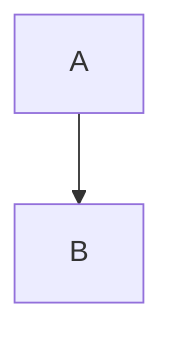

# HANES MES 시스템 다이어그램

> NotebookLM을 활용하여 자동 생성된 HANES MES 프로젝트의 아키텍처 및 프로세스 다이어그램 모음

## 📚 다이어그램 목록

### 1. [시스템 아키텍처](./01-system-architecture.md)

전체 시스템의 구조와 레이어 간 연결을 보여줍니다.

- **내용**: Frontend (Next.js), Backend (NestJS), Database (Prisma + Supabase)
- **용도**: 프로젝트 전체 구조 이해, 신규 개발자 온보딩
- **다이어그램 형식**: Mermaid Graph

```
User → Frontend (Next.js) → Backend (NestJS) → Prisma → PostgreSQL
         ↓                      ↓
    Shared Package (Monorepo)
```

---

### 2. [데이터 모델 (ERD)](./02-data-model-erd.md)

Prisma 스키마 기반의 엔티티 관계도입니다.

- **내용**: 주요 테이블 및 관계 (Company, User, Part, Bom, JobOrder, ProdResult, InspectResult, Box, Pallet, Shipment 등)
- **용도**: DB 설계 이해, 쿼리 작성, 데이터 모델링
- **다이어그램 형식**: Mermaid ERD

**주요 관계**:
- Part ↔ Bom (자기 참조: 모품목-자품목)
- JobOrder → ProdResult (1:N)
- ProdResult → InspectResult (1:N)
- ProdResult → Box → Pallet → Shipment (추적성 체인)

---

### 3. [프론트엔드 라우팅](./03-frontend-routing.md)

Next.js App Router 기반의 페이지 구조입니다.

- **내용**: 7개 주요 도메인 라우팅 (master, material, production, quality, shipping, equipment, system)
- **용도**: 프론트엔드 페이지 구조 파악, URL 설계, AuthGuard 적용 영역 확인
- **다이어그램 형식**: Mermaid Graph

**도메인 그룹**:
- `/master` - 기준정보 (34개 페이지)
- `/material` - 자재관리 (11개 페이지)
- `/production` - 생산관리 (7개 페이지)
- `/quality` - 품질관리 (3개 페이지)
- `/shipping` - 출하관리 (6개 페이지)
- `/equipment` - 설비관리 (5개 페이지)
- `/system` - 시스템 (3개 페이지)

---

### 4. [Backend API 엔드포인트](./04-backend-api-endpoints.md)

NestJS 기반의 REST API 구조입니다.

- **내용**: 도메인별 Controller ↔ Service 매핑, 주요 API 엔드포인트 목록
- **용도**: API 설계, 백엔드 구조 이해, API 문서화
- **다이어그램 형식**: Mermaid Graph

**주요 API 패턴**:
- Master: CRUD (GET, POST, PUT, DELETE)
- Production: 상태 전이 (PATCH /status)
- Shipping: 확정 처리 (PUT /confirm)
- Quality: 통계 조회 (GET /stats)

---

### 5. [생산 프로세스 흐름](./05-production-process-flow.md)

핵심 비즈니스 프로세스의 전체 데이터 흐름입니다.

- **내용**: 작업지시 → 생산 → 검사 → 포장 → 출하의 7단계 프로세스
- **용도**: 비즈니스 로직 이해, 재고 흐름 파악, 추적성 구현
- **다이어그램 형식**: Mermaid Sequence Diagram

**7단계 프로세스**:
1. 작업지시 생성 (JobOrder)
2. 생산실적 입력 (ProdResult)
3. 품질검사 (InspectResult)
4. 불량 기록 (DefectLog)
5. 박스 포장 (Box)
6. 팔레트 적재 (Pallet)
7. 출하 확정 (Shipment)

---

## 🎯 활용 시나리오

### 신규 개발자 온보딩

```
1단계: 시스템 아키텍처 (전체 그림 파악)
   ↓
2단계: 프론트엔드 라우팅 (페이지 구조 이해)
   ↓
3단계: Backend API 엔드포인트 (API 구조 학습)
   ↓
4단계: 데이터 모델 ERD (DB 구조 이해)
   ↓
5단계: 생산 프로세스 흐름 (비즈니스 로직 파악)
```

### 기능 개발

```
요구사항 분석
   ↓
1. 데이터 모델 (ERD) → 필요한 테이블 확인
   ↓
2. Backend API → API 설계
   ↓
3. 프론트엔드 라우팅 → 페이지 위치 결정
   ↓
4. 생산 프로세스 흐름 → 비즈니스 로직 검증
```

### 문서화

- **프로젝트 소개**: 시스템 아키텍처
- **DB 설계서**: 데이터 모델 ERD
- **API 명세서**: Backend API 엔드포인트
- **화면 설계서**: 프론트엔드 라우팅
- **업무 매뉴얼**: 생산 프로세스 흐름

---

## 📊 다이어그램 통계

| 다이어그램 | 형식 | 주요 요소 수 | 난이도 |
|-----------|------|-------------|--------|
| 시스템 아키텍처 | Graph | 레이어 4개, 모듈 20+ | ⭐⭐ |
| 데이터 모델 | ERD | 엔티티 12개, 관계 15+ | ⭐⭐⭐ |
| 프론트엔드 라우팅 | Graph | 페이지 그룹 7개, 페이지 60+ | ⭐⭐ |
| API 엔드포인트 | Graph | 도메인 6개, API 50+ | ⭐⭐ |
| 프로세스 흐름 | Sequence | 단계 7개, 트랜잭션 5+ | ⭐⭐⭐⭐ |

---

## 🔧 다이어그램 렌더링

### Mermaid 지원 도구

모든 다이어그램은 Mermaid 형식으로 작성되어 다음 도구에서 렌더링 가능합니다:

- **GitHub/GitLab**: 마크다운 파일을 열면 자동 렌더링
- **VS Code**: Mermaid 확장 설치 ([Mermaid Preview](https://marketplace.visualstudio.com/items?itemName=bierner.markdown-mermaid))
- **웹**: [Mermaid Live Editor](https://mermaid.live/)
- **Notion/Obsidian**: Mermaid 블록 지원

### 다이어그램 수정 방법

1. 해당 마크다운 파일 열기
2. Mermaid 코드 블록 수정
3. 변경 사항 커밋

```markdown

```

---

## 📝 생성 정보

| 항목 | 내용 |
|------|------|
| **생성일** | 2026-02-16 |
| **생성 도구** | NotebookLM + Claude Code |
| **소스 데이터** | repomix-hanes-mes-clean.md (676,888 토큰) |
| **NotebookLM 세션** | 902f8ea5 |
| **Notebook ID** | 66443db6-3c90-4b35-9c71-542716c7b1e2 |

---

## 🔄 업데이트 가이드

### 다이어그램 업데이트 주기

| 변경 사항 | 업데이트 권장 주기 |
|----------|-------------------|
| 대규모 리팩토링 | 즉시 |
| 새 모듈/도메인 추가 | 즉시 |
| 주요 API 변경 | 1주일 이내 |
| 페이지 추가 | 월 1회 정리 |
| 사소한 수정 | 업데이트 불필요 |

### 업데이트 방법

1. **repomix 재실행**
   ```bash
   npx repomix
   ```

2. **NotebookLM 소스 업데이트**
   ```bash
   nlm source update 66443db6-3c90-4b35-9c71-542716c7b1e2 --file repomix-hanes-mes-clean.md
   ```

3. **NotebookLM에 다이어그램 재요청**
   ```
   "업데이트된 시스템 아키텍처 다이어그램을 Mermaid 형식으로 생성해주세요"
   ```

4. **마크다운 파일 수정**

---

## 🤝 기여 가이드

### 새로운 다이어그램 추가

1. NotebookLM에 질문 (세션 ID: 902f8ea5 사용)
2. Mermaid 다이어그램 받기
3. `docs/diagrams/` 폴더에 마크다운 파일 생성
4. 이 README.md에 항목 추가

### 다이어그램 개선 제안

- 누락된 엔티티/관계 발견 시 Issue 생성
- 더 나은 시각화 방법 제안
- 설명 보완 요청

---

## 📚 참고 자료

- [HANES MES CLAUDE.md](../../CLAUDE.md) - 프로젝트 설정 및 가이드
- [Prisma Schema](../../apps/backend/prisma/schema.prisma) - 데이터 모델 정의
- [Mermaid 공식 문서](https://mermaid.js.org/)
- [NotebookLM 가이드](https://notebooklm.google.com/)

---

**마지막 업데이트**: 2026-02-16
**관리자**: HANES MES 개발팀
