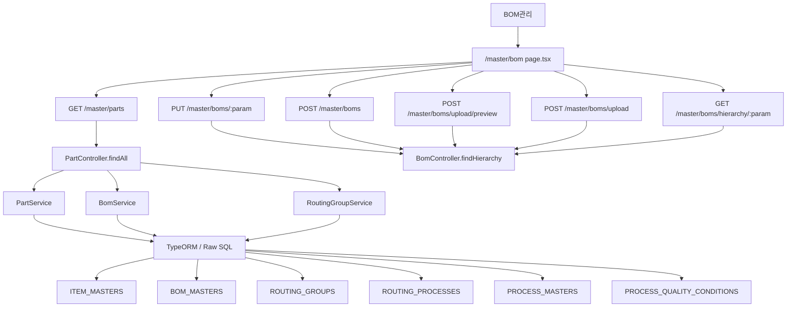
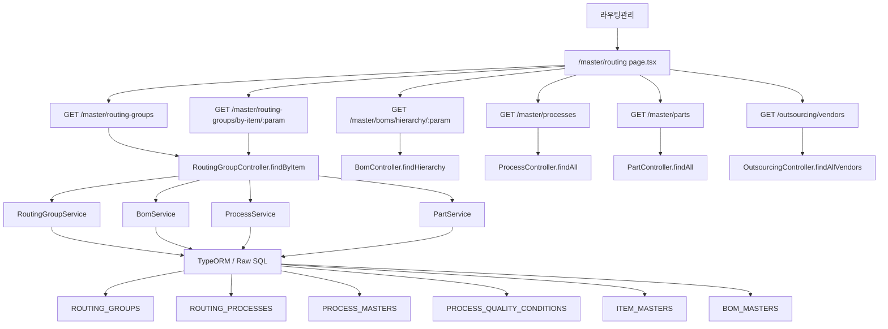
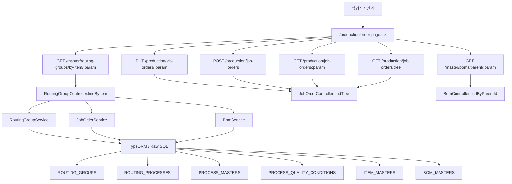

# Code Map Pilot

이 문서는 메뉴 기준으로 화면, 프론트 소스, API, NestJS 백엔드, TypeORM/Raw SQL, Oracle 테이블, 테스트를 연결합니다.

## BOM관리 - /master/bom

Status: `COMPLETE`

### 이 화면은 무엇을 하나?

이 화면은 `BOM관리` 메뉴에 연결된 `/master/bom` 화면입니다. 주요 화면 작업 단서는 저장, BOM 엑셀 업로드, 업로드, 추가이며, 연결된 데이터 저장소는 ITEM_MASTERS, BOM_MASTERS, ROUTING_GROUPS, ROUTING_PROCESSES, PROCESS_MASTERS, PROCESS_QUALITY_CONDITIONS, ROUTING_MATERIALS, HARNESS_CIRCUIT_SPECS, HARNESS_DRAWING_MASTERS, HARNESS_DRAWING_REVISIONS입니다.

### Source Flow

### Frontend

- Page: [apps/frontend/src/app/(authenticated)/master/bom/page.tsx](../../apps/frontend/src/app/(authenticated)/master/bom/page.tsx#L1)

#### 화면 직접 연결 소스

- HOOK: [apps/frontend/src/hooks/useComCode.ts](../../apps/frontend/src/hooks/useComCode.ts#L12) (depth 1, via [apps/frontend/src/app/(authenticated)/master/bom/page.tsx](../../apps/frontend/src/app/(authenticated)/master/bom/page.tsx))
- API_CLIENT: [apps/frontend/src/services/api.ts](../../apps/frontend/src/services/api.ts#L13) (depth 1, via [apps/frontend/src/app/(authenticated)/master/bom/page.tsx](../../apps/frontend/src/app/(authenticated)/master/bom/page.tsx))
- BUSINESS_COMPONENT: [apps/frontend/src/app/(authenticated)/master/bom/components/BomTab.tsx](../../apps/frontend/src/app/(authenticated)/master/bom/components/BomTab.tsx#L15) (depth 1, via [apps/frontend/src/app/(authenticated)/master/bom/page.tsx](../../apps/frontend/src/app/(authenticated)/master/bom/page.tsx))
- TYPE: [apps/frontend/src/app/(authenticated)/master/bom/types.ts](../../apps/frontend/src/app/(authenticated)/master/bom/types.ts#L19) (depth 1, via [apps/frontend/src/app/(authenticated)/master/bom/page.tsx](../../apps/frontend/src/app/(authenticated)/master/bom/page.tsx))
- BUSINESS_COMPONENT: [apps/frontend/src/app/(authenticated)/master/bom/components/BomUploadModal.tsx](../../apps/frontend/src/app/(authenticated)/master/bom/components/BomUploadModal.tsx#L16) (depth 1, via [apps/frontend/src/app/(authenticated)/master/bom/page.tsx](../../apps/frontend/src/app/(authenticated)/master/bom/page.tsx))
- TYPE: [apps/frontend/src/app/(authenticated)/master/routing/types.ts](../../apps/frontend/src/app/(authenticated)/master/routing/types.ts#L20) (depth 1, via [apps/frontend/src/app/(authenticated)/master/bom/page.tsx](../../apps/frontend/src/app/(authenticated)/master/bom/page.tsx))

#### 컴포넌트 내부 연결 소스

- HOOK: [apps/frontend/src/hooks/useApi.ts](../../apps/frontend/src/hooks/useApi.ts#L15) (depth 2, via [apps/frontend/src/hooks/useComCode.ts](../../apps/frontend/src/hooks/useComCode.ts))
- BUSINESS_COMPONENT: [apps/frontend/src/app/(authenticated)/master/bom/components/BomFormModal.tsx](../../apps/frontend/src/app/(authenticated)/master/bom/components/BomFormModal.tsx#L18) (depth 2, via [apps/frontend/src/app/(authenticated)/master/bom/components/BomTab.tsx](../../apps/frontend/src/app/(authenticated)/master/bom/components/BomTab.tsx))
- BUSINESS_COMPONENT: [apps/frontend/src/app/(authenticated)/master/bom/components/BomFieldHelp.tsx](../../apps/frontend/src/app/(authenticated)/master/bom/components/BomFieldHelp.tsx#L18) (depth 3, via [apps/frontend/src/app/(authenticated)/master/bom/components/BomFormModal.tsx](../../apps/frontend/src/app/(authenticated)/master/bom/components/BomFormModal.tsx))

#### 다른 업무 화면 직접 연결

- RELATED_BUSINESS_COMPONENT: [apps/frontend/src/app/(authenticated)/master/routing/components/QualityConditionEditor.tsx](../../apps/frontend/src/app/(authenticated)/master/routing/components/QualityConditionEditor.tsx#L17) (depth 1, via [apps/frontend/src/app/(authenticated)/master/bom/page.tsx](../../apps/frontend/src/app/(authenticated)/master/bom/page.tsx))
- RELATED_BUSINESS_COMPONENT: [apps/frontend/src/app/(authenticated)/master/routing/components/RoutingMaterialEditor.tsx](../../apps/frontend/src/app/(authenticated)/master/routing/components/RoutingMaterialEditor.tsx#L18) (depth 1, via [apps/frontend/src/app/(authenticated)/master/bom/page.tsx](../../apps/frontend/src/app/(authenticated)/master/bom/page.tsx))

#### 상태/스토어

- STORE: [apps/frontend/src/stores/errorStore.ts](../../apps/frontend/src/stores/errorStore.ts#L48) (depth 4, via [apps/frontend/src/services/api.ts](../../apps/frontend/src/services/api.ts))
- STORE: [apps/frontend/src/stores/authStore.ts](../../apps/frontend/src/stores/authStore.ts#L49) (depth 4, via [apps/frontend/src/services/api.ts](../../apps/frontend/src/services/api.ts))
- AI_PAGE_TOOL: [apps/frontend/src/ai-page-tools/usePageAiTools.ts](../../apps/frontend/src/ai-page-tools/usePageAiTools.ts#L14) (depth 1, via [apps/frontend/src/app/(authenticated)/master/bom/page.tsx](../../apps/frontend/src/app/(authenticated)/master/bom/page.tsx))
- AI_PAGE_TOOL: [apps/frontend/src/ai-page-tools/types.ts](../../apps/frontend/src/ai-page-tools/types.ts#L5) (depth 2, via [apps/frontend/src/ai-page-tools/usePageAiTools.ts](../../apps/frontend/src/ai-page-tools/usePageAiTools.ts))
- STORE: [apps/frontend/src/ai-page-tools/pageToolStore.ts](../../apps/frontend/src/ai-page-tools/pageToolStore.ts#L6) (depth 2, via [apps/frontend/src/ai-page-tools/usePageAiTools.ts](../../apps/frontend/src/ai-page-tools/usePageAiTools.ts))

공유 컴포넌트/유틸 4개

- [apps/frontend/src/components/ui/index.ts](../../apps/frontend/src/components/ui/index.ts#L11)
- [apps/frontend/src/components/shared/index.ts](../../apps/frontend/src/components/shared/index.ts#L7)
- [apps/frontend/src/components/ui/Modal.tsx](../../apps/frontend/src/components/ui/Modal.tsx#L6)
- [apps/frontend/src/components/ui/Button.tsx](../../apps/frontend/src/components/ui/Button.tsx#L17)

### API Flow

| Method | API | Frontend 근거 | Controller | Service | 연결 테이블 |
| --- | --- | --- | --- | --- | --- |
| GET | `/master/parts` | [apps/frontend/src/app/(authenticated)/master/bom/components/BomFormModal.tsx](../../apps/frontend/src/app/(authenticated)/master/bom/components/BomFormModal.tsx#L78) | PartController.findAll [apps/backend/src/modules/master/controllers/part.controller.ts](../../apps/backend/src/modules/master/controllers/part.controller.ts#L52) | PartService.findAll [apps/backend/src/modules/master/services/part.service.ts](../../apps/backend/src/modules/master/services/part.service.ts#L39) | `ITEM_MASTERS` |
| PUT | `/master/boms/:param` | [apps/frontend/src/app/(authenticated)/master/bom/components/BomFormModal.tsx](../../apps/frontend/src/app/(authenticated)/master/bom/components/BomFormModal.tsx#L107) | BomController.update [apps/backend/src/modules/master/controllers/bom.controller.ts](../../apps/backend/src/modules/master/controllers/bom.controller.ts#L195) | BomService.update [apps/backend/src/modules/master/services/bom.service.ts](../../apps/backend/src/modules/master/services/bom.service.ts#L477) | `BOM_MASTERS` |
| POST | `/master/boms` | [apps/frontend/src/app/(authenticated)/master/bom/components/BomFormModal.tsx](../../apps/frontend/src/app/(authenticated)/master/bom/components/BomFormModal.tsx#L109) | BomController.create [apps/backend/src/modules/master/controllers/bom.controller.ts](../../apps/backend/src/modules/master/controllers/bom.controller.ts#L183) | BomService.create [apps/backend/src/modules/master/services/bom.service.ts](../../apps/backend/src/modules/master/services/bom.service.ts#L441) | `BOM_MASTERS` |
| POST | `/master/boms/upload/preview` | [apps/frontend/src/app/(authenticated)/master/bom/components/BomUploadModal.tsx](../../apps/frontend/src/app/(authenticated)/master/bom/components/BomUploadModal.tsx#L80) | BomController.previewUpload [apps/backend/src/modules/master/controllers/bom.controller.ts](../../apps/backend/src/modules/master/controllers/bom.controller.ts#L83) | BomService.previewUpload [apps/backend/src/modules/master/services/bom.service.ts](../../apps/backend/src/modules/master/services/bom.service.ts#L549) | `BOM_MASTERS` |
| POST | `/master/boms/upload` | [apps/frontend/src/app/(authenticated)/master/bom/components/BomUploadModal.tsx](../../apps/frontend/src/app/(authenticated)/master/bom/components/BomUploadModal.tsx#L108) | BomController.uploadFromExcel [apps/backend/src/modules/master/controllers/bom.controller.ts](../../apps/backend/src/modules/master/controllers/bom.controller.ts#L106) | BomService.uploadFromExcel [apps/backend/src/modules/master/services/bom.service.ts](../../apps/backend/src/modules/master/services/bom.service.ts#L635) | `ITEM_MASTERS`, `BOM_MASTERS` |
| GET | `/master/boms/hierarchy/:param` | [apps/frontend/src/app/(authenticated)/master/bom/components/BomTab.tsx](../../apps/frontend/src/app/(authenticated)/master/bom/components/BomTab.tsx#L73) | BomController.findHierarchy [apps/backend/src/modules/master/controllers/bom.controller.ts](../../apps/backend/src/modules/master/controllers/bom.controller.ts#L136) | BomService.findHierarchy [apps/backend/src/modules/master/services/bom.service.ts](../../apps/backend/src/modules/master/services/bom.service.ts#L315) | `BOM_MASTERS`, `ITEM_MASTERS`, `PROCESS_MASTERS` |
| DELETE | `/master/boms/:param` | [apps/frontend/src/app/(authenticated)/master/bom/components/BomTab.tsx](../../apps/frontend/src/app/(authenticated)/master/bom/components/BomTab.tsx#L129) | BomController.delete [apps/backend/src/modules/master/controllers/bom.controller.ts](../../apps/backend/src/modules/master/controllers/bom.controller.ts#L202) | BomService.delete [apps/backend/src/modules/master/services/bom.service.ts](../../apps/backend/src/modules/master/services/bom.service.ts#L505) | `BOM_MASTERS` |
| GET | `/master/boms/export?:param` | [apps/frontend/src/app/(authenticated)/master/bom/components/BomTab.tsx](../../apps/frontend/src/app/(authenticated)/master/bom/components/BomTab.tsx#L142) | BomController.exportToExcel [apps/backend/src/modules/master/controllers/bom.controller.ts](../../apps/backend/src/modules/master/controllers/bom.controller.ts#L48) | BomService.exportToExcel [apps/backend/src/modules/master/services/bom.service.ts](../../apps/backend/src/modules/master/services/bom.service.ts#L518) | `BOM_MASTERS` |
| GET | `/master/routing-groups/:param/processes/:param/conditions` | [apps/frontend/src/app/(authenticated)/master/routing/components/QualityConditionEditor.tsx](../../apps/frontend/src/app/(authenticated)/master/routing/components/QualityConditionEditor.tsx#L40) | RoutingGroupController.findConditions [apps/backend/src/modules/master/controllers/routing-group.controller.ts](../../apps/backend/src/modules/master/controllers/routing-group.controller.ts#L117) | RoutingGroupService.findConditions [apps/backend/src/modules/master/services/routing-group.service.ts](../../apps/backend/src/modules/master/services/routing-group.service.ts#L332) | `PROCESS_QUALITY_CONDITIONS` |
| PUT | `/master/routing-groups/:param/processes/:param/conditions/bulk` | [apps/frontend/src/app/(authenticated)/master/routing/components/QualityConditionEditor.tsx](../../apps/frontend/src/app/(authenticated)/master/routing/components/QualityConditionEditor.tsx#L83) | RoutingGroupController.bulkSave [apps/backend/src/modules/master/controllers/routing-group.controller.ts](../../apps/backend/src/modules/master/controllers/routing-group.controller.ts#L128) | RoutingGroupService.bulkSaveConditions [apps/backend/src/modules/master/services/routing-group.service.ts](../../apps/backend/src/modules/master/services/routing-group.service.ts#L363) | `PROCESS_QUALITY_CONDITIONS` |
| GET | `/master/routing-groups/:param/processes/:param/materials` | [apps/frontend/src/app/(authenticated)/master/routing/components/RoutingMaterialEditor.tsx](../../apps/frontend/src/app/(authenticated)/master/routing/components/RoutingMaterialEditor.tsx#L41) | RoutingGroupController.findMaterials [apps/backend/src/modules/master/controllers/routing-group.controller.ts](../../apps/backend/src/modules/master/controllers/routing-group.controller.ts#L142) | RoutingGroupService.findMaterials [apps/backend/src/modules/master/services/routing-group.service.ts](../../apps/backend/src/modules/master/services/routing-group.service.ts#L392) | `BOM_MASTERS`, `ROUTING_MATERIALS`, `ITEM_MASTERS` |
| PUT | `/master/routing-groups/:param/processes/:param/materials/bulk` | [apps/frontend/src/app/(authenticated)/master/routing/components/RoutingMaterialEditor.tsx](../../apps/frontend/src/app/(authenticated)/master/routing/components/RoutingMaterialEditor.tsx#L77) | RoutingGroupController.bulkSaveMaterials [apps/backend/src/modules/master/controllers/routing-group.controller.ts](../../apps/backend/src/modules/master/controllers/routing-group.controller.ts#L153) | RoutingGroupService.bulkSaveMaterials [apps/backend/src/modules/master/services/routing-group.service.ts](../../apps/backend/src/modules/master/services/routing-group.service.ts#L450) | `BOM_MASTERS`, `ROUTING_MATERIALS` |
| GET | `/master/boms/parents` | [apps/frontend/src/app/(authenticated)/master/bom/page.tsx](../../apps/frontend/src/app/(authenticated)/master/bom/page.tsx#L63) | BomController.findParents [apps/backend/src/modules/master/controllers/bom.controller.ts](../../apps/backend/src/modules/master/controllers/bom.controller.ts#L34) | BomService.findParents [apps/backend/src/modules/master/services/bom.service.ts](../../apps/backend/src/modules/master/services/bom.service.ts#L134) | `BOM_MASTERS`, `ITEM_MASTERS` |
| GET | `/master/routing-groups/by-item/:param` | [apps/frontend/src/app/(authenticated)/master/bom/page.tsx](../../apps/frontend/src/app/(authenticated)/master/bom/page.tsx#L87) | RoutingGroupController.findByItem [apps/backend/src/modules/master/controllers/routing-group.controller.ts](../../apps/backend/src/modules/master/controllers/routing-group.controller.ts#L38) | RoutingGroupService.findByItemCode [apps/backend/src/modules/master/services/routing-group.service.ts](../../apps/backend/src/modules/master/services/routing-group.service.ts#L165) | `ROUTING_GROUPS`, `ROUTING_PROCESSES` |
| GET | `/master/boms/template` | [apps/frontend/src/app/(authenticated)/master/bom/page.tsx](../../apps/frontend/src/app/(authenticated)/master/bom/page.tsx#L171) | BomController.downloadTemplate [apps/backend/src/modules/master/controllers/bom.controller.ts](../../apps/backend/src/modules/master/controllers/bom.controller.ts#L71) | BomService.downloadTemplate [apps/backend/src/modules/master/services/bom.service.ts](../../apps/backend/src/modules/master/services/bom.service.ts#L539) | - |

### Backend

- Controller: PartController.findAll [apps/backend/src/modules/master/controllers/part.controller.ts](../../apps/backend/src/modules/master/controllers/part.controller.ts#L52)
- Controller: BomController.update [apps/backend/src/modules/master/controllers/bom.controller.ts](../../apps/backend/src/modules/master/controllers/bom.controller.ts#L195)
- Controller: BomController.create [apps/backend/src/modules/master/controllers/bom.controller.ts](../../apps/backend/src/modules/master/controllers/bom.controller.ts#L183)
- Controller: BomController.previewUpload [apps/backend/src/modules/master/controllers/bom.controller.ts](../../apps/backend/src/modules/master/controllers/bom.controller.ts#L83)
- Controller: BomController.uploadFromExcel [apps/backend/src/modules/master/controllers/bom.controller.ts](../../apps/backend/src/modules/master/controllers/bom.controller.ts#L106)
- Controller: BomController.findHierarchy [apps/backend/src/modules/master/controllers/bom.controller.ts](../../apps/backend/src/modules/master/controllers/bom.controller.ts#L136)
- Controller: BomController.delete [apps/backend/src/modules/master/controllers/bom.controller.ts](../../apps/backend/src/modules/master/controllers/bom.controller.ts#L202)
- Controller: BomController.exportToExcel [apps/backend/src/modules/master/controllers/bom.controller.ts](../../apps/backend/src/modules/master/controllers/bom.controller.ts#L48)
- Controller: RoutingGroupController.findConditions [apps/backend/src/modules/master/controllers/routing-group.controller.ts](../../apps/backend/src/modules/master/controllers/routing-group.controller.ts#L117)
- Controller: RoutingGroupController.bulkSave [apps/backend/src/modules/master/controllers/routing-group.controller.ts](../../apps/backend/src/modules/master/controllers/routing-group.controller.ts#L128)
- Controller: RoutingGroupController.findMaterials [apps/backend/src/modules/master/controllers/routing-group.controller.ts](../../apps/backend/src/modules/master/controllers/routing-group.controller.ts#L142)
- Controller: RoutingGroupController.bulkSaveMaterials [apps/backend/src/modules/master/controllers/routing-group.controller.ts](../../apps/backend/src/modules/master/controllers/routing-group.controller.ts#L153)
- Controller: BomController.findParents [apps/backend/src/modules/master/controllers/bom.controller.ts](../../apps/backend/src/modules/master/controllers/bom.controller.ts#L34)
- Controller: RoutingGroupController.findByItem [apps/backend/src/modules/master/controllers/routing-group.controller.ts](../../apps/backend/src/modules/master/controllers/routing-group.controller.ts#L38)
- Controller: BomController.downloadTemplate [apps/backend/src/modules/master/controllers/bom.controller.ts](../../apps/backend/src/modules/master/controllers/bom.controller.ts#L71)
- Service: PartService [apps/backend/src/modules/master/services/part.service.ts](../../apps/backend/src/modules/master/services/part.service.ts#L13)
- Service: BomService [apps/backend/src/modules/master/services/bom.service.ts](../../apps/backend/src/modules/master/services/bom.service.ts#L114)
- Service: RoutingGroupService [apps/backend/src/modules/master/services/routing-group.service.ts](../../apps/backend/src/modules/master/services/routing-group.service.ts#L28)

### 연결 테이블

| 테이블 | 구분 | 주요 컬럼 | 근거 |
| --- | --- | --- | --- |
| `ITEM_MASTERS` | Entity: ItemMaster | `ITEM_CODE` PK, `COMPANY` PK, `PLANT_CD` PK, `ITEM_NAME`, `PART_NO`, `CUST_PART_NO` nullable, `ITEM_TYPE`, `PRODUCT_TYPE` 외 31개 | [apps/backend/src/entities/item-master.entity.ts](../../apps/backend/src/entities/item-master.entity.ts#L16) |
| `BOM_MASTERS` | Entity: BomMaster | `PARENT_ITEM_CODE` PK, `CHILD_ITEM_CODE` PK, `REVISION` PK, `COMPANY` PK, `PLANT_CD` PK, `QTY_PER`, `SEQ`, `BOM_GRP` nullable 외 11개 | [apps/backend/src/entities/bom-master.entity.ts](../../apps/backend/src/entities/bom-master.entity.ts#L21) |
| `ROUTING_GROUPS` | Entity: RoutingGroup | `COMPANY` PK, `PLANT_CD` PK, `ROUTING_CODE` PK, `ROUTING_NAME`, `ITEM_CODE` nullable, `DESCRIPTION` nullable, `USE_YN`, `CREATED_BY` nullable 외 3개 | [apps/backend/src/entities/routing-group.entity.ts](../../apps/backend/src/entities/routing-group.entity.ts#L19) |
| `ROUTING_PROCESSES` | Entity: RoutingProcess | `COMPANY` PK, `PLANT_CD` PK, `ROUTING_CODE` PK, `SEQ` PK, `PROCESS_CODE`, `PROCESS_NAME`, `PROCESS_TYPE` nullable, `EQUIP_TYPE` nullable 외 16개 | [apps/backend/src/entities/routing-process.entity.ts](../../apps/backend/src/entities/routing-process.entity.ts#L20) |
| `PROCESS_MASTERS` | Entity: ProcessMaster | `PROCESS_CODE` PK, `COMPANY` PK, `PLANT_CD` PK, `PROCESS_NAME`, `PROCESS_TYPE`, `PROCESS_CATEGORY`, `LINE_TYPE`, `SORT_ORDER` 외 6개 | [apps/backend/src/entities/process-master.entity.ts](../../apps/backend/src/entities/process-master.entity.ts#L20) |
| `PROCESS_QUALITY_CONDITIONS` | Entity: ProcessQualityCondition | `COMPANY` PK, `PLANT_CD` PK, `ROUTING_CODE` PK, `SEQ` PK, `CONDITION_SEQ` PK, `CONDITION_CODE` nullable, `MIN_VALUE` nullable, `MAX_VALUE` nullable 외 7개 | [apps/backend/src/entities/process-quality-condition.entity.ts](../../apps/backend/src/entities/process-quality-condition.entity.ts#L21) |
| `ROUTING_MATERIALS` | Entity: RoutingMaterial | `COMPANY` PK, `PLANT_CD` PK, `ROUTING_CODE` PK, `SEQ` PK, `CHILD_ITEM_CODE` PK, `CIRCUIT_ID` nullable, `ALLOC_QTY`, `ISSUE_METHOD` 외 5개 | [apps/backend/src/entities/routing-material.entity.ts](../../apps/backend/src/entities/routing-material.entity.ts#L10) |
| `HARNESS_CIRCUIT_SPECS` | Entity: HarnessCircuitSpec | `CIRCUIT_ID` PK, `REVISION_ID`, `SORT_ORDER`, `CIRCUIT_NO`, `WIRE_SPEC` nullable, `WIRE_ITEM_CODE` nullable, `WIRE_SIZE` nullable, `COLOR_CODE` nullable 외 18개 | [apps/backend/src/entities/harness-circuit-spec.entity.ts](../../apps/backend/src/entities/harness-circuit-spec.entity.ts#L10) |
| `HARNESS_DRAWING_MASTERS` | Raw SQL | - | [apps/backend/src/modules/master/services/routing-group.service.ts](../../apps/backend/src/modules/master/services/routing-group.service.ts#L73) |
| `HARNESS_DRAWING_REVISIONS` | Raw SQL | - | [apps/backend/src/modules/master/services/routing-group.service.ts](../../apps/backend/src/modules/master/services/routing-group.service.ts#L73) |
| `HARNESS_CIRCUIT_SPECS` | Raw SQL | - | [apps/backend/src/modules/master/services/routing-group.service.ts](../../apps/backend/src/modules/master/services/routing-group.service.ts#L73) |

### TypeORM / DB 연결

Service는 TypeORM Repository 또는 QueryRunner를 통해 Entity/Table에 접근합니다. Raw SQL이 있으면 TypeORM Entity만으로 추적되지 않으므로 SQL 근거를 함께 확인해야 합니다.

- Entity: ItemMaster -> `ITEM_MASTERS` [apps/backend/src/entities/item-master.entity.ts](../../apps/backend/src/entities/item-master.entity.ts#L16)
- Entity: BomMaster -> `BOM_MASTERS` [apps/backend/src/entities/bom-master.entity.ts](../../apps/backend/src/entities/bom-master.entity.ts#L21)
- Entity: RoutingGroup -> `ROUTING_GROUPS` [apps/backend/src/entities/routing-group.entity.ts](../../apps/backend/src/entities/routing-group.entity.ts#L19)
- Entity: RoutingProcess -> `ROUTING_PROCESSES` [apps/backend/src/entities/routing-process.entity.ts](../../apps/backend/src/entities/routing-process.entity.ts#L20)
- Entity: ProcessMaster -> `PROCESS_MASTERS` [apps/backend/src/entities/process-master.entity.ts](../../apps/backend/src/entities/process-master.entity.ts#L20)
- Entity: ProcessQualityCondition -> `PROCESS_QUALITY_CONDITIONS` [apps/backend/src/entities/process-quality-condition.entity.ts](../../apps/backend/src/entities/process-quality-condition.entity.ts#L21)
- Entity: RoutingMaterial -> `ROUTING_MATERIALS` [apps/backend/src/entities/routing-material.entity.ts](../../apps/backend/src/entities/routing-material.entity.ts#L10)
- Entity: HarnessCircuitSpec -> `HARNESS_CIRCUIT_SPECS` [apps/backend/src/entities/harness-circuit-spec.entity.ts](../../apps/backend/src/entities/harness-circuit-spec.entity.ts#L10)
- Raw SQL: HARNESS_DRAWING_MASTERS, HARNESS_DRAWING_REVISIONS, HARNESS_CIRCUIT_SPECS 근거: [apps/backend/src/modules/master/services/routing-group.service.ts](../../apps/backend/src/modules/master/services/routing-group.service.ts#L73)

### Related Tests

- [apps/backend/src/modules/master/services/bom.service.spec.ts](../../apps/backend/src/modules/master/services/bom.service.spec.ts#L1)
- [apps/backend/src/modules/master/services/equip-bom.service.spec.ts](../../apps/backend/src/modules/master/services/equip-bom.service.spec.ts#L1)
- [apps/backend/src/modules/master/services/part.service.spec.ts](../../apps/backend/src/modules/master/services/part.service.spec.ts#L1)
- [apps/backend/src/modules/master/services/routing-group.service.spec.ts](../../apps/backend/src/modules/master/services/routing-group.service.spec.ts#L1)
- [apps/frontend/src/app/(authenticated)/master/bom/bom-item-type-label.structure.test.mjs](../../apps/frontend/src/app/(authenticated)/master/bom/bom-item-type-label.structure.test.mjs#L1)

### 수정할 때 어디를 보나

- 화면 문구/레이아웃: [apps/frontend/src/app/(authenticated)/master/bom/page.tsx](../../apps/frontend/src/app/(authenticated)/master/bom/page.tsx#L1), [apps/frontend/src/components/ui/index.ts](../../apps/frontend/src/components/ui/index.ts#L11), [apps/frontend/src/app/(authenticated)/master/bom/components/BomTab.tsx](../../apps/frontend/src/app/(authenticated)/master/bom/components/BomTab.tsx#L15), [apps/frontend/src/app/(authenticated)/master/bom/components/BomFormModal.tsx](../../apps/frontend/src/app/(authenticated)/master/bom/components/BomFormModal.tsx#L18), [apps/frontend/src/app/(authenticated)/master/bom/components/BomFieldHelp.tsx](../../apps/frontend/src/app/(authenticated)/master/bom/components/BomFieldHelp.tsx#L18)
- 입력폼/검증: [apps/frontend/src/app/(authenticated)/master/bom/components/BomFormModal.tsx](../../apps/frontend/src/app/(authenticated)/master/bom/components/BomFormModal.tsx#L18), [apps/frontend/src/app/(authenticated)/master/bom/components/BomUploadModal.tsx](../../apps/frontend/src/app/(authenticated)/master/bom/components/BomUploadModal.tsx#L16), [apps/frontend/src/components/ui/Modal.tsx](../../apps/frontend/src/components/ui/Modal.tsx#L6)
- API 요청/응답: [apps/backend/src/modules/master/controllers/part.controller.ts](../../apps/backend/src/modules/master/controllers/part.controller.ts#L52), [apps/backend/src/modules/master/controllers/bom.controller.ts](../../apps/backend/src/modules/master/controllers/bom.controller.ts#L195), [apps/backend/src/modules/master/controllers/bom.controller.ts](../../apps/backend/src/modules/master/controllers/bom.controller.ts#L183), [apps/backend/src/modules/master/controllers/bom.controller.ts](../../apps/backend/src/modules/master/controllers/bom.controller.ts#L83), [apps/backend/src/modules/master/controllers/bom.controller.ts](../../apps/backend/src/modules/master/controllers/bom.controller.ts#L106)
- 업무 로직: [apps/backend/src/modules/master/services/part.service.ts](../../apps/backend/src/modules/master/services/part.service.ts#L13), [apps/backend/src/modules/master/services/bom.service.ts](../../apps/backend/src/modules/master/services/bom.service.ts#L114), [apps/backend/src/modules/master/services/routing-group.service.ts](../../apps/backend/src/modules/master/services/routing-group.service.ts#L28)
- TypeORM/DB: [apps/backend/src/entities/item-master.entity.ts](../../apps/backend/src/entities/item-master.entity.ts#L16), [apps/backend/src/entities/bom-master.entity.ts](../../apps/backend/src/entities/bom-master.entity.ts#L21), [apps/backend/src/entities/routing-group.entity.ts](../../apps/backend/src/entities/routing-group.entity.ts#L19), [apps/backend/src/entities/routing-process.entity.ts](../../apps/backend/src/entities/routing-process.entity.ts#L20), [apps/backend/src/entities/process-master.entity.ts](../../apps/backend/src/entities/process-master.entity.ts#L20)
- 테스트: [apps/backend/src/modules/master/services/bom.service.spec.ts](../../apps/backend/src/modules/master/services/bom.service.spec.ts#L1), [apps/backend/src/modules/master/services/equip-bom.service.spec.ts](../../apps/backend/src/modules/master/services/equip-bom.service.spec.ts#L1), [apps/backend/src/modules/master/services/part.service.spec.ts](../../apps/backend/src/modules/master/services/part.service.spec.ts#L1), [apps/backend/src/modules/master/services/routing-group.service.spec.ts](../../apps/backend/src/modules/master/services/routing-group.service.spec.ts#L1), [apps/frontend/src/app/(authenticated)/master/bom/bom-item-type-label.structure.test.mjs](../../apps/frontend/src/app/(authenticated)/master/bom/bom-item-type-label.structure.test.mjs#L1)

## 라우팅관리 - /master/routing

Status: `COMPLETE`

### 이 화면은 무엇을 하나?

이 화면은 `라우팅관리` 메뉴에 연결된 `/master/routing` 화면입니다. 주요 화면 작업 단서는 작업지시, 작업지시 생성, 항목 추가, 저장, 삭제, 삭제 확인이며, 연결된 데이터 저장소는 ROUTING_GROUPS, ROUTING_PROCESSES, PROCESS_MASTERS, PROCESS_QUALITY_CONDITIONS, ITEM_MASTERS, BOM_MASTERS, ROUTING_MATERIALS, HARNESS_CIRCUIT_SPECS, HARNESS_DRAWING_MASTERS, HARNESS_DRAWING_REVISIONS, EQUIP_MASTERS, PROCESS_EQUIPMENTS, SUBCON_ORDERS, SUBCON_DELIVERIES, SUBCON_RECEIVES, VENDOR_MASTERS, SELF_INSPECT_ITEMS, SELF_INSPECT_RESULTS입니다.

### Source Flow

### Frontend

- Page: [apps/frontend/src/app/(authenticated)/master/routing/page.tsx](../../apps/frontend/src/app/(authenticated)/master/routing/page.tsx#L1)

#### 화면 직접 연결 소스

- BUSINESS_COMPONENT: [apps/frontend/src/app/(authenticated)/master/routing/components/RoutingGroupManager.tsx](../../apps/frontend/src/app/(authenticated)/master/routing/components/RoutingGroupManager.tsx#L8) (depth 1, via [apps/frontend/src/app/(authenticated)/master/routing/page.tsx](../../apps/frontend/src/app/(authenticated)/master/routing/page.tsx))
- TYPE: [apps/frontend/src/app/(authenticated)/master/routing/types.ts](../../apps/frontend/src/app/(authenticated)/master/routing/types.ts#L12) (depth 1, via [apps/frontend/src/app/(authenticated)/master/routing/page.tsx](../../apps/frontend/src/app/(authenticated)/master/routing/page.tsx))
- BUSINESS_COMPONENT: [apps/frontend/src/app/(authenticated)/master/routing/components/QualityConditionEditor.tsx](../../apps/frontend/src/app/(authenticated)/master/routing/components/QualityConditionEditor.tsx#L9) (depth 1, via [apps/frontend/src/app/(authenticated)/master/routing/page.tsx](../../apps/frontend/src/app/(authenticated)/master/routing/page.tsx))
- BUSINESS_COMPONENT: [apps/frontend/src/app/(authenticated)/master/routing/components/RoutingMaterialEditor.tsx](../../apps/frontend/src/app/(authenticated)/master/routing/components/RoutingMaterialEditor.tsx#L10) (depth 1, via [apps/frontend/src/app/(authenticated)/master/routing/page.tsx](../../apps/frontend/src/app/(authenticated)/master/routing/page.tsx))
- BUSINESS_COMPONENT: [apps/frontend/src/app/(authenticated)/master/routing/components/SelfInspectConfigEditor.tsx](../../apps/frontend/src/app/(authenticated)/master/routing/components/SelfInspectConfigEditor.tsx#L11) (depth 1, via [apps/frontend/src/app/(authenticated)/master/routing/page.tsx](../../apps/frontend/src/app/(authenticated)/master/routing/page.tsx))

#### 컴포넌트 내부 연결 소스

- API_CLIENT: [apps/frontend/src/services/api.ts](../../apps/frontend/src/services/api.ts#L4) (depth 2, via [apps/frontend/src/ai-page-tools/usePageAiTools.ts](../../apps/frontend/src/ai-page-tools/usePageAiTools.ts))
- HOOK: [apps/frontend/src/hooks/useComCode.ts](../../apps/frontend/src/hooks/useComCode.ts#L7) (depth 2, via [apps/frontend/src/app/(authenticated)/master/routing/components/RoutingGroupManager.tsx](../../apps/frontend/src/app/(authenticated)/master/routing/components/RoutingGroupManager.tsx))
- HOOK: [apps/frontend/src/hooks/useApi.ts](../../apps/frontend/src/hooks/useApi.ts#L15) (depth 3, via [apps/frontend/src/hooks/useComCode.ts](../../apps/frontend/src/hooks/useComCode.ts))
- BUSINESS_COMPONENT: [apps/frontend/src/app/(authenticated)/master/routing/components/RoutingFieldHelp.tsx](../../apps/frontend/src/app/(authenticated)/master/routing/components/RoutingFieldHelp.tsx#L9) (depth 2, via [apps/frontend/src/app/(authenticated)/master/routing/components/RoutingGroupManager.tsx](../../apps/frontend/src/app/(authenticated)/master/routing/components/RoutingGroupManager.tsx))

#### 상태/스토어

- AI_PAGE_TOOL: [apps/frontend/src/ai-page-tools/usePageAiTools.ts](../../apps/frontend/src/ai-page-tools/usePageAiTools.ts#L7) (depth 1, via [apps/frontend/src/app/(authenticated)/master/routing/page.tsx](../../apps/frontend/src/app/(authenticated)/master/routing/page.tsx))
- STORE: [apps/frontend/src/stores/errorStore.ts](../../apps/frontend/src/stores/errorStore.ts#L48) (depth 3, via [apps/frontend/src/services/api.ts](../../apps/frontend/src/services/api.ts))
- STORE: [apps/frontend/src/stores/authStore.ts](../../apps/frontend/src/stores/authStore.ts#L49) (depth 3, via [apps/frontend/src/services/api.ts](../../apps/frontend/src/services/api.ts))
- AI_PAGE_TOOL: [apps/frontend/src/ai-page-tools/types.ts](../../apps/frontend/src/ai-page-tools/types.ts#L5) (depth 2, via [apps/frontend/src/ai-page-tools/usePageAiTools.ts](../../apps/frontend/src/ai-page-tools/usePageAiTools.ts))
- STORE: [apps/frontend/src/ai-page-tools/pageToolStore.ts](../../apps/frontend/src/ai-page-tools/pageToolStore.ts#L6) (depth 2, via [apps/frontend/src/ai-page-tools/usePageAiTools.ts](../../apps/frontend/src/ai-page-tools/usePageAiTools.ts))

공유 컴포넌트/유틸 2개

- [apps/frontend/src/components/ui/index.ts](../../apps/frontend/src/components/ui/index.ts#L6)
- [apps/frontend/src/components/shared/index.ts](../../apps/frontend/src/components/shared/index.ts#L7)

### API Flow

| Method | API | Frontend 근거 | Controller | Service | 연결 테이블 |
| --- | --- | --- | --- | --- | --- |
| GET | `/master/routing-groups` | [apps/frontend/src/app/(authenticated)/master/routing/components/RoutingGroupManager.tsx](../../apps/frontend/src/app/(authenticated)/master/routing/components/RoutingGroupManager.tsx#L118) | RoutingGroupController.findAll [apps/backend/src/modules/master/controllers/routing-group.controller.ts](../../apps/backend/src/modules/master/controllers/routing-group.controller.ts#L31) | RoutingGroupService.findAllGroups [apps/backend/src/modules/master/services/routing-group.service.ts](../../apps/backend/src/modules/master/services/routing-group.service.ts#L128) | `ROUTING_GROUPS` |
| GET | `/master/boms/hierarchy/:param` | [apps/frontend/src/app/(authenticated)/master/routing/components/RoutingGroupManager.tsx](../../apps/frontend/src/app/(authenticated)/master/routing/components/RoutingGroupManager.tsx#L157) | BomController.findHierarchy [apps/backend/src/modules/master/controllers/bom.controller.ts](../../apps/backend/src/modules/master/controllers/bom.controller.ts#L136) | BomService.findHierarchy [apps/backend/src/modules/master/services/bom.service.ts](../../apps/backend/src/modules/master/services/bom.service.ts#L315) | `BOM_MASTERS`, `ITEM_MASTERS`, `PROCESS_MASTERS` |
| GET | `/master/routing-groups/by-item/:param` | [apps/frontend/src/app/(authenticated)/master/routing/components/RoutingGroupManager.tsx](../../apps/frontend/src/app/(authenticated)/master/routing/components/RoutingGroupManager.tsx#L191) | RoutingGroupController.findByItem [apps/backend/src/modules/master/controllers/routing-group.controller.ts](../../apps/backend/src/modules/master/controllers/routing-group.controller.ts#L38) | RoutingGroupService.findByItemCode [apps/backend/src/modules/master/services/routing-group.service.ts](../../apps/backend/src/modules/master/services/routing-group.service.ts#L165) | `ROUTING_GROUPS`, `ROUTING_PROCESSES` |
| GET | `/master/processes` | [apps/frontend/src/app/(authenticated)/master/routing/components/RoutingGroupManager.tsx](../../apps/frontend/src/app/(authenticated)/master/routing/components/RoutingGroupManager.tsx#L219) | ProcessController.findAll [apps/backend/src/modules/master/controllers/process.controller.ts](../../apps/backend/src/modules/master/controllers/process.controller.ts#L24) | ProcessService.findAll [apps/backend/src/modules/master/services/process.service.ts](../../apps/backend/src/modules/master/services/process.service.ts#L32) | `PROCESS_MASTERS` |
| GET | `/master/parts` | [apps/frontend/src/app/(authenticated)/master/routing/components/RoutingGroupManager.tsx](../../apps/frontend/src/app/(authenticated)/master/routing/components/RoutingGroupManager.tsx#L232) | PartController.findAll [apps/backend/src/modules/master/controllers/part.controller.ts](../../apps/backend/src/modules/master/controllers/part.controller.ts#L52) | PartService.findAll [apps/backend/src/modules/master/services/part.service.ts](../../apps/backend/src/modules/master/services/part.service.ts#L39) | `ITEM_MASTERS` |
| GET | `/outsourcing/vendors` | [apps/frontend/src/app/(authenticated)/master/routing/components/RoutingGroupManager.tsx](../../apps/frontend/src/app/(authenticated)/master/routing/components/RoutingGroupManager.tsx#L241) | OutsourcingController.findAllVendors [apps/backend/src/modules/outsourcing/controllers/outsourcing.controller.ts](../../apps/backend/src/modules/outsourcing/controllers/outsourcing.controller.ts#L61) | OutsourcingService.findAllVendors [apps/backend/src/modules/outsourcing/services/outsourcing.service.ts](../../apps/backend/src/modules/outsourcing/services/outsourcing.service.ts#L73) | `VENDOR_MASTERS` |
| PUT | `/master/routing-groups/:param` | [apps/frontend/src/app/(authenticated)/master/routing/components/RoutingGroupManager.tsx](../../apps/frontend/src/app/(authenticated)/master/routing/components/RoutingGroupManager.tsx#L304) | RoutingGroupController.update [apps/backend/src/modules/master/controllers/routing-group.controller.ts](../../apps/backend/src/modules/master/controllers/routing-group.controller.ts#L58) | RoutingGroupService.updateGroup [apps/backend/src/modules/master/services/routing-group.service.ts](../../apps/backend/src/modules/master/services/routing-group.service.ts#L199) | `ROUTING_GROUPS` |
| POST | `/master/routing-groups` | [apps/frontend/src/app/(authenticated)/master/routing/components/RoutingGroupManager.tsx](../../apps/frontend/src/app/(authenticated)/master/routing/components/RoutingGroupManager.tsx#L306) | RoutingGroupController.create [apps/backend/src/modules/master/controllers/routing-group.controller.ts](../../apps/backend/src/modules/master/controllers/routing-group.controller.ts#L51) | RoutingGroupService.createGroup [apps/backend/src/modules/master/services/routing-group.service.ts](../../apps/backend/src/modules/master/services/routing-group.service.ts#L183) | `ROUTING_GROUPS` |
| POST | `/master/routing-groups` | [apps/frontend/src/app/(authenticated)/master/routing/components/RoutingGroupManager.tsx](../../apps/frontend/src/app/(authenticated)/master/routing/components/RoutingGroupManager.tsx#L317) | RoutingGroupController.create [apps/backend/src/modules/master/controllers/routing-group.controller.ts](../../apps/backend/src/modules/master/controllers/routing-group.controller.ts#L51) | RoutingGroupService.createGroup [apps/backend/src/modules/master/services/routing-group.service.ts](../../apps/backend/src/modules/master/services/routing-group.service.ts#L183) | `ROUTING_GROUPS` |
| GET | `/master/routing-groups/by-item/:param` | [apps/frontend/src/app/(authenticated)/master/routing/components/RoutingGroupManager.tsx](../../apps/frontend/src/app/(authenticated)/master/routing/components/RoutingGroupManager.tsx#L323) | RoutingGroupController.findByItem [apps/backend/src/modules/master/controllers/routing-group.controller.ts](../../apps/backend/src/modules/master/controllers/routing-group.controller.ts#L38) | RoutingGroupService.findByItemCode [apps/backend/src/modules/master/services/routing-group.service.ts](../../apps/backend/src/modules/master/services/routing-group.service.ts#L165) | `ROUTING_GROUPS`, `ROUTING_PROCESSES` |
| PUT | `/master/routing-groups/:param/processes/:param` | [apps/frontend/src/app/(authenticated)/master/routing/components/RoutingGroupManager.tsx](../../apps/frontend/src/app/(authenticated)/master/routing/components/RoutingGroupManager.tsx#L380) | RoutingGroupController.updateProcess [apps/backend/src/modules/master/controllers/routing-group.controller.ts](../../apps/backend/src/modules/master/controllers/routing-group.controller.ts#L91) | RoutingGroupService.updateProcess [apps/backend/src/modules/master/services/routing-group.service.ts](../../apps/backend/src/modules/master/services/routing-group.service.ts#L263) | `ROUTING_PROCESSES` |
| POST | `/master/routing-groups/:param/processes` | [apps/frontend/src/app/(authenticated)/master/routing/components/RoutingGroupManager.tsx](../../apps/frontend/src/app/(authenticated)/master/routing/components/RoutingGroupManager.tsx#L382) | RoutingGroupController.createProcess [apps/backend/src/modules/master/controllers/routing-group.controller.ts](../../apps/backend/src/modules/master/controllers/routing-group.controller.ts#L79) | RoutingGroupService.createProcess [apps/backend/src/modules/master/services/routing-group.service.ts](../../apps/backend/src/modules/master/services/routing-group.service.ts#L231) | `ROUTING_PROCESSES` |
| DELETE | `/master/routing-groups/:param` | [apps/frontend/src/app/(authenticated)/master/routing/components/RoutingGroupManager.tsx](../../apps/frontend/src/app/(authenticated)/master/routing/components/RoutingGroupManager.tsx#L390) | RoutingGroupController.delete [apps/backend/src/modules/master/controllers/routing-group.controller.ts](../../apps/backend/src/modules/master/controllers/routing-group.controller.ts#L64) | RoutingGroupService.deleteGroup [apps/backend/src/modules/master/services/routing-group.service.ts](../../apps/backend/src/modules/master/services/routing-group.service.ts#L211) | `PROCESS_QUALITY_CONDITIONS`, `ROUTING_MATERIALS`, `ROUTING_PROCESSES`, `ROUTING_GROUPS` |
| DELETE | `/master/routing-groups/:param/processes/:param` | [apps/frontend/src/app/(authenticated)/master/routing/components/RoutingGroupManager.tsx](../../apps/frontend/src/app/(authenticated)/master/routing/components/RoutingGroupManager.tsx#L398) | RoutingGroupController.deleteProcess [apps/backend/src/modules/master/controllers/routing-group.controller.ts](../../apps/backend/src/modules/master/controllers/routing-group.controller.ts#L103) | RoutingGroupService.deleteProcess [apps/backend/src/modules/master/services/routing-group.service.ts](../../apps/backend/src/modules/master/services/routing-group.service.ts#L318) | `ROUTING_PROCESSES`, `PROCESS_QUALITY_CONDITIONS`, `ROUTING_MATERIALS` |
| GET | `/master/routing-groups/:param/processes/:param/conditions` | [apps/frontend/src/app/(authenticated)/master/routing/components/QualityConditionEditor.tsx](../../apps/frontend/src/app/(authenticated)/master/routing/components/QualityConditionEditor.tsx#L40) | RoutingGroupController.findConditions [apps/backend/src/modules/master/controllers/routing-group.controller.ts](../../apps/backend/src/modules/master/controllers/routing-group.controller.ts#L117) | RoutingGroupService.findConditions [apps/backend/src/modules/master/services/routing-group.service.ts](../../apps/backend/src/modules/master/services/routing-group.service.ts#L332) | `PROCESS_QUALITY_CONDITIONS` |
| PUT | `/master/routing-groups/:param/processes/:param/conditions/bulk` | [apps/frontend/src/app/(authenticated)/master/routing/components/QualityConditionEditor.tsx](../../apps/frontend/src/app/(authenticated)/master/routing/components/QualityConditionEditor.tsx#L83) | RoutingGroupController.bulkSave [apps/backend/src/modules/master/controllers/routing-group.controller.ts](../../apps/backend/src/modules/master/controllers/routing-group.controller.ts#L128) | RoutingGroupService.bulkSaveConditions [apps/backend/src/modules/master/services/routing-group.service.ts](../../apps/backend/src/modules/master/services/routing-group.service.ts#L363) | `PROCESS_QUALITY_CONDITIONS` |
| GET | `/master/routing-groups/:param/processes/:param/materials` | [apps/frontend/src/app/(authenticated)/master/routing/components/RoutingMaterialEditor.tsx](../../apps/frontend/src/app/(authenticated)/master/routing/components/RoutingMaterialEditor.tsx#L41) | RoutingGroupController.findMaterials [apps/backend/src/modules/master/controllers/routing-group.controller.ts](../../apps/backend/src/modules/master/controllers/routing-group.controller.ts#L142) | RoutingGroupService.findMaterials [apps/backend/src/modules/master/services/routing-group.service.ts](../../apps/backend/src/modules/master/services/routing-group.service.ts#L392) | `BOM_MASTERS`, `ROUTING_MATERIALS`, `ITEM_MASTERS` |
| PUT | `/master/routing-groups/:param/processes/:param/materials/bulk` | [apps/frontend/src/app/(authenticated)/master/routing/components/RoutingMaterialEditor.tsx](../../apps/frontend/src/app/(authenticated)/master/routing/components/RoutingMaterialEditor.tsx#L77) | RoutingGroupController.bulkSaveMaterials [apps/backend/src/modules/master/controllers/routing-group.controller.ts](../../apps/backend/src/modules/master/controllers/routing-group.controller.ts#L153) | RoutingGroupService.bulkSaveMaterials [apps/backend/src/modules/master/services/routing-group.service.ts](../../apps/backend/src/modules/master/services/routing-group.service.ts#L450) | `BOM_MASTERS`, `ROUTING_MATERIALS` |
| GET | `/production/self-inspect/items/all` | [apps/frontend/src/app/(authenticated)/master/routing/components/SelfInspectConfigEditor.tsx](../../apps/frontend/src/app/(authenticated)/master/routing/components/SelfInspectConfigEditor.tsx#L55) | SelfInspectController.findAllItems [apps/backend/src/modules/production/controllers/self-inspect.controller.ts](../../apps/backend/src/modules/production/controllers/self-inspect.controller.ts#L29) | SelfInspectService.findAllItems [apps/backend/src/modules/production/services/self-inspect.service.ts](../../apps/backend/src/modules/production/services/self-inspect.service.ts#L171) | `SELF_INSPECT_ITEMS` |
| PUT | `/production/self-inspect/items/:param` | [apps/frontend/src/app/(authenticated)/master/routing/components/SelfInspectConfigEditor.tsx](../../apps/frontend/src/app/(authenticated)/master/routing/components/SelfInspectConfigEditor.tsx#L115) | SelfInspectController.updateItem [apps/backend/src/modules/production/controllers/self-inspect.controller.ts](../../apps/backend/src/modules/production/controllers/self-inspect.controller.ts#L158) | SelfInspectService.updateItem [apps/backend/src/modules/production/services/self-inspect.service.ts](../../apps/backend/src/modules/production/services/self-inspect.service.ts#L218) | `SELF_INSPECT_ITEMS` |
| POST | `/production/self-inspect/items` | [apps/frontend/src/app/(authenticated)/master/routing/components/SelfInspectConfigEditor.tsx](../../apps/frontend/src/app/(authenticated)/master/routing/components/SelfInspectConfigEditor.tsx#L121) | SelfInspectController.createItem [apps/backend/src/modules/production/controllers/self-inspect.controller.ts](../../apps/backend/src/modules/production/controllers/self-inspect.controller.ts#L132) | SelfInspectService.createItem [apps/backend/src/modules/production/services/self-inspect.service.ts](../../apps/backend/src/modules/production/services/self-inspect.service.ts#L182) | `SELF_INSPECT_ITEMS` |
| DELETE | `/production/self-inspect/items/:param` | [apps/frontend/src/app/(authenticated)/master/routing/components/SelfInspectConfigEditor.tsx](../../apps/frontend/src/app/(authenticated)/master/routing/components/SelfInspectConfigEditor.tsx#L146) | SelfInspectController.deleteItem [apps/backend/src/modules/production/controllers/self-inspect.controller.ts](../../apps/backend/src/modules/production/controllers/self-inspect.controller.ts#L183) | SelfInspectService.deleteItem [apps/backend/src/modules/production/services/self-inspect.service.ts](../../apps/backend/src/modules/production/services/self-inspect.service.ts#L253) | `SELF_INSPECT_ITEMS` |

### Backend

- Controller: RoutingGroupController.findAll [apps/backend/src/modules/master/controllers/routing-group.controller.ts](../../apps/backend/src/modules/master/controllers/routing-group.controller.ts#L31)
- Controller: BomController.findHierarchy [apps/backend/src/modules/master/controllers/bom.controller.ts](../../apps/backend/src/modules/master/controllers/bom.controller.ts#L136)
- Controller: RoutingGroupController.findByItem [apps/backend/src/modules/master/controllers/routing-group.controller.ts](../../apps/backend/src/modules/master/controllers/routing-group.controller.ts#L38)
- Controller: ProcessController.findAll [apps/backend/src/modules/master/controllers/process.controller.ts](../../apps/backend/src/modules/master/controllers/process.controller.ts#L24)
- Controller: PartController.findAll [apps/backend/src/modules/master/controllers/part.controller.ts](../../apps/backend/src/modules/master/controllers/part.controller.ts#L52)
- Controller: OutsourcingController.findAllVendors [apps/backend/src/modules/outsourcing/controllers/outsourcing.controller.ts](../../apps/backend/src/modules/outsourcing/controllers/outsourcing.controller.ts#L61)
- Controller: RoutingGroupController.update [apps/backend/src/modules/master/controllers/routing-group.controller.ts](../../apps/backend/src/modules/master/controllers/routing-group.controller.ts#L58)
- Controller: RoutingGroupController.create [apps/backend/src/modules/master/controllers/routing-group.controller.ts](../../apps/backend/src/modules/master/controllers/routing-group.controller.ts#L51)
- Controller: RoutingGroupController.updateProcess [apps/backend/src/modules/master/controllers/routing-group.controller.ts](../../apps/backend/src/modules/master/controllers/routing-group.controller.ts#L91)
- Controller: RoutingGroupController.createProcess [apps/backend/src/modules/master/controllers/routing-group.controller.ts](../../apps/backend/src/modules/master/controllers/routing-group.controller.ts#L79)
- Controller: RoutingGroupController.delete [apps/backend/src/modules/master/controllers/routing-group.controller.ts](../../apps/backend/src/modules/master/controllers/routing-group.controller.ts#L64)
- Controller: RoutingGroupController.deleteProcess [apps/backend/src/modules/master/controllers/routing-group.controller.ts](../../apps/backend/src/modules/master/controllers/routing-group.controller.ts#L103)
- Controller: RoutingGroupController.findConditions [apps/backend/src/modules/master/controllers/routing-group.controller.ts](../../apps/backend/src/modules/master/controllers/routing-group.controller.ts#L117)
- Controller: RoutingGroupController.bulkSave [apps/backend/src/modules/master/controllers/routing-group.controller.ts](../../apps/backend/src/modules/master/controllers/routing-group.controller.ts#L128)
- Controller: RoutingGroupController.findMaterials [apps/backend/src/modules/master/controllers/routing-group.controller.ts](../../apps/backend/src/modules/master/controllers/routing-group.controller.ts#L142)
- Controller: RoutingGroupController.bulkSaveMaterials [apps/backend/src/modules/master/controllers/routing-group.controller.ts](../../apps/backend/src/modules/master/controllers/routing-group.controller.ts#L153)
- Controller: SelfInspectController.findAllItems [apps/backend/src/modules/production/controllers/self-inspect.controller.ts](../../apps/backend/src/modules/production/controllers/self-inspect.controller.ts#L29)
- Controller: SelfInspectController.updateItem [apps/backend/src/modules/production/controllers/self-inspect.controller.ts](../../apps/backend/src/modules/production/controllers/self-inspect.controller.ts#L158)
- Controller: SelfInspectController.createItem [apps/backend/src/modules/production/controllers/self-inspect.controller.ts](../../apps/backend/src/modules/production/controllers/self-inspect.controller.ts#L132)
- Controller: SelfInspectController.deleteItem [apps/backend/src/modules/production/controllers/self-inspect.controller.ts](../../apps/backend/src/modules/production/controllers/self-inspect.controller.ts#L183)
- Service: RoutingGroupService [apps/backend/src/modules/master/services/routing-group.service.ts](../../apps/backend/src/modules/master/services/routing-group.service.ts#L28)
- Service: BomService [apps/backend/src/modules/master/services/bom.service.ts](../../apps/backend/src/modules/master/services/bom.service.ts#L114)
- Service: ProcessService [apps/backend/src/modules/master/services/process.service.ts](../../apps/backend/src/modules/master/services/process.service.ts#L14)
- Service: PartService [apps/backend/src/modules/master/services/part.service.ts](../../apps/backend/src/modules/master/services/part.service.ts#L13)
- Service: OutsourcingService [apps/backend/src/modules/outsourcing/services/outsourcing.service.ts](../../apps/backend/src/modules/outsourcing/services/outsourcing.service.ts#L41)
- Service: SelfInspectService [apps/backend/src/modules/production/services/self-inspect.service.ts](../../apps/backend/src/modules/production/services/self-inspect.service.ts#L16)

### 연결 테이블

| 테이블 | 구분 | 주요 컬럼 | 근거 |
| --- | --- | --- | --- |
| `ROUTING_GROUPS` | Entity: RoutingGroup | `COMPANY` PK, `PLANT_CD` PK, `ROUTING_CODE` PK, `ROUTING_NAME`, `ITEM_CODE` nullable, `DESCRIPTION` nullable, `USE_YN`, `CREATED_BY` nullable 외 3개 | [apps/backend/src/entities/routing-group.entity.ts](../../apps/backend/src/entities/routing-group.entity.ts#L19) |
| `ROUTING_PROCESSES` | Entity: RoutingProcess | `COMPANY` PK, `PLANT_CD` PK, `ROUTING_CODE` PK, `SEQ` PK, `PROCESS_CODE`, `PROCESS_NAME`, `PROCESS_TYPE` nullable, `EQUIP_TYPE` nullable 외 16개 | [apps/backend/src/entities/routing-process.entity.ts](../../apps/backend/src/entities/routing-process.entity.ts#L20) |
| `PROCESS_MASTERS` | Entity: ProcessMaster | `PROCESS_CODE` PK, `COMPANY` PK, `PLANT_CD` PK, `PROCESS_NAME`, `PROCESS_TYPE`, `PROCESS_CATEGORY`, `LINE_TYPE`, `SORT_ORDER` 외 6개 | [apps/backend/src/entities/process-master.entity.ts](../../apps/backend/src/entities/process-master.entity.ts#L20) |
| `PROCESS_QUALITY_CONDITIONS` | Entity: ProcessQualityCondition | `COMPANY` PK, `PLANT_CD` PK, `ROUTING_CODE` PK, `SEQ` PK, `CONDITION_SEQ` PK, `CONDITION_CODE` nullable, `MIN_VALUE` nullable, `MAX_VALUE` nullable 외 7개 | [apps/backend/src/entities/process-quality-condition.entity.ts](../../apps/backend/src/entities/process-quality-condition.entity.ts#L21) |
| `ITEM_MASTERS` | Entity: ItemMaster | `ITEM_CODE` PK, `COMPANY` PK, `PLANT_CD` PK, `ITEM_NAME`, `PART_NO`, `CUST_PART_NO` nullable, `ITEM_TYPE`, `PRODUCT_TYPE` 외 31개 | [apps/backend/src/entities/item-master.entity.ts](../../apps/backend/src/entities/item-master.entity.ts#L16) |
| `BOM_MASTERS` | Entity: BomMaster | `PARENT_ITEM_CODE` PK, `CHILD_ITEM_CODE` PK, `REVISION` PK, `COMPANY` PK, `PLANT_CD` PK, `QTY_PER`, `SEQ`, `BOM_GRP` nullable 외 11개 | [apps/backend/src/entities/bom-master.entity.ts](../../apps/backend/src/entities/bom-master.entity.ts#L21) |
| `ROUTING_MATERIALS` | Entity: RoutingMaterial | `COMPANY` PK, `PLANT_CD` PK, `ROUTING_CODE` PK, `SEQ` PK, `CHILD_ITEM_CODE` PK, `CIRCUIT_ID` nullable, `ALLOC_QTY`, `ISSUE_METHOD` 외 5개 | [apps/backend/src/entities/routing-material.entity.ts](../../apps/backend/src/entities/routing-material.entity.ts#L10) |
| `HARNESS_CIRCUIT_SPECS` | Entity: HarnessCircuitSpec | `CIRCUIT_ID` PK, `REVISION_ID`, `SORT_ORDER`, `CIRCUIT_NO`, `WIRE_SPEC` nullable, `WIRE_ITEM_CODE` nullable, `WIRE_SIZE` nullable, `COLOR_CODE` nullable 외 18개 | [apps/backend/src/entities/harness-circuit-spec.entity.ts](../../apps/backend/src/entities/harness-circuit-spec.entity.ts#L10) |
| `EQUIP_MASTERS` | Entity: EquipMaster | `EQUIP_CODE` PK, `COMPANY` PK, `PLANT_CD` PK, `EQUIP_NAME`, `EQUIP_TYPE`, `MODEL_NAME` nullable, `IMAGE_URL` nullable, `MAKER` nullable 외 14개 | [apps/backend/src/entities/equip-master.entity.ts](../../apps/backend/src/entities/equip-master.entity.ts#L23) |
| `PROCESS_EQUIPMENTS` | Entity: ProcessEquipment | `COMPANY` PK, `PLANT_CD` PK, `PROCESS_CODE` PK, `EQUIP_CODE` PK, `USE_YN`, `CREATED_BY` nullable, `UPDATED_BY` nullable, `CREATED_AT` 외 1개 | [apps/backend/src/entities/process-equipment.entity.ts](../../apps/backend/src/entities/process-equipment.entity.ts#L14) |
| `SUBCON_ORDERS` | Entity: SubconOrder | `ORDER_NO` PK, `VENDOR_CODE`, `ITEM_CODE`, `ITEM_NAME` nullable, `JOB_ORDER_NO` nullable, `ROUTING_CODE` nullable, `PROCESS_SEQ` nullable, `PROCESS_CODE` nullable 외 15개 | [apps/backend/src/entities/subcon-order.entity.ts](../../apps/backend/src/entities/subcon-order.entity.ts#L19) |
| `SUBCON_DELIVERIES` | Entity: SubconDelivery | `DELIVERY_NO` PK, `ORDER_ID`, `MAT_UID` nullable, `QTY`, `DELIVERY_DATE`, `WORKER_CODE` nullable, `STATUS`, `REMARK` nullable 외 5개 | [apps/backend/src/entities/subcon-delivery.entity.ts](../../apps/backend/src/entities/subcon-delivery.entity.ts#L18) |
| `SUBCON_RECEIVES` | Entity: SubconReceive | `RECEIVE_NO` PK, `ORDER_ID`, `MAT_UID` nullable, `QTY`, `GOOD_QTY`, `DEFECT_QTY`, `RECEIVE_DATE`, `INSPECT_RESULT` nullable 외 8개 | [apps/backend/src/entities/subcon-receive.entity.ts](../../apps/backend/src/entities/subcon-receive.entity.ts#L18) |
| `VENDOR_MASTERS` | Entity: VendorMaster | `VENDOR_CODE` PK, `COMPANY` PK, `PLANT_CD` PK, `VENDOR_NAME`, `BIZ_NO` nullable, `CEO_NAME` nullable, `ADDRESS` nullable, `TEL` nullable 외 9개 | [apps/backend/src/entities/vendor-master.entity.ts](../../apps/backend/src/entities/vendor-master.entity.ts#L10) |
| `SELF_INSPECT_ITEMS` | Entity: SelfInspectItem | `uuid` PK, `PROCESS_CODE` nullable, `ITEM_NAME`, `STANDARD` nullable, `INSPECT_METHOD`, `TIMING`, `IS_DESTRUCTIVE`, `SORT_ORDER` 외 12개 | [apps/backend/src/entities/self-inspect-item.entity.ts](../../apps/backend/src/entities/self-inspect-item.entity.ts#L16) |
| `SELF_INSPECT_RESULTS` | Entity: SelfInspectResult | `uuid` PK, `ORDER_NO`, `EQUIP_CODE` nullable, `PROCESS_CODE` nullable, `INSPECT_ITEM_ID` nullable, `ITEM_NAME`, `TIMING`, `INSPECT_METHOD` 외 13개 | [apps/backend/src/entities/self-inspect-result.entity.ts](../../apps/backend/src/entities/self-inspect-result.entity.ts#L16) |
| `HARNESS_DRAWING_MASTERS` | Raw SQL | - | [apps/backend/src/modules/master/services/routing-group.service.ts](../../apps/backend/src/modules/master/services/routing-group.service.ts#L73) |
| `HARNESS_DRAWING_REVISIONS` | Raw SQL | - | [apps/backend/src/modules/master/services/routing-group.service.ts](../../apps/backend/src/modules/master/services/routing-group.service.ts#L73) |
| `HARNESS_CIRCUIT_SPECS` | Raw SQL | - | [apps/backend/src/modules/master/services/routing-group.service.ts](../../apps/backend/src/modules/master/services/routing-group.service.ts#L73) |

### TypeORM / DB 연결

Service는 TypeORM Repository 또는 QueryRunner를 통해 Entity/Table에 접근합니다. Raw SQL이 있으면 TypeORM Entity만으로 추적되지 않으므로 SQL 근거를 함께 확인해야 합니다.

- Entity: RoutingGroup -> `ROUTING_GROUPS` [apps/backend/src/entities/routing-group.entity.ts](../../apps/backend/src/entities/routing-group.entity.ts#L19)
- Entity: RoutingProcess -> `ROUTING_PROCESSES` [apps/backend/src/entities/routing-process.entity.ts](../../apps/backend/src/entities/routing-process.entity.ts#L20)
- Entity: ProcessMaster -> `PROCESS_MASTERS` [apps/backend/src/entities/process-master.entity.ts](../../apps/backend/src/entities/process-master.entity.ts#L20)
- Entity: ProcessQualityCondition -> `PROCESS_QUALITY_CONDITIONS` [apps/backend/src/entities/process-quality-condition.entity.ts](../../apps/backend/src/entities/process-quality-condition.entity.ts#L21)
- Entity: ItemMaster -> `ITEM_MASTERS` [apps/backend/src/entities/item-master.entity.ts](../../apps/backend/src/entities/item-master.entity.ts#L16)
- Entity: BomMaster -> `BOM_MASTERS` [apps/backend/src/entities/bom-master.entity.ts](../../apps/backend/src/entities/bom-master.entity.ts#L21)
- Entity: RoutingMaterial -> `ROUTING_MATERIALS` [apps/backend/src/entities/routing-material.entity.ts](../../apps/backend/src/entities/routing-material.entity.ts#L10)
- Entity: HarnessCircuitSpec -> `HARNESS_CIRCUIT_SPECS` [apps/backend/src/entities/harness-circuit-spec.entity.ts](../../apps/backend/src/entities/harness-circuit-spec.entity.ts#L10)
- Entity: EquipMaster -> `EQUIP_MASTERS` [apps/backend/src/entities/equip-master.entity.ts](../../apps/backend/src/entities/equip-master.entity.ts#L23)
- Entity: ProcessEquipment -> `PROCESS_EQUIPMENTS` [apps/backend/src/entities/process-equipment.entity.ts](../../apps/backend/src/entities/process-equipment.entity.ts#L14)
- Entity: SubconOrder -> `SUBCON_ORDERS` [apps/backend/src/entities/subcon-order.entity.ts](../../apps/backend/src/entities/subcon-order.entity.ts#L19)
- Entity: SubconDelivery -> `SUBCON_DELIVERIES` [apps/backend/src/entities/subcon-delivery.entity.ts](../../apps/backend/src/entities/subcon-delivery.entity.ts#L18)
- Entity: SubconReceive -> `SUBCON_RECEIVES` [apps/backend/src/entities/subcon-receive.entity.ts](../../apps/backend/src/entities/subcon-receive.entity.ts#L18)
- Entity: VendorMaster -> `VENDOR_MASTERS` [apps/backend/src/entities/vendor-master.entity.ts](../../apps/backend/src/entities/vendor-master.entity.ts#L10)
- Entity: SelfInspectItem -> `SELF_INSPECT_ITEMS` [apps/backend/src/entities/self-inspect-item.entity.ts](../../apps/backend/src/entities/self-inspect-item.entity.ts#L16)
- Entity: SelfInspectResult -> `SELF_INSPECT_RESULTS` [apps/backend/src/entities/self-inspect-result.entity.ts](../../apps/backend/src/entities/self-inspect-result.entity.ts#L16)
- Raw SQL: HARNESS_DRAWING_MASTERS, HARNESS_DRAWING_REVISIONS, HARNESS_CIRCUIT_SPECS 근거: [apps/backend/src/modules/master/services/routing-group.service.ts](../../apps/backend/src/modules/master/services/routing-group.service.ts#L73)

### Related Tests

- [apps/backend/src/modules/master/services/bom.service.spec.ts](../../apps/backend/src/modules/master/services/bom.service.spec.ts#L1)
- [apps/backend/src/modules/master/services/equip-bom.service.spec.ts](../../apps/backend/src/modules/master/services/equip-bom.service.spec.ts#L1)
- [apps/backend/src/modules/master/services/part.service.spec.ts](../../apps/backend/src/modules/master/services/part.service.spec.ts#L1)
- [apps/backend/src/modules/master/services/process.service.spec.ts](../../apps/backend/src/modules/master/services/process.service.spec.ts#L1)
- [apps/backend/src/modules/master/services/routing-group.service.spec.ts](../../apps/backend/src/modules/master/services/routing-group.service.spec.ts#L1)
- [apps/backend/src/modules/master/services/routing.service.spec.ts](../../apps/backend/src/modules/master/services/routing.service.spec.ts#L1)
- [apps/backend/src/modules/outsourcing/services/outsourcing.service.spec.ts](../../apps/backend/src/modules/outsourcing/services/outsourcing.service.spec.ts#L1)
- [apps/backend/src/modules/production/services/self-inspect.service.spec.ts](../../apps/backend/src/modules/production/services/self-inspect.service.spec.ts#L1)
- [apps/backend/src/modules/quality/rework/services/rework-process.service.spec.ts](../../apps/backend/src/modules/quality/rework/services/rework-process.service.spec.ts#L1)
- [apps/frontend/src/app/(authenticated)/master/routing/routing-label-issue-flags.structure.test.mjs](../../apps/frontend/src/app/(authenticated)/master/routing/routing-label-issue-flags.structure.test.mjs#L1)
- [apps/frontend/src/app/(authenticated)/master/routing/routing-material-circuit-link.structure.test.mjs](../../apps/frontend/src/app/(authenticated)/master/routing/routing-material-circuit-link.structure.test.mjs#L1)
- [apps/frontend/src/app/(authenticated)/master/routing/routing-process-name-derived.structure.test.mjs](../../apps/frontend/src/app/(authenticated)/master/routing/routing-process-name-derived.structure.test.mjs#L1)
- [apps/frontend/src/app/(authenticated)/master/routing/routing-subcon-execution.structure.test.mjs](../../apps/frontend/src/app/(authenticated)/master/routing/routing-subcon-execution.structure.test.mjs#L1)

### 수정할 때 어디를 보나

- 화면 문구/레이아웃: [apps/frontend/src/app/(authenticated)/master/routing/page.tsx](../../apps/frontend/src/app/(authenticated)/master/routing/page.tsx#L1), [apps/frontend/src/components/ui/index.ts](../../apps/frontend/src/components/ui/index.ts#L6), [apps/frontend/src/app/(authenticated)/master/routing/components/RoutingGroupManager.tsx](../../apps/frontend/src/app/(authenticated)/master/routing/components/RoutingGroupManager.tsx#L8), [apps/frontend/src/app/(authenticated)/master/routing/components/RoutingFieldHelp.tsx](../../apps/frontend/src/app/(authenticated)/master/routing/components/RoutingFieldHelp.tsx#L9), [apps/frontend/src/components/shared/index.ts](../../apps/frontend/src/components/shared/index.ts#L7)
- 입력폼/검증: -
- API 요청/응답: [apps/backend/src/modules/master/controllers/routing-group.controller.ts](../../apps/backend/src/modules/master/controllers/routing-group.controller.ts#L31), [apps/backend/src/modules/master/controllers/bom.controller.ts](../../apps/backend/src/modules/master/controllers/bom.controller.ts#L136), [apps/backend/src/modules/master/controllers/routing-group.controller.ts](../../apps/backend/src/modules/master/controllers/routing-group.controller.ts#L38), [apps/backend/src/modules/master/controllers/process.controller.ts](../../apps/backend/src/modules/master/controllers/process.controller.ts#L24), [apps/backend/src/modules/master/controllers/part.controller.ts](../../apps/backend/src/modules/master/controllers/part.controller.ts#L52)
- 업무 로직: [apps/backend/src/modules/master/services/routing-group.service.ts](../../apps/backend/src/modules/master/services/routing-group.service.ts#L28), [apps/backend/src/modules/master/services/bom.service.ts](../../apps/backend/src/modules/master/services/bom.service.ts#L114), [apps/backend/src/modules/master/services/process.service.ts](../../apps/backend/src/modules/master/services/process.service.ts#L14), [apps/backend/src/modules/master/services/part.service.ts](../../apps/backend/src/modules/master/services/part.service.ts#L13), [apps/backend/src/modules/outsourcing/services/outsourcing.service.ts](../../apps/backend/src/modules/outsourcing/services/outsourcing.service.ts#L41)
- TypeORM/DB: [apps/backend/src/entities/routing-group.entity.ts](../../apps/backend/src/entities/routing-group.entity.ts#L19), [apps/backend/src/entities/routing-process.entity.ts](../../apps/backend/src/entities/routing-process.entity.ts#L20), [apps/backend/src/entities/process-master.entity.ts](../../apps/backend/src/entities/process-master.entity.ts#L20), [apps/backend/src/entities/process-quality-condition.entity.ts](../../apps/backend/src/entities/process-quality-condition.entity.ts#L21), [apps/backend/src/entities/item-master.entity.ts](../../apps/backend/src/entities/item-master.entity.ts#L16)
- 테스트: [apps/backend/src/modules/master/services/bom.service.spec.ts](../../apps/backend/src/modules/master/services/bom.service.spec.ts#L1), [apps/backend/src/modules/master/services/equip-bom.service.spec.ts](../../apps/backend/src/modules/master/services/equip-bom.service.spec.ts#L1), [apps/backend/src/modules/master/services/part.service.spec.ts](../../apps/backend/src/modules/master/services/part.service.spec.ts#L1), [apps/backend/src/modules/master/services/process.service.spec.ts](../../apps/backend/src/modules/master/services/process.service.spec.ts#L1), [apps/backend/src/modules/master/services/routing-group.service.spec.ts](../../apps/backend/src/modules/master/services/routing-group.service.spec.ts#L1)

## 작업지시관리 - /production/order

Status: `COMPLETE`

### 이 화면은 무엇을 하나?

이 화면은 `작업지시관리` 메뉴에 연결된 `/production/order` 화면입니다. 주요 화면 작업 단서는 검색..., 저장, 저장 시 자동 생성, 작업지시서 출력, 작업지시서, 출력일이며, 연결된 데이터 저장소는 ROUTING_GROUPS, ROUTING_PROCESSES, PROCESS_MASTERS, PROCESS_QUALITY_CONDITIONS, ITEM_MASTERS, BOM_MASTERS, ROUTING_MATERIALS, HARNESS_CIRCUIT_SPECS, HARNESS_DRAWING_MASTERS, HARNESS_DRAWING_REVISIONS, JOB_ORDERS, PROD_RESULTS, FG_LABELS, PROD_PLANS입니다.

### Source Flow

### Frontend

- Page: [apps/frontend/src/app/(authenticated)/production/order/page.tsx](../../apps/frontend/src/app/(authenticated)/production/order/page.tsx#L1)

#### 화면 직접 연결 소스

- API_CLIENT: [apps/frontend/src/services/api.ts](../../apps/frontend/src/services/api.ts#L28) (depth 1, via [apps/frontend/src/app/(authenticated)/production/order/page.tsx](../../apps/frontend/src/app/(authenticated)/production/order/page.tsx))
- BUSINESS_COMPONENT: [apps/frontend/src/app/(authenticated)/production/order/components/JobOrderFormPanel.tsx](../../apps/frontend/src/app/(authenticated)/production/order/components/JobOrderFormPanel.tsx#L32) (depth 1, via [apps/frontend/src/app/(authenticated)/production/order/page.tsx](../../apps/frontend/src/app/(authenticated)/production/order/page.tsx))
- BUSINESS_COMPONENT: [apps/frontend/src/app/(authenticated)/production/order/components/JobOrderPrintModal.tsx](../../apps/frontend/src/app/(authenticated)/production/order/components/JobOrderPrintModal.tsx#L34) (depth 1, via [apps/frontend/src/app/(authenticated)/production/order/page.tsx](../../apps/frontend/src/app/(authenticated)/production/order/page.tsx))

#### 컴포넌트 내부 연결 소스

- HOOK: [apps/frontend/src/hooks/useComCode.ts](../../apps/frontend/src/hooks/useComCode.ts#L18) (depth 2, via [apps/frontend/src/components/shared/StatusHeaderHelp.tsx](../../apps/frontend/src/components/shared/StatusHeaderHelp.tsx))
- HOOK: [apps/frontend/src/hooks/useApi.ts](../../apps/frontend/src/hooks/useApi.ts#L15) (depth 3, via [apps/frontend/src/hooks/useComCode.ts](../../apps/frontend/src/hooks/useComCode.ts))
- HOOK: [apps/frontend/src/hooks/useExport.ts](../../apps/frontend/src/hooks/useExport.ts#L36) (depth 2, via [apps/frontend/src/components/data-grid/DataGrid.tsx](../../apps/frontend/src/components/data-grid/DataGrid.tsx))
- HOOK: [apps/frontend/src/hooks/useMasterOptions.ts](../../apps/frontend/src/hooks/useMasterOptions.ts#L19) (depth 2, via [apps/frontend/src/app/(authenticated)/production/order/components/JobOrderFormPanel.tsx](../../apps/frontend/src/app/(authenticated)/production/order/components/JobOrderFormPanel.tsx))

#### 다른 업무 화면 직접 연결

- RELATED_BUSINESS_COMPONENT: [apps/frontend/src/components/data-grid/DataGrid.tsx](../../apps/frontend/src/components/data-grid/DataGrid.tsx#L26) (depth 1, via [apps/frontend/src/app/(authenticated)/production/order/page.tsx](../../apps/frontend/src/app/(authenticated)/production/order/page.tsx))

#### 다른 업무 화면 간접 연결

- RELATED_BUSINESS_COMPONENT: [apps/frontend/src/components/data-grid/SqlViewerModal.tsx](../../apps/frontend/src/components/data-grid/SqlViewerModal.tsx#L38) (depth 2, via [apps/frontend/src/components/data-grid/DataGrid.tsx](../../apps/frontend/src/components/data-grid/DataGrid.tsx))
- RELATED_BUSINESS_COMPONENT: [apps/frontend/src/components/data-grid/ResizeHandle.tsx](../../apps/frontend/src/components/data-grid/ResizeHandle.tsx#L39) (depth 2, via [apps/frontend/src/components/data-grid/DataGrid.tsx](../../apps/frontend/src/components/data-grid/DataGrid.tsx))
- RELATED_BUSINESS_COMPONENT: [apps/frontend/src/components/data-grid/ColumnFilterInput.tsx](../../apps/frontend/src/components/data-grid/ColumnFilterInput.tsx#L40) (depth 2, via [apps/frontend/src/components/data-grid/DataGrid.tsx](../../apps/frontend/src/components/data-grid/DataGrid.tsx))
- RELATED_BUSINESS_COMPONENT: [apps/frontend/src/components/data-grid/NumberFilterTrigger.tsx](../../apps/frontend/src/components/data-grid/NumberFilterTrigger.tsx#L13) (depth 3, via [apps/frontend/src/components/data-grid/ColumnFilterInput.tsx](../../apps/frontend/src/components/data-grid/ColumnFilterInput.tsx))
- RELATED_BUSINESS_COMPONENT: [apps/frontend/src/components/data-grid/NumberFilterPopup.tsx](../../apps/frontend/src/components/data-grid/NumberFilterPopup.tsx#L13) (depth 4, via [apps/frontend/src/components/data-grid/NumberFilterTrigger.tsx](../../apps/frontend/src/components/data-grid/NumberFilterTrigger.tsx))
- RELATED_BUSINESS_COMPONENT: [apps/frontend/src/components/data-grid/numberFilterFn.ts](../../apps/frontend/src/components/data-grid/numberFilterFn.ts#L43) (depth 2, via [apps/frontend/src/components/data-grid/DataGrid.tsx](../../apps/frontend/src/components/data-grid/DataGrid.tsx))
- RELATED_BUSINESS_COMPONENT: [apps/frontend/src/components/data-grid/DateFilterTrigger.tsx](../../apps/frontend/src/components/data-grid/DateFilterTrigger.tsx#L14) (depth 3, via [apps/frontend/src/components/data-grid/ColumnFilterInput.tsx](../../apps/frontend/src/components/data-grid/ColumnFilterInput.tsx))
- RELATED_BUSINESS_COMPONENT: [apps/frontend/src/components/data-grid/DateFilterPopup.tsx](../../apps/frontend/src/components/data-grid/DateFilterPopup.tsx#L13) (depth 4, via [apps/frontend/src/components/data-grid/DateFilterTrigger.tsx](../../apps/frontend/src/components/data-grid/DateFilterTrigger.tsx))
- RELATED_BUSINESS_COMPONENT: [apps/frontend/src/components/data-grid/dateFilterFn.ts](../../apps/frontend/src/components/data-grid/dateFilterFn.ts#L44) (depth 2, via [apps/frontend/src/components/data-grid/DataGrid.tsx](../../apps/frontend/src/components/data-grid/DataGrid.tsx))
- RELATED_BUSINESS_COMPONENT: [apps/frontend/src/components/data-grid/TextFilterTrigger.tsx](../../apps/frontend/src/components/data-grid/TextFilterTrigger.tsx#L15) (depth 3, via [apps/frontend/src/components/data-grid/ColumnFilterInput.tsx](../../apps/frontend/src/components/data-grid/ColumnFilterInput.tsx))
- RELATED_BUSINESS_COMPONENT: [apps/frontend/src/components/data-grid/TextFilterPopup.tsx](../../apps/frontend/src/components/data-grid/TextFilterPopup.tsx#L13) (depth 4, via [apps/frontend/src/components/data-grid/TextFilterTrigger.tsx](../../apps/frontend/src/components/data-grid/TextFilterTrigger.tsx))
- RELATED_BUSINESS_COMPONENT: [apps/frontend/src/components/data-grid/textFilterFn.ts](../../apps/frontend/src/components/data-grid/textFilterFn.ts#L45) (depth 2, via [apps/frontend/src/components/data-grid/DataGrid.tsx](../../apps/frontend/src/components/data-grid/DataGrid.tsx))
- RELATED_BUSINESS_COMPONENT: [apps/frontend/src/components/data-grid/PaginationControls.tsx](../../apps/frontend/src/components/data-grid/PaginationControls.tsx#L41) (depth 2, via [apps/frontend/src/components/data-grid/DataGrid.tsx](../../apps/frontend/src/components/data-grid/DataGrid.tsx))
- RELATED_BUSINESS_COMPONENT: [apps/frontend/src/components/data-grid/utils.ts](../../apps/frontend/src/components/data-grid/utils.ts#L42) (depth 2, via [apps/frontend/src/components/data-grid/DataGrid.tsx](../../apps/frontend/src/components/data-grid/DataGrid.tsx))

#### 상태/스토어

- STORE: [apps/frontend/src/stores/errorStore.ts](../../apps/frontend/src/stores/errorStore.ts#L48) (depth 5, via [apps/frontend/src/services/api.ts](../../apps/frontend/src/services/api.ts))
- STORE: [apps/frontend/src/stores/authStore.ts](../../apps/frontend/src/stores/authStore.ts#L49) (depth 5, via [apps/frontend/src/services/api.ts](../../apps/frontend/src/services/api.ts))
- AI_PAGE_TOOL: [apps/frontend/src/ai-page-tools/usePageAiTools.ts](../../apps/frontend/src/ai-page-tools/usePageAiTools.ts#L29) (depth 1, via [apps/frontend/src/app/(authenticated)/production/order/page.tsx](../../apps/frontend/src/app/(authenticated)/production/order/page.tsx))
- AI_PAGE_TOOL: [apps/frontend/src/ai-page-tools/types.ts](../../apps/frontend/src/ai-page-tools/types.ts#L5) (depth 2, via [apps/frontend/src/ai-page-tools/usePageAiTools.ts](../../apps/frontend/src/ai-page-tools/usePageAiTools.ts))
- STORE: [apps/frontend/src/ai-page-tools/pageToolStore.ts](../../apps/frontend/src/ai-page-tools/pageToolStore.ts#L30) (depth 1, via [apps/frontend/src/app/(authenticated)/production/order/page.tsx](../../apps/frontend/src/app/(authenticated)/production/order/page.tsx))
- STORE: [apps/frontend/src/stores/aiChatStore.ts](../../apps/frontend/src/stores/aiChatStore.ts#L31) (depth 1, via [apps/frontend/src/app/(authenticated)/production/order/page.tsx](../../apps/frontend/src/app/(authenticated)/production/order/page.tsx))

공유 컴포넌트/유틸 7개

- [apps/frontend/src/components/ui/index.ts](../../apps/frontend/src/components/ui/index.ts#L22)
- [apps/frontend/src/components/shared/index.ts](../../apps/frontend/src/components/shared/index.ts#L23)
- [apps/frontend/src/components/shared/DateRangeFilter.tsx](../../apps/frontend/src/components/shared/DateRangeFilter.tsx#L24)
- [apps/frontend/src/utils/date.ts](../../apps/frontend/src/utils/date.ts#L15)
- [apps/frontend/src/components/shared/StatusHeaderHelp.tsx](../../apps/frontend/src/components/shared/StatusHeaderHelp.tsx#L25)
- [apps/frontend/src/components/ui/Button.tsx](../../apps/frontend/src/components/ui/Button.tsx#L35)
- [apps/frontend/src/components/ui/Select.tsx](../../apps/frontend/src/components/ui/Select.tsx#L16)

### API Flow

| Method | API | Frontend 근거 | Controller | Service | 연결 테이블 |
| --- | --- | --- | --- | --- | --- |
| GET | `/master/routing-groups/by-item/:param` | [apps/frontend/src/app/(authenticated)/production/order/components/JobOrderFormPanel.tsx](../../apps/frontend/src/app/(authenticated)/production/order/components/JobOrderFormPanel.tsx#L81) | RoutingGroupController.findByItem [apps/backend/src/modules/master/controllers/routing-group.controller.ts](../../apps/backend/src/modules/master/controllers/routing-group.controller.ts#L38) | RoutingGroupService.findByItemCode [apps/backend/src/modules/master/services/routing-group.service.ts](../../apps/backend/src/modules/master/services/routing-group.service.ts#L165) | `ROUTING_GROUPS`, `ROUTING_PROCESSES` |
| PUT | `/production/job-orders/:param` | [apps/frontend/src/app/(authenticated)/production/order/components/JobOrderFormPanel.tsx](../../apps/frontend/src/app/(authenticated)/production/order/components/JobOrderFormPanel.tsx#L152) | JobOrderController.update [apps/backend/src/modules/production/controllers/job-order.controller.ts](../../apps/backend/src/modules/production/controllers/job-order.controller.ts#L134) | JobOrderService.update [apps/backend/src/modules/production/services/job-order.service.ts](../../apps/backend/src/modules/production/services/job-order.service.ts#L579) | `JOB_ORDERS` |
| POST | `/production/job-orders` | [apps/frontend/src/app/(authenticated)/production/order/components/JobOrderFormPanel.tsx](../../apps/frontend/src/app/(authenticated)/production/order/components/JobOrderFormPanel.tsx#L154) | JobOrderController.create [apps/backend/src/modules/production/controllers/job-order.controller.ts](../../apps/backend/src/modules/production/controllers/job-order.controller.ts#L124) | JobOrderService.create [apps/backend/src/modules/production/services/job-order.service.ts](../../apps/backend/src/modules/production/services/job-order.service.ts#L360) | `JOB_ORDERS`, `ITEM_MASTERS` |
| GET | `/production/job-orders/:param` | [apps/frontend/src/app/(authenticated)/production/order/components/JobOrderPrintModal.tsx](../../apps/frontend/src/app/(authenticated)/production/order/components/JobOrderPrintModal.tsx#L70) | JobOrderController.findById [apps/backend/src/modules/production/controllers/job-order.controller.ts](../../apps/backend/src/modules/production/controllers/job-order.controller.ts#L104) | JobOrderService.findByIdWithResults [apps/backend/src/modules/production/services/job-order.service.ts](../../apps/backend/src/modules/production/services/job-order.service.ts#L319) | `PROD_RESULTS` |
| GET | `/master/boms/parent/:param` | [apps/frontend/src/app/(authenticated)/production/order/components/JobOrderPrintModal.tsx](../../apps/frontend/src/app/(authenticated)/production/order/components/JobOrderPrintModal.tsx#L75) | BomController.findByParentId [apps/backend/src/modules/master/controllers/bom.controller.ts](../../apps/backend/src/modules/master/controllers/bom.controller.ts#L152) | BomService.findByParentId [apps/backend/src/modules/master/services/bom.service.ts](../../apps/backend/src/modules/master/services/bom.service.ts#L254) | `ITEM_MASTERS`, `BOM_MASTERS` |
| GET | `/production/job-orders/tree` | [apps/frontend/src/app/(authenticated)/production/order/page.tsx](../../apps/frontend/src/app/(authenticated)/production/order/page.tsx#L114) | JobOrderController.findTree [apps/backend/src/modules/production/controllers/job-order.controller.ts](../../apps/backend/src/modules/production/controllers/job-order.controller.ts#L73) | JobOrderService.findTree [apps/backend/src/modules/production/services/job-order.service.ts](../../apps/backend/src/modules/production/services/job-order.service.ts#L521) | `JOB_ORDERS` |
| GET | `/production/job-orders` | [apps/frontend/src/app/(authenticated)/production/order/page.tsx](../../apps/frontend/src/app/(authenticated)/production/order/page.tsx#L122) | JobOrderController.findAll [apps/backend/src/modules/production/controllers/job-order.controller.ts](../../apps/backend/src/modules/production/controllers/job-order.controller.ts#L65) | JobOrderService.findAll [apps/backend/src/modules/production/services/job-order.service.ts](../../apps/backend/src/modules/production/services/job-order.service.ts#L233) | `JOB_ORDERS` |
| POST | `/production/job-orders/:param/:param` | [apps/frontend/src/app/(authenticated)/production/order/page.tsx](../../apps/frontend/src/app/(authenticated)/production/order/page.tsx#L195) | JobOrderController.create [apps/backend/src/modules/production/controllers/job-order.controller.ts](../../apps/backend/src/modules/production/controllers/job-order.controller.ts#L124) | JobOrderService.create [apps/backend/src/modules/production/services/job-order.service.ts](../../apps/backend/src/modules/production/services/job-order.service.ts#L360) | `JOB_ORDERS`, `ITEM_MASTERS` |
| DELETE | `/production/job-orders/:param` | [apps/frontend/src/app/(authenticated)/production/order/page.tsx](../../apps/frontend/src/app/(authenticated)/production/order/page.tsx#L238) | JobOrderController.delete [apps/backend/src/modules/production/controllers/job-order.controller.ts](../../apps/backend/src/modules/production/controllers/job-order.controller.ts#L150) | JobOrderService.delete [apps/backend/src/modules/production/services/job-order.service.ts](../../apps/backend/src/modules/production/services/job-order.service.ts#L616) | `JOB_ORDERS` |

### Backend

- Controller: RoutingGroupController.findByItem [apps/backend/src/modules/master/controllers/routing-group.controller.ts](../../apps/backend/src/modules/master/controllers/routing-group.controller.ts#L38)
- Controller: JobOrderController.update [apps/backend/src/modules/production/controllers/job-order.controller.ts](../../apps/backend/src/modules/production/controllers/job-order.controller.ts#L134)
- Controller: JobOrderController.create [apps/backend/src/modules/production/controllers/job-order.controller.ts](../../apps/backend/src/modules/production/controllers/job-order.controller.ts#L124)
- Controller: JobOrderController.findById [apps/backend/src/modules/production/controllers/job-order.controller.ts](../../apps/backend/src/modules/production/controllers/job-order.controller.ts#L104)
- Controller: BomController.findByParentId [apps/backend/src/modules/master/controllers/bom.controller.ts](../../apps/backend/src/modules/master/controllers/bom.controller.ts#L152)
- Controller: JobOrderController.findTree [apps/backend/src/modules/production/controllers/job-order.controller.ts](../../apps/backend/src/modules/production/controllers/job-order.controller.ts#L73)
- Controller: JobOrderController.findAll [apps/backend/src/modules/production/controllers/job-order.controller.ts](../../apps/backend/src/modules/production/controllers/job-order.controller.ts#L65)
- Controller: JobOrderController.create [apps/backend/src/modules/production/controllers/job-order.controller.ts](../../apps/backend/src/modules/production/controllers/job-order.controller.ts#L124)
- Controller: JobOrderController.delete [apps/backend/src/modules/production/controllers/job-order.controller.ts](../../apps/backend/src/modules/production/controllers/job-order.controller.ts#L150)
- Service: RoutingGroupService [apps/backend/src/modules/master/services/routing-group.service.ts](../../apps/backend/src/modules/master/services/routing-group.service.ts#L28)
- Service: JobOrderService [apps/backend/src/modules/production/services/job-order.service.ts](../../apps/backend/src/modules/production/services/job-order.service.ts#L60)
- Service: BomService [apps/backend/src/modules/master/services/bom.service.ts](../../apps/backend/src/modules/master/services/bom.service.ts#L114)

### 연결 테이블

| 테이블 | 구분 | 주요 컬럼 | 근거 |
| --- | --- | --- | --- |
| `ROUTING_GROUPS` | Entity: RoutingGroup | `COMPANY` PK, `PLANT_CD` PK, `ROUTING_CODE` PK, `ROUTING_NAME`, `ITEM_CODE` nullable, `DESCRIPTION` nullable, `USE_YN`, `CREATED_BY` nullable 외 3개 | [apps/backend/src/entities/routing-group.entity.ts](../../apps/backend/src/entities/routing-group.entity.ts#L19) |
| `ROUTING_PROCESSES` | Entity: RoutingProcess | `COMPANY` PK, `PLANT_CD` PK, `ROUTING_CODE` PK, `SEQ` PK, `PROCESS_CODE`, `PROCESS_NAME`, `PROCESS_TYPE` nullable, `EQUIP_TYPE` nullable 외 16개 | [apps/backend/src/entities/routing-process.entity.ts](../../apps/backend/src/entities/routing-process.entity.ts#L20) |
| `PROCESS_MASTERS` | Entity: ProcessMaster | `PROCESS_CODE` PK, `COMPANY` PK, `PLANT_CD` PK, `PROCESS_NAME`, `PROCESS_TYPE`, `PROCESS_CATEGORY`, `LINE_TYPE`, `SORT_ORDER` 외 6개 | [apps/backend/src/entities/process-master.entity.ts](../../apps/backend/src/entities/process-master.entity.ts#L20) |
| `PROCESS_QUALITY_CONDITIONS` | Entity: ProcessQualityCondition | `COMPANY` PK, `PLANT_CD` PK, `ROUTING_CODE` PK, `SEQ` PK, `CONDITION_SEQ` PK, `CONDITION_CODE` nullable, `MIN_VALUE` nullable, `MAX_VALUE` nullable 외 7개 | [apps/backend/src/entities/process-quality-condition.entity.ts](../../apps/backend/src/entities/process-quality-condition.entity.ts#L21) |
| `ITEM_MASTERS` | Entity: ItemMaster | `ITEM_CODE` PK, `COMPANY` PK, `PLANT_CD` PK, `ITEM_NAME`, `PART_NO`, `CUST_PART_NO` nullable, `ITEM_TYPE`, `PRODUCT_TYPE` 외 31개 | [apps/backend/src/entities/item-master.entity.ts](../../apps/backend/src/entities/item-master.entity.ts#L16) |
| `BOM_MASTERS` | Entity: BomMaster | `PARENT_ITEM_CODE` PK, `CHILD_ITEM_CODE` PK, `REVISION` PK, `COMPANY` PK, `PLANT_CD` PK, `QTY_PER`, `SEQ`, `BOM_GRP` nullable 외 11개 | [apps/backend/src/entities/bom-master.entity.ts](../../apps/backend/src/entities/bom-master.entity.ts#L21) |
| `ROUTING_MATERIALS` | Entity: RoutingMaterial | `COMPANY` PK, `PLANT_CD` PK, `ROUTING_CODE` PK, `SEQ` PK, `CHILD_ITEM_CODE` PK, `CIRCUIT_ID` nullable, `ALLOC_QTY`, `ISSUE_METHOD` 외 5개 | [apps/backend/src/entities/routing-material.entity.ts](../../apps/backend/src/entities/routing-material.entity.ts#L10) |
| `HARNESS_CIRCUIT_SPECS` | Entity: HarnessCircuitSpec | `CIRCUIT_ID` PK, `REVISION_ID`, `SORT_ORDER`, `CIRCUIT_NO`, `WIRE_SPEC` nullable, `WIRE_ITEM_CODE` nullable, `WIRE_SIZE` nullable, `COLOR_CODE` nullable 외 18개 | [apps/backend/src/entities/harness-circuit-spec.entity.ts](../../apps/backend/src/entities/harness-circuit-spec.entity.ts#L10) |
| `JOB_ORDERS` | Entity: JobOrder | `ORDER_NO` PK, `PARENT_ID` nullable, `PLAN_NO` nullable, `ITEM_CODE`, `LINE_CODE` nullable, `ROUTING_CODE` nullable, `ROOT_ORDER_NO` nullable, `PROCESS_CODE` nullable 외 20개 | [apps/backend/src/entities/job-order.entity.ts](../../apps/backend/src/entities/job-order.entity.ts#L27) |
| `PROD_RESULTS` | Entity: ProdResult | `RESULT_NO` PK, `ORDER_NO`, `EQUIP_CODE` nullable, `WORKER_CODE` nullable, `PRD_UID` nullable, `PROCESS_CODE` nullable, `GOOD_QTY`, `DEFECT_QTY` 외 12개 | [apps/backend/src/entities/prod-result.entity.ts](../../apps/backend/src/entities/prod-result.entity.ts#L29) |
| `FG_LABELS` | Entity: FgLabel | `FG_BARCODE` PK, `ITEM_CODE`, `ORDER_NO` nullable, `EQUIP_CODE` nullable, `WORKER_CODE` nullable, `LINE_CODE` nullable, `ISSUED_AT`, `STATUS` 외 14개 | [apps/backend/src/entities/fg-label.entity.ts](../../apps/backend/src/entities/fg-label.entity.ts#L21) |
| `PROD_PLANS` | Entity: ProdPlan | `PLAN_NO` PK, `PLAN_MONTH`, `ITEM_CODE`, `ITEM_TYPE`, `PLAN_QTY`, `ORDER_QTY`, `CUSTOMER` nullable, `LINE_CODE` nullable 외 9개 | [apps/backend/src/entities/prod-plan.entity.ts](../../apps/backend/src/entities/prod-plan.entity.ts#L22) |
| `HARNESS_DRAWING_MASTERS` | Raw SQL | - | [apps/backend/src/modules/master/services/routing-group.service.ts](../../apps/backend/src/modules/master/services/routing-group.service.ts#L73) |
| `HARNESS_DRAWING_REVISIONS` | Raw SQL | - | [apps/backend/src/modules/master/services/routing-group.service.ts](../../apps/backend/src/modules/master/services/routing-group.service.ts#L73) |
| `HARNESS_CIRCUIT_SPECS` | Raw SQL | - | [apps/backend/src/modules/master/services/routing-group.service.ts](../../apps/backend/src/modules/master/services/routing-group.service.ts#L73) |

### TypeORM / DB 연결

Service는 TypeORM Repository 또는 QueryRunner를 통해 Entity/Table에 접근합니다. Raw SQL이 있으면 TypeORM Entity만으로 추적되지 않으므로 SQL 근거를 함께 확인해야 합니다.

- Entity: RoutingGroup -> `ROUTING_GROUPS` [apps/backend/src/entities/routing-group.entity.ts](../../apps/backend/src/entities/routing-group.entity.ts#L19)
- Entity: RoutingProcess -> `ROUTING_PROCESSES` [apps/backend/src/entities/routing-process.entity.ts](../../apps/backend/src/entities/routing-process.entity.ts#L20)
- Entity: ProcessMaster -> `PROCESS_MASTERS` [apps/backend/src/entities/process-master.entity.ts](../../apps/backend/src/entities/process-master.entity.ts#L20)
- Entity: ProcessQualityCondition -> `PROCESS_QUALITY_CONDITIONS` [apps/backend/src/entities/process-quality-condition.entity.ts](../../apps/backend/src/entities/process-quality-condition.entity.ts#L21)
- Entity: ItemMaster -> `ITEM_MASTERS` [apps/backend/src/entities/item-master.entity.ts](../../apps/backend/src/entities/item-master.entity.ts#L16)
- Entity: BomMaster -> `BOM_MASTERS` [apps/backend/src/entities/bom-master.entity.ts](../../apps/backend/src/entities/bom-master.entity.ts#L21)
- Entity: RoutingMaterial -> `ROUTING_MATERIALS` [apps/backend/src/entities/routing-material.entity.ts](../../apps/backend/src/entities/routing-material.entity.ts#L10)
- Entity: HarnessCircuitSpec -> `HARNESS_CIRCUIT_SPECS` [apps/backend/src/entities/harness-circuit-spec.entity.ts](../../apps/backend/src/entities/harness-circuit-spec.entity.ts#L10)
- Entity: JobOrder -> `JOB_ORDERS` [apps/backend/src/entities/job-order.entity.ts](../../apps/backend/src/entities/job-order.entity.ts#L27)
- Entity: ProdResult -> `PROD_RESULTS` [apps/backend/src/entities/prod-result.entity.ts](../../apps/backend/src/entities/prod-result.entity.ts#L29)
- Entity: FgLabel -> `FG_LABELS` [apps/backend/src/entities/fg-label.entity.ts](../../apps/backend/src/entities/fg-label.entity.ts#L21)
- Entity: ProdPlan -> `PROD_PLANS` [apps/backend/src/entities/prod-plan.entity.ts](../../apps/backend/src/entities/prod-plan.entity.ts#L22)
- Raw SQL: HARNESS_DRAWING_MASTERS, HARNESS_DRAWING_REVISIONS, HARNESS_CIRCUIT_SPECS 근거: [apps/backend/src/modules/master/services/routing-group.service.ts](../../apps/backend/src/modules/master/services/routing-group.service.ts#L73)

### Related Tests

- [apps/backend/src/modules/ai-page-tools/registry/production-order-tools.provider.spec.ts](../../apps/backend/src/modules/ai-page-tools/registry/production-order-tools.provider.spec.ts#L1)
- [apps/backend/src/modules/master/services/bom.service.spec.ts](../../apps/backend/src/modules/master/services/bom.service.spec.ts#L1)
- [apps/backend/src/modules/master/services/equip-bom.service.spec.ts](../../apps/backend/src/modules/master/services/equip-bom.service.spec.ts#L1)
- [apps/backend/src/modules/master/services/routing-group.service.spec.ts](../../apps/backend/src/modules/master/services/routing-group.service.spec.ts#L1)
- [apps/backend/src/modules/production/controllers/production-controller.guard-tenant.spec.ts](../../apps/backend/src/modules/production/controllers/production-controller.guard-tenant.spec.ts#L1)
- [apps/backend/src/modules/production/services/job-order.service.spec.ts](../../apps/backend/src/modules/production/services/job-order.service.spec.ts#L1)
- [apps/frontend/src/app/(authenticated)/production/order/ai-page-tools.structure.test.mjs](../../apps/frontend/src/app/(authenticated)/production/order/ai-page-tools.structure.test.mjs#L1)
- [apps/frontend/src/app/(authenticated)/production/order/production-order-edit-sync.structure.test.mjs](../../apps/frontend/src/app/(authenticated)/production/order/production-order-edit-sync.structure.test.mjs#L1)

### 수정할 때 어디를 보나

- 화면 문구/레이아웃: [apps/frontend/src/app/(authenticated)/production/order/page.tsx](../../apps/frontend/src/app/(authenticated)/production/order/page.tsx#L1), [apps/frontend/src/components/ui/index.ts](../../apps/frontend/src/components/ui/index.ts#L22), [apps/frontend/src/components/shared/index.ts](../../apps/frontend/src/components/shared/index.ts#L23), [apps/frontend/src/components/shared/DateRangeFilter.tsx](../../apps/frontend/src/components/shared/DateRangeFilter.tsx#L24), [apps/frontend/src/components/shared/StatusHeaderHelp.tsx](../../apps/frontend/src/components/shared/StatusHeaderHelp.tsx#L25)
- 입력폼/검증: [apps/frontend/src/components/data-grid/SqlViewerModal.tsx](../../apps/frontend/src/components/data-grid/SqlViewerModal.tsx#L38), [apps/frontend/src/app/(authenticated)/production/order/components/JobOrderFormPanel.tsx](../../apps/frontend/src/app/(authenticated)/production/order/components/JobOrderFormPanel.tsx#L32), [apps/frontend/src/app/(authenticated)/production/order/components/JobOrderPrintModal.tsx](../../apps/frontend/src/app/(authenticated)/production/order/components/JobOrderPrintModal.tsx#L34)
- API 요청/응답: [apps/backend/src/modules/master/controllers/routing-group.controller.ts](../../apps/backend/src/modules/master/controllers/routing-group.controller.ts#L38), [apps/backend/src/modules/production/controllers/job-order.controller.ts](../../apps/backend/src/modules/production/controllers/job-order.controller.ts#L134), [apps/backend/src/modules/production/controllers/job-order.controller.ts](../../apps/backend/src/modules/production/controllers/job-order.controller.ts#L124), [apps/backend/src/modules/production/controllers/job-order.controller.ts](../../apps/backend/src/modules/production/controllers/job-order.controller.ts#L104), [apps/backend/src/modules/master/controllers/bom.controller.ts](../../apps/backend/src/modules/master/controllers/bom.controller.ts#L152)
- 업무 로직: [apps/backend/src/modules/master/services/routing-group.service.ts](../../apps/backend/src/modules/master/services/routing-group.service.ts#L28), [apps/backend/src/modules/production/services/job-order.service.ts](../../apps/backend/src/modules/production/services/job-order.service.ts#L60), [apps/backend/src/modules/master/services/bom.service.ts](../../apps/backend/src/modules/master/services/bom.service.ts#L114)
- TypeORM/DB: [apps/backend/src/entities/routing-group.entity.ts](../../apps/backend/src/entities/routing-group.entity.ts#L19), [apps/backend/src/entities/routing-process.entity.ts](../../apps/backend/src/entities/routing-process.entity.ts#L20), [apps/backend/src/entities/process-master.entity.ts](../../apps/backend/src/entities/process-master.entity.ts#L20), [apps/backend/src/entities/process-quality-condition.entity.ts](../../apps/backend/src/entities/process-quality-condition.entity.ts#L21), [apps/backend/src/entities/item-master.entity.ts](../../apps/backend/src/entities/item-master.entity.ts#L16)
- 테스트: [apps/backend/src/modules/ai-page-tools/registry/production-order-tools.provider.spec.ts](../../apps/backend/src/modules/ai-page-tools/registry/production-order-tools.provider.spec.ts#L1), [apps/backend/src/modules/master/services/bom.service.spec.ts](../../apps/backend/src/modules/master/services/bom.service.spec.ts#L1), [apps/backend/src/modules/master/services/equip-bom.service.spec.ts](../../apps/backend/src/modules/master/services/equip-bom.service.spec.ts#L1), [apps/backend/src/modules/master/services/routing-group.service.spec.ts](../../apps/backend/src/modules/master/services/routing-group.service.spec.ts#L1), [apps/backend/src/modules/production/controllers/production-controller.guard-tenant.spec.ts](../../apps/backend/src/modules/production/controllers/production-controller.guard-tenant.spec.ts#L1)
