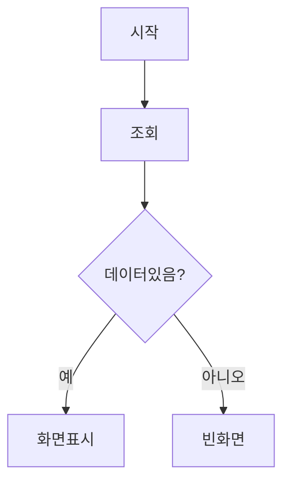

# Workflow 문서 작성 템플릿

모든 workflow 문서는 아래 형식을 따른다.

---

# [화멸명] (메뉴코드: `XXX`)

## 1. 화면 개요

| 항목 | 내용 |
|------|------|
| **메뉴 경로** | [상위메뉴] > [하위메뉴] > [화면] |
| **URL** | `/path/to/page` |
| **메뉴 코드** | `XXX` |
| **화면 목적** | 이 화면이 어떤 업무를 처리하는지 1-2문장 |
| **주요 사용자** | 생산관리자, 품질관리자 등 |

## 2. 화면 구성

### 2.1 레이아웃
- 상단: [검색조건 / 액션버튼 / 요약카드]
- 중앙: [데이터그리드 / 테이블]
- 하단: [페이징]
- 모달: [등록/수정/상세 모달]

### 2.2 데이터그리드 컬럼
| 컬럼ID | 컬럼명 | 데이터타입 | 정렬 | 비고 |
|--------|--------|-----------|------|------|
| itemCode | 품목코드 | string | Y | 왼쪽정렬 |

### 2.3 입력 폼 필드
| 필드ID | 필드명 | 타입 | 필수 | 기본값 | 검증규칙 | 비고 |
|--------|--------|------|------|--------|----------|------|
| itemCode | 품목코드 | select | Y | - | not empty | 품목검색모달 |

### 2.4 버튼/액션
| 버튼 | 조건 | 동작 | API |
|------|------|------|-----|
| 등록 | - | 등록모달 오픈 | - |
| 저장 | 폼 valid | 데이터 저장 | POST /api/... |

## 3. 업무 흐름

### 3.1 정상 흐름


1. 사용자가 화면 접속
2. 기본 조회조건으로 목록 조회
3. ...

### 3.2 예외/분기 흐름
- **조회 결과 없음**: "데이터가 없습니다" 메시지 표시
- **권한 없음**: 403 → 접근거부 페이지
- **데이터 충돌**: 낙관적락 실패 시 재조회 유도

## 4. 상태 코드 및 공통코드

### 4.1 화면 내 사용 상태
| 상태명 | 코드값 | 공통코드그룹 | 설명 | 색상 |
|--------|--------|-------------|------|------|
| 대기 | PENDING | IQC_STATUS | IQC 미실시 | 회색 |

### 4.2 관련 공통코드 전체
- `IQC_STATUS`: PENDING(대기), PASS(합격), FAIL(불합격), HOLD(보류)
- `MAT_LOT_STATUS`: NORMAL(정상), HOLD(보류), DEPLETED(소진), SPLIT(분할완료), MERGED(병합완료)

## 5. API 명세

### 5.1 목록 조회
```
GET /api/xxx/xxx
```
**Query Parameters**
| 파라미터 | 타입 | 필수 | 설명 |
|----------|------|------|------|
| page | number | N | 페이지 (기본 1) |
| limit | number | N | 페이지당 건수 (기본 10) |

**Response 200**
```json
{
  "data": [...],
  "total": 100,
  "page": 1,
  "limit": 10
}
```

### 5.2 상세 조회
```
GET /api/xxx/xxx/:id
```

### 5.3 생성
```
POST /api/xxx/xxx
```
**Request Body**
```json
{
  "field": "value"
}
```

### 5.4 수정
```
PUT /api/xxx/xxx/:id
```

### 5.5 삭제/취소
```
DELETE /api/xxx/xxx/:id
```
또는
```
POST /api/xxx/xxx/:id/cancel
```

## 6. 처리 규칙 및 검증

### 6.1 입력 검증
- 품목코드: 필수, `ITEM_MASTERS` 존재 여부 확인
- 수량: 0 이상 정수
- 날짜: 과거일자 입력 가능 여부

### 6.2 비즈니스 규칙
- 규칙1: ...
- 규칙2: ...

### 6.3 트랜잭션 처리
- 트랜잭션 내 처리 항목:
  1. `TABLE_A` INSERT
  2. `TABLE_B` UPDATE
  3. `StockTransaction` INSERT (수불원장)
- 롤백 조건: any exception

## 7. 연관 엔티티 및 테이블

| 엔티티명 | 테이블명 | 역할 | 관계 |
|----------|----------|------|------|
| MatArrival | MAT_ARRIVALS | 입하 이력 | 메인 |
| MatLot | MAT_LOTS | LOT 정보 | 1:N |

## 8. 에러 코드 및 메시지

| 상황 | HTTP | 에러메시지 | 처리방법 |
|------|------|-----------|---------|
| 품목미존재 | 400 | 품목을 찾을 수 없습니다 | 품목마스터 확인 |
| 재고부족 | 400 | LOT 재고 부족 | 수량 확인 |

## 9. 참고사항

- 관련 화면: [링크]
- 관련 문서: [링크]
- 특이사항: ...

---

# 화면 간 연계 흐름

## [흐름명]


| 순서 | 화면 | 액션 | 다음화면 | 조건 |
|------|------|------|----------|------|
| 1 | 입하등록 | 저장 | 입하실적조회 | 성공시 |
| 2 | 입하실적조회 | LOT분할클릭 | LOT분할 | - |
