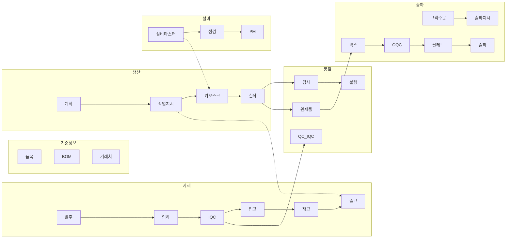

# Domain Workflows - 문서 인덱스

## 목적

각 도메인의 업무 흐름(workflow)을 **코드 기준**으로 문서화한 개별 문서들의 메인 인덱스.
모든 문서는 `apps/backend/src/`의 서비스/컨트롤러/엔티티/DTO와 `apps/frontend/src/`의 화면 기준으로 작성되었다.

---

## 문서 목록

| 도메인 | 파일 | 화면수 | 주요 상태 흐름 |
|--------|------|--------|---------------|
| **자재 입하/입고/LOT** | [material/wf-material-receipt.md](material/wf-material-receipt.md) | 9 | 입하 → IQC → 입고 → LOT 생성/분할/병합 |
| **자재 출고/재고/조정** | [material/wf-material-issue.md](material/wf-material-issue.md) | 10 | 출고요청 → 승인 → 출고 → 실사 → 조정, 보류 |
| **생산** | [production/wf-production.md](production/wf-production.md) | 15 | 계획 → 작업지시 → 키오스크 → 실적 → 완제품 |
| **품질** | [quality/wf-quality.md](quality/wf-quality.md) | 19 | IQC → 검사 → 불량 → OQC → SPC → 추적성 |
| **출하** | [shipping/wf-shipping.md](shipping/wf-shipping.md) | 8 | 주문 → 출하지시 → 박스/팔레트 → 출하 → 반품 |
| **설비** | [equipment/wf-equipment.md](equipment/wf-equipment.md) | 11 | 점검항목 → 일상/정기점검 → PM → 금형 |
| **기준정보** | [master/wf-master.md](master/wf-master.md) | 15 | 품목/BOM/거래처/공정/라인/라우팅/캘린더 등 |
| **시스템** | [system/wf-system.md](system/wf-system.md) | 11 | 회사/부서/사용자/권한/코드/설정 |
| **기타 도메인** | [system/wf-others.md](system/wf-others.md) | 16+ | 대시보드/발주/완제품/계측기/고객/통관/소모품/외주 |

---

## 도메인 간 핵심 연계 흐름

---

## 공통 주의사항

1. **IQC 검사 단위**: 개별 시리얼 전수검사가 아닌 **입하번호+품목 단위 샘플검사** (`IqcLog.matUid` nullable)
2. **LOT 생성 타이밍**: 입하 등록 시점이 아닌 **라벨 발행 시** LOT가 생성됨 (`MatArrival.supUid`는 라벨 발행 전 null)
3. **출고 워크플로우**: `MatIssueRequest` (승인/반려) → `MatIssue` (실제 출고) 2단계 분리
4. **자재분할/병합**: 입고 완료된 LOT만 가능. 원본 LOT `SPLIT`/`MERGED` 상태 전환
5. **생산 키오스크**: 작업자설비점검 + 소모품 수명 확인이 필수 선행 단계
6. **취소 정책**: 뒤 공정(출고, 생산실적, 출하 등)이 없는 경우만 취소 가능. 역처리 금지
7. **SEQ 채번**: Oracle `SEQUENCE.NEXTVAL`만 사용. `MAX(SEQ)+1` 금지

---

## 함께 읽을 문서

- [05-production-process-flow.md](05-production-process-flow.md)
- [backend-module-index.md](../design/backend-module-index.md)
- [db-schema-erd.md](../reports/db-schema-erd.md)
- [anti-patterns.md](../standards/anti-patterns.md)
