# 설비관리 Workflow 문서

> **작성일**: 2026-06-10  
> **적용 버전**: HANES MES Backend/Frontend (main)  
> **메뉴 그룹**: EQUIPMENT (설비관리)

---

# 금형관리 (메뉴코드: `EQ_MOLD_MGMT`)

## 1. 화면 개요

| 항목 | 내용 |
|------|------|
| **메뉴 경로** | 설비관리 > 금형관리 |
| **URL** | `/equipment/mold-mgmt` |
| **메뉴 코드** | `EQ_MOLD_MGMT` |
| **화면 목적** | 금형 마스터 정보를 등록·관리하고, 타수(shot) 기반 수명 및 보전 주기를 추적한다. |
| **주요 사용자** | 설비관리자, 생산관리자 |

## 2. 화면 구성

### 2.1 레이아웃
- 좌측 메인: 검색조건 / 액션버튼 / 통계카드 / DataGrid
- 우측 슬라이드 패널: 금형 등록/수정 폼 (`MoldFormPanel`)
- 하단: 선택 금형의 사용이력 (`MoldUsageList`)

### 2.2 데이터그리드 컬럼

| 컬럼ID | 컬럼명 | 데이터타입 | 정렬 | 비고 |
|--------|--------|-----------|------|------|
| moldCode | 금형코드 | string | Y | 왼쪽정렬, primary color |
| moldName | 금형명 | string | Y | — |
| moldType | 금형유형 | string | Y | 공통코드 `MOLD_TYPE` |
| itemCode | 품목코드 | string | Y | — |
| cavity | 캐비티수 | number | Y | font-mono |
| currentShots | 현재타수 | number | Y | font-mono, 경고 색상 |
| guaranteedShots | 보증타수 | number | Y | font-mono |
| shotRate | 타수율 | number | Y | 계산컬럼, 색상 분기 |
| status | 상태 | string | Y | 공통코드 `MOLD_STATUS` |
| nextMaintenanceDate | 다음보전일 | date | Y | — |

### 2.3 입력 폼 필드

| 필드ID | 필드명 | 타입 | 필수 | 기본값 | 검증규칙 | 비고 |
|--------|--------|------|------|--------|----------|------|
| moldCode | 금형코드 | text | Y | — | MaxLength(50), 중복금지 | PK |
| moldName | 금형명 | text | Y | — | MaxLength(200) | — |
| moldType | 금형유형 | select | N | — | 공통코드 | — |
| itemCode | 품목코드 | text | N | — | MaxLength(50) | — |
| cavity | 캐비티수 | number | N | 1 | Min(1) | — |
| guaranteedShots | 보증타수 | number | N | — | Min(0) | — |
| maintenanceCycle | 보전주기(타수) | number | N | — | Min(1) | — |
| location | 보관위치 | text | N | — | MaxLength(200) | — |
| maker | 제작업체 | text | N | — | MaxLength(200) | — |
| purchaseDate | 구입일 | date | N | — | — | — |
| remark | 비고 | text | N | — | MaxLength(500) | — |

### 2.4 버튼/액션

| 버튼 | 조건 | 동작 | API |
|------|------|------|-----|
| 등록 | — | 우측 패널 오픈(신규) | — |
| 저장 | 폼 valid | 금형 저장 | POST/PUT `/equipment/molds/:id` |
| 삭제 | 행 선택 | 삭제 확인 모달 | DELETE `/equipment/molds/:id` |
| 보전대상조회 | — | 보전 임박 금형 필터 | GET `/equipment/molds/maintenance-due` |
| 사용이력등록 | 금형 선택 | 타수 입력 모달 | POST `/equipment/molds/:id/usage` |
| 폐기(RETIRE) | ACTIVE/MAINTENANCE 상태 | 상태 변경 | PATCH `/equipment/molds/:id/retire` |

## 3. 업무 흐름

### 3.1 정상 흐름
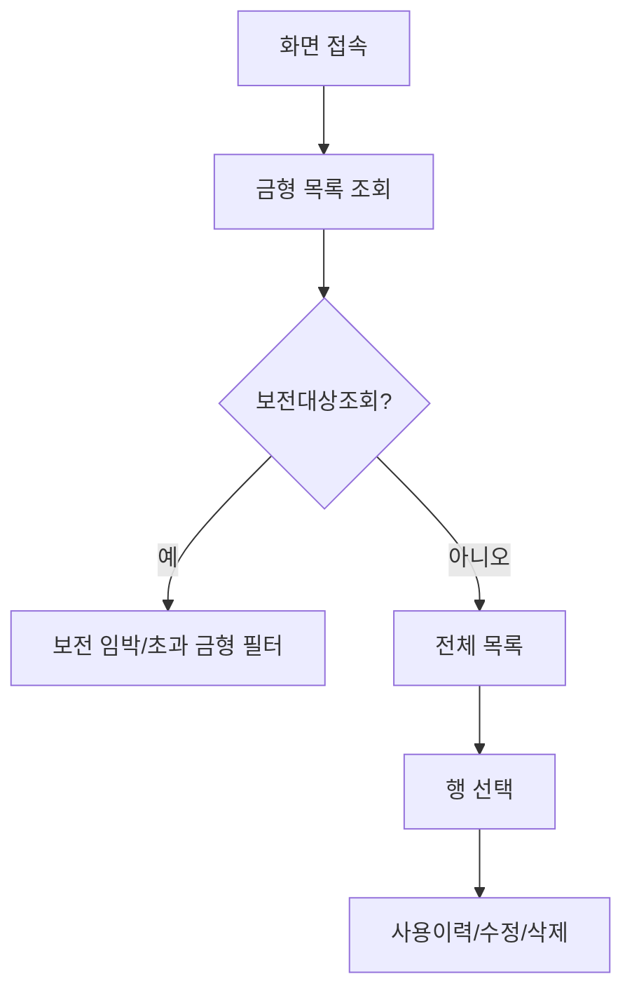

1. 사용자가 화면 접속 시 기본 목록 조회 (`GET /equipment/molds`)
2. 검색어/유형/상태 필터 적용 가능
3. 행 클릭 시 하단 사용이력 패널 표시
4. 등록/수정 시 우측 슬라이드 패널 오픈

### 3.2 예외/분기 흐름
- **중복 코드**: `409 Conflict` → "이미 존재하는 설비 코드입니다"
- **사용이력 존재 시 삭제**: `400 BadRequest` → "Cannot delete mold with usage history."
- **폐기 불가 상태**: SCRAPPED/RETIRED → "Mold is already retired or scrapped."
- **타수 초과**: 보증타수 초과 시 설비 INTERLOCK 자동 연동

## 4. 상태 코드 및 공통코드

### 4.1 화면 내 사용 상태

| 상태명 | 코드값 | 공통코드그룹 | 설명 | 색상 |
|--------|--------|-------------|------|------|
| 정상 | ACTIVE | MOLD_STATUS | 가동 중 | 초록 |
| 보전중 | MAINTENANCE | MOLD_STATUS | 보전 수행 중 | 노랑 |
| 폐기 | RETIRED | MOLD_STATUS | 사용 종료 | 회색 |
| 폐기(완전) | SCRAPPED | MOLD_STATUS | 폐기 완료 | 빨강 |

### 4.2 관련 공통코드 전체
- `MOLD_TYPE`: 금형 유형 분류
- `MOLD_STATUS`: ACTIVE, MAINTENANCE, RETIRED, SCRAPPED

## 5. API 명세

### 5.1 목록 조회
```
GET /api/v1/equipment/molds
```
**Query Parameters**

| 파라미터 | 타입 | 필수 | 설명 |
|----------|------|------|------|
| page | number | N | 페이지 (기본 1) |
| limit | number | N | 페이지당 건수 (기본 50) |
| status | string | N | 상태 필터 |
| moldType | string | N | 금형 유형 필터 |
| search | string | N | 검색어 (코드, 명칭) |

**Response 200**
```json
{
  "data": [...],
  "total": 100,
  "page": 1,
  "limit": 50
}
```

### 5.2 상세 조회
```
GET /api/v1/equipment/molds/:id
```

### 5.3 생성
```
POST /api/v1/equipment/molds
```
**Request Body** (`CreateMoldDto`)
```json
{
  "moldCode": "MOLD-001",
  "moldName": "금형 A",
  "moldType": "INJECTION",
  "itemCode": "PART-001",
  "cavity": 4,
  "guaranteedShots": 100000,
  "maintenanceCycle": 10000,
  "location": "창고 A",
  "maker": "ABC사",
  "purchaseDate": "2023-01-15",
  "remark": "비고"
}
```

### 5.4 수정
```
PUT /api/v1/equipment/molds/:id
```
**Request Body** (`UpdateMoldDto` - PartialType)
- `status` 필드는 수정 API에서 변경 불가 (전용 엔드포인트 사용)

### 5.5 삭제
```
DELETE /api/v1/equipment/molds/:id
```

### 5.6 사용이력 등록
```
POST /api/v1/equipment/molds/:id/usage
```
**Request Body** (`CreateMoldUsageDto`)
```json
{
  "usageDate": "2024-01-15",
  "shotCount": 5000,
  "orderNo": "WO-001",
  "equipCode": "EQ-001",
  "workerCode": "W001",
  "remark": "비고"
}
```

### 5.7 보전대상 조회
```
GET /api/v1/equipment/molds/maintenance-due
```
- `maintenanceCycle` 기준 90% 이상 도달 또는 `nextMaintenanceDate` 7일 이내

### 5.8 폐기(RETIRE)
```
PATCH /api/v1/equipment/molds/:id/retire
```

## 6. 처리 규칙 및 검증

### 6.1 입력 검증
- `moldCode`: 필수, 최대 50자, 중복 금지
- `cavity`: 1 이상
- `guaranteedShots`: 0 이상
- `maintenanceCycle`: 1 이상 (타수 기준)

### 6.2 비즈니스 규칙
- **타수 누적**: 사용이력 등록 시 `MoldMaster.currentShots` 자동 누적
- **보증타수 초과**: `currentShots >= guaranteedShots` 이면 연결 설비 `INTERLOCK` 상태 자동 변경
- **삭제 제한**: 사용이력이 1건 이상 있으면 삭제 불가
- **상태 변경 제한**: SCRAPPED 상태는 수정 불가, RETIRE는 ACTIVE/MAINTENANCE 상태에서만 가능

### 6.3 트랜잭션 처리
- 사용이력 등록 트랜잭션:
  1. `MOLD_USAGE_LOGS` INSERT (SEQ_MOLD_USAGE_LOGS.NEXTVAL)
  2. `MOLD_MASTERS` currentShots UPDATE
  3. (조건 충족 시) `EQUIP_MASTERS` status = 'INTERLOCK' UPDATE
- 롤백 조건: any exception

## 7. 연관 엔티티 및 테이블

| 엔티티명 | 테이블명 | 역할 | 관계 |
|----------|----------|------|------|
| MoldMaster | MOLD_MASTERS | 금형 마스터 | 메인 |
| MoldUsageLog | MOLD_USAGE_LOGS | 사용 이력 | 1:N |
| EquipMaster | EQUIP_MASTERS | 설비 마스터 | N:1 (usage 등록 시) |
| PartMaster | PART_MASTERS | 품목 마스터 | N:1 (itemCode) |

## 8. 에러 코드 및 메시지

| 상황 | HTTP | 에러메시지 | 처리방법 |
|------|------|-----------|---------|
| 중복코드 | 409 | Mold already exists: {code} | 코드 변경 |
| 사용이력존재 | 400 | Cannot delete mold with usage history. | 이력 삭제 후 재시도 |
| 없는금형 | 404 | Mold not found. | 목록 재조회 |
| 폐기불가 | 400 | Mold is already retired or scrapped. | 상태 확인 |
| SCRAPPED수정 | 400 | Cannot update scrapped mold. | — |

## 9. 참고사항

- 관련 화면: 설비마스터 (`EQUIP_MASTER`), 사용이력은 금형별 하단 패널에서 조회
- 타수율 경고: 90% 초과 시 노랑, 100% 초과 시 빨강 하이라이트
- 금형 상태는 `MOLD_STATUS` 공통코드로 관리

---

# 점검항목마스터 (메뉴코드: `EQUIP_INSPECT_ITEM_MASTER`)

## 1. 화면 개요

| 항목 | 내용 |
|------|------|
| **메뉴 경로** | 기준정보 > 점검항목마스터 |
| **URL** | `/master/equip-inspect-item` |
| **메뉴 코드** | `EQUIP_INSPECT_ITEM_MASTER` |
| **화면 목적** | 설비 점검에 사용되는 공통 항목 Pool을 관리한다. |
| **주요 사용자** | 설비관리자, 품질관리자 |

## 2. 화면 구성

### 2.1 레이아웃
- 상단: 통계카드 (전체/일상/정기/PM/작업자/설비수)
- 중앙: DataGrid + 검색/필터/등록버튼
- 모달: 등록/수정 모달

### 2.2 데이터그리드 컬럼

| 컬럼ID | 컬럼명 | 데이터타입 | 비고 |
|--------|--------|-----------|------|
| equipCode | 설비코드 | string | font-mono |
| seq | 순서 | number | — |
| itemName | 항목명 | string | — |
| inspectType | 점검유형 | string | DAILY/PERIODIC/PM/WORKER |
| criteria | 판정기준 | string | — |
| cycle | 주기 | string | DAILY/WEEKLY/MONTHLY/분기/반기/연간 |
| useYn | 사용여부 | string | Y/N |

### 2.3 입력 폼 필드

| 필드ID | 필드명 | 타입 | 필수 | 기본값 | 비고 |
|--------|--------|------|------|--------|------|
| equipCode | 설비코드 | select | Y (등록) | — | 설비 목록 선택 |
| itemName | 항목명 | text | Y | — | — |
| inspectType | 점검유형 | select | N | DAILY | — |
| cycle | 주기 | select | N | DAILY | — |
| seq | 순서 | number | N | 1 | — |
| criteria | 판정기준 | text | N | — | — |

### 2.4 버튼/액션

| 버튼 | 동작 | API |
|------|------|-----|
| 등록 | 모달 오픈 | — |
| 저장 | 생성/수정 | POST/PUT `/master/equip-inspect-items/...` |
| 삭제 | 삭제 확인 | DELETE `/master/equip-inspect-items/:equipCode/:inspectType/:seq` |

## 3. 업무 흐름

### 3.1 정상 흐름
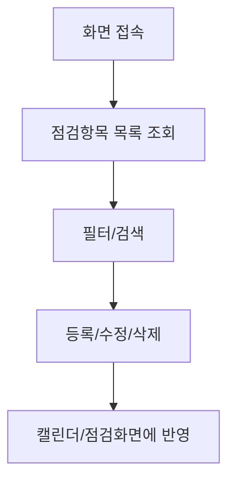

### 3.2 예외/분기 흐름
- **없는 항목 수정/삭제**: 404 → "점검항목을 찾을 수 없습니다"

## 4. 상태 코드 및 공통코드

| 상태명 | 코드값 | 공통코드그룹 | 설명 |
|--------|--------|-------------|------|
| 일상 | DAILY | INSPECT_CHECK_TYPE | 매일 점검 |
| 정기 | PERIODIC | INSPECT_CHECK_TYPE | 주기적 점검 |
| PM | PM | INSPECT_CHECK_TYPE | 예방보전 점검 |
| 작업자 | WORKER | INSPECT_CHECK_TYPE | 작업자 설비점검 |

## 5. API 명세

### 5.1 목록 조회
```
GET /api/v1/master/equip-inspect-items
```
**Query Parameters**

| 파라미터 | 타입 | 필수 | 설명 |
|----------|------|------|------|
| page | number | N | 페이지 |
| limit | number | N | 건수 |
| equipCode | string | N | 설비코드 필터 |
| inspectType | string | N | 점검유형 필터 |
| search | string | N | 검색어 |
| useYn | string | N | 사용여부 |

### 5.2 생성
```
POST /api/v1/master/equip-inspect-items
```
**Request Body** (`CreateEquipInspectItemDto`)
```json
{
  "equipCode": "EQ-001",
  "itemCode": "EIP-001",
  "inspectType": "DAILY",
  "seq": 1,
  "itemName": "유압 압력 확인",
  "criteria": "5.0 ~ 7.0 bar",
  "cycle": "DAILY",
  "useYn": "Y",
  "itemType": "VISUAL",
  "unit": "bar",
  "lslValue": 5.0,
  "uslValue": 7.0,
  "workerQrCode": null
}
```

### 5.3 수정
```
PUT /api/v1/master/equip-inspect-items/:equipCode/:inspectType/:seq
```

### 5.4 삭제
```
DELETE /api/v1/master/equip-inspect-items/:equipCode/:inspectType/:seq
```

## 6. 처리 규칙 및 검증

### 6.1 입력 검증
- `equipCode`: 필수, `EQUIP_MASTERS` 존재 여부 확인
- `seq`: 1 이상
- `itemName`: 최대 200자
- `inspectType`: `DAILY`, `PERIODIC`, `PM`, `WORKER` 중 하나

### 6.2 비즈니스 규칙
- Pool 항목(`itemCode`) 지정 시 `EQUIP_INSPECT_ITEM_POOL`에서 정보 자동 상속
- `itemType` = `MEASURE` 일 때 `lslValue`/`uslValue`/`unit` 필수 권장
- `WORKER` 유형은 `workerQrCode` 필드 사용

## 7. 연관 엔티티 및 테이블

| 엔티티명 | 테이블명 | 역할 | 관계 |
|----------|----------|------|------|
| EquipInspectItemMaster | EQUIP_INSPECT_ITEM_MASTERS | 설비별 점검항목 | 메인 |
| EquipInspectItemPool | EQUIP_INSPECT_ITEM_POOL | 점검항목 Pool | 참조 |
| EquipMaster | EQUIP_MASTERS | 설비 마스터 | FK |

## 8. 에러 코드 및 메시지

| 상황 | HTTP | 에러메시지 | 처리방법 |
|------|------|-----------|---------|
| 없는항목 | 404 | 점검항목을 찾을 수 없습니다 | 목록 재조회 |

## 9. 참고사항

- 관련 화면: 설비점검항목 (`EQUIP_INSPECT_ITEM`), 점검캘린더
- 캘린더 스케줄의 기초 데이터로 사용됨

---

# 설비점검항목 (메뉴코드: `EQUIP_INSPECT_ITEM`)

## 1. 화면 개요

| 항목 | 내용 |
|------|------|
| **메뉴 경로** | 기준정보 > 설비점검항목 |
| **URL** | `/master/equip-inspect` |
| **메뉴 코드** | `EQUIP_INSPECT_ITEM` |
| **화면 목적** | 설비별 점검항목 할당 및 점검항목 Pool 관리를 통합한다. |
| **주요 사용자** | 설비관리자 |

## 2. 화면 구성

### 2.1 레이아웃
- 상단: 탭 전환 (assign | master)
- assign 탭: 좌측 설비목록 + 우측 선택 설비의 점검항목 그리드
- master 탭: 점검항목 Pool CRUD (`ItemMasterTab`)

### 2.2 데이터그리드 컬럼 (assign 탭)

| 컬럼ID | 컬럼명 | 데이터타입 | 비고 |
|--------|--------|-----------|------|
| equipCode | 설비코드 | string | — |
| equipName | 설비명 | string | — |
| inspectType | 점검유형 | string | — |
| seq | 순번 | number | — |
| itemName | 항목명 | string | — |
| criteria | 판정기준 | string | — |

### 2.3 버튼/액션

| 버튼 | 동작 | API |
|------|------|-----|
| 항목추가 | Pool에서 선택 추가 | POST `/master/equip-inspect-items` |
| 항목삭제 | 선택 항목 삭제 | DELETE `/master/equip-inspect-items/...` |

## 3. 업무 흐름

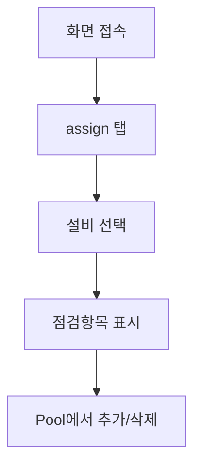

## 4. 상태 코드 및 공통코드

- 동일: `EQUIP_INSPECT_ITEM_MASTER` 참조

## 5. API 명세

- `GET /master/equip-inspect-items?equipCode=XXX` — 설비별 항목 조회
- `POST /master/equip-inspect-items` — 항목 할당
- `DELETE /master/equip-inspect-items/:equipCode/:inspectType/:seq` — 항목 삭제
- `GET /master/equip-inspect-item-pool` — Pool 목록
- `POST /master/equip-inspect-item-pool` — Pool 생성
- `PUT /master/equip-inspect-item-pool/:itemCode` — Pool 수정
- `DELETE /master/equip-inspect-item-pool/:itemCode` — Pool 삭제

## 6. 처리 규칙 및 검증

- Pool 항목 삭제 시 이미 할당된 설비에 영향 주의
- `seq`는 설비+유형 내 고유 순번

## 7. 연관 엔티티 및 테이블

| 엔티티명 | 테이블명 | 역할 | 관계 |
|----------|----------|------|------|
| EquipInspectItemPool | EQUIP_INSPECT_ITEM_POOL | 공통 항목 Pool | 메인(master 탭) |
| EquipInspectItemMaster | EQUIP_INSPECT_ITEM_MASTERS | 설비별 할당 | 메인(assign 탭) |
| EquipMaster | EQUIP_MASTERS | 설비 | FK |

## 8. 에러 코드 및 메시지

| 상황 | HTTP | 에러메시지 |
|------|------|-----------|
| 중복Pool코드 | 409 | 이미 존재하는 점검항목 코드입니다 |
| 없는Pool | 404 | 점검항목 마스터를 찾을 수 없습니다 |

---

# 점검캘린더 (메뉴코드: `EQUIP_INSPECT_CALENDAR`)

## 1. 화면 개요

| 항목 | 내용 |
|------|------|
| **메뉴 경로** | 설비관리 > 점검캘린더 |
| **URL** | `/equipment/inspect-calendar` |
| **메뉴 코드** | `EQUIP_INSPECT_CALENDAR` |
| **화면 목적** | 일상점검 일정을 캘린더 형태로 조회하고 실행한다. |
| **주요 사용자** | 설비관리자, 작업자 |

## 2. 화면 구성

### 2.1 레이아웃
- 상단: 월 이동/당월·차월 버튼/공정 필터/통계카드
- 좌측(7/12): 월간 캘린더 (`InspectCalendar`)
- 우측(5/12): 일별 스케줄 패널 (`DaySchedulePanel`)
- 모달: 점검 실행 모달 (`InspectExecuteModal`)

### 2.2 캘린더 상태

| 상태 | 설명 | 색상 |
|------|------|------|
| NONE | 점검 없음 | 회색 |
| ALL_PASS | 전체 완료(양호) | 초록 |
| HAS_FAIL | 불합격 존재 | 빨강 |
| IN_PROGRESS | 부분 완료 | 노랑 |
| OVERDUE | 미완료+과거 | 주황 |
| NOT_STARTED | 미완료+미래 | 파랑 |

## 3. 업무 흐름

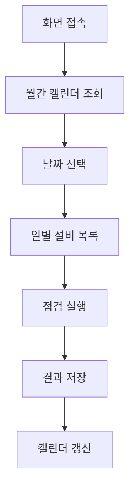

## 4. 상태 코드 및 공통코드

- `INSPECT_CHECK_TYPE`: DAILY, PERIODIC
- 캘린더 날짜 상태: `NONE`, `ALL_PASS`, `HAS_FAIL`, `IN_PROGRESS`, `OVERDUE`, `NOT_STARTED`

## 5. API 명세

### 5.1 월별 요약
```
GET /api/v1/equipment/daily-inspect/calendar
```
**Query Parameters**

| 파라미터 | 타입 | 필수 | 설명 |
|----------|------|------|------|
| year | number | Y | 년도 |
| month | number | Y | 월 (1-12) |
| processCode | string | N | 공정 필터 |

**Response 200**
```json
[
  { "date": "2024-01-15", "total": 10, "completed": 8, "pass": 7, "fail": 1, "status": "IN_PROGRESS" }
]
```

### 5.2 일별 스케줄
```
GET /api/v1/equipment/daily-inspect/calendar/day
```
**Query Parameters**

| 파라미터 | 타입 | 필수 | 설명 |
|----------|------|------|------|
| date | string | Y | 날짜 (YYYY-MM-DD) |
| processCode | string | N | 공정 필터 |

## 6. 처리 규칙 및 검증

- `cycle` 판정: DAILY→매일, WEEKLY→월요일, MONTHLY→1일
- 과거 날짜 미완료 시 `OVERDUE` 상태
- 점검 완료 시 `overallResult`에 따라 캘린더 색상 변경

## 7. 연관 엔티티 및 테이블

| 엔티티명 | 테이블명 | 역할 | 관계 |
|----------|----------|------|------|
| EquipInspectItemMaster | EQUIP_INSPECT_ITEM_MASTERS | 점검항목 | 기준 |
| EquipInspectLog | EQUIP_INSPECT_LOGS | 점검이력 | 결과 |
| EquipMaster | EQUIP_MASTERS | 설비 | FK |

## 8. 에러 코드 및 메시지

| 상황 | HTTP | 설명 |
|------|------|------|
| 조회실패 | 500 | 캘린더 데이터 조회 오류 |

---

# 일상점검 (메뉴코드: `EQUIP_DAILY`)

## 1. 화면 개요

| 항목 | 내용 |
|------|------|
| **메뉴 경로** | 설비관리 > 일상점검 |
| **URL** | `/equipment/daily-inspect` |
| **메뉴 코드** | `EQUIP_DAILY` |
| **화면 목적** | 설비 일상점검 결과를 등록·수정·삭제한다. |
| **주요 사용자** | 설비관리자, 작업자 |

## 2. 화면 구성

### 2.1 레이아웃
- 상단: 날짜 선택 / 새로고침
- 좌측(5/12): 설비 목록 (미점검/완료 상태)
- 우측(7/12): 선택 설비 항목별 점검 입력 패널

### 2.2 데이터그리드 컬럼 (목록)

| 컬럼ID | 컬럼명 | 데이터타입 | 비고 |
|--------|--------|-----------|------|
| equipCode | 설비코드 | string | — |
| equipName | 설비명 | string | — |
| inspectorName | 점검자 | string | — |
| overallResult | 종합결과 | string | PASS/FAIL/CONDITIONAL |
| inspectDate | 점검일 | date | — |
| remark | 비고 | string | — |

### 2.3 입력 폼 필드

| 필드ID | 필드명 | 타입 | 필수 | 기본값 | 비고 |
|--------|--------|------|------|--------|------|
| equipCode | 설비코드 | text | Y | — | — |
| inspectDate | 점검일 | date | Y | 오늘 | — |
| inspectorName | 점검자 | text | N | — | — |
| overallResult | 종합결과 | select | N | PASS | PASS/FAIL/CONDITIONAL |
| details | 상세결과 | JSON | N | — | 항목별 결과 |
| remark | 비고 | text | N | — | — |

## 3. 업무 흐름

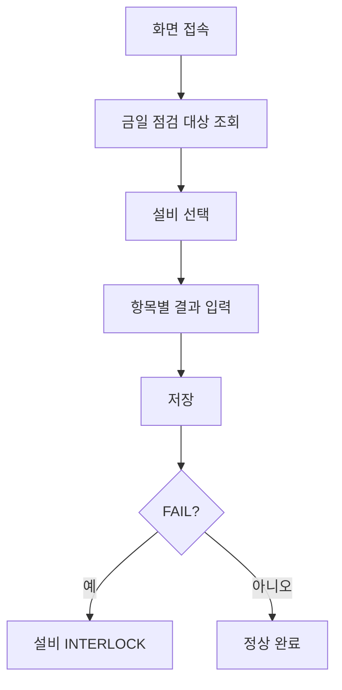

## 4. 상태 코드 및 공통코드

| 상태명 | 코드값 | 공통코드그룹 | 설명 |
|--------|--------|-------------|------|
| 합격 | PASS | INSPECT_JUDGE | 양호 |
| 불합격 | FAIL | INSPECT_JUDGE | 불량 |
| 조걶부 | CONDITIONAL | INSPECT_JUDGE | 조걶부 통과 |

## 5. API 명세

### 5.1 목록 조회
```
GET /api/v1/equipment/daily-inspect
```
**Query Parameters**

| 파라미터 | 타입 | 필수 | 설명 |
|----------|------|------|------|
| page | number | N | 페이지 |
| limit | number | N | 건수 |
| equipCode | string | N | 설비코드 |
| overallResult | string | N | 결과 필터 |
| inspectDateFrom | string | N | 시작일 |
| inspectDateTo | string | N | 종료일 |
| search | string | N | 검색어 |

### 5.2 상세 조회
```
GET /api/v1/equipment/daily-inspect/:equipCode/:inspectDate
```

### 5.3 생성
```
POST /api/v1/equipment/daily-inspect
```
**Request Body** (`CreateEquipInspectDto`)
```json
{
  "equipCode": "EQ-001",
  "inspectType": "DAILY",
  "inspectDate": "2024-01-15",
  "inspectorName": "홍길동",
  "overallResult": "PASS",
  "details": { "items": [{ "seq": 1, "itemName": "유압압력", "result": "PASS", "remark": "" }] },
  "remark": "비고"
}
```

### 5.4 수정
```
PUT /api/v1/equipment/daily-inspect/:equipCode/:inspectDate
```

### 5.5 삭제
```
DELETE /api/v1/equipment/daily-inspect/:equipCode/:inspectDate
```

### 5.6 오늘 점검 여부 확인
```
GET /api/v1/equipment/daily-inspect/check?equipCode=XXX&inspectDate=YYYY-MM-DD
```

## 6. 처리 규칙 및 검증

### 6.1 입력 검증
- `equipCode`: 필수, `EQUIP_MASTERS` 존재 확인
- `inspectDate`: 필수, ISO 8601
- `overallResult`: `PASS`, `FAIL`, `CONDITIONAL`

### 6.2 비즈니스 규칙
- **복합키**: `equipCode + inspectType(DAILY) + inspectDate`
- **FAIL 시 INTERLOCK**: `overallResult`에 `FAIL` 포함 시 해당 설비 상태 자동 `INTERLOCK`
- **WORKER 모드**: `inspectType=WORKER` 허용 (작업자설비점검)

### 6.3 트랜잭션 처리
- 점검 결과 저장 + 설비 상태 변경 (FAIL 시)
- 롤백 조건: any exception

## 7. 연관 엔티티 및 테이블

| 엔티티명 | 테이블명 | 역할 | 관계 |
|----------|----------|------|------|
| EquipInspectLog | EQUIP_INSPECT_LOGS | 점검이력 | 메인 |
| EquipMaster | EQUIP_MASTERS | 설비 | FK |
| EquipInspectItemMaster | EQUIP_INSPECT_ITEM_MASTERS | 점검항목 | 기준 |

## 8. 에러 코드 및 메시지

| 상황 | HTTP | 에러메시지 | 처리방법 |
|------|------|-----------|---------|
| 없는설비 | 404 | 설비를 찾을 수 없습니다 | 코드 확인 |
| 없는점검 | 404 | 점검 기록을 찾을 수 없습니다 | 날짜 확인 |
| 회사불일치 | 400 | 요청 회사와 설비 회사가 일치하지 않습니다 | — |

## 9. 참고사항

- `EQUIP_DAILY`는 `inspectType=DAILY` 고정
- `details` 필드는 JSON(CLOB)으로 항목별 결과 저장
- 정기점검 캘린더와 동일한 UI 패턴 공유

---

# 정기점검캘린더 (메뉴코드: `EQUIP_PERIODIC_CALENDAR`)

## 1. 화면 개요

| 항목 | 내용 |
|------|------|
| **메뉴 경로** | 설비관리 > 정기점검캘린더 |
| **URL** | `/equipment/periodic-inspect-calendar` |
| **메뉴 코드** | `EQUIP_PERIODIC_CALENDAR` |
| **화면 목적** | 정기점검 일정을 캘린더 형태로 조회하고 실행한다. |
| **주요 사용자** | 설비관리자 |

## 2. 화면 구성

- 일상점검캘린더와 동일한 레이아웃
- `inspectType=PERIODIC` 고정
- 컴포넌트 재사용: `InspectCalendar`, `DaySchedulePanel`, `InspectExecuteModal`

## 3. 업무 흐름

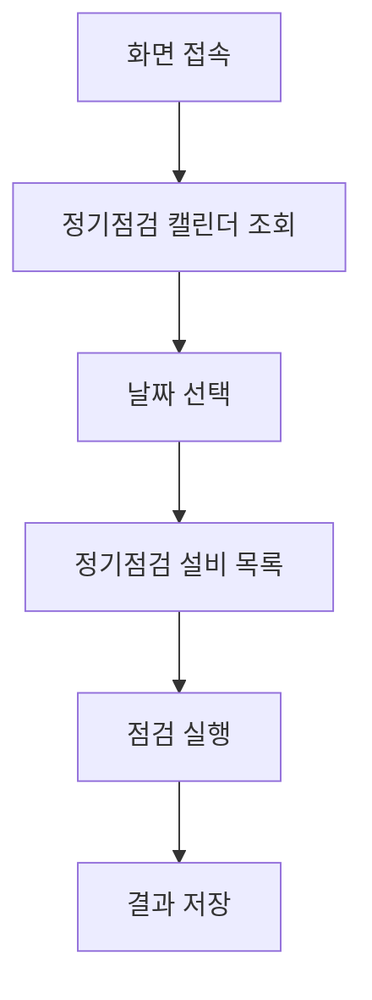

## 4. 상태 코드 및 공통코드

- 동일: `INSPECT_CHECK_TYPE`, `INSPECT_JUDGE`

## 5. API 명세

### 5.1 월별 요약
```
GET /api/v1/equipment/periodic-inspect/calendar
```

### 5.2 일별 스케줄
```
GET /api/v1/equipment/periodic-inspect/calendar/day
```

## 6. 처리 규칙 및 검증

- `PERIODIC` 항목의 `cycle` 기준으로 스케줄 계산
- 일상점검과 동일한 상태 판정 로직 적용

## 7. 연관 엔티티 및 테이블

| 엔티티명 | 테이블명 | 역할 | 관계 |
|----------|----------|------|------|
| EquipInspectItemMaster | EQUIP_INSPECT_ITEM_MASTERS | 정기점검항목 | 기준 |
| EquipInspectLog | EQUIP_INSPECT_LOGS | 점검이력 | 결과 |
| EquipMaster | EQUIP_MASTERS | 설비 | FK |

---

# 정기점검 (메뉴코드: `EQUIP_PERIODIC`)

## 1. 화면 개요

| 항목 | 내용 |
|------|------|
| **메뉴 경로** | 설비관리 > 정기점검 |
| **URL** | `/equipment/periodic-inspect` |
| **메뉴 코드** | `EQUIP_PERIODIC` |
| **화면 목적** | 설비 정기점검 결과를 등록·수정·삭제한다. |
| **주요 사용자** | 설비관리자 |

## 2. 화면 구성

### 2.1 레이아웃
- 상단: 통계카드 + 검색/필터 + 등록버튼
- 중앙: DataGrid (정기점검 목록)
- 모달: 등록/수정 모달

### 2.2 데이터그리드 컬럼

| 컬럼ID | 컬럼명 | 데이터타입 | 비고 |
|--------|--------|-----------|------|
| inspectDate | 점검일 | date | — |
| equipCode | 설비코드 | string | font-mono |
| equipName | 설비명 | string | — |
| inspectorName | 점검자 | string | — |
| overallResult | 종합결과 | string | 색상 배지 |
| remark | 비고 | string | — |

### 2.3 입력 폼 필드

| 필드ID | 필드명 | 타입 | 필수 | 기본값 | 비고 |
|--------|--------|------|------|--------|------|
| equipCode | 설비코드 | text | Y | — | — |
| inspectDate | 점검일 | date | Y | 오늘 | — |
| inspectorName | 점검자 | text | N | — | — |
| overallResult | 종합결과 | select | Y | PASS | PASS/FAIL/CONDITIONAL |
| remark | 비고 | text | N | — | — |

## 3. 업무 흐름

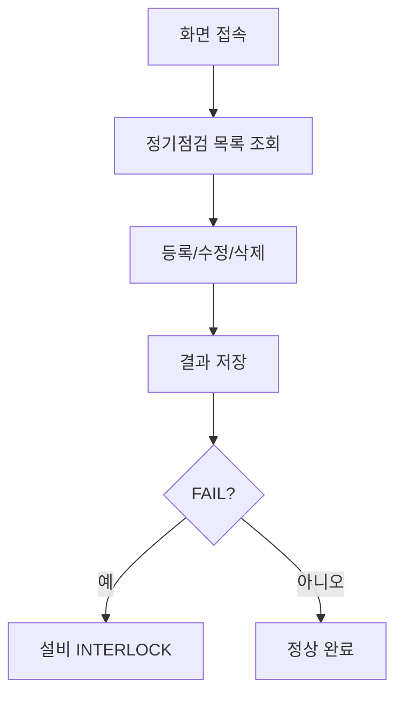

## 4. 상태 코드 및 공통코드

- `INSPECT_JUDGE`: PASS, FAIL, CONDITIONAL
- `INSPECT_CHECK_TYPE`: PERIODIC

## 5. API 명세

### 5.1 목록 조회
```
GET /api/v1/equipment/periodic-inspect
```

### 5.2 상세 조회
```
GET /api/v1/equipment/periodic-inspect/:equipCode/:inspectDate
```

### 5.3 생성
```
POST /api/v1/equipment/periodic-inspect
```
**Request Body**
```json
{
  "equipCode": "EQ-001",
  "inspectType": "PERIODIC",
  "inspectDate": "2024-01-15",
  "inspectorName": "홍길동",
  "overallResult": "PASS",
  "details": {},
  "remark": "비고"
}
```

### 5.4 수정
```
PUT /api/v1/equipment/periodic-inspect/:equipCode/:inspectDate
```

### 5.5 삭제
```
DELETE /api/v1/equipment/periodic-inspect/:equipCode/:inspectDate
```

## 6. 처리 규칙 및 검증

- `inspectType` = `PERIODIC` 고정
- 생성/수정/삭제 시 복합키 사용: `equipCode + PERIODIC + inspectDate`
- FAIL 시 설비 INTERLOCK 자동 변경

## 7. 연관 엔티티 및 테이블

| 엔티티명 | 테이블명 | 역할 | 관계 |
|----------|----------|------|------|
| EquipInspectLog | EQUIP_INSPECT_LOGS | 점검이력 | 메인 |
| EquipMaster | EQUIP_MASTERS | 설비 | FK |

## 8. 에러 코드 및 메시지

| 상황 | HTTP | 에러메시지 |
|------|------|-----------|
| 없는점검 | 404 | 점검 기록을 찾을 수 없습니다 |

---

# 점검이력 (메뉴코드: `EQUIP_HISTORY`)

## 1. 화면 개요

| 항목 | 내용 |
|------|------|
| **메뉴 경로** | 설비관리 > 점검이력 |
| **URL** | `/equipment/inspect-history` |
| **메뉴 코드** | `EQUIP_HISTORY` |
| **화면 목적** | 일상/정기 점검 이력을 통합 조회한다. (조회 전용) |
| **주요 사용자** | 설비관리자, 품질관리자 |

## 2. 화면 구성

### 2.1 레이아웃
- 상단: 통계카드 (전체/PASS/FAIL/CONDITIONAL)
- 중앙: DataGrid + 검색/필터

### 2.2 데이터그리드 컬럼

| 컬럼ID | 컬럼명 | 데이터타입 | 비고 |
|--------|--------|-----------|------|
| inspectDate | 점검일 | date | — |
| inspectType | 점검유형 | string | 공통코드 배지 |
| equipCode | 설비코드 | string | font-mono |
| equipName | 설비명 | string | — |
| inspectorName | 점검자 | string | — |
| overallResult | 종합결과 | string | 공통코드 배지 |
| remark | 비고 | string | — |

### 2.3 필터

| 필드 | 타입 | 비고 |
|------|------|------|
| search | text | 설비코드, 점검자명 |
| inspectType | select | DAILY/PERIODIC |
| overallResult | select | PASS/FAIL/CONDITIONAL |
| inspectDateFrom | date | 시작일 |
| inspectDateTo | date | 종료일 |

## 3. 업무 흐름

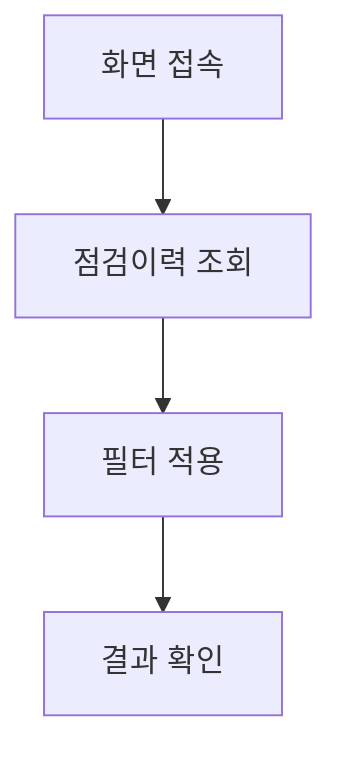

## 4. 상태 코드 및 공통코드

- `INSPECT_CHECK_TYPE`: DAILY, PERIODIC
- `INSPECT_JUDGE`: PASS, FAIL, CONDITIONAL

## 5. API 명세

### 5.1 목록 조회
```
GET /api/v1/equipment/inspect-history
```
**Query Parameters**

| 파라미터 | 타입 | 필수 | 설명 |
|----------|------|------|------|
| page | number | N | 페이지 |
| limit | number | N | 건수 |
| equipCode | string | N | 설비코드 |
| inspectType | string | N | 점검유형 |
| overallResult | string | N | 결과 |
| inspectDateFrom | string | N | 시작일 |
| inspectDateTo | string | N | 종료일 |
| search | string | N | 검색어 |

### 5.2 통계 요약
```
GET /api/v1/equipment/inspect-history/summary
```

## 6. 처리 규칙 및 검증

- 조회 전용 화면 (등록/수정/삭제 불가)
- `inspectType` 미지정 시 전체 조회

## 7. 연관 엔티티 및 테이블

| 엔티티명 | 테이블명 | 역할 | 관계 |
|----------|----------|------|------|
| EquipInspectLog | EQUIP_INSPECT_LOGS | 점검이력 | 메인 |
| EquipMaster | EQUIP_MASTERS | 설비 | FK |

---

# PM계획 (메뉴코드: `EQUIP_PM_PLAN`)

## 1. 화면 개요

| 항목 | 내용 |
|------|------|
| **메뉴 경로** | 설비관리 > PM계획 |
| **URL** | `/equipment/pm-plan` |
| **메뉴 코드** | `EQUIP_PM_PLAN` |
| **화면 목적** | 예방보전(PM) 계획을 등록·관리한다. |
| **주요 사용자** | 설비관리자 |

## 2. 화면 구성

### 2.1 레이아웃
- 상단: 통계카드 + 검색/필터
- 중앙: DataGrid (PM 계획 목록)
- 우측 슬라이드 패널: 등록/수정 폼 (`PmPlanPanel`)

### 2.2 데이터그리드 컬럼

| 컬럼ID | 컬럼명 | 데이터타입 | 비고 |
|--------|--------|-----------|------|
| planCode | 계획코드 | string | font-mono |
| equipCode | 설비코드 | string | font-mono |
| equipName | 설비명 | string | — |
| planName | 계획명 | string | — |
| pmType | PM유형 | string | TIME_BASED/USAGE_BASED |
| cycleType | 주기유형 | string | 공통코드 |
| itemCount | 항목수 | number | — |
| nextDueAt | 다음예정일 | date | — |
| useYn | 사용여부 | string | Y/N dot |

### 2.3 입력 폼 필드

| 필드ID | 필드명 | 타입 | 필수 | 기본값 | 비고 |
|--------|--------|------|------|--------|------|
| planCode | 계획코드 | text | Y | — | PK |
| equipCode | 설비코드 | select | Y | — | — |
| planName | 계획명 | text | Y | — | — |
| pmType | PM유형 | select | N | TIME_BASED | TIME_BASED/USAGE_BASED |
| cycleType | 주기유형 | select | N | MONTHLY | — |
| cycleValue | 주기값 | number | N | 1 | — |
| cycleUnit | 주기단위 | select | N | MONTH | CUSTOM 시 사용 |
| estimatedTime | 예상소요시간 | number | N | — | 분 단위 |
| description | 설명 | text | N | — | — |
| items | 보전항목 | array | N | — | 항목명/유형/기준 등 |

### 2.4 버튼/액션

| 버튼 | 동작 | API |
|------|------|-----|
| 등록 | 패널 오픈 | — |
| 저장 | 계획 저장 | POST/PUT `/equipment/pm-plans/:id` |
| 삭제 | 삭제 확인 | DELETE `/equipment/pm-plans/:id` |

## 3. 업무 흐름

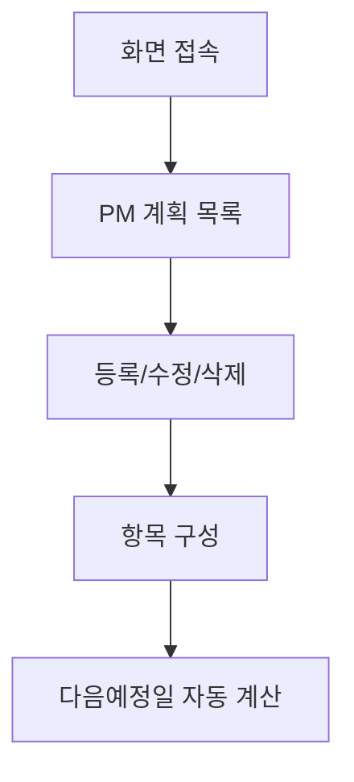

## 4. 상태 코드 및 공통코드

| 상태명 | 코드값 | 공통코드그룹 | 설명 |
|--------|--------|-------------|------|
| 시간기반 | TIME_BASED | PM_TYPE | 시간 주기 |
| 사용량기반 | USAGE_BASED | PM_TYPE | 사용량 주기 |
| 월간 | MONTHLY | PM_CYCLE_TYPE | 매월 |
| 분기 | QUARTERLY | PM_CYCLE_TYPE | 3개월 |
| 반기 | SEMI_ANNUAL | PM_CYCLE_TYPE | 6개월 |
| 연간 | ANNUAL | PM_CYCLE_TYPE | 1년 |
| 사용자정의 | CUSTOM | PM_CYCLE_TYPE | 자유 설정 |

## 5. API 명세

### 5.1 목록 조회
```
GET /api/v1/equipment/pm-plans
```
**Query Parameters**

| 파라미터 | 타입 | 필수 | 설명 |
|----------|------|------|------|
| page | number | N | 페이지 |
| limit | number | N | 건수 |
| equipCode | string | N | 설비코드 |
| pmType | string | N | PM유형 |
| search | string | N | 검색어 |
| dueDateFrom | string | N | 예정일 시작 |
| dueDateTo | string | N | 예정일 종료 |

### 5.2 상세 조회
```
GET /api/v1/equipment/pm-plans/:id
```

### 5.3 생성
```
POST /api/v1/equipment/pm-plans
```
**Request Body** (`CreatePmPlanDto`)
```json
{
  "equipCode": "EQ-001",
  "planCode": "PM-001",
  "planName": "월간 보전",
  "pmType": "TIME_BASED",
  "cycleType": "MONTHLY",
  "cycleValue": 1,
  "cycleUnit": "MONTH",
  "estimatedTime": 120,
  "description": "월간 정기 보전",
  "items": [
    { "seq": 1, "itemName": "유압 오일 교체", "itemType": "REPLACE", "criteria": "오일색 탁도 확인", "sparePartCode": "OIL-001", "sparePartQty": 2, "estimatedMinutes": 30 }
  ]
}
```

### 5.4 수정
```
PUT /api/v1/equipment/pm-plans/:id
```

### 5.5 삭제
```
DELETE /api/v1/equipment/pm-plans/:id
```

## 6. 처리 규칙 및 검증

### 6.1 입력 검증
- `planCode`: 필수, 최대 50자, 중복 금지
- `equipCode`: 필수, `EQUIP_MASTERS` 존재 확인
- `cycleValue`: 1 이상

### 6.2 비즈니스 규칙
- **nextDueAt 자동 계산**: 생성/수정 시 `cycleType`/`cycleValue`/`cycleUnit` 기준 자동 산출
- **주기 유형별 계산**:
  - MONTHLY: +cycleValue 개월
  - QUARTERLY: +3개월
  - SEMI_ANNUAL: +6개월
  - ANNUAL: +1년
  - CUSTOM: cycleUnit(DAY/WEEK/MONTH/YEAR) 기준
- **USAGE_BASED**: `usageThreshold` 도달 시 WO 자동 생성 대상
- **항목 교체**: 수정 시 기존 항목 전체 삭제 후 재등록

## 7. 연관 엔티티 및 테이블

| 엔티티명 | 테이블명 | 역할 | 관계 |
|----------|----------|------|------|
| PmPlan | PM_PLANS | PM 계획 | 메인 |
| PmPlanItem | PM_PLAN_ITEMS | 보전 항목 | 1:N |
| EquipMaster | EQUIP_MASTERS | 설비 | FK |
| PmWorkOrder | PM_WORK_ORDERS | WO | 1:N |

## 8. 에러 코드 및 메시지

| 상황 | HTTP | 에러메시지 | 처리방법 |
|------|------|-----------|---------|
| 없는설비 | 404 | 설비를 찾을 수 없습니다 | 코드 확인 |
| 없는계획 | 404 | PM 계획을 찾을 수 없습니다 | 목록 재조회 |
| 회사불일치 | 400 | 회사/사업장 정보 불일치 | — |

---

# PM캘린더 (메뉴코드: `EQUIP_PM_CALENDAR`)

## 1. 화면 개요

| 항목 | 내용 |
|------|------|
| **메뉴 경로** | 설비관리 > PM캘린더 |
| **URL** | `/equipment/pm-calendar` |
| **메뉴 코드** | `EQUIP_PM_CALENDAR` |
| **화면 목적** | PM Work Order 일정을 캘린더 형태로 관리하고 실행한다. |
| **주요 사용자** | 설비관리자 |

## 2. 화면 구성

### 2.1 레이아웃
- 상단: 월 이동 / WO 일괄생성 버튼 / 공정 필터
- 좌측(7/12): 월간 캘린더
- 우측(5/12): 일별 WO 패널 (`PmWorkOrderPanel`)
- 모달: WO 실행 모달 (`PmExecuteModal`)

### 2.2 캘린더 상태

| 상태 | 설명 | 색상 |
|------|------|------|
| NONE | WO 없음 | 회색 |
| ALL_PASS | 전체 완료(양호) | 초록 |
| HAS_FAIL | 불합격 존재 | 빨강 |
| IN_PROGRESS | 부분 완료 | 노랑 |
| OVERDUE | 지연 | 주황 |
| NOT_STARTED | 미시작 | 파랑 |

## 3. 업무 흐름

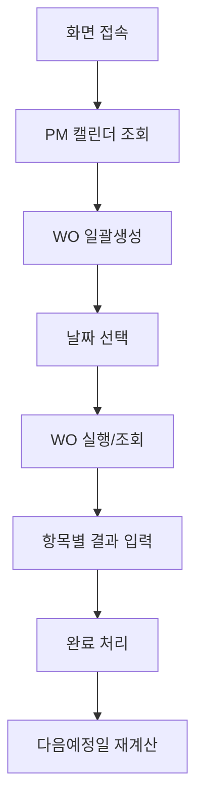

## 4. 상태 코드 및 공통코드

| 상태명 | 코드값 | 공통코드그룹 | 설명 |
|--------|--------|-------------|------|
| 예정 | PLANNED | PM_WO_STATUS | 계획됨 |
| 진행중 | IN_PROGRESS | PM_WO_STATUS | 작업 중 |
| 완료 | COMPLETED | PM_WO_STATUS | 완료 |
| 취소 | CANCELLED | PM_WO_STATUS | 취소 |
| 지연 | OVERDUE | PM_WO_STATUS | 기한 초과 |

## 5. API 명세

### 5.1 월별 요약
```
GET /api/v1/equipment/pm-work-orders/calendar
```
**Query Parameters**

| 파라미터 | 타입 | 필수 | 설명 |
|----------|------|------|------|
| year | number | Y | 년도 |
| month | number | Y | 월 |
| lineCode | string | N | 라인 필터 |
| equipType | string | N | 설비유형 필터 |

### 5.2 일별 상세
```
GET /api/v1/equipment/pm-work-orders/calendar/day
```
**Query Parameters**

| 파라미터 | 타입 | 필수 | 설명 |
|----------|------|------|------|
| date | string | Y | 날짜 (YYYY-MM-DD) |
| lineCode | string | N | 라인 필터 |
| equipType | string | N | 설비유형 필터 |

### 5.3 WO 일괄생성
```
POST /api/v1/equipment/pm-work-orders/generate
```
**Request Body** (`GenerateWorkOrdersDto`)
```json
{
  "year": 2024,
  "month": 1
}
```

### 5.4 WO 수동생성
```
POST /api/v1/equipment/pm-work-orders
```
**Request Body** (`CreatePmWorkOrderDto`)
```json
{
  "pmPlanId": "PM-001",
  "equipCode": "EQ-001",
  "woType": "PLANNED",
  "scheduledDate": "2024-01-15",
  "priority": "MEDIUM",
  "assignedWorkerId": "W001"
}
```

### 5.5 WO 실행
```
POST /api/v1/equipment/pm-work-orders/:id/execute
```
**Request Body** (`ExecutePmWorkOrderDto`)
```json
{
  "assignedWorkerId": "W001",
  "overallResult": "PASS",
  "items": [
    { "itemId": 1, "seq": 1, "itemName": "유압 오일 교체", "itemType": "REPLACE", "criteria": "색 탁도", "result": "PASS", "remark": "" }
  ],
  "remark": "비고"
}
```

### 5.6 WO 취소
```
PATCH /api/v1/equipment/pm-work-orders/:id/cancel
```

## 6. 처리 규칙 및 검증

### 6.1 WO 일괄생성 규칙
- 해당 월의 `nextDueAt`이 포함된 계획 대상
- `USAGE_BASED` 계획 중 `currentUsage >= usageThreshold` 도달 대상 추가
- 이미 동일 날짜에 WO 존재 시 스킵
- WO 번호 채번: `PM-YYYYMMDD-NNN` (날짜별 001부터)

### 6.2 WO 실행 규칙
- `COMPLETED` 또는 `CANCELLED` 상태는 실행 불가
- 실행 시 `status = COMPLETED`, `completedAt = now`
- `overallResult = FAIL` 시 설비 자동 `INTERLOCK`
- 실행 완료 시 `PM_PLANS.lastExecutedAt` / `nextDueAt` 재계산
- `USAGE_BASED` 계획 실행 후 `currentUsage = 0` 리셋

### 6.3 WO 취소 규칙
- `COMPLETED` 상태는 취소 불가

## 7. 연관 엔티티 및 테이블

| 엔티티명 | 테이블명 | 역할 | 관계 |
|----------|----------|------|------|
| PmWorkOrder | PM_WORK_ORDERS | WO | 메인 |
| PmPlan | PM_PLANS | PM 계획 | FK |
| PmPlanItem | PM_PLAN_ITEMS | 계획 항목 | 참조 |
| PmWoResult | PM_WO_RESULTS | WO 결과 | 1:N |
| EquipMaster | EQUIP_MASTERS | 설비 | FK |

## 8. 에러 코드 및 메시지

| 상황 | HTTP | 에러메시지 | 처리방법 |
|------|------|-----------|---------|
| 없는WO | 404 | Work Order를 찾을 수 없습니다 | 목록 재조회 |
| 이미완료 | 400 | 이미 COMPLETED 상태입니다. | — |
| 완료된WO취소 | 400 | 완료된 WO는 취소할 수 없습니다. | — |
| WO생성실패 | 500 | WO 생성 오류 | — |

## 9. 참고사항

- WO 일괄생성은 해당 월의 계획 기준으로 자동 발행
- PM캘린더와 점검캘린더는 동일한 UI 컴포넌트(`InspectCalendar`) 공유
- WO 실행 모달에서 항목별 PASS/FAIL 입력

---

# PM실적 (메뉴코드: `EQUIP_PM_RESULT`)

## 1. 화면 개요

| 항목 | 내용 |
|------|------|
| **메뉴 경로** | 설비관리 > PM실적 |
| **URL** | `/equipment/pm-result` |
| **메뉴 코드** | `EQUIP_PM_RESULT` |
| **화면 목적** | PM Work Order의 실행 결과를 조회한다. (조회 전용) |
| **주요 사용자** | 설비관리자, 생산관리자 |

## 2. 화면 구성

### 2.1 레이아웃
- 상단: 통계카드 (전체/완료/예정/지연)
- 중앙: DataGrid + 검색/상태 필터

### 2.2 데이터그리드 컬럼

| 컬럼ID | 컬럼명 | 데이터타입 | 비고 |
|--------|--------|-----------|------|
| workOrderNo | WO번호 | string | font-mono |
| scheduledDate | 예정일 | date | — |
| equipCode | 설비코드 | string | font-mono |
| equipName | 설비명 | string | — |
| status | 상태 | string | 색상 배지 |
| overallResult | 종합결과 | string | 색상 배지 |
| priority | 우선순위 | string | HIGH 빨강 |
| completedAt | 완료일 | date | — |
| remark | 비고 | string | — |

### 2.3 필터

| 필드 | 타입 | 비고 |
|------|------|------|
| search | text | WO번호, 설비코드 |
| status | select | 공통코드 `PM_WO_STATUS` |

## 3. 업무 흐름

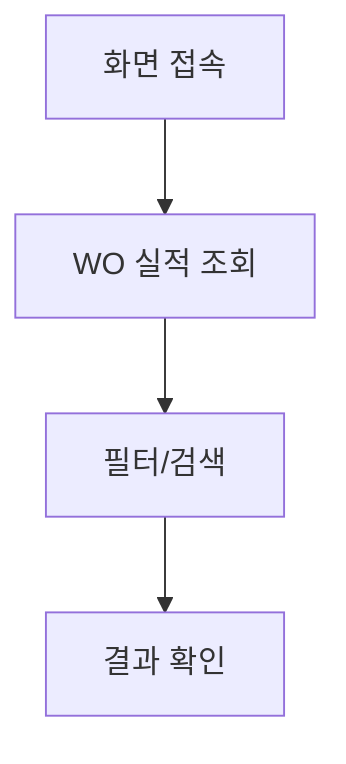

## 4. 상태 코드 및 공통코드

- `PM_WO_STATUS`: PLANNED, IN_PROGRESS, COMPLETED, CANCELLED, OVERDUE
- 결과: PASS, FAIL

## 5. API 명세

### 5.1 목록 조회
```
GET /api/v1/equipment/pm-work-orders
```
**Query Parameters**

| 파라미터 | 타입 | 필수 | 설명 |
|----------|------|------|------|
| page | number | N | 페이지 |
| limit | number | N | 건수 |
| equipCode | string | N | 설비코드 |
| status | string | N | 상태 |
| search | string | N | 검색어 |

## 6. 처리 규칙 및 검증

- 조회 전용 (등록/수정/삭제 불가)
- WO 수정은 PM캘린더 화면에서 실행

## 7. 연관 엔티티 및 테이블

| 엔티티명 | 테이블명 | 역할 | 관계 |
|----------|----------|------|------|
| PmWorkOrder | PM_WORK_ORDERS | WO | 메인 |
| PmWoResult | PM_WO_RESULTS | WO 결과 | 1:N |
| EquipMaster | EQUIP_MASTERS | 설비 | FK |

---

# 화면 간 연계 흐름

## 설비관리 전체 흐름

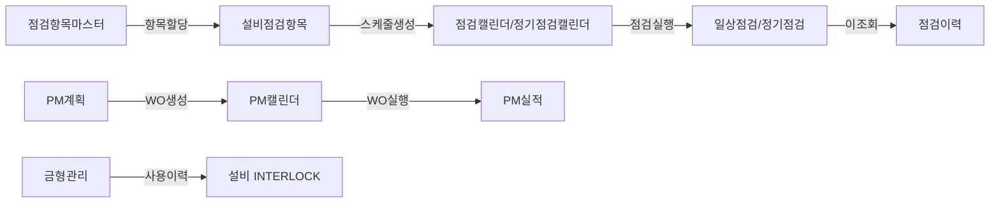

| 순서 | 화면 | 액션 | 다음화면 | 조건 |
|------|------|------|----------|------|
| 1 | 점검항목마스터 | 항목등록 | 설비점검항목 | — |
| 2 | 설비점검항목 | 설비별할당 | 점검캘린더 | — |
| 3 | 점검캘린더 | 날짜클릭+실행 | 일상점검 | DAILY |
| 4 | 정기점검캘린더 | 날짜클릭+실행 | 정기점검 | PERIODIC |
| 5 | 일상/정기점검 | 저장 | 점검이력 | 성공시 |
| 6 | PM계획 | 계획등록 | PM캘린더 | — |
| 7 | PM캘린더 | WO일괄생성 | PM실적 | — |
| 8 | PM캘린더 | WO실행 | PM실적 | 완료시 |
| 9 | 금형관리 | 사용이력등록 | 설비상태변경 | 타수초과시 INTERLOCK |
