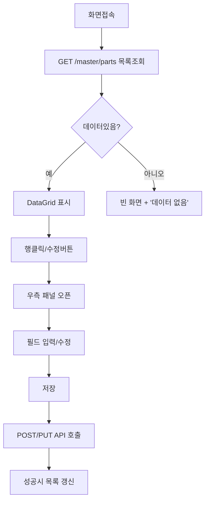
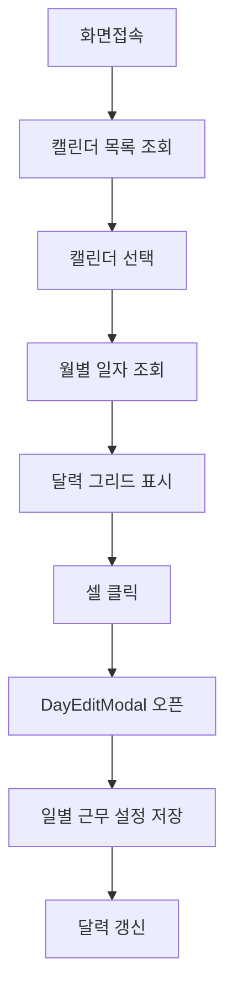
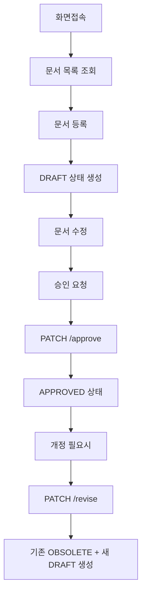
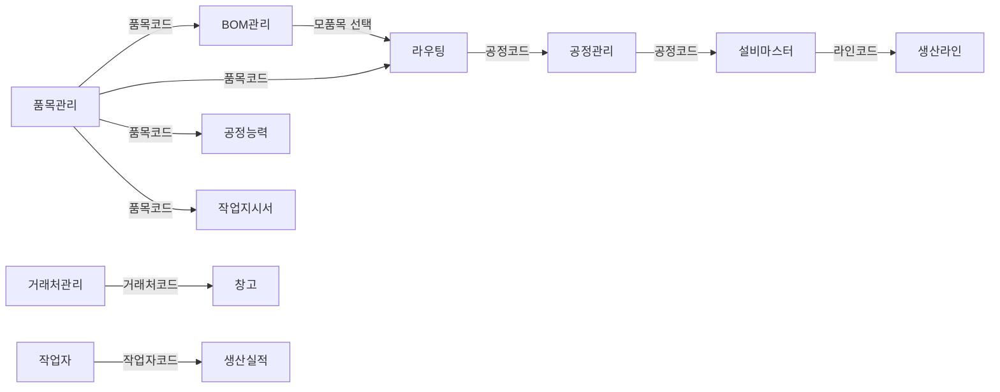

# 기준정보 Workflow 문서

> 작성일: 2026-06-10
> 대상: HANES MES 기준정보 15개 화면
> 템플릿: `docs/workflows/_template.md`

---

# 품목관리 (메뉴코드: `MST_PART`)

## 1. 화면 개요

| 항목 | 내용 |
|------|------|
| **메뉴 경로** | 기준정보 > 품목관리 |
| **URL** | `/master/part` |
| **메뉴 코드** | `MST_PART` |
| **화면 목적** | 자재/반제품/완제품/소모품 등 모든 품목의 기본 정보를 등록·관리한다. |
| **주요 사용자** | 품질관리자, 생산관리자, 자재관리자 |

## 2. 화면 구성

### 2.1 레이아웃
- 상단: 검색조건(품목유형, 사용여부) + 액션버튼(ERP동기화, 새로고침, 추가) + 요약(건수)
- 중앙: DataGrid (품목 목록)
- 하단: 페이징 없음 (limit 5000)
- 모달/패널: 우측 슬라이드 패널 (품목 등록/수정)

### 2.2 데이터그리드 컬럼
| 컬럼ID | 컬럼명 | 데이터타입 | 정렬 | 비고 |
|--------|--------|-----------|------|------|
| actions | 작업 | - | - | 수정/삭제 아이콘 |
| itemNo | 품번 | string | Y | 왼쪽정렬 |
| imageUrl | 사진 | string | - | 썸네일 또는 ImageIcon |
| itemCode | 품목코드 | string | Y | 왼쪽정렬 |
| itemName | 품목명 | string | Y | 왼쪽정렬 |
| itemType | 품목유형 | string | Y | RAW_MATERIAL, SEMI_PRODUCT, FINISHED, CONSUMABLE |
| productType | 품목그룹 | string | Y | PRODUCT_TYPE 공통코드 |
| spec | 규격 | string | Y | 왼쪽정렬 |
| rev | Rev | string | Y | - |
| markingText | 마킹문구 | string | Y | 왼쪽정렬 |
| custPartNo | 고객품번 | string | Y | 왼쪽정렬 |
| unit | 단위 | string | Y | - |
| boxQty | 박스입수 | number | Y | 숫자정렬 |
| lotUnitQty | LOT수량 | number | Y | 숫자정렬 |
| inspectMethod | IQC검사방법 | string | Y | FULL/SAMPLE/SKIP |
| tactTime | 택타임 | number | Y | 초 단위, 0이면 "-" |
| expiryDate | 유효기간 | number | Y | 일 단위, 0이면 "-" |
| expiryExtDays | 연장기간 | number | Y | 일 단위, 0이면 "-" |
| packUnit | 포장단위 | string | Y | - |
| storageLocation | 적재위치 | string | Y | - |
| useYn | 사용여부 | string | Y | Y/N 뱃지 |

### 2.3 입력 폼 필드
| 필드ID | 필드명 | 타입 | 필수 | 기본값 | 검증규칙 | 비고 |
|--------|--------|------|------|--------|----------|------|
| itemCode | 품목코드 | text | Y | - | Max 50, 중복불가 | - |
| itemName | 품목명 | text | Y | - | Max 200 | - |
| itemType | 품목유형 | select | Y | - | ITEM_TYPE 공통코드 | - |
| itemNo | 품번 | text | N | - | Max 100 | - |
| custPartNo | 고객품번 | text | N | - | Max 100 | - |
| productType | 제품유형 | select | N | - | PRODUCT_TYPE 공통코드 | - |
| spec | 규격 | text | N | - | Max 200 | - |
| rev | 리비전 | text | N | - | Max 10 | - |
| markingText | 마킹문구 | text | N | - | Max 100 | - |
| unit | 단위 | text | N | EA | Max 20 | - |
| drawNo | 도멲번호 | text | N | - | Max 100 | - |
| leadTime | 리드타임(일) | number | N | 0 | Min 0 | - |
| safetyStock | 안전재고 | number | N | 0 | Min 0 | - |
| lotUnitQty | LOT단위수량 | number | N | - | Min 0 | - |
| boxQty | 박스입수량 | number | N | 0 | Min 0 | - |
| iqcYn | IQC대상여부 | select | N | Y | Y/N | - |
| inspectMethod | IQC검사방법 | select | N | - | FULL/SAMPLE/SKIP | - |
| tactTime | 택타임(초) | number | N | 0 | Min 0 | - |
| expiryDate | 유효기간(일) | number | N | 0 | Min 0 | - |
| expiryExtDays | 연장최대일수 | number | N | 0 | Min 0 | - |
| toleranceRate | PO오차허용률(%) | number | N | 5.0 | 0~100 | - |
| isSplittable | 분할가능여부 | select | N | Y | Y/N | - |
| sampleQty | 샘플검사수량 | number | N | - | Min 0 | - |
| packUnit | 포장단위 | text | N | - | Max 50 | - |
| storageLocation | 적재로케이션 | text | N | - | Max 100 | - |
| imageUrl | 품목이미지URL | text | N | - | Max 500 | 이미지업로드API |
| remark | 비고 | text | N | - | Max 4000 | - |
| useYn | 사용여부 | select | N | Y | Y/N | - |

### 2.4 버튼/액션
| 버튼 | 조건 | 동작 | API |
|------|------|------|-----|
| ERP 동기화 | - | ERP 품목 동기화 | POST /interface/inbound/item-master |
| 새로고침 | - | 목록 재조회 | GET /master/parts |
| 추가 | - | 등록패널 오픈 | - |
| 수정 | 행 선택 | 수정패널 오픈 | PUT /master/parts/:id |
| 삭제 | 행 선택 | 삭제 확인 후 삭제 | DELETE /master/parts/:id |
| 이미지업로드 | 품목 상세 | 이미지 파일 업로드 | POST /master/parts/:id/image |
| 이미지삭제 | 품목 상세 | 이미지 삭제 | DELETE /master/parts/:id/image |

## 3. 업무 흐름

### 3.1 정상 흐름


### 3.2 예외/분기 흐름
- **조회 결과 없음**: "데이터가 없습니다" 메시지 표시
- **중복 품목코드**: 409 Conflict → "이미 존재하는 품목 코드입니다"
- **이미지 업로드 실패**: 지원하지 않는 파일 형식 또는 5MB 초과 시 에러
- **ERP 동기화 실패**: 에러 메시지 표시, 수동 새로고침 필요

## 4. 상태 코드 및 공통코드

### 4.1 화면 내 사용 상태
| 상태명 | 코드값 | 공통코드그룹 | 설명 | 색상 |
|--------|--------|-------------|------|------|
| 사용 | Y | USE_YN | 사용중 | 녹색 |
| 미사용 | N | USE_YN | 사용중지 | 적색 |
| 원자재 | RAW_MATERIAL | ITEM_TYPE | 원자재 | 파랑 |
| 반제품 | SEMI_PRODUCT | ITEM_TYPE | 반제품 | 남색 |
| 완제품 | FINISHED | ITEM_TYPE | 완제품 | 병아리 |
| 소모품 | CONSUMABLE | ITEM_TYPE | 소모품 | 회색 |

### 4.2 관련 공통코드 전체
- `ITEM_TYPE`: RAW_MATERIAL, SEMI_PRODUCT, FINISHED, CONSUMABLE
- `PRODUCT_TYPE`: HARNESS, TERMINAL, WIRE, CONNECTOR, ETC (예시)
- `USE_YN`: Y, N
- `INSPECT_METHOD`: FULL, SAMPLE, SKIP

## 5. API 명세

### 5.1 목록 조회
```
GET /master/parts
```
**Query Parameters**
| 파라미터 | 타입 | 필수 | 설명 |
|----------|------|------|------|
| page | number | N | 페이지 (기본 1) |
| limit | number | N | 페이지당 건수 (기본 20, 화면 5000) |
| itemType | string | N | 품목유형 필터 |
| itemTypes | string[] | N | 품목유형 다중 필터 (콤마구분) |
| search | string | N | 검색어 (코드,명칭,품번,고객품번,규격,마킹) |
| useYn | string | N | 사용여부 필터 |

**Response 200**
```json
{
  "data": [...],
  "meta": { "total": 100, "page": 1, "limit": 20 }
}
```

### 5.2 상세 조회
```
GET /master/parts/:id
GET /master/parts/code/:itemCode
```

### 5.3 생성
```
POST /master/parts
```

### 5.4 수정
```
PUT /master/parts/:id
```

### 5.5 삭제
```
DELETE /master/parts/:id
```

### 5.6 이미지 업로드
```
POST /master/parts/:id/image
```
Content-Type: multipart/form-data
파일 제한: 5MB, jpg/jpeg/png/gif/webp

### 5.7 이미지 삭제
```
DELETE /master/parts/:id/image
```

### 5.8 유형별 조회
```
GET /master/parts/types/:type
```

## 6. 처리 규칙 및 검증

### 6.1 입력 검증
- 품목코드: 필수, 최대 50자, 중복 불가
- 품목명: 필수, 최대 200자
- 품목유형: 필수, ITEM_TYPE 공통코드 값
- IQC검사방법: FULL/SAMPLE/SKIP 중 선택
- PO오차허용률: 0~100 범위

### 6.2 비즈니스 규칙
- 품목코드는 테넌트(company+plant) 내 유일해야 함
- 이미지 업로드 시 기존 이미지 파일 자동 삭제
- ERP 동기화는 신규/변경 건수를 반환

### 6.3 트랜잭션 처리
- 단일 엔티티 CRUD, 별도 트랜잭션 없음

## 7. 연관 엔티티 및 테이블

| 엔티티명 | 테이블명 | 역할 | 관계 |
|----------|----------|------|------|
| PartMaster | ITEM_MASTERS | 품목 기본정보 | 메인 |

## 8. 에러 코드 및 메시지

| 상황 | HTTP | 에러메시지 | 처리방법 |
|------|------|-----------|---------|
| 품목미존재 | 404 | 품목을 찾을 수 없습니다 | 품목코드 확인 |
| 중복코드 | 409 | 이미 존재하는 품목 코드입니다 | 다른 코드 사용 |
| 이미지형식오류 | 400 | Only image files are allowed! | 이미지 파일 선택 |

## 9. 참고사항
- 관련 화면: BOM관리, 라우팅, 입하검사
- ERP 연동: /interface/inbound/item-master

---

# BOM관리 (메뉴코드: `MST_BOM`)

## 1. 화면 개요

| 항목 | 내용 |
|------|------|
| **메뉴 경로** | 기준정보 > BOM관리 |
| **URL** | `/master/bom` |
| **메뉴 코드** | `MST_BOM` |
| **화면 목적** | 제품/반제품의 BOM(자품목) 구조를 등록·관리하고, 품목별 라우팅 및 투입자재를 연동 조회한다. |
| **주요 사용자** | 생산관리자, 품질관리자 |

## 2. 화면 구성

### 2.1 레이아웃
- 상단: 액션버튼(템플릿다운로드, 엑셀업로드, 유효일자, 새로고침) + 요약
- 좌측(3칸): 제품/반제품 목록 (BOM에 등재된 모품목)
- 중앙(5~9칸): 선택 모품목의 BOM 계층 트리 (BomTab)
- 우측(4칸): 선택 BOM행 기준 라우팅 + 품질조건/투입자재 (조걶표시)

### 2.2 데이터그리드 컬럼 (BOM 목록)
| 컬럼ID | 컬럼명 | 데이터타입 | 정렬 | 비고 |
|--------|--------|-----------|------|------|
| parentItemCode | 상위품목코드 | string | Y | 모품목 |
| childItemCode | 하위품목코드 | string | Y | 자품목 |
| qtyPer | 소요량 | number | Y | 단위소요량 |
| revision | 리비전 | string | Y | 기본값 'A' |
| seq | 순서 | number | Y | 공정순서 |
| bomGrp | BOM그룹 | string | Y | - |
| processCode | 공정코드 | string | Y | - |
| side | 사이드 | string | Y | N/L/R |
| ecoNo | ECO번호 | string | Y | - |
| validFrom | 유효시작일 | date | Y | - |
| validTo | 유효종료일 | date | Y | - |
| useYn | 사용여부 | string | Y | Y/N |

### 2.3 입력 폼 필드
| 필드ID | 필드명 | 타입 | 필수 | 기본값 | 검증규칙 | 비고 |
|--------|--------|------|------|--------|----------|------|
| parentItemCode | 상위품목코드 | select | Y | - | ITEM_MASTERS 존재 | 품목검색 |
| childItemCode | 하위품목코드 | select | Y | - | ITEM_MASTERS 존재 | 품목검색 |
| qtyPer | 소요량 | number | Y | - | Min 0 | - |
| seq | 순서 | number | N | 0 | Min 0 | - |
| revision | 리비전 | text | N | A | Max 10 | - |
| bomGrp | BOM그룹 | text | N | - | Max 50 | - |
| processCode | 공정코드 | select | N | - | PROCESS_MASTERS | - |
| side | 사이드 | select | N | - | N/L/R | - |
| ecoNo | ECO번호 | text | N | - | Max 50 | - |
| validFrom | 유효시작일 | date | N | - | - | - |
| validTo | 유효종료일 | date | N | - | - | - |
| remark | 비고 | text | N | - | Max 500 | - |
| useYn | 사용여부 | select | N | Y | Y/N | - |

### 2.4 버튼/액션
| 버튼 | 조건 | 동작 | API |
|------|------|------|-----|
| 템플릿다운로드 | - | 빈 BOM 엑셀 템플릿 다운로드 | GET /master/boms/template |
| 엑셀업로드 | - | BOM 엑셀 업로드 모달 오픈 | POST /master/boms/upload |
| 미리보기 | - | 업로드 전 중복/오류 미리보기 | POST /master/boms/upload/preview |
| 새로고침 | - | 모품목 목록 재조회 | GET /master/boms/parents |
| BOM상세보기 | 모품목 선택 | 계층 트리 조회 | GET /master/boms/hierarchy/:code |
| 라우팅관리 | BOM행 선택 | 라우팅 화면 이동 | /master/routing?itemCode=... |

## 3. 업무 흐름

### 3.1 정상 흐름
```mermaid
graph TD
    A[화면접속] --> B[GET /master/boms/parents 모품목조회]
    B --> C[좌측 제품목록 표시]
    C --> D[모품목 클릭]
    D --> E[GET /master/boms/hierarchy BOM계층조회]
    E --> F[중앙 BOM 트리 표시]
    F --> G[BOM행 클릭]
    G --> H[우측 라우팅+품질조건 패널 표시]
    H --> I[라우팅관리 버튼]
    I --> J[/master/routing 이동]
```

### 3.2 예외/분기 흐름
- **업로드 중복**: 미리보기에서 DB중복/파일중복 행 표시, 사용자 확인 후 업로드
- **상위=하위 품목**: 409 "상위 품목과 하위 품목이 같을 수 없습니다"
- **품목미존재**: 400 "상위품목코드 [X]가 품목마스터에 없습니다"

## 4. 상태 코드 및 공통코드

### 4.1 화면 내 사용 상태
| 상태명 | 코드값 | 설명 |
|--------|--------|------|
| 사용 | Y | BOM 사용중 |
| 미사용 | N | BOM 사용중지 |

### 4.2 관련 공통코드 전체
- `ITEM_TYPE`: FINISHED, SEMI_PRODUCT (모품목 필터 대상)
- `USE_YN`: Y, N

## 5. API 명세

### 5.1 모품목 목록 조회
```
GET /master/boms/parents
```
Query: search, effectiveDate

### 5.2 BOM 목록 조회
```
GET /master/boms
```
Query: page, limit, parentItemCode, childItemCode, revision

### 5.3 BOM 계층 조회
```
GET /master/boms/hierarchy/:parentItemCode
```
Query: depth (기본 3), effectiveDate

### 5.4 부모별 BOM 조회
```
GET /master/boms/parent/:parentItemCode
```
Query: effectiveDate

### 5.5 BOM 생성
```
POST /master/boms
```

### 5.6 BOM 수정
```
PUT /master/boms/:id
```
id = "parentItemCode::childItemCode::revision"

### 5.7 BOM 삭제
```
DELETE /master/boms/:id
```

### 5.8 엑셀 낭출
```
GET /master/boms/export
```
Query: parentItemCode

### 5.9 엑셀 템플릿
```
GET /master/boms/template
```

### 5.10 엑셀 업로드
```
POST /master/boms/upload
```
Content-Type: multipart/form-data (.xlsx)

### 5.11 업로드 미리보기
```
POST /master/boms/upload/preview
```

## 6. 처리 규칙 및 검증

### 6.1 입력 검증
- 상위/하위품목코드: 필수, ITEM_MASTERS 존재 여부 확인
- 소요량: 필수, 0 이상 숫자
- 상위=하위 불가

### 6.2 비즈니스 규칙
- 복합 PK: (parentItemCode, childItemCode, revision)
- 유효일자 필터: validFrom <= date AND validTo >= date (NULL은 무제한)
- Oracle CONNECT BY로 계층 조회 (최대 depth 10)

### 6.3 트랜잭션 처리
- 단일 행 CRUD
- 엑셀 업로드: 행별 개별 INSERT, 실패해도 다른 행 계속

## 7. 연관 엔티티 및 테이블

| 엔티티명 | 테이블명 | 역할 | 관계 |
|----------|----------|------|------|
| BomMaster | BOM_MASTERS | BOM 구성 | 메인 |
| PartMaster | ITEM_MASTERS | 품목 정보 | FK |
| ProcessMaster | PROCESS_MASTERS | 공정 정보 | FK |

## 8. 에러 코드 및 메시지

| 상황 | HTTP | 에러메시지 | 처리방법 |
|------|------|-----------|---------|
| 상위=하위 | 409 | 상위 품목과 하위 품목이 같을 수 없습니다 | 다른 품목 선택 |
| 중복BOM | 409 | 이미 존재하는 BOM입니다 | 리비전 또는 품목 변경 |
| 품목미존재 | 400 | 상위/하위품목코드 [X]가 품목마스터에 없습니다 | 품목마스터 확인 |

## 9. 참고사항
- 관련 화면: 품목관리, 라우팅, 공정관리
- 엑셀 업로드 양식: 상위품목코드, 하위품목코드, 소요량, 리비전, 순서, BOM그룹, 공정코드, 사이드, ECO번호, 유효시작일, 유효종료일, 비고

---

# 거래처관리 (메뉴코드: `MST_PARTNER`)

## 1. 화면 개요

| 항목 | 내용 |
|------|------|
| **메뉴 경로** | 기준정보 > 거래처관리 |
| **URL** | `/master/partner` |
| **메뉴 코드** | `MST_PARTNER` |
| **화면 목적** | 고객사/공급사 등 거래처 정보를 등록·관리한다. |
| **주요 사용자** | 영업관리자, 자재구매관리자 |

## 2. 화면 구성

### 2.1 레이아웃
- 상단: 검색조건(거래처유형, 사용여부) + 액션버튼(새로고침, 추가)
- 중앙: DataGrid (거래처 목록)
- 모달/패널: 우측 슬라이드 패널 (등록/수정)

### 2.2 데이터그리드 컬럼
| 컬럼ID | 컬럼명 | 데이터타입 | 정렬 | 비고 |
|--------|--------|-----------|------|------|
| actions | 작업 | - | - | 수정/삭제 |
| partnerCode | 거래처코드 | string | Y | - |
| partnerName | 거래처명 | string | Y | - |
| partnerType | 거래처유형 | string | Y | CUSTOMER/SUPPLIER |
| bizNo | 사업자번호 | string | Y | - |
| ceoName | 대표자명 | string | Y | - |
| tel | 전화번호 | string | Y | - |
| contactPerson | 담당자명 | string | Y | - |
| email | 이메일 | string | Y | - |
| useYn | 사용여부 | string | Y | Y/N |

### 2.3 입력 폼 필드
| 필드ID | 필드명 | 타입 | 필수 | 기본값 | 검증규칙 | 비고 |
|--------|--------|------|------|--------|----------|------|
| partnerCode | 거래처코드 | text | Y | - | Max 50, 중복불가 | - |
| partnerName | 거래처명 | text | Y | - | Max 200 | - |
| partnerType | 거래처유형 | select | Y | - | PARTNER_TYPE 공통코드 | - |
| bizNo | 사업자번호 | text | N | - | Max 20 | - |
| ceoName | 대표자명 | text | N | - | Max 50 | - |
| address | 주소 | text | N | - | Max 500 | - |
| tel | 전화번호 | text | N | - | Max 20 | - |
| fax | 팩스번호 | text | N | - | Max 20 | - |
| email | 이메일 | text | N | - | Max 100 | - |
| contactPerson | 담당자명 | text | N | - | Max 50 | - |
| remark | 비고 | text | N | - | Max 500 | - |
| useYn | 사용여부 | select | N | Y | Y/N | - |

### 2.4 버튼/액션
| 버튼 | 조건 | 동작 | API |
|------|------|------|-----|
| 새로고침 | - | 목록 재조회 | GET /master/partners |
| 추가 | - | 등록패널 오픈 | - |
| 수정 | 행 선택 | 수정패널 오픈 | PUT /master/partners/:id |
| 삭제 | 행 선택 | 삭제 확인 후 삭제 | DELETE /master/partners/:id |

## 3. 업무 흐름

### 3.1 정상 흐름
1. 화면 접속
2. GET /master/partners 목록 조회
3. DataGrid 표시
4. 등록/수정/삭제 CRUD 수행

### 3.2 예외/분기 흐름
- **조회 결과 없음**: "데이터가 없습니다" 표시
- **중복 코드**: 409 "이미 존재하는 거래처 코드입니다"

## 4. 상태 코드 및 공통코드

### 4.1 화면 내 사용 상태
| 상태명 | 코드값 | 공통코드그룹 | 설명 |
|--------|--------|-------------|------|
| 사용 | Y | USE_YN | 사용중 |
| 미사용 | N | USE_YN | 사용중지 |
| 고객 | CUSTOMER | PARTNER_TYPE | 고객사 |
| 공급사 | SUPPLIER | PARTNER_TYPE | 공급업체 |

## 5. API 명세

### 5.1 목록 조회
```
GET /master/partners
```
Query: page, limit, partnerType, search, useYn

### 5.2 상세 조회
```
GET /master/partners/:id
GET /master/partners/code/:partnerCode
```

### 5.3 생성
```
POST /master/partners
```

### 5.4 수정
```
PUT /master/partners/:id
```

### 5.5 삭제
```
DELETE /master/partners/:id
```

### 5.6 유형별 조회
```
GET /master/partners/types/:type
```

### 5.7 통계 조회
```
GET /master/partners/statistics
```

## 6. 처리 규칙 및 검증

### 6.1 입력 검증
- 거래처코드: 필수, 중복 불가
- 거래처명: 필수
- 거래처유형: 필수, PARTNER_TYPE 공통코드

### 6.2 비즈니스 규칙
- 거래처코드는 테넌트 내 유일
- 통계: 전체/고객/공급사/활성 건수 집계

## 7. 연관 엔티티 및 테이블

| 엔티티명 | 테이블명 | 역할 | 관계 |
|----------|----------|------|------|
| PartnerMaster | PARTNER_MASTERS | 거래처 정보 | 메인 |

## 8. 에러 코드 및 메시지

| 상황 | HTTP | 에러메시지 | 처리방법 |
|------|------|-----------|---------|
| 거래처미존재 | 404 | 거래처를 찾을 수 없습니다 | 코드 확인 |
| 중복코드 | 409 | 이미 존재하는 거래처 코드입니다 | 다른 코드 사용 |

---

# 설비마스터 (메뉴코드: `EQUIP_MASTER`)

## 1. 화면 개요

| 항목 | 내용 |
|------|------|
| **메뉴 경로** | 기준정보 > 설비마스터 |
| **URL** | `/master/equip` |
| **메뉴 코드** | `EQUIP_MASTER` |
| **화면 목적** | 생산 설비의 기본 정보, 통신 설정, 상태를 관리하고 설비별 BOM(부품/소모품)을 관리한다. |
| **주요 사용자** | 설비관리자, 생산관리자 |

## 2. 화면 구성

### 2.1 레이아웃
- 상단: 탭 네비게이션 (설비 기본정보 / 설비 BOM 관리)
- 탭1-설비기본정보: 검색 + DataGrid + 우측 슬라이드 패널
- 탭2-설비BOM: 설비 선택 + 부품/소모품 DataGrid

### 2.2 데이터그리드 컬럼 (설비 기본정보)
| 컬럼ID | 컬럼명 | 데이터타입 | 정렬 | 비고 |
|--------|--------|-----------|------|------|
| actions | 작업 | - | - | 수정/삭제 |
| equipCode | 설비코드 | string | Y | - |
| equipName | 설비명 | string | Y | - |
| equipType | 설비유형 | string | Y | EQUIP_TYPE 공통코드 |
| modelName | 모델명 | string | Y | - |
| maker | 제조사 | string | Y | - |
| lineCode | 소속라인 | string | Y | - |
| processCode | 소속공정 | string | Y | - |
| processName | 공정명 | string | Y | 조인 |
| ipAddress | IP주소 | string | Y | - |
| port | 포트 | number | Y | - |
| commType | 통신방식 | string | Y | MQTT/SERIAL/TCP |
| status | 상태 | string | Y | NORMAL/MAINT/STOP |
| useYn | 사용여부 | string | Y | Y/N |

### 2.3 입력 폼 필드
| 필드ID | 필드명 | 타입 | 필수 | 기본값 | 검증규칙 | 비고 |
|--------|--------|------|------|--------|----------|------|
| equipCode | 설비코드 | text | Y | - | Max 50, 중복불가 | - |
| equipName | 설비명 | text | Y | - | Max 200 | - |
| equipType | 설비유형 | select | N | - | EQUIP_TYPE 공통코드 | - |
| modelName | 모델명 | text | N | - | Max 100 | - |
| maker | 제조사 | text | N | - | Max 100 | - |
| lineCode | 소속라인 | select | N | - | PROD_LINE_MASTERS | - |
| processCode | 소속공정 | select | N | - | PROCESS_MASTERS | - |
| ipAddress | IP주소 | text | N | - | IP 형식 검증 | - |
| port | 포트 | number | N | - | 1~65535 | - |
| commType | 통신방식 | select | N | - | MQTT/SERIAL/TCP | - |
| commConfig | 통신설정 | json | N | - | JSON 객체 | CLOB 저장 |
| installDate | 설치일 | date | N | - | ISO 8601 | - |
| status | 상태 | select | N | NORMAL | NORMAL/MAINT/STOP | - |
| useYn | 사용여부 | select | N | Y | Y/N | - |

### 2.4 버튼/액션
| 버튼 | 조건 | 동작 | API |
|------|------|------|-----|
| 새로고침 | - | 목록 재조회 | GET /equipment/equips |
| 추가 | - | 등록패널 오픈 | - |
| 수정 | 행 선택 | 수정패널 오픈 | PUT /equipment/equips/:id |
| 삭제 | 행 선택 | 삭제 확인 후 삭제 | DELETE /equipment/equips/:id |
| 상태변경 | 행 선택 | 설비 상태 변경 | PATCH /equipment/equips/:id/status |
| 작업지시할당 | 행 선택 | 작업지시 할당/해제 | PATCH /equipment/equips/:id/job-order |

## 3. 업무 흐름

### 3.1 정상 흐름
1. 화면 접속 → 탭1(설비 기본정보) 표시
2. 설비 목록 조회
3. CRUD 수행
4. 탭2(설비 BOM 관리)에서 설비 선택 후 부품 관리

### 3.2 예외/분기 흐름
- **비정상 상태 설비에 작업지시 할당**: 409 "설비 [X]가 'MAINT' 상태이므로 작업지시를 할당할 수 없습니다"
- **설비 삭제**: 관련 설비BOM/점검이력 확인 필요

## 4. 상태 코드 및 공통코드

### 4.1 화면 내 사용 상태
| 상태명 | 코드값 | 공통코드그룹 | 설명 | 색상 |
|--------|--------|-------------|------|------|
| 정상 | NORMAL | EQUIP_STATUS | 정상가동 | 녹색 |
| 정비중 | MAINT | EQUIP_STATUS | 정비/점검중 | 노랑 |
| 가동중지 | STOP | EQUIP_STATUS | 장기미사용/폐기예정 | 적색 |
| 사용 | Y | USE_YN | - | - |
| 미사용 | N | USE_YN | - | - |

### 4.2 관련 공통코드 전체
- `EQUIP_STATUS`: NORMAL, MAINT, STOP, INTERLOCK
- `EQUIP_TYPE`: AUTO_CRIMP, MANUAL_CRIMP, CUTTING, WELDING, INSPECTION, etc.
- `COMM_TYPE`: MQTT, SERIAL, TCP
- `USE_YN`: Y, N

## 5. API 명세

### 5.1 설비 목록 조회
```
GET /equipment/equips
```
Query: page, limit, equipType, lineCode, processCode, status, commType, useYn, search, company, plant

### 5.2 설비 상세 조회
```
GET /equipment/equips/:id
GET /equipment/equips/code/:equipCode
```

### 5.3 설비 생성
```
POST /equipment/equips
```

### 5.4 설비 수정
```
PUT /equipment/equips/:id
```

### 5.5 설비 삭제
```
DELETE /equipment/equips/:id
```

### 5.6 상태 변경
```
PATCH /equipment/equips/:id/status
```
Body: { status: string, reason?: string }

### 5.7 작업지시 할당
```
PATCH /equipment/equips/:id/job-order
```
Body: { orderNo?: string | null }

### 5.8 라인별 조회
```
GET /equipment/equips/line/:lineCode
```

### 5.9 유형별 조회
```
GET /equipment/equips/type/:equipType
```

### 5.10 상태별 조회
```
GET /equipment/equips/status/:status
```

### 5.11 통계 조회
```
GET /equipment/equips/stats
```

### 5.12 정비중/중지 설비 조회
```
GET /equipment/equips/maintenance
```

### 5.13 메타데이터 (라인/공정 목록)
```
GET /equipment/equips/metadata/lines
GET /equipment/equips/metadata/processes
```

## 6. 처리 규칙 및 검증

### 6.1 입력 검증
- 설비코드: 필수, 중복 불가
- 설비명: 필수
- IP주소: IP 형식 (선택 시)
- 포트: 1~65535

### 6.2 비즈니스 규칙
- 작업지시 할당 시 비정상 상태(MAINT/STOP/INTERLOCK) 차단
- 통신 설정은 JSON 문자열로 CLOB 저장
- 공정명은 PROCESS_MASTERS 단일 IN 조회로 매핑 (N+1 회피)

### 6.3 트랜잭션 처리
- 단일 엔티티 CRUD

## 7. 연관 엔티티 및 테이블

| 엔티티명 | 테이블명 | 역할 | 관계 |
|----------|----------|------|------|
| EquipMaster | EQUIP_MASTERS | 설비 기본정보 | 메인 |
| EquipBomRel | EQUIP_BOM_RELS | 설비별 부품 | 1:N |
| ProdLineMaster | PROD_LINE_MASTERS | 라인 정보 | FK |
| ProcessMaster | PROCESS_MASTERS | 공정 정보 | FK |

## 8. 에러 코드 및 메시지

| 상황 | HTTP | 에러메시지 | 처리방법 |
|------|------|-----------|---------|
| 설비미존재 | 404 | 설비를 찾을 수 없습니다 | 코드 확인 |
| 중복코드 | 409 | 이미 존재하는 설비 코드입니다 | 다른 코드 사용 |
| 작업지시할당불가 | 409 | 설비 [X]가 "STATUS" 상태이므로 작업지시를 할당할 수 없습니다 | 상태 변경 후 시도 |

---

# 공정관리 (메뉴코드: `MST_PROCESS`)

## 1. 화면 개요

| 항목 | 내용 |
|------|------|
| **메뉴 경로** | 기준정보 > 공정관리 |
| **URL** | `/master/process` |
| **메뉴 코드** | `MST_PROCESS` |
| **화면 목적** | 생산 공정 정보를 등록·관리하고, 공정별 배치 설비를 관리한다. |
| **주요 사용자** | 생산관리자, 공정관리자 |

## 2. 화면 구성

### 2.1 레이아웃
- 상단: 헤더 + 새로고침 버튼
- 좌측(7칸): 공정 목록 (ProcessList) + 공정 CRUD 모달
- 우측(5칸): 선택 공정의 배치 설비 목록 (ProcessEquipGrid)

### 2.2 데이터그리드 컬럼 (공정 목록)
| 컬럼ID | 컬럼명 | 데이터타입 | 정렬 | 비고 |
|--------|--------|-----------|------|------|
| processCode | 공정코드 | string | Y | - |
| processName | 공정명 | string | Y | - |
| processType | 공정유형 | string | Y | PROCESS_TYPE 공통코드 |
| processCategory | 공정대분류 | string | Y | ASSY/INSP/CUTTING 등 |
| sortOrder | 정렬순서 | number | Y | - |
| equipCount | 배치설비수 | number | Y | 동적계산 |
| useYn | 사용여부 | string | Y | Y/N |

### 2.3 입력 폼 필드
| 필드ID | 필드명 | 타입 | 필수 | 기본값 | 검증규칙 | 비고 |
|--------|--------|------|------|--------|----------|------|
| processCode | 공정코드 | text | Y | - | Max 50, 중복불가 | - |
| processName | 공정명 | text | Y | - | Max 200 | - |
| processType | 공정유형 | select | Y | - | PROCESS_TYPE 공통코드 | - |
| processCategory | 공정대분류 | select | N | - | ASSY/INSP/CUTTING/WELDING/PACKING | - |
| sortOrder | 정렬순서 | number | N | 0 | Min 0 | - |
| remark | 비고 | text | N | - | Max 500 | - |
| useYn | 사용여부 | select | N | Y | Y/N | - |

### 2.4 버튼/액션
| 버튼 | 조건 | 동작 | API |
|------|------|------|-----|
| 새로고침 | - | 공정+설비 재조회 | GET /master/processes |
| 공정추가 | - | 등록모달 오픈 | POST /master/processes |
| 공정수정 | 행 선택 | 수정모달 오픈 | PUT /master/processes/:id |
| 공정삭제 | 행 선택 | 삭제 확인 후 삭제 | DELETE /master/processes/:id |
| 설비배치 | 공정 선택 | 설비 배치 모달 | POST /master/processes/:id/equipments |
| 설비삭제 | 배치설비 선택 | 배치 해제 | DELETE /master/processes/:id/equipments/:equipCode |

## 3. 업무 흐름

### 3.1 정상 흐름
1. 화면 접속
2. GET /master/processes 공정 목록 조회
3. GET /master/processes/equipment-counts 설비 수 조회
4. 공정 선택 → GET /master/processes/:id/equipments 배치 설비 조회
5. 설비 배치/삭제 수행

### 3.2 예외/분기 흐름
- **공정 삭제 시**: 해당 공정에 배치된 설비가 있으면 함께 삭제되지 않음 (ProcessEquipment 별도 관리)
- **이미 배치된 설비 재배치**: 기존 배치 useYn='Y'로 유지

## 4. 상태 코드 및 공통코드

### 4.1 화면 내 사용 상태
| 상태명 | 코드값 | 공통코드그룹 | 설명 |
|--------|--------|-------------|------|
| 사용 | Y | USE_YN | 사용중 |
| 미사용 | N | USE_YN | 사용중지 |

### 4.2 관련 공통코드 전체
- `PROCESS_TYPE`: 공정 유형
- `USE_YN`: Y, N

## 5. API 명세

### 5.1 공정 목록 조회
```
GET /master/processes
```
Query: page, limit, search, processType, useYn

### 5.2 공정 상세 조회
```
GET /master/processes/:id
```

### 5.3 공정 생성
```
POST /master/processes
```

### 5.4 공정 수정
```
PUT /master/processes/:id
```

### 5.5 공정 삭제
```
DELETE /master/processes/:id
```

### 5.6 공정별 배치 설비 수 조회
```
GET /master/processes/equipment-counts
```

### 5.7 공정 배치 설비 목록 조회
```
GET /master/processes/:id/equipments
```

### 5.8 공정에 설비 배치
```
POST /master/processes/:id/equipments
```
Body: { equipCode: string }

### 5.9 공정 배치 설비 삭제
```
DELETE /master/processes/:id/equipments/:equipCode
```

## 6. 처리 규칙 및 검증

### 6.1 입력 검증
- 공정코드: 필수, 중복 불가
- 공정명: 필수
- 공정유형: 필수

### 6.2 비즈니스 규칙
- 공정 삭제 시 ProcessEquipment 연관 데이터는 별도 처리
- 설비 배치 시 이미 존재하면 useYn='Y'로 활성화

## 7. 연관 엔티티 및 테이블

| 엔티티명 | 테이블명 | 역할 | 관계 |
|----------|----------|------|------|
| ProcessMaster | PROCESS_MASTERS | 공정 정보 | 메인 |
| ProcessEquipment | PROCESS_EQUIPMENTS | 공정-설비 배치 | M:N 연결 |
| EquipMaster | EQUIP_MASTERS | 설비 정보 | FK |

## 8. 에러 코드 및 메시지

| 상황 | HTTP | 에러메시지 | 처리방법 |
|------|------|-----------|---------|
| 공정미존재 | 404 | 공정을 찾을 수 없습니다 | 코드 확인 |
| 중복코드 | 409 | 이미 존재하는 공정 코드입니다 | 다른 코드 사용 |
| 설비미존재 | 404 | 설비를 찾을 수 없습니다 | 설비코드 확인 |

---

# 생산라인 (메뉴코드: `MST_PROD_LINE`)

## 1. 화면 개요

| 항목 | 내용 |
|------|------|
| **메뉴 경로** | 기준정보 > 생산라인 |
| **URL** | `/master/prod-line` |
| **메뉴 코드** | `MST_PROD_LINE` |
| **화면 목적** | 물리적 생산라인 정보를 등록·관리한다. |
| **주요 사용자** | 생산관리자, 설비관리자 |

## 2. 화면 구성

### 2.1 레이아웃
- 상단: 헤더 + 액션버튼 (ProdLineTab 컴포넌트 내부 처리)
- 중앙: DataGrid (생산라인 목록) + 우측 슬라이드 패널

### 2.2 데이터그리드 컬럼
| 컬럼ID | 컬럼명 | 데이터타입 | 정렬 | 비고 |
|--------|--------|-----------|------|------|
| lineCode | 라인코드 | string | Y | - |
| lineName | 라인명 | string | Y | - |
| whLoc | 창고위치 | string | Y | - |
| erpCode | ERP코드 | string | Y | - |
| oper | 공정코드 | string | Y | - |
| lineType | 라인유형 | string | Y | - |
| useYn | 사용여부 | string | Y | Y/N |

### 2.3 입력 폼 필드
| 필드ID | 필드명 | 타입 | 필수 | 기본값 | 검증규칙 | 비고 |
|--------|--------|------|------|--------|----------|------|
| lineCode | 라인코드 | text | Y | - | Max 20, 중복불가 | - |
| lineName | 라인명 | text | Y | - | Max 100 | - |
| whLoc | 창고위치 | text | N | - | Max 20 | - |
| erpCode | ERP코드 | text | N | - | Max 20 | - |
| oper | 공정코드 | text | N | - | Max 10 | - |
| lineType | 라인유형 | text | N | - | Max 30 | - |
| remark | 비고 | text | N | - | Max 500 | - |
| useYn | 사용여부 | select | N | Y | Y/N | - |

### 2.4 버튼/액션
| 버튼 | 조건 | 동작 | API |
|------|------|------|-----|
| 새로고침 | - | 목록 재조회 | GET /master/prod-lines |
| 추가 | - | 등록패널 오픈 | - |
| 수정 | 행 선택 | 수정패널 오픈 | PUT /master/prod-lines/:id |
| 삭제 | 행 선택 | 삭제 확인 후 삭제 | DELETE /master/prod-lines/:id |

## 3. 업무 흐름

### 3.1 정상 흐름
1. 화면 접속
2. GET /master/prod-lines 목록 조회
3. CRUD 수행

### 3.2 예외/분기 흐름
- **조회 결과 없음**: "데이터가 없습니다"
- **중복 코드**: 409 "이미 존재하는 라인 코드입니다"

## 4. 상태 코드 및 공통코드

### 4.1 화면 내 사용 상태
| 상태명 | 코드값 | 공통코드그룹 | 설명 |
|--------|--------|-------------|------|
| 사용 | Y | USE_YN | 사용중 |
| 미사용 | N | USE_YN | 사용중지 |

## 5. API 명세

### 5.1 목록 조회
```
GET /master/prod-lines
```
Query: page, limit, search, useYn

### 5.2 상세 조회
```
GET /master/prod-lines/:id
```

### 5.3 생성
```
POST /master/prod-lines
```

### 5.4 수정
```
PUT /master/prod-lines/:id
```

### 5.5 삭제
```
DELETE /master/prod-lines/:id
```

## 6. 처리 규칙 및 검증

### 6.1 입력 검증
- 라인코드: 필수, 중복 불가
- 라인명: 필수

## 7. 연관 엔티티 및 테이블

| 엔티티명 | 테이블명 | 역할 | 관계 |
|----------|----------|------|------|
| ProdLineMaster | PROD_LINE_MASTERS | 생산라인 정보 | 메인 |

## 8. 에러 코드 및 메시지

| 상황 | HTTP | 에러메시지 | 처리방법 |
|------|------|-----------|---------|
| 라인미존재 | 404 | 생산라인을 찾을 수 없습니다 | 코드 확인 |
| 중복코드 | 409 | 이미 존재하는 라인 코드입니다 | 다른 코드 사용 |

---

# 라우팅 (메뉴코드: `MST_ROUTING`)

## 1. 화면 개요

| 항목 | 내용 |
|------|------|
| **메뉴 경로** | 기준정보 > 라우팅 |
| **URL** | `/master/routing` |
| **메뉴 코드** | `MST_ROUTING` |
| **화면 목적** | 품목별 공정순서(라우팅)를 등록·관리하고, 공정별 품질조건/투입자재/자주검사 설정을 관리한다. |
| **주요 사용자** | 품질관리자, 생산관리자, 공정관리자 |

## 2. 화면 구성

### 2.1 레이아웃
- 상단: 헤더 + 새로고침 버튼
- 좌측(8칸): RoutingGroupManager (라우팅 그룹 목록 + 공정순서)
- 우측(4칸): 선택 공정의 품질조건/투입자재/자주검사 탭

### 2.2 데이터그리드 컬럼 (공정순서)
| 컬럼ID | 컬럼명 | 데이터타입 | 정렬 | 비고 |
|--------|--------|-----------|------|------|
| seq | 순서 | number | Y | 공정순서 |
| processCode | 공정코드 | string | Y | - |
| processName | 공정명 | string | Y | - |
| processType | 공정유형 | string | Y | - |
| equipType | 설비타입 | string | Y | - |
| stdTime | 표준시간 | number | Y | - |
| setupTime | 셋업시간 | number | Y | - |
| wireLength | 전선길이 | number | Y | mm |
| stripLength | 탈피길이 | number | Y | mm |
| crimpHeight | 압착높이 | number | Y | mm |
| crimpWidth | 압착폭 | number | Y | mm |
| weldCondition | 융착조건 | string | Y | - |
| useYn | 사용여부 | string | Y | Y/N |

### 2.3 입력 폼 필드
| 필드ID | 필드명 | 타입 | 필수 | 기본값 | 검증규칙 | 비고 |
|--------|--------|------|------|--------|----------|------|
| itemCode | 품목코드 | select | Y | - | ITEM_MASTERS | - |
| seq | 공정순서 | number | Y | - | Min 1 | - |
| processCode | 공정코드 | select | Y | - | PROCESS_MASTERS | - |
| processName | 공정명 | text | Y | - | Max 200 | - |
| processType | 공정유형 | text | N | - | Max 50 | - |
| equipType | 설비타입 | text | N | - | Max 50 | - |
| stdTime | 표준시간 | number | N | - | - | - |
| setupTime | 셋업시간 | number | N | - | - | - |
| wireLength | 전선길이 | number | N | - | mm | - |
| stripLength | 탈피길이 | number | N | - | mm | - |
| crimpHeight | 압착높이 | number | N | - | mm | - |
| crimpWidth | 압착폭 | number | N | - | mm | - |
| weldCondition | 융착조건 | text | N | - | Max 500 | - |
| processParams | 공정파라미터 | text | N | - | JSON, Max 2000 | - |
| useYn | 사용여부 | select | N | Y | Y/N | - |

### 2.4 버튼/액션
| 버튼 | 조건 | 동작 | API |
|------|------|------|-----|
| 새로고침 | - | 라우팅 재조회 | GET /master/routings |
| 라우팅관리 | BOM화면 | /master/routing 이동 | - |

## 3. 업무 흐름

### 3.1 정상 흐름
1. 화면 접속
2. 라우팅 그룹 목록 표시
3. 그룹 선택 → 공정순서 목록 표시
4. 공정 선택 → 우측 품질조건/투입자재/자주검사 탭 표시
5. 각 탭에서 상세 설정 편집

### 3.2 예외/분기 흐름
- **중복 라우팅**: 409 "이미 존재하는 라우팅입니다: itemCode / seq N"

## 4. 상태 코드 및 공통코드

### 4.1 화면 내 사용 상태
| 상태명 | 코드값 | 설명 |
|--------|--------|------|
| 사용 | Y | 라우팅 사용중 |
| 미사용 | N | 라우팅 사용중지 |

## 5. API 명세

### 5.1 라우팅 목록 조회
```
GET /master/routings
```
Query: page, limit, itemCode, search, useYn

### 5.2 라우팅 상세 조회
```
GET /master/routings/:itemCode/:seq
```

### 5.3 라우팅 생성
```
POST /master/routings
```

### 5.4 라우팅 수정
```
PUT /master/routings/:itemCode/:seq
```

### 5.5 라우팅 삭제
```
DELETE /master/routings/:itemCode/:seq
```

### 5.6 라우팅 그룹 조회 (BOM 연동)
```
GET /master/routing-groups/by-item/:itemCode
```

## 6. 처리 규칙 및 검증

### 6.1 입력 검증
- 품목코드: 필수
- 공정순서: 필수, 1 이상
- 공정코드: 필수
- 공정명: 필수

### 6.2 비즈니스 규칙
- 복합 PK: (itemCode, seq)
- 품목명은 PartMaster JOIN으로 조회

## 7. 연관 엔티티 및 테이블

| 엔티티명 | 테이블명 | 역할 | 관계 |
|----------|----------|------|------|
| ProcessMap | PROCESS_MAPS | 공정순서 | 메인 |
| RoutingGroup | ROUTING_GROUPS | 라우팅 그룹 | 1:N |
| PartMaster | ITEM_MASTERS | 품목 정보 | FK |
| ProcessMaster | PROCESS_MASTERS | 공정 정보 | FK |

## 8. 에러 코드 및 메시지

| 상황 | HTTP | 에러메시지 | 처리방법 |
|------|------|-----------|---------|
| 라우팅미존재 | 404 | 라우팅을 찾을 수 없습니다 | 품목/순서 확인 |
| 중복라우팅 | 409 | 이미 존재하는 라우팅입니다 | 순서 변경 |

---

# 작업캘린더 (메뉴코드: `MST_WORK_CALENDAR`)

## 1. 화면 개요

| 항목 | 내용 |
|------|------|
| **메뉴 경로** | 기준정보 > 작업캘린더 |
| **URL** | `/master/work-calendar` |
| **메뉴 코드** | `MST_WORK_CALENDAR` |
| **화면 목적** | 연간/월별 근무 캘린더를 생성·관리하고, 교대 패턴을 설정한다. |
| **주요 사용자** | 생산관리자, 인사관리자 |

## 2. 화면 구성

### 2.1 레이아웃
- 상단: 헤더 + 액션버튼(연간생성, 복사, 추가, 새로고침)
- 탭: 캘린더관리 / 교대패턴
- 캘린더 탭:
  - 좌측(3칸): 캘린더 목록 (연도 필터)
  - 우측(9칸): 상단 CalendarFormPanel + 하단 CalendarGrid (월별 달력)
- 교대패턴 탭: ShiftPatternTab

### 2.2 데이터그리드 컬럼 (캘린더 목록)
| 컬럼ID | 컬럼명 | 데이터타입 | 정렬 | 비고 |
|--------|--------|-----------|------|------|
| calendarId | 캘린더ID | string | Y | - |
| calendarYear | 연도 | string | Y | - |
| processCd | 공정코드 | string | Y | null=공장기본 |
| processName | 공정명 | string | Y | 조회시 표시 |
| defaultShiftCount | 기본교대수 | number | Y | 1~3 |
| status | 상태 | string | Y | DRAFT/CONFIRMED |
| remark | 비고 | string | Y | - |

### 2.3 입력 폼 필드 (캘린더)
| 필드ID | 필드명 | 타입 | 필수 | 기본값 | 검증규칙 | 비고 |
|--------|--------|------|------|--------|----------|------|
| calendarId | 캘린더ID | text | Y | - | Max 50, 중복불가 | - |
| calendarYear | 연도 | text | Y | - | YYYY (4자리) | - |
| processCd | 공정코드 | select | N | null | PROCESS_MASTERS | null=공장기본 |
| defaultShiftCount | 기본교대수 | number | N | 1 | 1~3 | - |
| defaultShifts | 기본교대목록 | text | N | - | CSV (예: DAY,NIGHT) | - |
| remark | 비고 | text | N | - | Max 500 | - |

### 2.4 일별 근무 설정 필드
| 필드ID | 필드명 | 타입 | 필수 | 기본값 | 검증규칙 | 비고 |
|--------|--------|------|------|--------|----------|------|
| workDate | 근무일자 | date | Y | - | YYYY-MM-DD | - |
| dayType | 일자유형 | select | Y | - | WORK/OFF/HALF/SPECIAL | - |
| offReason | 휴무사유 | text | N | - | Max 20 | - |
| shiftCount | 교대횟수 | number | N | 기본교대수 | 1~3 | - |
| shifts | 교대목록 | text | N | - | CSV | - |
| workMinutes | 근무시간(분) | number | N | 0 | Min 0 | - |
| otMinutes | 잔업시간(분) | number | N | 0 | Min 0 | - |
| remark | 비고 | text | N | - | Max 500 | - |

### 2.5 버튼/액션
| 버튼 | 조건 | 동작 | API |
|------|------|------|-----|
| 새로고침 | - | 캘린더+교대 재조회 | GET /master/work-calendars |
| 연간생성 | 캘린더 선택 + DRAFT | 연간 일정 자동 생성 | POST /master/work-calendars/:id/generate |
| 복사 | 캘린더 선택 + DRAFT | 다른 캘린더에서 복사 | POST /master/work-calendars/:id/copy-from/:sourceId |
| 추가 | - | 캘린더 등록 모달 | POST /master/work-calendars |
| 확정 | 캘린더 선택 + DRAFT | 캘린더 확정 | POST /master/work-calendars/:id/confirm |
| 확정취소 | 캘린더 선택 + CONFIRMED | 확정 취소 | POST /master/work-calendars/:id/unconfirm |
| 저장 | 폼 수정 | 캘린더 정보 저장 | PUT /master/work-calendars/:id |
| 일별저장 | 달력 셀 선택 | 일별 근무 저장 | PUT /master/work-calendars/:id/days/bulk |

## 3. 업무 흐름

### 3.1 정상 흐름


### 3.2 예외/분기 흐름
- **확정된 캘린더 수정 시도**: 400 "확정된 캘린더는 수정할 수 없습니다. 확정 취소 후 수정하세요."
- **확정된 캘린더 삭제 시도**: 동일 에러
- **복사 원본 없음**: 404 "복사 원본 캘린더에 일정이 없습니다"

## 4. 상태 코드 및 공통코드

### 4.1 화면 내 사용 상태
| 상태명 | 코드값 | 설명 | 색상 |
|--------|--------|------|------|
| 초안 | DRAFT | 작성중 | 회색 |
| 확정 | CONFIRMED | 확정완료 | 녹색 |
| 근무 | WORK | 근무일 | - |
| 휴무 | OFF | 휴무일 | - |
| 반일 | HALF | 반일근무 | - |
| 특별 | SPECIAL | 특별근무 | - |

### 4.2 관련 공통코드 전체
- `DAY_TYPE`: WORK, OFF, HALF, SPECIAL
- 고정 공휴일: 1/1, 3/1, 5/5, 6/6, 8/15, 10/3, 10/9, 12/25

## 5. API 명세

### 5.1 캘린더 목록 조회
```
GET /master/work-calendars
```
Query: page, limit, calendarYear, processCd, status, search

### 5.2 캘린더 상세 조회
```
GET /master/work-calendars/:calendarId
```

### 5.3 캘린더 생성
```
POST /master/work-calendars
```

### 5.4 캘린더 수정
```
PUT /master/work-calendars/:calendarId
```

### 5.5 캘린더 삭제
```
DELETE /master/work-calendars/:calendarId
```

### 5.6 연간 일정 자동 생성
```
POST /master/work-calendars/:calendarId/generate
```
Body: { saturdayWork?: boolean, sundayWork?: boolean, applyHolidays?: boolean }

### 5.7 캘린더 복사
```
POST /master/work-calendars/:calendarId/copy-from/:sourceId
```

### 5.8 월별 일자 조회
```
GET /master/work-calendars/:calendarId/days
```
Query: month (YYYY-MM)

### 5.9 일별 근무 일괄 저장
```
PUT /master/work-calendars/:calendarId/days/bulk
```
Body: { days: WorkCalendarDayItemDto[] }

### 5.10 확정
```
POST /master/work-calendars/:calendarId/confirm
```

### 5.11 확정 취소
```
POST /master/work-calendars/:calendarId/unconfirm
```

### 5.12 요약 조회
```
GET /master/work-calendars/:calendarId/summary
```

## 6. 처리 규칙 및 검증

### 6.1 입력 검증
- 캘린더ID: 필수, 중복 불가
- 연도: 필수, YYYY 형식
- 교대수: 1~3

### 6.2 비즈니스 규칙
- 확정(CONFIRMED) 상태 캘린더는 수정/삭제 불가
- 연간 생성 시 주말/공휴일 자동 휴무 처리
- 일괄 저장 시 기존 해당 월 데이터 DELETE 후 INSERT
- 배치 저장 (Oracle 제한 대응): BATCH_SIZE = 100

### 6.3 트랜잭션 처리
- 캘린더 삭제: WORK_CALENDAR_DAYS → WORK_CALENDARS 순서로 트랜잭션 삭제
- 연간 생성/복사: 기존 일자 DELETE → 신규 INSERT (트랜잭션)

## 7. 연관 엔티티 및 테이블

| 엔티티명 | 테이블명 | 역할 | 관계 |
|----------|----------|------|------|
| WorkCalendar | WORK_CALENDARS | 캘린더 헤더 | 메인 |
| WorkCalendarDay | WORK_CALENDAR_DAYS | 일별 근무 | 1:N |
| ShiftPattern | SHIFT_PATTERNS | 교대 패턴 | 참조 |

## 8. 에러 코드 및 메시지

| 상황 | HTTP | 에러메시지 | 처리방법 |
|------|------|-----------|---------|
| 캘린더미존재 | 404 | 캘린더를 찾을 수 없습니다 | ID 확인 |
| 중복ID | 409 | 이미 존재하는 캘린더 | 다른 ID 사용 |
| 확정수정시도 | 400 | 확정된 캘린더는 수정할 수 없습니다 | 확정 취소 후 수정 |
| 복사원본없음 | 404 | 복사 원본 캘린더에 일정이 없습니다 | 원본 확인 |

---

# 작업자 (메뉴코드: `MST_WORKER`)

## 1. 화면 개요

| 항목 | 내용 |
|------|------|
| **메뉴 경로** | 기준정보 > 작업자 |
| **URL** | `/master/worker` |
| **메뉴 코드** | `MST_WORKER` |
| **화면 목적** | 작업자(사원) 정보를 등록·관리하고, QR코드 및 담당 공정을 관리한다. |
| **주요 사용자** | 인사관리자, 생산관리자 |

## 2. 화면 구성

### 2.1 레이아웃
- 상단: 검색조건(코드/이름, 사용여부) + 액션버튼(새로고침, 추가)
- 중앙: DataGrid (작업자 목록) + 우측 슬라이드 패널

### 2.2 데이터그리드 컬럼
| 컬럼ID | 컬럼명 | 데이터타입 | 정렬 | 비고 |
|--------|--------|-----------|------|------|
| actions | 작업 | - | - | 수정/삭제 |
| photo | 사진 | string | - | 아바타/사진 |
| workerCode | 작업자코드 | string | Y | - |
| workerName | 작업자명 | string | Y | - |
| engName | 영문명 | string | Y | - |
| dept | 부서 | string | Y | - |
| position | 직급 | string | Y | - |
| phone | 전화번호 | string | Y | - |
| useYn | 사용여부 | string | Y | Y/N |

### 2.3 입력 폼 필드
| 필드ID | 필드명 | 타입 | 필수 | 기본값 | 검증규칙 | 비고 |
|--------|--------|------|------|--------|----------|------|
| workerCode | 작업자코드 | text | Y | - | Max 50, 중복불가 | - |
| workerName | 작업자명 | text | Y | - | Max 100 | - |
| engName | 영문명 | text | N | - | Max 100 | - |
| dept | 부서 | text | N | - | Max 100 | - |
| position | 직급 | text | N | - | Max 50 | - |
| phone | 전화번호 | text | N | - | Max 50 | - |
| email | 이메일 | text | N | - | Max 100 | - |
| hireDate | 입사일 | date | N | - | YYYY-MM-DD | - |
| quitDate | 퇴사일 | date | N | - | YYYY-MM-DD | - |
| qrCode | QR코드 | text | N | - | Max 200 | PDA 연동 |
| photoUrl | 사진URL | text | N | - | - | 이미지업로드 |
| processIds | 담당공정 | multi-select | N | - | 공정코드 배열 | JSON 저장 |
| remark | 비고 | text | N | - | Max 500 | - |
| useYn | 사용여부 | select | N | Y | Y/N | - |

### 2.4 버튼/액션
| 버튼 | 조건 | 동작 | API |
|------|------|------|-----|
| 새로고침 | - | 목록 재조회 | GET /master/workers |
| 추가 | - | 등록패널 오픈 | - |
| 수정 | 행 선택 | 수정패널 오픈 | PUT /master/workers/:id |
| 삭제 | 행 선택 | 삭제 확인 후 삭제 | DELETE /master/workers/:id |
| 사진업로드 | 작업자 상세 | 사진 파일 업로드 | POST /master/workers/upload-photo |

## 3. 업무 흐름

### 3.1 정상 흐름
1. 화면 접속
2. GET /master/workers 목록 조회
3. CRUD 수행

### 3.2 예외/분기 흐름
- **QR코드 조회 실패**: PDA 스캔 시 QR_CODE → WORKER_CODE 순으로 폴백 조회
- **중복 코드**: 409 "이미 존재하는 작업자 코드입니다"

## 4. 상태 코드 및 공통코드

### 4.1 화면 내 사용 상태
| 상태명 | 코드값 | 공통코드그룹 | 설명 |
|--------|--------|-------------|------|
| 사용 | Y | USE_YN | 사용중 |
| 미사용 | N | USE_YN | 사용중지 |

## 5. API 명세

### 5.1 목록 조회
```
GET /master/workers
```
Query: page, limit, search, dept, useYn

### 5.2 상세 조회
```
GET /master/workers/:id
```

### 5.3 QR코드 조회
```
GET /master/workers/by-qr/:qrCode
```

### 5.4 생성
```
POST /master/workers
```

### 5.5 수정
```
PUT /master/workers/:id
```

### 5.6 삭제
```
DELETE /master/workers/:id
```

### 5.7 사진 업로드
```
POST /master/workers/upload-photo
```
Content-Type: multipart/form-data
파일 제한: 5MB, 이미지 파일

## 6. 처리 규칙 및 검증

### 6.1 입력 검증
- 작업자코드: 필수, 중복 불가
- 작업자명: 필수

### 6.2 비즈니스 규칙
- processIds는 JSON 배열로 CLOB 저장
- QR코드 조회: QR_CODE 컬럼 → WORKER_CODE 폴백
- 사진 업로드 시 /uploads/workers/에 저장

## 7. 연관 엔티티 및 테이블

| 엔티티명 | 테이블명 | 역할 | 관계 |
|----------|----------|------|------|
| WorkerMaster | WORKER_MASTERS | 작업자 정보 | 메인 |

## 8. 에러 코드 및 메시지

| 상황 | HTTP | 에러메시지 | 처리방법 |
|------|------|-----------|---------|
| 작업자미존재 | 404 | 작업자를 찾을 수 없습니다 | 코드 확인 |
| QR미존재 | 404 | 해당 QR 코드의 작업자를 찾을 수 없습니다 | QR 확인 |
| 중복코드 | 409 | 이미 존재하는 작업자 코드입니다 | 다른 코드 사용 |

---

# 작업지시서 (메뉴코드: `MST_WORK_INST`)

## 1. 화면 개요

| 항목 | 내용 |
|------|------|
| **메뉴 경로** | 기준정보 > 작업지시서 |
| **URL** | `/master/work-instruction` |
| **메뉴 코드** | `MST_WORK_INST` |
| **화면 목적** | 품목/공정별 작업 지침(Work Instruction)을 등록·관리하고, 첨부 파일을 연동한다. |
| **주요 사용자** | 품질관리자, 공정관리자 |

## 2. 화면 구성

### 2.1 레이아웃
- 상단: 검색 + 액션버튼(새로고침, 추가)
- 중앙: DataGrid (작업지시서 목록)
- 우측 패널: 미리보기(WorkInstructionPreviewPanel) 또는 편집(WorkInstructionFormPanel)

### 2.2 데이터그리드 컬럼
| 컬럼ID | 컬럼명 | 데이터타입 | 정렬 | 비고 |
|--------|--------|-----------|------|------|
| actions | 작업 | - | - | 수정/삭제 |
| itemCode | 품목코드 | string | Y | - |
| itemName | 품목명 | string | Y | - |
| processCode | 공정코드 | string | Y | - |
| title | 제목 | string | Y | - |
| revision | Rev | string | Y | - |
| updatedAt | 수정일 | date | Y | - |
| useYn | 사용여부 | string | Y | Y/N |

### 2.3 입력 폼 필드
| 필드ID | 필드명 | 타입 | 필수 | 기본값 | 검증규칙 | 비고 |
|--------|--------|------|------|--------|----------|------|
| itemCode | 품목코드 | select | Y | - | ITEM_MASTERS | - |
| processCode | 공정코드 | select | Y | - | PROCESS_MASTERS | - |
| title | 제목 | text | Y | - | Max 200 | - |
| content | 내용 | textarea | N | - | CLOB | - |
| imageUrl | 이미지URL | text | N | - | Max 500 | 파일업로드 |
| revision | 리비전 | text | N | A | Max 10 | - |
| useYn | 사용여부 | select | N | Y | Y/N | - |

### 2.4 버튼/액션
| 버튼 | 조건 | 동작 | API |
|------|------|------|-----|
| 새로고침 | - | 목록 재조회 | GET /master/work-instructions |
| 추가 | - | 등록패널 오픈 | - |
| 수정 | 행 선택 | 수정패널 오픈 | PUT /master/work-instructions/:id |
| 삭제 | 행 선택 | 삭제 확인 후 삭제 | DELETE /master/work-instructions/:id |
| 파일업로드 | 편집패널 | 파일 업로드 | POST /master/work-instructions/upload |

## 3. 업무 흐름

### 3.1 정상 흐름
1. 화면 접속
2. 목록 조회
3. 행 클릭 → 미리보기 패널
4. 미리보기에서 수정 → 편집 패널
5. 저장 → 목록 갱신

### 3.2 예외/분기 흐름
- **잘못된 ID 형식**: 404 "잘못된 작업지도서 ID 형식입니다"

## 4. 상태 코드 및 공통코드

### 4.1 화면 내 사용 상태
| 상태명 | 코드값 | 설명 |
|--------|--------|------|
| 사용 | Y | 사용중 |
| 미사용 | N | 사용중지 |

## 5. API 명세

### 5.1 목록 조회
```
GET /master/work-instructions
```
Query: page, limit, search, itemCode, processCode, useYn

### 5.2 상세 조회
```
GET /master/work-instructions/:id
```
id = "itemCode::processCode::revision"

### 5.3 생성
```
POST /master/work-instructions
```

### 5.4 수정
```
PUT /master/work-instructions/:id
```

### 5.5 삭제
```
DELETE /master/work-instructions/:id
```

### 5.6 파일 업로드
```
POST /master/work-instructions/upload
```
Content-Type: multipart/form-data
파일 제한: 10MB, jpg/jpeg/png/gif/pdf/msword/xlsx/txt

## 6. 처리 규칙 및 검증

### 6.1 입력 검증
- 품목코드: 필수
- 공정코드: 필수
- 제목: 필수

### 6.2 비즈니스 규칙
- 복합 PK: (itemCode, processCode, revision)
- 파일 업로드 지원 형식: jpg, jpeg, png, gif, pdf, doc, docx, xls, xlsx, txt

## 7. 연관 엔티티 및 테이블

| 엔티티명 | 테이블명 | 역할 | 관계 |
|----------|----------|------|------|
| WorkInstruction | WORK_INSTRUCTIONS | 작업지시서 | 메인 |
| PartMaster | ITEM_MASTERS | 품목 정보 | FK |
| ProcessMaster | PROCESS_MASTERS | 공정 정보 | FK |

## 8. 에러 코드 및 메시지

| 상황 | HTTP | 에러메시지 | 처리방법 |
|------|------|-----------|---------|
| 지시서미존재 | 404 | 작업지도서를 찾을 수 없습니다 | ID 확인 |
| ID형식오류 | 404 | 잘못된 작업지도서 ID 형식입니다 | ID 형식 확인 |
| 파일형식오류 | 400 | 지원하지 않는 파일 형식입니다 | 지원 형식 확인 |

---

# 창고 (메뉴코드: `MST_WAREHOUSE`)

## 1. 화면 개요

| 항목 | 내용 |
|------|------|
| **메뉴 경로** | 기준정보 > 창고 |
| **URL** | `/master/warehouse` |
| **메뉴 코드** | `MST_WAREHOUSE` |
| **화면 목적** | 창고 마스터, 로케이션(세부위치), 창고간 이동규칙을 관리한다. |
| **주요 사용자** | 자재관리자, 창고관리자 |

## 2. 화면 구성

### 2.1 레이아웃
- 상단: 헤더 + 액션버튼 (탭별 동적)
- 탭: 창고목록 / 로케이션 / 이동규칙
- 탭1-창고목록: DataGrid + 등록/수정/삭제
- 탭2-로케이션: 창고별 로케이션 관리
- 탭3-이동규칙: 창고간 이동 허용/금지 규칙

### 2.2 데이터그리드 컬럼 (창고 목록)
| 컬럼ID | 컬럼명 | 데이터타입 | 정렬 | 비고 |
|--------|--------|-----------|------|------|
| warehouseCode | 창고코드 | string | Y | - |
| warehouseName | 창고명 | string | Y | - |
| warehouseType | 창고유형 | string | Y | RM/WIP/FG/DEFECT/SCRAP/SUBCON |
| warehouseGroup | 창고그룹 | string | Y | 동일그룹=즉시이동 |
| plantCode | 플랜트코드 | string | Y | - |
| lineCode | 라인코드 | string | Y | - |
| processCode | 공정코드 | string | Y | - |
| vendorId | 거래처ID | string | Y | - |
| isDefault | 기본창고 | boolean | Y | Y/N |
| useYn | 사용여부 | string | Y | Y/N |

### 2.3 입력 폼 필드
| 필드ID | 필드명 | 타입 | 필수 | 기본값 | 검증규칙 | 비고 |
|--------|--------|------|------|--------|----------|------|
| warehouseCode | 창고코드 | text | Y | - | 중복불가 | - |
| warehouseName | 창고명 | text | Y | - | - | - |
| warehouseType | 창고유형 | select | Y | - | WAREHOUSE_TYPE 공통코드 | - |
| plantCode | 플랜트코드 | text | N | - | - | - |
| lineCode | 라인코드 | text | N | - | - | - |
| processCode | 공정코드 | text | N | - | - | - |
| vendorId | 거래처ID | text | N | - | - | - |
| isDefault | 기본창고 | checkbox | N | false | - | 유형별 1개 |
| useYn | 사용여부 | select | N | Y | Y/N | - |

### 2.4 로케이션 필드
| 필드ID | 필드명 | 타입 | 필수 | 기본값 | 검증규칙 | 비고 |
|--------|--------|------|------|--------|----------|------|
| warehouseCode | 창고코드 | select | Y | - | - | - |
| locationCode | 로케이션코드 | text | Y | - | 중복불가 | - |
| locationName | 로케이션명 | text | Y | - | - | - |
| zone | 존(구역) | text | N | - | - | - |
| rowNo | 행 | text | N | - | - | - |
| colNo | 열 | text | N | - | - | - |
| levelNo | 단(층) | text | N | - | - | - |
| remark | 비고 | text | N | - | - | - |

### 2.5 버튼/액션
| 버튼 | 조건 | 동작 | API |
|------|------|------|-----|
| 새로고침 | - | 목록 재조회 | GET /inventory/warehouses |
| 추가 | - | 등록패널 오픈 | - |
| 수정 | 행 선택 | 수정패널 오픈 | PUT /inventory/warehouses/:id |
| 삭제 | 행 선택 | 삭제 확인 후 삭제 | DELETE /inventory/warehouses/:id |
| 로케이션추가 | 로케이션 탭 | 등록모달 | POST /inventory/warehouse-locations |
| 이동규칙관리 | 이동규칙 탭 | 규칙 편집 | - |

## 3. 업무 흐름

### 3.1 정상 흐름
1. 화면 접속 → 창고목록 탭
2. 창고 목록 조회
3. 탭 전환하여 로케이션/이동규칙 관리

### 3.2 예외/분기 흐름
- **창고 삭제 시 재고 존재**: 409 "해당 창고에 재고가 존재하여 삭제할 수 없습니다"
- **로케이션 중복**: 409 "이미 존재하는 로케이션 코드입니다"

## 4. 상태 코드 및 공통코드

### 4.1 화면 내 사용 상태
| 상태명 | 코드값 | 공통코드그룹 | 설명 |
|--------|--------|-------------|------|
| 사용 | Y | USE_YN | 사용중 |
| 미사용 | N | USE_YN | 사용중지 |

### 4.2 관련 공통코드 전체
- `WAREHOUSE_TYPE`: RM(원자재), WIP(재공), FG(완제품), DEFECT(불량), SCRAP(폐기), SUBCON(외주)

## 5. API 명세

### 5.1 창고 목록 조회
```
GET /inventory/warehouses
```
Query: warehouseType

### 5.2 창고 상세 조회
```
GET /inventory/warehouses/:warehouseCode
```

### 5.3 창고 생성
```
POST /inventory/warehouses
```

### 5.4 창고 수정
```
PUT /inventory/warehouses/:warehouseCode
```

### 5.5 창고 삭제
```
DELETE /inventory/warehouses/:warehouseCode
```

### 5.6 로케이션 목록 조회
```
GET /inventory/warehouse-locations
```
Query: warehouseId

### 5.7 로케이션 생성
```
POST /inventory/warehouse-locations
```

### 5.8 로케이션 수정
```
PUT /inventory/warehouse-locations/:id
```
id = "warehouseCode::locationCode"

### 5.9 로케이션 삭제
```
DELETE /inventory/warehouse-locations/:id
```

## 6. 처리 규칙 및 검증

### 6.1 입력 검증
- 창고코드: 필수, 중복 불가
- 창고명: 필수
- 창고유형: 필수

### 6.2 비즈니스 규칙
- 창고 삭제 전 해당 창고 재고(MatStock) 확인
- 로케이션 복합키: (warehouseCode, locationCode)
- 기본 창고는 유형별 1개 권장

### 6.3 트랜잭션 처리
- 창고 삭제: 재고 확인 → 삭제 (트랜잭션)

## 7. 연관 엔티티 및 테이블

| 엔티티명 | 테이블명 | 역할 | 관계 |
|----------|----------|------|------|
| Warehouse | WAREHOUSES | 창고 정보 | 메인 |
| WarehouseLocation | WAREHOUSE_LOCATIONS | 세부 위치 | 1:N |
| MatStock | MAT_STOCKS | 자재 재고 | 참조 |

## 8. 에러 코드 및 메시지

| 상황 | HTTP | 에러메시지 | 처리방법 |
|------|------|-----------|---------|
| 창고미존재 | 404 | 창고를 찾을 수 없습니다 | 코드 확인 |
| 중복코드 | 409 | 이미 존재하는 창고 코드입니다 | 다른 코드 사용 |
| 재고존재 | 409 | 해당 창고에 재고가 존재하여 삭제할 수 없습니다 | 재고 이동 후 삭제 |
| 로케이션중복 | 409 | 이미 존재하는 로케이션 코드입니다 | 다른 코드 사용 |

---

# 라벨 (메뉴코드: `MST_LABEL`)

## 1. 화면 개요

| 항목 | 내용 |
|------|------|
| **메뉴 경로** | 기준정보 > 라벨 |
| **URL** | `/master/label` |
| **메뉴 코드** | `MST_LABEL` |
| **화면 목적** | 카테고리별 바코드 라벨 템플릿을 디자인·저장·출력한다. |
| **주요 사용자** | 품질관리자, 생산관리자 |

## 2. 화면 구성

### 2.1 레이아웃
- 상단: 카테고리 탭 (설비/지그/작업자/품목/자재LOT)
- 3단 그리드:
  - 좌측(4칸): 항목 선택 (체크박스 그리드)
  - 중앙(4칸): 라벨 디자인 설정 + 템플릿 관리
  - 우측(4칸): 실시간 미리보기 + 인쇄

### 2.2 데이터그리드 컬럼 (템플릿 목록)
| 컬럼ID | 컬럼명 | 데이터타입 | 정렬 | 비고 |
|--------|--------|-----------|------|------|
| templateName | 템플릿명 | string | Y | - |
| category | 카테고리 | string | Y | equip/jig/worker/part/mat_lot |
| isDefault | 기본템플릿 | boolean | Y | - |
| printMode | 인쇄모드 | string | Y | BROWSER/ZPL/BOTH |
| useYn | 사용여부 | string | Y | Y/N |

### 2.3 입력 폼 필드
| 필드ID | 필드명 | 타입 | 필수 | 기본값 | 검증규칙 | 비고 |
|--------|--------|------|------|--------|----------|------|
| templateName | 템플릿명 | text | Y | - | Max 100 | - |
| category | 카테고리 | select | Y | - | equip/jig/worker/part/mat_lot | - |
| designData | 디자인설정 | json | Y | - | JSON 객체 | CLOB 저장 |
| isDefault | 기본템플릿 | checkbox | N | false | - | 카테고리별 1개 |
| zplCode | ZPL코드 | textarea | N | - | CLOB | ZPL 프린터용 |
| printMode | 인쇄모드 | select | N | BROWSER | BROWSER/ZPL/BOTH | - |
| printerId | 프린터ID | text | N | - | Max 36 | - |
| remark | 비고 | text | N | - | Max 500 | - |

### 2.4 버튼/액션
| 버튼 | 조건 | 동작 | API |
|------|------|------|-----|
| 디자이너/ZPL토글 | - | 디자인 모드 전환 | - |
| 템플릿저장 | - | 템플릿 저장 | POST /master/label-templates |
| 템플릿불러오기 | - | 템플릿 로드 | GET /master/label-templates/:id |
| 인쇄 | 선택항목 있음 | 브라우저/ZPL 인쇄 | - |

## 3. 업무 흐름

### 3.1 정상 흐름
1. 화면 접속
2. 카테고리 선택 (기본: equip)
3. 해당 카테고리 데이터 조회 (API)
4. 항목 선택 (체크박스)
5. 라벨 디자인 설정 또는 ZPL 코드 입력
6. 실시간 미리보기 확인
7. 템플릿 저장 또는 인쇄

### 3.2 예외/분기 흐름
- **mat_lot 카테고리**: 데이터 조회 없이 디자인만 가능
- **기본 템플릿 중복**: 기존 기본 템플릿 isDefault=false로 자동 변경

## 4. 상태 코드 및 공통코드

### 4.1 화면 내 사용 상태
| 상태명 | 코드값 | 설명 |
|--------|--------|------|
| 사용 | Y | 템플릿 사용중 |
| 미사용 | N | 템플릿 사용중지 |

## 5. API 명세

### 5.1 템플릿 목록 조회
```
GET /master/label-templates
```
Query: page, limit, category, search

### 5.2 템플릿 상세 조회
```
GET /master/label-templates/:id
```
id = "templateName::category"

### 5.3 템플릿 생성
```
POST /master/label-templates
```

### 5.4 템플릿 수정
```
PUT /master/label-templates/:id
```

### 5.5 템플릿 삭제
```
DELETE /master/label-templates/:id
```

## 6. 처리 규칙 및 검증

### 6.1 입력 검증
- 템플릿명: 필수
- 카테고리: 필수
- 디자인설정: 필수, JSON 객체

### 6.2 비즈니스 규칙
- 기본 템플릿(isDefault=true)은 카테고리별 1개만 허용
- 기본 템플릿 설정 시 기존 기본 템플릿 자동 해제
- designData는 JSON 문자열로 CLOB 저장

## 7. 연관 엔티티 및 테이블

| 엔티티명 | 테이블명 | 역할 | 관계 |
|----------|----------|------|------|
| LabelTemplate | LABEL_TEMPLATES | 라벨 템플릿 | 메인 |

## 8. 에러 코드 및 메시지

| 상황 | HTTP | 에러메시지 | 처리방법 |
|------|------|-----------|---------|
| 템플릿미존재 | 404 | 라벨 템플릿을 찾을 수 없습니다 | ID 확인 |
| 회사불일치 | 400 | 회사/사업장 정보가 일치하지 않습니다 | 테넌트 확인 |

---

# 거래처바코드 (메뉴코드: `MST_VENDOR_BARCODE`)

## 1. 화면 개요

| 항목 | 내용 |
|------|------|
| **메뉴 경로** | 기준정보 > 거래처바코드 |
| **URL** | `/master/vendor-barcode` |
| **메뉴 코드** | `MST_VENDOR_BARCODE` |
| **화면 목적** | 제조사가 부여한 바코드를 MES 품목코드와 매핑하여, 입하 시 자동 품목 인식을 지원한다. |
| **주요 사용자** | 자재관리자, 품질관리자 |

## 2. 화면 구성

### 2.1 레이아웃
- 상단: 검색(바코드/품번/품명) + 매칭유형 필터 + 액션버튼
- 중앙: DataGrid (매핑 목록) + 우측 슬라이드 패널

### 2.2 데이터그리드 컬럼
| 컬럼ID | 컬럼명 | 데이터타입 | 정렬 | 비고 |
|--------|--------|-----------|------|------|
| actions | 작업 | - | - | 수정/삭제 |
| vendorBarcode | 제조사바코드 | string | Y | 모노스페이스 |
| itemCode | 품번 | string | Y | - |
| itemName | 품명 | string | Y | - |
| vendorCode | 제조사코드 | string | Y | - |
| vendorName | 제조사명 | string | Y | - |
| matchType | 매칭유형 | string | Y | EXACT/PREFIX/REGEX |
| mappingRule | 매핑규칙 | string | Y | - |
| useYn | 사용여부 | string | Y | Y/N |

### 2.3 입력 폼 필드
| 필드ID | 필드명 | 타입 | 필수 | 기본값 | 검증규칙 | 비고 |
|--------|--------|------|------|--------|----------|------|
| vendorBarcode | 제조사바코드 | text | Y | - | Max 200, 중복불가 | - |
| itemCode | MES품목코드 | select | Y | - | ITEM_MASTERS | - |
| itemName | MES품명 | text | N | - | Max 100 | - |
| vendorCode | 제조사코드 | text | N | - | Max 50 | - |
| vendorName | 제조사명 | text | N | - | Max 100 | - |
| mappingRule | 매핑규칙 | text | N | - | Max 200 | - |
| matchType | 매칭유형 | select | N | EXACT | EXACT/PREFIX/REGEX | - |
| remark | 비고 | text | N | - | Max 500 | - |
| useYn | 사용여부 | select | N | Y | Y/N | - |

### 2.4 버튼/액션
| 버튼 | 조건 | 동작 | API |
|------|------|------|-----|
| 새로고침 | - | 목록 재조회 | GET /master/vendor-barcode-mappings |
| 추가 | - | 등록패널 오픈 | - |
| 수정 | 행 선택 | 수정패널 오픈 | PUT /master/vendor-barcode-mappings/:vendorBarcode |
| 삭제 | 행 선택 | 삭제 확인 후 삭제 | DELETE /master/vendor-barcode-mappings/:vendorBarcode |
| 바코드매칭 | - | 스캔 바코드 품목 변환 | POST /master/vendor-barcode-mappings/resolve |

## 3. 업무 흐름

### 3.1 정상 흐름
1. 화면 접속
2. 목록 조회
3. CRUD 수행
4. PDA/스캐너에서 바코드 스캔 시 resolve API 호출

### 3.2 예외/분기 흐름
- **바코드 매칭 실패**: { matched: false }
- **정규식 오류**: 잘못된 정규식 무시, 다음 매핑으로 진행

## 4. 상태 코드 및 공통코드

### 4.1 화면 내 사용 상태
| 상태명 | 코드값 | 설명 | 색상 |
|--------|--------|------|------|
| 정확일치 | EXACT | 정확히 일치 | 파랑 |
| 접두사 | PREFIX | 접두사 매칭 | 노랑 |
| 정규식 | REGEX | 정규식 매칭 | 보라 |
| 사용 | Y | 사용중 | - |
| 미사용 | N | 사용중지 | - |

## 5. API 명세

### 5.1 목록 조회
```
GET /master/vendor-barcode-mappings
```
Query: page, limit, search, vendorCode, useYn

### 5.2 상세 조회
```
GET /master/vendor-barcode-mappings/:vendorBarcode
```

### 5.3 생성
```
POST /master/vendor-barcode-mappings
```

### 5.4 수정
```
PUT /master/vendor-barcode-mappings/:vendorBarcode
```

### 5.5 삭제
```
DELETE /master/vendor-barcode-mappings/:vendorBarcode
```

### 5.6 바코드 매칭
```
POST /master/vendor-barcode-mappings/resolve
```
Body: { barcode: string }
Response: { matched: boolean, mapping?: object, matchMethod?: string }

## 6. 처리 규칙 및 검증

### 6.1 입력 검증
- 제조사바코드: 필수, 중복 불가
- MES품목코드: 필수
- 매칭유형: EXACT/PREFIX/REGEX

### 6.2 비즈니스 규칙
- 매칭 우선순위: EXACT → PREFIX → REGEX
- REGEX 매칭 시 잘못된 정규식은 무시
- useYn='Y'인 매핑만 매칭 대상

## 7. 연관 엔티티 및 테이블

| 엔티티명 | 테이블명 | 역할 | 관계 |
|----------|----------|------|------|
| VendorBarcodeMapping | VENDOR_BARCODE_MAPPINGS | 바코드 매핑 | 메인 |
| PartMaster | ITEM_MASTERS | 품목 정보 | FK |

## 8. 에러 코드 및 메시지

| 상황 | HTTP | 에러메시지 | 처리방법 |
|------|------|-----------|---------|
| 매핑미존재 | 404 | 바코드 매핑을 찾을 수 없습니다 | 바코드 확인 |
| 중복바코드 | 409 | 이미 등록된 제조사 바코드입니다 | 다른 바코드 사용 |
| 매칭실패 | 200 | { matched: false } | 매핑 등록 필요 |

---

# 공정능력 (메뉴코드: `MST_PROCESS_CAPA`)

## 1. 화면 개요

| 항목 | 내용 |
|------|------|
| **메뉴 경로** | 기준정보 > 공정능력 |
| **URL** | `/master/process-capa` |
| **메뉴 코드** | `MST_PROCESS_CAPA` |
| **화면 목적** | 공정×제품별 생산능력(CAPA)을 등록·관리하고, 자동 계산된 일생산능력을 확인한다. |
| **주요 사용자** | 생산관리자, 공정관리자 |

## 2. 화면 구성

### 2.1 레이아웃
- 상단: 헤더 + 액션버튼(새로고침, 추가)
- 통계카드 4개: 전체 / 설비종속 / 인력종속 / 비활성
- 중앙: DataGrid + 우측 슬라이드 패널 (CapaFormPanel)

### 2.2 데이터그리드 컬럼
| 컬럼ID | 컬럼명 | 데이터타입 | 정렬 | 비고 |
|--------|--------|-----------|------|------|
| processName | 공정명 | string | Y | 조인 |
| itemCode | 품목코드 | string | Y | - |
| itemName | 품목명 | string | Y | 조인 |
| stdTactTime | 표준택트타임 | number | Y | 초 |
| stdUph | 시간당생산량 | number | Y | 자동계산 |
| workerCnt | 작업자수 | number | Y | - |
| boardCnt | 보드수 | number | Y | - |
| equipCnt | 설비수 | number | Y | - |
| setupTime | 전환시간 | number | Y | 분 |
| balanceEff | 밸런싱효율 | number | Y | % |
| dailyCapa | 일생산능력 | number | Y | 자동계산, 강조표시 |
| useYn | 사용여부 | string | Y | Y/N |

### 2.3 입력 폼 필드
| 필드ID | 필드명 | 타입 | 필수 | 기본값 | 검증규칙 | 비고 |
|--------|--------|------|------|--------|----------|------|
| processCode | 공정코드 | select | Y | - | PROCESS_MASTERS | - |
| itemCode | 품목코드 | select | Y | - | ITEM_MASTERS | - |
| stdTactTime | 표준택트타임(초) | number | Y | - | Min 0.01 | - |
| stdUph | 시간당생산량 | number | N | 자동 | Min 0 | 3600/택트타임 |
| workerCnt | 작업자수 | number | N | 0 | Min 0 | - |
| boardCnt | 보드수 | number | N | 0 | Min 0 | - |
| equipCnt | 설비수 | number | N | 0 | Min 0 | - |
| setupTime | 전환시간(분) | number | N | 0 | Min 0 | - |
| balanceEff | 밸런싱효율(%) | number | N | 85 | 0~100 | - |
| useYn | 사용여부 | select | N | Y | Y/N | - |
| remark | 비고 | text | N | - | Max 500 | - |

### 2.4 버튼/액션
| 버튼 | 조건 | 동작 | API |
|------|------|------|-----|
| 새로고침 | - | 목록 재조회 | GET /master/process-capas |
| 추가 | - | 등록패널 오픈 | - |
| 수정 | 행 선택 | 수정패널 오픈 | PUT /master/process-capas/:processCode/:itemCode |
| 삭제 | 행 선택 | 삭제 확인 후 삭제 | DELETE /master/process-capas/:processCode/:itemCode |

## 3. 업무 흐름

### 3.1 정상 흐름
1. 화면 접속
2. GET /master/process-capas 목록 조회
3. 통계 카드 갱신
4. CRUD 수행

### 3.2 예외/분기 흐름
- **중복 CAPA**: 409 "이미 존재하는 공정 CAPA: processCode + itemCode"
- **공정/품목 미존재**: 400 "공정/품목 마스터를 찾을 수 없습니다"

## 4. 상태 코드 및 공통코드

### 4.1 화면 내 사용 상태
| 상태명 | 코드값 | 설명 |
|--------|--------|------|
| 사용 | Y | CAPA 사용중 |
| 미사용 | N | CAPA 사용중지 |

## 5. API 명세

### 5.1 목록 조회
```
GET /master/process-capas
```
Query: processCode, itemCode, search, limit

### 5.2 생성
```
POST /master/process-capas
```

### 5.3 수정
```
PUT /master/process-capas/:processCode/:itemCode
```

### 5.4 삭제
```
DELETE /master/process-capas/:processCode/:itemCode
```

## 6. 처리 규칙 및 검증

### 6.1 입력 검증
- 공정코드: 필수
- 품목코드: 필수
- 표준택트타임: 필수, 0.01 이상

### 6.2 비즈니스 규칙
- 복합 PK: (company, plant, processCode, itemCode)
- stdUph 자동계산: 미입력 시 3600 / stdTactTime
- dailyCapa 자동계산: UPH × 8시간 × multiplier(설비수>0 ? 설비수 : 작업자수>0 ? 작업자수 : 1) × (balanceEff/100)
- FK 검증: ProcessMaster, PartMaster 존재 여부 확인

### 6.3 트랜잭션 처리
- 단일 엔티티 CRUD

## 7. 연관 엔티티 및 테이블

| 엔티티명 | 테이블명 | 역할 | 관계 |
|----------|----------|------|------|
| ProcessCapa | PROCESS_CAPAS | 공정 CAPA | 메인 |
| ProcessMaster | PROCESS_MASTERS | 공정 정보 | FK |
| PartMaster | ITEM_MASTERS | 품목 정보 | FK |

## 8. 에러 코드 및 메시지

| 상황 | HTTP | 에러메시지 | 처리방법 |
|------|------|-----------|---------|
| CAPA미존재 | 404 | 공정 CAPA를 찾을 수 없습니다 | 공정/품목 확인 |
| 중복CAPA | 409 | 이미 존재하는 공정 CAPA | 다른 조합 사용 |
| 공정미존재 | 400 | 공정 마스터를 찾을 수 없습니다 | 공정코드 확인 |
| 품목미존재 | 400 | 품목 마스터를 찾을 수 없습니다 | 품목코드 확인 |

---

# 문서관리 (메뉴코드: `SYS_DOCUMENT`)

## 1. 화면 개요

| 항목 | 내용 |
|------|------|
| **메뉴 경로** | 기준정보 > 문서관리 |
| **URL** | `/system/document` |
| **메뉴 코드** | `SYS_DOCUMENT` |
| **화면 목적** | IATF 16949 7.5 문서화된 정보를 관리한다. 문서의 등록, 개정, 승인, 폐기 및 만료 예정 알림을 처리한다. |
| **주요 사용자** | 품질관리자, 문서관리자(DCC) |

## 2. 화면 구성

### 2.1 레이아웃
- 상단: 헤더 + 액션버튼(새로고침, 추가)
- 통계카드 4개: 전체 / 초안 / 승인 / 만료임박
- 중앙: DataGrid (문서 목록) + 우측 DocumentFormPanel

### 2.2 데이터그리드 컬럼
| 컬럼ID | 컬럼명 | 데이터타입 | 정렬 | 비고 |
|--------|--------|-----------|------|------|
| actions | 작업 | - | - | 수정 버튼 |
| docNo | 문서번호 | string | Y | DOC-YYYYMMDD-NNN |
| docTitle | 문서제목 | string | Y | - |
| docType | 문서유형 | string | Y | DOC_TYPE 공통코드 |
| category | 카테고리 | string | Y | - |
| revisionNo | 개정번호 | number | Y | Rev.N |
| revisionDate | 개정일 | date | Y | - |
| status | 상태 | string | Y | DRAFT/REVIEW/APPROVED/OBSOLETE |
| approvedBy | 승인자 | string | Y | - |
| expiresAt | 만료일 | date | Y | 30일 이내 강조 |

### 2.3 입력 폼 필드
| 필드ID | 필드명 | 타입 | 필수 | 기본값 | 검증규칙 | 비고 |
|--------|--------|------|------|--------|----------|------|
| docTitle | 문서제목 | text | Y | - | Max 200 | - |
| docType | 문서유형 | select | Y | - | DOC_TYPE 공통코드 | - |
| category | 카테고리 | text | N | - | Max 50 | - |
| filePath | 파일경로 | text | N | - | Max 500 | 파일업로드 |
| fileSize | 파일크기 | number | N | - | Min 0 | bytes |
| retentionPeriod | 보존기간 | number | N | - | Min 1 | 개월 |
| expiresAt | 만료일 | date | N | - | ISO 8601 | - |
| description | 문서설명 | textarea | N | - | Max 1000 | - |

### 2.4 버튼/액션
| 버튼 | 조건 | 동작 | API |
|------|------|------|-----|
| 새로고침 | - | 목록 재조회 | GET /system/documents |
| 추가 | - | 등록패널 오픈 | POST /system/documents |
| 수정 | 행 선택 | 수정패널 오픈 | PUT /system/documents/:id |
| 삭제 | DRAFT 상태 | 삭제 | DELETE /system/documents/:id |
| 승인 | DRAFT/REVIEW | 문서 승인 | PATCH /system/documents/:id/approve |
| 개정 | APPROVED | 새 개정판 생성 | PATCH /system/documents/:id/revise |

## 3. 업무 흐름

### 3.1 정상 흐름


### 3.2 예외/분기 흐름
- **DRAFT 외 삭제 시도**: 400 "초안 상태에서만 삭제할 수 있습니다"
- **APPROVED 외 개정 시도**: 400 "승인된 문서만 개정할 수 있습니다"
- **DRAFT/REVIEW 외 승인 시도**: 400 "초안 또는 검토 상태에서만 승인할 수 있습니다"

## 4. 상태 코드 및 공통코드

### 4.1 화면 내 사용 상태
| 상태명 | 코드값 | 공통코드그룹 | 설명 | 색상 |
|--------|--------|-------------|------|------|
| 초안 | DRAFT | DOC_STATUS | 작성중 | 회색 |
| 검토 | REVIEW | DOC_STATUS | 검토중 | 노랑 |
| 승인 | APPROVED | DOC_STATUS | 승인완료 | 녹색 |
| 폐기 | OBSOLETE | DOC_STATUS | 폐기 | 적색 |

### 4.2 관련 공통코드 전체
- `DOC_TYPE`: 문서 유형
- `DOC_STATUS`: DRAFT, REVIEW, APPROVED, OBSOLETE

## 5. API 명세

### 5.1 문서 목록 조회
```
GET /system/documents
```
Query: page, limit, status, docType, category, search, startDate, endDate

### 5.2 만료 예정 문서 조회
```
GET /system/documents/expiring
```
Query: days (기본 30)

### 5.3 문서 상세 조회
```
GET /system/documents/:id
```

### 5.4 문서 등록
```
POST /system/documents
```

### 5.5 문서 수정
```
PUT /system/documents/:id
```

### 5.6 문서 삭제
```
DELETE /system/documents/:id
```

### 5.7 문서 승인
```
PATCH /system/documents/:id/approve
```

### 5.8 문서 개정
```
PATCH /system/documents/:id/revise
```

## 6. 처리 규칙 및 검증

### 6.1 입력 검증
- 문서제목: 필수, 최대 200자
- 문서유형: 필수, 최대 30자
- 보존기간: 1 이상

### 6.2 비즈니스 규칙
- 문서번호 자동채번: DOC-YYYYMMDD-NNN
- 상태 흐름: DRAFT → REVIEW → APPROVED → OBSOLETE
- DRAFT 상태에서만 수정/삭제 가능
- APPROVED 상태에서만 개정 가능
- 개정 시: 기존 문서 OBSOLETE + revisionNo 증가한 새 DRAFT 생성
- 만료 예정: APPROVED 상태이고 expiresAt <= 현재+N일

### 6.3 트랜잭션 처리
- 개정: 기존 문서 상태 변경 + 새 문서 생성 (트랜잭션)

## 7. 연관 엔티티 및 테이블

| 엔티티명 | 테이블명 | 역할 | 관계 |
|----------|----------|------|------|
| DocumentMaster | DOCUMENT_MASTERS | 문서 정보 | 메인 |

## 8. 에러 코드 및 메시지

| 상황 | HTTP | 에러메시지 | 처리방법 |
|------|------|-----------|---------|
| 문서미존재 | 404 | 문서를 찾을 수 없습니다 | 문서번호 확인 |
| 삭제불가 | 400 | 초안 상태에서만 삭제할 수 있습니다 | 상태 변경 후 삭제 |
| 승인불가 | 400 | 초안 또는 검토 상태에서만 승인할 수 있습니다 | 상태 확인 |
| 개정불가 | 400 | 승인된 문서만 개정할 수 있습니다 | 승인 후 개정 |

## 9. 참고사항
- IATF 16949 7.5 문서화된 정보 관리
- 만료 30일 이내 문서는 노란색 배경으로 강조
- 관련 화면: 품질관리 > 문서통제

---

# 화면 간 연계 흐름

## 기준정보 화면 연계



| 순서 | 화면 | 액션 | 다음화면 | 조건 |
|------|------|------|----------|------|
| 1 | 품목관리 | 품목 선택 | BOM관리 | 품목코드 전달 |
| 2 | BOM관리 | 모품목 선택 | 라우팅 | itemCode 쿼리파라미터 |
| 3 | 공정관리 | 공정 선택 | 설비배치 | 공정코드 기준 |
| 4 | 설비마스터 | 설비 선택 | 설비BOM | equipCode 기준 |
| 5 | 작업자 | QR 스캔 | PDA 연동 | by-qr API |
| 6 | 거래처바코드 | 바코드 스캔 | 품목매칭 | resolve API |

---

> 문서 끝
