# 자재관리 - 출고/재고/조정 Workflow

---

## 출고요청 (메뉴코드: `MAT_REQUEST`)

## 1. 화면 개요

| 항목 | 내용 |
|------|------|
| **메뉴 경로** | 자재관리 > 출고요청 |
| **URL** | `/material/request` |
| **메뉴 코드** | `MAT_REQUEST` |
| **화면 목적** | 작업지시 기반 BOM 자동 요청 또는 수동 출고요청을 등록하고 승인/반려/출고처리 상태를 관리 |
| **주요 사용자** | 생산관리자, 자재관리자 |

## 2. 화면 구성

### 2.1 레이아웃
- 상단: 헤더 + 수동 출고요청 버튼
- 중앙: 작업지시 선택 패널 (좌측) + 출고요청 목록/상세 (우측)
- 모달: 수동 출고요청 등록 모달 (`RequestModal`), 출고요청 상세 모달 (`IssueRequestDetailModal`)

### 2.2 데이터그리드 컬럼
| 컬럼ID | 컬럼명 | 데이터타입 | 정렬 | 비고 |
|--------|--------|-----------|------|------|
| requestNo | 요청번호 | string | Y | `REQ-YYYYMMDD-NNN` |
| orderNo | 작업지시번호 | string | Y | - |
| status | 상태 | string | Y | REQUESTED/APPROVED/REJECTED/COMPLETED |
| requester | 요청자 | string | Y | 기본값 SYSTEM |
| requestDate | 요청일 | date | Y | - |
| itemCount | 품목수 | number | Y | - |
| totalRequestQty | 총 요청수량 | number | Y | - |
| totalIssuedQty | 총 출고수량 | number | Y | - |

### 2.3 입력 폼 필드 (수동 등록 모달)
| 필드ID | 필드명 | 타입 | 필수 | 기본값 | 검증규칙 | 비고 |
|--------|--------|------|------|--------|----------|------|
| orderNo | 작업지시번호 | select | N | - | - | 작업지시 선택 시 BOM 자동 생성 |
| issueType | 출고유형 | select | N | - | ComCode ISSUE_TYPE | - |
| items[].itemCode | 품목코드 | select | Y | - | not empty | 품목검색모달 |
| items[].requestQty | 요청수량 | number | Y | - | Min 1 | - |
| items[].unit | 단위 | string | Y | - | MaxLength 20 | EA, M, KG 등 |
| remark | 비고 | text | N | - | MaxLength 500 | - |

### 2.4 버튼/액션
| 버튼 | 조건 | 동작 | API |
|------|------|------|-----|
| 수동 출고요청 | - | 등록모달 오픈 | - |
| 승인 | status=REQUESTED | 상태 변경 | PATCH /material/issue-requests/:requestNo/approve |
| 반려 | status=REQUESTED | 상태 변경 + 사유 | PATCH /material/issue-requests/:requestNo/reject |
| 출고처리 | status=APPROVED | 실출고 수행 | POST /material/issue-requests/:requestNo/issue |

## 3. 업무 흐름

### 3.1 정상 흐름
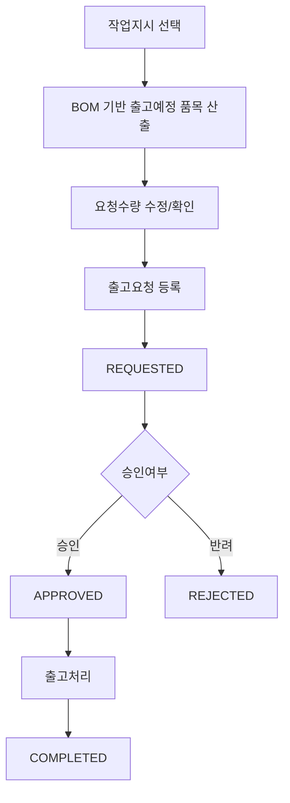

1. 사용자가 작업지시 선택 → `GET /material/issue-requests/job-orders/:orderNo/bom-items`
2. BOM 직하위 원자재 자동 산출 (BOM 소요량 - 기불출량 - 현장재고)
3. 요청수량 수정 후 출고요청 생성 `POST /material/issue-requests`
4. 관리자가 승인/반려 처리
5. APPROVED 상태에서 출고처리 → `MatIssue` + `StockTransaction` 생성

### 3.2 예외/분기 흐름
- **BOM 없음**: 작업지시에 BOM 미등록 시 빈 목록 반환
- **재고부족**: 요청수량이 가용재고 초과 시 출고 시점에 에러
- **상태 불일치**: REQUESTED가 아닌 건에 대해 승인/반려 시도 시 400

## 4. 상태 코드 및 공통코드

### 4.1 화면 내 사용 상태
| 상태명 | 코드값 | 공통코드그룹 | 설명 | 색상 |
|--------|--------|-------------|------|------|
| 요청대기 | REQUESTED | - | 출고요청 등록 직후 | 회색 |
| 승인 | APPROVED | - | 출고 가능 상태 | 초록색 |
| 반려 | REJECTED | - | 출고 불가 | 빨간색 |
| 출고완료 | COMPLETED | - | 전량 출고 완료 | 파란색 |

### 4.2 관련 공통코드 전체
- `IQC_STATUS`: PENDING(대기), PASS(합격), FAIL(불합격), HOLD(보류)
- `MAT_LOT_STATUS`: NORMAL(정상), HOLD(보류), DEPLETED(소진)
- `ISSUE_TYPE`: ComCode 그룹 (PRODUCTION, MANUAL, SCRAP 등)

## 5. API 명세

### 5.1 출고요청 목록 조회
```
GET /material/issue-requests
```
**Query Parameters**
| 파라미터 | 타입 | 필수 | 설명 |
|----------|------|------|------|
| page | number | N | 페이지 (기본 1) |
| limit | number | N | 페이지당 건수 (기본 10) |
| status | string | N | REQUESTED/APPROVED/REJECTED/COMPLETED |
| search | string | N | 요청번호/요청자 검색 |
| orderNo | string | N | 작업지시번호 필터 |

### 5.2 출고요청 상세 조회
```
GET /material/issue-requests/:requestNo
```

### 5.3 출고요청 생성
```
POST /material/issue-requests
```
**Request Body**
```json
{
  "orderNo": "WO-20240101-001",
  "issueType": "PRODUCTION",
  "items": [
    { "itemCode": "ITEM-001", "requestQty": 100, "unit": "EA", "bomReqQty": 120, "prevIssueQty": 20, "floorStockQty": 0 }
  ],
  "remark": "비고"
}
```

### 5.4 작업지시 BOM 기반 출고예정 품목 산출
```
GET /material/issue-requests/job-orders/:orderNo/bom-items
```

### 5.5 출고요청 승인
```
PATCH /material/issue-requests/:requestNo/approve
```

### 5.6 출고요청 반려
```
PATCH /material/issue-requests/:requestNo/reject
```
**Request Body**
```json
{ "reason": "반려 사유" }
```

### 5.7 요청 기반 실출고
```
POST /material/issue-requests/:requestNo/issue
```
**Request Body**
```json
{
  "warehouseCode": "WH01",
  "issueType": "PRODUCTION",
  "items": [
    { "requestItemId": "1", "matUid": "MAT-001", "issueQty": 50 }
  ],
  "workerId": "USER01",
  "remark": "출고요청 기반 출고"
}
```

## 6. 처리 규칙 및 검증

### 6.1 입력 검증
- 품목코드: 필수, `ITEM_MASTERS` 존재 여부 확인
- 요청수량: 1 이상 정수
- 작업지시: `JOB_ORDERS` 존재 여부 확인

### 6.2 비즈니스 규칙
- 승인/반려는 REQUESTED 상태에서만 가능
- 출고처리는 APPROVED 상태에서만 가능
- 요청 기반 출고 시 요청수량 초과 불가
- 모든 품목 완전 출고 시 자동 COMPLETED 전환
- 요청번호 자동 생성: `REQ-YYYYMMDD-NNN` (NumberingService)

### 6.3 트랜잭션 처리
- 트랜잭션 내 처리 항목:
  1. `MAT_ISSUE_REQUESTS` INSERT/UPDATE
  2. `MAT_ISSUE_REQUEST_ITEMS` INSERT/UPDATE
  3. `MAT_ISSUES` INSERT (출고처리 시)
  4. `STOCK_TRANSACTIONS` INSERT (MAT_OUT)
  5. `MAT_STOCKS` UPDATE
  6. `MAT_LOTS` status UPDATE (DEPLETED)
- 롤백 조건: any exception

## 7. 연관 엔티티 및 테이블

| 엔티티명 | 테이블명 | 역할 | 관계 |
|----------|----------|------|------|
| MatIssueRequest | MAT_ISSUE_REQUESTS | 출고요청 헤더 | 메인 |
| MatIssueRequestItem | MAT_ISSUE_REQUEST_ITEMS | 출고요청 품목 | 1:N |
| MatIssue | MAT_ISSUES | 출고 이력 | 1:N (출고처리 시) |
| MatLot | MAT_LOTS | LOT 정보 | FK |
| MatStock | MAT_STOCKS | 재고 현황 | FK |
| StockTransaction | STOCK_TRANSACTIONS | 수불원장 | 1:N |
| JobOrder | JOB_ORDERS | 작업지시 | FK |
| BomMaster | BOM_MASTERS | BOM 정보 | FK |
| PartMaster | ITEM_MASTERS | 품목마스터 | FK |

## 8. 에러 코드 및 메시지

| 상황 | HTTP | 에러메시지 | 처리방법 |
|------|------|-----------|---------|
| 출고요청 미존재 | 404 | 출고요청을 찾을 수 없습니다 | 요청번호 확인 |
| 승인 불가 상태 | 400 | 승인할 수 없는 상태입니다 | REQUESTED 상태 확인 |
| 반려 불가 상태 | 400 | 반려할 수 없는 상태입니다 | REQUESTED 상태 확인 |
| 출고 불가 상태 | 400 | 출고할 수 없는 상태입니다 (APPROVED만 가능) | 승인 여부 확인 |
| 요청수량 초과 | 400 | 요청 수량을 초과해 출고할 수 없습니다 | 잔여수량 확인 |
| 품목미존재 | 404 | 품목을 찾을 수 없습니다 | 품목마스터 확인 |
| 작업지시미존재 | 404 | 작업지시를 찾을 수 없습니다 | 작업지시 확인 |

---

## 자재출고 (메뉴코드: `MAT_ISSUE`)

## 1. 화면 개요

| 항목 | 내용 |
|------|------|
| **메뉴 경로** | 자재관리 > 자재출고 |
| **URL** | `/material/issue` |
| **메뉴 코드** | `MAT_ISSUE` |
| **화면 목적** | 출고요청 기반/수동/바코드스캔 방식으로 자재를 출고하고 이력을 관리 |
| **주요 사용자** | 자재관리자, 생산작업자 |

## 2. 화면 구성

### 2.1 레이아웃
- 상단: 헤더 + 탭 네비게이션 (출고요청처리/수동출고/바코드스캔/출고이력)
- 중앙: 탭별 콘텐츠
  - 출고요청처리: 승인된 요청 목록 + 출고 처리
  - 수동출고: 가용재고 목록 + 출고 처리
  - 바코드스캔: 스캔 입력 + 즉시 전량 출고
  - 출고이력: 출고 이력 조회

### 2.2 데이터그리드 컬럼 (출고이력 탭)
| 컬럼ID | 컬럼명 | 데이터타입 | 정렬 | 비고 |
|--------|--------|-----------|------|------|
| issueNo | 출고번호 | string | Y | `MAT_ISSUE-YYYYMMDD-NNNNN` |
| seq | 순번 | number | Y | 복합PK |
| itemCode | 품목코드 | string | Y | - |
| itemName | 품목명 | string | Y | - |
| matUid | 자재UID | string | Y | - |
| issueQty | 출고수량 | number | Y | - |
| issueType | 출고유형 | string | Y | PRODUCTION 등 |
| orderNo | 작업지시번호 | string | Y | - |
| status | 상태 | string | Y | DONE/CANCELED |
| issueDate | 출고일 | date | Y | - |

### 2.3 입력 폼 필드 (수동출고)
| 필드ID | 필드명 | 타입 | 필수 | 기본값 | 검증규칙 | 비고 |
|--------|--------|------|------|--------|----------|------|
| orderNo | 작업지시번호 | select | N | - | - | - |
| warehouseCode | 출고창고 | select | N | - | - | - |
| issueType | 출고유형 | select | Y | PROD | ComCode ISSUE_TYPE | - |
| items[].matUid | 자재UID | scan | Y | - | LOT 존재 확인 | - |
| items[].issueQty | 출고수량 | number | Y | - | Min 1, 재고 확인 | - |
| workerId | 작업자ID | string | N | - | - | - |
| remark | 비고 | text | N | - | - | - |

### 2.4 버튼/액션
| 버튼 | 조건 | 동작 | API |
|------|------|------|-----|
| 출고 | 폼 valid | 출고 처리 | POST /material/issues |
| 스캔출고 | matUid 입력 | 전량 출고 | POST /material/issues/scan |
| 취소 | status=DONE | 출고 취소 | POST /material/issues/:issueNo/:seq/cancel |

## 3. 업무 흐름

### 3.1 정상 흐름
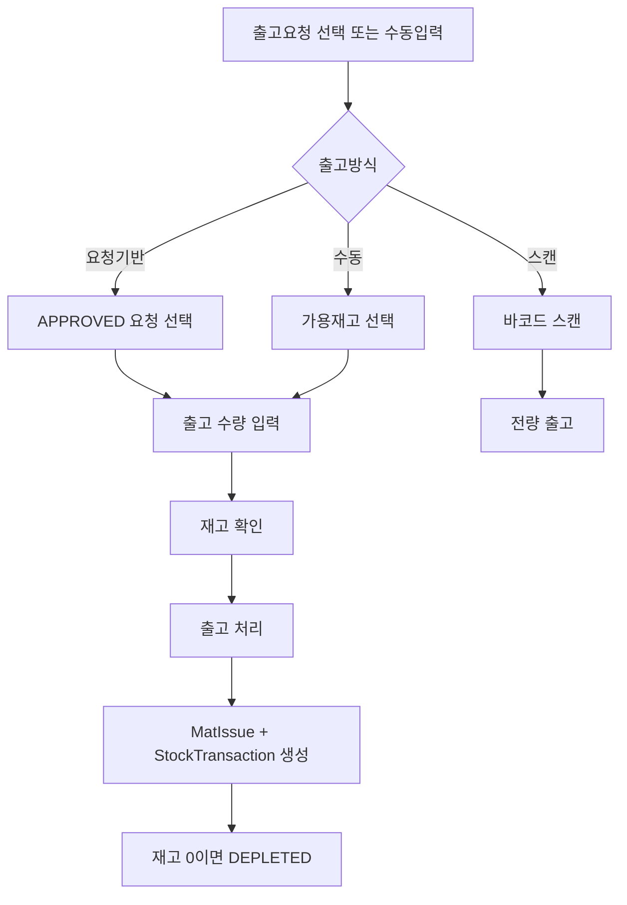

### 3.2 예외/분기 흐름
- **IQC 미합격**: `iqcStatus !== 'PASS'` → 출고 불가
- **HOLD 상태**: `status === 'HOLD'` → 출고 불가
- **재고부족**: `availableQty < issueQty` → 400 에러
- **이미 소진**: `status === 'DEPLETED'` → 출고 불가

## 4. 상태 코드 및 공통코드

### 4.1 화면 내 사용 상태
| 상태명 | 코드값 | 설명 | 색상 |
|--------|--------|------|------|
| 완료 | DONE | 출고 완료 | 초록색 |
| 취소 | CANCELED | 출고 취소 | 빨간색 |

### 4.2 관련 공통코드
- `IQC_STATUS`: PENDING, PASS, FAIL, HOLD
- `MAT_LOT_STATUS`: NORMAL, HOLD, DEPLETED
- `ISSUE_TYPE`: ComCode 그룹 (프로젝트별 설정)

## 5. API 명세

### 5.1 출고 이력 조회
```
GET /material/issues
```
**Query Parameters**
| 파라미터 | 타입 | 필수 | 설명 |
|----------|------|------|------|
| page | number | N | 기본 1 |
| limit | number | N | 기본 10 |
| orderNo | string | N | 작업지시번호 |
| matUid | string | N | 자재UID |
| issueType | string | N | 출고유형 |
| issueDateFrom | date | N | 출고일 시작 |
| issueDateTo | date | N | 출고일 종료 |
| status | string | N | DONE/CANCELED |

### 5.2 출고 상세 조회
```
GET /material/issues/:issueNo/:seq
```

### 5.3 자재 출고 (수동/요청기반)
```
POST /material/issues
```
**Request Body**
```json
{
  "orderNo": "WO-001",
  "prodResultNo": "PR-001",
  "warehouseCode": "WH01",
  "issueType": "PRODUCTION",
  "items": [
    { "matUid": "MAT-001", "issueQty": 50 }
  ],
  "workerId": "USER01",
  "remark": "생산출고"
}
```

### 5.4 바코드 스캔 출고
```
POST /material/issues/scan
```
**Request Body**
```json
{
  "matUid": "MAT-001",
  "warehouseCode": "WH01",
  "issueType": "PRODUCTION",
  "workerId": "USER01",
  "remark": "바코드 스캔 출고"
}
```

### 5.5 출고 취소
```
POST /material/issues/:issueNo/:seq/cancel
```
**Request Body**
```json
{ "reason": "취소 사유" }
```

## 6. 처리 규칙 및 검증

### 6.1 입력 검증
- matUid: 필수, `MAT_LOTS` 존재 확인
- issueQty: 1 이상, 가용재고 초과 불가
- issueType: 필수

### 6.2 비즈니스 규칙
- IQC 합격(PASS) LOT만 출고 가능
- HOLD 상태 LOT 출고 불가
- DEPLETED 상태 또는 재고 0인 LOT 출고 불가
- 출고 후 재고 0이면 `MAT_LOTS.status = DEPLETED`
- 출고 취소 시 downstream 생산실적/FG라벨 존재 시 취소 불가

### 6.3 트랜잭션 처리
- 트랜잭션 내 처리 항목:
  1. `MAT_ISSUES` INSERT (issueNo는 NumberingService)
  2. `STOCK_TRANSACTIONS` INSERT (transType='MAT_OUT')
  3. `MAT_STOCKS` UPDATE (qty/availableQty 차감)
  4. `MAT_LOTS` UPDATE (재고 0 시 DEPLETED)
- 롤백 조건: any exception

## 7. 연관 엔티티 및 테이블

| 엔티티명 | 테이블명 | 역할 | 관계 |
|----------|----------|------|------|
| MatIssue | MAT_ISSUES | 출고 이력 | 메인 |
| MatLot | MAT_LOTS | LOT 정보 | FK |
| MatStock | MAT_STOCKS | 재고 현황 | FK |
| StockTransaction | STOCK_TRANSACTIONS | 수불원장 | 1:N |
| PartMaster | ITEM_MASTERS | 품목마스터 | FK |
| JobOrder | JOB_ORDERS | 작업지시 | FK |
| ProdResult | PROD_RESULTS | 생산실적 | FK (취소 검증) |
| FgLabel | FG_LABELS | FG 라벨 | FK (취소 검증) |

## 8. 에러 코드 및 메시지

| 상황 | HTTP | 에러메시지 | 처리방법 |
|------|------|-----------|---------|
| LOT 미존재 | 400 | LOT를 찾을 수 없습니다 | LOT 확인 |
| IQC 미합격 | 400 | IQC 합격 상태가 아닌 LOT입니다 | IQC 결과 확인 |
| HOLD 상태 | 400 | 보류 상태의 LOT는 출고할 수 없습니다 | HOLD 해제 후 처리 |
| 재고부족 | 400 | LOT 재고 부족 | 수량/창고 확인 |
| 이미 소진 | 400 | 이미 소진된 LOT입니다 | 재고 확인 |
| 취소 불가 | 400 | 뒤 공정이 이미 진행되어 취소할 수 없습니다 | 역처리 후 취소 |

---

## 자재재고현황 (메뉴코드: `INV_MAT_STOCK`)

## 1. 화면 개요

| 항목 | 내용 |
|------|------|
| **메뉴 경로** | 재고관리 > 자재재고현황 |
| **URL** | `/inventory/material-stock` |
| **메뉴 코드** | `INV_MAT_STOCK` |
| **화면 목적** | 창고별/품목별 자재 재고 현황 조회 및 유효기간/안전재고 관리 |
| **주요 사용자** | 자재관리자, 품질관리자 |

## 2. 화면 구성

### 2.1 레이아웃
- 상단: 헤더 + 새로고침 버튼 + 통계카드(총품목수/총수량/안전재고미달/유효기간임박)
- 중앙: 데이터그리드 (재고 목록)
- 필터: 창고 선택 + 품목 검색

### 2.2 데이터그리드 컬럼
| 컬럼ID | 컬럼명 | 데이터타입 | 정렬 | 비고 |
|--------|--------|-----------|------|------|
| itemCode | 품목코드 | string | Y | - |
| itemName | 품목명 | string | Y | - |
| matUid | 자재UID | string | Y | - |
| warehouseName | 창고명 | string | Y | - |
| qty | 수량 | number | Y | - |
| safetyStock | 안전재고 | number | Y | - |
| stockLevel | 재고상태 | badge | Y | shortage/caution/normal |
| manufactureDate | 제조일자 | date | Y | - |
| elapsedDays | 경과일수 | number | Y | - |
| remainingDays | 잔여일수 | number | Y | - |
| shelfLifeStatus | 유효기간상태 | badge | Y | expired/imminent/normal |

### 2.3 버튼/액션
| 버튼 | 조건 | 동작 | API |
|------|------|------|-----|
| 새로고침 | - | 목록 재조회 | GET /material/stocks |
| 낮은재고필터 | - | 안전재고 미달만 표시 | lowStockOnly=true |

## 3. 업무 흐름

### 3.1 정상 흐름
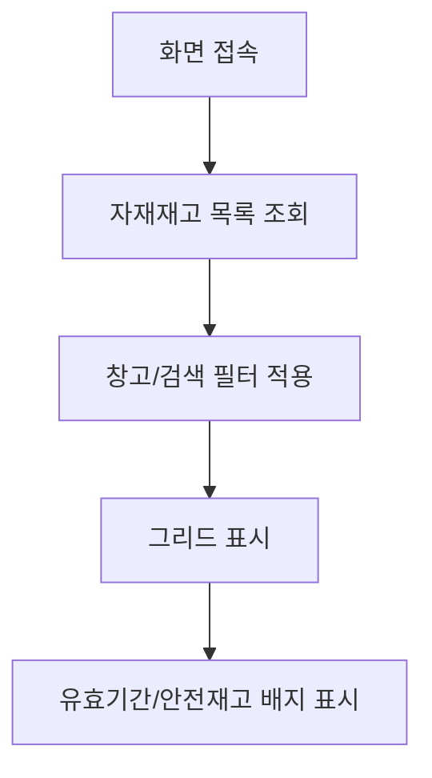

### 3.2 예외/분기 흐름
- **조회 결과 없음**: "데이터가 없습니다" 메시지
- **유효기간 만료**: 행 배경색 붉은색 표시
- **유효기간 10일 이내**: 행 배경색 노란색 표시

## 4. 상태 코드 및 공통코드

### 4.1 화면 내 사용 상태
| 상태명 | 코드값 | 설명 | 색상 |
|--------|--------|------|------|
| 부족 | shortage | qty < safetyStock | 빨간색 |
| 주의 | caution | qty < safetyStock * 1.5 | 노란색 |
| 정상 | normal | 그 외 | 초록색 |
| 만료 | expired | remainingDays <= 0 | 빨간색 |
| 임박 | imminent | remainingDays <= 30 | 노란색 |
| 정상 | normal | remainingDays > 30 | 초록색 |

## 5. API 명세

### 5.1 재고 목록 조회
```
GET /material/stocks
```
**Query Parameters**
| 파라미터 | 타입 | 필수 | 설명 |
|----------|------|------|------|
| page | number | N | 기본 1 |
| limit | number | N | 기본 10 |
| itemCode | string | N | 품목코드 |
| warehouseCode | string | N | 창고코드 |
| locationCode | string | N | 위치코드 |
| search | string | N | 품목코드/명 검색 |
| lowStockOnly | boolean | N | 안전재고 미달만 |

### 5.2 출고 가능 재고 조회
```
GET /material/stocks/available
```
- IQC PASS + 잔량 > 0 + HOLD 제외

### 5.3 품목별 재고 요약
```
GET /material/stocks/summary/:itemCode
```

### 5.4 창고별 재고 조회
```
GET /material/stocks/warehouse/:warehouseCode
```

## 6. 처리 규칙 및 검증

### 6.1 비즈니스 규칙
- 재고 = `MAT_STOCKS.qty` (수불원장 기준)
- 가용재고 = `qty - reservedQty`
- 유효기간 계산: `expireDate - today`
- 경과일수 계산: `today - manufactureDate`

## 7. 연관 엔티티 및 테이블

| 엔티티명 | 테이블명 | 역할 | 관계 |
|----------|----------|------|------|
| MatStock | MAT_STOCKS | 재고 현황 | 메인 |
| MatLot | MAT_LOTS | LOT 정보 | FK |
| PartMaster | ITEM_MASTERS | 품목마스터 | FK |
| Warehouse | WAREHOUSES | 창고마스터 | FK |

---

## 수불이력 (메뉴코드: `INV_TRANSACTION`)

## 1. 화면 개요

| 항목 | 내용 |
|------|------|
| **메뉴 경로** | 재고관리 > 수불이력 |
| **URL** | `/inventory/transaction` |
| **메뉴 코드** | `INV_TRANSACTION` |
| **화면 목적** | 입고/출고/이동/조정/취소 등 모든 수불 트랜잭션 이력을 조회하고 취소 처리 |
| **주요 사용자** | 자재관리자, 회계관리자 |

## 2. 화면 구성

### 2.1 레이아웃
- 상단: 헤더 + 새로고침 + 통계카드(총건수/총입고/총출고)
- 중앙: 데이터그리드 (수불 이력)
- 필터: 기간 선택 + 트랜잭션유형 + 거래번호 검색
- 모달: 취소 확인 모달

### 2.2 데이터그리드 컬럼
| 컬럼ID | 컬럼명 | 데이터타입 | 정렬 | 비고 |
|--------|--------|-----------|------|------|
| transNo | 거래번호 | string | Y | - |
| transType | 거래유형 | badge | Y | 색상 구분 |
| transDate | 거래일시 | date | Y | - |
| fromWarehouse | 출고창고 | string | Y | - |
| toWarehouse | 입고창고 | string | Y | - |
| itemCode | 품목코드 | string | Y | - |
| itemName | 품목명 | string | Y | - |
| matUid | LOT | string | Y | - |
| qty | 수량 | number | Y | +/- 색상 |
| status | 상태 | badge | Y | DONE/CANCELED |
| cancelRef | 원본거래 | string | Y | 취소 시 |
| remark | 비고 | string | Y | - |

### 2.3 버튼/액션
| 버튼 | 조건 | 동작 | API |
|------|------|------|-----|
| 취소 | status=DONE && !transType.includes('CANCEL') | 취소 모달 | POST /inventory/cancel |

## 3. 업무 흐름

### 3.1 정상 흐름
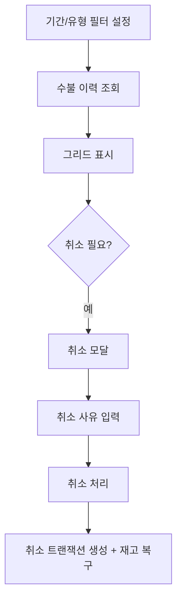

### 3.2 예외/분기 흐름
- **이미 취소**: 취소 버튼 비활성화
- **취소의 취소**: `transType.includes('CANCEL')` → 취소 불가

## 4. 상태 코드 및 공통코드

### 4.1 거래 유형
| 유형 | 코드값 | 설명 | 색상 |
|------|--------|------|------|
| 입고 | MAT_IN | 자재입고 | 파란색 |
| 입고취소 | MAT_IN_CANCEL | 입고 취소 | 빨간색 |
| 출고 | MAT_OUT | 자재출고 | 주황색 |
| 출고취소 | MAT_OUT_CANCEL | 출고 취소 | 빨간색 |
| LOT분할입 | LOT_SPLIT_IN | 분할 입고 | 복숭아색 |
| LOT분할출 | LOT_SPLIT_OUT | 분할 출고 | 복숭아색 |
| 조정증가 | ADJUST_IN | 재고조정(+) | 복숭아색 |
| 조정감소 | ADJUST_OUT | 재고조정(-) | 복숭아색 |
| 기타입고 | MISC_IN | 기타입고 | 파란색 |
| 이동 | TRANSFER | 창고간이동 | 복숭아색 |
| 폐기 | SCRAP | 자재폐기 | 주황색 |

### 4.2 상태
| 상태명 | 코드값 | 설명 |
|--------|--------|------|
| 완료 | DONE | 처리 완료 |
| 취소 | CANCELED | 취소됨 |

## 5. API 명세

### 5.1 수불 이력 조회
```
GET /inventory/transactions
```
**Query Parameters**
| 파라미터 | 타입 | 필수 | 설명 |
|----------|------|------|------|
| transType | string | N | 거래유형 |
| dateFrom | date | N | 시작일 |
| dateTo | date | N | 종료일 |

### 5.2 트랜잭션 취소
```
POST /inventory/cancel
```
**Request Body**
```json
{
  "transactionId": "TRX2024010100001",
  "remark": "취소 사유"
}
```

## 6. 처리 규칙 및 검증

### 6.1 비즈니스 규칙
- 모든 수불은 이력으로 남김 (물리 삭제 금지)
- 취소 시 원 트랜잭션 참조 + 반대 수량으로 새 트랜잭션 생성
- 원본 상태 CANCELED로 변경
- 재고 복구: 원 입고창고에서 감소, 원 출고창고로 복구

### 6.2 트랜잭션 처리
- 트랜잭션 내 처리:
  1. 원본 `STOCK_TRANSACTIONS` status='CANCELED' UPDATE
  2. 취소 `STOCK_TRANSACTIONS` INSERT (반대 수량)
  3. `MAT_STOCKS` UPDATE (재고 복구)

## 7. 연관 엔티티 및 테이블

| 엔티티명 | 테이블명 | 역할 | 관계 |
|----------|----------|------|------|
| StockTransaction | STOCK_TRANSACTIONS | 수불원장 | 메인 |
| MatStock | MAT_STOCKS | 재고 현황 | FK |
| PartMaster | ITEM_MASTERS | 품목마스터 | FK |
| Warehouse | WAREHOUSES | 창고마스터 | FK |

---

## 보류관리 (메뉴코드: `MAT_HOLD`)

## 1. 화면 개요

| 항목 | 내용 |
|------|------|
| **메뉴 경로** | 재고관리 > 보류관리 |
| **URL** | `/material/hold` |
| **메뉴 코드** | `MAT_HOLD` |
| **화면 목적** | 자재 LOT의 홀드/해제 상태를 관리하여 품질 이슈 발생 시 사용 제한 |
| **주요 사용자** | 품질관리자, 자재관리자 |

## 2. 화면 구성

### 2.1 레이아웃
- 상단: 헤더 + 새로고침 + 통계카드(총건수/HOLD수/NORMAL수)
- 중앙: 데이터그리드 (LOT 목록)
- 필터: 검색 + 상태 필터
- 모달: 홀드/해제 사유 입력 모달

### 2.2 데이터그리드 컬럼
| 컬럼ID | 컬럼명 | 데이터타입 | 정렬 | 비고 |
|--------|--------|-----------|------|------|
| actions | 액션 | button | N | HOLD/해제 버튼 |
| matUid | 자재UID | string | Y | - |
| itemCode | 품목코드 | string | Y | - |
| itemName | 품목명 | string | Y | - |
| qty | 현재수량 | number | Y | - |
| vendor | 공급사 | string | Y | - |
| status | 상태 | badge | Y | HOLD/NORMAL |

### 2.3 버튼/액션
| 버튼 | 조건 | 동작 | API |
|------|------|------|-----|
| HOLD | status=NORMAL | 홀드 처리 | POST /material/hold/hold |
| 해제 | status=HOLD | 해제 처리 | POST /material/hold/release |

## 3. 업무 흐름

### 3.1 정상 흐름
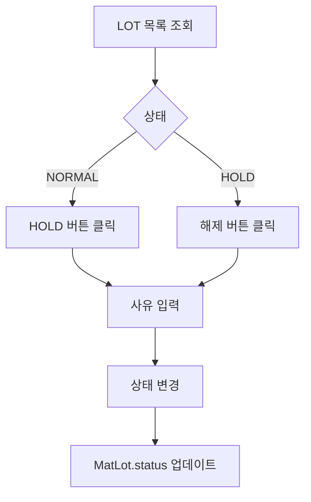

### 3.2 예외/분기 흐름
- **이미 HOLD**: 중복 홀드 시도 시 400
- **DEPLETED**: 소진된 LOT는 HOLD 불가

## 4. 상태 코드 및 공통코드

### 4.1 화면 내 사용 상태
| 상태명 | 코드값 | 공통코드그룹 | 설명 | 색상 |
|--------|--------|-------------|------|------|
| 정상 | NORMAL | MAT_LOT_STATUS | 사용 가능 | 초록색 |
| 보류 | HOLD | MAT_LOT_STATUS | 사용 불가 | 빨간색 |

## 5. API 명세

### 5.1 LOT 목록 조회
```
GET /material/hold
```
**Query Parameters**
| 파라미터 | 타입 | 필수 | 설명 |
|----------|------|------|------|
| page | number | N | 기본 1 |
| limit | number | N | 기본 10 |
| search | string | N | LOT/품목 검색 |
| status | string | N | HOLD/NORMAL |

### 5.2 HOLD 처리
```
POST /material/hold/hold
```
**Request Body**
```json
{ "matUid": "MAT-001", "reason": "품질 이슈" }
```

### 5.3 해제 처리
```
POST /material/hold/release
```
**Request Body**
```json
{ "matUid": "MAT-001", "reason": "이슈 해결" }
```

## 6. 처리 규칙 및 검증

### 6.1 비즈니스 규칙
- HOLD 상태 LOT는 출고 불가
- DEPLETED 상태 LOT는 HOLD 불가
- 상태 변경 시 사유 필수 입력

## 7. 연관 엔티티 및 테이블

| 엔티티명 | 테이블명 | 역할 | 관계 |
|----------|----------|------|------|
| MatLot | MAT_LOTS | LOT 정보 | 메인 |
| PartMaster | ITEM_MASTERS | 품목마스터 | FK |
| MatStock | MAT_STOCKS | 재고 현황 | FK |

---

## 폐기처리 (메뉴코드: `MAT_SCRAP`)

## 1. 화면 개요

| 항목 | 내용 |
|------|------|
| **메뉴 경로** | 자재관리 > 폐기처리 |
| **URL** | `/material/scrap` |
| **메뉴 코드** | `MAT_SCRAP` |
| **화면 목적** | 불량/만료 등의 사유로 자재를 폐기하고 재고를 차감 |
| **주요 사용자** | 품질관리자, 자재관리자 |

## 2. 화면 구성

### 2.1 레이아웃
- 상단: 헤더 + 새로고침 + 등록 버튼 + 통계카드
- 중앙: 데이터그리드 (폐기 이력)
- 필터: 검색 + 기간
- 모달: 폐기 등록 모달

### 2.2 데이터그리드 컬럼
| 컬럼ID | 컬럼명 | 데이터타입 | 정렬 | 비고 |
|--------|--------|-----------|------|------|
| transDate | 거래일 | date | Y | - |
| transNo | 거래번호 | string | Y | - |
| itemCode | 품목코드 | string | Y | - |
| itemName | 품목명 | string | Y | - |
| matUid | LOT | string | Y | - |
| qty | 폐기수량 | number | Y | 빨간색 표시 |
| warehouseName | 창고 | string | Y | - |
| remark | 사유 | string | Y | - |

### 2.3 입력 폼 필드 (등록 모달)
| 필드ID | 필드명 | 타입 | 필수 | 기본값 | 검증규칙 | 비고 |
|--------|--------|------|------|--------|----------|------|
| matUid | 자재UID | scan | Y | - | LOT 존재 | - |
| warehouseId | 창고 | select | Y | - | - | - |
| qty | 폐기수량 | number | Y | - | Min 1, 재고 확인 | - |
| reason | 폐기사유 | text | Y | - | MaxLength 500 | - |
| workerId | 작업자ID | string | N | - | - | - |

## 3. 업무 흐름

### 3.1 정상 흐름
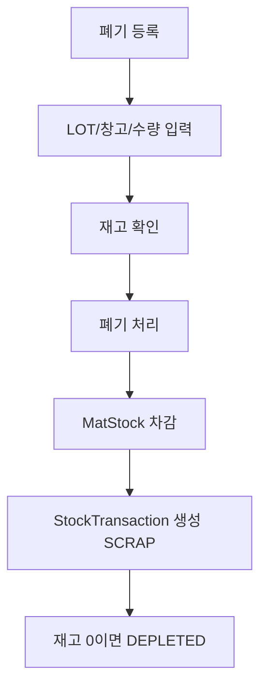

### 3.2 예외/분기 흐름
- **FLOOR 창고**: RETURN_MODE=RETURN 시 반납 후 폐기 필요
- **재고부족**: 가용재고 < 폐기수량 시 400

## 4. 상태 코드 및 공통코드

### 4.1 관련 공통코드
- `SCRAP_REASON`: DAMAGE, EXPIRY, QUALITY, SURPLUS, OBSOLETE, ETC

## 5. API 명세

### 5.1 폐기 이력 조회
```
GET /material/scrap
```
**Query Parameters**
| 파라미터 | 타입 | 필수 | 설명 |
|----------|------|------|------|
| page | number | N | 기본 1 |
| limit | number | N | 기본 10 |
| search | string | N | 품목 검색 |
| fromDate | date | N | 시작일 |
| toDate | date | N | 종료일 |

### 5.2 폐기 등록
```
POST /material/scrap
```
**Request Body**
```json
{
  "matUid": "MAT-001",
  "warehouseId": "WH01",
  "qty": 10,
  "reason": "불량",
  "workerId": "USER01"
}
```

## 6. 처리 규칙 및 검증

### 6.1 비즈니스 규칙
- FLOOR 창고(불출된 자재)는 반납 후 폐기 (RETURN_MODE 설정 시)
- 재고 0이면 `MAT_LOTS.status = DEPLETED`
- `availableQty < qty` 시 폐기 불가

### 6.2 트랜잭션 처리
- `MAT_STOCKS` UPDATE (qty/availableQty 차감)
- `STOCK_TRANSACTIONS` INSERT (transType='SCRAP')
- `MAT_LOTS` UPDATE (재고 0 시 DEPLETED)

## 7. 연관 엔티티 및 테이블

| 엔티티명 | 테이블명 | 역할 | 관계 |
|----------|----------|------|------|
| StockTransaction | STOCK_TRANSACTIONS | 수불원장 | 메인 |
| MatLot | MAT_LOTS | LOT 정보 | FK |
| MatStock | MAT_STOCKS | 재고 현황 | FK |
| PartMaster | ITEM_MASTERS | 품목마스터 | FK |
| Warehouse | WAREHOUSES | 창고마스터 | FK |

---

## 재고조정 (메뉴코드: `MAT_ADJUSTMENT`)

## 1. 화면 개요

| 항목 | 내용 |
|------|------|
| **메뉴 경로** | 자재관리 > 재고조정 |
| **URL** | `/material/adjustment` |
| **메뉴 코드** | `MAT_ADJUSTMENT` |
| **화면 목적** | 실사 결과 또는 기타 사유로 재고 수량을 수동 조정 |
| **주요 사용자** | 자재관리자, 회계관리자 |

## 2. 화면 구성

### 2.1 레이아웃
- 상단: 헤더 + 새로고침 + 등록 버튼 + 통계카드
- 중앙: 데이터그리드 (조정 이력)
- 필터: 검색 + 기간
- 모달: 조정 등록 모달

### 2.2 데이터그리드 컬럼
| 컬럼ID | 컬럼명 | 데이터타입 | 정렬 | 비고 |
|--------|--------|-----------|------|------|
| createdAt | 조정일 | date | Y | - |
| warehouseCode | 창고 | string | Y | - |
| itemCode | 품목코드 | string | Y | - |
| itemName | 품목명 | string | Y | - |
| beforeQty | 조정전 | number | Y | - |
| afterQty | 조정후 | number | Y | - |
| diffQty | 차이 | number | Y | +/- 색상 |
| reason | 사유 | string | Y | - |
| createdBy | 처리자 | string | Y | - |

### 2.3 입력 폼 필드 (등록 모달)
| 필드ID | 필드명 | 타입 | 필수 | 기본값 | 검증규칙 | 비고 |
|--------|--------|------|------|--------|----------|------|
| warehouseCode | 창고 | select | Y | - | - | - |
| itemCode | 품목코드 | search | Y | - | 품목 존재 | - |
| afterQty | 조정후수량 | number | Y | - | Min 0 | - |
| reason | 조정사유 | text | Y | - | MaxLength 500 | - |

## 3. 업무 흐름

### 3.1 정상 흐름
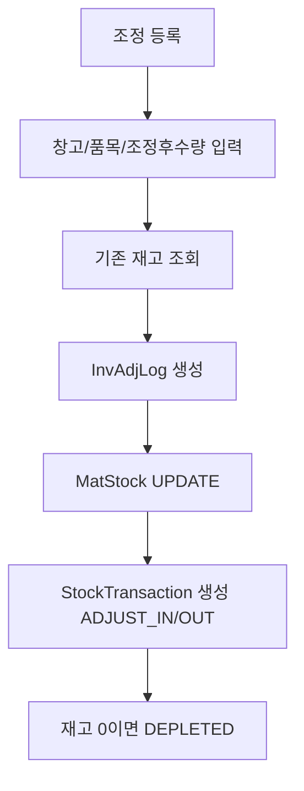

### 3.2 예외/분기 흐름
- **음수 재고**: afterQty < 0 → 400
- **예약수량 초과**: afterQty < reservedQty → 400
- **재고 없음에서 감소**: 조정 전 재고 0에서 감소 시도 → 400

## 4. 상태 코드 및 공통코드

### 4.1 조정 상태 (PDA 승인 워크플로우)
| 상태명 | 코드값 | 설명 |
|--------|--------|------|
| 즉시승인 | APPROVED | PC 화면 등록 시 (즉시 재고 반영) |
| 승인대기 | PENDING | PDA 등록 시 (승인 후 반영) |
| 반려 | REJECTED | 승인 거부 |

## 5. API 명세

### 5.1 조정 이력 조회
```
GET /material/adjustment
```

### 5.2 재고조정 즉시 승인 (PC)
```
POST /material/adjustment
```
**Request Body**
```json
{
  "warehouseCode": "WH01",
  "itemCode": "ITEM-001",
  "matUid": "MAT-001",
  "afterQty": 100,
  "reason": "실사 조정"
}
```

### 5.3 재고조정 승인 대기 (PDA)
```
POST /material/adjustment/pending
```

### 5.4 조정 승인
```
PATCH /material/adjustment/:adjDate/:seq/approve
```

### 5.5 조정 반려
```
PATCH /material/adjustment/:adjDate/:seq/reject
```

## 6. 처리 규칙 및 검증

### 6.1 비즈니스 규칙
- afterQty >= 0
- afterQty >= reservedQty (예약수량 미만으로 조정 불가)
- diffQty = afterQty - beforeQty
- transType: diffQty >= 0 → ADJUST_IN, diffQty < 0 → ADJUST_OUT
- PENDING → APPROVED 시에만 실제 재고 반영

### 6.2 트랜잭션 처리
- `INV_ADJ_LOGS` INSERT
- `MAT_STOCKS` UPDATE/INSERT
- `STOCK_TRANSACTIONS` INSERT
- `MAT_LOTS` UPDATE (재고 0 시 DEPLETED)

## 7. 연관 엔티티 및 테이블

| 엔티티명 | 테이블명 | 역할 | 관계 |
|----------|----------|------|------|
| InvAdjLog | INV_ADJ_LOGS | 조정 이력 | 메인 |
| MatStock | MAT_STOCKS | 재고 현황 | FK |
| StockTransaction | STOCK_TRANSACTIONS | 수불원장 | 1:N |
| PartMaster | ITEM_MASTERS | 품목마스터 | FK |
| MatLot | MAT_LOTS | LOT 정보 | FK |

---

## 기타입고 (메뉴코드: `MAT_MISC_RECEIPT`)

## 1. 화면 개요

| 항목 | 내용 |
|------|------|
| **메뉴 경로** | 자재관리 > 기타입고 |
| **URL** | `/material/misc-receipt` |
| **메뉴 코드** | `MAT_MISC_RECEIPT` |
| **화면 목적** | PO 없는 기타 사유(반품, 무상공급, 테스트용 등)로 자재를 입고 |
| **주요 사용자** | 자재관리자 |

## 2. 화면 구성

### 2.1 레이아웃
- 상단: 헤더 + 새로고침 + 등록 버튼 + 통계카드
- 중앙: 데이터그리드 (기타입고 이력)
- 필터: 검색 + 기간
- 모달: 입고 등록 모달

### 2.2 데이터그리드 컬럼
| 컬럼ID | 컬럼명 | 데이터타입 | 정렬 | 비고 |
|--------|--------|-----------|------|------|
| transDate | 입고일 | date | Y | - |
| transNo | 거래번호 | string | Y | - |
| itemCode | 품목코드 | string | Y | - |
| itemName | 품목명 | string | Y | - |
| warehouseName | 입고창고 | string | Y | - |
| qty | 입고수량 | number | Y | 초록색 표시 |
| remark | 비고 | string | Y | - |

### 2.3 입력 폼 필드 (등록 모달)
| 필드ID | 필드명 | 타입 | 필수 | 기본값 | 검증규칙 | 비고 |
|--------|--------|------|------|--------|----------|------|
| warehouseId | 입고창고 | select | Y | - | - | - |
| itemCode | 품목코드 | search | Y | - | 품목 존재 | - |
| qty | 입고수량 | number | Y | - | Min 1 | - |
| remark | 비고 | text | N | - | - | - |
| workerId | 작업자ID | string | N | - | - | - |

## 3. 업무 흐름

### 3.1 정상 흐름
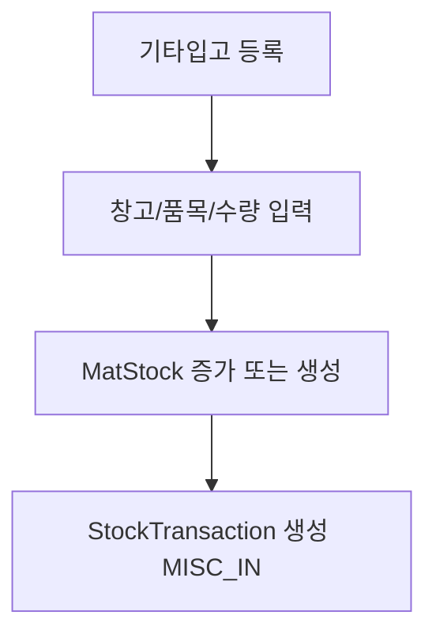

## 4. 상태 코드 및 공통코드

- `MISC_IN`: 기타입고 거래유형

## 5. API 명세

### 5.1 기타입고 이력 조회
```
GET /material/misc-receipt
```

### 5.2 기타입고 등록
```
POST /material/misc-receipt
```
**Request Body**
```json
{
  "warehouseId": "WH01",
  "itemCode": "ITEM-001",
  "matUid": "MAT-001",
  "qty": 100,
  "remark": "반품 입고",
  "workerId": "USER01"
}
```

## 6. 처리 규칙 및 검증

### 6.1 비즈니스 규칙
- matUid가 있는 경우 LOT 존재 확인 및 품목 일치 검증
- 기존 재고 있으면 qty 증가, 없으면 신규 생성

### 6.2 트랜잭션 처리
- `MAT_STOCKS` UPDATE/INSERT
- `STOCK_TRANSACTIONS` INSERT (transType='MISC_IN')

## 7. 연관 엔티티 및 테이블

| 엔티티명 | 테이블명 | 역할 | 관계 |
|----------|----------|------|------|
| StockTransaction | STOCK_TRANSACTIONS | 수불원장 | 메인 |
| MatStock | MAT_STOCKS | 재고 현황 | FK |
| PartMaster | ITEM_MASTERS | 품목마스터 | FK |
| MatLot | MAT_LOTS | LOT 정보 | FK |
| Warehouse | WAREHOUSES | 창고마스터 | FK |

---

## 유효기간관리 (메뉴코드: `MAT_SHELF_LIFE`)

## 1. 화면 개요

| 항목 | 내용 |
|------|------|
| **메뉴 경로** | 자재관리 > 유효기간관리 |
| **URL** | `/material/shelf-life` |
| **메뉴 코드** | `MAT_SHELF_LIFE` |
| **화면 목적** | 유효기한이 있는 자재 LOT의 만료 현황을 조회하고 관리 |
| **주요 사용자** | 품질관리자, 자재관리자 |

## 2. 화면 구성

### 2.1 레이아웃
- 상단: 헤더 + 통계 + 필터
- 중앙: 데이터그리드 (유효기간 LOT 목록)
- 필터: 만료상태 + 임박일수 + 검색

### 2.2 데이터그리드 컬럼
| 컬럼ID | 컬럼명 | 데이터타입 | 정렬 | 비고 |
|--------|--------|-----------|------|------|
| matUid | 자재UID | string | Y | - |
| itemCode | 품목코드 | string | Y | - |
| itemName | 품목명 | string | Y | - |
| expireDate | 유효기한 | date | Y | - |
| expiryStatus | 만료상태 | badge | Y | EXPIRED/NEAR_EXPIRY/VALID/DISCARDED |
| daysUntilExpiry | 잔여일수 | number | Y | - |

### 2.3 버튼/액션
| 버튼 | 조건 | 동작 | API |
|------|------|------|-----|
| 재검사 | status=EXPIRED/NEAR_EXPIRY | 재검사 화면 이동 | `/material/shelf-life-reinspect` |

## 3. 업무 흐름

### 3.1 정상 흐름
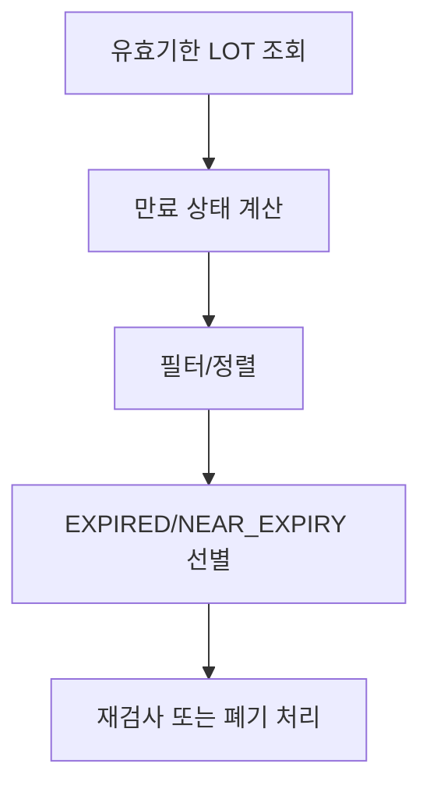

### 3.2 만료 상태 판정
- `DISCARDED`: 이미 폐기된 LOT
- `EXPIRED`: `daysUntilExpiry < 0`
- `NEAR_EXPIRY`: `daysUntilExpiry <= nearExpiryDays` (기본 10일)
- `VALID`: 그 외

## 4. 상태 코드 및 공통코드

### 4.1 만료 상태
| 상태명 | 코드값 | 설명 | 색상 |
|--------|--------|------|------|
| 만료 | EXPIRED | 유효기한 경과 | 빨간색 |
| 임박 | NEAR_EXPIRY | 임박일수 이내 | 노란색 |
| 정상 | VALID | 유효 | 초록색 |
| 폐기 | DISCARDED | 폐기 완료 | 회색 |

## 5. API 명세

### 5.1 유수명자재 목록 조회
```
GET /material/shelf-life
```
**Query Parameters**
| 파라미터 | 타입 | 필수 | 설명 |
|----------|------|------|------|
| page | number | N | 기본 1 |
| limit | number | N | 기본 10 |
| search | string | N | LOT/품목 검색 |
| expiryStatus | string | N | EXPIRED/NEAR_EXPIRY/VALID/DISCARDED |
| nearExpiryDays | number | N | 기본 10 |

## 6. 처리 규칙 및 검증

### 6.1 비즈니스 규칙
- `expireDate IS NOT NULL`인 LOT만 조회
- 정렬: `expireDate ASC`

## 7. 연관 엔티티 및 테이블

| 엔티티명 | 테이블명 | 역할 | 관계 |
|----------|----------|------|------|
| MatLot | MAT_LOTS | LOT 정보 | 메인 |
| PartMaster | ITEM_MASTERS | 품목마스터 | FK |

---

## 유효기간재검사 (메뉴코드: `MAT_SHELF_LIFE_REINSPECT`)

## 1. 화면 개요

| 항목 | 내용 |
|------|------|
| **메뉴 경로** | 자재관리 > 유효기간재검사 |
| **URL** | `/material/shelf-life-reinspect` |
| **메뉴 코드** | `MAT_SHELF_LIFE_REINSPECT` |
| **화면 목적** | 유효기한 만료 임박/경과 자재를 재검사하여 연장 또는 폐기 처리 |
| **주요 사용자** | 품질관리자 |

## 2. 화면 구성

### 2.1 레이아웃
- 상단: 헤더 + 재검사 이력 그리드
- 중앙: 재검사 등록 폼

### 2.2 데이터그리드 컬럼 (재검사 이력)
| 컬럼ID | 컬럼명 | 데이터타입 | 정렬 | 비고 |
|--------|--------|-----------|------|------|
| inspectDate | 검사일 | date | Y | - |
| matUid | 자재UID | string | Y | - |
| itemName | 품목명 | string | Y | - |
| result | 결과 | badge | Y | PASS/FAIL |
| retestRound | 회차 | number | Y | - |
| inspectorName | 검사자 | string | Y | - |

### 2.3 입력 폼 필드
| 필드ID | 필드명 | 타입 | 필수 | 기본값 | 검증규칙 | 비고 |
|--------|--------|------|------|--------|----------|------|
| matUid | 자재UID | scan | Y | - | LOT 존재 | - |
| result | 결과 | select | Y | - | PASS/FAIL | - |
| extendDays | 연장일 | number | N | - | <= expiryExtDays | 품목별 최대 연장일 |
| destructSampleQty | 파괴검사시료 | number | N | - | - | - |
| inspectorName | 검사자 | string | N | - | - | - |
| remark | 비고 | text | N | - | - | - |

## 3. 업무 흐름

### 3.1 정상 흐름
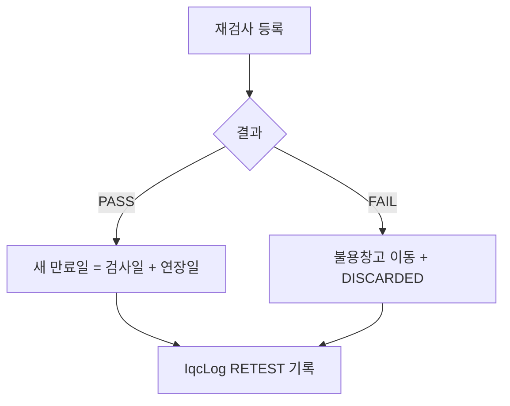

### 3.2 예외/분기 흐름
- **이미 폐기**: `status=DISCARDED` → 재검사 불가
- **연장일 초과**: `extendDays > expiryExtDays` → 400

## 4. 상태 코드 및 공통코드

### 4.1 검사 결과
| 결과 | 코드값 | 설명 | 후속처리 |
|------|--------|------|----------|
| 합격 | PASS | 품질 합격 | 만료일 연장 |
| 불합격 | FAIL | 품질 불합격 | 불용창고 이동 + 폐기 |

### 4.2 검사 유형
| 유형 | 코드값 | 설명 |
|------|--------|------|
| 초기검사 | INITIAL | 일반 IQC |
| 재검사 | RETEST | 유효기간 재검사 |

## 5. API 명세

### 5.1 재검사 이력 조회
```
GET /material/shelf-life-reinspect
```
**Query Parameters**
| 파라미터 | 타입 | 필수 | 설명 |
|----------|------|------|------|
| page | number | N | 기본 1 |
| limit | number | N | 기본 20 |
| matUid | string | N | LOT 필터 |
| result | string | N | PASS/FAIL 필터 |

### 5.2 재검사 실적 등록
```
POST /material/shelf-life-reinspect
```
**Request Body**
```json
{
  "matUid": "MAT-001",
  "result": "PASS",
  "extendDays": 30,
  "inspectorName": "홍길동",
  "remark": "재검사 합격"
}
```

## 6. 처리 규칙 및 검증

### 6.1 비즈니스 규칙
- DISCARDED LOT는 재검사 불가
- extendDays >= 0
- extendDays <= PartMaster.expiryExtDays (최대 연장일)
- PASS 시: `newExpiry = inspectDate + extendDays`
- FAIL 시: 불용창고(DEFECT)로 자동 이동 + `MAT_LOTS.status = DISCARDED`
- 회차 = 기존 RETEST 이력 수 + 1

### 6.2 트랜잭션 처리 (FAIL 시)
- `MAT_STOCKS` UPDATE (원창고 0, 불용창고 증가)
- `STOCK_TRANSACTIONS` INSERT (transType='MAT_MOVE')
- `MAT_LOTS` UPDATE (status='DISCARDED')
- `IQC_LOGS` INSERT (inspectType='RETEST')

## 7. 연관 엔티티 및 테이블

| 엔티티명 | 테이블명 | 역할 | 관계 |
|----------|----------|------|------|
| IqcLog | IQC_LOGS | 검사이력 | 메인 |
| MatLot | MAT_LOTS | LOT 정보 | FK |
| MatStock | MAT_STOCKS | 재고 현황 | FK |
| PartMaster | ITEM_MASTERS | 품목마스터 | FK |
| Warehouse | WAREHOUSES | 창고마스터 | FK |
| StockTransaction | STOCK_TRANSACTIONS | 수불원장 | 1:N |

## 8. 에러 코드 및 메시지

| 상황 | HTTP | 에러메시지 | 처리방법 |
|------|------|-----------|---------|
| 이미 폐기 | 400 | 이미 폐기 처리된 LOT입니다 | 상태 확인 |
| 연장일 초과 | 400 | 적용연장일이 품목의 최대 연장일을 초과합니다 | 품목마스터 확인 |
| 연장일 음수 | 400 | 연장일은 0 이상이어야 합니다 | 입력값 확인 |
| 예약수량 존재 | 400 | 예약된 수량이 남아 있어 폐기 처리를 할 수 없습니다 | 예약 해제 후 처리 |

---

# 화면 간 연계 흐름

## 출고요청 → 자재출고 연계

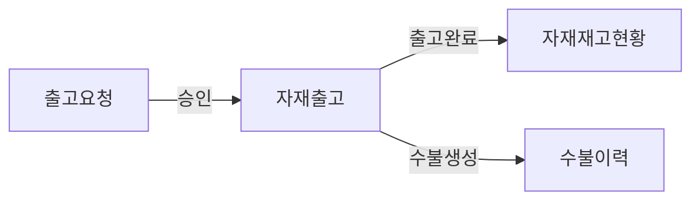

| 순서 | 화면 | 액션 | 다음화면 | 조건 |
|------|------|------|----------|------|
| 1 | 출고요청 | 승인 | 자재출고 | status=APPROVED |
| 2 | 자재출고 | 출고처리 | 자재재고현황 | 출고 성공 시 재고 감소 |
| 3 | 자재출고 | 출고처리 | 수불이력 | MAT_OUT 트랜잭션 생성 |

## 재고조정 → 수불이력 연계

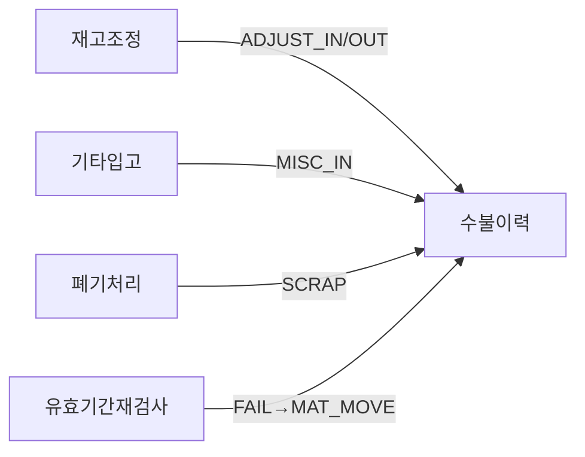

| 순서 | 화면 | 액션 | 다음화면 | 생성 거래 |
|------|------|------|----------|----------|
| 1 | 재고조정 | 조정 등록 | 수불이력 | ADJUST_IN/ADJUST_OUT |
| 2 | 기타입고 | 입고 등록 | 수불이력 | MISC_IN |
| 3 | 폐기처리 | 폐기 등록 | 수불이력 | SCRAP |
| 4 | 유효기간재검사 | 불합격 | 수불이력 | MAT_MOVE (불용창고) |

## 보류관리 → 자재출고 연계


| 순서 | 화면 | 액션 | 다음화면 | 조건 |
|------|------|------|----------|------|
| 1 | 보류관리 | HOLD 처리 | 자재출고 | 해당 LOT 출고 불가 |
| 2 | 보류관리 | 해제 처리 | 자재출고 | 해당 LOT 출고 가능 |
