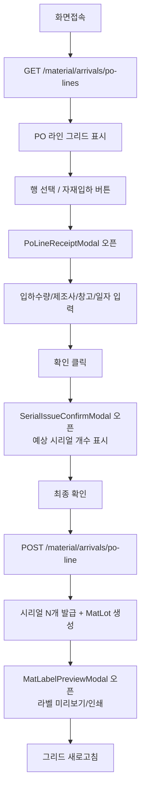
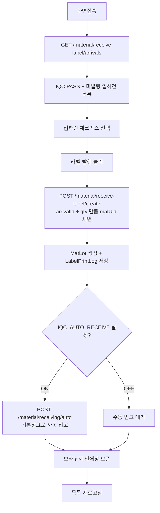
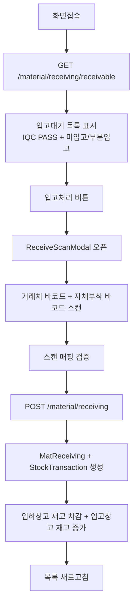
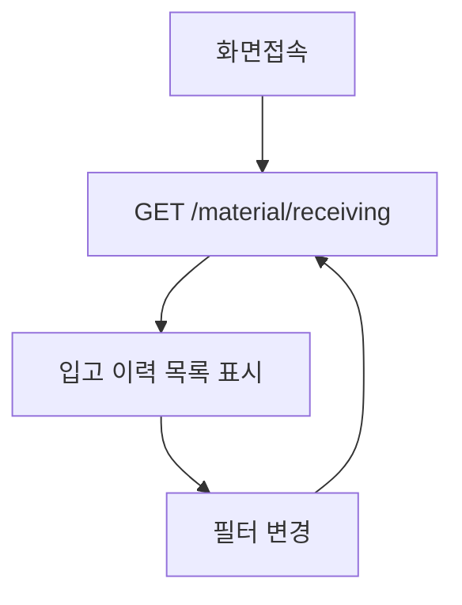
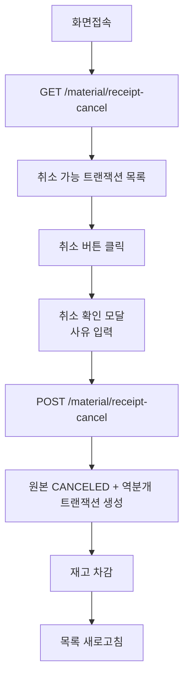
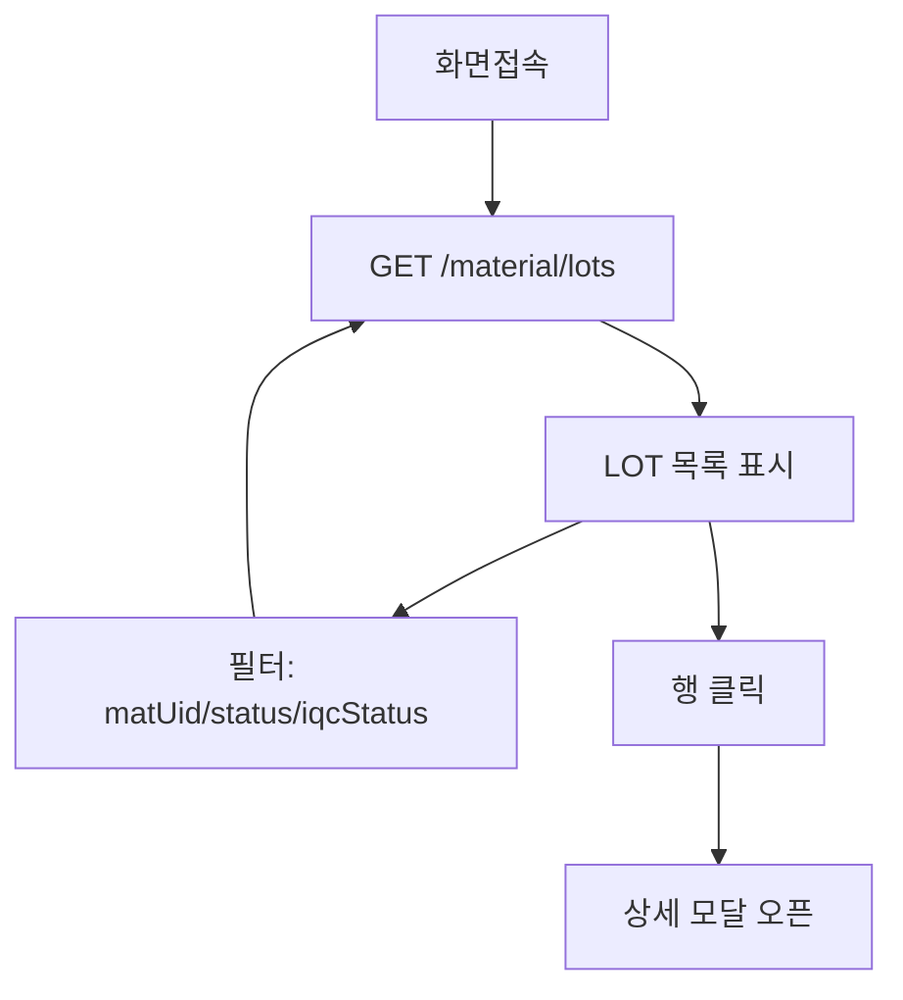
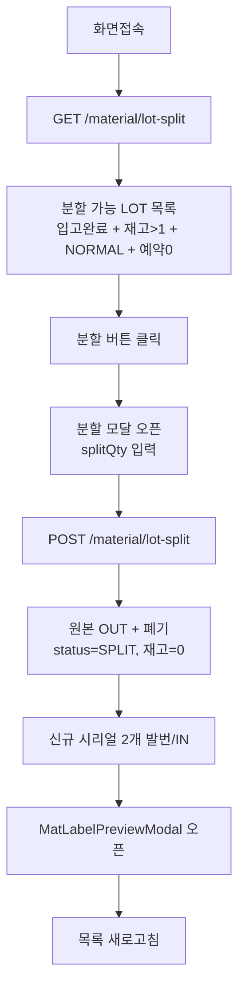
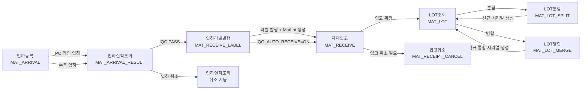
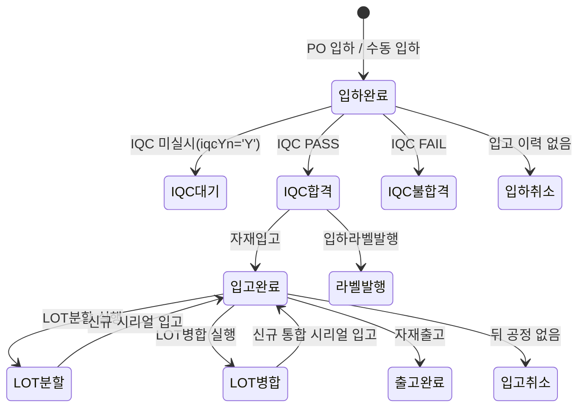

# 자재관리 - 입하/입고/LOT Workflow

---

# 입하등록 (메뉴코드: `MAT_ARRIVAL`)

## 1. 화면 개요

| 항목 | 내용 |
|------|------|
| **메뉴 경로** | 자재관리 > 입하관리 > 입하등록 |
| **URL** | `/material/arrival` |
| **메뉴 코드** | `MAT_ARRIVAL` |
| **화면 목적** | PO(발주) 라인 단위 입하 등록 및 수동 입하를 처리한다. 입하 시 시리얼(MAT_LOT)을 발급하고 수불원장(StockTransaction)을 기록한다. |
| **주요 사용자** | 자재관리자, IQC 담당자 |

## 2. 화면 구성

### 2.1 레이아웃
- 상단: 헤더(타이틀 + 새로고침/수동입하 버튼)
- 중앙: PO 라인 그리드 (메인 영역)
- 모달: PO 라인 입하 모달(PoLineReceiptModal) → 시리얼 발급 확인(SerialIssueConfirmModal) → 라벨 미리보기(MatLabelPreviewModal)
- 모달: 수동 입하 모달(ManualArrivalModal)

### 2.2 데이터그리드 컬럼

| 컬럼ID | 컬럼명 | 데이터타입 | 정렬 | 비고 |
|--------|--------|-----------|------|------|
| poNo | PO 번호 | string | Y | 왼쪽정렬 |
| lineNo | L/N | number | Y | 가울데정렬, NVL(pi.LINE_NO, pi.SEQ) |
| revNo | R/N | number | Y | 가울데정렬, 기본값 1 |
| itemCode | 품목코드 | string | Y | 왼쪽정렬 |
| itemName | 품목명 | string | Y | 왼쪽정렬 |
| orderQty | 발주수량 | number | Y | 오른쪽정렬 |
| receivedQty | 입하수량 | number | Y | 오른쪽정렬 |
| remainingQty | 잔량 | number | Y | 오른쪽정렬 |
| orderDate | 발주일 | date | Y | 가울데정렬 |
| partnerName | 거래처 | string | Y | 왼쪽정렬 |
| useType | 용도 | string | Y | PROD/기타 |
| lineStatus | 라인상태 | string | Y | ComCodeBadge(PO_LINE_STATUS) |

### 2.3 입력 폼 필드 (PO 라인 입하 모달)

| 필드ID | 필드명 | 타입 | 필수 | 기본값 | 검증규칙 | 비고 |
|--------|--------|------|------|--------|----------|------|
| receivedQty | 입하수량 | number | Y | - | 1~잔량 이하 | 잔량 초과 불가 |
| mfgPartnerCode | 제조사 | select | Y | - | PARTNER_TYPE='MFG' | PartnerSelect |
| receivedDate | 입하일 | date | Y | 오늘 | 오늘 이하 | |
| warehouseCode | 입고창고 | select | Y | - | RAW/RM 창고만 가능 | |
| remark | 비고 | text | N | - | 최대 500자 | |

### 2.4 버튼/액션

| 버튼 | 조건 | 동작 | API |
|------|------|------|-----|
| 자재입하 | PO 라인 선택 시 | PoLineReceiptModal 오픈 | - |
| 저장 | 폼 valid | 시리얼 발급 확인 모달 오픈 | POST /material/arrivals/po-line |
| 수동입하 | - | ManualArrivalModal 오픈 | POST /material/arrivals/manual |

## 3. 업무 흐름

### 3.1 정상 흐름


### 3.2 예외/분기 흐름
- **잔량 초과**: `BadRequestException` — 입하수량이 PO 잔량을 초과할 수 없음
- **제조사 미일치**: `BadRequestException` — PARTNER_TYPE='MFG' 거래처만 선택 가능
- **원자재 창고 아님**: `BadRequestException` — warehouseType이 RAW/RM이 아닌 창고 선택 시 차단
- **품목 미등록**: lotUnitQty 미등록 시 단일 LOT으로 처리 (unit = receivedQty)

## 4. 상태 코드 및 공통코드

### 4.1 화면 내 사용 상태

| 상태명 | 코드값 | 공통코드그룹 | 설명 | 색상 |
|--------|--------|-------------|------|------|
| 미입하 | OPEN | PO_LINE_STATUS | 입하 이력 없음 | 파랑 |
| 일부입하 | PARTIAL | PO_LINE_STATUS | 일부 입하 완료 | 주황 |
| 입하완료 | CLOSE | PO_LINE_STATUS | 전량 입하 완료 | 초록 |

### 4.2 관련 공통코드 전체
- `PO_LINE_STATUS`: OPEN(미입하), PARTIAL(일부입하), CLOSE(입하완료)
- `IQC_STATUS`: PENDING(대기), PASS(합격), FAIL(불합격), HOLD(보류)
- `MAT_LOT_STATUS`: NORMAL(정상), HOLD(보류), DEPLETED(소진), SPLIT(분할완료), MERGED(병합완료)

## 5. API 명세

### 5.1 PO 라인 목록 조회
```
GET /material/arrivals/po-lines
```
**Query Parameters**
| 파라미터 | 타입 | 필수 | 설명 |
|----------|------|------|------|
| status | string | N | OPEN / PARTIAL / CLOSE |
| itemCode | string | N | 품목 코드 |
| poNo | string | N | PO 번호 (부분 일치) |

**Response 200**
```json
{
  "data": [
    {
      "poNo": "PO-202601-001",
      "poSeq": 1,
      "lineNo": 1,
      "revNo": 1,
      "itemCode": "ITEM-001",
      "itemName": "저항기",
      "orderQty": 1000,
      "receivedQty": 500,
      "remainingQty": 500,
      "orderDate": "2026-01-15",
      "partnerName": "삼성전자",
      "useType": "PROD",
      "lineStatus": "PARTIAL"
    }
  ]
}
```

### 5.2 PO 라인 입하 등록
```
POST /material/arrivals/po-line
```
**Request Body**
```json
{
  "poNo": "PO-202601-001",
  "lineNo": 1,
  "revNo": 1,
  "receivedQty": 500,
  "mfgPartnerCode": "MFG-001",
  "receivedDate": "2026-01-20",
  "warehouseCode": "WH-RM-01",
  "remark": "긴급 입하"
}
```

**Response 200**
```json
{
  "data": {
    "arrivalNo": "ARR-20260120-001",
    "serials": [
      { "matUid": "MAT-20260120-001", "initQty": 250, "arrivalSeq": 1, "itemCode": "ITEM-001" },
      { "matUid": "MAT-20260120-002", "initQty": 250, "arrivalSeq": 2, "itemCode": "ITEM-001" }
    ]
  }
}
```

### 5.3 수동 입하 등록
```
POST /material/arrivals/manual
```
**Request Body**
```json
{
  "itemCode": "ITEM-001",
  "warehouseId": "WH-RM-01",
  "qty": 100,
  "invoiceNo": "INV-001",
  "vendorId": "VEND-001",
  "vendor": "삼성전자",
  "remark": "수동 입하"
}
```

## 6. 처리 규칙 및 검증

### 6.1 입력 검증
- 입하수량: 1 이상, PO 잔량(remainingQty) 이하
- 제조사: PARTNER_MASTERS.PARTNER_TYPE='MFG' 필수
- 입하일: 오늘 이하
- 창고: WAREHOUSES.WAREHOUSE_TYPE IN ('RAW', 'RM')만 가능

### 6.2 비즈니스 규칙
- 규칙1: PO 라인은 (poNo, lineNo, revNo) 3키로 식별한다.
- 규칙2: ITEM_MASTERS.LOT_UNIT_QTY로 시리얼 개수를 산정한다. 품목 미등록 시 단일 LOT(수량=입하수량) 처리.
- 규칙3: 입하 시 MAT_LOTS N건 + MAT_ARRIVALS N건 + STOCK_TRANSACTIONS(MAT_IN) N건 + MAT_STOCK N건을 동시에 생성한다.
- 규칙4: PO 품목의 receivedQty를 누적하고, 전량 입하 시 lineStatus='CLOSE', 부분 입하 시 'PARTIAL'로 갱신한다.

### 6.3 트랜잭션 처리
- 트랜잭션 내 처리 항목:
  1. `PURCHASE_ORDER_ITEMS` receivedQty/lineStatus UPDATE
  2. `MAT_LOTS` INSERT (시리얼 N건)
  3. `MAT_ARRIVALS` INSERT (헤더 N건)
  4. `STOCK_TRANSACTIONS` INSERT (MAT_IN, 시리얼당 1건)
  5. `MAT_STOCK` INSERT/UPDATE (시리얼 단위 재고)
- 롤백 조건: any exception

## 7. 연관 엔티티 및 테이블

| 엔티티명 | 테이블명 | 역할 | 관계 |
|----------|----------|------|------|
| MatArrival | MAT_ARRIVALS | 입하 이력 | 메인 (arrivalNo + seq PK) |
| MatLot | MAT_LOTS | 자재 시리얼/LOT | 1:N (arrivalNo FK) |
| StockTransaction | STOCK_TRANSACTIONS | 수불원장 | 1:N (refType='ARRIVAL') |
| MatStock | MAT_STOCK | 창고별 재고 | 1:1 (matUid 단위) |
| PurchaseOrderItem | PURCHASE_ORDER_ITEMS | PO 품목 | N:1 (poNo+lineNo+revNo) |
| PartMaster | ITEM_MASTERS | 품목 마스터 | N:1 (itemCode) |
| Warehouse | WAREHOUSES | 창고 마스터 | N:1 (warehouseCode) |
| PartnerMaster | PARTNER_MASTERS | 거래처 마스터 | N:1 (mfgPartnerCode) |

## 8. 에러 코드 및 메시지

| 상황 | HTTP | 에러메시지 | 처리방법 |
|------|------|-----------|---------|
| PO 라인 없음 | 404 | PO 라인 없음: {poNo} L{lineNo} R{revNo} | PO 번호 확인 |
| 잔량 초과 | 400 | 입하 수량({receivedQty})이 PO 잔량({remaining}) 초과 | 수량 조정 |
| 제조사 불일치 | 400 | 제조사 없음 또는 MFG 타입 아님: {code} | 거래처 마스터 확인 |
| 창고 타입 오류 | 400 | 자재 입하는 원자재 창고만 선택할 수 있습니다 | 창고 코드 확인 |

---

# 입하실적조회 (메뉴코드: `MAT_ARRIVAL_RESULT`)

## 1. 화면 개요

| 항목 | 내용 |
|------|------|
| **메뉴 경로** | 자재관리 > 입하관리 > 입하실적조회 |
| **URL** | `/material/arrival-result` |
| **메뉴 코드** | `MAT_ARRIVAL_RESULT` |
| **화면 목적** | 입하번호+품번 단위로 입하 실적을 집계 조회하고, 해당 입하의 시리얼 목록을 관리하며 입하취소/제조사변경/라벨재발행을 처리한다. |
| **주요 사용자** | 자재관리자, 품질관리자 |

## 2. 화면 구성

### 2.1 레이아웃
- 상단: 헤더 + 새로고침 버튼
- 본문: 좌/우 분할
  - 좌측: 입하실적 목록 그리드 (DataGrid)
  - 우측: 선택 입하 정보 카드 + 시리얼 목록 테이블 + 액션 버튼
- 모달: 입하취소 확인, 제조사 변경, 라벨 재발행 미리보기

### 2.2 데이터그리드 컬럼 (좌측)

| 컬럼ID | 컬럼명 | 데이터타입 | 정렬 | 비고 |
|--------|--------|-----------|------|------|
| cancel | 입하취소 | button | - | cancelable=true일 때만 활성화 |
| arrivalNo | 입하번호 | string | Y | font-semibold |
| poNo | PO번호 | string | Y | - |
| lineNo | L/N | number | Y | 가울데정렬 |
| relNo | R/N | number | Y | 가울데정렬 |
| arrivalDate | 입하일 | date | Y | YYYY-MM-DD |
| itemCode | 품목코드 | string | Y | - |
| itemName | 품목명 | string | Y | - |
| qty | 입하수량 | number | Y | 오른쪽정렬 |
| serialCount | 시리얼수 | number | Y | 가울데정렬, font-semibold |
| poType | 구분 | string | Y | ComCodeBadge(ARRIVAL_PO_TYPE): CM/RM |
| status | 상태 | string | Y | ComCodeBadge(ARRIVAL_RESULT_STATUS) |

### 2.3 우측 시리얼 목록 컬럼

| 컬럼ID | 컬럼명 | 데이터타입 | 비고 |
|--------|--------|-----------|------|
| checkbox | 체크 | checkbox | checkable=false면 disabled |
| matUid | 시리얼번호 | string | font-mono |
| qty | 수량 | number | 오른쪽정렬 |
| stockInYn | 입고 | string | Y면 초록색 bold |
| cancelYn | 취소 | string | Y면 빨간색 bold |

### 2.4 버튼/액션

| 버튼 | 조건 | 동작 | API |
|------|------|------|-----|
| 입하취소 | cancelable=true | 취소 확인 모달 | POST /material/arrivals/results/{arrivalNo}/cancel |
| 제조사변경 | status != CANCELED | 제조사 선택 모달 | PATCH /material/arrivals/results/{arrivalNo}/manufacturer |
| 라벨재발행 | checked.size > 0 | 라벨 미리보기 모달 | - (프론트 재구성) |

## 3. 업무 흐름

### 3.1 정상 흐름
```mermaid
graph TD
    A[화면접속] --> B[GET /material/arrivals/results]
    B --> C[좌측 입하실적 목록 표시]
    C --> D[행 클릭]
    D --> E[GET /material/arrivals/results/{arrivalNo}/serials]
    E --> F[우측 시리얼 목록 표시]
    F --> G{액션 선택}
    G -->|입하취소| H[POST /material/arrivals/results/{arrivalNo}/cancel]
    G -->|제조사변경| I[PATCH /material/arrivals/results/{arrivalNo}/manufacturer]
    G -->|라벨재발행| J[MatLabelPreviewModal 오픈]
```

### 3.2 예외/분기 흐름
- **입고 완료 시 취소 불가**: receivedCount > 0이면 cancelable=false
- **IQC 판정 완료 후 취소 불가**: IQC PASS/FAIL 상태면 입하취소 차단 (BadRequestException)
- **취소된 입하**: status='CANCELED', 제조사 변경 불가

## 4. 상태 코드 및 공통코드

### 4.1 화면 내 사용 상태 (도출 상태, 우선순위)

| 상태명 | 코드값 | 공통코드그룹 | 설명 | 우선순위 |
|--------|--------|-------------|------|----------|
| 전량취소 | CANCELED | ARRIVAL_RESULT_STATUS | activeCount=0 | 1(최고) |
| 입고완료 | RECEIVED | ARRIVAL_RESULT_STATUS | serialCount>0 && receivedCount>=serialCount | 2 |
| IQC완료 | IQC_DONE | ARRIVAL_RESULT_STATUS | iqcStatus IN (PASS,FAIL) | 3 |
| IQC진행중 | IQC_PROGRESS | ARRIVAL_RESULT_STATUS | iqcFlag='Y' && IQC 미완료 | 4 |
| 입하완료 | ARRIVED | ARRIVAL_RESULT_STATUS | 위 조건 해당 없음 | 5 |

### 4.2 관련 공통코드 전체
- `ARRIVAL_RESULT_STATUS`: ARRIVED, IQC_PROGRESS, IQC_DONE, RECEIVED, CANCELED
- `ARRIVAL_PO_TYPE`: CM(소모품), RM(원자재 등)
- `IQC_STATUS`: PENDING, PASS, FAIL, HOLD

## 5. API 명세

### 5.1 입하실적 목록 조회
```
GET /material/arrivals/results
```
**Query Parameters**
| 파라미터 | 타입 | 필수 | 설명 |
|----------|------|------|------|
| page | number | N | 페이지 (기본 1) |
| limit | number | N | 페이지당 건수 (기본 20) |
| fromDate | string | N | 입하 시작일 |
| toDate | string | N | 입하 종료일 |
| itemCode | string | N | 품번 (부분 일치) |
| arrivalNo | string | N | 입하번호 (부분 일치) |
| status | string | N | 도출 상태 필터 |

### 5.2 시리얼 목록 조회
```
GET /material/arrivals/results/{arrivalNo}/serials
```
**Query Parameters**
| 파라미터 | 타입 | 필수 | 설명 |
|----------|------|------|------|
| itemCode | string | Y | 품번 |

**Response 200**
```json
[
  {
    "matUid": "MAT-20260120-001",
    "qty": 250,
    "iqcStatus": "PENDING",
    "stockInYn": "N",
    "cancelYn": "N",
    "checkable": true
  }
]
```

### 5.3 입하 그룹 취소
```
POST /material/arrivals/results/{arrivalNo}/cancel
```
**Request Body**
```json
{
  "itemCode": "ITEM-001",
  "reason": "잘못된 입하"
}
```

### 5.4 제조사 변경
```
PATCH /material/arrivals/results/{arrivalNo}/manufacturer
```
**Request Body**
```json
{
  "itemCode": "ITEM-001",
  "mfgPartnerCode": "MFG-002"
}
```

## 6. 처리 규칙 및 검증

### 6.1 비즈니스 규칙
- 규칙1: 입하취소는 입고 이력이 없는 건(receivedCount===0)만 가능하다.
- 규칙2: IQC 판정이 완료된(PASS/FAIL) 입하는 취소할 수 없다.
- 규칙3: 제조사 변경은 PARTNER_TYPE='MFG' 거래처만 지정할 수 있다.
- 규칙4: 취소된 입하는 제조사 변경할 수 없다.
- 규칙5: 시리얼 목록은 origin=자기자신 또는 NULL인 입하 당시 시리얼만 조회한다(분할/병합 파생 시리얼 제외).

### 6.2 트랜잭션 처리 (취소)
- 트랜잭션 내 처리 항목:
  1. `STOCK_TRANSACTIONS` 원본 status='CANCELED' UPDATE
  2. `MAT_ARRIVALS` status='CANCELED' UPDATE
  3. `STOCK_TRANSACTIONS` 역분개 INSERT (MAT_IN_CANCEL, 음수 수량)
  4. `MAT_STOCK` 감소
  5. `PURCHASE_ORDER_ITEMS` receivedQty 감소 + PO status 재계산

## 7. 연관 엔티티 및 테이블

| 엔티티명 | 테이블명 | 역할 | 관계 |
|----------|----------|------|------|
| MatArrival | MAT_ARRIVALS | 입하 이력 | 메인 |
| MatLot | MAT_LOTS | 시리얼 정보 | 1:N (arrivalNo+itemCode) |
| StockTransaction | STOCK_TRANSACTIONS | 수불원장 | 조회/취소 대상 |
| PartnerMaster | PARTNER_MASTERS | 제조사 정보 | N:1 (mfgPartnerCode) |

## 8. 에러 코드 및 메시지

| 상황 | HTTP | 에러메시지 | 처리방법 |
|------|------|-----------|---------|
| 입하정보 없음 | 404 | 입하 정보를 찾을 수 없습니다 | 입하번호 확인 |
| 취소 불가(입고됨) | 400 | 뒤 공정이 이미 진행되어 취소할 수 없습니다 | 역처리 후 재시도 |
| IQC 완료 | 400 | IQC 판정이 완료된 입하는 취소할 수 없습니다 | IQC 역처리 후 재시도 |
| 제조사 타입 오류 | 400 | 제조사(PARTNER_TYPE=MFG) 거래처만 지정할 수 있습니다 | 거래처 코드 확인 |

---

# 입하라벨발행 (메뉴코드: `MAT_RECEIVE_LABEL`)

## 1. 화면 개요

| 항목 | 내용 |
|------|------|
| **메뉴 경로** | 자재관리 > 입하관리 > 입하라벨발행 |
| **URL** | `/material/receive-label` |
| **메뉴 코드** | `MAT_RECEIVE_LABEL` |
| **화면 목적** | IQC 합격(PASS)된 입하 건을 선택하여 자재 시리얼(matUid)을 발번하고, 80x40mm 라벨을 발행한다. 발행 시 MatLot이 생성되고 supUid가 업데이트된다. 자동입고 설정 시 입고까지 자동 처리된다. |
| **주요 사용자** | 자재관리자, 라벨 발행 담당 |

## 2. 화면 구성

### 2.1 레이아웃
- 상단: 헤더 + 새로고침/발행 버튼 + PrintActionBar
- 자동입고 ON/OFF 배너
- 통계 카드: 미발행 건수, 전체 건수, 선택 건수, 선택 라벨 수
- 생성된 시리얼 결과 배너
- 중앙: 입하건 목록 DataGrid (체크박스 선택)
- 하단: PrintHistorySection, LabelPreviewRenderer (hidden)

### 2.2 데이터그리드 컬럼

| 컬럼ID | 컬럼명 | 데이터타입 | 비고 |
|--------|--------|-----------|------|
| checkbox | 체크 | checkbox | 전체선택/개별선택 |
| arrivalNo | 입하번호 | string | - |
| seq | 순번 | number | - |
| itemCode | 품목코드 | string | - |
| itemName | 품목명 | string | - |
| unit | 단위 | string | - |
| qty | 수량 | number | - |
| poNo | PO번호 | string | - |
| vendor | 거래처 | string | - |
| iqcStatus | IQC상태 | string | PASS 고정 |
| labelPrinted | 발행여부 | boolean | 이미 발행 시 체크 불가 |

### 2.3 버튼/액션

| 버튼 | 조건 | 동작 | API |
|------|------|------|-----|
| 라벨 발행 | selectedIds.size > 0 | matUid 채번 + MatLot 생성 + 인쇄 | POST /material/receive-label/create |
| 자동입고 | 설정 ON + 발행 완료 | 기본창고로 자동 입고 | POST /material/receiving/auto |

## 3. 업무 흐름

### 3.1 정상 흐름


### 3.2 예외/분기 흐름
- **이미 발행된 건**: labelPrinted=true인 행은 선택/발행 불가
- **IQC PASS 아님**: 조회 대상에서 제외됨
- **자동입고 실패**: 기본 창고 미설정 시 skipped 처리

## 4. 상태 코드 및 공통코드

- `IQC_STATUS`: PASS (조회 대상), PENDING (미표시)
- 라벨 카테고리: `mat_lot`, `mat_uid`
- 발행 모드: `BROWSER` (기본)

## 5. API 명세

### 5.1 라벨 발행 가능 입하건 조회
```
GET /material/receive-label/arrivals
```

### 5.2 matUid 채번 + MatLot 생성 + 라벨 발행
```
POST /material/receive-label/create
```
**Request Body**
```json
{
  "arrivalId": "ARR-20260120-001",
  "arrivalSeq": 1,
  "qty": 2,
  "supUid": "SUP-001"
}
```

**Response 201**
```json
[
  {
    "matUid": "MAT-20260120-003",
    "itemCode": "ITEM-001",
    "itemName": "저항기",
    "supUid": "SUP-001"
  }
]
```

### 5.3 자동입고
```
POST /material/receiving/auto
```
**Request Body**
```json
{
  "matUids": ["MAT-20260120-003", "MAT-20260120-004"],
  "workerId": "USER001"
}
```

## 6. 처리 규칙 및 검증

### 6.1 비즈니스 규칙
- 규칙1: IQC PASS 상태가 아닌 입하건은 라벨 발행 대상이 아니다.
- 규칙2: 이미 라벨 발행 이력(LABEL_PRINT_LOGS)이 있는 건은 중복 발행을 방지한다.
- 규칙3: qty만큼 matUid를 채번하며, 각 MatLot.initQty=1로 생성된다.
- 규칙4: 발행 완료 후 LABEL_PRINT_LOGS에 uidList(JSON 배열)를 기록한다.

### 6.2 트랜잭션 처리
- 트랜잭션 내 처리 항목:
  1. `MAT_LOTS` INSERT (qty 건수만큼)
  2. `LABEL_PRINT_LOGS` INSERT (category='mat_uid')

## 7. 연관 엔티티 및 테이블

| 엔티티명 | 테이블명 | 역할 | 관계 |
|----------|----------|------|------|
| MatArrival | MAT_ARRIVALS | 입하 이력 | 발행 대상 |
| MatLot | MAT_LOTS | 자재 시리얼 | 생성 대상 |
| LabelPrintLog | LABEL_PRINT_LOGS | 라벨 발행 이력 | 생성 |
| PartMaster | ITEM_MASTERS | 품목 정보 | 조회 |

## 8. 에러 코드 및 메시지

| 상황 | HTTP | 에러메시지 | 처리방법 |
|------|------|-----------|---------|
| 입하건 없음 | 404 | 입하건을 찾을 수 없습니다 | 입하번호 확인 |
| IQC 미합격 | 400 | IQC 합격 상태가 아닙니다 | IQC 처리 후 재시도 |

---

# 자재입고 (메뉴코드: `MAT_RECEIVE`)

## 1. 화면 개요

| 항목 | 내용 |
|------|------|
| **메뉴 경로** | 자재관리 > 입고관리 > 자재입고 |
| **URL** | `/material/receive` |
| **메뉴 코드** | `MAT_RECEIVE` |
| **화면 목적** | 바코드 스캔 방식으로 IQC 합격 건을 입고 확정한다. 검사성적서 업로드가 필수인 품목은 미업로드 시 입고 차단된다. |
| **주요 사용자** | 자재관리자, 창고관리자 |

## 2. 화면 구성

### 2.1 레이아웃
- 상단: 헤더 + 입고처리 버튼
- 중앙: 입고대기 테이블 (ReceivableTable)
- 모달: ReceiveScanModal (바코드 스캔 입고)

### 2.2 데이터그리드 컬럼 (입고대기)

| 컬럼ID | 컬럼명 | 데이터타입 | 비고 |
|--------|--------|-----------|------|
| matUid | 시리얼 | string | font-mono |
| itemCode | 품목코드 | string | - |
| itemName | 품목명 | string | - |
| iqcStatus | IQC상태 | string | PASS 고정 |
| receivedQty | 기입고수량 | number | - |
| remainingQty | 잔량 | number | - |
| certRequired | 성적서필요 | boolean | iqcYn='Y' |
| certUploaded | 성적서업로드 | boolean | - |
| receivingBlockedReason | 차단사유 | string | "검사성적서 미첨부" 등 |

### 2.3 버튼/액션

| 버튼 | 조건 | 동작 | API |
|------|------|------|-----|
| 입고처리 | - | ReceiveScanModal 오픈 | - |
| 스캔입고 | 스캔 매핑 완료 | 일괄 입고 확정 | POST /material/receiving |

## 3. 업무 흐름

### 3.1 정상 흐름


### 3.2 예외/분기 흐름
- **검사성적서 미첨부**: certRequired=true && certUploaded=false면 입고 차단, receivingBlockedReason='검사성적서 미첨부'
- **입고 수량 초과**: remainingQty보다 많이 입고 시도 시 BadRequestException
- **PO 오차율 초과**: toleranceRate 기준 상한 초과 시 BadRequestException

## 4. 상태 코드 및 공통코드

- `IQC_STATUS`: PASS (입고 대상), PENDING/FAIL/HOLD (미표시)
- `MAT_LOT_STATUS`: NORMAL, HOLD

## 5. API 명세

### 5.1 입고 가능 LOT 조회
```
GET /material/receiving/receivable
```

### 5.2 일괄 입고 등록
```
POST /material/receiving
```
**Request Body**
```json
{
  "items": [
    {
      "matUid": "MAT-20260120-001",
      "qty": 250,
      "warehouseId": "WH-FG-01",
      "manufactureDate": "2026-01-15",
      "vendorBarcode": "VBAR-001",
      "remark": "양품창고 입고"
    }
  ],
  "workerId": "USER001"
}
```

## 6. 처리 규칙 및 검증

### 6.1 비즈니스 규칙
- 규칙1: 입고 대상은 IQC PASS + status IN (NORMAL, HOLD) + initQty > 0인 LOT이다.
- 규칙2: iqcYn='Y'인 품목은 IQC_LOGS.certFilePath가 있어야 입고 가능하다.
- 규칙3: 분할 입고가 가능하다. 잔량 = initQty - 기입고수량(RECEIVE 합계).
- 규칙4: PO 기반 입하의 경우 PO 수량 오차율(toleranceRate, 기본 5%)를 초과하면 입고 불가.
- 규칙5: 입고 시 입하 창고의 재고를 차감하고, 입고 창고에 재고를 증가시킨다.

### 6.2 트랜잭션 처리
- 트랜잭션 내 처리 항목:
  1. `MAT_RECEIVINGS` INSERT (receiveNo 동일, seq 증가)
  2. `STOCK_TRANSACTIONS` INSERT (RECEIVE, fromWarehouseId→toWarehouseId)
  3. `MAT_STOCK` 입하창고 차감 (matUid 단위)
  4. `MAT_STOCK` 입고창고 증가 (matUid 단위)
  5. `MAT_LOTS` manufactureDate/expireDate UPDATE (입력 시)

## 7. 연관 엔티티 및 테이블

| 엔티티명 | 테이블명 | 역할 | 관계 |
|----------|----------|------|------|
| MatReceiving | MAT_RECEIVINGS | 입고 이력 | 메인 |
| MatLot | MAT_LOTS | LOT 정보 | N:1 (matUid) |
| StockTransaction | STOCK_TRANSACTIONS | 수불원장 | 1:N |
| MatStock | MAT_STOCK | 창고별 재고 | 입하창고/입고창고 각각 갱신 |
| IqcLog | IQC_LOGS | IQC 검사 이력 | 성적서 업로드 여부 확인 |
| PurchaseOrderItem | PURCHASE_ORDER_ITEMS | PO 품목 | 오차율 체크 |

## 8. 에러 코드 및 메시지

| 상황 | HTTP | 에러메시지 | 처리방법 |
|------|------|-----------|---------|
| IQC 미합격 | 400 | IQC 합격되지 않은 LOT입니다 | IQC 처리 후 재시도 |
| 성적서 없음 | 400 | 검사대상품은 검사성적서 업로드 후 입고할 수 있습니다 | IQC 성적서 업로드 |
| 잔량 초과 | 400 | 입고수량이 잔량을 초과합니다 | 수량 조정 |
| PO 오차율 초과 | 400 | PO 수량 초과: 주문수량 X, 허용범위 Y% | PO 수정 또는 예외 승인 |

---

# 입고이력 (메뉴코드: `MAT_RECEIVE_HISTORY`)

## 1. 화면 개요

| 항목 | 내용 |
|------|------|
| **메뉴 경로** | 자재관리 > 입고관리 > 입고이력 |
| **URL** | `/material/receive-history` |
| **메뉴 코드** | `MAT_RECEIVE_HISTORY` |
| **화면 목적** | MAT_RECEIVINGS 기반 입고 이력을 조회한다. 입고번호, 입고일, LOT, 품목, 수량, 창고 등을 확인한다. |
| **주요 사용자** | 자재관리자, 품질관리자 |

## 2. 화면 구성

### 2.1 레이아웃
- 상단: 헤더 + 새로고침
- 중앙: 입고 이력 테이블 (ReceivingHistoryTable)
- 필터: 일자(fromDate/toDate), 품목 검색, 자재 시리얼(matUid)

### 2.2 데이터그리드 컬럼

| 컬럼ID | 컬럼명 | 데이터타입 | 비고 |
|--------|--------|-----------|------|
| receiveNo | 입고번호 | string | - |
| seq | 순번 | number | - |
| transDate | 입고일 | date | - |
| itemCode | 품목코드 | string | - |
| itemName | 품목명 | string | - |
| matUid | LOT번호 | string | font-mono |
| qty | 수량 | number | 오른쪽정렬 |
| toWarehouse | 입고창고 | string | warehouseName 표시 |
| status | 상태 | string | DONE 고정 |

## 3. 업무 흐름


## 4. API 명세

### 4.1 입고 이력 조회
```
GET /material/receiving
```
**Query Parameters**
| 파라미터 | 타입 | 필수 | 설명 |
|----------|------|------|------|
| page | number | N | 페이지 (기본 1) |
| limit | number | N | 페이지당 건수 (기본 10) |
| search | string | N | 품목코드/명 검색 |
| fromDate | string | N | 시작일 |
| toDate | string | N | 종료일 |
| matUid | string | N | 자재 시리얼 부분 일치 |

## 5. 연관 엔티티 및 테이블

| 엔티티명 | 테이블명 | 역할 | 관계 |
|----------|----------|------|------|
| MatReceiving | MAT_RECEIVINGS | 입고 이력 | 메인 |
| MatLot | MAT_LOTS | LOT 정보 | N:1 |
| PartMaster | ITEM_MASTERS | 품목 정보 | N:1 |
| Warehouse | WAREHOUSES | 창고 정보 | N:1 |

---

# 입고취소 (메뉴코드: `MAT_RECEIPT_CANCEL`)

## 1. 화면 개요

| 항목 | 내용 |
|------|------|
| **메뉴 경로** | 자재관리 > 입고관리 > 입고취소 |
| **URL** | `/material/receipt-cancel` |
| **메뉴 코드** | `MAT_RECEIPT_CANCEL` |
| **화면 목적** | 입고 트랜잭션(RECEIPT)을 역분개 방식으로 취소한다. 뒤 공정(출고/생산실적/FG)이 진행된 건은 취소 불가하다. |
| **주요 사용자** | 자재관리자 |

## 2. 화면 구성

### 2.1 레이아웃
- 상단: 헤더 + 통계 카드(전체/취소가능/취소완료)
- 중앙: 입고 트랜잭션 목록 DataGrid
- 모달: 취소 확인 모달 (사유 입력)

### 2.2 데이터그리드 컬럼

| 컬럼ID | 컬럼명 | 데이터타입 | 비고 |
|--------|--------|-----------|------|
| actions | 취소 | button | cancelRefId 없는 RECEIPT만 버튼 표시 |
| transDate | 거래일 | date | YYYY-MM-DD |
| transNo | 거래번호 | string | font-mono |
| transType | 거래유형 | string | RECEIPT |
| itemCode | 품목코드 | string | - |
| itemName | 품목명 | string | - |
| matUid | LOT번호 | string | font-mono |
| warehouseName | 창고 | string | - |
| qty | 수량 | number | +{qty} 초록색 |
| status | 상태 | string | DONE/CANCELED |

## 3. 업무 흐름

### 3.1 정상 흐름


### 3.2 예외/분기 흐름
- **이미 취소됨**: cancelRefId가 있으면 취소 버튼 미표시
- **뒤 공정 진행**: 출고/생산실적/FG 라벨이 있으면 BadRequestException
- **재고 부족**: 취소할 재고가 부족하면 BadRequestException

## 4. API 명세

### 4.1 취소 가능 트랜잭션 조회
```
GET /material/receipt-cancel
```

### 4.2 입고 취소
```
POST /material/receipt-cancel
```
**Request Body**
```json
{
  "transactionId": "TX-20260120-001",
  "reason": "잘못된 입고",
  "workerId": "USER001"
}
```

## 5. 처리 규칙 및 검증

### 5.1 비즈니스 규칙
- 규칙1: transType='RECEIPT'이고 cancelRefId가 NULL인 건만 취소 가능하다.
- 규칙2: 뒤 공정이 진행되면 취소할 수 없다: 자재출고(MatIssue) → 생산실적(ProdResult) → FG 라벨(FgLabel) 순서로 확인.
- 규칙3: 취소 시 원본 트랜잭션에 cancelRefId를 기록하고, 음수 수량의 역분개 트랜잭션(RECEIPT_CANCEL)을 생성한다.

### 5.2 트랜잭션 처리
- 트랜잭션 내 처리 항목:
  1. `STOCK_TRANSACTIONS` 원본 cancelRefId UPDATE
  2. `MAT_STOCK` 재고 차감
  3. `STOCK_TRANSACTIONS` 역분개 INSERT (RECEIPT_CANCEL, -qty)
  4. `PURCHASE_ORDER_ITEMS` receivedQty 감소 (PO 연결 시)

## 6. 연관 엔티티 및 테이블

| 엔티티명 | 테이블명 | 역할 | 관계 |
|----------|----------|------|------|
| StockTransaction | STOCK_TRANSACTIONS | 수불원장 | 메인 |
| MatStock | MAT_STOCK | 재고 | 차감 대상 |
| MatIssue | MAT_ISSUES | 출고 이력 | 뒤 공정 확인 |
| ProdResult | PROD_RESULTS | 생산실적 | 뒤 공정 확인 |
| FgLabel | FG_LABELS | FG 라벨 | 뒤 공정 확인 |

## 7. 에러 코드 및 메시지

| 상황 | HTTP | 에러메시지 | 처리방법 |
|------|------|-----------|---------|
| 이미 취소됨 | 400 | 이미 취소된 트랜잭션입니다 | - |
| 뒤 공정 진행 | 400 | 입고취소는 뒤 공정이 이미 진행되어 처리할 수 없습니다 | 역처리 후 재시도 |
| 재고 부족 | 400 | 취소할 재고가 부족합니다 | 재고 확인 |

---

# LOT조회 (메뉴코드: `MAT_LOT`)

## 1. 화면 개요

| 항목 | 내용 |
|------|------|
| **메뉴 경로** | 자재관리 > LOT관리 > LOT조회 |
| **URL** | `/material/lot` |
| **메뉴 코드** | `MAT_LOT` |
| **화면 목적** | 자재 LOT(시리얼)별 이력 및 상태를 조회한다. 입하→IQC→입고→출고 추적의 기준점이 된다. |
| **주요 사용자** | 자재관리자, 품질관리자 |

## 2. 화면 구성

### 2.1 레이아웃
- 상단: 헤더 + 통계 카드(전체/NORMAL/HOLD/DEPLETED)
- 중앙: LOT 목록 DataGrid
- 모달: LOT 상세 정보

### 2.2 데이터그리드 컬럼

| 컬럼ID | 컬럼명 | 데이터타입 | 비고 |
|--------|--------|-----------|------|
| actions | 상세 | button | Eye 아이콘 |
| matUid | 시리얼 | string | font-mono |
| itemCode | 품목코드 | string | font-mono |
| itemName | 품목명 | string | - |
| vendor | 거래처 | string | - |
| recvDate | 입고일 | date | - |
| initQty | 초기수량 | number | 오른쪽정렬 |
| qty | 현재수량 | number | 오른쪽정렬, 0이면 흐림 |
| iqcStatus | IQC | string | 색상 뱃지 |
| status | 상태 | string | 색상 뱃지 |

## 3. 업무 흐름


## 4. 상태 코드 및 공통코드

### 4.1 LOT 상태

| 상태명 | 코드값 | 공통코드그룹 | 설명 | 색상 |
|--------|--------|-------------|------|------|
| 정상 | NORMAL | MAT_LOT_STATUS | 사용 가능 | 초록 |
| 보류 | HOLD | MAT_LOT_STATUS | 사용 불가 | 노랑 |
| 소진 | DEPLETED | MAT_LOT_STATUS | 재고 0 | 회색 |
| 분할완료 | SPLIT | - | 분할에 의해 폐기 | - |
| 병합완료 | MERGED | - | 병합에 의해 폐기 | - |

### 4.2 IQC 상태

| 상태명 | 코드값 | 설명 | 색상 |
|--------|--------|------|------|
| 대기 | PENDING | IQC 미실시 | 회색 |
| 합격 | PASS | IQC 합격 | 초록 |
| 불합격 | FAIL | IQC 불합격 | 빨강 |
| 보류 | HOLD | IQC 보류 | 노랑 |

## 5. API 명세

### 5.1 LOT 목록 조회
```
GET /material/lots
```
**Query Parameters**
| 파라미터 | 타입 | 필수 | 설명 |
|----------|------|------|------|
| page | number | N | 페이지 (기본 1) |
| limit | number | N | 페이지당 건수 (기본 10) |
| matUid | string | N | 시리얼 (부분 일치) |
| itemCode | string | N | 품목 코드 |
| status | string | N | LOT 상태 |
| iqcStatus | string | N | IQC 상태 |

### 5.2 LOT 상세 조회
```
GET /material/lots/by-uid/{matUid}
```

## 6. 연관 엔티티 및 테이블

| 엔티티명 | 테이블명 | 역할 | 관계 |
|----------|----------|------|------|
| MatLot | MAT_LOTS | LOT 정보 | 메인 (matUid PK) |
| PartMaster | ITEM_MASTERS | 품목 정보 | N:1 |
| MatStock | MAT_STOCK | 재고 정보 | 1:1 (matUid) |

---

# LOT분할 (메뉴코드: `MAT_LOT_SPLIT`)

## 1. 화면 개요

| 항목 | 내용 |
|------|------|
| **메뉴 경로** | 자재관리 > LOT관리 > LOT분할 |
| **URL** | `/material/lot-split` |
| **메뉴 코드** | `MAT_LOT_SPLIT` |
| **화면 목적** | 입고완료된 LOT을 2개의 신규 시리얼로 분할한다. 원본은 폐기(SPLIT)되고, 신규 2개가 발번된다. |
| **주요 사용자** | 자재관리자 |

## 2. 화면 구성

### 2.1 레이아웃
- 상단: 헤더 + 통계 카드
- 중앙: 분할 가능 LOT 목록 DataGrid
- 모달: 분할 실행 모달 (수량 입력, 결과 미리보기)
- 모달: 분할 결과 라벨 미리보기 (MatLabelPreviewModal)

### 2.2 데이터그리드 컬럼

| 컬럼ID | 컬럼명 | 데이터타입 | 비고 |
|--------|--------|-----------|------|
| actions | 분할 | button | Scissors 아이콘 |
| matUid | 시리얼 | string | font-mono |
| itemCode | 품목코드 | string | - |
| itemName | 품목명 | string | - |
| qty | 현재수량 | number | 오른쪽정렬, bold |
| vendor | 거래처 | string | - |

### 2.3 입력 폼 필드 (분할 모달)

| 필드ID | 필드명 | 타입 | 필수 | 검증규칙 | 비고 |
|--------|--------|------|------|----------|------|
| splitQty | 분할수량 | number | Y | 1 ~ qty-1 | 원본 수량보다 작아야 함 |
| remark | 비고 | text | N | 최대 200자 | - |

## 3. 업무 흐름

### 3.1 정상 흐름


### 3.2 예외/분기 흐름
- **입고 미완료**: RECEIVE 합 < initQty면 분할 불가
- **재고 1 이하**: qty <= 1이면 분할 불가
- **예약 있음**: reservedQty > 0이면 분할 불가
- **출고 이력 있음**: MatIssue status != CANCELED이면 분할 불가
- **품목 분할 불가**: part.isSplittable='N'이면 분할 불가

## 4. API 명세

### 4.1 분할 가능 LOT 조회
```
GET /material/lot-split
```

### 4.2 LOT 분할 실행
```
POST /material/lot-split
```
**Request Body**
```json
{
  "sourceLotId": "MAT-20260120-001",
  "splitQty": 100,
  "remark": "A라인 분할"
}
```

**Response 201**
```json
{
  "sourceLotNo": "MAT-20260120-001",
  "itemCode": "ITEM-001",
  "itemName": "저항기",
  "results": [
    { "matUid": "MAT-20260121-001", "qty": 100 },
    { "matUid": "MAT-20260121-002", "qty": 150 }
  ],
  "label": {
    "arrivalNo": "ARR-20260120-001",
    "serials": [...]
  }
}
```

## 5. 처리 규칙 및 검증

### 5.1 비즈니스 규칙
- 규칙1: 입고완료(RECEIVE/LOT_SPLIT_IN/LOT_MERGE_IN 합 >= initQty) LOT만 분할 가능하다.
- 규칙2: 원본 LOT은 전량 OUT 후 status='SPLIT', 재고 0으로 폐기한다.
- 규칙3: 신규 2개 시리얼은 원본 속성(품목, origin, vendor, iqcStatus 등)을 계승한다.
- 규칙4: 분할 수량은 1 ~ (원본 재고 - 1) 범위여야 한다.
- 규칙5: 예약 수량이 있거나 출고 이력이 있는 LOT은 분할할 수 없다.

### 5.2 트랜잭션 처리
- 트랜잭션 내 처리 항목:
  1. `STOCK_TRANSACTIONS` 원본 OUT INSERT (LOT_SPLIT_OUT, -totalQty)
  2. `MAT_LOTS` 원본 status='SPLIT', currentQty=0 UPDATE
  3. `MAT_STOCK` 원본 qty=0, availableQty=0 UPDATE
  4. `MAT_LOTS` 신규 2건 INSERT (nextMatSerial 채번)
  5. `MAT_STOCK` 신규 2건 INSERT
  6. `STOCK_TRANSACTIONS` 신규 IN 2건 INSERT (LOT_SPLIT_IN)

## 6. 연관 엔티티 및 테이블

| 엔티티명 | 테이블명 | 역할 | 관계 |
|----------|----------|------|------|
| MatLot | MAT_LOTS | LOT 정보 | 원본/신규 |
| MatStock | MAT_STOCK | 재고 정보 | 원본 차감/신규 증가 |
| StockTransaction | STOCK_TRANSACTIONS | 수불원장 | OUT/IN 기록 |
| PartMaster | ITEM_MASTERS | 품목 정보 | isSplittable 확인 |

## 7. 에러 코드 및 메시지

| 상황 | HTTP | 에러메시지 | 처리방법 |
|------|------|-----------|---------|
| 입고 미완료 | 400 | 입고완료된 LOT만 분할할 수 있습니다 | 입고 확정 후 재시도 |
| 재고 부족 | 400 | 분할할 재고가 없습니다 | 재고 확인 |
| 예약 있음 | 400 | 예약 수량이 있는 LOT는 분할할 수 없습니다 | 예약 정리 후 재시도 |
| 출고 이력 | 400 | 이미 자재출고 이력이 있는 LOT는 분할할 수 없습니다 | 출고 정리 후 재시도 |
| 분할 불가 품목 | 400 | 해당 품목은 분할할 수 없습니다 | 품목 마스터 확인 |

---

# LOT병합 (메뉴코드: `MAT_LOT_MERGE`)

## 1. 화면 개요

| 항목 | 내용 |
|------|------|
| **메뉴 경로** | 자재관리 > LOT관리 > LOT병합 |
| **URL** | `/material/lot-merge` |
| **메뉴 코드** | `MAT_LOT_MERGE` |
| **화면 목적** | 동일 품목 + 동일 최초시리얼(origin)의 입고완료 LOT을 병합한다. 원본 전부 폐기(MERGED) 후 합산 수량의 신규 통합 시리얼 1개를 발번한다. |
| **주요 사용자** | 자재관리자 |

## 2. 화면 구성

### 2.1 레이아웃
- 상단: 헤더
- 바코드 스캔 영역: 입력창 + 추가 버튼 + 누적 시리얼 칩 + 통계/병합 버튼
- 중앙: 병합 가능 LOT 목록 DataGrid (+ 버튼으로 누적 추가)
- 모달: 병합 확인 모달
- 모달: 병합 결과 라벨 미리보기

### 2.2 데이터그리드 컬럼

| 컬럼ID | 컬럼명 | 데이터타입 | 비고 |
|--------|--------|-----------|------|
| add | 추가 | button | + 아이콘, 이미 누적된 건 disabled |
| matUid | 시리얼 | string | font-mono |
| itemCode | 품목코드 | string | - |
| itemName | 품목명 | string | - |
| qty | 수량 | number | 오른쪽정렬, bold |
| origin | 최초시리얼 | string | font-mono, text-muted |
| vendor | 거래처 | string | - |

### 2.3 버튼/액션

| 버튼 | 조건 | 동작 | API |
|------|------|------|-----|
| 추가(스캔) | scanInput not empty | 바코드 검증 후 누적 | GET /material/lot-merge/by-barcode/{matUid} |
| 추가(그리드) | 미누적 건 | 행 데이터 누적 | - |
| 병합 | scanned.length >= 2 | 병합 확인 모달 | POST /material/lot-merge |

## 3. 업무 흐름

### 3.1 정상 흐름
```mermaid
graph TD
    A[화면접속] --> B[GET /material/lot-merge]
    B --> C[병합 가능 LOT 목록]
    C --> D[바코드 스캔 또는 + 버튼]
    D --> E[GET /material/lot-merge/by-barcode/{matUid}]
    E --> F[자격 검증 + 누적]
    F --> G[동일 품목/origin 검증]
    G --> H[scanned.length >= 2]
    H --> I[병합 버튼 활성화]
    I --> J[POST /material/lot-merge]
    J --> K[원본 전부 OUT + 폐기<br/>status=MERGED, 재고=0]
    K --> L[신규 통합 시리얼 1개 발번/IN]
    L --> M[MatLabelPreviewModal 오픈]
    M --> N[목록 새로고침]
```

### 3.2 예외/분기 흐름
- **품목 불일치**: 누적된 첫 항목과 itemCode가 다르면 추가 불가
- **origin 불일치**: 최초시리얼(origin)이 다르면 추가 불가
- **HOLD 상태**: HOLD LOT은 병합 불가
- **입고 미완료**: RECEIVE 합 < initQty면 병합 불가
- **출고 이력**: MatIssue status != CANCELED이면 병합 불가
- **1개만 선택**: 2개 미만이면 병합 버튼 비활성화

## 4. API 명세

### 4.1 병합 가능 LOT 목록 조회
```
GET /material/lot-merge
```

### 4.2 바코드 단건 조회 (누적용)
```
GET /material/lot-merge/by-barcode/{matUid}
```

### 4.3 LOT 병합 실행
```
POST /material/lot-merge
```
**Request Body**
```json
{
  "sourceLotIds": ["MAT-20260120-001", "MAT-20260120-002"],
  "remark": "동일 배치 병합"
}
```

**Response 201**
```json
{
  "newLotNo": "MAT-20260121-010",
  "mergedLotNos": ["MAT-20260120-001", "MAT-20260120-002"],
  "totalQty": 500,
  "itemCode": "ITEM-001",
  "itemName": "저항기",
  "label": {
    "arrivalNo": "ARR-20260120-001",
    "serials": [{ "matUid": "MAT-20260121-010", "initQty": 500, "arrivalSeq": 1, "itemCode": "ITEM-001" }]
  }
}
```

## 5. 처리 규칙 및 검증

### 5.1 비즈니스 규칙
- 규칙1: 동일 itemCode + 동일 origin(최초시리얼)의 입고완료 LOT만 병합 가능하다.
- 규칙2: 2개 이상의 서로 다른 LOT이 필요하다.
- 규칙3: 원본 시리얼 전부는 OUT 처리 후 status='MERGED', 재고 0으로 폐기한다.
- 규칙4: 신규 통합 시리얼은 합산 수량으로 생성되며, 유효기한은 원본 중 가장 이른 일자를 보수적으로 계승한다.
- 규칙5: 예약 수량이 있거나 출고 이력이 있는 LOT은 병합할 수 없다.

### 5.2 트랜잭션 처리
- 트랜잭션 내 처리 항목:
  1. `STOCK_TRANSACTIONS` 원본 각각 OUT INSERT (LOT_MERGE_OUT)
  2. `MAT_LOTS` 원본 status='MERGED', currentQty=0 UPDATE
  3. `MAT_STOCK` 원본 qty=0, availableQty=0 UPDATE
  4. `MAT_LOTS` 신규 1건 INSERT (nextMatSerial 채번)
  5. `MAT_STOCK` 신규 1건 INSERT
  6. `STOCK_TRANSACTIONS` 신규 IN 1건 INSERT (LOT_MERGE_IN)

## 6. 연관 엔티티 및 테이블

| 엔티티명 | 테이블명 | 역할 | 관계 |
|----------|----------|------|------|
| MatLot | MAT_LOTS | LOT 정보 | 원본/신규 |
| MatStock | MAT_STOCK | 재고 정보 | 원본 차감/신규 증가 |
| StockTransaction | STOCK_TRANSACTIONS | 수불원장 | OUT/IN 기록 |
| MatIssue | MAT_ISSUES | 출고 이력 | 병합 자격 확인 |

## 7. 에러 코드 및 메시지

| 상황 | HTTP | 에러메시지 | 처리방법 |
|------|------|-----------|---------|
| 품목 불일치 | 400 | 서로 다른 품목의 LOT은 병합할 수 없습니다 | 동일 품목 선택 |
| origin 불일치 | 400 | 최초 시리얼(origin)이 다른 LOT은 병합할 수 없습니다 | 동일 origin 선택 |
| 1개만 선택 | 400 | 병합하려면 서로 다른 2개 이상의 LOT이 필요합니다 | 2개 이상 선택 |
| HOLD 상태 | 400 | HOLD 상태인 LOT은 병합할 수 없습니다 | HOLD 해제 후 재시도 |
| 입고 미완료 | 400 | 입고완료된 LOT만 병합할 수 있습니다 | 입고 확정 후 재시도 |
| 출고 이력 | 400 | 이미 자재출고 이력이 있는 LOT은 병합할 수 없습니다 | 출고 정리 후 재시도 |

---

# 화면 간 연계 흐름

## 입하 → 입고 → LOT 재가공 전체 흐름



| 순서 | 화면 | 액션 | 다음화면 | 조건/비고 |
|------|------|------|----------|-----------|
| 1 | 입하등록 | PO 라인 입하 저장 | 입하실적조회 | 성공 시 자동 반영 |
| 2 | 입하실적조회 | IQC 합격 상태 확인 | 입하라벨발행 | iqcStatus='PASS' |
| 3 | 입하라벨발행 | 라벨 발행 | 자재입고 | MatLot 생성 후 입고 대기 |
| 4 | 자재입고 | 입고 확정 | LOT조회 | StockTransaction RECEIVE 생성 |
| 5 | LOT조회 | 분할/병합 선택 | LOT분할/LOT병합 | 입고완료 LOT만 가능 |
| 6 | LOT분할 | 분할 실행 | LOT조회 | 신규 2개 시리얼 생성 |
| 7 | LOT병합 | 병합 실행 | LOT조회 | 신규 1개 통합 시리얼 생성 |
| 8 | 입고취소 | 입고 트랜잭션 취소 | 입고이력 | cancelRefId 없는 RECEIPT만 |
| 9 | 입하실적조회 | 입하 그룹 취소 | 입하실적조회 | 입고 이력 없는 건만 |

## 상태 전이 다이어그램



---

# 부록: 공통코드 전체 목록

| 코드그룹 | 코드값 | 설명 | 사용 화면 |
|----------|--------|------|-----------|
| PO_LINE_STATUS | OPEN | 미입하 | 입하등록 |
| PO_LINE_STATUS | PARTIAL | 일부입하 | 입하등록 |
| PO_LINE_STATUS | CLOSE | 입하완료 | 입하등록 |
| ARRIVAL_RESULT_STATUS | ARRIVED | 입하완료 | 입하실적조회 |
| ARRIVAL_RESULT_STATUS | IQC_PROGRESS | IQC진행중 | 입하실적조회 |
| ARRIVAL_RESULT_STATUS | IQC_DONE | IQC완료 | 입하실적조회 |
| ARRIVAL_RESULT_STATUS | RECEIVED | 입고완료 | 입하실적조회 |
| ARRIVAL_RESULT_STATUS | CANCELED | 전량취소 | 입하실적조회 |
| ARRIVAL_PO_TYPE | CM | 소모품 | 입하실적조회 |
| ARRIVAL_PO_TYPE | RM | 원자재 | 입하실적조회 |
| IQC_STATUS | PENDING | 대기 | 전체 |
| IQC_STATUS | PASS | 합격 | 전체 |
| IQC_STATUS | FAIL | 불합격 | 전체 |
| IQC_STATUS | HOLD | 보류 | 전체 |
| MAT_LOT_STATUS | NORMAL | 정상 | LOT관리 |
| MAT_LOT_STATUS | HOLD | 보류 | LOT관리 |
| MAT_LOT_STATUS | DEPLETED | 소진 | LOT관리 |
| MAT_LOT_STATUS | SPLIT | 분할완료 | LOT분할 (코드상 사용) |
| MAT_LOT_STATUS | MERGED | 병합완료 | LOT병합 (코드상 사용) |

# 부록: 수불 트랜잭션 유형 (STOCK_TRANSACTIONS)

| transType | 설명 | 발생 화면 | 비고 |
|-----------|------|-----------|------|
| MAT_IN | 입하 | 입하등록 | PO/수동 입하 시 |
| MAT_IN_CANCEL | 입하취소 | 입하실적조회 | 역분개 |
| RECEIVE | 입고 | 자재입고 | 창고 이동(입하→입고) |
| RECEIPT_CANCEL | 입고취소 | 입고취소 | 역분개 |
| LOT_SPLIT_OUT | LOT분할 출고 | LOT분할 | 원본 전량 OUT |
| LOT_SPLIT_IN | LOT분할 입고 | LOT분할 | 신규 조각 IN |
| LOT_MERGE_OUT | LOT병합 출고 | LOT병합 | 원본 각각 OUT |
| LOT_MERGE_IN | LOT병합 입고 | LOT병합 | 신규 통합 IN |

# 부록: 채번 규칙

| 채번 대상 | 채번 규칙 | 사용 API | 비고 |
|-----------|-----------|----------|------|
| ARRIVAL_NO | nextArrivalNoV2 | PO 라인 입하 | 날짜 기반 |
| MAT_UID / MAT_SERIAL | nextMatSerial / nextMatUid | 라벨발행, LOT분할, LOT병합 | SEQ_MAT_SERIAL_DAILY |
| RECEIVE_NO | next('RECEIVE') | 자재입고 | - |
| STOCK_TX | next('STOCK_TX') | 수불 트랜잭션 | 전 수불 유형 공통 |
| CANCEL_TX | nextInTx('CANCEL_TX') | 입고취소 | - |

---

*문서 버전: 1.0*
*작성일: 2026-06-10*
*기준 코드: apps/backend/src/modules/material/services, controllers, dto 및 entities*
