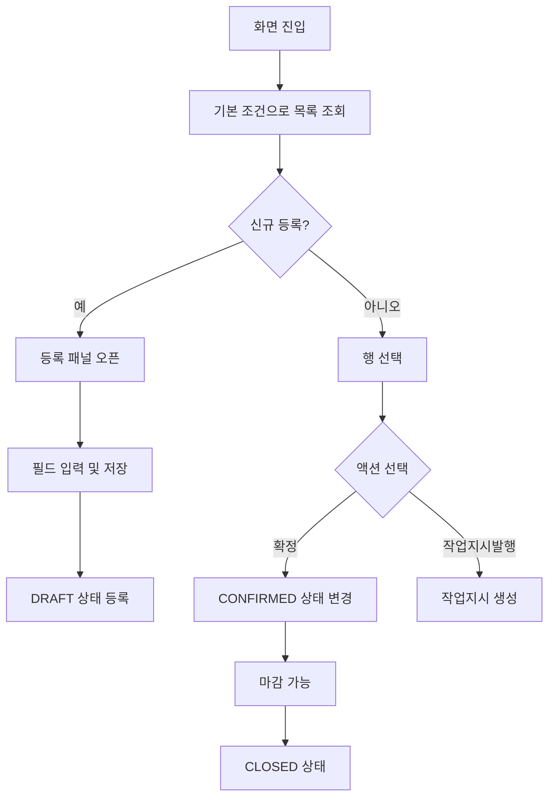
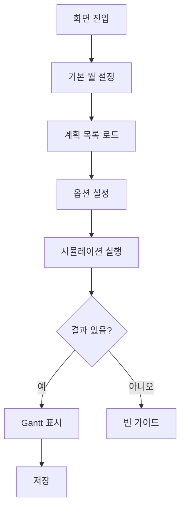
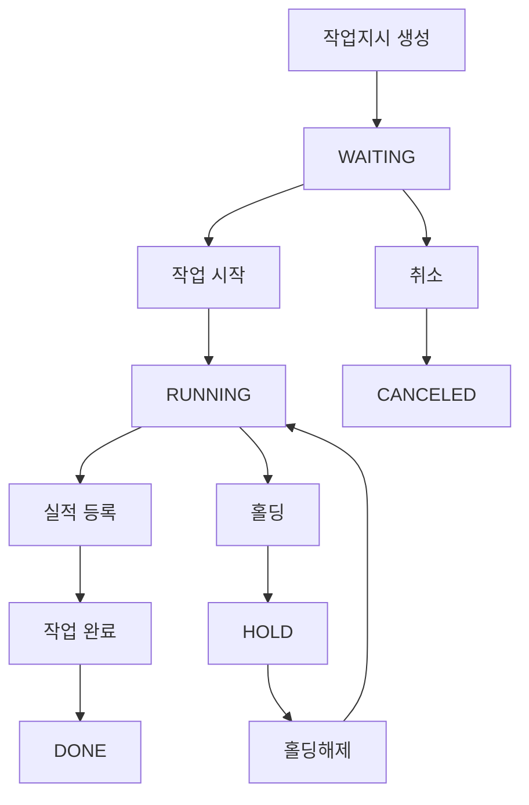
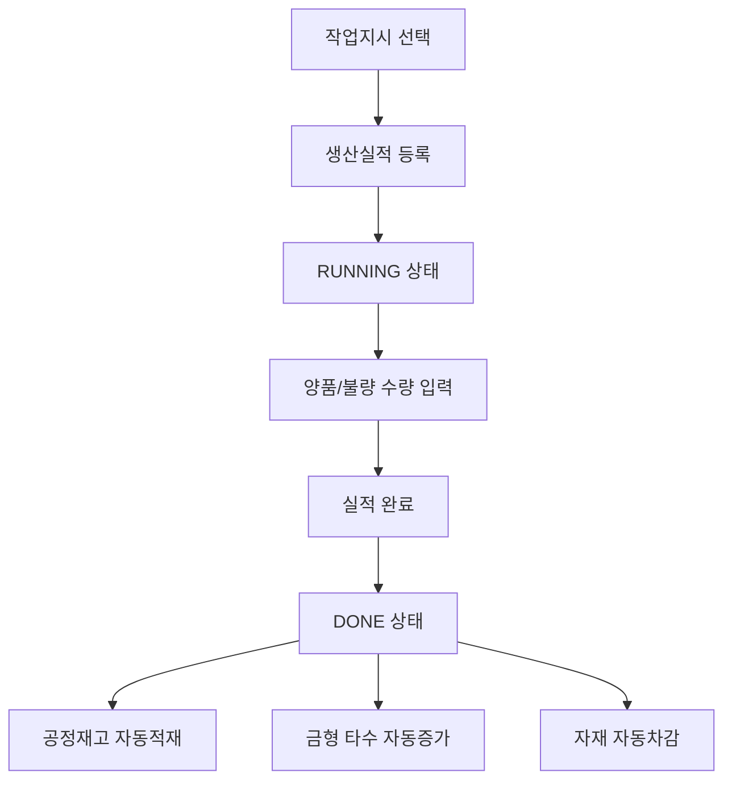
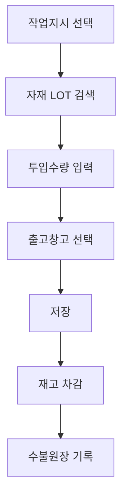
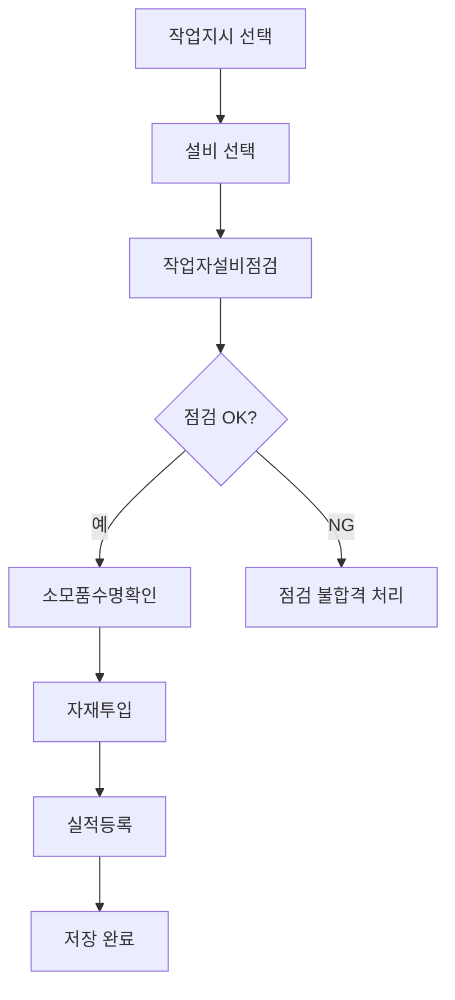
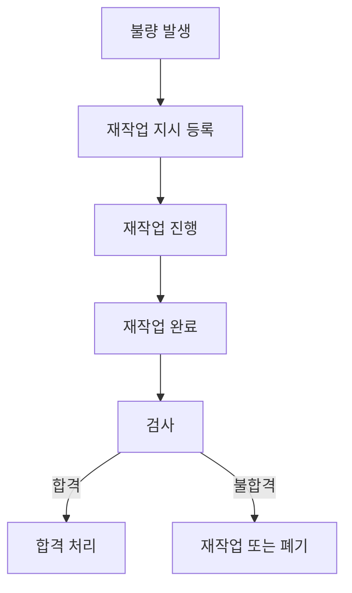
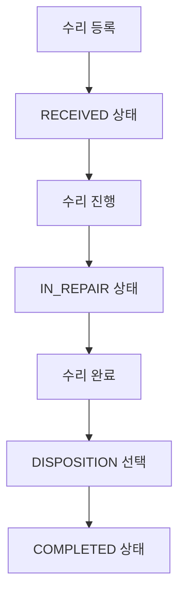
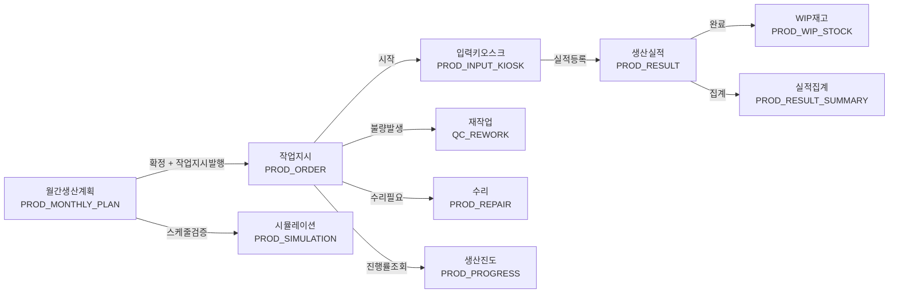

# 생산관리 Workflow

---

# 월간생산계획 (메뉴코드: `PROD_MONTHLY_PLAN`)

## 1. 화면 개요

| 항목 | 내용 |
|------|------|
| **메뉴 경로** | 생산관리 > 월간생산계획 |
| **URL** | `/production/monthly-plan` |
| **메뉴 코드** | `PROD_MONTHLY_PLAN` |
| **화면 목적** | 월별 생산 계획을 등록/조회/확정/마감하고, 수주 기반 자동 편성 및 작업지시 발행을 처리한다. |
| **주요 사용자** | 생산관리자, 생산계획 담당자 |

## 2. 화면 구성

### 2.1 레이아웃
- 상단: 검색조건(월 범위, 품목유형, 상태, 통합검색) + 액션버튼(새로고침, 엑셀업로드, 자동편성, 등록) + 요약 StatCard(전체/초안/확정/마감)
- 중앙: DataGrid(생산계획 목록)
- 하단: 페이징(무한스크롤 또는 번호 페이징)
- 우측 슬라이드 패널: 계획 등록/수정 폼(`PlanFormPanel`)
- 모달: 엑셀업로드(`ExcelUploadModal`), 자동편성(`AutoGenerateModal`), 작업지시발행(`IssueJobOrderModal`)

### 2.2 데이터그리드 컬럼

| 컬럼ID | 컬럼명 | 데이터타입 | 정렬 | 비고 |
|--------|--------|-----------|------|------|
| planNo | 계획번호 | string | Y | PP-YYYYMM-NNN |
| planMonth | 계획월 | string | Y | YYYY-MM |
| itemCode | 품목코드 | string | Y | 왼쪽정렬 |
| itemName | 품목명 | string | Y | PartMaster join |
| itemType | 품목유형 | string | Y | FINISHED/SEMI_PRODUCT |
| planQty | 계획수량 | number | Y | 오른쪽정렬 |
| orderQty | 발행수량 | number | Y | 작업지시 발행 누적 |
| customer | 고객사 | string | Y | - |
| lineCode | 라인코드 | string | Y | - |
| priority | 우선순위 | number | Y | 1~10 |
| status | 상태 | string | Y | 뱃지(공통코드) |
| remark | 비고 | string | Y | - |

### 2.3 입력 폼 필드

| 필드ID | 필드명 | 타입 | 필수 | 기본값 | 검증규칙 | 비고 |
|--------|--------|------|------|--------|----------|------|
| planMonth | 계획월 | month-picker | Y | - | YYYY-MM 형식 | - |
| itemCode | 품목코드 | search-modal | Y | - | PartMaster 존재 | 품목검색모달 |
| itemType | 품목유형 | select | Y | - | FINISHED/SEMI_PRODUCT | 공통코드 ITEM_TYPE |
| planQty | 계획수량 | number | Y | - | >= 1 | - |
| customer | 고객사 | text | N | - | max 50 | - |
| lineCode | 라인코드 | text | N | - | max 255 | - |
| priority | 우선순위 | number | N | 5 | 1~10 | - |
| remark | 비고 | textarea | N | - | max 500 | - |

### 2.4 버튼/액션

| 버튼 | 조건 | 동작 | API |
|------|------|------|-----|
| 등록 | - | 등록모달 오픈 | - |
| 저장 | 폼 valid | 데이터 저장 | POST /production/prod-plans |
| 수정 | DRAFT 상태 | 우측 패널 오픈 | PUT /production/prod-plans/:id |
| 삭제 | DRAFT 상태 | 삭제 확인 후 삭제 | DELETE /production/prod-plans/:id |
| 확정 | DRAFT 상태 | 상태 변경 | POST /production/prod-plans/:id/confirm |
| 확정취소 | CONFIRMED 상태 | 상태 되돌림 | POST /production/prod-plans/:id/unconfirm |
| 마감 | CONFIRMED 상태 | 마감 처리 | POST /production/prod-plans/:id/close |
| 작업지시발행 | CONFIRMED 상태 | 발행 모달 오픈 | POST /production/prod-plans/:id/issue-job-order |
| 엑셀업로드 | - | 엑셀 파싱 후 bulk 등록 | POST /production/prod-plans/bulk |
| 자동편성 | - | 수주 조회 및 계획 생성 | POST /production/prod-plans/auto-generate |

## 3. 업무 흐름

### 3.1 정상 흐름


1. 사용자가 화면에 접속하면 기본 월 범위(당년 1월~12월)로 목록을 조회한다.
2. 등록 버튼으로 신규 계획을 입력하거나, 엑셀업로드/자동편성으로 일괄 등록한다.
3. DRAFT 상태인 계획은 수정/삭제/확정이 가능하다.
4. CONFIRMED 상태인 계획은 작업지시 발행이 가능하다.
5. 모든 작업지시가 완료되면 마감(CLOSED) 처리한다.

### 3.2 예외/분기 흐름
- **조회 결과 없음**: "데이터가 없습니다" 안내 및 등록 유도
- **확정 후 수정 시도**: "초안(DRAFT) 상태의 계획만 수정할 수 있습니다." 오류
- **발행 수량 초과**: `issueQty > (planQty - orderQty)` 시 BadRequestException
- **품목 미존재**: 등록 시 `PartMaster`에 없는 `itemCode` 입력 시 404

## 4. 상태 코드 및 공통코드

### 4.1 화면 내 사용 상태
| 상태명 | 코드값 | 공통코드그룹 | 설명 | 색상 |
|--------|--------|-------------|------|------|
| 초안 | DRAFT | PROD_PLAN_STATUS | 등록/수정 가능 | 회색 |
| 확정 | CONFIRMED | PROD_PLAN_STATUS | 작업지시 발행 가능 | 초록색 |
| 마감 | CLOSED | PROD_PLAN_STATUS | 완료 | 복숭아색 |

### 4.2 관련 공통코드 전체
- `PROD_PLAN_STATUS`: DRAFT(초안), CONFIRMED(확정), CLOSED(마감)
- `ITEM_TYPE`: FINISHED(완제품), SEMI_PRODUCT(반제품)

## 5. API 명세

### 5.1 목록 조회
```
GET /api/v1/production/prod-plans
```
**Query Parameters**
| 파라미터 | 타입 | 필수 | 설명 |
|----------|------|------|------|
| page | number | N | 페이지 (기본 1) |
| limit | number | N | 페이지당 건수 (기본 50) |
| planMonth | string | N | 계획월 YYYY-MM |
| startDate | string | N | 시작일 YYYY-MM-DD |
| endDate | string | N | 종료일 YYYY-MM-DD |
| itemType | string | N | FINISHED / SEMI_PRODUCT |
| status | string | N | DRAFT / CONFIRMED / CLOSED |
| search | string | N | 통합 검색(계획번호/품목코드/품목명) |

**Response 200**
```json
{
  "data": [ { "planNo": "PP-202603-001", "planMonth": "2026-03", ... } ],
  "total": 100, "page": 1, "limit": 50
}
```

### 5.2 월간 집계
```
GET /api/v1/production/prod-plans/summary/:month
```
**Response 200**
```json
{
  "data": {
    "total": 10, "draft": 3, "confirmed": 5, "closed": 2,
    "fgCount": 6, "wipCount": 4,
    "fgPlanQty": 6000, "wipPlanQty": 2000,
    "totalPlanQty": 8000, "totalOrderQty": 5000
  }
}
```

### 5.3 생성
```
POST /api/v1/production/prod-plans
```
**Request Body**
```json
{
  "planMonth": "2026-03",
  "itemCode": "HNS-001",
  "itemType": "FINISHED",
  "planQty": 1000,
  "customer": "HMC",
  "lineCode": "LINE-01",
  "priority": 5,
  "remark": ""
}
```

### 5.4 일괄 등록
```
POST /api/v1/production/prod-plans/bulk
```
**Request Body**
```json
{
  "planMonth": "2026-03",
  "items": [
    { "itemCode": "HNS-001", "itemType": "FINISHED", "planQty": 1000 }
  ]
}
```

### 5.5 수정
```
PUT /api/v1/production/prod-plans/:id
```

### 5.6 삭제
```
DELETE /api/v1/production/prod-plans/:id
```

### 5.7 확정
```
POST /api/v1/production/prod-plans/:id/confirm
```

### 5.8 확정 취소
```
POST /api/v1/production/prod-plans/:id/unconfirm
```

### 5.9 마감
```
POST /api/v1/production/prod-plans/:id/close
```

### 5.10 작업지시 발행
```
POST /api/v1/production/prod-plans/:id/issue-job-order
```
**Request Body**
```json
{
  "issueQty": 500,
  "planDate": "2026-03-15",
  "lineCode": "LINE-01",
  "priority": 5,
  "autoCreateChildren": true,
  "remark": ""
}
```

### 5.11 자동 편성(수주 가져오기)
```
POST /api/v1/production/prod-plans/auto-generate
```
**Request Body**
```json
{
  "month": "2026-04",
  "selectedItems": [
    { "itemCode": "HNS-001", "customerId": "C001", "planQty": 1000 }
  ]
}
```

## 6. 처리 규칙 및 검증

### 6.1 입력 검증
- `planMonth`: YYYY-MM 형식 필수
- `itemCode`: `PartMaster`에 존재 여부 확인
- `planQty`: 1 이상 정수
- `priority`: 1~10 범위

### 6.2 비즈니스 규칙
- DRAFT 상태에서만 수정/삭제 가능
- CONFIRMED 상태에서만 작업지시 발행 가능
- 발행수량은 잔여수량(`planQty - orderQty`) 이하여야 함
- BOM 기반 `autoCreateChildren` 시 반제품 작업지시 자동 생성

### 6.3 트랜잭션 처리
- **bulkCreate**: 전체 원자성 보장 (품목 IN 배치 검증 → 개별 저장)
- **issueJobOrder**: `JobOrder` 생성 + `ProdPlan.orderQty` 증가 원자성 보장
- **autoCreateChildren**: 부모 `JobOrder` 저장 시 자식 `JobOrder` 트랜잭션 내 일괄 저장

## 7. 연관 엔티티 및 테이블

| 엔티티명 | 테이블명 | 역할 | 관계 |
|----------|----------|------|------|
| ProdPlan | PROD_PLANS | 생산계획 마스터 | 메인 |
| PartMaster | PART_MASTERS | 품목 정보 | N:1 |
| JobOrder | JOB_ORDERS | 작업지시 | 1:N (발행 시) |
| RoutingGroup | ROUTING_GROUPS | 라우팅 그룹 | N:1 (자동조회) |
| BomMaster | BOM_MASTERS | BOM 정보 | 참조 (자식생성) |

## 8. 에러 코드 및 메시지

| 상황 | HTTP | 에러메시지 | 처리방법 |
|------|------|-----------|---------|
| 품목미존재 | 404 | 품목을 찾을 수 없습니다: {itemCode} | 품목마스터 확인 |
| 수정불가 | 400 | 초안(DRAFT) 상태의 계획만 수정할 수 있습니다. | 상태 확인 |
| 발행수량초과 | 400 | 발행수량({issueQty})이 잔여수량({remainQty})을 초과합니다. | 수량 조정 |
| 삭제불가 | 400 | 초안(DRAFT) 상태의 계획만 삭제할 수 있습니다. | 상태 확인 |

## 9. 참고사항

- `planNo` 자동생성 규칙: `PP-YYYYMM-NNN` (월별 001부터 순번)
- 관련 화면: 작업지시 (`PROD_ORDER`)
- 관련 문서: 시뮬레이션 (`PROD_SIMULATION`)

---

# 생산계획 시뮬레이션 (메뉴코드: `PROD_SIMULATION`)

## 1. 화면 개요

| 항목 | 내용 |
|------|------|
| **메뉴 경로** | 생산관리 > 시뮬레이션 |
| **URL** | `/production/simulation` |
| **메뉴 코드** | `PROD_SIMULATION` |
| **화면 목적** | 납기/CAPA/월력 기반으로 생산계획의 일자별 스케줄을 사전 검증하고 가시화한다. |
| **주요 사용자** | 생산관리자, 생산계획 담당자 |

## 2. 화면 구성

### 2.1 레이아웃
- 상단: 대상월 선택, 전략 선택(DUE_DATE/MIN_SETUP), 시뮬레이션 실행/저장 버튼
- 옵션 바: 교대수(1/2/3), 잔업 포함, 셋업시간 반영, 재고 차감 체크박스
- 메인: 좌측 계획 순서 패널(↑↓ 변경 가능) + 우측 Gantt 차트

### 2.2 데이터그리드 컬럼 (좌측 순서 패널)

| 컬럼ID | 컬럼명 | 데이터타입 | 비고 |
|--------|--------|-----------|------|
| itemName | 품목명 | string | - |
| planNo | 계획번호 | string | font-mono |
| customerName | 고객명 | string | - |
| planQty | 계획수량 | number | - |
| dueDate | 납기일 | string | MM-DD |

### 2.3 Gantt 차트 정보
- X축: 작업일(YYYY-MM-DD)
- Y축: 계획별/공정별 수량 막대
- 선택된 계획 하이라이트
- 요약: 총 계획/납기준수/지연/가동률/필요시간/가용시간

### 2.4 버튼/액션

| 버튼 | 조건 | 동작 | API |
|------|------|------|-----|
| 시뮬레이션 실행 | month 입력 | 스케줄 계산 실행 | POST /production/prod-plans/simulate |
| 저장 | result 존재 | 결과 저장 | POST /production/prod-plans/simulate/save |
| 순서 변경 | planOrder > 0 | ↑↓ 버튼으로 우선순위 재배열 | - |

## 3. 업무 흐름

### 3.1 정상 흐름


1. 화면 진입 시 마지막 시뮬레이션 결과를 조회하여 복원한다.
2. 대상월 변경 시 해당 월의 생산계획 목록을 좌측 패널에 로드한다.
3. 사용자가 순서를 조정하거나 옵션을 변경한 후 시뮬레이션을 실행한다.
4. 역산(납기→시작일) + 정산(CAPA 소진) 알고리즘으로 스케줄을 계산한다.
5. 결과를 Gantt 차트로 시각화하고 저장할 수 있다.

### 3.2 예외/분기 흐름
- **계획 없음**: "해당 월에 생산계획이 없습니다."
- **작업일 없음**: "월력에 작업일이 없습니다."
- **CAPA 부족**: 지연(Delay)으로 표시되며 `delayDays` 계산됨

## 4. 상태 코드 및 공통코드

- 별도 상태 코드 없음
- 전략: `DUE_DATE`(납기우선), `MIN_SETUP`(셋업최소화)

## 5. API 명세

### 5.1 시뮬레이션 실행
```
POST /api/v1/production/prod-plans/simulate
```
**Request Body**
```json
{
  "month": "2026-04",
  "strategy": "DUE_DATE",
  "planOrder": ["PP-202604-001", "PP-202604-002"],
  "shiftCount": 1,
  "includeOt": false,
  "applySetup": true,
  "deductStock": false
}
```

**Response 200**
```json
{
  "data": {
    "plans": [
      {
        "planNo": "PP-202604-001", "itemCode": "HNS-001", "itemName": "...",
        "planQty": 1000, "dueDate": "2026-04-20", "priority": 5,
        "startDate": "2026-04-01", "endDate": "2026-04-10",
        "onTime": true, "delayDays": 0,
        "requiredDays": 8, "bottleneckProcess": "CUT", "dailyCapa": 120
      }
    ],
    "schedule": [
      { "date": "2026-04-01", "dayOfWeek": "Wed", "items": [...] }
    ],
    "summary": {
      "totalPlans": 10, "onTimeCount": 8, "delayCount": 2,
      "totalQty": 8000, "workDays": 22, "utilizationRate": 75.5,
      "requiredHours": 1200, "availableHours": 1600
    }
  }
}
```

### 5.2 결과 저장
```
POST /api/v1/production/prod-plans/simulate/save
```
**Request Body**: 위 Response와 동일 + `month`, `strategy`, 옵션 필드

### 5.3 마지막 결과 조회
```
GET /api/v1/production/prod-plans/simulate/latest?month=2026-04
```

## 6. 처리 규칙 및 검증

### 6.1 알고리즘 규칙
- **역산**: 납기일에서 마지막 공정 → 첫 공정 순으로 이상적 시작일 계산
- **정산**: 첫 공정 → 마지막 공정 순으로 실제 CAPA를 소진하며 배분
- **셋업**: 같은 공정에서 품목 전환 시 `setupTime/480 × dailyCapa`만큼 CAPA 차감
- **교대/잔업**: 1교대=480분, 2교대=960분, 잔업=+180분 기준 CAPA 배율 적용

### 6.2 비즈니스 규칙
- 같은 품목은 같은 날 CAPA 공유 (한 설비가 하나씩)
- 다른 품목은 같은 날 동시 가능 (다른 설비)
- 하루 CAPA 초과 시 다음 작업일로 이월

### 6.3 트랜잭션 처리
- 시뮬레이션 자체는 읽기 전용 연산
- 저장 시: `SimulationHeader` → `SimulationPlan` → `SimulationSchedule` 순으로 정규화 테이블에 INSERT

## 7. 연관 엔티티 및 테이블

| 엔티티명 | 테이블명 | 역할 | 관계 |
|----------|----------|------|------|
| ProdPlan | PROD_PLANS | 생산계획 | 기준 데이터 |
| WorkCalendar | WORK_CALENDARS | 월력 | 작업일 추출 |
| ProcessCapa | PROCESS_CAPAS | 공정 CAPA | 병목/전체 공정 CAPA |
| CustomerOrder | (수주 테이블) | 수주/납기 | 납기일 매칭 |
| SimulationHeader | SIMULATION_HEADERS | 시뮬레이션 실행 단위 | 저장 시 |
| SimulationPlan | SIMULATION_PLANS | 계획별 결과 | 저장 시 |
| SimulationSchedule | SIMULATION_SCHEDULES | 공정별 스케줄 | 저장 시 |

## 8. 에러 코드 및 메시지

| 상황 | HTTP | 에러메시지 | 처리방법 |
|------|------|-----------|---------|
| 계획 없음 | 200 | emptyResult 반환 | 계획 등록 필요 |
| 작업일 없음 | 200 | emptyResult 반환 | 월력 설정 필요 |

## 9. 참고사항

- 저장된 결과는 상세 스케줄(`schedule`)을 포함하지 않음; 다시 실행 시 생성됨
- `planOrder`가 지정되면 사용자 지정 순서가 우선, 미지정 시 전략(DUE_DATE/MIN_SETUP) 정렬 적용

---

# 작업지시 (메뉴코드: `PROD_ORDER`)

## 1. 화면 개요

| 항목 | 내용 |
|------|------|
| **메뉴 경로** | 생산관리 > 작업지시 |
| **URL** | `/production/order` |
| **메뉴 코드** | `PROD_ORDER` |
| **화면 목적** | 생산 작업지시를 생성/조회/관리하고, 상태별 액션(시작/완료/홀딩/취소)을 처리한다. |
| **주요 사용자** | 생산관리자, 작업장 관리자 |

## 2. 화면 구성

### 2.1 레이아웃
- 상단: 검색조건 + 액션버튼 + StatCard(전체/대기/진행/완료)
- 액션바: 행 선택 시 상태별 액션 버튼 표시(시작/완료/홀딩/홀딩해제/취소/출력/사전발행)
- 중앙: DataGrid(목록/트리 뷰 토글)
- 우측 슬라이드 패널: 생성/수정 폼(`JobOrderFormPanel`)
- 모달: 작업지시서 출력(`JobOrderPrintModal`), 삭제/액션 확인 모달

### 2.2 데이터그리드 컬럼

| 컬럼ID | 컬럼명 | 데이터타입 | 정렬 | 비고 |
|--------|--------|-----------|------|------|
| orderNo | 작업지시번호 | string | Y | JO-YYYYMMDD-NNN |
| partCode | 품목코드 | string | Y | - |
| partName | 품목명 | string | Y | - |
| partType | 품목유형 | string | Y | FG/WIP 뱃지 |
| lineCode | 라인코드 | string | Y | - |
| custPoNo | 고객PO | string | Y | - |
| planQty | 계획수량 | number | Y | 오른쪽정렬 |
| goodQty | 생산수량 | number | Y | 오른쪽정렬 |
| progress | 진행률 | number | Y | ProgressBar |
| status | 상태 | string | Y | 뱃지(공통코드) |
| planDate | 계획일 | date | Y | YYYY-MM-DD |

### 2.3 입력 폼 필드

| 필드ID | 필드명 | 타입 | 필수 | 기본값 | 검증규칙 | 비고 |
|--------|--------|------|------|--------|----------|------|
| orderNo | 작업지시번호 | text | Y | 자동채번 | max 50 | 미입력 시 자동생성 |
| itemCode | 품목코드 | search-modal | Y | - | PartMaster 존재 | - |
| lineCode | 라인코드 | text | N | - | max 50 | - |
| planQty | 계획수량 | number | Y | - | >= 1 | - |
| planDate | 계획일 | date | Y | - | YYYY-MM-DD | - |
| priority | 우선순위 | number | N | 5 | 1~10 | - |
| custPoNo | 고객PO | text | N | - | max 50 | - |
| remark | 비고 | textarea | N | - | max 500 | - |
| autoCreateChildren | 반제품자동생성 | checkbox | N | false | - | BOM 기반 |

### 2.4 버튼/액션

| 버튼 | 조건 | 동작 | API |
|------|------|------|-----|
| 생성 | - | 패널 오픈 | POST /production/job-orders |
| 수정 | - | 패널 오픈 | PUT /production/job-orders/:id |
| 삭제 | RUNNING 아님 | 삭제 | DELETE /production/job-orders/:id |
| 시작 | WAITING | RUNNING 변경 | POST /production/job-orders/:id/start |
| 완료 | RUNNING | DONE 변경 + 실적집계 | POST /production/job-orders/:id/complete |
| 홀딩 | WAITING/RUNNING | HOLD 변경 | POST /production/job-orders/:id/hold |
| 홀딩해제 | HOLD | 이전상태 복귀 | POST /production/job-orders/:id/hold-release |
| 취소 | WAITING/HOLD | CANCELED 변경 | POST /production/job-orders/:id/cancel |
| 출력 | - | 작업지시서 인쇄 | - |
| 사전발행 | PRE_ISSUE 설정 시 | FG 바코드 발행 | POST /quality/continuity-inspect/pre-issue |

## 3. 업무 흐름

### 3.1 정상 흐름


1. 작업지시를 생성하면 `WAITING` 상태가 된다.
2. 작업 시작 시 `RUNNING`으로 변경되며, `startAt`이 기록된다.
3. 생산실적 등록 시 `JobOrder`가 `WAITING`이면 자동으로 `RUNNING`으로 승격된다.
4. 작업 완료 시 `DONE`으로 변경되며, 실적이 자동 집계되어 `goodQty`/`defectQty`가 갱신된다.
5. `WAITING` 또는 `RUNNING` 상태에서 홀딩(HOLD)할 수 있으며, 실적등록/출하가 차단된다.
6. 홀딩해제 시 `remark`에 기록된 이전 상태로 복귀한다.
7. `WAITING` 또는 `HOLD` 상태에서 취소할 수 있으며, 실적이 있으면 취소 불가하다.

### 3.2 예외/분기 흐름
- **실적 있음 + 취소 시도**: "실적이 {count}건 등록되어 있어 취소할 수 없습니다."
- **진행 중 삭제 시도**: "진행 중인 작업지시는 삭제할 수 없습니다."
- **완료/취소 수정 시도**: "완료되거나 취소된 작업지시는 수정할 수 없습니다."
- **홀딩 해제 실패**: remark에서 이전 상태를 추출할 수 없으면 복구 불가

## 4. 상태 코드 및 공통코드

### 4.1 화면 내 사용 상태
| 상태명 | 코드값 | 공통코드그룹 | 설명 | 색상 |
|--------|--------|-------------|------|------|
| 대기 | WAITING | JOB_ORDER_STATUS | 실적 등록 대기 | 회색 |
| 진행중 | RUNNING | JOB_ORDER_STATUS | 생산 진행 중 | 초록색 |
| 홀딩 | HOLD | JOB_ORDER_STATUS | 실적/출하 차단 | 노란색 |
| 완료 | DONE | JOB_ORDER_STATUS | 작업 완료 | 파란색 |
| 취소 | CANCELED | JOB_ORDER_STATUS | 작업 취소 | 빨간색 |

### 4.2 관련 공통코드 전체
- `JOB_ORDER_STATUS`: WAITING, RUNNING, HOLD, DONE, CANCELED
- `USE_YN`: Y, N (ERP 동기화 플래그)

## 5. API 명세

### 5.1 목록 조회
```
GET /api/v1/production/job-orders
```
**Query Parameters**
| 파라미터 | 타입 | 필수 | 설명 |
|----------|------|------|------|
| page | number | N | 페이지 (기본 1) |
| limit | number | N | 페이지당 건수 (기본 50) |
| search | string | N | 통합 검색(지시번호/품목코드/품목명) |
| orderNo | string | N | 지시번호 검색 |
| itemCode | string | N | 품목코드 필터 |
| lineCode | string | N | 라인코드 필터 |
| status | string | N | 단일 상태 |
| statuses | string | N | 다중 상태(쉼표 구분) |
| planDateFrom | string | N | 계획일 시작 YYYY-MM-DD |
| planDateTo | string | N | 계획일 종료 YYYY-MM-DD |
| erpSyncYn | string | N | ERP 동기화 여부 Y/N |

### 5.2 트리 조회
```
GET /api/v1/production/job-orders/tree?parentId={parentId}
```

### 5.3 생성
```
POST /api/v1/production/job-orders
```
**Request Body**
```json
{
  "orderNo": "JO-20260315-001",
  "itemCode": "HNS-001",
  "lineCode": "LINE-01",
  "planQty": 1000,
  "planDate": "2026-03-15",
  "priority": 5,
  "custPoNo": "PO-001",
  "remark": "",
  "autoCreateChildren": true
}
```

### 5.4 수정
```
PUT /api/v1/production/job-orders/:id
```

### 5.5 삭제
```
DELETE /api/v1/production/job-orders/:id
```

### 5.6 상태 변경
```
POST /api/v1/production/job-orders/:id/start
POST /api/v1/production/job-orders/:id/hold
POST /api/v1/production/job-orders/:id/hold-release
POST /api/v1/production/job-orders/:id/complete
POST /api/v1/production/job-orders/:id/cancel
```
**취소 Request Body**
```json
{ "remark": "취소 사유" }
```

### 5.7 ERP 동기화
```
PUT /api/v1/production/job-orders/:id/erp-sync
```
**Request Body**
```json
{ "erpSyncYn": "Y" }
```

### 5.8 실적 집계
```
GET /api/v1/production/job-orders/:id/summary
```
**Response 200**
```json
{
  "data": {
    "orderNo": "JO-20260315-001",
    "planQty": 1000,
    "totalGoodQty": 950,
    "totalDefectQty": 20,
    "totalQty": 970,
    "achievementRate": 95.0,
    "defectRate": 2.06,
    "avgCycleTime": 35.5,
    "resultCount": 5
  }
}
```

## 6. 처리 규칙 및 검증

### 6.1 입력 검증
- `planQty`: 1 이상 정수
- `planDate`: YYYY-MM-DD 필수
- `priority`: 1~10
- `itemCode`: `PartMaster` 존재 여부 확인

### 6.2 비즈니스 규칙
- `WAITING` → `RUNNING`: 시작 가능
- `RUNNING` → `DONE`: 완료 가능(실적 자동 집계)
- `WAITING`/`RUNNING` → `HOLD`: 홀딩 가능(이전 상태를 remark에 기록)
- `HOLD` → 이전상태: 홀딩해제(remark 파싱)
- `WAITING`/`HOLD` → `CANCELED`: 취소 가능(실적 0건 필수)
- `DONE`/`CANCELED`: 수정 불가
- `RUNNING`: 삭제 불가

### 6.3 트랜잭션 처리
- **create**: `JobOrder` 생성 + BOM 기반 자식 `JobOrder` 자동생성 원자성
- **complete**: `JobOrder` 상태 변경 + `goodQty`/`defectQty` 집계 + 금형 타수 증가 + 설비 해제 + 공정재고 적재 + 작업지시 자동완료 체크
- **cancel**: `JobOrder` 취소 + 연결된 `ProdPlan.orderQty` 차감

## 7. 연관 엔티티 및 테이블

| 엔티티명 | 테이블명 | 역할 | 관계 |
|----------|----------|------|------|
| JobOrder | JOB_ORDERS | 작업지시 마스터 | 메인 |
| PartMaster | PART_MASTERS | 품목 정보 | N:1 |
| ProdResult | PROD_RESULTS | 생산실적 | 1:N |
| ProdPlan | PROD_PLANS | 생산계획 | N:1 (planNo) |
| RoutingGroup | ROUTING_GROUPS | 라우팅 | N:1 (routingCode) |
| BomMaster | BOM_MASTERS | BOM | 참조 (자식생성) |
| FgLabel | FG_LABELS | FG 바코드 | 1:N (PRE_ISSUE) |

## 8. 에러 코드 및 메시지

| 상황 | HTTP | 에러메시지 | 처리방법 |
|------|------|-----------|---------|
| 품목미존재 | 404 | 품목을 찾을 수 없습니다: {itemCode} | 품목마스터 확인 |
| 중복지시번호 | 409 | 이미 존재하는 작업지시번호입니다 | 번호 변경 |
| 상태변경불가 | 400 | 현재 상태({status})에서는 {action}할 수 없습니다 | 상태 확인 |
| 실적있음취소 | 400 | 실적이 {count}건 등록되어 있어 취소할 수 없습니다 | 실적 삭제 후 재시도 |
| 홀딩복구실패 | 400 | 홀딩 이전 상태 정보를 찾을 수 없습니다 | 수동 상태 변경 필요 |

## 9. 참고사항

- `orderNo` 자동생성 규칙: `JO-YYYYMMDD-NNN`
- FG 바코드 사전발행: `FG_BARCODE_ISSUE_TIMING` 시스템 설정이 `PRE_ISSUE`인 경우, 작업 시작 시 자동 발행
- 관련 화면: 생산실적 (`PROD_RESULT`), 입력키오스크 (`PROD_INPUT_KIOSK`)

---

# 생산실적 (메뉴코드: `PROD_RESULT`)

## 1. 화면 개요

| 항목 | 내용 |
|------|------|
| **메뉴 경로** | 생산관리 > 생산실적 |
| **URL** | `/production/result` |
| **메뉴 코드** | `PROD_RESULT` |
| **화면 목적** | 작업지시별 생산 실적을 등록/조회/수정/완료/취소하고, 자재 자동차감 및 공정재고 적재를 처리한다. |
| **주요 사용자** | 작업장 관리자, 생산관리자 |

## 2. 화면 구성

### 2.1 레이아웃
- 상단: 검색조건(작업지시, 설비, 작업자, 기간 등) + 액션버튼
- 중앙: DataGrid(생산실적 목록)
- 하단: 페이징
- 모달: 등록/수정/상세 모달

### 2.2 데이터그리드 컬럼

| 컬럼ID | 컬럼명 | 데이터타입 | 정렬 | 비고 |
|--------|--------|-----------|------|------|
| resultNo | 실적번호 | string | Y | PR-YYMMDD-NNNN |
| orderNo | 작업지시번호 | string | Y | - |
| equipCode | 설비코드 | string | Y | - |
| workerId | 작업자ID | string | Y | - |
| prdUid | 제품UID | string | Y | FG 바코드 또는 시리얼 |
| processCode | 공정코드 | string | Y | - |
| goodQty | 양품수량 | number | Y | 오른쪽정렬 |
| defectQty | 불량수량 | number | Y | 오른쪽정렬 |
| startAt | 시작시간 | datetime | Y | YYYY-MM-DD HH:mm |
| endAt | 종료시간 | datetime | Y | YYYY-MM-DD HH:mm |
| cycleTime | 사이클타임 | number | Y | 초 단위 |
| status | 상태 | string | Y | 뱃지 |
| shiftCode | 교대 | string | Y | - |

### 2.3 입력 폼 필드

| 필드ID | 필드명 | 타입 | 필수 | 기본값 | 검증규칙 | 비고 |
|--------|--------|------|------|--------|----------|------|
| orderNo | 작업지시 | search-modal | Y | - | JobOrder 존재 | WAITING/HOLD 외 |
| equipCode | 설비 | search-modal | N | - | EquipMaster 존재 | 설비부품 인터락 |
| workerId | 작업자 | search-modal | N | - | User 존재 | - |
| prdUid | 제품UID | text | N | - | max 50 | ON_PRODUCTION 시 자동 |
| processCode | 공정 | select | N | - | - | - |
| goodQty | 양품수량 | number | N | 0 | >= 0 | - |
| defectQty | 불량수량 | number | N | 0 | >= 0 | - |
| startAt | 시작시간 | datetime | N | 현재 | ISO 8601 | - |
| endAt | 종료시간 | datetime | N | - | ISO 8601 | - |
| cycleTime | 사이클타임 | number | N | - | >= 0 | 초 단위 |
| shiftCode | 교대 | select | N | - | - | 미지정 시 자동판별 |
| remark | 비고 | textarea | N | - | max 500 | - |

### 2.4 버튼/액션

| 버튼 | 조건 | 동작 | API |
|------|------|------|-----|
| 등록 | - | 등록모달 오픈 | POST /production/prod-results |
| 저장 | 폼 valid | 데이터 저장 | POST /production/prod-results |
| 수정 | RUNNING 상태 | 수정모달 오픈 | PUT /production/prod-results/:resultNo |
| 삭제 | CANCELED 상태 | 삭제 | DELETE /production/prod-results/:resultNo |
| 완료 | RUNNING 상태 | DONE 변경 | POST /production/prod-results/:resultNo/complete |
| 취소 | RUNNING/DONE 상태 | CANCELED 변경 | POST /production/prod-results/:resultNo/cancel |

## 3. 업무 흐름

### 3.1 정상 흐름


1. 작업지시를 선택하여 실적을 등록한다.
2. `WAITING` 상태의 작업지시에 실적이 최초 등록되면 `RUNNING`으로 자동 승격된다.
3. 양품/불량 수량, 설비, 작업자, 공정 등을 입력한다.
4. 실적 완료 시 `DONE`으로 변경되며, 다음이 자동 처리된다:
   - 공정창고(WIP_MAIN)에 양품 재고 적재
   - 금형(ConsumableMaster) 타수 자동 증가
   - 설비 현재 작업지시 해제
   - BOM 기반 자재 자동차감(ON_COMPLETE)
   - 작업지시 자동완료 체크

### 3.2 예외/분기 흐름
- **완료/취소된 지시**: "완료되거나 취소된 작업지시에는 실적을 등록할 수 없습니다."
- **홀딩된 지시**: "홀딩된 작업지시에는 실적을 등록할 수 없습니다."
- **수량 초과**: 기등록 실적 + 새 실적 > planQty 시 400 오류
- **설비부품 불일치**: 작업지시 품목과 설비 BOM 부품 불일치 시 400 오류
- **후공정 진행됨**: PACKED/SHIPPED 상태의 FG가 있으면 취소 불가

## 4. 상태 코드 및 공통코드

### 4.1 화면 내 사용 상태
| 상태명 | 코드값 | 공통코드그룹 | 설명 | 색상 |
|--------|--------|-------------|------|------|
| 진행중 | RUNNING | PROD_RESULT_STATUS | 생산 진행 중 | 초록색 |
| 완료 | DONE | PROD_RESULT_STATUS | 실적 완료 | 파란색 |
| 취소 | CANCELED | PROD_RESULT_STATUS | 실적 취소 | 빨간색 |

### 4.2 관련 공통코드 전체
- `PROD_RESULT_STATUS`: RUNNING, DONE, CANCELED

## 5. API 명세

### 5.1 목록 조회
```
GET /api/v1/production/prod-results
```
**Query Parameters**
| 파라미터 | 타입 | 필수 | 설명 |
|----------|------|------|------|
| page | number | N | 페이지 (기본 1) |
| limit | number | N | 페이지당 건수 (기본 10) |
| orderNo | string | N | 작업지시번호 |
| equipCode | string | N | 설비코드 |
| workerId | string | N | 작업자ID |
| prdUid | string | N | 제품UID 검색 |
| processCode | string | N | 공정코드 |
| status | string | N | RUNNING/DONE/CANCELED |
| shiftCode | string | N | 교대코드 |
| startTimeFrom | string | N | 시작시간 시작 ISO 8601 |
| startTimeTo | string | N | 시작시간 종료 ISO 8601 |

### 5.2 작업지시별 조회
```
GET /api/v1/production/prod-results/job-order/:orderNo
```

### 5.3 생성
```
POST /api/v1/production/prod-results
```
**Request Body**
```json
{
  "orderNo": "JO-20260315-001",
  "equipCode": "EQ-001",
  "workerId": "user@example.com",
  "prdUid": "PRD-20260315-001",
  "processCode": "CUT",
  "goodQty": 100,
  "defectQty": 2,
  "startAt": "2026-03-15T08:00:00Z",
  "endAt": "2026-03-15T17:00:00Z",
  "cycleTime": 30.5,
  "shiftCode": "DAY",
  "remark": ""
}
```

### 5.4 수정
```
PUT /api/v1/production/prod-results/:resultNo
```
**특이사항**: 수량 변경 시 자재 자동차감 역분개 후 재차감 실행

### 5.5 삭제
```
DELETE /api/v1/production/prod-results/:resultNo
```
**조건**: CANCELED 상태만 삭제 가능

### 5.6 완료
```
POST /api/v1/production/prod-results/:resultNo/complete
```
**Request Body**
```json
{
  "goodQty": 100,
  "defectQty": 2,
  "endAt": "2026-03-15T17:00:00Z",
  "remark": ""
}
```

### 5.7 취소
```
POST /api/v1/production/prod-results/:resultNo/cancel
```
**Request Body**
```json
{ "remark": "취소 사유" }
```

### 5.8 집계 API
```
GET /api/v1/production/prod-results/summary/job-order/:orderNo
GET /api/v1/production/prod-results/summary/equip/:equipCode?dateFrom=...&dateTo=...
GET /api/v1/production/prod-results/summary/worker/:workerId?dateFrom=...&dateTo=...
GET /api/v1/production/prod-results/summary/daily?dateFrom=...&dateTo=...
GET /api/v1/production/prod-results/summary/by-product?dateFrom=...&dateTo=...&search=...
```

## 6. 처리 규칙 및 검증

### 6.1 입력 검증
- `goodQty`, `defectQty`: 0 이상 정수
- `cycleTime`: 0 이상 실수
- `orderNo`: `JobOrder` 존재, DONE/CANCELED/HOLD 아님
- `equipCode`: `EquipMaster` 존재
- `workerId`: `User` 존재

### 6.2 비즈니스 규칙
- 작업지시 수량 초과 체크: 기등록 실적 + 새 실적 ≤ planQty
- 설비부품 인터락: 작업지시 품목과 설비 BOM 부품 일치 여부 확인
- FG 바코드 발행 타이밍: `ON_PRODUCTION`(생성 시) / `PRE_ISSUE`(작업시작 시) / `ON_INSPECT`(검사 시)
- 교대 자동판별: `ShiftResolver`가 시작시간 기준으로 자동 판별

### 6.3 트랜잭션 처리
- **create**: `ProdResult` 생성 + `JobOrder` RUNNING 승격 + FG 바코드 발행 + 자재 자동차감(ON_CREATE)
- **complete**: `ProdResult` DONE 변경 + 금형 타수 증가 + 설비 해제 + 자재 자동차감(ON_COMPLETE) + 공정재고 적재 + 작업지시 자동완료
- **cancel**: `ProdResult` CANCELED 변경 + 설비 해제 + 자재 역분개 + 공정재고 역분개 + 후공정 진행 여부 체크
- **update**: 수량 변경 시 자재 역분개 → 재차감 실행

## 7. 연관 엔티티 및 테이블

| 엔티티명 | 테이블명 | 역할 | 관계 |
|----------|----------|------|------|
| ProdResult | PROD_RESULTS | 생산실적 마스터 | 메인 |
| JobOrder | JOB_ORDERS | 작업지시 | N:1 |
| EquipMaster | EQUIP_MASTERS | 설비 | N:1 |
| WorkerMaster | WORKER_MASTERS | 작업자 | N:1 |
| InspectResult | INSPECT_RESULTS | 검사결과 | 1:N |
| DefectLog | DEFECT_LOGS | 불량이력 | 1:N |
| MatIssue | MAT_ISSUES | 자재투입 | 1:N |
| ProductStock | PRODUCT_STOCKS | 제품재고 | 적재 대상 |
| ProductTransaction | PRODUCT_TRANSACTIONS | 제품수불원장 | 적재 기록 |
| ConsumableMaster | CONSUMABLE_MASTERS | 소모품/금형 | 타수 증가 |
| FgLabel | FG_LABELS | FG 바코드 | 1:N |

## 8. 에러 코드 및 메시지

| 상황 | HTTP | 에러메시지 | 처리방법 |
|------|------|-----------|---------|
| 지시미존재 | 404 | 작업지시를 찾을 수 없습니다 | 지시번호 확인 |
| 지시완료 | 400 | 완료되거나 취소된 작업지시에는 실적을 등록할 수 없습니다 | 상태 확인 |
| 지시홀딩 | 400 | 홀딩된 작업지시에는 실적을 등록할 수 없습니다 | 홀딩해제 후 등록 |
| 수량초과 | 400 | 작업지시 수량 초과 | 수량 조정 |
| 설비부품불일치 | 400 | 설비부품 인터락 오류 | 설비/품목 확인 |
| 후공정진행 | 400 | 이미 후공정이 진행된 생산실적입니다 | 역처리 후 취소 |
| 삭제불가 | 400 | CANCELED 상태만 삭제 가능 | 취소 후 삭제 |

## 9. 참고사항

- `resultNo` 자동생성 규칙: `PR-YYMMDD-NNNN` (NumberingService)
- 자재 자동차감 시점: `ON_CREATE`(실적 생성 시) 또는 `ON_COMPLETE`(실적 완료 시) — 시스템 설정에 따름
- 관련 화면: 입력키오스크 (`PROD_INPUT_KIOSK`), 작업지시 (`PROD_ORDER`)

---

# 생산진도 (메뉴코드: `PROD_PROGRESS`)

## 1. 화면 개요

| 항목 | 내용 |
|------|------|
| **메뉴 경로** | 생산관리 > 생산진도 |
| **URL** | `/production/progress` |
| **메뉴 코드** | `PROD_PROGRESS` |
| **화면 목적** | 작업지시별 계획수량 대비 실적수량 및 진행률을 대시보드 형태로 조회한다. |
| **주요 사용자** | 생산관리자, 현장 관리자 |

## 2. 화면 구성

### 2.1 레이아웃
- 상단: 검색조건(상태, 계획일 범위, 교대, 검색) + StatCard
- 중앙: DataGrid(작업지시 목록 + 진행률)

### 2.2 데이터그리드 컬럼

| 컬럼ID | 컬럼명 | 데이터타입 | 비고 |
|--------|--------|-----------|------|
| orderNo | 작업지시번호 | string | - |
| itemCode | 품목코드 | string | - |
| itemName | 품목명 | string | - |
| planQty | 계획수량 | number | - |
| goodQty | 양품수량 | number | - |
| defectQty | 불량수량 | number | - |
| progress | 진행률 | number | % ProgressBar |
| status | 상태 | string | 뱃지 |
| planDate | 계획일 | date | - |

### 2.3 버튼/액션
- 조회: 필터 기반 목록 새로고침

## 3. 업무 흐름

### 3.1 정상 흐름
1. 화면 접속 시 기간 조건으로 작업지시 목록 조회
2. 각 행에 `planQty` 대비 `goodQty` 진행률 표시
3. 교대 필터로 특정 교대의 실적이 있는 작업지시만 조회 가능

## 4. 상태 코드 및 공통코드
- `JOB_ORDER_STATUS`: WAITING, RUNNING, HOLD, DONE, CANCELED

## 5. API 명세

### 5.1 진행현황 조회
```
GET /api/v1/production/progress
```
**Query Parameters**
| 파라미터 | 타입 | 필수 | 설명 |
|----------|------|------|------|
| page | number | N | 페이지 (기본 1) |
| limit | number | N | 페이지당 건수 (기본 20) |
| status | string | N | 작업지시 상태 |
| planDateFrom | string | N | 계획일 시작 YYYY-MM-DD |
| planDateTo | string | N | 계획일 종료 YYYY-MM-DD |
| shift | string | N | 교대 코드 |
| search | string | N | 통합 검색(지시번호/품목코드/품목명) |

**Response 200**
```json
{
  "data": [
    { "orderNo": "JO-20260315-001", "planQty": 1000, "goodQty": 500, "defectQty": 10, "status": "RUNNING", ... }
  ],
  "total": 50, "page": 1, "limit": 20
}
```

## 6. 처리 규칙 및 검증
- 교대 필터 시: 해당 교대의 `ProdResult`가 존재하는 `JobOrder`만 INNER JOIN 조회

## 7. 연관 엔티티 및 테이블

| 엔티티명 | 테이블명 | 역할 | 관계 |
|----------|----------|------|------|
| JobOrder | JOB_ORDERS | 작업지시 | 메인 |
| PartMaster | PART_MASTERS | 품목 | N:1 |
| ProdResult | PROD_RESULTS | 생산실적 | 1:N |

## 8. 참고사항
- 진행률 = `(goodQty / planQty) × 100`
- 관련 화면: 작업지시 (`PROD_ORDER`), 생산실적 (`PROD_RESULT`)

---

# 수동투입 (메뉴코드: `PROD_INPUT_MANUAL`)

## 1. 화면 개요

| 항목 | 내용 |
|------|------|
| **메뉴 경로** | 생산관리 > 수동투입 |
| **URL** | `/production/input-manual` |
| **메뉴 코드** | `PROD_INPUT_MANUAL` |
| **화면 목적** | 작업지시에 대한 자재를 수동으로 투입(출고) 처리한다. |
| **주요 사용자** | 자재관리자, 작업장 관리자 |

## 2. 화면 구성

### 2.1 레이아웃
- 상단: 작업지시 검색 + 자재 검색
- 중앙: 투입 대상 자재 목록(DataGrid)
- 하단: 투입 수량 입력 + 저장 버튼

### 2.2 입력 폼 필드

| 필드ID | 필드명 | 타입 | 필수 | 비고 |
|--------|--------|------|------|------|
| orderNo | 작업지시 | search-modal | Y | - |
| matUid | 자재LOT | search-modal | Y | MatLot 검색 |
| itemCode | 품목코드 | text | Y | 읽기전용 |
| issueQty | 투입수량 | number | Y | > 0 |
| warehouseCode | 출고창고 | select | Y | - |
| remark | 비고 | textarea | N | - |

### 2.3 버튼/액션
- 저장: `MatIssue` 생성 + `MatStock` 차감 + `StockTransaction` 기록

## 3. 업무 흐름

### 3.1 정상 흐름


1. 작업지시를 선택한다.
2. 투입할 자재 LOT를 검색한다.
3. 투입수량과 출고창고를 입력한다.
4. 저장 시 재고를 차감하고 수불원장을 기록한다.

## 4. 상태 코드 및 공통코드
- `MAT_LOT_STATUS`: NORMAL, HOLD, DEPLETED, SPLIT, MERGED
- `MAT_ISSUE_STATUS`: REQUESTED, APPROVED, DONE, CANCELED

## 5. API 명세
- 생산실적 API 내 자재투입 이력 조회: `GET /production/prod-results/:resultNo`
- 자재출고 API는 자재관리 모듈(`material/issue`)에서 처리

## 6. 처리 규칙 및 검증
- 투입수량 ≤ 현재고
- HOLD 상태 LOT는 투입 불가
- DEPLETED 상태 LOT는 투입 불가

## 7. 연관 엔티티 및 테이블

| 엔티티명 | 테이블명 | 역할 | 관계 |
|----------|----------|------|------|
| MatIssue | MAT_ISSUES | 자재투입 이력 | 메인 |
| MatLot | MAT_LOTS | 자재 LOT | N:1 |
| MatStock | MAT_STOCKS | 자재재고 | 차감 대상 |
| StockTransaction | STOCK_TRANSACTIONS | 수불원장 | 기록 |
| JobOrder | JOB_ORDERS | 작업지시 | N:1 |

## 8. 참고사항
- 관련 화면: 입력키오스크 (`PROD_INPUT_KIOSK`), 자재출고 (`MAT_ISSUE`)

---

# 입력키오스크 (메뉴코드: `PROD_INPUT_KIOSK`)

## 1. 화면 개요

| 항목 | 내용 |
|------|------|
| **메뉴 경로** | 생산관리 > 입력키오스크 |
| **URL** | `/production/input-kiosk` |
| **메뉴 코드** | `PROD_INPUT_KIOSK` |
| **화면 목적** | 작업자가 키오스크 환경에서 작업지시 선택부터 설비점검, 자재투입, 실적등록까지 일괄 처리한다. |
| **주요 사용자** | 현장 작업자 |

## 2. 화면 구성

### 2.1 레이아웃
- 헤더: 현재 작업지시/설비/작업자 정보 표시
- 좌측: 작업지시 선택 리스트
- 중앙: 설비선택, 작업자설비점검, 소모품수명확인, 자재투입, 실적등록 단계별 진행
- 하단: 실적 입력 바(양품/불량/사이클타임)

### 2.2 단계 구성

| 단계 | 컴포넌트 | 설명 |
|------|----------|------|
| 1 | 작업지시 선택 | `WorkInstructionView` — WAITING/RUNNING 지시 목록 |
| 2 | 설비선택 | `EquipSelectModal` — 사용 가능 설비 선택 |
| 3 | 작업자설비점검 | `WorkerInspectModal` — WORKER 타입 점검항목 QR 스캔/OK/NG |
| 4 | 소모품수명확인 | `ConsumableScanModal` — 설비 장착 소모품 수명 확인 |
| 5 | 자재투입 | `MaterialScanModal` — 자재 LOT 바코드 스캔 투입 |
| 6 | 실적등록 | `ProductionInputBar` — 양품/불량/사이클타임 입력 및 저장 |

### 2.3 입력 필드

| 필드ID | 필드명 | 타입 | 필수 | 비고 |
|--------|--------|------|------|------|
| orderNo | 작업지시 | select | Y | 목록에서 선택 |
| equipCode | 설비 | select | Y | 모달에서 선택 |
| workerId | 작업자 | text | Y | 로그인 사용자 또는 QR |
| goodQty | 양품 | number | Y | >= 0 |
| defectQty | 불량 | number | N | >= 0 |
| cycleTime | 사이클타임 | number | N | 초 단위 |
| defectCodes | 불량코드 | multi-select | N | 공통코드 DEFECT_TYPE |
| matUid | 자재LOT | scan | N | 바코드 스캔 |

### 2.4 버튼/액션

| 버튼 | 조건 | 동작 | API |
|------|------|------|-----|
| 작업지시 선택 | - | 지시 목록 표시 | GET /production/job-orders?statuses=WAITING,RUNNING |
| 설비 선택 | 지시 선택 후 | 설비 모달 오픈 | GET /equipment/equips |
| 점검완료 | 모든 항목 OK/NG | 점검결과 저장 | POST /equipment/daily-inspect |
| 자재투입 | LOT 스캔 | 투입 등록 | POST /material/issue |
| 실적저장 | 양품 > 0 | 실적 등록 | POST /production/prod-results |

## 3. 업무 흐름

### 3.1 정상 흐름


1. 작업지시를 선택한다.
2. 사용할 설비를 선택한다.
3. 작업자설비점검(WORKER 타입) 항목을 QR 스캔 또는 OK/NG 버튼으로 입력한다.
4. 설비에 장착된 소모품(금형 등)의 수명을 확인한다.
5. 자재 LOT를 바코드 스캔하여 투입한다.
6. 양품/불량 수량과 사이클타임을 입력하여 실적을 저장한다.

### 3.2 예외/분기 흐름
- **점검 NG**: 해당 설비로 작업 진행 불가, 관리자 확인 필요
- **소모품 수명 초과**: 교체 요청 알림
- **자재 재고 부족**: 투입 불가, 자재 입고 요청

## 4. 상태 코드 및 공통코드
- `JOB_ORDER_STATUS`: WAITING, RUNNING, HOLD, DONE, CANCELED
- `EQUIP_INSPECT_ITEM`의 `inspectType`: WORKER(작업자설비점검), DAILY(일일점검), PERIODIC(정기점검)

## 5. API 명세
- 작업지시 목록: `GET /production/job-orders?statuses=WAITING,RUNNING`
- 설비 목록: `GET /equipment/equips`
- 설비점검 항목: `GET /equipment/equip-inspect-items?equipCode={code}&inspectType=WORKER`
- 점검결과 저장: `POST /equipment/daily-inspect`
- 소모품 수명 조회: `GET /consumables/life?equipCode={code}`
- 자재투입: `POST /material/issue`
- 실적등록: `POST /production/prod-results`

## 6. 처리 규칙 및 검증
- 작업지시가 `HOLD` 상태면 실적 등록 불가
- 설비부품 인터락: 작업지시 품목과 설비 BOM 부품 일치 여부 확인
- 작업지시 수량 초과 체크

## 7. 연관 엔티티 및 테이블

| 엔티티명 | 테이블명 | 역할 | 관계 |
|----------|----------|------|------|
| JobOrder | JOB_ORDERS | 작업지시 | 메인 |
| EquipMaster | EQUIP_MASTERS | 설비 | N:1 |
| EquipInspectItem | EQUIP_INSPECT_ITEMS | 점검항목 | 1:N |
| ConsumableMaster | CONSUMABLE_MASTERS | 소모품 | 1:N |
| MatIssue | MAT_ISSUES | 자재투입 | 1:N |
| ProdResult | PROD_RESULTS | 생산실적 | 1:N |

## 8. 참고사항
- QR 스캔은 키보드 입력값(WEDGE 스캐너) 기준으로 처리
- 모든 점검항목은 `WORKER` 타입 기준으로 필터링
- 관련 화면: 작업지시 (`PROD_ORDER`), 생산실적 (`PROD_RESULT`)

---

# 설비투입 (메뉴코드: `PROD_INPUT_MACHINE`)

## 1. 화면 개요

| 항목 | 내용 |
|------|------|
| **메뉴 경로** | 생산관리 > 설비투입 |
| **URL** | `/production/input-machine` |
| **메뉴 코드** | `PROD_INPUT_MACHINE` |
| **화면 목적** | 설비별 생산실적을 직접 등록한다. (설비 중심 투입) |
| **주요 사용자** | 설비操作자, 작업장 관리자 |

## 2. 화면 구성

### 2.1 레이아웃
- 상단: 설비 선택 + 작업지시 선택
- 중앙: 실적 입력 폼
- 하단: 저장 버튼

### 2.2 입력 폼 필드

| 필드ID | 필드명 | 타입 | 필수 | 비고 |
|--------|--------|------|------|------|
| equipCode | 설비 | search-modal | Y | - |
| orderNo | 작업지시 | search-modal | Y | - |
| goodQty | 양품 | number | Y | >= 0 |
| defectQty | 불량 | number | N | >= 0 |
| cycleTime | 사이클타임 | number | N | 초 단위 |
| startAt | 시작시간 | datetime | N | - |
| endAt | 종료시간 | datetime | N | - |

### 2.3 버튼/액션
- 저장: `POST /production/prod-results`

## 3. 업무 흐름
1. 설비를 선택한다.
2. 해당 설비에서 진행할 작업지시를 선택한다.
3. 실적 정보를 입력하고 저장한다.

## 4. 연관 API
```
POST /api/v1/production/prod-results
```

## 5. 처리 규칙
- 설비부품 인터락 체크
- 작업지시 수량 초과 체크

## 6. 연관 엔티티
- `ProdResult`, `JobOrder`, `EquipMaster`

## 7. 참고사항
- 관련 화면: 생산실적 (`PROD_RESULT`), 입력키오스크 (`PROD_INPUT_KIOSK`)

---

# 투입검사 (메뉴코드: `PROD_INPUT_INSPECT`)

## 1. 화면 개요

| 항목 | 내용 |
|------|------|
| **메뉴 경로** | 생산관리 > 투입검사 |
| **URL** | `/production/input-inspect` |
| **메뉴 코드** | `PROD_INPUT_INSPECT` |
| **화면 목적** | 작업지시 투입 전 또는 투입 중 검사 항목을 입력/조회한다. |
| **주요 사용자** | 품질관리자, 작업장 관리자 |

## 2. 화면 구성

### 2.1 레이아웃
- 상단: 작업지시 검색 + 검사 유형 선택
- 중앙: 검사 항목 목록(DataGrid)
- 하단: 측정값 입력 + 판정(OK/NG)

### 2.2 입력 폼 필드

| 필드ID | 필드명 | 타입 | 필수 | 비고 |
|--------|--------|------|------|------|
| orderNo | 작업지시 | search-modal | Y | - |
| inspectType | 검사유형 | select | Y | 공통코드 |
| inspectItem | 검사항목 | text | Y | - |
| measuredValue | 측정값 | number | N | - |
| passYn | 판정 | select | Y | Y/N |
| remark | 비고 | textarea | N | - |

### 2.3 버튼/액션
- 저장: 검사결과 저장

## 3. 업무 흐름
1. 작업지시를 선택한다.
2. 검사 항목을 확인한다.
3. 측정값을 입력하고 OK/NG를 판정한다.
4. 저장한다.

## 4. 연관 엔티티
- `InspectResult`, `JobOrder`, `ProdResult`

## 5. 참고사항
- 관련 화면: 생산실적 (`PROD_RESULT`), 품질검사 (`QC_INSPECT`)

---

# 설비점검 (메뉴코드: `PROD_INPUT_EQUIP`)

## 1. 화면 개요

| 항목 | 내용 |
|------|------|
| **메뉴 경로** | 생산관리 > 설비점검 |
| **URL** | `/production/input-equip` |
| **메뉴 코드** | `PROD_INPUT_EQUIP` |
| **화면 목적** | 설비의 일일/정기 점검 항목을 등록/조회한다. |
| **주요 사용자** | 설비 관리자, 작업자 |

## 2. 화면 구성

### 2.1 레이아웃
- 상단: 설비 선택 + 점검일자
- 중앙: 점검 항목 목록(DataGrid)
- 하단: 점검결과 입력 + 저장

### 2.2 입력 폼 필드

| 필드ID | 필드명 | 타입 | 필수 | 비고 |
|--------|--------|------|------|------|
| equipCode | 설비 | search-modal | Y | - |
| inspectDate | 점검일자 | date | Y | - |
| inspectItem | 점검항목 | text | Y | - |
| inspectResult | 점검결과 | select | Y | OK/NG/NA |
| remark | 비고 | textarea | N | - |

### 2.3 버튼/액션
- 저장: 점검결과 저장
- 일괄OK: 모든 항목 OK 일괄 처리

## 3. 업무 흐름
1. 설비와 점검일자를 선택한다.
2. 할당된 점검 항목 목록을 조회한다.
3. 각 항목에 대해 OK/NG/NA를 입력한다.
4. 저장한다.

## 4. 연관 API
- `GET /equipment/daily-inspect?equipCode={code}&inspectDate={date}`
- `POST /equipment/daily-inspect`

## 5. 연관 엔티티
- `EquipInspectItem`, `EquipDailyInspect`, `EquipMaster`

## 6. 참고사항
- 관련 화면: 설비일일점검 (`EQUIP_DAILY`), 설비정기점검 (`EQUIP_PERIODIC`)

---

# 실적집계 (메뉴코드: `PROD_RESULT_SUMMARY`)

## 1. 화면 개요

| 항목 | 내용 |
|------|------|
| **메뉴 경로** | 생산관리 > 실적집계 |
| **URL** | `/production/result-summary` |
| **메뉴 코드** | `PROD_RESULT_SUMMARY` |
| **화면 목적** | 작업지시/설비/작업자/일자/품목별 생산실적을 집계하여 조회한다. |
| **주요 사용자** | 생산관리자, 경영관리자 |

## 2. 화면 구성

### 2.1 레이아웃
- 상단: 집계 기준 선택(지시/설비/작업자/일자/품목) + 기간 필터
- 중앙: 집계 결과 DataGrid
- 하단: 차트(옵션)

### 2.2 데이터그리드 컬럼 (기준별 상이)

| 기준 | 주요 컬럼 |
|------|----------|
| 작업지시 | orderNo, planQty, totalGoodQty, totalDefectQty, achievementRate, defectRate |
| 설비 | equipCode, totalGoodQty, totalDefectQty, defectRate, avgCycleTime |
| 작업자 | workerId, totalGoodQty, totalDefectQty, defectRate, avgCycleTime |
| 일자 | date, totalGoodQty, totalDefectQty, resultCount |
| 품목 | itemCode, itemName, totalGoodQty, totalDefectQty, defectRate |

## 3. 업무 흐름
1. 집계 기준과 기간을 선택한다.
2. 조회 버튼으로 집계 API를 호출한다.
3. 결과를 테이블로 표시한다.

## 4. API 명세

### 4.1 작업지시별 집계
```
GET /api/v1/production/prod-results/summary/job-order/:orderNo
```

### 4.2 설비별 집계
```
GET /api/v1/production/prod-results/summary/equip/:equipCode?dateFrom=...&dateTo=...
```

### 4.3 작업자별 집계
```
GET /api/v1/production/prod-results/summary/worker/:workerId?dateFrom=...&dateTo=...
```

### 4.4 일자별 집계
```
GET /api/v1/production/prod-results/summary/daily?dateFrom=...&dateTo=...
```

### 4.5 품목별 집계
```
GET /api/v1/production/prod-results/summary/by-product?dateFrom=...&dateTo=...&search=...
```

**Response 200 (공통)**
```json
{
  "data": {
    "totalGoodQty": 1000,
    "totalDefectQty": 20,
    "totalQty": 1020,
    "defectRate": 1.96,
    "avgCycleTime": 35.5,
    "resultCount": 10
  }
}
```

## 5. 처리 규칙
- 집계 시 `CANCELED` 상태 실적은 제외
- `defectRate` = `(totalDefectQty / totalQty) × 100`
- `achievementRate` = `(totalGoodQty / planQty) × 100` (작업지시 기준)

## 6. 연관 엔티티
- `ProdResult`, `JobOrder`, `EquipMaster`, `WorkerMaster`, `PartMaster`

## 7. 참고사항
- 관련 화면: 생산실적 (`PROD_RESULT`), 생산진도 (`PROD_PROGRESS`)

---

# WIP재고 (메뉴코드: `PROD_WIP_STOCK`)

## 1. 화면 개요

| 항목 | 내용 |
|------|------|
| **메뉴 경로** | 생산관리 > WIP재고 |
| **URL** | `/production/wip-stock` |
| **메뉴 코드** | `PROD_WIP_STOCK` |
| **화면 목적** | 반제품(SEMI_PRODUCT) 및 완제품(FINISHED)의 공정창고 재고를 조회한다. |
| **주요 사용자** | 생산관리자, 자재관리자 |

## 2. 화면 구성

### 2.1 레이아웃
- 상단: 검색조건(품목유형, 검색) + StatCard
- 중앙: DataGrid(재고 목록)

### 2.2 데이터그리드 컬럼

| 컬럼ID | 컬럼명 | 데이터타입 | 비고 |
|--------|--------|-----------|------|
| warehouseCode | 창고코드 | string | - |
| itemCode | 품목코드 | string | - |
| itemName | 품목명 | string | - |
| itemType | 품목유형 | string | SEMI_PRODUCT/FINISHED |
| prdUid | 제품UID | string | LOT/시리얼 |
| qty | 수량 | number | - |
| availableQty | 가용수량 | number | - |
| reservedQty | 예약수량 | number | - |

### 2.3 버튼/액션
- 조회: 필터 기반 목록 새로고침

## 3. 업무 흐름
1. 품목유형(SEMI_PRODUCT/FINISHED) 또는 검색어로 재고를 조회한다.
2. 각 행의 수량, 가용수량, 예약수량을 확인한다.

## 4. API 명세

### 4.1 WIP 재고 조회
```
GET /api/v1/production/wip-stock
```
**Query Parameters**
| 파라미터 | 타입 | 필수 | 설명 |
|----------|------|------|------|
| page | number | N | 페이지 (기본 1) |
| limit | number | N | 페이지당 건수 (기본 10) |
| itemType | string | N | SEMI_PRODUCT / FINISHED |
| search | string | N | 품목코드/품목명 검색 |

**Response 200**
```json
{
  "data": [
    { "warehouseCode": "WIP_MAIN", "itemCode": "HNS-001", "itemName": "...", "itemType": "FINISHED", "qty": 100, "availableQty": 90, "reservedQty": 10 }
  ],
  "total": 50, "page": 1, "limit": 10
}
```

## 5. 처리 규칙
- `ProductStock` 테이블에서 `itemType IN ('SEMI_PRODUCT', 'FINISHED')` 조회
- `MatStock`과 별도 관리 (제품 재고 = `ProductStock`, 자재 재고 = `MatStock`)

## 6. 연관 엔티티

| 엔티티명 | 테이블명 | 역할 | 관계 |
|----------|----------|------|------|
| ProductStock | PRODUCT_STOCKS | 제품재고 | 메인 |
| PartMaster | PART_MASTERS | 품목 | N:1 |

## 7. 참고사항
- 관련 화면: 생산실적 (`PROD_RESULT`), 제품재고관리 (`INV_PRODUCT_STOCK`)

---

# 재작업 (메뉴코드: `QC_REWORK`)

## 1. 화면 개요

| 항목 | 내용 |
|------|------|
| **메뉴 경로** | 품질관리 > 재작업 |
| **URL** | `/quality/rework` |
| **메뉴 코드** | `QC_REWORK` |
| **화면 목적** | 불량 발생 제품에 대한 재작업 지시를 등록/관리한다. |
| **주요 사용자** | 품질관리자, 생산관리자 |

## 2. 화면 구성

### 2.1 레이아웃
- 상단: 검색조건 + 액션버튼
- 중앙: DataGrid(재작업 지시 목록)
- 우측/모달: 등록/수정 폼

### 2.2 데이터그리드 컬럼

| 컬럼ID | 컬럼명 | 데이터타입 | 비고 |
|--------|--------|-----------|------|
| reworkNo | 재작업번호 | string | - |
| orderNo | 원작업지시 | string | - |
| itemCode | 품목코드 | string | - |
| itemName | 품목명 | string | - |
| defectQty | 불량수량 | number | - |
| reworkQty | 재작업수량 | number | - |
| status | 상태 | string | - |
| requestDate | 요청일 | date | - |
| completeDate | 완료일 | date | - |

### 2.3 입력 폼 필드

| 필드ID | 필드명 | 타입 | 필수 | 비고 |
|--------|--------|------|------|------|
| orderNo | 원작업지시 | search-modal | Y | - |
| itemCode | 품목코드 | text | Y | - |
| defectQty | 불량수량 | number | Y | >= 0 |
| reworkQty | 재작업수량 | number | Y | >= 0 |
| reworkProcess | 재작업공정 | select | Y | 공통코드 |
| remark | 비고 | textarea | N | - |

## 3. 업무 흐름

### 3.1 정상 흐름


1. 불량이 발생한 작업지시를 선택한다.
2. 재작업 지시를 등록한다.
3. 재작업을 진행한다.
4. 완료 후 검사를 실시한다.
5. 합격 시 정상 제품으로 처리, 불합격 시 추가 재작업 또는 폐기한다.

## 4. 상태 코드 및 공통코드
- `REWORK_STATUS`: REQUESTED, IN_PROGRESS, COMPLETED, CANCELED

## 5. API 명세
- 백엔드 API: `apps/backend/src/modules/quality/rework/controllers/rework.controller.ts`

## 6. 연관 엔티티

| 엔티티명 | 테이블명 | 역할 | 관계 |
|----------|----------|------|------|
| ReworkOrder | REWORK_ORDERS | 재작업지시 | 메인 |
| ReworkProcess | REWORK_PROCESSES | 재작업공정 | 1:N |
| ReworkResult | REWORK_RESULTS | 재작업결과 | 1:N |
| JobOrder | JOB_ORDERS | 원작업지시 | N:1 |
| PartMaster | PART_MASTERS | 품목 | N:1 |

## 7. 참고사항
- 관련 화면: 재작업이력 (`QC_REWORK_HISTORY`), 품질검사 (`QC_INSPECT`)

---

# 재작업이력 (메뉴코드: `QC_REWORK_HISTORY`)

## 1. 화면 개요

| 항목 | 내용 |
|------|------|
| **메뉴 경로** | 품질관리 > 재작업이력 |
| **URL** | `/quality/rework-history` |
| **메뉴 코드** | `QC_REWORK_HISTORY` |
| **화면 목적** | 재작업 지시 및 결과 이력을 조회한다. |
| **주요 사용자** | 품질관리자, 생산관리자 |

## 2. 화면 구성

### 2.1 레이아웃
- 상단: 검색조건(기간, 품목, 상태)
- 중앙: DataGrid(재작업 이력 목록)

### 2.2 데이터그리드 컬럼

| 컬럼ID | 컬럼명 | 데이터타입 | 비고 |
|--------|--------|-----------|------|
| reworkNo | 재작업번호 | string | - |
| orderNo | 원작업지시 | string | - |
| itemCode | 품목코드 | string | - |
| reworkQty | 재작업수량 | number | - |
| resultQty | 결과수량 | number | - |
| passQty | 합격수량 | number | - |
| failQty | 불합격수량 | number | - |
| status | 상태 | string | - |
| completeDate | 완료일 | date | - |

## 3. 업무 흐름
1. 조회 조건을 입력한다.
2. 재작업 이력을 조회한다.

## 4. API 명세
- 백엔드 API: `apps/backend/src/modules/quality/rework/controllers/rework.controller.ts`

## 5. 연관 엔티티
- `ReworkOrder`, `ReworkResult`, `ReworkInspect`

## 6. 참고사항
- 관련 화면: 재작업 (`QC_REWORK`)

---

# 수리 (메뉴코드: `PROD_REPAIR`)

## 1. 화면 개요

| 항목 | 내용 |
|------|------|
| **메뉴 경로** | 생산관리 > 수리 |
| **URL** | `/production/repair` |
| **메뉴 코드** | `PROD_REPAIR` |
| **화면 목적** | 불량 제품의 수리를 등록/관리하고, 수리실 재고를 조회한다. |
| **주요 사용자** | 수리 담당자, 품질관리자 |

## 2. 화면 구성

### 2.1 레이아웃
- 상단: 검색조건 + 액션버튼 + StatCard
- 중앙: DataGrid(수리 목록)
- 모달: 등록/수정 폼(`RepairFormModal`)

### 2.2 데이터그리드 컬럼

| 컬럼ID | 컬럼명 | 데이터타입 | 비고 |
|--------|--------|-----------|------|
| repairDate | 수리일자 | date | - |
| seq | 일련번호 | number | - |
| status | 상태 | string | 뱃지 |
| fgBarcode | FG바코드 | string | - |
| itemCode | 품목코드 | string | - |
| itemName | 품목명 | string | - |
| qty | 수량 | number | - |
| sourceProcess | 발생공정 | string | 공통코드 |
| workerId | 수리자 | string | - |
| completedAt | 완료일시 | datetime | - |

### 2.3 입력 폼 필드

| 필드ID | 필드명 | 타입 | 필수 | 기본값 | 검증규칙 | 비고 |
|--------|--------|------|------|--------|----------|------|
| repairDate | 수리일자 | date | N | 오늘 | YYYY-MM-DD | - |
| fgBarcode | FG바코드 | text | N | - | max 100 | 스캔 |
| itemCode | 품목코드 | text | Y | - | max 50 | - |
| itemName | 품목명 | text | N | - | max 200 | - |
| qty | 수량 | number | N | 1 | >= 1 | - |
| prdUid | 제품UID | text | N | - | max 50 | 시리얼 |
| sourceProcess | 발생공정 | select | N | - | 공통코드 | - |
| returnProcess | 투입공정 | select | N | - | 공통코드 | - |
| repairResult | 수리결과 | select | N | - | 공통코드 REPAIR_RESULT | - |
| genuineType | 진성/가성 | select | N | - | 공통코드 DEFECT_GENUINE | - |
| defectType | 불량유형 | select | N | - | 공통코드 DEFECT_TYPE | - |
| defectCause | 불량원인 | select | N | - | 공통코드 DEFECT_CAUSE | - |
| defectPosition | 불량위치 | select | N | - | 공통코드 DEFECT_POSITION | - |
| disposition | 수리후재처리 | select | N | - | 공통코드 REPAIR_DISPOSITION | - |
| workerId | 수리자 | text | N | - | max 50 | - |
| remark | 비고 | textarea | N | - | max 500 | - |
| usedParts | 사용부품 | array | N | - | - | 여러 행 가능 |

### 2.4 버튼/액션

| 버튼 | 조건 | 동작 | API |
|------|------|------|-----|
| 등록 | - | 등록모달 오픈 | POST /production/repairs |
| 수정 | - | 수정모달 오픈 | PUT /production/repairs/:date/:seq |
| 삭제 | RECEIVED 상태 | 삭제 | DELETE /production/repairs/:date/:seq |
| 수리실재고 | - | 수리실 현재고 조회 | GET /production/repairs/inventory |

## 3. 업무 흐름

### 3.1 정상 흐름


1. 수리 대상 제품을 등록하면 `RECEIVED` 상태가 된다.
2. 수리를 진행하면 `IN_REPAIR` 상태로 변경한다.
3. 수리가 완료되면 `disposition`(수리후재처리)을 선택하여 `COMPLETED` 상태로 변경한다.

### 3.2 예외/분기 흐름
- **삭제불가**: `RECEIVED` 상태에서만 삭제 가능
- **완료처리**: `disposition`이 `PENDING`이 아닌 값으로 변경 시 자동으로 `COMPLETED` 처리

## 4. 상태 코드 및 공통코드

### 4.1 화면 내 사용 상태
| 상태명 | 코드값 | 공통코드그룹 | 설명 | 색상 |
|--------|--------|-------------|------|------|
| 입고 | RECEIVED | REPAIR_ORDER_STATUS | 수리실 입고 | 회색 |
| 수리중 | IN_REPAIR | REPAIR_ORDER_STATUS | 수리 진행 중 | 노란색 |
| 완료 | COMPLETED | REPAIR_ORDER_STATUS | 수리 완료 | 초록색 |

### 4.2 관련 공통코드 전체
- `REPAIR_ORDER_STATUS`: RECEIVED, IN_REPAIR, COMPLETED
- `REPAIR_RESULT`: 수리결과 코드그룹
- `DEFECT_GENUINE`: 진성/가성 코드그룹
- `DEFECT_TYPE`: 불량유형 코드그룹
- `DEFECT_CAUSE`: 불량원인 코드그룹
- `DEFECT_POSITION`: 불량위치 코드그룹
- `REPAIR_DISPOSITION`: 수리후재처리 코드그룹

## 5. API 명세

### 5.1 목록 조회
```
GET /api/v1/production/repairs
```
**Query Parameters**
| 파라미터 | 타입 | 필수 | 설명 |
|----------|------|------|------|
| page | number | N | 페이지 (기본 1) |
| limit | number | N | 페이지당 건수 (기본 50) |
| status | string | N | RECEIVED/IN_REPAIR/COMPLETED |
| repairDateFrom | string | N | 수리일자 시작 YYYY-MM-DD |
| repairDateTo | string | N | 수리일자 종료 YYYY-MM-DD |
| sourceProcess | string | N | 발생공정 |
| workerId | string | N | 수리자 |
| search | string | N | FG바코드/품목코드/품목명 검색 |

### 5.2 수리실 현재고
```
GET /api/v1/production/repairs/inventory
```
**Response 200**
```json
{
  "data": [
    { "repairDate": "2026-03-15", "seq": 1, "status": "RECEIVED", "itemCode": "HNS-001", "qty": 1 }
  ]
}
```

### 5.3 상세 조회
```
GET /api/v1/production/repairs/:date/:seq
```

### 5.4 생성
```
POST /api/v1/production/repairs
```
**Request Body**
```json
{
  "repairDate": "2026-03-15",
  "fgBarcode": "FG-001",
  "itemCode": "HNS-001",
  "itemName": "품목명",
  "qty": 1,
  "prdUid": "PRD-001",
  "sourceProcess": "CUT",
  "returnProcess": "ASSY",
  "repairResult": "REPAIRED",
  "genuineType": "GENUINE",
  "defectType": "SCRATCH",
  "defectCause": "MACHINE_ERROR",
  "defectPosition": "SURFACE",
  "disposition": "REWORK",
  "workerId": "REPAIR-001",
  "remark": "",
  "usedParts": [
    { "itemCode": "PART-001", "itemName": "부품명", "prdUid": "", "qty": 1, "remark": "" }
  ]
}
```

### 5.5 수정
```
PUT /api/v1/production/repairs/:date/:seq
```

### 5.6 삭제
```
DELETE /api/v1/production/repairs/:date/:seq
```

## 6. 처리 규칙 및 검증

### 6.1 입력 검증
- `itemCode`: 필수
- `qty`: 1 이상 정수
- `usedParts.qty`: 1 이상 정수

### 6.2 비즈니스 규칙
- `RECEIVED` 상태에서만 삭제 가능
- `disposition`이 `PENDING`이 아닌 값으로 변경 시 자동 `COMPLETED` 처리
- 사용부품 수정 시 전체 교체(Delete 후 Insert)

### 6.3 트랜잭션 처리
- **create**: `RepairOrder` 생성 + `RepairUsedPart` 일괄 저장
- **update**: `RepairOrder` 수정 + `RepairUsedPart` 전체 교체
- **remove**: `RepairUsedPart` 삭제 + `RepairOrder` 삭제

## 7. 연관 엔티티 및 테이블

| 엔티티명 | 테이블명 | 역할 | 관계 |
|----------|----------|------|------|
| RepairOrder | REPAIR_ORDERS | 수리오더 마스터 | 메인 |
| RepairUsedPart | REPAIR_USED_PARTS | 사용부품 디테일 | 1:N |
| PartMaster | PART_MASTERS | 품목 | N:1 (itemCode) |

## 8. 에러 코드 및 메시지

| 상황 | HTTP | 에러메시지 | 처리방법 |
|------|------|-----------|---------|
| 미존재 | 404 | 수리오더를 찾을 수 없습니다: {date}-{seq} | 일자/seq 확인 |
| 삭제불가 | 400 | 수리오더는 RECEIVED 상태에서만 삭제할 수 있습니다 | 상태 확인 |

## 9. 참고사항
- 복합 PK: `repairDate` + `seq` (Oracle `SEQ_REPAIR_ORDERS.NEXTVAL` 사용)
- `fgBarcode`가 있으면 스캔, 없으면 품목코드+수량으로 수동 등록
- 관련 화면: 불량관리 (`QC_DEFECT`), 품질검사 (`QC_INSPECT`)

---

# 화면 간 연계 흐름

## 생산계획 → 작업지시 → 생산실적 → 공정재고



| 순서 | 화면 | 액션 | 다음화면 | 조건 |
|------|------|------|----------|------|
| 1 | 월간생산계획 | 확정 + 작업지시발행 | 작업지시 | CONFIRMED 상태 |
| 2 | 작업지시 | 시작 | 입력키오스크 | WAITING → RUNNING |
| 3 | 입력키오스크 | 실적등록 | 생산실적 | 양품 > 0 |
| 4 | 생산실적 | 완료 | WIP재고 | DONE 상태 |
| 5 | 작업지시 | 불량발생 | 재작업 | defectQty > 0 |
| 6 | 작업지시 | 수리필요 | 수리 | 수리 대상 발생 |
| 7 | 생산실적 | 집계조회 | 실적집계 | - |
| 8 | 작업지시 | 진행률조회 | 생산진도 | - |
| 9 | 월간생산계획 | 스케줄검증 | 시뮬레이션 | - |
