# 품질관리 Workflow 문서

---

## 1. IQC 관리

### 1.1 IQC검사항목 마스터 (QC_IQC_ITEM)

## 1. 화면 개요

| 항목 | 내용 |
|------|------|
| **메뉴 경로** | 마스터 > IQC검사항목 |
| **URL** | `/master/iqc-item` |
| **메뉴 코드** | `QC_IQC_ITEM` |
| **화면 목적** | IQC 검사에 사용되는 전역 검사항목을 정의하고 관리한다. |
| **주요 사용자** | 품질관리자, 시스템관리자 |

## 2. 화면 구성

### 2.1 레이아웃
- 상단: 검색조건 (검사항목코드, 이름, 판정방법)
- 중앙: 검사항목 그리드
- 하단: 페이징
- 모달: 등록/수정 폼

### 2.2 데이터그리드 컬럼
| 컬럼ID | 컬럼명 | 데이터타입 | 정렬 | 비고 |
|--------|--------|-----------|------|------|
| inspItemCode | 검사항목코드 | string | Y | PK |
| inspItemName | 검사항목명 | string | Y | |
| judgeMethod | 판정방법 | string | Y | VISUAL/MEASURE |
| lsl | 하한규격 | number | Y | 계측형만 |
| usl | 상한규격 | number | Y | 계측형만 |
| unit | 단위 | string | Y | |
| useYn | 사용여부 | string | Y | Y/N |

### 2.3 입력 폼 필드
| 필드ID | 필드명 | 타입 | 필수 | 기본값 | 검증규칙 | 비고 |
|--------|--------|------|------|--------|----------|------|
| inspItemCode | 검사항목코드 | text | Y | - | 고유값 | IQC-001 형식 |
| inspItemName | 검사항목명 | text | Y | - | not empty | |
| judgeMethod | 판정방법 | select | Y | VISUAL | VISUAL/MEASURE | |
| lsl | 하한규격 | number | N | null | | MEASURE일 때 필수 |
| usl | 상한규격 | number | N | null | | MEASURE일 때 필수 |
| unit | 단위 | text | N | null | | |
| criteria | 기준 | text | N | null | | |
| useYn | 사용여부 | select | Y | Y | Y/N | |

### 2.4 버튼/액션
| 버튼 | 조건 | 동작 | API |
|------|------|------|-----|
| 등록 | - | 등록모달 오픈 | - |
| 저장 | 폼 valid | 데이터 저장 | POST /api/v1/master/iqc-items |
| 수정 | 행 선택 | 수정모달 오픈 | PUT /api/v1/master/iqc-items/:code |
| 삭제 | 행 선택 | 삭제 확인 | DELETE /api/v1/master/iqc-items/:code |

## 3. 업무 흐름

### 3.1 정상 흐름
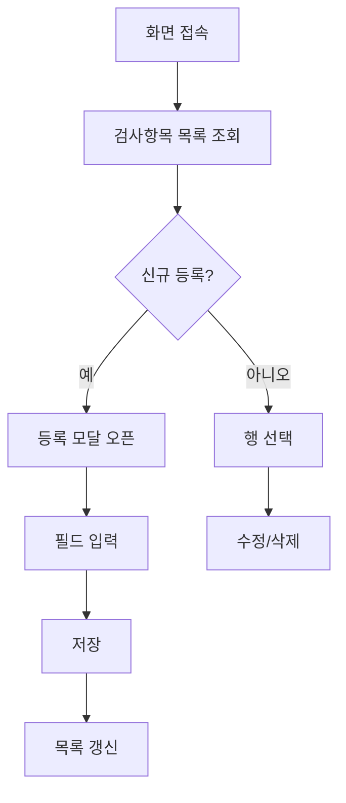
```mermaid
graph TD
    A[화면 접속] --> B[검사항목 목록 조회]
    B --> C{신규 등록?}
    C -->|예| D[등록 모달 오픈]
    D --> E[필드 입력]
    E --> F[저장]
    F --> G[목록 갱신]
    C -->|아니오| H[행 선택]
    H --> I[수정/삭제]
```

### 3.2 예외/분기 흐름
- **중복 코드**: 이미 존재하는 inspItemCode 저장 시 400 BadRequest
- **필수값 누락**: judgeMethod 미선택 시 400 BadRequest

## 4. 상태 코드 및 공통코드

### 4.1 화면 내 사용 상태
| 상태명 | 코드값 | 공통코드그룹 | 설명 |
|--------|--------|-------------|------|
| 사용 | Y | USE_YN | 사용중 |
| 미사용 | N | USE_YN | 사용안함 |

### 4.2 관련 공통코드
- `JUDGE_METHOD`: VISUAL(육안), MEASURE(계측)

## 5. API 명세

### 5.1 목록 조회
```
GET /api/v1/master/iqc-items
```
**Query Parameters**
| 파라미터 | 타입 | 필수 | 설명 |
|----------|------|------|------|
| page | number | N | 페이지 (기본 1) |
| limit | number | N | 페이지당 건수 (기본 10) |
| search | string | N | 검색어 |

### 5.2 생성
```
POST /api/v1/master/iqc-items
```
**Request Body**
```json
{
  "inspItemCode": "IQC-001",
  "inspItemName": "외관검사",
  "judgeMethod": "VISUAL",
  "criteria": "스크래치 없음",
  "useYn": "Y"
}
```

### 5.3 수정
```
PUT /api/v1/master/iqc-items/:inspItemCode
```

### 5.4 삭제
```
DELETE /api/v1/master/iqc-items/:inspItemCode
```

## 6. 처리 규칙 및 검증

### 6.1 입력 검증
- inspItemCode: 필수, 고유
- inspItemName: 필수
- judgeMethod: VISUAL 또는 MEASURE
- MEASURE 선택 시 lsl/usl 필수

### 6.2 비즈니스 규칙
- IQC_ITEM_POOL의 항목은 IQC_PART_SPEC_ITEMS에서 참조한다.
- 삭제 시 IQC_PART_SPEC_ITEMS에서 참조 중이면 제한될 수 있다.

## 7. 연관 엔티티 및 테이블

| 엔티티명 | 테이블명 | 역할 | 관계 |
|----------|----------|------|------|
| IqcItemPool | IQC_ITEM_POOL | 검사항목 마스터 | 메인 |
| IqcPartSpecItem | IQC_PART_SPEC_ITEMS | 품목별 검사규격 | N:1 참조 |
| IqcTemplateItem | IQC_TEMPLATE_ITEMS | 템플릿 항목 | N:1 참조 |

## 8. 에러 코드 및 메시지

| 상황 | HTTP | 에러메시지 | 처리방법 |
|------|------|-----------|---------|
| 중복코드 | 400 | 이미 존재하는 검사항목코드입니다 | 코드 변경 |
| 필수값 누락 | 400 | 필수값이 누락되었습니다 | 필드 확인 |

---

### 1.2 IQC품목규격 (QC_IQC_PART_SPEC)

## 1. 화면 개요

| 항목 | 내용 |
|------|------|
| **메뉴 경로** | 마스터 > IQC품목규격 |
| **URL** | `/master/iqc-part-spec` |
| **메뉴 코드** | `QC_IQC_PART_SPEC` |
| **화면 목적** | 품목별 IQC 검사 규격(샘플수량, 파괴검사 여부, 검사항목별 기준)을 관리한다. |
| **주요 사용자** | 품질관리자 |

## 2. 화면 구성

### 2.1 레이아웃
- 상단: 품목 검색
- 중앙: 품목규격 헤더 그리드 + 하위 검사항목 그리드(마스터-디테일)
- 모달: 규격 등록/수정

### 2.2 데이터그리드 컬럼 (헤더)
| 컬럼ID | 컬럼명 | 데이터타입 | 비고 |
|--------|--------|-----------|------|
| itemCode | 품목코드 | string | PK |
| itemName | 품목명 | string | PART_MASTER 참조 |
| sampleQty | 샘플수량 | number | 기본 1 |
| isDest | 파괴검사여부 | string | Y/N |
| useYn | 사용여부 | string | Y/N |

### 2.3 데이터그리드 컬럼 (디테일)
| 컬럼ID | 컬럼명 | 데이터타입 | 비고 |
|--------|--------|-----------|------|
| seq | 순번 | number | PK |
| inspItemCode | 검사항목코드 | string | IQC_ITEM_POOL 참조 |
| inspItemName | 검사항목명 | string | |
| lsl | 하한규격 | number | 품목별 개별값 |
| usl | 상한규격 | number | |
| judgeCriteria | 판정기준 | string | VISUAL용 |

### 2.4 입력 폼 필드
| 필드ID | 필드명 | 타입 | 필수 | 비고 |
|--------|--------|------|------|------|
| itemCode | 품목코드 | select | Y | 품목검색모달 |
| sampleQty | 샘플수량 | number | Y | 기본 1 |
| isDest | 파괴검사여부 | select | Y | Y/N |
| useYn | 사용여부 | select | Y | Y/N |

## 3. 업무 흐름

### 3.1 정상 흐름
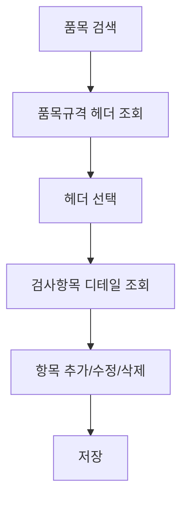
```mermaid
graph TD
    A[품목 검색] --> B[품목규격 헤더 조회]
    B --> C[헤더 선택]
    C --> D[검사항목 디테일 조회]
    D --> E[항목 추가/수정/삭제]
    E --> F[저장]
```

## 4. 상태 코드
- `USE_YN`: Y(사용), N(미사용)
- `IS_DEST`: Y(파괴검사), N(일반)

## 5. API 명세

### 5.1 목록 조회
```
GET /api/v1/master/iqc-part-specs
```

### 5.2 단건 조회 (항목 포함)
```
GET /api/v1/master/iqc-part-specs/:itemCode
```

### 5.3 생성/수정
```
POST /api/v1/master/iqc-part-specs
PUT /api/v1/master/iqc-part-specs/:itemCode
```
**Request Body**
```json
{
  "itemCode": "PART-001",
  "sampleQty": 5,
  "isDest": "N",
  "useYn": "Y",
  "items": [
    {
      "seq": 1,
      "inspItemCode": "IQC-001",
      "lsl": 10.0,
      "usl": 20.0,
      "useYn": "Y"
    }
  ]
}
```

## 6. 처리 규칙
- 헤더 저장 시 items cascade 처리
- 품목코드는 PART_MASTER에 존재해야 함
- 검사항목코드는 IQC_ITEM_POOL에 존재해야 함

## 7. 연관 엔티티

| 엔티티명 | 테이블명 | 역할 | 관계 |
|----------|----------|------|------|
| IqcPartSpec | IQC_PART_SPECS | 품목별 규격 헤더 | 메인 |
| IqcPartSpecItem | IQC_PART_SPEC_ITEMS | 품목별 검사항목 | 1:N |
| PartMaster | PART_MASTERS | 품목 마스터 | N:1 |
| IqcItemPool | IQC_ITEM_POOL | 검사항목 풀 | N:1 |

---

### 1.3 IQC검사 (QC_IQC)

## 1. 화면 개요

| 항목 | 내용 |
|------|------|
| **메뉴 경로** | 자재관리 > IQC검사 |
| **URL** | `/material/iqc` |
| **메뉴 코드** | `QC_IQC` |
| **화면 목적** | 입하된 자재를 입하번호+품목 단위로 샘플 검사하고 판정한다. |
| **주요 사용자** | 품질검사원, 품질관리자 |

## 2. 화면 구성

### 2.1 레이아웃
- 상단: 검색조건 (입하번호, 품목, 검사상태)
- 중앙: 입하단위 검사 대상 그리드
- 하단: 선택 입하건의 시리얼(LOT) 목록
- 모달: 검사결과 등록

### 2.2 데이터그리드 컬럼 (입하단위)
| 컬럼ID | 컬럼명 | 데이터타입 | 비고 |
|--------|--------|-----------|------|
| arrivalNo | 입하번호 | string | |
| itemCode | 품목코드 | string | |
| itemName | 품목명 | string | PART_MASTER 참조 |
| vendor | 거래처 | string | |
| totalQty | 총수량 | number | 시리얼 집계 |
| serialCount | 시리얼수 | number | |
| recvDate | 입하일 | date | |
| iqcStatus | IQC상태 | string | PENDING/PASS/FAIL |

### 2.3 입력 폼 필드 (검사결과 등록)
| 필드ID | 필드명 | 타입 | 필수 | 기본값 | 비고 |
|--------|--------|------|------|--------|------|
| arrivalNo | 입하번호 | text | Y | 자동 | 읽기전용 |
| itemCode | 품목코드 | text | Y | 자동 | 읽기전용 |
| result | 검사결과 | select | Y | - | PASS/FAIL |
| inspectType | 검사유형 | select | Y | INITIAL | INITIAL/RETEST |
| inspectClass | 검사분류 | select | N | SAMPLE | FULL/SAMPLE/NONE |
| sampleQty | 샘플수량 | number | N | 0 | |
| sampleBarcode | 시료바코드 | text | N | - | 콤마구분 |
| inspectorName | 검사자 | text | N | - | |
| details | 검사상세 | text | N | - | JSON |
| remark | 비고 | text | N | - | |

### 2.4 버튼/액션
| 버튼 | 조건 | 동작 | API |
|------|------|------|-----|
| 검사대상조회 | - | PENDING 목록 조회 | GET /api/v1/material/iqc-history/pending-arrivals |
| 시리얼조회 | 행 선택 | 해당 입하건 시리얼 목록 | GET /api/v1/material/iqc-history/pending-serials |
| 검사결과등록 | 폼 valid | 입하단위 검사 등록 | POST /api/v1/material/iqc-history/arrival |
| LOT검사 | - | 개별 LOT 검사 | POST /api/v1/material/iqc-history |

## 3. 업무 흐름

### 3.1 정상 흐름
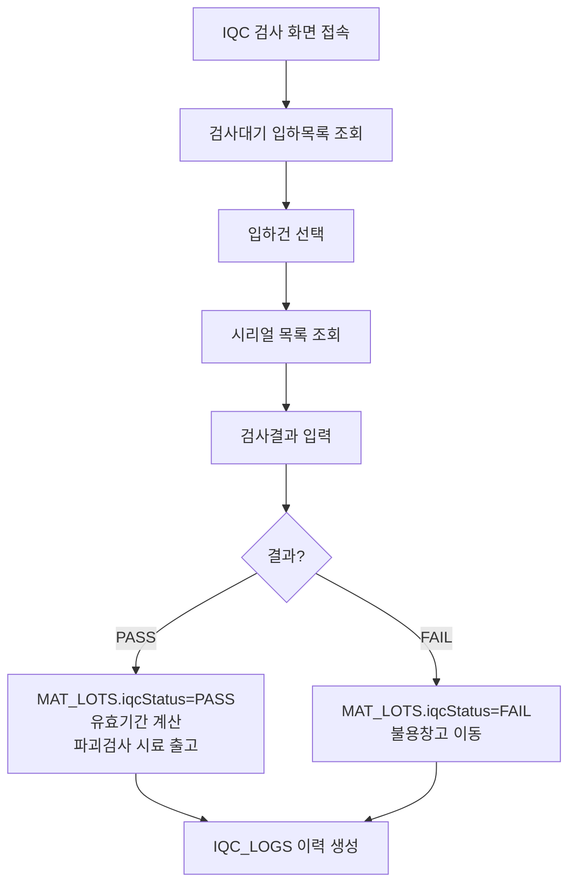
```mermaid
graph TD
    A[IQC 검사 화면 접속] --> B[검사대기 입하목록 조회]
    B --> C[입하건 선택]
    C --> D[시리얼 목록 조회]
    D --> E[검사결과 입력]
    E --> F{결과?}
    F -->|PASS| G[MAT_LOTS.iqcStatus=PASS<br/>유효기간 계산<br/>파괴검사 시료 출고]
    F -->|FAIL| H[MAT_LOTS.iqcStatus=FAIL<br/>불용창고 이동]
    G --> I[IQC_LOGS 이력 생성]
    H --> I
```

### 3.2 예외/분기 흐름
- **이미 입고됨**: IQC 판정 취소 시 MAT_RECEIVING.status=DONE이면 취소 불가
- **파괴검사 출고됨**: IQC_DESTRUCT 출고 이력이 있으면 취소 불가
- **불용창고 재고 변경**: IQC FAIL 취소 시 불용창고 재고가 이미 변경되면 원복 불가

## 4. 상태 코드

### 4.1 화면 내 사용 상태
| 상태명 | 코드값 | 설명 | 색상 |
|--------|--------|------|------|
| 검사대기 | PENDING | 입하 후 IQC 미실시 | 회색 |
| 합격 | PASS | IQC 합격 | 초록색 |
| 불합격 | FAIL | IQC 불합격 | 빨간색 |

### 4.2 관련 공통코드
- `INSPECT_TYPE`: INITIAL(초물검사), RETEST(재검사)
- `INSPECT_CLASS`: FULL(전수), SAMPLE(선별), NONE(무검사)
- `RESULT`: PASS(합격), FAIL(불합격)

## 5. API 명세

### 5.1 검사 대상 조회
```
GET /api/v1/material/iqc-history/pending-arrivals
```
**Query Parameters**
| 파라미터 | 타입 | 필수 | 설명 |
|----------|------|------|------|
| iqcStatus | string | N | PENDING/PASS/FAIL (기본 PENDING) |
| search | string | N | 입하번호/품목 검색 |

### 5.2 시리얼 목록 조회
```
GET /api/v1/material/iqc-history/pending-serials
```
**Query Parameters**
| 파라미터 | 타입 | 필수 | 설명 |
|----------|------|------|------|
| arrivalNo | string | Y | 입하번호 |
| itemCode | string | Y | 품목코드 |

### 5.3 입하단위 검사결과 등록
```
POST /api/v1/material/iqc-history/arrival
```
**Request Body**
```json
{
  "arrivalNo": "ARV-20240610-001",
  "itemCode": "PART-001",
  "result": "PASS",
  "inspectType": "INITIAL",
  "inspectClass": "SAMPLE",
  "sampleQty": 5,
  "sampleBarcode": "SN001,SN002",
  "inspectorName": "홍길동",
  "details": "{\"item1\":\"OK\"}",
  "remark": ""
}
```

### 5.4 LOT 단위 검사결과 등록
```
POST /api/v1/material/iqc-history
```
**Request Body**
```json
{
  "matUid": "LOT-20240610-001",
  "result": "PASS",
  "inspectType": "INITIAL",
  "inspectClass": "FULL",
  "destructSampleQty": 2,
  "inspectorName": "홍길동",
  "details": "{}",
  "remark": ""
}
```

## 6. 처리 규칙 및 검증

### 6.1 입력 검증
- arrivalNo + itemCode: 필수 (입하단위)
- matUid: 필수 (LOT 단위)
- result: PASS 또는 FAIL
- inspectType: INITIAL 또는 RETEST
- inspectClass: FULL, SAMPLE, NONE

### 6.2 비즈니스 규칙
1. **PASS 처리**:
   - MAT_LOTS.iqcStatus = PASS
   - IQC_LOGS 이력 생성 (matUid=null, arrivalNo+itemCode 기준)
   - 품목 유효기간 설정 시 expireDate 자동 계산 (recvDate + expiryDate)
   - 파괴검사 시료 수량 > 0 이고 IQC_SAMPLE_ISSUE_MODE=AUTO_ISSUE 시 자동 출고
2. **FAIL 처리**:
   - MAT_LOTS.iqcStatus = FAIL
   - IQC_LOGS 이력 생성
   - 전체 시리얼 불용창고(DEFECT)로 자동 이동
   - StockTransaction 이력 생성 (transType=MAT_MOVE, refType=IQC_FAIL)
3. **취소 제한**:
   - 입고 DONE 상태 시 취소 불가
   - 파괴검사 출고 이력 있을 시 취소 불가
   - FAIL 원복 시 불용창고 재고 변화 있으면 원복 불가

### 6.3 트랜잭션 처리
- 입하단위 검사:
  1. MAT_LOTS 일괄 UPDATE (iqcStatus)
  2. MAT_ARRIVALS UPDATE (iqcStatus)
  3. IQC_LOGS INSERT
  4. PASS 시: MAT_LOTS expireDate UPDATE (개별)
  5. FAIL 시: MAT_STOCK 이동 + StockTransaction INSERT (개별 시리얼 루프)
  6. PASS+시료수량 시: MAT_STOCK 차감 + StockTransaction INSERT (개별 시리얼 루프)

## 7. 연관 엔티티 및 테이블

| 엔티티명 | 테이블명 | 역할 | 관계 |
|----------|----------|------|------|
| IqcLog | IQC_LOGS | IQC 검사이력 | 메인 |
| MatLot | MAT_LOTS | 자재 LOT | N:M (입하단위) |
| MatArrival | MAT_ARRIVALS | 입하 이력 | N:1 |
| MatStock | MAT_STOCKS | 재고 | 이동/차감 |
| StockTransaction | STOCK_TRANSACTIONS | 수불원장 | INSERT |
| PartMaster | PART_MASTERS | 품목 마스터 | 유효기간 참조 |
| Warehouse | WAREHOUSES | 창고 마스터 | DEFECT 창고 조회 |

## 8. 에러 메시지 및 처리

| 상황 | HTTP | 에러메시지 | 처리방법 |
|------|------|-----------|---------|
| 검사대상없음 | 404 | 검사 대상(PENDING) 시리얼이 없습니다 | 입하상태 확인 |
| 이미입고 | 400 | 이미 입고된 입하건입니다 | 입고 취소 후 재시도 |
| 파괴검사출고됨 | 400 | 파괴검사 시료 자동출고가 이미 반영되어 있습니다 | 출고 정리 후 재시도 |
| 불용창고변경 | 400 | 불량창고 재고가 이미 변경되어 IQC 불합격 취소를 자동 처리할 수 없습니다 | 수동 조정 필요 |
| 창고미존재 | 400 | 불용창고 미설정 | 창고마스터 확인 |

---

### 1.4 IQC이력 (QC_IQC_HISTORY)

## 1. 화면 개요

| 항목 | 내용 |
|------|------|
| **메뉴 경로** | 자재관리 > IQC이력 |
| **URL** | `/material/iqc-history` |
| **메뉴 코드** | `QC_IQC_HISTORY` |
| **화면 목적** | IQC 검사 이력을 조회하고, 검사성적서를 업로드하며, 판정을 취소한다. |
| **주요 사용자** | 품질관리자 |

## 2. 화면 구성

### 2.1 레이아웃
- 상단: 검색조건 (기간, 검사유형, 결과, 검색어)
- 중앙: IQC 이력 그리드
- 하단: 페이징

### 2.2 데이터그리드 컬럼
| 컬럼ID | 컬럼명 | 데이터타입 | 비고 |
|--------|--------|-----------|------|
| inspectDate | 검사일자 | date | PK |
| seq | 순번 | number | PK |
| arrivalNo | 입하번호 | string | 입하단위 시 |
| matUid | 자재UID | string | LOT 단위 시 |
| itemCode | 품목코드 | string | |
| itemName | 품목명 | string | PART_MASTER JOIN |
| inspectType | 검사유형 | string | INITIAL/RETEST |
| result | 결과 | string | PASS/FAIL |
| inspectorName | 검사자 | string | |
| status | 상태 | string | DONE/CANCELED |
| certFilePath | 성적서경로 | string | 파일명 표시 |

### 2.3 버튼/액션
| 버튼 | 조건 | 동작 | API |
|------|------|------|-----|
| 성적서업로드 | status=DONE 행 | 파일 업로드 | POST /api/v1/material/iqc-history/:inspectDate/:seq/upload-cert |
| 취소 | status=DONE 행 | 판정 취소 | POST /api/v1/material/iqc-history/cancel |

## 3. 업무 흐름

### 3.1 정상 흐름
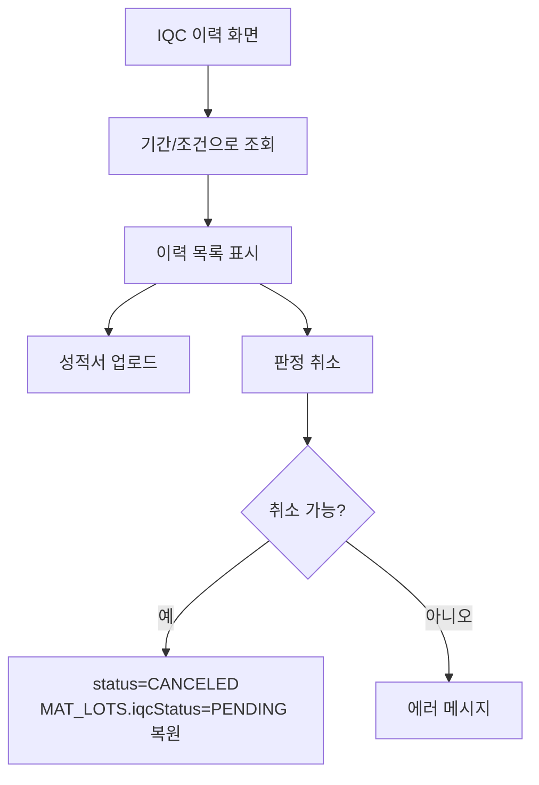
```mermaid
graph TD
    A[IQC 이력 화면] --> B[기간/조건으로 조회]
    B --> C[이력 목록 표시]
    C --> D[성적서 업로드]
    C --> E[판정 취소]
    E --> F{취소 가능?}
    F -->|예| G[status=CANCELED<br/>MAT_LOTS.iqcStatus=PENDING 복원]
    F -->|아니오| H[에러 메시지]
```

### 3.2 예외 흐름
- 입고 DONE 상태: 취소 불가
- 파괴검사 출고 이력: 취소 불가
- 이미 CANCELED: 중복 취소 불가

## 4. 상태 코드
| 상태명 | 코드값 | 설명 |
|--------|--------|------|
| 완료 | DONE | 정상 검사 완료 |
| 취소 | CANCELED | 판정 취소됨 |

## 5. API 명세

### 5.1 목록 조회
```
GET /api/v1/material/iqc-history
```
**Query Parameters**
| 파라미터 | 타입 | 필수 | 설명 |
|----------|------|------|------|
| page | number | N | 페이지 |
| limit | number | N | 페이지당 건수 |
| search | string | N | 품목코드/입하번호 검색 |
| inspectType | string | N | INITIAL/RETEST |
| result | string | N | PASS/FAIL |
| fromDate | string | N | 시작일 |
| toDate | string | N | 종료일 |

### 5.2 성적서 업로드
```
POST /api/v1/material/iqc-history/:inspectDate/:seq/upload-cert
```
**Form Data**
| 필드 | 타입 | 필수 | 설명 |
|------|------|------|------|
| file | File | Y | 검사성적서 파일 (최대 10MB) |

### 5.3 판정 취소
```
POST /api/v1/material/iqc-history/cancel
```
**Query Parameters**
| 파라미터 | 타입 | 필수 | 설명 |
|----------|------|------|------|
| inspectDate | string | Y | 검사일자 |
| seq | string | Y | 순번 |

**Request Body**
```json
{
  "reason": "판정 오류로 인한 취소"
}
```

## 6. 처리 규칙

### 6.1 취소 처리
- IQC_LOGS.status = CANCELED
- MAT_LOTS.iqcStatus = PENDING (입하단위: 해당 입하건 전체)
- MAT_ARRIVALS.iqcStatus = PENDING (입하단위)
- FAIL 취소 시: StockTransaction 역이동 (IQC_FAIL_CANCEL)
- 수량 원복: MAT_STOCK 불용→원창고 이동

### 6.2 트랜잭션
- IqcLog UPDATE
- MatLot UPDATE (PENDING 복원)
- MatArrival UPDATE (PENDING 복원)
- StockTransaction INSERT (FAIL 원복 시)

## 7. 연관 엔티티

| 엔티티명 | 테이블명 | 역할 |
|----------|----------|------|
| IqcLog | IQC_LOGS | 메인 |
| MatLot | MAT_LOTS | 상태 복원 |
| MatArrival | MAT_ARRIVALS | 상태 복원 |
| StockTransaction | STOCK_TRANSACTIONS | 이동 원복 |

---

## 2. 검사 관리

### 2.1 불량관리 (QC_DEFECT)

## 1. 화면 개요

| 항목 | 내용 |
|------|------|
| **메뉴 경로** | 품질관리 > 불량관리 |
| **URL** | `/quality/defect` |
| **메뉴 코드** | `QC_DEFECT` |
| **화면 목적** | 생산실적별 불량을 등록하고, 수리/재작업/폐기 처리 흐름을 관리한다. |
| **주요 사용자** | 품질관리자, 생산관리자 |

## 2. 화면 구성

### 2.1 레이아웃
- 상단: 검색조건 (생산실적번호, 불량코드, 상태, 기간)
- 중앙: 불량로그 그리드
- 하단: 페이징 + 통계 요약
- 모달: 불량 등록/수정, 수리이력 등록

### 2.2 데이터그리드 컬럼
| 컬럼ID | 컬럼명 | 데이터타입 | 비고 |
|--------|--------|-----------|------|
| occurAt | 발생일시 | datetime | PK |
| seq | 순번 | number | PK |
| prodResultNo | 생산실적번호 | string | |
| defectCode | 불량코드 | string | |
| defectName | 불량명 | string | |
| qty | 수량 | number | |
| status | 상태 | string | WAIT/REPAIR/REWORK/DONE/SCRAP |
| cause | 원인 | string | |
| imageUrl | 사진URL | string | |

### 2.3 입력 폼 필드
| 필드ID | 필드명 | 타입 | 필수 | 비고 |
|--------|--------|------|------|------|
| prodResultNo | 생산실적번호 | select | Y | 생산실적 검색 |
| defectCode | 불량코드 | text | Y | |
| defectName | 불량명 | text | N | |
| qty | 수량 | number | Y | 기본 1, 최소 1 |
| status | 상태 | select | N | WAIT |
| cause | 원인 | text | N | |
| imageUrl | 사진URL | text | N | |
| occurAt | 발생일시 | datetime | N | 현재일시 |

### 2.4 버튼/액션
| 버튼 | 조건 | 동작 | API |
|------|------|------|-----|
| 등록 | - | 불량 등록 모달 | POST /api/v1/quality/defect-logs |
| 상태변경 | 행 선택 | 상태 변경 | PATCH /api/v1/quality/defect-logs/:id/status |
| 수리이력 | 행 선택 | 수리이력 조회/등록 | GET/POST /api/v1/quality/defect-logs/:id/repair-logs |
| 삭제 | WAIT 상태 | 삭제 | DELETE /api/v1/quality/defect-logs/:id |

## 3. 업무 흐름

### 3.1 정상 흐름
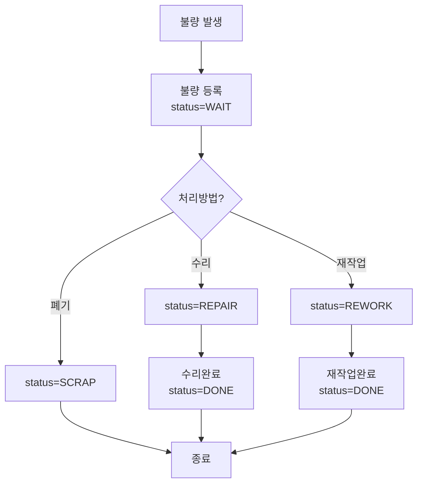
```mermaid
graph TD
    A[불량 발생] --> B[불량 등록<br/>status=WAIT]
    B --> C{처리방법?}
    C -->|수리| D[status=REPAIR]
    C -->|재작업| E[status=REWORK]
    C -->|폐기| F[status=SCRAP]
    D --> G[수리완료<br/>status=DONE]
    E --> H[재작업완료<br/>status=DONE]
    F --> I[종료]
    G --> I
    H --> I
```

### 3.2 예외/분기 흐름
- **재작업 연결**: 재작업 지시가 연결된 불량은 직접 상태 변경/삭제 불가
- **SCRAP/DONE 후 변경**: 불가

## 4. 상태 코드

### 4.1 화면 내 사용 상태
| 상태명 | 코드값 | 설명 | 색상 |
|--------|--------|------|------|
| 대기 | WAIT | 미처리 | 회색 |
| 수리중 | REPAIR | 수리 진행중 | 파란색 |
| 재작업중 | REWORK | 재작업 진행중 | 주황색 |
| 완료 | DONE | 처리 완료 | 초록색 |
| 폐기 | SCRAP | 폐기 처분 | 빨간색 |

### 4.2 상태 전이 매트릭스
| 현재 상태 | 가능한 다음 상태 |
|-----------|----------------|
| WAIT | REPAIR, REWORK, SCRAP |
| REPAIR | DONE, SCRAP, WAIT |
| REWORK | DONE, SCRAP, WAIT |
| SCRAP | - (종결) |
| DONE | - (종결) |

## 5. API 명세

### 5.1 목록 조회
```
GET /api/v1/quality/defect-logs
```
**Query Parameters**
| 파라미터 | 타입 | 필수 | 설명 |
|----------|------|------|------|
| page | number | N | 페이지 |
| limit | number | N | 페이지당 건수 (기본 20) |
| prodResultNo | string | N | 생산실적번호 필터 |
| defectCode | string | N | 불량코드 필터 |
| status | string | N | 상태 필터 |
| startDate | string | N | 발생 시작일 |
| endDate | string | N | 발생 종료일 |
| search | string | N | 불량명 검색 |

### 5.2 생성
```
POST /api/v1/quality/defect-logs
```
**Request Body**
```json
{
  "prodResultNo": "PR260316-00001",
  "defectCode": "DEF001",
  "defectName": "외관불량",
  "qty": 5,
  "status": "WAIT",
  "cause": "납땜불량",
  "imageUrl": "http://.../photo.jpg",
  "occurAt": "2024-06-10T10:00:00Z"
}
```

### 5.3 상태 변경
```
PATCH /api/v1/quality/defect-logs/:id/status
```
**Request Body**
```json
{
  "status": "REPAIR",
  "remark": "수리 시작"
}
```

### 5.4 수리 이력 등록
```
POST /api/v1/quality/defect-logs/:id/repair-logs
```
**Request Body**
```json
{
  "workerId": "W001",
  "repairAction": "납땜 재처리",
  "materialUsed": "납땜실",
  "repairTime": 30,
  "result": "PASS",
  "remark": "정상 수리"
}
```

## 6. 처리 규칙 및 검증

### 6.1 입력 검증
- prodResultNo: 필수, PROD_RESULTS 존재 확인
- qty: 1 이상 정수
- status: DEFECT_LOG_STATUS_VALUES 중 하나

### 6.2 비즈니스 규칙
1. 불량 등록 시 PROD_RESULTS.defectQty 증가
2. 불량 수정 시 수량 변경하면 PROD_RESULTS.defectQty 차감/증가
3. 불량 삭제 시 PROD_RESULTS.defectQty 감소
4. 수리 결과 PASS → 불량 status=DONE 자동 변경
5. 수리 결과 SCRAP → 불량 status=SCRAP 자동 변경
6. 재작업 연결 시 직접 처리 불가 (재작업 먼저 정리)

### 6.3 트랜잭션
- DefectLog INSERT + ProdResult UPDATE (defectQty)

## 7. 연관 엔티티 및 테이블

| 엔티티명 | 테이블명 | 역할 | 관계 |
|----------|----------|------|------|
| DefectLog | DEFECT_LOGS | 불량이력 | 메인 |
| RepairLog | REPAIR_LOGS | 수리이력 | 1:N |
| ProdResult | PROD_RESULTS | 생산실적 | N:1 |
| ReworkOrder | REWORK_ORDERS | 재작업지시 | 1:1 (선택) |

## 8. 에러 메시지 및 처리

| 상황 | HTTP | 에러메시지 | 처리방법 |
|------|------|-----------|---------|
| 생산실적없음 | 404 | 생산실적을 찾을 수 없습니다 | 실적번호 확인 |
| 재작업연결 | 400 | 재작업이 연결된 불량은 직접 처리할 수 없습니다 | 재작업 정리 후 처리 |
| 잘못된상태전이 | 400 | X에서 Y로 상태 변경이 불가능합니다 | 상태 전이 매트릭스 확인 |

---

### 2.2 재작업검사 (QC_REWORK_INSPECT)

## 1. 화면 개요

| 항목 | 내용 |
|------|------|
| **메뉴 경로** | 품질관리 > 재작업검사 |
| **URL** | `/quality/rework-inspect` |
| **메뉴 코드** | `QC_REWORK_INSPECT` |
| **화면 목적** | 불량품에 대한 재작업 지시를 승인하고, 재작업 후 재검사 결과를 등록한다. |
| **주요 사용자** | 품질관리자, 생산관리자 |

## 2. 화면 구성

### 2.1 레이아웃
- 상단: 검색조건 (상태, 불량유형, 라인, 기간)
- 중앙: 재작업지시 그리드
- 하단: 페이징
- 모달: 재작업 등록, 승인, 완료, 재검사

### 2.2 데이터그리드 컬럼
| 컬럼ID | 컬럼명 | 데이터타입 | 비고 |
|--------|--------|-----------|------|
| reworkNo | 재작업번호 | string | PK, RW-YYYYMMDD-NNN |
| itemCode | 품목코드 | string | |
| itemName | 품목명 | string | |
| reworkQty | 재작업수량 | number | |
| defectType | 불량유형 | string | |
| status | 상태 | string | |
| qcApproverCode | 품질승인자 | string | |
| prodApproverCode | 생산승인자 | string | |
| startAt | 시작일시 | datetime | |
| endAt | 종료일시 | datetime | |

### 2.3 입력 폼 필드 (재작업 등록)
| 필드ID | 필드명 | 타입 | 필수 | 비고 |
|--------|--------|------|------|------|
| defectLogId | 불량로그ID | text | N | occurAt|seq 형식 |
| itemCode | 품목코드 | select | Y | |
| itemName | 품목명 | text | N | 자동 |
| prdUid | 제품UID | text | N | |
| reworkQty | 재작업수량 | number | Y | 최소 1 |
| defectType | 불량유형 | text | N | |
| reworkMethod | 재작업방법 | text | Y | IATF 승인 방법 |
| workerId | 작업자 | select | N | |
| lineCode | 라인 | select | N | |
| equipCode | 설비 | select | N | |
| processItems | 공정목록 | grid | N | 공정코드, 공정명, 순서 |

### 2.4 버튼/액션
| 버튼 | 조건 | 동작 | API |
|------|------|------|-----|
| 등록 | - | 재작업 등록 | POST /api/v1/quality/reworks |
| 품질승인요청 | REGISTERED | 상태 변경 | PATCH /api/v1/quality/reworks/:no/request-qc |
| 품질승인 | QC_PENDING | 승인/반려 | PATCH /api/v1/quality/reworks/:no/qc-approve |
| 생산승인 | PROD_PENDING | 승인/반려 | PATCH /api/v1/quality/reworks/:no/prod-approve |
| 작업시작 | APPROVED | 시작 | PATCH /api/v1/quality/reworks/:no/start |
| 작업완료 | IN_PROGRESS | 완료 | PATCH /api/v1/quality/reworks/:no/complete |
| 재검사 | INSPECT_PENDING | 검사 등록 | POST /api/v1/quality/reworks/:no/inspects |

## 3. 업무 흐름

### 3.1 정상 흐름
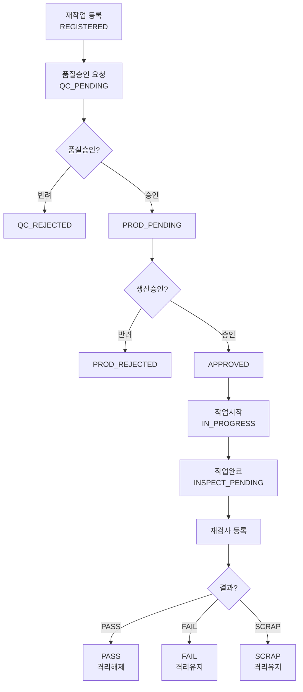
```mermaid
graph TD
    A[재작업 등록<br/>REGISTERED] --> B[품질승인 요청<br/>QC_PENDING]
    B --> C{품질승인?}
    C -->|반려| D[QC_REJECTED]
    C -->|승인| E[PROD_PENDING]
    E --> F{생산승인?}
    F -->|반려| G[PROD_REJECTED]
    F -->|승인| H[APPROVED]
    H --> I[작업시작<br/>IN_PROGRESS]
    I --> J[작업완료<br/>INSPECT_PENDING]
    J --> K[재검사 등록]
    K --> L{결과?}
    L -->|PASS| M[PASS<br/>격리해제]
    L -->|FAIL| N[FAIL<br/>격리유지]
    L -->|SCRAP| O[SCRAP<br/>격리유지]
```

### 3.2 예외/분기
- **등록/반려 상태에서만 수정**: REGISTERED, QC_REJECTED, PROD_REJECTED
- **등록 상태에서만 삭제**: REGISTERED
- **진행된 공정 있으면 삭제 불가**
- **검사 이력 있으면 삭제 불가**

## 4. 상태 코드

| 상태명 | 코드값 | 설명 |
|--------|--------|------|
| 등록 | REGISTERED | 초안 |
| 품질승인대기 | QC_PENDING | 품질 담당 검토중 |
| 품질반려 | QC_REJECTED | 품질 반려 |
| 생산승인대기 | PROD_PENDING | 생산 담당 검토중 |
| 생산반려 | PROD_REJECTED | 생산 반려 |
| 승인 | APPROVED | 승인 완료 |
| 진행중 | IN_PROGRESS | 재작업 진행중 |
| 검사대기 | INSPECT_PENDING | 재작업 완료, 검사 대기 |
| 합격 | PASS | 재검사 합격 |
| 불합격 | FAIL | 재검사 불합격 |
| 폐기 | SCRAP | 폐기 |

## 5. API 명세

### 5.1 목록 조회
```
GET /api/v1/quality/reworks
```

### 5.2 생성
```
POST /api/v1/quality/reworks
```
**Request Body**
```json
{
  "defectLogId": "2024-06-10T10:00:00.000Z|1",
  "itemCode": "PART-001",
  "itemName": "저항기",
  "reworkQty": 10,
  "defectType": "DEF001",
  "reworkMethod": "납땜 재처리 후 외관 검사",
  "workerId": "W001",
  "lineCode": "L001",
  "equipCode": "EQ001",
  "processItems": [
    {
      "processCode": "P001",
      "processName": "납땜",
      "seq": 1,
      "workerId": "W001",
      "lineCode": "L001",
      "equipCode": "EQ001"
    }
  ]
}
```

### 5.3 품질 승인
```
PATCH /api/v1/quality/reworks/:reworkNo/qc-approve
```
**Request Body**
```json
{
  "action": "APPROVE",
  "reason": "승인함"
}
```

### 5.4 재검사 등록
```
POST /api/v1/quality/reworks/:reworkNo/inspects
```
**Request Body**
```json
{
  "reworkNo": "RW-20240610-001",
  "inspectorCode": "Q001",
  "inspectMethod": "육안+계측",
  "inspectResult": "PASS",
  "passQty": 8,
  "failQty": 2,
  "defectDetail": "2개 납땜 불량",
  "remark": ""
}
```

## 6. 처리 규칙

### 6.1 비즈니스 규칙
1. **재작업번호 자동채번**: RW-YYYYMMDD-NNN
2. **2단계 승인**: 품질 → 생산 순서
3. **재검사 결과 연동**:
   - PASS → ReworkOrder.status=PASS, isolationFlag=0 (격리해제)
   - FAIL/SCRAP → isolationFlag=1 (격리유지)
   - DefectLog.status 자동 변경 (PASS→DONE, SCRAP→SCRAP, FAIL→REWORK)
4. **작업 완료 시 공정 실적 합산**: COMPLETED 공정 resultQty 합계

## 7. 연관 엔티티

| 엔티티명 | 테이블명 | 역할 | 관계 |
|----------|----------|------|------|
| ReworkOrder | REWORK_ORDERS | 재작업지시 | 메인 |
| ReworkProcess | REWORK_PROCESSES | 재작업공정 | 1:N |
| ReworkInspect | REWORK_INSPECTS | 재작업검사 | 1:N |
| ReworkResult | REWORK_RESULTS | 재작업실적 | 1:N |
| DefectLog | DEFECT_LOGS | 불량이력 | 1:1 |
| PartMaster | PART_MASTERS | 품목 | N:1 |
| ProdLineMaster | PROD_LINE_MASTERS | 라인 | N:1 |
| EquipMaster | EQUIP_MASTERS | 설비 | N:1 |

---

### 2.3 검사관리 (QC_INSPECT)

## 1. 화면 개요

| 항목 | 내용 |
|------|------|
| **메뉴 경로** | 품질관리 > 검사관리 |
| **URL** | `/quality/inspect` |
| **메뉴 코드** | `QC_INSPECT` |
| **화면 목적** | 생산실적별 검사 결과를 등록하고, 합격률 통계를 조회한다. |
| **주요 사용자** | 품질검사원, 품질관리자 |

## 2. 화면 구성

### 2.1 레이아웃
- 상단: 검색조건 (생산실적, 시리얼, 검사유형, 합불, 기간)
- 중앙: 검사실적 그리드
- 하단: 페이징 + 통계 카드
- 모달: 검사 등록, 바코드 스캔 검사

### 2.2 데이터그리드 컬럼
| 컬럼ID | 컬럼명 | 데이터타입 | 비고 |
|--------|--------|-----------|------|
| resultNo | 검사실적번호 | string | PK |
| prodResultNo | 생산실적번호 | string | |
| serialNo | 시리얼번호 | string | |
| inspectType | 검사유형 | string | CONTINUITY/VISUAL/DIMENSION/FUNCTION |
| inspectScope | 검사범위 | string | FULL/SAMPLE |
| passYn | 합격여부 | string | Y/N |
| errorCode | 에러코드 | string | |
| errorDetail | 에러상세 | string | |
| inspectAt | 검사일시 | datetime | |
| inspectorId | 검사자 | string | |

### 2.3 입력 폼 필드
| 필드ID | 필드명 | 타입 | 필수 | 비고 |
|--------|--------|------|------|------|
| prodResultNo | 생산실적번호 | select | Y | |
| serialNo | 시리얼번호 | text | N | |
| inspectType | 검사유형 | select | N | CONTINUITY |
| inspectScope | 검사범위 | select | N | FULL |
| passYn | 합격여부 | select | Y | Y/N |
| errorCode | 에러코드 | text | N | |
| errorDetail | 에러상세 | text | N | |
| inspectData | 검사데이터 | json | N | 측정값 |
| inspectAt | 검사일시 | datetime | N | 현재일시 |
| inspectorId | 검사자 | text | N | |

### 2.4 버튼/액션
| 버튼 | 조건 | 동작 | API |
|------|------|------|-----|
| 등록 | - | 검사 등록 | POST /api/v1/quality/inspect-results |
| 바코드검사 | - | 바코드 스캔 검사 | POST /api/v1/quality/inspect-results/barcode |
| 삭제 | 행 선택 | 삭제 | DELETE /api/v1/quality/inspect-results/:resultNo |
| 통계 | - | 합격률 통계 | GET /api/v1/quality/inspect-stats |

## 3. 업무 흐름

### 3.1 정상 흐름
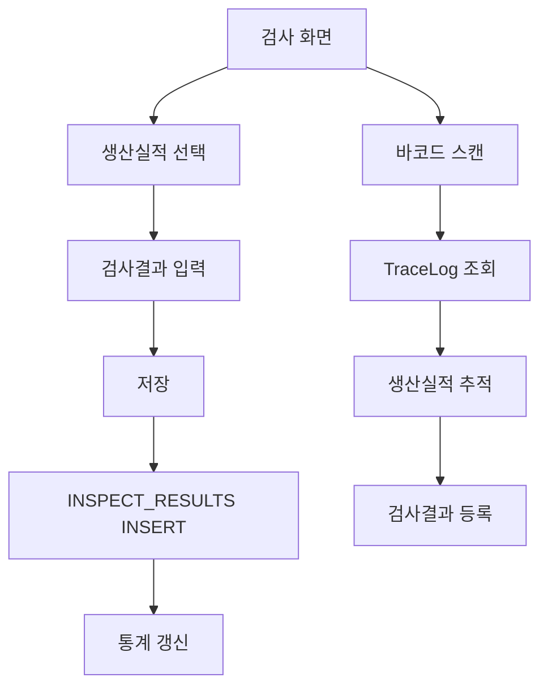
```mermaid
graph TD
    A[검사 화면] --> B[생산실적 선택]
    B --> C[검사결과 입력]
    C --> D[저장]
    D --> E[INSPECT_RESULTS INSERT]
    E --> F[통계 갱신]
    A --> G[바코드 스캔]
    G --> H[TraceLog 조회]
    H --> I[생산실적 추적]
    I --> J[검사결과 등록]
```

### 3.2 예외/분기
- **생산실적 없음**: 404 NotFound
- **바코드 미존재**: 404 NotFound
- **생산실적 취소됨**: 삭제 불가

## 4. 상태 코드
- `PASS_YN`: Y(합격), N(불합격)
- `INSPECT_TYPE`: CONTINUITY, VISUAL, DIMENSION, FUNCTION
- `INSPECT_SCOPE`: FULL, SAMPLE

## 5. API 명세

### 5.1 목록 조회
```
GET /api/v1/quality/inspect-results
```

### 5.2 생성
```
POST /api/v1/quality/inspect-results
```
**Request Body**
```json
{
  "prodResultNo": "PR260316-00001",
  "serialNo": "SN202501150001",
  "inspectType": "CONTINUITY",
  "inspectScope": "FULL",
  "passYn": "Y",
  "errorCode": null,
  "errorDetail": null,
  "inspectData": {"resistance": 0.5, "voltage": 12.3},
  "inspectAt": "2024-06-10T10:00:00Z",
  "inspectorId": "Q001"
}
```

### 5.3 바코드 스캔 검사
```
POST /api/v1/quality/inspect-results/barcode
```
**Request Body**
```json
{
  "barcode": "SN202501150001",
  "passYn": "Y",
  "inspectType": "VISUAL",
  "inspectScope": "FULL",
  "errorCode": null,
  "errorDetail": null,
  "inspectorId": "Q001"
}
```

### 5.4 합격률 통계
```
GET /api/v1/quality/inspect-stats/pass-rate
```
**Query Parameters**
| 파라미터 | 타입 | 필수 | 설명 |
|----------|------|------|------|
| startDate | string | N | 시작일 |
| endDate | string | N | 종료일 |
| inspectType | string | N | 검사유형 |

## 6. 처리 규칙

### 6.1 비즈니스 규칙
1. 검사실적번호 자동채번 (SeqGenerator: INSPECT_RESULT)
2. 바코드 검사 시 TraceLog → ProdResult 추적
3. 삭제는 연결된 생산실적이 CANCELED 상태일 때만 가능
4. inspectData는 JSON 문자열로 저장

### 6.2 트랜잭션
- InspectResult INSERT

## 7. 연관 엔티티

| 엔티티명 | 테이블명 | 역할 | 관계 |
|----------|----------|------|------|
| InspectResult | INSPECT_RESULTS | 검사실적 | 메인 |
| ProdResult | PROD_RESULTS | 생산실적 | N:1 |
| TraceLog | TRACE_LOGS | 추적로그 | 참조 |
| FgLabel | FG_LABELS | FG라벨 | 참조 |

---

### 2.4 검사의뢰 (QC_REQUEST_INSPECT)

## 1. 화면 개요

| 항목 | 내용 |
|------|------|
| **메뉴 경로** | 품질관리 > 검사의뢰 |
| **URL** | `/quality/request-inspect` |
| **메뉴 코드** | `QC_REQUEST_INSPECT` |
| **화면 목적** | (현재 백엔드 별도 구현 없음 — OQC 검사의뢰와 동일 패턴으로 확장 예정) |
| **주요 사용자** | 품질관리자 |

## 2. 참고사항
- 현재 HANES MES 백엔드에는 `/quality/request-inspect` 경로의 별도 서비스/컨트롤러가 존재하지 않는다.
- OQC 검사(QC_OQC)가 출하검사 의뢰 기능을 수행한다.
- 향후 일반 검사의뢰 프로세스 확장 시 OQC_REQUESTS와 유사한 패턴으로 구현될 것으로 예상된다.

---

### 2.5 자주검이력 (QC_SELF_INSPECT_HISTORY)

## 1. 화면 개요

| 항목 | 내용 |
|------|------|
| **메뉴 경로** | 품질관리 > 자주검이력 |
| **URL** | `/quality/self-inspect-history` |
| **메뉴 코드** | `QC_SELF_INSPECT_HISTORY` |
| **화면 목적** | 공정별 자주검사 결과 이력을 조회하고, 의뢰검사 대기 목록을 관리한다. |
| **주요 사용자** | 품질관리자, 생산관리자 |

## 2. 화면 구성

### 2.1 레이아웃
- 상단: 검색조건 (기간, 작업지시번호, 공정코드)
- 중앙: 자주검사 이력 그리드
- 하단: 페이징
- 탭: 전체 이력 / 의뢰검사 대기

### 2.2 데이터그리드 컬럼
| 컬럼ID | 컬럼명 | 데이터타입 | 비고 |
|--------|--------|-----------|------|
| id | ID | uuid | PK |
| orderNo | 작업지시번호 | string | |
| equipCode | 설비코드 | string | |
| processCode | 공정코드 | string | |
| itemName | 검사항목명 | string | |
| timing | 검사시점 | string | FIRST/MID/LAST |
| inspectMethod | 검사방법 | string | DIRECT/DELEGATE |
| status | 상태 | string | PASS/FAIL/PENDING |
| sampleNo | 시료번호 | number | |
| measureValue | 측정값 | number | |
| inspectedAt | 검사일시 | datetime | |
| inspectorId | 검사자 | string | |

### 2.3 버튼/액션
| 버튼 | 조건 | 동작 | API |
|------|------|------|-----|
| 의뢰검사처리 | DELEGATE+PENDING 행 | 상태 변경 | PATCH /api/v1/production/self-inspect/results/:id/status |
| 목록조회 | - | 이력 조회 | GET /api/v1/production/self-inspect/history |

## 3. 업무 흐름

### 3.1 정상 흐름
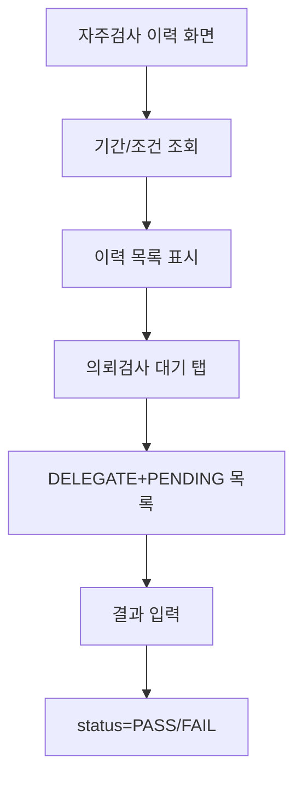
```mermaid
graph TD
    A[자주검사 이력 화면] --> B[기간/조건 조회]
    B --> C[이력 목록 표시]
    C --> D[의뢰검사 대기 탭]
    D --> E[DELEGATE+PENDING 목록]
    E --> F[결과 입력]
    F --> G[status=PASS/FAIL]
```

### 3.2 예외/분기
- **PENDING 상태 시 키오스크 차단**: 해당 작업지시에 DELEGATE+PENDING 있으면 실적입력 차단

## 4. 상태 코드
| 상태명 | 코드값 | 설명 |
|--------|--------|------|
| 합격 | PASS | 검사 합격 |
| 불합격 | FAIL | 검사 불합격 |
| 대기 | PENDING | 의뢰검사 대기중 |

### 4.1 검사 시점
| 코드값 | 설명 |
|--------|------|
| FIRST | 초물 |
| MID | 중물 |
| LAST | 종물 |

### 4.2 검사 방법
| 코드값 | 설명 |
|--------|------|
| DIRECT | 직접검사 |
| DELEGATE | 의뢰검사 |

## 5. API 명세

### 5.1 이력 조회
```
GET /api/v1/production/self-inspect/history
```
**Query Parameters**
| 파라미터 | 타입 | 필수 | 설명 |
|----------|------|------|------|
| dateFrom | string | N | 시작일 |
| dateTo | string | N | 종료일 |
| orderNo | string | N | 작업지시번호 |
| processCode | string | N | 공정코드 |
| page | number | N | 페이지 |
| limit | number | N | 페이지당 건수 (기본 30) |

### 5.2 의뢰검사 상태 업데이트
```
PATCH /api/v1/production/self-inspect/results/:id/status
```
**Request Body**
```json
{
  "status": "PASS",
  "remark": "합격",
  "measureValue": 15.2
}
```

### 5.3 의뢰검사 대기 목록
```
GET /api/v1/production/self-inspect/delegates
```

## 6. 처리 규칙

### 6.1 비즈니스 규칙
1. **시료 수량**: FIRST 시점은 sampleCount개, MID/LAST는 1개
2. **의뢰검사 차단**: orderNo별 DELEGATE+PENDING 건수 > 0 이면 키오스크 실적입력 차단
3. **측정값**: MEASURE 타입에만 입력, VISUAL은 null
4. **검사항목 마스터**: SELF_INSPECT_ITEMS (공정코드 기준)

## 7. 연관 엔티티

| 엔티티명 | 테이블명 | 역할 | 관계 |
|----------|----------|------|------|
| SelfInspectResult | SELF_INSPECT_RESULTS | 자주검사결과 | 메인 |
| SelfInspectItem | SELF_INSPECT_ITEMS | 자주검사항목 | N:1 |
| JobOrder | JOB_ORDERS | 작업지시 | N:1 |

---

### 2.6 샘플검사 (QC_SAMPLE_INSPECT)

## 1. 화면 개요

| 항목 | 내용 |
|------|------|
| **메뉴 경로** | 생산관리 > 샘플검사 |
| **URL** | `/production/sample-inspect` |
| **메뉴 코드** | `QC_SAMPLE_INSPECT` |
| **화면 목적** | 반제품 샘플검사 결과를 등록하고 이력을 관리한다. |
| **주요 사용자** | 품질검사원 |

## 2. 화면 구성

### 2.1 레이아웃
- 상단: 검색조건 (작업지시번호, 검사일자)
- 중앙: 샘플검사 결과 그리드
- 모달: 검사결과 등록

### 2.2 데이터그리드 컬럼
| 컬럼ID | 컬럼명 | 데이터타입 | 비고 |
|--------|--------|-----------|------|
| orderNo | 작업지시번호 | string | PK |
| sampleNo | 샘플번호 | number | PK |
| inspectDate | 검사일자 | date | |
| inspectorName | 검사자 | string | |
| inspectType | 검사유형 | string | |
| measuredValue | 측정값 | string | |
| specUpper | 상한규격 | string | |
| specLower | 하한규격 | string | |
| passYn | 합격여부 | string | Y/N |
| remark | 비고 | string | |

### 2.3 입력 폼 필드
| 필드ID | 필드명 | 타입 | 필수 | 비고 |
|--------|--------|------|------|------|
| orderNo | 작업지시번호 | select | Y | |
| sampleNo | 샘플번호 | number | Y | |
| inspectDate | 검사일자 | date | Y | |
| inspectorName | 검사자 | text | Y | |
| measuredValue | 측정값 | text | N | |
| specUpper | 상한규격 | text | N | |
| specLower | 하한규격 | text | N | |
| passYn | 합격여부 | select | Y | Y/N |
| remark | 비고 | text | N | |

## 3. 업무 흐름

### 3.1 정상 흐름
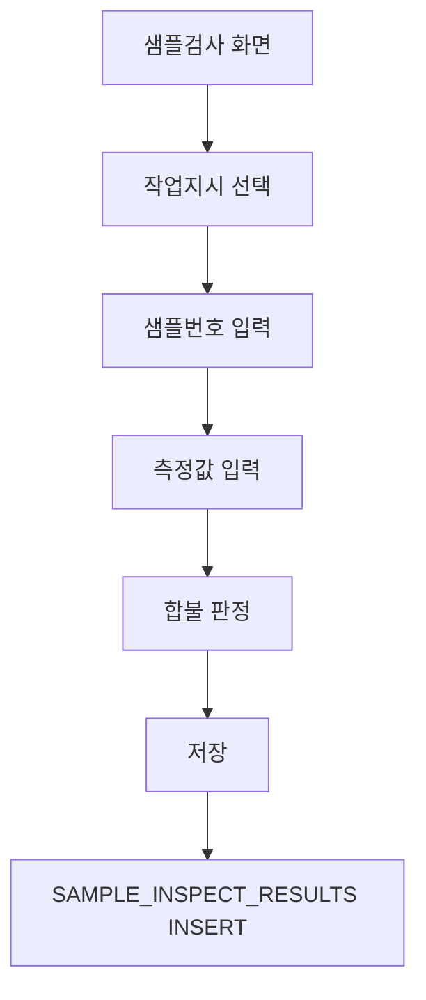
```mermaid
graph TD
    A[샘플검사 화면] --> B[작업지시 선택]
    B --> C[샘플번호 입력]
    C --> D[측정값 입력]
    D --> E[합불 판정]
    E --> F[저장]
    F --> G[SAMPLE_INSPECT_RESULTS INSERT]
```

## 4. 상태 코드
- `PASS_YN`: Y(합격), N(불합격)

## 5. API 명세

### 5.1 목록 조회
```
GET /api/v1/production/sample-inspects
```

### 5.2 생성
```
POST /api/v1/production/sample-inspects
```
**Request Body**
```json
{
  "orderNo": "JO-20240610-001",
  "sampleNo": 1,
  "inspectDate": "2024-06-10",
  "inspectorName": "홍길동",
  "inspectType": "DIMENSION",
  "measuredValue": "15.2",
  "specUpper": "16.0",
  "specLower": "14.0",
  "passYn": "Y",
  "remark": ""
}
```

## 6. 처리 규칙

### 6.1 비즈니스 규칙
- 작업지시번호는 JOB_ORDERS에 존재해야 함
- 복합 PK: orderNo + sampleNo
- JOB_ORDERS와 ManyToOne 관계

## 7. 연관 엔티티

| 엔티티명 | 테이블명 | 역할 | 관계 |
|----------|----------|------|------|
| SampleInspectResult | SAMPLE_INSPECT_RESULTS | 샘플검사결과 | 메인 |
| JobOrder | JOB_ORDERS | 작업지시 | N:1 |

---

## 3. OQC 관리

### 3.1 OQC검사 (QC_OQC)

## 1. 화면 개요

| 항목 | 내용 |
|------|------|
| **메뉴 경로** | 품질관리 > OQC검사 |
| **URL** | `/quality/oqc` |
| **메뉴 코드** | `QC_OQC` |
| **화면 목적** | 출하 전 박스 단위 샘플 검사를 의뢰하고 결과를 판정한다. |
| **주요 사용자** | 품질관리자, 출하관리자 |

## 2. 화면 구성

### 2.1 레이아웃
- 상단: 검색조건 (의뢰번호, 품목, 상태, 고객사)
- 중앙: OQC 의뢰 그리드
- 하단: 페이징
- 모달: 의뢰 등록, 검사 실행, 결과 수정

### 2.2 데이터그리드 컬럼
| 컬럼ID | 컬럼명 | 데이터타입 | 비고 |
|--------|--------|-----------|------|
| requestNo | 의뢰번호 | string | PK, OQC-YYYYMMDD-NNN |
| itemCode | 품목코드 | string | |
| itemName | 품목명 | string | PART_MASTER JOIN |
| customer | 고객사 | string | |
| requestDate | 의뢰일자 | date | |
| totalBoxCount | 박스수 | number | |
| totalQty | 총수량 | number | |
| sampleSize | 샘플수량 | number | |
| status | 상태 | string | PENDING/IN_PROGRESS/PASS/FAIL |
| result | 결과 | string | PASS/FAIL |
| inspectorName | 검사자 | string | |
| inspectDate | 검사일자 | datetime | |

### 2.3 입력 폼 필드 (의뢰 등록)
| 필드ID | 필드명 | 타입 | 필수 | 비고 |
|--------|--------|------|------|------|
| itemCode | 품목코드 | select | Y | |
| boxIds | 박스목록 | multi-select | Y | CLOSED 상태 박스 |
| customer | 고객사 | text | N | |
| requestDate | 의뢰일자 | date | N | 오늘 |
| sampleSize | 샘플수량 | number | N | |

### 2.4 버튼/액션
| 버튼 | 조건 | 동작 | API |
|------|------|------|-----|
| 의뢰등록 | - | OQC 의뢰 생성 | POST /api/v1/quality/oqc-requests |
| 검사실행 | PENDING/IN_PROGRESS | 검사 결과 입력 | POST /api/v1/quality/oqc-requests/:id/execute |
| 결과수정 | - | 결과 수정 | PUT /api/v1/quality/oqc-requests/:id/result |
| 가용박스조회 | - | CLOSED 박스 목록 | GET /api/v1/quality/oqc-requests/available-boxes |

## 3. 업무 흐름

### 3.1 정상 흐름
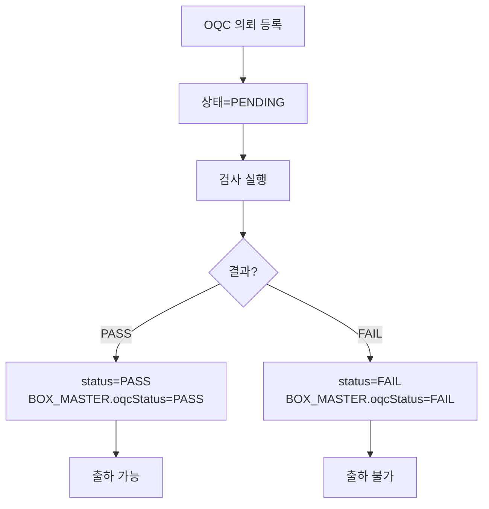
```mermaid
graph TD
    A[OQC 의뢰 등록] --> B[상태=PENDING]
    B --> C[검사 실행]
    C --> D{결과?}
    D -->|PASS| E[status=PASS<br/>BOX_MASTER.oqcStatus=PASS]
    D -->|FAIL| F[status=FAIL<br/>BOX_MASTER.oqcStatus=FAIL]
    E --> G[출하 가능]
    F --> H[출하 불가]
```

### 3.2 예외/분기
- **팔레트/출하 진행된 박스**: 검사 결과 수정 불가
- **CLOSED 상태 아닌 박스**: 의뢰 등록 불가
- **이미 OQC 상태인 박스**: 의뢰 등록 불가

## 4. 상태 코드

| 상태명 | 코드값 | 설명 |
|--------|--------|------|
| 대기 | PENDING | 의뢰 후 검사 대기 |
| 진행중 | IN_PROGRESS | 검사 진행중 |
| 합격 | PASS | 검사 합격 |
| 불합격 | FAIL | 검사 불합격 |

## 5. API 명세

### 5.1 목록 조회
```
GET /api/v1/quality/oqc-requests
```
**Query Parameters**
| 파라미터 | 타입 | 필수 | 설명 |
|----------|------|------|------|
| page | number | N | 페이지 |
| limit | number | N | 페이지당 건수 (기본 50) |
| search | string | N | 의뢰번호/품번/품명 |
| status | string | N | PENDING/IN_PROGRESS/PASS/FAIL |
| customer | string | N | 고객사 필터 |
| fromDate | string | N | 시작일 |
| toDate | string | N | 종료일 |

### 5.2 의뢰 생성
```
POST /api/v1/quality/oqc-requests
```
**Request Body**
```json
{
  "itemCode": "PART-001",
  "boxIds": ["BOX-001", "BOX-002"],
  "customer": "고객A",
  "requestDate": "2024-06-10",
  "sampleSize": 2
}
```

### 5.3 검사 실행
```
POST /api/v1/quality/oqc-requests/:requestNo/execute
```
**Request Body**
```json
{
  "result": "PASS",
  "details": "{\"item1\":\"OK\"}",
  "inspectorName": "홍길동",
  "sampleBoxIds": ["BOX-001"]
}
```

### 5.4 결과 수정
```
PUT /api/v1/quality/oqc-requests/:requestNo/result
```
**Request Body**
```json
{
  "result": "FAIL",
  "details": "외관 불량",
  "inspectorName": "홍길동",
  "remark": "재검사 필요"
}
```

## 6. 처리 규칙 및 검증

### 6.1 입력 검증
- itemCode: 필수
- boxIds: 최소 1개, 모두 CLOSED 상태, oqcStatus=null
- result: PASS 또는 FAIL

### 6.2 비즈니스 규칙
1. **의뢰번호 자동채번**: OQC-YYYYMMDD-NNN
2. **박스 상태 검증**: CLOSED + oqcStatus=null 만 가능
3. **검사 결과 연동**: BOX_MASTER.oqcStatus 동기화
4. **팔레트/출하 진행 시 수정 불가**: palletNo 있거나 status=SHIPPED 이면 결과 수정 불가
5. **트랜잭션**: OQC_REQUESTS INSERT + OQC_REQUEST_BOXES INSERT + BOX_MASTER UPDATE

## 7. 연관 엔티티 및 테이블

| 엔티티명 | 테이블명 | 역할 | 관계 |
|----------|----------|------|------|
| OqcRequest | OQC_REQUESTS | OQC 의뢰 헤더 | 메인 |
| OqcRequestBox | OQC_REQUEST_BOXES | OQC 대상 박스 | 1:N |
| BoxMaster | BOX_MASTERS | 박스 마스터 | N:1 |
| PartMaster | PART_MASTERS | 품목 마스터 | N:1 |

## 8. 에러 메시지 및 처리

| 상황 | HTTP | 에러메시지 | 처리방법 |
|------|------|-----------|---------|
| 박스미존재 | 400 | 일부 박스를 찾을 수 없습니다 | 박스번호 확인 |
| 박스상태불량 | 400 | CLOSED 상태 + OQC 미실시 박스만 가능 | 박스상태 확인 |
| 팔레트진행 | 400 | 후공정이 진행된 박스는 OQC 검사를 수정할 수 없습니다 | 팔레트/출하 취소 후 수정 |

---

### 3.2 OQC이력 (QC_OQC_HISTORY)

## 1. 화면 개요

| 항목 | 내용 |
|------|------|
| **메뉴 경로** | 품질관리 > OQC이력 |
| **URL** | `/quality/oqc-history` |
| **메뉴 코드** | `QC_OQC_HISTORY` |
| **화면 목적** | OQC 검사 이력을 조회하고 통계를 확인한다. |
| **주요 사용자** | 품질관리자 |

## 2. 화면 구성

### 2.1 레이아웃
- 상단: 검색조건 (기간, 상태, 고객사)
- 중앙: OQC 이력 그리드
- 하단: 페이징 + 통계 요약

### 2.2 데이터그리드 컬럼
| 컬럼ID | 컬럼명 | 데이터타입 | 비고 |
|--------|--------|-----------|------|
| requestNo | 의뢰번호 | string | |
| itemCode | 품목코드 | string | |
| itemName | 품목명 | string | |
| customer | 고객사 | string | |
| requestDate | 의뢰일 | date | |
| status | 상태 | string | |
| result | 결과 | string | |
| totalQty | 총수량 | number | |
| inspectDate | 검사일 | datetime | |
| inspectorName | 검사자 | string | |

### 2.3 통계
| 항목 | 설명 |
|------|------|
| total | 전체 건수 |
| pending | 대기 건수 |
| pass | 합격 건수 |
| fail | 불합격 건수 |

## 3. 업무 흐름
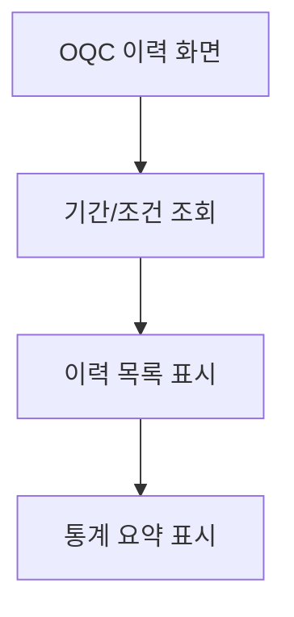
```mermaid
graph TD
    A[OQC 이력 화면] --> B[기간/조건 조회]
    B --> C[이력 목록 표시]
    C --> D[통계 요약 표시]
```

## 4. API 명세

### 4.1 목록 조회
```
GET /api/v1/quality/oqc-requests
```

### 4.2 통계
```
GET /api/v1/quality/oqc-requests/stats
```

## 5. 연관 엔티티

| 엔티티명 | 테이블명 | 역할 |
|----------|----------|------|
| OqcRequest | OQC_REQUESTS | 메인 |
| OqcRequestBox | OQC_REQUEST_BOXES | 박스 이력 |

---

## 4. 추적 및 변경 관리

### 4.1 추적성 (QC_TRACE)

## 1. 화면 개요

| 항목 | 내용 |
|------|------|
| **메뉴 경로** | 품질관리 > 추적성 |
| **URL** | `/quality/trace` |
| **메뉴 코드** | `QC_TRACE` |
| **화면 목적** | 제품의 시리얼/FG바코드를 입력하여 4M 이력을 종합 조회한다. |
| **주요 사용자** | 품질관리자, 고객대응담당 |

## 2. 화면 구성

### 2.1 레이아웃
- 상단: 시리얼/FG바코드 입력
- 중앙: 제품 기본 정보 카드
- 하단: 타임라인 + 4M 탭 (Man, Machine, Material, Method)

### 2.2 출력 정보
**기본 정보**
| 필드 | 설명 |
|------|------|
| serialNo | 시리얼번호 (FG_BARCODE) |
| itemNo | 품번 |
| itemName | 품명 |
| workOrderNo | 작업지시번호 |
| productionDate | 생산일자 |
| prdUid | 제품UID |

**4M 데이터**
| 구분 | 필드 | 설명 |
|------|------|------|
| Man | operatorId | 작업자 코드 |
| Man | operatorName | 작업자명 |
| Machine | equipmentNo | 설비번호 |
| Machine | equipmentName | 설비명 |
| Material | materialCode | 자재코드 |
| Material | matUid | 자재LOT |
| Material | usedQty | 투입수량 |
| Material | supplier | 공급사 |
| Method | specName | 관리항목 |
| Method | specValue | 규격값 |
| Method | actualValue | 실측값 |
| Method | result | OK/NG |

## 3. 업무 흐름

### 3.1 정상 흐름
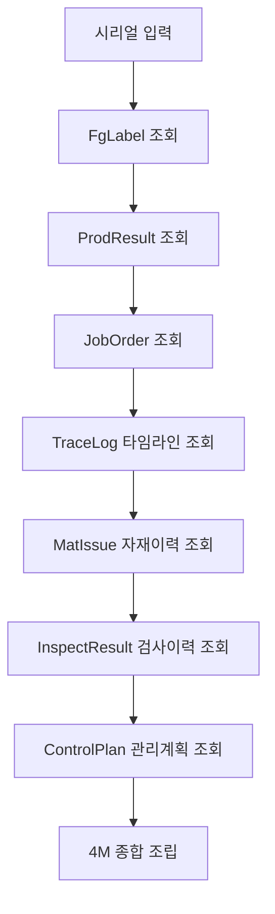
```mermaid
graph TD
    A[시리얼 입력] --> B[FgLabel 조회]
    B --> C[ProdResult 조회]
    C --> D[JobOrder 조회]
    D --> E[TraceLog 타임라인 조회]
    E --> F[MatIssue 자재이력 조회]
    F --> G[InspectResult 검사이력 조회]
    G --> H[ControlPlan 관리계획 조회]
    H --> I[4M 종합 조립]
```

## 4. API 명세

### 4.1 추적 조회
```
GET /api/v1/quality/traces/:serial
```

**Response 200**
```json
{
  "serialNo": "FG-20240610-001",
  "itemNo": "PART-001",
  "itemName": "저항기",
  "workOrderNo": "JO-20240610-001",
  "productionDate": "2024-06-10",
  "timeline": [
    {
      "id": "TL-...",
      "timestamp": "2024-06-10T08:00:00Z",
      "process": "P001",
      "processName": "납땜",
      "equipmentNo": "EQ001",
      "operator": "홍길동",
      "result": "PASS"
    }
  ],
  "fourM": {
    "man": [...],
    "machine": [...],
    "material": [...],
    "method": [...]
  }
}
```

## 5. 처리 규칙

### 5.1 비즈니스 규칙
1. **FgLabel 우선 조회**: fgBarcode로 FgLabel 검색
2. **TraceLog 기반 타임라인**: traceTime ASC, seq ASC 정렬
3. **TraceLog 없을 시 대체**: ProdResult + InspectResult로 타임라인 생성
4. **자재 이력**: MatIssue + MatLot + PartMaster JOIN
5. **관리계획**: ControlPlanItem (품목코드 기준 APPROVED 상태)
6. **검사 데이터 반영**: InspectResult.inspectData JSON 파싱하여 Method에 실측값 반영

## 6. 연관 엔티티

| 엔티티명 | 테이블명 | 역할 |
|----------|----------|------|
| TraceLog | TRACE_LOGS | 추적 이력 |
| FgLabel | FG_LABELS | FG 라벨 |
| ProdResult | PROD_RESULTS | 생산실적 |
| JobOrder | JOB_ORDERS | 작업지시 |
| MatIssue | MAT_ISSUES | 자재투입 |
| MatLot | MAT_LOTS | 자재LOT |
| InspectResult | INSPECT_RESULTS | 검사실적 |
| ControlPlanItem | CONTROL_PLAN_ITEMS | 관리계획항목 |
| PartMaster | PART_MASTERS | 품목 |
| EquipMaster | EQUIP_MASTERS | 설비 |
| WorkerMaster | WORKER_MASTERS | 작업자 |
| ProcessMaster | PROCESS_MASTERS | 공정 |

---

### 4.2 변경관리 (QC_CHANGE)

## 1. 화면 개요

| 항목 | 내용 |
|------|------|
| **메뉴 경로** | 품질관리 > 변경관리 |
| **URL** | `/quality/change-control` |
| **메뉴 코드** | `QC_CHANGE` |
| **화면 목적** | 4M(인, 기, 재, 법) 변경점을 관리하고 승인 흐름을 제어한다. |
| **주요 사용자** | 품질관리자, 기술관리자 |

## 2. 화면 구성

### 2.1 레이아웃
- 상단: 검색조건 (상태, 변경유형, 우선순위, 기간)
- 중앙: 변경점 그리드
- 하단: 페이징
- 모달: 등록, 검토, 승인, 시행

### 2.2 데이터그리드 컬럼
| 컬럼ID | 컬럼명 | 데이터타입 | 비고 |
|--------|--------|-----------|------|
| changeNo | 변경번호 | string | PK, ECN-YYYYMMDD-NNN |
| changeType | 변경유형 | string | |
| title | 제목 | string | |
| priority | 우선순위 | string | |
| status | 상태 | string | |
| requestedBy | 요청자 | string | |
| requestedAt | 요청일 | datetime | |
| effectiveDate | 적용일 | date | |
| reviewerCode | 검토자 | string | |
| approverCode | 승인자 | string | |

### 2.3 입력 폼 필드
| 필드ID | 필드명 | 타입 | 필수 | 비고 |
|--------|--------|------|------|------|
| changeType | 변경유형 | select | Y | |
| title | 제목 | text | Y | |
| description | 설명 | textarea | Y | |
| reason | 변경사유 | textarea | Y | |
| riskAssessment | 리스크평가 | textarea | N | |
| affectedItems | 영향품목 | text | N | |
| affectedProcesses | 영향공정 | text | N | |
| priority | 우선순위 | select | N | |
| effectiveDate | 적용예정일 | date | N | |

### 2.4 버튼/액션
| 버튼 | 조건 | 동작 | API |
|------|------|------|-----|
| 등록 | - | 변경점 등록 | POST /api/v1/quality/change-orders |
| 제출 | DRAFT | 제출 | PATCH /api/v1/quality/change-orders/:no/submit |
| 검토 | SUBMITTED | 승인/반려 | PATCH /api/v1/quality/change-orders/:no/review |
| 시행시작 | APPROVED | 시행 | PATCH /api/v1/quality/change-orders/:no/start |
| 완료 | IN_PROGRESS | 완료 | PATCH /api/v1/quality/change-orders/:no/complete |

## 3. 업무 흐름

### 3.1 정상 흐름
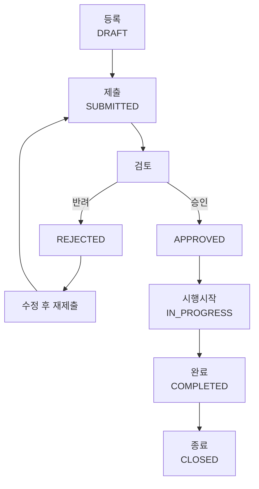
```mermaid
graph TD
    A[등록<br/>DRAFT] --> B[제출<br/>SUBMITTED]
    B --> C[검토]
    C -->|반려| D[REJECTED]
    C -->|승인| E[APPROVED]
    D --> F[수정 후 재제출]
    F --> B
    E --> G[시행시작<br/>IN_PROGRESS]
    G --> H[완료<br/>COMPLETED]
    H --> I[종료<br/>CLOSED]
```

### 3.2 예외/분기
- **DRAFT/REJECTED만 수정 가능**
- **DRAFT만 삭제 가능**
- **SUBMITTED 상태에서만 검토 가능**
- **APPROVED 상태에서만 시행 시작 가능**
- **IN_PROGRESS 상태에서만 완료 가능**

## 4. 상태 코드

| 상태명 | 코드값 | 설명 |
|--------|--------|------|
| 초안 | DRAFT | 작성중 |
| 제출 | SUBMITTED | 검토 대기 |
| 반려 | REJECTED | 검토 반려 |
| 승인 | APPROVED | 검토 승인 |
| 진행중 | IN_PROGRESS | 변경 시행중 |
| 완료 | COMPLETED | 변경 완료 |
| 종료 | CLOSED | 종결 |

## 5. API 명세

### 5.1 목록 조회
```
GET /api/v1/quality/change-orders
```

### 5.2 생성
```
POST /api/v1/quality/change-orders
```
**Request Body**
```json
{
  "changeType": "PROCESS",
  "title": "납땜 온도 변경",
  "description": "납땜 온도를 280도에서 300도로 상향",
  "reason": "신규 부품 적용",
  "riskAssessment": "단기적 불량률 상승 가능",
  "affectedItems": "PART-001,PART-002",
  "affectedProcesses": "P001",
  "priority": "HIGH",
  "effectiveDate": "2024-07-01"
}
```

### 5.3 검토
```
PATCH /api/v1/quality/change-orders/:changeNo/review
```
**Request Body**
```json
{
  "action": "APPROVE",
  "comment": "승인함"
}
```

## 6. 처리 규칙

### 6.1 비즈니스 규칙
1. **변경번호 자동채번**: ECN-YYYYMMDD-NNN
2. **상태 전이 제약**: 위 상태 다이어그램 참조
3. **승인/반려 시 reviewerCode, reviewedAt 기록**
4. **완료 시 completionDate 기록**

## 7. 연관 엔티티

| 엔티티명 | 테이블명 | 역할 |
|----------|----------|------|
| ChangeOrder | CHANGE_ORDERS | 변경점 메인 |

---

### 4.3 불만관리 (QC_COMPLAINT)

## 1. 화면 개요

| 항목 | 내용 |
|------|------|
| **메뉴 경로** | 품질관리 > 불만관리 |
| **URL** | `/quality/complaint` |
| **메뉴 코드** | `QC_COMPLAINT` |
| **화면 목적** | 고객 클레임을 8D 프로세스로 접수부터 종료까지 관리한다. |
| **주요 사용자** | 품질관리자, 영업관리자 |

## 2. 화면 구성

### 2.1 레이아웃
- 상단: 검색조건 (상태, 클레임유형, 긴급도, 고객사, 기간)
- 중앙: 클레임 그리드
- 하단: 페이징
- 모달: 등록, 조사, 대응, 해결, 종료, CAPA 연계

### 2.2 데이터그리드 컬럼
| 컬럼ID | 컬럼명 | 데이터타입 | 비고 |
|--------|--------|-----------|------|
| complaintNo | 클레임번호 | string | PK, CC-YYYYMMDD-NNN |
| customerCode | 고객코드 | string | |
| customerName | 고객명 | string | |
| complaintDate | 클레임일 | date | |
| itemCode | 품목코드 | string | |
| lotNo | LOT번호 | string | |
| defectQty | 불량수량 | number | |
| complaintType | 클레임유형 | string | |
| urgency | 긴급도 | string | |
| status | 상태 | string | |
| capaId | CAPA번호 | string | 연계 |

### 2.3 입력 폼 필드
| 필드ID | 필드명 | 타입 | 필수 | 비고 |
|--------|--------|------|------|------|
| customerCode | 고객코드 | select | Y | |
| customerName | 고객명 | text | N | 자동 |
| complaintDate | 클레임일 | date | Y | |
| itemCode | 품목코드 | select | Y | |
| lotNo | LOT번호 | text | N | |
| defectQty | 불량수량 | number | Y | |
| complaintType | 클레임유형 | select | N | |
| description | 설명 | textarea | Y | |
| urgency | 긴급도 | select | N | |
| responsibleCode | 담당자 | select | N | |
| costAmount | 비용 | number | N | |

### 2.4 버튼/액션
| 버튼 | 조건 | 동작 | API |
|------|------|------|-----|
| 등록 | - | 클레임 등록 | POST /api/v1/quality/complaints |
| 조사시작 | RECEIVED | 조사 | PATCH /api/v1/quality/complaints/:no/investigate |
| 대응완료 | INVESTIGATING | 대응 | PATCH /api/v1/quality/complaints/:no/respond |
| 해결 | RESPONDING | 해결 | PATCH /api/v1/quality/complaints/:no/resolve |
| 종료 | RESOLVED | 종료 | PATCH /api/v1/quality/complaints/:no/close |
| CAPA연계 | - | CAPA 연결 | PATCH /api/v1/quality/complaints/:no/link-capa |

## 3. 업무 흐름

### 3.1 정상 흐름 (8D)
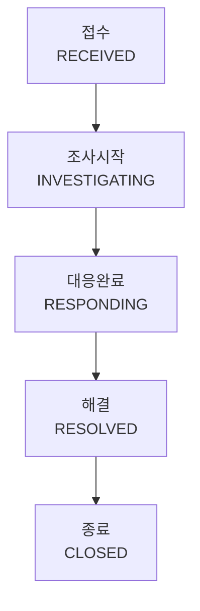
```mermaid
graph TD
    A[접수<br/>RECEIVED] --> B[조사시작<br/>INVESTIGATING]
    B --> C[대응완료<br/>RESPONDING]
    C --> D[해결<br/>RESOLVED]
    D --> E[종료<br/>CLOSED]
```

### 3.2 예외/분기
- **RECEIVED만 수정/삭제 가능**
- **CAPA 연계**: 임의 상태에서 가능

## 4. 상태 코드

| 상태명 | 코드값 | 설명 |
|--------|--------|------|
| 접수 | RECEIVED | 클레임 접수 |
| 조사중 | INVESTIGATING | 원인분석/봉쇄조치 |
| 대응중 | RESPONDING | 시정/예방조치 |
| 해결 | RESOLVED | 고객 확인 완료 |
| 종료 | CLOSED | 종결 |

## 5. API 명세

### 5.1 생성
```
POST /api/v1/quality/complaints
```
**Request Body**
```json
{
  "customerCode": "C001",
  "customerName": "고객A",
  "complaintDate": "2024-06-10",
  "itemCode": "PART-001",
  "lotNo": "LOT-001",
  "defectQty": 100,
  "complaintType": "QUALITY",
  "description": "외관 스크래치 다발",
  "urgency": "HIGH",
  "responsibleCode": "Q001",
  "costAmount": 500000
}
```

### 5.2 조사
```
PATCH /api/v1/quality/complaints/:complaintNo/investigate
```
**Request Body**
```json
{
  "investigation": "포장 공정 확인 결과...",
  "rootCause": "이송 벨트 마모",
  "containmentAction": "벨트 교체 및 긴급 선별"
}
```

### 5.3 대응
```
PATCH /api/v1/quality/complaints/:complaintNo/respond
```
**Request Body**
```json
{
  "correctiveAction": "벨트 교체 완료",
  "preventiveAction": "주 1회 벨트 점검",
  "responseDate": "2024-06-15"
}
```

### 5.4 CAPA 연계
```
PATCH /api/v1/quality/complaints/:complaintNo/link-capa
```
**Request Body**
```json
{
  "capaId": "CA-20240610-001"
}
```

## 6. 처리 규칙

### 6.1 비즈니스 규칙
1. **클레임번호 자동채번**: CC-YYYYMMDD-NNN
2. **RECEIVED 상태에서만 수정/삭제**
3. **조사/대응 시 해당 필드 업데이트**
4. **CAPA 연계 시 capaId 저장**

## 7. 연관 엔티티

| 엔티티명 | 테이블명 | 역할 |
|----------|----------|------|
| CustomerComplaint | CUSTOMER_COMPLAINTS | 클레임 메인 |
| CAPARequest | CAPA_REQUESTS | CAPA 연계 |

---

### 4.4 CAPA (QC_CAPA)

## 1. 화면 개요

| 항목 | 내용 |
|------|------|
| **메뉴 경로** | 품질관리 > CAPA |
| **URL** | `/quality/capa` |
| **메뉴 코드** | `QC_CAPA` |
| **화면 목적** | 시정조치(CA) 및 예방조치(PA)를 관리하고 유효성을 검증한다. |
| **주요 사용자** | 품질관리자 |

## 2. 화면 구성

### 2.1 레이아웃
- 상단: 검색조건 (상태, CAPA유형, 출처, 우선순위)
- 중앙: CAPA 그리드 + 조치 항목 디테일
- 하단: 페이징
- 모달: 등록, 원인분석, 조치계획, 검증, 종료

### 2.2 데이터그리드 컬럼
| 컬럼ID | 컬럼명 | 데이터타입 | 비고 |
|--------|--------|-----------|------|
| capaNo | CAPA번호 | string | PK, CA/PA-YYYYMMDD-NNN |
| capaType | CAPA유형 | string | CORRECTIVE/PREVENTIVE |
| sourceType | 출처 | string | |
| title | 제목 | string | |
| priority | 우선순위 | string | |
| status | 상태 | string | |
| rootCause | 근본원인 | text | |
| actionPlan | 조치계획 | text | |
| targetDate | 목표일 | date | |
| closedAt | 종료일 | datetime | |

### 2.3 조치 항목 디테일
| 컬럼ID | 컬럼명 | 데이터타입 | 비고 |
|--------|--------|-----------|------|
| seq | 순번 | number | |
| actionDesc | 조치내용 | text | |
| responsibleCode | 담당자 | string | |
| dueDate | 만기일 | date | |
| status | 상태 | string | PENDING/DONE |
| completedAt | 완료일 | datetime | |
| result | 결과 | text | |

### 2.4 버튼/액션
| 버튼 | 조건 | 동작 | API |
|------|------|------|-----|
| 등록 | - | CAPA 등록 | POST /api/v1/quality/capas |
| 원인분석 | OPEN | 분석 완료 | PATCH /api/v1/quality/capas/:no/analyze |
| 조치계획 | ANALYZING | 계획 등록 | PATCH /api/v1/quality/capas/:no/plan |
| 조치시작 | ACTION_PLANNED | 시작 | PATCH /api/v1/quality/capas/:no/start |
| 검증 | IN_PROGRESS | 유효성 검증 | PATCH /api/v1/quality/capas/:no/verify |
| 종료 | VERIFYING | 종료 | PATCH /api/v1/quality/capas/:no/close |
| 조치추가 | - | 조치 항목 추가 | POST /api/v1/quality/capas/:no/actions |

## 3. 업무 흐름

### 3.1 정상 흐름
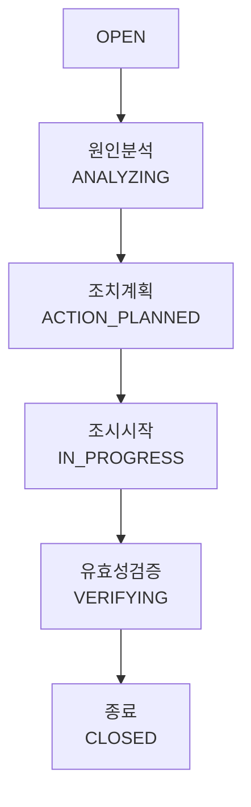
```mermaid
graph TD
    A[OPEN] --> B[원인분석<br/>ANALYZING]
    B --> C[조치계획<br/>ACTION_PLANNED]
    C --> D[조시시작<br/>IN_PROGRESS]
    D --> E[유효성검증<br/>VERIFYING]
    E --> F[종료<br/>CLOSED]
```

### 3.2 예외/분기
- **OPEN/ANALYZING만 수정**
- **OPEN만 삭제**
- **조치 항목별 개별 추적**

## 4. 상태 코드

| 상태명 | 코드값 | 설명 |
|--------|--------|------|
| 오픈 | OPEN | 등록 완료 |
| 분석중 | ANALYZING | 근본원인 분석 |
| 조치계획 | ACTION_PLANNED | 조치 계획 수립 |
| 진행중 | IN_PROGRESS | 조치 시행중 |
| 검증중 | VERIFYING | 유효성 검증 |
| 종료 | CLOSED | 종결 |

## 5. API 명세

### 5.1 생성
```
POST /api/v1/quality/capas
```
**Request Body**
```json
{
  "capaType": "CORRECTIVE",
  "sourceType": "COMPLAINT",
  "title": "벨트 마모로 인한 스크래치",
  "priority": "HIGH",
  "actions": [
    {
      "seq": 1,
      "actionDesc": "벨트 교체",
      "responsibleCode": "M001",
      "dueDate": "2024-06-15",
      "status": "PENDING"
    }
  ]
}
```

### 5.2 원인분석
```
PATCH /api/v1/quality/capas/:capaNo/analyze
```
**Request Body**
```json
{
  "rootCause": "5Why 분석 결과: 벨트 장력 부족"
}
```

### 5.3 조치계획
```
PATCH /api/v1/quality/capas/:capaNo/plan
```
**Request Body**
```json
{
  "actionPlan": "1. 벨트 교체 2. 장력 조정 3. 점검 주기 변경",
  "targetDate": "2024-06-20"
}
```

### 5.4 검증
```
PATCH /api/v1/quality/capas/:capaNo/verify
```
**Request Body**
```json
{
  "verificationResult": "3개월간 모니터링 결과 불량 0건"
}
```

### 5.5 조치 항목 수정
```
PATCH /api/v1/quality/capas/:capaNo/actions/:seq
```
**Request Body**
```json
{
  "status": "DONE",
  "result": "벨트 교체 완료"
}
```

## 6. 처리 규칙

### 6.1 비즈니스 규칙
1. **CAPA번호 자동채번**: CA-YYYYMMDD-NNN (시정), PA-YYYYMMDD-NNN (예방)
2. **조치 항목 1:N 관계**: 개별 추적 가능
3. **조시 완료 시 completedAt 자동 기록**
4. **상태 전이 제약**: 위 상태 다이어그램 참조

## 7. 연관 엔티티

| 엔티티명 | 테이블명 | 역할 | 관계 |
|----------|----------|------|------|
| CAPARequest | CAPA_REQUESTS | CAPA 메인 | 메인 |
| CAPAAction | CAPA_ACTIONS | 조시 항목 | 1:N |

---

## 5. 품질 기준 및 교육

### 5.1 FAI (QC_FAI)

## 1. 화면 개요

| 항목 | 내용 |
|------|------|
| **메뉴 경로** | 품질관리 > FAI |
| **URL** | `/quality/fai` |
| **메뉴 코드** | `QC_FAI` |
| **화면 목적** | 초물검사(FAI)를 요청하고, 검사항목별 측정값을 입력하여 자동 판정한다. |
| **주요 사용자** | 품질관리자, 기술관리자 |

## 2. 화면 구성

### 2.1 레이아웃
- 상단: 검색조건 (상태, triggerType, 기간)
- 중앙: FAI 요청 그리드
- 하단: 페이징
- 모달: 등록, 검사시작, 측정값 입력, 완료, 승인

### 2.2 데이터그리드 컬럼
| 컬럼ID | 컬럼명 | 데이터타입 | 비고 |
|--------|--------|-----------|------|
| faiNo | FAI번호 | string | PK, FAI-YYYYMMDD-NNN |
| itemCode | 품목코드 | string | |
| itemName | 품목명 | string | |
| triggerType | 발생유형 | string | |
| status | 상태 | string | |
| result | 결과 | string | PASS/FAIL/CONDITIONAL |
| inspectDate | 검사일 | date | |
| approvalCode | 승인자 | string | |
| approvedAt | 승인일 | datetime | |

### 2.3 입력 폼 필드 (검사항목)
| 필드ID | 필드명 | 타입 | 필수 | 비고 |
|--------|--------|------|------|------|
| seq | 순번 | number | Y | |
| inspectItem | 검사항목 | text | Y | |
| specMin | 규격최소 | number | N | |
| specMax | 규격최대 | number | N | |
| measuredValue | 측정값 | number | N | |
| unit | 단위 | text | N | |
| result | 판정 | select | N | OK/NG |
| remark | 비고 | text | N | |

### 2.4 버튼/액션
| 버튼 | 조건 | 동작 | API |
|------|------|------|-----|
| 등록 | - | FAI 등록 | POST /api/v1/quality/fais |
| 검사시작 | REQUESTED | 시작 | PATCH /api/v1/quality/fais/:no/start |
| 측정값입력 | SAMPLING/INSPECTING | 항목 등록 | POST /api/v1/quality/fais/:no/items |
| 완료 | SAMPLING/INSPECTING | 자동판정 | PATCH /api/v1/quality/fais/:no/complete |
| 승인 | PASS/FAIL/CONDITIONAL | 승인 | PATCH /api/v1/quality/fais/:no/approve |

## 3. 업무 흐름

### 3.1 정상 흐름
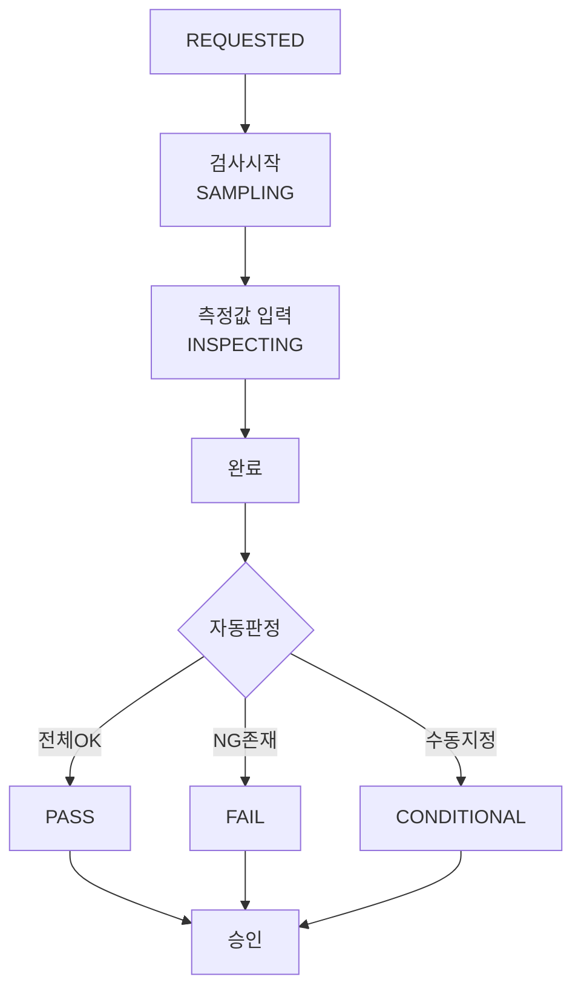
```mermaid
graph TD
    A[REQUESTED] --> B[검사시작<br/>SAMPLING]
    B --> C[측정값 입력<br/>INSPECTING]
    C --> D[완료]
    D --> E{자동판정}
    E -->|전체OK| F[PASS]
    E -->|NG존재| G[FAIL]
    E -->|수동지정| H[CONDITIONAL]
    F --> I[승인]
    G --> I
    H --> I
```

### 3.2 예외/분기
- **REQUESTED만 수정/삭제**
- **COMPLETE 시 자동판정**: items 전체 OK → PASS, NG 존재 → FAIL
- **dto.result=CONDITIONAL 시 수동 지정 가능**

## 4. 상태 코드

| 상태명 | 코드값 | 설명 |
|--------|--------|------|
| 요청 | REQUESTED | 등록 완료 |
| 샘플링 | SAMPLING | 검사 시작 |
| 검사중 | INSPECTING | 측정값 입력중 |
| 합격 | PASS | 자동/수동 판정 합격 |
| 불합격 | FAIL | 자동/수동 판정 불합격 |
| 조건부 | CONDITIONAL | 조건부 합격 |

## 5. API 명세

### 5.1 생성
```
POST /api/v1/quality/fais
```
**Request Body**
```json
{
  "itemCode": "PART-001",
  "itemName": "저항기",
  "triggerType": "NEW_PART",
  "items": [
    {
      "seq": 1,
      "inspectItem": "저항값",
      "specMin": 10.0,
      "specMax": 20.0,
      "unit": "Ω"
    }
  ]
}
```

### 5.2 검사항목 등록
```
POST /api/v1/quality/fais/:faiNo/items
```
**Request Body**
```json
[
  {
    "seq": 1,
    "inspectItem": "저항값",
    "specMin": 10.0,
    "specMax": 20.0,
    "measuredValue": 15.2,
    "unit": "Ω",
    "result": "OK"
  }
]
```

### 5.3 완료
```
PATCH /api/v1/quality/fais/:faiNo/complete
```
**Request Body**
```json
{
  "result": "PASS",
  "remark": "전 항목 OK"
}
```

## 6. 처리 규칙

### 6.1 비즈니스 규칙
1. **FAI번호 자동채번**: FAI-YYYYMMDD-NNN
2. **자동판정**: items.length > 0 && result !== CONDITIONAL 일 때:
   - hasNg(items.some result=NG) → FAIL
   - 전체 OK → PASS
3. **항목 등록 시 REQUESTED/SAMPLING → INSPECTING 자동 전이**
4. **승인 시 approvalCode, approvedAt 기록**

## 7. 연관 엔티티

| 엔티티명 | 테이블명 | 역할 | 관계 |
|----------|----------|------|------|
| FaiRequest | FAI_REQUESTS | FAI 메인 | 메인 |
| FaiItem | FAI_ITEMS | 검사항목 | 1:N |

---

### 5.2 PPAP (QC_PPAP)

## 1. 화면 개요

| 항목 | 내용 |
|------|------|
| **메뉴 경로** | 품질관리 > PPAP |
| **URL** | `/quality/ppap` |
| **메뉴 코드** | `QC_PPAP` |
| **화면 목적** | PPAP(생산부품승인절차) 제출물을 관리하고 Level별 완성률을 추적한다. |
| **주요 사용자** | 품질관리자, 기술관리자 |

## 2. 화면 구성

### 2.1 레이아웃
- 상단: 검색조건 (상태, 품목, 고객, 기간)
- 중앙: PPAP 그리드
- 하단: 페이징
- 모달: 등록, 제출, 승인/반려, 완성률

### 2.2 데이터그리드 컬럼
| 컬럼ID | 컬럼명 | 데이터타입 | 비고 |
|--------|--------|-----------|------|
| ppapNo | PPAP번호 | string | PK, PPAP-YYYYMMDD-NNN |
| itemCode | 품목코드 | string | |
| itemName | 품목명 | string | |
| customerCode | 고객코드 | string | |
| customerName | 고객명 | string | |
| ppapLevel | PPAP레벨 | number | 1~5 |
| reason | 사유 | string | |
| status | 상태 | string | |
| submittedAt | 제출일 | datetime | |
| approvedAt | 승인일 | datetime | |
| approvedBy | 승인자 | string | |

### 2.3 PPAP 18요소
| 요소키 | 요소명 | 필수(Lev3) |
|--------|--------|-----------|
| designRecords | 설계기록 | O |
| ecnDocuments | 공정변경문서 | O |
| customerApproval | 고객승인 | O |
| dfmea | DFMEA | O |
| processFlowDiagram | 공정흐름도 | O |
| pfmea | PFMEA | O |
| controlPlan | 관리계획서 | O |
| msaStudies | MSA 연구 | O |
| dimensionalResults | 치수결과 | O |
| materialTestResults | 재료시험결과 | O |
| initialProcessStudies | 초기공정연구 | O |
| qualifiedLabDoc | 적격실험실문서 | O |
| appearanceApproval | 외관승인서 | O |
| sampleProduct | 샘플제품 | O |
| masterSample | 마스터샘플 | X |
| checkingAids | 검사보조기구 | X |
| customerSpecificReq | 고객특별요구 | O |
| partSubmissionWarrant | 부품제출보증서 | O |

### 2.4 버튼/액션
| 버튼 | 조건 | 동작 | API |
|------|------|------|-----|
| 등록 | - | PPAP 등록 | POST /api/v1/quality/ppaps |
| 제출 | DRAFT | 제출 | PATCH /api/v1/quality/ppaps/:no/submit |
| 승인 | SUBMITTED | 승인 | PATCH /api/v1/quality/ppaps/:no/approve |
| 반려 | SUBMITTED | 반려 | PATCH /api/v1/quality/ppaps/:no/reject |
| 승인취소 | APPROVED | 취소 | PATCH /api/v1/quality/ppaps/:no/cancel-approval |
| 제출취소 | SUBMITTED | 취소 | PATCH /api/v1/quality/ppaps/:no/cancel-submit |
| 완성률 | - | 완성률 조회 | GET /api/v1/quality/ppaps/:no/completion-rate |

## 3. 업무 흐름

### 3.1 정상 흐름
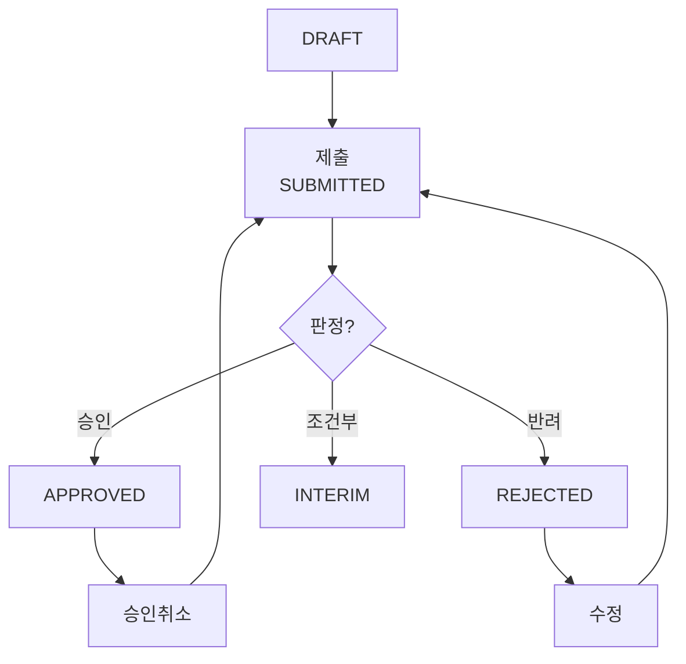
```mermaid
graph TD
    A[DRAFT] --> B[제출<br/>SUBMITTED]
    B --> C{판정?}
    C -->|승인| D[APPROVED]
    C -->|반려| E[REJECTED]
    C -->|조건부| F[INTERIM]
    E --> G[수정]
    G --> B
    D --> H[승인취소]
    H --> B
```

### 3.2 예외/분기
- **DRAFT/REJECTED만 수정**
- **DRAFT만 삭제**
- **SUBMITTED만 제출취소**
- **APPROVED만 승인취소**

## 4. 상태 코드

| 상태명 | 코드값 | 설명 |
|--------|--------|------|
| 초안 | DRAFT | 작성중 |
| 제출 | SUBMITTED | 고객 제출 완료 |
| 승인 | APPROVED | 승인 |
| 반려 | REJECTED | 반려 |
| 조건부 | INTERIM | 조건부 승인 |

## 5. API 명세

### 5.1 생성
```
POST /api/v1/quality/ppaps
```
**Request Body**
```json
{
  "itemCode": "PART-001",
  "itemName": "저항기",
  "customerCode": "C001",
  "customerName": "고객A",
  "ppapLevel": 3,
  "reason": "신규품목",
  "designRecords": 1,
  "ecnDocuments": 1,
  "partSubmissionWarrant": 1
}
```

### 5.2 제출
```
PATCH /api/v1/quality/ppaps/:ppapNo/submit
```

### 5.3 승인
```
PATCH /api/v1/quality/ppaps/:ppapNo/approve
```

### 5.4 반려
```
PATCH /api/v1/quality/ppaps/:ppapNo/reject
```
**Request Body**
```json
{
  "reason": "치수결과 누락"
}
```

### 5.5 완성률
```
GET /api/v1/quality/ppaps/:ppapNo/completion-rate
```

**Response 200**
```json
{
  "ppapNo": "PPAP-20240610-001",
  "level": 3,
  "rate": 85,
  "completed": 15,
  "total": 18
}
```

## 6. 처리 규칙

### 6.1 비즈니스 규칙
1. **PPAP번호 자동채번**: PPAP-YYYYMMDD-NNN
2. **Level별 필수 요소 매트릭스** (AIAG PPAP 4th Edition 기준):
   - Level 1: partSubmissionWarrant만 제출
   - Level 2: dimensionalResults, materialTestResults, appearanceApproval, sampleProduct + Warrant
   - Level 3: 18요소 중 masterSample, checkingAids 제외
   - Level 4/5: 전체 요소
3. **완성률 계산**: 필수 요소 중 완료(=1) 개수 / 전체 필수 개수
4. **18개 요소는 0/1 (미완료/완료) 또는 파일 경로 저장**

## 7. 연관 엔티티

| 엔티티명 | 테이블명 | 역할 |
|----------|----------|------|
| PpapSubmission | PPAP_SUBMISSIONS | PPAP 메인 |

---

### 5.3 SPC (QC_SPC)

## 1. 화면 개요

| 항목 | 내용 |
|------|------|
| **메뉴 경로** | 품질관리 > SPC |
| **URL** | `/quality/spc` |
| **메뉴 코드** | `QC_SPC` |
| **화면 목적** | SPC 관리도를 등록하고 측정 데이터를 입력하여 관리한계와 공정능력을 계산한다. |
| **주요 사용자** | 품질관리자, 공정관리자 |

## 2. 화면 구성

### 2.1 레이아웃
- 상단: 검색조건 (품목, 공정, 관리도유형)
- 중앙: 관리도 그리드
- 하단: 페이징
- 모달: 관리도 등록, 데이터 입력, 관리한계 계산, Cpk 계산, 차트 조회

### 2.2 데이터그리드 컬럼
| 컬럼ID | 컬럼명 | 데이터타입 | 비고 |
|--------|--------|-----------|------|
| chartNo | 관리도번호 | string | PK, SPC-YYYYMMDD-NNN |
| itemCode | 품목코드 | string | |
| processCode | 공정코드 | string | |
| characteristicName | 관리항목명 | string | |
| chartType | 관리도유형 | string | Xbar-R 등 |
| subgroupSize | 서브그룹크기 | number | 2~10 |
| usl | USL | number | |
| lsl | LSL | number | |
| target | 목표값 | number | |
| ucl | UCL | number | 계산값 |
| lcl | LCL | number | 계산값 |
| cl | CL | number | 계산값 |
| status | 상태 | string | ACTIVE/INACTIVE |

### 2.3 입력 폼 필드 (관리도)
| 필드ID | 필드명 | 타입 | 필수 | 비고 |
|--------|--------|------|------|------|
| itemCode | 품목코드 | select | Y | |
| processCode | 공정코드 | select | Y | |
| characteristicName | 관리항목명 | text | Y | |
| chartType | 관리도유형 | select | Y | |
| subgroupSize | 서브그룹크기 | number | Y | 2~10 |
| usl | USL | number | N | |
| lsl | LSL | number | N | |
| target | 목표값 | number | N | |
| dataSource | 데이터소스 | select | N | MANUAL/IQC/PROCESS/OQC |
| sourceInspectItem | 소스검사항목 | text | N | |

### 2.4 버튼/액션
| 버튼 | 조건 | 동작 | API |
|------|------|------|-----|
| 관리도등록 | - | 등록 | POST /api/v1/quality/spc/charts |
| 데이터입력 | 행 선택 | 측정데이터 입력 | POST /api/v1/quality/spc/charts/:no/data |
| 관리한계계산 | 행 선택 | UCL/LCL/CL 계산 | POST /api/v1/quality/spc/charts/:no/calculate-limits |
| Cpk계산 | 행 선택 | Cpk/Ppk 계산 | POST /api/v1/quality/spc/charts/:no/calculate-cpk |
| 차트조회 | 행 선택 | 차트 데이터 | GET /api/v1/quality/spc/charts/:no/chart-data |
| 측정값조회 | 행 선택 | 소스별 측정값 | GET /api/v1/quality/spc/charts/:no/measurements |

## 3. 업무 흐름

### 3.1 정상 흐름
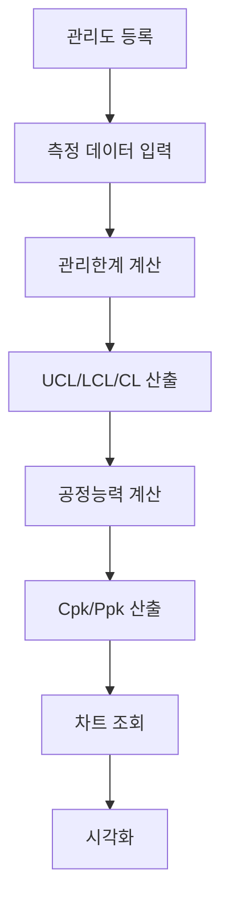
```mermaid
graph TD
    A[관리도 등록] --> B[측정 데이터 입력]
    B --> C[관리한계 계산]
    C --> D[UCL/LCL/CL 산출]
    D --> E[공정능력 계산]
    E --> F[Cpk/Ppk 산출]
    F --> G[차트 조회]
    G --> H[시각화]
```

## 4. 상태 코드
- `STATUS`: ACTIVE(사용중), INACTIVE(비활성)

## 5. API 명세

### 5.1 관리도 등록
```
POST /api/v1/quality/spc/charts
```
**Request Body**
```json
{
  "itemCode": "PART-001",
  "processCode": "P001",
  "characteristicName": "저항값",
  "chartType": "Xbar-R",
  "subgroupSize": 5,
  "usl": 20.0,
  "lsl": 10.0,
  "target": 15.0,
  "dataSource": "MANUAL",
  "sourceInspectItem": "RESISTANCE"
}
```

### 5.2 데이터 입력
```
POST /api/v1/quality/spc/charts/:chartNo/data
```
**Request Body**
```json
{
  "sampleDate": "2024-06-10",
  "subgroupNo": 1,
  "values": [14.5, 15.2, 15.0, 14.8, 15.3],
  "remark": "정상"
}
```

### 5.3 관리한계 계산
```
POST /api/v1/quality/spc/charts/:chartNo/calculate-limits
```

### 5.4 Cpk 계산
```
POST /api/v1/quality/spc/charts/:chartNo/calculate-cpk
```

**Response 200**
```json
{
  "chartNo": "SPC-20240610-001",
  "cpk": 1.25,
  "ppk": 1.25,
  "mean": 15.05,
  "sigma": 0.32
}
```

### 5.5 차트 데이터
```
GET /api/v1/quality/spc/charts/:chartNo/chart-data
```
**Query Parameters**
| 파라미터 | 타입 | 필수 | 설명 |
|----------|------|------|------|
| from | string | N | 시작일 |
| to | string | N | 종료일 |

## 6. 처리 규칙

### 6.1 비즈니스 규칙
1. **관리도번호 자동채번**: SPC-YYYYMMDD-NNN
2. **데이터 입력 시 자동 계산**:
   - mean = sum(values) / n
   - range = max - min
   - stdDev = sqrt(variance)
   - outOfControl: UCL/LCL 초과 시 1
3. **관리한계 계산 (Xbar-R)**:
   - xBarBar = 평균의 평균
   - rBar = 범위의 평균
   - UCL = xBarBar + A2 * rBar
   - LCL = xBarBar - A2 * rBar
   - CL = xBarBar
   - A2, D3, D4는 서브그룹 크기별 상수 (2~10 지원)
4. **Cpk 계산**:
   - overallMean, overallSigma로 계산
   - Cpk = min((USL-mean)/(3*sigma), (mean-LSL)/(3*sigma))
5. **데이터 소스 연동**: IQC → SAMPLE_INSPECT_RESULTS, PROCESS → INSPECT_RESULTS, OQC → OQC_REQUESTS

## 7. 연관 엔티티

| 엔티티명 | 테이블명 | 역할 | 관계 |
|----------|----------|------|------|
| SpcChart | SPC_CHARTS | 관리도 헤더 | 메인 |
| SpcData | SPC_DATA | 측정 데이터 | 1:N |

---

### 5.4 관리계획 (QC_CONTROL_PLAN)

## 1. 화면 개요

| 항목 | 내용 |
|------|------|
| **메뉴 경로** | 품질관리 > 관리계획 |
| **URL** | `/quality/control-plan` |
| **메뉴 코드** | `QC_CONTROL_PLAN` |
| **화면 목적** | 품목별 관리계획서를 등록하고 개정하며, 공정별 관리 항목을 관리한다. |
| **주요 사용자** | 품질관리자, 기술관리자 |

## 2. 화면 구성

### 2.1 레이아웃
- 상단: 검색조건 (상태, 단계, 품목)
- 중앙: 관리계획서 그리드
- 하단: 페이징
- 모달: 등록, 항목 관리, 승인, 개정

### 2.2 데이터그리드 컬럼
| 컬럼ID | 컬럼명 | 데이터타입 | 비고 |
|--------|--------|-----------|------|
| planNo | 계획번호 | string | PK, CP-YYYYMMDD-NNN |
| itemCode | 품목코드 | string | |
| itemName | 품목명 | string | |
| revisionNo | 개정번호 | number | |
| revisionDate | 개정일 | date | |
| phase | 단계 | string | |
| status | 상태 | string | |
| approvedBy | 승인자 | string | |
| approvedAt | 승인일 | datetime | |

### 2.3 관리 항목 디테일
| 컬럼ID | 컬럼명 | 데이터타입 | 비고 |
|--------|--------|-----------|------|
| seq | 순번 | number | |
| processCode | 공정코드 | string | |
| processName | 공정명 | string | |
| productCharacteristic | 제품특성 | string | |
| processCharacteristic | 공정특성 | string | |
| specialCharClass | 특성분류 | string | |
| specification | 규격 | string | |
| evalMethod | 평가방법 | string | |
| sampleSize | 시료크기 | string | |
| sampleFreq | 시료빈도 | string | |
| controlMethod | 관리방법 | string | |
| reactionPlan | 반응계획 | string | |

### 2.4 버튼/액션
| 버튼 | 조건 | 동작 | API |
|------|------|------|-----|
| 등록 | - | 관리계획 등록 | POST /api/v1/quality/control-plans |
| 수정 | DRAFT | 수정 | PUT /api/v1/quality/control-plans/:no |
| 삭제 | DRAFT | 삭제 | DELETE /api/v1/quality/control-plans/:no |
| 승인 | DRAFT/REVIEW | 승인 | PATCH /api/v1/quality/control-plans/:no/approve |
| 개정 | APPROVED | 신규 버전 생성 | POST /api/v1/quality/control-plans/:no/revise |
| 품목별조회 | - | 최신 APPROVED 조회 | GET /api/v1/quality/control-plans/by-item/:itemCode |

## 3. 업무 흐름

### 3.1 정상 흐름
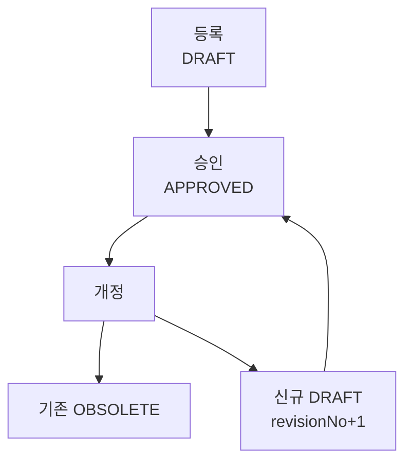
```mermaid
graph TD
    A[등록<br/>DRAFT] --> B[승인<br/>APPROVED]
    B --> C[개정]
    C --> D[기존 OBSOLETE]
    C --> E[신규 DRAFT<br/>revisionNo+1]
    E --> B
```

### 3.2 예외/분기
- **DRAFT만 수정/삭제**
- **APPROVED만 개정**

## 4. 상태 코드

| 상태명 | 코드값 | 설명 |
|--------|--------|------|
| 초안 | DRAFT | 작성중 |
| 검토 | REVIEW | 검토중 |
| 승인 | APPROVED | 승인 완료 |
| 폐기 | OBSOLETE | 구버전 |

## 5. API 명세

### 5.1 생성
```
POST /api/v1/quality/control-plans
```
**Request Body**
```json
{
  "itemCode": "PART-001",
  "itemName": "저항기",
  "phase": "PRODUCTION",
  "items": [
    {
      "seq": 1,
      "processCode": "P001",
      "processName": "납땜",
      "productCharacteristic": "납땜 강도",
      "processCharacteristic": "온도",
      "specification": "280~300℃",
      "evalMethod": "계측",
      "sampleSize": "5",
      "sampleFreq": "매시간",
      "controlMethod": "Xbar-R",
      "reactionPlan": "온도 조정"
    }
  ]
}
```

### 5.2 승인
```
PATCH /api/v1/quality/control-plans/:planNo/approve
```

### 5.3 개정
```
POST /api/v1/quality/control-plans/:planNo/revise
```

## 6. 처리 규칙

### 6.1 비즈니스 규칙
1. **계획번호 자동채번**: CP-YYYYMMDD-NNN
2. **개정 시 기존 항목 복사**: oldItems → newItems
3. **품목별 최신 APPROVED 조회**: revisionNo DESC
4. **Trace 연동**: 품목코드 기준 ControlPlanItem 조회하여 Method 데이터 구성

## 7. 연관 엔티티

| 엔티티명 | 테이블명 | 역할 | 관계 |
|----------|----------|------|------|
| ControlPlan | CONTROL_PLANS | 관리계획 헤더 | 메인 |
| ControlPlanItem | CONTROL_PLAN_ITEMS | 관리 항목 | 1:N |

---

### 5.5 감사 (QC_AUDIT)

## 1. 화면 개요

| 항목 | 내용 |
|------|------|
| **메뉴 경로** | 품질관리 > 감사 |
| **URL** | `/quality/audit` |
| **메뉴 코드** | `QC_AUDIT` |
| **화면 목적** | 내부/외부 심사 계획을 등록하고 발견사항을 관리하며 CAPA를 연계한다. |
| **주요 사용자** | 품질관리자 |

## 2. 화면 구성

### 2.1 레이아웃
- 상단: 검색조건 (상태, 심사유형, 기간)
- 중앙: 심사 계획 그리드
- 하단: 페이징
- 모달: 등록, 완료, 종결, 발견사항 등록

### 2.2 데이터그리드 컬럼
| 컬럼ID | 컬럼명 | 데이터타입 | 비고 |
|--------|--------|-----------|------|
| auditNo | 심사번호 | string | PK, AUD-YYYYMMDD-NNN |
| auditType | 심사유형 | string | |
| auditScope | 심사범위 | string | |
| targetDept | 대상부서 | string | |
| auditor | 심사원 | string | |
| coAuditor | 부심사원 | string | |
| scheduledDate | 계획일 | date | |
| actualDate | 실시일 | datetime | |
| status | 상태 | string | |
| overallResult | 종합결과 | string | |

### 2.3 발견사항
| 컬럼ID | 컬럼명 | 데이터타입 | 비고 |
|--------|--------|-----------|------|
| findingNo | 발견번호 | number | |
| clauseRef | 규격조항 | string | |
| category | 분류 | string | |
| description | 설명 | string | |
| evidence | 증거 | string | |
| dueDate | 조치기한 | date | |
| status | 상태 | string | OPEN/IN_PROGRESS/CLOSED |
| capaId | CAPA번호 | string | 연계 |

### 2.4 버튼/액션
| 버튼 | 조건 | 동작 | API |
|------|------|------|-----|
| 등록 | - | 심사 등록 | POST /api/v1/quality/audits |
| 수정 | PLANNED | 수정 | PUT /api/v1/quality/audits/:no |
| 삭제 | PLANNED | 삭제 | DELETE /api/v1/quality/audits/:no |
| 완료 | PLANNED/IN_PROGRESS | 완료 | PATCH /api/v1/quality/audits/:no/complete |
| 종결 | COMPLETED | 종결 | PATCH /api/v1/quality/audits/:no/close |
| 발견사항등록 | - | 발견사항 추가 | POST /api/v1/quality/audits/findings |
| CAPA연계 | - | CAPA 연결 | PATCH /api/v1/quality/audits/:auditId/findings/:findingNo/link-capa |

## 3. 업무 흐름

### 3.1 정상 흐름
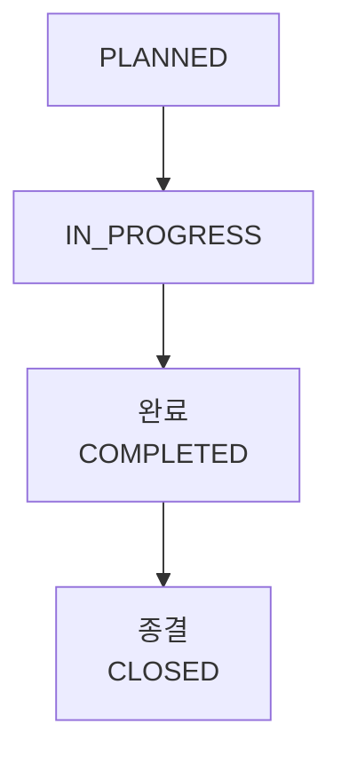
```mermaid
graph TD
    A[PLANNED] --> B[IN_PROGRESS]
    B --> C[완료<br/>COMPLETED]
    C --> D[종결<br/>CLOSED]
```

### 3.2 예외/분기
- **PLANNED만 수정/삭제**
- **COMPLETED만 종결**

## 4. 상태 코드

| 상태명 | 코드값 | 설명 |
|--------|--------|------|
| 계획 | PLANNED | 심사 계획 |
| 진행중 | IN_PROGRESS | 심사 진행중 |
| 완료 | COMPLETED | 심사 완료 |
| 종결 | CLOSED | 종결 |

## 5. API 명세

### 5.1 생성
```
POST /api/v1/quality/audits
```
**Request Body**
```json
{
  "auditType": "INTERNAL",
  "auditScope": "IATF 16949 전 항목",
  "targetDept": "생산팀",
  "auditor": "AUD001",
  "coAuditor": "AUD002",
  "scheduledDate": "2024-06-15",
  "summary": "상반기 정기심사"
}
```

### 5.2 완료
```
PATCH /api/v1/quality/audits/:auditNo/complete
```
**Request Body**
```json
{
  "overallResult": "PASS"
}
```

### 5.3 발견사항 등록
```
POST /api/v1/quality/audits/findings
```
**Request Body**
```json
{
  "auditId": "AUD-20240610-001",
  "clauseRef": "8.5.1.1",
  "category": "MAJOR",
  "description": "관리계획서 미갱신",
  "evidence": "CP-20240101-001 상태=OBSOLETE",
  "dueDate": "2024-06-30"
}
```

### 5.4 CAPA 연계
```
PATCH /api/v1/quality/audits/:auditId/findings/:findingNo/link-capa
```
**Request Body**
```json
{
  "capaId": "CA-20240610-001"
}
```

## 6. 처리 규칙

### 6.1 비즈니스 규칙
1. **심사번호 자동채번**: AUD-YYYYMMDD-NNN
2. **발견사항 번호 자동채번**: 해당 심사별 MAX(findingNo) + 1
3. **CAPA 연계 시 발견사항 status=IN_PROGRESS 변경**
4. **완료 시 actualDate 자동 기록**

## 7. 연관 엔티티

| 엔티티명 | 테이블명 | 역할 | 관계 |
|----------|----------|------|------|
| AuditPlan | AUDIT_PLANS | 심사 계획 | 메인 |
| AuditFinding | AUDIT_FINDINGS | 발견사항 | 1:N |
| CAPARequest | CAPA_REQUESTS | CAPA 연계 | N:1 |

---

### 5.6 교육 (SYS_TRAINING)

## 1. 화면 개요

| 항목 | 내용 |
|------|------|
| **메뉴 경로** | 시스템 > 교육 |
| **URL** | `/system/training` |
| **메뉴 코드** | `SYS_TRAINING` |
| **화면 목적** | 품질 관련 교육 계획을 등록하고 교육 결과를 관리한다. |
| **주요 사용자** | 인사관리자, 품질관리자 |

## 2. 화면 구성

### 2.1 레이아웃
- 상단: 검색조건 (교육명, 교육유형, 기간)
- 중앙: 교육계획 그리드 + 교육결과 디테일
- 하단: 페이징
- 모달: 계획 등록, 결과 등록

### 2.2 데이터그리드 컬럼 (계획)
| 컬럼ID | 컬럼명 | 데이터타입 | 비고 |
|--------|--------|-----------|------|
| planId | 계획ID | uuid | PK |
| trainingName | 교육명 | string | |
| trainingType | 교육유형 | string | |
| targetDept | 대상부서 | string | |
| trainer | 강사 | string | |
| trainingDate | 교육일 | date | |
| duration | 소요시간 | number | 분 |
| status | 상태 | string | |
| description | 설명 | text | |

### 2.3 데이터그리드 컬럼 (결과)
| 컬럼ID | 컬럼명 | 데이터타입 | 비고 |
|--------|--------|-----------|------|
| resultId | 결과ID | uuid | PK |
| planId | 계획ID | uuid | |
| traineeId | 수강자ID | string | |
| traineeName | 수강자명 | string | |
| completionStatus | 이수상태 | string | PASS/FAIL/ABSENT |
| score | 점수 | number | |
| evaluation | 평가 | text | |
| certNo | 수료번호 | string | |

### 2.4 버튼/액션
| 버튼 | 조건 | 동작 | API |
|------|------|------|-----|
| 계획등록 | - | 교육계획 등록 | POST /api/v1/system/trainings |
| 결과등록 | 행 선택 | 교육결과 등록 | POST /api/v1/system/trainings/:planId/results |
| 목록조회 | - | 조회 | GET /api/v1/system/trainings |

## 3. 업무 흐름

### 3.1 정상 흐름
```mermaid
graph TD
    A[교육계획 등록] --> B[교육 실시]
    B --> C[교육결과 등록]
    C --> D{이수?}
    D -->|합격| E[수료]
    D -->|불합격| F[재교육]
    D -->|결석| G[보충교육]
```

## 4. 상태 코드
- `COMPLETION_STATUS`: PASS(합격), FAIL(불합격), ABSENT(결석)

## 5. API 명세

### 5.1 계획 등록
```
POST /api/v1/system/trainings
```
**Request Body**
```json
{
  "trainingName": "IATF 16949 내부심사원 교육",
  "trainingType": "QUALITY",
  "targetDept": "품질팀",
  "trainer": "외부강사",
  "trainingDate": "2024-06-15",
  "duration": 480,
  "description": "IATF 16949:2016 요구사항 및 내부심사 기법"
}
```

### 5.2 결과 등록
```
POST /api/v1/system/trainings/:planId/results
```
**Request Body**
```json
{
  "traineeId": "E001",
  "traineeName": "홍길동",
  "completionStatus": "PASS",
  "score": 95,
  "evaluation": "우수",
  "certNo": "CERT-20240615-001"
}
```

## 6. 연관 엔티티

| 엔티티명 | 테이블명 | 역할 | 관계 |
|----------|----------|------|------|
| TrainingPlan | TRAINING_PLANS | 교육계획 | 메인 |
| TrainingResult | TRAINING_RESULTS | 교육결과 | 1:N |

---

# 화면 간 연계 흐름

## 품질관리 전체 흐름

```mermaid
graph LR
    A[IQC검사<br/>QC_IQC] --> B[IQC이력<br/>QC_IQC_HISTORY]
    C[생산실적] --> D[불량관리<br/>QC_DEFECT]
    D --> E[재작업검사<br/>QC_REWORK_INSPECT]
    E --> F[검사관리<br/>QC_INSPECT]
    C --> G[자주검사<br/>QC_SELF_INSPECT_HISTORY]
    C --> H[샘플검사<br/>QC_SAMPLE_INSPECT]
    I[박스마감] --> J[OQC검사<br/>QC_OQC]
    J --> K[OQC이력<br/>QC_OQC_HISTORY]
    F --> L[추적성<br/>QC_TRACE]
    M[불만관리<br/>QC_COMPLAINT] --> N[CAPA<br/>QC_CAPA]
    O[감사<br/>QC_AUDIT] --> N
    P[FAI<br/>QC_FAI] --> Q[PPAP<br/>QC_PPAP]
    R[SPC<br/>QC_SPC] --> S[관리계획<br/>QC_CONTROL_PLAN]
```

| 순서 | 화면 | 액션 | 다음화면 | 조건 |
|------|------|------|----------|------|
| 1 | IQC검사 | PASS/FAIL 판정 | IQC이력 | 저장 시 |
| 2 | 생산실적 | 불량 발생 | 불량관리 | 불량 등록 시 |
| 3 | 불량관리 | REWORK 처리 | 재작업검사 | 재작업 지시 생성 시 |
| 4 | 재작업검사 | 재검사 PASS | 검사관리 | 재검사 결과 등록 시 |
| 5 | 검사관리 | 바코드 스캔 | 추적성 | 제품 추적 조회 시 |
| 6 | 박스마감 | OQC 의뢰 | OQC검사 | CLOSED 박스 선택 시 |
| 7 | OQC검사 | PASS/FAIL | OQC이력 | 검사 실행 시 |
| 8 | 불만관리 | CAPA 연계 | CAPA | CAPA 생성/연계 시 |
| 9 | 감사 | 발견사항 CAPA 연계 | CAPA | CAPA 연계 시 |
| 10 | FAI | PASS/FAIL | PPAP | FAI 승인 후 PPAP 진행 시 |
| 11 | 관리계획 | SPC 관리항목 연계 | SPC | 관리도 등록 시 |

---

# 참고사항

- **Tenant 분리**: 모든 품질관리 화면은 company + plant 기준으로 데이터가 분리된다.
- **권한 체크**: JwtAuthGuard 적용, Company/Plant 데코레이터로 테넌트 주입
- **자동채번 규칙**: 
  - IQC: 없음 (inspectDate + SEQ 복합키)
  - 재작업: RW-YYYYMMDD-NNN
  - 검사실적: SeqGenerator (INSPECT_RESULT)
  - OQC: OQC-YYYYMMDD-NNN
  - FAI: FAI-YYYYMMDD-NNN
  - PPAP: PPAP-YYYYMMDD-NNN
  - SPC: SPC-YYYYMMDD-NNN
  - 관리계획: CP-YYYYMMDD-NNN
  - 변경점: ECN-YYYYMMDD-NNN
  - 클레임: CC-YYYYMMDD-NNN
  - CAPA: CA/PA-YYYYMMDD-NNN
  - 심사: AUD-YYYYMMDD-NNN
- **파일 업로드**: IQC 검사성적서는 uploads/iqc-certs에 저장, 최대 10MB
- **SEQ 채번**: Oracle SEQUENCE.NEXTVAL 사용 (AGENTS.md 규칙 준수)
