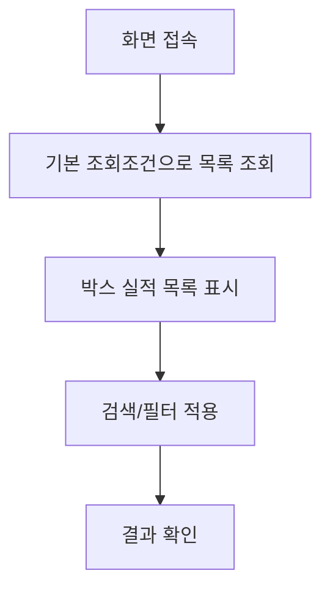
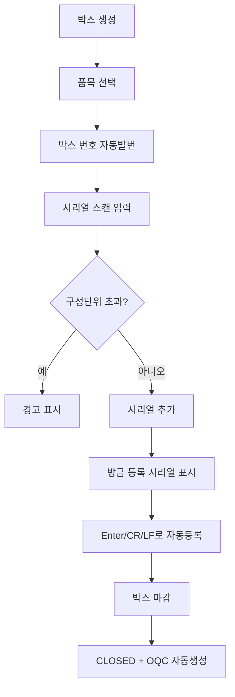
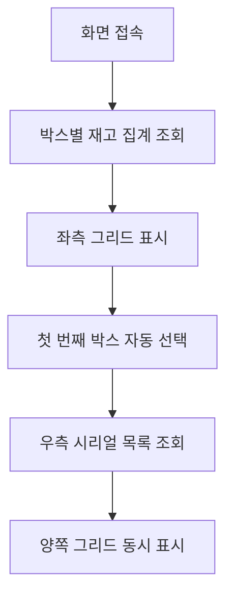
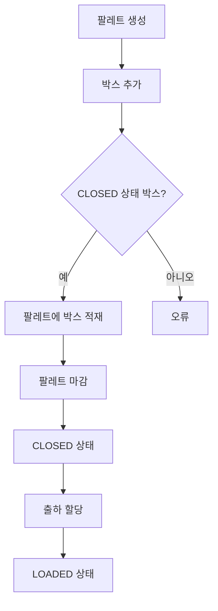
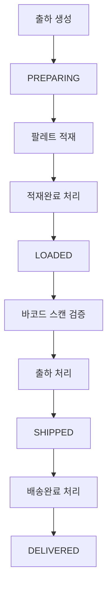
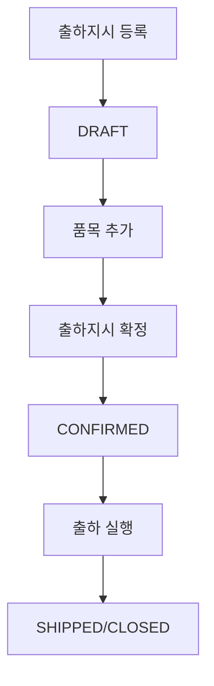
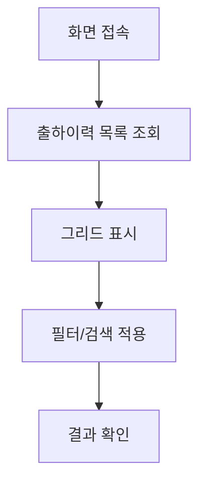
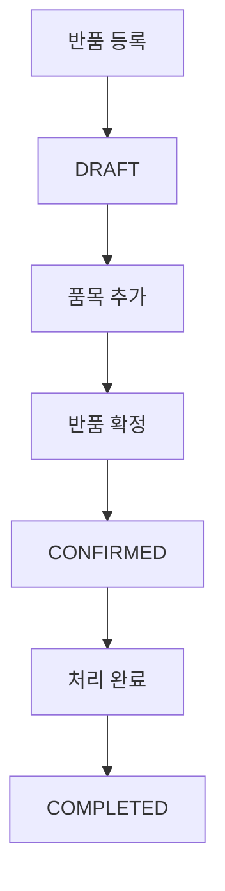
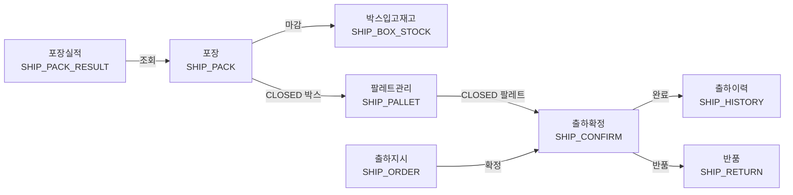

# 출하관리 Workflow

---

# 포장실적 (메뉴코드: `SHIP_PACK_RESULT`)

## 1. 화면 개요

| 항목 | 내용 |
|------|------|
| **메뉴 경로** | 출하관리 > 포장실적 |
| **URL** | `/production/pack-result` |
| **메뉴 코드** | `SHIP_PACK_RESULT` |
| **화면 목적** | 포장 완료된 박스 실적을 조회한다. BoxMaster 기준으로 포장일, 박스번호, 품목, 수량, 상태 등을 확인한다. |
| **주요 사용자** | 생산관리자, 출하담당자 |

## 2. 화면 구성

### 2.1 레이아웃
- 상단: 검색조건(박스번호/품목, 포장일 범위), 액션버튼(새로고침), 요약카드(총 박스수, 총 포장수량, 마감박스수)
- 중앙: 데이터그리드(포장실적 목록)
- 하단: 페이징

### 2.2 데이터그리드 컬럼

| 컬럼ID | 컬럼명 | 데이터타입 | 정렬 | 비고 |
|--------|--------|-----------|------|------|
| packDate | 포장일 | date | Y | YYYY-MM-DD |
| boxNo | 박스번호 | string | Y | BOX_MASTERS.BOX_NO |
| itemCode | 품목코드 | string | Y | 왼쪽정렬, monospace |
| itemName | 품목명 | string | Y | ITEM_MASTERS 조인 |
| packQty | 포장수량 | number | Y | 오른쪽정렬, QTY |
| status | 상태 | string | Y | OPEN/CLOSED/SHIPPED |
| palletNo | 팔레트번호 | string | Y | 할당된 팔레트 |
| oqcStatus | OQC | string | Y | PENDING/PASS/FAIL |
| packer | 포장자 | string | Y | CREATED_BY |

### 2.3 버튼/액션

| 버튼 | 조건 | 동작 | API |
|------|------|------|-----|
| 새로고침 | - | 목록 재조회 | GET /production/pack-result |
| 엑셀날짜 | - | 그리드 데이터 export | DataGrid 내장 |

## 3. 업무 흐름

### 3.1 정상 흐름


1. 사용자가 화면 접속
2. 기본 조회조건(limit=5000)으로 포장실적 목록 조회
3. BoxMaster + ItemMaster JOIN 결과를 그리드에 표시
4. 검색어(박스번호, 품목코드, 품목명) 또는 포장일 범위로 필터링

### 3.2 예외/분기 흐름
- **조회 결과 없음**: 빈 그리드 표시
- **품목명 NULL**: ITEM_MASTERS 미존재 시 `-` 표시

## 4. 상태 코드 및 공통코드

### 4.1 화면 내 사용 상태
| 상태명 | 코드값 | 공통코드그룹 | 설명 | 색상 |
|--------|--------|-------------|------|------|
| 오픈 | OPEN | BOX_STATUS | 포장 진행 중 | 파랑 |
| 마감 | CLOSED | BOX_STATUS | 포장 완료, OQC 대기 | 초록 |
| 출하 | SHIPPED | BOX_STATUS | 출하 완료 | 복숭아 |

### 4.2 관련 공통코드 전체
- `BOX_STATUS`: OPEN(오픈), CLOSED(마감), SHIPPED(출하)

## 5. API 명세

### 5.1 포장실적 목록 조회
```
GET /api/v1/production/pack-result
```
**Query Parameters**
| 파라미터 | 타입 | 필수 | 설명 |
|----------|------|------|------|
| page | number | N | 페이지 (기본 1) |
| limit | number | N | 페이지당 건수 (기본 50) |
| search | string | N | 박스번호/품목코드/품목명 검색 |
| dateFrom | string | N | 포장일 시작 (YYYY-MM-DD) |
| dateTo | string | N | 포장일 종료 (YYYY-MM-DD) |

**Response 200**
```json
{
  "data": [
    {
      "boxNo": "BX2606080001",
      "itemCode": "ITEM-001",
      "itemName": "완제품 A",
      "packQty": 100,
      "status": "CLOSED",
      "palletNo": "PLT-001",
      "oqcStatus": "PASS",
      "packer": "user01",
      "packDate": "2025-01-26T10:00:00",
      "closeTime": "2025-01-26T12:00:00"
    }
  ],
  "total": 100,
  "page": 1,
  "limit": 50
}
```

## 6. 처리 규칙 및 검증

### 6.1 입력 검증
- dateFrom/dateTo: 유효한 날짜 형식

### 6.2 비즈니스 규칙
- 조회 전용 화면으로 데이터 수정 없음
- BoxMaster.CREATED_AT 기준 내림차순 정렬

### 6.3 트랜잭션 처리
- 조회 전용, 트랜잭션 없음

## 7. 연관 엔티티 및 테이블

| 엔티티명 | 테이블명 | 역할 | 관계 |
|----------|----------|------|------|
| BoxMaster | BOX_MASTERS | 메인 | 조회 대상 |
| PartMaster | ITEM_MASTERS | 품목명 보강 | LEFT JOIN |

## 8. 에러 코드 및 메시지

| 상황 | HTTP | 에러메시지 | 처리방법 |
|------|------|-----------|---------|
| 조회 실패 | 500 | 서버 오류 | 관리자 문의 |

## 9. 참고사항

- 관련 화면: [포장(SHIP_PACK)](#포장-메뉴코드-ship_pack)
- 박스번호 자동 채번 규칙: `BX` + YYMMDD + 4자리 일련번호

---

# 포장 (메뉴코드: `SHIP_PACK`)

## 1. 화면 개요

| 항목 | 내용 |
|------|------|
| **메뉴 경로** | 출하관리 > 포장 |
| **URL** | `/shipping/pack` |
| **메뉴 코드** | `SHIP_PACK` |
| **화면 목적** | 검사 합격된 완제품 시리얼(FG 바코드)을 박스에 담아 포장을 완료한다. |
| **주요 사용자** | 포장작업자, 출하담당자 |

## 2. 화면 구성

### 2.1 레이아웃
- 상단: 검색조건(박스번호, 상태), 액션버튼(새로고침, 박스생성)
- 중앙: 데이터그리드(박스 목록)
- 모달: 박스생성(품목선택), 시리얼추가/제거

### 2.2 데이터그리드 컬럼

| 컬럼ID | 컬럼명 | 데이터타입 | 정렬 | 비고 |
|--------|--------|-----------|------|------|
| actions | 액션 | - | N | 시리얼추가/박스마감/재오픈 |
| boxNo | 박스번호 | string | Y | 왼쪽정렬 |
| itemCode | 품목코드 | string | Y | - |
| itemName | 품목명 | string | Y | ITEM_MASTERS 조인 |
| qty | 포장수량 | number | Y | `현재수량 / 구성단위` 표시 |
| status | 상태 | string | Y | BOX_STATUS 배지 |
| closeAt | 마감일시 | datetime | Y | YYYY-MM-DD HH:mm |

### 2.3 입력 폼 필드

**박스 생성 모달**
| 필드ID | 필드명 | 타입 | 필수 | 기본값 | 검증규칙 | 비고 |
|--------|--------|------|------|--------|----------|------|
| itemCode | 품목 | select | Y | - | FINISHED 품목 선택 | PartSelect 컴포넌트 |

**시리얼 추가 모달**
| 필드ID | 필드명 | 타입 | 필수 | 기본값 | 검증규칙 | 비고 |
|--------|--------|------|------|--------|----------|------|
| serialInput | 시리얼 | text | Y | - | CR/LF/Enter 자동등록 | 입력창 |

### 2.4 버튼/액션

| 버튼 | 조건 | 동작 | API |
|------|------|------|-----|
| 박스생성 | - | 박스생성 모달 오픈 | POST /shipping/boxes |
| 시리얼추가 | status=OPEN | 시리얼 모달 오픈 | POST /shipping/boxes/{boxNo}/serials |
| 박스마감 | status=OPEN, qty>0 | 박스 닫기 | POST /shipping/boxes/{boxNo}/close |
| 재오픈 | status=CLOSED, palletNo=null | 박스 재오픈 | POST /shipping/boxes/{boxNo}/reopen |
| 즉시취소 | 방금 등록한 시리얼 | 마지막 시리얼 제거 | DELETE /shipping/boxes/{boxNo}/serials |

## 3. 업무 흐름

### 3.1 정상 흐름


1. 사용자가 품목을 선택하여 박스 생성 (qty=0)
2. 생성된 박스에 시리얼 스캔 입력 (Enter/CR/LF 자동등록)
3. 품목 마스터의 packUnit 초과 시 경고
4. 방금 등록한 시리얼은 즉시 취소 버튼으로 제거 가능
5. 포장 완료 후 박스 마감 → CLOSED + OQC 자동생성

### 3.2 예외/분기 흐름
- **중복 시리얼**: 409 Conflict → "이미 존재하는 시리얼입니다"
- **품목 불일치**: 400 → "시리얼의 품목과 박스 품목이 일치하지 않습니다"
- **검사 미합격**: 400 → "검사 합격 FG만 포장할 수 있습니다"
- **팔레트 할당된 박스**: 재오픈 불가

## 4. 상태 코드 및 공통코드

### 4.1 화면 내 사용 상태
| 상태명 | 코드값 | 공통코드그룹 | 설명 | 색상 |
|--------|--------|-------------|------|------|
| 오픈 | OPEN | BOX_STATUS | 포장 진행 중 | 파랑 |
| 마감 | CLOSED | BOX_STATUS | 포장 완료 | 초록 |
| 출하 | SHIPPED | BOX_STATUS | 출하 완료 | 복숭아 |

### 4.2 관련 공통코드 전체
- `BOX_STATUS`: OPEN, CLOSED, SHIPPED
- `OQC_STATUS`: PENDING(대기), PASS(합격), FAIL(불합격), HOLD(보류)

## 5. API 명세

### 5.1 박스 목록 조회
```
GET /api/v1/shipping/boxes
```
**Query Parameters**
| 파라미터 | 타입 | 필수 | 설명 |
|----------|------|------|------|
| page | number | N | 페이지 (기본 1) |
| limit | number | N | 페이지당 건수 (기본 10) |
| boxNo | string | N | 박스번호 검색 |
| itemCode | string | N | 품목코드 필터 |
| status | string | N | 상태 필터 |
| unassigned | boolean | N | 팔레트 미할당 여부 |

### 5.2 박스 생성
```
POST /api/v1/shipping/boxes
```
**Request Body**
```json
{
  "boxNo": "BX2606080001",
  "itemCode": "ITEM-001",
  "qty": 0,
  "serialList": []
}
```

### 5.3 시리얼 추가
```
POST /api/v1/shipping/boxes/{boxNo}/serials
```
**Request Body**
```json
{
  "serials": ["FG-001", "FG-002"]
}
```

### 5.4 시리얼 제거
```
DELETE /api/v1/shipping/boxes/{boxNo}/serials
```
**Request Body**
```json
{
  "serials": ["FG-001"]
}
```

### 5.5 박스 마감
```
POST /api/v1/shipping/boxes/{boxNo}/close
```

### 5.6 박스 재오픈
```
POST /api/v1/shipping/boxes/{boxNo}/reopen
```

### 5.7 박스 삭제
```
DELETE /api/v1/shipping/boxes/{boxNo}
```

## 6. 처리 규칙 및 검증

### 6.1 입력 검증
- boxNo: 미입력 시 자동 채번 (BX+YYMMDD+4자리)
- itemCode: 필수, ITEM_MASTERS 존재 여부 확인
- serials: 중복 불가, 박스 품목과 일치해야 함
- qty: packUnit 초과 불가 (packUnit>0인 경우)

### 6.2 비즈니스 규칙
- OPEN 상태에서만 시리얼 추가/제거 가능
- CLOSED 상태에서만 팔레트 할당 가능
- SHIPPED 박스는 수정/삭제 불가
- 팔레트에 할당된 박스는 재오픈 불가
- OQC 이력이 있는 박스는 삭제 불가

### 6.3 트랜잭션 처리
- **박스 마감 시**:
  1. BOX_MASTERS UPDATE (status=CLOSED, closeAt=NOW, oqcStatus=PENDING)
  2. FG_LABELS UPDATE (status=PACKED) — batch 500건씩
  3. OQC_REQUEST INSERT (AUTO_CREATED_FROM_BOX)
  4. OQC_REQUEST_BOX INSERT
- **박스 재오픈 시**:
  1. BOX_MASTERS UPDATE (status=OPEN, closeAt=null, oqcStatus=null)
  2. FG_LABELS UPDATE (status=VISUAL_PASS) — batch 500건씩
  3. OQC_REQUEST/OQC_REQUEST_BOX DELETE (PENDING 상태 자동생성 건)

## 7. 연관 엔티티 및 테이블

| 엔티티명 | 테이블명 | 역할 | 관계 |
|----------|----------|------|------|
| BoxMaster | BOX_MASTERS | 메인 | 박스 정보 |
| FgLabel | FG_LABELS | 시리얼 정보 | 1:N (serialList) |
| PartMaster | ITEM_MASTERS | 품목 정보 | N:1 |
| OqcRequest | OQC_REQUESTS | OQC 요청 | 1:1 (마감 시 자동생성) |
| OqcRequestBox | OQC_REQUEST_BOXES | OQC 요청 박스 | 1:1 |

## 8. 에러 코드 및 메시지

| 상황 | HTTP | 에러메시지 | 처리방법 |
|------|------|-----------|---------|
| 품목미존재 | 404 | 품목을 찾을 수 없습니다 | 품목마스터 확인 |
| 중복박스 | 409 | 이미 존재하는 박스번호입니다 | 번호 변경 |
| 중복시리얼 | 409 | 이미 존재하는 시리얼입니다 | 스캔 재확인 |
| 품목불일치 | 400 | 시리얼의 품목과 박스 품목이 일치하지 않습니다 | 품목 확인 |
| 검사미합격 | 400 | 검사 합격 FG만 포장할 수 있습니다 | 품질검사 확인 |
| 구성단위초과 | 400 | 포장단위를 초과했습니다 | 박스 추가 생성 |
| 상태오류 | 400 | 현재 상태에서는 처리할 수 없습니다 | 상태 확인 |

## 9. 참고사항

- 시리얼 스캔 시 Enter/CR/LF 자동 감지하여 등록
- 방금 등록한 시리얼은 즉시 취소 버튼으로 제거 가능
- 관련 화면: [박스입고재고(SHIP_BOX_STOCK)](#박스입고재고-메뉴코드-ship_box_stock)

---

# 박스입고재고 (메뉴코드: `SHIP_BOX_STOCK`)

## 1. 화면 개요

| 항목 | 내용 |
|------|------|
| **메뉴 경로** | 출하관리 > 박스입고재고 |
| **URL** | `/shipping/box-stock` |
| **메뉴 코드** | `SHIP_BOX_STOCK` |
| **화면 목적** | 제품재고(시리얼=FG_LABELS) 기준으로 박스별 입고 재고를 조회한다. |
| **주요 사용자** | 출하담당자, 재고관리자 |

## 2. 화면 구성

### 2.1 레이아웃
- 상단: 검색조건(박스번호), 액션버튼(새로고침)
- 좌측: 박스별 재고 집계 그리드
- 우측: 선택 박스 내 재고 시리얼 목록 그리드

### 2.2 데이터그리드 컬럼 (좌측 - 박스별 집계)

| 컬럼ID | 컬럼명 | 데이터타입 | 정렬 | 비고 |
|--------|--------|-----------|------|------|
| boxNo | 박스번호 | string | Y | FG_LABELS.BOX_NO |
| itemCode | 품목코드 | string | Y | - |
| itemName | 품목명 | string | Y | ITEM_MASTERS 조인 |
| qty | 수량 | number | Y | 시리얼 개수 COUNT |
| orderNo | 작업지시 | string | Y | MIN(ORDER_NO) |
| latestAt | 최종발행일 | datetime | Y | MAX(ISSUED_AT) |

### 2.3 데이터그리드 컬럼 (우측 - 시리얼 목록)

| 컬럼ID | 컬럼명 | 데이터타입 | 정렬 | 비고 |
|--------|--------|-----------|------|------|
| seq | 순번 | number | Y | - |
| fgBarcode | 시리얼 | string | Y | FG_BARCODE |
| itemCode | 품목코드 | string | Y | - |
| itemName | 품목명 | string | Y | - |
| orderNo | 작업지시 | string | Y | - |
| status | 상태 | string | Y | FG_LABELS.STATUS |
| inspectPassYn | 검사합격 | string | Y | Y/N |
| issuedAt | 발행일 | datetime | Y | - |

### 2.4 버튼/액션

| 버튼 | 조건 | 동작 | API |
|------|------|------|-----|
| 새로고침 | - | 목록 재조회 | GET /shipping/box-stock |
| 박스 선택 | - | 우측 시리얼 목록 조회 | GET /shipping/box-stock/{boxNo}/serials |

## 3. 업무 흐름

### 3.1 정상 흐름


1. 화면 접속 시 박스별 재고 집계 조회 (FG_LABELS 기준)
2. 좌측 그리드에 박스 목록 표시
3. 첫 번째 박스 자동 선택 → 우측 시리얼 목록 조회
4. 박스 클릭 시 우측 시리얼 목록 갱신

### 3.2 예외/분기 흐름
- **재고 없음**: 빈 그리드, "선택된 박스가 없습니다" 메시지

## 4. 상태 코드 및 공통코드

### 4.1 화면 내 사용 상태
| 상태명 | 코드값 | 공통코드그룹 | 설명 | 색상 |
|--------|--------|-------------|------|------|
| 미출하 | - | - | FG_LABELS.STATUS <> 'SHIPPED' | - |

## 5. API 명세

### 5.1 박스별 재고 집계 조회
```
GET /api/v1/shipping/box-stock
```
**Query Parameters**
| 파라미터 | 타입 | 필수 | 설명 |
|----------|------|------|------|
| boxNo | string | N | 박스번호 검색 |

**Response 200**
```json
{
  "data": [
    {
      "boxNo": "BX2606080001",
      "itemCode": "ITEM-001",
      "itemName": "완제품 A",
      "qty": 100,
      "orderNo": "JO-001",
      "latestAt": "2025-01-26T10:00:00"
    }
  ]
}
```

### 5.2 박스 내 재고 시리얼 목록
```
GET /api/v1/shipping/box-stock/{boxNo}/serials
```

**Response 200**
```json
{
  "data": [
    {
      "seq": 1,
      "fgBarcode": "FG-001",
      "itemCode": "ITEM-001",
      "itemName": "완제품 A",
      "orderNo": "JO-001",
      "status": "PACKED",
      "inspectPassYn": "Y",
      "issuedAt": "2025-01-26T10:00:00"
    }
  ]
}
```

## 6. 처리 규칙 및 검증

### 6.1 비즈니스 규칙
- 재고 정의: FG_LABELS.BOX_NO가 부여되었고 STATUS <> 'SHIPPED'인 시리얼
- BOX_MASTERS가 아닌 FG_LABELS 단일 테이블로 집계

### 6.2 트랜잭션 처리
- 조회 전용, 트랜잭션 없음

## 7. 연관 엔티티 및 테이블

| 엔티티명 | 테이블명 | 역할 | 관계 |
|----------|----------|------|------|
| FgLabel | FG_LABELS | 메인 | 시리얼별 재고 |
| PartMaster | ITEM_MASTERS | 품목명 보강 | LEFT JOIN |

## 8. 에러 코드 및 메시지

| 상황 | HTTP | 에러메시지 | 처리방법 |
|------|------|-----------|---------|
| 조회 실패 | 500 | 서버 오류 | 관리자 문의 |

## 9. 참고사항

- 재고 단위는 시리얼(FG_LABELS)이며 박스는 집계 단위
- 관련 화면: [포장(SHIP_PACK)](#포장-메뉴코드-ship_pack)

---

# 팔레트관리 (메뉴코드: `SHIP_PALLET`)

## 1. 화면 개요

| 항목 | 내용 |
|------|------|
| **메뉴 경로** | 출하관리 > 팔레트관리 |
| **URL** | `/shipping/pallet` |
| **메뉴 코드** | `SHIP_PALLET` |
| **화면 목적** | 포장 완료된 박스를 팔레트에 적재하고, 팔레트를 출하에 할당한다. |
| **주요 사용자** | 출하담당자, 물류관리자 |

## 2. 화면 구성

### 2.1 레이아웃
- 상단: 검색조건(팔레트번호, 상태), 액션버튼(새로고침, 팔레트생성), 요약카드(OPEN/CLOSED/LOADED/SHIPPED)
- 중앙: 데이터그리드(팔레트 목록)
- 우측: 선택 팔레트 내 박스 목록
- 모달: 팔레트생성, 박스할당

### 2.2 데이터그리드 컬럼

| 컬럼ID | 컬럼명 | 데이터타입 | 정렬 | 비고 |
|--------|--------|-----------|------|------|
| actions | 액션 | - | N | 박스추가/팔레트마감 |
| palletNo | 팔레트번호 | string | Y | - |
| boxCount | 박스수 | number | Y | - |
| totalQty | 총수량 | number | Y | - |
| status | 상태 | string | Y | PALLET_STATUS 배지 |
| shipmentNo | 출하번호 | string | Y | 할당된 출하 |
| createdAt | 생성일 | datetime | Y | - |

### 2.3 입력 폼 필드

**팔레트 생성 모달**
| 필드ID | 필드명 | 타입 | 필수 | 기본값 | 검증규칙 | 비고 |
|--------|--------|------|------|--------|----------|------|
| palletNo | 팔레트번호 | text | N | 자동발번 | - | 미입력 시 자동 채번 |

### 2.4 버튼/액션

| 버튼 | 조건 | 동작 | API |
|------|------|------|-----|
| 팔레트생성 | - | 팔레트 생성 | POST /shipping/pallets |
| 박스추가 | status=OPEN | 박스할당 모달 오픈 | POST /shipping/pallets/{palletNo}/boxes |
| 팔레트마감 | status=OPEN, boxCount>0 | 팔레트 닫기 | POST /shipping/pallets/{palletNo}/close |
| 재오픈 | status=CLOSED, shipmentId=null | 팔레트 재오픈 | POST /shipping/pallets/{palletNo}/reopen |
| 출하할당 | status=CLOSED | 출하에 할당 | POST /shipping/pallets/{palletNo}/assign-shipment |
| 출하제거 | status=LOADED | 출하에서 제거 | POST /shipping/pallets/{palletNo}/remove-shipment |

## 3. 업무 흐름

### 3.1 정상 흐름


1. 팔레트 생성 (OPEN)
2. CLOSED 상태 박스를 팔레트에 추가
3. 팔레트 마감 (CLOSED)
4. 출하에 팔레트 할당 (LOADED)

### 3.2 예외/분기 흐름
- **OQC 미완료 박스**: 400 → "OQC 미완료/불합격 박스는 팔레트에 적재할 수 없습니다"
- **이미 할당된 박스**: 400 → "이미 다른 팔레트에 할당된 박스입니다"
- **빈 팔레트 마감**: 400 → "빈 팔레트는 닫을 수 없습니다"
- **출하 할당된 팔레트 재오픈**: 400 → "출하에 할당된 팔레트는 다시 열 수 없습니다"

## 4. 상태 코드 및 공통코드

### 4.1 화면 내 사용 상태
| 상태명 | 코드값 | 공통코드그룹 | 설명 | 색상 |
|--------|--------|-------------|------|------|
| 오픈 | OPEN | PALLET_STATUS | 박스 적재 중 | 파랑 |
| 마감 | CLOSED | PALLET_STATUS | 적재 완료, 출하 대기 | 초록 |
| 적재 | LOADED | PALLET_STATUS | 출하에 할당됨 | 주황 |
| 출하 | SHIPPED | PALLET_STATUS | 출하 완료 | 복숭아 |

### 4.2 관련 공통코드 전체
- `PALLET_STATUS`: OPEN(오픈), CLOSED(마감), LOADED(적재), SHIPPED(출하)
- `BOX_STATUS`: OPEN, CLOSED, SHIPPED
- `OQC_STATUS`: PENDING, PASS, FAIL, HOLD

## 5. API 명세

### 5.1 팔레트 목록 조회
```
GET /api/v1/shipping/pallets
```
**Query Parameters**
| 파라미터 | 타입 | 필수 | 설명 |
|----------|------|------|------|
| page | number | N | 페이지 (기본 1) |
| limit | number | N | 페이지당 건수 (기본 10) |
| palletNo | string | N | 팔레트번호 검색 |
| status | string | N | 상태 필터 |
| unassigned | boolean | N | 출하 미할당 여부 |

### 5.2 팔레트 생성
```
POST /api/v1/shipping/pallets
```
**Request Body**
```json
{
  "palletNo": "PLT-20250126-001"
}
```

### 5.3 박스 추가
```
POST /api/v1/shipping/pallets/{palletNo}/boxes
```
**Request Body**
```json
{
  "boxIds": ["BX-001", "BX-002"]
}
```

### 5.4 박스 제거
```
DELETE /api/v1/shipping/pallets/{palletNo}/boxes
```
**Request Body**
```json
{
  "boxIds": ["BX-001"]
}
```

### 5.5 팔레트 마감
```
POST /api/v1/shipping/pallets/{palletNo}/close
```

### 5.6 팔레트 재오픈
```
POST /api/v1/shipping/pallets/{palletNo}/reopen
```

### 5.7 출하 할당
```
POST /api/v1/shipping/pallets/{palletNo}/assign-shipment
```
**Request Body**
```json
{
  "shipmentId": "SHP-001"
}
```

### 5.8 출하 제거
```
POST /api/v1/shipping/pallets/{palletNo}/remove-shipment
```

## 6. 처리 규칙 및 검증

### 6.1 입력 검증
- palletNo: 미입력 시 자동 채번 (PLT-YYYYMMDD-NNN)
- boxIds: CLOSED 상태 박스만 추가 가능
- shipmentId: PREPARING 상태 출하만 할당 가능

### 6.2 비즈니스 규칙
- OPEN 상태에서만 박스 추가/제거 가능
- CLOSED 상태에서만 출하 할당 가능
- SHIPPED 팔레트는 수정/삭제 불가
- 출하에 할당된 팔레트는 재오픈 불가
- OQC PASS가 아닌 박스는 적재 불가

### 6.3 트랜잭션 처리
- **박스 추가/제거 시**:
  1. BOX_MASTERS UPDATE (palletNo)
  2. PALLET_MASTERS UPDATE (boxCount, totalQty 집계)
- **출하 할당/제거 시**:
  1. PALLET_MASTERS UPDATE (shipmentId, status)
  2. SHIPMENT_LOGS UPDATE (palletCount, boxCount, totalQty 집계)

## 7. 연관 엔티티 및 테이블

| 엔티티명 | 테이블명 | 역할 | 관계 |
|----------|----------|------|------|
| PalletMaster | PALLET_MASTERS | 메인 | 팔레트 정보 |
| BoxMaster | BOX_MASTERS | 박스 정보 | N:1 |
| ShipmentLog | SHIPMENT_LOGS | 출하 정보 | N:1 |

## 8. 에러 코드 및 메시지

| 상황 | HTTP | 에러메시지 | 처리방법 |
|------|------|-----------|---------|
| 중복팔레트 | 409 | 이미 존재하는 팔레트번호입니다 | 번호 변경 |
| OQC미완료 | 400 | OQC 미완료/불합격 박스는 팔레트에 적재할 수 없습니다 | OQC 확인 |
| 이미할당 | 400 | 이미 다른 팔레트에 할당된 박스입니다 | 박스 확인 |
| 빈팔레트 | 400 | 빈 팔레트는 닫을 수 없습니다 | 박스 추가 |
| 상태오류 | 400 | 현재 상태에서는 처리할 수 없습니다 | 상태 확인 |

## 9. 참고사항

- 관련 화면: [출하확정(SHIP_CONFIRM)](#출하확정-메뉴코드-ship_confirm)

---

# 출하확정 (메뉴코드: `SHIP_CONFIRM`)

## 1. 화면 개요

| 항목 | 내용 |
|------|------|
| **메뉴 경로** | 출하관리 > 출하확정 |
| **URL** | `/shipping/confirm` |
| **메뉴 코드** | `SHIP_CONFIRM` |
| **화면 목적** | 팔레트를 출하에 적재하고 출하 상태를 관리한다. PREPARING → LOADED → SHIPPED → DELIVERED |
| **주요 사용자** | 출하담당자, 물류관리자 |

## 2. 화면 구성

### 2.1 레이아웃
- 상단: 검색조건(출하번호, 상태, 고객사), 액션버튼(새로고침, 출하등록, 박스스캔출하), 요약카드
- 중앙: 데이터그리드(출하 목록)
- 모달: 출하등록, 상세조회, 출하취소, 바코드스캔검증

### 2.2 데이터그리드 컬럼

| 컬럼ID | 컬럼명 | 데이터타입 | 정렬 | 비고 |
|--------|--------|-----------|------|------|
| shipNo | 출하번호 | string | Y | - |
| shipDate | 출하일 | date | Y | YYYY-MM-DD |
| customer | 고객사 | string | Y | - |
| palletCount | 팔레트수 | number | Y | - |
| boxCount | 박스수 | number | Y | - |
| totalQty | 총수량 | number | Y | - |
| status | 상태 | string | Y | SHIPMENT_STATUS 배지 |
| vehicleNo | 차량번호 | string | Y | - |
| actions | 액션 | - | N | 상태변경/취소/ERP동기화 |

### 2.3 입력 폼 필드

**출하 등록 모달**
| 필드ID | 필드명 | 타입 | 필수 | 기본값 | 검증규칙 | 비고 |
|--------|--------|------|------|--------|----------|------|
| shipDate | 출하일 | date | N | - | - | - |
| customerCode | 고객사 | select | N | - | - | PartnerSelect |
| vehicleNo | 차량번호 | text | N | - | - | - |
| driverName | 운전자 | text | N | - | - | - |
| destination | 배송지 | text | N | - | - | - |

### 2.4 버튼/액션

| 버튼 | 조건 | 동작 | API |
|------|------|------|-----|
| 출하등록 | - | 출하 생성 | POST /shipping/shipments |
| 상태변경 | status≠DELIVERED/CANCELED | 다음 상태로 전환 | POST /shipping/shipments/{shipNo}/mark-* |
| 출하취소 | status=PREPARING/LOADED | 출하 취소 | POST /shipping/shipments/{shipNo}/cancel |
| ERP동기화 | - | ERP 동기화 플래그 변경 | PUT /shipping/shipments/{shipNo}/erp-sync |
| 박스스캔출하 | - | 박스 스캔 출하 모달 | POST /shipping/orders/{id}/ship-box |

## 3. 업무 흐름

### 3.1 정상 흐름


1. 출하 생성 (PREPARING)
2. 팔레트 적재 (POST /{id}/pallets)
3. 적재완료 처리 (PREPARING → LOADED)
4. 바코드 스캔 검증 (LOADED → SHIPPED)
5. 배송완료 처리 (SHIPPED → DELIVERED)

### 3.2 예외/분기 흐름
- **출하 취소**: PREPARING/LOADED → CANCELED (팔레트 할당 해제)
- **출하 역분개**: SHIPPED → LOADED (재고 복구, FG_LABELS PACKED 복원)
- **ERP 동기화 완료**: erpSyncYn=Y로 변경

## 4. 상태 코드 및 공통코드

### 4.1 화면 내 사용 상태
| 상태명 | 코드값 | 공통코드그룹 | 설명 | 색상 |
|--------|--------|-------------|------|------|
| 준비 | PREPARING | SHIPMENT_STATUS | 출하 준비 | 노랑 |
| 적재완료 | LOADED | SHIPMENT_STATUS | 팔레트 적재 완료 | 파랑 |
| 출하 | SHIPPED | SHIPMENT_STATUS | 출하 완료 | 초록 |
| 배송완료 | DELIVERED | SHIPMENT_STATUS | 고객 인수 완료 | 보라 |
| 취소 | CANCELED | SHIPMENT_STATUS | 출하 취소 | 빨강 |

### 4.2 관련 공통코드 전체
- `SHIPMENT_STATUS`: PREPARING(준비), LOADED(적재완료), SHIPPED(출하), DELIVERED(배송완료), CANCELED(취소)
- `PALLET_STATUS`: OPEN, CLOSED, LOADED, SHIPPED
- `BOX_STATUS`: OPEN, CLOSED, SHIPPED

## 5. API 명세

### 5.1 출하 목록 조회
```
GET /api/v1/shipping/shipments
```
**Query Parameters**
| 파라미터 | 타입 | 필수 | 설명 |
|----------|------|------|------|
| page | number | N | 페이지 (기본 1) |
| limit | number | N | 페이지당 건수 (기본 10) |
| shipNo | string | N | 출하번호 검색 |
| customer | string | N | 고객사 검색 |
| status | string | N | 상태 필터 |
| shipDateFrom | string | N | 출하일 시작 |
| shipDateTo | string | N | 출하일 종료 |
| erpSyncYn | string | N | ERP 동기화 여부 |

### 5.2 출하 생성
```
POST /api/v1/shipping/shipments
```
**Request Body**
```json
{
  "shipNo": "SHP-20250126-001",
  "shipDate": "2025-01-26",
  "vehicleNo": "12가 3456",
  "driverName": "홍길동",
  "destination": "서울시 강남구",
  "customer": "고객사A",
  "shipOrderNo": "SO-001"
}
```

### 5.3 출하 수정
```
PUT /api/v1/shipping/shipments/{shipNo}
```

### 5.4 출하 삭제
```
DELETE /api/v1/shipping/shipments/{shipNo}
```

### 5.5 팔레트 적재
```
POST /api/v1/shipping/shipments/{shipNo}/pallets
```
**Request Body**
```json
{
  "palletIds": ["PLT-001", "PLT-002"]
}
```

### 5.6 팔레트 하차
```
DELETE /api/v1/shipping/shipments/{shipNo}/pallets
```
**Request Body**
```json
{
  "palletIds": ["PLT-001"]
}
```

### 5.7 적재완료 처리
```
POST /api/v1/shipping/shipments/{shipNo}/mark-loaded
```

### 5.8 출하 처리
```
POST /api/v1/shipping/shipments/{shipNo}/mark-shipped
```

### 5.9 배송완료 처리
```
POST /api/v1/shipping/shipments/{shipNo}/mark-delivered
```

### 5.10 출하 취소
```
POST /api/v1/shipping/shipments/{shipNo}/cancel
```
**Request Body**
```json
{
  "remark": "취소 사유"
}
```

### 5.11 출하 역분개
```
POST /api/v1/shipping/shipments/{shipNo}/reverse
```
**Request Body**
```json
{
  "remark": "역분개 사유"
}
```

## 6. 처리 규칙 및 검증

### 6.1 입력 검증
- shipNo: 필수, 중복 불가
- shipDate: 과거일자 입력 가능
- status 변경: 전용 API만 허용 (직접 변경 불가)

### 6.2 비즈니스 규칙
- PREPARING 상태에서만 팔레트 적재/하차 가능
- LOADED 상태에서만 출하 처리 가능 (바코드 스캔 검증 필수)
- SHIPPED 상태에서만 배송완료 처리 가능
- PREPARING/LOADED 상태에서만 취소 가능
- SHIPPED 상태에서만 역분개 가능 (erpSyncYn=N)
- ERP 동기화 완료된 건은 역분개 불가
- OQC 미완료/불합격 박스 포함 시 출하 차단

### 6.3 트랜잭션 처리
- **출하 처리 (mark-shipped) 시**:
  1. PALLET_MASTERS UPDATE (status=SHIPPED)
  2. BOX_MASTERS UPDATE (status=SHIPPED)
  3. SHIPMENT_LOGS UPDATE (status=SHIPPED, shipAt=NOW)
  4. FG_LABELS UPDATE (status=SHIPPED) — batch 500건씩
  5. PRODUCT_STOCKS 차감 (재고 부족 시 롤백)
  6. PRODUCT_TRANSACTIONS INSERT (FG_OUT)
  7. SHIPMENT_ORDER_ITEMS UPDATE (shippedQty)
  8. SHIPMENT_ORDERS UPDATE (완출 시 status=CLOSED)
- **출하 취소 시**:
  1. PALLET_MASTERS UPDATE (shipmentId=null, status=CLOSED)
  2. BOX_MASTERS UPDATE (status=CLOSED)
  3. SHIPMENT_LOGS UPDATE (status=CANCELED, 집계 초기화)
- **출하 역분개 시**:
  1. PALLET_MASTERS UPDATE (status=LOADED)
  2. BOX_MASTERS UPDATE (status=CLOSED)
  3. SHIPMENT_LOGS UPDATE (status=LOADED, shipAt=null)
  4. FG_LABELS UPDATE (status=PACKED) — batch 500건씩
  5. PRODUCT_TRANSACTIONS 취소 (FG_OUT_CANCEL)
  6. SHIPMENT_ORDER_ITEMS UPDATE (shippedQty 복원)
  7. SHIPMENT_ORDERS UPDATE (status=CONFIRMED)

## 7. 연관 엔티티 및 테이블

| 엔티티명 | 테이블명 | 역할 | 관계 |
|----------|----------|------|------|
| ShipmentLog | SHIPMENT_LOGS | 메인 | 출하 정보 |
| PalletMaster | PALLET_MASTERS | 팔레트 정보 | 1:N |
| BoxMaster | BOX_MASTERS | 박스 정보 | 1:N (팔레트 기준) |
| FgLabel | FG_LABELS | 시리얼 정보 | 1:N |
| ProductStock | PRODUCT_STOCKS | 제품 재고 | N:M |
| ProductTransaction | PRODUCT_TRANSACTIONS | 수불 이력 | 1:N |
| ShipmentOrder | SHIPMENT_ORDERS | 출하지시 | N:1 |

## 8. 에러 코드 및 메시지

| 상황 | HTTP | 에러메시지 | 처리방법 |
|------|------|-----------|---------|
| 출하미존재 | 404 | 출하를 찾을 수 없습니다 | 출하번호 확인 |
| 중복출하 | 409 | 이미 존재하는 출하번호입니다 | 번호 변경 |
| 상태불가 | 400 | 현재 상태에서는 처리할 수 없습니다 | 상태 확인 |
| 팔레트없음 | 400 | 팔레트가 없는 출하는 적재완료 처리할 수 없습니다 | 팔레트 추가 |
| OQC차단 | 400 | OQC 미완료/불합격 박스가 포함되어 출하할 수 없습니다 | OQC 확인 |
| 재고부족 | 400 | 재고 부족으로 출하 처리할 수 없습니다 | 재고 확인 |
| ERP동기화 | 400 | ERP 연동이 완료되어 역분개할 수 없습니다 | ERP 먼저 정리 |

## 9. 참고사항

- LOADED → SHIPPED 전환 시 팔레트 바코드 스캔 검증 필수
- 관련 화면: [팔레트관리(SHIP_PALLET)](#팔레트관리-메뉴코드-ship_pallet), [출하지시(SHIP_ORDER)](#출하지시-메뉴코드-ship_order)

---

# 출하지시 (메뉴코드: `SHIP_ORDER`)

## 1. 화면 개요

| 항목 | 내용 |
|------|------|
| **메뉴 경로** | 출하관리 > 출하지시 |
| **URL** | `/shipping/order` |
| **메뉴 코드** | `SHIP_ORDER` |
| **화면 목적** | 고객사에 출하할 품목과 수량을 지정하는 출하지시를 등록/관리한다. |
| **주요 사용자** | 영업담당자, 출하담당자 |

## 2. 화면 구성

### 2.1 레이아웃
- 상단: 검색조건(지시번호, 상태), 액션버튼(새로고침, 등록)
- 중앙: 데이터그리드(출하지시 목록)
- 모달: 등록/수정, 품목관리

### 2.2 데이터그리드 컬럼

| 컬럼ID | 컬럼명 | 데이터타입 | 정렬 | 비고 |
|--------|--------|-----------|------|------|
| actions | 액션 | - | N | 수정/삭제 |
| shipOrderNo | 출하지시번호 | string | Y | - |
| customerName | 고객사 | string | Y | - |
| dueDate | 납기일 | date | Y | - |
| shipDate | 출하예정일 | date | Y | - |
| itemCount | 품목수 | number | Y | - |
| totalQty | 총수량 | number | Y | - |
| status | 상태 | string | Y | SHIP_ORDER_STATUS 배지 |

### 2.3 입력 폼 필드

**출하지시 등록/수정 모달**
| 필드ID | 필드명 | 타입 | 필수 | 기본값 | 검증규칙 | 비고 |
|--------|--------|------|------|--------|----------|------|
| shipOrderNo | 출하지시번호 | text | Y | - | SO-YYYYMMDD-NNN | - |
| customerId | 고객사 | select | N | - | - | PartnerSelect |
| dueDate | 납기일 | date | N | - | - | - |
| shipDate | 출하예정일 | date | N | - | - | - |
| remark | 비고 | text | N | - | - | - |

### 2.4 버튼/액션

| 버튼 | 조건 | 동작 | API |
|------|------|------|-----|
| 등록 | - | 출하지시 생성 | POST /shipping/orders |
| 수정 | status=DRAFT | 출하지시 수정 | PUT /shipping/orders/{shipOrderNo} |
| 삭제 | status=DRAFT | 출하지시 삭제 | DELETE /shipping/orders/{shipOrderNo} |
| 확정 | status=DRAFT | DRAFT → CONFIRMED | PUT /shipping/orders/{shipOrderNo}/confirm |
| 박스출하 | status=CONFIRMED | 박스 스캔 출하 | POST /shipping/orders/{shipOrderNo}/ship-box |

## 3. 업무 흐름

### 3.1 정상 흐름


1. 출하지시 등록 (DRAFT)
2. 품목 추가 (ShipmentOrderItem)
3. 출하지시 확정 (CONFIRMED)
4. 출하 실행 (SHIPMENT_LOGS 생성 또는 박스 스캔 출하)
5. 완출 시 자동 CLOSED

### 3.2 예외/분기 흐름
- **확정 후 수정 불가**: CONFIRMED 상태에서는 수정/삭제 불가
- **품목 없음 확정 불가**: 품목이 없는 지시는 확정할 수 없음

## 4. 상태 코드 및 공통코드

### 4.1 화면 내 사용 상태
| 상태명 | 코드값 | 공통코드그룹 | 설명 | 색상 |
|--------|--------|-------------|------|------|
| 작성중 | DRAFT | SHIP_ORDER_STATUS | 작성 중 | 회색 |
| 확정 | CONFIRMED | SHIP_ORDER_STATUS | 출하 가능 | 파랑 |
| 출하중 | SHIPPING | SHIP_ORDER_STATUS | 일부 출하 | 주황 |
| 출하완료 | SHIPPED | SHIP_ORDER_STATUS | 전체 출하 | 초록 |
| 마감 | CLOSED | - | 완출 후 자동 마감 | 보라 |

### 4.2 관련 공통코드 전체
- `SHIP_ORDER_STATUS`: DRAFT(작성중), CONFIRMED(확정), SHIPPING(출하중), SHIPPED(출하완료)

## 5. API 명세

### 5.1 출하지시 목록 조회
```
GET /api/v1/shipping/orders
```
**Query Parameters**
| 파라미터 | 타입 | 필수 | 설명 |
|----------|------|------|------|
| page | number | N | 페이지 (기본 1) |
| limit | number | N | 페이지당 건수 (기본 10) |
| search | string | N | 지시번호 검색 |
| status | string | N | 상태 필터 |
| dueDateFrom | string | N | 납기일 시작 |
| dueDateTo | string | N | 납기일 종료 |

### 5.2 출하지시 생성
```
POST /api/v1/shipping/orders
```
**Request Body**
```json
{
  "shipOrderNo": "SO-20250201-001",
  "customerId": "CUST-001",
  "customerName": "고객사A",
  "dueDate": "2025-02-10",
  "shipDate": "2025-02-05",
  "remark": "비고",
  "items": [
    {
      "itemCode": "ITEM-001",
      "orderQty": 100,
      "remark": ""
    }
  ]
}
```

### 5.3 출하지시 수정
```
PUT /api/v1/shipping/orders/{shipOrderNo}
```

### 5.4 출하지시 삭제
```
DELETE /api/v1/shipping/orders/{shipOrderNo}
```

### 5.5 출하지시 확정
```
PUT /api/v1/shipping/orders/{shipOrderNo}/confirm
```

### 5.6 박스 단건 출하
```
POST /api/v1/shipping/orders/{shipOrderNo}/ship-box
```
**Request Body**
```json
{
  "boxNo": "BX-001",
  "workerId": "user01"
}
```

## 6. 처리 규칙 및 검증

### 6.1 입력 검증
- shipOrderNo: 필수, 중복 불가
- items: 생성 시 1개 이상 필수
- orderQty: 1 이상 정수

### 6.2 비즈니스 규칙
- DRAFT 상태에서만 수정/삭제 가능
- DRAFT 상태에서만 확정 가능
- 확정 시 품목이 1개 이상 있어야 함
- CONFIRMED 상태에서만 출하 가능
- 출하 수량은 지시 수량을 초과할 수 없음
- 완출 시 자동 CLOSED

### 6.3 트랜잭션 처리
- **생성/수정 시**:
  1. SHIPMENT_ORDERS INSERT/UPDATE
  2. SHIPMENT_ORDER_ITEMS DELETE → INSERT (수정 시)
- **박스 출하 시**:
  1. BOX_MASTERS UPDATE (status=SHIPPED)
  2. PRODUCT_STOCKS 차감 (FG_OUT)
  3. SHIPMENT_ORDER_ITEMS UPDATE (shippedQty)
  4. SHIPMENT_ORDERS UPDATE (완출 시 status=CLOSED)

## 7. 연관 엔티티 및 테이블

| 엔티티명 | 테이블명 | 역할 | 관계 |
|----------|----------|------|------|
| ShipmentOrder | SHIPMENT_ORDERS | 메인 | 출하지시 |
| ShipmentOrderItem | SHIPMENT_ORDER_ITEMS | 품목 | 1:N |
| BoxMaster | BOX_MASTERS | 박스 | N:M (출하 시) |
| ProductStock | PRODUCT_STOCKS | 재고 | N:M |

## 8. 에러 코드 및 메시지

| 상황 | HTTP | 에러메시지 | 처리방법 |
|------|------|-----------|---------|
| 지시미존재 | 404 | 출하지시를 찾을 수 없습니다 | 번호 확인 |
| 중복지시 | 409 | 이미 존재하는 출하지시 번호입니다 | 번호 변경 |
| 상태불가 | 400 | DRAFT 상태에서만 수정/삭제할 수 있습니다 | 상태 확인 |
| 품목없음 | 400 | 품목이 없는 출하지시는 확정할 수 없습니다 | 품목 추가 |
| 수량초과 | 400 | 출하수량 초과 | 수량 확인 |
| 상태불가출하 | 400 | CONFIRMED 상태만 출하할 수 있습니다 | 확정 여부 확인 |

## 9. 참고사항

- 관련 화면: [출하확정(SHIP_CONFIRM)](#출하확정-메뉴코드-ship_confirm)

---

# 출하이력 (메뉴코드: `SHIP_HISTORY`)

## 1. 화면 개요

| 항목 | 내용 |
|------|------|
| **메뉴 경로** | 출하관리 > 출하이력 |
| **URL** | `/shipping/history` |
| **메뉴 코드** | `SHIP_HISTORY` |
| **화면 목적** | 출하지시 기준으로 출하 이력을 조회한다. 조회 전용 화면. |
| **주요 사용자** | 출하담당자, 관리자 |

## 2. 화면 구성

### 2.1 레이아웃
- 상단: 검색조건(지시번호, 상태, 출하일 범위), 액션버튼(새로고침), 요약카드
- 중앙: 데이터그리드(출하이력 목록)

### 2.2 데이터그리드 컬럼

| 컬럼ID | 컬럼명 | 데이터타입 | 정렬 | 비고 |
|--------|--------|-----------|------|------|
| shipOrderNo | 출하지시번호 | string | Y | - |
| customerName | 고객사 | string | Y | - |
| dueDate | 납기일 | date | Y | - |
| shipDate | 출하일 | date | Y | - |
| itemCount | 품목수 | number | Y | - |
| totalQty | 총수량 | number | Y | - |
| status | 상태 | string | Y | SHIP_ORDER_STATUS 배지 |
| createdAt | 생성일 | datetime | Y | - |

### 2.3 버튼/액션

| 버튼 | 조건 | 동작 | API |
|------|------|------|-----|
| 새로고침 | - | 목록 재조회 | GET /shipping/history |
| 통계 | - | 상태별 통계 요약 | GET /shipping/history/summary |

## 3. 업무 흐름

### 3.1 정상 흐름


## 4. 상태 코드 및 공통코드

### 4.1 화면 내 사용 상태
| 상태명 | 코드값 | 공통코드그룹 | 설명 | 색상 |
|--------|--------|-------------|------|------|
| 작성중 | DRAFT | SHIP_ORDER_STATUS | - | 회색 |
| 확정 | CONFIRMED | SHIP_ORDER_STATUS | - | 파랑 |
| 출하중 | SHIPPING | SHIP_ORDER_STATUS | - | 주황 |
| 출하완료 | SHIPPED | SHIP_ORDER_STATUS | - | 초록 |

## 5. API 명세

### 5.1 출하이력 목록 조회
```
GET /api/v1/shipping/history
```
**Query Parameters**
| 파라미터 | 타입 | 필수 | 설명 |
|----------|------|------|------|
| page | number | N | 페이지 (기본 1) |
| limit | number | N | 페이지당 건수 (기본 10) |
| search | string | N | 지시번호 검색 |
| status | string | N | 상태 필터 |
| shipDateFrom | string | N | 출하일 시작 |
| shipDateTo | string | N | 출하일 종료 |
| customerName | string | N | 고객명 필터 |

### 5.2 출하이력 통계 요약
```
GET /api/v1/shipping/history/summary
```

## 6. 처리 규칙 및 검증

- 조회 전용 화면으로 데이터 수정 없음

## 7. 연관 엔티티 및 테이블

| 엔티티명 | 테이블명 | 역할 | 관계 |
|----------|----------|------|------|
| ShipmentOrder | SHIPMENT_ORDERS | 메인 | 출하지시 |
| ShipmentOrderItem | SHIPMENT_ORDER_ITEMS | 품목 | 1:N |
| PartMaster | ITEM_MASTERS | 품목명 | LEFT JOIN |

## 8. 에러 코드 및 메시지

| 상황 | HTTP | 에러메시지 | 처리방법 |
|------|------|-----------|---------|
| 조회 실패 | 500 | 서버 오류 | 관리자 문의 |

## 9. 참고사항

- 조회 전용 화면
- 관련 화면: [출하지시(SHIP_ORDER)](#출하지시-메뉴코드-ship_order)

---

# 반품 (메뉴코드: `SHIP_RETURN`)

## 1. 화면 개요

| 항목 | 내용 |
|------|------|
| **메뉴 경로** | 출하관리 > 반품 |
| **URL** | `/shipping/return` |
| **메뉴 코드** | `SHIP_RETURN` |
| **화면 목적** | 출하 후 고객사에서 반품된 품목을 등록하고 처리한다. |
| **주요 사용자** | 출하담당자, 품질관리자 |

## 2. 화면 구성

### 2.1 레이아웃
- 상단: 검색조건(반품번호, 상태), 액션버튼(새로고침, 등록), 요약카드
- 중앙: 데이터그리드(반품 목록)
- 모달: 등록/수정

### 2.2 데이터그리드 컬럼

| 컬럼ID | 컬럼명 | 데이터타입 | 정렬 | 비고 |
|--------|--------|-----------|------|------|
| actions | 액션 | - | N | 수정/삭제 |
| returnNo | 반품번호 | string | Y | - |
| shipOrderNo | 출하지시번호 | string | Y | - |
| customerName | 고객사 | string | Y | - |
| returnDate | 반품일 | date | Y | - |
| returnReason | 반품사유 | string | Y | - |
| totalQty | 반품수량 | number | Y | - |
| status | 상태 | string | Y | RETURN_STATUS 배지 |

### 2.3 입력 폼 필드

**반품 등록/수정 모달**
| 필드ID | 필드명 | 타입 | 필수 | 기본값 | 검증규칙 | 비고 |
|--------|--------|------|------|--------|----------|------|
| returnNo | 반품번호 | text | Y | - | RT-YYYYMMDD-NNN | - |
| shipOrderNo | 출하지시번호 | text | N | - | - | - |
| customerId | 고객사 | select | N | - | - | PartnerSelect |
| returnDate | 반품일 | date | N | - | - | - |
| returnReason | 반품사유 | text | N | - | - | - |
| remark | 비고 | text | N | - | - | - |

### 2.4 버튼/액션

| 버튼 | 조건 | 동작 | API |
|------|------|------|-----|
| 등록 | - | 반품 생성 | POST /shipping/returns |
| 수정 | status=DRAFT | 반품 수정 | PUT /shipping/returns/{returnNo} |
| 삭제 | status=DRAFT | 반품 삭제 | DELETE /shipping/returns/{returnNo} |

## 3. 업무 흐름

### 3.1 정상 흐름


## 4. 상태 코드 및 공통코드

### 4.1 화면 내 사용 상태
| 상태명 | 코드값 | 공통코드그룹 | 설명 | 색상 |
|--------|--------|-------------|------|------|
| 작성중 | DRAFT | RETURN_STATUS | 작성 중 | 회색 |
| 확정 | CONFIRMED | RETURN_STATUS | 확정 | 파랑 |
| 완료 | COMPLETED | RETURN_STATUS | 처리 완료 | 초록 |

### 4.2 처리유형
| 유형명 | 코드값 | 설명 |
|--------|--------|------|
| 재입고 | RESTOCK | 재고로 입고 |
| 폐기 | SCRAP | 폐기 처리 |
| 수리 | REPAIR | 수리 후 재출하 |

## 5. API 명세

### 5.1 반품 목록 조회
```
GET /api/v1/shipping/returns
```
**Query Parameters**
| 파라미터 | 타입 | 필수 | 설명 |
|----------|------|------|------|
| page | number | N | 페이지 (기본 1) |
| limit | number | N | 페이지당 건수 (기본 10) |
| search | string | N | 반품번호 검색 |
| status | string | N | 상태 필터 |
| returnDateFrom | string | N | 반품일 시작 |
| returnDateTo | string | N | 반품일 종료 |

### 5.2 반품 생성
```
POST /api/v1/shipping/returns
```
**Request Body**
```json
{
  "returnNo": "RT-20250201-001",
  "shipmentId": "SO-001",
  "returnDate": "2025-02-05",
  "returnReason": "불량",
  "remark": "비고",
  "items": [
    {
      "itemCode": "ITEM-001",
      "returnQty": 10,
      "disposalType": "RESTOCK",
      "remark": ""
    }
  ]
}
```

### 5.3 반품 수정
```
PUT /api/v1/shipping/returns/{returnNo}
```

### 5.4 반품 삭제
```
DELETE /api/v1/shipping/returns/{returnNo}
```

## 6. 처리 규칙 및 검증

### 6.1 입력 검증
- returnNo: 필수, 중복 불가
- returnQty: 1 이상 정수
- disposalType: RESTOCK/SCRAP/REPAIR 중 하나

### 6.2 비즈니스 규칙
- DRAFT 상태에서만 수정/삭제 가능

### 6.3 트랜잭션 처리
- **생성/수정 시**:
  1. SHIPMENT_RETURNS INSERT/UPDATE
  2. SHIPMENT_RETURN_ITEMS DELETE → INSERT (수정 시)

## 7. 연관 엔티티 및 테이블

| 엔티티명 | 테이블명 | 역할 | 관계 |
|----------|----------|------|------|
| ShipmentReturn | SHIPMENT_RETURNS | 메인 | 반품 정보 |
| ShipmentReturnItem | SHIPMENT_RETURN_ITEMS | 품목 | 1:N |
| ShipmentOrder | SHIPMENT_ORDERS | 출하지시 참조 | N:1 |
| PartMaster | ITEM_MASTERS | 품목명 | LEFT JOIN |

## 8. 에러 코드 및 메시지

| 상황 | HTTP | 에러메시지 | 처리방법 |
|------|------|-----------|---------|
| 반품미존재 | 404 | 반품을 찾을 수 없습니다 | 번호 확인 |
| 중복반품 | 409 | 이미 존재하는 반품 번호입니다 | 번호 변경 |
| 상태불가 | 400 | DRAFT 상태에서만 수정/삭제할 수 있습니다 | 상태 확인 |

## 9. 참고사항

- 처리유형(disposalType)별 후속 처리는 별도 화면에서 진행
- 관련 화면: [출하이력(SHIP_HISTORY)](#출하이력-메뉴코드-ship_history)

---

# 화면 간 연계 흐름

## 출하관리 전체 흐름



| 순서 | 화면 | 액션 | 다음화면 | 조건 |
|------|------|------|----------|------|
| 1 | 포장 | 박스 마감 | 박스입고재고 | status=CLOSED |
| 2 | 포장 | CLOSED 박스 생성 | 팔레트관리 | 팔레트에 적재 |
| 3 | 팔레트관리 | 팔레트 마감 | 출하확정 | status=CLOSED |
| 4 | 출하지시 | 확정 | 출하확정 | status=CONFIRMED |
| 5 | 출하확정 | 출하 처리 | 출하이력 | status=SHIPPED |
| 6 | 출하확정 | 반품 발생 | 반품 | - |

---

*문서 버전: 1.0*
*작성일: 2025-06-10*
*기준 코드: apps/backend/src/modules/shipping/, apps/frontend/src/app/(authenticated)/shipping/*
