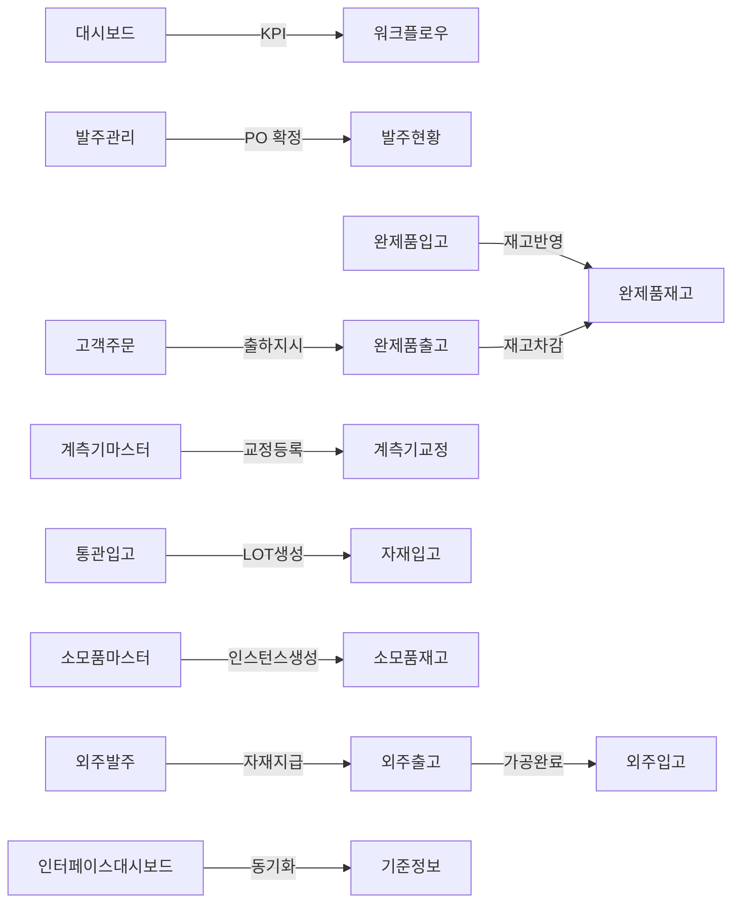

# 기타 도메인 Workflow 요약

> 메뉴: 기타 도메인 (대시보드, 워크플로우, 모니터링, 구매, 재고, 제품, 품질, 출하, 보세, 소모품, 외주, 인터페이스)
> 작성일: 2026-06-10
> 기준: backend 소스코드 (NestJS + TypeORM)

---

# 대시보드 (메뉴코드: `DASHBOARD`)

## 1. 화면 개요

| 항목 | 내용 |
|------|------|
| **메뉴 경로** | 대시보드 |
| **URL** | `/dashboard` |
| **메뉴 코드** | `DASHBOARD` |
| **화면 목적** | 오늘 생산량, 재고현황, 품질합격률, 불량건수 등 KPI와 최근 작업지시 현황을 요약 표시한다. |
| **주요 사용자** | 전체 사용자 |

## 2. API 명세

| 메서드 | 경로 | 설명 |
|--------|------|------|
| GET | /dashboard/kpi | KPI 데이터 (생산량/재고/품질/불량) |
| GET | /dashboard/summary | 일별 요약 |
| GET | /dashboard/recent-productions | 최근 작업지시 10건 |

---

# 워크플로우 (메뉴코드: `WORKFLOW`)

## 1. 화면 개요

| 항목 | 내용 |
|------|------|
| **메뉴 경로** | 워크플로우 |
| **URL** | `/workflow` |
| **메뉴 코드** | `WORKFLOW` |
| **화면 목적** | 전체 업무 프로세스의 노드별 건수를 시각화하여 현재 진행 상태를 한눈에 파악한다. |
| **주요 사용자** | 생산관리자, 품질관리자 |

## 2. API 명세

| 메서드 | 경로 | 설명 |
|--------|------|------|
| GET | /workflow/summary | 전체 워크플로우 노드별 건수 |

---

# 설비상태모니터링 (메뉴코드: `MON_EQUIP_STATUS`)

## 1. 화면 개요

| 항목 | 내용 |
|------|------|
| **메뉴 경로** | 모니터링 > 설비상태 |
| **URL** | `/equipment/status` |
| **메뉴 코드** | `MON_EQUIP_STATUS` |
| **화면 목적** | 설비 센서 데이터를 수신/조회하고 조건 감시 규칙을 관리한다. |
| **주요 사용자** | 설비관리자, 생산관리자 |

## 2. API 명세

| 메서드 | 경로 | 설명 |
|--------|------|------|
| POST | /equipment/sensor-data | 센서 데이터 일괄 수신 |
| GET | /equipment/sensor-data | 센서 데이터 이력 조회 |
| GET | /equipment/condition-rules | 조건 규칙 목록 |
| POST | /equipment/condition-rules | 조건 규칙 생성 |
| PUT | /equipment/condition-rules/:id | 조건 규칙 수정 |
| DELETE | /equipment/condition-rules/:id | 조건 규칙 삭제 |

---

# 발주관리 (메뉴코드: `PUR_PO`)

## 1. 화면 개요

| 항목 | 내용 |
|------|------|
| **메뉴 경로** | 구매관리 > 발주관리 |
| **URL** | `/material/po` |
| **메뉴 코드** | `PUR_PO` |
| **화면 목적** | 구매발주(PO)를 등록/조회/수정/삭제하고, 확정/마감 처리한다. |
| **주요 사용자** | 자재구매담당자 |

## 2. 주요 상태

| 상태 | 코드 | 설명 |
|------|------|------|
| 임시 | DRAFT | 초안 작성 |
| 확정 | CONFIRMED | 발주 확정 |
| 부분입고 | PARTIAL | 일부 입고 |
| 입고완료 | RECEIVED | 전체 입고 |
| 마감 | CLOSED | 마감 처리 |

## 3. API 명세

| 메서드 | 경로 | 설명 |
|--------|------|------|
| GET | /material/purchase-orders | PO 목록 |
| GET | /material/purchase-orders/next-no | 다음 PO 번호 채번 |
| GET | /material/purchase-orders/:id | PO 상세 |
| POST | /material/purchase-orders | PO 생성 |
| PUT | /material/purchase-orders/:id | PO 수정 |
| PATCH | /material/purchase-orders/:id/confirm | PO 확정 |
| PATCH | /material/purchase-orders/:id/close | PO 마감 |
| DELETE | /material/purchase-orders/:id | PO 삭제 |

---

# 발주현황 (메뉴코드: `PUR_PO_STATUS`)

## 1. 화면 개요

| 항목 | 내용 |
|------|------|
| **메뉴 경로** | 구매관리 > 발주현황 |
| **URL** | `/material/po-status` |
| **메뉴 코드** | `PUR_PO_STATUS` |
| **화면 목적** | 발주별 진행 상태(미입고/부분입고/입고완료)를 조회한다. |
| **주요 사용자** | 자재구매담당자, 자재관리자 |

## 2. API 명세

| 메서드 | 경로 | 설명 |
|--------|------|------|
| GET | /material/po-status | PO 현황 목록 조회 |

---

# 완제품재고 (메뉴코드: `INV_PRODUCT_STOCK`)

## 1. 화면 개요

| 항목 | 내용 |
|------|------|
| **메뉴 경로** | 제품재고관리 > 완제품재고 |
| **URL** | `/inventory/stock` |
| **메뉴 코드** | `INV_PRODUCT_STOCK` |
| **화면 목적** | 완제품(FG) 및 반제품(WIP)의 현재고를 조회한다. |
| **주요 사용자** | 창고관리자, 출하담당자 |

## 2. API 명세

| 메서드 | 경로 | 설명 |
|--------|------|------|
| GET | /inventory/product/stocks | 제품 현재고 조회 |
| GET | /inventory/stocks/summary | 재고 집계 |
| GET | /inventory/stocks/by-part/:itemCode | 품목별 재고 |
| GET | /inventory/stocks/by-warehouse/:warehouseId | 창고별 재고 |

---

# 완제품입고 (메뉴코드: `PROD_RECEIVE`)

## 1. 화면 개요

| 항목 | 내용 |
|------|------|
| **메뉴 경로** | 제품관리 > 완제품입고 |
| **URL** | `/product/receive` |
| **메뉴 코드** | `PROD_RECEIVE` |
| **화면 목적** | 생산된 완제품을 FG 창고로 입고 처리한다. |
| **주요 사용자** | 창고관리자, 생산관리자 |

## 2. API 명세

| 메서드 | 경로 | 설명 |
|--------|------|------|
| POST | /inventory/fg/receive | 완제품 입고 |

---

# 완제품출고 (메뉴코드: `PROD_ISSUE`)

## 1. 화면 개요

| 항목 | 내용 |
|------|------|
| **메뉴 경로** | 제품관리 > 완제품출고 |
| **URL** | `/product/issue` |
| **메뉴 코드** | `PROD_ISSUE` |
| **화면 목적** | 완제품을 출하 또는 기타 사유로 출고 처리한다. |
| **주요 사용자** | 창고관리자, 출하담당자 |

## 2. API 명세

| 메서드 | 경로 | 설명 |
|--------|------|------|
| POST | /inventory/fg/issue | 완제품 출고 |

---

# 계측기마스터 (메뉴코드: `GAUGE_MASTER`)

## 1. 화면 개요

| 항목 | 내용 |
|------|------|
| **메뉴 경로** | 기준정보 > 계측기마스터 |
| **URL** | `/master/gauge` |
| **메뉴 코드** | `GAUGE_MASTER` |
| **화면 목적** | 공장 내 계측기 정보를 등록/관리하고 교정 주기를 설정한다. (IATF 16949 7.1.5) |
| **주요 사용자** | 품질관리자 |

## 2. 주요 상태

| 상태 | 코드 | 설명 |
|------|------|------|
| 사용중 | ACTIVE | 정상 사용 |
| 교정만료 | EXPIRED | 교정 기간 만료 |
| 폐기 | SCRAPPED | 폐기 처리 |

## 3. API 명세

| 메서드 | 경로 | 설명 |
|--------|------|------|
| GET | /quality/msa/gauges | 계측기 목록 |
| GET | /quality/msa/gauges/expiring-soon | 교정 만료 예정 |
| GET | /quality/msa/gauges/:id | 계측기 상세 |
| POST | /quality/msa/gauges | 계측기 등록 |
| PUT | /quality/msa/gauges/:id | 계측기 수정 |
| DELETE | /quality/msa/gauges/:id | 계측기 삭제 |
| PATCH | /quality/msa/gauges/update-statuses | 상태 일괄 갱신 |

## 4. 연관 엔티티

| 엔티티명 | 테이블명 |
|----------|----------|
| GaugeMaster | GAUGE_MASTERS |

---

# 계측기교정 (메뉴코드: `GAUGE_CALIBRATION`)

## 1. 화면 개요

| 항목 | 내용 |
|------|------|
| **메뉴 경로** | 품질관리 > MSA > 계측기교정 |
| **URL** | `/quality/msa` |
| **메뉴 코드** | `GAUGE_CALIBRATION` |
| **화면 목적** | 계측기 교정 이력을 등록/조회/삭제한다. 교정번호 자동채번(CAL-YYYYMMDD-NNN). |
| **주요 사용자** | 품질관리자 |

## 2. 주요 상태

| 결과 | 코드 | 설명 |
|------|------|------|
| 합격 | PASS | 교정 합격 |
| 불합격 | FAIL | 교정 불합격 |
| 조걶부합격 | CONDITIONAL | 조걶부 합격 |

## 3. API 명세

| 메서드 | 경로 | 설명 |
|--------|------|------|
| GET | /quality/msa/calibrations | 교정 이력 목록 |
| POST | /quality/msa/calibrations | 교정 이력 등록 |
| DELETE | /quality/msa/calibrations/:id | 교정 이력 삭제 |

## 4. 연관 엔티티

| 엔티티명 | 테이블명 |
|----------|----------|
| CalibrationLog | CALIBRATION_LOGS |

---

# 고객주문 (메뉴코드: `SALES_CUST_PO`)

## 1. 화면 개요

| 항목 | 내용 |
|------|------|
| **메뉴 경로** | 출하관리 > 고객주문 |
| **URL** | `/sales/customer-po` |
| **메뉴 코드** | `SALES_CUST_PO` |
| **화면 목적** | 고객발주(Customer PO)를 등록/조회/수정/삭제한다. |
| **주요 사용자** | 출하관리자, 영업담당자 |

## 2. API 명세

| 메서드 | 경로 | 설명 |
|--------|------|------|
| GET | /shipping/customer-orders | 고객발주 목록 |
| GET | /shipping/customer-orders/:id | 고객발주 상세 |
| POST | /shipping/customer-orders | 고객발주 생성 |
| PUT | /shipping/customer-orders/:id | 고객발주 수정 |
| DELETE | /shipping/customer-orders/:id | 고객발주 삭제 |

## 3. 연관 엔티티

| 엔티티명 | 테이블명 |
|----------|----------|
| CustomerOrder | CUSTOMER_ORDERS |
| CustomerOrderItem | CUSTOMER_ORDER_ITEMS |

---

# 통관입고 (메뉴코드: `CUST_ENTRY`)

## 1. 화면 개요

| 항목 | 내용 |
|------|------|
| **메뉴 경로** | 보세관리 > 통관입고 |
| **URL** | `/customs/entry` |
| **메뉴 코드** | `CUST_ENTRY` |
| **화면 목적** | 수입신고(통관) 정보와 보세자재 LOT를 관리하고 사용신고를 처리한다. |
| **주요 사용자** | 자재관리자, 통관담당자 |

## 2. API 명세

| 메서드 | 경로 | 설명 |
|--------|------|------|
| GET | /customs/entries | 수입신고 목록 |
| GET | /customs/entries/:id | 수입신고 상세 |
| POST | /customs/entries | 수입신고 등록 |
| PUT | /customs/entries/:id | 수입신고 수정 |
| DELETE | /customs/entries/:id | 수입신고 삭제 |
| GET | /customs/lots/entry/:entryId | 보세자재 LOT 목록 |
| GET | /customs/lots/:entryNo/:matUid | 보세자재 LOT 상세 |
| POST | /customs/lots | 보세자재 LOT 등록 |
| PUT | /customs/lots/:entryNo/:matUid | 보세자재 LOT 수정 |
| GET | /customs/usage | 사용신고 목록 |
| POST | /customs/usage | 사용신고 등록 |
| PUT | /customs/usage/:reportNo | 사용신고 상태 변경 |
| GET | /customs/summary | 보세관리 현황 요약 |

## 3. 연관 엔티티

| 엔티티명 | 테이블명 |
|----------|----------|
| CustomsEntry | CUSTOMS_ENTRIES |
| CustomsLot | CUSTOMS_LOTS |
| CustomsUsageReport | CUSTOMS_USAGE_REPORTS |

---

# 소모품마스터 (메뉴코드: `CONS_MASTER`)

## 1. 화면 개요

| 항목 | 내용 |
|------|------|
| **메뉴 경로** | 소모품관리 > 소모품마스터 |
| **URL** | `/consumables/master` |
| **메뉴 코드** | `CONS_MASTER` |
| **화면 목적** | 소모품(Consumable) 마스터를 등록/관리하고 이미지를 업로드한다. |
| **주요 사용자** | 설비관리자, 생산관리자 |

## 2. API 명세

| 메서드 | 경로 | 설명 |
|--------|------|------|
| GET | /consumables | 소모품 목록 |
| GET | /consumables/:id | 소모품 상세 |
| POST | /consumables | 소모품 등록 |
| PUT | /consumables/:id | 소모품 수정 |
| DELETE | /consumables/:id | 소모품 삭제 |
| POST | /consumables/:id/image | 이미지 업로드 |
| DELETE | /consumables/:id/image | 이미지 삭제 |
| GET | /consumables/summary | 현황 요약 |
| GET | /consumables/warning | 경고/교체 필요 목록 |
| GET | /consumables/life-status | 수명 현황 |
| GET | /consumables/stock-status | 재고 현황 |
| GET | /consumables/logs | 입출고 이력 목록 |
| POST | /consumables/logs | 입출고 이력 등록 |
| POST | /consumables/shot-count | 타수 업데이트 |
| POST | /consumables/reset | 타수 리셋 |

## 3. 연관 엔티티

| 엔티티명 | 테이블명 |
|----------|----------|
| ConsumableMaster | CONSUMABLE_MASTERS |
| ConsumableStock | CONSUMABLE_STOCKS |
| ConsumableLog | CONSUMABLE_LOGS |

---

# 소모품재고 (메뉴코드: `CONS_STOCK`)

## 1. 화면 개요

| 항목 | 내용 |
|------|------|
| **메뉴 경로** | 소모품관리 > 소모품재고 |
| **URL** | `/consumables/stock` |
| **메뉴 코드** | `CONS_STOCK` |
| **화면 목적** | 소모품 개별 인스턴스(ConsumableStock)를 조회하고 상태를 관리한다. |
| **주요 사용자** | 설비관리자 |

## 2. API 명세

| 메서드 | 경로 | 설명 |
|--------|------|------|
| GET | /consumables/stocks | 인스턴스 목록 |
| GET | /consumables/stocks/:conUid | 특정 인스턴스 상세 |

---

# 외주발주 (메뉴코드: `OUT_ORDER`)

## 1. 화면 개요

| 항목 | 내용 |
|------|------|
| **메뉴 경로** | 외주관리 > 외주발주 |
| **URL** | `/outsourcing/order` |
| **메뉴 코드** | `OUT_ORDER` |
| **화면 목적** | 외주처 마스터와 외주발주를 관리하고 출고/입고를 처리한다. |
| **주요 사용자** | 자재관리자, 외주관리자 |

## 2. API 명세

### 외주처 마스터

| 메서드 | 경로 | 설명 |
|--------|------|------|
| GET | /outsourcing/vendors | 외주처 목록 |
| GET | /outsourcing/vendors/:id | 외주처 상세 |
| POST | /outsourcing/vendors | 외주처 등록 |
| PUT | /outsourcing/vendors/:id | 외주처 수정 |
| DELETE | /outsourcing/vendors/:id | 외주처 삭제 |

### 외주발주

| 메서드 | 경로 | 설명 |
|--------|------|------|
| GET | /outsourcing/orders | 외주발주 목록 |
| GET | /outsourcing/orders/:id | 외주발주 상세 |
| POST | /outsourcing/orders | 외주발주 등록 |
| PUT | /outsourcing/orders/:id | 외주발주 수정 |
| POST | /outsourcing/orders/:id/cancel | 외주발주 취소 |

### 출고/입고

| 메서드 | 경로 | 설명 |
|--------|------|------|
| POST | /outsourcing/deliveries | 외주 출고 등록 |
| GET | /outsourcing/deliveries/order/:orderId | 발주별 출고 이력 |
| POST | /outsourcing/receives | 외주 입고 등록 |
| GET | /outsourcing/receives/order/:orderId | 발주별 입고 이력 |

### 통계

| 메서드 | 경로 | 설명 |
|--------|------|------|
| GET | /outsourcing/summary | 현황 요약 |
| GET | /outsourcing/vendor-stock | 외주처별 재고 |

---

# 인터페이스대시보드 (메뉴코드: `IF_DASHBOARD`)

## 1. 화면 개요

| 항목 | 내용 |
|------|------|
| **메뉴 경로** | 인터페이스관리 > 인터페이스대시보드 |
| **URL** | `/interface/dashboard` |
| **메뉴 코드** | `IF_DASHBOARD` |
| **화면 목적** | ERP-MES 간 인터페이스 로그를 조회/재시도하고 Inbound/Outbound 동기화를 수행한다. |
| **주요 사용자** | 시스템관리자, IT담당자 |

## 2. API 명세

### 로그 관리

| 메서드 | 경로 | 설명 |
|--------|------|------|
| GET | /interface/logs | 인터페이스 로그 목록 |
| GET | /interface/logs/:transDate/:seq | 로그 상세 |
| POST | /interface/logs/:transDate/:seq/retry | 로그 재시도 |
| POST | /interface/logs/bulk-retry | 일괄 재시도 |

### Inbound (ERP → MES)

| 메서드 | 경로 | 설명 |
|--------|------|------|
| POST | /interface/inbound/job-order | 작업지시 수신 |
| POST | /interface/inbound/bom | BOM 동기화 |
| POST | /interface/inbound/part | 품목 동기화 |
| POST | /interface/inbound/item-master | ERP 품목 마스터 동기화 |

### Outbound (MES → ERP)

| 메서드 | 경로 | 설명 |
|--------|------|------|
| POST | /interface/outbound/prod-result | 생산실적 전송 |

### 통계

| 메서드 | 경로 | 설명 |
|--------|------|------|
| GET | /interface/summary | 현황 요약 |
| GET | /interface/failed | 실패 로그 목록 |
| GET | /interface/recent | 최근 로그 목록 |

## 3. 연관 엔티티

| 엔티티명 | 테이블명 |
|----------|----------|
| InterLog | INTER_LOGS |

---

# 화면 간 연계 흐름

---

# 참고사항

- 관련 문서: `docs/workflows/_template.md`
- 모든 API는 `@Company()`, `@Plant()` 데코레이터로 멀티테넌시 적용
- 완제품 입/출고는 `PRODUCT_STOCKS`, `PRODUCT_TRANSACTIONS` 테이블에 기록
- 외주 입/출고는 `inventoryService`의 `SUBCON_IN`/`SUBCON_OUT` 트랜잭션 유형 사용
