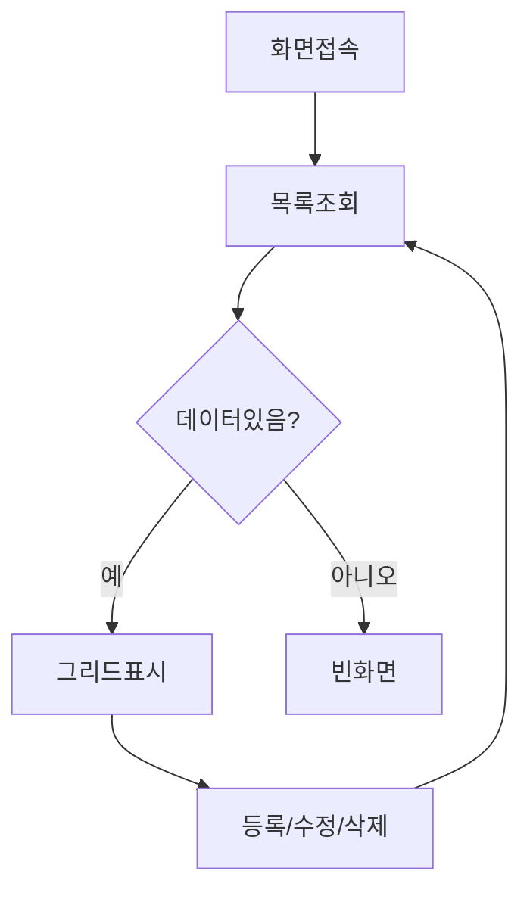
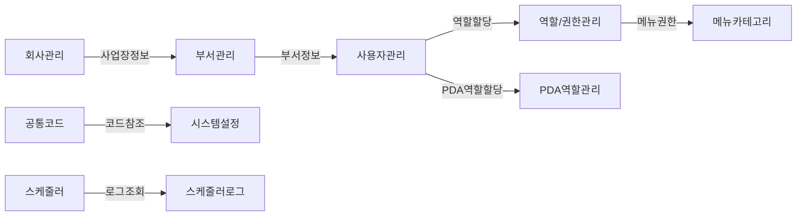

# 시스템관리 Workflow

> 메뉴: 시스템관리 (SYSTEM)
> 작성일: 2026-06-10
> 기준: backend 소스코드 (NestJS + TypeORM)

---

# 회사관리 (메뉴코드: `SYS_COMPANY`)

## 1. 화면 개요

| 항목 | 내용 |
|------|------|
| **메뉴 경로** | 시스템관리 > 기준정보 > 회사관리 |
| **URL** | `/master/company` |
| **메뉴 코드** | `SYS_COMPANY` |
| **화면 목적** | 회사(Company) 및 사업장(Plant) 마스터를 등록/조회/수정/삭제한다. 로그인 페이지의 회사/사업장 선택 드롭다운 데이터 원본. |
| **주요 사용자** | 시스템관리자 |

## 2. 화면 구성

### 2.1 레이아웃
- 상단: 검색조건 (회사코드/회사명/사업자번호, 사용여부) + 등록 버튼
- 중앙: 데이터그리드 (회사 목록)
- 하단: 페이징
- 모달: 등록/수정 모달

### 2.2 데이터그리드 컬럼

| 컬럼ID | 컬럼명 | 데이터타입 | 정렬 | 비고 |
|--------|--------|-----------|------|------|
| companyCode | 회사코드 | string | Y | 왼쪽정렬 |
| plant | 사업장코드 | string | Y | 복합PK |
| plantName | 사업장명 | string | Y | |
| companyName | 회사명 | string | Y | |
| bizNo | 사업자등록번호 | string | Y | |
| ceoName | 대표자명 | string | Y | |
| address | 주소 | string | Y | |
| tel | 전화번호 | string | Y | |
| fax | 팩스번호 | string | Y | |
| email | 이메일 | string | Y | |
| useYn | 사용여부 | string | Y | Y/N |
| createdAt | 등록일 | date | Y | |

### 2.3 입력 폼 필드

| 필드ID | 필드명 | 타입 | 필수 | 기본값 | 검증규칙 | 비고 |
|--------|--------|------|------|--------|----------|------|
| companyCode | 회사코드 | text | Y | - | MaxLength(50) | 중복불가 |
| companyName | 회사명 | text | Y | - | MaxLength(200) | |
| bizNo | 사업자번호 | text | N | - | MaxLength(20) | |
| ceoName | 대표자명 | text | N | - | MaxLength(50) | |
| address | 주소 | text | N | - | MaxLength(500) | |
| tel | 전화번호 | text | N | - | MaxLength(20) | |
| fax | 팩스번호 | text | N | - | MaxLength(20) | |
| email | 이메일 | text | N | - | MaxLength(100) | |
| remark | 비고 | text | N | - | MaxLength(500) | |
| useYn | 사용여부 | select | N | Y | Y/N | |

### 2.4 버튼/액션

| 버튼 | 조건 | 동작 | API |
|------|------|------|-----|
| 등록 | - | 등록모달 오픈 | - |
| 저장 | 폼 valid | 데이터 저장 | POST /master/companies |
| 수정 | 행 선택 | 수정모달 오픈 | PUT /master/companies/:id |
| 삭제 | 행 선택 | 삭제 확인 후 삭제 | DELETE /master/companies/:id |

## 3. 업무 흐름

### 3.1 정상 흐름


1. 사용자가 화면 접속
2. 기본 조회조건으로 목록 조회 (페이지네이션)
3. 등록/수정/삭제 처리 후 목록 재조회

### 3.2 예외/분기 흐름
- **조회 결과 없음**: 빈 그리드 표시
- **중복 회사코드**: `ConflictException` → "이미 존재하는 회사 코드입니다"
- **공개 API**: `/master/companies/public`, `/master/companies/public/plants`는 인증 불필요 (로그인 페이지용)

## 4. 상태 코드 및 공통코드

### 4.1 화면 내 사용 상태
| 상태명 | 코드값 | 설명 |
|--------|--------|------|
| 사용 | Y | 활성 |
| 미사용 | N | 비활성 |

## 5. API 명세

### 5.1 목록 조회
```
GET /master/companies
```
**Query Parameters**
| 파라미터 | 타입 | 필수 | 설명 |
|----------|------|------|------|
| page | number | N | 페이지 (기본 1) |
| limit | number | N | 페이지당 건수 (기본 10) |
| search | string | N | 회사코드/회사명/사업자번호 검색 |
| useYn | string | N | 사용여부 (Y/N) |

### 5.2 상세 조회
```
GET /master/companies/:id
```
> id 형식: `companyCode::plant` (복합키 인코딩)

### 5.3 생성
```
POST /master/companies
```

### 5.4 수정
```
PUT /master/companies/:id
```

### 5.5 삭제
```
DELETE /master/companies/:id
```

## 6. 처리 규칙 및 검증

### 6.1 입력 검증
- companyCode: 필수, 중복 불가
- companyName: 필수

### 6.2 비즈니스 규칙
- 복합 PK: (companyCode, plant)
- plant 기본값: '-'
- 생성 시 company, plant 컬럼에 현재 테넌트 정보 저장

## 7. 연관 엔티티 및 테이블

| 엔티티명 | 테이블명 | 역할 | 관계 |
|----------|----------|------|------|
| CompanyMaster | COMPANY_MASTERS | 회사 마스터 | 메인 |

---

# 부서관리 (메뉴코드: `SYS_DEPT`)

## 1. 화면 개요

| 항목 | 내용 |
|------|------|
| **메뉴 경로** | 시스템관리 > 기준정보 > 부서관리 |
| **URL** | `/system/department` |
| **메뉴 코드** | `SYS_DEPT` |
| **화면 목적** | 부서(Department) 마스터를 등록/조회/수정/삭제한다. 상위부서 코드로 트리 구조 지원. |
| **주요 사용자** | 시스템관리자 |

## 2. 화면 구성

### 2.1 레이아웃
- 상단: 검색조건 + 등록 버튼
- 중앙: 데이터그리드 (부서 목록)
- 하단: 페이징
- 모달: 등록/수정 모달

### 2.2 데이터그리드 컬럼

| 컬럼ID | 컬럼명 | 데이터타입 | 정렬 | 비고 |
|--------|--------|-----------|------|------|
| deptCode | 부서코드 | string | Y | PK |
| deptName | 부서명 | string | Y | |
| parentDeptCode | 상위부서코드 | string | Y | 트리구조 |
| sortOrder | 정렬순서 | number | Y | |
| managerName | 부서장 | string | Y | |
| remark | 비고 | string | Y | |
| useYn | 사용여부 | string | Y | |

### 2.3 입력 폼 필드

| 필드ID | 필드명 | 타입 | 필수 | 기본값 | 검증규칙 | 비고 |
|--------|--------|------|------|--------|----------|------|
| deptCode | 부서코드 | text | Y | - | MaxLength(20) | 중복불가 |
| deptName | 부서명 | text | Y | - | MaxLength(100) | |
| parentDeptCode | 상위부서코드 | text | N | - | MaxLength(20) | |
| sortOrder | 정렬순서 | number | N | 0 | | |
| managerName | 부서장 | text | N | - | MaxLength(50) | |
| remark | 비고 | text | N | - | MaxLength(500) | |
| useYn | 사용여부 | select | N | Y | Y/N | |

## 3. 업무 흐름

### 3.1 정상 흐름
1. 화면 접속 → 부서 목록 조회 (회사/사업장 필터 적용)
2. 등록/수정/삭제 처리
3. 목록 재조회

## 4. API 명세

| 메서드 | 경로 | 설명 |
|--------|------|------|
| GET | /system/departments | 목록 조회 |
| GET | /system/departments/:id | 상세 조회 |
| POST | /system/departments | 생성 |
| PUT | /system/departments/:id | 수정 |
| DELETE | /system/departments/:id | 삭제 |

## 5. 연관 엔티티 및 테이블

| 엔티티명 | 테이블명 | 역할 | 관계 |
|----------|----------|------|------|
| DepartmentMaster | DEPARTMENT_MASTERS | 부서 마스터 | 메인 |

---

# 사용자관리 (메뉴코드: `SYS_USER`)

## 1. 화면 개요

| 항목 | 내용 |
|------|------|
| **메뉴 경로** | 시스템관리 > 사용자관리 |
| **URL** | `/system/users` |
| **메뉴 코드** | `SYS_USER` |
| **화면 목적** | 시스템 사용자를 등록/조회/수정/삭제하고 사진을 관리한다. |
| **주요 사용자** | 시스템관리자 |

## 2. 화면 구성

### 2.1 레이아웃
- 상단: 검색조건 (검색어/역할/상태) + 등록 버튼
- 중앙: 데이터그리드 (사용자 목록)
- 모달: 등록/수정 모달, 사진 업로드

### 2.2 데이터그리드 컬럼

| 컬럼ID | 컬럼명 | 데이터타입 | 정렬 | 비고 |
|--------|--------|-----------|------|------|
| email | 이메일 | string | Y | PK |
| name | 이름 | string | Y | |
| empNo | 사원번호 | string | Y | |
| dept | 부서 | string | Y | |
| role | 역할 | string | Y | ADMIN/MANAGER/OPERATOR/VIEWER |
| status | 상태 | string | Y | ACTIVE/INACTIVE |
| photoUrl | 사진URL | string | Y | |
| pdaRoleCode | PDA역할 | string | Y | |
| lastLoginAt | 최종로그인 | datetime | Y | |

### 2.3 입력 폼 필드

| 필드ID | 필드명 | 타입 | 필수 | 기본값 | 검증규칙 | 비고 |
|--------|--------|------|------|--------|----------|------|
| email | 이메일 | email | Y | - | 이메일형식 | PK |
| password | 비밀번호 | password | Y | - | MinLength(4) | |
| name | 이름 | text | N | - | | |
| empNo | 사원번호 | text | N | - | | |
| dept | 부서 | text | N | - | | |
| role | 역할 | select | N | OPERATOR | ADMIN/MANAGER/OPERATOR/VIEWER | |
| pdaRoleCode | PDA역할 | select | N | - | PDA_ROLE.CODE | |

## 3. 업무 흐름

### 3.1 정상 흐름
1. 화면 접속 → 사용자 목록 조회
2. 등록/수정/삭제
3. 사진 업로드/삭제 (별도 API)

## 4. API 명세

| 메서드 | 경로 | 설명 |
|--------|------|------|
| GET | /users | 목록 조회 |
| GET | /users/:id | 상세 조회 |
| POST | /users | 생성 |
| PATCH | /users/:id | 수정 |
| DELETE | /users/:id | 삭제 |
| POST | /users/:id/photo | 사진 업로드 |
| DELETE | /users/:id/photo | 사진 삭제 |

## 5. 연관 엔티티 및 테이블

| 엔티티명 | 테이블명 | 역할 | 관계 |
|----------|----------|------|------|
| User | USERS | 사용자 | 메인 |

---

# 역할/권한관리 (메뉴코드: `SYS_ROLE`)

## 1. 화면 개요

| 항목 | 내용 |
|------|------|
| **메뉴 경로** | 시스템관리 > 역할/권한관리 |
| **URL** | `/system/roles` |
| **메뉴 코드** | `SYS_ROLE` |
| **화면 목적** | 역할(Role)을 정의하고 메뉴 접근 권한을 관리한다. ADMIN 역할은 모든 메뉴 접근 가능. |
| **주요 사용자** | 시스템관리자 |

## 2. 화면 구성

### 2.1 레이아웃
- 상단: 역할 목록 그리드 + 등록 버튼
- 하단: 권한 설정 패널 (메뉴 트리 + 체크박스)

### 2.2 데이터그리드 컬럼

| 컬럼ID | 컬럼명 | 데이터타입 | 정렬 | 비고 |
|--------|--------|-----------|------|------|
| code | 역할코드 | string | Y | PK |
| name | 역할명 | string | Y | |
| description | 설명 | string | Y | |
| isSystem | 시스템역할 | boolean | Y | 삭제/수정 불가 |
| sortOrder | 정렬순서 | number | Y | |

## 3. 업무 흐름

### 3.1 정상 흐름
1. 역할 목록 조회
2. 역할 선택 → 권한 메뉴 로드
3. 메뉴 체크/언체크 → 저장

## 4. API 명세

| 메서드 | 경로 | 설명 |
|--------|------|------|
| GET | /roles | 역할 목록 |
| GET | /roles/:id | 역할 상세 |
| POST | /roles | 역할 생성 |
| PATCH | /roles/:id | 역할 수정 |
| DELETE | /roles/:id | 역할 삭제 |
| GET | /roles/:id/permissions | 권한 조회 |
| PUT | /roles/:id/permissions | 권한 수정 (전체 교체) |

## 5. 처리 규칙 및 검증

- **isSystem=true** 역할은 삭제 불가
- **ADMIN** 역할 권한은 수정 불가 (모든 메뉴 접근)
- 권한 저장 시 기존 권한 전체 삭제 후 재INSERT (전체 교체 방식)

## 6. 연관 엔티티 및 테이블

| 엔티티명 | 테이블명 | 역할 | 관계 |
|----------|----------|------|------|
| Role | ROLES | 역할 마스터 | 메인 |
| RoleMenuPermission | ROLE_MENU_PERMISSIONS | 역할-메뉴 권한 | 1:N |

---

# PDA 역할관리 (메뉴코드: `SYS_PDA_ROLE`)

## 1. 화면 개요

| 항목 | 내용 |
|------|------|
| **메뉴 경로** | 시스템관리 > PDA 역할관리 |
| **URL** | `/system/pda-roles` |
| **메뉴 코드** | `SYS_PDA_ROLE` |
| **화면 목적** | PDA 단말기에서 사용하는 역할을 정의하고 PDA 메뉴 접근 권한을 관리한다. |
| **주요 사용자** | 시스템관리자 |

## 2. 화면 구성

### 2.1 레이아웃
- 상단: PDA 역할 목록 + 등록 버튼
- 하단: PDA 메뉴 권한 체크박스 (7개 메뉴)

### 2.2 PDA 메뉴 코드

| 코드 | 메뉴명 |
|------|--------|
| PDA_MAT_RECEIVING | 자재 입고 |
| PDA_MAT_ISSUING | 자재 불출 |
| PDA_MAT_ADJUSTMENT | 자재 조정 |
| PDA_MAT_INV_COUNT | 자재 재고실사 |
| PDA_SHIPPING | 출하 |
| PDA_EQUIP_INSPECT | 설비 점검 |
| PDA_PRODUCT_INV_COUNT | 제품 재고실사 |

## 3. API 명세

| 메서드 | 경로 | 설명 |
|--------|------|------|
| GET | /system/pda-roles | 목록 (메뉴 매핑 포함) |
| GET | /system/pda-roles/active | 활성 역할 목록 |
| GET | /system/pda-roles/menu-codes | 사용 가능한 메뉴코드 목록 |
| POST | /system/pda-roles | 생성 + 메뉴 매핑 |
| PATCH | /system/pda-roles/:code | 수정 + 메뉴 매핑 교체 |
| DELETE | /system/pda-roles/:code | 삭제 (CASCADE) |

## 4. 연관 엔티티 및 테이블

| 엔티티명 | 테이블명 | 역할 | 관계 |
|----------|----------|------|------|
| PdaRole | PDA_ROLE | PDA 역할 | 메인 |
| PdaRoleMenu | PDA_ROLE_MENU | PDA 역할-메뉴 | 1:N |

---

# 공통설정 (메뉴코드: `SYS_COMM`)

## 1. 화면 개요

| 항목 | 내용 |
|------|------|
| **메뉴 경로** | 시스템관리 > 공통설정 |
| **URL** | `/system/comm-config` |
| **메뉴 코드** | `SYS_COMM` |
| **화면 목적** | 시리얼/TCP/MQTT/OPC_UA/MODBUS 등 통신 설정을 관리하고 시리얼 포트 테스트를 수행한다. |
| **주요 사용자** | 시스템관리자 |

## 2. 화면 구성

### 2.1 레이아웃
- 상단: 검색조건 (통신유형, 사용여부) + 등록 버튼
- 중앙: 데이터그리드 (통신설정 목록)
- 모달: 등록/수정 모달, 시리얼 포트 테스트

### 2.2 데이터그리드 컬럼

| 컬럼ID | 컬럼명 | 데이터타입 | 정렬 | 비고 |
|--------|--------|-----------|------|------|
| configName | 설정명 | string | Y | PK |
| commType | 통신유형 | string | Y | SERIAL/TCP/MQTT/OPC_UA/MODBUS |
| host | 호스트 | string | Y | |
| port | 포트 | number | Y | |
| portName | 포트명 | string | Y | 시리얼용 |
| baudRate | BaudRate | number | Y | 시리얼용 |
| useYn | 사용여부 | string | Y | |

## 3. API 명세

| 메서드 | 경로 | 설명 |
|--------|------|------|
| GET | /system/comm-configs | 목록 조회 |
| GET | /system/comm-configs/serial-ports | 시스템 시리얼 포트 목록 |
| GET | /system/comm-configs/type/:type | 유형별 조회 |
| GET | /system/comm-configs/name/:name | 이름으로 조회 |
| GET | /system/comm-configs/:id | 상세 조회 |
| POST | /system/comm-configs | 생성 |
| PUT | /system/comm-configs/:id | 수정 |
| DELETE | /system/comm-configs/:id | 삭제 |

## 4. 연관 엔티티 및 테이블

| 엔티티명 | 테이블명 | 역할 | 관계 |
|----------|----------|------|------|
| CommConfig | COMM_CONFIGS | 통신 설정 | 메인 |

---

# 시스템설정 (메뉴코드: `SYS_CONFIG`)

## 1. 화면 개요

| 항목 | 내용 |
|------|------|
| **메뉴 경로** | 시스템관리 > 시스템설정 |
| **URL** | `/system/config` |
| **메뉴 코드** | `SYS_CONFIG` |
| **화면 목적** | 시스템 전반의 환경설정을 그룹별로 관리한다. BOOLEAN/SELECT/NUMBER/TEXT 타입 지원. |
| **주요 사용자** | 시스템관리자 |

## 2. 화면 구성

### 2.1 레이아웃
- 상단: 그룹 필터 + 검색
- 중앙: 설정 목록 (그룹별 카드 또는 그리드)
- 하단: 일괄 저장 버튼

### 2.2 설정 타입

| 타입 | 설명 | 예시 |
|------|------|------|
| BOOLEAN | Y/N | 선입선출 사용 |
| SELECT | 선택지 | FIFO 기준 |
| NUMBER | 숫자 | 재시도 횟수 |
| TEXT | 문자열 | 시스템명 |

## 3. API 명세

| 메서드 | 경로 | 설명 |
|--------|------|------|
| GET | /system/configs | 목록 (그룹별 묶음) |
| GET | /system/configs/active | 활성 설정 맵 (앱 로딩용) |
| POST | /system/configs | 생성 |
| PATCH | /system/configs/:id | 수정 |
| PUT | /system/configs/bulk | 일괄 저장 |
| DELETE | /system/configs/:id | 삭제 |

## 4. 연관 엔티티 및 테이블

| 엔티티명 | 테이블명 | 역할 | 관계 |
|----------|----------|------|------|
| SysConfig | SYS_CONFIGS | 시스템 설정 | 메인 |

---

# 공통코드 (메뉴코드: `SYS_CODE`)

## 1. 화면 개요

| 항목 | 내용 |
|------|------|
| **메뉴 경로** | 시스템관리 > 기준정보 > 공통코드 |
| **URL** | `/master/code` |
| **메뉴 코드** | `SYS_CODE` |
| **화면 목적** | 시스템 전체에서 사용하는 공통코드(그룹코드+상세코드)를 관리한다. parentCode로 계층 구조 지원. |
| **주요 사용자** | 시스템관리자 |

## 2. 화면 구성

### 2.1 레이아웃
- 상단: 그룹코드 필터 + 검색 + 등록 버튼
- 중앙: 데이터그리드 (공통코드 목록)
- 모달: 등록/수정 모달

### 2.2 데이터그리드 컬럼

| 컬럼ID | 컬럼명 | 데이터타입 | 정렬 | 비고 |
|--------|--------|-----------|------|------|
| groupCode | 그룹코드 | string | Y | 복합PK |
| detailCode | 상세코드 | string | Y | 복합PK |
| parentCode | 부모코드 | string | Y | 계층구조 |
| codeName | 코드명 | string | Y | |
| codeDesc | 설명 | string | Y | |
| sortOrder | 정렬순서 | number | Y | |
| useYn | 사용여부 | string | Y | |
| attr1~3 | 속성1~3 | string | Y | 확장속성 |

## 3. API 명세

| 메서드 | 경로 | 설명 |
|--------|------|------|
| GET | /master/com-codes | 목록 조회 |
| GET | /master/com-codes/all-active | 전체 활성 코드 (그룹별) |
| GET | /master/com-codes/groups | 그룹 목록 |
| GET | /master/com-codes/groups/:groupCode | 그룹별 코드 조회 |
| GET | /master/com-codes/:id | 상세 조회 |
| POST | /master/com-codes | 생성 |
| PUT | /master/com-codes/:id | 수정 |
| DELETE | /master/com-codes/:id | 삭제 |
| DELETE | /master/com-codes/groups/:groupCode | 그룹 일괄 삭제 |

## 4. 연관 엔티티 및 테이블

| 엔티티명 | 테이블명 | 역할 | 관계 |
|----------|----------|------|------|
| ComCode | COM_CODES | 공통코드 | 메인 |

---

# 스케줄러 (메뉴코드: `SYS_SCHEDULER`)

## 1. 화면 개요

| 항목 | 내용 |
|------|------|
| **메뉴 경로** | 시스템관리 > 스케줄러 |
| **URL** | `/system/scheduler` |
| **메뉴 코드** | `SYS_SCHEDULER` |
| **화면 목적** | 정기 실행 작업(Job)을 등록/관리하고 실행 로그를 조회한다. Cron 표현식 기반 스케줄링. |
| **주요 사용자** | 시스템관리자 |

## 2. 화면 구성

### 2.1 레이아웃
- 상단: 작업 목록 그리드 + 등록 버튼
- 하단: 실행 로그 그리드 / 통계 요약

### 2.2 데이터그리드 컬럼 (작업)

| 컬럼ID | 컬럼명 | 데이터타입 | 정렬 | 비고 |
|--------|--------|-----------|------|------|
| jobCode | 작업코드 | string | Y | PK |
| jobName | 작업명 | string | Y | |
| jobGroup | 작업그룹 | string | Y | ComCode SCHED_GROUP |
| execType | 실행유형 | string | Y | SERVICE/PROCEDURE/SQL/HTTP/SCRIPT |
| execTarget | 실행대상 | string | Y | |
| cronExpr | Cron표현식 | string | Y | |
| isActive | 활성여부 | string | Y | Y/N |
| maxRetry | 최대재시도 | number | Y | |
| timeoutSec | 제한시간(초) | number | Y | |
| nextRunAt | 다음실행일 | datetime | Y | |

### 2.3 실행 상태

| 상태 | 코드 | 설명 |
|------|------|------|
| 성공 | SUCCESS | 정상 완료 |
| 실패 | FAIL | 실행 실패 |
| 실행중 | RUNNING | 실행 중 |
| 재시도중 | RETRYING | 재시도 중 |
| 타임아웃 | TIMEOUT | 시간 초과 |
| 건오프 | SKIPPED | 건오프 |

## 3. API 명세

### 3.1 작업 관리

| 메서드 | 경로 | 설명 |
|--------|------|------|
| GET | /scheduler/jobs | 작업 목록 |
| POST | /scheduler/jobs | 작업 생성 |
| PUT | /scheduler/jobs/:jobCode | 작업 수정 |
| DELETE | /scheduler/jobs/:jobCode | 작업 삭제 |
| POST | /scheduler/jobs/:jobCode/run | 즉시 실행 |
| PATCH | /scheduler/jobs/:jobCode/toggle | 활성/비활성 토글 |

### 3.2 실행 로그

| 메서드 | 경로 | 설명 |
|--------|------|------|
| GET | /scheduler/logs | 로그 목록 |
| GET | /scheduler/logs/summary | 통계 요약 |

## 4. 처리 규칙 및 검증

- 생성 시 기본 비활성 (isActive='N')
- CronJob 등록/해제는 활성/비활성 토글 시 자동 처리
- 서버 재시작 시 활성 작업 자동 CronJob 등록
- Stale 로그(RUNNING/RETRYING) → FAIL 자동 복구

## 5. 연관 엔티티 및 테이블

| 엔티티명 | 테이블명 | 역할 | 관계 |
|----------|----------|------|------|
| SchedulerJob | SCHEDULER_JOBS | 스케줄러 작업 | 메인 |
| SchedulerLog | SCHEDULER_LOGS | 실행 로그 | 1:N |

---

# 메뉴카테고리 (메뉴코드: `SYS_MENU_CATEGORY`)

## 1. 화면 개요

| 항목 | 내용 |
|------|------|
| **메뉴 경로** | 시스템관리 > 메뉴카테고리 |
| **URL** | `/system/menu-categories` |
| **메뉴 코드** | `SYS_MENU_CATEGORY` |
| **화면 목적** | 사이드바 메뉴의 카테고리(상위 그룹)와 메뉴 배치를 관리한다. DB 기반 동적 메뉴 트리 구성. |
| **주요 사용자** | 시스템관리자 |

## 2. 화면 구성

### 2.1 레이아웃
- 좌측: 카테고리 목록 (드래그앤드롭 정렬)
- 우측: 선택된 카테고리 내 메뉴 목록 (드래그앤드롭 정렬)
- 상단: 미배치 메뉴 목록

### 2.2 데이터그리드 컬럼

| 컬럼ID | 컬럼명 | 데이터타입 | 정렬 | 비고 |
|--------|--------|-----------|------|------|
| categoryCode | 카테고리코드 | string | Y | PK |
| labelKey | 라벨키 | string | Y | i18n 키 |
| iconName | 아이콘명 | string | Y | Lucide 아이콘 |
| sortOrder | 정렬순서 | number | Y | |
| isActive | 활성여부 | string | Y | Y/N |

## 3. API 명세

### 3.1 카테고리

| 메서드 | 경로 | 설명 |
|--------|------|------|
| GET | /menu-categories | 카테고리 목록 |
| GET | /menu-categories/tree | 사이드바 트리 |
| GET | /menu-categories/unassigned-menus | 미배치 메뉴 |
| POST | /menu-categories | 생성 |
| PATCH | /menu-categories/reorder | 순서 일괄 갱신 |
| PATCH | /menu-categories/:code | 수정 |
| PATCH | /menu-categories/:code/items | 메뉴 순서 갱신 |
| DELETE | /menu-categories/:code | 삭제 (빈 카테고리만) |

### 3.2 메뉴 배치

| 메서드 | 경로 | 설명 |
|--------|------|------|
| PATCH | /menu-category-items/move | 메뉴 이동 |
| DELETE | /menu-category-items/:menuCode | 배치 삭제 |

## 4. 처리 규칙 및 검증

- `__ROOT__`는 예약어 (단독 메뉴용), 생성/삭제/수정 불가
- 빈 카테고리만 삭제 가능
- menuCode는 화이트리스트 기반 검증 (`menu-code-validator.ts`)

## 5. 연관 엔티티 및 테이블

| 엔티티명 | 테이블명 | 역할 | 관계 |
|----------|----------|------|------|
| MenuCategory | MENU_CATEGORIES | 메뉴 카테고리 | 메인 |
| MenuCategoryItem | MENU_CATEGORY_ITEMS | 메뉴 배치 | N:1 |

---

# 개선요청 (메뉴코드: `SYS_IMPR_REQ`)

## 1. 화면 개요

| 항목 | 내용 |
|------|------|
| **메뉴 경로** | 시스템관리 > 개선요청 |
| **URL** | `/system/improvement-requests` |
| **메뉴 코드** | `SYS_IMPR_REQ` |
| **화면 목적** | 사용자가 UI에서 요소를 선택하여 개선요청을 등록하고, 관리자가 상태를 추적한다. 스크린샷(base64) 포함 가능. |
| **주요 사용자** | 일반사용자(등록), 시스템관리자(처리) |

## 2. 화면 구성

### 2.1 레이아웃
- 상단: 상태 필터 + 기간 검색
- 중앙: 개선요청 목록 그리드
- 모달: 상세 조회 (스크린샷 포함)

### 2.2 데이터그리드 컬럼

| 컬럼ID | 컬럼명 | 데이터타입 | 정렬 | 비고 |
|--------|--------|-----------|------|------|
| imprId | 요청ID | string | Y | UUID |
| pageUrl | 페이지URL | string | Y | |
| elementText | 요소텍스트 | string | Y | |
| description | 설명 | string | Y | |
| status | 상태 | string | Y | PENDING/IN_PROGRESS/DONE |
| requesterId | 요청자ID | string | Y | |
| requesterNm | 요청자명 | string | Y | |
| createdAt | 등록일 | datetime | Y | |

### 2.3 상태 흐름


## 3. API 명세

| 메서드 | 경로 | 설명 |
|--------|------|------|
| GET | /system/improvement-requests | 목록 (스크린샷 제외) |
| GET | /system/improvement-requests/:id | 상세 (스크린샷 포함) |
| POST | /system/improvement-requests | 등록 |
| PATCH | /system/improvement-requests/:id/status | 상태 변경 |

## 4. 연관 엔티티 및 테이블

| 엔티티명 | 테이블명 | 역할 | 관계 |
|----------|----------|------|------|
| ImprRequest | IMPR_REQUESTS | 개선요청 | 메인 |

---

# 화면 간 연계 흐름

## 시스템관리 내부 연계



## 시스템관리 → 타 도메인 연계

| 순서 | 화면 | 액션 | 다음화면 | 조건 |
|------|------|------|----------|------|
| 1 | 사용자관리 | PDA역할 선택 | PDA역할관리 | PDA사용자 등록 시 |
| 2 | 역할/권한관리 | 메뉴권한 설정 | 메뉴카테고리 | 권한 대상 메뉴 확인 |
| 3 | 공통코드 | SCHED_GROUP 코드 등록 | 스케줄러 | 작업그룹 선택 시 |
| 4 | 공통코드 | SCHED_EXEC_TYPE 코드 등록 | 스케줄러 | 실행유형 선택 시 |
| 5 | 시스템설정 | ENABLE_ACTIVITY_LOG 설정 | 사용자활동로그 | 활성화 시 로그 저장 |

---

# 참고사항

- 관련 문서: `docs/workflows/_template.md`
- 모든 API는 `@Company()`, `@Plant()` 데코레이터로 멀티테넌시 적용
- 시스템관리 메뉴는 일반적으로 `ADMIN` 역할만 접근 가능
- PDA 역할은 `PDA_ROLE` 테이블에 별도 관리되며, `USERS.PDA_ROLE_CODE` FK로 연결
