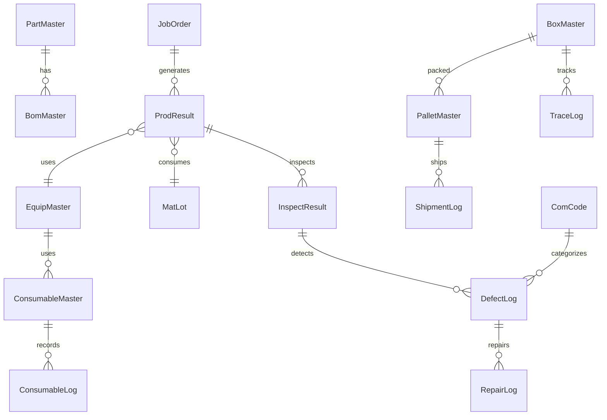

# 하네스 공정 MES 구축 구현 계획 (V_HNS 특화)

본 계획서는 하네스 제조 공정의 효율화와 4M 추적성 확보를 위한 전문가급 MES 구축 방안을 담고 있습니다.

## 1. 개요

- **목표:** 하네스 전 공정(자재~출하) 무결점 관리 및 4M 데이터 실시간 동기화.
- **핵심 기술:** NestJS, Prisma, PostgreSQL (Oracle 호환 구조), React (TanStack Table), MQTT.
- **특이사항:** 수량 차이 정산, 실시간 백플러시, 계층형 불량/수리, 팔레트 추적, **전 과정 취소(Undo) 보장**.

## 2. 주요 아키텍처 및 설계 방향

### A. Backend (NestJS)

- **모듈형 아키텍처:** 기능별(자재, 생산, 설비, 품질) 독립 모듈 구성.
- **DB 추상화:** Prisma를 사용하여 PostgreSQL 기반으로 개발하되, Oracle 예약어(ex: `ORDER`, `LEVEL` 등)를 피한 컬럼 네이밍 규칙 적용.
- **실시간성:** Socket.io를 통한 데이터 그리드 실시간 업데이트 및 MQTT 브로커 연동.

### B. Frontend (React + Vite)

- **디자인 시스템:** Vanilla CSS 기반의 프리미엄 다크/글래스모피즘 UI.
- **데이터 처리:** TanStack Table v8을 활용한 대용량 실적 데이터 처리.
- **스캔 엔진:** 브라우저 기반 QR/바코드 스캐너 (`html5-qrcode`) 연동.

### C. 시스템 메뉴 구성 (하네스 통합 관리)

- **0. 대시보드 (Dashboard)**: **[신규]** 실시간 생산 현황판, 설비 가동률(OEE), 품질 합격률 추이, 주요 인터락 발생 현황.
- **1. 자재관리 (Material)**: **[확장]** ERP PO 연동, 입하/IQC, 인보이스 정산, **재고실사(Physical Count), 재고조정(Adjustment), 월말 마감**.
- **2. 보세관리 (Customs)**: 수입신고번호 매칭, 보세 자재 반출입 이력, 사용신고 연동.
- **3. 절단공정 (Cutting)**: 절단 작업지시, 전선 릴(Reel) 투입, 절단/탈피 실적(로그 파싱).
- **4. 압착공정 (Crimping)**: 금형(Applicator) 수명, C/H 초물 승인 로직, 압착 실적 및 불량.
- **5. 생산관리 (Production)**: **[중요]** BOM 기반 실시간 자재 소모(Back-flush), 사내 반제품 공정, 완성조립(라인별 작업 분할), 생산 실적 등록.
- **6. 통전검사 (Inspection)**: **[보완]** 검사기 시리얼 통신(RS-232/Serial) 실시간 연동, PASS/FAIL 자동 판정, 합격 라벨 자동 출력(Zebra/ZPL).
- **7. 품질관리 (Quality)**: **[확장]** 초종물 관리, 4M 추적성 조회, 불량품 창고이동(MRB), 수리(Repair) 관리, 폐기(Scrap) 처리, SPC 관리도.
- **8. 소모품관리 (Consumables)**: **[신규]** 금형/지그/공구 입출고 관리, 소모품 현재고 현황, 수명(타수) 알림, 정기 점검 이력.
- **9. 설비관리 (Equipment)**: 실시간 가동 모니터링(MQTT), 예방 보전(PM), 고장/수리 이력.
- **9. 외주관리 (Outsourcing)**: **[정정]** 사외 외주 전문 (외주 작업지시, 자재출고/반제품입고, 외주처 재고).
- **10. 출하관리 (Shipping)**: **[신규]** 완제품 입고, 팔레트 적재(Palletizing), 출하 지시 연동, 상차 확인, 출하 성적서.
- **11. 인터페이스관리 (Interface)**: **[신규]** ERP 인터페이스 모니터링, 생산계획 수신, BOM/품목 마스터 동기화, ECO(설계변경) 이력 관리, 수동 재전송 기능.
- **11. 기준정보 (Master Data)**: **[확장]** 체번룰(Lot/고유번호 규칙), 코드 마스터, 공장/라인, 외주처, 품목/BOM, 설비 마스터, 권한 관리.

### D. 제조 라우팅 및 가변 설비 대응 로직

- **복합 설비 대응 실적 관리**:
  - **일체형 설비(Auto Crimping)**: [절단+압착]이 동시에 이루어지는 설비의 경우, 한 번의 스캔/로그 수신으로 두 공정의 실적을 동시 확정하고 BOM 자재(전선+단자)를 일괄 차감.
  - **분리형 설비(Single Process)**: 절단기와 압착기가 분리된 경우, 공정 라우팅(Process Map)에 따라 순차적으로 실적을 등록하며 각 단계별로 해당 자재를 개별 차감.
  - **자동/수동 모드 지원**: 설비 인터페이스(MQTT/Serial)를 통한 자동 실적 수집과 작업자 수동 입력을 병행 지원하여 모든 현장 상황에 대응.
- **사내 반제품 공정**: 전선 묶음 투입 → 각각의 전선 배합/조립 → 박스 패킹 및 실적 등록 (생산관리 메뉴에서 처리).
- **사외 외주**: 자재 창고에서 외주처로 자재 출고(LOT 추적) → 외부 생산(하네스 박스 패킹) → 사내 입고 및 검사 → 실적 확정.
- **ERP 인터페이스 로직**:
  - **Inbound**: 생산계획(Job Order), **구매주문(PO), 인보이스(Invoice)**, 품목 마스터, BOM, ECO(설계변경) 정보 수신.
  - **Outbound**: 확정된 생산 실적, 자재 입출고 이력, 실제 소무량(Back-flush) 정보를 ERP로 실시간/배치 전송.
  - **이력 관리**: 모든 송수신 데이터는 전문(Message) 단위로 로그를 남기며, 실패 시 관리 메뉴에서 수동 전송 가능.
- **코드 마스터 및 계층화 로직**:
  - **표준화**: 시스템 전반에서 사용되는 모든 코드(상태, 구분, 단위 등)를 공통 코드 마스터로 표준화.
  - **계층형 불량 코드**: 불량 항목을 **대분류-중분류-소분류**의 Tree 구조로 관리하여 통계 분석 연동.
  - **유연성**: 코드 그룹 및 상세 코드를 동적으로 추가/수정 가능하며, 정렬 순서 및 사용 여부 제어.
- **표준 체번 시스템 (Numbering Rule)**:
  - **구성 요소 설정**: Lot, 박스, 팔레트 등 각 번호 체계별로 [접두사(Prefix)], [YYYYMMDD 날짜], [라인코드], [일련번호(Sequence)] 등의 조합을 설정.
  - **동적 생성**: 실적 등록/포장 시 설정된 규칙에 따라 고유 번호를 자동 생성하며, 중복 방지 로직 포함.
  - **이력 관리**: 번호 생성 규칙이 변경되더라도 기존 번호의 추적성은 유지되도록 리비전 관리.
- **추적성(Traceability)**: 사외 외주 생산품 및 사내 반제품 모두 박스 단위 QR을 통해 투입 자재 LOT 역추적 가능.
- **BOM 기반 자재 소모(Back-flush) 로직**:
  - **이론 소모량 계산**: 생산 완료 실적(확정) 시, 해당 품목의 최신 BOM 리비전 정보를 참조하여 [생산수량 x 단위소요량]을 계산.
  - **실시간 차감**: 계산된 이론 소모량을 해당 생산 라인의 '현장재고(Line Side Stock)'에서 즉시 차감 처리.
  - **자재 부족 알림**: 차감 시 라인 재고가 마이너스가 될 경우, 즉시 인터락(작성 중단) 또는 관리자 알림(재고 조사 필요) 발생.
  - **불량/수율 반영**: 생산 실적 등록 시 입력된 불량 수량에 대해서도 BOM 기준 자재 소모를 동일하게 적용하고, 추가 소모 발생 시(Scrap) 수동 차감 기능 제공.
- **수입/IQC 프로세스 로직**:
  - **PO 연동**: ERP로부터 구매주문 정보를 실시간 수신하여 입하 예정 정보 생성.
  - **IQC 수량 검증**: 입하 시 실제 수량과 PO수량 비교 검수.
  - **차이수량 처리**: 주문량 대비 초과/미달 발생 시 해당 수량을 별도 격리 창고(Hold Warehouse)로 자동 이동 처리 및 인보이스 기준으로 정산 데이터 생성.
  - **인터락**: IQC 합격 판정 전에는 생산 라인 투입(사용신고) 불가 인터락 강제.
- **재고 실사 및 조정 로직**:
  - **실사 스냅샷**: 특정 시점(월말 등)의 전산고를 기준으로 실사 대상 리스트 생성.
  - **실사 등록**: 모바일/핸디터미널 스캐너를 활용하여 실제 현장 재고 수량 입력.
  - **차이 분석**: [전산재고 vs 실사재고] 차이 내역 자동 산출 및 원인 기록.
  - **재고 조정**: 승인된 차이 수량에 대해 전산고를 자동 업데이트하고, 관련 이력을 `InvAdjLog`에 기록.
- **공정 불량 대응 프로세스 로직**:
  - **불량 감지 및 격리**: 생산/검사 중 불량 발생 시 즉시 '불량 발생 등록'을 수행하며, 해당 제품/로트는 시스템상 **'작업 중단' 및 '격리'** 상태로 전환.
  - **원인 분석 연동**: 계층형 불량 코드를 선택하여 원인을 분류하고, 현장 사진이나 의견을 첨부하여 품질팀에 자동 알림 발송.
  - **처리 경로 결정**: 품질 담당자가 [수리(Repair)], [재작업(Rework)], [폐기(Scrap)], [특채(Concession)] 중 하나를 결정.
  - **로트 분할 처리**: 로트 생산 중 일부만 불량일 경우, 시스템에서 정상 수량과 불량 수량을 분할 관리하여 정상품은 다음 공정으로 이동 허용.
- **불량 처리 및 수리(Repair) 로직**:
  - **불량 발생**: 생산/검사 공정에서 불량 판정 시 즉시 현장 재고에서 차감 후 불량 대기고(Wait for Repair)로 이동.
  - **창고 이동**: 불량품을 전용 격리 창고(MRB)로 물리적/전산적 이동 처리 및 태그(QR) 발행.
  - **수리 관리**: 수리 진행 상태(대기-수리중-완료)를 추적하고, 수리 완료 시 양품 창고로 재입고 또는 최종 폐기(Scrap) 판정.
  - **재작업(Rework) 추적**: 수리/재작업 시 투입된 추가 자재 및 작업자 정보를 4M 이력에 병합.
- **출하 및 팔레트(Pallet) 관리 로직**:
  - **완제품 입고**: 사내 생산/수리 완료된 제품 박스를 완제품 창고로 입고 처리 (QR 스캔).
  - **팔레트 적재**: 출하 지시에 따라 여러 제품 박스를 하나의 팔레트 QR로 묶음 관리.
  - **출하 검사**: 상차 전 팔레트 단위로 최종 수량 및 품목 검증.
  - **출하 확정**: 상차 완료 시 ERP로 실적을 전송하고, 출하 명세서/성적서를 자동 발행.
- **전 트랜잭션 취소(Undo/Reverse) 로직**:
  - **취소 가능 보장**: 모든 실적 등록, 자재 이동, 재고 조정, 출하 확정 등 모든 트랜잭션은 '취소' 기능 제공.
  - **역방향 처리**: 취소 시 [재고 복구], [BOM 차감분 원복], [박스/팔레트 맵핑 해제] 등의 역방향 로직 자동 실행.
  - **이력 보존**: 실제 데이터를 삭제하는 것이 아니라 `Status`를 'Canceled'로 변경하고 취소 사유와 일시, 작업자를 기록하여 감사(Audit) 대응.
- **소모품(금형/지그) 관리 로직**:
  - **입출고 관리**: 금형, 지그, 소모성 공구의 신규 입고 및 생산 투입/회수 시 출고/반납 처리.
  - **수명 추적**: 특히 압착 금형(Applicator)의 경우, 설비 실적과 연동하여 실시간 타수(Shot Count)를 누적하고 임계치 도달 시 교체 알림.
  - **재고 최적화**: 소모품별 적정 재고를 설정하여 미달 시 자동 구매 요청 알림.
- **ERP 동기화**: 이미 ERP로 전송된 데이터 취소 시, ERP 측에도 정정/취소 전문을 자동으로 발송하여 정합성 유지.

### D. UI/UX 디자인 시스템 (WBS Master 스타일 계승)

- **디자인 컨셉**: 테두리가 둥근(`--radius: 0.5rem`) 현대적인 카드 기반 레이아웃과 부드러운 애니메이션(`animate-fade-in`, `animate-slide-up`).
- **폰트 시스템**: 메인 폰트로 세련된 `Outfit`을 사용하고, 데이터 그리드에는 가독성이 좋은 `Inter` 또는 `Roboto` 적용.
- **컬러 팔레트 (Light Mode)**:
  - Background: `oklch(0.98 0.001 247)` (매우 연한 그레이블루)
  - Surface/Card: `oklch(1.00 0 0)` (순백색)
  - Primary: `oklch(0.67 0.29 341)` (신뢰감을 주는 블루)
  - Text: `oklch(0.16 0.03 281)` (다크 차콜)
- **컬러 팔레트 (Dark Mode)**:
  - Background: `oklch(0.16 0.03 281)` (심해의 깊은 네이비)
  - Surface/Card: `oklch(0.25 0.06 281)` (차분한 슬레이트 블루)
  - Primary: `#137fec` (비비드한 스카이 블루)
  - Accent: `#f59e0b` (경고 및 강조를 위한 호박색)
- **인터랙션 포인트**: 버튼 호버 시 `oklch` 기반의 부드러운 색상 변화와 리플 효과(`ripple-effect`) 적용.

### E. 무결점 데이터 벨류 체인 (End-to-End Value Chain)

1.  **자재 입고 및 IQC**: ERP PO 기반 입하 → IQC(통과 시 LOT 발행) → 인보이스 정산 → 창고 입고 (재고+).
2.  **공정 투입 (Interlock)**: 작업지시 선택 → 원자재 LOT 스캔 (품목/유통기한/IQC합격여부 체크) → 인터락 통과 시 투입.
3.  **생산 및 자재 차감**: 설비 로그 수집/수동 등록 → 실적 확정 시 **BOM 기준 실시간 자재 차감(Back-flush)** (라인재고- / 생산재고+).
4.  **품질 관리 (Defect/Repair)**:
    - 불량 발생 시 즉시 격리(MRB창고 이동) → 실적 수량에서 자동 제외.
    - 수리(Repair) 완료 시 양품 창고 재입고(재고+) 또는 폐기 처리.
5.  **포장 및 적재 (Box/Pallet)**: 완제품 시리얼 → 박스 QR 연동 → 팔레트 QR 연동 (4M 데이터 계층 구조 완성).
6.  **제품 입고 및 출하**: 완제품 창고 입고(박스/팔레트 단위 스캔) → 출하 지시 연동 → 상차 검증(QR) → 출하 확정 및 ERP 전송.
7.  **전 과정 추적성 (Traceability)**: 팔레트/박스/시리얼 중 하나만 조회해도 [투입 LOT, 작업자, 설비, 검증결과, 수리이력]을 원샷으로 조회.
8.  **취소 보장 (Undo/Reverse)**: 어떤 단계에서든 취소 시 이전 데이터 상태(재고, 이력 등)를 완벽히 롤백하여 정합성 유지.

### E. 시스템 레이아웃 상세 설계

- **최상단 레이아웃**: `WBS Master`와 유사한 고정 헤더와 사이드바 구조.
- **사이드바**: '대시보드' → '8대 공정 그룹' → '기준정보' 순으로 배치. 다크 모드에서는 사이드바가 좀 더 어두운 톤으로 강조됨.
- **워크스페이스**: 멀티 탭 UI를 통해 여러 공정(절단, 압착 등)을 동시에 관리할 수 있는 유연한 구조.
- **데이터 그리드**: `TanStack Table`에 라이트/다크 모드별 최적화된 테마 적용 (Zebra Striping, Hover Highlight).

## 3. 상세 수정 및 신규 개발 사항

### [인프라 및 공통]

- **[NEW] `src/common`**: 다국어(i18next) 설정, 공통 API 응답 규격, 에러 핸들링.
- **[NEW] `src/ui-components`**: `Grid`, `Modal`, `Toast`, `StatusBar` 프리미엄 컴포넌트 구축.

### [데이터베이스 상세 설계]

하네스 공정의 4M 추적성 및 V_HNS 특화 로직을 지원하기 위한 상세 스키마 설계입니다. Oracle 전환을 고려하여 모든 명칭은 표준화된 영문을 사용하되 예약어를 회피합니다.

#### 1. 기준정보 그룹 (Master Data)

- **`ComCode` (공통코드)**: 대/중/소 계층 구조 (`GroupCode`, `DetailCode`, `ParentCode`).
- **`DefaultPlant` (공장/라인)**: 공장, 작업장(Shop), 라인, 셀 정보.
- **`PartMaster` (품목마스터)**: ERP 연동 품목 정보 (전선, 단자, 하네스 반제품 등).
- **`BomMaster` (BOM)**: 부모-자식 관계, 소요량, 설계변경(ECO) 리비전 관리.
- **`EquipMaster` (설비)**: 설비 코드, IP, 통신 방식(MQTT/Serial), 기본 사양.
- **`ConsumableMaster` (소모품)**: [신규] 금형/지그/공구 마스터, 기대 수명, 현재 타수/사용 횟수, 보관 위치.
- **`ConsumableLog` (입출금이력)**: [신규] 소모품 입고, 생산 투입, 반납, 수리, 폐기 이력.
- **`NumRuleMaster` (체번룰)**: [신규] 번호 구분(Lot/Box/Pallet 등), 패턴 정의(JSON/String), 현재 시퀀스 정보.

#### 2. 생산/공정 그룹 (Production)

- **`JobOrder` (작업지시)**: ERP 계획 수신 데이터 및 현장 분할 지시 (`OrderNo`, `LineCode`, `Status`).
- **`ProdResult` (생산실적)**: 공정별 작업 결과 (`WorkerID`, `EquipID`, `Qty`, `StartTime`, `EndTime`).
- **`ProcessMap` (공정라우팅)**: 품목별 거쳐야 하는 공정 순서 및 **설비 타입별 그룹화**(일체형/분리형) 관리.
- **`SubconResult` (외주실적)**: 사외 외주 생산 실적 및 입고 정보.

#### 3. 자재/재고 그룹 (Material)

- **`MatLot` (자재LOT)**: 입고된 원자재의 LOT 번호, 입고일, 유효기간, 원산지(보세).
- **`MatStock` (현재고)**: 창고/라인별 자재 실시간 잔량.
- **`MatIssue` (자재출고)**: 작업지시 또는 외주처로의 자재 불출 이력.

#### 4. 품질/추적 그룹 (Quality & Traceability)

- **`InspectResult` (검사실적)**: 통전검사 결과 (`CmnPass`, `ErrorCode`, `SerialData`).
- **`DefectLog` (불량로그)**: 발생 위치, 계층형 불량 코드, 폐기/수리 대상 여부, 현재 상태.
- **`RepairLog` (수리이력)**: [신규] 수리 작업자, 사용 자재, 수리 시간, 최종 판정(양품/폐기), 재작업 경로.
- **`BoxMaster` (포장박스)**: 완제품/반제품 박스 QR 정보, 박스 내 포함된 시리얼 리스트.
- **`PalletMaster` (팔레트)**: [신규] 팔레트 QR 정보, 팔레트 내 박스 리스트, 적재 상태.
- **`ShipmentLog` (출하이력)**: [신규] 출하 일시, 차량 정보, 배송지, 팔레트/박스 단위 출하 상세.
- **`TraceLog` (4M추적)**: `[PALLET] - [BOX/Serial] - [Lot] - [Equip] - [Worker]` 간의 관계 맵핑 테이블.

#### 5. 시스템/인터페이스 (System & Interface)

- **`UserAuth` (사용자)**: 현장 작업자 및 관리자 권한.
- **`InterLog` (ERP연동)**: `Inbound/Outbound` 전문 이력 및 성공 여부.

### [공정별 특화 로직]

- **입고/투입:** 사용신고 미완료 자재 투입 방지 인터락.
- **압착(Crimping):** 금형 타수(Shot Count) 기반 작업 제한 로직.
- **통전검사 설비 연동:** [신규] Serial Port(Web Serial API 또는 Gateway 서비스)를 통한 검사기 데이터 수신, 결과값(Pass/Fail) 자동 매칭 및 DB 기록.
- **라벨 출력:** [신규] 검사 합격 시 ZPL 명령어를 라벨 프린터로 전송하여 실시간 합격 라벨 발행.

## 4. 검증 계획

### 자동화 테스트

- **유닛 테스트:** `npm run test` (NestJS 서비스 로직 검증).
- **API 테스트:** Swagger 또는 Jest를 이용한 공정 인터락 API 검증.

### 수동 및 현장 검증

- **스캔 테스트:** 모바일/테블릿 브라우저를 통한 QR 스캔 성능 및 LOT 인식 속도 체크.
- **부하 테스트:** MQTT 데이터 동시 유입 시 로그 파서 처리 성능 확인.
- **사용자 검토:** V_HNS 현장 작업자 시나리오 기반 BOM 분할/실적 등록 UI 편의성 확인.
