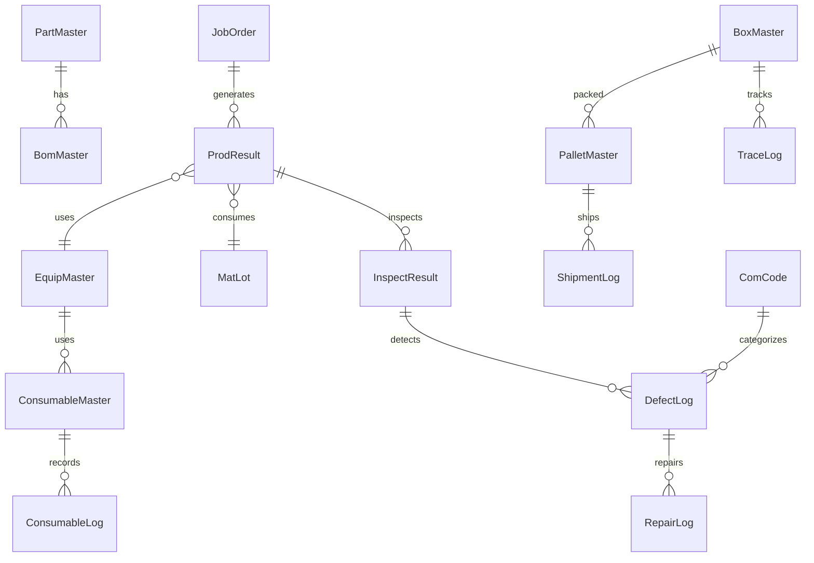

This file is a merged representation of a subset of the codebase, containing specifically included files and files not matching ignore patterns, combined into a single document by Repomix.

# File Summary

## Purpose
This file contains a packed representation of a subset of the repository's contents that is considered the most important context.
It is designed to be easily consumable by AI systems for analysis, code review,
or other automated processes.

## File Format
The content is organized as follows:
1. This summary section
2. Repository information
3. Directory structure
4. Repository files (if enabled)
5. Multiple file entries, each consisting of:
  a. A header with the file path (## File: path/to/file)
  b. The full contents of the file in a code block

## Usage Guidelines
- This file should be treated as read-only. Any changes should be made to the
  original repository files, not this packed version.
- When processing this file, use the file path to distinguish
  between different files in the repository.
- Be aware that this file may contain sensitive information. Handle it with
  the same level of security as you would the original repository.

## Notes
- Some files may have been excluded based on .gitignore rules and Repomix's configuration
- Binary files are not included in this packed representation. Please refer to the Repository Structure section for a complete list of file paths, including binary files
- Only files matching these patterns are included: **/*.ts, **/*.tsx, **/*.js, **/*.jsx, **/*.prisma, **/package.json, **/tsconfig.json, **/locales/*.json, **/*.md, !node_modules/**
- Files matching these patterns are excluded: repomix*.md, **/*.json, !package.json, !tsconfig.json, !**/locales/*.json, **/.env*, **/dist/**, **/build/**, **/.next/**, **/node_modules/**, **/*.log, **/*.lock, **/pnpm-lock.yaml, **/.git/**, **/.claude/**, **/coverage/**, **/__tests__/**, **/*.test.ts, **/*.test.tsx, **/*.spec.ts, **/*.spec.tsx, **/playwright-report/**, **/.playwright-mcp/**, **/harness.xlsx, **/*.bat
- Files matching patterns in .gitignore are excluded
- Files matching default ignore patterns are excluded
- Files are sorted by Git change count (files with more changes are at the bottom)

# Directory Structure
```
apps/backend/prisma/_clean-companies.js
apps/backend/prisma/_clean-dbess.js
apps/backend/prisma/fix-part-type.ts
apps/backend/prisma/schema.prisma
apps/backend/prisma/seed-arrival.ts
apps/backend/prisma/seed-bom-from-oracle.ts
apps/backend/prisma/seed-com-codes.ts
apps/backend/prisma/seed-company-from-oracle.ts
apps/backend/prisma/seed-company.ts
apps/backend/prisma/seed-department-from-oracle.ts
apps/backend/prisma/seed-parts-from-oracle.ts
apps/backend/prisma/seed-prodline.ts
apps/backend/prisma/seed-receiving.ts
apps/backend/prisma/seed-vendor.ts
apps/backend/prisma/seed-workers-from-oracle.ts
apps/backend/prisma/seed.ts
apps/backend/README.md
apps/backend/src/app.controller.ts
apps/backend/src/app.module.ts
apps/backend/src/app.service.ts
apps/backend/src/common/dto/response.dto.ts
apps/backend/src/common/filters/http-exception.filter.ts
apps/backend/src/common/guards/jwt-auth.guard.ts
apps/backend/src/common/index.ts
apps/backend/src/common/interceptors/logging.interceptor.ts
apps/backend/src/common/interceptors/transform.interceptor.ts
apps/backend/src/config/configuration.ts
apps/backend/src/main.ts
apps/backend/src/modules/auth/auth.controller.ts
apps/backend/src/modules/auth/auth.dto.ts
apps/backend/src/modules/auth/auth.module.ts
apps/backend/src/modules/auth/auth.service.ts
apps/backend/src/modules/consumables/consumables.module.ts
apps/backend/src/modules/consumables/controllers/consumables.controller.ts
apps/backend/src/modules/consumables/dto/consumables.dto.ts
apps/backend/src/modules/consumables/services/consumables.service.ts
apps/backend/src/modules/customs/controllers/customs.controller.ts
apps/backend/src/modules/customs/customs.module.ts
apps/backend/src/modules/customs/dto/customs.dto.ts
apps/backend/src/modules/customs/services/customs.service.ts
apps/backend/src/modules/equipment/controllers/consumable.controller.ts
apps/backend/src/modules/equipment/controllers/daily-inspect.controller.ts
apps/backend/src/modules/equipment/controllers/equip-master.controller.ts
apps/backend/src/modules/equipment/controllers/inspect-history.controller.ts
apps/backend/src/modules/equipment/controllers/periodic-inspect.controller.ts
apps/backend/src/modules/equipment/dto/consumable.dto.ts
apps/backend/src/modules/equipment/dto/equip-inspect.dto.ts
apps/backend/src/modules/equipment/dto/equip-master.dto.ts
apps/backend/src/modules/equipment/equipment.module.ts
apps/backend/src/modules/equipment/index.ts
apps/backend/src/modules/equipment/services/consumable.service.ts
apps/backend/src/modules/equipment/services/equip-inspect.service.ts
apps/backend/src/modules/equipment/services/equip-master.service.ts
apps/backend/src/modules/interface/controllers/interface.controller.ts
apps/backend/src/modules/interface/dto/interface.dto.ts
apps/backend/src/modules/interface/interface.module.ts
apps/backend/src/modules/interface/services/interface.service.ts
apps/backend/src/modules/inventory/dto/inventory.dto.ts
apps/backend/src/modules/inventory/inventory.controller.ts
apps/backend/src/modules/inventory/inventory.module.ts
apps/backend/src/modules/inventory/services/inventory.service.ts
apps/backend/src/modules/inventory/services/warehouse.service.ts
apps/backend/src/modules/master/controllers/bom.controller.ts
apps/backend/src/modules/master/controllers/com-code.controller.ts
apps/backend/src/modules/master/controllers/company.controller.ts
apps/backend/src/modules/master/controllers/department.controller.ts
apps/backend/src/modules/master/controllers/equip-inspect.controller.ts
apps/backend/src/modules/master/controllers/iqc-item.controller.ts
apps/backend/src/modules/master/controllers/label-template.controller.ts
apps/backend/src/modules/master/controllers/model-suffix.controller.ts
apps/backend/src/modules/master/controllers/part.controller.ts
apps/backend/src/modules/master/controllers/partner.controller.ts
apps/backend/src/modules/master/controllers/plant.controller.ts
apps/backend/src/modules/master/controllers/process.controller.ts
apps/backend/src/modules/master/controllers/prod-line.controller.ts
apps/backend/src/modules/master/controllers/routing.controller.ts
apps/backend/src/modules/master/controllers/transfer-rule.controller.ts
apps/backend/src/modules/master/controllers/work-instruction.controller.ts
apps/backend/src/modules/master/controllers/worker.controller.ts
apps/backend/src/modules/master/dto/bom.dto.ts
apps/backend/src/modules/master/dto/com-code.dto.ts
apps/backend/src/modules/master/dto/company.dto.ts
apps/backend/src/modules/master/dto/department.dto.ts
apps/backend/src/modules/master/dto/equip-inspect.dto.ts
apps/backend/src/modules/master/dto/iqc-item.dto.ts
apps/backend/src/modules/master/dto/label-template.dto.ts
apps/backend/src/modules/master/dto/model-suffix.dto.ts
apps/backend/src/modules/master/dto/part.dto.ts
apps/backend/src/modules/master/dto/partner.dto.ts
apps/backend/src/modules/master/dto/plant.dto.ts
apps/backend/src/modules/master/dto/process.dto.ts
apps/backend/src/modules/master/dto/prod-line.dto.ts
apps/backend/src/modules/master/dto/routing.dto.ts
apps/backend/src/modules/master/dto/transfer-rule.dto.ts
apps/backend/src/modules/master/dto/work-instruction.dto.ts
apps/backend/src/modules/master/dto/worker.dto.ts
apps/backend/src/modules/master/master.module.ts
apps/backend/src/modules/master/services/bom.service.ts
apps/backend/src/modules/master/services/com-code.service.ts
apps/backend/src/modules/master/services/company.service.ts
apps/backend/src/modules/master/services/department.service.ts
apps/backend/src/modules/master/services/equip-inspect.service.ts
apps/backend/src/modules/master/services/iqc-item.service.ts
apps/backend/src/modules/master/services/label-template.service.ts
apps/backend/src/modules/master/services/model-suffix.service.ts
apps/backend/src/modules/master/services/part.service.ts
apps/backend/src/modules/master/services/partner.service.ts
apps/backend/src/modules/master/services/plant.service.ts
apps/backend/src/modules/master/services/process.service.ts
apps/backend/src/modules/master/services/prod-line.service.ts
apps/backend/src/modules/master/services/routing.service.ts
apps/backend/src/modules/master/services/transfer-rule.service.ts
apps/backend/src/modules/master/services/work-instruction.service.ts
apps/backend/src/modules/master/services/worker.service.ts
apps/backend/src/modules/material/controllers/adjustment.controller.ts
apps/backend/src/modules/material/controllers/arrival.controller.ts
apps/backend/src/modules/material/controllers/hold.controller.ts
apps/backend/src/modules/material/controllers/iqc-history.controller.ts
apps/backend/src/modules/material/controllers/lot-split.controller.ts
apps/backend/src/modules/material/controllers/mat-issue.controller.ts
apps/backend/src/modules/material/controllers/mat-lot.controller.ts
apps/backend/src/modules/material/controllers/mat-stock.controller.ts
apps/backend/src/modules/material/controllers/misc-receipt.controller.ts
apps/backend/src/modules/material/controllers/physical-inv.controller.ts
apps/backend/src/modules/material/controllers/po-status.controller.ts
apps/backend/src/modules/material/controllers/purchase-order.controller.ts
apps/backend/src/modules/material/controllers/receipt-cancel.controller.ts
apps/backend/src/modules/material/controllers/receiving.controller.ts
apps/backend/src/modules/material/controllers/scrap.controller.ts
apps/backend/src/modules/material/controllers/shelf-life.controller.ts
apps/backend/src/modules/material/dto/adjustment.dto.ts
apps/backend/src/modules/material/dto/arrival.dto.ts
apps/backend/src/modules/material/dto/hold.dto.ts
apps/backend/src/modules/material/dto/iqc-history.dto.ts
apps/backend/src/modules/material/dto/lot-split.dto.ts
apps/backend/src/modules/material/dto/mat-issue.dto.ts
apps/backend/src/modules/material/dto/mat-lot.dto.ts
apps/backend/src/modules/material/dto/mat-stock.dto.ts
apps/backend/src/modules/material/dto/misc-receipt.dto.ts
apps/backend/src/modules/material/dto/physical-inv.dto.ts
apps/backend/src/modules/material/dto/po-status.dto.ts
apps/backend/src/modules/material/dto/purchase-order.dto.ts
apps/backend/src/modules/material/dto/receipt-cancel.dto.ts
apps/backend/src/modules/material/dto/receiving.dto.ts
apps/backend/src/modules/material/dto/scrap.dto.ts
apps/backend/src/modules/material/dto/shelf-life.dto.ts
apps/backend/src/modules/material/material.module.ts
apps/backend/src/modules/material/services/adjustment.service.ts
apps/backend/src/modules/material/services/arrival.service.ts
apps/backend/src/modules/material/services/hold.service.ts
apps/backend/src/modules/material/services/iqc-history.service.ts
apps/backend/src/modules/material/services/lot-split.service.ts
apps/backend/src/modules/material/services/mat-issue.service.ts
apps/backend/src/modules/material/services/mat-lot.service.ts
apps/backend/src/modules/material/services/mat-stock.service.ts
apps/backend/src/modules/material/services/misc-receipt.service.ts
apps/backend/src/modules/material/services/physical-inv.service.ts
apps/backend/src/modules/material/services/po-status.service.ts
apps/backend/src/modules/material/services/purchase-order.service.ts
apps/backend/src/modules/material/services/receipt-cancel.service.ts
apps/backend/src/modules/material/services/receiving.service.ts
apps/backend/src/modules/material/services/scrap.service.ts
apps/backend/src/modules/material/services/shelf-life.service.ts
apps/backend/src/modules/outsourcing/controllers/outsourcing.controller.ts
apps/backend/src/modules/outsourcing/dto/outsourcing.dto.ts
apps/backend/src/modules/outsourcing/outsourcing.module.ts
apps/backend/src/modules/outsourcing/services/outsourcing.service.ts
apps/backend/src/modules/production/controllers/index.ts
apps/backend/src/modules/production/controllers/job-order.controller.ts
apps/backend/src/modules/production/controllers/prod-result.controller.ts
apps/backend/src/modules/production/controllers/production-views.controller.ts
apps/backend/src/modules/production/dto/index.ts
apps/backend/src/modules/production/dto/job-order.dto.ts
apps/backend/src/modules/production/dto/prod-result.dto.ts
apps/backend/src/modules/production/dto/production-views.dto.ts
apps/backend/src/modules/production/index.ts
apps/backend/src/modules/production/production.module.ts
apps/backend/src/modules/production/services/index.ts
apps/backend/src/modules/production/services/job-order.service.ts
apps/backend/src/modules/production/services/prod-result.service.ts
apps/backend/src/modules/production/services/production-views.service.ts
apps/backend/src/modules/quality/controllers/defect-log.controller.ts
apps/backend/src/modules/quality/controllers/inspect-result.controller.ts
apps/backend/src/modules/quality/dto/defect-log.dto.ts
apps/backend/src/modules/quality/dto/inspect-result.dto.ts
apps/backend/src/modules/quality/quality.module.ts
apps/backend/src/modules/quality/services/defect-log.service.ts
apps/backend/src/modules/quality/services/inspect-result.service.ts
apps/backend/src/modules/shipping/controllers/box.controller.ts
apps/backend/src/modules/shipping/controllers/customer-order.controller.ts
apps/backend/src/modules/shipping/controllers/index.ts
apps/backend/src/modules/shipping/controllers/pallet.controller.ts
apps/backend/src/modules/shipping/controllers/ship-history.controller.ts
apps/backend/src/modules/shipping/controllers/ship-order.controller.ts
apps/backend/src/modules/shipping/controllers/ship-return.controller.ts
apps/backend/src/modules/shipping/controllers/shipment.controller.ts
apps/backend/src/modules/shipping/dto/box.dto.ts
apps/backend/src/modules/shipping/dto/customer-order.dto.ts
apps/backend/src/modules/shipping/dto/index.ts
apps/backend/src/modules/shipping/dto/pallet.dto.ts
apps/backend/src/modules/shipping/dto/ship-history.dto.ts
apps/backend/src/modules/shipping/dto/ship-order.dto.ts
apps/backend/src/modules/shipping/dto/ship-return.dto.ts
apps/backend/src/modules/shipping/dto/shipment.dto.ts
apps/backend/src/modules/shipping/index.ts
apps/backend/src/modules/shipping/services/box.service.ts
apps/backend/src/modules/shipping/services/customer-order.service.ts
apps/backend/src/modules/shipping/services/index.ts
apps/backend/src/modules/shipping/services/pallet.service.ts
apps/backend/src/modules/shipping/services/ship-history.service.ts
apps/backend/src/modules/shipping/services/ship-order.service.ts
apps/backend/src/modules/shipping/services/ship-return.service.ts
apps/backend/src/modules/shipping/services/shipment.service.ts
apps/backend/src/modules/shipping/shipping.module.ts
apps/backend/src/modules/system/controllers/comm-config.controller.ts
apps/backend/src/modules/system/dto/comm-config.dto.ts
apps/backend/src/modules/system/services/comm-config.service.ts
apps/backend/src/modules/system/system.module.ts
apps/backend/src/modules/user/user.controller.ts
apps/backend/src/modules/user/user.dto.ts
apps/backend/src/modules/user/user.module.ts
apps/backend/src/modules/user/user.service.ts
apps/backend/src/prisma/prisma.module.ts
apps/backend/src/prisma/prisma.service.ts
apps/backend/test/app.e2e-spec.ts
apps/frontend/next.config.ts
apps/frontend/src/app/(authenticated)/consumables/issuing/page.tsx
apps/frontend/src/app/(authenticated)/consumables/life/page.tsx
apps/frontend/src/app/(authenticated)/consumables/master/page.tsx
apps/frontend/src/app/(authenticated)/consumables/receiving/page.tsx
apps/frontend/src/app/(authenticated)/consumables/stock/page.tsx
apps/frontend/src/app/(authenticated)/customs/entry/page.tsx
apps/frontend/src/app/(authenticated)/customs/stock/page.tsx
apps/frontend/src/app/(authenticated)/customs/usage/page.tsx
apps/frontend/src/app/(authenticated)/dashboard/page.tsx
apps/frontend/src/app/(authenticated)/equipment/daily-inspect/page.tsx
apps/frontend/src/app/(authenticated)/equipment/inspect-history/page.tsx
apps/frontend/src/app/(authenticated)/equipment/mold/page.tsx
apps/frontend/src/app/(authenticated)/equipment/periodic-inspect/page.tsx
apps/frontend/src/app/(authenticated)/equipment/pm/page.tsx
apps/frontend/src/app/(authenticated)/equipment/status/page.tsx
apps/frontend/src/app/(authenticated)/inspection/equip/page.tsx
apps/frontend/src/app/(authenticated)/inspection/result/page.tsx
apps/frontend/src/app/(authenticated)/interface/dashboard/page.tsx
apps/frontend/src/app/(authenticated)/interface/log/page.tsx
apps/frontend/src/app/(authenticated)/interface/manual/page.tsx
apps/frontend/src/app/(authenticated)/inventory/lot/page.tsx
apps/frontend/src/app/(authenticated)/inventory/stock/page.tsx
apps/frontend/src/app/(authenticated)/inventory/transaction/page.tsx
apps/frontend/src/app/(authenticated)/layout.tsx
apps/frontend/src/app/(authenticated)/master/bom/components/BomTab.tsx
apps/frontend/src/app/(authenticated)/master/bom/components/RoutingLinkModal.tsx
apps/frontend/src/app/(authenticated)/master/bom/components/RoutingTab.tsx
apps/frontend/src/app/(authenticated)/master/bom/mockData.ts
apps/frontend/src/app/(authenticated)/master/bom/page.tsx
apps/frontend/src/app/(authenticated)/master/bom/types.ts
apps/frontend/src/app/(authenticated)/master/box/page.tsx
apps/frontend/src/app/(authenticated)/master/code/components/CodeDetailGrid.tsx
apps/frontend/src/app/(authenticated)/master/code/components/CodeFormModal.tsx
apps/frontend/src/app/(authenticated)/master/code/components/GroupList.tsx
apps/frontend/src/app/(authenticated)/master/code/page.tsx
apps/frontend/src/app/(authenticated)/master/code/types.ts
apps/frontend/src/app/(authenticated)/master/company/components/CompanyForm.tsx
apps/frontend/src/app/(authenticated)/master/company/page.tsx
apps/frontend/src/app/(authenticated)/master/company/types.ts
apps/frontend/src/app/(authenticated)/master/equip-inspect/components/InspectItemPanel.tsx
apps/frontend/src/app/(authenticated)/master/equip-inspect/components/LinkItemModal.tsx
apps/frontend/src/app/(authenticated)/master/equip-inspect/page.tsx
apps/frontend/src/app/(authenticated)/master/equip-inspect/types.ts
apps/frontend/src/app/(authenticated)/master/equip/page.tsx
apps/frontend/src/app/(authenticated)/master/inspect-item/page.tsx
apps/frontend/src/app/(authenticated)/master/iqc-item/page.tsx
apps/frontend/src/app/(authenticated)/master/iqc-item/types.ts
apps/frontend/src/app/(authenticated)/master/label/components/BarcodeCanvas.tsx
apps/frontend/src/app/(authenticated)/master/label/components/LabelCanvas.tsx
apps/frontend/src/app/(authenticated)/master/label/components/LabelDesigner.tsx
apps/frontend/src/app/(authenticated)/master/label/components/LabelGrid.tsx
apps/frontend/src/app/(authenticated)/master/label/components/LabelPreview.tsx
apps/frontend/src/app/(authenticated)/master/label/components/TemplateManager.tsx
apps/frontend/src/app/(authenticated)/master/label/components/TextSection.tsx
apps/frontend/src/app/(authenticated)/master/label/hooks/useLabelTemplates.ts
apps/frontend/src/app/(authenticated)/master/label/page.tsx
apps/frontend/src/app/(authenticated)/master/label/types.ts
apps/frontend/src/app/(authenticated)/master/model-suffix/page.tsx
apps/frontend/src/app/(authenticated)/master/part/components/IqcSettingModal.tsx
apps/frontend/src/app/(authenticated)/master/part/components/PartFormModal.tsx
apps/frontend/src/app/(authenticated)/master/part/page.tsx
apps/frontend/src/app/(authenticated)/master/part/types.ts
apps/frontend/src/app/(authenticated)/master/partner/page.tsx
apps/frontend/src/app/(authenticated)/master/process/page.tsx
apps/frontend/src/app/(authenticated)/master/prod-line/page.tsx
apps/frontend/src/app/(authenticated)/master/routing/page.tsx
apps/frontend/src/app/(authenticated)/master/warehouse/components/TransferRuleList.tsx
apps/frontend/src/app/(authenticated)/master/warehouse/components/WarehouseForm.tsx
apps/frontend/src/app/(authenticated)/master/warehouse/components/WarehouseList.tsx
apps/frontend/src/app/(authenticated)/master/warehouse/page.tsx
apps/frontend/src/app/(authenticated)/master/warehouse/types.ts
apps/frontend/src/app/(authenticated)/master/work-instruction/page.tsx
apps/frontend/src/app/(authenticated)/master/worker/page.tsx
apps/frontend/src/app/(authenticated)/master/worker/types.ts
apps/frontend/src/app/(authenticated)/material/adjustment/page.tsx
apps/frontend/src/app/(authenticated)/material/arrival/components/ArrivalCancelModal.tsx
apps/frontend/src/app/(authenticated)/material/arrival/components/ArrivalHistoryTable.tsx
apps/frontend/src/app/(authenticated)/material/arrival/components/ManualArrivalModal.tsx
apps/frontend/src/app/(authenticated)/material/arrival/components/PoArrivalModal.tsx
apps/frontend/src/app/(authenticated)/material/arrival/components/types.ts
apps/frontend/src/app/(authenticated)/material/arrival/page.tsx
apps/frontend/src/app/(authenticated)/material/hold/page.tsx
apps/frontend/src/app/(authenticated)/material/iqc-history/page.tsx
apps/frontend/src/app/(authenticated)/material/iqc/page.tsx
apps/frontend/src/app/(authenticated)/material/issue/page.tsx
apps/frontend/src/app/(authenticated)/material/lot-split/page.tsx
apps/frontend/src/app/(authenticated)/material/lot/page.tsx
apps/frontend/src/app/(authenticated)/material/misc-receipt/page.tsx
apps/frontend/src/app/(authenticated)/material/physical-inv/page.tsx
apps/frontend/src/app/(authenticated)/material/po-status/page.tsx
apps/frontend/src/app/(authenticated)/material/po/page.tsx
apps/frontend/src/app/(authenticated)/material/receipt-cancel/page.tsx
apps/frontend/src/app/(authenticated)/material/receive/components/ReceivableTable.tsx
apps/frontend/src/app/(authenticated)/material/receive/components/ReceivingHistoryTable.tsx
apps/frontend/src/app/(authenticated)/material/receive/components/types.ts
apps/frontend/src/app/(authenticated)/material/receive/page.tsx
apps/frontend/src/app/(authenticated)/material/request/page.tsx
apps/frontend/src/app/(authenticated)/material/scrap/page.tsx
apps/frontend/src/app/(authenticated)/material/shelf-life/page.tsx
apps/frontend/src/app/(authenticated)/material/stock/page.tsx
apps/frontend/src/app/(authenticated)/outsourcing/order/page.tsx
apps/frontend/src/app/(authenticated)/outsourcing/receive/page.tsx
apps/frontend/src/app/(authenticated)/outsourcing/vendor/page.tsx
apps/frontend/src/app/(authenticated)/production/input-equip/page.tsx
apps/frontend/src/app/(authenticated)/production/input-inspect/page.tsx
apps/frontend/src/app/(authenticated)/production/input-machine/page.tsx
apps/frontend/src/app/(authenticated)/production/input-manual/page.tsx
apps/frontend/src/app/(authenticated)/production/order/page.tsx
apps/frontend/src/app/(authenticated)/production/pack-result/page.tsx
apps/frontend/src/app/(authenticated)/production/progress/page.tsx
apps/frontend/src/app/(authenticated)/production/result/page.tsx
apps/frontend/src/app/(authenticated)/production/sample-inspect/page.tsx
apps/frontend/src/app/(authenticated)/production/wip-stock/page.tsx
apps/frontend/src/app/(authenticated)/quality/defect/page.tsx
apps/frontend/src/app/(authenticated)/quality/inspect/page.tsx
apps/frontend/src/app/(authenticated)/quality/trace/page.tsx
apps/frontend/src/app/(authenticated)/shipping/confirm/page.tsx
apps/frontend/src/app/(authenticated)/shipping/customer-po-status/page.tsx
apps/frontend/src/app/(authenticated)/shipping/customer-po/components/CustomerPoModal.tsx
apps/frontend/src/app/(authenticated)/shipping/customer-po/page.tsx
apps/frontend/src/app/(authenticated)/shipping/history/page.tsx
apps/frontend/src/app/(authenticated)/shipping/order/page.tsx
apps/frontend/src/app/(authenticated)/shipping/pack/page.tsx
apps/frontend/src/app/(authenticated)/shipping/pallet/page.tsx
apps/frontend/src/app/(authenticated)/shipping/return/page.tsx
apps/frontend/src/app/(authenticated)/system/comm-config/page.tsx
apps/frontend/src/app/(authenticated)/system/department/page.tsx
apps/frontend/src/app/(authenticated)/system/users/page.tsx
apps/frontend/src/app/components/LandingFeatures.tsx
apps/frontend/src/app/components/LandingFooter.tsx
apps/frontend/src/app/components/LandingHeader.tsx
apps/frontend/src/app/components/LandingHero.tsx
apps/frontend/src/app/layout.tsx
apps/frontend/src/app/login/components/LoginBranding.tsx
apps/frontend/src/app/login/page.tsx
apps/frontend/src/app/page.tsx
apps/frontend/src/app/providers.tsx
apps/frontend/src/components/charts/BarChart.tsx
apps/frontend/src/components/charts/index.ts
apps/frontend/src/components/charts/LineChart.tsx
apps/frontend/src/components/charts/PieChart.tsx
apps/frontend/src/components/consumables/IssuingModal.tsx
apps/frontend/src/components/consumables/IssuingReturnModal.tsx
apps/frontend/src/components/consumables/IssuingTable.tsx
apps/frontend/src/components/consumables/ReceivingModal.tsx
apps/frontend/src/components/consumables/ReceivingReturnModal.tsx
apps/frontend/src/components/consumables/ReceivingTable.tsx
apps/frontend/src/components/consumables/StockTable.tsx
apps/frontend/src/components/data-grid/DataGrid.tsx
apps/frontend/src/components/equipment/EquipmentStatusBadge.tsx
apps/frontend/src/components/equipment/LifeProgressBar.tsx
apps/frontend/src/components/equipment/PartStatusBadge.tsx
apps/frontend/src/components/layout/AuthGuard.tsx
apps/frontend/src/components/layout/Header.tsx
apps/frontend/src/components/layout/index.ts
apps/frontend/src/components/layout/LanguageSwitcher.tsx
apps/frontend/src/components/layout/MainLayout.tsx
apps/frontend/src/components/layout/Sidebar.tsx
apps/frontend/src/components/layout/SidebarMenu.tsx
apps/frontend/src/components/material/ArrivalModal.tsx
apps/frontend/src/components/material/ArrivalTable.tsx
apps/frontend/src/components/material/index.ts
apps/frontend/src/components/material/IqcModal.tsx
apps/frontend/src/components/material/IqcTable.tsx
apps/frontend/src/components/material/IssueProcessModal.tsx
apps/frontend/src/components/material/IssueTable.tsx
apps/frontend/src/components/material/ReceivingConfirmModal.tsx
apps/frontend/src/components/material/ReceivingTable.tsx
apps/frontend/src/components/material/RequestModal.tsx
apps/frontend/src/components/material/RequestTable.tsx
apps/frontend/src/components/material/StatusBadge.tsx
apps/frontend/src/components/production/WorkOrderContext.tsx
apps/frontend/src/components/shared/index.ts
apps/frontend/src/components/shared/PartSelect.tsx
apps/frontend/src/components/shared/WarehouseSelect.tsx
apps/frontend/src/components/shared/WorkerSelect.tsx
apps/frontend/src/components/shipping/index.ts
apps/frontend/src/components/shipping/StatusBadge.tsx
apps/frontend/src/components/system/CommConfigForm.tsx
apps/frontend/src/components/ui/Button.tsx
apps/frontend/src/components/ui/Card.tsx
apps/frontend/src/components/ui/ComCodeBadge.tsx
apps/frontend/src/components/ui/index.ts
apps/frontend/src/components/ui/Input.tsx
apps/frontend/src/components/ui/Modal.tsx
apps/frontend/src/components/ui/Select.tsx
apps/frontend/src/components/ui/StatCard.tsx
apps/frontend/src/components/worker/WorkerPhotoCropper.tsx
apps/frontend/src/components/worker/WorkerPhotoUpload.tsx
apps/frontend/src/components/worker/WorkerSelectModal.tsx
apps/frontend/src/components/worker/WorkerSelector.tsx
apps/frontend/src/contexts/index.ts
apps/frontend/src/contexts/ThemeContext.tsx
apps/frontend/src/hooks/consumables/useIssuingData.ts
apps/frontend/src/hooks/consumables/useReceivingData.ts
apps/frontend/src/hooks/consumables/useStockData.ts
apps/frontend/src/hooks/material/useArrivalData.ts
apps/frontend/src/hooks/material/useIqcData.ts
apps/frontend/src/hooks/material/useIssueData.ts
apps/frontend/src/hooks/material/useIssueRequestData.ts
apps/frontend/src/hooks/material/useReceivingData.ts
apps/frontend/src/hooks/system/useCommConfigData.ts
apps/frontend/src/hooks/useApi.ts
apps/frontend/src/hooks/useComCode.ts
apps/frontend/src/hooks/useMasterOptions.ts
apps/frontend/src/hooks/useTheme.ts
apps/frontend/src/lib/i18n.ts
apps/frontend/src/lib/utils.ts
apps/frontend/src/services/api.ts
apps/frontend/src/stores/authStore.ts
apps/frontend/src/stores/themeStore.ts
apps/frontend/src/types/bwip-js.d.ts
apps/frontend/src/types/cutting.ts
apps/frontend/src/types/equipment.ts
apps/frontend/src/types/index.ts
apps/frontend/src/types/mold.ts
CLAUDE.md
docs/01-공정별-요구사항.md
docs/02-WBS.md
docs/03-설비-PLC.md
docs/04-프로세스.md
docs/05-필요프로그램-원본.md
docs/06-필요프로그램-김산K추가분.md
docs/column-domain-dictionary.md
docs/DESIGN_PATTERNS.md
docs/inventory-design.md
docs/process-definition.md
implementation_plan.md
packages/config/eslint/base.js
packages/config/eslint/nest.js
packages/config/eslint/next.js
packages/shared/src/constants/com-code-values.ts
packages/shared/src/constants/index.ts
packages/shared/src/constants/menu.ts
packages/shared/src/constants/process.ts
packages/shared/src/constants/status.ts
packages/shared/src/index.ts
packages/shared/src/types/api.ts
packages/shared/src/types/com-code.ts
packages/shared/src/types/enums.ts
packages/shared/src/types/index.ts
packages/shared/src/types/master.ts
packages/shared/src/types/material.ts
packages/shared/src/types/production.ts
packages/shared/src/types/quality.ts
packages/shared/src/types/shipping.ts
packages/shared/src/types/traceability.ts
packages/shared/src/utils/date.ts
packages/shared/src/utils/index.ts
packages/shared/src/utils/numbering.ts
task.md
```

# Files

## File: apps/backend/prisma/_clean-companies.js
````javascript
const { PrismaClient } = require('@prisma/client');
const p = new PrismaClient();
async function run() {
  const del = await p.companyMaster.deleteMany({ where: { companyCode: { in: ['HANES', 'HANES-KR'] } } });
  console.log('Removed old:', del.count);
  const all = await p.companyMaster.findMany({ where: { deletedAt: null }, select: { companyCode: true, companyName: true } });
  console.log('Current:', JSON.stringify(all));
  await p.$disconnect();
}
run();
````

## File: apps/backend/prisma/_clean-dbess.js
````javascript
const { PrismaClient } = require('@prisma/client');
const p = new PrismaClient();
async function run() {
  const del = await p.companyMaster.deleteMany({ where: { companyCode: 'DBESS' } });
  console.log('Deleted DBESS:', del.count);
  const all = await p.companyMaster.findMany({ where: { deletedAt: null }, select: { companyCode: true, companyName: true } });
  console.log('Current:', JSON.stringify(all));
  await p.$disconnect();
}
run();
````

## File: apps/backend/prisma/fix-part-type.ts
````typescript
/**
 * @file prisma/fix-part-type.ts
 * @description partType 복원: 마지막 잘못된 회전 되돌리기
 * 현재: FG=365(원자재), RAW=894(HNS ASSY), WIP=56(Cable Assy)
 * 목표: FG=56, WIP=894, RAW=365
 */
import { PrismaClient } from '@prisma/client';
const prisma = new PrismaClient();

async function fix() {
  const before = await prisma.partMaster.groupBy({ by: ['partType'], _count: { id: true } });
  console.log('수정 전:', JSON.stringify(before, null, 2));

  // 현재 잘못된 상태: FG=365, RAW=894, WIP=56
  // 목표: FG=56, WIP=894, RAW=365
  // 역회전: WIP→FG, FG→RAW, RAW→WIP

  const r1 = await prisma.partMaster.updateMany({ where: { partType: 'WIP' }, data: { partType: 'TEMP_FG' } });
  console.log('WIP(56) -> TEMP_FG:', r1.count);

  const r2 = await prisma.partMaster.updateMany({ where: { partType: 'FG' }, data: { partType: 'TEMP_RAW' } });
  console.log('FG(365) -> TEMP_RAW:', r2.count);

  const r3 = await prisma.partMaster.updateMany({ where: { partType: 'RAW' }, data: { partType: 'WIP' } });
  console.log('RAW(894) -> WIP:', r3.count);

  const r4 = await prisma.partMaster.updateMany({ where: { partType: 'TEMP_FG' }, data: { partType: 'FG' } });
  console.log('TEMP_FG -> FG:', r4.count);

  const r5 = await prisma.partMaster.updateMany({ where: { partType: 'TEMP_RAW' }, data: { partType: 'RAW' } });
  console.log('TEMP_RAW -> RAW:', r5.count);

  const after = await prisma.partMaster.groupBy({ by: ['partType'], _count: { id: true } });
  console.log('수정 후:', JSON.stringify(after, null, 2));
}

fix()
  .catch(console.error)
  .finally(() => prisma.$disconnect());
````

## File: apps/backend/prisma/seed-company-from-oracle.ts
````typescript
/**
 * @file prisma/seed-company-from-oracle.ts
 * @description Oracle TM_COMPANY → Supabase company_masters 데이터 이관 스크립트
 *
 * 실행 방법:
 *   npx ts-node prisma/seed-company-from-oracle.ts
 *
 * 매핑 규칙:
 *   CLIENT + COMPANY → companyCode (예: "1060-40" 또는 COMPANY 단독)
 *   COMPANYNAME → companyName
 *   USEFLAG → useYn
 *   REMARKS → remark
 */

import { PrismaClient } from "@prisma/client";
import * as fs from "fs";
import * as path from "path";

const prisma = new PrismaClient();

interface OracleCompany {
  CLIENT: string;
  COMPANY: string;
  COMPANYNAME: string;
  USEFLAG: string | null;
  REMARKS: string | null;
  CREATETIMEKEY: string | null;
  CREATEUSER: string | null;
}

async function main() {
  // 1. Oracle 추출 데이터 로드
  const jsonPath = path.join(__dirname, "oracle_companies.json");
  const raw = JSON.parse(fs.readFileSync(jsonPath, "utf-8"));

  if (!raw.success || !raw.data) {
    console.error("Oracle 데이터 파일이 유효하지 않습니다.");
    process.exit(1);
  }

  const companies: OracleCompany[] = raw.data;
  console.log(`\n🏢 Oracle TM_COMPANY 로드 완료: ${companies.length}건`);

  // 2. 데이터 변환 및 upsert
  console.log("\n📥 데이터 이관 중...");

  let successCount = 0;
  const errors: string[] = [];

  for (const comp of companies) {
    const companyCode = comp.COMPANY.trim();
    const companyName = comp.COMPANYNAME.trim();

    try {
      await prisma.companyMaster.upsert({
        where: { companyCode },
        update: {
          companyName,
          useYn: comp.USEFLAG || "Y",
          remark: comp.REMARKS || null,
          updatedBy: "ORACLE_IMPORT",
        },
        create: {
          companyCode,
          companyName,
          useYn: comp.USEFLAG || "Y",
          remark: comp.REMARKS || null,
          createdBy: comp.CREATEUSER || "ORACLE_IMPORT",
        },
      });
      successCount++;
      console.log(`   ✅ ${companyCode} - ${companyName}`);
    } catch (err: any) {
      errors.push(`${companyCode}: ${err.message?.slice(0, 80)}`);
      console.log(`   ❌ ${companyCode} - ${err.message?.slice(0, 80)}`);
    }
  }

  console.log("\n" + "=".repeat(50));
  console.log(`✅ 이관 완료! 성공: ${successCount}건, 실패: ${errors.length}건`);
  if (errors.length > 0) {
    console.log("에러 상세:");
    errors.forEach((e) => console.log(`   ${e}`));
  }
  console.log("=".repeat(50));

  // 3. 검증
  const totalInDb = await prisma.companyMaster.count({ where: { deletedAt: null } });
  const allCompanies = await prisma.companyMaster.findMany({
    where: { deletedAt: null },
    select: { companyCode: true, companyName: true, useYn: true },
  });

  console.log(`\n📊 이관 검증: DB 총 ${totalInDb}건`);
  allCompanies.forEach((c) =>
    console.log(`   - ${c.companyCode}: ${c.companyName} (${c.useYn})`),
  );
}

main()
  .catch((e) => {
    console.error("이관 실패:", e);
    process.exit(1);
  })
  .finally(() => prisma.$disconnect());
````

## File: apps/backend/prisma/seed-company.ts
````typescript
/**
 * @file apps/backend/prisma/seed-company.ts
 * @description 기본 회사 시드 데이터
 *
 * 사용법: seed.ts에서 호출하거나 단독 실행
 */

import { PrismaClient } from '@prisma/client';

const prisma = new PrismaClient();

export async function seedCompanies() {
  const companies = [
    {
      companyCode: '40',
      companyName: '동방 ESS HNS MES',
      address: 'China',
      useYn: 'Y',
    },
  ];

  for (const comp of companies) {
    await prisma.companyMaster.upsert({
      where: { companyCode: comp.companyCode },
      update: {},
      create: comp,
    });
    console.log(`Company seeded: ${comp.companyCode} - ${comp.companyName}`);
  }
}

// 단독 실행 지원
if (require.main === module) {
  seedCompanies()
    .then(() => console.log('Company seeding completed!'))
    .catch(console.error)
    .finally(() => prisma.$disconnect());
}
````

## File: apps/backend/prisma/seed-department-from-oracle.ts
````typescript
/**
 * @file prisma/seed-department-from-oracle.ts
 * @description Oracle TM_DEPARTMENT → Supabase department_masters 데이터 이관 스크립트
 *
 * 실행 방법:
 *   npx ts-node prisma/seed-department-from-oracle.ts
 *
 * 매핑 규칙:
 *   DEPARTMENT → deptCode (부서코드)
 *   DEPARTMENTNAME → deptName (부서명)
 *   COMPANY → company
 *   PLANT → plant
 *   USEFLAG → useYn
 *   REMARKS → remark
 */

import { PrismaClient } from "@prisma/client";
import * as fs from "fs";
import * as path from "path";

const prisma = new PrismaClient();

interface OracleDepartment {
  CLIENT: string;
  COMPANY: string;
  PLANT: string;
  DEPARTMENT: string;
  DEPARTMENTNAME: string;
  USEFLAG: string | null;
  REMARKS: string | null;
  CREATETIMEKEY: string | null;
  CREATEUSER: string | null;
}

async function main() {
  // 1. Oracle 추출 데이터 로드
  const jsonPath = path.join(__dirname, "oracle_departments.json");
  const raw = JSON.parse(fs.readFileSync(jsonPath, "utf-8"));

  if (!raw.success || !raw.data) {
    console.error("Oracle 데이터 파일이 유효하지 않습니다.");
    process.exit(1);
  }

  const departments: OracleDepartment[] = raw.data;
  console.log(`\n🏢 Oracle TM_DEPARTMENT 로드 완료: ${departments.length}건`);

  // 2. 데이터 변환 및 upsert
  console.log("\n📥 데이터 이관 중...");

  let successCount = 0;
  const errors: string[] = [];

  for (let i = 0; i < departments.length; i++) {
    const dept = departments[i];
    const deptCode = dept.DEPARTMENT.trim();
    const deptName = dept.DEPARTMENTNAME.trim();

    try {
      await prisma.departmentMaster.upsert({
        where: { deptCode },
        update: {
          deptName,
          company: dept.COMPANY?.trim() || null,
          plant: dept.PLANT?.trim() || null,
          useYn: dept.USEFLAG || "Y",
          remark: dept.REMARKS || null,
          sortOrder: i * 10,
          updatedBy: "ORACLE_IMPORT",
        },
        create: {
          deptCode,
          deptName,
          company: dept.COMPANY?.trim() || null,
          plant: dept.PLANT?.trim() || null,
          useYn: dept.USEFLAG || "Y",
          remark: dept.REMARKS || null,
          sortOrder: i * 10,
          createdBy: dept.CREATEUSER || "ORACLE_IMPORT",
        },
      });
      successCount++;
      console.log(`   ✅ ${deptCode} - ${deptName}`);
    } catch (err: any) {
      errors.push(`${deptCode}: ${err.message?.slice(0, 80)}`);
      console.log(`   ❌ ${deptCode} - ${err.message?.slice(0, 80)}`);
    }
  }

  console.log("\n" + "=".repeat(50));
  console.log(`✅ 이관 완료! 성공: ${successCount}건, 실패: ${errors.length}건`);
  if (errors.length > 0) {
    console.log("에러 상세:");
    errors.forEach((e) => console.log(`   ${e}`));
  }
  console.log("=".repeat(50));

  // 3. 검증
  const totalInDb = await prisma.departmentMaster.count({ where: { deletedAt: null } });
  const allDepts = await prisma.departmentMaster.findMany({
    where: { deletedAt: null },
    select: { deptCode: true, deptName: true, useYn: true },
    orderBy: { sortOrder: "asc" },
  });

  console.log(`\n📊 이관 검증: DB 총 ${totalInDb}건`);
  allDepts.forEach((d) =>
    console.log(`   - ${d.deptCode}: ${d.deptName} (${d.useYn})`),
  );
}

main()
  .catch((e) => {
    console.error("이관 실패:", e);
    process.exit(1);
  })
  .finally(() => prisma.$disconnect());
````

## File: apps/backend/prisma/seed-prodline.ts
````typescript
/**
 * @file prisma/seed-prodline.ts
 * @description Oracle TM_PRODLINE → Supabase prod_line_masters 마이그레이션
 *
 * 실행: npx tsx prisma/seed-prodline.ts
 */
import { PrismaClient } from '@prisma/client';

const prisma = new PrismaClient();

const prodLineData = [
  { lineCode: 'NONE', lineName: 'NONE', whLoc: 'LOC002', oper: '#0000', lineType: null },
  { lineCode: 'P2001', lineName: '压接1生产线', whLoc: 'LOC002', oper: '#0100', lineType: null },
  { lineCode: 'P2002', lineName: '(手动)压接1生产线', whLoc: 'LOC002', oper: '#0150', lineType: null },
  { lineCode: 'P2003', lineName: '组装1生产线', whLoc: 'LOC002', oper: '#0200', lineType: null },
  { lineCode: 'P2004', lineName: '排板1生产线', whLoc: 'LOC002', oper: '#0300', lineType: null },
  { lineCode: 'P2005', lineName: '通电1生产线', whLoc: 'LOC002', oper: '#0400', lineType: null },
  { lineCode: 'P2006', lineName: '包装1生产线', whLoc: 'LOC002', oper: '#0500', lineType: 'PACKING' },
  { lineCode: 'P2007', lineName: '外观检查', whLoc: 'LOC002', oper: 'NONE', lineType: null },
  { lineCode: 'P2008', lineName: 'SUB排板1生产线', whLoc: 'LOC002', oper: '#0202', lineType: null },
  { lineCode: 'P2009', lineName: '(手动)脱皮1生产线', whLoc: 'LOC002', oper: '#0151', lineType: null },
  { lineCode: 'P2010', lineName: 'GP12检查', whLoc: 'LOC002', oper: '#0800', lineType: null },
];

async function main() {
  console.log('=== Oracle TM_PRODLINE → Supabase prod_line_masters 마이그레이션 ===');

  const { count: deleted } = await prisma.prodLineMaster.deleteMany({});
  console.log(`기존 삭제: ${deleted}건`);

  const result = await prisma.prodLineMaster.createMany({
    data: prodLineData.map((p) => ({
      lineCode: p.lineCode,
      lineName: p.lineName,
      whLoc: p.whLoc,
      oper: p.oper,
      lineType: p.lineType || undefined,
      useYn: 'Y',
    })),
    skipDuplicates: true,
  });

  console.log(`삽입 완료: ${result.count}건`);

  const all = await prisma.prodLineMaster.findMany({ orderBy: { lineCode: 'asc' } });
  console.log('\n=== 결과 ===');
  all.forEach((p) => console.log(`  ${p.lineCode} | ${p.lineName} | oper=${p.oper} | type=${p.lineType || '-'}`));
}

main()
  .catch(console.error)
  .finally(() => prisma.$disconnect());
````

## File: apps/backend/prisma/seed-vendor.ts
````typescript
/**
 * @file prisma/seed-vendor.ts
 * @description Oracle TM_VENDOR → Supabase partner_masters 마이그레이션
 *
 * 실행: npx tsx prisma/seed-vendor.ts
 *
 * 매핑:
 * - VENDOR → partnerCode
 * - VENDORNAME → partnerName
 * - PRCFLAG/SALFLAG → partnerType (SUPPLIER/CUSTOMER)
 * - ENTRYNO → bizNo, CEONAME → ceoName, ADDRESS → address
 * - PHONE → tel, FAXNO → fax, USEFLAG → useYn, REMARKS → remark
 */
import { PrismaClient } from '@prisma/client';

const prisma = new PrismaClient();

interface OracleVendor {
  VENDOR: string;
  VENDORNAME: string;
  MAKER: string | null;
  ENTRYNO: string | null;
  CONTRYNO: string | null;
  CEONAME: string | null;
  PHONE: string | null;
  FAXNO: string | null;
  ADDRESS: string | null;
  PRCFLAG: string;
  SALFLAG: string;
  OSCFLAG: string;
  USEFLAG: string;
  REMARKS: string | null;
}

/** "." 같은 placeholder 값을 null로 치환 */
function clean(val: string | null): string | undefined {
  if (!val || val.trim() === '' || val.trim() === '.') return undefined;
  return val.trim();
}

/** PRCFLAG/SALFLAG → partnerType 결정 */
function resolvePartnerType(prcFlag: string, salFlag: string): string {
  if (salFlag === 'Y' && prcFlag !== 'Y') return 'CUSTOMER';
  return 'SUPPLIER';
}

const vendorData: OracleVendor[] = [
  { VENDOR: '101268', VENDORNAME: '无锡LS', MAKER: null, ENTRYNO: null, CONTRYNO: null, CEONAME: null, PHONE: null, FAXNO: null, ADDRESS: null, PRCFLAG: 'Y', SALFLAG: 'N', OSCFLAG: 'N', USEFLAG: 'Y', REMARKS: null },
  { VENDOR: '101269', VENDORNAME: 'EUJIN', MAKER: null, ENTRYNO: null, CONTRYNO: null, CEONAME: null, PHONE: null, FAXNO: null, ADDRESS: null, PRCFLAG: 'Y', SALFLAG: 'N', OSCFLAG: 'N', USEFLAG: 'Y', REMARKS: null },
  { VENDOR: '101270', VENDORNAME: 'LG Energy Solution', MAKER: null, ENTRYNO: null, CONTRYNO: null, CEONAME: null, PHONE: null, FAXNO: null, ADDRESS: null, PRCFLAG: 'N', SALFLAG: 'Y', OSCFLAG: 'N', USEFLAG: 'Y', REMARKS: null },
  { VENDOR: '101271', VENDORNAME: '南京万佳精密注塑有限公司', MAKER: null, ENTRYNO: '.', CONTRYNO: null, CEONAME: '.', PHONE: null, FAXNO: null, ADDRESS: '.', PRCFLAG: 'Y', SALFLAG: 'Y', OSCFLAG: 'Y', USEFLAG: 'Y', REMARKS: null },
  { VENDOR: '101272', VENDORNAME: '常熟新都安电器股份有限公司', MAKER: null, ENTRYNO: '.', CONTRYNO: null, CEONAME: '.', PHONE: null, FAXNO: null, ADDRESS: '.', PRCFLAG: 'Y', SALFLAG: 'Y', OSCFLAG: 'Y', USEFLAG: 'Y', REMARKS: null },
];

async function main() {
  console.log('=== Oracle TM_VENDOR → Supabase partner_masters 마이그레이션 ===');

  // 1. 기존 데이터 삭제
  const { count: deleted } = await prisma.partnerMaster.deleteMany({});
  console.log(`기존 거래처 삭제: ${deleted}건`);

  // 2. 데이터 삽입
  const result = await prisma.partnerMaster.createMany({
    data: vendorData.map((v) => ({
      partnerCode: v.VENDOR,
      partnerName: v.VENDORNAME,
      partnerType: resolvePartnerType(v.PRCFLAG, v.SALFLAG),
      bizNo: clean(v.ENTRYNO),
      ceoName: clean(v.CEONAME),
      address: clean(v.ADDRESS),
      tel: clean(v.PHONE),
      fax: clean(v.FAXNO),
      remark: clean(v.REMARKS),
      useYn: v.USEFLAG === 'Y' ? 'Y' : 'N',
    })),
    skipDuplicates: true,
  });

  console.log(`삽입 완료: ${result.count}건`);

  // 3. 결과 확인
  const all = await prisma.partnerMaster.findMany({ orderBy: { partnerCode: 'asc' } });
  console.log('\n=== 결과 ===');
  all.forEach((p) => {
    console.log(`  ${p.partnerCode} | ${p.partnerName} | ${p.partnerType} | useYn=${p.useYn}`);
  });
}

main()
  .catch(console.error)
  .finally(() => prisma.$disconnect());
````

## File: apps/backend/prisma/seed-workers-from-oracle.ts
````typescript
/**
 * @file prisma/seed-workers-from-oracle.ts
 * @description Oracle TM_EHR → Supabase worker_masters 데이터 이관 스크립트
 *
 * 실행 방법:
 *   npx ts-node prisma/seed-workers-from-oracle.ts
 *
 * 매핑 규칙:
 *   EHRCODE      → workerCode
 *   LOCUSERNAME  → workerName
 *   ENGUSERNAME  → engName
 *   DEPARTMENT   → dept
 *   POSITION     → position
 *   PHONE        → phone
 *   EMAIL        → email
 *   HIREDATE     → hireDate
 *   QUITDATE     → quitDate
 *   USEFLAG      → useYn
 *   REMARKS      → remark
 */

import { PrismaClient } from "@prisma/client";
import * as fs from "fs";
import * as path from "path";

const prisma = new PrismaClient();

interface OracleEhr {
  EHRCODE: string;
  LOCUSERNAME: string;
  ENGUSERNAME: string | null;
  PHONE: string | null;
  EMAIL: string | null;
  DEPARTMENT: string | null;
  POSITION: string | null;
  HIREDATE: string | null;
  QUITDATE: string | null;
  USEFLAG: string;
  REMARKS: string | null;
}

async function main() {
  const jsonPath = path.join(__dirname, "oracle_ehr.json");
  if (!fs.existsSync(jsonPath)) {
    console.error("oracle_ehr.json not found. Run Oracle query first.");
    process.exit(1);
  }

  const raw = JSON.parse(fs.readFileSync(jsonPath, "utf-8"));
  const rows: OracleEhr[] = raw.data ?? raw;
  console.log(`📋 Total EHR records: ${rows.length}`);

  let created = 0;
  let updated = 0;
  let skipped = 0;

  for (const row of rows) {
    const workerCode = String(row.EHRCODE).trim();
    if (!workerCode) {
      skipped++;
      continue;
    }

    const data = {
      workerName: row.LOCUSERNAME?.trim() || workerCode,
      engName: row.ENGUSERNAME?.trim() || undefined,
      dept: row.DEPARTMENT?.trim() || undefined,
      position: row.POSITION?.trim() || undefined,
      phone: row.PHONE?.trim() || undefined,
      email: row.EMAIL?.trim() || undefined,
      hireDate: row.HIREDATE?.trim() || undefined,
      quitDate: row.QUITDATE?.trim() || undefined,
      remark: row.REMARKS?.trim() || undefined,
      useYn: row.USEFLAG === "Y" ? "Y" : "N",
    };

    const existing = await prisma.workerMaster.findFirst({
      where: { workerCode, deletedAt: null },
    });

    if (existing) {
      await prisma.workerMaster.update({
        where: { id: existing.id },
        data,
      });
      updated++;
    } else {
      await prisma.workerMaster.create({
        data: { workerCode, ...data },
      });
      created++;
    }
  }

  console.log(`✅ Created: ${created}, Updated: ${updated}, Skipped: ${skipped}`);
  console.log(`📊 Total worker_masters: ${await prisma.workerMaster.count()}`);
}

main()
  .catch((e) => {
    console.error("❌ Seed failed:", e);
    process.exit(1);
  })
  .finally(() => prisma.$disconnect());
````

## File: apps/backend/src/modules/master/controllers/company.controller.ts
````typescript
/**
 * @file src/modules/master/controllers/company.controller.ts
 * @description 회사마스터 CRUD API 컨트롤러
 *
 * 엔드포인트:
 * - GET  /master/companies         — 목록 (페이지네이션 + 검색, 인증 필요)
 * - GET  /master/companies/public  — 활성 회사 목록 (인증 불필요, 로그인 페이지용)
 * - GET  /master/companies/:id     — 상세 조회
 * - POST /master/companies         — 생성
 * - PUT  /master/companies/:id     — 수정
 * - DELETE /master/companies/:id   — 소프트 삭제
 */

import { Controller, Get, Post, Put, Delete, Body, Param, Query, HttpCode, HttpStatus } from '@nestjs/common';
import { ApiTags, ApiOperation } from '@nestjs/swagger';
import { CompanyService } from '../services/company.service';
import { CreateCompanyDto, UpdateCompanyDto, CompanyQueryDto } from '../dto/company.dto';
import { ResponseUtil } from '../../../common/dto/response.dto';

@ApiTags('기준정보 - 회사마스터')
@Controller('master/companies')
export class CompanyController {
  constructor(private readonly companyService: CompanyService) {}

  /** 공개 API — 활성 회사 목록 (로그인 페이지용, 인증 불필요) */
  @Get('public')
  @ApiOperation({ summary: '활성 회사 목록 (인증 불필요)' })
  async findPublic() {
    const data = await this.companyService.findPublic();
    return ResponseUtil.success(data);
  }

  @Get()
  @ApiOperation({ summary: '회사 목록 조회' })
  async findAll(@Query() query: CompanyQueryDto) {
    const result = await this.companyService.findAll(query);
    return ResponseUtil.paged(result.data, result.total, result.page, result.limit);
  }

  @Get(':id')
  @ApiOperation({ summary: '회사 상세 조회' })
  async findById(@Param('id') id: string) {
    const data = await this.companyService.findById(id);
    return ResponseUtil.success(data);
  }

  @Post()
  @HttpCode(HttpStatus.CREATED)
  @ApiOperation({ summary: '회사 생성' })
  async create(@Body() dto: CreateCompanyDto) {
    const data = await this.companyService.create(dto);
    return ResponseUtil.success(data, '회사가 생성되었습니다.');
  }

  @Put(':id')
  @ApiOperation({ summary: '회사 수정' })
  async update(@Param('id') id: string, @Body() dto: UpdateCompanyDto) {
    const data = await this.companyService.update(id, dto);
    return ResponseUtil.success(data, '회사가 수정되었습니다.');
  }

  @Delete(':id')
  @ApiOperation({ summary: '회사 삭제' })
  async delete(@Param('id') id: string) {
    await this.companyService.delete(id);
    return ResponseUtil.success(null, '회사가 삭제되었습니다.');
  }
}
````

## File: apps/backend/src/modules/master/controllers/department.controller.ts
````typescript
/**
 * @file src/modules/master/controllers/department.controller.ts
 * @description 부서마스터 CRUD API 컨트롤러
 */

import { Controller, Get, Post, Put, Delete, Body, Param, Query, HttpCode, HttpStatus, Req } from '@nestjs/common';
import { Request } from 'express';
import { ApiTags, ApiOperation } from '@nestjs/swagger';
import { DepartmentService } from '../services/department.service';
import { CreateDepartmentDto, UpdateDepartmentDto, DepartmentQueryDto } from '../dto/department.dto';
import { ResponseUtil } from '../../../common/dto/response.dto';

@ApiTags('시스템 - 부서관리')
@Controller('system/departments')
export class DepartmentController {
  constructor(private readonly departmentService: DepartmentService) {}

  @Get()
  @ApiOperation({ summary: '부서 목록 조회' })
  async findAll(@Query() query: DepartmentQueryDto, @Req() req: Request) {
    const company = req.headers['x-company'] as string | undefined;
    const result = await this.departmentService.findAll(query, company);
    return ResponseUtil.paged(result.data, result.total, result.page, result.limit);
  }

  @Get(':id')
  @ApiOperation({ summary: '부서 상세 조회' })
  async findById(@Param('id') id: string) {
    const data = await this.departmentService.findById(id);
    return ResponseUtil.success(data);
  }

  @Post()
  @HttpCode(HttpStatus.CREATED)
  @ApiOperation({ summary: '부서 생성' })
  async create(@Body() dto: CreateDepartmentDto) {
    const data = await this.departmentService.create(dto);
    return ResponseUtil.success(data, '부서가 생성되었습니다.');
  }

  @Put(':id')
  @ApiOperation({ summary: '부서 수정' })
  async update(@Param('id') id: string, @Body() dto: UpdateDepartmentDto) {
    const data = await this.departmentService.update(id, dto);
    return ResponseUtil.success(data, '부서가 수정되었습니다.');
  }

  @Delete(':id')
  @ApiOperation({ summary: '부서 삭제' })
  async delete(@Param('id') id: string) {
    await this.departmentService.delete(id);
    return ResponseUtil.success(null, '부서가 삭제되었습니다.');
  }
}
````

## File: apps/backend/src/modules/master/controllers/prod-line.controller.ts
````typescript
/**
 * @file src/modules/master/controllers/prod-line.controller.ts
 * @description 생산라인마스터 CRUD API 컨트롤러
 */

import { Controller, Get, Post, Put, Delete, Body, Param, Query, HttpCode, HttpStatus, Req } from '@nestjs/common';
import { Request } from 'express';
import { ApiTags, ApiOperation } from '@nestjs/swagger';
import { ProdLineService } from '../services/prod-line.service';
import { CreateProdLineDto, UpdateProdLineDto, ProdLineQueryDto } from '../dto/prod-line.dto';
import { ResponseUtil } from '../../../common/dto/response.dto';

@ApiTags('기준정보 - 생산라인마스터')
@Controller('master/prod-lines')
export class ProdLineController {
  constructor(private readonly prodLineService: ProdLineService) {}

  @Get()
  @ApiOperation({ summary: '생산라인 목록 조회' })
  async findAll(@Query() query: ProdLineQueryDto, @Req() req: Request) {
    const company = req.headers['x-company'] as string | undefined;
    const result = await this.prodLineService.findAll(query, company);
    return ResponseUtil.paged(result.data, result.total, result.page, result.limit);
  }

  @Get(':id')
  @ApiOperation({ summary: '생산라인 상세 조회' })
  async findById(@Param('id') id: string) {
    const data = await this.prodLineService.findById(id);
    return ResponseUtil.success(data);
  }

  @Post()
  @HttpCode(HttpStatus.CREATED)
  @ApiOperation({ summary: '생산라인 생성' })
  async create(@Body() dto: CreateProdLineDto) {
    const data = await this.prodLineService.create(dto);
    return ResponseUtil.success(data, '생산라인이 생성되었습니다.');
  }

  @Put(':id')
  @ApiOperation({ summary: '생산라인 수정' })
  async update(@Param('id') id: string, @Body() dto: UpdateProdLineDto) {
    const data = await this.prodLineService.update(id, dto);
    return ResponseUtil.success(data, '생산라인이 수정되었습니다.');
  }

  @Delete(':id')
  @ApiOperation({ summary: '생산라인 삭제' })
  async delete(@Param('id') id: string) {
    await this.prodLineService.delete(id);
    return ResponseUtil.success(null, '생산라인이 삭제되었습니다.');
  }
}
````

## File: apps/backend/src/modules/master/dto/company.dto.ts
````typescript
/**
 * @file src/modules/master/dto/company.dto.ts
 * @description 회사마스터 관련 DTO 정의
 */

import { ApiProperty, ApiPropertyOptional, PartialType } from '@nestjs/swagger';
import { IsString, IsOptional, IsInt, Min, Max, MaxLength, IsIn } from 'class-validator';
import { Type } from 'class-transformer';
import { USE_YN_VALUES } from '@harness/shared';

export class CreateCompanyDto {
  @ApiProperty({ description: '회사 코드', example: 'COMP-001' })
  @IsString()
  @MaxLength(50)
  companyCode: string;

  @ApiProperty({ description: '회사명', example: 'HANES Vietnam' })
  @IsString()
  @MaxLength(200)
  companyName: string;

  @ApiPropertyOptional({ description: '사업자번호', example: '123-45-67890' })
  @IsOptional()
  @IsString()
  @MaxLength(20)
  bizNo?: string;

  @ApiPropertyOptional({ description: '대표자명' })
  @IsOptional()
  @IsString()
  @MaxLength(50)
  ceoName?: string;

  @ApiPropertyOptional({ description: '주소' })
  @IsOptional()
  @IsString()
  @MaxLength(500)
  address?: string;

  @ApiPropertyOptional({ description: '전화번호' })
  @IsOptional()
  @IsString()
  @MaxLength(20)
  tel?: string;

  @ApiPropertyOptional({ description: '팩스번호' })
  @IsOptional()
  @IsString()
  @MaxLength(20)
  fax?: string;

  @ApiPropertyOptional({ description: '이메일' })
  @IsOptional()
  @IsString()
  @MaxLength(100)
  email?: string;

  @ApiPropertyOptional({ description: '비고' })
  @IsOptional()
  @IsString()
  @MaxLength(500)
  remark?: string;

  @ApiPropertyOptional({ description: '사용 여부', default: 'Y', enum: USE_YN_VALUES })
  @IsOptional()
  @IsString()
  @IsIn([...USE_YN_VALUES])
  useYn?: string;
}

export class UpdateCompanyDto extends PartialType(CreateCompanyDto) {}

export class CompanyQueryDto {
  @ApiPropertyOptional({ default: 1 })
  @IsOptional()
  @Type(() => Number)
  @IsInt()
  @Min(1)
  page?: number = 1;

  @ApiPropertyOptional({ default: 10 })
  @IsOptional()
  @Type(() => Number)
  @IsInt()
  @Min(1)
  @Max(100)
  limit?: number = 10;

  @ApiPropertyOptional()
  @IsOptional()
  @IsString()
  search?: string;

  @ApiPropertyOptional({ enum: USE_YN_VALUES })
  @IsOptional()
  @IsString()
  @IsIn([...USE_YN_VALUES])
  useYn?: string;
}
````

## File: apps/backend/src/modules/master/dto/department.dto.ts
````typescript
/**
 * @file src/modules/master/dto/department.dto.ts
 * @description 부서마스터 관련 DTO 정의
 */

import { ApiProperty, ApiPropertyOptional, PartialType } from '@nestjs/swagger';
import { IsString, IsOptional, IsInt, Min, Max, MaxLength, IsIn } from 'class-validator';
import { Type } from 'class-transformer';
import { USE_YN_VALUES } from '@harness/shared';

export class CreateDepartmentDto {
  @ApiProperty({ description: '부서코드', example: 'D001' })
  @IsString()
  @MaxLength(20)
  deptCode: string;

  @ApiProperty({ description: '부서명', example: '생산1팀' })
  @IsString()
  @MaxLength(100)
  deptName: string;

  @ApiPropertyOptional({ description: '상위부서코드' })
  @IsOptional()
  @IsString()
  @MaxLength(20)
  parentDeptCode?: string;

  @ApiPropertyOptional({ description: '정렬순서', default: 0 })
  @IsOptional()
  @Type(() => Number)
  @IsInt()
  sortOrder?: number;

  @ApiPropertyOptional({ description: '부서장' })
  @IsOptional()
  @IsString()
  @MaxLength(50)
  managerName?: string;

  @ApiPropertyOptional({ description: '비고' })
  @IsOptional()
  @IsString()
  @MaxLength(500)
  remark?: string;

  @ApiPropertyOptional({ description: '사용 여부', default: 'Y', enum: USE_YN_VALUES })
  @IsOptional()
  @IsString()
  @IsIn([...USE_YN_VALUES])
  useYn?: string;
}

export class UpdateDepartmentDto extends PartialType(CreateDepartmentDto) {}

export class DepartmentQueryDto {
  @ApiPropertyOptional({ default: 1 })
  @IsOptional()
  @Type(() => Number)
  @IsInt()
  @Min(1)
  page?: number = 1;

  @ApiPropertyOptional({ default: 50 })
  @IsOptional()
  @Type(() => Number)
  @IsInt()
  @Min(1)
  @Max(200)
  limit?: number = 50;

  @ApiPropertyOptional()
  @IsOptional()
  @IsString()
  search?: string;

  @ApiPropertyOptional({ enum: USE_YN_VALUES })
  @IsOptional()
  @IsString()
  @IsIn([...USE_YN_VALUES])
  useYn?: string;
}
````

## File: apps/backend/src/modules/master/dto/prod-line.dto.ts
````typescript
/**
 * @file src/modules/master/dto/prod-line.dto.ts
 * @description 생산라인마스터 관련 DTO 정의
 */

import { ApiProperty, ApiPropertyOptional, PartialType } from '@nestjs/swagger';
import { IsString, IsOptional, IsInt, Min, Max, MaxLength, IsIn } from 'class-validator';
import { Type } from 'class-transformer';
import { USE_YN_VALUES } from '@harness/shared';

export class CreateProdLineDto {
  @ApiProperty({ description: '생산라인 코드', example: 'P2001' })
  @IsString()
  @MaxLength(20)
  lineCode: string;

  @ApiProperty({ description: '생산라인명', example: '압착1생산라인' })
  @IsString()
  @MaxLength(100)
  lineName: string;

  @ApiPropertyOptional({ description: '창고 위치' })
  @IsOptional()
  @IsString()
  @MaxLength(20)
  whLoc?: string;

  @ApiPropertyOptional({ description: 'ERP 코드' })
  @IsOptional()
  @IsString()
  @MaxLength(20)
  erpCode?: string;

  @ApiPropertyOptional({ description: '공정코드' })
  @IsOptional()
  @IsString()
  @MaxLength(10)
  oper?: string;

  @ApiPropertyOptional({ description: '라인 유형' })
  @IsOptional()
  @IsString()
  @MaxLength(30)
  lineType?: string;

  @ApiPropertyOptional({ description: '비고' })
  @IsOptional()
  @IsString()
  @MaxLength(500)
  remark?: string;

  @ApiPropertyOptional({ description: '사용 여부', default: 'Y', enum: USE_YN_VALUES })
  @IsOptional()
  @IsString()
  @IsIn([...USE_YN_VALUES])
  useYn?: string;
}

export class UpdateProdLineDto extends PartialType(CreateProdLineDto) {}

export class ProdLineQueryDto {
  @ApiPropertyOptional({ default: 1 })
  @IsOptional()
  @Type(() => Number)
  @IsInt()
  @Min(1)
  page?: number = 1;

  @ApiPropertyOptional({ default: 50 })
  @IsOptional()
  @Type(() => Number)
  @IsInt()
  @Min(1)
  @Max(200)
  limit?: number = 50;

  @ApiPropertyOptional()
  @IsOptional()
  @IsString()
  search?: string;

  @ApiPropertyOptional({ enum: USE_YN_VALUES })
  @IsOptional()
  @IsString()
  @IsIn([...USE_YN_VALUES])
  useYn?: string;
}
````

## File: apps/backend/src/modules/master/services/company.service.ts
````typescript
/**
 * @file src/modules/master/services/company.service.ts
 * @description 회사마스터 비즈니스 로직 서비스
 *
 * 초보자 가이드:
 * 1. **findAll**: 페이지네이션 + 검색 지원 목록 조회
 * 2. **findPublic**: 인증 없이 활성 회사 목록 (로그인 페이지용)
 * 3. **CRUD**: 생성/수정/소프트삭제
 */

import { Injectable, NotFoundException, ConflictException } from '@nestjs/common';
import { PrismaService } from '../../../prisma/prisma.service';
import { CreateCompanyDto, UpdateCompanyDto, CompanyQueryDto } from '../dto/company.dto';

@Injectable()
export class CompanyService {
  constructor(private readonly prisma: PrismaService) {}

  /** 회사 목록 조회 (페이지네이션 + 검색) */
  async findAll(query: CompanyQueryDto) {
    const { page = 1, limit = 10, search, useYn } = query;
    const skip = (page - 1) * limit;

    const where = {
      deletedAt: null,
      ...(useYn && { useYn }),
      ...(search && {
        OR: [
          { companyCode: { contains: search, mode: 'insensitive' as const } },
          { companyName: { contains: search, mode: 'insensitive' as const } },
          { bizNo: { contains: search, mode: 'insensitive' as const } },
        ],
      }),
    };

    const [data, total] = await Promise.all([
      this.prisma.companyMaster.findMany({ where, skip, take: limit, orderBy: { companyCode: 'asc' } }),
      this.prisma.companyMaster.count({ where }),
    ]);

    return { data, total, page, limit };
  }

  /** 공개 API — 활성 회사 목록 (로그인 페이지용, 인증 불필요) */
  async findPublic() {
    return this.prisma.companyMaster.findMany({
      where: { useYn: 'Y', deletedAt: null },
      select: { companyCode: true, companyName: true },
      orderBy: { companyCode: 'asc' },
    });
  }

  /** 상세 조회 */
  async findById(id: string) {
    const company = await this.prisma.companyMaster.findFirst({ where: { id, deletedAt: null } });
    if (!company) throw new NotFoundException(`회사를 찾을 수 없습니다: ${id}`);
    return company;
  }

  /** 생성 */
  async create(dto: CreateCompanyDto) {
    const existing = await this.prisma.companyMaster.findFirst({
      where: { companyCode: dto.companyCode, deletedAt: null },
    });
    if (existing) throw new ConflictException(`이미 존재하는 회사 코드입니다: ${dto.companyCode}`);

    return this.prisma.companyMaster.create({
      data: {
        companyCode: dto.companyCode,
        companyName: dto.companyName,
        bizNo: dto.bizNo,
        ceoName: dto.ceoName,
        address: dto.address,
        tel: dto.tel,
        fax: dto.fax,
        email: dto.email,
        remark: dto.remark,
        useYn: dto.useYn ?? 'Y',
      },
    });
  }

  /** 수정 */
  async update(id: string, dto: UpdateCompanyDto) {
    await this.findById(id);
    return this.prisma.companyMaster.update({ where: { id }, data: dto });
  }

  /** 소프트 삭제 */
  async delete(id: string) {
    await this.findById(id);
    return this.prisma.companyMaster.update({ where: { id }, data: { deletedAt: new Date() } });
  }
}
````

## File: apps/backend/src/modules/master/services/department.service.ts
````typescript
/**
 * @file src/modules/master/services/department.service.ts
 * @description 부서마스터 비즈니스 로직 서비스
 */

import { Injectable, NotFoundException, ConflictException } from '@nestjs/common';
import { PrismaService } from '../../../prisma/prisma.service';
import { CreateDepartmentDto, UpdateDepartmentDto, DepartmentQueryDto } from '../dto/department.dto';

@Injectable()
export class DepartmentService {
  constructor(private readonly prisma: PrismaService) {}

  async findAll(query: DepartmentQueryDto, company?: string) {
    const { page = 1, limit = 50, search, useYn } = query;
    const skip = (page - 1) * limit;

    const where = {
      deletedAt: null,
      ...(company && { company }),
      ...(useYn && { useYn }),
      ...(search && {
        OR: [
          { deptCode: { contains: search, mode: 'insensitive' as const } },
          { deptName: { contains: search, mode: 'insensitive' as const } },
          { managerName: { contains: search, mode: 'insensitive' as const } },
        ],
      }),
    };

    const [data, total] = await Promise.all([
      this.prisma.departmentMaster.findMany({
        where,
        skip,
        take: limit,
        orderBy: [{ sortOrder: 'asc' }, { deptCode: 'asc' }],
      }),
      this.prisma.departmentMaster.count({ where }),
    ]);

    return { data, total, page, limit };
  }

  async findById(id: string) {
    const dept = await this.prisma.departmentMaster.findFirst({ where: { id, deletedAt: null } });
    if (!dept) throw new NotFoundException(`부서를 찾을 수 없습니다: ${id}`);
    return dept;
  }

  async create(dto: CreateDepartmentDto) {
    const existing = await this.prisma.departmentMaster.findFirst({
      where: { deptCode: dto.deptCode, deletedAt: null },
    });
    if (existing) throw new ConflictException(`이미 존재하는 부서코드입니다: ${dto.deptCode}`);

    return this.prisma.departmentMaster.create({
      data: {
        deptCode: dto.deptCode,
        deptName: dto.deptName,
        parentDeptCode: dto.parentDeptCode,
        sortOrder: dto.sortOrder ?? 0,
        managerName: dto.managerName,
        remark: dto.remark,
        useYn: dto.useYn ?? 'Y',
      },
    });
  }

  async update(id: string, dto: UpdateDepartmentDto) {
    await this.findById(id);
    return this.prisma.departmentMaster.update({ where: { id }, data: dto });
  }

  async delete(id: string) {
    await this.findById(id);
    return this.prisma.departmentMaster.update({ where: { id }, data: { deletedAt: new Date() } });
  }
}
````

## File: apps/backend/src/modules/master/services/prod-line.service.ts
````typescript
/**
 * @file src/modules/master/services/prod-line.service.ts
 * @description 생산라인마스터 비즈니스 로직 서비스
 */

import { Injectable, NotFoundException, ConflictException } from '@nestjs/common';
import { PrismaService } from '../../../prisma/prisma.service';
import { CreateProdLineDto, UpdateProdLineDto, ProdLineQueryDto } from '../dto/prod-line.dto';

@Injectable()
export class ProdLineService {
  constructor(private readonly prisma: PrismaService) {}

  async findAll(query: ProdLineQueryDto, company?: string) {
    const { page = 1, limit = 50, search, useYn } = query;
    const skip = (page - 1) * limit;

    const where = {
      deletedAt: null,
      ...(company && { company }),
      ...(useYn && { useYn }),
      ...(search && {
        OR: [
          { lineCode: { contains: search, mode: 'insensitive' as const } },
          { lineName: { contains: search, mode: 'insensitive' as const } },
          { oper: { contains: search, mode: 'insensitive' as const } },
        ],
      }),
    };

    const [data, total] = await Promise.all([
      this.prisma.prodLineMaster.findMany({ where, skip, take: limit, orderBy: { lineCode: 'asc' } }),
      this.prisma.prodLineMaster.count({ where }),
    ]);

    return { data, total, page, limit };
  }

  async findById(id: string) {
    const line = await this.prisma.prodLineMaster.findFirst({ where: { id, deletedAt: null } });
    if (!line) throw new NotFoundException(`생산라인을 찾을 수 없습니다: ${id}`);
    return line;
  }

  async create(dto: CreateProdLineDto) {
    const existing = await this.prisma.prodLineMaster.findFirst({
      where: { lineCode: dto.lineCode, deletedAt: null },
    });
    if (existing) throw new ConflictException(`이미 존재하는 라인 코드입니다: ${dto.lineCode}`);

    return this.prisma.prodLineMaster.create({
      data: {
        lineCode: dto.lineCode,
        lineName: dto.lineName,
        whLoc: dto.whLoc,
        erpCode: dto.erpCode,
        oper: dto.oper,
        lineType: dto.lineType,
        remark: dto.remark,
        useYn: dto.useYn ?? 'Y',
      },
    });
  }

  async update(id: string, dto: UpdateProdLineDto) {
    await this.findById(id);
    return this.prisma.prodLineMaster.update({ where: { id }, data: dto });
  }

  async delete(id: string) {
    await this.findById(id);
    return this.prisma.prodLineMaster.update({ where: { id }, data: { deletedAt: new Date() } });
  }
}
````

## File: apps/frontend/src/app/(authenticated)/master/company/components/CompanyForm.tsx
````typescript
/**
 * @file src/app/(authenticated)/master/company/components/CompanyForm.tsx
 * @description 회사 추가/수정 모달 폼 컴포넌트
 *
 * 초보자 가이드:
 * 1. **Modal**: 회사 정보 입력 폼 (추가/수정 공용)
 * 2. **formData**: 부모에서 전달받아 양방향 업데이트
 */
"use client";

import { useTranslation } from "react-i18next";
import { Modal, Input, Button } from "@/components/ui";
import { Company } from "../types";

interface CompanyFormProps {
  isOpen: boolean;
  onClose: () => void;
  editingCompany: Company | null;
  formData: Partial<Company>;
  setFormData: React.Dispatch<React.SetStateAction<Partial<Company>>>;
  onSave: () => void;
  saving: boolean;
}

function CompanyForm({ isOpen, onClose, editingCompany, formData, setFormData, onSave, saving }: CompanyFormProps) {
  const { t } = useTranslation();
  const update = (field: keyof Company, value: string) => setFormData((p) => ({ ...p, [field]: value }));

  return (
    <Modal
      isOpen={isOpen}
      onClose={onClose}
      title={editingCompany ? t("master.company.editCompany") : t("master.company.addCompany")}
      size="lg"
    >
      <div className="grid grid-cols-2 gap-4">
        <Input
          label={t("master.company.companyCode")}
          placeholder="COMP-001"
          value={formData.companyCode || ""}
          onChange={(e) => update("companyCode", e.target.value)}
          disabled={!!editingCompany}
          fullWidth
        />
        <Input
          label={t("master.company.companyName")}
          placeholder={t("master.company.companyName")}
          value={formData.companyName || ""}
          onChange={(e) => update("companyName", e.target.value)}
          fullWidth
        />
        <Input
          label={t("master.company.bizNo")}
          placeholder="123-45-67890"
          value={formData.bizNo || ""}
          onChange={(e) => update("bizNo", e.target.value)}
          fullWidth
        />
        <Input
          label={t("master.company.ceoName")}
          placeholder={t("master.company.ceoName")}
          value={formData.ceoName || ""}
          onChange={(e) => update("ceoName", e.target.value)}
          fullWidth
        />
        <div className="col-span-2">
          <Input
            label={t("master.company.address")}
            placeholder={t("master.company.address")}
            value={formData.address || ""}
            onChange={(e) => update("address", e.target.value)}
            fullWidth
          />
        </div>
        <Input
          label={t("master.company.tel")}
          placeholder="+84-274-1234-567"
          value={formData.tel || ""}
          onChange={(e) => update("tel", e.target.value)}
          fullWidth
        />
        <Input
          label={t("master.company.fax")}
          placeholder="02-1234-5679"
          value={formData.fax || ""}
          onChange={(e) => update("fax", e.target.value)}
          fullWidth
        />
        <Input
          label={t("master.company.email")}
          placeholder="info@company.com"
          value={formData.email || ""}
          onChange={(e) => update("email", e.target.value)}
          fullWidth
        />
        <div />
        <div className="col-span-2">
          <Input
            label={t("common.remark")}
            placeholder={t("common.remarkPlaceholder")}
            value={formData.remark || ""}
            onChange={(e) => update("remark", e.target.value)}
            fullWidth
          />
        </div>
      </div>
      <div className="flex justify-end gap-2 pt-6">
        <Button variant="secondary" onClick={onClose}>{t("common.cancel")}</Button>
        <Button onClick={onSave} disabled={saving}>
          {saving ? t("common.saving") : editingCompany ? t("common.edit") : t("common.add")}
        </Button>
      </div>
    </Modal>
  );
}

export default CompanyForm;
````

## File: apps/frontend/src/app/(authenticated)/master/company/page.tsx
````typescript
/**
 * @file src/app/(authenticated)/master/company/page.tsx
 * @description 회사마스터 관리 페이지 — DataGrid + Modal CRUD
 *
 * 초보자 가이드:
 * 1. **DataGrid**: 회사 목록 표시 (페이지네이션, 검색)
 * 2. **Modal**: CompanyForm으로 추가/수정
 * 3. **패턴**: 기존 partner 페이지와 동일 구조
 */
"use client";

import { useState, useEffect, useCallback, useMemo } from "react";
import { useTranslation } from "react-i18next";
import { Plus, Edit2, Trash2, Search, RefreshCw, Building } from "lucide-react";
import { Card, CardContent, Button, Input } from "@/components/ui";
import DataGrid from "@/components/data-grid/DataGrid";
import { ColumnDef } from "@tanstack/react-table";
import api from "@/services/api";
import CompanyForm from "./components/CompanyForm";
import { Company } from "./types";

function CompanyPage() {
  const { t } = useTranslation();
  const [companies, setCompanies] = useState<Company[]>([]);
  const [loading, setLoading] = useState(false);
  const [searchText, setSearchText] = useState("");
  const [isModalOpen, setIsModalOpen] = useState(false);
  const [editingCompany, setEditingCompany] = useState<Company | null>(null);
  const [formData, setFormData] = useState<Partial<Company>>({});
  const [saving, setSaving] = useState(false);

  /** API에서 회사 목록 조회 */
  const fetchCompanies = useCallback(async () => {
    setLoading(true);
    try {
      const params: Record<string, string> = { limit: "100" };
      if (searchText) params.search = searchText;
      const res = await api.get("/master/companies", { params });
      if (res.data.success) setCompanies(res.data.data || []);
    } catch {
      setCompanies([]);
    } finally {
      setLoading(false);
    }
  }, [searchText]);

  useEffect(() => { fetchCompanies(); }, [fetchCompanies]);

  const openCreateModal = useCallback(() => {
    setEditingCompany(null);
    setFormData({ useYn: "Y" });
    setIsModalOpen(true);
  }, []);

  const openEditModal = useCallback((company: Company) => {
    setEditingCompany(company);
    setFormData({ ...company });
    setIsModalOpen(true);
  }, []);

  const handleSave = useCallback(async () => {
    if (!formData.companyCode || !formData.companyName) return;
    setSaving(true);
    try {
      if (editingCompany) {
        await api.put(`/master/companies/${editingCompany.id}`, formData);
      } else {
        await api.post("/master/companies", formData);
      }
      setIsModalOpen(false);
      fetchCompanies();
    } catch (e: any) {
      console.error("Save failed:", e);
    } finally {
      setSaving(false);
    }
  }, [formData, editingCompany, fetchCompanies]);

  const handleDelete = useCallback(async (company: Company) => {
    try {
      await api.delete(`/master/companies/${company.id}`);
      fetchCompanies();
    } catch (e: any) {
      console.error("Delete failed:", e);
    }
  }, [fetchCompanies]);

  const columns = useMemo<ColumnDef<Company>[]>(() => [
    { accessorKey: "companyCode", header: t("master.company.companyCode"), size: 120 },
    { accessorKey: "companyName", header: t("master.company.companyName"), size: 200 },
    { accessorKey: "bizNo", header: t("master.company.bizNo"), size: 140 },
    { accessorKey: "ceoName", header: t("master.company.ceoName"), size: 100 },
    { accessorKey: "address", header: t("master.company.address"), size: 250 },
    { accessorKey: "tel", header: t("master.company.tel"), size: 140 },
    { accessorKey: "email", header: t("master.company.email"), size: 180 },
    {
      accessorKey: "useYn", header: t("common.active"), size: 60,
      cell: ({ getValue }) => (
        <span className={`w-2 h-2 rounded-full inline-block ${getValue() === "Y" ? "bg-green-500" : "bg-gray-400"}`} />
      ),
    },
    {
      id: "actions", header: t("common.actions"), size: 80,
      cell: ({ row }) => (
        <div className="flex gap-1">
          <button onClick={(e) => { e.stopPropagation(); openEditModal(row.original); }} className="p-1 hover:bg-surface rounded">
            <Edit2 className="w-4 h-4 text-primary" />
          </button>
          <button onClick={(e) => { e.stopPropagation(); handleDelete(row.original); }} className="p-1 hover:bg-surface rounded">
            <Trash2 className="w-4 h-4 text-red-500" />
          </button>
        </div>
      ),
    },
  ], [t, openEditModal, handleDelete]);

  return (
    <div className="space-y-6 animate-fade-in">
      <div className="flex justify-between items-center">
        <div>
          <h1 className="text-xl font-bold text-text flex items-center gap-2">
            <Building className="w-7 h-7 text-primary" />{t("master.company.title")}
          </h1>
          <p className="text-text-muted mt-1">{t("master.company.subtitle")} ({companies.length}건)</p>
        </div>
        <div className="flex gap-2">
          <Button variant="secondary" size="sm" onClick={fetchCompanies}>
            <RefreshCw className={`w-4 h-4 mr-1 ${loading ? "animate-spin" : ""}`} />{t("common.refresh")}
          </Button>
          <Button size="sm" onClick={openCreateModal}>
            <Plus className="w-4 h-4 mr-1" />{t("master.company.addCompany")}
          </Button>
        </div>
      </div>

      <Card>
        <CardContent>
          <div className="flex gap-4 mb-4">
            <div className="flex-1">
              <Input
                placeholder={t("master.company.searchPlaceholder")}
                value={searchText}
                onChange={(e) => setSearchText(e.target.value)}
                leftIcon={<Search className="w-4 h-4" />}
                fullWidth
              />
            </div>
          </div>
          <DataGrid data={companies} columns={columns} pageSize={10} isLoading={loading} />
        </CardContent>
      </Card>

      <CompanyForm
        isOpen={isModalOpen}
        onClose={() => setIsModalOpen(false)}
        editingCompany={editingCompany}
        formData={formData}
        setFormData={setFormData}
        onSave={handleSave}
        saving={saving}
      />
    </div>
  );
}

export default CompanyPage;
````

## File: apps/frontend/src/app/(authenticated)/master/company/types.ts
````typescript
/**
 * @file src/app/(authenticated)/master/company/types.ts
 * @description 회사마스터 타입 정의
 */

export interface Company {
  id: string;
  companyCode: string;
  companyName: string;
  bizNo?: string;
  ceoName?: string;
  address?: string;
  tel?: string;
  fax?: string;
  email?: string;
  remark?: string;
  useYn: string;
}
````

## File: apps/frontend/src/app/(authenticated)/master/prod-line/page.tsx
````typescript
"use client";

/**
 * @file src/app/(authenticated)/master/prod-line/page.tsx
 * @description 생산라인 마스터 관리 페이지 - Oracle TM_PRODLINE 기반 DB API 연동
 *
 * 초보자 가이드:
 * 1. **생산라인**: 공장 내 물리적 생산라인 (압착, 조립, 포장 등)
 * 2. **공정코드(OPER)**: 해당 라인이 수행하는 공정
 * 3. **CRUD**: API를 통한 추가/수정/삭제
 */
import { useState, useEffect, useCallback, useMemo } from "react";
import { useTranslation } from "react-i18next";
import { Plus, Edit2, Trash2, Search, RefreshCw, GitBranch } from "lucide-react";
import { Card, CardContent, Button, Input, Modal } from "@/components/ui";
import DataGrid from "@/components/data-grid/DataGrid";
import { ColumnDef } from "@tanstack/react-table";
import api from "@/services/api";

interface ProdLine {
  id: string;
  lineCode: string;
  lineName: string;
  whLoc?: string;
  erpCode?: string;
  oper?: string;
  lineType?: string;
  remark?: string;
  useYn: string;
}

function ProdLinePage() {
  const { t } = useTranslation();
  const [lines, setLines] = useState<ProdLine[]>([]);
  const [loading, setLoading] = useState(false);
  const [searchText, setSearchText] = useState("");
  const [isModalOpen, setIsModalOpen] = useState(false);
  const [editingLine, setEditingLine] = useState<ProdLine | null>(null);
  const [formData, setFormData] = useState<Partial<ProdLine>>({});
  const [saving, setSaving] = useState(false);

  const fetchLines = useCallback(async () => {
    setLoading(true);
    try {
      const params: Record<string, string> = { limit: "100" };
      if (searchText) params.search = searchText;
      const res = await api.get("/master/prod-lines", { params });
      if (res.data.success) setLines(res.data.data || []);
    } catch {
      setLines([]);
    } finally {
      setLoading(false);
    }
  }, [searchText]);

  useEffect(() => { fetchLines(); }, [fetchLines]);

  const openCreateModal = useCallback(() => {
    setEditingLine(null);
    setFormData({ useYn: "Y" });
    setIsModalOpen(true);
  }, []);

  const openEditModal = useCallback((line: ProdLine) => {
    setEditingLine(line);
    setFormData({ ...line });
    setIsModalOpen(true);
  }, []);

  const handleSave = useCallback(async () => {
    if (!formData.lineCode || !formData.lineName) return;
    setSaving(true);
    try {
      if (editingLine) {
        await api.put(`/master/prod-lines/${editingLine.id}`, formData);
      } else {
        await api.post("/master/prod-lines", formData);
      }
      setIsModalOpen(false);
      fetchLines();
    } catch (e: any) {
      console.error("Save failed:", e);
    } finally {
      setSaving(false);
    }
  }, [formData, editingLine, fetchLines]);

  const handleDelete = useCallback(async (line: ProdLine) => {
    try {
      await api.delete(`/master/prod-lines/${line.id}`);
      fetchLines();
    } catch (e: any) {
      console.error("Delete failed:", e);
    }
  }, [fetchLines]);

  const columns = useMemo<ColumnDef<ProdLine>[]>(() => [
    { accessorKey: "lineCode", header: t("master.prodLine.lineCode"), size: 100 },
    { accessorKey: "lineName", header: t("master.prodLine.lineName"), size: 200 },
    { accessorKey: "oper", header: t("master.prodLine.oper"), size: 100,
      cell: ({ getValue }) => <span className="font-mono text-xs">{(getValue() as string) || "-"}</span>,
    },
    { accessorKey: "lineType", header: t("master.prodLine.lineType"), size: 100,
      cell: ({ getValue }) => {
        const v = getValue() as string;
        return v ? <span className="px-2 py-0.5 text-xs rounded-full bg-blue-100 dark:bg-blue-900/50 text-blue-700 dark:text-blue-300">{v}</span> : <span className="text-text-muted">-</span>;
      },
    },
    { accessorKey: "whLoc", header: t("master.prodLine.whLoc"), size: 100 },
    { accessorKey: "erpCode", header: t("master.prodLine.erpCode"), size: 100,
      cell: ({ getValue }) => (getValue() as string) || "-",
    },
    { accessorKey: "remark", header: t("master.prodLine.remark"), size: 150,
      cell: ({ getValue }) => (getValue() as string) || "-",
    },
    { accessorKey: "useYn", header: t("master.prodLine.use"), size: 60,
      cell: ({ getValue }) => (
        <span className={`w-2 h-2 rounded-full inline-block ${getValue() === "Y" ? "bg-green-500" : "bg-gray-400"}`} />
      ),
    },
    { id: "actions", header: t("common.actions"), size: 80,
      cell: ({ row }) => (
        <div className="flex gap-1">
          <button onClick={(e) => { e.stopPropagation(); openEditModal(row.original); }} className="p-1 hover:bg-surface rounded">
            <Edit2 className="w-4 h-4 text-primary" />
          </button>
          <button onClick={(e) => { e.stopPropagation(); handleDelete(row.original); }} className="p-1 hover:bg-surface rounded">
            <Trash2 className="w-4 h-4 text-red-500" />
          </button>
        </div>
      ),
    },
  ], [t, openEditModal, handleDelete]);

  return (
    <div className="space-y-6 animate-fade-in">
      <div className="flex justify-between items-center">
        <div>
          <h1 className="text-xl font-bold text-text flex items-center gap-2">
            <GitBranch className="w-7 h-7 text-primary" />{t("master.prodLine.title")}
          </h1>
          <p className="text-text-muted mt-1">{t("master.prodLine.subtitle")} ({lines.length}건)</p>
        </div>
        <div className="flex gap-2">
          <Button variant="secondary" size="sm" onClick={fetchLines}>
            <RefreshCw className={`w-4 h-4 mr-1 ${loading ? "animate-spin" : ""}`} />{t("common.refresh")}
          </Button>
          <Button size="sm" onClick={openCreateModal}>
            <Plus className="w-4 h-4 mr-1" />{t("master.prodLine.addLine")}
          </Button>
        </div>
      </div>

      <Card>
        <CardContent>
          <div className="flex gap-4 mb-4">
            <div className="flex-1">
              <Input placeholder={t("master.prodLine.searchPlaceholder")} value={searchText}
                onChange={(e) => setSearchText(e.target.value)} leftIcon={<Search className="w-4 h-4" />} fullWidth />
            </div>
          </div>
          <DataGrid data={lines} columns={columns} pageSize={15} isLoading={loading} />
        </CardContent>
      </Card>

      <Modal isOpen={isModalOpen} onClose={() => setIsModalOpen(false)}
        title={editingLine ? t("master.prodLine.editLine") : t("master.prodLine.addLine")} size="lg">
        <div className="grid grid-cols-2 gap-4">
          <Input label={t("master.prodLine.lineCode")} placeholder="P2001"
            value={formData.lineCode || ""} onChange={(e) => setFormData((p) => ({ ...p, lineCode: e.target.value }))}
            disabled={!!editingLine} fullWidth />
          <Input label={t("master.prodLine.lineName")} placeholder={t("master.prodLine.lineName")}
            value={formData.lineName || ""} onChange={(e) => setFormData((p) => ({ ...p, lineName: e.target.value }))} fullWidth />
          <Input label={t("master.prodLine.oper")} placeholder="#0100"
            value={formData.oper || ""} onChange={(e) => setFormData((p) => ({ ...p, oper: e.target.value }))} fullWidth />
          <Input label={t("master.prodLine.lineType")} placeholder="PACKING"
            value={formData.lineType || ""} onChange={(e) => setFormData((p) => ({ ...p, lineType: e.target.value }))} fullWidth />
          <Input label={t("master.prodLine.whLoc")} placeholder="LOC002"
            value={formData.whLoc || ""} onChange={(e) => setFormData((p) => ({ ...p, whLoc: e.target.value }))} fullWidth />
          <Input label={t("master.prodLine.erpCode")} placeholder="ERP Code"
            value={formData.erpCode || ""} onChange={(e) => setFormData((p) => ({ ...p, erpCode: e.target.value }))} fullWidth />
          <div className="col-span-2">
            <Input label={t("master.prodLine.remark")} placeholder={t("master.prodLine.remark")}
              value={formData.remark || ""} onChange={(e) => setFormData((p) => ({ ...p, remark: e.target.value }))} fullWidth />
          </div>
        </div>
        <div className="flex justify-end gap-2 pt-6">
          <Button variant="secondary" onClick={() => setIsModalOpen(false)}>{t("common.cancel")}</Button>
          <Button onClick={handleSave} disabled={saving}>
            {saving ? t("common.saving") : editingLine ? t("common.edit") : t("common.add")}
          </Button>
        </div>
      </Modal>
    </div>
  );
}

export default ProdLinePage;
````

## File: apps/frontend/src/app/(authenticated)/system/department/page.tsx
````typescript
"use client";

/**
 * @file src/app/(authenticated)/system/department/page.tsx
 * @description 부서 관리 페이지 - DataGrid 기반 CRUD
 *
 * 초보자 가이드:
 * 1. **DataGrid**: 부서 목록 표시/정렬/페이지네이션
 * 2. **Modal**: 부서 추가/수정 폼
 * 3. **ConfirmModal**: 삭제 확인 다이얼로그
 */
import { useState, useMemo, useEffect, useCallback } from "react";
import { useTranslation } from "react-i18next";
import { Plus, Edit2, Trash2, RefreshCw, Building } from "lucide-react";
import {
  Card, CardHeader, CardContent, Button, Input, Modal, ConfirmModal, Select,
} from "@/components/ui";
import DataGrid from "@/components/data-grid/DataGrid";
import { ColumnDef } from "@tanstack/react-table";
import { api } from "@/services/api";

interface Department {
  id: string;
  deptCode: string;
  deptName: string;
  parentDeptCode: string | null;
  sortOrder: number;
  managerName: string | null;
  remark: string | null;
  useYn: string;
  createdAt: string;
}

function DepartmentPage() {
  const { t } = useTranslation();
  const [departments, setDepartments] = useState<Department[]>([]);
  const [loading, setLoading] = useState(false);
  const [isModalOpen, setIsModalOpen] = useState(false);
  const [editing, setEditing] = useState<Department | null>(null);
  const [deleteTarget, setDeleteTarget] = useState<Department | null>(null);
  const [search, setSearch] = useState("");

  // 폼 상태
  const [formCode, setFormCode] = useState("");
  const [formName, setFormName] = useState("");
  const [formParent, setFormParent] = useState("");
  const [formSort, setFormSort] = useState("0");
  const [formManager, setFormManager] = useState("");
  const [formRemark, setFormRemark] = useState("");
  const [formUseYn, setFormUseYn] = useState("Y");
  const [formError, setFormError] = useState("");

  const useYnOptions = useMemo(
    () => [
      { value: "Y", label: t("common.yes", "사용") },
      { value: "N", label: t("common.no", "미사용") },
    ],
    [t]
  );

  const parentOptions = useMemo(() => {
    const opts = [{ value: "", label: t("common.none", "없음") }];
    departments
      .filter((d) => d.useYn === "Y")
      .forEach((d) => opts.push({ value: d.deptCode, label: `${d.deptCode} - ${d.deptName}` }));
    return opts;
  }, [departments, t]);

  const fetchData = useCallback(async () => {
    setLoading(true);
    try {
      const res = await api.get("/system/departments", {
        params: { search: search || undefined, limit: 200 },
      });
      const result = res.data?.data ?? res.data;
      setDepartments(Array.isArray(result) ? result : []);
    } catch {
      /* ignore */
    } finally {
      setLoading(false);
    }
  }, [search]);

  useEffect(() => {
    fetchData();
  }, [fetchData]);

  const openCreateModal = () => {
    setEditing(null);
    setFormCode("");
    setFormName("");
    setFormParent("");
    setFormSort("0");
    setFormManager("");
    setFormRemark("");
    setFormUseYn("Y");
    setFormError("");
    setIsModalOpen(true);
  };

  const openEditModal = (dept: Department) => {
    setEditing(dept);
    setFormCode(dept.deptCode);
    setFormName(dept.deptName);
    setFormParent(dept.parentDeptCode || "");
    setFormSort(String(dept.sortOrder));
    setFormManager(dept.managerName || "");
    setFormRemark(dept.remark || "");
    setFormUseYn(dept.useYn);
    setFormError("");
    setIsModalOpen(true);
  };

  const handleSubmit = async () => {
    setFormError("");
    if (!formCode.trim() || !formName.trim()) {
      setFormError(t("common.requiredField", "필수 항목을 입력하세요."));
      return;
    }
    try {
      const payload = {
        deptCode: formCode.trim(),
        deptName: formName.trim(),
        parentDeptCode: formParent || undefined,
        sortOrder: parseInt(formSort) || 0,
        managerName: formManager || undefined,
        remark: formRemark || undefined,
        useYn: formUseYn,
      };
      if (editing) {
        await api.put(`/system/departments/${editing.id}`, payload);
      } else {
        await api.post("/system/departments", payload);
      }
      setIsModalOpen(false);
      fetchData();
    } catch (err: unknown) {
      const error = err as { response?: { data?: { message?: string } } };
      setFormError(error.response?.data?.message || t("common.saveFailed"));
    }
  };

  const handleDelete = async () => {
    if (!deleteTarget) return;
    try {
      await api.delete(`/system/departments/${deleteTarget.id}`);
      setDeleteTarget(null);
      fetchData();
    } catch {
      /* ignore */
    }
  };

  const columns = useMemo<ColumnDef<Department>[]>(
    () => [
      { accessorKey: "deptCode", header: t("system.department.deptCode"), size: 120 },
      { accessorKey: "deptName", header: t("system.department.deptName"), size: 180 },
      {
        accessorKey: "parentDeptCode",
        header: t("system.department.parentDeptCode"),
        size: 120,
        cell: ({ getValue }) => getValue() || "-",
      },
      { accessorKey: "sortOrder", header: t("system.department.sortOrder"), size: 80 },
      {
        accessorKey: "managerName",
        header: t("system.department.managerName"),
        size: 120,
        cell: ({ getValue }) => getValue() || "-",
      },
      {
        accessorKey: "useYn",
        header: t("system.department.useYn"),
        size: 80,
        cell: ({ getValue }) => {
          const v = getValue() as string;
          return (
            <span
              className={`px-2 py-1 text-xs rounded-full ${
                v === "Y"
                  ? "bg-green-100 text-green-700 dark:bg-green-900 dark:text-green-300"
                  : "bg-gray-100 text-gray-700 dark:bg-gray-700 dark:text-gray-300"
              }`}
            >
              {v === "Y" ? t("common.yes", "사용") : t("common.no", "미사용")}
            </span>
          );
        },
      },
      {
        accessorKey: "remark",
        header: t("system.department.remark"),
        size: 200,
        cell: ({ getValue }) => getValue() || "-",
      },
      {
        id: "actions",
        header: t("common.actions"),
        size: 100,
        cell: ({ row }) => (
          <div className="flex gap-1">
            <button onClick={() => openEditModal(row.original)} className="p-1 hover:bg-surface rounded">
              <Edit2 className="w-4 h-4 text-primary" />
            </button>
            <button onClick={() => setDeleteTarget(row.original)} className="p-1 hover:bg-surface rounded">
              <Trash2 className="w-4 h-4 text-red-500" />
            </button>
          </div>
        ),
      },
    ],
    [t]
  );

  return (
    <div className="space-y-6 animate-fade-in">
      <div className="flex justify-between items-center">
        <div>
          <h1 className="text-xl font-bold text-text flex items-center gap-2">
            <Building className="w-7 h-7 text-primary" />
            {t("system.department.title")}
          </h1>
          <p className="text-text-muted mt-1">{t("system.department.subtitle")}</p>
        </div>
        <div className="flex gap-2">
          <Input
            placeholder={t("system.department.searchPlaceholder")}
            value={search}
            onChange={(e) => setSearch(e.target.value)}
            className="w-48"
          />
          <Button variant="secondary" size="sm" onClick={fetchData}>
            <RefreshCw className="w-4 h-4 mr-1" /> {t("common.refresh")}
          </Button>
          <Button size="sm" onClick={openCreateModal}>
            <Plus className="w-4 h-4 mr-1" /> {t("system.department.addDepartment")}
          </Button>
        </div>
      </div>

      <Card>
        <CardHeader
          title={t("system.department.departmentList")}
          subtitle={t("system.department.totalCount", { count: departments.length })}
        />
        <CardContent>
          <DataGrid
            data={departments}
            columns={columns}
            pageSize={15}
            isLoading={loading}
            emptyMessage={t("system.department.emptyMessage")}
          />
        </CardContent>
      </Card>

      {/* 추가/수정 모달 */}
      <Modal
        isOpen={isModalOpen}
        onClose={() => setIsModalOpen(false)}
        title={editing ? t("system.department.editDepartment") : t("system.department.addDepartment")}
        size="lg"
      >
        <div className="space-y-4">
          {formError && (
            <div className="p-3 bg-red-50 dark:bg-red-900/20 border border-red-200 dark:border-red-800 rounded-lg text-sm text-red-600 dark:text-red-400">
              {formError}
            </div>
          )}
          <div className="grid grid-cols-2 gap-4">
            <Input
              label={t("system.department.deptCode")}
              value={formCode}
              onChange={(e) => setFormCode(e.target.value)}
              disabled={!!editing}
              fullWidth
              required
            />
            <Input
              label={t("system.department.deptName")}
              value={formName}
              onChange={(e) => setFormName(e.target.value)}
              fullWidth
              required
            />
          </div>
          <div className="grid grid-cols-2 gap-4">
            <Select
              label={t("system.department.parentDeptCode")}
              value={formParent}
              onChange={(v) => setFormParent(v)}
              options={parentOptions}
              fullWidth
            />
            <Input
              label={t("system.department.sortOrder")}
              type="number"
              value={formSort}
              onChange={(e) => setFormSort(e.target.value)}
              fullWidth
            />
          </div>
          <div className="grid grid-cols-2 gap-4">
            <Input
              label={t("system.department.managerName")}
              value={formManager}
              onChange={(e) => setFormManager(e.target.value)}
              fullWidth
            />
            <Select
              label={t("system.department.useYn")}
              value={formUseYn}
              onChange={(v) => setFormUseYn(v)}
              options={useYnOptions}
              fullWidth
            />
          </div>
          <Input
            label={t("system.department.remark")}
            value={formRemark}
            onChange={(e) => setFormRemark(e.target.value)}
            fullWidth
          />
          <div className="flex justify-end gap-2 pt-4">
            <Button variant="secondary" onClick={() => setIsModalOpen(false)}>
              {t("common.cancel")}
            </Button>
            <Button onClick={handleSubmit}>
              {editing ? t("common.edit") : t("common.add")}
            </Button>
          </div>
        </div>
      </Modal>

      {/* 삭제 확인 */}
      <ConfirmModal
        isOpen={!!deleteTarget}
        onClose={() => setDeleteTarget(null)}
        onConfirm={handleDelete}
        title={t("system.department.deleteDepartment")}
        message={t("system.department.deleteConfirm", { name: deleteTarget?.deptName })}
        confirmText={t("common.delete")}
        variant="danger"
      />
    </div>
  );
}

export default DepartmentPage;
````

## File: docs/01-공정별-요구사항.md
````markdown
# MES 고도화 개발 상세 내역서 (2026-02-10 기준)

## 1. 기준정보 및 자재 관리 (IQC/WMS)

| 구분 | 프로그램(메뉴)명 | 세부 개발 항목 (기능 설명) | 우선순위 | 비고 |
|------|-----------------|--------------------------|---------|------|
| 신규 | Routing 기반 공정 설계 | 기존 BOM 방식에서 공정별 라벨 발행 및 재공 관리가 가능한 라우팅 구조로 DB 재설계 | 최우선 | 시스템 근간 |
| 보완 | IQC 검사/입고 관리 | LOT 기준 검사(유/무/샘플) 후 합격 시에만 입고라벨 발행. 업체 바코드(Vendor LOT)와 당사 바코드 매핑 기능 포함. | 최우선 | IQC 인터락 |
| 신규 | 성적서 파일 관리 | 수입검사 시 업체 성적서(파일) 등록 및 자체 계측값 수동 키인 기능. | 높음 | 품질 추적성 |
| 보완 | PDA 창고 관리 | 입고일 기준 선입선출(FIFO) 기능. 로케이션 이동(입고대기/NG구역/실사) 처리 및 유수명 경과 자재 알람. | 높음 | 선입선출 강화 |
| 신규 | 자재 유수명 관리 | 자재별 수명 기준 등록 및 기한 경과 자재 생산 투입 시 인터락. 재검사 프로세스(검사항목 포함) 연동. | 보통 | 자동차 사양 |

## 2. 절압착 및 설비 인터페이스 (Smart Factory)

| 구분 | 프로그램(메뉴)명 | 세부 개발 항목 (기능 설명) | 우선순위 | 비고 |
|------|-----------------|--------------------------|---------|------|
| 신규 | 설비 일상점검 인터락 | 매일 08시 가동 전 점검 미진행 시 설비 가동 중단(PLC 인터페이스). 점검 부위 도식화 가이드 제공. | 최우선 | 3/20 목표 |
| 신규 | 오삽방지(Poka-Yoke) | 작업지시서-전선-단자-어플리케이터 바코드 스캐닝 일치 시 가동. 설비별 생산 가능 품목 매핑 관리. | 최우선 | 공정 사고 방지 |
| 보완 | SPC / Cpk 관리 | 미쓰도요 인장력계/마이크로미터 RS-232 통신 데이터 자동 수집. 실시간 Cpk 계산 및 NG 발생 시 설비 정지. | 높음 | 수기 기록 배제 |
| 보완 | 금형/어플리케이터 관리 | 칼날 타수(수명) 카운팅 및 수명 도달 시 가동 차단. 6개월 주기 세척 관리 및 금형 높이/폭 이력 관리. | 높음 | 설비 보전 |
| 신규 | 열수축 공정 관리 | 리플로어 온도/속도 데이터 실시간 모니터링 및 수기 데이터 등록. | 보통 | 공정 안정화 |

## 3. 조립 및 품질 검사 (Traceability)

| 구분 | 프로그램(메뉴)명 | 세부 개발 항목 (기능 설명) | 우선순위 | 비고 |
|------|-----------------|--------------------------|---------|------|
| 신규 | 전공정 추적성 조회 | 제품 시리얼별 자재 LOT, 작업자, 설비 점검 이력, 계측값 원클릭 역추적 화면. | 높음 | 고객사 오디트 대응 |
| 신규 | 마스터 샘플 인터락 | 통전/비전 검기 가동 전 양품/불량 샘플 테스트 결과 전산 기록 시에만 정상 가동. | 높음 | 검사 신뢰도 |
| 보완 | 검사항목 전산화 | 외관검사(OQC) 합/불 판정 및 불합격 항목 등록. 검사원 실명제 연동(합격 도장/스티커 대체). | 보통 | 실명제 관리 |
| 신규 | 재작업 관리 | NG 제품 수리 이력(압착/통전 등) 및 재검사 결과 별도 관리. 수리 완료 후 신규 라벨 발행 프로세스. | 보통 | 부적합품 관리 |
| 보완 | 포장/출하 인터락 | 모든 검사(외관+통전) 합격 여부 확인 후 포장 바코드 출력. 출하지시 발행 기반 박스/대차 바코드 스캔 출고. | 높음 | 오출고 방지 |
````

## File: docs/03-설비-PLC.md
````markdown
# 하네스 MES 설비 PLC 인터페이스

## 1. 설비 PC(MES) → 설비 PLC (제어 신호)

| 주소(Address) | 신호명 (Signal) | 기능 설명 |
|:------------:|:---------------:|----------|
| B0000 | Run Permitted | MES가 가동 승인 시 "1" (모든 인터락 해제 시) |
| B0001 | Daily Check OK | 08시 일상점검 완료 시 "1". 미완료 시 설비 구동 차단. |
| B0002 | Poka-Yoke OK | 지시서-자재-금형 바코드 매핑 일치 시 "1" |
| B0003 | Master Sample OK | 마스터 샘플(양/불) 검사 완료 이력 확인 시 "1" |
| B0004 | Life Interlock | 칼날/홀더 타수 수명 초과 시 "0" (가동 정지) |
| B0005 | Error Reset | MES에서 에러 확인 및 해제 시 PLC 에러 비트 리셋 |

## 2. 설비 PLC → 설비 PC(MES) (상태 신호)

| 주소(Address) | 신호명 (Signal) | 기능 설명 |
|:------------:|:---------------:|----------|
| B0100 | Request Permission | 작업자가 가동 버튼 클릭 시 MES에 승인 요청 |
| B0101 | Machine Running | 현재 설비 가동 중 상태 (실시간 가동률 산출용) |
| B0102 | Cycle Finish | 1개 타발/검사 완료 시 신호 (실적 카운팅) |
| B0103 | Machine Alarm | 설비 하드웨어 에러 발생 시 MES에 알람 전송 |
| D0200 (Word) | Current Stroke | 현재 어플리케이터/홀더의 누적 타수 (실시간 전송) |
````

## File: docs/04-프로세스.md
````markdown
# 하네스 MES 공정 프로세스

> **설비점검**: 1. 일상점검 - 일일 설비 상태 점검 / 2. 설비보전 점검 - 부품 수명관리, 세척 관리 등
>
> **작업방법**: 1. 수작업 / 2. 자동 - 장비에 작업수량, 작업조건 입력 후 자재(반제품)를 투입하면 자동 생성 / 3. 반자동 - 장비에 작업 조건을 입력하되, 작업자가 자재(반제품)를 하나씩 투입하며, 수동으로 구동

---

## 공정 상세

### 1. IQC (수입검사)

| 항목 | 내용 |
|------|------|
| **라벨발행** | 자재라벨발행 (상세 사이즈 확인 및 전달) |
| **관리 항목** | 작업자, 검사일, 항목별 IQC 검사결과, 자재 LOT 및 바코드 정보, 자재 생산일, PO 매핑 정보 확인 |
| **작업방법** | - |
| **설비** | - |
| **설비 IF** | - |
| **인터락** | - |
| **PC** | O |
| **PDA** | - |
| **검사항목 확인** | 담당자 미정: 모델별 검사항목, 상하한치, 특정기준 적합 여부를 기준정보로 관리. 검사형태: 샘플검사, 무검사, 전수검사 |
| **비고** | 품목별 IQC 검사항목 관리 프로그램 필요 |

### 2. 자재입고

| 항목 | 내용 |
|------|------|
| **라벨발행** | - |
| **관리 항목** | IQC 여부 확인, 수입품일 경우 불량도 입고 처리 (IQC 파괴검사 샘플 사용량에 대한 입고여부 확인 필요). 창고, 로케이션 별 적치 내용 관리 |
| **ERP IF UP** | PO 정보 |
| **ERP DOWN** | 입고 정보 |
| **작업방법** | - |
| **설비** | - |
| **인터락** | IQC 미실시 |
| **PC** | O |
| **PDA** | O |
| **검사항목 확인** | 손경모 부장 |
| **비고** | 수명관리 프로그램 필요 |

### 3. 작업지시 발행

| 항목 | 내용 |
|------|------|
| **관리 항목** | 완제품 기준 각 반제품 작업지시 자동 생성. 각 반제품 작업지시도 발행 가능 |
| **ERP IF UP** | 작업지시 |
| **작업방법** | - |

### 4. 자재불출

| 항목 | 내용 |
|------|------|
| **라벨발행** | 벌크자재의 경우 분할 라벨 발행 |
| **관리 항목** | 선입선출 (입고일 기준), 수명체크 (수명연장→수명검사 수량(기타출고)). 작업지시 BOM 기준 출고, 작업자, 작업시점 확인 |
| **ERP DOWN** | 불출 정보 |
| **인터락** | IQC 불량품, 유효기간 만료자재 |
| **PC** | O |
| **PDA** | O |
| **비고** | 예시 분할: (1000 → 700, 300) 1000개 시리얼은 사용중지, 두개의 분할된 새 시리얼 생성. 분할된 시리얼은 상위 시리얼 정보 저장 (DATABASE) |

### 5. 자재반납

| 항목 | 내용 |
|------|------|
| **관리 항목** | THN 공장의 경우 현장 불출된 자재 반납 없음. 생산현장 내 별도 보관 (생산현장 내 자재 보관 로케이션 필요) |

### 6. 와이어 절단

| 항목 | 내용 |
|------|------|
| **라벨발행** | 생산라벨발행 (묶음) - 상세 양식 추후 전달 |
| **관리 항목** | 작업지시상의 최초공정. 설비 동작조건 데이터 입력 (직접입력), 작업자, 작업시점, 장착 자재확인. 설비 일상점검 여부 확인, 소모성 설비부품 사용횟수 확인. 품목정보 기준정보에 명시된 묶음 수량 단위로 시리얼 생성 (기준정보보다 적게는 묶음 가능하나 초과는 불가) |
| **자재투입** | O |
| **작업방법** | 자동 |
| **설비** | O |
| **설비 IF** | 관리항목 조건 충족시 설비가동. (설비 가동 외 인터페이스 미확정) |
| **인터락** | 설비 일상점검 미실시, 설비부품 사용제한 횟수 초과, 자재 미일치 |
| **PC** | O |
| **비고** | 소모성 설비 부품확인을 위해 부위별로 QR코드로 부품코드부착 |

### 7. 편조체 절단 (피복, 쉴드 탈피)

| 항목 | 내용 |
|------|------|
| **관리 항목** | 설비 동작조건 데이터 입력 (직접입력), 설비 일상점검 여부 확인, 작업자, 작업시점 |
| **작업방법** | 반자동 |
| **설비** | O |
| **인터락** | 설비 일상점검 미실시, 설비부품 사용제한 횟수 초과, 공정순서 미일치 |
| **PC** | O |

### 8. 준비공정

| 항목 | 내용 |
|------|------|
| **라벨발행** | 조립형태로 진행 될경우 생산라벨 발행 (개별) |
| **관리 항목** | 작업자, 자재확인. 준비공정에서 회선들이 합쳐지는 품목은 개별라벨 발행 필요 |
| **자재투입** | △ (모델에 따라 다름) |
| **작업방법** | 수작업 |
| **인터락** | 자재 미일치, 공정순서 미일치 |
| **PC** | O |

### 9. 압착 (육각)

| 항목 | 내용 |
|------|------|
| **관리 항목** | 설비 동작조건 데이터 입력 (직접입력), 설비 일상점검 여부 확인, 소모성 설비부품 사용횟수 확인 및 입력. 작업자, 작업시점, 자재확인. Sample 제작 및 테스트: 배럴 검사, 인장력검사 (파괴) |
| **자재투입** | O |
| **작업방법** | 반자동 |
| **설비** | O |
| **인터락** | 샘플검사 양품조건 미충족, 설비 일상점검 미실시, 설비부품 사용제한 횟수 초과, 자재 미일치, 공정순서 미일치 |
| **PC** | O |
| **비고** | 소모성 설비 부품확인을 위해 부위별로 QR코드로 부품코드부착 |

### 10. 부자재 삽입

| 항목 | 내용 |
|------|------|
| **관리 항목** | 작업자, 작업시점, 자재확인 |
| **자재투입** | O |
| **작업방법** | 수작업 |
| **인터락** | 자재 미일치, 공정순서 미일치 |
| **PC** | O |

### 11. 압착 / 초음파 융착

| 항목 | 내용 |
|------|------|
| **관리 항목** | 설비 동작조건 데이터 입력 (직접입력), 설비 일상점검 여부 확인, 작업자, 작업시점, 자재확인, 소모성 설비부품 사용횟수 확인. Sample 제작 및 테스트: 배럴 검사, 인장력검사 (파괴) |
| **자재투입** | O |
| **작업방법** | 반자동 |
| **설비** | O |
| **설비 IF** | 1. 설비 테스트 가동: 관리항목 조건 충족시 설비가동 / 2. 설비 가동: 관리항목 조건 충족 및 배럴, 인장력 검사 조건 충족 시 가동. (설비 가동 외 인터페이스 미확정) |
| **인터락** | 샘플검사 양품조건 미충족, 설비 일상점검 미실시, 설비부품 사용제한 횟수 초과, 자재 미일치, 공정순서 미일치 |
| **PC** | O |

### 12. 단자검사

| 항목 | 내용 |
|------|------|
| **관리 항목** | 단순 확인 검사 (육안검사), 작업자, 작업시점 확인 |
| **자재투입** | O |
| **작업방법** | 수작업 |
| **인터락** | 공정순서 미일치 |
| **PC** | O |

### 13. 조립

| 항목 | 내용 |
|------|------|
| **라벨발행** | 생산라벨발행 (개별) |
| **관리 항목** | 각 반제품 파트를 조합하여 완제품 라벨 발행 |
| **자재투입** | O |
| **작업방법** | 수작업 |
| **인터락** | 자재 미일치, 공정순서 미일치 |
| **PC** | O |

### 14. 통합검사

| 항목 | 내용 |
|------|------|
| **라벨발행** | 품질합격 라벨출력 (고객사용) - 양식 확인 필요 (손경모 부장 확인 예정) |
| **관리 항목** | 통합검사 실행 (지그), 설비 일상점검 여부 확인, 소모성 설비부품 사용횟수 확인. 합격시 품질합격 라벨출력 (최종고객사 요구에 맞춤), 작업자, 작업시점 확인 |
| **작업방법** | 반자동 |
| **설비** | O |
| **설비 IF** | 설비가동: 관리항목 조건 충족 및 마스터 샘플(양품, 불량) 검사 후 문제 없을시 설비 가동 |
| **인터락** | 마스터 샘플 검사 미충족시, 자재 미일치, 공정순서 미일치, 설비 일상점검 미실시, 설비부품 사용제한 횟수 초과 |
| **PC** | O |
| **검사항목 확인** | 측정 항목 및 정상 범위 값 확인: 담당자 미정 (문의 예정) |
| **비고** | 소모성 설비 부품확인을 위해 부위별로 QR코드로 부품코드부착 |

### 15. 외관검사

| 항목 | 내용 |
|------|------|
| **관리 항목** | 고객사 기준에 따른 외관검사, 작업자, 작업시점 확인 |
| **ERP IF UP** | 생산실적 |
| **작업방법** | 수작업 |
| **인터락** | 공정순서 미일치 |
| **PC** | O |

### 16. 제품포장

| 항목 | 내용 |
|------|------|
| **라벨발행** | 1회용 박스포장시 박스바코드 필요 |
| **관리 항목** | 박스, 대차 바코드 정보, 박스내 제품 정보, 포장시점 및 작업자 |
| **작업방법** | 수작업 |
| **인터락** | 공정순서 미일치, 제품 혼입 |
| **PC** | O |

### 17. 제품출하

| 항목 | 내용 |
|------|------|
| **관리 항목** | 출하지시 입력 (납품처, 품목, 수량), 출하지시에 따른 제품 출하 (포장 박스 바코드 스캔) |
| **PC** | O |
| **PDA** | O |

### 18. 재작업

| 항목 | 내용 |
|------|------|
| **관리 항목** | 재작업 내용만 남김 (직접 입력), 불량시 폐기 |

### 19. 샘플 인장력 테스트 (비정규 공정)

| 항목 | 내용 |
|------|------|
| **관리 항목** | 압착공정: 압착 샘플 인장력 검사 |
| **작업방법** | 반자동 |
| **설비 IF** | 인장력 데이터 (설비 확정 시 확인) |
| **인터락** | O |
| **검사항목 확인** | 측정 정상 범위 값 확인: 담당자 미정 |

### 20. 샘플 압착 배럴 테스트 (비정규 공정)

| 항목 | 내용 |
|------|------|
| **관리 항목** | 압착공정: 압착 배럴 측정 |
| **작업방법** | 반자동 |
| **설비 IF** | 배럴 데이터 (설비 확정 시 확인) |
| **인터락** | O |
| **검사항목 확인** | 측정 정상 범위 값 확인: 담당자 미정 |

---

## 참고사항

- 재고관리 필수
- 각 설비에는 공정-설비 확인을 위해 설비코드 QR 부착, 공정-설비 매핑 관리 프로그램 필요
- 설비 및 설비파트 관리 프로그램 필요
- 모든 작업실적 수량 입력시 양품과 불량수량을 구분하여 저장
- 불량품은 자재가 투입 된것으로 간주

---

## 바코드 양식

### 개별 바코드 양식
- 파트넘버
- 작업지시 시퀀스

### 자재 바코드 양식
- 품번, 밴더코드, 수량, 적재로케이션, 시리얼 번호
````

## File: docs/05-필요프로그램-원본.md
````markdown
# 필요 프로그램 목록 (원본)

> * 사용자, 메뉴, 트랜젝션, 권한, 언어설정 등과 같은 시스템 프로그램 제외 (그대로 사용)

**개발 단계:**
- **1차 개발**: THN 제품 생산 대응 가능한 최소한의 프로그램 개발 - PC: 39(12) / PDA: 3(2) → THN 승인에 초점
- **2차 개발**: 사내 관리용 및 보완 프로그램 추가기능 개발, 설비 인터페이스 개발 (재작업, 자재재고 실사, 반품, 설비 인터페이스)
- **3차 개발**: ERP 데이터 인터페이스

---

## 1차 개발 프로그램 목록

### 기준정보

| 프로그램 명 | 기존 프로그램 재활용 | 플랫폼 | 프로그램 입력 및 관리 데이터 | 출력물(PRINT) |
|------------|:---:|:---:|---------------------------|:---:|
| 품목 정보 | O | PC | 품명코드, 품목명, 품목유형(자재, 반제품, 제품), 재고단위(UOM), 자재수명, 포장단위 | - |
| BOM 정보 | O | PC | 품목별 BOM 소요자재 관리 | - |
| 라우팅 정보 | - | PC | 품목별 공정 라우팅 정보, 작업 정보 (전선길이, 탈피값, 압착값, 융착조건) | - |
| 공정 정보 | - | PC | 공정코드, 공정명, 공정분류(수작업, 가공, 단순검사, 장비검사), 사용여부 | - |
| 작업자 정보 (유저X) | - | PC | 작업자 코드, 작업자 이름, 사용 여부, 접근가능 공정 (공정코드) - 로그인 유저와 별개 | 작업자 코드 QR |
| 품목별 IQC 항목 | - | PC | 품목별 IQC 항목 및 조건값, 유수명자재 재검사 항목 및 조건값 | - |
| 설비 정보 | - | PC | 설비코드, 설비명, 소모성 설비 부품 목록 및 수명, 사용공정 매핑 | 설비코드 QR, 소모성설비부품QR |
| 설비별 일상/정기 점검 항목 | - | PC | 설비별 일상, 정기점검 관리 항목 입력 | 설비 점검 포인트 부착용 QR |
| 포장박스, 대차정보 | - | PC | 포장/대차 박스 일련번호, 현재상태, 사용여부 | - |
| 창고/로케이션 정보 | O | PC | 창고코드, 창고명, 사용여부 | - |
| 작업지도서 관리 | - | PC | 품목별 공정 작업지도서 관리 - 이미지 파일 업로드 | - |

### 자재

| 프로그램 명 | 기존 프로그램 재활용 | 플랫폼 | 프로그램 입력 및 관리 데이터 | 출력물(PRINT) |
|------------|:---:|:---:|---------------------------|:---:|
| PO 관리 | - | PC | PO 정보 관리 - PO 번호, PO 상세번호, 생성일, 구매유형, 상태, 거래처(밴더), 품목, 수량, 상태 | - |
| PO 현황 | - | PC | PO 대비 입고 정보 | - |
| IQC 실적 입력 | - | PC | 작업자, IQC 항목별 판정 정보, 자재 로트번호, 자재업체 바코드 | 자재라벨 |
| IQC 이력 조회 | - | PC | IQC 검사 이력 조회 | - |
| 자재입고 | O | PC, PDA | 작업자, 창고, 로케이션 정보, 자재 시리얼 | - |
| 자재불출(출고, 이동) | O (PDA) | PC, PDA | 작업자, 출고유형, 이동 창고(로케이션) 정보, 자재시리얼, 자재품목, 작업지시 | - |
| 자재분할 | O | PC | 작업자, 시리얼정보(원래시리얼), 분할된 시리얼 정보 | 분할된 자재 라벨 |
| 자재수불조회 | O | PC | 자재 입출고 현황 조회 | - |
| 자재현재고조회 | O | PC | 창고 및 로케이션 별, 품목별 재고 조회, 유효기간 도래 자재 조회. 유효기간 근접(만료 10일전) 배경 노란색 / 만료 배경 붉은색 | - |
| 유수명자재관리 | - | PC | 유효기간 만료 자재 재검사 판정 자료 입력 | - |

### 생산

| 프로그램 명 | 기존 프로그램 재활용 | 플랫폼 | 프로그램 입력 및 관리 데이터 | 출력물(PRINT) |
|------------|:---:|:---:|---------------------------|:---:|
| 작업지시 생성 | - | PC | 품목정보, 작업수량, 작업 시작일 (작업지시는 완제품 기준으로 각 반제품 작업지시 동시 생성, 반제품 단위도 생성가능) | 작업지시서, 자재불출요청서 (BOM 기반 필요자재 목록) |
| 작업지시 진행현황 | - | PC | 작업지시 상태, 작업진행 현황 조회 | - |
| 실적입력 타입 1 (수작업 공정) - 설비 설정 정보 불필요 | - | PC | 공정에 맞는 설비인지 확인(설비 QR 스캔) 후 시작. 작업지시 번호, 작업품목, 작업수량, 작업자 (1인이상 입력 가능), 투입자재, 작업일시, 작업설비 저장. 작업지도서 표시. 해당공정: 준비작업, 조립 | 반제품 코드가 바뀌는 지점에서 생산라벨 발행 |
| 실적입력 타입 2 (가공 공정) - 설비 설정 정보 필요 | - | PC | 공정에 맞는 설비인지 확인(설비 QR 스캔) 후, 설비 생산품 변경/작업지시 변경시 샘플 제작·검사 합격 필요. 설비 일상/정기점검 여부, 설비설정값, 소모성 설비부품, 자재 확인 후 시작. 작업지시 번호, 작업품목, 작업수량, 작업자, 투입자재, 작업설비, 작업일시, 소모성 설비 부품 사용횟수 저장. 해당공정: 전선절단, 편도체절단, 압착, 융착 | 반제품 코드가 바뀌는 지점에서 생산라벨 발행 |
| 실적입력 타입 3 (검사 공정 - 단순검사) - 설비 설정 정보 불필요 | - | PC | 공정에 맞는 설비인지 확인(설비 QR 스캔) 후 시작. 작업지시 번호, 작업품목, 작업수량, 작업자, 투입자재, 작업일시, 작업설비, 검사 판정 저장. 해당공정: 외관검사, 단자검사 | 반제품 코드가 바뀌는 지점에서 생산라벨 발행 |
| 실적입력 타입 4 (검사 공정 - 검사장비) - 설비 설정 정보 필요 | - | PC | 공정에 맞는 설비인지 확인(설비 QR 스캔) 후, 설비 일상/정기점검 여부, 설비설정값, 소모성 설비부품 확인 후 시작. 검사 항목 및 정상 범위 값 화면에 표시. 작업지시번호, 검사판정, 작업자, 작업 일시, 작업설비, 소모성 설비 부품 사용횟수 저장. 해당공정: 통합검사 | QC합격라벨 (통합검사 합격시) |
| 반제품 샘플검사 이력 | - | PC | 작업지시번호, 작업자, 작업일시, 샘플검사 측정값 저장 (낱개단위) | - |
| 작업실적 조회 | - | PC | 작업일시, 작업공정, 작업지시, 작업수량, 양/불수량, 작업자 정보 조회 | - |
| 제품 시리얼 이력 추적 | - | PC | 제품 시리얼 기준 공정 작업(설비, 작업자), 투입자재 시리얼 역전개 조회 | - |
| 포장 | O | PC | 밀봉박스일 경우 품목정보 기준 포장 바코드 라벨 발행 (포장수량단위는 품목기준정보 참조). 포장 박스 스캔 후 제품 바코드 스캔, 제품 혼입 방지, 과포장 방지, 포장단위 이하 포장은 가능. 대차/플라스틱박스는 바코드 부착 후 반복 사용. 작업자, 포장일시, 포장정보 저장 | 밀봉박스일 경우 포장 라벨 발행 |
| 포장 실적 조회 | O | PC | 포장 품목, 포장수량, 포장일시, 작업자 정보 조회 | - |
| 반제품, 제품 재고 현황 조회 | O | PC | 품목별, 포장별 제품, 반제품 현재고 조회 | - |

### 영업

| 프로그램 명 | 기존 프로그램 재활용 | 플랫폼 | 프로그램 입력 및 관리 데이터 | 출력물(PRINT) |
|------------|:---:|:---:|---------------------------|:---:|
| 출하지시 등록 | - | PC | 출하일, 품목, 수량, 납품처 정보 입력 | 출하지시서 발행 (출하지시번호 바코드) |
| 출하실적 등록 | O | PC | 출하지시 바코드 스캔, 제품 포장 바코드 스캔, 작업자 스캔 후 출하 처리 | - |
| 출하지시/실적 조회 | O | PC | 출하 이력 조회 | - |

### 설비

| 프로그램 명 | 기존 프로그램 재활용 | 플랫폼 | 프로그램 입력 및 관리 데이터 | 출력물(PRINT) |
|------------|:---:|:---:|---------------------------|:---:|
| 설비 일상점검 | - | PDA | 설비별 일상/정기 점검 항목 기준정보 기준 설비 일상 점검 - 검사주기 (일일) | - |
| 설비 정기점검 | - | PC | 설비별 일상/정기 점검 항목 기준정보 기준 설비 정기 점검 - 설비별 상이 (기준정보 참조), 예: 어플리케이터 - 세척 (6개월 주기) | - |
| 설비 점검 이력 조회 | - | PC | 설비 일상/정기점검 내역 조회 | - |

---

> **IATF 16949** 자동차 산업 품질경영시스템 국제표준
````

## File: docs/06-필요프로그램-김산K추가분.md
````markdown
# 필요 프로그램 목록 (김산K 추가분)

> * 사용자, 메뉴, 트랜젝션, 권한, 언어설정 등과 같은 시스템 프로그램 제외 (그대로 사용)
>
> **메뉴이름 동사로 표현**: 예시) 자재관리(CRUD), 마감처리(PROCESS), 현황조회, 리포트출력, 품목삭제, 품목등록, 품목수정

**개발 단계:**
- **1차 개발**: THN 제품 생산 대응 가능한 최소한의 프로그램 개발 - PC: 39(12) / PDA: 3(2) → THN 승인에 초점
- **2차 개발**: 사내 관리용 및 보완 프로그램 추가기능 개발, 설비 인터페이스 개발 (재작업, 자재재고 실사, 반품, 설비 인터페이스)
- **3차 개발**: ERP 데이터 인터페이스

---

## 1차 개발 프로그램 목록

### 기준정보

| 프로그램 명 | 기존 프로그램 재활용 | 플랫폼 | 프로그램 입력 및 관리 데이터 | 출력물(PRINT) |
|------------|:---:|:---:|---------------------------|:---:|
| 품목 정보 | O | PC | 품명코드, 품목명, 품목유형(자재, 반제품, 제품), 재고단위(UOM), 자재수명, 포장단위 | - |
| BOM 정보 | O | PC | 품목별 BOM 소요자재 관리 | - |
| 라우팅 정보 | - | PC | 품목별 공정 라우팅 정보, 작업 정보 (전선길이, 탈피값, 압착값, 융착조건) | - |
| 공정 정보 | - | PC | 공정코드, 공정명, 공정분류(수작업, 가공, 단순검사, 장비검사), 사용여부 | - |
| 작업자 정보 (유저X) | - | PC | 작업자 코드, 작업자 이름, 사용 여부, 접근가능 공정 (공정코드) - 로그인 유저와 별개 | 작업자 코드 QR |
| 품목별 IQC 항목 | - | PC | 품목별 IQC 항목 및 조건값, 유수명자재 재검사 항목 및 조건값 | - |
| 설비 정보 | - | PC | 설비코드, 설비명, 소모성 설비 부품 목록 및 수명, 사용공정 매핑 | 설비코드 QR, 소모성설비부품QR |
| 설비별 일상/정기 점검 항목 | - | PC | 설비별 일상, 정기점검 관리 항목 입력 | 설비 점검 포인트 부착용 QR |
| 포장박스, 대차정보 | - | PC | 포장/대차 박스 일련번호, 현재상태, 사용여부 | - |
| 창고/로케이션 정보 | O | PC | 창고코드, 창고명, 사용여부 | - |
| 작업지도서 관리 | - | PC | 품목별 공정 작업지도서 관리 - 이미지 파일 업로드 | - |
| 창고간이동정보 | - | PC | 창고간이동 가능/불가능 조절 기능 필요 (Ex: M10 → W10 이동불가) | - |
| 고객사관리 | - | PC | 고객사관리 | - |
| 공급사관리 | - | PC | 공급사관리 | - |
| MODELSUFFIX | - | PC | MODELSUFFIX | - |

### 자재

| 프로그램 명 | 기존 프로그램 재활용 | 플랫폼 | 프로그램 입력 및 관리 데이터 | 출력물(PRINT) |
|------------|:---:|:---:|---------------------------|:---:|
| PO 관리 | - | PC | PO 정보 관리 - PO 번호, PO 상세번호, 생성일, 구매유형, 상태, 거래처(밴더), 품목, 수량, 상태 | - |
| PO 현황 | - | PC | PO 대비 입고 정보 | - |
| IQC 실적 입력 | - | PC | 작업자, IQC 항목별 판정 정보, 자재 로트번호, 자재업체 바코드 | 자재라벨 |
| IQC 이력 조회 | - | PC | IQC 검사 이력 조회 | - |
| 자재입고 | O | PC, PDA | 작업자, 창고, 로케이션 정보, 자재 시리얼 | - |
| 자재불출(출고, 이동) | O (PDA) | PC, PDA | 작업자, 출고유형, 이동 창고(로케이션) 정보, 자재시리얼, 자재품목, 작업지시 | - |
| 자재분할 | O | PC | 작업자, 시리얼정보(원래시리얼), 분할된 시리얼 정보 | 분할된 자재 라벨 |
| 자재수불조회 | O | PC | 자재 입출고 현황 조회 | - |
| 자재현재고조회 | O | PC | 창고 및 로케이션 별, 품목별 재고 조회, 유효기간 도래 자재 조회. 유효기간 근접(만료 10일전) 배경 노란색 / 만료 배경 붉은색 | - |
| 유수명자재관리 | - | PC | 유효기간 만료 자재 재검사 판정 자료 입력 | - |
| 재고홀드 | - | PC, PDA | 재고홀드 | - |
| 재고홀드해제 | - | PC, PDA | 재고홀드해제 | - |
| 자재폐기 | - | PC | 자재폐기 | - |
| 자재재고보정(기타입출고포함) | - | PC, PDA | 자재재고보정(기타입출고포함) | - |
| 기타입고 | - | PC | 기타입고 | - |
| 재고실사관리 | - | PC, PDA | 재고실사관리 | - |
| 입고취소 | - | PC | 입고취소 | - |

### 생산

| 프로그램 명 | 기존 프로그램 재활용 | 플랫폼 | 프로그램 입력 및 관리 데이터 | 출력물(PRINT) |
|------------|:---:|:---:|---------------------------|:---:|
| 작업지시 생성 | - | PC | 품목정보, 작업수량, 작업 시작일 (작업지시는 완제품 기준으로 각 반제품 작업지시 동시 생성, 반제품 단위도 생성가능) | 작업지시서, 자재불출요청서 (BOM 기반 필요자재 목록) |
| 작업지시 진행현황 | - | PC | 작업지시 상태, 작업진행 현황 조회 | - |
| 실적입력 타입 1 (수작업 공정) - 설비 설정 정보 불필요 | - | PC | 공정에 맞는 설비인지 확인(설비 QR 스캔) 후 시작. 작업지시 번호, 작업품목, 작업수량, 작업자 (1인이상 입력 가능), 투입자재, 작업일시, 작업설비 저장. 작업지도서 표시. 해당공정: 준비작업, 조립 | 반제품 코드가 바뀌는 지점에서 생산라벨 발행 |
| 실적입력 타입 2 (가공 공정) - 설비 설정 정보 필요 | - | PC | 공정에 맞는 설비인지 확인(설비 QR 스캔) 후, 설비 생산품 변경/작업지시 변경시 샘플 제작·검사 합격 필요. 설비 일상/정기점검 여부, 설비설정값, 소모성 설비부품, 자재 확인 후 시작. 해당공정: 전선절단, 편도체절단, 압착, 융착 | 반제품 코드가 바뀌는 지점에서 생산라벨 발행 |
| 실적입력 타입 3 (검사 공정 - 단순검사) - 설비 설정 정보 불필요 | - | PC | 공정에 맞는 설비인지 확인(설비 QR 스캔) 후 시작. 검사 판정 저장. 해당공정: 외관검사, 단자검사 | 반제품 코드가 바뀌는 지점에서 생산라벨 발행 |
| 실적입력 타입 4 (검사 공정 - 검사장비) - 설비 설정 정보 필요 | - | PC | 공정에 맞는 설비인지 확인(설비 QR 스캔) 후, 검사 항목 및 정상 범위 값 화면에 표시. 해당공정: 통합검사 | QC합격라벨 (통합검사 합격시) |
| 반제품 샘플검사 이력 | - | PC | 작업지시번호, 작업자, 작업일시, 샘플검사 측정값 저장 (낱개단위) | - |
| 작업실적 조회 | - | PC | 작업일시, 작업공정, 작업지시, 작업수량, 양/불수량, 작업자 정보 조회 | - |
| 제품 시리얼 이력 추적 | - | PC | 제품 시리얼 기준 공정 작업(설비, 작업자), 투입자재 시리얼 역전개 조회 | - |
| 포장 | O | PC | 밀봉박스일 경우 포장 바코드 라벨 발행. 포장 및 포장취소 가능해야 함 (김산K 의견) | 밀봉박스일 경우 포장 라벨 발행 |
| 포장 실적 조회 | O | PC | 포장 품목, 포장수량, 포장일시, 작업자 정보 조회 | - |
| 반제품, 제품 재고 현황 조회 | O | PC | 품목별, 포장별 제품, 반제품 현재고 조회 | - |

### 영업

| 프로그램 명 | 기존 프로그램 재활용 | 플랫폼 | 프로그램 입력 및 관리 데이터 | 출력물(PRINT) |
|------------|:---:|:---:|---------------------------|:---:|
| 출하지시 등록 | - | PC | 출하일, 품목, 수량, 납품처 정보 입력 | 출하지시서 발행 (출하지시번호 바코드) |
| 출하실적 등록 | O | PC | 출하지시 바코드 스캔, 제품 포장 바코드 스캔, 작업자 스캔 후 출하 처리 | - |
| 출하지시/실적 조회 | O | PC | 출하 이력 조회 | - |
| 출하반품 등록 | - | PC | 출하 반품 등록 | - |

### 설비

| 프로그램 명 | 기존 프로그램 재활용 | 플랫폼 | 프로그램 입력 및 관리 데이터 | 출력물(PRINT) |
|------------|:---:|:---:|---------------------------|:---:|
| 설비 일상점검 | - | PDA | 설비별 일상/정기 점검 항목 기준정보 기준 설비 일상 점검 - 검사주기 (일일) | - |
| 설비 정기점검 | - | PC | 설비별 일상/정기 점검 항목 기준정보 기준 설비 정기 점검 - 설비별 상이 (기준정보 참조), 예: 어플리케이터 - 세척 (6개월 주기) | - |
| 설비 점검 이력 조회 | - | PC | 설비 일상/정기점검 내역 조회 | - |

### 모니터링

| 프로그램 명 | 기존 프로그램 재활용 | 플랫폼 | 프로그램 입력 및 관리 데이터 | 출력물(PRINT) |
|------------|:---:|:---:|---------------------------|:---:|
| ERP 인터페이스 자료 조회 | - | PC | - | - |

---

> **IATF 16949** 자동차 산업 품질경영시스템 국제표준
````

## File: docs/column-domain-dictionary.md
````markdown
# HARNESS MES 컬럼 도메인 사전

> **목적**: 모든 테이블에서 동일한 의미의 컬럼은 동일한 이름·타입·규칙을 사용하여 일관성을 유지한다.
> **적용 범위**: Prisma 스키마(schema.prisma)의 모든 모델
> **최종 갱신**: 2026-02-15

---

## 1. 도메인 정의 요약

| # | 도메인 | 표준 접미사 | Prisma 타입 | DB 타입 | 예시 |
|---|--------|-----------|------------|---------|------|
| D01 | 식별자 (PK) | `id` | `String` | `cuid()` | `id` |
| D02 | 코드 | `xxxCode` | `String` | `varchar` | `partCode`, `processCode` |
| D03 | 번호 (채번) | `xxxNo` | `String` | `varchar` | `orderNo`, `lotNo`, `shipNo` |
| D04 | 이름 | `xxxName` | `String` | `varchar` | `partName`, `equipName` |
| D05 | 상태 | `status` | `String` | `varchar` | `status` (ComCode 참조) |
| D06 | 판정 결과 | `result` | `String` | `varchar` | `result` (PASS / FAIL) |
| D07 | 수량 | `xxxQty` | `Int` 또는 `Decimal` | `integer` / `decimal` | `planQty`, `goodQty` |
| D08 | 금액 / 단가 | `unitPrice`, `totalAmount` | `Decimal` | `decimal(12,4)` / `decimal(14,2)` | `unitPrice`, `totalAmount` |
| D09 | 날짜 (일자만) | `xxxDate` | `DateTime` | `@db.Date` | `orderDate`, `dueDate` |
| D10 | 시각 (타임스탬프) | `xxxAt` | `DateTime` | `@db.Timestamptz(6)` | `createdAt`, `startAt` |
| D11 | 비고 | `remark` | `String?` | `text` | `remark` (항상 단수) |
| D12 | 사용여부 | `useYn` | `String` | `varchar(1)` | `useYn` (Y / N) |
| D13 | YN 플래그 | `xxxYn` | `String` | `varchar(1)` | `erpSyncYn`, `iqcFlag` → `iqcYn` |
| D14 | Boolean 플래그 | `isXxx` | `Boolean` | `boolean` | `isDefault` (DB 기본값 전용) |
| D15 | 참조키 (FK) | `xxxId` | `String` | `varchar` | `partId`, `equipId` |
| D16 | 감사 컬럼 | 고정 3종 | `DateTime` | `@db.Timestamptz(6)` | `createdAt`, `updatedAt`, `deletedAt` |
| D17 | 작성자 / 승인자 | `xxxBy` | `String?` | `varchar` | `createdBy`, `approvedBy` |
| D18 | 정렬순서 | `sortOrder` | `Int` | `integer` | `sortOrder` |
| D19 | URL | `xxxUrl` | `String?` | `text` | `imageUrl`, `photoUrl` |
| D20 | JSON 확장 | 업무별 자유 | `Json?` | `jsonb` | `inspectData`, `eventData` |

---

## 2. 도메인별 상세 규칙

### D01. 식별자 (PK)

| 항목 | 규칙 |
|------|------|
| 컬럼명 | `id` (고정) |
| 타입 | `String @id @default(cuid())` |
| 비고 | 모든 모델에서 동일. UUID/auto-increment 사용 금지 |

---

### D02. 코드 (xxxCode)

**"사람이 부여하는 고유 식별 문자열"** — 설비코드, 품목코드, 공정코드 등

| 항목 | 규칙 |
|------|------|
| 명명 | `{엔티티명}Code` — `partCode`, `equipCode`, `processCode`, `warehouseCode` |
| 타입 | `String @unique` |
| 제약 | 테이블 내 유일, 변경 불가 원칙 |
| FK 참조 | 다른 테이블에서 코드를 FK로 사용하지 않음 → 반드시 `xxxId`로 참조 |

**현재 불일치 및 권장 조치:**

| 현재 | 위치 | 문제 | 권장 |
|------|------|------|------|
| `warehouseCode` (FK) | MatStock, InvAdjLog | 코드를 FK로 사용 | `warehouseId` (FK)로 변경 |
| `partCode` (FK) | SubconOrder, CustomsLot | 코드를 FK로 사용 | `partId` (FK)로 변경 |
| `oper` | BomMaster | 공정코드인데 다른 이름 | `processCode`로 통일 |

---

### D03. 번호 (xxxNo)

**"시스템이 채번하는 일련번호"** — 작업지시번호, LOT번호, 출하번호 등

| 항목 | 규칙 |
|------|------|
| 명명 | `{엔티티명}No` — `orderNo`, `lotNo`, `shipNo`, `boxNo`, `palletNo` |
| 타입 | `String @unique` |
| 패턴 | 채번규칙 테이블(NumRuleMaster)에 의해 자동 생성 |
| 참고 | `xxxCode`(사람 부여) vs `xxxNo`(시스템 채번) 구분 필수 |

**현재 불일치 및 권장 조치:**

| 현재 | 위치 | 문제 | 권장 |
|------|------|------|------|
| `partNo` | PartMaster | 품번인데 `xxxNo` 패턴과 혼동 | 그대로 유지 (Oracle 품번, 의미 다름) |
| `custPartNo` | PartMaster | 고객품번 | 그대로 유지 |

---

### D04. 이름 (xxxName)

**"사람이 읽는 표시 이름"**

| 항목 | 규칙 |
|------|------|
| 명명 | `{엔티티명}Name` — `partName`, `equipName`, `workerName`, `processName` |
| 타입 | `String` |
| 비고 | 외래 데이터 비정규 저장 시에도 동일 패턴 (예: `customerName`, `vendorName`) |

**현재 불일치 및 권장 조치:**

| 현재 | 위치 | 문제 | 권장 |
|------|------|------|------|
| `name` | ConsumableMaster | 접두사 없음 | `consumableName`으로 변경 |
| `name` | User | 접두사 없음 | 그대로 유지 (User는 범용 모델) |
| `configName` | CommConfig | 패턴 일관성 | 그대로 유지 |

---

### D05. 상태 (status)

**"해당 레코드의 현재 상태를 나타내는 ComCode 참조 값"**

| 항목 | 규칙 |
|------|------|
| 컬럼명 | `status` (고정, 한 모델에 하나만) |
| 타입 | `String @default("초기값")` |
| 값 | ComCode의 `groupCode`에 등록된 코드 사용 |
| 예시 | `WAITING`, `RUNNING`, `DONE`, `CANCELED` |

> 보조 상태가 필요한 경우: `{도메인}Status` 패턴 사용 (예: `iqcStatus`)

---

### D06. 판정 결과 (result)

**"합격/불합격 등 판정 값"**

| 항목 | 규칙 |
|------|------|
| 컬럼명 | `result` 또는 `{도메인}Result` |
| 타입 | `String` |
| 허용값 | `PASS`, `FAIL`, `CONDITIONAL`, `PARTIAL` |
| 비고 | `Y`/`N` 포맷 사용 금지 → PASS/FAIL 사용 |

**현재 불일치 및 권장 조치:**

| 현재 | 위치 | 문제 | 권장 |
|------|------|------|------|
| `passYn` (Y/N) | InspectResult | Y/N 형태 판정 | `result` (PASS/FAIL)로 변경 |
| `result` (PASS/FAIL) | RepairLog, IqcLog | 표준 준수 | 유지 |
| `overallResult` | EquipInspectLog | 다른 명칭 | 그대로 유지 (종합판정 의미 명확) |
| `inspectResult` | SubconReceive | 표준 준수 | 유지 |

---

### D07. 수량 (xxxQty)

| 항목 | 규칙 |
|------|------|
| 명명 | `{의미}Qty` |
| 타입 | `Int` (정수) 또는 `Decimal(10,4)` (소요량 등 소수) |
| 기본값 | `@default(0)` |

**표준 수량 컬럼명:**

| 컬럼명 | 의미 | 사용 모델 |
|--------|------|----------|
| `planQty` | 계획 수량 | JobOrder |
| `orderQty` | 발주/지시 수량 | SubconOrder, ShipmentOrderItem, CustomerOrderItem |
| `goodQty` | 양품 수량 | JobOrder, ProdResult, SubconReceive |
| `defectQty` | 불량 수량 | JobOrder, ProdResult, SubconOrder, SubconReceive |
| `receivedQty` | 입고 수량 | SubconOrder, PurchaseOrderItem |
| `shippedQty` | 출하 수량 | ShipmentOrderItem, CustomerOrderItem |
| `returnQty` | 반품 수량 | ShipmentReturnItem |
| `qty` | 현재/트랜잭션 수량 | Stock, StockTransaction, ConsumableLog |
| `initQty` | 초기 수량 | Lot, MatLot |
| `currentQty` | 현재 잔량 | Lot, MatLot |
| `reservedQty` | 예약 수량 | Stock, MatStock |
| `availableQty` | 가용 수량 | Stock, MatStock |
| `stockQty` | 현재고 수량 | ConsumableMaster |
| `safetyStock` | 안전재고 | PartMaster, ConsumableMaster |
| `boxQty` | 박스 입수량 | PartMaster |
| `usageQty` | 사용 수량 | CustomsUsageReport |

**현재 불일치 및 권장 조치:**

| 현재 | 위치 | 문제 | 권장 |
|------|------|------|------|
| `recvQty` | SubconResult | 약어 불일치 | `receivedQty`로 변경 |
| `issueQty` | MatIssue | 패턴 일관성 | 그대로 유지 (출고수량 의미 명확) |
| `usedQty` | CustomsLot | `usageQty`와 혼용 | `usedQty`로 통일 (과거분사형) |
| `deliveredQty` | SubconOrder | 표준 준수 | 유지 |
| `lotUnitQty` | PartMaster | 약어 아닌 전체 사용 | 유지 |
| `qtyPer` | BomMaster | 특수: 단위소요량 | 유지 (BOM 전용 표현) |

---

### D08. 금액 / 단가

| 컬럼명 | 의미 | 타입 |
|--------|------|------|
| `unitPrice` | 단가 | `Decimal @db.Decimal(12, 4)` |
| `totalAmount` | 합계 금액 | `Decimal @db.Decimal(14, 2)` |
| `currency` | 통화 | `String @default("KRW")` |

---

### D09. 날짜 — 일자만 (xxxDate)

**"시간 정보 없이 날짜만 저장"** — 계획일, 납기일, 발주일 등

| 항목 | 규칙 |
|------|------|
| 명명 | `{의미}Date` |
| 타입 | `DateTime @db.Date` |
| 주의 | 시간 정보가 필요하면 `xxxAt` 사용 |

**표준 날짜 컬럼명:**

| 컬럼명 | 의미 |
|--------|------|
| `planDate` | 계획일 |
| `orderDate` | 발주일/수주일 |
| `dueDate` | 납기일 |
| `shipDate` | 출하(예정)일 |
| `recvDate` | 입고일 |
| `returnDate` | 반품일 |
| `inspectDate` | 점검/검사일 |
| `installDate` | 설치일 |
| `expireDate` | 유효기한 |

**현재 불일치 및 권장 조치:**

| 현재 | 위치 | 문제 | 권장 |
|------|------|------|------|
| `receiveDate` | SubconReceive | Timestamptz인데 Date 접미사 | `receivedAt` (시각)으로 변경 |
| `declarationDate` | CustomsEntry | 표준 준수 | 유지 |
| `clearanceDate` | CustomsEntry | 표준 준수 | 유지 |

---

### D10. 시각 — 타임스탬프 (xxxAt)

**"날짜 + 시간 + 시간대 포함"** — 시작시각, 종료시각, 생성시각 등

| 항목 | 규칙 |
|------|------|
| 명명 | `{의미}At` |
| 타입 | `DateTime @db.Timestamptz(6)` |
| 주의 | `xxxTime` 접미사 사용 금지 → `xxxAt`으로 통일 |

**표준 시각 컬럼명:**

| 컬럼명 | 의미 |
|--------|------|
| `startAt` | 시작 시각 |
| `endAt` | 종료 시각 |
| `createdAt` | 생성 시각 |
| `updatedAt` | 수정 시각 |
| `deletedAt` | 삭제(소프트) 시각 |
| `inspectAt` | 검사 시각 |
| `closeAt` | 마감/완료 시각 |
| `lastTransAt` | 최근 수불 시각 |
| `lastCountAt` | 최근 실사 시각 |

**현재 불일치 및 권장 조치:**

| 현재 | 위치 | 문제 | 권장 |
|------|------|------|------|
| `startTime` | JobOrder, ProdResult | `Time` 접미사 | `startAt`으로 변경 |
| `endTime` | JobOrder, ProdResult | `Time` 접미사 | `endAt`으로 변경 |
| `inspectTime` | InspectResult | `Time` 접미사 | `inspectAt`으로 변경 |
| `occurTime` | DefectLog | `Time` 접미사 | `occurAt`으로 변경 |
| `closeTime` | BoxMaster, PalletMaster | `Time` 접미사 | `closeAt`으로 변경 |
| `traceTime` | TraceLog | `Time` 접미사 | `traceAt`으로 변경 |
| `shipTime` | ShipmentLog | `Time` 접미사 | `shipAt`으로 변경 |
| `sendTime` | InterLog | `Time` 접미사 | `sendAt`으로 변경 |
| `recvTime` | InterLog | `Time` 접미사 | `recvAt`으로 변경 |
| `deliveryDate` | SubconDelivery | Timestamptz인데 Date 접미사 | `deliveredAt`으로 변경 |
| `lastReplace` | ConsumableMaster | 접미사 없음 | `lastReplaceAt`으로 변경 |
| `nextReplace` | ConsumableMaster | 접미사 없음 | `nextReplaceAt`으로 변경 |
| `lastCount` | MatStock | 접미사 없음 | `lastCountAt`으로 변경 |
| `lastLogin` | User | 접미사 없음 | `lastLoginAt`으로 변경 |
| `lastReset` | NumRuleMaster | Date인데 접미사 없음 | `lastResetDate`으로 변경 |

---

### D11. 비고 (remark)

| 항목 | 규칙 |
|------|------|
| 컬럼명 | `remark` (항상 **단수**) |
| 타입 | `String?` (nullable) |
| 비고 | `remarks`, `description`, `memo` 사용 금지 |

**현재 불일치:**

| 현재 | 위치 | 권장 |
|------|------|------|
| `remarks` | PartMaster | `remark`으로 변경 |
| `description` | CommConfig | 유지 (설명과 비고는 다른 의미) |
| `reason` | InvAdjLog | 유지 (조정 사유, 비고와 다름) |

---

### D12. 사용여부 (useYn)

| 항목 | 규칙 |
|------|------|
| 컬럼명 | `useYn` (고정) |
| 타입 | `String @default("Y")` |
| 허용값 | `Y`, `N` |
| 비고 | 소프트 삭제(`deletedAt`)와 별도. 마스터 데이터 비활성화 용도 |

**현재 불일치:**

| 현재 | 위치 | 권장 |
|------|------|------|
| `allowYn` | WarehouseTransferRule | 의미상 허용/차단이므로 유지 가능 (또는 `useYn`으로 통일) |

---

### D13. YN 플래그 (xxxYn)

**"Y/N 이분 판단이 필요한 속성"**

| 항목 | 규칙 |
|------|------|
| 명명 | `{의미}Yn` |
| 타입 | `String @default("Y" 또는 "N")` |
| 예시 | `erpSyncYn`, `iqcYn` |

**현재 불일치:**

| 현재 | 위치 | 권장 |
|------|------|------|
| `iqcFlag` | PartMaster | `iqcYn`으로 변경 |
| `passYn` | InspectResult | D06 판정 도메인으로 이동 → `result` |

---

### D14. Boolean 플래그 (isXxx)

| 항목 | 규칙 |
|------|------|
| 명명 | `is{속성}` |
| 타입 | `Boolean @default(false)` |
| 사용 제한 | **DB 기능 플래그 전용** (기본값 여부 등) |
| 비고 | 비즈니스 로직은 `xxxYn` 사용 권장 |

**적용 예시:** `isDefault` (Warehouse, LabelTemplate), `isShelfLife` (IqcItemMaster)

---

### D15. 참조키 — FK (xxxId)

| 항목 | 규칙 |
|------|------|
| 명명 | `{참조모델명}Id` — `partId`, `equipId`, `workerId`, `warehouseId` |
| 타입 | `String` 또는 `String?` (nullable) |
| 참조 대상 | 항상 대상 테이블의 `id` (PK) |
| 금지 | `xxxCode`를 FK로 사용하지 않음 |

**현재 불일치 및 권장 조치:**

| 현재 | 위치 | 문제 | 권장 |
|------|------|------|------|
| `warehouseCode` | MatStock | 코드를 FK로 사용 | `warehouseId`로 변경 + relation 추가 |
| `warehouseCode` | InvAdjLog | 코드를 FK로 사용 | `warehouseId`로 변경 + relation 추가 |
| `partCode` | SubconOrder | 코드를 FK로 사용 | `partId`로 변경 + relation 추가 |
| `partCode` | CustomsLot | 코드를 FK로 사용 | `partId`로 변경 + relation 추가 |
| `lineCode` | JobOrder, Warehouse 등 | String 참조 (FK 아님) | 점진적으로 `lineId` + relation 전환 검토 |
| `processCode` | ProdResult, TraceLog 등 | String 참조 (FK 아님) | 점진적으로 `processId` + relation 전환 검토 |
| `equipmentId` | ConsumableLog | `equipId`와 다른 이름 | `equipId`로 변경 |

---

### D16. 감사 컬럼 (Audit)

**모든 모델에 필수 포함 (3종 세트)**

```prisma
createdAt   DateTime  @default(now()) @map("created_at") @db.Timestamptz(6)
updatedAt   DateTime  @default(now()) @updatedAt @map("updated_at") @db.Timestamptz(6)
deletedAt   DateTime? @map("deleted_at") @db.Timestamptz(6)
```

| 항목 | 규칙 |
|------|------|
| `createdAt` | 필수. 자동 설정 (`@default(now())`) |
| `updatedAt` | 필수. 자동 갱신 (`@updatedAt`) |
| `deletedAt` | 선택. 소프트 삭제 지원 시 nullable로 추가 |
| 이력(Log) 테이블 | `createdAt`만 필수, `updatedAt`/`deletedAt` 불필요 |

---

### D17. 작성자 / 승인자 (xxxBy)

| 항목 | 규칙 |
|------|------|
| 명명 | `{행위}By` — `createdBy`, `approvedBy`, `updatedBy` |
| 타입 | `String?` |
| 비고 | 현재 InvAdjLog, LabelTemplate에서만 사용. 향후 필요 시 확장 |

---

### D18. 정렬순서 (sortOrder)

| 항목 | 규칙 |
|------|------|
| 컬럼명 | `sortOrder` (고정) |
| 타입 | `Int @default(0)` |
| 별명 금지 | `seq`는 BOM/공정라우팅 등 순서 자체가 비즈니스 의미를 가질 때만 사용 |

---

## 3. 모델 구조 불일치 사항

### 3-1. 거래처 모델 중복

| 모델 | 용도 | 컬럼 구조 |
|------|------|----------|
| `PartnerMaster` | 공급사/고객사 통합 | `partnerCode`, `partnerType` (SUPPLIER, CUSTOMER) |
| `VendorMaster` | 외주처/공급사 | `vendorCode`, `vendorType` (SUBCON, SUPPLIER) |

**권장**: `VendorMaster`를 `PartnerMaster`로 통합하고 `partnerType`에 `SUBCON` 추가.
외주 모듈(SubconOrder 등)의 `vendorId`를 `partnerId`로 전환.

### 3-2. 레거시 모델 정리

| 레거시 모델 | 신규 대체 모델 | 상태 |
|-----------|-------------|------|
| `MatLot` | `Lot` | 마이그레이션 예정 |
| `MatStock` | `Stock` | 마이그레이션 예정 |
| `MatIssue` | `StockTransaction` | 마이그레이션 예정 |
| `InvAdjLog` | `StockTransaction` | 마이그레이션 예정 |

---

## 4. 전체 불일치 우선순위 요약

### P1 — 높음 (데이터 정합성 영향)

| # | 현재 | 위치 | 표준 | 이유 |
|---|------|------|------|------|
| 1 | `warehouseCode` (FK) | MatStock, InvAdjLog | `warehouseId` | FK는 id 참조 원칙 |
| 2 | `partCode` (FK) | SubconOrder, CustomsLot | `partId` | FK는 id 참조 원칙 |
| 3 | `passYn` (Y/N) | InspectResult | `result` (PASS/FAIL) | 판정 도메인 통일 |
| 4 | VendorMaster 중복 | 스키마 전체 | PartnerMaster 통합 | 거래처 일원화 |

### P2 — 중간 (명명 일관성)

| # | 현재 | 위치 | 표준 | 이유 |
|---|------|------|------|------|
| 5 | `recvQty` | SubconResult | `receivedQty` | 수량 약어 통일 |
| 6 | `iqcFlag` | PartMaster | `iqcYn` | YN 플래그 패턴 |
| 7 | `remarks` | PartMaster | `remark` | 단수 통일 |
| 8 | `oper` | BomMaster | `processCode` | 코드 도메인 |
| 9 | `name` | ConsumableMaster | `consumableName` | 이름 도메인 |
| 10 | `equipmentId` | ConsumableLog | `equipId` | FK 도메인 |

### P3 — 낮음 (점진적 개선)

| # | 현재 | 위치 | 표준 | 이유 |
|---|------|------|------|------|
| 11 | `startTime` → `startAt` | JobOrder, ProdResult | `xxxAt` | 시각 도메인 |
| 12 | `endTime` → `endAt` | JobOrder, ProdResult | `xxxAt` | 시각 도메인 |
| 13 | `inspectTime` → `inspectAt` | InspectResult | `xxxAt` | 시각 도메인 |
| 14 | `closeTime` → `closeAt` | BoxMaster, PalletMaster | `xxxAt` | 시각 도메인 |
| 15 | `occurTime` → `occurAt` | DefectLog | `xxxAt` | 시각 도메인 |
| 16 | `traceTime` → `traceAt` | TraceLog | `xxxAt` | 시각 도메인 |
| 17 | `shipTime` → `shipAt` | ShipmentLog | `xxxAt` | 시각 도메인 |
| 18 | `sendTime` → `sendAt` | InterLog | `xxxAt` | 시각 도메인 |
| 19 | `recvTime` → `recvAt` | InterLog | `xxxAt` | 시각 도메인 |
| 20 | `lastReplace` → `lastReplaceAt` | ConsumableMaster | `xxxAt` | 시각 도메인 |
| 21 | `lastLogin` → `lastLoginAt` | User | `xxxAt` | 시각 도메인 |
| 22 | `lineCode` → `lineId` | 다수 모델 | FK 정규화 | 점진적 전환 |

---

## 5. 신규 테이블/컬럼 추가 시 체크리스트

새 모델 또는 컬럼을 추가할 때 아래를 확인:

- [ ] PK는 `id String @id @default(cuid())`인가?
- [ ] 코드 컬럼은 `xxxCode` 패턴인가?
- [ ] 채번 번호는 `xxxNo` 패턴인가?
- [ ] 이름 컬럼은 `xxxName` 패턴인가?
- [ ] 상태 컬럼은 `status`이고 ComCode에 등록했는가?
- [ ] 수량 컬럼은 `xxxQty` 패턴이고 `@default(0)`인가?
- [ ] 날짜만 필요한 컬럼은 `xxxDate @db.Date`인가?
- [ ] 시각이 필요한 컬럼은 `xxxAt @db.Timestamptz(6)`인가? (`xxxTime` 금지)
- [ ] 비고 컬럼은 `remark` (단수)인가?
- [ ] FK는 `xxxId`이고 대상의 `id`를 참조하는가? (코드 참조 금지)
- [ ] 감사 3종 세트 (`createdAt`, `updatedAt`, `deletedAt`)를 포함했는가?
- [ ] YN 플래그는 `xxxYn` 패턴인가? (`xxxFlag` 금지)
- [ ] `@map("snake_case")`로 DB 컬럼명을 지정했는가?
- [ ] `@@map("table_name")`으로 테이블명을 지정했는가?
````

## File: apps/backend/prisma/seed-arrival.ts
````typescript
/**
 * @file prisma/seed-arrival.ts
 * @description 입하관리 테스트 데이터 시드 - PO + 입하(MAT_IN) 트랜잭션 생성
 *
 * 실행: npx ts-node prisma/seed-arrival.ts
 */

import { PrismaClient } from '@prisma/client';

const prisma = new PrismaClient();

async function main() {
  console.log('=== 기존 데이터 확인 ===');

  // 1. 품목 확인
  let parts = await prisma.partMaster.findMany({ take: 10, select: { id: true, partCode: true, partName: true, unit: true } });
  console.log(`품목 수: ${parts.length}`);
  if (parts.length === 0) {
    console.log('품목 데이터 생성 중...');
    const partsData = [
      { partCode: 'WIRE-001', partName: 'AWG18 적색 전선', unit: 'M', partType: 'RAW' },
      { partCode: 'WIRE-002', partName: 'AWG20 흑색 전선', unit: 'M', partType: 'RAW' },
      { partCode: 'TERM-001', partName: '단자 110형 암', unit: 'EA', partType: 'RAW' },
      { partCode: 'TERM-002', partName: '단자 250형 수', unit: 'EA', partType: 'RAW' },
      { partCode: 'CONN-001', partName: '커넥터 6핀 백색', unit: 'EA', partType: 'RAW' },
      { partCode: 'CONN-002', partName: '커넥터 12핀 흑색', unit: 'EA', partType: 'RAW' },
      { partCode: 'TUBE-001', partName: '수축튜브 Φ3.0', unit: 'M', partType: 'RAW' },
      { partCode: 'TAPE-001', partName: '와이어링 테이프', unit: 'EA', partType: 'RAW' },
    ];
    for (const p of partsData) {
      await prisma.partMaster.create({ data: p });
    }
    parts = await prisma.partMaster.findMany({ take: 10, select: { id: true, partCode: true, partName: true, unit: true } });
    console.log(`  → 품목 ${parts.length}개 생성 완료`);
  }

  // 2. 창고 확인
  let warehouses = await prisma.warehouse.findMany({ take: 5, select: { id: true, warehouseName: true } });
  console.log(`창고 수: ${warehouses.length}`);
  if (warehouses.length === 0) {
    console.log('창고 데이터 생성 중...');
    const whData = [
      { warehouseName: '자재창고A', warehouseCode: 'WH-MAT-A', warehouseType: 'RAW' },
      { warehouseName: '자재창고B', warehouseCode: 'WH-MAT-B', warehouseType: 'RAW' },
      { warehouseName: '완제품창고', warehouseCode: 'WH-FG', warehouseType: 'FG' },
    ];
    for (const w of whData) {
      await prisma.warehouse.create({ data: w });
    }
    warehouses = await prisma.warehouse.findMany({ take: 5, select: { id: true, warehouseName: true } });
    console.log(`  → 창고 ${warehouses.length}개 생성 완료`);
  }

  // 3. 거래처 확인
  let partners = await prisma.partnerMaster.findMany({
    where: { partnerType: { in: ['SUPPLIER', 'BOTH'] } },
    take: 5,
    select: { id: true, partnerName: true },
  });
  console.log(`공급업체 수: ${partners.length}`);
  if (partners.length === 0) {
    console.log('공급업체 데이터 생성 중...');
    const partnerData = [
      { partnerCode: 'SUP-001', partnerName: '대한전선', partnerType: 'SUPPLIER' },
      { partnerCode: 'SUP-002', partnerName: '한국단자공업', partnerType: 'SUPPLIER' },
      { partnerCode: 'SUP-003', partnerName: '삼성커넥터', partnerType: 'SUPPLIER' },
    ];
    for (const p of partnerData) {
      await prisma.partnerMaster.create({ data: p });
    }
    partners = await prisma.partnerMaster.findMany({
      where: { partnerType: { in: ['SUPPLIER', 'BOTH'] } },
      take: 5,
      select: { id: true, partnerName: true },
    });
    console.log(`  → 공급업체 ${partners.length}개 생성 완료`);
  }

  console.log('\n=== PO 데이터 생성 ===');

  // PO 1: CONFIRMED 상태 (전량 미입하)
  const po1 = await prisma.purchaseOrder.create({
    data: {
      poNo: 'PO-2026-0001',
      partnerId: partners[0]?.id,
      partnerName: partners[0]?.partnerName || '대한전선',
      orderDate: new Date('2026-02-10'),
      dueDate: new Date('2026-02-20'),
      status: 'CONFIRMED',
      remark: '긴급 발주',
      items: {
        create: [
          { partId: parts[0].id, orderQty: 5000, receivedQty: 0, unitPrice: 150 },
          { partId: parts[1].id, orderQty: 3000, receivedQty: 0, unitPrice: 120 },
          { partId: parts[6]?.id || parts[0].id, orderQty: 1000, receivedQty: 0, unitPrice: 50 },
        ],
      },
    },
    include: { items: true },
  });
  console.log(`PO1: ${po1.poNo} (CONFIRMED) - ${po1.items.length}개 품목`);

  // PO 2: CONFIRMED 상태
  const po2 = await prisma.purchaseOrder.create({
    data: {
      poNo: 'PO-2026-0002',
      partnerId: partners[1]?.id,
      partnerName: partners[1]?.partnerName || '한국단자공업',
      orderDate: new Date('2026-02-11'),
      dueDate: new Date('2026-02-25'),
      status: 'CONFIRMED',
      items: {
        create: [
          { partId: parts[2].id, orderQty: 10000, receivedQty: 0, unitPrice: 25 },
          { partId: parts[3].id, orderQty: 8000, receivedQty: 0, unitPrice: 35 },
        ],
      },
    },
    include: { items: true },
  });
  console.log(`PO2: ${po2.poNo} (CONFIRMED) - ${po2.items.length}개 품목`);

  // PO 3: PARTIAL 상태 (부분 입하 완료)
  const po3 = await prisma.purchaseOrder.create({
    data: {
      poNo: 'PO-2026-0003',
      partnerId: partners[2]?.id,
      partnerName: partners[2]?.partnerName || '삼성커넥터',
      orderDate: new Date('2026-02-05'),
      dueDate: new Date('2026-02-15'),
      status: 'PARTIAL',
      items: {
        create: [
          { partId: parts[4].id, orderQty: 2000, receivedQty: 800, unitPrice: 450 },
          { partId: parts[5]?.id || parts[4].id, orderQty: 1500, receivedQty: 0, unitPrice: 680 },
        ],
      },
    },
    include: { items: true },
  });
  console.log(`PO3: ${po3.poNo} (PARTIAL) - ${po3.items.length}개 품목`);

  // PO 4: CONFIRMED (소량)
  const po4 = await prisma.purchaseOrder.create({
    data: {
      poNo: 'PO-2026-0004',
      partnerId: partners[0]?.id,
      partnerName: partners[0]?.partnerName || '대한전선',
      orderDate: new Date('2026-02-12'),
      dueDate: new Date('2026-02-28'),
      status: 'CONFIRMED',
      items: {
        create: [
          { partId: parts[7]?.id || parts[0].id, orderQty: 500, receivedQty: 0, unitPrice: 200 },
        ],
      },
    },
    include: { items: true },
  });
  console.log(`PO4: ${po4.poNo} (CONFIRMED) - ${po4.items.length}개 품목`);

  console.log('\n=== 입하(MAT_IN) 트랜잭션 생성 ===');

  const wh = warehouses[0];

  // 입하 1: PO3의 부분 입하 (이미 receivedQty에 반영된 과거 입하)
  const lot1 = await prisma.lot.create({
    data: {
      lotNo: 'L20260210-A001',
      partId: parts[4].id,
      partType: 'RAW',
      initQty: 800,
      currentQty: 800,
      recvDate: new Date('2026-02-10'),
      poNo: po3.poNo,
      vendor: po3.partnerName || undefined,
    },
  });
  const tx1 = await prisma.stockTransaction.create({
    data: {
      transNo: 'ARR-PO3-001',
      transType: 'MAT_IN',
      toWarehouseId: wh.id,
      partId: parts[4].id,
      lotId: lot1.id,
      qty: 800,
      refType: 'PO',
      refId: po3.items[0].id,
      remark: 'PO3 1차 분할 입하',
    },
  });
  console.log(`입하1: ${tx1.transNo} - ${parts[4].partCode} 800EA (PO3 분할입하)`);

  // 입하 2: 수동 입하
  const lot2 = await prisma.lot.create({
    data: {
      lotNo: 'L20260212-M001',
      partId: parts[0].id,
      partType: 'RAW',
      initQty: 1000,
      currentQty: 1000,
      recvDate: new Date('2026-02-12'),
      vendor: '긴급 공급업체',
    },
  });
  const tx2 = await prisma.stockTransaction.create({
    data: {
      transNo: 'ARR-MANUAL-001',
      transType: 'MAT_IN',
      toWarehouseId: wh.id,
      partId: parts[0].id,
      lotId: lot2.id,
      qty: 1000,
      refType: 'MANUAL',
      remark: '긴급 수동 입하',
    },
  });
  console.log(`입하2: ${tx2.transNo} - ${parts[0].partCode} 1000M (수동 입하)`);

  // 입하 3: 수동 입하
  const lot3 = await prisma.lot.create({
    data: {
      lotNo: 'L20260213-M002',
      partId: parts[2].id,
      partType: 'RAW',
      initQty: 5000,
      currentQty: 5000,
      recvDate: new Date('2026-02-13'),
      vendor: '테스트 업체',
    },
  });
  const tx3 = await prisma.stockTransaction.create({
    data: {
      transNo: 'ARR-MANUAL-002',
      transType: 'MAT_IN',
      toWarehouseId: warehouses[1]?.id || wh.id,
      partId: parts[2].id,
      lotId: lot3.id,
      qty: 5000,
      refType: 'MANUAL',
      remark: '샘플 입고',
    },
  });
  console.log(`입하3: ${tx3.transNo} - ${parts[2].partCode} 5000EA (수동 입하)`);

  // 입하 4: 오늘자 입하 (통계용)
  const lot4 = await prisma.lot.create({
    data: {
      lotNo: `L${new Date().toISOString().slice(0, 10).replace(/-/g, '')}-T001`,
      partId: parts[3].id,
      partType: 'RAW',
      initQty: 2000,
      currentQty: 2000,
      recvDate: new Date(),
      vendor: '한국단자공업',
    },
  });
  const tx4 = await prisma.stockTransaction.create({
    data: {
      transNo: 'ARR-TODAY-001',
      transType: 'MAT_IN',
      toWarehouseId: wh.id,
      partId: parts[3].id,
      lotId: lot4.id,
      qty: 2000,
      refType: 'MANUAL',
      remark: '오늘 입하 테스트',
    },
  });
  console.log(`입하4: ${tx4.transNo} - ${parts[3].partCode} 2000EA (오늘 입하)`);

  // 입하 5: 취소된 입하 (역분개 포함)
  const lot5 = await prisma.lot.create({
    data: {
      lotNo: 'L20260211-C001',
      partId: parts[1].id,
      partType: 'RAW',
      initQty: 500,
      currentQty: 0,
      recvDate: new Date('2026-02-11'),
      status: 'DEPLETED',
    },
  });
  const tx5 = await prisma.stockTransaction.create({
    data: {
      transNo: 'ARR-CANCEL-001',
      transType: 'MAT_IN',
      toWarehouseId: wh.id,
      partId: parts[1].id,
      lotId: lot5.id,
      qty: 500,
      refType: 'MANUAL',
      status: 'CANCELED',
      remark: '수량 오류로 취소됨',
    },
  });
  // 역분개 트랜잭션
  await prisma.stockTransaction.create({
    data: {
      transNo: 'ARR-CANCEL-001-C',
      transType: 'MAT_IN_CANCEL',
      fromWarehouseId: wh.id,
      partId: parts[1].id,
      lotId: lot5.id,
      qty: -500,
      refType: 'CANCEL',
      cancelRefId: tx5.id,
      remark: '수량 오류',
    },
  });
  console.log(`입하5: ${tx5.transNo} - ${parts[1].partCode} 500M (취소됨 + 역분개)`);

  // Stock upsert (입하된 것들 현재고 반영)
  console.log('\n=== 현재고 반영 ===');
  const stockEntries = [
    { warehouseId: wh.id, partId: parts[4].id, lotId: lot1.id, qty: 800 },
    { warehouseId: wh.id, partId: parts[0].id, lotId: lot2.id, qty: 1000 },
    { warehouseId: warehouses[1]?.id || wh.id, partId: parts[2].id, lotId: lot3.id, qty: 5000 },
    { warehouseId: wh.id, partId: parts[3].id, lotId: lot4.id, qty: 2000 },
  ];
  for (const s of stockEntries) {
    await prisma.stock.create({
      data: { ...s, availableQty: s.qty, lastTransAt: new Date() },
    });
  }
  console.log(`현재고 ${stockEntries.length}건 생성 완료`);

  console.log('\n=== 시드 완료 ===');
  console.log(`PO: 4건 (CONFIRMED 3건, PARTIAL 1건)`);
  console.log(`입하 트랜잭션: 5건 (정상 4건, 취소 1건)`);
  console.log(`역분개: 1건`);
  console.log(`LOT: 5개`);
  console.log(`현재고: 4건`);
}

main()
  .catch((e) => {
    console.error('시드 실패:', e);
    process.exit(1);
  })
  .finally(() => prisma.$disconnect());
````

## File: apps/backend/prisma/seed-bom-from-oracle.ts
````typescript
/**
 * @file prisma/seed-bom-from-oracle.ts
 * @description Oracle TM_BOM → Supabase bom_masters 마이그레이션 (배치 방식)
 *
 * 실행: npx tsx prisma/seed-bom-from-oracle.ts
 */

import { PrismaClient } from '@prisma/client';
import * as fs from 'fs';
import * as path from 'path';

const prisma = new PrismaClient();

interface OracleBom {
  BOMGRP: string;
  REV: number;
  SEQ: number;
  UPRITEM: number;
  ITEMCODE: number;
  ASSYUSAGE: number;
  OPER: string | null;
  SIDE: string | null;
  USEFLAG: string;
  STARTDATE: string | null;
  ENDDATE: string | null;
  REMARKS: string | null;
}

function parseOracleDate(dateStr: string | null): Date | undefined {
  if (!dateStr || dateStr === '99991231') return undefined;
  const y = dateStr.slice(0, 4);
  const m = dateStr.slice(4, 6);
  const d = dateStr.slice(6, 8);
  return new Date(`${y}-${m}-${d}`);
}

async function main() {
  console.log('=== Oracle TM_BOM → Supabase bom_masters 배치 마이그레이션 ===');

  // 1. 기존 BOM 데이터 삭제
  const { count: deleted } = await prisma.bomMaster.deleteMany({});
  console.log(`기존 BOM 삭제: ${deleted}건`);

  // 2. oracle_bom.json 로드
  const filePath = path.join(__dirname, 'oracle_bom.json');
  const bomData: OracleBom[] = JSON.parse(fs.readFileSync(filePath, 'utf-8'));
  console.log(`Oracle BOM 로드: ${bomData.length}건`);

  // 3. PartMaster에서 partCode → id 맵 생성
  const parts = await prisma.partMaster.findMany({
    where: { deletedAt: null },
    select: { id: true, partCode: true },
  });
  const partMap = new Map<string, string>();
  parts.forEach((p) => partMap.set(p.partCode, p.id));
  console.log(`PartMaster 맵: ${partMap.size}건`);

  // 4. 배치 데이터 준비
  const seen = new Set<string>();
  const batchData: any[] = [];
  let skipped = 0;
  const missingCodes = new Set<string>();

  for (const bom of bomData) {
    const parentPartCode = String(bom.UPRITEM);
    const childPartCode = String(bom.ITEMCODE);
    const parentId = partMap.get(parentPartCode);
    const childId = partMap.get(childPartCode);

    if (!parentId) { skipped++; missingCodes.add(`UPR:${parentPartCode}`); continue; }
    if (!childId) { skipped++; missingCodes.add(`ITEM:${childPartCode}`); continue; }
    if (parentId === childId) { skipped++; continue; }

    const revision = String(bom.REV);
    const key = `${parentId}-${childId}-${revision}`;
    if (seen.has(key)) { skipped++; continue; }
    seen.add(key);

    batchData.push({
      parentPartId: parentId,
      childPartId: childId,
      qtyPer: bom.ASSYUSAGE,
      seq: bom.SEQ,
      revision,
      bomGrp: bom.BOMGRP,
      processCode: bom.OPER || undefined,
      side: bom.SIDE || undefined,
      validFrom: parseOracleDate(bom.STARTDATE),
      validTo: parseOracleDate(bom.ENDDATE),
      remark: bom.REMARKS || undefined,
      useYn: bom.USEFLAG === 'Y' ? 'Y' : 'N',
    });
  }

  console.log(`매핑 완료: ${batchData.length}건 준비, ${skipped}건 건너뜀`);

  // 5. 배치 삽입 (500건씩)
  const BATCH_SIZE = 500;
  let totalInserted = 0;

  for (let i = 0; i < batchData.length; i += BATCH_SIZE) {
    const chunk = batchData.slice(i, i + BATCH_SIZE);
    try {
      const result = await prisma.bomMaster.createMany({
        data: chunk,
        skipDuplicates: true,
      });
      totalInserted += result.count;
      console.log(`  배치 ${Math.floor(i / BATCH_SIZE) + 1}: ${result.count}건 삽입`);
    } catch (e: any) {
      console.error(`  배치 오류 (${i}~${i + chunk.length}):`, e.message);
    }
  }

  console.log(`\n=== 결과 ===`);
  console.log(`삽입 성공: ${totalInserted}건`);
  console.log(`건너뜀: ${skipped}건`);
  if (missingCodes.size > 0) {
    console.log(`매핑 실패 코드 (${missingCodes.size}개): ${[...missingCodes].slice(0, 15).join(', ')}`);
  }
}

main()
  .catch(console.error)
  .finally(() => prisma.$disconnect());
````

## File: apps/backend/prisma/seed-parts-from-oracle.ts
````typescript
/**
 * @file prisma/seed-parts-from-oracle.ts
 * @description Oracle TM_ITEMS → Supabase part_masters 데이터 이관 스크립트
 *
 * 실행 방법:
 *   npx ts-node prisma/seed-parts-from-oracle.ts
 *
 * 매핑 규칙:
 *   ITEMTYPE 1 → RAW (원자재)
 *   ITEMTYPE 2 → FG  (완제품/하네스 ASSY)
 *   ITEMTYPE 3 → WIP (반제품/부자재)
 */

import { PrismaClient } from "@prisma/client";
import * as fs from "fs";
import * as path from "path";

const prisma = new PrismaClient();

/** Oracle ITEMTYPE → PartMaster partType 매핑
 * 1 = 반제품(WIP), 2 = 원자재(RAW), 3 = 완제품(FG) */
const ITEM_TYPE_MAP: Record<string, string> = {
  "1": "WIP",
  "2": "RAW",
  "3": "FG",
};

interface OracleItem {
  ITEMCODE: number;
  ITEMNAME: string;
  PARTNO: string | null;
  CUSTPARTNO: string | null;
  ITEMTYPE: string | null;
  PRODUCTTYPE: string | null;
  SPEC: string | null;
  REV: string | null;
  UNITCODE: string | null;
  SAFTYQTY: number | null;
  LOTUNITQTY: number | null;
  BOXQTY: number | null;
  IQCFLAG: string | null;
  TACTTIME: number | null;
  EXPIRYDATE: number | null;
  REMARKS: string | null;
  USEFLAG: string | null;
}

async function main() {
  // 1. Oracle 추출 데이터 로드
  const jsonPath = path.join(__dirname, "oracle_items.json");
  const raw = JSON.parse(fs.readFileSync(jsonPath, "utf-8"));

  if (!raw.success || !raw.data) {
    console.error("Oracle 데이터 파일이 유효하지 않습니다.");
    process.exit(1);
  }

  const items: OracleItem[] = raw.data;
  console.log(`\n📦 Oracle TM_ITEMS 로드 완료: ${items.length}건`);

  // 2. 기존 part_masters 데이터 삭제
  // 외래키 제약이 있을 수 있으므로 관련 테이블 먼저 정리
  console.log("\n🗑️  기존 part_masters 데이터 삭제 중...");

  // 자식 테이블들 먼저 정리 (외래키 참조)
  const delCounts = await prisma.$transaction([
    prisma.customerOrderItem.deleteMany({}),
    prisma.shipmentReturnItem.deleteMany({}),
    prisma.shipmentOrderItem.deleteMany({}),
    prisma.purchaseOrderItem.deleteMany({}),
    prisma.iqcLog.deleteMany({}),
    prisma.iqcItemMaster.deleteMany({}),
    prisma.workInstruction.deleteMany({}),
    prisma.boxMaster.deleteMany({}),
    prisma.subconResult.deleteMany({}),
    prisma.processMap.deleteMany({}),
    prisma.matStock.deleteMany({}),
    prisma.matLot.deleteMany({}),
    prisma.stockTransaction.deleteMany({}),
    prisma.stock.deleteMany({}),
    prisma.lot.deleteMany({}),
    prisma.jobOrder.deleteMany({}),
    prisma.bomMaster.deleteMany({}),
    prisma.partMaster.deleteMany({}),
  ]);

  console.log(`   ✅ part_masters 및 관련 테이블 초기화 완료`);

  // 3. 데이터 변환 및 삽입
  console.log("\n📥 데이터 이관 중...");

  let successCount = 0;
  let skipCount = 0;
  const errors: string[] = [];

  // 배치 처리 (100건씩)
  const batchSize = 100;
  for (let i = 0; i < items.length; i += batchSize) {
    const batch = items.slice(i, i + batchSize);

    const records = batch.map((item) => ({
      partCode: String(item.ITEMCODE),
      partName: item.ITEMNAME || "이름없음",
      partNo: item.PARTNO || null,
      custPartNo: item.CUSTPARTNO || null,
      partType: ITEM_TYPE_MAP[item.ITEMTYPE || "1"] || "RAW",
      productType: item.PRODUCTTYPE || null,
      spec: item.SPEC || null,
      rev: item.REV || null,
      unit: item.UNITCODE || "EA",
      safetyStock: item.SAFTYQTY ? Math.round(item.SAFTYQTY) : 0,
      lotUnitQty: item.LOTUNITQTY ? Math.round(item.LOTUNITQTY) : null,
      boxQty: item.BOXQTY ? Math.round(item.BOXQTY) : 0,
      iqcYn: item.IQCFLAG || "Y",
      tactTime: item.TACTTIME ? Math.round(item.TACTTIME) : 0,
      expiryDate: item.EXPIRYDATE ? Math.round(item.EXPIRYDATE) : 0,
      remark: item.REMARKS || null,
      useYn: item.USEFLAG || "Y",
    }));

    try {
      await prisma.partMaster.createMany({
        data: records,
        skipDuplicates: true,
      });
      successCount += records.length;
    } catch (err: any) {
      // 배치 실패 시 개별 삽입 시도
      for (const rec of records) {
        try {
          await prisma.partMaster.create({ data: rec });
          successCount++;
        } catch (e: any) {
          skipCount++;
          errors.push(`ITEMCODE=${rec.partCode}: ${e.message?.slice(0, 80)}`);
        }
      }
    }

    // 진행률 표시
    const progress = Math.min(i + batchSize, items.length);
    process.stdout.write(`\r   진행: ${progress}/${items.length} (${Math.round(progress / items.length * 100)}%)`);
  }

  console.log("\n");
  console.log("=" .repeat(50));
  console.log(`✅ 이관 완료!`);
  console.log(`   - 성공: ${successCount}건`);
  console.log(`   - 스킵: ${skipCount}건`);
  if (errors.length > 0) {
    console.log(`   - 에러 상세 (상위 10건):`);
    errors.slice(0, 10).forEach((e) => console.log(`     ${e}`));
  }
  console.log("=" .repeat(50));

  // 4. 검증
  const totalInDb = await prisma.partMaster.count();
  const byType = await prisma.partMaster.groupBy({
    by: ["partType"],
    _count: true,
  });

  console.log(`\n📊 이관 검증:`);
  console.log(`   DB 총 건수: ${totalInDb}`);
  byType.forEach((g) => console.log(`   - ${g.partType}: ${g._count}건`));
}

main()
  .catch((e) => {
    console.error("이관 실패:", e);
    process.exit(1);
  })
  .finally(() => prisma.$disconnect());
````

## File: apps/backend/prisma/seed-receiving.ts
````typescript
/**
 * @file prisma/seed-receiving.ts
 * @description 입고관리 테스트 데이터 시드 - IQC 합격 LOT + RECEIVE 이력
 *
 * 실행: npx ts-node prisma/seed-receiving.ts
 *
 * 생성 데이터:
 * - IQC 합격 LOT 7개 (입고대기 탭에 표시)
 * - RECEIVE 이력 5건 (입고이력 탭에 표시)
 * - 부분 입고 LOT 2개 (잔량 존재)
 */

import { PrismaClient } from '@prisma/client';

const prisma = new PrismaClient();

async function main() {
  console.log('=== 입고관리 시드 시작 ===\n');

  // 1. 기존 품목 확인/생성
  let parts = await prisma.partMaster.findMany({
    take: 8,
    select: { id: true, partCode: true, partName: true, unit: true },
  });
  if (parts.length === 0) {
    console.log('품목 데이터 생성 중...');
    const partsData = [
      { partCode: 'WIRE-001', partName: 'AWG18 적색 전선', unit: 'M', partType: 'RAW' },
      { partCode: 'WIRE-002', partName: 'AWG20 흑색 전선', unit: 'M', partType: 'RAW' },
      { partCode: 'TERM-001', partName: '단자 110형 암', unit: 'EA', partType: 'RAW' },
      { partCode: 'TERM-002', partName: '단자 250형 수', unit: 'EA', partType: 'RAW' },
      { partCode: 'CONN-001', partName: '커넥터 6핀 백색', unit: 'EA', partType: 'RAW' },
      { partCode: 'CONN-002', partName: '커넥터 12핀 흑색', unit: 'EA', partType: 'RAW' },
      { partCode: 'TUBE-001', partName: '수축튜브 Φ3.0', unit: 'M', partType: 'RAW' },
      { partCode: 'TAPE-001', partName: '와이어링 테이프', unit: 'EA', partType: 'RAW' },
    ];
    for (const p of partsData) {
      await prisma.partMaster.upsert({
        where: { partCode: p.partCode },
        update: {},
        create: p,
      });
    }
    parts = await prisma.partMaster.findMany({
      take: 8,
      select: { id: true, partCode: true, partName: true, unit: true },
    });
    console.log(`  → 품목 ${parts.length}개 준비 완료`);
  } else {
    console.log(`기존 품목 ${parts.length}개 사용`);
  }

  // 2. 창고 확인/생성
  let warehouses = await prisma.warehouse.findMany({
    take: 3,
    select: { id: true, warehouseCode: true, warehouseName: true },
  });
  if (warehouses.length === 0) {
    console.log('창고 데이터 생성 중...');
    const whData = [
      { warehouseName: '자재창고A', warehouseCode: 'WH-MAT-A', warehouseType: 'RAW' },
      { warehouseName: '자재창고B', warehouseCode: 'WH-MAT-B', warehouseType: 'RAW' },
      { warehouseName: '완제품창고', warehouseCode: 'WH-FG', warehouseType: 'FG' },
    ];
    for (const w of whData) {
      await prisma.warehouse.upsert({
        where: { warehouseCode: w.warehouseCode },
        update: {},
        create: w,
      });
    }
    warehouses = await prisma.warehouse.findMany({
      take: 3,
      select: { id: true, warehouseCode: true, warehouseName: true },
    });
    console.log(`  → 창고 ${warehouses.length}개 준비 완료`);
  } else {
    console.log(`기존 창고 ${warehouses.length}개 사용`);
  }

  const whA = warehouses[0];
  const whB = warehouses[1] || warehouses[0];

  // =============================================
  // 3. IQC 합격 LOT 생성 (입고대기 탭 데이터 - 7개)
  // =============================================
  console.log('\n=== IQC 합격 LOT 생성 (입고대기) ===');

  const today = new Date().toISOString().slice(0, 10).replace(/-/g, '');

  const passLots = [
    { lotNo: `RCV-L${today}-001`, partIdx: 0, initQty: 3000, vendor: '대한전선', poNo: 'PO-2026-0001' },
    { lotNo: `RCV-L${today}-002`, partIdx: 1, initQty: 2000, vendor: '대한전선', poNo: 'PO-2026-0001' },
    { lotNo: `RCV-L${today}-003`, partIdx: 2, initQty: 8000, vendor: '한국단자공업', poNo: 'PO-2026-0002' },
    { lotNo: `RCV-L${today}-004`, partIdx: 3, initQty: 5000, vendor: '한국단자공업', poNo: 'PO-2026-0002' },
    { lotNo: `RCV-L${today}-005`, partIdx: 4, initQty: 1500, vendor: '삼성커넥터', poNo: 'PO-2026-0003' },
    { lotNo: `RCV-L${today}-006`, partIdx: 5, initQty: 2500, vendor: '삼성커넥터', poNo: null },
    { lotNo: `RCV-L${today}-007`, partIdx: 6, initQty: 600, vendor: '긴급 공급업체', poNo: null },
  ];

  const createdLots: Array<{ id: string; lotNo: string; partIdx: number; initQty: number }> = [];

  for (const lotData of passLots) {
    const part = parts[lotData.partIdx] || parts[0];
    const existing = await prisma.lot.findUnique({ where: { lotNo: lotData.lotNo } });
    if (existing) {
      console.log(`  ⏭ LOT 이미 존재: ${lotData.lotNo}`);
      createdLots.push({ id: existing.id, lotNo: existing.lotNo, partIdx: lotData.partIdx, initQty: lotData.initQty });
      continue;
    }
    const lot = await prisma.lot.create({
      data: {
        lotNo: lotData.lotNo,
        partId: part.id,
        partType: 'RAW',
        initQty: lotData.initQty,
        currentQty: lotData.initQty,
        recvDate: new Date(),
        vendor: lotData.vendor,
        poNo: lotData.poNo || undefined,
        iqcStatus: 'PASS',
        status: 'NORMAL',
      },
    });
    createdLots.push({ id: lot.id, lotNo: lot.lotNo, partIdx: lotData.partIdx, initQty: lotData.initQty });
    console.log(`  ✅ LOT: ${lot.lotNo} - ${part.partCode} ${lotData.initQty}${part.unit} (IQC합격)`);
  }

  // MAT_IN 트랜잭션도 생성 (입하 이력 - 입고대기 LOT에 대해)
  console.log('\n=== 입하(MAT_IN) 트랜잭션 생성 ===');
  for (let i = 0; i < createdLots.length; i++) {
    const lot = createdLots[i];
    const part = parts[lot.partIdx] || parts[0];
    const transNo = `ARR-RCV-${String(i + 1).padStart(3, '0')}`;

    const existingTx = await prisma.stockTransaction.findUnique({ where: { transNo } });
    if (existingTx) {
      console.log(`  ⏭ 트랜잭션 이미 존재: ${transNo}`);
      continue;
    }

    await prisma.stockTransaction.create({
      data: {
        transNo,
        transType: 'MAT_IN',
        toWarehouseId: i % 2 === 0 ? whA.id : whB.id,
        partId: part.id,
        lotId: lot.id,
        qty: lot.initQty,
        refType: 'PO',
        status: 'DONE',
        remark: `입하 완료 - IQC 합격`,
      },
    });
    console.log(`  ✅ ${transNo}: ${part.partCode} ${lot.initQty}${part.unit}`);
  }

  // =============================================
  // 4. 부분 입고된 LOT (잔량 있음) - 2건
  // =============================================
  console.log('\n=== 부분 입고 처리 (RECEIVE 트랜잭션) ===');

  // LOT 001: 3000 중 1000 입고 → 잔량 2000
  const partial1TransNo = `RCV-PARTIAL-001`;
  const existP1 = await prisma.stockTransaction.findUnique({ where: { transNo: partial1TransNo } });
  if (!existP1 && createdLots[0]) {
    const part0 = parts[createdLots[0].partIdx] || parts[0];
    await prisma.stockTransaction.create({
      data: {
        transNo: partial1TransNo,
        transType: 'RECEIVE',
        toWarehouseId: whA.id,
        partId: part0.id,
        lotId: createdLots[0].id,
        qty: 1000,
        refType: 'RECEIVE',
        status: 'DONE',
        remark: '1차 부분 입고',
      },
    });
    // Stock 반영
    await prisma.stock.upsert({
      where: { warehouseId_partId_lotId: { warehouseId: whA.id, partId: part0.id, lotId: createdLots[0].id } },
      update: { qty: { increment: 1000 }, availableQty: { increment: 1000 }, lastTransAt: new Date() },
      create: { warehouseId: whA.id, partId: part0.id, lotId: createdLots[0].id, qty: 1000, availableQty: 1000, lastTransAt: new Date() },
    });
    console.log(`  ✅ ${partial1TransNo}: ${part0.partCode} 1000/${createdLots[0].initQty} 부분입고 (잔량 ${createdLots[0].initQty - 1000})`);
  }

  // LOT 003: 8000 중 3000 입고 → 잔량 5000
  const partial2TransNo = `RCV-PARTIAL-002`;
  const existP2 = await prisma.stockTransaction.findUnique({ where: { transNo: partial2TransNo } });
  if (!existP2 && createdLots[2]) {
    const part2 = parts[createdLots[2].partIdx] || parts[0];
    await prisma.stockTransaction.create({
      data: {
        transNo: partial2TransNo,
        transType: 'RECEIVE',
        toWarehouseId: whA.id,
        partId: part2.id,
        lotId: createdLots[2].id,
        qty: 3000,
        refType: 'RECEIVE',
        status: 'DONE',
        remark: '1차 부분 입고',
      },
    });
    await prisma.stock.upsert({
      where: { warehouseId_partId_lotId: { warehouseId: whA.id, partId: part2.id, lotId: createdLots[2].id } },
      update: { qty: { increment: 3000 }, availableQty: { increment: 3000 }, lastTransAt: new Date() },
      create: { warehouseId: whA.id, partId: part2.id, lotId: createdLots[2].id, qty: 3000, availableQty: 3000, lastTransAt: new Date() },
    });
    console.log(`  ✅ ${partial2TransNo}: ${part2.partCode} 3000/${createdLots[2].initQty} 부분입고 (잔량 ${createdLots[2].initQty - 3000})`);
  }

  // =============================================
  // 5. 완전 입고 이력 (입고이력 탭 데이터 - 3건)
  // =============================================
  console.log('\n=== 완전 입고 이력 (과거 데이터) ===');

  const historyLots = [
    { lotNo: `RCV-H${today}-001`, partIdx: 7 % parts.length, qty: 500, vendor: '대한전선', daysAgo: 3 },
    { lotNo: `RCV-H${today}-002`, partIdx: 4 % parts.length, qty: 1200, vendor: '삼성커넥터', daysAgo: 2 },
    { lotNo: `RCV-H${today}-003`, partIdx: 1 % parts.length, qty: 800, vendor: '한국단자공업', daysAgo: 1 },
  ];

  for (let i = 0; i < historyLots.length; i++) {
    const h = historyLots[i];
    const part = parts[h.partIdx] || parts[0];
    const transNo = `RCV-HIST-${String(i + 1).padStart(3, '0')}`;

    const existH = await prisma.stockTransaction.findUnique({ where: { transNo } });
    if (existH) {
      console.log(`  ⏭ 이력 이미 존재: ${transNo}`);
      continue;
    }

    // 완전 입고된 LOT (iqcStatus=PASS, 이미 전량 입고 완료)
    const existLot = await prisma.lot.findUnique({ where: { lotNo: h.lotNo } });
    let histLot = existLot;
    if (!histLot) {
      histLot = await prisma.lot.create({
        data: {
          lotNo: h.lotNo,
          partId: part.id,
          partType: 'RAW',
          initQty: h.qty,
          currentQty: h.qty,
          recvDate: new Date(Date.now() - h.daysAgo * 86400000),
          vendor: h.vendor,
          iqcStatus: 'PASS',
          status: 'NORMAL',
        },
      });
    }

    // RECEIVE 트랜잭션 (전량 입고)
    const txDate = new Date(Date.now() - h.daysAgo * 86400000);
    await prisma.stockTransaction.create({
      data: {
        transNo,
        transType: 'RECEIVE',
        transDate: txDate,
        toWarehouseId: i % 2 === 0 ? whA.id : whB.id,
        partId: part.id,
        lotId: histLot.id,
        qty: h.qty,
        refType: 'RECEIVE',
        status: 'DONE',
        remark: '전량 입고 완료',
      },
    });

    // Stock 반영
    const wh = i % 2 === 0 ? whA : whB;
    await prisma.stock.upsert({
      where: { warehouseId_partId_lotId: { warehouseId: wh.id, partId: part.id, lotId: histLot.id } },
      update: { qty: { increment: h.qty }, availableQty: { increment: h.qty }, lastTransAt: txDate },
      create: { warehouseId: wh.id, partId: part.id, lotId: histLot.id, qty: h.qty, availableQty: h.qty, lastTransAt: txDate },
    });
    console.log(`  ✅ ${transNo}: ${part.partCode} ${h.qty}${part.unit} (${h.daysAgo}일 전 전량입고)`);
  }

  // =============================================
  // 요약
  // =============================================
  console.log('\n=== 시드 완료 요약 ===');
  console.log(`IQC 합격 LOT (입고대기): 7건`);
  console.log(`  - 미입고: 5건 (전량 입고 대기)`);
  console.log(`  - 부분입고: 2건 (잔량 존재)`);
  console.log(`RECEIVE 이력: 5건`);
  console.log(`  - 부분입고: 2건`);
  console.log(`  - 전량입고 (과거): 3건`);
  console.log(`입하(MAT_IN) 트랜잭션: 7건`);
  console.log(`현재고 반영: 5건`);
}

main()
  .catch((e) => {
    console.error('시드 실패:', e);
    process.exit(1);
  })
  .finally(() => prisma.$disconnect());
````

## File: apps/backend/README.md
````markdown
<p align="center">
  <a href="http://nestjs.com/" target="blank"></a>
</p>

[circleci-image]: https://img.shields.io/circleci/build/github/nestjs/nest/master?token=abc123def456
[circleci-url]: https://circleci.com/gh/nestjs/nest

  <p align="center">A progressive <a href="http://nodejs.org" target="_blank">Node.js</a> framework for building efficient and scalable server-side applications.</p>
    <p align="center">
<a href="https://www.npmjs.com/~nestjscore" target="_blank"></a>
<a href="https://www.npmjs.com/~nestjscore" target="_blank"></a>
<a href="https://www.npmjs.com/~nestjscore" target="_blank"></a>
<a href="https://circleci.com/gh/nestjs/nest" target="_blank"></a>
<a href="https://discord.gg/G7Qnnhy" target="_blank"></a>
<a href="https://opencollective.com/nest#backer" target="_blank"></a>
<a href="https://opencollective.com/nest#sponsor" target="_blank"></a>
  <a href="https://paypal.me/kamilmysliwiec" target="_blank"></a>
    <a href="https://opencollective.com/nest#sponsor"  target="_blank"></a>
  <a href="https://twitter.com/nestframework" target="_blank"></a>
</p>
  <!--[](https://opencollective.com/nest#backer)
  [](https://opencollective.com/nest#sponsor)-->

## Description

[Nest](https://github.com/nestjs/nest) framework TypeScript starter repository.

## Project setup

```bash
$ pnpm install
```

## Compile and run the project

```bash
# development
$ pnpm run start

# watch mode
$ pnpm run start:dev

# production mode
$ pnpm run start:prod
```

## Run tests

```bash
# unit tests
$ pnpm run test

# e2e tests
$ pnpm run test:e2e

# test coverage
$ pnpm run test:cov
```

## Deployment

When you're ready to deploy your NestJS application to production, there are some key steps you can take to ensure it runs as efficiently as possible. Check out the [deployment documentation](https://docs.nestjs.com/deployment) for more information.

If you are looking for a cloud-based platform to deploy your NestJS application, check out [Mau](https://mau.nestjs.com), our official platform for deploying NestJS applications on AWS. Mau makes deployment straightforward and fast, requiring just a few simple steps:

```bash
$ pnpm install -g @nestjs/mau
$ mau deploy
```

With Mau, you can deploy your application in just a few clicks, allowing you to focus on building features rather than managing infrastructure.

## Resources

Check out a few resources that may come in handy when working with NestJS:

- Visit the [NestJS Documentation](https://docs.nestjs.com) to learn more about the framework.
- For questions and support, please visit our [Discord channel](https://discord.gg/G7Qnnhy).
- To dive deeper and get more hands-on experience, check out our official video [courses](https://courses.nestjs.com/).
- Deploy your application to AWS with the help of [NestJS Mau](https://mau.nestjs.com) in just a few clicks.
- Visualize your application graph and interact with the NestJS application in real-time using [NestJS Devtools](https://devtools.nestjs.com).
- Need help with your project (part-time to full-time)? Check out our official [enterprise support](https://enterprise.nestjs.com).
- To stay in the loop and get updates, follow us on [X](https://x.com/nestframework) and [LinkedIn](https://linkedin.com/company/nestjs).
- Looking for a job, or have a job to offer? Check out our official [Jobs board](https://jobs.nestjs.com).

## Support

Nest is an MIT-licensed open source project. It can grow thanks to the sponsors and support by the amazing backers. If you'd like to join them, please [read more here](https://docs.nestjs.com/support).

## Stay in touch

- Author - [Kamil Myśliwiec](https://twitter.com/kammysliwiec)
- Website - [https://nestjs.com](https://nestjs.com/)
- Twitter - [@nestframework](https://twitter.com/nestframework)

## License

Nest is [MIT licensed](https://github.com/nestjs/nest/blob/master/LICENSE).
````

## File: apps/backend/src/app.controller.ts
````typescript
import { Controller, Get } from '@nestjs/common';
import { AppService } from './app.service';

@Controller()
export class AppController {
  constructor(private readonly appService: AppService) {}

  @Get()
  getHello(): string {
    return this.appService.getHello();
  }
}
````

## File: apps/backend/src/app.service.ts
````typescript
import { Injectable } from '@nestjs/common';

@Injectable()
export class AppService {
  getHello(): string {
    return 'Hello World!';
  }
}
````

## File: apps/backend/src/common/dto/response.dto.ts
````typescript
/**
 * @file src/common/dto/response.dto.ts
 * @description API 응답 규격 DTO 정의
 *
 * 초보자 가이드:
 * 1. **ApiResponse**: 모든 API 응답의 표준 형식
 * 2. **PagedResponse**: 페이지네이션이 적용된 목록 응답
 * 3. **사용법**: 컨트롤러에서 ResponseUtil 헬퍼 함수 사용
 */

import { ApiProperty, ApiPropertyOptional } from '@nestjs/swagger';

/**
 * 페이지네이션 메타 정보
 */
export class PaginationMeta {
  @ApiProperty({ description: '현재 페이지 번호', example: 1 })
  page: number;

  @ApiProperty({ description: '페이지 당 항목 수', example: 10 })
  limit: number;

  @ApiProperty({ description: '전체 항목 수', example: 100 })
  total: number;

  @ApiProperty({ description: '전체 페이지 수', example: 10 })
  totalPages: number;

  @ApiProperty({ description: '다음 페이지 존재 여부', example: true })
  hasNext: boolean;

  @ApiProperty({ description: '이전 페이지 존재 여부', example: false })
  hasPrev: boolean;
}

/**
 * 표준 API 응답 DTO
 */
export class ApiResponse<T> {
  @ApiProperty({ description: '성공 여부', example: true })
  success: boolean;

  @ApiPropertyOptional({ description: '응답 데이터' })
  data?: T;

  @ApiPropertyOptional({ description: '에러 메시지', example: null })
  message?: string;

  @ApiPropertyOptional({ description: '에러 코드', example: null })
  errorCode?: string;

  @ApiProperty({ description: '응답 타임스탬프', example: '2025-01-25T12:00:00.000Z' })
  timestamp: string;
}

/**
 * 페이지네이션 응답 DTO
 */
export class PagedResponse<T> extends ApiResponse<T[]> {
  @ApiProperty({ description: '페이지네이션 메타 정보', type: PaginationMeta })
  meta: PaginationMeta;
}

/**
 * API 응답 생성 유틸리티
 */
export class ResponseUtil {
  /**
   * 성공 응답 생성
   */
  static success<T>(data: T, message?: string): ApiResponse<T> {
    return {
      success: true,
      data,
      message,
      timestamp: new Date().toISOString(),
    };
  }

  /**
   * 에러 응답 생성
   */
  static error(message: string, errorCode?: string): ApiResponse<null> {
    return {
      success: false,
      data: null,
      message,
      errorCode,
      timestamp: new Date().toISOString(),
    };
  }

  /**
   * 페이지네이션 응답 생성
   */
  static paged<T>(
    data: T[],
    total: number,
    page: number,
    limit: number,
  ): PagedResponse<T> {
    const totalPages = Math.ceil(total / limit);
    return {
      success: true,
      data,
      meta: {
        page,
        limit,
        total,
        totalPages,
        hasNext: page < totalPages,
        hasPrev: page > 1,
      },
      timestamp: new Date().toISOString(),
    };
  }
}
````

## File: apps/backend/src/common/filters/http-exception.filter.ts
````typescript
/**
 * @file src/common/filters/http-exception.filter.ts
 * @description 글로벌 HTTP 예외 필터
 *
 * 초보자 가이드:
 * 1. **목적**: 모든 HTTP 예외를 일관된 형식으로 변환
 * 2. **적용**: main.ts에서 app.useGlobalFilters()로 등록
 * 3. **로깅**: 500 에러는 스택 트레이스 포함하여 로깅
 */

import {
  ExceptionFilter,
  Catch,
  ArgumentsHost,
  HttpException,
  HttpStatus,
  Logger,
} from '@nestjs/common';
import { Request, Response } from 'express';

interface ErrorResponse {
  success: boolean;
  message: string;
  errorCode: string;
  statusCode: number;
  timestamp: string;
  path: string;
  details?: unknown;
}

@Catch()
export class HttpExceptionFilter implements ExceptionFilter {
  private readonly logger = new Logger(HttpExceptionFilter.name);

  catch(exception: unknown, host: ArgumentsHost): void {
    const ctx = host.switchToHttp();
    const response = ctx.getResponse<Response>();
    const request = ctx.getRequest<Request>();

    let status: number;
    let message: string;
    let errorCode: string;
    let details: unknown;

    if (exception instanceof HttpException) {
      status = exception.getStatus();
      const exceptionResponse = exception.getResponse();

      if (typeof exceptionResponse === 'string') {
        message = exceptionResponse;
        errorCode = `HTTP_${status}`;
      } else if (typeof exceptionResponse === 'object') {
        const responseObj = exceptionResponse as Record<string, unknown>;
        message = (responseObj.message as string) || exception.message;
        errorCode = (responseObj.errorCode as string) || `HTTP_${status}`;
        details = responseObj.details;
      } else {
        message = exception.message;
        errorCode = `HTTP_${status}`;
      }
    } else if (exception instanceof Error) {
      status = HttpStatus.INTERNAL_SERVER_ERROR;
      message = '서버 내부 오류가 발생했습니다.';
      errorCode = 'INTERNAL_SERVER_ERROR';

      // 500 에러는 상세 로깅
      this.logger.error(
        `Unhandled exception: ${exception.message}`,
        exception.stack,
      );
    } else {
      status = HttpStatus.INTERNAL_SERVER_ERROR;
      message = '알 수 없는 오류가 발생했습니다.';
      errorCode = 'UNKNOWN_ERROR';
    }

    const errorResponse: ErrorResponse = {
      success: false,
      message,
      errorCode,
      statusCode: status,
      timestamp: new Date().toISOString(),
      path: request.url,
    };

    if (details) {
      errorResponse.details = details;
    }

    // 요청 정보 로깅 (개발 환경에서 유용)
    this.logger.warn(
      `[${request.method}] ${request.url} - ${status} ${message}`,
    );

    response.status(status).json(errorResponse);
  }
}
````

## File: apps/backend/src/common/index.ts
````typescript
/**
 * @file src/common/index.ts
 * @description Common 모듈 배럴 파일 (re-export)
 *
 * 초보자 가이드:
 * 1. **목적**: common 폴더의 모든 export를 한 곳에서 관리
 * 2. **사용법**: import { ... } from '@common' 또는 './common'
 */

// DTOs
export * from './dto/response.dto';

// Filters
export * from './filters/http-exception.filter';

// Guards
export * from './guards/jwt-auth.guard';

// Interceptors
export * from './interceptors/logging.interceptor';
export * from './interceptors/transform.interceptor';
````

## File: apps/backend/src/common/interceptors/logging.interceptor.ts
````typescript
/**
 * @file src/common/interceptors/logging.interceptor.ts
 * @description 요청/응답 로깅 인터셉터
 *
 * 초보자 가이드:
 * 1. **목적**: 모든 API 요청과 응답을 로깅
 * 2. **적용**: main.ts에서 app.useGlobalInterceptors()로 등록
 * 3. **정보**: 메서드, URL, 응답 시간, 상태 코드 등 기록
 */

import {
  Injectable,
  NestInterceptor,
  ExecutionContext,
  CallHandler,
  Logger,
} from '@nestjs/common';
import { Observable } from 'rxjs';
import { tap } from 'rxjs/operators';
import { Request, Response } from 'express';

@Injectable()
export class LoggingInterceptor implements NestInterceptor {
  private readonly logger = new Logger('HTTP');

  intercept(context: ExecutionContext, next: CallHandler): Observable<unknown> {
    const ctx = context.switchToHttp();
    const request = ctx.getRequest<Request>();
    const response = ctx.getResponse<Response>();

    const { method, url, ip } = request;
    const userAgent = request.get('user-agent') || '';
    const startTime = Date.now();

    // 요청 시작 로그
    this.logger.log(
      `[REQ] ${method} ${url} - IP: ${ip} - User-Agent: ${userAgent.substring(0, 50)}`,
    );

    return next.handle().pipe(
      tap({
        next: () => {
          const duration = Date.now() - startTime;
          const { statusCode } = response;

          // 응답 완료 로그
          this.logger.log(
            `[RES] ${method} ${url} - ${statusCode} - ${duration}ms`,
          );
        },
        error: (error: Error) => {
          const duration = Date.now() - startTime;

          // 에러 발생 로그
          this.logger.error(
            `[ERR] ${method} ${url} - ${duration}ms - ${error.message}`,
          );
        },
      }),
    );
  }
}
````

## File: apps/backend/src/common/interceptors/transform.interceptor.ts
````typescript
/**
 * @file src/common/interceptors/transform.interceptor.ts
 * @description API 응답 변환 인터셉터
 *
 * 초보자 가이드:
 * 1. **목적**: 모든 API 응답을 표준 형식으로 변환
 * 2. **적용**: main.ts에서 app.useGlobalInterceptors()로 등록
 * 3. **형식**: { success, data, message, timestamp } 구조로 래핑
 *
 * 주의사항:
 * - 이미 ApiResponse 형식인 응답은 변환하지 않음
 * - 에러 응답은 HttpExceptionFilter에서 처리
 */

import {
  Injectable,
  NestInterceptor,
  ExecutionContext,
  CallHandler,
} from '@nestjs/common';
import { Observable } from 'rxjs';
import { map } from 'rxjs/operators';

/**
 * 표준 API 응답 인터페이스
 */
export interface TransformedResponse<T> {
  success: boolean;
  data: T;
  message?: string;
  timestamp: string;
}

@Injectable()
export class TransformInterceptor<T>
  implements NestInterceptor<T, TransformedResponse<T>>
{
  intercept(
    context: ExecutionContext,
    next: CallHandler,
  ): Observable<TransformedResponse<T>> {
    return next.handle().pipe(
      map((data) => {
        // 이미 표준 형식인 경우 그대로 반환
        if (data && typeof data === 'object' && 'success' in data) {
          return data;
        }

        // 표준 형식으로 변환
        return {
          success: true,
          data,
          timestamp: new Date().toISOString(),
        };
      }),
    );
  }
}
````

## File: apps/backend/src/modules/auth/auth.controller.ts
````typescript
/**
 * @file src/modules/auth/auth.controller.ts
 * @description 인증 API 엔드포인트
 *
 * 엔드포인트:
 * - POST /api/auth/login  - 로그인
 * - POST /api/auth/register - 회원가입
 * - GET  /api/auth/me     - 현재 사용자 조회 (토큰 필요)
 */
import {
  Controller,
  Post,
  Get,
  Body,
  Req,
  UnauthorizedException,
} from '@nestjs/common';
import { ApiTags, ApiOperation } from '@nestjs/swagger';
import { Request } from 'express';
import { AuthService } from './auth.service';
import { LoginDto, RegisterDto } from './auth.dto';

@ApiTags('인증')
@Controller('auth')
export class AuthController {
  constructor(private readonly authService: AuthService) {}

  @Post('login')
  @ApiOperation({ summary: '로그인' })
  async login(@Body() dto: LoginDto) {
    return this.authService.login(dto);
  }

  @Post('register')
  @ApiOperation({ summary: '회원가입' })
  async register(@Body() dto: RegisterDto) {
    return this.authService.register(dto);
  }

  @Get('me')
  @ApiOperation({ summary: '현재 사용자 조회' })
  async me(@Req() req: Request) {
    const token = this.extractToken(req);
    if (!token) {
      throw new UnauthorizedException('인증 토큰이 필요합니다.');
    }
    return this.authService.me(token);
  }

  private extractToken(req: Request): string | undefined {
    const authHeader = req.headers.authorization;
    if (!authHeader) return undefined;
    const [type, token] = authHeader.split(' ');
    return type === 'Bearer' ? token : undefined;
  }
}
````

## File: apps/backend/src/modules/auth/auth.module.ts
````typescript
/**
 * @file src/modules/auth/auth.module.ts
 * @description 인증 모듈 - 로그인/회원가입/사용자 조회
 */
import { Module } from '@nestjs/common';
import { AuthController } from './auth.controller';
import { AuthService } from './auth.service';
import { PrismaModule } from '../../prisma/prisma.module';

@Module({
  imports: [PrismaModule],
  controllers: [AuthController],
  providers: [AuthService],
  exports: [AuthService],
})
export class AuthModule {}
````

## File: apps/backend/src/modules/auth/auth.service.ts
````typescript
/**
 * @file src/modules/auth/auth.service.ts
 * @description 인증 서비스 - DB 직접 비밀번호 체크 방식 (JWT 라이브러리 없음)
 *
 * 초보자 가이드:
 * 1. **login**: email/password DB 체크 → userId를 토큰으로 반환
 * 2. **register**: 신규 사용자 등록
 * 3. **me**: userId(토큰)로 현재 사용자 조회
 */
import {
  Injectable,
  UnauthorizedException,
  ConflictException,
  Logger,
} from '@nestjs/common';
import { PrismaService } from '../../prisma/prisma.service';
import { LoginDto, RegisterDto } from './auth.dto';

@Injectable()
export class AuthService {
  private readonly logger = new Logger(AuthService.name);

  constructor(private readonly prisma: PrismaService) {}

  /**
   * 로그인 - DB에서 email/password 직접 체크
   * @returns userId를 토큰으로 사용
   */
  async login(dto: LoginDto) {
    const user = await this.prisma.user.findUnique({
      where: { email: dto.email },
    });

    if (!user) {
      throw new UnauthorizedException('이메일 또는 비밀번호가 올바르지 않습니다.');
    }

    if (user.status !== 'ACTIVE') {
      throw new UnauthorizedException('비활성화된 계정입니다. 관리자에게 문의하세요.');
    }

    if (user.password !== dto.password) {
      throw new UnauthorizedException('이메일 또는 비밀번호가 올바르지 않습니다.');
    }

    // 최근 로그인 시간 업데이트
    await this.prisma.user.update({
      where: { id: user.id },
      data: { lastLoginAt: new Date() },
    });

    this.logger.log(`User logged in: ${user.email}`);

    // 로그인 시 선택한 회사 또는 사용자 기본 회사 사용
    const selectedCompany = dto.company || user.company || '';

    return {
      token: user.id, // userId를 토큰으로 사용
      user: {
        id: user.id,
        email: user.email,
        name: user.name,
        empNo: user.empNo,
        dept: user.dept,
        role: user.role,
        status: user.status,
        company: selectedCompany,
      },
    };
  }

  /**
   * 회원가입 - 새 사용자 DB에 등록
   */
  async register(dto: RegisterDto) {
    const existing = await this.prisma.user.findUnique({
      where: { email: dto.email },
    });

    if (existing) {
      throw new ConflictException('이미 등록된 이메일입니다.');
    }

    const user = await this.prisma.user.create({
      data: {
        email: dto.email,
        password: dto.password,
        name: dto.name,
        empNo: dto.empNo,
        dept: dto.dept,
        role: 'OPERATOR', // 기본 역할
      },
    });

    this.logger.log(`User registered: ${user.email}`);

    return {
      token: user.id,
      user: {
        id: user.id,
        email: user.email,
        name: user.name,
        empNo: user.empNo,
        dept: user.dept,
        role: user.role,
        status: user.status,
      },
    };
  }

  /**
   * 현재 사용자 조회 - Bearer 토큰(userId)으로 사용자 조회
   */
  async me(userId: string) {
    const user = await this.prisma.user.findUnique({
      where: { id: userId },
      select: {
        id: true,
        email: true,
        name: true,
        empNo: true,
        dept: true,
        role: true,
        status: true,
        company: true,
        lastLoginAt: true,
      },
    });

    if (!user) {
      throw new UnauthorizedException('유효하지 않은 토큰입니다.');
    }

    if (user.status !== 'ACTIVE') {
      throw new UnauthorizedException('비활성화된 계정입니다.');
    }

    return user;
  }
}
````

## File: apps/backend/src/modules/consumables/consumables.module.ts
````typescript
/**
 * @file src/modules/consumables/consumables.module.ts
 * @description 소모품관리 모듈
 */

import { Module } from '@nestjs/common';
import { ConsumablesController } from './controllers/consumables.controller';
import { ConsumablesService } from './services/consumables.service';
import { PrismaModule } from '../../prisma/prisma.module';
import { InventoryModule } from '../inventory/inventory.module';

@Module({
  imports: [PrismaModule, InventoryModule],
  controllers: [ConsumablesController],
  providers: [ConsumablesService],
  exports: [ConsumablesService],
})
export class ConsumablesModule {}
````

## File: apps/backend/src/modules/customs/controllers/customs.controller.ts
````typescript
/**
 * @file src/modules/customs/controllers/customs.controller.ts
 * @description 보세관리 API 컨트롤러
 *
 * API 구조:
 * - GET  /customs/entries            : 수입신고 목록
 * - GET  /customs/entries/:id        : 수입신고 상세
 * - POST /customs/entries            : 수입신고 등록
 * - PUT  /customs/entries/:id        : 수입신고 수정
 * - DELETE /customs/entries/:id      : 수입신고 삭제
 * - GET  /customs/lots/:entryId      : 보세자재 LOT 목록
 * - POST /customs/lots               : 보세자재 LOT 등록
 * - GET  /customs/usage              : 사용신고 목록
 * - POST /customs/usage              : 사용신고 등록
 * - PUT  /customs/usage/:id          : 사용신고 상태 변경
 * - GET  /customs/summary            : 보세관리 현황 요약
 */

import {
  Controller,
  Get,
  Post,
  Put,
  Delete,
  Body,
  Param,
  Query,
  HttpCode,
  HttpStatus,
} from '@nestjs/common';
import {
  ApiTags,
  ApiOperation,
  ApiResponse,
  ApiParam,
} from '@nestjs/swagger';
import { CustomsService } from '../services/customs.service';
import {
  CreateCustomsEntryDto,
  UpdateCustomsEntryDto,
  CustomsEntryQueryDto,
  CreateCustomsLotDto,
  UpdateCustomsLotDto,
  CreateUsageReportDto,
  UpdateUsageReportDto,
  UsageReportQueryDto,
} from '../dto/customs.dto';
import { ResponseUtil } from '../../../common/dto/response.dto';

@ApiTags('보세관리')
@Controller('customs')
export class CustomsController {
  constructor(private readonly customsService: CustomsService) {}

  // ===== 수입신고 =====

  @Get('entries')
  @ApiOperation({ summary: '수입신고 목록 조회' })
  @ApiResponse({ status: 200, description: '조회 성공' })
  async findAllEntries(@Query() query: CustomsEntryQueryDto) {
    const result = await this.customsService.findAllEntries(query);
    return ResponseUtil.paged(result.data, result.total, result.page, result.limit);
  }

  @Get('entries/:id')
  @ApiOperation({ summary: '수입신고 상세 조회' })
  @ApiParam({ name: 'id', description: '수입신고 ID' })
  @ApiResponse({ status: 200, description: '조회 성공' })
  async findEntryById(@Param('id') id: string) {
    const data = await this.customsService.findEntryById(id);
    return ResponseUtil.success(data);
  }

  @Post('entries')
  @HttpCode(HttpStatus.CREATED)
  @ApiOperation({ summary: '수입신고 등록' })
  @ApiResponse({ status: 201, description: '등록 성공' })
  async createEntry(@Body() dto: CreateCustomsEntryDto) {
    const data = await this.customsService.createEntry(dto);
    return ResponseUtil.success(data, '수입신고가 등록되었습니다.');
  }

  @Put('entries/:id')
  @ApiOperation({ summary: '수입신고 수정' })
  @ApiParam({ name: 'id', description: '수입신고 ID' })
  @ApiResponse({ status: 200, description: '수정 성공' })
  async updateEntry(@Param('id') id: string, @Body() dto: UpdateCustomsEntryDto) {
    const data = await this.customsService.updateEntry(id, dto);
    return ResponseUtil.success(data, '수입신고가 수정되었습니다.');
  }

  @Delete('entries/:id')
  @HttpCode(HttpStatus.OK)
  @ApiOperation({ summary: '수입신고 삭제' })
  @ApiParam({ name: 'id', description: '수입신고 ID' })
  @ApiResponse({ status: 200, description: '삭제 성공' })
  async deleteEntry(@Param('id') id: string) {
    await this.customsService.deleteEntry(id);
    return ResponseUtil.success(null, '수입신고가 삭제되었습니다.');
  }

  // ===== 보세자재 LOT =====

  @Get('lots/entry/:entryId')
  @ApiOperation({ summary: '수입신고별 보세자재 LOT 목록' })
  @ApiParam({ name: 'entryId', description: '수입신고 ID' })
  @ApiResponse({ status: 200, description: '조회 성공' })
  async findLotsByEntryId(@Param('entryId') entryId: string) {
    const data = await this.customsService.findLotsByEntryId(entryId);
    return ResponseUtil.success(data);
  }

  @Get('lots/:id')
  @ApiOperation({ summary: '보세자재 LOT 상세 조회' })
  @ApiParam({ name: 'id', description: 'LOT ID' })
  @ApiResponse({ status: 200, description: '조회 성공' })
  async findLotById(@Param('id') id: string) {
    const data = await this.customsService.findLotById(id);
    return ResponseUtil.success(data);
  }

  @Post('lots')
  @HttpCode(HttpStatus.CREATED)
  @ApiOperation({ summary: '보세자재 LOT 등록' })
  @ApiResponse({ status: 201, description: '등록 성공' })
  async createLot(@Body() dto: CreateCustomsLotDto) {
    const data = await this.customsService.createLot(dto);
    return ResponseUtil.success(data, '보세자재 LOT이 등록되었습니다.');
  }

  @Put('lots/:id')
  @ApiOperation({ summary: '보세자재 LOT 수정' })
  @ApiParam({ name: 'id', description: 'LOT ID' })
  @ApiResponse({ status: 200, description: '수정 성공' })
  async updateLot(@Param('id') id: string, @Body() dto: UpdateCustomsLotDto) {
    const data = await this.customsService.updateLot(id, dto);
    return ResponseUtil.success(data, '보세자재 LOT이 수정되었습니다.');
  }

  // ===== 사용신고 =====

  @Get('usage')
  @ApiOperation({ summary: '사용신고 목록 조회' })
  @ApiResponse({ status: 200, description: '조회 성공' })
  async findAllUsageReports(@Query() query: UsageReportQueryDto) {
    const result = await this.customsService.findAllUsageReports(query);
    return ResponseUtil.paged(result.data, result.total, result.page, result.limit);
  }

  @Post('usage')
  @HttpCode(HttpStatus.CREATED)
  @ApiOperation({ summary: '사용신고 등록' })
  @ApiResponse({ status: 201, description: '등록 성공' })
  async createUsageReport(@Body() dto: CreateUsageReportDto) {
    const data = await this.customsService.createUsageReport(dto);
    return ResponseUtil.success(data, '사용신고가 등록되었습니다.');
  }

  @Put('usage/:id')
  @ApiOperation({ summary: '사용신고 상태 변경' })
  @ApiParam({ name: 'id', description: '사용신고 ID' })
  @ApiResponse({ status: 200, description: '수정 성공' })
  async updateUsageReport(@Param('id') id: string, @Body() dto: UpdateUsageReportDto) {
    const data = await this.customsService.updateUsageReport(id, dto);
    return ResponseUtil.success(data, '사용신고가 수정되었습니다.');
  }

  // ===== 통계 =====

  @Get('summary')
  @ApiOperation({ summary: '보세관리 현황 요약' })
  @ApiResponse({ status: 200, description: '조회 성공' })
  async getCustomsSummary() {
    const data = await this.customsService.getCustomsSummary();
    return ResponseUtil.success(data);
  }
}
````

## File: apps/backend/src/modules/customs/customs.module.ts
````typescript
/**
 * @file src/modules/customs/customs.module.ts
 * @description 보세관리 모듈
 */

import { Module } from '@nestjs/common';
import { CustomsController } from './controllers/customs.controller';
import { CustomsService } from './services/customs.service';
import { PrismaModule } from '../../prisma/prisma.module';
import { InventoryModule } from '../inventory/inventory.module';

@Module({
  imports: [PrismaModule, InventoryModule],
  controllers: [CustomsController],
  providers: [CustomsService],
  exports: [CustomsService],
})
export class CustomsModule {}
````

## File: apps/backend/src/modules/customs/dto/customs.dto.ts
````typescript
/**
 * @file src/modules/customs/dto/customs.dto.ts
 * @description 보세관리 관련 DTO 정의
 */

import { ApiProperty, ApiPropertyOptional, PartialType } from '@nestjs/swagger';
import {
  IsString,
  IsOptional,
  IsInt,
  IsNumber,
  Min,
  Max,
  MaxLength,
  IsDateString,
} from 'class-validator';
import { Type } from 'class-transformer';

// ============================================================================
// 수입신고 (Customs Entry) DTOs
// ============================================================================

export class CreateCustomsEntryDto {
  @ApiProperty({ description: '수입신고번호', maxLength: 50 })
  @IsString()
  @MaxLength(50)
  entryNo: string;

  @ApiPropertyOptional({ description: 'B/L 번호', maxLength: 50 })
  @IsOptional()
  @IsString()
  @MaxLength(50)
  blNo?: string;

  @ApiPropertyOptional({ description: '인보이스 번호', maxLength: 50 })
  @IsOptional()
  @IsString()
  @MaxLength(50)
  invoiceNo?: string;

  @ApiPropertyOptional({ description: '신고일' })
  @IsOptional()
  @IsDateString()
  declarationDate?: string;

  @ApiPropertyOptional({ description: '통관일' })
  @IsOptional()
  @IsDateString()
  clearanceDate?: string;

  @ApiPropertyOptional({ description: '원산지', maxLength: 50 })
  @IsOptional()
  @IsString()
  @MaxLength(50)
  origin?: string;

  @ApiPropertyOptional({ description: 'HS코드', maxLength: 20 })
  @IsOptional()
  @IsString()
  @MaxLength(20)
  hsCode?: string;

  @ApiPropertyOptional({ description: '총 금액' })
  @IsOptional()
  @IsNumber()
  totalAmount?: number;

  @ApiPropertyOptional({ description: '통화', default: 'USD' })
  @IsOptional()
  @IsString()
  currency?: string;

  @ApiPropertyOptional({ description: '비고' })
  @IsOptional()
  @IsString()
  remark?: string;
}

export class UpdateCustomsEntryDto extends PartialType(CreateCustomsEntryDto) {
  @ApiPropertyOptional({ description: '상태', enum: ['PENDING', 'CLEARED', 'RELEASED'] })
  @IsOptional()
  @IsString()
  status?: string;
}

export class CustomsEntryQueryDto {
  @ApiPropertyOptional({ description: '페이지 번호', default: 1 })
  @IsOptional()
  @Type(() => Number)
  @IsInt()
  @Min(1)
  page?: number = 1;

  @ApiPropertyOptional({ description: '페이지 크기', default: 10 })
  @IsOptional()
  @Type(() => Number)
  @IsInt()
  @Min(1)
  @Max(100)
  limit?: number = 10;

  @ApiPropertyOptional({ description: '상태 필터' })
  @IsOptional()
  @IsString()
  status?: string;

  @ApiPropertyOptional({ description: '검색어' })
  @IsOptional()
  @IsString()
  search?: string;

  @ApiPropertyOptional({ description: '시작일' })
  @IsOptional()
  @IsDateString()
  startDate?: string;

  @ApiPropertyOptional({ description: '종료일' })
  @IsOptional()
  @IsDateString()
  endDate?: string;
}

// ============================================================================
// 보세자재 LOT (Customs Lot) DTOs
// ============================================================================

export class CreateCustomsLotDto {
  @ApiProperty({ description: '수입신고 ID' })
  @IsString()
  entryId: string;

  @ApiProperty({ description: 'LOT 번호' })
  @IsString()
  lotNo: string;

  @ApiProperty({ description: '품목 코드' })
  @IsString()
  partCode: string;

  @ApiProperty({ description: '수량' })
  @IsInt()
  @Min(1)
  qty: number;

  @ApiPropertyOptional({ description: '단가' })
  @IsOptional()
  @IsNumber()
  unitPrice?: number;
}

export class UpdateCustomsLotDto extends PartialType(CreateCustomsLotDto) {
  @ApiPropertyOptional({ description: '상태', enum: ['BONDED', 'PARTIAL', 'RELEASED'] })
  @IsOptional()
  @IsString()
  status?: string;
}

// ============================================================================
// 사용신고 (Usage Report) DTOs
// ============================================================================

export class CreateUsageReportDto {
  @ApiProperty({ description: '보세자재 LOT ID' })
  @IsString()
  customsLotId: string;

  @ApiPropertyOptional({ description: '작업지시 ID' })
  @IsOptional()
  @IsString()
  jobOrderId?: string;

  @ApiProperty({ description: '사용 수량' })
  @IsInt()
  @Min(1)
  usageQty: number;

  @ApiPropertyOptional({ description: '작업자 ID' })
  @IsOptional()
  @IsString()
  workerId?: string;

  @ApiPropertyOptional({ description: '비고' })
  @IsOptional()
  @IsString()
  remark?: string;
}

export class UpdateUsageReportDto {
  @ApiPropertyOptional({ description: '상태', enum: ['DRAFT', 'REPORTED', 'CONFIRMED'] })
  @IsOptional()
  @IsString()
  status?: string;

  @ApiPropertyOptional({ description: '비고' })
  @IsOptional()
  @IsString()
  remark?: string;
}

export class UsageReportQueryDto {
  @ApiPropertyOptional({ description: '페이지 번호', default: 1 })
  @IsOptional()
  @Type(() => Number)
  @IsInt()
  @Min(1)
  page?: number = 1;

  @ApiPropertyOptional({ description: '페이지 크기', default: 10 })
  @IsOptional()
  @Type(() => Number)
  @IsInt()
  @Min(1)
  @Max(100)
  limit?: number = 10;

  @ApiPropertyOptional({ description: '상태 필터' })
  @IsOptional()
  @IsString()
  status?: string;

  @ApiPropertyOptional({ description: '시작일' })
  @IsOptional()
  @IsDateString()
  startDate?: string;

  @ApiPropertyOptional({ description: '종료일' })
  @IsOptional()
  @IsDateString()
  endDate?: string;
}
````

## File: apps/backend/src/modules/equipment/controllers/daily-inspect.controller.ts
````typescript
/**
 * @file src/modules/equipment/controllers/daily-inspect.controller.ts
 * @description 설비 일상점검 API 컨트롤러 (inspectType=DAILY 고정)
 *
 * 초보자 가이드:
 * 1. **엔드포인트**: /api/v1/equipment/daily-inspect
 * 2. inspectType을 'DAILY'로 고정하여 일상점검만 처리
 *
 * API 경로:
 * - GET    /equipment/daily-inspect       일상점검 목록 조회
 * - GET    /equipment/daily-inspect/:id   일상점검 상세 조회
 * - POST   /equipment/daily-inspect       일상점검 등록
 * - PUT    /equipment/daily-inspect/:id   일상점검 수정
 * - DELETE /equipment/daily-inspect/:id   일상점검 삭제
 */

import {
  Controller,
  Get,
  Post,
  Put,
  Delete,
  Body,
  Param,
  Query,
  HttpCode,
  HttpStatus,
} from '@nestjs/common';
import { ApiTags, ApiOperation, ApiParam, ApiResponse } from '@nestjs/swagger';
import { EquipInspectService } from '../services/equip-inspect.service';
import { CreateEquipInspectDto, UpdateEquipInspectDto, EquipInspectQueryDto } from '../dto/equip-inspect.dto';
import { ResponseUtil } from '../../../common/dto/response.dto';

@ApiTags('설비관리 - 일상점검')
@Controller('equipment/daily-inspect')
export class DailyInspectController {
  constructor(private readonly equipInspectService: EquipInspectService) {}

  @Get()
  @ApiOperation({ summary: '일상점검 목록 조회' })
  @ApiResponse({ status: 200, description: '조회 성공' })
  async findAll(@Query() query: EquipInspectQueryDto) {
    const result = await this.equipInspectService.findAll({ ...query, inspectType: 'DAILY' });
    return ResponseUtil.paged(result.data, result.total, result.page, result.limit);
  }

  @Get(':id')
  @ApiOperation({ summary: '일상점검 상세 조회' })
  @ApiParam({ name: 'id', description: '점검 ID' })
  async findById(@Param('id') id: string) {
    const data = await this.equipInspectService.findById(id);
    return ResponseUtil.success(data);
  }

  @Post()
  @HttpCode(HttpStatus.CREATED)
  @ApiOperation({ summary: '일상점검 등록' })
  @ApiResponse({ status: 201, description: '등록 성공' })
  async create(@Body() dto: CreateEquipInspectDto) {
    const data = await this.equipInspectService.create({ ...dto, inspectType: 'DAILY' });
    return ResponseUtil.success(data, '일상점검이 등록되었습니다.');
  }

  @Put(':id')
  @ApiOperation({ summary: '일상점검 수정' })
  @ApiParam({ name: 'id', description: '점검 ID' })
  async update(@Param('id') id: string, @Body() dto: UpdateEquipInspectDto) {
    const data = await this.equipInspectService.update(id, dto);
    return ResponseUtil.success(data, '일상점검이 수정되었습니다.');
  }

  @Delete(':id')
  @ApiOperation({ summary: '일상점검 삭제' })
  @ApiParam({ name: 'id', description: '점검 ID' })
  async delete(@Param('id') id: string) {
    await this.equipInspectService.delete(id);
    return ResponseUtil.success(null, '일상점검이 삭제되었습니다.');
  }
}
````

## File: apps/backend/src/modules/equipment/controllers/inspect-history.controller.ts
````typescript
/**
 * @file src/modules/equipment/controllers/inspect-history.controller.ts
 * @description 설비 점검이력 조회 API 컨트롤러 (조회 전용)
 *
 * 초보자 가이드:
 * 1. **엔드포인트**: /api/v1/equipment/inspect-history
 * 2. 일상/정기 점검 전체 이력을 조회 (inspectType 필터 가능)
 *
 * API 경로:
 * - GET /equipment/inspect-history          점검이력 목록 조회
 * - GET /equipment/inspect-history/summary  점검이력 통계
 */

import { Controller, Get, Query } from '@nestjs/common';
import { ApiTags, ApiOperation, ApiResponse } from '@nestjs/swagger';
import { EquipInspectService } from '../services/equip-inspect.service';
import { EquipInspectQueryDto } from '../dto/equip-inspect.dto';
import { ResponseUtil } from '../../../common/dto/response.dto';

@ApiTags('설비관리 - 점검이력')
@Controller('equipment/inspect-history')
export class InspectHistoryController {
  constructor(private readonly equipInspectService: EquipInspectService) {}

  @Get()
  @ApiOperation({ summary: '점검이력 목록 조회 (전체)' })
  @ApiResponse({ status: 200, description: '조회 성공' })
  async findAll(@Query() query: EquipInspectQueryDto) {
    const result = await this.equipInspectService.findAll(query);
    return ResponseUtil.paged(result.data, result.total, result.page, result.limit);
  }

  @Get('summary')
  @ApiOperation({ summary: '점검이력 통계 요약' })
  @ApiResponse({ status: 200, description: '조회 성공' })
  async getSummary() {
    const data = await this.equipInspectService.getSummary();
    return ResponseUtil.success(data);
  }
}
````

## File: apps/backend/src/modules/equipment/controllers/periodic-inspect.controller.ts
````typescript
/**
 * @file src/modules/equipment/controllers/periodic-inspect.controller.ts
 * @description 설비 정기점검 API 컨트롤러 (inspectType=PERIODIC 고정)
 *
 * 초보자 가이드:
 * 1. **엔드포인트**: /api/v1/equipment/periodic-inspect
 * 2. inspectType을 'PERIODIC'으로 고정하여 정기점검만 처리
 *
 * API 경로:
 * - GET    /equipment/periodic-inspect       정기점검 목록 조회
 * - GET    /equipment/periodic-inspect/:id   정기점검 상세 조회
 * - POST   /equipment/periodic-inspect       정기점검 등록
 * - PUT    /equipment/periodic-inspect/:id   정기점검 수정
 * - DELETE /equipment/periodic-inspect/:id   정기점검 삭제
 */

import {
  Controller,
  Get,
  Post,
  Put,
  Delete,
  Body,
  Param,
  Query,
  HttpCode,
  HttpStatus,
} from '@nestjs/common';
import { ApiTags, ApiOperation, ApiParam, ApiResponse } from '@nestjs/swagger';
import { EquipInspectService } from '../services/equip-inspect.service';
import { CreateEquipInspectDto, UpdateEquipInspectDto, EquipInspectQueryDto } from '../dto/equip-inspect.dto';
import { ResponseUtil } from '../../../common/dto/response.dto';

@ApiTags('설비관리 - 정기점검')
@Controller('equipment/periodic-inspect')
export class PeriodicInspectController {
  constructor(private readonly equipInspectService: EquipInspectService) {}

  @Get()
  @ApiOperation({ summary: '정기점검 목록 조회' })
  @ApiResponse({ status: 200, description: '조회 성공' })
  async findAll(@Query() query: EquipInspectQueryDto) {
    const result = await this.equipInspectService.findAll({ ...query, inspectType: 'PERIODIC' });
    return ResponseUtil.paged(result.data, result.total, result.page, result.limit);
  }

  @Get(':id')
  @ApiOperation({ summary: '정기점검 상세 조회' })
  @ApiParam({ name: 'id', description: '점검 ID' })
  async findById(@Param('id') id: string) {
    const data = await this.equipInspectService.findById(id);
    return ResponseUtil.success(data);
  }

  @Post()
  @HttpCode(HttpStatus.CREATED)
  @ApiOperation({ summary: '정기점검 등록' })
  @ApiResponse({ status: 201, description: '등록 성공' })
  async create(@Body() dto: CreateEquipInspectDto) {
    const data = await this.equipInspectService.create({ ...dto, inspectType: 'PERIODIC' });
    return ResponseUtil.success(data, '정기점검이 등록되었습니다.');
  }

  @Put(':id')
  @ApiOperation({ summary: '정기점검 수정' })
  @ApiParam({ name: 'id', description: '점검 ID' })
  async update(@Param('id') id: string, @Body() dto: UpdateEquipInspectDto) {
    const data = await this.equipInspectService.update(id, dto);
    return ResponseUtil.success(data, '정기점검이 수정되었습니다.');
  }

  @Delete(':id')
  @ApiOperation({ summary: '정기점검 삭제' })
  @ApiParam({ name: 'id', description: '점검 ID' })
  async delete(@Param('id') id: string) {
    await this.equipInspectService.delete(id);
    return ResponseUtil.success(null, '정기점검이 삭제되었습니다.');
  }
}
````

## File: apps/backend/src/modules/equipment/dto/equip-inspect.dto.ts
````typescript
/**
 * @file src/modules/equipment/dto/equip-inspect.dto.ts
 * @description 설비 점검 관련 DTO 정의 (일상점검 + 정기점검 공용)
 *
 * 초보자 가이드:
 * 1. **CreateEquipInspectDto**: 점검 결과 등록 시 사용
 * 2. **UpdateEquipInspectDto**: 점검 결과 수정 시 사용
 * 3. **EquipInspectQueryDto**: 점검 이력 조회 필터링
 *
 * inspectType: DAILY(일상) / PERIODIC(정기)
 * overallResult: PASS / FAIL / CONDITIONAL
 */

import { ApiProperty, ApiPropertyOptional, PartialType } from '@nestjs/swagger';
import {
  IsString,
  IsOptional,
  IsInt,
  IsDateString,
  Min,
  Max,
  MaxLength,
  IsIn,
  IsObject,
} from 'class-validator';
import { Type } from 'class-transformer';

const INSPECT_TYPE = ['DAILY', 'PERIODIC'] as const;
const OVERALL_RESULT = ['PASS', 'FAIL', 'CONDITIONAL'] as const;

/** 설비 점검 생성 DTO */
export class CreateEquipInspectDto {
  @ApiProperty({ description: '설비 ID' })
  @IsString()
  equipId: string;

  @ApiProperty({ description: '점검 유형', enum: INSPECT_TYPE })
  @IsString()
  @IsIn([...INSPECT_TYPE])
  inspectType: string;

  @ApiProperty({ description: '점검일 (YYYY-MM-DD)' })
  @IsDateString()
  inspectDate: string;

  @ApiPropertyOptional({ description: '점검자명', maxLength: 50 })
  @IsOptional()
  @IsString()
  @MaxLength(50)
  inspectorName?: string;

  @ApiPropertyOptional({ description: '종합 결과', enum: OVERALL_RESULT, default: 'PASS' })
  @IsOptional()
  @IsString()
  @IsIn([...OVERALL_RESULT])
  overallResult?: string;

  @ApiPropertyOptional({ description: '점검 상세 (항목별 결과 JSON)' })
  @IsOptional()
  @IsObject()
  details?: Record<string, any>;

  @ApiPropertyOptional({ description: '비고', maxLength: 500 })
  @IsOptional()
  @IsString()
  @MaxLength(500)
  remark?: string;
}

/** 설비 점검 수정 DTO */
export class UpdateEquipInspectDto extends PartialType(CreateEquipInspectDto) {}

/** 설비 점검 목록 조회 쿼리 DTO */
export class EquipInspectQueryDto {
  @ApiPropertyOptional({ description: '페이지 번호', default: 1 })
  @IsOptional()
  @Type(() => Number)
  @IsInt()
  @Min(1)
  page?: number = 1;

  @ApiPropertyOptional({ description: '페이지 크기', default: 10 })
  @IsOptional()
  @Type(() => Number)
  @IsInt()
  @Min(1)
  @Max(100)
  limit?: number = 10;

  @ApiPropertyOptional({ description: '설비 ID' })
  @IsOptional()
  @IsString()
  equipId?: string;

  @ApiPropertyOptional({ description: '점검 유형', enum: INSPECT_TYPE })
  @IsOptional()
  @IsString()
  @IsIn([...INSPECT_TYPE])
  inspectType?: string;

  @ApiPropertyOptional({ description: '종합 결과', enum: OVERALL_RESULT })
  @IsOptional()
  @IsString()
  @IsIn([...OVERALL_RESULT])
  overallResult?: string;

  @ApiPropertyOptional({ description: '검색어 (설비코드, 점검자명)' })
  @IsOptional()
  @IsString()
  search?: string;

  @ApiPropertyOptional({ description: '점검일 시작 (YYYY-MM-DD)' })
  @IsOptional()
  @IsDateString()
  inspectDateFrom?: string;

  @ApiPropertyOptional({ description: '점검일 종료 (YYYY-MM-DD)' })
  @IsOptional()
  @IsDateString()
  inspectDateTo?: string;
}
````

## File: apps/backend/src/modules/equipment/services/equip-inspect.service.ts
````typescript
/**
 * @file src/modules/equipment/services/equip-inspect.service.ts
 * @description 설비 점검 비즈니스 로직 서비스 (일상/정기 점검 공용)
 *
 * 초보자 가이드:
 * 1. **CRUD**: 점검 결과 생성/조회/수정/삭제
 * 2. **inspectType**: 'DAILY'(일상), 'PERIODIC'(정기)로 구분
 * 3. EquipInspectLog 테이블 사용
 */

import { Injectable, NotFoundException } from '@nestjs/common';
import { PrismaService } from '../../../prisma/prisma.service';
import { CreateEquipInspectDto, UpdateEquipInspectDto, EquipInspectQueryDto } from '../dto/equip-inspect.dto';

@Injectable()
export class EquipInspectService {
  constructor(private readonly prisma: PrismaService) {}

  /** 점검 목록 조회 */
  async findAll(query: EquipInspectQueryDto) {
    const {
      page = 1, limit = 10, equipId, inspectType,
      overallResult, search, inspectDateFrom, inspectDateTo,
    } = query;
    const skip = (page - 1) * limit;

    const where = {
      ...(equipId && { equipId }),
      ...(inspectType && { inspectType }),
      ...(overallResult && { overallResult }),
      ...(search && {
        OR: [
          { inspectorName: { contains: search, mode: 'insensitive' as const } },
          { equip: { equipCode: { contains: search, mode: 'insensitive' as const } } },
        ],
      }),
      ...(inspectDateFrom || inspectDateTo
        ? {
            inspectDate: {
              ...(inspectDateFrom && { gte: new Date(inspectDateFrom) }),
              ...(inspectDateTo && { lte: new Date(inspectDateTo) }),
            },
          }
        : {}),
    };

    const [data, total] = await Promise.all([
      this.prisma.equipInspectLog.findMany({
        where,
        skip,
        take: limit,
        orderBy: { inspectDate: 'desc' },
        include: {
          equip: { select: { id: true, equipCode: true, equipName: true, lineCode: true } },
        },
      }),
      this.prisma.equipInspectLog.count({ where }),
    ]);

    return { data, total, page, limit };
  }

  /** 점검 단건 조회 */
  async findById(id: string) {
    const log = await this.prisma.equipInspectLog.findFirst({
      where: { id },
      include: {
        equip: { select: { id: true, equipCode: true, equipName: true, lineCode: true } },
      },
    });
    if (!log) throw new NotFoundException(`점검 기록을 찾을 수 없습니다: ${id}`);
    return log;
  }

  /** 점검 결과 등록 */
  async create(dto: CreateEquipInspectDto) {
    // 설비 존재 확인
    const equip = await this.prisma.equipMaster.findFirst({
      where: { id: dto.equipId, deletedAt: null },
    });
    if (!equip) throw new NotFoundException(`설비를 찾을 수 없습니다: ${dto.equipId}`);

    return this.prisma.equipInspectLog.create({
      data: {
        equipId: dto.equipId,
        inspectType: dto.inspectType,
        inspectDate: new Date(dto.inspectDate),
        inspectorName: dto.inspectorName,
        overallResult: dto.overallResult ?? 'PASS',
        details: dto.details ?? {},
        remark: dto.remark,
      },
      include: {
        equip: { select: { id: true, equipCode: true, equipName: true, lineCode: true } },
      },
    });
  }

  /** 점검 결과 수정 */
  async update(id: string, dto: UpdateEquipInspectDto) {
    await this.findById(id);

    return this.prisma.equipInspectLog.update({
      where: { id },
      data: {
        ...(dto.equipId !== undefined && { equipId: dto.equipId }),
        ...(dto.inspectType !== undefined && { inspectType: dto.inspectType }),
        ...(dto.inspectDate !== undefined && { inspectDate: new Date(dto.inspectDate) }),
        ...(dto.inspectorName !== undefined && { inspectorName: dto.inspectorName }),
        ...(dto.overallResult !== undefined && { overallResult: dto.overallResult }),
        ...(dto.details !== undefined && { details: dto.details }),
        ...(dto.remark !== undefined && { remark: dto.remark }),
      },
      include: {
        equip: { select: { id: true, equipCode: true, equipName: true, lineCode: true } },
      },
    });
  }

  /** 점검 결과 삭제 */
  async delete(id: string) {
    await this.findById(id);
    return this.prisma.equipInspectLog.delete({ where: { id } });
  }

  /** 점검 통계 요약 */
  async getSummary(inspectType?: string) {
    const where = inspectType ? { inspectType } : {};

    const [total, byResult] = await Promise.all([
      this.prisma.equipInspectLog.count({ where }),
      this.prisma.equipInspectLog.groupBy({
        by: ['overallResult'],
        where,
        _count: { overallResult: true },
      }),
    ]);

    return {
      total,
      byResult: byResult.map((r) => ({ result: r.overallResult, count: r._count.overallResult })),
    };
  }
}
````

## File: apps/backend/src/modules/equipment/services/equip-master.service.ts
````typescript
/**
 * @file src/modules/equipment/services/equip-master.service.ts
 * @description 설비마스터 비즈니스 로직 서비스
 *
 * 초보자 가이드:
 * 1. **CRUD**: 설비 생성, 조회, 수정, 삭제
 * 2. **상태 관리**: NORMAL(정상) / MAINT(정비중) / STOP(가동중지)
 * 3. **조회 기능**:
 *    - 라인별 설비 조회
 *    - 유형별 설비 조회
 *    - 상태별 설비 조회
 *
 * 설비 상태 의미:
 * - NORMAL: 정상 가동 상태
 * - MAINT: 정비/점검 중 (예방정비 또는 고장정비)
 * - STOP: 가동 중지 (장기 미사용 또는 폐기 예정)
 */

import {
  Injectable,
  NotFoundException,
  ConflictException,
  Logger,
} from '@nestjs/common';
import { PrismaService } from '../../../prisma/prisma.service';
import {
  CreateEquipMasterDto,
  UpdateEquipMasterDto,
  EquipMasterQueryDto,
  ChangeEquipStatusDto,
} from '../dto/equip-master.dto';

@Injectable()
export class EquipMasterService {
  private readonly logger = new Logger(EquipMasterService.name);

  constructor(private readonly prisma: PrismaService) {}

  // =============================================
  // CRUD 기본 기능
  // =============================================

  /**
   * 설비 목록 조회 (페이지네이션)
   */
  async findAll(query: EquipMasterQueryDto) {
    const {
      page = 1,
      limit = 20,
      equipType,
      lineCode,
      status,
      useYn,
      search,
    } = query;
    const skip = (page - 1) * limit;

    const where = {
      deletedAt: null,
      ...(equipType && { equipType }),
      ...(lineCode && { lineCode }),
      ...(status && { status }),
      ...(useYn && { useYn }),
      ...(search && {
        OR: [
          { equipCode: { contains: search, mode: 'insensitive' as const } },
          { equipName: { contains: search, mode: 'insensitive' as const } },
          { modelName: { contains: search, mode: 'insensitive' as const } },
        ],
      }),
    };

    const [data, total] = await Promise.all([
      this.prisma.equipMaster.findMany({
        where,
        skip,
        take: limit,
        orderBy: { equipCode: 'asc' },
      }),
      this.prisma.equipMaster.count({ where }),
    ]);

    return { data, total, page, limit };
  }

  /**
   * 설비 단건 조회 (ID)
   */
  async findById(id: string) {
    const equip = await this.prisma.equipMaster.findFirst({
      where: { id, deletedAt: null },
    });

    if (!equip) {
      throw new NotFoundException(`설비를 찾을 수 없습니다: ${id}`);
    }

    return equip;
  }

  /**
   * 설비 단건 조회 (코드)
   */
  async findByCode(equipCode: string) {
    const equip = await this.prisma.equipMaster.findFirst({
      where: { equipCode, deletedAt: null },
    });

    if (!equip) {
      throw new NotFoundException(`설비를 찾을 수 없습니다: ${equipCode}`);
    }

    return equip;
  }

  /**
   * 설비 생성
   */
  async create(dto: CreateEquipMasterDto) {
    // 중복 코드 확인
    const existing = await this.prisma.equipMaster.findFirst({
      where: { equipCode: dto.equipCode, deletedAt: null },
    });

    if (existing) {
      throw new ConflictException(`이미 존재하는 설비 코드입니다: ${dto.equipCode}`);
    }

    return this.prisma.equipMaster.create({
      data: {
        equipCode: dto.equipCode,
        equipName: dto.equipName,
        equipType: dto.equipType,
        modelName: dto.modelName,
        maker: dto.maker,
        lineCode: dto.lineCode,
        ipAddress: dto.ipAddress,
        port: dto.port,
        commType: dto.commType,
        commConfig: dto.commConfig,
        installDate: dto.installDate ? new Date(dto.installDate) : null,
        status: dto.status ?? 'NORMAL',
        useYn: dto.useYn ?? 'Y',
      },
    });
  }

  /**
   * 설비 수정
   */
  async update(id: string, dto: UpdateEquipMasterDto) {
    await this.findById(id);

    // 코드 변경 시 중복 확인
    if (dto.equipCode) {
      const existing = await this.prisma.equipMaster.findFirst({
        where: {
          equipCode: dto.equipCode,
          deletedAt: null,
          NOT: { id },
        },
      });

      if (existing) {
        throw new ConflictException(`이미 존재하는 설비 코드입니다: ${dto.equipCode}`);
      }
    }

    return this.prisma.equipMaster.update({
      where: { id },
      data: {
        ...(dto.equipCode !== undefined && { equipCode: dto.equipCode }),
        ...(dto.equipName !== undefined && { equipName: dto.equipName }),
        ...(dto.equipType !== undefined && { equipType: dto.equipType }),
        ...(dto.modelName !== undefined && { modelName: dto.modelName }),
        ...(dto.maker !== undefined && { maker: dto.maker }),
        ...(dto.lineCode !== undefined && { lineCode: dto.lineCode }),
        ...(dto.ipAddress !== undefined && { ipAddress: dto.ipAddress }),
        ...(dto.port !== undefined && { port: dto.port }),
        ...(dto.commType !== undefined && { commType: dto.commType }),
        ...(dto.commConfig !== undefined && { commConfig: dto.commConfig }),
        ...(dto.installDate !== undefined && {
          installDate: dto.installDate ? new Date(dto.installDate) : null,
        }),
        ...(dto.status !== undefined && { status: dto.status }),
        ...(dto.useYn !== undefined && { useYn: dto.useYn }),
      },
    });
  }

  /**
   * 설비 삭제 (소프트 삭제)
   */
  async delete(id: string) {
    await this.findById(id);

    return this.prisma.equipMaster.update({
      where: { id },
      data: { deletedAt: new Date() },
    });
  }

  // =============================================
  // 상태 관리
  // =============================================

  /**
   * 설비 상태 변경
   */
  async changeStatus(id: string, dto: ChangeEquipStatusDto) {
    const equip = await this.findById(id);

    this.logger.log(
      `설비 상태 변경: ${equip.equipCode} (${equip.status} -> ${dto.status}), 사유: ${dto.reason ?? '없음'}`
    );

    return this.prisma.equipMaster.update({
      where: { id },
      data: { status: dto.status },
    });
  }

  /**
   * 상태별 설비 목록 조회
   */
  async findByStatus(status: string) {
    return this.prisma.equipMaster.findMany({
      where: { status, useYn: 'Y', deletedAt: null },
      orderBy: { equipCode: 'asc' },
    });
  }

  // =============================================
  // 필터링 조회
  // =============================================

  /**
   * 라인별 설비 목록 조회
   */
  async findByLineCode(lineCode: string) {
    return this.prisma.equipMaster.findMany({
      where: { lineCode, useYn: 'Y', deletedAt: null },
      orderBy: { equipCode: 'asc' },
    });
  }

  /**
   * 유형별 설비 목록 조회
   */
  async findByType(equipType: string) {
    return this.prisma.equipMaster.findMany({
      where: { equipType, useYn: 'Y', deletedAt: null },
      orderBy: { equipCode: 'asc' },
    });
  }

  // =============================================
  // 통계 및 현황
  // =============================================

  /**
   * 설비 현황 통계
   */
  async getEquipmentStats() {
    const [statusStats, typeStats, totalCount] = await Promise.all([
      // 상태별 통계
      this.prisma.equipMaster.groupBy({
        by: ['status'],
        where: { deletedAt: null, useYn: 'Y' },
        _count: { status: true },
      }),
      // 유형별 통계
      this.prisma.equipMaster.groupBy({
        by: ['equipType'],
        where: { deletedAt: null, useYn: 'Y' },
        _count: { equipType: true },
      }),
      // 전체 개수
      this.prisma.equipMaster.count({
        where: { deletedAt: null, useYn: 'Y' },
      }),
    ]);

    return {
      total: totalCount,
      byStatus: statusStats.map((s) => ({
        status: s.status,
        count: s._count.status,
      })),
      byType: typeStats.map((t) => ({
        equipType: t.equipType ?? 'UNKNOWN',
        count: t._count.equipType,
      })),
    };
  }

  /**
   * 정비중/중지 설비 목록 조회
   */
  async getMaintenanceEquipments() {
    return this.prisma.equipMaster.findMany({
      where: {
        status: { in: ['MAINT', 'STOP'] },
        useYn: 'Y',
        deletedAt: null,
      },
      orderBy: { updatedAt: 'desc' },
    });
  }
}
````

## File: apps/backend/src/modules/interface/controllers/interface.controller.ts
````typescript
/**
 * @file src/modules/interface/controllers/interface.controller.ts
 * @description ERP 인터페이스 API 컨트롤러
 *
 * API 구조:
 * - GET  /interface/logs              : 인터페이스 로그 목록
 * - GET  /interface/logs/:id          : 인터페이스 로그 상세
 * - POST /interface/logs/:id/retry    : 로그 재시도
 * - POST /interface/logs/bulk-retry   : 일괄 재시도
 * - POST /interface/inbound/job-order : 작업지시 수신
 * - POST /interface/inbound/bom       : BOM 동기화
 * - POST /interface/inbound/part      : 품목 동기화
 * - POST /interface/outbound/prod-result : 생산실적 전송
 * - GET  /interface/summary           : 현황 요약
 * - GET  /interface/failed            : 실패 로그 목록
 * - GET  /interface/recent            : 최근 로그 목록
 */

import {
  Controller,
  Get,
  Post,
  Body,
  Param,
  Query,
  HttpCode,
  HttpStatus,
  Req,
} from '@nestjs/common';
import { Request } from 'express';
import {
  ApiTags,
  ApiOperation,
  ApiResponse,
  ApiParam,
} from '@nestjs/swagger';
import { InterfaceService } from '../services/interface.service';
import {
  InterLogQueryDto,
  BulkRetryDto,
  JobOrderInboundDto,
  BomSyncDto,
  PartSyncDto,
  ProdResultOutboundDto,
} from '../dto/interface.dto';
import { ResponseUtil } from '../../../common/dto/response.dto';

@ApiTags('인터페이스관리')
@Controller('interface')
export class InterfaceController {
  constructor(private readonly interfaceService: InterfaceService) {}

  // ===== 로그 관리 =====

  @Get('logs')
  @ApiOperation({ summary: '인터페이스 로그 목록 조회' })
  @ApiResponse({ status: 200, description: '조회 성공' })
  async findAllLogs(@Query() query: InterLogQueryDto, @Req() req: Request) {
    const company = req.headers['x-company'] as string | undefined;
    const result = await this.interfaceService.findAllLogs(query, company);
    return ResponseUtil.paged(result.data, result.total, result.page, result.limit);
  }

  @Get('logs/:id')
  @ApiOperation({ summary: '인터페이스 로그 상세 조회' })
  @ApiParam({ name: 'id', description: '로그 ID' })
  @ApiResponse({ status: 200, description: '조회 성공' })
  async findLogById(@Param('id') id: string) {
    const data = await this.interfaceService.findLogById(id);
    return ResponseUtil.success(data);
  }

  @Post('logs/:id/retry')
  @HttpCode(HttpStatus.OK)
  @ApiOperation({ summary: '인터페이스 로그 재시도' })
  @ApiParam({ name: 'id', description: '로그 ID' })
  @ApiResponse({ status: 200, description: '재시도 성공' })
  async retryLog(@Param('id') id: string) {
    const data = await this.interfaceService.retryLog(id);
    return ResponseUtil.success(data, '재시도가 완료되었습니다.');
  }

  @Post('logs/bulk-retry')
  @HttpCode(HttpStatus.OK)
  @ApiOperation({ summary: '인터페이스 로그 일괄 재시도' })
  @ApiResponse({ status: 200, description: '일괄 재시도 성공' })
  async bulkRetry(@Body() dto: BulkRetryDto) {
    const data = await this.interfaceService.bulkRetry(dto.logIds);
    return ResponseUtil.success(data, '일괄 재시도가 완료되었습니다.');
  }

  // ===== Inbound (ERP → MES) =====

  @Post('inbound/job-order')
  @HttpCode(HttpStatus.CREATED)
  @ApiOperation({ summary: '작업지시 수신 (ERP → MES)' })
  @ApiResponse({ status: 201, description: '수신 성공' })
  async receiveJobOrder(@Body() dto: JobOrderInboundDto) {
    const data = await this.interfaceService.receiveJobOrder(dto);
    return ResponseUtil.success(data, '작업지시가 수신되었습니다.');
  }

  @Post('inbound/bom')
  @HttpCode(HttpStatus.OK)
  @ApiOperation({ summary: 'BOM 동기화 (ERP → MES)' })
  @ApiResponse({ status: 200, description: '동기화 성공' })
  async syncBom(@Body() dtos: BomSyncDto[]) {
    const data = await this.interfaceService.syncBom(dtos);
    return ResponseUtil.success(data, 'BOM 동기화가 완료되었습니다.');
  }

  @Post('inbound/part')
  @HttpCode(HttpStatus.OK)
  @ApiOperation({ summary: '품목 마스터 동기화 (ERP → MES)' })
  @ApiResponse({ status: 200, description: '동기화 성공' })
  async syncPart(@Body() dtos: PartSyncDto[]) {
    const data = await this.interfaceService.syncPart(dtos);
    return ResponseUtil.success(data, '품목 동기화가 완료되었습니다.');
  }

  // ===== Outbound (MES → ERP) =====

  @Post('outbound/prod-result')
  @HttpCode(HttpStatus.OK)
  @ApiOperation({ summary: '생산실적 전송 (MES → ERP)' })
  @ApiResponse({ status: 200, description: '전송 성공' })
  async sendProdResult(@Body() dto: ProdResultOutboundDto) {
    const data = await this.interfaceService.sendProdResult(dto);
    return ResponseUtil.success(data, '생산실적이 전송되었습니다.');
  }

  // ===== 통계 및 모니터링 =====

  @Get('summary')
  @ApiOperation({ summary: '인터페이스 현황 요약' })
  @ApiResponse({ status: 200, description: '조회 성공' })
  async getSummary() {
    const data = await this.interfaceService.getSummary();
    return ResponseUtil.success(data);
  }

  @Get('failed')
  @ApiOperation({ summary: '실패 로그 목록' })
  @ApiResponse({ status: 200, description: '조회 성공' })
  async getFailedLogs() {
    const data = await this.interfaceService.getFailedLogs();
    return ResponseUtil.success(data);
  }

  @Get('recent')
  @ApiOperation({ summary: '최근 로그 목록' })
  @ApiResponse({ status: 200, description: '조회 성공' })
  async getRecentLogs(@Query('limit') limit?: number) {
    const data = await this.interfaceService.getRecentLogs(limit);
    return ResponseUtil.success(data);
  }
}
````

## File: apps/backend/src/modules/interface/dto/interface.dto.ts
````typescript
/**
 * @file src/modules/interface/dto/interface.dto.ts
 * @description ERP 인터페이스 관련 DTO 정의
 */

import { ApiProperty, ApiPropertyOptional, PartialType } from '@nestjs/swagger';
import {
  IsString,
  IsOptional,
  IsInt,
  Min,
  Max,
  IsDateString,
  IsObject,
} from 'class-validator';
import { Type } from 'class-transformer';

// ============================================================================
// 인터페이스 로그 Query DTOs
// ============================================================================

export class InterLogQueryDto {
  @ApiPropertyOptional({ description: '페이지 번호', default: 1 })
  @IsOptional()
  @Type(() => Number)
  @IsInt()
  @Min(1)
  page?: number = 1;

  @ApiPropertyOptional({ description: '페이지 크기', default: 10 })
  @IsOptional()
  @Type(() => Number)
  @IsInt()
  @Min(1)
  @Max(100)
  limit?: number = 10;

  @ApiPropertyOptional({ description: '방향 필터', enum: ['IN', 'OUT'] })
  @IsOptional()
  @IsString()
  direction?: string;

  @ApiPropertyOptional({ description: '메시지 유형' })
  @IsOptional()
  @IsString()
  messageType?: string;

  @ApiPropertyOptional({ description: '상태', enum: ['PENDING', 'SUCCESS', 'FAIL', 'RETRY'] })
  @IsOptional()
  @IsString()
  status?: string;

  @ApiPropertyOptional({ description: '시작일' })
  @IsOptional()
  @IsDateString()
  startDate?: string;

  @ApiPropertyOptional({ description: '종료일' })
  @IsOptional()
  @IsDateString()
  endDate?: string;
}

// ============================================================================
// 인터페이스 전송 DTOs
// ============================================================================

export class CreateInterLogDto {
  @ApiProperty({ description: '방향', enum: ['IN', 'OUT'] })
  @IsString()
  direction: string;

  @ApiProperty({ description: '메시지 유형', example: 'JOB_ORDER' })
  @IsString()
  messageType: string;

  @ApiPropertyOptional({ description: '인터페이스 ID (ERP 참조 키)' })
  @IsOptional()
  @IsString()
  interfaceId?: string;

  @ApiPropertyOptional({ description: '전문 내용 (JSON)' })
  @IsOptional()
  @IsObject()
  payload?: Record<string, any>;
}

export class RetryInterLogDto {
  @ApiProperty({ description: '로그 ID' })
  @IsString()
  logId: string;
}

export class BulkRetryDto {
  @ApiProperty({ description: '로그 ID 목록' })
  @IsString({ each: true })
  logIds: string[];
}

// ============================================================================
// 작업지시 수신 DTO (Inbound)
// ============================================================================

export class JobOrderInboundDto {
  @ApiProperty({ description: 'ERP 작업지시 번호' })
  @IsString()
  erpOrderNo: string;

  @ApiProperty({ description: '품목 코드' })
  @IsString()
  partCode: string;

  @ApiPropertyOptional({ description: '품목명' })
  @IsOptional()
  @IsString()
  partName?: string;

  @ApiProperty({ description: '계획 수량' })
  @IsInt()
  @Min(1)
  planQty: number;

  @ApiPropertyOptional({ description: '라인 코드' })
  @IsOptional()
  @IsString()
  lineCode?: string;

  @ApiPropertyOptional({ description: '계획일' })
  @IsOptional()
  @IsDateString()
  planDate?: string;

  @ApiPropertyOptional({ description: '우선순위', default: 5 })
  @IsOptional()
  @IsInt()
  @Min(1)
  @Max(10)
  priority?: number;
}

// ============================================================================
// BOM 동기화 DTO (Inbound)
// ============================================================================

export class BomSyncDto {
  @ApiProperty({ description: '상위 품목 코드' })
  @IsString()
  parentPartCode: string;

  @ApiProperty({ description: '하위 품목 코드' })
  @IsString()
  childPartCode: string;

  @ApiProperty({ description: '소요량' })
  @Type(() => Number)
  qtyPer: number;

  @ApiPropertyOptional({ description: '리비전', default: 'A' })
  @IsOptional()
  @IsString()
  revision?: string;

  @ApiPropertyOptional({ description: 'ECO 번호' })
  @IsOptional()
  @IsString()
  ecoNo?: string;
}

// ============================================================================
// 품목 마스터 동기화 DTO (Inbound)
// ============================================================================

export class PartSyncDto {
  @ApiProperty({ description: '품목 코드' })
  @IsString()
  partCode: string;

  @ApiProperty({ description: '품목명' })
  @IsString()
  partName: string;

  @ApiProperty({ description: '품목 유형', enum: ['RAW', 'WIP', 'FG'] })
  @IsString()
  partType: string;

  @ApiPropertyOptional({ description: '규격' })
  @IsOptional()
  @IsString()
  spec?: string;

  @ApiPropertyOptional({ description: '단위', default: 'EA' })
  @IsOptional()
  @IsString()
  unit?: string;

  @ApiPropertyOptional({ description: '도면 번호' })
  @IsOptional()
  @IsString()
  drawNo?: string;

  @ApiPropertyOptional({ description: '고객사' })
  @IsOptional()
  @IsString()
  customer?: string;
}

// ============================================================================
// 생산실적 전송 DTO (Outbound)
// ============================================================================

export class ProdResultOutboundDto {
  @ApiProperty({ description: '작업지시 번호' })
  @IsString()
  orderNo: string;

  @ApiProperty({ description: '양품 수량' })
  @IsInt()
  @Min(0)
  goodQty: number;

  @ApiPropertyOptional({ description: '불량 수량' })
  @IsOptional()
  @IsInt()
  @Min(0)
  defectQty?: number;

  @ApiPropertyOptional({ description: '완료 시간' })
  @IsOptional()
  @IsDateString()
  endAt?: string;
}
````

## File: apps/backend/src/modules/interface/services/interface.service.ts
````typescript
/**
 * @file src/modules/interface/services/interface.service.ts
 * @description ERP 인터페이스 비즈니스 로직 서비스
 */

import {
  Injectable,
  NotFoundException,
  BadRequestException,
  Logger,
} from '@nestjs/common';
import { PrismaService } from '../../../prisma/prisma.service';
import {
  InterLogQueryDto,
  CreateInterLogDto,
  JobOrderInboundDto,
  BomSyncDto,
  PartSyncDto,
  ProdResultOutboundDto,
} from '../dto/interface.dto';

@Injectable()
export class InterfaceService {
  private readonly logger = new Logger(InterfaceService.name);

  constructor(private readonly prisma: PrismaService) {}

  // ============================================================================
  // 인터페이스 로그 관리
  // ============================================================================

  async findAllLogs(query: InterLogQueryDto, company?: string) {
    const { page = 1, limit = 10, direction, messageType, status, startDate, endDate } = query;
    const skip = (page - 1) * limit;

    const where = {
      ...(company && { company }),
      ...(direction && { direction }),
      ...(messageType && { messageType }),
      ...(status && { status }),
      ...(startDate && endDate && {
        createdAt: {
          gte: new Date(startDate),
          lte: new Date(endDate),
        },
      }),
    };

    const [data, total] = await Promise.all([
      this.prisma.interLog.findMany({
        where,
        skip,
        take: limit,
        orderBy: { createdAt: 'desc' },
      }),
      this.prisma.interLog.count({ where }),
    ]);

    return { data, total, page, limit };
  }

  async findLogById(id: string) {
    const log = await this.prisma.interLog.findUnique({
      where: { id },
    });

    if (!log) {
      throw new NotFoundException(`인터페이스 로그를 찾을 수 없습니다: ${id}`);
    }

    return log;
  }

  async createLog(dto: CreateInterLogDto) {
    return this.prisma.interLog.create({
      data: {
        direction: dto.direction,
        messageType: dto.messageType,
        interfaceId: dto.interfaceId,
        payload: dto.payload,
        status: 'PENDING',
      },
    });
  }

  async updateLogStatus(id: string, status: string, errorMsg?: string) {
    await this.findLogById(id);

    return this.prisma.interLog.update({
      where: { id },
      data: {
        status,
        ...(errorMsg && { errorMsg }),
        ...(status === 'SUCCESS' && { recvAt: new Date() }),
      },
    });
  }

  async retryLog(id: string) {
    const log = await this.findLogById(id);

    if (log.status !== 'FAIL') {
      throw new BadRequestException('실패한 로그만 재시도할 수 있습니다.');
    }

    // 재시도 횟수 증가
    await this.prisma.interLog.update({
      where: { id },
      data: {
        status: 'RETRY',
        retryCount: log.retryCount + 1,
      },
    });

    // 실제 전송 로직 (타입별로 분기)
    try {
      if (log.direction === 'OUT') {
        await this.processOutbound(log.messageType, log.payload as Record<string, any>);
      }

      return this.prisma.interLog.update({
        where: { id },
        data: {
          status: 'SUCCESS',
          recvAt: new Date(),
        },
      });
    } catch (error) {
      return this.prisma.interLog.update({
        where: { id },
        data: {
          status: 'FAIL',
          errorMsg: error instanceof Error ? error.message : '알 수 없는 오류',
        },
      });
    }
  }

  async bulkRetry(logIds: string[]) {
    const results = await Promise.all(
      logIds.map(async (id) => {
        try {
          await this.retryLog(id);
          return { id, success: true };
        } catch (error) {
          return { id, success: false, error: error instanceof Error ? error.message : '오류' };
        }
      })
    );

    return results;
  }

  // ============================================================================
  // Inbound 처리 (ERP → MES)
  // ============================================================================

  async receiveJobOrder(dto: JobOrderInboundDto) {
    const log = await this.createLog({
      direction: 'IN',
      messageType: 'JOB_ORDER',
      interfaceId: dto.erpOrderNo,
      payload: dto as any,
    });

    try {
      // 품목 확인
      const part = await this.prisma.partMaster.findUnique({
        where: { partCode: dto.partCode },
      });

      if (!part) {
        throw new BadRequestException(`품목을 찾을 수 없습니다: ${dto.partCode}`);
      }

      // 작업지시 생성
      const jobOrder = await this.prisma.jobOrder.create({
        data: {
          orderNo: dto.erpOrderNo,
          partId: part.id,
          planQty: dto.planQty,
          lineCode: dto.lineCode,
          planDate: dto.planDate ? new Date(dto.planDate) : null,
          priority: dto.priority ?? 5,
          erpSyncYn: 'Y',
        },
      });

      await this.updateLogStatus(log.id, 'SUCCESS');

      return jobOrder;
    } catch (error) {
      await this.updateLogStatus(
        log.id,
        'FAIL',
        error instanceof Error ? error.message : '알 수 없는 오류'
      );
      throw error;
    }
  }

  async syncBom(dtos: BomSyncDto[]) {
    const log = await this.createLog({
      direction: 'IN',
      messageType: 'BOM_SYNC',
      payload: { items: dtos } as any,
    });

    try {
      const results = await Promise.all(
        dtos.map(async (dto) => {
          const parentPart = await this.prisma.partMaster.findUnique({
            where: { partCode: dto.parentPartCode },
          });
          const childPart = await this.prisma.partMaster.findUnique({
            where: { partCode: dto.childPartCode },
          });

          if (!parentPart || !childPart) {
            return { success: false, dto, error: '품목을 찾을 수 없습니다' };
          }

          await this.prisma.bomMaster.upsert({
            where: {
              parentPartId_childPartId_revision: {
                parentPartId: parentPart.id,
                childPartId: childPart.id,
                revision: dto.revision ?? 'A',
              },
            },
            update: {
              qtyPer: dto.qtyPer,
              ecoNo: dto.ecoNo,
            },
            create: {
              parentPartId: parentPart.id,
              childPartId: childPart.id,
              qtyPer: dto.qtyPer,
              revision: dto.revision ?? 'A',
              ecoNo: dto.ecoNo,
            },
          });

          return { success: true, dto };
        })
      );

      await this.updateLogStatus(log.id, 'SUCCESS');

      return results;
    } catch (error) {
      await this.updateLogStatus(
        log.id,
        'FAIL',
        error instanceof Error ? error.message : '알 수 없는 오류'
      );
      throw error;
    }
  }

  async syncPart(dtos: PartSyncDto[]) {
    const log = await this.createLog({
      direction: 'IN',
      messageType: 'PART_SYNC',
      payload: { items: dtos } as any,
    });

    try {
      const results = await Promise.all(
        dtos.map(async (dto) => {
          await this.prisma.partMaster.upsert({
            where: { partCode: dto.partCode },
            update: {
              partName: dto.partName,
              partType: dto.partType,
              spec: dto.spec,
              unit: dto.unit ?? 'EA',
              drawNo: dto.drawNo,
              customer: dto.customer,
            },
            create: {
              partCode: dto.partCode,
              partName: dto.partName,
              partType: dto.partType,
              spec: dto.spec,
              unit: dto.unit ?? 'EA',
              drawNo: dto.drawNo,
              customer: dto.customer,
            },
          });

          return { success: true, partCode: dto.partCode };
        })
      );

      await this.updateLogStatus(log.id, 'SUCCESS');

      return results;
    } catch (error) {
      await this.updateLogStatus(
        log.id,
        'FAIL',
        error instanceof Error ? error.message : '알 수 없는 오류'
      );
      throw error;
    }
  }

  // ============================================================================
  // Outbound 처리 (MES → ERP)
  // ============================================================================

  async sendProdResult(dto: ProdResultOutboundDto) {
    const log = await this.createLog({
      direction: 'OUT',
      messageType: 'PROD_RESULT',
      interfaceId: dto.orderNo,
      payload: dto as any,
    });

    try {
      // 실제 ERP 전송 로직 (여기서는 시뮬레이션)
      await this.processOutbound('PROD_RESULT', dto);

      // 작업지시 동기화 상태 업데이트
      const jobOrder = await this.prisma.jobOrder.findUnique({
        where: { orderNo: dto.orderNo },
      });

      if (jobOrder) {
        await this.prisma.jobOrder.update({
          where: { id: jobOrder.id },
          data: { erpSyncYn: 'Y' },
        });
      }

      await this.updateLogStatus(log.id, 'SUCCESS');

      return { success: true, logId: log.id };
    } catch (error) {
      await this.updateLogStatus(
        log.id,
        'FAIL',
        error instanceof Error ? error.message : '알 수 없는 오류'
      );
      throw error;
    }
  }

  private async processOutbound(messageType: string, payload: Record<string, any>) {
    // 실제로는 HTTP 요청이나 메시지 큐로 ERP에 전송
    // 여기서는 시뮬레이션만 수행
    this.logger.log(`[${messageType}] ERP 전송: ${JSON.stringify(payload)}`);

    // 시뮬레이션: 랜덤하게 실패
    if (Math.random() < 0.1) {
      throw new Error('ERP 연결 실패 (시뮬레이션)');
    }

    return true;
  }

  // ============================================================================
  // 통계 및 대시보드
  // ============================================================================

  async getSummary() {
    const today = new Date();
    today.setHours(0, 0, 0, 0);

    const [total, todayCount, pending, failed, byType, byDirection] = await Promise.all([
      this.prisma.interLog.count(),
      this.prisma.interLog.count({
        where: { createdAt: { gte: today } },
      }),
      this.prisma.interLog.count({ where: { status: 'PENDING' } }),
      this.prisma.interLog.count({ where: { status: 'FAIL' } }),
      this.prisma.interLog.groupBy({
        by: ['messageType'],
        _count: { messageType: true },
      }),
      this.prisma.interLog.groupBy({
        by: ['direction'],
        _count: { direction: true },
      }),
    ]);

    return {
      total,
      todayCount,
      pending,
      failed,
      byType: byType.map((t) => ({
        messageType: t.messageType,
        count: t._count.messageType,
      })),
      byDirection: byDirection.map((d) => ({
        direction: d.direction,
        count: d._count.direction,
      })),
    };
  }

  async getFailedLogs() {
    return this.prisma.interLog.findMany({
      where: { status: 'FAIL' },
      orderBy: { createdAt: 'desc' },
      take: 50,
    });
  }

  async getRecentLogs(limit: number = 20) {
    return this.prisma.interLog.findMany({
      orderBy: { createdAt: 'desc' },
      take: limit,
    });
  }
}
````

## File: apps/backend/src/modules/inventory/inventory.controller.ts
````typescript
/**
 * @file src/modules/inventory/inventory.controller.ts
 * @description 재고관리 컨트롤러 - 창고, 재고, 수불 API
 */
import {
  Controller,
  Get,
  Post,
  Put,
  Delete,
  Body,
  Param,
  Query,
} from '@nestjs/common';
import { InventoryService } from './services/inventory.service';
import { WarehouseService } from './services/warehouse.service';
import {
  CreateWarehouseDto,
  UpdateWarehouseDto,
  ReceiveStockDto,
  IssueStockDto,
  TransferStockDto,
  CancelTransactionDto,
  StockQueryDto,
  TransactionQueryDto,
  CreateLotDto,
} from './dto/inventory.dto';

@Controller('inventory')
export class InventoryController {
  constructor(
    private readonly inventoryService: InventoryService,
    private readonly warehouseService: WarehouseService,
  ) {}

  // ============================================================================
  // 창고 관리 API
  // ============================================================================

  /**
   * 창고 목록 조회
   */
  @Get('warehouses')
  async getWarehouses(@Query('warehouseType') warehouseType?: string) {
    return this.warehouseService.findAll(warehouseType);
  }

  /**
   * 창고 상세 조회
   */
  @Get('warehouses/:id')
  async getWarehouse(@Param('id') id: string) {
    return this.warehouseService.findOne(id);
  }

  /**
   * 창고 생성
   */
  @Post('warehouses')
  async createWarehouse(@Body() dto: CreateWarehouseDto) {
    return this.warehouseService.create(dto);
  }

  /**
   * 창고 수정
   */
  @Put('warehouses/:id')
  async updateWarehouse(
    @Param('id') id: string,
    @Body() dto: UpdateWarehouseDto,
  ) {
    return this.warehouseService.update(id, dto);
  }

  /**
   * 창고 삭제 (소프트 삭제)
   */
  @Delete('warehouses/:id')
  async deleteWarehouse(@Param('id') id: string) {
    return this.warehouseService.remove(id);
  }

  /**
   * 기본 창고 초기화
   */
  @Post('warehouses/init')
  async initWarehouses() {
    return this.warehouseService.initDefaultWarehouses();
  }

  // ============================================================================
  // LOT 관리 API
  // ============================================================================

  /**
   * LOT 목록 조회
   */
  @Get('lots')
  async getLots(
    @Query('partId') partId?: string,
    @Query('partType') partType?: string,
    @Query('status') status?: string,
  ) {
    return this.inventoryService.getLots({ partId, partType, status });
  }

  /**
   * LOT 상세 조회
   */
  @Get('lots/:id')
  async getLot(@Param('id') id: string) {
    return this.inventoryService.getLotById(id);
  }

  /**
   * LOT 생성
   */
  @Post('lots')
  async createLot(@Body() dto: CreateLotDto) {
    return this.inventoryService.createLot(dto);
  }

  // ============================================================================
  // 재고 조회 API
  // ============================================================================

  /**
   * 현재고 조회
   */
  @Get('stocks')
  async getStocks(@Query() query: StockQueryDto) {
    return this.inventoryService.getStock(query);
  }

  /**
   * 재고 집계 (창고유형/품목유형별)
   */
  @Get('stocks/summary')
  async getStockSummary(
    @Query('warehouseType') warehouseType?: string,
    @Query('partType') partType?: string,
  ) {
    return this.inventoryService.getStockSummary({ warehouseType, partType });
  }

  /**
   * 특정 품목의 창고별 재고
   */
  @Get('stocks/by-part/:partId')
  async getStockByPart(@Param('partId') partId: string) {
    return this.inventoryService.getStock({ partId });
  }

  /**
   * 특정 창고의 재고 목록
   */
  @Get('stocks/by-warehouse/:warehouseId')
  async getStockByWarehouse(
    @Param('warehouseId') warehouseId: string,
    @Query('includeZero') includeZero?: string,
  ) {
    return this.inventoryService.getStock({
      warehouseId,
      includeZero: includeZero === 'true',
    });
  }

  // ============================================================================
  // 수불 트랜잭션 API
  // ============================================================================

  /**
   * 수불 이력 조회
   */
  @Get('transactions')
  async getTransactions(@Query() query: TransactionQueryDto) {
    return this.inventoryService.getTransactions(query);
  }

  /**
   * 트랜잭션 상세 조회
   */
  @Get('transactions/:id')
  async getTransaction(@Param('id') id: string) {
    return this.inventoryService.getTransactionById(id);
  }

  /**
   * 입고 처리
   */
  @Post('receive')
  async receiveStock(@Body() dto: ReceiveStockDto) {
    return this.inventoryService.receiveStock(dto);
  }

  /**
   * 출고 처리
   */
  @Post('issue')
  async issueStock(@Body() dto: IssueStockDto) {
    return this.inventoryService.issueStock(dto);
  }

  /**
   * 창고간 이동
   */
  @Post('transfer')
  async transferStock(@Body() dto: TransferStockDto) {
    return this.inventoryService.transferStock(dto);
  }

  /**
   * 트랜잭션 취소
   */
  @Post('cancel')
  async cancelTransaction(@Body() dto: CancelTransactionDto) {
    return this.inventoryService.cancelTransaction(dto);
  }

  // ============================================================================
  // 품목 유형별 전용 API
  // ============================================================================

  /**
   * 원자재 입고
   */
  @Post('material/receive')
  async receiveMaterial(@Body() dto: ReceiveStockDto) {
    return this.inventoryService.receiveStock({
      ...dto,
      transType: 'MAT_IN' as any,
    });
  }

  /**
   * 원자재 출고 (생산투입)
   */
  @Post('material/issue')
  async issueMaterial(@Body() dto: IssueStockDto) {
    return this.inventoryService.issueStock({
      ...dto,
      transType: 'MAT_OUT' as any,
    });
  }

  /**
   * 반제품 창고입고
   */
  @Post('wip/receive')
  async receiveWip(@Body() dto: ReceiveStockDto) {
    return this.inventoryService.receiveStock({
      ...dto,
      transType: 'WIP_IN' as any,
    });
  }

  /**
   * 반제품 출고
   */
  @Post('wip/issue')
  async issueWip(@Body() dto: IssueStockDto) {
    return this.inventoryService.issueStock({
      ...dto,
      transType: 'WIP_OUT' as any,
    });
  }

  /**
   * 완제품 창고입고
   */
  @Post('fg/receive')
  async receiveFg(@Body() dto: ReceiveStockDto) {
    return this.inventoryService.receiveStock({
      ...dto,
      transType: 'FG_IN' as any,
    });
  }

  /**
   * 완제품 출하
   */
  @Post('fg/issue')
  async issueFg(@Body() dto: IssueStockDto) {
    return this.inventoryService.issueStock({
      ...dto,
      transType: 'FG_OUT' as any,
    });
  }

  /**
   * 외주 자재지급
   */
  @Post('subcon/issue')
  async issueSubcon(@Body() dto: IssueStockDto) {
    return this.inventoryService.issueStock({
      ...dto,
      transType: 'SUBCON_OUT' as any,
    });
  }

  /**
   * 외주 입고
   */
  @Post('subcon/receive')
  async receiveSubcon(@Body() dto: ReceiveStockDto) {
    return this.inventoryService.receiveStock({
      ...dto,
      transType: 'SUBCON_IN' as any,
    });
  }

  /**
   * 재고 조정 (+)
   */
  @Post('adjust/plus')
  async adjustPlus(@Body() dto: ReceiveStockDto) {
    return this.inventoryService.receiveStock({
      ...dto,
      transType: 'ADJ_PLUS' as any,
    });
  }

  /**
   * 재고 조정 (-)
   */
  @Post('adjust/minus')
  async adjustMinus(@Body() dto: IssueStockDto) {
    return this.inventoryService.issueStock({
      ...dto,
      transType: 'ADJ_MINUS' as any,
    });
  }

  /**
   * 폐기 처리
   */
  @Post('scrap')
  async scrap(@Body() dto: IssueStockDto) {
    return this.inventoryService.issueStock({
      ...dto,
      transType: 'SCRAP' as any,
    });
  }
}
````

## File: apps/backend/src/modules/inventory/inventory.module.ts
````typescript
/**
 * @file src/modules/inventory/inventory.module.ts
 * @description 재고관리 모듈 - 창고, 재고, 수불 통합 관리
 *
 * 이 모듈은 ERP/MES 표준에 맞는 재고 관리 기능을 제공합니다:
 * - 창고 마스터 관리 (원자재, 반제품, 완제품, 공정재공, 불량, 폐기, 외주)
 * - LOT 추적 관리
 * - 현재고 관리
 * - 수불 트랜잭션 이력 (입고, 입고취소, 출고, 출고취소)
 *
 * 사용법:
 * 1. 다른 모듈에서 InventoryService를 import하여 재고 처리
 * 2. WarehouseService로 창고 마스터 관리
 */
import { Module } from '@nestjs/common';
import { PrismaModule } from '@/prisma/prisma.module';
import { InventoryController } from './inventory.controller';
import { InventoryService } from './services/inventory.service';
import { WarehouseService } from './services/warehouse.service';

@Module({
  imports: [PrismaModule],
  controllers: [InventoryController],
  providers: [InventoryService, WarehouseService],
  exports: [InventoryService, WarehouseService],
})
export class InventoryModule {}
````

## File: apps/backend/src/modules/inventory/services/inventory.service.ts
````typescript
/**
 * @file src/modules/inventory/services/inventory.service.ts
 * @description 재고관리 핵심 서비스 - 수불 트랜잭션 처리
 *
 * 핵심 원칙:
 * 1. 모든 수불은 이력으로 남김 (삭제 금지)
 * 2. 취소 시 원 트랜잭션 참조 + 음수 수량
 * 3. 재고 = SUM(트랜잭션 수량)
 */
import { Injectable, BadRequestException, NotFoundException } from '@nestjs/common';
import { PrismaService } from '@/prisma/prisma.service';
import {
  ReceiveStockDto,
  IssueStockDto,
  TransferStockDto,
  CancelTransactionDto,
  StockQueryDto,
  TransactionQueryDto,
  CreateLotDto,
} from '../dto/inventory.dto';

@Injectable()
export class InventoryService {
  constructor(private prisma: PrismaService) {}

  /**
   * 트랜잭션 번호 생성
   */
  private async generateTransNo(): Promise<string> {
    const today = new Date();
    const prefix = `TRX${today.getFullYear()}${String(today.getMonth() + 1).padStart(2, '0')}${String(today.getDate()).padStart(2, '0')}`;

    const lastTrans = await this.prisma.stockTransaction.findFirst({
      where: { transNo: { startsWith: prefix } },
      orderBy: { transNo: 'desc' },
    });

    let seq = 1;
    if (lastTrans) {
      const lastSeq = parseInt(lastTrans.transNo.slice(-5), 10);
      seq = lastSeq + 1;
    }

    return `${prefix}${String(seq).padStart(5, '0')}`;
  }

  /**
   * LOT 번호 생성
   */
  async generateLotNo(partType: string): Promise<string> {
    const today = new Date();
    const prefix = `${partType}${today.getFullYear()}${String(today.getMonth() + 1).padStart(2, '0')}${String(today.getDate()).padStart(2, '0')}`;

    const lastLot = await this.prisma.lot.findFirst({
      where: { lotNo: { startsWith: prefix } },
      orderBy: { lotNo: 'desc' },
    });

    let seq = 1;
    if (lastLot) {
      const lastSeq = parseInt(lastLot.lotNo.slice(-4), 10);
      seq = lastSeq + 1;
    }

    return `${prefix}${String(seq).padStart(4, '0')}`;
  }

  /**
   * LOT 생성
   */
  async createLot(dto: CreateLotDto) {
    return this.prisma.lot.create({
      data: {
        lotNo: dto.lotNo,
        partId: dto.partId,
        partType: dto.partType,
        initQty: dto.initQty,
        currentQty: dto.initQty,
        recvDate: dto.recvDate,
        expireDate: dto.expireDate,
        origin: dto.origin,
        vendor: dto.vendor,
        invoiceNo: dto.invoiceNo,
        poNo: dto.poNo,
        jobOrderId: dto.jobOrderId,
        parentLotId: dto.parentLotId,
      },
      include: { part: true },
    });
  }

  /**
   * 재고 업데이트 (내부 함수)
   */
  private async updateStock(
    warehouseId: string,
    partId: string,
    lotId: string | null,
    qtyDelta: number,
  ) {
    // 기존 재고 조회
    const existingStock = await this.prisma.stock.findFirst({
      where: { warehouseId, partId, lotId: lotId || null },
    });

    if (existingStock) {
      // 재고 업데이트
      const newQty = existingStock.qty + qtyDelta;
      if (newQty < 0) {
        throw new BadRequestException(`재고 부족: 현재 ${existingStock.qty}, 요청 ${Math.abs(qtyDelta)}`);
      }

      return this.prisma.stock.update({
        where: { id: existingStock.id },
        data: {
          qty: newQty,
          availableQty: newQty - existingStock.reservedQty,
          lastTransAt: new Date(),
        },
      });
    } else {
      // 신규 재고 생성 (입고 시에만)
      if (qtyDelta < 0) {
        throw new BadRequestException('재고가 존재하지 않습니다.');
      }

      return this.prisma.stock.create({
        data: {
          warehouseId,
          partId,
          lotId: lotId || null,
          qty: qtyDelta,
          reservedQty: 0,
          availableQty: qtyDelta,
          lastTransAt: new Date(),
        },
      });
    }
  }

  /**
   * LOT 수량 업데이트 (내부 함수)
   */
  private async updateLotQty(lotId: string, qtyDelta: number) {
    const lot = await this.prisma.lot.findUnique({ where: { id: lotId } });
    if (!lot) return;

    const newQty = lot.currentQty + qtyDelta;
    await this.prisma.lot.update({
      where: { id: lotId },
      data: {
        currentQty: Math.max(0, newQty),
        status: newQty <= 0 ? 'DEPLETED' : lot.status,
      },
    });
  }

  /**
   * 입고 처리
   */
  async receiveStock(dto: ReceiveStockDto) {
    const transNo = await this.generateTransNo();

    return this.prisma.$transaction(async (tx) => {
      // 1. 트랜잭션 생성
      const transaction = await tx.stockTransaction.create({
        data: {
          transNo,
          transType: dto.transType,
          transDate: new Date(),
          toWarehouseId: dto.warehouseId,
          partId: dto.partId,
          lotId: dto.lotId,
          qty: dto.qty, // 양수
          unitPrice: dto.unitPrice,
          totalAmount: dto.unitPrice ? dto.unitPrice * dto.qty : null,
          refType: dto.refType,
          refId: dto.refId,
          workerId: dto.workerId,
          remark: dto.remark,
          status: 'DONE',
        },
      });

      // 2. 재고 업데이트
      const existingStock = await tx.stock.findFirst({
        where: { warehouseId: dto.warehouseId, partId: dto.partId, lotId: dto.lotId || null },
      });

      if (existingStock) {
        await tx.stock.update({
          where: { id: existingStock.id },
          data: {
            qty: existingStock.qty + dto.qty,
            availableQty: existingStock.qty + dto.qty - existingStock.reservedQty,
            lastTransAt: new Date(),
          },
        });
      } else {
        await tx.stock.create({
          data: {
            warehouseId: dto.warehouseId,
            partId: dto.partId,
            lotId: dto.lotId || null,
            qty: dto.qty,
            reservedQty: 0,
            availableQty: dto.qty,
            lastTransAt: new Date(),
          },
        });
      }

      // 3. LOT 수량 업데이트
      if (dto.lotId) {
        const lot = await tx.lot.findUnique({ where: { id: dto.lotId } });
        if (lot) {
          await tx.lot.update({
            where: { id: dto.lotId },
            data: { currentQty: lot.currentQty + dto.qty },
          });
        }
      }

      return transaction;
    });
  }

  /**
   * 출고 처리
   */
  async issueStock(dto: IssueStockDto) {
    const transNo = await this.generateTransNo();

    return this.prisma.$transaction(async (tx) => {
      // 1. 재고 확인
      const stock = await tx.stock.findFirst({
        where: { warehouseId: dto.warehouseId, partId: dto.partId, lotId: dto.lotId || null },
      });

      if (!stock || stock.availableQty < dto.qty) {
        throw new BadRequestException(`재고 부족: 가용 ${stock?.availableQty || 0}, 요청 ${dto.qty}`);
      }

      // 2. 트랜잭션 생성
      const transaction = await tx.stockTransaction.create({
        data: {
          transNo,
          transType: dto.transType,
          transDate: new Date(),
          fromWarehouseId: dto.warehouseId,
          toWarehouseId: dto.toWarehouseId,
          partId: dto.partId,
          lotId: dto.lotId,
          qty: -dto.qty, // 음수 (출고)
          refType: dto.refType,
          refId: dto.refId,
          workerId: dto.workerId,
          remark: dto.remark,
          status: 'DONE',
        },
      });

      // 3. 출고 창고 재고 감소
      await tx.stock.update({
        where: { id: stock.id },
        data: {
          qty: stock.qty - dto.qty,
          availableQty: stock.availableQty - dto.qty,
          lastTransAt: new Date(),
        },
      });

      // 4. 이동 대상 창고가 있으면 입고 처리
      if (dto.toWarehouseId) {
        const targetStock = await tx.stock.findFirst({
          where: { warehouseId: dto.toWarehouseId, partId: dto.partId, lotId: dto.lotId || null },
        });

        if (targetStock) {
          await tx.stock.update({
            where: { id: targetStock.id },
            data: {
              qty: targetStock.qty + dto.qty,
              availableQty: targetStock.qty + dto.qty - targetStock.reservedQty,
              lastTransAt: new Date(),
            },
          });
        } else {
          await tx.stock.create({
            data: {
              warehouseId: dto.toWarehouseId,
              partId: dto.partId,
              lotId: dto.lotId || null,
              qty: dto.qty,
              reservedQty: 0,
              availableQty: dto.qty,
              lastTransAt: new Date(),
            },
          });
        }
      }

      // 5. LOT 수량 업데이트 (이동이 아닌 순수 출고 시)
      if (dto.lotId && !dto.toWarehouseId) {
        const lot = await tx.lot.findUnique({ where: { id: dto.lotId } });
        if (lot) {
          const newQty = lot.currentQty - dto.qty;
          await tx.lot.update({
            where: { id: dto.lotId },
            data: {
              currentQty: Math.max(0, newQty),
              status: newQty <= 0 ? 'DEPLETED' : lot.status,
            },
          });
        }
      }

      return transaction;
    });
  }

  /**
   * 창고간 이동
   */
  async transferStock(dto: TransferStockDto) {
    return this.issueStock({
      warehouseId: dto.fromWarehouseId,
      toWarehouseId: dto.toWarehouseId,
      partId: dto.partId,
      lotId: dto.lotId,
      qty: dto.qty,
      transType: 'TRANSFER',
      refType: dto.refType,
      refId: dto.refId,
      workerId: dto.workerId,
      remark: dto.remark,
    });
  }

  /**
   * 트랜잭션 취소 (입고취소, 출고취소)
   * 원 트랜잭션의 반대 수량으로 새 트랜잭션 생성
   */
  async cancelTransaction(dto: CancelTransactionDto) {
    const originalTrans = await this.prisma.stockTransaction.findUnique({
      where: { id: dto.transactionId },
    });

    if (!originalTrans) {
      throw new NotFoundException('원본 트랜잭션을 찾을 수 없습니다.');
    }

    if (originalTrans.status === 'CANCELED') {
      throw new BadRequestException('이미 취소된 트랜잭션입니다.');
    }

    // 취소 트랜잭션 유형 결정
    const cancelTransType = this.getCancelTransType(originalTrans.transType);
    const transNo = await this.generateTransNo();

    return this.prisma.$transaction(async (tx) => {
      // 1. 원본 트랜잭션 상태 변경
      await tx.stockTransaction.update({
        where: { id: dto.transactionId },
        data: { status: 'CANCELED' },
      });

      // 2. 취소 트랜잭션 생성 (반대 수량)
      const cancelTrans = await tx.stockTransaction.create({
        data: {
          transNo,
          transType: cancelTransType,
          transDate: new Date(),
          fromWarehouseId: originalTrans.toWarehouseId, // 반대
          toWarehouseId: originalTrans.fromWarehouseId, // 반대
          partId: originalTrans.partId,
          lotId: originalTrans.lotId,
          qty: -originalTrans.qty, // 반대 부호
          unitPrice: originalTrans.unitPrice,
          totalAmount: originalTrans.totalAmount ? -Number(originalTrans.totalAmount) : null,
          refType: originalTrans.refType,
          refId: originalTrans.refId,
          cancelRefId: originalTrans.id,
          workerId: dto.workerId,
          remark: dto.remark || `취소: ${originalTrans.transNo}`,
          status: 'DONE',
        },
      });

      // 3. 재고 복구
      // 원래 입고 창고에서 감소
      if (originalTrans.toWarehouseId && originalTrans.qty > 0) {
        const stock = await tx.stock.findFirst({
          where: {
            warehouseId: originalTrans.toWarehouseId,
            partId: originalTrans.partId,
            lotId: originalTrans.lotId || null,
          },
        });

        if (stock) {
          const newQty = stock.qty - Math.abs(originalTrans.qty);
          if (newQty < 0) {
            throw new BadRequestException('재고가 부족하여 취소할 수 없습니다.');
          }
          await tx.stock.update({
            where: { id: stock.id },
            data: {
              qty: newQty,
              availableQty: newQty - stock.reservedQty,
              lastTransAt: new Date(),
            },
          });
        }
      }

      // 원래 출고 창고로 복구
      if (originalTrans.fromWarehouseId && originalTrans.qty < 0) {
        const stock = await tx.stock.findFirst({
          where: {
            warehouseId: originalTrans.fromWarehouseId,
            partId: originalTrans.partId,
            lotId: originalTrans.lotId || null,
          },
        });

        if (stock) {
          await tx.stock.update({
            where: { id: stock.id },
            data: {
              qty: stock.qty + Math.abs(originalTrans.qty),
              availableQty: stock.availableQty + Math.abs(originalTrans.qty),
              lastTransAt: new Date(),
            },
          });
        } else {
          await tx.stock.create({
            data: {
              warehouseId: originalTrans.fromWarehouseId,
              partId: originalTrans.partId,
              lotId: originalTrans.lotId || null,
              qty: Math.abs(originalTrans.qty),
              reservedQty: 0,
              availableQty: Math.abs(originalTrans.qty),
              lastTransAt: new Date(),
            },
          });
        }
      }

      // 4. LOT 수량 복구
      if (originalTrans.lotId) {
        const lot = await tx.lot.findUnique({ where: { id: originalTrans.lotId } });
        if (lot) {
          const newQty = lot.currentQty - originalTrans.qty;
          await tx.lot.update({
            where: { id: originalTrans.lotId },
            data: {
              currentQty: Math.max(0, newQty),
              status: newQty > 0 ? 'NORMAL' : lot.status,
            },
          });
        }
      }

      return cancelTrans;
    });
  }

  /**
   * 취소 트랜잭션 유형 결정
   */
  private getCancelTransType(originalType: string): string {
    const cancelMap: Record<string, string> = {
      'MAT_IN': 'MAT_IN_CANCEL',
      'MAT_OUT': 'MAT_OUT_CANCEL',
      'WIP_IN': 'WIP_IN_CANCEL',
      'WIP_OUT': 'WIP_OUT_CANCEL',
      'FG_IN': 'FG_IN_CANCEL',
      'FG_OUT': 'FG_OUT_CANCEL',
      'SUBCON_IN': 'SUBCON_IN_CANCEL',
      'SUBCON_OUT': 'SUBCON_OUT_CANCEL',
    };
    return cancelMap[originalType] || `${originalType}_CANCEL`;
  }

  /**
   * 현재고 조회
   */
  async getStock(query: StockQueryDto) {
    const where: any = {};

    if (query.warehouseId) where.warehouseId = query.warehouseId;
    if (query.partId) where.partId = query.partId;
    if (query.lotId) where.lotId = query.lotId;
    if (!query.includeZero) where.qty = { gt: 0 };

    if (query.warehouseType) {
      where.warehouse = { warehouseType: query.warehouseType };
    }

    if (query.partType) {
      where.part = { partType: query.partType };
    }

    return this.prisma.stock.findMany({
      where,
      include: {
        warehouse: true,
        part: true,
        lot: true,
      },
      orderBy: [{ warehouseId: 'asc' }, { partId: 'asc' }],
    });
  }

  /**
   * 수불 이력 조회
   */
  async getTransactions(query: TransactionQueryDto) {
    const where: any = {};

    if (query.warehouseId) {
      where.OR = [
        { fromWarehouseId: query.warehouseId },
        { toWarehouseId: query.warehouseId },
      ];
    }
    if (query.partId) where.partId = query.partId;
    if (query.lotId) where.lotId = query.lotId;
    if (query.transType) where.transType = query.transType;
    if (query.refType) where.refType = query.refType;
    if (query.refId) where.refId = query.refId;

    if (query.dateFrom || query.dateTo) {
      where.transDate = {};
      if (query.dateFrom) where.transDate.gte = query.dateFrom;
      if (query.dateTo) where.transDate.lte = query.dateTo;
    }

    return this.prisma.stockTransaction.findMany({
      where,
      include: {
        fromWarehouse: true,
        toWarehouse: true,
        part: true,
        lot: true,
        cancelRef: true,
      },
      orderBy: { transDate: 'desc' },
      take: query.limit || 100,
      skip: query.offset || 0,
    });
  }

  /**
   * LOT 목록 조회
   */
  async getLots(query: { partId?: string; partType?: string; status?: string }) {
    const where: any = {};
    if (query.partId) where.partId = query.partId;
    if (query.partType) where.partType = query.partType;
    if (query.status) where.status = query.status;

    return this.prisma.lot.findMany({
      where,
      include: { part: true, parentLot: true },
      orderBy: { createdAt: 'desc' },
    });
  }

  /**
   * LOT 상세 조회
   */
  async getLotById(id: string) {
    const lot = await this.prisma.lot.findUnique({
      where: { id },
      include: {
        part: true,
        parentLot: true,
        childLots: true,
        stocks: { include: { warehouse: true } },
        transactions: { orderBy: { transDate: 'desc' }, take: 20 },
      },
    });

    if (!lot) {
      throw new NotFoundException('LOT을 찾을 수 없습니다.');
    }

    return lot;
  }

  /**
   * 트랜잭션 상세 조회 (ID)
   */
  async getTransactionById(id: string) {
    const transaction = await this.prisma.stockTransaction.findUnique({
      where: { id },
      include: {
        fromWarehouse: true,
        toWarehouse: true,
        part: true,
        lot: true,
        cancelRef: true,
        canceledByTrans: true,
      },
    });

    if (!transaction) {
      throw new NotFoundException('트랜잭션을 찾을 수 없습니다.');
    }

    return transaction;
  }

  /**
   * 재고 집계
   */
  async getStockSummary(query: { warehouseType?: string; partType?: string }) {
    const warehouseType = query.warehouseType;
    const partType = query.partType;
    const where: any = {};
    if (warehouseType) where.warehouse = { warehouseType };
    if (partType) where.part = { partType };

    const stocks = await this.prisma.stock.findMany({
      where: { ...where, qty: { gt: 0 } },
      include: { warehouse: true, part: true },
    });

    // 품목별 집계
    const summary: Record<string, { partId: string; partCode: string; partName: string; totalQty: number; warehouses: any[] }> = {};

    for (const stock of stocks) {
      if (!summary[stock.partId]) {
        summary[stock.partId] = {
          partId: stock.partId,
          partCode: stock.part.partCode,
          partName: stock.part.partName,
          totalQty: 0,
          warehouses: [],
        };
      }
      summary[stock.partId].totalQty += stock.qty;
      summary[stock.partId].warehouses.push({
        warehouseId: stock.warehouseId,
        warehouseCode: stock.warehouse.warehouseCode,
        warehouseName: stock.warehouse.warehouseName,
        qty: stock.qty,
      });
    }

    return Object.values(summary);
  }

  /**
   * 트랜잭션 상세 조회
   */
  async getTransaction(id: string) {
    return this.prisma.stockTransaction.findUnique({
      where: { id },
      include: {
        fromWarehouse: true,
        toWarehouse: true,
        part: true,
        lot: true,
        cancelRef: true,
        canceledByTrans: true,
      },
    });
  }
}
````

## File: apps/backend/src/modules/inventory/services/warehouse.service.ts
````typescript
/**
 * @file src/modules/inventory/services/warehouse.service.ts
 * @description 창고 마스터 서비스
 */
import { Injectable, NotFoundException, ConflictException } from '@nestjs/common';
import { PrismaService } from '@/prisma/prisma.service';
import { CreateWarehouseDto, UpdateWarehouseDto } from '../dto/inventory.dto';

@Injectable()
export class WarehouseService {
  constructor(private prisma: PrismaService) {}

  /**
   * 창고 목록 조회
   */
  async findAll(warehouseType?: string) {
    const where: any = { deletedAt: null };
    if (warehouseType) where.warehouseType = warehouseType;

    return this.prisma.warehouse.findMany({
      where,
      orderBy: [{ warehouseType: 'asc' }, { warehouseCode: 'asc' }],
    });
  }

  /**
   * 창고 상세 조회
   */
  async findOne(id: string) {
    const warehouse = await this.prisma.warehouse.findUnique({
      where: { id },
      include: {
        stocks: {
          where: { qty: { gt: 0 } },
          include: { part: true, lot: true },
          take: 10,
        },
      },
    });

    if (!warehouse) {
      throw new NotFoundException('창고를 찾을 수 없습니다.');
    }

    return warehouse;
  }

  /**
   * 창고 코드로 조회
   */
  async findByCode(warehouseCode: string) {
    return this.prisma.warehouse.findUnique({
      where: { warehouseCode },
    });
  }

  /**
   * 창고 생성
   */
  async create(dto: CreateWarehouseDto) {
    // 중복 체크
    const existing = await this.findByCode(dto.warehouseCode);
    if (existing) {
      throw new ConflictException('이미 존재하는 창고 코드입니다.');
    }

    // 기본 창고 설정 시 기존 기본 창고 해제
    if (dto.isDefault) {
      await this.prisma.warehouse.updateMany({
        where: { warehouseType: dto.warehouseType, isDefault: true },
        data: { isDefault: false },
      });
    }

    return this.prisma.warehouse.create({
      data: dto,
    });
  }

  /**
   * 창고 수정
   */
  async update(id: string, dto: UpdateWarehouseDto) {
    const warehouse = await this.prisma.warehouse.findUnique({ where: { id } });
    if (!warehouse) {
      throw new NotFoundException('창고를 찾을 수 없습니다.');
    }

    // 기본 창고 설정 시 기존 기본 창고 해제
    if (dto.isDefault) {
      await this.prisma.warehouse.updateMany({
        where: {
          warehouseType: dto.warehouseType || warehouse.warehouseType,
          isDefault: true,
          id: { not: id },
        },
        data: { isDefault: false },
      });
    }

    return this.prisma.warehouse.update({
      where: { id },
      data: dto,
    });
  }

  /**
   * 창고 삭제 (소프트 삭제)
   */
  async remove(id: string) {
    const warehouse = await this.prisma.warehouse.findUnique({ where: { id } });
    if (!warehouse) {
      throw new NotFoundException('창고를 찾을 수 없습니다.');
    }

    // 재고가 있으면 삭제 불가
    const stockCount = await this.prisma.stock.count({
      where: { warehouseId: id, qty: { gt: 0 } },
    });

    if (stockCount > 0) {
      throw new ConflictException('재고가 있는 창고는 삭제할 수 없습니다.');
    }

    return this.prisma.warehouse.update({
      where: { id },
      data: { deletedAt: new Date(), useYn: 'N' },
    });
  }

  /**
   * 창고 유형별 기본 창고 조회
   */
  async getDefaultWarehouse(warehouseType: string) {
    return this.prisma.warehouse.findFirst({
      where: { warehouseType, isDefault: true, useYn: 'Y' },
    });
  }

  /**
   * 공정재공 창고 조회/생성 (라인+공정 기준)
   */
  async getOrCreateFloorWarehouse(lineCode: string, processCode: string) {
    const warehouseCode = `FLOOR_${lineCode}_${processCode}`;

    let warehouse = await this.findByCode(warehouseCode);

    if (!warehouse) {
      warehouse = await this.prisma.warehouse.create({
        data: {
          warehouseCode,
          warehouseName: `공정재공-${lineCode}-${processCode}`,
          warehouseType: 'FLOOR',
          lineCode,
          processCode,
        },
      });
    }

    return warehouse;
  }

  /**
   * 외주처 창고 조회/생성
   */
  async getOrCreateSubconWarehouse(vendorId: string, vendorName: string) {
    const warehouseCode = `SUBCON_${vendorId}`;

    let warehouse = await this.findByCode(warehouseCode);

    if (!warehouse) {
      warehouse = await this.prisma.warehouse.create({
        data: {
          warehouseCode,
          warehouseName: `외주-${vendorName}`,
          warehouseType: 'SUBCON',
          vendorId,
        },
      });
    }

    return warehouse;
  }

  /**
   * 초기 창고 데이터 생성 (시스템 초기화용)
   */
  async initDefaultWarehouses() {
    const defaults = [
      { warehouseCode: 'WH-RAW', warehouseName: '원자재 창고', warehouseType: 'RAW', isDefault: true },
      { warehouseCode: 'WH-WIP', warehouseName: '반제품 창고', warehouseType: 'WIP', isDefault: true },
      { warehouseCode: 'WH-FG', warehouseName: '완제품 창고', warehouseType: 'FG', isDefault: true },
      { warehouseCode: 'WH-DEFECT', warehouseName: '불량 창고', warehouseType: 'DEFECT', isDefault: true },
      { warehouseCode: 'WH-SCRAP', warehouseName: '폐기 창고', warehouseType: 'SCRAP', isDefault: true },
    ];

    for (const wh of defaults) {
      const existing = await this.findByCode(wh.warehouseCode);
      if (!existing) {
        await this.prisma.warehouse.create({ data: wh });
      }
    }

    return { message: '기본 창고 초기화 완료' };
  }
}
````

## File: apps/backend/src/modules/master/controllers/equip-inspect.controller.ts
````typescript
/**
 * @file src/modules/master/controllers/equip-inspect.controller.ts
 * @description 설비점검항목마스터 CRUD API 컨트롤러
 *
 * 초보자 가이드:
 * 1. **GET /master/equip-inspect-items**: 점검항목 목록 (equipId, inspectType 필터)
 * 2. **POST /master/equip-inspect-items**: 점검항목 생성
 * 3. **PUT /master/equip-inspect-items/:id**: 점검항목 수정
 * 4. **DELETE /master/equip-inspect-items/:id**: 점검항목 삭제
 */

import { Controller, Get, Post, Put, Delete, Body, Param, Query, HttpCode, HttpStatus } from '@nestjs/common';
import { ApiTags, ApiOperation } from '@nestjs/swagger';
import { EquipInspectService } from '../services/equip-inspect.service';
import { CreateEquipInspectItemDto, UpdateEquipInspectItemDto, EquipInspectItemQueryDto } from '../dto/equip-inspect.dto';
import { ResponseUtil } from '../../../common/dto/response.dto';

@ApiTags('기준정보 - 설비점검항목')
@Controller('master/equip-inspect-items')
export class EquipInspectController {
  constructor(private readonly equipInspectService: EquipInspectService) {}

  @Get()
  @ApiOperation({ summary: '설비점검항목 목록 조회' })
  async findAll(@Query() query: EquipInspectItemQueryDto) {
    const result = await this.equipInspectService.findAll(query);
    return ResponseUtil.paged(result.data, result.total, result.page, result.limit);
  }

  @Get(':id')
  @ApiOperation({ summary: '설비점검항목 상세 조회' })
  async findById(@Param('id') id: string) {
    const data = await this.equipInspectService.findById(id);
    return ResponseUtil.success(data);
  }

  @Post()
  @HttpCode(HttpStatus.CREATED)
  @ApiOperation({ summary: '설비점검항목 생성' })
  async create(@Body() dto: CreateEquipInspectItemDto) {
    const data = await this.equipInspectService.create(dto);
    return ResponseUtil.success(data, '설비점검항목이 생성되었습니다.');
  }

  @Put(':id')
  @ApiOperation({ summary: '설비점검항목 수정' })
  async update(@Param('id') id: string, @Body() dto: UpdateEquipInspectItemDto) {
    const data = await this.equipInspectService.update(id, dto);
    return ResponseUtil.success(data, '설비점검항목이 수정되었습니다.');
  }

  @Delete(':id')
  @ApiOperation({ summary: '설비점검항목 삭제' })
  async delete(@Param('id') id: string) {
    await this.equipInspectService.delete(id);
    return ResponseUtil.success(null, '설비점검항목이 삭제되었습니다.');
  }
}
````

## File: apps/backend/src/modules/master/controllers/iqc-item.controller.ts
````typescript
/**
 * @file src/modules/master/controllers/iqc-item.controller.ts
 * @description IQC 검사항목마스터 CRUD API 컨트롤러
 *
 * 초보자 가이드:
 * 1. **GET /master/iqc-items**: 검사항목 목록 조회 (partId 필터)
 * 2. **POST /master/iqc-items**: 검사항목 생성
 * 3. **PUT /master/iqc-items/:id**: 검사항목 수정
 * 4. **DELETE /master/iqc-items/:id**: 검사항목 삭제
 */

import { Controller, Get, Post, Put, Delete, Body, Param, Query, HttpCode, HttpStatus } from '@nestjs/common';
import { ApiTags, ApiOperation } from '@nestjs/swagger';
import { IqcItemService } from '../services/iqc-item.service';
import { CreateIqcItemDto, UpdateIqcItemDto, IqcItemQueryDto } from '../dto/iqc-item.dto';
import { ResponseUtil } from '../../../common/dto/response.dto';

@ApiTags('기준정보 - IQC검사항목')
@Controller('master/iqc-items')
export class IqcItemController {
  constructor(private readonly iqcItemService: IqcItemService) {}

  @Get()
  @ApiOperation({ summary: 'IQC 검사항목 목록 조회' })
  async findAll(@Query() query: IqcItemQueryDto) {
    const result = await this.iqcItemService.findAll(query);
    return ResponseUtil.paged(result.data, result.total, result.page, result.limit);
  }

  @Get(':id')
  @ApiOperation({ summary: 'IQC 검사항목 상세 조회' })
  async findById(@Param('id') id: string) {
    const data = await this.iqcItemService.findById(id);
    return ResponseUtil.success(data);
  }

  @Post()
  @HttpCode(HttpStatus.CREATED)
  @ApiOperation({ summary: 'IQC 검사항목 생성' })
  async create(@Body() dto: CreateIqcItemDto) {
    const data = await this.iqcItemService.create(dto);
    return ResponseUtil.success(data, 'IQC 검사항목이 생성되었습니다.');
  }

  @Put(':id')
  @ApiOperation({ summary: 'IQC 검사항목 수정' })
  async update(@Param('id') id: string, @Body() dto: UpdateIqcItemDto) {
    const data = await this.iqcItemService.update(id, dto);
    return ResponseUtil.success(data, 'IQC 검사항목이 수정되었습니다.');
  }

  @Delete(':id')
  @ApiOperation({ summary: 'IQC 검사항목 삭제' })
  async delete(@Param('id') id: string) {
    await this.iqcItemService.delete(id);
    return ResponseUtil.success(null, 'IQC 검사항목이 삭제되었습니다.');
  }
}
````

## File: apps/backend/src/modules/master/controllers/label-template.controller.ts
````typescript
/**
 * @file src/modules/master/controllers/label-template.controller.ts
 * @description 라벨 템플릿 컨트롤러 - CRUD API 엔드포인트
 *
 * API:
 * - GET    /api/v1/master/label-templates      : 목록 조회
 * - GET    /api/v1/master/label-templates/:id   : 단건 조회
 * - POST   /api/v1/master/label-templates       : 생성
 * - PUT    /api/v1/master/label-templates/:id   : 수정
 * - DELETE /api/v1/master/label-templates/:id   : 삭제
 */
import {
  Controller,
  Get,
  Post,
  Put,
  Delete,
  Body,
  Param,
  Query,
  HttpCode,
  HttpStatus,
} from '@nestjs/common';
import { ApiTags, ApiOperation, ApiParam } from '@nestjs/swagger';
import { ResponseUtil } from '../../../common/dto/response.dto';
import { LabelTemplateService } from '../services/label-template.service';
import {
  CreateLabelTemplateDto,
  UpdateLabelTemplateDto,
  LabelTemplateQueryDto,
} from '../dto/label-template.dto';

@ApiTags('기준정보 - 라벨 템플릿')
@Controller('master/label-templates')
export class LabelTemplateController {
  constructor(
    private readonly labelTemplateService: LabelTemplateService,
  ) {}

  @Get()
  @ApiOperation({ summary: '라벨 템플릿 목록 조회' })
  async findAll(@Query() query: LabelTemplateQueryDto) {
    const result = await this.labelTemplateService.findAll(query);
    return ResponseUtil.paged(
      result.data,
      result.total,
      result.page,
      result.limit,
    );
  }

  @Get(':id')
  @ApiOperation({ summary: '라벨 템플릿 단건 조회' })
  @ApiParam({ name: 'id', description: '라벨 템플릿 ID' })
  async findById(@Param('id') id: string) {
    const data = await this.labelTemplateService.findById(id);
    return ResponseUtil.success(data);
  }

  @Post()
  @HttpCode(HttpStatus.CREATED)
  @ApiOperation({ summary: '라벨 템플릿 생성' })
  async create(@Body() dto: CreateLabelTemplateDto) {
    const data = await this.labelTemplateService.create(dto);
    return ResponseUtil.success(data, '라벨 템플릿이 저장되었습니다.');
  }

  @Put(':id')
  @ApiOperation({ summary: '라벨 템플릿 수정' })
  @ApiParam({ name: 'id', description: '라벨 템플릿 ID' })
  async update(
    @Param('id') id: string,
    @Body() dto: UpdateLabelTemplateDto,
  ) {
    const data = await this.labelTemplateService.update(id, dto);
    return ResponseUtil.success(data, '라벨 템플릿이 수정되었습니다.');
  }

  @Delete(':id')
  @ApiOperation({ summary: '라벨 템플릿 삭제' })
  @ApiParam({ name: 'id', description: '라벨 템플릿 ID' })
  async delete(@Param('id') id: string) {
    await this.labelTemplateService.delete(id);
    return ResponseUtil.success(null, '라벨 템플릿이 삭제되었습니다.');
  }
}
````

## File: apps/backend/src/modules/master/controllers/model-suffix.controller.ts
````typescript
/**
 * @file src/modules/master/controllers/model-suffix.controller.ts
 * @description 모델접미사 CRUD API 컨트롤러
 *
 * 초보자 가이드:
 * 1. **GET /master/model-suffixes**: 접미사 목록 (modelCode, customer 필터)
 * 2. **POST /master/model-suffixes**: 접미사 생성
 * 3. **PUT /master/model-suffixes/:id**: 접미사 수정
 * 4. **DELETE /master/model-suffixes/:id**: 접미사 삭제
 */

import { Controller, Get, Post, Put, Delete, Body, Param, Query, HttpCode, HttpStatus } from '@nestjs/common';
import { ApiTags, ApiOperation } from '@nestjs/swagger';
import { ModelSuffixService } from '../services/model-suffix.service';
import { CreateModelSuffixDto, UpdateModelSuffixDto, ModelSuffixQueryDto } from '../dto/model-suffix.dto';
import { ResponseUtil } from '../../../common/dto/response.dto';

@ApiTags('기준정보 - 모델접미사')
@Controller('master/model-suffixes')
export class ModelSuffixController {
  constructor(private readonly modelSuffixService: ModelSuffixService) {}

  @Get()
  @ApiOperation({ summary: '모델접미사 목록 조회' })
  async findAll(@Query() query: ModelSuffixQueryDto) {
    const result = await this.modelSuffixService.findAll(query);
    return ResponseUtil.paged(result.data, result.total, result.page, result.limit);
  }

  @Get(':id')
  @ApiOperation({ summary: '모델접미사 상세 조회' })
  async findById(@Param('id') id: string) {
    const data = await this.modelSuffixService.findById(id);
    return ResponseUtil.success(data);
  }

  @Post()
  @HttpCode(HttpStatus.CREATED)
  @ApiOperation({ summary: '모델접미사 생성' })
  async create(@Body() dto: CreateModelSuffixDto) {
    const data = await this.modelSuffixService.create(dto);
    return ResponseUtil.success(data, '모델접미사가 생성되었습니다.');
  }

  @Put(':id')
  @ApiOperation({ summary: '모델접미사 수정' })
  async update(@Param('id') id: string, @Body() dto: UpdateModelSuffixDto) {
    const data = await this.modelSuffixService.update(id, dto);
    return ResponseUtil.success(data, '모델접미사가 수정되었습니다.');
  }

  @Delete(':id')
  @ApiOperation({ summary: '모델접미사 삭제' })
  async delete(@Param('id') id: string) {
    await this.modelSuffixService.delete(id);
    return ResponseUtil.success(null, '모델접미사가 삭제되었습니다.');
  }
}
````

## File: apps/backend/src/modules/master/controllers/process.controller.ts
````typescript
/**
 * @file src/modules/master/controllers/process.controller.ts
 * @description 공정마스터 CRUD API 컨트롤러
 *
 * 초보자 가이드:
 * 1. **GET /master/processes**: 공정 목록 조회 (페이징, 검색)
 * 2. **POST /master/processes**: 공정 생성
 * 3. **PUT /master/processes/:id**: 공정 수정
 * 4. **DELETE /master/processes/:id**: 공정 삭제 (소프트)
 */

import { Controller, Get, Post, Put, Delete, Body, Param, Query, HttpCode, HttpStatus } from '@nestjs/common';
import { ApiTags, ApiOperation } from '@nestjs/swagger';
import { ProcessService } from '../services/process.service';
import { CreateProcessDto, UpdateProcessDto, ProcessQueryDto } from '../dto/process.dto';
import { ResponseUtil } from '../../../common/dto/response.dto';

@ApiTags('기준정보 - 공정마스터')
@Controller('master/processes')
export class ProcessController {
  constructor(private readonly processService: ProcessService) {}

  @Get()
  @ApiOperation({ summary: '공정 목록 조회' })
  async findAll(@Query() query: ProcessQueryDto) {
    const result = await this.processService.findAll(query);
    return ResponseUtil.paged(result.data, result.total, result.page, result.limit);
  }

  @Get(':id')
  @ApiOperation({ summary: '공정 상세 조회' })
  async findById(@Param('id') id: string) {
    const data = await this.processService.findById(id);
    return ResponseUtil.success(data);
  }

  @Post()
  @HttpCode(HttpStatus.CREATED)
  @ApiOperation({ summary: '공정 생성' })
  async create(@Body() dto: CreateProcessDto) {
    const data = await this.processService.create(dto);
    return ResponseUtil.success(data, '공정이 생성되었습니다.');
  }

  @Put(':id')
  @ApiOperation({ summary: '공정 수정' })
  async update(@Param('id') id: string, @Body() dto: UpdateProcessDto) {
    const data = await this.processService.update(id, dto);
    return ResponseUtil.success(data, '공정이 수정되었습니다.');
  }

  @Delete(':id')
  @ApiOperation({ summary: '공정 삭제' })
  async delete(@Param('id') id: string) {
    await this.processService.delete(id);
    return ResponseUtil.success(null, '공정이 삭제되었습니다.');
  }
}
````

## File: apps/backend/src/modules/master/controllers/routing.controller.ts
````typescript
/**
 * @file src/modules/master/controllers/routing.controller.ts
 * @description 공정라우팅(ProcessMap) CRUD API 컨트롤러
 *
 * 초보자 가이드:
 * 1. **GET /master/routings**: 라우팅 목록 조회 (partId 필터 지원)
 * 2. **POST /master/routings**: 라우팅 생성
 * 3. **PUT /master/routings/:id**: 라우팅 수정
 * 4. **DELETE /master/routings/:id**: 라우팅 삭제
 */

import { Controller, Get, Post, Put, Delete, Body, Param, Query, HttpCode, HttpStatus } from '@nestjs/common';
import { ApiTags, ApiOperation } from '@nestjs/swagger';
import { RoutingService } from '../services/routing.service';
import { CreateRoutingDto, UpdateRoutingDto, RoutingQueryDto } from '../dto/routing.dto';
import { ResponseUtil } from '../../../common/dto/response.dto';

@ApiTags('기준정보 - 공정라우팅')
@Controller('master/routings')
export class RoutingController {
  constructor(private readonly routingService: RoutingService) {}

  @Get()
  @ApiOperation({ summary: '라우팅 목록 조회' })
  async findAll(@Query() query: RoutingQueryDto) {
    const result = await this.routingService.findAll(query);
    return ResponseUtil.paged(result.data, result.total, result.page, result.limit);
  }

  @Get(':id')
  @ApiOperation({ summary: '라우팅 상세 조회' })
  async findById(@Param('id') id: string) {
    const data = await this.routingService.findById(id);
    return ResponseUtil.success(data);
  }

  @Post()
  @HttpCode(HttpStatus.CREATED)
  @ApiOperation({ summary: '라우팅 생성' })
  async create(@Body() dto: CreateRoutingDto) {
    const data = await this.routingService.create(dto);
    return ResponseUtil.success(data, '라우팅이 생성되었습니다.');
  }

  @Put(':id')
  @ApiOperation({ summary: '라우팅 수정' })
  async update(@Param('id') id: string, @Body() dto: UpdateRoutingDto) {
    const data = await this.routingService.update(id, dto);
    return ResponseUtil.success(data, '라우팅이 수정되었습니다.');
  }

  @Delete(':id')
  @ApiOperation({ summary: '라우팅 삭제' })
  async delete(@Param('id') id: string) {
    await this.routingService.delete(id);
    return ResponseUtil.success(null, '라우팅이 삭제되었습니다.');
  }
}
````

## File: apps/backend/src/modules/master/controllers/transfer-rule.controller.ts
````typescript
/**
 * @file src/modules/master/controllers/transfer-rule.controller.ts
 * @description 창고이동규칙 CRUD API 컨트롤러
 *
 * 초보자 가이드:
 * 1. **GET /master/transfer-rules**: 이동규칙 목록 (창고 필터)
 * 2. **POST /master/transfer-rules**: 이동규칙 생성
 * 3. **PUT /master/transfer-rules/:id**: 이동규칙 수정
 * 4. **DELETE /master/transfer-rules/:id**: 이동규칙 삭제
 */

import { Controller, Get, Post, Put, Delete, Body, Param, Query, HttpCode, HttpStatus } from '@nestjs/common';
import { ApiTags, ApiOperation } from '@nestjs/swagger';
import { TransferRuleService } from '../services/transfer-rule.service';
import { CreateTransferRuleDto, UpdateTransferRuleDto, TransferRuleQueryDto } from '../dto/transfer-rule.dto';
import { ResponseUtil } from '../../../common/dto/response.dto';

@ApiTags('기준정보 - 창고이동규칙')
@Controller('master/transfer-rules')
export class TransferRuleController {
  constructor(private readonly transferRuleService: TransferRuleService) {}

  @Get()
  @ApiOperation({ summary: '창고이동규칙 목록 조회' })
  async findAll(@Query() query: TransferRuleQueryDto) {
    const result = await this.transferRuleService.findAll(query);
    return ResponseUtil.paged(result.data, result.total, result.page, result.limit);
  }

  @Get(':id')
  @ApiOperation({ summary: '창고이동규칙 상세 조회' })
  async findById(@Param('id') id: string) {
    const data = await this.transferRuleService.findById(id);
    return ResponseUtil.success(data);
  }

  @Post()
  @HttpCode(HttpStatus.CREATED)
  @ApiOperation({ summary: '창고이동규칙 생성' })
  async create(@Body() dto: CreateTransferRuleDto) {
    const data = await this.transferRuleService.create(dto);
    return ResponseUtil.success(data, '창고이동규칙이 생성되었습니다.');
  }

  @Put(':id')
  @ApiOperation({ summary: '창고이동규칙 수정' })
  async update(@Param('id') id: string, @Body() dto: UpdateTransferRuleDto) {
    const data = await this.transferRuleService.update(id, dto);
    return ResponseUtil.success(data, '창고이동규칙이 수정되었습니다.');
  }

  @Delete(':id')
  @ApiOperation({ summary: '창고이동규칙 삭제' })
  async delete(@Param('id') id: string) {
    await this.transferRuleService.delete(id);
    return ResponseUtil.success(null, '창고이동규칙이 삭제되었습니다.');
  }
}
````

## File: apps/backend/src/modules/master/controllers/work-instruction.controller.ts
````typescript
/**
 * @file src/modules/master/controllers/work-instruction.controller.ts
 * @description 작업지도서 CRUD API 컨트롤러
 *
 * 초보자 가이드:
 * 1. **GET /master/work-instructions**: 작업지도서 목록 (partId, processCode 필터)
 * 2. **POST /master/work-instructions**: 작업지도서 생성
 * 3. **PUT /master/work-instructions/:id**: 작업지도서 수정
 * 4. **DELETE /master/work-instructions/:id**: 작업지도서 삭제
 */

import { Controller, Get, Post, Put, Delete, Body, Param, Query, HttpCode, HttpStatus } from '@nestjs/common';
import { ApiTags, ApiOperation } from '@nestjs/swagger';
import { WorkInstructionService } from '../services/work-instruction.service';
import { CreateWorkInstructionDto, UpdateWorkInstructionDto, WorkInstructionQueryDto } from '../dto/work-instruction.dto';
import { ResponseUtil } from '../../../common/dto/response.dto';

@ApiTags('기준정보 - 작업지도서')
@Controller('master/work-instructions')
export class WorkInstructionController {
  constructor(private readonly workInstructionService: WorkInstructionService) {}

  @Get()
  @ApiOperation({ summary: '작업지도서 목록 조회' })
  async findAll(@Query() query: WorkInstructionQueryDto) {
    const result = await this.workInstructionService.findAll(query);
    return ResponseUtil.paged(result.data, result.total, result.page, result.limit);
  }

  @Get(':id')
  @ApiOperation({ summary: '작업지도서 상세 조회' })
  async findById(@Param('id') id: string) {
    const data = await this.workInstructionService.findById(id);
    return ResponseUtil.success(data);
  }

  @Post()
  @HttpCode(HttpStatus.CREATED)
  @ApiOperation({ summary: '작업지도서 생성' })
  async create(@Body() dto: CreateWorkInstructionDto) {
    const data = await this.workInstructionService.create(dto);
    return ResponseUtil.success(data, '작업지도서가 생성되었습니다.');
  }

  @Put(':id')
  @ApiOperation({ summary: '작업지도서 수정' })
  async update(@Param('id') id: string, @Body() dto: UpdateWorkInstructionDto) {
    const data = await this.workInstructionService.update(id, dto);
    return ResponseUtil.success(data, '작업지도서가 수정되었습니다.');
  }

  @Delete(':id')
  @ApiOperation({ summary: '작업지도서 삭제' })
  async delete(@Param('id') id: string) {
    await this.workInstructionService.delete(id);
    return ResponseUtil.success(null, '작업지도서가 삭제되었습니다.');
  }
}
````

## File: apps/backend/src/modules/master/controllers/worker.controller.ts
````typescript
/**
 * @file src/modules/master/controllers/worker.controller.ts
 * @description 작업자마스터 CRUD API 컨트롤러
 *
 * 초보자 가이드:
 * 1. **GET /master/workers**: 작업자 목록 조회 (부서, 검색 필터)
 * 2. **POST /master/workers**: 작업자 생성
 * 3. **PUT /master/workers/:id**: 작업자 수정
 * 4. **DELETE /master/workers/:id**: 작업자 삭제
 */

import { Controller, Get, Post, Put, Delete, Body, Param, Query, HttpCode, HttpStatus, Req } from '@nestjs/common';
import { Request } from 'express';
import { ApiTags, ApiOperation } from '@nestjs/swagger';
import { WorkerService } from '../services/worker.service';
import { CreateWorkerDto, UpdateWorkerDto, WorkerQueryDto } from '../dto/worker.dto';
import { ResponseUtil } from '../../../common/dto/response.dto';

@ApiTags('기준정보 - 작업자마스터')
@Controller('master/workers')
export class WorkerController {
  constructor(private readonly workerService: WorkerService) {}

  @Get()
  @ApiOperation({ summary: '작업자 목록 조회' })
  async findAll(@Query() query: WorkerQueryDto, @Req() req: Request) {
    const company = req.headers['x-company'] as string | undefined;
    const result = await this.workerService.findAll(query, company);
    return ResponseUtil.paged(result.data, result.total, result.page, result.limit);
  }

  @Get(':id')
  @ApiOperation({ summary: '작업자 상세 조회' })
  async findById(@Param('id') id: string) {
    const data = await this.workerService.findById(id);
    return ResponseUtil.success(data);
  }

  @Post()
  @HttpCode(HttpStatus.CREATED)
  @ApiOperation({ summary: '작업자 생성' })
  async create(@Body() dto: CreateWorkerDto) {
    const data = await this.workerService.create(dto);
    return ResponseUtil.success(data, '작업자가 생성되었습니다.');
  }

  @Put(':id')
  @ApiOperation({ summary: '작업자 수정' })
  async update(@Param('id') id: string, @Body() dto: UpdateWorkerDto) {
    const data = await this.workerService.update(id, dto);
    return ResponseUtil.success(data, '작업자가 수정되었습니다.');
  }

  @Delete(':id')
  @ApiOperation({ summary: '작업자 삭제' })
  async delete(@Param('id') id: string) {
    await this.workerService.delete(id);
    return ResponseUtil.success(null, '작업자가 삭제되었습니다.');
  }
}
````

## File: apps/backend/src/modules/master/dto/com-code.dto.ts
````typescript
/**
 * @file src/modules/master/dto/com-code.dto.ts
 * @description 공통코드 관련 DTO 정의
 *
 * 초보자 가이드:
 * 1. **CreateDto**: 생성 시 필요한 필드 정의
 * 2. **UpdateDto**: 수정 시 필요한 필드 (모두 선택적)
 * 3. **QueryDto**: 목록 조회 시 필터링/페이지네이션 옵션
 *
 * 실제 DB 스키마 (com_codes 테이블):
 * - groupCode + detailCode로 유니크 키 구성
 * - parentCode로 계층 구조 지원
 * - useYn으로 활성화 여부 관리 ('Y'/'N')
 */

import { ApiProperty, ApiPropertyOptional, PartialType } from '@nestjs/swagger';
import {
  IsString,
  IsOptional,
  IsInt,
  Min,
  Max,
  MaxLength,
} from 'class-validator';
import { Type } from 'class-transformer';

/**
 * 공통코드 생성 DTO
 */
export class CreateComCodeDto {
  @ApiProperty({ description: '그룹 코드', example: 'PRODUCT_TYPE', maxLength: 50 })
  @IsString()
  @MaxLength(50)
  groupCode: string;

  @ApiProperty({ description: '상세 코드', example: 'WIRE', maxLength: 50 })
  @IsString()
  @MaxLength(50)
  detailCode: string;

  @ApiPropertyOptional({ description: '부모 코드 (계층 구조용)', maxLength: 50 })
  @IsOptional()
  @IsString()
  @MaxLength(50)
  parentCode?: string;

  @ApiProperty({ description: '코드명', example: '전선', maxLength: 100 })
  @IsString()
  @MaxLength(100)
  codeName: string;

  @ApiPropertyOptional({ description: '코드 설명', maxLength: 500 })
  @IsOptional()
  @IsString()
  @MaxLength(500)
  codeDesc?: string;

  @ApiPropertyOptional({ description: '정렬 순서', default: 0 })
  @IsOptional()
  @IsInt()
  @Min(0)
  sortOrder?: number;

  @ApiPropertyOptional({ description: '사용 여부', default: 'Y', enum: ['Y', 'N'] })
  @IsOptional()
  @IsString()
  useYn?: string;

  @ApiPropertyOptional({ description: '속성1', maxLength: 200 })
  @IsOptional()
  @IsString()
  @MaxLength(200)
  attr1?: string;

  @ApiPropertyOptional({ description: '속성2', maxLength: 200 })
  @IsOptional()
  @IsString()
  @MaxLength(200)
  attr2?: string;

  @ApiPropertyOptional({ description: '속성3', maxLength: 200 })
  @IsOptional()
  @IsString()
  @MaxLength(200)
  attr3?: string;
}

/**
 * 공통코드 수정 DTO
 */
export class UpdateComCodeDto extends PartialType(CreateComCodeDto) {}

/**
 * 공통코드 목록 조회 쿼리 DTO
 */
export class ComCodeQueryDto {
  @ApiPropertyOptional({ description: '페이지 번호', default: 1, minimum: 1 })
  @IsOptional()
  @Type(() => Number)
  @IsInt()
  @Min(1)
  page?: number = 1;

  @ApiPropertyOptional({ description: '페이지 크기', default: 10, minimum: 1, maximum: 100 })
  @IsOptional()
  @Type(() => Number)
  @IsInt()
  @Min(1)
  @Max(100)
  limit?: number = 10;

  @ApiPropertyOptional({ description: '그룹 코드로 필터링' })
  @IsOptional()
  @IsString()
  groupCode?: string;

  @ApiPropertyOptional({ description: '검색어 (코드명 검색)' })
  @IsOptional()
  @IsString()
  search?: string;

  @ApiPropertyOptional({ description: '사용 여부 필터', enum: ['Y', 'N'] })
  @IsOptional()
  @IsString()
  useYn?: string;
}

/**
 * 그룹 목록 조회용 응답 DTO
 */
export class ComCodeGroupResponseDto {
  @ApiProperty({ description: '그룹 코드' })
  groupCode: string;

  @ApiProperty({ description: '코드 개수' })
  count: number;
}
````

## File: apps/backend/src/modules/master/dto/equip-inspect.dto.ts
````typescript
/**
 * @file src/modules/master/dto/equip-inspect.dto.ts
 * @description 설비점검항목마스터 관련 DTO 정의
 *
 * 초보자 가이드:
 * 1. **CreateEquipInspectItemDto**: 설비별 점검항목 생성 (유형, 주기)
 * 2. **EquipInspectItemQueryDto**: equipId, inspectType 필터 지원
 */

import { ApiProperty, ApiPropertyOptional, PartialType } from '@nestjs/swagger';
import { IsString, IsOptional, IsInt, Min, Max, MaxLength, IsIn } from 'class-validator';
import { Type } from 'class-transformer';

export class CreateEquipInspectItemDto {
  @ApiProperty({ description: '설비 ID' })
  @IsString()
  equipId: string;

  @ApiProperty({ description: '점검 유형', enum: ['DAILY', 'PERIODIC'] })
  @IsString()
  @IsIn(['DAILY', 'PERIODIC'])
  inspectType: string;

  @ApiProperty({ description: '점검 순서', example: 1 })
  @Type(() => Number)
  @IsInt()
  @Min(1)
  seq: number;

  @ApiProperty({ description: '점검항목명', example: '유압 압력 확인' })
  @IsString()
  @MaxLength(200)
  itemName: string;

  @ApiPropertyOptional({ description: '판정기준' })
  @IsOptional()
  @IsString()
  @MaxLength(500)
  criteria?: string;

  @ApiPropertyOptional({ description: '주기', enum: ['DAILY', 'WEEKLY', 'MONTHLY'] })
  @IsOptional()
  @IsString()
  @MaxLength(50)
  cycle?: string;

  @ApiPropertyOptional({ description: '사용 여부', default: 'Y' })
  @IsOptional()
  @IsString()
  @IsIn(['Y', 'N'])
  useYn?: string;
}

export class UpdateEquipInspectItemDto extends PartialType(CreateEquipInspectItemDto) {}

export class EquipInspectItemQueryDto {
  @ApiPropertyOptional({ default: 1 })
  @IsOptional()
  @Type(() => Number)
  @IsInt()
  @Min(1)
  page?: number = 1;

  @ApiPropertyOptional({ default: 10 })
  @IsOptional()
  @Type(() => Number)
  @IsInt()
  @Min(1)
  @Max(100)
  limit?: number = 10;

  @ApiPropertyOptional({ description: '설비 ID 필터' })
  @IsOptional()
  @IsString()
  equipId?: string;

  @ApiPropertyOptional({ description: '점검 유형 필터' })
  @IsOptional()
  @IsString()
  @IsIn(['DAILY', 'PERIODIC'])
  inspectType?: string;

  @ApiPropertyOptional()
  @IsOptional()
  @IsString()
  search?: string;

  @ApiPropertyOptional()
  @IsOptional()
  @IsString()
  @IsIn(['Y', 'N'])
  useYn?: string;
}
````

## File: apps/backend/src/modules/master/dto/iqc-item.dto.ts
````typescript
/**
 * @file src/modules/master/dto/iqc-item.dto.ts
 * @description IQC 검사항목마스터 관련 DTO 정의
 *
 * 초보자 가이드:
 * 1. **CreateIqcItemDto**: 품목별 IQC 검사항목 생성 (LSL/USL 규격)
 * 2. **IqcItemQueryDto**: partId 기반 필터링 지원
 */

import { ApiProperty, ApiPropertyOptional, PartialType } from '@nestjs/swagger';
import { IsString, IsOptional, IsInt, Min, Max, MaxLength, IsIn, IsNumber, IsBoolean } from 'class-validator';
import { Type } from 'class-transformer';

export class CreateIqcItemDto {
  @ApiProperty({ description: '품목 ID' })
  @IsString()
  partId: string;

  @ApiProperty({ description: '검사 순서', example: 1 })
  @Type(() => Number)
  @IsInt()
  @Min(1)
  seq: number;

  @ApiProperty({ description: '검사항목명', example: '외관검사' })
  @IsString()
  @MaxLength(200)
  inspectItem: string;

  @ApiPropertyOptional({ description: '규격' })
  @IsOptional()
  @IsString()
  @MaxLength(200)
  spec?: string;

  @ApiPropertyOptional({ description: '하한 규격' })
  @IsOptional()
  @Type(() => Number)
  @IsNumber()
  lsl?: number;

  @ApiPropertyOptional({ description: '상한 규격' })
  @IsOptional()
  @Type(() => Number)
  @IsNumber()
  usl?: number;

  @ApiPropertyOptional({ description: '단위' })
  @IsOptional()
  @IsString()
  @MaxLength(20)
  unit?: string;

  @ApiPropertyOptional({ description: '유수명 여부', default: false })
  @IsOptional()
  @IsBoolean()
  isShelfLife?: boolean;

  @ApiPropertyOptional({ description: '재검사 주기 (일)' })
  @IsOptional()
  @Type(() => Number)
  @IsInt()
  @Min(0)
  retestCycle?: number;

  @ApiPropertyOptional({ description: '사용 여부', default: 'Y' })
  @IsOptional()
  @IsString()
  @IsIn(['Y', 'N'])
  useYn?: string;
}

export class UpdateIqcItemDto extends PartialType(CreateIqcItemDto) {}

export class IqcItemQueryDto {
  @ApiPropertyOptional({ default: 1 })
  @IsOptional()
  @Type(() => Number)
  @IsInt()
  @Min(1)
  page?: number = 1;

  @ApiPropertyOptional({ default: 10 })
  @IsOptional()
  @Type(() => Number)
  @IsInt()
  @Min(1)
  @Max(100)
  limit?: number = 10;

  @ApiPropertyOptional({ description: '품목 ID 필터' })
  @IsOptional()
  @IsString()
  partId?: string;

  @ApiPropertyOptional()
  @IsOptional()
  @IsString()
  search?: string;

  @ApiPropertyOptional()
  @IsOptional()
  @IsString()
  @IsIn(['Y', 'N'])
  useYn?: string;
}
````

## File: apps/backend/src/modules/master/dto/label-template.dto.ts
````typescript
/**
 * @file src/modules/master/dto/label-template.dto.ts
 * @description 라벨 템플릿 DTO - 라벨 디자인 저장/조회/수정 요청 검증
 */
import { ApiProperty, ApiPropertyOptional, PartialType } from '@nestjs/swagger';
import {
  IsString,
  IsOptional,
  IsBoolean,
  IsObject,
  IsIn,
  IsInt,
  Min,
  Max,
  MaxLength,
} from 'class-validator';
import { Type } from 'class-transformer';

export class CreateLabelTemplateDto {
  @ApiProperty({ description: '템플릿 이름', maxLength: 100 })
  @IsString()
  @MaxLength(100)
  templateName: string;

  @ApiProperty({ description: '카테고리', enum: ['equip', 'jig', 'worker', 'part'] })
  @IsString()
  @IsIn(['equip', 'jig', 'worker', 'part'])
  category: string;

  @ApiProperty({ description: '라벨 디자인 설정 (JSON)' })
  @IsObject()
  designData: Record<string, unknown>;

  @ApiPropertyOptional({ description: '기본 템플릿 여부', default: false })
  @IsOptional()
  @IsBoolean()
  isDefault?: boolean;

  @ApiPropertyOptional({ description: '비고' })
  @IsOptional()
  @IsString()
  remark?: string;
}

export class UpdateLabelTemplateDto extends PartialType(CreateLabelTemplateDto) {}

export class LabelTemplateQueryDto {
  @ApiPropertyOptional({ description: '카테고리 필터', enum: ['equip', 'jig', 'worker', 'part'] })
  @IsOptional()
  @IsString()
  @IsIn(['equip', 'jig', 'worker', 'part'])
  category?: string;

  @ApiPropertyOptional({ description: '검색어 (템플릿명)' })
  @IsOptional()
  @IsString()
  search?: string;

  @ApiPropertyOptional({ description: '페이지 번호', default: 1 })
  @IsOptional()
  @Type(() => Number)
  @IsInt()
  @Min(1)
  page?: number = 1;

  @ApiPropertyOptional({ description: '페이지 크기', default: 50 })
  @IsOptional()
  @Type(() => Number)
  @IsInt()
  @Min(1)
  @Max(100)
  limit?: number = 50;
}
````

## File: apps/backend/src/modules/master/dto/model-suffix.dto.ts
````typescript
/**
 * @file src/modules/master/dto/model-suffix.dto.ts
 * @description 모델접미사 관련 DTO 정의
 *
 * 초보자 가이드:
 * 1. **CreateModelSuffixDto**: 모델 코드별 접미사 코드 생성
 * 2. **ModelSuffixQueryDto**: modelCode, customer 필터 지원
 */

import { ApiProperty, ApiPropertyOptional, PartialType } from '@nestjs/swagger';
import { IsString, IsOptional, IsInt, Min, Max, MaxLength, IsIn } from 'class-validator';
import { Type } from 'class-transformer';

export class CreateModelSuffixDto {
  @ApiProperty({ description: '모델 코드', example: 'MAIN-A' })
  @IsString()
  @MaxLength(100)
  modelCode: string;

  @ApiProperty({ description: '접미사 코드', example: 'LHD' })
  @IsString()
  @MaxLength(50)
  suffixCode: string;

  @ApiProperty({ description: '접미사명', example: '좌핸들' })
  @IsString()
  @MaxLength(200)
  suffixName: string;

  @ApiPropertyOptional({ description: '고객사' })
  @IsOptional()
  @IsString()
  @MaxLength(100)
  customer?: string;

  @ApiPropertyOptional({ description: '비고' })
  @IsOptional()
  @IsString()
  @MaxLength(500)
  remark?: string;

  @ApiPropertyOptional({ description: '사용 여부', default: 'Y' })
  @IsOptional()
  @IsString()
  @IsIn(['Y', 'N'])
  useYn?: string;
}

export class UpdateModelSuffixDto extends PartialType(CreateModelSuffixDto) {}

export class ModelSuffixQueryDto {
  @ApiPropertyOptional({ default: 1 })
  @IsOptional()
  @Type(() => Number)
  @IsInt()
  @Min(1)
  page?: number = 1;

  @ApiPropertyOptional({ default: 10 })
  @IsOptional()
  @Type(() => Number)
  @IsInt()
  @Min(1)
  @Max(100)
  limit?: number = 10;

  @ApiPropertyOptional()
  @IsOptional()
  @IsString()
  search?: string;

  @ApiPropertyOptional()
  @IsOptional()
  @IsString()
  modelCode?: string;

  @ApiPropertyOptional()
  @IsOptional()
  @IsString()
  customer?: string;

  @ApiPropertyOptional()
  @IsOptional()
  @IsString()
  @IsIn(['Y', 'N'])
  useYn?: string;
}
````

## File: apps/backend/src/modules/master/dto/process.dto.ts
````typescript
/**
 * @file src/modules/master/dto/process.dto.ts
 * @description 공정마스터 관련 DTO 정의
 *
 * 초보자 가이드:
 * 1. **CreateProcessDto**: 공정 생성 시 필요한 필드
 * 2. **UpdateProcessDto**: 부분 수정 가능 (PartialType)
 * 3. **ProcessQueryDto**: 목록 조회 시 페이징/검색/필터
 */

import { ApiProperty, ApiPropertyOptional, PartialType } from '@nestjs/swagger';
import { IsString, IsOptional, IsInt, Min, Max, MaxLength, IsIn } from 'class-validator';
import { Type } from 'class-transformer';

export class CreateProcessDto {
  @ApiProperty({ description: '공정 코드', example: 'CUT-01' })
  @IsString()
  @MaxLength(50)
  processCode: string;

  @ApiProperty({ description: '공정명', example: '절단' })
  @IsString()
  @MaxLength(200)
  processName: string;

  @ApiProperty({ description: '공정 유형', example: 'CUT' })
  @IsString()
  @MaxLength(50)
  processType: string;

  @ApiPropertyOptional({ description: '정렬 순서', default: 0 })
  @IsOptional()
  @Type(() => Number)
  @IsInt()
  @Min(0)
  sortOrder?: number;

  @ApiPropertyOptional({ description: '비고' })
  @IsOptional()
  @IsString()
  @MaxLength(500)
  remark?: string;

  @ApiPropertyOptional({ description: '사용 여부', default: 'Y' })
  @IsOptional()
  @IsString()
  @IsIn(['Y', 'N'])
  useYn?: string;
}

export class UpdateProcessDto extends PartialType(CreateProcessDto) {}

export class ProcessQueryDto {
  @ApiPropertyOptional({ default: 1 })
  @IsOptional()
  @Type(() => Number)
  @IsInt()
  @Min(1)
  page?: number = 1;

  @ApiPropertyOptional({ default: 10 })
  @IsOptional()
  @Type(() => Number)
  @IsInt()
  @Min(1)
  @Max(100)
  limit?: number = 10;

  @ApiPropertyOptional()
  @IsOptional()
  @IsString()
  search?: string;

  @ApiPropertyOptional()
  @IsOptional()
  @IsString()
  processType?: string;

  @ApiPropertyOptional()
  @IsOptional()
  @IsString()
  @IsIn(['Y', 'N'])
  useYn?: string;
}
````

## File: apps/backend/src/modules/master/dto/routing.dto.ts
````typescript
/**
 * @file src/modules/master/dto/routing.dto.ts
 * @description 공정라우팅(ProcessMap) 관련 DTO 정의
 *
 * 초보자 가이드:
 * 1. **CreateRoutingDto**: 품목별 공정순서 생성
 * 2. **RoutingQueryDto**: partId 기반 필터링 지원
 */

import { ApiProperty, ApiPropertyOptional, PartialType } from '@nestjs/swagger';
import { IsString, IsOptional, IsInt, Min, Max, MaxLength, IsIn, IsNumber } from 'class-validator';
import { Type } from 'class-transformer';

export class CreateRoutingDto {
  @ApiProperty({ description: '품목 ID' })
  @IsString()
  partId: string;

  @ApiProperty({ description: '공정 순서', example: 1 })
  @Type(() => Number)
  @IsInt()
  @Min(1)
  seq: number;

  @ApiProperty({ description: '공정 코드', example: 'CUT-01' })
  @IsString()
  @MaxLength(50)
  processCode: string;

  @ApiProperty({ description: '공정명', example: '절단' })
  @IsString()
  @MaxLength(200)
  processName: string;

  @ApiPropertyOptional({ description: '공정 유형' })
  @IsOptional()
  @IsString()
  @MaxLength(50)
  processType?: string;

  @ApiPropertyOptional({ description: '설비 타입 그룹' })
  @IsOptional()
  @IsString()
  @MaxLength(50)
  equipType?: string;

  @ApiPropertyOptional({ description: '표준 시간' })
  @IsOptional()
  @Type(() => Number)
  @IsNumber()
  stdTime?: number;

  @ApiPropertyOptional({ description: '셋업 시간' })
  @IsOptional()
  @Type(() => Number)
  @IsNumber()
  setupTime?: number;

  @ApiPropertyOptional({ description: '사용 여부', default: 'Y' })
  @IsOptional()
  @IsString()
  @IsIn(['Y', 'N'])
  useYn?: string;
}

export class UpdateRoutingDto extends PartialType(CreateRoutingDto) {}

export class RoutingQueryDto {
  @ApiPropertyOptional({ default: 1 })
  @IsOptional()
  @Type(() => Number)
  @IsInt()
  @Min(1)
  page?: number = 1;

  @ApiPropertyOptional({ default: 10 })
  @IsOptional()
  @Type(() => Number)
  @IsInt()
  @Min(1)
  @Max(100)
  limit?: number = 10;

  @ApiPropertyOptional({ description: '품목 ID 필터' })
  @IsOptional()
  @IsString()
  partId?: string;

  @ApiPropertyOptional()
  @IsOptional()
  @IsString()
  search?: string;

  @ApiPropertyOptional()
  @IsOptional()
  @IsString()
  @IsIn(['Y', 'N'])
  useYn?: string;
}
````

## File: apps/backend/src/modules/master/dto/transfer-rule.dto.ts
````typescript
/**
 * @file src/modules/master/dto/transfer-rule.dto.ts
 * @description 창고이동규칙 관련 DTO 정의
 *
 * 초보자 가이드:
 * 1. **CreateTransferRuleDto**: 출발/도착 창고 간 이동 규칙 생성
 * 2. **TransferRuleQueryDto**: fromWarehouseId, toWarehouseId 필터 지원
 */

import { ApiProperty, ApiPropertyOptional, PartialType } from '@nestjs/swagger';
import { IsString, IsOptional, IsInt, Min, Max, MaxLength, IsIn } from 'class-validator';
import { Type } from 'class-transformer';

export class CreateTransferRuleDto {
  @ApiProperty({ description: '출발 창고 ID' })
  @IsString()
  fromWarehouseId: string;

  @ApiProperty({ description: '도착 창고 ID' })
  @IsString()
  toWarehouseId: string;

  @ApiPropertyOptional({ description: '허용 여부', default: 'Y' })
  @IsOptional()
  @IsString()
  @IsIn(['Y', 'N'])
  allowYn?: string;

  @ApiPropertyOptional({ description: '비고' })
  @IsOptional()
  @IsString()
  @MaxLength(500)
  remark?: string;
}

export class UpdateTransferRuleDto extends PartialType(CreateTransferRuleDto) {}

export class TransferRuleQueryDto {
  @ApiPropertyOptional({ default: 1 })
  @IsOptional()
  @Type(() => Number)
  @IsInt()
  @Min(1)
  page?: number = 1;

  @ApiPropertyOptional({ default: 10 })
  @IsOptional()
  @Type(() => Number)
  @IsInt()
  @Min(1)
  @Max(100)
  limit?: number = 10;

  @ApiPropertyOptional({ description: '출발 창고 ID 필터' })
  @IsOptional()
  @IsString()
  fromWarehouseId?: string;

  @ApiPropertyOptional({ description: '도착 창고 ID 필터' })
  @IsOptional()
  @IsString()
  toWarehouseId?: string;

  @ApiPropertyOptional()
  @IsOptional()
  @IsString()
  search?: string;

  @ApiPropertyOptional()
  @IsOptional()
  @IsString()
  @IsIn(['Y', 'N'])
  allowYn?: string;
}
````

## File: apps/backend/src/modules/master/dto/work-instruction.dto.ts
````typescript
/**
 * @file src/modules/master/dto/work-instruction.dto.ts
 * @description 작업지도서 관련 DTO 정의
 *
 * 초보자 가이드:
 * 1. **CreateWorkInstructionDto**: 품목/공정별 작업지침 생성
 * 2. **WorkInstructionQueryDto**: partId, processCode 필터 지원
 */

import { ApiProperty, ApiPropertyOptional, PartialType } from '@nestjs/swagger';
import { IsString, IsOptional, IsInt, Min, Max, MaxLength, IsIn } from 'class-validator';
import { Type } from 'class-transformer';

export class CreateWorkInstructionDto {
  @ApiProperty({ description: '품목 ID' })
  @IsString()
  partId: string;

  @ApiPropertyOptional({ description: '공정 코드' })
  @IsOptional()
  @IsString()
  @MaxLength(50)
  processCode?: string;

  @ApiProperty({ description: '제목', example: '메인하네스 조립 지침' })
  @IsString()
  @MaxLength(200)
  title: string;

  @ApiPropertyOptional({ description: '내용' })
  @IsOptional()
  @IsString()
  content?: string;

  @ApiPropertyOptional({ description: '이미지 URL' })
  @IsOptional()
  @IsString()
  @MaxLength(500)
  imageUrl?: string;

  @ApiPropertyOptional({ description: '리비전', default: 'A' })
  @IsOptional()
  @IsString()
  @MaxLength(10)
  revision?: string;

  @ApiPropertyOptional({ description: '사용 여부', default: 'Y' })
  @IsOptional()
  @IsString()
  @IsIn(['Y', 'N'])
  useYn?: string;
}

export class UpdateWorkInstructionDto extends PartialType(CreateWorkInstructionDto) {}

export class WorkInstructionQueryDto {
  @ApiPropertyOptional({ default: 1 })
  @IsOptional()
  @Type(() => Number)
  @IsInt()
  @Min(1)
  page?: number = 1;

  @ApiPropertyOptional({ default: 10 })
  @IsOptional()
  @Type(() => Number)
  @IsInt()
  @Min(1)
  @Max(100)
  limit?: number = 10;

  @ApiPropertyOptional({ description: '품목 ID 필터' })
  @IsOptional()
  @IsString()
  partId?: string;

  @ApiPropertyOptional({ description: '공정 코드 필터' })
  @IsOptional()
  @IsString()
  processCode?: string;

  @ApiPropertyOptional()
  @IsOptional()
  @IsString()
  search?: string;

  @ApiPropertyOptional()
  @IsOptional()
  @IsString()
  @IsIn(['Y', 'N'])
  useYn?: string;
}
````

## File: apps/backend/src/modules/master/services/equip-inspect.service.ts
````typescript
/**
 * @file src/modules/master/services/equip-inspect.service.ts
 * @description 설비점검항목마스터 비즈니스 로직 서비스
 *
 * 초보자 가이드:
 * 1. **findAll**: equipId, inspectType 기반 점검항목 조회
 * 2. **include**: 설비명 조회를 위해 equip relation 포함
 */

import { Injectable, NotFoundException } from '@nestjs/common';
import { PrismaService } from '../../../prisma/prisma.service';
import { CreateEquipInspectItemDto, UpdateEquipInspectItemDto, EquipInspectItemQueryDto } from '../dto/equip-inspect.dto';

@Injectable()
export class EquipInspectService {
  constructor(private readonly prisma: PrismaService) {}

  async findAll(query: EquipInspectItemQueryDto) {
    const { page = 1, limit = 10, equipId, inspectType, search, useYn } = query;
    const skip = (page - 1) * limit;

    const where = {
      deletedAt: null,
      ...(equipId && { equipId }),
      ...(inspectType && { inspectType }),
      ...(useYn && { useYn }),
      ...(search && {
        OR: [
          { itemName: { contains: search, mode: 'insensitive' as const } },
          { criteria: { contains: search, mode: 'insensitive' as const } },
        ],
      }),
    };

    const [data, total] = await Promise.all([
      this.prisma.equipInspectItemMaster.findMany({
        where,
        skip,
        take: limit,
        orderBy: [{ equipId: 'asc' }, { seq: 'asc' }],
        include: { equip: { select: { equipCode: true, equipName: true } } },
      }),
      this.prisma.equipInspectItemMaster.count({ where }),
    ]);

    return { data, total, page, limit };
  }

  async findById(id: string) {
    const item = await this.prisma.equipInspectItemMaster.findFirst({
      where: { id, deletedAt: null },
      include: { equip: { select: { equipCode: true, equipName: true } } },
    });
    if (!item) throw new NotFoundException(`설비점검항목을 찾을 수 없습니다: ${id}`);
    return item;
  }

  async create(dto: CreateEquipInspectItemDto) {
    return this.prisma.equipInspectItemMaster.create({
      data: {
        equipId: dto.equipId,
        inspectType: dto.inspectType,
        seq: dto.seq,
        itemName: dto.itemName,
        criteria: dto.criteria,
        cycle: dto.cycle,
        useYn: dto.useYn ?? 'Y',
      },
    });
  }

  async update(id: string, dto: UpdateEquipInspectItemDto) {
    await this.findById(id);
    return this.prisma.equipInspectItemMaster.update({ where: { id }, data: dto });
  }

  async delete(id: string) {
    await this.findById(id);
    return this.prisma.equipInspectItemMaster.update({ where: { id }, data: { deletedAt: new Date() } });
  }
}
````

## File: apps/backend/src/modules/master/services/iqc-item.service.ts
````typescript
/**
 * @file src/modules/master/services/iqc-item.service.ts
 * @description IQC 검사항목마스터 비즈니스 로직 서비스
 *
 * 초보자 가이드:
 * 1. **findAll**: partId 기반 검사항목 조회 (part relation 포함)
 * 2. **create**: partId + seq 유니크 조합
 */

import { Injectable, NotFoundException } from '@nestjs/common';
import { PrismaService } from '../../../prisma/prisma.service';
import { CreateIqcItemDto, UpdateIqcItemDto, IqcItemQueryDto } from '../dto/iqc-item.dto';

@Injectable()
export class IqcItemService {
  constructor(private readonly prisma: PrismaService) {}

  async findAll(query: IqcItemQueryDto) {
    const { page = 1, limit = 10, partId, search, useYn } = query;
    const skip = (page - 1) * limit;

    const where = {
      deletedAt: null,
      ...(partId && { partId }),
      ...(useYn && { useYn }),
      ...(search && {
        OR: [
          { inspectItem: { contains: search, mode: 'insensitive' as const } },
          { spec: { contains: search, mode: 'insensitive' as const } },
        ],
      }),
    };

    const [data, total] = await Promise.all([
      this.prisma.iqcItemMaster.findMany({
        where,
        skip,
        take: limit,
        orderBy: [{ partId: 'asc' }, { seq: 'asc' }],
        include: { part: { select: { partCode: true, partName: true } } },
      }),
      this.prisma.iqcItemMaster.count({ where }),
    ]);

    return { data, total, page, limit };
  }

  async findById(id: string) {
    const item = await this.prisma.iqcItemMaster.findFirst({
      where: { id, deletedAt: null },
      include: { part: { select: { partCode: true, partName: true } } },
    });
    if (!item) throw new NotFoundException(`IQC 검사항목을 찾을 수 없습니다: ${id}`);
    return item;
  }

  async create(dto: CreateIqcItemDto) {
    return this.prisma.iqcItemMaster.create({
      data: {
        partId: dto.partId,
        seq: dto.seq,
        inspectItem: dto.inspectItem,
        spec: dto.spec,
        lsl: dto.lsl,
        usl: dto.usl,
        unit: dto.unit,
        isShelfLife: dto.isShelfLife ?? false,
        retestCycle: dto.retestCycle,
        useYn: dto.useYn ?? 'Y',
      },
    });
  }

  async update(id: string, dto: UpdateIqcItemDto) {
    await this.findById(id);
    return this.prisma.iqcItemMaster.update({ where: { id }, data: dto });
  }

  async delete(id: string) {
    await this.findById(id);
    return this.prisma.iqcItemMaster.update({ where: { id }, data: { deletedAt: new Date() } });
  }
}
````

## File: apps/backend/src/modules/master/services/label-template.service.ts
````typescript
/**
 * @file src/modules/master/services/label-template.service.ts
 * @description 라벨 템플릿 서비스 - DB CRUD + 기본 템플릿 관리
 *
 * 초보자 가이드:
 * 1. **저장**: 라벨 디자인 설정을 JSON으로 DB에 저장
 * 2. **기본 템플릿**: 카테고리별 하나만 기본 설정 가능
 * 3. **소프트 삭제**: deletedAt으로 논리 삭제
 */
import {
  Injectable,
  NotFoundException,
  ConflictException,
} from '@nestjs/common';
import { Prisma } from '@prisma/client';
import { PrismaService } from '../../../prisma/prisma.service';
import {
  CreateLabelTemplateDto,
  UpdateLabelTemplateDto,
  LabelTemplateQueryDto,
} from '../dto/label-template.dto';

@Injectable()
export class LabelTemplateService {
  constructor(private readonly prisma: PrismaService) {}

  /** 목록 조회 (카테고리 필터 + 검색) */
  async findAll(query: LabelTemplateQueryDto) {
    const { page = 1, limit = 50, category, search } = query;
    const skip = (page - 1) * limit;

    const where = {
      deletedAt: null,
      useYn: 'Y',
      ...(category && { category }),
      ...(search && {
        templateName: { contains: search, mode: 'insensitive' as const },
      }),
    };

    const [data, total] = await Promise.all([
      this.prisma.labelTemplate.findMany({
        where,
        skip,
        take: limit,
        orderBy: [{ isDefault: 'desc' }, { updatedAt: 'desc' }],
      }),
      this.prisma.labelTemplate.count({ where }),
    ]);

    return { data, total, page, limit };
  }

  /** 단건 조회 */
  async findById(id: string) {
    const template = await this.prisma.labelTemplate.findFirst({
      where: { id, deletedAt: null },
    });
    if (!template) {
      throw new NotFoundException(`라벨 템플릿을 찾을 수 없습니다: ${id}`);
    }
    return template;
  }

  /** 생성 (기본 템플릿 설정 시 기존 기본 해제) */
  async create(dto: CreateLabelTemplateDto) {
    const existing = await this.prisma.labelTemplate.findFirst({
      where: {
        templateName: dto.templateName,
        category: dto.category,
        deletedAt: null,
      },
    });
    if (existing) {
      throw new ConflictException(
        `같은 카테고리에 동일한 템플릿명이 존재합니다: ${dto.templateName}`,
      );
    }

    if (dto.isDefault) {
      await this.clearDefault(dto.category);
    }

    return this.prisma.labelTemplate.create({
      data: {
        templateName: dto.templateName,
        category: dto.category,
        designData: dto.designData as Prisma.InputJsonValue,
        isDefault: dto.isDefault ?? false,
        remark: dto.remark,
      },
    });
  }

  /** 수정 */
  async update(id: string, dto: UpdateLabelTemplateDto) {
    await this.findById(id);

    if (dto.isDefault && dto.category) {
      await this.clearDefault(dto.category);
    } else if (dto.isDefault) {
      const current = await this.findById(id);
      await this.clearDefault(current.category);
    }

    return this.prisma.labelTemplate.update({
      where: { id },
      data: {
        ...(dto.templateName !== undefined && {
          templateName: dto.templateName,
        }),
        ...(dto.category !== undefined && { category: dto.category }),
        ...(dto.designData !== undefined && { designData: dto.designData as Prisma.InputJsonValue }),
        ...(dto.isDefault !== undefined && { isDefault: dto.isDefault }),
        ...(dto.remark !== undefined && { remark: dto.remark }),
      },
    });
  }

  /** 소프트 삭제 */
  async delete(id: string) {
    await this.findById(id);
    return this.prisma.labelTemplate.update({
      where: { id },
      data: { deletedAt: new Date() },
    });
  }

  /** 카테고리별 기본 템플릿 해제 */
  private async clearDefault(category: string) {
    await this.prisma.labelTemplate.updateMany({
      where: { category, isDefault: true, deletedAt: null },
      data: { isDefault: false },
    });
  }
}
````

## File: apps/backend/src/modules/master/services/model-suffix.service.ts
````typescript
/**
 * @file src/modules/master/services/model-suffix.service.ts
 * @description 모델접미사 비즈니스 로직 서비스
 *
 * 초보자 가이드:
 * 1. **findAll**: modelCode, customer 기반 접미사 조회
 * 2. **중복 체크**: modelCode + suffixCode 유니크 조합
 */

import { Injectable, NotFoundException, ConflictException } from '@nestjs/common';
import { PrismaService } from '../../../prisma/prisma.service';
import { CreateModelSuffixDto, UpdateModelSuffixDto, ModelSuffixQueryDto } from '../dto/model-suffix.dto';

@Injectable()
export class ModelSuffixService {
  constructor(private readonly prisma: PrismaService) {}

  async findAll(query: ModelSuffixQueryDto) {
    const { page = 1, limit = 10, search, modelCode, customer, useYn } = query;
    const skip = (page - 1) * limit;

    const where = {
      deletedAt: null,
      ...(modelCode && { modelCode: { contains: modelCode, mode: 'insensitive' as const } }),
      ...(customer && { customer: { contains: customer, mode: 'insensitive' as const } }),
      ...(useYn && { useYn }),
      ...(search && {
        OR: [
          { modelCode: { contains: search, mode: 'insensitive' as const } },
          { suffixCode: { contains: search, mode: 'insensitive' as const } },
          { suffixName: { contains: search, mode: 'insensitive' as const } },
        ],
      }),
    };

    const [data, total] = await Promise.all([
      this.prisma.modelSuffix.findMany({ where, skip, take: limit, orderBy: [{ modelCode: 'asc' }, { suffixCode: 'asc' }] }),
      this.prisma.modelSuffix.count({ where }),
    ]);

    return { data, total, page, limit };
  }

  async findById(id: string) {
    const item = await this.prisma.modelSuffix.findFirst({ where: { id, deletedAt: null } });
    if (!item) throw new NotFoundException(`모델접미사를 찾을 수 없습니다: ${id}`);
    return item;
  }

  async create(dto: CreateModelSuffixDto) {
    const existing = await this.prisma.modelSuffix.findFirst({
      where: { modelCode: dto.modelCode, suffixCode: dto.suffixCode, deletedAt: null },
    });
    if (existing) throw new ConflictException(`이미 존재하는 모델접미사입니다: ${dto.modelCode}-${dto.suffixCode}`);

    return this.prisma.modelSuffix.create({
      data: {
        modelCode: dto.modelCode,
        suffixCode: dto.suffixCode,
        suffixName: dto.suffixName,
        customer: dto.customer,
        remark: dto.remark,
        useYn: dto.useYn ?? 'Y',
      },
    });
  }

  async update(id: string, dto: UpdateModelSuffixDto) {
    await this.findById(id);
    return this.prisma.modelSuffix.update({ where: { id }, data: dto });
  }

  async delete(id: string) {
    await this.findById(id);
    return this.prisma.modelSuffix.update({ where: { id }, data: { deletedAt: new Date() } });
  }
}
````

## File: apps/backend/src/modules/master/services/partner.service.ts
````typescript
/**
 * @file src/modules/master/services/partner.service.ts
 * @description 거래처마스터 비즈니스 로직 서비스
 */

import { Injectable, NotFoundException, ConflictException } from '@nestjs/common';
import { PrismaService } from '../../../prisma/prisma.service';
import { CreatePartnerDto, UpdatePartnerDto, PartnerQueryDto } from '../dto/partner.dto';

@Injectable()
export class PartnerService {
  constructor(private readonly prisma: PrismaService) {}

  async findAll(query: PartnerQueryDto, company?: string) {
    const { page = 1, limit = 10, partnerType, search, useYn } = query;
    const skip = (page - 1) * limit;

    const where = {
      deletedAt: null,
      ...(company && { company }),
      ...(partnerType && { partnerType }),
      ...(useYn && { useYn }),
      ...(search && {
        OR: [
          { partnerCode: { contains: search, mode: 'insensitive' as const } },
          { partnerName: { contains: search, mode: 'insensitive' as const } },
          { bizNo: { contains: search, mode: 'insensitive' as const } },
          { contactPerson: { contains: search, mode: 'insensitive' as const } },
        ],
      }),
    };

    const [data, total] = await Promise.all([
      this.prisma.partnerMaster.findMany({ where, skip, take: limit, orderBy: { partnerCode: 'asc' } }),
      this.prisma.partnerMaster.count({ where }),
    ]);

    return { data, total, page, limit };
  }

  async findById(id: string) {
    const partner = await this.prisma.partnerMaster.findFirst({ where: { id, deletedAt: null } });
    if (!partner) throw new NotFoundException(`거래처를 찾을 수 없습니다: ${id}`);
    return partner;
  }

  async findByCode(partnerCode: string) {
    const partner = await this.prisma.partnerMaster.findFirst({ where: { partnerCode, deletedAt: null } });
    if (!partner) throw new NotFoundException(`거래처를 찾을 수 없습니다: ${partnerCode}`);
    return partner;
  }

  async create(dto: CreatePartnerDto) {
    const existing = await this.prisma.partnerMaster.findFirst({
      where: { partnerCode: dto.partnerCode, deletedAt: null },
    });

    if (existing) throw new ConflictException(`이미 존재하는 거래처 코드입니다: ${dto.partnerCode}`);

    return this.prisma.partnerMaster.create({
      data: {
        partnerCode: dto.partnerCode,
        partnerName: dto.partnerName,
        partnerType: dto.partnerType,
        bizNo: dto.bizNo,
        ceoName: dto.ceoName,
        address: dto.address,
        tel: dto.tel,
        fax: dto.fax,
        email: dto.email,
        contactPerson: dto.contactPerson,
        remark: dto.remark,
        useYn: dto.useYn ?? 'Y',
      },
    });
  }

  async update(id: string, dto: UpdatePartnerDto) {
    await this.findById(id);
    return this.prisma.partnerMaster.update({ where: { id }, data: dto });
  }

  async delete(id: string) {
    await this.findById(id);
    return this.prisma.partnerMaster.update({ where: { id }, data: { deletedAt: new Date() } });
  }

  async findByType(partnerType: string) {
    return this.prisma.partnerMaster.findMany({
      where: { partnerType, useYn: 'Y', deletedAt: null },
      orderBy: { partnerCode: 'asc' },
    });
  }

  async getStatistics() {
    const [totalCount, supplierCount, customerCount, activeCount] = await Promise.all([
      this.prisma.partnerMaster.count({ where: { deletedAt: null } }),
      this.prisma.partnerMaster.count({ where: { partnerType: 'SUPPLIER', deletedAt: null } }),
      this.prisma.partnerMaster.count({ where: { partnerType: 'CUSTOMER', deletedAt: null } }),
      this.prisma.partnerMaster.count({ where: { useYn: 'Y', deletedAt: null } }),
    ]);

    return { totalCount, supplierCount, customerCount, activeCount };
  }
}
````

## File: apps/backend/src/modules/master/services/plant.service.ts
````typescript
/**
 * @file src/modules/master/services/plant.service.ts
 * @description 공장/라인 비즈니스 로직 서비스
 */

import { Injectable, NotFoundException, ConflictException } from '@nestjs/common';
import { PrismaService } from '../../../prisma/prisma.service';
import { CreatePlantDto, UpdatePlantDto, PlantQueryDto } from '../dto/plant.dto';

@Injectable()
export class PlantService {
  constructor(private readonly prisma: PrismaService) {}

  async findAll(query: PlantQueryDto) {
    const { page = 1, limit = 10, plantType, search, useYn, parentId } = query;
    const skip = (page - 1) * limit;

    const where = {
      deletedAt: null,
      ...(plantType && { plantType }),
      ...(useYn && { useYn }),
      ...(parentId && { parentId }),
      ...(search && {
        OR: [
          { plantCode: { contains: search, mode: 'insensitive' as const } },
          { plantName: { contains: search, mode: 'insensitive' as const } },
        ],
      }),
    };

    const [data, total] = await Promise.all([
      this.prisma.plant.findMany({
        where,
        skip,
        take: limit,
        orderBy: [{ plantType: 'asc' }, { sortOrder: 'asc' }],
        include: { parent: { select: { id: true, plantName: true } } },
      }),
      this.prisma.plant.count({ where }),
    ]);

    return { data, total, page, limit };
  }

  async findById(id: string) {
    const plant = await this.prisma.plant.findFirst({
      where: { id, deletedAt: null },
      include: { parent: true, children: { where: { deletedAt: null } } },
    });

    if (!plant) throw new NotFoundException(`공장/라인을 찾을 수 없습니다: ${id}`);
    return plant;
  }

  async findHierarchy(rootId?: string) {
    return this.prisma.plant.findMany({
      where: { deletedAt: null, ...(rootId ? { id: rootId } : { parentId: null }) },
      orderBy: [{ sortOrder: 'asc' }],
      include: {
        children: {
          where: { deletedAt: null },
          include: { children: { where: { deletedAt: null } } },
        },
      },
    });
  }

  async create(dto: CreatePlantDto) {
    const existing = await this.prisma.plant.findFirst({
      where: {
        plantCode: dto.plantCode,
        shopCode: dto.shopCode ?? null,
        lineCode: dto.lineCode ?? null,
        cellCode: dto.cellCode ?? null,
        deletedAt: null,
      },
    });

    if (existing) throw new ConflictException(`이미 존재하는 공장/라인입니다`);

    return this.prisma.plant.create({
      data: {
        plantCode: dto.plantCode,
        shopCode: dto.shopCode,
        lineCode: dto.lineCode,
        cellCode: dto.cellCode,
        plantName: dto.plantName,
        plantType: dto.plantType,
        parentId: dto.parentId,
        sortOrder: dto.sortOrder ?? 0,
        useYn: dto.useYn ?? 'Y',
      },
    });
  }

  async update(id: string, dto: UpdatePlantDto) {
    await this.findById(id);
    return this.prisma.plant.update({ where: { id }, data: dto });
  }

  async delete(id: string) {
    await this.findById(id);
    const childCount = await this.prisma.plant.count({ where: { parentId: id, deletedAt: null } });
    if (childCount > 0) throw new ConflictException(`하위 항목이 존재합니다`);
    return this.prisma.plant.update({ where: { id }, data: { deletedAt: new Date() } });
  }

  async findByType(plantType: string) {
    return this.prisma.plant.findMany({
      where: { plantType, useYn: 'Y', deletedAt: null },
      orderBy: [{ sortOrder: 'asc' }],
    });
  }
}
````

## File: apps/backend/src/modules/master/services/process.service.ts
````typescript
/**
 * @file src/modules/master/services/process.service.ts
 * @description 공정마스터 비즈니스 로직 서비스
 *
 * 초보자 가이드:
 * 1. **findAll**: 페이징/검색/필터 조회
 * 2. **create**: 중복 코드 체크 후 생성
 * 3. **delete**: 소프트 삭제 (deletedAt 설정)
 */

import { Injectable, NotFoundException, ConflictException } from '@nestjs/common';
import { PrismaService } from '../../../prisma/prisma.service';
import { CreateProcessDto, UpdateProcessDto, ProcessQueryDto } from '../dto/process.dto';

@Injectable()
export class ProcessService {
  constructor(private readonly prisma: PrismaService) {}

  async findAll(query: ProcessQueryDto) {
    const { page = 1, limit = 10, search, processType, useYn } = query;
    const skip = (page - 1) * limit;

    const where = {
      deletedAt: null,
      ...(processType && { processType }),
      ...(useYn && { useYn }),
      ...(search && {
        OR: [
          { processCode: { contains: search, mode: 'insensitive' as const } },
          { processName: { contains: search, mode: 'insensitive' as const } },
        ],
      }),
    };

    const [data, total] = await Promise.all([
      this.prisma.processMaster.findMany({ where, skip, take: limit, orderBy: { sortOrder: 'asc' } }),
      this.prisma.processMaster.count({ where }),
    ]);

    return { data, total, page, limit };
  }

  async findById(id: string) {
    const item = await this.prisma.processMaster.findFirst({ where: { id, deletedAt: null } });
    if (!item) throw new NotFoundException(`공정을 찾을 수 없습니다: ${id}`);
    return item;
  }

  async create(dto: CreateProcessDto) {
    const existing = await this.prisma.processMaster.findFirst({
      where: { processCode: dto.processCode, deletedAt: null },
    });
    if (existing) throw new ConflictException(`이미 존재하는 공정 코드입니다: ${dto.processCode}`);

    return this.prisma.processMaster.create({
      data: {
        processCode: dto.processCode,
        processName: dto.processName,
        processType: dto.processType,
        sortOrder: dto.sortOrder ?? 0,
        remark: dto.remark,
        useYn: dto.useYn ?? 'Y',
      },
    });
  }

  async update(id: string, dto: UpdateProcessDto) {
    await this.findById(id);
    return this.prisma.processMaster.update({ where: { id }, data: dto });
  }

  async delete(id: string) {
    await this.findById(id);
    return this.prisma.processMaster.update({ where: { id }, data: { deletedAt: new Date() } });
  }
}
````

## File: apps/backend/src/modules/master/services/routing.service.ts
````typescript
/**
 * @file src/modules/master/services/routing.service.ts
 * @description 공정라우팅(ProcessMap) 비즈니스 로직 서비스
 *
 * 초보자 가이드:
 * 1. **findAll**: partId 기반 라우팅 목록 조회
 * 2. **create**: partId+seq 유니크 체크 후 생성
 * 3. **include**: 품목명 조회를 위해 part relation 포함
 */

import { Injectable, NotFoundException, ConflictException } from '@nestjs/common';
import { PrismaService } from '../../../prisma/prisma.service';
import { CreateRoutingDto, UpdateRoutingDto, RoutingQueryDto } from '../dto/routing.dto';

@Injectable()
export class RoutingService {
  constructor(private readonly prisma: PrismaService) {}

  async findAll(query: RoutingQueryDto) {
    const { page = 1, limit = 10, partId, search, useYn } = query;
    const skip = (page - 1) * limit;

    const where = {
      deletedAt: null,
      ...(partId && { partId }),
      ...(useYn && { useYn }),
      ...(search && {
        OR: [
          { processCode: { contains: search, mode: 'insensitive' as const } },
          { processName: { contains: search, mode: 'insensitive' as const } },
        ],
      }),
    };

    const [data, total] = await Promise.all([
      this.prisma.processMap.findMany({
        where,
        skip,
        take: limit,
        orderBy: [{ partId: 'asc' }, { seq: 'asc' }],
        include: { part: { select: { partCode: true, partName: true } } },
      }),
      this.prisma.processMap.count({ where }),
    ]);

    return { data, total, page, limit };
  }

  async findById(id: string) {
    const item = await this.prisma.processMap.findFirst({
      where: { id, deletedAt: null },
      include: { part: { select: { partCode: true, partName: true } } },
    });
    if (!item) throw new NotFoundException(`라우팅을 찾을 수 없습니다: ${id}`);
    return item;
  }

  async create(dto: CreateRoutingDto) {
    return this.prisma.processMap.create({
      data: {
        partId: dto.partId,
        seq: dto.seq,
        processCode: dto.processCode,
        processName: dto.processName,
        processType: dto.processType,
        equipType: dto.equipType,
        stdTime: dto.stdTime,
        setupTime: dto.setupTime,
        useYn: dto.useYn ?? 'Y',
      },
    });
  }

  async update(id: string, dto: UpdateRoutingDto) {
    await this.findById(id);
    return this.prisma.processMap.update({ where: { id }, data: dto });
  }

  async delete(id: string) {
    await this.findById(id);
    return this.prisma.processMap.update({ where: { id }, data: { deletedAt: new Date() } });
  }
}
````

## File: apps/backend/src/modules/master/services/transfer-rule.service.ts
````typescript
/**
 * @file src/modules/master/services/transfer-rule.service.ts
 * @description 창고이동규칙 비즈니스 로직 서비스
 *
 * 초보자 가이드:
 * 1. **findAll**: 출발/도착 창고 기반 규칙 조회
 * 2. **include**: 창고명 조회를 위해 warehouse relation 포함
 */

import { Injectable, NotFoundException, ConflictException } from '@nestjs/common';
import { PrismaService } from '../../../prisma/prisma.service';
import { CreateTransferRuleDto, UpdateTransferRuleDto, TransferRuleQueryDto } from '../dto/transfer-rule.dto';

@Injectable()
export class TransferRuleService {
  constructor(private readonly prisma: PrismaService) {}

  async findAll(query: TransferRuleQueryDto) {
    const { page = 1, limit = 10, fromWarehouseId, toWarehouseId, search, allowYn } = query;
    const skip = (page - 1) * limit;

    const where = {
      deletedAt: null,
      ...(fromWarehouseId && { fromWarehouseId }),
      ...(toWarehouseId && { toWarehouseId }),
      ...(allowYn && { allowYn }),
      ...(search && {
        OR: [
          { remark: { contains: search, mode: 'insensitive' as const } },
        ],
      }),
    };

    const [data, total] = await Promise.all([
      this.prisma.warehouseTransferRule.findMany({
        where,
        skip,
        take: limit,
        orderBy: { createdAt: 'desc' },
        include: {
          fromWarehouse: { select: { warehouseCode: true, warehouseName: true } },
          toWarehouse: { select: { warehouseCode: true, warehouseName: true } },
        },
      }),
      this.prisma.warehouseTransferRule.count({ where }),
    ]);

    return { data, total, page, limit };
  }

  async findById(id: string) {
    const item = await this.prisma.warehouseTransferRule.findFirst({
      where: { id, deletedAt: null },
      include: {
        fromWarehouse: { select: { warehouseCode: true, warehouseName: true } },
        toWarehouse: { select: { warehouseCode: true, warehouseName: true } },
      },
    });
    if (!item) throw new NotFoundException(`창고이동규칙을 찾을 수 없습니다: ${id}`);
    return item;
  }

  async create(dto: CreateTransferRuleDto) {
    const existing = await this.prisma.warehouseTransferRule.findFirst({
      where: {
        fromWarehouseId: dto.fromWarehouseId,
        toWarehouseId: dto.toWarehouseId,
        deletedAt: null,
      },
    });
    if (existing) throw new ConflictException('이미 존재하는 창고이동규칙입니다.');

    return this.prisma.warehouseTransferRule.create({
      data: {
        fromWarehouseId: dto.fromWarehouseId,
        toWarehouseId: dto.toWarehouseId,
        allowYn: dto.allowYn ?? 'Y',
        remark: dto.remark,
      },
    });
  }

  async update(id: string, dto: UpdateTransferRuleDto) {
    await this.findById(id);
    return this.prisma.warehouseTransferRule.update({ where: { id }, data: dto });
  }

  async delete(id: string) {
    await this.findById(id);
    return this.prisma.warehouseTransferRule.update({ where: { id }, data: { deletedAt: new Date() } });
  }
}
````

## File: apps/backend/src/modules/master/services/work-instruction.service.ts
````typescript
/**
 * @file src/modules/master/services/work-instruction.service.ts
 * @description 작업지도서 비즈니스 로직 서비스
 *
 * 초보자 가이드:
 * 1. **findAll**: partId, processCode 기반 작업지도서 조회
 * 2. **include**: 품목명 조회를 위해 part relation 포함
 */

import { Injectable, NotFoundException } from '@nestjs/common';
import { PrismaService } from '../../../prisma/prisma.service';
import { CreateWorkInstructionDto, UpdateWorkInstructionDto, WorkInstructionQueryDto } from '../dto/work-instruction.dto';

@Injectable()
export class WorkInstructionService {
  constructor(private readonly prisma: PrismaService) {}

  async findAll(query: WorkInstructionQueryDto) {
    const { page = 1, limit = 10, partId, processCode, search, useYn } = query;
    const skip = (page - 1) * limit;

    const where = {
      deletedAt: null,
      ...(partId && { partId }),
      ...(processCode && { processCode }),
      ...(useYn && { useYn }),
      ...(search && {
        OR: [
          { title: { contains: search, mode: 'insensitive' as const } },
          { content: { contains: search, mode: 'insensitive' as const } },
        ],
      }),
    };

    const [data, total] = await Promise.all([
      this.prisma.workInstruction.findMany({
        where,
        skip,
        take: limit,
        orderBy: { createdAt: 'desc' },
        include: { part: { select: { partCode: true, partName: true } } },
      }),
      this.prisma.workInstruction.count({ where }),
    ]);

    return { data, total, page, limit };
  }

  async findById(id: string) {
    const item = await this.prisma.workInstruction.findFirst({
      where: { id, deletedAt: null },
      include: { part: { select: { partCode: true, partName: true } } },
    });
    if (!item) throw new NotFoundException(`작업지도서를 찾을 수 없습니다: ${id}`);
    return item;
  }

  async create(dto: CreateWorkInstructionDto) {
    return this.prisma.workInstruction.create({
      data: {
        partId: dto.partId,
        processCode: dto.processCode,
        title: dto.title,
        content: dto.content,
        imageUrl: dto.imageUrl,
        revision: dto.revision ?? 'A',
        useYn: dto.useYn ?? 'Y',
      },
    });
  }

  async update(id: string, dto: UpdateWorkInstructionDto) {
    await this.findById(id);
    return this.prisma.workInstruction.update({ where: { id }, data: dto });
  }

  async delete(id: string) {
    await this.findById(id);
    return this.prisma.workInstruction.update({ where: { id }, data: { deletedAt: new Date() } });
  }
}
````

## File: apps/backend/src/modules/material/controllers/adjustment.controller.ts
````typescript
/**
 * @file src/modules/material/controllers/adjustment.controller.ts
 * @description 재고보정 API 컨트롤러
 */

import { Controller, Get, Post, Body, Query, HttpCode, HttpStatus } from '@nestjs/common';
import { ApiTags, ApiOperation } from '@nestjs/swagger';
import { AdjustmentService } from '../services/adjustment.service';
import { CreateAdjustmentDto, AdjustmentQueryDto } from '../dto/adjustment.dto';
import { ResponseUtil } from '../../../common/dto/response.dto';

@ApiTags('자재관리 - 재고보정')
@Controller('material/adjustment')
export class AdjustmentController {
  constructor(private readonly adjustmentService: AdjustmentService) {}

  @Get()
  @ApiOperation({ summary: '재고보정 이력 조회' })
  async findAll(@Query() query: AdjustmentQueryDto) {
    const result = await this.adjustmentService.findAll(query);
    return ResponseUtil.paged(result.data, result.total, result.page, result.limit);
  }

  @Post()
  @HttpCode(HttpStatus.CREATED)
  @ApiOperation({ summary: '재고보정 등록' })
  async create(@Body() dto: CreateAdjustmentDto) {
    const data = await this.adjustmentService.create(dto);
    return ResponseUtil.success(data, '재고가 보정되었습니다.');
  }
}
````

## File: apps/backend/src/modules/material/controllers/arrival.controller.ts
````typescript
/**
 * @file src/modules/material/controllers/arrival.controller.ts
 * @description 입하관리 API 컨트롤러 - PO 기반/수동 입하 및 취소
 *
 * 초보자 가이드:
 * 1. **GET /material/arrivals**: 입하 이력 조회 (페이지네이션)
 * 2. **GET /material/arrivals/stats**: 입하 통계
 * 3. **GET /material/arrivals/receivable-pos**: 입하 가능 PO 목록
 * 4. **GET /material/arrivals/po/:poId/items**: PO 품목 상세
 * 5. **POST /material/arrivals/po**: PO 기반 입하 등록
 * 6. **POST /material/arrivals/manual**: 수동 입하 등록
 * 7. **POST /material/arrivals/cancel**: 입하 취소 (역분개)
 */

import { Controller, Get, Post, Body, Query, Param, HttpCode, HttpStatus } from '@nestjs/common';
import { ApiTags, ApiOperation } from '@nestjs/swagger';
import { ArrivalService } from '../services/arrival.service';
import {
  CreatePoArrivalDto,
  CreateManualArrivalDto,
  ArrivalQueryDto,
  CancelArrivalDto,
} from '../dto/arrival.dto';
import { ResponseUtil } from '../../../common/dto/response.dto';

@ApiTags('자재관리 - 입하관리')
@Controller('material/arrivals')
export class ArrivalController {
  constructor(private readonly arrivalService: ArrivalService) {}

  @Get()
  @ApiOperation({ summary: '입하 이력 조회' })
  async findAll(@Query() query: ArrivalQueryDto) {
    const result = await this.arrivalService.findAll(query);
    return ResponseUtil.paged(result.data, result.total, result.page, result.limit);
  }

  @Get('stats')
  @ApiOperation({ summary: '입하 통계' })
  async getStats() {
    const data = await this.arrivalService.getStats();
    return ResponseUtil.success(data);
  }

  @Get('receivable-pos')
  @ApiOperation({ summary: '입하 가능 PO 목록 조회' })
  async findReceivablePOs() {
    const data = await this.arrivalService.findReceivablePOs();
    return ResponseUtil.success(data);
  }

  @Get('po/:poId/items')
  @ApiOperation({ summary: 'PO 품목 상세 조회 (입하 가능 품목)' })
  async getPoItems(@Param('poId') poId: string) {
    const data = await this.arrivalService.getPoItems(poId);
    return ResponseUtil.success(data);
  }

  @Post('po')
  @HttpCode(HttpStatus.CREATED)
  @ApiOperation({ summary: 'PO 기반 입하 등록' })
  async createPoArrival(@Body() dto: CreatePoArrivalDto) {
    const data = await this.arrivalService.createPoArrival(dto);
    return ResponseUtil.success(data, '입하가 등록되었습니다.');
  }

  @Post('manual')
  @HttpCode(HttpStatus.CREATED)
  @ApiOperation({ summary: '수동 입하 등록' })
  async createManualArrival(@Body() dto: CreateManualArrivalDto) {
    const data = await this.arrivalService.createManualArrival(dto);
    return ResponseUtil.success(data, '수동 입하가 등록되었습니다.');
  }

  @Post('cancel')
  @HttpCode(HttpStatus.OK)
  @ApiOperation({ summary: '입하 취소 (역분개)' })
  async cancel(@Body() dto: CancelArrivalDto) {
    const data = await this.arrivalService.cancel(dto);
    return ResponseUtil.success(data, '입하가 취소되었습니다.');
  }
}
````

## File: apps/backend/src/modules/material/controllers/hold.controller.ts
````typescript
/**
 * @file src/modules/material/controllers/hold.controller.ts
 * @description 재고홀드 API 컨트롤러
 */

import { Controller, Get, Post, Body, Query } from '@nestjs/common';
import { ApiTags, ApiOperation } from '@nestjs/swagger';
import { HoldService } from '../services/hold.service';
import { HoldActionDto, ReleaseHoldDto, HoldQueryDto } from '../dto/hold.dto';
import { ResponseUtil } from '../../../common/dto/response.dto';

@ApiTags('자재관리 - 재고홀드')
@Controller('material/hold')
export class HoldController {
  constructor(private readonly holdService: HoldService) {}

  @Get()
  @ApiOperation({ summary: 'LOT 목록 조회 (홀드 관리)' })
  async findAll(@Query() query: HoldQueryDto) {
    const result = await this.holdService.findAll(query);
    return ResponseUtil.paged(result.data, result.total, result.page, result.limit);
  }

  @Post('hold')
  @ApiOperation({ summary: 'LOT 홀드 처리' })
  async hold(@Body() dto: HoldActionDto) {
    const data = await this.holdService.hold(dto);
    return ResponseUtil.success(data, 'LOT이 홀드 처리되었습니다.');
  }

  @Post('release')
  @ApiOperation({ summary: 'LOT 홀드 해제' })
  async release(@Body() dto: ReleaseHoldDto) {
    const data = await this.holdService.release(dto);
    return ResponseUtil.success(data, 'LOT 홀드가 해제되었습니다.');
  }
}
````

## File: apps/backend/src/modules/material/controllers/iqc-history.controller.ts
````typescript
/**
 * @file src/modules/material/controllers/iqc-history.controller.ts
 * @description IQC 이력 조회 전용 API 컨트롤러
 */

import { Controller, Get, Query } from '@nestjs/common';
import { ApiTags, ApiOperation } from '@nestjs/swagger';
import { IqcHistoryService } from '../services/iqc-history.service';
import { IqcHistoryQueryDto } from '../dto/iqc-history.dto';
import { ResponseUtil } from '../../../common/dto/response.dto';

@ApiTags('자재관리 - IQC이력')
@Controller('material/iqc-history')
export class IqcHistoryController {
  constructor(private readonly iqcHistoryService: IqcHistoryService) {}

  @Get()
  @ApiOperation({ summary: 'IQC 이력 목록 조회' })
  async findAll(@Query() query: IqcHistoryQueryDto) {
    const result = await this.iqcHistoryService.findAll(query);
    return ResponseUtil.paged(result.data, result.total, result.page, result.limit);
  }
}
````

## File: apps/backend/src/modules/material/controllers/lot-split.controller.ts
````typescript
/**
 * @file src/modules/material/controllers/lot-split.controller.ts
 * @description 자재 LOT 분할 API 컨트롤러
 */

import { Controller, Get, Post, Body, Query, HttpCode, HttpStatus } from '@nestjs/common';
import { ApiTags, ApiOperation } from '@nestjs/swagger';
import { LotSplitService } from '../services/lot-split.service';
import { LotSplitDto, LotSplitQueryDto } from '../dto/lot-split.dto';
import { ResponseUtil } from '../../../common/dto/response.dto';

@ApiTags('자재관리 - LOT분할')
@Controller('material/lot-split')
export class LotSplitController {
  constructor(private readonly lotSplitService: LotSplitService) {}

  @Get()
  @ApiOperation({ summary: '분할 가능한 LOT 목록 조회' })
  async findSplittable(@Query() query: LotSplitQueryDto) {
    const result = await this.lotSplitService.findSplittableLots(query);
    return ResponseUtil.paged(result.data, result.total, result.page, result.limit);
  }

  @Post()
  @HttpCode(HttpStatus.CREATED)
  @ApiOperation({ summary: 'LOT 분할 실행' })
  async split(@Body() dto: LotSplitDto) {
    const data = await this.lotSplitService.split(dto);
    return ResponseUtil.success(data, 'LOT이 분할되었습니다.');
  }
}
````

## File: apps/backend/src/modules/material/controllers/mat-issue.controller.ts
````typescript
/**
 * @file src/modules/material/controllers/mat-issue.controller.ts
 * @description 자재출고 API 컨트롤러
 */

import { Controller, Get, Post, Body, Param, Query, HttpCode, HttpStatus } from '@nestjs/common';
import { ApiTags, ApiOperation } from '@nestjs/swagger';
import { MatIssueService } from '../services/mat-issue.service';
import { CreateMatIssueDto, MatIssueQueryDto } from '../dto/mat-issue.dto';
import { ResponseUtil } from '../../../common/dto/response.dto';

@ApiTags('자재관리 - 출고')
@Controller('material/issues')
export class MatIssueController {
  constructor(private readonly matIssueService: MatIssueService) {}

  @Get()
  @ApiOperation({ summary: '출고 이력 조회' })
  async findAll(@Query() query: MatIssueQueryDto) {
    const result = await this.matIssueService.findAll(query);
    return ResponseUtil.paged(result.data, result.total, result.page, result.limit);
  }

  @Get(':id')
  @ApiOperation({ summary: '출고 상세 조회' })
  async findById(@Param('id') id: string) {
    const data = await this.matIssueService.findById(id);
    return ResponseUtil.success(data);
  }

  @Post()
  @HttpCode(HttpStatus.CREATED)
  @ApiOperation({ summary: '자재 출고' })
  async create(@Body() dto: CreateMatIssueDto) {
    const data = await this.matIssueService.create(dto);
    return ResponseUtil.success(data, '자재가 출고되었습니다.');
  }

  @Post(':id/cancel')
  @ApiOperation({ summary: '출고 취소' })
  async cancel(@Param('id') id: string, @Body('reason') reason?: string) {
    const data = await this.matIssueService.cancel(id, reason);
    return ResponseUtil.success(data, '출고가 취소되었습니다.');
  }
}
````

## File: apps/backend/src/modules/material/controllers/mat-lot.controller.ts
````typescript
/**
 * @file src/modules/material/controllers/mat-lot.controller.ts
 * @description 자재LOT CRUD API 컨트롤러
 */

import { Controller, Get, Post, Put, Delete, Body, Param, Query, HttpCode, HttpStatus } from '@nestjs/common';
import { ApiTags, ApiOperation, ApiParam } from '@nestjs/swagger';
import { MatLotService } from '../services/mat-lot.service';
import { CreateMatLotDto, UpdateMatLotDto, MatLotQueryDto } from '../dto/mat-lot.dto';
import { ResponseUtil } from '../../../common/dto/response.dto';

@ApiTags('자재관리 - LOT')
@Controller('material/lots')
export class MatLotController {
  constructor(private readonly matLotService: MatLotService) {}

  @Get()
  @ApiOperation({ summary: 'LOT 목록 조회' })
  async findAll(@Query() query: MatLotQueryDto) {
    const result = await this.matLotService.findAll(query);
    return ResponseUtil.paged(result.data, result.total, result.page, result.limit);
  }

  @Get('lotno/:lotNo')
  @ApiOperation({ summary: 'LOT 번호로 조회' })
  @ApiParam({ name: 'lotNo', description: 'LOT 번호' })
  async findByLotNo(@Param('lotNo') lotNo: string) {
    const data = await this.matLotService.findByLotNo(lotNo);
    return ResponseUtil.success(data);
  }

  @Get(':id')
  @ApiOperation({ summary: 'LOT 상세 조회' })
  async findById(@Param('id') id: string) {
    const data = await this.matLotService.findById(id);
    return ResponseUtil.success(data);
  }

  @Post()
  @HttpCode(HttpStatus.CREATED)
  @ApiOperation({ summary: 'LOT 생성 (입고)' })
  async create(@Body() dto: CreateMatLotDto) {
    const data = await this.matLotService.create(dto);
    return ResponseUtil.success(data, 'LOT이 생성되었습니다.');
  }

  @Put(':id')
  @ApiOperation({ summary: 'LOT 수정' })
  async update(@Param('id') id: string, @Body() dto: UpdateMatLotDto) {
    const data = await this.matLotService.update(id, dto);
    return ResponseUtil.success(data, 'LOT이 수정되었습니다.');
  }

  @Delete(':id')
  @ApiOperation({ summary: 'LOT 삭제' })
  async delete(@Param('id') id: string) {
    await this.matLotService.delete(id);
    return ResponseUtil.success(null, 'LOT이 삭제되었습니다.');
  }

  @Post(':id/consume')
  @ApiOperation({ summary: 'LOT 재고 차감' })
  async consume(@Param('id') id: string, @Body('qty') qty: number) {
    const data = await this.matLotService.consumeQty(id, qty);
    return ResponseUtil.success(data, '재고가 차감되었습니다.');
  }

  @Post(':id/return')
  @ApiOperation({ summary: 'LOT 재고 반납' })
  async return(@Param('id') id: string, @Body('qty') qty: number) {
    const data = await this.matLotService.returnQty(id, qty);
    return ResponseUtil.success(data, '재고가 반납되었습니다.');
  }
}
````

## File: apps/backend/src/modules/material/controllers/mat-stock.controller.ts
````typescript
/**
 * @file src/modules/material/controllers/mat-stock.controller.ts
 * @description 재고 관리 API 컨트롤러
 */

import { Controller, Get, Post, Body, Param, Query } from '@nestjs/common';
import { ApiTags, ApiOperation, ApiParam } from '@nestjs/swagger';
import { MatStockService } from '../services/mat-stock.service';
import { StockQueryDto, StockAdjustDto, StockTransferDto } from '../dto/mat-stock.dto';
import { ResponseUtil } from '../../../common/dto/response.dto';

@ApiTags('자재관리 - 재고')
@Controller('material/stocks')
export class MatStockController {
  constructor(private readonly matStockService: MatStockService) {}

  @Get()
  @ApiOperation({ summary: '재고 목록 조회' })
  async findAll(@Query() query: StockQueryDto) {
    const result = await this.matStockService.findAll(query);
    return ResponseUtil.paged(result.data, result.total, result.page, result.limit);
  }

  @Get('summary/:partId')
  @ApiOperation({ summary: '품목별 재고 요약' })
  @ApiParam({ name: 'partId', description: '품목 ID' })
  async getSummary(@Param('partId') partId: string) {
    const data = await this.matStockService.getStockSummary(partId);
    return ResponseUtil.success(data);
  }

  @Get('warehouse/:warehouseCode')
  @ApiOperation({ summary: '창고별 재고 조회' })
  async findByWarehouse(@Param('warehouseCode') warehouseCode: string, @Query() query: StockQueryDto) {
    const result = await this.matStockService.findAll({ ...query, warehouseCode });
    return ResponseUtil.paged(result.data, result.total, result.page, result.limit);
  }

  @Post('adjust')
  @ApiOperation({ summary: '재고 조정' })
  async adjust(@Body() dto: StockAdjustDto) {
    const data = await this.matStockService.adjustStock(dto);
    return ResponseUtil.success(data, '재고가 조정되었습니다.');
  }

  @Post('transfer')
  @ApiOperation({ summary: '재고 이동' })
  async transfer(@Body() dto: StockTransferDto) {
    const data = await this.matStockService.transferStock(dto);
    return ResponseUtil.success(data, '재고가 이동되었습니다.');
  }
}
````

## File: apps/backend/src/modules/material/controllers/misc-receipt.controller.ts
````typescript
/**
 * @file src/modules/material/controllers/misc-receipt.controller.ts
 * @description 기타입고 API 컨트롤러
 */

import { Controller, Get, Post, Body, Query, HttpCode, HttpStatus } from '@nestjs/common';
import { ApiTags, ApiOperation } from '@nestjs/swagger';
import { MiscReceiptService } from '../services/misc-receipt.service';
import { CreateMiscReceiptDto, MiscReceiptQueryDto } from '../dto/misc-receipt.dto';
import { ResponseUtil } from '../../../common/dto/response.dto';

@ApiTags('자재관리 - 기타입고')
@Controller('material/misc-receipt')
export class MiscReceiptController {
  constructor(private readonly miscReceiptService: MiscReceiptService) {}

  @Get()
  @ApiOperation({ summary: '기타입고 이력 조회' })
  async findAll(@Query() query: MiscReceiptQueryDto) {
    const result = await this.miscReceiptService.findAll(query);
    return ResponseUtil.paged(result.data, result.total, result.page, result.limit);
  }

  @Post()
  @HttpCode(HttpStatus.CREATED)
  @ApiOperation({ summary: '기타입고 등록' })
  async create(@Body() dto: CreateMiscReceiptDto) {
    const data = await this.miscReceiptService.create(dto);
    return ResponseUtil.success(data, '기타입고가 등록되었습니다.');
  }
}
````

## File: apps/backend/src/modules/material/controllers/physical-inv.controller.ts
````typescript
/**
 * @file src/modules/material/controllers/physical-inv.controller.ts
 * @description 재고실사 API 컨트롤러
 */

import { Controller, Get, Post, Body, Query, HttpCode, HttpStatus } from '@nestjs/common';
import { ApiTags, ApiOperation } from '@nestjs/swagger';
import { PhysicalInvService } from '../services/physical-inv.service';
import { CreatePhysicalInvDto, PhysicalInvQueryDto } from '../dto/physical-inv.dto';
import { ResponseUtil } from '../../../common/dto/response.dto';

@ApiTags('자재관리 - 재고실사')
@Controller('material/physical-inv')
export class PhysicalInvController {
  constructor(private readonly physicalInvService: PhysicalInvService) {}

  @Get()
  @ApiOperation({ summary: '실사 대상 재고 목록 조회' })
  async findStocks(@Query() query: PhysicalInvQueryDto) {
    const result = await this.physicalInvService.findStocks(query);
    return ResponseUtil.paged(result.data, result.total, result.page, result.limit);
  }

  @Post()
  @HttpCode(HttpStatus.CREATED)
  @ApiOperation({ summary: '재고실사 결과 반영' })
  async apply(@Body() dto: CreatePhysicalInvDto) {
    const data = await this.physicalInvService.applyCount(dto);
    return ResponseUtil.success(data, '재고실사가 반영되었습니다.');
  }
}
````

## File: apps/backend/src/modules/material/controllers/po-status.controller.ts
````typescript
/**
 * @file src/modules/material/controllers/po-status.controller.ts
 * @description PO현황 조회 전용 API 컨트롤러
 */

import { Controller, Get, Query } from '@nestjs/common';
import { ApiTags, ApiOperation } from '@nestjs/swagger';
import { PoStatusService } from '../services/po-status.service';
import { PoStatusQueryDto } from '../dto/po-status.dto';
import { ResponseUtil } from '../../../common/dto/response.dto';

@ApiTags('자재관리 - PO현황')
@Controller('material/po-status')
export class PoStatusController {
  constructor(private readonly poStatusService: PoStatusService) {}

  @Get()
  @ApiOperation({ summary: 'PO 현황 목록 조회' })
  async findAll(@Query() query: PoStatusQueryDto) {
    const result = await this.poStatusService.findAll(query);
    return ResponseUtil.paged(result.data, result.total, result.page, result.limit);
  }
}
````

## File: apps/backend/src/modules/material/controllers/purchase-order.controller.ts
````typescript
/**
 * @file src/modules/material/controllers/purchase-order.controller.ts
 * @description 구매발주(PO) CRUD API 컨트롤러
 */

import { Controller, Get, Post, Put, Delete, Body, Param, Query, HttpCode, HttpStatus } from '@nestjs/common';
import { ApiTags, ApiOperation } from '@nestjs/swagger';
import { PurchaseOrderService } from '../services/purchase-order.service';
import { CreatePurchaseOrderDto, UpdatePurchaseOrderDto, PurchaseOrderQueryDto } from '../dto/purchase-order.dto';
import { ResponseUtil } from '../../../common/dto/response.dto';

@ApiTags('자재관리 - PO관리')
@Controller('material/purchase-orders')
export class PurchaseOrderController {
  constructor(private readonly purchaseOrderService: PurchaseOrderService) {}

  @Get()
  @ApiOperation({ summary: 'PO 목록 조회' })
  async findAll(@Query() query: PurchaseOrderQueryDto) {
    const result = await this.purchaseOrderService.findAll(query);
    return ResponseUtil.paged(result.data, result.total, result.page, result.limit);
  }

  @Get(':id')
  @ApiOperation({ summary: 'PO 상세 조회' })
  async findById(@Param('id') id: string) {
    const data = await this.purchaseOrderService.findById(id);
    return ResponseUtil.success(data);
  }

  @Post()
  @HttpCode(HttpStatus.CREATED)
  @ApiOperation({ summary: 'PO 생성' })
  async create(@Body() dto: CreatePurchaseOrderDto) {
    const data = await this.purchaseOrderService.create(dto);
    return ResponseUtil.success(data, 'PO가 생성되었습니다.');
  }

  @Put(':id')
  @ApiOperation({ summary: 'PO 수정' })
  async update(@Param('id') id: string, @Body() dto: UpdatePurchaseOrderDto) {
    const data = await this.purchaseOrderService.update(id, dto);
    return ResponseUtil.success(data, 'PO가 수정되었습니다.');
  }

  @Delete(':id')
  @ApiOperation({ summary: 'PO 삭제' })
  async delete(@Param('id') id: string) {
    await this.purchaseOrderService.delete(id);
    return ResponseUtil.success(null, 'PO가 삭제되었습니다.');
  }
}
````

## File: apps/backend/src/modules/material/controllers/receipt-cancel.controller.ts
````typescript
/**
 * @file src/modules/material/controllers/receipt-cancel.controller.ts
 * @description 입고취소 API 컨트롤러
 */

import { Controller, Get, Post, Body, Query, HttpCode, HttpStatus } from '@nestjs/common';
import { ApiTags, ApiOperation } from '@nestjs/swagger';
import { ReceiptCancelService } from '../services/receipt-cancel.service';
import { CreateReceiptCancelDto, ReceiptCancelQueryDto } from '../dto/receipt-cancel.dto';
import { ResponseUtil } from '../../../common/dto/response.dto';

@ApiTags('자재관리 - 입고취소')
@Controller('material/receipt-cancel')
export class ReceiptCancelController {
  constructor(private readonly receiptCancelService: ReceiptCancelService) {}

  @Get()
  @ApiOperation({ summary: '취소 가능한 입고 트랜잭션 조회' })
  async findCancellable(@Query() query: ReceiptCancelQueryDto) {
    const result = await this.receiptCancelService.findCancellable(query);
    return ResponseUtil.paged(result.data, result.total, result.page, result.limit);
  }

  @Post()
  @HttpCode(HttpStatus.CREATED)
  @ApiOperation({ summary: '입고 취소 (역분개)' })
  async cancel(@Body() dto: CreateReceiptCancelDto) {
    const data = await this.receiptCancelService.cancel(dto);
    return ResponseUtil.success(data, '입고가 취소되었습니다.');
  }
}
````

## File: apps/backend/src/modules/material/controllers/receiving.controller.ts
````typescript
/**
 * @file src/modules/material/controllers/receiving.controller.ts
 * @description 입고관리 API 컨트롤러 - IQC 합격건 일괄/분할 입고
 *
 * 초보자 가이드:
 * 1. **GET /material/receiving**: 입고 이력 조회
 * 2. **GET /material/receiving/stats**: 입고 통계
 * 3. **GET /material/receiving/receivable**: 입고 가능 LOT 목록
 * 4. **POST /material/receiving**: 일괄/분할 입고 등록
 */

import { Controller, Get, Post, Body, Query, HttpCode, HttpStatus } from '@nestjs/common';
import { ApiTags, ApiOperation } from '@nestjs/swagger';
import { ReceivingService } from '../services/receiving.service';
import { CreateBulkReceiveDto, ReceivingQueryDto } from '../dto/receiving.dto';
import { ResponseUtil } from '../../../common/dto/response.dto';

@ApiTags('자재관리 - 입고관리')
@Controller('material/receiving')
export class ReceivingController {
  constructor(private readonly receivingService: ReceivingService) {}

  @Get()
  @ApiOperation({ summary: '입고 이력 조회' })
  async findAll(@Query() query: ReceivingQueryDto) {
    const result = await this.receivingService.findAll(query);
    return ResponseUtil.paged(result.data, result.total, result.page, result.limit);
  }

  @Get('stats')
  @ApiOperation({ summary: '입고 통계' })
  async getStats() {
    const data = await this.receivingService.getStats();
    return ResponseUtil.success(data);
  }

  @Get('receivable')
  @ApiOperation({ summary: '입고 가능 LOT 목록 (IQC 합격 + 미입고)' })
  async findReceivable() {
    const data = await this.receivingService.findReceivable();
    return ResponseUtil.success(data);
  }

  @Post()
  @HttpCode(HttpStatus.CREATED)
  @ApiOperation({ summary: '일괄/분할 입고 등록' })
  async createBulkReceive(@Body() dto: CreateBulkReceiveDto) {
    const data = await this.receivingService.createBulkReceive(dto);
    return ResponseUtil.success(data, '입고가 등록되었습니다.');
  }
}
````

## File: apps/backend/src/modules/material/controllers/scrap.controller.ts
````typescript
/**
 * @file src/modules/material/controllers/scrap.controller.ts
 * @description 자재폐기 API 컨트롤러
 */

import { Controller, Get, Post, Body, Query, HttpCode, HttpStatus } from '@nestjs/common';
import { ApiTags, ApiOperation } from '@nestjs/swagger';
import { ScrapService } from '../services/scrap.service';
import { CreateScrapDto, ScrapQueryDto } from '../dto/scrap.dto';
import { ResponseUtil } from '../../../common/dto/response.dto';

@ApiTags('자재관리 - 자재폐기')
@Controller('material/scrap')
export class ScrapController {
  constructor(private readonly scrapService: ScrapService) {}

  @Get()
  @ApiOperation({ summary: '폐기 이력 조회' })
  async findAll(@Query() query: ScrapQueryDto) {
    const result = await this.scrapService.findAll(query);
    return ResponseUtil.paged(result.data, result.total, result.page, result.limit);
  }

  @Post()
  @HttpCode(HttpStatus.CREATED)
  @ApiOperation({ summary: '자재 폐기 등록' })
  async create(@Body() dto: CreateScrapDto) {
    const data = await this.scrapService.create(dto);
    return ResponseUtil.success(data, '자재가 폐기 처리되었습니다.');
  }
}
````

## File: apps/backend/src/modules/material/controllers/shelf-life.controller.ts
````typescript
/**
 * @file src/modules/material/controllers/shelf-life.controller.ts
 * @description 유수명자재 조회 전용 API 컨트롤러
 */

import { Controller, Get, Query } from '@nestjs/common';
import { ApiTags, ApiOperation } from '@nestjs/swagger';
import { ShelfLifeService } from '../services/shelf-life.service';
import { ShelfLifeQueryDto } from '../dto/shelf-life.dto';
import { ResponseUtil } from '../../../common/dto/response.dto';

@ApiTags('자재관리 - 유수명자재')
@Controller('material/shelf-life')
export class ShelfLifeController {
  constructor(private readonly shelfLifeService: ShelfLifeService) {}

  @Get()
  @ApiOperation({ summary: '유수명자재 목록 조회' })
  async findAll(@Query() query: ShelfLifeQueryDto) {
    const result = await this.shelfLifeService.findAll(query);
    return ResponseUtil.paged(result.data, result.total, result.page, result.limit);
  }
}
````

## File: apps/backend/src/modules/material/dto/adjustment.dto.ts
````typescript
/**
 * @file src/modules/material/dto/adjustment.dto.ts
 * @description 재고보정 관련 DTO
 */

import { ApiProperty, ApiPropertyOptional } from '@nestjs/swagger';
import { IsString, IsOptional, IsInt, Min, Max, MaxLength, IsDateString } from 'class-validator';
import { Type } from 'class-transformer';

export class CreateAdjustmentDto {
  @ApiProperty({ description: '창고 코드' })
  @IsString()
  warehouseCode: string;

  @ApiProperty({ description: '품목 ID' })
  @IsString()
  partId: string;

  @ApiPropertyOptional({ description: 'LOT ID' })
  @IsOptional()
  @IsString()
  lotId?: string;

  @ApiProperty({ description: '보정 후 수량' })
  @IsInt()
  @Min(0)
  afterQty: number;

  @ApiProperty({ description: '보정 사유' })
  @IsString()
  @MaxLength(500)
  reason: string;

  @ApiPropertyOptional({ description: '작성자' })
  @IsOptional()
  @IsString()
  createdBy?: string;
}

export class AdjustmentQueryDto {
  @ApiPropertyOptional({ default: 1 })
  @IsOptional()
  @Type(() => Number)
  @IsInt()
  @Min(1)
  page?: number = 1;

  @ApiPropertyOptional({ default: 10 })
  @IsOptional()
  @Type(() => Number)
  @IsInt()
  @Min(1)
  @Max(100)
  limit?: number = 10;

  @ApiPropertyOptional()
  @IsOptional()
  @IsString()
  search?: string;

  @ApiPropertyOptional()
  @IsOptional()
  @IsDateString()
  fromDate?: string;

  @ApiPropertyOptional()
  @IsOptional()
  @IsDateString()
  toDate?: string;
}
````

## File: apps/backend/src/modules/material/dto/arrival.dto.ts
````typescript
/**
 * @file src/modules/material/dto/arrival.dto.ts
 * @description 입하관리 DTO - PO 기반 입하, 수동 입하, 입하 취소 처리
 *
 * 초보자 가이드:
 * 1. **PO 입하**: 발주(PO)에 등록된 품목 기준으로 분할/전량 입하
 * 2. **수동 입하**: PO 없이 직접 품목/수량 지정하여 입하 등록
 * 3. **입하 취소**: 삭제가 아닌 역분개(+/- 이력)로 처리
 */

import { ApiProperty, ApiPropertyOptional } from '@nestjs/swagger';
import {
  IsString, IsOptional, IsInt, Min, Max,
  MaxLength, IsDateString, IsArray, ValidateNested,
} from 'class-validator';
import { Type } from 'class-transformer';

/** PO 입하 시 개별 품목 DTO */
export class ArrivalItemDto {
  @ApiProperty({ description: 'PO 품목 ID' })
  @IsString()
  poItemId: string;

  @ApiProperty({ description: '품목 ID' })
  @IsString()
  partId: string;

  @ApiProperty({ description: '입하 수량' })
  @IsInt()
  @Min(1)
  receivedQty: number;

  @ApiProperty({ description: '입고 창고 ID' })
  @IsString()
  warehouseId: string;

  @ApiPropertyOptional({ description: 'LOT 번호 (미입력 시 자동 생성)' })
  @IsOptional()
  @IsString()
  @MaxLength(50)
  lotNo?: string;

  @ApiPropertyOptional({ description: '비고' })
  @IsOptional()
  @IsString()
  @MaxLength(500)
  remark?: string;
}

/** PO 기반 입하 등록 DTO */
export class CreatePoArrivalDto {
  @ApiProperty({ description: 'PO ID' })
  @IsString()
  poId: string;

  @ApiProperty({ description: '입하 품목 목록', type: [ArrivalItemDto] })
  @IsArray()
  @ValidateNested({ each: true })
  @Type(() => ArrivalItemDto)
  items: ArrivalItemDto[];

  @ApiPropertyOptional({ description: '작업자 ID' })
  @IsOptional()
  @IsString()
  workerId?: string;

  @ApiPropertyOptional({ description: '비고' })
  @IsOptional()
  @IsString()
  @MaxLength(500)
  remark?: string;
}

/** 수동 입하 등록 DTO */
export class CreateManualArrivalDto {
  @ApiProperty({ description: '품목 ID' })
  @IsString()
  partId: string;

  @ApiProperty({ description: '입고 창고 ID' })
  @IsString()
  warehouseId: string;

  @ApiProperty({ description: '입하 수량' })
  @IsInt()
  @Min(1)
  qty: number;

  @ApiPropertyOptional({ description: 'LOT 번호 (미입력 시 자동 생성)' })
  @IsOptional()
  @IsString()
  @MaxLength(50)
  lotNo?: string;

  @ApiPropertyOptional({ description: '공급업체' })
  @IsOptional()
  @IsString()
  @MaxLength(100)
  vendor?: string;

  @ApiPropertyOptional({ description: '비고' })
  @IsOptional()
  @IsString()
  @MaxLength(500)
  remark?: string;

  @ApiPropertyOptional({ description: '작업자 ID' })
  @IsOptional()
  @IsString()
  workerId?: string;
}

/** 입하 이력 조회 DTO */
export class ArrivalQueryDto {
  @ApiPropertyOptional({ default: 1 })
  @IsOptional()
  @Type(() => Number)
  @IsInt()
  @Min(1)
  page?: number = 1;

  @ApiPropertyOptional({ default: 10 })
  @IsOptional()
  @Type(() => Number)
  @IsInt()
  @Min(1)
  @Max(100)
  limit?: number = 10;

  @ApiPropertyOptional({ description: '검색어 (transNo, 품목코드, PO번호)' })
  @IsOptional()
  @IsString()
  search?: string;

  @ApiPropertyOptional({ description: '시작일' })
  @IsOptional()
  @IsDateString()
  fromDate?: string;

  @ApiPropertyOptional({ description: '종료일' })
  @IsOptional()
  @IsDateString()
  toDate?: string;

  @ApiPropertyOptional({ description: '상태 필터 (DONE, CANCELED)' })
  @IsOptional()
  @IsString()
  status?: string;
}

/** 입하 취소 DTO */
export class CancelArrivalDto {
  @ApiProperty({ description: '취소할 트랜잭션 ID' })
  @IsString()
  transactionId: string;

  @ApiProperty({ description: '취소 사유' })
  @IsString()
  @MaxLength(500)
  reason: string;

  @ApiPropertyOptional({ description: '작업자 ID' })
  @IsOptional()
  @IsString()
  workerId?: string;
}
````

## File: apps/backend/src/modules/material/dto/hold.dto.ts
````typescript
/**
 * @file src/modules/material/dto/hold.dto.ts
 * @description 재고홀드 관련 DTO
 */

import { ApiProperty, ApiPropertyOptional } from '@nestjs/swagger';
import { IsString, IsOptional, IsInt, Min, Max, MaxLength, IsIn } from 'class-validator';
import { Type } from 'class-transformer';

export class HoldActionDto {
  @ApiProperty({ description: 'LOT ID' })
  @IsString()
  lotId: string;

  @ApiProperty({ description: '홀드 사유' })
  @IsString()
  @MaxLength(500)
  reason: string;
}

export class ReleaseHoldDto {
  @ApiProperty({ description: 'LOT ID' })
  @IsString()
  lotId: string;

  @ApiPropertyOptional({ description: '해제 사유' })
  @IsOptional()
  @IsString()
  @MaxLength(500)
  reason?: string;
}

export class HoldQueryDto {
  @ApiPropertyOptional({ default: 1 })
  @IsOptional()
  @Type(() => Number)
  @IsInt()
  @Min(1)
  page?: number = 1;

  @ApiPropertyOptional({ default: 10 })
  @IsOptional()
  @Type(() => Number)
  @IsInt()
  @Min(1)
  @Max(100)
  limit?: number = 10;

  @ApiPropertyOptional()
  @IsOptional()
  @IsString()
  search?: string;

  @ApiPropertyOptional({ enum: ['HOLD', 'NORMAL'] })
  @IsOptional()
  @IsString()
  @IsIn(['HOLD', 'NORMAL'])
  status?: string;
}
````

## File: apps/backend/src/modules/material/dto/iqc-history.dto.ts
````typescript
/**
 * @file src/modules/material/dto/iqc-history.dto.ts
 * @description IQC 이력 조회 전용 DTO
 */

import { ApiPropertyOptional } from '@nestjs/swagger';
import { IsString, IsOptional, IsInt, Min, Max, IsDateString, IsIn } from 'class-validator';
import { Type } from 'class-transformer';

export class IqcHistoryQueryDto {
  @ApiPropertyOptional({ default: 1 })
  @IsOptional()
  @Type(() => Number)
  @IsInt()
  @Min(1)
  page?: number = 1;

  @ApiPropertyOptional({ default: 10 })
  @IsOptional()
  @Type(() => Number)
  @IsInt()
  @Min(1)
  @Max(100)
  limit?: number = 10;

  @ApiPropertyOptional()
  @IsOptional()
  @IsString()
  search?: string;

  @ApiPropertyOptional({ enum: ['INITIAL', 'RETEST'] })
  @IsOptional()
  @IsString()
  @IsIn(['INITIAL', 'RETEST'])
  inspectType?: string;

  @ApiPropertyOptional({ enum: ['PASS', 'FAIL'] })
  @IsOptional()
  @IsString()
  @IsIn(['PASS', 'FAIL'])
  result?: string;

  @ApiPropertyOptional()
  @IsOptional()
  @IsDateString()
  fromDate?: string;

  @ApiPropertyOptional()
  @IsOptional()
  @IsDateString()
  toDate?: string;
}
````

## File: apps/backend/src/modules/material/dto/lot-split.dto.ts
````typescript
/**
 * @file src/modules/material/dto/lot-split.dto.ts
 * @description 자재 LOT 분할 관련 DTO
 */

import { ApiProperty, ApiPropertyOptional } from '@nestjs/swagger';
import { IsString, IsOptional, IsInt, Min, Max, MaxLength } from 'class-validator';
import { Type } from 'class-transformer';

export class LotSplitDto {
  @ApiProperty({ description: '원본 LOT ID' })
  @IsString()
  sourceLotId: string;

  @ApiProperty({ description: '분할 수량' })
  @IsInt()
  @Min(1)
  splitQty: number;

  @ApiPropertyOptional({ description: '새 LOT 번호 (미지정 시 자동 생성)' })
  @IsOptional()
  @IsString()
  @MaxLength(50)
  newLotNo?: string;

  @ApiPropertyOptional({ description: '비고' })
  @IsOptional()
  @IsString()
  @MaxLength(200)
  remark?: string;
}

export class LotSplitQueryDto {
  @ApiPropertyOptional({ default: 1 })
  @IsOptional()
  @Type(() => Number)
  @IsInt()
  @Min(1)
  page?: number = 1;

  @ApiPropertyOptional({ default: 10 })
  @IsOptional()
  @Type(() => Number)
  @IsInt()
  @Min(1)
  @Max(100)
  limit?: number = 10;

  @ApiPropertyOptional()
  @IsOptional()
  @IsString()
  search?: string;
}
````

## File: apps/backend/src/modules/material/dto/mat-stock.dto.ts
````typescript
/**
 * @file src/modules/material/dto/mat-stock.dto.ts
 * @description 재고 관련 DTO 정의
 *
 * 초보자 가이드:
 * 1. **StockQueryDto**: 재고 목록 조회 필터
 * 2. **StockAdjustDto**: 재고 조정 (실사, 손실 등)
 * 3. **StockTransferDto**: 창고간 재고 이동
 */

import { ApiProperty, ApiPropertyOptional } from '@nestjs/swagger';
import { IsString, IsOptional, IsInt, Min, Max, IsIn, IsNumber } from 'class-validator';
import { Type } from 'class-transformer';

export class StockQueryDto {
  @ApiPropertyOptional({ default: 1 })
  @IsOptional()
  @Type(() => Number)
  @IsInt()
  @Min(1)
  page?: number = 1;

  @ApiPropertyOptional({ default: 10 })
  @IsOptional()
  @Type(() => Number)
  @IsInt()
  @Min(1)
  @Max(100)
  limit?: number = 10;

  @ApiPropertyOptional({ description: '품목 ID' })
  @IsOptional()
  @IsString()
  partId?: string;

  @ApiPropertyOptional({ description: '창고 코드' })
  @IsOptional()
  @IsString()
  warehouseCode?: string;

  @ApiPropertyOptional({ description: '위치 코드' })
  @IsOptional()
  @IsString()
  locationCode?: string;

  @ApiPropertyOptional({ description: '검색어 (품목코드/품명)' })
  @IsOptional()
  @IsString()
  search?: string;

  @ApiPropertyOptional({ description: '재고 부족만 조회', default: false })
  @IsOptional()
  @Type(() => Boolean)
  lowStockOnly?: boolean;
}

export class StockAdjustDto {
  @ApiProperty({ description: '품목 ID' })
  @IsString()
  partId: string;

  @ApiProperty({ description: '창고 코드' })
  @IsString()
  warehouseCode: string;

  @ApiPropertyOptional({ description: '위치 코드' })
  @IsOptional()
  @IsString()
  locationCode?: string;

  @ApiPropertyOptional({ description: 'LOT ID' })
  @IsOptional()
  @IsString()
  lotId?: string;

  @ApiProperty({ description: '조정 수량 (양수: 증가, 음수: 감소)' })
  @IsNumber()
  adjustQty: number;

  @ApiProperty({ description: '조정 사유' })
  @IsOptional()
  @IsString()
  reason?: string;
}

export class StockTransferDto {
  @ApiProperty({ description: '품목 ID' })
  @IsString()
  partId: string;

  @ApiProperty({ description: '출고 창고 코드' })
  @IsString()
  fromWarehouseCode: string;

  @ApiProperty({ description: '입고 창고 코드' })
  @IsString()
  toWarehouseCode: string;

  @ApiProperty({ description: '이동 수량' })
  @IsInt()
  @Min(1)
  qty: number;

  @ApiPropertyOptional({ description: 'LOT ID' })
  @IsOptional()
  @IsString()
  lotId?: string;
}
````

## File: apps/backend/src/modules/material/dto/misc-receipt.dto.ts
````typescript
/**
 * @file src/modules/material/dto/misc-receipt.dto.ts
 * @description 기타입고 관련 DTO
 */

import { ApiProperty, ApiPropertyOptional } from '@nestjs/swagger';
import { IsString, IsOptional, IsInt, Min, Max, MaxLength, IsDateString } from 'class-validator';
import { Type } from 'class-transformer';

export class CreateMiscReceiptDto {
  @ApiProperty({ description: '입고 창고 ID' })
  @IsString()
  warehouseId: string;

  @ApiProperty({ description: '품목 ID' })
  @IsString()
  partId: string;

  @ApiPropertyOptional({ description: 'LOT ID' })
  @IsOptional()
  @IsString()
  lotId?: string;

  @ApiProperty({ description: '입고 수량' })
  @IsInt()
  @Min(1)
  qty: number;

  @ApiPropertyOptional({ description: '비고' })
  @IsOptional()
  @IsString()
  @MaxLength(500)
  remark?: string;

  @ApiPropertyOptional({ description: '작업자 ID' })
  @IsOptional()
  @IsString()
  workerId?: string;
}

export class MiscReceiptQueryDto {
  @ApiPropertyOptional({ default: 1 })
  @IsOptional()
  @Type(() => Number)
  @IsInt()
  @Min(1)
  page?: number = 1;

  @ApiPropertyOptional({ default: 10 })
  @IsOptional()
  @Type(() => Number)
  @IsInt()
  @Min(1)
  @Max(100)
  limit?: number = 10;

  @ApiPropertyOptional()
  @IsOptional()
  @IsString()
  search?: string;

  @ApiPropertyOptional()
  @IsOptional()
  @IsDateString()
  fromDate?: string;

  @ApiPropertyOptional()
  @IsOptional()
  @IsDateString()
  toDate?: string;
}
````

## File: apps/backend/src/modules/material/dto/physical-inv.dto.ts
````typescript
/**
 * @file src/modules/material/dto/physical-inv.dto.ts
 * @description 재고실사 관련 DTO
 */

import { ApiProperty, ApiPropertyOptional } from '@nestjs/swagger';
import { IsString, IsOptional, IsInt, Min, Max, MaxLength, IsArray, ValidateNested } from 'class-validator';
import { Type } from 'class-transformer';

export class PhysicalInvItemDto {
  @ApiProperty({ description: 'Stock ID' })
  @IsString()
  stockId: string;

  @ApiProperty({ description: '실사 수량' })
  @IsInt()
  @Min(0)
  countedQty: number;

  @ApiPropertyOptional({ description: '비고' })
  @IsOptional()
  @IsString()
  @MaxLength(200)
  remark?: string;
}

export class CreatePhysicalInvDto {
  @ApiProperty({ description: '실사 항목 목록', type: [PhysicalInvItemDto] })
  @IsArray()
  @ValidateNested({ each: true })
  @Type(() => PhysicalInvItemDto)
  items: PhysicalInvItemDto[];

  @ApiPropertyOptional({ description: '작성자' })
  @IsOptional()
  @IsString()
  createdBy?: string;
}

export class PhysicalInvQueryDto {
  @ApiPropertyOptional({ default: 1 })
  @IsOptional()
  @Type(() => Number)
  @IsInt()
  @Min(1)
  page?: number = 1;

  @ApiPropertyOptional({ default: 10 })
  @IsOptional()
  @Type(() => Number)
  @IsInt()
  @Min(1)
  @Max(100)
  limit?: number = 10;

  @ApiPropertyOptional()
  @IsOptional()
  @IsString()
  search?: string;

  @ApiPropertyOptional({ description: '창고 ID 필터' })
  @IsOptional()
  @IsString()
  warehouseId?: string;
}
````

## File: apps/backend/src/modules/material/dto/po-status.dto.ts
````typescript
/**
 * @file src/modules/material/dto/po-status.dto.ts
 * @description PO현황 조회 전용 DTO
 */

import { ApiPropertyOptional } from '@nestjs/swagger';
import { IsString, IsOptional, IsInt, Min, Max, IsDateString, IsIn } from 'class-validator';
import { Type } from 'class-transformer';

export class PoStatusQueryDto {
  @ApiPropertyOptional({ default: 1 })
  @IsOptional()
  @Type(() => Number)
  @IsInt()
  @Min(1)
  page?: number = 1;

  @ApiPropertyOptional({ default: 10 })
  @IsOptional()
  @Type(() => Number)
  @IsInt()
  @Min(1)
  @Max(100)
  limit?: number = 10;

  @ApiPropertyOptional()
  @IsOptional()
  @IsString()
  search?: string;

  @ApiPropertyOptional({ enum: ['DRAFT', 'CONFIRMED', 'PARTIAL', 'RECEIVED', 'CLOSED'] })
  @IsOptional()
  @IsString()
  @IsIn(['DRAFT', 'CONFIRMED', 'PARTIAL', 'RECEIVED', 'CLOSED'])
  status?: string;

  @ApiPropertyOptional()
  @IsOptional()
  @IsDateString()
  fromDate?: string;

  @ApiPropertyOptional()
  @IsOptional()
  @IsDateString()
  toDate?: string;
}
````

## File: apps/backend/src/modules/material/dto/purchase-order.dto.ts
````typescript
/**
 * @file src/modules/material/dto/purchase-order.dto.ts
 * @description 구매발주(PO) 관련 DTO 정의
 *
 * 초보자 가이드:
 * 1. **CreatePurchaseOrderDto**: PO 생성 시 필요한 필드
 * 2. **PurchaseOrderQueryDto**: PO 목록 조회 시 필터/페이징
 * 3. **PO 상태**: DRAFT(임시) -> CONFIRMED(확정) -> PARTIAL(부분입고) -> RECEIVED(입고완료) -> CLOSED(마감)
 */

import { ApiProperty, ApiPropertyOptional, PartialType } from '@nestjs/swagger';
import {
  IsString, IsOptional, IsInt, Min, Max, MaxLength,
  IsDateString, IsIn, IsArray, ValidateNested, IsNumber,
} from 'class-validator';
import { Type } from 'class-transformer';

/** PO 품목 DTO */
export class CreatePurchaseOrderItemDto {
  @ApiProperty({ description: '품목 ID' })
  @IsString()
  partId: string;

  @ApiProperty({ description: '발주 수량' })
  @IsInt()
  @Min(1)
  orderQty: number;

  @ApiPropertyOptional({ description: '단가' })
  @IsOptional()
  @IsNumber()
  @Min(0)
  unitPrice?: number;

  @ApiPropertyOptional({ description: '비고' })
  @IsOptional()
  @IsString()
  @MaxLength(200)
  remark?: string;
}

/** PO 생성 DTO */
export class CreatePurchaseOrderDto {
  @ApiProperty({ description: 'PO 번호', example: 'PO-20260213-001' })
  @IsString()
  @MaxLength(50)
  poNo: string;

  @ApiPropertyOptional({ description: '거래처 ID' })
  @IsOptional()
  @IsString()
  partnerId?: string;

  @ApiPropertyOptional({ description: '거래처명' })
  @IsOptional()
  @IsString()
  @MaxLength(100)
  partnerName?: string;

  @ApiPropertyOptional({ description: '발주일' })
  @IsOptional()
  @IsDateString()
  orderDate?: string;

  @ApiPropertyOptional({ description: '납기일' })
  @IsOptional()
  @IsDateString()
  dueDate?: string;

  @ApiPropertyOptional({ description: '비고' })
  @IsOptional()
  @IsString()
  @MaxLength(500)
  remark?: string;

  @ApiProperty({ description: 'PO 품목 목록', type: [CreatePurchaseOrderItemDto] })
  @IsArray()
  @ValidateNested({ each: true })
  @Type(() => CreatePurchaseOrderItemDto)
  items: CreatePurchaseOrderItemDto[];
}

/** PO 수정 DTO */
export class UpdatePurchaseOrderDto extends PartialType(CreatePurchaseOrderDto) {}

/** PO 목록 조회 DTO */
export class PurchaseOrderQueryDto {
  @ApiPropertyOptional({ default: 1 })
  @IsOptional()
  @Type(() => Number)
  @IsInt()
  @Min(1)
  page?: number = 1;

  @ApiPropertyOptional({ default: 10 })
  @IsOptional()
  @Type(() => Number)
  @IsInt()
  @Min(1)
  @Max(100)
  limit?: number = 10;

  @ApiPropertyOptional()
  @IsOptional()
  @IsString()
  search?: string;

  @ApiPropertyOptional({ enum: ['DRAFT', 'CONFIRMED', 'PARTIAL', 'RECEIVED', 'CLOSED'] })
  @IsOptional()
  @IsString()
  @IsIn(['DRAFT', 'CONFIRMED', 'PARTIAL', 'RECEIVED', 'CLOSED'])
  status?: string;

  @ApiPropertyOptional()
  @IsOptional()
  @IsDateString()
  fromDate?: string;

  @ApiPropertyOptional()
  @IsOptional()
  @IsDateString()
  toDate?: string;
}
````

## File: apps/backend/src/modules/material/dto/receipt-cancel.dto.ts
````typescript
/**
 * @file src/modules/material/dto/receipt-cancel.dto.ts
 * @description 입고취소 관련 DTO
 */

import { ApiProperty, ApiPropertyOptional } from '@nestjs/swagger';
import { IsString, IsOptional, IsInt, Min, Max, MaxLength, IsDateString } from 'class-validator';
import { Type } from 'class-transformer';

export class CreateReceiptCancelDto {
  @ApiProperty({ description: '취소할 입고 트랜잭션 ID' })
  @IsString()
  transactionId: string;

  @ApiProperty({ description: '취소 사유' })
  @IsString()
  @MaxLength(500)
  reason: string;

  @ApiPropertyOptional({ description: '작업자 ID' })
  @IsOptional()
  @IsString()
  workerId?: string;
}

export class ReceiptCancelQueryDto {
  @ApiPropertyOptional({ default: 1 })
  @IsOptional()
  @Type(() => Number)
  @IsInt()
  @Min(1)
  page?: number = 1;

  @ApiPropertyOptional({ default: 10 })
  @IsOptional()
  @Type(() => Number)
  @IsInt()
  @Min(1)
  @Max(100)
  limit?: number = 10;

  @ApiPropertyOptional()
  @IsOptional()
  @IsString()
  search?: string;

  @ApiPropertyOptional()
  @IsOptional()
  @IsDateString()
  fromDate?: string;

  @ApiPropertyOptional()
  @IsOptional()
  @IsDateString()
  toDate?: string;
}
````

## File: apps/backend/src/modules/material/dto/receiving.dto.ts
````typescript
/**
 * @file src/modules/material/dto/receiving.dto.ts
 * @description 입고관리 DTO - IQC 합격건 일괄/분할 입고 처리
 *
 * 초보자 가이드:
 * 1. **입고 대상**: 입하(Arrival)를 통해 생성된 LOT 중 IQC 합격(PASS)된 건
 * 2. **일괄 입고**: 여러 LOT를 한번에 입고 확정
 * 3. **분할 입고**: LOT 수량의 일부만 입고 (나머지는 추후 입고)
 */

import { ApiProperty, ApiPropertyOptional } from '@nestjs/swagger';
import {
  IsString, IsOptional, IsInt, Min, Max,
  MaxLength, IsDateString, IsArray, ValidateNested,
} from 'class-validator';
import { Type } from 'class-transformer';

/** 입고 품목 DTO (LOT 단위) */
export class ReceiveItemDto {
  @ApiProperty({ description: 'LOT ID' })
  @IsString()
  lotId: string;

  @ApiProperty({ description: '입고 수량 (분할 입고 시 LOT 잔량 이하)' })
  @IsInt()
  @Min(1)
  qty: number;

  @ApiProperty({ description: '입고 창고 ID' })
  @IsString()
  warehouseId: string;

  @ApiPropertyOptional({ description: '비고' })
  @IsOptional()
  @IsString()
  @MaxLength(500)
  remark?: string;
}

/** 일괄 입고 등록 DTO */
export class CreateBulkReceiveDto {
  @ApiProperty({ description: '입고 품목 목록', type: [ReceiveItemDto] })
  @IsArray()
  @ValidateNested({ each: true })
  @Type(() => ReceiveItemDto)
  items: ReceiveItemDto[];

  @ApiPropertyOptional({ description: '작업자 ID' })
  @IsOptional()
  @IsString()
  workerId?: string;
}

/** 입고 이력 조회 DTO */
export class ReceivingQueryDto {
  @ApiPropertyOptional({ default: 1 })
  @IsOptional()
  @Type(() => Number)
  @IsInt()
  @Min(1)
  page?: number = 1;

  @ApiPropertyOptional({ default: 10 })
  @IsOptional()
  @Type(() => Number)
  @IsInt()
  @Min(1)
  @Max(100)
  limit?: number = 10;

  @ApiPropertyOptional({ description: '검색어' })
  @IsOptional()
  @IsString()
  search?: string;

  @ApiPropertyOptional({ description: '시작일' })
  @IsOptional()
  @IsDateString()
  fromDate?: string;

  @ApiPropertyOptional({ description: '종료일' })
  @IsOptional()
  @IsDateString()
  toDate?: string;
}
````

## File: apps/backend/src/modules/material/dto/scrap.dto.ts
````typescript
/**
 * @file src/modules/material/dto/scrap.dto.ts
 * @description 자재폐기 관련 DTO
 */

import { ApiProperty, ApiPropertyOptional } from '@nestjs/swagger';
import { IsString, IsOptional, IsInt, Min, Max, MaxLength, IsDateString } from 'class-validator';
import { Type } from 'class-transformer';

export class CreateScrapDto {
  @ApiProperty({ description: 'LOT ID' })
  @IsString()
  lotId: string;

  @ApiProperty({ description: '창고 ID (출고 창고)' })
  @IsString()
  warehouseId: string;

  @ApiProperty({ description: '폐기 수량' })
  @IsInt()
  @Min(1)
  qty: number;

  @ApiProperty({ description: '폐기 사유' })
  @IsString()
  @MaxLength(500)
  reason: string;

  @ApiPropertyOptional({ description: '작업자 ID' })
  @IsOptional()
  @IsString()
  workerId?: string;
}

export class ScrapQueryDto {
  @ApiPropertyOptional({ default: 1 })
  @IsOptional()
  @Type(() => Number)
  @IsInt()
  @Min(1)
  page?: number = 1;

  @ApiPropertyOptional({ default: 10 })
  @IsOptional()
  @Type(() => Number)
  @IsInt()
  @Min(1)
  @Max(100)
  limit?: number = 10;

  @ApiPropertyOptional()
  @IsOptional()
  @IsString()
  search?: string;

  @ApiPropertyOptional()
  @IsOptional()
  @IsDateString()
  fromDate?: string;

  @ApiPropertyOptional()
  @IsOptional()
  @IsDateString()
  toDate?: string;
}
````

## File: apps/backend/src/modules/material/dto/shelf-life.dto.ts
````typescript
/**
 * @file src/modules/material/dto/shelf-life.dto.ts
 * @description 유수명자재 조회 DTO - 유효기한이 있는 LOT 필터링
 */

import { ApiPropertyOptional } from '@nestjs/swagger';
import { IsString, IsOptional, IsInt, Min, Max, IsIn } from 'class-validator';
import { Type } from 'class-transformer';

export class ShelfLifeQueryDto {
  @ApiPropertyOptional({ default: 1 })
  @IsOptional()
  @Type(() => Number)
  @IsInt()
  @Min(1)
  page?: number = 1;

  @ApiPropertyOptional({ default: 10 })
  @IsOptional()
  @Type(() => Number)
  @IsInt()
  @Min(1)
  @Max(100)
  limit?: number = 10;

  @ApiPropertyOptional()
  @IsOptional()
  @IsString()
  search?: string;

  @ApiPropertyOptional({ description: '만료 상태 필터', enum: ['EXPIRED', 'NEAR_EXPIRY', 'VALID'] })
  @IsOptional()
  @IsString()
  @IsIn(['EXPIRED', 'NEAR_EXPIRY', 'VALID'])
  expiryStatus?: string;

  @ApiPropertyOptional({ description: '만료 임박 일수 (기본 30일)', default: 30 })
  @IsOptional()
  @Type(() => Number)
  @IsInt()
  @Min(1)
  nearExpiryDays?: number = 30;
}
````

## File: apps/backend/src/modules/material/services/adjustment.service.ts
````typescript
/**
 * @file src/modules/material/services/adjustment.service.ts
 * @description 재고보정 비즈니스 로직 - InvAdjLog 생성 + StockTransaction 기록
 */

import { Injectable, NotFoundException } from '@nestjs/common';
import { PrismaService } from '../../../prisma/prisma.service';
import { CreateAdjustmentDto, AdjustmentQueryDto } from '../dto/adjustment.dto';

@Injectable()
export class AdjustmentService {
  constructor(private readonly prisma: PrismaService) {}

  async findAll(query: AdjustmentQueryDto) {
    const { page = 1, limit = 10, search, fromDate, toDate } = query;
    const skip = (page - 1) * limit;

    const where = {
      ...(search && {
        OR: [
          { warehouseCode: { contains: search, mode: 'insensitive' as const } },
          { reason: { contains: search, mode: 'insensitive' as const } },
        ],
      }),
      ...(fromDate && { createdAt: { gte: new Date(fromDate) } }),
      ...(toDate && { createdAt: { ...((fromDate && { gte: new Date(fromDate) }) || {}), lte: new Date(toDate) } }),
    };

    const [data, total] = await Promise.all([
      this.prisma.invAdjLog.findMany({
        where,
        skip,
        take: limit,
        orderBy: { createdAt: 'desc' },
      }),
      this.prisma.invAdjLog.count({ where }),
    ]);

    return { data, total, page, limit };
  }

  async create(dto: CreateAdjustmentDto) {
    const stock = await this.prisma.matStock.findFirst({
      where: { warehouseCode: dto.warehouseCode, partId: dto.partId, lotId: dto.lotId ?? null },
    });

    const beforeQty = stock?.qty ?? 0;
    const diffQty = dto.afterQty - beforeQty;

    return this.prisma.$transaction(async (tx) => {
      if (stock) {
        await tx.matStock.update({
          where: { id: stock.id },
          data: { qty: dto.afterQty, availableQty: dto.afterQty - (stock.reservedQty ?? 0) },
        });
      }

      const transNo = `ADJ-${Date.now().toString(36).toUpperCase()}`;
      await tx.stockTransaction.create({
        data: {
          transNo,
          transType: 'ADJUST',
          partId: dto.partId,
          lotId: dto.lotId,
          qty: diffQty,
          remark: dto.reason,
          refType: 'ADJUST',
        },
      });

      return tx.invAdjLog.create({
        data: {
          warehouseCode: dto.warehouseCode,
          partId: dto.partId,
          lotId: dto.lotId,
          adjType: diffQty >= 0 ? 'INCREASE' : 'DECREASE',
          beforeQty,
          afterQty: dto.afterQty,
          diffQty,
          reason: dto.reason,
          createdBy: dto.createdBy,
        },
      });
    });
  }
}
````

## File: apps/backend/src/modules/material/services/arrival.service.ts
````typescript
/**
 * @file src/modules/material/services/arrival.service.ts
 * @description 입하관리 비즈니스 로직 - PO 기반/수동 입하 및 역분개 취소
 *
 * 초보자 가이드:
 * 1. **PO 입하**: PurchaseOrder 기반 분할 입하 (receivedQty 누적, PO status 재계산)
 * 2. **수동 입하**: PO 없이 직접 입하 등록
 * 3. **입하 취소**: 역분개 방식 (원본 CANCELED + 반대 트랜잭션 생성)
 * 4. **Stock upsert**: 입하 시 Stock 테이블 현재고 업데이트
 */

import { Injectable, NotFoundException, BadRequestException } from '@nestjs/common';
import { PrismaService } from '../../../prisma/prisma.service';
import {
  CreatePoArrivalDto,
  CreateManualArrivalDto,
  ArrivalQueryDto,
  CancelArrivalDto,
} from '../dto/arrival.dto';

@Injectable()
export class ArrivalService {
  constructor(private readonly prisma: PrismaService) {}

  /** 입하 가능 PO 목록 조회 (CONFIRMED/PARTIAL 상태) */
  async findReceivablePOs() {
    const pos = await this.prisma.purchaseOrder.findMany({
      where: {
        status: { in: ['CONFIRMED', 'PARTIAL'] },
        deletedAt: null,
      },
      include: {
        items: {
          include: {
            part: { select: { id: true, partCode: true, partName: true, unit: true } },
          },
        },
      },
      orderBy: { orderDate: 'desc' },
    });

    return pos.map((po) => ({
      ...po,
      items: po.items.map((item) => ({
        ...item,
        remainingQty: item.orderQty - item.receivedQty,
      })),
      totalOrderQty: po.items.reduce((sum, i) => sum + i.orderQty, 0),
      totalReceivedQty: po.items.reduce((sum, i) => sum + i.receivedQty, 0),
      totalRemainingQty: po.items.reduce((sum, i) => sum + (i.orderQty - i.receivedQty), 0),
    }));
  }

  /** 특정 PO의 입하 가능 품목 조회 */
  async getPoItems(poId: string) {
    const po = await this.prisma.purchaseOrder.findFirst({
      where: { id: poId, deletedAt: null },
      include: {
        items: {
          include: {
            part: { select: { id: true, partCode: true, partName: true, unit: true } },
          },
        },
      },
    });

    if (!po) throw new NotFoundException(`PO를 찾을 수 없습니다: ${poId}`);

    return {
      ...po,
      items: po.items
        .map((item) => ({
          ...item,
          remainingQty: item.orderQty - item.receivedQty,
        }))
        .filter((item) => item.remainingQty > 0),
    };
  }

  /** PO 기반 입하 등록 (핵심 트랜잭션) */
  async createPoArrival(dto: CreatePoArrivalDto) {
    const po = await this.prisma.purchaseOrder.findFirst({
      where: { id: dto.poId, deletedAt: null },
      include: { items: true },
    });
    if (!po) throw new NotFoundException(`PO를 찾을 수 없습니다: ${dto.poId}`);
    if (!['CONFIRMED', 'PARTIAL'].includes(po.status)) {
      throw new BadRequestException(`입하 불가 상태입니다: ${po.status}`);
    }

    // 잔량 검증
    for (const item of dto.items) {
      const poItem = po.items.find((pi) => pi.id === item.poItemId);
      if (!poItem) throw new BadRequestException(`PO 품목을 찾을 수 없습니다: ${item.poItemId}`);
      const remaining = poItem.orderQty - poItem.receivedQty;
      if (item.receivedQty > remaining) {
        throw new BadRequestException(
          `입하수량(${item.receivedQty})이 잔량(${remaining})을 초과합니다.`,
        );
      }
    }

    return this.prisma.$transaction(async (tx) => {
      const results = [];

      for (const item of dto.items) {
        const transNo = `ARR-${Date.now().toString(36).toUpperCase()}-${Math.random().toString(36).slice(2, 5).toUpperCase()}`;
        const lotNo = item.lotNo || `L${new Date().toISOString().slice(0, 10).replace(/-/g, '')}-${Math.random().toString(36).slice(2, 6).toUpperCase()}`;

        // 1. LOT 생성
        const lot = await tx.lot.create({
          data: {
            lotNo,
            partId: item.partId,
            partType: 'RAW',
            initQty: item.receivedQty,
            currentQty: item.receivedQty,
            recvDate: new Date(),
            poNo: po.poNo,
            vendor: po.partnerName,
          },
        });

        // 2. StockTransaction 생성
        const stockTx = await tx.stockTransaction.create({
          data: {
            transNo,
            transType: 'MAT_IN',
            toWarehouseId: item.warehouseId,
            partId: item.partId,
            lotId: lot.id,
            qty: item.receivedQty,
            remark: item.remark || dto.remark,
            workerId: dto.workerId,
            refType: 'PO',
            refId: item.poItemId,
          },
          include: { part: true, lot: true, toWarehouse: true },
        });

        // 3. Stock upsert (현재고 반영)
        await this.upsertStock(tx, item.warehouseId, item.partId, lot.id, item.receivedQty);

        // 4. PurchaseOrderItem.receivedQty 증가
        await tx.purchaseOrderItem.update({
          where: { id: item.poItemId },
          data: { receivedQty: { increment: item.receivedQty } },
        });

        results.push(stockTx);
      }

      // 5. PO 상태 재계산
      await this.updatePOStatus(tx, dto.poId);

      return results;
    });
  }

  /** 수동 입하 등록 */
  async createManualArrival(dto: CreateManualArrivalDto) {
    const transNo = `ARR-${Date.now().toString(36).toUpperCase()}-${Math.random().toString(36).slice(2, 5).toUpperCase()}`;
    const lotNo = dto.lotNo || `L${new Date().toISOString().slice(0, 10).replace(/-/g, '')}-${Math.random().toString(36).slice(2, 6).toUpperCase()}`;

    return this.prisma.$transaction(async (tx) => {
      // 1. LOT 생성
      const lot = await tx.lot.create({
        data: {
          lotNo,
          partId: dto.partId,
          partType: 'RAW',
          initQty: dto.qty,
          currentQty: dto.qty,
          recvDate: new Date(),
          vendor: dto.vendor,
        },
      });

      // 2. StockTransaction 생성
      const stockTx = await tx.stockTransaction.create({
        data: {
          transNo,
          transType: 'MAT_IN',
          toWarehouseId: dto.warehouseId,
          partId: dto.partId,
          lotId: lot.id,
          qty: dto.qty,
          remark: dto.remark,
          workerId: dto.workerId,
          refType: 'MANUAL',
        },
        include: { part: true, lot: true, toWarehouse: true },
      });

      // 3. Stock upsert
      await this.upsertStock(tx, dto.warehouseId, dto.partId, lot.id, dto.qty);

      return stockTx;
    });
  }

  /** 입하 이력 조회 (MAT_IN + MAT_IN_CANCEL) */
  async findAll(query: ArrivalQueryDto) {
    const { page = 1, limit = 10, search, fromDate, toDate, status } = query;
    const skip = (page - 1) * limit;

    const dateFilter: Record<string, Date> = {};
    if (fromDate) dateFilter.gte = new Date(fromDate);
    if (toDate) dateFilter.lte = new Date(toDate);

    const where: Record<string, unknown> = {
      transType: { in: ['MAT_IN', 'MAT_IN_CANCEL'] },
      ...(status && { status }),
      ...(Object.keys(dateFilter).length > 0 && { transDate: dateFilter }),
      ...(search && {
        OR: [
          { transNo: { contains: search, mode: 'insensitive' as const } },
          { part: { partCode: { contains: search, mode: 'insensitive' as const } } },
          { part: { partName: { contains: search, mode: 'insensitive' as const } } },
          { lot: { poNo: { contains: search, mode: 'insensitive' as const } } },
        ],
      }),
    };

    const [data, total] = await Promise.all([
      this.prisma.stockTransaction.findMany({
        where,
        skip,
        take: limit,
        include: {
          part: { select: { id: true, partCode: true, partName: true, unit: true } },
          lot: { select: { id: true, lotNo: true, poNo: true, vendor: true } },
          toWarehouse: { select: { id: true, warehouseName: true } },
        },
        orderBy: { transDate: 'desc' },
      }),
      this.prisma.stockTransaction.count({ where }),
    ]);

    return { data, total, page, limit };
  }

  /** 입하 취소 (역분개 트랜잭션) */
  async cancel(dto: CancelArrivalDto) {
    const original = await this.prisma.stockTransaction.findFirst({
      where: { id: dto.transactionId },
      include: { lot: true },
    });
    if (!original) throw new NotFoundException(`트랜잭션을 찾을 수 없습니다: ${dto.transactionId}`);
    if (original.status === 'CANCELED') throw new BadRequestException('이미 취소된 트랜잭션입니다.');
    if (original.transType !== 'MAT_IN') throw new BadRequestException('입하 트랜잭션만 취소할 수 있습니다.');

    const cancelTransNo = `${original.transNo}-C`;

    return this.prisma.$transaction(async (tx) => {
      // 1. 원본 CANCELED 처리
      await tx.stockTransaction.update({
        where: { id: dto.transactionId },
        data: { status: 'CANCELED' },
      });

      // 2. 역분개 트랜잭션 생성
      const cancelTx = await tx.stockTransaction.create({
        data: {
          transNo: cancelTransNo,
          transType: 'MAT_IN_CANCEL',
          fromWarehouseId: original.toWarehouseId,
          partId: original.partId,
          lotId: original.lotId,
          qty: -original.qty,
          remark: dto.reason,
          workerId: dto.workerId,
          cancelRefId: original.id,
          refType: 'CANCEL',
        },
        include: { part: true, lot: true },
      });

      // 3. Stock 감소
      if (original.toWarehouseId) {
        await this.upsertStock(
          tx, original.toWarehouseId, original.partId, original.lotId, -original.qty,
        );
      }

      // 4. LOT.currentQty 감소
      if (original.lotId) {
        const lot = await tx.lot.findFirst({ where: { id: original.lotId } });
        if (lot) {
          const newQty = Math.max(0, lot.currentQty - original.qty);
          await tx.lot.update({
            where: { id: original.lotId },
            data: {
              currentQty: newQty,
              status: newQty === 0 ? 'DEPLETED' : lot.status,
            },
          });
        }
      }

      // 5. PO receivedQty 감소 + PO status 재계산
      if (original.refType === 'PO' && original.refId) {
        await tx.purchaseOrderItem.update({
          where: { id: original.refId },
          data: { receivedQty: { decrement: original.qty } },
        });
        const poItem = await tx.purchaseOrderItem.findFirst({
          where: { id: original.refId },
        });
        if (poItem) {
          await this.updatePOStatus(tx, poItem.poId);
        }
      }

      return cancelTx;
    });
  }

  /** 오늘 입하 통계 */
  async getStats() {
    const todayStart = new Date();
    todayStart.setHours(0, 0, 0, 0);
    const todayEnd = new Date();
    todayEnd.setHours(23, 59, 59, 999);

    const [todayCount, todayQtyResult, unrecevedPoCount, totalCount] = await Promise.all([
      this.prisma.stockTransaction.count({
        where: { transType: 'MAT_IN', status: 'DONE', transDate: { gte: todayStart, lte: todayEnd } },
      }),
      this.prisma.stockTransaction.aggregate({
        where: { transType: 'MAT_IN', status: 'DONE', transDate: { gte: todayStart, lte: todayEnd } },
        _sum: { qty: true },
      }),
      this.prisma.purchaseOrder.count({
        where: { status: { in: ['CONFIRMED', 'PARTIAL'] }, deletedAt: null },
      }),
      this.prisma.stockTransaction.count({
        where: { transType: 'MAT_IN' },
      }),
    ]);

    return {
      todayCount,
      todayQty: todayQtyResult._sum.qty || 0,
      unrecevedPoCount: unrecevedPoCount,
      totalCount,
    };
  }

  /** PO 상태 재계산 */
  private async updatePOStatus(tx: any, poId: string) {
    const poItems = await tx.purchaseOrderItem.findMany({
      where: { poId },
    });

    const allReceived = poItems.every(
      (item: { receivedQty: number; orderQty: number }) => item.receivedQty >= item.orderQty,
    );
    const someReceived = poItems.some(
      (item: { receivedQty: number }) => item.receivedQty > 0,
    );

    let newStatus: string;
    if (allReceived) {
      newStatus = 'RECEIVED';
    } else if (someReceived) {
      newStatus = 'PARTIAL';
    } else {
      newStatus = 'CONFIRMED';
    }

    await tx.purchaseOrder.update({
      where: { id: poId },
      data: { status: newStatus },
    });
  }

  /** Stock upsert (현재고 증감) */
  private async upsertStock(tx: any, warehouseId: string, partId: string, lotId: string | null, qtyDelta: number) {
    const existing = await tx.stock.findFirst({
      where: { warehouseId, partId, lotId: lotId || null },
    });

    if (existing) {
      const newQty = Math.max(0, existing.qty + qtyDelta);
      await tx.stock.update({
        where: { id: existing.id },
        data: {
          qty: newQty,
          availableQty: Math.max(0, newQty - existing.reservedQty),
          lastTransAt: new Date(),
        },
      });
    } else if (qtyDelta > 0) {
      await tx.stock.create({
        data: {
          warehouseId,
          partId,
          lotId,
          qty: qtyDelta,
          availableQty: qtyDelta,
          lastTransAt: new Date(),
        },
      });
    }
  }
}
````

## File: apps/backend/src/modules/material/services/hold.service.ts
````typescript
/**
 * @file src/modules/material/services/hold.service.ts
 * @description 재고홀드 비즈니스 로직 - LOT 상태를 HOLD로 변경/해제
 */

import { Injectable, NotFoundException, BadRequestException } from '@nestjs/common';
import { PrismaService } from '../../../prisma/prisma.service';
import { HoldActionDto, ReleaseHoldDto, HoldQueryDto } from '../dto/hold.dto';

@Injectable()
export class HoldService {
  constructor(private readonly prisma: PrismaService) {}

  async findAll(query: HoldQueryDto) {
    const { page = 1, limit = 10, search, status } = query;
    const skip = (page - 1) * limit;

    const where = {
      deletedAt: null,
      currentQty: { gt: 0 },
      ...(status ? { status } : { status: { in: ['HOLD', 'NORMAL'] } }),
      ...(search && {
        OR: [
          { lotNo: { contains: search, mode: 'insensitive' as const } },
        ],
      }),
    };

    const [data, total] = await Promise.all([
      this.prisma.lot.findMany({
        where,
        skip,
        take: limit,
        include: { part: { select: { id: true, partCode: true, partName: true, unit: true } } },
        orderBy: { updatedAt: 'desc' },
      }),
      this.prisma.lot.count({ where }),
    ]);

    return { data, total, page, limit };
  }

  async hold(dto: HoldActionDto) {
    const lot = await this.prisma.lot.findFirst({ where: { id: dto.lotId, deletedAt: null } });
    if (!lot) throw new NotFoundException(`LOT을 찾을 수 없습니다: ${dto.lotId}`);
    if (lot.status === 'HOLD') throw new BadRequestException('이미 HOLD 상태입니다.');

    return this.prisma.lot.update({
      where: { id: dto.lotId },
      data: { status: 'HOLD' },
      include: { part: true },
    });
  }

  async release(dto: ReleaseHoldDto) {
    const lot = await this.prisma.lot.findFirst({ where: { id: dto.lotId, deletedAt: null } });
    if (!lot) throw new NotFoundException(`LOT을 찾을 수 없습니다: ${dto.lotId}`);
    if (lot.status !== 'HOLD') throw new BadRequestException('HOLD 상태가 아닙니다.');

    return this.prisma.lot.update({
      where: { id: dto.lotId },
      data: { status: 'NORMAL' },
      include: { part: true },
    });
  }
}
````

## File: apps/backend/src/modules/material/services/iqc-history.service.ts
````typescript
/**
 * @file src/modules/material/services/iqc-history.service.ts
 * @description IQC 이력 조회 서비스
 */

import { Injectable } from '@nestjs/common';
import { PrismaService } from '../../../prisma/prisma.service';
import { IqcHistoryQueryDto } from '../dto/iqc-history.dto';

@Injectable()
export class IqcHistoryService {
  constructor(private readonly prisma: PrismaService) {}

  async findAll(query: IqcHistoryQueryDto) {
    const { page = 1, limit = 10, search, inspectType, result, fromDate, toDate } = query;
    const skip = (page - 1) * limit;

    const where = {
      ...(inspectType && { inspectType }),
      ...(result && { result }),
      ...(search && {
        OR: [
          { lotNo: { contains: search, mode: 'insensitive' as const } },
          { inspectorName: { contains: search, mode: 'insensitive' as const } },
        ],
      }),
      ...(fromDate && { inspectDate: { gte: new Date(fromDate) } }),
      ...(toDate && { inspectDate: { ...((fromDate && { gte: new Date(fromDate) }) || {}), lte: new Date(toDate) } }),
    };

    const [data, total] = await Promise.all([
      this.prisma.iqcLog.findMany({
        where,
        skip,
        take: limit,
        include: {
          part: { select: { id: true, partCode: true, partName: true, unit: true } },
        },
        orderBy: { inspectDate: 'desc' },
      }),
      this.prisma.iqcLog.count({ where }),
    ]);

    return { data, total, page, limit };
  }
}
````

## File: apps/backend/src/modules/material/services/lot-split.service.ts
````typescript
/**
 * @file src/modules/material/services/lot-split.service.ts
 * @description 자재 LOT 분할 비즈니스 로직
 *
 * 초보자 가이드:
 * 1. **분할**: 하나의 LOT에서 일부 수량을 분리하여 새 LOT 생성
 * 2. **추적성**: parentLotId로 분할 이력 추적 가능
 */

import { Injectable, NotFoundException, BadRequestException } from '@nestjs/common';
import { PrismaService } from '../../../prisma/prisma.service';
import { LotSplitDto, LotSplitQueryDto } from '../dto/lot-split.dto';

@Injectable()
export class LotSplitService {
  constructor(private readonly prisma: PrismaService) {}

  /** 분할 가능한 LOT 목록 조회 (currentQty > 0) */
  async findSplittableLots(query: LotSplitQueryDto) {
    const { page = 1, limit = 10, search } = query;
    const skip = (page - 1) * limit;

    const where = {
      deletedAt: null,
      currentQty: { gt: 0 },
      status: 'NORMAL',
      ...(search && {
        OR: [
          { lotNo: { contains: search, mode: 'insensitive' as const } },
        ],
      }),
    };

    const [data, total] = await Promise.all([
      this.prisma.lot.findMany({
        where,
        skip,
        take: limit,
        include: { part: { select: { id: true, partCode: true, partName: true, unit: true } } },
        orderBy: { createdAt: 'desc' },
      }),
      this.prisma.lot.count({ where }),
    ]);

    return { data, total, page, limit };
  }

  /** LOT 분할 실행 */
  async split(dto: LotSplitDto) {
    const sourceLot = await this.prisma.lot.findFirst({
      where: { id: dto.sourceLotId, deletedAt: null },
      include: { part: true },
    });
    if (!sourceLot) throw new NotFoundException(`LOT을 찾을 수 없습니다: ${dto.sourceLotId}`);
    if (sourceLot.currentQty < dto.splitQty) {
      throw new BadRequestException(`분할 수량(${dto.splitQty})이 현재 수량(${sourceLot.currentQty})을 초과합니다.`);
    }

    const newLotNo = dto.newLotNo || `${sourceLot.lotNo}-S${Date.now().toString(36).toUpperCase()}`;

    return this.prisma.$transaction(async (tx) => {
      await tx.lot.update({
        where: { id: sourceLot.id },
        data: { currentQty: sourceLot.currentQty - dto.splitQty },
      });

      const newLot = await tx.lot.create({
        data: {
          lotNo: newLotNo,
          partId: sourceLot.partId,
          partType: sourceLot.partType,
          initQty: dto.splitQty,
          currentQty: dto.splitQty,
          recvDate: sourceLot.recvDate,
          expireDate: sourceLot.expireDate,
          origin: sourceLot.origin,
          vendor: sourceLot.vendor,
          parentLotId: sourceLot.id,
          iqcStatus: sourceLot.iqcStatus,
          status: 'NORMAL',
        },
        include: { part: true },
      });

      return newLot;
    });
  }
}
````

## File: apps/backend/src/modules/material/services/mat-issue.service.ts
````typescript
/**
 * @file src/modules/material/services/mat-issue.service.ts
 * @description 자재출고 비즈니스 로직 서비스
 *
 * 초보자 가이드:
 * 1. **MatIssue 테이블**: 작업지시/외주처로의 자재 불출 이력
 * 2. **주요 필드**: jobOrderId, lotId, issueQty, issueType
 * 3. **출고 유형**: PROD(생산), SUBCON(외주), SAMPLE(샘플), ADJ(조정)
 */

import { Injectable, NotFoundException, BadRequestException } from '@nestjs/common';
import { PrismaService } from '../../../prisma/prisma.service';
import { CreateMatIssueDto, MatIssueQueryDto } from '../dto/mat-issue.dto';

@Injectable()
export class MatIssueService {
  constructor(private readonly prisma: PrismaService) {}

  async findAll(query: MatIssueQueryDto) {
    const { page = 1, limit = 10, jobOrderId, lotId, issueType, issueDateFrom, issueDateTo, status } = query;
    const skip = (page - 1) * limit;

    const where: any = {
      ...(jobOrderId && { jobOrderId }),
      ...(lotId && { lotId }),
      ...(issueType && { issueType }),
      ...(status && { status }),
    };

    if (issueDateFrom || issueDateTo) {
      where.issueDate = {};
      if (issueDateFrom) where.issueDate.gte = new Date(issueDateFrom);
      if (issueDateTo) where.issueDate.lte = new Date(issueDateTo);
    }

    const [data, total] = await Promise.all([
      this.prisma.matIssue.findMany({
        where,
        skip,
        take: limit,
        include: {
          lot: {
            include: {
              part: { select: { id: true, partCode: true, partName: true, unit: true } },
            },
          },
          jobOrder: { select: { id: true, orderNo: true } },
        },
        orderBy: { issueDate: 'desc' },
      }),
      this.prisma.matIssue.count({ where }),
    ]);

    return { data, total, page, limit };
  }

  async findById(id: string) {
    const issue = await this.prisma.matIssue.findUnique({
      where: { id },
      include: {
        lot: { include: { part: true } },
        jobOrder: true,
      },
    });

    if (!issue) throw new NotFoundException(`출고 이력을 찾을 수 없습니다: ${id}`);
    return issue;
  }

  async create(dto: CreateMatIssueDto) {
    const { jobOrderId, warehouseCode, issueType, items, remark, workerId } = dto;

    return this.prisma.$transaction(async (tx) => {
      const results = [];

      for (const item of items) {
        // LOT 유효성 확인
        const lot = await tx.matLot.findFirst({
          where: { id: item.lotId, deletedAt: null },
        });

        if (!lot) {
          throw new BadRequestException(`LOT을 찾을 수 없습니다: ${item.lotId}`);
        }

        if (lot.iqcStatus !== 'PASS') {
          throw new BadRequestException(`IQC 합격되지 않은 LOT입니다: ${lot.lotNo}`);
        }

        if (lot.currentQty < item.issueQty) {
          throw new BadRequestException(`LOT 재고 부족: ${lot.lotNo} (현재: ${lot.currentQty}, 요청: ${item.issueQty})`);
        }

        // LOT 재고 차감
        await tx.matLot.update({
          where: { id: lot.id },
          data: {
            currentQty: lot.currentQty - item.issueQty,
            status: lot.currentQty - item.issueQty === 0 ? 'DEPLETED' : lot.status,
          },
        });

        // 창고 재고 차감 (warehouseCode가 있는 경우)
        if (warehouseCode) {
          const stock = await tx.matStock.findFirst({
            where: { partId: lot.partId, warehouseCode, lotId: lot.id },
          });

          if (stock) {
            await tx.matStock.update({
              where: { id: stock.id },
              data: {
                qty: Math.max(0, stock.qty - item.issueQty),
                availableQty: Math.max(0, stock.availableQty - item.issueQty),
              },
            });
          }
        }

        // 출고 이력 생성
        const issue = await tx.matIssue.create({
          data: {
            jobOrderId,
            lotId: item.lotId,
            issueQty: item.issueQty,
            issueType: issueType ?? 'PROD',
            workerId,
            remark,
            status: 'DONE',
          },
          include: {
            lot: { include: { part: true } },
          },
        });

        results.push(issue);
      }

      return results;
    });
  }

  async cancel(id: string, reason?: string) {
    const issue = await this.findById(id);

    if (issue.status !== 'DONE') {
      throw new BadRequestException('이미 취소된 출고입니다.');
    }

    return this.prisma.$transaction(async (tx) => {
      // 출고 상태 변경
      const updated = await tx.matIssue.update({
        where: { id },
        data: { status: 'CANCELED', remark: reason },
      });

      // LOT 재고 복구
      await tx.matLot.update({
        where: { id: issue.lotId },
        data: {
          currentQty: { increment: issue.issueQty },
          status: 'NORMAL',
        },
      });

      // 창고 재고 복구 (stock이 있는 경우)
      const stock = await tx.matStock.findFirst({
        where: { lotId: issue.lotId },
      });

      if (stock) {
        await tx.matStock.update({
          where: { id: stock.id },
          data: {
            qty: stock.qty + issue.issueQty,
            availableQty: stock.availableQty + issue.issueQty,
          },
        });
      }

      return updated;
    });
  }
}
````

## File: apps/backend/src/modules/material/services/mat-lot.service.ts
````typescript
/**
 * @file src/modules/material/services/mat-lot.service.ts
 * @description 자재LOT 비즈니스 로직 서비스
 */

import { Injectable, NotFoundException, ConflictException, BadRequestException } from '@nestjs/common';
import { PrismaService } from '../../../prisma/prisma.service';
import { CreateMatLotDto, UpdateMatLotDto, MatLotQueryDto } from '../dto/mat-lot.dto';

@Injectable()
export class MatLotService {
  constructor(private readonly prisma: PrismaService) {}

  async findAll(query: MatLotQueryDto) {
    const { page = 1, limit = 10, partId, lotNo, vendor, iqcStatus, status } = query;
    const skip = (page - 1) * limit;

    const where = {
      deletedAt: null,
      ...(partId && { partId }),
      ...(lotNo && { lotNo: { contains: lotNo, mode: 'insensitive' as const } }),
      ...(vendor && { vendor: { contains: vendor, mode: 'insensitive' as const } }),
      ...(iqcStatus && { iqcStatus }),
      ...(status && { status }),
    };

    const [data, total] = await Promise.all([
      this.prisma.matLot.findMany({
        where,
        skip,
        take: limit,
        include: {
          part: { select: { id: true, partCode: true, partName: true, unit: true } },
        },
        orderBy: { createdAt: 'desc' },
      }),
      this.prisma.matLot.count({ where }),
    ]);

    return { data, total, page, limit };
  }

  async findById(id: string) {
    const lot = await this.prisma.matLot.findFirst({
      where: { id, deletedAt: null },
      include: { part: true },
    });

    if (!lot) throw new NotFoundException(`LOT을 찾을 수 없습니다: ${id}`);
    return lot;
  }

  async findByLotNo(lotNo: string) {
    const lot = await this.prisma.matLot.findFirst({
      where: { lotNo, deletedAt: null },
      include: { part: true },
    });

    if (!lot) throw new NotFoundException(`LOT을 찾을 수 없습니다: ${lotNo}`);
    return lot;
  }

  async create(dto: CreateMatLotDto) {
    const existing = await this.prisma.matLot.findFirst({
      where: { lotNo: dto.lotNo, deletedAt: null },
    });

    if (existing) throw new ConflictException(`이미 존재하는 LOT 번호입니다: ${dto.lotNo}`);

    return this.prisma.matLot.create({
      data: {
        lotNo: dto.lotNo,
        partId: dto.partId,
        initQty: dto.initQty,
        currentQty: dto.currentQty ?? dto.initQty,
        recvDate: dto.recvDate ? new Date(dto.recvDate) : new Date(),
        expireDate: dto.expireDate ? new Date(dto.expireDate) : undefined,
        origin: dto.origin,
        vendor: dto.vendor,
        invoiceNo: dto.invoiceNo,
        poNo: dto.poNo,
        iqcStatus: dto.iqcStatus ?? 'PENDING',
        status: dto.status ?? 'NORMAL',
      },
      include: { part: true },
    });
  }

  async update(id: string, dto: UpdateMatLotDto) {
    await this.findById(id);
    return this.prisma.matLot.update({
      where: { id },
      data: {
        ...(dto.iqcStatus && { iqcStatus: dto.iqcStatus }),
        ...(dto.status && { status: dto.status }),
        ...(dto.expireDate && { expireDate: new Date(dto.expireDate) }),
        ...(dto.vendor && { vendor: dto.vendor }),
        ...(dto.origin && { origin: dto.origin }),
      },
      include: { part: true },
    });
  }

  async delete(id: string) {
    const lot = await this.findById(id);
    if (lot.currentQty > 0) {
      throw new BadRequestException('재고가 남아있는 LOT은 삭제할 수 없습니다.');
    }
    return this.prisma.matLot.update({ where: { id }, data: { deletedAt: new Date() } });
  }

  async consumeQty(id: string, qty: number) {
    const lot = await this.findById(id);
    if (lot.currentQty < qty) {
      throw new BadRequestException(`재고 부족: 현재 ${lot.currentQty}, 요청 ${qty}`);
    }

    const newQty = lot.currentQty - qty;
    return this.prisma.matLot.update({
      where: { id },
      data: {
        currentQty: newQty,
        status: newQty === 0 ? 'DEPLETED' : lot.status,
      },
    });
  }

  async returnQty(id: string, qty: number) {
    const lot = await this.findById(id);
    const newQty = lot.currentQty + qty;

    return this.prisma.matLot.update({
      where: { id },
      data: {
        currentQty: newQty,
        status: newQty > 0 && lot.status === 'DEPLETED' ? 'NORMAL' : lot.status,
      },
    });
  }
}
````

## File: apps/backend/src/modules/material/services/mat-stock.service.ts
````typescript
/**
 * @file src/modules/material/services/mat-stock.service.ts
 * @description 재고 관리 비즈니스 로직 서비스
 *
 * 초보자 가이드:
 * 1. **MatStock 테이블**: 창고/위치별 품목 재고 현황
 * 2. **주요 필드**: warehouseCode, locationCode, partId, lotId, qty
 * 3. **재고 조정**: 실사 결과 반영 및 수불 처리
 */

import { Injectable, NotFoundException, BadRequestException } from '@nestjs/common';
import { PrismaService } from '../../../prisma/prisma.service';
import { StockQueryDto, StockAdjustDto, StockTransferDto } from '../dto/mat-stock.dto';

@Injectable()
export class MatStockService {
  constructor(private readonly prisma: PrismaService) {}

  async findAll(query: StockQueryDto) {
    const { page = 1, limit = 10, partId, warehouseCode, locationCode, search, lowStockOnly } = query;
    const skip = (page - 1) * limit;

    const where: any = {
      ...(partId && { partId }),
      ...(warehouseCode && { warehouseCode }),
      ...(locationCode && { locationCode }),
    };

    if (search) {
      where.part = {
        OR: [
          { partCode: { contains: search, mode: 'insensitive' } },
          { partName: { contains: search, mode: 'insensitive' } },
        ],
      };
    }

    const [data, total] = await Promise.all([
      this.prisma.matStock.findMany({
        where,
        skip,
        take: limit,
        include: {
          part: { select: { id: true, partCode: true, partName: true, unit: true, safetyStock: true } },
          lot: { select: { id: true, lotNo: true, iqcStatus: true } },
        },
        orderBy: { updatedAt: 'desc' },
      }),
      this.prisma.matStock.count({ where }),
    ]);

    // 안전재고 미달 필터링
    let result = data;
    if (lowStockOnly) {
      result = data.filter((stock) => stock.qty < (stock.part?.safetyStock ?? 0));
    }

    return { data: result, total, page, limit };
  }

  async findByPartAndWarehouse(partId: string, warehouseCode: string, lotId?: string) {
    return this.prisma.matStock.findFirst({
      where: { partId, warehouseCode, lotId: lotId ?? null },
      include: { part: true, lot: true },
    });
  }

  async getStockSummary(partId: string) {
    const stocks = await this.prisma.matStock.findMany({
      where: { partId },
      include: { part: true, lot: true },
    });

    const total = stocks.reduce((sum, s) => sum + s.qty, 0);
    const available = stocks.reduce((sum, s) => sum + s.availableQty, 0);
    return { partId, totalQty: total, availableQty: available, byWarehouse: stocks };
  }

  async adjustStock(dto: StockAdjustDto) {
    const { partId, warehouseCode, locationCode, adjustQty, reason, lotId } = dto;

    return this.prisma.$transaction(async (tx) => {
      // 기존 재고 조회 또는 생성
      let stock = await tx.matStock.findFirst({
        where: { partId, warehouseCode, lotId: lotId ?? null },
      });

      const beforeQty = stock?.qty ?? 0;
      const afterQty = beforeQty + adjustQty;

      if (afterQty < 0) {
        throw new BadRequestException(`재고가 음수가 될 수 없습니다. 현재: ${beforeQty}, 조정: ${adjustQty}`);
      }

      if (stock) {
        stock = await tx.matStock.update({
          where: { id: stock.id },
          data: {
            qty: afterQty,
            availableQty: afterQty - stock.reservedQty,
          },
        });
      } else {
        if (adjustQty < 0) {
          throw new BadRequestException('재고가 없는 상태에서 감소 조정을 할 수 없습니다.');
        }
        stock = await tx.matStock.create({
          data: {
            partId,
            warehouseCode,
            locationCode,
            lotId,
            qty: adjustQty,
            availableQty: adjustQty,
            reservedQty: 0,
          },
        });
      }

      // 조정 이력 기록
      await tx.invAdjLog.create({
        data: {
          partId,
          warehouseCode,
          lotId,
          adjType: 'ADJUST',
          beforeQty,
          afterQty,
          diffQty: adjustQty,
          reason,
        },
      });

      return stock;
    });
  }

  async transferStock(dto: StockTransferDto) {
    const { partId, fromWarehouseCode, toWarehouseCode, qty, lotId } = dto;

    return this.prisma.$transaction(async (tx) => {
      // 출고 창고 재고 확인
      const fromStock = await tx.matStock.findFirst({
        where: { partId, warehouseCode: fromWarehouseCode, lotId: lotId ?? null },
      });

      if (!fromStock || fromStock.qty < qty) {
        throw new BadRequestException(`출고 창고 재고 부족: ${fromStock?.qty ?? 0}`);
      }

      // 출고 창고 차감
      await tx.matStock.update({
        where: { id: fromStock.id },
        data: {
          qty: fromStock.qty - qty,
          availableQty: fromStock.availableQty - qty,
        },
      });

      // 입고 창고 재고 확인 또는 생성
      let toStock = await tx.matStock.findFirst({
        where: { partId, warehouseCode: toWarehouseCode, lotId: lotId ?? null },
      });

      if (toStock) {
        toStock = await tx.matStock.update({
          where: { id: toStock.id },
          data: {
            qty: toStock.qty + qty,
            availableQty: toStock.availableQty + qty,
          },
        });
      } else {
        toStock = await tx.matStock.create({
          data: {
            partId,
            warehouseCode: toWarehouseCode,
            lotId,
            qty,
            availableQty: qty,
            reservedQty: 0,
          },
        });
      }

      return { fromStock, toStock };
    });
  }
}
````

## File: apps/backend/src/modules/material/services/misc-receipt.service.ts
````typescript
/**
 * @file src/modules/material/services/misc-receipt.service.ts
 * @description 기타입고 비즈니스 로직 - StockTransaction(MISC_IN) 생성
 */

import { Injectable } from '@nestjs/common';
import { PrismaService } from '../../../prisma/prisma.service';
import { CreateMiscReceiptDto, MiscReceiptQueryDto } from '../dto/misc-receipt.dto';

@Injectable()
export class MiscReceiptService {
  constructor(private readonly prisma: PrismaService) {}

  async findAll(query: MiscReceiptQueryDto) {
    const { page = 1, limit = 10, search, fromDate, toDate } = query;
    const skip = (page - 1) * limit;

    const where = {
      transType: 'MISC_IN',
      status: 'DONE',
      ...(search && {
        OR: [
          { transNo: { contains: search, mode: 'insensitive' as const } },
          { remark: { contains: search, mode: 'insensitive' as const } },
        ],
      }),
      ...(fromDate && { transDate: { gte: new Date(fromDate) } }),
      ...(toDate && { transDate: { ...((fromDate && { gte: new Date(fromDate) }) || {}), lte: new Date(toDate) } }),
    };

    const [data, total] = await Promise.all([
      this.prisma.stockTransaction.findMany({
        where,
        skip,
        take: limit,
        include: {
          part: { select: { id: true, partCode: true, partName: true, unit: true } },
          lot: { select: { id: true, lotNo: true } },
          toWarehouse: { select: { id: true, warehouseName: true } },
        },
        orderBy: { transDate: 'desc' },
      }),
      this.prisma.stockTransaction.count({ where }),
    ]);

    return { data, total, page, limit };
  }

  async create(dto: CreateMiscReceiptDto) {
    const transNo = `MISC-${Date.now().toString(36).toUpperCase()}`;

    return this.prisma.stockTransaction.create({
      data: {
        transNo,
        transType: 'MISC_IN',
        toWarehouseId: dto.warehouseId,
        partId: dto.partId,
        lotId: dto.lotId,
        qty: dto.qty,
        remark: dto.remark,
        workerId: dto.workerId,
        refType: 'MISC',
      },
      include: { part: true, lot: true, toWarehouse: true },
    });
  }
}
````

## File: apps/backend/src/modules/material/services/physical-inv.service.ts
````typescript
/**
 * @file src/modules/material/services/physical-inv.service.ts
 * @description 재고실사 비즈니스 로직 - Stock 대사 후 차이분 InvAdjLog 생성
 */

import { Injectable, NotFoundException } from '@nestjs/common';
import { PrismaService } from '../../../prisma/prisma.service';
import { CreatePhysicalInvDto, PhysicalInvQueryDto } from '../dto/physical-inv.dto';

@Injectable()
export class PhysicalInvService {
  constructor(private readonly prisma: PrismaService) {}

  /** 실사 대상 재고 목록 조회 */
  async findStocks(query: PhysicalInvQueryDto) {
    const { page = 1, limit = 10, search, warehouseId } = query;
    const skip = (page - 1) * limit;

    const where = {
      ...(warehouseId && { warehouseId }),
      ...(search && {
        OR: [
          { part: { partCode: { contains: search, mode: 'insensitive' as const } } },
          { part: { partName: { contains: search, mode: 'insensitive' as const } } },
        ],
      }),
    };

    const [data, total] = await Promise.all([
      this.prisma.stock.findMany({
        where,
        skip,
        take: limit,
        include: {
          part: { select: { id: true, partCode: true, partName: true, unit: true } },
          warehouse: { select: { id: true, warehouseName: true, warehouseCode: true } },
          lot: { select: { id: true, lotNo: true } },
        },
        orderBy: { updatedAt: 'desc' },
      }),
      this.prisma.stock.count({ where }),
    ]);

    return { data, total, page, limit };
  }

  /** 실사 결과 반영 */
  async applyCount(dto: CreatePhysicalInvDto) {
    const results = [];

    for (const item of dto.items) {
      const stock = await this.prisma.stock.findFirst({ where: { id: item.stockId } });
      if (!stock) throw new NotFoundException(`재고를 찾을 수 없습니다: ${item.stockId}`);

      const diff = item.countedQty - stock.qty;
      if (diff === 0) continue;

      await this.prisma.stock.update({
        where: { id: item.stockId },
        data: {
          qty: item.countedQty,
          availableQty: item.countedQty - stock.reservedQty,
          lastCountAt: new Date(),
        },
      });

      const adjLog = await this.prisma.invAdjLog.create({
        data: {
          warehouseCode: stock.warehouseId,
          partId: stock.partId,
          lotId: stock.lotId,
          adjType: 'PHYSICAL_COUNT',
          beforeQty: stock.qty,
          afterQty: item.countedQty,
          diffQty: diff,
          reason: item.remark ?? '재고실사',
          createdBy: dto.createdBy,
        },
      });

      results.push(adjLog);
    }

    return results;
  }
}
````

## File: apps/backend/src/modules/material/services/po-status.service.ts
````typescript
/**
 * @file src/modules/material/services/po-status.service.ts
 * @description PO현황 조회 서비스 - PO와 품목을 조인하여 입고율 등 현황 제공
 */

import { Injectable } from '@nestjs/common';
import { PrismaService } from '../../../prisma/prisma.service';
import { PoStatusQueryDto } from '../dto/po-status.dto';

@Injectable()
export class PoStatusService {
  constructor(private readonly prisma: PrismaService) {}

  async findAll(query: PoStatusQueryDto) {
    const { page = 1, limit = 10, search, status, fromDate, toDate } = query;
    const skip = (page - 1) * limit;

    const where = {
      deletedAt: null,
      ...(status && { status }),
      ...(search && {
        OR: [
          { poNo: { contains: search, mode: 'insensitive' as const } },
          { partnerName: { contains: search, mode: 'insensitive' as const } },
        ],
      }),
      ...(fromDate && { orderDate: { gte: new Date(fromDate) } }),
      ...(toDate && { orderDate: { ...((fromDate && { gte: new Date(fromDate) }) || {}), lte: new Date(toDate) } }),
    };

    const [data, total] = await Promise.all([
      this.prisma.purchaseOrder.findMany({
        where,
        skip,
        take: limit,
        include: {
          items: {
            include: {
              part: { select: { id: true, partCode: true, partName: true, unit: true } },
            },
          },
        },
        orderBy: { createdAt: 'desc' },
      }),
      this.prisma.purchaseOrder.count({ where }),
    ]);

    const enriched = data.map((po) => {
      const totalOrderQty = po.items.reduce((s, i) => s + i.orderQty, 0);
      const totalReceivedQty = po.items.reduce((s, i) => s + i.receivedQty, 0);
      const receiveRate = totalOrderQty > 0 ? Math.round((totalReceivedQty / totalOrderQty) * 100) : 0;
      return { ...po, totalOrderQty, totalReceivedQty, receiveRate };
    });

    return { data: enriched, total, page, limit };
  }
}
````

## File: apps/backend/src/modules/material/services/purchase-order.service.ts
````typescript
/**
 * @file src/modules/material/services/purchase-order.service.ts
 * @description 구매발주(PO) 비즈니스 로직 서비스
 *
 * 초보자 가이드:
 * 1. **PO 생성**: 품목 목록과 함께 PO 생성 (트랜잭션 처리)
 * 2. **PO 확정**: DRAFT -> CONFIRMED 상태 변경
 * 3. **금액 계산**: 품목별 수량 x 단가 합산
 */

import { Injectable, NotFoundException, ConflictException } from '@nestjs/common';
import { PrismaService } from '../../../prisma/prisma.service';
import { CreatePurchaseOrderDto, UpdatePurchaseOrderDto, PurchaseOrderQueryDto } from '../dto/purchase-order.dto';

@Injectable()
export class PurchaseOrderService {
  constructor(private readonly prisma: PrismaService) {}

  async findAll(query: PurchaseOrderQueryDto) {
    const { page = 1, limit = 10, search, status, fromDate, toDate } = query;
    const skip = (page - 1) * limit;

    const where = {
      deletedAt: null,
      ...(status && { status }),
      ...(search && {
        OR: [
          { poNo: { contains: search, mode: 'insensitive' as const } },
          { partnerName: { contains: search, mode: 'insensitive' as const } },
        ],
      }),
      ...(fromDate && { orderDate: { gte: new Date(fromDate) } }),
      ...(toDate && { orderDate: { ...((fromDate && { gte: new Date(fromDate) }) || {}), lte: new Date(toDate) } }),
    };

    const [data, total] = await Promise.all([
      this.prisma.purchaseOrder.findMany({
        where,
        skip,
        take: limit,
        include: {
          items: { include: { part: { select: { id: true, partCode: true, partName: true, unit: true } } } },
        },
        orderBy: { createdAt: 'desc' },
      }),
      this.prisma.purchaseOrder.count({ where }),
    ]);

    return { data, total, page, limit };
  }

  async findById(id: string) {
    const po = await this.prisma.purchaseOrder.findFirst({
      where: { id, deletedAt: null },
      include: {
        items: { include: { part: { select: { id: true, partCode: true, partName: true, unit: true } } } },
      },
    });
    if (!po) throw new NotFoundException(`PO를 찾을 수 없습니다: ${id}`);
    return po;
  }

  async create(dto: CreatePurchaseOrderDto) {
    const existing = await this.prisma.purchaseOrder.findFirst({
      where: { poNo: dto.poNo, deletedAt: null },
    });
    if (existing) throw new ConflictException(`이미 존재하는 PO 번호입니다: ${dto.poNo}`);

    const totalAmount = dto.items.reduce((sum, item) => {
      return sum + (item.orderQty * (item.unitPrice ?? 0));
    }, 0);

    return this.prisma.purchaseOrder.create({
      data: {
        poNo: dto.poNo,
        partnerId: dto.partnerId,
        partnerName: dto.partnerName,
        orderDate: dto.orderDate ? new Date(dto.orderDate) : new Date(),
        dueDate: dto.dueDate ? new Date(dto.dueDate) : undefined,
        remark: dto.remark,
        totalAmount,
        items: {
          create: dto.items.map((item) => ({
            partId: item.partId,
            orderQty: item.orderQty,
            unitPrice: item.unitPrice,
            remark: item.remark,
          })),
        },
      },
      include: { items: { include: { part: true } } },
    });
  }

  async update(id: string, dto: UpdatePurchaseOrderDto) {
    await this.findById(id);
    const { items, ...poData } = dto;

    return this.prisma.$transaction(async (tx) => {
      if (items) {
        await tx.purchaseOrderItem.deleteMany({ where: { poId: id } });
        const totalAmount = items.reduce((sum, item) => sum + (item.orderQty * (item.unitPrice ?? 0)), 0);
        await tx.purchaseOrder.update({
          where: { id },
          data: {
            ...poData,
            ...(poData.orderDate && { orderDate: new Date(poData.orderDate) }),
            ...(poData.dueDate && { dueDate: new Date(poData.dueDate) }),
            totalAmount,
            items: {
              create: items.map((item) => ({
                partId: item.partId,
                orderQty: item.orderQty,
                unitPrice: item.unitPrice,
                remark: item.remark,
              })),
            },
          },
        });
      } else {
        await tx.purchaseOrder.update({
          where: { id },
          data: {
            ...poData,
            ...(poData.orderDate && { orderDate: new Date(poData.orderDate) }),
            ...(poData.dueDate && { dueDate: new Date(poData.dueDate) }),
          },
        });
      }

      return this.findById(id);
    });
  }

  async delete(id: string) {
    await this.findById(id);
    return this.prisma.purchaseOrder.update({
      where: { id },
      data: { deletedAt: new Date() },
    });
  }
}
````

## File: apps/backend/src/modules/material/services/receipt-cancel.service.ts
````typescript
/**
 * @file src/modules/material/services/receipt-cancel.service.ts
 * @description 입고취소 비즈니스 로직 - StockTransaction 역분개 처리
 *
 * 초보자 가이드:
 * 1. **역분개**: 원래 입고 트랜잭션의 반대 트랜잭션을 생성
 * 2. **cancelRefId**: 역분개 트랜잭션은 원본 ID를 참조
 */

import { Injectable, NotFoundException, BadRequestException } from '@nestjs/common';
import { PrismaService } from '../../../prisma/prisma.service';
import { CreateReceiptCancelDto, ReceiptCancelQueryDto } from '../dto/receipt-cancel.dto';

@Injectable()
export class ReceiptCancelService {
  constructor(private readonly prisma: PrismaService) {}

  /** 취소 가능한 입고 트랜잭션 목록 */
  async findCancellable(query: ReceiptCancelQueryDto) {
    const { page = 1, limit = 10, search, fromDate, toDate } = query;
    const skip = (page - 1) * limit;

    const where = {
      transType: { in: ['MAT_IN', 'MISC_IN'] },
      status: 'DONE',
      ...(search && {
        OR: [
          { transNo: { contains: search, mode: 'insensitive' as const } },
        ],
      }),
      ...(fromDate && { transDate: { gte: new Date(fromDate) } }),
      ...(toDate && { transDate: { ...((fromDate && { gte: new Date(fromDate) }) || {}), lte: new Date(toDate) } }),
    };

    const [data, total] = await Promise.all([
      this.prisma.stockTransaction.findMany({
        where,
        skip,
        take: limit,
        include: {
          part: { select: { id: true, partCode: true, partName: true, unit: true } },
          lot: { select: { id: true, lotNo: true } },
          toWarehouse: { select: { id: true, warehouseName: true } },
        },
        orderBy: { transDate: 'desc' },
      }),
      this.prisma.stockTransaction.count({ where }),
    ]);

    return { data, total, page, limit };
  }

  /** 입고 취소 (역분개) */
  async cancel(dto: CreateReceiptCancelDto) {
    const original = await this.prisma.stockTransaction.findFirst({
      where: { id: dto.transactionId },
    });
    if (!original) throw new NotFoundException(`트랜잭션을 찾을 수 없습니다: ${dto.transactionId}`);
    if (original.status === 'CANCELED') throw new BadRequestException('이미 취소된 트랜잭션입니다.');

    const cancelTransNo = `${original.transNo}-C`;

    return this.prisma.$transaction(async (tx) => {
      await tx.stockTransaction.update({
        where: { id: dto.transactionId },
        data: { status: 'CANCELED' },
      });

      const cancelTx = await tx.stockTransaction.create({
        data: {
          transNo: cancelTransNo,
          transType: `${original.transType}_CANCEL`,
          fromWarehouseId: original.toWarehouseId,
          toWarehouseId: original.fromWarehouseId,
          partId: original.partId,
          lotId: original.lotId,
          qty: -original.qty,
          remark: dto.reason,
          workerId: dto.workerId,
          cancelRefId: original.id,
          refType: 'CANCEL',
        },
        include: { part: true, lot: true },
      });

      if (original.lotId) {
        const lot = await tx.lot.findFirst({ where: { id: original.lotId } });
        if (lot) {
          await tx.lot.update({
            where: { id: original.lotId },
            data: { currentQty: Math.max(0, lot.currentQty - original.qty) },
          });
        }
      }

      return cancelTx;
    });
  }
}
````

## File: apps/backend/src/modules/material/services/receiving.service.ts
````typescript
/**
 * @file src/modules/material/services/receiving.service.ts
 * @description 입고관리 비즈니스 로직 - IQC 합격건 일괄/분할 입고 확정
 *
 * 초보자 가이드:
 * 1. **입고 대상**: LOT.iqcStatus='PASS'이고 아직 입고 미완료인 건
 * 2. **입고 완료 판단**: 해당 LOT에 대한 RECEIVE 트랜잭션 합계가 initQty 이상이면 완료
 * 3. **분할 입고**: LOT의 일부 수량만 입고 가능 (잔량 = initQty - 기입고수량)
 * 4. **Stock 반영**: 입고 시 대상 창고에 Stock upsert
 */

import { Injectable, NotFoundException, BadRequestException } from '@nestjs/common';
import { PrismaService } from '../../../prisma/prisma.service';
import { CreateBulkReceiveDto, ReceivingQueryDto } from '../dto/receiving.dto';

@Injectable()
export class ReceivingService {
  constructor(private readonly prisma: PrismaService) {}

  /** 입고 가능 LOT 목록 (IQC 합격 + 미입고/부분입고) */
  async findReceivable() {
    // IQC 합격된 LOT 조회
    const lots = await this.prisma.lot.findMany({
      where: {
        iqcStatus: 'PASS',
        status: { in: ['NORMAL', 'HOLD'] },
        deletedAt: null,
        currentQty: { gt: 0 },
      },
      include: {
        part: { select: { id: true, partCode: true, partName: true, unit: true } },
      },
      orderBy: { createdAt: 'desc' },
    });

    // 각 LOT의 기입고수량 계산 (RECEIVE 트랜잭션 합계)
    const lotIds = lots.map((l) => l.id);
    const receiveTxs = await this.prisma.stockTransaction.groupBy({
      by: ['lotId'],
      where: {
        lotId: { in: lotIds },
        transType: 'RECEIVE',
        status: 'DONE',
      },
      _sum: { qty: true },
    });

    const receivedMap = new Map<string, number>();
    for (const tx of receiveTxs) {
      if (tx.lotId) receivedMap.set(tx.lotId, tx._sum.qty || 0);
    }

    // 입하 트랜잭션에서 창고 정보 가져오기
    const arrivalTxs = await this.prisma.stockTransaction.findMany({
      where: {
        lotId: { in: lotIds },
        transType: 'MAT_IN',
        status: 'DONE',
      },
      select: { lotId: true, toWarehouseId: true, toWarehouse: { select: { id: true, warehouseName: true } } },
    });
    const arrivalWhMap = new Map<string, { id: string; warehouseName: string } | null>();
    for (const tx of arrivalTxs) {
      if (tx.lotId) arrivalWhMap.set(tx.lotId, tx.toWarehouse);
    }

    return lots
      .map((lot) => {
        const receivedQty = receivedMap.get(lot.id) || 0;
        const remainingQty = lot.initQty - receivedQty;
        return {
          ...lot,
          receivedQty,
          remainingQty,
          arrivalWarehouse: arrivalWhMap.get(lot.id) || null,
        };
      })
      .filter((lot) => lot.remainingQty > 0);
  }

  /** 일괄/분할 입고 처리 */
  async createBulkReceive(dto: CreateBulkReceiveDto) {
    // LOT 검증
    for (const item of dto.items) {
      const lot = await this.prisma.lot.findFirst({
        where: { id: item.lotId, deletedAt: null },
      });
      if (!lot) throw new NotFoundException(`LOT을 찾을 수 없습니다: ${item.lotId}`);
      if (lot.iqcStatus !== 'PASS') throw new BadRequestException(`IQC 합격되지 않은 LOT입니다: ${lot.lotNo}`);

      // 기입고수량 확인
      const receivedAgg = await this.prisma.stockTransaction.aggregate({
        where: { lotId: item.lotId, transType: 'RECEIVE', status: 'DONE' },
        _sum: { qty: true },
      });
      const receivedQty = receivedAgg._sum.qty || 0;
      const remaining = lot.initQty - receivedQty;
      if (item.qty > remaining) {
        throw new BadRequestException(
          `입고수량(${item.qty})이 잔량(${remaining})을 초과합니다. LOT: ${lot.lotNo}`,
        );
      }
    }

    return this.prisma.$transaction(async (tx) => {
      const results = [];

      for (const item of dto.items) {
        const transNo = `RCV-${Date.now().toString(36).toUpperCase()}-${Math.random().toString(36).slice(2, 5).toUpperCase()}`;

        // 1. StockTransaction(RECEIVE) 생성
        const stockTx = await tx.stockTransaction.create({
          data: {
            transNo,
            transType: 'RECEIVE',
            toWarehouseId: item.warehouseId,
            partId: (await tx.lot.findFirstOrThrow({ where: { id: item.lotId } })).partId,
            lotId: item.lotId,
            qty: item.qty,
            remark: item.remark,
            workerId: dto.workerId,
            refType: 'RECEIVE',
          },
          include: { part: true, lot: true, toWarehouse: true },
        });

        // 2. Stock upsert (입고 창고에 반영)
        await this.upsertStock(tx, item.warehouseId, stockTx.partId, item.lotId, item.qty);

        results.push(stockTx);
      }

      return results;
    });
  }

  /** 입고 이력 조회 */
  async findAll(query: ReceivingQueryDto) {
    const { page = 1, limit = 10, search, fromDate, toDate } = query;
    const skip = (page - 1) * limit;

    const dateFilter: Record<string, Date> = {};
    if (fromDate) dateFilter.gte = new Date(fromDate);
    if (toDate) dateFilter.lte = new Date(toDate);

    const where: Record<string, unknown> = {
      transType: 'RECEIVE',
      status: 'DONE',
      ...(Object.keys(dateFilter).length > 0 && { transDate: dateFilter }),
      ...(search && {
        OR: [
          { transNo: { contains: search, mode: 'insensitive' as const } },
          { part: { partCode: { contains: search, mode: 'insensitive' as const } } },
          { part: { partName: { contains: search, mode: 'insensitive' as const } } },
          { lot: { lotNo: { contains: search, mode: 'insensitive' as const } } },
        ],
      }),
    };

    const [data, total] = await Promise.all([
      this.prisma.stockTransaction.findMany({
        where,
        skip,
        take: limit,
        include: {
          part: { select: { id: true, partCode: true, partName: true, unit: true } },
          lot: { select: { id: true, lotNo: true, poNo: true, vendor: true, initQty: true } },
          toWarehouse: { select: { id: true, warehouseName: true } },
        },
        orderBy: { transDate: 'desc' },
      }),
      this.prisma.stockTransaction.count({ where }),
    ]);

    return { data, total, page, limit };
  }

  /** 입고 통계 */
  async getStats() {
    const todayStart = new Date();
    todayStart.setHours(0, 0, 0, 0);
    const todayEnd = new Date();
    todayEnd.setHours(23, 59, 59, 999);

    // 입고 대기 LOT 수 (IQC PASS인데 미입고)
    const passedLots = await this.prisma.lot.findMany({
      where: { iqcStatus: 'PASS', status: 'NORMAL', deletedAt: null, currentQty: { gt: 0 } },
      select: { id: true, initQty: true },
    });
    const lotIds = passedLots.map((l) => l.id);
    const receivedAgg = await this.prisma.stockTransaction.groupBy({
      by: ['lotId'],
      where: { lotId: { in: lotIds }, transType: 'RECEIVE', status: 'DONE' },
      _sum: { qty: true },
    });
    const receivedMap = new Map<string, number>();
    for (const r of receivedAgg) {
      if (r.lotId) receivedMap.set(r.lotId, r._sum.qty || 0);
    }
    const pendingLots = passedLots.filter((l) => {
      const received = receivedMap.get(l.id) || 0;
      return received < l.initQty;
    });

    const [todayCount, todayQtyResult] = await Promise.all([
      this.prisma.stockTransaction.count({
        where: { transType: 'RECEIVE', status: 'DONE', transDate: { gte: todayStart, lte: todayEnd } },
      }),
      this.prisma.stockTransaction.aggregate({
        where: { transType: 'RECEIVE', status: 'DONE', transDate: { gte: todayStart, lte: todayEnd } },
        _sum: { qty: true },
      }),
    ]);

    return {
      pendingCount: pendingLots.length,
      pendingQty: pendingLots.reduce((sum, l) => sum + l.initQty - (receivedMap.get(l.id) || 0), 0),
      todayReceivedCount: todayCount,
      todayReceivedQty: todayQtyResult._sum.qty || 0,
    };
  }

  /** Stock upsert */
  private async upsertStock(tx: any, warehouseId: string, partId: string, lotId: string | null, qtyDelta: number) {
    const existing = await tx.stock.findFirst({
      where: { warehouseId, partId, lotId: lotId || null },
    });

    if (existing) {
      const newQty = existing.qty + qtyDelta;
      await tx.stock.update({
        where: { id: existing.id },
        data: {
          qty: newQty,
          availableQty: Math.max(0, newQty - existing.reservedQty),
          lastTransAt: new Date(),
        },
      });
    } else if (qtyDelta > 0) {
      await tx.stock.create({
        data: { warehouseId, partId, lotId, qty: qtyDelta, availableQty: qtyDelta, lastTransAt: new Date() },
      });
    }
  }
}
````

## File: apps/backend/src/modules/material/services/scrap.service.ts
````typescript
/**
 * @file src/modules/material/services/scrap.service.ts
 * @description 자재폐기 비즈니스 로직 - StockTransaction(SCRAP) 생성 + LOT 수량 차감
 */

import { Injectable, NotFoundException, BadRequestException } from '@nestjs/common';
import { PrismaService } from '../../../prisma/prisma.service';
import { CreateScrapDto, ScrapQueryDto } from '../dto/scrap.dto';

@Injectable()
export class ScrapService {
  constructor(private readonly prisma: PrismaService) {}

  async findAll(query: ScrapQueryDto) {
    const { page = 1, limit = 10, search, fromDate, toDate } = query;
    const skip = (page - 1) * limit;

    const where = {
      transType: 'SCRAP',
      status: 'DONE',
      ...(search && {
        OR: [
          { transNo: { contains: search, mode: 'insensitive' as const } },
          { remark: { contains: search, mode: 'insensitive' as const } },
        ],
      }),
      ...(fromDate && { transDate: { gte: new Date(fromDate) } }),
      ...(toDate && { transDate: { ...((fromDate && { gte: new Date(fromDate) }) || {}), lte: new Date(toDate) } }),
    };

    const [data, total] = await Promise.all([
      this.prisma.stockTransaction.findMany({
        where,
        skip,
        take: limit,
        include: {
          part: { select: { id: true, partCode: true, partName: true, unit: true } },
          lot: { select: { id: true, lotNo: true } },
          fromWarehouse: { select: { id: true, warehouseName: true } },
        },
        orderBy: { transDate: 'desc' },
      }),
      this.prisma.stockTransaction.count({ where }),
    ]);

    return { data, total, page, limit };
  }

  async create(dto: CreateScrapDto) {
    const lot = await this.prisma.lot.findFirst({ where: { id: dto.lotId, deletedAt: null } });
    if (!lot) throw new NotFoundException(`LOT을 찾을 수 없습니다: ${dto.lotId}`);
    if (lot.currentQty < dto.qty) {
      throw new BadRequestException(`폐기 수량(${dto.qty})이 현재 수량(${lot.currentQty})을 초과합니다.`);
    }

    const transNo = `SCR-${Date.now().toString(36).toUpperCase()}`;

    return this.prisma.$transaction(async (tx) => {
      await tx.lot.update({
        where: { id: dto.lotId },
        data: { currentQty: lot.currentQty - dto.qty },
      });

      return tx.stockTransaction.create({
        data: {
          transNo,
          transType: 'SCRAP',
          fromWarehouseId: dto.warehouseId,
          partId: lot.partId,
          lotId: dto.lotId,
          qty: -dto.qty,
          remark: dto.reason,
          workerId: dto.workerId,
        },
        include: { part: true, lot: true },
      });
    });
  }
}
````

## File: apps/backend/src/modules/material/services/shelf-life.service.ts
````typescript
/**
 * @file src/modules/material/services/shelf-life.service.ts
 * @description 유수명자재 조회 서비스 - 유효기한이 있는 LOT의 만료 현황
 */

import { Injectable } from '@nestjs/common';
import { PrismaService } from '../../../prisma/prisma.service';
import { ShelfLifeQueryDto } from '../dto/shelf-life.dto';

@Injectable()
export class ShelfLifeService {
  constructor(private readonly prisma: PrismaService) {}

  async findAll(query: ShelfLifeQueryDto) {
    const { page = 1, limit = 10, search, expiryStatus, nearExpiryDays = 30 } = query;
    const skip = (page - 1) * limit;
    const now = new Date();
    const nearDate = new Date(now.getTime() + nearExpiryDays * 24 * 60 * 60 * 1000);

    const where: Record<string, unknown> = {
      deletedAt: null,
      expireDate: { not: null },
      currentQty: { gt: 0 },
      ...(search && {
        OR: [
          { lotNo: { contains: search, mode: 'insensitive' as const } },
        ],
      }),
    };

    if (expiryStatus === 'EXPIRED') {
      where.expireDate = { lt: now };
    } else if (expiryStatus === 'NEAR_EXPIRY') {
      where.expireDate = { gte: now, lte: nearDate };
    } else if (expiryStatus === 'VALID') {
      where.expireDate = { gt: nearDate };
    }

    const [data, total] = await Promise.all([
      this.prisma.lot.findMany({
        where,
        skip,
        take: limit,
        include: { part: { select: { id: true, partCode: true, partName: true, unit: true } } },
        orderBy: { expireDate: 'asc' },
      }),
      this.prisma.lot.count({ where }),
    ]);

    const enriched = data.map((lot) => {
      const expire = lot.expireDate ? new Date(lot.expireDate) : null;
      let expiryLabel = 'VALID';
      let remainDays = 0;
      if (expire) {
        remainDays = Math.ceil((expire.getTime() - now.getTime()) / (1000 * 60 * 60 * 24));
        if (remainDays < 0) expiryLabel = 'EXPIRED';
        else if (remainDays <= nearExpiryDays) expiryLabel = 'NEAR_EXPIRY';
      }
      return { ...lot, expiryLabel, remainDays };
    });

    return { data: enriched, total, page, limit };
  }
}
````

## File: apps/backend/src/modules/outsourcing/controllers/outsourcing.controller.ts
````typescript
/**
 * @file src/modules/outsourcing/controllers/outsourcing.controller.ts
 * @description 외주관리 API 컨트롤러
 *
 * API 구조:
 * - GET  /outsourcing/vendors         : 외주처 목록
 * - GET  /outsourcing/vendors/:id     : 외주처 상세
 * - POST /outsourcing/vendors         : 외주처 등록
 * - PUT  /outsourcing/vendors/:id     : 외주처 수정
 * - DELETE /outsourcing/vendors/:id   : 외주처 삭제
 * - GET  /outsourcing/orders          : 외주발주 목록
 * - GET  /outsourcing/orders/:id      : 외주발주 상세
 * - POST /outsourcing/orders          : 외주발주 등록
 * - PUT  /outsourcing/orders/:id      : 외주발주 수정
 * - POST /outsourcing/orders/:id/cancel : 외주발주 취소
 * - POST /outsourcing/deliveries      : 외주 출고 등록
 * - POST /outsourcing/receives        : 외주 입고 등록
 * - GET  /outsourcing/summary         : 현황 요약
 * - GET  /outsourcing/vendor-stock    : 외주처별 재고
 */

import {
  Controller,
  Get,
  Post,
  Put,
  Delete,
  Body,
  Param,
  Query,
  HttpCode,
  HttpStatus,
} from '@nestjs/common';
import {
  ApiTags,
  ApiOperation,
  ApiResponse,
  ApiParam,
} from '@nestjs/swagger';
import { OutsourcingService } from '../services/outsourcing.service';
import {
  CreateVendorDto,
  UpdateVendorDto,
  VendorQueryDto,
  CreateSubconOrderDto,
  UpdateSubconOrderDto,
  SubconOrderQueryDto,
  CreateSubconDeliveryDto,
  CreateSubconReceiveDto,
} from '../dto/outsourcing.dto';
import { ResponseUtil } from '../../../common/dto/response.dto';

@ApiTags('외주관리')
@Controller('outsourcing')
export class OutsourcingController {
  constructor(private readonly outsourcingService: OutsourcingService) {}

  // ===== 외주처 마스터 =====

  @Get('vendors')
  @ApiOperation({ summary: '외주처 목록 조회' })
  @ApiResponse({ status: 200, description: '조회 성공' })
  async findAllVendors(@Query() query: VendorQueryDto) {
    const result = await this.outsourcingService.findAllVendors(query);
    return ResponseUtil.paged(result.data, result.total, result.page, result.limit);
  }

  @Get('vendors/:id')
  @ApiOperation({ summary: '외주처 상세 조회' })
  @ApiParam({ name: 'id', description: '외주처 ID' })
  @ApiResponse({ status: 200, description: '조회 성공' })
  async findVendorById(@Param('id') id: string) {
    const data = await this.outsourcingService.findVendorById(id);
    return ResponseUtil.success(data);
  }

  @Post('vendors')
  @HttpCode(HttpStatus.CREATED)
  @ApiOperation({ summary: '외주처 등록' })
  @ApiResponse({ status: 201, description: '등록 성공' })
  async createVendor(@Body() dto: CreateVendorDto) {
    const data = await this.outsourcingService.createVendor(dto);
    return ResponseUtil.success(data, '외주처가 등록되었습니다.');
  }

  @Put('vendors/:id')
  @ApiOperation({ summary: '외주처 수정' })
  @ApiParam({ name: 'id', description: '외주처 ID' })
  @ApiResponse({ status: 200, description: '수정 성공' })
  async updateVendor(@Param('id') id: string, @Body() dto: UpdateVendorDto) {
    const data = await this.outsourcingService.updateVendor(id, dto);
    return ResponseUtil.success(data, '외주처가 수정되었습니다.');
  }

  @Delete('vendors/:id')
  @HttpCode(HttpStatus.OK)
  @ApiOperation({ summary: '외주처 삭제' })
  @ApiParam({ name: 'id', description: '외주처 ID' })
  @ApiResponse({ status: 200, description: '삭제 성공' })
  async deleteVendor(@Param('id') id: string) {
    await this.outsourcingService.deleteVendor(id);
    return ResponseUtil.success(null, '외주처가 삭제되었습니다.');
  }

  // ===== 외주발주 =====

  @Get('orders')
  @ApiOperation({ summary: '외주발주 목록 조회' })
  @ApiResponse({ status: 200, description: '조회 성공' })
  async findAllOrders(@Query() query: SubconOrderQueryDto) {
    const result = await this.outsourcingService.findAllOrders(query);
    return ResponseUtil.paged(result.data, result.total, result.page, result.limit);
  }

  @Get('orders/:id')
  @ApiOperation({ summary: '외주발주 상세 조회' })
  @ApiParam({ name: 'id', description: '외주발주 ID' })
  @ApiResponse({ status: 200, description: '조회 성공' })
  async findOrderById(@Param('id') id: string) {
    const data = await this.outsourcingService.findOrderById(id);
    return ResponseUtil.success(data);
  }

  @Post('orders')
  @HttpCode(HttpStatus.CREATED)
  @ApiOperation({ summary: '외주발주 등록' })
  @ApiResponse({ status: 201, description: '등록 성공' })
  async createOrder(@Body() dto: CreateSubconOrderDto) {
    const data = await this.outsourcingService.createOrder(dto);
    return ResponseUtil.success(data, '외주발주가 등록되었습니다.');
  }

  @Put('orders/:id')
  @ApiOperation({ summary: '외주발주 수정' })
  @ApiParam({ name: 'id', description: '외주발주 ID' })
  @ApiResponse({ status: 200, description: '수정 성공' })
  async updateOrder(@Param('id') id: string, @Body() dto: UpdateSubconOrderDto) {
    const data = await this.outsourcingService.updateOrder(id, dto);
    return ResponseUtil.success(data, '외주발주가 수정되었습니다.');
  }

  @Post('orders/:id/cancel')
  @HttpCode(HttpStatus.OK)
  @ApiOperation({ summary: '외주발주 취소' })
  @ApiParam({ name: 'id', description: '외주발주 ID' })
  @ApiResponse({ status: 200, description: '취소 성공' })
  async cancelOrder(@Param('id') id: string) {
    const data = await this.outsourcingService.cancelOrder(id);
    return ResponseUtil.success(data, '외주발주가 취소되었습니다.');
  }

  // ===== 외주 출고/입고 =====

  @Post('deliveries')
  @HttpCode(HttpStatus.CREATED)
  @ApiOperation({ summary: '외주 출고 등록' })
  @ApiResponse({ status: 201, description: '등록 성공' })
  async createDelivery(@Body() dto: CreateSubconDeliveryDto) {
    const data = await this.outsourcingService.createDelivery(dto);
    return ResponseUtil.success(data, '외주 출고가 등록되었습니다.');
  }

  @Get('deliveries/order/:orderId')
  @ApiOperation({ summary: '외주발주별 출고 이력' })
  @ApiParam({ name: 'orderId', description: '외주발주 ID' })
  @ApiResponse({ status: 200, description: '조회 성공' })
  async findDeliveriesByOrderId(@Param('orderId') orderId: string) {
    const data = await this.outsourcingService.findDeliveriesByOrderId(orderId);
    return ResponseUtil.success(data);
  }

  @Post('receives')
  @HttpCode(HttpStatus.CREATED)
  @ApiOperation({ summary: '외주 입고 등록' })
  @ApiResponse({ status: 201, description: '등록 성공' })
  async createReceive(@Body() dto: CreateSubconReceiveDto) {
    const data = await this.outsourcingService.createReceive(dto);
    return ResponseUtil.success(data, '외주 입고가 등록되었습니다.');
  }

  @Get('receives/order/:orderId')
  @ApiOperation({ summary: '외주발주별 입고 이력' })
  @ApiParam({ name: 'orderId', description: '외주발주 ID' })
  @ApiResponse({ status: 200, description: '조회 성공' })
  async findReceivesByOrderId(@Param('orderId') orderId: string) {
    const data = await this.outsourcingService.findReceivesByOrderId(orderId);
    return ResponseUtil.success(data);
  }

  // ===== 통계 =====

  @Get('summary')
  @ApiOperation({ summary: '외주관리 현황 요약' })
  @ApiResponse({ status: 200, description: '조회 성공' })
  async getSummary() {
    const data = await this.outsourcingService.getSummary();
    return ResponseUtil.success(data);
  }

  @Get('vendor-stock')
  @ApiOperation({ summary: '외주처별 재고 현황' })
  @ApiResponse({ status: 200, description: '조회 성공' })
  async getVendorStock() {
    const data = await this.outsourcingService.getVendorStock();
    return ResponseUtil.success(data);
  }
}
````

## File: apps/backend/src/modules/outsourcing/dto/outsourcing.dto.ts
````typescript
/**
 * @file src/modules/outsourcing/dto/outsourcing.dto.ts
 * @description 외주관리 관련 DTO 정의
 */

import { ApiProperty, ApiPropertyOptional, PartialType } from '@nestjs/swagger';
import {
  IsString,
  IsOptional,
  IsInt,
  IsNumber,
  Min,
  Max,
  MaxLength,
  IsDateString,
  IsEmail,
} from 'class-validator';
import { Type } from 'class-transformer';

// ============================================================================
// 외주처 마스터 DTOs
// ============================================================================

export class CreateVendorDto {
  @ApiProperty({ description: '외주처 코드', maxLength: 20 })
  @IsString()
  @MaxLength(20)
  vendorCode: string;

  @ApiProperty({ description: '외주처명', maxLength: 100 })
  @IsString()
  @MaxLength(100)
  vendorName: string;

  @ApiPropertyOptional({ description: '사업자번호', maxLength: 20 })
  @IsOptional()
  @IsString()
  @MaxLength(20)
  bizNo?: string;

  @ApiPropertyOptional({ description: '대표자명', maxLength: 50 })
  @IsOptional()
  @IsString()
  @MaxLength(50)
  ceoName?: string;

  @ApiPropertyOptional({ description: '주소', maxLength: 200 })
  @IsOptional()
  @IsString()
  @MaxLength(200)
  address?: string;

  @ApiPropertyOptional({ description: '전화번호', maxLength: 20 })
  @IsOptional()
  @IsString()
  @MaxLength(20)
  tel?: string;

  @ApiPropertyOptional({ description: '팩스번호', maxLength: 20 })
  @IsOptional()
  @IsString()
  @MaxLength(20)
  fax?: string;

  @ApiPropertyOptional({ description: '이메일' })
  @IsOptional()
  @IsEmail()
  email?: string;

  @ApiPropertyOptional({ description: '담당자명', maxLength: 50 })
  @IsOptional()
  @IsString()
  @MaxLength(50)
  contactPerson?: string;

  @ApiPropertyOptional({ description: '업체 유형', enum: ['SUBCON', 'SUPPLIER'] })
  @IsOptional()
  @IsString()
  vendorType?: string;
}

export class UpdateVendorDto extends PartialType(CreateVendorDto) {
  @ApiPropertyOptional({ description: '사용 여부', enum: ['Y', 'N'] })
  @IsOptional()
  @IsString()
  useYn?: string;
}

export class VendorQueryDto {
  @ApiPropertyOptional({ description: '페이지 번호', default: 1 })
  @IsOptional()
  @Type(() => Number)
  @IsInt()
  @Min(1)
  page?: number = 1;

  @ApiPropertyOptional({ description: '페이지 크기', default: 10 })
  @IsOptional()
  @Type(() => Number)
  @IsInt()
  @Min(1)
  @Max(100)
  limit?: number = 10;

  @ApiPropertyOptional({ description: '업체 유형' })
  @IsOptional()
  @IsString()
  vendorType?: string;

  @ApiPropertyOptional({ description: '검색어' })
  @IsOptional()
  @IsString()
  search?: string;

  @ApiPropertyOptional({ description: '사용 여부' })
  @IsOptional()
  @IsString()
  useYn?: string;
}

// ============================================================================
// 외주발주 DTOs
// ============================================================================

export class CreateSubconOrderDto {
  @ApiProperty({ description: '외주처 ID' })
  @IsString()
  vendorId: string;

  @ApiProperty({ description: '품목 코드' })
  @IsString()
  partCode: string;

  @ApiPropertyOptional({ description: '품목명' })
  @IsOptional()
  @IsString()
  partName?: string;

  @ApiProperty({ description: '발주 수량' })
  @IsInt()
  @Min(1)
  orderQty: number;

  @ApiPropertyOptional({ description: '단가' })
  @IsOptional()
  @IsNumber()
  unitPrice?: number;

  @ApiPropertyOptional({ description: '발주일' })
  @IsOptional()
  @IsDateString()
  orderDate?: string;

  @ApiPropertyOptional({ description: '납기일' })
  @IsOptional()
  @IsDateString()
  dueDate?: string;

  @ApiPropertyOptional({ description: '비고' })
  @IsOptional()
  @IsString()
  remark?: string;
}

export class UpdateSubconOrderDto extends PartialType(CreateSubconOrderDto) {
  @ApiPropertyOptional({ description: '상태', enum: ['ORDERED', 'DELIVERED', 'PARTIAL_RECV', 'RECEIVED', 'CLOSED', 'CANCELED'] })
  @IsOptional()
  @IsString()
  status?: string;
}

export class SubconOrderQueryDto {
  @ApiPropertyOptional({ description: '페이지 번호', default: 1 })
  @IsOptional()
  @Type(() => Number)
  @IsInt()
  @Min(1)
  page?: number = 1;

  @ApiPropertyOptional({ description: '페이지 크기', default: 10 })
  @IsOptional()
  @Type(() => Number)
  @IsInt()
  @Min(1)
  @Max(100)
  limit?: number = 10;

  @ApiPropertyOptional({ description: '외주처 ID' })
  @IsOptional()
  @IsString()
  vendorId?: string;

  @ApiPropertyOptional({ description: '상태' })
  @IsOptional()
  @IsString()
  status?: string;

  @ApiPropertyOptional({ description: '검색어' })
  @IsOptional()
  @IsString()
  search?: string;

  @ApiPropertyOptional({ description: '시작일' })
  @IsOptional()
  @IsDateString()
  startDate?: string;

  @ApiPropertyOptional({ description: '종료일' })
  @IsOptional()
  @IsDateString()
  endDate?: string;
}

// ============================================================================
// 외주 출고 DTOs
// ============================================================================

export class CreateSubconDeliveryDto {
  @ApiProperty({ description: '외주발주 ID' })
  @IsString()
  orderId: string;

  @ApiPropertyOptional({ description: 'LOT 번호' })
  @IsOptional()
  @IsString()
  lotNo?: string;

  @ApiProperty({ description: '출고 수량' })
  @IsInt()
  @Min(1)
  qty: number;

  @ApiPropertyOptional({ description: '작업자 ID' })
  @IsOptional()
  @IsString()
  workerId?: string;

  @ApiPropertyOptional({ description: '비고' })
  @IsOptional()
  @IsString()
  remark?: string;
}

// ============================================================================
// 외주 입고 DTOs
// ============================================================================

export class CreateSubconReceiveDto {
  @ApiProperty({ description: '외주발주 ID' })
  @IsString()
  orderId: string;

  @ApiPropertyOptional({ description: 'LOT 번호' })
  @IsOptional()
  @IsString()
  lotNo?: string;

  @ApiProperty({ description: '입고 수량' })
  @IsInt()
  @Min(1)
  qty: number;

  @ApiPropertyOptional({ description: '양품 수량' })
  @IsOptional()
  @IsInt()
  @Min(0)
  goodQty?: number;

  @ApiPropertyOptional({ description: '불량 수량' })
  @IsOptional()
  @IsInt()
  @Min(0)
  defectQty?: number;

  @ApiPropertyOptional({ description: '검사 결과', enum: ['PASS', 'FAIL', 'PARTIAL'] })
  @IsOptional()
  @IsString()
  inspectResult?: string;

  @ApiPropertyOptional({ description: '작업자 ID' })
  @IsOptional()
  @IsString()
  workerId?: string;

  @ApiPropertyOptional({ description: '비고' })
  @IsOptional()
  @IsString()
  remark?: string;
}
````

## File: apps/backend/src/modules/outsourcing/outsourcing.module.ts
````typescript
/**
 * @file src/modules/outsourcing/outsourcing.module.ts
 * @description 외주관리 모듈
 */

import { Module } from '@nestjs/common';
import { OutsourcingController } from './controllers/outsourcing.controller';
import { OutsourcingService } from './services/outsourcing.service';
import { PrismaModule } from '../../prisma/prisma.module';
import { InventoryModule } from '../inventory/inventory.module';

@Module({
  imports: [PrismaModule, InventoryModule],
  controllers: [OutsourcingController],
  providers: [OutsourcingService],
  exports: [OutsourcingService],
})
export class OutsourcingModule {}
````

## File: apps/backend/src/modules/outsourcing/services/outsourcing.service.ts
````typescript
/**
 * @file src/modules/outsourcing/services/outsourcing.service.ts
 * @description 외주관리 비즈니스 로직 서비스
 */

import {
  Injectable,
  NotFoundException,
  ConflictException,
  BadRequestException,
  Logger,
} from '@nestjs/common';
import { PrismaService } from '../../../prisma/prisma.service';
import {
  CreateVendorDto,
  UpdateVendorDto,
  VendorQueryDto,
  CreateSubconOrderDto,
  UpdateSubconOrderDto,
  SubconOrderQueryDto,
  CreateSubconDeliveryDto,
  CreateSubconReceiveDto,
} from '../dto/outsourcing.dto';

@Injectable()
export class OutsourcingService {
  private readonly logger = new Logger(OutsourcingService.name);

  constructor(private readonly prisma: PrismaService) {}

  // ============================================================================
  // 외주처 마스터
  // ============================================================================

  async findAllVendors(query: VendorQueryDto) {
    const { page = 1, limit = 10, vendorType, search, useYn } = query;
    const skip = (page - 1) * limit;

    const where = {
      deletedAt: null,
      ...(vendorType && { vendorType }),
      ...(useYn && { useYn }),
      ...(search && {
        OR: [
          { vendorCode: { contains: search, mode: 'insensitive' as const } },
          { vendorName: { contains: search, mode: 'insensitive' as const } },
        ],
      }),
    };

    const [data, total] = await Promise.all([
      this.prisma.vendorMaster.findMany({
        where,
        skip,
        take: limit,
        orderBy: { createdAt: 'desc' },
      }),
      this.prisma.vendorMaster.count({ where }),
    ]);

    return { data, total, page, limit };
  }

  async findVendorById(id: string) {
    const vendor = await this.prisma.vendorMaster.findUnique({
      where: { id },
      include: {
        subconOrders: {
          orderBy: { createdAt: 'desc' },
          take: 10,
        },
      },
    });

    if (!vendor) {
      throw new NotFoundException(`외주처를 찾을 수 없습니다: ${id}`);
    }

    return vendor;
  }

  async createVendor(dto: CreateVendorDto) {
    const existing = await this.prisma.vendorMaster.findUnique({
      where: { vendorCode: dto.vendorCode },
    });

    if (existing) {
      throw new ConflictException(`이미 존재하는 외주처 코드입니다: ${dto.vendorCode}`);
    }

    return this.prisma.vendorMaster.create({
      data: dto,
    });
  }

  async updateVendor(id: string, dto: UpdateVendorDto) {
    await this.findVendorById(id);

    return this.prisma.vendorMaster.update({
      where: { id },
      data: dto,
    });
  }

  async deleteVendor(id: string) {
    await this.findVendorById(id);

    return this.prisma.vendorMaster.update({
      where: { id },
      data: { deletedAt: new Date() },
    });
  }

  // ============================================================================
  // 외주발주
  // ============================================================================

  async findAllOrders(query: SubconOrderQueryDto) {
    const { page = 1, limit = 10, vendorId, status, search, startDate, endDate } = query;
    const skip = (page - 1) * limit;

    const where = {
      deletedAt: null,
      ...(vendorId && { vendorId }),
      ...(status && { status }),
      ...(search && {
        OR: [
          { orderNo: { contains: search, mode: 'insensitive' as const } },
          { partCode: { contains: search, mode: 'insensitive' as const } },
          { partName: { contains: search, mode: 'insensitive' as const } },
        ],
      }),
      ...(startDate && endDate && {
        orderDate: {
          gte: new Date(startDate),
          lte: new Date(endDate),
        },
      }),
    };

    const [data, total] = await Promise.all([
      this.prisma.subconOrder.findMany({
        where,
        skip,
        take: limit,
        orderBy: { createdAt: 'desc' },
        include: {
          vendor: {
            select: {
              vendorCode: true,
              vendorName: true,
            },
          },
          _count: {
            select: {
              deliveries: true,
              receives: true,
            },
          },
        },
      }),
      this.prisma.subconOrder.count({ where }),
    ]);

    return { data, total, page, limit };
  }

  async findOrderById(id: string) {
    const order = await this.prisma.subconOrder.findUnique({
      where: { id },
      include: {
        vendor: true,
        deliveries: {
          orderBy: { createdAt: 'desc' },
        },
        receives: {
          orderBy: { createdAt: 'desc' },
        },
      },
    });

    if (!order) {
      throw new NotFoundException(`외주발주를 찾을 수 없습니다: ${id}`);
    }

    return order;
  }

  async createOrder(dto: CreateSubconOrderDto) {
    // 발주번호 생성
    const today = new Date().toISOString().slice(0, 10).replace(/-/g, '');
    const count = await this.prisma.subconOrder.count({
      where: {
        orderNo: { startsWith: `SCO${today}` },
      },
    });
    const orderNo = `SCO${today}${String(count + 1).padStart(4, '0')}`;

    return this.prisma.subconOrder.create({
      data: {
        orderNo,
        vendorId: dto.vendorId,
        partCode: dto.partCode,
        partName: dto.partName,
        orderQty: dto.orderQty,
        unitPrice: dto.unitPrice,
        orderDate: dto.orderDate ? new Date(dto.orderDate) : new Date(),
        dueDate: dto.dueDate ? new Date(dto.dueDate) : null,
        remark: dto.remark,
      },
    });
  }

  async updateOrder(id: string, dto: UpdateSubconOrderDto) {
    await this.findOrderById(id);

    return this.prisma.subconOrder.update({
      where: { id },
      data: {
        ...(dto.partCode !== undefined && { partCode: dto.partCode }),
        ...(dto.partName !== undefined && { partName: dto.partName }),
        ...(dto.orderQty !== undefined && { orderQty: dto.orderQty }),
        ...(dto.unitPrice !== undefined && { unitPrice: dto.unitPrice }),
        ...(dto.orderDate !== undefined && { orderDate: new Date(dto.orderDate) }),
        ...(dto.dueDate !== undefined && { dueDate: new Date(dto.dueDate) }),
        ...(dto.status !== undefined && { status: dto.status }),
        ...(dto.remark !== undefined && { remark: dto.remark }),
      },
    });
  }

  async cancelOrder(id: string) {
    const order = await this.findOrderById(id);

    if (order.status !== 'ORDERED') {
      throw new BadRequestException('발주 상태에서만 취소할 수 있습니다.');
    }

    return this.prisma.subconOrder.update({
      where: { id },
      data: { status: 'CANCELED' },
    });
  }

  // ============================================================================
  // 외주 출고
  // ============================================================================

  async createDelivery(dto: CreateSubconDeliveryDto) {
    const order = await this.findOrderById(dto.orderId);

    // 출고 가능 수량 확인
    const remainQty = order.orderQty - order.deliveredQty;
    if (dto.qty > remainQty) {
      throw new BadRequestException(`출고 가능 수량(${remainQty})을 초과했습니다.`);
    }

    // 출고번호 생성
    const today = new Date().toISOString().slice(0, 10).replace(/-/g, '');
    const count = await this.prisma.subconDelivery.count({
      where: {
        deliveryNo: { startsWith: `SCD${today}` },
      },
    });
    const deliveryNo = `SCD${today}${String(count + 1).padStart(4, '0')}`;

    return this.prisma.$transaction(async (tx) => {
      const delivery = await tx.subconDelivery.create({
        data: {
          orderId: dto.orderId,
          deliveryNo,
          lotNo: dto.lotNo,
          qty: dto.qty,
          workerId: dto.workerId,
          remark: dto.remark,
        },
      });

      // 발주 출고수량 업데이트
      const newDeliveredQty = order.deliveredQty + dto.qty;
      await tx.subconOrder.update({
        where: { id: dto.orderId },
        data: {
          deliveredQty: newDeliveredQty,
          status: newDeliveredQty >= order.orderQty ? 'DELIVERED' : 'ORDERED',
        },
      });

      return delivery;
    });
  }

  async findDeliveriesByOrderId(orderId: string) {
    return this.prisma.subconDelivery.findMany({
      where: { orderId },
      orderBy: { createdAt: 'desc' },
    });
  }

  // ============================================================================
  // 외주 입고
  // ============================================================================

  async createReceive(dto: CreateSubconReceiveDto) {
    const order = await this.findOrderById(dto.orderId);

    // 입고번호 생성
    const today = new Date().toISOString().slice(0, 10).replace(/-/g, '');
    const count = await this.prisma.subconReceive.count({
      where: {
        receiveNo: { startsWith: `SCR${today}` },
      },
    });
    const receiveNo = `SCR${today}${String(count + 1).padStart(4, '0')}`;

    const goodQty = dto.goodQty ?? dto.qty;
    const defectQty = dto.defectQty ?? 0;

    return this.prisma.$transaction(async (tx) => {
      const receive = await tx.subconReceive.create({
        data: {
          orderId: dto.orderId,
          receiveNo,
          lotNo: dto.lotNo,
          qty: dto.qty,
          goodQty,
          defectQty,
          inspectResult: dto.inspectResult,
          workerId: dto.workerId,
          remark: dto.remark,
        },
      });

      // 발주 입고수량 업데이트
      const newReceivedQty = order.receivedQty + dto.qty;
      const newDefectQty = order.defectQty + defectQty;

      let newStatus = order.status;
      if (newReceivedQty >= order.orderQty) {
        newStatus = 'RECEIVED';
      } else if (newReceivedQty > 0) {
        newStatus = 'PARTIAL_RECV';
      }

      await tx.subconOrder.update({
        where: { id: dto.orderId },
        data: {
          receivedQty: newReceivedQty,
          defectQty: newDefectQty,
          status: newStatus,
        },
      });

      return receive;
    });
  }

  async findReceivesByOrderId(orderId: string) {
    return this.prisma.subconReceive.findMany({
      where: { orderId },
      orderBy: { createdAt: 'desc' },
    });
  }

  // ============================================================================
  // 통계 및 대시보드
  // ============================================================================

  async getSummary() {
    const [totalOrders, activeOrders, pendingReceive, totalVendors] = await Promise.all([
      this.prisma.subconOrder.count({ where: { deletedAt: null } }),
      this.prisma.subconOrder.count({
        where: { status: { in: ['ORDERED', 'DELIVERED', 'PARTIAL_RECV'] }, deletedAt: null },
      }),
      this.prisma.subconOrder.count({
        where: { status: { in: ['DELIVERED', 'PARTIAL_RECV'] }, deletedAt: null },
      }),
      this.prisma.vendorMaster.count({ where: { useYn: 'Y', deletedAt: null } }),
    ]);

    return {
      totalOrders,
      activeOrders,
      pendingReceive,
      totalVendors,
    };
  }

  async getVendorStock() {
    const orders = await this.prisma.subconOrder.findMany({
      where: {
        status: { in: ['DELIVERED', 'PARTIAL_RECV'] },
        deletedAt: null,
      },
      include: {
        vendor: {
          select: {
            vendorCode: true,
            vendorName: true,
          },
        },
      },
    });

    // 외주처별 재고 집계
    const stockByVendor = orders.reduce((acc, order) => {
      const vendorId = order.vendorId;
      if (!acc[vendorId]) {
        acc[vendorId] = {
          vendorId,
          vendorCode: order.vendor.vendorCode,
          vendorName: order.vendor.vendorName,
          deliveredQty: 0,
          receivedQty: 0,
          stockQty: 0,
        };
      }
      acc[vendorId].deliveredQty += order.deliveredQty;
      acc[vendorId].receivedQty += order.receivedQty;
      acc[vendorId].stockQty += order.deliveredQty - order.receivedQty;
      return acc;
    }, {} as Record<string, any>);

    return Object.values(stockByVendor);
  }
}
````

## File: apps/backend/src/modules/production/controllers/job-order.controller.ts
````typescript
/**
 * @file src/modules/production/controllers/job-order.controller.ts
 * @description 작업지시 CRUD 및 상태 관리 API 컨트롤러
 *
 * 초보자 가이드:
 * 1. **엔드포인트**: /api/v1/production/job-orders
 * 2. **Swagger**: @ApiTags, @ApiOperation 등으로 문서화
 * 3. **인증**: 필요시 @UseGuards(JwtAuthGuard) 적용
 *
 * API 구조:
 * - GET    /                    : 작업지시 목록 (페이지네이션)
 * - GET    /:id                 : 작업지시 단건 조회
 * - GET    /order-no/:orderNo   : 작업지시번호로 조회
 * - POST   /                    : 작업지시 생성
 * - PUT    /:id                 : 작업지시 수정
 * - DELETE /:id                 : 작업지시 삭제
 * - POST   /:id/start           : 작업 시작
 * - POST   /:id/pause           : 작업 일시정지
 * - POST   /:id/complete        : 작업 완료
 * - POST   /:id/cancel          : 작업 취소
 * - PUT    /:id/erp-sync        : ERP 동기화 플래그 변경
 * - GET    /erp/unsynced        : ERP 미동기화 목록
 * - GET    /:id/summary         : 실적 집계
 */

import {
  Controller,
  Get,
  Post,
  Put,
  Delete,
  Body,
  Param,
  Query,
  HttpCode,
  HttpStatus,
  Req,
} from '@nestjs/common';
import { Request } from 'express';
import {
  ApiTags,
  ApiOperation,
  ApiResponse,
  ApiParam,
  ApiBody,
} from '@nestjs/swagger';
import { JobOrderService } from '../services/job-order.service';
import {
  CreateJobOrderDto,
  UpdateJobOrderDto,
  JobOrderQueryDto,
  ChangeJobOrderStatusDto,
  UpdateErpSyncDto,
} from '../dto/job-order.dto';
import { ResponseUtil } from '../../../common/dto/response.dto';

@ApiTags('생산관리 - 작업지시')
@Controller('production/job-orders')
export class JobOrderController {
  constructor(private readonly jobOrderService: JobOrderService) {}

  // ===== 기본 CRUD =====

  @Get()
  @ApiOperation({ summary: '작업지시 목록 조회', description: '페이지네이션 및 필터링 지원' })
  @ApiResponse({ status: 200, description: '조회 성공' })
  async findAll(@Query() query: JobOrderQueryDto, @Req() req: Request) {
    const company = req.headers['x-company'] as string | undefined;
    const result = await this.jobOrderService.findAll(query, company);
    return ResponseUtil.paged(result.data, result.total, result.page, result.limit);
  }

  @Get('erp/unsynced')
  @ApiOperation({ summary: 'ERP 미동기화 작업지시 목록', description: '완료된 작업지시 중 ERP에 동기화되지 않은 목록' })
  @ApiResponse({ status: 200, description: '조회 성공' })
  async findUnsyncedForErp() {
    const data = await this.jobOrderService.findUnsyncedForErp();
    return ResponseUtil.success(data);
  }

  @Get('order-no/:orderNo')
  @ApiOperation({ summary: '작업지시번호로 조회' })
  @ApiParam({ name: 'orderNo', description: '작업지시 번호', example: 'JO-20250126-001' })
  @ApiResponse({ status: 200, description: '조회 성공' })
  @ApiResponse({ status: 404, description: '작업지시 없음' })
  async findByOrderNo(@Param('orderNo') orderNo: string) {
    const data = await this.jobOrderService.findByOrderNo(orderNo);
    return ResponseUtil.success(data);
  }

  @Get(':id')
  @ApiOperation({ summary: '작업지시 상세 조회' })
  @ApiParam({ name: 'id', description: '작업지시 ID' })
  @ApiResponse({ status: 200, description: '조회 성공' })
  @ApiResponse({ status: 404, description: '작업지시 없음' })
  async findById(@Param('id') id: string) {
    const data = await this.jobOrderService.findById(id);
    return ResponseUtil.success(data);
  }

  @Get(':id/summary')
  @ApiOperation({ summary: '작업지시 실적 집계', description: '해당 작업지시의 생산실적 요약 정보' })
  @ApiParam({ name: 'id', description: '작업지시 ID' })
  @ApiResponse({ status: 200, description: '조회 성공' })
  @ApiResponse({ status: 404, description: '작업지시 없음' })
  async getJobOrderSummary(@Param('id') id: string) {
    const data = await this.jobOrderService.getJobOrderSummary(id);
    return ResponseUtil.success(data);
  }

  @Post()
  @HttpCode(HttpStatus.CREATED)
  @ApiOperation({ summary: '작업지시 생성' })
  @ApiResponse({ status: 201, description: '생성 성공' })
  @ApiResponse({ status: 409, description: '중복 작업지시번호' })
  async create(@Body() dto: CreateJobOrderDto) {
    const data = await this.jobOrderService.create(dto);
    return ResponseUtil.success(data, '작업지시가 생성되었습니다.');
  }

  @Put(':id')
  @ApiOperation({ summary: '작업지시 수정' })
  @ApiParam({ name: 'id', description: '작업지시 ID' })
  @ApiResponse({ status: 200, description: '수정 성공' })
  @ApiResponse({ status: 404, description: '작업지시 없음' })
  @ApiResponse({ status: 400, description: '수정 불가 상태' })
  async update(@Param('id') id: string, @Body() dto: UpdateJobOrderDto) {
    const data = await this.jobOrderService.update(id, dto);
    return ResponseUtil.success(data, '작업지시가 수정되었습니다.');
  }

  @Delete(':id')
  @HttpCode(HttpStatus.OK)
  @ApiOperation({ summary: '작업지시 삭제' })
  @ApiParam({ name: 'id', description: '작업지시 ID' })
  @ApiResponse({ status: 200, description: '삭제 성공' })
  @ApiResponse({ status: 404, description: '작업지시 없음' })
  @ApiResponse({ status: 400, description: '삭제 불가 상태' })
  async delete(@Param('id') id: string) {
    await this.jobOrderService.delete(id);
    return ResponseUtil.success(null, '작업지시가 삭제되었습니다.');
  }

  // ===== 상태 변경 =====

  @Post(':id/start')
  @HttpCode(HttpStatus.OK)
  @ApiOperation({ summary: '작업 시작', description: 'WAITING/PAUSED -> RUNNING 상태로 변경' })
  @ApiParam({ name: 'id', description: '작업지시 ID' })
  @ApiResponse({ status: 200, description: '시작 성공' })
  @ApiResponse({ status: 400, description: '상태 변경 불가' })
  async start(@Param('id') id: string) {
    const data = await this.jobOrderService.start(id);
    return ResponseUtil.success(data, '작업이 시작되었습니다.');
  }

  @Post(':id/pause')
  @HttpCode(HttpStatus.OK)
  @ApiOperation({ summary: '작업 일시정지', description: 'RUNNING -> PAUSED 상태로 변경' })
  @ApiParam({ name: 'id', description: '작업지시 ID' })
  @ApiResponse({ status: 200, description: '일시정지 성공' })
  @ApiResponse({ status: 400, description: '상태 변경 불가' })
  async pause(@Param('id') id: string) {
    const data = await this.jobOrderService.pause(id);
    return ResponseUtil.success(data, '작업이 일시정지되었습니다.');
  }

  @Post(':id/complete')
  @HttpCode(HttpStatus.OK)
  @ApiOperation({ summary: '작업 완료', description: 'RUNNING/PAUSED -> DONE 상태로 변경, 실적 자동 집계' })
  @ApiParam({ name: 'id', description: '작업지시 ID' })
  @ApiResponse({ status: 200, description: '완료 성공' })
  @ApiResponse({ status: 400, description: '상태 변경 불가' })
  async complete(@Param('id') id: string) {
    const data = await this.jobOrderService.complete(id);
    return ResponseUtil.success(data, '작업이 완료되었습니다.');
  }

  @Post(':id/cancel')
  @HttpCode(HttpStatus.OK)
  @ApiOperation({ summary: '작업 취소', description: 'WAITING/PAUSED -> CANCELED 상태로 변경' })
  @ApiParam({ name: 'id', description: '작업지시 ID' })
  @ApiBody({ schema: { type: 'object', properties: { remark: { type: 'string', description: '취소 사유' } } } })
  @ApiResponse({ status: 200, description: '취소 성공' })
  @ApiResponse({ status: 400, description: '상태 변경 불가' })
  async cancel(@Param('id') id: string, @Body('remark') remark?: string) {
    const data = await this.jobOrderService.cancel(id, remark);
    return ResponseUtil.success(data, '작업이 취소되었습니다.');
  }

  @Put(':id/status')
  @ApiOperation({ summary: '상태 직접 변경 (관리자용)', description: '상태를 직접 변경 (주의: 워크플로우 무시)' })
  @ApiParam({ name: 'id', description: '작업지시 ID' })
  @ApiResponse({ status: 200, description: '변경 성공' })
  async changeStatus(@Param('id') id: string, @Body() dto: ChangeJobOrderStatusDto) {
    const data = await this.jobOrderService.changeStatus(id, dto);
    return ResponseUtil.success(data, '상태가 변경되었습니다.');
  }

  // ===== ERP 연동 =====

  @Put(':id/erp-sync')
  @ApiOperation({ summary: 'ERP 동기화 플래그 변경' })
  @ApiParam({ name: 'id', description: '작업지시 ID' })
  @ApiResponse({ status: 200, description: '변경 성공' })
  async updateErpSyncYn(@Param('id') id: string, @Body() dto: UpdateErpSyncDto) {
    const data = await this.jobOrderService.updateErpSyncYn(id, dto);
    return ResponseUtil.success(data, 'ERP 동기화 상태가 변경되었습니다.');
  }

  @Post('erp/mark-synced')
  @HttpCode(HttpStatus.OK)
  @ApiOperation({ summary: 'ERP 동기화 완료 처리 (일괄)', description: '여러 작업지시를 동기화 완료 처리' })
  @ApiBody({ schema: { type: 'object', properties: { ids: { type: 'array', items: { type: 'string' } } } } })
  @ApiResponse({ status: 200, description: '처리 성공' })
  async markAsSynced(@Body('ids') ids: string[]) {
    const result = await this.jobOrderService.markAsSynced(ids);
    return ResponseUtil.success(result, `${result.count}건의 작업지시가 동기화 완료 처리되었습니다.`);
  }
}
````

## File: apps/backend/src/modules/production/controllers/prod-result.controller.ts
````typescript
/**
 * @file src/modules/production/controllers/prod-result.controller.ts
 * @description 생산실적 CRUD 및 집계 API 컨트롤러
 *
 * 초보자 가이드:
 * 1. **엔드포인트**: /api/v1/production/prod-results
 * 2. **Swagger**: @ApiTags, @ApiOperation 등으로 문서화
 * 3. **인증**: 필요시 @UseGuards(JwtAuthGuard) 적용
 *
 * API 구조:
 * - GET    /                        : 생산실적 목록 (페이지네이션)
 * - GET    /:id                     : 생산실적 단건 조회
 * - GET    /job-order/:jobOrderId   : 작업지시별 실적 목록
 * - POST   /                        : 생산실적 생성
 * - PUT    /:id                     : 생산실적 수정
 * - DELETE /:id                     : 생산실적 삭제
 * - POST   /:id/complete            : 실적 완료
 * - POST   /:id/cancel              : 실적 취소
 * - GET    /summary/job-order/:id   : 작업지시별 집계
 * - GET    /summary/equip/:id       : 설비별 집계
 * - GET    /summary/worker/:id      : 작업자별 집계
 * - GET    /summary/daily           : 일자별 집계
 */

import {
  Controller,
  Get,
  Post,
  Put,
  Delete,
  Body,
  Param,
  Query,
  HttpCode,
  HttpStatus,
  Req,
} from '@nestjs/common';
import { Request } from 'express';
import {
  ApiTags,
  ApiOperation,
  ApiResponse,
  ApiParam,
  ApiQuery,
  ApiBody,
} from '@nestjs/swagger';
import { ProdResultService } from '../services/prod-result.service';
import {
  CreateProdResultDto,
  UpdateProdResultDto,
  ProdResultQueryDto,
  CompleteProdResultDto,
} from '../dto/prod-result.dto';
import { ResponseUtil } from '../../../common/dto/response.dto';

@ApiTags('생산관리 - 생산실적')
@Controller('production/prod-results')
export class ProdResultController {
  constructor(private readonly prodResultService: ProdResultService) {}

  // ===== 기본 CRUD =====

  @Get()
  @ApiOperation({ summary: '생산실적 목록 조회', description: '페이지네이션 및 필터링 지원' })
  @ApiResponse({ status: 200, description: '조회 성공' })
  async findAll(@Query() query: ProdResultQueryDto, @Req() req: Request) {
    const company = req.headers['x-company'] as string | undefined;
    const result = await this.prodResultService.findAll(query, company);
    return ResponseUtil.paged(result.data, result.total, result.page, result.limit);
  }

  @Get('job-order/:jobOrderId')
  @ApiOperation({ summary: '작업지시별 생산실적 목록', description: '특정 작업지시의 모든 생산실적 조회' })
  @ApiParam({ name: 'jobOrderId', description: '작업지시 ID' })
  @ApiResponse({ status: 200, description: '조회 성공' })
  async findByJobOrderId(@Param('jobOrderId') jobOrderId: string) {
    const data = await this.prodResultService.findByJobOrderId(jobOrderId);
    return ResponseUtil.success(data);
  }

  @Get(':id')
  @ApiOperation({ summary: '생산실적 상세 조회' })
  @ApiParam({ name: 'id', description: '생산실적 ID' })
  @ApiResponse({ status: 200, description: '조회 성공' })
  @ApiResponse({ status: 404, description: '생산실적 없음' })
  async findById(@Param('id') id: string) {
    const data = await this.prodResultService.findById(id);
    return ResponseUtil.success(data);
  }

  @Post()
  @HttpCode(HttpStatus.CREATED)
  @ApiOperation({ summary: '생산실적 생성' })
  @ApiResponse({ status: 201, description: '생성 성공' })
  @ApiResponse({ status: 404, description: '작업지시/설비/작업자 없음' })
  @ApiResponse({ status: 400, description: '완료/취소된 작업지시' })
  async create(@Body() dto: CreateProdResultDto) {
    const data = await this.prodResultService.create(dto);
    return ResponseUtil.success(data, '생산실적이 등록되었습니다.');
  }

  @Put(':id')
  @ApiOperation({ summary: '생산실적 수정' })
  @ApiParam({ name: 'id', description: '생산실적 ID' })
  @ApiResponse({ status: 200, description: '수정 성공' })
  @ApiResponse({ status: 404, description: '생산실적 없음' })
  @ApiResponse({ status: 400, description: '수정 불가 상태' })
  async update(@Param('id') id: string, @Body() dto: UpdateProdResultDto) {
    const data = await this.prodResultService.update(id, dto);
    return ResponseUtil.success(data, '생산실적이 수정되었습니다.');
  }

  @Delete(':id')
  @HttpCode(HttpStatus.OK)
  @ApiOperation({ summary: '생산실적 삭제' })
  @ApiParam({ name: 'id', description: '생산실적 ID' })
  @ApiResponse({ status: 200, description: '삭제 성공' })
  @ApiResponse({ status: 404, description: '생산실적 없음' })
  async delete(@Param('id') id: string) {
    await this.prodResultService.delete(id);
    return ResponseUtil.success(null, '생산실적이 삭제되었습니다.');
  }

  // ===== 상태 변경 =====

  @Post(':id/complete')
  @HttpCode(HttpStatus.OK)
  @ApiOperation({ summary: '생산실적 완료', description: 'RUNNING -> DONE 상태로 변경' })
  @ApiParam({ name: 'id', description: '생산실적 ID' })
  @ApiResponse({ status: 200, description: '완료 성공' })
  @ApiResponse({ status: 400, description: '상태 변경 불가' })
  async complete(@Param('id') id: string, @Body() dto: CompleteProdResultDto) {
    const data = await this.prodResultService.complete(id, dto);
    return ResponseUtil.success(data, '생산실적이 완료되었습니다.');
  }

  @Post(':id/cancel')
  @HttpCode(HttpStatus.OK)
  @ApiOperation({ summary: '생산실적 취소' })
  @ApiParam({ name: 'id', description: '생산실적 ID' })
  @ApiBody({ schema: { type: 'object', properties: { remark: { type: 'string', description: '취소 사유' } } } })
  @ApiResponse({ status: 200, description: '취소 성공' })
  @ApiResponse({ status: 400, description: '이미 취소됨' })
  async cancel(@Param('id') id: string, @Body('remark') remark?: string) {
    const data = await this.prodResultService.cancel(id, remark);
    return ResponseUtil.success(data, '생산실적이 취소되었습니다.');
  }

  // ===== 실적 집계 =====

  @Get('summary/job-order/:jobOrderId')
  @ApiOperation({ summary: '작업지시별 실적 집계', description: '양품/불량 수량, 불량률, 평균 사이클 타임 등' })
  @ApiParam({ name: 'jobOrderId', description: '작업지시 ID' })
  @ApiResponse({ status: 200, description: '조회 성공' })
  async getSummaryByJobOrder(@Param('jobOrderId') jobOrderId: string) {
    const data = await this.prodResultService.getSummaryByJobOrder(jobOrderId);
    return ResponseUtil.success(data);
  }

  @Get('summary/equip/:equipId')
  @ApiOperation({ summary: '설비별 실적 집계', description: '기간 필터링 지원' })
  @ApiParam({ name: 'equipId', description: '설비 ID' })
  @ApiQuery({ name: 'dateFrom', required: false, description: '시작일 (YYYY-MM-DD)' })
  @ApiQuery({ name: 'dateTo', required: false, description: '종료일 (YYYY-MM-DD)' })
  @ApiResponse({ status: 200, description: '조회 성공' })
  async getSummaryByEquip(
    @Param('equipId') equipId: string,
    @Query('dateFrom') dateFrom?: string,
    @Query('dateTo') dateTo?: string,
  ) {
    const data = await this.prodResultService.getSummaryByEquip(equipId, dateFrom, dateTo);
    return ResponseUtil.success(data);
  }

  @Get('summary/worker/:workerId')
  @ApiOperation({ summary: '작업자별 실적 집계', description: '기간 필터링 지원' })
  @ApiParam({ name: 'workerId', description: '작업자 ID' })
  @ApiQuery({ name: 'dateFrom', required: false, description: '시작일 (YYYY-MM-DD)' })
  @ApiQuery({ name: 'dateTo', required: false, description: '종료일 (YYYY-MM-DD)' })
  @ApiResponse({ status: 200, description: '조회 성공' })
  async getSummaryByWorker(
    @Param('workerId') workerId: string,
    @Query('dateFrom') dateFrom?: string,
    @Query('dateTo') dateTo?: string,
  ) {
    const data = await this.prodResultService.getSummaryByWorker(workerId, dateFrom, dateTo);
    return ResponseUtil.success(data);
  }

  @Get('summary/daily')
  @ApiOperation({ summary: '일자별 실적 집계', description: '대시보드용 일별 생산 현황' })
  @ApiQuery({ name: 'dateFrom', required: true, description: '시작일 (YYYY-MM-DD)' })
  @ApiQuery({ name: 'dateTo', required: true, description: '종료일 (YYYY-MM-DD)' })
  @ApiResponse({ status: 200, description: '조회 성공' })
  async getDailySummary(
    @Query('dateFrom') dateFrom: string,
    @Query('dateTo') dateTo: string,
  ) {
    const data = await this.prodResultService.getDailySummary(dateFrom, dateTo);
    return ResponseUtil.success(data);
  }
}
````

## File: apps/backend/src/modules/production/controllers/production-views.controller.ts
````typescript
/**
 * @file src/modules/production/controllers/production-views.controller.ts
 * @description 생산관리 조회 전용 API 컨트롤러
 *
 * 초보자 가이드:
 * 1. **작업진행현황**: GET /production/progress
 * 2. **샘플검사이력**: GET /production/sample-inspect
 * 3. **포장실적조회**: GET /production/pack-result
 * 4. **반제품/제품재고**: GET /production/wip-stock
 */

import { Controller, Get, Query } from '@nestjs/common';
import { ApiTags, ApiOperation, ApiResponse } from '@nestjs/swagger';
import { ProductionViewsService } from '../services/production-views.service';
import {
  ProgressQueryDto,
  SampleInspectQueryDto,
  PackResultQueryDto,
  WipStockQueryDto,
} from '../dto/production-views.dto';
import { ResponseUtil } from '../../../common/dto/response.dto';

@ApiTags('생산관리 - 조회')
@Controller('production')
export class ProductionViewsController {
  constructor(private readonly viewsService: ProductionViewsService) {}

  @Get('progress')
  @ApiOperation({ summary: '작업지시 진행현황', description: '작업지시별 계획수량 vs 실적수량, 진행률 대시보드' })
  @ApiResponse({ status: 200, description: '조회 성공' })
  async getProgress(@Query() query: ProgressQueryDto) {
    const result = await this.viewsService.getProgress(query);
    return ResponseUtil.paged(result.data, result.total, result.page, result.limit);
  }

  @Get('sample-inspect')
  @ApiOperation({ summary: '샘플검사이력 조회', description: '검사 결과 이력 목록' })
  @ApiResponse({ status: 200, description: '조회 성공' })
  async getSampleInspect(@Query() query: SampleInspectQueryDto) {
    const result = await this.viewsService.getSampleInspect(query);
    return ResponseUtil.paged(result.data, result.total, result.page, result.limit);
  }

  @Get('pack-result')
  @ApiOperation({ summary: '포장실적 조회', description: '포장 박스 실적 목록' })
  @ApiResponse({ status: 200, description: '조회 성공' })
  async getPackResult(@Query() query: PackResultQueryDto) {
    const result = await this.viewsService.getPackResult(query);
    return ResponseUtil.paged(result.data, result.total, result.page, result.limit);
  }

  @Get('wip-stock')
  @ApiOperation({ summary: '반제품/제품 재고 조회', description: 'WIP/FG 유형 재고 목록' })
  @ApiResponse({ status: 200, description: '조회 성공' })
  async getWipStock(@Query() query: WipStockQueryDto) {
    const result = await this.viewsService.getWipStock(query);
    return ResponseUtil.paged(result.data, result.total, result.page, result.limit);
  }
}
````

## File: apps/backend/src/modules/production/dto/production-views.dto.ts
````typescript
/**
 * @file src/modules/production/dto/production-views.dto.ts
 * @description 생산관리 조회 전용 API (작업진행현황, 샘플검사이력, 포장실적, 반제품/제품재고) DTO
 *
 * 초보자 가이드:
 * 1. **ProgressQueryDto**: 작업진행현황 대시보드 조회 조건
 * 2. **SampleInspectQueryDto**: 샘플검사이력 조회 조건
 * 3. **PackResultQueryDto**: 포장실적 조회 조건
 * 4. **WipStockQueryDto**: 반제품/제품재고 조회 조건
 */

import { ApiPropertyOptional } from '@nestjs/swagger';
import {
  IsString,
  IsOptional,
  IsInt,
  IsDateString,
  Min,
  Max,
  IsIn,
} from 'class-validator';
import { Type } from 'class-transformer';

/**
 * 작업지시 진행현황 조회 DTO
 */
export class ProgressQueryDto {
  @ApiPropertyOptional({ description: '페이지 번호', default: 1 })
  @IsOptional()
  @Type(() => Number)
  @IsInt()
  @Min(1)
  page?: number = 1;

  @ApiPropertyOptional({ description: '페이지 크기', default: 20 })
  @IsOptional()
  @Type(() => Number)
  @IsInt()
  @Min(1)
  @Max(100)
  limit?: number = 20;

  @ApiPropertyOptional({ description: '상태 필터 (WAITING, RUNNING, PAUSED, DONE, CANCELED)' })
  @IsOptional()
  @IsString()
  status?: string;

  @ApiPropertyOptional({ description: '계획일 시작' })
  @IsOptional()
  @IsDateString()
  planDateFrom?: string;

  @ApiPropertyOptional({ description: '계획일 종료' })
  @IsOptional()
  @IsDateString()
  planDateTo?: string;

  @ApiPropertyOptional({ description: '검색어 (지시번호, 품목코드)' })
  @IsOptional()
  @IsString()
  search?: string;
}

/**
 * 샘플검사이력 조회 DTO
 */
export class SampleInspectQueryDto {
  @ApiPropertyOptional({ description: '페이지 번호', default: 1 })
  @IsOptional()
  @Type(() => Number)
  @IsInt()
  @Min(1)
  page?: number = 1;

  @ApiPropertyOptional({ description: '페이지 크기', default: 10 })
  @IsOptional()
  @Type(() => Number)
  @IsInt()
  @Min(1)
  @Max(100)
  limit?: number = 10;

  @ApiPropertyOptional({ description: '합격 여부 (Y/N)' })
  @IsOptional()
  @IsString()
  @IsIn(['Y', 'N'])
  passYn?: string;

  @ApiPropertyOptional({ description: '검사일 시작' })
  @IsOptional()
  @IsDateString()
  dateFrom?: string;

  @ApiPropertyOptional({ description: '검사일 종료' })
  @IsOptional()
  @IsDateString()
  dateTo?: string;

  @ApiPropertyOptional({ description: '검색어 (LOT번호, 품목코드)' })
  @IsOptional()
  @IsString()
  search?: string;
}

/**
 * 포장실적 조회 DTO
 */
export class PackResultQueryDto {
  @ApiPropertyOptional({ description: '페이지 번호', default: 1 })
  @IsOptional()
  @Type(() => Number)
  @IsInt()
  @Min(1)
  page?: number = 1;

  @ApiPropertyOptional({ description: '페이지 크기', default: 10 })
  @IsOptional()
  @Type(() => Number)
  @IsInt()
  @Min(1)
  @Max(100)
  limit?: number = 10;

  @ApiPropertyOptional({ description: '포장일 시작' })
  @IsOptional()
  @IsDateString()
  dateFrom?: string;

  @ApiPropertyOptional({ description: '포장일 종료' })
  @IsOptional()
  @IsDateString()
  dateTo?: string;

  @ApiPropertyOptional({ description: '검색어 (박스번호, LOT번호)' })
  @IsOptional()
  @IsString()
  search?: string;
}

/**
 * 반제품/제품재고 조회 DTO
 */
export class WipStockQueryDto {
  @ApiPropertyOptional({ description: '페이지 번호', default: 1 })
  @IsOptional()
  @Type(() => Number)
  @IsInt()
  @Min(1)
  page?: number = 1;

  @ApiPropertyOptional({ description: '페이지 크기', default: 10 })
  @IsOptional()
  @Type(() => Number)
  @IsInt()
  @Min(1)
  @Max(100)
  limit?: number = 10;

  @ApiPropertyOptional({ description: '품목 유형 (WIP/FG)', enum: ['WIP', 'FG'] })
  @IsOptional()
  @IsString()
  @IsIn(['WIP', 'FG'])
  partType?: string;

  @ApiPropertyOptional({ description: '검색어 (품목코드, 품목명)' })
  @IsOptional()
  @IsString()
  search?: string;
}
````

## File: apps/backend/src/modules/production/index.ts
````typescript
/**
 * @file src/modules/production/index.ts
 * @description 생산관리 모듈 export
 */

export * from './production.module';
export * from './dto';
export * from './services';
export * from './controllers';
````

## File: apps/backend/src/modules/production/services/production-views.service.ts
````typescript
/**
 * @file src/modules/production/services/production-views.service.ts
 * @description 생산관리 조회 전용 서비스 - 작업진행현황, 샘플검사이력, 포장실적, 반제품/제품재고
 *
 * 초보자 가이드:
 * 1. **작업진행현황**: JobOrder + ProdResult 집계를 조합한 대시보드 데이터
 * 2. **샘플검사이력**: InspectResult 테이블 조회
 * 3. **포장실적**: BoxMaster 테이블 조회
 * 4. **반제품/제품재고**: Stock 테이블에서 partType=WIP/FG 필터링
 */

import { Injectable } from '@nestjs/common';
import { PrismaService } from '../../../prisma/prisma.service';
import {
  ProgressQueryDto,
  SampleInspectQueryDto,
  PackResultQueryDto,
  WipStockQueryDto,
} from '../dto/production-views.dto';

@Injectable()
export class ProductionViewsService {
  constructor(private readonly prisma: PrismaService) {}

  /**
   * 작업지시 진행현황 조회 (대시보드)
   */
  async getProgress(query: ProgressQueryDto) {
    const { page = 1, limit = 20, status, planDateFrom, planDateTo, search } = query;
    const skip = (page - 1) * limit;

    const where: any = {
      deletedAt: null,
      ...(status && { status }),
      ...(search && {
        OR: [
          { orderNo: { contains: search, mode: 'insensitive' } },
          { part: { partCode: { contains: search, mode: 'insensitive' } } },
          { part: { partName: { contains: search, mode: 'insensitive' } } },
        ],
      }),
      ...(planDateFrom || planDateTo
        ? {
            planDate: {
              ...(planDateFrom && { gte: new Date(planDateFrom) }),
              ...(planDateTo && { lte: new Date(planDateTo) }),
            },
          }
        : {}),
    };

    const [data, total] = await Promise.all([
      this.prisma.jobOrder.findMany({
        where,
        skip,
        take: limit,
        orderBy: [{ priority: 'asc' }, { planDate: 'asc' }],
        include: {
          part: {
            select: { id: true, partCode: true, partName: true, partType: true },
          },
        },
      }),
      this.prisma.jobOrder.count({ where }),
    ]);

    return { data, total, page, limit };
  }

  /**
   * 샘플검사이력 조회
   */
  async getSampleInspect(query: SampleInspectQueryDto) {
    const { page = 1, limit = 10, passYn, dateFrom, dateTo, search } = query;
    const skip = (page - 1) * limit;

    const where: any = {
      ...(passYn && { passYn }),
      ...(search && {
        OR: [
          { lotNo: { contains: search, mode: 'insensitive' } },
        ],
      }),
      ...(dateFrom || dateTo
        ? {
            inspectDate: {
              ...(dateFrom && { gte: new Date(dateFrom) }),
              ...(dateTo && { lte: new Date(dateTo) }),
            },
          }
        : {}),
    };

    const [data, total] = await Promise.all([
      this.prisma.inspectResult.findMany({
        where,
        skip,
        take: limit,
        orderBy: { createdAt: 'desc' },
        include: {
          prodResult: {
            select: {
              id: true,
              lotNo: true,
              jobOrder: {
                select: { id: true, orderNo: true, part: { select: { partCode: true, partName: true } } },
              },
            },
          },
        },
      }),
      this.prisma.inspectResult.count({ where }),
    ]);

    return { data, total, page, limit };
  }

  /**
   * 포장실적 조회
   */
  async getPackResult(query: PackResultQueryDto) {
    const { page = 1, limit = 10, dateFrom, dateTo, search } = query;
    const skip = (page - 1) * limit;

    const where: any = {
      deletedAt: null,
      ...(search && {
        OR: [
          { boxNo: { contains: search, mode: 'insensitive' } },
          { lotNo: { contains: search, mode: 'insensitive' } },
        ],
      }),
      ...(dateFrom || dateTo
        ? {
            packDate: {
              ...(dateFrom && { gte: new Date(dateFrom) }),
              ...(dateTo && { lte: new Date(dateTo) }),
            },
          }
        : {}),
    };

    const [data, total] = await Promise.all([
      this.prisma.boxMaster.findMany({
        where,
        skip,
        take: limit,
        orderBy: { createdAt: 'desc' },
      }),
      this.prisma.boxMaster.count({ where }),
    ]);

    return { data, total, page, limit };
  }

  /**
   * 반제품/제품 재고 조회
   */
  async getWipStock(query: WipStockQueryDto) {
    const { page = 1, limit = 10, partType, search } = query;
    const skip = (page - 1) * limit;

    const where: any = {
      deletedAt: null,
      part: {
        partType: partType ? { equals: partType } : { in: ['WIP', 'FG'] },
        ...(search && {
          OR: [
            { partCode: { contains: search, mode: 'insensitive' } },
            { partName: { contains: search, mode: 'insensitive' } },
          ],
        }),
      },
    };

    const [data, total] = await Promise.all([
      this.prisma.stock.findMany({
        where,
        skip,
        take: limit,
        orderBy: { updatedAt: 'desc' },
        include: {
          part: {
            select: { id: true, partCode: true, partName: true, partType: true, unit: true },
          },
        },
      }),
      this.prisma.stock.count({ where }),
    ]);

    return { data, total, page, limit };
  }
}
````

## File: apps/backend/src/modules/quality/controllers/defect-log.controller.ts
````typescript
/**
 * @file src/modules/quality/controllers/defect-log.controller.ts
 * @description 불량로그 CRUD API 컨트롤러
 *
 * 초보자 가이드:
 * 1. **엔드포인트**: /api/v1/quality/defect-logs
 * 2. **Swagger**: @ApiTags, @ApiOperation 등으로 문서화
 * 3. **인증**: 필요시 @UseGuards(JwtAuthGuard) 적용
 *
 * API 구조:
 * - GET  /                       : 불량로그 목록 (페이지네이션)
 * - GET  /pending                : 미처리 불량 목록
 * - GET  /stats/by-type          : 유형별 통계
 * - GET  /stats/by-status        : 상태별 통계
 * - GET  /stats/daily-trend      : 일별 추이
 * - GET  /prod-result/:id        : 생산실적별 불량 목록
 * - GET  /:id                    : 불량로그 단건 조회
 * - GET  /:id/repair-logs        : 수리 이력 조회
 * - POST /                       : 불량로그 생성
 * - POST /:id/repair-logs        : 수리 이력 생성
 * - PUT  /:id                    : 불량로그 수정
 * - PATCH /:id/status            : 불량 상태 변경
 * - DELETE /:id                  : 불량로그 삭제
 */

import {
  Controller,
  Get,
  Post,
  Put,
  Patch,
  Delete,
  Body,
  Param,
  Query,
  HttpCode,
  HttpStatus,
  Req,
} from '@nestjs/common';
import { Request } from 'express';
import {
  ApiTags,
  ApiOperation,
  ApiResponse,
  ApiParam,
  ApiQuery,
} from '@nestjs/swagger';
import { DefectLogService } from '../services/defect-log.service';
import {
  CreateDefectLogDto,
  UpdateDefectLogDto,
  DefectLogQueryDto,
  ChangeDefectStatusDto,
  CreateRepairLogDto,
} from '../dto/defect-log.dto';
import { ResponseUtil } from '../../../common/dto/response.dto';

@ApiTags('품질관리 - 불량로그')
@Controller('quality/defect-logs')
export class DefectLogController {
  constructor(private readonly defectLogService: DefectLogService) {}

  // ===== 통계 API (목록 조회보다 먼저 정의) =====

  @Get('pending')
  @ApiOperation({ summary: '미처리 불량 목록', description: 'WAIT, REPAIR, REWORK 상태의 불량' })
  @ApiResponse({ status: 200, description: '조회 성공' })
  async getPendingDefects() {
    const data = await this.defectLogService.getPendingDefects();
    return ResponseUtil.success(data);
  }

  @Get('stats/by-type')
  @ApiOperation({ summary: '불량 유형별 통계', description: '불량 코드별 발생 건수 및 비율' })
  @ApiQuery({ name: 'startDate', required: false, description: '시작 날짜 (ISO 8601)' })
  @ApiQuery({ name: 'endDate', required: false, description: '종료 날짜 (ISO 8601)' })
  @ApiResponse({ status: 200, description: '조회 성공' })
  async getStatsByType(
    @Query('startDate') startDate?: string,
    @Query('endDate') endDate?: string
  ) {
    const data = await this.defectLogService.getStatsByDefectType(startDate, endDate);
    return ResponseUtil.success(data);
  }

  @Get('stats/by-status')
  @ApiOperation({ summary: '불량 상태별 통계', description: '상태별 불량 건수' })
  @ApiQuery({ name: 'startDate', required: false, description: '시작 날짜 (ISO 8601)' })
  @ApiQuery({ name: 'endDate', required: false, description: '종료 날짜 (ISO 8601)' })
  @ApiResponse({ status: 200, description: '조회 성공' })
  async getStatsByStatus(
    @Query('startDate') startDate?: string,
    @Query('endDate') endDate?: string
  ) {
    const data = await this.defectLogService.getStatsByStatus(startDate, endDate);
    return ResponseUtil.success(data);
  }

  @Get('stats/daily-trend')
  @ApiOperation({ summary: '일별 불량 발생 추이', description: '최근 N일간 일별 불량 발생 추이' })
  @ApiQuery({ name: 'days', required: false, description: '조회 일수 (기본 7일)', example: 7 })
  @ApiResponse({ status: 200, description: '조회 성공' })
  async getDailyTrend(@Query('days') days?: string) {
    const data = await this.defectLogService.getDailyDefectTrend(
      days ? parseInt(days, 10) : 7
    );
    return ResponseUtil.success(data);
  }

  // ===== 생산실적별 조회 =====

  @Get('prod-result/:prodResultId')
  @ApiOperation({ summary: '생산실적별 불량 목록', description: '특정 생산실적의 불량 목록' })
  @ApiParam({ name: 'prodResultId', description: '생산실적 ID' })
  @ApiResponse({ status: 200, description: '조회 성공' })
  async findByProdResultId(@Param('prodResultId') prodResultId: string) {
    const data = await this.defectLogService.findByProdResultId(prodResultId);
    return ResponseUtil.success(data);
  }

  // ===== 불량로그 CRUD =====

  @Get()
  @ApiOperation({ summary: '불량로그 목록 조회', description: '페이지네이션 및 필터링 지원' })
  @ApiResponse({ status: 200, description: '조회 성공' })
  async findAll(@Query() query: DefectLogQueryDto, @Req() req: Request) {
    const company = req.headers['x-company'] as string | undefined;
    const result = await this.defectLogService.findAll(query, company);
    return ResponseUtil.paged(result.data, result.total, result.page, result.limit);
  }

  @Get(':id')
  @ApiOperation({ summary: '불량로그 상세 조회' })
  @ApiParam({ name: 'id', description: '불량로그 ID' })
  @ApiResponse({ status: 200, description: '조회 성공' })
  @ApiResponse({ status: 404, description: '불량로그 없음' })
  async findById(@Param('id') id: string) {
    const data = await this.defectLogService.findById(id);
    return ResponseUtil.success(data);
  }

  @Post()
  @HttpCode(HttpStatus.CREATED)
  @ApiOperation({ summary: '불량로그 생성', description: '불량 발생 등록' })
  @ApiResponse({ status: 201, description: '생성 성공' })
  @ApiResponse({ status: 404, description: '생산실적 없음' })
  async create(@Body() dto: CreateDefectLogDto) {
    const data = await this.defectLogService.create(dto);
    return ResponseUtil.success(data, '불량이 등록되었습니다.');
  }

  @Put(':id')
  @ApiOperation({ summary: '불량로그 수정' })
  @ApiParam({ name: 'id', description: '불량로그 ID' })
  @ApiResponse({ status: 200, description: '수정 성공' })
  @ApiResponse({ status: 404, description: '불량로그 없음' })
  async update(@Param('id') id: string, @Body() dto: UpdateDefectLogDto) {
    const data = await this.defectLogService.update(id, dto);
    return ResponseUtil.success(data, '불량로그가 수정되었습니다.');
  }

  @Patch(':id/status')
  @ApiOperation({ summary: '불량 상태 변경', description: 'WAIT -> REPAIR -> DONE/SCRAP 등' })
  @ApiParam({ name: 'id', description: '불량로그 ID' })
  @ApiResponse({ status: 200, description: '변경 성공' })
  @ApiResponse({ status: 400, description: '유효하지 않은 상태 변경' })
  @ApiResponse({ status: 404, description: '불량로그 없음' })
  async changeStatus(@Param('id') id: string, @Body() dto: ChangeDefectStatusDto) {
    const data = await this.defectLogService.changeStatus(id, dto);
    return ResponseUtil.success(data, `상태가 ${dto.status}로 변경되었습니다.`);
  }

  @Delete(':id')
  @HttpCode(HttpStatus.OK)
  @ApiOperation({ summary: '불량로그 삭제' })
  @ApiParam({ name: 'id', description: '불량로그 ID' })
  @ApiResponse({ status: 200, description: '삭제 성공' })
  @ApiResponse({ status: 404, description: '불량로그 없음' })
  async delete(@Param('id') id: string) {
    await this.defectLogService.delete(id);
    return ResponseUtil.success(null, '불량로그가 삭제되었습니다.');
  }

  // ===== 수리 이력 =====

  @Get(':id/repair-logs')
  @ApiOperation({ summary: '수리 이력 조회', description: '특정 불량의 수리 이력' })
  @ApiParam({ name: 'id', description: '불량로그 ID' })
  @ApiResponse({ status: 200, description: '조회 성공' })
  @ApiResponse({ status: 404, description: '불량로그 없음' })
  async getRepairLogs(@Param('id') id: string) {
    const data = await this.defectLogService.getRepairLogs(id);
    return ResponseUtil.success(data);
  }

  @Post(':id/repair-logs')
  @HttpCode(HttpStatus.CREATED)
  @ApiOperation({ summary: '수리 이력 등록', description: '수리 작업 내역 기록' })
  @ApiParam({ name: 'id', description: '불량로그 ID' })
  @ApiResponse({ status: 201, description: '생성 성공' })
  @ApiResponse({ status: 404, description: '불량로그 없음' })
  async createRepairLog(@Param('id') id: string, @Body() dto: Omit<CreateRepairLogDto, 'defectLogId'>) {
    const data = await this.defectLogService.createRepairLog({
      ...dto,
      defectLogId: id,
    });
    return ResponseUtil.success(data, '수리 이력이 등록되었습니다.');
  }
}
````

## File: apps/backend/src/modules/quality/controllers/inspect-result.controller.ts
````typescript
/**
 * @file src/modules/quality/controllers/inspect-result.controller.ts
 * @description 검사실적 CRUD API 컨트롤러
 *
 * 초보자 가이드:
 * 1. **엔드포인트**: /api/v1/quality/inspect-results
 * 2. **Swagger**: @ApiTags, @ApiOperation 등으로 문서화
 * 3. **인증**: 필요시 @UseGuards(JwtAuthGuard) 적용
 *
 * API 구조:
 * - GET  /                    : 검사실적 목록 (페이지네이션)
 * - GET  /stats/pass-rate     : 합격률 통계
 * - GET  /stats/by-type       : 유형별 통계
 * - GET  /stats/daily-trend   : 일별 추이
 * - GET  /serial/:serialNo    : 시리얼 번호별 검사 이력
 * - GET  /:id                 : 검사실적 단건 조회
 * - POST /                    : 검사실적 생성
 * - POST /batch               : 검사실적 일괄 생성
 * - PUT  /:id                 : 검사실적 수정
 * - DELETE /:id               : 검사실적 삭제
 */

import {
  Controller,
  Get,
  Post,
  Put,
  Delete,
  Body,
  Param,
  Query,
  HttpCode,
  HttpStatus,
  Req,
} from '@nestjs/common';
import { Request } from 'express';
import {
  ApiTags,
  ApiOperation,
  ApiResponse,
  ApiParam,
  ApiQuery,
} from '@nestjs/swagger';
import { InspectResultService } from '../services/inspect-result.service';
import {
  CreateInspectResultDto,
  UpdateInspectResultDto,
  InspectResultQueryDto,
} from '../dto/inspect-result.dto';
import { ResponseUtil } from '../../../common/dto/response.dto';

@ApiTags('품질관리 - 검사실적')
@Controller('quality/inspect-results')
export class InspectResultController {
  constructor(private readonly inspectResultService: InspectResultService) {}

  // ===== 통계 API (목록 조회보다 먼저 정의) =====

  @Get('stats/pass-rate')
  @ApiOperation({ summary: '합격률 통계 조회', description: '기간 및 검사유형별 합격률 통계' })
  @ApiQuery({ name: 'startDate', required: false, description: '시작 날짜 (ISO 8601)' })
  @ApiQuery({ name: 'endDate', required: false, description: '종료 날짜 (ISO 8601)' })
  @ApiQuery({ name: 'inspectType', required: false, description: '검사 유형' })
  @ApiResponse({ status: 200, description: '조회 성공' })
  async getPassRate(
    @Query('startDate') startDate?: string,
    @Query('endDate') endDate?: string,
    @Query('inspectType') inspectType?: string
  ) {
    const data = await this.inspectResultService.getPassRate(startDate, endDate, inspectType);
    return ResponseUtil.success(data);
  }

  @Get('stats/by-type')
  @ApiOperation({ summary: '검사 유형별 통계', description: '검사 유형별 합격률 통계' })
  @ApiQuery({ name: 'startDate', required: false, description: '시작 날짜 (ISO 8601)' })
  @ApiQuery({ name: 'endDate', required: false, description: '종료 날짜 (ISO 8601)' })
  @ApiResponse({ status: 200, description: '조회 성공' })
  async getStatsByType(
    @Query('startDate') startDate?: string,
    @Query('endDate') endDate?: string
  ) {
    const data = await this.inspectResultService.getStatsByType(startDate, endDate);
    return ResponseUtil.success(data);
  }

  @Get('stats/daily-trend')
  @ApiOperation({ summary: '일별 합격률 추이', description: '최근 N일간 일별 합격률 추이' })
  @ApiQuery({ name: 'days', required: false, description: '조회 일수 (기본 7일)', example: 7 })
  @ApiResponse({ status: 200, description: '조회 성공' })
  async getDailyTrend(@Query('days') days?: string) {
    const data = await this.inspectResultService.getDailyPassRateTrend(
      days ? parseInt(days, 10) : 7
    );
    return ResponseUtil.success(data);
  }

  // ===== 시리얼 조회 =====

  @Get('serial/:serialNo')
  @ApiOperation({ summary: '시리얼 번호별 검사 이력', description: '특정 시리얼의 전체 검사 이력' })
  @ApiParam({ name: 'serialNo', description: '시리얼 번호' })
  @ApiResponse({ status: 200, description: '조회 성공' })
  async findBySerialNo(@Param('serialNo') serialNo: string) {
    const data = await this.inspectResultService.findBySerialNo(serialNo);
    return ResponseUtil.success(data);
  }

  @Get('prod-result/:prodResultId')
  @ApiOperation({ summary: '생산실적별 검사 이력', description: '특정 생산실적의 전체 검사 이력' })
  @ApiParam({ name: 'prodResultId', description: '생산실적 ID' })
  @ApiResponse({ status: 200, description: '조회 성공' })
  async findByProdResultId(@Param('prodResultId') prodResultId: string) {
    const data = await this.inspectResultService.findByProdResultId(prodResultId);
    return ResponseUtil.success(data);
  }

  // ===== 검사실적 CRUD =====

  @Get()
  @ApiOperation({ summary: '검사실적 목록 조회', description: '페이지네이션 및 필터링 지원' })
  @ApiResponse({ status: 200, description: '조회 성공' })
  async findAll(@Query() query: InspectResultQueryDto, @Req() req: Request) {
    const company = req.headers['x-company'] as string | undefined;
    const result = await this.inspectResultService.findAll(query, company);
    return ResponseUtil.paged(result.data, result.total, result.page, result.limit);
  }

  @Get(':id')
  @ApiOperation({ summary: '검사실적 상세 조회' })
  @ApiParam({ name: 'id', description: '검사실적 ID' })
  @ApiResponse({ status: 200, description: '조회 성공' })
  @ApiResponse({ status: 404, description: '검사실적 없음' })
  async findById(@Param('id') id: string) {
    const data = await this.inspectResultService.findById(id);
    return ResponseUtil.success(data);
  }

  @Post()
  @HttpCode(HttpStatus.CREATED)
  @ApiOperation({ summary: '검사실적 생성' })
  @ApiResponse({ status: 201, description: '생성 성공' })
  @ApiResponse({ status: 404, description: '생산실적 없음' })
  async create(@Body() dto: CreateInspectResultDto) {
    const data = await this.inspectResultService.create(dto);
    return ResponseUtil.success(data, '검사실적이 등록되었습니다.');
  }

  @Post('batch')
  @HttpCode(HttpStatus.CREATED)
  @ApiOperation({ summary: '검사실적 일괄 생성', description: '여러 검사 결과를 한번에 등록' })
  @ApiResponse({ status: 201, description: '생성 성공' })
  async createMany(@Body() dtos: CreateInspectResultDto[]) {
    const data = await this.inspectResultService.createMany(dtos);
    return ResponseUtil.success(data, `${data.count}건의 검사실적이 등록되었습니다.`);
  }

  @Put(':id')
  @ApiOperation({ summary: '검사실적 수정' })
  @ApiParam({ name: 'id', description: '검사실적 ID' })
  @ApiResponse({ status: 200, description: '수정 성공' })
  @ApiResponse({ status: 404, description: '검사실적 없음' })
  async update(@Param('id') id: string, @Body() dto: UpdateInspectResultDto) {
    const data = await this.inspectResultService.update(id, dto);
    return ResponseUtil.success(data, '검사실적이 수정되었습니다.');
  }

  @Delete(':id')
  @HttpCode(HttpStatus.OK)
  @ApiOperation({ summary: '검사실적 삭제' })
  @ApiParam({ name: 'id', description: '검사실적 ID' })
  @ApiResponse({ status: 200, description: '삭제 성공' })
  @ApiResponse({ status: 404, description: '검사실적 없음' })
  async delete(@Param('id') id: string) {
    await this.inspectResultService.delete(id);
    return ResponseUtil.success(null, '검사실적이 삭제되었습니다.');
  }
}
````

## File: apps/backend/src/modules/quality/dto/inspect-result.dto.ts
````typescript
/**
 * @file src/modules/quality/dto/inspect-result.dto.ts
 * @description 검사실적 관련 DTO 정의
 *
 * 초보자 가이드:
 * 1. **CreateDto**: 검사 결과 등록 시 필요한 필드
 * 2. **UpdateDto**: 검사 결과 수정 시 필요한 필드 (모두 선택적)
 * 3. **QueryDto**: 목록 조회 시 필터링/페이지네이션 옵션
 *
 * 실제 DB 스키마 (inspect_results 테이블):
 * - prodResultId: 생산실적 ID (외래키)
 * - serialNo: 개별 제품 시리얼 번호 (선택)
 * - inspectType: 검사 유형 (CONTINUITY, VISUAL, DIMENSION)
 * - passYn: 합격 여부 ('Y'/'N')
 * - inspectData: 검사 데이터 (JSON)
 */

import { ApiProperty, ApiPropertyOptional, PartialType } from '@nestjs/swagger';
import {
  IsString,
  IsOptional,
  IsInt,
  IsObject,
  IsDateString,
  Min,
  Max,
  MaxLength,
} from 'class-validator';
import { Type } from 'class-transformer';

/**
 * 검사실적 생성 DTO
 */
export class CreateInspectResultDto {
  @ApiProperty({ description: '생산실적 ID', example: 'clx1234567890' })
  @IsString()
  prodResultId: string;

  @ApiPropertyOptional({ description: '시리얼 번호', maxLength: 100 })
  @IsOptional()
  @IsString()
  @MaxLength(100)
  serialNo?: string;

  @ApiPropertyOptional({
    description: '검사 유형',
    example: 'CONTINUITY',
    enum: ['CONTINUITY', 'VISUAL', 'DIMENSION', 'FUNCTION'],
  })
  @IsOptional()
  @IsString()
  @MaxLength(50)
  inspectType?: string;

  @ApiPropertyOptional({ description: '합격 여부', default: 'Y', enum: ['Y', 'N'] })
  @IsOptional()
  @IsString()
  passYn?: string;

  @ApiPropertyOptional({ description: '에러 코드', maxLength: 50 })
  @IsOptional()
  @IsString()
  @MaxLength(50)
  errorCode?: string;

  @ApiPropertyOptional({ description: '에러 상세', maxLength: 500 })
  @IsOptional()
  @IsString()
  @MaxLength(500)
  errorDetail?: string;

  @ApiPropertyOptional({
    description: '검사 데이터 (JSON)',
    example: { resistance: 0.5, voltage: 12.3 },
  })
  @IsOptional()
  @IsObject()
  inspectData?: Record<string, unknown>;

  @ApiPropertyOptional({ description: '검사 시간 (ISO 8601)' })
  @IsOptional()
  @IsDateString()
  inspectAt?: string;

  @ApiPropertyOptional({ description: '검사자 ID' })
  @IsOptional()
  @IsString()
  inspectorId?: string;
}

/**
 * 검사실적 수정 DTO
 */
export class UpdateInspectResultDto extends PartialType(CreateInspectResultDto) {}

/**
 * 검사실적 목록 조회 쿼리 DTO
 */
export class InspectResultQueryDto {
  @ApiPropertyOptional({ description: '페이지 번호', default: 1, minimum: 1 })
  @IsOptional()
  @Type(() => Number)
  @IsInt()
  @Min(1)
  page?: number = 1;

  @ApiPropertyOptional({ description: '페이지 크기', default: 20, minimum: 1, maximum: 100 })
  @IsOptional()
  @Type(() => Number)
  @IsInt()
  @Min(1)
  @Max(100)
  limit?: number = 20;

  @ApiPropertyOptional({ description: '생산실적 ID로 필터링' })
  @IsOptional()
  @IsString()
  prodResultId?: string;

  @ApiPropertyOptional({ description: '시리얼 번호로 검색' })
  @IsOptional()
  @IsString()
  serialNo?: string;

  @ApiPropertyOptional({ description: '검사 유형으로 필터링', enum: ['CONTINUITY', 'VISUAL', 'DIMENSION', 'FUNCTION'] })
  @IsOptional()
  @IsString()
  inspectType?: string;

  @ApiPropertyOptional({ description: '합격 여부 필터', enum: ['Y', 'N'] })
  @IsOptional()
  @IsString()
  passYn?: string;

  @ApiPropertyOptional({ description: '검사 시작 날짜 (ISO 8601)' })
  @IsOptional()
  @IsDateString()
  startDate?: string;

  @ApiPropertyOptional({ description: '검사 종료 날짜 (ISO 8601)' })
  @IsOptional()
  @IsDateString()
  endDate?: string;
}

/**
 * 검사 합격률 통계 응답 DTO
 */
export class InspectPassRateDto {
  @ApiProperty({ description: '전체 검사 수' })
  totalCount: number;

  @ApiProperty({ description: '합격 수' })
  passCount: number;

  @ApiProperty({ description: '불합격 수' })
  failCount: number;

  @ApiProperty({ description: '합격률 (%)' })
  passRate: number;
}

/**
 * 검사 유형별 통계 응답 DTO
 */
export class InspectTypeStatsDto {
  @ApiProperty({ description: '검사 유형' })
  inspectType: string;

  @ApiProperty({ description: '전체 검사 수' })
  totalCount: number;

  @ApiProperty({ description: '합격 수' })
  passCount: number;

  @ApiProperty({ description: '합격률 (%)' })
  passRate: number;
}
````

## File: apps/backend/src/modules/quality/quality.module.ts
````typescript
/**
 * @file src/modules/quality/quality.module.ts
 * @description 품질관리 모듈 - 검사실적, 불량로그, 수리이력 관리
 *
 * 초보자 가이드:
 * 1. **목적**: 품질 검사 및 불량 관리 기능
 * 2. **주요 기능**:
 *    - 검사실적 관리 (통전검사, 외관검사, 치수검사 등)
 *    - 불량 등록/추적/처리
 *    - 수리 이력 관리
 *    - 합격률/불량률 통계
 *
 * 컨트롤러:
 * - InspectResultController: 검사실적 API (/quality/inspect-results)
 * - DefectLogController: 불량로그 API (/quality/defect-logs)
 *
 * 서비스:
 * - InspectResultService: 검사실적 비즈니스 로직
 * - DefectLogService: 불량로그/수리이력 비즈니스 로직
 */

import { Module } from '@nestjs/common';
import { InspectResultController } from './controllers/inspect-result.controller';
import { InspectResultService } from './services/inspect-result.service';
import { DefectLogController } from './controllers/defect-log.controller';
import { DefectLogService } from './services/defect-log.service';

@Module({
  imports: [],
  controllers: [
    InspectResultController,
    DefectLogController,
  ],
  providers: [
    InspectResultService,
    DefectLogService,
  ],
  exports: [
    InspectResultService,
    DefectLogService,
  ],
})
export class QualityModule {}
````

## File: apps/backend/src/modules/quality/services/inspect-result.service.ts
````typescript
/**
 * @file src/modules/quality/services/inspect-result.service.ts
 * @description 검사실적 비즈니스 로직 서비스
 *
 * 초보자 가이드:
 * 1. **CRUD 메서드**: 검사 결과 생성, 조회, 수정, 삭제
 * 2. **통계 메서드**: 합격률 계산, 유형별 통계
 * 3. **Prisma 사용**: PrismaService를 통해 DB 접근
 *
 * 주요 기능:
 * - 검사 결과 등록 (생산실적과 연결)
 * - 시리얼 번호별 검사 이력 조회
 * - 합격률 통계 (전체, 기간별, 유형별)
 */

import {
  Injectable,
  NotFoundException,
  Logger,
} from '@nestjs/common';
import { Prisma } from '@prisma/client';
import { PrismaService } from '../../../prisma/prisma.service';
import {
  CreateInspectResultDto,
  UpdateInspectResultDto,
  InspectResultQueryDto,
  InspectPassRateDto,
  InspectTypeStatsDto,
} from '../dto/inspect-result.dto';

@Injectable()
export class InspectResultService {
  private readonly logger = new Logger(InspectResultService.name);

  constructor(private readonly prisma: PrismaService) {}

  /**
   * 검사실적 목록 조회 (페이지네이션)
   */
  async findAll(query: InspectResultQueryDto, company?: string) {
    const {
      page = 1,
      limit = 20,
      prodResultId,
      serialNo,
      inspectType,
      passYn,
      startDate,
      endDate,
    } = query;
    const skip = (page - 1) * limit;

    const where = {
      ...(company && { company }),
      ...(prodResultId && { prodResultId }),
      ...(serialNo && { serialNo: { contains: serialNo, mode: 'insensitive' as const } }),
      ...(inspectType && { inspectType }),
      ...(passYn && { passYn }),
      ...(startDate || endDate
        ? {
            inspectAt: {
              ...(startDate && { gte: new Date(startDate) }),
              ...(endDate && { lte: new Date(endDate) }),
            },
          }
        : {}),
    };

    const [data, total] = await Promise.all([
      this.prisma.inspectResult.findMany({
        where,
        skip,
        take: limit,
        orderBy: { inspectAt: 'desc' },
        include: {
          prodResult: {
            select: {
              id: true,
              lotNo: true,
              processCode: true,
              jobOrder: {
                select: {
                  orderNo: true,
                  part: {
                    select: { partCode: true, partName: true },
                  },
                },
              },
            },
          },
        },
      }),
      this.prisma.inspectResult.count({ where }),
    ]);

    return { data, total, page, limit };
  }

  /**
   * 검사실적 단건 조회
   */
  async findById(id: string) {
    const result = await this.prisma.inspectResult.findUnique({
      where: { id },
      include: {
        prodResult: {
          include: {
            jobOrder: {
              select: {
                orderNo: true,
                part: {
                  select: { partCode: true, partName: true },
                },
              },
            },
            equip: {
              select: { equipCode: true, equipName: true },
            },
          },
        },
      },
    });

    if (!result) {
      throw new NotFoundException(`검사실적을 찾을 수 없습니다: ${id}`);
    }

    return result;
  }

  /**
   * 시리얼 번호로 검사 이력 조회
   */
  async findBySerialNo(serialNo: string) {
    const results = await this.prisma.inspectResult.findMany({
      where: { serialNo },
      orderBy: { inspectAt: 'desc' },
      include: {
        prodResult: {
          select: {
            lotNo: true,
            processCode: true,
          },
        },
      },
    });

    return results;
  }

  /**
   * 생산실적별 검사 이력 조회
   */
  async findByProdResultId(prodResultId: string) {
    const results = await this.prisma.inspectResult.findMany({
      where: { prodResultId },
      orderBy: { inspectAt: 'asc' },
    });

    return results;
  }

  /**
   * 검사실적 생성
   */
  async create(dto: CreateInspectResultDto) {
    // 생산실적 존재 확인
    const prodResult = await this.prisma.prodResult.findUnique({
      where: { id: dto.prodResultId },
    });

    if (!prodResult) {
      throw new NotFoundException(`생산실적을 찾을 수 없습니다: ${dto.prodResultId}`);
    }

    return this.prisma.inspectResult.create({
      data: {
        prodResultId: dto.prodResultId,
        serialNo: dto.serialNo,
        inspectType: dto.inspectType,
        passYn: dto.passYn ?? 'Y',
        errorCode: dto.errorCode,
        errorDetail: dto.errorDetail,
        inspectData: dto.inspectData as Prisma.InputJsonValue ?? Prisma.JsonNull,
        inspectAt: dto.inspectAt ? new Date(dto.inspectAt) : new Date(),
        inspectorId: dto.inspectorId,
      },
    });
  }

  /**
   * 검사실적 일괄 생성
   */
  async createMany(dtos: CreateInspectResultDto[]) {
    const results = await this.prisma.$transaction(
      dtos.map((dto) =>
        this.prisma.inspectResult.create({
          data: {
            prodResultId: dto.prodResultId,
            serialNo: dto.serialNo,
            inspectType: dto.inspectType,
            passYn: dto.passYn ?? 'Y',
            errorCode: dto.errorCode,
            errorDetail: dto.errorDetail,
            inspectData: dto.inspectData as Prisma.InputJsonValue ?? Prisma.JsonNull,
            inspectAt: dto.inspectAt ? new Date(dto.inspectAt) : new Date(),
            inspectorId: dto.inspectorId,
          },
        })
      )
    );

    return { count: results.length, results };
  }

  /**
   * 검사실적 수정
   */
  async update(id: string, dto: UpdateInspectResultDto) {
    await this.findById(id); // 존재 확인

    const updateData: Prisma.InspectResultUpdateInput = {};

    if (dto.serialNo !== undefined) updateData.serialNo = dto.serialNo;
    if (dto.inspectType !== undefined) updateData.inspectType = dto.inspectType;
    if (dto.passYn !== undefined) updateData.passYn = dto.passYn;
    if (dto.errorCode !== undefined) updateData.errorCode = dto.errorCode;
    if (dto.errorDetail !== undefined) updateData.errorDetail = dto.errorDetail;
    if (dto.inspectData !== undefined) updateData.inspectData = dto.inspectData as Prisma.InputJsonValue;
    if (dto.inspectAt !== undefined) updateData.inspectAt = new Date(dto.inspectAt);
    if (dto.inspectorId !== undefined) updateData.inspectorId = dto.inspectorId;

    return this.prisma.inspectResult.update({
      where: { id },
      data: updateData,
    });
  }

  /**
   * 검사실적 삭제
   */
  async delete(id: string) {
    await this.findById(id); // 존재 확인

    return this.prisma.inspectResult.delete({
      where: { id },
    });
  }

  /**
   * 합격률 통계 조회
   * @param startDate 시작 날짜
   * @param endDate 종료 날짜
   * @param inspectType 검사 유형 (선택)
   */
  async getPassRate(
    startDate?: string,
    endDate?: string,
    inspectType?: string
  ): Promise<InspectPassRateDto> {
    const where = {
      ...(inspectType && { inspectType }),
      ...(startDate || endDate
        ? {
            inspectAt: {
              ...(startDate && { gte: new Date(startDate) }),
              ...(endDate && { lte: new Date(endDate) }),
            },
          }
        : {}),
    };

    const [totalCount, passCount] = await Promise.all([
      this.prisma.inspectResult.count({ where }),
      this.prisma.inspectResult.count({
        where: { ...where, passYn: 'Y' },
      }),
    ]);

    const failCount = totalCount - passCount;
    const passRate = totalCount > 0 ? Math.round((passCount / totalCount) * 10000) / 100 : 0;

    return {
      totalCount,
      passCount,
      failCount,
      passRate,
    };
  }

  /**
   * 검사 유형별 통계 조회
   * @param startDate 시작 날짜
   * @param endDate 종료 날짜
   */
  async getStatsByType(
    startDate?: string,
    endDate?: string
  ): Promise<InspectTypeStatsDto[]> {
    const where = {
      inspectType: { not: null },
      ...(startDate || endDate
        ? {
            inspectAt: {
              ...(startDate && { gte: new Date(startDate) }),
              ...(endDate && { lte: new Date(endDate) }),
            },
          }
        : {}),
    };

    // 유형별 그룹 조회
    const groupedData = await this.prisma.inspectResult.groupBy({
      by: ['inspectType'],
      where,
      _count: { inspectType: true },
    });

    // 유형별 합격 수 조회
    const passData = await this.prisma.inspectResult.groupBy({
      by: ['inspectType'],
      where: { ...where, passYn: 'Y' },
      _count: { inspectType: true },
    });

    const passMap = new Map(
      passData.map((p) => [p.inspectType, p._count.inspectType])
    );

    return groupedData.map((g) => {
      const totalCount = g._count.inspectType;
      const passCount = passMap.get(g.inspectType) ?? 0;
      const passRate = totalCount > 0 ? Math.round((passCount / totalCount) * 10000) / 100 : 0;

      return {
        inspectType: g.inspectType!,
        totalCount,
        passCount,
        passRate,
      };
    });
  }

  /**
   * 일별 합격률 추이 조회
   * @param days 조회 일수 (기본 7일)
   */
  async getDailyPassRateTrend(days: number = 7) {
    const startDate = new Date();
    startDate.setDate(startDate.getDate() - days + 1);
    startDate.setHours(0, 0, 0, 0);

    const results = await this.prisma.inspectResult.findMany({
      where: {
        inspectAt: { gte: startDate },
      },
      select: {
        inspectAt: true,
        passYn: true,
      },
      orderBy: { inspectAt: 'asc' },
    });

    // 일별 집계
    const dailyStats = new Map<string, { total: number; pass: number }>();

    results.forEach((r) => {
      const dateKey = r.inspectAt.toISOString().split('T')[0];
      const current = dailyStats.get(dateKey) ?? { total: 0, pass: 0 };
      current.total++;
      if (r.passYn === 'Y') current.pass++;
      dailyStats.set(dateKey, current);
    });

    return Array.from(dailyStats.entries()).map(([date, stats]) => ({
      date,
      totalCount: stats.total,
      passCount: stats.pass,
      failCount: stats.total - stats.pass,
      passRate: stats.total > 0 ? Math.round((stats.pass / stats.total) * 10000) / 100 : 0,
    }));
  }
}
````

## File: apps/backend/src/modules/shipping/controllers/customer-order.controller.ts
````typescript
/**
 * @file src/modules/shipping/controllers/customer-order.controller.ts
 * @description 고객발주(Customer PO) CRUD API 컨트롤러
 *
 * 초보자 가이드:
 * 1. **엔드포인트**: /api/v1/shipping/customer-orders
 * 2. **CRUD**: 고객발주 등록/조회/수정/삭제
 *
 * API 경로:
 * - GET    /shipping/customer-orders       고객발주 목록 조회
 * - GET    /shipping/customer-orders/:id   고객발주 상세 조회
 * - POST   /shipping/customer-orders       고객발주 생성
 * - PUT    /shipping/customer-orders/:id   고객발주 수정
 * - DELETE /shipping/customer-orders/:id   고객발주 삭제
 */

import {
  Controller,
  Get,
  Post,
  Put,
  Delete,
  Body,
  Param,
  Query,
  HttpCode,
  HttpStatus,
} from '@nestjs/common';
import { ApiTags, ApiOperation, ApiParam, ApiResponse } from '@nestjs/swagger';
import { CustomerOrderService } from '../services/customer-order.service';
import {
  CreateCustomerOrderDto,
  UpdateCustomerOrderDto,
  CustomerOrderQueryDto,
} from '../dto/customer-order.dto';
import { ResponseUtil } from '../../../common/dto/response.dto';

@ApiTags('출하관리 - 고객발주')
@Controller('shipping/customer-orders')
export class CustomerOrderController {
  constructor(private readonly customerOrderService: CustomerOrderService) {}

  @Get()
  @ApiOperation({ summary: '고객발주 목록 조회' })
  @ApiResponse({ status: 200, description: '조회 성공' })
  async findAll(@Query() query: CustomerOrderQueryDto) {
    const result = await this.customerOrderService.findAll(query);
    return ResponseUtil.paged(result.data, result.total, result.page, result.limit);
  }

  @Get(':id')
  @ApiOperation({ summary: '고객발주 상세 조회' })
  @ApiParam({ name: 'id', description: '고객발주 ID' })
  async findById(@Param('id') id: string) {
    const data = await this.customerOrderService.findById(id);
    return ResponseUtil.success(data);
  }

  @Post()
  @HttpCode(HttpStatus.CREATED)
  @ApiOperation({ summary: '고객발주 생성' })
  @ApiResponse({ status: 201, description: '생성 성공' })
  async create(@Body() dto: CreateCustomerOrderDto) {
    const data = await this.customerOrderService.create(dto);
    return ResponseUtil.success(data, '고객발주가 등록되었습니다.');
  }

  @Put(':id')
  @ApiOperation({ summary: '고객발주 수정' })
  @ApiParam({ name: 'id', description: '고객발주 ID' })
  async update(@Param('id') id: string, @Body() dto: UpdateCustomerOrderDto) {
    const data = await this.customerOrderService.update(id, dto);
    return ResponseUtil.success(data, '고객발주가 수정되었습니다.');
  }

  @Delete(':id')
  @ApiOperation({ summary: '고객발주 삭제' })
  @ApiParam({ name: 'id', description: '고객발주 ID' })
  async delete(@Param('id') id: string) {
    await this.customerOrderService.delete(id);
    return ResponseUtil.success(null, '고객발주가 삭제되었습니다.');
  }
}
````

## File: apps/backend/src/modules/shipping/controllers/ship-history.controller.ts
````typescript
/**
 * @file src/modules/shipping/controllers/ship-history.controller.ts
 * @description 출하이력 조회 API 컨트롤러 (조회 전용)
 *
 * 초보자 가이드:
 * 1. **엔드포인트**: /api/v1/shipping/history
 * 2. 조회 전용 - GET만 지원
 *
 * API 경로:
 * - GET /shipping/history          출하이력 목록 조회
 * - GET /shipping/history/summary  출하이력 통계
 */

import { Controller, Get, Query } from '@nestjs/common';
import { ApiTags, ApiOperation, ApiResponse } from '@nestjs/swagger';
import { ShipHistoryService } from '../services/ship-history.service';
import { ShipHistoryQueryDto } from '../dto/ship-history.dto';
import { ResponseUtil } from '../../../common/dto/response.dto';

@ApiTags('출하관리 - 출하이력')
@Controller('shipping/history')
export class ShipHistoryController {
  constructor(private readonly shipHistoryService: ShipHistoryService) {}

  @Get()
  @ApiOperation({ summary: '출하이력 목록 조회' })
  @ApiResponse({ status: 200, description: '조회 성공' })
  async findAll(@Query() query: ShipHistoryQueryDto) {
    const result = await this.shipHistoryService.findAll(query);
    return ResponseUtil.paged(result.data, result.total, result.page, result.limit);
  }

  @Get('summary')
  @ApiOperation({ summary: '출하이력 통계 요약' })
  @ApiResponse({ status: 200, description: '조회 성공' })
  async getSummary() {
    const data = await this.shipHistoryService.getSummary();
    return ResponseUtil.success(data);
  }
}
````

## File: apps/backend/src/modules/shipping/controllers/ship-order.controller.ts
````typescript
/**
 * @file src/modules/shipping/controllers/ship-order.controller.ts
 * @description 출하지시 CRUD API 컨트롤러
 *
 * 초보자 가이드:
 * 1. **엔드포인트**: /api/v1/shipping/orders
 * 2. **CRUD**: 출하지시 등록/조회/수정/삭제
 *
 * API 경로:
 * - GET    /shipping/orders       출하지시 목록 조회
 * - GET    /shipping/orders/:id   출하지시 상세 조회
 * - POST   /shipping/orders       출하지시 생성
 * - PUT    /shipping/orders/:id   출하지시 수정
 * - DELETE /shipping/orders/:id   출하지시 삭제
 */

import {
  Controller,
  Get,
  Post,
  Put,
  Delete,
  Body,
  Param,
  Query,
  HttpCode,
  HttpStatus,
} from '@nestjs/common';
import { ApiTags, ApiOperation, ApiParam, ApiResponse } from '@nestjs/swagger';
import { ShipOrderService } from '../services/ship-order.service';
import { CreateShipOrderDto, UpdateShipOrderDto, ShipOrderQueryDto } from '../dto/ship-order.dto';
import { ResponseUtil } from '../../../common/dto/response.dto';

@ApiTags('출하관리 - 출하지시')
@Controller('shipping/orders')
export class ShipOrderController {
  constructor(private readonly shipOrderService: ShipOrderService) {}

  @Get()
  @ApiOperation({ summary: '출하지시 목록 조회' })
  @ApiResponse({ status: 200, description: '조회 성공' })
  async findAll(@Query() query: ShipOrderQueryDto) {
    const result = await this.shipOrderService.findAll(query);
    return ResponseUtil.paged(result.data, result.total, result.page, result.limit);
  }

  @Get(':id')
  @ApiOperation({ summary: '출하지시 상세 조회' })
  @ApiParam({ name: 'id', description: '출하지시 ID' })
  async findById(@Param('id') id: string) {
    const data = await this.shipOrderService.findById(id);
    return ResponseUtil.success(data);
  }

  @Post()
  @HttpCode(HttpStatus.CREATED)
  @ApiOperation({ summary: '출하지시 생성' })
  @ApiResponse({ status: 201, description: '생성 성공' })
  async create(@Body() dto: CreateShipOrderDto) {
    const data = await this.shipOrderService.create(dto);
    return ResponseUtil.success(data, '출하지시가 생성되었습니다.');
  }

  @Put(':id')
  @ApiOperation({ summary: '출하지시 수정' })
  @ApiParam({ name: 'id', description: '출하지시 ID' })
  async update(@Param('id') id: string, @Body() dto: UpdateShipOrderDto) {
    const data = await this.shipOrderService.update(id, dto);
    return ResponseUtil.success(data, '출하지시가 수정되었습니다.');
  }

  @Delete(':id')
  @ApiOperation({ summary: '출하지시 삭제' })
  @ApiParam({ name: 'id', description: '출하지시 ID' })
  async delete(@Param('id') id: string) {
    await this.shipOrderService.delete(id);
    return ResponseUtil.success(null, '출하지시가 삭제되었습니다.');
  }
}
````

## File: apps/backend/src/modules/shipping/controllers/ship-return.controller.ts
````typescript
/**
 * @file src/modules/shipping/controllers/ship-return.controller.ts
 * @description 출하반품 CRUD API 컨트롤러
 *
 * 초보자 가이드:
 * 1. **엔드포인트**: /api/v1/shipping/returns
 * 2. **CRUD**: 반품 등록/조회/수정/삭제
 *
 * API 경로:
 * - GET    /shipping/returns       반품 목록 조회
 * - GET    /shipping/returns/:id   반품 상세 조회
 * - POST   /shipping/returns       반품 생성
 * - PUT    /shipping/returns/:id   반품 수정
 * - DELETE /shipping/returns/:id   반품 삭제
 */

import {
  Controller,
  Get,
  Post,
  Put,
  Delete,
  Body,
  Param,
  Query,
  HttpCode,
  HttpStatus,
} from '@nestjs/common';
import { ApiTags, ApiOperation, ApiParam, ApiResponse } from '@nestjs/swagger';
import { ShipReturnService } from '../services/ship-return.service';
import { CreateShipReturnDto, UpdateShipReturnDto, ShipReturnQueryDto } from '../dto/ship-return.dto';
import { ResponseUtil } from '../../../common/dto/response.dto';

@ApiTags('출하관리 - 출하반품')
@Controller('shipping/returns')
export class ShipReturnController {
  constructor(private readonly shipReturnService: ShipReturnService) {}

  @Get()
  @ApiOperation({ summary: '반품 목록 조회' })
  @ApiResponse({ status: 200, description: '조회 성공' })
  async findAll(@Query() query: ShipReturnQueryDto) {
    const result = await this.shipReturnService.findAll(query);
    return ResponseUtil.paged(result.data, result.total, result.page, result.limit);
  }

  @Get(':id')
  @ApiOperation({ summary: '반품 상세 조회' })
  @ApiParam({ name: 'id', description: '반품 ID' })
  async findById(@Param('id') id: string) {
    const data = await this.shipReturnService.findById(id);
    return ResponseUtil.success(data);
  }

  @Post()
  @HttpCode(HttpStatus.CREATED)
  @ApiOperation({ summary: '반품 생성' })
  @ApiResponse({ status: 201, description: '생성 성공' })
  async create(@Body() dto: CreateShipReturnDto) {
    const data = await this.shipReturnService.create(dto);
    return ResponseUtil.success(data, '반품이 생성되었습니다.');
  }

  @Put(':id')
  @ApiOperation({ summary: '반품 수정' })
  @ApiParam({ name: 'id', description: '반품 ID' })
  async update(@Param('id') id: string, @Body() dto: UpdateShipReturnDto) {
    const data = await this.shipReturnService.update(id, dto);
    return ResponseUtil.success(data, '반품이 수정되었습니다.');
  }

  @Delete(':id')
  @ApiOperation({ summary: '반품 삭제' })
  @ApiParam({ name: 'id', description: '반품 ID' })
  async delete(@Param('id') id: string) {
    await this.shipReturnService.delete(id);
    return ResponseUtil.success(null, '반품이 삭제되었습니다.');
  }
}
````

## File: apps/backend/src/modules/shipping/dto/customer-order.dto.ts
````typescript
/**
 * @file src/modules/shipping/dto/customer-order.dto.ts
 * @description 고객발주(Customer PO) 관련 DTO 정의
 *
 * 초보자 가이드:
 * 1. **CreateCustomerOrderDto**: 고객발주 등록 시 사용 (items 포함)
 * 2. **UpdateCustomerOrderDto**: 고객발주 수정 시 사용
 * 3. **CustomerOrderQueryDto**: 고객발주 목록 조회 필터링
 *
 * 상태 흐름: RECEIVED -> CONFIRMED -> IN_PRODUCTION -> PARTIAL_SHIP -> SHIPPED -> CLOSED
 */

import { ApiProperty, ApiPropertyOptional, PartialType } from '@nestjs/swagger';
import {
  IsString,
  IsOptional,
  IsInt,
  IsDateString,
  IsArray,
  IsNumber,
  Min,
  Max,
  MaxLength,
  IsIn,
  ValidateNested,
  ArrayMinSize,
} from 'class-validator';
import { Type } from 'class-transformer';

const CUSTOMER_ORDER_STATUS = [
  'RECEIVED',
  'CONFIRMED',
  'IN_PRODUCTION',
  'PARTIAL_SHIP',
  'SHIPPED',
  'CLOSED',
] as const;

/** 고객발주 품목 DTO */
export class CustomerOrderItemDto {
  @ApiProperty({ description: '품목 ID' })
  @IsString()
  partId: string;

  @ApiProperty({ description: '수주 수량', minimum: 1 })
  @Type(() => Number)
  @IsInt()
  @Min(1)
  orderQty: number;

  @ApiPropertyOptional({ description: '단가' })
  @IsOptional()
  @Type(() => Number)
  @IsNumber()
  @Min(0)
  unitPrice?: number;

  @ApiPropertyOptional({ description: '비고' })
  @IsOptional()
  @IsString()
  remark?: string;
}

/** 고객발주 생성 DTO */
export class CreateCustomerOrderDto {
  @ApiProperty({ description: '수주번호', example: 'CO-20250201-001', maxLength: 50 })
  @IsString()
  @MaxLength(50)
  orderNo: string;

  @ApiPropertyOptional({ description: '고객 ID' })
  @IsOptional()
  @IsString()
  customerId?: string;

  @ApiPropertyOptional({ description: '고객명', maxLength: 200 })
  @IsOptional()
  @IsString()
  @MaxLength(200)
  customerName?: string;

  @ApiPropertyOptional({ description: '수주일 (YYYY-MM-DD)' })
  @IsOptional()
  @IsDateString()
  orderDate?: string;

  @ApiPropertyOptional({ description: '납기일 (YYYY-MM-DD)' })
  @IsOptional()
  @IsDateString()
  dueDate?: string;

  @ApiPropertyOptional({ description: '총금액' })
  @IsOptional()
  @Type(() => Number)
  @IsNumber()
  @Min(0)
  totalAmount?: number;

  @ApiPropertyOptional({ description: '통화', maxLength: 10 })
  @IsOptional()
  @IsString()
  @MaxLength(10)
  currency?: string;

  @ApiPropertyOptional({ description: '비고', maxLength: 500 })
  @IsOptional()
  @IsString()
  @MaxLength(500)
  remark?: string;

  @ApiProperty({ description: '고객발주 품목 목록', type: [CustomerOrderItemDto] })
  @IsArray()
  @ValidateNested({ each: true })
  @ArrayMinSize(1)
  @Type(() => CustomerOrderItemDto)
  items: CustomerOrderItemDto[];
}

/** 고객발주 수정 DTO */
export class UpdateCustomerOrderDto extends PartialType(CreateCustomerOrderDto) {
  @ApiPropertyOptional({ description: '상태', enum: CUSTOMER_ORDER_STATUS })
  @IsOptional()
  @IsString()
  @IsIn([...CUSTOMER_ORDER_STATUS])
  status?: string;
}

/** 고객발주 목록 조회 쿼리 DTO */
export class CustomerOrderQueryDto {
  @ApiPropertyOptional({ description: '페이지 번호', default: 1 })
  @IsOptional()
  @Type(() => Number)
  @IsInt()
  @Min(1)
  page?: number = 1;

  @ApiPropertyOptional({ description: '페이지 크기', default: 10 })
  @IsOptional()
  @Type(() => Number)
  @IsInt()
  @Min(1)
  @Max(100)
  limit?: number = 10;

  @ApiPropertyOptional({ description: '검색어 (수주번호, 고객명)' })
  @IsOptional()
  @IsString()
  search?: string;

  @ApiPropertyOptional({ description: '상태 필터', enum: CUSTOMER_ORDER_STATUS })
  @IsOptional()
  @IsString()
  @IsIn([...CUSTOMER_ORDER_STATUS])
  status?: string;

  @ApiPropertyOptional({ description: '납기일 시작 (YYYY-MM-DD)' })
  @IsOptional()
  @IsDateString()
  dueDateFrom?: string;

  @ApiPropertyOptional({ description: '납기일 종료 (YYYY-MM-DD)' })
  @IsOptional()
  @IsDateString()
  dueDateTo?: string;
}
````

## File: apps/backend/src/modules/shipping/dto/ship-history.dto.ts
````typescript
/**
 * @file src/modules/shipping/dto/ship-history.dto.ts
 * @description 출하이력 조회 관련 DTO 정의
 *
 * 초보자 가이드:
 * 1. **ShipHistoryQueryDto**: 출하이력 목록 조회 필터링/페이지네이션
 * 2. ShipmentOrder + ShipmentLog 조인 조회 전용
 */

import { ApiPropertyOptional } from '@nestjs/swagger';
import { IsString, IsOptional, IsInt, IsDateString, Min, Max, IsIn } from 'class-validator';
import { Type } from 'class-transformer';

const SHIP_ORDER_STATUS = ['DRAFT', 'CONFIRMED', 'SHIPPING', 'SHIPPED'] as const;

/** 출하이력 목록 조회 쿼리 DTO */
export class ShipHistoryQueryDto {
  @ApiPropertyOptional({ description: '페이지 번호', default: 1 })
  @IsOptional()
  @Type(() => Number)
  @IsInt()
  @Min(1)
  page?: number = 1;

  @ApiPropertyOptional({ description: '페이지 크기', default: 10 })
  @IsOptional()
  @Type(() => Number)
  @IsInt()
  @Min(1)
  @Max(100)
  limit?: number = 10;

  @ApiPropertyOptional({ description: '검색어 (지시번호, 고객명)' })
  @IsOptional()
  @IsString()
  search?: string;

  @ApiPropertyOptional({ description: '상태 필터', enum: SHIP_ORDER_STATUS })
  @IsOptional()
  @IsString()
  @IsIn([...SHIP_ORDER_STATUS])
  status?: string;

  @ApiPropertyOptional({ description: '출하일 시작 (YYYY-MM-DD)' })
  @IsOptional()
  @IsDateString()
  shipDateFrom?: string;

  @ApiPropertyOptional({ description: '출하일 종료 (YYYY-MM-DD)' })
  @IsOptional()
  @IsDateString()
  shipDateTo?: string;

  @ApiPropertyOptional({ description: '고객명 필터' })
  @IsOptional()
  @IsString()
  customerName?: string;
}
````

## File: apps/backend/src/modules/shipping/dto/ship-order.dto.ts
````typescript
/**
 * @file src/modules/shipping/dto/ship-order.dto.ts
 * @description 출하지시 관련 DTO 정의
 *
 * 초보자 가이드:
 * 1. **CreateShipOrderDto**: 출하지시 등록 시 사용 (items 포함)
 * 2. **UpdateShipOrderDto**: 출하지시 수정 시 사용
 * 3. **ShipOrderQueryDto**: 출하지시 목록 조회 필터링
 *
 * 상태 흐름: DRAFT -> CONFIRMED -> SHIPPING -> SHIPPED
 */

import { ApiProperty, ApiPropertyOptional, PartialType } from '@nestjs/swagger';
import {
  IsString,
  IsOptional,
  IsInt,
  IsDateString,
  IsArray,
  Min,
  Max,
  MaxLength,
  IsIn,
  ValidateNested,
  ArrayMinSize,
} from 'class-validator';
import { Type } from 'class-transformer';

const SHIP_ORDER_STATUS = ['DRAFT', 'CONFIRMED', 'SHIPPING', 'SHIPPED'] as const;

/** 출하지시 품목 DTO */
export class ShipOrderItemDto {
  @ApiProperty({ description: '품목 ID' })
  @IsString()
  partId: string;

  @ApiProperty({ description: '지시 수량', minimum: 1 })
  @Type(() => Number)
  @IsInt()
  @Min(1)
  orderQty: number;

  @ApiPropertyOptional({ description: '비고' })
  @IsOptional()
  @IsString()
  remark?: string;
}

/** 출하지시 생성 DTO */
export class CreateShipOrderDto {
  @ApiProperty({ description: '출하지시 번호', example: 'SO-20250201-001', maxLength: 50 })
  @IsString()
  @MaxLength(50)
  shipOrderNo: string;

  @ApiPropertyOptional({ description: '고객 ID' })
  @IsOptional()
  @IsString()
  customerId?: string;

  @ApiPropertyOptional({ description: '고객명', maxLength: 200 })
  @IsOptional()
  @IsString()
  @MaxLength(200)
  customerName?: string;

  @ApiPropertyOptional({ description: '납기일 (YYYY-MM-DD)' })
  @IsOptional()
  @IsDateString()
  dueDate?: string;

  @ApiPropertyOptional({ description: '출하예정일 (YYYY-MM-DD)' })
  @IsOptional()
  @IsDateString()
  shipDate?: string;

  @ApiPropertyOptional({ description: '비고', maxLength: 500 })
  @IsOptional()
  @IsString()
  @MaxLength(500)
  remark?: string;

  @ApiProperty({ description: '출하지시 품목 목록', type: [ShipOrderItemDto] })
  @IsArray()
  @ValidateNested({ each: true })
  @ArrayMinSize(1)
  @Type(() => ShipOrderItemDto)
  items: ShipOrderItemDto[];
}

/** 출하지시 수정 DTO */
export class UpdateShipOrderDto extends PartialType(CreateShipOrderDto) {
  @ApiPropertyOptional({ description: '상태', enum: SHIP_ORDER_STATUS })
  @IsOptional()
  @IsString()
  @IsIn([...SHIP_ORDER_STATUS])
  status?: string;
}

/** 출하지시 목록 조회 쿼리 DTO */
export class ShipOrderQueryDto {
  @ApiPropertyOptional({ description: '페이지 번호', default: 1 })
  @IsOptional()
  @Type(() => Number)
  @IsInt()
  @Min(1)
  page?: number = 1;

  @ApiPropertyOptional({ description: '페이지 크기', default: 10 })
  @IsOptional()
  @Type(() => Number)
  @IsInt()
  @Min(1)
  @Max(100)
  limit?: number = 10;

  @ApiPropertyOptional({ description: '검색어 (지시번호, 고객명)' })
  @IsOptional()
  @IsString()
  search?: string;

  @ApiPropertyOptional({ description: '상태 필터', enum: SHIP_ORDER_STATUS })
  @IsOptional()
  @IsString()
  @IsIn([...SHIP_ORDER_STATUS])
  status?: string;

  @ApiPropertyOptional({ description: '납기일 시작 (YYYY-MM-DD)' })
  @IsOptional()
  @IsDateString()
  dueDateFrom?: string;

  @ApiPropertyOptional({ description: '납기일 종료 (YYYY-MM-DD)' })
  @IsOptional()
  @IsDateString()
  dueDateTo?: string;
}
````

## File: apps/backend/src/modules/shipping/dto/ship-return.dto.ts
````typescript
/**
 * @file src/modules/shipping/dto/ship-return.dto.ts
 * @description 출하반품 관련 DTO 정의
 *
 * 초보자 가이드:
 * 1. **CreateShipReturnDto**: 반품 등록 시 사용 (items 포함)
 * 2. **UpdateShipReturnDto**: 반품 수정 시 사용
 * 3. **ShipReturnQueryDto**: 반품 목록 조회 필터링
 *
 * 상태 흐름: DRAFT -> CONFIRMED -> COMPLETED
 * 처리유형: RESTOCK(재입고), SCRAP(폐기), REPAIR(수리)
 */

import { ApiProperty, ApiPropertyOptional, PartialType } from '@nestjs/swagger';
import {
  IsString,
  IsOptional,
  IsInt,
  IsDateString,
  IsArray,
  Min,
  Max,
  MaxLength,
  IsIn,
  ValidateNested,
  ArrayMinSize,
} from 'class-validator';
import { Type } from 'class-transformer';

const RETURN_STATUS = ['DRAFT', 'CONFIRMED', 'COMPLETED'] as const;
const DISPOSAL_TYPE = ['RESTOCK', 'SCRAP', 'REPAIR'] as const;

/** 반품 품목 DTO */
export class ShipReturnItemDto {
  @ApiProperty({ description: '품목 ID' })
  @IsString()
  partId: string;

  @ApiProperty({ description: '반품 수량', minimum: 1 })
  @Type(() => Number)
  @IsInt()
  @Min(1)
  returnQty: number;

  @ApiPropertyOptional({ description: '처리유형', enum: DISPOSAL_TYPE, default: 'RESTOCK' })
  @IsOptional()
  @IsString()
  @IsIn([...DISPOSAL_TYPE])
  disposalType?: string;

  @ApiPropertyOptional({ description: '비고' })
  @IsOptional()
  @IsString()
  remark?: string;
}

/** 출하반품 생성 DTO */
export class CreateShipReturnDto {
  @ApiProperty({ description: '반품 번호', example: 'RT-20250201-001', maxLength: 50 })
  @IsString()
  @MaxLength(50)
  returnNo: string;

  @ApiPropertyOptional({ description: '출하지시 ID (참조)' })
  @IsOptional()
  @IsString()
  shipmentId?: string;

  @ApiPropertyOptional({ description: '반품일 (YYYY-MM-DD)' })
  @IsOptional()
  @IsDateString()
  returnDate?: string;

  @ApiPropertyOptional({ description: '반품 사유', maxLength: 500 })
  @IsOptional()
  @IsString()
  @MaxLength(500)
  returnReason?: string;

  @ApiPropertyOptional({ description: '비고', maxLength: 500 })
  @IsOptional()
  @IsString()
  @MaxLength(500)
  remark?: string;

  @ApiProperty({ description: '반품 품목 목록', type: [ShipReturnItemDto] })
  @IsArray()
  @ValidateNested({ each: true })
  @ArrayMinSize(1)
  @Type(() => ShipReturnItemDto)
  items: ShipReturnItemDto[];
}

/** 출하반품 수정 DTO */
export class UpdateShipReturnDto extends PartialType(CreateShipReturnDto) {
  @ApiPropertyOptional({ description: '상태', enum: RETURN_STATUS })
  @IsOptional()
  @IsString()
  @IsIn([...RETURN_STATUS])
  status?: string;
}

/** 출하반품 목록 조회 쿼리 DTO */
export class ShipReturnQueryDto {
  @ApiPropertyOptional({ description: '페이지 번호', default: 1 })
  @IsOptional()
  @Type(() => Number)
  @IsInt()
  @Min(1)
  page?: number = 1;

  @ApiPropertyOptional({ description: '페이지 크기', default: 10 })
  @IsOptional()
  @Type(() => Number)
  @IsInt()
  @Min(1)
  @Max(100)
  limit?: number = 10;

  @ApiPropertyOptional({ description: '검색어 (반품번호)' })
  @IsOptional()
  @IsString()
  search?: string;

  @ApiPropertyOptional({ description: '상태 필터', enum: RETURN_STATUS })
  @IsOptional()
  @IsString()
  @IsIn([...RETURN_STATUS])
  status?: string;

  @ApiPropertyOptional({ description: '반품일 시작 (YYYY-MM-DD)' })
  @IsOptional()
  @IsDateString()
  returnDateFrom?: string;

  @ApiPropertyOptional({ description: '반품일 종료 (YYYY-MM-DD)' })
  @IsOptional()
  @IsDateString()
  returnDateTo?: string;
}
````

## File: apps/backend/src/modules/shipping/index.ts
````typescript
/**
 * @file src/modules/shipping/index.ts
 * @description 출하관리 모듈 export
 */

export * from './shipping.module';
export * from './dto';
export * from './services';
export * from './controllers';
````

## File: apps/backend/src/modules/shipping/services/customer-order.service.ts
````typescript
/**
 * @file src/modules/shipping/services/customer-order.service.ts
 * @description 고객발주(Customer PO) 비즈니스 로직 서비스
 *
 * 초보자 가이드:
 * 1. **CRUD**: 고객발주 생성/조회/수정/삭제 + 품목 관리
 * 2. **상태 흐름**: RECEIVED -> CONFIRMED -> IN_PRODUCTION -> PARTIAL_SHIP -> SHIPPED -> CLOSED
 * 3. **품목 관리**: 고객발주 생성/수정 시 items를 함께 처리
 */

import {
  Injectable,
  NotFoundException,
  ConflictException,
  BadRequestException,
} from '@nestjs/common';
import { PrismaService } from '../../../prisma/prisma.service';
import {
  CreateCustomerOrderDto,
  UpdateCustomerOrderDto,
  CustomerOrderQueryDto,
} from '../dto/customer-order.dto';

@Injectable()
export class CustomerOrderService {
  constructor(private readonly prisma: PrismaService) {}

  /** 고객발주 목록 조회 */
  async findAll(query: CustomerOrderQueryDto) {
    const { page = 1, limit = 10, search, status, dueDateFrom, dueDateTo } = query;
    const skip = (page - 1) * limit;

    const where = {
      deletedAt: null,
      ...(status && { status }),
      ...(search && {
        OR: [
          { orderNo: { contains: search, mode: 'insensitive' as const } },
          { customerName: { contains: search, mode: 'insensitive' as const } },
        ],
      }),
      ...(dueDateFrom || dueDateTo
        ? {
            dueDate: {
              ...(dueDateFrom && { gte: new Date(dueDateFrom) }),
              ...(dueDateTo && { lte: new Date(dueDateTo) }),
            },
          }
        : {}),
    };

    const [data, total] = await Promise.all([
      this.prisma.customerOrder.findMany({
        where,
        skip,
        take: limit,
        orderBy: { createdAt: 'desc' },
        include: {
          items: {
            include: {
              part: { select: { id: true, partCode: true, partName: true } },
            },
          },
        },
      }),
      this.prisma.customerOrder.count({ where }),
    ]);

    return { data, total, page, limit };
  }

  /** 고객발주 단건 조회 */
  async findById(id: string) {
    const order = await this.prisma.customerOrder.findFirst({
      where: { id, deletedAt: null },
      include: {
        items: {
          include: {
            part: { select: { id: true, partCode: true, partName: true } },
          },
        },
      },
    });
    if (!order) throw new NotFoundException(`고객발주를 찾을 수 없습니다: ${id}`);
    return order;
  }

  /** 고객발주 생성 */
  async create(dto: CreateCustomerOrderDto) {
    const existing = await this.prisma.customerOrder.findFirst({
      where: { orderNo: dto.orderNo, deletedAt: null },
    });
    if (existing) throw new ConflictException(`이미 존재하는 수주번호입니다: ${dto.orderNo}`);

    return this.prisma.customerOrder.create({
      data: {
        orderNo: dto.orderNo,
        customerId: dto.customerId,
        customerName: dto.customerName,
        orderDate: dto.orderDate ? new Date(dto.orderDate) : new Date(),
        dueDate: dto.dueDate ? new Date(dto.dueDate) : null,
        totalAmount: dto.totalAmount,
        currency: dto.currency,
        remark: dto.remark,
        status: 'RECEIVED',
        items: {
          create: dto.items.map((item) => ({
            partId: item.partId,
            orderQty: item.orderQty,
            shippedQty: 0,
            unitPrice: item.unitPrice,
            remark: item.remark,
          })),
        },
      },
      include: {
        items: {
          include: {
            part: { select: { id: true, partCode: true, partName: true } },
          },
        },
      },
    });
  }

  /** 고객발주 수정 */
  async update(id: string, dto: UpdateCustomerOrderDto) {
    const order = await this.findById(id);
    if (order.status === 'CLOSED') {
      throw new BadRequestException('마감된 발주는 수정할 수 없습니다.');
    }

    return this.prisma.$transaction(async (tx) => {
      if (dto.items) {
        await tx.customerOrderItem.deleteMany({ where: { orderId: id } });
        await tx.customerOrderItem.createMany({
          data: dto.items.map((item) => ({
            orderId: id,
            partId: item.partId,
            orderQty: item.orderQty,
            shippedQty: 0,
            unitPrice: item.unitPrice,
            remark: item.remark,
          })),
        });
      }

      return tx.customerOrder.update({
        where: { id },
        data: {
          ...(dto.orderNo !== undefined && { orderNo: dto.orderNo }),
          ...(dto.customerId !== undefined && { customerId: dto.customerId }),
          ...(dto.customerName !== undefined && { customerName: dto.customerName }),
          ...(dto.orderDate !== undefined && {
            orderDate: dto.orderDate ? new Date(dto.orderDate) : new Date(),
          }),
          ...(dto.dueDate !== undefined && {
            dueDate: dto.dueDate ? new Date(dto.dueDate) : null,
          }),
          ...(dto.totalAmount !== undefined && { totalAmount: dto.totalAmount }),
          ...(dto.currency !== undefined && { currency: dto.currency }),
          ...(dto.status !== undefined && { status: dto.status }),
          ...(dto.remark !== undefined && { remark: dto.remark }),
        },
        include: {
          items: {
            include: {
              part: { select: { id: true, partCode: true, partName: true } },
            },
          },
        },
      });
    });
  }

  /** 고객발주 삭제 (소프트 삭제) */
  async delete(id: string) {
    const order = await this.findById(id);
    if (order.status !== 'RECEIVED') {
      throw new BadRequestException('접수 상태에서만 삭제할 수 있습니다.');
    }
    return this.prisma.customerOrder.update({
      where: { id },
      data: { deletedAt: new Date() },
    });
  }
}
````

## File: apps/backend/src/modules/shipping/services/ship-history.service.ts
````typescript
/**
 * @file src/modules/shipping/services/ship-history.service.ts
 * @description 출하이력 조회 전용 서비스
 *
 * 초보자 가이드:
 * 1. ShipmentOrder 테이블에서 출하 이력을 조회
 * 2. 조회 전용 (CRUD 없음)
 * 3. 다양한 필터링 (상태, 날짜, 고객명 등) 지원
 */

import { Injectable } from '@nestjs/common';
import { PrismaService } from '../../../prisma/prisma.service';
import { ShipHistoryQueryDto } from '../dto/ship-history.dto';

@Injectable()
export class ShipHistoryService {
  constructor(private readonly prisma: PrismaService) {}

  /** 출하이력 목록 조회 */
  async findAll(query: ShipHistoryQueryDto) {
    const { page = 1, limit = 10, search, status, shipDateFrom, shipDateTo, customerName } = query;
    const skip = (page - 1) * limit;

    const where = {
      deletedAt: null,
      ...(status && { status }),
      ...(customerName && { customerName: { contains: customerName, mode: 'insensitive' as const } }),
      ...(search && {
        OR: [
          { shipOrderNo: { contains: search, mode: 'insensitive' as const } },
          { customerName: { contains: search, mode: 'insensitive' as const } },
        ],
      }),
      ...(shipDateFrom || shipDateTo
        ? {
            shipDate: {
              ...(shipDateFrom && { gte: new Date(shipDateFrom) }),
              ...(shipDateTo && { lte: new Date(shipDateTo) }),
            },
          }
        : {}),
    };

    const [data, total] = await Promise.all([
      this.prisma.shipmentOrder.findMany({
        where,
        skip,
        take: limit,
        orderBy: { createdAt: 'desc' },
        include: {
          items: {
            include: {
              part: { select: { id: true, partCode: true, partName: true } },
            },
          },
        },
      }),
      this.prisma.shipmentOrder.count({ where }),
    ]);

    return { data, total, page, limit };
  }

  /** 출하이력 통계 요약 */
  async getSummary() {
    const [total, byStatus] = await Promise.all([
      this.prisma.shipmentOrder.count({ where: { deletedAt: null } }),
      this.prisma.shipmentOrder.groupBy({
        by: ['status'],
        where: { deletedAt: null },
        _count: { status: true },
      }),
    ]);

    return {
      total,
      byStatus: byStatus.map((s) => ({ status: s.status, count: s._count.status })),
    };
  }
}
````

## File: apps/backend/src/modules/shipping/services/ship-order.service.ts
````typescript
/**
 * @file src/modules/shipping/services/ship-order.service.ts
 * @description 출하지시 비즈니스 로직 서비스
 *
 * 초보자 가이드:
 * 1. **CRUD**: 출하지시 생성/조회/수정/삭제 + 품목 관리
 * 2. **상태 흐름**: DRAFT -> CONFIRMED -> SHIPPING -> SHIPPED
 * 3. **품목 관리**: 출하지시 생성/수정 시 items를 함께 처리
 */

import {
  Injectable,
  NotFoundException,
  ConflictException,
  BadRequestException,
} from '@nestjs/common';
import { PrismaService } from '../../../prisma/prisma.service';
import { CreateShipOrderDto, UpdateShipOrderDto, ShipOrderQueryDto } from '../dto/ship-order.dto';

@Injectable()
export class ShipOrderService {
  constructor(private readonly prisma: PrismaService) {}

  /** 출하지시 목록 조회 */
  async findAll(query: ShipOrderQueryDto) {
    const { page = 1, limit = 10, search, status, dueDateFrom, dueDateTo } = query;
    const skip = (page - 1) * limit;

    const where = {
      deletedAt: null,
      ...(status && { status }),
      ...(search && {
        OR: [
          { shipOrderNo: { contains: search, mode: 'insensitive' as const } },
          { customerName: { contains: search, mode: 'insensitive' as const } },
        ],
      }),
      ...(dueDateFrom || dueDateTo
        ? {
            dueDate: {
              ...(dueDateFrom && { gte: new Date(dueDateFrom) }),
              ...(dueDateTo && { lte: new Date(dueDateTo) }),
            },
          }
        : {}),
    };

    const [data, total] = await Promise.all([
      this.prisma.shipmentOrder.findMany({
        where,
        skip,
        take: limit,
        orderBy: { createdAt: 'desc' },
        include: {
          items: { include: { part: { select: { id: true, partCode: true, partName: true } } } },
        },
      }),
      this.prisma.shipmentOrder.count({ where }),
    ]);

    return { data, total, page, limit };
  }

  /** 출하지시 단건 조회 */
  async findById(id: string) {
    const order = await this.prisma.shipmentOrder.findFirst({
      where: { id, deletedAt: null },
      include: {
        items: { include: { part: { select: { id: true, partCode: true, partName: true } } } },
      },
    });
    if (!order) throw new NotFoundException(`출하지시를 찾을 수 없습니다: ${id}`);
    return order;
  }

  /** 출하지시 생성 */
  async create(dto: CreateShipOrderDto) {
    const existing = await this.prisma.shipmentOrder.findFirst({
      where: { shipOrderNo: dto.shipOrderNo, deletedAt: null },
    });
    if (existing) throw new ConflictException(`이미 존재하는 출하지시 번호입니다: ${dto.shipOrderNo}`);

    return this.prisma.shipmentOrder.create({
      data: {
        shipOrderNo: dto.shipOrderNo,
        customerId: dto.customerId,
        customerName: dto.customerName,
        dueDate: dto.dueDate ? new Date(dto.dueDate) : null,
        shipDate: dto.shipDate ? new Date(dto.shipDate) : null,
        remark: dto.remark,
        status: 'DRAFT',
        items: {
          create: dto.items.map((item) => ({
            partId: item.partId,
            orderQty: item.orderQty,
            shippedQty: 0,
            remark: item.remark,
          })),
        },
      },
      include: {
        items: { include: { part: { select: { id: true, partCode: true, partName: true } } } },
      },
    });
  }

  /** 출하지시 수정 */
  async update(id: string, dto: UpdateShipOrderDto) {
    const order = await this.findById(id);
    if (order.status !== 'DRAFT') {
      throw new BadRequestException('DRAFT 상태에서만 수정할 수 있습니다.');
    }

    return this.prisma.$transaction(async (tx) => {
      if (dto.items) {
        await tx.shipmentOrderItem.deleteMany({ where: { shipOrderId: id } });
        await tx.shipmentOrderItem.createMany({
          data: dto.items.map((item) => ({
            shipOrderId: id,
            partId: item.partId,
            orderQty: item.orderQty,
            shippedQty: 0,
            remark: item.remark,
          })),
        });
      }

      return tx.shipmentOrder.update({
        where: { id },
        data: {
          ...(dto.shipOrderNo !== undefined && { shipOrderNo: dto.shipOrderNo }),
          ...(dto.customerId !== undefined && { customerId: dto.customerId }),
          ...(dto.customerName !== undefined && { customerName: dto.customerName }),
          ...(dto.dueDate !== undefined && { dueDate: dto.dueDate ? new Date(dto.dueDate) : null }),
          ...(dto.shipDate !== undefined && { shipDate: dto.shipDate ? new Date(dto.shipDate) : null }),
          ...(dto.status !== undefined && { status: dto.status }),
          ...(dto.remark !== undefined && { remark: dto.remark }),
        },
        include: {
          items: { include: { part: { select: { id: true, partCode: true, partName: true } } } },
        },
      });
    });
  }

  /** 출하지시 삭제 (소프트 삭제) */
  async delete(id: string) {
    const order = await this.findById(id);
    if (order.status !== 'DRAFT') {
      throw new BadRequestException('DRAFT 상태에서만 삭제할 수 있습니다.');
    }
    return this.prisma.shipmentOrder.update({
      where: { id },
      data: { deletedAt: new Date() },
    });
  }
}
````

## File: apps/backend/src/modules/shipping/services/ship-return.service.ts
````typescript
/**
 * @file src/modules/shipping/services/ship-return.service.ts
 * @description 출하반품 비즈니스 로직 서비스
 *
 * 초보자 가이드:
 * 1. **CRUD**: 반품 생성/조회/수정/삭제 + 품목 관리
 * 2. **상태 흐름**: DRAFT -> CONFIRMED -> COMPLETED
 * 3. **처리유형**: RESTOCK(재입고), SCRAP(폐기), REPAIR(수리)
 */

import {
  Injectable,
  NotFoundException,
  ConflictException,
  BadRequestException,
} from '@nestjs/common';
import { PrismaService } from '../../../prisma/prisma.service';
import { CreateShipReturnDto, UpdateShipReturnDto, ShipReturnQueryDto } from '../dto/ship-return.dto';

@Injectable()
export class ShipReturnService {
  constructor(private readonly prisma: PrismaService) {}

  /** 반품 목록 조회 */
  async findAll(query: ShipReturnQueryDto) {
    const { page = 1, limit = 10, search, status, returnDateFrom, returnDateTo } = query;
    const skip = (page - 1) * limit;

    const where = {
      deletedAt: null,
      ...(status && { status }),
      ...(search && {
        OR: [{ returnNo: { contains: search, mode: 'insensitive' as const } }],
      }),
      ...(returnDateFrom || returnDateTo
        ? {
            returnDate: {
              ...(returnDateFrom && { gte: new Date(returnDateFrom) }),
              ...(returnDateTo && { lte: new Date(returnDateTo) }),
            },
          }
        : {}),
    };

    const [data, total] = await Promise.all([
      this.prisma.shipmentReturn.findMany({
        where,
        skip,
        take: limit,
        orderBy: { createdAt: 'desc' },
        include: {
          shipOrder: { select: { id: true, shipOrderNo: true, customerName: true } },
          items: {
            include: { part: { select: { id: true, partCode: true, partName: true } } },
          },
        },
      }),
      this.prisma.shipmentReturn.count({ where }),
    ]);

    return { data, total, page, limit };
  }

  /** 반품 단건 조회 */
  async findById(id: string) {
    const ret = await this.prisma.shipmentReturn.findFirst({
      where: { id, deletedAt: null },
      include: {
        shipOrder: { select: { id: true, shipOrderNo: true, customerName: true } },
        items: {
          include: { part: { select: { id: true, partCode: true, partName: true } } },
        },
      },
    });
    if (!ret) throw new NotFoundException(`반품을 찾을 수 없습니다: ${id}`);
    return ret;
  }

  /** 반품 생성 */
  async create(dto: CreateShipReturnDto) {
    const existing = await this.prisma.shipmentReturn.findFirst({
      where: { returnNo: dto.returnNo, deletedAt: null },
    });
    if (existing) throw new ConflictException(`이미 존재하는 반품 번호입니다: ${dto.returnNo}`);

    return this.prisma.shipmentReturn.create({
      data: {
        returnNo: dto.returnNo,
        shipmentId: dto.shipmentId,
        returnDate: dto.returnDate ? new Date(dto.returnDate) : null,
        returnReason: dto.returnReason,
        remark: dto.remark,
        status: 'DRAFT',
        items: {
          create: dto.items.map((item) => ({
            partId: item.partId,
            returnQty: item.returnQty,
            disposalType: item.disposalType ?? 'RESTOCK',
            remark: item.remark,
          })),
        },
      },
      include: {
        shipOrder: { select: { id: true, shipOrderNo: true, customerName: true } },
        items: {
          include: { part: { select: { id: true, partCode: true, partName: true } } },
        },
      },
    });
  }

  /** 반품 수정 */
  async update(id: string, dto: UpdateShipReturnDto) {
    const ret = await this.findById(id);
    if (ret.status !== 'DRAFT') {
      throw new BadRequestException('DRAFT 상태에서만 수정할 수 있습니다.');
    }

    return this.prisma.$transaction(async (tx) => {
      if (dto.items) {
        await tx.shipmentReturnItem.deleteMany({ where: { returnId: id } });
        await tx.shipmentReturnItem.createMany({
          data: dto.items.map((item) => ({
            returnId: id,
            partId: item.partId,
            returnQty: item.returnQty,
            disposalType: item.disposalType ?? 'RESTOCK',
            remark: item.remark,
          })),
        });
      }

      return tx.shipmentReturn.update({
        where: { id },
        data: {
          ...(dto.returnNo !== undefined && { returnNo: dto.returnNo }),
          ...(dto.shipmentId !== undefined && { shipmentId: dto.shipmentId }),
          ...(dto.returnDate !== undefined && { returnDate: dto.returnDate ? new Date(dto.returnDate) : null }),
          ...(dto.returnReason !== undefined && { returnReason: dto.returnReason }),
          ...(dto.status !== undefined && { status: dto.status }),
          ...(dto.remark !== undefined && { remark: dto.remark }),
        },
        include: {
          shipOrder: { select: { id: true, shipOrderNo: true, customerName: true } },
          items: {
            include: { part: { select: { id: true, partCode: true, partName: true } } },
          },
        },
      });
    });
  }

  /** 반품 삭제 (소프트 삭제) */
  async delete(id: string) {
    const ret = await this.findById(id);
    if (ret.status !== 'DRAFT') {
      throw new BadRequestException('DRAFT 상태에서만 삭제할 수 있습니다.');
    }
    return this.prisma.shipmentReturn.update({
      where: { id },
      data: { deletedAt: new Date() },
    });
  }
}
````

## File: apps/backend/src/modules/system/controllers/comm-config.controller.ts
````typescript
/**
 * @file src/modules/system/controllers/comm-config.controller.ts
 * @description 통신설정 API 엔드포인트
 *
 * 초보자 가이드:
 * 1. **GET /system/comm-configs**: 목록 조회 (필터+페이지네이션)
 * 2. **GET /system/comm-configs/type/:type**: 유형별 조회 (드롭다운용)
 * 3. **GET /system/comm-configs/name/:name**: 이름으로 조회 (참조용)
 * 4. **POST/PUT/DELETE**: CRUD
 */

import {
  Controller,
  Get,
  Post,
  Put,
  Delete,
  Body,
  Param,
  Query,
} from '@nestjs/common';
import { ApiTags, ApiOperation, ApiParam } from '@nestjs/swagger';
import { CommConfigService } from '../services/comm-config.service';
import {
  CreateCommConfigDto,
  UpdateCommConfigDto,
  CommConfigQueryDto,
} from '../dto/comm-config.dto';
import { ResponseUtil } from '../../../common/dto/response.dto';

@ApiTags('시스템관리 - 통신설정')
@Controller('system/comm-configs')
export class CommConfigController {
  constructor(private readonly commConfigService: CommConfigService) {}

  @Get()
  @ApiOperation({ summary: '통신설정 목록 조회' })
  async findAll(@Query() query: CommConfigQueryDto) {
    const result = await this.commConfigService.findAll(query);
    return ResponseUtil.paged(result.data, result.total, result.page, result.limit);
  }

  @Get('type/:type')
  @ApiOperation({ summary: '유형별 통신설정 조회 (드롭다운용)' })
  @ApiParam({ name: 'type', description: '통신 유형 (SERIAL, TCP, MQTT, OPC_UA, MODBUS)' })
  async findByType(@Param('type') type: string) {
    const data = await this.commConfigService.findByType(type);
    return ResponseUtil.success(data);
  }

  @Get('name/:name')
  @ApiOperation({ summary: '이름으로 통신설정 조회' })
  @ApiParam({ name: 'name', description: '설정 이름' })
  async findByName(@Param('name') name: string) {
    const data = await this.commConfigService.findByName(name);
    return ResponseUtil.success(data);
  }

  @Get(':id')
  @ApiOperation({ summary: '통신설정 상세 조회' })
  async findById(@Param('id') id: string) {
    const data = await this.commConfigService.findById(id);
    return ResponseUtil.success(data);
  }

  @Post()
  @ApiOperation({ summary: '통신설정 생성' })
  async create(@Body() dto: CreateCommConfigDto) {
    const data = await this.commConfigService.create(dto);
    return ResponseUtil.success(data, '통신설정이 등록되었습니다.');
  }

  @Put(':id')
  @ApiOperation({ summary: '통신설정 수정' })
  async update(@Param('id') id: string, @Body() dto: UpdateCommConfigDto) {
    const data = await this.commConfigService.update(id, dto);
    return ResponseUtil.success(data, '통신설정이 수정되었습니다.');
  }

  @Delete(':id')
  @ApiOperation({ summary: '통신설정 삭제' })
  async remove(@Param('id') id: string) {
    const data = await this.commConfigService.remove(id);
    return ResponseUtil.success(data);
  }
}
````

## File: apps/backend/src/modules/system/dto/comm-config.dto.ts
````typescript
/**
 * @file src/modules/system/dto/comm-config.dto.ts
 * @description 통신설정 CRUD DTO
 *
 * 초보자 가이드:
 * 1. **CreateCommConfigDto**: 통신설정 생성 시 필수/선택 필드 정의
 * 2. **UpdateCommConfigDto**: 수정 시 모든 필드 선택적
 * 3. **CommConfigQueryDto**: 목록 조회 시 페이지네이션+필터
 */

import {
  IsString,
  IsNotEmpty,
  IsOptional,
  IsInt,
  IsIn,
  Min,
  Max,
  IsObject,
} from 'class-validator';
import { ApiProperty, ApiPropertyOptional } from '@nestjs/swagger';
import { Type } from 'class-transformer';
import {
  COMM_TYPE_VALUES,
  BAUD_RATE_VALUES,
  DATA_BITS_VALUES,
  STOP_BITS_VALUES,
  PARITY_VALUES,
  FLOW_CONTROL_VALUES,
  USE_YN_VALUES,
} from '@harness/shared';

/** 통신설정 생성 DTO */
export class CreateCommConfigDto {
  @ApiProperty({ description: '설정 이름', example: '절단기1호 시리얼' })
  @IsString()
  @IsNotEmpty({ message: '설정 이름은 필수입니다.' })
  configName: string;

  @ApiProperty({ description: '통신 유형', enum: COMM_TYPE_VALUES })
  @IsString()
  @IsIn([...COMM_TYPE_VALUES], { message: '유효한 통신 유형이 아닙니다.' })
  commType: string;

  @ApiPropertyOptional({ description: '설명' })
  @IsOptional()
  @IsString()
  description?: string;

  @ApiPropertyOptional({ description: 'IP/호스트' })
  @IsOptional()
  @IsString()
  host?: string;

  @ApiPropertyOptional({ description: '포트 번호' })
  @IsOptional()
  @Type(() => Number)
  @IsInt()
  port?: number;

  @ApiPropertyOptional({ description: '시리얼 포트명', example: 'COM1' })
  @IsOptional()
  @IsString()
  portName?: string;

  @ApiPropertyOptional({ description: '보드레이트', enum: BAUD_RATE_VALUES })
  @IsOptional()
  @Type(() => Number)
  @IsInt()
  @IsIn([...BAUD_RATE_VALUES])
  baudRate?: number;

  @ApiPropertyOptional({ description: '데이터 비트', enum: DATA_BITS_VALUES })
  @IsOptional()
  @Type(() => Number)
  @IsInt()
  @IsIn([...DATA_BITS_VALUES])
  dataBits?: number;

  @ApiPropertyOptional({ description: '스톱 비트', enum: STOP_BITS_VALUES })
  @IsOptional()
  @IsString()
  @IsIn([...STOP_BITS_VALUES])
  stopBits?: string;

  @ApiPropertyOptional({ description: '패리티', enum: PARITY_VALUES })
  @IsOptional()
  @IsString()
  @IsIn([...PARITY_VALUES])
  parity?: string;

  @ApiPropertyOptional({ description: '흐름 제어', enum: FLOW_CONTROL_VALUES })
  @IsOptional()
  @IsString()
  @IsIn([...FLOW_CONTROL_VALUES])
  flowControl?: string;

  @ApiPropertyOptional({ description: '프로토콜별 추가 설정 (JSON)' })
  @IsOptional()
  @IsObject()
  extraConfig?: Record<string, unknown>;

  @ApiPropertyOptional({ description: '사용 여부', default: 'Y' })
  @IsOptional()
  @IsString()
  @IsIn([...USE_YN_VALUES])
  useYn?: string;
}

/** 통신설정 수정 DTO */
export class UpdateCommConfigDto {
  @ApiPropertyOptional({ description: '설정 이름' })
  @IsOptional()
  @IsString()
  configName?: string;

  @ApiPropertyOptional({ description: '통신 유형', enum: COMM_TYPE_VALUES })
  @IsOptional()
  @IsString()
  @IsIn([...COMM_TYPE_VALUES])
  commType?: string;

  @ApiPropertyOptional({ description: '설명' })
  @IsOptional()
  @IsString()
  description?: string;

  @ApiPropertyOptional({ description: 'IP/호스트' })
  @IsOptional()
  @IsString()
  host?: string;

  @ApiPropertyOptional({ description: '포트 번호' })
  @IsOptional()
  @Type(() => Number)
  @IsInt()
  port?: number;

  @ApiPropertyOptional({ description: '시리얼 포트명' })
  @IsOptional()
  @IsString()
  portName?: string;

  @ApiPropertyOptional({ description: '보드레이트' })
  @IsOptional()
  @Type(() => Number)
  @IsInt()
  @IsIn([...BAUD_RATE_VALUES])
  baudRate?: number;

  @ApiPropertyOptional({ description: '데이터 비트' })
  @IsOptional()
  @Type(() => Number)
  @IsInt()
  @IsIn([...DATA_BITS_VALUES])
  dataBits?: number;

  @ApiPropertyOptional({ description: '스톱 비트' })
  @IsOptional()
  @IsString()
  @IsIn([...STOP_BITS_VALUES])
  stopBits?: string;

  @ApiPropertyOptional({ description: '패리티' })
  @IsOptional()
  @IsString()
  @IsIn([...PARITY_VALUES])
  parity?: string;

  @ApiPropertyOptional({ description: '흐름 제어' })
  @IsOptional()
  @IsString()
  @IsIn([...FLOW_CONTROL_VALUES])
  flowControl?: string;

  @ApiPropertyOptional({ description: '프로토콜별 추가 설정 (JSON)' })
  @IsOptional()
  @IsObject()
  extraConfig?: Record<string, unknown>;

  @ApiPropertyOptional({ description: '사용 여부' })
  @IsOptional()
  @IsString()
  @IsIn([...USE_YN_VALUES])
  useYn?: string;
}

/** 통신설정 목록 조회 DTO */
export class CommConfigQueryDto {
  @ApiPropertyOptional({ default: 1 })
  @IsOptional()
  @Type(() => Number)
  @IsInt()
  @Min(1)
  page?: number = 1;

  @ApiPropertyOptional({ default: 20 })
  @IsOptional()
  @Type(() => Number)
  @IsInt()
  @Min(1)
  @Max(100)
  limit?: number = 20;

  @ApiPropertyOptional({ description: '통신 유형 필터', enum: COMM_TYPE_VALUES })
  @IsOptional()
  @IsString()
  @IsIn([...COMM_TYPE_VALUES])
  commType?: string;

  @ApiPropertyOptional({ description: '검색어 (설정명/설명)' })
  @IsOptional()
  @IsString()
  search?: string;

  @ApiPropertyOptional({ description: '사용 여부 필터' })
  @IsOptional()
  @IsString()
  @IsIn([...USE_YN_VALUES])
  useYn?: string;
}
````

## File: apps/backend/src/modules/system/services/comm-config.service.ts
````typescript
/**
 * @file src/modules/system/services/comm-config.service.ts
 * @description 통신설정 비즈니스 로직 서비스
 *
 * 초보자 가이드:
 * 1. **findAll**: 페이지네이션 + 필터 목록 조회
 * 2. **findById / findByName / findByType**: 단건/유형별 조회
 * 3. **create / update / remove**: CRUD 처리, 소프트 삭제
 */

import {
  Injectable,
  Logger,
  NotFoundException,
  ConflictException,
} from '@nestjs/common';
import { Prisma } from '@prisma/client';
import { PrismaService } from '../../../prisma/prisma.service';
import {
  CreateCommConfigDto,
  UpdateCommConfigDto,
  CommConfigQueryDto,
} from '../dto/comm-config.dto';

@Injectable()
export class CommConfigService {
  private readonly logger = new Logger(CommConfigService.name);

  constructor(private readonly prisma: PrismaService) {}

  /** 목록 조회 (페이지네이션 + 필터) */
  async findAll(query: CommConfigQueryDto) {
    const { page = 1, limit = 20, commType, search, useYn } = query;
    const skip = (page - 1) * limit;

    const where: Record<string, unknown> = {
      deletedAt: null,
    };

    if (commType) where.commType = commType;
    if (useYn) where.useYn = useYn;

    if (search) {
      where.OR = [
        { configName: { contains: search, mode: 'insensitive' } },
        { description: { contains: search, mode: 'insensitive' } },
      ];
    }

    const [data, total] = await Promise.all([
      this.prisma.commConfig.findMany({
        where,
        skip,
        take: limit,
        orderBy: { createdAt: 'desc' },
      }),
      this.prisma.commConfig.count({ where }),
    ]);

    return { data, total, page, limit };
  }

  /** 단건 조회 (ID) */
  async findById(id: string) {
    const config = await this.prisma.commConfig.findUnique({
      where: { id },
    });

    if (!config || config.deletedAt) {
      throw new NotFoundException('통신설정을 찾을 수 없습니다.');
    }

    return config;
  }

  /** 이름으로 조회 (다른 화면에서 참조용) */
  async findByName(configName: string) {
    const config = await this.prisma.commConfig.findUnique({
      where: { configName },
    });

    if (!config || config.deletedAt) {
      throw new NotFoundException(`통신설정 '${configName}'을 찾을 수 없습니다.`);
    }

    return config;
  }

  /** 유형별 목록 (드롭다운용) */
  async findByType(commType: string) {
    return this.prisma.commConfig.findMany({
      where: {
        commType,
        useYn: 'Y',
        deletedAt: null,
      },
      select: {
        id: true,
        configName: true,
        commType: true,
        host: true,
        port: true,
        portName: true,
        baudRate: true,
      },
      orderBy: { configName: 'asc' },
    });
  }

  /** 생성 */
  async create(dto: CreateCommConfigDto) {
    const existing = await this.prisma.commConfig.findUnique({
      where: { configName: dto.configName },
    });

    if (existing) {
      throw new ConflictException(`이미 등록된 설정 이름입니다: ${dto.configName}`);
    }

    return this.prisma.commConfig.create({
      data: {
        configName: dto.configName,
        commType: dto.commType,
        description: dto.description,
        host: dto.host,
        port: dto.port,
        portName: dto.portName,
        baudRate: dto.baudRate,
        dataBits: dto.dataBits,
        stopBits: dto.stopBits,
        parity: dto.parity,
        flowControl: dto.flowControl,
        extraConfig: dto.extraConfig
          ? (dto.extraConfig as Prisma.InputJsonValue)
          : undefined,
        useYn: dto.useYn ?? 'Y',
      },
    });
  }

  /** 수정 */
  async update(id: string, dto: UpdateCommConfigDto) {
    await this.findById(id);

    // 이름 변경 시 중복 체크
    if (dto.configName) {
      const existing = await this.prisma.commConfig.findUnique({
        where: { configName: dto.configName },
      });
      if (existing && existing.id !== id) {
        throw new ConflictException(`이미 등록된 설정 이름입니다: ${dto.configName}`);
      }
    }

    return this.prisma.commConfig.update({
      where: { id },
      data: {
        ...(dto.configName !== undefined && { configName: dto.configName }),
        ...(dto.commType !== undefined && { commType: dto.commType }),
        ...(dto.description !== undefined && { description: dto.description }),
        ...(dto.host !== undefined && { host: dto.host }),
        ...(dto.port !== undefined && { port: dto.port }),
        ...(dto.portName !== undefined && { portName: dto.portName }),
        ...(dto.baudRate !== undefined && { baudRate: dto.baudRate }),
        ...(dto.dataBits !== undefined && { dataBits: dto.dataBits }),
        ...(dto.stopBits !== undefined && { stopBits: dto.stopBits }),
        ...(dto.parity !== undefined && { parity: dto.parity }),
        ...(dto.flowControl !== undefined && { flowControl: dto.flowControl }),
        ...(dto.extraConfig !== undefined && {
          extraConfig: dto.extraConfig as Prisma.InputJsonValue,
        }),
        ...(dto.useYn !== undefined && { useYn: dto.useYn }),
      },
    });
  }

  /** 삭제 (소프트 삭제) */
  async remove(id: string) {
    await this.findById(id);

    await this.prisma.commConfig.update({
      where: { id },
      data: { deletedAt: new Date() },
    });

    return { message: '통신설정이 삭제되었습니다.' };
  }
}
````

## File: apps/backend/src/modules/system/system.module.ts
````typescript
/**
 * @file src/modules/system/system.module.ts
 * @description 시스템관리 모듈 - 통신설정 등 시스템 관련 기능
 *
 * 초보자 가이드:
 * 1. **CommConfigController**: 통신설정 API 엔드포인트
 * 2. **CommConfigService**: 통신설정 비즈니스 로직
 * 3. 다른 모듈에서 CommConfigService를 사용하려면 exports에서 가져오기
 */

import { Module } from '@nestjs/common';
import { CommConfigController } from './controllers/comm-config.controller';
import { CommConfigService } from './services/comm-config.service';

@Module({
  controllers: [CommConfigController],
  providers: [CommConfigService],
  exports: [CommConfigService],
})
export class SystemModule {}
````

## File: apps/backend/src/modules/user/user.controller.ts
````typescript
/**
 * @file src/modules/user/user.controller.ts
 * @description 사용자 관리 API 엔드포인트
 *
 * 엔드포인트:
 * - GET    /api/users       - 목록 조회
 * - GET    /api/users/:id   - 상세 조회
 * - POST   /api/users       - 생성
 * - PATCH  /api/users/:id   - 수정
 * - DELETE /api/users/:id   - 삭제
 */
import {
  Controller,
  Get,
  Post,
  Patch,
  Delete,
  Body,
  Param,
  Query,
} from '@nestjs/common';
import { ApiTags, ApiOperation } from '@nestjs/swagger';
import { UserService } from './user.service';
import { CreateUserDto, UpdateUserDto } from './user.dto';

@ApiTags('사용자')
@Controller('users')
export class UserController {
  constructor(private readonly userService: UserService) {}

  @Get()
  @ApiOperation({ summary: '사용자 목록 조회' })
  findAll(
    @Query('search') search?: string,
    @Query('role') role?: string,
    @Query('status') status?: string,
  ) {
    return this.userService.findAll({ search, role, status });
  }

  @Get(':id')
  @ApiOperation({ summary: '사용자 상세 조회' })
  findOne(@Param('id') id: string) {
    return this.userService.findOne(id);
  }

  @Post()
  @ApiOperation({ summary: '사용자 생성' })
  create(@Body() dto: CreateUserDto) {
    return this.userService.create(dto);
  }

  @Patch(':id')
  @ApiOperation({ summary: '사용자 수정' })
  update(@Param('id') id: string, @Body() dto: UpdateUserDto) {
    return this.userService.update(id, dto);
  }

  @Delete(':id')
  @ApiOperation({ summary: '사용자 삭제' })
  remove(@Param('id') id: string) {
    return this.userService.remove(id);
  }
}
````

## File: apps/backend/src/modules/user/user.dto.ts
````typescript
/**
 * @file src/modules/user/user.dto.ts
 * @description 사용자 관리 DTO
 */
import {
  IsEmail,
  IsNotEmpty,
  IsString,
  IsOptional,
  IsIn,
  MinLength,
} from 'class-validator';
import { ApiProperty, ApiPropertyOptional } from '@nestjs/swagger';

export class CreateUserDto {
  @ApiProperty({ description: '이메일' })
  @IsEmail({}, { message: '올바른 이메일 형식이 아닙니다.' })
  @IsNotEmpty()
  email: string;

  @ApiProperty({ description: '비밀번호' })
  @IsString()
  @MinLength(4)
  password: string;

  @ApiPropertyOptional({ description: '이름' })
  @IsOptional()
  @IsString()
  name?: string;

  @ApiPropertyOptional({ description: '사원번호' })
  @IsOptional()
  @IsString()
  empNo?: string;

  @ApiPropertyOptional({ description: '부서' })
  @IsOptional()
  @IsString()
  dept?: string;

  @ApiPropertyOptional({ description: '역할' })
  @IsOptional()
  @IsIn(['ADMIN', 'MANAGER', 'OPERATOR', 'VIEWER'])
  role?: string;
}

export class UpdateUserDto {
  @ApiPropertyOptional({ description: '이름' })
  @IsOptional()
  @IsString()
  name?: string;

  @ApiPropertyOptional({ description: '비밀번호' })
  @IsOptional()
  @IsString()
  @MinLength(4)
  password?: string;

  @ApiPropertyOptional({ description: '사원번호' })
  @IsOptional()
  @IsString()
  empNo?: string;

  @ApiPropertyOptional({ description: '부서' })
  @IsOptional()
  @IsString()
  dept?: string;

  @ApiPropertyOptional({ description: '역할' })
  @IsOptional()
  @IsIn(['ADMIN', 'MANAGER', 'OPERATOR', 'VIEWER'])
  role?: string;

  @ApiPropertyOptional({ description: '상태' })
  @IsOptional()
  @IsIn(['ACTIVE', 'INACTIVE'])
  status?: string;
}
````

## File: apps/backend/src/modules/user/user.module.ts
````typescript
/**
 * @file src/modules/user/user.module.ts
 * @description 사용자 관리 모듈
 */
import { Module } from '@nestjs/common';
import { UserController } from './user.controller';
import { UserService } from './user.service';
import { PrismaModule } from '../../prisma/prisma.module';

@Module({
  imports: [PrismaModule],
  controllers: [UserController],
  providers: [UserService],
  exports: [UserService],
})
export class UserModule {}
````

## File: apps/backend/src/modules/user/user.service.ts
````typescript
/**
 * @file src/modules/user/user.service.ts
 * @description 사용자 CRUD 서비스
 */
import {
  Injectable,
  NotFoundException,
  ConflictException,
  Logger,
} from '@nestjs/common';
import { PrismaService } from '../../prisma/prisma.service';
import { CreateUserDto, UpdateUserDto } from './user.dto';

@Injectable()
export class UserService {
  private readonly logger = new Logger(UserService.name);

  constructor(private readonly prisma: PrismaService) {}

  /** 사용자 목록 조회 (검색/필터) */
  async findAll(query?: { search?: string; role?: string; status?: string }, company?: string) {
    const where: Record<string, unknown> = {
      deletedAt: null,
      ...(company && { company }),
    };

    if (query?.role) {
      where.role = query.role;
    }
    if (query?.status) {
      where.status = query.status;
    }
    if (query?.search) {
      where.OR = [
        { email: { contains: query.search, mode: 'insensitive' } },
        { name: { contains: query.search, mode: 'insensitive' } },
        { empNo: { contains: query.search, mode: 'insensitive' } },
      ];
    }

    return this.prisma.user.findMany({
      where,
      select: {
        id: true,
        email: true,
        name: true,
        empNo: true,
        dept: true,
        role: true,
        status: true,
        lastLoginAt: true,
        createdAt: true,
      },
      orderBy: { createdAt: 'desc' },
    });
  }

  /** 사용자 상세 조회 */
  async findOne(id: string) {
    const user = await this.prisma.user.findUnique({
      where: { id },
      select: {
        id: true,
        email: true,
        name: true,
        empNo: true,
        dept: true,
        role: true,
        status: true,
        lastLoginAt: true,
        createdAt: true,
        updatedAt: true,
      },
    });

    if (!user) {
      throw new NotFoundException('사용자를 찾을 수 없습니다.');
    }

    return user;
  }

  /** 사용자 생성 */
  async create(dto: CreateUserDto) {
    const existing = await this.prisma.user.findUnique({
      where: { email: dto.email },
    });

    if (existing) {
      throw new ConflictException('이미 등록된 이메일입니다.');
    }

    const user = await this.prisma.user.create({
      data: {
        email: dto.email,
        password: dto.password,
        name: dto.name,
        empNo: dto.empNo,
        dept: dto.dept,
        role: dto.role || 'OPERATOR',
      },
      select: {
        id: true,
        email: true,
        name: true,
        empNo: true,
        dept: true,
        role: true,
        status: true,
        createdAt: true,
      },
    });

    this.logger.log(`User created: ${user.email}`);
    return user;
  }

  /** 사용자 수정 */
  async update(id: string, dto: UpdateUserDto) {
    await this.findOne(id); // 존재 확인

    const user = await this.prisma.user.update({
      where: { id },
      data: dto,
      select: {
        id: true,
        email: true,
        name: true,
        empNo: true,
        dept: true,
        role: true,
        status: true,
        createdAt: true,
        updatedAt: true,
      },
    });

    this.logger.log(`User updated: ${user.email}`);
    return user;
  }

  /** 사용자 삭제 (소프트 삭제) */
  async remove(id: string) {
    await this.findOne(id);

    await this.prisma.user.update({
      where: { id },
      data: { deletedAt: new Date(), status: 'INACTIVE' },
    });

    this.logger.log(`User deleted: ${id}`);
    return { message: '사용자가 삭제되었습니다.' };
  }
}
````

## File: apps/backend/src/prisma/prisma.module.ts
````typescript
/**
 * @file src/prisma/prisma.module.ts
 * @description Prisma 모듈 - 글로벌 DB 접근 제공
 *
 * 초보자 가이드:
 * 1. **Global**: 앱 전체에서 PrismaService 사용 가능
 * 2. **Import**: AppModule에서 한 번만 import
 * 3. **사용**: 다른 모듈에서 별도 import 없이 PrismaService 주입 가능
 */

import { Global, Module } from '@nestjs/common';
import { PrismaService } from './prisma.service';

@Global()
@Module({
  providers: [PrismaService],
  exports: [PrismaService],
})
export class PrismaModule {}
````

## File: apps/backend/src/prisma/prisma.service.ts
````typescript
/**
 * @file src/prisma/prisma.service.ts
 * @description Prisma 클라이언트 서비스
 *
 * 초보자 가이드:
 * 1. **목적**: Prisma Client를 NestJS에서 사용할 수 있도록 래핑
 * 2. **연결 관리**: 앱 시작/종료 시 DB 연결 자동 관리
 * 3. **사용법**: 서비스에서 PrismaService 주입받아 사용
 */

import { Injectable, OnModuleInit, OnModuleDestroy, Logger } from '@nestjs/common';
import { PrismaClient } from '@prisma/client';

@Injectable()
export class PrismaService extends PrismaClient implements OnModuleInit, OnModuleDestroy {
  private readonly logger = new Logger(PrismaService.name);

  constructor() {
    super({
      log: [
        { emit: 'event', level: 'query' },
        { emit: 'stdout', level: 'info' },
        { emit: 'stdout', level: 'warn' },
        { emit: 'stdout', level: 'error' },
      ],
    });
  }

  async onModuleInit() {
    this.logger.log('Connecting to database...');
    await this.$connect();
    this.logger.log('Database connected successfully');
  }

  async onModuleDestroy() {
    this.logger.log('Disconnecting from database...');
    await this.$disconnect();
    this.logger.log('Database disconnected');
  }
}
````

## File: apps/backend/test/app.e2e-spec.ts
````typescript
import { Test, TestingModule } from '@nestjs/testing';
import { INestApplication } from '@nestjs/common';
import request from 'supertest';
import { App } from 'supertest/types';
import { AppModule } from './../src/app.module';

describe('AppController (e2e)', () => {
  let app: INestApplication<App>;

  beforeEach(async () => {
    const moduleFixture: TestingModule = await Test.createTestingModule({
      imports: [AppModule],
    }).compile();

    app = moduleFixture.createNestApplication();
    await app.init();
  });

  it('/ (GET)', () => {
    return request(app.getHttpServer())
      .get('/')
      .expect(200)
      .expect('Hello World!');
  });
});
````

## File: apps/frontend/src/app/(authenticated)/dashboard/page.tsx
````typescript
"use client";

/**
 * @file src/app/(authenticated)/dashboard/page.tsx
 * @description 대시보드 페이지 - 실시간 생산 현황, OEE, 품질 합격률
 *
 * 초보자 가이드:
 * 1. **KPI 카드**: 주요 지표를 카드 형태로 표시
 * 2. **최근 실적**: DataGrid로 테이블 표시
 * 3. **반응형**: 그리드 레이아웃으로 화면 크기에 따라 조정
 */
import { useMemo } from 'react';
import { useTranslation } from 'react-i18next';
import {
  Factory,
  Package,
  Shield,
  AlertTriangle,
  TrendingUp,
  TrendingDown,
  LayoutDashboard,
} from 'lucide-react';
import { Card, CardHeader, CardContent } from '@/components/ui';
import DataGrid from '@/components/data-grid/DataGrid';
import { ColumnDef } from '@tanstack/react-table';

// KPI 카드 컴포넌트
interface KpiCardProps {
  title: string;
  value: string | number;
  unit?: string;
  change?: number;
  changeLabel?: string;
  icon: React.ComponentType<{ className?: string }>;
  color: string;
}

function KpiCard({ title, value, unit, change, changeLabel, icon: Icon, color }: KpiCardProps) {
  const isPositive = change && change > 0;
  const isNegative = change && change < 0;

  return (
    <Card padding="sm" className="relative overflow-hidden">
      <CardContent>
        <div className="flex items-center justify-between">
          <div>
            <p className="text-xs text-text-muted">{title}</p>
            <div className="flex items-baseline gap-1">
              <span className="text-lg font-bold text-text leading-tight">{value}</span>
              {unit && <span className="text-xs text-text-muted">{unit}</span>}
            </div>
            {change !== undefined && (
              <div
                className={`
                  flex items-center gap-1 mt-1 text-xs
                  ${isPositive ? 'text-success' : ''}
                  ${isNegative ? 'text-error' : ''}
                  ${!isPositive && !isNegative ? 'text-text-muted' : ''}
                `}
              >
                {isPositive && <TrendingUp className="w-3 h-3" />}
                {isNegative && <TrendingDown className="w-3 h-3" />}
                <span>
                  {isPositive && '+'}
                  {change}% {changeLabel}
                </span>
              </div>
            )}
          </div>
          <div className={`p-2 rounded-md ${color}`}>
            <Icon className="w-5 h-5 text-white" />
          </div>
        </div>
      </CardContent>
    </Card>
  );
}

// 샘플 데이터 타입
interface RecentProduction {
  id: string;
  orderNo: string;
  partName: string;
  line: string;
  planQty: number;
  actualQty: number;
  progress: number;
  status: string;
}

function DashboardPage() {
  const { t } = useTranslation();

  // 샘플 데이터
  const recentProductions: RecentProduction[] = [
    {
      id: '1',
      orderNo: 'WO-2026-0126-001',
      partName: '메인 하네스 A타입',
      line: 'LINE-01',
      planQty: 500,
      actualQty: 423,
      progress: 84.6,
      status: '진행중',
    },
    {
      id: '2',
      orderNo: 'WO-2026-0126-002',
      partName: '서브 하네스 B타입',
      line: 'LINE-02',
      planQty: 300,
      actualQty: 300,
      progress: 100,
      status: '완료',
    },
    {
      id: '3',
      orderNo: 'WO-2026-0126-003',
      partName: '엔진룸 하네스',
      line: 'LINE-01',
      planQty: 200,
      actualQty: 0,
      progress: 0,
      status: '대기',
    },
    {
      id: '4',
      orderNo: 'WO-2026-0126-004',
      partName: '도어 하네스 L',
      line: 'LINE-03',
      planQty: 150,
      actualQty: 89,
      progress: 59.3,
      status: '진행중',
    },
  ];

  // 상태 표시 매핑 (데이터 값 -> 번역 키)
  const statusDisplayMap: Record<string, string> = {
    '대기': t('dashboard.statusWaiting'),
    '진행중': t('dashboard.statusInProgress'),
    '완료': t('dashboard.statusCompleted'),
  };

  // DataGrid 컬럼 정의
  const columns = useMemo<ColumnDef<RecentProduction>[]>(
    () => [
      {
        accessorKey: 'orderNo',
        header: t('dashboard.orderNo'),
      },
      {
        accessorKey: 'partName',
        header: t('dashboard.partName'),
      },
      {
        accessorKey: 'line',
        header: t('dashboard.line'),
      },
      {
        accessorKey: 'planQty',
        header: t('dashboard.planQty'),
        cell: ({ getValue }) => getValue<number>().toLocaleString(),
      },
      {
        accessorKey: 'actualQty',
        header: t('dashboard.actualQty'),
        cell: ({ getValue }) => getValue<number>().toLocaleString(),
      },
      {
        accessorKey: 'progress',
        header: t('dashboard.progress'),
        cell: ({ getValue }) => {
          const value = getValue<number>();
          return (
            <div className="flex items-center gap-2">
              <div className="w-20 h-2 bg-background rounded-full overflow-hidden">
                <div
                  className="h-full bg-primary rounded-full transition-all"
                  style={{ width: `${Math.min(value, 100)}%` }}
                />
              </div>
              <span className="text-sm">{value.toFixed(1)}%</span>
            </div>
          );
        },
      },
      {
        accessorKey: 'status',
        header: t('dashboard.status'),
        cell: ({ getValue }) => {
          const status = getValue<string>();
          const colorMap: Record<string, string> = {
            대기: 'bg-gray-100 text-gray-700 dark:bg-gray-700 dark:text-gray-300',
            진행중: 'bg-blue-100 text-blue-700 dark:bg-blue-900 dark:text-blue-300',
            완료: 'bg-green-100 text-green-700 dark:bg-green-900 dark:text-green-300',
          };
          return (
            <span
              className={`
                inline-flex px-2 py-1 text-xs font-medium rounded-full
                ${colorMap[status] || ''}
              `}
            >
              {statusDisplayMap[status] || status}
            </span>
          );
        },
      },
    ],
    [t, statusDisplayMap]
  );

  return (
    <div className="space-y-6 animate-fade-in">
      {/* Page Header */}
      <div>
        <h1 className="text-xl font-bold text-text flex items-center gap-2"><LayoutDashboard className="w-7 h-7 text-primary" />{t('dashboard.title')}</h1>
        <p className="text-text-muted mt-1">{t('dashboard.subtitle')}</p>
      </div>

      {/* KPI Cards */}
      <div className="grid grid-cols-1 sm:grid-cols-2 lg:grid-cols-4 gap-4">
        <KpiCard
          title={t('dashboard.todayProduction')}
          value={1247}
          unit="EA"
          change={12.5}
          changeLabel={t('common.vsYesterday')}
          icon={Factory}
          color="bg-primary"
        />
        <KpiCard
          title={t('dashboard.inventoryStatus')}
          value={8543}
          unit="EA"
          change={-3.2}
          changeLabel={t('common.vsYesterday')}
          icon={Package}
          color="bg-secondary"
        />
        <KpiCard
          title={t('dashboard.qualityPassRate')}
          value="98.7"
          unit="%"
          change={0.5}
          changeLabel={t('common.vsYesterday')}
          icon={Shield}
          color="bg-success"
        />
        <KpiCard
          title={t('dashboard.interlockOccurrence')}
          value={3}
          unit={t('common.count')}
          change={-50}
          changeLabel={t('common.vsYesterday')}
          icon={AlertTriangle}
          color="bg-warning"
        />
      </div>

      {/* Recent Production Table */}
      <Card>
        <CardHeader
          title={t('dashboard.recentOrders')}
          subtitle={t('dashboard.recentOrdersDesc')}
        />
        <CardContent>
          <DataGrid
            data={recentProductions}
            columns={columns}
            pageSize={5}
            onRowClick={(row) => console.log('Row clicked:', row)}
          />
        </CardContent>
      </Card>
    </div>
  );
}

export default DashboardPage;
````

## File: apps/frontend/src/app/(authenticated)/equipment/mold/page.tsx
````typescript
"use client";

/**
 * @file src/app/(authenticated)/equipment/mold/page.tsx
 * @description 금형관리 페이지 - 타수(Shot Count) 및 수명 관리
 *
 * 초보자 가이드:
 * 1. **금형(Applicator)**: 터미널 압착에 사용되는 금형 도구
 * 2. **타수(Shot)**: 금형 사용 횟수, 수명 관리의 기준
 * 3. **수명 프로그래스바**: 현재타수/기대수명 비율로 교체 시기 판단
 */
import { useState, useMemo } from 'react';
import { useTranslation } from 'react-i18next';
import { Plus, Search, RefreshCw, RotateCcw, Settings2, Package, CheckCircle, AlertTriangle, XCircle } from 'lucide-react';
import { Card, CardHeader, CardContent, Button, Input, Modal, Select, StatCard } from '@/components/ui';
import DataGrid from '@/components/data-grid/DataGrid';
import { ColumnDef } from '@tanstack/react-table';
import { Mold, MoldStatus, moldStatusStyles } from '@/types/mold';

// Mock 데이터
const mockMolds: Mold[] = [
  { id: '1', moldCode: 'MD-001', moldName: '110형 금형 A', terminalCode: 'T-001', terminalName: '110형 단자', currentShots: 45000, expectedLife: 100000, status: 'OK', lastMaintDate: '2025-01-10', nextMaintDate: '2025-02-10', location: 'CRM-001' },
  { id: '2', moldCode: 'MD-002', moldName: '250형 금형 B', terminalCode: 'T-002', terminalName: '250형 단자', currentShots: 82000, expectedLife: 100000, status: 'WARNING', lastMaintDate: '2024-12-20', nextMaintDate: '2025-01-20', location: 'CRM-001' },
  { id: '3', moldCode: 'MD-003', moldName: '312형 금형 C', terminalCode: 'T-003', terminalName: '312형 단자', currentShots: 95000, expectedLife: 100000, status: 'REPLACE', lastMaintDate: '2024-11-15', nextMaintDate: '2024-12-15', location: '창고' },
  { id: '4', moldCode: 'MD-004', moldName: '110형 금형 D', terminalCode: 'T-001', terminalName: '110형 단자', currentShots: 0, expectedLife: 100000, status: 'MAINT', lastMaintDate: '2025-01-25', nextMaintDate: '2025-02-25', location: '정비실', remark: '신규 금형 정비중' },
  { id: '5', moldCode: 'MD-005', moldName: '040형 금형 E', terminalCode: 'T-004', terminalName: '040형 단자', currentShots: 28000, expectedLife: 80000, status: 'OK', lastMaintDate: '2025-01-05', nextMaintDate: '2025-02-05', location: 'CRM-002' },
];

function MoldPage() {
  const { t } = useTranslation();
  const [statusFilter, setStatusFilter] = useState('');
  const [searchText, setSearchText] = useState('');
  const [isModalOpen, setIsModalOpen] = useState(false);
  const [isResetOpen, setIsResetOpen] = useState(false);
  const [selectedMold, setSelectedMold] = useState<Mold | null>(null);

  const statusOptions = useMemo(() => [
    { value: '', label: t('crimping.mold.allStatus') },
    { value: 'OK', label: t('crimping.mold.ok') },
    { value: 'WARNING', label: t('crimping.mold.warning') },
    { value: 'REPLACE', label: t('crimping.mold.replace') },
    { value: 'MAINT', label: t('crimping.mold.maint') },
  ], [t]);

  const filteredMolds = useMemo(() => {
    return mockMolds.filter((m) => {
      const matchStatus = !statusFilter || m.status === statusFilter;
      const matchSearch = !searchText ||
        m.moldCode.toLowerCase().includes(searchText.toLowerCase()) ||
        m.moldName.toLowerCase().includes(searchText.toLowerCase()) ||
        m.terminalName.toLowerCase().includes(searchText.toLowerCase());
      return matchStatus && matchSearch;
    });
  }, [statusFilter, searchText]);

  const stats = useMemo(() => ({
    total: mockMolds.length,
    ok: mockMolds.filter(m => m.status === 'OK').length,
    warning: mockMolds.filter(m => m.status === 'WARNING').length,
    replace: mockMolds.filter(m => m.status === 'REPLACE').length,
    maint: mockMolds.filter(m => m.status === 'MAINT').length,
  }), []);

  const urgentMolds = useMemo(() =>
    mockMolds.filter(m => m.status === 'WARNING' || m.status === 'REPLACE')
      .sort((a, b) => (b.currentShots / b.expectedLife) - (a.currentShots / a.expectedLife)), []);

  const handleReset = () => {
    console.log(`금형 타수 리셋: ${selectedMold?.moldCode}`);
    setIsResetOpen(false);
    setSelectedMold(null);
  };

  const LifeBar = ({ current, expected }: { current: number; expected: number }) => {
    const percent = Math.min(Math.round((current / expected) * 100), 100);
    const color = percent >= 90 ? 'bg-red-500' : percent >= 70 ? 'bg-yellow-500' : 'bg-green-500';
    return (
      <div className="flex items-center gap-2">
        <div className="flex-1 h-2 bg-gray-200 dark:bg-gray-700 rounded-full overflow-hidden">
          <div className={`h-full ${color} rounded-full`} style={{ width: `${percent}%` }} />
        </div>
        <span className="text-xs text-text-muted w-10 text-right">{percent}%</span>
      </div>
    );
  };

  const columns = useMemo<ColumnDef<Mold>[]>(() => [
    { accessorKey: 'moldCode', header: t('crimping.mold.moldCode'), size: 90 },
    { accessorKey: 'moldName', header: t('crimping.mold.moldName'), size: 120 },
    { accessorKey: 'terminalName', header: t('crimping.mold.terminal'), size: 100 },
    { id: 'shots', header: t('crimping.mold.shotsLife'), size: 150,
      cell: ({ row }) => (
        <div>
          <div className="text-sm">{row.original.currentShots.toLocaleString()} / {row.original.expectedLife.toLocaleString()}</div>
          <LifeBar current={row.original.currentShots} expected={row.original.expectedLife} />
        </div>
      ),
    },
    { accessorKey: 'status', header: t('common.status'), size: 90,
      cell: ({ getValue }) => {
        const s = getValue() as MoldStatus;
        return <span className={`px-2 py-1 text-xs rounded-full ${moldStatusStyles[s].color}`}>{moldStatusStyles[s].label}</span>;
      },
    },
    { accessorKey: 'location', header: t('crimping.mold.location'), size: 80 },
    { accessorKey: 'nextMaintDate', header: t('crimping.mold.nextMaint'), size: 100 },
    { id: 'actions', header: t('common.actions'), size: 80,
      cell: ({ row }) => (
        <button
          onClick={(e) => { e.stopPropagation(); setSelectedMold(row.original); setIsResetOpen(true); }}
          className="p-1 hover:bg-surface rounded"
          title={t('crimping.mold.resetButton')}
        >
          <RotateCcw className="w-4 h-4 text-primary" />
        </button>
      ),
    },
  ], [t]);

  return (
    <div className="space-y-6 animate-fade-in">
      <div className="flex justify-between items-center">
        <div>
          <h1 className="text-xl font-bold text-text flex items-center gap-2"><Settings2 className="w-7 h-7 text-primary" />{t('crimping.mold.title')}</h1>
          <p className="text-text-muted mt-1">{t('crimping.mold.subtitle')}</p>
        </div>
        <div className="flex gap-2">
          <Button variant="secondary" size="sm"><RefreshCw className="w-4 h-4 mr-1" />{t('common.refresh')}</Button>
          <Button size="sm" onClick={() => { setSelectedMold(null); setIsModalOpen(true); }}><Plus className="w-4 h-4 mr-1" />{t('crimping.mold.register')}</Button>
        </div>
      </div>

      <div className="grid grid-cols-2 md:grid-cols-5 gap-3">
        <StatCard label={t('common.total')} value={stats.total} icon={Settings2} color="blue" />
        <StatCard label={t('crimping.mold.ok')} value={stats.ok} icon={CheckCircle} color="green" />
        <StatCard label={t('crimping.mold.warning')} value={stats.warning} icon={AlertTriangle} color="yellow" />
        <StatCard label={t('crimping.mold.replace')} value={stats.replace} icon={XCircle} color="red" />
        <StatCard label={t('crimping.mold.maint')} value={stats.maint} icon={RotateCcw} color="purple" />
      </div>

      <div className="grid grid-cols-1 lg:grid-cols-3 gap-6">
        <div className="lg:col-span-2">
          <Card>
            <CardContent>
              <div className="flex flex-wrap gap-4 mb-4">
                <div className="flex-1 min-w-[200px]">
                  <Input placeholder={t('crimping.mold.searchPlaceholder')} value={searchText} onChange={(e) => setSearchText(e.target.value)} leftIcon={<Search className="w-4 h-4" />} fullWidth />
                </div>
                <Select options={statusOptions} value={statusFilter} onChange={setStatusFilter} placeholder={t('common.status')} />
              </div>
              <DataGrid data={filteredMolds} columns={columns} pageSize={10} onRowClick={(row) => { setSelectedMold(row); setIsResetOpen(true); }} />
            </CardContent>
          </Card>
        </div>

        <div className="lg:col-span-1">
          <Card>
            <CardHeader title={t('crimping.mold.replaceSchedule')} subtitle={t('crimping.mold.replaceScheduleDesc')} />
            <CardContent>
              <div className="space-y-3 max-h-[500px] overflow-y-auto">
                {urgentMolds.length === 0 ? (
                  <div className="text-center py-8 text-text-muted">{t('crimping.mold.noReplaceMold')}</div>
                ) : (
                  urgentMolds.map((mold) => (
                    <div key={mold.id} className={`p-3 rounded-lg border border-border cursor-pointer hover:shadow-md transition-shadow ${moldStatusStyles[mold.status].bgColor}`} onClick={() => { setSelectedMold(mold); setIsResetOpen(true); }}>
                      <div className="flex justify-between items-start">
                        <div>
                          <div className="font-medium text-text">{mold.moldName}</div>
                          <div className="text-sm text-text-muted">{mold.moldCode} | {mold.terminalName}</div>
                        </div>
                        <span className={`px-2 py-1 text-xs rounded-full ${moldStatusStyles[mold.status].color}`}>{moldStatusStyles[mold.status].label}</span>
                      </div>
                      <div className="mt-2"><LifeBar current={mold.currentShots} expected={mold.expectedLife} /></div>
                      <div className="text-xs text-text-muted mt-1">{t('crimping.mold.location')}: {mold.location} | {t('crimping.mold.nextMaint')}: {mold.nextMaintDate}</div>
                    </div>
                  ))
                )}
              </div>
            </CardContent>
          </Card>
        </div>
      </div>

      <Modal isOpen={isModalOpen} onClose={() => setIsModalOpen(false)} title={selectedMold ? t('crimping.mold.editMold') : t('crimping.mold.registerMold')} size="md">
        <div className="space-y-4">
          <div className="grid grid-cols-2 gap-4">
            <Input label={t('crimping.mold.moldCode')} placeholder="MD-001" defaultValue={selectedMold?.moldCode} fullWidth />
            <Input label={t('crimping.mold.moldName')} placeholder="110형 금형 A" defaultValue={selectedMold?.moldName} fullWidth />
          </div>
          <div className="grid grid-cols-2 gap-4">
            <Input label={t('crimping.mold.terminalCode')} placeholder="T-001" defaultValue={selectedMold?.terminalCode} fullWidth />
            <Input label={t('crimping.mold.location')} placeholder="CRM-001" defaultValue={selectedMold?.location} fullWidth />
          </div>
          <div className="grid grid-cols-2 gap-4">
            <Input label={t('crimping.mold.currentShots')} type="number" placeholder="0" defaultValue={String(selectedMold?.currentShots || 0)} fullWidth />
            <Input label={t('crimping.mold.expectedLife')} type="number" placeholder="100000" defaultValue={String(selectedMold?.expectedLife || 100000)} fullWidth />
          </div>
          <Input label={t('common.remark')} placeholder={t('common.remark')} defaultValue={selectedMold?.remark} fullWidth />
          <div className="flex justify-end gap-2 pt-4">
            <Button variant="secondary" onClick={() => setIsModalOpen(false)}>{t('common.cancel')}</Button>
            <Button onClick={() => setIsModalOpen(false)}>{selectedMold ? t('common.edit') : t('common.create')}</Button>
          </div>
        </div>
      </Modal>

      <Modal isOpen={isResetOpen} onClose={() => { setIsResetOpen(false); setSelectedMold(null); }} title={t('crimping.mold.resetTitle')} size="sm">
        {selectedMold && (
          <div className="space-y-4">
            <div className="p-4 bg-background rounded-lg">
              <div className="flex items-center gap-2 text-text-muted text-sm"><Package className="w-4 h-4" />{t('crimping.mold.selectedMold')}</div>
              <div className="text-lg font-semibold text-text mt-1">{selectedMold.moldName}</div>
              <div className="text-sm text-text-muted">{selectedMold.moldCode} | {selectedMold.terminalName}</div>
              <div className="mt-3 p-2 bg-surface rounded">
                <div className="text-sm text-text-muted">{t('crimping.mold.lifeProgress')}</div>
                <LifeBar current={selectedMold.currentShots} expected={selectedMold.expectedLife} />
                <div className="text-xs text-text-muted mt-1">{selectedMold.currentShots.toLocaleString()} / {selectedMold.expectedLife.toLocaleString()} shots</div>
              </div>
            </div>
            <div className="p-4 border border-border rounded-lg">
              <div className="text-sm font-medium text-text mb-2">{t('crimping.mold.resetSettings')}</div>
              <Input label={t('crimping.mold.newExpectedLife')} placeholder={t('crimping.mold.newExpectedLifePlaceholder')} fullWidth />
              <div className="text-xs text-text-muted mt-2">{t('crimping.mold.resetNote')}</div>
            </div>
            <div className="flex justify-end gap-2 pt-4">
              <Button variant="secondary" onClick={() => { setIsResetOpen(false); setSelectedMold(null); }}>{t('common.cancel')}</Button>
              <Button onClick={handleReset}><RotateCcw className="w-4 h-4 mr-1" />{t('crimping.mold.resetButton')}</Button>
            </div>
          </div>
        )}
      </Modal>
    </div>
  );
}

export default MoldPage;
````

## File: apps/frontend/src/app/(authenticated)/layout.tsx
````typescript
/**
 * @file src/app/(authenticated)/layout.tsx
 * @description 인증 필요 영역 레이아웃 - AuthGuard + MainLayout
 *
 * 초보자 가이드:
 * 1. **AuthGuard**: 미인증 사용자를 로그인 페이지로 리다이렉트
 * 2. **MainLayout**: 헤더 + 사이드바 + 콘텐츠 영역 구성
 * 3. **Route Group**: (authenticated)는 URL에 포함되지 않음
 */
import AuthGuard from "@/components/layout/AuthGuard";
import MainLayout from "@/components/layout/MainLayout";

export default function AuthenticatedLayout({
  children,
}: {
  children: React.ReactNode;
}) {
  return (
    <AuthGuard>
      <MainLayout>{children}</MainLayout>
    </AuthGuard>
  );
}
````

## File: apps/frontend/src/app/(authenticated)/master/bom/components/BomTab.tsx
````typescript
"use client";

/**
 * @file src/app/(authenticated)/master/bom/components/BomTab.tsx
 * @description BOM 레벨 트리뷰 탭 - DB API 연동 + 유효일자 필터
 *
 * 초보자 가이드:
 * 1. **API 호출**: GET /master/boms/hierarchy/:parentPartId 로 트리 데이터 조회
 * 2. **effectiveDate**: 적용일/완료일 기준 필터링 (validFrom <= date AND validTo >= date)
 * 3. **접기/펼치기**: 하위 자재가 있는 항목은 클릭으로 전개/접기 가능
 */
import { useState, useCallback, useEffect } from "react";
import { useTranslation } from "react-i18next";
import { Plus, ChevronRight, ChevronDown, Package, Boxes, CircleDot } from "lucide-react";
import { Button, Modal, Input } from "@/components/ui";
import api from "@/services/api";
import RoutingLinkModal from "./RoutingLinkModal";
import { ParentPart, BomTreeItem, RoutingTarget } from "../types";

const partTypeConfig: Record<string, { icon: typeof Package; color: string; bg: string }> = {
  FG: { icon: Package, color: "text-emerald-700 dark:text-emerald-300", bg: "bg-emerald-100 dark:bg-emerald-900/50" },
  WIP: { icon: Boxes, color: "text-amber-700 dark:text-amber-300", bg: "bg-amber-100 dark:bg-amber-900/50" },
  RAW: { icon: CircleDot, color: "text-blue-700 dark:text-blue-300", bg: "bg-blue-100 dark:bg-blue-900/50" },
};

const levelColors = ["bg-emerald-500", "bg-blue-500", "bg-amber-500", "bg-purple-500", "bg-pink-500"];

interface BomTabProps {
  selectedParent: ParentPart | null;
  onViewRouting?: (target: RoutingTarget) => void;
  bomRoutingLinks?: Map<string, string>;
  onLinkRouting?: (partCode: string, routingCode: string) => void;
  onUnlinkRouting?: (partCode: string) => void;
  effectiveDate?: string;
}

export default function BomTab({ selectedParent, onViewRouting, bomRoutingLinks, onLinkRouting, onUnlinkRouting, effectiveDate }: BomTabProps) {
  const { t } = useTranslation();
  const [bomTree, setBomTree] = useState<BomTreeItem[]>([]);
  const [loading, setLoading] = useState(false);
  const [expanded, setExpanded] = useState<Set<string>>(new Set());
  const [isModalOpen, setIsModalOpen] = useState(false);
  const [editingBom, setEditingBom] = useState<BomTreeItem | null>(null);
  const [linkingItem, setLinkingItem] = useState<{ item: BomTreeItem; breadcrumb: string } | null>(null);

  /** API에서 BOM 트리 조회 (유효일자 필터 포함) */
  const fetchBomTree = useCallback(async () => {
    if (!selectedParent) { setBomTree([]); return; }
    setLoading(true);
    try {
      const params: Record<string, string | number> = { depth: 5 };
      if (effectiveDate) params.effectiveDate = effectiveDate;
      const res = await api.get(`/master/boms/hierarchy/${selectedParent.id}`, { params });
      if (res.data.success) setBomTree(res.data.data || []);
    } catch { setBomTree([]); }
    finally { setLoading(false); }
  }, [selectedParent, effectiveDate]);

  useEffect(() => { fetchBomTree(); }, [fetchBomTree]);

  const toggleExpand = useCallback((id: string) => {
    setExpanded((prev) => {
      const next = new Set(prev);
      if (next.has(id)) next.delete(id); else next.add(id);
      return next;
    });
  }, []);

  const expandAll = useCallback(() => {
    const allIds = new Set<string>();
    const collect = (items: BomTreeItem[]) => {
      items.forEach((item) => { if (item.children?.length) { allIds.add(item.id); collect(item.children); } });
    };
    collect(bomTree);
    setExpanded(allIds);
  }, [bomTree]);

  const collapseAll = useCallback(() => setExpanded(new Set()), []);

  const countItems = (items: BomTreeItem[]): number =>
    items.reduce((sum, item) => sum + 1 + (item.children ? countItems(item.children) : 0), 0);

  if (!selectedParent) {
    return <div className="flex items-center justify-center h-64 text-text-muted">{t("master.bom.selectParentPrompt")}</div>;
  }

  return (
    <>
      <div className="flex justify-between items-center mb-4">
        <div className="flex items-center gap-3">
          <p className="text-sm text-text-muted">
            {selectedParent.partName} ({countItems(bomTree)}{t("master.bom.materialsCount")})
          </p>
          <div className="flex gap-1">
            <button onClick={expandAll} className="px-2 py-1 text-xs rounded bg-surface hover:bg-border text-text-muted transition-colors">
              {t("master.bom.expandAll", "전체 펼치기")}
            </button>
            <button onClick={collapseAll} className="px-2 py-1 text-xs rounded bg-surface hover:bg-border text-text-muted transition-colors">
              {t("master.bom.collapseAll", "전체 접기")}
            </button>
          </div>
        </div>
        <Button size="sm" onClick={() => { setEditingBom(null); setIsModalOpen(true); }}>
          <Plus className="w-4 h-4 mr-1" />{t("master.bom.addBom")}
        </Button>
      </div>

      <div className="overflow-x-auto rounded-[var(--radius)] border border-border">
        <table className="font-data text-sm min-w-[1060px]">
          <thead className="bg-background">
            <tr>
              <th className="px-4 py-3 text-left font-semibold text-text border-b border-r border-border w-10">Lv</th>
              <th className="px-4 py-3 text-left font-semibold text-text border-b border-r border-border min-w-[180px]">{t("master.bom.childPartCode")}</th>
              <th className="px-4 py-3 text-left font-semibold text-text border-b border-r border-border min-w-[140px]">{t("master.bom.childPartName")}</th>
              <th className="px-4 py-3 text-center font-semibold text-text border-b border-r border-border w-24">{t("master.bom.type")}</th>
              <th className="px-4 py-3 text-center font-semibold text-text border-b border-r border-border w-20">{t("master.bom.oper", "공정")}</th>
              <th className="px-4 py-3 text-right font-semibold text-text border-b border-r border-border w-28">{t("master.bom.qtyPer")}</th>
              <th className="px-4 py-3 text-center font-semibold text-text border-b border-r border-border w-20">{t("master.bom.revision")}</th>
              <th className="px-4 py-3 text-center font-semibold text-text border-b border-r border-border w-16">{t("master.bom.side", "사이드")}</th>
              <th className="px-4 py-3 text-center font-semibold text-text border-b border-r border-border w-28">{t("master.bom.validFrom")}</th>
              <th className="px-4 py-3 text-center font-semibold text-text border-b border-border w-28">{t("master.bom.validTo")}</th>
            </tr>
          </thead>
          <tbody>
            {loading ? (
              <tr><td colSpan={10} className="px-4 py-12 text-center text-text-muted">{t("common.loading")}</td></tr>
            ) : bomTree.length === 0 ? (
              <tr><td colSpan={10} className="px-4 py-12 text-center text-text-muted">BOM 데이터가 없습니다.</td></tr>
            ) : (
              <BomTreeRows items={bomTree} expanded={expanded} onToggle={toggleExpand}
                bomRoutingLinks={bomRoutingLinks} onUnlinkRouting={onUnlinkRouting}
                onOpenLinkModal={(item, breadcrumb) => setLinkingItem({ item, breadcrumb })}
                parentCode={selectedParent.partCode} t={t} />
            )}
          </tbody>
        </table>
      </div>

      <div className="flex gap-4 mt-3 text-xs text-text-muted">
        {Object.entries(partTypeConfig).map(([key, cfg]) => (
          <div key={key} className="flex items-center gap-1.5">
            <span className={`inline-flex items-center px-1.5 py-0.5 rounded ${cfg.bg} ${cfg.color} text-[10px] font-medium`}>{key}</span>
            <span>{t(`comCode.PART_TYPE.${key}`, { defaultValue: key })}</span>
          </div>
        ))}
      </div>

      <Modal isOpen={isModalOpen} onClose={() => setIsModalOpen(false)}
        title={editingBom ? t("master.bom.editBom") : t("master.bom.addBom")} size="md">
        <div className="space-y-4">
          <Input label={t("master.bom.parentPart")} value={selectedParent.partCode} disabled fullWidth />
          <Input label={t("master.bom.childPartCode")} placeholder={t("master.bom.searchChildPlaceholder")} defaultValue={editingBom?.partCode} fullWidth />
          <div className="grid grid-cols-2 gap-4">
            <Input label={t("master.bom.qtyPer")} type="number" step="0.01" placeholder="1.0" defaultValue={editingBom?.qtyPer?.toString()} fullWidth />
            <Input label={t("master.bom.unitLabel")} placeholder="EA, M, KG" defaultValue={editingBom?.unit || "EA"} fullWidth />
          </div>
          <Input label={t("master.bom.revision")} placeholder="A" defaultValue={editingBom?.revision || "A"} fullWidth />
        </div>
        <div className="flex justify-end gap-2 pt-6">
          <Button variant="secondary" onClick={() => setIsModalOpen(false)}>{t("common.cancel")}</Button>
          <Button>{editingBom ? t("common.edit") : t("common.add")}</Button>
        </div>
      </Modal>

      <RoutingLinkModal isOpen={!!linkingItem} onClose={() => setLinkingItem(null)}
        item={linkingItem?.item || null}
        onLink={(partCode, routingCode) => { onLinkRouting?.(partCode, routingCode); setLinkingItem(null); }} />
    </>
  );
}

function BomTreeRows({
  items, expanded, onToggle, bomRoutingLinks, onUnlinkRouting, onOpenLinkModal, parentCode, t, depth = 0, breadcrumb = "",
}: {
  items: BomTreeItem[]; expanded: Set<string>; onToggle: (id: string) => void;
  bomRoutingLinks?: Map<string, string>; onUnlinkRouting?: (partCode: string) => void;
  onOpenLinkModal?: (item: BomTreeItem, breadcrumb: string) => void;
  parentCode: string; t: any; depth?: number; breadcrumb?: string;
}) {
  return (
    <>
      {items.map((item, idx) => {
        const hasChildren = item.children && item.children.length > 0;
        const isExpanded = expanded.has(item.id);
        const cfg = partTypeConfig[item.partType] || partTypeConfig.RAW;
        const Icon = cfg.icon;
        const levelColor = levelColors[item.level % levelColors.length];
        const itemBreadcrumb = breadcrumb ? `${breadcrumb} > ${item.partCode}` : `${parentCode} > ${item.partCode}`;
        const validFrom = item.validFrom ? new Date(item.validFrom).toISOString().split("T")[0] : "-";
        const validTo = item.validTo ? new Date(item.validTo).toISOString().split("T")[0] : "-";

        return (
          <BomTreeRowGroup key={item.id}>
            <tr className={`border-b border-border last:border-b-0 transition-colors hover:bg-primary/5 ${idx % 2 === 0 ? "bg-surface" : "bg-background/50"}`}>
              <td className="px-4 py-2.5 border-r border-border">
                <span className={`inline-flex items-center justify-center w-6 h-6 rounded-full text-white text-[11px] font-bold ${levelColor}`}>{item.level}</span>
              </td>
              <td className="px-4 py-2.5 border-r border-border whitespace-nowrap">
                <div className="flex items-center" style={{ paddingLeft: `${depth * 24}px` }}>
                  {hasChildren ? (
                    <button onClick={() => onToggle(item.id)} className="mr-2 p-0.5 rounded hover:bg-surface transition-colors">
                      {isExpanded ? <ChevronDown className="w-4 h-4 text-text-muted" /> : <ChevronRight className="w-4 h-4 text-text-muted" />}
                    </button>
                  ) : (
                    <span className="w-5 mr-2 flex justify-center"><span className="w-1.5 h-1.5 rounded-full bg-border" /></span>
                  )}
                  <Icon className={`w-4 h-4 mr-1.5 flex-shrink-0 ${cfg.color}`} />
                  <span className="font-mono text-text font-medium">{item.partCode}</span>
                </div>
              </td>
              <td className="px-4 py-2.5 border-r border-border text-text">
                {item.partName}
                {hasChildren && <span className="ml-1 text-[10px] text-text-muted">({item.children!.length})</span>}
              </td>
              <td className="px-4 py-2.5 border-r border-border text-center">
                <span className={`inline-flex px-2 py-0.5 text-xs rounded-full font-medium ${cfg.bg} ${cfg.color}`}>{item.partType}</span>
              </td>
              <td className="px-4 py-2.5 border-r border-border text-center text-xs text-text-muted font-mono">{item.processCode || "-"}</td>
              <td className="px-4 py-2.5 border-r border-border text-right font-mono text-text">{item.qtyPer} {item.unit}</td>
              <td className="px-4 py-2.5 border-r border-border text-center text-text">{item.revision}</td>
              <td className="px-4 py-2.5 border-r border-border text-center text-xs text-text-muted">{item.side || "-"}</td>
              <td className="px-4 py-2.5 border-r border-border text-center text-xs text-text font-mono whitespace-nowrap">{validFrom}</td>
              <td className="px-4 py-2.5 text-center text-xs text-text font-mono whitespace-nowrap">{validTo}</td>
            </tr>
            {hasChildren && isExpanded && (
              <BomTreeRows items={item.children!} expanded={expanded} onToggle={onToggle}
                bomRoutingLinks={bomRoutingLinks} onUnlinkRouting={onUnlinkRouting}
                onOpenLinkModal={onOpenLinkModal} parentCode={parentCode}
                t={t} depth={depth + 1} breadcrumb={itemBreadcrumb} />
            )}
          </BomTreeRowGroup>
        );
      })}
    </>
  );
}

function BomTreeRowGroup({ children }: { children: React.ReactNode }) {
  return <>{children}</>;
}
````

## File: apps/frontend/src/app/(authenticated)/master/bom/components/RoutingLinkModal.tsx
````typescript
"use client";

/**
 * @file src/app/(authenticated)/master/bom/components/RoutingLinkModal.tsx
 * @description BOM 아이템에 라우팅 그룹을 연결하는 모달
 *
 * 초보자 가이드:
 * 1. 라우팅 그룹 마스터 목록에서 하나를 선택
 * 2. 선택한 그룹의 공정순서를 미리보기로 확인
 * 3. "연결" 버튼으로 BOM 아이템과 라우팅 그룹을 연결
 */
import { useState } from "react";
import { useTranslation } from "react-i18next";
import { Link2, Check, ArrowRight } from "lucide-react";
import { Button, Modal } from "@/components/ui";
import { BomTreeItem, RoutingGroup } from "../types";
import { mockRoutingGroups } from "../mockData";

/** 공정유형 컬러맵 */
const processColor: Record<string, string> = {
  CUT: "bg-blue-100 text-blue-700 dark:bg-blue-900 dark:text-blue-300",
  CRM: "bg-orange-100 text-orange-700 dark:bg-orange-900 dark:text-orange-300",
  ASM: "bg-green-100 text-green-700 dark:bg-green-900 dark:text-green-300",
  INS: "bg-purple-100 text-purple-700 dark:bg-purple-900 dark:text-purple-300",
  HSK: "bg-red-100 text-red-700 dark:bg-red-900 dark:text-red-300",
  STP: "bg-cyan-100 text-cyan-700 dark:bg-cyan-900 dark:text-cyan-300",
  PKG: "bg-gray-100 text-gray-700 dark:bg-gray-800 dark:text-gray-300",
};

interface RoutingLinkModalProps {
  isOpen: boolean;
  onClose: () => void;
  item: BomTreeItem | null;
  onLink: (partCode: string, routingCode: string) => void;
}

export default function RoutingLinkModal({ isOpen, onClose, item, onLink }: RoutingLinkModalProps) {
  const { t } = useTranslation();
  const [selectedCode, setSelectedCode] = useState<string | null>(null);

  if (!item) return null;

  const selectedGroup = mockRoutingGroups.find((g) => g.routingCode === selectedCode);

  const handleLink = () => {
    if (selectedCode) {
      onLink(item.partCode, selectedCode);
      setSelectedCode(null);
      onClose();
    }
  };

  return (
    <Modal isOpen={isOpen} onClose={onClose} title={t("master.bom.linkRouting", "라우팅 그룹 연결")} size="lg">
      {/* 대상 품목 */}
      <div className="mb-4 p-3 rounded-lg bg-surface border border-border">
        <div className="flex items-center gap-2 text-sm">
          <span className="text-text-muted">{t("master.bom.targetItem", "대상 품목")}:</span>
          <span className="font-mono font-medium text-text">{item.partCode}</span>
          <span className="text-text-muted">{item.partName}</span>
          <span className="px-1.5 py-0.5 text-[10px] rounded bg-amber-100 dark:bg-amber-900/50 text-amber-700 dark:text-amber-300">{item.partType}</span>
        </div>
      </div>

      <div className="grid grid-cols-2 gap-4">
        {/* 좌: 라우팅 그룹 목록 */}
        <div>
          <p className="text-xs font-medium text-text-muted mb-2">{t("master.bom.routingGroupList", "라우팅 그룹 목록")}</p>
          <div className="space-y-1.5 max-h-72 overflow-y-auto">
            {mockRoutingGroups.filter((g) => g.useYn === "Y").map((g) => (
              <button
                key={g.routingCode}
                onClick={() => setSelectedCode(g.routingCode)}
                className={`w-full flex items-center justify-between p-2.5 rounded-lg border text-sm text-left transition-colors ${
                  selectedCode === g.routingCode ? "border-primary bg-primary/5" : "border-border hover:bg-surface"
                }`}
              >
                <div className="min-w-0">
                  <div className="font-mono font-medium text-text text-xs">{g.routingCode}</div>
                  <div className="text-xs text-text-muted mt-0.5 truncate">{g.routingName}</div>
                </div>
                <div className="flex items-center gap-1.5 flex-shrink-0 ml-2">
                  <span className="text-[10px] text-text-muted">{g.steps.length}{t("master.bom.processUnit", "공정")}</span>
                  {selectedCode === g.routingCode && <Check className="w-3.5 h-3.5 text-primary" />}
                </div>
              </button>
            ))}
          </div>
        </div>

        {/* 우: 선택한 그룹의 공정 미리보기 */}
        <div>
          <p className="text-xs font-medium text-text-muted mb-2">{t("master.bom.processPreview", "공정순서 미리보기")}</p>
          {selectedGroup ? (
            <div className="rounded-lg border border-border overflow-hidden">
              <div className="px-3 py-2 bg-primary/5 border-b border-border">
                <span className="font-mono text-xs font-medium text-primary">{selectedGroup.routingCode}</span>
                <span className="text-xs text-text-muted ml-2">{selectedGroup.routingName}</span>
              </div>
              <div className="divide-y divide-border">
                {selectedGroup.steps.map((step, i) => (
                  <div key={step.id} className="flex items-center gap-2 px-3 py-2 text-xs">
                    <span className="w-5 h-5 rounded-full bg-surface flex items-center justify-center text-text-muted font-medium">{step.seq}</span>
                    <span className={`px-1.5 py-0.5 rounded-full text-[10px] ${processColor[step.processType] || "bg-gray-100 text-gray-700"}`}>
                      {step.processType}
                    </span>
                    <span className="text-text">{step.processName}</span>
                    <span className="text-text-muted ml-auto">{step.equipType}</span>
                  </div>
                ))}
              </div>
            </div>
          ) : (
            <div className="flex items-center justify-center h-48 rounded-lg border border-dashed border-border text-sm text-text-muted">
              <div className="text-center">
                <ArrowRight className="w-6 h-6 mx-auto mb-2 text-text-muted/40" />
                <p>{t("master.bom.selectRoutingGroup", "좌측에서 라우팅 그룹을 선택하세요")}</p>
              </div>
            </div>
          )}
        </div>
      </div>

      {/* 하단 버튼 */}
      <div className="flex justify-end gap-2 pt-6">
        <Button variant="secondary" onClick={onClose}>{t("common.cancel")}</Button>
        <Button onClick={handleLink} disabled={!selectedCode}>
          <Link2 className="w-4 h-4 mr-1" />
          {t("master.bom.linkAction", "연결")}
        </Button>
      </div>
    </Modal>
  );
}
````

## File: apps/frontend/src/app/(authenticated)/master/bom/components/RoutingTab.tsx
````typescript
"use client";

/**
 * @file src/app/(authenticated)/master/bom/components/RoutingTab.tsx
 * @description 라우팅(공정순서) 탭 - BOM에 연결된 라우팅 그룹의 공정 표시
 *
 * 초보자 가이드:
 * 1. **bomRoutingLinks**: partCode → routingCode 매핑으로 연결된 라우팅 그룹 조회
 * 2. **routingTarget**: BOM에서 특정 아이템 클릭 시 해당 아이템의 라우팅 표시
 * 3. **routingTarget 없으면**: 최상위 부모품목의 라우팅 표시
 */
import { useState, useMemo } from "react";
import { useTranslation } from "react-i18next";
import { Plus, Edit2, Trash2, ArrowLeft, AlertCircle } from "lucide-react";
import { Button, Input, Modal } from "@/components/ui";
import DataGrid from "@/components/data-grid/DataGrid";
import { ColumnDef } from "@tanstack/react-table";
import { ParentPart, RoutingItem, RoutingTarget } from "../types";
import { mockRoutingGroups } from "../mockData";

interface RoutingTabProps {
  selectedParent: ParentPart | null;
  routingTarget?: RoutingTarget | null;
  onClearTarget?: () => void;
  bomRoutingLinks?: Map<string, string>;
}

export default function RoutingTab({ selectedParent, routingTarget, onClearTarget, bomRoutingLinks }: RoutingTabProps) {
  const { t } = useTranslation();
  const [isModalOpen, setIsModalOpen] = useState(false);
  const [editingItem, setEditingItem] = useState<RoutingItem | null>(null);

  const targetCode = routingTarget?.partCode || selectedParent?.partCode || "";
  const targetName = routingTarget?.partName || selectedParent?.partName || "";

  /** bomRoutingLinks에서 연결된 라우팅 그룹 조회 */
  const linkedRoutingCode = bomRoutingLinks?.get(targetCode);
  const linkedGroup = linkedRoutingCode
    ? mockRoutingGroups.find((g) => g.routingCode === linkedRoutingCode)
    : undefined;
  const data = linkedGroup?.steps || [];

  const columns = useMemo<ColumnDef<RoutingItem>[]>(() => [
    { accessorKey: "seq", header: t("master.routing.seq"), size: 60 },
    { accessorKey: "processCode", header: t("master.routing.processCode"), size: 100 },
    { accessorKey: "processName", header: t("master.routing.processName"), size: 140 },
    {
      accessorKey: "processType", header: t("master.routing.processType"), size: 80,
      cell: ({ getValue }) => {
        const colorMap: Record<string, string> = {
          CUT: "bg-blue-100 text-blue-700 dark:bg-blue-900 dark:text-blue-300",
          CRM: "bg-orange-100 text-orange-700 dark:bg-orange-900 dark:text-orange-300",
          ASM: "bg-green-100 text-green-700 dark:bg-green-900 dark:text-green-300",
          INS: "bg-purple-100 text-purple-700 dark:bg-purple-900 dark:text-purple-300",
          HSK: "bg-red-100 text-red-700 dark:bg-red-900 dark:text-red-300",
          STP: "bg-cyan-100 text-cyan-700 dark:bg-cyan-900 dark:text-cyan-300",
          PKG: "bg-gray-100 text-gray-700 dark:bg-gray-800 dark:text-gray-300",
        };
        const val = getValue() as string;
        return <span className={`px-2 py-1 text-xs rounded-full ${colorMap[val] || "bg-gray-100 text-gray-700"}`}>{val}</span>;
      },
    },
    { accessorKey: "equipType", header: t("master.routing.equipType"), size: 80 },
    { accessorKey: "stdTime", header: t("master.routing.stdTime"), size: 90, cell: ({ getValue }) => getValue() != null ? `${getValue()}s` : "-" },
    { accessorKey: "setupTime", header: t("master.routing.setupTime"), size: 90, cell: ({ getValue }) => getValue() != null ? `${getValue()}s` : "-" },
    {
      accessorKey: "useYn", header: t("master.routing.use"), size: 60,
      cell: ({ getValue }) => <span className={`w-2 h-2 rounded-full inline-block ${getValue() === "Y" ? "bg-green-500" : "bg-gray-400"}`} />,
    },
    {
      id: "actions", header: t("common.actions"), size: 80,
      cell: ({ row }) => (
        <div className="flex gap-1">
          <button onClick={() => { setEditingItem(row.original); setIsModalOpen(true); }} className="p-1 hover:bg-surface rounded">
            <Edit2 className="w-4 h-4 text-primary" />
          </button>
          <button className="p-1 hover:bg-surface rounded"><Trash2 className="w-4 h-4 text-red-500" /></button>
        </div>
      ),
    },
  ], [t]);

  if (!selectedParent) {
    return <div className="flex items-center justify-center h-64 text-text-muted">{t("master.bom.selectParentPrompt")}</div>;
  }

  return (
    <>
      {/* 라우팅 타겟 표시 (BOM에서 진입한 경우) */}
      {routingTarget && (
        <div className="flex items-center justify-between mb-3 px-3 py-2 rounded-lg bg-purple-50 dark:bg-purple-900/20 border border-purple-200 dark:border-purple-800">
          <div className="flex items-center gap-2 text-sm">
            <span className="text-purple-600 dark:text-purple-400 font-medium">BOM 연결:</span>
            <span className="text-text-muted font-mono text-xs">{routingTarget.breadcrumb}</span>
          </div>
          <button
            onClick={onClearTarget}
            className="flex items-center gap-1 px-2 py-1 text-xs rounded hover:bg-purple-100 dark:hover:bg-purple-800/50 text-purple-600 dark:text-purple-400 transition-colors"
          >
            <ArrowLeft className="w-3 h-3" />
            {selectedParent.partCode} 전체 라우팅
          </button>
        </div>
      )}

      <div className="flex justify-between items-center mb-4">
        <div className="flex items-center gap-2">
          <p className="text-sm font-medium text-text">{targetCode}</p>
          <p className="text-sm text-text-muted">{targetName}</p>
          {linkedGroup ? (
            <span className="px-2 py-0.5 text-xs rounded-full bg-green-100 dark:bg-green-900/50 text-green-700 dark:text-green-300 font-mono">
              {linkedGroup.routingCode} - {linkedGroup.routingName} ({data.length}{t("master.bom.processUnit", "공정")})
            </span>
          ) : (
            <span className="px-2 py-0.5 text-xs rounded-full bg-orange-100 dark:bg-orange-900/50 text-orange-700 dark:text-orange-300">
              {t("master.bom.noRoutingLinked", "라우팅 미연결")}
            </span>
          )}
        </div>
        {linkedGroup && (
          <Button size="sm" onClick={() => { setEditingItem(null); setIsModalOpen(true); }}>
            <Plus className="w-4 h-4 mr-1" />{t("master.routing.addRouting")}
          </Button>
        )}
      </div>

      {!linkedGroup ? (
        <div className="flex flex-col items-center justify-center h-48 text-text-muted border border-dashed border-border rounded-lg">
          <AlertCircle className="w-8 h-8 mb-2 text-orange-400" />
          <p className="text-sm font-medium">{targetCode} {t("master.bom.noRoutingLinkedDesc", "에 연결된 라우팅 그룹이 없습니다")}</p>
          <p className="text-xs mt-1">{t("master.bom.linkFromBomTab", "BOM 탭에서 라우팅 그룹을 연결하세요")}</p>
        </div>
      ) : (
        <DataGrid data={data} columns={columns} pageSize={10} />
      )}

      <Modal isOpen={isModalOpen} onClose={() => setIsModalOpen(false)} title={editingItem ? t("master.routing.editRouting") : t("master.routing.addRouting")} size="lg">
        <div className="grid grid-cols-2 gap-4">
          <Input label={t("master.bom.parentPart")} value={targetCode} disabled fullWidth />
          <Input label={t("master.routing.seq")} type="number" placeholder="1" defaultValue={editingItem?.seq?.toString()} fullWidth />
          <Input label={t("master.routing.processCode")} placeholder="CUT-01" defaultValue={editingItem?.processCode} fullWidth />
          <Input label={t("master.routing.processName")} placeholder="전선절단" defaultValue={editingItem?.processName} fullWidth />
          <Input label={t("master.routing.processType")} placeholder="CUT" defaultValue={editingItem?.processType} fullWidth />
          <Input label={t("master.routing.equipType")} placeholder={t("master.routing.equipTypePlaceholder")} defaultValue={editingItem?.equipType} fullWidth />
          <Input label={t("master.routing.stdTimeSec")} type="number" placeholder="5.5" defaultValue={editingItem?.stdTime?.toString()} fullWidth />
          <Input label={t("master.routing.setupTimeSec")} type="number" placeholder="10" defaultValue={editingItem?.setupTime?.toString()} fullWidth />
        </div>
        <div className="flex justify-end gap-2 pt-6">
          <Button variant="secondary" onClick={() => setIsModalOpen(false)}>{t("common.cancel")}</Button>
          <Button>{editingItem ? t("common.edit") : t("common.add")}</Button>
        </div>
      </Modal>
    </>
  );
}
````

## File: apps/frontend/src/app/(authenticated)/master/bom/mockData.ts
````typescript
/**
 * @file src/app/(authenticated)/master/bom/mockData.ts
 * @description BOM/Routing 공유 목 데이터 (실제로는 API에서 조회)
 *
 * 초보자 가이드:
 * 1. **RoutingGroup**: 공정들이 모인 라우팅 그룹 마스터
 * 2. **bomRoutingLinks**: BOM 품목코드 → 라우팅그룹코드 매핑 (연결 관계)
 * 3. API 연동 시 이 파일을 제거하고 API 호출로 교체
 */
import { RoutingGroup } from "./types";

/** 라우팅 그룹 마스터 (하네스 제조 공정 조합) */
export const mockRoutingGroups: RoutingGroup[] = [
  {
    id: "rg1", routingCode: "RTG-001", routingName: "표준 절단-압착-조립", useYn: "Y",
    steps: [
      { id: "rg1-1", seq: 1, processCode: "CUT-01", processName: "전선절단", processType: "CUT", equipType: "자동", stdTime: 5.0, setupTime: 10, useYn: "Y" },
      { id: "rg1-2", seq: 2, processCode: "CRM-01", processName: "단자압착", processType: "CRM", equipType: "자동", stdTime: 3.2, setupTime: 15, useYn: "Y" },
      { id: "rg1-3", seq: 3, processCode: "ASM-01", processName: "커넥터조립", processType: "ASM", equipType: "수동", stdTime: 8.0, setupTime: 5, useYn: "Y" },
    ],
  },
  {
    id: "rg2", routingCode: "RTG-002", routingName: "절단-압착", useYn: "Y",
    steps: [
      { id: "rg2-1", seq: 1, processCode: "CUT-01", processName: "전선절단", processType: "CUT", equipType: "자동", stdTime: 4.0, setupTime: 8, useYn: "Y" },
      { id: "rg2-2", seq: 2, processCode: "CRM-01", processName: "단자압착", processType: "CRM", equipType: "자동", stdTime: 2.5, setupTime: 12, useYn: "Y" },
    ],
  },
  {
    id: "rg3", routingCode: "RTG-003", routingName: "절단-압착-열수축", useYn: "Y",
    steps: [
      { id: "rg3-1", seq: 1, processCode: "CUT-01", processName: "전선절단", processType: "CUT", equipType: "자동", stdTime: 4.0, setupTime: 10, useYn: "Y" },
      { id: "rg3-2", seq: 2, processCode: "CRM-01", processName: "단자압착", processType: "CRM", equipType: "자동", stdTime: 3.5, setupTime: 15, useYn: "Y" },
      { id: "rg3-3", seq: 3, processCode: "HSK-01", processName: "열수축", processType: "HSK", equipType: "반자동", stdTime: 2.0, setupTime: 5, useYn: "Y" },
    ],
  },
  {
    id: "rg4", routingCode: "RTG-004", routingName: "완제품 풀 공정", useYn: "Y",
    steps: [
      { id: "rg4-1", seq: 1, processCode: "CUT-01", processName: "전선절단", processType: "CUT", equipType: "자동", stdTime: 5.5, setupTime: 10, useYn: "Y" },
      { id: "rg4-2", seq: 2, processCode: "CRM-01", processName: "단자압착", processType: "CRM", equipType: "자동", stdTime: 3.2, setupTime: 15, useYn: "Y" },
      { id: "rg4-3", seq: 3, processCode: "ASM-01", processName: "커넥터조립", processType: "ASM", equipType: "수동", stdTime: 8.0, setupTime: 5, useYn: "Y" },
      { id: "rg4-4", seq: 4, processCode: "INS-01", processName: "통전검사", processType: "INS", equipType: "자동", stdTime: 2.0, setupTime: 3, useYn: "Y" },
      { id: "rg4-5", seq: 5, processCode: "OQC-01", processName: "외관검사", processType: "INS", equipType: "수동", stdTime: 3.0, setupTime: 0, useYn: "Y" },
      { id: "rg4-6", seq: 6, processCode: "PKG-01", processName: "포장", processType: "PKG", equipType: "수동", stdTime: 2.0, setupTime: 0, useYn: "Y" },
    ],
  },
  {
    id: "rg5", routingCode: "RTG-005", routingName: "절단-탈피-압착-조립", useYn: "Y",
    steps: [
      { id: "rg5-1", seq: 1, processCode: "CUT-01", processName: "전선절단", processType: "CUT", equipType: "자동", stdTime: 5.0, setupTime: 10, useYn: "Y" },
      { id: "rg5-2", seq: 2, processCode: "STP-01", processName: "피복탈피", processType: "STP", equipType: "반자동", stdTime: 3.0, setupTime: 8, useYn: "Y" },
      { id: "rg5-3", seq: 3, processCode: "CRM-01", processName: "단자압착", processType: "CRM", equipType: "반자동", stdTime: 4.0, setupTime: 15, useYn: "Y" },
      { id: "rg5-4", seq: 4, processCode: "ASM-01", processName: "커넥터조립", processType: "ASM", equipType: "수동", stdTime: 8.0, setupTime: 5, useYn: "Y" },
    ],
  },
  {
    id: "rg6", routingCode: "RTG-006", routingName: "대전류 절단-압착-열수축", useYn: "Y",
    steps: [
      { id: "rg6-1", seq: 1, processCode: "CUT-02", processName: "대전류 절단", processType: "CUT", equipType: "반자동", stdTime: 3.0, setupTime: 8, useYn: "Y" },
      { id: "rg6-2", seq: 2, processCode: "CRM-03", processName: "배터리단자 압착", processType: "CRM", equipType: "자동", stdTime: 4.5, setupTime: 15, useYn: "Y" },
      { id: "rg6-3", seq: 3, processCode: "HSK-01", processName: "열수축", processType: "HSK", equipType: "반자동", stdTime: 2.5, setupTime: 5, useYn: "Y" },
    ],
  },
  {
    id: "rg7", routingCode: "RTG-007", routingName: "절단-육각압착", useYn: "Y",
    steps: [
      { id: "rg7-1", seq: 1, processCode: "CUT-01", processName: "전선절단", processType: "CUT", equipType: "자동", stdTime: 2.0, setupTime: 5, useYn: "Y" },
      { id: "rg7-2", seq: 2, processCode: "CRM-02", processName: "압착(육각)", processType: "CRM", equipType: "반자동", stdTime: 3.5, setupTime: 12, useYn: "Y" },
    ],
  },
];

/** 초기 BOM→라우팅그룹 연결 매핑 (partCode → routingCode) */
export const initialBomRoutingLinks: Record<string, string> = {
  "H-001": "RTG-004",   // 메인 하네스 A → 완제품 풀 공정
  "H-003": "RTG-004",   // 엔진룸 하네스 → 완제품 풀 공정
  "SUB-001": "RTG-001", // 서브 하네스 B → 표준 절단-압착-조립
  "SUB-003": "RTG-005", // 엔진 센서 하네스 → 절단-탈피-압착-조립
  "SUB-004": "RTG-007", // 온도센서 케이블 → 절단-육각압착
  "SUB-005": "RTG-006", // 배터리 하네스 → 대전류 절단-압착-열수축
  // SUB-002 (전원 하네스) → 미연결 (데모용)
  // H-002 (서브 하네스 B) → 미연결 (데모용)
};
````

## File: apps/frontend/src/app/(authenticated)/master/bom/types.ts
````typescript
/**
 * @file src/app/(authenticated)/master/bom/types.ts
 * @description BOM/Routing 관련 타입 정의 - Oracle TM_BOM 기준 보강
 *
 * 초보자 가이드:
 * 1. **ParentPart**: BOM 모품목(부모품목) - API에서 조회
 * 2. **BomTreeItem**: BOM 계층 트리 아이템 - hierarchy API 응답
 * 3. **RoutingGroup/RoutingItem**: 라우팅 관련 (별도 관리)
 */

export interface ParentPart {
  id: string;
  partCode: string;
  partName: string;
  partNo?: string;
  partType: string;
  bomCount: number;
}

export interface BomItem {
  id: string;
  childPartCode: string;
  childPartName: string;
  childPartType: string;
  qtyPer: number;
  unit: string;
  revision: string;
  seq: number;
  processCode?: string;
  side?: string;
  useYn: string;
}

/** 트리 구조 BOM 아이템 (API hierarchy 응답) */
export interface BomTreeItem {
  id: string;
  level: number;
  partCode: string;
  partName: string;
  partType: "FG" | "WIP" | "RAW";
  qtyPer: number;
  unit: string;
  revision: string;
  seq: number;
  processCode?: string;
  side?: string;
  validFrom?: string;
  validTo?: string;
  useYn: string;
  childPartId?: string;
  children?: BomTreeItem[];
}

/** 라우팅 그룹 내 개별 공정 단계 */
export interface RoutingItem {
  id: string;
  seq: number;
  processCode: string;
  processName: string;
  processType: string;
  equipType?: string;
  stdTime?: number;
  setupTime?: number;
  useYn: string;
}

/** 라우팅 그룹 (공정들의 묶음) - BOM 아이템에 이 그룹을 연결 */
export interface RoutingGroup {
  id: string;
  routingCode: string;
  routingName: string;
  steps: RoutingItem[];
  useYn: string;
}

/** BOM에서 라우팅 탭으로 연결할 때 사용하는 타겟 정보 */
export interface RoutingTarget {
  partCode: string;
  partName: string;
  partType: string;
  breadcrumb?: string;
}
````

## File: apps/frontend/src/app/(authenticated)/master/code/components/CodeDetailGrid.tsx
````typescript
"use client";

/**
 * @file master/code/components/CodeDetailGrid.tsx
 * @description 공통코드 상세 목록 그리드 (우측 패널)
 *
 * 초보자 가이드:
 * 1. **DataGrid**: 상세코드 목록을 테이블로 표시
 * 2. **배지 미리보기**: attr1에 저장된 Tailwind 색상을 직접 렌더링
 */
import { useMemo } from "react";
import { useTranslation } from "react-i18next";
import { Edit2, Trash2 } from "lucide-react";
import { Card, CardHeader, CardContent } from "@/components/ui";
import DataGrid from "@/components/data-grid/DataGrid";
import { ColumnDef } from "@tanstack/react-table";
import type { ComCodeDetail } from "../types";

interface CodeDetailGridProps {
  groupCode: string;
  codes: ComCodeDetail[];
  isLoading: boolean;
  onEdit: (code: ComCodeDetail) => void;
  onDelete: (code: ComCodeDetail) => void;
}

export default function CodeDetailGrid({
  groupCode,
  codes,
  isLoading,
  onEdit,
  onDelete,
}: CodeDetailGridProps) {
  const { t } = useTranslation();

  const columns = useMemo<ColumnDef<ComCodeDetail>[]>(
    () => [
      {
        accessorKey: "detailCode",
        header: t("master.code.detailCode"),
        size: 140,
        cell: ({ getValue }) => (
          <span className="font-mono text-xs font-semibold">{getValue<string>()}</span>
        ),
      },
      { accessorKey: "codeName", header: t("master.code.codeName"), size: 130 },
      {
        accessorKey: "attr3",
        header: t("master.code.codeNameEn", { defaultValue: "영어명" }),
        size: 150,
        cell: ({ getValue }) => (
          <span className="text-text-muted">{getValue<string>() || "-"}</span>
        ),
      },
      {
        id: "badge",
        header: t("master.code.badge", { defaultValue: "배지" }),
        size: 120,
        cell: ({ row }) => {
          const attr1 = row.original.attr1;
          if (!attr1) return <span className="text-text-muted">-</span>;
          return (
            <span className={`px-2 py-0.5 text-xs rounded-full ${attr1}`}>
              {row.original.codeName}
            </span>
          );
        },
      },
      {
        accessorKey: "sortOrder",
        header: t("master.code.sortOrder"),
        size: 80,
        cell: ({ getValue }) => (
          <span className="text-center block">{getValue<number>()}</span>
        ),
      },
      {
        accessorKey: "useYn",
        header: t("master.code.useYn"),
        size: 80,
        cell: ({ getValue }) => (
          <span
            className={`px-2 py-0.5 text-xs rounded-full ${
              getValue<string>() === "Y"
                ? "bg-green-100 text-green-700 dark:bg-green-900 dark:text-green-300"
                : "bg-gray-100 text-gray-700 dark:bg-gray-700 dark:text-gray-300"
            }`}
          >
            {getValue<string>() === "Y"
              ? t("master.code.inUse")
              : t("master.code.notInUse")}
          </span>
        ),
      },
      {
        id: "actions",
        header: t("common.actions"),
        size: 90,
        cell: ({ row }) => (
          <div className="flex gap-1">
            <button
              onClick={() => onEdit(row.original)}
              className="p-1 hover:bg-surface rounded"
              title={t("common.edit")}
            >
              <Edit2 className="w-4 h-4 text-primary" />
            </button>
            <button
              onClick={() => onDelete(row.original)}
              className="p-1 hover:bg-surface rounded"
              title={t("common.delete")}
            >
              <Trash2 className="w-4 h-4 text-red-500" />
            </button>
          </div>
        ),
      },
    ],
    [t, onEdit, onDelete],
  );

  return (
    <Card>
      <CardHeader
        title={`${groupCode || "..."} — ${t(`comCodeGroup.${groupCode}`, { defaultValue: groupCode })}`}
        subtitle={`${codes.length}${t("master.code.codesCount")}`}
      />
      <CardContent>
        {isLoading ? (
          <div className="py-16 text-center text-text-muted">
            {t("common.loading", { defaultValue: "로딩중..." })}
          </div>
        ) : (
          <DataGrid data={codes} columns={columns} pageSize={20} />
        )}
      </CardContent>
    </Card>
  );
}
````

## File: apps/frontend/src/app/(authenticated)/master/code/components/CodeFormModal.tsx
````typescript
"use client";

/**
 * @file master/code/components/CodeFormModal.tsx
 * @description 공통코드 추가/수정 모달
 *
 * 초보자 가이드:
 * 1. **editingCode**: null이면 신규 등록, 값이 있으면 수정 모드
 * 2. **onSubmit**: 폼 데이터를 부모에 전달 → API 호출
 */
import { useState, useEffect } from "react";
import { useTranslation } from "react-i18next";
import { Modal, Input, Select, Button } from "@/components/ui";
import type { ComCodeDetail, ComCodeFormData, INITIAL_FORM } from "../types";

interface CodeFormModalProps {
  isOpen: boolean;
  onClose: () => void;
  onSubmit: (data: ComCodeFormData) => void;
  editingCode: ComCodeDetail | null;
  selectedGroup: string;
  isSubmitting: boolean;
}

export default function CodeFormModal({
  isOpen,
  onClose,
  onSubmit,
  editingCode,
  selectedGroup,
  isSubmitting,
}: CodeFormModalProps) {
  const { t } = useTranslation();
  const [form, setForm] = useState<ComCodeFormData>({
    groupCode: selectedGroup,
    detailCode: "",
    codeName: "",
    codeDesc: "",
    sortOrder: 1,
    useYn: "Y",
    attr1: "",
    attr2: "",
    attr3: "",
  });

  useEffect(() => {
    if (editingCode) {
      setForm({
        groupCode: editingCode.groupCode,
        detailCode: editingCode.detailCode,
        codeName: editingCode.codeName,
        codeDesc: editingCode.codeDesc || "",
        sortOrder: editingCode.sortOrder,
        useYn: editingCode.useYn,
        attr1: editingCode.attr1 || "",
        attr2: editingCode.attr2 || "",
        attr3: editingCode.attr3 || "",
      });
    } else {
      setForm({
        groupCode: selectedGroup,
        detailCode: "",
        codeName: "",
        codeDesc: "",
        sortOrder: 1,
        useYn: "Y",
        attr1: "",
        attr2: "",
        attr3: "",
      });
    }
  }, [editingCode, selectedGroup, isOpen]);

  const handleChange = (field: keyof ComCodeFormData, value: string | number) => {
    setForm((prev) => ({ ...prev, [field]: value }));
  };

  const handleSubmit = () => {
    if (!form.detailCode.trim() || !form.codeName.trim()) return;
    onSubmit(form);
  };

  const isEdit = !!editingCode;

  return (
    <Modal
      isOpen={isOpen}
      onClose={onClose}
      title={isEdit ? t("master.code.editCode") : t("master.code.addCode")}
      size="lg"
    >
      <div className="grid grid-cols-2 gap-4">
        <Input
          label={t("master.code.groupCode")}
          value={form.groupCode}
          onChange={(e) => handleChange("groupCode", e.target.value)}
          disabled={isEdit}
          fullWidth
        />
        <Input
          label={t("master.code.detailCode")}
          value={form.detailCode}
          onChange={(e) => handleChange("detailCode", e.target.value.toUpperCase())}
          disabled={isEdit}
          placeholder="DETAIL_CODE"
          fullWidth
        />
        <Input
          label={t("master.code.codeName")}
          value={form.codeName}
          onChange={(e) => handleChange("codeName", e.target.value)}
          placeholder={t("master.code.codeNamePlaceholder")}
          fullWidth
        />
        <Input
          label={t("master.code.codeNameEn", { defaultValue: "영어명" })}
          value={form.attr3}
          onChange={(e) => handleChange("attr3", e.target.value)}
          placeholder="English Name"
          fullWidth
        />
        <Input
          label={t("master.code.sortOrder")}
          type="number"
          value={form.sortOrder.toString()}
          onChange={(e) => handleChange("sortOrder", parseInt(e.target.value) || 1)}
          fullWidth
        />
        <Select
          label={t("master.code.useYn")}
          value={form.useYn}
          onChange={(val) => handleChange("useYn", val)}
          options={[
            { value: "Y", label: t("master.code.inUse") },
            { value: "N", label: t("master.code.notInUse") },
          ]}
          fullWidth
        />
        <div className="col-span-2">
          <Input
            label={t("master.code.codeDesc", { defaultValue: "설명" })}
            value={form.codeDesc}
            onChange={(e) => handleChange("codeDesc", e.target.value)}
            placeholder={t("master.code.codeDescPlaceholder", { defaultValue: "코드 설명 입력" })}
            fullWidth
          />
        </div>
        <div className="col-span-2">
          <Input
            label={t("master.code.attr1", { defaultValue: "배지 색상 (Tailwind)" })}
            value={form.attr1}
            onChange={(e) => handleChange("attr1", e.target.value)}
            placeholder="bg-blue-100 text-blue-700 dark:bg-blue-900 dark:text-blue-300"
            fullWidth
          />
          {form.attr1 && (
            <div className="mt-1.5">
              <span className={`px-2 py-0.5 text-xs rounded-full ${form.attr1}`}>
                {form.codeName || "미리보기"}
              </span>
            </div>
          )}
        </div>
      </div>
      <div className="flex justify-end gap-2 pt-6">
        <Button variant="secondary" onClick={onClose}>
          {t("common.cancel")}
        </Button>
        <Button onClick={handleSubmit} disabled={isSubmitting || !form.detailCode.trim() || !form.codeName.trim()}>
          {isSubmitting
            ? t("common.saving", { defaultValue: "저장중..." })
            : isEdit
            ? t("common.edit")
            : t("common.add")}
        </Button>
      </div>
    </Modal>
  );
}
````

## File: apps/frontend/src/app/(authenticated)/master/code/components/GroupList.tsx
````typescript
"use client";

/**
 * @file master/code/components/GroupList.tsx
 * @description 공통코드 그룹 목록 (좌측 패널)
 *
 * 초보자 가이드:
 * 1. **그룹 선택**: 클릭 시 해당 그룹의 상세 코드를 우측에 표시
 * 2. **검색**: 그룹코드명으로 필터링
 */
import { useState, useMemo } from "react";
import { useTranslation } from "react-i18next";
import { Search } from "lucide-react";
import { Card, CardHeader, CardContent } from "@/components/ui";
import type { ComCodeGroup } from "../types";

interface GroupListProps {
  groups: ComCodeGroup[];
  selectedGroup: string;
  onSelect: (groupCode: string) => void;
  isLoading: boolean;
}

export default function GroupList({ groups, selectedGroup, onSelect, isLoading }: GroupListProps) {
  const { t } = useTranslation();
  const [search, setSearch] = useState("");

  const filtered = useMemo(() => {
    if (!search) return groups;
    const keyword = search.toUpperCase();
    const keywordLower = search.toLowerCase();
    return groups.filter((g) => {
      if (g.groupCode.includes(keyword)) return true;
      // 그룹 설명(번역)으로도 검색 가능
      const desc = t(`comCodeGroup.${g.groupCode}`, { defaultValue: "" });
      return desc.toLowerCase().includes(keywordLower);
    });
  }, [groups, search, t]);

  return (
    <Card>
      <CardHeader
        title={t("master.code.groupCode")}
        subtitle={`${groups.length}${t("master.code.groupsCount", { defaultValue: "개 그룹" })}`}
      />
      <CardContent>
        <div className="relative mb-3">
          <Search className="absolute left-2.5 top-2.5 w-4 h-4 text-text-muted" />
          <input
            type="text"
            value={search}
            onChange={(e) => setSearch(e.target.value)}
            placeholder={t("common.search")}
            className="w-full pl-8 pr-3 py-2 text-sm rounded-lg border border-border bg-surface text-text placeholder:text-text-muted focus:outline-none focus:ring-2 focus:ring-primary/30"
          />
        </div>

        <div className="space-y-0.5 max-h-[calc(100vh-320px)] overflow-y-auto">
          {isLoading ? (
            <div className="py-8 text-center text-text-muted text-sm">
              {t("common.loading", { defaultValue: "로딩중..." })}
            </div>
          ) : filtered.length === 0 ? (
            <div className="py-8 text-center text-text-muted text-sm">
              {t("common.noData", { defaultValue: "데이터가 없습니다" })}
            </div>
          ) : (
            filtered.map((group) => (
              <button
                key={group.groupCode}
                onClick={() => onSelect(group.groupCode)}
                className={`w-full flex justify-between items-center px-3 py-2.5 rounded-lg text-sm transition-colors ${
                  selectedGroup === group.groupCode
                    ? "bg-primary text-white"
                    : "hover:bg-surface-hover text-text"
                }`}
              >
                <div className="text-left min-w-0">
                  <div className="font-mono text-xs truncate">{group.groupCode}</div>
                  <div
                    className={`text-[11px] truncate ${
                      selectedGroup === group.groupCode
                        ? "text-white/70"
                        : "text-text-muted"
                    }`}
                  >
                    {t(`comCodeGroup.${group.groupCode}`, { defaultValue: group.groupCode })}
                  </div>
                </div>
                <span
                  className={`ml-2 flex-shrink-0 px-2 py-0.5 text-xs rounded-full ${
                    selectedGroup === group.groupCode
                      ? "bg-white/20 text-white"
                      : "bg-surface text-text-muted"
                  }`}
                >
                  {group.count}
                </span>
              </button>
            ))
          )}
        </div>
      </CardContent>
    </Card>
  );
}
````

## File: apps/frontend/src/app/(authenticated)/master/code/types.ts
````typescript
/**
 * @file master/code/types.ts
 * @description 공통코드 관리 페이지 타입 정의
 */

/** 공통코드 그룹 요약 (좌측 패널용) */
export interface ComCodeGroup {
  groupCode: string;
  count: number;
}

/** 공통코드 상세 (우측 그리드용) */
export interface ComCodeDetail {
  id: string;
  groupCode: string;
  detailCode: string;
  parentCode: string | null;
  codeName: string;
  codeDesc: string | null;
  sortOrder: number;
  useYn: string;
  attr1: string | null;
  attr2: string | null;
  attr3: string | null;
  createdAt: string;
  updatedAt: string;
}

/** 공통코드 생성/수정 폼 데이터 */
export interface ComCodeFormData {
  groupCode: string;
  detailCode: string;
  codeName: string;
  codeDesc: string;
  sortOrder: number;
  useYn: string;
  attr1: string;
  attr2: string;
  attr3: string;
}

export const INITIAL_FORM: ComCodeFormData = {
  groupCode: '',
  detailCode: '',
  codeName: '',
  codeDesc: '',
  sortOrder: 1,
  useYn: 'Y',
  attr1: '',
  attr2: '',
  attr3: '',
};
````

## File: apps/frontend/src/app/(authenticated)/master/equip-inspect/components/InspectItemPanel.tsx
````typescript
"use client";

/**
 * @file src/app/(authenticated)/master/equip-inspect/components/InspectItemPanel.tsx
 * @description 우측 패널 - 선택된 설비의 점검항목 목록
 */
import { useMemo } from "react";
import { useTranslation } from "react-i18next";
import { Plus, Trash2, AlertCircle } from "lucide-react";
import { Button } from "@/components/ui";
import DataGrid from "@/components/data-grid/DataGrid";
import { ColumnDef } from "@tanstack/react-table";
import { EquipSummary, InspectItemMaster, EquipInspectLink, INSPECT_TYPE_COLORS } from "../types";

interface Props {
  equip: EquipSummary | null;
  links: EquipInspectLink[];
  allItems: InspectItemMaster[];
  onOpenLinkModal: () => void;
  onUnlink: (linkId: string) => void;
}

interface RowData {
  linkId: string;
  seq: number;
  itemCode: string;
  itemName: string;
  inspectType: string;
  criteria: string;
  cycle: string;
}

export default function InspectItemPanel({ equip, links, allItems, onOpenLinkModal, onUnlink }: Props) {
  const { t } = useTranslation();

  const itemMap = useMemo(() => new Map(allItems.map(i => [i.itemCode, i])), [allItems]);

  const rows = useMemo<RowData[]>(() => {
    if (!equip) return [];
    return links
      .filter(l => l.equipCode === equip.equipCode)
      .sort((a, b) => a.seq - b.seq)
      .map(l => {
        const master = itemMap.get(l.itemCode);
        return {
          linkId: l.id,
          seq: l.seq,
          itemCode: l.itemCode,
          itemName: master?.itemName || l.itemCode,
          inspectType: master?.inspectType || "",
          criteria: master?.criteria || "",
          cycle: master?.cycle || "",
        };
      });
  }, [equip, links, itemMap]);

  const columns = useMemo<ColumnDef<RowData>[]>(() => [
    { accessorKey: "seq", header: t("master.equipInspect.seq"), size: 50 },
    { accessorKey: "itemCode", header: t("master.equipInspect.itemCode", "항목코드"), size: 90 },
    { accessorKey: "itemName", header: t("master.equipInspect.itemName"), size: 160 },
    {
      accessorKey: "inspectType", header: t("master.equipInspect.inspectType"), size: 80,
      cell: ({ getValue }) => {
        const v = getValue() as string;
        const color = INSPECT_TYPE_COLORS[v] || "";
        const label = v === "DAILY" ? t("master.equipInspect.typeDaily") : v === "PERIODIC" ? t("master.equipInspect.typePeriodic") : v;
        return <span className={`px-2 py-0.5 text-xs rounded-full ${color}`}>{label}</span>;
      },
    },
    { accessorKey: "criteria", header: t("master.equipInspect.criteria"), size: 160 },
    { accessorKey: "cycle", header: t("master.equipInspect.cycle"), size: 70 },
    {
      id: "actions", header: "", size: 50,
      cell: ({ row }) => (
        <button onClick={() => onUnlink(row.original.linkId)} className="p-1 hover:bg-surface rounded" title={t("common.delete")}>
          <Trash2 className="w-4 h-4 text-red-500" />
        </button>
      ),
    },
  ], [t, onUnlink]);

  if (!equip) {
    return (
      <div className="flex items-center justify-center h-64 text-text-muted">
        {t("master.equipInspect.selectEquipPrompt", "좌측에서 설비를 선택하세요")}
      </div>
    );
  }

  return (
    <>
      <div className="flex justify-between items-center mb-4">
        <div className="flex items-center gap-2">
          <p className="text-sm font-medium text-text">{equip.equipCode}</p>
          <p className="text-sm text-text-muted">{equip.equipName}</p>
          <span className="px-2 py-0.5 text-xs rounded-full bg-surface text-text-muted">{rows.length}{t("master.equipInspect.itemCount", "개 항목")}</span>
        </div>
        <Button size="sm" onClick={onOpenLinkModal}>
          <Plus className="w-4 h-4 mr-1" />{t("master.equipInspect.linkItem", "점검항목 추가")}
        </Button>
      </div>

      {rows.length === 0 ? (
        <div className="flex flex-col items-center justify-center h-48 text-text-muted border border-dashed border-border rounded-lg">
          <AlertCircle className="w-8 h-8 mb-2 text-orange-400" />
          <p className="text-sm font-medium">{t("master.equipInspect.noItems", "등록된 점검항목이 없습니다")}</p>
          <p className="text-xs mt-1">{t("master.equipInspect.addItemGuide", "상단 버튼으로 점검항목을 추가하세요")}</p>
        </div>
      ) : (
        <DataGrid data={rows} columns={columns} pageSize={10} />
      )}
    </>
  );
}
````

## File: apps/frontend/src/app/(authenticated)/master/equip-inspect/components/LinkItemModal.tsx
````typescript
"use client";

/**
 * @file src/app/(authenticated)/master/equip-inspect/components/LinkItemModal.tsx
 * @description 점검항목 마스터에서 설비에 항목을 선택/연결하는 모달
 */
import { useState, useMemo } from "react";
import { useTranslation } from "react-i18next";
import { Search, Check } from "lucide-react";
import { Button, Input, Modal, Select } from "@/components/ui";
import { InspectItemMaster, INSPECT_TYPE_COLORS } from "../types";

interface Props {
  isOpen: boolean;
  onClose: () => void;
  equipCode: string;
  equipName: string;
  allItems: InspectItemMaster[];
  linkedItemCodes: Set<string>;
  onLink: (itemCodes: string[]) => void;
}

export default function LinkItemModal({ isOpen, onClose, equipCode, equipName, allItems, linkedItemCodes, onLink }: Props) {
  const { t } = useTranslation();
  const [search, setSearch] = useState("");
  const [typeFilter, setTypeFilter] = useState("");
  const [selected, setSelected] = useState<Set<string>>(new Set());

  const typeOptions = useMemo(() => [
    { value: "", label: t("common.all") },
    { value: "DAILY", label: t("master.equipInspect.typeDaily") },
    { value: "PERIODIC", label: t("master.equipInspect.typePeriodic") },
  ], [t]);

  const available = useMemo(() => {
    return allItems.filter(item => {
      if (linkedItemCodes.has(item.itemCode)) return false;
      if (typeFilter && item.inspectType !== typeFilter) return false;
      if (search) {
        const s = search.toLowerCase();
        if (!item.itemCode.toLowerCase().includes(s) && !item.itemName.toLowerCase().includes(s)) return false;
      }
      return true;
    });
  }, [allItems, linkedItemCodes, typeFilter, search]);

  const toggle = (code: string) => {
    setSelected(prev => {
      const next = new Set(prev);
      next.has(code) ? next.delete(code) : next.add(code);
      return next;
    });
  };

  const handleConfirm = () => {
    onLink(Array.from(selected));
    setSelected(new Set());
    setSearch("");
    onClose();
  };

  return (
    <Modal isOpen={isOpen} onClose={onClose} title={t("master.equipInspect.linkItem", "점검항목 추가")} size="lg">
      <div className="mb-4 p-3 rounded-lg bg-surface border border-border">
        <span className="text-sm text-text-muted">{t("master.equipInspect.targetEquip", "대상 설비")}: </span>
        <span className="font-mono font-medium text-text">{equipCode}</span>
        <span className="text-sm text-text-muted ml-2">{equipName}</span>
      </div>

      <div className="flex gap-2 mb-3">
        <div className="flex-1">
          <Input placeholder={t("master.equipInspect.searchPlaceholder")} value={search} onChange={e => setSearch(e.target.value)} leftIcon={<Search className="w-4 h-4" />} fullWidth />
        </div>
        <Select options={typeOptions} value={typeFilter} onChange={setTypeFilter} />
      </div>

      <div className="max-h-[350px] overflow-y-auto border border-border rounded-lg divide-y divide-border">
        {available.map(item => {
          const checked = selected.has(item.itemCode);
          return (
            <button
              key={item.id}
              onClick={() => toggle(item.itemCode)}
              className={`w-full flex items-center gap-3 px-4 py-2.5 text-left transition-colors ${checked ? "bg-primary/5" : "hover:bg-surface/50"}`}
            >
              <span className={`w-5 h-5 rounded border-2 flex items-center justify-center shrink-0 ${checked ? "border-primary bg-primary" : "border-border"}`}>
                {checked && <Check className="w-3 h-3 text-white" />}
              </span>
              <span className="font-mono text-xs text-text-muted w-16 shrink-0">{item.itemCode}</span>
              <span className={`px-2 py-0.5 text-[10px] rounded-full shrink-0 ${INSPECT_TYPE_COLORS[item.inspectType]}`}>
                {item.inspectType === "DAILY" ? t("master.equipInspect.typeDaily") : t("master.equipInspect.typePeriodic")}
              </span>
              <span className="text-sm text-text truncate">{item.itemName}</span>
              <span className="text-xs text-text-muted ml-auto shrink-0">{item.criteria}</span>
            </button>
          );
        })}
        {available.length === 0 && (
          <div className="py-8 text-center text-sm text-text-muted">{t("master.equipInspect.noAvailableItems", "추가 가능한 항목이 없습니다")}</div>
        )}
      </div>

      <div className="flex justify-between items-center pt-6">
        <span className="text-sm text-text-muted">{selected.size}{t("master.equipInspect.selectedCount", "개 선택")}</span>
        <div className="flex gap-2">
          <Button variant="secondary" onClick={onClose}>{t("common.cancel")}</Button>
          <Button onClick={handleConfirm} disabled={selected.size === 0}>{t("common.add")}</Button>
        </div>
      </div>
    </Modal>
  );
}
````

## File: apps/frontend/src/app/(authenticated)/master/equip-inspect/types.ts
````typescript
/**
 * @file src/app/(authenticated)/master/equip-inspect/types.ts
 * @description 설비점검 관리 타입 + 시드 데이터
 */

/** 설비 요약 (좌측 목록용) */
export interface EquipSummary {
  id: string;
  equipCode: string;
  equipName: string;
  equipType: string;
  lineName: string;
}

/** 점검항목 마스터 (공통 풀) */
export interface InspectItemMaster {
  id: string;
  itemCode: string;
  itemName: string;
  inspectType: "DAILY" | "PERIODIC";
  /** 판정방법: VISUAL=육안, MEASURE=계측 */
  judgeMethod: "VISUAL" | "MEASURE";
  criteria: string;
  standardValue?: number;
  upperLimit?: number;
  lowerLimit?: number;
  unit?: string;
  cycle: string;
}

/** 설비-점검항목 연결 */
export interface EquipInspectLink {
  id: string;
  equipCode: string;
  itemCode: string;
  seq: number;
  useYn: string;
}

/* ── 시드: 설비 목록 ── */
export const seedEquipments: EquipSummary[] = [
  { id: "1", equipCode: "CUT-001", equipName: "절단기 1호", equipType: "CUTTING", lineName: "L1" },
  { id: "2", equipCode: "CUT-002", equipName: "절단기 2호", equipType: "CUTTING", lineName: "L1" },
  { id: "3", equipCode: "CRM-001", equipName: "압착기 1호", equipType: "CRIMPING", lineName: "L2" },
  { id: "4", equipCode: "CRM-002", equipName: "압착기 2호", equipType: "CRIMPING", lineName: "L2" },
  { id: "5", equipCode: "ASM-001", equipName: "조립기 1호", equipType: "ASSEMBLY", lineName: "L3" },
  { id: "6", equipCode: "INSP-01", equipName: "통전검사기 1호", equipType: "INSPECTION", lineName: "L4" },
  { id: "7", equipCode: "INSP-02", equipName: "통전검사기 2호", equipType: "INSPECTION", lineName: "L4" },
  { id: "8", equipCode: "PKG-001", equipName: "포장기 1호", equipType: "PACKING", lineName: "L5" },
];

/* ── 시드: 점검항목 마스터 ── */
export const seedInspectItems: InspectItemMaster[] = [
  { id: "m1", itemCode: "CHK-001", itemName: "블레이드 마모 확인", inspectType: "DAILY", judgeMethod: "VISUAL", criteria: "마모선 이하", cycle: "DAILY" },
  { id: "m2", itemCode: "CHK-002", itemName: "에어압력 확인", inspectType: "DAILY", judgeMethod: "MEASURE", criteria: "범위 이내", standardValue: 0.6, lowerLimit: 0.5, upperLimit: 0.7, unit: "MPa", cycle: "DAILY" },
  { id: "m3", itemCode: "CHK-003", itemName: "압착높이 확인", inspectType: "DAILY", judgeMethod: "MEASURE", criteria: "기준치 ±0.05mm", standardValue: 1.2, lowerLimit: 1.15, upperLimit: 1.25, unit: "mm", cycle: "DAILY" },
  { id: "m4", itemCode: "CHK-004", itemName: "접촉핀 상태 확인", inspectType: "DAILY", judgeMethod: "VISUAL", criteria: "변형/마모 없을것", cycle: "DAILY" },
  { id: "m5", itemCode: "CHK-005", itemName: "안전장치 동작 확인", inspectType: "DAILY", judgeMethod: "VISUAL", criteria: "정상 동작", cycle: "DAILY" },
  { id: "m6", itemCode: "CHK-006", itemName: "이물질 제거 확인", inspectType: "DAILY", judgeMethod: "VISUAL", criteria: "이물질 없음", cycle: "DAILY" },
  { id: "m7", itemCode: "CHK-007", itemName: "유압 오일 교환", inspectType: "PERIODIC", judgeMethod: "VISUAL", criteria: "3000h 또는 6개월", cycle: "MONTHLY" },
  { id: "m8", itemCode: "CHK-008", itemName: "캘리브레이션", inspectType: "PERIODIC", judgeMethod: "MEASURE", criteria: "기준 저항값 검증", standardValue: 100, lowerLimit: 95, upperLimit: 105, unit: "Ω", cycle: "MONTHLY" },
  { id: "m9", itemCode: "CHK-009", itemName: "벨트 장력 점검", inspectType: "PERIODIC", judgeMethod: "MEASURE", criteria: "범위 이내", standardValue: 12.5, lowerLimit: 10, upperLimit: 15, unit: "N", cycle: "WEEKLY" },
  { id: "m10", itemCode: "CHK-010", itemName: "윤활유 보충", inspectType: "PERIODIC", judgeMethod: "VISUAL", criteria: "지정 윤활유 사용", cycle: "WEEKLY" },
  { id: "m11", itemCode: "CHK-011", itemName: "전기 절연 저항 측정", inspectType: "PERIODIC", judgeMethod: "MEASURE", criteria: "하한 이상", lowerLimit: 1, unit: "MΩ", cycle: "MONTHLY" },
  { id: "m12", itemCode: "CHK-012", itemName: "배선 상태 점검", inspectType: "PERIODIC", judgeMethod: "VISUAL", criteria: "피복 손상 없을것", cycle: "MONTHLY" },
];

/* ── 시드: 설비-점검항목 연결 ── */
export const seedLinks: EquipInspectLink[] = [
  { id: "l1", equipCode: "CUT-001", itemCode: "CHK-001", seq: 1, useYn: "Y" },
  { id: "l2", equipCode: "CUT-001", itemCode: "CHK-002", seq: 2, useYn: "Y" },
  { id: "l3", equipCode: "CUT-001", itemCode: "CHK-005", seq: 3, useYn: "Y" },
  { id: "l4", equipCode: "CUT-001", itemCode: "CHK-007", seq: 4, useYn: "Y" },
  { id: "l5", equipCode: "CRM-001", itemCode: "CHK-003", seq: 1, useYn: "Y" },
  { id: "l6", equipCode: "CRM-001", itemCode: "CHK-005", seq: 2, useYn: "Y" },
  { id: "l7", equipCode: "CRM-001", itemCode: "CHK-007", seq: 3, useYn: "Y" },
  { id: "l8", equipCode: "CRM-001", itemCode: "CHK-010", seq: 4, useYn: "Y" },
  { id: "l9", equipCode: "INSP-01", itemCode: "CHK-004", seq: 1, useYn: "Y" },
  { id: "l10", equipCode: "INSP-01", itemCode: "CHK-008", seq: 2, useYn: "Y" },
  { id: "l11", equipCode: "INSP-01", itemCode: "CHK-011", seq: 3, useYn: "Y" },
  { id: "l12", equipCode: "INSP-02", itemCode: "CHK-004", seq: 1, useYn: "Y" },
  { id: "l13", equipCode: "INSP-02", itemCode: "CHK-008", seq: 2, useYn: "Y" },
  { id: "l14", equipCode: "ASM-001", itemCode: "CHK-005", seq: 1, useYn: "Y" },
  { id: "l15", equipCode: "ASM-001", itemCode: "CHK-006", seq: 2, useYn: "Y" },
  { id: "l16", equipCode: "ASM-001", itemCode: "CHK-009", seq: 3, useYn: "Y" },
];

export const INSPECT_TYPE_COLORS: Record<string, string> = {
  DAILY: "bg-blue-100 text-blue-700 dark:bg-blue-900 dark:text-blue-300",
  PERIODIC: "bg-orange-100 text-orange-700 dark:bg-orange-900 dark:text-orange-300",
};

export const EQUIP_TYPE_COLORS: Record<string, string> = {
  CUTTING: "bg-blue-100 text-blue-700 dark:bg-blue-900 dark:text-blue-300",
  CRIMPING: "bg-orange-100 text-orange-700 dark:bg-orange-900 dark:text-orange-300",
  ASSEMBLY: "bg-green-100 text-green-700 dark:bg-green-900 dark:text-green-300",
  INSPECTION: "bg-purple-100 text-purple-700 dark:bg-purple-900 dark:text-purple-300",
  PACKING: "bg-gray-100 text-gray-700 dark:bg-gray-800 dark:text-gray-300",
};
````

## File: apps/frontend/src/app/(authenticated)/master/inspect-item/page.tsx
````typescript
"use client";

/**
 * @file src/app/(authenticated)/master/inspect-item/page.tsx
 * @description 점검항목 마스터 관리 페이지 - 공통 점검항목 풀 CRUD
 *
 * 초보자 가이드:
 * 1. **점검항목 목록**: DataGrid로 전체 점검항목 마스터 표시
 * 2. **판정방법**: VISUAL(육안)=판정기준 텍스트, MEASURE(계측)=기준값/상한/하한
 * 3. **CRUD**: 추가/수정/삭제 모달 처리
 */
import { useState, useMemo } from "react";
import { useTranslation } from "react-i18next";
import { Plus, Edit2, Trash2, Search, ClipboardCheck } from "lucide-react";
import { Card, CardContent, Button, Input, Modal, Select } from "@/components/ui";
import DataGrid from "@/components/data-grid/DataGrid";
import { ColumnDef } from "@tanstack/react-table";
import { InspectItemMaster, seedInspectItems, INSPECT_TYPE_COLORS } from "../equip-inspect/types";

interface FormState {
  itemCode: string;
  itemName: string;
  inspectType: "DAILY" | "PERIODIC";
  judgeMethod: "VISUAL" | "MEASURE";
  criteria: string;
  standardValue: string;
  upperLimit: string;
  lowerLimit: string;
  unit: string;
  cycle: string;
}

const emptyForm: FormState = {
  itemCode: "", itemName: "", inspectType: "DAILY", judgeMethod: "VISUAL",
  criteria: "", standardValue: "", upperLimit: "", lowerLimit: "", unit: "", cycle: "DAILY",
};

export default function InspectItemPage() {
  const { t } = useTranslation();
  const [items, setItems] = useState<InspectItemMaster[]>(seedInspectItems);
  const [searchText, setSearchText] = useState("");
  const [typeFilter, setTypeFilter] = useState("");
  const [modalOpen, setModalOpen] = useState(false);
  const [editing, setEditing] = useState<InspectItemMaster | null>(null);
  const [form, setForm] = useState<FormState>(emptyForm);

  const typeOptions = useMemo(() => [
    { value: "", label: t("common.all") },
    { value: "DAILY", label: t("master.equipInspect.typeDaily") },
    { value: "PERIODIC", label: t("master.equipInspect.typePeriodic") },
  ], [t]);

  const cycleOptions = useMemo(() => [
    { value: "DAILY", label: t("master.equipInspect.cycleDaily") },
    { value: "WEEKLY", label: t("master.equipInspect.cycleWeekly") },
    { value: "MONTHLY", label: t("master.equipInspect.cycleMonthly") },
  ], [t]);

  const judgeMethodOptions = useMemo(() => [
    { value: "VISUAL", label: t("master.inspectItem.visual", "육안") },
    { value: "MEASURE", label: t("master.inspectItem.measure", "계측") },
  ], [t]);

  const inspectTypeLabels = useMemo<Record<string, string>>(() => ({
    DAILY: t("master.equipInspect.typeDaily"), PERIODIC: t("master.equipInspect.typePeriodic"),
  }), [t]);

  const cycleLabels = useMemo<Record<string, string>>(() => ({
    DAILY: t("master.equipInspect.cycleDaily"), WEEKLY: t("master.equipInspect.cycleWeekly"), MONTHLY: t("master.equipInspect.cycleMonthly"),
  }), [t]);

  const filtered = useMemo(() => {
    return items.filter(item => {
      if (typeFilter && item.inspectType !== typeFilter) return false;
      if (searchText) {
        const s = searchText.toLowerCase();
        if (!item.itemCode.toLowerCase().includes(s) && !item.itemName.toLowerCase().includes(s)) return false;
      }
      return true;
    });
  }, [items, typeFilter, searchText]);

  const openCreate = () => {
    setEditing(null);
    setForm(emptyForm);
    setModalOpen(true);
  };

  const openEdit = (item: InspectItemMaster) => {
    setEditing(item);
    setForm({
      itemCode: item.itemCode, itemName: item.itemName, inspectType: item.inspectType,
      judgeMethod: item.judgeMethod, criteria: item.criteria,
      standardValue: item.standardValue?.toString() ?? "",
      upperLimit: item.upperLimit?.toString() ?? "",
      lowerLimit: item.lowerLimit?.toString() ?? "",
      unit: item.unit ?? "", cycle: item.cycle,
    });
    setModalOpen(true);
  };

  const handleSave = () => {
    if (!form.itemCode || !form.itemName) return;
    const data: InspectItemMaster = {
      id: editing?.id || `m${Date.now()}`,
      itemCode: form.itemCode, itemName: form.itemName, inspectType: form.inspectType,
      judgeMethod: form.judgeMethod, criteria: form.criteria, cycle: form.cycle,
      ...(form.judgeMethod === "MEASURE" ? {
        standardValue: form.standardValue ? Number(form.standardValue) : undefined,
        upperLimit: form.upperLimit ? Number(form.upperLimit) : undefined,
        lowerLimit: form.lowerLimit ? Number(form.lowerLimit) : undefined,
        unit: form.unit || undefined,
      } : {}),
    };
    if (editing) {
      setItems(prev => prev.map(i => i.id === editing.id ? data : i));
    } else {
      setItems(prev => [...prev, data]);
    }
    setModalOpen(false);
  };

  const handleDelete = (id: string) => {
    setItems(prev => prev.filter(i => i.id !== id));
  };

  /** 기준값 요약 표시 (DataGrid용) */
  const formatSpec = (item: InspectItemMaster) => {
    if (item.judgeMethod === "VISUAL") return "-";
    const parts: string[] = [];
    if (item.lowerLimit != null) parts.push(`${item.lowerLimit}`);
    if (item.standardValue != null) parts.push(`[${item.standardValue}]`);
    if (item.upperLimit != null) parts.push(`${item.upperLimit}`);
    const spec = parts.join(" ~ ");
    return item.unit ? `${spec} ${item.unit}` : spec;
  };

  const columns = useMemo<ColumnDef<InspectItemMaster>[]>(() => [
    { accessorKey: "itemCode", header: t("master.equipInspect.itemCode", "항목코드"), size: 90 },
    { accessorKey: "itemName", header: t("master.equipInspect.itemName"), size: 170 },
    {
      accessorKey: "inspectType", header: t("master.equipInspect.inspectType"), size: 80,
      cell: ({ getValue }) => {
        const v = getValue() as string;
        return <span className={`px-2 py-0.5 text-xs rounded-full ${INSPECT_TYPE_COLORS[v] || ""}`}>{inspectTypeLabels[v] || v}</span>;
      },
    },
    {
      accessorKey: "judgeMethod", header: t("master.inspectItem.judgeMethod", "판정방법"), size: 80,
      cell: ({ getValue }) => {
        const v = getValue() as string;
        const label = v === "MEASURE" ? t("master.inspectItem.measure", "계측") : t("master.inspectItem.visual", "육안");
        const color = v === "MEASURE" ? "bg-cyan-100 text-cyan-700 dark:bg-cyan-900 dark:text-cyan-300" : "bg-gray-100 text-gray-700 dark:bg-gray-800 dark:text-gray-300";
        return <span className={`px-2 py-0.5 text-xs rounded-full ${color}`}>{label}</span>;
      },
    },
    { accessorKey: "criteria", header: t("master.equipInspect.criteria"), size: 140 },
    {
      id: "spec", header: t("master.inspectItem.spec", "기준값(하한~상한)"), size: 150,
      cell: ({ row }) => <span className="font-mono text-xs">{formatSpec(row.original)}</span>,
    },
    {
      accessorKey: "cycle", header: t("master.equipInspect.cycle"), size: 80,
      cell: ({ getValue }) => cycleLabels[getValue() as string] || getValue(),
    },
    {
      id: "actions", header: t("common.actions"), size: 70,
      cell: ({ row }) => (
        <div className="flex gap-1">
          <button onClick={() => openEdit(row.original)} className="p-1 hover:bg-surface rounded"><Edit2 className="w-4 h-4 text-primary" /></button>
          <button onClick={() => handleDelete(row.original.id)} className="p-1 hover:bg-surface rounded"><Trash2 className="w-4 h-4 text-red-500" /></button>
        </div>
      ),
    },
  ], [t, inspectTypeLabels, cycleLabels]);

  return (
    <div className="space-y-6 animate-fade-in">
      <div className="flex justify-between items-center">
        <div>
          <h1 className="text-xl font-bold text-text flex items-center gap-2">
            <ClipboardCheck className="w-7 h-7 text-primary" />{t("master.inspectItem.title", "점검항목 마스터")}
          </h1>
          <p className="text-text-muted mt-1">{t("master.inspectItem.subtitle", "설비 점검에 사용되는 공통 점검항목을 관리합니다")}</p>
        </div>
        <Button size="sm" onClick={openCreate}>
          <Plus className="w-4 h-4 mr-1" />{t("master.inspectItem.addItem", "점검항목 추가")}
        </Button>
      </div>

      <Card>
        <CardContent>
          <div className="flex gap-4 mb-4">
            <div className="flex-1">
              <Input placeholder={t("master.equipInspect.searchPlaceholder")} value={searchText} onChange={e => setSearchText(e.target.value)} leftIcon={<Search className="w-4 h-4" />} fullWidth />
            </div>
            <Select options={typeOptions} value={typeFilter} onChange={setTypeFilter} />
          </div>
          <DataGrid data={filtered} columns={columns} pageSize={15} />
        </CardContent>
      </Card>

      <Modal isOpen={modalOpen} onClose={() => setModalOpen(false)} title={editing ? t("master.inspectItem.editItem", "점검항목 수정") : t("master.inspectItem.addItem", "점검항목 추가")} size="lg">
        <div className="grid grid-cols-2 gap-4">
          <Input label={t("master.equipInspect.itemCode", "항목코드")} value={form.itemCode} onChange={e => setForm({ ...form, itemCode: e.target.value })} placeholder="CHK-001" fullWidth disabled={!!editing} />
          <Input label={t("master.equipInspect.itemName")} value={form.itemName} onChange={e => setForm({ ...form, itemName: e.target.value })} placeholder="블레이드 마모 확인" fullWidth />
          <Select label={t("master.equipInspect.inspectType")} options={typeOptions.filter(o => o.value)} value={form.inspectType} onChange={v => setForm({ ...form, inspectType: v as "DAILY" | "PERIODIC" })} fullWidth />
          <Select label={t("master.equipInspect.cycle")} options={cycleOptions} value={form.cycle} onChange={v => setForm({ ...form, cycle: v })} fullWidth />
          <Select label={t("master.inspectItem.judgeMethod", "판정방법")} options={judgeMethodOptions} value={form.judgeMethod} onChange={v => setForm({ ...form, judgeMethod: v as "VISUAL" | "MEASURE" })} fullWidth />
          <Input label={t("master.equipInspect.criteria")} value={form.criteria} onChange={e => setForm({ ...form, criteria: e.target.value })} placeholder="판정기준 설명" fullWidth />
        </div>

        {form.judgeMethod === "MEASURE" && (
          <div className="grid grid-cols-4 gap-4 mt-4 p-4 bg-background rounded-lg border border-border">
            <Input label={t("master.inspectItem.standardValue", "기준값")} type="number" value={form.standardValue} onChange={e => setForm({ ...form, standardValue: e.target.value })} placeholder="0.6" fullWidth />
            <Input label={t("master.inspectItem.lowerLimit", "하한")} type="number" value={form.lowerLimit} onChange={e => setForm({ ...form, lowerLimit: e.target.value })} placeholder="0.5" fullWidth />
            <Input label={t("master.inspectItem.upperLimit", "상한")} type="number" value={form.upperLimit} onChange={e => setForm({ ...form, upperLimit: e.target.value })} placeholder="0.7" fullWidth />
            <Input label={t("master.inspectItem.unit", "단위")} value={form.unit} onChange={e => setForm({ ...form, unit: e.target.value })} placeholder="MPa" fullWidth />
          </div>
        )}

        <div className="flex justify-end gap-2 pt-6">
          <Button variant="secondary" onClick={() => setModalOpen(false)}>{t("common.cancel")}</Button>
          <Button onClick={handleSave}>{editing ? t("common.edit") : t("common.add")}</Button>
        </div>
      </Modal>
    </div>
  );
}
````

## File: apps/frontend/src/app/(authenticated)/master/iqc-item/types.ts
````typescript
/**
 * @file src/app/(authenticated)/master/iqc-item/types.ts
 * @description IQC 검사항목 마스터 + 검사그룹 타입/시드 데이터
 *
 * 초보자 가이드:
 * 1. **IqcItemMaster**: 개별 검사항목 (항목코드 IQC-xxx)
 * 2. **IqcGroup**: 검사그룹 = 항목 묶음 + 검사형태(전수/샘플/무검사)
 * 3. 품목 마스터에서는 검사그룹 코드만 선택하여 연결
 */

export interface IqcItemMaster {
  id: string;
  itemCode: string;
  itemName: string;
  judgeMethod: "VISUAL" | "MEASURE";
  criteria: string;
  lsl?: number;
  usl?: number;
  unit?: string;
  useYn: string;
}

export type InspectMethod = "FULL" | "SAMPLE" | "SKIP";

/** 검사그룹 = 항목 묶음 + 검사형태 */
export interface IqcGroup {
  id: string;
  groupCode: string;
  groupName: string;
  inspectMethod: InspectMethod;
  sampleQty?: number;
  itemCodes: string[];
}

export const JUDGE_METHOD_COLORS: Record<string, string> = {
  VISUAL: "bg-gray-100 text-gray-700 dark:bg-gray-800 dark:text-gray-300",
  MEASURE: "bg-cyan-100 text-cyan-700 dark:bg-cyan-900 dark:text-cyan-300",
};

export const INSPECT_METHOD_COLORS: Record<string, string> = {
  FULL: "bg-red-100 text-red-700 dark:bg-red-900 dark:text-red-300",
  SAMPLE: "bg-orange-100 text-orange-700 dark:bg-orange-900 dark:text-orange-300",
  SKIP: "bg-gray-100 text-gray-700 dark:bg-gray-800 dark:text-gray-300",
};

/* ── 시드: 개별 검사항목 ── */
export const seedIqcItems: IqcItemMaster[] = [
  { id: "1", itemCode: "IQC-001", itemName: "외관검사(전선)", judgeMethod: "VISUAL", criteria: "이물/손상 없을것", useYn: "Y" },
  { id: "2", itemCode: "IQC-002", itemName: "도체저항(소선)", judgeMethod: "MEASURE", criteria: "규격 이내", lsl: 20, usl: 26, unit: "Ω/km", useYn: "Y" },
  { id: "3", itemCode: "IQC-003", itemName: "피복두께", judgeMethod: "MEASURE", criteria: "규격 이내", lsl: 0.4, usl: 0.6, unit: "mm", useYn: "Y" },
  { id: "4", itemCode: "IQC-004", itemName: "외관검사(단자)", judgeMethod: "VISUAL", criteria: "변형/부식 없을것", useYn: "Y" },
  { id: "5", itemCode: "IQC-005", itemName: "도금두께", judgeMethod: "MEASURE", criteria: "규격 이내", lsl: 0.5, usl: 1.2, unit: "μm", useYn: "Y" },
  { id: "6", itemCode: "IQC-006", itemName: "삽입력", judgeMethod: "MEASURE", criteria: "규격 이내", lsl: 5, usl: 20, unit: "N", useYn: "Y" },
  { id: "7", itemCode: "IQC-007", itemName: "외관검사(커넥터)", judgeMethod: "VISUAL", criteria: "크랙/변형 없을것", useYn: "Y" },
  { id: "8", itemCode: "IQC-008", itemName: "치수검사", judgeMethod: "MEASURE", criteria: "규격 이내", lsl: 19.8, usl: 20.2, unit: "mm", useYn: "Y" },
  { id: "9", itemCode: "IQC-009", itemName: "유효기한확인", judgeMethod: "VISUAL", criteria: "제조일 기준 유효기간 이내", useYn: "Y" },
  { id: "10", itemCode: "IQC-010", itemName: "점도측정", judgeMethod: "MEASURE", criteria: "규격 이내", lsl: 200, usl: 400, unit: "cP", useYn: "Y" },
  { id: "11", itemCode: "IQC-011", itemName: "도체저항(대선)", judgeMethod: "MEASURE", criteria: "규격 이내", lsl: 4.5, usl: 6.5, unit: "Ω/km", useYn: "Y" },
  { id: "12", itemCode: "IQC-012", itemName: "편조상태검사", judgeMethod: "VISUAL", criteria: "편조 풀림/손상 없을것", useYn: "Y" },
  { id: "13", itemCode: "IQC-013", itemName: "도체저항(중선)", judgeMethod: "MEASURE", criteria: "규격 이내", lsl: 12, usl: 16, unit: "Ω/km", useYn: "Y" },
  { id: "14", itemCode: "IQC-014", itemName: "내전압시험", judgeMethod: "MEASURE", criteria: "절연파괴 없을것", lsl: 1000, unit: "V", useYn: "Y" },
];

/* ── 시드: 검사그룹 ── */
export const seedIqcGroups: IqcGroup[] = [
  { id: "g1", groupCode: "IGR-001", groupName: "전선류 검사", inspectMethod: "SAMPLE", sampleQty: 5, itemCodes: ["IQC-001", "IQC-002", "IQC-003"] },
  { id: "g2", groupCode: "IGR-002", groupName: "대선/편조선 검사", inspectMethod: "FULL", itemCodes: ["IQC-012", "IQC-011"] },
  { id: "g3", groupCode: "IGR-003", groupName: "중선류 검사", inspectMethod: "SAMPLE", sampleQty: 3, itemCodes: ["IQC-001", "IQC-013"] },
  { id: "g4", groupCode: "IGR-004", groupName: "단자류 검사(정밀)", inspectMethod: "SAMPLE", sampleQty: 10, itemCodes: ["IQC-004", "IQC-005", "IQC-006"] },
  { id: "g5", groupCode: "IGR-005", groupName: "단자류 검사(기본)", inspectMethod: "SAMPLE", sampleQty: 10, itemCodes: ["IQC-004", "IQC-005"] },
  { id: "g6", groupCode: "IGR-006", groupName: "커넥터류 검사(정밀)", inspectMethod: "SAMPLE", sampleQty: 5, itemCodes: ["IQC-007", "IQC-008"] },
  { id: "g7", groupCode: "IGR-007", groupName: "커넥터류 검사(기본)", inspectMethod: "SAMPLE", sampleQty: 5, itemCodes: ["IQC-007"] },
  { id: "g8", groupCode: "IGR-008", groupName: "유수명자재 검사", inspectMethod: "SAMPLE", sampleQty: 1, itemCodes: ["IQC-009", "IQC-010"] },
  { id: "g9", groupCode: "IGR-009", groupName: "무검사", inspectMethod: "SKIP", itemCodes: [] },
];
````

## File: apps/frontend/src/app/(authenticated)/master/label/components/BarcodeCanvas.tsx
````typescript
"use client";

/**
 * @file src/app/(authenticated)/master/label/components/BarcodeCanvas.tsx
 * @description 바코드 렌더링 캔버스 - bwip-js로 QR/DataMatrix/Code39/Code128 렌더링
 *
 * 초보자 가이드:
 * 1. **bwip-js**: 100+ 바코드 형식을 지원하는 라이브러리
 * 2. **canvas**: 바코드를 캔버스에 렌더링 후 표시
 * 3. **format**: qrcode, datamatrix, code39, code128 중 선택
 */
import { useEffect, useRef } from "react";
import { BarcodeFormat } from "../types";

interface BarcodeCanvasProps {
  value: string;
  format: BarcodeFormat;
}

/** bwip-js bcid 매핑 */
const formatMap: Record<BarcodeFormat, string> = {
  qrcode: "qrcode",
  datamatrix: "datamatrix",
  code39: "code39",
  code128: "code128",
};

export default function BarcodeCanvas({ value, format }: BarcodeCanvasProps) {
  const canvasRef = useRef<HTMLCanvasElement>(null);

  useEffect(() => {
    if (!canvasRef.current || !value) return;
    let cancelled = false;

    (async () => {
      try {
        // 동적 import로 브라우저 전용 bwip-js 로드
        const bwipjs = await import("bwip-js");
        if (cancelled || !canvasRef.current) return;

        const is2D = format === "qrcode" || format === "datamatrix";
        bwipjs.toCanvas(canvasRef.current, {
          bcid: formatMap[format],
          text: value,
          scale: 3,
          ...(is2D
            ? { width: 25, height: 25 }
            : { width: 40, height: 12, textxalign: "center", includetext: true }),
        });
      } catch {
        if (cancelled || !canvasRef.current) return;
        const ctx = canvasRef.current.getContext("2d");
        if (ctx) {
          canvasRef.current.width = 120;
          canvasRef.current.height = 40;
          ctx.clearRect(0, 0, 120, 40);
          ctx.font = "11px sans-serif";
          ctx.fillStyle = "#999";
          ctx.textAlign = "center";
          ctx.fillText("Barcode Error", 60, 24);
        }
      }
    })();

    return () => { cancelled = true; };
  }, [value, format]);

  return <canvas ref={canvasRef} className="max-w-full" />;
}
````

## File: apps/frontend/src/app/(authenticated)/master/label/components/LabelCanvas.tsx
````typescript
"use client";

/**
 * @file src/app/(authenticated)/master/label/components/LabelCanvas.tsx
 * @description 라벨 디자인 실시간 미리보기 캔버스 - 설정 반영 WYSIWYG 표시
 *
 * 초보자 가이드:
 * 1. **스케일**: mm 단위 → 화면 px 변환 (scale 배율 적용)
 * 2. **바코드**: BarcodeCanvas를 지정 위치에 렌더링
 * 3. **텍스트**: 코드/명칭/부가정보를 디자인 설정대로 배치
 */
import BarcodeCanvas from "./BarcodeCanvas";
import { LabelDesign, TextConfig } from "../types";

interface LabelCanvasProps {
  design: LabelDesign;
  sampleCode?: string;
  sampleName?: string;
  sampleSub?: string;
}

/** mm → px 변환 배율 */
const SCALE = 4;

/** 텍스트 요소 렌더링 */
function DesignText({ config, text, widthMm }: { config: TextConfig; text: string; widthMm: number }) {
  if (!config.enabled) return null;
  return (
    <div
      className="absolute whitespace-nowrap overflow-hidden text-ellipsis pointer-events-none"
      style={{
        left: `${config.x * SCALE}px`,
        top: `${config.y * SCALE}px`,
        transform: config.align === "center" ? "translateX(-50%)" : config.align === "right" ? "translateX(-100%)" : "none",
        fontSize: `${config.fontSize * SCALE * 0.35}px`,
        fontFamily: config.fontFamily,
        fontWeight: config.bold ? "bold" : "normal",
        textAlign: config.align,
        maxWidth: `${widthMm * SCALE * 0.9}px`,
        color: "#000",
      }}
    >
      {text}
    </div>
  );
}

export default function LabelCanvas({
  design,
  sampleCode = "EQ-CUT-001",
  sampleName = "Sample Name",
  sampleSub = "Info",
}: LabelCanvasProps) {
  const w = design.labelWidth * SCALE;
  const h = design.labelHeight * SCALE;
  const bcSize = design.barcode.size * SCALE;

  return (
    <div className="flex flex-col items-center gap-2">
      <div
        className="relative bg-white border-2 border-dashed border-gray-300 overflow-hidden"
        style={{ width: `${w}px`, height: `${h}px` }}
      >
        {/* 바코드 영역 */}
        <div
          className="absolute flex items-center justify-center"
          style={{
            left: `${design.barcode.x * SCALE - bcSize / 2}px`,
            top: `${design.barcode.y * SCALE}px`,
            width: `${bcSize}px`,
            height: `${bcSize}px`,
          }}
        >
          <BarcodeCanvas value={sampleCode} format={design.barcode.format} />
        </div>

        {/* 텍스트 요소들 */}
        <DesignText config={design.codeText} text={sampleCode} widthMm={design.labelWidth} />
        <DesignText config={design.nameText} text={sampleName} widthMm={design.labelWidth} />
        <DesignText config={design.subText} text={sampleSub} widthMm={design.labelWidth} />
      </div>

      {/* 크기 표시 */}
      <span className="text-xs text-text-muted">
        {design.labelWidth} x {design.labelHeight} mm
      </span>
    </div>
  );
}
````

## File: apps/frontend/src/app/(authenticated)/master/label/components/LabelDesigner.tsx
````typescript
"use client";

/**
 * @file src/app/(authenticated)/master/label/components/LabelDesigner.tsx
 * @description 라벨 디자인 설정 패널 - 용지/바코드/텍스트 위치, 크기, 폰트 설정
 *
 * 초보자 가이드:
 * 1. **용지 크기**: 라벨 가로/세로 mm 설정
 * 2. **바코드**: 형식, 위치(X/Y), 크기 설정
 * 3. **텍스트**: 코드/명칭/부가정보별 활성화, 위치, 폰트 설정
 */
import { useTranslation } from "react-i18next";
import { Select } from "@/components/ui";
import { LabelDesign, BarcodeFormat, BARCODE_FORMATS } from "../types";
import TextSection, { NumInput } from "./TextSection";

interface LabelDesignerProps {
  design: LabelDesign;
  onChange: (design: LabelDesign) => void;
}

export default function LabelDesigner({ design, onChange }: LabelDesignerProps) {
  const { t } = useTranslation();
  const formatOpts = BARCODE_FORMATS.map((f) => ({ value: f.value, label: f.label }));

  const update = <K extends keyof LabelDesign>(key: K, val: LabelDesign[K]) =>
    onChange({ ...design, [key]: val });

  return (
    <div className="space-y-4 text-sm">
      {/* 용지 크기 */}
      <div>
        <h4 className="text-xs font-semibold text-text mb-2">{t("master.label.paperSize")}</h4>
        <div className="grid grid-cols-2 gap-2">
          <NumInput label={t("master.label.widthMm")} value={design.labelWidth} onChange={(v) => update("labelWidth", v)} min={20} max={200} />
          <NumInput label={t("master.label.heightMm")} value={design.labelHeight} onChange={(v) => update("labelHeight", v)} min={15} max={150} />
        </div>
      </div>

      <hr className="border-border" />

      {/* 바코드 설정 */}
      <div>
        <h4 className="text-xs font-semibold text-text mb-2">{t("master.label.barcodeSection")}</h4>
        <div className="space-y-2">
          <Select
            label={t("master.label.barcodeFormat")}
            options={formatOpts} value={design.barcode.format}
            onChange={(v) => update("barcode", { ...design.barcode, format: v as BarcodeFormat })}
            fullWidth
          />
          <div className="grid grid-cols-3 gap-2">
            <NumInput label={t("master.label.posX")} value={design.barcode.x} onChange={(v) => update("barcode", { ...design.barcode, x: v })} />
            <NumInput label={t("master.label.posY")} value={design.barcode.y} onChange={(v) => update("barcode", { ...design.barcode, y: v })} />
            <NumInput label={t("master.label.barcodeSizeMm")} value={design.barcode.size} onChange={(v) => update("barcode", { ...design.barcode, size: v })} min={5} max={50} />
          </div>
        </div>
      </div>

      <hr className="border-border" />

      {/* 텍스트 요소 */}
      <TextSection
        title={t("master.label.codeTextSection")}
        config={design.codeText}
        onChange={(c) => update("codeText", c)}
      />
      <hr className="border-border" />
      <TextSection
        title={t("master.label.nameTextSection")}
        config={design.nameText}
        onChange={(c) => update("nameText", c)}
      />
      <hr className="border-border" />
      <TextSection
        title={t("master.label.subTextSection")}
        config={design.subText}
        onChange={(c) => update("subText", c)}
      />
    </div>
  );
}
````

## File: apps/frontend/src/app/(authenticated)/master/label/components/LabelGrid.tsx
````typescript
"use client";

/**
 * @file src/app/(authenticated)/master/label/components/LabelGrid.tsx
 * @description 라벨 출력 대상 항목 선택 테이블 - 체크박스 기반 다중 선택
 *
 * 초보자 가이드:
 * 1. **전체 선택**: 헤더 체크박스로 전체 토글
 * 2. **개별 선택**: 행 클릭 또는 체크박스로 개별 토글
 */
import { useCallback } from "react";
import { useTranslation } from "react-i18next";
import { Card, CardContent } from "@/components/ui";
import { LabelItem } from "../types";

interface LabelGridProps {
  items: LabelItem[];
  selectedIds: Set<string>;
  onSelectionChange: (ids: Set<string>) => void;
  loading?: boolean;
}

export default function LabelGrid({ items, selectedIds, onSelectionChange, loading }: LabelGridProps) {
  const { t } = useTranslation();

  const toggleItem = useCallback((id: string) => {
    const next = new Set(selectedIds);
    next.has(id) ? next.delete(id) : next.add(id);
    onSelectionChange(next);
  }, [selectedIds, onSelectionChange]);

  const toggleAll = useCallback(() => {
    onSelectionChange(selectedIds.size === items.length ? new Set() : new Set(items.map((i) => i.id)));
  }, [items, selectedIds.size, onSelectionChange]);

  return (
    <Card><CardContent>
      <div className="overflow-auto max-h-[600px] rounded-lg border border-border">
        <table className="text-sm w-full">
          <thead className="bg-background sticky top-0">
            <tr>
              <th className="px-3 py-2.5 w-10 border-b border-border">
                <input
                  type="checkbox"
                  checked={selectedIds.size === items.length && items.length > 0}
                  onChange={toggleAll}
                  className="accent-primary"
                />
              </th>
              <th className="px-3 py-2.5 text-left font-semibold text-text border-b border-border">{t("master.label.code")}</th>
              <th className="px-3 py-2.5 text-left font-semibold text-text border-b border-border">{t("master.label.name")}</th>
              <th className="px-3 py-2.5 text-left font-semibold text-text border-b border-border">{t("master.label.subInfo")}</th>
            </tr>
          </thead>
          <tbody>
            {loading ? (
              <tr>
                <td colSpan={4} className="px-3 py-12 text-center text-text-muted">
                  <div className="animate-spin inline-block w-5 h-5 border-2 border-primary border-t-transparent rounded-full mb-2" />
                  <p className="text-sm">{t("common.loading")}</p>
                </td>
              </tr>
            ) : items.length === 0 ? (
              <tr>
                <td colSpan={4} className="px-3 py-12 text-center text-text-muted text-sm">
                  {t("common.noData")}
                </td>
              </tr>
            ) : (
              items.map((item, idx) => (
                <tr
                  key={item.id}
                  onClick={() => toggleItem(item.id)}
                  className={`cursor-pointer transition-colors border-b border-border last:border-b-0 ${
                    selectedIds.has(item.id) ? "bg-primary/5" : idx % 2 === 0 ? "bg-surface" : "bg-background/50"
                  } hover:bg-primary/10`}
                >
                  <td className="px-3 py-2.5 text-center">
                    <input
                      type="checkbox"
                      checked={selectedIds.has(item.id)}
                      onChange={() => toggleItem(item.id)}
                      className="accent-primary"
                      onClick={(e) => e.stopPropagation()}
                    />
                  </td>
                  <td className="px-3 py-2.5 font-mono text-text">{item.code}</td>
                  <td className="px-3 py-2.5 text-text">{item.name}</td>
                  <td className="px-3 py-2.5 text-text-muted">{item.sub || "-"}</td>
                </tr>
              ))
            )}
          </tbody>
        </table>
      </div>
    </CardContent></Card>
  );
}
````

## File: apps/frontend/src/app/(authenticated)/master/label/components/LabelPreview.tsx
````typescript
"use client";

/**
 * @file src/app/(authenticated)/master/label/components/LabelPreview.tsx
 * @description 라벨 인쇄 미리보기 + 인쇄 - LabelDesign 설정을 반영하여 출력
 *
 * 초보자 가이드:
 * 1. **미리보기**: 선택된 아이템들을 디자인 설정대로 표시
 * 2. **인쇄**: 새 창을 열어 인쇄 (디자인 설정 반영)
 */
import { useRef } from "react";
import { useTranslation } from "react-i18next";
import { Printer } from "lucide-react";
import { Button } from "@/components/ui";
import BarcodeCanvas from "./BarcodeCanvas";
import { LabelItem, LabelDesign } from "../types";

interface LabelPreviewProps {
  items: LabelItem[];
  design: LabelDesign;
}

export default function LabelPreview({ items, design }: LabelPreviewProps) {
  const { t } = useTranslation();
  const printRef = useRef<HTMLDivElement>(null);

  const handlePrint = () => {
    if (!printRef.current) return;
    const win = window.open("", "_blank");
    if (!win) return;
    win.document.write(`
      <html><head><title>Label Print</title>
      <style>
        body { margin: 0; font-family: sans-serif; }
        .label-grid { display: flex; flex-wrap: wrap; gap: 4px; padding: 4px; }
        .label-card { border: 1px dashed #ccc; position: relative; overflow: hidden;
          width: ${design.labelWidth}mm; height: ${design.labelHeight}mm;
          page-break-inside: avoid; box-sizing: border-box; }
        .bc { position: absolute; display: flex; align-items: center; justify-content: center; }
        .txt { position: absolute; white-space: nowrap; overflow: hidden; text-overflow: ellipsis; }
        canvas { max-width: 100%; max-height: 100%; }
        @media print { .label-card { border: 1px dashed #ddd; } }
      </style></head><body>
      <div class="label-grid">${printRef.current.innerHTML}</div>
      <script>window.onload=()=>{window.print();window.close();}<\/script>
      </body></html>
    `);
    win.document.close();
  };

  if (items.length === 0) {
    return (
      <div className="flex flex-col items-center justify-center h-32 text-text-muted border border-dashed border-border rounded-lg">
        <p className="text-sm">{t("master.label.selectItems")}</p>
      </div>
    );
  }

  return (
    <div>
      <div className="flex justify-between items-center mb-3">
        <span className="text-sm text-text-muted">
          {t("master.label.selectedCount", { count: items.length })}
        </span>
        <Button size="sm" onClick={handlePrint}>
          <Printer className="w-4 h-4 mr-1" />{t("master.label.printSelected")}
        </Button>
      </div>

      <div className="overflow-auto max-h-[300px] border border-border rounded-lg p-2 bg-white dark:bg-background">
        <div ref={printRef} className="flex flex-wrap gap-2">
          {items.map((item) => (
            <div
              key={item.id}
              className="border border-dashed border-border rounded relative overflow-hidden"
              style={{
                width: `${design.labelWidth}mm`,
                height: `${design.labelHeight}mm`,
                minWidth: "80px",
                minHeight: "60px",
              }}
            >
              <div className="absolute flex items-center justify-center" style={{
                left: `${(design.barcode.x / design.labelWidth) * 100}%`,
                top: `${(design.barcode.y / design.labelHeight) * 100}%`,
                transform: "translateX(-50%)",
                width: `${(design.barcode.size / design.labelWidth) * 100}%`,
              }}>
                <BarcodeCanvas value={item.code} format={design.barcode.format} />
              </div>
              {design.codeText.enabled && (
                <div className="absolute w-full text-center truncate" style={{
                  top: `${(design.codeText.y / design.labelHeight) * 100}%`,
                  fontSize: `${design.codeText.fontSize * 0.8}px`,
                  fontFamily: design.codeText.fontFamily,
                  fontWeight: design.codeText.bold ? "bold" : "normal",
                  textAlign: design.codeText.align,
                  left: 0, right: 0, padding: "0 4px",
                }}>{item.code}</div>
              )}
              {design.nameText.enabled && (
                <div className="absolute w-full text-center truncate text-gray-500" style={{
                  top: `${(design.nameText.y / design.labelHeight) * 100}%`,
                  fontSize: `${design.nameText.fontSize * 0.8}px`,
                  fontFamily: design.nameText.fontFamily,
                  fontWeight: design.nameText.bold ? "bold" : "normal",
                  textAlign: design.nameText.align,
                  left: 0, right: 0, padding: "0 4px",
                }}>{item.name}</div>
              )}
            </div>
          ))}
        </div>
      </div>
    </div>
  );
}
````

## File: apps/frontend/src/app/(authenticated)/master/label/components/TemplateManager.tsx
````typescript
"use client";

/**
 * @file src/app/(authenticated)/master/label/components/TemplateManager.tsx
 * @description 라벨 템플릿 저장/불러오기 UI - DB 연동 CRUD
 *
 * 초보자 가이드:
 * 1. **저장**: 현재 디자인에 이름을 붙여 DB에 저장
 * 2. **불러오기**: 목록에서 선택하면 디자인 설정 복원
 * 3. **삭제**: 불필요한 템플릿 삭제
 */
import { useState, useEffect, useRef } from "react";
import { useTranslation } from "react-i18next";
import { Save, FolderOpen, Trash2, Star } from "lucide-react";
import { Button } from "@/components/ui";
import { LabelDesign, LabelCategory } from "../types";
import { useLabelTemplates, LabelTemplateItem } from "../hooks/useLabelTemplates";

interface TemplateManagerProps {
  category: LabelCategory;
  design: LabelDesign;
  onLoad: (design: LabelDesign) => void;
}

export default function TemplateManager({ category, design, onLoad }: TemplateManagerProps) {
  const { t } = useTranslation();
  const { templates, loading, fetchList, save, update, remove } = useLabelTemplates();
  const [saveName, setSaveName] = useState("");
  const [selectedId, setSelectedId] = useState<string | null>(null);
  const [showSave, setShowSave] = useState(false);
  const inputRef = useRef<HTMLInputElement>(null);

  useEffect(() => {
    fetchList(category);
  }, [category, fetchList]);

  const handleSave = async () => {
    if (!saveName.trim()) return;
    try {
      await save(saveName.trim(), category, design);
      setSaveName("");
      setShowSave(false);
      fetchList(category);
    } catch {
      // 중복명 등 에러 시 무시 (toast 추가 가능)
    }
  };

  const handleOverwrite = async (tpl: LabelTemplateItem) => {
    await update(tpl.id, design);
    fetchList(category);
  };

  const handleLoad = (tpl: LabelTemplateItem) => {
    setSelectedId(tpl.id);
    onLoad(tpl.designData);
  };

  const handleDelete = async (id: string) => {
    await remove(id);
    if (selectedId === id) setSelectedId(null);
    fetchList(category);
  };

  return (
    <div className="space-y-3">
      {/* 헤더 + 새 저장 토글 */}
      <div className="flex items-center justify-between">
        <h4 className="text-xs font-semibold text-text flex items-center gap-1.5">
          <FolderOpen className="w-3.5 h-3.5 text-primary" />
          {t("master.label.templateList")}
        </h4>
        <Button
          size="sm"
          variant={showSave ? "secondary" : "primary"}
          onClick={() => { setShowSave(!showSave); setTimeout(() => inputRef.current?.focus(), 50); }}
        >
          <Save className="w-3.5 h-3.5 mr-1" />
          {t("master.label.saveNew")}
        </Button>
      </div>

      {/* 새 저장 입력 */}
      {showSave && (
        <div className="flex gap-2">
          <input
            ref={inputRef}
            value={saveName}
            onChange={(e) => setSaveName(e.target.value)}
            onKeyDown={(e) => e.key === "Enter" && handleSave()}
            placeholder={t("master.label.templateNamePlaceholder")}
            className="flex-1 px-2 py-1.5 text-sm rounded border border-border bg-surface text-text focus:border-primary focus:outline-none"
          />
          <Button size="sm" onClick={handleSave} disabled={!saveName.trim()}>
            {t("master.label.save")}
          </Button>
        </div>
      )}

      {/* 템플릿 목록 */}
      <div className="space-y-1 max-h-[200px] overflow-auto">
        {loading && <p className="text-xs text-text-muted py-2 text-center">{t("common.loading")}</p>}
        {!loading && templates.length === 0 && (
          <p className="text-xs text-text-muted py-4 text-center">{t("master.label.noTemplates")}</p>
        )}
        {templates.map((tpl) => (
          <div
            key={tpl.id}
            className={`flex items-center gap-2 px-2 py-1.5 rounded text-sm cursor-pointer transition-colors ${
              selectedId === tpl.id
                ? "bg-primary/10 border border-primary/30"
                : "bg-surface hover:bg-primary/5 border border-transparent"
            }`}
            onClick={() => handleLoad(tpl)}
          >
            {tpl.isDefault && <Star className="w-3 h-3 text-amber-500 flex-shrink-0" />}
            <span className="flex-1 truncate text-text">{tpl.templateName}</span>
            <button
              onClick={(e) => { e.stopPropagation(); handleOverwrite(tpl); }}
              className="text-text-muted hover:text-primary p-0.5"
              title={t("master.label.overwrite")}
            >
              <Save className="w-3 h-3" />
            </button>
            <button
              onClick={(e) => { e.stopPropagation(); handleDelete(tpl.id); }}
              className="text-text-muted hover:text-red-500 p-0.5"
              title={t("master.label.delete")}
            >
              <Trash2 className="w-3 h-3" />
            </button>
          </div>
        ))}
      </div>
    </div>
  );
}
````

## File: apps/frontend/src/app/(authenticated)/master/label/components/TextSection.tsx
````typescript
"use client";

/**
 * @file src/app/(authenticated)/master/label/components/TextSection.tsx
 * @description 라벨 텍스트 요소 설정 섹션 - 활성화, 위치, 폰트, 정렬 설정
 *
 * 초보자 가이드:
 * 1. **활성화 토글**: 텍스트 표시 여부 on/off
 * 2. **위치**: X, Y 좌표 (mm 단위)
 * 3. **폰트**: 글꼴, 크기, 굵기, 정렬 설정
 */
import { useTranslation } from "react-i18next";
import { Select } from "@/components/ui";
import { TextConfig, FONT_OPTIONS } from "../types";

interface TextSectionProps {
  title: string;
  config: TextConfig;
  onChange: (c: TextConfig) => void;
}

/** 숫자 입력 헬퍼 */
export function NumInput({ label, value, onChange, min = 0, max = 200, step = 1 }: {
  label: string; value: number; onChange: (v: number) => void;
  min?: number; max?: number; step?: number;
}) {
  return (
    <label className="flex flex-col gap-1">
      <span className="text-xs text-text-muted">{label}</span>
      <input
        type="number" min={min} max={max} step={step} value={value}
        onChange={(e) => onChange(Number(e.target.value))}
        className="w-full px-2 py-1 text-sm rounded border border-border bg-surface text-text focus:border-primary focus:outline-none"
      />
    </label>
  );
}

export default function TextSection({ title, config, onChange }: TextSectionProps) {
  const { t } = useTranslation();
  const fontOpts = FONT_OPTIONS.map((f) => ({ value: f.value, label: f.label }));
  const aligns: { value: TextConfig["align"]; label: string }[] = [
    { value: "left", label: t("master.label.alignLeft") },
    { value: "center", label: t("master.label.alignCenter") },
    { value: "right", label: t("master.label.alignRight") },
  ];

  return (
    <div className="space-y-2">
      <div className="flex items-center justify-between">
        <span className="text-xs font-semibold text-text">{title}</span>
        <label className="flex items-center gap-1 text-xs text-text-muted cursor-pointer">
          <input
            type="checkbox" checked={config.enabled} className="accent-primary"
            onChange={(e) => onChange({ ...config, enabled: e.target.checked })}
          />
          {t("master.label.enabled")}
        </label>
      </div>
      {config.enabled && (
        <div className="grid grid-cols-4 gap-2">
          <NumInput label={t("master.label.posX")} value={config.x} onChange={(v) => onChange({ ...config, x: v })} />
          <NumInput label={t("master.label.posY")} value={config.y} onChange={(v) => onChange({ ...config, y: v })} />
          <NumInput label={t("master.label.fontSizePt")} value={config.fontSize} onChange={(v) => onChange({ ...config, fontSize: v })} min={5} max={30} />
          <label className="flex flex-col gap-1">
            <span className="text-xs text-text-muted">&nbsp;</span>
            <div className="flex gap-0.5">
              {aligns.map((a) => (
                <button
                  key={a.value}
                  onClick={() => onChange({ ...config, align: a.value })}
                  className={`flex-1 text-xs py-1 rounded border transition-colors ${
                    config.align === a.value
                      ? "bg-primary text-white border-primary"
                      : "bg-surface text-text-muted border-border hover:border-primary"
                  }`}
                >
                  {a.label}
                </button>
              ))}
            </div>
          </label>
          <div className="col-span-2">
            <Select
              label={t("master.label.font")}
              options={fontOpts} value={config.fontFamily}
              onChange={(v) => onChange({ ...config, fontFamily: v as TextConfig["fontFamily"] })}
              fullWidth
            />
          </div>
          <label className="flex items-end gap-1.5 pb-0.5 col-span-2">
            <input
              type="checkbox" checked={config.bold} className="accent-primary"
              onChange={(e) => onChange({ ...config, bold: e.target.checked })}
            />
            <span className="text-xs font-bold text-text">{t("master.label.bold")}</span>
          </label>
        </div>
      )}
    </div>
  );
}
````

## File: apps/frontend/src/app/(authenticated)/master/label/hooks/useLabelTemplates.ts
````typescript
/**
 * @file src/app/(authenticated)/master/label/hooks/useLabelTemplates.ts
 * @description 라벨 템플릿 CRUD 커스텀 훅 - API 연동으로 저장/불러오기/삭제
 *
 * 초보자 가이드:
 * 1. **fetchList**: 카테고리별 템플릿 목록 조회
 * 2. **save**: 현재 디자인을 DB에 저장
 * 3. **load**: 선택한 템플릿의 디자인 불러오기
 * 4. **remove**: 템플릿 삭제
 */
import { useState, useCallback } from "react";
import { api } from "@/services/api";
import { LabelDesign, LabelCategory } from "../types";

export interface LabelTemplateItem {
  id: string;
  templateName: string;
  category: string;
  designData: LabelDesign;
  isDefault: boolean;
  remark?: string;
  updatedAt: string;
}

const BASE = "/master/label-templates";

export function useLabelTemplates() {
  const [templates, setTemplates] = useState<LabelTemplateItem[]>([]);
  const [loading, setLoading] = useState(false);

  /** 카테고리별 목록 조회 */
  const fetchList = useCallback(async (category?: LabelCategory) => {
    setLoading(true);
    try {
      const params = category ? { category } : {};
      const res = await api.get(BASE, { params });
      setTemplates(res.data?.data ?? []);
    } catch {
      setTemplates([]);
    } finally {
      setLoading(false);
    }
  }, []);

  /** 새 템플릿 저장 */
  const save = useCallback(
    async (name: string, category: LabelCategory, design: LabelDesign, isDefault = false) => {
      const res = await api.post(BASE, {
        templateName: name,
        category,
        designData: design,
        isDefault,
      });
      return res.data?.data as LabelTemplateItem;
    },
    [],
  );

  /** 기존 템플릿 덮어쓰기 */
  const update = useCallback(
    async (id: string, design: LabelDesign, extras?: { templateName?: string; isDefault?: boolean }) => {
      const res = await api.put(`${BASE}/${id}`, {
        designData: design,
        ...extras,
      });
      return res.data?.data as LabelTemplateItem;
    },
    [],
  );

  /** 삭제 */
  const remove = useCallback(async (id: string) => {
    await api.delete(`${BASE}/${id}`);
  }, []);

  return { templates, loading, fetchList, save, update, remove };
}
````

## File: apps/frontend/src/app/(authenticated)/master/label/page.tsx
````typescript
"use client";

/**
 * @file src/app/(authenticated)/master/label/page.tsx
 * @description 라벨관리 페이지 - 카테고리별 바코드 라벨 디자인/저장/출력
 *
 * 초보자 가이드:
 * 1. **카테고리 탭**: 설비/지그/작업자/품목 중 선택
 * 2. **좌측**: 체크박스로 출력 대상 선택
 * 3. **중앙**: 라벨 디자인 설정 + 템플릿 저장/불러오기
 * 4. **우측**: 실시간 미리보기 + 인쇄
 */
import { useState, useMemo, useCallback, useEffect } from "react";
import { useTranslation } from "react-i18next";
import { Tag, Palette } from "lucide-react";
import { Card, CardContent } from "@/components/ui";
import LabelDesigner from "./components/LabelDesigner";
import LabelCanvas from "./components/LabelCanvas";
import LabelPreview from "./components/LabelPreview";
import TemplateManager from "./components/TemplateManager";
import LabelGrid from "./components/LabelGrid";
import { LabelCategory, LabelItem, LabelDesign, DEFAULT_DESIGN } from "./types";
import { api } from "@/services/api";

const categories: { key: LabelCategory; labelKey: string }[] = [
  { key: "equip", labelKey: "master.label.catEquip" },
  { key: "jig", labelKey: "master.label.catJig" },
  { key: "worker", labelKey: "master.label.catWorker" },
  { key: "part", labelKey: "master.label.catPart" },
];

/** 카테고리별 API 경로 및 필드 매핑 */
const categoryApiMap: Record<LabelCategory, {
  url: string;
  mapFn: (item: Record<string, unknown>) => LabelItem;
}> = {
  equip: {
    url: "/equipment/equips",
    mapFn: (item) => ({
      id: item.id as string,
      code: item.equipCode as string,
      name: item.equipName as string,
      sub: (item.lineCode as string) || (item.equipType as string) || "",
    }),
  },
  jig: {
    url: "/consumables",
    mapFn: (item) => ({
      id: item.id as string,
      code: item.consumableCode as string,
      name: item.consumableName as string,
      sub: (item.category as string) || "",
    }),
  },
  worker: {
    url: "/master/workers",
    mapFn: (item) => ({
      id: item.id as string,
      code: item.workerCode as string,
      name: item.workerName as string,
      sub: (item.dept as string) || "",
    }),
  },
  part: {
    url: "/master/parts",
    mapFn: (item) => ({
      id: item.id as string,
      code: item.partCode as string,
      name: item.partName as string,
      sub: (item.partType as string) || "",
    }),
  },
};

function LabelPage() {
  const { t } = useTranslation();
  const [category, setCategory] = useState<LabelCategory>("equip");
  const [selectedIds, setSelectedIds] = useState<Set<string>>(new Set());
  const [design, setDesign] = useState<LabelDesign>(DEFAULT_DESIGN);
  const [items, setItems] = useState<LabelItem[]>([]);
  const [loading, setLoading] = useState(false);

  /** 카테고리 변경 시 API 데이터 로드 */
  const fetchItems = useCallback(async (cat: LabelCategory) => {
    setLoading(true);
    try {
      const { url, mapFn } = categoryApiMap[cat];
      const res = await api.get(url, { params: { limit: 500, useYn: "Y" } });
      const raw = res.data?.data ?? res.data;
      const list = Array.isArray(raw) ? raw : raw?.data ?? [];
      setItems(list.map(mapFn));
    } catch {
      setItems([]);
    } finally {
      setLoading(false);
    }
  }, []);

  useEffect(() => {
    fetchItems(category);
  }, [category, fetchItems]);

  const selectedItems = useMemo(() => items.filter((i) => selectedIds.has(i.id)), [items, selectedIds]);
  const firstSelected = selectedItems[0];

  const handleCategoryChange = useCallback((cat: LabelCategory) => {
    setCategory(cat);
    setSelectedIds(new Set());
  }, []);

  return (
    <div className="space-y-6 animate-fade-in">
      <div>
        <h1 className="text-xl font-bold text-text flex items-center gap-2">
          <Tag className="w-7 h-7 text-primary" />{t("master.label.title")}
        </h1>
        <p className="text-text-muted mt-1">{t("master.label.subtitle")}</p>
      </div>

      {/* 카테고리 탭 */}
      <div className="flex border-b border-border">
        {categories.map((cat) => (
          <button
            key={cat.key}
            onClick={() => handleCategoryChange(cat.key)}
            className={`px-4 py-2.5 text-sm font-medium border-b-2 transition-colors -mb-px ${
              category === cat.key
                ? "border-primary text-primary"
                : "border-transparent text-text-muted hover:text-text hover:border-border"
            }`}
          >
            {t(cat.labelKey)}
          </button>
        ))}
      </div>

      <div className="grid grid-cols-12 gap-6">
        {/* 좌측: 항목 선택 */}
        <div className="col-span-4">
          <LabelGrid items={items} selectedIds={selectedIds} onSelectionChange={setSelectedIds} loading={loading} />
        </div>

        {/* 중앙: 디자인 설정 + 템플릿 관리 */}
        <div className="col-span-4 space-y-4">
          <Card><CardContent>
            <h3 className="text-sm font-semibold text-text flex items-center gap-2 mb-3">
              <Palette className="w-4 h-4 text-primary" />{t("master.label.designer")}
            </h3>
            <div className="overflow-auto max-h-[400px]">
              <LabelDesigner design={design} onChange={setDesign} />
            </div>
          </CardContent></Card>

          <Card><CardContent>
            <TemplateManager category={category} design={design} onLoad={setDesign} />
          </CardContent></Card>
        </div>

        {/* 우측: 미리보기 + 인쇄 */}
        <div className="col-span-4 space-y-4">
          <Card><CardContent>
            <h3 className="text-sm font-semibold text-text mb-3">{t("master.label.preview")}</h3>
            <div className="flex justify-center py-4">
              <LabelCanvas
                design={design}
                sampleCode={firstSelected?.code ?? "SAMPLE-001"}
                sampleName={firstSelected?.name ?? "Sample"}
                sampleSub={firstSelected?.sub ?? "Info"}
              />
            </div>
          </CardContent></Card>

          <Card><CardContent>
            <LabelPreview items={selectedItems} design={design} />
          </CardContent></Card>
        </div>
      </div>
    </div>
  );
}

export default LabelPage;
````

## File: apps/frontend/src/app/(authenticated)/master/label/types.ts
````typescript
/**
 * @file src/app/(authenticated)/master/label/types.ts
 * @description 라벨관리 타입 + 라벨 디자인 모델 정의
 */

/** 바코드 형식 */
export type BarcodeFormat = "qrcode" | "datamatrix" | "code39" | "code128";

/** 라벨 카테고리 */
export type LabelCategory = "equip" | "jig" | "worker" | "part";

/** 라벨 출력 대상 아이템 */
export interface LabelItem {
  id: string;
  code: string;
  name: string;
  sub?: string;
}

/** 텍스트 요소 설정 */
export interface TextConfig {
  enabled: boolean;
  x: number;
  y: number;
  fontSize: number;
  fontFamily: "sans-serif" | "serif" | "monospace";
  bold: boolean;
  align: "left" | "center" | "right";
}

/** 라벨 디자인 전체 설정 */
export interface LabelDesign {
  labelWidth: number;
  labelHeight: number;
  barcode: {
    format: BarcodeFormat;
    x: number;
    y: number;
    size: number;
  };
  codeText: TextConfig;
  nameText: TextConfig;
  subText: TextConfig;
}

/** 기본 라벨 디자인 */
export const DEFAULT_DESIGN: LabelDesign = {
  labelWidth: 70,
  labelHeight: 40,
  barcode: { format: "qrcode", x: 35, y: 3, size: 18 },
  codeText: { enabled: true, x: 35, y: 25, fontSize: 10, fontFamily: "monospace", bold: true, align: "center" },
  nameText: { enabled: true, x: 35, y: 32, fontSize: 8, fontFamily: "sans-serif", bold: false, align: "center" },
  subText: { enabled: false, x: 35, y: 37, fontSize: 7, fontFamily: "sans-serif", bold: false, align: "center" },
};

/** 바코드 형식 옵션 */
export const BARCODE_FORMATS: { value: BarcodeFormat; label: string }[] = [
  { value: "qrcode", label: "QR Code" },
  { value: "datamatrix", label: "DataMatrix" },
  { value: "code128", label: "Code 128" },
  { value: "code39", label: "Code 39" },
];

/** 글꼴 옵션 */
export const FONT_OPTIONS = [
  { value: "sans-serif", label: "고딕" },
  { value: "serif", label: "명조" },
  { value: "monospace", label: "고정폭" },
] as const;
````

## File: apps/frontend/src/app/(authenticated)/master/part/components/IqcSettingModal.tsx
````typescript
"use client";

/**
 * @file src/app/(authenticated)/master/part/components/IqcSettingModal.tsx
 * @description 품목별 IQC 검사그룹 선택 모달
 *
 * 초보자 가이드:
 * 1. IQC 검사항목관리에서 만든 검사그룹 목록을 표시
 * 2. 그룹 선택 시 포함된 검사항목 미리보기 표시
 * 3. 선택 확인하면 품목에 검사그룹 코드 연결
 */

import { useState, useMemo } from "react";
import { useTranslation } from "react-i18next";
import { Check } from "lucide-react";
import { Button, Modal } from "@/components/ui";
import { Part, PartIqcLink } from "../types";
import { seedIqcGroups, seedIqcItems, IqcGroup, INSPECT_METHOD_COLORS, JUDGE_METHOD_COLORS } from "../../iqc-item/types";

interface Props {
  isOpen: boolean;
  onClose: () => void;
  part: Part;
  currentLink: PartIqcLink | undefined;
  onSave: (link: PartIqcLink) => void;
  onUnlink: (partCode: string) => void;
}

export default function IqcSettingModal({ isOpen, onClose, part, currentLink, onSave, onUnlink }: Props) {
  const { t } = useTranslation();
  const [selected, setSelected] = useState<string>(currentLink?.groupCode ?? "");

  const groups = seedIqcGroups;
  const allItems = seedIqcItems;

  const methodLabels = useMemo<Record<string, string>>(() => ({
    FULL: t("master.part.iqc.methodFull", "전수검사"),
    SAMPLE: t("master.part.iqc.methodSample", "샘플검사"),
    SKIP: t("master.part.iqc.methodSkip", "무검사"),
  }), [t]);

  const judgeLabels = useMemo<Record<string, string>>(() => ({
    VISUAL: t("master.part.iqc.visual", "육안"),
    MEASURE: t("master.part.iqc.measure", "계측"),
  }), [t]);

  const selectedGroup = groups.find(g => g.groupCode === selected);
  const selectedItems = useMemo(() => {
    if (!selectedGroup) return [];
    return selectedGroup.itemCodes
      .map(code => allItems.find(i => i.itemCode === code))
      .filter(Boolean);
  }, [selectedGroup, allItems]);

  const handleSave = () => {
    if (!selected) return;
    onSave({ partCode: part.partCode, groupCode: selected });
    onClose();
  };

  const handleUnlink = () => {
    onUnlink(part.partCode);
    onClose();
  };

  return (
    <Modal isOpen={isOpen} onClose={onClose}
      title={`${part.partCode} ${part.partName} - ${t("master.part.iqc.selectGroup", "검사그룹 선택")}`} size="lg">

      {/* 검사그룹 목록 */}
      <div className="space-y-2 max-h-[280px] overflow-y-auto">
        {groups.map(group => (
          <label key={group.id} className={`flex items-center gap-3 p-3 rounded-lg border cursor-pointer transition-colors ${
            selected === group.groupCode ? "border-primary bg-primary/5" : "border-border hover:bg-surface"
          }`} onClick={() => setSelected(group.groupCode)}>
            <div className={`w-5 h-5 rounded-full border-2 flex items-center justify-center shrink-0 ${
              selected === group.groupCode ? "border-primary bg-primary" : "border-border"
            }`}>
              {selected === group.groupCode && <Check className="w-3 h-3 text-white" />}
            </div>
            <div className="flex-1 min-w-0">
              <div className="flex items-center gap-2">
                <span className="font-mono text-xs text-text-muted">{group.groupCode}</span>
                <span className="text-sm font-medium text-text">{group.groupName}</span>
              </div>
              <span className="text-xs text-text-muted">
                {group.itemCodes.length}개 항목
              </span>
            </div>
            <span className={`px-2 py-0.5 text-xs rounded-full shrink-0 ${INSPECT_METHOD_COLORS[group.inspectMethod]}`}>
              {methodLabels[group.inspectMethod]}{group.sampleQty ? `(${group.sampleQty})` : ""}
            </span>
          </label>
        ))}
      </div>

      {/* 선택된 그룹의 항목 미리보기 */}
      {selectedGroup && selectedItems.length > 0 && (
        <div className="mt-4 p-4 bg-background rounded-lg border border-border">
          <h4 className="text-xs font-semibold text-text-muted mb-2">
            {selectedGroup.groupName} - {t("master.part.iqc.inspectItems", "검사항목")}
          </h4>
          <div className="space-y-1">
            {selectedItems.map(item => item && (
              <div key={item.itemCode} className="flex items-center gap-2 text-sm">
                <span className="font-mono text-xs text-text-muted w-16">{item.itemCode}</span>
                <span className="flex-1">{item.itemName}</span>
                <span className={`px-1.5 py-0.5 text-[10px] rounded ${JUDGE_METHOD_COLORS[item.judgeMethod]}`}>
                  {judgeLabels[item.judgeMethod]}
                </span>
                {item.judgeMethod === "MEASURE" && (
                  <span className="font-mono text-xs text-text-muted">
                    {[item.lsl, item.usl].filter(v => v != null).join("~")}{item.unit ? ` ${item.unit}` : ""}
                  </span>
                )}
              </div>
            ))}
          </div>
        </div>
      )}

      <div className="flex justify-between items-center pt-6">
        <div>
          {currentLink && (
            <Button variant="secondary" size="sm" onClick={handleUnlink}>
              {t("master.part.iqc.unlink", "연결 해제")}
            </Button>
          )}
        </div>
        <div className="flex gap-2">
          <Button variant="secondary" onClick={onClose}>{t("common.cancel")}</Button>
          <Button onClick={handleSave} disabled={!selected}>{t("common.save", "저장")}</Button>
        </div>
      </div>
    </Modal>
  );
}
````

## File: apps/frontend/src/app/(authenticated)/master/part/components/PartFormModal.tsx
````typescript
/**
 * @file src/app/(authenticated)/master/part/components/PartFormModal.tsx
 * @description 품목 추가/수정 모달 - API 연동 (Oracle TM_ITEMS 기준 10개 핵심 컬럼)
 *
 * 초보자 가이드:
 * 1. **기본정보**: 품목코드, 품번, 품명, 유형, 규격, 리비전 등
 * 2. **수량/관리**: 박스입수량, LOT단위, 안전재고, 유효기간, 택타임
 * 3. **API**: POST /master/parts (생성), PUT /master/parts/:id (수정)
 */

"use client";

import { useState, useMemo } from "react";
import { useTranslation } from "react-i18next";
import { Button, Input, Modal, Select } from "@/components/ui";
import api from "@/services/api";
import { usePartnerOptions } from "@/hooks/useMasterOptions";
import { Part, PRODUCT_TYPE_OPTIONS } from "../types";

interface Props {
  isOpen: boolean;
  onClose: () => void;
  editingPart: Part | null;
  onSave: () => void;
}

export default function PartFormModal({ isOpen, onClose, editingPart, onSave }: Props) {
  const { t } = useTranslation();
  const isEdit = !!editingPart;
  const { options: supplierOptions } = usePartnerOptions("SUPPLIER");
  const { options: customerOptions } = usePartnerOptions("CUSTOMER");

  const partTypeOptions = useMemo(() => [
    { value: "RAW", label: t("inventory.stock.raw", "원자재") },
    { value: "WIP", label: t("inventory.stock.wip", "반제품") },
    { value: "FG", label: t("inventory.stock.fg", "완제품") },
  ], [t]);

  const iqcOptions = [
    { value: "Y", label: "Y (대상)" },
    { value: "N", label: "N (비대상)" },
  ];

  const [form, setForm] = useState(() => ({
    partCode: editingPart?.partCode || "",
    partName: editingPart?.partName || "",
    partNo: editingPart?.partNo || "",
    custPartNo: editingPart?.custPartNo || "",
    partType: (editingPart?.partType || "RAW") as "RAW" | "WIP" | "FG",
    productType: editingPart?.productType || "",
    spec: editingPart?.spec || "",
    rev: editingPart?.rev || "",
    unit: editingPart?.unit || "EA",
    vendor: editingPart?.vendor || "",
    customer: editingPart?.customer || "",
    boxQty: editingPart?.boxQty ?? 0,
    lotUnitQty: editingPart?.lotUnitQty ?? 0,
    safetyStock: editingPart?.safetyStock ?? 0,
    tactTime: editingPart?.tactTime ?? 0,
    expiryDate: editingPart?.expiryDate ?? 0,
    iqcYn: editingPart?.iqcYn || "Y",
    remark: editingPart?.remark || "",
  }));
  const [saving, setSaving] = useState(false);

  const setField = (key: string, value: string | number) => {
    setForm(prev => ({ ...prev, [key]: value }));
  };

  const handleSubmit = async () => {
    if (!form.partCode.trim() || !form.partName.trim()) return;
    setSaving(true);
    try {
      const payload = {
        ...form,
        partNo: form.partNo || undefined,
        custPartNo: form.custPartNo || undefined,
        productType: form.productType || undefined,
        spec: form.spec || undefined,
        rev: form.rev || undefined,
        vendor: form.vendor || undefined,
        customer: form.customer || undefined,
        remark: form.remark || undefined,
        lotUnitQty: form.lotUnitQty || undefined,
      };

      if (isEdit && editingPart?.id) {
        await api.put(`/master/parts/${editingPart.id}`, payload);
      } else {
        await api.post("/master/parts", payload);
      }
      onSave();
      onClose();
    } catch {
      // 에러는 api 인터셉터에서 처리
    } finally {
      setSaving(false);
    }
  };

  return (
    <Modal isOpen={isOpen} onClose={onClose}
      title={isEdit ? t("master.part.editPart") : t("master.part.addPart")} size="xl">

      {/* 기본정보 섹션 */}
      <h3 className="text-sm font-semibold text-text-muted mb-3">
        {t("master.part.sectionBasic", "기본정보")}
      </h3>
      <div className="grid grid-cols-4 gap-4 mb-6">
        <Input label={t("master.part.partCode")} placeholder="1111"
          value={form.partCode} onChange={e => setField("partCode", e.target.value)}
          disabled={isEdit} fullWidth />
        <Input label={t("master.part.partNo", "품번")} placeholder="ECW01331AA-C-0A1"
          value={form.partNo} onChange={e => setField("partNo", e.target.value)} fullWidth />
        <Input label={t("master.part.custPartNo", "고객품번")} placeholder="HMC-001"
          value={form.custPartNo} onChange={e => setField("custPartNo", e.target.value)} fullWidth />
        <Input label={t("master.part.rev", "리비전")} placeholder="A"
          value={form.rev} onChange={e => setField("rev", e.target.value)} fullWidth />
        <div className="col-span-2">
          <Input label={t("master.part.partName")} placeholder="HNS ASSY"
            value={form.partName} onChange={e => setField("partName", e.target.value)} fullWidth />
        </div>
        <Select label={t("master.part.type")} options={partTypeOptions}
          value={form.partType} onChange={v => setField("partType", v)} fullWidth />
        <Select label={t("master.part.productType", "제품유형")}
          options={PRODUCT_TYPE_OPTIONS.filter(o => o.value)}
          value={form.productType} onChange={v => setField("productType", v)} fullWidth />
        <div className="col-span-2">
          <Input label={t("master.part.spec")} placeholder="Fuse to Minus Cable"
            value={form.spec} onChange={e => setField("spec", e.target.value)} fullWidth />
        </div>
        <Input label={t("master.part.unit")} placeholder="EA, M, KG"
          value={form.unit} onChange={e => setField("unit", e.target.value)} fullWidth />
        <Select label={t("master.part.iqcFlag", "IQC대상")} options={iqcOptions}
          value={form.iqcYn} onChange={v => setField("iqcYn", v)} fullWidth />
      </div>

      {/* 거래처/수량 섹션 */}
      <h3 className="text-sm font-semibold text-text-muted mb-3">
        {t("master.part.sectionQty", "거래처 / 수량관리")}
      </h3>
      <div className="grid grid-cols-4 gap-4 mb-6">
        <Select label={t("master.part.vendor")} options={supplierOptions}
          value={form.vendor} onChange={v => setField("vendor", v)} fullWidth />
        <Select label={t("master.part.customer")} options={customerOptions}
          value={form.customer} onChange={v => setField("customer", v)} fullWidth />
        <Input label={t("master.part.boxQty", "박스입수량")} type="number" placeholder="50"
          value={String(form.boxQty)} onChange={e => setField("boxQty", Number(e.target.value))} fullWidth />
        <Input label={t("master.part.lotUnitQty", "LOT단위수량")} type="number" placeholder="500"
          value={String(form.lotUnitQty)} onChange={e => setField("lotUnitQty", Number(e.target.value))} fullWidth />
        <Input label={t("master.part.safetyStock")} type="number" placeholder="100"
          value={String(form.safetyStock)} onChange={e => setField("safetyStock", Number(e.target.value))} fullWidth />
        <Input label={t("master.part.tactTime", "택타임(초)")} type="number" placeholder="0"
          value={String(form.tactTime)} onChange={e => setField("tactTime", Number(e.target.value))} fullWidth />
        <Input label={t("master.part.expiryDate", "유효기간(일)")} type="number" placeholder="365"
          value={String(form.expiryDate)} onChange={e => setField("expiryDate", Number(e.target.value))} fullWidth />
        <Input label={t("master.part.leadTime", "리드타임(일)")} type="number" placeholder="7"
          fullWidth />
      </div>

      {/* 비고 */}
      <div className="mb-4">
        <Input label={t("common.remark")} placeholder={t("common.remarkPlaceholder")}
          value={form.remark} onChange={e => setField("remark", e.target.value)} fullWidth />
      </div>

      <div className="flex justify-end gap-2 pt-4 border-t border-border">
        <Button variant="secondary" onClick={onClose}>{t("common.cancel")}</Button>
        <Button onClick={handleSubmit} disabled={saving || !form.partCode.trim() || !form.partName.trim()}>
          {saving ? t("common.saving") : (isEdit ? t("common.edit") : t("common.add"))}
        </Button>
      </div>
    </Modal>
  );
}
````

## File: apps/frontend/src/app/(authenticated)/master/part/types.ts
````typescript
/**
 * @file src/app/(authenticated)/master/part/types.ts
 * @description 품목 마스터 타입 + 상수 정의 (Oracle TM_ITEMS 기준 보강)
 *
 * 초보자 가이드:
 * 1. **Part**: DB part_masters 테이블 대응 인터페이스
 * 2. **PartIqcLink**: RAW 품목에 IQC 검사그룹 코드 연결 (추후 DB 연동)
 * 3. seedParts 제거됨 - 모든 데이터는 API를 통해 DB에서 조회
 */

export interface Part {
  id: string;
  partCode: string;
  partName: string;
  partNo?: string;         // 품번 (Oracle PARTNO)
  custPartNo?: string;     // 고객사 품번 (Oracle CUSTPARTNO)
  partType: "RAW" | "WIP" | "FG";
  productType?: string;    // 제품유형 코드 (Oracle PRODUCTTYPE)
  spec?: string;
  rev?: string;            // 리비전 (Oracle REV)
  unit: string;
  customer?: string;
  vendor?: string;
  safetyStock: number;
  lotUnitQty?: number;     // LOT 단위수량 (Oracle LOTUNITQTY)
  boxQty: number;          // 박스 입수량 (Oracle BOXQTY)
  iqcYn: string;            // IQC 대상여부 Y/N (Oracle IQCFLAG)
  tactTime: number;        // 택타임 초 (Oracle TACTTIME)
  expiryDate: number;      // 유효기간 일 (Oracle EXPIRYDATE)
  remark?: string;          // 비고 (Oracle REMARKS)
  useYn: string;
}

/** 품목-검사그룹 연결 (추후 DB 테이블로 이관 예정) */
export interface PartIqcLink {
  partCode: string;
  groupCode: string;
  shelfLifeDays?: number;
}

export const PART_TYPE_COLORS: Record<string, { label: string; color: string }> = {
  RAW: { label: "원자재", color: "bg-blue-100 text-blue-700 dark:bg-blue-900 dark:text-blue-300" },
  WIP: { label: "반제품", color: "bg-yellow-100 text-yellow-700 dark:bg-yellow-900 dark:text-yellow-300" },
  FG: { label: "완제품", color: "bg-green-100 text-green-700 dark:bg-green-900 dark:text-green-300" },
};

export const PRODUCT_TYPE_OPTIONS = [
  { value: "", label: "전체" },
  { value: "2011", label: "하네스" },
  { value: "2012", label: "반제품" },
  { value: "2013", label: "원자재" },
  { value: "2014", label: "부자재" },
  { value: "7011", label: "김산K" },
];

/** IQC 연결 데이터 (추후 DB 연동 시 제거) */
export const seedPartIqcLinks: PartIqcLink[] = [];
````

## File: apps/frontend/src/app/(authenticated)/master/warehouse/components/TransferRuleList.tsx
````typescript
/**
 * @file src/app/(authenticated)/master/warehouse/components/TransferRuleList.tsx
 * @description 창고이동규칙 탭 - 창고 간 이동 허용 규칙 관리
 */
import { useState, useMemo } from 'react';
import { useTranslation } from 'react-i18next';
import { Plus, Edit2, Trash2, Search, RefreshCw, ArrowRightLeft } from 'lucide-react';
import { Card, CardContent, Button, Input, Modal, Select } from '@/components/ui';
import DataGrid from '@/components/data-grid/DataGrid';
import { ColumnDef } from '@tanstack/react-table';
import { TransferRule } from '../types';

const mockData: TransferRule[] = [
  { id: '1', fromWarehouseCode: 'WH-RAW', fromWarehouseName: '원자재 창고', toWarehouseCode: 'WH-LINE1', toWarehouseName: 'L1 공정재공', allowYn: 'Y' },
  { id: '2', fromWarehouseCode: 'WH-RAW', fromWarehouseName: '원자재 창고', toWarehouseCode: 'WH-LINE2', toWarehouseName: 'L2 공정재공', allowYn: 'Y' },
  { id: '3', fromWarehouseCode: 'WH-LINE1', fromWarehouseName: 'L1 공정재공', toWarehouseCode: 'WH-FG', toWarehouseName: '완제품 창고', allowYn: 'Y' },
  { id: '4', fromWarehouseCode: 'WH-FG', fromWarehouseName: '완제품 창고', toWarehouseCode: 'WH-SHIP', toWarehouseName: '출하 창고', allowYn: 'Y' },
  { id: '5', fromWarehouseCode: 'WH-FG', fromWarehouseName: '완제품 창고', toWarehouseCode: 'WH-RAW', toWarehouseName: '원자재 창고', allowYn: 'N', remark: '역방향 이동 금지' },
  { id: '6', fromWarehouseCode: 'WH-DEFECT', fromWarehouseName: '불량 창고', toWarehouseCode: 'WH-SCRAP', toWarehouseName: '폐기 창고', allowYn: 'Y' },
];

const warehouseOptions = [
  { value: 'WH-RAW', label: 'WH-RAW 원자재 창고' },
  { value: 'WH-LINE1', label: 'WH-LINE1 L1 공정재공' },
  { value: 'WH-LINE2', label: 'WH-LINE2 L2 공정재공' },
  { value: 'WH-FG', label: 'WH-FG 완제품 창고' },
  { value: 'WH-SHIP', label: 'WH-SHIP 출하 창고' },
  { value: 'WH-DEFECT', label: 'WH-DEFECT 불량 창고' },
  { value: 'WH-SCRAP', label: 'WH-SCRAP 폐기 창고' },
];

export default function TransferRuleList() {
  const { t } = useTranslation();
  const [searchText, setSearchText] = useState('');
  const [isModalOpen, setIsModalOpen] = useState(false);
  const [editingItem, setEditingItem] = useState<TransferRule | null>(null);

  const filteredData = useMemo(() => mockData.filter(item => {
    if (!searchText) return true;
    const s = searchText.toLowerCase();
    return item.fromWarehouseCode.toLowerCase().includes(s) || item.fromWarehouseName.toLowerCase().includes(s) ||
      item.toWarehouseCode.toLowerCase().includes(s) || item.toWarehouseName.toLowerCase().includes(s);
  }), [searchText]);

  const columns = useMemo<ColumnDef<TransferRule>[]>(() => [
    { accessorKey: 'fromWarehouseCode', header: t('master.transferRule.fromWarehouseCode'), size: 120 },
    { accessorKey: 'fromWarehouseName', header: t('master.transferRule.fromWarehouseName'), size: 140 },
    { id: 'arrow', header: '', size: 40, cell: () => <ArrowRightLeft className="w-4 h-4 text-text-muted mx-auto" /> },
    { accessorKey: 'toWarehouseCode', header: t('master.transferRule.toWarehouseCode'), size: 120 },
    { accessorKey: 'toWarehouseName', header: t('master.transferRule.toWarehouseName'), size: 140 },
    { accessorKey: 'allowYn', header: t('master.transferRule.allow'), size: 70, cell: ({ getValue }) => (
      <span className={`px-2 py-1 text-xs rounded-full ${getValue() === 'Y' ? 'bg-green-100 text-green-700 dark:bg-green-900 dark:text-green-300' : 'bg-red-100 text-red-700 dark:bg-red-900 dark:text-red-300'}`}>
        {getValue() === 'Y' ? t('master.transferRule.allowed') : t('master.transferRule.denied')}
      </span>
    )},
    { accessorKey: 'remark', header: t('common.remark'), size: 150, cell: ({ getValue }) => getValue() || '-' },
    { id: 'actions', header: '', size: 80, cell: ({ row }) => (
      <div className="flex gap-1">
        <button onClick={() => { setEditingItem(row.original); setIsModalOpen(true); }} className="p-1 hover:bg-surface rounded"><Edit2 className="w-4 h-4 text-primary" /></button>
        <button className="p-1 hover:bg-surface rounded"><Trash2 className="w-4 h-4 text-red-500" /></button>
      </div>
    )},
  ], [t]);

  return (
    <>
      <div className="flex justify-end gap-2 mb-4">
        <Button size="sm" onClick={() => { setEditingItem(null); setIsModalOpen(true); }}>
          <Plus className="w-4 h-4 mr-1" />{t('master.transferRule.addRule')}
        </Button>
      </div>
      <Card><CardContent>
        <div className="flex gap-4 mb-4">
          <div className="flex-1">
            <Input placeholder={t('master.transferRule.searchPlaceholder')} value={searchText} onChange={e => setSearchText(e.target.value)} leftIcon={<Search className="w-4 h-4" />} fullWidth />
          </div>
          <Button variant="secondary"><RefreshCw className="w-4 h-4" /></Button>
        </div>
        <DataGrid data={filteredData} columns={columns} pageSize={10} />
      </CardContent></Card>

      <Modal isOpen={isModalOpen} onClose={() => setIsModalOpen(false)} title={editingItem ? t('master.transferRule.editRule') : t('master.transferRule.addRule')} size="md">
        <div className="grid grid-cols-2 gap-4">
          <Select label={t('master.transferRule.fromWarehouse')} options={warehouseOptions} value={editingItem?.fromWarehouseCode || ''} onChange={() => {}} fullWidth />
          <Select label={t('master.transferRule.toWarehouse')} options={warehouseOptions} value={editingItem?.toWarehouseCode || ''} onChange={() => {}} fullWidth />
          <Select label={t('master.transferRule.allowYn')} options={[{ value: 'Y', label: t('master.transferRule.allowed') }, { value: 'N', label: t('master.transferRule.denied') }]} value={editingItem?.allowYn || 'Y'} onChange={() => {}} fullWidth />
          <Input label={t('common.remark')} placeholder={t('common.remark')} defaultValue={editingItem?.remark} fullWidth />
        </div>
        <div className="flex justify-end gap-2 pt-6">
          <Button variant="secondary" onClick={() => setIsModalOpen(false)}>{t('common.cancel')}</Button>
          <Button>{editingItem ? t('common.edit') : t('common.add')}</Button>
        </div>
      </Modal>
    </>
  );
}
````

## File: apps/frontend/src/app/(authenticated)/master/warehouse/components/WarehouseForm.tsx
````typescript
/**
 * @file src/app/(authenticated)/master/warehouse/components/WarehouseForm.tsx
 * @description 창고 등록/수정 모달 폼
 */
import { useTranslation } from 'react-i18next';
import { Button, Input, Modal, Select } from '@/components/ui';

interface WarehouseFormData {
  warehouseCode: string;
  warehouseName: string;
  warehouseType: string;
  plantCode: string;
  lineCode: string;
  processCode: string;
  isDefault: boolean;
}

interface WarehouseFormProps {
  isOpen: boolean;
  isEdit: boolean;
  formData: WarehouseFormData;
  typeOptions: { value: string; label: string }[];
  onClose: () => void;
  onChange: (data: WarehouseFormData) => void;
  onSave: () => void;
}

export default function WarehouseForm({ isOpen, isEdit, formData, typeOptions, onClose, onChange, onSave }: WarehouseFormProps) {
  const { t } = useTranslation();

  return (
    <Modal isOpen={isOpen} onClose={onClose} title={isEdit ? t('inventory.warehouse.editWarehouse') : t('inventory.warehouse.addWarehouse')}>
      <div className="space-y-4">
        <div>
          <label className="block text-sm font-medium mb-1">{t('inventory.warehouse.warehouseCode')}</label>
          <Input value={formData.warehouseCode} onChange={(e) => onChange({ ...formData, warehouseCode: e.target.value })} disabled={isEdit} placeholder="WH-RAW" />
        </div>
        <div>
          <label className="block text-sm font-medium mb-1">{t('inventory.warehouse.warehouseName')}</label>
          <Input value={formData.warehouseName} onChange={(e) => onChange({ ...formData, warehouseName: e.target.value })} />
        </div>
        <div>
          <label className="block text-sm font-medium mb-1">{t('inventory.warehouse.warehouseType')}</label>
          <Select value={formData.warehouseType} onChange={(v) => onChange({ ...formData, warehouseType: v })} options={typeOptions} />
        </div>
        {formData.warehouseType === 'FLOOR' && (
          <>
            <div>
              <label className="block text-sm font-medium mb-1">{t('inventory.warehouse.lineCode')}</label>
              <Input value={formData.lineCode} onChange={(e) => onChange({ ...formData, lineCode: e.target.value })} placeholder="L01" />
            </div>
            <div>
              <label className="block text-sm font-medium mb-1">{t('inventory.warehouse.processCode')}</label>
              <Input value={formData.processCode} onChange={(e) => onChange({ ...formData, processCode: e.target.value })} placeholder="CRIMP" />
            </div>
          </>
        )}
        <div className="flex items-center gap-2">
          <input type="checkbox" id="isDefault" checked={formData.isDefault} onChange={(e) => onChange({ ...formData, isDefault: e.target.checked })} />
          <label htmlFor="isDefault" className="text-sm">{t('inventory.warehouse.setDefault')}</label>
        </div>
        <div className="flex justify-end gap-2 pt-4">
          <Button variant="secondary" onClick={onClose}>{t('common.cancel')}</Button>
          <Button onClick={onSave}>{t('common.save')}</Button>
        </div>
      </div>
    </Modal>
  );
}
````

## File: apps/frontend/src/app/(authenticated)/master/warehouse/components/WarehouseList.tsx
````typescript
/**
 * @file src/app/(authenticated)/master/warehouse/components/WarehouseList.tsx
 * @description 창고 목록 탭 - 창고 마스터 CRUD
 */
import { useState, useMemo } from 'react';
import { useTranslation } from 'react-i18next';
import { Plus, Pencil, Trash2, Check, Search } from 'lucide-react';
import { Card, CardContent, Button, Input, Modal, ConfirmModal, Select } from '@/components/ui';
import DataGrid from '@/components/data-grid/DataGrid';
import { ColumnDef } from '@tanstack/react-table';
import { WarehouseData, WAREHOUSE_TYPE_COLORS } from '../types';
import WarehouseForm from './WarehouseForm';

/** 하네스 공장 기본 시드 데이터 */
const seedWarehouses: WarehouseData[] = [
  { id: '1', warehouseCode: 'WH-RAW-01', warehouseName: '원자재 창고 A', warehouseType: 'RAW', plantCode: 'P01', isDefault: true, useYn: 'Y', createdAt: '2026-01-01' },
  { id: '2', warehouseCode: 'WH-RAW-02', warehouseName: '원자재 창고 B', warehouseType: 'RAW', plantCode: 'P01', isDefault: false, useYn: 'Y', createdAt: '2026-01-01' },
  { id: '3', warehouseCode: 'WH-WIP-01', warehouseName: '절단 공정 재공', warehouseType: 'WIP', plantCode: 'P01', lineCode: 'L01', processCode: 'CUT', isDefault: true, useYn: 'Y', createdAt: '2026-01-01' },
  { id: '4', warehouseCode: 'WH-WIP-02', warehouseName: '압착 공정 재공', warehouseType: 'WIP', plantCode: 'P01', lineCode: 'L01', processCode: 'CRM', isDefault: false, useYn: 'Y', createdAt: '2026-01-01' },
  { id: '5', warehouseCode: 'WH-WIP-03', warehouseName: '조립 공정 재공', warehouseType: 'WIP', plantCode: 'P01', lineCode: 'L02', processCode: 'ASM', isDefault: false, useYn: 'Y', createdAt: '2026-01-01' },
  { id: '6', warehouseCode: 'WH-FG-01', warehouseName: '완제품 창고', warehouseType: 'FG', plantCode: 'P01', isDefault: true, useYn: 'Y', createdAt: '2026-01-01' },
  { id: '7', warehouseCode: 'WH-FG-02', warehouseName: '출하 대기 창고', warehouseType: 'FG', plantCode: 'P01', isDefault: false, useYn: 'Y', createdAt: '2026-01-01' },
  { id: '8', warehouseCode: 'WH-FLR-01', warehouseName: '1라인 공정창고', warehouseType: 'FLOOR', plantCode: 'P01', lineCode: 'L01', isDefault: true, useYn: 'Y', createdAt: '2026-01-01' },
  { id: '9', warehouseCode: 'WH-FLR-02', warehouseName: '2라인 공정창고', warehouseType: 'FLOOR', plantCode: 'P01', lineCode: 'L02', isDefault: false, useYn: 'Y', createdAt: '2026-01-01' },
  { id: '10', warehouseCode: 'WH-DEF-01', warehouseName: '불량품 창고', warehouseType: 'DEFECT', plantCode: 'P01', isDefault: true, useYn: 'Y', createdAt: '2026-01-01' },
  { id: '11', warehouseCode: 'WH-SCP-01', warehouseName: '폐기품 창고', warehouseType: 'SCRAP', plantCode: 'P01', isDefault: true, useYn: 'Y', createdAt: '2026-01-01' },
  { id: '12', warehouseCode: 'WH-SUB-01', warehouseName: '외주 압착 창고', warehouseType: 'SUBCON', plantCode: 'P01', vendorId: 'V001', isDefault: true, useYn: 'Y', createdAt: '2026-01-01' },
  { id: '13', warehouseCode: 'WH-SUB-02', warehouseName: '외주 조립 창고', warehouseType: 'SUBCON', plantCode: 'P01', vendorId: 'V002', isDefault: false, useYn: 'Y', createdAt: '2026-01-15' },
];

export default function WarehouseList() {
  const { t } = useTranslation();
  const [warehouses, setWarehouses] = useState<WarehouseData[]>(seedWarehouses);
  const [modalOpen, setModalOpen] = useState(false);
  const [editingWarehouse, setEditingWarehouse] = useState<WarehouseData | null>(null);
  const [filterType, setFilterType] = useState('');
  const [searchText, setSearchText] = useState('');

  const WAREHOUSE_TYPES = useMemo(() => [
    { value: '', label: t('common.all') },
    { value: 'RAW', label: t('inventory.warehouse.rawWarehouse') },
    { value: 'WIP', label: t('inventory.warehouse.wipWarehouse') },
    { value: 'FG', label: t('inventory.warehouse.fgWarehouse') },
    { value: 'FLOOR', label: t('inventory.warehouse.floorWarehouse') },
    { value: 'DEFECT', label: t('inventory.warehouse.defectWarehouse') },
    { value: 'SCRAP', label: t('inventory.warehouse.scrapWarehouse') },
    { value: 'SUBCON', label: t('inventory.warehouse.subconWarehouse') },
  ], [t]);

  const getTypeLabel = (type: string) => WAREHOUSE_TYPES.find(wt => wt.value === type)?.label || type;

  const [formData, setFormData] = useState({
    warehouseCode: '', warehouseName: '', warehouseType: 'RAW',
    plantCode: '', lineCode: '', processCode: '', isDefault: false,
  });

  const [alertModal, setAlertModal] = useState({ open: false, title: '', message: '' });
  const [confirmModal, setConfirmModal] = useState<{ open: boolean; title: string; message: string; onConfirm: () => void }>({
    open: false, title: '', message: '', onConfirm: () => {},
  });

  const handleCreate = () => {
    setEditingWarehouse(null);
    setFormData({ warehouseCode: '', warehouseName: '', warehouseType: 'RAW', plantCode: '', lineCode: '', processCode: '', isDefault: false });
    setModalOpen(true);
  };

  const handleEdit = (warehouse: WarehouseData) => {
    setEditingWarehouse(warehouse);
    setFormData({
      warehouseCode: warehouse.warehouseCode, warehouseName: warehouse.warehouseName,
      warehouseType: warehouse.warehouseType, plantCode: warehouse.plantCode || '',
      lineCode: warehouse.lineCode || '', processCode: warehouse.processCode || '', isDefault: warehouse.isDefault,
    });
    setModalOpen(true);
  };

  const handleSave = () => {
    if (editingWarehouse) {
      setWarehouses(prev => prev.map(w => w.id === editingWarehouse.id ? { ...w, ...formData } : w));
    } else {
      const newId = String(Date.now());
      setWarehouses(prev => [...prev, { id: newId, ...formData, useYn: 'Y', createdAt: new Date().toISOString().slice(0, 10) } as WarehouseData]);
    }
    setModalOpen(false);
  };

  const handleDelete = (id: string) => {
    setConfirmModal({
      open: true, title: t('inventory.warehouse.deleteWarehouse'), message: t('inventory.warehouse.deleteConfirm'),
      onConfirm: () => {
        setConfirmModal(prev => ({ ...prev, open: false }));
        setWarehouses(prev => prev.filter(w => w.id !== id));
      },
    });
  };

  const columns: ColumnDef<WarehouseData>[] = useMemo(() => [
    { accessorKey: 'warehouseCode', header: t('inventory.warehouse.warehouseCode'), size: 120 },
    { accessorKey: 'warehouseName', header: t('inventory.warehouse.warehouseName'), size: 150 },
    { accessorKey: 'warehouseType', header: t('inventory.warehouse.warehouseType'), size: 120, cell: ({ getValue }) => {
      const type = getValue() as string;
      return <span className={`px-2 py-1 rounded text-xs font-medium ${WAREHOUSE_TYPE_COLORS[type] || 'bg-gray-100 text-gray-800'}`}>{getTypeLabel(type)}</span>;
    }},
    { accessorKey: 'lineCode', header: t('inventory.warehouse.line'), size: 80, cell: ({ getValue }) => getValue() || '-' },
    { accessorKey: 'processCode', header: t('inventory.warehouse.process'), size: 80, cell: ({ getValue }) => getValue() || '-' },
    { accessorKey: 'isDefault', header: t('inventory.warehouse.default'), size: 60, cell: ({ getValue }) => getValue() ? <Check className="h-4 w-4 text-green-600" /> : '-' },
    { accessorKey: 'useYn', header: t('inventory.warehouse.use'), size: 60, cell: ({ getValue }) => {
      const v = getValue() as string;
      return <span className={`px-2 py-1 rounded text-xs ${v === 'Y' ? 'bg-green-100 text-green-800 dark:bg-green-900 dark:text-green-300' : 'bg-gray-100 text-gray-600 dark:bg-gray-800 dark:text-gray-400'}`}>{v}</span>;
    }},
    { id: 'actions', header: '', size: 100, cell: ({ row }) => (
      <div className="flex gap-1">
        <button onClick={() => handleEdit(row.original)} className="p-1 hover:bg-surface rounded" title={t('common.edit')}><Pencil className="w-4 h-4 text-primary" /></button>
        <button onClick={() => handleDelete(row.original.id)} className="p-1 hover:bg-surface rounded" title={t('common.delete')}><Trash2 className="w-4 h-4 text-red-500" /></button>
      </div>
    )},
  ], [t]);

  const filtered = useMemo(() => {
    let list = warehouses;
    if (filterType) list = list.filter(w => w.warehouseType === filterType);
    if (searchText) {
      const s = searchText.toLowerCase();
      list = list.filter(w => w.warehouseCode.toLowerCase().includes(s) || w.warehouseName.toLowerCase().includes(s));
    }
    return list;
  }, [warehouses, filterType, searchText]);

  return (
    <>
      <div className="flex justify-end gap-2 mb-4">
        <Button size="sm" onClick={handleCreate}><Plus className="w-4 h-4 mr-1" />{t('inventory.warehouse.newWarehouse')}</Button>
      </div>
      <Card><CardContent>
        <div className="flex flex-wrap gap-4 mb-4">
          <div className="flex-1 min-w-[200px]">
            <Input placeholder={t('inventory.warehouse.searchPlaceholder')} value={searchText} onChange={(e) => setSearchText(e.target.value)} leftIcon={<Search className="w-4 h-4" />} fullWidth />
          </div>
          <Select options={WAREHOUSE_TYPES} value={filterType} onChange={(v) => setFilterType(v)} placeholder={t('inventory.warehouse.warehouseType')} />
        </div>
        <DataGrid data={filtered} columns={columns} pageSize={10} emptyMessage={t('inventory.warehouse.emptyMessage')} />
      </CardContent></Card>

      <Modal isOpen={alertModal.open} onClose={() => setAlertModal({ ...alertModal, open: false })} title={alertModal.title} size="sm">
        <p className="text-text">{alertModal.message}</p>
        <div className="flex justify-end pt-4"><Button onClick={() => setAlertModal({ ...alertModal, open: false })}>{t('common.confirm')}</Button></div>
      </Modal>

      <ConfirmModal isOpen={confirmModal.open} onClose={() => setConfirmModal(prev => ({ ...prev, open: false }))} onConfirm={confirmModal.onConfirm} title={confirmModal.title} message={confirmModal.message} variant="danger" />

      <WarehouseForm isOpen={modalOpen} isEdit={!!editingWarehouse} formData={formData} typeOptions={WAREHOUSE_TYPES.filter(wt => wt.value !== '')} onClose={() => setModalOpen(false)} onChange={setFormData} onSave={handleSave} />
    </>
  );
}
````

## File: apps/frontend/src/app/(authenticated)/master/warehouse/page.tsx
````typescript
"use client";

/**
 * @file src/app/(authenticated)/master/warehouse/page.tsx
 * @description 창고 관리 페이지 - 창고 마스터 + 이동규칙 탭 구조
 *
 * 초보자 가이드:
 * 1. **창고 목록 탭**: 창고 마스터 CRUD (유형별 필터, 검색, 초기화)
 * 2. **이동규칙 탭**: 창고 간 이동 허용/금지 규칙 관리
 */
import { useState } from 'react';
import { useTranslation } from 'react-i18next';
import { Warehouse, ArrowRightLeft } from 'lucide-react';
import WarehouseList from './components/WarehouseList';
import TransferRuleList from './components/TransferRuleList';

type TabType = 'warehouse' | 'transfer-rule';

export default function WarehousePage() {
  const { t } = useTranslation();
  const [activeTab, setActiveTab] = useState<TabType>('warehouse');

  const tabs: { key: TabType; label: string; icon: React.ComponentType<{ className?: string }> }[] = [
    { key: 'warehouse', label: t('inventory.warehouse.title'), icon: Warehouse },
    { key: 'transfer-rule', label: t('master.transferRule.title'), icon: ArrowRightLeft },
  ];

  return (
    <div className="space-y-6 animate-fade-in">
      <div>
        <h1 className="text-xl font-bold text-text flex items-center gap-2">
          <Warehouse className="w-7 h-7 text-primary" />{t('inventory.warehouse.title')}
        </h1>
        <p className="text-text-muted mt-1">{t('inventory.warehouse.subtitle')}</p>
      </div>

      {/* 탭 네비게이션 */}
      <div className="flex border-b border-border">
        {tabs.map(({ key, label, icon: Icon }) => (
          <button
            key={key}
            onClick={() => setActiveTab(key)}
            className={`flex items-center gap-2 px-4 py-2.5 text-sm font-medium border-b-2 transition-colors ${
              activeTab === key
                ? 'border-primary text-primary'
                : 'border-transparent text-text-muted hover:text-text hover:border-border'
            }`}
          >
            <Icon className="w-4 h-4" />
            {label}
          </button>
        ))}
      </div>

      {/* 탭 컨텐츠 */}
      {activeTab === 'warehouse' && <WarehouseList />}
      {activeTab === 'transfer-rule' && <TransferRuleList />}
    </div>
  );
}
````

## File: apps/frontend/src/app/(authenticated)/master/warehouse/types.ts
````typescript
/**
 * @file src/app/(authenticated)/master/warehouse/types.ts
 * @description 창고 관리 타입 정의 (창고 마스터 + 이동규칙)
 */

export interface WarehouseData {
  id: string;
  warehouseCode: string;
  warehouseName: string;
  warehouseType: string;
  plantCode?: string;
  lineCode?: string;
  processCode?: string;
  vendorId?: string;
  isDefault: boolean;
  useYn: string;
  createdAt: string;
}

export interface TransferRule {
  id: string;
  fromWarehouseCode: string;
  fromWarehouseName: string;
  toWarehouseCode: string;
  toWarehouseName: string;
  allowYn: string;
  remark?: string;
}

export const WAREHOUSE_TYPE_COLORS: Record<string, string> = {
  RAW: 'bg-blue-100 text-blue-800 dark:bg-blue-900 dark:text-blue-300',
  WIP: 'bg-yellow-100 text-yellow-800 dark:bg-yellow-900 dark:text-yellow-300',
  FG: 'bg-green-100 text-green-800 dark:bg-green-900 dark:text-green-300',
  FLOOR: 'bg-purple-100 text-purple-800 dark:bg-purple-900 dark:text-purple-300',
  DEFECT: 'bg-red-100 text-red-800 dark:bg-red-900 dark:text-red-300',
  SCRAP: 'bg-gray-100 text-gray-800 dark:bg-gray-900 dark:text-gray-300',
  SUBCON: 'bg-orange-100 text-orange-800 dark:bg-orange-900 dark:text-orange-300',
};
````

## File: apps/frontend/src/app/(authenticated)/master/worker/types.ts
````typescript
/**
 * @file src/app/(authenticated)/master/worker/types.ts
 * @description 작업자관리 타입 정의
 */

export type WorkerType = "CUTTING" | "CRIMPING" | "ASSEMBLY" | "INSPECTOR" | "PACKING" | "LEADER";

export interface Worker {
  id: string;
  workerCode: string;
  workerName: string;
  engName: string | null;
  workerType?: WorkerType;
  dept: string | null;
  position: string | null;
  phone: string | null;
  email: string | null;
  hireDate: string | null;
  quitDate: string | null;
  qrCode: string | null;
  photoUrl: string | null;
  processIds: string[] | null;
  remark: string | null;
  useYn: string;
}

export const WORKER_TYPE_COLORS: Record<string, string> = {
  CUTTING: "bg-orange-100 text-orange-700 dark:bg-orange-900 dark:text-orange-300",
  CRIMPING: "bg-blue-100 text-blue-700 dark:bg-blue-900 dark:text-blue-300",
  ASSEMBLY: "bg-green-100 text-green-700 dark:bg-green-900 dark:text-green-300",
  INSPECTOR: "bg-purple-100 text-purple-700 dark:bg-purple-900 dark:text-purple-300",
  PACKING: "bg-teal-100 text-teal-700 dark:bg-teal-900 dark:text-teal-300",
  LEADER: "bg-red-100 text-red-700 dark:bg-red-900 dark:text-red-300",
};
````

## File: apps/frontend/src/app/(authenticated)/material/adjustment/page.tsx
````typescript
"use client";

/**
 * @file src/app/(authenticated)/material/adjustment/page.tsx
 * @description 재고보정 페이지 - 재고 수량 수동 보정
 *
 * 초보자 가이드:
 * 1. **보정**: 시스템 수량과 실제 수량 차이를 수동으로 조정
 * 2. **이력**: InvAdjLog에 보정 전후 수량과 사유 기록
 */

import { useState, useMemo } from 'react';
import { useTranslation } from 'react-i18next';
import { SlidersHorizontal, Search, RefreshCw, Plus, TrendingUp, TrendingDown } from 'lucide-react';
import { Card, CardContent, Button, Input, Modal } from '@/components/ui';
import DataGrid from '@/components/data-grid/DataGrid';
import { ColumnDef } from '@tanstack/react-table';

interface AdjustmentRecord {
  id: string;
  warehouseCode: string;
  partCode: string;
  partName: string;
  adjType: string;
  beforeQty: number;
  afterQty: number;
  diffQty: number;
  reason: string;
  createdBy: string;
  createdAt: string;
}

const mockData: AdjustmentRecord[] = [
  { id: '1', warehouseCode: 'WH-A', partCode: 'WIRE-001', partName: 'AWG18 적색', adjType: 'INCREASE', beforeQty: 4500, afterQty: 5000, diffQty: 500, reason: '재고실사 반영', createdBy: '김관리', createdAt: '2026-02-01' },
  { id: '2', warehouseCode: 'WH-B', partCode: 'TERM-001', partName: '단자 110형', adjType: 'DECREASE', beforeQty: 12000, afterQty: 11500, diffQty: -500, reason: '수량 오차 보정', createdBy: '이관리', createdAt: '2026-02-05' },
  { id: '3', warehouseCode: 'WH-A', partCode: 'CONN-001', partName: '커넥터 6핀', adjType: 'INCREASE', beforeQty: 1800, afterQty: 2000, diffQty: 200, reason: '이전 미계상분 반영', createdBy: '김관리', createdAt: '2026-02-10' },
];

function AdjustmentPage() {
  const { t } = useTranslation();
  const [searchText, setSearchText] = useState('');
  const [isModalOpen, setIsModalOpen] = useState(false);

  const filteredData = useMemo(() => {
    return mockData.filter(item => {
      if (!searchText) return true;
      const s = searchText.toLowerCase();
      return item.partCode.toLowerCase().includes(s) || item.partName.toLowerCase().includes(s) || item.reason.toLowerCase().includes(s);
    });
  }, [searchText]);

  const columns = useMemo<ColumnDef<AdjustmentRecord>[]>(() => [
    { accessorKey: 'warehouseCode', header: t('material.adjustment.warehouse'), size: 80 },
    { accessorKey: 'partCode', header: t('material.adjustment.partCode'), size: 100 },
    { accessorKey: 'partName', header: t('material.adjustment.partName'), size: 130 },
    { accessorKey: 'adjType', header: t('material.adjustment.adjType'), size: 80, cell: ({ getValue }) => {
      const type = getValue() as string;
      return type === 'INCREASE'
        ? <span className="flex items-center text-green-600"><TrendingUp className="w-4 h-4 mr-1" />{t('material.adjustment.increase')}</span>
        : <span className="flex items-center text-red-600"><TrendingDown className="w-4 h-4 mr-1" />{t('material.adjustment.decrease')}</span>;
    }},
    { accessorKey: 'beforeQty', header: t('material.adjustment.beforeQty'), size: 90 },
    { accessorKey: 'afterQty', header: t('material.adjustment.afterQty'), size: 90 },
    { accessorKey: 'diffQty', header: t('material.adjustment.diffQty'), size: 80, cell: ({ getValue }) => {
      const diff = getValue() as number;
      return <span className={diff >= 0 ? 'text-green-600 font-medium' : 'text-red-600 font-medium'}>{diff >= 0 ? '+' : ''}{diff}</span>;
    }},
    { accessorKey: 'reason', header: t('material.adjustment.reason'), size: 150 },
    { accessorKey: 'createdBy', header: t('material.adjustment.createdBy'), size: 80 },
    { accessorKey: 'createdAt', header: t('material.adjustment.createdAt'), size: 100 },
  ], [t]);

  return (
    <div className="space-y-6 animate-fade-in">
      <div className="flex justify-between items-center">
        <div>
          <h1 className="text-xl font-bold text-text flex items-center gap-2"><SlidersHorizontal className="w-7 h-7 text-primary" />{t('material.adjustment.title')}</h1>
          <p className="text-text-muted mt-1">{t('material.adjustment.subtitle')}</p>
        </div>
        <Button size="sm" onClick={() => setIsModalOpen(true)}><Plus className="w-4 h-4 mr-1" />{t('material.adjustment.register')}</Button>
      </div>
      <Card><CardContent>
        <div className="flex gap-4 mb-4">
          <div className="flex-1"><Input placeholder={t('material.adjustment.searchPlaceholder')} value={searchText} onChange={e => setSearchText(e.target.value)} leftIcon={<Search className="w-4 h-4" />} fullWidth /></div>
          <Button variant="secondary"><RefreshCw className="w-4 h-4" /></Button>
        </div>
        <DataGrid data={filteredData} columns={columns} pageSize={10} />
      </CardContent></Card>
      <Modal isOpen={isModalOpen} onClose={() => setIsModalOpen(false)} title={t('material.adjustment.register')} size="md">
        <div className="grid grid-cols-2 gap-4">
          <Input label={t('material.adjustment.warehouse')} placeholder={t('material.adjustment.warehouse')} fullWidth />
          <Input label={t('material.adjustment.partCode')} placeholder={t('material.adjustment.partCode')} fullWidth />
          <Input label={t('material.adjustment.afterQty')} type="number" placeholder="0" fullWidth />
          <div className="col-span-2"><Input label={t('material.adjustment.reason')} placeholder={t('material.adjustment.reasonPlaceholder')} fullWidth /></div>
        </div>
        <div className="flex justify-end gap-2 pt-6">
          <Button variant="secondary" onClick={() => setIsModalOpen(false)}>{t('common.cancel')}</Button>
          <Button>{t('material.adjustment.register')}</Button>
        </div>
      </Modal>
    </div>
  );
}

export default AdjustmentPage;
````

## File: apps/frontend/src/app/(authenticated)/material/arrival/components/ArrivalCancelModal.tsx
````typescript
"use client";

/**
 * @file src/app/(authenticated)/material/arrival/components/ArrivalCancelModal.tsx
 * @description 입하 취소 모달 - 사유 입력 후 역분개 처리
 *
 * 초보자 가이드:
 * 1. **역분개**: 삭제가 아닌 반대 트랜잭션 생성 (+qty → -qty)
 * 2. **사유 입력**: 취소 사유 필수 입력
 * 3. **상태 변경**: 원본 DONE → CANCELED, 역분개 트랜잭션 추가 생성
 */

import { useState } from 'react';
import { useTranslation } from 'react-i18next';
import { Modal, Button, Input } from '@/components/ui';
import api from '@/services/api';
import type { ArrivalRecord } from './types';

interface ArrivalCancelModalProps {
  isOpen: boolean;
  record: ArrivalRecord | null;
  onClose: () => void;
  onSuccess: () => void;
}

export default function ArrivalCancelModal({ isOpen, record, onClose, onSuccess }: ArrivalCancelModalProps) {
  const { t } = useTranslation();
  const [reason, setReason] = useState('');
  const [submitting, setSubmitting] = useState(false);

  const handleConfirm = async () => {
    if (!record || !reason.trim()) return;
    setSubmitting(true);
    try {
      await api.post('/material/arrivals/cancel', {
        transactionId: record.id,
        reason: reason.trim(),
      });
      setReason('');
      onSuccess();
      onClose();
    } catch (err) {
      console.error('입하 취소 실패:', err);
    }
    setSubmitting(false);
  };

  const handleClose = () => {
    setReason('');
    onClose();
  };

  return (
    <Modal isOpen={isOpen} onClose={handleClose} title={t('material.arrival.cancelTitle')} size="lg">
      <div className="space-y-4">
        {record && (
          <div className="p-3 bg-surface-secondary rounded-lg space-y-1 text-sm">
            <p><span className="text-text-muted">{t('material.arrival.col.transNo')}:</span> {record.transNo}</p>
            <p><span className="text-text-muted">{t('common.partName')}:</span> {record.part?.partName}</p>
            <p><span className="text-text-muted">{t('common.quantity')}:</span> {record.qty.toLocaleString()} {record.part?.unit}</p>
          </div>
        )}
        <div className="p-3 bg-red-50 dark:bg-red-900/20 rounded-lg">
          <p className="text-sm text-red-700 dark:text-red-400">
            {t('material.arrival.cancelWarning')}
          </p>
        </div>
        <Input
          label={t('material.arrival.cancelReason')}
          placeholder={t('material.arrival.cancelReasonPlaceholder')}
          value={reason}
          onChange={(e) => setReason(e.target.value)}
          fullWidth
        />
        <div className="flex justify-end gap-2 pt-4 border-t border-border">
          <Button variant="secondary" onClick={handleClose}>{t('common.cancel')}</Button>
          <Button
            variant="danger"
            onClick={handleConfirm}
            disabled={!reason.trim() || submitting}
          >
            {submitting ? t('common.processing') : t('material.arrival.confirmCancel')}
          </Button>
        </div>
      </div>
    </Modal>
  );
}
````

## File: apps/frontend/src/app/(authenticated)/material/arrival/components/ArrivalHistoryTable.tsx
````typescript
"use client";

/**
 * @file src/app/(authenticated)/material/arrival/components/ArrivalHistoryTable.tsx
 * @description 입하 이력 테이블 - MAT_IN / MAT_IN_CANCEL 트랜잭션 표시
 *
 * 초보자 가이드:
 * 1. **컬럼**: 트랜잭션번호, 날짜, PO번호, 품목, 수량(+/-), 창고, 상태, 액션
 * 2. **수량 표시**: 입하는 녹색(+), 취소는 빨간색(-)
 * 3. **취소 버튼**: DONE 상태의 MAT_IN만 취소 가능
 */

import { useMemo } from 'react';
import { useTranslation } from 'react-i18next';
import { ColumnDef } from '@tanstack/react-table';
import { XCircle } from 'lucide-react';
import DataGrid from '@/components/data-grid/DataGrid';
import { Button } from '@/components/ui';
import type { ArrivalRecord } from './types';

interface ArrivalHistoryTableProps {
  data: ArrivalRecord[];
  onCancel: (record: ArrivalRecord) => void;
}

export default function ArrivalHistoryTable({ data, onCancel }: ArrivalHistoryTableProps) {
  const { t } = useTranslation();

  const columns = useMemo<ColumnDef<ArrivalRecord>[]>(() => [
    { accessorKey: 'transNo', header: t('material.arrival.col.transNo'), size: 180 },
    {
      accessorKey: 'transDate',
      header: t('material.arrival.col.transDate'),
      size: 100,
      cell: ({ getValue }) => (getValue() as string).slice(0, 10),
    },
    {
      id: 'poNo',
      header: t('material.arrival.col.poNo'),
      size: 130,
      cell: ({ row }) => row.original.lot?.poNo || '-',
    },
    {
      accessorKey: 'part.partCode',
      header: t('common.partCode'),
      size: 110,
      cell: ({ row }) => row.original.part?.partCode,
    },
    {
      accessorKey: 'part.partName',
      header: t('common.partName'),
      size: 130,
      cell: ({ row }) => row.original.part?.partName,
    },
    {
      id: 'lotNo',
      header: t('material.col.lotNo'),
      size: 150,
      cell: ({ row }) => row.original.lot?.lotNo || '-',
    },
    {
      accessorKey: 'qty',
      header: t('common.quantity'),
      size: 100,
      cell: ({ row }) => {
        const { qty } = row.original;
        const unit = row.original.part?.unit || '';
        const isPositive = qty > 0;
        return (
          <span className={`font-medium ${isPositive ? 'text-green-600' : 'text-red-600'}`}>
            {isPositive ? '+' : ''}{qty.toLocaleString()} {unit}
          </span>
        );
      },
    },
    {
      id: 'warehouse',
      header: t('material.arrival.col.warehouse'),
      size: 100,
      cell: ({ row }) => row.original.toWarehouse?.warehouseName || '-',
    },
    {
      accessorKey: 'status',
      header: t('common.status'),
      size: 90,
      cell: ({ row }) => {
        const { status } = row.original;
        const isCancel = status === 'CANCELED';
        return (
          <span className={`inline-flex items-center px-2 py-0.5 rounded-full text-xs font-medium ${
            isCancel
              ? 'bg-red-100 text-red-700 dark:bg-red-900/30 dark:text-red-400'
              : 'bg-green-100 text-green-700 dark:bg-green-900/30 dark:text-green-400'
          }`}>
            {isCancel ? t('material.arrival.status.canceled') : t('material.arrival.status.done')}
          </span>
        );
      },
    },
    {
      id: 'actions',
      header: '',
      size: 70,
      cell: ({ row }) => {
        const record = row.original;
        if (record.transType !== 'MAT_IN' || record.status !== 'DONE') return null;
        return (
          <Button
            variant="ghost"
            size="sm"
            onClick={() => onCancel(record)}
            className="text-red-500 hover:text-red-700"
          >
            <XCircle className="w-4 h-4" />
          </Button>
        );
      },
    },
  ], [t, onCancel]);

  return <DataGrid data={data} columns={columns} pageSize={10} />;
}
````

## File: apps/frontend/src/app/(authenticated)/material/arrival/components/ManualArrivalModal.tsx
````typescript
"use client";

/**
 * @file src/app/(authenticated)/material/arrival/components/ManualArrivalModal.tsx
 * @description 수동 입하 등록 모달 - PO 없이 직접 품목/수량 지정
 *
 * 초보자 가이드:
 * 1. **품목 선택**: PartSelect 공유 컴포넌트 사용
 * 2. **창고 선택**: WarehouseSelect 공유 컴포넌트 사용
 * 3. **LOT 번호**: 미입력 시 서버에서 자동 생성
 */

import { useState, useEffect } from 'react';
import { useTranslation } from 'react-i18next';
import { Modal, Button, Input } from '@/components/ui';
import { PartSelect, WarehouseSelect } from '@/components/shared';
import api from '@/services/api';

interface ManualArrivalModalProps {
  isOpen: boolean;
  onClose: () => void;
  onSuccess: () => void;
}

interface FormState {
  partId: string;
  warehouseId: string;
  qty: string;
  lotNo: string;
  vendor: string;
  remark: string;
}

const INITIAL_FORM: FormState = {
  partId: '',
  warehouseId: '',
  qty: '',
  lotNo: '',
  vendor: '',
  remark: '',
};

export default function ManualArrivalModal({ isOpen, onClose, onSuccess }: ManualArrivalModalProps) {
  const { t } = useTranslation();
  const [form, setForm] = useState<FormState>(INITIAL_FORM);
  const [submitting, setSubmitting] = useState(false);

  useEffect(() => {
    if (isOpen) setForm(INITIAL_FORM);
  }, [isOpen]);

  const handleChange = (field: keyof FormState, value: string) => {
    setForm((prev) => ({ ...prev, [field]: value }));
  };

  const handleSubmit = async () => {
    if (!form.partId || !form.warehouseId || !form.qty) return;
    setSubmitting(true);
    try {
      await api.post('/material/arrivals/manual', {
        partId: form.partId,
        warehouseId: form.warehouseId,
        qty: Number(form.qty),
        lotNo: form.lotNo || undefined,
        vendor: form.vendor || undefined,
        remark: form.remark || undefined,
      });
      onSuccess();
      onClose();
    } catch (err) {
      console.error('수동 입하 등록 실패:', err);
    }
    setSubmitting(false);
  };

  const isValid = form.partId && form.warehouseId && Number(form.qty) > 0;

  return (
    <Modal isOpen={isOpen} onClose={onClose} title={t('material.arrival.manualArrival')} size="xl">
      <div className="space-y-4">
        <PartSelect
          label={t('common.partName')}
          value={form.partId}
          onChange={(v) => handleChange('partId', v)}
          placeholder={t('material.arrival.selectPart')}
          fullWidth
        />
        <WarehouseSelect
          label={t('material.arrival.col.warehouse')}
          value={form.warehouseId}
          onChange={(v) => handleChange('warehouseId', v)}
          placeholder={t('material.arrival.selectWarehouse')}
          fullWidth
        />
        <Input
          label={t('common.quantity')}
          type="number"
          min={1}
          placeholder="0"
          value={form.qty}
          onChange={(e) => handleChange('qty', e.target.value)}
          fullWidth
        />
        <Input
          label={t('material.col.lotNo')}
          placeholder={t('material.arrival.lotNoPlaceholder')}
          value={form.lotNo}
          onChange={(e) => handleChange('lotNo', e.target.value)}
          fullWidth
        />
        <Input
          label={t('material.arrival.col.vendor')}
          placeholder={t('material.arrival.vendorPlaceholder')}
          value={form.vendor}
          onChange={(e) => handleChange('vendor', e.target.value)}
          fullWidth
        />
        <Input
          label={t('common.remark')}
          placeholder={t('material.arrival.remarkPlaceholder')}
          value={form.remark}
          onChange={(e) => handleChange('remark', e.target.value)}
          fullWidth
        />
        <div className="flex justify-end gap-2 pt-4 border-t border-border">
          <Button variant="secondary" onClick={onClose}>{t('common.cancel')}</Button>
          <Button onClick={handleSubmit} disabled={!isValid || submitting}>
            {submitting ? t('common.processing') : t('common.register')}
          </Button>
        </div>
      </div>
    </Modal>
  );
}
````

## File: apps/frontend/src/app/(authenticated)/material/arrival/components/PoArrivalModal.tsx
````typescript
"use client";

/**
 * @file src/app/(authenticated)/material/arrival/components/PoArrivalModal.tsx
 * @description PO 기반 입하 등록 모달 - 2단계 UI
 *
 * 초보자 가이드:
 * 1. **Step 1**: 입하 가능 PO 목록에서 PO 선택
 * 2. **Step 2**: 선택된 PO의 품목별 입하수량 입력 + 창고 선택
 * 3. **분할 입하**: 잔량 범위 내에서 부분 입하 가능
 */

import { useState, useEffect, useMemo, useCallback } from 'react';
import { useTranslation } from 'react-i18next';
import { ColumnDef } from '@tanstack/react-table';
import { ArrowLeft } from 'lucide-react';
import { Modal, Button, Input, Select } from '@/components/ui';
import DataGrid from '@/components/data-grid/DataGrid';
import { useWarehouseOptions } from '@/hooks/useMasterOptions';
import api from '@/services/api';
import type { ReceivablePO, PoItemForArrival, ArrivalItemInput } from './types';

interface PoArrivalModalProps {
  isOpen: boolean;
  onClose: () => void;
  onSuccess: () => void;
}

export default function PoArrivalModal({ isOpen, onClose, onSuccess }: PoArrivalModalProps) {
  const { t } = useTranslation();
  const { options: warehouses } = useWarehouseOptions();
  const [step, setStep] = useState<1 | 2>(1);
  const [poList, setPoList] = useState<ReceivablePO[]>([]);
  const [selectedPO, setSelectedPO] = useState<ReceivablePO | null>(null);
  const [poItems, setPoItems] = useState<PoItemForArrival[]>([]);
  const [inputs, setInputs] = useState<Record<string, ArrivalItemInput>>({});
  const [loading, setLoading] = useState(false);
  const [submitting, setSubmitting] = useState(false);

  useEffect(() => {
    if (isOpen) {
      setStep(1);
      setSelectedPO(null);
      setInputs({});
      fetchReceivablePOs();
    }
  }, [isOpen]);

  const fetchReceivablePOs = async () => {
    setLoading(true);
    try {
      const res = await api.get('/material/arrivals/receivable-pos');
      setPoList(res.data.data || []);
    } catch { setPoList([]); }
    setLoading(false);
  };

  const handleSelectPO = async (po: ReceivablePO) => {
    setSelectedPO(po);
    setLoading(true);
    try {
      const res = await api.get(`/material/arrivals/po/${po.id}/items`);
      const data = res.data.data;
      const items: PoItemForArrival[] = data?.items || [];
      setPoItems(items);
      const init: Record<string, ArrivalItemInput> = {};
      items.forEach((item) => {
        init[item.id] = {
          poItemId: item.id,
          partId: item.partId,
          receivedQty: 0,
          warehouseId: warehouses[0]?.value || '',
        };
      });
      setInputs(init);
    } catch { setPoItems([]); }
    setLoading(false);
    setStep(2);
  };

  const updateInput = useCallback((poItemId: string, field: keyof ArrivalItemInput, value: string | number) => {
    setInputs((prev) => ({
      ...prev,
      [poItemId]: { ...prev[poItemId], [field]: value },
    }));
  }, []);

  const handleSubmit = async () => {
    if (!selectedPO) return;
    const validItems = Object.values(inputs).filter((i) => i.receivedQty > 0);
    if (validItems.length === 0) return;

    setSubmitting(true);
    try {
      await api.post('/material/arrivals/po', {
        poId: selectedPO.id,
        items: validItems,
      });
      onSuccess();
      onClose();
    } catch (err) {
      console.error('PO 입하 등록 실패:', err);
    }
    setSubmitting(false);
  };

  /** Step 1: PO 목록 컬럼 */
  const poColumns = useMemo<ColumnDef<ReceivablePO>[]>(() => [
    { accessorKey: 'poNo', header: t('material.arrival.col.poNo'), size: 140 },
    { accessorKey: 'partnerName', header: t('material.arrival.col.vendor'), size: 120 },
    {
      accessorKey: 'orderDate',
      header: t('material.arrival.col.orderDate'),
      size: 100,
      cell: ({ getValue }) => (getValue() as string)?.slice(0, 10) || '-',
    },
    {
      accessorKey: 'dueDate',
      header: t('material.arrival.col.dueDate'),
      size: 100,
      cell: ({ getValue }) => (getValue() as string)?.slice(0, 10) || '-',
    },
    {
      accessorKey: 'status',
      header: t('common.status'),
      size: 90,
      cell: ({ getValue }) => {
        const st = getValue() as string;
        const color = st === 'PARTIAL' ? 'bg-yellow-100 text-yellow-700 dark:bg-yellow-900/30 dark:text-yellow-400' : 'bg-blue-100 text-blue-700 dark:bg-blue-900/30 dark:text-blue-400';
        return <span className={`inline-flex px-2 py-0.5 rounded-full text-xs font-medium ${color}`}>{st}</span>;
      },
    },
    {
      id: 'remaining',
      header: t('material.arrival.col.remainingQty'),
      size: 100,
      cell: ({ row }) => (
        <span className="font-medium text-orange-600">{row.original.totalRemainingQty.toLocaleString()}</span>
      ),
    },
  ], [t]);

  /** Step 2: PO 품목 컬럼 */
  const itemColumns = useMemo<ColumnDef<PoItemForArrival>[]>(() => [
    { id: 'partCode', header: t('common.partCode'), size: 110, cell: ({ row }) => row.original.part?.partCode },
    { id: 'partName', header: t('common.partName'), size: 130, cell: ({ row }) => row.original.part?.partName },
    { accessorKey: 'orderQty', header: t('material.arrival.col.orderQty'), size: 80 },
    { accessorKey: 'receivedQty', header: t('material.arrival.col.receivedQty'), size: 80 },
    {
      accessorKey: 'remainingQty',
      header: t('material.arrival.col.remainingQty'),
      size: 80,
      cell: ({ getValue }) => <span className="text-orange-600 font-medium">{(getValue() as number).toLocaleString()}</span>,
    },
    {
      id: 'inputQty',
      header: t('material.arrival.col.inputQty'),
      size: 100,
      cell: ({ row }) => (
        <Input
          type="number"
          min={0}
          max={row.original.remainingQty}
          value={inputs[row.original.id]?.receivedQty || 0}
          onChange={(e) => {
            const val = Math.min(Number(e.target.value) || 0, row.original.remainingQty);
            updateInput(row.original.id, 'receivedQty', val);
          }}
          className="w-20"
        />
      ),
    },
    {
      id: 'warehouse',
      header: t('material.arrival.col.warehouse'),
      size: 130,
      cell: ({ row }) => (
        <Select
          options={warehouses}
          value={inputs[row.original.id]?.warehouseId || ''}
          onChange={(v) => updateInput(row.original.id, 'warehouseId', v)}
          placeholder={t('material.arrival.selectWarehouse')}
        />
      ),
    },
  ], [t, inputs, warehouses, updateInput]);

  return (
    <Modal isOpen={isOpen} onClose={onClose} title={t('material.arrival.poArrival')} size="full">
      {step === 1 ? (
        <div>
          <p className="text-sm text-text-muted mb-3">{t('material.arrival.selectPoDesc')}</p>
          {loading ? (
            <div className="py-10 text-center text-text-muted">{t('common.loading')}</div>
          ) : (
            <div className="max-h-[400px] overflow-auto">
              <DataGrid
                data={poList}
                columns={poColumns}
                pageSize={10}
                onRowClick={(row) => handleSelectPO(row)}
              />
            </div>
          )}
        </div>
      ) : (
        <div>
          <div className="flex items-center gap-2 mb-3">
            <Button variant="ghost" size="sm" onClick={() => setStep(1)}>
              <ArrowLeft className="w-4 h-4 mr-1" /> {t('common.back')}
            </Button>
            <span className="text-sm font-medium">
              {selectedPO?.poNo} - {selectedPO?.partnerName}
            </span>
          </div>
          {loading ? (
            <div className="py-10 text-center text-text-muted">{t('common.loading')}</div>
          ) : (
            <div className="max-h-[400px] overflow-auto">
              <DataGrid data={poItems} columns={itemColumns} pageSize={50} />
            </div>
          )}
          <div className="flex justify-end gap-2 pt-4 border-t border-border mt-4">
            <Button variant="secondary" onClick={onClose}>{t('common.cancel')}</Button>
            <Button onClick={handleSubmit} disabled={submitting}>
              {submitting ? t('common.processing') : t('common.register')}
            </Button>
          </div>
        </div>
      )}
    </Modal>
  );
}
````

## File: apps/frontend/src/app/(authenticated)/material/arrival/components/types.ts
````typescript
/**
 * @file src/app/(authenticated)/material/arrival/components/types.ts
 * @description 입하관리 타입 정의
 *
 * 초보자 가이드:
 * 1. **ArrivalRecord**: 입하 이력 레코드 (StockTransaction 기반)
 * 2. **ReceivablePO**: 입하 가능 PO 목록 항목
 * 3. **PoItemForArrival**: PO 품목별 입하 정보
 */

/** 품목 정보 (API 응답 공통) */
export interface PartInfo {
  id: string;
  partCode: string;
  partName: string;
  unit: string;
}

/** LOT 정보 (API 응답 공통) */
export interface LotInfo {
  id: string;
  lotNo: string;
  poNo?: string | null;
  vendor?: string | null;
}

/** 창고 정보 */
export interface WarehouseInfo {
  id: string;
  warehouseName: string;
}

/** 입하 이력 레코드 (StockTransaction 기반) */
export interface ArrivalRecord {
  id: string;
  transNo: string;
  transType: 'MAT_IN' | 'MAT_IN_CANCEL';
  transDate: string;
  partId: string;
  qty: number;
  status: 'DONE' | 'CANCELED';
  remark?: string | null;
  refType?: string | null;
  refId?: string | null;
  part: PartInfo;
  lot?: LotInfo | null;
  toWarehouse?: WarehouseInfo | null;
}

/** PO 품목 (입하 가능 목록에서 사용) */
export interface PoItemForArrival {
  id: string;
  poId: string;
  partId: string;
  orderQty: number;
  receivedQty: number;
  remainingQty: number;
  part: PartInfo;
  remark?: string | null;
}

/** 입하 가능 PO */
export interface ReceivablePO {
  id: string;
  poNo: string;
  partnerId?: string | null;
  partnerName?: string | null;
  orderDate?: string | null;
  dueDate?: string | null;
  status: string;
  items: PoItemForArrival[];
  totalOrderQty: number;
  totalReceivedQty: number;
  totalRemainingQty: number;
}

/** PO 입하 시 품목별 입력 데이터 */
export interface ArrivalItemInput {
  poItemId: string;
  partId: string;
  receivedQty: number;
  warehouseId: string;
  lotNo?: string;
  remark?: string;
}

/** 입하 통계 */
export interface ArrivalStats {
  todayCount: number;
  todayQty: number;
  unrecevedPoCount: number;
  totalCount: number;
}
````

## File: apps/frontend/src/app/(authenticated)/material/hold/page.tsx
````typescript
"use client";

/**
 * @file src/app/(authenticated)/material/hold/page.tsx
 * @description 재고홀드 페이지 - LOT 홀드/해제 관리
 *
 * 초보자 가이드:
 * 1. **홀드**: 품질 이슈 등으로 사용을 일시 중지
 * 2. **해제**: 이슈 해결 후 다시 사용 가능 상태로 변경
 */

import { useState, useMemo } from 'react';
import { useTranslation } from 'react-i18next';
import { ShieldAlert, Search, RefreshCw, Lock, Unlock, AlertTriangle, CheckCircle } from 'lucide-react';
import { Card, CardContent, Button, Input, Select, Modal, StatCard } from '@/components/ui';
import DataGrid from '@/components/data-grid/DataGrid';
import { ColumnDef } from '@tanstack/react-table';

interface HoldLot {
  id: string;
  lotNo: string;
  partCode: string;
  partName: string;
  currentQty: number;
  unit: string;
  status: string;
  vendor: string;
}

const statusColors: Record<string, string> = {
  HOLD: 'bg-red-100 text-red-800 dark:bg-red-900 dark:text-red-300',
  NORMAL: 'bg-green-100 text-green-800 dark:bg-green-900 dark:text-green-300',
};

const mockData: HoldLot[] = [
  { id: '1', lotNo: 'L20260201-A01', partCode: 'WIRE-001', partName: 'AWG18 적색', currentQty: 5000, unit: 'M', status: 'NORMAL', vendor: '대한전선' },
  { id: '2', lotNo: 'L20260201-B01', partCode: 'TERM-001', partName: '단자 110형', currentQty: 10000, unit: 'EA', status: 'HOLD', vendor: '한국단자' },
  { id: '3', lotNo: 'L20260203-A01', partCode: 'CONN-001', partName: '커넥터 6핀', currentQty: 2000, unit: 'EA', status: 'NORMAL', vendor: '삼성커넥터' },
  { id: '4', lotNo: 'L20260205-B01', partCode: 'CONN-002', partName: '커넥터 12핀', currentQty: 1500, unit: 'EA', status: 'HOLD', vendor: '삼성커넥터' },
];

function HoldPage() {
  const { t } = useTranslation();
  const [searchText, setSearchText] = useState('');
  const [statusFilter, setStatusFilter] = useState('');
  const [isModalOpen, setIsModalOpen] = useState(false);
  const [selectedLot, setSelectedLot] = useState<HoldLot | null>(null);
  const [actionType, setActionType] = useState<'hold' | 'release'>('hold');

  const statusOptions = useMemo(() => [
    { value: '', label: t('common.all') },
    { value: 'HOLD', label: 'HOLD' },
    { value: 'NORMAL', label: 'NORMAL' },
  ], [t]);

  const filteredData = useMemo(() => {
    return mockData.filter(item => {
      const matchStatus = !statusFilter || item.status === statusFilter;
      const matchSearch = !searchText || item.lotNo.toLowerCase().includes(searchText.toLowerCase()) || item.partName.toLowerCase().includes(searchText.toLowerCase());
      return matchStatus && matchSearch;
    });
  }, [searchText, statusFilter]);

  const stats = useMemo(() => ({
    total: mockData.length,
    holdCount: mockData.filter(d => d.status === 'HOLD').length,
    normalCount: mockData.filter(d => d.status === 'NORMAL').length,
  }), []);

  const columns = useMemo<ColumnDef<HoldLot>[]>(() => [
    { accessorKey: 'lotNo', header: 'LOT No.', size: 160 },
    { accessorKey: 'partCode', header: t('material.hold.partCode'), size: 100 },
    { accessorKey: 'partName', header: t('material.hold.partName'), size: 130 },
    { accessorKey: 'currentQty', header: t('material.hold.currentQty'), size: 120, cell: ({ row }) => <span className="font-semibold">{row.original.currentQty.toLocaleString()} {row.original.unit}</span> },
    { accessorKey: 'vendor', header: t('material.hold.vendor'), size: 100 },
    { accessorKey: 'status', header: t('common.status'), size: 80, cell: ({ getValue }) => {
      const s = getValue() as string;
      return <span className={`px-2 py-1 rounded text-xs font-medium ${statusColors[s] || ''}`}>{s}</span>;
    }},
    { id: 'actions', header: '', size: 100, cell: ({ row }) => {
      const isHold = row.original.status === 'HOLD';
      return (
        <Button size="sm" variant={isHold ? 'secondary' : 'primary'} onClick={() => { setSelectedLot(row.original); setActionType(isHold ? 'release' : 'hold'); setIsModalOpen(true); }}>
          {isHold ? <><Unlock className="w-4 h-4 mr-1" />{t('material.hold.release')}</> : <><Lock className="w-4 h-4 mr-1" />{t('material.hold.hold')}</>}
        </Button>
      );
    }},
  ], [t]);

  return (
    <div className="space-y-6 animate-fade-in">
      <div className="flex justify-between items-center">
        <div>
          <h1 className="text-xl font-bold text-text flex items-center gap-2"><ShieldAlert className="w-7 h-7 text-primary" />{t('material.hold.title')}</h1>
          <p className="text-text-muted mt-1">{t('material.hold.subtitle')}</p>
        </div>
        <Button variant="secondary" size="sm"><RefreshCw className="w-4 h-4 mr-1" />{t('common.refresh')}</Button>
      </div>
      <div className="grid grid-cols-3 gap-3">
        <StatCard label={t('material.hold.stats.total')} value={stats.total} icon={ShieldAlert} color="blue" />
        <StatCard label={t('material.hold.stats.holdCount')} value={stats.holdCount} icon={AlertTriangle} color="red" />
        <StatCard label={t('material.hold.stats.normalCount')} value={stats.normalCount} icon={CheckCircle} color="green" />
      </div>
      <Card><CardContent>
        <div className="flex gap-4 mb-4">
          <div className="flex-1"><Input placeholder={t('material.hold.searchPlaceholder')} value={searchText} onChange={e => setSearchText(e.target.value)} leftIcon={<Search className="w-4 h-4" />} fullWidth /></div>
          <div className="w-36"><Select options={statusOptions} value={statusFilter} onChange={setStatusFilter} fullWidth /></div>
        </div>
        <DataGrid data={filteredData} columns={columns} pageSize={10} />
      </CardContent></Card>
      <Modal isOpen={isModalOpen} onClose={() => setIsModalOpen(false)} title={actionType === 'hold' ? t('material.hold.holdTitle') : t('material.hold.releaseTitle')} size="sm">
        {selectedLot && (
          <div className="space-y-4">
            <p className="text-sm text-text-muted">LOT: <span className="font-medium text-text">{selectedLot.lotNo}</span></p>
            <Input label={t('material.hold.reason')} placeholder={t('material.hold.reasonPlaceholder')} fullWidth />
            <div className="flex justify-end gap-2 pt-4">
              <Button variant="secondary" onClick={() => setIsModalOpen(false)}>{t('common.cancel')}</Button>
              <Button>{actionType === 'hold' ? t('material.hold.hold') : t('material.hold.release')}</Button>
            </div>
          </div>
        )}
      </Modal>
    </div>
  );
}

export default HoldPage;
````

## File: apps/frontend/src/app/(authenticated)/material/iqc-history/page.tsx
````typescript
"use client";

/**
 * @file src/app/(authenticated)/material/iqc-history/page.tsx
 * @description IQC 이력조회 페이지 - 수입검사 결과 조회 전용
 *
 * 초보자 가이드:
 * 1. **IQC**: Incoming Quality Control (수입검사)
 * 2. **결과**: PASS(합격), FAIL(불합격)
 * 3. **유형**: INITIAL(초도검사), RETEST(재검사)
 */

import { useState, useMemo } from 'react';
import { useTranslation } from 'react-i18next';
import { ClipboardCheck, Search, RefreshCw, CheckCircle, XCircle, FileText, BarChart3 } from 'lucide-react';
import { Card, CardContent, Button, Input, Select, StatCard } from '@/components/ui';
import DataGrid from '@/components/data-grid/DataGrid';
import { ColumnDef } from '@tanstack/react-table';

interface IqcHistoryItem {
  id: string;
  lotNo: string;
  partCode: string;
  partName: string;
  inspectType: string;
  result: string;
  inspectorName: string;
  inspectDate: string;
}

const resultColors: Record<string, string> = {
  PASS: 'bg-green-100 text-green-800 dark:bg-green-900 dark:text-green-300',
  FAIL: 'bg-red-100 text-red-800 dark:bg-red-900 dark:text-red-300',
};

const mockData: IqcHistoryItem[] = [
  { id: '1', lotNo: 'L20260201-A01', partCode: 'WIRE-001', partName: 'AWG18 적색', inspectType: 'INITIAL', result: 'PASS', inspectorName: '김검사', inspectDate: '2026-02-01 10:30' },
  { id: '2', lotNo: 'L20260201-B01', partCode: 'TERM-001', partName: '단자 110형', inspectType: 'INITIAL', result: 'PASS', inspectorName: '이검사', inspectDate: '2026-02-01 11:00' },
  { id: '3', lotNo: 'L20260203-A01', partCode: 'CONN-001', partName: '커넥터 6핀', inspectType: 'INITIAL', result: 'FAIL', inspectorName: '김검사', inspectDate: '2026-02-03 14:00' },
  { id: '4', lotNo: 'L20260203-A01', partCode: 'CONN-001', partName: '커넥터 6핀', inspectType: 'RETEST', result: 'PASS', inspectorName: '박검사', inspectDate: '2026-02-04 09:00' },
  { id: '5', lotNo: 'L20260205-B01', partCode: 'WIRE-002', partName: 'AWG20 흑색', inspectType: 'INITIAL', result: 'FAIL', inspectorName: '이검사', inspectDate: '2026-02-05 16:00' },
];

function IqcHistoryPage() {
  const { t } = useTranslation();
  const [searchText, setSearchText] = useState('');
  const [resultFilter, setResultFilter] = useState('');
  const [typeFilter, setTypeFilter] = useState('');

  const resultOptions = useMemo(() => [
    { value: '', label: t('common.all') },
    { value: 'PASS', label: 'PASS' },
    { value: 'FAIL', label: 'FAIL' },
  ], [t]);

  const typeOptions = useMemo(() => [
    { value: '', label: t('common.all') },
    { value: 'INITIAL', label: 'INITIAL' },
    { value: 'RETEST', label: 'RETEST' },
  ], [t]);

  const filteredData = useMemo(() => {
    return mockData.filter(item => {
      const matchResult = !resultFilter || item.result === resultFilter;
      const matchType = !typeFilter || item.inspectType === typeFilter;
      const matchSearch = !searchText || item.lotNo.toLowerCase().includes(searchText.toLowerCase()) || item.partName.toLowerCase().includes(searchText.toLowerCase());
      return matchResult && matchType && matchSearch;
    });
  }, [searchText, resultFilter, typeFilter]);

  const stats = useMemo(() => ({
    total: mockData.length,
    pass: mockData.filter(d => d.result === 'PASS').length,
    fail: mockData.filter(d => d.result === 'FAIL').length,
    passRate: Math.round((mockData.filter(d => d.result === 'PASS').length / mockData.length) * 100),
  }), []);

  const columns = useMemo<ColumnDef<IqcHistoryItem>[]>(() => [
    { accessorKey: 'lotNo', header: 'LOT No.', size: 160 },
    { accessorKey: 'partCode', header: t('material.iqcHistory.partCode'), size: 110 },
    { accessorKey: 'partName', header: t('material.iqcHistory.partName'), size: 130 },
    { accessorKey: 'inspectType', header: t('material.iqcHistory.inspectType'), size: 100, cell: ({ getValue }) => <span className="px-2 py-1 rounded text-xs bg-blue-100 text-blue-800 dark:bg-blue-900 dark:text-blue-300">{getValue() as string}</span> },
    { accessorKey: 'result', header: t('material.iqcHistory.result'), size: 80, cell: ({ getValue }) => {
      const r = getValue() as string;
      return <span className={`px-2 py-1 rounded text-xs font-medium ${resultColors[r] || ''}`}>{r}</span>;
    }},
    { accessorKey: 'inspectorName', header: t('material.iqcHistory.inspector'), size: 100 },
    { accessorKey: 'inspectDate', header: t('material.iqcHistory.inspectDate'), size: 140 },
  ], [t]);

  return (
    <div className="space-y-6 animate-fade-in">
      <div className="flex justify-between items-center">
        <div>
          <h1 className="text-xl font-bold text-text flex items-center gap-2"><ClipboardCheck className="w-7 h-7 text-primary" />{t('material.iqcHistory.title')}</h1>
          <p className="text-text-muted mt-1">{t('material.iqcHistory.subtitle')}</p>
        </div>
        <Button variant="secondary" size="sm"><RefreshCw className="w-4 h-4 mr-1" />{t('common.refresh')}</Button>
      </div>
      <div className="grid grid-cols-4 gap-3">
        <StatCard label={t('material.iqcHistory.stats.total')} value={stats.total} icon={FileText} color="blue" />
        <StatCard label={t('material.iqcHistory.stats.pass')} value={stats.pass} icon={CheckCircle} color="green" />
        <StatCard label={t('material.iqcHistory.stats.fail')} value={stats.fail} icon={XCircle} color="red" />
        <StatCard label={t('material.iqcHistory.stats.passRate')} value={`${stats.passRate}%`} icon={BarChart3} color="purple" />
      </div>
      <Card><CardContent>
        <div className="flex gap-4 mb-4">
          <div className="flex-1"><Input placeholder={t('material.iqcHistory.searchPlaceholder')} value={searchText} onChange={e => setSearchText(e.target.value)} leftIcon={<Search className="w-4 h-4" />} fullWidth /></div>
          <div className="w-32"><Select options={resultOptions} value={resultFilter} onChange={setResultFilter} fullWidth /></div>
          <div className="w-32"><Select options={typeOptions} value={typeFilter} onChange={setTypeFilter} fullWidth /></div>
        </div>
        <DataGrid data={filteredData} columns={columns} pageSize={10} />
      </CardContent></Card>
    </div>
  );
}

export default IqcHistoryPage;
````

## File: apps/frontend/src/app/(authenticated)/material/lot-split/page.tsx
````typescript
"use client";

/**
 * @file src/app/(authenticated)/material/lot-split/page.tsx
 * @description 자재분할 페이지 - LOT 분할 관리
 *
 * 초보자 가이드:
 * 1. **LOT 분할**: 하나의 LOT에서 일부 수량을 분리하여 새 LOT 생성
 * 2. **추적성**: 분할 후에도 parentLotId로 추적 가능
 */

import { useState, useMemo } from 'react';
import { useTranslation } from 'react-i18next';
import { Scissors, Search, RefreshCw, GitBranch } from 'lucide-react';
import { Card, CardContent, Button, Input, Modal } from '@/components/ui';
import DataGrid from '@/components/data-grid/DataGrid';
import { ColumnDef } from '@tanstack/react-table';

interface SplittableLot {
  id: string;
  lotNo: string;
  partCode: string;
  partName: string;
  currentQty: number;
  unit: string;
  vendor: string;
  status: string;
}

const mockData: SplittableLot[] = [
  { id: '1', lotNo: 'L20260201-A01', partCode: 'WIRE-001', partName: 'AWG18 적색', currentQty: 5000, unit: 'M', vendor: '대한전선', status: 'NORMAL' },
  { id: '2', lotNo: 'L20260201-B01', partCode: 'TERM-001', partName: '단자 110형', currentQty: 10000, unit: 'EA', vendor: '한국단자', status: 'NORMAL' },
  { id: '3', lotNo: 'L20260203-A01', partCode: 'CONN-001', partName: '커넥터 6핀', currentQty: 2000, unit: 'EA', vendor: '삼성커넥터', status: 'NORMAL' },
  { id: '4', lotNo: 'L20260205-B01', partCode: 'WIRE-002', partName: 'AWG20 흑색', currentQty: 3000, unit: 'M', vendor: '대한전선', status: 'NORMAL' },
];

function LotSplitPage() {
  const { t } = useTranslation();
  const [searchText, setSearchText] = useState('');
  const [isModalOpen, setIsModalOpen] = useState(false);
  const [selectedLot, setSelectedLot] = useState<SplittableLot | null>(null);

  const filteredData = useMemo(() => {
    return mockData.filter(item => {
      if (!searchText) return true;
      const s = searchText.toLowerCase();
      return item.lotNo.toLowerCase().includes(s) || item.partName.toLowerCase().includes(s);
    });
  }, [searchText]);

  const columns = useMemo<ColumnDef<SplittableLot>[]>(() => [
    { accessorKey: 'lotNo', header: 'LOT No.', size: 160 },
    { accessorKey: 'partCode', header: t('material.lotSplit.partCode'), size: 110 },
    { accessorKey: 'partName', header: t('material.lotSplit.partName'), size: 130 },
    { accessorKey: 'currentQty', header: t('material.lotSplit.currentQty'), size: 120, cell: ({ row }) => <span className="font-semibold">{row.original.currentQty.toLocaleString()} {row.original.unit}</span> },
    { accessorKey: 'vendor', header: t('material.lotSplit.vendor'), size: 100 },
    { id: 'actions', header: '', size: 80, cell: ({ row }) => (
      <Button size="sm" variant="secondary" onClick={() => { setSelectedLot(row.original); setIsModalOpen(true); }}>
        <Scissors className="w-4 h-4 mr-1" />{t('material.lotSplit.split')}
      </Button>
    )},
  ], [t]);

  return (
    <div className="space-y-6 animate-fade-in">
      <div className="flex justify-between items-center">
        <div>
          <h1 className="text-xl font-bold text-text flex items-center gap-2"><GitBranch className="w-7 h-7 text-primary" />{t('material.lotSplit.title')}</h1>
          <p className="text-text-muted mt-1">{t('material.lotSplit.subtitle')}</p>
        </div>
        <Button variant="secondary" size="sm"><RefreshCw className="w-4 h-4 mr-1" />{t('common.refresh')}</Button>
      </div>
      <Card><CardContent>
        <div className="flex gap-4 mb-4">
          <div className="flex-1"><Input placeholder={t('material.lotSplit.searchPlaceholder')} value={searchText} onChange={e => setSearchText(e.target.value)} leftIcon={<Search className="w-4 h-4" />} fullWidth /></div>
          <Button variant="secondary"><RefreshCw className="w-4 h-4" /></Button>
        </div>
        <DataGrid data={filteredData} columns={columns} pageSize={10} />
      </CardContent></Card>
      <Modal isOpen={isModalOpen} onClose={() => setIsModalOpen(false)} title={t('material.lotSplit.splitTitle')} size="md">
        {selectedLot && (
          <div className="space-y-4">
            <div className="grid grid-cols-2 gap-4 text-sm">
              <div className="flex justify-between border-b border-border pb-2"><span className="text-text-muted">LOT No.</span><span className="font-medium">{selectedLot.lotNo}</span></div>
              <div className="flex justify-between border-b border-border pb-2"><span className="text-text-muted">{t('material.lotSplit.currentQty')}</span><span className="font-semibold">{selectedLot.currentQty.toLocaleString()} {selectedLot.unit}</span></div>
            </div>
            <Input label={t('material.lotSplit.splitQty')} type="number" placeholder="0" fullWidth />
            <Input label={t('material.lotSplit.newLotNo')} placeholder={t('material.lotSplit.newLotNoPlaceholder')} fullWidth />
            <Input label={t('material.lotSplit.remark')} placeholder={t('material.lotSplit.remarkPlaceholder')} fullWidth />
            <div className="flex justify-end gap-2 pt-4">
              <Button variant="secondary" onClick={() => setIsModalOpen(false)}>{t('common.cancel')}</Button>
              <Button><Scissors className="w-4 h-4 mr-1" />{t('material.lotSplit.split')}</Button>
            </div>
          </div>
        )}
      </Modal>
    </div>
  );
}

export default LotSplitPage;
````

## File: apps/frontend/src/app/(authenticated)/material/misc-receipt/page.tsx
````typescript
"use client";

/**
 * @file src/app/(authenticated)/material/misc-receipt/page.tsx
 * @description 기타입고 페이지 - PO 없는 기타 사유 입고 처리
 *
 * 초보자 가이드:
 * 1. **기타입고**: 정규 발주 외 입고 (반품, 무상공급, 테스트용 등)
 * 2. **StockTransaction**: MISC_IN 유형으로 기록
 */

import { useState, useMemo } from 'react';
import { useTranslation } from 'react-i18next';
import { PackagePlus, Search, RefreshCw, Plus } from 'lucide-react';
import { Card, CardContent, Button, Input, Modal } from '@/components/ui';
import DataGrid from '@/components/data-grid/DataGrid';
import { ColumnDef } from '@tanstack/react-table';

interface MiscReceiptRecord {
  id: string;
  transNo: string;
  partCode: string;
  partName: string;
  warehouseName: string;
  qty: number;
  unit: string;
  remark: string;
  transDate: string;
}

const mockData: MiscReceiptRecord[] = [
  { id: '1', transNo: 'MISC-001', partCode: 'WIRE-001', partName: 'AWG18 적색', warehouseName: '자재창고A', qty: 500, unit: 'M', remark: '무상 보충', transDate: '2026-02-03' },
  { id: '2', transNo: 'MISC-002', partCode: 'TERM-001', partName: '단자 110형', warehouseName: '자재창고B', qty: 2000, unit: 'EA', remark: '테스트용 입고', transDate: '2026-02-07' },
  { id: '3', transNo: 'MISC-003', partCode: 'CONN-001', partName: '커넥터 6핀', warehouseName: '자재창고A', qty: 100, unit: 'EA', remark: '반품 입고', transDate: '2026-02-12' },
];

function MiscReceiptPage() {
  const { t } = useTranslation();
  const [searchText, setSearchText] = useState('');
  const [isModalOpen, setIsModalOpen] = useState(false);

  const filteredData = useMemo(() => {
    return mockData.filter(item => {
      if (!searchText) return true;
      const s = searchText.toLowerCase();
      return item.transNo.toLowerCase().includes(s) || item.partName.toLowerCase().includes(s) || item.remark.toLowerCase().includes(s);
    });
  }, [searchText]);

  const columns = useMemo<ColumnDef<MiscReceiptRecord>[]>(() => [
    { accessorKey: 'transNo', header: t('material.miscReceipt.transNo'), size: 120 },
    { accessorKey: 'partCode', header: t('material.miscReceipt.partCode'), size: 100 },
    { accessorKey: 'partName', header: t('material.miscReceipt.partName'), size: 130 },
    { accessorKey: 'warehouseName', header: t('material.miscReceipt.warehouse'), size: 110 },
    { accessorKey: 'qty', header: t('material.miscReceipt.qty'), size: 100, cell: ({ row }) => <span className="text-green-600 font-medium">+{row.original.qty.toLocaleString()} {row.original.unit}</span> },
    { accessorKey: 'remark', header: t('material.miscReceipt.remark'), size: 150 },
    { accessorKey: 'transDate', header: t('material.miscReceipt.transDate'), size: 110 },
  ], [t]);

  return (
    <div className="space-y-6 animate-fade-in">
      <div className="flex justify-between items-center">
        <div>
          <h1 className="text-xl font-bold text-text flex items-center gap-2"><PackagePlus className="w-7 h-7 text-primary" />{t('material.miscReceipt.title')}</h1>
          <p className="text-text-muted mt-1">{t('material.miscReceipt.subtitle')}</p>
        </div>
        <Button size="sm" onClick={() => setIsModalOpen(true)}><Plus className="w-4 h-4 mr-1" />{t('material.miscReceipt.register')}</Button>
      </div>
      <Card><CardContent>
        <div className="flex gap-4 mb-4">
          <div className="flex-1"><Input placeholder={t('material.miscReceipt.searchPlaceholder')} value={searchText} onChange={e => setSearchText(e.target.value)} leftIcon={<Search className="w-4 h-4" />} fullWidth /></div>
          <Button variant="secondary"><RefreshCw className="w-4 h-4" /></Button>
        </div>
        <DataGrid data={filteredData} columns={columns} pageSize={10} />
      </CardContent></Card>
      <Modal isOpen={isModalOpen} onClose={() => setIsModalOpen(false)} title={t('material.miscReceipt.register')} size="md">
        <div className="grid grid-cols-2 gap-4">
          <Input label={t('material.miscReceipt.warehouse')} placeholder={t('material.miscReceipt.warehouse')} fullWidth />
          <Input label={t('material.miscReceipt.partCode')} placeholder={t('material.miscReceipt.partCode')} fullWidth />
          <Input label={t('material.miscReceipt.qty')} type="number" placeholder="0" fullWidth />
          <div className="col-span-2"><Input label={t('material.miscReceipt.remark')} placeholder={t('material.miscReceipt.remarkPlaceholder')} fullWidth /></div>
        </div>
        <div className="flex justify-end gap-2 pt-6">
          <Button variant="secondary" onClick={() => setIsModalOpen(false)}>{t('common.cancel')}</Button>
          <Button>{t('material.miscReceipt.register')}</Button>
        </div>
      </Modal>
    </div>
  );
}

export default MiscReceiptPage;
````

## File: apps/frontend/src/app/(authenticated)/material/po-status/page.tsx
````typescript
"use client";

/**
 * @file src/app/(authenticated)/material/po-status/page.tsx
 * @description PO현황 페이지 - 구매발주 현황 조회 전용
 *
 * 초보자 가이드:
 * 1. **조회 전용**: CRUD 없이 DataGrid + 필터만 제공
 * 2. **입고율**: 발주 수량 대비 입고 수량 비율 표시
 */

import { useState, useMemo } from 'react';
import { useTranslation } from 'react-i18next';
import { ClipboardList, Search, RefreshCw, ShoppingCart, CheckCircle, Clock, Package } from 'lucide-react';
import { Card, CardContent, Button, Input, Select, StatCard } from '@/components/ui';
import DataGrid from '@/components/data-grid/DataGrid';
import { ColumnDef } from '@tanstack/react-table';

interface PoStatusItem {
  id: string;
  poNo: string;
  partnerName: string;
  orderDate: string;
  dueDate: string;
  status: string;
  totalOrderQty: number;
  totalReceivedQty: number;
  receiveRate: number;
}

const statusColors: Record<string, string> = {
  DRAFT: 'bg-gray-100 text-gray-800 dark:bg-gray-800 dark:text-gray-300',
  CONFIRMED: 'bg-blue-100 text-blue-800 dark:bg-blue-900 dark:text-blue-300',
  PARTIAL: 'bg-yellow-100 text-yellow-800 dark:bg-yellow-900 dark:text-yellow-300',
  RECEIVED: 'bg-green-100 text-green-800 dark:bg-green-900 dark:text-green-300',
  CLOSED: 'bg-purple-100 text-purple-800 dark:bg-purple-900 dark:text-purple-300',
};

const mockData: PoStatusItem[] = [
  { id: '1', poNo: 'PO-20260201-001', partnerName: '대한전선', orderDate: '2026-02-01', dueDate: '2026-02-15', status: 'CONFIRMED', totalOrderQty: 10000, totalReceivedQty: 0, receiveRate: 0 },
  { id: '2', poNo: 'PO-20260203-001', partnerName: '한국단자', orderDate: '2026-02-03', dueDate: '2026-02-20', status: 'PARTIAL', totalOrderQty: 5000, totalReceivedQty: 3000, receiveRate: 60 },
  { id: '3', poNo: 'PO-20260205-001', partnerName: '삼성커넥터', orderDate: '2026-02-05', dueDate: '2026-02-25', status: 'RECEIVED', totalOrderQty: 8000, totalReceivedQty: 8000, receiveRate: 100 },
  { id: '4', poNo: 'PO-20260210-001', partnerName: '대한전선', orderDate: '2026-02-10', dueDate: '2026-02-28', status: 'DRAFT', totalOrderQty: 15000, totalReceivedQty: 0, receiveRate: 0 },
];

function PoStatusPage() {
  const { t } = useTranslation();
  const [searchText, setSearchText] = useState('');
  const [statusFilter, setStatusFilter] = useState('');

  const statusOptions = useMemo(() => [
    { value: '', label: t('common.all') },
    { value: 'DRAFT', label: 'DRAFT' },
    { value: 'CONFIRMED', label: 'CONFIRMED' },
    { value: 'PARTIAL', label: 'PARTIAL' },
    { value: 'RECEIVED', label: 'RECEIVED' },
    { value: 'CLOSED', label: 'CLOSED' },
  ], [t]);

  const filteredData = useMemo(() => {
    return mockData.filter(item => {
      const matchStatus = !statusFilter || item.status === statusFilter;
      const matchSearch = !searchText || item.poNo.toLowerCase().includes(searchText.toLowerCase()) || item.partnerName.toLowerCase().includes(searchText.toLowerCase());
      return matchStatus && matchSearch;
    });
  }, [searchText, statusFilter]);

  const stats = useMemo(() => ({
    total: mockData.length,
    confirmed: mockData.filter(d => d.status === 'CONFIRMED').length,
    partial: mockData.filter(d => d.status === 'PARTIAL').length,
    received: mockData.filter(d => d.status === 'RECEIVED').length,
  }), []);

  const columns = useMemo<ColumnDef<PoStatusItem>[]>(() => [
    { accessorKey: 'poNo', header: 'PO No.', size: 160 },
    { accessorKey: 'partnerName', header: t('material.po.partnerName'), size: 120 },
    { accessorKey: 'orderDate', header: t('material.po.orderDate'), size: 110 },
    { accessorKey: 'dueDate', header: t('material.po.dueDate'), size: 110 },
    { accessorKey: 'totalOrderQty', header: t('material.poStatus.orderQty'), size: 100, cell: ({ getValue }) => <span>{(getValue() as number).toLocaleString()}</span> },
    { accessorKey: 'totalReceivedQty', header: t('material.poStatus.receivedQty'), size: 100, cell: ({ getValue }) => <span>{(getValue() as number).toLocaleString()}</span> },
    { accessorKey: 'receiveRate', header: t('material.poStatus.receiveRate'), size: 100, cell: ({ getValue }) => {
      const rate = getValue() as number;
      return <div className="flex items-center gap-2"><div className="flex-1 bg-gray-200 dark:bg-gray-700 rounded-full h-2"><div className="bg-primary h-2 rounded-full" style={{ width: `${rate}%` }} /></div><span className="text-xs">{rate}%</span></div>;
    }},
    { accessorKey: 'status', header: t('common.status'), size: 100, cell: ({ getValue }) => {
      const s = getValue() as string;
      return <span className={`px-2 py-1 rounded text-xs font-medium ${statusColors[s] || ''}`}>{s}</span>;
    }},
  ], [t]);

  return (
    <div className="space-y-6 animate-fade-in">
      <div className="flex justify-between items-center">
        <div>
          <h1 className="text-xl font-bold text-text flex items-center gap-2"><ClipboardList className="w-7 h-7 text-primary" />{t('material.poStatus.title')}</h1>
          <p className="text-text-muted mt-1">{t('material.poStatus.subtitle')}</p>
        </div>
        <Button variant="secondary" size="sm"><RefreshCw className="w-4 h-4 mr-1" />{t('common.refresh')}</Button>
      </div>
      <div className="grid grid-cols-4 gap-3">
        <StatCard label={t('material.poStatus.stats.total')} value={stats.total} icon={ShoppingCart} color="blue" />
        <StatCard label={t('material.poStatus.stats.confirmed')} value={stats.confirmed} icon={Clock} color="yellow" />
        <StatCard label={t('material.poStatus.stats.partial')} value={stats.partial} icon={Package} color="orange" />
        <StatCard label={t('material.poStatus.stats.received')} value={stats.received} icon={CheckCircle} color="green" />
      </div>
      <Card><CardContent>
        <div className="flex gap-4 mb-4">
          <div className="flex-1"><Input placeholder={t('material.poStatus.searchPlaceholder')} value={searchText} onChange={e => setSearchText(e.target.value)} leftIcon={<Search className="w-4 h-4" />} fullWidth /></div>
          <div className="w-36"><Select options={statusOptions} value={statusFilter} onChange={setStatusFilter} fullWidth /></div>
        </div>
        <DataGrid data={filteredData} columns={columns} pageSize={10} />
      </CardContent></Card>
    </div>
  );
}

export default PoStatusPage;
````

## File: apps/frontend/src/app/(authenticated)/material/receipt-cancel/page.tsx
````typescript
"use client";

/**
 * @file src/app/(authenticated)/material/receipt-cancel/page.tsx
 * @description 입고취소 페이지 - 입고 트랜잭션 역분개 처리
 *
 * 초보자 가이드:
 * 1. **역분개**: 원래 입고의 반대 트랜잭션을 생성하여 입고 취소
 * 2. **취소 가능**: DONE 상태인 MAT_IN, MISC_IN 유형만 취소 가능
 */

import { useState, useMemo } from 'react';
import { useTranslation } from 'react-i18next';
import { RotateCcw, Search, RefreshCw, XCircle } from 'lucide-react';
import { Card, CardContent, Button, Input, Modal } from '@/components/ui';
import DataGrid from '@/components/data-grid/DataGrid';
import { ColumnDef } from '@tanstack/react-table';

interface ReceiptTransaction {
  id: string;
  transNo: string;
  transType: string;
  partCode: string;
  partName: string;
  lotNo: string;
  warehouseName: string;
  qty: number;
  unit: string;
  transDate: string;
  status: string;
}

const mockData: ReceiptTransaction[] = [
  { id: '1', transNo: 'MAT-IN-001', transType: 'MAT_IN', partCode: 'WIRE-001', partName: 'AWG18 적색', lotNo: 'L20260201-A01', warehouseName: '자재창고A', qty: 5000, unit: 'M', transDate: '2026-02-01', status: 'DONE' },
  { id: '2', transNo: 'MAT-IN-002', transType: 'MAT_IN', partCode: 'TERM-001', partName: '단자 110형', lotNo: 'L20260201-B01', warehouseName: '자재창고B', qty: 10000, unit: 'EA', transDate: '2026-02-01', status: 'DONE' },
  { id: '3', transNo: 'MISC-001', transType: 'MISC_IN', partCode: 'CONN-001', partName: '커넥터 6핀', lotNo: 'L20260203-A01', warehouseName: '자재창고A', qty: 500, unit: 'EA', transDate: '2026-02-03', status: 'DONE' },
  { id: '4', transNo: 'MAT-IN-003', transType: 'MAT_IN', partCode: 'WIRE-002', partName: 'AWG20 흑색', lotNo: 'L20260205-B01', warehouseName: '자재창고A', qty: 3000, unit: 'M', transDate: '2026-02-05', status: 'CANCELED' },
];

const statusColors: Record<string, string> = {
  DONE: 'bg-green-100 text-green-800 dark:bg-green-900 dark:text-green-300',
  CANCELED: 'bg-red-100 text-red-800 dark:bg-red-900 dark:text-red-300',
};

function ReceiptCancelPage() {
  const { t } = useTranslation();
  const [searchText, setSearchText] = useState('');
  const [isModalOpen, setIsModalOpen] = useState(false);
  const [selectedTx, setSelectedTx] = useState<ReceiptTransaction | null>(null);

  const filteredData = useMemo(() => {
    return mockData.filter(item => {
      if (!searchText) return true;
      const s = searchText.toLowerCase();
      return item.transNo.toLowerCase().includes(s) || item.partName.toLowerCase().includes(s) || item.lotNo.toLowerCase().includes(s);
    });
  }, [searchText]);

  const columns = useMemo<ColumnDef<ReceiptTransaction>[]>(() => [
    { accessorKey: 'transNo', header: t('material.receiptCancel.transNo'), size: 140 },
    { accessorKey: 'transType', header: t('material.receiptCancel.transType'), size: 80, cell: ({ getValue }) => <span className="px-2 py-1 rounded text-xs bg-blue-100 text-blue-800 dark:bg-blue-900 dark:text-blue-300">{getValue() as string}</span> },
    { accessorKey: 'partCode', header: t('material.receiptCancel.partCode'), size: 100 },
    { accessorKey: 'partName', header: t('material.receiptCancel.partName'), size: 130 },
    { accessorKey: 'lotNo', header: 'LOT No.', size: 150 },
    { accessorKey: 'warehouseName', header: t('material.receiptCancel.warehouse'), size: 100 },
    { accessorKey: 'qty', header: t('material.receiptCancel.qty'), size: 100, cell: ({ row }) => <span className="font-medium">{row.original.qty.toLocaleString()} {row.original.unit}</span> },
    { accessorKey: 'transDate', header: t('material.receiptCancel.transDate'), size: 100 },
    { accessorKey: 'status', header: t('common.status'), size: 80, cell: ({ getValue }) => {
      const s = getValue() as string;
      return <span className={`px-2 py-1 rounded text-xs font-medium ${statusColors[s] || ''}`}>{s}</span>;
    }},
    { id: 'actions', header: '', size: 80, cell: ({ row }) => {
      if (row.original.status === 'CANCELED') return null;
      return (
        <Button size="sm" variant="secondary" onClick={() => { setSelectedTx(row.original); setIsModalOpen(true); }}>
          <XCircle className="w-4 h-4 mr-1" />{t('material.receiptCancel.cancel')}
        </Button>
      );
    }},
  ], [t]);

  return (
    <div className="space-y-6 animate-fade-in">
      <div className="flex justify-between items-center">
        <div>
          <h1 className="text-xl font-bold text-text flex items-center gap-2"><RotateCcw className="w-7 h-7 text-primary" />{t('material.receiptCancel.title')}</h1>
          <p className="text-text-muted mt-1">{t('material.receiptCancel.subtitle')}</p>
        </div>
        <Button variant="secondary" size="sm"><RefreshCw className="w-4 h-4 mr-1" />{t('common.refresh')}</Button>
      </div>
      <Card><CardContent>
        <div className="flex gap-4 mb-4">
          <div className="flex-1"><Input placeholder={t('material.receiptCancel.searchPlaceholder')} value={searchText} onChange={e => setSearchText(e.target.value)} leftIcon={<Search className="w-4 h-4" />} fullWidth /></div>
          <Button variant="secondary"><RefreshCw className="w-4 h-4" /></Button>
        </div>
        <DataGrid data={filteredData} columns={columns} pageSize={10} />
      </CardContent></Card>
      <Modal isOpen={isModalOpen} onClose={() => setIsModalOpen(false)} title={t('material.receiptCancel.cancelTitle')} size="sm">
        {selectedTx && (
          <div className="space-y-4">
            <div className="grid grid-cols-2 gap-2 text-sm">
              <div className="flex justify-between border-b border-border pb-2"><span className="text-text-muted">{t('material.receiptCancel.transNo')}</span><span className="font-medium">{selectedTx.transNo}</span></div>
              <div className="flex justify-between border-b border-border pb-2"><span className="text-text-muted">{t('material.receiptCancel.qty')}</span><span className="font-medium">{selectedTx.qty.toLocaleString()} {selectedTx.unit}</span></div>
            </div>
            <Input label={t('material.receiptCancel.reason')} placeholder={t('material.receiptCancel.reasonPlaceholder')} fullWidth />
            <div className="flex justify-end gap-2 pt-4">
              <Button variant="secondary" onClick={() => setIsModalOpen(false)}>{t('common.cancel')}</Button>
              <Button variant="primary"><XCircle className="w-4 h-4 mr-1" />{t('material.receiptCancel.confirm')}</Button>
            </div>
          </div>
        )}
      </Modal>
    </div>
  );
}

export default ReceiptCancelPage;
````

## File: apps/frontend/src/app/(authenticated)/material/receive/components/ReceivableTable.tsx
````typescript
"use client";

/**
 * @file src/app/(authenticated)/material/receive/components/ReceivableTable.tsx
 * @description 입고 가능 LOT 테이블 - 체크박스 선택 + 수량/창고 입력
 *
 * 초보자 가이드:
 * 1. **체크박스**: 여러 LOT 동시 선택하여 일괄 입고
 * 2. **수량 입력**: 잔량 범위 내 분할 입고 가능
 * 3. **창고 선택**: useWarehouseOptions 훅으로 자동 로드
 */

import { useMemo, useCallback } from 'react';
import { useTranslation } from 'react-i18next';
import { ColumnDef } from '@tanstack/react-table';
import { Input, Select } from '@/components/ui';
import DataGrid from '@/components/data-grid/DataGrid';
import { useWarehouseOptions } from '@/hooks/useMasterOptions';
import type { ReceivableLot, ReceiveInput } from './types';

interface ReceivableTableProps {
  data: ReceivableLot[];
  inputs: Record<string, ReceiveInput>;
  onInputChange: (lotId: string, field: keyof ReceiveInput, value: string | number | boolean) => void;
  onSelectAll: (checked: boolean) => void;
  allSelected: boolean;
}

export default function ReceivableTable({ data, inputs, onInputChange, onSelectAll, allSelected }: ReceivableTableProps) {
  const { t } = useTranslation();
  const { options: warehouses } = useWarehouseOptions();

  const handleQtyChange = useCallback((lotId: string, value: string, max: number) => {
    const num = Math.min(Math.max(0, Number(value) || 0), max);
    onInputChange(lotId, 'qty', num);
  }, [onInputChange]);

  const columns = useMemo<ColumnDef<ReceivableLot>[]>(() => [
    {
      id: 'select',
      header: () => (
        <input
          type="checkbox"
          checked={allSelected}
          onChange={(e) => onSelectAll(e.target.checked)}
          className="w-4 h-4 rounded border-border"
        />
      ),
      size: 40,
      cell: ({ row }) => (
        <input
          type="checkbox"
          checked={inputs[row.original.id]?.selected || false}
          onChange={(e) => onInputChange(row.original.id, 'selected', e.target.checked)}
          className="w-4 h-4 rounded border-border"
        />
      ),
    },
    { id: 'lotNo', header: t('material.col.lotNo'), size: 150, cell: ({ row }) => row.original.lotNo },
    { id: 'poNo', header: t('material.arrival.col.poNo'), size: 120, cell: ({ row }) => row.original.poNo || '-' },
    { id: 'partCode', header: t('common.partCode'), size: 100, cell: ({ row }) => row.original.part.partCode },
    { id: 'partName', header: t('common.partName'), size: 130, cell: ({ row }) => row.original.part.partName },
    { id: 'vendor', header: t('material.arrival.col.vendor'), size: 100, cell: ({ row }) => row.original.vendor || '-' },
    {
      id: 'initQty',
      header: t('material.receive.col.initQty'),
      size: 80,
      cell: ({ row }) => <span>{row.original.initQty.toLocaleString()}</span>,
    },
    {
      id: 'receivedQty',
      header: t('material.receive.col.receivedQty'),
      size: 80,
      cell: ({ row }) => (
        <span className="text-blue-600">{row.original.receivedQty.toLocaleString()}</span>
      ),
    },
    {
      id: 'remainingQty',
      header: t('material.receive.col.remainingQty'),
      size: 80,
      cell: ({ row }) => (
        <span className="text-orange-600 font-medium">{row.original.remainingQty.toLocaleString()}</span>
      ),
    },
    {
      id: 'inputQty',
      header: t('material.receive.col.inputQty'),
      size: 100,
      cell: ({ row }) => (
        <Input
          type="number"
          min={0}
          max={row.original.remainingQty}
          value={inputs[row.original.id]?.qty || 0}
          onChange={(e) => handleQtyChange(row.original.id, e.target.value, row.original.remainingQty)}
          className="w-20"
        />
      ),
    },
    {
      id: 'warehouse',
      header: t('material.arrival.col.warehouse'),
      size: 140,
      cell: ({ row }) => (
        <Select
          options={warehouses}
          value={inputs[row.original.id]?.warehouseId || ''}
          onChange={(v) => onInputChange(row.original.id, 'warehouseId', v)}
          placeholder={t('material.arrival.selectWarehouse')}
        />
      ),
    },
  ], [t, inputs, warehouses, onInputChange, onSelectAll, allSelected, handleQtyChange]);

  return <DataGrid data={data} columns={columns} pageSize={20} />;
}
````

## File: apps/frontend/src/app/(authenticated)/material/receive/components/ReceivingHistoryTable.tsx
````typescript
"use client";

/**
 * @file src/app/(authenticated)/material/receive/components/ReceivingHistoryTable.tsx
 * @description 입고 이력 테이블 - RECEIVE 타입 StockTransaction 표시
 */

import { useMemo } from 'react';
import { useTranslation } from 'react-i18next';
import { ColumnDef } from '@tanstack/react-table';
import DataGrid from '@/components/data-grid/DataGrid';
import type { ReceivingRecord } from './types';

interface ReceivingHistoryTableProps {
  data: ReceivingRecord[];
}

export default function ReceivingHistoryTable({ data }: ReceivingHistoryTableProps) {
  const { t } = useTranslation();

  const columns = useMemo<ColumnDef<ReceivingRecord>[]>(() => [
    { accessorKey: 'transNo', header: t('material.arrival.col.transNo'), size: 180 },
    {
      accessorKey: 'transDate',
      header: t('material.receive.col.receivedDate'),
      size: 100,
      cell: ({ getValue }) => (getValue() as string).slice(0, 10),
    },
    { id: 'lotNo', header: t('material.col.lotNo'), size: 150, cell: ({ row }) => row.original.lot?.lotNo || '-' },
    { id: 'poNo', header: t('material.arrival.col.poNo'), size: 120, cell: ({ row }) => row.original.lot?.poNo || '-' },
    { id: 'partCode', header: t('common.partCode'), size: 100, cell: ({ row }) => row.original.part?.partCode },
    { id: 'partName', header: t('common.partName'), size: 130, cell: ({ row }) => row.original.part?.partName },
    {
      accessorKey: 'qty',
      header: t('common.quantity'),
      size: 100,
      cell: ({ row }) => (
        <span className="text-green-600 font-medium">
          +{row.original.qty.toLocaleString()} {row.original.part?.unit}
        </span>
      ),
    },
    {
      id: 'warehouse',
      header: t('material.arrival.col.warehouse'),
      size: 100,
      cell: ({ row }) => row.original.toWarehouse?.warehouseName || '-',
    },
    {
      accessorKey: 'remark',
      header: t('common.remark'),
      size: 120,
      cell: ({ getValue }) => <span className="text-text-muted">{(getValue() as string) || '-'}</span>,
    },
  ], [t]);

  return <DataGrid data={data} columns={columns} pageSize={10} />;
}
````

## File: apps/frontend/src/app/(authenticated)/material/receive/components/types.ts
````typescript
/**
 * @file src/app/(authenticated)/material/receive/components/types.ts
 * @description 입고관리 타입 정의
 */

export interface PartInfo {
  id: string;
  partCode: string;
  partName: string;
  unit: string;
}

export interface LotInfo {
  id: string;
  lotNo: string;
  poNo?: string | null;
  vendor?: string | null;
  initQty?: number;
}

export interface WarehouseInfo {
  id: string;
  warehouseName: string;
}

/** 입고 가능 LOT (IQC 합격 + 미입고) */
export interface ReceivableLot {
  id: string;
  lotNo: string;
  partId: string;
  partType: string;
  initQty: number;
  currentQty: number;
  recvDate?: string | null;
  poNo?: string | null;
  vendor?: string | null;
  iqcStatus: string;
  receivedQty: number;
  remainingQty: number;
  part: PartInfo;
  arrivalWarehouse?: WarehouseInfo | null;
}

/** 입고 이력 레코드 */
export interface ReceivingRecord {
  id: string;
  transNo: string;
  transDate: string;
  qty: number;
  status: string;
  remark?: string | null;
  part: PartInfo;
  lot?: LotInfo | null;
  toWarehouse?: WarehouseInfo | null;
}

/** 입고 통계 */
export interface ReceivingStats {
  pendingCount: number;
  pendingQty: number;
  todayReceivedCount: number;
  todayReceivedQty: number;
}

/** 일괄 입고 입력 항목 */
export interface ReceiveInput {
  lotId: string;
  qty: number;
  warehouseId: string;
  selected: boolean;
}
````

## File: apps/frontend/src/app/(authenticated)/shipping/customer-po-status/page.tsx
````typescript
"use client";

/**
 * @file src/app/(authenticated)/shipping/customer-po-status/page.tsx
 * @description 고객발주현황 페이지 - 수주 대비 출하 진행률 조회
 *
 * 초보자 가이드:
 * 1. **목적**: 고객발주 대비 출하 진행 현황을 모니터링
 * 2. **출하율**: (출하수량 / 수주수량) × 100
 * 3. **잔량**: 수주수량 - 출하수량
 */
import { useState, useMemo } from "react";
import { useTranslation } from "react-i18next";
import { ColumnDef } from "@tanstack/react-table";
import {
  BarChart3, Search, RefreshCw,
  FileText, Loader, TruckIcon, CheckCircle,
} from "lucide-react";
import { Card, CardContent, Button, Input, Select, StatCard } from "@/components/ui";
import DataGrid from "@/components/data-grid/DataGrid";

interface CustomerPoStatus {
  id: string;
  orderNo: string;
  customerName: string;
  orderDate: string;
  dueDate: string;
  orderQty: number;
  shippedQty: number;
  shipRate: number;
  remainQty: number;
  status: string;
}

const statusKeys: Record<string, string> = {
  IN_PROGRESS: "shipping.customerPoStatus.statusInProgress",
  PARTIAL_SHIP: "shipping.customerPoStatus.statusPartialShip",
  COMPLETED: "shipping.customerPoStatus.statusCompleted",
  OVERDUE: "shipping.customerPoStatus.statusOverdue",
};

const statusColors: Record<string, string> = {
  IN_PROGRESS: "bg-blue-100 text-blue-700 dark:bg-blue-900 dark:text-blue-300",
  PARTIAL_SHIP: "bg-orange-100 text-orange-700 dark:bg-orange-900 dark:text-orange-300",
  COMPLETED: "bg-green-100 text-green-700 dark:bg-green-900 dark:text-green-300",
  OVERDUE: "bg-red-100 text-red-700 dark:bg-red-900 dark:text-red-300",
};

const mockData: CustomerPoStatus[] = [
  { id: "1", orderNo: "CO-20250201-001", customerName: "현대자동차", orderDate: "2025-02-01", dueDate: "2025-02-15", orderQty: 1500, shippedQty: 0, shipRate: 0, remainQty: 1500, status: "IN_PROGRESS" },
  { id: "2", orderNo: "CO-20250201-002", customerName: "기아자동차", orderDate: "2025-02-01", dueDate: "2025-02-20", orderQty: 800, shippedQty: 300, shipRate: 37.5, remainQty: 500, status: "PARTIAL_SHIP" },
  { id: "3", orderNo: "CO-20250130-001", customerName: "GM코리아", orderDate: "2025-01-30", dueDate: "2025-02-10", orderQty: 2000, shippedQty: 1200, shipRate: 60, remainQty: 800, status: "PARTIAL_SHIP" },
  { id: "4", orderNo: "CO-20250128-001", customerName: "현대자동차", orderDate: "2025-01-28", dueDate: "2025-02-05", orderQty: 1200, shippedQty: 1200, shipRate: 100, remainQty: 0, status: "COMPLETED" },
  { id: "5", orderNo: "CO-20250120-001", customerName: "르노코리아", orderDate: "2025-01-20", dueDate: "2025-01-30", orderQty: 500, shippedQty: 200, shipRate: 40, remainQty: 300, status: "OVERDUE" },
];

function CustomerPoStatusPage() {
  const { t } = useTranslation();
  const [searchText, setSearchText] = useState("");
  const [statusFilter, setStatusFilter] = useState("");

  const statusOptions = [
    { value: "", label: t("common.allStatus") },
    { value: "IN_PROGRESS", label: t("shipping.customerPoStatus.statusInProgress") },
    { value: "PARTIAL_SHIP", label: t("shipping.customerPoStatus.statusPartialShip") },
    { value: "COMPLETED", label: t("shipping.customerPoStatus.statusCompleted") },
    { value: "OVERDUE", label: t("shipping.customerPoStatus.statusOverdue") },
  ];

  const filteredData = useMemo(() => mockData.filter((item) => {
    const matchSearch = !searchText || item.orderNo.toLowerCase().includes(searchText.toLowerCase()) || item.customerName.toLowerCase().includes(searchText.toLowerCase());
    return matchSearch && (!statusFilter || item.status === statusFilter);
  }), [searchText, statusFilter]);

  const stats = useMemo(() => ({
    total: mockData.length,
    inProgress: mockData.filter((d) => d.status === "IN_PROGRESS").length,
    partialShip: mockData.filter((d) => d.status === "PARTIAL_SHIP").length,
    completed: mockData.filter((d) => d.status === "COMPLETED").length,
  }), []);

  const columns = useMemo<ColumnDef<CustomerPoStatus>[]>(() => [
    { accessorKey: "orderNo", header: t("shipping.customerPoStatus.orderNo"), size: 160 },
    { accessorKey: "customerName", header: t("shipping.customerPoStatus.customer"), size: 120 },
    { accessorKey: "dueDate", header: t("shipping.customerPoStatus.dueDate"), size: 100 },
    { accessorKey: "orderQty", header: t("shipping.customerPoStatus.orderQty"), size: 90, cell: ({ getValue }) => <span className="font-medium">{(getValue() as number).toLocaleString()}</span> },
    { accessorKey: "shippedQty", header: t("shipping.customerPoStatus.shippedQty"), size: 90, cell: ({ getValue }) => <span className="font-medium">{(getValue() as number).toLocaleString()}</span> },
    { accessorKey: "shipRate", header: t("shipping.customerPoStatus.shipRate"), size: 100, cell: ({ getValue }) => {
      const rate = getValue() as number;
      const barColor = rate >= 100 ? "bg-green-500" : rate >= 50 ? "bg-blue-500" : rate > 0 ? "bg-orange-500" : "bg-gray-300 dark:bg-gray-600";
      return (
        <div className="flex items-center gap-2">
          <div className="flex-1 h-2 bg-gray-200 dark:bg-gray-700 rounded-full overflow-hidden">
            <div className={`h-full rounded-full ${barColor}`} style={{ width: `${Math.min(rate, 100)}%` }} />
          </div>
          <span className="text-xs font-medium w-10 text-right">{rate}%</span>
        </div>
      );
    } },
    { accessorKey: "remainQty", header: t("shipping.customerPoStatus.remainQty"), size: 90, cell: ({ getValue }) => {
      const qty = getValue() as number;
      return <span className={`font-medium ${qty > 0 ? "text-red-500" : "text-green-600 dark:text-green-400"}`}>{qty.toLocaleString()}</span>;
    } },
    { accessorKey: "status", header: t("common.status"), size: 90, cell: ({ getValue }) => { const s = getValue() as string; return <span className={`px-2 py-0.5 text-xs rounded-full ${statusColors[s] || ""}`}>{t(statusKeys[s])}</span>; } },
  ], [t]);

  return (
    <div className="space-y-6 animate-fade-in">
      <div className="flex justify-between items-center">
        <div>
          <h1 className="text-xl font-bold text-text flex items-center gap-2"><BarChart3 className="w-7 h-7 text-primary" />{t("shipping.customerPoStatus.title")}</h1>
          <p className="text-text-muted mt-1">{t("shipping.customerPoStatus.subtitle")}</p>
        </div>
      </div>
      <div className="grid grid-cols-4 gap-3">
        <StatCard label={t("shipping.customerPoStatus.statTotal")} value={stats.total} icon={FileText} color="blue" />
        <StatCard label={t("shipping.customerPoStatus.statusInProgress")} value={stats.inProgress} icon={Loader} color="yellow" />
        <StatCard label={t("shipping.customerPoStatus.statusPartialShip")} value={stats.partialShip} icon={TruckIcon} color="orange" />
        <StatCard label={t("shipping.customerPoStatus.statusCompleted")} value={stats.completed} icon={CheckCircle} color="green" />
      </div>
      <Card><CardContent>
        <div className="flex flex-wrap gap-4 mb-4">
          <div className="flex-1 min-w-[200px]"><Input placeholder={t("shipping.customerPoStatus.searchPlaceholder")} value={searchText} onChange={(e) => setSearchText(e.target.value)} leftIcon={<Search className="w-4 h-4" />} fullWidth /></div>
          <div className="w-40"><Select options={statusOptions} value={statusFilter} onChange={setStatusFilter} fullWidth /></div>
          <Button variant="secondary"><RefreshCw className="w-4 h-4" /></Button>
        </div>
        <DataGrid data={filteredData} columns={columns} pageSize={10} />
      </CardContent></Card>
    </div>
  );
}

export default CustomerPoStatusPage;
````

## File: apps/frontend/src/app/(authenticated)/shipping/customer-po/components/CustomerPoModal.tsx
````typescript
"use client";

/**
 * @file shipping/customer-po/components/CustomerPoModal.tsx
 * @description 고객발주 등록/수정 모달 - 품목 검색 + 장바구니 패턴
 *
 * 초보자 가이드:
 * 1. **기본 정보**: 수주번호, 고객사, 수주일, 납기일 입력
 * 2. **품목 검색**: 품목코드/품목명으로 검색하여 [+]로 추가
 * 3. **품목 목록**: 추가된 품목별 수주수량, 단가 입력
 */
import { useState, useCallback } from "react";
import { useTranslation } from "react-i18next";
import { Search, Plus, X } from "lucide-react";
import { Modal, Button, Input, Select } from "@/components/ui";
import { usePartnerOptions } from "@/hooks/useMasterOptions";

interface PartItem {
  partCode: string;
  partName: string;
  unit: string;
}

export interface OrderItem {
  partCode: string;
  partName: string;
  unit: string;
  orderQty: number;
  unitPrice: number;
}

export interface CustomerOrder {
  id: string;
  orderNo: string;
  customerName: string;
  orderDate: string;
  dueDate: string;
  status: string;
  itemCount: number;
  totalAmount: number;
  currency: string;
}

/** Mock 품목 데이터 - 추후 API 연동 */
const mockParts: PartItem[] = [
  { partCode: "WIRE-001", partName: "AWG18 적색 전선", unit: "M" },
  { partCode: "WIRE-002", partName: "AWG16 흑색 전선", unit: "M" },
  { partCode: "TERM-001", partName: "단자 110형", unit: "EA" },
  { partCode: "TERM-002", partName: "단자 250형", unit: "EA" },
  { partCode: "CONN-001", partName: "커넥터 6핀", unit: "EA" },
  { partCode: "CONN-002", partName: "커넥터 12핀", unit: "EA" },
  { partCode: "HARNESS-001", partName: "엔진룸 와이어링 하네스", unit: "SET" },
  { partCode: "HARNESS-002", partName: "도어 와이어링 하네스", unit: "SET" },
  { partCode: "TAPE-001", partName: "하네스 테이프 19mm", unit: "ROLL" },
  { partCode: "TUBE-001", partName: "코루게이트 튜브 10mm", unit: "M" },
];

interface CustomerPoModalProps {
  isOpen: boolean;
  onClose: () => void;
  editingItem: CustomerOrder | null;
}

export default function CustomerPoModal({ isOpen, onClose, editingItem }: CustomerPoModalProps) {
  const { t } = useTranslation();
  const { options: customerOptions } = usePartnerOptions("CUSTOMER");
  const [searchQuery, setSearchQuery] = useState("");
  const [searchResults, setSearchResults] = useState<PartItem[]>([]);
  const [orderItems, setOrderItems] = useState<OrderItem[]>([]);

  const handleSearch = useCallback(() => {
    if (!searchQuery.trim()) { setSearchResults([]); return; }
    const q = searchQuery.toLowerCase();
    setSearchResults(
      mockParts.filter((p) => p.partCode.toLowerCase().includes(q) || p.partName.toLowerCase().includes(q))
    );
  }, [searchQuery]);

  const handleSearchKeyDown = (e: React.KeyboardEvent) => {
    if (e.key === "Enter") handleSearch();
  };

  const addItem = (item: PartItem) => {
    if (orderItems.some((r) => r.partCode === item.partCode)) return;
    setOrderItems((prev) => [
      ...prev,
      { partCode: item.partCode, partName: item.partName, unit: item.unit, orderQty: 0, unitPrice: 0 },
    ]);
  };

  const removeItem = (partCode: string) => {
    setOrderItems((prev) => prev.filter((r) => r.partCode !== partCode));
  };

  const updateItem = (partCode: string, field: "orderQty" | "unitPrice", value: number) => {
    setOrderItems((prev) =>
      prev.map((r) => (r.partCode === partCode ? { ...r, [field]: value } : r))
    );
  };

  const handleSubmit = () => {
    const totalAmount = orderItems.reduce((sum, r) => sum + r.orderQty * r.unitPrice, 0);
    console.log("고객발주 등록:", { items: orderItems, totalAmount });
    handleClose();
  };

  const handleClose = () => {
    setSearchQuery("");
    setSearchResults([]);
    setOrderItems([]);
    onClose();
  };

  const canSubmit = orderItems.length > 0 && orderItems.every((r) => r.orderQty > 0);
  const totalAmount = orderItems.reduce((sum, r) => sum + r.orderQty * r.unitPrice, 0);

  return (
    <Modal isOpen={isOpen} onClose={handleClose} title={editingItem ? t("shipping.customerPo.editTitle") : t("shipping.customerPo.addTitle")} size="lg">
      <div className="space-y-4">
        {/* 기본 정보 */}
        <div className="grid grid-cols-2 gap-4">
          <Input label={t("shipping.customerPo.orderNo")} placeholder="CO-YYYYMMDD-NNN" defaultValue={editingItem?.orderNo} fullWidth />
          <Select label={t("shipping.customerPo.customer")} options={customerOptions} value={editingItem?.customerName ?? ""} onChange={() => {}} fullWidth />
          <Input label={t("shipping.customerPo.orderDate")} type="date" defaultValue={editingItem?.orderDate || new Date().toISOString().split("T")[0]} fullWidth />
          <Input label={t("shipping.customerPo.dueDate")} type="date" defaultValue={editingItem?.dueDate} fullWidth />
        </div>

        {/* 품목 검색 */}
        <div>
          <label className="block text-sm font-medium text-text mb-1">{t("shipping.customerPo.searchPart")}</label>
          <div className="flex gap-2">
            <Input
              placeholder={t("shipping.customerPo.searchPartPlaceholder")}
              value={searchQuery}
              onChange={(e) => setSearchQuery(e.target.value)}
              onKeyDown={handleSearchKeyDown}
              leftIcon={<Search className="w-4 h-4" />}
              fullWidth
            />
            <Button variant="secondary" onClick={handleSearch}>{t("common.search")}</Button>
          </div>
        </div>

        {/* 검색 결과 */}
        {searchResults.length > 0 && (
          <div className="border border-border rounded-lg overflow-hidden">
            <div className="bg-background px-3 py-2 text-xs font-medium text-text-muted">
              {t("shipping.customerPo.searchResultCount", { count: searchResults.length })}
            </div>
            <div className="max-h-[140px] overflow-y-auto">
              <table className="w-full text-sm">
                <thead className="bg-background/50">
                  <tr>
                    <th className="text-left px-3 py-1.5 text-text-muted font-medium">{t("common.partCode")}</th>
                    <th className="text-left px-3 py-1.5 text-text-muted font-medium">{t("common.partName")}</th>
                    <th className="text-center px-3 py-1.5 text-text-muted font-medium">{t("common.unit")}</th>
                    <th className="text-center px-3 py-1.5 w-12"></th>
                  </tr>
                </thead>
                <tbody>
                  {searchResults.map((item) => {
                    const alreadyAdded = orderItems.some((r) => r.partCode === item.partCode);
                    return (
                      <tr key={item.partCode} className="border-t border-border hover:bg-background/30">
                        <td className="px-3 py-1.5 font-mono text-xs">{item.partCode}</td>
                        <td className="px-3 py-1.5">{item.partName}</td>
                        <td className="px-3 py-1.5 text-center text-text-muted">{item.unit}</td>
                        <td className="px-3 py-1.5 text-center">
                          <button
                            onClick={() => addItem(item)}
                            disabled={alreadyAdded}
                            className={`p-1 rounded ${alreadyAdded ? "text-text-muted opacity-50" : "text-primary hover:bg-primary/10"}`}
                          >
                            <Plus className="w-4 h-4" />
                          </button>
                        </td>
                      </tr>
                    );
                  })}
                </tbody>
              </table>
            </div>
          </div>
        )}

        {/* 발주 품목 목록 */}
        {orderItems.length > 0 && (
          <div className="border border-border rounded-lg overflow-hidden">
            <div className="bg-primary/5 px-3 py-2 text-xs font-medium text-primary flex justify-between">
              <span>{t("shipping.customerPo.orderItemCount", { count: orderItems.length })}</span>
              <span>{t("shipping.customerPo.totalAmount")}: {totalAmount.toLocaleString()} KRW</span>
            </div>
            <table className="w-full text-sm">
              <thead className="bg-background/50">
                <tr>
                  <th className="text-left px-3 py-1.5 text-text-muted font-medium w-8">#</th>
                  <th className="text-left px-3 py-1.5 text-text-muted font-medium">{t("common.partName")}</th>
                  <th className="text-center px-3 py-1.5 text-text-muted font-medium w-24">{t("shipping.customerPo.orderQty")}</th>
                  <th className="text-center px-3 py-1.5 text-text-muted font-medium w-28">{t("shipping.customerPo.unitPrice")}</th>
                  <th className="text-right px-3 py-1.5 text-text-muted font-medium w-28">{t("shipping.customerPo.amount")}</th>
                  <th className="text-center px-3 py-1.5 w-10"></th>
                </tr>
              </thead>
              <tbody>
                {orderItems.map((item, idx) => (
                  <tr key={item.partCode} className="border-t border-border">
                    <td className="px-3 py-1.5 text-text-muted">{idx + 1}</td>
                    <td className="px-3 py-1.5">
                      <span>{item.partName}</span>
                      <span className="ml-1 text-xs text-text-muted">({item.partCode})</span>
                    </td>
                    <td className="px-3 py-1.5">
                      <input
                        type="number"
                        min={0}
                        value={item.orderQty || ""}
                        onChange={(e) => updateItem(item.partCode, "orderQty", Number(e.target.value))}
                        className="w-full px-2 py-1 text-sm border border-border rounded text-right bg-surface text-text"
                        placeholder="0"
                      />
                    </td>
                    <td className="px-3 py-1.5">
                      <input
                        type="number"
                        min={0}
                        value={item.unitPrice || ""}
                        onChange={(e) => updateItem(item.partCode, "unitPrice", Number(e.target.value))}
                        className="w-full px-2 py-1 text-sm border border-border rounded text-right bg-surface text-text"
                        placeholder="0"
                      />
                    </td>
                    <td className="px-3 py-1.5 text-right font-medium">{(item.orderQty * item.unitPrice).toLocaleString()}</td>
                    <td className="px-3 py-1.5 text-center">
                      <button onClick={() => removeItem(item.partCode)} className="p-1 text-red-400 hover:text-red-600 rounded">
                        <X className="w-4 h-4" />
                      </button>
                    </td>
                  </tr>
                ))}
              </tbody>
            </table>
          </div>
        )}

        {/* 비고 */}
        <Input label={t("common.remark")} placeholder={t("common.remarkPlaceholder")} fullWidth />

        {/* 버튼 */}
        <div className="flex justify-end gap-2 pt-4 border-t border-border">
          <Button variant="secondary" onClick={handleClose}>{t("common.cancel")}</Button>
          <Button onClick={handleSubmit} disabled={!canSubmit}>
            {editingItem ? t("common.edit") : t("common.register")}
          </Button>
        </div>
      </div>
    </Modal>
  );
}
````

## File: apps/frontend/src/app/(authenticated)/shipping/customer-po/page.tsx
````typescript
"use client";

/**
 * @file src/app/(authenticated)/shipping/customer-po/page.tsx
 * @description 고객발주관리 페이지 - 고객 수주 CRUD 및 품목 관리
 *
 * 초보자 가이드:
 * 1. **고객발주**: 고객이 우리 회사에 발주한 주문서 관리
 * 2. **상태 흐름**: RECEIVED -> CONFIRMED -> IN_PRODUCTION -> PARTIAL_SHIP -> SHIPPED -> CLOSED
 * 3. **품목**: 하나의 고객발주에 여러 품목이 포함될 수 있음
 */
import { useState, useMemo } from "react";
import { useTranslation } from "react-i18next";
import { ColumnDef } from "@tanstack/react-table";
import {
  ShoppingCart, Plus, Search, RefreshCw, Edit2, Trash2,
  FileText, Clock, CheckCircle, Factory, Truck,
} from "lucide-react";
import { Card, CardContent, Button, Input, Select, StatCard } from "@/components/ui";
import DataGrid from "@/components/data-grid/DataGrid";
import CustomerPoModal, { CustomerOrder } from "./components/CustomerPoModal";

const statusKeys: Record<string, string> = {
  RECEIVED: "shipping.customerPo.statusReceived",
  CONFIRMED: "shipping.customerPo.statusConfirmed",
  IN_PRODUCTION: "shipping.customerPo.statusInProduction",
  PARTIAL_SHIP: "shipping.customerPo.statusPartialShip",
  SHIPPED: "shipping.customerPo.statusShipped",
  CLOSED: "shipping.customerPo.statusClosed",
};

const statusColors: Record<string, string> = {
  RECEIVED: "bg-gray-100 text-gray-700 dark:bg-gray-700 dark:text-gray-300",
  CONFIRMED: "bg-blue-100 text-blue-700 dark:bg-blue-900 dark:text-blue-300",
  IN_PRODUCTION: "bg-yellow-100 text-yellow-700 dark:bg-yellow-900 dark:text-yellow-300",
  PARTIAL_SHIP: "bg-orange-100 text-orange-700 dark:bg-orange-900 dark:text-orange-300",
  SHIPPED: "bg-green-100 text-green-700 dark:bg-green-900 dark:text-green-300",
  CLOSED: "bg-purple-100 text-purple-700 dark:bg-purple-900 dark:text-purple-300",
};

const mockData: CustomerOrder[] = [
  { id: "1", orderNo: "CO-20250201-001", customerName: "현대자동차", orderDate: "2025-02-01", dueDate: "2025-02-15", status: "RECEIVED", itemCount: 3, totalAmount: 15000000, currency: "KRW" },
  { id: "2", orderNo: "CO-20250201-002", customerName: "기아자동차", orderDate: "2025-02-01", dueDate: "2025-02-20", status: "CONFIRMED", itemCount: 2, totalAmount: 8500000, currency: "KRW" },
  { id: "3", orderNo: "CO-20250130-001", customerName: "GM코리아", orderDate: "2025-01-30", dueDate: "2025-02-10", status: "IN_PRODUCTION", itemCount: 4, totalAmount: 22000000, currency: "KRW" },
  { id: "4", orderNo: "CO-20250128-001", customerName: "현대자동차", orderDate: "2025-01-28", dueDate: "2025-02-05", status: "SHIPPED", itemCount: 2, totalAmount: 12000000, currency: "KRW" },
  { id: "5", orderNo: "CO-20250125-001", customerName: "르노코리아", orderDate: "2025-01-25", dueDate: "2025-02-03", status: "CLOSED", itemCount: 5, totalAmount: 35000000, currency: "KRW" },
];

function CustomerPoPage() {
  const { t } = useTranslation();
  const [searchText, setSearchText] = useState("");
  const [statusFilter, setStatusFilter] = useState("");
  const [isModalOpen, setIsModalOpen] = useState(false);
  const [editingItem, setEditingItem] = useState<CustomerOrder | null>(null);

  const statusOptions = [
    { value: "", label: t("common.allStatus") },
    { value: "RECEIVED", label: t("shipping.customerPo.statusReceived") },
    { value: "CONFIRMED", label: t("shipping.customerPo.statusConfirmed") },
    { value: "IN_PRODUCTION", label: t("shipping.customerPo.statusInProduction") },
    { value: "SHIPPED", label: t("shipping.customerPo.statusShipped") },
    { value: "CLOSED", label: t("shipping.customerPo.statusClosed") },
  ];

  const filteredData = useMemo(() => mockData.filter((item) => {
    const matchSearch = !searchText || item.orderNo.toLowerCase().includes(searchText.toLowerCase()) || item.customerName.toLowerCase().includes(searchText.toLowerCase());
    return matchSearch && (!statusFilter || item.status === statusFilter);
  }), [searchText, statusFilter]);

  const stats = useMemo(() => ({
    total: mockData.length,
    received: mockData.filter((d) => d.status === "RECEIVED").length,
    confirmed: mockData.filter((d) => d.status === "CONFIRMED").length,
    inProduction: mockData.filter((d) => d.status === "IN_PRODUCTION").length,
    shipped: mockData.filter((d) => d.status === "SHIPPED" || d.status === "CLOSED").length,
  }), []);

  const columns = useMemo<ColumnDef<CustomerOrder>[]>(() => [
    { accessorKey: "orderNo", header: t("shipping.customerPo.orderNo"), size: 160 },
    { accessorKey: "customerName", header: t("shipping.customerPo.customer"), size: 120 },
    { accessorKey: "orderDate", header: t("shipping.customerPo.orderDate"), size: 100 },
    { accessorKey: "dueDate", header: t("shipping.customerPo.dueDate"), size: 100 },
    { accessorKey: "itemCount", header: t("shipping.customerPo.itemCount"), size: 70, cell: ({ getValue }) => <span className="font-medium">{getValue() as number}</span> },
    { accessorKey: "totalAmount", header: t("shipping.customerPo.totalAmount"), size: 120, cell: ({ getValue }) => <span className="font-medium">{(getValue() as number).toLocaleString()}</span> },
    { accessorKey: "status", header: t("common.status"), size: 90, cell: ({ getValue }) => { const s = getValue() as string; return <span className={`px-2 py-0.5 text-xs rounded-full ${statusColors[s] || ""}`}>{t(statusKeys[s])}</span>; } },
    { id: "actions", header: t("common.actions"), size: 80, cell: ({ row }) => (
      <div className="flex gap-1">
        <button onClick={() => { setEditingItem(row.original); setIsModalOpen(true); }} className="p-1 hover:bg-surface rounded"><Edit2 className="w-4 h-4 text-primary" /></button>
        <button className="p-1 hover:bg-surface rounded"><Trash2 className="w-4 h-4 text-red-500" /></button>
      </div>
    ) },
  ], [t]);

  return (
    <div className="space-y-6 animate-fade-in">
      <div className="flex justify-between items-center">
        <div>
          <h1 className="text-xl font-bold text-text flex items-center gap-2"><ShoppingCart className="w-7 h-7 text-primary" />{t("shipping.customerPo.title")}</h1>
          <p className="text-text-muted mt-1">{t("shipping.customerPo.subtitle")}</p>
        </div>
        <Button size="sm" onClick={() => { setEditingItem(null); setIsModalOpen(true); }}><Plus className="w-4 h-4 mr-1" />{t("common.register")}</Button>
      </div>
      <div className="grid grid-cols-5 gap-3">
        <StatCard label={t("shipping.customerPo.statTotal")} value={stats.total} icon={FileText} color="blue" />
        <StatCard label={t("shipping.customerPo.statusReceived")} value={stats.received} icon={Clock} color="gray" />
        <StatCard label={t("shipping.customerPo.statusConfirmed")} value={stats.confirmed} icon={CheckCircle} color="green" />
        <StatCard label={t("shipping.customerPo.statusInProduction")} value={stats.inProduction} icon={Factory} color="yellow" />
        <StatCard label={t("shipping.customerPo.statusShipped")} value={stats.shipped} icon={Truck} color="purple" />
      </div>
      <Card><CardContent>
        <div className="flex flex-wrap gap-4 mb-4">
          <div className="flex-1 min-w-[200px]"><Input placeholder={t("shipping.customerPo.searchPlaceholder")} value={searchText} onChange={(e) => setSearchText(e.target.value)} leftIcon={<Search className="w-4 h-4" />} fullWidth /></div>
          <div className="w-40"><Select options={statusOptions} value={statusFilter} onChange={setStatusFilter} fullWidth /></div>
          <Button variant="secondary"><RefreshCw className="w-4 h-4" /></Button>
        </div>
        <DataGrid data={filteredData} columns={columns} pageSize={10} />
      </CardContent></Card>
      <CustomerPoModal isOpen={isModalOpen} onClose={() => setIsModalOpen(false)} editingItem={editingItem} />
    </div>
  );
}

export default CustomerPoPage;
````

## File: apps/frontend/src/app/(authenticated)/system/comm-config/page.tsx
````typescript
/**
 * @file src/app/(authenticated)/system/comm-config/page.tsx
 * @description 통신설정 관리 페이지
 *
 * 초보자 가이드:
 * 1. **통계 카드**: 전체/SERIAL/TCP/기타 개수 표시
 * 2. **DataGrid**: 통신설정 목록 + 필터 + 검색
 * 3. **Modal**: CommConfigForm으로 생성/수정
 * 4. **ConfirmModal**: 삭제 확인
 */

"use client";

import { useMemo } from "react";
import { useTranslation } from "react-i18next";
import { ColumnDef } from "@tanstack/react-table";
import {
  Radio,
  Wifi,
  Plus,
  RefreshCw,
  Edit2,
  Trash2,
  Cable,
  Network,
} from "lucide-react";
import DataGrid from "@/components/data-grid/DataGrid";
import StatCard from "@/components/ui/StatCard";
import Button from "@/components/ui/Button";
import Select from "@/components/ui/Select";
import Input from "@/components/ui/Input";
import Modal, { ConfirmModal } from "@/components/ui/Modal";
import CommConfigForm from "@/components/system/CommConfigForm";
import {
  useCommConfigData,
  CommConfig,
  CommConfigFormData,
} from "@/hooks/system/useCommConfigData";

/** 통신유형 배지 색상 */
const TYPE_BADGE: Record<string, { bg: string; text: string }> = {
  SERIAL: { bg: "bg-blue-100 dark:bg-blue-900/30", text: "text-blue-700 dark:text-blue-300" },
  TCP: { bg: "bg-green-100 dark:bg-green-900/30", text: "text-green-700 dark:text-green-300" },
  MQTT: { bg: "bg-purple-100 dark:bg-purple-900/30", text: "text-purple-700 dark:text-purple-300" },
  OPC_UA: { bg: "bg-orange-100 dark:bg-orange-900/30", text: "text-orange-700 dark:text-orange-300" },
  MODBUS: { bg: "bg-yellow-100 dark:bg-yellow-900/30", text: "text-yellow-700 dark:text-yellow-300" },
};

export default function CommConfigPage() {
  const { t } = useTranslation();

  const FILTER_OPTIONS = useMemo(() => [
    { value: "", label: t('common.all') },
    { value: "SERIAL", label: "SERIAL" },
    { value: "TCP", label: "TCP" },
    { value: "MQTT", label: "MQTT" },
    { value: "OPC_UA", label: "OPC-UA" },
    { value: "MODBUS", label: "Modbus" },
  ], [t]);

  const {
    configs,
    loading,
    stats,
    typeFilter,
    setTypeFilter,
    searchText,
    setSearchText,
    isModalOpen,
    editingConfig,
    deleteTarget,
    setDeleteTarget,
    formData,
    setFormData,
    formError,
    openCreateModal,
    openEditModal,
    closeModal,
    handleSave,
    handleDelete,
    fetchConfigs,
  } = useCommConfigData();

  /** 폼 필드 변경 핸들러 */
  const handleFormChange = (
    field: keyof CommConfigFormData,
    value: string | Record<string, unknown>
  ) => {
    setFormData((prev) => ({ ...prev, [field]: value }));
  };

  /** DataGrid 컬럼 정의 */
  const columns = useMemo<ColumnDef<CommConfig>[]>(
    () => [
      {
        accessorKey: "configName",
        header: t('system.commConfig.configName'),
        size: 200,
        cell: ({ row }) => (
          <div>
            <div className="font-medium text-text">{row.original.configName}</div>
            {row.original.description && (
              <div className="text-xs text-text-muted truncate max-w-[180px]">
                {row.original.description}
              </div>
            )}
          </div>
        ),
      },
      {
        accessorKey: "commType",
        header: t('system.commConfig.commType'),
        size: 120,
        cell: ({ row }) => {
          const badge = TYPE_BADGE[row.original.commType] || TYPE_BADGE.TCP;
          return (
            <span
              className={`inline-flex items-center px-2 py-0.5 rounded text-xs font-medium ${badge.bg} ${badge.text}`}
            >
              {row.original.commType}
            </span>
          );
        },
      },
      {
        id: "connection",
        header: t('system.commConfig.connection'),
        size: 180,
        cell: ({ row }) => {
          const c = row.original;
          if (c.commType === "SERIAL") {
            return (
              <span className="text-sm text-text">
                {c.portName || "-"} / {c.baudRate || "-"}bps
              </span>
            );
          }
          return (
            <span className="text-sm text-text">
              {c.host || "-"}:{c.port || "-"}
            </span>
          );
        },
      },
      {
        accessorKey: "useYn",
        header: t('system.commConfig.use'),
        size: 70,
        cell: ({ row }) => (
          <span
            className={`inline-flex items-center px-2 py-0.5 rounded text-xs font-medium ${
              row.original.useYn === "Y"
                ? "bg-green-100 text-green-700 dark:bg-green-900/30 dark:text-green-300"
                : "bg-gray-100 text-gray-500 dark:bg-gray-800 dark:text-gray-400"
            }`}
          >
            {row.original.useYn === "Y" ? t('system.commConfig.inUse') : t('system.commConfig.notInUse')}
          </span>
        ),
      },
      {
        id: "actions",
        header: t('common.actions'),
        size: 100,
        cell: ({ row }) => (
          <div className="flex items-center gap-1">
            <button
              onClick={() => openEditModal(row.original)}
              className="p-1.5 rounded hover:bg-background text-text-muted hover:text-primary transition-colors"
              title={t('common.edit')}
            >
              <Edit2 className="w-4 h-4" />
            </button>
            <button
              onClick={() => setDeleteTarget(row.original)}
              className="p-1.5 rounded hover:bg-background text-text-muted hover:text-red-500 transition-colors"
              title={t('common.delete')}
            >
              <Trash2 className="w-4 h-4" />
            </button>
          </div>
        ),
      },
    ],
    [t, openEditModal, setDeleteTarget]
  );

  return (
    <div className="space-y-6">
      {/* 헤더 */}
      <div className="flex items-center justify-between">
        <div>
          <h1 className="text-2xl font-bold text-text">{t('system.commConfig.title')}</h1>
          <p className="text-sm text-text-muted mt-1">
            {t('system.commConfig.subtitle')}
          </p>
        </div>
        <div className="flex items-center gap-2">
          <Button variant="outline" size="sm" onClick={fetchConfigs}>
            <RefreshCw className="w-4 h-4 mr-1" />
            {t('common.refresh')}
          </Button>
          <Button size="sm" onClick={openCreateModal}>
            <Plus className="w-4 h-4 mr-1" />
            {t('common.add')}
          </Button>
        </div>
      </div>

      {/* 통계 카드 */}
      <div className="grid grid-cols-1 sm:grid-cols-2 lg:grid-cols-4 gap-4">
        <StatCard label={t('system.commConfig.totalConfig')} value={stats.total} icon={Radio} color="blue" />
        <StatCard label="SERIAL" value={stats.serialCount} icon={Cable} color="green" />
        <StatCard label="TCP" value={stats.tcpCount} icon={Network} color="orange" />
        <StatCard label={t('system.commConfig.mqttOther')} value={stats.otherCount} icon={Wifi} color="purple" />
      </div>

      {/* 필터 */}
      <div className="flex items-center gap-4">
        <div className="w-48">
          <Select
            options={FILTER_OPTIONS}
            value={typeFilter}
            onChange={setTypeFilter}
            fullWidth
          />
        </div>
        <div className="w-64">
          <Input
            placeholder={t('system.commConfig.searchPlaceholder')}
            value={searchText}
            onChange={(e) => setSearchText(e.target.value)}
            fullWidth
          />
        </div>
      </div>

      {/* 데이터 그리드 */}
      <DataGrid
        data={configs}
        columns={columns}
        pageSize={15}
        isLoading={loading}
        enableColumnResizing
      />

      {/* 생성/수정 모달 */}
      <Modal
        isOpen={isModalOpen}
        onClose={closeModal}
        title={editingConfig ? t('system.commConfig.editConfig') : t('system.commConfig.addConfig')}
        size="lg"
      >
        <CommConfigForm
          formData={formData}
          onChange={handleFormChange}
          error={formError}
          isEdit={!!editingConfig}
        />
        <div className="flex justify-end gap-2 pt-4 mt-4 border-t border-border">
          <Button variant="secondary" onClick={closeModal}>
            {t('common.cancel')}
          </Button>
          <Button onClick={handleSave}>
            {editingConfig ? t('common.edit') : t('common.create')}
          </Button>
        </div>
      </Modal>

      {/* 삭제 확인 모달 */}
      <ConfirmModal
        isOpen={!!deleteTarget}
        onClose={() => setDeleteTarget(null)}
        onConfirm={handleDelete}
        title={t('system.commConfig.deleteConfig')}
        message={t('system.commConfig.deleteConfirm', { name: deleteTarget?.configName })}
        variant="danger"
      />
    </div>
  );
}
````

## File: apps/frontend/src/app/components/LandingFeatures.tsx
````typescript
"use client";

/**
 * @file src/app/components/LandingFeatures.tsx
 * @description 랜딩페이지 주요 기능 소개 섹션
 *
 * 초보자 가이드:
 * 1. **Feature Cards**: 6개 핵심 기능을 카드 형태로 소개
 * 2. **아이콘**: lucide-react 아이콘 사용
 * 3. **반응형 그리드**: 모바일 1열 → 태블릿 2열 → 데스크톱 3열
 */

import {
  Scissors,
  Plug,
  Factory,
  ScanLine,
  Shield,
  Truck,
} from "lucide-react";

const features = [
  {
    icon: Scissors,
    title: "절단공정",
    description: "전선 절단 작업지시부터 실적 관리까지 자동화된 공정 관리",
    color: "bg-blue-500/10 text-blue-600 dark:text-blue-400",
  },
  {
    icon: Plug,
    title: "압착공정",
    description: "단자 압착 품질관리 및 금형 수명 모니터링 체계",
    color: "bg-amber-500/10 text-amber-600 dark:text-amber-400",
  },
  {
    icon: Factory,
    title: "조립생산",
    description: "하네스 조립 라인별 생산실적 및 반제품 재공 관리",
    color: "bg-green-500/10 text-green-600 dark:text-green-400",
  },
  {
    icon: ScanLine,
    title: "통전검사",
    description: "검사기 연동을 통한 자동 합/부 판정 및 이력 관리",
    color: "bg-purple-500/10 text-purple-600 dark:text-purple-400",
  },
  {
    icon: Shield,
    title: "품질관리",
    description: "IQC/OQC 검사, 불량 분석, LOT별 추적성 조회",
    color: "bg-red-500/10 text-red-600 dark:text-red-400",
  },
  {
    icon: Truck,
    title: "출하관리",
    description: "포장, 팔레트 적재, 출하 확정까지 원스톱 물류 관리",
    color: "bg-cyan-500/10 text-cyan-600 dark:text-cyan-400",
  },
];

export default function LandingFeatures() {
  return (
    <section className="py-20 lg:py-28 bg-surface/50">
      <div className="max-w-7xl mx-auto px-6">
        {/* Section Header */}
        <div className="text-center mb-14">
          <h2 className="text-3xl lg:text-4xl font-bold text-text mb-4">
            하네스 제조의 <span className="text-primary">모든 공정</span>을 관리합니다
          </h2>
          <p className="text-text-muted max-w-xl mx-auto">
            절단부터 출하까지, 와이어 하네스 제조에 특화된
            통합 생산관리 시스템
          </p>
        </div>

        {/* Feature Grid */}
        <div className="grid grid-cols-1 md:grid-cols-2 lg:grid-cols-3 gap-6">
          {features.map((feature) => (
            <div
              key={feature.title}
              className="
                group p-6 rounded-xl
                bg-card border border-border
                hover:border-primary/30 hover:shadow-lg
                transition-all duration-300
              "
            >
              <div className={`
                w-11 h-11 rounded-lg flex items-center justify-center mb-4
                ${feature.color}
              `}>
                <feature.icon className="w-5 h-5" />
              </div>
              <h3 className="text-lg font-semibold text-text mb-2">
                {feature.title}
              </h3>
              <p className="text-sm text-text-muted leading-relaxed">
                {feature.description}
              </p>
            </div>
          ))}
        </div>
      </div>
    </section>
  );
}
````

## File: apps/frontend/src/app/components/LandingFooter.tsx
````typescript
/**
 * @file src/app/components/LandingFooter.tsx
 * @description 랜딩페이지 하단 푸터 - 저작권 및 시스템 정보
 *
 * 초보자 가이드:
 * 1. **간결한 푸터**: 시스템 이름과 저작권 정보만 표시
 * 2. **다크모드 지원**: CSS 변수 기반 색상 적용
 */

import { Factory } from "lucide-react";

export default function LandingFooter() {
  return (
    <footer className="py-10 border-t border-border">
      <div className="max-w-7xl mx-auto px-6">
        <div className="flex flex-col sm:flex-row items-center justify-between gap-4">
          <div className="flex items-center gap-2">
            <div className="w-7 h-7 bg-primary/20 rounded-md flex items-center justify-center">
              <Factory className="w-4 h-4 text-primary" />
            </div>
            <span className="font-semibold text-sm text-text">HARNESS MES</span>
          </div>
          <p className="text-xs text-text-muted">
            &copy; {new Date().getFullYear()} HARNESS. Manufacturing Execution System.
          </p>
        </div>
      </div>
    </footer>
  );
}
````

## File: apps/frontend/src/app/components/LandingHeader.tsx
````typescript
"use client";

/**
 * @file src/app/components/LandingHeader.tsx
 * @description 랜딩페이지 상단 네비게이션 - 로고, 로그인/대시보드 버튼
 *
 * 초보자 가이드:
 * 1. **인증 상태에 따라** 버튼 텍스트가 변경됨 (로그인 / 대시보드)
 * 2. **스크롤 시** 배경색 변경으로 가독성 확보
 */

import { useState, useEffect } from "react";
import { useTranslation } from "react-i18next";
import { Factory, LogIn, LayoutDashboard } from "lucide-react";
import Link from "next/link";
import LanguageSwitcher from "@/components/layout/LanguageSwitcher";

interface LandingHeaderProps {
  isAuthenticated: boolean;
  onNavigate: () => void;
}

export default function LandingHeader({ isAuthenticated, onNavigate }: LandingHeaderProps) {
  const { t } = useTranslation();
  const [scrolled, setScrolled] = useState(false);

  useEffect(() => {
    const handleScroll = () => setScrolled(window.scrollY > 20);
    window.addEventListener("scroll", handleScroll);
    return () => window.removeEventListener("scroll", handleScroll);
  }, []);

  return (
    <header
      className={`
        fixed top-0 left-0 right-0 z-50
        transition-all duration-300
        ${scrolled
          ? "bg-background/95 backdrop-blur-md border-b border-border shadow-sm"
          : "bg-transparent"
        }
      `}
    >
      <div className="max-w-7xl mx-auto px-6 h-16 flex items-center justify-between">
        {/* Logo */}
        <Link href="/" className="flex items-center gap-3 group">
          <div className="w-9 h-9 bg-primary rounded-lg flex items-center justify-center
                          group-hover:scale-105 transition-transform">
            <Factory className="w-5 h-5 text-white" />
          </div>
          <span className="font-bold text-lg text-text">HARNESS MES</span>
        </Link>

        {/* 우측 액션 */}
        <div className="flex items-center gap-2">
          <LanguageSwitcher />
          <button
            onClick={onNavigate}
            className="
              flex items-center gap-2 px-5 py-2.5
              bg-primary text-white rounded-lg
              text-sm font-medium
              hover:bg-primary-hover active:scale-95
              transition-all duration-200
            "
          >
            {isAuthenticated ? (
              <>
                <LayoutDashboard className="w-4 h-4" />
                {t('landing.dashboard')}
              </>
            ) : (
              <>
                <LogIn className="w-4 h-4" />
                {t('landing.login')}
              </>
            )}
          </button>
        </div>
      </div>
    </header>
  );
}
````

## File: apps/frontend/src/app/components/LandingHero.tsx
````typescript
"use client";

/**
 * @file src/app/components/LandingHero.tsx
 * @description 랜딩페이지 히어로 섹션 - 메인 타이틀, 설명, CTA 버튼
 *
 * 초보자 가이드:
 * 1. **그라디언트 배경**: primary 색상 기반 그라디언트
 * 2. **CTA 버튼**: 인증 상태에 따라 대시보드/로그인으로 이동
 * 3. **반응형**: 모바일/데스크톱 레이아웃 대응
 */

import {
  ArrowRight,
  BarChart3,
  Zap,
  ShieldCheck,
} from "lucide-react";

interface LandingHeroProps {
  onNavigate: () => void;
  isAuthenticated: boolean;
}

export default function LandingHero({ onNavigate, isAuthenticated }: LandingHeroProps) {
  return (
    <section className="relative overflow-hidden pt-32 pb-20 lg:pt-40 lg:pb-32">
      {/* Background decoration */}
      <div className="absolute inset-0 -z-10">
        <div className="absolute top-0 left-1/2 -translate-x-1/2 w-[800px] h-[600px]
                        bg-primary/5 rounded-full blur-3xl" />
        <div className="absolute bottom-0 right-0 w-[400px] h-[400px]
                        bg-accent/5 rounded-full blur-3xl" />
      </div>

      <div className="max-w-7xl mx-auto px-6">
        <div className="max-w-3xl mx-auto text-center">
          {/* Badge */}
          <div className="inline-flex items-center gap-2 px-4 py-1.5 mb-8
                          bg-primary/10 text-primary rounded-full text-sm font-medium">
            <Zap className="w-3.5 h-3.5" />
            Manufacturing Execution System
          </div>

          {/* Title */}
          <h1 className="text-4xl sm:text-5xl lg:text-6xl font-bold text-text
                         leading-tight tracking-tight mb-6">
            스마트한{" "}
            <span className="text-primary">생산관리</span>의
            <br />
            시작
          </h1>

          {/* Description */}
          <p className="text-lg text-text-muted max-w-xl mx-auto mb-10 leading-relaxed">
            와이어 하네스 제조 전 공정을 실시간으로 관리하고,
            데이터 기반 의사결정으로 생산성을 극대화하세요.
          </p>

          {/* CTA Buttons */}
          <div className="flex flex-col sm:flex-row items-center justify-center gap-4">
            <button
              onClick={onNavigate}
              className="
                flex items-center gap-2 px-8 py-3.5
                bg-primary text-white rounded-xl
                text-base font-semibold
                hover:bg-primary-hover active:scale-[0.98]
                transition-all duration-200
                shadow-lg shadow-primary/25
              "
            >
              {isAuthenticated ? "대시보드로 이동" : "시작하기"}
              <ArrowRight className="w-5 h-5" />
            </button>
          </div>

          {/* Stats */}
          <div className="mt-16 grid grid-cols-3 gap-8 max-w-lg mx-auto">
            <div className="text-center">
              <div className="flex items-center justify-center gap-1.5 mb-1">
                <BarChart3 className="w-4 h-4 text-primary" />
                <span className="text-2xl font-bold text-text">16+</span>
              </div>
              <span className="text-xs text-text-muted">관리 모듈</span>
            </div>
            <div className="text-center">
              <div className="flex items-center justify-center gap-1.5 mb-1">
                <Zap className="w-4 h-4 text-primary" />
                <span className="text-2xl font-bold text-text">실시간</span>
              </div>
              <span className="text-xs text-text-muted">생산 모니터링</span>
            </div>
            <div className="text-center">
              <div className="flex items-center justify-center gap-1.5 mb-1">
                <ShieldCheck className="w-4 h-4 text-primary" />
                <span className="text-2xl font-bold text-text">100%</span>
              </div>
              <span className="text-xs text-text-muted">추적성 보장</span>
            </div>
          </div>
        </div>
      </div>
    </section>
  );
}
````

## File: apps/frontend/src/app/login/components/LoginBranding.tsx
````typescript
"use client";

/**
 * @file src/app/login/components/LoginBranding.tsx
 * @description 로그인 페이지 좌측 브랜딩 패널 - 애니메이션 배경 + 로고 + 연결 노드
 *
 * 초보자 가이드:
 * 1. **FloatingShape**: CSS 애니메이션으로 떠다니는 도형들
 * 2. **ConnectionNode**: 와이어 하네스를 상징하는 연결 노드 애니메이션
 * 3. **로고 펄스**: 중앙 로고에 glow 효과
 */

import { useTranslation } from "react-i18next";
import { Factory } from "lucide-react";

/** 떠다니는 도형 하나 */
function FloatingShape({
  className,
  style,
}: {
  className?: string;
  style?: React.CSSProperties;
}) {
  return (
    <div
      className={`absolute rounded-full pointer-events-none ${className ?? ""}`}
      style={style}
    />
  );
}

/** 연결 노드 (와이어 하네스 상징) */
function ConnectionNodes() {
  return (
    <svg
      className="absolute inset-0 w-full h-full pointer-events-none"
      viewBox="0 0 500 700"
      fill="none"
      preserveAspectRatio="xMidYMid slice"
    >
      {/* 연결선들 */}
      <path
        d="M80 120 Q200 200 160 350 Q120 500 300 580"
        stroke="rgba(255,255,255,0.08)"
        strokeWidth="1.5"
        className="login-wire login-wire-1"
      />
      <path
        d="M420 80 Q350 180 380 320 Q410 460 250 600"
        stroke="rgba(255,255,255,0.08)"
        strokeWidth="1.5"
        className="login-wire login-wire-2"
      />
      <path
        d="M60 400 Q180 350 250 350 Q320 350 440 300"
        stroke="rgba(255,255,255,0.06)"
        strokeWidth="1"
        className="login-wire login-wire-3"
      />

      {/* 노드 포인트들 */}
      {[
        { cx: 80, cy: 120, delay: "0s" },
        { cx: 160, cy: 350, delay: "0.5s" },
        { cx: 300, cy: 580, delay: "1s" },
        { cx: 420, cy: 80, delay: "0.3s" },
        { cx: 380, cy: 320, delay: "0.8s" },
        { cx: 250, cy: 600, delay: "1.2s" },
        { cx: 250, cy: 350, delay: "0.6s" },
      ].map((node, i) => (
        <circle
          key={i}
          cx={node.cx}
          cy={node.cy}
          r="3"
          fill="rgba(255,255,255,0.3)"
          className="login-node"
          style={{ animationDelay: node.delay }}
        />
      ))}
    </svg>
  );
}

export default function LoginBranding() {
  const { t } = useTranslation();
  return (
    <div className="hidden lg:flex lg:w-1/2 bg-primary relative flex-col justify-center items-center p-12 overflow-hidden">
      {/* 그라디언트 오버레이 */}
      <div className="absolute inset-0 bg-gradient-to-br from-primary via-primary to-purple-700/80" />

      {/* 연결 노드 SVG */}
      <ConnectionNodes />

      {/* 떠다니는 도형들 */}
      <FloatingShape
        className="w-40 h-40 border border-white/10 login-float-slow"
        style={{ top: "8%", left: "5%" }}
      />
      <FloatingShape
        className="w-56 h-56 border border-white/[0.07] login-float-medium"
        style={{ bottom: "10%", right: "5%" }}
      />
      <FloatingShape
        className="w-20 h-20 bg-white/[0.04] login-float-fast"
        style={{ top: "25%", right: "15%" }}
      />
      <FloatingShape
        className="w-12 h-12 bg-white/[0.06] rounded-lg login-float-medium rotate-45"
        style={{ top: "60%", left: "10%" }}
      />
      <FloatingShape
        className="w-28 h-28 border border-white/[0.05] login-float-slow"
        style={{ bottom: "30%", left: "20%" }}
      />
      <FloatingShape
        className="w-8 h-8 bg-white/[0.08] login-float-fast"
        style={{ top: "15%", right: "35%", animationDelay: "1s" }}
      />
      <FloatingShape
        className="w-16 h-16 border border-white/[0.06] rounded-lg login-float-medium rotate-12"
        style={{ bottom: "20%", right: "30%", animationDelay: "2s" }}
      />

      {/* 중앙 콘텐츠 */}
      <div className="relative z-10 text-center text-white">
        {/* 로고 - 글로우 펄스 */}
        <div className="relative mx-auto mb-8 w-24 h-24">
          <div className="absolute inset-0 bg-white/20 rounded-2xl login-glow" />
          <div className="relative w-24 h-24 bg-white/20 backdrop-blur-sm rounded-2xl
                          flex items-center justify-center login-logo-breathe">
            <Factory className="w-12 h-12 text-white" />
          </div>
        </div>

        <h1 className="text-4xl font-bold mb-3 login-text-appear" style={{ animationDelay: "0.2s" }}>
          {t('auth.branding.title')}
        </h1>
        <p className="text-lg text-white/80 max-w-md login-text-appear" style={{ animationDelay: "0.4s" }}>
          {t('auth.branding.subtitle')}
        </p>
        <div className="w-12 h-0.5 bg-white/30 mx-auto my-4 login-line-expand" />
        <p className="text-sm text-white/60 login-text-appear" style={{ animationDelay: "0.6s" }}>
          {t('auth.branding.description')}
        </p>

        {/* 하단 스탯 배지 */}
        <div className="flex items-center justify-center gap-6 mt-10">
          {[
            { label: t('auth.branding.feature1'), delay: "0.8s" },
            { label: t('auth.branding.feature2'), delay: "1.0s" },
            { label: t('auth.branding.feature3'), delay: "1.2s" },
          ].map((stat) => (
            <div
              key={stat.label}
              className="px-3 py-1.5 bg-white/10 backdrop-blur-sm rounded-full
                         text-xs text-white/70 login-text-appear"
              style={{ animationDelay: stat.delay }}
            >
              {stat.label}
            </div>
          ))}
        </div>
      </div>
    </div>
  );
}
````

## File: apps/frontend/src/app/page.tsx
````typescript
"use client";

/**
 * @file src/app/page.tsx
 * @description HARNESS MES 랜딩페이지 - 시스템 소개 및 로그인/대시보드 진입점
 *
 * 초보자 가이드:
 * 1. **인증 상태 확인**: 로그인된 사용자는 대시보드로 자동 이동
 * 2. **Hero 섹션**: 시스템 소개 및 CTA 버튼
 * 3. **Features 섹션**: 주요 기능 하이라이트
 */

import { useRouter } from "next/navigation";
import { useAuthStore } from "@/stores/authStore";
import LandingHero from "./components/LandingHero";
import LandingFeatures from "./components/LandingFeatures";
import LandingFooter from "./components/LandingFooter";
import LandingHeader from "./components/LandingHeader";

export default function LandingPage() {
  const router = useRouter();
  const { isAuthenticated } = useAuthStore();

  const handleNavigate = () => {
    if (isAuthenticated) {
      router.push("/dashboard");
    } else {
      router.push("/login");
    }
  };

  return (
    <div className="min-h-screen bg-background">
      <LandingHeader
        isAuthenticated={isAuthenticated}
        onNavigate={handleNavigate}
      />
      <LandingHero onNavigate={handleNavigate} isAuthenticated={isAuthenticated} />
      <LandingFeatures />
      <LandingFooter />
    </div>
  );
}
````

## File: apps/frontend/src/components/charts/index.ts
````typescript
/**
 * @file src/components/charts/index.ts
 * @description 차트 컴포넌트 배럴 파일
 */

export { default as LineChart } from './LineChart';
export { default as BarChart } from './BarChart';
export { default as PieChart } from './PieChart';

export type { LineChartData, LineChartProps } from './LineChart';
export type { BarChartData, BarChartProps } from './BarChart';
export type { PieChartData, PieChartProps } from './PieChart';
````

## File: apps/frontend/src/components/equipment/LifeProgressBar.tsx
````typescript
"use client";

/**
 * @file src/pages/equipment/components/LifeProgressBar.tsx
 * @description 소모품 수명 진행바 컴포넌트
 */

interface LifeProgressBarProps {
  current: number;
  expected: number;
}

export function LifeProgressBar({ current, expected }: LifeProgressBarProps) {
  const percent = Math.min(Math.round((current / expected) * 100), 100);
  const barColor = percent >= 90 ? 'bg-red-500' : percent >= 70 ? 'bg-yellow-500' : 'bg-green-500';

  return (
    <div className="flex items-center gap-2">
      <div className="flex-1 h-2 bg-gray-200 dark:bg-gray-700 rounded-full overflow-hidden">
        <div className={`h-full ${barColor} rounded-full transition-all`} style={{ width: `${percent}%` }} />
      </div>
      <span className="text-xs text-text-muted w-10 text-right">{percent}%</span>
    </div>
  );
}

export default LifeProgressBar;
````

## File: apps/frontend/src/components/equipment/PartStatusBadge.tsx
````typescript
"use client";

/**
 * @file src/pages/equipment/components/PartStatusBadge.tsx
 * @description 소모품 상태 배지 컴포넌트
 */
import { CheckCircle, AlertTriangle, XCircle } from 'lucide-react';

export type PartStatus = 'OK' | 'WARNING' | 'REPLACE';

export const partStatusConfig: Record<PartStatus, { label: string; color: string; bgColor: string; icon: typeof CheckCircle }> = {
  OK: { label: '정상', color: 'bg-green-100 text-green-700 dark:bg-green-900 dark:text-green-300', bgColor: '', icon: CheckCircle },
  WARNING: { label: '경고', color: 'bg-yellow-100 text-yellow-700 dark:bg-yellow-900 dark:text-yellow-300', bgColor: 'bg-yellow-50 dark:bg-yellow-900/20', icon: AlertTriangle },
  REPLACE: { label: '교체필요', color: 'bg-red-100 text-red-700 dark:bg-red-900 dark:text-red-300', bgColor: 'bg-red-50 dark:bg-red-900/20', icon: XCircle },
};

interface PartStatusBadgeProps {
  status: PartStatus;
}

export function PartStatusBadge({ status }: PartStatusBadgeProps) {
  const { label, color, icon: Icon } = partStatusConfig[status];
  return (
    <span className={`inline-flex items-center gap-1 px-2 py-1 text-xs rounded-full ${color}`}>
      <Icon className="w-3 h-3" />{label}
    </span>
  );
}

export default PartStatusBadge;
````

## File: apps/frontend/src/components/layout/AuthGuard.tsx
````typescript
"use client";

/**
 * @file src/components/layout/AuthGuard.tsx
 * @description 인증 보호 컴포넌트 - 미인증 시 로그인 페이지로 리다이렉트
 *
 * 초보자 가이드:
 * 1. **isAuthenticated**: authStore에서 인증 상태 확인
 * 2. **미인증 시**: /login으로 리다이렉트
 * 3. **로딩 상태**: 인증 확인 중 스피너 표시
 */
import { useEffect } from "react";
import { useRouter, usePathname } from "next/navigation";
import { useAuthStore } from "@/stores/authStore";

interface AuthGuardProps {
  children: React.ReactNode;
}

export default function AuthGuard({ children }: AuthGuardProps) {
  const router = useRouter();
  const pathname = usePathname();
  const { isAuthenticated } = useAuthStore();

  useEffect(() => {
    if (!isAuthenticated && pathname !== "/login") {
      router.replace("/login");
    }
  }, [isAuthenticated, pathname, router]);

  if (!isAuthenticated) {
    return (
      <div className="min-h-screen flex items-center justify-center bg-background">
        <div className="w-8 h-8 border-2 border-primary border-t-transparent rounded-full animate-spin" />
      </div>
    );
  }

  return <>{children}</>;
}
````

## File: apps/frontend/src/components/layout/index.ts
````typescript
/**
 * @file src/components/layout/index.ts
 * @description 레이아웃 컴포넌트 통합 내보내기 파일
 */
export { default as AuthGuard } from "./AuthGuard";
export { default as Header } from "./Header";
export { default as Sidebar } from "./Sidebar";
export { default as MainLayout } from "./MainLayout";
````

## File: apps/frontend/src/components/layout/LanguageSwitcher.tsx
````typescript
"use client";

/**
 * @file src/components/layout/LanguageSwitcher.tsx
 * @description 언어 전환 드롭다운 컴포넌트
 *
 * 초보자 가이드:
 * 1. **supportedLanguages**: 지원 언어 목록 (ko, en, zh)
 * 2. **i18n.changeLanguage**: 언어 전환 시 호출
 * 3. **드롭다운**: 클릭 시 언어 목록 표시, 외부 클릭 시 닫힘
 */
import { useState } from "react";
import { useTranslation } from "react-i18next";
import { Globe } from "lucide-react";
import { supportedLanguages } from "@/lib/i18n";

function LanguageSwitcher() {
  const { i18n } = useTranslation();
  const [isOpen, setIsOpen] = useState(false);

  const currentLang = supportedLanguages.find(
    (lang) => lang.code === i18n.language
  ) || supportedLanguages[0];

  const handleChange = (code: string) => {
    i18n.changeLanguage(code);
    setIsOpen(false);
  };

  return (
    <div className="relative">
      <button
        onClick={() => setIsOpen(!isOpen)}
        className="flex items-center gap-1.5 p-2 rounded-md hover:bg-background transition-colors"
        aria-label={currentLang.name}
      >
        <Globe className="w-5 h-5 text-text-muted" />
        <span className="hidden sm:block text-xs font-medium text-text-muted">
          {currentLang.flag}
        </span>
      </button>

      {isOpen && (
        <>
          <div
            className="fixed inset-0 z-10"
            onClick={() => setIsOpen(false)}
          />
          <div
            className="
              absolute right-0 top-full mt-2 z-20
              w-40 py-1
              bg-surface border border-border rounded-[var(--radius)]
              shadow-lg animate-slide-down
            "
          >
            {supportedLanguages.map((lang) => (
              <button
                key={lang.code}
                onClick={() => handleChange(lang.code)}
                className={`
                  w-full px-4 py-2 text-left text-sm
                  flex items-center gap-2
                  transition-colors
                  ${
                    i18n.language === lang.code
                      ? "bg-primary/10 text-primary font-medium"
                      : "text-text hover:bg-background"
                  }
                `}
              >
                <span>{lang.flag}</span>
                <span>{lang.name}</span>
              </button>
            ))}
          </div>
        </>
      )}
    </div>
  );
}

export default LanguageSwitcher;
````

## File: apps/frontend/src/components/layout/SidebarMenu.tsx
````typescript
"use client";

/**
 * @file src/components/layout/SidebarMenu.tsx
 * @description 사이드바 메뉴 렌더링 - 접힌/펼친 상태에 따라 UI 변경
 *
 * 초보자 가이드:
 * 1. **펼친 상태**: 아이콘 + 텍스트 + 하위메뉴 토글
 * 2. **접힌 상태**: 아이콘만 표시, 호버 시 툴팁으로 메뉴명 확인
 */
import Link from "next/link";
import { ChevronDown, ChevronRight } from "lucide-react";
import { MenuItem } from "./Sidebar";

interface SidebarMenuProps {
  items: MenuItem[];
  collapsed: boolean;
  pathname: string;
  expandedMenus: string[];
  onToggleMenu: (id: string) => void;
  isMenuActive: (item: MenuItem) => boolean | undefined;
  onClose?: () => void;
  t: (key: string) => string;
}

export default function SidebarMenu({
  items, collapsed, pathname, expandedMenus, onToggleMenu, isMenuActive, onClose, t,
}: SidebarMenuProps) {
  return (
    <ul className="space-y-1">
      {items.map((item) => (
        <li key={item.id}>
          {/* 단일 메뉴 (하위 없음) */}
          {item.path && !item.children ? (
            <Link
              href={item.path}
              onClick={onClose}
              title={collapsed ? t(item.labelKey) : undefined}
              className={`
                flex items-center gap-3 py-2.5 rounded-[var(--radius)]
                text-sm font-medium transition-colors duration-200
                ${collapsed ? "justify-center px-0" : "px-3"}
                ${pathname === item.path ? "bg-primary text-white" : "text-text hover:bg-background"}
              `}
            >
              <item.icon className="w-5 h-5 flex-shrink-0" />
              {!collapsed && <span className="truncate">{t(item.labelKey)}</span>}
            </Link>
          ) : (
            /* 하위 메뉴가 있는 경우 */
            <>
              <button
                onClick={() => onToggleMenu(item.id)}
                title={collapsed ? t(item.labelKey) : undefined}
                className={`
                  w-full flex items-center py-2.5 rounded-[var(--radius)]
                  text-sm font-medium transition-colors duration-200
                  ${collapsed ? "justify-center px-0" : "justify-between px-3"}
                  ${isMenuActive(item) ? "bg-primary/10 text-primary" : "text-text hover:bg-background"}
                `}
              >
                <div className={`flex items-center gap-3 ${collapsed ? "" : ""}`}>
                  <item.icon className="w-5 h-5 flex-shrink-0" />
                  {!collapsed && <span className="truncate">{t(item.labelKey)}</span>}
                </div>
                {!collapsed && (
                  expandedMenus.includes(item.id)
                    ? <ChevronDown className="w-4 h-4 flex-shrink-0" />
                    : <ChevronRight className="w-4 h-4 flex-shrink-0" />
                )}
              </button>

              {/* 하위 메뉴 리스트 (펼친 상태에서만) */}
              {!collapsed && expandedMenus.includes(item.id) && item.children && (
                <ul className="mt-1 ml-4 pl-4 border-l border-border space-y-1">
                  {item.children.map((child) => (
                    <li key={child.id}>
                      <Link
                        href={child.path}
                        onClick={onClose}
                        className={`
                          block px-3 py-2 rounded-[var(--radius)] text-sm transition-colors duration-200
                          ${pathname === child.path
                            ? "bg-primary text-white"
                            : "text-text-muted hover:text-text hover:bg-background"
                          }
                        `}
                      >
                        {t(child.labelKey)}
                      </Link>
                    </li>
                  ))}
                </ul>
              )}
            </>
          )}
        </li>
      ))}
    </ul>
  );
}
````

## File: apps/frontend/src/components/material/index.ts
````typescript
/**
 * @file src/pages/material/components/index.ts
 * @description 자재관리 공통 컴포넌트 배럴 파일
 */

export {
  ArrivalStatusBadge,
  IqcStatusBadge,
  ReceivingStatusBadge,
  ReceiveStatusBadge,
  IssueStatusBadge,
  IssueRequestStatusBadge,
} from './StatusBadge';

export type {
  ArrivalStatus,
  IqcStatus,
  ReceivingStatus,
  ReceiveStatus,
  IssueStatus,
  IssueRequestStatus,
} from './StatusBadge';
````

## File: apps/frontend/src/components/production/WorkOrderContext.tsx
````typescript
"use client";

/**
 * @file src/components/production/WorkOrderContext.tsx
 * @description 작업지시 컨텍스트 패널 - 실적입력 시 선택된 작업지시 정보를 표시
 *
 * 초보자 가이드:
 * 1. **핵심 원칙**: 모든 생산실적은 작업지시가 기준
 * 2. **진행률**: 계획수량 대비 현재 생산수량을 프로그래스바로 표시
 * 3. **잔여수량**: 아직 생산해야 할 수량을 강조 표시
 */

import { useMemo } from "react";
import { useTranslation } from "react-i18next";
import { ClipboardList, TrendingUp } from "lucide-react";
import { Select } from "@/components/ui";

/** 작업지시 데이터 인터페이스 */
export interface WorkOrderSummary {
  orderNo: string;
  partCode: string;
  partName: string;
  processType: string;
  planQty: number;
  prodQty: number;
  lineName: string;
  status: string;
}

/** Mock 작업지시 (모든 실적입력 페이지에서 공유) */
export const mockWorkOrders: WorkOrderSummary[] = [
  { orderNo: "JO-20250126-001", partCode: "H-001", partName: "메인 하네스 A", processType: "ASSY", planQty: 200, prodQty: 145, lineName: "L3-조립", status: "RUNNING" },
  { orderNo: "JO-20250126-002", partCode: "T-001", partName: "110형 단자 압착", processType: "CRIMP", planQty: 1500, prodQty: 1480, lineName: "L2-압착", status: "RUNNING" },
  { orderNo: "JO-20250126-003", partCode: "H-003", partName: "도어 하네스 C", processType: "ASSY", planQty: 300, prodQty: 0, lineName: "L3-조립", status: "WAITING" },
  { orderNo: "JO-20250126-004", partCode: "W-002", partName: "AVSS 0.3sq 흰색", processType: "CUT", planQty: 6000, prodQty: 5900, lineName: "L1-절단", status: "RUNNING" },
  { orderNo: "JO-20250126-005", partCode: "H-001", partName: "메인 하네스 A", processType: "INSP", planQty: 150, prodQty: 148, lineName: "L4-검사", status: "RUNNING" },
  { orderNo: "JO-20250126-006", partCode: "T-002", partName: "250형 단자 압착", processType: "CRIMP", planQty: 4000, prodQty: 3960, lineName: "L2-압착", status: "RUNNING" },
  { orderNo: "JO-20250126-007", partCode: "H-003", partName: "도어 하네스 C", processType: "PACK", planQty: 100, prodQty: 100, lineName: "L5-포장", status: "DONE" },
];

const processColors: Record<string, string> = {
  CUT: "bg-orange-100 text-orange-700 dark:bg-orange-900/30 dark:text-orange-300",
  CRIMP: "bg-blue-100 text-blue-700 dark:bg-blue-900/30 dark:text-blue-300",
  ASSY: "bg-green-100 text-green-700 dark:bg-green-900/30 dark:text-green-300",
  INSP: "bg-purple-100 text-purple-700 dark:bg-purple-900/30 dark:text-purple-300",
  PACK: "bg-teal-100 text-teal-700 dark:bg-teal-900/30 dark:text-teal-300",
};

interface WorkOrderContextProps {
  selectedOrderNo: string;
  onSelect: (orderNo: string) => void;
  /** 특정 공정만 필터링 */
  processFilter?: string[];
}

function WorkOrderContext({ selectedOrderNo, onSelect, processFilter }: WorkOrderContextProps) {
  const { t } = useTranslation();

  const availableOrders = useMemo(() => {
    let orders = mockWorkOrders.filter((o) => o.status !== "DONE");
    if (processFilter?.length) {
      orders = orders.filter((o) => processFilter.includes(o.processType));
    }
    return orders;
  }, [processFilter]);

  const options = useMemo(() => [
    { value: "", label: t("production.workOrderCtx.selectOrder") },
    ...availableOrders.map((o) => ({
      value: o.orderNo,
      label: `${o.orderNo} (${o.partName})`,
    })),
  ], [availableOrders, t]);

  const selected = useMemo(
    () => mockWorkOrders.find((o) => o.orderNo === selectedOrderNo) ?? null,
    [selectedOrderNo],
  );

  const remaining = selected ? Math.max(selected.planQty - selected.prodQty, 0) : 0;
  const progressPct = selected && selected.planQty > 0
    ? Math.min(Math.round((selected.prodQty / selected.planQty) * 100), 100)
    : 0;
  const barColor = progressPct >= 95 ? "bg-green-500" : progressPct >= 70 ? "bg-blue-500" : "bg-orange-500";

  return (
    <div className="space-y-3">
      <Select
        label={t("production.workOrderCtx.workOrder")}
        options={options}
        value={selectedOrderNo}
        onChange={onSelect}
        fullWidth
      />

      {selected && (
        <div className="p-4 bg-primary/5 border border-primary/20 rounded-lg space-y-3">
          <div className="flex items-center gap-2">
            <ClipboardList className="w-4 h-4 text-primary" />
            <span className="text-sm font-semibold text-text">{t("production.workOrderCtx.orderInfo")}</span>
            <span className={`ml-auto px-2 py-0.5 text-xs font-medium rounded-full ${processColors[selected.processType] ?? "bg-gray-100 text-gray-700"}`}>
              {t(`production.order.process${selected.processType}`)}
            </span>
          </div>

          <div className="grid grid-cols-2 gap-x-4 gap-y-1 text-sm">
            <div className="text-text-muted">{t("production.workOrderCtx.partName")}</div>
            <div className="text-text font-medium">{selected.partName}</div>
            <div className="text-text-muted">{t("production.workOrderCtx.partCode")}</div>
            <div className="text-text font-mono">{selected.partCode}</div>
            <div className="text-text-muted">{t("production.workOrderCtx.line")}</div>
            <div className="text-text">{selected.lineName}</div>
          </div>

          <div className="pt-2 border-t border-primary/10">
            <div className="flex items-center justify-between text-sm mb-1">
              <span className="flex items-center gap-1 text-text-muted">
                <TrendingUp className="w-3.5 h-3.5" />
                {t("production.workOrderCtx.progress")}
              </span>
              <span className="text-text font-medium">{selected.prodQty.toLocaleString()} / {selected.planQty.toLocaleString()}</span>
            </div>
            <div className="h-2.5 bg-gray-200 dark:bg-gray-700 rounded-full overflow-hidden">
              <div className={`h-full ${barColor} rounded-full transition-all`} style={{ width: `${progressPct}%` }} />
            </div>
            <div className="flex justify-between mt-1.5 text-xs">
              <span className="text-text-muted">{progressPct}%</span>
              <span className="text-primary font-semibold">
                {t("production.workOrderCtx.remaining")}: {remaining.toLocaleString()}
              </span>
            </div>
          </div>
        </div>
      )}
    </div>
  );
}

export default WorkOrderContext;
````

## File: apps/frontend/src/components/shared/index.ts
````typescript
/**
 * @file src/components/shared/index.ts
 * @description 공유 셀렉터 컴포넌트 배럴 export
 */

export { default as WarehouseSelect } from "./WarehouseSelect";
export { default as PartSelect } from "./PartSelect";
export { default as WorkerSelect } from "./WorkerSelect";
````

## File: apps/frontend/src/components/shared/PartSelect.tsx
````typescript
/**
 * @file src/components/shared/PartSelect.tsx
 * @description 품목 셀렉터 래퍼 - usePartOptions 훅 + Select UI
 *
 * 사용 예: <PartSelect partType="RAW" value={v} onChange={fn} fullWidth />
 */

import Select from "@/components/ui/Select";
import type { SelectProps } from "@/components/ui/Select";
import { usePartOptions } from "@/hooks/useMasterOptions";

interface PartSelectProps extends Omit<SelectProps, "options"> {
  /** 품목 유형 필터: 'RAW' | 'PRODUCT' 등 (미지정 시 전체) */
  partType?: string;
}

export default function PartSelect({ partType, ...rest }: PartSelectProps) {
  const { options, isLoading } = usePartOptions(partType);
  return <Select options={options} disabled={isLoading || rest.disabled} {...rest} />;
}
````

## File: apps/frontend/src/components/shared/WarehouseSelect.tsx
````typescript
/**
 * @file src/components/shared/WarehouseSelect.tsx
 * @description 창고 셀렉터 래퍼 - useWarehouseOptions 훅 + Select UI
 *
 * 사용 예: <WarehouseSelect warehouseType="RAW" value={v} onChange={fn} fullWidth />
 */

import Select from "@/components/ui/Select";
import type { SelectProps } from "@/components/ui/Select";
import { useWarehouseOptions } from "@/hooks/useMasterOptions";

interface WarehouseSelectProps extends Omit<SelectProps, "options"> {
  /** 창고 유형 필터: 'RAW' | 'PRODUCT' | 'WIP' 등 (미지정 시 전체) */
  warehouseType?: string;
}

export default function WarehouseSelect({ warehouseType, ...rest }: WarehouseSelectProps) {
  const { options, isLoading } = useWarehouseOptions(warehouseType);
  return <Select options={options} disabled={isLoading || rest.disabled} {...rest} />;
}
````

## File: apps/frontend/src/components/shared/WorkerSelect.tsx
````typescript
/**
 * @file src/components/shared/WorkerSelect.tsx
 * @description 작업자 셀렉터 래퍼 - useWorkerOptions 훅 + Select UI
 *
 * 사용 예: <WorkerSelect value={v} onChange={fn} fullWidth />
 */

import Select from "@/components/ui/Select";
import type { SelectProps } from "@/components/ui/Select";
import { useWorkerOptions } from "@/hooks/useMasterOptions";

type WorkerSelectProps = Omit<SelectProps, "options">;

export default function WorkerSelect(props: WorkerSelectProps) {
  const { options, isLoading } = useWorkerOptions();
  return <Select options={options} disabled={isLoading || props.disabled} {...props} />;
}
````

## File: apps/frontend/src/components/shipping/index.ts
````typescript
/**
 * @file src/pages/shipping/components/index.ts
 * @description 출하관리 공통 컴포넌트 배럴 파일
 */

export { BoxStatusBadge, PalletStatusBadge, ShipmentStatusBadge } from './StatusBadge';
export type { BoxStatus, PalletStatus, ShipmentStatus } from './StatusBadge';
````

## File: apps/frontend/src/components/shipping/StatusBadge.tsx
````typescript
"use client";

/**
 * @file src/pages/shipping/components/StatusBadge.tsx
 * @description 출하관리 공통 상태 배지 컴포넌트 (ComCodeBadge 위임)
 *
 * 초보자 가이드:
 * 1. **하위 호환**: 기존 컴포넌트 인터페이스를 유지하면서 ComCodeBadge로 위임
 * 2. **그룹 코드**: BOX_STATUS, PALLET_STATUS, SHIPMENT_STATUS
 */
import { ComCodeBadge } from '@/components/ui';

/** 박스 상태 타입 */
export type BoxStatus = 'OPEN' | 'CLOSED' | 'SHIPPED';

/** 팔레트 상태 타입 */
export type PalletStatus = 'OPEN' | 'CLOSED' | 'LOADED' | 'SHIPPED';

/** 출하 상태 타입 */
export type ShipmentStatus = 'PREPARING' | 'LOADED' | 'SHIPPED' | 'DELIVERED';

/** 박스 상태 배지 - ComCodeBadge 위임 */
export function BoxStatusBadge({ status }: { status: BoxStatus }) {
  return <ComCodeBadge groupCode="BOX_STATUS" code={status} />;
}

/** 팔레트 상태 배지 - ComCodeBadge 위임 */
export function PalletStatusBadge({ status }: { status: PalletStatus }) {
  return <ComCodeBadge groupCode="PALLET_STATUS" code={status} />;
}

/** 출하 상태 배지 - ComCodeBadge 위임 */
export function ShipmentStatusBadge({ status }: { status: ShipmentStatus }) {
  return <ComCodeBadge groupCode="SHIPMENT_STATUS" code={status} />;
}
````

## File: apps/frontend/src/components/system/CommConfigForm.tsx
````typescript
/**
 * @file src/components/system/CommConfigForm.tsx
 * @description 통신설정 생성/수정 폼 컴포넌트
 *
 * 초보자 가이드:
 * 1. **commType 선택**: 통신 유형에 따라 동적 폼 필드 표시
 * 2. **SERIAL**: portName, baudRate, dataBits, stopBits, parity, flowControl
 * 3. **TCP**: host, port
 * 4. **MQTT/OPC_UA/MODBUS**: host, port + extraConfig JSON 필드
 */

"use client";

import { useTranslation } from "react-i18next";
import Input from "@/components/ui/Input";
import Select from "@/components/ui/Select";
import {
  CommConfigFormData,
} from "@/hooks/system/useCommConfigData";

interface CommConfigFormProps {
  formData: CommConfigFormData;
  onChange: (field: keyof CommConfigFormData, value: string | Record<string, unknown>) => void;
  error?: string;
  isEdit?: boolean;
}

const COMM_TYPE_OPTIONS = [
  { value: "SERIAL", label: "SERIAL (RS232/RS485)" },
  { value: "TCP", label: "TCP/IP" },
  { value: "MQTT", label: "MQTT" },
  { value: "OPC_UA", label: "OPC-UA" },
  { value: "MODBUS", label: "Modbus" },
];

const BAUD_RATE_OPTIONS = [
  { value: "9600", label: "9600" },
  { value: "19200", label: "19200" },
  { value: "38400", label: "38400" },
  { value: "57600", label: "57600" },
  { value: "115200", label: "115200" },
];

const DATA_BITS_OPTIONS = [
  { value: "7", label: "7" },
  { value: "8", label: "8" },
];

const STOP_BITS_OPTIONS = [
  { value: "1", label: "1" },
  { value: "1.5", label: "1.5" },
  { value: "2", label: "2" },
];

const PARITY_OPTIONS = [
  { value: "NONE", label: "None" },
  { value: "EVEN", label: "Even" },
  { value: "ODD", label: "Odd" },
];

const FLOW_CONTROL_OPTIONS = [
  { value: "NONE", label: "None" },
  { value: "XONXOFF", label: "XON/XOFF" },
  { value: "RTSCTS", label: "RTS/CTS" },
];

/** 통신 유형에 따른 extraConfig 키 설명 */
const EXTRA_CONFIG_FIELDS: Record<string, { key: string; label: string; placeholder: string }[]> = {
  MQTT: [
    { key: "topic", label: "Topic", placeholder: "예: mes/equip/001" },
    { key: "clientId", label: "Client ID", placeholder: "예: harness-mes-001" },
    { key: "qos", label: "QoS", placeholder: "0, 1, 2" },
    { key: "username", label: "Username", placeholder: "인증 사용자명" },
    { key: "password", label: "Password", placeholder: "인증 비밀번호" },
  ],
  OPC_UA: [
    { key: "endpointUrl", label: "Endpoint URL", placeholder: "opc.tcp://..." },
    { key: "securityMode", label: "Security Mode", placeholder: "None, Sign, SignAndEncrypt" },
    { key: "securityPolicy", label: "Security Policy", placeholder: "None, Basic256Sha256" },
  ],
  MODBUS: [
    { key: "slaveId", label: "Slave ID", placeholder: "1~247" },
    { key: "registerType", label: "Register Type", placeholder: "HOLDING, INPUT, COIL, DISCRETE" },
    { key: "startAddress", label: "Start Address", placeholder: "0" },
    { key: "length", label: "Length", placeholder: "레지스터 갯수" },
  ],
};

export default function CommConfigForm({
  formData,
  onChange,
  error,
  isEdit,
}: CommConfigFormProps) {
  const { t } = useTranslation();
  const isSerial = formData.commType === "SERIAL";
  const extraFields = EXTRA_CONFIG_FIELDS[formData.commType];

  const USE_YN_OPTIONS = [
    { value: "Y", label: t('system.commConfig.useLabel') },
    { value: "N", label: t('system.commConfig.notUseLabel') },
  ];

  /** extraConfig 필드 변경 핸들러 */
  const handleExtraChange = (key: string, value: string) => {
    onChange("extraConfig", { ...formData.extraConfig, [key]: value });
  };

  return (
    <div className="space-y-4">
      {/* 에러 메시지 */}
      {error && (
        <div className="p-3 text-sm text-red-600 bg-red-50 dark:bg-red-900/20 dark:text-red-400 rounded-[var(--radius)]">
          {error}
        </div>
      )}

      {/* 기본 정보 */}
      <div className="grid grid-cols-2 gap-4">
        <Input
          label={t('system.commConfig.configNameLabel')}
          value={formData.configName}
          onChange={(e) => onChange("configName", e.target.value)}
          placeholder={t('system.commConfig.configNamePlaceholder')}
          fullWidth
        />
        <Select
          label={t('system.commConfig.commTypeLabel')}
          options={COMM_TYPE_OPTIONS}
          value={formData.commType}
          onChange={(v) => onChange("commType", v)}
          fullWidth
          disabled={isEdit}
        />
      </div>

      <Input
        label={t('system.commConfig.descriptionLabel')}
        value={formData.description}
        onChange={(e) => onChange("description", e.target.value)}
        placeholder={t('system.commConfig.descriptionPlaceholder')}
        fullWidth
      />

      <div className="grid grid-cols-2 gap-4">
        <Select
          label={t('system.commConfig.useYnLabel')}
          options={USE_YN_OPTIONS}
          value={formData.useYn}
          onChange={(v) => onChange("useYn", v)}
          fullWidth
        />
      </div>

      {/* 구분선 */}
      <div className="border-t border-border pt-4">
        <h4 className="text-sm font-semibold text-text mb-3">
          {t(isSerial ? 'system.commConfig.serialSettings' : 'system.commConfig.networkSettings')}
        </h4>
      </div>

      {/* 시리얼 전용 */}
      {isSerial ? (
        <div className="space-y-4">
          <div className="grid grid-cols-2 gap-4">
            <Input
              label={t('system.commConfig.portName')}
              value={formData.portName}
              onChange={(e) => onChange("portName", e.target.value)}
              placeholder={t('system.commConfig.portNamePlaceholder')}
              fullWidth
            />
            <Select
              label={t('system.commConfig.baudRate')}
              options={BAUD_RATE_OPTIONS}
              value={formData.baudRate}
              onChange={(v) => onChange("baudRate", v)}
              fullWidth
            />
          </div>
          <div className="grid grid-cols-2 gap-4">
            <Select
              label={t('system.commConfig.dataBits')}
              options={DATA_BITS_OPTIONS}
              value={formData.dataBits}
              onChange={(v) => onChange("dataBits", v)}
              fullWidth
            />
            <Select
              label={t('system.commConfig.stopBits')}
              options={STOP_BITS_OPTIONS}
              value={formData.stopBits}
              onChange={(v) => onChange("stopBits", v)}
              fullWidth
            />
          </div>
          <div className="grid grid-cols-2 gap-4">
            <Select
              label={t('system.commConfig.parity')}
              options={PARITY_OPTIONS}
              value={formData.parity}
              onChange={(v) => onChange("parity", v)}
              fullWidth
            />
            <Select
              label={t('system.commConfig.flowControl')}
              options={FLOW_CONTROL_OPTIONS}
              value={formData.flowControl}
              onChange={(v) => onChange("flowControl", v)}
              fullWidth
            />
          </div>
        </div>
      ) : (
        /* TCP / MQTT / OPC_UA / MODBUS 공통 */
        <div className="grid grid-cols-2 gap-4">
          <Input
            label={t('system.commConfig.hostLabel')}
            value={formData.host}
            onChange={(e) => onChange("host", e.target.value)}
            placeholder={t('system.commConfig.hostPlaceholder')}
            fullWidth
          />
          <Input
            label={t('system.commConfig.portLabel')}
            type="number"
            value={formData.port}
            onChange={(e) => onChange("port", e.target.value)}
            placeholder={t('system.commConfig.portPlaceholder')}
            fullWidth
          />
        </div>
      )}

      {/* 프로토콜별 추가 설정 */}
      {extraFields && (
        <>
          <div className="border-t border-border pt-4">
            <h4 className="text-sm font-semibold text-text mb-3">
              {t('system.commConfig.extraSettings', { type: formData.commType })}
            </h4>
          </div>
          <div className="grid grid-cols-2 gap-4">
            {extraFields.map((field) => (
              <Input
                key={field.key}
                label={field.label}
                value={String(formData.extraConfig[field.key] || "")}
                onChange={(e) => handleExtraChange(field.key, e.target.value)}
                placeholder={field.placeholder}
                fullWidth
              />
            ))}
          </div>
        </>
      )}
    </div>
  );
}
````

## File: apps/frontend/src/components/worker/WorkerPhotoCropper.tsx
````typescript
/**
 * @file src/components/worker/WorkerPhotoCropper.tsx
 * @description 작업자 사진 크롭 모달 - react-easy-crop 기반
 *
 * 초보자 가이드:
 * 1. **파일 선택**: 모달 내에서 이미지 파일을 선택
 * 2. **크롭 UI**: react-easy-crop으로 드래그 이동 + 핀치/스크롤 줌
 * 3. **적용**: Canvas로 크롭 영역을 잘라 DataURL 반환
 *
 * 참조: C:\Project\wbsmaster\src\components\ui\ImageCropper.tsx
 */
"use client";

import { useState, useCallback } from "react";
import { useTranslation } from "react-i18next";
import Cropper from "react-easy-crop";
import type { Area } from "react-easy-crop";
import { ZoomIn, ZoomOut, ImagePlus } from "lucide-react";
import { Modal, Button } from "@/components/ui";

interface WorkerPhotoCropperProps {
  /** 크롭할 이미지 DataURL (외부에서 전달 시) */
  imageSrc?: string | null;
  isOpen: boolean;
  onClose: () => void;
  /** 크롭 완료 시 DataURL 반환 */
  onCrop: (croppedDataUrl: string) => void;
}

/** 이미지 URL → HTMLImageElement 로드 */
function createImage(url: string): Promise<HTMLImageElement> {
  return new Promise((resolve, reject) => {
    const image = new Image();
    image.addEventListener("load", () => resolve(image));
    image.addEventListener("error", (error) => reject(error));
    image.src = url;
  });
}

/** Canvas로 크롭 영역 잘라내기 */
async function getCroppedImg(imageSrc: string, pixelCrop: Area): Promise<string> {
  const image = await createImage(imageSrc);
  const canvas = document.createElement("canvas");
  const ctx = canvas.getContext("2d");
  if (!ctx) throw new Error("Canvas context not available");

  canvas.width = pixelCrop.width;
  canvas.height = pixelCrop.height;

  ctx.drawImage(
    image,
    pixelCrop.x, pixelCrop.y, pixelCrop.width, pixelCrop.height,
    0, 0, pixelCrop.width, pixelCrop.height
  );

  return canvas.toDataURL("image/jpeg", 0.9);
}

function WorkerPhotoCropper({ imageSrc: externalSrc, isOpen, onClose, onCrop }: WorkerPhotoCropperProps) {
  const { t } = useTranslation();
  const [internalSrc, setInternalSrc] = useState<string | null>(null);
  const [crop, setCrop] = useState({ x: 0, y: 0 });
  const [zoom, setZoom] = useState(1);
  const [croppedAreaPixels, setCroppedAreaPixels] = useState<Area | null>(null);
  const [isProcessing, setIsProcessing] = useState(false);

  const activeSrc = externalSrc || internalSrc;

  /** 파일 선택 시 이미지 로드 */
  const handleFileChange = (e: React.ChangeEvent<HTMLInputElement>) => {
    const file = e.target.files?.[0];
    if (!file || !file.type.startsWith("image/")) return;
    const reader = new FileReader();
    reader.addEventListener("load", () => {
      setInternalSrc(reader.result as string);
      setCrop({ x: 0, y: 0 });
      setZoom(1);
    });
    reader.readAsDataURL(file);
    e.target.value = "";
  };

  /** 크롭 영역 변경 완료 */
  const onCropCompleteInternal = useCallback(
    (_croppedArea: Area, croppedAreaPixels: Area) => {
      setCroppedAreaPixels(croppedAreaPixels);
    },
    []
  );

  /** 적용 버튼 */
  const handleComplete = async () => {
    if (!activeSrc || !croppedAreaPixels) return;
    setIsProcessing(true);
    try {
      const croppedUrl = await getCroppedImg(activeSrc, croppedAreaPixels);
      onCrop(croppedUrl);
    } catch (error) {
      console.error("크롭 실패:", error);
    } finally {
      setIsProcessing(false);
    }
  };

  /** 모달 닫기 시 상태 초기화 */
  const handleClose = useCallback(() => {
    setInternalSrc(null);
    setCrop({ x: 0, y: 0 });
    setZoom(1);
    setCroppedAreaPixels(null);
    onClose();
  }, [onClose]);

  return (
    <Modal isOpen={isOpen} onClose={handleClose} title={t("master.worker.cropTitle")} size="md">
      <div className="space-y-4">
        {!activeSrc ? (
          /* 파일 선택 화면 */
          <div className="flex flex-col items-center gap-4 py-8">
            <div className="w-28 h-28 rounded-full bg-background border-2 border-dashed border-border flex items-center justify-center">
              <ImagePlus className="w-10 h-10 text-text-muted" />
            </div>
            <p className="text-sm text-text-muted text-center">
              {t("master.worker.cropSelectDesc")}
            </p>
            <label className="cursor-pointer">
              <input type="file" accept="image/*" onChange={handleFileChange} className="hidden" />
              <span className="inline-flex items-center gap-2 px-5 py-3 bg-primary text-white rounded-lg hover:bg-primary/90 active:bg-primary/80 transition-colors text-base font-medium">
                <ImagePlus className="w-5 h-5" />
                {t("master.worker.cropSelectBtn")}
              </span>
            </label>
          </div>
        ) : (
          /* 크롭 화면 */
          <div className="space-y-4">
            {/* 크롭 영역 */}
            <div className="relative h-72 bg-black rounded-lg overflow-hidden">
              <Cropper
                image={activeSrc}
                crop={crop}
                zoom={zoom}
                aspect={1}
                cropShape="round"
                showGrid={false}
                onCropChange={setCrop}
                onZoomChange={setZoom}
                onCropComplete={onCropCompleteInternal}
              />
            </div>

            {/* 줌 슬라이더 */}
            <div className="flex items-center gap-3">
              <ZoomOut className="w-5 h-5 text-text-muted shrink-0" />
              <input
                type="range"
                min={1}
                max={3}
                step={0.1}
                value={zoom}
                onChange={(e) => setZoom(Number(e.target.value))}
                className="flex-1 h-2 rounded-lg appearance-none cursor-pointer accent-primary bg-background"
              />
              <ZoomIn className="w-5 h-5 text-text-muted shrink-0" />
            </div>

            {/* 다른 이미지 선택 */}
            <label className="cursor-pointer block text-center">
              <input type="file" accept="image/*" onChange={handleFileChange} className="hidden" />
              <span className="text-sm text-primary hover:underline">
                {t("master.worker.cropReselectBtn")}
              </span>
            </label>
          </div>
        )}

        {/* 하단 버튼 */}
        <div className="flex gap-3 pt-2 border-t border-border">
          <Button variant="secondary" onClick={handleClose} className="flex-1 py-3">
            {t("common.cancel")}
          </Button>
          <Button
            onClick={handleComplete}
            className="flex-1 py-3"
            disabled={!activeSrc || isProcessing}
          >
            {isProcessing ? t("master.worker.cropProcessing") : t("master.worker.cropConfirm")}
          </Button>
        </div>
      </div>
    </Modal>
  );
}

export default WorkerPhotoCropper;
````

## File: apps/frontend/src/components/worker/WorkerPhotoUpload.tsx
````typescript
"use client";

/**
 * @file src/components/worker/WorkerPhotoUpload.tsx
 * @description 작업자 사진 업로드 + 크롭 컴포넌트
 *
 * 초보자 가이드:
 * 1. **사진 업로드**: 클릭 또는 드래그&드롭으로 이미지 파일 선택
 * 2. **크롭**: 선택 즉시 크롭 모달이 열려 드래그+줌으로 위치 조정
 * 3. **미리보기**: 크롭 완료된 이미지를 원형 프리뷰로 표시
 */

import { useRef, useState, useCallback } from "react";
import { useTranslation } from "react-i18next";
import { Camera, X } from "lucide-react";
import WorkerPhotoCropper from "./WorkerPhotoCropper";

interface WorkerPhotoUploadProps {
  value: string | null;
  onChange: (photoUrl: string | null) => void;
  size?: "sm" | "lg";
}

function WorkerPhotoUpload({ value, onChange, size = "lg" }: WorkerPhotoUploadProps) {
  const { t } = useTranslation();
  const fileRef = useRef<HTMLInputElement>(null);
  const [isDragging, setIsDragging] = useState(false);
  const [rawImage, setRawImage] = useState<string | null>(null);
  const [isCropOpen, setIsCropOpen] = useState(false);

  const sizeClass = size === "lg" ? "w-28 h-28" : "w-16 h-16";
  const iconSize = size === "lg" ? "w-8 h-8" : "w-5 h-5";

  /** 파일 → DataURL 변환 후 크롭 모달 열기 */
  const processFile = useCallback((file: File) => {
    if (!file.type.startsWith("image/")) return;
    if (file.size > 5 * 1024 * 1024) return;
    const reader = new FileReader();
    reader.onload = (e) => {
      setRawImage(e.target?.result as string);
      setIsCropOpen(true);
    };
    reader.readAsDataURL(file);
  }, []);

  const handleFileChange = (e: React.ChangeEvent<HTMLInputElement>) => {
    const file = e.target.files?.[0];
    if (file) processFile(file);
    e.target.value = "";
  };

  const handleDrop = (e: React.DragEvent) => {
    e.preventDefault();
    setIsDragging(false);
    const file = e.dataTransfer.files?.[0];
    if (file) processFile(file);
  };

  /** 크롭 완료 */
  const handleCropDone = useCallback((croppedUrl: string) => {
    onChange(croppedUrl);
    setIsCropOpen(false);
    setRawImage(null);
  }, [onChange]);

  /** 크롭 취소 */
  const handleCropClose = useCallback(() => {
    setIsCropOpen(false);
    setRawImage(null);
  }, []);

  return (
    <>
      <div className="flex flex-col items-center gap-2">
        <div
          className={`${sizeClass} relative rounded-full border-2 border-dashed cursor-pointer overflow-hidden transition-colors
            ${isDragging ? "border-primary bg-primary/10" : "border-border hover:border-primary/50 bg-background"}`}
          onClick={() => fileRef.current?.click()}
          onDrop={handleDrop}
          onDragOver={(e) => { e.preventDefault(); setIsDragging(true); }}
          onDragLeave={() => setIsDragging(false)}
        >
          {value ? (
            
          ) : (
            <div className="w-full h-full flex flex-col items-center justify-center text-text-muted">
              <Camera className={iconSize} />
              {size === "lg" && <span className="text-[10px] mt-1">{t("master.worker.photoUpload")}</span>}
            </div>
          )}
          <input
            ref={fileRef}
            type="file"
            accept="image/*"
            className="hidden"
            onChange={handleFileChange}
          />
        </div>
        {value && (
          <button
            type="button"
            onClick={(e) => { e.stopPropagation(); onChange(null); }}
            className="flex items-center gap-1 text-xs text-red-500 hover:text-red-600 transition-colors"
          >
            <X className="w-3 h-3" />
            {t("master.worker.photoRemove")}
          </button>
        )}
        {!value && size === "lg" && (
          <p className="text-[11px] text-text-muted">{t("master.worker.photoHint")}</p>
        )}
      </div>

      {/* 크롭 모달 */}
      {rawImage && (
        <WorkerPhotoCropper
          imageSrc={rawImage}
          isOpen={isCropOpen}
          onClose={handleCropClose}
          onCrop={handleCropDone}
        />
      )}
    </>
  );
}

export default WorkerPhotoUpload;
````

## File: apps/frontend/src/components/worker/WorkerSelectModal.tsx
````typescript
/**
 * @file src/components/worker/WorkerSelectModal.tsx
 * @description 작업자 선택 모달 (터치스크린 최적화)
 *
 * 초보자 가이드:
 * 1. **터치 최적화**: 모든 터치 타겟 최소 48px, 큰 글꼴/아이콘
 * 2. **2단계 플로우**: 바코드 스캔 or 작업자 목록 선택 → 사진 확인 → 완료
 * 3. **전체 목록 표시**: 드롭다운 대신 스크롤 리스트로 작업자 전체 표시
 */
"use client";

import { useState, useRef, useMemo, useCallback, useEffect } from "react";
import { useTranslation } from "react-i18next";
import { CheckCircle, ArrowLeft, UserCheck, Search, ScanLine, X } from "lucide-react";
import { Modal, Button } from "@/components/ui";
import { mockWorkers, WorkerAvatar } from "./WorkerSelector";
import type { Worker } from "./WorkerSelector";

/** 부서별 배경색 (터치 리스트용) */
const deptBadgeColors: Record<string, string> = {
  절단팀: "bg-orange-100 text-orange-700 dark:bg-orange-900/30 dark:text-orange-300",
  압착팀: "bg-blue-100 text-blue-700 dark:bg-blue-900/30 dark:text-blue-300",
  조립팀: "bg-green-100 text-green-700 dark:bg-green-900/30 dark:text-green-300",
  품질팀: "bg-purple-100 text-purple-700 dark:bg-purple-900/30 dark:text-purple-300",
  포장팀: "bg-teal-100 text-teal-700 dark:bg-teal-900/30 dark:text-teal-300",
};

interface WorkerSelectModalProps {
  isOpen: boolean;
  onClose: () => void;
  onConfirm: (worker: Worker) => void;
}

function WorkerSelectModal({ isOpen, onClose, onConfirm }: WorkerSelectModalProps) {
  const { t } = useTranslation();
  const [tempWorker, setTempWorker] = useState<Worker | null>(null);
  const [mode, setMode] = useState<"search" | "qr">("search");
  const [searchText, setSearchText] = useState("");
  const [qrText, setQrText] = useState("");
  const qrRef = useRef<HTMLInputElement>(null);

  /** 모달 열릴 때 상태 초기화 */
  useEffect(() => {
    if (isOpen) {
      setTempWorker(null);
      setSearchText("");
      setQrText("");
      setMode("search");
    }
  }, [isOpen]);

  /** QR 모드 전환 시 자동 포커스 */
  useEffect(() => {
    if (mode === "qr" && isOpen) {
      setTimeout(() => qrRef.current?.focus(), 100);
    }
  }, [mode, isOpen]);

  /** 검색 필터링 - 빈 검색어면 전체 표시 */
  const filteredWorkers = useMemo(() => {
    if (!searchText.trim()) return mockWorkers;
    const s = searchText.toLowerCase();
    return mockWorkers.filter(
      (w) => w.workerName.toLowerCase().includes(s) || w.workerCode.toLowerCase().includes(s)
    );
  }, [searchText]);

  /** QR 입력 → Enter → 자동 매칭 */
  const handleQrSubmit = useCallback(() => {
    if (!qrText.trim()) return;
    const matched = mockWorkers.find((w) => w.qrCode === qrText.trim());
    if (matched) setTempWorker(matched);
    setQrText("");
  }, [qrText]);

  const handleClose = useCallback(() => {
    onClose();
  }, [onClose]);

  const handleConfirm = useCallback(() => {
    if (!tempWorker) return;
    onConfirm(tempWorker);
  }, [tempWorker, onConfirm]);

  const handleBack = useCallback(() => {
    setTempWorker(null);
  }, []);

  return (
    <Modal
      isOpen={isOpen}
      onClose={handleClose}
      title={t("production.inputManual.workerSelectTitle")}
      size="lg"
    >
      {!tempWorker ? (
        /* ── Step 1: 검색/스캔 ── */
        <div className="space-y-4">
          {/* 모드 전환 탭 - 큰 터치 타겟 */}
          <div className="grid grid-cols-2 gap-2">
            <button
              onClick={() => setMode("search")}
              className={`flex items-center justify-center gap-2 py-4 rounded-xl text-base font-semibold transition-all
                ${mode === "search"
                  ? "bg-primary text-white shadow-md"
                  : "bg-background text-text-muted border border-border active:bg-surface"
                }`}
            >
              <Search className="w-5 h-5" />
              {t("production.result.workerSelect")}
            </button>
            <button
              onClick={() => setMode("qr")}
              className={`flex items-center justify-center gap-2 py-4 rounded-xl text-base font-semibold transition-all
                ${mode === "qr"
                  ? "bg-primary text-white shadow-md"
                  : "bg-background text-text-muted border border-border active:bg-surface"
                }`}
            >
              <ScanLine className="w-5 h-5" />
              {t("production.result.qrScan")}
            </button>
          </div>

          {mode === "search" ? (
            <>
              {/* 검색 입력 - 큰 입력창 */}
              <div className="relative">
                <Search className="absolute left-4 top-1/2 -translate-y-1/2 w-5 h-5 text-text-muted" />
                <input
                  type="text"
                  value={searchText}
                  onChange={(e) => setSearchText(e.target.value)}
                  placeholder={t("production.result.workerSearchPlaceholder")}
                  className="w-full pl-12 pr-10 py-4 text-base border-2 border-border rounded-xl bg-surface text-text placeholder:text-text-muted focus:outline-none focus:ring-2 focus:ring-primary/30 focus:border-primary"
                />
                {searchText && (
                  <button
                    onClick={() => setSearchText("")}
                    className="absolute right-3 top-1/2 -translate-y-1/2 p-1.5 rounded-full hover:bg-background active:bg-border"
                  >
                    <X className="w-5 h-5 text-text-muted" />
                  </button>
                )}
              </div>

              {/* 작업자 리스트 - 큰 터치 아이템 */}
              <div className="max-h-[40vh] overflow-y-auto -mx-1 px-1 space-y-1.5">
                {filteredWorkers.length > 0 ? (
                  filteredWorkers.map((worker) => (
                    <button
                      key={worker.id}
                      onClick={() => setTempWorker(worker)}
                      className="w-full flex items-center gap-4 px-4 py-4 rounded-xl border border-border bg-surface hover:bg-background active:bg-primary/10 active:border-primary/30 transition-colors text-left"
                    >
                      {/* 아바타 - 큰 사이즈 */}
                      {worker.photoUrl ? (
                        
                      ) : (
                        <div className="w-12 h-12 rounded-full bg-primary/10 flex items-center justify-center shrink-0">
                          <span className="text-lg font-bold text-primary">{worker.workerName.charAt(0)}</span>
                        </div>
                      )}
                      {/* 이름 + 코드 */}
                      <div className="flex-1 min-w-0">
                        <div className="text-base font-semibold text-text">{worker.workerName}</div>
                        <div className="text-sm text-text-muted mt-0.5">{worker.workerCode}</div>
                      </div>
                      {/* 부서 뱃지 */}
                      <span className={`px-3 py-1 rounded-full text-xs font-medium shrink-0 ${deptBadgeColors[worker.dept] ?? "bg-gray-100 text-gray-700"}`}>
                        {worker.dept}
                      </span>
                    </button>
                  ))
                ) : (
                  <div className="flex flex-col items-center justify-center py-12 text-text-muted">
                    <Search className="w-10 h-10 mb-2 opacity-30" />
                    <p className="text-base">{t("production.inputManual.noWorkerFound")}</p>
                  </div>
                )}
              </div>
            </>
          ) : (
            /* QR/바코드 스캔 모드 */
            <div className="flex flex-col items-center space-y-6 py-6">
              {/* 스캔 아이콘 */}
              <div className="w-24 h-24 rounded-2xl bg-primary/10 flex items-center justify-center">
                <ScanLine className="w-12 h-12 text-primary" />
              </div>
              <p className="text-base text-text-muted text-center">{t("production.inputManual.scanInstruction")}</p>
              {/* 바코드 입력창 */}
              <div className="relative w-full">
                <ScanLine className="absolute left-4 top-1/2 -translate-y-1/2 w-5 h-5 text-text-muted" />
                <input
                  ref={qrRef}
                  type="text"
                  value={qrText}
                  onChange={(e) => setQrText(e.target.value)}
                  onKeyDown={(e) => { if (e.key === "Enter") handleQrSubmit(); }}
                  placeholder={t("production.result.qrPlaceholder")}
                  className="w-full pl-12 pr-4 py-4 text-lg text-center border-2 border-primary/30 rounded-xl bg-surface text-text placeholder:text-text-muted focus:outline-none focus:ring-2 focus:ring-primary/30 focus:border-primary"
                  autoComplete="off"
                />
              </div>
              {/* 수동 확인 버튼 */}
              <Button onClick={handleQrSubmit} className="w-full py-4 text-base" disabled={!qrText.trim()}>
                <CheckCircle className="w-5 h-5 mr-2" />
                {t("production.inputManual.workerConfirm")}
              </Button>
            </div>
          )}
        </div>
      ) : (
        /* ── Step 2: 사진 확인 ── */
        <div className="flex flex-col items-center py-8 space-y-6">
          {/* 큰 사진/아바타 */}
          <div className="relative">
            {tempWorker.photoUrl ? (
              
            ) : (
              <div className="w-36 h-36 rounded-full bg-primary/10 border-4 border-primary/20 shadow-lg flex items-center justify-center">
                <span className="text-5xl font-bold text-primary">
                  {tempWorker.workerName.charAt(0)}
                </span>
              </div>
            )}
            <div className="absolute -bottom-1 -right-1 w-10 h-10 bg-green-500 rounded-full flex items-center justify-center border-3 border-white dark:border-gray-800 shadow-md">
              <UserCheck className="w-5 h-5 text-white" />
            </div>
          </div>

          {/* 작업자 정보 */}
          <div className="text-center space-y-2">
            <h3 className="text-2xl font-bold text-text">{tempWorker.workerName}</h3>
            <p className="text-base text-text-muted">{tempWorker.workerCode}</p>
            <span className={`inline-block px-4 py-1.5 rounded-full text-sm font-medium ${deptBadgeColors[tempWorker.dept] ?? "bg-gray-100 text-gray-700"}`}>
              {tempWorker.dept}
            </span>
          </div>

          {/* 확인 메시지 */}
          <p className="text-base text-text-muted text-center">
            {t("production.inputManual.workerConfirmMsg")}
          </p>

          {/* 큰 버튼 */}
          <div className="flex gap-3 w-full pt-2">
            <Button variant="secondary" onClick={handleBack} className="flex-1 py-4 text-base">
              <ArrowLeft className="w-5 h-5 mr-2" />
              {t("production.inputManual.workerReselect")}
            </Button>
            <Button onClick={handleConfirm} className="flex-1 py-4 text-base">
              <CheckCircle className="w-5 h-5 mr-2" />
              {t("production.inputManual.workerConfirm")}
            </Button>
          </div>
        </div>
      )}
    </Modal>
  );
}

export default WorkerSelectModal;
````

## File: apps/frontend/src/components/worker/WorkerSelector.tsx
````typescript
/**
 * @file src/components/worker/WorkerSelector.tsx
 * @description 작업자 선택 공통 컴포넌트 - 텍스트 검색 + QR 스캔 입력
 *
 * 초보자 가이드:
 * 1. **작업자 검색**: 이름/코드로 텍스트 검색 → 드롭다운 결과
 * 2. **QR 스캔**: 바코드 스캐너로 qrCode 입력 → Enter → 자동 매칭
 * 3. **아바타**: 이름 첫 글자 이니셜 + 부서별 배경색 표시
 */
"use client";

import { useState, useRef, useMemo } from "react";
import { useTranslation } from "react-i18next";
import { Search, ScanLine, X } from "lucide-react";

/** 작업자 인터페이스 */
export interface Worker {
  id: string;
  workerCode: string;
  workerName: string;
  dept: string;
  qrCode?: string;
  photoUrl?: string | null;
}

interface WorkerSelectorProps {
  value: Worker | null;
  onChange: (worker: Worker | null) => void;
  label?: string;
}

/** Mock 작업자 데이터 (WorkerMaster 기준) */
export const mockWorkers: Worker[] = [
  { id: "1", workerCode: "W-001", workerName: "김작업", dept: "절단팀", qrCode: "QR-W001", photoUrl: null },
  { id: "2", workerCode: "W-002", workerName: "이압착", dept: "압착팀", qrCode: "QR-W002", photoUrl: null },
  { id: "3", workerCode: "W-003", workerName: "박조립", dept: "조립팀", qrCode: "QR-W003", photoUrl: null },
  { id: "4", workerCode: "W-004", workerName: "최검사", dept: "품질팀", qrCode: "QR-W004", photoUrl: null },
  { id: "5", workerCode: "W-005", workerName: "정포장", dept: "포장팀", photoUrl: null },
  { id: "6", workerCode: "W-006", workerName: "한절단", dept: "절단팀", qrCode: "QR-W006", photoUrl: null },
  { id: "7", workerCode: "W-007", workerName: "오압착", dept: "압착팀", qrCode: "QR-W007", photoUrl: null },
];

/** 부서별 아바타 배경색 */
const deptColors: Record<string, string> = {
  절단팀: "bg-orange-500",
  압착팀: "bg-blue-500",
  조립팀: "bg-green-500",
  품질팀: "bg-purple-500",
  포장팀: "bg-teal-500",
};

/** 이니셜 아바타 컴포넌트 (사진 있으면 사진 표시) */
export function WorkerAvatar({ name, dept, photoUrl, size = "md" }: { name: string; dept: string; photoUrl?: string | null; size?: "sm" | "md" }) {
  const sizeClass = size === "sm" ? "w-6 h-6 text-xs" : "w-8 h-8 text-sm";

  if (photoUrl) {
    return (
      
    );
  }

  const initial = name.charAt(0);
  const bgColor = deptColors[dept] || "bg-gray-500";
  return (
    <span className={`${sizeClass} ${bgColor} text-white rounded-full inline-flex items-center justify-center font-bold shrink-0`}>
      {initial}
    </span>
  );
}

function WorkerSelector({ value, onChange, label }: WorkerSelectorProps) {
  const { t } = useTranslation();
  const [searchText, setSearchText] = useState("");
  const [qrText, setQrText] = useState("");
  const [isDropdownOpen, setIsDropdownOpen] = useState(false);
  const [mode, setMode] = useState<"search" | "qr">("search");
  const searchRef = useRef<HTMLInputElement>(null);
  const qrRef = useRef<HTMLInputElement>(null);

  /** 검색 필터링된 작업자 목록 */
  const filteredWorkers = useMemo(() => {
    if (!searchText) return [];
    const s = searchText.toLowerCase();
    return mockWorkers.filter(
      (w) => w.workerName.toLowerCase().includes(s) || w.workerCode.toLowerCase().includes(s)
    );
  }, [searchText]);

  /** 작업자 선택 핸들러 */
  const handleSelect = (worker: Worker) => {
    onChange(worker);
    setSearchText("");
    setIsDropdownOpen(false);
  };

  /** QR 입력 → Enter → 자동 매칭 */
  const handleQrSubmit = () => {
    if (!qrText.trim()) return;
    const matched = mockWorkers.find((w) => w.qrCode === qrText.trim());
    if (matched) {
      onChange(matched);
      setQrText("");
      setMode("search");
    }
  };

  /** 선택 해제 */
  const handleClear = () => {
    onChange(null);
  };

  return (
    <div className="space-y-2">
      {label && <label className="block text-sm font-medium text-text">{label}</label>}

      {/* 선택된 작업자 표시 */}
      {value ? (
        <div className="flex items-center gap-3 p-2.5 bg-primary/5 border border-primary/20 rounded-lg">
          <WorkerAvatar name={value.workerName} dept={value.dept} />
          <div className="flex-1 min-w-0">
            <div className="text-sm font-semibold text-text">{value.workerName}</div>
            <div className="text-xs text-text-muted">{value.dept} | {value.workerCode}</div>
          </div>
          <button onClick={handleClear} className="p-1 hover:bg-surface rounded text-text-muted">
            <X className="w-4 h-4" />
          </button>
        </div>
      ) : (
        <div className="space-y-2">
          {/* 모드 전환 탭 */}
          <div className="flex gap-1 border-b border-border">
            <button
              onClick={() => { setMode("search"); setTimeout(() => searchRef.current?.focus(), 50); }}
              className={`px-3 py-1.5 text-xs font-medium border-b-2 transition-colors ${mode === "search" ? "border-primary text-primary" : "border-transparent text-text-muted hover:text-text"}`}
            >
              <Search className="w-3 h-3 inline mr-1" />
              {t("production.result.workerSelect")}
            </button>
            <button
              onClick={() => { setMode("qr"); setTimeout(() => qrRef.current?.focus(), 50); }}
              className={`px-3 py-1.5 text-xs font-medium border-b-2 transition-colors ${mode === "qr" ? "border-primary text-primary" : "border-transparent text-text-muted hover:text-text"}`}
            >
              <ScanLine className="w-3 h-3 inline mr-1" />
              {t("production.result.qrScan")}
            </button>
          </div>

          {/* 검색 모드 */}
          {mode === "search" && (
            <div className="relative">
              <div className="relative">
                <Search className="absolute left-3 top-1/2 -translate-y-1/2 w-4 h-4 text-text-muted" />
                <input
                  ref={searchRef}
                  type="text"
                  value={searchText}
                  onChange={(e) => { setSearchText(e.target.value); setIsDropdownOpen(true); }}
                  onFocus={() => searchText && setIsDropdownOpen(true)}
                  onBlur={() => setTimeout(() => setIsDropdownOpen(false), 200)}
                  placeholder={t("production.result.workerSearchPlaceholder")}
                  className="w-full pl-9 pr-3 py-2 text-sm border border-border rounded-lg bg-surface text-text placeholder:text-text-muted focus:outline-none focus:ring-2 focus:ring-primary/30 focus:border-primary"
                />
              </div>
              {/* 드롭다운 결과 */}
              {isDropdownOpen && filteredWorkers.length > 0 && (
                <div className="absolute z-50 w-full mt-1 bg-surface border border-border rounded-lg shadow-lg max-h-48 overflow-y-auto">
                  {filteredWorkers.map((worker) => (
                    <button
                      key={worker.id}
                      onMouseDown={(e) => e.preventDefault()}
                      onClick={() => handleSelect(worker)}
                      className="w-full flex items-center gap-3 px-3 py-2 hover:bg-background transition-colors text-left"
                    >
                      <WorkerAvatar name={worker.workerName} dept={worker.dept} size="sm" />
                      <div className="flex-1 min-w-0">
                        <span className="text-sm font-medium text-text">{worker.workerName}</span>
                        <span className="text-xs text-text-muted ml-2">{worker.workerCode}</span>
                      </div>
                      <span className="text-xs text-text-muted">{worker.dept}</span>
                    </button>
                  ))}
                </div>
              )}
            </div>
          )}

          {/* QR 스캔 모드 */}
          {mode === "qr" && (
            <div className="relative">
              <ScanLine className="absolute left-3 top-1/2 -translate-y-1/2 w-4 h-4 text-text-muted" />
              <input
                ref={qrRef}
                type="text"
                value={qrText}
                onChange={(e) => setQrText(e.target.value)}
                onKeyDown={(e) => { if (e.key === "Enter") handleQrSubmit(); }}
                placeholder={t("production.result.qrPlaceholder")}
                className="w-full pl-9 pr-3 py-2 text-sm border border-border rounded-lg bg-surface text-text placeholder:text-text-muted focus:outline-none focus:ring-2 focus:ring-primary/30 focus:border-primary"
              />
            </div>
          )}
        </div>
      )}
    </div>
  );
}

export default WorkerSelector;
````

## File: apps/frontend/src/contexts/index.ts
````typescript
/**
 * @file src/contexts/index.ts
 * @description
 * Context 모듈 통합 내보내기 파일입니다.
 */

export { ThemeProvider, useTheme } from "./ThemeContext";
export type { Theme, ResolvedTheme } from "./ThemeContext";
````

## File: apps/frontend/src/hooks/consumables/useIssuingData.ts
````typescript
/**
 * @file src/pages/consumables/issuing/hooks/useIssuingData.ts
 * @description 출고관리 데이터 훅 - API 연동 및 상태 관리
 */
import { useState, useMemo, useCallback } from 'react';

export interface IssuingLog {
  id: string;
  consumableId: string;
  consumableCode: string;
  consumableName: string;
  logType: 'OUT' | 'OUT_RETURN';
  qty: number;
  department: string | null;
  lineId: string | null;
  equipId: string | null;
  issueReason: string | null;
  returnReason: string | null;
  remark: string | null;
  createdAt: string;
}

/** mock 데이터 (API 연결 전) */
const mockData: IssuingLog[] = [
  {
    id: '1', consumableId: 'c1', consumableCode: 'MOLD-001', consumableName: '압착금형 A타입',
    logType: 'OUT', qty: 1, department: '생산1팀', lineId: 'LINE-A', equipId: 'EQ-001',
    issueReason: 'PRODUCTION', returnReason: null, remark: '압착라인 A 투입', createdAt: '2025-01-27 09:00',
  },
  {
    id: '2', consumableId: 'c3', consumableCode: 'JIG-001', consumableName: '조립지그 001',
    logType: 'OUT', qty: 2, department: '생산2팀', lineId: 'LINE-B', equipId: null,
    issueReason: 'REPAIR', returnReason: null, remark: '수리용 출고', createdAt: '2025-01-27 11:00',
  },
  {
    id: '3', consumableId: 'c1', consumableCode: 'MOLD-001', consumableName: '압착금형 A타입',
    logType: 'OUT_RETURN', qty: 1, department: null, lineId: null, equipId: null,
    issueReason: null, returnReason: '작업 종료 반납', remark: '정상 반납', createdAt: '2025-01-27 18:00',
  },
];

export function useIssuingData() {
  const [searchTerm, setSearchTerm] = useState('');
  const [typeFilter, setTypeFilter] = useState('');

  const data = mockData;
  const isLoading = false;

  const filteredData = useMemo(() => {
    return data.filter((item) => {
      const matchSearch = !searchTerm ||
        item.consumableCode.toLowerCase().includes(searchTerm.toLowerCase()) ||
        item.consumableName.toLowerCase().includes(searchTerm.toLowerCase());
      const matchType = !typeFilter || item.logType === typeFilter;
      return matchSearch && matchType;
    });
  }, [data, searchTerm, typeFilter]);

  const todayStats = useMemo(() => {
    const today = new Date().toISOString().slice(0, 10);
    const todayData = data.filter((d) => d.createdAt.startsWith(today));
    return {
      outCount: todayData.filter((d) => d.logType === 'OUT').length,
      returnCount: todayData.filter((d) => d.logType === 'OUT_RETURN').length,
      unreturned: data.filter((d) => d.logType === 'OUT').length -
        data.filter((d) => d.logType === 'OUT_RETURN').length,
    };
  }, [data]);

  const refresh = useCallback(() => {
    // TODO: invalidate query
  }, []);

  return {
    data: filteredData,
    isLoading,
    searchTerm,
    setSearchTerm,
    typeFilter,
    setTypeFilter,
    todayStats,
    refresh,
  };
}
````

## File: apps/frontend/src/hooks/consumables/useReceivingData.ts
````typescript
/**
 * @file src/pages/consumables/receiving/hooks/useReceivingData.ts
 * @description 입고관리 데이터 훅 - API 연동 및 상태 관리
 */
import { useState, useMemo, useCallback } from 'react';


export interface ReceivingLog {
  id: string;
  consumableId: string;
  consumableCode: string;
  consumableName: string;
  logType: 'IN' | 'IN_RETURN';
  qty: number;
  vendorCode: string | null;
  vendorName: string | null;
  unitPrice: number | null;
  incomingType: string | null;
  returnReason: string | null;
  remark: string | null;
  createdAt: string;
}

export interface ReceivingFormData {
  consumableId: string;
  qty: number;
  vendorCode: string;
  vendorName: string;
  unitPrice: number | null;
  incomingType: string;
  remark: string;
}

export interface ReceivingReturnFormData {
  consumableId: string;
  qty: number;
  vendorCode: string;
  vendorName: string;
  returnReason: string;
  remark: string;
}

/** mock 데이터 (API 연결 전) */
const mockData: ReceivingLog[] = [
  {
    id: '1', consumableId: 'c1', consumableCode: 'MOLD-001', consumableName: '압착금형 A타입',
    logType: 'IN', qty: 5, vendorCode: 'V001', vendorName: '한국금형', unitPrice: 150000,
    incomingType: 'NEW', returnReason: null, remark: '신규 입고', createdAt: '2025-01-27 09:00',
  },
  {
    id: '2', consumableId: 'c2', consumableCode: 'TOOL-001', consumableName: '절단날 표준형',
    logType: 'IN', qty: 10, vendorCode: 'V002', vendorName: '대성공구', unitPrice: 25000,
    incomingType: 'REPLACEMENT', returnReason: null, remark: '교체 입고', createdAt: '2025-01-27 10:30',
  },
  {
    id: '3', consumableId: 'c1', consumableCode: 'MOLD-001', consumableName: '압착금형 A타입',
    logType: 'IN_RETURN', qty: 1, vendorCode: 'V001', vendorName: '한국금형', unitPrice: null,
    incomingType: null, returnReason: '불량품 반품', remark: '크랙 발견', createdAt: '2025-01-26 14:00',
  },
];

export function useReceivingData() {
  const [searchTerm, setSearchTerm] = useState('');
  const [typeFilter, setTypeFilter] = useState('');

  // TODO: API 연결 시 교체
  const data = mockData;
  const isLoading = false;

  const filteredData = useMemo(() => {
    return data.filter((item) => {
      const matchSearch = !searchTerm ||
        item.consumableCode.toLowerCase().includes(searchTerm.toLowerCase()) ||
        item.consumableName.toLowerCase().includes(searchTerm.toLowerCase());
      const matchType = !typeFilter || item.logType === typeFilter;
      return matchSearch && matchType;
    });
  }, [data, searchTerm, typeFilter]);

  const todayStats = useMemo(() => {
    const today = new Date().toISOString().slice(0, 10);
    const todayData = data.filter((d) => d.createdAt.startsWith(today));
    const inData = todayData.filter((d) => d.logType === 'IN');
    return {
      inCount: inData.length,
      inAmount: inData.reduce((sum, d) => sum + (d.unitPrice ?? 0) * d.qty, 0),
      returnCount: todayData.filter((d) => d.logType === 'IN_RETURN').length,
    };
  }, [data]);

  const refresh = useCallback(() => {
    // TODO: invalidate query
  }, []);

  return {
    data: filteredData,
    isLoading,
    searchTerm,
    setSearchTerm,
    typeFilter,
    setTypeFilter,
    todayStats,
    refresh,
  };
}
````

## File: apps/frontend/src/hooks/consumables/useStockData.ts
````typescript
/**
 * @file src/pages/consumables/stock/hooks/useStockData.ts
 * @description 소모품 재고현황 데이터 훅
 */
import { useState, useMemo, useCallback } from 'react';

export interface ConsumableStock {
  id: string;
  consumableCode: string;
  name: string;
  category: string | null;
  stockQty: number;
  safetyStock: number;
  unitPrice: number | null;
  location: string | null;
  vendor: string | null;
  status: string;
}

/** mock 데이터 (API 연결 전) */
const mockData: ConsumableStock[] = [
  {
    id: 'c1', consumableCode: 'MOLD-001', name: '압착금형 A타입', category: 'MOLD',
    stockQty: 12, safetyStock: 5, unitPrice: 150000, location: 'A-01', vendor: '한국금형', status: 'NORMAL',
  },
  {
    id: 'c2', consumableCode: 'TOOL-001', name: '절단날 표준형', category: 'TOOL',
    stockQty: 3, safetyStock: 10, unitPrice: 25000, location: 'B-03', vendor: '대성공구', status: 'NORMAL',
  },
  {
    id: 'c3', consumableCode: 'JIG-001', name: '조립지그 001', category: 'JIG',
    stockQty: 8, safetyStock: 3, unitPrice: 80000, location: 'C-02', vendor: '정밀지그', status: 'NORMAL',
  },
  {
    id: 'c4', consumableCode: 'MOLD-002', name: '압착금형 B타입', category: 'MOLD',
    stockQty: 0, safetyStock: 2, unitPrice: 200000, location: 'A-02', vendor: '한국금형', status: 'WARNING',
  },
];

export function useStockData() {
  const [searchTerm, setSearchTerm] = useState('');
  const [categoryFilter, setCategoryFilter] = useState('');

  const data = mockData;
  const isLoading = false;

  const filteredData = useMemo(() => {
    return data.filter((item) => {
      const matchSearch = !searchTerm ||
        item.consumableCode.toLowerCase().includes(searchTerm.toLowerCase()) ||
        item.name.toLowerCase().includes(searchTerm.toLowerCase());
      const matchCategory = !categoryFilter || item.category === categoryFilter;
      return matchSearch && matchCategory;
    });
  }, [data, searchTerm, categoryFilter]);

  const summary = useMemo(() => {
    return {
      totalItems: data.length,
      belowSafety: data.filter((d) => d.stockQty < d.safetyStock).length,
      outOfStock: data.filter((d) => d.stockQty === 0).length,
      totalValue: data.reduce((sum, d) => sum + (d.unitPrice ?? 0) * d.stockQty, 0),
    };
  }, [data]);

  const refresh = useCallback(() => {
    // TODO: invalidate query
  }, []);

  return {
    data: filteredData,
    isLoading,
    searchTerm,
    setSearchTerm,
    categoryFilter,
    setCategoryFilter,
    summary,
    refresh,
  };
}
````

## File: apps/frontend/src/hooks/material/useArrivalData.ts
````typescript
/**
 * @file src/pages/material/arrival/hooks/useArrivalData.ts
 * @description 입하관리 데이터 훅 - 입하 목록 조회 및 등록 처리
 *
 * 초보자 가이드:
 * 1. **입하**: 공급업체에서 자재가 도착하면 가입고(입하) 등록
 * 2. **상태**: ARRIVED(입하완료), IQC_READY(IQC대기)
 */
import { useState, useMemo } from 'react';
import type { ArrivalStatus } from '@/components/material';

/** 입하 자재 인터페이스 */
export interface ArrivalItem {
  id: string;
  arrivalNo: string;
  arrivalDate: string;
  supplierName: string;
  partCode: string;
  partName: string;
  lotNo: string;
  quantity: number;
  unit: string;
  status: ArrivalStatus;
  remark: string | null;
}

/** 입하 등록 폼 */
export interface ArrivalCreateForm {
  supplier: string;
  partCode: string;
  lotNo: string;
  quantity: string;
  remark: string;
}

const INITIAL_FORM: ArrivalCreateForm = {
  supplier: '',
  partCode: '',
  lotNo: '',
  quantity: '',
  remark: '',
};

/** Mock 데이터 */
const mockArrivals: ArrivalItem[] = [
  { id: '1', arrivalNo: 'ARR-20250126-001', arrivalDate: '2025-01-26', supplierName: '대한전선', partCode: 'WIRE-001', partName: 'AWG18 적색', lotNo: 'L20250126-A01', quantity: 5000, unit: 'M', status: 'ARRIVED', remark: null },
  { id: '2', arrivalNo: 'ARR-20250126-002', arrivalDate: '2025-01-26', supplierName: '한국단자', partCode: 'TERM-001', partName: '단자 110형', lotNo: 'L20250126-B01', quantity: 10000, unit: 'EA', status: 'IQC_READY', remark: null },
  { id: '3', arrivalNo: 'ARR-20250125-001', arrivalDate: '2025-01-25', supplierName: '삼성커넥터', partCode: 'CONN-001', partName: '커넥터 6핀', lotNo: 'L20250125-C01', quantity: 2000, unit: 'EA', status: 'IQC_READY', remark: '긴급 입하' },
  { id: '4', arrivalNo: 'ARR-20250125-002', arrivalDate: '2025-01-25', supplierName: '대한전선', partCode: 'WIRE-002', partName: 'AWG20 흑색', lotNo: 'L20250125-A02', quantity: 3000, unit: 'M', status: 'ARRIVED', remark: null },
  { id: '5', arrivalNo: 'ARR-20250124-001', arrivalDate: '2025-01-24', supplierName: '한국단자', partCode: 'TERM-002', partName: '단자 250형', lotNo: 'L20250124-B02', quantity: 8000, unit: 'EA', status: 'IQC_READY', remark: null },
];

export const supplierOptions = [
  { value: '', label: '전체 공급업체' },
  { value: '대한전선', label: '대한전선' },
  { value: '한국단자', label: '한국단자' },
  { value: '삼성커넥터', label: '삼성커넥터' },
];

export function useArrivalData() {
  const [statusFilter, setStatusFilter] = useState('');
  const [supplierFilter, setSupplierFilter] = useState('');
  const [searchText, setSearchText] = useState('');
  const [isCreateModalOpen, setIsCreateModalOpen] = useState(false);
  const [createForm, setCreateForm] = useState<ArrivalCreateForm>(INITIAL_FORM);

  const filteredArrivals = useMemo(() => {
    return mockArrivals.filter((r) => {
      const matchStatus = !statusFilter || r.status === statusFilter;
      const matchSupplier = !supplierFilter || r.supplierName === supplierFilter;
      const matchSearch =
        !searchText ||
        r.arrivalNo.toLowerCase().includes(searchText.toLowerCase()) ||
        r.partName.toLowerCase().includes(searchText.toLowerCase());
      return matchStatus && matchSupplier && matchSearch;
    });
  }, [statusFilter, supplierFilter, searchText]);

  const stats = useMemo(() => {
    const today = new Date().toISOString().slice(0, 10);
    const todayItems = mockArrivals.filter((r) => r.arrivalDate === today);
    return {
      todayCount: todayItems.length,
      pendingCount: mockArrivals.filter((r) => r.status === 'ARRIVED').length,
      todayQty: todayItems.reduce((sum, r) => sum + r.quantity, 0),
      totalCount: mockArrivals.length,
    };
  }, []);

  const handleCreate = () => {
    console.log('입하 등록:', createForm);
    setIsCreateModalOpen(false);
    setCreateForm(INITIAL_FORM);
  };

  return {
    filteredArrivals,
    stats,
    statusFilter,
    setStatusFilter,
    supplierFilter,
    setSupplierFilter,
    searchText,
    setSearchText,
    isCreateModalOpen,
    setIsCreateModalOpen,
    createForm,
    setCreateForm,
    handleCreate,
  };
}
````

## File: apps/frontend/src/hooks/material/useIqcData.ts
````typescript
/**
 * @file src/pages/material/iqc/hooks/useIqcData.ts
 * @description IQC 수입검사 데이터 훅 - 검사 대상 조회 및 결과 등록
 *
 * 초보자 가이드:
 * 1. **IQC 대상**: PENDING(대기), IQC_IN_PROGRESS(검사중) 상태 건
 * 2. **검사 결과**: PASSED(합격), FAILED(불합격)
 */
import { useState, useMemo } from 'react';
import type { IqcStatus } from '@/components/material';

/** IQC 검사 항목 인터페이스 */
export interface IqcItem {
  id: string;
  receiveNo: string;
  arrivalDate: string;
  supplierName: string;
  partCode: string;
  partName: string;
  lotNo: string;
  quantity: number;
  unit: string;
  status: IqcStatus;
  inspector: string | null;
  inspectedAt: string | null;
  remark: string | null;
}

/** IQC 검사결과 폼 */
export interface IqcResultForm {
  result: 'PASSED' | 'FAILED' | '';
  inspector: string;
  remark: string;
}

const INITIAL_RESULT_FORM: IqcResultForm = { result: '', inspector: '', remark: '' };

/** Mock 데이터 */
const mockIqcItems: IqcItem[] = [
  { id: '1', receiveNo: 'RCV-20250126-001', arrivalDate: '2025-01-26', supplierName: '대한전선', partCode: 'WIRE-001', partName: 'AWG18 적색', lotNo: 'L20250126-A01', quantity: 5000, unit: 'M', status: 'PENDING', inspector: null, inspectedAt: null, remark: null },
  { id: '2', receiveNo: 'RCV-20250126-002', arrivalDate: '2025-01-26', supplierName: '한국단자', partCode: 'TERM-001', partName: '단자 110형', lotNo: 'L20250126-B01', quantity: 10000, unit: 'EA', status: 'IQC_IN_PROGRESS', inspector: '김검사', inspectedAt: null, remark: null },
  { id: '3', receiveNo: 'RCV-20250125-001', arrivalDate: '2025-01-25', supplierName: '삼성커넥터', partCode: 'CONN-001', partName: '커넥터 6핀', lotNo: 'L20250125-C01', quantity: 2000, unit: 'EA', status: 'PASSED', inspector: '이검사', inspectedAt: '2025-01-25 14:30', remark: '합격' },
  { id: '4', receiveNo: 'RCV-20250125-002', arrivalDate: '2025-01-25', supplierName: '대한전선', partCode: 'WIRE-002', partName: 'AWG20 흑색', lotNo: 'L20250125-A02', quantity: 3000, unit: 'M', status: 'FAILED', inspector: '박검사', inspectedAt: '2025-01-25 16:00', remark: '외관불량' },
  { id: '5', receiveNo: 'RCV-20250124-001', arrivalDate: '2025-01-24', supplierName: '한국단자', partCode: 'TERM-002', partName: '단자 250형', lotNo: 'L20250124-B02', quantity: 8000, unit: 'EA', status: 'PASSED', inspector: '김검사', inspectedAt: '2025-01-24 11:00', remark: null },
  { id: '6', receiveNo: 'RCV-20250126-003', arrivalDate: '2025-01-26', supplierName: '삼성커넥터', partCode: 'CONN-002', partName: '커넥터 12핀', lotNo: 'L20250126-C02', quantity: 1500, unit: 'EA', status: 'PENDING', inspector: null, inspectedAt: null, remark: null },
];

export function useIqcData() {
  const [statusFilter, setStatusFilter] = useState('');
  const [searchText, setSearchText] = useState('');
  const [isIqcModalOpen, setIsIqcModalOpen] = useState(false);
  const [selectedItem, setSelectedItem] = useState<IqcItem | null>(null);
  const [resultForm, setResultForm] = useState<IqcResultForm>(INITIAL_RESULT_FORM);

  const filteredItems = useMemo(() => {
    return mockIqcItems.filter((item) => {
      const matchStatus = !statusFilter || item.status === statusFilter;
      const matchSearch =
        !searchText ||
        item.receiveNo.toLowerCase().includes(searchText.toLowerCase()) ||
        item.partName.toLowerCase().includes(searchText.toLowerCase()) ||
        item.lotNo.toLowerCase().includes(searchText.toLowerCase());
      return matchStatus && matchSearch;
    });
  }, [statusFilter, searchText]);

  const stats = useMemo(() => ({
    pending: mockIqcItems.filter((i) => i.status === 'PENDING').length,
    inProgress: mockIqcItems.filter((i) => i.status === 'IQC_IN_PROGRESS').length,
    passed: mockIqcItems.filter((i) => i.status === 'PASSED').length,
    failed: mockIqcItems.filter((i) => i.status === 'FAILED').length,
  }), []);

  const openIqcModal = (item: IqcItem) => {
    setSelectedItem(item);
    setResultForm(INITIAL_RESULT_FORM);
    setIsIqcModalOpen(true);
  };

  const handleIqcSubmit = () => {
    console.log('IQC 결과:', selectedItem?.receiveNo, resultForm);
    setIsIqcModalOpen(false);
    setSelectedItem(null);
    setResultForm(INITIAL_RESULT_FORM);
  };

  return {
    filteredItems,
    stats,
    statusFilter, setStatusFilter,
    searchText, setSearchText,
    isIqcModalOpen, setIsIqcModalOpen,
    selectedItem,
    resultForm, setResultForm,
    openIqcModal,
    handleIqcSubmit,
  };
}
````

## File: apps/frontend/src/hooks/material/useIssueData.ts
````typescript
/**
 * @file src/pages/material/issue/hooks/useIssueData.ts
 * @description 출고관리(처리) 데이터 관리 훅 - 자재창고 담당자 관점
 *
 * 초보자 가이드:
 * 1. **요청 목록**: 생산현장에서 올라온 출고요청 목록
 * 2. **승인/출고**: REQUESTED → APPROVED → IN_PROGRESS → COMPLETED
 * 3. **반려**: REQUESTED → REJECTED
 */
import { useState, useMemo } from 'react';
import type { IssueStatus } from '@/components/material';

/** 출고 처리 대상 레코드 */
export interface IssueRecord {
  id: string;
  requestNo: string;
  issueNo: string | null;
  requestDate: string;
  workOrderNo: string;
  partCode: string;
  partName: string;
  unit: string;
  requestQty: number;
  issuedQty: number;
  status: IssueStatus;
  requester: string;
  operator: string | null;
  completedAt: string | null;
}

const mockIssueRecords: IssueRecord[] = [
  { id: '1', requestNo: 'REQ-20250126-001', issueNo: null, requestDate: '2025-01-26', workOrderNo: 'WO-2025-0126-001', partCode: 'WIRE-001', partName: 'AWG18 적색', unit: 'M', requestQty: 1000, issuedQty: 0, status: 'REQUESTED', requester: '김생산', operator: null, completedAt: null },
  { id: '2', requestNo: 'REQ-20250126-001', issueNo: null, requestDate: '2025-01-26', workOrderNo: 'WO-2025-0126-001', partCode: 'TERM-001', partName: '단자 110형', unit: 'EA', requestQty: 500, issuedQty: 0, status: 'REQUESTED', requester: '김생산', operator: null, completedAt: null },
  { id: '3', requestNo: 'REQ-20250126-002', issueNo: 'ISS-20250126-001', requestDate: '2025-01-26', workOrderNo: 'WO-2025-0126-002', partCode: 'CONN-001', partName: '커넥터 6핀', unit: 'EA', requestQty: 200, issuedQty: 0, status: 'APPROVED', requester: '김생산', operator: null, completedAt: null },
  { id: '4', requestNo: 'REQ-20250125-001', issueNo: 'ISS-20250125-001', requestDate: '2025-01-25', workOrderNo: 'WO-2025-0125-001', partCode: 'WIRE-002', partName: 'AWG20 흑색', unit: 'M', requestQty: 800, issuedQty: 500, status: 'IN_PROGRESS', requester: '이생산', operator: '박출고', completedAt: null },
  { id: '5', requestNo: 'REQ-20250125-001', issueNo: 'ISS-20250125-002', requestDate: '2025-01-25', workOrderNo: 'WO-2025-0125-001', partCode: 'TUBE-001', partName: '수축튜브 5mm', unit: 'M', requestQty: 5000, issuedQty: 5000, status: 'COMPLETED', requester: '이생산', operator: '박출고', completedAt: '2025-01-25 16:30' },
  { id: '6', requestNo: 'REQ-20250125-002', issueNo: null, requestDate: '2025-01-25', workOrderNo: 'WO-2025-0125-002', partCode: 'TERM-002', partName: '단자 250형', unit: 'EA', requestQty: 3000, issuedQty: 0, status: 'REJECTED', requester: '박생산', operator: null, completedAt: null },
];

export function useIssueData() {
  const [statusFilter, setStatusFilter] = useState('');
  const [searchText, setSearchText] = useState('');

  const filteredRecords = useMemo(() => {
    return mockIssueRecords.filter((r) => {
      const matchStatus = !statusFilter || r.status === statusFilter;
      const matchSearch = !searchText
        || r.requestNo.toLowerCase().includes(searchText.toLowerCase())
        || r.partName.toLowerCase().includes(searchText.toLowerCase())
        || r.workOrderNo.toLowerCase().includes(searchText.toLowerCase());
      return matchStatus && matchSearch;
    });
  }, [statusFilter, searchText]);

  const stats = useMemo(() => ({
    requested: mockIssueRecords.filter((r) => r.status === 'REQUESTED').length,
    approved: mockIssueRecords.filter((r) => r.status === 'APPROVED').length,
    inProgress: mockIssueRecords.filter((r) => r.status === 'IN_PROGRESS').length,
    completed: mockIssueRecords.filter((r) => r.status === 'COMPLETED').length,
  }), []);

  return {
    filteredRecords,
    stats,
    statusFilter,
    setStatusFilter,
    searchText,
    setSearchText,
  };
}
````

## File: apps/frontend/src/hooks/material/useIssueRequestData.ts
````typescript
/**
 * @file src/pages/material/issue-request/hooks/useIssueRequestData.ts
 * @description 출고요청 데이터 관리 훅 - mock 데이터 기반
 *
 * 초보자 가이드:
 * 1. **mockRequests**: 내 출고요청 목록
 * 2. **mockStockItems**: 검색 가능한 품목 + 현재고 정보
 * 3. **stats**: 요청 상태별 통계
 */
import { useState, useMemo } from 'react';
import type { IssueRequestStatus } from '@/components/material';

/** 요청 품목 아이템 */
export interface RequestItem {
  partCode: string;
  partName: string;
  unit: string;
  currentStock: number;
  requestQty: number;
}

/** 출고요청 레코드 */
export interface IssueRequest {
  id: string;
  requestNo: string;
  requestDate: string;
  workOrderNo: string;
  items: RequestItem[];
  totalQty: number;
  status: IssueRequestStatus;
  requester: string;
  rejectReason?: string;
}

/** 검색 가능한 품목 (재고 정보 포함) */
export interface StockItem {
  partCode: string;
  partName: string;
  category: string;
  currentStock: number;
  unit: string;
}

const mockStockItems: StockItem[] = [
  { partCode: 'WIRE-001', partName: 'AWG18 적색', category: '전선', currentStock: 45000, unit: 'M' },
  { partCode: 'WIRE-002', partName: 'AWG20 흑색', category: '전선', currentStock: 8000, unit: 'M' },
  { partCode: 'TERM-001', partName: '단자 110형', category: '단자', currentStock: 50000, unit: 'EA' },
  { partCode: 'TERM-002', partName: '단자 250형', category: '단자', currentStock: 15000, unit: 'EA' },
  { partCode: 'CONN-001', partName: '커넥터 6핀', category: '커넥터', currentStock: 12000, unit: 'EA' },
  { partCode: 'CONN-002', partName: '커넥터 12핀', category: '커넥터', currentStock: 3000, unit: 'EA' },
  { partCode: 'TUBE-001', partName: '수축튜브 5mm', category: '부자재', currentStock: 100000, unit: 'M' },
  { partCode: 'TAPE-001', partName: '절연테이프', category: '부자재', currentStock: 500, unit: 'ROLL' },
];

const mockRequests: IssueRequest[] = [
  {
    id: '1', requestNo: 'REQ-20250126-001', requestDate: '2025-01-26', workOrderNo: 'WO-2025-0126-001',
    items: [
      { partCode: 'WIRE-001', partName: 'AWG18 적색', unit: 'M', currentStock: 45000, requestQty: 1000 },
      { partCode: 'TERM-001', partName: '단자 110형', unit: 'EA', currentStock: 50000, requestQty: 500 },
    ],
    totalQty: 1500, status: 'REQUESTED', requester: '김생산',
  },
  {
    id: '2', requestNo: 'REQ-20250126-002', requestDate: '2025-01-26', workOrderNo: 'WO-2025-0126-002',
    items: [
      { partCode: 'CONN-001', partName: '커넥터 6핀', unit: 'EA', currentStock: 12000, requestQty: 200 },
    ],
    totalQty: 200, status: 'APPROVED', requester: '김생산',
  },
  {
    id: '3', requestNo: 'REQ-20250125-001', requestDate: '2025-01-25', workOrderNo: 'WO-2025-0125-001',
    items: [
      { partCode: 'WIRE-002', partName: 'AWG20 흑색', unit: 'M', currentStock: 8000, requestQty: 800 },
      { partCode: 'TUBE-001', partName: '수축튜브 5mm', unit: 'M', currentStock: 100000, requestQty: 5000 },
    ],
    totalQty: 5800, status: 'COMPLETED', requester: '이생산',
  },
  {
    id: '4', requestNo: 'REQ-20250125-002', requestDate: '2025-01-25', workOrderNo: 'WO-2025-0125-002',
    items: [
      { partCode: 'TERM-002', partName: '단자 250형', unit: 'EA', currentStock: 15000, requestQty: 3000 },
    ],
    totalQty: 3000, status: 'REJECTED', requester: '박생산', rejectReason: '재고 부족',
  },
];

const workOrderOptions = [
  { value: '', label: '전체 작업지시' },
  { value: 'WO-2025-0126-001', label: 'WO-2025-0126-001' },
  { value: 'WO-2025-0126-002', label: 'WO-2025-0126-002' },
  { value: 'WO-2025-0125-001', label: 'WO-2025-0125-001' },
  { value: 'WO-2025-0125-002', label: 'WO-2025-0125-002' },
];

export function useIssueRequestData() {
  const [statusFilter, setStatusFilter] = useState('');
  const [searchText, setSearchText] = useState('');

  const filteredRequests = useMemo(() => {
    return mockRequests.filter((r) => {
      const matchStatus = !statusFilter || r.status === statusFilter;
      const matchSearch = !searchText
        || r.requestNo.toLowerCase().includes(searchText.toLowerCase())
        || r.workOrderNo.toLowerCase().includes(searchText.toLowerCase());
      return matchStatus && matchSearch;
    });
  }, [statusFilter, searchText]);

  const stats = useMemo(() => ({
    requested: mockRequests.filter((r) => r.status === 'REQUESTED').length,
    approved: mockRequests.filter((r) => r.status === 'APPROVED').length,
    completed: mockRequests.filter((r) => r.status === 'COMPLETED').length,
    totalPending: mockRequests.filter((r) => r.status === 'REQUESTED').length,
  }), []);

  const searchStockItems = (query: string): StockItem[] => {
    if (!query.trim()) return [];
    const q = query.toLowerCase();
    return mockStockItems.filter(
      (s) => s.partCode.toLowerCase().includes(q) || s.partName.toLowerCase().includes(q)
    );
  };

  return {
    filteredRequests,
    stats,
    statusFilter,
    setStatusFilter,
    searchText,
    setSearchText,
    searchStockItems,
    workOrderOptions,
    stockItems: mockStockItems,
  };
}
````

## File: apps/frontend/src/hooks/material/useReceivingData.ts
````typescript
/**
 * @file src/pages/material/receiving/hooks/useReceivingData.ts
 * @description 입고관리 데이터 훅 - IQC 합격건 입고확정 처리
 *
 * 초보자 가이드:
 * 1. **입고확정**: IQC 합격(PASSED) 건을 수동으로 입고 확정 → 재고 증가
 * 2. **상태 변경**: PASSED(합격) → STOCKED(입고완료)
 * 3. **창고 지정**: 입고확정 시 창고 및 보관위치 선택
 */
import { useState, useMemo } from 'react';
import type { ReceivingStatus } from '@/components/material';

/** 입고 대상 항목 인터페이스 */
export interface ReceivingItem {
  id: string;
  receiveNo: string;
  arrivalDate: string;
  supplierName: string;
  partCode: string;
  partName: string;
  lotNo: string;
  quantity: number;
  unit: string;
  status: ReceivingStatus;
  iqcPassedAt: string;
  stockedAt: string | null;
  warehouse: string | null;
  location: string | null;
}

/** 입고확정 폼 */
export interface ReceivingConfirmForm {
  warehouse: string;
  location: string;
  remark: string;
}

const INITIAL_FORM: ReceivingConfirmForm = { warehouse: '', location: '', remark: '' };

/** Mock 데이터 - IQC 합격건 */
const mockReceivingItems: ReceivingItem[] = [
  { id: '1', receiveNo: 'RCV-20250126-001', arrivalDate: '2025-01-26', supplierName: '삼성커넥터', partCode: 'CONN-001', partName: '커넥터 6핀', lotNo: 'L20250125-C01', quantity: 2000, unit: 'EA', status: 'PASSED', iqcPassedAt: '2025-01-25 14:30', stockedAt: null, warehouse: null, location: null },
  { id: '2', receiveNo: 'RCV-20250126-002', arrivalDate: '2025-01-26', supplierName: '한국단자', partCode: 'TERM-002', partName: '단자 250형', lotNo: 'L20250124-B02', quantity: 8000, unit: 'EA', status: 'PASSED', iqcPassedAt: '2025-01-24 11:00', stockedAt: null, warehouse: null, location: null },
  { id: '3', receiveNo: 'RCV-20250125-003', arrivalDate: '2025-01-25', supplierName: '대한전선', partCode: 'WIRE-001', partName: 'AWG18 적색', lotNo: 'L20250123-A01', quantity: 5000, unit: 'M', status: 'STOCKED', iqcPassedAt: '2025-01-23 10:00', stockedAt: '2025-01-24 09:00', warehouse: '자재창고A', location: 'A-01-01' },
  { id: '4', receiveNo: 'RCV-20250125-004', arrivalDate: '2025-01-25', supplierName: '한국단자', partCode: 'TERM-001', partName: '단자 110형', lotNo: 'L20250123-B01', quantity: 10000, unit: 'EA', status: 'STOCKED', iqcPassedAt: '2025-01-23 15:00', stockedAt: '2025-01-24 10:00', warehouse: '자재창고B', location: 'B-02-01' },
  { id: '5', receiveNo: 'RCV-20250126-005', arrivalDate: '2025-01-26', supplierName: '삼성커넥터', partCode: 'CONN-002', partName: '커넥터 12핀', lotNo: 'L20250126-C02', quantity: 1500, unit: 'EA', status: 'PASSED', iqcPassedAt: '2025-01-26 09:00', stockedAt: null, warehouse: null, location: null },
];

export const warehouseOptions = [
  { value: '', label: '창고 선택' },
  { value: '자재창고A', label: '자재창고A' },
  { value: '자재창고B', label: '자재창고B' },
  { value: '부자재창고', label: '부자재창고' },
];

export const statusFilterOptions = [
  { value: '', label: '전체 상태' },
  { value: 'PASSED', label: '입고대기' },
  { value: 'STOCKED', label: '입고완료' },
];

export function useReceivingData() {
  const [statusFilter, setStatusFilter] = useState('');
  const [searchText, setSearchText] = useState('');
  const [isConfirmModalOpen, setIsConfirmModalOpen] = useState(false);
  const [selectedItem, setSelectedItem] = useState<ReceivingItem | null>(null);
  const [confirmForm, setConfirmForm] = useState<ReceivingConfirmForm>(INITIAL_FORM);

  const filteredItems = useMemo(() => {
    return mockReceivingItems.filter((item) => {
      const matchStatus = !statusFilter || item.status === statusFilter;
      const matchSearch =
        !searchText ||
        item.receiveNo.toLowerCase().includes(searchText.toLowerCase()) ||
        item.partName.toLowerCase().includes(searchText.toLowerCase()) ||
        item.lotNo.toLowerCase().includes(searchText.toLowerCase());
      return matchStatus && matchSearch;
    });
  }, [statusFilter, searchText]);

  const stats = useMemo(() => {
    const today = new Date().toISOString().slice(0, 10);
    const pendingItems = mockReceivingItems.filter((i) => i.status === 'PASSED');
    const todayStocked = mockReceivingItems.filter(
      (i) => i.status === 'STOCKED' && i.stockedAt?.startsWith(today)
    );
    return {
      pendingCount: pendingItems.length,
      pendingQty: pendingItems.reduce((sum, i) => sum + i.quantity, 0),
      todayStockedCount: todayStocked.length,
      todayStockedQty: todayStocked.reduce((sum, i) => sum + i.quantity, 0),
    };
  }, []);

  const openConfirmModal = (item: ReceivingItem) => {
    setSelectedItem(item);
    setConfirmForm(INITIAL_FORM);
    setIsConfirmModalOpen(true);
  };

  const handleConfirm = () => {
    console.log('입고확정:', selectedItem?.receiveNo, confirmForm);
    setIsConfirmModalOpen(false);
    setSelectedItem(null);
    setConfirmForm(INITIAL_FORM);
  };

  return {
    filteredItems,
    stats,
    statusFilter, setStatusFilter,
    searchText, setSearchText,
    isConfirmModalOpen, setIsConfirmModalOpen,
    selectedItem,
    confirmForm, setConfirmForm,
    openConfirmModal,
    handleConfirm,
  };
}
````

## File: apps/frontend/src/hooks/system/useCommConfigData.ts
````typescript
/**
 * @file src/hooks/system/useCommConfigData.ts
 * @description 통신설정 CRUD 데이터 훅
 *
 * 초보자 가이드:
 * 1. **useCommConfigData**: 통신설정 페이지 전용 (목록/CRUD/필터/통계)
 * 2. **useCommConfigsByType**: 다른 페이지에서 유형별 드롭다운 용도
 */

import { useState, useCallback, useMemo, useEffect } from "react";
import api from "@/services/api";

/** 통신설정 데이터 인터페이스 */
export interface CommConfig {
  id: string;
  configName: string;
  commType: string;
  description?: string;
  host?: string;
  port?: number;
  portName?: string;
  baudRate?: number;
  dataBits?: number;
  stopBits?: string;
  parity?: string;
  flowControl?: string;
  extraConfig?: Record<string, unknown>;
  useYn: string;
  createdAt: string;
  updatedAt: string;
}

/** 생성/수정 폼 데이터 */
export interface CommConfigFormData {
  configName: string;
  commType: string;
  description: string;
  host: string;
  port: string;
  portName: string;
  baudRate: string;
  dataBits: string;
  stopBits: string;
  parity: string;
  flowControl: string;
  extraConfig: Record<string, unknown>;
  useYn: string;
}

/** 초기 폼 값 */
export const INITIAL_FORM: CommConfigFormData = {
  configName: "",
  commType: "SERIAL",
  description: "",
  host: "",
  port: "",
  portName: "",
  baudRate: "9600",
  dataBits: "8",
  stopBits: "1",
  parity: "NONE",
  flowControl: "NONE",
  extraConfig: {},
  useYn: "Y",
};

/** 통신설정 페이지 전용 훅 */
export function useCommConfigData() {
  const [configs, setConfigs] = useState<CommConfig[]>([]);
  const [loading, setLoading] = useState(false);
  const [typeFilter, setTypeFilter] = useState("");
  const [searchText, setSearchText] = useState("");
  const [isModalOpen, setIsModalOpen] = useState(false);
  const [editingConfig, setEditingConfig] = useState<CommConfig | null>(null);
  const [deleteTarget, setDeleteTarget] = useState<CommConfig | null>(null);
  const [formData, setFormData] = useState<CommConfigFormData>(INITIAL_FORM);
  const [formError, setFormError] = useState("");

  /** 목록 조회 */
  const fetchConfigs = useCallback(async () => {
    setLoading(true);
    try {
      const params: Record<string, string> = {};
      if (typeFilter) params.commType = typeFilter;
      if (searchText) params.search = searchText;
      params.limit = "100";

      const res = await api.get("/system/comm-configs", { params });
      const list = Array.isArray(res.data?.data) ? res.data.data : [];
      setConfigs(list);
    } catch {
      setConfigs([]);
    } finally {
      setLoading(false);
    }
  }, [typeFilter, searchText]);

  useEffect(() => {
    fetchConfigs();
  }, [fetchConfigs]);

  /** 통계 */
  const stats = useMemo(() => {
    const active = configs.filter((c) => c.useYn === "Y");
    return {
      total: configs.length,
      serialCount: active.filter((c) => c.commType === "SERIAL").length,
      tcpCount: active.filter((c) => c.commType === "TCP").length,
      otherCount: active.filter(
        (c) => !["SERIAL", "TCP"].includes(c.commType)
      ).length,
    };
  }, [configs]);

  /** 새로 만들기 모달 열기 */
  const openCreateModal = useCallback(() => {
    setEditingConfig(null);
    setFormData(INITIAL_FORM);
    setFormError("");
    setIsModalOpen(true);
  }, []);

  /** 수정 모달 열기 */
  const openEditModal = useCallback((config: CommConfig) => {
    setEditingConfig(config);
    setFormData({
      configName: config.configName,
      commType: config.commType,
      description: config.description || "",
      host: config.host || "",
      port: config.port ? String(config.port) : "",
      portName: config.portName || "",
      baudRate: config.baudRate ? String(config.baudRate) : "9600",
      dataBits: config.dataBits ? String(config.dataBits) : "8",
      stopBits: config.stopBits || "1",
      parity: config.parity || "NONE",
      flowControl: config.flowControl || "NONE",
      extraConfig: (config.extraConfig as Record<string, unknown>) || {},
      useYn: config.useYn,
    });
    setFormError("");
    setIsModalOpen(true);
  }, []);

  /** 모달 닫기 */
  const closeModal = useCallback(() => {
    setIsModalOpen(false);
    setEditingConfig(null);
    setFormData(INITIAL_FORM);
    setFormError("");
  }, []);

  /** 저장 (생성/수정) */
  const handleSave = useCallback(async () => {
    if (!formData.configName.trim()) {
      setFormError("설정 이름은 필수입니다.");
      return;
    }

    const payload: Record<string, unknown> = {
      configName: formData.configName.trim(),
      commType: formData.commType,
      description: formData.description || undefined,
      useYn: formData.useYn,
    };

    // 통신 유형에 따른 필드
    if (formData.commType === "SERIAL") {
      payload.portName = formData.portName || undefined;
      payload.baudRate = formData.baudRate ? Number(formData.baudRate) : undefined;
      payload.dataBits = formData.dataBits ? Number(formData.dataBits) : undefined;
      payload.stopBits = formData.stopBits || undefined;
      payload.parity = formData.parity || undefined;
      payload.flowControl = formData.flowControl || undefined;
    } else {
      payload.host = formData.host || undefined;
      payload.port = formData.port ? Number(formData.port) : undefined;
    }

    // extraConfig가 비어있지 않으면 추가
    if (Object.keys(formData.extraConfig).length > 0) {
      payload.extraConfig = formData.extraConfig;
    }

    try {
      if (editingConfig) {
        await api.put(`/system/comm-configs/${editingConfig.id}`, payload);
      } else {
        await api.post("/system/comm-configs", payload);
      }
      closeModal();
      fetchConfigs();
    } catch (err: unknown) {
      const error = err as { response?: { data?: { message?: string } } };
      setFormError(error.response?.data?.message || "저장에 실패했습니다.");
    }
  }, [formData, editingConfig, closeModal, fetchConfigs]);

  /** 삭제 */
  const handleDelete = useCallback(async () => {
    if (!deleteTarget) return;
    try {
      await api.delete(`/system/comm-configs/${deleteTarget.id}`);
      setDeleteTarget(null);
      fetchConfigs();
    } catch {
      // 에러 무시
    }
  }, [deleteTarget, fetchConfigs]);

  return {
    configs,
    loading,
    stats,
    typeFilter,
    setTypeFilter,
    searchText,
    setSearchText,
    isModalOpen,
    editingConfig,
    deleteTarget,
    setDeleteTarget,
    formData,
    setFormData,
    formError,
    openCreateModal,
    openEditModal,
    closeModal,
    handleSave,
    handleDelete,
    fetchConfigs,
  };
}

/** 다른 페이지에서 유형별 통신설정 드롭다운으로 사용 */
export function useCommConfigsByType(commType: string) {
  const [configs, setConfigs] = useState<CommConfig[]>([]);
  const [loading, setLoading] = useState(false);

  useEffect(() => {
    if (!commType) return;
    setLoading(true);
    api
      .get(`/system/comm-configs/type/${commType}`)
      .then((res) => {
        setConfigs(Array.isArray(res.data?.data) ? res.data.data : []);
      })
      .catch(() => setConfigs([]))
      .finally(() => setLoading(false));
  }, [commType]);

  return { configs, loading };
}
````

## File: apps/frontend/src/hooks/useMasterOptions.ts
````typescript
/**
 * @file src/hooks/useMasterOptions.ts
 * @description 마스터 데이터 셀렉터용 공유 훅 - 창고/품목/작업자/거래처 옵션
 *
 * 초보자 가이드:
 * 1. **useWarehouseOptions(type?)**: 창고 목록 → SelectOption[]
 * 2. **usePartOptions(type?)**: 품목 목록 → SelectOption[] (label: "코드 - 이름")
 * 3. **useWorkerOptions()**: 작업자 목록 → SelectOption[]
 * 4. **usePartnerOptions(type?)**: 거래처 목록 → SelectOption[] (label: "코드 - 이름")
 * 5. useComCode.ts 패턴을 따름 (useApiQuery + useMemo)
 */

import { useMemo } from "react";
import { useApiQuery } from "./useApi";
import type { SelectOption } from "@/components/ui/Select";

interface WarehouseItem {
  id: string;
  warehouseName: string;
  warehouseCode?: string;
}

interface PartItem {
  id: string;
  partCode: string;
  partName: string;
}

interface WorkerItem {
  id: string;
  workerName: string;
  workerCode?: string;
}

interface PartnerItem {
  id: string;
  partnerCode: string;
  partnerName: string;
  partnerType: string;
}

/**
 * 창고 목록을 SelectOption[]으로 반환
 * @param warehouseType - 'RAW' | 'PRODUCT' | 'WIP' 등 (미지정 시 전체)
 */
export function useWarehouseOptions(warehouseType?: string) {
  const params = warehouseType ? `?warehouseType=${warehouseType}` : "";
  const { data, isLoading } = useApiQuery<WarehouseItem[]>(
    ["warehouses", warehouseType ?? "all"],
    `/inventory/warehouses${params}`,
    { staleTime: 5 * 60 * 1000 },
  );

  const options = useMemo<SelectOption[]>(() => {
    const list = data?.data ?? [];
    return list.map((w) => ({
      value: w.id,
      label: w.warehouseName,
    }));
  }, [data]);

  return { options, isLoading };
}

/**
 * 품목 목록을 SelectOption[]으로 반환
 * @param partType - 'RAW' | 'PRODUCT' 등 (미지정 시 전체)
 */
export function usePartOptions(partType?: string) {
  const params = new URLSearchParams({ limit: "500" });
  if (partType) params.set("partType", partType);

  const { data, isLoading } = useApiQuery<PartItem[]>(
    ["parts", "options", partType ?? "all"],
    `/master/parts?${params.toString()}`,
    { staleTime: 5 * 60 * 1000 },
  );

  const options = useMemo<SelectOption[]>(() => {
    const list = data?.data ?? [];
    return list.map((p) => ({
      value: p.id,
      label: `${p.partCode} - ${p.partName}`,
    }));
  }, [data]);

  return { options, isLoading };
}

/**
 * 작업자 목록을 SelectOption[]으로 반환
 */
export function useWorkerOptions() {
  const { data, isLoading } = useApiQuery<WorkerItem[]>(
    ["workers", "options"],
    "/master/workers?limit=100",
    { staleTime: 5 * 60 * 1000 },
  );

  const options = useMemo<SelectOption[]>(() => {
    const list = data?.data ?? [];
    return list.map((w) => ({
      value: w.id,
      label: w.workerName,
    }));
  }, [data]);

  return { options, isLoading };
}

/**
 * 거래처 목록을 SelectOption[]으로 반환
 * @param partnerType - 'SUPPLIER' | 'CUSTOMER' (미지정 시 전체)
 */
export function usePartnerOptions(partnerType?: "SUPPLIER" | "CUSTOMER") {
  const params = new URLSearchParams({ limit: "500" });
  if (partnerType) params.set("partnerType", partnerType);

  const { data, isLoading } = useApiQuery<PartnerItem[]>(
    ["partners", "options", partnerType ?? "all"],
    `/master/partners?${params.toString()}`,
    { staleTime: 5 * 60 * 1000 },
  );

  const options = useMemo<SelectOption[]>(() => {
    const list = data?.data ?? [];
    return list.map((p) => ({
      value: p.partnerCode,
      label: `${p.partnerCode} - ${p.partnerName}`,
    }));
  }, [data]);

  return { options, isLoading };
}
````

## File: apps/frontend/src/lib/utils.ts
````typescript
/**
 * @file src/lib/utils.ts
 * @description
 * 유틸리티 함수 모음입니다.
 * clsx와 tailwind-merge를 조합하여 조건부 클래스명을 처리합니다.
 *
 * 초보자 가이드:
 * 1. **cn 함수**: 여러 클래스명을 조건부로 조합
 * 2. **clsx**: 조건부 클래스명 처리 (falsy 값 무시)
 * 3. **tailwind-merge**: Tailwind 클래스 충돌 해결
 *
 * 사용 예시:
 * ```tsx
 * cn("px-4 py-2", isActive && "bg-primary", className)
 * ```
 */

import { type ClassValue, clsx } from "clsx";
import { twMerge } from "tailwind-merge";

/**
 * 조건부 클래스명을 조합하고 Tailwind 클래스 충돌을 해결합니다.
 * @param inputs - 클래스명 배열 (문자열, 객체, 배열 모두 가능)
 * @returns 병합된 클래스명 문자열
 */
export function cn(...inputs: ClassValue[]) {
  return twMerge(clsx(inputs));
}
````

## File: apps/frontend/src/types/bwip-js.d.ts
````typescript
/**
 * @file src/types/bwip-js.d.ts
 * @description bwip-js 바코드 라이브러리 타입 선언 (moduleResolution: bundler 호환)
 */
declare module "bwip-js" {
  interface RenderOptions {
    bcid: string;
    text: string;
    scale?: number;
    width?: number;
    height?: number;
    includetext?: boolean;
    textxalign?: string;
    textsize?: number;
    [key: string]: unknown;
  }

  function toCanvas(
    canvas: HTMLCanvasElement | OffscreenCanvas | string,
    opts: RenderOptions
  ): HTMLCanvasElement | OffscreenCanvas;

  export { toCanvas, RenderOptions };
}
````

## File: apps/frontend/src/types/cutting.ts
````typescript
/**
 * @file src/pages/cutting/types.ts
 * @description 절단공정 페이지 공통 타입 정의
 *
 * 초보자 가이드:
 * 1. **절단공정**: 전선 릴에서 원하는 길이로 전선을 자르는 공정
 * 2. **탈피**: 전선 피복을 벗기는 작업 (Strip)
 * 3. **릴(Reel)**: 전선이 감겨있는 보빈 단위
 */

/** 절단 작업지시 상태 */
export type CuttingOrderStatus = 'WAITING' | 'RUNNING' | 'DONE';

/** 절단 작업지시 인터페이스 */
export interface CuttingOrder {
  id: string;
  orderNo: string;
  orderDate: string;
  wireCode: string;
  wireName: string;
  wireSpec: string;      // 전선 규격 (ex: 0.5sq, 2.0sq)
  color: string;         // 전선 색상
  cutLength: number;     // 절단 길이 (mm)
  stripLengthA: number;  // A측 탈피 길이 (mm)
  stripLengthB: number;  // B측 탈피 길이 (mm)
  planQty: number;       // 계획 수량 (가닥)
  prodQty: number;       // 생산 수량
  equipCode: string;     // 절단기 코드
  status: CuttingOrderStatus;
  reelLotNo?: string;    // 투입 릴 LOT
  remark?: string;
}

/** 절단 작업실적 인터페이스 */
export interface CuttingResult {
  id: string;
  resultNo: string;
  orderNo: string;
  workDate: string;
  wireCode: string;
  wireName: string;
  cutLength: number;
  stripLengthA: number;
  stripLengthB: number;
  goodQty: number;
  defectQty: number;
  equipCode: string;
  workerName: string;
  reelLotNo: string;
  startAt: string;
  endAt: string;
}

/** 릴(전선 보빈) 인터페이스 */
export interface WireReel {
  id: string;
  lotNo: string;
  wireCode: string;
  wireName: string;
  wireSpec: string;
  color: string;
  totalLength: number;   // 총 길이 (m)
  usedLength: number;    // 사용 길이 (m)
  remainLength: number;  // 잔량 (m)
  receivedAt: string;
  supplier: string;
}

/** 상태별 스타일 매핑 */
export const statusStyles: Record<CuttingOrderStatus, { label: string; color: string }> = {
  WAITING: { label: '대기', color: 'bg-yellow-100 text-yellow-700 dark:bg-yellow-900 dark:text-yellow-300' },
  RUNNING: { label: '진행중', color: 'bg-blue-100 text-blue-700 dark:bg-blue-900 dark:text-blue-300' },
  DONE: { label: '완료', color: 'bg-green-100 text-green-700 dark:bg-green-900 dark:text-green-300' },
};
````

## File: apps/frontend/src/types/equipment.ts
````typescript
/**
 * @file src/pages/equipment/types.ts
 * @description 설비관리 페이지 공통 타입 정의
 */

/** 설비 상태 타입 */
export type EquipStatus = 'NORMAL' | 'MAINT' | 'STOP';

/** 설비 유형 타입 */
export type EquipType = 'CUTTING' | 'CRIMPING' | 'ASSEMBLY' | 'INSPECTION';

/** 소모품 상태 타입 */
export type PartStatus = 'OK' | 'WARNING' | 'REPLACE';

/** 소모품 카테고리 타입 */
export type PartCategory = 'MOLD' | 'JIG' | 'TOOL';

/** 설비 인터페이스 */
export interface Equipment {
  id: string;
  equipCode: string;
  equipName: string;
  equipType: EquipType;
  lineName: string;
  status: EquipStatus;
  ipAddress: string;
  remark?: string;
}

/** 소모품 인터페이스 */
export interface ConsumablePart {
  id: string;
  partCode: string;
  partName: string;
  category: PartCategory;
  currentShots: number;
  expectedLife: number;
  status: PartStatus;
  lastReplacedAt: string;
  equipmentCode?: string;
  remark?: string;
}

/** 설비 유형 라벨 */
export const equipTypeLabels: Record<EquipType, string> = {
  CUTTING: '절단',
  CRIMPING: '압착',
  ASSEMBLY: '조립',
  INSPECTION: '검사',
};

/** 소모품 카테고리 라벨 */
export const categoryLabels: Record<PartCategory, string> = {
  MOLD: '금형',
  JIG: '지그',
  TOOL: '공구',
};
````

## File: apps/frontend/src/types/mold.ts
````typescript
/**
 * @file src/types/mold.ts
 * @description 금형(Applicator) 관련 타입 정의
 *
 * 초보자 가이드:
 * 1. **금형(Applicator)**: 터미널 압착에 사용되는 금형 도구
 * 2. **타수(Shot)**: 금형 사용 횟수, 수명 관리의 기준
 * 3. **상태**: OK(정상), WARNING(경고), REPLACE(교체필요), MAINT(정비중)
 */

/** 금형 인터페이스 */
export interface Mold {
  id: string;
  moldCode: string;
  moldName: string;
  terminalCode: string;
  terminalName: string;
  currentShots: number;
  expectedLife: number;
  status: MoldStatus;
  lastMaintDate: string;
  nextMaintDate: string;
  location: string;
  remark?: string;
}

/** 금형 상태 */
export type MoldStatus = 'OK' | 'WARNING' | 'REPLACE' | 'MAINT';

/** 상태별 스타일 매핑 */
export const moldStatusStyles: Record<MoldStatus, { label: string; color: string; bgColor: string }> = {
  OK: { label: '정상', color: 'bg-green-100 text-green-700 dark:bg-green-900 dark:text-green-300', bgColor: 'bg-green-50 dark:bg-green-900/10' },
  WARNING: { label: '경고', color: 'bg-yellow-100 text-yellow-700 dark:bg-yellow-900 dark:text-yellow-300', bgColor: 'bg-yellow-50 dark:bg-yellow-900/10' },
  REPLACE: { label: '교체필요', color: 'bg-red-100 text-red-700 dark:bg-red-900 dark:text-red-300', bgColor: 'bg-red-50 dark:bg-red-900/10' },
  MAINT: { label: '정비중', color: 'bg-purple-100 text-purple-700 dark:bg-purple-900 dark:text-purple-300', bgColor: 'bg-purple-50 dark:bg-purple-900/10' },
};
````

## File: docs/02-WBS.md
````markdown
# 하네스 MES 고도화 상세 개발 항목 (WBS)

## 1. 자재 관리 및 창고 시스템 (IQC & WMS)

| 항목 | 개발 상세 내역 |
|------|--------------|
| IQC 인터락 및 매핑 | 입고 시 당사 바코드와 업체 LOT 바코드를 1:1 매핑하고, IQC 미실시 자재의 불출을 원천 차단하는 기능 구현. |
| IQC 성적서 관리 | 수입검사 시 계측값 수동 키인 및 업체 제공 성적서(COA) 파일 업로드 기능. |
| 선입선출(FIFO) 강화 | 일(日) 입고일자를 기준으로 PDA를 통한 선입선출 가이드 및 후입고품 불출 시 에러 알람. |
| 자재 유수명 관리 | 자재별 수명 기준 등록 및 유효기간 경과 자재의 생산 투입 인터락. 기한 만료 자재의 재검사 프로세스 구축. |
| 창고 로케이션 관리 | 입고대기, IQC 검사구역, NG(불량) 구역 등 로케이션별 재고 이동 및 실시간 현황판 연동. |

## 2. 절압착 및 설비 인터페이스 (Smart Factory)

| 항목 | 개발 상세 내역 |
|------|--------------|
| 설비 일상점검 인터락 | 매일 08시 가동 전 점검표 미작성 시 설비 가동 차단(PLC 연동). 점검 부위 도식화 가이드 포함. |
| 오삽 방지(Poka-Yoke) | 작업지시서-전선-단자-금형(어플리케이터) 4점 바코드 스캔 일치 시에만 설비 기동(Interlock). |
| SPC/Cpk 자동화 | 인장력계, 마이크로미터 RS-232 통신 데이터 자동 수집 및 실시간 Cpk 계산. 규격 외 데이터 발생 시 설비 정지. |
| 어플리케이터 수명 관리 | 칼날 타수(Hit Count) 카운팅 및 수명 임계치 도달 시 설비 중지. 금형 높이/폭 관리 및 세척 주기 알람. |
| 열수축 공정 관리 | 리플로어 온도 및 속도 데이터 실시간 모니터링 및 작업지시서 연동 수기 데이터 기록 기능. |

## 3. 조립 및 품질 검사 (Traceability)

| 항목 | 개발 상세 내역 |
|------|--------------|
| 마스터 샘플 인터락 | 통전/비전 검기 가동 전 양/불 마스터 샘플 검사 기록(OK 이력) 확인 후 설비 가동 허가. |
| 제품별 이력 추적성 | 제품 시리얼(바코드) 기준 투입 자재 LOT, 작업자, 설비 점검 이력, 실시간 계측값(압착고 등) 역추적 화면. |
| 재작업(Rework) 관리 | 부적합품 발생 시 사유 등록, 수리 후 재검사(압착고/통전 등) 결과 기록 및 신규 라벨 발행 프로세스. |
| 검사 홀더 타수 관리 | 회로 통전 검사지그(홀더)별 사용 횟수 카운팅 및 수명 관리 기준 초과 시 가동 차단. |
| 포장 및 오출고 방지 | 모든 검사(외관+통전) 합격 여부 최종 확인 후 포장 바코드 출력 및 제품 라벨 연동 검증. |
````

## File: docs/process-definition.md
````markdown
# 와이어 하네스 MES 공정 프로세스 정의서

> 각 공정별 관리항목, 시스템 연동, 인터락 조건 등을 정의한 문서

---

## 핵심 원칙: 작업지시 기반 생산실적

```
작업지시(Work Order) ─┬─→ 실적입력(수작업/가공/검사/장비) ─→ 생산실적 집계
                      │
                      ├─→ 계획수량(planQty) vs 생산수량(prodQty) 진행률
                      │
                      └─→ 작업지시 상태 자동 변경 (WAITING → RUNNING → DONE)
```

**모든 생산실적은 작업지시가 기준이 된다.**

1. 실적입력 시 반드시 작업지시를 선택해야 한다
2. 선택된 작업지시의 계획수량, 현재 생산량, 잔여수량이 표시되어야 한다
3. 실적 저장 시 해당 작업지시의 prodQty가 누적 업데이트된다
4. prodQty >= planQty 도달 시 작업지시 상태가 자동으로 DONE 변경
5. 생산실적조회는 작업지시 기준으로 집계하여 보여준다

---

## 공정 흐름 요약

```
IQC → 자재입고 → 작업지시발행 → 자재불출 → (자재반납)
  → 와이어절단 → 편조체절단 → 준비공정
  → 압착(육각) → 부자재삽입 → 압착/초음파융착 → 단자검사
  → 조립 → 통합검사 → 외관검사 → 제품포장 → 제품출하
  → (재작업) / (샘플 인장력 테스트) / (샘플 배럴 테스트)
```

---

## 1. IQC (수입검사)

| 항목 | 내용 |
|------|------|
| **라벨발행** | 자재라벨발행 (하단참조 - 상세 사이즈 확인 및 전달) |
| **관리항목** | 작업자, 검사일, 항목별 IQC 검사결과 / 자재 LOT 및 바코드 정보 / 자재 생산일 / PO 매핑 정보 확인 |
| **ERP IF UP** | - |
| **ERP DOWN** | - |
| **자재투입** | - |
| **작업방법** | - |
| **설비** | - |
| **설비 IF** | - |
| **인터락** | - |
| **PC** | O |
| **PDA** | - |
| **검사항목 확인** | 담당자 미정 : 모델별 검사항목, 상하한치, 특정기준 적합 여부를 기준정보로 관리 / 검사형태 : 샘플검사, 무검사, 전수검사 |
| **비고** | 품목별 IQC 검사항목 관리 프로그램 필요 |

---

## 2. 자재입고

| 항목 | 내용 |
|------|------|
| **라벨발행** | - |
| **관리항목** | IQC 여부 확인 / 수입품일 경우 불량도 입고 처리 (IQC 파괴검사 샘플 사용량에 대한 입고여부 확인 필요 : 현업확인 필요) / 창고, 로케이션 별 적치 내용 관리 |
| **ERP IF UP** | PO 정보 |
| **ERP DOWN** | 입고 정보 |
| **자재투입** | - |
| **작업방법** | - |
| **설비** | - |
| **설비 IF** | - |
| **인터락** | IQC 미실시 |
| **PC** | O |
| **PDA** | O |
| **검사항목 확인** | 손경모 부장 |
| **비고** | 수명관리 프로그램 필요 |

---

## 3. 작업지시 발행

| 항목 | 내용 |
|------|------|
| **라벨발행** | - |
| **관리항목** | 완제품 기준 각 반제품 작업지시 자동 생성 / 각 반제품 작업지시도 발행 가능 |
| **ERP IF UP** | 작업지시 |
| **ERP DOWN** | - |
| **자재투입** | - |
| **작업방법** | - |
| **설비** | - |
| **설비 IF** | - |
| **인터락** | - |
| **PC** | - |
| **PDA** | - |

---

## 4. 자재불출

| 항목 | 내용 |
|------|------|
| **라벨발행** | 벌크자재의 경우 분할 라벨 발행 |
| **관리항목** | 선입선출 (입고일 기준) / 수명체크 (수명연장 → 수명검사 수량 기타출고) / 작업지시 BOM 기준 출고 / 작업자, 작업시점 확인 |
| **ERP IF UP** | - |
| **ERP DOWN** | 불출 정보 |
| **자재투입** | - |
| **작업방법** | - |
| **설비** | - |
| **설비 IF** | - |
| **인터락** | IQC 불량품 / 유효기간 만료자재 |
| **PC** | O |
| **PDA** | O |
| **비고** | 예시 분할: (1000 → 700, 300) 1000개 시리얼은 사용중지, 두 개의 분할된 새 시리얼 생성. 분할된 시리얼은 상위 시리얼 정보 저장 (DATABASE) |

---

## 5. 자재반납

| 항목 | 내용 |
|------|------|
| **관리항목** | THN 공장의 경우 현장 불출된 자재 반납 없음 / 생산현장 내 별도 보관 (생산현장 내 자재 보관 로케이션 필요) |

---

## 6. 와이어 절단

| 항목 | 내용 |
|------|------|
| **라벨발행** | 생산라벨발행 (묶음) - 상세 양식 추후 전달 |
| **관리항목** | 작업지시상의 최초공정 / 설비 동작조건 데이터 입력 (직접입력) / 작업자, 작업시점, 장착 자재확인 / 설비 일상점검 여부 확인 / 소모성 설비부품 사용횟수 확인 / 품목정보 기준정보에 명시된 묶음 수량 단위로 시리얼 생성 / 기준정보보다 적게는 묶음이 가능하나 초과는 안됨 |
| **자재투입** | O |
| **작업방법** | 자동 |
| **설비** | O |
| **설비 IF** | 관리항목 조건 충족시 설비가동 (#설비 가동 외 인터페이스 미확정) |
| **인터락** | 설비 일상점검 미실시 / 설비부품 사용제한 횟수 초과 / 자재 미일치 |
| **PC** | O |
| **비고** | 소모성 설비 부품확인을 위해 부위별로 QR코드로 부품코드 부착 |

---

## 7. 편조체 절단 (피복, 쉴드 탈피)

| 항목 | 내용 |
|------|------|
| **관리항목** | 설비 동작조건 데이터 입력 (직접입력) / 설비 일상점검 여부 확인 / 작업자, 작업시점 |
| **작업방법** | 반자동 |
| **설비** | O |
| **인터락** | 설비 일상점검 미실시 / 설비부품 사용제한 횟수 초과 / 공정순서 미일치 |
| **PC** | O |

---

## 8. 준비공정

| 항목 | 내용 |
|------|------|
| **라벨발행** | 조립형태로 진행 될 경우 생산라벨 발행 (개별) - 하단 사진 참조, 상세 사이즈는 확인 후 전달 |
| **관리항목** | 작업자, 자재확인 / *준비공정에서 회선들이 합쳐지는 품목은 개별라벨 발행 필요 |
| **자재투입** | △ (모델에 따라 다름) |
| **작업방법** | 수작업 |
| **인터락** | 자재 미일치 / 공정순서 미일치 |
| **PC** | O |

---

## 9. 압착 (육각)

| 항목 | 내용 |
|------|------|
| **관리항목** | 설비 동작조건 데이터 입력 (직접입력) / 설비 일상점검 여부 확인 / 소모성 설비부품 사용횟수 확인 및 입력 / 작업자, 작업시점, 자재확인 / Sample 제작 및 테스트 / 배럴 검사, 인장력검사 (파괴) |
| **자재투입** | O |
| **작업방법** | 반자동 |
| **설비** | O |
| **인터락** | 샘플검사 양품조건 미충족 / 설비 일상점검 미실시 / 설비부품 사용제한 횟수 초과 / 자재 미일치 / 공정순서 미일치 |
| **PC** | O |
| **비고** | 소모성 설비 부품확인을 위해 부위별로 QR코드로 부품코드 부착 |

---

## 10. 부자재 삽입

| 항목 | 내용 |
|------|------|
| **관리항목** | 작업자, 작업시점, 자재확인 |
| **자재투입** | O |
| **작업방법** | 수작업 |
| **인터락** | 자재 미일치 / 공정순서 미일치 |
| **PC** | O |

---

## 11. 압착 / 초음파 융착

| 항목 | 내용 |
|------|------|
| **관리항목** | 설비 동작조건 데이터 입력 (직접입력) / 설비 일상점검 여부 확인 / 작업자, 작업시점, 자재확인 / 소모성 설비부품 사용횟수 확인 / * Sample 제작 및 테스트: 배럴 검사, 인장력검사 (파괴) |
| **자재투입** | O |
| **작업방법** | 반자동 |
| **설비** | O |
| **설비 IF** | 1. 설비 테스트 가동: 관리항목 조건 충족시 설비가동 / 2. 설비 가동: 관리항목 조건 충족 및 배럴, 인장력 검사 조건 충족 시 가동 (#설비 가동 외 인터페이스 미확정) |
| **인터락** | 샘플검사 양품조건 미충족 / 설비 일상점검 미실시 / 설비부품 사용제한 횟수 초과 / 자재 미일치 / 공정순서 미일치 |
| **PC** | O |

---

## 12. 단자검사

| 항목 | 내용 |
|------|------|
| **관리항목** | 단순 확인 검사 (육안검사) / 작업자, 작업시점 확인 |
| **자재투입** | O |
| **작업방법** | 수작업 |
| **인터락** | 공정순서 미일치 |
| **PC** | O |

---

## 13. 조립

| 항목 | 내용 |
|------|------|
| **라벨발행** | 생산라벨발행 (개별) |
| **관리항목** | 각 반제품 파트를 조합하여 완제품 라벨 발행 |
| **자재투입** | O |
| **작업방법** | 수작업 |
| **인터락** | 자재 미일치 / 공정순서 미일치 |
| **PC** | O |

---

## 14. 통합검사

| 항목 | 내용 |
|------|------|
| **라벨발행** | 품질합격 라벨출력 (고객사용) - 양식 확인 필요 (손경모 부장 확인 예정) |
| **관리항목** | 통합검사 실행 (지그) / 설비 일상점검 여부 확인 / 소모성 설비부품 사용횟수 확인 / 합격시 품질합격 라벨출력 (최종고객사 요구에 맞춤) / 작업자, 작업시점 확인 |
| **작업방법** | 반자동 |
| **설비** | O |
| **설비 IF** | 설비가동: 관리항목 조건 충족 및 마스터 샘플(양품, 불량) 검사 후 문제 없을시 설비 가동 |
| **인터락** | 마스터 샘플 검사 미충족시 / 자재 미일치 / 공정순서 미일치 / 설비 일상점검 미실시 / 설비부품 사용제한 횟수 초과 |
| **PC** | O |
| **검사항목 확인** | 측정 항목 및 정상 범위 값 확인 : 담당자 미정 (문의 예정) |
| **비고** | 소모성 설비 부품확인을 위해 부위별로 QR코드로 부품코드 부착 |

---

## 15. 외관검사

| 항목 | 내용 |
|------|------|
| **관리항목** | 고객사 기준에 따른 외관검사 / 작업자, 작업시점 확인 |
| **ERP IF UP** | 생산실적 |
| **작업방법** | 수작업 |
| **인터락** | 공정순서 미일치 |
| **PC** | O |

---

## 16. 제품포장

| 항목 | 내용 |
|------|------|
| **라벨발행** | 1회용 박스포장시 박스바코드 필요 |
| **관리항목** | 박스, 대차 바코드 정보 / 박스내 제품 정보, 포장시점 및 작업자 |
| **작업방법** | 수작업 |
| **인터락** | 공정순서 미일치 / 제품 혼입 |
| **PC** | O |

---

## 17. 제품출하

| 항목 | 내용 |
|------|------|
| **관리항목** | 출하지시 입력 (납품처, 품목, 수량) / 출하지시에 따른 제품 출하 (포장 박스 바코드 스캔) |
| **PC** | O |
| **PDA** | O |

---

## 18. 재작업

| 항목 | 내용 |
|------|------|
| **관리항목** | 재작업 내용만 남김 (직접 입력) / 불량시 폐기 |

---

## 비정규 공정

### 19. 샘플 인장력 테스트

| 항목 | 내용 |
|------|------|
| **관리항목** | 압착공정 : 압착 샘플 인장력 검사 |
| **작업방법** | 반자동 |
| **설비 IF** | 인장력 데이터 (설비 확정 시 확인) |
| **PC** | O |
| **검사항목 확인** | 측정 정상 범위 값 확인 : 담당자 미정 |

### 20. 샘플 압착 배럴 테스트

| 항목 | 내용 |
|------|------|
| **관리항목** | 압착공정 : 압착 배럴 측정 |
| **작업방법** | 반자동 |
| **설비 IF** | 배럴 데이터 (설비 확정 시 확인) |
| **PC** | O |
| **검사항목 확인** | 측정 정상 범위 값 확인 : 담당자 미정 |

---

## 인터락 조건 요약

| 인터락 조건 | 해당 공정 |
|------------|----------|
| **IQC 미실시** | 자재입고 |
| **IQC 불량품** | 자재불출 |
| **유효기간 만료자재** | 자재불출 |
| **설비 일상점검 미실시** | 와이어절단, 편조체절단, 압착(육각), 압착/초음파융착, 통합검사 |
| **설비부품 사용제한 횟수 초과** | 와이어절단, 편조체절단, 압착(육각), 압착/초음파융착, 통합검사 |
| **자재 미일치** | 와이어절단, 준비공정, 압착(육각), 부자재삽입, 압착/초음파융착, 조립, 통합검사 |
| **공정순서 미일치** | 편조체절단, 준비공정, 압착(육각), 부자재삽입, 압착/초음파융착, 단자검사, 조립, 통합검사, 외관검사, 제품포장 |
| **샘플검사 양품조건 미충족** | 압착(육각), 압착/초음파융착 |
| **마스터 샘플 검사 미충족** | 통합검사 |
| **제품 혼입** | 제품포장 |

---

## 설비 인터페이스 유형

| 작업방법 | 해당 공정 |
|---------|----------|
| **자동** | 와이어절단 |
| **반자동** | 편조체절단, 압착(육각), 압착/초음파융착, 통합검사, 샘플 인장력, 샘플 배럴 |
| **수작업** | 준비공정, 부자재삽입, 단자검사, 조립, 외관검사, 제품포장 |

---

## 라벨 발행 유형

| 유형 | 공정 | 설명 |
|------|------|------|
| **자재라벨** | IQC | 자재 바코드 라벨 |
| **분할라벨** | 자재불출 | 벌크자재 분할 시 |
| **생산라벨 (묶음)** | 와이어절단 | 묶음 수량 단위 시리얼 |
| **생산라벨 (개별)** | 준비공정, 조립 | 개별 제품 시리얼 |
| **품질합격라벨** | 통합검사 | 고객사용 합격 라벨 |
| **박스바코드** | 제품포장 | 1회용 박스 바코드 |

---

## 미확정 사항 (TODO)

- [ ] 자재라벨 상세 사이즈 확인 및 전달
- [ ] 생산라벨 상세 양식 추후 전달
- [ ] 준비공정 라벨 상세 사이즈 확인 후 전달
- [ ] 품질합격 라벨 양식 확인 (손경모 부장)
- [ ] IQC 모델별 검사항목, 상하한치 담당자 확정
- [ ] 통합검사 측정 항목 및 정상 범위 값 담당자 확정
- [ ] 샘플 인장력/배럴 테스트 측정 정상 범위 값 담당자 확정
- [ ] 설비 가동 외 인터페이스 확정 (와이어절단, 압착/초음파융착)
- [ ] 인장력/배럴 데이터 설비 확정 시 인터페이스 확인
- [ ] IQC 파괴검사 샘플 사용량 입고여부 현업 확인
````

## File: implementation_plan.md
````markdown
# 하네스 공정 MES 구축 구현 계획 (V_HNS 특화)

본 계획서는 하네스 제조 공정의 효율화와 4M 추적성 확보를 위한 전문가급 MES 구축 방안을 담고 있습니다.

## 1. 개요

- **목표:** 하네스 전 공정(자재~출하) 무결점 관리 및 4M 데이터 실시간 동기화.
- **핵심 기술:** NestJS, Prisma, PostgreSQL (Oracle 호환 구조), React (TanStack Table), MQTT.
- **특이사항:** 수량 차이 정산, 실시간 백플러시, 계층형 불량/수리, 팔레트 추적, **전 과정 취소(Undo) 보장**.

## 2. 주요 아키텍처 및 설계 방향

### A. Backend (NestJS)

- **모듈형 아키텍처:** 기능별(자재, 생산, 설비, 품질) 독립 모듈 구성.
- **DB 추상화:** Prisma를 사용하여 PostgreSQL 기반으로 개발하되, Oracle 예약어(ex: `ORDER`, `LEVEL` 등)를 피한 컬럼 네이밍 규칙 적용.
- **실시간성:** Socket.io를 통한 데이터 그리드 실시간 업데이트 및 MQTT 브로커 연동.

### B. Frontend (React + Vite)

- **디자인 시스템:** Vanilla CSS 기반의 프리미엄 다크/글래스모피즘 UI.
- **데이터 처리:** TanStack Table v8을 활용한 대용량 실적 데이터 처리.
- **스캔 엔진:** 브라우저 기반 QR/바코드 스캐너 (`html5-qrcode`) 연동.

### C. 시스템 메뉴 구성 (하네스 통합 관리)

- **0. 대시보드 (Dashboard)**: **[신규]** 실시간 생산 현황판, 설비 가동률(OEE), 품질 합격률 추이, 주요 인터락 발생 현황.
- **1. 자재관리 (Material)**: **[확장]** ERP PO 연동, 입하/IQC, 인보이스 정산, **재고실사(Physical Count), 재고조정(Adjustment), 월말 마감**.
- **2. 보세관리 (Customs)**: 수입신고번호 매칭, 보세 자재 반출입 이력, 사용신고 연동.
- **3. 절단공정 (Cutting)**: 절단 작업지시, 전선 릴(Reel) 투입, 절단/탈피 실적(로그 파싱).
- **4. 압착공정 (Crimping)**: 금형(Applicator) 수명, C/H 초물 승인 로직, 압착 실적 및 불량.
- **5. 생산관리 (Production)**: **[중요]** BOM 기반 실시간 자재 소모(Back-flush), 사내 반제품 공정, 완성조립(라인별 작업 분할), 생산 실적 등록.
- **6. 통전검사 (Inspection)**: **[보완]** 검사기 시리얼 통신(RS-232/Serial) 실시간 연동, PASS/FAIL 자동 판정, 합격 라벨 자동 출력(Zebra/ZPL).
- **7. 품질관리 (Quality)**: **[확장]** 초종물 관리, 4M 추적성 조회, 불량품 창고이동(MRB), 수리(Repair) 관리, 폐기(Scrap) 처리, SPC 관리도.
- **8. 소모품관리 (Consumables)**: **[신규]** 금형/지그/공구 입출고 관리, 소모품 현재고 현황, 수명(타수) 알림, 정기 점검 이력.
- **9. 설비관리 (Equipment)**: 실시간 가동 모니터링(MQTT), 예방 보전(PM), 고장/수리 이력.
- **9. 외주관리 (Outsourcing)**: **[정정]** 사외 외주 전문 (외주 작업지시, 자재출고/반제품입고, 외주처 재고).
- **10. 출하관리 (Shipping)**: **[신규]** 완제품 입고, 팔레트 적재(Palletizing), 출하 지시 연동, 상차 확인, 출하 성적서.
- **11. 인터페이스관리 (Interface)**: **[신규]** ERP 인터페이스 모니터링, 생산계획 수신, BOM/품목 마스터 동기화, ECO(설계변경) 이력 관리, 수동 재전송 기능.
- **11. 기준정보 (Master Data)**: **[확장]** 체번룰(Lot/고유번호 규칙), 코드 마스터, 공장/라인, 외주처, 품목/BOM, 설비 마스터, 권한 관리.

### D. 제조 라우팅 및 가변 설비 대응 로직

- **복합 설비 대응 실적 관리**:
  - **일체형 설비(Auto Crimping)**: [절단+압착]이 동시에 이루어지는 설비의 경우, 한 번의 스캔/로그 수신으로 두 공정의 실적을 동시 확정하고 BOM 자재(전선+단자)를 일괄 차감.
  - **분리형 설비(Single Process)**: 절단기와 압착기가 분리된 경우, 공정 라우팅(Process Map)에 따라 순차적으로 실적을 등록하며 각 단계별로 해당 자재를 개별 차감.
  - **자동/수동 모드 지원**: 설비 인터페이스(MQTT/Serial)를 통한 자동 실적 수집과 작업자 수동 입력을 병행 지원하여 모든 현장 상황에 대응.
- **사내 반제품 공정**: 전선 묶음 투입 → 각각의 전선 배합/조립 → 박스 패킹 및 실적 등록 (생산관리 메뉴에서 처리).
- **사외 외주**: 자재 창고에서 외주처로 자재 출고(LOT 추적) → 외부 생산(하네스 박스 패킹) → 사내 입고 및 검사 → 실적 확정.
- **ERP 인터페이스 로직**:
  - **Inbound**: 생산계획(Job Order), **구매주문(PO), 인보이스(Invoice)**, 품목 마스터, BOM, ECO(설계변경) 정보 수신.
  - **Outbound**: 확정된 생산 실적, 자재 입출고 이력, 실제 소무량(Back-flush) 정보를 ERP로 실시간/배치 전송.
  - **이력 관리**: 모든 송수신 데이터는 전문(Message) 단위로 로그를 남기며, 실패 시 관리 메뉴에서 수동 전송 가능.
- **코드 마스터 및 계층화 로직**:
  - **표준화**: 시스템 전반에서 사용되는 모든 코드(상태, 구분, 단위 등)를 공통 코드 마스터로 표준화.
  - **계층형 불량 코드**: 불량 항목을 **대분류-중분류-소분류**의 Tree 구조로 관리하여 통계 분석 연동.
  - **유연성**: 코드 그룹 및 상세 코드를 동적으로 추가/수정 가능하며, 정렬 순서 및 사용 여부 제어.
- **표준 체번 시스템 (Numbering Rule)**:
  - **구성 요소 설정**: Lot, 박스, 팔레트 등 각 번호 체계별로 [접두사(Prefix)], [YYYYMMDD 날짜], [라인코드], [일련번호(Sequence)] 등의 조합을 설정.
  - **동적 생성**: 실적 등록/포장 시 설정된 규칙에 따라 고유 번호를 자동 생성하며, 중복 방지 로직 포함.
  - **이력 관리**: 번호 생성 규칙이 변경되더라도 기존 번호의 추적성은 유지되도록 리비전 관리.
- **추적성(Traceability)**: 사외 외주 생산품 및 사내 반제품 모두 박스 단위 QR을 통해 투입 자재 LOT 역추적 가능.
- **BOM 기반 자재 소모(Back-flush) 로직**:
  - **이론 소모량 계산**: 생산 완료 실적(확정) 시, 해당 품목의 최신 BOM 리비전 정보를 참조하여 [생산수량 x 단위소요량]을 계산.
  - **실시간 차감**: 계산된 이론 소모량을 해당 생산 라인의 '현장재고(Line Side Stock)'에서 즉시 차감 처리.
  - **자재 부족 알림**: 차감 시 라인 재고가 마이너스가 될 경우, 즉시 인터락(작성 중단) 또는 관리자 알림(재고 조사 필요) 발생.
  - **불량/수율 반영**: 생산 실적 등록 시 입력된 불량 수량에 대해서도 BOM 기준 자재 소모를 동일하게 적용하고, 추가 소모 발생 시(Scrap) 수동 차감 기능 제공.
- **수입/IQC 프로세스 로직**:
  - **PO 연동**: ERP로부터 구매주문 정보를 실시간 수신하여 입하 예정 정보 생성.
  - **IQC 수량 검증**: 입하 시 실제 수량과 PO수량 비교 검수.
  - **차이수량 처리**: 주문량 대비 초과/미달 발생 시 해당 수량을 별도 격리 창고(Hold Warehouse)로 자동 이동 처리 및 인보이스 기준으로 정산 데이터 생성.
  - **인터락**: IQC 합격 판정 전에는 생산 라인 투입(사용신고) 불가 인터락 강제.
- **재고 실사 및 조정 로직**:
  - **실사 스냅샷**: 특정 시점(월말 등)의 전산고를 기준으로 실사 대상 리스트 생성.
  - **실사 등록**: 모바일/핸디터미널 스캐너를 활용하여 실제 현장 재고 수량 입력.
  - **차이 분석**: [전산재고 vs 실사재고] 차이 내역 자동 산출 및 원인 기록.
  - **재고 조정**: 승인된 차이 수량에 대해 전산고를 자동 업데이트하고, 관련 이력을 `InvAdjLog`에 기록.
- **공정 불량 대응 프로세스 로직**:
  - **불량 감지 및 격리**: 생산/검사 중 불량 발생 시 즉시 '불량 발생 등록'을 수행하며, 해당 제품/로트는 시스템상 **'작업 중단' 및 '격리'** 상태로 전환.
  - **원인 분석 연동**: 계층형 불량 코드를 선택하여 원인을 분류하고, 현장 사진이나 의견을 첨부하여 품질팀에 자동 알림 발송.
  - **처리 경로 결정**: 품질 담당자가 [수리(Repair)], [재작업(Rework)], [폐기(Scrap)], [특채(Concession)] 중 하나를 결정.
  - **로트 분할 처리**: 로트 생산 중 일부만 불량일 경우, 시스템에서 정상 수량과 불량 수량을 분할 관리하여 정상품은 다음 공정으로 이동 허용.
- **불량 처리 및 수리(Repair) 로직**:
  - **불량 발생**: 생산/검사 공정에서 불량 판정 시 즉시 현장 재고에서 차감 후 불량 대기고(Wait for Repair)로 이동.
  - **창고 이동**: 불량품을 전용 격리 창고(MRB)로 물리적/전산적 이동 처리 및 태그(QR) 발행.
  - **수리 관리**: 수리 진행 상태(대기-수리중-완료)를 추적하고, 수리 완료 시 양품 창고로 재입고 또는 최종 폐기(Scrap) 판정.
  - **재작업(Rework) 추적**: 수리/재작업 시 투입된 추가 자재 및 작업자 정보를 4M 이력에 병합.
- **출하 및 팔레트(Pallet) 관리 로직**:
  - **완제품 입고**: 사내 생산/수리 완료된 제품 박스를 완제품 창고로 입고 처리 (QR 스캔).
  - **팔레트 적재**: 출하 지시에 따라 여러 제품 박스를 하나의 팔레트 QR로 묶음 관리.
  - **출하 검사**: 상차 전 팔레트 단위로 최종 수량 및 품목 검증.
  - **출하 확정**: 상차 완료 시 ERP로 실적을 전송하고, 출하 명세서/성적서를 자동 발행.
- **전 트랜잭션 취소(Undo/Reverse) 로직**:
  - **취소 가능 보장**: 모든 실적 등록, 자재 이동, 재고 조정, 출하 확정 등 모든 트랜잭션은 '취소' 기능 제공.
  - **역방향 처리**: 취소 시 [재고 복구], [BOM 차감분 원복], [박스/팔레트 맵핑 해제] 등의 역방향 로직 자동 실행.
  - **이력 보존**: 실제 데이터를 삭제하는 것이 아니라 `Status`를 'Canceled'로 변경하고 취소 사유와 일시, 작업자를 기록하여 감사(Audit) 대응.
- **소모품(금형/지그) 관리 로직**:
  - **입출고 관리**: 금형, 지그, 소모성 공구의 신규 입고 및 생산 투입/회수 시 출고/반납 처리.
  - **수명 추적**: 특히 압착 금형(Applicator)의 경우, 설비 실적과 연동하여 실시간 타수(Shot Count)를 누적하고 임계치 도달 시 교체 알림.
  - **재고 최적화**: 소모품별 적정 재고를 설정하여 미달 시 자동 구매 요청 알림.
- **ERP 동기화**: 이미 ERP로 전송된 데이터 취소 시, ERP 측에도 정정/취소 전문을 자동으로 발송하여 정합성 유지.

### D. UI/UX 디자인 시스템 (WBS Master 스타일 계승)

- **디자인 컨셉**: 테두리가 둥근(`--radius: 0.5rem`) 현대적인 카드 기반 레이아웃과 부드러운 애니메이션(`animate-fade-in`, `animate-slide-up`).
- **폰트 시스템**: 메인 폰트로 세련된 `Outfit`을 사용하고, 데이터 그리드에는 가독성이 좋은 `Inter` 또는 `Roboto` 적용.
- **컬러 팔레트 (Light Mode)**:
  - Background: `oklch(0.98 0.001 247)` (매우 연한 그레이블루)
  - Surface/Card: `oklch(1.00 0 0)` (순백색)
  - Primary: `oklch(0.67 0.29 341)` (신뢰감을 주는 블루)
  - Text: `oklch(0.16 0.03 281)` (다크 차콜)
- **컬러 팔레트 (Dark Mode)**:
  - Background: `oklch(0.16 0.03 281)` (심해의 깊은 네이비)
  - Surface/Card: `oklch(0.25 0.06 281)` (차분한 슬레이트 블루)
  - Primary: `#137fec` (비비드한 스카이 블루)
  - Accent: `#f59e0b` (경고 및 강조를 위한 호박색)
- **인터랙션 포인트**: 버튼 호버 시 `oklch` 기반의 부드러운 색상 변화와 리플 효과(`ripple-effect`) 적용.

### E. 무결점 데이터 벨류 체인 (End-to-End Value Chain)

1.  **자재 입고 및 IQC**: ERP PO 기반 입하 → IQC(통과 시 LOT 발행) → 인보이스 정산 → 창고 입고 (재고+).
2.  **공정 투입 (Interlock)**: 작업지시 선택 → 원자재 LOT 스캔 (품목/유통기한/IQC합격여부 체크) → 인터락 통과 시 투입.
3.  **생산 및 자재 차감**: 설비 로그 수집/수동 등록 → 실적 확정 시 **BOM 기준 실시간 자재 차감(Back-flush)** (라인재고- / 생산재고+).
4.  **품질 관리 (Defect/Repair)**:
    - 불량 발생 시 즉시 격리(MRB창고 이동) → 실적 수량에서 자동 제외.
    - 수리(Repair) 완료 시 양품 창고 재입고(재고+) 또는 폐기 처리.
5.  **포장 및 적재 (Box/Pallet)**: 완제품 시리얼 → 박스 QR 연동 → 팔레트 QR 연동 (4M 데이터 계층 구조 완성).
6.  **제품 입고 및 출하**: 완제품 창고 입고(박스/팔레트 단위 스캔) → 출하 지시 연동 → 상차 검증(QR) → 출하 확정 및 ERP 전송.
7.  **전 과정 추적성 (Traceability)**: 팔레트/박스/시리얼 중 하나만 조회해도 [투입 LOT, 작업자, 설비, 검증결과, 수리이력]을 원샷으로 조회.
8.  **취소 보장 (Undo/Reverse)**: 어떤 단계에서든 취소 시 이전 데이터 상태(재고, 이력 등)를 완벽히 롤백하여 정합성 유지.

### E. 시스템 레이아웃 상세 설계

- **최상단 레이아웃**: `WBS Master`와 유사한 고정 헤더와 사이드바 구조.
- **사이드바**: '대시보드' → '8대 공정 그룹' → '기준정보' 순으로 배치. 다크 모드에서는 사이드바가 좀 더 어두운 톤으로 강조됨.
- **워크스페이스**: 멀티 탭 UI를 통해 여러 공정(절단, 압착 등)을 동시에 관리할 수 있는 유연한 구조.
- **데이터 그리드**: `TanStack Table`에 라이트/다크 모드별 최적화된 테마 적용 (Zebra Striping, Hover Highlight).

## 3. 상세 수정 및 신규 개발 사항

### [인프라 및 공통]

- **[NEW] `src/common`**: 다국어(i18next) 설정, 공통 API 응답 규격, 에러 핸들링.
- **[NEW] `src/ui-components`**: `Grid`, `Modal`, `Toast`, `StatusBar` 프리미엄 컴포넌트 구축.

### [데이터베이스 상세 설계]

하네스 공정의 4M 추적성 및 V_HNS 특화 로직을 지원하기 위한 상세 스키마 설계입니다. Oracle 전환을 고려하여 모든 명칭은 표준화된 영문을 사용하되 예약어를 회피합니다.

#### 1. 기준정보 그룹 (Master Data)

- **`ComCode` (공통코드)**: 대/중/소 계층 구조 (`GroupCode`, `DetailCode`, `ParentCode`).
- **`DefaultPlant` (공장/라인)**: 공장, 작업장(Shop), 라인, 셀 정보.
- **`PartMaster` (품목마스터)**: ERP 연동 품목 정보 (전선, 단자, 하네스 반제품 등).
- **`BomMaster` (BOM)**: 부모-자식 관계, 소요량, 설계변경(ECO) 리비전 관리.
- **`EquipMaster` (설비)**: 설비 코드, IP, 통신 방식(MQTT/Serial), 기본 사양.
- **`ConsumableMaster` (소모품)**: [신규] 금형/지그/공구 마스터, 기대 수명, 현재 타수/사용 횟수, 보관 위치.
- **`ConsumableLog` (입출금이력)**: [신규] 소모품 입고, 생산 투입, 반납, 수리, 폐기 이력.
- **`NumRuleMaster` (체번룰)**: [신규] 번호 구분(Lot/Box/Pallet 등), 패턴 정의(JSON/String), 현재 시퀀스 정보.

#### 2. 생산/공정 그룹 (Production)

- **`JobOrder` (작업지시)**: ERP 계획 수신 데이터 및 현장 분할 지시 (`OrderNo`, `LineCode`, `Status`).
- **`ProdResult` (생산실적)**: 공정별 작업 결과 (`WorkerID`, `EquipID`, `Qty`, `StartTime`, `EndTime`).
- **`ProcessMap` (공정라우팅)**: 품목별 거쳐야 하는 공정 순서 및 **설비 타입별 그룹화**(일체형/분리형) 관리.
- **`SubconResult` (외주실적)**: 사외 외주 생산 실적 및 입고 정보.

#### 3. 자재/재고 그룹 (Material)

- **`MatLot` (자재LOT)**: 입고된 원자재의 LOT 번호, 입고일, 유효기간, 원산지(보세).
- **`MatStock` (현재고)**: 창고/라인별 자재 실시간 잔량.
- **`MatIssue` (자재출고)**: 작업지시 또는 외주처로의 자재 불출 이력.

#### 4. 품질/추적 그룹 (Quality & Traceability)

- **`InspectResult` (검사실적)**: 통전검사 결과 (`CmnPass`, `ErrorCode`, `SerialData`).
- **`DefectLog` (불량로그)**: 발생 위치, 계층형 불량 코드, 폐기/수리 대상 여부, 현재 상태.
- **`RepairLog` (수리이력)**: [신규] 수리 작업자, 사용 자재, 수리 시간, 최종 판정(양품/폐기), 재작업 경로.
- **`BoxMaster` (포장박스)**: 완제품/반제품 박스 QR 정보, 박스 내 포함된 시리얼 리스트.
- **`PalletMaster` (팔레트)**: [신규] 팔레트 QR 정보, 팔레트 내 박스 리스트, 적재 상태.
- **`ShipmentLog` (출하이력)**: [신규] 출하 일시, 차량 정보, 배송지, 팔레트/박스 단위 출하 상세.
- **`TraceLog` (4M추적)**: `[PALLET] - [BOX/Serial] - [Lot] - [Equip] - [Worker]` 간의 관계 맵핑 테이블.

#### 5. 시스템/인터페이스 (System & Interface)

- **`UserAuth` (사용자)**: 현장 작업자 및 관리자 권한.
- **`InterLog` (ERP연동)**: `Inbound/Outbound` 전문 이력 및 성공 여부.



### [공정별 특화 로직]

- **입고/투입:** 사용신고 미완료 자재 투입 방지 인터락.
- **압착(Crimping):** 금형 타수(Shot Count) 기반 작업 제한 로직.
- **통전검사 설비 연동:** [신규] Serial Port(Web Serial API 또는 Gateway 서비스)를 통한 검사기 데이터 수신, 결과값(Pass/Fail) 자동 매칭 및 DB 기록.
- **라벨 출력:** [신규] 검사 합격 시 ZPL 명령어를 라벨 프린터로 전송하여 실시간 합격 라벨 발행.

## 4. 검증 계획

### 자동화 테스트

- **유닛 테스트:** `npm run test` (NestJS 서비스 로직 검증).
- **API 테스트:** Swagger 또는 Jest를 이용한 공정 인터락 API 검증.

### 수동 및 현장 검증

- **스캔 테스트:** 모바일/테블릿 브라우저를 통한 QR 스캔 성능 및 LOT 인식 속도 체크.
- **부하 테스트:** MQTT 데이터 동시 유입 시 로그 파서 처리 성능 확인.
- **사용자 검토:** V_HNS 현장 작업자 시나리오 기반 BOM 분할/실적 등록 UI 편의성 확인.
````

## File: packages/config/eslint/base.js
````javascript
/**
 * @file packages/config/eslint/base.js
 * @description ESLint 기본 설정 (공통)
 */

module.exports = {
  parser: '@typescript-eslint/parser',
  plugins: ['@typescript-eslint', 'prettier'],
  extends: [
    'eslint:recommended',
    'plugin:@typescript-eslint/recommended',
    'plugin:prettier/recommended',
  ],
  rules: {
    'prettier/prettier': 'error',
    '@typescript-eslint/no-unused-vars': ['warn', { argsIgnorePattern: '^_' }],
    '@typescript-eslint/no-explicit-any': 'warn',
    '@typescript-eslint/explicit-function-return-type': 'off',
    '@typescript-eslint/explicit-module-boundary-types': 'off',
    'no-console': ['warn', { allow: ['warn', 'error'] }],
  },
  ignorePatterns: ['node_modules/', 'dist/', '.next/', '.turbo/'],
};
````

## File: packages/config/eslint/nest.js
````javascript
/**
 * @file packages/config/eslint/nest.js
 * @description ESLint NestJS 설정
 */

const baseConfig = require('./base');

module.exports = {
  ...baseConfig,
  env: {
    node: true,
    jest: true,
  },
  rules: {
    ...baseConfig.rules,
    '@typescript-eslint/interface-name-prefix': 'off',
    '@typescript-eslint/explicit-function-return-type': 'off',
    '@typescript-eslint/explicit-module-boundary-types': 'off',
    '@typescript-eslint/no-explicit-any': 'off',
  },
};
````

## File: packages/config/eslint/next.js
````javascript
/**
 * @file packages/config/eslint/next.js
 * @description ESLint Next.js 설정
 */

const baseConfig = require('./base');

module.exports = {
  ...baseConfig,
  extends: [
    ...baseConfig.extends,
    'next/core-web-vitals',
  ],
  rules: {
    ...baseConfig.rules,
    '@next/next/no-html-link-for-pages': 'off',
    'react/display-name': 'off',
  },
  settings: {
    react: {
      version: 'detect',
    },
  },
};
````

## File: packages/shared/src/constants/process.ts
````typescript
/**
 * @file packages/shared/src/constants/process.ts
 * @description 공정 관련 상수 정의
 *
 * 초보자 가이드:
 * 1. **PROCESS_CODES**: 공정 코드와 이름 매핑
 * 2. **PROCESS_ORDER**: 공정 순서 정의
 * 3. **PROCESS_CONFIG**: 공정별 설정값
 */

import type { SupportedLanguage } from './index';

/** 공정 정보 타입 */
export interface ProcessInfo {
  code: string;
  name: {
    ko: string;
    en: string;
    vi: string;
  };
  shortCode: string;
  order: number;
  color: string;
}

/** 공정 정보 */
export const PROCESSES: Record<string, ProcessInfo> = {
  CUTTING: {
    code: 'CUTTING',
    name: { ko: '절단', en: 'Cutting', vi: 'Cắt' },
    shortCode: 'CUT',
    order: 10,
    color: 'bg-orange-500',
  },
  CRIMPING: {
    code: 'CRIMPING',
    name: { ko: '압착', en: 'Crimping', vi: 'Ép' },
    shortCode: 'CRM',
    order: 20,
    color: 'bg-blue-500',
  },
  ASSEMBLY: {
    code: 'ASSEMBLY',
    name: { ko: '조립', en: 'Assembly', vi: 'Lắp ráp' },
    shortCode: 'ASM',
    order: 30,
    color: 'bg-green-500',
  },
  INSPECTION: {
    code: 'INSPECTION',
    name: { ko: '검사', en: 'Inspection', vi: 'Kiểm tra' },
    shortCode: 'INS',
    order: 40,
    color: 'bg-purple-500',
  },
  PACKING: {
    code: 'PACKING',
    name: { ko: '포장', en: 'Packing', vi: 'Đóng gói' },
    shortCode: 'PKG',
    order: 50,
    color: 'bg-teal-500',
  },
} as const;

/** 공정 코드 목록 (순서대로) */
export const PROCESS_ORDER = [
  'CUTTING',
  'CRIMPING',
  'ASSEMBLY',
  'INSPECTION',
  'PACKING',
] as const;

/** 공정 Short 코드 매핑 */
export const PROCESS_SHORT_CODES: Record<string, string> = {
  CUTTING: 'CUT',
  CRIMPING: 'CRM',
  ASSEMBLY: 'ASM',
  INSPECTION: 'INS',
  PACKING: 'PKG',
} as const;

/** 공정별 기본 설정 */
export const PROCESS_CONFIG: Record<string, {
  hasApplicator: boolean;      // 어플리케이터 사용 여부
  hasBlade: boolean;           // 날 사용 여부
  requiresMaterialInput: boolean;  // 자재 투입 필요 여부
  supportsRework: boolean;     // 재작업 지원 여부
  defaultCycleTime: number;    // 기본 사이클타임 (초)
}> = {
  CUTTING: {
    hasApplicator: false,
    hasBlade: true,
    requiresMaterialInput: true,
    supportsRework: false,
    defaultCycleTime: 3,
  },
  CRIMPING: {
    hasApplicator: true,
    hasBlade: false,
    requiresMaterialInput: true,
    supportsRework: true,
    defaultCycleTime: 5,
  },
  ASSEMBLY: {
    hasApplicator: false,
    hasBlade: false,
    requiresMaterialInput: true,
    supportsRework: true,
    defaultCycleTime: 10,
  },
  INSPECTION: {
    hasApplicator: false,
    hasBlade: false,
    requiresMaterialInput: false,
    supportsRework: false,
    defaultCycleTime: 8,
  },
  PACKING: {
    hasApplicator: false,
    hasBlade: false,
    requiresMaterialInput: true,  // 포장재
    supportsRework: false,
    defaultCycleTime: 15,
  },
} as const;

/** 불량코드 그룹 (공정별) */
export const DEFECT_CODE_GROUPS: Record<string, {
  code: string;
  name: { ko: string; en: string; vi: string };
}[]> = {
  CUTTING: [
    { code: 'CUT001', name: { ko: '길이불량', en: 'Length defect', vi: 'Lỗi chiều dài' } },
    { code: 'CUT002', name: { ko: '스트립불량', en: 'Strip defect', vi: 'Lỗi tước' } },
    { code: 'CUT003', name: { ko: '찍힘', en: 'Dent', vi: 'Lõm' } },
    { code: 'CUT004', name: { ko: '코어손상', en: 'Core damage', vi: 'Hư lõi' } },
  ],
  CRIMPING: [
    { code: 'CRM001', name: { ko: '압착높이불량', en: 'Crimp height defect', vi: 'Lỗi chiều cao ép' } },
    { code: 'CRM002', name: { ko: '압착폭불량', en: 'Crimp width defect', vi: 'Lỗi chiều rộng ép' } },
    { code: 'CRM003', name: { ko: '인장력불량', en: 'Pull force defect', vi: 'Lỗi lực kéo' } },
    { code: 'CRM004', name: { ko: '윈도우불량', en: 'Window defect', vi: 'Lỗi cửa sổ' } },
    { code: 'CRM005', name: { ko: '벨마우스불량', en: 'Bell mouth defect', vi: 'Lỗi miệng chuông' } },
  ],
  ASSEMBLY: [
    { code: 'ASM001', name: { ko: '조립불량', en: 'Assembly defect', vi: 'Lỗi lắp ráp' } },
    { code: 'ASM002', name: { ko: '락킹불량', en: 'Locking defect', vi: 'Lỗi khóa' } },
    { code: 'ASM003', name: { ko: '하우징손상', en: 'Housing damage', vi: 'Hư vỏ' } },
    { code: 'ASM004', name: { ko: '터미널누락', en: 'Terminal missing', vi: 'Thiếu đầu nối' } },
  ],
  INSPECTION: [
    { code: 'INS001', name: { ko: '단선', en: 'Open', vi: 'Hở mạch' } },
    { code: 'INS002', name: { ko: '단락', en: 'Short', vi: 'Ngắn mạch' } },
    { code: 'INS003', name: { ko: '오결선', en: 'Miswire', vi: 'Nối sai' } },
    { code: 'INS004', name: { ko: '저항불량', en: 'Resistance defect', vi: 'Lỗi điện trở' } },
  ],
  PACKING: [
    { code: 'PKG001', name: { ko: '포장불량', en: 'Packing defect', vi: 'Lỗi đóng gói' } },
    { code: 'PKG002', name: { ko: '수량부족', en: 'Quantity shortage', vi: 'Thiếu số lượng' } },
    { code: 'PKG003', name: { ko: '라벨불량', en: 'Label defect', vi: 'Lỗi nhãn' } },
  ],
} as const;

/**
 * 공정 코드로 공정 이름 반환
 * @param code 공정 코드
 * @param lang 언어
 * @returns 공정 이름
 */
export function getProcessName(code: string, lang: SupportedLanguage = 'ko'): string {
  return PROCESSES[code]?.name[lang] ?? code;
}

/**
 * 공정 코드로 Short 코드 반환
 * @param code 공정 코드
 * @returns Short 코드
 */
export function getProcessShortCode(code: string): string {
  return PROCESS_SHORT_CODES[code] ?? code.substring(0, 3).toUpperCase();
}

/**
 * Short 코드로 공정 코드 반환
 * @param shortCode Short 코드
 * @returns 공정 코드
 */
export function getProcessCodeByShort(shortCode: string): string | undefined {
  const entry = Object.entries(PROCESS_SHORT_CODES).find(([, short]) => short === shortCode);
  return entry?.[0];
}
````

## File: packages/shared/src/constants/status.ts
````typescript
/**
 * @file packages/shared/src/constants/status.ts
 * @description 상태 코드 상수 및 라벨 정의
 *
 * 초보자 가이드:
 * 1. **STATUS_LABELS**: UI에 표시할 상태 라벨 (다국어 지원)
 * 2. **STATUS_COLORS**: 상태별 색상 (Tailwind CSS 클래스)
 * 3. **getStatusLabel()**: 상태 코드를 라벨로 변환
 */

import type { SupportedLanguage } from './index';

/** 상태 라벨 타입 */
export interface StatusLabel {
  ko: string;
  en: string;
  vi: string;
}

/** 작업 상태 라벨 */
export const WORK_STATUS_LABELS: Record<string, StatusLabel> = {
  PENDING: { ko: '대기', en: 'Pending', vi: 'Chờ xử lý' },
  IN_PROGRESS: { ko: '진행중', en: 'In Progress', vi: 'Đang tiến hành' },
  COMPLETED: { ko: '완료', en: 'Completed', vi: 'Hoàn thành' },
  CANCELED: { ko: '취소', en: 'Canceled', vi: 'Đã hủy' },
  ON_HOLD: { ko: '보류', en: 'On Hold', vi: 'Tạm dừng' },
} as const;

/** 작업 상태 색상 */
export const WORK_STATUS_COLORS: Record<string, string> = {
  PENDING: 'bg-gray-100 text-gray-800 dark:bg-gray-700 dark:text-gray-300',
  IN_PROGRESS: 'bg-blue-100 text-blue-800 dark:bg-blue-900 dark:text-blue-300',
  COMPLETED: 'bg-green-100 text-green-800 dark:bg-green-900 dark:text-green-300',
  CANCELED: 'bg-red-100 text-red-800 dark:bg-red-900 dark:text-red-300',
  ON_HOLD: 'bg-yellow-100 text-yellow-800 dark:bg-yellow-900 dark:text-yellow-300',
} as const;

/** 품질 판정 라벨 */
export const QUALITY_JUDGMENT_LABELS: Record<string, StatusLabel> = {
  PASS: { ko: '합격', en: 'Pass', vi: 'Đạt' },
  FAIL: { ko: '불합격', en: 'Fail', vi: 'Không đạt' },
  PENDING: { ko: '판정대기', en: 'Pending', vi: 'Chờ phán định' },
  CONDITIONAL: { ko: '조건부합격', en: 'Conditional', vi: 'Đạt có điều kiện' },
} as const;

/** 품질 판정 색상 */
export const QUALITY_JUDGMENT_COLORS: Record<string, string> = {
  PASS: 'bg-green-100 text-green-800 dark:bg-green-900 dark:text-green-300',
  FAIL: 'bg-red-100 text-red-800 dark:bg-red-900 dark:text-red-300',
  PENDING: 'bg-gray-100 text-gray-800 dark:bg-gray-700 dark:text-gray-300',
  CONDITIONAL: 'bg-yellow-100 text-yellow-800 dark:bg-yellow-900 dark:text-yellow-300',
} as const;

/** IQC 상태 라벨 */
export const IQC_STATUS_LABELS: Record<string, StatusLabel> = {
  WAITING: { ko: '검사대기', en: 'Waiting', vi: 'Chờ kiểm tra' },
  IN_PROGRESS: { ko: '검사중', en: 'In Progress', vi: 'Đang kiểm tra' },
  PASSED: { ko: '합격', en: 'Passed', vi: 'Đạt' },
  FAILED: { ko: '불합격', en: 'Failed', vi: 'Không đạt' },
  HOLD: { ko: '보류', en: 'Hold', vi: 'Tạm giữ' },
} as const;

/** IQC 상태 색상 */
export const IQC_STATUS_COLORS: Record<string, string> = {
  WAITING: 'bg-gray-100 text-gray-800 dark:bg-gray-700 dark:text-gray-300',
  IN_PROGRESS: 'bg-blue-100 text-blue-800 dark:bg-blue-900 dark:text-blue-300',
  PASSED: 'bg-green-100 text-green-800 dark:bg-green-900 dark:text-green-300',
  FAILED: 'bg-red-100 text-red-800 dark:bg-red-900 dark:text-red-300',
  HOLD: 'bg-yellow-100 text-yellow-800 dark:bg-yellow-900 dark:text-yellow-300',
} as const;

/** 설비 상태 라벨 */
export const EQUIPMENT_STATUS_LABELS: Record<string, StatusLabel> = {
  RUNNING: { ko: '가동중', en: 'Running', vi: 'Đang chạy' },
  IDLE: { ko: '대기', en: 'Idle', vi: 'Chờ' },
  MAINTENANCE: { ko: '보전중', en: 'Maintenance', vi: 'Bảo trì' },
  BREAKDOWN: { ko: '고장', en: 'Breakdown', vi: 'Hỏng' },
  SETUP: { ko: '셋업중', en: 'Setup', vi: 'Cài đặt' },
} as const;

/** 설비 상태 색상 */
export const EQUIPMENT_STATUS_COLORS: Record<string, string> = {
  RUNNING: 'bg-green-100 text-green-800 dark:bg-green-900 dark:text-green-300',
  IDLE: 'bg-gray-100 text-gray-800 dark:bg-gray-700 dark:text-gray-300',
  MAINTENANCE: 'bg-blue-100 text-blue-800 dark:bg-blue-900 dark:text-blue-300',
  BREAKDOWN: 'bg-red-100 text-red-800 dark:bg-red-900 dark:text-red-300',
  SETUP: 'bg-yellow-100 text-yellow-800 dark:bg-yellow-900 dark:text-yellow-300',
} as const;

/** 출하 상태 라벨 */
export const SHIPMENT_STATUS_LABELS: Record<string, StatusLabel> = {
  PLANNED: { ko: '계획', en: 'Planned', vi: 'Kế hoạch' },
  PICKING: { ko: '피킹중', en: 'Picking', vi: 'Đang lấy hàng' },
  PACKED: { ko: '포장완료', en: 'Packed', vi: 'Đã đóng gói' },
  SHIPPED: { ko: '출하완료', en: 'Shipped', vi: 'Đã xuất hàng' },
  DELIVERED: { ko: '배송완료', en: 'Delivered', vi: 'Đã giao hàng' },
  CANCELED: { ko: '취소', en: 'Canceled', vi: 'Đã hủy' },
} as const;

/** 출하 상태 색상 */
export const SHIPMENT_STATUS_COLORS: Record<string, string> = {
  PLANNED: 'bg-gray-100 text-gray-800 dark:bg-gray-700 dark:text-gray-300',
  PICKING: 'bg-blue-100 text-blue-800 dark:bg-blue-900 dark:text-blue-300',
  PACKED: 'bg-purple-100 text-purple-800 dark:bg-purple-900 dark:text-purple-300',
  SHIPPED: 'bg-green-100 text-green-800 dark:bg-green-900 dark:text-green-300',
  DELIVERED: 'bg-teal-100 text-teal-800 dark:bg-teal-900 dark:text-teal-300',
  CANCELED: 'bg-red-100 text-red-800 dark:bg-red-900 dark:text-red-300',
} as const;

/** 불량 처리 라벨 */
export const DEFECT_DISPOSITION_LABELS: Record<string, StatusLabel> = {
  REPAIR: { ko: '수리', en: 'Repair', vi: 'Sửa chữa' },
  REWORK: { ko: '재작업', en: 'Rework', vi: 'Làm lại' },
  SCRAP: { ko: '폐기', en: 'Scrap', vi: 'Phế liệu' },
  CONCESSION: { ko: '특채', en: 'Concession', vi: 'Chấp nhận đặc biệt' },
} as const;

/** 불량 처리 색상 */
export const DEFECT_DISPOSITION_COLORS: Record<string, string> = {
  REPAIR: 'bg-blue-100 text-blue-800 dark:bg-blue-900 dark:text-blue-300',
  REWORK: 'bg-yellow-100 text-yellow-800 dark:bg-yellow-900 dark:text-yellow-300',
  SCRAP: 'bg-red-100 text-red-800 dark:bg-red-900 dark:text-red-300',
  CONCESSION: 'bg-purple-100 text-purple-800 dark:bg-purple-900 dark:text-purple-300',
} as const;

/** 인터페이스 상태 라벨 */
export const INTERFACE_STATUS_LABELS: Record<string, StatusLabel> = {
  PENDING: { ko: '전송대기', en: 'Pending', vi: 'Chờ gửi' },
  SENT: { ko: '전송완료', en: 'Sent', vi: 'Đã gửi' },
  FAILED: { ko: '전송실패', en: 'Failed', vi: 'Gửi thất bại' },
  CONFIRMED: { ko: '확인완료', en: 'Confirmed', vi: 'Đã xác nhận' },
} as const;

/** 인터페이스 상태 색상 */
export const INTERFACE_STATUS_COLORS: Record<string, string> = {
  PENDING: 'bg-gray-100 text-gray-800 dark:bg-gray-700 dark:text-gray-300',
  SENT: 'bg-blue-100 text-blue-800 dark:bg-blue-900 dark:text-blue-300',
  FAILED: 'bg-red-100 text-red-800 dark:bg-red-900 dark:text-red-300',
  CONFIRMED: 'bg-green-100 text-green-800 dark:bg-green-900 dark:text-green-300',
} as const;

/**
 * 상태 코드를 라벨로 변환
 * @param statusLabels 상태 라벨 객체
 * @param code 상태 코드
 * @param lang 언어 코드
 * @returns 해당 언어의 라벨
 */
export function getStatusLabel(
  statusLabels: Record<string, StatusLabel>,
  code: string,
  lang: SupportedLanguage = 'ko'
): string {
  return statusLabels[code]?.[lang] ?? code;
}

/**
 * 상태 코드에 해당하는 색상 클래스 반환
 * @param statusColors 상태 색상 객체
 * @param code 상태 코드
 * @returns Tailwind CSS 클래스
 */
export function getStatusColor(
  statusColors: Record<string, string>,
  code: string
): string {
  return statusColors[code] ?? 'bg-gray-100 text-gray-800 dark:bg-gray-700 dark:text-gray-300';
}
````

## File: packages/shared/src/types/api.ts
````typescript
/**
 * @file packages/shared/src/types/api.ts
 * @description API 요청/응답 공통 타입 정의
 */

/** API 응답 기본 구조 */
export interface ApiResponse<T = unknown> {
  success: boolean;
  data?: T;
  message?: string;
  error?: ApiError;
  meta?: ApiMeta;
}

/** API 에러 구조 */
export interface ApiError {
  code: string;
  message: string;
  details?: Record<string, unknown>;
}

/** API 메타 정보 (페이지네이션 등) */
export interface ApiMeta {
  page?: number;
  limit?: number;
  total?: number;
  totalPages?: number;
}

/** 페이지네이션 요청 파라미터 */
export interface PaginationParams {
  page?: number;
  limit?: number;
  sortBy?: string;
  sortOrder?: 'asc' | 'desc';
}

/** 검색 요청 파라미터 */
export interface SearchParams extends PaginationParams {
  keyword?: string;
  filters?: Record<string, unknown>;
}
````

## File: packages/shared/src/types/com-code.ts
````typescript
/**
 * @file packages/shared/src/types/com-code.ts
 * @description 공통코드 중앙 타입 정의
 *
 * 초보자 가이드:
 * 1. **ComCodeItem**: DB com_codes 테이블의 단일 코드 항목
 * 2. **ComCodeMap**: groupCode별 코드 목록 (API 응답 형태)
 * 3. **COM_CODE_GROUPS**: 시스템에서 사용하는 모든 groupCode 상수
 */

/** 공통코드 단일 항목 */
export interface ComCodeItem {
  detailCode: string;
  codeName: string;
  codeDesc: string | null;
  sortOrder: number;
  /** Tailwind CSS 배지 색상 클래스 */
  attr1: string | null;
  /** 아이콘 이름 (lucide-react) */
  attr2: string | null;
  /** 영어 라벨 */
  attr3: string | null;
}

/** groupCode별 코드 목록 맵 (API 응답 형태) */
export type ComCodeMap = Record<string, ComCodeItem[]>;

/** 시스템에서 사용하는 모든 groupCode 상수 */
export const COM_CODE_GROUPS = {
  /** 작업지시 상태 */
  JOB_ORDER_STATUS: 'JOB_ORDER_STATUS',
  /** 작업지시 유형 */
  JOB_ORDER_TYPE: 'JOB_ORDER_TYPE',
  /** 반제품 상태 */
  SEMI_PRODUCT_STATUS: 'SEMI_PRODUCT_STATUS',
  /** BOX 상태 */
  BOX_STATUS: 'BOX_STATUS',
  /** 팔레트 상태 */
  PALLET_STATUS: 'PALLET_STATUS',
  /** 출하 상태 */
  SHIPMENT_STATUS: 'SHIPMENT_STATUS',
  /** 입하 상태 */
  RECEIVE_STATUS: 'RECEIVE_STATUS',
  /** 출고 상태 */
  ISSUE_STATUS: 'ISSUE_STATUS',
  /** 설비 상태 */
  EQUIP_STATUS: 'EQUIP_STATUS',
  /** 설비 PM 상태 */
  PM_STATUS: 'PM_STATUS',
  /** 불량 상태 */
  DEFECT_STATUS: 'DEFECT_STATUS',
  /** 불량 처리 유형 */
  DEFECT_DISPOSITION: 'DEFECT_DISPOSITION',
  /** 검사 결과 */
  INSPECT_RESULT: 'INSPECT_RESULT',
  /** 검사 유형 */
  INSPECT_TYPE: 'INSPECT_TYPE',
  /** IQC 유형 */
  IQC_TYPE: 'IQC_TYPE',
  /** 품질 판정 */
  QUALITY_JUDGMENT: 'QUALITY_JUDGMENT',
  /** 승인 상태 */
  APPROVAL_STATUS: 'APPROVAL_STATUS',
  /** 인터페이스 상태 */
  INTERFACE_STATUS: 'INTERFACE_STATUS',
  /** 검사기 연결 상태 */
  CONNECTION_STATUS: 'CONNECTION_STATUS',
  /** 공정 유형 */
  PROCESS_TYPE: 'PROCESS_TYPE',
  /** 품목 유형 */
  ITEM_TYPE: 'ITEM_TYPE',
  /** BOM 유형 */
  BOM_TYPE: 'BOM_TYPE',
  /** 창고 유형 */
  WAREHOUSE_TYPE: 'WAREHOUSE_TYPE',
  /** 재고 이동 유형 */
  INVENTORY_MOVE_TYPE: 'INVENTORY_MOVE_TYPE',
  /** 금형 상태 */
  MOLD_STATUS: 'MOLD_STATUS',
  /** 일반 상태 */
  GENERAL_STATUS: 'GENERAL_STATUS',
  /** 사용여부 */
  USE_YN: 'USE_YN',
} as const;

export type ComCodeGroupKey = keyof typeof COM_CODE_GROUPS;
export type ComCodeGroupValue = typeof COM_CODE_GROUPS[ComCodeGroupKey];
````

## File: packages/shared/src/types/enums.ts
````typescript
/**
 * @file packages/shared/src/types/enums.ts
 * @description 공정/상태 Enum 타입 정의
 * Oracle 예약어 회피를 위해 컬럼명 규칙 준수
 *
 * 초보자 가이드:
 * 1. **Enum 사용법**: ProcessType.CUTTING 형태로 사용
 * 2. **확장 시**: 새 값 추가 후 관련 상수(constants/)도 함께 업데이트
 */

/** 공정 유형 */
export enum ProcessType {
  CUTTING = 'CUTTING',           // 절단
  CRIMPING = 'CRIMPING',         // 압착
  ASSEMBLY = 'ASSEMBLY',         // 조립
  INSPECTION = 'INSPECTION',     // 검사
  PACKING = 'PACKING',           // 포장
}

/** 작업 상태 */
export enum WorkStatus {
  PENDING = 'PENDING',           // 대기
  IN_PROGRESS = 'IN_PROGRESS',   // 진행중
  COMPLETED = 'COMPLETED',       // 완료
  CANCELED = 'CANCELED',         // 취소
  ON_HOLD = 'ON_HOLD',           // 보류
}

/** 일반 상태 코드 */
export enum Status {
  ACTIVE = 'ACTIVE',             // 활성
  INACTIVE = 'INACTIVE',         // 비활성
  CANCELED = 'CANCELED',         // 취소됨
  COMPLETED = 'COMPLETED',       // 완료됨
  IN_PROGRESS = 'IN_PROGRESS',   // 진행중
  PENDING = 'PENDING',           // 대기중
}

/** 품질 판정 */
export enum QualityJudgment {
  PASS = 'PASS',                 // 합격
  FAIL = 'FAIL',                 // 불합격
  PENDING = 'PENDING',           // 판정대기
  CONDITIONAL = 'CONDITIONAL',   // 조건부합격
}

/** 불량 처리 유형 */
export enum DefectDisposition {
  REPAIR = 'REPAIR',             // 수리
  REWORK = 'REWORK',             // 재작업
  SCRAP = 'SCRAP',               // 폐기
  CONCESSION = 'CONCESSION',     // 특채
}

/** 재고 이동 유형 */
export enum InventoryMoveType {
  RECEIPT = 'RECEIPT',           // 입고
  ISSUE = 'ISSUE',               // 출고
  TRANSFER = 'TRANSFER',         // 이동
  ADJUSTMENT = 'ADJUSTMENT',     // 조정
  SCRAP = 'SCRAP',               // 폐기
}

/** 창고 유형 */
export enum WarehouseType {
  RAW_MATERIAL = 'RAW_MATERIAL', // 원자재
  WIP = 'WIP',                   // 재공품
  FINISHED = 'FINISHED',         // 완제품
  MRB = 'MRB',                   // 불량품 격리
  HOLD = 'HOLD',                 // 보류
}

/** 수리 상태 */
export enum RepairStatus {
  WAITING = 'WAITING',           // 대기
  IN_REPAIR = 'IN_REPAIR',       // 수리중
  COMPLETED = 'COMPLETED',       // 완료
  SCRAPPED = 'SCRAPPED',         // 폐기
}

/** ERP 인터페이스 상태 */
export enum InterfaceStatus {
  PENDING = 'PENDING',           // 전송대기
  SENT = 'SENT',                 // 전송완료
  FAILED = 'FAILED',             // 전송실패
  CONFIRMED = 'CONFIRMED',       // 확인완료
}

/** 설비 상태 */
export enum EquipmentStatus {
  RUNNING = 'RUNNING',           // 가동중
  IDLE = 'IDLE',                 // 대기
  MAINTENANCE = 'MAINTENANCE',   // 보전중
  BREAKDOWN = 'BREAKDOWN',       // 고장
  SETUP = 'SETUP',               // 셋업중
}

/** IQC 상태 */
export enum IqcStatus {
  WAITING = 'WAITING',           // 검사대기
  IN_PROGRESS = 'IN_PROGRESS',   // 검사중
  PASSED = 'PASSED',             // 합격
  FAILED = 'FAILED',             // 불합격
  HOLD = 'HOLD',                 // 보류
}

/** 트랜잭션 취소 유형 */
export enum CancelType {
  RECEIPT_CANCEL = 'RECEIPT_CANCEL',       // 입고취소
  ISSUE_CANCEL = 'ISSUE_CANCEL',           // 출고취소
  PRODUCTION_CANCEL = 'PRODUCTION_CANCEL', // 생산취소
  SHIPMENT_CANCEL = 'SHIPMENT_CANCEL',     // 출하취소
}

/** 품목 유형 */
export enum ItemType {
  RAW_MATERIAL = 'RAW_MATERIAL', // 원자재
  SEMI_PRODUCT = 'SEMI_PRODUCT', // 반제품
  FINISHED = 'FINISHED',         // 완제품
  CONSUMABLE = 'CONSUMABLE',     // 소모품
}

/** BOM 유형 */
export enum BomType {
  PRODUCTION = 'PRODUCTION',     // 생산용
  STANDARD = 'STANDARD',         // 표준
  ENGINEERING = 'ENGINEERING',   // 설계용
}

/** 작업지시 유형 */
export enum JobOrderType {
  NORMAL = 'NORMAL',             // 일반
  REWORK = 'REWORK',             // 재작업
  SAMPLE = 'SAMPLE',             // 샘플
  TRIAL = 'TRIAL',               // 시험
}

/** 검사 유형 */
export enum InspectionType {
  IQC = 'IQC',                   // 수입검사
  PQC = 'PQC',                   // 공정검사
  FQC = 'FQC',                   // 최종검사
  OQC = 'OQC',                   // 출하검사
}

/** 출하 상태 */
export enum ShipmentStatus {
  PLANNED = 'PLANNED',           // 계획
  PICKING = 'PICKING',           // 피킹중
  PACKED = 'PACKED',             // 포장완료
  SHIPPED = 'SHIPPED',           // 출하완료
  DELIVERED = 'DELIVERED',       // 배송완료
  CANCELED = 'CANCELED',         // 취소
}
````

## File: packages/shared/src/types/master.ts
````typescript
/**
 * @file packages/shared/src/types/master.ts
 * @description 기준정보 관련 타입 정의
 *
 * 초보자 가이드:
 * 1. **기준정보란**: 시스템에서 사용하는 기본 마스터 데이터
 * 2. **사용처**: 품목, 공정, BOM, 거래처 등 기본 정보 관리
 */

import { ItemType, BomType, Status } from './enums';

/** 공통코드 */
export interface ComCode {
  id: string;
  groupCode: string;
  groupName: string;
  code: string;
  codeName: string;
  codeNameEn?: string;
  codeNameVi?: string;
  sortOrder: number;
  isActive: boolean;
  description?: string;
  attr1?: string;
  attr2?: string;
  attr3?: string;
  createdAt: string;
  updatedAt: string;
}

/** 공장(Plant) */
export interface Plant {
  id: string;
  plantCode: string;
  plantName: string;
  address?: string;
  contact?: string;
  isActive: boolean;
  createdAt: string;
  updatedAt: string;
}

/** 라인(Line) */
export interface Line {
  id: string;
  plantId: string;
  lineCode: string;
  lineName: string;
  processType: string;
  capacity?: number;
  isActive: boolean;
  createdAt: string;
  updatedAt: string;
}

/** 품목 마스터 */
export interface PartMaster {
  id: string;
  itemCode: string;
  itemName: string;
  itemNameEn?: string;
  itemNameVi?: string;
  itemType: ItemType;
  itemCategory?: string;
  itemSpec?: string;
  unit: string;
  unitPrice?: number;
  currency?: string;
  leadTime?: number;
  safetyStock?: number;
  minOrderQty?: number;
  supplierCode?: string;
  customerCode?: string;
  drawingNo?: string;
  revision?: string;
  isActive: boolean;
  isBonded?: boolean;        // 보세품목 여부
  hsCode?: string;           // HS Code
  createdAt: string;
  updatedAt: string;
}

/** BOM 마스터 (Header) */
export interface BomMaster {
  id: string;
  parentItemCode: string;
  bomType: BomType;
  revision: string;
  effectiveFrom: string;
  effectiveTo?: string;
  isActive: boolean;
  description?: string;
  createdAt: string;
  updatedAt: string;
}

/** BOM 상세 (Detail) */
export interface BomDetail {
  id: string;
  bomMasterId: string;
  seq: number;
  childItemCode: string;
  childItemName: string;
  requiredQty: number;
  unit: string;
  lossRate?: number;
  processType?: string;
  isAlternative?: boolean;
  alternativeGroup?: string;
  description?: string;
}

/** 거래처 마스터 */
export interface Partner {
  id: string;
  partnerCode: string;
  partnerName: string;
  partnerType: 'CUSTOMER' | 'SUPPLIER' | 'BOTH';
  businessNo?: string;
  ceoName?: string;
  address?: string;
  tel?: string;
  fax?: string;
  email?: string;
  contactPerson?: string;
  isActive: boolean;
  paymentTerms?: string;
  currency?: string;
  createdAt: string;
  updatedAt: string;
}

/** 설비 마스터 */
export interface Equipment {
  id: string;
  plantId: string;
  lineId?: string;
  equipmentCode: string;
  equipmentName: string;
  equipmentType: string;
  manufacturer?: string;
  modelNo?: string;
  serialNo?: string;
  installDate?: string;
  warrantyDate?: string;
  status: Status;
  lastMaintenanceDate?: string;
  nextMaintenanceDate?: string;
  createdAt: string;
  updatedAt: string;
}

/** 금형/치공구 마스터 */
export interface ToolMaster {
  id: string;
  toolCode: string;
  toolName: string;
  toolType: 'MOLD' | 'JIG' | 'APPLICATOR' | 'BLADE' | 'OTHER';
  itemCode?: string;         // 연결된 품목
  maxUsageCount?: number;    // 최대 사용 횟수
  currentUsageCount?: number;
  status: Status;
  lastChangeDate?: string;
  description?: string;
  createdAt: string;
  updatedAt: string;
}

/** 사용자 마스터 */
export interface User {
  id: string;
  employeeId: string;
  username: string;
  displayName: string;
  email?: string;
  department?: string;
  position?: string;
  role: string;
  plantId?: string;
  lineId?: string;
  isActive: boolean;
  lastLoginAt?: string;
  createdAt: string;
  updatedAt: string;
}

/** 공정 마스터 */
export interface ProcessMaster {
  id: string;
  processCode: string;
  processName: string;
  processType: string;
  processOrder: number;
  standardTime?: number;     // 표준 작업 시간(초)
  isActive: boolean;
  description?: string;
  createdAt: string;
  updatedAt: string;
}

/** 불량코드 마스터 */
export interface DefectCode {
  id: string;
  defectCode: string;
  defectName: string;
  defectNameEn?: string;
  defectNameVi?: string;
  processType?: string;
  defectCategory?: string;
  isActive: boolean;
  description?: string;
  createdAt: string;
  updatedAt: string;
}

/** 창고 마스터 */
export interface Warehouse {
  id: string;
  plantId: string;
  warehouseCode: string;
  warehouseName: string;
  warehouseType: string;
  isActive: boolean;
  description?: string;
  createdAt: string;
  updatedAt: string;
}

/** 창고 위치(Location) */
export interface WarehouseLocation {
  id: string;
  warehouseId: string;
  locationCode: string;
  locationName: string;
  zone?: string;
  row?: string;
  column?: string;
  level?: string;
  isActive: boolean;
}
````

## File: packages/shared/src/types/material.ts
````typescript
/**
 * @file packages/shared/src/types/material.ts
 * @description 자재/재고 관련 타입 정의
 *
 * 초보자 가이드:
 * 1. **LOT**: 동일 조건으로 입고된 자재 묶음 단위
 * 2. **재고(Stock)**: 현재 창고에 있는 수량
 * 3. **출고(Issue)**: 생산 라인으로 자재 투입
 */

import { InventoryMoveType, IqcStatus, WarehouseType } from './enums';

/** 자재 LOT */
export interface MatLot {
  id: string;
  lotNo: string;
  itemCode: string;
  itemName: string;
  supplierCode?: string;
  supplierName?: string;
  supplierLotNo?: string;
  receiptDate: string;
  receiptQty: number;
  currentQty: number;
  unit: string;
  warehouseId: string;
  warehouseCode: string;
  locationId?: string;
  locationCode?: string;
  expiryDate?: string;
  manufacturingDate?: string;
  iqcStatus: IqcStatus;
  iqcDate?: string;
  iqcBy?: string;
  isBlocked: boolean;
  blockReason?: string;
  isBonded: boolean;           // 보세 여부
  blNo?: string;               // B/L 번호
  invoiceNo?: string;          // Invoice 번호
  customsClearanceDate?: string;
  description?: string;
  createdAt: string;
  updatedAt: string;
}

/** 자재 재고 */
export interface MatStock {
  id: string;
  itemCode: string;
  itemName: string;
  warehouseId: string;
  warehouseCode: string;
  warehouseName: string;
  warehouseType: WarehouseType;
  locationId?: string;
  locationCode?: string;
  lotNo?: string;
  currentQty: number;
  reservedQty: number;         // 예약 수량
  availableQty: number;        // 가용 수량 (currentQty - reservedQty)
  unit: string;
  lastInDate?: string;
  lastOutDate?: string;
  updatedAt: string;
}

/** 자재 출고 */
export interface MatIssue {
  id: string;
  issueNo: string;
  issueDate: string;
  issueType: 'JOB_ORDER' | 'MANUAL' | 'TRANSFER' | 'SAMPLE';
  jobOrderId?: string;
  jobOrderNo?: string;
  itemCode: string;
  itemName: string;
  lotNo: string;
  requestQty: number;
  issueQty: number;
  unit: string;
  fromWarehouseId: string;
  fromLocationId?: string;
  toLineId?: string;
  toWarehouseId?: string;
  issuedBy: string;
  issuedByName: string;
  confirmedBy?: string;
  confirmedAt?: string;
  status: 'REQUESTED' | 'ISSUED' | 'CONFIRMED' | 'CANCELED';
  description?: string;
  createdAt: string;
  updatedAt: string;
}

/** 자재 입고 */
export interface MatReceipt {
  id: string;
  receiptNo: string;
  receiptDate: string;
  receiptType: 'PURCHASE' | 'RETURN' | 'TRANSFER' | 'PRODUCTION';
  poNo?: string;               // 구매오더 번호
  supplierCode?: string;
  supplierName?: string;
  itemCode: string;
  itemName: string;
  lotNo: string;
  receiptQty: number;
  unit: string;
  unitPrice?: number;
  totalAmount?: number;
  warehouseId: string;
  locationId?: string;
  receivedBy: string;
  receivedByName: string;
  iqcRequired: boolean;
  status: 'RECEIVED' | 'IQC_WAITING' | 'IQC_PASSED' | 'IQC_FAILED' | 'STOCKED';
  description?: string;
  createdAt: string;
  updatedAt: string;
}

/** 재고 조정 로그 */
export interface InvAdjLog {
  id: string;
  adjustNo: string;
  adjustDate: string;
  adjustType: InventoryMoveType;
  adjustReason: string;
  itemCode: string;
  itemName: string;
  lotNo?: string;
  warehouseId: string;
  locationId?: string;
  beforeQty: number;
  adjustQty: number;           // 양수: 증가, 음수: 감소
  afterQty: number;
  unit: string;
  adjustedBy: string;
  adjustedByName: string;
  approvedBy?: string;
  approvedAt?: string;
  status: 'PENDING' | 'APPROVED' | 'REJECTED';
  description?: string;
  createdAt: string;
}

/** 재고 이동 */
export interface StockTransfer {
  id: string;
  transferNo: string;
  transferDate: string;
  transferType: 'WAREHOUSE' | 'LOCATION' | 'LINE';
  itemCode: string;
  itemName: string;
  lotNo?: string;
  transferQty: number;
  unit: string;
  fromWarehouseId: string;
  fromLocationId?: string;
  toWarehouseId: string;
  toLocationId?: string;
  transferredBy: string;
  transferredByName: string;
  status: 'REQUESTED' | 'IN_TRANSIT' | 'COMPLETED' | 'CANCELED';
  description?: string;
  createdAt: string;
  updatedAt: string;
}

/** 자재 예약 */
export interface MatReservation {
  id: string;
  reservationNo: string;
  jobOrderId: string;
  jobOrderNo: string;
  itemCode: string;
  itemName: string;
  lotNo?: string;
  reservedQty: number;
  issuedQty: number;
  unit: string;
  warehouseId: string;
  locationId?: string;
  reservedBy: string;
  reservedAt: string;
  expiryAt?: string;           // 예약 만료 시간
  status: 'RESERVED' | 'PARTIALLY_ISSUED' | 'FULLY_ISSUED' | 'CANCELED' | 'EXPIRED';
}

/** 보세 자재 추적 */
export interface BondedMaterial {
  id: string;
  lotNo: string;
  itemCode: string;
  itemName: string;
  blNo: string;                // B/L 번호
  invoiceNo: string;
  importDate: string;
  customsClearanceDate?: string;
  originalQty: number;
  currentQty: number;
  usedQty: number;
  unit: string;
  originCountry: string;
  hsCode: string;
  unitPrice: number;
  currency: string;
  totalAmount: number;
  status: 'IN_BOND' | 'CLEARED' | 'USED' | 'EXPORTED';
  exportDate?: string;
  exportDocNo?: string;
  createdAt: string;
  updatedAt: string;
}

/** 재고 현황 집계 */
export interface StockSummary {
  itemCode: string;
  itemName: string;
  itemType: string;
  unit: string;
  totalQty: number;
  reservedQty: number;
  availableQty: number;
  warehouseBreakdown: {
    warehouseCode: string;
    warehouseName: string;
    qty: number;
  }[];
  lotCount: number;
  oldestLotDate?: string;
  newestLotDate?: string;
}

/** 소모품 재고 */
export interface ConsumableStock {
  id: string;
  itemCode: string;
  itemName: string;
  itemCategory: string;
  currentQty: number;
  minStockQty: number;
  maxStockQty: number;
  reorderPoint: number;
  unit: string;
  lastReceiptDate?: string;
  lastIssueDate?: string;
  averageUsage?: number;       // 일평균 사용량
  daysOfStock?: number;        // 재고 일수
  status: 'NORMAL' | 'LOW' | 'CRITICAL' | 'OVER';
}
````

## File: packages/shared/src/types/production.ts
````typescript
/**
 * @file packages/shared/src/types/production.ts
 * @description 생산 관련 타입 정의
 *
 * 초보자 가이드:
 * 1. **작업지시(JobOrder)**: 생산 계획에서 내려온 실제 작업 지시
 * 2. **생산실적(ProdResult)**: 작업자가 입력한 생산 결과
 * 3. **공정매핑(ProcessMap)**: 품목별 공정 순서 정의
 */

import { ProcessType, WorkStatus, JobOrderType } from './enums';
import { Traceability4M } from './traceability';

/** 작업지시 */
export interface JobOrder {
  id: string;
  jobOrderNo: string;
  plantId: string;
  lineId: string;
  itemCode: string;
  itemName: string;
  orderQty: number;
  completedQty: number;
  defectQty: number;
  unit: string;
  orderType: JobOrderType;
  priority: number;
  planStartDate: string;
  planEndDate: string;
  actualStartDate?: string;
  actualEndDate?: string;
  status: WorkStatus;
  bomRevision?: string;
  customerCode?: string;
  customerOrderNo?: string;
  parentJobOrderId?: string;  // 상위 작업지시 (재작업 등)
  description?: string;
  createdBy: string;
  createdAt: string;
  updatedAt: string;
}

/** 작업지시 상세 (공정별) */
export interface JobOrderDetail {
  id: string;
  jobOrderId: string;
  seq: number;
  processCode: string;
  processName: string;
  lineId?: string;
  equipmentId?: string;
  planQty: number;
  completedQty: number;
  defectQty: number;
  status: WorkStatus;
  planStartTime?: string;
  planEndTime?: string;
  actualStartTime?: string;
  actualEndTime?: string;
}

/** 생산실적 */
export interface ProdResult {
  id: string;
  jobOrderId: string;
  jobOrderDetailId?: string;
  resultNo: string;
  plantId: string;
  lineId: string;
  processCode: string;
  itemCode: string;
  itemName: string;
  lotNo: string;
  inputQty: number;
  outputQty: number;
  defectQty: number;
  unit: string;
  workDate: string;
  shiftCode?: string;
  startTime: string;
  endTime: string;
  cycleTime?: number;
  equipmentId?: string;
  operatorId: string;
  operatorName: string;
  trace4M?: Traceability4M;
  isConfirmed: boolean;
  confirmedBy?: string;
  confirmedAt?: string;
  description?: string;
  createdAt: string;
  updatedAt: string;
}

/** 공정별 생산실적 상세 */
export interface ProdResultDetail {
  id: string;
  prodResultId: string;
  seq: number;
  materialLotNo: string;
  materialItemCode: string;
  usedQty: number;
  unit: string;
}

/** 품목별 공정 매핑 */
export interface ProcessMap {
  id: string;
  itemCode: string;
  itemName: string;
  seq: number;
  processCode: string;
  processName: string;
  processType: ProcessType;
  lineId?: string;
  standardTime?: number;
  isRequired: boolean;
  isActive: boolean;
  description?: string;
}

/** 절단 공정 실적 */
export interface CuttingResult {
  id: string;
  prodResultId: string;
  wireItemCode: string;
  wireItemName: string;
  wireLotNo: string;
  cutLength: number;           // 절단 길이 (mm)
  stripLength1?: number;       // Strip 길이1 (mm)
  stripLength2?: number;       // Strip 길이2 (mm)
  bladeId?: string;            // 날 ID
  bladeUsageCount?: number;
  machineSpeed?: number;
  tension?: number;
}

/** 압착 공정 실적 */
export interface CrimpingResult {
  id: string;
  prodResultId: string;
  terminalItemCode: string;
  terminalItemName: string;
  terminalLotNo: string;
  crimpHeight?: number;        // 압착 높이 (mm)
  crimpWidth?: number;         // 압착 폭 (mm)
  pullForce?: number;          // 인장력 (N)
  applicatorId?: string;       // 어플리케이터 ID
  applicatorUsageCount?: number;
  crimpPosition: 'LEFT' | 'RIGHT' | 'BOTH';
}

/** 조립 공정 실적 */
export interface AssemblyResult {
  id: string;
  prodResultId: string;
  housingItemCode?: string;
  housingItemName?: string;
  housingLotNo?: string;
  cavityNo?: number;
  insertionForce?: number;
  isLockConfirmed?: boolean;
}

/** 검사 공정 실적 */
export interface InspectionResult {
  id: string;
  prodResultId: string;
  inspectionType: string;
  testVoltage?: number;
  testCurrent?: number;
  resistanceValue?: number;
  insulationValue?: number;
  isPassed: boolean;
  failReason?: string;
}

/** 작업 투입 자재 */
export interface WorkMaterialInput {
  id: string;
  jobOrderId: string;
  prodResultId?: string;
  materialItemCode: string;
  materialItemName: string;
  materialLotNo: string;
  requiredQty: number;
  issuedQty: number;
  usedQty: number;
  unit: string;
  warehouseId: string;
  locationId?: string;
  issuedAt?: string;
  issuedBy?: string;
}

/** 라인 가동 현황 */
export interface LineStatus {
  lineId: string;
  lineCode: string;
  lineName: string;
  currentJobOrderId?: string;
  currentJobOrderNo?: string;
  currentItemCode?: string;
  currentItemName?: string;
  status: 'RUNNING' | 'IDLE' | 'SETUP' | 'BREAKDOWN' | 'MAINTENANCE';
  currentOperatorId?: string;
  currentOperatorName?: string;
  todayPlanQty: number;
  todayActualQty: number;
  todayDefectQty: number;
  achievementRate: number;
  lastUpdateTime: string;
}

/** 생산 일일 현황 */
export interface DailyProductionSummary {
  workDate: string;
  plantId: string;
  lineId: string;
  itemCode: string;
  itemName: string;
  planQty: number;
  actualQty: number;
  defectQty: number;
  defectRate: number;
  achievementRate: number;
  workHours: number;
  productionSpeed: number;   // 시간당 생산량
}
````

## File: packages/shared/src/types/quality.ts
````typescript
/**
 * @file packages/shared/src/types/quality.ts
 * @description 품질 관련 타입 정의
 *
 * 초보자 가이드:
 * 1. **IQC**: Incoming Quality Control (수입검사)
 * 2. **PQC**: Process Quality Control (공정검사)
 * 3. **FQC**: Final Quality Control (최종검사)
 * 4. **OQC**: Outgoing Quality Control (출하검사)
 */

import { QualityJudgment, DefectDisposition, InspectionType, RepairStatus } from './enums';

/** 검사 결과 */
export interface InspectResult {
  id: string;
  inspectNo: string;
  inspectDate: string;
  inspectType: InspectionType;
  targetType: 'LOT' | 'JOB_ORDER' | 'PRODUCT';
  targetId: string;            // lotNo or jobOrderId
  itemCode: string;
  itemName: string;
  lotNo?: string;
  sampleQty: number;
  passQty: number;
  failQty: number;
  judgment: QualityJudgment;
  inspectorId: string;
  inspectorName: string;
  inspectStartTime: string;
  inspectEndTime?: string;
  equipmentId?: string;        // 검사 설비
  standardId?: string;         // 검사 기준서 ID
  description?: string;
  createdAt: string;
  updatedAt: string;
}

/** 검사 결과 상세 (검사 항목별) */
export interface InspectResultDetail {
  id: string;
  inspectResultId: string;
  seq: number;
  inspectItemCode: string;
  inspectItemName: string;
  specMin?: number;
  specMax?: number;
  specTarget?: number;
  unit?: string;
  measuredValue?: number;
  measuredText?: string;
  judgment: QualityJudgment;
  defectCode?: string;
  description?: string;
}

/** 불량 로그 */
export interface DefectLog {
  id: string;
  defectNo: string;
  defectDate: string;
  processCode: string;
  processName: string;
  jobOrderId?: string;
  jobOrderNo?: string;
  prodResultId?: string;
  itemCode: string;
  itemName: string;
  lotNo?: string;
  defectCode: string;
  defectName: string;
  defectQty: number;
  unit: string;
  defectCause?: string;
  detectedBy: string;
  detectedByName: string;
  disposition?: DefectDisposition;
  dispositionDate?: string;
  dispositionBy?: string;
  equipmentId?: string;
  operatorId?: string;
  operatorName?: string;
  shiftCode?: string;
  description?: string;
  imageUrls?: string[];
  createdAt: string;
  updatedAt: string;
}

/** 수리 로그 */
export interface RepairLog {
  id: string;
  repairNo: string;
  defectLogId: string;
  defectNo: string;
  repairDate: string;
  itemCode: string;
  itemName: string;
  lotNo?: string;
  defectCode: string;
  defectName: string;
  defectQty: number;
  repairQty: number;
  scrapQty: number;
  unit: string;
  repairMethod?: string;
  repairOperatorId: string;
  repairOperatorName: string;
  repairStartTime: string;
  repairEndTime?: string;
  status: RepairStatus;
  reinspectRequired: boolean;
  reinspectResult?: QualityJudgment;
  reinspectBy?: string;
  reinspectAt?: string;
  usedMaterials?: RepairMaterial[];
  description?: string;
  createdAt: string;
  updatedAt: string;
}

/** 수리 사용 자재 */
export interface RepairMaterial {
  itemCode: string;
  itemName: string;
  lotNo?: string;
  usedQty: number;
  unit: string;
}

/** MRB (Material Review Board) - 불량 심의 */
export interface MrbRecord {
  id: string;
  mrbNo: string;
  mrbDate: string;
  defectLogId: string;
  defectNo: string;
  itemCode: string;
  itemName: string;
  lotNo?: string;
  defectQty: number;
  unit: string;
  defectCode: string;
  defectName: string;
  defectDescription?: string;
  requestedBy: string;
  requestedByName: string;
  reviewers?: string[];
  decision?: DefectDisposition;
  decisionDate?: string;
  decisionBy?: string;
  decisionReason?: string;
  conditionOfUse?: string;     // 특채 조건
  customerApproval?: boolean;
  customerApprovalNo?: string;
  status: 'REQUESTED' | 'IN_REVIEW' | 'DECIDED' | 'CLOSED';
  createdAt: string;
  updatedAt: string;
}

/** 검사 기준서 */
export interface InspectionStandard {
  id: string;
  standardCode: string;
  standardName: string;
  inspectType: InspectionType;
  itemCode?: string;           // null이면 공통 기준
  processCode?: string;
  revision: string;
  effectiveFrom: string;
  effectiveTo?: string;
  isActive: boolean;
  items: InspectionStandardItem[];
  description?: string;
  createdBy: string;
  createdAt: string;
  updatedAt: string;
}

/** 검사 기준 항목 */
export interface InspectionStandardItem {
  seq: number;
  inspectItemCode: string;
  inspectItemName: string;
  inspectMethod?: string;
  specMin?: number;
  specMax?: number;
  specTarget?: number;
  unit?: string;
  sampleSize?: string;         // 샘플링 기준 (예: "5EA", "AQL 1.0")
  isMandatory: boolean;
  equipmentType?: string;      // 필요 검사 장비 유형
}

/** 통전검사 결과 */
export interface ElectricalTestResult {
  id: string;
  testNo: string;
  testDate: string;
  prodResultId?: string;
  jobOrderId?: string;
  itemCode: string;
  itemName: string;
  lotNo?: string;
  boxNo?: string;
  testType: 'CONTINUITY' | 'INSULATION' | 'HI_POT' | 'COMBINED';
  testedQty: number;
  passQty: number;
  failQty: number;
  testVoltage?: number;
  testCurrent?: number;
  testTime?: number;
  equipmentId: string;
  equipmentName: string;
  operatorId: string;
  operatorName: string;
  judgment: QualityJudgment;
  failDetails?: ElectricalTestFail[];
  createdAt: string;
}

/** 통전검사 불량 상세 */
export interface ElectricalTestFail {
  cavityNo?: number;
  pinNo?: string;
  failType: 'OPEN' | 'SHORT' | 'MISWIRE' | 'HI_RESISTANCE';
  measuredValue?: number;
  standardValue?: number;
}

/** 품질 일일 현황 */
export interface DailyQualitySummary {
  workDate: string;
  plantId: string;
  processCode?: string;
  itemCode?: string;
  totalInputQty: number;
  totalOutputQty: number;
  totalDefectQty: number;
  defectRate: number;
  defectByCode: {
    defectCode: string;
    defectName: string;
    qty: number;
    rate: number;
  }[];
  repairQty: number;
  scrapQty: number;
  reworkQty: number;
}

/** SPC 데이터 */
export interface SpcData {
  id: string;
  measureDate: string;
  itemCode: string;
  processCode: string;
  characteristicCode: string;  // 측정 특성
  characteristicName: string;
  subgroupNo: number;
  sampleNo: number;
  measuredValue: number;
  ucl?: number;                // Upper Control Limit
  lcl?: number;                // Lower Control Limit
  usl?: number;                // Upper Spec Limit
  lsl?: number;                // Lower Spec Limit
  target?: number;
  equipmentId?: string;
  operatorId?: string;
  isOutOfControl: boolean;
}
````

## File: packages/shared/src/types/shipping.ts
````typescript
/**
 * @file packages/shared/src/types/shipping.ts
 * @description 출하/포장 관련 타입 정의
 *
 * 초보자 가이드:
 * 1. **박스**: 제품을 담는 최소 포장 단위
 * 2. **팔레트**: 여러 박스를 적재하는 단위
 * 3. **출하**: 고객에게 제품을 보내는 프로세스
 */

import { ShipmentStatus, QualityJudgment } from './enums';

/** 박스 마스터 */
export interface BoxMaster {
  id: string;
  boxNo: string;               // 박스 QR 코드
  boxType: string;             // 박스 유형
  itemCode: string;
  itemName: string;
  lotNo: string;
  qty: number;
  unit: string;
  packingDate: string;
  lineId: string;
  lineCode: string;
  operatorId: string;
  operatorName: string;
  jobOrderId?: string;
  jobOrderNo?: string;
  prodResultId?: string;
  palletId?: string;           // 적재된 팔레트 ID
  palletNo?: string;
  oqcStatus?: QualityJudgment;
  oqcDate?: string;
  oqcBy?: string;
  isShipped: boolean;
  shippedDate?: string;
  shipmentId?: string;
  serialNumbers?: string[];    // 박스 내 시리얼 번호 목록
  weight?: number;
  weightUnit?: string;
  description?: string;
  createdAt: string;
  updatedAt: string;
}

/** 팔레트 마스터 */
export interface PalletMaster {
  id: string;
  palletNo: string;            // 팔레트 QR 코드
  palletType: string;          // 팔레트 유형
  maxBoxCount: number;         // 최대 적재 박스 수
  currentBoxCount: number;     // 현재 적재 박스 수
  itemCode?: string;           // 단일 품목 팔레트인 경우
  itemName?: string;
  totalQty: number;
  unit: string;
  packingDate: string;
  packingCompleteDate?: string;
  warehouseId?: string;
  locationId?: string;
  operatorId: string;
  operatorName: string;
  oqcStatus?: QualityJudgment;
  oqcDate?: string;
  oqcBy?: string;
  isShipped: boolean;
  shippedDate?: string;
  shipmentId?: string;
  isClosed: boolean;           // 팔레트 마감 여부
  closedDate?: string;
  closedBy?: string;
  weight?: number;
  weightUnit?: string;
  boxes?: BoxMaster[];         // 적재된 박스 목록
  description?: string;
  createdAt: string;
  updatedAt: string;
}

/** 출하 지시 */
export interface ShipmentOrder {
  id: string;
  shipmentOrderNo: string;
  orderDate: string;
  customerCode: string;
  customerName: string;
  customerOrderNo?: string;
  deliveryDate: string;
  deliveryAddress?: string;
  deliveryContact?: string;
  status: ShipmentStatus;
  priority: number;
  description?: string;
  createdBy: string;
  createdAt: string;
  updatedAt: string;
}

/** 출하 지시 상세 */
export interface ShipmentOrderDetail {
  id: string;
  shipmentOrderId: string;
  seq: number;
  itemCode: string;
  itemName: string;
  orderQty: number;
  pickedQty: number;
  shippedQty: number;
  unit: string;
  lotNo?: string;
  status: 'PENDING' | 'PICKING' | 'PICKED' | 'SHIPPED';
}

/** 출하 로그 */
export interface ShipmentLog {
  id: string;
  shipmentNo: string;
  shipmentDate: string;
  shipmentOrderId?: string;
  shipmentOrderNo?: string;
  customerCode: string;
  customerName: string;
  customerOrderNo?: string;
  vehicleNo?: string;          // 차량 번호
  driverName?: string;
  driverContact?: string;
  totalBoxCount: number;
  totalPalletCount: number;
  totalQty: number;
  totalWeight?: number;
  weightUnit?: string;
  status: ShipmentStatus;
  departureTime?: string;
  arrivalTime?: string;
  deliveryConfirmedAt?: string;
  deliveryConfirmedBy?: string;
  deliveryNote?: string;
  shippedBy: string;
  shippedByName: string;
  description?: string;
  createdAt: string;
  updatedAt: string;
}

/** 출하 로그 상세 */
export interface ShipmentLogDetail {
  id: string;
  shipmentLogId: string;
  seq: number;
  itemCode: string;
  itemName: string;
  lotNo: string;
  boxNo?: string;
  palletNo?: string;
  qty: number;
  unit: string;
  serialNumbers?: string[];
}

/** 피킹 지시 */
export interface PickingOrder {
  id: string;
  pickingNo: string;
  pickingDate: string;
  shipmentOrderId: string;
  shipmentOrderNo: string;
  itemCode: string;
  itemName: string;
  lotNo?: string;
  requestQty: number;
  pickedQty: number;
  unit: string;
  fromWarehouseId: string;
  fromLocationId?: string;
  assignedTo?: string;
  assignedToName?: string;
  status: 'PENDING' | 'IN_PROGRESS' | 'COMPLETED' | 'CANCELED';
  startTime?: string;
  endTime?: string;
  description?: string;
  createdAt: string;
  updatedAt: string;
}

/** 반품 */
export interface ReturnOrder {
  id: string;
  returnNo: string;
  returnDate: string;
  customerCode: string;
  customerName: string;
  originalShipmentNo?: string;
  returnReason: string;
  returnType: 'DEFECT' | 'OVER_SHIPMENT' | 'WRONG_ITEM' | 'CUSTOMER_REQUEST' | 'OTHER';
  status: 'REQUESTED' | 'APPROVED' | 'RECEIVED' | 'INSPECTED' | 'COMPLETED' | 'REJECTED';
  approvedBy?: string;
  approvedAt?: string;
  receivedBy?: string;
  receivedAt?: string;
  description?: string;
  createdBy: string;
  createdAt: string;
  updatedAt: string;
}

/** 반품 상세 */
export interface ReturnOrderDetail {
  id: string;
  returnOrderId: string;
  seq: number;
  itemCode: string;
  itemName: string;
  lotNo?: string;
  boxNo?: string;
  returnQty: number;
  receivedQty?: number;
  unit: string;
  defectCode?: string;
  inspectionResult?: QualityJudgment;
  disposition?: 'RESTOCK' | 'REPAIR' | 'SCRAP' | 'RETURN_TO_CUSTOMER';
  description?: string;
}

/** 라벨 정보 */
export interface LabelInfo {
  labelType: 'BOX' | 'PALLET' | 'PRODUCT';
  barcode: string;
  qrCode: string;
  itemCode: string;
  itemName: string;
  lotNo: string;
  qty: number;
  unit: string;
  customerCode?: string;
  customerName?: string;
  customerItemCode?: string;
  productionDate: string;
  expiryDate?: string;
  plantCode: string;
  lineCode: string;
  serialNo?: string;
  additionalInfo?: Record<string, string>;
}

/** 출하 일일 현황 */
export interface DailyShipmentSummary {
  shipmentDate: string;
  customerCode?: string;
  customerName?: string;
  itemCode?: string;
  itemName?: string;
  planQty: number;
  shippedQty: number;
  achievementRate: number;
  boxCount: number;
  palletCount: number;
  returnQty: number;
}

/** 재고 가용성 체크 결과 */
export interface StockAvailabilityCheck {
  itemCode: string;
  itemName: string;
  requestQty: number;
  availableQty: number;
  reservedQty: number;
  shortageQty: number;
  isAvailable: boolean;
  availableLots?: {
    lotNo: string;
    warehouseCode: string;
    locationCode?: string;
    qty: number;
    expiryDate?: string;
  }[];
}
````

## File: packages/shared/src/types/traceability.ts
````typescript
/**
 * @file packages/shared/src/types/traceability.ts
 * @description 4M 추적성 관련 타입 정의
 */

/** 4M 추적 정보 */
export interface Traceability4M {
  /** 자재 (Material) */
  material: MaterialTrace;
  /** 작업자 (Man) */
  operator: OperatorTrace;
  /** 설비 (Machine) */
  machine: MachineTrace;
  /** 방법/조건 (Method) */
  method: MethodTrace;
}

/** 자재 추적 정보 */
export interface MaterialTrace {
  lotNo: string;
  itemCode: string;
  itemName: string;
  supplierCode?: string;
  supplierName?: string;
  receiptDate?: string;
  expiryDate?: string;
}

/** 작업자 추적 정보 */
export interface OperatorTrace {
  employeeId: string;
  employeeName: string;
  workStation?: string;
  shiftCode?: string;
}

/** 설비 추적 정보 */
export interface MachineTrace {
  equipmentId: string;
  equipmentName: string;
  equipmentType?: string;
  applicatorId?: string;     // 금형(압착)
  bladeId?: string;          // 날(절단)
}

/** 방법/조건 추적 정보 */
export interface MethodTrace {
  workOrderNo: string;
  processCode: string;
  bomRevision?: string;
  standardConditions?: Record<string, unknown>;
  actualConditions?: Record<string, unknown>;
}

/** 박스/팔레트 추적 정보 */
export interface BoxPalletTrace {
  boxQrCode?: string;
  palletQrCode?: string;
  serialNumbers?: string[];
  productionDate: string;
  lineCode: string;
  trace4M: Traceability4M;
}

/** 불량/수리 이력 */
export interface DefectRepairHistory {
  defectCode: string;
  defectName: string;
  defectQty: number;
  repairStatus: string;
  repairOperatorId?: string;
  repairDate?: string;
  repairNote?: string;
  finalJudgment?: string;
}
````

## File: packages/shared/src/utils/date.ts
````typescript
/**
 * @file packages/shared/src/utils/date.ts
 * @description 날짜 관련 유틸리티 함수
 *
 * 초보자 가이드:
 * 1. **formatDate()**: 날짜를 원하는 형식의 문자열로 변환
 * 2. **getDatePrefix()**: LOT 번호 등에 사용할 날짜 접두사 생성
 * 3. **parseDate()**: 문자열을 Date 객체로 변환
 */

/**
 * 날짜를 지정된 형식의 문자열로 변환
 * @param date 날짜 (Date 객체 또는 문자열)
 * @param format 형식 (기본값: 'YYYY-MM-DD')
 * @returns 형식화된 날짜 문자열
 *
 * @example
 * formatDate(new Date(), 'YYYY-MM-DD')         // '2024-01-15'
 * formatDate(new Date(), 'YYYY-MM-DD HH:mm')   // '2024-01-15 09:30'
 * formatDate(new Date(), 'YYYY년 MM월 DD일')   // '2024년 01월 15일'
 */
export function formatDate(
  date: Date | string | null | undefined,
  format: string = 'YYYY-MM-DD'
): string {
  if (!date) return '';

  const d = typeof date === 'string' ? new Date(date) : date;

  if (isNaN(d.getTime())) return '';

  const year = d.getFullYear();
  const month = String(d.getMonth() + 1).padStart(2, '0');
  const day = String(d.getDate()).padStart(2, '0');
  const hours = String(d.getHours()).padStart(2, '0');
  const minutes = String(d.getMinutes()).padStart(2, '0');
  const seconds = String(d.getSeconds()).padStart(2, '0');

  return format
    .replace('YYYY', String(year))
    .replace('MM', month)
    .replace('DD', day)
    .replace('HH', hours)
    .replace('mm', minutes)
    .replace('ss', seconds);
}

/**
 * 날짜 접두사 생성 (YYYYMMDD 형식)
 * @param date 날짜 (기본값: 현재 날짜)
 * @returns YYYYMMDD 형식의 문자열
 *
 * @example
 * getDatePrefix()                    // '20240115'
 * getDatePrefix(new Date(2024, 0, 1)) // '20240101'
 */
export function getDatePrefix(date: Date = new Date()): string {
  return formatDate(date, 'YYYYMMDD');
}

/**
 * 날짜+시간 접두사 생성 (YYYYMMDDHHmmss 형식)
 * @param date 날짜 (기본값: 현재 날짜)
 * @returns YYYYMMDDHHmmss 형식의 문자열
 *
 * @example
 * getDateTimePrefix() // '20240115093045'
 */
export function getDateTimePrefix(date: Date = new Date()): string {
  return formatDate(date, 'YYYYMMDDHHmmss');
}

/**
 * 날짜 문자열을 Date 객체로 변환
 * @param dateStr 날짜 문자열
 * @returns Date 객체 또는 null
 */
export function parseDate(dateStr: string | null | undefined): Date | null {
  if (!dateStr) return null;

  const d = new Date(dateStr);
  return isNaN(d.getTime()) ? null : d;
}

/**
 * 오늘 날짜인지 확인
 * @param date 확인할 날짜
 * @returns 오늘이면 true
 */
export function isToday(date: Date | string): boolean {
  const d = typeof date === 'string' ? new Date(date) : date;
  const today = new Date();

  return (
    d.getFullYear() === today.getFullYear() &&
    d.getMonth() === today.getMonth() &&
    d.getDate() === today.getDate()
  );
}

/**
 * 두 날짜 사이의 일수 계산
 * @param startDate 시작 날짜
 * @param endDate 종료 날짜
 * @returns 일수 차이
 */
export function daysBetween(startDate: Date | string, endDate: Date | string): number {
  const start = typeof startDate === 'string' ? new Date(startDate) : startDate;
  const end = typeof endDate === 'string' ? new Date(endDate) : endDate;

  const diffTime = Math.abs(end.getTime() - start.getTime());
  return Math.ceil(diffTime / (1000 * 60 * 60 * 24));
}

/**
 * 날짜에 일수 더하기
 * @param date 기준 날짜
 * @param days 더할 일수 (음수면 빼기)
 * @returns 새로운 Date 객체
 */
export function addDays(date: Date | string, days: number): Date {
  const d = typeof date === 'string' ? new Date(date) : new Date(date);
  d.setDate(d.getDate() + days);
  return d;
}

/**
 * 해당 월의 첫째 날 반환
 * @param date 기준 날짜
 * @returns 해당 월의 1일
 */
export function getFirstDayOfMonth(date: Date = new Date()): Date {
  return new Date(date.getFullYear(), date.getMonth(), 1);
}

/**
 * 해당 월의 마지막 날 반환
 * @param date 기준 날짜
 * @returns 해당 월의 마지막 날
 */
export function getLastDayOfMonth(date: Date = new Date()): Date {
  return new Date(date.getFullYear(), date.getMonth() + 1, 0);
}

/**
 * 해당 주의 시작일 반환 (월요일 기준)
 * @param date 기준 날짜
 * @returns 해당 주의 월요일
 */
export function getStartOfWeek(date: Date = new Date()): Date {
  const d = new Date(date);
  const day = d.getDay();
  const diff = d.getDate() - day + (day === 0 ? -6 : 1);
  return new Date(d.setDate(diff));
}

/**
 * 근무 시간(교대) 코드 반환
 * @param date 시간 (기본값: 현재)
 * @returns 교대 코드 (DAY, SWING, NIGHT)
 *
 * @example
 * // 오전 9시 -> 'DAY'
 * // 오후 4시 -> 'SWING'
 * // 밤 12시 -> 'NIGHT'
 */
export function getShiftCode(date: Date = new Date()): 'DAY' | 'SWING' | 'NIGHT' {
  const hour = date.getHours();

  if (hour >= 6 && hour < 14) return 'DAY';
  if (hour >= 14 && hour < 22) return 'SWING';
  return 'NIGHT';
}

/**
 * 작업일 기준 날짜 반환 (야간근무 시 전날로 처리)
 * @param date 기준 시간
 * @returns 작업일 Date
 */
export function getWorkDate(date: Date = new Date()): Date {
  const hour = date.getHours();

  // 새벽 0시 ~ 6시는 전날로 처리
  if (hour < 6) {
    return addDays(date, -1);
  }

  return new Date(date.getFullYear(), date.getMonth(), date.getDate());
}

/**
 * 시간 차이를 사람이 읽기 쉬운 형태로 반환
 * @param date 비교 날짜
 * @param lang 언어 코드
 * @returns '방금 전', '5분 전', '2시간 전' 등
 */
export function getRelativeTime(
  date: Date | string,
  lang: 'ko' | 'en' | 'vi' = 'ko'
): string {
  const d = typeof date === 'string' ? new Date(date) : date;
  const now = new Date();
  const diffMs = now.getTime() - d.getTime();
  const diffSec = Math.floor(diffMs / 1000);
  const diffMin = Math.floor(diffSec / 60);
  const diffHour = Math.floor(diffMin / 60);
  const diffDay = Math.floor(diffHour / 24);

  const labels = {
    ko: {
      justNow: '방금 전',
      minute: '분 전',
      hour: '시간 전',
      day: '일 전',
    },
    en: {
      justNow: 'just now',
      minute: ' min ago',
      hour: ' hours ago',
      day: ' days ago',
    },
    vi: {
      justNow: 'vừa xong',
      minute: ' phút trước',
      hour: ' giờ trước',
      day: ' ngày trước',
    },
  };

  const l = labels[lang];

  if (diffSec < 60) return l.justNow;
  if (diffMin < 60) return `${diffMin}${l.minute}`;
  if (diffHour < 24) return `${diffHour}${l.hour}`;
  return `${diffDay}${l.day}`;
}
````

## File: packages/shared/src/utils/index.ts
````typescript
/**
 * @file packages/shared/src/utils/index.ts
 * @description 유틸리티 함수 모음
 */

export * from './date';
export * from './numbering';
````

## File: packages/shared/src/utils/numbering.ts
````typescript
/**
 * @file packages/shared/src/utils/numbering.ts
 * @description 체번(번호 생성) 유틸리티 함수
 *
 * 초보자 가이드:
 * 1. **LOT 번호**: 자재 입고 시 부여되는 추적 번호
 * 2. **박스 번호**: 포장 완료된 박스의 QR 코드
 * 3. **팔레트 번호**: 적재 팔레트의 QR 코드
 *
 * 번호 체계:
 * - LOT: LOT + YYYYMMDD + 라인코드 + 일련번호 (예: LOT20240115L01001)
 * - BOX: BOX + YYYYMMDD + 라인코드 + 일련번호 (예: BOX20240115L01001)
 * - PLT: PLT + YYYYMMDD + 일련번호 (예: PLT20240115001)
 */

import { getDatePrefix, getDateTimePrefix } from './date';

/** 번호 생성 옵션 */
export interface NumberingOptions {
  prefix?: string;
  date?: Date;
  lineCode?: string;
  sequence?: number;
  sequenceLength?: number;
}

/**
 * LOT 번호 생성
 * @param options 생성 옵션
 * @returns LOT 번호 (예: LOT20240115L01001)
 *
 * @example
 * generateLotNumber({ lineCode: 'L01', sequence: 1 })
 * // 'LOT20240115L01001'
 */
export function generateLotNumber(options: NumberingOptions = {}): string {
  const {
    prefix = 'LOT',
    date = new Date(),
    lineCode = '',
    sequence = 1,
    sequenceLength = 3,
  } = options;

  const dateStr = getDatePrefix(date);
  const seqStr = String(sequence).padStart(sequenceLength, '0');

  return `${prefix}${dateStr}${lineCode}${seqStr}`;
}

/**
 * 박스 번호 생성
 * @param options 생성 옵션
 * @returns 박스 번호 (예: BOX20240115L01001)
 *
 * @example
 * generateBoxNumber({ lineCode: 'L01', sequence: 1 })
 * // 'BOX20240115L01001'
 */
export function generateBoxNumber(options: NumberingOptions = {}): string {
  return generateLotNumber({
    prefix: 'BOX',
    ...options,
  });
}

/**
 * 팔레트 번호 생성
 * @param options 생성 옵션
 * @returns 팔레트 번호 (예: PLT20240115001)
 *
 * @example
 * generatePalletNumber({ sequence: 1 })
 * // 'PLT20240115001'
 */
export function generatePalletNumber(options: NumberingOptions = {}): string {
  return generateLotNumber({
    prefix: 'PLT',
    lineCode: '', // 팔레트는 라인 코드 없음
    ...options,
  });
}

/**
 * 시리얼 번호 생성
 * @param options 생성 옵션
 * @returns 시리얼 번호 (예: SER20240115093045001)
 *
 * @example
 * generateSerialNumber({ sequence: 1 })
 * // 'SER20240115093045001'
 */
export function generateSerialNumber(options: NumberingOptions = {}): string {
  const {
    prefix = 'SER',
    date = new Date(),
    sequence = 1,
    sequenceLength = 3,
  } = options;

  const dateTimeStr = getDateTimePrefix(date);
  const seqStr = String(sequence).padStart(sequenceLength, '0');

  return `${prefix}${dateTimeStr}${seqStr}`;
}

/**
 * 작업지시 번호 생성
 * @param options 생성 옵션
 * @returns 작업지시 번호 (예: WO20240115001)
 *
 * @example
 * generateJobOrderNumber({ sequence: 1 })
 * // 'WO20240115001'
 */
export function generateJobOrderNumber(options: NumberingOptions = {}): string {
  return generateLotNumber({
    prefix: 'WO',
    lineCode: '',
    ...options,
  });
}

/**
 * 출하 번호 생성
 * @param options 생성 옵션
 * @returns 출하 번호 (예: SHP20240115001)
 */
export function generateShipmentNumber(options: NumberingOptions = {}): string {
  return generateLotNumber({
    prefix: 'SHP',
    lineCode: '',
    ...options,
  });
}

/**
 * 검사 번호 생성
 * @param inspType 검사 유형 (IQC, PQC, FQC, OQC)
 * @param options 생성 옵션
 * @returns 검사 번호 (예: IQC20240115001)
 */
export function generateInspectionNumber(
  inspType: 'IQC' | 'PQC' | 'FQC' | 'OQC',
  options: NumberingOptions = {}
): string {
  return generateLotNumber({
    prefix: inspType,
    lineCode: '',
    ...options,
  });
}

/**
 * 불량 번호 생성
 * @param processCode 공정 코드 (CUT, CRM, ASM 등)
 * @param options 생성 옵션
 * @returns 불량 번호 (예: DEF-CUT-20240115-001)
 */
export function generateDefectNumber(
  processCode: string,
  options: NumberingOptions = {}
): string {
  const {
    date = new Date(),
    sequence = 1,
    sequenceLength = 3,
  } = options;

  const dateStr = getDatePrefix(date);
  const seqStr = String(sequence).padStart(sequenceLength, '0');

  return `DEF-${processCode}-${dateStr}-${seqStr}`;
}

/**
 * 수리 번호 생성
 * @param options 생성 옵션
 * @returns 수리 번호 (예: RPR20240115001)
 */
export function generateRepairNumber(options: NumberingOptions = {}): string {
  return generateLotNumber({
    prefix: 'RPR',
    lineCode: '',
    ...options,
  });
}

/**
 * 재고 조정 번호 생성
 * @param options 생성 옵션
 * @returns 조정 번호 (예: ADJ20240115001)
 */
export function generateAdjustmentNumber(options: NumberingOptions = {}): string {
  return generateLotNumber({
    prefix: 'ADJ',
    lineCode: '',
    ...options,
  });
}

/**
 * 이동 번호 생성
 * @param options 생성 옵션
 * @returns 이동 번호 (예: TRF20240115001)
 */
export function generateTransferNumber(options: NumberingOptions = {}): string {
  return generateLotNumber({
    prefix: 'TRF',
    lineCode: '',
    ...options,
  });
}

/**
 * 번호에서 날짜 추출
 * @param number 생성된 번호
 * @returns 날짜 문자열 (YYYYMMDD) 또는 null
 *
 * @example
 * extractDateFromNumber('LOT20240115L01001') // '20240115'
 */
export function extractDateFromNumber(number: string): string | null {
  // 8자리 숫자 패턴 (YYYYMMDD)
  const match = number.match(/\d{8}/);
  return match ? match[0] : null;
}

/**
 * 번호에서 일련번호 추출
 * @param number 생성된 번호
 * @returns 일련번호 또는 null
 *
 * @example
 * extractSequenceFromNumber('LOT20240115L01001') // 1
 */
export function extractSequenceFromNumber(number: string): number | null {
  // 맨 뒤의 숫자들
  const match = number.match(/(\d+)$/);
  return match ? parseInt(match[1], 10) : null;
}

/**
 * 번호 유효성 검사
 * @param number 검사할 번호
 * @param prefix 예상 접두사
 * @returns 유효하면 true
 */
export function isValidNumber(number: string, prefix: string): boolean {
  if (!number || !number.startsWith(prefix)) return false;

  // 날짜 부분 검사
  const dateStr = extractDateFromNumber(number);
  if (!dateStr) return false;

  // 날짜 유효성 검사
  const year = parseInt(dateStr.substring(0, 4), 10);
  const month = parseInt(dateStr.substring(4, 6), 10);
  const day = parseInt(dateStr.substring(6, 8), 10);

  if (year < 2020 || year > 2100) return false;
  if (month < 1 || month > 12) return false;
  if (day < 1 || day > 31) return false;

  return true;
}
````

## File: task.md
````markdown
# 하네스 공정 MES 구축 프로젝트 태스크

- [x] 엑셀 분석 및 요구사항 추출 (V_HNS 사업부 기준)
  - [x] 파일별 구조 및 'V_HNS' 데이터 필터링 분석
  - [x] `2_1_3.요청사항정의` 내 V_HNS 요구사항 정리
  - [x] `2_1_4.이슈리스트` 내 V_HNS 현안 정리
  - [x] `2_1_2_1.프로세스 맵핑` 및 공정검증항목 분석
- [x] 상세 요구사양서(PRD) 및 개발 계획 수립 완료
  - [x] 시스템 메뉴 구성 (8대 공정 + 대시보드 + 기준정보 + 인터페이스) 상세 설계
  - [x] WBS Master 스타일 분석 및 디자인 시스템(Light/Dark) 설계
  - [x] 구매 주문 연동 및 수입신고/IQC 수량 차이 처리 로직 설계
  - [x] BOM 기반 실시간 자재 소모(Back-flush) 로직 설계
  - [x] 사내 반제품 및 외주 관리 프로세스 메뉴 상세 설계
  - [x] 설비 시리얼 통신 및 라벨 프린터 연동 상세 설계
  - [x] ERP 인터페이스(계획/BOM/품목/ECO/PO) 전용 메뉴 및 로직 설계
  - [x] 하네스 공정 특화 상세 DB 스키마 및 관계 설계
  - [x] 재고 실사(Physical Count) 및 재고 조정(Adjustment) 로직 설계
  - [x] 불량품 창고 이동 및 수리(Repair)/폐기 관리 로직 설계
  - [x] 완제품 입고 및 팔레트 적재/출하 관리 로직 설계
  - [x] 모든 트랜잭션 취소(Undo/Reverse) 및 이력 복구 로직 설계
  - [x] 자재 입고-생산-검사-포장-입고-출하 전체 라이프사이클 통합 및 무결점 설계 점검
  - [x] 소모품(금형/지그/공구) 입출고 및 수명 관리 로직 설계
- [ ] 단계별 개발 로드맵 및 일정 수립 [/]
  - [ ] Phase 1: 기준정보 및 ERP/설비 인터페이스 기반 구축
  - [ ] Phase 2: 자재 입고~IQC 및 생산 실적(Back-flush) 구현
  - [ ] Phase 3: 품질(불량/수리) 및 포장/출하 프로세스 구현
  - [ ] Phase 4: 대시보드 및 전체 통합 안정화
- [ ] 시스템 아키텍처 설계 (NestJS + PostgreSQL/Oracle + Prisma)
- [x] 최종 검토 및 `implementation_plan.md` 프로젝트 폴더 저장 완료
````

## File: apps/backend/prisma/seed-com-codes.ts
````typescript
/**
 * @file prisma/seed-com-codes.ts
 * @description ComCode 테이블 시드 데이터 - 모든 모듈의 상태/유형 코드를 중앙 관리
 *
 * 초보자 가이드:
 * 1. **실행 방법**: `pnpm db:seed` 또는 `npx prisma db seed`
 * 2. **구조**: groupCode(대분류) + detailCode(상세코드)
 * 3. **attr1**: Tailwind CSS 배지 색상 클래스
 * 4. **attr3**: 영어 라벨
 * 5. **확장 시**: codes 배열에 새 항목 추가 후 seed 재실행
 */

import { PrismaClient } from '@prisma/client';

const prisma = new PrismaClient();

interface SeedCode {
  groupCode: string;
  detailCode: string;
  codeName: string;
  codeDesc?: string;
  sortOrder: number;
  attr1?: string; // Tailwind CSS 색상 클래스
  attr2?: string; // 아이콘 이름 (lucide-react)
  attr3?: string; // 영어 라벨
}

const codes: SeedCode[] = [
  // ===== 작업지시 상태 (JOB_ORDER_STATUS) =====
  { groupCode: 'JOB_ORDER_STATUS', detailCode: 'WAITING', codeName: '대기', sortOrder: 1, attr1: 'bg-yellow-100 text-yellow-700 dark:bg-yellow-900 dark:text-yellow-300', attr2: 'Clock', attr3: 'Waiting' },
  { groupCode: 'JOB_ORDER_STATUS', detailCode: 'RUNNING', codeName: '진행중', sortOrder: 2, attr1: 'bg-blue-100 text-blue-700 dark:bg-blue-900 dark:text-blue-300', attr2: 'PlayCircle', attr3: 'Running' },
  { groupCode: 'JOB_ORDER_STATUS', detailCode: 'PAUSED', codeName: '일시정지', sortOrder: 3, attr1: 'bg-orange-100 text-orange-700 dark:bg-orange-900 dark:text-orange-300', attr2: 'PauseCircle', attr3: 'Paused' },
  { groupCode: 'JOB_ORDER_STATUS', detailCode: 'DONE', codeName: '완료', sortOrder: 4, attr1: 'bg-green-100 text-green-700 dark:bg-green-900 dark:text-green-300', attr2: 'CheckCircle', attr3: 'Done' },
  { groupCode: 'JOB_ORDER_STATUS', detailCode: 'CANCELED', codeName: '취소', sortOrder: 5, attr1: 'bg-red-100 text-red-700 dark:bg-red-900 dark:text-red-300', attr2: 'XCircle', attr3: 'Canceled' },

  // ===== 작업지시 유형 (JOB_ORDER_TYPE) =====
  { groupCode: 'JOB_ORDER_TYPE', detailCode: 'NORMAL', codeName: '일반', sortOrder: 1, attr1: 'bg-gray-100 text-gray-700 dark:bg-gray-700 dark:text-gray-300', attr3: 'Normal' },
  { groupCode: 'JOB_ORDER_TYPE', detailCode: 'REWORK', codeName: '재작업', sortOrder: 2, attr1: 'bg-orange-100 text-orange-700 dark:bg-orange-900 dark:text-orange-300', attr3: 'Rework' },
  { groupCode: 'JOB_ORDER_TYPE', detailCode: 'SAMPLE', codeName: '샘플', sortOrder: 3, attr1: 'bg-purple-100 text-purple-700 dark:bg-purple-900 dark:text-purple-300', attr3: 'Sample' },
  { groupCode: 'JOB_ORDER_TYPE', detailCode: 'TRIAL', codeName: '시험', sortOrder: 4, attr1: 'bg-cyan-100 text-cyan-700 dark:bg-cyan-900 dark:text-cyan-300', attr3: 'Trial' },

  // ===== 반제품 상태 (SEMI_PRODUCT_STATUS) =====
  { groupCode: 'SEMI_PRODUCT_STATUS', detailCode: 'WAITING', codeName: '대기', sortOrder: 1, attr1: 'bg-gray-100 text-gray-700 dark:bg-gray-700 dark:text-gray-300', attr2: 'Clock', attr3: 'Waiting' },
  { groupCode: 'SEMI_PRODUCT_STATUS', detailCode: 'IN_PROGRESS', codeName: '진행중', sortOrder: 2, attr1: 'bg-blue-100 text-blue-700 dark:bg-blue-900 dark:text-blue-300', attr2: 'PlayCircle', attr3: 'In Progress' },
  { groupCode: 'SEMI_PRODUCT_STATUS', detailCode: 'COMPLETED', codeName: '완료', sortOrder: 3, attr1: 'bg-green-100 text-green-700 dark:bg-green-900 dark:text-green-300', attr2: 'CheckCircle', attr3: 'Completed' },
  { groupCode: 'SEMI_PRODUCT_STATUS', detailCode: 'MOVED', codeName: '이동완료', sortOrder: 4, attr1: 'bg-purple-100 text-purple-700 dark:bg-purple-900 dark:text-purple-300', attr2: 'ArrowRight', attr3: 'Moved' },

  // ===== BOX 상태 (BOX_STATUS) =====
  { groupCode: 'BOX_STATUS', detailCode: 'OPEN', codeName: '진행중', sortOrder: 1, attr1: 'bg-blue-100 text-blue-700 dark:bg-blue-900 dark:text-blue-300', attr3: 'Open' },
  { groupCode: 'BOX_STATUS', detailCode: 'CLOSED', codeName: '마감', sortOrder: 2, attr1: 'bg-green-100 text-green-700 dark:bg-green-900 dark:text-green-300', attr3: 'Closed' },
  { groupCode: 'BOX_STATUS', detailCode: 'SHIPPED', codeName: '출하', sortOrder: 3, attr1: 'bg-purple-100 text-purple-700 dark:bg-purple-900 dark:text-purple-300', attr3: 'Shipped' },

  // ===== 팔레트 상태 (PALLET_STATUS) =====
  { groupCode: 'PALLET_STATUS', detailCode: 'OPEN', codeName: '진행중', sortOrder: 1, attr1: 'bg-blue-100 text-blue-700 dark:bg-blue-900 dark:text-blue-300', attr3: 'Open' },
  { groupCode: 'PALLET_STATUS', detailCode: 'CLOSED', codeName: '마감', sortOrder: 2, attr1: 'bg-green-100 text-green-700 dark:bg-green-900 dark:text-green-300', attr3: 'Closed' },
  { groupCode: 'PALLET_STATUS', detailCode: 'LOADED', codeName: '적재', sortOrder: 3, attr1: 'bg-yellow-100 text-yellow-700 dark:bg-yellow-900 dark:text-yellow-300', attr3: 'Loaded' },
  { groupCode: 'PALLET_STATUS', detailCode: 'SHIPPED', codeName: '출하', sortOrder: 4, attr1: 'bg-purple-100 text-purple-700 dark:bg-purple-900 dark:text-purple-300', attr3: 'Shipped' },

  // ===== 출하 상태 (SHIPMENT_STATUS) =====
  { groupCode: 'SHIPMENT_STATUS', detailCode: 'PREPARING', codeName: '준비중', sortOrder: 1, attr1: 'bg-yellow-100 text-yellow-700 dark:bg-yellow-900 dark:text-yellow-300', attr3: 'Preparing' },
  { groupCode: 'SHIPMENT_STATUS', detailCode: 'LOADED', codeName: '상차', sortOrder: 2, attr1: 'bg-blue-100 text-blue-700 dark:bg-blue-900 dark:text-blue-300', attr3: 'Loaded' },
  { groupCode: 'SHIPMENT_STATUS', detailCode: 'SHIPPED', codeName: '출하', sortOrder: 3, attr1: 'bg-green-100 text-green-700 dark:bg-green-900 dark:text-green-300', attr3: 'Shipped' },
  { groupCode: 'SHIPMENT_STATUS', detailCode: 'DELIVERED', codeName: '배송완료', sortOrder: 4, attr1: 'bg-teal-100 text-teal-700 dark:bg-teal-900 dark:text-teal-300', attr3: 'Delivered' },
  { groupCode: 'SHIPMENT_STATUS', detailCode: 'CANCELED', codeName: '취소', sortOrder: 5, attr1: 'bg-red-100 text-red-700 dark:bg-red-900 dark:text-red-300', attr3: 'Canceled' },

  // ===== 입하 상태 (RECEIVE_STATUS) =====
  { groupCode: 'RECEIVE_STATUS', detailCode: 'PENDING', codeName: '입하대기', sortOrder: 1, attr1: 'bg-yellow-100 text-yellow-700 dark:bg-yellow-900 dark:text-yellow-300', attr3: 'Pending' },
  { groupCode: 'RECEIVE_STATUS', detailCode: 'IQC_IN_PROGRESS', codeName: 'IQC진행', sortOrder: 2, attr1: 'bg-blue-100 text-blue-700 dark:bg-blue-900 dark:text-blue-300', attr3: 'IQC In Progress' },
  { groupCode: 'RECEIVE_STATUS', detailCode: 'PASSED', codeName: '합격', sortOrder: 3, attr1: 'bg-green-100 text-green-700 dark:bg-green-900 dark:text-green-300', attr3: 'Passed' },
  { groupCode: 'RECEIVE_STATUS', detailCode: 'FAILED', codeName: '불합격', sortOrder: 4, attr1: 'bg-red-100 text-red-700 dark:bg-red-900 dark:text-red-300', attr3: 'Failed' },

  // ===== 출고 상태 (ISSUE_STATUS) =====
  { groupCode: 'ISSUE_STATUS', detailCode: 'PENDING', codeName: '대기', sortOrder: 1, attr1: 'bg-yellow-100 text-yellow-700 dark:bg-yellow-900 dark:text-yellow-300', attr3: 'Pending' },
  { groupCode: 'ISSUE_STATUS', detailCode: 'IN_PROGRESS', codeName: '진행중', sortOrder: 2, attr1: 'bg-blue-100 text-blue-700 dark:bg-blue-900 dark:text-blue-300', attr3: 'In Progress' },
  { groupCode: 'ISSUE_STATUS', detailCode: 'COMPLETED', codeName: '완료', sortOrder: 3, attr1: 'bg-green-100 text-green-700 dark:bg-green-900 dark:text-green-300', attr3: 'Completed' },

  // ===== 설비 상태 (EQUIP_STATUS) =====
  { groupCode: 'EQUIP_STATUS', detailCode: 'NORMAL', codeName: '정상', sortOrder: 1, attr1: 'bg-green-100 text-green-700 dark:bg-green-900 dark:text-green-300', attr2: 'CheckCircle', attr3: 'Normal' },
  { groupCode: 'EQUIP_STATUS', detailCode: 'MAINT', codeName: '점검', sortOrder: 2, attr1: 'bg-yellow-100 text-yellow-700 dark:bg-yellow-900 dark:text-yellow-300', attr2: 'AlertTriangle', attr3: 'Maintenance' },
  { groupCode: 'EQUIP_STATUS', detailCode: 'STOP', codeName: '정지', sortOrder: 3, attr1: 'bg-red-100 text-red-700 dark:bg-red-900 dark:text-red-300', attr2: 'XCircle', attr3: 'Stopped' },

  // ===== 설비 PM 상태 (PM_STATUS) =====
  { groupCode: 'PM_STATUS', detailCode: 'SCHEDULED', codeName: '예정', sortOrder: 1, attr1: 'bg-gray-100 text-gray-700 dark:bg-gray-700 dark:text-gray-300', attr3: 'Scheduled' },
  { groupCode: 'PM_STATUS', detailCode: 'IN_PROGRESS', codeName: '진행중', sortOrder: 2, attr1: 'bg-blue-100 text-blue-700 dark:bg-blue-900 dark:text-blue-300', attr3: 'In Progress' },
  { groupCode: 'PM_STATUS', detailCode: 'COMPLETED', codeName: '완료', sortOrder: 3, attr1: 'bg-green-100 text-green-700 dark:bg-green-900 dark:text-green-300', attr3: 'Completed' },
  { groupCode: 'PM_STATUS', detailCode: 'OVERDUE', codeName: '지연', sortOrder: 4, attr1: 'bg-red-100 text-red-700 dark:bg-red-900 dark:text-red-300', attr3: 'Overdue' },

  // ===== 불량 상태 (DEFECT_STATUS) =====
  { groupCode: 'DEFECT_STATUS', detailCode: 'PENDING', codeName: '수리대기', sortOrder: 1, attr1: 'bg-yellow-100 text-yellow-700 dark:bg-yellow-900 dark:text-yellow-300', attr2: 'AlertTriangle', attr3: 'Pending' },
  { groupCode: 'DEFECT_STATUS', detailCode: 'REPAIRING', codeName: '수리중', sortOrder: 2, attr1: 'bg-blue-100 text-blue-700 dark:bg-blue-900 dark:text-blue-300', attr2: 'Wrench', attr3: 'Repairing' },
  { groupCode: 'DEFECT_STATUS', detailCode: 'COMPLETED', codeName: '완료', sortOrder: 3, attr1: 'bg-green-100 text-green-700 dark:bg-green-900 dark:text-green-300', attr2: 'CheckCircle', attr3: 'Completed' },
  { groupCode: 'DEFECT_STATUS', detailCode: 'SCRAPPED', codeName: '폐기', sortOrder: 4, attr1: 'bg-red-100 text-red-700 dark:bg-red-900 dark:text-red-300', attr2: 'Trash2', attr3: 'Scrapped' },

  // ===== 불량 처리 유형 (DEFECT_DISPOSITION) =====
  { groupCode: 'DEFECT_DISPOSITION', detailCode: 'REPAIR', codeName: '수리', sortOrder: 1, attr1: 'bg-blue-100 text-blue-700 dark:bg-blue-900 dark:text-blue-300', attr3: 'Repair' },
  { groupCode: 'DEFECT_DISPOSITION', detailCode: 'REWORK', codeName: '재작업', sortOrder: 2, attr1: 'bg-yellow-100 text-yellow-700 dark:bg-yellow-900 dark:text-yellow-300', attr3: 'Rework' },
  { groupCode: 'DEFECT_DISPOSITION', detailCode: 'SCRAP', codeName: '폐기', sortOrder: 3, attr1: 'bg-red-100 text-red-700 dark:bg-red-900 dark:text-red-300', attr3: 'Scrap' },
  { groupCode: 'DEFECT_DISPOSITION', detailCode: 'CONCESSION', codeName: '특채', sortOrder: 4, attr1: 'bg-purple-100 text-purple-700 dark:bg-purple-900 dark:text-purple-300', attr3: 'Concession' },

  // ===== 검사 결과 (INSPECT_RESULT) =====
  { groupCode: 'INSPECT_RESULT', detailCode: 'PASS', codeName: '합격', sortOrder: 1, attr1: 'bg-green-100 text-green-700 dark:bg-green-900 dark:text-green-300', attr2: 'CheckCircle', attr3: 'Pass' },
  { groupCode: 'INSPECT_RESULT', detailCode: 'FAIL', codeName: '불합격', sortOrder: 2, attr1: 'bg-red-100 text-red-700 dark:bg-red-900 dark:text-red-300', attr2: 'XCircle', attr3: 'Fail' },

  // ===== 검사 유형 (INSPECT_TYPE) =====
  { groupCode: 'INSPECT_TYPE', detailCode: 'CONTINUITY', codeName: '도통', sortOrder: 1, attr1: 'bg-blue-100 text-blue-700 dark:bg-blue-900 dark:text-blue-300', attr3: 'Continuity' },
  { groupCode: 'INSPECT_TYPE', detailCode: 'INSULATION', codeName: '절연', sortOrder: 2, attr1: 'bg-purple-100 text-purple-700 dark:bg-purple-900 dark:text-purple-300', attr3: 'Insulation' },
  { groupCode: 'INSPECT_TYPE', detailCode: 'HI_POT', codeName: '내압', sortOrder: 3, attr1: 'bg-orange-100 text-orange-700 dark:bg-orange-900 dark:text-orange-300', attr3: 'Hi-Pot' },
  { groupCode: 'INSPECT_TYPE', detailCode: 'VISUAL', codeName: '외관', sortOrder: 4, attr1: 'bg-gray-100 text-gray-700 dark:bg-gray-700 dark:text-gray-300', attr3: 'Visual' },

  // ===== IQC 검사 유형 (IQC_TYPE) =====
  { groupCode: 'IQC_TYPE', detailCode: 'IQC', codeName: '수입검사', sortOrder: 1, attr1: 'bg-blue-100 text-blue-700 dark:bg-blue-900 dark:text-blue-300', attr3: 'IQC' },
  { groupCode: 'IQC_TYPE', detailCode: 'PQC', codeName: '공정검사', sortOrder: 2, attr1: 'bg-purple-100 text-purple-700 dark:bg-purple-900 dark:text-purple-300', attr3: 'PQC' },
  { groupCode: 'IQC_TYPE', detailCode: 'FQC', codeName: '최종검사', sortOrder: 3, attr1: 'bg-green-100 text-green-700 dark:bg-green-900 dark:text-green-300', attr3: 'FQC' },
  { groupCode: 'IQC_TYPE', detailCode: 'OQC', codeName: '출하검사', sortOrder: 4, attr1: 'bg-orange-100 text-orange-700 dark:bg-orange-900 dark:text-orange-300', attr3: 'OQC' },

  // ===== 품질 판정 (QUALITY_JUDGMENT) =====
  { groupCode: 'QUALITY_JUDGMENT', detailCode: 'PASS', codeName: '합격', sortOrder: 1, attr1: 'bg-green-100 text-green-700 dark:bg-green-900 dark:text-green-300', attr3: 'Pass' },
  { groupCode: 'QUALITY_JUDGMENT', detailCode: 'FAIL', codeName: '불합격', sortOrder: 2, attr1: 'bg-red-100 text-red-700 dark:bg-red-900 dark:text-red-300', attr3: 'Fail' },
  { groupCode: 'QUALITY_JUDGMENT', detailCode: 'PENDING', codeName: '판정대기', sortOrder: 3, attr1: 'bg-gray-100 text-gray-700 dark:bg-gray-700 dark:text-gray-300', attr3: 'Pending' },
  { groupCode: 'QUALITY_JUDGMENT', detailCode: 'CONDITIONAL', codeName: '조건부합격', sortOrder: 4, attr1: 'bg-yellow-100 text-yellow-700 dark:bg-yellow-900 dark:text-yellow-300', attr3: 'Conditional' },

  // ===== 승인 상태 (APPROVAL_STATUS) =====
  { groupCode: 'APPROVAL_STATUS', detailCode: 'PENDING', codeName: '승인대기', sortOrder: 1, attr1: 'bg-yellow-100 text-yellow-700 dark:bg-yellow-900 dark:text-yellow-300', attr3: 'Pending' },
  { groupCode: 'APPROVAL_STATUS', detailCode: 'APPROVED', codeName: '승인', sortOrder: 2, attr1: 'bg-green-100 text-green-700 dark:bg-green-900 dark:text-green-300', attr3: 'Approved' },
  { groupCode: 'APPROVAL_STATUS', detailCode: 'REJECTED', codeName: '반려', sortOrder: 3, attr1: 'bg-red-100 text-red-700 dark:bg-red-900 dark:text-red-300', attr3: 'Rejected' },

  // ===== 인터페이스 상태 (INTERFACE_STATUS) =====
  { groupCode: 'INTERFACE_STATUS', detailCode: 'PENDING', codeName: '전송대기', sortOrder: 1, attr1: 'bg-gray-100 text-gray-700 dark:bg-gray-700 dark:text-gray-300', attr3: 'Pending' },
  { groupCode: 'INTERFACE_STATUS', detailCode: 'SENT', codeName: '전송완료', sortOrder: 2, attr1: 'bg-blue-100 text-blue-700 dark:bg-blue-900 dark:text-blue-300', attr3: 'Sent' },
  { groupCode: 'INTERFACE_STATUS', detailCode: 'FAILED', codeName: '전송실패', sortOrder: 3, attr1: 'bg-red-100 text-red-700 dark:bg-red-900 dark:text-red-300', attr3: 'Failed' },
  { groupCode: 'INTERFACE_STATUS', detailCode: 'CONFIRMED', codeName: '확인완료', sortOrder: 4, attr1: 'bg-green-100 text-green-700 dark:bg-green-900 dark:text-green-300', attr3: 'Confirmed' },

  // ===== 검사기 연결 상태 (CONNECTION_STATUS) =====
  { groupCode: 'CONNECTION_STATUS', detailCode: 'CONNECTED', codeName: '연결됨', sortOrder: 1, attr1: 'bg-green-100 text-green-700 dark:bg-green-900 dark:text-green-300', attr2: 'Wifi', attr3: 'Connected' },
  { groupCode: 'CONNECTION_STATUS', detailCode: 'DISCONNECTED', codeName: '연결끊김', sortOrder: 2, attr1: 'bg-gray-100 text-gray-700 dark:bg-gray-700 dark:text-gray-300', attr2: 'WifiOff', attr3: 'Disconnected' },
  { groupCode: 'CONNECTION_STATUS', detailCode: 'ERROR', codeName: '오류', sortOrder: 3, attr1: 'bg-red-100 text-red-700 dark:bg-red-900 dark:text-red-300', attr2: 'AlertTriangle', attr3: 'Error' },

  // ===== 공정 유형 (PROCESS_TYPE) =====
  { groupCode: 'PROCESS_TYPE', detailCode: 'CUTTING', codeName: '절단', sortOrder: 1, attr1: 'bg-blue-100 text-blue-700 dark:bg-blue-900 dark:text-blue-300', attr3: 'Cutting' },
  { groupCode: 'PROCESS_TYPE', detailCode: 'CRIMPING', codeName: '압착', sortOrder: 2, attr1: 'bg-purple-100 text-purple-700 dark:bg-purple-900 dark:text-purple-300', attr3: 'Crimping' },
  { groupCode: 'PROCESS_TYPE', detailCode: 'ASSEMBLY', codeName: '조립', sortOrder: 3, attr1: 'bg-green-100 text-green-700 dark:bg-green-900 dark:text-green-300', attr3: 'Assembly' },
  { groupCode: 'PROCESS_TYPE', detailCode: 'INSPECTION', codeName: '검사', sortOrder: 4, attr1: 'bg-orange-100 text-orange-700 dark:bg-orange-900 dark:text-orange-300', attr3: 'Inspection' },
  { groupCode: 'PROCESS_TYPE', detailCode: 'PACKING', codeName: '포장', sortOrder: 5, attr1: 'bg-teal-100 text-teal-700 dark:bg-teal-900 dark:text-teal-300', attr3: 'Packing' },
  // ===== 공정 유형 단축코드 (PROCESS_TYPE) - 생산 작업지시용 =====
  { groupCode: 'PROCESS_TYPE', detailCode: 'CUT', codeName: '절단', sortOrder: 11, attr1: 'bg-orange-100 text-orange-700 dark:bg-orange-900 dark:text-orange-300', attr3: 'Cutting' },
  { groupCode: 'PROCESS_TYPE', detailCode: 'CRIMP', codeName: '압착', sortOrder: 12, attr1: 'bg-blue-100 text-blue-700 dark:bg-blue-900 dark:text-blue-300', attr3: 'Crimping' },
  { groupCode: 'PROCESS_TYPE', detailCode: 'ASSY', codeName: '조립', sortOrder: 13, attr1: 'bg-green-100 text-green-700 dark:bg-green-900 dark:text-green-300', attr3: 'Assembly' },
  { groupCode: 'PROCESS_TYPE', detailCode: 'INSP', codeName: '검사', sortOrder: 14, attr1: 'bg-purple-100 text-purple-700 dark:bg-purple-900 dark:text-purple-300', attr3: 'Inspection' },
  { groupCode: 'PROCESS_TYPE', detailCode: 'PACK', codeName: '포장', sortOrder: 15, attr1: 'bg-teal-100 text-teal-700 dark:bg-teal-900 dark:text-teal-300', attr3: 'Packing' },

  // ===== 품목 유형 (ITEM_TYPE) =====
  { groupCode: 'ITEM_TYPE', detailCode: 'RAW_MATERIAL', codeName: '원자재', sortOrder: 1, attr1: 'bg-blue-100 text-blue-700 dark:bg-blue-900 dark:text-blue-300', attr3: 'Raw Material' },
  { groupCode: 'ITEM_TYPE', detailCode: 'SEMI_PRODUCT', codeName: '반제품', sortOrder: 2, attr1: 'bg-purple-100 text-purple-700 dark:bg-purple-900 dark:text-purple-300', attr3: 'Semi Product' },
  { groupCode: 'ITEM_TYPE', detailCode: 'FINISHED', codeName: '완제품', sortOrder: 3, attr1: 'bg-green-100 text-green-700 dark:bg-green-900 dark:text-green-300', attr3: 'Finished' },
  { groupCode: 'ITEM_TYPE', detailCode: 'CONSUMABLE', codeName: '소모품', sortOrder: 4, attr1: 'bg-gray-100 text-gray-700 dark:bg-gray-700 dark:text-gray-300', attr3: 'Consumable' },

  // ===== BOM 유형 (BOM_TYPE) =====
  { groupCode: 'BOM_TYPE', detailCode: 'PRODUCTION', codeName: '생산용', sortOrder: 1, attr1: 'bg-blue-100 text-blue-700 dark:bg-blue-900 dark:text-blue-300', attr3: 'Production' },
  { groupCode: 'BOM_TYPE', detailCode: 'STANDARD', codeName: '표준', sortOrder: 2, attr1: 'bg-green-100 text-green-700 dark:bg-green-900 dark:text-green-300', attr3: 'Standard' },
  { groupCode: 'BOM_TYPE', detailCode: 'ENGINEERING', codeName: '설계용', sortOrder: 3, attr1: 'bg-purple-100 text-purple-700 dark:bg-purple-900 dark:text-purple-300', attr3: 'Engineering' },

  // ===== 창고 유형 (WAREHOUSE_TYPE) =====
  { groupCode: 'WAREHOUSE_TYPE', detailCode: 'RAW_MATERIAL', codeName: '원자재', sortOrder: 1, attr1: 'bg-blue-100 text-blue-700 dark:bg-blue-900 dark:text-blue-300', attr3: 'Raw Material' },
  { groupCode: 'WAREHOUSE_TYPE', detailCode: 'WIP', codeName: '재공품', sortOrder: 2, attr1: 'bg-yellow-100 text-yellow-700 dark:bg-yellow-900 dark:text-yellow-300', attr3: 'WIP' },
  { groupCode: 'WAREHOUSE_TYPE', detailCode: 'FINISHED', codeName: '완제품', sortOrder: 3, attr1: 'bg-green-100 text-green-700 dark:bg-green-900 dark:text-green-300', attr3: 'Finished' },
  { groupCode: 'WAREHOUSE_TYPE', detailCode: 'MRB', codeName: '불량품 격리', sortOrder: 4, attr1: 'bg-red-100 text-red-700 dark:bg-red-900 dark:text-red-300', attr3: 'MRB' },
  { groupCode: 'WAREHOUSE_TYPE', detailCode: 'HOLD', codeName: '보류', sortOrder: 5, attr1: 'bg-orange-100 text-orange-700 dark:bg-orange-900 dark:text-orange-300', attr3: 'Hold' },

  // ===== 재고 이동 유형 (INVENTORY_MOVE_TYPE) =====
  { groupCode: 'INVENTORY_MOVE_TYPE', detailCode: 'RECEIPT', codeName: '입고', sortOrder: 1, attr1: 'bg-green-100 text-green-700 dark:bg-green-900 dark:text-green-300', attr3: 'Receipt' },
  { groupCode: 'INVENTORY_MOVE_TYPE', detailCode: 'ISSUE', codeName: '출고', sortOrder: 2, attr1: 'bg-blue-100 text-blue-700 dark:bg-blue-900 dark:text-blue-300', attr3: 'Issue' },
  { groupCode: 'INVENTORY_MOVE_TYPE', detailCode: 'TRANSFER', codeName: '이동', sortOrder: 3, attr1: 'bg-purple-100 text-purple-700 dark:bg-purple-900 dark:text-purple-300', attr3: 'Transfer' },
  { groupCode: 'INVENTORY_MOVE_TYPE', detailCode: 'ADJUSTMENT', codeName: '조정', sortOrder: 4, attr1: 'bg-orange-100 text-orange-700 dark:bg-orange-900 dark:text-orange-300', attr3: 'Adjustment' },
  { groupCode: 'INVENTORY_MOVE_TYPE', detailCode: 'SCRAP', codeName: '폐기', sortOrder: 5, attr1: 'bg-red-100 text-red-700 dark:bg-red-900 dark:text-red-300', attr3: 'Scrap' },

  // ===== 금형 상태 (MOLD_STATUS) =====
  { groupCode: 'MOLD_STATUS', detailCode: 'ACTIVE', codeName: '사용중', sortOrder: 1, attr1: 'bg-green-100 text-green-700 dark:bg-green-900 dark:text-green-300', attr3: 'Active' },
  { groupCode: 'MOLD_STATUS', detailCode: 'INACTIVE', codeName: '미사용', sortOrder: 2, attr1: 'bg-gray-100 text-gray-700 dark:bg-gray-700 dark:text-gray-300', attr3: 'Inactive' },
  { groupCode: 'MOLD_STATUS', detailCode: 'REPAIR', codeName: '수리중', sortOrder: 3, attr1: 'bg-yellow-100 text-yellow-700 dark:bg-yellow-900 dark:text-yellow-300', attr3: 'Under Repair' },
  { groupCode: 'MOLD_STATUS', detailCode: 'SCRAPPED', codeName: '폐기', sortOrder: 4, attr1: 'bg-red-100 text-red-700 dark:bg-red-900 dark:text-red-300', attr3: 'Scrapped' },

  // ===== 일반 상태 (GENERAL_STATUS) =====
  { groupCode: 'GENERAL_STATUS', detailCode: 'ACTIVE', codeName: '활성', sortOrder: 1, attr1: 'bg-green-100 text-green-700 dark:bg-green-900 dark:text-green-300', attr3: 'Active' },
  { groupCode: 'GENERAL_STATUS', detailCode: 'INACTIVE', codeName: '비활성', sortOrder: 2, attr1: 'bg-gray-100 text-gray-700 dark:bg-gray-700 dark:text-gray-300', attr3: 'Inactive' },

  // ===== 사용여부 (USE_YN) =====
  { groupCode: 'USE_YN', detailCode: 'Y', codeName: '사용', sortOrder: 1, attr1: 'bg-green-100 text-green-700 dark:bg-green-900 dark:text-green-300', attr3: 'Yes' },
  { groupCode: 'USE_YN', detailCode: 'N', codeName: '미사용', sortOrder: 2, attr1: 'bg-gray-100 text-gray-700 dark:bg-gray-700 dark:text-gray-300', attr3: 'No' },

  // ===== 공장/조직 유형 (PLANT_TYPE) =====
  { groupCode: 'PLANT_TYPE', detailCode: 'PLANT', codeName: '공장', sortOrder: 1, attr1: 'bg-blue-100 text-blue-700 dark:bg-blue-900 dark:text-blue-300', attr3: 'Plant' },
  { groupCode: 'PLANT_TYPE', detailCode: 'SHOP', codeName: '작업장', sortOrder: 2, attr1: 'bg-green-100 text-green-700 dark:bg-green-900 dark:text-green-300', attr3: 'Shop' },
  { groupCode: 'PLANT_TYPE', detailCode: 'LINE', codeName: '라인', sortOrder: 3, attr1: 'bg-purple-100 text-purple-700 dark:bg-purple-900 dark:text-purple-300', attr3: 'Line' },
  { groupCode: 'PLANT_TYPE', detailCode: 'CELL', codeName: '셀', sortOrder: 4, attr1: 'bg-teal-100 text-teal-700 dark:bg-teal-900 dark:text-teal-300', attr3: 'Cell' },

  // ===== 품목 분류 (PART_TYPE) =====
  { groupCode: 'PART_TYPE', detailCode: 'RAW', codeName: '원자재', sortOrder: 1, attr1: 'bg-blue-100 text-blue-700 dark:bg-blue-900 dark:text-blue-300', attr3: 'Raw Material' },
  { groupCode: 'PART_TYPE', detailCode: 'WIP', codeName: '반제품', sortOrder: 2, attr1: 'bg-yellow-100 text-yellow-700 dark:bg-yellow-900 dark:text-yellow-300', attr3: 'WIP' },
  { groupCode: 'PART_TYPE', detailCode: 'FG', codeName: '완제품', sortOrder: 3, attr1: 'bg-green-100 text-green-700 dark:bg-green-900 dark:text-green-300', attr3: 'Finished Goods' },

  // ===== 거래처 유형 (PARTNER_TYPE) =====
  { groupCode: 'PARTNER_TYPE', detailCode: 'SUPPLIER', codeName: '공급사', sortOrder: 1, attr1: 'bg-blue-100 text-blue-700 dark:bg-blue-900 dark:text-blue-300', attr3: 'Supplier' },
  { groupCode: 'PARTNER_TYPE', detailCode: 'CUSTOMER', codeName: '고객사', sortOrder: 2, attr1: 'bg-green-100 text-green-700 dark:bg-green-900 dark:text-green-300', attr3: 'Customer' },

  // ===== 협력사 유형 (VENDOR_TYPE) =====
  { groupCode: 'VENDOR_TYPE', detailCode: 'SUBCON', codeName: '외주사', sortOrder: 1, attr1: 'bg-purple-100 text-purple-700 dark:bg-purple-900 dark:text-purple-300', attr3: 'Subcontractor' },
  { groupCode: 'VENDOR_TYPE', detailCode: 'SUPPLIER', codeName: '공급사', sortOrder: 2, attr1: 'bg-blue-100 text-blue-700 dark:bg-blue-900 dark:text-blue-300', attr3: 'Supplier' },

  // ===== 창고 유형 DTO (WAREHOUSE_TYPE_DTO) =====
  { groupCode: 'WAREHOUSE_TYPE_DTO', detailCode: 'RAW', codeName: '원자재', sortOrder: 1, attr1: 'bg-blue-100 text-blue-700 dark:bg-blue-900 dark:text-blue-300', attr3: 'Raw Material' },
  { groupCode: 'WAREHOUSE_TYPE_DTO', detailCode: 'WIP', codeName: '반제품', sortOrder: 2, attr1: 'bg-yellow-100 text-yellow-700 dark:bg-yellow-900 dark:text-yellow-300', attr3: 'WIP' },
  { groupCode: 'WAREHOUSE_TYPE_DTO', detailCode: 'FG', codeName: '완제품', sortOrder: 3, attr1: 'bg-green-100 text-green-700 dark:bg-green-900 dark:text-green-300', attr3: 'Finished Goods' },
  { groupCode: 'WAREHOUSE_TYPE_DTO', detailCode: 'FLOOR', codeName: '현장', sortOrder: 4, attr1: 'bg-orange-100 text-orange-700 dark:bg-orange-900 dark:text-orange-300', attr3: 'Floor' },
  { groupCode: 'WAREHOUSE_TYPE_DTO', detailCode: 'DEFECT', codeName: '불량', sortOrder: 5, attr1: 'bg-red-100 text-red-700 dark:bg-red-900 dark:text-red-300', attr3: 'Defect' },
  { groupCode: 'WAREHOUSE_TYPE_DTO', detailCode: 'SCRAP', codeName: '폐기', sortOrder: 6, attr1: 'bg-gray-100 text-gray-700 dark:bg-gray-700 dark:text-gray-300', attr3: 'Scrap' },
  { groupCode: 'WAREHOUSE_TYPE_DTO', detailCode: 'SUBCON', codeName: '외주', sortOrder: 7, attr1: 'bg-purple-100 text-purple-700 dark:bg-purple-900 dark:text-purple-300', attr3: 'Subcontractor' },

  // ===== IQC 상태 (IQC_STATUS) =====
  { groupCode: 'IQC_STATUS', detailCode: 'PENDING', codeName: '대기', sortOrder: 1, attr1: 'bg-yellow-100 text-yellow-700 dark:bg-yellow-900 dark:text-yellow-300', attr3: 'Pending' },
  { groupCode: 'IQC_STATUS', detailCode: 'PASS', codeName: '합격', sortOrder: 2, attr1: 'bg-green-100 text-green-700 dark:bg-green-900 dark:text-green-300', attr3: 'Pass' },
  { groupCode: 'IQC_STATUS', detailCode: 'FAIL', codeName: '불합격', sortOrder: 3, attr1: 'bg-red-100 text-red-700 dark:bg-red-900 dark:text-red-300', attr3: 'Fail' },
  { groupCode: 'IQC_STATUS', detailCode: 'HOLD', codeName: '보류', sortOrder: 4, attr1: 'bg-orange-100 text-orange-700 dark:bg-orange-900 dark:text-orange-300', attr3: 'Hold' },

  // ===== 자재 LOT 상태 (MAT_LOT_STATUS) =====
  { groupCode: 'MAT_LOT_STATUS', detailCode: 'NORMAL', codeName: '정상', sortOrder: 1, attr1: 'bg-green-100 text-green-700 dark:bg-green-900 dark:text-green-300', attr3: 'Normal' },
  { groupCode: 'MAT_LOT_STATUS', detailCode: 'HOLD', codeName: '보류', sortOrder: 2, attr1: 'bg-orange-100 text-orange-700 dark:bg-orange-900 dark:text-orange-300', attr3: 'Hold' },
  { groupCode: 'MAT_LOT_STATUS', detailCode: 'DEPLETED', codeName: '소진', sortOrder: 3, attr1: 'bg-gray-100 text-gray-700 dark:bg-gray-700 dark:text-gray-300', attr3: 'Depleted' },

  // ===== 출고 유형 (ISSUE_TYPE) =====
  { groupCode: 'ISSUE_TYPE', detailCode: 'PROD', codeName: '생산', sortOrder: 1, attr1: 'bg-blue-100 text-blue-700 dark:bg-blue-900 dark:text-blue-300', attr3: 'Production' },
  { groupCode: 'ISSUE_TYPE', detailCode: 'SUBCON', codeName: '외주', sortOrder: 2, attr1: 'bg-purple-100 text-purple-700 dark:bg-purple-900 dark:text-purple-300', attr3: 'Subcontract' },
  { groupCode: 'ISSUE_TYPE', detailCode: 'SAMPLE', codeName: '샘플', sortOrder: 3, attr1: 'bg-cyan-100 text-cyan-700 dark:bg-cyan-900 dark:text-cyan-300', attr3: 'Sample' },
  { groupCode: 'ISSUE_TYPE', detailCode: 'ADJ', codeName: '조정', sortOrder: 4, attr1: 'bg-orange-100 text-orange-700 dark:bg-orange-900 dark:text-orange-300', attr3: 'Adjustment' },

  // ===== 재고 트랜잭션 유형 (TRANSACTION_TYPE) =====
  { groupCode: 'TRANSACTION_TYPE', detailCode: 'MAT_IN', codeName: '자재입고', sortOrder: 1, attr1: 'bg-green-100 text-green-700 dark:bg-green-900 dark:text-green-300', attr3: 'Material In' },
  { groupCode: 'TRANSACTION_TYPE', detailCode: 'MAT_IN_CANCEL', codeName: '자재입고취소', sortOrder: 2, attr1: 'bg-red-100 text-red-700 dark:bg-red-900 dark:text-red-300', attr3: 'Material In Cancel' },
  { groupCode: 'TRANSACTION_TYPE', detailCode: 'MAT_OUT', codeName: '자재출고', sortOrder: 3, attr1: 'bg-blue-100 text-blue-700 dark:bg-blue-900 dark:text-blue-300', attr3: 'Material Out' },
  { groupCode: 'TRANSACTION_TYPE', detailCode: 'MAT_OUT_CANCEL', codeName: '자재출고취소', sortOrder: 4, attr1: 'bg-red-100 text-red-700 dark:bg-red-900 dark:text-red-300', attr3: 'Material Out Cancel' },
  { groupCode: 'TRANSACTION_TYPE', detailCode: 'WIP_IN', codeName: '반제품입고', sortOrder: 5, attr1: 'bg-green-100 text-green-700 dark:bg-green-900 dark:text-green-300', attr3: 'WIP In' },
  { groupCode: 'TRANSACTION_TYPE', detailCode: 'WIP_IN_CANCEL', codeName: '반제품입고취소', sortOrder: 6, attr1: 'bg-red-100 text-red-700 dark:bg-red-900 dark:text-red-300', attr3: 'WIP In Cancel' },
  { groupCode: 'TRANSACTION_TYPE', detailCode: 'WIP_OUT', codeName: '반제품출고', sortOrder: 7, attr1: 'bg-blue-100 text-blue-700 dark:bg-blue-900 dark:text-blue-300', attr3: 'WIP Out' },
  { groupCode: 'TRANSACTION_TYPE', detailCode: 'WIP_OUT_CANCEL', codeName: '반제품출고취소', sortOrder: 8, attr1: 'bg-red-100 text-red-700 dark:bg-red-900 dark:text-red-300', attr3: 'WIP Out Cancel' },
  { groupCode: 'TRANSACTION_TYPE', detailCode: 'FG_IN', codeName: '완제품입고', sortOrder: 9, attr1: 'bg-green-100 text-green-700 dark:bg-green-900 dark:text-green-300', attr3: 'FG In' },
  { groupCode: 'TRANSACTION_TYPE', detailCode: 'FG_IN_CANCEL', codeName: '완제품입고취소', sortOrder: 10, attr1: 'bg-red-100 text-red-700 dark:bg-red-900 dark:text-red-300', attr3: 'FG In Cancel' },
  { groupCode: 'TRANSACTION_TYPE', detailCode: 'FG_OUT', codeName: '완제품출고', sortOrder: 11, attr1: 'bg-blue-100 text-blue-700 dark:bg-blue-900 dark:text-blue-300', attr3: 'FG Out' },
  { groupCode: 'TRANSACTION_TYPE', detailCode: 'FG_OUT_CANCEL', codeName: '완제품출고취소', sortOrder: 12, attr1: 'bg-red-100 text-red-700 dark:bg-red-900 dark:text-red-300', attr3: 'FG Out Cancel' },
  { groupCode: 'TRANSACTION_TYPE', detailCode: 'SUBCON_OUT', codeName: '외주출고', sortOrder: 13, attr1: 'bg-purple-100 text-purple-700 dark:bg-purple-900 dark:text-purple-300', attr3: 'Subcon Out' },
  { groupCode: 'TRANSACTION_TYPE', detailCode: 'SUBCON_OUT_CANCEL', codeName: '외주출고취소', sortOrder: 14, attr1: 'bg-red-100 text-red-700 dark:bg-red-900 dark:text-red-300', attr3: 'Subcon Out Cancel' },
  { groupCode: 'TRANSACTION_TYPE', detailCode: 'SUBCON_IN', codeName: '외주입고', sortOrder: 15, attr1: 'bg-purple-100 text-purple-700 dark:bg-purple-900 dark:text-purple-300', attr3: 'Subcon In' },
  { groupCode: 'TRANSACTION_TYPE', detailCode: 'SUBCON_IN_CANCEL', codeName: '외주입고취소', sortOrder: 16, attr1: 'bg-red-100 text-red-700 dark:bg-red-900 dark:text-red-300', attr3: 'Subcon In Cancel' },
  { groupCode: 'TRANSACTION_TYPE', detailCode: 'PROD_CONSUME', codeName: '생산소비', sortOrder: 17, attr1: 'bg-orange-100 text-orange-700 dark:bg-orange-900 dark:text-orange-300', attr3: 'Production Consume' },
  { groupCode: 'TRANSACTION_TYPE', detailCode: 'PROD_CONSUME_CANCEL', codeName: '생산소비취소', sortOrder: 18, attr1: 'bg-red-100 text-red-700 dark:bg-red-900 dark:text-red-300', attr3: 'Production Consume Cancel' },
  { groupCode: 'TRANSACTION_TYPE', detailCode: 'TRANSFER', codeName: '이동', sortOrder: 19, attr1: 'bg-cyan-100 text-cyan-700 dark:bg-cyan-900 dark:text-cyan-300', attr3: 'Transfer' },
  { groupCode: 'TRANSACTION_TYPE', detailCode: 'TRANSFER_CANCEL', codeName: '이동취소', sortOrder: 20, attr1: 'bg-red-100 text-red-700 dark:bg-red-900 dark:text-red-300', attr3: 'Transfer Cancel' },
  { groupCode: 'TRANSACTION_TYPE', detailCode: 'ADJ_PLUS', codeName: '조정(+)', sortOrder: 21, attr1: 'bg-teal-100 text-teal-700 dark:bg-teal-900 dark:text-teal-300', attr3: 'Adjustment Plus' },
  { groupCode: 'TRANSACTION_TYPE', detailCode: 'ADJ_MINUS', codeName: '조정(-)', sortOrder: 22, attr1: 'bg-yellow-100 text-yellow-700 dark:bg-yellow-900 dark:text-yellow-300', attr3: 'Adjustment Minus' },
  { groupCode: 'TRANSACTION_TYPE', detailCode: 'SCRAP', codeName: '폐기', sortOrder: 23, attr1: 'bg-red-100 text-red-700 dark:bg-red-900 dark:text-red-300', attr3: 'Scrap' },

  // ===== 참조 유형 (REF_TYPE) =====
  { groupCode: 'REF_TYPE', detailCode: 'JOB_ORDER', codeName: '작업지시', sortOrder: 1, attr1: 'bg-blue-100 text-blue-700 dark:bg-blue-900 dark:text-blue-300', attr3: 'Job Order' },
  { groupCode: 'REF_TYPE', detailCode: 'SUBCON_ORDER', codeName: '외주발주', sortOrder: 2, attr1: 'bg-purple-100 text-purple-700 dark:bg-purple-900 dark:text-purple-300', attr3: 'Subcon Order' },
  { groupCode: 'REF_TYPE', detailCode: 'SHIPMENT', codeName: '출하', sortOrder: 3, attr1: 'bg-green-100 text-green-700 dark:bg-green-900 dark:text-green-300', attr3: 'Shipment' },
  { groupCode: 'REF_TYPE', detailCode: 'CUSTOMS', codeName: '통관', sortOrder: 4, attr1: 'bg-orange-100 text-orange-700 dark:bg-orange-900 dark:text-orange-300', attr3: 'Customs' },
  { groupCode: 'REF_TYPE', detailCode: 'ADJUST', codeName: '조정', sortOrder: 5, attr1: 'bg-yellow-100 text-yellow-700 dark:bg-yellow-900 dark:text-yellow-300', attr3: 'Adjustment' },
  { groupCode: 'REF_TYPE', detailCode: 'PROD_RESULT', codeName: '생산실적', sortOrder: 6, attr1: 'bg-teal-100 text-teal-700 dark:bg-teal-900 dark:text-teal-300', attr3: 'Production Result' },

  // ===== 생산실적 상태 (PROD_RESULT_STATUS) =====
  { groupCode: 'PROD_RESULT_STATUS', detailCode: 'RUNNING', codeName: '진행중', sortOrder: 1, attr1: 'bg-blue-100 text-blue-700 dark:bg-blue-900 dark:text-blue-300', attr3: 'Running' },
  { groupCode: 'PROD_RESULT_STATUS', detailCode: 'DONE', codeName: '완료', sortOrder: 2, attr1: 'bg-green-100 text-green-700 dark:bg-green-900 dark:text-green-300', attr3: 'Done' },
  { groupCode: 'PROD_RESULT_STATUS', detailCode: 'CANCELED', codeName: '취소', sortOrder: 3, attr1: 'bg-red-100 text-red-700 dark:bg-red-900 dark:text-red-300', attr3: 'Canceled' },

  // ===== 불량 로그 상태 (DEFECT_LOG_STATUS) =====
  { groupCode: 'DEFECT_LOG_STATUS', detailCode: 'WAIT', codeName: '대기', sortOrder: 1, attr1: 'bg-yellow-100 text-yellow-700 dark:bg-yellow-900 dark:text-yellow-300', attr3: 'Wait' },
  { groupCode: 'DEFECT_LOG_STATUS', detailCode: 'REPAIR', codeName: '수리', sortOrder: 2, attr1: 'bg-blue-100 text-blue-700 dark:bg-blue-900 dark:text-blue-300', attr3: 'Repair' },
  { groupCode: 'DEFECT_LOG_STATUS', detailCode: 'REWORK', codeName: '재작업', sortOrder: 3, attr1: 'bg-orange-100 text-orange-700 dark:bg-orange-900 dark:text-orange-300', attr3: 'Rework' },
  { groupCode: 'DEFECT_LOG_STATUS', detailCode: 'SCRAP', codeName: '폐기', sortOrder: 4, attr1: 'bg-red-100 text-red-700 dark:bg-red-900 dark:text-red-300', attr3: 'Scrap' },
  { groupCode: 'DEFECT_LOG_STATUS', detailCode: 'DONE', codeName: '완료', sortOrder: 5, attr1: 'bg-green-100 text-green-700 dark:bg-green-900 dark:text-green-300', attr3: 'Done' },

  // ===== 수리 결과 (REPAIR_RESULT) =====
  { groupCode: 'REPAIR_RESULT', detailCode: 'PASS', codeName: '합격', sortOrder: 1, attr1: 'bg-green-100 text-green-700 dark:bg-green-900 dark:text-green-300', attr3: 'Pass' },
  { groupCode: 'REPAIR_RESULT', detailCode: 'FAIL', codeName: '불합격', sortOrder: 2, attr1: 'bg-red-100 text-red-700 dark:bg-red-900 dark:text-red-300', attr3: 'Fail' },
  { groupCode: 'REPAIR_RESULT', detailCode: 'SCRAP', codeName: '폐기', sortOrder: 3, attr1: 'bg-gray-100 text-gray-700 dark:bg-gray-700 dark:text-gray-300', attr3: 'Scrap' },

  // ===== 설비 유형 (EQUIP_TYPE) =====
  { groupCode: 'EQUIP_TYPE', detailCode: 'CUTTING', codeName: '절단설비', sortOrder: 1, attr1: 'bg-green-100 text-green-700 dark:bg-green-900 dark:text-green-300', attr3: 'Cutting Equipment' },
  { groupCode: 'EQUIP_TYPE', detailCode: 'CRIMPING', codeName: '압착설비', sortOrder: 2, attr1: 'bg-blue-100 text-blue-700 dark:bg-blue-900 dark:text-blue-300', attr3: 'Crimping Equipment' },
  { groupCode: 'EQUIP_TYPE', detailCode: 'ASSEMBLY', codeName: '조립설비', sortOrder: 3, attr1: 'bg-purple-100 text-purple-700 dark:bg-purple-900 dark:text-purple-300', attr3: 'Assembly Equipment' },
  { groupCode: 'EQUIP_TYPE', detailCode: 'AUTO_CRIMP', codeName: '자동압착기', sortOrder: 4, attr1: 'bg-blue-100 text-blue-700 dark:bg-blue-900 dark:text-blue-300', attr3: 'Auto Crimper' },
  { groupCode: 'EQUIP_TYPE', detailCode: 'SINGLE_CUT', codeName: '단선절단기', sortOrder: 5, attr1: 'bg-green-100 text-green-700 dark:bg-green-900 dark:text-green-300', attr3: 'Single Cutter' },
  { groupCode: 'EQUIP_TYPE', detailCode: 'MULTI_CUT', codeName: '다선절단기', sortOrder: 6, attr1: 'bg-teal-100 text-teal-700 dark:bg-teal-900 dark:text-teal-300', attr3: 'Multi Cutter' },
  { groupCode: 'EQUIP_TYPE', detailCode: 'TWIST', codeName: '트위스트기', sortOrder: 7, attr1: 'bg-purple-100 text-purple-700 dark:bg-purple-900 dark:text-purple-300', attr3: 'Twister' },
  { groupCode: 'EQUIP_TYPE', detailCode: 'SOLDER', codeName: '솔더링기', sortOrder: 8, attr1: 'bg-orange-100 text-orange-700 dark:bg-orange-900 dark:text-orange-300', attr3: 'Soldering' },
  { groupCode: 'EQUIP_TYPE', detailCode: 'HOUSING', codeName: '하우징기', sortOrder: 9, attr1: 'bg-cyan-100 text-cyan-700 dark:bg-cyan-900 dark:text-cyan-300', attr3: 'Housing' },
  { groupCode: 'EQUIP_TYPE', detailCode: 'TESTER', codeName: '검사기', sortOrder: 10, attr1: 'bg-yellow-100 text-yellow-700 dark:bg-yellow-900 dark:text-yellow-300', attr3: 'Tester' },
  { groupCode: 'EQUIP_TYPE', detailCode: 'LABEL_PRINTER', codeName: '라벨프린터', sortOrder: 11, attr1: 'bg-gray-100 text-gray-700 dark:bg-gray-700 dark:text-gray-300', attr3: 'Label Printer' },
  { groupCode: 'EQUIP_TYPE', detailCode: 'INSPECTION', codeName: '검사설비', sortOrder: 12, attr1: 'bg-indigo-100 text-indigo-700 dark:bg-indigo-900 dark:text-indigo-300', attr3: 'Inspection' },
  { groupCode: 'EQUIP_TYPE', detailCode: 'PACKING', codeName: '포장기', sortOrder: 13, attr1: 'bg-pink-100 text-pink-700 dark:bg-pink-900 dark:text-pink-300', attr3: 'Packing' },
  { groupCode: 'EQUIP_TYPE', detailCode: 'OTHER', codeName: '기타', sortOrder: 14, attr1: 'bg-gray-100 text-gray-700 dark:bg-gray-700 dark:text-gray-300', attr3: 'Other' },

  // ===== 소모품 상태 (CONSUMABLE_STATUS) =====
  { groupCode: 'CONSUMABLE_STATUS', detailCode: 'NORMAL', codeName: '정상', sortOrder: 1, attr1: 'bg-green-100 text-green-700 dark:bg-green-900 dark:text-green-300', attr3: 'Normal' },
  { groupCode: 'CONSUMABLE_STATUS', detailCode: 'WARNING', codeName: '경고', sortOrder: 2, attr1: 'bg-yellow-100 text-yellow-700 dark:bg-yellow-900 dark:text-yellow-300', attr3: 'Warning' },
  { groupCode: 'CONSUMABLE_STATUS', detailCode: 'REPLACE', codeName: '교체필요', sortOrder: 3, attr1: 'bg-red-100 text-red-700 dark:bg-red-900 dark:text-red-300', attr3: 'Replace' },

  // ===== 소모품 카테고리 (CONSUMABLE_CATEGORY) =====
  { groupCode: 'CONSUMABLE_CATEGORY', detailCode: 'MOLD', codeName: '금형', sortOrder: 1, attr1: 'bg-blue-100 text-blue-700 dark:bg-blue-900 dark:text-blue-300', attr3: 'Mold' },
  { groupCode: 'CONSUMABLE_CATEGORY', detailCode: 'JIG', codeName: '지그', sortOrder: 2, attr1: 'bg-purple-100 text-purple-700 dark:bg-purple-900 dark:text-purple-300', attr3: 'Jig' },
  { groupCode: 'CONSUMABLE_CATEGORY', detailCode: 'TOOL', codeName: '공구', sortOrder: 3, attr1: 'bg-orange-100 text-orange-700 dark:bg-orange-900 dark:text-orange-300', attr3: 'Tool' },

  // ===== 소모품 이력 유형 (CONSUMABLE_LOG_TYPE) =====
  { groupCode: 'CONSUMABLE_LOG_TYPE', detailCode: 'IN', codeName: '입고', sortOrder: 1, attr1: 'bg-green-100 text-green-700 dark:bg-green-900 dark:text-green-300', attr3: 'In' },
  { groupCode: 'CONSUMABLE_LOG_TYPE', detailCode: 'IN_RETURN', codeName: '입고반품', sortOrder: 2, attr1: 'bg-orange-100 text-orange-700 dark:bg-orange-900 dark:text-orange-300', attr3: 'In Return' },
  { groupCode: 'CONSUMABLE_LOG_TYPE', detailCode: 'OUT', codeName: '출고', sortOrder: 3, attr1: 'bg-blue-100 text-blue-700 dark:bg-blue-900 dark:text-blue-300', attr3: 'Out' },
  { groupCode: 'CONSUMABLE_LOG_TYPE', detailCode: 'OUT_RETURN', codeName: '출고반품', sortOrder: 4, attr1: 'bg-yellow-100 text-yellow-700 dark:bg-yellow-900 dark:text-yellow-300', attr3: 'Out Return' },

  // ===== 소모품 이력 유형 그룹 (CONSUMABLE_LOG_TYPE_GROUP) =====
  { groupCode: 'CONSUMABLE_LOG_TYPE_GROUP', detailCode: 'RECEIVING', codeName: '입고', sortOrder: 1, attr1: 'bg-green-100 text-green-700 dark:bg-green-900 dark:text-green-300', attr3: 'Receiving' },
  { groupCode: 'CONSUMABLE_LOG_TYPE_GROUP', detailCode: 'ISSUING', codeName: '출고', sortOrder: 2, attr1: 'bg-blue-100 text-blue-700 dark:bg-blue-900 dark:text-blue-300', attr3: 'Issuing' },

  // ===== 소모품 입고 구분 (INCOMING_TYPE) =====
  { groupCode: 'INCOMING_TYPE', detailCode: 'NEW', codeName: '신규', sortOrder: 1, attr1: 'bg-blue-100 text-blue-700 dark:bg-blue-900 dark:text-blue-300', attr3: 'New' },
  { groupCode: 'INCOMING_TYPE', detailCode: 'REPLACEMENT', codeName: '교체', sortOrder: 2, attr1: 'bg-orange-100 text-orange-700 dark:bg-orange-900 dark:text-orange-300', attr3: 'Replacement' },

  // ===== 소모품 출고 사유 (ISSUE_REASON) =====
  { groupCode: 'ISSUE_REASON', detailCode: 'PRODUCTION', codeName: '생산', sortOrder: 1, attr1: 'bg-blue-100 text-blue-700 dark:bg-blue-900 dark:text-blue-300', attr3: 'Production' },
  { groupCode: 'ISSUE_REASON', detailCode: 'REPAIR', codeName: '수리', sortOrder: 2, attr1: 'bg-yellow-100 text-yellow-700 dark:bg-yellow-900 dark:text-yellow-300', attr3: 'Repair' },
  { groupCode: 'ISSUE_REASON', detailCode: 'OTHER', codeName: '기타', sortOrder: 3, attr1: 'bg-gray-100 text-gray-700 dark:bg-gray-700 dark:text-gray-300', attr3: 'Other' },

  // ===== 통관 입항 상태 (CUSTOMS_ENTRY_STATUS) =====
  { groupCode: 'CUSTOMS_ENTRY_STATUS', detailCode: 'PENDING', codeName: '대기', sortOrder: 1, attr1: 'bg-yellow-100 text-yellow-700 dark:bg-yellow-900 dark:text-yellow-300', attr3: 'Pending' },
  { groupCode: 'CUSTOMS_ENTRY_STATUS', detailCode: 'CLEARED', codeName: '통관', sortOrder: 2, attr1: 'bg-green-100 text-green-700 dark:bg-green-900 dark:text-green-300', attr3: 'Cleared' },
  { groupCode: 'CUSTOMS_ENTRY_STATUS', detailCode: 'RELEASED', codeName: '반출', sortOrder: 3, attr1: 'bg-blue-100 text-blue-700 dark:bg-blue-900 dark:text-blue-300', attr3: 'Released' },

  // ===== 통관 LOT 상태 (CUSTOMS_LOT_STATUS) =====
  { groupCode: 'CUSTOMS_LOT_STATUS', detailCode: 'BONDED', codeName: '보세', sortOrder: 1, attr1: 'bg-orange-100 text-orange-700 dark:bg-orange-900 dark:text-orange-300', attr3: 'Bonded' },
  { groupCode: 'CUSTOMS_LOT_STATUS', detailCode: 'PARTIAL', codeName: '일부반출', sortOrder: 2, attr1: 'bg-yellow-100 text-yellow-700 dark:bg-yellow-900 dark:text-yellow-300', attr3: 'Partial' },
  { groupCode: 'CUSTOMS_LOT_STATUS', detailCode: 'RELEASED', codeName: '반출', sortOrder: 3, attr1: 'bg-green-100 text-green-700 dark:bg-green-900 dark:text-green-300', attr3: 'Released' },

  // ===== 사용보고서 상태 (USAGE_REPORT_STATUS) =====
  { groupCode: 'USAGE_REPORT_STATUS', detailCode: 'DRAFT', codeName: '초안', sortOrder: 1, attr1: 'bg-gray-100 text-gray-700 dark:bg-gray-700 dark:text-gray-300', attr3: 'Draft' },
  { groupCode: 'USAGE_REPORT_STATUS', detailCode: 'REPORTED', codeName: '보고', sortOrder: 2, attr1: 'bg-blue-100 text-blue-700 dark:bg-blue-900 dark:text-blue-300', attr3: 'Reported' },
  { groupCode: 'USAGE_REPORT_STATUS', detailCode: 'CONFIRMED', codeName: '확인', sortOrder: 3, attr1: 'bg-green-100 text-green-700 dark:bg-green-900 dark:text-green-300', attr3: 'Confirmed' },

  // ===== 외주 발주 상태 (SUBCON_ORDER_STATUS) =====
  { groupCode: 'SUBCON_ORDER_STATUS', detailCode: 'ORDERED', codeName: '발주', sortOrder: 1, attr1: 'bg-blue-100 text-blue-700 dark:bg-blue-900 dark:text-blue-300', attr3: 'Ordered' },
  { groupCode: 'SUBCON_ORDER_STATUS', detailCode: 'DELIVERED', codeName: '납품', sortOrder: 2, attr1: 'bg-cyan-100 text-cyan-700 dark:bg-cyan-900 dark:text-cyan-300', attr3: 'Delivered' },
  { groupCode: 'SUBCON_ORDER_STATUS', detailCode: 'PARTIAL_RECV', codeName: '부분입고', sortOrder: 3, attr1: 'bg-yellow-100 text-yellow-700 dark:bg-yellow-900 dark:text-yellow-300', attr3: 'Partial Received' },
  { groupCode: 'SUBCON_ORDER_STATUS', detailCode: 'RECEIVED', codeName: '입고완료', sortOrder: 4, attr1: 'bg-green-100 text-green-700 dark:bg-green-900 dark:text-green-300', attr3: 'Received' },
  { groupCode: 'SUBCON_ORDER_STATUS', detailCode: 'CLOSED', codeName: '마감', sortOrder: 5, attr1: 'bg-gray-100 text-gray-700 dark:bg-gray-700 dark:text-gray-300', attr3: 'Closed' },
  { groupCode: 'SUBCON_ORDER_STATUS', detailCode: 'CANCELED', codeName: '취소', sortOrder: 6, attr1: 'bg-red-100 text-red-700 dark:bg-red-900 dark:text-red-300', attr3: 'Canceled' },

  // ===== 외주 검수 결과 (SUBCON_INSPECT_RESULT) =====
  { groupCode: 'SUBCON_INSPECT_RESULT', detailCode: 'PASS', codeName: '합격', sortOrder: 1, attr1: 'bg-green-100 text-green-700 dark:bg-green-900 dark:text-green-300', attr3: 'Pass' },
  { groupCode: 'SUBCON_INSPECT_RESULT', detailCode: 'FAIL', codeName: '불합격', sortOrder: 2, attr1: 'bg-red-100 text-red-700 dark:bg-red-900 dark:text-red-300', attr3: 'Fail' },
  { groupCode: 'SUBCON_INSPECT_RESULT', detailCode: 'PARTIAL', codeName: '부분합격', sortOrder: 3, attr1: 'bg-yellow-100 text-yellow-700 dark:bg-yellow-900 dark:text-yellow-300', attr3: 'Partial' },

  // ===== 통신 유형 (COMM_TYPE) =====
  { groupCode: 'COMM_TYPE', detailCode: 'MQTT', codeName: 'MQTT', sortOrder: 1, attr1: 'bg-green-100 text-green-700 dark:bg-green-900 dark:text-green-300', attr3: 'MQTT' },
  { groupCode: 'COMM_TYPE', detailCode: 'SERIAL', codeName: '시리얼', sortOrder: 2, attr1: 'bg-blue-100 text-blue-700 dark:bg-blue-900 dark:text-blue-300', attr3: 'Serial' },
  { groupCode: 'COMM_TYPE', detailCode: 'TCP', codeName: 'TCP/IP', sortOrder: 3, attr1: 'bg-purple-100 text-purple-700 dark:bg-purple-900 dark:text-purple-300', attr3: 'TCP' },
  { groupCode: 'COMM_TYPE', detailCode: 'OPC_UA', codeName: 'OPC-UA', sortOrder: 4, attr1: 'bg-orange-100 text-orange-700 dark:bg-orange-900 dark:text-orange-300', attr3: 'OPC-UA' },
  { groupCode: 'COMM_TYPE', detailCode: 'MODBUS', codeName: 'Modbus', sortOrder: 5, attr1: 'bg-teal-100 text-teal-700 dark:bg-teal-900 dark:text-teal-300', attr3: 'Modbus' },

  // ===== 보드레이트 (BAUD_RATE) =====
  { groupCode: 'BAUD_RATE', detailCode: '9600', codeName: '9600', sortOrder: 1, attr1: 'bg-gray-100 text-gray-700 dark:bg-gray-700 dark:text-gray-300', attr3: '9600' },
  { groupCode: 'BAUD_RATE', detailCode: '19200', codeName: '19200', sortOrder: 2, attr1: 'bg-gray-100 text-gray-700 dark:bg-gray-700 dark:text-gray-300', attr3: '19200' },
  { groupCode: 'BAUD_RATE', detailCode: '38400', codeName: '38400', sortOrder: 3, attr1: 'bg-gray-100 text-gray-700 dark:bg-gray-700 dark:text-gray-300', attr3: '38400' },
  { groupCode: 'BAUD_RATE', detailCode: '57600', codeName: '57600', sortOrder: 4, attr1: 'bg-gray-100 text-gray-700 dark:bg-gray-700 dark:text-gray-300', attr3: '57600' },
  { groupCode: 'BAUD_RATE', detailCode: '115200', codeName: '115200', sortOrder: 5, attr1: 'bg-gray-100 text-gray-700 dark:bg-gray-700 dark:text-gray-300', attr3: '115200' },

  // ===== 데이터비트 (DATA_BITS) =====
  { groupCode: 'DATA_BITS', detailCode: '7', codeName: '7비트', sortOrder: 1, attr1: 'bg-gray-100 text-gray-700 dark:bg-gray-700 dark:text-gray-300', attr3: '7 bits' },
  { groupCode: 'DATA_BITS', detailCode: '8', codeName: '8비트', sortOrder: 2, attr1: 'bg-gray-100 text-gray-700 dark:bg-gray-700 dark:text-gray-300', attr3: '8 bits' },

  // ===== 정지비트 (STOP_BITS) =====
  { groupCode: 'STOP_BITS', detailCode: '1', codeName: '1', sortOrder: 1, attr1: 'bg-gray-100 text-gray-700 dark:bg-gray-700 dark:text-gray-300', attr3: '1' },
  { groupCode: 'STOP_BITS', detailCode: '1.5', codeName: '1.5', sortOrder: 2, attr1: 'bg-gray-100 text-gray-700 dark:bg-gray-700 dark:text-gray-300', attr3: '1.5' },
  { groupCode: 'STOP_BITS', detailCode: '2', codeName: '2', sortOrder: 3, attr1: 'bg-gray-100 text-gray-700 dark:bg-gray-700 dark:text-gray-300', attr3: '2' },

  // ===== 패리티 (PARITY) =====
  { groupCode: 'PARITY', detailCode: 'NONE', codeName: '없음', sortOrder: 1, attr1: 'bg-gray-100 text-gray-700 dark:bg-gray-700 dark:text-gray-300', attr3: 'None' },
  { groupCode: 'PARITY', detailCode: 'EVEN', codeName: '짝수', sortOrder: 2, attr1: 'bg-blue-100 text-blue-700 dark:bg-blue-900 dark:text-blue-300', attr3: 'Even' },
  { groupCode: 'PARITY', detailCode: 'ODD', codeName: '홀수', sortOrder: 3, attr1: 'bg-purple-100 text-purple-700 dark:bg-purple-900 dark:text-purple-300', attr3: 'Odd' },

  // ===== 흐름제어 (FLOW_CONTROL) =====
  { groupCode: 'FLOW_CONTROL', detailCode: 'NONE', codeName: '없음', sortOrder: 1, attr1: 'bg-gray-100 text-gray-700 dark:bg-gray-700 dark:text-gray-300', attr3: 'None' },
  { groupCode: 'FLOW_CONTROL', detailCode: 'XONXOFF', codeName: 'XON/XOFF', sortOrder: 2, attr1: 'bg-blue-100 text-blue-700 dark:bg-blue-900 dark:text-blue-300', attr3: 'XON/XOFF' },
  { groupCode: 'FLOW_CONTROL', detailCode: 'RTSCTS', codeName: 'RTS/CTS', sortOrder: 3, attr1: 'bg-purple-100 text-purple-700 dark:bg-purple-900 dark:text-purple-300', attr3: 'RTS/CTS' },

  // ===== 인터페이스 방향 (INTERFACE_DIRECTION) =====
  { groupCode: 'INTERFACE_DIRECTION', detailCode: 'IN', codeName: '수신', sortOrder: 1, attr1: 'bg-green-100 text-green-700 dark:bg-green-900 dark:text-green-300', attr3: 'In' },
  { groupCode: 'INTERFACE_DIRECTION', detailCode: 'OUT', codeName: '발신', sortOrder: 2, attr1: 'bg-blue-100 text-blue-700 dark:bg-blue-900 dark:text-blue-300', attr3: 'Out' },

  // ===== 인터페이스 로그 상태 (IF_LOG_STATUS) =====
  { groupCode: 'IF_LOG_STATUS', detailCode: 'PENDING', codeName: '대기', sortOrder: 1, attr1: 'bg-yellow-100 text-yellow-700 dark:bg-yellow-900 dark:text-yellow-300', attr3: 'Pending' },
  { groupCode: 'IF_LOG_STATUS', detailCode: 'SUCCESS', codeName: '성공', sortOrder: 2, attr1: 'bg-green-100 text-green-700 dark:bg-green-900 dark:text-green-300', attr3: 'Success' },
  { groupCode: 'IF_LOG_STATUS', detailCode: 'FAIL', codeName: '실패', sortOrder: 3, attr1: 'bg-red-100 text-red-700 dark:bg-red-900 dark:text-red-300', attr3: 'Fail' },
  { groupCode: 'IF_LOG_STATUS', detailCode: 'RETRY', codeName: '재시도', sortOrder: 4, attr1: 'bg-orange-100 text-orange-700 dark:bg-orange-900 dark:text-orange-300', attr3: 'Retry' },

  // ===== 작업자 유형 (WORKER_TYPE) =====
  { groupCode: 'WORKER_TYPE', detailCode: 'CUTTING', codeName: '절단작업자', sortOrder: 1, attr1: 'bg-orange-100 text-orange-700 dark:bg-orange-900 dark:text-orange-300', attr3: 'Cutting Worker' },
  { groupCode: 'WORKER_TYPE', detailCode: 'CRIMPING', codeName: '압착작업자', sortOrder: 2, attr1: 'bg-blue-100 text-blue-700 dark:bg-blue-900 dark:text-blue-300', attr3: 'Crimping Worker' },
  { groupCode: 'WORKER_TYPE', detailCode: 'ASSEMBLY', codeName: '조립작업자', sortOrder: 3, attr1: 'bg-green-100 text-green-700 dark:bg-green-900 dark:text-green-300', attr3: 'Assembly Worker' },
  { groupCode: 'WORKER_TYPE', detailCode: 'INSPECTOR', codeName: '검사원', sortOrder: 4, attr1: 'bg-purple-100 text-purple-700 dark:bg-purple-900 dark:text-purple-300', attr3: 'Inspector' },
  { groupCode: 'WORKER_TYPE', detailCode: 'PACKING', codeName: '포장작업자', sortOrder: 5, attr1: 'bg-teal-100 text-teal-700 dark:bg-teal-900 dark:text-teal-300', attr3: 'Packing Worker' },
  { groupCode: 'WORKER_TYPE', detailCode: 'LEADER', codeName: '반장', sortOrder: 6, attr1: 'bg-red-100 text-red-700 dark:bg-red-900 dark:text-red-300', attr3: 'Team Leader' },

  // ===== 출하지시 상태 (SHIP_ORDER_STATUS) =====
  { groupCode: 'SHIP_ORDER_STATUS', detailCode: 'DRAFT', codeName: '임시저장', sortOrder: 1, attr1: 'bg-gray-100 text-gray-700 dark:bg-gray-700 dark:text-gray-300', attr3: 'Draft' },
  { groupCode: 'SHIP_ORDER_STATUS', detailCode: 'CONFIRMED', codeName: '확정', sortOrder: 2, attr1: 'bg-blue-100 text-blue-700 dark:bg-blue-900 dark:text-blue-300', attr3: 'Confirmed' },
  { groupCode: 'SHIP_ORDER_STATUS', detailCode: 'SHIPPING', codeName: '출하중', sortOrder: 3, attr1: 'bg-yellow-100 text-yellow-700 dark:bg-yellow-900 dark:text-yellow-300', attr3: 'Shipping' },
  { groupCode: 'SHIP_ORDER_STATUS', detailCode: 'SHIPPED', codeName: '출하완료', sortOrder: 4, attr1: 'bg-green-100 text-green-700 dark:bg-green-900 dark:text-green-300', attr3: 'Shipped' },

  // ===== 점검유형 (INSPECT_CHECK_TYPE) =====
  { groupCode: 'INSPECT_CHECK_TYPE', detailCode: 'DAILY', codeName: '일상점검', sortOrder: 1, attr1: 'bg-blue-100 text-blue-700 dark:bg-blue-900 dark:text-blue-300', attr3: 'Daily Inspection' },
  { groupCode: 'INSPECT_CHECK_TYPE', detailCode: 'PERIODIC', codeName: '정기점검', sortOrder: 2, attr1: 'bg-purple-100 text-purple-700 dark:bg-purple-900 dark:text-purple-300', attr3: 'Periodic Inspection' },

  // ===== 점검판정 (INSPECT_JUDGE) =====
  { groupCode: 'INSPECT_JUDGE', detailCode: 'PASS', codeName: '합격', sortOrder: 1, attr1: 'bg-green-100 text-green-700 dark:bg-green-900 dark:text-green-300', attr3: 'Pass' },
  { groupCode: 'INSPECT_JUDGE', detailCode: 'FAIL', codeName: '불합격', sortOrder: 2, attr1: 'bg-red-100 text-red-700 dark:bg-red-900 dark:text-red-300', attr3: 'Fail' },
  { groupCode: 'INSPECT_JUDGE', detailCode: 'CONDITIONAL', codeName: '조건부합격', sortOrder: 3, attr1: 'bg-yellow-100 text-yellow-700 dark:bg-yellow-900 dark:text-yellow-300', attr3: 'Conditional' },

  // ===== 합격여부 (JUDGE_YN) =====
  { groupCode: 'JUDGE_YN', detailCode: 'Y', codeName: '합격', sortOrder: 1, attr1: 'bg-green-100 text-green-700 dark:bg-green-900 dark:text-green-300', attr3: 'Pass' },
  { groupCode: 'JUDGE_YN', detailCode: 'N', codeName: '불합격', sortOrder: 2, attr1: 'bg-red-100 text-red-700 dark:bg-red-900 dark:text-red-300', attr3: 'Fail' },
];

async function seedComCodes() {
  console.log('공통코드 시드 데이터 삽입을 시작합니다...');

  let created = 0;
  let skipped = 0;

  for (const code of codes) {
    try {
      await prisma.comCode.upsert({
        where: {
          groupCode_detailCode: {
            groupCode: code.groupCode,
            detailCode: code.detailCode,
          },
        },
        update: {
          codeName: code.codeName,
          codeDesc: code.codeDesc,
          sortOrder: code.sortOrder,
          attr1: code.attr1,
          attr2: code.attr2,
          attr3: code.attr3,
          useYn: 'Y',
        },
        create: {
          groupCode: code.groupCode,
          detailCode: code.detailCode,
          codeName: code.codeName,
          codeDesc: code.codeDesc,
          sortOrder: code.sortOrder,
          useYn: 'Y',
          attr1: code.attr1,
          attr2: code.attr2,
          attr3: code.attr3,
        },
      });
      created++;
    } catch (error) {
      console.error(`[SKIP] ${code.groupCode}.${code.detailCode}: ${error}`);
      skipped++;
    }
  }

  console.log(`공통코드 시드 완료: ${created}개 생성/업데이트, ${skipped}개 스킵`);
}

export { seedComCodes };
````

## File: apps/backend/src/common/guards/jwt-auth.guard.ts
````typescript
/**
 * @file src/common/guards/jwt-auth.guard.ts
 * @description 인증 가드 - Bearer 토큰(userId)으로 사용자 확인
 *
 * 초보자 가이드:
 * 1. **목적**: Bearer 토큰(userId)을 DB에서 검증
 * 2. **사용법**: 컨트롤러나 메서드에 @UseGuards(JwtAuthGuard) 데코레이터 적용
 * 3. **토큰**: userId를 그대로 토큰으로 사용 (JWT 라이브러리 없음)
 */

import {
  Injectable,
  CanActivate,
  ExecutionContext,
  UnauthorizedException,
  Logger,
} from '@nestjs/common';
import { Request } from 'express';
import { PrismaService } from '../../prisma/prisma.service';

/**
 * 인증된 사용자 정보 인터페이스
 */
export interface AuthenticatedUser {
  id: string;
  email: string;
  role?: string;
  company?: string;
}

/**
 * 인증된 요청 인터페이스
 */
export interface AuthenticatedRequest extends Request {
  user: AuthenticatedUser;
}

@Injectable()
export class JwtAuthGuard implements CanActivate {
  private readonly logger = new Logger(JwtAuthGuard.name);

  constructor(private readonly prisma: PrismaService) {}

  async canActivate(context: ExecutionContext): Promise<boolean> {
    const request = context.switchToHttp().getRequest<Request>();
    const token = this.extractTokenFromHeader(request);

    if (!token) {
      throw new UnauthorizedException('인증 토큰이 필요합니다.');
    }

    try {
      // DB에서 userId로 사용자 조회
      const user = await this.prisma.user.findUnique({
        where: { id: token },
        select: { id: true, email: true, role: true, status: true, company: true },
      });

      if (!user || user.status !== 'ACTIVE') {
        throw new UnauthorizedException('유효하지 않은 토큰입니다.');
      }

      // X-Company 헤더에서 회사 코드 추출 (프론트엔드가 설정)
      const companyHeader = request.headers['x-company'] as string | undefined;

      // 요청 객체에 사용자 정보 추가
      (request as AuthenticatedRequest).user = {
        id: user.id,
        email: user.email,
        role: user.role,
        company: companyHeader || user.company || undefined,
      };

      this.logger.debug(`User authenticated: ${user.email}`);
      return true;
    } catch (error) {
      if (error instanceof UnauthorizedException) throw error;
      this.logger.warn(`Authentication failed: ${(error as Error).message}`);
      throw new UnauthorizedException('유효하지 않은 토큰입니다.');
    }
  }

  /**
   * Authorization 헤더에서 Bearer 토큰 추출
   */
  private extractTokenFromHeader(request: Request): string | undefined {
    const authHeader = request.headers.authorization;
    if (!authHeader) {
      return undefined;
    }

    const [type, token] = authHeader.split(' ');
    return type === 'Bearer' ? token : undefined;
  }
}
````

## File: apps/backend/src/config/configuration.ts
````typescript
/**
 * @file src/config/configuration.ts
 * @description 애플리케이션 환경설정 모듈
 *
 * 초보자 가이드:
 * 1. **목적**: 환경변수를 타입 안전하게 관리
 * 2. **사용법**: ConfigService.get<T>('key')로 접근
 * 3. **검증**: Joi 등으로 환경변수 유효성 검사 가능
 *
 * 환경변수 추가 시:
 * 1. .env 파일에 변수 추가
 * 2. 이 파일에 매핑 추가
 * 3. .env.example에 예시 추가
 */

/**
 * 애플리케이션 설정 인터페이스
 */
export interface AppConfig {
  /** 실행 환경 (development, production, test) */
  nodeEnv: string;
  /** 서버 포트 */
  port: number;
  /** API 버전 prefix */
  apiPrefix: string;
}

/**
 * 데이터베이스 설정 인터페이스
 */
export interface DatabaseConfig {
  /** Prisma 연결 URL (Transaction pooler) */
  url: string;
  /** Direct 연결 URL (Migration용) */
  directUrl: string;
}

/**
 * JWT 설정 인터페이스
 */
export interface JwtConfig {
  /** JWT 시크릿 키 */
  secret: string;
  /** Access Token 만료 시간 */
  accessExpiresIn: string;
  /** Refresh Token 만료 시간 */
  refreshExpiresIn: string;
}

/**
 * CORS 설정 인터페이스
 */
export interface CorsConfig {
  /** 허용할 origin 목록 */
  origins: string[];
  /** credentials 허용 여부 */
  credentials: boolean;
}

/**
 * 전체 설정 인터페이스
 */
export interface Configuration {
  app: AppConfig;
  database: DatabaseConfig;
  jwt: JwtConfig;
  cors: CorsConfig;
}

/**
 * 환경변수를 Configuration 객체로 변환
 */
export default (): Configuration => ({
  app: {
    nodeEnv: process.env.NODE_ENV || 'development',
    port: parseInt(process.env.PORT || '4000', 10),
    apiPrefix: process.env.API_PREFIX || 'api/v1',
  },
  database: {
    url: process.env.DATABASE_URL || '',
    directUrl: process.env.DIRECT_URL || '',
  },
  jwt: {
    secret: process.env.JWT_SECRET || 'harness-mes-secret-key-change-in-production',
    accessExpiresIn: process.env.JWT_ACCESS_EXPIRES_IN || '15m',
    refreshExpiresIn: process.env.JWT_REFRESH_EXPIRES_IN || '7d',
  },
  cors: {
    origins: process.env.CORS_ORIGINS?.split(',') || ['http://localhost:3000'],
    credentials: process.env.CORS_CREDENTIALS === 'true',
  },
});
````

## File: apps/backend/src/modules/auth/auth.dto.ts
````typescript
/**
 * @file src/modules/auth/auth.dto.ts
 * @description 인증 관련 DTO 정의
 */
import { IsEmail, IsNotEmpty, IsString, MinLength, IsOptional } from 'class-validator';
import { ApiProperty, ApiPropertyOptional } from '@nestjs/swagger';

export class LoginDto {
  @ApiProperty({ description: '이메일', example: 'admin@harness.com' })
  @IsEmail({}, { message: '올바른 이메일 형식이 아닙니다.' })
  @IsNotEmpty({ message: '이메일을 입력해주세요.' })
  email: string;

  @ApiProperty({ description: '비밀번호', example: 'admin123' })
  @IsString()
  @IsNotEmpty({ message: '비밀번호를 입력해주세요.' })
  password: string;

  @ApiPropertyOptional({ description: '회사코드', example: 'HANES' })
  @IsOptional()
  @IsString()
  company?: string;
}

export class RegisterDto {
  @ApiProperty({ description: '이메일', example: 'user@harness.com' })
  @IsEmail({}, { message: '올바른 이메일 형식이 아닙니다.' })
  @IsNotEmpty({ message: '이메일을 입력해주세요.' })
  email: string;

  @ApiProperty({ description: '비밀번호', example: 'password123' })
  @IsString()
  @MinLength(4, { message: '비밀번호는 4자 이상이어야 합니다.' })
  password: string;

  @ApiPropertyOptional({ description: '이름' })
  @IsOptional()
  @IsString()
  name?: string;

  @ApiPropertyOptional({ description: '사원번호' })
  @IsOptional()
  @IsString()
  empNo?: string;

  @ApiPropertyOptional({ description: '부서' })
  @IsOptional()
  @IsString()
  dept?: string;
}
````

## File: apps/backend/src/modules/consumables/controllers/consumables.controller.ts
````typescript
/**
 * @file src/modules/consumables/controllers/consumables.controller.ts
 * @description 소모품관리 API 컨트롤러
 *
 * API 구조:
 * - GET  /consumables                : 소모품 목록
 * - GET  /consumables/:id            : 소모품 상세
 * - POST /consumables                : 소모품 등록
 * - PUT  /consumables/:id            : 소모품 수정
 * - DELETE /consumables/:id          : 소모품 삭제
 * - GET  /consumables/logs           : 입출고 이력 목록
 * - POST /consumables/logs           : 입출고 이력 등록
 * - POST /consumables/shot-count     : 타수 업데이트
 * - POST /consumables/reset          : 타수 리셋
 * - GET  /consumables/summary        : 현황 요약
 * - GET  /consumables/warning        : 경고/교체 필요 목록
 * - GET  /consumables/life-status    : 수명 현황
 */

import {
  Controller,
  Get,
  Post,
  Put,
  Delete,
  Body,
  Param,
  Query,
  HttpCode,
  HttpStatus,
  Req,
} from '@nestjs/common';
import { Request } from 'express';
import {
  ApiTags,
  ApiOperation,
  ApiResponse,
  ApiParam,
} from '@nestjs/swagger';
import { ConsumablesService } from '../services/consumables.service';
import {
  CreateConsumableDto,
  UpdateConsumableDto,
  ConsumableQueryDto,
  CreateConsumableLogDto,
  ConsumableLogQueryDto,
  UpdateShotCountDto,
  ResetShotCountDto,
} from '../dto/consumables.dto';
import { ResponseUtil } from '../../../common/dto/response.dto';

@ApiTags('소모품관리')
@Controller('consumables')
export class ConsumablesController {
  constructor(private readonly consumablesService: ConsumablesService) {}

  // ===== 소모품 마스터 =====

  @Get()
  @ApiOperation({ summary: '소모품 목록 조회' })
  @ApiResponse({ status: 200, description: '조회 성공' })
  async findAll(@Query() query: ConsumableQueryDto, @Req() req: Request) {
    const company = req.headers['x-company'] as string | undefined;
    const result = await this.consumablesService.findAll(query, company);
    return ResponseUtil.paged(result.data, result.total, result.page, result.limit);
  }

  @Get('summary')
  @ApiOperation({ summary: '소모품 현황 요약' })
  @ApiResponse({ status: 200, description: '조회 성공' })
  async getSummary() {
    const data = await this.consumablesService.getSummary();
    return ResponseUtil.success(data);
  }

  @Get('warning')
  @ApiOperation({ summary: '경고/교체 필요 소모품 목록' })
  @ApiResponse({ status: 200, description: '조회 성공' })
  async getWarningList() {
    const data = await this.consumablesService.getWarningList();
    return ResponseUtil.success(data);
  }

  @Get('life-status')
  @ApiOperation({ summary: '소모품 수명 현황' })
  @ApiResponse({ status: 200, description: '조회 성공' })
  async getLifeStatus() {
    const data = await this.consumablesService.getLifeStatus();
    return ResponseUtil.success(data);
  }

  @Get('stock-status')
  @ApiOperation({ summary: '소모품 재고 현황' })
  @ApiResponse({ status: 200, description: '조회 성공' })
  async getStockStatus(@Query() query: ConsumableQueryDto) {
    const result = await this.consumablesService.getStockStatus(query);
    return ResponseUtil.paged(result.data, result.total, result.page, result.limit);
  }

  @Get('logs')
  @ApiOperation({ summary: '입출고 이력 목록' })
  @ApiResponse({ status: 200, description: '조회 성공' })
  async findAllLogs(@Query() query: ConsumableLogQueryDto) {
    const result = await this.consumablesService.findAllLogs(query);
    return ResponseUtil.paged(result.data, result.total, result.page, result.limit);
  }

  @Get(':id')
  @ApiOperation({ summary: '소모품 상세 조회' })
  @ApiParam({ name: 'id', description: '소모품 ID' })
  @ApiResponse({ status: 200, description: '조회 성공' })
  async findById(@Param('id') id: string) {
    const data = await this.consumablesService.findById(id);
    return ResponseUtil.success(data);
  }

  @Post()
  @HttpCode(HttpStatus.CREATED)
  @ApiOperation({ summary: '소모품 등록' })
  @ApiResponse({ status: 201, description: '등록 성공' })
  async create(@Body() dto: CreateConsumableDto) {
    const data = await this.consumablesService.create(dto);
    return ResponseUtil.success(data, '소모품이 등록되었습니다.');
  }

  @Put(':id')
  @ApiOperation({ summary: '소모품 수정' })
  @ApiParam({ name: 'id', description: '소모품 ID' })
  @ApiResponse({ status: 200, description: '수정 성공' })
  async update(@Param('id') id: string, @Body() dto: UpdateConsumableDto) {
    const data = await this.consumablesService.update(id, dto);
    return ResponseUtil.success(data, '소모품이 수정되었습니다.');
  }

  @Delete(':id')
  @HttpCode(HttpStatus.OK)
  @ApiOperation({ summary: '소모품 삭제' })
  @ApiParam({ name: 'id', description: '소모품 ID' })
  @ApiResponse({ status: 200, description: '삭제 성공' })
  async delete(@Param('id') id: string) {
    await this.consumablesService.delete(id);
    return ResponseUtil.success(null, '소모품이 삭제되었습니다.');
  }

  // ===== 입출고 이력 =====

  @Post('logs')
  @HttpCode(HttpStatus.CREATED)
  @ApiOperation({ summary: '입출고 이력 등록' })
  @ApiResponse({ status: 201, description: '등록 성공' })
  async createLog(@Body() dto: CreateConsumableLogDto) {
    const data = await this.consumablesService.createLog(dto);
    return ResponseUtil.success(data, '입출고 이력이 등록되었습니다.');
  }

  // ===== 타수 관리 =====

  @Post('shot-count')
  @HttpCode(HttpStatus.OK)
  @ApiOperation({ summary: '타수 업데이트' })
  @ApiResponse({ status: 200, description: '업데이트 성공' })
  async updateShotCount(@Body() dto: UpdateShotCountDto) {
    const data = await this.consumablesService.updateShotCount(dto);
    return ResponseUtil.success(data, '타수가 업데이트되었습니다.');
  }

  @Post('reset')
  @HttpCode(HttpStatus.OK)
  @ApiOperation({ summary: '타수 리셋 (교체 시)' })
  @ApiResponse({ status: 200, description: '리셋 성공' })
  async resetShotCount(@Body() dto: ResetShotCountDto) {
    const data = await this.consumablesService.resetShotCount(dto);
    return ResponseUtil.success(data, '타수가 리셋되었습니다.');
  }
}
````

## File: apps/backend/src/modules/consumables/dto/consumables.dto.ts
````typescript
/**
 * @file src/modules/consumables/dto/consumables.dto.ts
 * @description 소모품관리 관련 DTO 정의
 */

import { ApiProperty, ApiPropertyOptional, PartialType } from '@nestjs/swagger';
import {
  IsString,
  IsOptional,
  IsInt,
  IsNumber,
  Min,
  Max,
  MaxLength,
  IsDateString,
} from 'class-validator';
import { Type } from 'class-transformer';

// ============================================================================
// 소모품 마스터 DTOs
// ============================================================================

export class CreateConsumableDto {
  @ApiProperty({ description: '소모품 코드', maxLength: 50 })
  @IsString()
  @MaxLength(50)
  consumableCode: string;

  @ApiProperty({ description: '소모품명', maxLength: 100 })
  @IsString()
  @MaxLength(100)
  consumableName: string;

  @ApiPropertyOptional({ description: '카테고리', enum: ['MOLD', 'JIG', 'TOOL'] })
  @IsOptional()
  @IsString()
  category?: string;

  @ApiPropertyOptional({ description: '기대 수명 (타수)' })
  @IsOptional()
  @IsInt()
  @Min(0)
  expectedLife?: number;

  @ApiPropertyOptional({ description: '경고 임계치' })
  @IsOptional()
  @IsInt()
  @Min(0)
  warningCount?: number;

  @ApiPropertyOptional({ description: '보관 위치', maxLength: 100 })
  @IsOptional()
  @IsString()
  @MaxLength(100)
  location?: string;

  @ApiPropertyOptional({ description: '단가' })
  @IsOptional()
  @IsNumber()
  unitPrice?: number;

  @ApiPropertyOptional({ description: '공급업체', maxLength: 100 })
  @IsOptional()
  @IsString()
  @MaxLength(100)
  vendor?: string;
}

export class UpdateConsumableDto extends PartialType(CreateConsumableDto) {
  @ApiPropertyOptional({ description: '현재 사용 횟수' })
  @IsOptional()
  @IsInt()
  @Min(0)
  currentCount?: number;

  @ApiPropertyOptional({ description: '상태', enum: ['NORMAL', 'WARNING', 'REPLACE'] })
  @IsOptional()
  @IsString()
  status?: string;

  @ApiPropertyOptional({ description: '사용 여부', enum: ['Y', 'N'] })
  @IsOptional()
  @IsString()
  useYn?: string;
}

export class ConsumableQueryDto {
  @ApiPropertyOptional({ description: '페이지 번호', default: 1 })
  @IsOptional()
  @Type(() => Number)
  @IsInt()
  @Min(1)
  page?: number = 1;

  @ApiPropertyOptional({ description: '페이지 크기', default: 10 })
  @IsOptional()
  @Type(() => Number)
  @IsInt()
  @Min(1)
  @Max(100)
  limit?: number = 10;

  @ApiPropertyOptional({ description: '카테고리 필터' })
  @IsOptional()
  @IsString()
  category?: string;

  @ApiPropertyOptional({ description: '상태 필터' })
  @IsOptional()
  @IsString()
  status?: string;

  @ApiPropertyOptional({ description: '검색어' })
  @IsOptional()
  @IsString()
  search?: string;

  @ApiPropertyOptional({ description: '사용 여부' })
  @IsOptional()
  @IsString()
  useYn?: string;
}

// ============================================================================
// 소모품 입출고 이력 DTOs
// ============================================================================

export class CreateConsumableLogDto {
  @ApiProperty({ description: '소모품 ID' })
  @IsString()
  consumableId: string;

  @ApiProperty({ description: '이력 유형', enum: ['IN', 'IN_RETURN', 'OUT', 'OUT_RETURN'] })
  @IsString()
  logType: string;

  @ApiPropertyOptional({ description: '수량', default: 1 })
  @IsOptional()
  @IsInt()
  @Min(1)
  qty?: number = 1;

  @ApiPropertyOptional({ description: '작업자 ID' })
  @IsOptional()
  @IsString()
  workerId?: string;

  @ApiPropertyOptional({ description: '비고' })
  @IsOptional()
  @IsString()
  remark?: string;

  // 입고 전용 필드
  @ApiPropertyOptional({ description: '공급업체코드' })
  @IsOptional()
  @IsString()
  vendorCode?: string;

  @ApiPropertyOptional({ description: '공급업체명' })
  @IsOptional()
  @IsString()
  vendorName?: string;

  @ApiPropertyOptional({ description: '단가' })
  @IsOptional()
  @IsNumber()
  unitPrice?: number;

  @ApiPropertyOptional({ description: '입고구분', enum: ['NEW', 'REPLACEMENT'] })
  @IsOptional()
  @IsString()
  incomingType?: string;

  // 출고 전용 필드
  @ApiPropertyOptional({ description: '출고부서' })
  @IsOptional()
  @IsString()
  department?: string;

  @ApiPropertyOptional({ description: '라인 ID' })
  @IsOptional()
  @IsString()
  lineId?: string;

  @ApiPropertyOptional({ description: '설비 ID' })
  @IsOptional()
  @IsString()
  equipId?: string;

  @ApiPropertyOptional({ description: '출고사유', enum: ['PRODUCTION', 'REPAIR', 'OTHER'] })
  @IsOptional()
  @IsString()
  issueReason?: string;

  // 반품 공통 필드
  @ApiPropertyOptional({ description: '반품사유' })
  @IsOptional()
  @IsString()
  returnReason?: string;
}

export class ConsumableLogQueryDto {
  @ApiPropertyOptional({ description: '페이지 번호', default: 1 })
  @IsOptional()
  @Type(() => Number)
  @IsInt()
  @Min(1)
  page?: number = 1;

  @ApiPropertyOptional({ description: '페이지 크기', default: 10 })
  @IsOptional()
  @Type(() => Number)
  @IsInt()
  @Min(1)
  @Max(100)
  limit?: number = 10;

  @ApiPropertyOptional({ description: '소모품 ID' })
  @IsOptional()
  @IsString()
  consumableId?: string;

  @ApiPropertyOptional({ description: '이력 유형' })
  @IsOptional()
  @IsString()
  logType?: string;

  @ApiPropertyOptional({ description: '이력 유형 그룹', enum: ['RECEIVING', 'ISSUING'] })
  @IsOptional()
  @IsString()
  logTypeGroup?: string;

  @ApiPropertyOptional({ description: '시작일' })
  @IsOptional()
  @IsDateString()
  startDate?: string;

  @ApiPropertyOptional({ description: '종료일' })
  @IsOptional()
  @IsDateString()
  endDate?: string;
}

// ============================================================================
// 타수 업데이트 DTO
// ============================================================================

export class UpdateShotCountDto {
  @ApiProperty({ description: '소모품 ID' })
  @IsString()
  consumableId: string;

  @ApiProperty({ description: '추가 타수' })
  @IsInt()
  @Min(1)
  addCount: number;

  @ApiPropertyOptional({ description: '설비 ID' })
  @IsOptional()
  @IsString()
  equipId?: string;
}

export class ResetShotCountDto {
  @ApiProperty({ description: '소모품 ID' })
  @IsString()
  consumableId: string;

  @ApiPropertyOptional({ description: '비고' })
  @IsOptional()
  @IsString()
  remark?: string;
}
````

## File: apps/backend/src/modules/consumables/services/consumables.service.ts
````typescript
/**
 * @file src/modules/consumables/services/consumables.service.ts
 * @description 소모품관리 비즈니스 로직 서비스
 */

import {
  Injectable,
  NotFoundException,
  ConflictException,
  Logger,
} from '@nestjs/common';
import { PrismaService } from '../../../prisma/prisma.service';
import {
  CreateConsumableDto,
  UpdateConsumableDto,
  ConsumableQueryDto,
  CreateConsumableLogDto,
  ConsumableLogQueryDto,
  UpdateShotCountDto,
  ResetShotCountDto,
} from '../dto/consumables.dto';

@Injectable()
export class ConsumablesService {
  private readonly logger = new Logger(ConsumablesService.name);

  constructor(private readonly prisma: PrismaService) {}

  // ============================================================================
  // 소모품 마스터
  // ============================================================================

  async findAll(query: ConsumableQueryDto, company?: string) {
    const { page = 1, limit = 10, category, status, search, useYn } = query;
    const skip = (page - 1) * limit;

    const where = {
      deletedAt: null,
      ...(company && { company }),
      ...(category && { category }),
      ...(status && { status }),
      ...(useYn && { useYn }),
      ...(search && {
        OR: [
          { consumableCode: { contains: search, mode: 'insensitive' as const } },
          { consumableName: { contains: search, mode: 'insensitive' as const } },
        ],
      }),
    };

    const [data, total] = await Promise.all([
      this.prisma.consumableMaster.findMany({
        where,
        skip,
        take: limit,
        orderBy: { createdAt: 'desc' },
      }),
      this.prisma.consumableMaster.count({ where }),
    ]);

    return { data, total, page, limit };
  }

  async findById(id: string) {
    const consumable = await this.prisma.consumableMaster.findUnique({
      where: { id },
      include: {
        consumableLogs: {
          orderBy: { createdAt: 'desc' },
          take: 10,
        },
      },
    });

    if (!consumable) {
      throw new NotFoundException(`소모품을 찾을 수 없습니다: ${id}`);
    }

    return consumable;
  }

  async create(dto: CreateConsumableDto) {
    const existing = await this.prisma.consumableMaster.findUnique({
      where: { consumableCode: dto.consumableCode },
    });

    if (existing) {
      throw new ConflictException(`이미 존재하는 소모품 코드입니다: ${dto.consumableCode}`);
    }

    return this.prisma.consumableMaster.create({
      data: {
        consumableCode: dto.consumableCode,
        consumableName: dto.consumableName,
        category: dto.category,
        expectedLife: dto.expectedLife,
        warningCount: dto.warningCount,
        location: dto.location,
        unitPrice: dto.unitPrice,
        vendor: dto.vendor,
      },
    });
  }

  async update(id: string, dto: UpdateConsumableDto) {
    await this.findById(id);

    // 상태 자동 계산
    let status = dto.status;
    if (dto.currentCount !== undefined) {
      const consumable = await this.prisma.consumableMaster.findUnique({
        where: { id },
      });
      if (consumable?.expectedLife && consumable?.warningCount) {
        if (dto.currentCount >= consumable.expectedLife) {
          status = 'REPLACE';
        } else if (dto.currentCount >= consumable.warningCount) {
          status = 'WARNING';
        }
      }
    }

    return this.prisma.consumableMaster.update({
      where: { id },
      data: {
        ...(dto.consumableName !== undefined && { consumableName: dto.consumableName }),
        ...(dto.category !== undefined && { category: dto.category }),
        ...(dto.expectedLife !== undefined && { expectedLife: dto.expectedLife }),
        ...(dto.warningCount !== undefined && { warningCount: dto.warningCount }),
        ...(dto.currentCount !== undefined && { currentCount: dto.currentCount }),
        ...(dto.location !== undefined && { location: dto.location }),
        ...(dto.unitPrice !== undefined && { unitPrice: dto.unitPrice }),
        ...(dto.vendor !== undefined && { vendor: dto.vendor }),
        ...(status !== undefined && { status }),
        ...(dto.useYn !== undefined && { useYn: dto.useYn }),
      },
    });
  }

  async delete(id: string) {
    await this.findById(id);

    return this.prisma.consumableMaster.update({
      where: { id },
      data: { deletedAt: new Date() },
    });
  }

  // ============================================================================
  // 입출고 이력
  // ============================================================================

  async findAllLogs(query: ConsumableLogQueryDto) {
    const { page = 1, limit = 10, consumableId, logType, startDate, endDate } = query;
    const logTypeGroup = (query as any).logTypeGroup as string | undefined;
    const skip = (page - 1) * limit;

    // logTypeGroup에 따른 logType 필터
    let logTypeFilter: any = logType ? { logType } : {};
    if (logTypeGroup === 'RECEIVING') {
      logTypeFilter = { logType: { in: ['IN', 'IN_RETURN'] } };
    } else if (logTypeGroup === 'ISSUING') {
      logTypeFilter = { logType: { in: ['OUT', 'OUT_RETURN'] } };
    }

    const where = {
      ...(consumableId && { consumableId }),
      ...logTypeFilter,
      ...(startDate && endDate && {
        createdAt: {
          gte: new Date(startDate),
          lte: new Date(endDate),
        },
      }),
    };

    const [data, total] = await Promise.all([
      this.prisma.consumableLog.findMany({
        where,
        skip,
        take: limit,
        orderBy: { createdAt: 'desc' },
        include: {
          consumable: {
            select: {
              consumableCode: true,
              consumableName: true,
              category: true,
            },
          },
          worker: {
            select: {
              id: true,
              name: true,
            },
          },
        },
      }),
      this.prisma.consumableLog.count({ where }),
    ]);

    return { data, total, page, limit };
  }

  async createLog(dto: CreateConsumableLogDto) {
    const consumable = await this.findById(dto.consumableId);
    const qty = dto.qty ?? 1;

    // 재고 증감량 계산: IN/OUT_RETURN → +, OUT/IN_RETURN → -
    const stockDelta =
      dto.logType === 'IN' || dto.logType === 'OUT_RETURN' ? qty : -qty;

    // 출고/입고반품 시 재고 부족 검증
    if (stockDelta < 0 && consumable.stockQty + stockDelta < 0) {
      throw new ConflictException(
        `재고 부족: 현재고 ${consumable.stockQty}, 요청 ${qty}`,
      );
    }

    // 트랜잭션: 이력 생성 + 재고 갱신을 원자적으로 처리
    const [log] = await this.prisma.$transaction([
      this.prisma.consumableLog.create({
        data: {
          consumableId: dto.consumableId,
          logType: dto.logType,
          qty,
          workerId: dto.workerId,
          remark: dto.remark,
          // 입고 전용 필드
          vendorCode: dto.vendorCode,
          vendorName: dto.vendorName,
          unitPrice: dto.unitPrice,
          incomingType: dto.incomingType,
          // 출고 전용 필드
          department: dto.department,
          lineId: dto.lineId,
          equipId: dto.equipId,
          issueReason: dto.issueReason,
          // 반품 공통 필드
          returnReason: dto.returnReason,
        },
      }),
      this.prisma.consumableMaster.update({
        where: { id: dto.consumableId },
        data: { stockQty: { increment: stockDelta } },
      }),
    ]);

    return log;
  }

  // ============================================================================
  // 재고 현황
  // ============================================================================

  async getStockStatus(query: ConsumableQueryDto) {
    const { page = 1, limit = 10, category, search } = query;
    const skip = (page - 1) * limit;

    const where = {
      deletedAt: null,
      useYn: 'Y' as const,
      ...(category && { category }),
      ...(search && {
        OR: [
          { consumableCode: { contains: search, mode: 'insensitive' as const } },
          { consumableName: { contains: search, mode: 'insensitive' as const } },
        ],
      }),
    };

    const [data, total] = await Promise.all([
      this.prisma.consumableMaster.findMany({
        where,
        skip,
        take: limit,
        select: {
          id: true,
          consumableCode: true,
          consumableName: true,
          category: true,
          stockQty: true,
          safetyStock: true,
          unitPrice: true,
          location: true,
          vendor: true,
          status: true,
        },
        orderBy: { consumableCode: 'asc' },
      }),
      this.prisma.consumableMaster.count({ where }),
    ]);

    return { data, total, page, limit };
  }

  // ============================================================================
  // 타수 관리
  // ============================================================================

  async updateShotCount(dto: UpdateShotCountDto) {
    const consumable = await this.findById(dto.consumableId);

    const newCount = consumable.currentCount + dto.addCount;

    // 상태 자동 계산
    let status = consumable.status;
    if (consumable.expectedLife && consumable.warningCount) {
      if (newCount >= consumable.expectedLife) {
        status = 'REPLACE';
      } else if (newCount >= consumable.warningCount) {
        status = 'WARNING';
      }
    }

    return this.prisma.consumableMaster.update({
      where: { id: dto.consumableId },
      data: {
        currentCount: newCount,
        status,
      },
    });
  }

  async resetShotCount(dto: ResetShotCountDto) {
    await this.findById(dto.consumableId);

    // 리셋 이력 기록
    await this.prisma.consumableLog.create({
      data: {
        consumableId: dto.consumableId,
        logType: 'REPAIR',
        qty: 1,
        remark: dto.remark ?? '타수 리셋',
      },
    });

    return this.prisma.consumableMaster.update({
      where: { id: dto.consumableId },
      data: {
        currentCount: 0,
        status: 'NORMAL',
        lastReplaceAt: new Date(),
      },
    });
  }

  // ============================================================================
  // 통계 및 대시보드
  // ============================================================================

  async getSummary() {
    const [total, warning, replace, byCategory] = await Promise.all([
      this.prisma.consumableMaster.count({ where: { useYn: 'Y', deletedAt: null } }),
      this.prisma.consumableMaster.count({ where: { status: 'WARNING', useYn: 'Y', deletedAt: null } }),
      this.prisma.consumableMaster.count({ where: { status: 'REPLACE', useYn: 'Y', deletedAt: null } }),
      this.prisma.consumableMaster.groupBy({
        by: ['category'],
        where: { useYn: 'Y', deletedAt: null },
        _count: { category: true },
      }),
    ]);

    return {
      total,
      warning,
      replace,
      byCategory: byCategory.map((c: any) => ({
        category: c.category,
        count: c._count.category,
      })),
    };
  }

  async getWarningList() {
    return this.prisma.consumableMaster.findMany({
      where: {
        status: { in: ['WARNING', 'REPLACE'] },
        useYn: 'Y',
        deletedAt: null,
      },
      orderBy: [
        { status: 'desc' }, // REPLACE first
        { currentCount: 'desc' },
      ],
    });
  }

  async getLifeStatus() {
    const consumables = await this.prisma.consumableMaster.findMany({
      where: {
        useYn: 'Y',
        deletedAt: null,
        expectedLife: { not: null },
      },
      select: {
        id: true,
        consumableCode: true,
        consumableName: true,
        category: true,
        currentCount: true,
        expectedLife: true,
        warningCount: true,
        status: true,
      },
    });

    return consumables.map((c: any) => ({
      ...c,
      lifePercentage: c.expectedLife ? Math.round((c.currentCount / c.expectedLife) * 100) : 0,
      remainingLife: c.expectedLife ? c.expectedLife - c.currentCount : null,
    }));
  }
}
````

## File: apps/backend/src/modules/customs/services/customs.service.ts
````typescript
/**
 * @file src/modules/customs/services/customs.service.ts
 * @description 보세관리 비즈니스 로직 서비스
 */

import {
  Injectable,
  NotFoundException,
  ConflictException,
  BadRequestException,
  Logger,
} from '@nestjs/common';
import { PrismaService } from '../../../prisma/prisma.service';
import {
  CreateCustomsEntryDto,
  UpdateCustomsEntryDto,
  CustomsEntryQueryDto,
  CreateCustomsLotDto,
  UpdateCustomsLotDto,
  CreateUsageReportDto,
  UpdateUsageReportDto,
  UsageReportQueryDto,
} from '../dto/customs.dto';

@Injectable()
export class CustomsService {
  private readonly logger = new Logger(CustomsService.name);

  constructor(private readonly prisma: PrismaService) {}

  // ============================================================================
  // 수입신고 (Customs Entry)
  // ============================================================================

  async findAllEntries(query: CustomsEntryQueryDto) {
    const { page = 1, limit = 10, status, search, startDate, endDate } = query;
    const skip = (page - 1) * limit;

    const where = {
      deletedAt: null,
      ...(status && { status }),
      ...(search && {
        OR: [
          { entryNo: { contains: search, mode: 'insensitive' as const } },
          { invoiceNo: { contains: search, mode: 'insensitive' as const } },
          { blNo: { contains: search, mode: 'insensitive' as const } },
        ],
      }),
      ...(startDate && endDate && {
        declarationDate: {
          gte: new Date(startDate),
          lte: new Date(endDate),
        },
      }),
    };

    const [data, total] = await Promise.all([
      this.prisma.customsEntry.findMany({
        where,
        skip,
        take: limit,
        orderBy: { createdAt: 'desc' },
        include: {
          customsLots: {
            select: {
              id: true,
              lotNo: true,
              partCode: true,
              qty: true,
              usedQty: true,
              remainQty: true,
              status: true,
            },
          },
        },
      }),
      this.prisma.customsEntry.count({ where }),
    ]);

    return { data, total, page, limit };
  }

  async findEntryById(id: string) {
    const entry = await this.prisma.customsEntry.findUnique({
      where: { id },
      include: {
        customsLots: {
          include: {
            usageReports: true,
          },
        },
      },
    });

    if (!entry) {
      throw new NotFoundException(`수입신고를 찾을 수 없습니다: ${id}`);
    }

    return entry;
  }

  async createEntry(dto: CreateCustomsEntryDto) {
    const existing = await this.prisma.customsEntry.findUnique({
      where: { entryNo: dto.entryNo },
    });

    if (existing) {
      throw new ConflictException(`이미 존재하는 수입신고번호입니다: ${dto.entryNo}`);
    }

    return this.prisma.customsEntry.create({
      data: {
        entryNo: dto.entryNo,
        blNo: dto.blNo,
        invoiceNo: dto.invoiceNo,
        declarationDate: dto.declarationDate ? new Date(dto.declarationDate) : null,
        clearanceDate: dto.clearanceDate ? new Date(dto.clearanceDate) : null,
        origin: dto.origin,
        hsCode: dto.hsCode,
        totalAmount: dto.totalAmount,
        currency: dto.currency,
        remark: dto.remark,
      },
    });
  }

  async updateEntry(id: string, dto: UpdateCustomsEntryDto) {
    await this.findEntryById(id);

    return this.prisma.customsEntry.update({
      where: { id },
      data: {
        ...(dto.blNo !== undefined && { blNo: dto.blNo }),
        ...(dto.invoiceNo !== undefined && { invoiceNo: dto.invoiceNo }),
        ...(dto.declarationDate !== undefined && { declarationDate: new Date(dto.declarationDate) }),
        ...(dto.clearanceDate !== undefined && { clearanceDate: new Date(dto.clearanceDate) }),
        ...(dto.origin !== undefined && { origin: dto.origin }),
        ...(dto.hsCode !== undefined && { hsCode: dto.hsCode }),
        ...(dto.totalAmount !== undefined && { totalAmount: dto.totalAmount }),
        ...(dto.currency !== undefined && { currency: dto.currency }),
        ...(dto.status !== undefined && { status: dto.status }),
        ...(dto.remark !== undefined && { remark: dto.remark }),
      },
    });
  }

  async deleteEntry(id: string) {
    await this.findEntryById(id);

    return this.prisma.customsEntry.update({
      where: { id },
      data: { deletedAt: new Date() },
    });
  }

  // ============================================================================
  // 보세자재 LOT (Customs Lot)
  // ============================================================================

  async findLotsByEntryId(entryId: string) {
    return this.prisma.customsLot.findMany({
      where: { entryId },
      include: {
        usageReports: true,
      },
      orderBy: { createdAt: 'desc' },
    });
  }

  async findLotById(id: string) {
    const lot = await this.prisma.customsLot.findUnique({
      where: { id },
      include: {
        entry: true,
        usageReports: true,
      },
    });

    if (!lot) {
      throw new NotFoundException(`보세자재 LOT을 찾을 수 없습니다: ${id}`);
    }

    return lot;
  }

  async createLot(dto: CreateCustomsLotDto) {
    return this.prisma.customsLot.create({
      data: {
        entryId: dto.entryId,
        lotNo: dto.lotNo,
        partCode: dto.partCode,
        qty: dto.qty,
        remainQty: dto.qty,
        unitPrice: dto.unitPrice,
      },
    });
  }

  async updateLot(id: string, dto: UpdateCustomsLotDto) {
    await this.findLotById(id);

    return this.prisma.customsLot.update({
      where: { id },
      data: {
        ...(dto.status !== undefined && { status: dto.status }),
      },
    });
  }

  // ============================================================================
  // 사용신고 (Usage Report)
  // ============================================================================

  async findAllUsageReports(query: UsageReportQueryDto) {
    const { page = 1, limit = 10, status, startDate, endDate } = query;
    const skip = (page - 1) * limit;

    const where = {
      ...(status && { status }),
      ...(startDate && endDate && {
        usageDate: {
          gte: new Date(startDate),
          lte: new Date(endDate),
        },
      }),
    };

    const [data, total] = await Promise.all([
      this.prisma.customsUsageReport.findMany({
        where,
        skip,
        take: limit,
        orderBy: { createdAt: 'desc' },
        include: {
          customsLot: {
            include: {
              entry: true,
            },
          },
        },
      }),
      this.prisma.customsUsageReport.count({ where }),
    ]);

    return { data, total, page, limit };
  }

  async createUsageReport(dto: CreateUsageReportDto) {
    const lot = await this.findLotById(dto.customsLotId);

    if (lot.remainQty < dto.usageQty) {
      throw new BadRequestException(
        `사용 가능 수량(${lot.remainQty})을 초과했습니다.`
      );
    }

    // 시퀀스 생성
    const today = new Date().toISOString().slice(0, 10).replace(/-/g, '');
    const count = await this.prisma.customsUsageReport.count({
      where: {
        reportNo: { startsWith: `USG${today}` },
      },
    });
    const reportNo = `USG${today}${String(count + 1).padStart(4, '0')}`;

    // 트랜잭션으로 사용신고 생성 및 LOT 업데이트
    return this.prisma.$transaction(async (tx: any) => {
      const report = await tx.customsUsageReport.create({
        data: {
          reportNo,
          customsLotId: dto.customsLotId,
          jobOrderId: dto.jobOrderId,
          usageQty: dto.usageQty,
          workerId: dto.workerId,
          remark: dto.remark,
        },
      });

      // LOT 잔여수량 업데이트
      const newUsedQty = lot.usedQty + dto.usageQty;
      const newRemainQty = lot.qty - newUsedQty;
      const newStatus = newRemainQty === 0 ? 'RELEASED' : 'PARTIAL';

      await tx.customsLot.update({
        where: { id: dto.customsLotId },
        data: {
          usedQty: newUsedQty,
          remainQty: newRemainQty,
          status: newStatus,
        },
      });

      return report;
    });
  }

  async updateUsageReport(id: string, dto: UpdateUsageReportDto) {
    const report = await this.prisma.customsUsageReport.findUnique({
      where: { id },
    });

    if (!report) {
      throw new NotFoundException(`사용신고를 찾을 수 없습니다: ${id}`);
    }

    return this.prisma.customsUsageReport.update({
      where: { id },
      data: {
        ...(dto.status !== undefined && { status: dto.status }),
        ...(dto.status === 'REPORTED' && { reportDate: new Date() }),
        ...(dto.remark !== undefined && { remark: dto.remark }),
      },
    });
  }

  // ============================================================================
  // 통계 및 대시보드
  // ============================================================================

  async getCustomsSummary() {
    const [totalEntries, pendingEntries, bondedLots, totalBondedQty] = await Promise.all([
      this.prisma.customsEntry.count({ where: { deletedAt: null } }),
      this.prisma.customsEntry.count({ where: { status: 'PENDING', deletedAt: null } }),
      this.prisma.customsLot.count({ where: { status: 'BONDED' } }),
      this.prisma.customsLot.aggregate({
        where: { status: { in: ['BONDED', 'PARTIAL'] } },
        _sum: { remainQty: true },
      }),
    ]);

    return {
      totalEntries,
      pendingEntries,
      bondedLots,
      totalBondedQty: totalBondedQty._sum.remainQty || 0,
    };
  }
}
````

## File: apps/backend/src/modules/equipment/equipment.module.ts
````typescript
/**
 * @file src/modules/equipment/equipment.module.ts
 * @description 설비관리 모듈 - 설비마스터, 소모품, 일상/정기 점검, 점검이력 관리
 *
 * 초보자 가이드:
 * 1. **목적**: 생산 설비 및 소모품 관리 기능 제공
 * 2. **주요 기능**:
 *    - 설비 마스터 CRUD
 *    - 설비 상태 관리 (NORMAL, MAINT, STOP)
 *    - 소모품 마스터 CRUD
 *    - 일상점검 (DAILY) CRUD
 *    - 정기점검 (PERIODIC) CRUD
 *    - 점검이력 조회 (전체 통합)
 *
 * API 엔드포인트:
 * - /api/v1/equipment/equips : 설비 마스터
 * - /api/v1/equipment/consumables : 소모품
 * - /api/v1/equipment/daily-inspect : 일상점검
 * - /api/v1/equipment/periodic-inspect : 정기점검
 * - /api/v1/equipment/inspect-history : 점검이력 조회
 */

import { Module } from '@nestjs/common';
import { EquipMasterController } from './controllers/equip-master.controller';
import { ConsumableController, ConsumableLogController } from './controllers/consumable.controller';
import { DailyInspectController } from './controllers/daily-inspect.controller';
import { PeriodicInspectController } from './controllers/periodic-inspect.controller';
import { InspectHistoryController } from './controllers/inspect-history.controller';
import { EquipMasterService } from './services/equip-master.service';
import { ConsumableService } from './services/consumable.service';
import { EquipInspectService } from './services/equip-inspect.service';

@Module({
  imports: [],
  controllers: [
    EquipMasterController,
    ConsumableController,
    ConsumableLogController,
    DailyInspectController,
    PeriodicInspectController,
    InspectHistoryController,
  ],
  providers: [
    EquipMasterService,
    ConsumableService,
    EquipInspectService,
  ],
  exports: [
    EquipMasterService,
    ConsumableService,
    EquipInspectService,
  ],
})
export class EquipmentModule {}
````

## File: apps/backend/src/modules/equipment/services/consumable.service.ts
````typescript
/**
 * @file src/modules/equipment/services/consumable.service.ts
 * @description 소모품(금형/지그/공구) 비즈니스 로직 서비스
 *
 * 초보자 가이드:
 * 1. **CRUD**: 소모품 생성, 조회, 수정, 삭제
 * 2. **수명 관리**:
 *    - increaseCount: 사용 횟수 증가
 *    - registerReplacement: 교체 등록
 *    - updateWarningStatus: 경고 상태 자동 업데이트
 * 3. **이력 관리**: 입출고, 수리, 폐기 이력 기록
 *
 * 상태 자동 변경 로직:
 * - currentCount >= warningCount -> WARNING
 * - currentCount >= expectedLife -> REPLACE
 * - 교체 등록 시 -> NORMAL (currentCount 리셋)
 *
 * 사용 시나리오:
 * 1. 금형 출고 시: createLog(OUT) + increaseCount
 * 2. 금형 반납 시: createLog(RETURN)
 * 3. 금형 교체 시: registerReplacement -> createLog(IN)
 * 4. 금형 수리 시: createLog(REPAIR)
 * 5. 금형 폐기 시: createLog(SCRAP) + useYn='N'
 */

import {
  Injectable,
  NotFoundException,
  ConflictException,
  Logger,
} from '@nestjs/common';
import { PrismaService } from '../../../prisma/prisma.service';
import {
  CreateConsumableDto,
  UpdateConsumableDto,
  ConsumableQueryDto,
  CreateConsumableLogDto,
  ConsumableLogQueryDto,
  IncreaseCountDto,
  RegisterReplacementDto,
} from '../dto/consumable.dto';

@Injectable()
export class ConsumableService {
  private readonly logger = new Logger(ConsumableService.name);

  constructor(private readonly prisma: PrismaService) {}

  // =============================================
  // CRUD 기본 기능
  // =============================================

  /**
   * 소모품 목록 조회 (페이지네이션)
   */
  async findAll(query: ConsumableQueryDto, company?: string) {
    const {
      page = 1,
      limit = 20,
      category,
      status,
      vendor,
      useYn,
      search,
      nextReplaceBefore,
    } = query;
    const skip = (page - 1) * limit;

    const where = {
      deletedAt: null,
      ...(company && { company }),
      ...(category && { category }),
      ...(status && { status }),
      ...(vendor && { vendor: { contains: vendor, mode: 'insensitive' as const } }),
      ...(useYn && { useYn }),
      ...(search && {
        OR: [
          { consumableCode: { contains: search, mode: 'insensitive' as const } },
          { consumableName: { contains: search, mode: 'insensitive' as const } },
        ],
      }),
      ...(nextReplaceBefore && {
        nextReplaceAt: { lte: new Date(nextReplaceBefore) },
      }),
    };

    const [data, total] = await Promise.all([
      this.prisma.consumableMaster.findMany({
        where,
        skip,
        take: limit,
        orderBy: { consumableCode: 'asc' },
      }),
      this.prisma.consumableMaster.count({ where }),
    ]);

    return { data, total, page, limit };
  }

  /**
   * 소모품 단건 조회 (ID)
   */
  async findById(id: string) {
    const consumable = await this.prisma.consumableMaster.findFirst({
      where: { id, deletedAt: null },
      include: {
        consumableLogs: {
          orderBy: { createdAt: 'desc' },
          take: 10,
          include: {
            worker: {
              select: { id: true, name: true, empNo: true },
            },
          },
        },
      },
    });

    if (!consumable) {
      throw new NotFoundException(`소모품을 찾을 수 없습니다: ${id}`);
    }

    return consumable;
  }

  /**
   * 소모품 단건 조회 (코드)
   */
  async findByCode(consumableCode: string) {
    const consumable = await this.prisma.consumableMaster.findFirst({
      where: { consumableCode, deletedAt: null },
    });

    if (!consumable) {
      throw new NotFoundException(`소모품을 찾을 수 없습니다: ${consumableCode}`);
    }

    return consumable;
  }

  /**
   * 소모품 생성
   */
  async create(dto: CreateConsumableDto) {
    // 중복 코드 확인
    const existing = await this.prisma.consumableMaster.findFirst({
      where: { consumableCode: dto.consumableCode, deletedAt: null },
    });

    if (existing) {
      throw new ConflictException(`이미 존재하는 소모품 코드입니다: ${dto.consumableCode}`);
    }

    return this.prisma.consumableMaster.create({
      data: {
        consumableCode: dto.consumableCode,
        consumableName: dto.name,
        category: dto.category,
        expectedLife: dto.expectedLife,
        currentCount: dto.currentCount ?? 0,
        warningCount: dto.warningCount,
        location: dto.location,
        lastReplaceAt: dto.lastReplaceAt ? new Date(dto.lastReplaceAt) : null,
        nextReplaceAt: dto.nextReplaceAt ? new Date(dto.nextReplaceAt) : null,
        unitPrice: dto.unitPrice,
        vendor: dto.vendor,
        status: dto.status ?? 'NORMAL',
        useYn: dto.useYn ?? 'Y',
      },
    });
  }

  /**
   * 소모품 수정
   */
  async update(id: string, dto: UpdateConsumableDto) {
    await this.findById(id);

    // 코드 변경 시 중복 확인
    if (dto.consumableCode) {
      const existing = await this.prisma.consumableMaster.findFirst({
        where: {
          consumableCode: dto.consumableCode,
          deletedAt: null,
          NOT: { id },
        },
      });

      if (existing) {
        throw new ConflictException(`이미 존재하는 소모품 코드입니다: ${dto.consumableCode}`);
      }
    }

    const updated = await this.prisma.consumableMaster.update({
      where: { id },
      data: {
        ...(dto.consumableCode !== undefined && { consumableCode: dto.consumableCode }),
        ...(dto.name !== undefined && { consumableName: dto.name }),
        ...(dto.category !== undefined && { category: dto.category }),
        ...(dto.expectedLife !== undefined && { expectedLife: dto.expectedLife }),
        ...(dto.currentCount !== undefined && { currentCount: dto.currentCount }),
        ...(dto.warningCount !== undefined && { warningCount: dto.warningCount }),
        ...(dto.location !== undefined && { location: dto.location }),
        ...(dto.lastReplaceAt !== undefined && {
          lastReplaceAt: dto.lastReplaceAt ? new Date(dto.lastReplaceAt) : null,
        }),
        ...(dto.nextReplaceAt !== undefined && {
          nextReplaceAt: dto.nextReplaceAt ? new Date(dto.nextReplaceAt) : null,
        }),
        ...(dto.unitPrice !== undefined && { unitPrice: dto.unitPrice }),
        ...(dto.vendor !== undefined && { vendor: dto.vendor }),
        ...(dto.status !== undefined && { status: dto.status }),
        ...(dto.useYn !== undefined && { useYn: dto.useYn }),
      },
    });

    // 상태 자동 업데이트
    await this.updateWarningStatus(id);

    return this.findById(id);
  }

  /**
   * 소모품 삭제 (소프트 삭제)
   */
  async delete(id: string) {
    await this.findById(id);

    return this.prisma.consumableMaster.update({
      where: { id },
      data: { deletedAt: new Date() },
    });
  }

  // =============================================
  // 수명 관리
  // =============================================

  /**
   * 사용 횟수 증가
   */
  async increaseCount(id: string, dto: IncreaseCountDto) {
    const consumable = await this.findById(id);
    const newCount = consumable.currentCount + dto.count;

    await this.prisma.consumableMaster.update({
      where: { id },
      data: { currentCount: newCount },
    });

    // 상태 자동 업데이트
    await this.updateWarningStatus(id);

    this.logger.log(
      `소모품 사용 횟수 증가: ${consumable.consumableCode} (${consumable.currentCount} -> ${newCount})`
    );

    return this.findById(id);
  }

  /**
   * 교체 등록
   */
  async registerReplacement(id: string, dto: RegisterReplacementDto) {
    const consumable = await this.findById(id);

    // 트랜잭션으로 처리
    const [updated, log] = await this.prisma.$transaction([
      // 소모품 정보 업데이트
      this.prisma.consumableMaster.update({
        where: { id },
        data: {
          currentCount: 0,
          lastReplaceAt: new Date(),
          nextReplaceAt: dto.nextReplaceAt ? new Date(dto.nextReplaceAt) : null,
          status: 'NORMAL',
        },
      }),
      // 입고 로그 생성
      this.prisma.consumableLog.create({
        data: {
          consumableId: id,
          logType: 'IN',
          qty: 1,
          workerId: dto.workerId,
          remark: dto.remark ?? '교체 입고',
        },
      }),
    ]);

    this.logger.log(
      `소모품 교체 등록: ${consumable.consumableCode}, 이전 사용 횟수: ${consumable.currentCount}`
    );

    return this.findById(id);
  }

  /**
   * 경고 상태 자동 업데이트
   */
  async updateWarningStatus(id: string) {
    const consumable = await this.prisma.consumableMaster.findUnique({
      where: { id },
    });

    if (!consumable) return;

    let newStatus = 'NORMAL';

    if (consumable.expectedLife && consumable.currentCount >= consumable.expectedLife) {
      newStatus = 'REPLACE';
    } else if (consumable.warningCount && consumable.currentCount >= consumable.warningCount) {
      newStatus = 'WARNING';
    }

    if (consumable.status !== newStatus) {
      await this.prisma.consumableMaster.update({
        where: { id },
        data: { status: newStatus },
      });

      this.logger.log(
        `소모품 상태 자동 변경: ${consumable.consumableCode} (${consumable.status} -> ${newStatus})`
      );
    }
  }

  // =============================================
  // 소모품 로그 관리
  // =============================================

  /**
   * 소모품 로그 생성
   */
  async createLog(dto: CreateConsumableLogDto) {
    // 소모품 존재 확인
    const consumable = await this.findById(dto.consumableId);

    const log = await this.prisma.consumableLog.create({
      data: {
        consumableId: dto.consumableId,
        logType: dto.logType,
        qty: dto.qty ?? 1,
        workerId: dto.workerId,
        remark: dto.remark,
      },
      include: {
        worker: {
          select: { id: true, name: true, empNo: true },
        },
        consumable: {
          select: { consumableCode: true, consumableName: true },
        },
      },
    });

    // SCRAP인 경우 소모품 비활성화
    if (dto.logType === 'SCRAP') {
      await this.prisma.consumableMaster.update({
        where: { id: dto.consumableId },
        data: { useYn: 'N' },
      });

      this.logger.log(`소모품 폐기 처리: ${consumable.consumableCode}`);
    }

    return log;
  }

  /**
   * 소모품 로그 목록 조회
   */
  async findLogs(query: ConsumableLogQueryDto) {
    const {
      page = 1,
      limit = 20,
      consumableId,
      logType,
      startDate,
      endDate,
    } = query;
    const skip = (page - 1) * limit;

    const where = {
      ...(consumableId && { consumableId }),
      ...(logType && { logType }),
      ...(startDate || endDate
        ? {
            createdAt: {
              ...(startDate && { gte: new Date(startDate) }),
              ...(endDate && { lte: new Date(endDate) }),
            },
          }
        : {}),
    };

    const [data, total] = await Promise.all([
      this.prisma.consumableLog.findMany({
        where,
        skip,
        take: limit,
        orderBy: { createdAt: 'desc' },
        include: {
          worker: {
            select: { id: true, name: true, empNo: true },
          },
          consumable: {
            select: { consumableCode: true, consumableName: true, category: true },
          },
        },
      }),
      this.prisma.consumableLog.count({ where }),
    ]);

    return { data, total, page, limit };
  }

  /**
   * 특정 소모품의 로그 조회
   */
  async findLogsByConsumableId(consumableId: string) {
    await this.findById(consumableId); // 존재 확인

    return this.prisma.consumableLog.findMany({
      where: { consumableId },
      orderBy: { createdAt: 'desc' },
      include: {
        worker: {
          select: { id: true, name: true, empNo: true },
        },
      },
    });
  }

  // =============================================
  // 필터링 조회
  // =============================================

  /**
   * 카테고리별 소모품 목록 조회
   */
  async findByCategory(category: string) {
    return this.prisma.consumableMaster.findMany({
      where: { category, useYn: 'Y', deletedAt: null },
      orderBy: { consumableCode: 'asc' },
    });
  }

  /**
   * 교체 예정 목록 조회
   */
  async findReplacementSchedule(days: number = 30) {
    const targetDate = new Date();
    targetDate.setDate(targetDate.getDate() + days);

    return this.prisma.consumableMaster.findMany({
      where: {
        deletedAt: null,
        useYn: 'Y',
        OR: [
          { status: { in: ['WARNING', 'REPLACE'] } },
          { nextReplaceAt: { lte: targetDate } },
        ],
      },
      orderBy: [
        { status: 'desc' }, // REPLACE > WARNING > NORMAL
        { nextReplaceAt: 'asc' },
      ],
    });
  }

  /**
   * 경고/교체필요 상태 소모품 목록 조회
   */
  async findWarningConsumables() {
    return this.prisma.consumableMaster.findMany({
      where: {
        status: { in: ['WARNING', 'REPLACE'] },
        useYn: 'Y',
        deletedAt: null,
      },
      orderBy: { status: 'desc' },
    });
  }

  // =============================================
  // 통계
  // =============================================

  /**
   * 소모품 현황 통계
   */
  async getConsumableStats() {
    const [statusStats, categoryStats, totalCount] = await Promise.all([
      // 상태별 통계
      this.prisma.consumableMaster.groupBy({
        by: ['status'],
        where: { deletedAt: null, useYn: 'Y' },
        _count: { status: true },
      }),
      // 카테고리별 통계
      this.prisma.consumableMaster.groupBy({
        by: ['category'],
        where: { deletedAt: null, useYn: 'Y' },
        _count: { category: true },
      }),
      // 전체 개수
      this.prisma.consumableMaster.count({
        where: { deletedAt: null, useYn: 'Y' },
      }),
    ]);

    return {
      total: totalCount,
      byStatus: statusStats.map((s: any) => ({
        status: s.status,
        count: s._count.status,
      })),
      byCategory: categoryStats.map((c: any) => ({
        category: c.category ?? 'UNKNOWN',
        count: c._count.category,
      })),
    };
  }
}
````

## File: apps/backend/src/modules/interface/interface.module.ts
````typescript
/**
 * @file src/modules/interface/interface.module.ts
 * @description ERP 인터페이스 모듈
 *
 * 주요 기능:
 * - ERP 작업지시 수신 (Inbound)
 * - BOM/품목 마스터 동기화 (Inbound)
 * - 생산실적 ERP 전송 (Outbound)
 * - 인터페이스 로그 관리
 * - 오류 재처리
 */

import { Module } from '@nestjs/common';
import { InterfaceController } from './controllers/interface.controller';
import { InterfaceService } from './services/interface.service';
import { PrismaModule } from '../../prisma/prisma.module';

@Module({
  imports: [PrismaModule],
  controllers: [InterfaceController],
  providers: [InterfaceService],
  exports: [InterfaceService],
})
export class InterfaceModule {}
````

## File: apps/backend/src/modules/inventory/dto/inventory.dto.ts
````typescript
/**
 * @file src/modules/inventory/dto/inventory.dto.ts
 * @description 재고관리 DTO - 창고, 재고, 수불 이력
 */
import { IsString, IsOptional, IsNumber, IsIn, IsDate, Min } from 'class-validator';
import { Type } from 'class-transformer';
import { WAREHOUSE_TYPE_DTO_VALUES, TRANSACTION_TYPE_VALUES, REF_TYPE_VALUES } from '@harness/shared';

// ============================================================================
// 창고 마스터 DTO
// ============================================================================
export class CreateWarehouseDto {
  @IsString()
  warehouseCode: string;

  @IsString()
  warehouseName: string;

  @IsIn([...WAREHOUSE_TYPE_DTO_VALUES])
  warehouseType: string;

  @IsOptional()
  @IsString()
  plantCode?: string;

  @IsOptional()
  @IsString()
  lineCode?: string;

  @IsOptional()
  @IsString()
  processCode?: string;

  @IsOptional()
  @IsString()
  vendorId?: string;

  @IsOptional()
  isDefault?: boolean;
}

export class UpdateWarehouseDto {
  @IsOptional()
  @IsString()
  warehouseName?: string;

  @IsOptional()
  @IsIn([...WAREHOUSE_TYPE_DTO_VALUES])
  warehouseType?: string;

  @IsOptional()
  @IsString()
  plantCode?: string;

  @IsOptional()
  @IsString()
  lineCode?: string;

  @IsOptional()
  @IsString()
  processCode?: string;

  @IsOptional()
  isDefault?: boolean;

  @IsOptional()
  @IsString()
  useYn?: string;
}

// ============================================================================
// LOT DTO
// ============================================================================
export class CreateLotDto {
  @IsString()
  lotNo: string;

  @IsString()
  partId: string;

  @IsString()
  partType: string; // RAW, WIP, FG

  @IsNumber()
  @Min(0)
  initQty: number;

  @IsOptional()
  @Type(() => Date)
  @IsDate()
  recvDate?: Date;

  @IsOptional()
  @Type(() => Date)
  @IsDate()
  expireDate?: Date;

  @IsOptional()
  @IsString()
  origin?: string;

  @IsOptional()
  @IsString()
  vendor?: string;

  @IsOptional()
  @IsString()
  invoiceNo?: string;

  @IsOptional()
  @IsString()
  poNo?: string;

  @IsOptional()
  @IsString()
  jobOrderId?: string;

  @IsOptional()
  @IsString()
  parentLotId?: string;
}

// ============================================================================
// 수불 트랜잭션 DTO
// ============================================================================
export class CreateTransactionDto {
  @IsIn([...TRANSACTION_TYPE_VALUES])
  transType: string;

  @IsOptional()
  @IsString()
  fromWarehouseId?: string;

  @IsOptional()
  @IsString()
  toWarehouseId?: string;

  @IsString()
  partId: string;

  @IsOptional()
  @IsString()
  lotId?: string;

  @IsNumber()
  qty: number;

  @IsOptional()
  @IsNumber()
  unitPrice?: number;

  @IsOptional()
  @IsString()
  refType?: string;

  @IsOptional()
  @IsString()
  refId?: string;

  @IsOptional()
  @IsString()
  workerId?: string;

  @IsOptional()
  @IsString()
  remark?: string;
}

// 입고 DTO
export class ReceiveStockDto {
  @IsString()
  warehouseId: string;

  @IsString()
  partId: string;

  @IsOptional()
  @IsString()
  lotId?: string;

  @IsNumber()
  @Min(1)
  qty: number;

  @IsIn([...TRANSACTION_TYPE_VALUES])
  transType: string;

  @IsOptional()
  @IsString()
  refType?: string;

  @IsOptional()
  @IsString()
  refId?: string;

  @IsOptional()
  @IsNumber()
  unitPrice?: number;

  @IsOptional()
  @IsString()
  workerId?: string;

  @IsOptional()
  @IsString()
  remark?: string;
}

// 출고 DTO
export class IssueStockDto {
  @IsString()
  warehouseId: string;

  @IsString()
  partId: string;

  @IsOptional()
  @IsString()
  lotId?: string;

  @IsNumber()
  @Min(1)
  qty: number;

  @IsIn([...TRANSACTION_TYPE_VALUES])
  transType: string;

  @IsOptional()
  @IsString()
  toWarehouseId?: string; // 이동 대상 창고

  @IsOptional()
  @IsString()
  refType?: string;

  @IsOptional()
  @IsString()
  refId?: string;

  @IsOptional()
  @IsString()
  workerId?: string;

  @IsOptional()
  @IsString()
  remark?: string;
}

// 이동 DTO
export class TransferStockDto {
  @IsString()
  fromWarehouseId: string;

  @IsString()
  toWarehouseId: string;

  @IsString()
  partId: string;

  @IsOptional()
  @IsString()
  lotId?: string;

  @IsNumber()
  @Min(1)
  qty: number;

  @IsOptional()
  @IsString()
  refType?: string;

  @IsOptional()
  @IsString()
  refId?: string;

  @IsOptional()
  @IsString()
  workerId?: string;

  @IsOptional()
  @IsString()
  remark?: string;
}

// 취소 DTO
export class CancelTransactionDto {
  @IsString()
  transactionId: string;

  @IsOptional()
  @IsString()
  workerId?: string;

  @IsOptional()
  @IsString()
  remark?: string;
}

// ============================================================================
// 조회 DTO
// ============================================================================
export class StockQueryDto {
  @IsOptional()
  @IsString()
  warehouseId?: string;

  @IsOptional()
  @IsString()
  warehouseType?: string;

  @IsOptional()
  @IsString()
  partId?: string;

  @IsOptional()
  @IsString()
  partType?: string;

  @IsOptional()
  @IsString()
  lotId?: string;

  @IsOptional()
  includeZero?: boolean;
}

export class TransactionQueryDto {
  @IsOptional()
  @IsString()
  warehouseId?: string;

  @IsOptional()
  @IsString()
  partId?: string;

  @IsOptional()
  @IsString()
  lotId?: string;

  @IsOptional()
  @IsString()
  transType?: string;

  @IsOptional()
  @IsString()
  refType?: string;

  @IsOptional()
  @IsString()
  refId?: string;

  @IsOptional()
  @Type(() => Date)
  @IsDate()
  dateFrom?: Date;

  @IsOptional()
  @Type(() => Date)
  @IsDate()
  dateTo?: Date;

  @IsOptional()
  @IsNumber()
  limit?: number;

  @IsOptional()
  @IsNumber()
  offset?: number;
}
````

## File: apps/backend/src/modules/master/controllers/bom.controller.ts
````typescript
/**
 * @file src/modules/master/controllers/bom.controller.ts
 * @description BOM CRUD API 컨트롤러 - Oracle TM_BOM 기준 보강
 *
 * 초보자 가이드:
 * 1. **GET /parents**: BOM에 등재된 모품목(부모품목) 목록 + 자품목 수
 * 2. **GET /hierarchy/:parentPartId**: 부모품목 기준 트리 구조 조회
 * 3. **CRUD**: 추가/수정/삭제 모두 DB에 반영
 */

import { Controller, Get, Post, Put, Delete, Body, Param, Query, HttpCode, HttpStatus, Req } from '@nestjs/common';
import { Request } from 'express';
import { ApiTags, ApiOperation, ApiParam, ApiQuery } from '@nestjs/swagger';
import { BomService } from '../services/bom.service';
import { CreateBomDto, UpdateBomDto, BomQueryDto } from '../dto/bom.dto';
import { ResponseUtil } from '../../../common/dto/response.dto';

@ApiTags('기준정보 - BOM')
@Controller('master/boms')
export class BomController {
  constructor(private readonly bomService: BomService) {}

  @Get('parents')
  @ApiOperation({ summary: 'BOM 모품목(부모품목) 목록 조회' })
  @ApiQuery({ name: 'search', required: false, description: '검색어' })
  @ApiQuery({ name: 'effectiveDate', required: false, description: '유효일자 (YYYY-MM-DD)' })
  async findParents(
    @Query('search') search?: string,
    @Query('effectiveDate') effectiveDate?: string,
  ) {
    const data = await this.bomService.findParents(search, effectiveDate);
    return ResponseUtil.success(data);
  }

  @Get('hierarchy/:parentPartId')
  @ApiOperation({ summary: 'BOM 계층 조회' })
  @ApiParam({ name: 'parentPartId', description: '상위 품목 ID' })
  @ApiQuery({ name: 'depth', required: false, description: '조회 깊이 (기본 3)' })
  @ApiQuery({ name: 'effectiveDate', required: false, description: '유효일자 (YYYY-MM-DD)' })
  async findHierarchy(
    @Param('parentPartId') parentPartId: string,
    @Query('depth') depth?: number,
    @Query('effectiveDate') effectiveDate?: string,
  ) {
    const data = await this.bomService.findHierarchy(parentPartId, depth ?? 3, effectiveDate);
    return ResponseUtil.success(data);
  }

  @Get('parent/:parentPartId')
  @ApiOperation({ summary: '상위 품목 기준 BOM 조회' })
  @ApiQuery({ name: 'effectiveDate', required: false, description: '유효일자 (YYYY-MM-DD)' })
  async findByParentId(
    @Param('parentPartId') parentPartId: string,
    @Query('effectiveDate') effectiveDate?: string,
  ) {
    const data = await this.bomService.findByParentId(parentPartId, effectiveDate);
    return ResponseUtil.success(data);
  }

  @Get()
  @ApiOperation({ summary: 'BOM 목록 조회' })
  async findAll(@Query() query: BomQueryDto, @Req() req: Request) {
    const company = req.headers['x-company'] as string | undefined;
    const result = await this.bomService.findAll(query, company);
    return ResponseUtil.paged(result.data, result.total, result.page, result.limit);
  }

  @Get(':id')
  @ApiOperation({ summary: 'BOM 상세 조회' })
  async findById(@Param('id') id: string) {
    const data = await this.bomService.findById(id);
    return ResponseUtil.success(data);
  }

  @Post()
  @HttpCode(HttpStatus.CREATED)
  @ApiOperation({ summary: 'BOM 생성' })
  async create(@Body() dto: CreateBomDto) {
    const data = await this.bomService.create(dto);
    return ResponseUtil.success(data, 'BOM이 생성되었습니다.');
  }

  @Put(':id')
  @ApiOperation({ summary: 'BOM 수정' })
  async update(@Param('id') id: string, @Body() dto: UpdateBomDto) {
    const data = await this.bomService.update(id, dto);
    return ResponseUtil.success(data, 'BOM이 수정되었습니다.');
  }

  @Delete(':id')
  @ApiOperation({ summary: 'BOM 삭제' })
  async delete(@Param('id') id: string) {
    await this.bomService.delete(id);
    return ResponseUtil.success(null, 'BOM이 삭제되었습니다.');
  }
}
````

## File: apps/backend/src/modules/master/controllers/com-code.controller.ts
````typescript
/**
 * @file src/modules/master/controllers/com-code.controller.ts
 * @description 공통코드 CRUD API 컨트롤러
 *
 * 초보자 가이드:
 * 1. **엔드포인트**: /api/v1/master/com-codes
 * 2. **Swagger**: @ApiTags, @ApiOperation 등으로 문서화
 * 3. **인증**: 필요시 @UseGuards(JwtAuthGuard) 적용
 *
 * API 구조:
 * - GET  /groups              : 그룹 코드 목록 (중복 제거)
 * - GET  /groups/:groupCode   : 그룹 코드로 상세 코드 목록 조회
 * - GET  /                    : 공통코드 목록 (페이지네이션)
 * - GET  /:id                 : 공통코드 단건 조회
 * - POST /                    : 공통코드 생성
 * - PUT  /:id                 : 공통코드 수정
 * - DELETE /:id               : 공통코드 삭제
 */

import {
  Controller,
  Get,
  Post,
  Put,
  Delete,
  Body,
  Param,
  Query,
  HttpCode,
  HttpStatus,
} from '@nestjs/common';
import {
  ApiTags,
  ApiOperation,
  ApiResponse,
  ApiParam,
} from '@nestjs/swagger';
import { ComCodeService } from '../services/com-code.service';
import {
  CreateComCodeDto,
  UpdateComCodeDto,
  ComCodeQueryDto,
} from '../dto/com-code.dto';
import { ResponseUtil } from '../../../common/dto/response.dto';

@ApiTags('기준정보 - 공통코드')
@Controller('master/com-codes')
export class ComCodeController {
  constructor(private readonly comCodeService: ComCodeService) {}

  // ===== 전체 활성 코드 일괄 조회 =====

  @Get('all-active')
  @ApiOperation({ summary: '전체 활성 공통코드 일괄 조회', description: 'groupCode별 그룹핑된 전체 활성 코드 반환 (프론트엔드 초기 로딩용)' })
  @ApiResponse({ status: 200, description: '조회 성공' })
  async findAllActive() {
    const data = await this.comCodeService.findAllActive();
    return ResponseUtil.success(data);
  }

  // ===== 그룹 코드 =====

  @Get('groups')
  @ApiOperation({ summary: '공통코드 그룹 목록 조회', description: '중복 제거된 그룹 코드 목록과 각 그룹의 코드 개수' })
  @ApiResponse({ status: 200, description: '조회 성공' })
  async findAllGroups() {
    const data = await this.comCodeService.findAllGroups();
    return ResponseUtil.success(data);
  }

  @Get('groups/:groupCode')
  @ApiOperation({ summary: '그룹 코드로 상세 코드 목록 조회', description: '해당 그룹의 활성화된 상세 코드 목록' })
  @ApiParam({ name: 'groupCode', description: '그룹 코드', example: 'PRODUCT_TYPE' })
  @ApiResponse({ status: 200, description: '조회 성공' })
  async findByGroupCode(@Param('groupCode') groupCode: string) {
    const data = await this.comCodeService.findByGroupCode(groupCode);
    return ResponseUtil.success(data);
  }

  // ===== 공통코드 CRUD =====

  @Get()
  @ApiOperation({ summary: '공통코드 목록 조회', description: '페이지네이션 및 필터링 지원' })
  @ApiResponse({ status: 200, description: '조회 성공' })
  async findAll(@Query() query: ComCodeQueryDto) {
    const result = await this.comCodeService.findAll(query);
    return ResponseUtil.paged(result.data, result.total, result.page, result.limit);
  }

  @Get(':id')
  @ApiOperation({ summary: '공통코드 상세 조회' })
  @ApiParam({ name: 'id', description: '코드 ID' })
  @ApiResponse({ status: 200, description: '조회 성공' })
  @ApiResponse({ status: 404, description: '코드 없음' })
  async findById(@Param('id') id: string) {
    const data = await this.comCodeService.findById(id);
    return ResponseUtil.success(data);
  }

  @Post()
  @HttpCode(HttpStatus.CREATED)
  @ApiOperation({ summary: '공통코드 생성' })
  @ApiResponse({ status: 201, description: '생성 성공' })
  @ApiResponse({ status: 409, description: '중복 코드' })
  async create(@Body() dto: CreateComCodeDto) {
    const data = await this.comCodeService.create(dto);
    return ResponseUtil.success(data, '공통코드가 생성되었습니다.');
  }

  @Put(':id')
  @ApiOperation({ summary: '공통코드 수정' })
  @ApiParam({ name: 'id', description: '코드 ID' })
  @ApiResponse({ status: 200, description: '수정 성공' })
  @ApiResponse({ status: 404, description: '코드 없음' })
  async update(@Param('id') id: string, @Body() dto: UpdateComCodeDto) {
    const data = await this.comCodeService.update(id, dto);
    return ResponseUtil.success(data, '공통코드가 수정되었습니다.');
  }

  @Delete(':id')
  @HttpCode(HttpStatus.OK)
  @ApiOperation({ summary: '공통코드 삭제' })
  @ApiParam({ name: 'id', description: '코드 ID' })
  @ApiResponse({ status: 200, description: '삭제 성공' })
  @ApiResponse({ status: 404, description: '코드 없음' })
  async delete(@Param('id') id: string) {
    await this.comCodeService.delete(id);
    return ResponseUtil.success(null, '공통코드가 삭제되었습니다.');
  }

  @Delete('groups/:groupCode')
  @HttpCode(HttpStatus.OK)
  @ApiOperation({ summary: '그룹 코드로 공통코드 일괄 삭제' })
  @ApiParam({ name: 'groupCode', description: '그룹 코드' })
  @ApiResponse({ status: 200, description: '삭제 성공' })
  async deleteByGroupCode(@Param('groupCode') groupCode: string) {
    const result = await this.comCodeService.deleteByGroupCode(groupCode);
    return ResponseUtil.success(result, `${result.count}개의 공통코드가 삭제되었습니다.`);
  }
}
````

## File: apps/backend/src/modules/master/controllers/partner.controller.ts
````typescript
/**
 * @file src/modules/master/controllers/partner.controller.ts
 * @description 거래처마스터 CRUD API 컨트롤러
 */

import { Controller, Get, Post, Put, Delete, Body, Param, Query, HttpCode, HttpStatus, Req } from '@nestjs/common';
import { Request } from 'express';
import { ApiTags, ApiOperation, ApiParam } from '@nestjs/swagger';
import { PartnerService } from '../services/partner.service';
import { CreatePartnerDto, UpdatePartnerDto, PartnerQueryDto } from '../dto/partner.dto';
import { ResponseUtil } from '../../../common/dto/response.dto';
import { PARTNER_TYPE_VALUES } from '@harness/shared';

@ApiTags('기준정보 - 거래처마스터')
@Controller('master/partners')
export class PartnerController {
  constructor(private readonly partnerService: PartnerService) {}

  @Get('statistics')
  @ApiOperation({ summary: '거래처 통계 조회' })
  async getStatistics() {
    const data = await this.partnerService.getStatistics();
    return ResponseUtil.success(data);
  }

  @Get('types/:type')
  @ApiOperation({ summary: '거래처 유형별 목록 조회' })
  @ApiParam({ name: 'type', enum: PARTNER_TYPE_VALUES })
  async findByType(@Param('type') type: string) {
    const data = await this.partnerService.findByType(type);
    return ResponseUtil.success(data);
  }

  @Get('code/:partnerCode')
  @ApiOperation({ summary: '거래처 코드로 조회' })
  async findByCode(@Param('partnerCode') partnerCode: string) {
    const data = await this.partnerService.findByCode(partnerCode);
    return ResponseUtil.success(data);
  }

  @Get()
  @ApiOperation({ summary: '거래처 목록 조회' })
  async findAll(@Query() query: PartnerQueryDto, @Req() req: Request) {
    const company = req.headers['x-company'] as string | undefined;
    const result = await this.partnerService.findAll(query, company);
    return ResponseUtil.paged(result.data, result.total, result.page, result.limit);
  }

  @Get(':id')
  @ApiOperation({ summary: '거래처 상세 조회' })
  async findById(@Param('id') id: string) {
    const data = await this.partnerService.findById(id);
    return ResponseUtil.success(data);
  }

  @Post()
  @HttpCode(HttpStatus.CREATED)
  @ApiOperation({ summary: '거래처 생성' })
  async create(@Body() dto: CreatePartnerDto) {
    const data = await this.partnerService.create(dto);
    return ResponseUtil.success(data, '거래처가 생성되었습니다.');
  }

  @Put(':id')
  @ApiOperation({ summary: '거래처 수정' })
  async update(@Param('id') id: string, @Body() dto: UpdatePartnerDto) {
    const data = await this.partnerService.update(id, dto);
    return ResponseUtil.success(data, '거래처가 수정되었습니다.');
  }

  @Delete(':id')
  @ApiOperation({ summary: '거래처 삭제' })
  async delete(@Param('id') id: string) {
    await this.partnerService.delete(id);
    return ResponseUtil.success(null, '거래처가 삭제되었습니다.');
  }
}
````

## File: apps/backend/src/modules/master/dto/bom.dto.ts
````typescript
/**
 * @file src/modules/master/dto/bom.dto.ts
 * @description BOM 관련 DTO 정의
 */

import { ApiProperty, ApiPropertyOptional, PartialType } from '@nestjs/swagger';
import { IsString, IsOptional, IsInt, Min, Max, MaxLength, IsDateString, IsNumber } from 'class-validator';
import { Type } from 'class-transformer';

export class CreateBomDto {
  @ApiProperty({ description: '상위 품목 ID' })
  @IsString()
  parentPartId: string;

  @ApiProperty({ description: '하위 품목 ID' })
  @IsString()
  childPartId: string;

  @ApiProperty({ description: '단위 소요량', example: 1.5 })
  @IsNumber()
  @Min(0)
  qtyPer: number;

  @ApiPropertyOptional({ description: 'BOM 순서', default: 0 })
  @IsOptional()
  @Type(() => Number)
  @IsInt()
  @Min(0)
  seq?: number;

  @ApiPropertyOptional({ description: 'BOM 리비전', default: 'A' })
  @IsOptional()
  @IsString()
  @MaxLength(10)
  revision?: string;

  @ApiPropertyOptional({ description: 'BOM 그룹코드 (Oracle BOMGRP)' })
  @IsOptional()
  @IsString()
  @MaxLength(50)
  bomGrp?: string;

  @ApiPropertyOptional({ description: '공정코드 (Oracle OPER)' })
  @IsOptional()
  @IsString()
  @MaxLength(20)
  processCode?: string;

  @ApiPropertyOptional({ description: '사이드 (N/L/R)' })
  @IsOptional()
  @IsString()
  @MaxLength(5)
  side?: string;

  @ApiPropertyOptional({ description: 'ECO 번호' })
  @IsOptional()
  @IsString()
  @MaxLength(50)
  ecoNo?: string;

  @ApiPropertyOptional({ description: '유효 시작일' })
  @IsOptional()
  @IsDateString()
  validFrom?: string;

  @ApiPropertyOptional({ description: '유효 종료일' })
  @IsOptional()
  @IsDateString()
  validTo?: string;

  @ApiPropertyOptional({ description: '비고' })
  @IsOptional()
  @IsString()
  @MaxLength(500)
  remark?: string;

  @ApiPropertyOptional({ description: '사용 여부', default: 'Y' })
  @IsOptional()
  @IsString()
  useYn?: string;
}

export class UpdateBomDto extends PartialType(CreateBomDto) {}

export class BomQueryDto {
  @ApiPropertyOptional({ default: 1 })
  @IsOptional()
  @Type(() => Number)
  @IsInt()
  @Min(1)
  page?: number = 1;

  @ApiPropertyOptional({ default: 10 })
  @IsOptional()
  @Type(() => Number)
  @IsInt()
  @Min(1)
  @Max(100)
  limit?: number = 10;

  @ApiPropertyOptional({ description: '상위 품목 ID' })
  @IsOptional()
  @IsString()
  parentPartId?: string;

  @ApiPropertyOptional({ description: '하위 품목 ID' })
  @IsOptional()
  @IsString()
  childPartId?: string;

  @ApiPropertyOptional({ description: '리비전' })
  @IsOptional()
  @IsString()
  revision?: string;
}
````

## File: apps/backend/src/modules/master/dto/partner.dto.ts
````typescript
/**
 * @file src/modules/master/dto/partner.dto.ts
 * @description 거래처마스터 관련 DTO 정의
 */

import { ApiProperty, ApiPropertyOptional, PartialType } from '@nestjs/swagger';
import { IsString, IsOptional, IsInt, Min, Max, MaxLength, IsIn, IsEmail } from 'class-validator';
import { Type } from 'class-transformer';
import { PARTNER_TYPE_VALUES, USE_YN_VALUES } from '@harness/shared';

export class CreatePartnerDto {
  @ApiProperty({ description: '거래처 코드', example: 'SUP-001' })
  @IsString()
  @MaxLength(50)
  partnerCode: string;

  @ApiProperty({ description: '거래처명', example: '대한전선' })
  @IsString()
  @MaxLength(200)
  partnerName: string;

  @ApiProperty({ description: '거래처 유형', enum: PARTNER_TYPE_VALUES })
  @IsString()
  @IsIn([...PARTNER_TYPE_VALUES])
  partnerType: string;

  @ApiPropertyOptional({ description: '사업자번호', example: '123-45-67890' })
  @IsOptional()
  @IsString()
  @MaxLength(20)
  bizNo?: string;

  @ApiPropertyOptional({ description: '대표자명' })
  @IsOptional()
  @IsString()
  @MaxLength(50)
  ceoName?: string;

  @ApiPropertyOptional({ description: '주소' })
  @IsOptional()
  @IsString()
  @MaxLength(500)
  address?: string;

  @ApiPropertyOptional({ description: '전화번호' })
  @IsOptional()
  @IsString()
  @MaxLength(20)
  tel?: string;

  @ApiPropertyOptional({ description: '팩스번호' })
  @IsOptional()
  @IsString()
  @MaxLength(20)
  fax?: string;

  @ApiPropertyOptional({ description: '이메일' })
  @IsOptional()
  @IsString()
  @MaxLength(100)
  email?: string;

  @ApiPropertyOptional({ description: '담당자명' })
  @IsOptional()
  @IsString()
  @MaxLength(50)
  contactPerson?: string;

  @ApiPropertyOptional({ description: '비고' })
  @IsOptional()
  @IsString()
  @MaxLength(500)
  remark?: string;

  @ApiPropertyOptional({ description: '사용 여부', default: 'Y', enum: USE_YN_VALUES })
  @IsOptional()
  @IsString()
  @IsIn([...USE_YN_VALUES])
  useYn?: string;
}

export class UpdatePartnerDto extends PartialType(CreatePartnerDto) {}

export class PartnerQueryDto {
  @ApiPropertyOptional({ default: 1 })
  @IsOptional()
  @Type(() => Number)
  @IsInt()
  @Min(1)
  page?: number = 1;

  @ApiPropertyOptional({ default: 10 })
  @IsOptional()
  @Type(() => Number)
  @IsInt()
  @Min(1)
  @Max(100)
  limit?: number = 10;

  @ApiPropertyOptional({ enum: PARTNER_TYPE_VALUES })
  @IsOptional()
  @IsString()
  @IsIn([...PARTNER_TYPE_VALUES])
  partnerType?: string;

  @ApiPropertyOptional()
  @IsOptional()
  @IsString()
  search?: string;

  @ApiPropertyOptional({ enum: USE_YN_VALUES })
  @IsOptional()
  @IsString()
  @IsIn([...USE_YN_VALUES])
  useYn?: string;
}
````

## File: apps/backend/src/modules/master/dto/worker.dto.ts
````typescript
/**
 * @file src/modules/master/dto/worker.dto.ts
 * @description 작업자마스터 관련 DTO 정의
 *
 * 초보자 가이드:
 * 1. **CreateWorkerDto**: 작업자 생성 (코드, 이름, 부서, QR코드)
 * 2. **processIds**: JSON 배열로 담당 공정 ID 관리
 */

import { ApiProperty, ApiPropertyOptional, PartialType } from '@nestjs/swagger';
import { IsString, IsOptional, IsInt, Min, Max, MaxLength, IsIn, IsArray } from 'class-validator';
import { Type } from 'class-transformer';

export class CreateWorkerDto {
  @ApiProperty({ description: '작업자 코드', example: 'W-001' })
  @IsString()
  @MaxLength(50)
  workerCode: string;

  @ApiProperty({ description: '작업자명', example: '김작업' })
  @IsString()
  @MaxLength(100)
  workerName: string;

  @ApiPropertyOptional({ description: '영문 이름' })
  @IsOptional()
  @IsString()
  @MaxLength(100)
  engName?: string;

  @ApiPropertyOptional({ description: '부서' })
  @IsOptional()
  @IsString()
  @MaxLength(100)
  dept?: string;

  @ApiPropertyOptional({ description: '직급/직위' })
  @IsOptional()
  @IsString()
  @MaxLength(50)
  position?: string;

  @ApiPropertyOptional({ description: '전화번호' })
  @IsOptional()
  @IsString()
  @MaxLength(50)
  phone?: string;

  @ApiPropertyOptional({ description: '이메일' })
  @IsOptional()
  @IsString()
  @MaxLength(100)
  email?: string;

  @ApiPropertyOptional({ description: '입사일 (YYYYMMDD)' })
  @IsOptional()
  @IsString()
  @MaxLength(8)
  hireDate?: string;

  @ApiPropertyOptional({ description: '퇴사일 (YYYYMMDD)' })
  @IsOptional()
  @IsString()
  @MaxLength(8)
  quitDate?: string;

  @ApiPropertyOptional({ description: 'QR 코드' })
  @IsOptional()
  @IsString()
  @MaxLength(200)
  qrCode?: string;

  @ApiPropertyOptional({ description: '사진 URL' })
  @IsOptional()
  @IsString()
  photoUrl?: string;

  @ApiPropertyOptional({ description: '담당 공정 ID 목록', type: [String] })
  @IsOptional()
  @IsArray()
  processIds?: string[];

  @ApiPropertyOptional({ description: '비고' })
  @IsOptional()
  @IsString()
  remark?: string;

  @ApiPropertyOptional({ description: '사용 여부', default: 'Y' })
  @IsOptional()
  @IsString()
  @IsIn(['Y', 'N'])
  useYn?: string;
}

export class UpdateWorkerDto extends PartialType(CreateWorkerDto) {}

export class WorkerQueryDto {
  @ApiPropertyOptional({ default: 1 })
  @IsOptional()
  @Type(() => Number)
  @IsInt()
  @Min(1)
  page?: number = 1;

  @ApiPropertyOptional({ default: 10 })
  @IsOptional()
  @Type(() => Number)
  @IsInt()
  @Min(1)
  @Max(500)
  limit?: number = 50;

  @ApiPropertyOptional()
  @IsOptional()
  @IsString()
  search?: string;

  @ApiPropertyOptional()
  @IsOptional()
  @IsString()
  dept?: string;

  @ApiPropertyOptional()
  @IsOptional()
  @IsString()
  @IsIn(['Y', 'N'])
  useYn?: string;
}
````

## File: apps/backend/src/modules/master/services/bom.service.ts
````typescript
/**
 * @file src/modules/master/services/bom.service.ts
 * @description BOM 비즈니스 로직 서비스 - Oracle TM_BOM 기준 보강
 *
 * 초보자 가이드:
 * 1. **findParents**: BOM에 등재된 모품목(부모품목) 목록 조회
 * 2. **findHierarchy**: 부모품목 ID 기준 재귀 트리 구조 조회
 * 3. **CRUD**: 추가/수정/삭제 모두 DB에 반영
 */

import { Injectable, NotFoundException, ConflictException } from '@nestjs/common';
import { PrismaService } from '../../../prisma/prisma.service';
import { CreateBomDto, UpdateBomDto, BomQueryDto } from '../dto/bom.dto';

@Injectable()
export class BomService {
  constructor(private readonly prisma: PrismaService) {}

  /** 유효일자 필터 조건 생성 (validFrom <= date AND validTo >= date, NULL은 무제한) */
  private buildDateFilter(effectiveDate?: string) {
    if (!effectiveDate) return {};
    const d = new Date(effectiveDate);
    return {
      AND: [
        { OR: [{ validFrom: null }, { validFrom: { lte: d } }] },
        { OR: [{ validTo: null }, { validTo: { gte: d } }] },
      ],
    };
  }

  /** BOM에 등재된 모품목(부모품목) 목록 + 자품목 수 */
  async findParents(search?: string, effectiveDate?: string) {
    const dateFilter = this.buildDateFilter(effectiveDate);
    const where: any = { deletedAt: null, useYn: 'Y', ...dateFilter };
    if (search) {
      where.parentPart = {
        OR: [
          { partCode: { contains: search, mode: 'insensitive' } },
          { partName: { contains: search, mode: 'insensitive' } },
          { partNo: { contains: search, mode: 'insensitive' } },
        ],
      };
    }

    const grouped = await this.prisma.bomMaster.groupBy({
      by: ['parentPartId'],
      where,
      _count: { id: true },
    });

    if (grouped.length === 0) return [];

    const parentIds = grouped.map((g) => g.parentPartId);
    const parents = await this.prisma.partMaster.findMany({
      where: { id: { in: parentIds }, deletedAt: null },
      select: { id: true, partCode: true, partName: true, partNo: true, partType: true },
      orderBy: { partCode: 'asc' },
    });

    const countMap = new Map(grouped.map((g) => [g.parentPartId, g._count.id]));
    return parents.map((p) => ({
      ...p,
      bomCount: countMap.get(p.id) || 0,
    }));
  }

  async findAll(query: BomQueryDto, company?: string) {
    const { page = 1, limit = 10, parentPartId, childPartId, revision } = query;
    const skip = (page - 1) * limit;

    const where = {
      deletedAt: null,
      ...(company && { company }),
      ...(parentPartId && { parentPartId }),
      ...(childPartId && { childPartId }),
      ...(revision && { revision }),
    };

    const [data, total] = await Promise.all([
      this.prisma.bomMaster.findMany({
        where,
        skip,
        take: limit,
        include: {
          parentPart: { select: { id: true, partCode: true, partName: true } },
          childPart: { select: { id: true, partCode: true, partName: true, unit: true } },
        },
        orderBy: [{ parentPartId: 'asc' }, { seq: 'asc' }],
      }),
      this.prisma.bomMaster.count({ where }),
    ]);

    return { data, total, page, limit };
  }

  async findById(id: string) {
    const bom = await this.prisma.bomMaster.findFirst({
      where: { id, deletedAt: null },
      include: { parentPart: true, childPart: true },
    });
    if (!bom) throw new NotFoundException(`BOM을 찾을 수 없습니다: ${id}`);
    return bom;
  }

  async findByParentId(parentPartId: string, effectiveDate?: string) {
    const dateFilter = this.buildDateFilter(effectiveDate);
    return this.prisma.bomMaster.findMany({
      where: { parentPartId, deletedAt: null, useYn: 'Y', ...dateFilter },
      include: {
        childPart: { select: { id: true, partCode: true, partName: true, unit: true, partType: true } },
      },
      orderBy: { seq: 'asc' },
    });
  }

  /** 재귀 트리 BOM 구조 조회 (depth 제한 + 유효일자 필터) */
  async findHierarchy(parentPartId: string, depth: number = 3, effectiveDate?: string) {
    const dateFilter = this.buildDateFilter(effectiveDate);

    const buildTree = async (partId: string, currentDepth: number): Promise<any[]> => {
      if (currentDepth > depth) return [];

      const children = await this.prisma.bomMaster.findMany({
        where: { parentPartId: partId, deletedAt: null, useYn: 'Y', ...dateFilter },
        include: {
          childPart: {
            select: { id: true, partCode: true, partName: true, partType: true, unit: true, rev: true },
          },
        },
        orderBy: { seq: 'asc' },
      });

      return Promise.all(
        children.map(async (child) => ({
          id: child.id,
          level: currentDepth,
          partCode: child.childPart.partCode,
          partName: child.childPart.partName,
          partType: child.childPart.partType,
          qtyPer: Number(child.qtyPer),
          unit: child.childPart.unit,
          revision: child.revision,
          seq: child.seq,
          processCode: child.processCode,
          side: child.side,
          validFrom: child.validFrom,
          validTo: child.validTo,
          useYn: child.useYn,
          childPartId: child.childPartId,
          children: await buildTree(child.childPartId, currentDepth + 1),
        })),
      );
    };

    return buildTree(parentPartId, 1);
  }

  async create(dto: CreateBomDto) {
    if (dto.parentPartId === dto.childPartId) {
      throw new ConflictException('상위 품목과 하위 품목이 같을 수 없습니다.');
    }

    const existing = await this.prisma.bomMaster.findFirst({
      where: {
        parentPartId: dto.parentPartId,
        childPartId: dto.childPartId,
        revision: dto.revision ?? 'A',
        deletedAt: null,
      },
    });
    if (existing) throw new ConflictException('이미 존재하는 BOM입니다.');

    return this.prisma.bomMaster.create({
      data: {
        parentPartId: dto.parentPartId,
        childPartId: dto.childPartId,
        qtyPer: dto.qtyPer,
        seq: dto.seq ?? 0,
        revision: dto.revision ?? 'A',
        bomGrp: dto.bomGrp,
        processCode: dto.processCode,
        side: dto.side,
        ecoNo: dto.ecoNo,
        validFrom: dto.validFrom ? new Date(dto.validFrom) : undefined,
        validTo: dto.validTo ? new Date(dto.validTo) : undefined,
        remark: dto.remark,
        useYn: dto.useYn ?? 'Y',
      },
      include: { parentPart: true, childPart: true },
    });
  }

  async update(id: string, dto: UpdateBomDto) {
    await this.findById(id);
    return this.prisma.bomMaster.update({
      where: { id },
      data: {
        ...(dto.qtyPer !== undefined && { qtyPer: dto.qtyPer }),
        ...(dto.seq !== undefined && { seq: dto.seq }),
        ...(dto.bomGrp !== undefined && { bomGrp: dto.bomGrp }),
        ...(dto.processCode !== undefined && { processCode: dto.processCode }),
        ...(dto.side !== undefined && { side: dto.side }),
        ...(dto.ecoNo !== undefined && { ecoNo: dto.ecoNo }),
        ...(dto.validFrom !== undefined && { validFrom: dto.validFrom ? new Date(dto.validFrom) : null }),
        ...(dto.validTo !== undefined && { validTo: dto.validTo ? new Date(dto.validTo) : null }),
        ...(dto.remark !== undefined && { remark: dto.remark }),
        ...(dto.useYn !== undefined && { useYn: dto.useYn }),
      },
      include: { parentPart: true, childPart: true },
    });
  }

  async delete(id: string) {
    await this.findById(id);
    return this.prisma.bomMaster.update({ where: { id }, data: { deletedAt: new Date() } });
  }
}
````

## File: apps/backend/src/modules/master/services/com-code.service.ts
````typescript
/**
 * @file src/modules/master/services/com-code.service.ts
 * @description 공통코드 비즈니스 로직 서비스
 *
 * 초보자 가이드:
 * 1. **CRUD 메서드**: 생성, 조회, 수정, 삭제 로직 구현
 * 2. **Prisma 사용**: PrismaService를 통해 DB 접근
 * 3. **에러 처리**: NotFoundException 등 적절한 예외 발생
 *
 * 실제 DB 스키마 (com_codes 테이블):
 * - 단일 테이블에서 groupCode로 그룹 구분
 * - groupCode + detailCode가 유니크 키
 */

import {
  Injectable,
  NotFoundException,
  ConflictException,
  Logger,
} from '@nestjs/common';
import { PrismaService } from '../../../prisma/prisma.service';
import {
  CreateComCodeDto,
  UpdateComCodeDto,
  ComCodeQueryDto,
} from '../dto/com-code.dto';

@Injectable()
export class ComCodeService {
  private readonly logger = new Logger(ComCodeService.name);

  constructor(private readonly prisma: PrismaService) {}

  /**
   * 전체 활성 코드를 groupCode별 그룹핑하여 반환
   * 프론트엔드에서 한 번의 호출로 모든 공통코드를 로드할 때 사용
   */
  async findAllActive(): Promise<Record<string, Array<{
    detailCode: string;
    codeName: string;
    codeDesc: string | null;
    sortOrder: number;
    attr1: string | null;
    attr2: string | null;
    attr3: string | null;
  }>>> {
    const codes = await this.prisma.comCode.findMany({
      where: { useYn: 'Y' },
      orderBy: [{ groupCode: 'asc' }, { sortOrder: 'asc' }],
      select: {
        groupCode: true,
        detailCode: true,
        codeName: true,
        codeDesc: true,
        sortOrder: true,
        attr1: true,
        attr2: true,
        attr3: true,
      },
    });

    const grouped: Record<string, Array<{
      detailCode: string;
      codeName: string;
      codeDesc: string | null;
      sortOrder: number;
      attr1: string | null;
      attr2: string | null;
      attr3: string | null;
    }>> = {};

    for (const code of codes) {
      const { groupCode, ...rest } = code;
      if (!grouped[groupCode]) {
        grouped[groupCode] = [];
      }
      grouped[groupCode].push(rest);
    }

    return grouped;
  }

  /**
   * 그룹 코드 목록 조회 (중복 제거)
   */
  async findAllGroups() {
    const groups = await this.prisma.comCode.groupBy({
      by: ['groupCode'],
      _count: { groupCode: true },
      orderBy: { groupCode: 'asc' },
    });

    return groups.map((g) => ({
      groupCode: g.groupCode,
      count: g._count?.groupCode ?? 0,
    }));
  }

  /**
   * 공통코드 목록 조회
   */
  async findAll(query: ComCodeQueryDto) {
    const { page = 1, limit = 10, groupCode, search, useYn } = query;
    const skip = (page - 1) * limit;

    const where = {
      ...(groupCode && { groupCode }),
      ...(useYn && { useYn }),
      ...(search && {
        OR: [
          { detailCode: { contains: search, mode: 'insensitive' as const } },
          { codeName: { contains: search, mode: 'insensitive' as const } },
        ],
      }),
    };

    const [data, total] = await Promise.all([
      this.prisma.comCode.findMany({
        where,
        skip,
        take: limit,
        orderBy: [{ groupCode: 'asc' }, { sortOrder: 'asc' }],
      }),
      this.prisma.comCode.count({ where }),
    ]);

    return { data, total, page, limit };
  }

  /**
   * 그룹 코드로 상세 코드 목록 조회
   */
  async findByGroupCode(groupCode: string) {
    const codes = await this.prisma.comCode.findMany({
      where: {
        groupCode,
        useYn: 'Y',
      },
      orderBy: { sortOrder: 'asc' },
    });

    return codes;
  }

  /**
   * 공통코드 단건 조회 (ID)
   */
  async findById(id: string) {
    const code = await this.prisma.comCode.findUnique({
      where: { id },
    });

    if (!code) {
      throw new NotFoundException(`공통코드를 찾을 수 없습니다: ${id}`);
    }

    return code;
  }

  /**
   * 공통코드 단건 조회 (그룹코드 + 상세코드)
   */
  async findByCode(groupCode: string, detailCode: string) {
    const code = await this.prisma.comCode.findUnique({
      where: {
        groupCode_detailCode: {
          groupCode,
          detailCode,
        },
      },
    });

    if (!code) {
      throw new NotFoundException(
        `공통코드를 찾을 수 없습니다: ${groupCode}.${detailCode}`,
      );
    }

    return code;
  }

  /**
   * 공통코드 생성
   */
  async create(dto: CreateComCodeDto) {
    // 중복 체크
    const existing = await this.prisma.comCode.findUnique({
      where: {
        groupCode_detailCode: {
          groupCode: dto.groupCode,
          detailCode: dto.detailCode,
        },
      },
    });

    if (existing) {
      throw new ConflictException(
        `이미 존재하는 코드입니다: ${dto.groupCode}.${dto.detailCode}`,
      );
    }

    return this.prisma.comCode.create({
      data: {
        groupCode: dto.groupCode,
        detailCode: dto.detailCode,
        parentCode: dto.parentCode,
        codeName: dto.codeName,
        codeDesc: dto.codeDesc,
        sortOrder: dto.sortOrder ?? 0,
        useYn: dto.useYn ?? 'Y',
        attr1: dto.attr1,
        attr2: dto.attr2,
        attr3: dto.attr3,
      },
    });
  }

  /**
   * 공통코드 수정
   */
  async update(id: string, dto: UpdateComCodeDto) {
    await this.findById(id); // 존재 확인

    return this.prisma.comCode.update({
      where: { id },
      data: {
        ...(dto.parentCode !== undefined && { parentCode: dto.parentCode }),
        ...(dto.codeName !== undefined && { codeName: dto.codeName }),
        ...(dto.codeDesc !== undefined && { codeDesc: dto.codeDesc }),
        ...(dto.sortOrder !== undefined && { sortOrder: dto.sortOrder }),
        ...(dto.useYn !== undefined && { useYn: dto.useYn }),
        ...(dto.attr1 !== undefined && { attr1: dto.attr1 }),
        ...(dto.attr2 !== undefined && { attr2: dto.attr2 }),
        ...(dto.attr3 !== undefined && { attr3: dto.attr3 }),
      },
    });
  }

  /**
   * 공통코드 삭제
   */
  async delete(id: string) {
    await this.findById(id); // 존재 확인

    return this.prisma.comCode.delete({
      where: { id },
    });
  }

  /**
   * 공통코드 일괄 삭제 (그룹 코드 기준)
   */
  async deleteByGroupCode(groupCode: string) {
    return this.prisma.comCode.deleteMany({
      where: { groupCode },
    });
  }
}
````

## File: apps/backend/src/modules/master/services/part.service.ts
````typescript
/**
 * @file src/modules/master/services/part.service.ts
 * @description 품목마스터 비즈니스 로직 서비스 - Oracle TM_ITEMS 기준 10개 컬럼 보강
 */

import { Injectable, NotFoundException, ConflictException } from '@nestjs/common';
import { PrismaService } from '../../../prisma/prisma.service';
import { CreatePartDto, UpdatePartDto, PartQueryDto } from '../dto/part.dto';

@Injectable()
export class PartService {
  constructor(private readonly prisma: PrismaService) {}

  async findAll(query: PartQueryDto, company?: string) {
    const { page = 1, limit = 20, partType, search, customer, useYn } = query;
    const skip = (page - 1) * limit;

    const where = {
      deletedAt: null,
      ...(company && { company }),
      ...(partType && { partType }),
      ...(useYn && { useYn }),
      ...(customer && { customer: { contains: customer, mode: 'insensitive' as const } }),
      ...(search && {
        OR: [
          { partCode: { contains: search, mode: 'insensitive' as const } },
          { partName: { contains: search, mode: 'insensitive' as const } },
          { partNo: { contains: search, mode: 'insensitive' as const } },
          { custPartNo: { contains: search, mode: 'insensitive' as const } },
          { spec: { contains: search, mode: 'insensitive' as const } },
        ],
      }),
    };

    const [data, total] = await Promise.all([
      this.prisma.partMaster.findMany({ where, skip, take: limit, orderBy: { partCode: 'asc' } }),
      this.prisma.partMaster.count({ where }),
    ]);

    return { data, total, page, limit };
  }

  async findById(id: string) {
    const part = await this.prisma.partMaster.findFirst({ where: { id, deletedAt: null } });
    if (!part) throw new NotFoundException(`품목을 찾을 수 없습니다: ${id}`);
    return part;
  }

  async findByCode(partCode: string) {
    const part = await this.prisma.partMaster.findFirst({ where: { partCode, deletedAt: null } });
    if (!part) throw new NotFoundException(`품목을 찾을 수 없습니다: ${partCode}`);
    return part;
  }

  async create(dto: CreatePartDto) {
    const existing = await this.prisma.partMaster.findFirst({
      where: { partCode: dto.partCode, deletedAt: null },
    });

    if (existing) throw new ConflictException(`이미 존재하는 품목 코드입니다: ${dto.partCode}`);

    return this.prisma.partMaster.create({
      data: {
        partCode: dto.partCode,
        partName: dto.partName,
        partNo: dto.partNo,
        custPartNo: dto.custPartNo,
        partType: dto.partType,
        productType: dto.productType,
        spec: dto.spec,
        rev: dto.rev,
        unit: dto.unit ?? 'EA',
        drawNo: dto.drawNo,
        customer: dto.customer,
        vendor: dto.vendor,
        leadTime: dto.leadTime ?? 0,
        safetyStock: dto.safetyStock ?? 0,
        lotUnitQty: dto.lotUnitQty,
        boxQty: dto.boxQty ?? 0,
        iqcYn: dto.iqcYn ?? 'Y',
        tactTime: dto.tactTime ?? 0,
        expiryDate: dto.expiryDate ?? 0,
        remark: dto.remark,
        useYn: dto.useYn ?? 'Y',
      },
    });
  }

  async update(id: string, dto: UpdatePartDto) {
    await this.findById(id);
    return this.prisma.partMaster.update({ where: { id }, data: dto });
  }

  async delete(id: string) {
    await this.findById(id);
    return this.prisma.partMaster.update({ where: { id }, data: { deletedAt: new Date() } });
  }

  async findByType(partType: string) {
    return this.prisma.partMaster.findMany({
      where: { partType, useYn: 'Y', deletedAt: null },
      orderBy: { partCode: 'asc' },
    });
  }
}
````

## File: apps/backend/src/modules/master/services/worker.service.ts
````typescript
/**
 * @file src/modules/master/services/worker.service.ts
 * @description 작업자마스터 비즈니스 로직 서비스
 *
 * 초보자 가이드:
 * 1. **processIds**: JSON 타입으로 DB에 저장 (담당 공정 목록)
 * 2. **중복 체크**: workerCode 기준 유니크 제약
 */

import { Injectable, NotFoundException, ConflictException } from '@nestjs/common';
import { PrismaService } from '../../../prisma/prisma.service';
import { CreateWorkerDto, UpdateWorkerDto, WorkerQueryDto } from '../dto/worker.dto';

@Injectable()
export class WorkerService {
  constructor(private readonly prisma: PrismaService) {}

  async findAll(query: WorkerQueryDto, company?: string) {
    const { page = 1, limit = 10, search, dept, useYn } = query;
    const skip = (page - 1) * limit;

    const where = {
      deletedAt: null,
      ...(company && { company }),
      ...(dept && { dept: { contains: dept, mode: 'insensitive' as const } }),
      ...(useYn && { useYn }),
      ...(search && {
        OR: [
          { workerCode: { contains: search, mode: 'insensitive' as const } },
          { workerName: { contains: search, mode: 'insensitive' as const } },
        ],
      }),
    };

    const [data, total] = await Promise.all([
      this.prisma.workerMaster.findMany({ where, skip, take: limit, orderBy: { createdAt: 'desc' } }),
      this.prisma.workerMaster.count({ where }),
    ]);

    return { data, total, page, limit };
  }

  async findById(id: string) {
    const item = await this.prisma.workerMaster.findFirst({ where: { id, deletedAt: null } });
    if (!item) throw new NotFoundException(`작업자를 찾을 수 없습니다: ${id}`);
    return item;
  }

  async create(dto: CreateWorkerDto) {
    const existing = await this.prisma.workerMaster.findFirst({
      where: { workerCode: dto.workerCode, deletedAt: null },
    });
    if (existing) throw new ConflictException(`이미 존재하는 작업자 코드입니다: ${dto.workerCode}`);

    return this.prisma.workerMaster.create({
      data: {
        workerCode: dto.workerCode,
        workerName: dto.workerName,
        engName: dto.engName,
        dept: dto.dept,
        position: dto.position,
        phone: dto.phone,
        email: dto.email,
        hireDate: dto.hireDate,
        quitDate: dto.quitDate,
        qrCode: dto.qrCode,
        photoUrl: dto.photoUrl,
        processIds: dto.processIds ?? [],
        remark: dto.remark,
        useYn: dto.useYn ?? 'Y',
      },
    });
  }

  async update(id: string, dto: UpdateWorkerDto) {
    await this.findById(id);
    return this.prisma.workerMaster.update({ where: { id }, data: dto });
  }

  async delete(id: string) {
    await this.findById(id);
    return this.prisma.workerMaster.update({ where: { id }, data: { deletedAt: new Date() } });
  }
}
````

## File: apps/backend/src/modules/production/controllers/index.ts
````typescript
/**
 * @file src/modules/production/controllers/index.ts
 * @description 생산관리 컨트롤러 모듈 export
 */

export * from './job-order.controller';
export * from './prod-result.controller';
export * from './production-views.controller';
````

## File: apps/backend/src/modules/production/dto/index.ts
````typescript
/**
 * @file src/modules/production/dto/index.ts
 * @description 생산관리 DTO 모듈 export
 */

export * from './job-order.dto';
export * from './prod-result.dto';
export * from './production-views.dto';
````

## File: apps/backend/src/modules/production/services/index.ts
````typescript
/**
 * @file src/modules/production/services/index.ts
 * @description 생산관리 서비스 모듈 export
 */

export * from './job-order.service';
export * from './prod-result.service';
export * from './production-views.service';
````

## File: apps/backend/src/modules/production/services/job-order.service.ts
````typescript
/**
 * @file src/modules/production/services/job-order.service.ts
 * @description 작업지시 비즈니스 로직 서비스
 *
 * 초보자 가이드:
 * 1. **CRUD 메서드**: 생성, 조회, 수정, 삭제 로직 구현
 * 2. **상태 변경**: start, pause, complete, cancel 메서드
 * 3. **ERP 연동**: erpSyncYn 플래그 관리
 * 4. **Prisma 사용**: PrismaService를 통해 DB 접근
 *
 * 실제 DB 스키마 (job_orders 테이블):
 * - orderNo가 유니크 키
 * - status: WAITING, RUNNING, PAUSED, DONE, CANCELED
 * - partId로 PartMaster와 연결
 */

import {
  Injectable,
  NotFoundException,
  ConflictException,
  BadRequestException,
  Logger,
} from '@nestjs/common';
import { PrismaService } from '../../../prisma/prisma.service';
import {
  CreateJobOrderDto,
  UpdateJobOrderDto,
  JobOrderQueryDto,
  ChangeJobOrderStatusDto,
  UpdateErpSyncDto,
  JobOrderStatus,
} from '../dto/job-order.dto';

@Injectable()
export class JobOrderService {
  private readonly logger = new Logger(JobOrderService.name);

  constructor(private readonly prisma: PrismaService) {}

  /**
   * 작업지시 목록 조회
   */
  async findAll(query: JobOrderQueryDto, company?: string) {
    const {
      page = 1,
      limit = 10,
      orderNo,
      partId,
      lineCode,
      status,
      planDateFrom,
      planDateTo,
      erpSyncYn,
    } = query;
    const skip = (page - 1) * limit;

    const where = {
      deletedAt: null,
      ...(company && { company }),
      ...(orderNo && { orderNo: { contains: orderNo, mode: 'insensitive' as const } }),
      ...(partId && { partId }),
      ...(lineCode && { lineCode }),
      ...(status && { status }),
      ...(erpSyncYn && { erpSyncYn }),
      ...(planDateFrom || planDateTo
        ? {
            planDate: {
              ...(planDateFrom && { gte: new Date(planDateFrom) }),
              ...(planDateTo && { lte: new Date(planDateTo) }),
            },
          }
        : {}),
    };

    const [data, total] = await Promise.all([
      this.prisma.jobOrder.findMany({
        where,
        skip,
        take: limit,
        orderBy: [{ priority: 'asc' }, { planDate: 'asc' }, { createdAt: 'desc' }],
        include: {
          part: {
            select: {
              id: true,
              partCode: true,
              partName: true,
              partType: true,
            },
          },
        },
      }),
      this.prisma.jobOrder.count({ where }),
    ]);

    return { data, total, page, limit };
  }

  /**
   * 작업지시 단건 조회 (ID)
   */
  async findById(id: string) {
    const jobOrder = await this.prisma.jobOrder.findFirst({
      where: { id, deletedAt: null },
      include: {
        part: true,
        prodResults: {
          where: { deletedAt: null },
          orderBy: { createdAt: 'desc' },
          take: 10,
        },
      },
    });

    if (!jobOrder) {
      throw new NotFoundException(`작업지시를 찾을 수 없습니다: ${id}`);
    }

    return jobOrder;
  }

  /**
   * 작업지시 단건 조회 (작업지시번호)
   */
  async findByOrderNo(orderNo: string) {
    const jobOrder = await this.prisma.jobOrder.findFirst({
      where: { orderNo, deletedAt: null },
      include: {
        part: true,
      },
    });

    if (!jobOrder) {
      throw new NotFoundException(`작업지시를 찾을 수 없습니다: ${orderNo}`);
    }

    return jobOrder;
  }

  /**
   * 작업지시 생성
   */
  async create(dto: CreateJobOrderDto) {
    // 중복 체크
    const existing = await this.prisma.jobOrder.findFirst({
      where: { orderNo: dto.orderNo, deletedAt: null },
    });

    if (existing) {
      throw new ConflictException(`이미 존재하는 작업지시번호입니다: ${dto.orderNo}`);
    }

    // 품목 존재 확인
    const part = await this.prisma.partMaster.findFirst({
      where: { id: dto.partId, deletedAt: null },
    });

    if (!part) {
      throw new NotFoundException(`품목을 찾을 수 없습니다: ${dto.partId}`);
    }

    return this.prisma.jobOrder.create({
      data: {
        orderNo: dto.orderNo,
        partId: dto.partId,
        lineCode: dto.lineCode,
        planQty: dto.planQty,
        planDate: dto.planDate ? new Date(dto.planDate) : null,
        priority: dto.priority ?? 5,
        remark: dto.remark,
        status: 'WAITING',
        erpSyncYn: 'N',
      },
      include: {
        part: {
          select: {
            id: true,
            partCode: true,
            partName: true,
          },
        },
      },
    });
  }

  /**
   * 작업지시 수정
   */
  async update(id: string, dto: UpdateJobOrderDto) {
    const jobOrder = await this.findById(id);

    // DONE 또는 CANCELED 상태에서는 수정 불가
    if (jobOrder.status === 'DONE' || jobOrder.status === 'CANCELED') {
      throw new BadRequestException(`완료되거나 취소된 작업지시는 수정할 수 없습니다.`);
    }

    return this.prisma.jobOrder.update({
      where: { id },
      data: {
        ...(dto.lineCode !== undefined && { lineCode: dto.lineCode }),
        ...(dto.planQty !== undefined && { planQty: dto.planQty }),
        ...(dto.planDate !== undefined && { planDate: dto.planDate ? new Date(dto.planDate) : null }),
        ...(dto.priority !== undefined && { priority: dto.priority }),
        ...(dto.remark !== undefined && { remark: dto.remark }),
        ...(dto.goodQty !== undefined && { goodQty: dto.goodQty }),
        ...(dto.defectQty !== undefined && { defectQty: dto.defectQty }),
        ...(dto.status !== undefined && { status: dto.status }),
      },
      include: {
        part: {
          select: {
            id: true,
            partCode: true,
            partName: true,
          },
        },
      },
    });
  }

  /**
   * 작업지시 삭제 (소프트 삭제)
   */
  async delete(id: string) {
    const jobOrder = await this.findById(id);

    // RUNNING 상태에서는 삭제 불가
    if (jobOrder.status === 'RUNNING') {
      throw new BadRequestException(`진행 중인 작업지시는 삭제할 수 없습니다.`);
    }

    return this.prisma.jobOrder.update({
      where: { id },
      data: { deletedAt: new Date() },
    });
  }

  // ===== 상태 변경 메서드 =====

  /**
   * 작업 시작 (WAITING/PAUSED -> RUNNING)
   */
  async start(id: string) {
    const jobOrder = await this.findById(id);

    if (
      jobOrder.status !== 'WAITING' &&
      jobOrder.status !== 'PAUSED'
    ) {
      throw new BadRequestException(
        `현재 상태(${jobOrder.status})에서는 시작할 수 없습니다. WAITING 또는 PAUSED 상태여야 합니다.`,
      );
    }

    const updateData: any = {
      status: 'RUNNING',
    };

    // 최초 시작인 경우 시작 시간 설정
    if (!jobOrder.startAt) {
      updateData.startAt = new Date();
    }

    return this.prisma.jobOrder.update({
      where: { id },
      data: updateData,
      include: {
        part: {
          select: {
            id: true,
            partCode: true,
            partName: true,
          },
        },
      },
    });
  }

  /**
   * 작업 일시정지 (RUNNING -> PAUSED)
   */
  async pause(id: string) {
    const jobOrder = await this.findById(id);

    if (jobOrder.status !== 'RUNNING') {
      throw new BadRequestException(
        `현재 상태(${jobOrder.status})에서는 일시정지할 수 없습니다. RUNNING 상태여야 합니다.`,
      );
    }

    return this.prisma.jobOrder.update({
      where: { id },
      data: { status: 'PAUSED' },
      include: {
        part: {
          select: {
            id: true,
            partCode: true,
            partName: true,
          },
        },
      },
    });
  }

  /**
   * 작업 완료 (RUNNING/PAUSED -> DONE)
   */
  async complete(id: string) {
    const jobOrder = await this.findById(id);

    if (
      jobOrder.status !== 'RUNNING' &&
      jobOrder.status !== 'PAUSED'
    ) {
      throw new BadRequestException(
        `현재 상태(${jobOrder.status})에서는 완료할 수 없습니다. RUNNING 또는 PAUSED 상태여야 합니다.`,
      );
    }

    // 생산실적 집계
    const summary = await this.prisma.prodResult.aggregate({
      where: { jobOrderId: id, deletedAt: null },
      _sum: {
        goodQty: true,
        defectQty: true,
      },
    });

    return this.prisma.jobOrder.update({
      where: { id },
      data: {
        status: 'DONE',
        endAt: new Date(),
        goodQty: summary._sum.goodQty ?? 0,
        defectQty: summary._sum.defectQty ?? 0,
      },
      include: {
        part: {
          select: {
            id: true,
            partCode: true,
            partName: true,
          },
        },
      },
    });
  }

  /**
   * 작업 취소 (WAITING/PAUSED -> CANCELED)
   */
  async cancel(id: string, remark?: string) {
    const jobOrder = await this.findById(id);

    if (
      jobOrder.status !== 'WAITING' &&
      jobOrder.status !== 'PAUSED'
    ) {
      throw new BadRequestException(
        `현재 상태(${jobOrder.status})에서는 취소할 수 없습니다. WAITING 또는 PAUSED 상태여야 합니다.`,
      );
    }

    return this.prisma.jobOrder.update({
      where: { id },
      data: {
        status: 'CANCELED',
        endAt: new Date(),
        ...(remark && { remark }),
      },
      include: {
        part: {
          select: {
            id: true,
            partCode: true,
            partName: true,
          },
        },
      },
    });
  }

  /**
   * 상태 직접 변경 (관리자용)
   */
  async changeStatus(id: string, dto: ChangeJobOrderStatusDto) {
    await this.findById(id); // 존재 확인

    return this.prisma.jobOrder.update({
      where: { id },
      data: {
        status: dto.status,
        ...(dto.remark && { remark: dto.remark }),
      },
      include: {
        part: {
          select: {
            id: true,
            partCode: true,
            partName: true,
          },
        },
      },
    });
  }

  // ===== ERP 연동 =====

  /**
   * ERP 동기화 플래그 업데이트
   */
  async updateErpSyncYn(id: string, dto: UpdateErpSyncDto) {
    await this.findById(id); // 존재 확인

    return this.prisma.jobOrder.update({
      where: { id },
      data: { erpSyncYn: dto.erpSyncYn },
    });
  }

  /**
   * ERP 미동기화 작업지시 목록 조회
   */
  async findUnsyncedForErp() {
    return this.prisma.jobOrder.findMany({
      where: {
        erpSyncYn: 'N',
        status: 'DONE',
        deletedAt: null,
      },
      include: {
        part: {
          select: {
            id: true,
            partCode: true,
            partName: true,
          },
        },
      },
      orderBy: { endAt: 'asc' },
    });
  }

  /**
   * ERP 동기화 완료 처리 (일괄)
   */
  async markAsSynced(ids: string[]) {
    return this.prisma.jobOrder.updateMany({
      where: { id: { in: ids } },
      data: { erpSyncYn: 'Y' },
    });
  }

  // ===== 통계/집계 =====

  /**
   * 작업지시 실적 집계
   */
  async getJobOrderSummary(id: string) {
    const jobOrder = await this.findById(id);

    const summary = await this.prisma.prodResult.aggregate({
      where: { jobOrderId: id, deletedAt: null },
      _sum: {
        goodQty: true,
        defectQty: true,
      },
      _avg: {
        cycleTime: true,
      },
      _count: true,
    });

    const totalGoodQty = summary._sum.goodQty ?? 0;
    const totalDefectQty = summary._sum.defectQty ?? 0;
    const totalQty = totalGoodQty + totalDefectQty;

    return {
      jobOrderId: id,
      orderNo: jobOrder.orderNo,
      planQty: jobOrder.planQty,
      totalGoodQty,
      totalDefectQty,
      totalQty,
      achievementRate: jobOrder.planQty > 0 ? (totalGoodQty / jobOrder.planQty) * 100 : 0,
      defectRate: totalQty > 0 ? (totalDefectQty / totalQty) * 100 : 0,
      avgCycleTime: summary._avg.cycleTime ? Number(summary._avg.cycleTime) : null,
      resultCount: summary._count,
    };
  }
}
````

## File: apps/backend/src/modules/production/services/prod-result.service.ts
````typescript
/**
 * @file src/modules/production/services/prod-result.service.ts
 * @description 생산실적 비즈니스 로직 서비스
 *
 * 초보자 가이드:
 * 1. **CRUD 메서드**: 생성, 조회, 수정, 삭제 로직 구현
 * 2. **실적 집계**: 작업지시별, 설비별, 작업자별 실적 집계
 * 3. **Prisma 사용**: PrismaService를 통해 DB 접근
 *
 * 실제 DB 스키마 (prod_results 테이블):
 * - jobOrderId로 작업지시와 연결
 * - status: RUNNING, DONE, CANCELED
 */

import {
  Injectable,
  NotFoundException,
  BadRequestException,
  Logger,
} from '@nestjs/common';
import { PrismaService } from '../../../prisma/prisma.service';
import {
  CreateProdResultDto,
  UpdateProdResultDto,
  ProdResultQueryDto,
  CompleteProdResultDto,
} from '../dto/prod-result.dto';

@Injectable()
export class ProdResultService {
  private readonly logger = new Logger(ProdResultService.name);

  constructor(private readonly prisma: PrismaService) {}

  /**
   * 생산실적 목록 조회
   */
  async findAll(query: ProdResultQueryDto, company?: string) {
    const {
      page = 1,
      limit = 10,
      jobOrderId,
      equipId,
      workerId,
      lotNo,
      processCode,
      status,
      startTimeFrom,
      startTimeTo,
    } = query;
    const skip = (page - 1) * limit;

    const where = {
      deletedAt: null,
      ...(company && { company }),
      ...(jobOrderId && { jobOrderId }),
      ...(equipId && { equipId }),
      ...(workerId && { workerId }),
      ...(lotNo && { lotNo: { contains: lotNo, mode: 'insensitive' as const } }),
      ...(processCode && { processCode }),
      ...(status && { status }),
      ...(startTimeFrom || startTimeTo
        ? {
            startAt: {
              ...(startTimeFrom && { gte: new Date(startTimeFrom) }),
              ...(startTimeTo && { lte: new Date(startTimeTo) }),
            },
          }
        : {}),
    };

    const [data, total] = await Promise.all([
      this.prisma.prodResult.findMany({
        where,
        skip,
        take: limit,
        orderBy: { createdAt: 'desc' },
        include: {
          jobOrder: {
            select: {
              id: true,
              orderNo: true,
              planQty: true,
              status: true,
            },
          },
          equip: {
            select: {
              id: true,
              equipCode: true,
              equipName: true,
            },
          },
          worker: {
            select: {
              id: true,
              name: true,
              empNo: true,
            },
          },
        },
      }),
      this.prisma.prodResult.count({ where }),
    ]);

    return { data, total, page, limit };
  }

  /**
   * 생산실적 단건 조회 (ID)
   */
  async findById(id: string) {
    const prodResult = await this.prisma.prodResult.findFirst({
      where: { id, deletedAt: null },
      include: {
        jobOrder: {
          select: {
            id: true,
            orderNo: true,
            partId: true,
            planQty: true,
            status: true,
            part: {
              select: {
                id: true,
                partCode: true,
                partName: true,
              },
            },
          },
        },
        equip: {
          select: {
            id: true,
            equipCode: true,
            equipName: true,
          },
        },
        worker: {
          select: {
            id: true,
            name: true,
            empNo: true,
          },
        },
        inspectResults: {
          where: { passYn: 'N' },
          take: 10,
        },
        defectLogs: {
          where: { deletedAt: null },
          take: 10,
        },
      },
    });

    if (!prodResult) {
      throw new NotFoundException(`생산실적을 찾을 수 없습니다: ${id}`);
    }

    return prodResult;
  }

  /**
   * 작업지시별 생산실적 목록 조회
   */
  async findByJobOrderId(jobOrderId: string) {
    return this.prisma.prodResult.findMany({
      where: { jobOrderId, deletedAt: null },
      orderBy: { createdAt: 'desc' },
      include: {
        equip: {
          select: {
            id: true,
            equipCode: true,
            equipName: true,
          },
        },
        worker: {
          select: {
            id: true,
            name: true,
            empNo: true,
          },
        },
      },
    });
  }

  /**
   * 생산실적 생성
   */
  async create(dto: CreateProdResultDto) {
    // 작업지시 존재 및 상태 확인
    const jobOrder = await this.prisma.jobOrder.findFirst({
      where: { id: dto.jobOrderId, deletedAt: null },
    });

    if (!jobOrder) {
      throw new NotFoundException(`작업지시를 찾을 수 없습니다: ${dto.jobOrderId}`);
    }

    if (jobOrder.status === 'DONE' || jobOrder.status === 'CANCELED') {
      throw new BadRequestException(`완료되거나 취소된 작업지시에는 실적을 등록할 수 없습니다.`);
    }

    // 설비 존재 확인 (옵션)
    if (dto.equipId) {
      const equip = await this.prisma.equipMaster.findFirst({
        where: { id: dto.equipId, deletedAt: null },
      });
      if (!equip) {
        throw new NotFoundException(`설비를 찾을 수 없습니다: ${dto.equipId}`);
      }
    }

    // 작업자 존재 확인 (옵션)
    if (dto.workerId) {
      const worker = await this.prisma.user.findFirst({
        where: { id: dto.workerId, deletedAt: null },
      });
      if (!worker) {
        throw new NotFoundException(`작업자를 찾을 수 없습니다: ${dto.workerId}`);
      }
    }

    return this.prisma.prodResult.create({
      data: {
        jobOrderId: dto.jobOrderId,
        equipId: dto.equipId,
        workerId: dto.workerId,
        lotNo: dto.lotNo,
        processCode: dto.processCode,
        goodQty: dto.goodQty ?? 0,
        defectQty: dto.defectQty ?? 0,
        startAt: dto.startAt ? new Date(dto.startAt) : new Date(),
        endAt: dto.endAt ? new Date(dto.endAt) : null,
        cycleTime: dto.cycleTime,
        status: 'RUNNING',
        remark: dto.remark,
      },
      include: {
        jobOrder: {
          select: {
            id: true,
            orderNo: true,
          },
        },
        equip: {
          select: {
            id: true,
            equipCode: true,
            equipName: true,
          },
        },
        worker: {
          select: {
            id: true,
            name: true,
          },
        },
      },
    });
  }

  /**
   * 생산실적 수정
   */
  async update(id: string, dto: UpdateProdResultDto) {
    const prodResult = await this.findById(id);

    // DONE 상태에서는 일부 필드만 수정 가능
    if (prodResult.status === 'DONE') {
      if (dto.jobOrderId || dto.equipId || dto.workerId || dto.startAt) {
        throw new BadRequestException(`완료된 실적의 핵심 정보는 수정할 수 없습니다.`);
      }
    }

    return this.prisma.prodResult.update({
      where: { id },
      data: {
        ...(dto.equipId !== undefined && { equipId: dto.equipId }),
        ...(dto.workerId !== undefined && { workerId: dto.workerId }),
        ...(dto.lotNo !== undefined && { lotNo: dto.lotNo }),
        ...(dto.processCode !== undefined && { processCode: dto.processCode }),
        ...(dto.goodQty !== undefined && { goodQty: dto.goodQty }),
        ...(dto.defectQty !== undefined && { defectQty: dto.defectQty }),
        ...(dto.startAt !== undefined && { startAt: new Date(dto.startAt) }),
        ...(dto.endAt !== undefined && { endAt: new Date(dto.endAt) }),
        ...(dto.cycleTime !== undefined && { cycleTime: dto.cycleTime }),
        ...(dto.status !== undefined && { status: dto.status }),
        ...(dto.remark !== undefined && { remark: dto.remark }),
      },
      include: {
        jobOrder: {
          select: {
            id: true,
            orderNo: true,
          },
        },
        equip: {
          select: {
            id: true,
            equipCode: true,
            equipName: true,
          },
        },
        worker: {
          select: {
            id: true,
            name: true,
          },
        },
      },
    });
  }

  /**
   * 생산실적 삭제 (소프트 삭제)
   */
  async delete(id: string) {
    await this.findById(id); // 존재 확인

    return this.prisma.prodResult.update({
      where: { id },
      data: { deletedAt: new Date() },
    });
  }

  /**
   * 생산실적 완료
   */
  async complete(id: string, dto: CompleteProdResultDto) {
    const prodResult = await this.findById(id);

    if (prodResult.status !== 'RUNNING') {
      throw new BadRequestException(
        `현재 상태(${prodResult.status})에서는 완료할 수 없습니다. RUNNING 상태여야 합니다.`,
      );
    }

    return this.prisma.prodResult.update({
      where: { id },
      data: {
        status: 'DONE',
        endAt: dto.endAt ? new Date(dto.endAt) : new Date(),
        ...(dto.goodQty !== undefined && { goodQty: dto.goodQty }),
        ...(dto.defectQty !== undefined && { defectQty: dto.defectQty }),
        ...(dto.remark && { remark: dto.remark }),
      },
      include: {
        jobOrder: {
          select: {
            id: true,
            orderNo: true,
          },
        },
      },
    });
  }

  /**
   * 생산실적 취소
   */
  async cancel(id: string, remark?: string) {
    const prodResult = await this.findById(id);

    if (prodResult.status === 'CANCELED') {
      throw new BadRequestException(`이미 취소된 실적입니다.`);
    }

    return this.prisma.prodResult.update({
      where: { id },
      data: {
        status: 'CANCELED',
        ...(remark && { remark }),
      },
    });
  }

  // ===== 실적 집계 =====

  /**
   * 작업지시별 실적 집계
   */
  async getSummaryByJobOrder(jobOrderId: string) {
    const summary = await this.prisma.prodResult.aggregate({
      where: { jobOrderId, deletedAt: null, status: { not: 'CANCELED' } },
      _sum: {
        goodQty: true,
        defectQty: true,
      },
      _avg: {
        cycleTime: true,
      },
      _count: true,
    });

    const totalGoodQty = summary._sum.goodQty ?? 0;
    const totalDefectQty = summary._sum.defectQty ?? 0;
    const totalQty = totalGoodQty + totalDefectQty;

    return {
      jobOrderId,
      totalGoodQty,
      totalDefectQty,
      totalQty,
      defectRate: totalQty > 0 ? (totalDefectQty / totalQty) * 100 : 0,
      avgCycleTime: summary._avg.cycleTime ? Number(summary._avg.cycleTime) : null,
      resultCount: summary._count,
    };
  }

  /**
   * 설비별 실적 집계
   */
  async getSummaryByEquip(equipId: string, dateFrom?: string, dateTo?: string) {
    const where: any = {
      equipId,
      deletedAt: null,
      status: { not: 'CANCELED' },
    };

    if (dateFrom || dateTo) {
      where.startAt = {
        ...(dateFrom && { gte: new Date(dateFrom) }),
        ...(dateTo && { lte: new Date(dateTo) }),
      };
    }

    const summary = await this.prisma.prodResult.aggregate({
      where,
      _sum: {
        goodQty: true,
        defectQty: true,
      },
      _avg: {
        cycleTime: true,
      },
      _count: true,
    });

    const totalGoodQty = summary._sum.goodQty ?? 0;
    const totalDefectQty = summary._sum.defectQty ?? 0;
    const totalQty = totalGoodQty + totalDefectQty;

    return {
      equipId,
      totalGoodQty,
      totalDefectQty,
      totalQty,
      defectRate: totalQty > 0 ? (totalDefectQty / totalQty) * 100 : 0,
      avgCycleTime: summary._avg.cycleTime ? Number(summary._avg.cycleTime) : null,
      resultCount: summary._count,
    };
  }

  /**
   * 작업자별 실적 집계
   */
  async getSummaryByWorker(workerId: string, dateFrom?: string, dateTo?: string) {
    const where: any = {
      workerId,
      deletedAt: null,
      status: { not: 'CANCELED' },
    };

    if (dateFrom || dateTo) {
      where.startAt = {
        ...(dateFrom && { gte: new Date(dateFrom) }),
        ...(dateTo && { lte: new Date(dateTo) }),
      };
    }

    const summary = await this.prisma.prodResult.aggregate({
      where,
      _sum: {
        goodQty: true,
        defectQty: true,
      },
      _avg: {
        cycleTime: true,
      },
      _count: true,
    });

    const totalGoodQty = summary._sum.goodQty ?? 0;
    const totalDefectQty = summary._sum.defectQty ?? 0;
    const totalQty = totalGoodQty + totalDefectQty;

    return {
      workerId,
      totalGoodQty,
      totalDefectQty,
      totalQty,
      defectRate: totalQty > 0 ? (totalDefectQty / totalQty) * 100 : 0,
      avgCycleTime: summary._avg.cycleTime ? Number(summary._avg.cycleTime) : null,
      resultCount: summary._count,
    };
  }

  /**
   * 일자별 실적 집계 (대시보드용)
   */
  async getDailySummary(dateFrom: string, dateTo: string) {
    const results = await this.prisma.prodResult.findMany({
      where: {
        deletedAt: null,
        status: { not: 'CANCELED' },
        startAt: {
          gte: new Date(dateFrom),
          lte: new Date(dateTo),
        },
      },
      select: {
        startAt: true,
        goodQty: true,
        defectQty: true,
      },
    });

    // 일자별 그룹핑
    const dailyMap = new Map<string, { goodQty: number; defectQty: number; count: number }>();

    results.forEach((r) => {
      if (r.startAt) {
        const dateKey = r.startAt.toISOString().split('T')[0];
        const current = dailyMap.get(dateKey) || { goodQty: 0, defectQty: 0, count: 0 };
        current.goodQty += r.goodQty;
        current.defectQty += r.defectQty;
        current.count += 1;
        dailyMap.set(dateKey, current);
      }
    });

    return Array.from(dailyMap.entries())
      .map(([date, data]) => ({
        date,
        goodQty: data.goodQty,
        defectQty: data.defectQty,
        totalQty: data.goodQty + data.defectQty,
        defectRate:
          data.goodQty + data.defectQty > 0
            ? (data.defectQty / (data.goodQty + data.defectQty)) * 100
            : 0,
        resultCount: data.count,
      }))
      .sort((a, b) => a.date.localeCompare(b.date));
  }
}
````

## File: apps/backend/src/modules/quality/services/defect-log.service.ts
````typescript
/**
 * @file src/modules/quality/services/defect-log.service.ts
 * @description 불량로그 비즈니스 로직 서비스
 *
 * 초보자 가이드:
 * 1. **불량 CRUD**: 불량 등록, 조회, 수정, 삭제
 * 2. **상태 관리**: 대기 -> 수리 -> 완료/폐기 흐름
 * 3. **수리 이력**: 수리 작업 기록 관리
 *
 * 불량 처리 흐름:
 * 1. 불량 발생 등록 (WAIT)
 * 2. 수리 시작 (REPAIR) / 재작업 (REWORK)
 * 3. 수리 완료 등록 -> 상태 변경 (DONE) or 폐기 (SCRAP)
 */

import {
  Injectable,
  NotFoundException,
  BadRequestException,
  Logger,
} from '@nestjs/common';
import { PrismaService } from '../../../prisma/prisma.service';
import {
  CreateDefectLogDto,
  UpdateDefectLogDto,
  DefectLogQueryDto,
  ChangeDefectStatusDto,
  CreateRepairLogDto,
  DefectTypeStatsDto,
  DefectStatusStatsDto,
} from '../dto/defect-log.dto';

@Injectable()
export class DefectLogService {
  private readonly logger = new Logger(DefectLogService.name);

  constructor(private readonly prisma: PrismaService) {}

  // =============================================
  // 불량로그 CRUD
  // =============================================

  /**
   * 불량로그 목록 조회 (페이지네이션)
   */
  async findAll(query: DefectLogQueryDto, company?: string) {
    const {
      page = 1,
      limit = 20,
      prodResultId,
      defectCode,
      status,
      startDate,
      endDate,
      search,
    } = query;
    const skip = (page - 1) * limit;

    const where = {
      deletedAt: null,
      ...(company && { company }),
      ...(prodResultId && { prodResultId }),
      ...(defectCode && { defectCode }),
      ...(status && { status }),
      ...(startDate || endDate
        ? {
            occurAt: {
              ...(startDate && { gte: new Date(startDate) }),
              ...(endDate && { lte: new Date(endDate) }),
            },
          }
        : {}),
      ...(search && {
        OR: [
          { defectName: { contains: search, mode: 'insensitive' as const } },
          { cause: { contains: search, mode: 'insensitive' as const } },
        ],
      }),
    };

    const [data, total] = await Promise.all([
      this.prisma.defectLog.findMany({
        where,
        skip,
        take: limit,
        orderBy: { occurAt: 'desc' },
        include: {
          prodResult: {
            select: {
              id: true,
              lotNo: true,
              processCode: true,
              jobOrder: {
                select: {
                  orderNo: true,
                  part: {
                    select: { partCode: true, partName: true },
                  },
                },
              },
            },
          },
          repairLogs: {
            orderBy: { createdAt: 'desc' },
            take: 1,
          },
        },
      }),
      this.prisma.defectLog.count({ where }),
    ]);

    return { data, total, page, limit };
  }

  /**
   * 불량로그 단건 조회
   */
  async findById(id: string) {
    const defect = await this.prisma.defectLog.findFirst({
      where: { id, deletedAt: null },
      include: {
        prodResult: {
          include: {
            jobOrder: {
              select: {
                orderNo: true,
                part: {
                  select: { partCode: true, partName: true },
                },
              },
            },
            equip: {
              select: { equipCode: true, equipName: true },
            },
          },
        },
        repairLogs: {
          orderBy: { createdAt: 'desc' },
          include: {
            worker: {
              select: { id: true, name: true, empNo: true },
            },
          },
        },
      },
    });

    if (!defect) {
      throw new NotFoundException(`불량로그를 찾을 수 없습니다: ${id}`);
    }

    return defect;
  }

  /**
   * 생산실적별 불량 목록 조회
   */
  async findByProdResultId(prodResultId: string) {
    const defects = await this.prisma.defectLog.findMany({
      where: { prodResultId, deletedAt: null },
      orderBy: { occurAt: 'desc' },
      include: {
        repairLogs: {
          orderBy: { createdAt: 'desc' },
          take: 1,
        },
      },
    });

    return defects;
  }

  /**
   * 불량로그 생성
   */
  async create(dto: CreateDefectLogDto) {
    // 생산실적 존재 확인
    const prodResult = await this.prisma.prodResult.findUnique({
      where: { id: dto.prodResultId },
    });

    if (!prodResult) {
      throw new NotFoundException(`생산실적을 찾을 수 없습니다: ${dto.prodResultId}`);
    }

    // 불량 등록 및 생산실적 불량수량 증가를 트랜잭션으로 처리
    const [defectLog] = await this.prisma.$transaction([
      this.prisma.defectLog.create({
        data: {
          prodResultId: dto.prodResultId,
          defectCode: dto.defectCode,
          defectName: dto.defectName,
          qty: dto.qty ?? 1,
          status: dto.status ?? 'WAIT',
          cause: dto.cause,
          occurAt: dto.occurAt ? new Date(dto.occurAt) : new Date(),
          imageUrl: dto.imageUrl,
        },
      }),
      // 생산실적의 불량수량 증가
      this.prisma.prodResult.update({
        where: { id: dto.prodResultId },
        data: {
          defectQty: { increment: dto.qty ?? 1 },
        },
      }),
    ]);

    return defectLog;
  }

  /**
   * 불량로그 수정
   */
  async update(id: string, dto: UpdateDefectLogDto) {
    const existing = await this.findById(id);

    // 수량 변경 시 생산실적 반영
    const qtyDiff = (dto.qty ?? existing.qty) - existing.qty;

    if (qtyDiff !== 0) {
      await this.prisma.$transaction([
        this.prisma.defectLog.update({
          where: { id },
          data: {
            ...(dto.defectCode !== undefined && { defectCode: dto.defectCode }),
            ...(dto.defectName !== undefined && { defectName: dto.defectName }),
            ...(dto.qty !== undefined && { qty: dto.qty }),
            ...(dto.cause !== undefined && { cause: dto.cause }),
            ...(dto.imageUrl !== undefined && { imageUrl: dto.imageUrl }),
          },
        }),
        this.prisma.prodResult.update({
          where: { id: existing.prodResultId },
          data: {
            defectQty: { increment: qtyDiff },
          },
        }),
      ]);
    } else {
      await this.prisma.defectLog.update({
        where: { id },
        data: {
          ...(dto.defectCode !== undefined && { defectCode: dto.defectCode }),
          ...(dto.defectName !== undefined && { defectName: dto.defectName }),
          ...(dto.cause !== undefined && { cause: dto.cause }),
          ...(dto.imageUrl !== undefined && { imageUrl: dto.imageUrl }),
        },
      });
    }

    return this.findById(id);
  }

  /**
   * 불량로그 삭제 (소프트 삭제)
   */
  async delete(id: string) {
    const existing = await this.findById(id);

    // 불량 삭제 시 생산실적 불량수량 감소
    await this.prisma.$transaction([
      this.prisma.defectLog.update({
        where: { id },
        data: { deletedAt: new Date() },
      }),
      this.prisma.prodResult.update({
        where: { id: existing.prodResultId },
        data: {
          defectQty: { decrement: existing.qty },
        },
      }),
    ]);

    return { id, deleted: true };
  }

  // =============================================
  // 불량 상태 관리
  // =============================================

  /**
   * 불량 상태 변경
   */
  async changeStatus(id: string, dto: ChangeDefectStatusDto) {
    const existing = await this.findById(id);

    // 상태 변경 유효성 검사
    this.validateStatusChange(existing.status, dto.status);

    return this.prisma.defectLog.update({
      where: { id },
      data: { status: dto.status },
    });
  }

  /**
   * 상태 변경 유효성 검사
   */
  private validateStatusChange(currentStatus: string, newStatus: string) {
    const validTransitions: Record<string, string[]> = {
      'WAIT': ['REPAIR', 'REWORK', 'SCRAP'],
      'REPAIR': ['DONE', 'SCRAP', 'WAIT'],
      'REWORK': ['DONE', 'SCRAP', 'WAIT'],
      'SCRAP': [], // 폐기 후 변경 불가
      'DONE': [], // 완료 후 변경 불가
    };

    if (!validTransitions[currentStatus]?.includes(newStatus)) {
      throw new BadRequestException(
        `${currentStatus}에서 ${newStatus}로 상태 변경이 불가능합니다.`
      );
    }
  }

  // =============================================
  // 수리 이력 관리
  // =============================================

  /**
   * 수리 이력 생성
   */
  async createRepairLog(dto: CreateRepairLogDto) {
    const defectLog = await this.findById(dto.defectLogId);

    // WAIT 상태가 아니면 자동으로 REPAIR 상태로 변경하지 않음
    // 이미 REPAIR/REWORK 상태일 수 있음

    const repairLog = await this.prisma.repairLog.create({
      data: {
        defectLogId: dto.defectLogId,
        workerId: dto.workerId,
        repairAction: dto.repairAction,
        materialUsed: dto.materialUsed,
        repairTime: dto.repairTime,
        result: dto.result,
        remark: dto.remark,
      },
      include: {
        worker: {
          select: { id: true, name: true, empNo: true },
        },
      },
    });

    // 수리 결과에 따라 불량 상태 자동 변경
    if (dto.result) {
      let newStatus: string;
      switch (dto.result) {
        case 'PASS':
          newStatus = 'DONE';
          break;
        case 'SCRAP':
          newStatus = 'SCRAP';
          break;
        default:
          // FAIL인 경우 상태 유지
          return repairLog;
      }

      await this.prisma.defectLog.update({
        where: { id: dto.defectLogId },
        data: { status: newStatus },
      });
    }

    return repairLog;
  }

  /**
   * 불량로그별 수리 이력 조회
   */
  async getRepairLogs(defectLogId: string) {
    await this.findById(defectLogId); // 존재 확인

    return this.prisma.repairLog.findMany({
      where: { defectLogId },
      orderBy: { createdAt: 'desc' },
      include: {
        worker: {
          select: { id: true, name: true, empNo: true },
        },
      },
    });
  }

  // =============================================
  // 통계
  // =============================================

  /**
   * 불량 유형별 통계
   */
  async getStatsByDefectType(
    startDate?: string,
    endDate?: string
  ): Promise<DefectTypeStatsDto[]> {
    const where = {
      deletedAt: null,
      ...(startDate || endDate
        ? {
            occurAt: {
              ...(startDate && { gte: new Date(startDate) }),
              ...(endDate && { lte: new Date(endDate) }),
            },
          }
        : {}),
    };

    const grouped = await this.prisma.defectLog.groupBy({
      by: ['defectCode', 'defectName'],
      where,
      _count: { defectCode: true },
      _sum: { qty: true },
    });

    const total = grouped.reduce((sum, g) => sum + g._count.defectCode, 0);

    return grouped
      .map((g) => ({
        defectCode: g.defectCode,
        defectName: g.defectName ?? g.defectCode,
        count: g._count.defectCode,
        totalQty: g._sum.qty ?? 0,
        percentage: total > 0 ? Math.round((g._count.defectCode / total) * 10000) / 100 : 0,
      }))
      .sort((a, b) => b.count - a.count);
  }

  /**
   * 불량 상태별 통계
   */
  async getStatsByStatus(
    startDate?: string,
    endDate?: string
  ): Promise<DefectStatusStatsDto[]> {
    const where = {
      deletedAt: null,
      ...(startDate || endDate
        ? {
            occurAt: {
              ...(startDate && { gte: new Date(startDate) }),
              ...(endDate && { lte: new Date(endDate) }),
            },
          }
        : {}),
    };

    const grouped = await this.prisma.defectLog.groupBy({
      by: ['status'],
      where,
      _count: { status: true },
      _sum: { qty: true },
    });

    return grouped.map((g) => ({
      status: g.status,
      count: g._count.status,
      totalQty: g._sum.qty ?? 0,
    }));
  }

  /**
   * 일별 불량 발생 추이
   */
  async getDailyDefectTrend(days: number = 7) {
    const startDate = new Date();
    startDate.setDate(startDate.getDate() - days + 1);
    startDate.setHours(0, 0, 0, 0);

    const defects = await this.prisma.defectLog.findMany({
      where: {
        deletedAt: null,
        occurAt: { gte: startDate },
      },
      select: {
        occurAt: true,
        qty: true,
        defectCode: true,
      },
      orderBy: { occurAt: 'asc' },
    });

    // 일별 집계
    const dailyStats = new Map<string, { count: number; totalQty: number }>();

    defects.forEach((d) => {
      const dateKey = d.occurAt.toISOString().split('T')[0];
      const current = dailyStats.get(dateKey) ?? { count: 0, totalQty: 0 };
      current.count++;
      current.totalQty += d.qty;
      dailyStats.set(dateKey, current);
    });

    return Array.from(dailyStats.entries()).map(([date, stats]) => ({
      date,
      count: stats.count,
      totalQty: stats.totalQty,
    }));
  }

  /**
   * 미처리 불량 목록 조회
   */
  async getPendingDefects() {
    return this.prisma.defectLog.findMany({
      where: {
        deletedAt: null,
        status: { in: ['WAIT', 'REPAIR', 'REWORK'] },
      },
      orderBy: { occurAt: 'asc' },
      include: {
        prodResult: {
          select: {
            lotNo: true,
            processCode: true,
            jobOrder: {
              select: {
                orderNo: true,
                part: {
                  select: { partCode: true, partName: true },
                },
              },
            },
          },
        },
      },
    });
  }
}
````

## File: apps/backend/src/modules/shipping/controllers/box.controller.ts
````typescript
/**
 * @file src/modules/shipping/controllers/box.controller.ts
 * @description 박스 CRUD 및 상태 관리 API 컨트롤러
 *
 * 초보자 가이드:
 * 1. **엔드포인트**: /api/v1/shipping/boxes
 * 2. **Swagger**: @ApiTags, @ApiOperation 등으로 문서화
 * 3. **인증**: 필요시 @UseGuards(JwtAuthGuard) 적용
 *
 * API 구조:
 * - GET    /                    : 박스 목록 (페이지네이션)
 * - GET    /:id                 : 박스 단건 조회
 * - GET    /box-no/:boxNo       : 박스번호로 조회
 * - POST   /                    : 박스 생성
 * - PUT    /:id                 : 박스 수정
 * - DELETE /:id                 : 박스 삭제
 * - POST   /:id/serials         : 시리얼 추가
 * - DELETE /:id/serials         : 시리얼 제거
 * - POST   /:id/close           : 박스 닫기
 * - POST   /:id/reopen          : 박스 다시 열기
 * - POST   /:id/assign-pallet   : 팔레트 할당
 * - POST   /:id/remove-pallet   : 팔레트에서 제거
 */

import {
  Controller,
  Get,
  Post,
  Put,
  Delete,
  Body,
  Param,
  Query,
  HttpCode,
  HttpStatus,
  Req,
} from '@nestjs/common';
import { Request } from 'express';
import {
  ApiTags,
  ApiOperation,
  ApiResponse,
  ApiParam,
  ApiBody,
} from '@nestjs/swagger';
import { BoxService } from '../services/box.service';
import {
  CreateBoxDto,
  UpdateBoxDto,
  BoxQueryDto,
  AddSerialToBoxDto,
  AssignBoxToPalletDto,
} from '../dto/box.dto';
import { ResponseUtil } from '../../../common/dto/response.dto';

@ApiTags('출하관리 - 박스')
@Controller('shipping/boxes')
export class BoxController {
  constructor(private readonly boxService: BoxService) {}

  // ===== 기본 CRUD =====

  @Get()
  @ApiOperation({ summary: '박스 목록 조회', description: '페이지네이션 및 필터링 지원' })
  @ApiResponse({ status: 200, description: '조회 성공' })
  async findAll(@Query() query: BoxQueryDto, @Req() req: Request) {
    const company = req.headers['x-company'] as string | undefined;
    const result = await this.boxService.findAll(query, company);
    return ResponseUtil.paged(result.data, result.total, result.page, result.limit);
  }

  @Get('unassigned')
  @ApiOperation({ summary: '미할당 박스 목록', description: '팔레트에 할당되지 않은 CLOSED 상태 박스 목록' })
  @ApiResponse({ status: 200, description: '조회 성공' })
  async findUnassignedBoxes() {
    const data = await this.boxService.findUnassignedBoxes();
    return ResponseUtil.success(data);
  }

  @Get('box-no/:boxNo')
  @ApiOperation({ summary: '박스번호로 조회' })
  @ApiParam({ name: 'boxNo', description: '박스 번호', example: 'BOX-20250126-001' })
  @ApiResponse({ status: 200, description: '조회 성공' })
  @ApiResponse({ status: 404, description: '박스 없음' })
  async findByBoxNo(@Param('boxNo') boxNo: string) {
    const data = await this.boxService.findByBoxNo(boxNo);
    return ResponseUtil.success(data);
  }

  @Get('pallet/:palletId')
  @ApiOperation({ summary: '팔레트별 박스 목록 조회' })
  @ApiParam({ name: 'palletId', description: '팔레트 ID' })
  @ApiResponse({ status: 200, description: '조회 성공' })
  async findByPalletId(@Param('palletId') palletId: string) {
    const data = await this.boxService.findByPalletId(palletId);
    return ResponseUtil.success(data);
  }

  @Get(':id')
  @ApiOperation({ summary: '박스 상세 조회' })
  @ApiParam({ name: 'id', description: '박스 ID' })
  @ApiResponse({ status: 200, description: '조회 성공' })
  @ApiResponse({ status: 404, description: '박스 없음' })
  async findById(@Param('id') id: string) {
    const data = await this.boxService.findById(id);
    return ResponseUtil.success(data);
  }

  @Post()
  @HttpCode(HttpStatus.CREATED)
  @ApiOperation({ summary: '박스 생성' })
  @ApiResponse({ status: 201, description: '생성 성공' })
  @ApiResponse({ status: 409, description: '중복 박스번호' })
  async create(@Body() dto: CreateBoxDto) {
    const data = await this.boxService.create(dto);
    return ResponseUtil.success(data, '박스가 생성되었습니다.');
  }

  @Put(':id')
  @ApiOperation({ summary: '박스 수정' })
  @ApiParam({ name: 'id', description: '박스 ID' })
  @ApiResponse({ status: 200, description: '수정 성공' })
  @ApiResponse({ status: 404, description: '박스 없음' })
  @ApiResponse({ status: 400, description: '수정 불가 상태' })
  async update(@Param('id') id: string, @Body() dto: UpdateBoxDto) {
    const data = await this.boxService.update(id, dto);
    return ResponseUtil.success(data, '박스가 수정되었습니다.');
  }

  @Delete(':id')
  @HttpCode(HttpStatus.OK)
  @ApiOperation({ summary: '박스 삭제' })
  @ApiParam({ name: 'id', description: '박스 ID' })
  @ApiResponse({ status: 200, description: '삭제 성공' })
  @ApiResponse({ status: 404, description: '박스 없음' })
  @ApiResponse({ status: 400, description: '삭제 불가 상태' })
  async delete(@Param('id') id: string) {
    await this.boxService.delete(id);
    return ResponseUtil.success(null, '박스가 삭제되었습니다.');
  }

  // ===== 시리얼 관리 =====

  @Post(':id/serials')
  @HttpCode(HttpStatus.OK)
  @ApiOperation({ summary: '시리얼 추가', description: '박스에 시리얼 번호 추가 (OPEN 상태에서만 가능)' })
  @ApiParam({ name: 'id', description: '박스 ID' })
  @ApiResponse({ status: 200, description: '추가 성공' })
  @ApiResponse({ status: 400, description: '상태 오류' })
  @ApiResponse({ status: 409, description: '중복 시리얼' })
  async addSerial(@Param('id') id: string, @Body() dto: AddSerialToBoxDto) {
    const data = await this.boxService.addSerial(id, dto);
    return ResponseUtil.success(data, '시리얼이 추가되었습니다.');
  }

  @Delete(':id/serials')
  @HttpCode(HttpStatus.OK)
  @ApiOperation({ summary: '시리얼 제거', description: '박스에서 시리얼 번호 제거 (OPEN 상태에서만 가능)' })
  @ApiParam({ name: 'id', description: '박스 ID' })
  @ApiBody({ schema: { type: 'object', properties: { serials: { type: 'array', items: { type: 'string' } } } } })
  @ApiResponse({ status: 200, description: '제거 성공' })
  @ApiResponse({ status: 400, description: '상태 오류' })
  @ApiResponse({ status: 404, description: '시리얼 없음' })
  async removeSerial(@Param('id') id: string, @Body('serials') serials: string[]) {
    const data = await this.boxService.removeSerial(id, serials);
    return ResponseUtil.success(data, '시리얼이 제거되었습니다.');
  }

  // ===== 상태 관리 =====

  @Post(':id/close')
  @HttpCode(HttpStatus.OK)
  @ApiOperation({ summary: '박스 닫기', description: 'OPEN -> CLOSED 상태로 변경' })
  @ApiParam({ name: 'id', description: '박스 ID' })
  @ApiResponse({ status: 200, description: '닫기 성공' })
  @ApiResponse({ status: 400, description: '상태 변경 불가' })
  async closeBox(@Param('id') id: string) {
    const data = await this.boxService.closeBox(id);
    return ResponseUtil.success(data, '박스가 닫혔습니다.');
  }

  @Post(':id/reopen')
  @HttpCode(HttpStatus.OK)
  @ApiOperation({ summary: '박스 다시 열기', description: 'CLOSED -> OPEN 상태로 변경 (팔레트 미할당 시)' })
  @ApiParam({ name: 'id', description: '박스 ID' })
  @ApiResponse({ status: 200, description: '열기 성공' })
  @ApiResponse({ status: 400, description: '상태 변경 불가' })
  async reopenBox(@Param('id') id: string) {
    const data = await this.boxService.reopenBox(id);
    return ResponseUtil.success(data, '박스가 다시 열렸습니다.');
  }

  // ===== 팔레트 할당 =====

  @Post(':id/assign-pallet')
  @HttpCode(HttpStatus.OK)
  @ApiOperation({ summary: '팔레트 할당', description: 'CLOSED 상태 박스를 OPEN 상태 팔레트에 할당' })
  @ApiParam({ name: 'id', description: '박스 ID' })
  @ApiResponse({ status: 200, description: '할당 성공' })
  @ApiResponse({ status: 400, description: '상태 오류' })
  @ApiResponse({ status: 404, description: '팔레트 없음' })
  async assignToPallet(@Param('id') id: string, @Body() dto: AssignBoxToPalletDto) {
    const data = await this.boxService.assignToPallet(id, dto);
    return ResponseUtil.success(data, '박스가 팔레트에 할당되었습니다.');
  }

  @Post(':id/remove-pallet')
  @HttpCode(HttpStatus.OK)
  @ApiOperation({ summary: '팔레트에서 제거', description: 'OPEN 상태 팔레트에서 박스 제거' })
  @ApiParam({ name: 'id', description: '박스 ID' })
  @ApiResponse({ status: 200, description: '제거 성공' })
  @ApiResponse({ status: 400, description: '상태 오류' })
  async removeFromPallet(@Param('id') id: string) {
    const data = await this.boxService.removeFromPallet(id);
    return ResponseUtil.success(data, '박스가 팔레트에서 제거되었습니다.');
  }
}
````

## File: apps/backend/src/modules/shipping/controllers/pallet.controller.ts
````typescript
/**
 * @file src/modules/shipping/controllers/pallet.controller.ts
 * @description 팔레트 CRUD 및 상태 관리 API 컨트롤러
 *
 * 초보자 가이드:
 * 1. **엔드포인트**: /api/v1/shipping/pallets
 * 2. **Swagger**: @ApiTags, @ApiOperation 등으로 문서화
 * 3. **인증**: 필요시 @UseGuards(JwtAuthGuard) 적용
 *
 * API 구조:
 * - GET    /                    : 팔레트 목록 (페이지네이션)
 * - GET    /:id                 : 팔레트 단건 조회
 * - GET    /pallet-no/:palletNo : 팔레트번호로 조회
 * - POST   /                    : 팔레트 생성
 * - PUT    /:id                 : 팔레트 수정
 * - DELETE /:id                 : 팔레트 삭제
 * - POST   /:id/boxes           : 박스 추가
 * - DELETE /:id/boxes           : 박스 제거
 * - POST   /:id/close           : 팔레트 닫기
 * - POST   /:id/reopen          : 팔레트 다시 열기
 * - POST   /:id/assign-shipment : 출하 할당
 * - POST   /:id/remove-shipment : 출하에서 제거
 * - GET    /:id/summary         : 팔레트 요약
 */

import {
  Controller,
  Get,
  Post,
  Put,
  Delete,
  Body,
  Param,
  Query,
  HttpCode,
  HttpStatus,
  Req,
} from '@nestjs/common';
import { Request } from 'express';
import {
  ApiTags,
  ApiOperation,
  ApiResponse,
  ApiParam,
} from '@nestjs/swagger';
import { PalletService } from '../services/pallet.service';
import {
  CreatePalletDto,
  UpdatePalletDto,
  PalletQueryDto,
  AddBoxToPalletDto,
  RemoveBoxFromPalletDto,
  AssignPalletToShipmentDto,
} from '../dto/pallet.dto';
import { ResponseUtil } from '../../../common/dto/response.dto';

@ApiTags('출하관리 - 팔레트')
@Controller('shipping/pallets')
export class PalletController {
  constructor(private readonly palletService: PalletService) {}

  // ===== 기본 CRUD =====

  @Get()
  @ApiOperation({ summary: '팔레트 목록 조회', description: '페이지네이션 및 필터링 지원' })
  @ApiResponse({ status: 200, description: '조회 성공' })
  async findAll(@Query() query: PalletQueryDto, @Req() req: Request) {
    const company = req.headers['x-company'] as string | undefined;
    const result = await this.palletService.findAll(query, company);
    return ResponseUtil.paged(result.data, result.total, result.page, result.limit);
  }

  @Get('unassigned')
  @ApiOperation({ summary: '미할당 팔레트 목록', description: '출하에 할당되지 않은 CLOSED 상태 팔레트 목록' })
  @ApiResponse({ status: 200, description: '조회 성공' })
  async findUnassignedPallets() {
    const data = await this.palletService.findUnassignedPallets();
    return ResponseUtil.success(data);
  }

  @Get('pallet-no/:palletNo')
  @ApiOperation({ summary: '팔레트번호로 조회' })
  @ApiParam({ name: 'palletNo', description: '팔레트 번호', example: 'PLT-20250126-001' })
  @ApiResponse({ status: 200, description: '조회 성공' })
  @ApiResponse({ status: 404, description: '팔레트 없음' })
  async findByPalletNo(@Param('palletNo') palletNo: string) {
    const data = await this.palletService.findByPalletNo(palletNo);
    return ResponseUtil.success(data);
  }

  @Get('shipment/:shipmentId')
  @ApiOperation({ summary: '출하별 팔레트 목록 조회' })
  @ApiParam({ name: 'shipmentId', description: '출하 ID' })
  @ApiResponse({ status: 200, description: '조회 성공' })
  async findByShipmentId(@Param('shipmentId') shipmentId: string) {
    const data = await this.palletService.findByShipmentId(shipmentId);
    return ResponseUtil.success(data);
  }

  @Get(':id')
  @ApiOperation({ summary: '팔레트 상세 조회' })
  @ApiParam({ name: 'id', description: '팔레트 ID' })
  @ApiResponse({ status: 200, description: '조회 성공' })
  @ApiResponse({ status: 404, description: '팔레트 없음' })
  async findById(@Param('id') id: string) {
    const data = await this.palletService.findById(id);
    return ResponseUtil.success(data);
  }

  @Get(':id/summary')
  @ApiOperation({ summary: '팔레트 요약 정보', description: '팔레트 내 품목별 수량 집계 정보' })
  @ApiParam({ name: 'id', description: '팔레트 ID' })
  @ApiResponse({ status: 200, description: '조회 성공' })
  @ApiResponse({ status: 404, description: '팔레트 없음' })
  async getPalletSummary(@Param('id') id: string) {
    const data = await this.palletService.getPalletSummary(id);
    return ResponseUtil.success(data);
  }

  @Post()
  @HttpCode(HttpStatus.CREATED)
  @ApiOperation({ summary: '팔레트 생성' })
  @ApiResponse({ status: 201, description: '생성 성공' })
  @ApiResponse({ status: 409, description: '중복 팔레트번호' })
  async create(@Body() dto: CreatePalletDto) {
    const data = await this.palletService.create(dto);
    return ResponseUtil.success(data, '팔레트가 생성되었습니다.');
  }

  @Put(':id')
  @ApiOperation({ summary: '팔레트 수정' })
  @ApiParam({ name: 'id', description: '팔레트 ID' })
  @ApiResponse({ status: 200, description: '수정 성공' })
  @ApiResponse({ status: 404, description: '팔레트 없음' })
  @ApiResponse({ status: 400, description: '수정 불가 상태' })
  async update(@Param('id') id: string, @Body() dto: UpdatePalletDto) {
    const data = await this.palletService.update(id, dto);
    return ResponseUtil.success(data, '팔레트가 수정되었습니다.');
  }

  @Delete(':id')
  @HttpCode(HttpStatus.OK)
  @ApiOperation({ summary: '팔레트 삭제' })
  @ApiParam({ name: 'id', description: '팔레트 ID' })
  @ApiResponse({ status: 200, description: '삭제 성공' })
  @ApiResponse({ status: 404, description: '팔레트 없음' })
  @ApiResponse({ status: 400, description: '삭제 불가 상태' })
  async delete(@Param('id') id: string) {
    await this.palletService.delete(id);
    return ResponseUtil.success(null, '팔레트가 삭제되었습니다.');
  }

  // ===== 박스 관리 =====

  @Post(':id/boxes')
  @HttpCode(HttpStatus.OK)
  @ApiOperation({ summary: '박스 추가', description: 'OPEN 상태 팔레트에 CLOSED 상태 박스 추가' })
  @ApiParam({ name: 'id', description: '팔레트 ID' })
  @ApiResponse({ status: 200, description: '추가 성공' })
  @ApiResponse({ status: 400, description: '상태 오류' })
  @ApiResponse({ status: 404, description: '박스 없음' })
  async addBox(@Param('id') id: string, @Body() dto: AddBoxToPalletDto) {
    const data = await this.palletService.addBox(id, dto);
    return ResponseUtil.success(data, '박스가 추가되었습니다.');
  }

  @Delete(':id/boxes')
  @HttpCode(HttpStatus.OK)
  @ApiOperation({ summary: '박스 제거', description: 'OPEN 상태 팔레트에서 박스 제거' })
  @ApiParam({ name: 'id', description: '팔레트 ID' })
  @ApiResponse({ status: 200, description: '제거 성공' })
  @ApiResponse({ status: 400, description: '상태 오류' })
  @ApiResponse({ status: 404, description: '박스 없음' })
  async removeBox(@Param('id') id: string, @Body() dto: RemoveBoxFromPalletDto) {
    const data = await this.palletService.removeBox(id, dto);
    return ResponseUtil.success(data, '박스가 제거되었습니다.');
  }

  // ===== 상태 관리 =====

  @Post(':id/close')
  @HttpCode(HttpStatus.OK)
  @ApiOperation({ summary: '팔레트 닫기', description: 'OPEN -> CLOSED 상태로 변경' })
  @ApiParam({ name: 'id', description: '팔레트 ID' })
  @ApiResponse({ status: 200, description: '닫기 성공' })
  @ApiResponse({ status: 400, description: '상태 변경 불가' })
  async closePallet(@Param('id') id: string) {
    const data = await this.palletService.closePallet(id);
    return ResponseUtil.success(data, '팔레트가 닫혔습니다.');
  }

  @Post(':id/reopen')
  @HttpCode(HttpStatus.OK)
  @ApiOperation({ summary: '팔레트 다시 열기', description: 'CLOSED -> OPEN 상태로 변경 (출하 미할당 시)' })
  @ApiParam({ name: 'id', description: '팔레트 ID' })
  @ApiResponse({ status: 200, description: '열기 성공' })
  @ApiResponse({ status: 400, description: '상태 변경 불가' })
  async reopenPallet(@Param('id') id: string) {
    const data = await this.palletService.reopenPallet(id);
    return ResponseUtil.success(data, '팔레트가 다시 열렸습니다.');
  }

  // ===== 출하 할당 =====

  @Post(':id/assign-shipment')
  @HttpCode(HttpStatus.OK)
  @ApiOperation({ summary: '출하 할당', description: 'CLOSED 상태 팔레트를 PREPARING 상태 출하에 할당' })
  @ApiParam({ name: 'id', description: '팔레트 ID' })
  @ApiResponse({ status: 200, description: '할당 성공' })
  @ApiResponse({ status: 400, description: '상태 오류' })
  @ApiResponse({ status: 404, description: '출하 없음' })
  async assignToShipment(@Param('id') id: string, @Body() dto: AssignPalletToShipmentDto) {
    const data = await this.palletService.assignToShipment(id, dto);
    return ResponseUtil.success(data, '팔레트가 출하에 할당되었습니다.');
  }

  @Post(':id/remove-shipment')
  @HttpCode(HttpStatus.OK)
  @ApiOperation({ summary: '출하에서 제거', description: 'PREPARING 상태 출하에서 팔레트 제거' })
  @ApiParam({ name: 'id', description: '팔레트 ID' })
  @ApiResponse({ status: 200, description: '제거 성공' })
  @ApiResponse({ status: 400, description: '상태 오류' })
  async removeFromShipment(@Param('id') id: string) {
    const data = await this.palletService.removeFromShipment(id);
    return ResponseUtil.success(data, '팔레트가 출하에서 제거되었습니다.');
  }
}
````

## File: apps/backend/src/modules/shipping/controllers/shipment.controller.ts
````typescript
/**
 * @file src/modules/shipping/controllers/shipment.controller.ts
 * @description 출하 CRUD 및 상태 관리 API 컨트롤러
 *
 * 초보자 가이드:
 * 1. **엔드포인트**: /api/v1/shipping/shipments
 * 2. **Swagger**: @ApiTags, @ApiOperation 등으로 문서화
 * 3. **인증**: 필요시 @UseGuards(JwtAuthGuard) 적용
 *
 * API 구조:
 * - GET    /                    : 출하 목록 (페이지네이션)
 * - GET    /:id                 : 출하 단건 조회
 * - GET    /ship-no/:shipNo     : 출하번호로 조회
 * - POST   /                    : 출하 생성
 * - PUT    /:id                 : 출하 수정
 * - DELETE /:id                 : 출하 삭제
 * - POST   /:id/pallets         : 팔레트 적재
 * - DELETE /:id/pallets         : 팔레트 하차
 * - POST   /:id/mark-loaded     : 적재완료 처리
 * - POST   /:id/mark-shipped    : 출하 처리
 * - POST   /:id/mark-delivered  : 배송완료 처리
 * - POST   /:id/cancel          : 출하 취소
 * - PUT    /:id/erp-sync        : ERP 동기화 플래그 변경
 * - GET    /erp/unsynced        : ERP 미동기화 목록
 * - GET    /:id/summary         : 출하 요약
 * - GET    /stats/daily         : 일자별 통계
 * - GET    /stats/customer      : 고객사별 통계
 */

import {
  Controller,
  Get,
  Post,
  Put,
  Delete,
  Body,
  Param,
  Query,
  HttpCode,
  HttpStatus,
  Req,
} from '@nestjs/common';
import { Request } from 'express';
import {
  ApiTags,
  ApiOperation,
  ApiResponse,
  ApiParam,
  ApiBody,
  ApiQuery,
} from '@nestjs/swagger';
import { ShipmentService } from '../services/shipment.service';
import {
  CreateShipmentDto,
  UpdateShipmentDto,
  ShipmentQueryDto,
  LoadPalletsDto,
  UnloadPalletsDto,
  ChangeShipmentStatusDto,
  UpdateErpSyncDto,
  ShipmentStatsQueryDto,
} from '../dto/shipment.dto';
import { ResponseUtil } from '../../../common/dto/response.dto';

@ApiTags('출하관리 - 출하')
@Controller('shipping/shipments')
export class ShipmentController {
  constructor(private readonly shipmentService: ShipmentService) {}

  // ===== 기본 CRUD =====

  @Get()
  @ApiOperation({ summary: '출하 목록 조회', description: '페이지네이션 및 필터링 지원' })
  @ApiResponse({ status: 200, description: '조회 성공' })
  async findAll(@Query() query: ShipmentQueryDto, @Req() req: Request) {
    const company = req.headers['x-company'] as string | undefined;
    const result = await this.shipmentService.findAll(query, company);
    return ResponseUtil.paged(result.data, result.total, result.page, result.limit);
  }

  @Get('erp/unsynced')
  @ApiOperation({ summary: 'ERP 미동기화 출하 목록', description: '출하 완료된 건 중 ERP에 동기화되지 않은 목록' })
  @ApiResponse({ status: 200, description: '조회 성공' })
  async findUnsyncedForErp() {
    const data = await this.shipmentService.findUnsyncedForErp();
    return ResponseUtil.success(data);
  }

  @Get('stats/daily')
  @ApiOperation({ summary: '일자별 출하 통계', description: '기간 내 일자별 출하 집계' })
  @ApiResponse({ status: 200, description: '조회 성공' })
  async getShipmentStats(@Query() query: ShipmentStatsQueryDto) {
    const data = await this.shipmentService.getShipmentStats(query);
    return ResponseUtil.success(data);
  }

  @Get('stats/customer')
  @ApiOperation({ summary: '고객사별 출하 통계', description: '기간 내 고객사별 출하 집계' })
  @ApiQuery({ name: 'startDate', required: true, description: '시작일 (YYYY-MM-DD)' })
  @ApiQuery({ name: 'endDate', required: true, description: '종료일 (YYYY-MM-DD)' })
  @ApiResponse({ status: 200, description: '조회 성공' })
  async getCustomerStats(
    @Query('startDate') startDate: string,
    @Query('endDate') endDate: string,
  ) {
    const data = await this.shipmentService.getCustomerStats(startDate, endDate);
    return ResponseUtil.success(data);
  }

  @Get('ship-no/:shipNo')
  @ApiOperation({ summary: '출하번호로 조회' })
  @ApiParam({ name: 'shipNo', description: '출하 번호', example: 'SHP-20250126-001' })
  @ApiResponse({ status: 200, description: '조회 성공' })
  @ApiResponse({ status: 404, description: '출하 없음' })
  async findByShipNo(@Param('shipNo') shipNo: string) {
    const data = await this.shipmentService.findByShipNo(shipNo);
    return ResponseUtil.success(data);
  }

  @Get(':id')
  @ApiOperation({ summary: '출하 상세 조회' })
  @ApiParam({ name: 'id', description: '출하 ID' })
  @ApiResponse({ status: 200, description: '조회 성공' })
  @ApiResponse({ status: 404, description: '출하 없음' })
  async findById(@Param('id') id: string) {
    const data = await this.shipmentService.findById(id);
    return ResponseUtil.success(data);
  }

  @Get(':id/summary')
  @ApiOperation({ summary: '출하 요약 정보', description: '출하 내 품목별 수량 집계 정보' })
  @ApiParam({ name: 'id', description: '출하 ID' })
  @ApiResponse({ status: 200, description: '조회 성공' })
  @ApiResponse({ status: 404, description: '출하 없음' })
  async getShipmentSummary(@Param('id') id: string) {
    const data = await this.shipmentService.getShipmentSummary(id);
    return ResponseUtil.success(data);
  }

  @Post()
  @HttpCode(HttpStatus.CREATED)
  @ApiOperation({ summary: '출하 생성' })
  @ApiResponse({ status: 201, description: '생성 성공' })
  @ApiResponse({ status: 409, description: '중복 출하번호' })
  async create(@Body() dto: CreateShipmentDto) {
    const data = await this.shipmentService.create(dto);
    return ResponseUtil.success(data, '출하가 생성되었습니다.');
  }

  @Put(':id')
  @ApiOperation({ summary: '출하 수정' })
  @ApiParam({ name: 'id', description: '출하 ID' })
  @ApiResponse({ status: 200, description: '수정 성공' })
  @ApiResponse({ status: 404, description: '출하 없음' })
  @ApiResponse({ status: 400, description: '수정 불가 상태' })
  async update(@Param('id') id: string, @Body() dto: UpdateShipmentDto) {
    const data = await this.shipmentService.update(id, dto);
    return ResponseUtil.success(data, '출하가 수정되었습니다.');
  }

  @Delete(':id')
  @HttpCode(HttpStatus.OK)
  @ApiOperation({ summary: '출하 삭제' })
  @ApiParam({ name: 'id', description: '출하 ID' })
  @ApiResponse({ status: 200, description: '삭제 성공' })
  @ApiResponse({ status: 404, description: '출하 없음' })
  @ApiResponse({ status: 400, description: '삭제 불가 상태' })
  async delete(@Param('id') id: string) {
    await this.shipmentService.delete(id);
    return ResponseUtil.success(null, '출하가 삭제되었습니다.');
  }

  // ===== 팔레트 관리 =====

  @Post(':id/pallets')
  @HttpCode(HttpStatus.OK)
  @ApiOperation({ summary: '팔레트 적재', description: 'PREPARING 상태 출하에 CLOSED 상태 팔레트 적재' })
  @ApiParam({ name: 'id', description: '출하 ID' })
  @ApiResponse({ status: 200, description: '적재 성공' })
  @ApiResponse({ status: 400, description: '상태 오류' })
  @ApiResponse({ status: 404, description: '팔레트 없음' })
  async loadPallets(@Param('id') id: string, @Body() dto: LoadPalletsDto) {
    const data = await this.shipmentService.loadPallets(id, dto);
    return ResponseUtil.success(data, '팔레트가 적재되었습니다.');
  }

  @Delete(':id/pallets')
  @HttpCode(HttpStatus.OK)
  @ApiOperation({ summary: '팔레트 하차', description: 'PREPARING 상태 출하에서 팔레트 하차' })
  @ApiParam({ name: 'id', description: '출하 ID' })
  @ApiResponse({ status: 200, description: '하차 성공' })
  @ApiResponse({ status: 400, description: '상태 오류' })
  @ApiResponse({ status: 404, description: '팔레트 없음' })
  async unloadPallets(@Param('id') id: string, @Body() dto: UnloadPalletsDto) {
    const data = await this.shipmentService.unloadPallets(id, dto);
    return ResponseUtil.success(data, '팔레트가 하차되었습니다.');
  }

  // ===== 상태 관리 =====

  @Post(':id/mark-loaded')
  @HttpCode(HttpStatus.OK)
  @ApiOperation({ summary: '적재완료 처리', description: 'PREPARING -> LOADED 상태로 변경' })
  @ApiParam({ name: 'id', description: '출하 ID' })
  @ApiResponse({ status: 200, description: '적재완료 성공' })
  @ApiResponse({ status: 400, description: '상태 변경 불가' })
  async markAsLoaded(@Param('id') id: string) {
    const data = await this.shipmentService.markAsLoaded(id);
    return ResponseUtil.success(data, '적재가 완료되었습니다.');
  }

  @Post(':id/mark-shipped')
  @HttpCode(HttpStatus.OK)
  @ApiOperation({ summary: '출하 처리', description: 'LOADED -> SHIPPED 상태로 변경, 팔레트/박스 상태도 함께 변경' })
  @ApiParam({ name: 'id', description: '출하 ID' })
  @ApiResponse({ status: 200, description: '출하 성공' })
  @ApiResponse({ status: 400, description: '상태 변경 불가' })
  async markAsShipped(@Param('id') id: string) {
    const data = await this.shipmentService.markAsShipped(id);
    return ResponseUtil.success(data, '출하되었습니다.');
  }

  @Post(':id/mark-delivered')
  @HttpCode(HttpStatus.OK)
  @ApiOperation({ summary: '배송완료 처리', description: 'SHIPPED -> DELIVERED 상태로 변경' })
  @ApiParam({ name: 'id', description: '출하 ID' })
  @ApiResponse({ status: 200, description: '배송완료 성공' })
  @ApiResponse({ status: 400, description: '상태 변경 불가' })
  async markAsDelivered(@Param('id') id: string) {
    const data = await this.shipmentService.markAsDelivered(id);
    return ResponseUtil.success(data, '배송이 완료되었습니다.');
  }

  @Post(':id/cancel')
  @HttpCode(HttpStatus.OK)
  @ApiOperation({ summary: '출하 취소', description: 'PREPARING/LOADED -> CANCELED 상태로 변경, 팔레트 할당 해제' })
  @ApiParam({ name: 'id', description: '출하 ID' })
  @ApiBody({ schema: { type: 'object', properties: { remark: { type: 'string', description: '취소 사유' } } } })
  @ApiResponse({ status: 200, description: '취소 성공' })
  @ApiResponse({ status: 400, description: '상태 변경 불가' })
  async cancel(@Param('id') id: string, @Body('remark') remark?: string) {
    const data = await this.shipmentService.cancel(id, remark);
    return ResponseUtil.success(data, '출하가 취소되었습니다.');
  }

  @Put(':id/status')
  @ApiOperation({ summary: '상태 직접 변경 (관리자용)', description: '상태를 직접 변경 (주의: 워크플로우 무시)' })
  @ApiParam({ name: 'id', description: '출하 ID' })
  @ApiResponse({ status: 200, description: '변경 성공' })
  async changeStatus(@Param('id') id: string, @Body() dto: ChangeShipmentStatusDto) {
    const data = await this.shipmentService.changeStatus(id, dto);
    return ResponseUtil.success(data, '상태가 변경되었습니다.');
  }

  // ===== ERP 연동 =====

  @Put(':id/erp-sync')
  @ApiOperation({ summary: 'ERP 동기화 플래그 변경' })
  @ApiParam({ name: 'id', description: '출하 ID' })
  @ApiResponse({ status: 200, description: '변경 성공' })
  async updateErpSyncYn(@Param('id') id: string, @Body() dto: UpdateErpSyncDto) {
    const data = await this.shipmentService.updateErpSyncYn(id, dto);
    return ResponseUtil.success(data, 'ERP 동기화 상태가 변경되었습니다.');
  }

  @Post('erp/mark-synced')
  @HttpCode(HttpStatus.OK)
  @ApiOperation({ summary: 'ERP 동기화 완료 처리 (일괄)', description: '여러 출하를 동기화 완료 처리' })
  @ApiBody({ schema: { type: 'object', properties: { ids: { type: 'array', items: { type: 'string' } } } } })
  @ApiResponse({ status: 200, description: '처리 성공' })
  async markAsSynced(@Body('ids') ids: string[]) {
    const result = await this.shipmentService.markAsSynced(ids);
    return ResponseUtil.success(result, `${result.count}건의 출하가 동기화 완료 처리되었습니다.`);
  }
}
````

## File: apps/backend/src/modules/shipping/services/box.service.ts
````typescript
/**
 * @file src/modules/shipping/services/box.service.ts
 * @description 박스 관리 비즈니스 로직 서비스
 *
 * 초보자 가이드:
 * 1. **CRUD 메서드**: 생성, 조회, 수정, 삭제 로직 구현
 * 2. **시리얼 관리**: addSerial로 시리얼 번호 추가
 * 3. **상태 관리**: closeBox로 박스 닫기, 팔레트 할당
 * 4. **Prisma 사용**: PrismaService를 통해 DB 접근
 *
 * 실제 DB 스키마 (box_masters 테이블):
 * - boxNo가 유니크 키
 * - status: OPEN, CLOSED, SHIPPED
 * - partId로 PartMaster와 연결
 * - palletId로 PalletMaster와 연결 (nullable)
 */

import {
  Injectable,
  NotFoundException,
  ConflictException,
  BadRequestException,
  Logger,
} from '@nestjs/common';
import { PrismaService } from '../../../prisma/prisma.service';
import {
  CreateBoxDto,
  UpdateBoxDto,
  BoxQueryDto,
  AddSerialToBoxDto,
  AssignBoxToPalletDto,
  BoxStatus,
} from '../dto/box.dto';

@Injectable()
export class BoxService {
  private readonly logger = new Logger(BoxService.name);

  constructor(private readonly prisma: PrismaService) {}

  /**
   * 박스 목록 조회
   */
  async findAll(query: BoxQueryDto, company?: string) {
    const {
      page = 1,
      limit = 10,
      boxNo,
      partId,
      palletId,
      status,
      unassigned,
    } = query;
    const skip = (page - 1) * limit;

    const where = {
      deletedAt: null,
      ...(company && { company }),
      ...(boxNo && { boxNo: { contains: boxNo, mode: 'insensitive' as const } }),
      ...(partId && { partId }),
      ...(palletId && { palletId }),
      ...(status && { status }),
      ...(unassigned && { palletId: null }),
    };

    const [data, total] = await Promise.all([
      this.prisma.boxMaster.findMany({
        where,
        skip,
        take: limit,
        orderBy: { createdAt: 'desc' },
        include: {
          part: {
            select: {
              id: true,
              partCode: true,
              partName: true,
              partType: true,
            },
          },
          pallet: {
            select: {
              id: true,
              palletNo: true,
              status: true,
            },
          },
        },
      }),
      this.prisma.boxMaster.count({ where }),
    ]);

    return { data, total, page, limit };
  }

  /**
   * 박스 단건 조회 (ID)
   */
  async findById(id: string) {
    const box = await this.prisma.boxMaster.findFirst({
      where: { id, deletedAt: null },
      include: {
        part: true,
        pallet: true,
      },
    });

    if (!box) {
      throw new NotFoundException(`박스를 찾을 수 없습니다: ${id}`);
    }

    return box;
  }

  /**
   * 박스 단건 조회 (박스번호)
   */
  async findByBoxNo(boxNo: string) {
    const box = await this.prisma.boxMaster.findFirst({
      where: { boxNo, deletedAt: null },
      include: {
        part: true,
        pallet: true,
      },
    });

    if (!box) {
      throw new NotFoundException(`박스를 찾을 수 없습니다: ${boxNo}`);
    }

    return box;
  }

  /**
   * 박스 생성
   */
  async create(dto: CreateBoxDto) {
    // 중복 체크
    const existing = await this.prisma.boxMaster.findFirst({
      where: { boxNo: dto.boxNo, deletedAt: null },
    });

    if (existing) {
      throw new ConflictException(`이미 존재하는 박스번호입니다: ${dto.boxNo}`);
    }

    // 품목 존재 확인
    const part = await this.prisma.partMaster.findFirst({
      where: { id: dto.partId, deletedAt: null },
    });

    if (!part) {
      throw new NotFoundException(`품목을 찾을 수 없습니다: ${dto.partId}`);
    }

    return this.prisma.boxMaster.create({
      data: {
        boxNo: dto.boxNo,
        partId: dto.partId,
        qty: dto.qty,
        serialList: dto.serialList ?? [],
        status: 'OPEN',
      },
      include: {
        part: {
          select: {
            id: true,
            partCode: true,
            partName: true,
          },
        },
      },
    });
  }

  /**
   * 박스 수정
   */
  async update(id: string, dto: UpdateBoxDto) {
    const box = await this.findById(id);

    // SHIPPED 상태에서는 수정 불가
    if (box.status === 'SHIPPED') {
      throw new BadRequestException('출하된 박스는 수정할 수 없습니다.');
    }

    return this.prisma.boxMaster.update({
      where: { id },
      data: {
        ...(dto.qty !== undefined && { qty: dto.qty }),
        ...(dto.serialList !== undefined && { serialList: dto.serialList }),
        ...(dto.palletId !== undefined && { palletId: dto.palletId }),
        ...(dto.status !== undefined && { status: dto.status }),
      },
      include: {
        part: {
          select: {
            id: true,
            partCode: true,
            partName: true,
          },
        },
        pallet: {
          select: {
            id: true,
            palletNo: true,
          },
        },
      },
    });
  }

  /**
   * 박스 삭제 (소프트 삭제)
   */
  async delete(id: string) {
    const box = await this.findById(id);

    // SHIPPED 상태에서는 삭제 불가
    if (box.status === 'SHIPPED') {
      throw new BadRequestException('출하된 박스는 삭제할 수 없습니다.');
    }

    // 팔레트에 할당되어 있으면 삭제 불가
    if (box.palletId) {
      throw new BadRequestException('팔레트에 할당된 박스는 삭제할 수 없습니다. 먼저 팔레트에서 제거해주세요.');
    }

    return this.prisma.boxMaster.update({
      where: { id },
      data: { deletedAt: new Date() },
    });
  }

  // ===== 시리얼 관리 =====

  /**
   * 박스에 시리얼 추가
   */
  async addSerial(id: string, dto: AddSerialToBoxDto) {
    const box = await this.findById(id);

    // OPEN 상태에서만 시리얼 추가 가능
    if (box.status !== 'OPEN') {
      throw new BadRequestException(`현재 상태(${box.status})에서는 시리얼을 추가할 수 없습니다. OPEN 상태여야 합니다.`);
    }

    // 기존 시리얼 목록
    const existingSerials = (box.serialList as string[]) || [];

    // 중복 시리얼 체크
    const duplicates = dto.serials.filter(s => existingSerials.includes(s));
    if (duplicates.length > 0) {
      throw new ConflictException(`이미 존재하는 시리얼입니다: ${duplicates.join(', ')}`);
    }

    // 새로운 시리얼 목록
    const newSerialList = [...existingSerials, ...dto.serials];
    const newQty = newSerialList.length;

    return this.prisma.boxMaster.update({
      where: { id },
      data: {
        serialList: newSerialList,
        qty: newQty,
      },
      include: {
        part: {
          select: {
            id: true,
            partCode: true,
            partName: true,
          },
        },
      },
    });
  }

  /**
   * 박스에서 시리얼 제거
   */
  async removeSerial(id: string, serials: string[]) {
    const box = await this.findById(id);

    // OPEN 상태에서만 시리얼 제거 가능
    if (box.status !== 'OPEN') {
      throw new BadRequestException(`현재 상태(${box.status})에서는 시리얼을 제거할 수 없습니다. OPEN 상태여야 합니다.`);
    }

    // 기존 시리얼 목록
    const existingSerials = (box.serialList as string[]) || [];

    // 존재하지 않는 시리얼 체크
    const notFound = serials.filter(s => !existingSerials.includes(s));
    if (notFound.length > 0) {
      throw new NotFoundException(`존재하지 않는 시리얼입니다: ${notFound.join(', ')}`);
    }

    // 새로운 시리얼 목록
    const newSerialList = existingSerials.filter(s => !serials.includes(s));
    const newQty = newSerialList.length;

    return this.prisma.boxMaster.update({
      where: { id },
      data: {
        serialList: newSerialList,
        qty: newQty,
      },
      include: {
        part: {
          select: {
            id: true,
            partCode: true,
            partName: true,
          },
        },
      },
    });
  }

  // ===== 상태 관리 =====

  /**
   * 박스 닫기 (OPEN -> CLOSED)
   */
  async closeBox(id: string) {
    const box = await this.findById(id);

    if (box.status !== 'OPEN') {
      throw new BadRequestException(`현재 상태(${box.status})에서는 박스를 닫을 수 없습니다. OPEN 상태여야 합니다.`);
    }

    // 빈 박스는 닫을 수 없음
    if (box.qty <= 0) {
      throw new BadRequestException('빈 박스는 닫을 수 없습니다.');
    }

    return this.prisma.boxMaster.update({
      where: { id },
      data: {
        status: 'CLOSED',
        closeAt: new Date(),
      },
      include: {
        part: {
          select: {
            id: true,
            partCode: true,
            partName: true,
          },
        },
      },
    });
  }

  /**
   * 박스 다시 열기 (CLOSED -> OPEN)
   */
  async reopenBox(id: string) {
    const box = await this.findById(id);

    if (box.status !== 'CLOSED') {
      throw new BadRequestException(`현재 상태(${box.status})에서는 박스를 다시 열 수 없습니다. CLOSED 상태여야 합니다.`);
    }

    // 팔레트에 할당되어 있으면 다시 열 수 없음
    if (box.palletId) {
      throw new BadRequestException('팔레트에 할당된 박스는 다시 열 수 없습니다.');
    }

    return this.prisma.boxMaster.update({
      where: { id },
      data: {
        status: 'OPEN',
        closeAt: null,
      },
      include: {
        part: {
          select: {
            id: true,
            partCode: true,
            partName: true,
          },
        },
      },
    });
  }

  // ===== 팔레트 할당 =====

  /**
   * 박스를 팔레트에 할당
   */
  async assignToPallet(id: string, dto: AssignBoxToPalletDto) {
    const box = await this.findById(id);

    // CLOSED 상태에서만 팔레트 할당 가능
    if (box.status !== 'CLOSED') {
      throw new BadRequestException(`현재 상태(${box.status})에서는 팔레트에 할당할 수 없습니다. CLOSED 상태여야 합니다.`);
    }

    // 이미 다른 팔레트에 할당되어 있는 경우
    if (box.palletId && box.palletId !== dto.palletId) {
      throw new BadRequestException('이미 다른 팔레트에 할당된 박스입니다.');
    }

    // 팔레트 존재 및 상태 확인
    const pallet = await this.prisma.palletMaster.findFirst({
      where: { id: dto.palletId, deletedAt: null },
    });

    if (!pallet) {
      throw new NotFoundException(`팔레트를 찾을 수 없습니다: ${dto.palletId}`);
    }

    if (pallet.status !== 'OPEN') {
      throw new BadRequestException(`팔레트 상태(${pallet.status})가 OPEN이 아닙니다. OPEN 상태 팔레트에만 박스를 할당할 수 있습니다.`);
    }

    // 트랜잭션으로 박스 할당 및 팔레트 집계 업데이트
    return this.prisma.$transaction(async (tx) => {
      // 박스 업데이트
      const updatedBox = await tx.boxMaster.update({
        where: { id },
        data: { palletId: dto.palletId },
        include: {
          part: {
            select: {
              id: true,
              partCode: true,
              partName: true,
            },
          },
          pallet: {
            select: {
              id: true,
              palletNo: true,
            },
          },
        },
      });

      // 팔레트 집계 업데이트
      const palletSummary = await tx.boxMaster.aggregate({
        where: { palletId: dto.palletId, deletedAt: null },
        _count: true,
        _sum: { qty: true },
      });

      await tx.palletMaster.update({
        where: { id: dto.palletId },
        data: {
          boxCount: palletSummary._count,
          totalQty: palletSummary._sum.qty ?? 0,
        },
      });

      return updatedBox;
    });
  }

  /**
   * 박스를 팔레트에서 제거
   */
  async removeFromPallet(id: string) {
    const box = await this.findById(id);

    if (!box.palletId) {
      throw new BadRequestException('팔레트에 할당되지 않은 박스입니다.');
    }

    // 팔레트가 OPEN 상태일 때만 제거 가능
    const pallet = await this.prisma.palletMaster.findFirst({
      where: { id: box.palletId, deletedAt: null },
    });

    if (!pallet) {
      throw new NotFoundException('팔레트를 찾을 수 없습니다.');
    }

    if (pallet.status !== 'OPEN') {
      throw new BadRequestException(`팔레트 상태(${pallet.status})가 OPEN이 아닙니다. OPEN 상태 팔레트에서만 박스를 제거할 수 있습니다.`);
    }

    const palletId = box.palletId;

    // 트랜잭션으로 박스 제거 및 팔레트 집계 업데이트
    return this.prisma.$transaction(async (tx) => {
      // 박스 업데이트
      const updatedBox = await tx.boxMaster.update({
        where: { id },
        data: { palletId: null },
        include: {
          part: {
            select: {
              id: true,
              partCode: true,
              partName: true,
            },
          },
        },
      });

      // 팔레트 집계 업데이트
      const palletSummary = await tx.boxMaster.aggregate({
        where: { palletId, deletedAt: null },
        _count: true,
        _sum: { qty: true },
      });

      await tx.palletMaster.update({
        where: { id: palletId },
        data: {
          boxCount: palletSummary._count,
          totalQty: palletSummary._sum.qty ?? 0,
        },
      });

      return updatedBox;
    });
  }

  // ===== 조회 유틸리티 =====

  /**
   * 팔레트별 박스 목록 조회
   */
  async findByPalletId(palletId: string) {
    return this.prisma.boxMaster.findMany({
      where: { palletId, deletedAt: null },
      include: {
        part: {
          select: {
            id: true,
            partCode: true,
            partName: true,
          },
        },
      },
      orderBy: { createdAt: 'asc' },
    });
  }

  /**
   * 품목별 박스 목록 조회
   */
  async findByPartId(partId: string, status?: BoxStatus) {
    return this.prisma.boxMaster.findMany({
      where: {
        partId,
        deletedAt: null,
        ...(status && { status }),
      },
      include: {
        pallet: {
          select: {
            id: true,
            palletNo: true,
          },
        },
      },
      orderBy: { createdAt: 'desc' },
    });
  }

  /**
   * 미할당 박스 목록 조회 (팔레트에 할당되지 않은 CLOSED 상태)
   */
  async findUnassignedBoxes() {
    return this.prisma.boxMaster.findMany({
      where: {
        palletId: null,
        status: 'CLOSED',
        deletedAt: null,
      },
      include: {
        part: {
          select: {
            id: true,
            partCode: true,
            partName: true,
          },
        },
      },
      orderBy: { createdAt: 'asc' },
    });
  }
}
````

## File: apps/backend/src/modules/shipping/services/pallet.service.ts
````typescript
/**
 * @file src/modules/shipping/services/pallet.service.ts
 * @description 팔레트 관리 비즈니스 로직 서비스
 *
 * 초보자 가이드:
 * 1. **CRUD 메서드**: 생성, 조회, 수정, 삭제 로직 구현
 * 2. **박스 관리**: addBox, removeBox로 박스 추가/제거
 * 3. **상태 관리**: closePallet로 팔레트 닫기, 출하 할당
 * 4. **Prisma 사용**: PrismaService를 통해 DB 접근
 *
 * 실제 DB 스키마 (pallet_masters 테이블):
 * - palletNo가 유니크 키
 * - status: OPEN, CLOSED, LOADED, SHIPPED
 * - shipmentId로 ShipmentLog와 연결 (nullable)
 */

import {
  Injectable,
  NotFoundException,
  ConflictException,
  BadRequestException,
  Logger,
} from '@nestjs/common';
import { PrismaService } from '../../../prisma/prisma.service';
import {
  CreatePalletDto,
  UpdatePalletDto,
  PalletQueryDto,
  AddBoxToPalletDto,
  RemoveBoxFromPalletDto,
  AssignPalletToShipmentDto,
  PalletStatus,
} from '../dto/pallet.dto';

@Injectable()
export class PalletService {
  private readonly logger = new Logger(PalletService.name);

  constructor(private readonly prisma: PrismaService) {}

  /**
   * 팔레트 목록 조회
   */
  async findAll(query: PalletQueryDto, company?: string) {
    const {
      page = 1,
      limit = 10,
      palletNo,
      shipmentId,
      status,
      unassigned,
    } = query;
    const skip = (page - 1) * limit;

    const where = {
      deletedAt: null,
      ...(company && { company }),
      ...(palletNo && { palletNo: { contains: palletNo, mode: 'insensitive' as const } }),
      ...(shipmentId && { shipmentId }),
      ...(status && { status }),
      ...(unassigned && { shipmentId: null }),
    };

    const [data, total] = await Promise.all([
      this.prisma.palletMaster.findMany({
        where,
        skip,
        take: limit,
        orderBy: { createdAt: 'desc' },
        include: {
          shipment: {
            select: {
              id: true,
              shipNo: true,
              status: true,
            },
          },
          boxes: {
            where: { deletedAt: null },
            select: {
              id: true,
              boxNo: true,
              qty: true,
              status: true,
              part: {
                select: {
                  id: true,
                  partCode: true,
                  partName: true,
                },
              },
            },
          },
        },
      }),
      this.prisma.palletMaster.count({ where }),
    ]);

    return { data, total, page, limit };
  }

  /**
   * 팔레트 단건 조회 (ID)
   */
  async findById(id: string) {
    const pallet = await this.prisma.palletMaster.findFirst({
      where: { id, deletedAt: null },
      include: {
        shipment: true,
        boxes: {
          where: { deletedAt: null },
          include: {
            part: {
              select: {
                id: true,
                partCode: true,
                partName: true,
              },
            },
          },
          orderBy: { createdAt: 'asc' },
        },
      },
    });

    if (!pallet) {
      throw new NotFoundException(`팔레트를 찾을 수 없습니다: ${id}`);
    }

    return pallet;
  }

  /**
   * 팔레트 단건 조회 (팔레트번호)
   */
  async findByPalletNo(palletNo: string) {
    const pallet = await this.prisma.palletMaster.findFirst({
      where: { palletNo, deletedAt: null },
      include: {
        shipment: true,
        boxes: {
          where: { deletedAt: null },
          include: {
            part: {
              select: {
                id: true,
                partCode: true,
                partName: true,
              },
            },
          },
          orderBy: { createdAt: 'asc' },
        },
      },
    });

    if (!pallet) {
      throw new NotFoundException(`팔레트를 찾을 수 없습니다: ${palletNo}`);
    }

    return pallet;
  }

  /**
   * 팔레트 생성
   */
  async create(dto: CreatePalletDto) {
    // 중복 체크
    const existing = await this.prisma.palletMaster.findFirst({
      where: { palletNo: dto.palletNo, deletedAt: null },
    });

    if (existing) {
      throw new ConflictException(`이미 존재하는 팔레트번호입니다: ${dto.palletNo}`);
    }

    return this.prisma.palletMaster.create({
      data: {
        palletNo: dto.palletNo,
        boxCount: 0,
        totalQty: 0,
        status: 'OPEN',
      },
    });
  }

  /**
   * 팔레트 수정
   */
  async update(id: string, dto: UpdatePalletDto) {
    const pallet = await this.findById(id);

    // SHIPPED 상태에서는 수정 불가
    if (pallet.status === 'SHIPPED') {
      throw new BadRequestException('출하된 팔레트는 수정할 수 없습니다.');
    }

    return this.prisma.palletMaster.update({
      where: { id },
      data: {
        ...(dto.shipmentId !== undefined && { shipmentId: dto.shipmentId }),
        ...(dto.status !== undefined && { status: dto.status }),
      },
      include: {
        shipment: {
          select: {
            id: true,
            shipNo: true,
          },
        },
      },
    });
  }

  /**
   * 팔레트 삭제 (소프트 삭제)
   */
  async delete(id: string) {
    const pallet = await this.findById(id);

    // SHIPPED 상태에서는 삭제 불가
    if (pallet.status === 'SHIPPED') {
      throw new BadRequestException('출하된 팔레트는 삭제할 수 없습니다.');
    }

    // 박스가 있으면 삭제 불가
    if (pallet.boxCount > 0) {
      throw new BadRequestException('박스가 포함된 팔레트는 삭제할 수 없습니다. 먼저 박스를 제거해주세요.');
    }

    // 출하에 할당되어 있으면 삭제 불가
    if (pallet.shipmentId) {
      throw new BadRequestException('출하에 할당된 팔레트는 삭제할 수 없습니다. 먼저 출하에서 제거해주세요.');
    }

    return this.prisma.palletMaster.update({
      where: { id },
      data: { deletedAt: new Date() },
    });
  }

  // ===== 박스 관리 =====

  /**
   * 팔레트에 박스 추가
   */
  async addBox(id: string, dto: AddBoxToPalletDto) {
    const pallet = await this.findById(id);

    // OPEN 상태에서만 박스 추가 가능
    if (pallet.status !== 'OPEN') {
      throw new BadRequestException(`현재 상태(${pallet.status})에서는 박스를 추가할 수 없습니다. OPEN 상태여야 합니다.`);
    }

    // 박스 존재 및 상태 확인
    const boxes = await this.prisma.boxMaster.findMany({
      where: {
        id: { in: dto.boxIds },
        deletedAt: null,
      },
    });

    if (boxes.length !== dto.boxIds.length) {
      const foundIds = boxes.map(b => b.id);
      const notFound = dto.boxIds.filter(id => !foundIds.includes(id));
      throw new NotFoundException(`박스를 찾을 수 없습니다: ${notFound.join(', ')}`);
    }

    // 박스 상태 확인
    const invalidBoxes = boxes.filter(b => b.status !== 'CLOSED');
    if (invalidBoxes.length > 0) {
      throw new BadRequestException(`CLOSED 상태가 아닌 박스가 있습니다: ${invalidBoxes.map(b => b.boxNo).join(', ')}`);
    }

    // 이미 다른 팔레트에 할당된 박스 확인
    const assignedBoxes = boxes.filter(b => b.palletId && b.palletId !== id);
    if (assignedBoxes.length > 0) {
      throw new BadRequestException(`이미 다른 팔레트에 할당된 박스가 있습니다: ${assignedBoxes.map(b => b.boxNo).join(', ')}`);
    }

    // 트랜잭션으로 박스 할당 및 팔레트 집계 업데이트
    return this.prisma.$transaction(async (tx) => {
      // 박스 업데이트
      await tx.boxMaster.updateMany({
        where: { id: { in: dto.boxIds } },
        data: { palletId: id },
      });

      // 팔레트 집계 업데이트
      const palletSummary = await tx.boxMaster.aggregate({
        where: { palletId: id, deletedAt: null },
        _count: true,
        _sum: { qty: true },
      });

      return tx.palletMaster.update({
        where: { id },
        data: {
          boxCount: palletSummary._count,
          totalQty: palletSummary._sum.qty ?? 0,
        },
        include: {
          boxes: {
            where: { deletedAt: null },
            include: {
              part: {
                select: {
                  id: true,
                  partCode: true,
                  partName: true,
                },
              },
            },
          },
        },
      });
    });
  }

  /**
   * 팔레트에서 박스 제거
   */
  async removeBox(id: string, dto: RemoveBoxFromPalletDto) {
    const pallet = await this.findById(id);

    // OPEN 상태에서만 박스 제거 가능
    if (pallet.status !== 'OPEN') {
      throw new BadRequestException(`현재 상태(${pallet.status})에서는 박스를 제거할 수 없습니다. OPEN 상태여야 합니다.`);
    }

    // 박스가 이 팔레트에 있는지 확인
    const boxes = await this.prisma.boxMaster.findMany({
      where: {
        id: { in: dto.boxIds },
        palletId: id,
        deletedAt: null,
      },
    });

    if (boxes.length !== dto.boxIds.length) {
      const foundIds = boxes.map(b => b.id);
      const notFound = dto.boxIds.filter(boxId => !foundIds.includes(boxId));
      throw new NotFoundException(`이 팔레트에 없는 박스입니다: ${notFound.join(', ')}`);
    }

    // 트랜잭션으로 박스 제거 및 팔레트 집계 업데이트
    return this.prisma.$transaction(async (tx) => {
      // 박스 업데이트
      await tx.boxMaster.updateMany({
        where: { id: { in: dto.boxIds } },
        data: { palletId: null },
      });

      // 팔레트 집계 업데이트
      const palletSummary = await tx.boxMaster.aggregate({
        where: { palletId: id, deletedAt: null },
        _count: true,
        _sum: { qty: true },
      });

      return tx.palletMaster.update({
        where: { id },
        data: {
          boxCount: palletSummary._count,
          totalQty: palletSummary._sum.qty ?? 0,
        },
        include: {
          boxes: {
            where: { deletedAt: null },
            include: {
              part: {
                select: {
                  id: true,
                  partCode: true,
                  partName: true,
                },
              },
            },
          },
        },
      });
    });
  }

  // ===== 상태 관리 =====

  /**
   * 팔레트 닫기 (OPEN -> CLOSED)
   */
  async closePallet(id: string) {
    const pallet = await this.findById(id);

    if (pallet.status !== 'OPEN') {
      throw new BadRequestException(`현재 상태(${pallet.status})에서는 팔레트를 닫을 수 없습니다. OPEN 상태여야 합니다.`);
    }

    // 빈 팔레트는 닫을 수 없음
    if (pallet.boxCount <= 0) {
      throw new BadRequestException('빈 팔레트는 닫을 수 없습니다.');
    }

    return this.prisma.palletMaster.update({
      where: { id },
      data: {
        status: 'CLOSED',
        closeAt: new Date(),
      },
      include: {
        boxes: {
          where: { deletedAt: null },
          select: {
            id: true,
            boxNo: true,
            qty: true,
          },
        },
      },
    });
  }

  /**
   * 팔레트 다시 열기 (CLOSED -> OPEN)
   */
  async reopenPallet(id: string) {
    const pallet = await this.findById(id);

    if (pallet.status !== 'CLOSED') {
      throw new BadRequestException(`현재 상태(${pallet.status})에서는 팔레트를 다시 열 수 없습니다. CLOSED 상태여야 합니다.`);
    }

    // 출하에 할당되어 있으면 다시 열 수 없음
    if (pallet.shipmentId) {
      throw new BadRequestException('출하에 할당된 팔레트는 다시 열 수 없습니다.');
    }

    return this.prisma.palletMaster.update({
      where: { id },
      data: {
        status: 'OPEN',
        closeAt: null,
      },
      include: {
        boxes: {
          where: { deletedAt: null },
          select: {
            id: true,
            boxNo: true,
            qty: true,
          },
        },
      },
    });
  }

  // ===== 출하 할당 =====

  /**
   * 팔레트를 출하에 할당
   */
  async assignToShipment(id: string, dto: AssignPalletToShipmentDto) {
    const pallet = await this.findById(id);

    // CLOSED 상태에서만 출하 할당 가능
    if (pallet.status !== 'CLOSED') {
      throw new BadRequestException(`현재 상태(${pallet.status})에서는 출하에 할당할 수 없습니다. CLOSED 상태여야 합니다.`);
    }

    // 이미 다른 출하에 할당되어 있는 경우
    if (pallet.shipmentId && pallet.shipmentId !== dto.shipmentId) {
      throw new BadRequestException('이미 다른 출하에 할당된 팔레트입니다.');
    }

    // 출하 존재 및 상태 확인
    const shipment = await this.prisma.shipmentLog.findFirst({
      where: { id: dto.shipmentId, deletedAt: null },
    });

    if (!shipment) {
      throw new NotFoundException(`출하를 찾을 수 없습니다: ${dto.shipmentId}`);
    }

    if (shipment.status !== 'PREPARING') {
      throw new BadRequestException(`출하 상태(${shipment.status})가 PREPARING이 아닙니다. PREPARING 상태 출하에만 팔레트를 할당할 수 있습니다.`);
    }

    // 트랜잭션으로 팔레트 할당 및 출하 집계 업데이트
    return this.prisma.$transaction(async (tx) => {
      // 팔레트 업데이트
      const updatedPallet = await tx.palletMaster.update({
        where: { id },
        data: {
          shipmentId: dto.shipmentId,
          status: 'LOADED',
        },
        include: {
          shipment: {
            select: {
              id: true,
              shipNo: true,
            },
          },
          boxes: {
            where: { deletedAt: null },
            select: {
              id: true,
              boxNo: true,
              qty: true,
            },
          },
        },
      });

      // 출하 집계 업데이트
      const shipmentSummary = await tx.palletMaster.aggregate({
        where: { shipmentId: dto.shipmentId, deletedAt: null },
        _count: true,
        _sum: { boxCount: true, totalQty: true },
      });

      await tx.shipmentLog.update({
        where: { id: dto.shipmentId },
        data: {
          palletCount: shipmentSummary._count,
          boxCount: shipmentSummary._sum.boxCount ?? 0,
          totalQty: shipmentSummary._sum.totalQty ?? 0,
        },
      });

      return updatedPallet;
    });
  }

  /**
   * 팔레트를 출하에서 제거
   */
  async removeFromShipment(id: string) {
    const pallet = await this.findById(id);

    if (!pallet.shipmentId) {
      throw new BadRequestException('출하에 할당되지 않은 팔레트입니다.');
    }

    // 출하가 PREPARING 상태일 때만 제거 가능
    const shipment = await this.prisma.shipmentLog.findFirst({
      where: { id: pallet.shipmentId, deletedAt: null },
    });

    if (!shipment) {
      throw new NotFoundException('출하를 찾을 수 없습니다.');
    }

    if (shipment.status !== 'PREPARING') {
      throw new BadRequestException(`출하 상태(${shipment.status})가 PREPARING이 아닙니다. PREPARING 상태 출하에서만 팔레트를 제거할 수 있습니다.`);
    }

    const shipmentId = pallet.shipmentId;

    // 트랜잭션으로 팔레트 제거 및 출하 집계 업데이트
    return this.prisma.$transaction(async (tx) => {
      // 팔레트 업데이트
      const updatedPallet = await tx.palletMaster.update({
        where: { id },
        data: {
          shipmentId: null,
          status: 'CLOSED',
        },
        include: {
          boxes: {
            where: { deletedAt: null },
            select: {
              id: true,
              boxNo: true,
              qty: true,
            },
          },
        },
      });

      // 출하 집계 업데이트
      const shipmentSummary = await tx.palletMaster.aggregate({
        where: { shipmentId, deletedAt: null },
        _count: true,
        _sum: { boxCount: true, totalQty: true },
      });

      await tx.shipmentLog.update({
        where: { id: shipmentId },
        data: {
          palletCount: shipmentSummary._count,
          boxCount: shipmentSummary._sum.boxCount ?? 0,
          totalQty: shipmentSummary._sum.totalQty ?? 0,
        },
      });

      return updatedPallet;
    });
  }

  // ===== 조회 유틸리티 =====

  /**
   * 출하별 팔레트 목록 조회
   */
  async findByShipmentId(shipmentId: string) {
    return this.prisma.palletMaster.findMany({
      where: { shipmentId, deletedAt: null },
      include: {
        boxes: {
          where: { deletedAt: null },
          include: {
            part: {
              select: {
                id: true,
                partCode: true,
                partName: true,
              },
            },
          },
        },
      },
      orderBy: { createdAt: 'asc' },
    });
  }

  /**
   * 미할당 팔레트 목록 조회 (출하에 할당되지 않은 CLOSED 상태)
   */
  async findUnassignedPallets() {
    return this.prisma.palletMaster.findMany({
      where: {
        shipmentId: null,
        status: 'CLOSED',
        deletedAt: null,
      },
      include: {
        boxes: {
          where: { deletedAt: null },
          select: {
            id: true,
            boxNo: true,
            qty: true,
            part: {
              select: {
                id: true,
                partCode: true,
                partName: true,
              },
            },
          },
        },
      },
      orderBy: { createdAt: 'asc' },
    });
  }

  /**
   * 팔레트 요약 정보 조회
   */
  async getPalletSummary(id: string) {
    const pallet = await this.findById(id);

    // 품목별 수량 집계
    const partSummary = await this.prisma.boxMaster.groupBy({
      by: ['partId'],
      where: { palletId: id, deletedAt: null },
      _count: true,
      _sum: { qty: true },
    });

    // 품목 정보 조회
    const partIds = partSummary.map(p => p.partId);
    const parts = await this.prisma.partMaster.findMany({
      where: { id: { in: partIds } },
      select: {
        id: true,
        partCode: true,
        partName: true,
      },
    });

    const partsMap = new Map(parts.map(p => [p.id, p]));

    return {
      palletId: id,
      palletNo: pallet.palletNo,
      status: pallet.status,
      boxCount: pallet.boxCount,
      totalQty: pallet.totalQty,
      closeAt: pallet.closeAt,
      partBreakdown: partSummary.map(ps => ({
        part: partsMap.get(ps.partId),
        boxCount: ps._count,
        qty: ps._sum.qty ?? 0,
      })),
    };
  }
}
````

## File: apps/backend/src/modules/shipping/services/shipment.service.ts
````typescript
/**
 * @file src/modules/shipping/services/shipment.service.ts
 * @description 출하 관리 비즈니스 로직 서비스
 *
 * 초보자 가이드:
 * 1. **CRUD 메서드**: 생성, 조회, 수정, 삭제 로직 구현
 * 2. **팔레트 관리**: loadPallets, unloadPallets로 팔레트 적재/하차
 * 3. **상태 관리**: 상태 변경 (PREPARING -> LOADED -> SHIPPED -> DELIVERED)
 * 4. **ERP 연동**: erpSyncYn 플래그 관리
 * 5. **통계**: 일자별 출하 통계 조회
 *
 * 실제 DB 스키마 (shipment_logs 테이블):
 * - shipNo가 유니크 키
 * - status: PREPARING, LOADED, SHIPPED, DELIVERED, CANCELED
 * - palletCount, boxCount, totalQty는 팔레트 적재 시 자동 계산
 */

import {
  Injectable,
  NotFoundException,
  ConflictException,
  BadRequestException,
  Logger,
} from '@nestjs/common';
import { PrismaService } from '../../../prisma/prisma.service';
import {
  CreateShipmentDto,
  UpdateShipmentDto,
  ShipmentQueryDto,
  LoadPalletsDto,
  UnloadPalletsDto,
  ChangeShipmentStatusDto,
  UpdateErpSyncDto,
  ShipmentStatsQueryDto,
  ShipmentStatus,
} from '../dto/shipment.dto';

@Injectable()
export class ShipmentService {
  private readonly logger = new Logger(ShipmentService.name);

  constructor(private readonly prisma: PrismaService) {}

  /**
   * 출하 목록 조회
   */
  async findAll(query: ShipmentQueryDto, company?: string) {
    const {
      page = 1,
      limit = 10,
      shipNo,
      customer,
      status,
      shipDateFrom,
      shipDateTo,
      erpSyncYn,
    } = query;
    const skip = (page - 1) * limit;

    const where = {
      deletedAt: null,
      ...(company && { company }),
      ...(shipNo && { shipNo: { contains: shipNo, mode: 'insensitive' as const } }),
      ...(customer && { customer: { contains: customer, mode: 'insensitive' as const } }),
      ...(status && { status }),
      ...(erpSyncYn && { erpSyncYn }),
      ...(shipDateFrom || shipDateTo
        ? {
            shipDate: {
              ...(shipDateFrom && { gte: new Date(shipDateFrom) }),
              ...(shipDateTo && { lte: new Date(shipDateTo) }),
            },
          }
        : {}),
    };

    const [data, total] = await Promise.all([
      this.prisma.shipmentLog.findMany({
        where,
        skip,
        take: limit,
        orderBy: [{ shipDate: 'desc' }, { createdAt: 'desc' }],
        include: {
          pallets: {
            where: { deletedAt: null },
            select: {
              id: true,
              palletNo: true,
              boxCount: true,
              totalQty: true,
              status: true,
            },
          },
        },
      }),
      this.prisma.shipmentLog.count({ where }),
    ]);

    return { data, total, page, limit };
  }

  /**
   * 출하 단건 조회 (ID)
   */
  async findById(id: string) {
    const shipment = await this.prisma.shipmentLog.findFirst({
      where: { id, deletedAt: null },
      include: {
        pallets: {
          where: { deletedAt: null },
          include: {
            boxes: {
              where: { deletedAt: null },
              include: {
                part: {
                  select: {
                    id: true,
                    partCode: true,
                    partName: true,
                  },
                },
              },
            },
          },
          orderBy: { createdAt: 'asc' },
        },
      },
    });

    if (!shipment) {
      throw new NotFoundException(`출하를 찾을 수 없습니다: ${id}`);
    }

    return shipment;
  }

  /**
   * 출하 단건 조회 (출하번호)
   */
  async findByShipNo(shipNo: string) {
    const shipment = await this.prisma.shipmentLog.findFirst({
      where: { shipNo, deletedAt: null },
      include: {
        pallets: {
          where: { deletedAt: null },
          include: {
            boxes: {
              where: { deletedAt: null },
              include: {
                part: {
                  select: {
                    id: true,
                    partCode: true,
                    partName: true,
                  },
                },
              },
            },
          },
        },
      },
    });

    if (!shipment) {
      throw new NotFoundException(`출하를 찾을 수 없습니다: ${shipNo}`);
    }

    return shipment;
  }

  /**
   * 출하 생성
   */
  async create(dto: CreateShipmentDto) {
    // 중복 체크
    const existing = await this.prisma.shipmentLog.findFirst({
      where: { shipNo: dto.shipNo, deletedAt: null },
    });

    if (existing) {
      throw new ConflictException(`이미 존재하는 출하번호입니다: ${dto.shipNo}`);
    }

    return this.prisma.shipmentLog.create({
      data: {
        shipNo: dto.shipNo,
        shipDate: dto.shipDate ? new Date(dto.shipDate) : null,
        vehicleNo: dto.vehicleNo,
        driverName: dto.driverName,
        destination: dto.destination,
        customer: dto.customer,
        remark: dto.remark,
        palletCount: 0,
        boxCount: 0,
        totalQty: 0,
        status: 'PREPARING',
        erpSyncYn: 'N',
      },
    });
  }

  /**
   * 출하 수정
   */
  async update(id: string, dto: UpdateShipmentDto) {
    const shipment = await this.findById(id);

    // SHIPPED 또는 DELIVERED 상태에서는 수정 불가
    if (shipment.status === 'SHIPPED' || shipment.status === 'DELIVERED') {
      throw new BadRequestException('출하 완료된 건은 수정할 수 없습니다.');
    }

    return this.prisma.shipmentLog.update({
      where: { id },
      data: {
        ...(dto.shipDate !== undefined && { shipDate: dto.shipDate ? new Date(dto.shipDate) : null }),
        ...(dto.vehicleNo !== undefined && { vehicleNo: dto.vehicleNo }),
        ...(dto.driverName !== undefined && { driverName: dto.driverName }),
        ...(dto.destination !== undefined && { destination: dto.destination }),
        ...(dto.customer !== undefined && { customer: dto.customer }),
        ...(dto.remark !== undefined && { remark: dto.remark }),
        ...(dto.status !== undefined && { status: dto.status }),
      },
      include: {
        pallets: {
          where: { deletedAt: null },
          select: {
            id: true,
            palletNo: true,
            boxCount: true,
            totalQty: true,
          },
        },
      },
    });
  }

  /**
   * 출하 삭제 (소프트 삭제)
   */
  async delete(id: string) {
    const shipment = await this.findById(id);

    // SHIPPED 또는 DELIVERED 상태에서는 삭제 불가
    if (shipment.status === 'SHIPPED' || shipment.status === 'DELIVERED') {
      throw new BadRequestException('출하 완료된 건은 삭제할 수 없습니다.');
    }

    // 팔레트가 있으면 삭제 불가
    if (shipment.palletCount > 0) {
      throw new BadRequestException('팔레트가 적재된 출하는 삭제할 수 없습니다. 먼저 팔레트를 하차해주세요.');
    }

    return this.prisma.shipmentLog.update({
      where: { id },
      data: { deletedAt: new Date() },
    });
  }

  // ===== 팔레트 관리 =====

  /**
   * 팔레트 적재
   */
  async loadPallets(id: string, dto: LoadPalletsDto) {
    const shipment = await this.findById(id);

    // PREPARING 상태에서만 팔레트 적재 가능
    if (shipment.status !== 'PREPARING') {
      throw new BadRequestException(`현재 상태(${shipment.status})에서는 팔레트를 적재할 수 없습니다. PREPARING 상태여야 합니다.`);
    }

    // 팔레트 존재 및 상태 확인
    const pallets = await this.prisma.palletMaster.findMany({
      where: {
        id: { in: dto.palletIds },
        deletedAt: null,
      },
    });

    if (pallets.length !== dto.palletIds.length) {
      const foundIds = pallets.map(p => p.id);
      const notFound = dto.palletIds.filter(pid => !foundIds.includes(pid));
      throw new NotFoundException(`팔레트를 찾을 수 없습니다: ${notFound.join(', ')}`);
    }

    // 팔레트 상태 확인
    const invalidPallets = pallets.filter(p => p.status !== 'CLOSED');
    if (invalidPallets.length > 0) {
      throw new BadRequestException(`CLOSED 상태가 아닌 팔레트가 있습니다: ${invalidPallets.map(p => p.palletNo).join(', ')}`);
    }

    // 이미 다른 출하에 할당된 팔레트 확인
    const assignedPallets = pallets.filter(p => p.shipmentId && p.shipmentId !== id);
    if (assignedPallets.length > 0) {
      throw new BadRequestException(`이미 다른 출하에 할당된 팔레트가 있습니다: ${assignedPallets.map(p => p.palletNo).join(', ')}`);
    }

    // 트랜잭션으로 팔레트 적재 및 출하 집계 업데이트
    return this.prisma.$transaction(async (tx) => {
      // 팔레트 업데이트
      await tx.palletMaster.updateMany({
        where: { id: { in: dto.palletIds } },
        data: {
          shipmentId: id,
          status: 'LOADED',
        },
      });

      // 출하 집계 업데이트
      const shipmentSummary = await tx.palletMaster.aggregate({
        where: { shipmentId: id, deletedAt: null },
        _count: true,
        _sum: { boxCount: true, totalQty: true },
      });

      return tx.shipmentLog.update({
        where: { id },
        data: {
          palletCount: shipmentSummary._count,
          boxCount: shipmentSummary._sum.boxCount ?? 0,
          totalQty: shipmentSummary._sum.totalQty ?? 0,
        },
        include: {
          pallets: {
            where: { deletedAt: null },
            select: {
              id: true,
              palletNo: true,
              boxCount: true,
              totalQty: true,
              status: true,
            },
          },
        },
      });
    });
  }

  /**
   * 팔레트 하차
   */
  async unloadPallets(id: string, dto: UnloadPalletsDto) {
    const shipment = await this.findById(id);

    // PREPARING 상태에서만 팔레트 하차 가능
    if (shipment.status !== 'PREPARING') {
      throw new BadRequestException(`현재 상태(${shipment.status})에서는 팔레트를 하차할 수 없습니다. PREPARING 상태여야 합니다.`);
    }

    // 팔레트가 이 출하에 있는지 확인
    const pallets = await this.prisma.palletMaster.findMany({
      where: {
        id: { in: dto.palletIds },
        shipmentId: id,
        deletedAt: null,
      },
    });

    if (pallets.length !== dto.palletIds.length) {
      const foundIds = pallets.map(p => p.id);
      const notFound = dto.palletIds.filter(pid => !foundIds.includes(pid));
      throw new NotFoundException(`이 출하에 없는 팔레트입니다: ${notFound.join(', ')}`);
    }

    // 트랜잭션으로 팔레트 하차 및 출하 집계 업데이트
    return this.prisma.$transaction(async (tx) => {
      // 팔레트 업데이트
      await tx.palletMaster.updateMany({
        where: { id: { in: dto.palletIds } },
        data: {
          shipmentId: null,
          status: 'CLOSED',
        },
      });

      // 출하 집계 업데이트
      const shipmentSummary = await tx.palletMaster.aggregate({
        where: { shipmentId: id, deletedAt: null },
        _count: true,
        _sum: { boxCount: true, totalQty: true },
      });

      return tx.shipmentLog.update({
        where: { id },
        data: {
          palletCount: shipmentSummary._count,
          boxCount: shipmentSummary._sum.boxCount ?? 0,
          totalQty: shipmentSummary._sum.totalQty ?? 0,
        },
        include: {
          pallets: {
            where: { deletedAt: null },
            select: {
              id: true,
              palletNo: true,
              boxCount: true,
              totalQty: true,
              status: true,
            },
          },
        },
      });
    });
  }

  // ===== 상태 관리 =====

  /**
   * 출하 상태 변경: PREPARING -> LOADED
   */
  async markAsLoaded(id: string) {
    const shipment = await this.findById(id);

    if (shipment.status !== 'PREPARING') {
      throw new BadRequestException(`현재 상태(${shipment.status})에서는 적재완료 처리할 수 없습니다. PREPARING 상태여야 합니다.`);
    }

    if (shipment.palletCount <= 0) {
      throw new BadRequestException('팔레트가 없는 출하는 적재완료 처리할 수 없습니다.');
    }

    return this.prisma.shipmentLog.update({
      where: { id },
      data: { status: 'LOADED' },
      include: {
        pallets: {
          where: { deletedAt: null },
          select: {
            id: true,
            palletNo: true,
            boxCount: true,
            totalQty: true,
          },
        },
      },
    });
  }

  /**
   * 출하 상태 변경: LOADED -> SHIPPED
   */
  async markAsShipped(id: string) {
    const shipment = await this.findById(id);

    if (shipment.status !== 'LOADED') {
      throw new BadRequestException(`현재 상태(${shipment.status})에서는 출하 처리할 수 없습니다. LOADED 상태여야 합니다.`);
    }

    // 트랜잭션으로 출하 상태 및 팔레트/박스 상태 업데이트
    return this.prisma.$transaction(async (tx) => {
      // 팔레트 상태 업데이트
      await tx.palletMaster.updateMany({
        where: { shipmentId: id, deletedAt: null },
        data: { status: 'SHIPPED' },
      });

      // 박스 상태 업데이트
      const pallets = await tx.palletMaster.findMany({
        where: { shipmentId: id, deletedAt: null },
        select: { id: true },
      });

      const palletIds = pallets.map(p => p.id);
      await tx.boxMaster.updateMany({
        where: { palletId: { in: palletIds }, deletedAt: null },
        data: { status: 'SHIPPED' },
      });

      // 출하 상태 업데이트
      return tx.shipmentLog.update({
        where: { id },
        data: {
          status: 'SHIPPED',
          shipAt: new Date(),
        },
        include: {
          pallets: {
            where: { deletedAt: null },
            select: {
              id: true,
              palletNo: true,
              boxCount: true,
              totalQty: true,
              status: true,
            },
          },
        },
      });
    });
  }

  /**
   * 출하 상태 변경: SHIPPED -> DELIVERED
   */
  async markAsDelivered(id: string) {
    const shipment = await this.findById(id);

    if (shipment.status !== 'SHIPPED') {
      throw new BadRequestException(`현재 상태(${shipment.status})에서는 배송완료 처리할 수 없습니다. SHIPPED 상태여야 합니다.`);
    }

    return this.prisma.shipmentLog.update({
      where: { id },
      data: { status: 'DELIVERED' },
      include: {
        pallets: {
          where: { deletedAt: null },
          select: {
            id: true,
            palletNo: true,
            boxCount: true,
            totalQty: true,
          },
        },
      },
    });
  }

  /**
   * 출하 취소 (PREPARING/LOADED -> CANCELED)
   */
  async cancel(id: string, remark?: string) {
    const shipment = await this.findById(id);

    if (shipment.status !== 'PREPARING' && shipment.status !== 'LOADED') {
      throw new BadRequestException(`현재 상태(${shipment.status})에서는 취소할 수 없습니다. PREPARING 또는 LOADED 상태여야 합니다.`);
    }

    // 트랜잭션으로 출하 취소 및 팔레트/박스 상태 복원
    return this.prisma.$transaction(async (tx) => {
      // 팔레트 상태 복원 (CLOSED로)
      await tx.palletMaster.updateMany({
        where: { shipmentId: id, deletedAt: null },
        data: {
          shipmentId: null,
          status: 'CLOSED',
        },
      });

      // 출하 상태 업데이트
      return tx.shipmentLog.update({
        where: { id },
        data: {
          status: 'CANCELED',
          palletCount: 0,
          boxCount: 0,
          totalQty: 0,
          ...(remark && { remark }),
        },
      });
    });
  }

  /**
   * 상태 직접 변경 (관리자용)
   */
  async changeStatus(id: string, dto: ChangeShipmentStatusDto) {
    await this.findById(id); // 존재 확인

    return this.prisma.shipmentLog.update({
      where: { id },
      data: {
        status: dto.status,
        ...(dto.remark && { remark: dto.remark }),
      },
      include: {
        pallets: {
          where: { deletedAt: null },
          select: {
            id: true,
            palletNo: true,
            boxCount: true,
            totalQty: true,
          },
        },
      },
    });
  }

  // ===== ERP 연동 =====

  /**
   * ERP 동기화 플래그 업데이트
   */
  async updateErpSyncYn(id: string, dto: UpdateErpSyncDto) {
    await this.findById(id); // 존재 확인

    return this.prisma.shipmentLog.update({
      where: { id },
      data: { erpSyncYn: dto.erpSyncYn },
    });
  }

  /**
   * ERP 미동기화 출하 목록 조회
   */
  async findUnsyncedForErp() {
    return this.prisma.shipmentLog.findMany({
      where: {
        erpSyncYn: 'N',
        status: { in: ['SHIPPED', 'DELIVERED'] },
        deletedAt: null,
      },
      include: {
        pallets: {
          where: { deletedAt: null },
          select: {
            id: true,
            palletNo: true,
            boxCount: true,
            totalQty: true,
          },
        },
      },
      orderBy: { shipAt: 'asc' },
    });
  }

  /**
   * ERP 동기화 완료 처리 (일괄)
   */
  async markAsSynced(ids: string[]) {
    return this.prisma.shipmentLog.updateMany({
      where: { id: { in: ids } },
      data: { erpSyncYn: 'Y' },
    });
  }

  // ===== 통계/집계 =====

  /**
   * 일자별 출하 통계
   */
  async getShipmentStats(query: ShipmentStatsQueryDto) {
    const { startDate, endDate, customer } = query;

    const shipments = await this.prisma.shipmentLog.findMany({
      where: {
        deletedAt: null,
        shipDate: {
          gte: new Date(startDate),
          lte: new Date(endDate),
        },
        status: { in: ['SHIPPED', 'DELIVERED'] },
        ...(customer && { customer: { contains: customer, mode: 'insensitive' as const } }),
      },
      select: {
        id: true,
        shipNo: true,
        shipDate: true,
        customer: true,
        palletCount: true,
        boxCount: true,
        totalQty: true,
        status: true,
      },
      orderBy: { shipDate: 'asc' },
    });

    // 일자별 집계
    const dailyStats = new Map<string, {
      date: string;
      shipmentCount: number;
      palletCount: number;
      boxCount: number;
      totalQty: number;
    }>();

    shipments.forEach(s => {
      const dateKey = s.shipDate ? s.shipDate.toISOString().split('T')[0] : 'unknown';
      const existing = dailyStats.get(dateKey) || {
        date: dateKey,
        shipmentCount: 0,
        palletCount: 0,
        boxCount: 0,
        totalQty: 0,
      };

      dailyStats.set(dateKey, {
        date: dateKey,
        shipmentCount: existing.shipmentCount + 1,
        palletCount: existing.palletCount + s.palletCount,
        boxCount: existing.boxCount + s.boxCount,
        totalQty: existing.totalQty + s.totalQty,
      });
    });

    // 전체 합계
    const totals = shipments.reduce(
      (acc, s) => ({
        shipmentCount: acc.shipmentCount + 1,
        palletCount: acc.palletCount + s.palletCount,
        boxCount: acc.boxCount + s.boxCount,
        totalQty: acc.totalQty + s.totalQty,
      }),
      { shipmentCount: 0, palletCount: 0, boxCount: 0, totalQty: 0 },
    );

    return {
      period: { startDate, endDate },
      customer: customer || 'ALL',
      dailyStats: Array.from(dailyStats.values()),
      totals,
    };
  }

  /**
   * 고객사별 출하 통계
   */
  async getCustomerStats(startDate: string, endDate: string) {
    const shipments = await this.prisma.shipmentLog.findMany({
      where: {
        deletedAt: null,
        shipDate: {
          gte: new Date(startDate),
          lte: new Date(endDate),
        },
        status: { in: ['SHIPPED', 'DELIVERED'] },
      },
      select: {
        customer: true,
        palletCount: true,
        boxCount: true,
        totalQty: true,
      },
    });

    // 고객사별 집계
    const customerStats = new Map<string, {
      customer: string;
      shipmentCount: number;
      palletCount: number;
      boxCount: number;
      totalQty: number;
    }>();

    shipments.forEach(s => {
      const customerKey = s.customer || 'UNKNOWN';
      const existing = customerStats.get(customerKey) || {
        customer: customerKey,
        shipmentCount: 0,
        palletCount: 0,
        boxCount: 0,
        totalQty: 0,
      };

      customerStats.set(customerKey, {
        customer: customerKey,
        shipmentCount: existing.shipmentCount + 1,
        palletCount: existing.palletCount + s.palletCount,
        boxCount: existing.boxCount + s.boxCount,
        totalQty: existing.totalQty + s.totalQty,
      });
    });

    return {
      period: { startDate, endDate },
      customerStats: Array.from(customerStats.values()).sort((a, b) => b.totalQty - a.totalQty),
    };
  }

  /**
   * 출하 상세 요약 정보 조회
   */
  async getShipmentSummary(id: string) {
    const shipment = await this.findById(id);

    // 품목별 수량 집계
    const boxesWithParts = await this.prisma.boxMaster.findMany({
      where: {
        pallet: { shipmentId: id },
        deletedAt: null,
      },
      select: {
        partId: true,
        qty: true,
        part: {
          select: {
            id: true,
            partCode: true,
            partName: true,
          },
        },
      },
    });

    // 품목별 집계
    const partSummary = new Map<string, {
      part: { id: string; partCode: string; partName: string };
      boxCount: number;
      qty: number;
    }>();

    boxesWithParts.forEach(box => {
      const existing = partSummary.get(box.partId) || {
        part: box.part,
        boxCount: 0,
        qty: 0,
      };

      partSummary.set(box.partId, {
        part: box.part,
        boxCount: existing.boxCount + 1,
        qty: existing.qty + box.qty,
      });
    });

    return {
      shipmentId: id,
      shipNo: shipment.shipNo,
      status: shipment.status,
      customer: shipment.customer,
      destination: shipment.destination,
      shipDate: shipment.shipDate,
      shipAt: shipment.shipAt,
      vehicleNo: shipment.vehicleNo,
      driverName: shipment.driverName,
      palletCount: shipment.palletCount,
      boxCount: shipment.boxCount,
      totalQty: shipment.totalQty,
      erpSyncYn: shipment.erpSyncYn,
      partBreakdown: Array.from(partSummary.values()),
    };
  }
}
````

## File: apps/frontend/src/app/(authenticated)/consumables/issuing/page.tsx
````typescript
"use client";

/**
 * @file src/pages/consumables/issuing/IssuingPage.tsx
 * @description 소모품 출고관리 메인 페이지
 *
 * 초보자 가이드:
 * 1. **출고(OUT)**: 소모품을 현장에 투입/지급
 * 2. **출고반품(OUT_RETURN)**: 사용 후 또는 미사용 반품
 * 3. **통계카드**: 금일 출고건수, 출고반품건수, 미반품건수 표시
 */
import { useState } from 'react';
import { useTranslation } from 'react-i18next';
import { Plus, RefreshCw, Search, ArrowUpCircle, Undo2, AlertTriangle, PackageMinus } from 'lucide-react';
import { Card, CardContent, Button, Input, Select, StatCard } from '@/components/ui';
import IssuingTable from '@/components/consumables/IssuingTable';
import IssuingModal from '@/components/consumables/IssuingModal';
import IssuingReturnModal from '@/components/consumables/IssuingReturnModal';
import { useIssuingData } from '@/hooks/consumables/useIssuingData';

function IssuingPage() {
  const { t } = useTranslation();
  const [isIssuingModalOpen, setIsIssuingModalOpen] = useState(false);
  const [isReturnModalOpen, setIsReturnModalOpen] = useState(false);
  const {
    data, searchTerm, setSearchTerm, typeFilter, setTypeFilter, todayStats, refresh,
  } = useIssuingData();

  const handleIssuingSubmit = (formData: any) => {
    // TODO: API 호출
    console.log('출고 등록:', { ...formData, logType: 'OUT' });
  };

  const handleReturnSubmit = (formData: any) => {
    // TODO: API 호출
    console.log('출고반품 등록:', { ...formData, logType: 'OUT_RETURN' });
  };

  return (
    <div className="space-y-6 animate-fade-in">
      {/* 헤더 */}
      <div className="flex justify-between items-center">
        <div>
          <h1 className="text-xl font-bold text-text flex items-center gap-2">
            <PackageMinus className="w-7 h-7 text-primary" />{t('consumables.issuing.title')}
          </h1>
          <p className="text-text-muted mt-1">{t('consumables.issuing.description')}</p>
        </div>
        <div className="flex gap-2">
          <Button variant="secondary" size="sm" onClick={refresh}>
            <RefreshCw className="w-4 h-4 mr-1" /> {t('common.refresh')}
          </Button>
          <Button variant="secondary" size="sm" onClick={() => setIsReturnModalOpen(true)}>
            <Undo2 className="w-4 h-4 mr-1" /> {t('consumables.issuing.returnIssuing')}
          </Button>
          <Button size="sm" onClick={() => setIsIssuingModalOpen(true)}>
            <Plus className="w-4 h-4 mr-1" /> {t('consumables.issuing.register')}
          </Button>
        </div>
      </div>

      {/* 통계 카드 */}
      <div className="grid grid-cols-3 gap-3">
        <StatCard label={t('consumables.issuing.todayOutCount')} value={todayStats.outCount} icon={ArrowUpCircle} color="blue" />
        <StatCard label={t('consumables.issuing.todayReturnCount')} value={todayStats.returnCount} icon={Undo2} color="purple" />
        <StatCard label={t('consumables.issuing.unreturned')} value={todayStats.unreturned} icon={AlertTriangle} color="red" />
      </div>

      {/* 필터 + 테이블 */}
      <Card>
        <CardContent>
          <div className="flex flex-wrap gap-4 mb-4">
            <div className="flex-1 min-w-[200px]">
              <Input
                placeholder={t('consumables.issuing.searchPlaceholder')}
                value={searchTerm}
                onChange={(e) => setSearchTerm(e.target.value)}
                leftIcon={<Search className="w-4 h-4" />}
                fullWidth
              />
            </div>
            <Select
              options={[
                { value: '', label: t('consumables.issuing.allTypes') },
                { value: 'OUT', label: t('consumables.issuing.typeOut') },
                { value: 'OUT_RETURN', label: t('consumables.issuing.typeOutReturn') },
              ]}
              value={typeFilter}
              onChange={setTypeFilter}
              placeholder="유형"
            />
            <Button variant="secondary" onClick={refresh}>
              <RefreshCw className="w-4 h-4" />
            </Button>
          </div>
          <IssuingTable data={data} />
        </CardContent>
      </Card>

      {/* 모달 */}
      <IssuingModal
        isOpen={isIssuingModalOpen}
        onClose={() => setIsIssuingModalOpen(false)}
        onSubmit={handleIssuingSubmit}
      />
      <IssuingReturnModal
        isOpen={isReturnModalOpen}
        onClose={() => setIsReturnModalOpen(false)}
        onSubmit={handleReturnSubmit}
      />
    </div>
  );
}

export default IssuingPage;
````

## File: apps/frontend/src/app/(authenticated)/consumables/receiving/page.tsx
````typescript
"use client";

/**
 * @file src/pages/consumables/receiving/ReceivingPage.tsx
 * @description 소모품 입고관리 메인 페이지
 *
 * 초보자 가이드:
 * 1. **입고(IN)**: 공급업체에서 소모품을 받아 등록
 * 2. **입고반품(IN_RETURN)**: 불량/오배송 등으로 공급업체에 반품
 * 3. **통계카드**: 금일 입고건수, 입고금액, 반품건수 표시
 */
import { useState } from 'react';
import { useTranslation } from 'react-i18next';
import { Plus, RefreshCw, Search, ArrowDownCircle, DollarSign, Undo2, PackagePlus } from 'lucide-react';
import { Card, CardContent, Button, Input, Select, StatCard } from '@/components/ui';
import ReceivingTable from '@/components/consumables/ReceivingTable';
import ReceivingModal from '@/components/consumables/ReceivingModal';
import ReceivingReturnModal from '@/components/consumables/ReceivingReturnModal';
import { useReceivingData } from '@/hooks/consumables/useReceivingData';

function ReceivingPage() {
  const { t } = useTranslation();
  const [isReceivingModalOpen, setIsReceivingModalOpen] = useState(false);
  const [isReturnModalOpen, setIsReturnModalOpen] = useState(false);
  const {
    data, searchTerm, setSearchTerm, typeFilter, setTypeFilter, todayStats, refresh,
  } = useReceivingData();

  const handleReceivingSubmit = (formData: any) => {
    // TODO: API 호출
    console.log('입고 등록:', { ...formData, logType: 'IN' });
  };

  const handleReturnSubmit = (formData: any) => {
    // TODO: API 호출
    console.log('입고반품 등록:', { ...formData, logType: 'IN_RETURN' });
  };

  return (
    <div className="space-y-6 animate-fade-in">
      {/* 헤더 */}
      <div className="flex justify-between items-center">
        <div>
          <h1 className="text-xl font-bold text-text flex items-center gap-2">
            <PackagePlus className="w-7 h-7 text-primary" />{t('consumables.receiving.title')}
          </h1>
          <p className="text-text-muted mt-1">{t('consumables.receiving.description')}</p>
        </div>
        <div className="flex gap-2">
          <Button variant="secondary" size="sm" onClick={refresh}>
            <RefreshCw className="w-4 h-4 mr-1" /> {t('common.refresh')}
          </Button>
          <Button variant="secondary" size="sm" onClick={() => setIsReturnModalOpen(true)}>
            <Undo2 className="w-4 h-4 mr-1" /> {t('consumables.receiving.returnReceiving')}
          </Button>
          <Button size="sm" onClick={() => setIsReceivingModalOpen(true)}>
            <Plus className="w-4 h-4 mr-1" /> {t('consumables.receiving.register')}
          </Button>
        </div>
      </div>

      {/* 통계 카드 */}
      <div className="grid grid-cols-3 gap-3">
        <StatCard label={t('consumables.receiving.todayInCount')} value={todayStats.inCount} icon={ArrowDownCircle} color="green" />
        <StatCard label={t('consumables.receiving.todayInAmount')} value={todayStats.inAmount.toLocaleString() + t('common.won')} icon={DollarSign} color="blue" />
        <StatCard label={t('consumables.receiving.todayReturnCount')} value={todayStats.returnCount} icon={Undo2} color="orange" />
      </div>

      {/* 필터 + 테이블 */}
      <Card>
        <CardContent>
          <div className="flex flex-wrap gap-4 mb-4">
            <div className="flex-1 min-w-[200px]">
              <Input
                placeholder={t('consumables.receiving.searchPlaceholder')}
                value={searchTerm}
                onChange={(e) => setSearchTerm(e.target.value)}
                leftIcon={<Search className="w-4 h-4" />}
                fullWidth
              />
            </div>
            <Select
              options={[
                { value: '', label: t('consumables.receiving.allTypes') },
                { value: 'IN', label: t('consumables.receiving.typeIn') },
                { value: 'IN_RETURN', label: t('consumables.receiving.typeInReturn') },
              ]}
              value={typeFilter}
              onChange={setTypeFilter}
              placeholder="유형"
            />
            <Button variant="secondary" onClick={refresh}>
              <RefreshCw className="w-4 h-4" />
            </Button>
          </div>
          <ReceivingTable data={data} />
        </CardContent>
      </Card>

      {/* 모달 */}
      <ReceivingModal
        isOpen={isReceivingModalOpen}
        onClose={() => setIsReceivingModalOpen(false)}
        onSubmit={handleReceivingSubmit}
      />
      <ReceivingReturnModal
        isOpen={isReturnModalOpen}
        onClose={() => setIsReturnModalOpen(false)}
        onSubmit={handleReturnSubmit}
      />
    </div>
  );
}

export default ReceivingPage;
````

## File: apps/frontend/src/app/(authenticated)/consumables/stock/page.tsx
````typescript
"use client";

/**
 * @file src/pages/consumables/stock/StockPage.tsx
 * @description 소모품 재고현황 메인 페이지
 *
 * 초보자 가이드:
 * 1. **현재고**: 입고 - 출고 누적 결과
 * 2. **안전재고**: 이 수량 이하면 '부족' 경고
 * 3. **재고금액**: 단가 × 현재고
 */
import { useTranslation } from 'react-i18next';
import { RefreshCw, Search, Boxes, AlertTriangle, XCircle, DollarSign } from 'lucide-react';
import { Card, CardContent, Button, Input, Select, StatCard } from '@/components/ui';
import StockTable from '@/components/consumables/StockTable';
import { useStockData } from '@/hooks/consumables/useStockData';

function ConsumableStockPage() {
  const { t } = useTranslation();
  const {
    data, searchTerm, setSearchTerm, categoryFilter, setCategoryFilter, summary, refresh,
  } = useStockData();

  return (
    <div className="space-y-6 animate-fade-in">
      {/* 헤더 */}
      <div className="flex justify-between items-center">
        <div>
          <h1 className="text-xl font-bold text-text flex items-center gap-2">
            <Boxes className="w-7 h-7 text-primary" />{t('consumables.stock.title')}
          </h1>
          <p className="text-text-muted mt-1">{t('consumables.stock.description')}</p>
        </div>
        <Button variant="secondary" size="sm" onClick={refresh}>
          <RefreshCw className="w-4 h-4 mr-1" /> {t('common.refresh')}
        </Button>
      </div>

      {/* 통계 카드 */}
      <div className="grid grid-cols-4 gap-3">
        <StatCard label={t('consumables.stock.totalItems')} value={summary.totalItems} icon={Boxes} color="blue" />
        <StatCard label={t('consumables.stock.belowSafety')} value={summary.belowSafety} icon={AlertTriangle} color="orange" />
        <StatCard label={t('consumables.stock.outOfStock')} value={summary.outOfStock} icon={XCircle} color="red" />
        <StatCard label={t('consumables.stock.totalValue')} value={summary.totalValue.toLocaleString() + t('common.won')} icon={DollarSign} color="green" />
      </div>

      {/* 필터 + 테이블 */}
      <Card>
        <CardContent>
          <div className="flex flex-wrap gap-4 mb-4">
            <div className="flex-1 min-w-[200px]">
              <Input
                placeholder={t('consumables.stock.searchPlaceholder')}
                value={searchTerm}
                onChange={(e) => setSearchTerm(e.target.value)}
                leftIcon={<Search className="w-4 h-4" />}
                fullWidth
              />
            </div>
            <Select
              options={[
                { value: '', label: t('consumables.stock.allCategories') },
                { value: 'MOLD', label: t('consumables.master.mold') },
                { value: 'JIG', label: t('consumables.master.jig') },
                { value: 'TOOL', label: t('consumables.master.tool') },
              ]}
              value={categoryFilter}
              onChange={setCategoryFilter}
              placeholder="카테고리"
            />
            <Button variant="secondary" onClick={refresh}>
              <RefreshCw className="w-4 h-4" />
            </Button>
          </div>
          <StockTable data={data} />
        </CardContent>
      </Card>
    </div>
  );
}

export default ConsumableStockPage;
````

## File: apps/frontend/src/app/(authenticated)/customs/entry/page.tsx
````typescript
"use client";

/**
 * @file src/pages/customs/EntryPage.tsx
 * @description 보세 수입신고 관리 페이지
 */
import { useState, useMemo } from 'react';
import { useTranslation } from 'react-i18next';
import { Plus, Edit2, Eye, RefreshCw, FileText, Search, CheckCircle, Package, Layers } from 'lucide-react';
import { Card, CardContent, Button, Input, Modal, Select, StatCard } from '@/components/ui';
import DataGrid from '@/components/data-grid/DataGrid';
import { ColumnDef } from '@tanstack/react-table';

interface CustomsEntry {
  id: string;
  entryNo: string;
  blNo: string;
  invoiceNo: string;
  declarationDate: string;
  clearanceDate: string | null;
  origin: string;
  hsCode: string;
  totalAmount: number;
  currency: string;
  status: string;
  lotCount: number;
}

const mockData: CustomsEntry[] = [
  {
    id: '1',
    entryNo: 'IMP20250125001',
    blNo: 'MSCU1234567',
    invoiceNo: 'INV-2025-001',
    declarationDate: '2025-01-25',
    clearanceDate: '2025-01-26',
    origin: 'CN',
    hsCode: '8544.30',
    totalAmount: 15000,
    currency: 'USD',
    status: 'CLEARED',
    lotCount: 5,
  },
  {
    id: '2',
    entryNo: 'IMP20250124001',
    blNo: 'COSCO9876543',
    invoiceNo: 'INV-2025-002',
    declarationDate: '2025-01-24',
    clearanceDate: null,
    origin: 'JP',
    hsCode: '8536.90',
    totalAmount: 8500,
    currency: 'USD',
    status: 'PENDING',
    lotCount: 3,
  },
];

const statusColors: Record<string, string> = {
  PENDING: 'bg-yellow-100 text-yellow-700 dark:bg-yellow-900 dark:text-yellow-300',
  CLEARED: 'bg-blue-100 text-blue-700 dark:bg-blue-900 dark:text-blue-300',
  RELEASED: 'bg-green-100 text-green-700 dark:bg-green-900 dark:text-green-300',
};

function CustomsEntryPage() {
  const { t } = useTranslation();

  const statusLabels: Record<string, string> = {
    PENDING: t('customs.entry.statusPending'),
    CLEARED: t('customs.entry.statusCleared'),
    RELEASED: t('customs.entry.statusReleased'),
  };
  const [isModalOpen, setIsModalOpen] = useState(false);
  const [selectedEntry, setSelectedEntry] = useState<CustomsEntry | null>(null);
  const [searchTerm, setSearchTerm] = useState('');

  const filteredData = useMemo(() => {
    if (!searchTerm) return mockData;
    return mockData.filter(
      (item) =>
        item.entryNo.toLowerCase().includes(searchTerm.toLowerCase()) ||
        item.invoiceNo.toLowerCase().includes(searchTerm.toLowerCase()) ||
        item.blNo.toLowerCase().includes(searchTerm.toLowerCase())
    );
  }, [searchTerm]);

  const columns = useMemo<ColumnDef<CustomsEntry>[]>(
    () => [
      { accessorKey: 'entryNo', header: t('customs.entry.entryNo'), size: 140 },
      { accessorKey: 'blNo', header: t('customs.entry.blNo'), size: 120 },
      { accessorKey: 'invoiceNo', header: t('customs.entry.invoiceNo'), size: 120 },
      { accessorKey: 'declarationDate', header: t('customs.entry.declarationDate'), size: 100 },
      { accessorKey: 'clearanceDate', header: t('customs.entry.clearanceDate'), size: 100,
        cell: ({ getValue }) => getValue() || '-'
      },
      { accessorKey: 'origin', header: t('customs.entry.origin'), size: 70 },
      { accessorKey: 'hsCode', header: t('customs.entry.hsCode'), size: 90 },
      {
        accessorKey: 'totalAmount',
        header: t('customs.entry.amount'),
        size: 100,
        cell: ({ row }) => `${row.original.totalAmount.toLocaleString()} ${row.original.currency}`,
      },
      {
        accessorKey: 'status',
        header: t('common.status'),
        size: 90,
        cell: ({ getValue }) => {
          const status = getValue() as string;
          return (
            <span className={`px-2 py-1 text-xs rounded-full ${statusColors[status]}`}>
              {statusLabels[status]}
            </span>
          );
        },
      },
      { accessorKey: 'lotCount', header: t('customs.entry.lotCount'), size: 70 },
      {
        id: 'actions',
        header: t('common.manage'),
        size: 100,
        cell: ({ row }) => (
          <div className="flex gap-1">
            <button
              onClick={() => { setSelectedEntry(row.original); setIsModalOpen(true); }}
              className="p-1 hover:bg-surface rounded"
              title={t('common.detail')}
            >
              <Eye className="w-4 h-4 text-primary" />
            </button>
            <button className="p-1 hover:bg-surface rounded" title={t('common.edit')}>
              <Edit2 className="w-4 h-4 text-text-muted" />
            </button>
          </div>
        ),
      },
    ],
    [t]
  );

  return (
    <div className="space-y-6 animate-fade-in">
      <div className="flex justify-between items-center">
        <div>
          <h1 className="text-xl font-bold text-text flex items-center gap-2"><FileText className="w-7 h-7 text-primary" />{t('customs.entry.title')}</h1>
          <p className="text-text-muted mt-1">{t('customs.entry.description')}</p>
        </div>
        <div className="flex gap-2">
          <Button variant="secondary" size="sm">
            <RefreshCw className="w-4 h-4 mr-1" /> {t('common.refresh')}
          </Button>
          <Button size="sm" onClick={() => { setSelectedEntry(null); setIsModalOpen(true); }}>
            <Plus className="w-4 h-4 mr-1" /> {t('customs.entry.register')}
          </Button>
        </div>
      </div>

      {/* 요약 카드 */}
      <div className="grid grid-cols-4 gap-3">
        <StatCard label={t('customs.entry.statusPending')} value={3} icon={FileText} color="yellow" />
        <StatCard label={t('customs.entry.statusCleared')} value={12} icon={CheckCircle} color="blue" />
        <StatCard label={t('customs.entry.statusReleased')} value={45} icon={Package} color="green" />
        <StatCard label={t('customs.entry.bondedLot')} value={28} icon={Layers} color="purple" />
      </div>

      <Card>
        <CardContent>
          <div className="flex flex-wrap gap-4 mb-4">
            <div className="flex-1 min-w-[200px]">
              <Input placeholder={t('customs.entry.searchPlaceholder')} value={searchTerm} onChange={(e) => setSearchTerm(e.target.value)} leftIcon={<Search className="w-4 h-4" />} fullWidth />
            </div>
            <Button variant="secondary"><RefreshCw className="w-4 h-4" /></Button>
          </div>
          <DataGrid data={filteredData} columns={columns} pageSize={10} />
        </CardContent>
      </Card>

      {/* 등록/수정 모달 */}
      <Modal
        isOpen={isModalOpen}
        onClose={() => setIsModalOpen(false)}
        title={selectedEntry ? t('customs.entry.detail') : t('customs.entry.register')}
        size="lg"
      >
        <div className="grid grid-cols-2 gap-4">
          <Input label={t('customs.entry.entryNo')} placeholder="IMP20250125001" defaultValue={selectedEntry?.entryNo} fullWidth />
          <Input label={t('customs.entry.blNo')} placeholder="MSCU1234567" defaultValue={selectedEntry?.blNo} fullWidth />
          <Input label={t('customs.entry.invoiceNo')} placeholder="INV-2025-001" defaultValue={selectedEntry?.invoiceNo} fullWidth />
          <Input label={t('customs.entry.origin')} placeholder="CN" defaultValue={selectedEntry?.origin} fullWidth />
          <Input label={t('customs.entry.hsCode')} placeholder="8544.30" defaultValue={selectedEntry?.hsCode} fullWidth />
          <Input label={t('customs.entry.amount')} type="number" placeholder="15000" defaultValue={selectedEntry?.totalAmount?.toString()} fullWidth />
          <Input label={t('customs.entry.currency')} placeholder="USD" defaultValue={selectedEntry?.currency} fullWidth />
          <Input label={t('customs.entry.declarationDate')} type="date" defaultValue={selectedEntry?.declarationDate} fullWidth />
          <Input label={t('customs.entry.clearanceDate')} type="date" defaultValue={selectedEntry?.clearanceDate || ''} fullWidth />
          <Select
            label={t('common.status')}
            options={[
              { value: 'PENDING', label: t('customs.entry.statusPending') },
              { value: 'CLEARED', label: t('customs.entry.statusCleared') },
              { value: 'RELEASED', label: t('customs.entry.statusReleased') },
            ]}
            defaultValue={selectedEntry?.status || 'PENDING'}
            fullWidth
          />
        </div>
        <div className="flex justify-end gap-2 pt-4 mt-4 border-t border-border">
          <Button variant="secondary" onClick={() => setIsModalOpen(false)}>{t('common.cancel')}</Button>
          <Button>{selectedEntry ? t('common.edit') : t('common.register')}</Button>
        </div>
      </Modal>
    </div>
  );
}

export default CustomsEntryPage;
````

## File: apps/frontend/src/app/(authenticated)/customs/stock/page.tsx
````typescript
"use client";

/**
 * @file src/pages/customs/StockPage.tsx
 * @description 보세 자재 재고 현황 페이지
 */
import { useState, useMemo } from 'react';
import { useTranslation } from 'react-i18next';
import { RefreshCw, Download, Search, Package } from 'lucide-react';
import { Card, CardContent, Button, Input, Select, StatCard } from '@/components/ui';
import DataGrid from '@/components/data-grid/DataGrid';
import { ColumnDef } from '@tanstack/react-table';

interface CustomsLot {
  id: string;
  entryNo: string;
  lotNo: string;
  partCode: string;
  partName: string;
  origin: string;
  qty: number;
  usedQty: number;
  remainQty: number;
  status: string;
  declarationDate: string;
}

const mockData: CustomsLot[] = [
  {
    id: '1',
    entryNo: 'IMP20250125001',
    lotNo: 'LOT250125-001',
    partCode: 'WIRE-001',
    partName: '전선 AWG22 적색',
    origin: 'CN',
    qty: 1000,
    usedQty: 300,
    remainQty: 700,
    status: 'PARTIAL',
    declarationDate: '2025-01-25',
  },
  {
    id: '2',
    entryNo: 'IMP20250125001',
    lotNo: 'LOT250125-002',
    partCode: 'WIRE-002',
    partName: '전선 AWG22 흑색',
    origin: 'CN',
    qty: 500,
    usedQty: 0,
    remainQty: 500,
    status: 'BONDED',
    declarationDate: '2025-01-25',
  },
  {
    id: '3',
    entryNo: 'IMP20250124001',
    lotNo: 'LOT250124-001',
    partCode: 'TERM-001',
    partName: '단자 250형',
    origin: 'JP',
    qty: 5000,
    usedQty: 5000,
    remainQty: 0,
    status: 'RELEASED',
    declarationDate: '2025-01-24',
  },
];

const statusColors: Record<string, string> = {
  BONDED: 'bg-blue-100 text-blue-700 dark:bg-blue-900 dark:text-blue-300',
  PARTIAL: 'bg-yellow-100 text-yellow-700 dark:bg-yellow-900 dark:text-yellow-300',
  RELEASED: 'bg-green-100 text-green-700 dark:bg-green-900 dark:text-green-300',
};

function CustomsStockPage() {
  const { t } = useTranslation();

  const statusLabels: Record<string, string> = {
    BONDED: t('customs.stock.statusBonded'),
    PARTIAL: t('customs.stock.statusPartial'),
    RELEASED: t('customs.stock.statusReleased'),
  };
  const [searchTerm, setSearchTerm] = useState('');
  const [statusFilter, setStatusFilter] = useState<string>('');

  const filteredData = useMemo(() => {
    return mockData.filter((item) => {
      const matchSearch = !searchTerm ||
        item.lotNo.toLowerCase().includes(searchTerm.toLowerCase()) ||
        item.partCode.toLowerCase().includes(searchTerm.toLowerCase()) ||
        item.partName.toLowerCase().includes(searchTerm.toLowerCase());
      const matchStatus = !statusFilter || item.status === statusFilter;
      return matchSearch && matchStatus;
    });
  }, [searchTerm, statusFilter]);

  const columns = useMemo<ColumnDef<CustomsLot>[]>(
    () => [
      { accessorKey: 'entryNo', header: t('customs.entry.entryNo'), size: 140 },
      { accessorKey: 'lotNo', header: t('customs.stock.lotNo'), size: 130 },
      { accessorKey: 'partCode', header: t('common.partCode'), size: 100 },
      { accessorKey: 'partName', header: t('common.partName'), size: 150 },
      { accessorKey: 'origin', header: t('customs.entry.origin'), size: 70 },
      {
        accessorKey: 'qty',
        header: t('customs.stock.receivedQty'),
        size: 90,
        cell: ({ getValue }) => (getValue() as number).toLocaleString(),
      },
      {
        accessorKey: 'usedQty',
        header: t('customs.stock.usedQty'),
        size: 90,
        cell: ({ getValue }) => (getValue() as number).toLocaleString(),
      },
      {
        accessorKey: 'remainQty',
        header: t('customs.stock.remainQty'),
        size: 90,
        cell: ({ getValue }) => {
          const val = getValue() as number;
          return (
            <span className={val === 0 ? 'text-text-muted' : 'font-semibold text-primary'}>
              {val.toLocaleString()}
            </span>
          );
        },
      },
      {
        accessorKey: 'status',
        header: t('common.status'),
        size: 90,
        cell: ({ getValue }) => {
          const status = getValue() as string;
          return (
            <span className={`px-2 py-1 text-xs rounded-full ${statusColors[status]}`}>
              {statusLabels[status]}
            </span>
          );
        },
      },
      { accessorKey: 'declarationDate', header: t('customs.entry.declarationDate'), size: 100 },
    ],
    [t]
  );

  // 통계 계산
  const stats = useMemo(() => {
    const bondedLots = mockData.filter((d) => d.status !== 'RELEASED');
    const totalRemain = bondedLots.reduce((sum, d) => sum + d.remainQty, 0);
    return {
      totalLots: mockData.length,
      bondedLots: bondedLots.length,
      totalRemain,
    };
  }, []);

  return (
    <div className="space-y-6 animate-fade-in">
      <div className="flex justify-between items-center">
        <div>
          <h1 className="text-xl font-bold text-text flex items-center gap-2"><Package className="w-7 h-7 text-primary" />{t('customs.stock.title')}</h1>
          <p className="text-text-muted mt-1">{t('customs.stock.description')}</p>
        </div>
        <div className="flex gap-2">
          <Button variant="secondary" size="sm">
            <Download className="w-4 h-4 mr-1" /> {t('common.excel')}
          </Button>
          <Button variant="secondary" size="sm">
            <RefreshCw className="w-4 h-4 mr-1" /> {t('common.refresh')}
          </Button>
        </div>
      </div>

      {/* 요약 카드 */}
      <div className="grid grid-cols-3 gap-3">
        <StatCard label={t('customs.stock.totalLots')} value={stats.totalLots} icon={Package} color="blue" />
        <StatCard label={t('customs.stock.bondedLots')} value={stats.bondedLots} icon={Package} color="purple" />
        <StatCard label={t('customs.stock.totalRemain')} value={stats.totalRemain.toLocaleString()} icon={Package} color="green" />
      </div>

      <Card>
        <CardContent>
          <div className="flex flex-wrap gap-4 mb-4">
            <div className="flex-1 min-w-[200px]">
              <Input placeholder={t('customs.stock.searchPlaceholder')} value={searchTerm} onChange={(e) => setSearchTerm(e.target.value)} leftIcon={<Search className="w-4 h-4" />} fullWidth />
            </div>
            <Select options={[{ value: '', label: t('common.allStatus') }, { value: 'BONDED', label: t('customs.stock.statusBonded') }, { value: 'PARTIAL', label: t('customs.stock.statusPartial') }, { value: 'RELEASED', label: t('customs.stock.statusReleased') }]} value={statusFilter} onChange={setStatusFilter} placeholder={t('common.status')} />
            <Button variant="secondary"><RefreshCw className="w-4 h-4" /></Button>
          </div>
          <DataGrid data={filteredData} columns={columns} pageSize={10} />
        </CardContent>
      </Card>
    </div>
  );
}

export default CustomsStockPage;
````

## File: apps/frontend/src/app/(authenticated)/customs/usage/page.tsx
````typescript
"use client";

/**
 * @file src/pages/customs/UsagePage.tsx
 * @description 보세 자재 사용신고 페이지
 */
import { useState, useMemo } from 'react';
import { useTranslation } from 'react-i18next';
import { Plus, RefreshCw, Search, Send, CheckCircle, Clock } from 'lucide-react';
import { Card, CardContent, Button, Input, Modal, Select, StatCard } from '@/components/ui';
import DataGrid from '@/components/data-grid/DataGrid';
import { ColumnDef } from '@tanstack/react-table';

interface UsageReport {
  id: string;
  reportNo: string;
  lotNo: string;
  partCode: string;
  partName: string;
  usageQty: number;
  usageDate: string;
  reportDate: string | null;
  jobOrderNo: string | null;
  status: string;
  workerName: string;
}

const mockData: UsageReport[] = [
  {
    id: '1',
    reportNo: 'USG20250127001',
    lotNo: 'LOT250125-001',
    partCode: 'WIRE-001',
    partName: '전선 AWG22 적색',
    usageQty: 100,
    usageDate: '2025-01-27 09:30',
    reportDate: '2025-01-27 10:00',
    jobOrderNo: 'JO-2025-001',
    status: 'CONFIRMED',
    workerName: '김작업',
  },
  {
    id: '2',
    reportNo: 'USG20250127002',
    lotNo: 'LOT250125-001',
    partCode: 'WIRE-001',
    partName: '전선 AWG22 적색',
    usageQty: 200,
    usageDate: '2025-01-27 14:00',
    reportDate: null,
    jobOrderNo: 'JO-2025-002',
    status: 'DRAFT',
    workerName: '이작업',
  },
  {
    id: '3',
    reportNo: 'USG20250126001',
    lotNo: 'LOT250124-001',
    partCode: 'TERM-001',
    partName: '단자 250형',
    usageQty: 500,
    usageDate: '2025-01-26 11:00',
    reportDate: '2025-01-26 11:30',
    jobOrderNo: 'JO-2025-001',
    status: 'REPORTED',
    workerName: '박작업',
  },
];

const statusColors: Record<string, string> = {
  DRAFT: 'bg-gray-100 text-gray-700 dark:bg-gray-700 dark:text-gray-300',
  REPORTED: 'bg-blue-100 text-blue-700 dark:bg-blue-900 dark:text-blue-300',
  CONFIRMED: 'bg-green-100 text-green-700 dark:bg-green-900 dark:text-green-300',
};

function CustomsUsagePage() {
  const { t } = useTranslation();

  const statusLabels: Record<string, string> = {
    DRAFT: t('customs.usage.statusDraft'),
    REPORTED: t('customs.usage.statusReported'),
    CONFIRMED: t('customs.usage.statusConfirmed'),
  };
  const [isModalOpen, setIsModalOpen] = useState(false);
  const [searchTerm, setSearchTerm] = useState('');

  const filteredData = useMemo(() => {
    if (!searchTerm) return mockData;
    return mockData.filter(
      (item) =>
        item.reportNo.toLowerCase().includes(searchTerm.toLowerCase()) ||
        item.lotNo.toLowerCase().includes(searchTerm.toLowerCase()) ||
        item.partCode.toLowerCase().includes(searchTerm.toLowerCase())
    );
  }, [searchTerm]);

  const columns = useMemo<ColumnDef<UsageReport>[]>(
    () => [
      { accessorKey: 'reportNo', header: t('customs.usage.reportNo'), size: 130 },
      { accessorKey: 'lotNo', header: t('customs.stock.lotNo'), size: 130 },
      { accessorKey: 'partCode', header: t('common.partCode'), size: 100 },
      { accessorKey: 'partName', header: t('common.partName'), size: 140 },
      {
        accessorKey: 'usageQty',
        header: t('customs.usage.usageQty'),
        size: 90,
        cell: ({ getValue }) => (getValue() as number).toLocaleString(),
      },
      { accessorKey: 'usageDate', header: t('customs.usage.usageDate'), size: 130 },
      {
        accessorKey: 'reportDate',
        header: t('customs.usage.reportDate'),
        size: 130,
        cell: ({ getValue }) => getValue() || '-',
      },
      { accessorKey: 'jobOrderNo', header: t('customs.usage.jobOrder'), size: 110,
        cell: ({ getValue }) => getValue() || '-'
      },
      {
        accessorKey: 'status',
        header: t('common.status'),
        size: 90,
        cell: ({ getValue }) => {
          const status = getValue() as string;
          return (
            <span className={`px-2 py-1 text-xs rounded-full ${statusColors[status]}`}>
              {statusLabels[status]}
            </span>
          );
        },
      },
      { accessorKey: 'workerName', header: t('customs.usage.worker'), size: 80 },
      {
        id: 'actions',
        header: t('common.manage'),
        size: 80,
        cell: ({ row }) => (
          <div className="flex gap-1">
            {row.original.status === 'DRAFT' && (
              <button className="p-1 hover:bg-surface rounded" title={t('customs.usage.report')}>
                <Send className="w-4 h-4 text-primary" />
              </button>
            )}
            {row.original.status === 'REPORTED' && (
              <button className="p-1 hover:bg-surface rounded" title={t('customs.usage.confirm')}>
                <CheckCircle className="w-4 h-4 text-green-500" />
              </button>
            )}
          </div>
        ),
      },
    ],
    [t]
  );

  // 통계
  const stats = useMemo(() => ({
    total: mockData.length,
    draft: mockData.filter((d) => d.status === 'DRAFT').length,
    reported: mockData.filter((d) => d.status === 'REPORTED').length,
    confirmed: mockData.filter((d) => d.status === 'CONFIRMED').length,
  }), []);

  return (
    <div className="space-y-6 animate-fade-in">
      <div className="flex justify-between items-center">
        <div>
          <h1 className="text-xl font-bold text-text flex items-center gap-2"><Send className="w-7 h-7 text-primary" />{t('customs.usage.title')}</h1>
          <p className="text-text-muted mt-1">{t('customs.usage.description')}</p>
        </div>
        <div className="flex gap-2">
          <Button variant="secondary" size="sm">
            <RefreshCw className="w-4 h-4 mr-1" /> {t('common.refresh')}
          </Button>
          <Button size="sm" onClick={() => setIsModalOpen(true)}>
            <Plus className="w-4 h-4 mr-1" /> {t('customs.usage.registerUsage')}
          </Button>
        </div>
      </div>

      {/* 요약 카드 */}
      <div className="grid grid-cols-3 gap-3">
        <StatCard label={t('customs.usage.statusDraft')} value={stats.draft} icon={Clock} color="gray" />
        <StatCard label={t('customs.usage.statusReported')} value={stats.reported} icon={Send} color="blue" />
        <StatCard label={t('customs.usage.statusConfirmed')} value={stats.confirmed} icon={CheckCircle} color="green" />
      </div>

      <Card>
        <CardContent>
          <div className="flex flex-wrap gap-4 mb-4">
            <div className="flex-1 min-w-[200px]">
              <Input placeholder={t('customs.usage.searchPlaceholder')} value={searchTerm} onChange={(e) => setSearchTerm(e.target.value)} leftIcon={<Search className="w-4 h-4" />} fullWidth />
            </div>
            <Button variant="secondary"><RefreshCw className="w-4 h-4" /></Button>
          </div>
          <DataGrid data={filteredData} columns={columns} pageSize={10} />
        </CardContent>
      </Card>

      {/* 등록 모달 */}
      <Modal
        isOpen={isModalOpen}
        onClose={() => setIsModalOpen(false)}
        title={t('customs.usage.registerUsage')}
        size="md"
      >
        <div className="space-y-4">
          <Select
            label={t('customs.usage.bondedLot')}
            options={[
              { value: 'LOT250125-001', label: 'LOT250125-001 - 전선 AWG22 적색 (잔여: 700)' },
              { value: 'LOT250125-002', label: 'LOT250125-002 - 전선 AWG22 흑색 (잔여: 500)' },
            ]}
            fullWidth
          />
          <Input label={t('customs.usage.usageQty')} type="number" placeholder="100" fullWidth />
          <Select
            label={t('customs.usage.jobOrder')}
            options={[
              { value: 'JO-2025-001', label: 'JO-2025-001 - 하네스 A타입' },
              { value: 'JO-2025-002', label: 'JO-2025-002 - 하네스 B타입' },
            ]}
            fullWidth
          />
          <Input label={t('common.remark')} placeholder={t('common.remarkPlaceholder')} fullWidth />
        </div>
        <div className="flex justify-end gap-2 pt-4 mt-4 border-t border-border">
          <Button variant="secondary" onClick={() => setIsModalOpen(false)}>{t('common.cancel')}</Button>
          <Button>{t('customs.usage.registerAndReport')}</Button>
        </div>
      </Modal>
    </div>
  );
}

export default CustomsUsagePage;
````

## File: apps/frontend/src/app/(authenticated)/equipment/daily-inspect/page.tsx
````typescript
"use client";

/**
 * @file src/app/(authenticated)/equipment/daily-inspect/page.tsx
 * @description 설비 일상점검 페이지 - 매일 수행하는 설비 점검 결과 CRUD
 *
 * 초보자 가이드:
 * 1. **일상점검**: 매일 설비 가동 전/후 수행하는 기본 점검
 * 2. **결과**: PASS(합격), FAIL(불합격), CONDITIONAL(조건부)
 * 3. inspectType="DAILY" 고정
 */
import { useState, useMemo } from "react";
import { useTranslation } from "react-i18next";
import { ColumnDef } from "@tanstack/react-table";
import {
  ClipboardCheck, Plus, Search, RefreshCw, Edit2, Trash2,
  CheckCircle, XCircle, AlertTriangle, Calendar,
} from "lucide-react";
import { Card, CardContent, Button, Input, Modal, Select, StatCard } from "@/components/ui";
import DataGrid from "@/components/data-grid/DataGrid";

interface DailyInspect {
  id: string;
  equipCode: string;
  equipName: string;
  inspectDate: string;
  inspectorName: string;
  overallResult: string;
  remark: string;
}

const resultKeys: Record<string, string> = { PASS: "equipment.dailyInspect.resultPass", FAIL: "equipment.dailyInspect.resultFail", CONDITIONAL: "equipment.dailyInspect.resultConditional" };
const resultColors: Record<string, string> = {
  PASS: "bg-green-100 text-green-700 dark:bg-green-900 dark:text-green-300",
  FAIL: "bg-red-100 text-red-700 dark:bg-red-900 dark:text-red-300",
  CONDITIONAL: "bg-yellow-100 text-yellow-700 dark:bg-yellow-900 dark:text-yellow-300",
};

const mockData: DailyInspect[] = [
  { id: "1", equipCode: "CUT-001", equipName: "절단기 1호", inspectDate: "2025-02-01", inspectorName: "김점검", overallResult: "PASS", remark: "" },
  { id: "2", equipCode: "CRM-001", equipName: "압착기 1호", inspectDate: "2025-02-01", inspectorName: "이점검", overallResult: "PASS", remark: "" },
  { id: "3", equipCode: "CRM-002", equipName: "압착기 2호", inspectDate: "2025-02-01", inspectorName: "이점검", overallResult: "FAIL", remark: "압착 압력 부족" },
  { id: "4", equipCode: "ASM-001", equipName: "조립기 1호", inspectDate: "2025-02-01", inspectorName: "박점검", overallResult: "CONDITIONAL", remark: "소음 주시 필요" },
  { id: "5", equipCode: "INS-001", equipName: "검사기 1호", inspectDate: "2025-01-31", inspectorName: "김점검", overallResult: "PASS", remark: "" },
];

function DailyInspectPage() {
  const { t } = useTranslation();
  const [searchText, setSearchText] = useState("");
  const [resultFilter, setResultFilter] = useState("");
  const [dateFilter, setDateFilter] = useState("");
  const [isModalOpen, setIsModalOpen] = useState(false);
  const [editingItem, setEditingItem] = useState<DailyInspect | null>(null);

  const resultOptions = [
    { value: "", label: t("equipment.dailyInspect.allResult") },
    { value: "PASS", label: t("equipment.dailyInspect.resultPass") }, { value: "FAIL", label: t("equipment.dailyInspect.resultFail") }, { value: "CONDITIONAL", label: t("equipment.dailyInspect.resultConditional") },
  ];

  const filteredData = useMemo(() => mockData.filter((item) => {
    const matchSearch = !searchText || item.equipCode.toLowerCase().includes(searchText.toLowerCase()) || item.equipName.toLowerCase().includes(searchText.toLowerCase());
    return matchSearch && (!resultFilter || item.overallResult === resultFilter) && (!dateFilter || item.inspectDate === dateFilter);
  }), [searchText, resultFilter, dateFilter]);

  const stats = useMemo(() => ({
    total: mockData.length, pass: mockData.filter((d) => d.overallResult === "PASS").length,
    fail: mockData.filter((d) => d.overallResult === "FAIL").length,
    conditional: mockData.filter((d) => d.overallResult === "CONDITIONAL").length,
  }), []);

  const columns = useMemo<ColumnDef<DailyInspect>[]>(() => [
    { accessorKey: "inspectDate", header: t("equipment.dailyInspect.inspectDate"), size: 100 },
    { accessorKey: "equipCode", header: t("equipment.dailyInspect.equipCode"), size: 100 },
    { accessorKey: "equipName", header: t("equipment.dailyInspect.equipName"), size: 120 },
    { accessorKey: "inspectorName", header: t("equipment.dailyInspect.inspector"), size: 80 },
    { accessorKey: "overallResult", header: t("equipment.dailyInspect.result"), size: 80, cell: ({ getValue }) => { const r = getValue() as string; return <span className={`px-2 py-0.5 text-xs rounded-full ${resultColors[r] || ""}`}>{t(resultKeys[r])}</span>; } },
    { accessorKey: "remark", header: t("common.remark"), size: 150 },
    { id: "actions", header: t("common.actions"), size: 80, cell: ({ row }) => (
      <div className="flex gap-1">
        <button onClick={() => { setEditingItem(row.original); setIsModalOpen(true); }} className="p-1 hover:bg-surface rounded"><Edit2 className="w-4 h-4 text-primary" /></button>
        <button className="p-1 hover:bg-surface rounded"><Trash2 className="w-4 h-4 text-red-500" /></button>
      </div>
    ) },
  ], [t]);

  return (
    <div className="space-y-6 animate-fade-in">
      <div className="flex justify-between items-center">
        <div>
          <h1 className="text-xl font-bold text-text flex items-center gap-2"><ClipboardCheck className="w-7 h-7 text-primary" />{t("equipment.dailyInspect.title")}</h1>
          <p className="text-text-muted mt-1">{t("equipment.dailyInspect.subtitle")}</p>
        </div>
        <Button size="sm" onClick={() => { setEditingItem(null); setIsModalOpen(true); }}><Plus className="w-4 h-4 mr-1" />{t("common.register")}</Button>
      </div>
      <div className="grid grid-cols-4 gap-3">
        <StatCard label={t("equipment.dailyInspect.statTotal")} value={stats.total} icon={ClipboardCheck} color="blue" />
        <StatCard label={t("equipment.dailyInspect.resultPass")} value={stats.pass} icon={CheckCircle} color="green" />
        <StatCard label={t("equipment.dailyInspect.resultFail")} value={stats.fail} icon={XCircle} color="red" />
        <StatCard label={t("equipment.dailyInspect.resultConditional")} value={stats.conditional} icon={AlertTriangle} color="yellow" />
      </div>
      <Card><CardContent>
        <div className="flex flex-wrap gap-4 mb-4">
          <div className="flex-1 min-w-[200px]"><Input placeholder={t("equipment.dailyInspect.searchPlaceholder")} value={searchText} onChange={(e) => setSearchText(e.target.value)} leftIcon={<Search className="w-4 h-4" />} fullWidth /></div>
          <div className="w-36"><Select options={resultOptions} value={resultFilter} onChange={setResultFilter} fullWidth /></div>
          <div className="flex items-center gap-1"><Calendar className="w-4 h-4 text-text-muted" /><Input type="date" value={dateFilter} onChange={(e) => setDateFilter(e.target.value)} className="w-36" /></div>
          <Button variant="secondary"><RefreshCw className="w-4 h-4" /></Button>
        </div>
        <DataGrid data={filteredData} columns={columns} pageSize={10} />
      </CardContent></Card>
      <Modal isOpen={isModalOpen} onClose={() => setIsModalOpen(false)} title={editingItem ? t("equipment.dailyInspect.editTitle") : t("equipment.dailyInspect.addTitle")} size="md">
        <div className="space-y-4">
          <div className="grid grid-cols-2 gap-4">
            <Input label={t("equipment.dailyInspect.equipCode")} placeholder="CUT-001" defaultValue={editingItem?.equipCode} fullWidth />
            <Input label={t("equipment.dailyInspect.inspectDate")} type="date" defaultValue={editingItem?.inspectDate || new Date().toISOString().split("T")[0]} fullWidth />
            <Input label={t("equipment.dailyInspect.inspector")} placeholder={t("equipment.dailyInspect.inspectorPlaceholder")} defaultValue={editingItem?.inspectorName} fullWidth />
            <Select label={t("equipment.dailyInspect.overallResult")} options={resultOptions.slice(1)} value={editingItem?.overallResult || "PASS"} fullWidth />
          </div>
          <Input label={t("common.remark")} placeholder={t("common.remarkPlaceholder")} defaultValue={editingItem?.remark} fullWidth />
          <div className="flex justify-end gap-2 pt-4 border-t border-border">
            <Button variant="secondary" onClick={() => setIsModalOpen(false)}>{t("common.cancel")}</Button>
            <Button onClick={() => setIsModalOpen(false)}>{editingItem ? t("common.edit") : t("common.register")}</Button>
          </div>
        </div>
      </Modal>
    </div>
  );
}

export default DailyInspectPage;
````

## File: apps/frontend/src/app/(authenticated)/equipment/periodic-inspect/page.tsx
````typescript
"use client";

/**
 * @file src/app/(authenticated)/equipment/periodic-inspect/page.tsx
 * @description 설비 정기점검 페이지 - 주기적으로 수행하는 설비 점검 결과 CRUD
 *
 * 초보자 가이드:
 * 1. **정기점검**: 주간/월간/분기 등 주기적으로 수행하는 심층 점검
 * 2. **결과**: PASS(합격), FAIL(불합격), CONDITIONAL(조건부)
 * 3. inspectType="PERIODIC" 고정
 */
import { useState, useMemo } from "react";
import { useTranslation } from "react-i18next";
import { ColumnDef } from "@tanstack/react-table";
import {
  CalendarCheck, Plus, Search, RefreshCw, Edit2, Trash2,
  CheckCircle, XCircle, AlertTriangle, Shield,
} from "lucide-react";
import { Card, CardContent, Button, Input, Modal, Select, StatCard } from "@/components/ui";
import DataGrid from "@/components/data-grid/DataGrid";

interface PeriodicInspect {
  id: string;
  equipCode: string;
  equipName: string;
  inspectDate: string;
  inspectorName: string;
  overallResult: string;
  remark: string;
}

const resultKeys: Record<string, string> = { PASS: "equipment.periodicInspect.resultPass", FAIL: "equipment.periodicInspect.resultFail", CONDITIONAL: "equipment.periodicInspect.resultConditional" };
const resultColors: Record<string, string> = {
  PASS: "bg-green-100 text-green-700 dark:bg-green-900 dark:text-green-300",
  FAIL: "bg-red-100 text-red-700 dark:bg-red-900 dark:text-red-300",
  CONDITIONAL: "bg-yellow-100 text-yellow-700 dark:bg-yellow-900 dark:text-yellow-300",
};

const mockData: PeriodicInspect[] = [
  { id: "1", equipCode: "CUT-001", equipName: "절단기 1호", inspectDate: "2025-01-15", inspectorName: "김정비", overallResult: "PASS", remark: "월간 정기점검" },
  { id: "2", equipCode: "CRM-001", equipName: "압착기 1호", inspectDate: "2025-01-15", inspectorName: "이정비", overallResult: "CONDITIONAL", remark: "실린더 마모 감지" },
  { id: "3", equipCode: "ASM-001", equipName: "조립기 1호", inspectDate: "2025-01-10", inspectorName: "박정비", overallResult: "PASS", remark: "분기 정기점검" },
  { id: "4", equipCode: "INS-001", equipName: "검사기 1호", inspectDate: "2025-01-10", inspectorName: "김정비", overallResult: "FAIL", remark: "센서 교정 필요" },
];

function PeriodicInspectPage() {
  const { t } = useTranslation();
  const [searchText, setSearchText] = useState("");
  const [resultFilter, setResultFilter] = useState("");
  const [dateFilter, setDateFilter] = useState("");
  const [isModalOpen, setIsModalOpen] = useState(false);
  const [editingItem, setEditingItem] = useState<PeriodicInspect | null>(null);

  const resultOptions = [
    { value: "", label: t("equipment.periodicInspect.allResult") },
    { value: "PASS", label: t("equipment.periodicInspect.resultPass") }, { value: "FAIL", label: t("equipment.periodicInspect.resultFail") }, { value: "CONDITIONAL", label: t("equipment.periodicInspect.resultConditional") },
  ];

  const filteredData = useMemo(() => mockData.filter((item) => {
    const matchSearch = !searchText || item.equipCode.toLowerCase().includes(searchText.toLowerCase()) || item.equipName.toLowerCase().includes(searchText.toLowerCase());
    return matchSearch && (!resultFilter || item.overallResult === resultFilter) && (!dateFilter || item.inspectDate === dateFilter);
  }), [searchText, resultFilter, dateFilter]);

  const stats = useMemo(() => ({
    total: mockData.length, pass: mockData.filter((d) => d.overallResult === "PASS").length,
    fail: mockData.filter((d) => d.overallResult === "FAIL").length,
    conditional: mockData.filter((d) => d.overallResult === "CONDITIONAL").length,
  }), []);

  const columns = useMemo<ColumnDef<PeriodicInspect>[]>(() => [
    { accessorKey: "inspectDate", header: t("equipment.periodicInspect.inspectDate"), size: 100 },
    { accessorKey: "equipCode", header: t("equipment.periodicInspect.equipCode"), size: 100 },
    { accessorKey: "equipName", header: t("equipment.periodicInspect.equipName"), size: 120 },
    { accessorKey: "inspectorName", header: t("equipment.periodicInspect.inspector"), size: 80 },
    { accessorKey: "overallResult", header: t("equipment.periodicInspect.result"), size: 80, cell: ({ getValue }) => { const r = getValue() as string; return <span className={`px-2 py-0.5 text-xs rounded-full ${resultColors[r] || ""}`}>{t(resultKeys[r])}</span>; } },
    { accessorKey: "remark", header: t("common.remark"), size: 180 },
    { id: "actions", header: t("common.actions"), size: 80, cell: ({ row }) => (
      <div className="flex gap-1">
        <button onClick={() => { setEditingItem(row.original); setIsModalOpen(true); }} className="p-1 hover:bg-surface rounded"><Edit2 className="w-4 h-4 text-primary" /></button>
        <button className="p-1 hover:bg-surface rounded"><Trash2 className="w-4 h-4 text-red-500" /></button>
      </div>
    ) },
  ], [t]);

  return (
    <div className="space-y-6 animate-fade-in">
      <div className="flex justify-between items-center">
        <div>
          <h1 className="text-xl font-bold text-text flex items-center gap-2"><CalendarCheck className="w-7 h-7 text-primary" />{t("equipment.periodicInspect.title")}</h1>
          <p className="text-text-muted mt-1">{t("equipment.periodicInspect.subtitle")}</p>
        </div>
        <Button size="sm" onClick={() => { setEditingItem(null); setIsModalOpen(true); }}><Plus className="w-4 h-4 mr-1" />{t("common.register")}</Button>
      </div>
      <div className="grid grid-cols-4 gap-3">
        <StatCard label={t("equipment.periodicInspect.statTotal")} value={stats.total} icon={Shield} color="blue" />
        <StatCard label={t("equipment.periodicInspect.resultPass")} value={stats.pass} icon={CheckCircle} color="green" />
        <StatCard label={t("equipment.periodicInspect.resultFail")} value={stats.fail} icon={XCircle} color="red" />
        <StatCard label={t("equipment.periodicInspect.resultConditional")} value={stats.conditional} icon={AlertTriangle} color="yellow" />
      </div>
      <Card><CardContent>
        <div className="flex flex-wrap gap-4 mb-4">
          <div className="flex-1 min-w-[200px]"><Input placeholder={t("equipment.periodicInspect.searchPlaceholder")} value={searchText} onChange={(e) => setSearchText(e.target.value)} leftIcon={<Search className="w-4 h-4" />} fullWidth /></div>
          <div className="w-36"><Select options={resultOptions} value={resultFilter} onChange={setResultFilter} fullWidth /></div>
          <div className="flex items-center gap-1"><CalendarCheck className="w-4 h-4 text-text-muted" /><Input type="date" value={dateFilter} onChange={(e) => setDateFilter(e.target.value)} className="w-36" /></div>
          <Button variant="secondary"><RefreshCw className="w-4 h-4" /></Button>
        </div>
        <DataGrid data={filteredData} columns={columns} pageSize={10} />
      </CardContent></Card>
      <Modal isOpen={isModalOpen} onClose={() => setIsModalOpen(false)} title={editingItem ? t("equipment.periodicInspect.editTitle") : t("equipment.periodicInspect.addTitle")} size="md">
        <div className="space-y-4">
          <div className="grid grid-cols-2 gap-4">
            <Input label={t("equipment.periodicInspect.equipCode")} placeholder="CUT-001" defaultValue={editingItem?.equipCode} fullWidth />
            <Input label={t("equipment.periodicInspect.inspectDate")} type="date" defaultValue={editingItem?.inspectDate || new Date().toISOString().split("T")[0]} fullWidth />
            <Input label={t("equipment.periodicInspect.inspector")} placeholder={t("equipment.periodicInspect.inspectorPlaceholder")} defaultValue={editingItem?.inspectorName} fullWidth />
            <Select label={t("equipment.periodicInspect.overallResult")} options={resultOptions.slice(1)} value={editingItem?.overallResult || "PASS"} fullWidth />
          </div>
          <Input label={t("common.remark")} placeholder={t("common.remarkPlaceholder")} defaultValue={editingItem?.remark} fullWidth />
          <div className="flex justify-end gap-2 pt-4 border-t border-border">
            <Button variant="secondary" onClick={() => setIsModalOpen(false)}>{t("common.cancel")}</Button>
            <Button onClick={() => setIsModalOpen(false)}>{editingItem ? t("common.edit") : t("common.register")}</Button>
          </div>
        </div>
      </Modal>
    </div>
  );
}

export default PeriodicInspectPage;
````

## File: apps/frontend/src/app/(authenticated)/inspection/equip/page.tsx
````typescript
"use client";

/**
 * @file src/pages/inspection/EquipPage.tsx
 * @description 검사기연동 페이지 - 검사기 상태 모니터링, 연결 상태 표시
 *
 * 초보자 가이드:
 * 1. **검사기 카드**: 각 검사기의 실시간 상태 표시
 * 2. **연결 상태**: CONNECTED(연결), DISCONNECTED(끊김), ERROR(오류)
 * 3. **통신 로그**: 최근 수신 데이터 로그 표시
 */
import { useState, useMemo } from 'react';
import { useTranslation } from 'react-i18next';
import { ColumnDef } from '@tanstack/react-table';
import {
  RefreshCw, Wifi, WifiOff, AlertTriangle,
  Cpu, Power, Clock,
} from 'lucide-react';
import { Card, CardHeader, CardContent, Button, Select, ComCodeBadge } from '@/components/ui';
import DataGrid from '@/components/data-grid/DataGrid';
import { useComCodeOptions } from '@/hooks/useComCode';

// ========================================
// 타입 정의
// ========================================
type ConnectionStatus = 'CONNECTED' | 'DISCONNECTED' | 'ERROR';
type CommType = 'MQTT' | 'SERIAL' | 'TCP';

interface InspectorEquip {
  id: string;
  equipCode: string;
  equipName: string;
  commType: CommType;
  status: ConnectionStatus;
  ipAddress?: string;
  port?: string;
  lastDataAt: string;
  todayCount: number;
  passRate: number;
}

interface CommLog {
  id: string;
  timestamp: string;
  equipCode: string;
  direction: 'RX' | 'TX';
  message: string;
  status: 'OK' | 'ERROR';
}

// ========================================
// Mock 데이터
// ========================================
const mockEquipments: InspectorEquip[] = [
  { id: '1', equipCode: 'INSP-01', equipName: '통전검사기 1호', commType: 'MQTT', status: 'CONNECTED', ipAddress: '192.168.1.101', port: '1883', lastDataAt: '2024-01-15 09:15:32', todayCount: 156, passRate: 94.2 },
  { id: '2', equipCode: 'INSP-02', equipName: '통전검사기 2호', commType: 'SERIAL', status: 'CONNECTED', port: 'COM3', lastDataAt: '2024-01-15 09:15:28', todayCount: 142, passRate: 96.5 },
  { id: '3', equipCode: 'INSP-03', equipName: '통전검사기 3호', commType: 'TCP', status: 'DISCONNECTED', ipAddress: '192.168.1.103', port: '5000', lastDataAt: '2024-01-15 08:45:10', todayCount: 89, passRate: 91.0 },
  { id: '4', equipCode: 'INSP-04', equipName: '통전검사기 4호', commType: 'MQTT', status: 'ERROR', ipAddress: '192.168.1.104', port: '1883', lastDataAt: '2024-01-15 07:30:00', todayCount: 45, passRate: 88.9 },
];

const mockLogs: CommLog[] = [
  { id: '1', timestamp: '2024-01-15 09:15:32', equipCode: 'INSP-01', direction: 'RX', message: 'RESULT:PASS,SN:SN-2024011500156,V:12.1,I:0.52', status: 'OK' },
  { id: '2', timestamp: '2024-01-15 09:15:28', equipCode: 'INSP-02', direction: 'RX', message: 'RESULT:PASS,SN:SN-2024011500142,V:12.0,I:0.51', status: 'OK' },
  { id: '3', timestamp: '2024-01-15 09:15:15', equipCode: 'INSP-01', direction: 'TX', message: 'ACK:OK', status: 'OK' },
  { id: '4', timestamp: '2024-01-15 09:14:55', equipCode: 'INSP-04', direction: 'RX', message: 'CONNECTION_TIMEOUT', status: 'ERROR' },
  { id: '5', timestamp: '2024-01-15 09:14:30', equipCode: 'INSP-02', direction: 'RX', message: 'RESULT:FAIL,SN:SN-2024011500141,ERR:E001', status: 'OK' },
];


// ========================================
// 검사기 카드 컴포넌트
// ========================================
function EquipCard({ equip, t }: { equip: InspectorEquip; t: (key: string) => string }) {
  const borderColor = equip.status === 'CONNECTED' ? 'border-green-500' : equip.status === 'ERROR' ? 'border-red-500' : 'border-gray-400';

  return (
    <Card className={`border-l-4 ${borderColor}`}>
      <CardContent>
        <div className="flex justify-between items-start mb-3">
          <div>
            <h3 className="font-semibold text-text">{equip.equipName}</h3>
            <p className="text-sm text-text-muted">{equip.equipCode}</p>
          </div>
          <ComCodeBadge groupCode="CONNECTION_STATUS" code={equip.status} />
        </div>
        <div className="space-y-2 text-sm">
          <div className="flex justify-between"><span className="text-text-muted">{t('inspection.equip.commType')}</span><span className="text-text font-medium">{equip.commType}</span></div>
          <div className="flex justify-between"><span className="text-text-muted">{t('inspection.equip.address')}</span><span className="text-text font-mono">{equip.ipAddress || equip.port}</span></div>
          <div className="flex justify-between"><span className="text-text-muted">{t('inspection.equip.lastReceived')}</span><span className="text-text">{equip.lastDataAt.split(' ')[1]}</span></div>
          <div className="flex justify-between"><span className="text-text-muted">{t('inspection.equip.todayCount')}</span><span className="text-text font-bold">{equip.todayCount}{t('common.count')}</span></div>
          <div className="flex justify-between"><span className="text-text-muted">{t('inspection.equip.passRateLabel')}</span><span className={`font-bold ${equip.passRate >= 95 ? 'text-green-500' : 'text-yellow-500'}`}>{equip.passRate}%</span></div>
        </div>
      </CardContent>
    </Card>
  );
}

// ========================================
// 메인 컴포넌트
// ========================================
function EquipPage() {
  const { t } = useTranslation();

  const comCodeStatusOptions = useComCodeOptions('CONNECTION_STATUS');
  const statusOptions = useMemo(() => [{ value: '', label: t('common.allStatus') }, ...comCodeStatusOptions], [t, comCodeStatusOptions]);
  const [statusFilter, setStatusFilter] = useState('');

  const filteredEquipments = useMemo(() => {
    if (!statusFilter) return mockEquipments;
    return mockEquipments.filter((e) => e.status === statusFilter);
  }, [statusFilter]);

  const stats = useMemo(() => ({
    total: mockEquipments.length,
    connected: mockEquipments.filter((e) => e.status === 'CONNECTED').length,
    disconnected: mockEquipments.filter((e) => e.status === 'DISCONNECTED').length,
    error: mockEquipments.filter((e) => e.status === 'ERROR').length,
  }), []);

  const logColumns = useMemo<ColumnDef<CommLog>[]>(() => [
    { accessorKey: 'timestamp', header: t('inspection.equip.time'), size: 150 },
    { accessorKey: 'equipCode', header: t('inspection.equip.inspector'), size: 90 },
    { accessorKey: 'direction', header: t('inspection.equip.direction'), size: 60, cell: ({ getValue }) => <span className={getValue() === 'RX' ? 'text-blue-500' : 'text-orange-500'}>{getValue() as string}</span> },
    { accessorKey: 'message', header: t('inspection.equip.message'), size: 350, cell: ({ getValue }) => <span className="font-mono text-xs">{getValue() as string}</span> },
    { accessorKey: 'status', header: t('common.status'), size: 70, cell: ({ getValue }) => <span className={getValue() === 'OK' ? 'text-green-500' : 'text-red-500'}>{getValue() as string}</span> },
  ], [t]);

  return (
    <div className="space-y-6 animate-fade-in">
      <div className="flex justify-between items-center">
        <div>
          <h1 className="text-xl font-bold text-text flex items-center gap-2"><Cpu className="w-7 h-7 text-primary" />{t('inspection.equip.title')}</h1>
          <p className="text-text-muted mt-1">{t('inspection.equip.description')}</p>
        </div>
        <Button variant="secondary" size="sm"><RefreshCw className="w-4 h-4 mr-1" />{t('common.refresh')}</Button>
      </div>

      <div className="grid grid-cols-2 md:grid-cols-4 gap-4">
        <Card padding="sm"><CardContent><div className="flex items-center gap-2"><Power className="w-5 h-5 text-text-muted" /><span className="text-text-muted text-sm">{t('inspection.equip.totalEquipments')}</span></div><div className="text-lg font-bold leading-tight text-text mt-1">{stats.total}{t('inspection.equip.unit')}</div></CardContent></Card>
        <Card padding="sm"><CardContent><div className="flex items-center gap-2"><Wifi className="w-5 h-5 text-green-500" /><span className="text-text-muted text-sm">{t('inspection.equip.connected')}</span></div><div className="text-lg font-bold leading-tight text-green-500 mt-1">{stats.connected}{t('inspection.equip.unit')}</div></CardContent></Card>
        <Card padding="sm"><CardContent><div className="flex items-center gap-2"><WifiOff className="w-5 h-5 text-gray-500" /><span className="text-text-muted text-sm">{t('inspection.equip.disconnected')}</span></div><div className="text-lg font-bold leading-tight text-gray-500 mt-1">{stats.disconnected}{t('inspection.equip.unit')}</div></CardContent></Card>
        <Card padding="sm"><CardContent><div className="flex items-center gap-2"><AlertTriangle className="w-5 h-5 text-red-500" /><span className="text-text-muted text-sm">{t('inspection.equip.error')}</span></div><div className="text-lg font-bold leading-tight text-red-500 mt-1">{stats.error}{t('inspection.equip.unit')}</div></CardContent></Card>
      </div>

      <Card padding="sm">
        <CardContent>
          <div className="flex items-center gap-4">
            <span className="text-sm font-medium text-text">{t('common.filter')}</span>
            <Select options={statusOptions} value={statusFilter} onChange={setStatusFilter} placeholder={t('common.status')} />
          </div>
        </CardContent>
      </Card>

      <div className="grid grid-cols-1 md:grid-cols-2 lg:grid-cols-4 gap-4">
        {filteredEquipments.map((equip) => <EquipCard key={equip.id} equip={equip} t={t} />)}
      </div>

      <Card>
        <CardHeader title={t('inspection.equip.commLog')} subtitle={t('inspection.equip.commLogSubtitle')} action={<div className="flex items-center gap-1 text-sm text-text-muted"><Clock className="w-4 h-4" />{t('inspection.equip.realtime')}</div>} />
        <CardContent><DataGrid data={mockLogs} columns={logColumns} pageSize={5} /></CardContent>
      </Card>
    </div>
  );
}

export default EquipPage;
````

## File: apps/frontend/src/app/(authenticated)/interface/dashboard/page.tsx
````typescript
"use client";

/**
 * @file src/pages/interface/DashboardPage.tsx
 * @description ERP 인터페이스 현황 대시보드
 */
import { useMemo } from 'react';
import { useTranslation } from 'react-i18next';
import { RefreshCw, ArrowDownCircle, ArrowUpCircle, CheckCircle, XCircle, Clock, Activity } from 'lucide-react';
import { Card, CardContent, Button, StatCard } from '@/components/ui';
import { BarChart } from '@/components/charts';

interface RecentLog {
  id: string;
  direction: string;
  messageType: string;
  interfaceId: string;
  status: string;
  createdAt: string;
}

const recentLogs: RecentLog[] = [
  { id: '1', direction: 'IN', messageType: 'JOB_ORDER', interfaceId: 'JO-2025-001', status: 'SUCCESS', createdAt: '2025-01-27 10:30:15' },
  { id: '2', direction: 'OUT', messageType: 'PROD_RESULT', interfaceId: 'PR-2025-001', status: 'SUCCESS', createdAt: '2025-01-27 10:25:00' },
  { id: '3', direction: 'IN', messageType: 'BOM_SYNC', interfaceId: 'BOM-001', status: 'SUCCESS', createdAt: '2025-01-27 10:20:00' },
  { id: '4', direction: 'OUT', messageType: 'PROD_RESULT', interfaceId: 'PR-2025-002', status: 'FAIL', createdAt: '2025-01-27 10:15:00' },
  { id: '5', direction: 'IN', messageType: 'PART_SYNC', interfaceId: 'PART-001', status: 'SUCCESS', createdAt: '2025-01-27 10:10:00' },
];

const statusColors: Record<string, string> = {
  SUCCESS: 'text-green-600 dark:text-green-400',
  FAIL: 'text-red-600 dark:text-red-400',
  PENDING: 'text-yellow-600 dark:text-yellow-400',
  RETRY: 'text-blue-600 dark:text-blue-400',
};

function InterfaceDashboardPage() {
  const { t } = useTranslation();

  const directionLabels: Record<string, string> = {
    IN: t('interface.dashboard.inbound'),
    OUT: t('interface.dashboard.outbound'),
  };

  const messageTypeLabels: Record<string, string> = {
    JOB_ORDER: t('interface.dashboard.msgJobOrder'),
    PROD_RESULT: t('interface.dashboard.msgProdResult'),
    BOM_SYNC: t('interface.dashboard.msgBomSync'),
    PART_SYNC: t('interface.dashboard.msgPartSync'),
  };
  const stats = useMemo(() => ({
    total: 1234,
    today: 45,
    success: 1180,
    failed: 12,
    pending: 3,
    inbound: 650,
    outbound: 584,
  }), []);

  const chartData = useMemo(() => [
    { label: '월', value: 270 },
    { label: '화', value: 380 },
    { label: '수', value: 320 },
    { label: '목', value: 420 },
    { label: '금', value: 360 },
    { label: '토', value: 110 },
    { label: '일', value: 70 },
  ], []);

  return (
    <div className="space-y-6 animate-fade-in">
      <div className="flex justify-between items-center">
        <div>
          <h1 className="text-xl font-bold text-text flex items-center gap-2"><Activity className="w-7 h-7 text-primary" />{t('interface.dashboard.title')}</h1>
          <p className="text-text-muted mt-1">{t('interface.dashboard.description')}</p>
        </div>
        <Button variant="secondary" size="sm">
          <RefreshCw className="w-4 h-4 mr-1" /> {t('common.refresh')}
        </Button>
      </div>

      {/* 주요 지표 */}
      <div className="grid grid-cols-4 gap-3">
        <StatCard label={t('interface.dashboard.todayTransfer')} value={stats.today} icon={Activity} color="blue" />
        <StatCard label={t('interface.dashboard.success')} value={stats.success} icon={CheckCircle} color="green" />
        <StatCard label={t('interface.dashboard.failed')} value={stats.failed} icon={XCircle} color="red" />
        <StatCard label={t('interface.dashboard.pending')} value={stats.pending} icon={Clock} color="yellow" />
      </div>

      {/* 송수신 현황 */}
      <div className="grid grid-cols-2 gap-4">
        <Card className="bg-gradient-to-br from-blue-50 to-blue-100 dark:from-blue-900/20 dark:to-blue-800/20">
          <CardContent className="p-4">
            <div className="flex items-center justify-between">
              <div>
                <p className="text-sm text-text-muted">{t('interface.dashboard.inboundLabel')}</p>
                <p className="text-3xl font-bold text-blue-600 dark:text-blue-400">{stats.inbound}</p>
                <p className="text-xs text-text-muted mt-1">ERP → MES</p>
              </div>
              <ArrowDownCircle className="w-12 h-12 text-blue-500 opacity-50" />
            </div>
          </CardContent>
        </Card>
        <Card className="bg-gradient-to-br from-purple-50 to-purple-100 dark:from-purple-900/20 dark:to-purple-800/20">
          <CardContent className="p-4">
            <div className="flex items-center justify-between">
              <div>
                <p className="text-sm text-text-muted">{t('interface.dashboard.outboundLabel')}</p>
                <p className="text-3xl font-bold text-purple-600 dark:text-purple-400">{stats.outbound}</p>
                <p className="text-xs text-text-muted mt-1">MES → ERP</p>
              </div>
              <ArrowUpCircle className="w-12 h-12 text-purple-500 opacity-50" />
            </div>
          </CardContent>
        </Card>
      </div>

      {/* 차트 및 최근 로그 */}
      <div className="grid grid-cols-2 gap-6">
        {/* 일별 추이 */}
        <Card>
          <CardContent>
            <div className="text-sm font-medium text-text mb-3">{t('interface.dashboard.dailyTrend')}</div>
            <div className="h-64">
              <BarChart data={chartData} />
            </div>
          </CardContent>
        </Card>

        {/* 최근 로그 */}
        <Card>
          <CardContent>
            <div className="text-sm font-medium text-text mb-3">{t('interface.dashboard.recentLogs')}</div>
            <div className="space-y-3">
              {recentLogs.map((log) => (
                <div
                  key={log.id}
                  className="flex items-center justify-between p-3 bg-surface rounded-lg"
                >
                  <div className="flex items-center gap-3">
                    {log.direction === 'IN' ? (
                      <ArrowDownCircle className="w-5 h-5 text-blue-500" />
                    ) : (
                      <ArrowUpCircle className="w-5 h-5 text-purple-500" />
                    )}
                    <div>
                      <div className="flex items-center gap-2">
                        <span className="font-medium text-text">
                          {messageTypeLabels[log.messageType]}
                        </span>
                        <span className="text-xs px-2 py-0.5 rounded bg-background text-text-muted">
                          {directionLabels[log.direction]}
                        </span>
                      </div>
                      <p className="text-xs text-text-muted">{log.interfaceId}</p>
                    </div>
                  </div>
                  <div className="text-right">
                    <span className={`text-sm font-medium ${statusColors[log.status]}`}>
                      {log.status === 'SUCCESS' ? t('interface.dashboard.success') : log.status === 'FAIL' ? t('interface.dashboard.failed') : log.status}
                    </span>
                    <p className="text-xs text-text-muted">{log.createdAt.split(' ')[1]}</p>
                  </div>
                </div>
              ))}
            </div>
          </CardContent>
        </Card>
      </div>
    </div>
  );
}

export default InterfaceDashboardPage;
````

## File: apps/frontend/src/app/(authenticated)/interface/log/page.tsx
````typescript
"use client";

/**
 * @file src/pages/interface/LogPage.tsx
 * @description ERP 인터페이스 이력 조회 페이지
 */
import { useState, useMemo } from 'react';
import { useTranslation } from 'react-i18next';
import { RefreshCw, Search, Eye, RotateCcw, Download, ArrowDownCircle, ArrowUpCircle, Network } from 'lucide-react';
import { Card, CardContent, Button, Input, Modal, Select } from '@/components/ui';
import DataGrid from '@/components/data-grid/DataGrid';
import { ColumnDef } from '@tanstack/react-table';

interface InterLog {
  id: string;
  direction: string;
  messageType: string;
  interfaceId: string;
  status: string;
  retryCount: number;
  errorMsg: string | null;
  createdAt: string;
  sendAt: string | null;
  recvAt: string | null;
}

const mockData: InterLog[] = [
  {
    id: '1',
    direction: 'IN',
    messageType: 'JOB_ORDER',
    interfaceId: 'JO-2025-001',
    status: 'SUCCESS',
    retryCount: 0,
    errorMsg: null,
    createdAt: '2025-01-27 10:30:15',
    sendAt: '2025-01-27 10:30:15',
    recvAt: '2025-01-27 10:30:16',
  },
  {
    id: '2',
    direction: 'OUT',
    messageType: 'PROD_RESULT',
    interfaceId: 'PR-2025-001',
    status: 'SUCCESS',
    retryCount: 0,
    errorMsg: null,
    createdAt: '2025-01-27 10:25:00',
    sendAt: '2025-01-27 10:25:00',
    recvAt: '2025-01-27 10:25:01',
  },
  {
    id: '3',
    direction: 'OUT',
    messageType: 'PROD_RESULT',
    interfaceId: 'PR-2025-002',
    status: 'FAIL',
    retryCount: 2,
    errorMsg: 'ERP 연결 시간 초과',
    createdAt: '2025-01-27 10:15:00',
    sendAt: '2025-01-27 10:15:00',
    recvAt: null,
  },
  {
    id: '4',
    direction: 'IN',
    messageType: 'BOM_SYNC',
    interfaceId: 'BOM-001',
    status: 'SUCCESS',
    retryCount: 0,
    errorMsg: null,
    createdAt: '2025-01-27 10:10:00',
    sendAt: '2025-01-27 10:10:00',
    recvAt: '2025-01-27 10:10:02',
  },
  {
    id: '5',
    direction: 'OUT',
    messageType: 'STOCK_SYNC',
    interfaceId: 'STK-001',
    status: 'PENDING',
    retryCount: 0,
    errorMsg: null,
    createdAt: '2025-01-27 10:05:00',
    sendAt: null,
    recvAt: null,
  },
];

const statusColors: Record<string, string> = {
  SUCCESS: 'bg-green-100 text-green-700 dark:bg-green-900 dark:text-green-300',
  FAIL: 'bg-red-100 text-red-700 dark:bg-red-900 dark:text-red-300',
  PENDING: 'bg-yellow-100 text-yellow-700 dark:bg-yellow-900 dark:text-yellow-300',
  RETRY: 'bg-blue-100 text-blue-700 dark:bg-blue-900 dark:text-blue-300',
};

function InterfaceLogPage() {
  const { t } = useTranslation();

  const statusLabels: Record<string, string> = {
    SUCCESS: t('interface.log.statusSuccess'),
    FAIL: t('interface.log.statusFail'),
    PENDING: t('interface.log.statusPending'),
    RETRY: t('interface.log.statusRetry'),
  };

  const messageTypeLabels: Record<string, string> = {
    JOB_ORDER: t('interface.dashboard.msgJobOrder'),
    PROD_RESULT: t('interface.dashboard.msgProdResult'),
    BOM_SYNC: t('interface.dashboard.msgBomSync'),
    PART_SYNC: t('interface.dashboard.msgPartSync'),
    STOCK_SYNC: t('interface.log.msgStockSync'),
  };
  const [searchTerm, setSearchTerm] = useState('');
  const [directionFilter, setDirectionFilter] = useState('');
  const [statusFilter, setStatusFilter] = useState('');
  const [isDetailModalOpen, setIsDetailModalOpen] = useState(false);
  const [selectedLog, setSelectedLog] = useState<InterLog | null>(null);

  const filteredData = useMemo(() => {
    return mockData.filter((item) => {
      const matchSearch = !searchTerm ||
        item.interfaceId.toLowerCase().includes(searchTerm.toLowerCase()) ||
        item.messageType.toLowerCase().includes(searchTerm.toLowerCase());
      const matchDirection = !directionFilter || item.direction === directionFilter;
      const matchStatus = !statusFilter || item.status === statusFilter;
      return matchSearch && matchDirection && matchStatus;
    });
  }, [searchTerm, directionFilter, statusFilter]);

  const columns = useMemo<ColumnDef<InterLog>[]>(
    () => [
      {
        accessorKey: 'direction',
        header: t('interface.log.direction'),
        size: 70,
        cell: ({ getValue }) => {
          const dir = getValue() as string;
          return (
            <div className="flex items-center gap-1">
              {dir === 'IN' ? (
                <>
                  <ArrowDownCircle className="w-4 h-4 text-blue-500" />
                  <span className="text-xs">{t('interface.dashboard.inbound')}</span>
                </>
              ) : (
                <>
                  <ArrowUpCircle className="w-4 h-4 text-purple-500" />
                  <span className="text-xs">{t('interface.dashboard.outbound')}</span>
                </>
              )}
            </div>
          );
        },
      },
      {
        accessorKey: 'messageType',
        header: t('interface.log.messageType'),
        size: 100,
        cell: ({ getValue }) => messageTypeLabels[getValue() as string] || getValue(),
      },
      { accessorKey: 'interfaceId', header: t('interface.log.interfaceId'), size: 120 },
      {
        accessorKey: 'status',
        header: t('common.status'),
        size: 80,
        cell: ({ getValue }) => {
          const status = getValue() as string;
          return (
            <span className={`px-2 py-1 text-xs rounded-full ${statusColors[status]}`}>
              {statusLabels[status]}
            </span>
          );
        },
      },
      {
        accessorKey: 'retryCount',
        header: t('interface.log.retryCount'),
        size: 70,
        cell: ({ getValue }) => {
          const count = getValue() as number;
          return count > 0 ? (
            <span className="text-yellow-600 dark:text-yellow-400">{count}회</span>
          ) : '-';
        },
      },
      { accessorKey: 'createdAt', header: t('common.createdAt'), size: 140 },
      {
        accessorKey: 'errorMsg',
        header: t('interface.log.errorMsg'),
        size: 150,
        cell: ({ getValue }) => {
          const msg = getValue() as string | null;
          return msg ? (
            <span className="text-red-600 dark:text-red-400 text-xs">{msg}</span>
          ) : '-';
        },
      },
      {
        id: 'actions',
        header: t('common.manage'),
        size: 100,
        cell: ({ row }) => (
          <div className="flex gap-1">
            <button
              onClick={() => { setSelectedLog(row.original); setIsDetailModalOpen(true); }}
              className="p-1 hover:bg-surface rounded"
              title={t('common.detail')}
            >
              <Eye className="w-4 h-4 text-primary" />
            </button>
            {row.original.status === 'FAIL' && (
              <button className="p-1 hover:bg-surface rounded" title={t('interface.log.retry')}>
                <RotateCcw className="w-4 h-4 text-yellow-500" />
              </button>
            )}
          </div>
        ),
      },
    ],
    [t]
  );

  return (
    <div className="space-y-6 animate-fade-in">
      <div className="flex justify-between items-center">
        <div>
          <h1 className="text-xl font-bold text-text flex items-center gap-2"><Network className="w-7 h-7 text-primary" />{t('interface.log.title')}</h1>
          <p className="text-text-muted mt-1">{t('interface.log.description')}</p>
        </div>
        <div className="flex gap-2">
          <Button variant="secondary" size="sm">
            <Download className="w-4 h-4 mr-1" /> {t('common.excel')}
          </Button>
          <Button variant="secondary" size="sm">
            <RefreshCw className="w-4 h-4 mr-1" /> {t('common.refresh')}
          </Button>
        </div>
      </div>

      <Card>
        <CardContent>
          <div className="flex flex-wrap gap-4 mb-4">
            <div className="flex-1 min-w-[200px]">
              <Input placeholder={t('interface.log.searchPlaceholder')} value={searchTerm} onChange={(e) => setSearchTerm(e.target.value)} leftIcon={<Search className="w-4 h-4" />} fullWidth />
            </div>
            <Select options={[{ value: '', label: t('interface.log.allDirections') }, { value: 'IN', label: t('interface.log.directionIn') }, { value: 'OUT', label: t('interface.log.directionOut') }]} value={directionFilter} onChange={setDirectionFilter} placeholder={t('interface.log.direction')} />
            <Select options={[{ value: '', label: t('common.allStatus') }, { value: 'SUCCESS', label: t('interface.log.statusSuccess') }, { value: 'FAIL', label: t('interface.log.statusFail') }, { value: 'PENDING', label: t('interface.log.statusPending') }, { value: 'RETRY', label: t('interface.log.statusRetry') }]} value={statusFilter} onChange={setStatusFilter} placeholder={t('common.status')} />
            <Button variant="secondary"><RefreshCw className="w-4 h-4" /></Button>
          </div>
          <DataGrid data={filteredData} columns={columns} pageSize={10} />
        </CardContent>
      </Card>

      {/* 상세 모달 */}
      <Modal
        isOpen={isDetailModalOpen}
        onClose={() => setIsDetailModalOpen(false)}
        title={t('interface.log.detailTitle')}
        size="lg"
      >
        {selectedLog && (
          <div className="space-y-6">
            <div className="grid grid-cols-2 gap-4">
              <div>
                <p className="text-sm text-text-muted">{t('interface.log.direction')}</p>
                <p className="font-medium text-text flex items-center gap-2">
                  {selectedLog.direction === 'IN' ? (
                    <>
                      <ArrowDownCircle className="w-5 h-5 text-blue-500" />
                      {t('interface.log.directionInDetail')}
                    </>
                  ) : (
                    <>
                      <ArrowUpCircle className="w-5 h-5 text-purple-500" />
                      {t('interface.log.directionOutDetail')}
                    </>
                  )}
                </p>
              </div>
              <div>
                <p className="text-sm text-text-muted">{t('interface.log.messageType')}</p>
                <p className="font-medium text-text">{messageTypeLabels[selectedLog.messageType]}</p>
              </div>
              <div>
                <p className="text-sm text-text-muted">{t('interface.log.interfaceId')}</p>
                <p className="font-medium text-text">{selectedLog.interfaceId}</p>
              </div>
              <div>
                <p className="text-sm text-text-muted">{t('common.status')}</p>
                <span className={`px-2 py-1 text-xs rounded-full ${statusColors[selectedLog.status]}`}>
                  {statusLabels[selectedLog.status]}
                </span>
              </div>
              <div>
                <p className="text-sm text-text-muted">{t('common.createdAt')}</p>
                <p className="font-medium text-text">{selectedLog.createdAt}</p>
              </div>
              <div>
                <p className="text-sm text-text-muted">{t('interface.log.recvTime')}</p>
                <p className="font-medium text-text">{selectedLog.recvAt || '-'}</p>
              </div>
              <div>
                <p className="text-sm text-text-muted">{t('interface.log.retryCount')}</p>
                <p className="font-medium text-text">{selectedLog.retryCount}회</p>
              </div>
            </div>

            {selectedLog.errorMsg && (
              <div className="p-4 bg-red-50 dark:bg-red-900/20 rounded-lg border border-red-200 dark:border-red-800">
                <p className="text-sm font-medium text-red-700 dark:text-red-400">{t('interface.log.errorMsg')}</p>
                <p className="text-sm text-red-600 dark:text-red-300 mt-1">{selectedLog.errorMsg}</p>
              </div>
            )}

            <div className="p-4 bg-surface rounded-lg">
              <p className="text-sm font-medium text-text mb-2">{t('interface.log.payload')}</p>
              <pre className="text-xs text-text-muted bg-background p-3 rounded overflow-auto max-h-48">
{`{
  "interfaceId": "${selectedLog.interfaceId}",
  "messageType": "${selectedLog.messageType}",
  "data": {
    "orderNo": "JO-2025-001",
    "partCode": "WH-001",
    "qty": 1000
  }
}`}
              </pre>
            </div>

            {selectedLog.status === 'FAIL' && (
              <div className="flex justify-end">
                <Button>
                  <RotateCcw className="w-4 h-4 mr-1" /> {t('interface.log.retry')}
                </Button>
              </div>
            )}
          </div>
        )}
      </Modal>
    </div>
  );
}

export default InterfaceLogPage;
````

## File: apps/frontend/src/app/(authenticated)/interface/manual/page.tsx
````typescript
"use client";

/**
 * @file src/pages/interface/ManualPage.tsx
 * @description ERP 인터페이스 수동 전송 페이지
 */
import { useState, useMemo } from 'react';
import { useTranslation } from 'react-i18next';
import { Send, RefreshCw, ArrowDownCircle, ArrowUpCircle, FileText, Package, Clipboard, Database } from 'lucide-react';
import { Card, CardContent, Button, Input, Select } from '@/components/ui';

interface TransferOption {
  id: string;
  direction: string;
  type: string;
  name: string;
  description: string;
  icon: React.ReactNode;
}

function InterfaceManualPage() {
  const { t } = useTranslation();

  const inboundOptions: TransferOption[] = useMemo(() => [
    {
      id: 'job_order',
      direction: 'IN',
      type: 'JOB_ORDER',
      name: t('interface.manual.optJobOrder'),
      description: t('interface.manual.optJobOrderDesc'),
      icon: <FileText className="w-6 h-6" />,
    },
    {
      id: 'bom_sync',
      direction: 'IN',
      type: 'BOM_SYNC',
      name: t('interface.manual.optBomSync'),
      description: t('interface.manual.optBomSyncDesc'),
      icon: <Clipboard className="w-6 h-6" />,
    },
    {
      id: 'part_sync',
      direction: 'IN',
      type: 'PART_SYNC',
      name: t('interface.manual.optPartSync'),
      description: t('interface.manual.optPartSyncDesc'),
      icon: <Database className="w-6 h-6" />,
    },
  ], [t]);

  const outboundOptions: TransferOption[] = useMemo(() => [
    {
      id: 'prod_result',
      direction: 'OUT',
      type: 'PROD_RESULT',
      name: t('interface.manual.optProdResult'),
      description: t('interface.manual.optProdResultDesc'),
      icon: <Package className="w-6 h-6" />,
    },
    {
      id: 'stock_sync',
      direction: 'OUT',
      type: 'STOCK_SYNC',
      name: t('interface.manual.optStockSync'),
      description: t('interface.manual.optStockSyncDesc'),
      icon: <Database className="w-6 h-6" />,
    },
  ], [t]);

  const [selectedOption, setSelectedOption] = useState<TransferOption | null>(null);
  const [isProcessing, setIsProcessing] = useState(false);
  const [result, setResult] = useState<{ success: boolean; message: string } | null>(null);

  const handleTransfer = async () => {
    if (!selectedOption) return;

    setIsProcessing(true);
    setResult(null);

    // 시뮬레이션
    await new Promise((resolve) => setTimeout(resolve, 2000));

    setIsProcessing(false);
    setResult({
      success: Math.random() > 0.2,
      message: Math.random() > 0.2
        ? t('interface.manual.resultSuccess', { name: selectedOption.name, count: 3 })
        : t('interface.manual.resultError'),
    });
  };

  return (
    <div className="space-y-6 animate-fade-in">
      <div className="flex justify-between items-center">
        <div>
          <h1 className="text-xl font-bold text-text flex items-center gap-2"><Send className="w-7 h-7 text-primary" />{t('interface.manual.title')}</h1>
          <p className="text-text-muted mt-1">{t('interface.manual.description')}</p>
        </div>
        <Button variant="secondary" size="sm">
          <RefreshCw className="w-4 h-4 mr-1" /> {t('common.refresh')}
        </Button>
      </div>

      <div className="grid grid-cols-2 gap-6">
        {/* Inbound 옵션 */}
        <Card>
          <CardContent>
            <div className="flex items-center gap-2 mb-1"><ArrowDownCircle className="w-5 h-5 text-blue-500" /><span className="font-medium text-text">{t('interface.manual.inboundSection')}</span></div>
            <p className="text-sm text-text-muted mb-3">{t('interface.manual.inboundDesc')}</p>
            <div className="space-y-3">
              {inboundOptions.map((option) => (
                <button
                  key={option.id}
                  onClick={() => setSelectedOption(option)}
                  className={`w-full p-4 rounded-lg border text-left transition-all ${
                    selectedOption?.id === option.id
                      ? 'border-primary bg-primary/5 dark:bg-primary/10'
                      : 'border-border hover:border-primary/50 hover:bg-surface'
                  }`}
                >
                  <div className="flex items-start gap-3">
                    <div className={`p-2 rounded-lg ${
                      selectedOption?.id === option.id
                        ? 'bg-primary text-white'
                        : 'bg-surface text-primary'
                    }`}>
                      {option.icon}
                    </div>
                    <div>
                      <p className="font-medium text-text">{option.name}</p>
                      <p className="text-sm text-text-muted mt-1">{option.description}</p>
                    </div>
                  </div>
                </button>
              ))}
            </div>
          </CardContent>
        </Card>

        {/* Outbound 옵션 */}
        <Card>
          <CardContent>
            <div className="flex items-center gap-2 mb-1"><ArrowUpCircle className="w-5 h-5 text-purple-500" /><span className="font-medium text-text">{t('interface.manual.outboundSection')}</span></div>
            <p className="text-sm text-text-muted mb-3">{t('interface.manual.outboundDesc')}</p>
            <div className="space-y-3">
              {outboundOptions.map((option) => (
                <button
                  key={option.id}
                  onClick={() => setSelectedOption(option)}
                  className={`w-full p-4 rounded-lg border text-left transition-all ${
                    selectedOption?.id === option.id
                      ? 'border-primary bg-primary/5 dark:bg-primary/10'
                      : 'border-border hover:border-primary/50 hover:bg-surface'
                  }`}
                >
                  <div className="flex items-start gap-3">
                    <div className={`p-2 rounded-lg ${
                      selectedOption?.id === option.id
                        ? 'bg-primary text-white'
                        : 'bg-surface text-primary'
                    }`}>
                      {option.icon}
                    </div>
                    <div>
                      <p className="font-medium text-text">{option.name}</p>
                      <p className="text-sm text-text-muted mt-1">{option.description}</p>
                    </div>
                  </div>
                </button>
              ))}
            </div>
          </CardContent>
        </Card>
      </div>

      {/* 선택된 옵션 상세 */}
      {selectedOption && (
        <Card>
          <CardContent>
            <div className="font-medium text-text mb-1">{t('interface.manual.executeTitle', { name: selectedOption.name })}</div>
            <p className="text-sm text-text-muted mb-4">{selectedOption.description}</p>
            <div className="space-y-4">
              {/* 옵션별 추가 설정 */}
              {selectedOption.type === 'JOB_ORDER' && (
                <div className="grid grid-cols-2 gap-4">
                  <Input label={t('interface.manual.planDateStart')} type="date" fullWidth />
                  <Input label={t('interface.manual.planDateEnd')} type="date" fullWidth />
                </div>
              )}

              {selectedOption.type === 'PROD_RESULT' && (
                <div className="grid grid-cols-2 gap-4">
                  <Input label={t('interface.manual.prodDateStart')} type="date" fullWidth />
                  <Input label={t('interface.manual.prodDateEnd')} type="date" fullWidth />
                  <Select
                    label={t('interface.manual.transferScope')}
                    options={[
                      { value: 'all', label: t('interface.manual.scopeAll') },
                      { value: 'today', label: t('interface.manual.scopeToday') },
                      { value: 'selected', label: t('interface.manual.scopeSelected') },
                    ]}
                    fullWidth
                  />
                </div>
              )}

              {selectedOption.type === 'BOM_SYNC' && (
                <div className="p-4 bg-surface rounded-lg">
                  <p className="text-sm text-text-muted">
                    {t('interface.manual.bomSyncInfo')}
                  </p>
                </div>
              )}

              {selectedOption.type === 'PART_SYNC' && (
                <div className="p-4 bg-surface rounded-lg">
                  <p className="text-sm text-text-muted">
                    {t('interface.manual.partSyncInfo')}
                  </p>
                </div>
              )}

              {/* 결과 메시지 */}
              {result && (
                <div className={`p-4 rounded-lg ${
                  result.success
                    ? 'bg-green-50 dark:bg-green-900/20 border border-green-200 dark:border-green-800'
                    : 'bg-red-50 dark:bg-red-900/20 border border-red-200 dark:border-red-800'
                }`}>
                  <p className={`text-sm ${
                    result.success
                      ? 'text-green-700 dark:text-green-400'
                      : 'text-red-700 dark:text-red-400'
                  }`}>
                    {result.message}
                  </p>
                </div>
              )}

              {/* 실행 버튼 */}
              <div className="flex justify-end gap-2 pt-4 border-t border-border">
                <Button variant="secondary" onClick={() => setSelectedOption(null)}>
                  {t('common.cancel')}
                </Button>
                <Button onClick={handleTransfer} disabled={isProcessing}>
                  {isProcessing ? (
                    <>
                      <RefreshCw className="w-4 h-4 mr-1 animate-spin" /> {t('interface.manual.processing')}
                    </>
                  ) : (
                    <>
                      <Send className="w-4 h-4 mr-1" /> {t('interface.manual.execute')}
                    </>
                  )}
                </Button>
              </div>
            </div>
          </CardContent>
        </Card>
      )}
    </div>
  );
}

export default InterfaceManualPage;
````

## File: apps/frontend/src/app/(authenticated)/inventory/lot/page.tsx
````typescript
"use client";

/**
 * @file src/pages/inventory/LotPage.tsx
 * @description LOT 관리 페이지 - LOT 추적 및 이력 조회
 */
import { useState, useEffect, useMemo } from 'react';
import { useTranslation } from 'react-i18next';
import { Tag, Search, RefreshCw, Eye, Layers, CheckCircle, AlertCircle, MinusCircle } from 'lucide-react';
import { Card, CardContent, Button, Input, Select, Modal, StatCard } from '@/components/ui';
import DataGrid from '@/components/data-grid/DataGrid';
import { ColumnDef } from '@tanstack/react-table';
import { api } from '@/services/api';

interface LotData {
  id: string;
  lotNo: string;
  partId: string;
  partType: string;
  initQty: number;
  currentQty: number;
  recvDate?: string;
  expireDate?: string;
  origin?: string;
  vendor?: string;
  invoiceNo?: string;
  poNo?: string;
  status: string;
  createdAt: string;
  part: {
    partCode: string;
    partName: string;
    unit: string;
  };
  parentLot?: {
    lotNo: string;
  };
}

interface LotDetail extends LotData {
  childLots: Array<{ id: string; lotNo: string; partType: string }>;
  stocks: Array<{
    id: string;
    qty: number;
    warehouse: { warehouseCode: string; warehouseName: string };
  }>;
  transactions: Array<{
    id: string;
    transNo: string;
    transType: string;
    transDate: string;
    qty: number;
  }>;
}

const getStatusColor = (status: string) => {
  const colors: Record<string, string> = {
    NORMAL: 'bg-green-100 text-green-800',
    HOLD: 'bg-yellow-100 text-yellow-800',
    DEPLETED: 'bg-gray-100 text-gray-800',
    EXPIRED: 'bg-red-100 text-red-800',
  };
  return colors[status] || 'bg-gray-100 text-gray-800';
};

const getPartTypeColor = (type: string) => {
  const colors: Record<string, string> = {
    RAW: 'bg-blue-100 text-blue-800',
    WIP: 'bg-yellow-100 text-yellow-800',
    FG: 'bg-green-100 text-green-800',
  };
  return colors[type] || 'bg-gray-100 text-gray-800';
};

export default function LotPage() {
  const { t } = useTranslation();
  const [lots, setLots] = useState<LotData[]>([]);
  const [loading, setLoading] = useState(false);
  const [detailModalOpen, setDetailModalOpen] = useState(false);
  const [selectedLot, setSelectedLot] = useState<LotDetail | null>(null);
  const [detailLoading, setDetailLoading] = useState(false);
  const [detailTab, setDetailTab] = useState<'info' | 'stock' | 'history'>('info');

  const PART_TYPES = useMemo(() => [
    { value: '', label: t('common.all') },
    { value: 'RAW', label: t('inventory.stock.raw') },
    { value: 'WIP', label: t('inventory.stock.wip') },
    { value: 'FG', label: t('inventory.stock.fg') },
  ], [t]);

  const LOT_STATUS = useMemo(() => [
    { value: '', label: t('common.all') },
    { value: 'NORMAL', label: t('inventory.lot.normal') },
    { value: 'HOLD', label: t('inventory.lot.hold') },
    { value: 'DEPLETED', label: t('inventory.lot.depleted') },
    { value: 'EXPIRED', label: t('inventory.lot.expired') },
  ], [t]);

  const getStatusLabel = (status: string) => {
    return LOT_STATUS.find(s => s.value === status)?.label || status;
  };

  const getPartTypeLabel = (type: string) => {
    return PART_TYPES.find(pt => pt.value === type)?.label || type;
  };

  // 필터
  const [filters, setFilters] = useState({
    partType: '',
    status: '',
    lotNo: '',
  });

  const fetchLots = async () => {
    setLoading(true);
    try {
      const params = new URLSearchParams();
      if (filters.partType) params.append('partType', filters.partType);
      if (filters.status) params.append('status', filters.status);

      const res = await api.get(`/inventory/lots?${params.toString()}`);
      const result = res.data?.data ?? res.data;
      setLots(Array.isArray(result) ? result : []);
    } catch (error) {
      console.error('LOT 목록 조회 실패:', error);
    } finally {
      setLoading(false);
    }
  };

  useEffect(() => {
    fetchLots();
  }, []);

  const handleViewDetail = async (lot: LotData) => {
    setDetailLoading(true);
    setDetailModalOpen(true);
    setDetailTab('info');
    try {
      const res = await api.get(`/inventory/lots/${lot.id}`);
      setSelectedLot(res.data?.data ?? res.data);
    } catch (error) {
      console.error('LOT 상세 조회 실패:', error);
    } finally {
      setDetailLoading(false);
    }
  };

  const columns: ColumnDef<LotData>[] = useMemo(() => [
    {
      accessorKey: 'lotNo',
      header: t('inventory.lot.lotNo'),
      size: 160,
    },
    {
      accessorKey: 'partType',
      header: t('inventory.lot.partType'),
      size: 100,
      cell: ({ row }) => (
        <span className={`px-2 py-1 rounded text-xs font-medium ${getPartTypeColor(row.original.partType)}`}>
          {getPartTypeLabel(row.original.partType)}
        </span>
      ),
    },
    {
      accessorKey: 'partCode',
      header: t('inventory.lot.partCode'),
      size: 120,
      cell: ({ row }) => row.original.part.partCode,
    },
    {
      accessorKey: 'partName',
      header: t('inventory.lot.partName'),
      size: 180,
      cell: ({ row }) => row.original.part.partName,
    },
    {
      accessorKey: 'initQty',
      header: t('inventory.lot.initQty'),
      size: 100,
      cell: ({ row }) => row.original.initQty.toLocaleString(),
    },
    {
      accessorKey: 'currentQty',
      header: t('inventory.lot.currentQty'),
      size: 100,
      cell: ({ row }) => (
        <span className={row.original.currentQty <= 0 ? 'text-gray-400' : 'font-semibold'}>
          {row.original.currentQty.toLocaleString()}
        </span>
      ),
    },
    {
      accessorKey: 'usage',
      header: t('inventory.lot.usageRate'),
      size: 80,
      cell: ({ row }) => {
        const rate = row.original.initQty > 0
          ? ((row.original.initQty - row.original.currentQty) / row.original.initQty * 100)
          : 0;
        return <span className="text-sm">{rate.toFixed(1)}%</span>;
      },
    },
    {
      accessorKey: 'status',
      header: t('inventory.lot.status'),
      size: 80,
      cell: ({ row }) => (
        <span className={`px-2 py-1 rounded text-xs font-medium ${getStatusColor(row.original.status)}`}>
          {getStatusLabel(row.original.status)}
        </span>
      ),
    },
    {
      accessorKey: 'vendor',
      header: t('inventory.lot.vendor'),
      size: 100,
      cell: ({ row }) => row.original.vendor || '-',
    },
    {
      accessorKey: 'recvDate',
      header: t('inventory.lot.recvDate'),
      size: 100,
      cell: ({ row }) => row.original.recvDate ? new Date(row.original.recvDate).toLocaleDateString() : '-',
    },
    {
      accessorKey: 'expireDate',
      header: t('inventory.lot.expireDate'),
      size: 100,
      cell: ({ row }) => {
        if (!row.original.expireDate) return '-';
        const date = new Date(row.original.expireDate);
        const isExpired = date < new Date();
        return (
          <span className={isExpired ? 'text-red-600 font-semibold' : ''}>
            {date.toLocaleDateString()}
          </span>
        );
      },
    },
    {
      accessorKey: 'parentLot',
      header: t('inventory.lot.parentLot'),
      size: 140,
      cell: ({ row }) => row.original.parentLot?.lotNo || '-',
    },
    {
      id: 'actions',
      header: '',
      size: 80,
      cell: ({ row }) => (
        <button onClick={() => handleViewDetail(row.original)} className="p-1 hover:bg-surface rounded" title={t('common.detail')}>
          <Eye className="w-4 h-4 text-primary" />
        </button>
      ),
    },
  ], [t]);

  // 필터링
  const filteredLots = useMemo(() => {
    return lots.filter(lot => {
      if (filters.lotNo && !lot.lotNo.includes(filters.lotNo)) return false;
      return true;
    });
  }, [lots, filters.lotNo]);

  // 통계
  const normalCount = lots.filter(l => l.status === 'NORMAL').length;
  const holdCount = lots.filter(l => l.status === 'HOLD').length;
  const depletedCount = lots.filter(l => l.status === 'DEPLETED').length;

  return (
    <div className="space-y-6 animate-fade-in">
      <div className="flex justify-between items-center">
        <div>
          <h1 className="text-xl font-bold text-text flex items-center gap-2">
            <Tag className="w-7 h-7 text-primary" />{t('inventory.lot.title')}
          </h1>
          <p className="text-text-muted mt-1">{t('inventory.lot.subtitle')}</p>
        </div>
        <Button variant="secondary" size="sm" onClick={fetchLots}><RefreshCw className="w-4 h-4 mr-1" />{t('common.refresh')}</Button>
      </div>

      <div className="grid grid-cols-4 gap-3">
        <StatCard label={t('inventory.lot.totalLot')} value={lots.length} icon={Layers} color="blue" />
        <StatCard label={t('inventory.lot.normal')} value={normalCount} icon={CheckCircle} color="green" />
        <StatCard label={t('inventory.lot.hold')} value={holdCount} icon={AlertCircle} color="yellow" />
        <StatCard label={t('inventory.lot.depleted')} value={depletedCount} icon={MinusCircle} color="gray" />
      </div>

      <Card>
        <CardContent>
          <div className="flex flex-wrap gap-4 mb-4">
            <div className="flex-1 min-w-[200px]">
              <Input placeholder={t('inventory.lot.searchLotNo')} value={filters.lotNo} onChange={(e) => setFilters({ ...filters, lotNo: e.target.value })} leftIcon={<Search className="w-4 h-4" />} fullWidth />
            </div>
            <Select options={PART_TYPES} value={filters.partType} onChange={(v) => setFilters({ ...filters, partType: v })} placeholder={t('inventory.lot.partType')} />
            <Select options={LOT_STATUS} value={filters.status} onChange={(v) => setFilters({ ...filters, status: v })} placeholder={t('common.status')} />
            <Button variant="secondary" onClick={fetchLots}><RefreshCw className="w-4 h-4" /></Button>
          </div>
          <DataGrid
            data={filteredLots}
            columns={columns}
            isLoading={loading}
            pageSize={10}
            emptyMessage={t('inventory.lot.emptyMessage')}
          />
        </CardContent>
      </Card>

      {/* LOT 상세 모달 */}
      <Modal
        isOpen={detailModalOpen}
        onClose={() => setDetailModalOpen(false)}
        title={t('inventory.lot.detailTitle')}
        size="lg"
      >
        {detailLoading ? (
          <div className="py-8 text-center text-gray-500">{t('common.loading')}</div>
        ) : selectedLot ? (
          <div className="space-y-4">
            {/* 탭 버튼 */}
            <div className="flex border-b">
              <button
                className={`px-4 py-2 text-sm font-medium border-b-2 ${
                  detailTab === 'info' ? 'border-primary text-primary' : 'border-transparent text-gray-500'
                }`}
                onClick={() => setDetailTab('info')}
              >
                {t('inventory.lot.tabInfo')}
              </button>
              <button
                className={`px-4 py-2 text-sm font-medium border-b-2 ${
                  detailTab === 'stock' ? 'border-primary text-primary' : 'border-transparent text-gray-500'
                }`}
                onClick={() => setDetailTab('stock')}
              >
                {t('inventory.lot.tabStock')}
              </button>
              <button
                className={`px-4 py-2 text-sm font-medium border-b-2 ${
                  detailTab === 'history' ? 'border-primary text-primary' : 'border-transparent text-gray-500'
                }`}
                onClick={() => setDetailTab('history')}
              >
                {t('inventory.lot.tabHistory')}
              </button>
            </div>

            {/* 기본정보 탭 */}
            {detailTab === 'info' && (
              <div className="grid grid-cols-2 gap-4 text-sm">
                <div className="space-y-2">
                  <div className="flex justify-between border-b pb-2">
                    <span className="text-gray-500">{t('inventory.lot.lotNo')}</span>
                    <span className="font-medium">{selectedLot.lotNo}</span>
                  </div>
                  <div className="flex justify-between border-b pb-2">
                    <span className="text-gray-500">{t('inventory.lot.partType')}</span>
                    <span className={`px-2 py-0.5 rounded text-xs ${getPartTypeColor(selectedLot.partType)}`}>
                      {getPartTypeLabel(selectedLot.partType)}
                    </span>
                  </div>
                  <div className="flex justify-between border-b pb-2">
                    <span className="text-gray-500">{t('inventory.lot.partCode')}</span>
                    <span>{selectedLot.part.partCode}</span>
                  </div>
                  <div className="flex justify-between border-b pb-2">
                    <span className="text-gray-500">{t('inventory.lot.partName')}</span>
                    <span>{selectedLot.part.partName}</span>
                  </div>
                  <div className="flex justify-between border-b pb-2">
                    <span className="text-gray-500">{t('inventory.lot.status')}</span>
                    <span className={`px-2 py-0.5 rounded text-xs ${getStatusColor(selectedLot.status)}`}>
                      {getStatusLabel(selectedLot.status)}
                    </span>
                  </div>
                </div>
                <div className="space-y-2">
                  <div className="flex justify-between border-b pb-2">
                    <span className="text-gray-500">{t('inventory.lot.initQty')}</span>
                    <span>{selectedLot.initQty.toLocaleString()} {selectedLot.part.unit}</span>
                  </div>
                  <div className="flex justify-between border-b pb-2">
                    <span className="text-gray-500">{t('inventory.lot.currentQty')}</span>
                    <span className="font-semibold">{selectedLot.currentQty.toLocaleString()} {selectedLot.part.unit}</span>
                  </div>
                  <div className="flex justify-between border-b pb-2">
                    <span className="text-gray-500">{t('inventory.lot.vendor')}</span>
                    <span>{selectedLot.vendor || '-'}</span>
                  </div>
                  <div className="flex justify-between border-b pb-2">
                    <span className="text-gray-500">{t('inventory.lot.recvDate')}</span>
                    <span>{selectedLot.recvDate ? new Date(selectedLot.recvDate).toLocaleDateString() : '-'}</span>
                  </div>
                  <div className="flex justify-between border-b pb-2">
                    <span className="text-gray-500">{t('inventory.lot.expireDate')}</span>
                    <span>{selectedLot.expireDate ? new Date(selectedLot.expireDate).toLocaleDateString() : '-'}</span>
                  </div>
                </div>
              </div>
            )}

            {/* 재고현황 탭 */}
            {detailTab === 'stock' && (
              <div className="space-y-2">
                {selectedLot.stocks?.length > 0 ? (
                  selectedLot.stocks.map(stock => (
                    <div key={stock.id} className="flex justify-between items-center p-3 bg-gray-50 rounded-lg">
                      <div>
                        <span className="font-medium">{stock.warehouse.warehouseCode}</span>
                        <span className="text-gray-500 text-sm ml-2">{stock.warehouse.warehouseName}</span>
                      </div>
                      <span className="font-semibold">{stock.qty.toLocaleString()} {selectedLot.part.unit}</span>
                    </div>
                  ))
                ) : (
                  <div className="text-center py-8 text-gray-500">{t('inventory.lot.noStock')}</div>
                )}
              </div>
            )}

            {/* 이력 탭 */}
            {detailTab === 'history' && (
              <div className="space-y-2 max-h-[300px] overflow-auto">
                {selectedLot.transactions?.length > 0 ? (
                  selectedLot.transactions.map(trans => (
                    <div key={trans.id} className="flex justify-between items-center p-3 bg-gray-50 rounded-lg text-sm">
                      <div>
                        <span className="font-mono">{trans.transNo}</span>
                        <span className="text-gray-500 ml-2">
                          {new Date(trans.transDate).toLocaleString()}
                        </span>
                      </div>
                      <div className="flex items-center gap-4">
                        <span className="px-2 py-0.5 rounded text-xs bg-gray-100">{trans.transType}</span>
                        <span className={trans.qty > 0 ? 'text-blue-600 font-semibold' : 'text-red-600 font-semibold'}>
                          {trans.qty > 0 ? '+' : ''}{trans.qty.toLocaleString()}
                        </span>
                      </div>
                    </div>
                  ))
                ) : (
                  <div className="text-center py-8 text-gray-500">{t('inventory.lot.noHistory')}</div>
                )}
              </div>
            )}

            <div className="flex justify-end pt-4">
              <Button variant="secondary" onClick={() => setDetailModalOpen(false)}>
                {t('common.close')}
              </Button>
            </div>
          </div>
        ) : null}
      </Modal>
    </div>
  );
}
````

## File: apps/frontend/src/app/(authenticated)/inventory/stock/page.tsx
````typescript
"use client";

/**
 * @file src/pages/inventory/InventoryStockPage.tsx
 * @description 재고 현황 페이지 - 창고별/품목별 재고 조회
 */
import { useState, useEffect, useMemo } from 'react';
import { useTranslation } from 'react-i18next';
import { Package, RefreshCw, Search, Download, CheckCircle, Layers, Hash } from 'lucide-react';
import { Card, CardContent, Button, Input, Select, StatCard } from '@/components/ui';
import DataGrid from '@/components/data-grid/DataGrid';
import { ColumnDef } from '@tanstack/react-table';
import { api } from '@/services/api';

interface StockData {
  id: string;
  warehouseId: string;
  partId: string;
  lotId?: string;
  qty: number;
  reservedQty: number;
  availableQty: number;
  lastTransAt: string;
  warehouse: {
    warehouseCode: string;
    warehouseName: string;
    warehouseType: string;
  };
  part: {
    partCode: string;
    partName: string;
    partType: string;
    unit: string;
  };
  lot?: {
    lotNo: string;
    status: string;
  };
}

const getTypeColor = (type: string) => {
  const colors: Record<string, string> = {
    RAW: 'bg-blue-100 text-blue-800',
    WIP: 'bg-yellow-100 text-yellow-800',
    FG: 'bg-green-100 text-green-800',
    FLOOR: 'bg-purple-100 text-purple-800',
    DEFECT: 'bg-red-100 text-red-800',
    SCRAP: 'bg-gray-100 text-gray-800',
  };
  return colors[type] || 'bg-gray-100 text-gray-800';
};

export default function InventoryStockPage() {
  const { t } = useTranslation();
  const [stocks, setStocks] = useState<StockData[]>([]);
  const [loading, setLoading] = useState(false);

  const WAREHOUSE_TYPES = useMemo(() => [
    { value: '', label: t('common.all') },
    { value: 'RAW', label: t('inventory.stock.raw') },
    { value: 'WIP', label: t('inventory.stock.wip') },
    { value: 'FG', label: t('inventory.stock.fg') },
    { value: 'FLOOR', label: t('inventory.stock.floor') },
    { value: 'DEFECT', label: t('inventory.stock.defect') },
    { value: 'SCRAP', label: t('inventory.stock.scrap') },
  ], [t]);

  const PART_TYPES = useMemo(() => [
    { value: '', label: t('common.all') },
    { value: 'RAW', label: t('inventory.stock.raw') },
    { value: 'WIP', label: t('inventory.stock.wip') },
    { value: 'FG', label: t('inventory.stock.fg') },
  ], [t]);

  // 필터
  const [filters, setFilters] = useState({
    warehouseType: '',
    partType: '',
    partCode: '',
    includeZero: false,
  });

  const fetchStocks = async () => {
    setLoading(true);
    try {
      const params = new URLSearchParams();
      if (filters.warehouseType) params.append('warehouseType', filters.warehouseType);
      if (filters.partType) params.append('partType', filters.partType);
      if (filters.includeZero) params.append('includeZero', 'true');

      const res = await api.get(`/inventory/stocks?${params.toString()}`);
      const result = res.data?.data ?? res.data;
      setStocks(Array.isArray(result) ? result : []);
    } catch (error) {
      console.error('재고 조회 실패:', error);
    } finally {
      setLoading(false);
    }
  };

  useEffect(() => {
    fetchStocks();
  }, []);

  // 필터링된 데이터
  const filteredStocks = useMemo(() => {
    return stocks.filter(stock => {
      if (filters.partCode && !stock.part.partCode.includes(filters.partCode)) return false;
      return true;
    });
  }, [stocks, filters.partCode]);

  const columns: ColumnDef<StockData>[] = useMemo(() => [
    {
      accessorKey: 'warehouseType',
      header: t('inventory.stock.warehouseType'),
      size: 100,
      cell: ({ row }) => {
        const type = row.original.warehouse.warehouseType;
        return (
          <span className={`px-2 py-1 rounded text-xs font-medium ${getTypeColor(type)}`}>
            {type}
          </span>
        );
      },
    },
    {
      accessorKey: 'warehouseCode',
      header: t('inventory.stock.warehouseCode'),
      size: 120,
      cell: ({ row }) => row.original.warehouse.warehouseCode,
    },
    {
      accessorKey: 'warehouseName',
      header: t('inventory.stock.warehouseName'),
      size: 150,
      cell: ({ row }) => row.original.warehouse.warehouseName,
    },
    {
      accessorKey: 'partCode',
      header: t('inventory.stock.partCode'),
      size: 120,
      cell: ({ row }) => row.original.part.partCode,
    },
    {
      accessorKey: 'partName',
      header: t('inventory.stock.partName'),
      size: 180,
      cell: ({ row }) => row.original.part.partName,
    },
    {
      accessorKey: 'lotNo',
      header: t('inventory.stock.lot'),
      size: 150,
      cell: ({ row }) => row.original.lot?.lotNo || '-',
    },
    {
      accessorKey: 'qty',
      header: t('inventory.stock.currentStock'),
      size: 100,
      cell: ({ row }) => row.original.qty.toLocaleString(),
    },
    {
      accessorKey: 'reservedQty',
      header: t('inventory.stock.reserved'),
      size: 80,
      cell: ({ row }) => row.original.reservedQty.toLocaleString(),
    },
    {
      accessorKey: 'availableQty',
      header: t('inventory.stock.available'),
      size: 100,
      cell: ({ row }) => (
        <span className={row.original.availableQty <= 0 ? 'text-red-500 font-semibold' : 'text-green-600 font-semibold'}>
          {row.original.availableQty.toLocaleString()}
        </span>
      ),
    },
    {
      accessorKey: 'unit',
      header: t('inventory.stock.unit'),
      size: 60,
      cell: ({ row }) => row.original.part.unit,
    },
    {
      accessorKey: 'lastTransAt',
      header: t('inventory.stock.lastTransaction'),
      size: 150,
      cell: ({ row }) => row.original.lastTransAt ? new Date(row.original.lastTransAt).toLocaleString() : '-',
    },
  ], [t]);

  // 통계 계산
  const totalStock = stocks.reduce((sum, s) => sum + s.qty, 0);
  const totalAvailable = stocks.reduce((sum, s) => sum + s.availableQty, 0);
  const partCount = new Set(stocks.map(s => s.partId)).size;
  const lotCount = stocks.filter(s => s.lotId).length;

  return (
    <div className="space-y-6 animate-fade-in">
      <div className="flex justify-between items-center">
        <div>
          <h1 className="text-xl font-bold text-text flex items-center gap-2">
            <Package className="w-7 h-7 text-primary" />{t('inventory.stock.title')}
          </h1>
          <p className="text-text-muted mt-1">{t('inventory.stock.subtitle')}</p>
        </div>
        <div className="flex gap-2">
          <Button variant="secondary" size="sm"><Download className="w-4 h-4 mr-1" />{t('common.excel')}</Button>
          <Button variant="secondary" size="sm" onClick={fetchStocks}><RefreshCw className="w-4 h-4 mr-1" />{t('common.refresh')}</Button>
        </div>
      </div>

      <div className="grid grid-cols-4 gap-3">
        <StatCard label={t('inventory.stock.totalStock')} value={totalStock} icon={Package} color="blue" />
        <StatCard label={t('inventory.stock.availableStock')} value={totalAvailable} icon={CheckCircle} color="green" />
        <StatCard label={t('inventory.stock.partCount')} value={partCount} icon={Layers} color="purple" />
        <StatCard label={t('inventory.stock.lotCount')} value={lotCount} icon={Hash} color="orange" />
      </div>

      <Card>
        <CardContent>
          <div className="flex flex-wrap gap-4 mb-4">
            <div className="flex-1 min-w-[200px]">
              <Input placeholder={t('inventory.stock.searchPartCode')} value={filters.partCode} onChange={(e) => setFilters({ ...filters, partCode: e.target.value })} leftIcon={<Search className="w-4 h-4" />} fullWidth />
            </div>
            <Select options={WAREHOUSE_TYPES} value={filters.warehouseType} onChange={(v) => setFilters({ ...filters, warehouseType: v })} placeholder={t('inventory.stock.warehouseType')} />
            <Select options={PART_TYPES} value={filters.partType} onChange={(v) => setFilters({ ...filters, partType: v })} placeholder={t('inventory.stock.partType')} />
            <div className="flex items-center gap-2">
              <input type="checkbox" id="includeZero" checked={filters.includeZero} onChange={(e) => setFilters({ ...filters, includeZero: e.target.checked })} />
              <label htmlFor="includeZero" className="text-sm text-text-muted">{t('common.includeZero')}</label>
            </div>
            <Button variant="secondary" onClick={fetchStocks}><RefreshCw className="w-4 h-4" /></Button>
          </div>
          <DataGrid
            data={filteredStocks}
            columns={columns}
            isLoading={loading}
            pageSize={10}
            emptyMessage={t('inventory.stock.emptyMessage')}
          />
        </CardContent>
      </Card>
    </div>
  );
}
````

## File: apps/frontend/src/app/(authenticated)/inventory/transaction/page.tsx
````typescript
"use client";

/**
 * @file src/pages/inventory/TransactionPage.tsx
 * @description 수불 이력 페이지 - 입고/출고/이동/취소 내역 조회 및 처리
 */
import { useState, useEffect, useMemo } from 'react';
import { useTranslation } from 'react-i18next';
import { History, RefreshCw, Search, Download, XCircle, ArrowDownToLine, ArrowUpFromLine, CalendarCheck, Calendar } from 'lucide-react';
import { Card, CardContent, Button, Input, Select, Modal, StatCard } from '@/components/ui';
import DataGrid from '@/components/data-grid/DataGrid';
import { ColumnDef } from '@tanstack/react-table';
import { api } from '@/services/api';

interface TransactionData {
  id: string;
  transNo: string;
  transType: string;
  transDate: string;
  fromWarehouseId?: string;
  toWarehouseId?: string;
  partId: string;
  lotId?: string;
  qty: number;
  unitPrice?: number;
  totalAmount?: number;
  refType?: string;
  refId?: string;
  cancelRefId?: string;
  status: string;
  workerId?: string;
  remark?: string;
  fromWarehouse?: { warehouseCode: string; warehouseName: string };
  toWarehouse?: { warehouseCode: string; warehouseName: string };
  part: { partCode: string; partName: string };
  lot?: { lotNo: string };
  cancelRef?: { transNo: string };
}

const getTransTypeColor = (type: string) => {
  const isCancel = type.includes('CANCEL');
  const isIn = type.includes('IN') || type.includes('PLUS');
  const isOut = type.includes('OUT') || type.includes('MINUS') || type.includes('SCRAP');

  if (isCancel) return 'bg-red-100 text-red-800';
  if (isIn) return 'bg-blue-100 text-blue-800';
  if (isOut) return 'bg-orange-100 text-orange-800';
  if (type === 'TRANSFER') return 'bg-purple-100 text-purple-800';
  return 'bg-gray-100 text-gray-800';
};

export default function TransactionPage() {
  const { t } = useTranslation();
  const [transactions, setTransactions] = useState<TransactionData[]>([]);
  const [loading, setLoading] = useState(false);
  const [cancelModalOpen, setCancelModalOpen] = useState(false);
  const [selectedTrans, setSelectedTrans] = useState<TransactionData | null>(null);
  const [cancelRemark, setCancelRemark] = useState('');
  const [alertModal, setAlertModal] = useState({ open: false, title: '', message: '' });

  const TRANS_TYPES = useMemo(() => [
    { value: '', label: t('common.all') },
    { value: 'MAT_IN', label: t('inventory.transaction.matIn') },
    { value: 'MAT_IN_CANCEL', label: t('inventory.transaction.matInCancel') },
    { value: 'MAT_OUT', label: t('inventory.transaction.matOut') },
    { value: 'MAT_OUT_CANCEL', label: t('inventory.transaction.matOutCancel') },
    { value: 'WIP_IN', label: t('inventory.transaction.wipIn') },
    { value: 'WIP_OUT', label: t('inventory.transaction.wipOut') },
    { value: 'FG_IN', label: t('inventory.transaction.fgIn') },
    { value: 'FG_OUT', label: t('inventory.transaction.fgOut') },
    { value: 'SUBCON_IN', label: t('inventory.transaction.subconIn') },
    { value: 'SUBCON_OUT', label: t('inventory.transaction.subconOut') },
    { value: 'TRANSFER', label: t('inventory.transaction.transfer') },
    { value: 'ADJ_PLUS', label: t('inventory.transaction.adjPlus') },
    { value: 'ADJ_MINUS', label: t('inventory.transaction.adjMinus') },
    { value: 'SCRAP', label: t('inventory.transaction.scrap') },
  ], [t]);

  const getTransTypeLabel = (type: string) => {
    return TRANS_TYPES.find(tt => tt.value === type)?.label || type;
  };

  // 필터
  const [filters, setFilters] = useState({
    transType: '',
    dateFrom: '',
    dateTo: '',
  });

  const fetchTransactions = async () => {
    setLoading(true);
    try {
      const params = new URLSearchParams();
      if (filters.transType) params.append('transType', filters.transType);
      if (filters.dateFrom) params.append('dateFrom', filters.dateFrom);
      if (filters.dateTo) params.append('dateTo', filters.dateTo);
      params.append('limit', '200');

      const res = await api.get(`/inventory/transactions?${params.toString()}`);
      const result = res.data?.data ?? res.data;
      setTransactions(Array.isArray(result) ? result : []);
    } catch (error) {
      console.error('수불 이력 조회 실패:', error);
    } finally {
      setLoading(false);
    }
  };

  useEffect(() => {
    fetchTransactions();
  }, []);

  const handleCancelClick = (trans: TransactionData) => {
    if (trans.status === 'CANCELED') {
      setAlertModal({ open: true, title: t('common.confirm'), message: t('inventory.transaction.alreadyCanceled') });
      return;
    }
    if (trans.transType.includes('CANCEL')) {
      setAlertModal({ open: true, title: t('common.confirm'), message: t('inventory.transaction.cannotCancelCancel') });
      return;
    }
    setSelectedTrans(trans);
    setCancelRemark('');
    setCancelModalOpen(true);
  };

  const handleCancelConfirm = async () => {
    if (!selectedTrans) return;
    try {
      await api.post('/inventory/cancel', {
        transactionId: selectedTrans.id,
        remark: cancelRemark,
      });
      setCancelModalOpen(false);
      fetchTransactions();
      setAlertModal({ open: true, title: t('common.confirm'), message: t('inventory.transaction.cancelComplete') });
    } catch (error) {
      console.error('트랜잭션 취소 실패:', error);
      setAlertModal({ open: true, title: t('common.error'), message: t('inventory.transaction.cancelFailed') });
    }
  };

  const columns: ColumnDef<TransactionData>[] = useMemo(() => [
    {
      accessorKey: 'transNo',
      header: t('inventory.transaction.transNo'),
      size: 160,
    },
    {
      accessorKey: 'transType',
      header: t('inventory.transaction.transType'),
      size: 130,
      cell: ({ row }) => (
        <span className={`px-2 py-1 rounded text-xs font-medium ${getTransTypeColor(row.original.transType)}`}>
          {getTransTypeLabel(row.original.transType)}
        </span>
      ),
    },
    {
      accessorKey: 'transDate',
      header: t('inventory.transaction.transDate'),
      size: 150,
      cell: ({ row }) => new Date(row.original.transDate).toLocaleString(),
    },
    {
      accessorKey: 'fromWarehouse',
      header: t('inventory.transaction.fromWarehouse'),
      size: 100,
      cell: ({ row }) => row.original.fromWarehouse?.warehouseCode || '-',
    },
    {
      accessorKey: 'toWarehouse',
      header: t('inventory.transaction.toWarehouse'),
      size: 100,
      cell: ({ row }) => row.original.toWarehouse?.warehouseCode || '-',
    },
    {
      accessorKey: 'partCode',
      header: t('inventory.transaction.partCode'),
      size: 120,
      cell: ({ row }) => row.original.part.partCode,
    },
    {
      accessorKey: 'partName',
      header: t('inventory.transaction.partName'),
      size: 150,
      cell: ({ row }) => row.original.part.partName,
    },
    {
      accessorKey: 'lotNo',
      header: t('inventory.transaction.lot'),
      size: 140,
      cell: ({ row }) => row.original.lot?.lotNo || '-',
    },
    {
      accessorKey: 'qty',
      header: t('inventory.transaction.qty'),
      size: 100,
      cell: ({ row }) => (
        <span className={row.original.qty < 0 ? 'text-red-600 font-semibold' : 'text-blue-600 font-semibold'}>
          {row.original.qty > 0 ? '+' : ''}{row.original.qty.toLocaleString()}
        </span>
      ),
    },
    {
      accessorKey: 'status',
      header: t('inventory.transaction.status'),
      size: 80,
      cell: ({ row }) => (
        <span className={`px-2 py-1 rounded text-xs ${
          row.original.status === 'DONE' ? 'bg-green-100 text-green-800' :
          row.original.status === 'CANCELED' ? 'bg-red-100 text-red-800' :
          'bg-gray-100 text-gray-800'
        }`}>
          {row.original.status === 'DONE' ? t('inventory.transaction.statusDone') : row.original.status === 'CANCELED' ? t('inventory.transaction.statusCanceled') : row.original.status}
        </span>
      ),
    },
    {
      accessorKey: 'cancelRef',
      header: t('inventory.transaction.original'),
      size: 130,
      cell: ({ row }) => row.original.cancelRef?.transNo || '-',
    },
    {
      accessorKey: 'remark',
      header: t('inventory.transaction.remark'),
      size: 150,
    },
    {
      id: 'actions',
      header: '',
      size: 80,
      cell: ({ row }) => (
        row.original.status === 'DONE' && !row.original.transType.includes('CANCEL') && (
          <button onClick={() => handleCancelClick(row.original)} className="p-1 hover:bg-surface rounded" title={t('common.cancel')}>
            <XCircle className="w-4 h-4 text-red-500" />
          </button>
        )
      ),
    },
  ], [t]);

  // 통계 계산
  const todayTransactions = transactions.filter(tr =>
    new Date(tr.transDate).toDateString() === new Date().toDateString()
  );
  const totalIn = transactions.filter(tr => tr.qty > 0 && tr.status === 'DONE').reduce((sum, tr) => sum + tr.qty, 0);
  const totalOut = transactions.filter(tr => tr.qty < 0 && tr.status === 'DONE').reduce((sum, tr) => sum + Math.abs(tr.qty), 0);

  return (
    <div className="space-y-6 animate-fade-in">
      <div className="flex justify-between items-center">
        <div>
          <h1 className="text-xl font-bold text-text flex items-center gap-2">
            <History className="w-7 h-7 text-primary" />{t('inventory.transaction.title')}
          </h1>
          <p className="text-text-muted mt-1">{t('inventory.transaction.subtitle')}</p>
        </div>
        <div className="flex gap-2">
          <Button variant="secondary" size="sm"><Download className="w-4 h-4 mr-1" />{t('common.excel')}</Button>
          <Button variant="secondary" size="sm" onClick={fetchTransactions}><RefreshCw className="w-4 h-4 mr-1" />{t('common.refresh')}</Button>
        </div>
      </div>

      <div className="grid grid-cols-4 gap-3">
        <StatCard label={t('inventory.transaction.totalTrans')} value={transactions.length} icon={History} color="blue" />
        <StatCard label={t('inventory.transaction.todayProcess')} value={todayTransactions.length} icon={CalendarCheck} color="purple" />
        <StatCard label={t('inventory.transaction.totalIn')} value={`+${totalIn.toLocaleString()}`} icon={ArrowDownToLine} color="green" />
        <StatCard label={t('inventory.transaction.totalOut')} value={`-${totalOut.toLocaleString()}`} icon={ArrowUpFromLine} color="red" />
      </div>

      <Card>
        <CardContent>
          <div className="flex flex-wrap gap-4 mb-4">
            <div className="flex-1 min-w-[200px]">
              <Input placeholder={t('inventory.transaction.searchTransNo')} leftIcon={<Search className="w-4 h-4" />} fullWidth />
            </div>
            <Select options={TRANS_TYPES} value={filters.transType} onChange={(v) => setFilters({ ...filters, transType: v })} placeholder={t('inventory.transaction.transType')} />
            <div className="flex items-center gap-2">
              <Calendar className="w-4 h-4 text-text-muted" />
              <Input type="date" value={filters.dateFrom} onChange={(e) => setFilters({ ...filters, dateFrom: e.target.value })} className="w-36" />
              <span className="text-text-muted">~</span>
              <Input type="date" value={filters.dateTo} onChange={(e) => setFilters({ ...filters, dateTo: e.target.value })} className="w-36" />
            </div>
            <Button variant="secondary" onClick={fetchTransactions}><RefreshCw className="w-4 h-4" /></Button>
          </div>
          <DataGrid
            data={transactions}
            columns={columns}
            isLoading={loading}
            pageSize={10}
            emptyMessage={t('inventory.transaction.emptyMessage')}
          />
        </CardContent>
      </Card>

      {/* 취소 확인 모달 */}
      <Modal
        isOpen={cancelModalOpen}
        onClose={() => setCancelModalOpen(false)}
        title={t('inventory.transaction.cancelTitle')}
      >
        {selectedTrans && (
          <div className="space-y-4">
            <p className="text-sm text-text-muted">
              {t('inventory.transaction.cancelWarning')}
            </p>
            <div className="bg-gray-50 p-4 rounded-lg space-y-2 text-sm">
              <div className="flex justify-between">
                <span className="text-gray-500">{t('inventory.transaction.transNo')}:</span>
                <span className="font-medium">{selectedTrans.transNo}</span>
              </div>
              <div className="flex justify-between">
                <span className="text-gray-500">{t('inventory.transaction.transType')}:</span>
                <span className={`px-2 py-0.5 rounded text-xs ${getTransTypeColor(selectedTrans.transType)}`}>
                  {getTransTypeLabel(selectedTrans.transType)}
                </span>
              </div>
              <div className="flex justify-between">
                <span className="text-gray-500">{t('inventory.transaction.part')}:</span>
                <span>{selectedTrans.part.partName}</span>
              </div>
              <div className="flex justify-between">
                <span className="text-gray-500">{t('inventory.transaction.qty')}:</span>
                <span className={selectedTrans.qty > 0 ? 'text-blue-600' : 'text-red-600'}>
                  {selectedTrans.qty > 0 ? '+' : ''}{selectedTrans.qty.toLocaleString()}
                </span>
              </div>
            </div>
            <div>
              <label className="block text-sm font-medium mb-1">{t('inventory.transaction.cancelReason')}</label>
              <Input
                value={cancelRemark}
                onChange={(e) => setCancelRemark(e.target.value)}
                placeholder={t('inventory.transaction.cancelReasonPlaceholder')}
              />
            </div>
            <div className="flex justify-end gap-2 pt-4">
              <Button variant="secondary" onClick={() => setCancelModalOpen(false)}>
                {t('common.close')}
              </Button>
              <Button onClick={handleCancelConfirm}>
                <XCircle className="w-4 h-4 mr-1" />{t('inventory.transaction.cancelProcess')}
              </Button>
            </div>
          </div>
        )}
      </Modal>

      {/* 알림 모달 */}
      <Modal isOpen={alertModal.open} onClose={() => setAlertModal({ ...alertModal, open: false })} title={alertModal.title} size="sm">
        <p className="text-text">{alertModal.message}</p>
        <div className="flex justify-end pt-4">
          <Button onClick={() => setAlertModal({ ...alertModal, open: false })}>{t('common.confirm')}</Button>
        </div>
      </Modal>
    </div>
  );
}
````

## File: apps/frontend/src/app/(authenticated)/master/box/page.tsx
````typescript
"use client";

/**
 * @file src/app/(authenticated)/master/box/page.tsx
 * @description 포장박스관리 페이지 - BoxMaster 조회/관리 (기존 shipping API 활용)
 *
 * 초보자 가이드:
 * 1. **박스 목록**: 박스번호, 품목, 수량, 상태 DataGrid 표시
 * 2. **상태 필터**: OPEN/CLOSED/SHIPPED 필터링
 * 3. **Frontend only**: 기존 shipping box API를 그대로 사용
 */

import { useState, useMemo } from 'react';
import { useTranslation } from 'react-i18next';
import { Search, RefreshCw, Download, BoxIcon, Eye } from 'lucide-react';
import { Card, CardContent, Button, Input, Modal, Select } from '@/components/ui';
import DataGrid from '@/components/data-grid/DataGrid';
import { ColumnDef } from '@tanstack/react-table';

interface BoxItem {
  id: string;
  boxNo: string;
  partCode: string;
  partName: string;
  qty: number;
  palletNo?: string;
  status: string;
  closeAt?: string;
}

const mockData: BoxItem[] = [
  { id: '1', boxNo: 'BOX-20250213-001', partCode: 'H-001', partName: '메인하네스 A', qty: 50, palletNo: 'PLT-001', status: 'SHIPPED', closeAt: '2025-02-12 15:30' },
  { id: '2', boxNo: 'BOX-20250213-002', partCode: 'H-001', partName: '메인하네스 A', qty: 50, palletNo: 'PLT-001', status: 'SHIPPED', closeAt: '2025-02-12 16:00' },
  { id: '3', boxNo: 'BOX-20250213-003', partCode: 'H-002', partName: '서브하네스 B', qty: 100, palletNo: 'PLT-002', status: 'CLOSED', closeAt: '2025-02-13 09:30' },
  { id: '4', boxNo: 'BOX-20250213-004', partCode: 'H-002', partName: '서브하네스 B', qty: 80, status: 'OPEN' },
  { id: '5', boxNo: 'BOX-20250213-005', partCode: 'H-003', partName: '도어하네스 C', qty: 30, status: 'OPEN' },
];

const statusColorMap: Record<string, string> = {
  OPEN: 'bg-blue-100 text-blue-700 dark:bg-blue-900 dark:text-blue-300',
  CLOSED: 'bg-green-100 text-green-700 dark:bg-green-900 dark:text-green-300',
  SHIPPED: 'bg-gray-100 text-gray-700 dark:bg-gray-700 dark:text-gray-300',
};

function BoxPage() {
  const { t } = useTranslation();
  const [searchText, setSearchText] = useState('');
  const [statusFilter, setStatusFilter] = useState('');
  const [isModalOpen, setIsModalOpen] = useState(false);
  const [selectedBox, setSelectedBox] = useState<BoxItem | null>(null);

  const statusOptions = useMemo(() => [
    { value: '', label: t('common.all') },
    { value: 'OPEN', label: t('master.box.statusOpen') }, { value: 'CLOSED', label: t('master.box.statusClosed') }, { value: 'SHIPPED', label: t('master.box.statusShipped') },
  ], [t]);

  const filteredData = useMemo(() => mockData.filter(item => {
    if (statusFilter && item.status !== statusFilter) return false;
    if (!searchText) return true;
    const s = searchText.toLowerCase();
    return item.boxNo.toLowerCase().includes(s) || item.partCode.toLowerCase().includes(s) || item.partName.toLowerCase().includes(s);
  }), [searchText, statusFilter]);

  const statusLabels: Record<string, string> = useMemo(() => ({
    OPEN: t('master.box.statusOpen'), CLOSED: t('master.box.statusClosed'), SHIPPED: t('master.box.statusShipped'),
  }), [t]);

  const columns = useMemo<ColumnDef<BoxItem>[]>(() => [
    { accessorKey: 'boxNo', header: t('master.box.boxNo'), size: 180, cell: ({ getValue }) => <span className="font-mono text-sm">{getValue() as string}</span> },
    { accessorKey: 'partCode', header: t('common.partCode'), size: 100 },
    { accessorKey: 'partName', header: t('common.partName'), size: 140 },
    { accessorKey: 'qty', header: t('common.quantity'), size: 70, cell: ({ getValue }) => (getValue() as number).toLocaleString() },
    { accessorKey: 'palletNo', header: t('master.box.palletNo'), size: 120, cell: ({ getValue }) => getValue() || '-' },
    { accessorKey: 'status', header: t('common.status'), size: 90, cell: ({ getValue }) => {
      const val = getValue() as string;
      const color = statusColorMap[val] || '';
      const label = statusLabels[val] || val;
      return <span className={`px-2 py-1 text-xs rounded-full ${color}`}>{label}</span>;
    }},
    { accessorKey: 'closeAt', header: t('master.box.closeTime'), size: 140, cell: ({ getValue }) => getValue() || '-' },
    { id: 'actions', header: t('common.actions'), size: 60, cell: ({ row }) => (
      <button onClick={() => { setSelectedBox(row.original); setIsModalOpen(true); }} className="p-1 hover:bg-surface rounded">
        <Eye className="w-4 h-4 text-primary" />
      </button>
    )},
  ], [t]);

  return (
    <div className="space-y-6 animate-fade-in">
      <div className="flex justify-between items-center">
        <div>
          <h1 className="text-xl font-bold text-text flex items-center gap-2"><BoxIcon className="w-7 h-7 text-primary" />{t('master.box.title')}</h1>
          <p className="text-text-muted mt-1">{t('master.box.subtitle')}</p>
        </div>
        <Button variant="secondary" size="sm"><Download className="w-4 h-4 mr-1" />{t('common.excel')}</Button>
      </div>
      <Card><CardContent>
        <div className="flex gap-4 mb-4">
          <div className="flex-1"><Input placeholder={t('master.box.searchPlaceholder')} value={searchText} onChange={e => setSearchText(e.target.value)} leftIcon={<Search className="w-4 h-4" />} fullWidth /></div>
          <div className="w-40"><Select options={statusOptions} value={statusFilter} onChange={setStatusFilter} placeholder={t('common.status')} fullWidth /></div>
          <Button variant="secondary"><RefreshCw className="w-4 h-4" /></Button>
        </div>
        <DataGrid data={filteredData} columns={columns} pageSize={10} />
      </CardContent></Card>
      <Modal isOpen={isModalOpen} onClose={() => setIsModalOpen(false)} title={t('master.box.detail')} size="md">
        {selectedBox && (
          <div className="space-y-3">
            <div className="grid grid-cols-2 gap-3 text-sm">
              <div><span className="text-text-muted">{t('master.box.boxNo')}</span><p className="font-mono font-medium">{selectedBox.boxNo}</p></div>
              <div><span className="text-text-muted">{t('common.status')}</span><p>{statusLabels[selectedBox.status]}</p></div>
              <div><span className="text-text-muted">{t('common.part')}</span><p>{selectedBox.partCode} {selectedBox.partName}</p></div>
              <div><span className="text-text-muted">{t('common.quantity')}</span><p>{selectedBox.qty.toLocaleString()}</p></div>
              <div><span className="text-text-muted">{t('master.box.palletNo')}</span><p>{selectedBox.palletNo || '-'}</p></div>
              <div><span className="text-text-muted">{t('master.box.closeTime')}</span><p>{selectedBox.closeAt || '-'}</p></div>
            </div>
          </div>
        )}
        <div className="flex justify-end pt-4">
          <Button variant="secondary" onClick={() => setIsModalOpen(false)}>{t('common.close')}</Button>
        </div>
      </Modal>
    </div>
  );
}

export default BoxPage;
````

## File: apps/frontend/src/app/(authenticated)/master/model-suffix/page.tsx
````typescript
"use client";

/**
 * @file src/app/(authenticated)/master/model-suffix/page.tsx
 * @description 모델접미사 관리 페이지 - 모델별 접미사 코드 CRUD
 *
 * 초보자 가이드:
 * 1. **접미사 목록**: 모델코드별 접미사 DataGrid 표시
 * 2. **모델코드/고객사 필터**: 필터링 지원
 * 3. **접미사 등록/수정**: 모달로 CRUD 처리
 */

import { useState, useMemo } from 'react';
import { useTranslation } from 'react-i18next';
import { Plus, Edit2, Trash2, Search, RefreshCw, Download, Tag } from 'lucide-react';
import { Card, CardContent, Button, Input, Modal, Select } from '@/components/ui';
import DataGrid from '@/components/data-grid/DataGrid';
import { ColumnDef } from '@tanstack/react-table';

interface ModelSuffix {
  id: string;
  modelCode: string;
  suffixCode: string;
  suffixName: string;
  customer?: string;
  remark?: string;
  useYn: string;
}

const mockData: ModelSuffix[] = [
  { id: '1', modelCode: 'MAIN-A', suffixCode: 'LHD', suffixName: '좌핸들', customer: '현대자동차', useYn: 'Y' },
  { id: '2', modelCode: 'MAIN-A', suffixCode: 'RHD', suffixName: '우핸들', customer: '현대자동차', useYn: 'Y' },
  { id: '3', modelCode: 'MAIN-A', suffixCode: 'ABS', suffixName: 'ABS 포함', customer: '현대자동차', useYn: 'Y' },
  { id: '4', modelCode: 'SUB-B', suffixCode: 'STD', suffixName: '기본형', customer: '기아자동차', useYn: 'Y' },
  { id: '5', modelCode: 'SUB-B', suffixCode: 'DLX', suffixName: '고급형', customer: '기아자동차', useYn: 'Y' },
  { id: '6', modelCode: 'DOOR-C', suffixCode: 'PWR', suffixName: '파워윈도우', customer: '현대자동차', useYn: 'N', remark: '단종' },
];

function ModelSuffixPage() {
  const { t } = useTranslation();
  const [searchText, setSearchText] = useState('');
  const [customerFilter, setCustomerFilter] = useState('');
  const [isModalOpen, setIsModalOpen] = useState(false);
  const [editingItem, setEditingItem] = useState<ModelSuffix | null>(null);

  const customerOptions = useMemo(() => [
    { value: '', label: t('common.all') },
    { value: '현대자동차', label: '현대자동차' },
    { value: '기아자동차', label: '기아자동차' },
  ], [t]);

  const filteredData = useMemo(() => mockData.filter(item => {
    if (customerFilter && item.customer !== customerFilter) return false;
    if (!searchText) return true;
    const s = searchText.toLowerCase();
    return item.modelCode.toLowerCase().includes(s) || item.suffixCode.toLowerCase().includes(s) || item.suffixName.toLowerCase().includes(s);
  }), [searchText, customerFilter]);

  const columns = useMemo<ColumnDef<ModelSuffix>[]>(() => [
    { accessorKey: 'modelCode', header: t('master.modelSuffix.modelCode'), size: 120 },
    { accessorKey: 'suffixCode', header: t('master.modelSuffix.suffixCode'), size: 110, cell: ({ getValue }) => (
      <span className="px-2 py-0.5 text-xs rounded bg-indigo-100 text-indigo-700 dark:bg-indigo-900 dark:text-indigo-300 font-mono">{getValue() as string}</span>
    )},
    { accessorKey: 'suffixName', header: t('master.modelSuffix.suffixName'), size: 140 },
    { accessorKey: 'customer', header: t('master.modelSuffix.customer'), size: 120, cell: ({ getValue }) => getValue() || '-' },
    { accessorKey: 'remark', header: t('common.remark'), size: 150, cell: ({ getValue }) => getValue() || '-' },
    { accessorKey: 'useYn', header: t('master.modelSuffix.use'), size: 60, cell: ({ getValue }) => (
      <span className={`w-2 h-2 rounded-full inline-block ${getValue() === 'Y' ? 'bg-green-500' : 'bg-gray-400'}`} />
    )},
    { id: 'actions', header: t('common.actions'), size: 80, cell: ({ row }) => (
      <div className="flex gap-1">
        <button onClick={() => { setEditingItem(row.original); setIsModalOpen(true); }} className="p-1 hover:bg-surface rounded"><Edit2 className="w-4 h-4 text-primary" /></button>
        <button className="p-1 hover:bg-surface rounded"><Trash2 className="w-4 h-4 text-red-500" /></button>
      </div>
    )},
  ], [t]);

  return (
    <div className="space-y-6 animate-fade-in">
      <div className="flex justify-between items-center">
        <div>
          <h1 className="text-xl font-bold text-text flex items-center gap-2"><Tag className="w-7 h-7 text-primary" />{t('master.modelSuffix.title')}</h1>
          <p className="text-text-muted mt-1">{t('master.modelSuffix.subtitle')}</p>
        </div>
        <div className="flex gap-2">
          <Button variant="secondary" size="sm"><Download className="w-4 h-4 mr-1" />{t('common.excel')}</Button>
          <Button size="sm" onClick={() => { setEditingItem(null); setIsModalOpen(true); }}><Plus className="w-4 h-4 mr-1" />{t('master.modelSuffix.addSuffix')}</Button>
        </div>
      </div>
      <Card><CardContent>
        <div className="flex gap-4 mb-4">
          <div className="flex-1"><Input placeholder={t('master.modelSuffix.searchPlaceholder')} value={searchText} onChange={e => setSearchText(e.target.value)} leftIcon={<Search className="w-4 h-4" />} fullWidth /></div>
          <div className="w-40"><Select options={customerOptions} value={customerFilter} onChange={setCustomerFilter} placeholder={t('master.modelSuffix.customer')} fullWidth /></div>
          <Button variant="secondary"><RefreshCw className="w-4 h-4" /></Button>
        </div>
        <DataGrid data={filteredData} columns={columns} pageSize={10} />
      </CardContent></Card>
      <Modal isOpen={isModalOpen} onClose={() => setIsModalOpen(false)} title={editingItem ? t('master.modelSuffix.editSuffix') : t('master.modelSuffix.addSuffix')} size="md">
        <div className="grid grid-cols-2 gap-4">
          <Input label={t('master.modelSuffix.modelCode')} placeholder="MAIN-A" defaultValue={editingItem?.modelCode} fullWidth />
          <Input label={t('master.modelSuffix.suffixCode')} placeholder="LHD" defaultValue={editingItem?.suffixCode} fullWidth />
          <Input label={t('master.modelSuffix.suffixName')} placeholder="좌핸들" defaultValue={editingItem?.suffixName} fullWidth />
          <Input label={t('master.modelSuffix.customer')} placeholder="현대자동차" defaultValue={editingItem?.customer} fullWidth />
          <div className="col-span-2"><Input label={t('common.remark')} placeholder={t('common.remark')} defaultValue={editingItem?.remark} fullWidth /></div>
        </div>
        <div className="flex justify-end gap-2 pt-6">
          <Button variant="secondary" onClick={() => setIsModalOpen(false)}>{t('common.cancel')}</Button>
          <Button>{editingItem ? t('common.edit') : t('common.add')}</Button>
        </div>
      </Modal>
    </div>
  );
}

export default ModelSuffixPage;
````

## File: apps/frontend/src/app/(authenticated)/master/process/page.tsx
````typescript
"use client";

/**
 * @file src/app/(authenticated)/master/process/page.tsx
 * @description 공정관리 페이지 - 공정 코드/유형별 CRUD
 *
 * 초보자 가이드:
 * 1. **공정 목록**: DataGrid로 공정마스터 표시
 * 2. **공정 등록/수정**: 모달로 CRUD 처리
 * 3. **필터**: 공정 유형별 필터링 지원
 */

import { useState, useMemo } from 'react';
import { useTranslation } from 'react-i18next';
import { Plus, Edit2, Trash2, Search, RefreshCw, Download, GitBranch } from 'lucide-react';
import { Card, CardContent, Button, Input, Modal, Select } from '@/components/ui';
import DataGrid from '@/components/data-grid/DataGrid';
import { ColumnDef } from '@tanstack/react-table';

interface Process {
  id: string;
  processCode: string;
  processName: string;
  processType: string;
  sortOrder: number;
  remark?: string;
  useYn: string;
}

const mockData: Process[] = [
  { id: '1', processCode: 'CUT-01', processName: '전선절단', processType: 'CUT', sortOrder: 1, useYn: 'Y' },
  { id: '2', processCode: 'CRM-01', processName: '단자압착', processType: 'CRM', sortOrder: 2, useYn: 'Y' },
  { id: '3', processCode: 'ASM-01', processName: '커넥터조립', processType: 'ASM', sortOrder: 3, useYn: 'Y' },
  { id: '4', processCode: 'INS-01', processName: '통전검사', processType: 'INS', sortOrder: 4, useYn: 'Y' },
  { id: '5', processCode: 'PKG-01', processName: '포장', processType: 'PKG', sortOrder: 5, useYn: 'Y' },
  { id: '6', processCode: 'CUT-02', processName: '피복탈피', processType: 'CUT', sortOrder: 6, useYn: 'N', remark: '비활성' },
];

const processTypeColorMap: Record<string, string> = {
  CUT: 'bg-blue-100 text-blue-700 dark:bg-blue-900 dark:text-blue-300',
  CRM: 'bg-orange-100 text-orange-700 dark:bg-orange-900 dark:text-orange-300',
  ASM: 'bg-green-100 text-green-700 dark:bg-green-900 dark:text-green-300',
  INS: 'bg-purple-100 text-purple-700 dark:bg-purple-900 dark:text-purple-300',
  PKG: 'bg-yellow-100 text-yellow-700 dark:bg-yellow-900 dark:text-yellow-300',
};

function ProcessPage() {
  const { t } = useTranslation();
  const [searchText, setSearchText] = useState('');
  const [typeFilter, setTypeFilter] = useState('');
  const [isModalOpen, setIsModalOpen] = useState(false);
  const [editingItem, setEditingItem] = useState<Process | null>(null);

  const typeOptions = useMemo(() => [
    { value: '', label: t('common.all') },
    { value: 'CUT', label: t('master.process.typeCut') }, { value: 'CRM', label: t('master.process.typeCrm') },
    { value: 'ASM', label: t('master.process.typeAsm') }, { value: 'INS', label: t('master.process.typeIns') },
    { value: 'PKG', label: t('master.process.typePkg') },
  ], [t]);

  const filteredData = useMemo(() => mockData.filter(item => {
    if (typeFilter && item.processType !== typeFilter) return false;
    if (!searchText) return true;
    const s = searchText.toLowerCase();
    return item.processCode.toLowerCase().includes(s) || item.processName.toLowerCase().includes(s);
  }), [searchText, typeFilter]);

  const processTypeLabels: Record<string, string> = useMemo(() => ({
    CUT: t('master.process.typeCut'), CRM: t('master.process.typeCrm'),
    ASM: t('master.process.typeAsm'), INS: t('master.process.typeIns'),
    PKG: t('master.process.typePkg'),
  }), [t]);

  const columns = useMemo<ColumnDef<Process>[]>(() => [
    { accessorKey: 'processCode', header: t('master.process.processCode'), size: 120 },
    { accessorKey: 'processName', header: t('master.process.processName'), size: 160 },
    { accessorKey: 'processType', header: t('master.process.processType'), size: 100, cell: ({ getValue }) => {
      const val = getValue() as string;
      const color = processTypeColorMap[val] || 'bg-gray-100 text-gray-700';
      const label = processTypeLabels[val] || val;
      return <span className={`px-2 py-1 text-xs rounded-full ${color}`}>{label}</span>;
    }},
    { accessorKey: 'sortOrder', header: t('master.process.sortOrder'), size: 80 },
    { accessorKey: 'remark', header: t('common.remark'), size: 150 },
    { accessorKey: 'useYn', header: t('master.process.use'), size: 60, cell: ({ getValue }) => (
      <span className={`w-2 h-2 rounded-full inline-block ${getValue() === 'Y' ? 'bg-green-500' : 'bg-gray-400'}`} />
    )},
    { id: 'actions', header: t('common.actions'), size: 80, cell: ({ row }) => (
      <div className="flex gap-1">
        <button onClick={() => { setEditingItem(row.original); setIsModalOpen(true); }} className="p-1 hover:bg-surface rounded"><Edit2 className="w-4 h-4 text-primary" /></button>
        <button className="p-1 hover:bg-surface rounded"><Trash2 className="w-4 h-4 text-red-500" /></button>
      </div>
    )},
  ], [t]);

  return (
    <div className="space-y-6 animate-fade-in">
      <div className="flex justify-between items-center">
        <div>
          <h1 className="text-xl font-bold text-text flex items-center gap-2"><GitBranch className="w-7 h-7 text-primary" />{t('master.process.title')}</h1>
          <p className="text-text-muted mt-1">{t('master.process.subtitle')}</p>
        </div>
        <div className="flex gap-2">
          <Button variant="secondary" size="sm"><Download className="w-4 h-4 mr-1" />{t('common.excel')}</Button>
          <Button size="sm" onClick={() => { setEditingItem(null); setIsModalOpen(true); }}><Plus className="w-4 h-4 mr-1" />{t('master.process.addProcess')}</Button>
        </div>
      </div>
      <Card><CardContent>
        <div className="flex gap-4 mb-4">
          <div className="flex-1"><Input placeholder={t('master.process.searchPlaceholder')} value={searchText} onChange={e => setSearchText(e.target.value)} leftIcon={<Search className="w-4 h-4" />} fullWidth /></div>
          <div className="w-40"><Select options={typeOptions} value={typeFilter} onChange={setTypeFilter} placeholder={t('master.process.processType')} fullWidth /></div>
          <Button variant="secondary"><RefreshCw className="w-4 h-4" /></Button>
        </div>
        <DataGrid data={filteredData} columns={columns} pageSize={10} />
      </CardContent></Card>
      <Modal isOpen={isModalOpen} onClose={() => setIsModalOpen(false)} title={editingItem ? t('master.process.editProcess') : t('master.process.addProcess')} size="md">
        <div className="grid grid-cols-2 gap-4">
          <Input label={t('master.process.processCode')} placeholder="CUT-01" defaultValue={editingItem?.processCode} fullWidth />
          <Select label={t('master.process.processType')} options={typeOptions.filter(o => o.value)} value={editingItem?.processType || 'CUT'} onChange={() => {}} fullWidth />
          <div className="col-span-2"><Input label={t('master.process.processName')} placeholder="전선절단" defaultValue={editingItem?.processName} fullWidth /></div>
          <Input label={t('master.process.sortOrder')} type="number" placeholder="1" defaultValue={editingItem?.sortOrder?.toString()} fullWidth />
          <Input label={t('common.remark')} placeholder={t('common.remark')} defaultValue={editingItem?.remark} fullWidth />
        </div>
        <div className="flex justify-end gap-2 pt-6">
          <Button variant="secondary" onClick={() => setIsModalOpen(false)}>{t('common.cancel')}</Button>
          <Button>{editingItem ? t('common.edit') : t('common.add')}</Button>
        </div>
      </Modal>
    </div>
  );
}

export default ProcessPage;
````

## File: apps/frontend/src/app/(authenticated)/master/routing/page.tsx
````typescript
"use client";

/**
 * @file src/app/(authenticated)/master/routing/page.tsx
 * @description 라우팅관리 페이지 - 품목별 공정순서(ProcessMap) CRUD
 *
 * 초보자 가이드:
 * 1. **라우팅 목록**: 품목별 공정순서를 DataGrid로 표시
 * 2. **품목 필터**: 특정 품목 선택 시 해당 공정순서만 표시
 * 3. **라우팅 등록/수정**: 모달로 CRUD 처리
 */

import { useState, useMemo } from 'react';
import { useTranslation } from 'react-i18next';
import { Plus, Edit2, Trash2, Search, RefreshCw, Download, Route } from 'lucide-react';
import { Card, CardContent, Button, Input, Modal, Select } from '@/components/ui';
import DataGrid from '@/components/data-grid/DataGrid';
import { ColumnDef } from '@tanstack/react-table';

interface Routing {
  id: string;
  partCode: string;
  partName: string;
  seq: number;
  processCode: string;
  processName: string;
  processType: string;
  equipType?: string;
  stdTime?: number;
  setupTime?: number;
  useYn: string;
}

const mockData: Routing[] = [
  { id: '1', partCode: 'H-001', partName: '메인하네스 A', seq: 1, processCode: 'CUT-01', processName: '전선절단', processType: 'CUT', equipType: '자동', stdTime: 5.5, setupTime: 10, useYn: 'Y' },
  { id: '2', partCode: 'H-001', partName: '메인하네스 A', seq: 2, processCode: 'CRM-01', processName: '단자압착', processType: 'CRM', equipType: '자동', stdTime: 3.2, setupTime: 15, useYn: 'Y' },
  { id: '3', partCode: 'H-001', partName: '메인하네스 A', seq: 3, processCode: 'ASM-01', processName: '커넥터조립', processType: 'ASM', equipType: '수동', stdTime: 8.0, setupTime: 5, useYn: 'Y' },
  { id: '4', partCode: 'H-001', partName: '메인하네스 A', seq: 4, processCode: 'INS-01', processName: '통전검사', processType: 'INS', equipType: '자동', stdTime: 2.0, setupTime: 3, useYn: 'Y' },
  { id: '5', partCode: 'H-002', partName: '서브하네스 B', seq: 1, processCode: 'CUT-01', processName: '전선절단', processType: 'CUT', equipType: '자동', stdTime: 4.0, setupTime: 8, useYn: 'Y' },
  { id: '6', partCode: 'H-002', partName: '서브하네스 B', seq: 2, processCode: 'CRM-01', processName: '단자압착', processType: 'CRM', equipType: '자동', stdTime: 2.5, setupTime: 12, useYn: 'Y' },
];

function RoutingPage() {
  const { t } = useTranslation();
  const [searchText, setSearchText] = useState('');
  const [partFilter, setPartFilter] = useState('');
  const [isModalOpen, setIsModalOpen] = useState(false);
  const [editingItem, setEditingItem] = useState<Routing | null>(null);

  const partOptions = useMemo(() => [
    { value: '', label: t('common.all') },
    { value: 'H-001', label: 'H-001 메인하네스 A' },
    { value: 'H-002', label: 'H-002 서브하네스 B' },
  ], [t]);

  const filteredData = useMemo(() => mockData.filter(item => {
    if (partFilter && item.partCode !== partFilter) return false;
    if (!searchText) return true;
    const s = searchText.toLowerCase();
    return item.processCode.toLowerCase().includes(s) || item.processName.toLowerCase().includes(s);
  }), [searchText, partFilter]);

  const columns = useMemo<ColumnDef<Routing>[]>(() => [
    { accessorKey: 'partCode', header: t('common.partCode'), size: 100 },
    { accessorKey: 'partName', header: t('common.partName'), size: 140 },
    { accessorKey: 'seq', header: t('master.routing.seq'), size: 60 },
    { accessorKey: 'processCode', header: t('master.routing.processCode'), size: 100 },
    { accessorKey: 'processName', header: t('master.routing.processName'), size: 120 },
    { accessorKey: 'processType', header: t('common.type'), size: 70 },
    { accessorKey: 'equipType', header: t('master.routing.equipType'), size: 80 },
    { accessorKey: 'stdTime', header: t('master.routing.stdTime'), size: 80, cell: ({ getValue }) => getValue() != null ? `${getValue()}s` : '-' },
    { accessorKey: 'setupTime', header: t('master.routing.setupTime'), size: 80, cell: ({ getValue }) => getValue() != null ? `${getValue()}s` : '-' },
    { accessorKey: 'useYn', header: t('master.routing.use'), size: 60, cell: ({ getValue }) => (
      <span className={`w-2 h-2 rounded-full inline-block ${getValue() === 'Y' ? 'bg-green-500' : 'bg-gray-400'}`} />
    )},
    { id: 'actions', header: t('common.actions'), size: 80, cell: ({ row }) => (
      <div className="flex gap-1">
        <button onClick={() => { setEditingItem(row.original); setIsModalOpen(true); }} className="p-1 hover:bg-surface rounded"><Edit2 className="w-4 h-4 text-primary" /></button>
        <button className="p-1 hover:bg-surface rounded"><Trash2 className="w-4 h-4 text-red-500" /></button>
      </div>
    )},
  ], [t]);

  return (
    <div className="space-y-6 animate-fade-in">
      <div className="flex justify-between items-center">
        <div>
          <h1 className="text-xl font-bold text-text flex items-center gap-2"><Route className="w-7 h-7 text-primary" />{t('master.routing.title')}</h1>
          <p className="text-text-muted mt-1">{t('master.routing.subtitle')}</p>
        </div>
        <div className="flex gap-2">
          <Button variant="secondary" size="sm"><Download className="w-4 h-4 mr-1" />{t('common.excel')}</Button>
          <Button size="sm" onClick={() => { setEditingItem(null); setIsModalOpen(true); }}><Plus className="w-4 h-4 mr-1" />{t('master.routing.addRouting')}</Button>
        </div>
      </div>
      <Card><CardContent>
        <div className="flex gap-4 mb-4">
          <div className="flex-1"><Input placeholder={t('master.routing.searchPlaceholder')} value={searchText} onChange={e => setSearchText(e.target.value)} leftIcon={<Search className="w-4 h-4" />} fullWidth /></div>
          <div className="w-56"><Select options={partOptions} value={partFilter} onChange={setPartFilter} placeholder={t('master.routing.partSelect')} fullWidth /></div>
          <Button variant="secondary"><RefreshCw className="w-4 h-4" /></Button>
        </div>
        <DataGrid data={filteredData} columns={columns} pageSize={10} />
      </CardContent></Card>
      <Modal isOpen={isModalOpen} onClose={() => setIsModalOpen(false)} title={editingItem ? t('master.routing.editRouting') : t('master.routing.addRouting')} size="lg">
        <div className="grid grid-cols-2 gap-4">
          <Select label={t('common.part')} options={partOptions.filter(o => o.value)} value={editingItem?.partCode || ''} onChange={() => {}} fullWidth />
          <Input label={t('master.routing.seq')} type="number" placeholder="1" defaultValue={editingItem?.seq?.toString()} fullWidth />
          <Input label={t('master.routing.processCode')} placeholder="CUT-01" defaultValue={editingItem?.processCode} fullWidth />
          <Input label={t('master.routing.processName')} placeholder="전선절단" defaultValue={editingItem?.processName} fullWidth />
          <Input label={t('master.routing.processType')} placeholder="CUT" defaultValue={editingItem?.processType} fullWidth />
          <Input label={t('master.routing.equipType')} placeholder={t('master.routing.equipTypePlaceholder')} defaultValue={editingItem?.equipType} fullWidth />
          <Input label={t('master.routing.stdTimeSec')} type="number" placeholder="5.5" defaultValue={editingItem?.stdTime?.toString()} fullWidth />
          <Input label={t('master.routing.setupTimeSec')} type="number" placeholder="10" defaultValue={editingItem?.setupTime?.toString()} fullWidth />
        </div>
        <div className="flex justify-end gap-2 pt-6">
          <Button variant="secondary" onClick={() => setIsModalOpen(false)}>{t('common.cancel')}</Button>
          <Button>{editingItem ? t('common.edit') : t('common.add')}</Button>
        </div>
      </Modal>
    </div>
  );
}

export default RoutingPage;
````

## File: apps/frontend/src/app/(authenticated)/master/work-instruction/page.tsx
````typescript
"use client";

/**
 * @file src/app/(authenticated)/master/work-instruction/page.tsx
 * @description 작업지도서 관리 페이지 - 품목/공정별 작업 지침 CRUD
 *
 * 초보자 가이드:
 * 1. **작업지도서 목록**: 품목/공정별 지침 DataGrid 표시
 * 2. **품목/공정 필터**: 필터링 지원
 * 3. **리비전 관리**: 문서 버전 관리
 */

import { useState, useMemo } from 'react';
import { useTranslation } from 'react-i18next';
import { Plus, Edit2, Trash2, Search, RefreshCw, Download, FileText } from 'lucide-react';
import { Card, CardContent, Button, Input, Modal, Select } from '@/components/ui';
import DataGrid from '@/components/data-grid/DataGrid';
import { ColumnDef } from '@tanstack/react-table';

interface WorkInstruction {
  id: string;
  partCode: string;
  partName: string;
  processCode?: string;
  title: string;
  revision: string;
  imageUrl?: string;
  useYn: string;
  updatedAt: string;
}

const mockData: WorkInstruction[] = [
  { id: '1', partCode: 'H-001', partName: '메인하네스 A', processCode: 'CUT-01', title: '메인하네스 A 절단 작업지침', revision: 'B', useYn: 'Y', updatedAt: '2025-02-10' },
  { id: '2', partCode: 'H-001', partName: '메인하네스 A', processCode: 'CRM-01', title: '메인하네스 A 압착 작업지침', revision: 'A', useYn: 'Y', updatedAt: '2025-01-15' },
  { id: '3', partCode: 'H-001', partName: '메인하네스 A', processCode: 'ASM-01', title: '메인하네스 A 조립 작업지침', revision: 'C', useYn: 'Y', updatedAt: '2025-02-01' },
  { id: '4', partCode: 'H-002', partName: '서브하네스 B', processCode: 'CUT-01', title: '서브하네스 B 절단 작업지침', revision: 'A', useYn: 'Y', updatedAt: '2025-01-20' },
  { id: '5', partCode: 'H-002', partName: '서브하네스 B', processCode: 'INS-01', title: '서브하네스 B 검사 작업지침', revision: 'A', useYn: 'N', updatedAt: '2024-12-05' },
];

function WorkInstructionPage() {
  const { t } = useTranslation();
  const [searchText, setSearchText] = useState('');
  const [isModalOpen, setIsModalOpen] = useState(false);
  const [editingItem, setEditingItem] = useState<WorkInstruction | null>(null);

  const filteredData = useMemo(() => mockData.filter(item => {
    if (!searchText) return true;
    const s = searchText.toLowerCase();
    return item.title.toLowerCase().includes(s) || item.partCode.toLowerCase().includes(s) || (item.processCode?.toLowerCase().includes(s) ?? false);
  }), [searchText]);

  const columns = useMemo<ColumnDef<WorkInstruction>[]>(() => [
    { accessorKey: 'partCode', header: t('common.partCode'), size: 100 },
    { accessorKey: 'partName', header: t('common.partName'), size: 140 },
    { accessorKey: 'processCode', header: t('master.workInstruction.processCode'), size: 90, cell: ({ getValue }) => getValue() || '-' },
    { accessorKey: 'title', header: t('master.workInstruction.docTitle'), size: 220 },
    { accessorKey: 'revision', header: 'Rev', size: 60, cell: ({ getValue }) => (
      <span className="px-2 py-0.5 text-xs rounded bg-blue-100 text-blue-700 dark:bg-blue-900 dark:text-blue-300">{getValue() as string}</span>
    )},
    { accessorKey: 'updatedAt', header: t('master.workInstruction.updatedAt'), size: 100 },
    { accessorKey: 'useYn', header: t('master.workInstruction.use'), size: 60, cell: ({ getValue }) => (
      <span className={`w-2 h-2 rounded-full inline-block ${getValue() === 'Y' ? 'bg-green-500' : 'bg-gray-400'}`} />
    )},
    { id: 'actions', header: t('common.actions'), size: 80, cell: ({ row }) => (
      <div className="flex gap-1">
        <button onClick={() => { setEditingItem(row.original); setIsModalOpen(true); }} className="p-1 hover:bg-surface rounded"><Edit2 className="w-4 h-4 text-primary" /></button>
        <button className="p-1 hover:bg-surface rounded"><Trash2 className="w-4 h-4 text-red-500" /></button>
      </div>
    )},
  ], [t]);

  return (
    <div className="space-y-6 animate-fade-in">
      <div className="flex justify-between items-center">
        <div>
          <h1 className="text-xl font-bold text-text flex items-center gap-2"><FileText className="w-7 h-7 text-primary" />{t('master.workInstruction.title')}</h1>
          <p className="text-text-muted mt-1">{t('master.workInstruction.subtitle')}</p>
        </div>
        <div className="flex gap-2">
          <Button variant="secondary" size="sm"><Download className="w-4 h-4 mr-1" />{t('common.excel')}</Button>
          <Button size="sm" onClick={() => { setEditingItem(null); setIsModalOpen(true); }}><Plus className="w-4 h-4 mr-1" />{t('master.workInstruction.addDoc')}</Button>
        </div>
      </div>
      <Card><CardContent>
        <div className="flex gap-4 mb-4">
          <div className="flex-1"><Input placeholder={t('master.workInstruction.searchPlaceholder')} value={searchText} onChange={e => setSearchText(e.target.value)} leftIcon={<Search className="w-4 h-4" />} fullWidth /></div>
          <Button variant="secondary"><RefreshCw className="w-4 h-4" /></Button>
        </div>
        <DataGrid data={filteredData} columns={columns} pageSize={10} />
      </CardContent></Card>
      <Modal isOpen={isModalOpen} onClose={() => setIsModalOpen(false)} title={editingItem ? t('master.workInstruction.editDoc') : t('master.workInstruction.addDoc')} size="lg">
        <div className="grid grid-cols-2 gap-4">
          <Input label={t('common.partCode')} placeholder="H-001" defaultValue={editingItem?.partCode} fullWidth />
          <Input label={t('master.workInstruction.processCode')} placeholder="CUT-01" defaultValue={editingItem?.processCode} fullWidth />
          <div className="col-span-2"><Input label={t('master.workInstruction.docTitle')} placeholder="메인하네스 A 절단 작업지침" defaultValue={editingItem?.title} fullWidth /></div>
          <Input label={t('master.workInstruction.revision')} placeholder="A" defaultValue={editingItem?.revision} fullWidth />
          <Input label={t('master.workInstruction.imageUrl')} placeholder="https://..." defaultValue={editingItem?.imageUrl} fullWidth />
          <div className="col-span-2">
            <label className="block text-sm font-medium text-text mb-1">{t('master.workInstruction.content')}</label>
            <textarea className="w-full h-32 px-3 py-2 border border-border rounded-lg bg-surface text-text resize-none focus:outline-none focus:ring-2 focus:ring-primary" placeholder={t('master.workInstruction.contentPlaceholder')} />
          </div>
        </div>
        <div className="flex justify-end gap-2 pt-6">
          <Button variant="secondary" onClick={() => setIsModalOpen(false)}>{t('common.cancel')}</Button>
          <Button>{editingItem ? t('common.edit') : t('common.add')}</Button>
        </div>
      </Modal>
    </div>
  );
}

export default WorkInstructionPage;
````

## File: apps/frontend/src/app/(authenticated)/material/iqc/page.tsx
````typescript
"use client";

/**
 * @file src/pages/material/iqc/IqcPage.tsx
 * @description 수입검사(IQC) 페이지 - 입하 자재 품질 검사 관리
 *
 * 초보자 가이드:
 * 1. **IQC**: Incoming Quality Control, 수입(입하) 자재 품질 검사
 * 2. **대상**: 입하 후 PENDING, IQC_IN_PROGRESS 상태인 건
 * 3. **프로세스**: 입하(가입고) → [IQC 검사] → 합격/불합격 → 입고관리로 이동
 */
import { useMemo } from 'react';
import { useTranslation } from 'react-i18next';
import { Shield, Search, RefreshCw, Clock, ClipboardCheck, CheckCircle, XCircle } from 'lucide-react';
import { Card, CardContent, Button, Input, Select, StatCard } from '@/components/ui';
import IqcTable from '@/components/material/IqcTable';
import IqcModal from '@/components/material/IqcModal';
import { useIqcData } from '@/hooks/material/useIqcData';

export default function IqcPage() {
  const { t } = useTranslation();

  const statusOptions = useMemo(() => [
    { value: '', label: t('common.all') },
    { value: 'PENDING', label: t('material.iqc.status.pending') },
    { value: 'IQC_IN_PROGRESS', label: t('material.iqc.status.inProgress') },
    { value: 'PASSED', label: t('material.iqc.status.passed') },
    { value: 'FAILED', label: t('material.iqc.status.failed') },
  ], [t]);
  const {
    filteredItems,
    stats,
    statusFilter, setStatusFilter,
    searchText, setSearchText,
    isIqcModalOpen, setIsIqcModalOpen,
    selectedItem,
    resultForm, setResultForm,
    openIqcModal,
    handleIqcSubmit,
  } = useIqcData();

  return (
    <div className="space-y-6 animate-fade-in">
      {/* 헤더 */}
      <div className="flex justify-between items-center">
        <div>
          <h1 className="text-xl font-bold text-text flex items-center gap-2">
            <Shield className="w-7 h-7 text-primary" />
            {t('material.iqc.title')}
          </h1>
          <p className="text-text-muted mt-1">{t('material.iqc.description')}</p>
        </div>
        <Button variant="secondary" size="sm">
          <RefreshCw className="w-4 h-4 mr-1" /> {t('common.refresh')}
        </Button>
      </div>

      {/* 통계 카드 */}
      <div className="grid grid-cols-4 gap-3">
        <StatCard label={t('material.iqc.stats.pending')} value={stats.pending} icon={Clock} color="yellow" />
        <StatCard label={t('material.iqc.stats.inProgress')} value={stats.inProgress} icon={ClipboardCheck} color="blue" />
        <StatCard label={t('material.iqc.stats.passed')} value={stats.passed} icon={CheckCircle} color="green" />
        <StatCard label={t('material.iqc.stats.failed')} value={stats.failed} icon={XCircle} color="red" />
      </div>

      {/* 필터 + 테이블 */}
      <Card>
        <CardContent>
          <div className="flex flex-wrap gap-4 mb-4">
            <div className="flex-1 min-w-[200px]">
              <Input
                placeholder={t('material.iqc.searchPlaceholder')}
                value={searchText}
                onChange={(e) => setSearchText(e.target.value)}
                leftIcon={<Search className="w-4 h-4" />}
                fullWidth
              />
            </div>
            <div className="w-40">
              <Select options={statusOptions} value={statusFilter} onChange={setStatusFilter} fullWidth />
            </div>
            <Button variant="secondary">
              <RefreshCw className="w-4 h-4" />
            </Button>
          </div>
          <IqcTable data={filteredItems} onInspect={openIqcModal} />
        </CardContent>
      </Card>

      {/* IQC 검사결과 등록 모달 */}
      <IqcModal
        isOpen={isIqcModalOpen}
        onClose={() => setIsIqcModalOpen(false)}
        selectedItem={selectedItem}
        form={resultForm}
        setForm={setResultForm}
        onSubmit={handleIqcSubmit}
      />
    </div>
  );
}
````

## File: apps/frontend/src/app/(authenticated)/material/issue/page.tsx
````typescript
"use client";

/**
 * @file src/pages/material/issue/IssuePage.tsx
 * @description 출고관리 페이지 - 자재창고 담당자가 출고요청을 승인/처리
 *
 * 초보자 가이드:
 * 1. **출고관리**: 생산현장 요청 건을 승인하고 실제 출고 처리
 * 2. **승인**: 요청 확인 후 출고 가능 상태로 변경
 * 3. **출고처리**: 실제 출고 수량 입력 → 재고 차감
 * 4. **반려**: 재고 부족 등의 사유로 요청 반려
 * 5. **상태 흐름**: REQUESTED → APPROVED → IN_PROGRESS → COMPLETED / REJECTED
 */
import { useState, useCallback, useMemo } from 'react';
import { useTranslation } from 'react-i18next';
import { ArrowRightFromLine, Search, RefreshCw, Clock, CheckCircle, Play, Package } from 'lucide-react';
import { Card, CardContent, Button, Input, Select, StatCard } from '@/components/ui';
import IssueTable from '@/components/material/IssueTable';
import IssueProcessModal from '@/components/material/IssueProcessModal';
import { useIssueData } from '@/hooks/material/useIssueData';
import type { IssueRecord } from '@/hooks/material/useIssueData';

function IssuePage() {
  const { t } = useTranslation();

  const statusOptions = useMemo(() => [
    { value: '', label: t('common.all') },
    { value: 'REQUESTED', label: t('material.issue.status.requested') },
    { value: 'APPROVED', label: t('material.issue.status.approved') },
    { value: 'IN_PROGRESS', label: t('material.issue.status.inProgress') },
    { value: 'COMPLETED', label: t('material.issue.status.completed') },
    { value: 'REJECTED', label: t('material.issue.status.rejected') },
  ], [t]);
  const {
    filteredRecords,
    stats,
    statusFilter,
    setStatusFilter,
    searchText,
    setSearchText,
  } = useIssueData();

  const [isProcessModalOpen, setIsProcessModalOpen] = useState(false);
  const [selectedRecord, setSelectedRecord] = useState<IssueRecord | null>(null);

  const handleApprove = useCallback((record: IssueRecord) => {
    console.log('승인:', record.requestNo, record.partCode);
  }, []);

  const handleReject = useCallback((record: IssueRecord) => {
    console.log('반려:', record.requestNo, record.partCode);
  }, []);

  const handleProcess = useCallback((record: IssueRecord) => {
    setSelectedRecord(record);
    setIsProcessModalOpen(true);
  }, []);

  return (
    <div className="space-y-6 animate-fade-in">
      {/* 헤더 */}
      <div className="flex justify-between items-center">
        <div>
          <h1 className="text-xl font-bold text-text flex items-center gap-2">
            <ArrowRightFromLine className="w-7 h-7 text-primary" />
            {t('material.issue.title')}
          </h1>
          <p className="text-text-muted mt-1">{t('material.issue.description')}</p>
        </div>
      </div>

      {/* 통계카드 */}
      <div className="grid grid-cols-4 gap-3">
        <StatCard label={t('material.issue.stats.requested')} value={stats.requested} icon={Clock} color="yellow" />
        <StatCard label={t('material.issue.stats.approved')} value={stats.approved} icon={CheckCircle} color="blue" />
        <StatCard label={t('material.issue.stats.inProgress')} value={stats.inProgress} icon={Play} color="purple" />
        <StatCard label={t('material.issue.stats.completed')} value={stats.completed} icon={Package} color="green" />
      </div>

      {/* 필터 + 테이블 */}
      <Card>
        <CardContent>
          <div className="flex flex-wrap gap-4 mb-4">
            <div className="flex-1 min-w-[200px]">
              <Input
                placeholder={t('material.issue.searchPlaceholder')}
                value={searchText}
                onChange={(e) => setSearchText(e.target.value)}
                leftIcon={<Search className="w-4 h-4" />}
                fullWidth
              />
            </div>
            <div className="w-40">
              <Select
                options={statusOptions}
                value={statusFilter}
                onChange={setStatusFilter}
                fullWidth
              />
            </div>
            <Button variant="secondary">
              <RefreshCw className="w-4 h-4" />
            </Button>
          </div>
          <IssueTable
            data={filteredRecords}
            onApprove={handleApprove}
            onReject={handleReject}
            onProcess={handleProcess}
          />
        </CardContent>
      </Card>

      {/* 출고처리 모달 */}
      <IssueProcessModal
        isOpen={isProcessModalOpen}
        onClose={() => { setIsProcessModalOpen(false); setSelectedRecord(null); }}
        record={selectedRecord}
      />
    </div>
  );
}

export default IssuePage;
````

## File: apps/frontend/src/app/(authenticated)/material/lot/page.tsx
````typescript
"use client";

/**
 * @file src/pages/material/lot/MatLotPage.tsx
 * @description 자재 LOT관리 페이지 - 자재 LOT별 이력/상태 조회
 *
 * 초보자 가이드:
 * 1. **LOT**: 동일 조건으로 입하된 자재 묶음 단위
 * 2. **추적**: LOT번호로 입하→IQC→입고→출고 이력 추적 가능
 * 3. **상태**: NORMAL(정상), HOLD(보류), DEPLETED(소진)
 */
import { useState, useMemo } from 'react';
import { useTranslation } from 'react-i18next';
import { Tag, Search, RefreshCw, Eye, Layers, CheckCircle, AlertCircle, MinusCircle } from 'lucide-react';
import { Card, CardContent, Button, Input, Select, Modal, StatCard } from '@/components/ui';
import DataGrid from '@/components/data-grid/DataGrid';
import { ColumnDef } from '@tanstack/react-table';

interface MatLotItem {
  id: string;
  lotNo: string;
  partCode: string;
  partName: string;
  initQty: number;
  currentQty: number;
  unit: string;
  vendor: string;
  recvDate: string;
  iqcStatus: string;
  status: string;
}

// LOT_STATUS and IQC_STATUS moved inside component as useMemo

const getStatusColor = (status: string) => {
  const colors: Record<string, string> = {
    NORMAL: 'bg-green-100 text-green-800 dark:bg-green-900 dark:text-green-300',
    HOLD: 'bg-yellow-100 text-yellow-800 dark:bg-yellow-900 dark:text-yellow-300',
    DEPLETED: 'bg-gray-100 text-gray-800 dark:bg-gray-800 dark:text-gray-300',
  };
  return colors[status] || 'bg-gray-100 text-gray-800';
};

const getIqcColor = (status: string) => {
  const colors: Record<string, string> = {
    PASS: 'bg-green-100 text-green-800 dark:bg-green-900 dark:text-green-300',
    FAIL: 'bg-red-100 text-red-800 dark:bg-red-900 dark:text-red-300',
    HOLD: 'bg-yellow-100 text-yellow-800 dark:bg-yellow-900 dark:text-yellow-300',
    PENDING: 'bg-gray-100 text-gray-800 dark:bg-gray-800 dark:text-gray-300',
  };
  return colors[status] || 'bg-gray-100 text-gray-800';
};

/** Mock 데이터 */
const mockLots: MatLotItem[] = [
  { id: '1', lotNo: 'L20250126-A01', partCode: 'WIRE-001', partName: 'AWG18 적색', initQty: 5000, currentQty: 4200, unit: 'M', vendor: '대한전선', recvDate: '2025-01-26', iqcStatus: 'PASS', status: 'NORMAL' },
  { id: '2', lotNo: 'L20250126-B01', partCode: 'TERM-001', partName: '단자 110형', initQty: 10000, currentQty: 10000, unit: 'EA', vendor: '한국단자', recvDate: '2025-01-26', iqcStatus: 'PASS', status: 'NORMAL' },
  { id: '3', lotNo: 'L20250125-C01', partCode: 'CONN-001', partName: '커넥터 6핀', initQty: 2000, currentQty: 1500, unit: 'EA', vendor: '삼성커넥터', recvDate: '2025-01-25', iqcStatus: 'PASS', status: 'NORMAL' },
  { id: '4', lotNo: 'L20250125-A02', partCode: 'WIRE-002', partName: 'AWG20 흑색', initQty: 3000, currentQty: 0, unit: 'M', vendor: '대한전선', recvDate: '2025-01-25', iqcStatus: 'FAIL', status: 'DEPLETED' },
  { id: '5', lotNo: 'L20250124-B02', partCode: 'TERM-002', partName: '단자 250형', initQty: 8000, currentQty: 3000, unit: 'EA', vendor: '한국단자', recvDate: '2025-01-24', iqcStatus: 'PASS', status: 'NORMAL' },
  { id: '6', lotNo: 'L20250126-C02', partCode: 'CONN-002', partName: '커넥터 12핀', initQty: 1500, currentQty: 1500, unit: 'EA', vendor: '삼성커넥터', recvDate: '2025-01-26', iqcStatus: 'HOLD', status: 'HOLD' },
];

export default function MatLotPage() {
  const { t } = useTranslation();

  const LOT_STATUS = useMemo(() => [
    { value: '', label: t('common.all') },
    { value: 'NORMAL', label: t('material.lot.status.normal') },
    { value: 'HOLD', label: t('material.lot.status.hold') },
    { value: 'DEPLETED', label: t('material.lot.status.depleted') },
  ], [t]);

  const IQC_STATUS = useMemo(() => [
    { value: '', label: t('material.lot.allIqc') },
    { value: 'PASS', label: t('material.lot.iqcStatus.pass') },
    { value: 'FAIL', label: t('material.lot.iqcStatus.fail') },
    { value: 'HOLD', label: t('material.lot.iqcStatus.hold') },
  ], [t]);

  const [statusFilter, setStatusFilter] = useState('');
  const [iqcFilter, setIqcFilter] = useState('');
  const [searchText, setSearchText] = useState('');
  const [detailModalOpen, setDetailModalOpen] = useState(false);
  const [selectedLot, setSelectedLot] = useState<MatLotItem | null>(null);

  const filteredLots = useMemo(() => {
    return mockLots.filter((lot) => {
      const matchStatus = !statusFilter || lot.status === statusFilter;
      const matchIqc = !iqcFilter || lot.iqcStatus === iqcFilter;
      const matchSearch =
        !searchText ||
        lot.lotNo.toLowerCase().includes(searchText.toLowerCase()) ||
        lot.partName.toLowerCase().includes(searchText.toLowerCase()) ||
        lot.vendor.toLowerCase().includes(searchText.toLowerCase());
      return matchStatus && matchIqc && matchSearch;
    });
  }, [statusFilter, iqcFilter, searchText]);

  const normalCount = mockLots.filter((l) => l.status === 'NORMAL').length;
  const holdCount = mockLots.filter((l) => l.status === 'HOLD').length;
  const depletedCount = mockLots.filter((l) => l.status === 'DEPLETED').length;

  const columns = useMemo<ColumnDef<MatLotItem>[]>(
    () => [
      { accessorKey: 'lotNo', header: t('material.lot.columns.lotNo'), size: 160 },
      { accessorKey: 'partCode', header: t('material.lot.columns.partCode'), size: 110 },
      { accessorKey: 'partName', header: t('material.lot.columns.partName'), size: 130 },
      { accessorKey: 'vendor', header: t('material.lot.columns.vendor'), size: 100 },
      { accessorKey: 'recvDate', header: t('material.lot.columns.recvDate'), size: 100 },
      {
        accessorKey: 'initQty',
        header: t('material.lot.columns.initQty'),
        size: 100,
        cell: ({ row }) => <span>{row.original.initQty.toLocaleString()} {row.original.unit}</span>,
      },
      {
        accessorKey: 'currentQty',
        header: t('material.lot.columns.currentQty'),
        size: 100,
        cell: ({ row }) => (
          <span className={row.original.currentQty <= 0 ? 'text-text-muted' : 'font-semibold'}>
            {row.original.currentQty.toLocaleString()} {row.original.unit}
          </span>
        ),
      },
      {
        id: 'usage',
        header: t('material.lot.columns.usageRate'),
        size: 80,
        cell: ({ row }) => {
          const rate = row.original.initQty > 0
            ? ((row.original.initQty - row.original.currentQty) / row.original.initQty * 100)
            : 0;
          return <span className="text-sm">{rate.toFixed(1)}%</span>;
        },
      },
      {
        accessorKey: 'iqcStatus',
        header: 'IQC',
        size: 80,
        cell: ({ getValue }) => {
          const status = getValue() as string;
          return <span className={`px-2 py-1 rounded text-xs font-medium ${getIqcColor(status)}`}>{status}</span>;
        },
      },
      {
        accessorKey: 'status',
        header: t('material.lot.columns.status'),
        size: 80,
        cell: ({ getValue }) => {
          const status = getValue() as string;
          const label = LOT_STATUS.find((s) => s.value === status)?.label || status;
          return <span className={`px-2 py-1 rounded text-xs font-medium ${getStatusColor(status)}`}>{label}</span>;
        },
      },
      {
        id: 'actions',
        header: '',
        size: 60,
        cell: ({ row }) => (
          <button
            className="p-1 hover:bg-surface rounded"
            title={t('common.detail')}
            onClick={() => { setSelectedLot(row.original); setDetailModalOpen(true); }}
          >
            <Eye className="w-4 h-4 text-primary" />
          </button>
        ),
      },
    ],
    [t]
  );

  return (
    <div className="space-y-6 animate-fade-in">
      <div className="flex justify-between items-center">
        <div>
          <h1 className="text-xl font-bold text-text flex items-center gap-2">
            <Tag className="w-7 h-7 text-primary" />{t('material.lot.title')}
          </h1>
          <p className="text-text-muted mt-1">{t('material.lot.description')}</p>
        </div>
        <Button variant="secondary" size="sm">
          <RefreshCw className="w-4 h-4 mr-1" /> {t('common.refresh')}
        </Button>
      </div>

      <div className="grid grid-cols-4 gap-3">
        <StatCard label={t('material.lot.stats.totalLot')} value={mockLots.length} icon={Layers} color="blue" />
        <StatCard label={t('material.lot.stats.normal')} value={normalCount} icon={CheckCircle} color="green" />
        <StatCard label={t('material.lot.stats.hold')} value={holdCount} icon={AlertCircle} color="yellow" />
        <StatCard label={t('material.lot.stats.depleted')} value={depletedCount} icon={MinusCircle} color="gray" />
      </div>

      <Card>
        <CardContent>
          <div className="flex flex-wrap gap-4 mb-4">
            <div className="flex-1 min-w-[200px]">
              <Input
                placeholder={t('material.lot.searchPlaceholder')}
                value={searchText}
                onChange={(e) => setSearchText(e.target.value)}
                leftIcon={<Search className="w-4 h-4" />}
                fullWidth
              />
            </div>
            <div className="w-36">
              <Select options={LOT_STATUS} value={statusFilter} onChange={setStatusFilter} fullWidth />
            </div>
            <div className="w-36">
              <Select options={IQC_STATUS} value={iqcFilter} onChange={setIqcFilter} fullWidth />
            </div>
            <Button variant="secondary"><RefreshCw className="w-4 h-4" /></Button>
          </div>
          <DataGrid data={filteredLots} columns={columns} pageSize={10} />
        </CardContent>
      </Card>

      {/* LOT 상세 모달 */}
      <Modal isOpen={detailModalOpen} onClose={() => setDetailModalOpen(false)} title={t('material.lot.detailTitle')} size="md">
        {selectedLot && (
          <div className="space-y-4">
            <div className="grid grid-cols-2 gap-4 text-sm">
              <div className="space-y-2">
                <div className="flex justify-between border-b border-border pb-2">
                  <span className="text-text-muted">{t('material.lot.columns.lotNo')}</span>
                  <span className="font-medium">{selectedLot.lotNo}</span>
                </div>
                <div className="flex justify-between border-b border-border pb-2">
                  <span className="text-text-muted">{t('material.lot.columns.partCode')}</span>
                  <span>{selectedLot.partCode}</span>
                </div>
                <div className="flex justify-between border-b border-border pb-2">
                  <span className="text-text-muted">{t('material.lot.columns.partName')}</span>
                  <span>{selectedLot.partName}</span>
                </div>
                <div className="flex justify-between border-b border-border pb-2">
                  <span className="text-text-muted">{t('material.lot.columns.vendor')}</span>
                  <span>{selectedLot.vendor}</span>
                </div>
              </div>
              <div className="space-y-2">
                <div className="flex justify-between border-b border-border pb-2">
                  <span className="text-text-muted">{t('material.lot.columns.recvDate')}</span>
                  <span>{selectedLot.recvDate}</span>
                </div>
                <div className="flex justify-between border-b border-border pb-2">
                  <span className="text-text-muted">{t('material.lot.columns.initQty')}</span>
                  <span>{selectedLot.initQty.toLocaleString()} {selectedLot.unit}</span>
                </div>
                <div className="flex justify-between border-b border-border pb-2">
                  <span className="text-text-muted">{t('material.lot.columns.currentQty')}</span>
                  <span className="font-semibold">{selectedLot.currentQty.toLocaleString()} {selectedLot.unit}</span>
                </div>
                <div className="flex justify-between border-b border-border pb-2">
                  <span className="text-text-muted">{t('material.lot.detail.iqcStatus')}</span>
                  <span className={`px-2 py-0.5 rounded text-xs ${getIqcColor(selectedLot.iqcStatus)}`}>
                    {selectedLot.iqcStatus}
                  </span>
                </div>
              </div>
            </div>
            <div className="flex justify-end pt-4">
              <Button variant="secondary" onClick={() => setDetailModalOpen(false)}>{t('common.close')}</Button>
            </div>
          </div>
        )}
      </Modal>
    </div>
  );
}
````

## File: apps/frontend/src/app/(authenticated)/material/physical-inv/page.tsx
````typescript
"use client";

/**
 * @file src/app/(authenticated)/material/physical-inv/page.tsx
 * @description 재고실사 페이지 - 시스템 재고 vs 실제 재고 대사
 *
 * 초보자 가이드:
 * 1. **실사**: 실제 재고를 세어 시스템 수량과 비교
 * 2. **반영**: 차이가 있으면 InvAdjLog에 기록하고 Stock 수량 업데이트
 */

import { useState, useMemo } from 'react';
import { useTranslation } from 'react-i18next';
import { ClipboardList, Search, RefreshCw, CheckSquare, AlertTriangle, CheckCircle } from 'lucide-react';
import { Card, CardContent, Button, Input, Select, StatCard } from '@/components/ui';
import DataGrid from '@/components/data-grid/DataGrid';
import { ColumnDef } from '@tanstack/react-table';

interface PhysicalInvItem {
  id: string;
  warehouseName: string;
  partCode: string;
  partName: string;
  lotNo: string;
  systemQty: number;
  countedQty: number | null;
  diffQty: number | null;
  unit: string;
  lastCountDate: string | null;
}

const mockData: PhysicalInvItem[] = [
  { id: '1', warehouseName: '자재창고A', partCode: 'WIRE-001', partName: 'AWG18 적색', lotNo: 'L20260201-A01', systemQty: 5000, countedQty: 4950, diffQty: -50, unit: 'M', lastCountDate: '2026-01-15' },
  { id: '2', warehouseName: '자재창고A', partCode: 'CONN-001', partName: '커넥터 6핀', lotNo: 'L20260203-A01', systemQty: 2000, countedQty: 2000, diffQty: 0, unit: 'EA', lastCountDate: '2026-01-15' },
  { id: '3', warehouseName: '자재창고B', partCode: 'TERM-001', partName: '단자 110형', lotNo: 'L20260201-B01', systemQty: 10000, countedQty: null, diffQty: null, unit: 'EA', lastCountDate: null },
  { id: '4', warehouseName: '자재창고B', partCode: 'TERM-002', partName: '단자 250형', lotNo: 'L20260205-B01', systemQty: 8000, countedQty: 7800, diffQty: -200, unit: 'EA', lastCountDate: '2026-01-20' },
  { id: '5', warehouseName: '부자재창고', partCode: 'TUBE-001', partName: '수축튜브 5mm', lotNo: 'L20260210-D01', systemQty: 100000, countedQty: 100500, diffQty: 500, unit: 'M', lastCountDate: '2026-02-01' },
];

function PhysicalInvPage() {
  const { t } = useTranslation();
  const [searchText, setSearchText] = useState('');
  const [warehouseFilter, setWarehouseFilter] = useState('');

  const warehouseOptions = useMemo(() => [
    { value: '', label: t('common.all') },
    { value: '자재창고A', label: t('material.physicalInv.warehouseA') },
    { value: '자재창고B', label: t('material.physicalInv.warehouseB') },
    { value: '부자재창고', label: t('material.physicalInv.subMaterialWarehouse') },
  ], [t]);

  const filteredData = useMemo(() => {
    return mockData.filter(item => {
      const matchWarehouse = !warehouseFilter || item.warehouseName === warehouseFilter;
      const matchSearch = !searchText || item.partCode.toLowerCase().includes(searchText.toLowerCase()) || item.partName.toLowerCase().includes(searchText.toLowerCase());
      return matchWarehouse && matchSearch;
    });
  }, [searchText, warehouseFilter]);

  const stats = useMemo(() => ({
    total: mockData.length,
    counted: mockData.filter(d => d.countedQty !== null).length,
    mismatch: mockData.filter(d => d.diffQty !== null && d.diffQty !== 0).length,
    matched: mockData.filter(d => d.diffQty === 0).length,
  }), []);

  const columns = useMemo<ColumnDef<PhysicalInvItem>[]>(() => [
    { accessorKey: 'warehouseName', header: t('material.physicalInv.warehouse'), size: 100 },
    { accessorKey: 'partCode', header: t('material.physicalInv.partCode'), size: 100 },
    { accessorKey: 'partName', header: t('material.physicalInv.partName'), size: 130 },
    { accessorKey: 'lotNo', header: 'LOT No.', size: 150 },
    { accessorKey: 'systemQty', header: t('material.physicalInv.systemQty'), size: 100, cell: ({ row }) => <span>{row.original.systemQty.toLocaleString()} {row.original.unit}</span> },
    { accessorKey: 'countedQty', header: t('material.physicalInv.countedQty'), size: 100, cell: ({ getValue, row }) => {
      const v = getValue() as number | null;
      return v !== null ? <span className="font-medium">{v.toLocaleString()} {row.original.unit}</span> : <span className="text-text-muted">-</span>;
    }},
    { accessorKey: 'diffQty', header: t('material.physicalInv.diffQty'), size: 80, cell: ({ getValue }) => {
      const v = getValue() as number | null;
      if (v === null) return <span className="text-text-muted">-</span>;
      if (v === 0) return <span className="text-green-600">0</span>;
      return <span className={v > 0 ? 'text-blue-600 font-medium' : 'text-red-600 font-medium'}>{v > 0 ? '+' : ''}{v}</span>;
    }},
    { accessorKey: 'lastCountDate', header: t('material.physicalInv.lastCountDate'), size: 110, cell: ({ getValue }) => (getValue() as string) || <span className="text-text-muted">-</span> },
  ], [t]);

  return (
    <div className="space-y-6 animate-fade-in">
      <div className="flex justify-between items-center">
        <div>
          <h1 className="text-xl font-bold text-text flex items-center gap-2"><ClipboardList className="w-7 h-7 text-primary" />{t('material.physicalInv.title')}</h1>
          <p className="text-text-muted mt-1">{t('material.physicalInv.subtitle')}</p>
        </div>
        <Button size="sm"><CheckSquare className="w-4 h-4 mr-1" />{t('material.physicalInv.applyCount')}</Button>
      </div>
      <div className="grid grid-cols-4 gap-3">
        <StatCard label={t('material.physicalInv.stats.total')} value={stats.total} icon={ClipboardList} color="blue" />
        <StatCard label={t('material.physicalInv.stats.counted')} value={stats.counted} icon={CheckSquare} color="purple" />
        <StatCard label={t('material.physicalInv.stats.mismatch')} value={stats.mismatch} icon={AlertTriangle} color="red" />
        <StatCard label={t('material.physicalInv.stats.matched')} value={stats.matched} icon={CheckCircle} color="green" />
      </div>
      <Card><CardContent>
        <div className="flex gap-4 mb-4">
          <div className="flex-1"><Input placeholder={t('material.physicalInv.searchPlaceholder')} value={searchText} onChange={e => setSearchText(e.target.value)} leftIcon={<Search className="w-4 h-4" />} fullWidth /></div>
          <div className="w-40"><Select options={warehouseOptions} value={warehouseFilter} onChange={setWarehouseFilter} fullWidth /></div>
          <Button variant="secondary"><RefreshCw className="w-4 h-4" /></Button>
        </div>
        <DataGrid data={filteredData} columns={columns} pageSize={10} />
      </CardContent></Card>
    </div>
  );
}

export default PhysicalInvPage;
````

## File: apps/frontend/src/app/(authenticated)/material/po/page.tsx
````typescript
"use client";

/**
 * @file src/app/(authenticated)/material/po/page.tsx
 * @description PO관리 페이지 - 구매발주 CRUD
 *
 * 초보자 가이드:
 * 1. **PO 목록**: DataGrid로 발주 목록 표시
 * 2. **등록/수정**: Modal로 PO + 품목 입력
 * 3. **상태**: DRAFT -> CONFIRMED -> PARTIAL -> RECEIVED -> CLOSED
 */

import { useState, useMemo } from 'react';
import { useTranslation } from 'react-i18next';
import { ShoppingCart, Plus, Edit2, Trash2, Search, RefreshCw } from 'lucide-react';
import { Card, CardContent, Button, Input, Select, Modal, StatCard } from '@/components/ui';
import DataGrid from '@/components/data-grid/DataGrid';
import { ColumnDef } from '@tanstack/react-table';

interface PurchaseOrder {
  id: string;
  poNo: string;
  partnerName: string;
  orderDate: string;
  dueDate: string;
  status: string;
  totalAmount: number;
  itemCount: number;
}

const statusColors: Record<string, string> = {
  DRAFT: 'bg-gray-100 text-gray-800 dark:bg-gray-800 dark:text-gray-300',
  CONFIRMED: 'bg-blue-100 text-blue-800 dark:bg-blue-900 dark:text-blue-300',
  PARTIAL: 'bg-yellow-100 text-yellow-800 dark:bg-yellow-900 dark:text-yellow-300',
  RECEIVED: 'bg-green-100 text-green-800 dark:bg-green-900 dark:text-green-300',
  CLOSED: 'bg-purple-100 text-purple-800 dark:bg-purple-900 dark:text-purple-300',
};

const mockData: PurchaseOrder[] = [
  { id: '1', poNo: 'PO-20260201-001', partnerName: '대한전선', orderDate: '2026-02-01', dueDate: '2026-02-15', status: 'CONFIRMED', totalAmount: 5000000, itemCount: 3 },
  { id: '2', poNo: 'PO-20260203-001', partnerName: '한국단자', orderDate: '2026-02-03', dueDate: '2026-02-20', status: 'DRAFT', totalAmount: 3200000, itemCount: 2 },
  { id: '3', poNo: 'PO-20260205-001', partnerName: '삼성커넥터', orderDate: '2026-02-05', dueDate: '2026-02-25', status: 'PARTIAL', totalAmount: 8100000, itemCount: 5 },
  { id: '4', poNo: 'PO-20260210-001', partnerName: '대한전선', orderDate: '2026-02-10', dueDate: '2026-02-28', status: 'RECEIVED', totalAmount: 2500000, itemCount: 1 },
];

function PoPage() {
  const { t } = useTranslation();
  const [searchText, setSearchText] = useState('');
  const [statusFilter, setStatusFilter] = useState('');
  const [isModalOpen, setIsModalOpen] = useState(false);
  const [editingItem, setEditingItem] = useState<PurchaseOrder | null>(null);

  const statusOptions = useMemo(() => [
    { value: '', label: t('common.all') },
    { value: 'DRAFT', label: 'DRAFT' },
    { value: 'CONFIRMED', label: 'CONFIRMED' },
    { value: 'PARTIAL', label: 'PARTIAL' },
    { value: 'RECEIVED', label: 'RECEIVED' },
    { value: 'CLOSED', label: 'CLOSED' },
  ], [t]);

  const filteredData = useMemo(() => {
    return mockData.filter(item => {
      const matchStatus = !statusFilter || item.status === statusFilter;
      const matchSearch = !searchText || item.poNo.toLowerCase().includes(searchText.toLowerCase()) || item.partnerName.toLowerCase().includes(searchText.toLowerCase());
      return matchStatus && matchSearch;
    });
  }, [searchText, statusFilter]);

  const columns = useMemo<ColumnDef<PurchaseOrder>[]>(() => [
    { accessorKey: 'poNo', header: 'PO No.', size: 160 },
    { accessorKey: 'partnerName', header: t('material.po.partnerName'), size: 120 },
    { accessorKey: 'orderDate', header: t('material.po.orderDate'), size: 110 },
    { accessorKey: 'dueDate', header: t('material.po.dueDate'), size: 110 },
    { accessorKey: 'itemCount', header: t('material.po.itemCount'), size: 80 },
    { accessorKey: 'totalAmount', header: t('material.po.totalAmount'), size: 130, cell: ({ getValue }) => <span>{(getValue() as number).toLocaleString()}{t('common.won')}</span> },
    { accessorKey: 'status', header: t('common.status'), size: 100, cell: ({ getValue }) => {
      const s = getValue() as string;
      return <span className={`px-2 py-1 rounded text-xs font-medium ${statusColors[s] || ''}`}>{s}</span>;
    }},
    { id: 'actions', header: '', size: 80, cell: ({ row }) => (
      <div className="flex gap-1">
        <button onClick={() => { setEditingItem(row.original); setIsModalOpen(true); }} className="p-1 hover:bg-surface rounded"><Edit2 className="w-4 h-4 text-primary" /></button>
        <button className="p-1 hover:bg-surface rounded"><Trash2 className="w-4 h-4 text-red-500" /></button>
      </div>
    )},
  ], [t]);

  return (
    <div className="space-y-6 animate-fade-in">
      <div className="flex justify-between items-center">
        <div>
          <h1 className="text-xl font-bold text-text flex items-center gap-2"><ShoppingCart className="w-7 h-7 text-primary" />{t('material.po.title')}</h1>
          <p className="text-text-muted mt-1">{t('material.po.subtitle')}</p>
        </div>
        <Button size="sm" onClick={() => { setEditingItem(null); setIsModalOpen(true); }}><Plus className="w-4 h-4 mr-1" />{t('common.register')}</Button>
      </div>
      <Card><CardContent>
        <div className="flex gap-4 mb-4">
          <div className="flex-1"><Input placeholder={t('material.po.searchPlaceholder')} value={searchText} onChange={e => setSearchText(e.target.value)} leftIcon={<Search className="w-4 h-4" />} fullWidth /></div>
          <div className="w-36"><Select options={statusOptions} value={statusFilter} onChange={setStatusFilter} fullWidth /></div>
          <Button variant="secondary"><RefreshCw className="w-4 h-4" /></Button>
        </div>
        <DataGrid data={filteredData} columns={columns} pageSize={10} />
      </CardContent></Card>
      <Modal isOpen={isModalOpen} onClose={() => setIsModalOpen(false)} title={editingItem ? t('common.edit') : t('common.register')} size="lg">
        <div className="grid grid-cols-2 gap-4">
          <Input label={t('material.po.poNo')} placeholder="PO-YYYYMMDD-001" fullWidth />
          <Input label={t('material.po.partnerName')} placeholder={t('material.po.partnerName')} fullWidth />
          <Input label={t('material.po.orderDate')} type="date" fullWidth />
          <Input label={t('material.po.dueDate')} type="date" fullWidth />
        </div>
        <div className="flex justify-end gap-2 pt-6">
          <Button variant="secondary" onClick={() => setIsModalOpen(false)}>{t('common.cancel')}</Button>
          <Button>{editingItem ? t('common.edit') : t('common.add')}</Button>
        </div>
      </Modal>
    </div>
  );
}

export default PoPage;
````

## File: apps/frontend/src/app/(authenticated)/material/request/page.tsx
````typescript
"use client";

/**
 * @file src/pages/material/issue-request/IssueRequestPage.tsx
 * @description 출고요청 페이지 - 생산현장 담당자가 복수 품목을 한번에 출고 요청
 *
 * 초보자 가이드:
 * 1. **출고요청**: 작업지시에 필요한 자재를 자재창고에 요청
 * 2. **복수 품목**: 한 번에 여러 품목을 검색하여 장바구니처럼 추가
 * 3. **현재고 표시**: 요청 시 현재고를 확인하여 적정 수량 요청
 * 4. **상태 흐름**: 대기 → 승인 → 출고완료 / 반려
 */
import { useState, useMemo } from 'react';
import { useTranslation } from 'react-i18next';
import { ClipboardList, Plus, Search, RefreshCw, Clock, CheckCircle, Package, AlertCircle } from 'lucide-react';
import { Card, CardContent, Button, Input, Select, StatCard } from '@/components/ui';
import RequestTable from '@/components/material/RequestTable';
import RequestModal from '@/components/material/RequestModal';
import { useIssueRequestData } from '@/hooks/material/useIssueRequestData';

function IssueRequestPage() {
  const { t } = useTranslation();

  const statusOptions = useMemo(() => [
    { value: '', label: t('common.all') },
    { value: 'REQUESTED', label: t('material.request.status.requested') },
    { value: 'APPROVED', label: t('material.request.status.approved') },
    { value: 'COMPLETED', label: t('material.request.status.completed') },
    { value: 'REJECTED', label: t('material.request.status.rejected') },
  ], [t]);
  const {
    filteredRequests,
    stats,
    statusFilter,
    setStatusFilter,
    searchText,
    setSearchText,
    searchStockItems,
    workOrderOptions,
  } = useIssueRequestData();

  const [isModalOpen, setIsModalOpen] = useState(false);

  return (
    <div className="space-y-6 animate-fade-in">
      {/* 헤더 */}
      <div className="flex justify-between items-center">
        <div>
          <h1 className="text-xl font-bold text-text flex items-center gap-2">
            <ClipboardList className="w-7 h-7 text-primary" />
            {t('material.request.title')}
          </h1>
          <p className="text-text-muted mt-1">{t('material.request.description')}</p>
        </div>
        <Button size="sm" onClick={() => setIsModalOpen(true)}>
          <Plus className="w-4 h-4 mr-1" /> {t('material.request.title')}
        </Button>
      </div>

      {/* 통계카드 */}
      <div className="grid grid-cols-4 gap-3">
        <StatCard label={t('material.request.stats.requested')} value={stats.requested} icon={Clock} color="yellow" />
        <StatCard label={t('material.request.stats.approved')} value={stats.approved} icon={CheckCircle} color="blue" />
        <StatCard label={t('material.request.stats.completed')} value={stats.completed} icon={Package} color="green" />
        <StatCard label={t('material.request.stats.totalPending')} value={stats.totalPending} icon={AlertCircle} color="gray" />
      </div>

      {/* 필터 + 테이블 */}
      <Card>
        <CardContent>
          <div className="flex flex-wrap gap-4 mb-4">
            <div className="flex-1 min-w-[200px]">
              <Input
                placeholder={t('material.request.searchPlaceholder')}
                value={searchText}
                onChange={(e) => setSearchText(e.target.value)}
                leftIcon={<Search className="w-4 h-4" />}
                fullWidth
              />
            </div>
            <div className="w-40">
              <Select
                options={statusOptions}
                value={statusFilter}
                onChange={setStatusFilter}
                fullWidth
              />
            </div>
            <Button variant="secondary">
              <RefreshCw className="w-4 h-4" />
            </Button>
          </div>
          <RequestTable data={filteredRequests} />
        </CardContent>
      </Card>

      {/* 출고요청 모달 */}
      <RequestModal
        isOpen={isModalOpen}
        onClose={() => setIsModalOpen(false)}
        searchStockItems={searchStockItems}
        workOrderOptions={workOrderOptions}
      />
    </div>
  );
}

export default IssueRequestPage;
````

## File: apps/frontend/src/app/(authenticated)/material/scrap/page.tsx
````typescript
"use client";

/**
 * @file src/app/(authenticated)/material/scrap/page.tsx
 * @description 자재폐기 페이지 - 불량/만료 자재 폐기 처리
 *
 * 초보자 가이드:
 * 1. **폐기**: LOT에서 수량을 차감하고 StockTransaction(SCRAP) 기록
 * 2. **사유 필수**: 폐기 시 반드시 사유 입력
 */

import { useState, useMemo } from 'react';
import { useTranslation } from 'react-i18next';
import { Trash, Search, RefreshCw, Plus } from 'lucide-react';
import { Card, CardContent, Button, Input, Modal } from '@/components/ui';
import DataGrid from '@/components/data-grid/DataGrid';
import { ColumnDef } from '@tanstack/react-table';

interface ScrapRecord {
  id: string;
  transNo: string;
  lotNo: string;
  partCode: string;
  partName: string;
  qty: number;
  unit: string;
  reason: string;
  transDate: string;
}

const mockData: ScrapRecord[] = [
  { id: '1', transNo: 'SCR-001', lotNo: 'L20260101-A01', partCode: 'CHEM-001', partName: '접착제 A형', qty: 50, unit: 'KG', reason: '유효기한 만료', transDate: '2026-02-01' },
  { id: '2', transNo: 'SCR-002', lotNo: 'L20260110-B01', partCode: 'WIRE-003', partName: 'AWG22 백색', qty: 200, unit: 'M', reason: '품질 불량', transDate: '2026-02-05' },
  { id: '3', transNo: 'SCR-003', lotNo: 'L20260115-C01', partCode: 'SEAL-001', partName: '실리콘 패킹', qty: 100, unit: 'EA', reason: '파손', transDate: '2026-02-10' },
];

function ScrapPage() {
  const { t } = useTranslation();
  const [searchText, setSearchText] = useState('');
  const [isModalOpen, setIsModalOpen] = useState(false);

  const filteredData = useMemo(() => {
    return mockData.filter(item => {
      if (!searchText) return true;
      const s = searchText.toLowerCase();
      return item.transNo.toLowerCase().includes(s) || item.lotNo.toLowerCase().includes(s) || item.partName.toLowerCase().includes(s);
    });
  }, [searchText]);

  const columns = useMemo<ColumnDef<ScrapRecord>[]>(() => [
    { accessorKey: 'transNo', header: t('material.scrap.transNo'), size: 120 },
    { accessorKey: 'lotNo', header: 'LOT No.', size: 160 },
    { accessorKey: 'partCode', header: t('material.scrap.partCode'), size: 100 },
    { accessorKey: 'partName', header: t('material.scrap.partName'), size: 130 },
    { accessorKey: 'qty', header: t('material.scrap.qty'), size: 100, cell: ({ row }) => <span className="text-red-600 font-medium">-{row.original.qty.toLocaleString()} {row.original.unit}</span> },
    { accessorKey: 'reason', header: t('material.scrap.reason'), size: 150 },
    { accessorKey: 'transDate', header: t('material.scrap.transDate'), size: 110 },
  ], [t]);

  return (
    <div className="space-y-6 animate-fade-in">
      <div className="flex justify-between items-center">
        <div>
          <h1 className="text-xl font-bold text-text flex items-center gap-2"><Trash className="w-7 h-7 text-primary" />{t('material.scrap.title')}</h1>
          <p className="text-text-muted mt-1">{t('material.scrap.subtitle')}</p>
        </div>
        <Button size="sm" onClick={() => setIsModalOpen(true)}><Plus className="w-4 h-4 mr-1" />{t('material.scrap.register')}</Button>
      </div>
      <Card><CardContent>
        <div className="flex gap-4 mb-4">
          <div className="flex-1"><Input placeholder={t('material.scrap.searchPlaceholder')} value={searchText} onChange={e => setSearchText(e.target.value)} leftIcon={<Search className="w-4 h-4" />} fullWidth /></div>
          <Button variant="secondary"><RefreshCw className="w-4 h-4" /></Button>
        </div>
        <DataGrid data={filteredData} columns={columns} pageSize={10} />
      </CardContent></Card>
      <Modal isOpen={isModalOpen} onClose={() => setIsModalOpen(false)} title={t('material.scrap.register')} size="md">
        <div className="grid grid-cols-2 gap-4">
          <Input label={t('material.scrap.lotId')} placeholder={t('material.scrap.lotIdPlaceholder')} fullWidth />
          <Input label={t('material.scrap.warehouse')} placeholder={t('material.scrap.warehouse')} fullWidth />
          <Input label={t('material.scrap.qty')} type="number" placeholder="0" fullWidth />
          <div className="col-span-2"><Input label={t('material.scrap.reason')} placeholder={t('material.scrap.reasonPlaceholder')} fullWidth /></div>
        </div>
        <div className="flex justify-end gap-2 pt-6">
          <Button variant="secondary" onClick={() => setIsModalOpen(false)}>{t('common.cancel')}</Button>
          <Button>{t('material.scrap.register')}</Button>
        </div>
      </Modal>
    </div>
  );
}

export default ScrapPage;
````

## File: apps/frontend/src/app/(authenticated)/material/shelf-life/page.tsx
````typescript
"use client";

/**
 * @file src/app/(authenticated)/material/shelf-life/page.tsx
 * @description 유수명자재 페이지 - 유효기한이 있는 LOT 현황 조회
 *
 * 초보자 가이드:
 * 1. **유수명**: 유효기한(Shelf Life)이 있는 자재
 * 2. **만료 임박**: 30일 이내 만료 예정 자재 경고
 * 3. **만료됨**: 이미 유효기한이 지난 자재
 */

import { useState, useMemo } from 'react';
import { useTranslation } from 'react-i18next';
import { Timer, Search, RefreshCw, AlertTriangle, CheckCircle, XCircle, Clock } from 'lucide-react';
import { Card, CardContent, Button, Input, Select, StatCard } from '@/components/ui';
import DataGrid from '@/components/data-grid/DataGrid';
import { ColumnDef } from '@tanstack/react-table';

interface ShelfLifeItem {
  id: string;
  lotNo: string;
  partCode: string;
  partName: string;
  currentQty: number;
  unit: string;
  expireDate: string;
  remainDays: number;
  expiryLabel: string;
}

const expiryColors: Record<string, string> = {
  EXPIRED: 'bg-red-100 text-red-800 dark:bg-red-900 dark:text-red-300',
  NEAR_EXPIRY: 'bg-yellow-100 text-yellow-800 dark:bg-yellow-900 dark:text-yellow-300',
  VALID: 'bg-green-100 text-green-800 dark:bg-green-900 dark:text-green-300',
};

const mockData: ShelfLifeItem[] = [
  { id: '1', lotNo: 'L20260101-A01', partCode: 'CHEM-001', partName: '접착제 A형', currentQty: 500, unit: 'KG', expireDate: '2026-01-15', remainDays: -29, expiryLabel: 'EXPIRED' },
  { id: '2', lotNo: 'L20260110-B01', partCode: 'CHEM-002', partName: '세척제 B형', currentQty: 200, unit: 'L', expireDate: '2026-03-01', remainDays: 16, expiryLabel: 'NEAR_EXPIRY' },
  { id: '3', lotNo: 'L20260115-C01', partCode: 'SEAL-001', partName: '실리콘 패킹', currentQty: 1000, unit: 'EA', expireDate: '2026-06-30', remainDays: 137, expiryLabel: 'VALID' },
  { id: '4', lotNo: 'L20260120-A02', partCode: 'CHEM-001', partName: '접착제 A형', currentQty: 300, unit: 'KG', expireDate: '2026-02-28', remainDays: 15, expiryLabel: 'NEAR_EXPIRY' },
  { id: '5', lotNo: 'L20260125-D01', partCode: 'TAPE-002', partName: '특수테이프', currentQty: 100, unit: 'ROLL', expireDate: '2026-12-31', remainDays: 321, expiryLabel: 'VALID' },
];

function ShelfLifePage() {
  const { t } = useTranslation();
  const [searchText, setSearchText] = useState('');
  const [expiryFilter, setExpiryFilter] = useState('');

  const expiryOptions = useMemo(() => [
    { value: '', label: t('common.all') },
    { value: 'EXPIRED', label: t('material.shelfLife.expired') },
    { value: 'NEAR_EXPIRY', label: t('material.shelfLife.nearExpiry') },
    { value: 'VALID', label: t('material.shelfLife.valid') },
  ], [t]);

  const filteredData = useMemo(() => {
    return mockData.filter(item => {
      const matchExpiry = !expiryFilter || item.expiryLabel === expiryFilter;
      const matchSearch = !searchText || item.lotNo.toLowerCase().includes(searchText.toLowerCase()) || item.partName.toLowerCase().includes(searchText.toLowerCase());
      return matchExpiry && matchSearch;
    });
  }, [searchText, expiryFilter]);

  const stats = useMemo(() => ({
    total: mockData.length,
    expired: mockData.filter(d => d.expiryLabel === 'EXPIRED').length,
    nearExpiry: mockData.filter(d => d.expiryLabel === 'NEAR_EXPIRY').length,
    valid: mockData.filter(d => d.expiryLabel === 'VALID').length,
  }), []);

  const columns = useMemo<ColumnDef<ShelfLifeItem>[]>(() => [
    { accessorKey: 'lotNo', header: 'LOT No.', size: 160 },
    { accessorKey: 'partCode', header: t('material.shelfLife.partCode'), size: 100 },
    { accessorKey: 'partName', header: t('material.shelfLife.partName'), size: 130 },
    { accessorKey: 'currentQty', header: t('material.shelfLife.currentQty'), size: 110, cell: ({ row }) => <span>{row.original.currentQty.toLocaleString()} {row.original.unit}</span> },
    { accessorKey: 'expireDate', header: t('material.shelfLife.expireDate'), size: 110 },
    { accessorKey: 'remainDays', header: t('material.shelfLife.remainDays'), size: 100, cell: ({ getValue }) => {
      const days = getValue() as number;
      const color = days < 0 ? 'text-red-600' : days <= 30 ? 'text-yellow-600' : 'text-green-600';
      return <span className={`font-medium ${color}`}>{days}{t('material.shelfLife.days')}</span>;
    }},
    { accessorKey: 'expiryLabel', header: t('common.status'), size: 100, cell: ({ getValue }) => {
      const label = getValue() as string;
      return <span className={`px-2 py-1 rounded text-xs font-medium ${expiryColors[label] || ''}`}>{label}</span>;
    }},
  ], [t]);

  return (
    <div className="space-y-6 animate-fade-in">
      <div className="flex justify-between items-center">
        <div>
          <h1 className="text-xl font-bold text-text flex items-center gap-2"><Timer className="w-7 h-7 text-primary" />{t('material.shelfLife.title')}</h1>
          <p className="text-text-muted mt-1">{t('material.shelfLife.subtitle')}</p>
        </div>
        <Button variant="secondary" size="sm"><RefreshCw className="w-4 h-4 mr-1" />{t('common.refresh')}</Button>
      </div>
      <div className="grid grid-cols-4 gap-3">
        <StatCard label={t('material.shelfLife.stats.total')} value={stats.total} icon={Clock} color="blue" />
        <StatCard label={t('material.shelfLife.stats.expired')} value={stats.expired} icon={XCircle} color="red" />
        <StatCard label={t('material.shelfLife.stats.nearExpiry')} value={stats.nearExpiry} icon={AlertTriangle} color="yellow" />
        <StatCard label={t('material.shelfLife.stats.valid')} value={stats.valid} icon={CheckCircle} color="green" />
      </div>
      <Card><CardContent>
        <div className="flex gap-4 mb-4">
          <div className="flex-1"><Input placeholder={t('material.shelfLife.searchPlaceholder')} value={searchText} onChange={e => setSearchText(e.target.value)} leftIcon={<Search className="w-4 h-4" />} fullWidth /></div>
          <div className="w-40"><Select options={expiryOptions} value={expiryFilter} onChange={setExpiryFilter} fullWidth /></div>
        </div>
        <DataGrid data={filteredData} columns={columns} pageSize={10} />
      </CardContent></Card>
    </div>
  );
}

export default ShelfLifePage;
````

## File: apps/frontend/src/app/(authenticated)/material/stock/page.tsx
````typescript
"use client";

/**
 * @file src/pages/material/StockPage.tsx
 * @description 재고현황 조회 페이지 - 창고별/품목별 재고 조회
 *
 * 초보자 가이드:
 * 1. **재고 목록**: 품목별 현재 재고 수량 표시
 * 2. **창고 필터**: 창고별로 재고 필터링
 * 3. **재고 요약**: 총 품목수, 총 수량, 안전재고 미달 등 통계
 */
import { useState, useMemo } from 'react';
import { useTranslation } from 'react-i18next';
import { Warehouse, Search, RefreshCw, Package, AlertTriangle, TrendingUp, Boxes } from 'lucide-react';
import { Card, CardContent, Button, Input, Select } from '@/components/ui';
import DataGrid from '@/components/data-grid/DataGrid';
import { ColumnDef } from '@tanstack/react-table';
import { StatCard } from '@/components/ui';

/** 재고 인터페이스 */
interface Stock {
  id: string;
  partCode: string;
  partName: string;
  category: string;
  warehouse: string;
  location: string;
  quantity: number;
  safetyStock: number;
  unit: string;
  lastUpdated: string;
}

// Mock 데이터
const mockStocks: Stock[] = [
  { id: '1', partCode: 'WIRE-001', partName: 'AWG18 적색', category: '전선', warehouse: '자재창고A', location: 'A-01-01', quantity: 45000, safetyStock: 10000, unit: 'M', lastUpdated: '2025-01-26 09:00' },
  { id: '2', partCode: 'WIRE-002', partName: 'AWG20 흑색', category: '전선', warehouse: '자재창고A', location: 'A-01-02', quantity: 8000, safetyStock: 10000, unit: 'M', lastUpdated: '2025-01-26 08:30' },
  { id: '3', partCode: 'TERM-001', partName: '단자 110형', category: '단자', warehouse: '자재창고B', location: 'B-02-01', quantity: 50000, safetyStock: 20000, unit: 'EA', lastUpdated: '2025-01-26 10:00' },
  { id: '4', partCode: 'TERM-002', partName: '단자 250형', category: '단자', warehouse: '자재창고B', location: 'B-02-02', quantity: 15000, safetyStock: 20000, unit: 'EA', lastUpdated: '2025-01-25 17:00' },
  { id: '5', partCode: 'CONN-001', partName: '커넥터 6핀', category: '커넥터', warehouse: '자재창고A', location: 'A-03-01', quantity: 12000, safetyStock: 5000, unit: 'EA', lastUpdated: '2025-01-26 11:00' },
  { id: '6', partCode: 'CONN-002', partName: '커넥터 12핀', category: '커넥터', warehouse: '자재창고A', location: 'A-03-02', quantity: 3000, safetyStock: 5000, unit: 'EA', lastUpdated: '2025-01-26 09:30' },
  { id: '7', partCode: 'TUBE-001', partName: '수축튜브 5mm', category: '부자재', warehouse: '부자재창고', location: 'C-01-01', quantity: 100000, safetyStock: 30000, unit: 'M', lastUpdated: '2025-01-25 15:00' },
  { id: '8', partCode: 'TAPE-001', partName: '절연테이프', category: '부자재', warehouse: '부자재창고', location: 'C-01-02', quantity: 500, safetyStock: 200, unit: 'ROLL', lastUpdated: '2025-01-26 08:00' },
];

/** 안전재고 대비 상태 표시 */
function StockLevelBadge({ quantity, safetyStock, labels }: { quantity: number; safetyStock: number; labels: { shortage: string; caution: string; normal: string } }) {
  const ratio = quantity / safetyStock;
  if (ratio < 1) {
    return <span className="px-2 py-1 rounded-full text-xs font-medium bg-red-100 text-red-700 dark:bg-red-900 dark:text-red-300">{labels.shortage}</span>;
  } else if (ratio < 1.5) {
    return <span className="px-2 py-1 rounded-full text-xs font-medium bg-yellow-100 text-yellow-700 dark:bg-yellow-900 dark:text-yellow-300">{labels.caution}</span>;
  }
  return <span className="px-2 py-1 rounded-full text-xs font-medium bg-green-100 text-green-700 dark:bg-green-900 dark:text-green-300">{labels.normal}</span>;
}

function StockPage() {
  const { t } = useTranslation();
  const [warehouseFilter, setWarehouseFilter] = useState('');
  const [categoryFilter, setCategoryFilter] = useState('');
  const [searchText, setSearchText] = useState('');

  const filteredStocks = useMemo(() => {
    return mockStocks.filter((s) => {
      const matchWarehouse = !warehouseFilter || s.warehouse === warehouseFilter;
      const matchCategory = !categoryFilter || s.category === categoryFilter;
      const matchSearch = !searchText || s.partCode.toLowerCase().includes(searchText.toLowerCase()) || s.partName.toLowerCase().includes(searchText.toLowerCase());
      return matchWarehouse && matchCategory && matchSearch;
    });
  }, [warehouseFilter, categoryFilter, searchText]);

  const stats = useMemo(() => ({
    totalItems: mockStocks.length,
    totalQuantity: mockStocks.reduce((sum, s) => sum + s.quantity, 0),
    belowSafety: mockStocks.filter((s) => s.quantity < s.safetyStock).length,
    warningLevel: mockStocks.filter((s) => s.quantity >= s.safetyStock && s.quantity < s.safetyStock * 1.5).length,
  }), []);

  const warehouseOptions = useMemo(() => [
    { value: '', label: t('material.stock.allWarehouse') },
    { value: '자재창고A', label: '자재창고A' },
    { value: '자재창고B', label: '자재창고B' },
    { value: '부자재창고', label: '부자재창고' },
  ], [t]);

  const categoryOptions = useMemo(() => [
    { value: '', label: t('material.stock.allCategory') },
    { value: '전선', label: '전선' },
    { value: '단자', label: '단자' },
    { value: '커넥터', label: '커넥터' },
    { value: '부자재', label: '부자재' },
  ], [t]);

  const stockLevelLabels = useMemo(() => ({
    shortage: t('material.stock.level.shortage'),
    caution: t('material.stock.level.caution'),
    normal: t('material.stock.level.normal'),
  }), [t]);

  const columns = useMemo<ColumnDef<Stock>[]>(() => [
    { accessorKey: 'partCode', header: t('material.stock.columns.partCode'), size: 100 },
    { accessorKey: 'partName', header: t('material.stock.columns.partName'), size: 140 },
    { accessorKey: 'category', header: t('material.stock.columns.category'), size: 80 },
    { accessorKey: 'warehouse', header: t('material.stock.columns.warehouse'), size: 100 },
    { accessorKey: 'location', header: t('material.stock.columns.location'), size: 80 },
    { accessorKey: 'quantity', header: t('material.stock.columns.quantity'), size: 100, cell: ({ row }) => {
      const stock = row.original;
      return <span className="font-medium">{stock.quantity.toLocaleString()} {stock.unit}</span>;
    }},
    { accessorKey: 'safetyStock', header: t('material.stock.columns.safetyStock'), size: 100, cell: ({ row }) => {
      const stock = row.original;
      return <span className="text-text-muted">{stock.safetyStock.toLocaleString()} {stock.unit}</span>;
    }},
    { id: 'level', header: t('material.stock.columns.status'), size: 80, cell: ({ row }) => {
      const stock = row.original;
      return <StockLevelBadge quantity={stock.quantity} safetyStock={stock.safetyStock} labels={stockLevelLabels} />;
    }},
    { accessorKey: 'lastUpdated', header: t('material.stock.columns.lastUpdated'), size: 130 },
  ], [t, stockLevelLabels]);

  return (
    <div className="space-y-6 animate-fade-in">
      <div className="flex justify-between items-center">
        <div>
          <h1 className="text-xl font-bold text-text flex items-center gap-2"><Warehouse className="w-7 h-7 text-primary" />{t('material.stock.title')}</h1>
          <p className="text-text-muted mt-1">{t('material.stock.description')}</p>
        </div>
        <Button variant="secondary" size="sm"><RefreshCw className="w-4 h-4 mr-1" /> {t('common.refresh')}</Button>
      </div>

      <div className="grid grid-cols-4 gap-3">
        <StatCard label={t('material.stock.stats.totalItems')} value={stats.totalItems} icon={Package} color="blue" />
        <StatCard label={t('material.stock.stats.totalQuantity')} value={stats.totalQuantity} icon={Boxes} color="purple" />
        <StatCard label={t('material.stock.stats.belowSafety')} value={stats.belowSafety} icon={AlertTriangle} color="red" />
        <StatCard label={t('material.stock.stats.warningLevel')} value={stats.warningLevel} icon={TrendingUp} color="yellow" />
      </div>

      <Card>
        <CardContent>
          <div className="flex flex-wrap gap-4 mb-4">
            <div className="flex-1 min-w-[200px]"><Input placeholder={t('material.stock.searchPlaceholder')} value={searchText} onChange={(e) => setSearchText(e.target.value)} leftIcon={<Search className="w-4 h-4" />} fullWidth /></div>
            <div className="w-40"><Select options={warehouseOptions} value={warehouseFilter} onChange={setWarehouseFilter} fullWidth /></div>
            <div className="w-40"><Select options={categoryOptions} value={categoryFilter} onChange={setCategoryFilter} fullWidth /></div>
          </div>
          <DataGrid data={filteredStocks} columns={columns} pageSize={10} />
        </CardContent>
      </Card>
    </div>
  );
}

export default StockPage;
````

## File: apps/frontend/src/app/(authenticated)/outsourcing/order/page.tsx
````typescript
"use client";

/**
 * @file src/pages/outsourcing/OrderPage.tsx
 * @description 외주발주 관리 페이지
 */
import { useState, useMemo } from 'react';
import { useTranslation } from 'react-i18next';
import { Plus, Eye, RefreshCw, Search, FileText, Truck, Package, CheckCircle } from 'lucide-react';
import { Card, CardContent, Button, Input, Modal, Select, StatCard } from '@/components/ui';
import DataGrid from '@/components/data-grid/DataGrid';
import { ColumnDef } from '@tanstack/react-table';

interface SubconOrder {
  id: string;
  orderNo: string;
  vendorName: string;
  partCode: string;
  partName: string;
  orderQty: number;
  deliveredQty: number;
  receivedQty: number;
  defectQty: number;
  orderDate: string;
  dueDate: string;
  status: string;
}

const mockData: SubconOrder[] = [
  {
    id: '1',
    orderNo: 'SCO20250127001',
    vendorName: '(주)하네스파트너',
    partCode: 'WH-001',
    partName: '와이어하네스 A타입',
    orderQty: 1000,
    deliveredQty: 1000,
    receivedQty: 950,
    defectQty: 10,
    orderDate: '2025-01-20',
    dueDate: '2025-01-27',
    status: 'PARTIAL_RECV',
  },
  {
    id: '2',
    orderNo: 'SCO20250126001',
    vendorName: '성진커넥터',
    partCode: 'WH-002',
    partName: '와이어하네스 B타입',
    orderQty: 500,
    deliveredQty: 500,
    receivedQty: 500,
    defectQty: 5,
    orderDate: '2025-01-18',
    dueDate: '2025-01-26',
    status: 'RECEIVED',
  },
  {
    id: '3',
    orderNo: 'SCO20250125001',
    vendorName: '(주)하네스파트너',
    partCode: 'WH-003',
    partName: '와이어하네스 C타입',
    orderQty: 2000,
    deliveredQty: 2000,
    receivedQty: 0,
    defectQty: 0,
    orderDate: '2025-01-22',
    dueDate: '2025-01-30',
    status: 'DELIVERED',
  },
  {
    id: '4',
    orderNo: 'SCO20250124001',
    vendorName: '성진커넥터',
    partCode: 'WH-004',
    partName: '와이어하네스 D타입',
    orderQty: 300,
    deliveredQty: 0,
    receivedQty: 0,
    defectQty: 0,
    orderDate: '2025-01-24',
    dueDate: '2025-02-05',
    status: 'ORDERED',
  },
];

const statusColors: Record<string, string> = {
  ORDERED: 'bg-blue-100 text-blue-700 dark:bg-blue-900 dark:text-blue-300',
  DELIVERED: 'bg-purple-100 text-purple-700 dark:bg-purple-900 dark:text-purple-300',
  PARTIAL_RECV: 'bg-yellow-100 text-yellow-700 dark:bg-yellow-900 dark:text-yellow-300',
  RECEIVED: 'bg-green-100 text-green-700 dark:bg-green-900 dark:text-green-300',
  CLOSED: 'bg-gray-100 text-gray-700 dark:bg-gray-700 dark:text-gray-300',
  CANCELED: 'bg-red-100 text-red-700 dark:bg-red-900 dark:text-red-300',
};

function SubconOrderPage() {
  const { t } = useTranslation();

  const statusLabels: Record<string, string> = {
    ORDERED: t('outsourcing.order.statusOrdered'),
    DELIVERED: t('outsourcing.order.statusDelivered'),
    PARTIAL_RECV: t('outsourcing.order.statusPartialRecv'),
    RECEIVED: t('outsourcing.order.statusReceived'),
    CLOSED: t('outsourcing.order.statusClosed'),
    CANCELED: t('common.cancel'),
  };
  const [isModalOpen, setIsModalOpen] = useState(false);
  const [isDetailModalOpen, setIsDetailModalOpen] = useState(false);
  const [selectedOrder, setSelectedOrder] = useState<SubconOrder | null>(null);
  const [searchTerm, setSearchTerm] = useState('');
  const [statusFilter, setStatusFilter] = useState('');

  const filteredData = useMemo(() => {
    return mockData.filter((item) => {
      const matchSearch = !searchTerm ||
        item.orderNo.toLowerCase().includes(searchTerm.toLowerCase()) ||
        item.partCode.toLowerCase().includes(searchTerm.toLowerCase()) ||
        item.vendorName.toLowerCase().includes(searchTerm.toLowerCase());
      const matchStatus = !statusFilter || item.status === statusFilter;
      return matchSearch && matchStatus;
    });
  }, [searchTerm, statusFilter]);

  const columns = useMemo<ColumnDef<SubconOrder>[]>(
    () => [
      { accessorKey: 'orderNo', header: t('outsourcing.order.orderNo'), size: 130 },
      { accessorKey: 'vendorName', header: t('outsourcing.order.vendor'), size: 130 },
      { accessorKey: 'partCode', header: t('common.partCode'), size: 90 },
      { accessorKey: 'partName', header: t('common.partName'), size: 140 },
      {
        accessorKey: 'orderQty',
        header: t('outsourcing.order.orderQty'),
        size: 80,
        cell: ({ getValue }) => (getValue() as number).toLocaleString(),
      },
      {
        accessorKey: 'deliveredQty',
        header: t('outsourcing.order.deliveredQty'),
        size: 80,
        cell: ({ getValue }) => (getValue() as number).toLocaleString(),
      },
      {
        accessorKey: 'receivedQty',
        header: t('outsourcing.order.receivedQty'),
        size: 80,
        cell: ({ getValue }) => (getValue() as number).toLocaleString(),
      },
      { accessorKey: 'orderDate', header: t('outsourcing.order.orderDate'), size: 100 },
      { accessorKey: 'dueDate', header: t('outsourcing.order.dueDate'), size: 100 },
      {
        accessorKey: 'status',
        header: t('common.status'),
        size: 90,
        cell: ({ getValue }) => {
          const status = getValue() as string;
          return (
            <span className={`px-2 py-1 text-xs rounded-full ${statusColors[status]}`}>
              {statusLabels[status]}
            </span>
          );
        },
      },
      {
        id: 'actions',
        header: t('common.manage'),
        size: 70,
        cell: ({ row }) => (
          <button
            onClick={() => { setSelectedOrder(row.original); setIsDetailModalOpen(true); }}
            className="p-1 hover:bg-surface rounded"
          >
            <Eye className="w-4 h-4 text-primary" />
          </button>
        ),
      },
    ],
    [t]
  );

  const stats = useMemo(() => ({
    ordered: mockData.filter((d) => d.status === 'ORDERED').length,
    delivered: mockData.filter((d) => d.status === 'DELIVERED').length,
    pending: mockData.filter((d) => ['DELIVERED', 'PARTIAL_RECV'].includes(d.status)).length,
    received: mockData.filter((d) => d.status === 'RECEIVED').length,
  }), []);

  return (
    <div className="space-y-6 animate-fade-in">
      <div className="flex justify-between items-center">
        <div>
          <h1 className="text-xl font-bold text-text flex items-center gap-2"><FileText className="w-7 h-7 text-primary" />{t('outsourcing.order.title')}</h1>
          <p className="text-text-muted mt-1">{t('outsourcing.order.description')}</p>
        </div>
        <div className="flex gap-2">
          <Button variant="secondary" size="sm">
            <RefreshCw className="w-4 h-4 mr-1" /> {t('common.refresh')}
          </Button>
          <Button size="sm" onClick={() => setIsModalOpen(true)}>
            <Plus className="w-4 h-4 mr-1" /> {t('outsourcing.order.register')}
          </Button>
        </div>
      </div>

      {/* 요약 카드 */}
      <div className="grid grid-cols-4 gap-3">
        <StatCard label={t('outsourcing.order.statusOrdered')} value={stats.ordered} icon={FileText} color="blue" />
        <StatCard label={t('outsourcing.order.statusDelivered')} value={stats.delivered} icon={Truck} color="purple" />
        <StatCard label={t('outsourcing.order.pendingReceive')} value={stats.pending} icon={Package} color="yellow" />
        <StatCard label={t('outsourcing.order.statusReceived')} value={stats.received} icon={CheckCircle} color="green" />
      </div>

      <Card>
        <CardContent>
          <div className="flex flex-wrap gap-4 mb-4">
            <div className="flex-1 min-w-[200px]">
              <Input placeholder={t('outsourcing.order.searchPlaceholder')} value={searchTerm} onChange={(e) => setSearchTerm(e.target.value)} leftIcon={<Search className="w-4 h-4" />} fullWidth />
            </div>
            <Select options={[{ value: '', label: t('common.allStatus') }, { value: 'ORDERED', label: t('outsourcing.order.statusOrdered') }, { value: 'DELIVERED', label: t('outsourcing.order.statusDelivered') }, { value: 'PARTIAL_RECV', label: t('outsourcing.order.statusPartialRecv') }, { value: 'RECEIVED', label: t('outsourcing.order.statusReceived') }]} value={statusFilter} onChange={setStatusFilter} placeholder={t('common.status')} />
            <Button variant="secondary"><RefreshCw className="w-4 h-4" /></Button>
          </div>
          <DataGrid data={filteredData} columns={columns} pageSize={10} />
        </CardContent>
      </Card>

      {/* 발주등록 모달 */}
      <Modal
        isOpen={isModalOpen}
        onClose={() => setIsModalOpen(false)}
        title={t('outsourcing.order.register')}
        size="md"
      >
        <div className="space-y-4">
          <Select
            label={t('outsourcing.order.vendor')}
            options={[
              { value: '1', label: '(주)하네스파트너' },
              { value: '2', label: '성진커넥터' },
            ]}
            fullWidth
          />
          <Input label={t('common.partCode')} placeholder="WH-001" fullWidth />
          <Input label={t('common.partName')} placeholder="와이어하네스 A타입" fullWidth />
          <Input label={t('outsourcing.order.orderQty')} type="number" placeholder="1000" fullWidth />
          <Input label={t('outsourcing.order.dueDate')} type="date" fullWidth />
          <Input label={t('common.remark')} placeholder={t('common.remarkPlaceholder')} fullWidth />
        </div>
        <div className="flex justify-end gap-2 pt-4 mt-4 border-t border-border">
          <Button variant="secondary" onClick={() => setIsModalOpen(false)}>{t('common.cancel')}</Button>
          <Button>{t('common.register')}</Button>
        </div>
      </Modal>

      {/* 상세보기 모달 */}
      <Modal
        isOpen={isDetailModalOpen}
        onClose={() => setIsDetailModalOpen(false)}
        title={`${t('outsourcing.order.detail')} - ${selectedOrder?.orderNo}`}
        size="lg"
      >
        {selectedOrder && (
          <div className="space-y-6">
            <div className="grid grid-cols-2 gap-4">
              <div>
                <p className="text-sm text-text-muted">{t('outsourcing.order.vendor')}</p>
                <p className="font-medium text-text">{selectedOrder.vendorName}</p>
              </div>
              <div>
                <p className="text-sm text-text-muted">{t('common.part')}</p>
                <p className="font-medium text-text">{selectedOrder.partCode} - {selectedOrder.partName}</p>
              </div>
              <div>
                <p className="text-sm text-text-muted">{t('outsourcing.order.orderDate')}</p>
                <p className="font-medium text-text">{selectedOrder.orderDate}</p>
              </div>
              <div>
                <p className="text-sm text-text-muted">{t('outsourcing.order.dueDate')}</p>
                <p className="font-medium text-text">{selectedOrder.dueDate}</p>
              </div>
            </div>

            <div className="grid grid-cols-4 gap-4 p-4 bg-surface rounded-lg">
              <div className="text-center">
                <p className="text-sm text-text-muted">{t('outsourcing.order.orderQty')}</p>
                <p className="text-lg font-bold leading-tight text-text">{selectedOrder.orderQty.toLocaleString()}</p>
              </div>
              <div className="text-center">
                <p className="text-sm text-text-muted">{t('outsourcing.order.deliveredQty')}</p>
                <p className="text-lg font-bold leading-tight text-purple-600 dark:text-purple-400">{selectedOrder.deliveredQty.toLocaleString()}</p>
              </div>
              <div className="text-center">
                <p className="text-sm text-text-muted">{t('outsourcing.order.receivedQty')}</p>
                <p className="text-lg font-bold leading-tight text-green-600 dark:text-green-400">{selectedOrder.receivedQty.toLocaleString()}</p>
              </div>
              <div className="text-center">
                <p className="text-sm text-text-muted">{t('outsourcing.order.defectQty')}</p>
                <p className="text-lg font-bold leading-tight text-red-600 dark:text-red-400">{selectedOrder.defectQty.toLocaleString()}</p>
              </div>
            </div>

            <div className="flex gap-2 justify-end">
              {selectedOrder.status === 'ORDERED' && (
                <Button>{t('outsourcing.order.registerDelivery')}</Button>
              )}
              {['DELIVERED', 'PARTIAL_RECV'].includes(selectedOrder.status) && (
                <Button>{t('outsourcing.order.registerReceive')}</Button>
              )}
            </div>
          </div>
        )}
      </Modal>
    </div>
  );
}

export default SubconOrderPage;
````

## File: apps/frontend/src/app/(authenticated)/outsourcing/receive/page.tsx
````typescript
"use client";

/**
 * @file src/pages/outsourcing/ReceivePage.tsx
 * @description 외주 입고 관리 페이지
 */
import { useState, useMemo } from 'react';
import { useTranslation } from 'react-i18next';
import { Plus, RefreshCw, Search, Package, CheckCircle, XCircle, Layers } from 'lucide-react';
import { Card, CardContent, Button, Input, Modal, Select, StatCard } from '@/components/ui';
import DataGrid from '@/components/data-grid/DataGrid';
import { ColumnDef } from '@tanstack/react-table';

interface SubconReceive {
  id: string;
  receiveNo: string;
  orderNo: string;
  vendorName: string;
  partCode: string;
  partName: string;
  qty: number;
  goodQty: number;
  defectQty: number;
  inspectResult: string;
  receivedAt: string;
  workerName: string;
}

const mockData: SubconReceive[] = [
  {
    id: '1',
    receiveNo: 'SCR20250127001',
    orderNo: 'SCO20250127001',
    vendorName: '(주)하네스파트너',
    partCode: 'WH-001',
    partName: '와이어하네스 A타입',
    qty: 500,
    goodQty: 495,
    defectQty: 5,
    inspectResult: 'PARTIAL',
    receivedAt: '2025-01-27 10:30',
    workerName: '김검수',
  },
  {
    id: '2',
    receiveNo: 'SCR20250127002',
    orderNo: 'SCO20250127001',
    vendorName: '(주)하네스파트너',
    partCode: 'WH-001',
    partName: '와이어하네스 A타입',
    qty: 450,
    goodQty: 445,
    defectQty: 5,
    inspectResult: 'PARTIAL',
    receivedAt: '2025-01-27 15:00',
    workerName: '김검수',
  },
  {
    id: '3',
    receiveNo: 'SCR20250126001',
    orderNo: 'SCO20250126001',
    vendorName: '성진커넥터',
    partCode: 'WH-002',
    partName: '와이어하네스 B타입',
    qty: 500,
    goodQty: 500,
    defectQty: 0,
    inspectResult: 'PASS',
    receivedAt: '2025-01-26 11:00',
    workerName: '이검수',
  },
];

const inspectColors: Record<string, string> = {
  PASS: 'bg-green-100 text-green-700 dark:bg-green-900 dark:text-green-300',
  PARTIAL: 'bg-yellow-100 text-yellow-700 dark:bg-yellow-900 dark:text-yellow-300',
  FAIL: 'bg-red-100 text-red-700 dark:bg-red-900 dark:text-red-300',
};

function SubconReceivePage() {
  const { t } = useTranslation();

  const inspectLabels: Record<string, string> = {
    PASS: t('outsourcing.receive.inspectPass'),
    PARTIAL: t('outsourcing.receive.inspectPartial'),
    FAIL: t('outsourcing.receive.inspectFail'),
  };
  const [isModalOpen, setIsModalOpen] = useState(false);
  const [searchTerm, setSearchTerm] = useState('');

  const filteredData = useMemo(() => {
    if (!searchTerm) return mockData;
    return mockData.filter(
      (item) =>
        item.receiveNo.toLowerCase().includes(searchTerm.toLowerCase()) ||
        item.orderNo.toLowerCase().includes(searchTerm.toLowerCase()) ||
        item.partCode.toLowerCase().includes(searchTerm.toLowerCase())
    );
  }, [searchTerm]);

  const columns = useMemo<ColumnDef<SubconReceive>[]>(
    () => [
      { accessorKey: 'receiveNo', header: t('outsourcing.receive.receiveNo'), size: 130 },
      { accessorKey: 'orderNo', header: t('outsourcing.order.orderNo'), size: 130 },
      { accessorKey: 'vendorName', header: t('outsourcing.order.vendor'), size: 130 },
      { accessorKey: 'partCode', header: t('common.partCode'), size: 90 },
      { accessorKey: 'partName', header: t('common.partName'), size: 140 },
      {
        accessorKey: 'qty',
        header: t('outsourcing.receive.receiveQty'),
        size: 80,
        cell: ({ getValue }) => (getValue() as number).toLocaleString(),
      },
      {
        accessorKey: 'goodQty',
        header: t('outsourcing.receive.goodQty'),
        size: 80,
        cell: ({ getValue }) => (
          <span className="text-green-600 dark:text-green-400">
            {(getValue() as number).toLocaleString()}
          </span>
        ),
      },
      {
        accessorKey: 'defectQty',
        header: t('outsourcing.receive.defectQty'),
        size: 80,
        cell: ({ getValue }) => {
          const val = getValue() as number;
          return val > 0 ? (
            <span className="text-red-600 dark:text-red-400">{val.toLocaleString()}</span>
          ) : '-';
        },
      },
      {
        accessorKey: 'inspectResult',
        header: t('outsourcing.receive.inspectResult'),
        size: 90,
        cell: ({ getValue }) => {
          const result = getValue() as string;
          return (
            <span className={`px-2 py-1 text-xs rounded-full ${inspectColors[result]}`}>
              {inspectLabels[result]}
            </span>
          );
        },
      },
      { accessorKey: 'receivedAt', header: t('outsourcing.receive.receiveDate'), size: 130 },
      { accessorKey: 'workerName', header: t('outsourcing.receive.worker'), size: 80 },
    ],
    [t]
  );

  const stats = useMemo(() => {
    const totalQty = mockData.reduce((sum, d) => sum + d.qty, 0);
    const totalGood = mockData.reduce((sum, d) => sum + d.goodQty, 0);
    const totalDefect = mockData.reduce((sum, d) => sum + d.defectQty, 0);
    return {
      count: mockData.length,
      totalQty,
      totalGood,
      totalDefect,
      defectRate: totalQty > 0 ? ((totalDefect / totalQty) * 100).toFixed(1) : '0.0',
    };
  }, []);

  return (
    <div className="space-y-6 animate-fade-in">
      <div className="flex justify-between items-center">
        <div>
          <h1 className="text-xl font-bold text-text flex items-center gap-2"><Package className="w-7 h-7 text-primary" />{t('outsourcing.receive.title')}</h1>
          <p className="text-text-muted mt-1">{t('outsourcing.receive.description')}</p>
        </div>
        <div className="flex gap-2">
          <Button variant="secondary" size="sm">
            <RefreshCw className="w-4 h-4 mr-1" /> {t('common.refresh')}
          </Button>
          <Button size="sm" onClick={() => setIsModalOpen(true)}>
            <Plus className="w-4 h-4 mr-1" /> {t('outsourcing.receive.register')}
          </Button>
        </div>
      </div>

      {/* 요약 카드 */}
      <div className="grid grid-cols-4 gap-3">
        <StatCard label={t('outsourcing.receive.receiveCount')} value={stats.count} icon={Package} color="blue" />
        <StatCard label={t('outsourcing.receive.totalReceiveQty')} value={stats.totalQty.toLocaleString()} icon={Layers} color="purple" />
        <StatCard label={t('outsourcing.receive.goodQty')} value={stats.totalGood.toLocaleString()} icon={CheckCircle} color="green" />
        <StatCard label={t('outsourcing.receive.defectRate')} value={`${stats.defectRate}%`} icon={XCircle} color="red" />
      </div>

      <Card>
        <CardContent>
          <div className="flex flex-wrap gap-4 mb-4">
            <div className="flex-1 min-w-[200px]">
              <Input placeholder={t('outsourcing.receive.searchPlaceholder')} value={searchTerm} onChange={(e) => setSearchTerm(e.target.value)} leftIcon={<Search className="w-4 h-4" />} fullWidth />
            </div>
            <Button variant="secondary"><RefreshCw className="w-4 h-4" /></Button>
          </div>
          <DataGrid data={filteredData} columns={columns} pageSize={10} />
        </CardContent>
      </Card>

      {/* 입고등록 모달 */}
      <Modal
        isOpen={isModalOpen}
        onClose={() => setIsModalOpen(false)}
        title={t('outsourcing.receive.register')}
        size="md"
      >
        <div className="space-y-4">
          <Select
            label={t('outsourcing.order.orderNo')}
            options={[
              { value: 'SCO20250127001', label: 'SCO20250127001 - (주)하네스파트너' },
              { value: 'SCO20250125001', label: 'SCO20250125001 - (주)하네스파트너' },
            ]}
            fullWidth
          />
          <div className="p-3 bg-surface rounded-lg">
            <p className="text-sm text-text-muted">품목: WH-001 - 와이어하네스 A타입</p>
            <p className="text-sm text-text-muted">발주수량: 1,000 / 미입고: 50</p>
          </div>
          <Input label={t('outsourcing.receive.receiveQty')} type="number" placeholder="50" fullWidth />
          <div className="grid grid-cols-2 gap-4">
            <Input label={t('outsourcing.receive.goodQty')} type="number" placeholder="48" fullWidth />
            <Input label={t('outsourcing.receive.defectQty')} type="number" placeholder="2" fullWidth />
          </div>
          <Select
            label={t('outsourcing.receive.inspectResult')}
            options={[
              { value: 'PASS', label: t('outsourcing.receive.inspectPass') },
              { value: 'PARTIAL', label: t('outsourcing.receive.inspectPartial') },
              { value: 'FAIL', label: t('outsourcing.receive.inspectFail') },
            ]}
            fullWidth
          />
          <Input label={t('common.remark')} placeholder={t('common.remarkPlaceholder')} fullWidth />
        </div>
        <div className="flex justify-end gap-2 pt-4 mt-4 border-t border-border">
          <Button variant="secondary" onClick={() => setIsModalOpen(false)}>{t('common.cancel')}</Button>
          <Button>{t('common.register')}</Button>
        </div>
      </Modal>
    </div>
  );
}

export default SubconReceivePage;
````

## File: apps/frontend/src/app/(authenticated)/outsourcing/vendor/page.tsx
````typescript
"use client";

/**
 * @file src/pages/outsourcing/VendorPage.tsx
 * @description 외주처 관리 페이지
 */
import { useState, useMemo } from 'react';
import { useTranslation } from 'react-i18next';
import { Plus, Edit2, RefreshCw, Search, Building2 } from 'lucide-react';
import { Card, CardContent, Button, Input, Modal, Select, StatCard } from '@/components/ui';
import DataGrid from '@/components/data-grid/DataGrid';
import { ColumnDef } from '@tanstack/react-table';

interface Vendor {
  id: string;
  vendorCode: string;
  vendorName: string;
  bizNo: string;
  ceoName: string;
  tel: string;
  email: string;
  contactPerson: string;
  vendorType: string;
  address: string;
  useYn: string;
}

const mockData: Vendor[] = [
  {
    id: '1',
    vendorCode: 'VND-001',
    vendorName: '(주)하네스파트너',
    bizNo: '123-45-67890',
    ceoName: '김대표',
    tel: '02-1234-5678',
    email: 'contact@harness.co.kr',
    contactPerson: '이담당',
    vendorType: 'SUBCON',
    address: '경기도 안산시 단원구',
    useYn: 'Y',
  },
  {
    id: '2',
    vendorCode: 'VND-002',
    vendorName: '우성전선(주)',
    bizNo: '234-56-78901',
    ceoName: '박대표',
    tel: '031-987-6543',
    email: 'info@woosungwire.com',
    contactPerson: '최담당',
    vendorType: 'SUPPLIER',
    address: '경기도 시흥시 정왕동',
    useYn: 'Y',
  },
  {
    id: '3',
    vendorCode: 'VND-003',
    vendorName: '성진커넥터',
    bizNo: '345-67-89012',
    ceoName: '정대표',
    tel: '032-111-2222',
    email: 'sj@connector.kr',
    contactPerson: '김담당',
    vendorType: 'SUBCON',
    address: '인천시 남동구 논현동',
    useYn: 'Y',
  },
];

function VendorPage() {
  const { t } = useTranslation();

  const vendorTypeLabels: Record<string, string> = {
    SUBCON: t('outsourcing.vendor.typeSubcon'),
    SUPPLIER: t('outsourcing.vendor.typeSupplier'),
  };
  const [isModalOpen, setIsModalOpen] = useState(false);
  const [selectedItem, setSelectedItem] = useState<Vendor | null>(null);
  const [searchTerm, setSearchTerm] = useState('');

  const filteredData = useMemo(() => {
    if (!searchTerm) return mockData;
    return mockData.filter(
      (item) =>
        item.vendorCode.toLowerCase().includes(searchTerm.toLowerCase()) ||
        item.vendorName.toLowerCase().includes(searchTerm.toLowerCase())
    );
  }, [searchTerm]);

  const columns = useMemo<ColumnDef<Vendor>[]>(
    () => [
      { accessorKey: 'vendorCode', header: t('outsourcing.vendor.vendorCode'), size: 100 },
      { accessorKey: 'vendorName', header: t('outsourcing.vendor.vendorName'), size: 150 },
      {
        accessorKey: 'vendorType',
        header: t('outsourcing.vendor.type'),
        size: 70,
        cell: ({ getValue }) => {
          const type = getValue() as string;
          return (
            <span className={`px-2 py-1 text-xs rounded-full ${
              type === 'SUBCON'
                ? 'bg-blue-100 text-blue-700 dark:bg-blue-900 dark:text-blue-300'
                : 'bg-green-100 text-green-700 dark:bg-green-900 dark:text-green-300'
            }`}>
              {vendorTypeLabels[type]}
            </span>
          );
        },
      },
      { accessorKey: 'bizNo', header: t('outsourcing.vendor.bizNo'), size: 120 },
      { accessorKey: 'ceoName', header: t('outsourcing.vendor.ceoName'), size: 80 },
      { accessorKey: 'contactPerson', header: t('outsourcing.vendor.contactPerson'), size: 80 },
      { accessorKey: 'tel', header: t('outsourcing.vendor.tel'), size: 120 },
      { accessorKey: 'address', header: t('outsourcing.vendor.address'), size: 180 },
      {
        accessorKey: 'useYn',
        header: t('outsourcing.vendor.useYn'),
        size: 60,
        cell: ({ getValue }) => (
          <span className={getValue() === 'Y' ? 'text-green-600' : 'text-gray-400'}>
            {getValue() === 'Y' ? '●' : '○'}
          </span>
        ),
      },
      {
        id: 'actions',
        header: t('common.manage'),
        size: 70,
        cell: ({ row }) => (
          <button
            onClick={() => { setSelectedItem(row.original); setIsModalOpen(true); }}
            className="p-1 hover:bg-surface rounded"
          >
            <Edit2 className="w-4 h-4 text-primary" />
          </button>
        ),
      },
    ],
    [t]
  );

  return (
    <div className="space-y-6 animate-fade-in">
      <div className="flex justify-between items-center">
        <div>
          <h1 className="text-xl font-bold text-text flex items-center gap-2"><Building2 className="w-7 h-7 text-primary" />{t('outsourcing.vendor.title')}</h1>
          <p className="text-text-muted mt-1">{t('outsourcing.vendor.description')}</p>
        </div>
        <div className="flex gap-2">
          <Button variant="secondary" size="sm">
            <RefreshCw className="w-4 h-4 mr-1" /> {t('common.refresh')}
          </Button>
          <Button size="sm" onClick={() => { setSelectedItem(null); setIsModalOpen(true); }}>
            <Plus className="w-4 h-4 mr-1" /> {t('outsourcing.vendor.register')}
          </Button>
        </div>
      </div>

      <div className="grid grid-cols-3 gap-3">
        <StatCard label={t('outsourcing.vendor.totalVendors')} value={mockData.length} icon={Building2} color="blue" />
        <StatCard label={t('outsourcing.vendor.typeSubcon')} value={mockData.filter((d) => d.vendorType === 'SUBCON').length} icon={Building2} color="blue" />
        <StatCard label={t('outsourcing.vendor.typeSupplier')} value={mockData.filter((d) => d.vendorType === 'SUPPLIER').length} icon={Building2} color="green" />
      </div>

      <Card>
        <CardContent>
          <div className="flex flex-wrap gap-4 mb-4">
            <div className="flex-1 min-w-[200px]">
              <Input placeholder={t('outsourcing.vendor.searchPlaceholder')} value={searchTerm} onChange={(e) => setSearchTerm(e.target.value)} leftIcon={<Search className="w-4 h-4" />} fullWidth />
            </div>
            <Button variant="secondary"><RefreshCw className="w-4 h-4" /></Button>
          </div>
          <DataGrid data={filteredData} columns={columns} pageSize={10} />
        </CardContent>
      </Card>

      {/* 등록/수정 모달 */}
      <Modal
        isOpen={isModalOpen}
        onClose={() => setIsModalOpen(false)}
        title={selectedItem ? t('outsourcing.vendor.editVendor') : t('outsourcing.vendor.register')}
        size="lg"
      >
        <div className="grid grid-cols-2 gap-4">
          <Input label={t('outsourcing.vendor.vendorCode')} placeholder="VND-001" defaultValue={selectedItem?.vendorCode} fullWidth />
          <Select
            label={t('outsourcing.vendor.type')}
            options={[
              { value: 'SUBCON', label: t('outsourcing.vendor.typeSubcon') },
              { value: 'SUPPLIER', label: t('outsourcing.vendor.typeSupplier') },
            ]}
            defaultValue={selectedItem?.vendorType || 'SUBCON'}
            fullWidth
          />
          <Input label={t('outsourcing.vendor.vendorName')} placeholder="(주)하네스파트너" defaultValue={selectedItem?.vendorName} fullWidth className="col-span-2" />
          <Input label={t('outsourcing.vendor.bizNo')} placeholder="123-45-67890" defaultValue={selectedItem?.bizNo} fullWidth />
          <Input label={t('outsourcing.vendor.ceoName')} placeholder="김대표" defaultValue={selectedItem?.ceoName} fullWidth />
          <Input label={t('outsourcing.vendor.tel')} placeholder="02-1234-5678" defaultValue={selectedItem?.tel} fullWidth />
          <Input label={t('outsourcing.vendor.fax')} placeholder="02-1234-5679" fullWidth />
          <Input label={t('outsourcing.vendor.email')} placeholder="contact@example.com" defaultValue={selectedItem?.email} fullWidth />
          <Input label={t('outsourcing.vendor.contactPerson')} placeholder="이담당" defaultValue={selectedItem?.contactPerson} fullWidth />
          <Input label={t('outsourcing.vendor.address')} placeholder="경기도 안산시 단원구" defaultValue={selectedItem?.address} fullWidth className="col-span-2" />
        </div>
        <div className="flex justify-end gap-2 pt-4 mt-4 border-t border-border">
          <Button variant="secondary" onClick={() => setIsModalOpen(false)}>{t('common.cancel')}</Button>
          <Button>{selectedItem ? t('common.edit') : t('common.register')}</Button>
        </div>
      </Modal>
    </div>
  );
}

export default VendorPage;
````

## File: apps/frontend/src/app/(authenticated)/production/pack-result/page.tsx
````typescript
"use client";

/**
 * @file src/app/(authenticated)/production/pack-result/page.tsx
 * @description 포장실적조회 페이지 - BoxMaster 조회 전용
 *
 * 초보자 가이드:
 * 1. **목적**: 포장 완료된 박스 실적을 조회
 * 2. **BoxMaster**: 박스번호, LOT번호, 포장수량 등 관리
 * 3. **조회 전용**: 포장 결과만 확인하는 페이지
 */
import { useState, useMemo } from 'react';
import { useTranslation } from 'react-i18next';
import { Search, RefreshCw, Download, BoxIcon, Package, Calendar, Layers, Truck } from 'lucide-react';
import { Card, CardContent, Button, Input, StatCard } from '@/components/ui';
import DataGrid from '@/components/data-grid/DataGrid';
import { ColumnDef } from '@tanstack/react-table';

interface PackResult {
  id: string;
  boxNo: string;
  lotNo: string;
  partCode: string;
  partName: string;
  packQty: number;
  boxType: string;
  packDate: string;
  packer: string;
  destination: string;
  remark: string;
}

const mockData: PackResult[] = [
  { id: '1', boxNo: 'BOX-20250126-001', lotNo: 'LOT-20250126-001', partCode: 'H-001', partName: '메인 하네스 A', packQty: 50, boxType: 'A형', packDate: '2025-01-26', packer: '포장원A', destination: '현대자동차 울산', remark: '' },
  { id: '2', boxNo: 'BOX-20250126-002', lotNo: 'LOT-20250126-001', partCode: 'H-001', partName: '메인 하네스 A', packQty: 50, boxType: 'A형', packDate: '2025-01-26', packer: '포장원A', destination: '현대자동차 울산', remark: '' },
  { id: '3', boxNo: 'BOX-20250126-003', lotNo: 'LOT-20250126-002', partCode: 'H-002', partName: '서브 하네스 B', packQty: 30, boxType: 'B형', packDate: '2025-01-26', packer: '포장원B', destination: '기아 광주', remark: '' },
  { id: '4', boxNo: 'BOX-20250125-001', lotNo: 'LOT-20250125-001', partCode: 'H-003', partName: '도어 하네스 C', packQty: 40, boxType: 'A형', packDate: '2025-01-25', packer: '포장원A', destination: '현대자동차 아산', remark: '특별 포장' },
  { id: '5', boxNo: 'BOX-20250125-002', lotNo: 'LOT-20250125-002', partCode: 'H-004', partName: '엔진룸 하네스 D', packQty: 25, boxType: 'C형', packDate: '2025-01-25', packer: '포장원C', destination: '현대자동차 울산', remark: '' },
];

function PackResultPage() {
  const { t } = useTranslation();
  const [searchText, setSearchText] = useState('');
  const [startDate, setStartDate] = useState('');
  const [endDate, setEndDate] = useState('');

  const filteredData = useMemo(() => mockData.filter(item => {
    const matchSearch = !searchText || item.boxNo.toLowerCase().includes(searchText.toLowerCase()) || item.lotNo.toLowerCase().includes(searchText.toLowerCase()) || item.partName.toLowerCase().includes(searchText.toLowerCase());
    const matchStart = !startDate || item.packDate >= startDate;
    const matchEnd = !endDate || item.packDate <= endDate;
    return matchSearch && matchStart && matchEnd;
  }), [searchText, startDate, endDate]);

  const stats = useMemo(() => ({
    totalBox: mockData.length,
    totalQty: mockData.reduce((s, r) => s + r.packQty, 0),
    destinations: new Set(mockData.map(d => d.destination)).size,
  }), []);

  const columns = useMemo<ColumnDef<PackResult>[]>(() => [
    { accessorKey: 'packDate', header: t('production.packResult.packDate'), size: 100 },
    { accessorKey: 'boxNo', header: t('production.packResult.boxNo'), size: 170 },
    { accessorKey: 'lotNo', header: t('production.packResult.lotNo'), size: 160 },
    { accessorKey: 'partCode', header: t('production.packResult.partCode'), size: 100 },
    { accessorKey: 'partName', header: t('production.packResult.partName'), size: 140 },
    { accessorKey: 'packQty', header: t('production.packResult.packQty'), size: 90, cell: ({ getValue }) => (getValue() as number).toLocaleString() },
    { accessorKey: 'boxType', header: t('production.packResult.boxType'), size: 80 },
    { accessorKey: 'packer', header: t('production.packResult.packer'), size: 80 },
    { accessorKey: 'destination', header: t('production.packResult.destination'), size: 140 },
    { accessorKey: 'remark', header: t('production.packResult.remark'), size: 100 },
  ], [t]);

  return (
    <div className="space-y-6 animate-fade-in">
      <div className="flex justify-between items-center">
        <div>
          <h1 className="text-xl font-bold text-text flex items-center gap-2"><BoxIcon className="w-7 h-7 text-primary" />{t('production.packResult.title')}</h1>
          <p className="text-text-muted mt-1">{t('production.packResult.description')}</p>
        </div>
        <Button variant="secondary" size="sm"><Download className="w-4 h-4 mr-1" />{t('production.packResult.excelDownload')}</Button>
      </div>

      <div className="grid grid-cols-3 gap-4">
        <StatCard label={t('production.packResult.totalBox')} value={stats.totalBox} icon={Package} color="blue" />
        <StatCard label={t('production.packResult.totalPackQty')} value={stats.totalQty} icon={Layers} color="green" />
        <StatCard label={t('production.packResult.destination')} value={`${stats.destinations}${t('production.packResult.places')}`} icon={Truck} color="purple" />
      </div>

      <Card><CardContent>
        <div className="flex flex-wrap gap-4 mb-4">
          <div className="flex-1 min-w-[200px]"><Input placeholder={t('production.packResult.searchPlaceholder')} value={searchText} onChange={e => setSearchText(e.target.value)} leftIcon={<Search className="w-4 h-4" />} fullWidth /></div>
          <div className="flex items-center gap-2">
            <Calendar className="w-4 h-4 text-text-muted" />
            <Input type="date" value={startDate} onChange={e => setStartDate(e.target.value)} className="w-36" />
            <span className="text-text-muted">~</span>
            <Input type="date" value={endDate} onChange={e => setEndDate(e.target.value)} className="w-36" />
          </div>
          <Button variant="secondary"><RefreshCw className="w-4 h-4" /></Button>
        </div>
        <DataGrid data={filteredData} columns={columns} pageSize={10} />
      </CardContent></Card>
    </div>
  );
}

export default PackResultPage;
````

## File: apps/frontend/src/app/(authenticated)/production/wip-stock/page.tsx
````typescript
"use client";

/**
 * @file src/app/(authenticated)/production/wip-stock/page.tsx
 * @description 반제품/제품재고 페이지 - Stock (partType=WIP/FG) 조회 전용
 *
 * 초보자 가이드:
 * 1. **목적**: 반제품(WIP)과 완제품(FG) 재고 현황 조회
 * 2. **partType**: WIP(반제품), FG(완제품) 필터링
 * 3. **조회 전용**: 재고 수량과 위치 확인
 */
import { useState, useMemo } from 'react';
import { useTranslation } from 'react-i18next';
import { Search, RefreshCw, Download, Warehouse, Package, Box, Layers } from 'lucide-react';
import { Card, CardContent, Button, Input, Select, StatCard } from '@/components/ui';
import DataGrid from '@/components/data-grid/DataGrid';
import { ColumnDef } from '@tanstack/react-table';

interface WipStock {
  id: string;
  partCode: string;
  partName: string;
  partType: 'WIP' | 'FG';
  whCode: string;
  whName: string;
  qty: number;
  unit: string;
  lotNo: string;
  updatedAt: string;
}

const mockData: WipStock[] = [
  { id: '1', partCode: 'WIP-001', partName: '1차 조립 반제품', partType: 'WIP', whCode: 'WH-WIP', whName: 'WIP 창고', qty: 500, unit: 'EA', lotNo: 'LOT-W-001', updatedAt: '2025-01-26' },
  { id: '2', partCode: 'WIP-002', partName: '2차 조립 반제품', partType: 'WIP', whCode: 'WH-WIP', whName: 'WIP 창고', qty: 300, unit: 'EA', lotNo: 'LOT-W-002', updatedAt: '2025-01-26' },
  { id: '3', partCode: 'FG-001', partName: '메인 하네스 A (완제품)', partType: 'FG', whCode: 'WH-FG', whName: '완제품 창고', qty: 200, unit: 'EA', lotNo: 'LOT-F-001', updatedAt: '2025-01-26' },
  { id: '4', partCode: 'FG-002', partName: '서브 하네스 B (완제품)', partType: 'FG', whCode: 'WH-FG', whName: '완제품 창고', qty: 150, unit: 'EA', lotNo: 'LOT-F-002', updatedAt: '2025-01-25' },
  { id: '5', partCode: 'WIP-003', partName: '특수 조립 반제품', partType: 'WIP', whCode: 'WH-WIP', whName: 'WIP 창고', qty: 80, unit: 'EA', lotNo: 'LOT-W-003', updatedAt: '2025-01-25' },
  { id: '6', partCode: 'FG-003', partName: '도어 하네스 C (완제품)', partType: 'FG', whCode: 'WH-FG', whName: '완제품 창고', qty: 400, unit: 'EA', lotNo: 'LOT-F-003', updatedAt: '2025-01-24' },
];

function WipStockPage() {
  const { t } = useTranslation();
  const [searchText, setSearchText] = useState('');
  const [typeFilter, setTypeFilter] = useState('');

  const typeOptions = useMemo(() => [
    { value: '', label: t('production.wipStock.allType') },
    { value: 'WIP', label: t('production.wipStock.wip') },
    { value: 'FG', label: t('production.wipStock.fg') },
  ], [t]);

  const filteredData = useMemo(() => mockData.filter(item => {
    const matchSearch = !searchText || item.partCode.toLowerCase().includes(searchText.toLowerCase()) || item.partName.toLowerCase().includes(searchText.toLowerCase());
    const matchType = !typeFilter || item.partType === typeFilter;
    return matchSearch && matchType;
  }), [searchText, typeFilter]);

  const stats = useMemo(() => ({
    totalItems: mockData.length,
    wipQty: mockData.filter(d => d.partType === 'WIP').reduce((s, r) => s + r.qty, 0),
    fgQty: mockData.filter(d => d.partType === 'FG').reduce((s, r) => s + r.qty, 0),
    totalQty: mockData.reduce((s, r) => s + r.qty, 0),
  }), []);

  const columns = useMemo<ColumnDef<WipStock>[]>(() => [
    { accessorKey: 'partCode', header: t('production.wipStock.partCode'), size: 120 },
    { accessorKey: 'partName', header: t('production.wipStock.partName'), size: 180 },
    {
      accessorKey: 'partType', header: t('production.wipStock.type'), size: 90,
      cell: ({ getValue }) => {
        const v = getValue() as string;
        return v === 'WIP'
          ? <span className="px-2 py-0.5 rounded text-xs font-medium bg-orange-100 text-orange-700 dark:bg-orange-900/30 dark:text-orange-400">{t('production.wipStock.wipLabel')}</span>
          : <span className="px-2 py-0.5 rounded text-xs font-medium bg-blue-100 text-blue-700 dark:bg-blue-900/30 dark:text-blue-400">{t('production.wipStock.fgLabel')}</span>;
      },
    },
    { accessorKey: 'whName', header: t('production.wipStock.warehouse'), size: 110 },
    { accessorKey: 'qty', header: t('production.wipStock.stockQty'), size: 100, cell: ({ getValue }) => <span className="font-medium">{(getValue() as number).toLocaleString()}</span> },
    { accessorKey: 'unit', header: t('production.wipStock.unit'), size: 60 },
    { accessorKey: 'lotNo', header: t('production.wipStock.lotNo'), size: 130 },
    { accessorKey: 'updatedAt', header: t('production.wipStock.updatedAt'), size: 110 },
  ], [t]);

  return (
    <div className="space-y-6 animate-fade-in">
      <div className="flex justify-between items-center">
        <div>
          <h1 className="text-xl font-bold text-text flex items-center gap-2"><Warehouse className="w-7 h-7 text-primary" />{t('production.wipStock.title')}</h1>
          <p className="text-text-muted mt-1">{t('production.wipStock.description')}</p>
        </div>
        <Button variant="secondary" size="sm"><Download className="w-4 h-4 mr-1" />{t('production.wipStock.excelDownload')}</Button>
      </div>

      <div className="grid grid-cols-2 md:grid-cols-4 gap-4">
        <StatCard label={t('production.wipStock.itemCount')} value={stats.totalItems} icon={Package} color="blue" />
        <StatCard label={t('production.wipStock.wipStock')} value={stats.wipQty} icon={Box} color="orange" />
        <StatCard label={t('production.wipStock.fgStock')} value={stats.fgQty} icon={Layers} color="green" />
        <StatCard label={t('production.wipStock.totalStock')} value={stats.totalQty} icon={Warehouse} color="purple" />
      </div>

      <Card><CardContent>
        <div className="flex gap-4 mb-4">
          <div className="flex-1"><Input placeholder={t('production.wipStock.searchPlaceholder')} value={searchText} onChange={e => setSearchText(e.target.value)} leftIcon={<Search className="w-4 h-4" />} fullWidth /></div>
          <div className="w-40"><Select options={typeOptions} value={typeFilter} onChange={setTypeFilter} fullWidth /></div>
          <Button variant="secondary"><RefreshCw className="w-4 h-4" /></Button>
        </div>
        <DataGrid data={filteredData} columns={columns} pageSize={10} />
      </CardContent></Card>
    </div>
  );
}

export default WipStockPage;
````

## File: apps/frontend/src/app/(authenticated)/quality/defect/page.tsx
````typescript
"use client";

/**
 * @file src/pages/quality/DefectPage.tsx
 * @description 불량관리 페이지 - 불량 등록, 상태 관리, 통계 조회
 *
 * 초보자 가이드:
 * 1. **불량 목록**: DataGrid로 발생시간, 작업지시, 불량코드 등 표시
 * 2. **필터**: 날짜, 불량유형, 상태로 필터링
 * 3. **불량 등록**: 모달을 통해 새 불량 등록
 * 4. **상태 변경**: 수리대기 -> 수리중 -> 완료/폐기
 */
import { useState, useMemo } from 'react';
import { useTranslation } from 'react-i18next';
import { ColumnDef } from '@tanstack/react-table';
import {
  Plus,
  RefreshCw,
  AlertTriangle,
  Wrench,
  CheckCircle,
  XCircle,
  Trash2,
  Calendar,
  Clock,
  Search,
} from 'lucide-react';
import { Card, CardContent, Button, Input, Modal, Select, ComCodeBadge, StatCard } from '@/components/ui';
import DataGrid from '@/components/data-grid/DataGrid';
import { useComCodeOptions } from '@/hooks/useComCode';

// ========================================
// 타입 정의
// ========================================
type DefectStatus = 'PENDING' | 'REPAIRING' | 'COMPLETED' | 'SCRAPPED';

interface Defect {
  id: string;
  occurredAt: string;
  workOrderNo: string;
  defectCode: string;
  defectName: string;
  quantity: number;
  status: DefectStatus;
  partNo: string;
  equipmentNo: string;
  operator: string;
  remark?: string;
}

// ========================================
// Mock 데이터
// ========================================
const mockDefects: Defect[] = [
  {
    id: 'DEF-001',
    occurredAt: '2024-01-15 09:30',
    workOrderNo: 'WO-2024-0115-001',
    defectCode: 'D001',
    defectName: '피복 손상',
    quantity: 3,
    status: 'PENDING',
    partNo: 'WIRE-001',
    equipmentNo: 'CUT-01',
    operator: '김철수',
    remark: '절단면 불량',
  },
  {
    id: 'DEF-002',
    occurredAt: '2024-01-15 10:15',
    workOrderNo: 'WO-2024-0115-002',
    defectCode: 'D002',
    defectName: '압착 불량',
    quantity: 5,
    status: 'REPAIRING',
    partNo: 'TERM-002',
    equipmentNo: 'CRM-02',
    operator: '이영희',
  },
  {
    id: 'DEF-003',
    occurredAt: '2024-01-15 11:00',
    workOrderNo: 'WO-2024-0115-003',
    defectCode: 'D003',
    defectName: '통전 불량',
    quantity: 2,
    status: 'COMPLETED',
    partNo: 'HARNESS-001',
    equipmentNo: 'INS-01',
    operator: '박민수',
  },
  {
    id: 'DEF-004',
    occurredAt: '2024-01-15 13:30',
    workOrderNo: 'WO-2024-0115-004',
    defectCode: 'D004',
    defectName: '외관 불량',
    quantity: 1,
    status: 'SCRAPPED',
    partNo: 'CONN-003',
    equipmentNo: 'ASM-01',
    operator: '정수진',
    remark: '복구 불가',
  },
  {
    id: 'DEF-005',
    occurredAt: '2024-01-15 14:20',
    workOrderNo: 'WO-2024-0115-005',
    defectCode: 'D001',
    defectName: '피복 손상',
    quantity: 4,
    status: 'PENDING',
    partNo: 'WIRE-002',
    equipmentNo: 'CUT-02',
    operator: '최동훈',
  },
];

// ========================================
// 메인 컴포넌트
// ========================================
function DefectPage() {
  const { t } = useTranslation();

  const defectTypes = useMemo(() => [
    { value: '', label: t('quality.defect.allTypes') },
    { value: 'D001', label: t('quality.defect.typeCoating') },
    { value: 'D002', label: t('quality.defect.typeCrimping') },
    { value: 'D003', label: t('quality.defect.typeContinuity') },
    { value: 'D004', label: t('quality.defect.typeAppearance') },
  ], [t]);

  const comCodeStatusOptions = useComCodeOptions('DEFECT_STATUS');
  const statusOptions = useMemo(() => [{ value: '', label: t('common.allStatus') }, ...comCodeStatusOptions], [t, comCodeStatusOptions]);
  // 상태 관리
  const [searchText, setSearchText] = useState('');
  const [dateFrom, setDateFrom] = useState('');
  const [dateTo, setDateTo] = useState('');
  const [defectType, setDefectType] = useState('');
  const [statusFilter, setStatusFilter] = useState('');
  const [isModalOpen, setIsModalOpen] = useState(false);
  const [selectedDefect, setSelectedDefect] = useState<Defect | null>(null);
  const [isStatusModalOpen, setIsStatusModalOpen] = useState(false);

  // 필터링된 데이터
  const filteredDefects = useMemo(() => {
    return mockDefects.filter((defect) => {
      if (defectType && defect.defectCode !== defectType) return false;
      if (statusFilter && defect.status !== statusFilter) return false;
      if (searchText && !defect.workOrderNo.toLowerCase().includes(searchText.toLowerCase()) && !defect.defectName.toLowerCase().includes(searchText.toLowerCase())) return false;
      return true;
    });
  }, [defectType, statusFilter, searchText]);

  // 통계 계산
  const stats = useMemo(() => {
    const total = filteredDefects.length;
    const pending = filteredDefects.filter((d) => d.status === 'PENDING').length;
    const repairing = filteredDefects.filter((d) => d.status === 'REPAIRING').length;
    const completed = filteredDefects.filter((d) => d.status === 'COMPLETED').length;
    const scrapped = filteredDefects.filter((d) => d.status === 'SCRAPPED').length;
    const totalQty = filteredDefects.reduce((sum, d) => sum + d.quantity, 0);

    return { total, pending, repairing, completed, scrapped, totalQty };
  }, [filteredDefects]);

  // 상태 변경 핸들러
  const handleStatusChange = (newStatus: DefectStatus) => {
    if (selectedDefect) {
      console.log(`상태 변경: ${selectedDefect.id} -> ${newStatus}`);
      // TODO: API 호출
    }
    setIsStatusModalOpen(false);
    setSelectedDefect(null);
  };

  // 컬럼 정의
  const columns = useMemo<ColumnDef<Defect>[]>(
    () => [
      {
        accessorKey: 'occurredAt',
        header: t('quality.defect.occurredAt'),
        size: 140,
      },
      {
        accessorKey: 'workOrderNo',
        header: t('quality.defect.workOrder'),
        size: 160,
        cell: ({ getValue }) => (
          <span className="text-primary font-medium">{getValue() as string}</span>
        ),
      },
      {
        accessorKey: 'defectCode',
        header: t('quality.defect.defectCode'),
        size: 80,
      },
      {
        accessorKey: 'defectName',
        header: t('quality.defect.defectName'),
        size: 100,
      },
      {
        accessorKey: 'quantity',
        header: t('quality.defect.quantity'),
        size: 60,
        cell: ({ getValue }) => (
          <span className="font-mono text-right block">{getValue() as number}</span>
        ),
      },
      {
        accessorKey: 'status',
        header: t('common.status'),
        size: 100,
        cell: ({ getValue }) => <ComCodeBadge groupCode="DEFECT_STATUS" code={getValue() as string} />,
      },
      {
        accessorKey: 'operator',
        header: t('quality.defect.operator'),
        size: 80,
      },
      {
        id: 'actions',
        header: t('common.manage'),
        size: 100,
        cell: ({ row }) => (
          <button
            className="p-1 hover:bg-surface rounded text-xs text-primary"
            onClick={() => {
              setSelectedDefect(row.original);
              setIsStatusModalOpen(true);
            }}
          >
            {t('quality.defect.changeStatus')}
          </button>
        ),
      },
    ],
    [t]
  );

  return (
    <div className="space-y-6 animate-fade-in">
      {/* 페이지 헤더 */}
      <div className="flex justify-between items-center">
        <div>
          <h1 className="text-xl font-bold text-text flex items-center gap-2"><AlertTriangle className="w-7 h-7 text-primary" />{t('quality.defect.title')}</h1>
          <p className="text-text-muted mt-1">{t('quality.defect.description')}</p>
        </div>
        <div className="flex gap-2">
          <Button variant="secondary" size="sm">
            <RefreshCw className="w-4 h-4 mr-1" /> {t('common.refresh')}
          </Button>
          <Button size="sm" onClick={() => setIsModalOpen(true)}>
            <Plus className="w-4 h-4 mr-1" /> {t('quality.defect.register')}
          </Button>
        </div>
      </div>

      {/* 통계 카드 */}
      <div className="grid grid-cols-2 md:grid-cols-5 gap-3">
        <StatCard label={t('quality.defect.totalCount')} value={stats.total} icon={AlertTriangle} color="blue" />
        <StatCard label={t('quality.defect.pending')} value={stats.pending} icon={Clock} color="yellow" />
        <StatCard label={t('quality.defect.repairing')} value={stats.repairing} icon={Wrench} color="blue" />
        <StatCard label={t('quality.defect.completedStat')} value={stats.completed} icon={CheckCircle} color="green" />
        <StatCard label={t('quality.defect.totalDefectQty')} value={stats.totalQty} icon={XCircle} color="red" />
      </div>

      {/* 필터 + 데이터 그리드 */}
      <Card>
        <CardContent>
          <div className="flex flex-wrap gap-4 mb-4">
            <div className="flex-1 min-w-[200px]">
              <Input placeholder={t('quality.defect.searchPlaceholder')} value={searchText} onChange={(e) => setSearchText(e.target.value)} leftIcon={<Search className="w-4 h-4" />} fullWidth />
            </div>
            <div className="flex items-center gap-2">
              <Calendar className="w-4 h-4 text-text-muted" />
              <Input type="date" value={dateFrom} onChange={(e) => setDateFrom(e.target.value)} className="w-36" />
              <span className="text-text-muted">~</span>
              <Input type="date" value={dateTo} onChange={(e) => setDateTo(e.target.value)} className="w-36" />
            </div>
            <Select options={defectTypes} value={defectType} onChange={setDefectType} placeholder={t('quality.defect.defectType')} />
            <Select options={statusOptions} value={statusFilter} onChange={setStatusFilter} placeholder={t('common.status')} />
            <Button variant="secondary"><RefreshCw className="w-4 h-4" /></Button>
          </div>
          <DataGrid
            data={filteredDefects}
            columns={columns}
            pageSize={10}
            onRowClick={(row) => {
              setSelectedDefect(row);
              setIsStatusModalOpen(true);
            }}
          />
        </CardContent>
      </Card>

      {/* 불량 등록 모달 */}
      <Modal
        isOpen={isModalOpen}
        onClose={() => setIsModalOpen(false)}
        title={t('quality.defect.register')}
        size="lg"
      >
        <div className="space-y-4">
          <div className="grid grid-cols-2 gap-4">
            <Input label={t('quality.defect.workOrderNo')} placeholder="WO-2024-XXXX" fullWidth />
            <Select
              label={t('quality.defect.defectType')}
              options={defectTypes.filter((d) => d.value !== '')}
              fullWidth
            />
          </div>
          <div className="grid grid-cols-2 gap-4">
            <Input label={t('quality.defect.partNo')} placeholder={t('quality.defect.partNoPlaceholder')} fullWidth />
            <Input label={t('quality.defect.quantity')} type="number" placeholder="0" fullWidth />
          </div>
          <div className="grid grid-cols-2 gap-4">
            <Input label={t('quality.defect.equipmentNo')} placeholder={t('quality.defect.equipmentNo')} fullWidth />
            <Input label={t('quality.defect.operator')} placeholder={t('quality.defect.operatorPlaceholder')} fullWidth />
          </div>
          <Input label={t('common.remark')} placeholder={t('quality.defect.remarkPlaceholder')} fullWidth />
          <div className="flex justify-end gap-2 pt-4">
            <Button variant="secondary" onClick={() => setIsModalOpen(false)}>
              {t('common.cancel')}
            </Button>
            <Button onClick={() => setIsModalOpen(false)}>{t('common.register')}</Button>
          </div>
        </div>
      </Modal>

      {/* 상태 변경 모달 */}
      <Modal
        isOpen={isStatusModalOpen}
        onClose={() => {
          setIsStatusModalOpen(false);
          setSelectedDefect(null);
        }}
        title={t('quality.defect.changeStatus')}
        size="sm"
      >
        {selectedDefect && (
          <div className="space-y-4">
            <div className="p-4 bg-background rounded-lg">
              <div className="text-sm text-text-muted">{t('quality.defect.selectedDefect')}</div>
              <div className="text-lg font-semibold text-text mt-1">{selectedDefect.id}</div>
              <div className="text-sm text-text-muted mt-2">
                {selectedDefect.defectName} / {t('quality.defect.quantity')}: {selectedDefect.quantity}{t('common.ea')}
              </div>
              <div className="mt-2">
                <ComCodeBadge groupCode="DEFECT_STATUS" code={selectedDefect.status} />
              </div>
            </div>

            <div className="text-sm font-medium text-text mb-2">{t('quality.defect.selectStatus')}</div>
            <div className="grid grid-cols-2 gap-2">
              <Button
                variant="secondary"
                onClick={() => handleStatusChange('PENDING')}
                disabled={selectedDefect.status === 'PENDING'}
              >
                <AlertTriangle className="w-4 h-4 mr-1 text-yellow-500" />
                {t('quality.defect.pending')}
              </Button>
              <Button
                variant="secondary"
                onClick={() => handleStatusChange('REPAIRING')}
                disabled={selectedDefect.status === 'REPAIRING'}
              >
                <Wrench className="w-4 h-4 mr-1 text-blue-500" />
                {t('quality.defect.repairing')}
              </Button>
              <Button
                variant="secondary"
                onClick={() => handleStatusChange('COMPLETED')}
                disabled={selectedDefect.status === 'COMPLETED'}
              >
                <CheckCircle className="w-4 h-4 mr-1 text-green-500" />
                {t('quality.defect.completedStat')}
              </Button>
              <Button
                variant="secondary"
                onClick={() => handleStatusChange('SCRAPPED')}
                disabled={selectedDefect.status === 'SCRAPPED'}
              >
                <Trash2 className="w-4 h-4 mr-1 text-red-500" />
                {t('quality.defect.scrapped')}
              </Button>
            </div>
          </div>
        )}
      </Modal>
    </div>
  );
}

export default DefectPage;
````

## File: apps/frontend/src/app/(authenticated)/quality/inspect/page.tsx
````typescript
"use client";

/**
 * @file src/pages/quality/InspectPage.tsx
 * @description 검사실적 페이지 - 검사 결과 조회, 합격률 통계
 *
 * 초보자 가이드:
 * 1. **검사 결과 목록**: 시간, 시리얼, 검사유형, 합격여부, 에러코드
 * 2. **합격률 통계**: 일별/유형별 합격률 표시
 * 3. **필터**: 날짜, 합격/불합격 필터링
 */
import { useState, useMemo } from 'react';
import { useTranslation } from 'react-i18next';
import { ColumnDef } from '@tanstack/react-table';
import {
  RefreshCw,
  Calendar,
  CheckCircle,
  XCircle,
  TrendingUp,
  Activity,
  Clock,
  Search,
} from 'lucide-react';
import { Card, CardContent, Button, Input, Select, ComCodeBadge, StatCard } from '@/components/ui';
import DataGrid from '@/components/data-grid/DataGrid';
import { useComCodeOptions } from '@/hooks/useComCode';

// ========================================
// 타입 정의
// ========================================
type InspectType = 'CONTINUITY' | 'INSULATION' | 'HI_POT' | 'VISUAL';
type InspectResult = 'PASS' | 'FAIL';

interface InspectRecord {
  id: string;
  inspectedAt: string;
  serialNo: string;
  inspectType: InspectType;
  result: InspectResult;
  errorCode?: string;
  errorDesc?: string;
  workOrderNo: string;
  equipmentNo: string;
  inspectTime: number; // 검사 소요시간 (초)
}

// ========================================
// Mock 데이터
// ========================================
const mockInspections: InspectRecord[] = [
  {
    id: 'INS-001',
    inspectedAt: '2024-01-15 09:00:15',
    serialNo: 'SN-2024011500001',
    inspectType: 'CONTINUITY',
    result: 'PASS',
    workOrderNo: 'WO-2024-0115-001',
    equipmentNo: 'INS-01',
    inspectTime: 3,
  },
  {
    id: 'INS-002',
    inspectedAt: '2024-01-15 09:01:22',
    serialNo: 'SN-2024011500002',
    inspectType: 'CONTINUITY',
    result: 'FAIL',
    errorCode: 'E001',
    errorDesc: '1번 핀 단선',
    workOrderNo: 'WO-2024-0115-001',
    equipmentNo: 'INS-01',
    inspectTime: 5,
  },
  {
    id: 'INS-003',
    inspectedAt: '2024-01-15 09:02:45',
    serialNo: 'SN-2024011500003',
    inspectType: 'INSULATION',
    result: 'PASS',
    workOrderNo: 'WO-2024-0115-002',
    equipmentNo: 'INS-02',
    inspectTime: 8,
  },
  {
    id: 'INS-004',
    inspectedAt: '2024-01-15 09:04:10',
    serialNo: 'SN-2024011500004',
    inspectType: 'HI_POT',
    result: 'PASS',
    workOrderNo: 'WO-2024-0115-002',
    equipmentNo: 'INS-02',
    inspectTime: 12,
  },
  {
    id: 'INS-005',
    inspectedAt: '2024-01-15 09:05:30',
    serialNo: 'SN-2024011500005',
    inspectType: 'VISUAL',
    result: 'FAIL',
    errorCode: 'V002',
    errorDesc: '외관 스크래치',
    workOrderNo: 'WO-2024-0115-003',
    equipmentNo: 'INS-03',
    inspectTime: 6,
  },
  {
    id: 'INS-006',
    inspectedAt: '2024-01-15 09:06:15',
    serialNo: 'SN-2024011500006',
    inspectType: 'CONTINUITY',
    result: 'PASS',
    workOrderNo: 'WO-2024-0115-003',
    equipmentNo: 'INS-01',
    inspectTime: 4,
  },
  {
    id: 'INS-007',
    inspectedAt: '2024-01-15 09:07:40',
    serialNo: 'SN-2024011500007',
    inspectType: 'CONTINUITY',
    result: 'PASS',
    workOrderNo: 'WO-2024-0115-004',
    equipmentNo: 'INS-01',
    inspectTime: 3,
  },
  {
    id: 'INS-008',
    inspectedAt: '2024-01-15 09:09:05',
    serialNo: 'SN-2024011500008',
    inspectType: 'INSULATION',
    result: 'FAIL',
    errorCode: 'I003',
    errorDesc: '절연저항 미달',
    workOrderNo: 'WO-2024-0115-004',
    equipmentNo: 'INS-02',
    inspectTime: 10,
  },
];


// ========================================
// 메인 컴포넌트
// ========================================
function InspectPage() {
  const { t } = useTranslation();

  const comCodeResultOptions = useComCodeOptions('INSPECT_RESULT');
  const resultOptions = useMemo(() => [{ value: '', label: t('quality.inspect.allResults') }, ...comCodeResultOptions], [t, comCodeResultOptions]);
  const comCodeTypeOptions = useComCodeOptions('INSPECT_TYPE');
  const inspectTypeOptions = useMemo(() => [{ value: '', label: t('quality.inspect.allTypes') }, ...comCodeTypeOptions], [t, comCodeTypeOptions]);
  // 상태 관리
  const [dateFrom, setDateFrom] = useState('');
  const [dateTo, setDateTo] = useState('');
  const [inspectType, setInspectType] = useState('');
  const [resultFilter, setResultFilter] = useState('');
  const [searchSerial, setSearchSerial] = useState('');

  // 필터링된 데이터
  const filteredInspections = useMemo(() => {
    return mockInspections.filter((record) => {
      if (inspectType && record.inspectType !== inspectType) return false;
      if (resultFilter && record.result !== resultFilter) return false;
      if (searchSerial && !record.serialNo.toLowerCase().includes(searchSerial.toLowerCase())) {
        return false;
      }
      return true;
    });
  }, [inspectType, resultFilter, searchSerial]);

  // 통계 계산
  const stats = useMemo(() => {
    const total = filteredInspections.length;
    const passed = filteredInspections.filter((r) => r.result === 'PASS').length;
    const failed = filteredInspections.filter((r) => r.result === 'FAIL').length;
    const passRate = total > 0 ? ((passed / total) * 100).toFixed(1) : '0.0';
    const avgTime =
      total > 0
        ? (filteredInspections.reduce((sum, r) => sum + r.inspectTime, 0) / total).toFixed(1)
        : '0.0';

    // 검사유형별 통계
    const byType: Record<InspectType, { total: number; passed: number }> = {
      CONTINUITY: { total: 0, passed: 0 },
      INSULATION: { total: 0, passed: 0 },
      HI_POT: { total: 0, passed: 0 },
      VISUAL: { total: 0, passed: 0 },
    };

    filteredInspections.forEach((r) => {
      byType[r.inspectType].total += 1;
      if (r.result === 'PASS') byType[r.inspectType].passed += 1;
    });

    return { total, passed, failed, passRate, avgTime, byType };
  }, [filteredInspections]);

  // 컬럼 정의
  const columns = useMemo<ColumnDef<InspectRecord>[]>(
    () => [
      {
        accessorKey: 'inspectedAt',
        header: t('quality.inspect.inspectedAt'),
        size: 150,
      },
      {
        accessorKey: 'serialNo',
        header: t('quality.inspect.serialNo'),
        size: 170,
        cell: ({ getValue }) => (
          <span className="font-mono text-sm">{getValue() as string}</span>
        ),
      },
      {
        accessorKey: 'inspectType',
        header: t('quality.inspect.inspectType'),
        size: 100,
        cell: ({ getValue }) => <ComCodeBadge groupCode="INSPECT_TYPE" code={getValue() as string} />,
      },
      {
        accessorKey: 'result',
        header: t('quality.inspect.resultCol'),
        size: 80,
        cell: ({ getValue }) => <ComCodeBadge groupCode="INSPECT_RESULT" code={getValue() as string} />,
      },
      {
        accessorKey: 'errorCode',
        header: t('quality.inspect.errorCode'),
        size: 80,
        cell: ({ getValue }) => {
          const code = getValue() as string | undefined;
          return code ? (
            <span className="text-red-500 font-mono">{code}</span>
          ) : (
            <span className="text-text-muted">-</span>
          );
        },
      },
      {
        accessorKey: 'errorDesc',
        header: t('quality.inspect.errorDesc'),
        size: 150,
        cell: ({ getValue }) => {
          const desc = getValue() as string | undefined;
          return desc || <span className="text-text-muted">-</span>;
        },
      },
      {
        accessorKey: 'inspectTime',
        header: t('quality.inspect.inspectTime'),
        size: 80,
        cell: ({ getValue }) => (
          <span className="font-mono">{getValue() as number}초</span>
        ),
      },
      {
        accessorKey: 'equipmentNo',
        header: t('quality.inspect.equipment'),
        size: 80,
      },
    ],
    [t]
  );

  return (
    <div className="space-y-6 animate-fade-in">
      {/* 페이지 헤더 */}
      <div className="flex justify-between items-center">
        <div>
          <h1 className="text-xl font-bold text-text flex items-center gap-2"><Activity className="w-7 h-7 text-primary" />{t('quality.inspect.title')}</h1>
          <p className="text-text-muted mt-1">{t('quality.inspect.description')}</p>
        </div>
        <Button variant="secondary" size="sm">
          <RefreshCw className="w-4 h-4 mr-1" /> {t('common.refresh')}
        </Button>
      </div>

      {/* 통계 카드 */}
      <div className="grid grid-cols-2 md:grid-cols-5 gap-3">
        <StatCard label={t('quality.inspect.totalInspections')} value={`${stats.total}${t('common.count')}`} icon={Activity} color="blue" />
        <StatCard label={t('quality.inspect.passRate')} value={`${stats.passRate}%`} icon={TrendingUp} color="green" />
        <StatCard label={t('quality.inspect.pass')} value={`${stats.passed}${t('common.count')}`} icon={CheckCircle} color="green" />
        <StatCard label={t('quality.inspect.fail')} value={`${stats.failed}${t('common.count')}`} icon={XCircle} color="red" />
        <StatCard label={t('quality.inspect.avgTime')} value={`${stats.avgTime}${t('common.seconds')}`} icon={Clock} color="yellow" />
      </div>

      {/* 검사유형별 합격률 */}
      <Card>
        <CardContent>
          <div className="text-sm font-medium text-text mb-3">{t('quality.inspect.passRateByType')}</div>
          <div className="grid grid-cols-2 md:grid-cols-4 gap-4">
            {(Object.entries(stats.byType) as [InspectType, { total: number; passed: number }][]).map(
              ([type, data]) => {
                const rate = data.total > 0 ? ((data.passed / data.total) * 100).toFixed(1) : '0.0';
                return (
                  <div key={type} className="p-4 bg-background rounded-lg">
                    <div className="mb-2">
                      <ComCodeBadge groupCode="INSPECT_TYPE" code={type} />
                    </div>
                    <div className="text-lg font-bold leading-tight text-text">{rate}%</div>
                    <div className="text-sm text-text-muted">
                      {data.passed}/{data.total}건
                    </div>
                    <div className="mt-2 h-2 bg-surface rounded-full overflow-hidden">
                      <div
                        className="h-full bg-primary transition-all duration-500"
                        style={{ width: `${rate}%` }}
                      />
                    </div>
                  </div>
                );
              }
            )}
          </div>
        </CardContent>
      </Card>

      {/* 필터 + 데이터 그리드 */}
      <Card>
        <CardContent>
          <div className="flex flex-wrap gap-4 mb-4">
            <div className="flex-1 min-w-[200px]">
              <Input placeholder={t('quality.inspect.searchPlaceholder')} value={searchSerial} onChange={(e) => setSearchSerial(e.target.value)} leftIcon={<Search className="w-4 h-4" />} fullWidth />
            </div>
            <div className="flex items-center gap-2">
              <Calendar className="w-4 h-4 text-text-muted" />
              <Input type="date" value={dateFrom} onChange={(e) => setDateFrom(e.target.value)} className="w-36" />
              <span className="text-text-muted">~</span>
              <Input type="date" value={dateTo} onChange={(e) => setDateTo(e.target.value)} className="w-36" />
            </div>
            <Select options={inspectTypeOptions} value={inspectType} onChange={setInspectType} placeholder={t('quality.inspect.inspectType')} />
            <Select options={resultOptions} value={resultFilter} onChange={setResultFilter} placeholder={t('quality.inspect.resultCol')} />
            <Button variant="secondary"><RefreshCw className="w-4 h-4" /></Button>
          </div>
          <DataGrid
            data={filteredInspections}
            columns={columns}
            pageSize={10}
          />
        </CardContent>
      </Card>
    </div>
  );
}

export default InspectPage;
````

## File: apps/frontend/src/app/(authenticated)/quality/trace/page.tsx
````typescript
"use client";

/**
 * @file src/pages/quality/TracePage.tsx
 * @description 추적성조회 페이지 - 시리얼/LOT 번호로 4M 이력 조회
 *
 * 초보자 가이드:
 * 1. **검색**: 시리얼번호 또는 LOT번호로 검색
 * 2. **4M 이력**: Man(작업자), Machine(설비), Material(자재), Method(공법)
 * 3. **타임라인**: 공정별 이력을 시간순으로 표시
 */
import { useState, useMemo } from 'react';
import { useTranslation } from 'react-i18next';
import {
  Search,
  User,
  Settings,
  Package,
  FileText,
  Clock,
  CheckCircle,
  XCircle,
  ChevronRight,
  Layers,
  History,
} from 'lucide-react';
import { Card, CardHeader, CardContent, Button, Input } from '@/components/ui';

// ========================================
// 타입 정의
// ========================================
interface TraceRecord {
  serialNo: string;
  lotNo: string;
  partNo: string;
  partName: string;
  workOrderNo: string;
  productionDate: string;
  timeline: TimelineItem[];
  fourM: FourMData;
}

interface TimelineItem {
  id: string;
  timestamp: string;
  process: string;
  processName: string;
  equipmentNo: string;
  operator: string;
  result: 'PASS' | 'FAIL' | 'WORK';
  detail?: string;
}

interface FourMData {
  man: ManData[];
  machine: MachineData[];
  material: MaterialData[];
  method: MethodData[];
}

interface ManData {
  process: string;
  processName: string;
  operatorId: string;
  operatorName: string;
  timestamp: string;
}

interface MachineData {
  process: string;
  processName: string;
  equipmentNo: string;
  equipmentName: string;
  timestamp: string;
}

interface MaterialData {
  materialCode: string;
  materialName: string;
  lotNo: string;
  usedQty: number;
  unit: string;
  supplier: string;
}

interface MethodData {
  process: string;
  processName: string;
  specName: string;
  specValue: string;
  actualValue: string;
  result: 'OK' | 'NG';
}

// ========================================
// Mock 데이터
// ========================================
const mockTraceData: Record<string, TraceRecord> = {
  'SN-2024011500001': {
    serialNo: 'SN-2024011500001',
    lotNo: 'LOT-20240115-A01',
    partNo: 'HARNESS-001',
    partName: '메인 와이어 하네스',
    workOrderNo: 'WO-2024-0115-001',
    productionDate: '2024-01-15',
    timeline: [
      {
        id: 'T1',
        timestamp: '2024-01-15 08:00:00',
        process: 'CUT',
        processName: '절단',
        equipmentNo: 'CUT-01',
        operator: '김철수',
        result: 'WORK',
        detail: '전선 절단 완료 (길이: 500mm)',
      },
      {
        id: 'T2',
        timestamp: '2024-01-15 08:15:00',
        process: 'CRM',
        processName: '압착',
        equipmentNo: 'CRM-02',
        operator: '이영희',
        result: 'WORK',
        detail: '터미널 압착 완료',
      },
      {
        id: 'T3',
        timestamp: '2024-01-15 08:30:00',
        process: 'ASM',
        processName: '조립',
        equipmentNo: 'ASM-01',
        operator: '박민수',
        result: 'WORK',
        detail: '커넥터 조립 완료',
      },
      {
        id: 'T4',
        timestamp: '2024-01-15 08:45:00',
        process: 'INS',
        processName: '통전검사',
        equipmentNo: 'INS-01',
        operator: '정수진',
        result: 'PASS',
        detail: '통전검사 합격',
      },
      {
        id: 'T5',
        timestamp: '2024-01-15 09:00:00',
        process: 'PKG',
        processName: '포장',
        equipmentNo: 'PKG-01',
        operator: '최동훈',
        result: 'WORK',
        detail: '포장 완료',
      },
    ],
    fourM: {
      man: [
        { process: 'CUT', processName: '절단', operatorId: 'EMP001', operatorName: '김철수', timestamp: '2024-01-15 08:00:00' },
        { process: 'CRM', processName: '압착', operatorId: 'EMP002', operatorName: '이영희', timestamp: '2024-01-15 08:15:00' },
        { process: 'ASM', processName: '조립', operatorId: 'EMP003', operatorName: '박민수', timestamp: '2024-01-15 08:30:00' },
        { process: 'INS', processName: '통전검사', operatorId: 'EMP004', operatorName: '정수진', timestamp: '2024-01-15 08:45:00' },
        { process: 'PKG', processName: '포장', operatorId: 'EMP005', operatorName: '최동훈', timestamp: '2024-01-15 09:00:00' },
      ],
      machine: [
        { process: 'CUT', processName: '절단', equipmentNo: 'CUT-01', equipmentName: '자동절단기 #1', timestamp: '2024-01-15 08:00:00' },
        { process: 'CRM', processName: '압착', equipmentNo: 'CRM-02', equipmentName: '압착기 #2', timestamp: '2024-01-15 08:15:00' },
        { process: 'ASM', processName: '조립', equipmentNo: 'ASM-01', equipmentName: '조립대 #1', timestamp: '2024-01-15 08:30:00' },
        { process: 'INS', processName: '통전검사', equipmentNo: 'INS-01', equipmentName: '통전검사기 #1', timestamp: '2024-01-15 08:45:00' },
        { process: 'PKG', processName: '포장', equipmentNo: 'PKG-01', equipmentName: '포장대 #1', timestamp: '2024-01-15 09:00:00' },
      ],
      material: [
        { materialCode: 'WIRE-001', materialName: 'AVS 0.5sq 흑색', lotNo: 'LOT-W-20240110-001', usedQty: 0.5, unit: 'm', supplier: '대한전선' },
        { materialCode: 'TERM-001', materialName: '250형 터미널', lotNo: 'LOT-T-20240112-002', usedQty: 2, unit: 'EA', supplier: '한국단자' },
        { materialCode: 'CONN-001', materialName: '6P 커넥터', lotNo: 'LOT-C-20240113-001', usedQty: 1, unit: 'EA', supplier: '삼성커넥터' },
        { materialCode: 'TUBE-001', materialName: '수축튜브 3mm', lotNo: 'LOT-U-20240114-003', usedQty: 30, unit: 'mm', supplier: '열수축' },
      ],
      method: [
        { process: 'CUT', processName: '절단', specName: '절단길이', specValue: '500 +/- 1mm', actualValue: '500.2mm', result: 'OK' },
        { process: 'CRM', processName: '압착', specName: '압착높이', specValue: '2.0 +/- 0.1mm', actualValue: '2.05mm', result: 'OK' },
        { process: 'CRM', processName: '압착', specName: '인장강도', specValue: '>= 40N', actualValue: '52N', result: 'OK' },
        { process: 'INS', processName: '통전검사', specName: '저항값', specValue: '<= 50mOhm', actualValue: '32mOhm', result: 'OK' },
      ],
    },
  },
};

// ========================================
// 타임라인 아이템 컴포넌트
// ========================================
function TimelineItemComponent({ item, isLast }: { item: TimelineItem; isLast: boolean }) {
  const resultConfig = {
    PASS: { icon: CheckCircle, color: 'text-green-500', bg: 'bg-green-500' },
    FAIL: { icon: XCircle, color: 'text-red-500', bg: 'bg-red-500' },
    WORK: { icon: Settings, color: 'text-blue-500', bg: 'bg-blue-500' },
  };

  const config = resultConfig[item.result];
  const Icon = config.icon;

  return (
    <div className="flex gap-4">
      {/* 타임라인 라인 */}
      <div className="flex flex-col items-center">
        <div className={`w-10 h-10 rounded-full flex items-center justify-center ${config.bg} text-white`}>
          <Icon className="w-5 h-5" />
        </div>
        {!isLast && <div className="w-0.5 flex-1 bg-border mt-2" />}
      </div>

      {/* 내용 */}
      <div className={`flex-1 pb-6 ${isLast ? '' : ''}`}>
        <div className="bg-surface border border-border rounded-lg p-4">
          <div className="flex items-center justify-between mb-2">
            <span className="font-semibold text-text">{item.processName}</span>
            <span className="text-sm text-text-muted">{item.timestamp}</span>
          </div>
          <div className="text-sm text-text-muted mb-2">
            설비: {item.equipmentNo} / 작업자: {item.operator}
          </div>
          {item.detail && (
            <div className="text-sm text-text">{item.detail}</div>
          )}
        </div>
      </div>
    </div>
  );
}

// ========================================
// 4M 탭 컴포넌트
// ========================================
function FourMSection({ data, activeTab, setActiveTab, t }: { data: FourMData; activeTab: string; setActiveTab: (tab: string) => void; t: (key: string) => string }) {
  const tabs = [
    { id: 'man', label: t('quality.trace.man'), icon: User },
    { id: 'machine', label: t('quality.trace.machine'), icon: Settings },
    { id: 'material', label: t('quality.trace.material'), icon: Package },
    { id: 'method', label: t('quality.trace.method'), icon: FileText },
  ];

  return (
    <div>
      {/* 탭 헤더 */}
      <div className="flex border-b border-border">
        {tabs.map((tab) => {
          const Icon = tab.icon;
          return (
            <button
              key={tab.id}
              onClick={() => setActiveTab(tab.id)}
              className={`
                flex items-center gap-2 px-4 py-3 text-sm font-medium transition-colors
                ${activeTab === tab.id
                  ? 'text-primary border-b-2 border-primary'
                  : 'text-text-muted hover:text-text'
                }
              `}
            >
              <Icon className="w-4 h-4" />
              {tab.label}
            </button>
          );
        })}
      </div>

      {/* 탭 내용 */}
      <div className="p-4">
        {activeTab === 'man' && (
          <div className="space-y-3">
            {data.man.map((item, idx) => (
              <div key={idx} className="flex items-center gap-4 p-3 bg-background rounded-lg">
                <User className="w-8 h-8 text-primary p-1.5 bg-primary/10 rounded-full" />
                <div className="flex-1">
                  <div className="font-medium text-text">{item.operatorName}</div>
                  <div className="text-sm text-text-muted">{item.operatorId}</div>
                </div>
                <div className="text-right">
                  <div className="text-sm text-text">{item.processName}</div>
                  <div className="text-xs text-text-muted">{item.timestamp}</div>
                </div>
              </div>
            ))}
          </div>
        )}

        {activeTab === 'machine' && (
          <div className="space-y-3">
            {data.machine.map((item, idx) => (
              <div key={idx} className="flex items-center gap-4 p-3 bg-background rounded-lg">
                <Settings className="w-8 h-8 text-secondary p-1.5 bg-secondary/10 rounded-full" />
                <div className="flex-1">
                  <div className="font-medium text-text">{item.equipmentName}</div>
                  <div className="text-sm text-text-muted">{item.equipmentNo}</div>
                </div>
                <div className="text-right">
                  <div className="text-sm text-text">{item.processName}</div>
                  <div className="text-xs text-text-muted">{item.timestamp}</div>
                </div>
              </div>
            ))}
          </div>
        )}

        {activeTab === 'material' && (
          <div className="overflow-x-auto">
            <table className="w-full text-sm">
              <thead>
                <tr className="border-b border-border">
                  <th className="text-left py-2 px-3 text-text-muted font-medium">{t('quality.trace.materialCode')}</th>
                  <th className="text-left py-2 px-3 text-text-muted font-medium">{t('quality.trace.materialName')}</th>
                  <th className="text-left py-2 px-3 text-text-muted font-medium">{t('quality.trace.lotNo')}</th>
                  <th className="text-right py-2 px-3 text-text-muted font-medium">{t('quality.trace.usedQty')}</th>
                  <th className="text-left py-2 px-3 text-text-muted font-medium">{t('quality.trace.supplier')}</th>
                </tr>
              </thead>
              <tbody>
                {data.material.map((item, idx) => (
                  <tr key={idx} className="border-b border-border last:border-0">
                    <td className="py-2 px-3 font-mono text-primary">{item.materialCode}</td>
                    <td className="py-2 px-3 text-text">{item.materialName}</td>
                    <td className="py-2 px-3 font-mono text-text-muted text-xs">{item.lotNo}</td>
                    <td className="py-2 px-3 text-right text-text">{item.usedQty} {item.unit}</td>
                    <td className="py-2 px-3 text-text">{item.supplier}</td>
                  </tr>
                ))}
              </tbody>
            </table>
          </div>
        )}

        {activeTab === 'method' && (
          <div className="overflow-x-auto">
            <table className="w-full text-sm">
              <thead>
                <tr className="border-b border-border">
                  <th className="text-left py-2 px-3 text-text-muted font-medium">{t('quality.trace.processCol')}</th>
                  <th className="text-left py-2 px-3 text-text-muted font-medium">{t('quality.trace.inspectItem')}</th>
                  <th className="text-left py-2 px-3 text-text-muted font-medium">{t('quality.trace.spec')}</th>
                  <th className="text-left py-2 px-3 text-text-muted font-medium">{t('quality.trace.actualValue')}</th>
                  <th className="text-center py-2 px-3 text-text-muted font-medium">{t('quality.trace.resultCol')}</th>
                </tr>
              </thead>
              <tbody>
                {data.method.map((item, idx) => (
                  <tr key={idx} className="border-b border-border last:border-0">
                    <td className="py-2 px-3 text-text">{item.processName}</td>
                    <td className="py-2 px-3 text-text">{item.specName}</td>
                    <td className="py-2 px-3 text-text-muted">{item.specValue}</td>
                    <td className="py-2 px-3 font-mono text-text">{item.actualValue}</td>
                    <td className="py-2 px-3 text-center">
                      <span className={`inline-flex items-center px-2 py-0.5 rounded-full text-xs ${
                        item.result === 'OK'
                          ? 'bg-green-100 text-green-700 dark:bg-green-900 dark:text-green-300'
                          : 'bg-red-100 text-red-700 dark:bg-red-900 dark:text-red-300'
                      }`}>
                        {item.result}
                      </span>
                    </td>
                  </tr>
                ))}
              </tbody>
            </table>
          </div>
        )}
      </div>
    </div>
  );
}

// ========================================
// 메인 컴포넌트
// ========================================
function TracePage() {
  const { t } = useTranslation();

  // 상태 관리
  const [searchValue, setSearchValue] = useState('');
  const [searchedSerial, setSearchedSerial] = useState<string | null>(null);
  const [activeTab, setActiveTab] = useState('man');

  // 검색 결과
  const traceData = useMemo(() => {
    if (!searchedSerial) return null;
    return mockTraceData[searchedSerial] || null;
  }, [searchedSerial]);

  // 검색 실행
  const handleSearch = () => {
    if (searchValue.trim()) {
      setSearchedSerial(searchValue.trim());
    }
  };

  // 예시 검색
  const handleExampleSearch = () => {
    setSearchValue('SN-2024011500001');
    setSearchedSerial('SN-2024011500001');
  };

  return (
    <div className="space-y-6 animate-fade-in">
      {/* 페이지 헤더 */}
      <div className="flex justify-between items-center">
        <div>
          <h1 className="text-xl font-bold text-text flex items-center gap-2"><History className="w-7 h-7 text-primary" />{t('quality.trace.title')}</h1>
          <p className="text-text-muted mt-1">{t('quality.trace.description')}</p>
        </div>
      </div>

      {/* 검색 영역 */}
      <Card>
        <CardContent>
          <div className="flex flex-col md:flex-row gap-4">
            <div className="flex-1">
              <Input
                placeholder={t('quality.trace.searchPlaceholder')}
                value={searchValue}
                onChange={(e) => setSearchValue(e.target.value)}
                onKeyDown={(e) => e.key === 'Enter' && handleSearch()}
                leftIcon={<Search className="w-4 h-4" />}
                fullWidth
              />
            </div>
            <Button onClick={handleSearch}>
              <Search className="w-4 h-4 mr-1" /> {t('common.search')}
            </Button>
            <Button variant="secondary" onClick={handleExampleSearch}>
              {t('quality.trace.exampleSearch')}
            </Button>
          </div>

          {/* 최근 검색 */}
          <div className="mt-4 flex items-center gap-2 text-sm">
            <History className="w-4 h-4 text-text-muted" />
            <span className="text-text-muted">{t('quality.trace.recentSearch')}:</span>
            <button
              onClick={() => {
                setSearchValue('SN-2024011500001');
                setSearchedSerial('SN-2024011500001');
              }}
              className="text-primary hover:underline"
            >
              SN-2024011500001
            </button>
          </div>
        </CardContent>
      </Card>

      {/* 검색 결과 없음 */}
      {searchedSerial && !traceData && (
        <Card>
          <CardContent>
            <div className="text-center py-12">
              <Search className="w-12 h-12 text-text-muted mx-auto mb-4" />
              <h3 className="text-lg font-medium text-text mb-2">{t('quality.trace.noResults')}</h3>
              <p className="text-text-muted">
                "{searchedSerial}"에 대한 이력을 찾을 수 없습니다.
              </p>
            </div>
          </CardContent>
        </Card>
      )}

      {/* 검색 결과 */}
      {traceData && (
        <>
          {/* 제품 정보 */}
          <Card>
            <CardHeader
              title={t('quality.trace.productInfo')}
              subtitle={t('quality.trace.productInfoSubtitle')}
            />
            <CardContent>
              <div className="grid grid-cols-2 md:grid-cols-4 gap-6">
                <div>
                  <div className="text-sm text-text-muted mb-1">{t('quality.trace.serialNo')}</div>
                  <div className="font-mono font-semibold text-primary">{traceData.serialNo}</div>
                </div>
                <div>
                  <div className="text-sm text-text-muted mb-1">{t('quality.trace.lotNo')}</div>
                  <div className="font-mono text-text">{traceData.lotNo}</div>
                </div>
                <div>
                  <div className="text-sm text-text-muted mb-1">{t('quality.trace.partNo')}</div>
                  <div className="text-text">{traceData.partNo}</div>
                </div>
                <div>
                  <div className="text-sm text-text-muted mb-1">{t('quality.trace.partName')}</div>
                  <div className="text-text">{traceData.partName}</div>
                </div>
                <div>
                  <div className="text-sm text-text-muted mb-1">{t('quality.trace.workOrderNo')}</div>
                  <div className="text-text">{traceData.workOrderNo}</div>
                </div>
                <div>
                  <div className="text-sm text-text-muted mb-1">{t('quality.trace.productionDate')}</div>
                  <div className="text-text">{traceData.productionDate}</div>
                </div>
              </div>
            </CardContent>
          </Card>

          <div className="grid grid-cols-1 lg:grid-cols-2 gap-6">
            {/* 공정 타임라인 */}
            <Card>
              <CardHeader
                title={t('quality.trace.processTimeline')}
                subtitle={t('quality.trace.processTimelineSubtitle')}
                action={
                  <div className="flex items-center gap-1 text-xs text-text-muted">
                    <Clock className="w-4 h-4" />
                    {t('quality.trace.totalProcesses', { count: traceData.timeline.length })}
                  </div>
                }
              />
              <CardContent>
                <div className="max-h-[500px] overflow-y-auto pr-2">
                  {traceData.timeline.map((item, idx) => (
                    <TimelineItemComponent
                      key={item.id}
                      item={item}
                      isLast={idx === traceData.timeline.length - 1}
                    />
                  ))}
                </div>
              </CardContent>
            </Card>

            {/* 4M 정보 */}
            <Card>
              <CardHeader
                title={t('quality.trace.fourMHistory')}
                subtitle="Man, Machine, Material, Method"
                action={
                  <div className="flex items-center gap-1 text-xs text-text-muted">
                    <Layers className="w-4 h-4" />
                    {t('quality.trace.detailInfo')}
                  </div>
                }
              />
              <CardContent className="p-0">
                <FourMSection
                  data={traceData.fourM}
                  activeTab={activeTab}
                  setActiveTab={setActiveTab}
                  t={t}
                />
              </CardContent>
            </Card>
          </div>
        </>
      )}

      {/* 검색 전 안내 */}
      {!searchedSerial && (
        <Card>
          <CardContent>
            <div className="text-center py-12">
              <div className="w-16 h-16 bg-primary/10 rounded-full flex items-center justify-center mx-auto mb-4">
                <Search className="w-8 h-8 text-primary" />
              </div>
              <h3 className="text-lg font-medium text-text mb-2">{t('quality.trace.enterSerialOrLot')}</h3>
              <p className="text-text-muted mb-4">
                {t('quality.trace.canCheckHistory')}
              </p>
              <div className="flex flex-wrap justify-center gap-4 text-sm">
                <div className="flex items-center gap-2 text-text-muted">
                  <User className="w-4 h-4" />
                  <span>{t('quality.trace.man')}</span>
                </div>
                <ChevronRight className="w-4 h-4 text-text-muted" />
                <div className="flex items-center gap-2 text-text-muted">
                  <Settings className="w-4 h-4" />
                  <span>{t('quality.trace.machine')}</span>
                </div>
                <ChevronRight className="w-4 h-4 text-text-muted" />
                <div className="flex items-center gap-2 text-text-muted">
                  <Package className="w-4 h-4" />
                  <span>{t('quality.trace.material')}</span>
                </div>
                <ChevronRight className="w-4 h-4 text-text-muted" />
                <div className="flex items-center gap-2 text-text-muted">
                  <FileText className="w-4 h-4" />
                  <span>{t('quality.trace.method')}</span>
                </div>
              </div>
            </div>
          </CardContent>
        </Card>
      )}
    </div>
  );
}

export default TracePage;
````

## File: apps/frontend/src/app/(authenticated)/shipping/confirm/page.tsx
````typescript
"use client";

/**
 * @file src/pages/shipping/ShipmentPage.tsx
 * @description 출하확정 페이지 - 팔레트를 출하로 확정
 *
 * 초보자 가이드:
 * 1. **출하**: 고객사로 제품을 발송하는 최종 단계
 * 2. **상태 흐름**: PREPARING -> LOADED -> SHIPPED -> DELIVERED
 * 3. **ERP 동기화**: 출하 정보를 ERP 시스템에 전송
 */
import { useState, useMemo } from 'react';
import { useTranslation } from 'react-i18next';
import { Truck, Plus, Search, RefreshCw, CheckCircle, Package, Clock, MapPin, Calendar, Upload, ArrowRight } from 'lucide-react';
import { Card, CardContent, Button, Input, Modal, Select } from '@/components/ui';
import { useComCodeOptions } from '@/hooks/useComCode';
import DataGrid from '@/components/data-grid/DataGrid';
import { ColumnDef } from '@tanstack/react-table';
import { StatCard } from '@/components/ui';
import { ShipmentStatusBadge } from '@/components/shipping';
import type { ShipmentStatus } from '@/components/shipping';

interface Shipment { id: string; shipmentNo: string; shipDate: string; customerCode: string; customerName: string; palletCount: number; boxCount: number; totalQty: number; status: ShipmentStatus; vehicleNo: string; driverName: string; destination: string; createdAt: string; }

const mockShipments: Shipment[] = [
  { id: '1', shipmentNo: 'SHP-20250126-001', shipDate: '2025-01-26', customerCode: 'CUST-001', customerName: '현대자동차', palletCount: 3, boxCount: 15, totalQty: 1050, status: 'PREPARING', vehicleNo: '12가 3456', driverName: '김운전', destination: '울산공장', createdAt: '2025-01-26 08:00' },
  { id: '2', shipmentNo: 'SHP-20250126-002', shipDate: '2025-01-26', customerCode: 'CUST-002', customerName: '기아자동차', palletCount: 2, boxCount: 10, totalQty: 700, status: 'LOADED', vehicleNo: '34나 5678', driverName: '이운전', destination: '광명공장', createdAt: '2025-01-26 09:00' },
  { id: '3', shipmentNo: 'SHP-20250125-001', shipDate: '2025-01-25', customerCode: 'CUST-001', customerName: '현대자동차', palletCount: 4, boxCount: 20, totalQty: 1400, status: 'SHIPPED', vehicleNo: '56다 7890', driverName: '박운전', destination: '아산공장', createdAt: '2025-01-25 08:00' },
  { id: '4', shipmentNo: 'SHP-20250124-001', shipDate: '2025-01-24', customerCode: 'CUST-003', customerName: 'GM코리아', palletCount: 2, boxCount: 8, totalQty: 560, status: 'DELIVERED', vehicleNo: '78라 1234', driverName: '최운전', destination: '부평공장', createdAt: '2025-01-24 10:00' },
];

const customerOptions = [{ value: '', label: '전체 고객사' }, { value: 'CUST-001', label: '현대자동차' }, { value: 'CUST-002', label: '기아자동차' }, { value: 'CUST-003', label: 'GM코리아' }];

function ShipmentPage() {
  const { t } = useTranslation();
  const comCodeOptions = useComCodeOptions('SHIPMENT_STATUS');
  const statusOptions = [{ value: '', label: t('common.allStatus') }, ...comCodeOptions];
  const [statusFilter, setStatusFilter] = useState('');
  const [customerFilter, setCustomerFilter] = useState('');
  const [dateFilter, setDateFilter] = useState('');
  const [searchText, setSearchText] = useState('');
  const [isCreateModalOpen, setIsCreateModalOpen] = useState(false);
  const [isDetailModalOpen, setIsDetailModalOpen] = useState(false);
  const [selectedShipment, setSelectedShipment] = useState<Shipment | null>(null);
  const [createForm, setCreateForm] = useState({ shipDate: '', customerCode: '', vehicleNo: '', driverName: '', destination: '' });

  const filteredShipments = useMemo(() => mockShipments.filter((s) => (!statusFilter || s.status === statusFilter) && (!customerFilter || s.customerCode === customerFilter) && (!dateFilter || s.shipDate === dateFilter) && (!searchText || s.shipmentNo.toLowerCase().includes(searchText.toLowerCase()) || s.customerName.toLowerCase().includes(searchText.toLowerCase()))), [statusFilter, customerFilter, dateFilter, searchText]);
  const stats = useMemo(() => ({ preparing: mockShipments.filter((s) => s.status === 'PREPARING').length, loaded: mockShipments.filter((s) => s.status === 'LOADED').length, shipped: mockShipments.filter((s) => s.status === 'SHIPPED').length, delivered: mockShipments.filter((s) => s.status === 'DELIVERED').length }), []);

  const handleCreate = () => { console.log('출하 생성:', createForm); setIsCreateModalOpen(false); setCreateForm({ shipDate: '', customerCode: '', vehicleNo: '', driverName: '', destination: '' }); };
  const handleStatusChange = (shipment: Shipment) => { const next: Record<ShipmentStatus, ShipmentStatus | null> = { PREPARING: 'LOADED', LOADED: 'SHIPPED', SHIPPED: 'DELIVERED', DELIVERED: null }; if (next[shipment.status]) console.log(`출하 ${shipment.shipmentNo} 상태 변경: ${shipment.status} -> ${next[shipment.status]}`); };
  const handleSyncERP = (shipment: Shipment) => { console.log('ERP 동기화:', shipment.shipmentNo); };
  const handleFormChange = (field: string, value: string) => setCreateForm((prev) => ({ ...prev, [field]: value }));

  const columns = useMemo<ColumnDef<Shipment>[]>(() => [
    { accessorKey: 'shipmentNo', header: t('shipping.confirm.shipmentNo'), size: 160 },
    { accessorKey: 'shipDate', header: t('shipping.confirm.shipDate'), size: 100 },
    { accessorKey: 'customerName', header: t('shipping.confirm.customer'), size: 120 },
    { accessorKey: 'palletCount', header: t('shipping.confirm.pallet'), size: 80, cell: ({ getValue }) => <span className="font-medium">{getValue() as number}</span> },
    { accessorKey: 'boxCount', header: t('shipping.confirm.box'), size: 80, cell: ({ getValue }) => <span className="font-medium">{getValue() as number}</span> },
    { accessorKey: 'totalQty', header: t('common.totalQty'), size: 100, cell: ({ getValue }) => <span className="font-medium">{(getValue() as number).toLocaleString()}</span> },
    { accessorKey: 'status', header: t('common.status'), size: 100, cell: ({ getValue }) => <ShipmentStatusBadge status={getValue() as ShipmentStatus} /> },
    { accessorKey: 'vehicleNo', header: t('shipping.confirm.vehicleNo'), size: 100 },
    { id: 'actions', header: t('common.actions'), size: 140, cell: ({ row }) => (<div className="flex gap-1"><button className="p-1 hover:bg-surface rounded" title={t('shipping.confirm.changeStatus')} disabled={row.original.status === 'DELIVERED'} onClick={() => handleStatusChange(row.original)}><ArrowRight className={`w-4 h-4 ${row.original.status === 'DELIVERED' ? 'text-text-muted opacity-50' : 'text-primary'}`} /></button><button className="p-1 hover:bg-surface rounded" title={t('shipping.confirm.syncERP')} onClick={() => handleSyncERP(row.original)}><Upload className="w-4 h-4 text-primary" /></button></div>) },
  ], [t]);

  return (
    <div className="space-y-6 animate-fade-in">
      <div className="flex justify-between items-center">
        <div><h1 className="text-xl font-bold text-text flex items-center gap-2"><Truck className="w-7 h-7 text-primary" />{t('shipping.confirm.title')}</h1><p className="text-text-muted mt-1">{t('shipping.confirm.description')}</p></div>
        <Button size="sm" onClick={() => setIsCreateModalOpen(true)}><Plus className="w-4 h-4 mr-1" /> {t('shipping.confirm.createShipment')}</Button>
      </div>

      <div className="grid grid-cols-4 gap-3">
        <StatCard label={t('shipping.confirm.statPreparing')} value={stats.preparing} icon={Clock} color="yellow" />
        <StatCard label={t('shipping.confirm.statLoaded')} value={stats.loaded} icon={Package} color="blue" />
        <StatCard label={t('shipping.confirm.statShipped')} value={stats.shipped} icon={Truck} color="green" />
        <StatCard label={t('shipping.confirm.statDelivered')} value={stats.delivered} icon={CheckCircle} color="purple" />
      </div>

      <Card>
        <CardContent>
          <div className="flex flex-wrap gap-4 mb-4">
            <div className="flex-1 min-w-[200px]"><Input placeholder={t('shipping.confirm.searchPlaceholder')} value={searchText} onChange={(e) => setSearchText(e.target.value)} leftIcon={<Search className="w-4 h-4" />} fullWidth /></div>
            <div className="w-40"><Select options={statusOptions} value={statusFilter} onChange={setStatusFilter} fullWidth /></div>
            <div className="w-40"><Select options={customerOptions} value={customerFilter} onChange={setCustomerFilter} fullWidth /></div>
            <div className="flex items-center gap-2"><Calendar className="w-4 h-4 text-text-muted" /><Input type="date" value={dateFilter} onChange={(e) => setDateFilter(e.target.value)} className="w-36" /></div>
            <Button variant="secondary"><RefreshCw className="w-4 h-4" /></Button>
          </div>
          <DataGrid data={filteredShipments} columns={columns} pageSize={10} onRowClick={(row) => { setSelectedShipment(row); setIsDetailModalOpen(true); }} />
        </CardContent>
      </Card>

      <Modal isOpen={isCreateModalOpen} onClose={() => setIsCreateModalOpen(false)} title={t('shipping.confirm.createShipment')} size="lg">
        <div className="space-y-4">
          <div className="grid grid-cols-2 gap-4">
            <Input label={t('shipping.confirm.shipDate')} type="date" value={createForm.shipDate} onChange={(e) => handleFormChange('shipDate', e.target.value)} fullWidth />
            <Select label={t('shipping.confirm.customer')} options={customerOptions.slice(1)} value={createForm.customerCode} onChange={(v) => handleFormChange('customerCode', v)} fullWidth />
            <Input label={t('shipping.confirm.vehicleNo')} placeholder="12가 3456" value={createForm.vehicleNo} onChange={(e) => handleFormChange('vehicleNo', e.target.value)} fullWidth />
            <Input label={t('shipping.confirm.driver')} placeholder={t('shipping.confirm.driverPlaceholder')} value={createForm.driverName} onChange={(e) => handleFormChange('driverName', e.target.value)} fullWidth />
          </div>
          <Input label={t('shipping.confirm.destination')} placeholder={t('shipping.confirm.destinationPlaceholder')} value={createForm.destination} onChange={(e) => handleFormChange('destination', e.target.value)} leftIcon={<MapPin className="w-4 h-4" />} fullWidth />
          <div className="flex justify-end gap-2 pt-4 border-t border-border"><Button variant="secondary" onClick={() => setIsCreateModalOpen(false)}>{t('common.cancel')}</Button><Button onClick={handleCreate}><Plus className="w-4 h-4 mr-1" /> {t('common.create')}</Button></div>
        </div>
      </Modal>

      <Modal isOpen={isDetailModalOpen} onClose={() => setIsDetailModalOpen(false)} title={t('shipping.confirm.detail')} size="md">
        {selectedShipment && (
          <div className="space-y-4">
            <div className="grid grid-cols-2 gap-4">
              <div><p className="text-sm text-text-muted">{t('shipping.confirm.shipmentNo')}</p><p className="font-medium text-text">{selectedShipment.shipmentNo}</p></div>
              <div><p className="text-sm text-text-muted">{t('shipping.confirm.shipDate')}</p><p className="font-medium text-text">{selectedShipment.shipDate}</p></div>
              <div><p className="text-sm text-text-muted">{t('shipping.confirm.customer')}</p><p className="font-medium text-text">{selectedShipment.customerName}</p></div>
              <div><p className="text-sm text-text-muted">{t('common.status')}</p><ShipmentStatusBadge status={selectedShipment.status} /></div>
              <div><p className="text-sm text-text-muted">{t('shipping.confirm.vehicleNo')}</p><p className="font-medium text-text">{selectedShipment.vehicleNo}</p></div>
              <div><p className="text-sm text-text-muted">{t('shipping.confirm.driver')}</p><p className="font-medium text-text">{selectedShipment.driverName}</p></div>
              <div className="col-span-2"><p className="text-sm text-text-muted">{t('shipping.confirm.destination')}</p><p className="font-medium text-text">{selectedShipment.destination}</p></div>
            </div>
            <div className="grid grid-cols-3 gap-4 p-4 bg-background rounded-lg">
              <div className="text-center"><p className="text-lg font-bold leading-tight text-primary">{selectedShipment.palletCount}</p><p className="text-sm text-text-muted">{t('shipping.confirm.pallet')}</p></div>
              <div className="text-center"><p className="text-lg font-bold leading-tight text-primary">{selectedShipment.boxCount}</p><p className="text-sm text-text-muted">{t('shipping.confirm.box')}</p></div>
              <div className="text-center"><p className="text-lg font-bold leading-tight text-primary">{selectedShipment.totalQty.toLocaleString()}</p><p className="text-sm text-text-muted">{t('common.totalQty')}</p></div>
            </div>
            <div className="flex justify-end"><Button variant="secondary" onClick={() => setIsDetailModalOpen(false)}>{t('common.close')}</Button></div>
          </div>
        )}
      </Modal>
    </div>
  );
}

export default ShipmentPage;
````

## File: apps/frontend/src/app/(authenticated)/shipping/history/page.tsx
````typescript
"use client";

/**
 * @file src/app/(authenticated)/shipping/history/page.tsx
 * @description 출하이력조회 페이지 - 출하 이력 필터링 조회 (조회 전용)
 *
 * 초보자 가이드:
 * 1. **조회 전용**: 출하지시 이력을 다양한 필터로 검색
 * 2. **필터**: 상태, 날짜 범위, 고객명 등으로 필터링
 * 3. **통계**: 상태별 건수 표시
 */
import { useState, useMemo } from "react";
import { useTranslation } from "react-i18next";
import { ColumnDef } from "@tanstack/react-table";
import {
  History, Search, RefreshCw, Download, Calendar,
  FileText, CheckCircle, Truck, Archive,
} from "lucide-react";
import { Card, CardContent, Button, Input, Select, StatCard } from "@/components/ui";
import DataGrid from "@/components/data-grid/DataGrid";

interface ShipHistory {
  id: string;
  shipOrderNo: string;
  customerName: string;
  dueDate: string;
  shipDate: string;
  status: string;
  itemCount: number;
  totalQty: number;
  createdAt: string;
}

const statusKeys: Record<string, string> = {
  DRAFT: "shipping.history.statusDraft", CONFIRMED: "shipping.history.statusConfirmed", SHIPPING: "shipping.history.statusShipping", SHIPPED: "shipping.history.statusShipped",
};
const statusColors: Record<string, string> = {
  DRAFT: "bg-gray-100 text-gray-700 dark:bg-gray-700 dark:text-gray-300",
  CONFIRMED: "bg-blue-100 text-blue-700 dark:bg-blue-900 dark:text-blue-300",
  SHIPPING: "bg-yellow-100 text-yellow-700 dark:bg-yellow-900 dark:text-yellow-300",
  SHIPPED: "bg-green-100 text-green-700 dark:bg-green-900 dark:text-green-300",
};

const mockData: ShipHistory[] = [
  { id: "1", shipOrderNo: "SO-20250201-001", customerName: "현대자동차", dueDate: "2025-02-05", shipDate: "2025-02-03", status: "SHIPPED", itemCount: 3, totalQty: 1500, createdAt: "2025-02-01" },
  { id: "2", shipOrderNo: "SO-20250130-001", customerName: "기아자동차", dueDate: "2025-02-03", shipDate: "2025-02-02", status: "SHIPPED", itemCount: 2, totalQty: 800, createdAt: "2025-01-30" },
  { id: "3", shipOrderNo: "SO-20250128-001", customerName: "GM코리아", dueDate: "2025-01-31", shipDate: "2025-01-30", status: "SHIPPED", itemCount: 4, totalQty: 2000, createdAt: "2025-01-28" },
  { id: "4", shipOrderNo: "SO-20250125-001", customerName: "현대자동차", dueDate: "2025-01-28", shipDate: "2025-01-27", status: "CONFIRMED", itemCount: 2, totalQty: 1200, createdAt: "2025-01-25" },
  { id: "5", shipOrderNo: "SO-20250120-001", customerName: "기아자동차", dueDate: "2025-01-24", shipDate: "2025-01-23", status: "SHIPPING", itemCount: 5, totalQty: 3000, createdAt: "2025-01-20" },
];

function ShipHistoryPage() {
  const { t } = useTranslation();
  const [searchText, setSearchText] = useState("");
  const [statusFilter, setStatusFilter] = useState("");
  const [dateFrom, setDateFrom] = useState("");
  const [dateTo, setDateTo] = useState("");

  const statusOptions = [
    { value: "", label: t("common.allStatus") },
    { value: "DRAFT", label: t("shipping.history.statusDraft") }, { value: "CONFIRMED", label: t("shipping.history.statusConfirmed") },
    { value: "SHIPPING", label: t("shipping.history.statusShipping") }, { value: "SHIPPED", label: t("shipping.history.statusShipped") },
  ];

  const filteredData = useMemo(() => mockData.filter((item) => {
    const matchSearch = !searchText || item.shipOrderNo.toLowerCase().includes(searchText.toLowerCase()) || item.customerName.toLowerCase().includes(searchText.toLowerCase());
    const matchStatus = !statusFilter || item.status === statusFilter;
    const matchDateFrom = !dateFrom || item.shipDate >= dateFrom;
    const matchDateTo = !dateTo || item.shipDate <= dateTo;
    return matchSearch && matchStatus && matchDateFrom && matchDateTo;
  }), [searchText, statusFilter, dateFrom, dateTo]);

  const stats = useMemo(() => ({
    total: mockData.length,
    shipped: mockData.filter((d) => d.status === "SHIPPED").length,
    confirmed: mockData.filter((d) => d.status === "CONFIRMED").length,
    totalQty: mockData.reduce((sum, d) => sum + d.totalQty, 0),
  }), []);

  const columns = useMemo<ColumnDef<ShipHistory>[]>(() => [
    { accessorKey: "shipOrderNo", header: t("shipping.history.shipOrderNo"), size: 160 },
    { accessorKey: "customerName", header: t("shipping.history.customer"), size: 120 },
    { accessorKey: "dueDate", header: t("shipping.history.dueDate"), size: 100 },
    { accessorKey: "shipDate", header: t("shipping.history.shipDateCol"), size: 100 },
    { accessorKey: "itemCount", header: t("shipping.history.itemCount"), size: 70 },
    { accessorKey: "totalQty", header: t("common.totalQty"), size: 100, cell: ({ getValue }) => <span className="font-medium">{(getValue() as number).toLocaleString()}</span> },
    { accessorKey: "status", header: t("common.status"), size: 90, cell: ({ getValue }) => { const s = getValue() as string; return <span className={`px-2 py-0.5 text-xs rounded-full ${statusColors[s] || ""}`}>{t(statusKeys[s])}</span>; } },
    { accessorKey: "createdAt", header: t("common.createdAt"), size: 100 },
  ], [t]);

  return (
    <div className="space-y-6 animate-fade-in">
      <div className="flex justify-between items-center">
        <div>
          <h1 className="text-xl font-bold text-text flex items-center gap-2"><History className="w-7 h-7 text-primary" />{t("shipping.history.title")}</h1>
          <p className="text-text-muted mt-1">{t("shipping.history.subtitle")}</p>
        </div>
        <Button variant="secondary" size="sm"><Download className="w-4 h-4 mr-1" />{t("shipping.history.excelDownload")}</Button>
      </div>
      <div className="grid grid-cols-4 gap-3">
        <StatCard label={t("shipping.history.statTotal")} value={stats.total} icon={FileText} color="blue" />
        <StatCard label={t("shipping.history.statusShipped")} value={stats.shipped} icon={Truck} color="green" />
        <StatCard label={t("shipping.history.statConfirmedWait")} value={stats.confirmed} icon={CheckCircle} color="yellow" />
        <StatCard label={t("shipping.history.statTotalQty")} value={stats.totalQty.toLocaleString()} icon={Archive} color="purple" />
      </div>
      <Card><CardContent>
        <div className="flex flex-wrap gap-4 mb-4">
          <div className="flex-1 min-w-[200px]"><Input placeholder={t("shipping.history.searchPlaceholder")} value={searchText} onChange={(e) => setSearchText(e.target.value)} leftIcon={<Search className="w-4 h-4" />} fullWidth /></div>
          <div className="w-36"><Select options={statusOptions} value={statusFilter} onChange={setStatusFilter} fullWidth /></div>
          <div className="flex items-center gap-1"><Calendar className="w-4 h-4 text-text-muted" /><Input type="date" value={dateFrom} onChange={(e) => setDateFrom(e.target.value)} className="w-36" /></div>
          <span className="text-text-muted self-center">~</span>
          <Input type="date" value={dateTo} onChange={(e) => setDateTo(e.target.value)} className="w-36" />
          <Button variant="secondary"><RefreshCw className="w-4 h-4" /></Button>
        </div>
        <DataGrid data={filteredData} columns={columns} pageSize={10} />
      </CardContent></Card>
    </div>
  );
}

export default ShipHistoryPage;
````

## File: apps/frontend/src/app/(authenticated)/shipping/pack/page.tsx
````typescript
"use client";

/**
 * @file src/pages/shipping/PackPage.tsx
 * @description 포장관리 페이지 - 박스 단위 포장 관리
 *
 * 초보자 가이드:
 * 1. **박스**: 완성된 제품을 담는 포장 단위
 * 2. **상태 흐름**: OPEN(생성) -> CLOSED(포장완료) -> SHIPPED(출하)
 * 3. **시리얼 추가**: 완성품 시리얼을 박스에 할당
 */
import { useState, useMemo } from 'react';
import { useTranslation } from 'react-i18next';
import { Package, Plus, Search, RefreshCw, XCircle, CheckCircle, Lock, Truck } from 'lucide-react';
import { Card, CardContent, Button, Input, Modal, Select } from '@/components/ui';
import { useComCodeOptions } from '@/hooks/useComCode';
import DataGrid from '@/components/data-grid/DataGrid';
import { ColumnDef } from '@tanstack/react-table';
import { StatCard } from '@/components/ui';
import { BoxStatusBadge } from '@/components/shipping';
import type { BoxStatus } from '@/components/shipping';

/** 박스 인터페이스 */
interface Box {
  id: string;
  boxNo: string;
  partCode: string;
  partName: string;
  quantity: number;
  status: BoxStatus;
  closedAt: string | null;
  createdAt: string;
  serials: string[];
}

// Mock 데이터
const mockBoxes: Box[] = [
  { id: '1', boxNo: 'BOX-20250126-001', partCode: 'H-001', partName: '메인 하네스 A', quantity: 50, status: 'OPEN', closedAt: null, createdAt: '2025-01-26 09:00', serials: ['SN-001', 'SN-002', 'SN-003'] },
  { id: '2', boxNo: 'BOX-20250126-002', partCode: 'H-002', partName: '서브 하네스 B', quantity: 100, status: 'CLOSED', closedAt: '2025-01-26 12:30', createdAt: '2025-01-26 08:00', serials: Array.from({ length: 100 }, (_, i) => `SN-B-${String(i + 1).padStart(3, '0')}`) },
  { id: '3', boxNo: 'BOX-20250125-001', partCode: 'H-003', partName: '도어 하네스 C', quantity: 80, status: 'SHIPPED', closedAt: '2025-01-25 16:00', createdAt: '2025-01-25 10:00', serials: Array.from({ length: 80 }, (_, i) => `SN-C-${String(i + 1).padStart(3, '0')}`) },
  { id: '4', boxNo: 'BOX-20250126-003', partCode: 'H-001', partName: '메인 하네스 A', quantity: 45, status: 'OPEN', closedAt: null, createdAt: '2025-01-26 10:30', serials: Array.from({ length: 45 }, (_, i) => `SN-A2-${String(i + 1).padStart(3, '0')}`) },
];

function PackPage() {
  const { t } = useTranslation();
  const comCodeOptions = useComCodeOptions('BOX_STATUS');
  const statusOptions = [{ value: '', label: t('common.allStatus') }, ...comCodeOptions];
  const partOptions = useMemo(() => [
    { value: '', label: t('shipping.pack.allParts') },
    { value: 'H-001', label: 'H-001 (메인 하네스 A)' },
    { value: 'H-002', label: 'H-002 (서브 하네스 B)' },
    { value: 'H-003', label: 'H-003 (도어 하네스 C)' },
  ], [t]);
  const [statusFilter, setStatusFilter] = useState('');
  const [partFilter, setPartFilter] = useState('');
  const [searchText, setSearchText] = useState('');
  const [isCreateModalOpen, setIsCreateModalOpen] = useState(false);
  const [isSerialModalOpen, setIsSerialModalOpen] = useState(false);
  const [selectedBox, setSelectedBox] = useState<Box | null>(null);
  const [createForm, setCreateForm] = useState({ partCode: '', quantity: '' });
  const [serialInput, setSerialInput] = useState('');

  const filteredBoxes = useMemo(() => {
    return mockBoxes.filter((box) => {
      const matchStatus = !statusFilter || box.status === statusFilter;
      const matchPart = !partFilter || box.partCode === partFilter;
      const matchSearch = !searchText || box.boxNo.toLowerCase().includes(searchText.toLowerCase()) || box.partName.toLowerCase().includes(searchText.toLowerCase());
      return matchStatus && matchPart && matchSearch;
    });
  }, [statusFilter, partFilter, searchText]);

  const stats = useMemo(() => ({
    open: mockBoxes.filter((b) => b.status === 'OPEN').length,
    closed: mockBoxes.filter((b) => b.status === 'CLOSED').length,
    shipped: mockBoxes.filter((b) => b.status === 'SHIPPED').length,
    totalQty: mockBoxes.reduce((sum, b) => sum + b.quantity, 0),
  }), []);

  const handleCreate = () => { console.log('박스 생성:', createForm); setIsCreateModalOpen(false); setCreateForm({ partCode: '', quantity: '' }); };
  const handleAddSerial = () => { if (serialInput.trim() && selectedBox) { console.log(`박스 ${selectedBox.boxNo}에 시리얼 추가:`, serialInput); setSerialInput(''); } };
  const handleCloseBox = (box: Box) => { console.log('박스 닫기:', box.boxNo); };

  const columns = useMemo<ColumnDef<Box>[]>(() => [
    { accessorKey: 'boxNo', header: t('shipping.pack.boxNo'), size: 160 },
    { accessorKey: 'partCode', header: t('common.partCode'), size: 100 },
    { accessorKey: 'partName', header: t('common.partName'), size: 150 },
    { accessorKey: 'quantity', header: t('common.quantity'), size: 80, cell: ({ getValue }) => <span className="font-medium">{(getValue() as number).toLocaleString()}</span> },
    { accessorKey: 'status', header: t('common.status'), size: 100, cell: ({ getValue }) => <BoxStatusBadge status={getValue() as BoxStatus} /> },
    { accessorKey: 'closedAt', header: t('shipping.pack.closedAt'), size: 140, cell: ({ getValue }) => getValue() || '-' },
    { id: 'actions', header: t('common.actions'), size: 120, cell: ({ row }) => {
      const box = row.original;
      return (
        <div className="flex gap-1">
          <button className="p-1 hover:bg-surface rounded" title={t('shipping.pack.addSerial')} disabled={box.status !== 'OPEN'} onClick={() => { setSelectedBox(box); setIsSerialModalOpen(true); }}><Plus className={`w-4 h-4 ${box.status === 'OPEN' ? 'text-primary' : 'text-text-muted opacity-50'}`} /></button>
          <button className="p-1 hover:bg-surface rounded" title={t('shipping.pack.closeBox')} disabled={box.status !== 'OPEN'} onClick={() => handleCloseBox(box)}><Lock className={`w-4 h-4 ${box.status === 'OPEN' ? 'text-primary' : 'text-text-muted opacity-50'}`} /></button>
        </div>
      );
    }},
  ], [t]);

  return (
    <div className="space-y-6 animate-fade-in">
      <div className="flex justify-between items-center">
        <div>
          <h1 className="text-xl font-bold text-text flex items-center gap-2"><Package className="w-7 h-7 text-primary" />{t('shipping.pack.title')}</h1>
          <p className="text-text-muted mt-1">{t('shipping.pack.description')}</p>
        </div>
        <Button size="sm" onClick={() => setIsCreateModalOpen(true)}><Plus className="w-4 h-4 mr-1" /> {t('shipping.pack.createBox')}</Button>
      </div>

      <div className="grid grid-cols-4 gap-3">
        <StatCard label={t('shipping.pack.statOpen')} value={stats.open} icon={Package} color="blue" />
        <StatCard label={t('shipping.pack.statClosed')} value={stats.closed} icon={CheckCircle} color="green" />
        <StatCard label={t('shipping.pack.statShipped')} value={stats.shipped} icon={Truck} color="purple" />
        <StatCard label={t('shipping.pack.statTotalQty')} value={stats.totalQty} icon={Package} color="gray" />
      </div>

      <Card>
        <CardContent>
          <div className="flex flex-wrap gap-4 mb-4">
            <div className="flex-1 min-w-[200px]"><Input placeholder={t('shipping.pack.searchPlaceholder')} value={searchText} onChange={(e) => setSearchText(e.target.value)} leftIcon={<Search className="w-4 h-4" />} fullWidth /></div>
            <div className="w-40"><Select options={statusOptions} value={statusFilter} onChange={setStatusFilter} fullWidth /></div>
            <div className="w-48"><Select options={partOptions} value={partFilter} onChange={setPartFilter} fullWidth /></div>
            <Button variant="secondary"><RefreshCw className="w-4 h-4" /></Button>
          </div>
          <DataGrid data={filteredBoxes} columns={columns} pageSize={10} />
        </CardContent>
      </Card>

      <Modal isOpen={isCreateModalOpen} onClose={() => setIsCreateModalOpen(false)} title={t('shipping.pack.createBox')} size="sm">
        <div className="space-y-4">
          <Select label={t('common.part')} options={partOptions.slice(1)} value={createForm.partCode} onChange={(v) => setCreateForm((prev) => ({ ...prev, partCode: v }))} fullWidth />
          <Input label={t('common.quantity')} type="number" placeholder="0" value={createForm.quantity} onChange={(e) => setCreateForm((prev) => ({ ...prev, quantity: e.target.value }))} fullWidth />
          <div className="flex justify-end gap-2 pt-4 border-t border-border">
            <Button variant="secondary" onClick={() => setIsCreateModalOpen(false)}>{t('common.cancel')}</Button>
            <Button onClick={handleCreate}><Plus className="w-4 h-4 mr-1" /> {t('common.create')}</Button>
          </div>
        </div>
      </Modal>

      <Modal isOpen={isSerialModalOpen} onClose={() => setIsSerialModalOpen(false)} title={t('shipping.pack.addSerial')} size="md">
        <div className="space-y-4">
          {selectedBox && (<div className="p-3 bg-background rounded-lg"><p className="text-sm text-text-muted">{t('shipping.pack.box')}: <span className="font-medium text-text">{selectedBox.boxNo}</span></p><p className="text-sm text-text-muted">{t('shipping.pack.currentQty')}: <span className="font-medium text-text">{selectedBox.serials.length}{t('common.count')}</span></p></div>)}
          <div className="flex gap-2"><Input placeholder={t('shipping.pack.serialPlaceholder')} value={serialInput} onChange={(e) => setSerialInput(e.target.value)} onKeyDown={(e) => e.key === 'Enter' && handleAddSerial()} fullWidth /><Button onClick={handleAddSerial}><Plus className="w-4 h-4" /></Button></div>
          <div className="max-h-40 overflow-y-auto border border-border rounded-lg p-2">
            {selectedBox?.serials.slice(0, 10).map((serial, idx) => (<div key={idx} className="flex items-center justify-between py-1 px-2 hover:bg-background rounded"><span className="text-sm font-mono">{serial}</span><XCircle className="w-4 h-4 text-text-muted cursor-pointer hover:text-red-500" /></div>))}
            {selectedBox && selectedBox.serials.length > 10 && (<p className="text-xs text-text-muted text-center py-2">외 {selectedBox.serials.length - 10}개...</p>)}
          </div>
          <div className="flex justify-end"><Button variant="secondary" onClick={() => setIsSerialModalOpen(false)}>{t('common.close')}</Button></div>
        </div>
      </Modal>
    </div>
  );
}

export default PackPage;
````

## File: apps/frontend/src/app/(authenticated)/shipping/pallet/page.tsx
````typescript
"use client";

/**
 * @file src/pages/shipping/PalletPage.tsx
 * @description 팔레트적재 페이지 - 박스를 팔레트에 적재
 *
 * 초보자 가이드:
 * 1. **팔레트**: 여러 박스를 묶어 운송하는 물류 단위
 * 2. **상태 흐름**: OPEN -> CLOSED -> LOADED -> SHIPPED
 * 3. **박스 할당**: 포장 완료된 박스를 팔레트에 적재
 */
import { useState, useMemo } from 'react';
import { useTranslation } from 'react-i18next';
import { Layers, Plus, Search, RefreshCw, Lock, Truck, Package, CheckCircle, ArrowRight } from 'lucide-react';
import { Card, CardHeader, CardContent, Button, Input, Modal, Select } from '@/components/ui';
import { useComCodeOptions } from '@/hooks/useComCode';
import DataGrid from '@/components/data-grid/DataGrid';
import { ColumnDef } from '@tanstack/react-table';
import { StatCard } from '@/components/ui';
import { PalletStatusBadge } from '@/components/shipping';
import type { PalletStatus } from '@/components/shipping';

interface PalletBox { boxNo: string; partName: string; quantity: number; }
interface Pallet { id: string; palletNo: string; boxCount: number; totalQty: number; status: PalletStatus; shipmentNo: string | null; createdAt: string; closedAt: string | null; boxes: PalletBox[]; }

const mockPallets: Pallet[] = [
  { id: '1', palletNo: 'PLT-20250126-001', boxCount: 4, totalQty: 280, status: 'OPEN', shipmentNo: null, createdAt: '2025-01-26 10:00', closedAt: null, boxes: [{ boxNo: 'BOX-20250126-001', partName: '메인 하네스 A', quantity: 50 }, { boxNo: 'BOX-20250126-002', partName: '서브 하네스 B', quantity: 100 }, { boxNo: 'BOX-20250126-003', partName: '메인 하네스 A', quantity: 50 }, { boxNo: 'BOX-20250126-004', partName: '도어 하네스 C', quantity: 80 }] },
  { id: '2', palletNo: 'PLT-20250126-002', boxCount: 6, totalQty: 420, status: 'CLOSED', shipmentNo: null, createdAt: '2025-01-26 09:00', closedAt: '2025-01-26 14:00', boxes: Array.from({ length: 6 }, (_, i) => ({ boxNo: `BOX-20250126-${String(i + 5).padStart(3, '0')}`, partName: '메인 하네스 A', quantity: 70 })) },
  { id: '3', palletNo: 'PLT-20250125-001', boxCount: 5, totalQty: 350, status: 'LOADED', shipmentNo: 'SHP-20250126-001', createdAt: '2025-01-25 14:00', closedAt: '2025-01-25 17:00', boxes: Array.from({ length: 5 }, (_, i) => ({ boxNo: `BOX-20250125-${String(i + 1).padStart(3, '0')}`, partName: '서브 하네스 B', quantity: 70 })) },
  { id: '4', palletNo: 'PLT-20250124-001', boxCount: 3, totalQty: 210, status: 'SHIPPED', shipmentNo: 'SHP-20250125-001', createdAt: '2025-01-24 10:00', closedAt: '2025-01-24 15:00', boxes: Array.from({ length: 3 }, (_, i) => ({ boxNo: `BOX-20250124-${String(i + 1).padStart(3, '0')}`, partName: '도어 하네스 C', quantity: 70 })) },
];

const availableBoxes = [{ boxNo: 'BOX-20250126-011', partName: '메인 하네스 A', quantity: 50 }, { boxNo: 'BOX-20250126-012', partName: '서브 하네스 B', quantity: 80 }, { boxNo: 'BOX-20250126-013', partName: '도어 하네스 C', quantity: 60 }];

function PalletPage() {
  const { t } = useTranslation();
  const comCodeOptions = useComCodeOptions('PALLET_STATUS');
  const statusOptions = [{ value: '', label: t('common.allStatus') }, ...comCodeOptions];
  const [statusFilter, setStatusFilter] = useState('');
  const [searchText, setSearchText] = useState('');
  const [selectedPallet, setSelectedPallet] = useState<Pallet | null>(null);
  const [selectedBoxes, setSelectedBoxes] = useState<string[]>([]);
  const [isCreateModalOpen, setIsCreateModalOpen] = useState(false);
  const [isAssignModalOpen, setIsAssignModalOpen] = useState(false);

  const filteredPallets = useMemo(() => mockPallets.filter((p) => (!statusFilter || p.status === statusFilter) && (!searchText || p.palletNo.toLowerCase().includes(searchText.toLowerCase()) || (p.shipmentNo?.toLowerCase().includes(searchText.toLowerCase()) ?? false))), [statusFilter, searchText]);
  const stats = useMemo(() => ({ open: mockPallets.filter((p) => p.status === 'OPEN').length, closed: mockPallets.filter((p) => p.status === 'CLOSED').length, loaded: mockPallets.filter((p) => p.status === 'LOADED').length, shipped: mockPallets.filter((p) => p.status === 'SHIPPED').length }), []);

  const handleCreate = () => { console.log('팔레트 생성'); setIsCreateModalOpen(false); };
  const handleAssignBoxes = () => { if (selectedPallet && selectedBoxes.length > 0) { console.log(`팔레트 ${selectedPallet.palletNo}에 박스 할당:`, selectedBoxes); setSelectedBoxes([]); setIsAssignModalOpen(false); } };
  const handleClosePallet = (pallet: Pallet) => { console.log('팔레트 닫기:', pallet.palletNo); };
  const toggleBoxSelection = (boxNo: string) => setSelectedBoxes((prev) => prev.includes(boxNo) ? prev.filter((b) => b !== boxNo) : [...prev, boxNo]);

  const columns = useMemo<ColumnDef<Pallet>[]>(() => [
    { accessorKey: 'palletNo', header: t('shipping.pallet.palletNo'), size: 160 },
    { accessorKey: 'boxCount', header: t('shipping.pallet.boxCount'), size: 80, cell: ({ getValue }) => <span className="font-medium">{getValue() as number}</span> },
    { accessorKey: 'totalQty', header: t('common.totalQty'), size: 100, cell: ({ getValue }) => <span className="font-medium">{(getValue() as number).toLocaleString()}</span> },
    { accessorKey: 'status', header: t('common.status'), size: 100, cell: ({ getValue }) => <PalletStatusBadge status={getValue() as PalletStatus} /> },
    { accessorKey: 'shipmentNo', header: t('shipping.confirm.shipmentNo'), size: 150, cell: ({ getValue }) => getValue() || <span className="text-text-muted">-</span> },
    { accessorKey: 'createdAt', header: t('common.createdAt'), size: 140 },
    { id: 'actions', header: t('common.actions'), size: 120, cell: ({ row }) => {
      const pallet = row.original;
      return (<div className="flex gap-1"><button className="p-1 hover:bg-surface rounded" title={t('shipping.pallet.assignBox')} disabled={pallet.status !== 'OPEN'} onClick={() => { setSelectedPallet(pallet); setIsAssignModalOpen(true); }}><Plus className={`w-4 h-4 ${pallet.status === 'OPEN' ? 'text-primary' : 'text-text-muted opacity-50'}`} /></button><button className="p-1 hover:bg-surface rounded" title={t('shipping.pallet.closePallet')} disabled={pallet.status !== 'OPEN'} onClick={() => handleClosePallet(pallet)}><Lock className={`w-4 h-4 ${pallet.status === 'OPEN' ? 'text-primary' : 'text-text-muted opacity-50'}`} /></button></div>);
    }},
  ], [t]);

  return (
    <div className="space-y-6 animate-fade-in">
      <div className="flex justify-between items-center">
        <div><h1 className="text-xl font-bold text-text flex items-center gap-2"><Layers className="w-7 h-7 text-primary" />{t('shipping.pallet.title')}</h1><p className="text-text-muted mt-1">{t('shipping.pallet.description')}</p></div>
        <Button size="sm" onClick={() => setIsCreateModalOpen(true)}><Plus className="w-4 h-4 mr-1" /> {t('shipping.pallet.createPallet')}</Button>
      </div>

      <div className="grid grid-cols-4 gap-3">
        <StatCard label={t('shipping.pallet.statOpen')} value={stats.open} icon={Layers} color="blue" />
        <StatCard label={t('shipping.pallet.statClosed')} value={stats.closed} icon={CheckCircle} color="green" />
        <StatCard label={t('shipping.pallet.statLoaded')} value={stats.loaded} icon={Truck} color="orange" />
        <StatCard label={t('shipping.pallet.statShipped')} value={stats.shipped} icon={Package} color="purple" />
      </div>

      <div className="grid grid-cols-1 lg:grid-cols-3 gap-6">
        <div className="lg:col-span-2">
          <Card>
            <CardContent>
              <div className="flex flex-wrap gap-4 mb-4">
                <div className="flex-1 min-w-[200px]"><Input placeholder={t('shipping.pallet.searchPlaceholder')} value={searchText} onChange={(e) => setSearchText(e.target.value)} leftIcon={<Search className="w-4 h-4" />} fullWidth /></div>
                <div className="w-40"><Select options={statusOptions} value={statusFilter} onChange={setStatusFilter} fullWidth /></div>
                <Button variant="secondary"><RefreshCw className="w-4 h-4" /></Button>
              </div>
              <DataGrid data={filteredPallets} columns={columns} pageSize={10} onRowClick={(row) => setSelectedPallet(row)} />
            </CardContent>
          </Card>
        </div>
        <Card>
          <CardHeader title={t('shipping.pallet.includedBoxes')} subtitle={selectedPallet ? selectedPallet.palletNo : t('shipping.pallet.selectPallet')} />
          <CardContent>
            {selectedPallet ? (
              <div className="space-y-2 max-h-[400px] overflow-y-auto">
                {selectedPallet.boxes.map((box, idx) => (<div key={idx} className="flex items-center justify-between p-3 bg-background rounded-lg"><div><p className="font-mono text-sm text-text">{box.boxNo}</p><p className="text-xs text-text-muted">{box.partName}</p></div><span className="text-sm font-medium text-text">{box.quantity}개</span></div>))}
              </div>
            ) : (<div className="text-center py-8 text-text-muted"><Layers className="w-12 h-12 mx-auto mb-2 opacity-50" /><p>{t('shipping.pallet.selectPalletHint')}</p></div>)}
          </CardContent>
        </Card>
      </div>

      <Modal isOpen={isCreateModalOpen} onClose={() => setIsCreateModalOpen(false)} title={t('shipping.pallet.createPallet')} size="sm">
        <div className="space-y-4"><p className="text-text-muted">{t('shipping.pallet.createConfirm')}</p><p className="text-sm text-text-muted">{t('shipping.pallet.autoNumberHint')}</p><div className="flex justify-end gap-2 pt-4 border-t border-border"><Button variant="secondary" onClick={() => setIsCreateModalOpen(false)}>{t('common.cancel')}</Button><Button onClick={handleCreate}><Plus className="w-4 h-4 mr-1" /> {t('common.create')}</Button></div></div>
      </Modal>

      <Modal isOpen={isAssignModalOpen} onClose={() => setIsAssignModalOpen(false)} title={t('shipping.pallet.assignBox')} size="md">
        <div className="space-y-4">
          {selectedPallet && (<div className="p-3 bg-background rounded-lg"><p className="text-sm text-text-muted">{t('shipping.pallet.pallet')}: <span className="font-medium text-text">{selectedPallet.palletNo}</span></p></div>)}
          <p className="text-sm text-text-muted">{t('shipping.pallet.selectBoxHint')}</p>
          <div className="space-y-2 max-h-60 overflow-y-auto">
            {availableBoxes.map((box) => (<div key={box.boxNo} onClick={() => toggleBoxSelection(box.boxNo)} className={`flex items-center justify-between p-3 rounded-lg cursor-pointer transition-colors ${selectedBoxes.includes(box.boxNo) ? 'bg-primary/10 border-2 border-primary' : 'bg-background hover:bg-surface border-2 border-transparent'}`}><div><p className="font-mono text-sm text-text">{box.boxNo}</p><p className="text-xs text-text-muted">{box.partName}</p></div><span className="text-sm font-medium text-text">{box.quantity}개</span></div>))}
          </div>
          <div className="flex items-center justify-between pt-4 border-t border-border"><span className="text-sm text-text-muted">{t('common.selected')}: {selectedBoxes.length}{t('common.count')}</span><div className="flex gap-2"><Button variant="secondary" onClick={() => setIsAssignModalOpen(false)}>{t('common.cancel')}</Button><Button onClick={handleAssignBoxes} disabled={selectedBoxes.length === 0}><ArrowRight className="w-4 h-4 mr-1" /> {t('shipping.pallet.assign')}</Button></div></div>
        </div>
      </Modal>
    </div>
  );
}

export default PalletPage;
````

## File: apps/frontend/src/app/(authenticated)/system/users/page.tsx
````typescript
"use client";

/**
 * @file src/pages/system/UserPage.tsx
 * @description 사용자 관리 페이지 - DataGrid 기반 CRUD
 *
 * 초보자 가이드:
 * 1. **DataGrid**: 사용자 목록 표시/정렬/페이지네이션
 * 2. **Modal**: 사용자 추가/수정 폼
 * 3. **ConfirmModal**: 삭제 확인 다이얼로그
 */
import { useState, useMemo, useEffect, useCallback } from 'react';
import { useTranslation } from 'react-i18next';
import { Plus, Edit2, Trash2, RefreshCw, Users } from 'lucide-react';
import { Card, CardHeader, CardContent, Button, Input, Modal, ConfirmModal, Select } from '@/components/ui';
import DataGrid from '@/components/data-grid/DataGrid';
import { ColumnDef } from '@tanstack/react-table';
import { api } from '@/services/api';

interface User {
  id: string;
  email: string;
  name: string | null;
  empNo: string | null;
  dept: string | null;
  role: string;
  status: string;
  lastLoginAt: string | null;
  createdAt: string;
}

function UserPage() {
  const { t } = useTranslation();
  const [users, setUsers] = useState<User[]>([]);
  const [loading, setLoading] = useState(false);
  const [isModalOpen, setIsModalOpen] = useState(false);
  const [editingUser, setEditingUser] = useState<User | null>(null);
  const [deleteTarget, setDeleteTarget] = useState<User | null>(null);
  const [search, setSearch] = useState('');

  const roleOptions = useMemo(() => [
    { value: 'ADMIN', label: t('system.users.roleAdmin') },
    { value: 'MANAGER', label: t('system.users.roleManager') },
    { value: 'OPERATOR', label: t('system.users.roleOperator') },
    { value: 'VIEWER', label: t('system.users.roleViewer') },
  ], [t]);

  const statusOptions = useMemo(() => [
    { value: 'ACTIVE', label: t('system.users.statusActive') },
    { value: 'INACTIVE', label: t('system.users.statusInactive') },
  ], [t]);

  const roleLabel: Record<string, string> = useMemo(() => ({
    ADMIN: t('system.users.roleAdmin'),
    MANAGER: t('system.users.roleManager'),
    OPERATOR: t('system.users.roleOperator'),
    VIEWER: t('system.users.roleViewer'),
  }), [t]);

  // 폼 상태
  const [formEmail, setFormEmail] = useState('');
  const [formPassword, setFormPassword] = useState('');
  const [formName, setFormName] = useState('');
  const [formEmpNo, setFormEmpNo] = useState('');
  const [formDept, setFormDept] = useState('');
  const [formRole, setFormRole] = useState('OPERATOR');
  const [formStatus, setFormStatus] = useState('ACTIVE');
  const [formError, setFormError] = useState('');

  const fetchUsers = useCallback(async () => {
    setLoading(true);
    try {
      const res = await api.get('/users', { params: { search: search || undefined } });
      const result = res.data?.data ?? res.data;
      setUsers(Array.isArray(result) ? result : []);
    } catch {
      // 에러 무시
    } finally {
      setLoading(false);
    }
  }, [search]);

  useEffect(() => {
    fetchUsers();
  }, [fetchUsers]);

  const openCreateModal = () => {
    setEditingUser(null);
    setFormEmail('');
    setFormPassword('');
    setFormName('');
    setFormEmpNo('');
    setFormDept('');
    setFormRole('OPERATOR');
    setFormStatus('ACTIVE');
    setFormError('');
    setIsModalOpen(true);
  };

  const openEditModal = (user: User) => {
    setEditingUser(user);
    setFormEmail(user.email);
    setFormPassword('');
    setFormName(user.name || '');
    setFormEmpNo(user.empNo || '');
    setFormDept(user.dept || '');
    setFormRole(user.role);
    setFormStatus(user.status);
    setFormError('');
    setIsModalOpen(true);
  };

  const handleSubmit = async () => {
    setFormError('');
    try {
      if (editingUser) {
        const data: Record<string, string> = {};
        if (formName !== (editingUser.name || '')) data.name = formName;
        if (formEmpNo !== (editingUser.empNo || '')) data.empNo = formEmpNo;
        if (formDept !== (editingUser.dept || '')) data.dept = formDept;
        if (formRole !== editingUser.role) data.role = formRole;
        if (formStatus !== editingUser.status) data.status = formStatus;
        if (formPassword) data.password = formPassword;
        await api.patch(`/users/${editingUser.id}`, data);
      } else {
        await api.post('/users', {
          email: formEmail,
          password: formPassword || 'admin123',
          name: formName || undefined,
          empNo: formEmpNo || undefined,
          dept: formDept || undefined,
          role: formRole,
        });
      }
      setIsModalOpen(false);
      fetchUsers();
    } catch (err: unknown) {
      const error = err as { response?: { data?: { message?: string } } };
      setFormError(error.response?.data?.message || t('common.saveFailed'));
    }
  };

  const handleDelete = async () => {
    if (!deleteTarget) return;
    try {
      await api.delete(`/users/${deleteTarget.id}`);
      setDeleteTarget(null);
      fetchUsers();
    } catch {
      // 에러 무시
    }
  };

  const columns = useMemo<ColumnDef<User>[]>(
    () => [
      { accessorKey: 'email', header: t('system.users.email'), size: 200 },
      { accessorKey: 'name', header: t('system.users.name'), size: 100 },
      { accessorKey: 'empNo', header: t('system.users.empNo'), size: 100 },
      { accessorKey: 'dept', header: t('system.users.dept'), size: 100 },
      {
        accessorKey: 'role',
        header: t('system.users.role'),
        size: 90,
        cell: ({ getValue }) => {
          const role = getValue() as string;
          const colorMap: Record<string, string> = {
            ADMIN: 'bg-red-100 text-red-700 dark:bg-red-900 dark:text-red-300',
            MANAGER: 'bg-blue-100 text-blue-700 dark:bg-blue-900 dark:text-blue-300',
            OPERATOR: 'bg-green-100 text-green-700 dark:bg-green-900 dark:text-green-300',
            VIEWER: 'bg-gray-100 text-gray-700 dark:bg-gray-700 dark:text-gray-300',
          };
          return (
            <span className={`px-2 py-1 text-xs rounded-full ${colorMap[role] || ''}`}>
              {roleLabel[role] || role}
            </span>
          );
        },
      },
      {
        accessorKey: 'status',
        header: t('system.users.status'),
        size: 80,
        cell: ({ getValue }) => {
          const status = getValue() as string;
          return (
            <span className={`px-2 py-1 text-xs rounded-full ${
              status === 'ACTIVE'
                ? 'bg-green-100 text-green-700 dark:bg-green-900 dark:text-green-300'
                : 'bg-gray-100 text-gray-700 dark:bg-gray-700 dark:text-gray-300'
            }`}>
              {status === 'ACTIVE' ? t('system.users.statusActive') : t('system.users.statusInactive')}
            </span>
          );
        },
      },
      {
        accessorKey: 'lastLoginAt',
        header: t('system.users.lastLogin'),
        size: 150,
        cell: ({ getValue }) => {
          const v = getValue() as string | null;
          return v ? new Date(v).toLocaleString('ko-KR') : '-';
        },
      },
      {
        id: 'actions',
        header: t('common.actions'),
        size: 100,
        cell: ({ row }) => (
          <div className="flex gap-1">
            <button
              onClick={() => openEditModal(row.original)}
              className="p-1 hover:bg-surface rounded"
            >
              <Edit2 className="w-4 h-4 text-primary" />
            </button>
            <button
              onClick={() => setDeleteTarget(row.original)}
              className="p-1 hover:bg-surface rounded"
            >
              <Trash2 className="w-4 h-4 text-red-500" />
            </button>
          </div>
        ),
      },
    ],
    [t, roleLabel]
  );

  return (
    <div className="space-y-6 animate-fade-in">
      <div className="flex justify-between items-center">
        <div>
          <h1 className="text-xl font-bold text-text flex items-center gap-2">
            <Users className="w-7 h-7 text-primary" />
            {t('system.users.title')}
          </h1>
          <p className="text-text-muted mt-1">{t('system.users.subtitle')}</p>
        </div>
        <div className="flex gap-2">
          <Input
            placeholder={t('system.users.searchPlaceholder')}
            value={search}
            onChange={(e) => setSearch(e.target.value)}
            className="w-48"
          />
          <Button variant="secondary" size="sm" onClick={fetchUsers}>
            <RefreshCw className="w-4 h-4 mr-1" /> {t('common.refresh')}
          </Button>
          <Button size="sm" onClick={openCreateModal}>
            <Plus className="w-4 h-4 mr-1" /> {t('system.users.addUser')}
          </Button>
        </div>
      </div>

      <Card>
        <CardHeader
          title={t('system.users.userList')}
          subtitle={t('system.users.totalCount', { count: users.length })}
        />
        <CardContent>
          <DataGrid
            data={users}
            columns={columns}
            pageSize={15}
            isLoading={loading}
            emptyMessage={t('system.users.emptyMessage')}
          />
        </CardContent>
      </Card>

      {/* 추가/수정 모달 */}
      <Modal
        isOpen={isModalOpen}
        onClose={() => setIsModalOpen(false)}
        title={editingUser ? t('system.users.editUser') : t('system.users.addUser')}
        size="md"
      >
        <div className="space-y-4">
          {formError && (
            <div className="p-3 bg-red-50 dark:bg-red-900/20 border border-red-200 dark:border-red-800 rounded-lg text-sm text-red-600 dark:text-red-400">
              {formError}
            </div>
          )}
          <Input
            label={t('system.users.email')}
            type="email"
            value={formEmail}
            onChange={(e) => setFormEmail(e.target.value)}
            disabled={!!editingUser}
            fullWidth
            required
          />
          <Input
            label={editingUser ? t('system.users.passwordEdit') : t('system.users.password')}
            type="password"
            placeholder={editingUser ? t('system.users.passwordEditPlaceholder') : t('auth.passwordPlaceholder')}
            value={formPassword}
            onChange={(e) => setFormPassword(e.target.value)}
            fullWidth
            required={!editingUser}
          />
          <Input
            label={t('system.users.name')}
            value={formName}
            onChange={(e) => setFormName(e.target.value)}
            fullWidth
          />
          <div className="grid grid-cols-2 gap-4">
            <Input
              label={t('system.users.empNo')}
              value={formEmpNo}
              onChange={(e) => setFormEmpNo(e.target.value)}
              fullWidth
            />
            <Input
              label={t('system.users.dept')}
              value={formDept}
              onChange={(e) => setFormDept(e.target.value)}
              fullWidth
            />
          </div>
          <div className="grid grid-cols-2 gap-4">
            <Select
              label={t('system.users.role')}
              value={formRole}
              onChange={(value) => setFormRole(value)}
              options={roleOptions}
              fullWidth
            />
            {editingUser && (
              <Select
                label={t('system.users.status')}
                value={formStatus}
                onChange={(value) => setFormStatus(value)}
                options={statusOptions}
                fullWidth
              />
            )}
          </div>
          <div className="flex justify-end gap-2 pt-4">
            <Button variant="secondary" onClick={() => setIsModalOpen(false)}>
              {t('common.cancel')}
            </Button>
            <Button onClick={handleSubmit}>
              {editingUser ? t('common.edit') : t('common.add')}
            </Button>
          </div>
        </div>
      </Modal>

      {/* 삭제 확인 */}
      <ConfirmModal
        isOpen={!!deleteTarget}
        onClose={() => setDeleteTarget(null)}
        onConfirm={handleDelete}
        title={t('system.users.deleteUser')}
        message={t('system.users.deleteConfirm', { name: deleteTarget?.name || deleteTarget?.email })}
        confirmText={t('common.delete')}
        variant="danger"
      />
    </div>
  );
}

export default UserPage;
````

## File: apps/frontend/src/app/layout.tsx
````typescript
/**
 * @file src/app/layout.tsx
 * @description
 * 루트 레이아웃 컴포넌트입니다.
 * 전역 스타일, 폰트, Provider들을 설정합니다.
 *
 * 초보자 가이드:
 * 1. **metadata**: 페이지 메타 정보 (타이틀, 설명 등)
 * 2. **ThemeProvider**: 다크모드 지원을 위한 Provider
 * 3. **i18n**: 다국어 초기화
 */

import type { Metadata } from "next";
import "./globals.css";
import { Providers } from "./providers";

export const metadata: Metadata = {
  title: "HARNESS MES",
  description: "HARNESS Manufacturing Execution System",
};

export default function RootLayout({
  children,
}: Readonly<{
  children: React.ReactNode;
}>) {
  return (
    <html lang="ko" suppressHydrationWarning>
      <head>
        {/* Google Fonts - Outfit */}
        <link rel="preconnect" href="https://fonts.googleapis.com" />
        <link
          rel="preconnect"
          href="https://fonts.gstatic.com"
          crossOrigin="anonymous"
        />
        <link
          href="https://fonts.googleapis.com/css2?family=Outfit:wght@300;400;500;600;700&display=swap"
          rel="stylesheet"
        />
      </head>
      <body className="font-sans antialiased">
        <Providers>{children}</Providers>
      </body>
    </html>
  );
}
````

## File: apps/frontend/src/app/login/page.tsx
````typescript
"use client";

/**
 * @file src/pages/auth/LoginPage.tsx
 * @description 로그인/회원가입 페이지 - 좌측 브랜딩 + 우측 폼 레이아웃
 *
 * 초보자 가이드:
 * 1. **탭 전환**: 로그인/회원가입 폼 전환
 * 2. **useAuthStore**: Zustand 인증 스토어로 로그인/회원가입 처리
 * 3. **에러 표시**: API 에러 메시지를 폼 아래에 표시
 */
import { useState, useEffect } from 'react';
import { useRouter } from 'next/navigation';
import { useTranslation } from 'react-i18next';
import { LogIn, UserPlus, Factory } from 'lucide-react';
import { useAuthStore } from '@/stores/authStore';
import { Button, Input, Select } from '@/components/ui';
import { AxiosError } from 'axios';
import { api } from '@/services/api';
import LoginBranding from './components/LoginBranding';
import LanguageSwitcher from '@/components/layout/LanguageSwitcher';

interface CompanyOption {
  companyCode: string;
  companyName: string;
}

type TabType = 'login' | 'register';

function LoginPage() {
  const router = useRouter();
  const { t } = useTranslation();
  const { login, register, isLoading } = useAuthStore();
  const [tab, setTab] = useState<TabType>('login');
  const [error, setError] = useState('');

  // 회사 목록
  const [companies, setCompanies] = useState<CompanyOption[]>([]);
  const [selectedCompany, setSelectedCompany] = useState('');
  const [companyLoading, setCompanyLoading] = useState(true);

  // 로그인 폼
  const [loginEmail, setLoginEmail] = useState('');
  const [loginPassword, setLoginPassword] = useState('');

  // 페이지 로드 시 활성 회사 목록 조회
  useEffect(() => {
    setCompanyLoading(true);
    api.get('/master/companies/public')
      .then((res) => {
        const list = res.data?.data || [];
        setCompanies(list);
        if (list.length > 0) setSelectedCompany(list[0].companyCode);
      })
      .catch(() => setCompanies([]))
      .finally(() => setCompanyLoading(false));
  }, []);

  // 회원가입 폼
  const [regEmail, setRegEmail] = useState('');
  const [regPassword, setRegPassword] = useState('');
  const [regName, setRegName] = useState('');
  const [regEmpNo, setRegEmpNo] = useState('');
  const [regDept, setRegDept] = useState('');

  const handleLogin = async (e: React.FormEvent) => {
    e.preventDefault();
    setError('');
    try {
      await login(loginEmail, loginPassword, selectedCompany);
      router.replace('/dashboard');
    } catch (err) {
      const axiosErr = err as AxiosError<{ message: string }>;
      setError(axiosErr.response?.data?.message || t('auth.loginFailed'));
    }
  };

  const handleRegister = async (e: React.FormEvent) => {
    e.preventDefault();
    setError('');
    try {
      await register({
        email: regEmail,
        password: regPassword,
        name: regName || undefined,
        empNo: regEmpNo || undefined,
        dept: regDept || undefined,
      });
      router.replace('/dashboard');
    } catch (err) {
      const axiosErr = err as AxiosError<{ message: string }>;
      setError(axiosErr.response?.data?.message || t('auth.registerFailed'));
    }
  };

  return (
    <div className="min-h-screen flex bg-background">
      {/* 좌측 - 애니메이션 브랜딩 영역 */}
      <LoginBranding />

      {/* 우측 - 폼 영역 */}
      <div className="flex-1 flex items-center justify-center p-8">
        <div className="w-full max-w-md">
          {/* 모바일 로고 */}
          <div className="lg:hidden text-center mb-8">
            <div className="w-12 h-12 bg-primary rounded-xl flex items-center justify-center mx-auto mb-3">
              <Factory className="w-6 h-6 text-white" />
            </div>
            <h1 className="text-2xl font-bold text-text">HARNESS MES</h1>
          </div>

          {/* 탭 전환 + 언어 선택 */}
          <div className="flex items-center border-b border-border mb-8">
            <button
              onClick={() => { setTab('login'); setError(''); }}
              className={`flex-1 pb-3 text-sm font-medium border-b-2 transition-colors ${
                tab === 'login'
                  ? 'border-primary text-primary'
                  : 'border-transparent text-text-muted hover:text-text'
              }`}
            >
              <LogIn className="w-4 h-4 inline mr-2" />
              {t('auth.login')}
            </button>
            <button
              onClick={() => { setTab('register'); setError(''); }}
              className={`flex-1 pb-3 text-sm font-medium border-b-2 transition-colors ${
                tab === 'register'
                  ? 'border-primary text-primary'
                  : 'border-transparent text-text-muted hover:text-text'
              }`}
            >
              <UserPlus className="w-4 h-4 inline mr-2" />
              {t('auth.register')}
            </button>
            <div className="ml-auto pb-2">
              <LanguageSwitcher />
            </div>
          </div>

          {/* 에러 메시지 */}
          {error && (
            <div className="mb-4 p-3 bg-red-50 dark:bg-red-900/20 border border-red-200 dark:border-red-800 rounded-lg text-sm text-red-600 dark:text-red-400">
              {error}
            </div>
          )}

          {/* 로그인 폼 */}
          {tab === 'login' && (
            <form onSubmit={handleLogin} className="space-y-4">
              <h2 className="text-xl font-semibold text-text mb-2">{t('auth.loginTitle')}</h2>
              <p className="text-sm text-text-muted mb-6">{t('auth.loginDesc')}</p>

              <Select
                label={t('master.company.selectCompany')}
                options={companies.map((c) => ({ value: c.companyCode, label: `${c.companyName} (${c.companyCode})` }))}
                value={selectedCompany}
                onChange={setSelectedCompany}
                placeholder={companyLoading ? t('common.loading') : t('master.company.selectCompany')}
                fullWidth
              />

              <Input
                label={t('auth.email')}
                type="email"
                placeholder="admin@harness.com"
                value={loginEmail}
                onChange={(e) => setLoginEmail(e.target.value)}
                fullWidth
                required
              />
              <Input
                label={t('auth.password')}
                type="password"
                placeholder={t('auth.password')}
                value={loginPassword}
                onChange={(e) => setLoginPassword(e.target.value)}
                fullWidth
                required
              />

              <Button
                type="submit"
                isLoading={isLoading}
                className="w-full mt-6"
              >
                {t('auth.login')}
              </Button>
            </form>
          )}

          {/* 회원가입 폼 */}
          {tab === 'register' && (
            <form onSubmit={handleRegister} className="space-y-4">
              <h2 className="text-xl font-semibold text-text mb-2">{t('auth.registerTitle')}</h2>
              <p className="text-sm text-text-muted mb-6">{t('auth.registerDesc')}</p>

              <Input
                label={t('auth.emailRequired')}
                type="email"
                placeholder="user@harness.com"
                value={regEmail}
                onChange={(e) => setRegEmail(e.target.value)}
                fullWidth
                required
              />
              <Input
                label={t('auth.passwordRequired')}
                type="password"
                placeholder={t('auth.passwordPlaceholder')}
                value={regPassword}
                onChange={(e) => setRegPassword(e.target.value)}
                fullWidth
                required
              />
              <Input
                label={t('auth.name')}
                placeholder={t('auth.name')}
                value={regName}
                onChange={(e) => setRegName(e.target.value)}
                fullWidth
              />
              <div className="grid grid-cols-2 gap-4">
                <Input
                  label={t('auth.empNo')}
                  placeholder="EMP001"
                  value={regEmpNo}
                  onChange={(e) => setRegEmpNo(e.target.value)}
                  fullWidth
                />
                <Input
                  label={t('auth.dept')}
                  placeholder="생산팀"
                  value={regDept}
                  onChange={(e) => setRegDept(e.target.value)}
                  fullWidth
                />
              </div>

              <Button
                type="submit"
                isLoading={isLoading}
                className="w-full mt-6"
              >
                {t('auth.register')}
              </Button>
            </form>
          )}
        </div>
      </div>
    </div>
  );
}

export default LoginPage;
````

## File: apps/frontend/src/components/charts/BarChart.tsx
````typescript
"use client";

/**
 * @file src/components/charts/BarChart.tsx
 * @description SVG 기반 바 차트 - 공정별 실적, 비교 시각화
 */
import { useMemo } from 'react';

export interface BarChartData {
  label: string;
  value: number;
  color?: string;
}

export interface BarChartProps {
  data: BarChartData[];
  height?: number;
  barColor?: string;
  showValues?: boolean;
  showGrid?: boolean;
  horizontal?: boolean;
  className?: string;
}

function BarChart({
  data,
  height = 200,
  barColor = '#3b82f6',
  showValues = true,
  showGrid = true,
  horizontal = false,
  className = '',
}: BarChartProps) {
  const chartConfig = useMemo(() => {
    if (data.length === 0) return null;

    const width = 400;
    const padding = { top: 20, right: 20, bottom: 50, left: 60 };
    const chartWidth = width - padding.left - padding.right;
    const chartHeight = height - padding.top - padding.bottom;

    const maxValue = Math.max(...data.map((d) => d.value));
    const barWidth = (horizontal ? chartHeight : chartWidth) / data.length * 0.7;
    const barGap = (horizontal ? chartHeight : chartWidth) / data.length * 0.3;

    const bars = data.map((d, i) => {
      const barLength = (d.value / maxValue) * (horizontal ? chartWidth : chartHeight);
      if (horizontal) {
        return {
          x: padding.left,
          y: padding.top + i * (barWidth + barGap) + barGap / 2,
          width: barLength,
          height: barWidth,
          ...d,
        };
      }
      return {
        x: padding.left + i * (barWidth + barGap) + barGap / 2,
        y: padding.top + chartHeight - barLength,
        width: barWidth,
        height: barLength,
        ...d,
      };
    });

    return { width, height, padding, chartWidth, chartHeight, maxValue, bars };
  }, [data, height, horizontal]);

  if (!chartConfig || data.length === 0) {
    return (
      <div className={`flex items-center justify-center text-text-muted ${className}`} style={{ height }}>
        데이터가 없습니다
      </div>
    );
  }

  return (
    <div className={`w-full ${className}`}>
      <svg viewBox={`0 0 ${chartConfig.width} ${chartConfig.height}`} className="w-full h-auto">
        {showGrid && Array.from({ length: 5 }, (_, i) => {
          const value = (chartConfig.maxValue / 4) * i;
          const pos = horizontal
            ? chartConfig.padding.left + (value / chartConfig.maxValue) * chartConfig.chartWidth
            : chartConfig.padding.top + chartConfig.chartHeight - (value / chartConfig.maxValue) * chartConfig.chartHeight;
          return (
            <g key={i}>
              {horizontal ? (
                <line x1={pos} y1={chartConfig.padding.top} x2={pos} y2={chartConfig.padding.top + chartConfig.chartHeight} stroke="currentColor" strokeOpacity="0.1" strokeDasharray="4 4" className="text-border" />
              ) : (
                <line x1={chartConfig.padding.left} y1={pos} x2={chartConfig.padding.left + chartConfig.chartWidth} y2={pos} stroke="currentColor" strokeOpacity="0.1" strokeDasharray="4 4" className="text-border" />
              )}
            </g>
          );
        })}

        {chartConfig.bars.map((bar, i) => (
          <g key={i}>
            <rect x={bar.x} y={bar.y} width={bar.width} height={bar.height} fill={bar.color || barColor} rx="4" className="transition-all duration-300 hover:opacity-80">
              <title>{bar.label}: {bar.value.toLocaleString()}</title>
            </rect>
            {showValues && (
              <text
                x={horizontal ? bar.x + bar.width + 5 : bar.x + bar.width / 2}
                y={horizontal ? bar.y + bar.height / 2 : bar.y - 5}
                textAnchor={horizontal ? 'start' : 'middle'}
                dominantBaseline={horizontal ? 'middle' : 'auto'}
                className="text-[10px] fill-text-muted"
              >
                {bar.value.toLocaleString()}
              </text>
            )}
            <text
              x={horizontal ? chartConfig.padding.left - 5 : bar.x + bar.width / 2}
              y={horizontal ? bar.y + bar.height / 2 : chartConfig.height - 10}
              textAnchor={horizontal ? 'end' : 'middle'}
              dominantBaseline={horizontal ? 'middle' : 'auto'}
              className="text-[10px] fill-text-muted"
            >
              {bar.label}
            </text>
          </g>
        ))}
      </svg>
    </div>
  );
}

export default BarChart;
````

## File: apps/frontend/src/components/charts/LineChart.tsx
````typescript
"use client";

/**
 * @file src/components/charts/LineChart.tsx
 * @description SVG 기반 라인 차트 - 생산 추이, 트렌드 시각화
 */
import { useMemo } from 'react';

export interface LineChartData {
  label: string;
  value: number;
}

export interface LineChartProps {
  data: LineChartData[];
  height?: number;
  color?: string;
  showDots?: boolean;
  showArea?: boolean;
  showGrid?: boolean;
  showLabels?: boolean;
  className?: string;
}

function LineChart({
  data,
  height = 200,
  color = '#3b82f6',
  showDots = true,
  showArea = true,
  showGrid = true,
  showLabels = true,
  className = '',
}: LineChartProps) {
  const chartConfig = useMemo(() => {
    if (data.length === 0) return null;

    const width = 400;
    const padding = { top: 20, right: 20, bottom: 40, left: 50 };
    const chartWidth = width - padding.left - padding.right;
    const chartHeight = height - padding.top - padding.bottom;

    const maxValue = Math.max(...data.map((d) => d.value));
    const minValue = Math.min(...data.map((d) => d.value));
    const valueRange = maxValue - minValue || 1;

    const yTicks = 5;
    const yTickValues = Array.from({ length: yTicks }, (_, i) => {
      return Math.round(minValue + (valueRange * i) / (yTicks - 1));
    });

    const points = data.map((d, i) => ({
      x: padding.left + (i / (data.length - 1 || 1)) * chartWidth,
      y: padding.top + chartHeight - ((d.value - minValue) / valueRange) * chartHeight,
      ...d,
    }));

    const linePath = points
      .map((p, i) => `${i === 0 ? 'M' : 'L'} ${p.x} ${p.y}`)
      .join(' ');

    const areaPath = `
      ${linePath}
      L ${points[points.length - 1].x} ${padding.top + chartHeight}
      L ${points[0].x} ${padding.top + chartHeight}
      Z
    `;

    return { width, height, padding, chartWidth, chartHeight, points, linePath, areaPath, yTickValues, maxValue, minValue };
  }, [data, height]);

  if (!chartConfig || data.length === 0) {
    return (
      <div className={`flex items-center justify-center text-text-muted ${className}`} style={{ height }}>
        데이터가 없습니다
      </div>
    );
  }

  const gradientId = `lineGradient-${Math.random().toString(36).slice(2)}`;

  return (
    <div className={`w-full ${className}`}>
      <svg viewBox={`0 0 ${chartConfig.width} ${chartConfig.height}`} className="w-full h-auto">
        <defs>
          <linearGradient id={gradientId} x1="0%" y1="0%" x2="0%" y2="100%">
            <stop offset="0%" stopColor={color} stopOpacity="0.3" />
            <stop offset="100%" stopColor={color} stopOpacity="0.05" />
          </linearGradient>
        </defs>

        {showGrid && chartConfig.yTickValues.map((tick, i) => {
          const y = chartConfig.padding.top + chartConfig.chartHeight - ((tick - chartConfig.minValue) / (chartConfig.maxValue - chartConfig.minValue || 1)) * chartConfig.chartHeight;
          return (
            <g key={i}>
              <line x1={chartConfig.padding.left} y1={y} x2={chartConfig.padding.left + chartConfig.chartWidth} y2={y} stroke="currentColor" strokeOpacity="0.1" strokeDasharray="4 4" className="text-border" />
              <text x={chartConfig.padding.left - 8} y={y} textAnchor="end" dominantBaseline="middle" className="text-[10px] fill-text-muted">{tick.toLocaleString()}</text>
            </g>
          );
        })}

        {showArea && <path d={chartConfig.areaPath} fill={`url(#${gradientId})`} />}
        <path d={chartConfig.linePath} fill="none" stroke={color} strokeWidth="2.5" strokeLinecap="round" strokeLinejoin="round" />

        {showDots && chartConfig.points.map((point, i) => (
          <circle key={i} cx={point.x} cy={point.y} r="4" fill="white" stroke={color} strokeWidth="2" className="dark:fill-slate-800">
            <title>{point.label}: {point.value.toLocaleString()}</title>
          </circle>
        ))}

        {showLabels && chartConfig.points.map((point, i) => {
          const showLabel = data.length <= 7 || i % Math.ceil(data.length / 7) === 0;
          if (!showLabel) return null;
          return <text key={i} x={point.x} y={chartConfig.height - 10} textAnchor="middle" className="text-[10px] fill-text-muted">{point.label}</text>;
        })}
      </svg>
    </div>
  );
}

export default LineChart;
````

## File: apps/frontend/src/components/charts/PieChart.tsx
````typescript
"use client";

/**
 * @file src/components/charts/PieChart.tsx
 * @description SVG 기반 파이 차트 - 불량 유형별 비율 시각화
 */
import { useMemo } from 'react';

export interface PieChartData {
  label: string;
  value: number;
  color: string;
}

export interface PieChartProps {
  data: PieChartData[];
  size?: number;
  innerRadius?: number;
  showLegend?: boolean;
  showValues?: boolean;
  className?: string;
}

function PieChart({
  data,
  size = 200,
  innerRadius = 0,
  showLegend = true,
  showValues = true,
  className = '',
}: PieChartProps) {
  const chartConfig = useMemo(() => {
    if (data.length === 0) return null;

    const total = data.reduce((sum, d) => sum + d.value, 0);
    const centerX = size / 2;
    const centerY = size / 2;
    const radius = size / 2 - 10;

    let currentAngle = -90;
    const slices = data.map((d) => {
      const percentage = (d.value / total) * 100;
      const angle = (d.value / total) * 360;
      const startAngle = currentAngle;
      const endAngle = currentAngle + angle;
      currentAngle = endAngle;

      const startRad = (startAngle * Math.PI) / 180;
      const endRad = (endAngle * Math.PI) / 180;

      const x1 = centerX + radius * Math.cos(startRad);
      const y1 = centerY + radius * Math.sin(startRad);
      const x2 = centerX + radius * Math.cos(endRad);
      const y2 = centerY + radius * Math.sin(endRad);

      const innerX1 = centerX + innerRadius * Math.cos(startRad);
      const innerY1 = centerY + innerRadius * Math.sin(startRad);
      const innerX2 = centerX + innerRadius * Math.cos(endRad);
      const innerY2 = centerY + innerRadius * Math.sin(endRad);

      const largeArc = angle > 180 ? 1 : 0;

      let path: string;
      if (innerRadius > 0) {
        path = `
          M ${x1} ${y1}
          A ${radius} ${radius} 0 ${largeArc} 1 ${x2} ${y2}
          L ${innerX2} ${innerY2}
          A ${innerRadius} ${innerRadius} 0 ${largeArc} 0 ${innerX1} ${innerY1}
          Z
        `;
      } else {
        path = `
          M ${centerX} ${centerY}
          L ${x1} ${y1}
          A ${radius} ${radius} 0 ${largeArc} 1 ${x2} ${y2}
          Z
        `;
      }

      const midAngle = (startAngle + endAngle) / 2;
      const midRad = (midAngle * Math.PI) / 180;
      const labelRadius = innerRadius > 0 ? (radius + innerRadius) / 2 : radius * 0.6;
      const labelX = centerX + labelRadius * Math.cos(midRad);
      const labelY = centerY + labelRadius * Math.sin(midRad);

      return { ...d, path, percentage, labelX, labelY };
    });

    return { size, centerX, centerY, radius, total, slices };
  }, [data, size, innerRadius]);

  if (!chartConfig || data.length === 0) {
    return (
      <div className={`flex items-center justify-center text-text-muted ${className}`} style={{ height: size }}>
        데이터가 없습니다
      </div>
    );
  }

  return (
    <div className={`flex items-center gap-4 ${className}`}>
      <svg width={size} height={size} viewBox={`0 0 ${size} ${size}`}>
        {chartConfig.slices.map((slice, i) => (
          <g key={i}>
            <path d={slice.path} fill={slice.color} className="transition-all duration-300 hover:opacity-80 cursor-pointer">
              <title>{slice.label}: {slice.value.toLocaleString()} ({slice.percentage.toFixed(1)}%)</title>
            </path>
            {showValues && slice.percentage > 5 && (
              <text x={slice.labelX} y={slice.labelY} textAnchor="middle" dominantBaseline="middle" className="text-[11px] font-medium fill-white pointer-events-none">
                {slice.percentage.toFixed(0)}%
              </text>
            )}
          </g>
        ))}
      </svg>

      {showLegend && (
        <div className="flex flex-col gap-2">
          {chartConfig.slices.map((slice, i) => (
            <div key={i} className="flex items-center gap-2 text-sm">
              <div className="w-3 h-3 rounded-sm" style={{ backgroundColor: slice.color }} />
              <span className="text-text">{slice.label}</span>
              <span className="text-text-muted">({slice.percentage.toFixed(1)}%)</span>
            </div>
          ))}
        </div>
      )}
    </div>
  );
}

export default PieChart;
````

## File: apps/frontend/src/components/consumables/IssuingModal.tsx
````typescript
"use client";

/**
 * @file src/pages/consumables/issuing/components/IssuingModal.tsx
 * @description 출고등록 모달 컴포넌트
 */
import { useState } from 'react';
import { useTranslation } from 'react-i18next';
import { Button, Input, Modal, Select } from '@/components/ui';

interface IssuingModalProps {
  isOpen: boolean;
  onClose: () => void;
  onSubmit: (data: IssuingFormValues) => void;
}

interface IssuingFormValues {
  consumableId: string;
  qty: number;
  department: string;
  lineId: string;
  equipId: string;
  issueReason: string;
  remark: string;
}

const defaultValues: IssuingFormValues = {
  consumableId: '',
  qty: 1,
  department: '',
  lineId: '',
  equipId: '',
  issueReason: 'PRODUCTION',
  remark: '',
};

/** 소모품 목록 (TODO: API에서 로드) */
const consumableOptions = [
  { value: 'c1', label: 'MOLD-001 - 압착금형 A타입' },
  { value: 'c2', label: 'TOOL-001 - 절단날 표준형' },
  { value: 'c3', label: 'JIG-001 - 조립지그 001' },
];

function IssuingModal({ isOpen, onClose, onSubmit }: IssuingModalProps) {
  const { t } = useTranslation();
  const [form, setForm] = useState<IssuingFormValues>(defaultValues);

  const handleChange = (field: keyof IssuingFormValues, value: string | number) => {
    setForm((prev) => ({ ...prev, [field]: value }));
  };

  const handleSubmit = () => {
    onSubmit(form);
    setForm(defaultValues);
    onClose();
  };

  const handleClose = () => {
    setForm(defaultValues);
    onClose();
  };

  return (
    <Modal isOpen={isOpen} onClose={handleClose} title={t('consumables.issuing.modalTitle')} size="md">
      <div className="space-y-4">
        <Select
          label={t('consumables.issuing.consumable')}
          options={consumableOptions}
          value={form.consumableId}
          onChange={(val) => handleChange('consumableId', val)}
          fullWidth
        />
        <Input
          label={t('common.quantity')}
          type="number"
          value={String(form.qty)}
          onChange={(e) => handleChange('qty', Number(e.target.value))}
          fullWidth
        />
        <Input
          label={t('consumables.issuing.departmentLabel')}
          value={form.department}
          onChange={(e) => handleChange('department', e.target.value)}
          placeholder={t('consumables.issuing.departmentPlaceholder')}
          fullWidth
        />
        <div className="grid grid-cols-2 gap-3">
          <Input
            label={t('consumables.issuing.lineLabel')}
            value={form.lineId}
            onChange={(e) => handleChange('lineId', e.target.value)}
            placeholder={t('consumables.issuing.linePlaceholder')}
            fullWidth
          />
          <Input
            label={t('consumables.issuing.equipmentLabel')}
            value={form.equipId}
            onChange={(e) => handleChange('equipId', e.target.value)}
            placeholder={t('consumables.issuing.equipmentPlaceholder')}
            fullWidth
          />
        </div>
        <Select
          label={t('consumables.issuing.issueReasonLabel')}
          options={[
            { value: 'PRODUCTION', label: t('consumables.issuing.reasonProduction') },
            { value: 'REPAIR', label: t('consumables.issuing.reasonRepair') },
            { value: 'OTHER', label: t('consumables.issuing.reasonOther') },
          ]}
          value={form.issueReason}
          onChange={(val) => handleChange('issueReason', val)}
          fullWidth
        />
        <Input
          label={t('common.remark')}
          value={form.remark}
          onChange={(e) => handleChange('remark', e.target.value)}
          placeholder={t('consumables.issuing.remarkPlaceholder')}
          fullWidth
        />
      </div>
      <div className="flex justify-end gap-2 pt-4 mt-4 border-t border-border">
        <Button variant="secondary" onClick={handleClose}>{t('common.cancel')}</Button>
        <Button onClick={handleSubmit}>{t('common.register')}</Button>
      </div>
    </Modal>
  );
}

export default IssuingModal;
````

## File: apps/frontend/src/components/consumables/IssuingReturnModal.tsx
````typescript
"use client";

/**
 * @file src/pages/consumables/issuing/components/IssuingReturnModal.tsx
 * @description 출고반품 모달 컴포넌트
 */
import { useState } from 'react';
import { useTranslation } from 'react-i18next';
import { Button, Input, Modal, Select } from '@/components/ui';

interface IssuingReturnModalProps {
  isOpen: boolean;
  onClose: () => void;
  onSubmit: (data: ReturnFormValues) => void;
}

interface ReturnFormValues {
  consumableId: string;
  qty: number;
  returnReason: string;
  remark: string;
}

const defaultValues: ReturnFormValues = {
  consumableId: '',
  qty: 1,
  returnReason: '',
  remark: '',
};

/** 소모품 목록 (TODO: API에서 로드) */
const consumableOptions = [
  { value: 'c1', label: 'MOLD-001 - 압착금형 A타입' },
  { value: 'c2', label: 'TOOL-001 - 절단날 표준형' },
  { value: 'c3', label: 'JIG-001 - 조립지그 001' },
];

function IssuingReturnModal({ isOpen, onClose, onSubmit }: IssuingReturnModalProps) {
  const { t } = useTranslation();
  const [form, setForm] = useState<ReturnFormValues>(defaultValues);

  const handleChange = (field: keyof ReturnFormValues, value: string | number) => {
    setForm((prev) => ({ ...prev, [field]: value }));
  };

  const handleSubmit = () => {
    onSubmit(form);
    setForm(defaultValues);
    onClose();
  };

  const handleClose = () => {
    setForm(defaultValues);
    onClose();
  };

  return (
    <Modal isOpen={isOpen} onClose={handleClose} title={t('consumables.issuing.returnModalTitle')} size="md">
      <div className="space-y-4">
        <Select
          label={t('consumables.issuing.consumable')}
          options={consumableOptions}
          value={form.consumableId}
          onChange={(val) => handleChange('consumableId', val)}
          fullWidth
        />
        <Input
          label={t('common.quantity')}
          type="number"
          value={String(form.qty)}
          onChange={(e) => handleChange('qty', Number(e.target.value))}
          fullWidth
        />
        <Input
          label={t('consumables.issuing.returnReasonLabel')}
          value={form.returnReason}
          onChange={(e) => handleChange('returnReason', e.target.value)}
          placeholder={t('consumables.issuing.returnReasonPlaceholder')}
          fullWidth
        />
        <Input
          label={t('common.remark')}
          value={form.remark}
          onChange={(e) => handleChange('remark', e.target.value)}
          placeholder={t('consumables.issuing.remarkPlaceholder')}
          fullWidth
        />
      </div>
      <div className="flex justify-end gap-2 pt-4 mt-4 border-t border-border">
        <Button variant="secondary" onClick={handleClose}>{t('common.cancel')}</Button>
        <Button onClick={handleSubmit}>{t('common.register')}</Button>
      </div>
    </Modal>
  );
}

export default IssuingReturnModal;
````

## File: apps/frontend/src/components/consumables/IssuingTable.tsx
````typescript
"use client";

/**
 * @file src/pages/consumables/issuing/components/IssuingTable.tsx
 * @description 출고 이력 테이블 컴포넌트
 */
import { useMemo } from 'react';
import { useTranslation } from 'react-i18next';
import { ColumnDef } from '@tanstack/react-table';
import DataGrid from '@/components/data-grid/DataGrid';
import type { IssuingLog } from '@/hooks/consumables/useIssuingData';

const logTypeColors: Record<string, string> = {
  OUT: 'bg-blue-100 text-blue-700 dark:bg-blue-900 dark:text-blue-300',
  OUT_RETURN: 'bg-purple-100 text-purple-700 dark:bg-purple-900 dark:text-purple-300',
};

interface IssuingTableProps {
  data: IssuingLog[];
}

function IssuingTable({ data }: IssuingTableProps) {
  const { t } = useTranslation();

  const logTypeLabels: Record<string, string> = {
    OUT: t('consumables.issuing.typeOut'),
    OUT_RETURN: t('consumables.issuing.typeOutReturn'),
  };

  const issueReasonLabels: Record<string, string> = {
    PRODUCTION: t('consumables.issuing.reasonProduction'),
    REPAIR: t('consumables.issuing.reasonRepair'),
    OTHER: t('consumables.issuing.reasonOther'),
  };

  const columns = useMemo<ColumnDef<IssuingLog>[]>(
    () => [
      { accessorKey: 'createdAt', header: t('consumables.comp.dateTime'), size: 140 },
      { accessorKey: 'consumableCode', header: t('consumables.comp.consumableCode'), size: 110 },
      { accessorKey: 'consumableName', header: t('consumables.comp.consumableName'), size: 140 },
      {
        accessorKey: 'logType',
        header: t('consumables.comp.logType'),
        size: 90,
        cell: ({ getValue }) => {
          const type = getValue() as string;
          return (
            <span className={`px-2 py-1 text-xs rounded-full ${logTypeColors[type] ?? ''}`}>
              {logTypeLabels[type] ?? type}
            </span>
          );
        },
      },
      {
        accessorKey: 'qty',
        header: t('common.quantity'),
        size: 70,
        cell: ({ row }) => {
          const isReturn = row.original.logType === 'OUT_RETURN';
          return (
            <span className={isReturn ? 'text-green-600 dark:text-green-400' : 'text-red-600 dark:text-red-400'}>
              {isReturn ? '+' : '-'}{row.original.qty}
            </span>
          );
        },
      },
      {
        accessorKey: 'department',
        header: t('consumables.comp.department'),
        size: 100,
        cell: ({ getValue }) => (getValue() as string) ?? '-',
      },
      {
        accessorKey: 'lineId',
        header: t('consumables.comp.line'),
        size: 90,
        cell: ({ getValue }) => (getValue() as string) ?? '-',
      },
      {
        accessorKey: 'equipId',
        header: t('consumables.comp.equipment'),
        size: 90,
        cell: ({ getValue }) => (getValue() as string) ?? '-',
      },
      {
        accessorKey: 'issueReason',
        header: t('consumables.comp.issueReason'),
        size: 90,
        cell: ({ getValue }) => {
          const val = getValue() as string | null;
          return val ? issueReasonLabels[val] ?? val : '-';
        },
      },
      {
        accessorKey: 'remark',
        header: t('common.remark'),
        size: 160,
        cell: ({ getValue }) => (getValue() as string) ?? '-',
      },
    ],
    [t]
  );

  return <DataGrid data={data} columns={columns} pageSize={10} />;
}

export default IssuingTable;
````

## File: apps/frontend/src/components/consumables/ReceivingModal.tsx
````typescript
"use client";

/**
 * @file src/pages/consumables/receiving/components/ReceivingModal.tsx
 * @description 입고등록 모달 컴포넌트
 */
import { useState } from 'react';
import { useTranslation } from 'react-i18next';
import { Button, Input, Modal, Select } from '@/components/ui';

interface ReceivingModalProps {
  isOpen: boolean;
  onClose: () => void;
  onSubmit: (data: ReceivingFormValues) => void;
}

interface ReceivingFormValues {
  consumableId: string;
  qty: number;
  vendorCode: string;
  vendorName: string;
  unitPrice: number | null;
  incomingType: string;
  remark: string;
}

const defaultValues: ReceivingFormValues = {
  consumableId: '',
  qty: 1,
  vendorCode: '',
  vendorName: '',
  unitPrice: null,
  incomingType: 'NEW',
  remark: '',
};

/** 소모품 목록 (TODO: API에서 로드) */
const consumableOptions = [
  { value: 'c1', label: 'MOLD-001 - 압착금형 A타입' },
  { value: 'c2', label: 'TOOL-001 - 절단날 표준형' },
  { value: 'c3', label: 'JIG-001 - 조립지그 001' },
];

function ReceivingModal({ isOpen, onClose, onSubmit }: ReceivingModalProps) {
  const { t } = useTranslation();
  const [form, setForm] = useState<ReceivingFormValues>(defaultValues);

  const handleChange = (field: keyof ReceivingFormValues, value: string | number | null) => {
    setForm((prev) => ({ ...prev, [field]: value }));
  };

  const handleSubmit = () => {
    onSubmit(form);
    setForm(defaultValues);
    onClose();
  };

  const handleClose = () => {
    setForm(defaultValues);
    onClose();
  };

  return (
    <Modal isOpen={isOpen} onClose={handleClose} title={t('consumables.receiving.modalTitle')} size="md">
      <div className="space-y-4">
        <Select
          label={t('consumables.receiving.consumable')}
          options={consumableOptions}
          value={form.consumableId}
          onChange={(val) => handleChange('consumableId', val)}
          fullWidth
        />
        <Input
          label={t('common.quantity')}
          type="number"
          value={String(form.qty)}
          onChange={(e) => handleChange('qty', Number(e.target.value))}
          fullWidth
        />
        <div className="grid grid-cols-2 gap-3">
          <Input
            label={t('consumables.receiving.vendorCodeLabel')}
            value={form.vendorCode}
            onChange={(e) => handleChange('vendorCode', e.target.value)}
            fullWidth
          />
          <Input
            label={t('consumables.receiving.vendorNameLabel')}
            value={form.vendorName}
            onChange={(e) => handleChange('vendorName', e.target.value)}
            fullWidth
          />
        </div>
        <Input
          label={t('consumables.receiving.unitPriceLabel')}
          type="number"
          value={form.unitPrice != null ? String(form.unitPrice) : ''}
          onChange={(e) => handleChange('unitPrice', e.target.value ? Number(e.target.value) : null)}
          placeholder={t('consumables.receiving.unitPricePlaceholder')}
          fullWidth
        />
        <Select
          label={t('consumables.receiving.incomingTypeLabel')}
          options={[
            { value: 'NEW', label: t('consumables.receiving.typeNew') },
            { value: 'REPLACEMENT', label: t('consumables.receiving.typeReplacement') },
          ]}
          value={form.incomingType}
          onChange={(val) => handleChange('incomingType', val)}
          fullWidth
        />
        <Input
          label={t('common.remark')}
          value={form.remark}
          onChange={(e) => handleChange('remark', e.target.value)}
          placeholder={t('consumables.receiving.remarkPlaceholder')}
          fullWidth
        />
      </div>
      <div className="flex justify-end gap-2 pt-4 mt-4 border-t border-border">
        <Button variant="secondary" onClick={handleClose}>{t('common.cancel')}</Button>
        <Button onClick={handleSubmit}>{t('common.register')}</Button>
      </div>
    </Modal>
  );
}

export default ReceivingModal;
````

## File: apps/frontend/src/components/consumables/ReceivingReturnModal.tsx
````typescript
"use client";

/**
 * @file src/pages/consumables/receiving/components/ReceivingReturnModal.tsx
 * @description 입고반품 모달 컴포넌트
 */
import { useState } from 'react';
import { useTranslation } from 'react-i18next';
import { Button, Input, Modal, Select } from '@/components/ui';

interface ReceivingReturnModalProps {
  isOpen: boolean;
  onClose: () => void;
  onSubmit: (data: ReturnFormValues) => void;
}

interface ReturnFormValues {
  consumableId: string;
  qty: number;
  vendorCode: string;
  vendorName: string;
  returnReason: string;
  remark: string;
}

const defaultValues: ReturnFormValues = {
  consumableId: '',
  qty: 1,
  vendorCode: '',
  vendorName: '',
  returnReason: '',
  remark: '',
};

/** 소모품 목록 (TODO: API에서 로드) */
const consumableOptions = [
  { value: 'c1', label: 'MOLD-001 - 압착금형 A타입' },
  { value: 'c2', label: 'TOOL-001 - 절단날 표준형' },
  { value: 'c3', label: 'JIG-001 - 조립지그 001' },
];

function ReceivingReturnModal({ isOpen, onClose, onSubmit }: ReceivingReturnModalProps) {
  const { t } = useTranslation();
  const [form, setForm] = useState<ReturnFormValues>(defaultValues);

  const handleChange = (field: keyof ReturnFormValues, value: string | number) => {
    setForm((prev) => ({ ...prev, [field]: value }));
  };

  const handleSubmit = () => {
    onSubmit(form);
    setForm(defaultValues);
    onClose();
  };

  const handleClose = () => {
    setForm(defaultValues);
    onClose();
  };

  return (
    <Modal isOpen={isOpen} onClose={handleClose} title={t('consumables.receiving.returnModalTitle')} size="md">
      <div className="space-y-4">
        <Select
          label={t('consumables.receiving.consumable')}
          options={consumableOptions}
          value={form.consumableId}
          onChange={(val) => handleChange('consumableId', val)}
          fullWidth
        />
        <Input
          label={t('common.quantity')}
          type="number"
          value={String(form.qty)}
          onChange={(e) => handleChange('qty', Number(e.target.value))}
          fullWidth
        />
        <div className="grid grid-cols-2 gap-3">
          <Input
            label={t('consumables.receiving.vendorCodeLabel')}
            value={form.vendorCode}
            onChange={(e) => handleChange('vendorCode', e.target.value)}
            fullWidth
          />
          <Input
            label={t('consumables.receiving.vendorNameLabel')}
            value={form.vendorName}
            onChange={(e) => handleChange('vendorName', e.target.value)}
            fullWidth
          />
        </div>
        <Input
          label={t('consumables.receiving.returnReasonLabel')}
          value={form.returnReason}
          onChange={(e) => handleChange('returnReason', e.target.value)}
          placeholder={t('consumables.receiving.returnReasonPlaceholder')}
          fullWidth
        />
        <Input
          label={t('common.remark')}
          value={form.remark}
          onChange={(e) => handleChange('remark', e.target.value)}
          placeholder={t('consumables.receiving.remarkPlaceholder')}
          fullWidth
        />
      </div>
      <div className="flex justify-end gap-2 pt-4 mt-4 border-t border-border">
        <Button variant="secondary" onClick={handleClose}>{t('common.cancel')}</Button>
        <Button onClick={handleSubmit}>{t('common.register')}</Button>
      </div>
    </Modal>
  );
}

export default ReceivingReturnModal;
````

## File: apps/frontend/src/components/consumables/ReceivingTable.tsx
````typescript
"use client";

/**
 * @file src/pages/consumables/receiving/components/ReceivingTable.tsx
 * @description 입고 이력 테이블 컴포넌트
 */
import { useMemo } from 'react';
import { useTranslation } from 'react-i18next';
import { ColumnDef } from '@tanstack/react-table';
import DataGrid from '@/components/data-grid/DataGrid';
import type { ReceivingLog } from '@/hooks/consumables/useReceivingData';

const logTypeColors: Record<string, string> = {
  IN: 'bg-green-100 text-green-700 dark:bg-green-900 dark:text-green-300',
  IN_RETURN: 'bg-orange-100 text-orange-700 dark:bg-orange-900 dark:text-orange-300',
};

interface ReceivingTableProps {
  data: ReceivingLog[];
}

function ReceivingTable({ data }: ReceivingTableProps) {
  const { t } = useTranslation();

  const logTypeLabels: Record<string, string> = {
    IN: t('consumables.receiving.typeIn'),
    IN_RETURN: t('consumables.receiving.typeInReturn'),
  };

  const incomingTypeLabels: Record<string, string> = {
    NEW: t('consumables.receiving.typeNew'),
    REPLACEMENT: t('consumables.receiving.typeReplacement'),
  };

  const columns = useMemo<ColumnDef<ReceivingLog>[]>(
    () => [
      { accessorKey: 'createdAt', header: t('consumables.comp.dateTime'), size: 140 },
      { accessorKey: 'consumableCode', header: t('consumables.comp.consumableCode'), size: 110 },
      { accessorKey: 'consumableName', header: t('consumables.comp.consumableName'), size: 140 },
      {
        accessorKey: 'logType',
        header: t('consumables.comp.logType'),
        size: 90,
        cell: ({ getValue }) => {
          const type = getValue() as string;
          return (
            <span className={`px-2 py-1 text-xs rounded-full ${logTypeColors[type] ?? ''}`}>
              {logTypeLabels[type] ?? type}
            </span>
          );
        },
      },
      {
        accessorKey: 'qty',
        header: t('common.quantity'),
        size: 70,
        cell: ({ row }) => {
          const isReturn = row.original.logType === 'IN_RETURN';
          return (
            <span className={isReturn ? 'text-red-600 dark:text-red-400' : 'text-green-600 dark:text-green-400'}>
              {isReturn ? '-' : '+'}{row.original.qty}
            </span>
          );
        },
      },
      { accessorKey: 'vendorCode', header: t('consumables.comp.vendorCode'), size: 110 },
      { accessorKey: 'vendorName', header: t('consumables.comp.vendorName'), size: 110 },
      {
        accessorKey: 'unitPrice',
        header: t('consumables.comp.unitPrice'),
        size: 100,
        cell: ({ getValue }) => {
          const val = getValue() as number | null;
          return val != null ? val.toLocaleString() + t('common.won') : '-';
        },
      },
      {
        accessorKey: 'incomingType',
        header: t('consumables.comp.incomingType'),
        size: 80,
        cell: ({ getValue }) => {
          const val = getValue() as string | null;
          return val ? incomingTypeLabels[val] ?? val : '-';
        },
      },
      {
        accessorKey: 'remark',
        header: t('common.remark'),
        size: 180,
        cell: ({ getValue }) => getValue() as string ?? '-',
      },
    ],
    [t]
  );

  return <DataGrid data={data} columns={columns} pageSize={10} />;
}

export default ReceivingTable;
````

## File: apps/frontend/src/components/equipment/EquipmentStatusBadge.tsx
````typescript
"use client";

/**
 * @file src/pages/equipment/components/EquipmentStatusBadge.tsx
 * @description 설비 상태 배지 컴포넌트 - ComCodeBadge에 위임 (다국어 지원)
 */
import ComCodeBadge from '@/components/ui/ComCodeBadge';
import { useComCodeLabel, useComCodeColor } from '@/hooks/useComCode';
import { CheckCircle, AlertTriangle, XCircle } from 'lucide-react';

export type EquipStatus = 'NORMAL' | 'MAINT' | 'STOP';

const iconMap: Record<EquipStatus, typeof CheckCircle> = {
  NORMAL: CheckCircle,
  MAINT: AlertTriangle,
  STOP: XCircle,
};

/**
 * 설비 상태 배지 - ComCodeBadge 위임 (다국어 자동 지원)
 */
export function EquipmentStatusBadge({ status }: { status: EquipStatus }) {
  return <ComCodeBadge groupCode="EQUIP_STATUS" code={status} icon={iconMap[status]} />;
}

/**
 * 설비 상태 config를 훅으로 조회하는 헬퍼 (모달 등에서 사용)
 */
export function useEquipStatusConfig(status: EquipStatus) {
  const label = useComCodeLabel('EQUIP_STATUS', status);
  const color = useComCodeColor('EQUIP_STATUS', status);
  return { label, color, icon: iconMap[status] };
}

export default EquipmentStatusBadge;
````

## File: apps/frontend/src/components/material/ArrivalModal.tsx
````typescript
"use client";

/**
 * @file src/pages/material/arrival/components/ArrivalModal.tsx
 * @description 입하 등록 모달 컴포넌트
 */
import { useTranslation } from 'react-i18next';
import { Plus } from 'lucide-react';
import { Button, Input, Modal, Select } from '@/components/ui';
import type { ArrivalCreateForm } from '@/hooks/material/useArrivalData';
import { supplierOptions } from '@/hooks/material/useArrivalData';

interface ArrivalModalProps {
  isOpen: boolean;
  onClose: () => void;
  form: ArrivalCreateForm;
  setForm: React.Dispatch<React.SetStateAction<ArrivalCreateForm>>;
  onSubmit: () => void;
}

export default function ArrivalModal({ isOpen, onClose, form, setForm, onSubmit }: ArrivalModalProps) {
  const { t } = useTranslation();
  return (
    <Modal isOpen={isOpen} onClose={onClose} title={t('material.arrival.modalTitle')} size="md">
      <div className="space-y-4">
        <Select
          label={t('material.col.supplier')}
          options={supplierOptions.slice(1)}
          value={form.supplier}
          onChange={(v) => setForm((prev) => ({ ...prev, supplier: v }))}
          fullWidth
        />
        <Input
          label={t('common.partCode')}
          placeholder={t('material.arrival.partCodePlaceholder')}
          value={form.partCode}
          onChange={(e) => setForm((prev) => ({ ...prev, partCode: e.target.value }))}
          fullWidth
        />
        <Input
          label={t('material.col.lotNo')}
          placeholder={t('material.arrival.lotNoPlaceholder')}
          value={form.lotNo}
          onChange={(e) => setForm((prev) => ({ ...prev, lotNo: e.target.value }))}
          fullWidth
        />
        <Input
          label={t('common.quantity')}
          type="number"
          placeholder="0"
          value={form.quantity}
          onChange={(e) => setForm((prev) => ({ ...prev, quantity: e.target.value }))}
          fullWidth
        />
        <Input
          label={t('common.remark')}
          placeholder={t('material.arrival.remarkPlaceholder')}
          value={form.remark}
          onChange={(e) => setForm((prev) => ({ ...prev, remark: e.target.value }))}
          fullWidth
        />
        <div className="flex justify-end gap-2 pt-4 border-t border-border">
          <Button variant="secondary" onClick={onClose}>
            {t('common.cancel')}
          </Button>
          <Button onClick={onSubmit}>
            <Plus className="w-4 h-4 mr-1" /> {t('common.register')}
          </Button>
        </div>
      </div>
    </Modal>
  );
}
````

## File: apps/frontend/src/components/material/ArrivalTable.tsx
````typescript
"use client";

/**
 * @file src/pages/material/arrival/components/ArrivalTable.tsx
 * @description 입하 목록 테이블 컴포넌트
 */
import { useMemo } from 'react';
import { useTranslation } from 'react-i18next';
import { ColumnDef } from '@tanstack/react-table';
import DataGrid from '@/components/data-grid/DataGrid';
import { ArrivalStatusBadge } from '@/components/material';
import type { ArrivalItem } from '@/hooks/material/useArrivalData';
import type { ArrivalStatus } from '@/components/material';

interface ArrivalTableProps {
  data: ArrivalItem[];
}

export default function ArrivalTable({ data }: ArrivalTableProps) {
  const { t } = useTranslation();
  const columns = useMemo<ColumnDef<ArrivalItem>[]>(
    () => [
      { accessorKey: 'arrivalNo', header: t('material.col.arrivalNo'), size: 160 },
      { accessorKey: 'arrivalDate', header: t('material.col.arrivalDate'), size: 100 },
      { accessorKey: 'supplierName', header: t('material.col.supplier'), size: 100 },
      { accessorKey: 'partCode', header: t('common.partCode'), size: 110 },
      { accessorKey: 'partName', header: t('common.partName'), size: 130 },
      { accessorKey: 'lotNo', header: t('material.col.lotNo'), size: 150 },
      {
        accessorKey: 'quantity',
        header: t('common.quantity'),
        size: 100,
        cell: ({ row }) => (
          <span className="font-medium">
            {row.original.quantity.toLocaleString()} {row.original.unit}
          </span>
        ),
      },
      {
        accessorKey: 'status',
        header: t('common.status'),
        size: 100,
        cell: ({ getValue }) => (
          <ArrivalStatusBadge status={getValue() as ArrivalStatus} />
        ),
      },
      {
        accessorKey: 'remark',
        header: t('common.remark'),
        size: 120,
        cell: ({ getValue }) => (
          <span className="text-text-muted">{(getValue() as string) || '-'}</span>
        ),
      },
    ],
    [t]
  );

  return <DataGrid data={data} columns={columns} pageSize={10} />;
}
````

## File: apps/frontend/src/components/material/IqcModal.tsx
````typescript
"use client";

/**
 * @file src/pages/material/iqc/components/IqcModal.tsx
 * @description IQC 검사결과 등록 모달 컴포넌트
 */
import { useMemo } from 'react';
import { useTranslation } from 'react-i18next';
import { CheckCircle, XCircle } from 'lucide-react';
import { Button, Input, Modal, Select } from '@/components/ui';
import type { IqcItem, IqcResultForm } from '@/hooks/material/useIqcData';

interface IqcModalProps {
  isOpen: boolean;
  onClose: () => void;
  selectedItem: IqcItem | null;
  form: IqcResultForm;
  setForm: React.Dispatch<React.SetStateAction<IqcResultForm>>;
  onSubmit: () => void;
}

export default function IqcModal({ isOpen, onClose, selectedItem, form, setForm, onSubmit }: IqcModalProps) {
  const { t } = useTranslation();
  const resultOptions = useMemo(() => [
    { value: '', label: t('material.iqc.resultSelect') },
    { value: 'PASSED', label: t('material.iqc.passed') },
    { value: 'FAILED', label: t('material.iqc.failed') },
  ], [t]);

  if (!selectedItem) return null;

  return (
    <Modal isOpen={isOpen} onClose={onClose} title={t('material.iqc.modalTitle')} size="md">
      <div className="space-y-4">
        {/* 입하 정보 표시 */}
        <div className="p-3 bg-background rounded-lg space-y-1">
          <p className="text-sm text-text-muted">
            {t('material.iqc.arrivalNoLabel')}: <span className="font-medium text-text">{selectedItem.receiveNo}</span>
          </p>
          <p className="text-sm text-text-muted">
            {t('material.iqc.partLabel')}: <span className="font-medium text-text">{selectedItem.partName} ({selectedItem.partCode})</span>
          </p>
          <p className="text-sm text-text-muted">
            {t('material.iqc.lotLabel')}: <span className="font-medium text-text">{selectedItem.lotNo}</span>
          </p>
          <p className="text-sm text-text-muted">
            {t('material.iqc.quantityLabel')}: <span className="font-medium text-text">{selectedItem.quantity.toLocaleString()} {selectedItem.unit}</span>
          </p>
          <p className="text-sm text-text-muted">
            {t('material.iqc.supplierLabel')}: <span className="font-medium text-text">{selectedItem.supplierName}</span>
          </p>
        </div>

        {/* 검사결과 입력 */}
        <Select
          label={t('material.iqc.resultLabel')}
          options={resultOptions}
          value={form.result}
          onChange={(v) => setForm((prev) => ({ ...prev, result: v as IqcResultForm['result'] }))}
          fullWidth
        />
        <Input
          label={t('material.iqc.inspectorLabel')}
          placeholder={t('material.iqc.inspectorPlaceholder')}
          value={form.inspector}
          onChange={(e) => setForm((prev) => ({ ...prev, inspector: e.target.value }))}
          fullWidth
        />
        <Input
          label={t('common.remark')}
          placeholder={t('material.iqc.remarkPlaceholder')}
          value={form.remark}
          onChange={(e) => setForm((prev) => ({ ...prev, remark: e.target.value }))}
          fullWidth
        />

        {/* 버튼 (빠른 결정) */}
        <div className="flex gap-2 pt-4 border-t border-border">
          <Button
            className="flex-1"
            variant="secondary"
            onClick={() => {
              setForm((prev) => ({ ...prev, result: 'FAILED' }));
              onSubmit();
            }}
          >
            <XCircle className="w-4 h-4 mr-1 text-red-500" /> {t('material.iqc.failed')}
          </Button>
          <Button
            className="flex-1"
            onClick={() => {
              setForm((prev) => ({ ...prev, result: 'PASSED' }));
              onSubmit();
            }}
          >
            <CheckCircle className="w-4 h-4 mr-1" /> {t('material.iqc.passed')}
          </Button>
        </div>
      </div>
    </Modal>
  );
}
````

## File: apps/frontend/src/components/material/IqcTable.tsx
````typescript
"use client";

/**
 * @file src/pages/material/iqc/components/IqcTable.tsx
 * @description IQC 검사 대상 목록 테이블 컴포넌트
 */
import { useMemo } from 'react';
import { useTranslation } from 'react-i18next';
import { ClipboardCheck } from 'lucide-react';
import { ColumnDef } from '@tanstack/react-table';
import DataGrid from '@/components/data-grid/DataGrid';
import { IqcStatusBadge } from '@/components/material';
import type { IqcItem } from '@/hooks/material/useIqcData';
import type { IqcStatus } from '@/components/material';

interface IqcTableProps {
  data: IqcItem[];
  onInspect: (item: IqcItem) => void;
}

export default function IqcTable({ data, onInspect }: IqcTableProps) {
  const { t } = useTranslation();
  const columns = useMemo<ColumnDef<IqcItem>[]>(
    () => [
      { accessorKey: 'receiveNo', header: t('material.col.arrivalNo'), size: 160 },
      { accessorKey: 'arrivalDate', header: t('material.col.arrivalDate'), size: 100 },
      { accessorKey: 'supplierName', header: t('material.col.supplier'), size: 100 },
      { accessorKey: 'partCode', header: t('common.partCode'), size: 110 },
      { accessorKey: 'partName', header: t('common.partName'), size: 130 },
      { accessorKey: 'lotNo', header: t('material.col.lotNo'), size: 150 },
      {
        accessorKey: 'quantity',
        header: t('common.quantity'),
        size: 100,
        cell: ({ row }) => (
          <span className="font-medium">
            {row.original.quantity.toLocaleString()} {row.original.unit}
          </span>
        ),
      },
      {
        accessorKey: 'status',
        header: t('common.status'),
        size: 110,
        cell: ({ getValue }) => <IqcStatusBadge status={getValue() as IqcStatus} />,
      },
      {
        accessorKey: 'inspector',
        header: t('material.col.inspector'),
        size: 80,
        cell: ({ getValue }) => <span>{(getValue() as string) || '-'}</span>,
      },
      {
        id: 'actions',
        header: t('material.col.inspect'),
        size: 70,
        cell: ({ row }) => {
          const item = row.original;
          const canInspect = item.status === 'PENDING' || item.status === 'IQC_IN_PROGRESS';
          return (
            <button
              className="p-1 hover:bg-surface rounded"
              title={t('material.iqc.iqcInspect')}
              disabled={!canInspect}
              onClick={() => onInspect(item)}
            >
              <ClipboardCheck
                className={`w-4 h-4 ${canInspect ? 'text-primary' : 'text-text-muted opacity-50'}`}
              />
            </button>
          );
        },
      },
    ],
    [onInspect, t]
  );

  return <DataGrid data={data} columns={columns} pageSize={10} />;
}
````

## File: apps/frontend/src/components/material/IssueProcessModal.tsx
````typescript
"use client";

/**
 * @file src/pages/material/issue/components/IssueProcessModal.tsx
 * @description 출고처리 모달 - 실제 출고 수량 입력 후 재고 차감
 *
 * 초보자 가이드:
 * 1. **요청 정보**: 요청번호, 작업지시, 품목, 수량 표시
 * 2. **출고 수량**: 잔여 수량 이내로 출고 수량 입력
 * 3. **처리 완료**: 출고 수량이 요청 수량에 도달하면 완료
 */
import { useState } from 'react';
import { useTranslation } from 'react-i18next';
import { CheckCircle } from 'lucide-react';
import { Modal, Button, Input } from '@/components/ui';
import type { IssueRecord } from '@/hooks/material/useIssueData';

interface IssueProcessModalProps {
  isOpen: boolean;
  onClose: () => void;
  record: IssueRecord | null;
}

export default function IssueProcessModal({ isOpen, onClose, record }: IssueProcessModalProps) {
  const { t } = useTranslation();
  const [issueQty, setIssueQty] = useState('');

  const handleSubmit = () => {
    if (!record) return;
    console.log(`출고처리: ${record.requestNo} / ${record.partCode}, 수량: ${issueQty}`);
    handleClose();
  };

  const handleClose = () => {
    setIssueQty('');
    onClose();
  };

  if (!record) return null;

  const remaining = record.requestQty - record.issuedQty;

  return (
    <Modal isOpen={isOpen} onClose={handleClose} title={t('material.issue.modalTitle')} size="sm">
      <div className="space-y-4">
        <div className="p-3 bg-background rounded-lg space-y-1">
          <p className="text-sm text-text-muted">
            {t('material.issue.requestNoLabel')}: <span className="font-medium text-text">{record.requestNo}</span>
          </p>
          <p className="text-sm text-text-muted">
            {t('material.issue.workOrderLabel')}: <span className="font-medium text-primary">{record.workOrderNo}</span>
          </p>
          <p className="text-sm text-text-muted">
            {t('material.issue.partLabel')}: <span className="font-medium text-text">{record.partName} ({record.partCode})</span>
          </p>
          <p className="text-sm text-text-muted">
            {t('material.issue.requestQtyLabel')}: <span className="font-medium text-text">{record.requestQty.toLocaleString()} {record.unit}</span>
          </p>
          <p className="text-sm text-text-muted">
            {t('material.issue.issuedLabel')}: <span className="font-medium text-text">{record.issuedQty.toLocaleString()} {record.unit}</span>
          </p>
          <p className="text-sm text-text-muted">
            {t('material.issue.remainingLabel')}: <span className="font-bold text-primary">{remaining.toLocaleString()} {record.unit}</span>
          </p>
        </div>

        <Input
          label={t('material.issue.issueQtyLabel')}
          type="number"
          placeholder="0"
          value={issueQty}
          onChange={(e) => setIssueQty(e.target.value)}
          fullWidth
        />
        {Number(issueQty) > remaining && (
          <p className="text-xs text-red-500">{t('material.issue.remainExceedError', { remaining: remaining.toLocaleString() })}</p>
        )}

        <div className="flex justify-end gap-2 pt-4 border-t border-border">
          <Button variant="secondary" onClick={handleClose}>{t('common.cancel')}</Button>
          <Button
            onClick={handleSubmit}
            disabled={!issueQty || Number(issueQty) <= 0 || Number(issueQty) > remaining}
          >
            <CheckCircle className="w-4 h-4 mr-1" /> {t('material.issue.issueAction')}
          </Button>
        </div>
      </div>
    </Modal>
  );
}
````

## File: apps/frontend/src/components/material/IssueTable.tsx
````typescript
"use client";

/**
 * @file src/pages/material/issue/components/IssueTable.tsx
 * @description 출고 처리 대상 테이블 - 자재창고 담당자 관점
 *
 * 초보자 가이드:
 * 1. **REQUESTED**: 승인 또는 반려 가능
 * 2. **APPROVED**: 출고처리(수량 입력) 가능
 * 3. **IN_PROGRESS**: 추가 출고 가능
 * 4. **COMPLETED/REJECTED**: 조회만 가능
 */
import { useMemo } from 'react';
import { useTranslation } from 'react-i18next';
import { CheckCircle, Play, XCircle } from 'lucide-react';
import DataGrid from '@/components/data-grid/DataGrid';
import { ColumnDef } from '@tanstack/react-table';
import { IssueStatusBadge } from '@/components/material';
import type { IssueRecord } from '@/hooks/material/useIssueData';
import type { IssueStatus } from '@/components/material';

interface IssueTableProps {
  data: IssueRecord[];
  onApprove: (record: IssueRecord) => void;
  onReject: (record: IssueRecord) => void;
  onProcess: (record: IssueRecord) => void;
}

export default function IssueTable({ data, onApprove, onReject, onProcess }: IssueTableProps) {
  const { t } = useTranslation();
  const columns = useMemo<ColumnDef<IssueRecord>[]>(() => [
    { accessorKey: 'requestNo', header: t('material.col.requestNo'), size: 150 },
    { accessorKey: 'requestDate', header: t('material.col.requestDate'), size: 100 },
    {
      accessorKey: 'workOrderNo', header: t('material.col.workOrder'), size: 150,
      cell: ({ getValue }) => (
        <span className="text-primary font-medium">{getValue() as string}</span>
      ),
    },
    { accessorKey: 'partCode', header: t('common.partCode'), size: 100 },
    { accessorKey: 'partName', header: t('common.partName'), size: 120 },
    {
      accessorKey: 'requestQty', header: t('material.col.requestQty'), size: 90,
      cell: ({ getValue }) => <span>{(getValue() as number).toLocaleString()}</span>,
    },
    {
      accessorKey: 'issuedQty', header: t('material.col.issuedQty'), size: 90,
      cell: ({ getValue }) => <span className="font-medium">{(getValue() as number).toLocaleString()}</span>,
    },
    {
      accessorKey: 'status', header: t('common.status'), size: 90,
      cell: ({ getValue }) => <IssueStatusBadge status={getValue() as IssueStatus} />,
    },
    { accessorKey: 'requester', header: t('material.col.requester'), size: 80 },
    {
      id: 'actions', header: t('material.col.actions'), size: 110,
      cell: ({ row }) => {
        const record = row.original;
        return (
          <div className="flex gap-1">
            {record.status === 'REQUESTED' && (
              <>
                <button
                  className="p-1 hover:bg-surface rounded"
                  title={t('material.issue.approveAction')}
                  onClick={() => onApprove(record)}
                >
                  <CheckCircle className="w-4 h-4 text-blue-500" />
                </button>
                <button
                  className="p-1 hover:bg-surface rounded"
                  title={t('material.issue.rejectAction')}
                  onClick={() => onReject(record)}
                >
                  <XCircle className="w-4 h-4 text-red-400" />
                </button>
              </>
            )}
            {(record.status === 'APPROVED' || record.status === 'IN_PROGRESS') && (
              <button
                className="p-1 hover:bg-surface rounded"
                title={t('material.issue.processAction')}
                onClick={() => onProcess(record)}
              >
                <Play className="w-4 h-4 text-primary" />
              </button>
            )}
          </div>
        );
      },
    },
  ], [onApprove, onReject, onProcess, t]);

  return <DataGrid data={data} columns={columns} pageSize={10} />;
}
````

## File: apps/frontend/src/components/material/ReceivingConfirmModal.tsx
````typescript
"use client";

/**
 * @file src/pages/material/receiving/components/ReceivingConfirmModal.tsx
 * @description 입고확정 모달 - 창고/위치 선택 후 입고확정 처리
 */
import { useTranslation } from 'react-i18next';
import { CheckCircle } from 'lucide-react';
import { Button, Input, Modal, Select } from '@/components/ui';
import type { ReceivingItem, ReceivingConfirmForm } from '@/hooks/material/useReceivingData';
import { warehouseOptions } from '@/hooks/material/useReceivingData';

interface ReceivingConfirmModalProps {
  isOpen: boolean;
  onClose: () => void;
  selectedItem: ReceivingItem | null;
  form: ReceivingConfirmForm;
  setForm: React.Dispatch<React.SetStateAction<ReceivingConfirmForm>>;
  onSubmit: () => void;
}

export default function ReceivingConfirmModal({
  isOpen,
  onClose,
  selectedItem,
  form,
  setForm,
  onSubmit,
}: ReceivingConfirmModalProps) {
  const { t } = useTranslation();
  if (!selectedItem) return null;

  return (
    <Modal isOpen={isOpen} onClose={onClose} title={t('material.receive.modalTitle')} size="md">
      <div className="space-y-4">
        {/* 입하 정보 표시 */}
        <div className="p-3 bg-background rounded-lg space-y-1">
          <p className="text-sm text-text-muted">
            {t('material.receive.arrivalNoLabel')}: <span className="font-medium text-text">{selectedItem.receiveNo}</span>
          </p>
          <p className="text-sm text-text-muted">
            {t('material.receive.partLabel')}: <span className="font-medium text-text">{selectedItem.partName} ({selectedItem.partCode})</span>
          </p>
          <p className="text-sm text-text-muted">
            {t('material.receive.lotLabel')}: <span className="font-medium text-text">{selectedItem.lotNo}</span>
          </p>
          <p className="text-sm text-text-muted">
            {t('material.receive.quantityLabel')}: <span className="font-medium text-text">{selectedItem.quantity.toLocaleString()} {selectedItem.unit}</span>
          </p>
          <p className="text-sm text-text-muted">
            {t('material.receive.supplierLabel')}: <span className="font-medium text-text">{selectedItem.supplierName}</span>
          </p>
          <p className="text-sm text-text-muted">
            {t('material.receive.iqcPassedLabel')}: <span className="font-medium text-primary">{selectedItem.iqcPassedAt}</span>
          </p>
        </div>

        {/* 창고/위치 선택 */}
        <Select
          label={t('material.receive.warehouseLabel')}
          options={warehouseOptions}
          value={form.warehouse}
          onChange={(v) => setForm((prev) => ({ ...prev, warehouse: v }))}
          fullWidth
        />
        <Input
          label={t('material.receive.locationLabel')}
          placeholder={t('material.receive.locationPlaceholder')}
          value={form.location}
          onChange={(e) => setForm((prev) => ({ ...prev, location: e.target.value }))}
          fullWidth
        />
        <Input
          label={t('common.remark')}
          placeholder={t('material.receive.remarkPlaceholder')}
          value={form.remark}
          onChange={(e) => setForm((prev) => ({ ...prev, remark: e.target.value }))}
          fullWidth
        />

        {/* 확정 버튼 */}
        <div className="flex justify-end gap-2 pt-4 border-t border-border">
          <Button variant="secondary" onClick={onClose}>
            {t('common.cancel')}
          </Button>
          <Button onClick={onSubmit} disabled={!form.warehouse}>
            <CheckCircle className="w-4 h-4 mr-1" /> {t('material.receive.confirmReceiving')}
          </Button>
        </div>
      </div>
    </Modal>
  );
}
````

## File: apps/frontend/src/components/material/ReceivingTable.tsx
````typescript
"use client";

/**
 * @file src/pages/material/receiving/components/ReceivingTable.tsx
 * @description 입고 대상/이력 테이블 컴포넌트
 */
import { useMemo } from 'react';
import { useTranslation } from 'react-i18next';
import { PackagePlus } from 'lucide-react';
import { ColumnDef } from '@tanstack/react-table';
import DataGrid from '@/components/data-grid/DataGrid';
import { ReceivingStatusBadge } from '@/components/material';
import type { ReceivingItem } from '@/hooks/material/useReceivingData';
import type { ReceivingStatus } from '@/components/material';

interface ReceivingTableProps {
  data: ReceivingItem[];
  onConfirm: (item: ReceivingItem) => void;
}

export default function ReceivingTable({ data, onConfirm }: ReceivingTableProps) {
  const { t } = useTranslation();
  const columns = useMemo<ColumnDef<ReceivingItem>[]>(
    () => [
      { accessorKey: 'receiveNo', header: t('material.col.arrivalNo'), size: 160 },
      { accessorKey: 'arrivalDate', header: t('material.col.arrivalDate'), size: 100 },
      { accessorKey: 'supplierName', header: t('material.col.supplier'), size: 100 },
      { accessorKey: 'partCode', header: t('common.partCode'), size: 110 },
      { accessorKey: 'partName', header: t('common.partName'), size: 130 },
      { accessorKey: 'lotNo', header: t('material.col.lotNo'), size: 150 },
      {
        accessorKey: 'quantity',
        header: t('common.quantity'),
        size: 100,
        cell: ({ row }) => (
          <span className="font-medium">
            {row.original.quantity.toLocaleString()} {row.original.unit}
          </span>
        ),
      },
      {
        accessorKey: 'iqcPassedAt',
        header: t('material.col.iqcPassedAt'),
        size: 130,
      },
      {
        accessorKey: 'status',
        header: t('common.status'),
        size: 100,
        cell: ({ getValue }) => <ReceivingStatusBadge status={getValue() as ReceivingStatus} />,
      },
      {
        accessorKey: 'warehouse',
        header: t('material.col.warehouse'),
        size: 100,
        cell: ({ getValue }) => <span>{(getValue() as string) || '-'}</span>,
      },
      {
        id: 'actions',
        header: t('material.col.receiving'),
        size: 70,
        cell: ({ row }) => {
          const item = row.original;
          const canConfirm = item.status === 'PASSED';
          return (
            <button
              className="p-1 hover:bg-surface rounded"
              title={t('material.receive.confirmTitle')}
              disabled={!canConfirm}
              onClick={() => onConfirm(item)}
            >
              <PackagePlus
                className={`w-4 h-4 ${canConfirm ? 'text-primary' : 'text-text-muted opacity-50'}`}
              />
            </button>
          );
        },
      },
    ],
    [onConfirm, t]
  );

  return <DataGrid data={data} columns={columns} pageSize={10} />;
}
````

## File: apps/frontend/src/components/material/RequestModal.tsx
````typescript
"use client";

/**
 * @file src/pages/material/issue-request/components/RequestModal.tsx
 * @description 출고요청 모달 - 복수 품목 동시 요청 (장바구니 패턴)
 *
 * 초보자 가이드:
 * 1. **품목 검색**: 검색어로 품목을 찾아 현재고 확인
 * 2. **요청 목록**: [+]로 추가, [x]로 삭제, 수량 입력
 * 3. **현재고 초과 경고**: 요청수량이 현재고를 넘으면 경고 표시
 */
import { useState, useCallback } from 'react';
import { useTranslation } from 'react-i18next';
import { Search, Plus, X, AlertTriangle } from 'lucide-react';
import { Modal, Button, Input, Select } from '@/components/ui';
import type { StockItem, RequestItem } from '@/hooks/material/useIssueRequestData';

interface RequestModalProps {
  isOpen: boolean;
  onClose: () => void;
  searchStockItems: (query: string) => StockItem[];
  workOrderOptions: { value: string; label: string }[];
}

export default function RequestModal({ isOpen, onClose, searchStockItems, workOrderOptions }: RequestModalProps) {
  const { t } = useTranslation();
  const [workOrderNo, setWorkOrderNo] = useState('');
  const [reason, setReason] = useState('생산투입');
  const [searchQuery, setSearchQuery] = useState('');
  const [searchResults, setSearchResults] = useState<StockItem[]>([]);
  const [requestItems, setRequestItems] = useState<RequestItem[]>([]);

  const reasonOptions = [
    { value: '생산투입', label: t('material.request.reasonProduction') },
    { value: '시작품', label: t('material.request.reasonPrototype') },
    { value: '샘플', label: t('material.request.reasonSample') },
    { value: '기타', label: t('material.request.reasonOther') },
  ];

  const handleSearch = useCallback(() => {
    setSearchResults(searchStockItems(searchQuery));
  }, [searchQuery, searchStockItems]);

  const handleSearchKeyDown = (e: React.KeyboardEvent) => {
    if (e.key === 'Enter') handleSearch();
  };

  const addItem = (item: StockItem) => {
    if (requestItems.some((r) => r.partCode === item.partCode)) return;
    setRequestItems((prev) => [
      ...prev,
      { partCode: item.partCode, partName: item.partName, unit: item.unit, currentStock: item.currentStock, requestQty: 0 },
    ]);
  };

  const removeItem = (partCode: string) => {
    setRequestItems((prev) => prev.filter((r) => r.partCode !== partCode));
  };

  const updateQty = (partCode: string, qty: number) => {
    setRequestItems((prev) =>
      prev.map((r) => r.partCode === partCode ? { ...r, requestQty: qty } : r)
    );
  };

  const handleSubmit = () => {
    const totalQty = requestItems.reduce((sum, r) => sum + r.requestQty, 0);
    console.log('출고요청 등록:', { workOrderNo, reason, items: requestItems, totalQty });
    handleClose();
  };

  const handleClose = () => {
    setWorkOrderNo('');
    setReason('생산투입');
    setSearchQuery('');
    setSearchResults([]);
    setRequestItems([]);
    onClose();
  };

  const canSubmit = workOrderNo && requestItems.length > 0 && requestItems.every((r) => r.requestQty > 0);

  return (
    <Modal isOpen={isOpen} onClose={handleClose} title={t('material.request.modalTitle')} size="lg">
      <div className="space-y-4">
        {/* 기본 정보 */}
        <div className="grid grid-cols-2 gap-4">
          <Select
            label={t('material.col.workOrder')}
            options={workOrderOptions.filter((o) => o.value)}
            value={workOrderNo}
            onChange={setWorkOrderNo}
            fullWidth
          />
          <Select
            label={t('material.request.reasonLabel')}
            options={reasonOptions}
            value={reason}
            onChange={setReason}
            fullWidth
          />
        </div>

        {/* 품목 검색 */}
        <div>
          <label className="block text-sm font-medium text-text mb-1">{t('material.request.searchLabel')}</label>
          <div className="flex gap-2">
            <Input
              placeholder={t('material.request.searchPartPlaceholder')}
              value={searchQuery}
              onChange={(e) => setSearchQuery(e.target.value)}
              onKeyDown={handleSearchKeyDown}
              leftIcon={<Search className="w-4 h-4" />}
              fullWidth
            />
            <Button variant="secondary" onClick={handleSearch}>{t('common.search')}</Button>
          </div>
        </div>

        {/* 검색 결과 */}
        {searchResults.length > 0 && (
          <div className="border border-border rounded-lg overflow-hidden">
            <div className="bg-background px-3 py-2 text-xs font-medium text-text-muted">
              {t('material.request.searchResultCount', { count: searchResults.length })}
            </div>
            <div className="max-h-[160px] overflow-y-auto">
              <table className="w-full text-sm">
                <thead className="bg-background/50">
                  <tr>
                    <th className="text-left px-3 py-1.5 text-text-muted font-medium">{t('common.partCode')}</th>
                    <th className="text-left px-3 py-1.5 text-text-muted font-medium">{t('common.partName')}</th>
                    <th className="text-right px-3 py-1.5 text-text-muted font-medium">{t('material.request.currentStock')}</th>
                    <th className="text-center px-3 py-1.5 text-text-muted font-medium">{t('common.unit')}</th>
                    <th className="text-center px-3 py-1.5 w-12"></th>
                  </tr>
                </thead>
                <tbody>
                  {searchResults.map((item) => {
                    const alreadyAdded = requestItems.some((r) => r.partCode === item.partCode);
                    return (
                      <tr key={item.partCode} className="border-t border-border hover:bg-background/30">
                        <td className="px-3 py-1.5 font-mono text-xs">{item.partCode}</td>
                        <td className="px-3 py-1.5">{item.partName}</td>
                        <td className="px-3 py-1.5 text-right font-medium">{item.currentStock.toLocaleString()}</td>
                        <td className="px-3 py-1.5 text-center text-text-muted">{item.unit}</td>
                        <td className="px-3 py-1.5 text-center">
                          <button
                            onClick={() => addItem(item)}
                            disabled={alreadyAdded}
                            className={`p-1 rounded ${alreadyAdded ? 'text-text-muted opacity-50' : 'text-primary hover:bg-primary/10'}`}
                            title={alreadyAdded ? t('material.request.alreadyAdded') : t('material.request.addToRequest')}
                          >
                            <Plus className="w-4 h-4" />
                          </button>
                        </td>
                      </tr>
                    );
                  })}
                </tbody>
              </table>
            </div>
          </div>
        )}

        {/* 요청 품목 목록 */}
        {requestItems.length > 0 && (
          <div className="border border-border rounded-lg overflow-hidden">
            <div className="bg-primary/5 px-3 py-2 text-xs font-medium text-primary">
              {t('material.request.requestItemCount', { count: requestItems.length })}
            </div>
            <table className="w-full text-sm">
              <thead className="bg-background/50">
                <tr>
                  <th className="text-left px-3 py-1.5 text-text-muted font-medium w-8">#</th>
                  <th className="text-left px-3 py-1.5 text-text-muted font-medium">{t('common.partName')}</th>
                  <th className="text-right px-3 py-1.5 text-text-muted font-medium">{t('material.request.currentStock')}</th>
                  <th className="text-center px-3 py-1.5 text-text-muted font-medium w-32">{t('material.request.requestQtyLabel')}</th>
                  <th className="text-center px-3 py-1.5 w-10"></th>
                </tr>
              </thead>
              <tbody>
                {requestItems.map((item, idx) => {
                  const overStock = item.requestQty > item.currentStock;
                  return (
                    <tr key={item.partCode} className="border-t border-border">
                      <td className="px-3 py-1.5 text-text-muted">{idx + 1}</td>
                      <td className="px-3 py-1.5">
                        <span>{item.partName}</span>
                        <span className="ml-2 text-xs text-text-muted">({item.unit})</span>
                      </td>
                      <td className="px-3 py-1.5 text-right font-medium">{item.currentStock.toLocaleString()}</td>
                      <td className="px-3 py-1.5">
                        <div className="flex items-center gap-1">
                          <input
                            type="number"
                            min={0}
                            value={item.requestQty || ''}
                            onChange={(e) => updateQty(item.partCode, Number(e.target.value))}
                            className={`w-full px-2 py-1 text-sm border rounded text-right bg-surface text-text
                              ${overStock ? 'border-red-400' : 'border-border'}`}
                            placeholder="0"
                          />
                          {overStock && <AlertTriangle className="w-4 h-4 text-red-500 shrink-0" />}
                        </div>
                      </td>
                      <td className="px-3 py-1.5 text-center">
                        <button onClick={() => removeItem(item.partCode)} className="p-1 text-red-400 hover:text-red-600 rounded">
                          <X className="w-4 h-4" />
                        </button>
                      </td>
                    </tr>
                  );
                })}
              </tbody>
            </table>
          </div>
        )}

        {/* 버튼 */}
        <div className="flex justify-end gap-2 pt-4 border-t border-border">
          <Button variant="secondary" onClick={handleClose}>{t('common.cancel')}</Button>
          <Button onClick={handleSubmit} disabled={!canSubmit}>
            <Plus className="w-4 h-4 mr-1" /> {t('material.request.registerRequest')}
          </Button>
        </div>
      </div>
    </Modal>
  );
}
````

## File: apps/frontend/src/components/material/RequestTable.tsx
````typescript
"use client";

/**
 * @file src/pages/material/issue-request/components/RequestTable.tsx
 * @description 내 출고요청 목록 테이블
 *
 * 초보자 가이드:
 * 1. **요청 목록**: 내가 등록한 출고요청 건들을 표시
 * 2. **상태 표시**: 대기/승인/출고완료/반려 상태 배지
 * 3. **품목수/총수량**: 요청에 포함된 품목 수와 전체 수량
 */
import { useMemo } from 'react';
import { useTranslation } from 'react-i18next';
import DataGrid from '@/components/data-grid/DataGrid';
import { ColumnDef } from '@tanstack/react-table';
import { IssueRequestStatusBadge } from '@/components/material';
import type { IssueRequest } from '@/hooks/material/useIssueRequestData';
import type { IssueRequestStatus } from '@/components/material';

interface RequestTableProps {
  data: IssueRequest[];
}

export default function RequestTable({ data }: RequestTableProps) {
  const { t } = useTranslation();
  const columns = useMemo<ColumnDef<IssueRequest>[]>(() => [
    { accessorKey: 'requestNo', header: t('material.col.requestNo'), size: 160 },
    { accessorKey: 'requestDate', header: t('material.col.requestDate'), size: 100 },
    {
      accessorKey: 'workOrderNo', header: t('material.col.workOrder'), size: 160,
      cell: ({ getValue }) => (
        <span className="text-primary font-medium">{getValue() as string}</span>
      ),
    },
    {
      id: 'itemCount', header: t('material.col.itemCount'), size: 70,
      cell: ({ row }) => <span>{row.original.items.length}{t('material.request.items')}</span>,
    },
    {
      accessorKey: 'totalQty', header: t('common.totalQty'), size: 100,
      cell: ({ getValue }) => (
        <span className="font-medium">{(getValue() as number).toLocaleString()}</span>
      ),
    },
    {
      accessorKey: 'status', header: t('common.status'), size: 90,
      cell: ({ getValue }) => (
        <IssueRequestStatusBadge status={getValue() as IssueRequestStatus} />
      ),
    },
    { accessorKey: 'requester', header: t('material.col.requester'), size: 80 },
  ], [t]);

  return <DataGrid data={data} columns={columns} pageSize={10} />;
}
````

## File: apps/frontend/src/components/material/StatusBadge.tsx
````typescript
"use client";

/**
 * @file src/pages/material/components/StatusBadge.tsx
 * @description 자재관리 공통 상태 배지 컴포넌트 - ComCodeBadge에 위임
 *
 * 초보자 가이드:
 * 1. **ArrivalStatus**: 입하 상태 (대기)
 * 2. **IqcStatus**: IQC 검사 상태 (대기, 검사중, 합격, 불합격)
 * 3. **ReceivingStatus**: 입고 상태 (입고대기=합격, 입고완료)
 * 4. **IssueStatus**: 출고 상태 (대기, 진행중, 완료)
 */
import { useTranslation } from 'react-i18next';
import { ComCodeBadge } from '@/components/ui';

/** 입하 상태 타입 */
export type ArrivalStatus = 'ARRIVED' | 'IQC_READY';

/** IQC 검사 상태 타입 */
export type IqcStatus = 'PENDING' | 'IQC_IN_PROGRESS' | 'PASSED' | 'FAILED';

/** 입고 상태 타입 (IQC 합격 후) */
export type ReceivingStatus = 'PASSED' | 'STOCKED';

/** 입하/IQC 상태 타입 (기존 호환) */
export type ReceiveStatus = 'PENDING' | 'IQC_IN_PROGRESS' | 'PASSED' | 'FAILED' | 'STOCKED';

/** 출고 상태 타입 (확장: 요청→승인→출고→완료) */
export type IssueStatus = 'REQUESTED' | 'APPROVED' | 'REJECTED' | 'PENDING' | 'IN_PROGRESS' | 'COMPLETED';

/** 출고요청 상태 타입 */
export type IssueRequestStatus = 'REQUESTED' | 'APPROVED' | 'REJECTED' | 'COMPLETED';

/** 입하 상태 배지 */
export function ArrivalStatusBadge({ status }: { status: ArrivalStatus }) {
  const { t } = useTranslation();
  const config: Record<ArrivalStatus, { label: string; className: string }> = {
    ARRIVED: { label: t('material.badge.arrived'), className: 'bg-blue-100 text-blue-700 dark:bg-blue-900 dark:text-blue-300' },
    IQC_READY: { label: t('material.badge.iqcReady'), className: 'bg-yellow-100 text-yellow-700 dark:bg-yellow-900 dark:text-yellow-300' },
  };
  const { label, className } = config[status] || { label: status, className: 'bg-gray-100 text-gray-700' };
  return <span className={`px-2 py-1 rounded-full text-xs font-medium ${className}`}>{label}</span>;
}

/** IQC 상태 배지 */
export function IqcStatusBadge({ status }: { status: IqcStatus }) {
  return <ComCodeBadge groupCode="RECEIVE_STATUS" code={status} />;
}

/** 입고 상태 배지 */
export function ReceivingStatusBadge({ status }: { status: ReceivingStatus }) {
  const { t } = useTranslation();
  const config: Record<ReceivingStatus, { label: string; className: string }> = {
    PASSED: { label: t('material.badge.receivingWait'), className: 'bg-yellow-100 text-yellow-700 dark:bg-yellow-900 dark:text-yellow-300' },
    STOCKED: { label: t('material.badge.stocked'), className: 'bg-green-100 text-green-700 dark:bg-green-900 dark:text-green-300' },
  };
  const { label, className } = config[status] || { label: status, className: 'bg-gray-100 text-gray-700' };
  return <span className={`px-2 py-1 rounded-full text-xs font-medium ${className}`}>{label}</span>;
}

/** 입하 상태 배지 - ComCodeBadge에 위임 (기존 호환) */
export function ReceiveStatusBadge({ status }: { status: ReceiveStatus }) {
  const { t } = useTranslation();
  if (status === 'STOCKED') {
    return <span className="px-2 py-1 rounded-full text-xs font-medium bg-green-100 text-green-700 dark:bg-green-900 dark:text-green-300">{t('material.badge.stocked')}</span>;
  }
  return <ComCodeBadge groupCode="RECEIVE_STATUS" code={status} />;
}

/** 출고 상태 배지 - ComCodeBadge에 위임 */
export function IssueStatusBadge({ status }: { status: IssueStatus }) {
  const { t } = useTranslation();
  const manualConfig: Partial<Record<IssueStatus, { label: string; className: string }>> = {
    REQUESTED: { label: t('material.badge.requested'), className: 'bg-purple-100 text-purple-700 dark:bg-purple-900 dark:text-purple-300' },
    APPROVED: { label: t('material.badge.approved'), className: 'bg-blue-100 text-blue-700 dark:bg-blue-900 dark:text-blue-300' },
    REJECTED: { label: t('material.badge.rejected'), className: 'bg-red-100 text-red-700 dark:bg-red-900 dark:text-red-300' },
  };
  const manual = manualConfig[status];
  if (manual) {
    return <span className={`px-2 py-1 rounded-full text-xs font-medium ${manual.className}`}>{manual.label}</span>;
  }
  return <ComCodeBadge groupCode="ISSUE_STATUS" code={status} />;
}

/** 출고요청 상태 배지 */
export function IssueRequestStatusBadge({ status }: { status: IssueRequestStatus }) {
  const { t } = useTranslation();
  const config: Record<IssueRequestStatus, { label: string; className: string }> = {
    REQUESTED: { label: t('material.badge.pending'), className: 'bg-yellow-100 text-yellow-700 dark:bg-yellow-900 dark:text-yellow-300' },
    APPROVED: { label: t('material.badge.approved'), className: 'bg-blue-100 text-blue-700 dark:bg-blue-900 dark:text-blue-300' },
    REJECTED: { label: t('material.badge.rejected'), className: 'bg-red-100 text-red-700 dark:bg-red-900 dark:text-red-300' },
    COMPLETED: { label: t('material.badge.issueCompleted'), className: 'bg-green-100 text-green-700 dark:bg-green-900 dark:text-green-300' },
  };
  const { label, className } = config[status] || { label: status, className: 'bg-gray-100 text-gray-700' };
  return <span className={`px-2 py-1 rounded-full text-xs font-medium ${className}`}>{label}</span>;
}
````

## File: apps/frontend/src/components/ui/index.ts
````typescript
/**
 * @file src/components/ui/index.ts
 * @description UI 컴포넌트 배럴 파일 - 한 곳에서 모두 export
 *
 * 사용 예시:
 * import { Button, Card, Input, Modal } from '@/components/ui';
 */

export { default as Button } from './Button';
export type { ButtonProps } from './Button';

export { Card, CardHeader, CardContent, CardFooter } from './Card';
export type { CardProps, CardHeaderProps } from './Card';

export { default as Input } from './Input';
export type { InputProps } from './Input';

export { default as Modal, ConfirmModal } from './Modal';
export type { ModalProps, ConfirmModalProps } from './Modal';

export { default as Select } from './Select';
export type { SelectProps, SelectOption } from './Select';

export { default as ComCodeBadge, ComCodeBadgeDirect } from './ComCodeBadge';
export type { ComCodeBadgeProps } from './ComCodeBadge';

export { default as StatCard } from './StatCard';
export type { StatCardProps } from './StatCard';
````

## File: apps/frontend/src/components/ui/Input.tsx
````typescript
"use client";

/**
 * @file src/components/ui/Input.tsx
 * @description 입력 필드 컴포넌트 - 텍스트, 숫자, 검색 등
 *
 * 초보자 가이드:
 * 1. **Input**: 기본 입력 필드
 * 2. **label**: 필드 라벨 (optional)
 * 3. **error**: 에러 메시지 표시
 * 4. **leftIcon/rightIcon**: 아이콘 삽입
 */
import { forwardRef, InputHTMLAttributes } from 'react';

export interface InputProps extends InputHTMLAttributes<HTMLInputElement> {
  label?: string;
  error?: string;
  hint?: string;
  leftIcon?: React.ReactNode;
  rightIcon?: React.ReactNode;
  fullWidth?: boolean;
}

const Input = forwardRef<HTMLInputElement, InputProps>(
  (
    {
      className = '',
      label,
      error,
      hint,
      leftIcon,
      rightIcon,
      fullWidth = false,
      disabled,
      id,
      ...props
    },
    ref
  ) => {
    const inputId = id || label?.toLowerCase().replace(/\s+/g, '-');

    const baseInputStyles = `
      h-10 px-3
      bg-surface
      border border-border rounded-[var(--radius)]
      text-text placeholder:text-text-muted
      font-data text-sm
      transition-all duration-200
      focus:outline-none focus:ring-2 focus:ring-primary focus:border-transparent
      disabled:opacity-50 disabled:cursor-not-allowed
    `;

    const errorStyles = error
      ? 'border-error focus:ring-error'
      : '';

    const iconPaddingLeft = leftIcon ? 'pl-10' : '';
    const iconPaddingRight = rightIcon ? 'pr-10' : '';

    return (
      <div className={`${fullWidth ? 'w-full' : ''}`}>
        {/* Label */}
        {label && (
          <label
            htmlFor={inputId}
            className="block text-sm font-medium text-text mb-1.5"
          >
            {label}
          </label>
        )}

        {/* Input Container */}
        <div className="relative">
          {/* Left Icon */}
          {leftIcon && (
            <div className="absolute left-3 top-1/2 -translate-y-1/2 text-text-muted">
              {leftIcon}
            </div>
          )}

          {/* Input Field */}
          <input
            ref={ref}
            id={inputId}
            disabled={disabled}
            className={`
              ${baseInputStyles}
              ${errorStyles}
              ${iconPaddingLeft}
              ${iconPaddingRight}
              ${fullWidth ? 'w-full' : ''}
              ${className}
            `}
            {...props}
          />

          {/* Right Icon */}
          {rightIcon && (
            <div className="absolute right-3 top-1/2 -translate-y-1/2 text-text-muted">
              {rightIcon}
            </div>
          )}
        </div>

        {/* Error Message */}
        {error && (
          <p className="mt-1.5 text-sm text-error">{error}</p>
        )}

        {/* Hint */}
        {hint && !error && (
          <p className="mt-1.5 text-sm text-text-muted">{hint}</p>
        )}
      </div>
    );
  }
);

Input.displayName = 'Input';

export default Input;
````

## File: apps/frontend/src/components/ui/Select.tsx
````typescript
"use client";

/**
 * @file src/components/ui/Select.tsx
 * @description 셀렉트박스 컴포넌트
 */
import { forwardRef, SelectHTMLAttributes } from 'react';
import { ChevronDown } from 'lucide-react';

export interface SelectOption {
  value: string;
  label: string;
}

export interface SelectProps extends Omit<SelectHTMLAttributes<HTMLSelectElement>, 'value' | 'onChange'> {
  label?: string;
  error?: string;
  options: SelectOption[];
  value?: string;
  onChange?: (value: string) => void;
  fullWidth?: boolean;
  placeholder?: string;
}

const Select = forwardRef<HTMLSelectElement, SelectProps>(
  ({ className = '', label, error, options, value, onChange, fullWidth = false, placeholder = '선택하세요', disabled, id, ...props }, ref) => {
    const inputId = id || label?.toLowerCase().replace(/\s+/g, '-');

    return (
      <div className={fullWidth ? 'w-full' : ''}>
        {label && (
          <label htmlFor={inputId} className="block text-sm font-medium text-text mb-1.5">
            {label}
          </label>
        )}

        <div className="relative">
          <select
            ref={ref}
            id={inputId}
            disabled={disabled}
            value={value}
            onChange={(e) => onChange?.(e.target.value)}
            className={`
              h-10 px-3 pr-10 bg-surface border border-border rounded-lg
              text-text text-sm transition-all duration-200
              focus:outline-none focus:ring-2 focus:ring-primary focus:border-transparent
              disabled:opacity-50 disabled:cursor-not-allowed
              appearance-none cursor-pointer
              ${error ? 'border-red-500 focus:ring-red-500' : ''}
              ${fullWidth ? 'w-full' : ''}
              ${!value ? 'text-text-muted' : ''}
              ${className}
            `}
            {...props}
          >
            <option value="" disabled>{placeholder}</option>
            {options.map((option) => (
              <option key={option.value} value={option.value}>{option.label}</option>
            ))}
          </select>

          <div className="absolute right-3 top-1/2 -translate-y-1/2 pointer-events-none text-text-muted">
            <ChevronDown className="w-4 h-4" />
          </div>
        </div>

        {error && <p className="mt-1.5 text-sm text-red-500">{error}</p>}
      </div>
    );
  }
);

Select.displayName = 'Select';

export default Select;
````

## File: apps/frontend/src/components/ui/StatCard.tsx
````typescript
"use client";

/**
 * @file src/components/ui/StatCard.tsx
 * @description 공통 통계 카드 컴포넌트 - 페이지 상단 요약 정보 표시용
 *
 * 초보자 가이드:
 * 1. **label**: 카드 제목 (예: "총 재고", "합격률")
 * 2. **value**: 표시할 값 (숫자는 자동 포맷)
 * 3. **icon**: lucide-react 아이콘
 * 4. **color**: 테마 색상 (blue, green, red 등)
 */
import { LucideIcon } from 'lucide-react';
import { Card, CardContent } from './Card';

export interface StatCardProps {
  label: string;
  value: number | string;
  icon: LucideIcon;
  color: 'blue' | 'green' | 'red' | 'orange' | 'yellow' | 'gray' | 'purple';
}

/** 색상별 아이콘 배경/텍스트 스타일 */
const COLOR_STYLES: Record<StatCardProps['color'], { bg: string; text: string }> = {
  blue:   { bg: 'bg-blue-100 dark:bg-blue-900/30',     text: 'text-blue-600 dark:text-blue-400' },
  green:  { bg: 'bg-green-100 dark:bg-green-900/30',    text: 'text-green-600 dark:text-green-400' },
  red:    { bg: 'bg-red-100 dark:bg-red-900/30',        text: 'text-red-600 dark:text-red-400' },
  orange: { bg: 'bg-orange-100 dark:bg-orange-900/30',   text: 'text-orange-600 dark:text-orange-400' },
  yellow: { bg: 'bg-yellow-100 dark:bg-yellow-900/30',   text: 'text-yellow-600 dark:text-yellow-400' },
  gray:   { bg: 'bg-gray-100 dark:bg-gray-900/30',      text: 'text-gray-600 dark:text-gray-400' },
  purple: { bg: 'bg-purple-100 dark:bg-purple-900/30',   text: 'text-purple-600 dark:text-purple-400' },
};

export function StatCard({ label, value, icon: Icon, color }: StatCardProps) {
  const { bg, text } = COLOR_STYLES[color];

  return (
    <Card padding="sm">
      <CardContent>
        <div className="flex items-center gap-2.5">
          <div className={`p-1.5 rounded-md ${bg}`}>
            <Icon className={`w-4 h-4 ${text}`} />
          </div>
          <div>
            <p className="text-xs text-text-muted">{label}</p>
            <p className="text-lg font-bold leading-tight text-text">
              {typeof value === 'number' ? value.toLocaleString() : value}
            </p>
          </div>
        </div>
      </CardContent>
    </Card>
  );
}

export default StatCard;
````

## File: apps/frontend/src/contexts/ThemeContext.tsx
````typescript
/**
 * @file src/contexts/ThemeContext.tsx
 * @description
 * 테마(다크모드) 관리를 위한 Context입니다.
 * localStorage와 시스템 설정을 기반으로 테마를 관리합니다.
 *
 * 초보자 가이드:
 * 1. **ThemeProvider**: 앱 전체를 감싸서 테마 상태 제공
 * 2. **useTheme**: 현재 테마 상태와 토글 함수 접근
 * 3. **다크모드**: HTML에 'dark' 클래스 추가/제거로 구현
 *
 * 사용 방법:
 * ```tsx
 * const { theme, setTheme, toggleTheme } = useTheme();
 * ```
 */

"use client";

import {
  createContext,
  useContext,
  useEffect,
  useState,
  useCallback,
  ReactNode,
} from "react";

/** 테마 타입 */
export type Theme = "light" | "dark" | "system";

/** 실제 적용되는 테마 타입 */
export type ResolvedTheme = "light" | "dark";

/** ThemeContext 값 타입 */
interface ThemeContextValue {
  /** 현재 설정된 테마 */
  theme: Theme;
  /** 실제 적용된 테마 (system일 경우 해석된 값) */
  resolvedTheme: ResolvedTheme;
  /** 테마 설정 함수 */
  setTheme: (theme: Theme) => void;
  /** 라이트/다크 토글 함수 */
  toggleTheme: () => void;
}

const ThemeContext = createContext<ThemeContextValue | undefined>(undefined);

/** localStorage 키 */
const THEME_STORAGE_KEY = "harness-theme";

/** ThemeProvider Props */
interface ThemeProviderProps {
  children: ReactNode;
  /** 기본 테마 (기본값: system) */
  defaultTheme?: Theme;
}

/**
 * 시스템 테마 감지 함수
 */
function getSystemTheme(): ResolvedTheme {
  if (typeof window === "undefined") return "light";
  return window.matchMedia("(prefers-color-scheme: dark)").matches
    ? "dark"
    : "light";
}

/**
 * 테마 Provider 컴포넌트
 */
export function ThemeProvider({
  children,
  defaultTheme = "system",
}: ThemeProviderProps) {
  const [theme, setThemeState] = useState<Theme>(defaultTheme);
  const [resolvedTheme, setResolvedTheme] = useState<ResolvedTheme>("light");
  const [mounted, setMounted] = useState(false);

  // 클라이언트에서 초기 테마 로드
  useEffect(() => {
    const stored = localStorage.getItem(THEME_STORAGE_KEY) as Theme | null;
    if (stored && ["light", "dark", "system"].includes(stored)) {
      setThemeState(stored);
    }
    setMounted(true);
  }, []);

  // 실제 테마 적용
  useEffect(() => {
    if (!mounted) return;

    const resolved = theme === "system" ? getSystemTheme() : theme;
    setResolvedTheme(resolved);

    // HTML 클래스 업데이트
    const root = document.documentElement;
    root.classList.remove("light", "dark");
    root.classList.add(resolved);
  }, [theme, mounted]);

  // 시스템 테마 변경 감지
  useEffect(() => {
    if (!mounted || theme !== "system") return;

    const mediaQuery = window.matchMedia("(prefers-color-scheme: dark)");
    const handleChange = () => {
      setResolvedTheme(getSystemTheme());
      const root = document.documentElement;
      root.classList.remove("light", "dark");
      root.classList.add(getSystemTheme());
    };

    mediaQuery.addEventListener("change", handleChange);
    return () => mediaQuery.removeEventListener("change", handleChange);
  }, [theme, mounted]);

  // 테마 설정 함수
  const setTheme = useCallback((newTheme: Theme) => {
    setThemeState(newTheme);
    localStorage.setItem(THEME_STORAGE_KEY, newTheme);
  }, []);

  // 테마 토글 함수
  const toggleTheme = useCallback(() => {
    const newTheme = resolvedTheme === "light" ? "dark" : "light";
    setTheme(newTheme);
  }, [resolvedTheme, setTheme]);

  // 서버 렌더링 시 hydration mismatch 방지
  if (!mounted) {
    return (
      <ThemeContext.Provider
        value={{
          theme: defaultTheme,
          resolvedTheme: "light",
          setTheme: () => {},
          toggleTheme: () => {},
        }}
      >
        {children}
      </ThemeContext.Provider>
    );
  }

  return (
    <ThemeContext.Provider
      value={{ theme, resolvedTheme, setTheme, toggleTheme }}
    >
      {children}
    </ThemeContext.Provider>
  );
}

/**
 * 테마 Hook
 * @throws ThemeProvider 내부에서만 사용 가능
 */
export function useTheme(): ThemeContextValue {
  const context = useContext(ThemeContext);
  if (!context) {
    throw new Error("useTheme must be used within a ThemeProvider");
  }
  return context;
}
````

## File: apps/frontend/src/hooks/useApi.ts
````typescript
/**
 * @file src/hooks/useApi.ts
 * @description API 호출 관련 커스텀 훅 - React Query 래퍼
 *
 * 초보자 가이드:
 * 1. **useApiQuery**: GET 요청용 (데이터 조회)
 * 2. **useApiMutation**: POST/PUT/DELETE 요청용 (데이터 변경)
 * 3. **React Query**: 캐싱, 재시도, 로딩 상태 자동 관리
 */
import {
  useQuery,
  useMutation,
  useQueryClient,
  UseQueryOptions,
  UseMutationOptions,
} from "@tanstack/react-query";
import { api } from "@/services/api";
import type { ApiResponse } from "@/types";

export function useApiQuery<T>(
  key: string[],
  url: string,
  options?: Omit<UseQueryOptions<ApiResponse<T>>, "queryKey" | "queryFn">,
) {
  return useQuery<ApiResponse<T>>({
    queryKey: key,
    queryFn: async () => {
      const response = await api.get<ApiResponse<T>>(url);
      return response.data;
    },
    ...options,
  });
}

export function useApiMutation<TData, TVariables = unknown>(
  url: string,
  method: "post" | "put" | "patch" | "delete" = "post",
  options?: UseMutationOptions<ApiResponse<TData>, Error, TVariables>,
) {
  return useMutation<ApiResponse<TData>, Error, TVariables>({
    mutationFn: async (variables) => {
      const response = await api[method]<ApiResponse<TData>>(url, variables);
      return response.data;
    },
    ...options,
  });
}

export function useInvalidateQueries() {
  const queryClient = useQueryClient();

  return (keys: string[]) => {
    queryClient.invalidateQueries({ queryKey: keys });
  };
}

export function usePaginatedQuery<T>(
  key: string[],
  url: string,
  params: { page: number; limit: number; [key: string]: unknown },
) {
  const queryString = new URLSearchParams(
    Object.entries(params).map(([k, v]) => [k, String(v)]),
  ).toString();

  return useApiQuery<T>(
    [...key, params.page.toString()],
    `${url}?${queryString}`,
    {
      placeholderData: (previousData) => previousData,
    },
  );
}
````

## File: apps/frontend/src/hooks/useTheme.ts
````typescript
/**
 * @file src/hooks/useTheme.ts
 * @description 테마 관련 커스텀 훅 - Zustand 스토어 래퍼
 *
 * 초보자 가이드:
 * 1. **useTheme**: 테마 상태와 토글 함수 반환 (zustand 기반)
 */
import { useEffect } from "react";
import { useThemeStore, Theme } from "@/stores/themeStore";

export function useTheme() {
  const { theme, setTheme, toggleTheme } = useThemeStore();

  const isDark = theme === "dark";

  return {
    theme,
    isDark,
    setTheme,
    toggleTheme,
  };
}

export function useSystemTheme(followSystem: boolean = false) {
  const { setTheme } = useThemeStore();

  useEffect(() => {
    if (!followSystem) return;

    const mediaQuery = window.matchMedia("(prefers-color-scheme: dark)");

    const handleChange = (e: MediaQueryListEvent | MediaQueryList) => {
      setTheme(e.matches ? "dark" : "light");
    };

    handleChange(mediaQuery);

    mediaQuery.addEventListener("change", handleChange);

    return () => {
      mediaQuery.removeEventListener("change", handleChange);
    };
  }, [followSystem, setTheme]);
}

export type { Theme };
````

## File: apps/frontend/src/lib/i18n.ts
````typescript
/**
 * @file src/lib/i18n.ts
 * @description i18next 다국어 설정 파일 - 한국어, 영어, 중국어 지원
 *
 * 초보자 가이드:
 * 1. **i18next**: 다국어 지원 라이브러리
 * 2. **react-i18next**: React용 i18next 바인딩
 * 3. **LanguageDetector**: 브라우저 언어 자동 감지
 *
 * 사용 방법:
 * ```tsx
 * import { useTranslation } from 'react-i18next';
 * const { t } = useTranslation();
 * <span>{t('common.save')}</span>
 * ```
 */

import i18n from "i18next";
import { initReactI18next } from "react-i18next";
import LanguageDetector from "i18next-browser-languagedetector";

import ko from "@/locales/ko.json";
import en from "@/locales/en.json";
import zh from "@/locales/zh.json";

/** 지원하는 언어 목록 */
export const supportedLanguages = [
  { code: "ko", name: "한국어", flag: "🇰🇷" },
  { code: "en", name: "English", flag: "🇺🇸" },
  { code: "zh", name: "中文", flag: "🇨🇳" },
] as const;

/** 언어 코드 타입 */
export type LanguageCode = (typeof supportedLanguages)[number]["code"];

/** i18next 리소스 */
const resources = {
  ko: { translation: ko },
  en: { translation: en },
  zh: { translation: zh },
};

i18n
  .use(LanguageDetector)
  .use(initReactI18next)
  .init({
    resources,
    fallbackLng: "ko",
    defaultNS: "translation",
    interpolation: {
      escapeValue: false,
    },
    detection: {
      order: ["localStorage", "navigator"],
      caches: ["localStorage"],
    },
  });

export default i18n;
````

## File: apps/frontend/src/types/index.ts
````typescript
/**
 * @file src/types/index.ts
 * @description 전역 타입 정의
 */

// ========================================
// 공통 타입
// ========================================

export interface ApiResponse<T> {
  success: boolean;
  data: T;
  message?: string;
  error?: string;
}

export interface PaginationParams {
  page: number;
  limit: number;
  sortBy?: string;
  sortOrder?: "asc" | "desc";
}

export interface PaginatedResponse<T> {
  items: T[];
  total: number;
  page: number;
  limit: number;
  totalPages: number;
}

// ========================================
// 사용자 관련 타입
// ========================================

export interface User {
  id: string;
  username: string;
  name: string;
  email?: string;
  role: UserRole;
  department?: string;
  isActive: boolean;
}

export type UserRole = "admin" | "manager" | "operator" | "viewer";

// ========================================
// 생산 관련 타입
// ========================================

export interface JobOrder {
  id: string;
  orderNo: string;
  partCode: string;
  partName: string;
  orderQty: number;
  completedQty: number;
  lineCode: string;
  status: JobOrderStatus;
  planStartDate: string;
  planEndDate: string;
  actualStartDate?: string;
  actualEndDate?: string;
}

export type JobOrderStatus =
  | "planned"
  | "released"
  | "in_progress"
  | "completed"
  | "canceled";

export interface ProductionResult {
  id: string;
  jobOrderId: string;
  equipId: string;
  workerId: string;
  goodQty: number;
  defectQty: number;
  startAt: string;
  endAt?: string;
  shiftCode: string;
}

// ========================================
// 자재 관련 타입
// ========================================

export interface MaterialLot {
  id: string;
  lotNo: string;
  partCode: string;
  partName: string;
  qty: number;
  remainQty: number;
  receivedAt: string;
  expiryDate?: string;
  warehouseCode: string;
  status: MaterialStatus;
}

export type MaterialStatus =
  | "received"
  | "iqc_pending"
  | "iqc_pass"
  | "iqc_fail"
  | "in_use"
  | "depleted";

// ========================================
// 품질 관련 타입
// ========================================

export interface InspectionResult {
  id: string;
  serialNo: string;
  productionResultId: string;
  inspectType: string;
  result: "pass" | "fail";
  errorCode?: string;
  inspectedAt: string;
  inspectorId: string;
}

export interface DefectLog {
  id: string;
  serialNo?: string;
  lotNo?: string;
  defectCode: string;
  defectName: string;
  qty: number;
  status: DefectStatus;
  detectedAt: string;
  processCode: string;
}

export type DefectStatus =
  | "detected"
  | "analyzing"
  | "repair_pending"
  | "repaired"
  | "scrapped";

// ========================================
// 설비 관련 타입
// ========================================

export interface Equipment {
  id: string;
  equipCode: string;
  equipName: string;
  equipType: string;
  lineCode: string;
  status: EquipmentStatus;
  ipAddress?: string;
  commType?: "mqtt" | "serial" | "manual";
}

export type EquipmentStatus =
  | "running"
  | "idle"
  | "maintenance"
  | "breakdown"
  | "offline";

// ========================================
// 메뉴/네비게이션 타입
// ========================================

export interface MenuItem {
  id: string;
  label: string;
  path: string;
  icon?: React.ComponentType<{ className?: string }>;
  children?: MenuItem[];
  badge?: number | string;
}
````

## File: docs/DESIGN_PATTERNS.md
````markdown
# HARNESS MES 페이지 디자인 패턴

> 기준 페이지: `/master/equip` (EquipMasterPage)

---

## 패턴 1: 페이지 헤더 (Page Header)

상단 타이틀 행에 **페이지 제목 + 설명** (좌측)과 **액션 버튼** (우측)을 배치한다.

```tsx
<div className="flex justify-between items-center">
  {/* 좌측: 타이틀 + 설명 */}
  <div>
    <h1 className="text-xl font-bold text-text flex items-center gap-2">
      <아이콘 className="w-7 h-7 text-primary" />
      페이지 제목
    </h1>
    <p className="text-text-muted mt-1">페이지 설명 텍스트</p>
  </div>

  {/* 우측: 액션 버튼들 */}
  <div className="flex gap-2">
    <Button variant="secondary" size="sm">
      <Download className="w-4 h-4 mr-1" />엑셀
    </Button>
    <Button size="sm" onClick={handleAdd}>
      <Plus className="w-4 h-4 mr-1" />추가
    </Button>
  </div>
</div>
```

### 규칙
- **h1에 아이콘 필수**: 각 페이지별 대표 lucide 아이콘 사용
- **버튼 배치**: 해당 페이지에 맞는 기능 버튼 배치
  - 조회 페이지: `엑셀 다운로드` + `새로고침`
  - CRUD 페이지: `엑셀 다운로드` + `추가` (primary)
  - 상태 관리 페이지: `엑셀 다운로드` + `새로고침` + 해당 기능 버튼
- **secondary 버튼**: 엑셀, 새로고침 등 보조 기능
- **primary 버튼**: 추가, 등록 등 주요 기능

---

## 패턴 2: 검색/필터 + 데이터 그리드 (Filter & Grid)

**검색과 필터는 데이터 Card 내부**에 위치하며, DataGrid 바로 위에 배치한다.
별도 Card로 분리하지 않는다. CardHeader도 사용하지 않는다.

```tsx
<Card>
  <CardContent>
    {/* 필터 행 */}
    <div className="flex flex-wrap gap-4 mb-4">
      {/* 검색 입력 (flex-1) */}
      <div className="flex-1 min-w-[200px]">
        <Input
          placeholder="검색어..."
          value={searchText}
          onChange={(e) => setSearchText(e.target.value)}
          leftIcon={<Search className="w-4 h-4" />}
          fullWidth
        />
      </div>

      {/* 셀렉트 필터들 */}
      <Select options={options} value={filter} onChange={setFilter} placeholder="필터명" />

      {/* 날짜 범위 (필요시) */}
      <div className="flex items-center gap-2">
        <Calendar className="w-4 h-4 text-text-muted" />
        <Input type="date" value={startDate} onChange={...} className="w-36" />
        <span className="text-text-muted">~</span>
        <Input type="date" value={endDate} onChange={...} className="w-36" />
      </div>

      {/* 새로고침 버튼 */}
      <Button variant="secondary">
        <RefreshCw className="w-4 h-4" />
      </Button>
    </div>

    {/* 데이터 그리드 */}
    <DataGrid data={filteredData} columns={columns} pageSize={10} />
  </CardContent>
</Card>
```

### 규칙
- **CardHeader 사용 금지**: 데이터 그리드 Card에는 CardHeader를 사용하지 않음
- **별도 필터 Card 금지**: 필터를 별도 Card로 분리하지 않음
- **검색 입력**: `flex-1 min-w-[200px]`으로 가변 너비
- **필터 순서**: 검색 > 셀렉트 필터 > 날짜 > 새로고침 버튼
- **mb-4**: 필터와 그리드 사이 간격

---

## 패턴 3: 통계 카드 (StatCard) - 선택적

StatCard가 필요한 페이지에서는 헤더와 메인 Card 사이에 배치한다.

```tsx
{/* 통계 카드 */}
<div className="grid grid-cols-4 gap-3">
  <StatCard label="라벨" value={값} icon={아이콘} color="blue" />
  <StatCard label="라벨" value={값} icon={아이콘} color="green" />
  <StatCard label="라벨" value={값} icon={아이콘} color="red" />
  <StatCard label="라벨" value={값} icon={아이콘} color="purple" />
</div>
```

### 규칙
- `grid grid-cols-4 gap-3` 기본 (5개일 경우 `grid-cols-2 md:grid-cols-5`)
- 마스터 CRUD 페이지에는 StatCard 불필요
- 조회/현황 페이지에서 사용

---

## 패턴 4: 전체 페이지 구조

```tsx
<div className="space-y-6 animate-fade-in">
  {/* 1. 페이지 헤더 (패턴 1) */}

  {/* 2. 통계 카드 (패턴 3, 선택적) */}

  {/* 3. 검색/필터 + 데이터 그리드 (패턴 2) */}

  {/* 4. 모달 (하단에 배치) */}
</div>
```

---

## 페이지별 아이콘 매핑

| 페이지 | 아이콘 | 비고 |
|--------|--------|------|
| 설비마스터 | Monitor | |
| 품목마스터 | Package | |
| 공통코드 | Settings | |
| BOM | Layers | |
| 작업지시 | ClipboardList | |
| 생산실적 | Factory | |
| 절단 작업지시 | Scissors | |
| 압착 작업지시 | Hammer | |
| 불량관리 | AlertTriangle | |
| 검사실적 | Activity | |
| 추적성조회 | History | |
| 출고관리 | ArrowRightFromLine | |
| 입하/IQC | Package | |
| 재고현황 | Warehouse | |
| 포장관리 | Package | |
| 팔레트적재 | Layers | |
| 출하확정 | Truck | |
| 설비 가동현황 | Monitor | |
````

## File: docs/inventory-design.md
````markdown
# HARNESS MES 재고 관리 시스템 설계

## 1. 핵심 원칙

### 1.1 수불 원칙
- **입고**: 재고 증가 (+)
- **입고취소**: 재고 감소 (-) - 삭제가 아닌 음수 이력
- **출고**: 재고 감소 (-)
- **출고취소**: 재고 증가 (+) - 삭제가 아닌 음수 이력

### 1.2 트랜잭션 규칙
- 모든 수불은 이력으로 남김 (삭제 금지)
- 취소 시 원 트랜잭션 참조 + 음수 수량
- 재고 = SUM(트랜잭션 수량)

## 2. 창고 구조

### 2.1 창고 유형
| 창고유형 | 코드 | 설명 |
|---------|------|------|
| 원자재 창고 | RAW | 원자재/부자재 보관 |
| 반제품 창고 | WIP | 반제품 보관 |
| 완제품 창고 | FG | 완제품 보관 |
| 공정재공 | FLOOR | 생산 현장 재공 |
| 불량창고 | DEFECT | 불량품 격리 |
| 폐기창고 | SCRAP | 폐기 대기 |

### 2.2 재고 위치
- 창고 > 구역 > 랙 > 셀 (선택적)
- 공정재공: 라인 > 공정

## 3. 재고 흐름

### 3.1 원자재 흐름
```
[입고] 원자재창고 (+)
  ↓
[생산투입 출고] 원자재창고 (-) → 공정재공 (+)
  ↓
[공정완료 실적] 공정재공(원자재) (-) → 공정재공(반제품) (+)
```

### 3.2 반제품 흐름
```
[공정완료 실적] 공정재공(반제품) (+)
  ↓
[반제품창고 입고] 공정재공 (-) → 반제품창고 (+)
  ↓
[다음공정 출고] 반제품창고 (-) → 공정재공 (+)
```

### 3.3 완제품 흐름
```
[최종공정 실적] 공정재공(완제품) (+)
  ↓
[완제품창고 입고] 공정재공 (-) → 완제품창고 (+)
  ↓
[출하] 완제품창고 (-)
```

### 3.4 외주 흐름
```
[자재지급 출고] 원자재창고 (-) → 외주처 (+)
  ↓
[외주입고] 외주처 (-) → 반제품창고/완제품창고 (+)
```

## 4. 트랜잭션 유형

### 4.1 입고 유형 (IN)
| 코드 | 설명 | From | To |
|------|------|------|-----|
| MAT_IN | 원자재 입고 | - | 원자재창고 |
| MAT_IN_CANCEL | 원자재 입고취소 | 원자재창고 | - |
| WIP_IN | 반제품 창고입고 | 공정재공 | 반제품창고 |
| WIP_IN_CANCEL | 반제품 입고취소 | 반제품창고 | 공정재공 |
| FG_IN | 완제품 창고입고 | 공정재공 | 완제품창고 |
| FG_IN_CANCEL | 완제품 입고취소 | 완제품창고 | 공정재공 |
| SUBCON_IN | 외주 입고 | 외주처 | 창고 |
| SUBCON_IN_CANCEL | 외주 입고취소 | 창고 | 외주처 |

### 4.2 출고 유형 (OUT)
| 코드 | 설명 | From | To |
|------|------|------|-----|
| MAT_OUT | 생산투입 출고 | 원자재창고 | 공정재공 |
| MAT_OUT_CANCEL | 투입 출고취소 | 공정재공 | 원자재창고 |
| WIP_OUT | 반제품 출고 | 반제품창고 | 공정재공 |
| WIP_OUT_CANCEL | 반제품 출고취소 | 공정재공 | 반제품창고 |
| FG_OUT | 출하 | 완제품창고 | - |
| FG_OUT_CANCEL | 출하취소 | - | 완제품창고 |
| SUBCON_OUT | 외주 지급 | 원자재창고 | 외주처 |
| SUBCON_OUT_CANCEL | 외주 지급취소 | 외주처 | 원자재창고 |

### 4.3 공정 유형 (PROD)
| 코드 | 설명 | From | To |
|------|------|------|-----|
| PROD_CONSUME | 공정 소모 | 공정재공(원자재) | - |
| PROD_OUTPUT | 공정 산출 | - | 공정재공(반제품/완제품) |
| PROD_CANCEL | 실적 취소 | - | - |

### 4.4 기타 유형 (ADJ)
| 코드 | 설명 |
|------|------|
| ADJ_PLUS | 재고 조정 (+) |
| ADJ_MINUS | 재고 조정 (-) |
| SCRAP | 폐기 |
| TRANSFER | 창고간 이동 |

## 5. 테이블 구조

### 5.1 Warehouse (창고 마스터)
- warehouseCode: 창고 코드
- warehouseName: 창고명
- warehouseType: 창고 유형 (RAW, WIP, FG, FLOOR, DEFECT, SCRAP)
- plantCode: 공장 코드
- lineCode: 라인 코드 (공정재공용)
- processCode: 공정 코드 (공정재공용)

### 5.2 Stock (현재고)
- warehouseId: 창고 ID
- partId: 품목 ID
- lotId: LOT ID (선택)
- qty: 현재 수량
- reservedQty: 예약 수량
- availableQty: 가용 수량

### 5.3 StockTransaction (수불 이력)
- transNo: 트랜잭션 번호
- transType: 트랜잭션 유형
- transDate: 트랜잭션 일시
- fromWarehouseId: 출고 창고
- toWarehouseId: 입고 창고
- partId: 품목 ID
- lotId: LOT ID
- qty: 수량 (취소 시 음수)
- refType: 참조 유형 (JOB_ORDER, SUBCON, SHIPMENT 등)
- refId: 참조 ID
- cancelRefId: 취소 참조 ID (취소 시 원 트랜잭션 ID)
- status: 상태 (DONE, CANCELED)

## 6. API 설계

### 6.1 공통 수불 서비스
```typescript
// 입고
receiveStock(warehouseId, partId, lotId, qty, transType, refType, refId)

// 출고
issueStock(warehouseId, partId, lotId, qty, transType, refType, refId)

// 이동
transferStock(fromWarehouseId, toWarehouseId, partId, lotId, qty, transType, refType, refId)

// 입고취소
cancelReceive(transactionId)

// 출고취소
cancelIssue(transactionId)
```

### 6.2 재고 조회
```typescript
// 현재고 조회
getStock(warehouseId?, partId?, lotId?)

// 수불 이력 조회
getTransactions(warehouseId?, partId?, dateFrom?, dateTo?, transType?)

// 재고 집계
getStockSummary(partType?, warehouseType?)
```
````

## File: packages/shared/src/constants/menu.ts
````typescript
/**
 * @file packages/shared/src/constants/menu.ts
 * @description 메뉴 구조 상수 정의
 *
 * 초보자 가이드:
 * 1. **icon**: Lucide React 아이콘 이름 (실제 렌더링은 프론트엔드에서)
 * 2. **children**: 하위 메뉴가 있는 경우
 * 3. **permission**: 해당 메뉴에 접근 가능한 권한
 */

/** 메뉴 아이템 타입 */
export interface MenuItem {
  key: string;
  label: string;
  labelEn?: string;
  labelVi?: string;
  icon: string;
  path?: string;
  permission?: string[];
  children?: MenuItem[];
}

/** 메인 메뉴 구조 */
export const MENU_ITEMS: MenuItem[] = [
  {
    key: 'dashboard',
    label: '대시보드',
    labelEn: 'Dashboard',
    labelVi: 'Bảng điều khiển',
    icon: 'LayoutDashboard',
    path: '/dashboard',
  },
  {
    key: 'material',
    label: '자재관리',
    labelEn: 'Material Management',
    labelVi: 'Quản lý vật tư',
    icon: 'Package',
    children: [
      { key: 'material-arrival', label: '입하관리', icon: 'PackageCheck', path: '/material/arrival' },
      { key: 'material-iqc', label: '수입검사(IQC)', icon: 'PackageSearch', path: '/material/iqc' },
      { key: 'material-receive', label: '입고관리', icon: 'PackagePlus', path: '/material/receive' },
      { key: 'material-request', label: '출고요청', icon: 'ClipboardList', path: '/material/request' },
      { key: 'material-issue', label: '출고관리', icon: 'PackageMinus', path: '/material/issue' },
      { key: 'material-stock', label: '재고현황', icon: 'Boxes', path: '/material/stock' },
      { key: 'material-lot', label: 'LOT관리', icon: 'QrCode', path: '/material/lot' },
    ],
  },
  {
    key: 'customs',
    label: '보세관리',
    labelEn: 'Bonded Management',
    labelVi: 'Quản lý kho ngoại quan',
    icon: 'FileCheck',
    children: [
      { key: 'customs-import', label: '수입관리', icon: 'Import', path: '/customs/import' },
      { key: 'customs-usage', label: '사용현황', icon: 'FileSpreadsheet', path: '/customs/usage' },
      { key: 'customs-export', label: '수출관리', icon: 'FileOutput', path: '/customs/export' },
    ],
  },
  {
    key: 'cutting',
    label: '절단공정',
    labelEn: 'Cutting Process',
    labelVi: 'Công đoạn cắt',
    icon: 'Scissors',
    children: [
      { key: 'cutting-work', label: '절단작업', icon: 'Play', path: '/cutting/work' },
      { key: 'cutting-result', label: '실적조회', icon: 'FileText', path: '/cutting/result' },
    ],
  },
  {
    key: 'crimping',
    label: '압착공정',
    labelEn: 'Crimping Process',
    labelVi: 'Công đoạn ép',
    icon: 'Hammer',
    children: [
      { key: 'crimping-work', label: '압착작업', icon: 'Play', path: '/crimping/work' },
      { key: 'crimping-result', label: '실적조회', icon: 'FileText', path: '/crimping/result' },
    ],
  },
  {
    key: 'production',
    label: '생산관리',
    labelEn: 'Production Management',
    labelVi: 'Quản lý sản xuất',
    icon: 'Factory',
    children: [
      { key: 'production-order', label: '작업지시', icon: 'ClipboardList', path: '/production/order' },
      { key: 'production-work', label: '생산실적', icon: 'FileBarChart', path: '/production/work' },
      { key: 'production-monitor', label: '현황모니터', icon: 'Monitor', path: '/production/monitor' },
    ],
  },
  {
    key: 'inspection',
    label: '통전검사',
    labelEn: 'Electrical Inspection',
    labelVi: 'Kiểm tra điện',
    icon: 'Zap',
    children: [
      { key: 'inspection-work', label: '검사수행', icon: 'Play', path: '/inspection/work' },
      { key: 'inspection-result', label: '검사결과', icon: 'FileCheck', path: '/inspection/result' },
    ],
  },
  {
    key: 'quality',
    label: '품질관리',
    labelEn: 'Quality Management',
    labelVi: 'Quản lý chất lượng',
    icon: 'ShieldCheck',
    children: [
      { key: 'quality-iqc', label: '수입검사', icon: 'PackageSearch', path: '/quality/iqc' },
      { key: 'quality-defect', label: '불량관리', icon: 'AlertTriangle', path: '/quality/defect' },
      { key: 'quality-repair', label: '수리관리', icon: 'Wrench', path: '/quality/repair' },
      { key: 'quality-mrb', label: 'MRB심의', icon: 'Users', path: '/quality/mrb' },
    ],
  },
  {
    key: 'consumables',
    label: '소모품관리',
    labelEn: 'Consumables Management',
    labelVi: 'Quản lý vật tư tiêu hao',
    icon: 'Wrench',
    children: [
      { key: 'consumables-master', label: '소모품마스터', icon: 'Database', path: '/consumables/master' },
      { key: 'consumables-receiving', label: '입고관리', icon: 'PackagePlus', path: '/consumables/receiving' },
      { key: 'consumables-issuing', label: '출고관리', icon: 'PackageMinus', path: '/consumables/issuing' },
      { key: 'consumables-stock', label: '재고현황', icon: 'Boxes', path: '/consumables/stock' },
      { key: 'consumables-life', label: '수명현황', icon: 'Activity', path: '/consumables/life' },
    ],
  },
  {
    key: 'equipment',
    label: '설비관리',
    labelEn: 'Equipment Management',
    labelVi: 'Quản lý thiết bị',
    icon: 'Settings',
    children: [
      { key: 'equipment-list', label: '설비현황', icon: 'List', path: '/equipment/list' },
      { key: 'equipment-maintenance', label: '보전관리', icon: 'Wrench', path: '/equipment/maintenance' },
      { key: 'equipment-history', label: '이력조회', icon: 'History', path: '/equipment/history' },
    ],
  },
  {
    key: 'outsourcing',
    label: '외주관리',
    labelEn: 'Outsourcing Management',
    labelVi: 'Quản lý gia công',
    icon: 'Truck',
    children: [
      { key: 'outsourcing-order', label: '외주발주', icon: 'FileOutput', path: '/outsourcing/order' },
      { key: 'outsourcing-receipt', label: '외주입고', icon: 'FileInput', path: '/outsourcing/receipt' },
    ],
  },
  {
    key: 'shipping',
    label: '출하관리',
    labelEn: 'Shipping Management',
    labelVi: 'Quản lý xuất hàng',
    icon: 'Ship',
    children: [
      { key: 'shipping-packing', label: '포장', icon: 'Package', path: '/shipping/packing' },
      { key: 'shipping-pallet', label: '팔레트', icon: 'Layers', path: '/shipping/pallet' },
      { key: 'shipping-order', label: '출하지시', icon: 'ClipboardList', path: '/shipping/order' },
      { key: 'shipping-history', label: '출하이력', icon: 'History', path: '/shipping/history' },
    ],
  },
  {
    key: 'interface',
    label: '인터페이스관리',
    labelEn: 'Interface Management',
    labelVi: 'Quản lý giao diện',
    icon: 'Link',
    children: [
      { key: 'interface-erp', label: 'ERP연동', icon: 'ArrowLeftRight', path: '/interface/erp' },
      { key: 'interface-log', label: '전송로그', icon: 'ScrollText', path: '/interface/log' },
    ],
  },
  {
    key: 'master',
    label: '기준정보',
    labelEn: 'Master Data',
    labelVi: 'Dữ liệu cơ sở',
    icon: 'Database',
    children: [
      { key: 'master-item', label: '품목관리', icon: 'Box', path: '/master/item' },
      { key: 'master-bom', label: 'BOM관리', icon: 'GitBranch', path: '/master/bom' },
      { key: 'master-process', label: '공정관리', icon: 'Workflow', path: '/master/process' },
      { key: 'master-partner', label: '거래처관리', icon: 'Building', path: '/master/partner' },
      { key: 'master-user', label: '사용자관리', icon: 'Users', path: '/master/user' },
      { key: 'master-code', label: '공통코드', icon: 'Tags', path: '/master/code' },
    ],
  },
] as const;

/** 메뉴 키로 메뉴 아이템 찾기 */
export function findMenuByKey(key: string, items: MenuItem[] = MENU_ITEMS): MenuItem | undefined {
  for (const item of items) {
    if (item.key === key) return item;
    if (item.children) {
      const found = findMenuByKey(key, item.children);
      if (found) return found;
    }
  }
  return undefined;
}

/** 경로로 메뉴 아이템 찾기 */
export function findMenuByPath(path: string, items: MenuItem[] = MENU_ITEMS): MenuItem | undefined {
  for (const item of items) {
    if (item.path === path) return item;
    if (item.children) {
      const found = findMenuByPath(path, item.children);
      if (found) return found;
    }
  }
  return undefined;
}
````

## File: packages/shared/src/index.ts
````typescript
/**
 * @file packages/shared/src/index.ts
 * @description HARNESS MES 공유 패키지 진입점
 *
 * 초보자 가이드:
 * 1. **전체 import**: import { JobOrder, MENU_ITEMS, formatDate } from '@harness/shared'
 * 2. **부분 import**: import type { JobOrder } from '@harness/shared/types'
 * 3. **상수만**: import { MENU_ITEMS } from '@harness/shared/constants'
 * 4. **유틸만**: import { formatDate } from '@harness/shared/utils'
 */

// 타입 내보내기
export * from './types';

// 상수 내보내기
export * from './constants';

// 유틸리티 내보내기
export * from './utils';
````

## File: apps/backend/prisma/seed.ts
````typescript
/**
 * @file apps/backend/prisma/seed.ts
 * @description 데이터베이스 초기 시드 데이터
 *
 * 초보자 가이드:
 * 1. **공통코드**: seed-com-codes.ts에서 모든 상태/유형 코드 관리
 * 2. **실행 방법**: pnpm db:seed 또는 npx prisma db seed
 *
 * 주의사항:
 * - upsert로 중복 삽입 방지됨 (안전하게 재실행 가능)
 */

import { PrismaClient } from '@prisma/client';
import { seedComCodes } from './seed-com-codes';
import { seedCompanies } from './seed-company';

const prisma = new PrismaClient();

async function main() {
  console.log('Starting database seeding...');

  // 공통코드 시드 (중앙 관리)
  await seedComCodes();

  // 회사마스터 시드
  await seedCompanies();

  // 기본 관리자 계정 시드
  await prisma.user.upsert({
    where: { email: 'admin@harness.com' },
    update: {},
    create: {
      email: 'admin@harness.com',
      password: 'admin123',
      name: '관리자',
      empNo: 'ADM001',
      dept: '시스템관리',
      role: 'ADMIN',
      status: 'ACTIVE',
    },
  });
  console.log('Admin user seeded: admin@harness.com / admin123');

  console.log('Database seeding completed!');
}

main()
  .catch((e) => {
    console.error('Seeding error:', e);
    process.exit(1);
  })
  .finally(async () => {
    await prisma.$disconnect();
  });
````

## File: apps/backend/src/app.module.ts
````typescript
/**
 * @file src/app.module.ts
 * @description 애플리케이션 루트 모듈
 *
 * 초보자 가이드:
 * 1. **ConfigModule**: 환경변수 로드 (.env 파일)
 * 2. **PrismaModule**: 데이터베이스 연결 (글로벌)
 * 3. **기능 모듈**: 각 도메인별 모듈 import
 *
 * 모듈 추가 시:
 * - imports 배열에 새 모듈 추가
 * - 기능별로 modules 폴더에 모듈 생성
 */

import { Module } from '@nestjs/common';
import { ConfigModule } from '@nestjs/config';
import { AppController } from './app.controller';
import { AppService } from './app.service';
import { PrismaModule } from './prisma/prisma.module';
import configuration from './config/configuration';

// 기능 모듈
import { AuthModule } from './modules/auth/auth.module';
import { UserModule } from './modules/user/user.module';
import { MasterModule } from './modules/master/master.module';
import { MaterialModule } from './modules/material/material.module';
import { ProductionModule } from './modules/production/production.module';
import { QualityModule } from './modules/quality/quality.module';
import { EquipmentModule } from './modules/equipment/equipment.module';
import { ShippingModule } from './modules/shipping/shipping.module';
import { InterfaceModule } from './modules/interface/interface.module';
import { CustomsModule } from './modules/customs/customs.module';
import { ConsumablesModule } from './modules/consumables/consumables.module';
import { OutsourcingModule } from './modules/outsourcing/outsourcing.module';
import { InventoryModule } from './modules/inventory/inventory.module';
import { SystemModule } from './modules/system/system.module';

@Module({
  imports: [
    // 환경변수 설정 (글로벌)
    ConfigModule.forRoot({
      isGlobal: true,
      envFilePath: ['.env.local', '.env'],
      load: [configuration],
    }),

    // 데이터베이스 (글로벌)
    PrismaModule,

    // ===== 기능 모듈 =====

    // 인증 (로그인/회원가입)
    AuthModule,

    // 사용자관리
    UserModule,

    // 기준정보 관리 (공통코드, 품목, 거래처, 공정 등)
    MasterModule,

    // 재고관리 (창고, 재고, 수불 - 공통 인프라)
    InventoryModule,

    // 자재관리 (입고, 출고, 재고, LOT 추적)
    MaterialModule,

    // 생산관리 (계획, 작업지시, 실적, 바코드)
    ProductionModule,

    // 품질관리 (수입검사, 공정검사, 출하검사)
    QualityModule,

    // 설비관리 (설비 마스터, 상태, 정비)
    EquipmentModule,

    // 출하관리 (출하지시, 실적, 배송)
    ShippingModule,

    // ERP 인터페이스 (데이터 연동)
    InterfaceModule,

    // 보세관리 (수입신고, 보세자재, 사용신고)
    CustomsModule,

    // 소모품관리 (금형, 지그, 공구)
    ConsumablesModule,

    // 외주관리 (외주발주, 출고, 입고)
    OutsourcingModule,

    // 시스템관리 (통신설정)
    SystemModule,
  ],
  controllers: [AppController],
  providers: [AppService],
})
export class AppModule {}
````

## File: apps/backend/src/main.ts
````typescript
/**
 * @file src/main.ts
 * @description NestJS 애플리케이션 엔트리 포인트
 *
 * 초보자 가이드:
 * 1. **Swagger**: /api/docs에서 API 문서 확인 가능
 * 2. **CORS**: 모든 origin 허용 (개발 환경)
 * 3. **Prefix**: 모든 API는 /api/v1으로 시작
 * 4. **포트**: 기본 3001 (환경변수로 변경 가능)
 */

import { NestFactory } from '@nestjs/core';
import { ValidationPipe, Logger } from '@nestjs/common';
import { SwaggerModule, DocumentBuilder } from '@nestjs/swagger';
import { AppModule } from './app.module';
import { HttpExceptionFilter } from './common/filters/http-exception.filter';
import { LoggingInterceptor } from './common/interceptors/logging.interceptor';
import { TransformInterceptor } from './common/interceptors/transform.interceptor';

async function bootstrap() {
  const logger = new Logger('Bootstrap');
  const app = await NestFactory.create(AppModule);

  // 글로벌 prefix 설정
  app.setGlobalPrefix('api/v1');

  // CORS 활성화
  app.enableCors({
    origin: true, // 개발 환경: 모든 origin 허용
    credentials: true,
  });

  // 글로벌 파이프 - DTO 유효성 검사
  app.useGlobalPipes(
    new ValidationPipe({
      whitelist: true, // DTO에 정의되지 않은 속성 제거
      forbidNonWhitelisted: true, // 정의되지 않은 속성 있으면 에러
      transform: true, // 자동 타입 변환
      transformOptions: {
        enableImplicitConversion: true,
      },
    }),
  );

  // 글로벌 필터 - 예외 처리
  app.useGlobalFilters(new HttpExceptionFilter());

  // 글로벌 인터셉터 - 로깅 및 응답 변환
  app.useGlobalInterceptors(
    new LoggingInterceptor(),
    new TransformInterceptor(),
  );

  // Swagger 설정
  const swaggerConfig = new DocumentBuilder()
    .setTitle('HARNESS MES API')
    .setDescription('와이어 하네스 제조 실행 시스템 API 문서')
    .setVersion('1.0')
    .addBearerAuth(
      {
        type: 'http',
        scheme: 'bearer',
        bearerFormat: 'JWT',
        name: 'JWT',
        description: 'JWT 토큰을 입력하세요',
        in: 'header',
      },
      'access-token',
    )
    .addTag('기준정보 - 공통코드', '공통코드 관리 API')
    .addTag('자재관리', '자재 입출고 및 재고 관리 API')
    .addTag('생산관리', '생산 계획 및 실적 관리 API')
    .addTag('품질관리', '품질 검사 관리 API')
    .addTag('설비관리', '설비 상태 및 정비 관리 API')
    .addTag('출하관리', '출하 지시 및 실적 관리 API')
    .addTag('ERP 인터페이스', 'ERP 연동 API')
    .build();

  const document = SwaggerModule.createDocument(app, swaggerConfig);
  SwaggerModule.setup('api/docs', app, document, {
    swaggerOptions: {
      persistAuthorization: true,
    },
  });

  // 서버 시작
  const port = process.env.PORT ?? 3003;
  await app.listen(port);

  logger.log(`Application is running on: http://localhost:${port}`);
  logger.log(`Swagger docs available at: http://localhost:${port}/api/docs`);
}

bootstrap();
````

## File: apps/backend/src/modules/equipment/controllers/consumable.controller.ts
````typescript
/**
 * @file src/modules/equipment/controllers/consumable.controller.ts
 * @description 소모품(금형/지그/공구) CRUD API 컨트롤러
 *
 * 초보자 가이드:
 * 1. **기본 CRUD**: 소모품 마스터 관리
 * 2. **수명 관리**: 사용 횟수 증가, 교체 등록
 * 3. **이력 관리**: 입출고 및 상태 변경 로그
 *
 * API 경로:
 * - GET    /equipment/consumables                    소모품 목록 조회
 * - GET    /equipment/consumables/:id                소모품 상세 조회
 * - POST   /equipment/consumables                    소모품 생성
 * - PUT    /equipment/consumables/:id                소모품 수정
 * - DELETE /equipment/consumables/:id                소모품 삭제
 * - POST   /equipment/consumables/:id/increase       사용 횟수 증가
 * - POST   /equipment/consumables/:id/replace        교체 등록
 * - GET    /equipment/consumables/category/:category 카테고리별 조회
 * - GET    /equipment/consumables/warnings           경고 상태 목록
 * - GET    /equipment/consumables/schedule           교체 예정 목록
 *
 * 소모품 로그:
 * - GET    /equipment/consumable-logs                로그 목록 조회
 * - POST   /equipment/consumable-logs                로그 생성
 * - GET    /equipment/consumable-logs/consumable/:id 특정 소모품 로그
 */

import {
  Controller,
  Get,
  Post,
  Put,
  Delete,
  Body,
  Param,
  Query,
  HttpCode,
  HttpStatus,
  Req,
} from '@nestjs/common';
import { Request } from 'express';
import { ApiTags, ApiOperation, ApiParam, ApiQuery, ApiResponse as SwaggerResponse } from '@nestjs/swagger';
import { ConsumableService } from '../services/consumable.service';
import {
  CreateConsumableDto,
  UpdateConsumableDto,
  ConsumableQueryDto,
  CreateConsumableLogDto,
  ConsumableLogQueryDto,
  IncreaseCountDto,
  RegisterReplacementDto,
} from '../dto/consumable.dto';
import { CONSUMABLE_CATEGORY_VALUES } from '@harness/shared';
import { ResponseUtil } from '../../../common/dto/response.dto';

@ApiTags('설비관리 - 소모품(금형/지그/공구)')
@Controller('equipment/consumables')
export class ConsumableController {
  constructor(private readonly consumableService: ConsumableService) {}

  // =============================================
  // 통계 및 현황 조회
  // =============================================

  @Get('stats')
  @ApiOperation({ summary: '소모품 현황 통계' })
  @SwaggerResponse({ status: 200, description: '소모품 현황 통계 조회 성공' })
  async getStats() {
    const data = await this.consumableService.getConsumableStats();
    return ResponseUtil.success(data);
  }

  @Get('warnings')
  @ApiOperation({ summary: '경고/교체필요 상태 소모품 목록 조회' })
  @SwaggerResponse({ status: 200, description: '경고 상태 소모품 목록 조회 성공' })
  async getWarningConsumables() {
    const data = await this.consumableService.findWarningConsumables();
    return ResponseUtil.success(data);
  }

  @Get('schedule')
  @ApiOperation({ summary: '교체 예정 목록 조회' })
  @ApiQuery({ name: 'days', required: false, description: '조회 기간 (일)', example: 30 })
  @SwaggerResponse({ status: 200, description: '교체 예정 목록 조회 성공' })
  async getReplacementSchedule(@Query('days') days?: number) {
    const data = await this.consumableService.findReplacementSchedule(days ?? 30);
    return ResponseUtil.success(data);
  }

  @Get('category/:category')
  @ApiOperation({ summary: '카테고리별 소모품 목록 조회' })
  @ApiParam({ name: 'category', description: '카테고리', enum: CONSUMABLE_CATEGORY_VALUES })
  async findByCategory(@Param('category') category: string) {
    const data = await this.consumableService.findByCategory(category);
    return ResponseUtil.success(data);
  }

  @Get('code/:consumableCode')
  @ApiOperation({ summary: '소모품 코드로 조회' })
  @ApiParam({ name: 'consumableCode', description: '소모품 코드', example: 'MOLD-001' })
  async findByCode(@Param('consumableCode') consumableCode: string) {
    const data = await this.consumableService.findByCode(consumableCode);
    return ResponseUtil.success(data);
  }

  // =============================================
  // 기본 CRUD
  // =============================================

  @Get()
  @ApiOperation({ summary: '소모품 목록 조회' })
  @SwaggerResponse({ status: 200, description: '소모품 목록 조회 성공' })
  async findAll(@Query() query: ConsumableQueryDto, @Req() req: Request) {
    const company = req.headers['x-company'] as string | undefined;
    const result = await this.consumableService.findAll(query, company);
    return ResponseUtil.paged(result.data, result.total, result.page, result.limit);
  }

  @Get(':id')
  @ApiOperation({ summary: '소모품 상세 조회' })
  @ApiParam({ name: 'id', description: '소모품 ID' })
  async findById(@Param('id') id: string) {
    const data = await this.consumableService.findById(id);
    return ResponseUtil.success(data);
  }

  @Post()
  @HttpCode(HttpStatus.CREATED)
  @ApiOperation({ summary: '소모품 생성' })
  @SwaggerResponse({ status: 201, description: '소모품 생성 성공' })
  @SwaggerResponse({ status: 409, description: '중복된 소모품 코드' })
  async create(@Body() dto: CreateConsumableDto) {
    const data = await this.consumableService.create(dto);
    return ResponseUtil.success(data, '소모품이 생성되었습니다.');
  }

  @Put(':id')
  @ApiOperation({ summary: '소모품 수정' })
  @ApiParam({ name: 'id', description: '소모품 ID' })
  @SwaggerResponse({ status: 200, description: '소모품 수정 성공' })
  @SwaggerResponse({ status: 404, description: '소모품을 찾을 수 없음' })
  async update(@Param('id') id: string, @Body() dto: UpdateConsumableDto) {
    const data = await this.consumableService.update(id, dto);
    return ResponseUtil.success(data, '소모품이 수정되었습니다.');
  }

  @Delete(':id')
  @ApiOperation({ summary: '소모품 삭제' })
  @ApiParam({ name: 'id', description: '소모품 ID' })
  @SwaggerResponse({ status: 200, description: '소모품 삭제 성공' })
  @SwaggerResponse({ status: 404, description: '소모품을 찾을 수 없음' })
  async delete(@Param('id') id: string) {
    await this.consumableService.delete(id);
    return ResponseUtil.success(null, '소모품이 삭제되었습니다.');
  }

  // =============================================
  // 수명 관리
  // =============================================

  @Post(':id/increase')
  @ApiOperation({ summary: '사용 횟수 증가' })
  @ApiParam({ name: 'id', description: '소모품 ID' })
  @SwaggerResponse({ status: 200, description: '사용 횟수 증가 성공' })
  @SwaggerResponse({ status: 404, description: '소모품을 찾을 수 없음' })
  async increaseCount(@Param('id') id: string, @Body() dto: IncreaseCountDto) {
    const data = await this.consumableService.increaseCount(id, dto);
    return ResponseUtil.success(data, '사용 횟수가 증가되었습니다.');
  }

  @Post(':id/replace')
  @ApiOperation({ summary: '교체 등록' })
  @ApiParam({ name: 'id', description: '소모품 ID' })
  @SwaggerResponse({ status: 200, description: '교체 등록 성공' })
  @SwaggerResponse({ status: 404, description: '소모품을 찾을 수 없음' })
  async registerReplacement(
    @Param('id') id: string,
    @Body() dto: RegisterReplacementDto,
  ) {
    const data = await this.consumableService.registerReplacement(id, dto);
    return ResponseUtil.success(data, '소모품 교체가 등록되었습니다.');
  }

  // =============================================
  // 소모품 로그
  // =============================================

  @Get(':id/logs')
  @ApiOperation({ summary: '특정 소모품의 로그 조회' })
  @ApiParam({ name: 'id', description: '소모품 ID' })
  async findLogsByConsumableId(@Param('id') id: string) {
    const data = await this.consumableService.findLogsByConsumableId(id);
    return ResponseUtil.success(data);
  }
}

/**
 * 소모품 로그 컨트롤러
 */
@ApiTags('설비관리 - 소모품 로그')
@Controller('equipment/consumable-logs')
export class ConsumableLogController {
  constructor(private readonly consumableService: ConsumableService) {}

  @Get()
  @ApiOperation({ summary: '소모품 로그 목록 조회' })
  @SwaggerResponse({ status: 200, description: '소모품 로그 목록 조회 성공' })
  async findLogs(@Query() query: ConsumableLogQueryDto) {
    const result = await this.consumableService.findLogs(query);
    return ResponseUtil.paged(result.data, result.total, result.page, result.limit);
  }

  @Post()
  @HttpCode(HttpStatus.CREATED)
  @ApiOperation({ summary: '소모품 로그 생성' })
  @SwaggerResponse({ status: 201, description: '소모품 로그 생성 성공' })
  @SwaggerResponse({ status: 404, description: '소모품을 찾을 수 없음' })
  async createLog(@Body() dto: CreateConsumableLogDto) {
    const data = await this.consumableService.createLog(dto);
    return ResponseUtil.success(data, '소모품 로그가 생성되었습니다.');
  }
}
````

## File: apps/backend/src/modules/equipment/controllers/equip-master.controller.ts
````typescript
/**
 * @file src/modules/equipment/controllers/equip-master.controller.ts
 * @description 설비마스터 CRUD API 컨트롤러
 *
 * 초보자 가이드:
 * 1. **기본 CRUD**: GET, POST, PUT, DELETE 엔드포인트
 * 2. **필터링**: 라인별, 유형별, 상태별 조회
 * 3. **상태 변경**: PATCH /status 엔드포인트
 *
 * API 경로:
 * - GET    /equipment/equips           설비 목록 조회
 * - GET    /equipment/equips/:id       설비 상세 조회
 * - POST   /equipment/equips           설비 생성
 * - PUT    /equipment/equips/:id       설비 수정
 * - DELETE /equipment/equips/:id       설비 삭제
 * - PATCH  /equipment/equips/:id/status 설비 상태 변경
 * - GET    /equipment/equips/line/:lineCode      라인별 설비 조회
 * - GET    /equipment/equips/type/:equipType     유형별 설비 조회
 * - GET    /equipment/equips/status/:status      상태별 설비 조회
 */

import {
  Controller,
  Get,
  Post,
  Put,
  Patch,
  Delete,
  Body,
  Param,
  Query,
  HttpCode,
  HttpStatus,
} from '@nestjs/common';
import { ApiTags, ApiOperation, ApiParam, ApiResponse as SwaggerResponse } from '@nestjs/swagger';
import { EquipMasterService } from '../services/equip-master.service';
import {
  CreateEquipMasterDto,
  UpdateEquipMasterDto,
  EquipMasterQueryDto,
  ChangeEquipStatusDto,
} from '../dto/equip-master.dto';
import { EQUIP_TYPE_VALUES, EQUIP_STATUS_VALUES } from '@harness/shared';
import { ResponseUtil } from '../../../common/dto/response.dto';

@ApiTags('설비관리 - 설비마스터')
@Controller('equipment/equips')
export class EquipMasterController {
  constructor(private readonly equipMasterService: EquipMasterService) {}

  // =============================================
  // 조회 API
  // =============================================

  @Get('stats')
  @ApiOperation({ summary: '설비 현황 통계' })
  @SwaggerResponse({ status: 200, description: '설비 현황 통계 조회 성공' })
  async getStats() {
    const data = await this.equipMasterService.getEquipmentStats();
    return ResponseUtil.success(data);
  }

  @Get('maintenance')
  @ApiOperation({ summary: '정비중/중지 설비 목록 조회' })
  @SwaggerResponse({ status: 200, description: '정비중/중지 설비 목록 조회 성공' })
  async getMaintenanceEquipments() {
    const data = await this.equipMasterService.getMaintenanceEquipments();
    return ResponseUtil.success(data);
  }

  @Get('line/:lineCode')
  @ApiOperation({ summary: '라인별 설비 목록 조회' })
  @ApiParam({ name: 'lineCode', description: '라인 코드', example: 'LINE-01' })
  async findByLineCode(@Param('lineCode') lineCode: string) {
    const data = await this.equipMasterService.findByLineCode(lineCode);
    return ResponseUtil.success(data);
  }

  @Get('type/:equipType')
  @ApiOperation({ summary: '설비 유형별 목록 조회' })
  @ApiParam({ name: 'equipType', description: '설비 유형', enum: EQUIP_TYPE_VALUES })
  async findByType(@Param('equipType') equipType: string) {
    const data = await this.equipMasterService.findByType(equipType);
    return ResponseUtil.success(data);
  }

  @Get('status/:status')
  @ApiOperation({ summary: '설비 상태별 목록 조회' })
  @ApiParam({ name: 'status', description: '설비 상태', enum: EQUIP_STATUS_VALUES })
  async findByStatus(@Param('status') status: string) {
    const data = await this.equipMasterService.findByStatus(status);
    return ResponseUtil.success(data);
  }

  @Get('code/:equipCode')
  @ApiOperation({ summary: '설비 코드로 조회' })
  @ApiParam({ name: 'equipCode', description: '설비 코드', example: 'EQ-001' })
  async findByCode(@Param('equipCode') equipCode: string) {
    const data = await this.equipMasterService.findByCode(equipCode);
    return ResponseUtil.success(data);
  }

  @Get()
  @ApiOperation({ summary: '설비 목록 조회' })
  @SwaggerResponse({ status: 200, description: '설비 목록 조회 성공' })
  async findAll(@Query() query: EquipMasterQueryDto) {
    const result = await this.equipMasterService.findAll(query);
    return ResponseUtil.paged(result.data, result.total, result.page, result.limit);
  }

  @Get(':id')
  @ApiOperation({ summary: '설비 상세 조회' })
  @ApiParam({ name: 'id', description: '설비 ID' })
  async findById(@Param('id') id: string) {
    const data = await this.equipMasterService.findById(id);
    return ResponseUtil.success(data);
  }

  // =============================================
  // 생성/수정/삭제 API
  // =============================================

  @Post()
  @HttpCode(HttpStatus.CREATED)
  @ApiOperation({ summary: '설비 생성' })
  @SwaggerResponse({ status: 201, description: '설비 생성 성공' })
  @SwaggerResponse({ status: 409, description: '중복된 설비 코드' })
  async create(@Body() dto: CreateEquipMasterDto) {
    const data = await this.equipMasterService.create(dto);
    return ResponseUtil.success(data, '설비가 생성되었습니다.');
  }

  @Put(':id')
  @ApiOperation({ summary: '설비 수정' })
  @ApiParam({ name: 'id', description: '설비 ID' })
  @SwaggerResponse({ status: 200, description: '설비 수정 성공' })
  @SwaggerResponse({ status: 404, description: '설비를 찾을 수 없음' })
  async update(@Param('id') id: string, @Body() dto: UpdateEquipMasterDto) {
    const data = await this.equipMasterService.update(id, dto);
    return ResponseUtil.success(data, '설비가 수정되었습니다.');
  }

  @Delete(':id')
  @ApiOperation({ summary: '설비 삭제' })
  @ApiParam({ name: 'id', description: '설비 ID' })
  @SwaggerResponse({ status: 200, description: '설비 삭제 성공' })
  @SwaggerResponse({ status: 404, description: '설비를 찾을 수 없음' })
  async delete(@Param('id') id: string) {
    await this.equipMasterService.delete(id);
    return ResponseUtil.success(null, '설비가 삭제되었습니다.');
  }

  // =============================================
  // 상태 변경 API
  // =============================================

  @Patch(':id/status')
  @ApiOperation({ summary: '설비 상태 변경' })
  @ApiParam({ name: 'id', description: '설비 ID' })
  @SwaggerResponse({ status: 200, description: '설비 상태 변경 성공' })
  @SwaggerResponse({ status: 404, description: '설비를 찾을 수 없음' })
  async changeStatus(@Param('id') id: string, @Body() dto: ChangeEquipStatusDto) {
    const data = await this.equipMasterService.changeStatus(id, dto);
    return ResponseUtil.success(data, '설비 상태가 변경되었습니다.');
  }
}
````

## File: apps/backend/src/modules/equipment/dto/consumable.dto.ts
````typescript
/**
 * @file src/modules/equipment/dto/consumable.dto.ts
 * @description 소모품(금형/지그/공구) 관련 DTO 정의
 *
 * 초보자 가이드:
 * 1. **ConsumableMaster**: 금형, 지그, 공구 등 소모품 마스터
 * 2. **ConsumableLog**: 소모품 입출고 및 상태 변경 이력
 *
 * 소모품 상태 흐름:
 * NORMAL(정상) -> WARNING(교체임박) -> REPLACE(교체필요)
 *
 * 로그 유형:
 * - IN: 입고 (신규/반납)
 * - OUT: 출고 (생산 투입)
 * - RETURN: 반납
 * - REPAIR: 수리
 * - SCRAP: 폐기
 *
 * 수명 관리:
 * - expectedLife: 기대 수명 (타수)
 * - currentCount: 현재 사용 횟수
 * - warningCount: 경고 임계치 (이 횟수 초과 시 WARNING)
 */

import { ApiProperty, ApiPropertyOptional, PartialType } from '@nestjs/swagger';
import {
  IsString,
  IsOptional,
  IsInt,
  IsNumber,
  IsDateString,
  Min,
  Max,
  MaxLength,
  IsIn,
  IsDecimal,
} from 'class-validator';
import { Type } from 'class-transformer';
import { CONSUMABLE_CATEGORY_VALUES, CONSUMABLE_STATUS_VALUES, CONSUMABLE_LOG_TYPE_VALUES, USE_YN_VALUES } from '@harness/shared';

/**
 * 소모품마스터 생성 DTO
 */
export class CreateConsumableDto {
  @ApiProperty({ description: '소모품 코드', example: 'MOLD-001', maxLength: 50 })
  @IsString()
  @MaxLength(50)
  consumableCode: string;

  @ApiProperty({ description: '소모품명', example: '커넥터 금형 A타입', maxLength: 200 })
  @IsString()
  @MaxLength(200)
  name: string;

  @ApiPropertyOptional({
    description: '카테고리',
    enum: CONSUMABLE_CATEGORY_VALUES,
    example: 'MOLD',
  })
  @IsOptional()
  @IsString()
  @IsIn([...CONSUMABLE_CATEGORY_VALUES])
  category?: string;

  @ApiPropertyOptional({ description: '기대 수명 (타수)', example: 100000, minimum: 0 })
  @IsOptional()
  @Type(() => Number)
  @IsInt()
  @Min(0)
  expectedLife?: number;

  @ApiPropertyOptional({ description: '현재 사용 횟수', default: 0, minimum: 0 })
  @IsOptional()
  @Type(() => Number)
  @IsInt()
  @Min(0)
  currentCount?: number;

  @ApiPropertyOptional({ description: '경고 임계치', example: 80000, minimum: 0 })
  @IsOptional()
  @Type(() => Number)
  @IsInt()
  @Min(0)
  warningCount?: number;

  @ApiPropertyOptional({ description: '보관 위치', maxLength: 100 })
  @IsOptional()
  @IsString()
  @MaxLength(100)
  location?: string;

  @ApiPropertyOptional({ description: '최근 교체일 (ISO 8601)' })
  @IsOptional()
  @IsDateString()
  lastReplaceAt?: string;

  @ApiPropertyOptional({ description: '다음 교체 예정일 (ISO 8601)' })
  @IsOptional()
  @IsDateString()
  nextReplaceAt?: string;

  @ApiPropertyOptional({ description: '단가', example: 500000.00 })
  @IsOptional()
  @Type(() => Number)
  @IsNumber({ maxDecimalPlaces: 2 })
  @Min(0)
  unitPrice?: number;

  @ApiPropertyOptional({ description: '공급업체', maxLength: 100 })
  @IsOptional()
  @IsString()
  @MaxLength(100)
  vendor?: string;

  @ApiPropertyOptional({
    description: '상태',
    enum: CONSUMABLE_STATUS_VALUES,
    default: 'NORMAL',
  })
  @IsOptional()
  @IsString()
  @IsIn([...CONSUMABLE_STATUS_VALUES])
  status?: string;

  @ApiPropertyOptional({ description: '사용 여부', default: 'Y', enum: USE_YN_VALUES })
  @IsOptional()
  @IsString()
  @IsIn([...USE_YN_VALUES])
  useYn?: string;
}

/**
 * 소모품마스터 수정 DTO
 */
export class UpdateConsumableDto extends PartialType(CreateConsumableDto) {}

/**
 * 소모품마스터 목록 조회 쿼리 DTO
 */
export class ConsumableQueryDto {
  @ApiPropertyOptional({ description: '페이지 번호', default: 1, minimum: 1 })
  @IsOptional()
  @Type(() => Number)
  @IsInt()
  @Min(1)
  page?: number = 1;

  @ApiPropertyOptional({ description: '페이지 크기', default: 20, minimum: 1, maximum: 100 })
  @IsOptional()
  @Type(() => Number)
  @IsInt()
  @Min(1)
  @Max(100)
  limit?: number = 20;

  @ApiPropertyOptional({ description: '카테고리', enum: CONSUMABLE_CATEGORY_VALUES })
  @IsOptional()
  @IsString()
  @IsIn([...CONSUMABLE_CATEGORY_VALUES])
  category?: string;

  @ApiPropertyOptional({ description: '상태', enum: CONSUMABLE_STATUS_VALUES })
  @IsOptional()
  @IsString()
  @IsIn([...CONSUMABLE_STATUS_VALUES])
  status?: string;

  @ApiPropertyOptional({ description: '공급업체' })
  @IsOptional()
  @IsString()
  vendor?: string;

  @ApiPropertyOptional({ description: '사용 여부', enum: USE_YN_VALUES })
  @IsOptional()
  @IsString()
  @IsIn([...USE_YN_VALUES])
  useYn?: string;

  @ApiPropertyOptional({ description: '검색어 (코드, 이름)' })
  @IsOptional()
  @IsString()
  search?: string;

  @ApiPropertyOptional({ description: '교체 예정일 이전까지만 조회 (ISO 8601)' })
  @IsOptional()
  @IsDateString()
  nextReplaceBefore?: string;
}

/**
 * 소모품 로그 생성 DTO
 */
export class CreateConsumableLogDto {
  @ApiProperty({ description: '소모품 ID', example: 'clx1234567890' })
  @IsString()
  consumableId: string;

  @ApiProperty({
    description: '로그 유형',
    enum: CONSUMABLE_LOG_TYPE_VALUES,
    example: 'OUT',
  })
  @IsString()
  @IsIn([...CONSUMABLE_LOG_TYPE_VALUES])
  logType: string;

  @ApiPropertyOptional({ description: '수량', default: 1, minimum: 1 })
  @IsOptional()
  @Type(() => Number)
  @IsInt()
  @Min(1)
  qty?: number;

  @ApiPropertyOptional({ description: '작업자 ID' })
  @IsOptional()
  @IsString()
  workerId?: string;

  @ApiPropertyOptional({ description: '비고', maxLength: 500 })
  @IsOptional()
  @IsString()
  @MaxLength(500)
  remark?: string;
}

/**
 * 소모품 사용 횟수 증가 DTO
 */
export class IncreaseCountDto {
  @ApiProperty({ description: '증가 횟수', example: 1, minimum: 1 })
  @Type(() => Number)
  @IsInt()
  @Min(1)
  count: number;
}

/**
 * 소모품 교체 등록 DTO
 */
export class RegisterReplacementDto {
  @ApiPropertyOptional({ description: '다음 교체 예정일 (ISO 8601)' })
  @IsOptional()
  @IsDateString()
  nextReplaceAt?: string;

  @ApiPropertyOptional({ description: '작업자 ID' })
  @IsOptional()
  @IsString()
  workerId?: string;

  @ApiPropertyOptional({ description: '비고', maxLength: 500 })
  @IsOptional()
  @IsString()
  @MaxLength(500)
  remark?: string;
}

/**
 * 소모품 로그 조회 쿼리 DTO
 */
export class ConsumableLogQueryDto {
  @ApiPropertyOptional({ description: '페이지 번호', default: 1, minimum: 1 })
  @IsOptional()
  @Type(() => Number)
  @IsInt()
  @Min(1)
  page?: number = 1;

  @ApiPropertyOptional({ description: '페이지 크기', default: 20, minimum: 1, maximum: 100 })
  @IsOptional()
  @Type(() => Number)
  @IsInt()
  @Min(1)
  @Max(100)
  limit?: number = 20;

  @ApiPropertyOptional({ description: '소모품 ID' })
  @IsOptional()
  @IsString()
  consumableId?: string;

  @ApiPropertyOptional({ description: '로그 유형', enum: CONSUMABLE_LOG_TYPE_VALUES })
  @IsOptional()
  @IsString()
  @IsIn([...CONSUMABLE_LOG_TYPE_VALUES])
  logType?: string;

  @ApiPropertyOptional({ description: '시작 날짜 (ISO 8601)' })
  @IsOptional()
  @IsDateString()
  startDate?: string;

  @ApiPropertyOptional({ description: '종료 날짜 (ISO 8601)' })
  @IsOptional()
  @IsDateString()
  endDate?: string;
}
````

## File: apps/backend/src/modules/equipment/dto/equip-master.dto.ts
````typescript
/**
 * @file src/modules/equipment/dto/equip-master.dto.ts
 * @description 설비마스터 관련 DTO 정의
 *
 * 초보자 가이드:
 * 1. **CreateEquipMasterDto**: 설비 등록 시 사용
 * 2. **UpdateEquipMasterDto**: 설비 수정 시 사용
 * 3. **EquipMasterQueryDto**: 설비 목록 조회 필터링
 *
 * 설비 상태 흐름:
 * NORMAL(정상) <-> MAINT(정비중) <-> STOP(가동중지)
 *
 * 통신 방식:
 * - MQTT: IoT 프로토콜 (실시간 데이터)
 * - SERIAL: 직렬 통신
 * - TCP: TCP/IP 소켓 통신
 */

import { ApiProperty, ApiPropertyOptional, PartialType } from '@nestjs/swagger';
import {
  IsString,
  IsOptional,
  IsInt,
  IsDateString,
  IsJSON,
  Min,
  Max,
  MaxLength,
  IsIn,
  IsIP,
  ValidateIf,
} from 'class-validator';
import { Type } from 'class-transformer';
import { EQUIP_STATUS_VALUES, COMM_TYPE_VALUES, EQUIP_TYPE_VALUES, USE_YN_VALUES } from '@harness/shared';

/**
 * 설비마스터 생성 DTO
 */
export class CreateEquipMasterDto {
  @ApiProperty({ description: '설비 코드', example: 'EQ-001', maxLength: 50 })
  @IsString()
  @MaxLength(50)
  equipCode: string;

  @ApiProperty({ description: '설비명', example: '자동압착기 1호', maxLength: 200 })
  @IsString()
  @MaxLength(200)
  equipName: string;

  @ApiPropertyOptional({
    description: '설비 유형',
    enum: EQUIP_TYPE_VALUES,
    example: 'AUTO_CRIMP',
  })
  @IsOptional()
  @IsString()
  @IsIn([...EQUIP_TYPE_VALUES])
  equipType?: string;

  @ApiPropertyOptional({ description: '모델명', maxLength: 100 })
  @IsOptional()
  @IsString()
  @MaxLength(100)
  modelName?: string;

  @ApiPropertyOptional({ description: '제조사', maxLength: 100 })
  @IsOptional()
  @IsString()
  @MaxLength(100)
  maker?: string;

  @ApiPropertyOptional({ description: '소속 라인 코드', maxLength: 50 })
  @IsOptional()
  @IsString()
  @MaxLength(50)
  lineCode?: string;

  @ApiPropertyOptional({ description: 'IP 주소', example: '192.168.1.100' })
  @IsOptional()
  @ValidateIf((o) => o.ipAddress !== null && o.ipAddress !== '')
  @IsIP()
  ipAddress?: string;

  @ApiPropertyOptional({ description: '포트 번호', example: 502, minimum: 1, maximum: 65535 })
  @IsOptional()
  @Type(() => Number)
  @IsInt()
  @Min(1)
  @Max(65535)
  port?: number;

  @ApiPropertyOptional({
    description: '통신 방식',
    enum: COMM_TYPE_VALUES,
    example: 'TCP',
  })
  @IsOptional()
  @IsString()
  @IsIn([...COMM_TYPE_VALUES])
  commType?: string;

  @ApiPropertyOptional({
    description: '통신 상세 설정 (JSON)',
    example: '{"baudRate": 9600, "dataBits": 8}',
  })
  @IsOptional()
  commConfig?: Record<string, any>;

  @ApiPropertyOptional({ description: '설치일 (ISO 8601)', example: '2024-01-15' })
  @IsOptional()
  @IsDateString()
  installDate?: string;

  @ApiPropertyOptional({
    description: '설비 상태',
    enum: EQUIP_STATUS_VALUES,
    default: 'NORMAL',
  })
  @IsOptional()
  @IsString()
  @IsIn([...EQUIP_STATUS_VALUES])
  status?: string;

  @ApiPropertyOptional({ description: '사용 여부', default: 'Y', enum: USE_YN_VALUES })
  @IsOptional()
  @IsString()
  @IsIn([...USE_YN_VALUES])
  useYn?: string;
}

/**
 * 설비마스터 수정 DTO
 */
export class UpdateEquipMasterDto extends PartialType(CreateEquipMasterDto) {}

/**
 * 설비 상태 변경 DTO
 */
export class ChangeEquipStatusDto {
  @ApiProperty({
    description: '변경할 상태',
    enum: EQUIP_STATUS_VALUES,
    example: 'MAINT',
  })
  @IsString()
  @IsIn([...EQUIP_STATUS_VALUES])
  status: string;

  @ApiPropertyOptional({ description: '변경 사유', maxLength: 500 })
  @IsOptional()
  @IsString()
  @MaxLength(500)
  reason?: string;
}

/**
 * 설비마스터 목록 조회 쿼리 DTO
 */
export class EquipMasterQueryDto {
  @ApiPropertyOptional({ description: '페이지 번호', default: 1, minimum: 1 })
  @IsOptional()
  @Type(() => Number)
  @IsInt()
  @Min(1)
  page?: number = 1;

  @ApiPropertyOptional({ description: '페이지 크기', default: 20, minimum: 1, maximum: 100 })
  @IsOptional()
  @Type(() => Number)
  @IsInt()
  @Min(1)
  @Max(100)
  limit?: number = 20;

  @ApiPropertyOptional({ description: '설비 유형', enum: EQUIP_TYPE_VALUES })
  @IsOptional()
  @IsString()
  @IsIn([...EQUIP_TYPE_VALUES])
  equipType?: string;

  @ApiPropertyOptional({ description: '라인 코드' })
  @IsOptional()
  @IsString()
  lineCode?: string;

  @ApiPropertyOptional({ description: '상태', enum: EQUIP_STATUS_VALUES })
  @IsOptional()
  @IsString()
  @IsIn([...EQUIP_STATUS_VALUES])
  status?: string;

  @ApiPropertyOptional({ description: '사용 여부', enum: USE_YN_VALUES })
  @IsOptional()
  @IsString()
  @IsIn([...USE_YN_VALUES])
  useYn?: string;

  @ApiPropertyOptional({ description: '검색어 (코드, 이름, 모델명)' })
  @IsOptional()
  @IsString()
  search?: string;
}
````

## File: apps/backend/src/modules/equipment/index.ts
````typescript
/**
 * @file src/modules/equipment/index.ts
 * @description 설비관리 모듈 배럴 파일 (barrel file)
 *
 * 초보자 가이드:
 * 1. **배럴 파일 목적**: 모듈의 모든 export를 한 곳에서 관리
 * 2. **사용 방법**: import { EquipmentModule, EquipMasterService } from './modules/equipment';
 * 3. **장점**: import 경로 단순화, 모듈 API 명확화
 */

// Module
export { EquipmentModule } from './equipment.module';

// DTOs
export {
  CreateEquipMasterDto,
  UpdateEquipMasterDto,
  EquipMasterQueryDto,
  ChangeEquipStatusDto,
} from './dto/equip-master.dto';

export {
  CreateConsumableDto,
  UpdateConsumableDto,
  ConsumableQueryDto,
  CreateConsumableLogDto,
  ConsumableLogQueryDto,
  IncreaseCountDto,
  RegisterReplacementDto,
} from './dto/consumable.dto';

// Constants and Types from @harness/shared
export {
  EQUIP_STATUS_VALUES,
  EQUIP_TYPE_VALUES,
  COMM_TYPE_VALUES,
  CONSUMABLE_CATEGORY_VALUES,
  CONSUMABLE_STATUS_VALUES,
  CONSUMABLE_LOG_TYPE_VALUES,
  type EquipStatusValue,
  type EquipTypeValue,
  type CommTypeValue,
  type ConsumableCategoryValue,
  type ConsumableStatusValue,
  type ConsumableLogTypeValue,
} from '@harness/shared';

// Type aliases for backward compatibility
export type EquipStatus = import('@harness/shared').EquipStatusValue;
export type EquipType = import('@harness/shared').EquipTypeValue;
export type CommType = import('@harness/shared').CommTypeValue;
export type ConsumableCategory = import('@harness/shared').ConsumableCategoryValue;
export type ConsumableStatus = import('@harness/shared').ConsumableStatusValue;
export type ConsumableLogType = import('@harness/shared').ConsumableLogTypeValue;

// Services
export { EquipMasterService } from './services/equip-master.service';
export { ConsumableService } from './services/consumable.service';

// Controllers
export { EquipMasterController } from './controllers/equip-master.controller';
export {
  ConsumableController,
  ConsumableLogController,
} from './controllers/consumable.controller';
````

## File: apps/backend/src/modules/master/controllers/part.controller.ts
````typescript
/**
 * @file src/modules/master/controllers/part.controller.ts
 * @description 품목마스터 CRUD API 컨트롤러
 */

import { Controller, Get, Post, Put, Delete, Body, Param, Query, HttpCode, HttpStatus, Req } from '@nestjs/common';
import { Request } from 'express';
import { ApiTags, ApiOperation, ApiParam } from '@nestjs/swagger';
import { PartService } from '../services/part.service';
import { CreatePartDto, UpdatePartDto, PartQueryDto } from '../dto/part.dto';
import { ResponseUtil } from '../../../common/dto/response.dto';
import { PART_TYPE_VALUES } from '@harness/shared';

@ApiTags('기준정보 - 품목마스터')
@Controller('master/parts')
export class PartController {
  constructor(private readonly partService: PartService) {}

  @Get('types/:type')
  @ApiOperation({ summary: '품목 유형별 목록 조회' })
  @ApiParam({ name: 'type', enum: PART_TYPE_VALUES })
  async findByType(@Param('type') type: string) {
    const data = await this.partService.findByType(type);
    return ResponseUtil.success(data);
  }

  @Get('code/:partCode')
  @ApiOperation({ summary: '품목 코드로 조회' })
  async findByCode(@Param('partCode') partCode: string) {
    const data = await this.partService.findByCode(partCode);
    return ResponseUtil.success(data);
  }

  @Get()
  @ApiOperation({ summary: '품목 목록 조회' })
  async findAll(@Query() query: PartQueryDto, @Req() req: Request) {
    const company = req.headers['x-company'] as string | undefined;
    const result = await this.partService.findAll(query, company);
    return ResponseUtil.paged(result.data, result.total, result.page, result.limit);
  }

  @Get(':id')
  @ApiOperation({ summary: '품목 상세 조회' })
  async findById(@Param('id') id: string) {
    const data = await this.partService.findById(id);
    return ResponseUtil.success(data);
  }

  @Post()
  @HttpCode(HttpStatus.CREATED)
  @ApiOperation({ summary: '품목 생성' })
  async create(@Body() dto: CreatePartDto) {
    const data = await this.partService.create(dto);
    return ResponseUtil.success(data, '품목이 생성되었습니다.');
  }

  @Put(':id')
  @ApiOperation({ summary: '품목 수정' })
  async update(@Param('id') id: string, @Body() dto: UpdatePartDto) {
    const data = await this.partService.update(id, dto);
    return ResponseUtil.success(data, '품목이 수정되었습니다.');
  }

  @Delete(':id')
  @ApiOperation({ summary: '품목 삭제' })
  async delete(@Param('id') id: string) {
    await this.partService.delete(id);
    return ResponseUtil.success(null, '품목이 삭제되었습니다.');
  }
}
````

## File: apps/backend/src/modules/master/controllers/plant.controller.ts
````typescript
/**
 * @file src/modules/master/controllers/plant.controller.ts
 * @description 공장/라인 CRUD API 컨트롤러
 */

import { Controller, Get, Post, Put, Delete, Body, Param, Query, HttpCode, HttpStatus } from '@nestjs/common';
import { ApiTags, ApiOperation, ApiResponse, ApiParam, ApiQuery } from '@nestjs/swagger';
import { PlantService } from '../services/plant.service';
import { CreatePlantDto, UpdatePlantDto, PlantQueryDto } from '../dto/plant.dto';
import { ResponseUtil } from '../../../common/dto/response.dto';
import { PLANT_TYPE_VALUES } from '@harness/shared';

@ApiTags('기준정보 - 공장/라인')
@Controller('master/plants')
export class PlantController {
  constructor(private readonly plantService: PlantService) {}

  @Get('hierarchy')
  @ApiOperation({ summary: '계층 트리 조회' })
  async findHierarchy(@Query('rootId') rootId?: string) {
    const data = await this.plantService.findHierarchy(rootId);
    return ResponseUtil.success(data);
  }

  @Get('types/:type')
  @ApiOperation({ summary: '타입별 목록 조회' })
  @ApiParam({ name: 'type', enum: PLANT_TYPE_VALUES })
  async findByType(@Param('type') type: string) {
    const data = await this.plantService.findByType(type);
    return ResponseUtil.success(data);
  }

  @Get()
  @ApiOperation({ summary: '목록 조회' })
  async findAll(@Query() query: PlantQueryDto) {
    const result = await this.plantService.findAll(query);
    return ResponseUtil.paged(result.data, result.total, result.page, result.limit);
  }

  @Get(':id')
  @ApiOperation({ summary: '상세 조회' })
  async findById(@Param('id') id: string) {
    const data = await this.plantService.findById(id);
    return ResponseUtil.success(data);
  }

  @Post()
  @HttpCode(HttpStatus.CREATED)
  @ApiOperation({ summary: '생성' })
  async create(@Body() dto: CreatePlantDto) {
    const data = await this.plantService.create(dto);
    return ResponseUtil.success(data, '공장/라인이 생성되었습니다.');
  }

  @Put(':id')
  @ApiOperation({ summary: '수정' })
  async update(@Param('id') id: string, @Body() dto: UpdatePlantDto) {
    const data = await this.plantService.update(id, dto);
    return ResponseUtil.success(data, '공장/라인이 수정되었습니다.');
  }

  @Delete(':id')
  @ApiOperation({ summary: '삭제' })
  async delete(@Param('id') id: string) {
    await this.plantService.delete(id);
    return ResponseUtil.success(null, '공장/라인이 삭제되었습니다.');
  }
}
````

## File: apps/backend/src/modules/master/dto/plant.dto.ts
````typescript
/**
 * @file src/modules/master/dto/plant.dto.ts
 * @description 공장/라인 관련 DTO 정의
 */

import { ApiProperty, ApiPropertyOptional, PartialType } from '@nestjs/swagger';
import { IsString, IsOptional, IsInt, Min, Max, MaxLength, IsIn } from 'class-validator';
import { Type } from 'class-transformer';
import { PLANT_TYPE_VALUES, USE_YN_VALUES } from '@harness/shared';

export class CreatePlantDto {
  @ApiProperty({ description: '공장 코드', example: 'P001' })
  @IsString()
  @MaxLength(50)
  plantCode: string;

  @ApiPropertyOptional({ description: '작업장 코드' })
  @IsOptional()
  @IsString()
  @MaxLength(50)
  shopCode?: string;

  @ApiPropertyOptional({ description: '라인 코드' })
  @IsOptional()
  @IsString()
  @MaxLength(50)
  lineCode?: string;

  @ApiPropertyOptional({ description: '셀 코드' })
  @IsOptional()
  @IsString()
  @MaxLength(50)
  cellCode?: string;

  @ApiProperty({ description: '공장/라인명', example: '1공장' })
  @IsString()
  @MaxLength(100)
  plantName: string;

  @ApiPropertyOptional({ description: '타입', enum: PLANT_TYPE_VALUES })
  @IsOptional()
  @IsString()
  @IsIn([...PLANT_TYPE_VALUES])
  plantType?: string;

  @ApiPropertyOptional({ description: '상위 위치 ID' })
  @IsOptional()
  @IsString()
  parentId?: string;

  @ApiPropertyOptional({ description: '정렬 순서', default: 0 })
  @IsOptional()
  @IsInt()
  @Min(0)
  sortOrder?: number;

  @ApiPropertyOptional({ description: '사용 여부', default: 'Y', enum: USE_YN_VALUES })
  @IsOptional()
  @IsString()
  @IsIn([...USE_YN_VALUES])
  useYn?: string;
}

export class UpdatePlantDto extends PartialType(CreatePlantDto) {}

export class PlantQueryDto {
  @ApiPropertyOptional({ default: 1 })
  @IsOptional()
  @Type(() => Number)
  @IsInt()
  @Min(1)
  page?: number = 1;

  @ApiPropertyOptional({ default: 10 })
  @IsOptional()
  @Type(() => Number)
  @IsInt()
  @Min(1)
  @Max(100)
  limit?: number = 10;

  @ApiPropertyOptional({ enum: PLANT_TYPE_VALUES })
  @IsOptional()
  @IsString()
  @IsIn([...PLANT_TYPE_VALUES])
  plantType?: string;

  @ApiPropertyOptional()
  @IsOptional()
  @IsString()
  search?: string;

  @ApiPropertyOptional({ enum: USE_YN_VALUES })
  @IsOptional()
  @IsString()
  @IsIn([...USE_YN_VALUES])
  useYn?: string;

  @ApiPropertyOptional()
  @IsOptional()
  @IsString()
  parentId?: string;
}
````

## File: apps/backend/src/modules/material/dto/mat-issue.dto.ts
````typescript
/**
 * @file src/modules/material/dto/mat-issue.dto.ts
 * @description 자재출고 관련 DTO 정의
 *
 * 초보자 가이드:
 * 1. **IssueItemDto**: 개별 출고 품목 정보
 * 2. **CreateMatIssueDto**: 출고 생성 요청
 * 3. **MatIssueQueryDto**: 출고 이력 조회 필터
 */

import { ApiProperty, ApiPropertyOptional } from '@nestjs/swagger';
import { IsString, IsOptional, IsInt, Min, Max, IsIn, IsDateString, IsArray, ValidateNested } from 'class-validator';
import { Type } from 'class-transformer';
import { ISSUE_TYPE_VALUES } from '@harness/shared';

export class IssueItemDto {
  @ApiProperty({ description: 'LOT ID' })
  @IsString()
  lotId: string;

  @ApiProperty({ description: '출고 수량' })
  @IsInt()
  @Min(1)
  issueQty: number;
}

export class CreateMatIssueDto {
  @ApiPropertyOptional({ description: '작업지시 ID' })
  @IsOptional()
  @IsString()
  jobOrderId?: string;

  @ApiPropertyOptional({ description: '출고 창고 코드' })
  @IsOptional()
  @IsString()
  warehouseCode?: string;

  @ApiPropertyOptional({ description: '출고 유형', enum: ISSUE_TYPE_VALUES })
  @IsOptional()
  @IsString()
  @IsIn([...ISSUE_TYPE_VALUES])
  issueType?: string;

  @ApiProperty({ description: '출고 품목 목록', type: [IssueItemDto] })
  @IsArray()
  @ValidateNested({ each: true })
  @Type(() => IssueItemDto)
  items: IssueItemDto[];

  @ApiPropertyOptional({ description: '작업자 ID' })
  @IsOptional()
  @IsString()
  workerId?: string;

  @ApiPropertyOptional({ description: '비고' })
  @IsOptional()
  @IsString()
  remark?: string;
}

export class MatIssueQueryDto {
  @ApiPropertyOptional({ default: 1 })
  @IsOptional()
  @Type(() => Number)
  @IsInt()
  @Min(1)
  page?: number = 1;

  @ApiPropertyOptional({ default: 10 })
  @IsOptional()
  @Type(() => Number)
  @IsInt()
  @Min(1)
  @Max(100)
  limit?: number = 10;

  @ApiPropertyOptional({ description: '작업지시 ID' })
  @IsOptional()
  @IsString()
  jobOrderId?: string;

  @ApiPropertyOptional({ description: 'LOT ID' })
  @IsOptional()
  @IsString()
  lotId?: string;

  @ApiPropertyOptional({ description: '출고 유형', enum: ISSUE_TYPE_VALUES })
  @IsOptional()
  @IsString()
  @IsIn([...ISSUE_TYPE_VALUES])
  issueType?: string;

  @ApiPropertyOptional({ description: '출고일 시작' })
  @IsOptional()
  @IsDateString()
  issueDateFrom?: string;

  @ApiPropertyOptional({ description: '출고일 종료' })
  @IsOptional()
  @IsDateString()
  issueDateTo?: string;

  @ApiPropertyOptional({ description: '상태', enum: ['DONE', 'CANCELED'] })
  @IsOptional()
  @IsString()
  @IsIn(['DONE', 'CANCELED'])
  status?: string;
}
````

## File: apps/backend/src/modules/material/dto/mat-lot.dto.ts
````typescript
/**
 * @file src/modules/material/dto/mat-lot.dto.ts
 * @description 자재LOT 관련 DTO 정의
 */

import { ApiProperty, ApiPropertyOptional, PartialType } from '@nestjs/swagger';
import { IsString, IsOptional, IsInt, Min, Max, MaxLength, IsDateString, IsIn } from 'class-validator';
import { Type } from 'class-transformer';
import { IQC_STATUS_VALUES, MAT_LOT_STATUS_VALUES } from '@harness/shared';

export class CreateMatLotDto {
  @ApiProperty({ description: 'LOT 번호', example: 'LOT-20260126-001' })
  @IsString()
  @MaxLength(50)
  lotNo: string;

  @ApiProperty({ description: '품목 ID' })
  @IsString()
  partId: string;

  @ApiProperty({ description: '초기 수량', example: 1000 })
  @IsInt()
  @Min(0)
  initQty: number;

  @ApiPropertyOptional({ description: '현재 수량' })
  @IsOptional()
  @IsInt()
  @Min(0)
  currentQty?: number;

  @ApiPropertyOptional({ description: '입고일' })
  @IsOptional()
  @IsDateString()
  recvDate?: string;

  @ApiPropertyOptional({ description: '유효기한' })
  @IsOptional()
  @IsDateString()
  expireDate?: string;

  @ApiPropertyOptional({ description: '원산지' })
  @IsOptional()
  @IsString()
  @MaxLength(50)
  origin?: string;

  @ApiPropertyOptional({ description: '공급업체' })
  @IsOptional()
  @IsString()
  @MaxLength(100)
  vendor?: string;

  @ApiPropertyOptional({ description: '인보이스 번호' })
  @IsOptional()
  @IsString()
  @MaxLength(50)
  invoiceNo?: string;

  @ApiPropertyOptional({ description: 'PO 번호' })
  @IsOptional()
  @IsString()
  @MaxLength(50)
  poNo?: string;

  @ApiPropertyOptional({ description: 'IQC 상태', enum: IQC_STATUS_VALUES })
  @IsOptional()
  @IsString()
  @IsIn([...IQC_STATUS_VALUES])
  iqcStatus?: string;

  @ApiPropertyOptional({ description: 'LOT 상태', enum: MAT_LOT_STATUS_VALUES })
  @IsOptional()
  @IsString()
  @IsIn([...MAT_LOT_STATUS_VALUES])
  status?: string;
}

export class UpdateMatLotDto extends PartialType(CreateMatLotDto) {}

export class MatLotQueryDto {
  @ApiPropertyOptional({ default: 1 })
  @IsOptional()
  @Type(() => Number)
  @IsInt()
  @Min(1)
  page?: number = 1;

  @ApiPropertyOptional({ default: 10 })
  @IsOptional()
  @Type(() => Number)
  @IsInt()
  @Min(1)
  @Max(100)
  limit?: number = 10;

  @ApiPropertyOptional()
  @IsOptional()
  @IsString()
  partId?: string;

  @ApiPropertyOptional()
  @IsOptional()
  @IsString()
  lotNo?: string;

  @ApiPropertyOptional()
  @IsOptional()
  @IsString()
  vendor?: string;

  @ApiPropertyOptional({ enum: IQC_STATUS_VALUES })
  @IsOptional()
  @IsString()
  @IsIn([...IQC_STATUS_VALUES])
  iqcStatus?: string;

  @ApiPropertyOptional({ enum: MAT_LOT_STATUS_VALUES })
  @IsOptional()
  @IsString()
  @IsIn([...MAT_LOT_STATUS_VALUES])
  status?: string;
}
````

## File: apps/backend/src/modules/production/dto/job-order.dto.ts
````typescript
/**
 * @file src/modules/production/dto/job-order.dto.ts
 * @description 작업지시 관련 DTO 정의
 *
 * 초보자 가이드:
 * 1. **CreateDto**: 작업지시 생성 시 필요한 필드 정의
 * 2. **UpdateDto**: 작업지시 수정 시 필요한 필드 (모두 선택적)
 * 3. **QueryDto**: 목록 조회 시 필터링/페이지네이션 옵션
 *
 * 실제 DB 스키마 (job_orders 테이블):
 * - orderNo가 유니크 키
 * - status: WAITING, RUNNING, PAUSED, DONE, CANCELED
 * - erpSyncYn: ERP 연동 여부 ('Y'/'N')
 */

import { ApiProperty, ApiPropertyOptional, PartialType } from '@nestjs/swagger';
import {
  IsString,
  IsOptional,
  IsInt,
  IsDateString,
  Min,
  Max,
  MaxLength,
  IsIn,
} from 'class-validator';
import { Type } from 'class-transformer';
import { JOB_ORDER_STATUS_VALUES, USE_YN_VALUES } from '@harness/shared';

export type JobOrderStatus = typeof JOB_ORDER_STATUS_VALUES[number];

/**
 * 작업지시 생성 DTO
 */
export class CreateJobOrderDto {
  @ApiProperty({ description: '작업지시 번호', example: 'JO-20250126-001', maxLength: 50 })
  @IsString()
  @MaxLength(50)
  orderNo: string;

  @ApiProperty({ description: '품목 ID', example: 'clxxx...' })
  @IsString()
  partId: string;

  @ApiPropertyOptional({ description: '라인 코드', example: 'LINE-01', maxLength: 50 })
  @IsOptional()
  @IsString()
  @MaxLength(50)
  lineCode?: string;

  @ApiProperty({ description: '계획 수량', example: 1000, minimum: 1 })
  @IsInt()
  @Min(1)
  planQty: number;

  @ApiPropertyOptional({ description: '계획일 (YYYY-MM-DD)', example: '2025-01-26' })
  @IsOptional()
  @IsDateString()
  planDate?: string;

  @ApiPropertyOptional({ description: '우선순위 (1:최상 ~ 10:최하)', default: 5, minimum: 1, maximum: 10 })
  @IsOptional()
  @IsInt()
  @Min(1)
  @Max(10)
  priority?: number;

  @ApiPropertyOptional({ description: '비고', maxLength: 500 })
  @IsOptional()
  @IsString()
  @MaxLength(500)
  remark?: string;
}

/**
 * 작업지시 수정 DTO
 */
export class UpdateJobOrderDto extends PartialType(CreateJobOrderDto) {
  @ApiPropertyOptional({ description: '양품 수량', minimum: 0 })
  @IsOptional()
  @IsInt()
  @Min(0)
  goodQty?: number;

  @ApiPropertyOptional({ description: '불량 수량', minimum: 0 })
  @IsOptional()
  @IsInt()
  @Min(0)
  defectQty?: number;

  @ApiPropertyOptional({
    description: '상태',
    enum: [...JOB_ORDER_STATUS_VALUES],
  })
  @IsOptional()
  @IsString()
  @IsIn([...JOB_ORDER_STATUS_VALUES])
  status?: JobOrderStatus;
}

/**
 * 작업지시 상태 변경 DTO
 */
export class ChangeJobOrderStatusDto {
  @ApiProperty({
    description: '변경할 상태',
    enum: [...JOB_ORDER_STATUS_VALUES],
    example: 'RUNNING',
  })
  @IsString()
  @IsIn([...JOB_ORDER_STATUS_VALUES])
  status: JobOrderStatus;

  @ApiPropertyOptional({ description: '비고', maxLength: 500 })
  @IsOptional()
  @IsString()
  @MaxLength(500)
  remark?: string;
}

/**
 * 작업지시 목록 조회 쿼리 DTO
 */
export class JobOrderQueryDto {
  @ApiPropertyOptional({ description: '페이지 번호', default: 1, minimum: 1 })
  @IsOptional()
  @Type(() => Number)
  @IsInt()
  @Min(1)
  page?: number = 1;

  @ApiPropertyOptional({ description: '페이지 크기', default: 10, minimum: 1, maximum: 100 })
  @IsOptional()
  @Type(() => Number)
  @IsInt()
  @Min(1)
  @Max(100)
  limit?: number = 10;

  @ApiPropertyOptional({ description: '작업지시번호 검색' })
  @IsOptional()
  @IsString()
  orderNo?: string;

  @ApiPropertyOptional({ description: '품목 ID 필터' })
  @IsOptional()
  @IsString()
  partId?: string;

  @ApiPropertyOptional({ description: '라인 코드 필터' })
  @IsOptional()
  @IsString()
  lineCode?: string;

  @ApiPropertyOptional({
    description: '상태 필터',
    enum: [...JOB_ORDER_STATUS_VALUES],
  })
  @IsOptional()
  @IsString()
  @IsIn([...JOB_ORDER_STATUS_VALUES])
  status?: JobOrderStatus;

  @ApiPropertyOptional({ description: '계획일 시작 (YYYY-MM-DD)' })
  @IsOptional()
  @IsDateString()
  planDateFrom?: string;

  @ApiPropertyOptional({ description: '계획일 종료 (YYYY-MM-DD)' })
  @IsOptional()
  @IsDateString()
  planDateTo?: string;

  @ApiPropertyOptional({ description: 'ERP 동기화 여부', enum: [...USE_YN_VALUES] })
  @IsOptional()
  @IsString()
  @IsIn([...USE_YN_VALUES])
  erpSyncYn?: string;
}

/**
 * ERP 동기화 플래그 변경 DTO
 */
export class UpdateErpSyncDto {
  @ApiProperty({ description: 'ERP 동기화 여부', enum: [...USE_YN_VALUES], example: 'Y' })
  @IsString()
  @IsIn([...USE_YN_VALUES])
  erpSyncYn: string;
}
````

## File: apps/backend/src/modules/production/dto/prod-result.dto.ts
````typescript
/**
 * @file src/modules/production/dto/prod-result.dto.ts
 * @description 생산실적 관련 DTO 정의
 *
 * 초보자 가이드:
 * 1. **CreateDto**: 생산실적 생성 시 필요한 필드 정의
 * 2. **UpdateDto**: 생산실적 수정 시 필요한 필드 (모두 선택적)
 * 3. **QueryDto**: 목록 조회 시 필터링/페이지네이션 옵션
 *
 * 실제 DB 스키마 (prod_results 테이블):
 * - jobOrderId로 작업지시와 연결
 * - status: RUNNING, DONE, CANCELED
 * - cycleTime: 사이클 타임 (초)
 */

import { ApiProperty, ApiPropertyOptional, PartialType } from '@nestjs/swagger';
import {
  IsString,
  IsOptional,
  IsInt,
  IsNumber,
  IsDateString,
  Min,
  Max,
  MaxLength,
  IsIn,
} from 'class-validator';
import { Type } from 'class-transformer';
import { PROD_RESULT_STATUS_VALUES } from '@harness/shared';

export type ProdResultStatus = typeof PROD_RESULT_STATUS_VALUES[number];

/**
 * 생산실적 생성 DTO
 */
export class CreateProdResultDto {
  @ApiProperty({ description: '작업지시 ID', example: 'clxxx...' })
  @IsString()
  jobOrderId: string;

  @ApiPropertyOptional({ description: '설비 ID', example: 'clxxx...' })
  @IsOptional()
  @IsString()
  equipId?: string;

  @ApiPropertyOptional({ description: '작업자 ID', example: 'clxxx...' })
  @IsOptional()
  @IsString()
  workerId?: string;

  @ApiPropertyOptional({ description: 'LOT 번호', example: 'LOT-20250126-001', maxLength: 50 })
  @IsOptional()
  @IsString()
  @MaxLength(50)
  lotNo?: string;

  @ApiPropertyOptional({ description: '공정 코드', example: 'CUT', maxLength: 50 })
  @IsOptional()
  @IsString()
  @MaxLength(50)
  processCode?: string;

  @ApiPropertyOptional({ description: '양품 수량', default: 0, minimum: 0 })
  @IsOptional()
  @IsInt()
  @Min(0)
  goodQty?: number;

  @ApiPropertyOptional({ description: '불량 수량', default: 0, minimum: 0 })
  @IsOptional()
  @IsInt()
  @Min(0)
  defectQty?: number;

  @ApiPropertyOptional({ description: '시작 시간 (ISO 8601)', example: '2025-01-26T08:00:00Z' })
  @IsOptional()
  @IsDateString()
  startAt?: string;

  @ApiPropertyOptional({ description: '종료 시간 (ISO 8601)', example: '2025-01-26T17:00:00Z' })
  @IsOptional()
  @IsDateString()
  endAt?: string;

  @ApiPropertyOptional({ description: '사이클 타임 (초)', example: 30.5, minimum: 0 })
  @IsOptional()
  @IsNumber()
  @Min(0)
  cycleTime?: number;

  @ApiPropertyOptional({ description: '비고', maxLength: 500 })
  @IsOptional()
  @IsString()
  @MaxLength(500)
  remark?: string;
}

/**
 * 생산실적 수정 DTO
 */
export class UpdateProdResultDto extends PartialType(CreateProdResultDto) {
  @ApiPropertyOptional({
    description: '상태',
    enum: [...PROD_RESULT_STATUS_VALUES],
  })
  @IsOptional()
  @IsString()
  @IsIn([...PROD_RESULT_STATUS_VALUES])
  status?: ProdResultStatus;
}

/**
 * 생산실적 목록 조회 쿼리 DTO
 */
export class ProdResultQueryDto {
  @ApiPropertyOptional({ description: '페이지 번호', default: 1, minimum: 1 })
  @IsOptional()
  @Type(() => Number)
  @IsInt()
  @Min(1)
  page?: number = 1;

  @ApiPropertyOptional({ description: '페이지 크기', default: 10, minimum: 1, maximum: 100 })
  @IsOptional()
  @Type(() => Number)
  @IsInt()
  @Min(1)
  @Max(100)
  limit?: number = 10;

  @ApiPropertyOptional({ description: '작업지시 ID 필터' })
  @IsOptional()
  @IsString()
  jobOrderId?: string;

  @ApiPropertyOptional({ description: '설비 ID 필터' })
  @IsOptional()
  @IsString()
  equipId?: string;

  @ApiPropertyOptional({ description: '작업자 ID 필터' })
  @IsOptional()
  @IsString()
  workerId?: string;

  @ApiPropertyOptional({ description: 'LOT 번호 검색' })
  @IsOptional()
  @IsString()
  lotNo?: string;

  @ApiPropertyOptional({ description: '공정 코드 필터' })
  @IsOptional()
  @IsString()
  processCode?: string;

  @ApiPropertyOptional({
    description: '상태 필터',
    enum: [...PROD_RESULT_STATUS_VALUES],
  })
  @IsOptional()
  @IsString()
  @IsIn([...PROD_RESULT_STATUS_VALUES])
  status?: ProdResultStatus;

  @ApiPropertyOptional({ description: '시작 시간 (ISO 8601)' })
  @IsOptional()
  @IsDateString()
  startTimeFrom?: string;

  @ApiPropertyOptional({ description: '종료 시간 (ISO 8601)' })
  @IsOptional()
  @IsDateString()
  startTimeTo?: string;
}

/**
 * 생산실적 집계 응답 DTO
 */
export class ProdResultSummaryDto {
  @ApiProperty({ description: '작업지시 ID' })
  jobOrderId: string;

  @ApiProperty({ description: '총 양품 수량' })
  totalGoodQty: number;

  @ApiProperty({ description: '총 불량 수량' })
  totalDefectQty: number;

  @ApiProperty({ description: '총 생산 수량' })
  totalQty: number;

  @ApiProperty({ description: '불량률 (%)' })
  defectRate: number;

  @ApiProperty({ description: '실적 건수' })
  resultCount: number;

  @ApiPropertyOptional({ description: '평균 사이클 타임 (초)' })
  avgCycleTime?: number;
}

/**
 * 실적 완료 DTO
 */
export class CompleteProdResultDto {
  @ApiPropertyOptional({ description: '양품 수량', minimum: 0 })
  @IsOptional()
  @IsInt()
  @Min(0)
  goodQty?: number;

  @ApiPropertyOptional({ description: '불량 수량', minimum: 0 })
  @IsOptional()
  @IsInt()
  @Min(0)
  defectQty?: number;

  @ApiPropertyOptional({ description: '종료 시간 (ISO 8601)', example: '2025-01-26T17:00:00Z' })
  @IsOptional()
  @IsDateString()
  endAt?: string;

  @ApiPropertyOptional({ description: '비고', maxLength: 500 })
  @IsOptional()
  @IsString()
  @MaxLength(500)
  remark?: string;
}
````

## File: apps/backend/src/modules/production/production.module.ts
````typescript
/**
 * @file src/modules/production/production.module.ts
 * @description 생산관리 모듈 - 작업지시, 생산실적, 진행현황, 검사/포장/재고 조회
 *
 * 초보자 가이드:
 * 1. **목적**: 생산 계획, 작업 지시, 실적 관리 기능
 * 2. **주요 기능**:
 *    - 작업지시 CRUD 및 상태 관리 (시작/일시정지/완료/취소)
 *    - 생산실적 등록 및 집계
 *    - ERP 연동 플래그 관리
 *    - 설비별/작업자별/일자별 실적 분석
 *    - 작업진행현황 대시보드
 *    - 샘플검사이력, 포장실적, 반제품/제품재고 조회
 *
 * 컨트롤러/서비스 추가 시:
 * 1. controllers/ 폴더에 컨트롤러 생성
 * 2. services/ 폴더에 서비스 생성
 * 3. 이 모듈에 등록
 *
 * API 엔드포인트:
 * - /api/v1/production/job-orders     : 작업지시 관리
 * - /api/v1/production/prod-results   : 생산실적 관리
 * - /api/v1/production/progress       : 작업진행현황 (조회 전용)
 * - /api/v1/production/sample-inspect : 샘플검사이력 (조회 전용)
 * - /api/v1/production/pack-result    : 포장실적 (조회 전용)
 * - /api/v1/production/wip-stock      : 반제품/제품재고 (조회 전용)
 */

import { Module } from '@nestjs/common';
import { JobOrderController } from './controllers/job-order.controller';
import { JobOrderService } from './services/job-order.service';
import { ProdResultController } from './controllers/prod-result.controller';
import { ProdResultService } from './services/prod-result.service';
import { ProductionViewsController } from './controllers/production-views.controller';
import { ProductionViewsService } from './services/production-views.service';
import { InventoryModule } from '../inventory/inventory.module';

@Module({
  imports: [InventoryModule],
  controllers: [
    JobOrderController,
    ProdResultController,
    ProductionViewsController,
  ],
  providers: [
    JobOrderService,
    ProdResultService,
    ProductionViewsService,
  ],
  exports: [
    JobOrderService,
    ProdResultService,
    ProductionViewsService,
  ],
})
export class ProductionModule {}
````

## File: apps/backend/src/modules/quality/dto/defect-log.dto.ts
````typescript
/**
 * @file src/modules/quality/dto/defect-log.dto.ts
 * @description 불량로그 및 수리이력 관련 DTO 정의
 *
 * 초보자 가이드:
 * 1. **DefectLogDto**: 불량 등록/수정 시 사용
 * 2. **RepairLogDto**: 수리 이력 등록 시 사용
 * 3. **StatusChangeDto**: 불량 상태 변경 시 사용
 *
 * 불량 상태 흐름:
 * WAIT(대기) -> REPAIR(수리중) -> DONE(완료) or SCRAP(폐기)
 * WAIT(대기) -> REWORK(재작업) -> DONE(완료)
 *
 * 실제 DB 스키마:
 * - defect_logs: 불량 발생 정보
 * - repair_logs: 수리/재작업 이력
 */

import { ApiProperty, ApiPropertyOptional, PartialType } from '@nestjs/swagger';
import {
  IsString,
  IsOptional,
  IsInt,
  IsDateString,
  Min,
  Max,
  MaxLength,
  IsIn,
} from 'class-validator';
import { Type } from 'class-transformer';
import { DEFECT_LOG_STATUS_VALUES, REPAIR_RESULT_VALUES } from '@harness/shared';

/**
 * 불량로그 생성 DTO
 */
export class CreateDefectLogDto {
  @ApiProperty({ description: '생산실적 ID', example: 'clx1234567890' })
  @IsString()
  prodResultId: string;

  @ApiProperty({ description: '불량 코드', example: 'DEF001', maxLength: 50 })
  @IsString()
  @MaxLength(50)
  defectCode: string;

  @ApiPropertyOptional({ description: '불량명', maxLength: 100 })
  @IsOptional()
  @IsString()
  @MaxLength(100)
  defectName?: string;

  @ApiPropertyOptional({ description: '불량 수량', default: 1, minimum: 1 })
  @IsOptional()
  @Type(() => Number)
  @IsInt()
  @Min(1)
  qty?: number;

  @ApiPropertyOptional({
    description: '상태',
    default: 'WAIT',
    enum: [...DEFECT_LOG_STATUS_VALUES],
  })
  @IsOptional()
  @IsIn([...DEFECT_LOG_STATUS_VALUES])
  status?: string;

  @ApiPropertyOptional({ description: '불량 원인', maxLength: 500 })
  @IsOptional()
  @IsString()
  @MaxLength(500)
  cause?: string;

  @ApiPropertyOptional({ description: '발생 시간 (ISO 8601)' })
  @IsOptional()
  @IsDateString()
  occurAt?: string;

  @ApiPropertyOptional({ description: '현장 사진 URL', maxLength: 500 })
  @IsOptional()
  @IsString()
  @MaxLength(500)
  imageUrl?: string;
}

/**
 * 불량로그 수정 DTO
 */
export class UpdateDefectLogDto extends PartialType(CreateDefectLogDto) {}

/**
 * 불량 상태 변경 DTO
 */
export class ChangeDefectStatusDto {
  @ApiProperty({
    description: '변경할 상태',
    enum: [...DEFECT_LOG_STATUS_VALUES],
    example: 'REPAIR',
  })
  @IsIn([...DEFECT_LOG_STATUS_VALUES])
  status: string;

  @ApiPropertyOptional({ description: '비고/사유', maxLength: 500 })
  @IsOptional()
  @IsString()
  @MaxLength(500)
  remark?: string;
}

/**
 * 불량로그 목록 조회 쿼리 DTO
 */
export class DefectLogQueryDto {
  @ApiPropertyOptional({ description: '페이지 번호', default: 1, minimum: 1 })
  @IsOptional()
  @Type(() => Number)
  @IsInt()
  @Min(1)
  page?: number = 1;

  @ApiPropertyOptional({ description: '페이지 크기', default: 20, minimum: 1, maximum: 100 })
  @IsOptional()
  @Type(() => Number)
  @IsInt()
  @Min(1)
  @Max(100)
  limit?: number = 20;

  @ApiPropertyOptional({ description: '생산실적 ID로 필터링' })
  @IsOptional()
  @IsString()
  prodResultId?: string;

  @ApiPropertyOptional({ description: '불량 코드로 필터링' })
  @IsOptional()
  @IsString()
  defectCode?: string;

  @ApiPropertyOptional({ description: '상태로 필터링', enum: [...DEFECT_LOG_STATUS_VALUES] })
  @IsOptional()
  @IsIn([...DEFECT_LOG_STATUS_VALUES])
  status?: string;

  @ApiPropertyOptional({ description: '발생 시작 날짜 (ISO 8601)' })
  @IsOptional()
  @IsDateString()
  startDate?: string;

  @ApiPropertyOptional({ description: '발생 종료 날짜 (ISO 8601)' })
  @IsOptional()
  @IsDateString()
  endDate?: string;

  @ApiPropertyOptional({ description: '검색어 (불량명, 원인)' })
  @IsOptional()
  @IsString()
  search?: string;
}

/**
 * 수리이력 생성 DTO
 */
export class CreateRepairLogDto {
  @ApiProperty({ description: '불량로그 ID', example: 'clx1234567890' })
  @IsString()
  defectLogId: string;

  @ApiPropertyOptional({ description: '수리 작업자 ID' })
  @IsOptional()
  @IsString()
  workerId?: string;

  @ApiPropertyOptional({ description: '수리 내용', maxLength: 500 })
  @IsOptional()
  @IsString()
  @MaxLength(500)
  repairAction?: string;

  @ApiPropertyOptional({ description: '사용 자재', maxLength: 200 })
  @IsOptional()
  @IsString()
  @MaxLength(200)
  materialUsed?: string;

  @ApiPropertyOptional({ description: '수리 소요 시간 (분)', minimum: 0 })
  @IsOptional()
  @Type(() => Number)
  @IsInt()
  @Min(0)
  repairTime?: number;

  @ApiPropertyOptional({
    description: '수리 결과',
    enum: [...REPAIR_RESULT_VALUES],
  })
  @IsOptional()
  @IsIn([...REPAIR_RESULT_VALUES])
  result?: string;

  @ApiPropertyOptional({ description: '비고', maxLength: 500 })
  @IsOptional()
  @IsString()
  @MaxLength(500)
  remark?: string;
}

/**
 * 불량 유형별 통계 응답 DTO
 */
export class DefectTypeStatsDto {
  @ApiProperty({ description: '불량 코드' })
  defectCode: string;

  @ApiProperty({ description: '불량명' })
  defectName: string;

  @ApiProperty({ description: '불량 건수' })
  count: number;

  @ApiProperty({ description: '불량 수량 합계' })
  totalQty: number;

  @ApiProperty({ description: '비율 (%)' })
  percentage: number;
}

/**
 * 불량 상태별 통계 응답 DTO
 */
export class DefectStatusStatsDto {
  @ApiProperty({ description: '상태', enum: [...DEFECT_LOG_STATUS_VALUES] })
  status: string;

  @ApiProperty({ description: '건수' })
  count: number;

  @ApiProperty({ description: '수량 합계' })
  totalQty: number;
}
````

## File: apps/backend/src/modules/shipping/controllers/index.ts
````typescript
/**
 * @file src/modules/shipping/controllers/index.ts
 * @description 출하관리 컨트롤러 모듈 export
 */

export * from './box.controller';
export * from './pallet.controller';
export * from './shipment.controller';
export * from './ship-order.controller';
export * from './ship-history.controller';
export * from './ship-return.controller';
export * from './customer-order.controller';
````

## File: apps/backend/src/modules/shipping/dto/box.dto.ts
````typescript
/**
 * @file src/modules/shipping/dto/box.dto.ts
 * @description 박스 관리 관련 DTO 정의
 *
 * 초보자 가이드:
 * 1. **CreateBoxDto**: 박스 생성 시 필요한 필드 정의
 * 2. **UpdateBoxDto**: 박스 수정 시 필요한 필드 (모두 선택적)
 * 3. **BoxQueryDto**: 목록 조회 시 필터링/페이지네이션 옵션
 * 4. **AddSerialToBoxDto**: 박스에 시리얼 추가 시 사용
 *
 * 실제 DB 스키마 (box_masters 테이블):
 * - boxNo가 유니크 키
 * - status: OPEN, CLOSED, SHIPPED
 * - serialList: JSON 배열로 시리얼 번호 목록 저장
 */

import { ApiProperty, ApiPropertyOptional, PartialType } from '@nestjs/swagger';
import {
  IsString,
  IsOptional,
  IsInt,
  IsArray,
  Min,
  Max,
  MaxLength,
  IsIn,
  ArrayMinSize,
} from 'class-validator';
import { Type } from 'class-transformer';
import { BOX_STATUS_VALUES } from '@harness/shared';

export type BoxStatus = typeof BOX_STATUS_VALUES[number];

/**
 * 박스 생성 DTO
 */
export class CreateBoxDto {
  @ApiProperty({ description: '박스 번호 (QR)', example: 'BOX-20250126-001', maxLength: 50 })
  @IsString()
  @MaxLength(50)
  boxNo: string;

  @ApiProperty({ description: '품목 ID', example: 'clxxx...' })
  @IsString()
  partId: string;

  @ApiProperty({ description: '수량', example: 100, minimum: 0 })
  @IsInt()
  @Min(0)
  qty: number;

  @ApiPropertyOptional({ description: '시리얼 리스트', type: [String], example: ['SN-001', 'SN-002'] })
  @IsOptional()
  @IsArray()
  @IsString({ each: true })
  serialList?: string[];
}

/**
 * 박스 수정 DTO
 */
export class UpdateBoxDto extends PartialType(CreateBoxDto) {
  @ApiPropertyOptional({ description: '팔레트 ID' })
  @IsOptional()
  @IsString()
  palletId?: string;

  @ApiPropertyOptional({
    description: '상태',
    enum: [...BOX_STATUS_VALUES],
  })
  @IsOptional()
  @IsString()
  @IsIn([...BOX_STATUS_VALUES])
  status?: BoxStatus;
}

/**
 * 박스 목록 조회 쿼리 DTO
 */
export class BoxQueryDto {
  @ApiPropertyOptional({ description: '페이지 번호', default: 1, minimum: 1 })
  @IsOptional()
  @Type(() => Number)
  @IsInt()
  @Min(1)
  page?: number = 1;

  @ApiPropertyOptional({ description: '페이지 크기', default: 10, minimum: 1, maximum: 100 })
  @IsOptional()
  @Type(() => Number)
  @IsInt()
  @Min(1)
  @Max(100)
  limit?: number = 10;

  @ApiPropertyOptional({ description: '박스번호 검색' })
  @IsOptional()
  @IsString()
  boxNo?: string;

  @ApiPropertyOptional({ description: '품목 ID 필터' })
  @IsOptional()
  @IsString()
  partId?: string;

  @ApiPropertyOptional({ description: '팔레트 ID 필터' })
  @IsOptional()
  @IsString()
  palletId?: string;

  @ApiPropertyOptional({
    description: '상태 필터',
    enum: [...BOX_STATUS_VALUES],
  })
  @IsOptional()
  @IsString()
  @IsIn([...BOX_STATUS_VALUES])
  status?: BoxStatus;

  @ApiPropertyOptional({ description: '팔레트 미할당 박스만', default: false })
  @IsOptional()
  @Type(() => Boolean)
  unassigned?: boolean;
}

/**
 * 박스에 시리얼 추가 DTO
 */
export class AddSerialToBoxDto {
  @ApiProperty({ description: '추가할 시리얼 번호 목록', type: [String], example: ['SN-003', 'SN-004'] })
  @IsArray()
  @IsString({ each: true })
  @ArrayMinSize(1)
  serials: string[];
}

/**
 * 박스 닫기 DTO
 */
export class CloseBoxDto {
  @ApiPropertyOptional({ description: '비고', maxLength: 500 })
  @IsOptional()
  @IsString()
  @MaxLength(500)
  remark?: string;
}

/**
 * 박스 팔레트 할당 DTO
 */
export class AssignBoxToPalletDto {
  @ApiProperty({ description: '팔레트 ID', example: 'clxxx...' })
  @IsString()
  palletId: string;
}
````

## File: apps/backend/src/modules/shipping/dto/index.ts
````typescript
/**
 * @file src/modules/shipping/dto/index.ts
 * @description 출하관리 DTO 모듈 export
 */

export * from './box.dto';
export * from './pallet.dto';
export * from './shipment.dto';
export * from './ship-order.dto';
export * from './ship-history.dto';
export * from './ship-return.dto';
export * from './customer-order.dto';
````

## File: apps/backend/src/modules/shipping/dto/pallet.dto.ts
````typescript
/**
 * @file src/modules/shipping/dto/pallet.dto.ts
 * @description 팔레트 관리 관련 DTO 정의
 *
 * 초보자 가이드:
 * 1. **CreatePalletDto**: 팔레트 생성 시 필요한 필드 정의
 * 2. **PalletQueryDto**: 목록 조회 시 필터링/페이지네이션 옵션
 * 3. **AddBoxToPalletDto**: 팔레트에 박스 추가 시 사용
 *
 * 실제 DB 스키마 (pallet_masters 테이블):
 * - palletNo가 유니크 키
 * - status: OPEN, CLOSED, LOADED, SHIPPED
 * - boxCount, totalQty는 박스 추가/제거 시 자동 계산
 */

import { ApiProperty, ApiPropertyOptional, PartialType } from '@nestjs/swagger';
import {
  IsString,
  IsOptional,
  IsInt,
  IsArray,
  Min,
  Max,
  MaxLength,
  IsIn,
  ArrayMinSize,
} from 'class-validator';
import { Type } from 'class-transformer';
import { PALLET_STATUS_VALUES } from '@harness/shared';

export type PalletStatus = typeof PALLET_STATUS_VALUES[number];

/**
 * 팔레트 생성 DTO
 */
export class CreatePalletDto {
  @ApiProperty({ description: '팔레트 번호 (QR)', example: 'PLT-20250126-001', maxLength: 50 })
  @IsString()
  @MaxLength(50)
  palletNo: string;
}

/**
 * 팔레트 수정 DTO
 */
export class UpdatePalletDto {
  @ApiPropertyOptional({ description: '출하 ID' })
  @IsOptional()
  @IsString()
  shipmentId?: string;

  @ApiPropertyOptional({
    description: '상태',
    enum: [...PALLET_STATUS_VALUES],
  })
  @IsOptional()
  @IsString()
  @IsIn([...PALLET_STATUS_VALUES])
  status?: PalletStatus;
}

/**
 * 팔레트 목록 조회 쿼리 DTO
 */
export class PalletQueryDto {
  @ApiPropertyOptional({ description: '페이지 번호', default: 1, minimum: 1 })
  @IsOptional()
  @Type(() => Number)
  @IsInt()
  @Min(1)
  page?: number = 1;

  @ApiPropertyOptional({ description: '페이지 크기', default: 10, minimum: 1, maximum: 100 })
  @IsOptional()
  @Type(() => Number)
  @IsInt()
  @Min(1)
  @Max(100)
  limit?: number = 10;

  @ApiPropertyOptional({ description: '팔레트번호 검색' })
  @IsOptional()
  @IsString()
  palletNo?: string;

  @ApiPropertyOptional({ description: '출하 ID 필터' })
  @IsOptional()
  @IsString()
  shipmentId?: string;

  @ApiPropertyOptional({
    description: '상태 필터',
    enum: [...PALLET_STATUS_VALUES],
  })
  @IsOptional()
  @IsString()
  @IsIn([...PALLET_STATUS_VALUES])
  status?: PalletStatus;

  @ApiPropertyOptional({ description: '출하 미할당 팔레트만', default: false })
  @IsOptional()
  @Type(() => Boolean)
  unassigned?: boolean;
}

/**
 * 팔레트에 박스 추가 DTO
 */
export class AddBoxToPalletDto {
  @ApiProperty({ description: '추가할 박스 ID 목록', type: [String], example: ['clxxx...', 'clyyy...'] })
  @IsArray()
  @IsString({ each: true })
  @ArrayMinSize(1)
  boxIds: string[];
}

/**
 * 팔레트에서 박스 제거 DTO
 */
export class RemoveBoxFromPalletDto {
  @ApiProperty({ description: '제거할 박스 ID 목록', type: [String], example: ['clxxx...', 'clyyy...'] })
  @IsArray()
  @IsString({ each: true })
  @ArrayMinSize(1)
  boxIds: string[];
}

/**
 * 팔레트 닫기 DTO
 */
export class ClosePalletDto {
  @ApiPropertyOptional({ description: '비고', maxLength: 500 })
  @IsOptional()
  @IsString()
  @MaxLength(500)
  remark?: string;
}

/**
 * 팔레트 출하 할당 DTO
 */
export class AssignPalletToShipmentDto {
  @ApiProperty({ description: '출하 ID', example: 'clxxx...' })
  @IsString()
  shipmentId: string;
}
````

## File: apps/backend/src/modules/shipping/dto/shipment.dto.ts
````typescript
/**
 * @file src/modules/shipping/dto/shipment.dto.ts
 * @description 출하 관리 관련 DTO 정의
 *
 * 초보자 가이드:
 * 1. **CreateShipmentDto**: 출하 생성 시 필요한 필드 정의
 * 2. **UpdateShipmentDto**: 출하 수정 시 필요한 필드 (모두 선택적)
 * 3. **ShipmentQueryDto**: 목록 조회 시 필터링/페이지네이션 옵션
 * 4. **LoadPalletsDto**: 출하에 팔레트 적재 시 사용
 *
 * 실제 DB 스키마 (shipment_logs 테이블):
 * - shipNo가 유니크 키
 * - status: PREPARING, LOADED, SHIPPED, DELIVERED, CANCELED
 * - palletCount, boxCount, totalQty는 팔레트 적재 시 자동 계산
 * - erpSyncYn: ERP 연동 여부 ('Y'/'N')
 */

import { ApiProperty, ApiPropertyOptional, PartialType } from '@nestjs/swagger';
import {
  IsString,
  IsOptional,
  IsInt,
  IsDateString,
  IsArray,
  Min,
  Max,
  MaxLength,
  IsIn,
  ArrayMinSize,
} from 'class-validator';
import { Type } from 'class-transformer';
import { SHIPMENT_STATUS_VALUES, USE_YN_VALUES } from '@harness/shared';

export type ShipmentStatus = typeof SHIPMENT_STATUS_VALUES[number];

/**
 * 출하 생성 DTO
 */
export class CreateShipmentDto {
  @ApiProperty({ description: '출하 번호', example: 'SHP-20250126-001', maxLength: 50 })
  @IsString()
  @MaxLength(50)
  shipNo: string;

  @ApiPropertyOptional({ description: '출하일 (YYYY-MM-DD)', example: '2025-01-26' })
  @IsOptional()
  @IsDateString()
  shipDate?: string;

  @ApiPropertyOptional({ description: '차량 번호', example: '12가 3456', maxLength: 20 })
  @IsOptional()
  @IsString()
  @MaxLength(20)
  vehicleNo?: string;

  @ApiPropertyOptional({ description: '운전자명', example: '홍길동', maxLength: 50 })
  @IsOptional()
  @IsString()
  @MaxLength(50)
  driverName?: string;

  @ApiPropertyOptional({ description: '배송지', maxLength: 200 })
  @IsOptional()
  @IsString()
  @MaxLength(200)
  destination?: string;

  @ApiPropertyOptional({ description: '고객사', maxLength: 100 })
  @IsOptional()
  @IsString()
  @MaxLength(100)
  customer?: string;

  @ApiPropertyOptional({ description: '비고', maxLength: 500 })
  @IsOptional()
  @IsString()
  @MaxLength(500)
  remark?: string;
}

/**
 * 출하 수정 DTO
 */
export class UpdateShipmentDto extends PartialType(CreateShipmentDto) {
  @ApiPropertyOptional({
    description: '상태',
    enum: [...SHIPMENT_STATUS_VALUES],
  })
  @IsOptional()
  @IsString()
  @IsIn([...SHIPMENT_STATUS_VALUES])
  status?: ShipmentStatus;
}

/**
 * 출하 목록 조회 쿼리 DTO
 */
export class ShipmentQueryDto {
  @ApiPropertyOptional({ description: '페이지 번호', default: 1, minimum: 1 })
  @IsOptional()
  @Type(() => Number)
  @IsInt()
  @Min(1)
  page?: number = 1;

  @ApiPropertyOptional({ description: '페이지 크기', default: 10, minimum: 1, maximum: 100 })
  @IsOptional()
  @Type(() => Number)
  @IsInt()
  @Min(1)
  @Max(100)
  limit?: number = 10;

  @ApiPropertyOptional({ description: '출하번호 검색' })
  @IsOptional()
  @IsString()
  shipNo?: string;

  @ApiPropertyOptional({ description: '고객사 검색' })
  @IsOptional()
  @IsString()
  customer?: string;

  @ApiPropertyOptional({
    description: '상태 필터',
    enum: [...SHIPMENT_STATUS_VALUES],
  })
  @IsOptional()
  @IsString()
  @IsIn([...SHIPMENT_STATUS_VALUES])
  status?: ShipmentStatus;

  @ApiPropertyOptional({ description: '출하일 시작 (YYYY-MM-DD)' })
  @IsOptional()
  @IsDateString()
  shipDateFrom?: string;

  @ApiPropertyOptional({ description: '출하일 종료 (YYYY-MM-DD)' })
  @IsOptional()
  @IsDateString()
  shipDateTo?: string;

  @ApiPropertyOptional({ description: 'ERP 동기화 여부', enum: [...USE_YN_VALUES] })
  @IsOptional()
  @IsString()
  @IsIn([...USE_YN_VALUES])
  erpSyncYn?: string;
}

/**
 * 팔레트 적재 DTO
 */
export class LoadPalletsDto {
  @ApiProperty({ description: '적재할 팔레트 ID 목록', type: [String], example: ['clxxx...', 'clyyy...'] })
  @IsArray()
  @IsString({ each: true })
  @ArrayMinSize(1)
  palletIds: string[];
}

/**
 * 팔레트 하차 DTO
 */
export class UnloadPalletsDto {
  @ApiProperty({ description: '하차할 팔레트 ID 목록', type: [String], example: ['clxxx...', 'clyyy...'] })
  @IsArray()
  @IsString({ each: true })
  @ArrayMinSize(1)
  palletIds: string[];
}

/**
 * 출하 상태 변경 DTO
 */
export class ChangeShipmentStatusDto {
  @ApiProperty({
    description: '변경할 상태',
    enum: [...SHIPMENT_STATUS_VALUES],
    example: 'SHIPPED',
  })
  @IsString()
  @IsIn([...SHIPMENT_STATUS_VALUES])
  status: ShipmentStatus;

  @ApiPropertyOptional({ description: '비고', maxLength: 500 })
  @IsOptional()
  @IsString()
  @MaxLength(500)
  remark?: string;
}

/**
 * ERP 동기화 플래그 변경 DTO
 */
export class UpdateErpSyncDto {
  @ApiProperty({ description: 'ERP 동기화 여부', enum: [...USE_YN_VALUES], example: 'Y' })
  @IsString()
  @IsIn([...USE_YN_VALUES])
  erpSyncYn: string;
}

/**
 * 일자별 출하 통계 조회 DTO
 */
export class ShipmentStatsQueryDto {
  @ApiProperty({ description: '조회 시작일 (YYYY-MM-DD)', example: '2025-01-01' })
  @IsDateString()
  startDate: string;

  @ApiProperty({ description: '조회 종료일 (YYYY-MM-DD)', example: '2025-01-31' })
  @IsDateString()
  endDate: string;

  @ApiPropertyOptional({ description: '고객사 필터' })
  @IsOptional()
  @IsString()
  customer?: string;
}
````

## File: apps/backend/src/modules/shipping/services/index.ts
````typescript
/**
 * @file src/modules/shipping/services/index.ts
 * @description 출하관리 서비스 모듈 export
 */

export * from './box.service';
export * from './pallet.service';
export * from './shipment.service';
export * from './ship-order.service';
export * from './ship-history.service';
export * from './ship-return.service';
export * from './customer-order.service';
````

## File: apps/frontend/src/app/(authenticated)/consumables/life/page.tsx
````typescript
"use client";

/**
 * @file src/pages/consumables/LifePage.tsx
 * @description 소모품 수명 현황 페이지
 */
import { useMemo } from 'react';
import { useTranslation } from 'react-i18next';
import { RefreshCw, AlertTriangle, CheckCircle, XCircle, RotateCcw, Activity } from 'lucide-react';
import { Card, CardContent, Button, StatCard, ComCodeBadge } from '@/components/ui';

interface LifeStatus {
  id: string;
  consumableCode: string;
  name: string;
  category: string;
  currentCount: number;
  expectedLife: number;
  warningCount: number;
  lifePercentage: number;
  remainingLife: number;
  status: string;
  lastReplaced: string | null;
}

const mockData: LifeStatus[] = [
  {
    id: '1',
    consumableCode: 'TOOL-001',
    name: '절단날 표준형',
    category: 'TOOL',
    currentCount: 10500,
    expectedLife: 10000,
    warningCount: 8000,
    lifePercentage: 105,
    remainingLife: -500,
    status: 'REPLACE',
    lastReplaced: '2024-12-01',
  },
  {
    id: '2',
    consumableCode: 'JIG-001',
    name: '조립지그 001',
    category: 'JIG',
    currentCount: 48000,
    expectedLife: 50000,
    warningCount: 40000,
    lifePercentage: 96,
    remainingLife: 2000,
    status: 'WARNING',
    lastReplaced: '2024-10-15',
  },
  {
    id: '3',
    consumableCode: 'MOLD-001',
    name: '압착금형 A타입',
    category: 'MOLD',
    currentCount: 85000,
    expectedLife: 100000,
    warningCount: 80000,
    lifePercentage: 85,
    remainingLife: 15000,
    status: 'WARNING',
    lastReplaced: '2024-08-20',
  },
  {
    id: '4',
    consumableCode: 'MOLD-002',
    name: '압착금형 B타입',
    category: 'MOLD',
    currentCount: 45000,
    expectedLife: 100000,
    warningCount: 80000,
    lifePercentage: 45,
    remainingLife: 55000,
    status: 'NORMAL',
    lastReplaced: '2024-11-10',
  },
  {
    id: '5',
    consumableCode: 'MOLD-003',
    name: '압착금형 C타입',
    category: 'MOLD',
    currentCount: 20000,
    expectedLife: 100000,
    warningCount: 80000,
    lifePercentage: 20,
    remainingLife: 80000,
    status: 'NORMAL',
    lastReplaced: '2025-01-05',
  },
];

function ConsumableLifePage() {
  const { t } = useTranslation();

  /* categoryLabels → ComCodeBadge로 대체 */
  const sortedData = useMemo(() => {
    return [...mockData].sort((a, b) => b.lifePercentage - a.lifePercentage);
  }, []);

  const stats = useMemo(() => ({
    total: mockData.length,
    normal: mockData.filter((d) => d.status === 'NORMAL').length,
    warning: mockData.filter((d) => d.status === 'WARNING').length,
    replace: mockData.filter((d) => d.status === 'REPLACE').length,
  }), []);

  const getStatusIcon = (status: string) => {
    switch (status) {
      case 'REPLACE':
        return <XCircle className="w-5 h-5 text-red-500" />;
      case 'WARNING':
        return <AlertTriangle className="w-5 h-5 text-yellow-500" />;
      default:
        return <CheckCircle className="w-5 h-5 text-green-500" />;
    }
  };

  const getProgressColor = (pct: number) => {
    if (pct >= 100) return 'bg-red-500';
    if (pct >= 80) return 'bg-yellow-500';
    if (pct >= 50) return 'bg-blue-500';
    return 'bg-green-500';
  };

  return (
    <div className="space-y-6 animate-fade-in">
      <div className="flex justify-between items-center">
        <div>
          <h1 className="text-xl font-bold text-text flex items-center gap-2"><Activity className="w-7 h-7 text-primary" />{t('consumables.life.title')}</h1>
          <p className="text-text-muted mt-1">{t('consumables.life.description')}</p>
        </div>
        <Button variant="secondary" size="sm">
          <RefreshCw className="w-4 h-4 mr-1" /> {t('common.refresh')}
        </Button>
      </div>

      <div className="grid grid-cols-4 gap-3">
        <StatCard label={t('common.all')} value={stats.total} icon={Activity} color="blue" />
        <StatCard label={t('consumables.master.statusNormal')} value={stats.normal} icon={CheckCircle} color="green" />
        <StatCard label={t('consumables.master.statusWarning')} value={stats.warning} icon={AlertTriangle} color="yellow" />
        <StatCard label={t('consumables.master.statusReplace')} value={stats.replace} icon={XCircle} color="red" />
      </div>

      {/* 수명 현황 리스트 */}
      <Card>
        <CardContent>
          <div className="text-sm font-medium text-text mb-3">{t('consumables.life.sortedByUsage')}</div>
          <div className="space-y-4">
            {sortedData.map((item) => (
              <div
                key={item.id}
                className={`p-4 rounded-lg border ${
                  item.status === 'REPLACE'
                    ? 'border-red-200 bg-red-50 dark:border-red-800 dark:bg-red-900/20'
                    : item.status === 'WARNING'
                    ? 'border-yellow-200 bg-yellow-50 dark:border-yellow-800 dark:bg-yellow-900/20'
                    : 'border-border bg-surface'
                }`}
              >
                <div className="flex items-center justify-between mb-3">
                  <div className="flex items-center gap-3">
                    {getStatusIcon(item.status)}
                    <div>
                      <div className="flex items-center gap-2">
                        <span className="font-semibold text-text">{item.consumableCode}</span>
                        <ComCodeBadge groupCode="CONSUMABLE_CATEGORY" code={item.category} />
                      </div>
                      <p className="text-sm text-text-muted">{item.name}</p>
                    </div>
                  </div>
                  <div className="text-right">
                    <div className="text-lg font-bold text-text">
                      {item.currentCount.toLocaleString()} / {item.expectedLife.toLocaleString()}
                    </div>
                    <p className="text-sm text-text-muted">
                      {t('consumables.life.remaining')}: {item.remainingLife > 0 ? item.remainingLife.toLocaleString() : t('consumables.life.exceeded')}
                    </p>
                  </div>
                </div>

                <div className="flex items-center gap-4">
                  <div className="flex-1">
                    <div className="h-3 bg-background rounded-full overflow-hidden">
                      <div
                        className={`h-full ${getProgressColor(item.lifePercentage)} transition-all`}
                        style={{ width: `${Math.min(item.lifePercentage, 100)}%` }}
                      />
                    </div>
                  </div>
                  <span className={`text-sm font-semibold w-14 text-right ${
                    item.lifePercentage >= 100 ? 'text-red-600 dark:text-red-400' :
                    item.lifePercentage >= 80 ? 'text-yellow-600 dark:text-yellow-400' : 'text-text'
                  }`}>
                    {item.lifePercentage}%
                  </span>
                  {item.status === 'REPLACE' && (
                    <Button size="sm" variant="secondary">
                      <RotateCcw className="w-4 h-4 mr-1" /> {t('consumables.life.reset')}
                    </Button>
                  )}
                </div>

                {item.lastReplaced && (
                  <p className="text-xs text-text-muted mt-2">
                    {t('consumables.life.lastReplaced')}: {item.lastReplaced}
                  </p>
                )}
              </div>
            ))}
          </div>
        </CardContent>
      </Card>
    </div>
  );
}

export default ConsumableLifePage;
````

## File: apps/frontend/src/app/(authenticated)/consumables/master/page.tsx
````typescript
"use client";

/**
 * @file src/pages/consumables/MasterPage.tsx
 * @description 소모품 마스터 관리 페이지
 */
import { useState, useMemo } from 'react';
import { useTranslation } from 'react-i18next';
import { Plus, Edit2, RefreshCw, Search, Wrench, AlertTriangle, XCircle } from 'lucide-react';
import { Card, CardContent, Button, Input, Modal, Select, StatCard, ComCodeBadge } from '@/components/ui';
import DataGrid from '@/components/data-grid/DataGrid';
import { ColumnDef } from '@tanstack/react-table';

interface Consumable {
  id: string;
  consumableCode: string;
  name: string;
  category: string;
  expectedLife: number;
  currentCount: number;
  warningCount: number;
  location: string;
  vendor: string;
  status: string;
  lifePercentage: number;
}

const mockData: Consumable[] = [
  {
    id: '1',
    consumableCode: 'MOLD-001',
    name: '압착금형 A타입',
    category: 'MOLD',
    expectedLife: 100000,
    currentCount: 85000,
    warningCount: 80000,
    location: '금형창고 A-1',
    vendor: '금형공업',
    status: 'WARNING',
    lifePercentage: 85,
  },
  {
    id: '2',
    consumableCode: 'MOLD-002',
    name: '압착금형 B타입',
    category: 'MOLD',
    expectedLife: 100000,
    currentCount: 45000,
    warningCount: 80000,
    location: '금형창고 A-2',
    vendor: '금형공업',
    status: 'NORMAL',
    lifePercentage: 45,
  },
  {
    id: '3',
    consumableCode: 'JIG-001',
    name: '조립지그 001',
    category: 'JIG',
    expectedLife: 50000,
    currentCount: 48000,
    warningCount: 40000,
    location: '조립라인 B',
    vendor: 'JIG제작소',
    status: 'WARNING',
    lifePercentage: 96,
  },
  {
    id: '4',
    consumableCode: 'TOOL-001',
    name: '절단날 표준형',
    category: 'TOOL',
    expectedLife: 10000,
    currentCount: 10500,
    warningCount: 8000,
    location: '공구창고',
    vendor: '공구상사',
    status: 'REPLACE',
    lifePercentage: 105,
  },
];

/* statusColors → ComCodeBadge가 DB attr1에서 색상 자동 로드 */

function ConsumableMasterPage() {
  const { t } = useTranslation();

  /* categoryLabels, statusLabels → ComCodeBadge로 대체 */
  const [isModalOpen, setIsModalOpen] = useState(false);
  const [selectedItem, setSelectedItem] = useState<Consumable | null>(null);
  const [searchTerm, setSearchTerm] = useState('');
  const [categoryFilter, setCategoryFilter] = useState('');

  const filteredData = useMemo(() => {
    return mockData.filter((item) => {
      const matchSearch = !searchTerm ||
        item.consumableCode.toLowerCase().includes(searchTerm.toLowerCase()) ||
        item.name.toLowerCase().includes(searchTerm.toLowerCase());
      const matchCategory = !categoryFilter || item.category === categoryFilter;
      return matchSearch && matchCategory;
    });
  }, [searchTerm, categoryFilter]);

  const columns = useMemo<ColumnDef<Consumable>[]>(
    () => [
      { accessorKey: 'consumableCode', header: t('consumables.master.code'), size: 110 },
      { accessorKey: 'name', header: t('consumables.master.name'), size: 140 },
      {
        accessorKey: 'category',
        header: t('consumables.master.category'),
        size: 70,
        cell: ({ getValue }) => <ComCodeBadge groupCode="CONSUMABLE_CATEGORY" code={getValue() as string} />,
      },
      {
        accessorKey: 'currentCount',
        header: t('consumables.master.currentCount'),
        size: 90,
        cell: ({ getValue }) => (getValue() as number).toLocaleString(),
      },
      {
        accessorKey: 'expectedLife',
        header: t('consumables.master.expectedLife'),
        size: 90,
        cell: ({ getValue }) => (getValue() as number).toLocaleString(),
      },
      {
        accessorKey: 'lifePercentage',
        header: t('consumables.master.life'),
        size: 120,
        cell: ({ row }) => {
          const pct = row.original.lifePercentage;
          const color = pct >= 100 ? 'bg-red-500' : pct >= 80 ? 'bg-yellow-500' : 'bg-green-500';
          return (
            <div className="flex items-center gap-2">
              <div className="flex-1 h-2 bg-surface rounded-full overflow-hidden">
                <div className={`h-full ${color}`} style={{ width: `${Math.min(pct, 100)}%` }} />
              </div>
              <span className="text-xs text-text-muted w-10">{pct}%</span>
            </div>
          );
        },
      },
      { accessorKey: 'location', header: t('consumables.master.location'), size: 100 },
      { accessorKey: 'vendor', header: t('consumables.master.vendor'), size: 90 },
      {
        accessorKey: 'status',
        header: t('common.status'),
        size: 90,
        cell: ({ getValue }) => <ComCodeBadge groupCode="CONSUMABLE_STATUS" code={getValue() as string} />,
      },
      {
        id: 'actions',
        header: t('common.manage'),
        size: 80,
        cell: ({ row }) => (
          <button
            onClick={() => { setSelectedItem(row.original); setIsModalOpen(true); }}
            className="p-1 hover:bg-surface rounded"
          >
            <Edit2 className="w-4 h-4 text-primary" />
          </button>
        ),
      },
    ],
    [t]
  );

  const stats = useMemo(() => ({
    total: mockData.length,
    warning: mockData.filter((d) => d.status === 'WARNING').length,
    replace: mockData.filter((d) => d.status === 'REPLACE').length,
  }), []);

  return (
    <div className="space-y-6 animate-fade-in">
      <div className="flex justify-between items-center">
        <div>
          <h1 className="text-xl font-bold text-text flex items-center gap-2"><Wrench className="w-7 h-7 text-primary" />{t('consumables.master.title')}</h1>
          <p className="text-text-muted mt-1">{t('consumables.master.description')}</p>
        </div>
        <div className="flex gap-2">
          <Button variant="secondary" size="sm">
            <RefreshCw className="w-4 h-4 mr-1" /> {t('common.refresh')}
          </Button>
          <Button size="sm" onClick={() => { setSelectedItem(null); setIsModalOpen(true); }}>
            <Plus className="w-4 h-4 mr-1" /> {t('consumables.master.register')}
          </Button>
        </div>
      </div>

      <div className="grid grid-cols-3 gap-3">
        <StatCard label={t('consumables.master.totalConsumables')} value={stats.total} icon={Wrench} color="blue" />
        <StatCard label={t('consumables.master.statusWarning')} value={stats.warning} icon={AlertTriangle} color="yellow" />
        <StatCard label={t('consumables.master.statusReplace')} value={stats.replace} icon={XCircle} color="red" />
      </div>

      <Card>
        <CardContent>
          <div className="flex flex-wrap gap-4 mb-4">
            <div className="flex-1 min-w-[200px]">
              <Input placeholder={t('consumables.master.searchPlaceholder')} value={searchTerm} onChange={(e) => setSearchTerm(e.target.value)} leftIcon={<Search className="w-4 h-4" />} fullWidth />
            </div>
            <Select options={[{ value: '', label: t('consumables.master.allCategories') }, { value: 'MOLD', label: t('consumables.master.mold') }, { value: 'JIG', label: t('consumables.master.jig') }, { value: 'TOOL', label: t('consumables.master.tool') }]} value={categoryFilter} onChange={setCategoryFilter} placeholder={t('consumables.master.category')} />
            <Button variant="secondary"><RefreshCw className="w-4 h-4" /></Button>
          </div>
          <DataGrid data={filteredData} columns={columns} pageSize={10} />
        </CardContent>
      </Card>

      {/* 등록/수정 모달 */}
      <Modal
        isOpen={isModalOpen}
        onClose={() => setIsModalOpen(false)}
        title={selectedItem ? t('consumables.master.editConsumable') : t('consumables.master.register')}
        size="md"
      >
        <div className="grid grid-cols-2 gap-4">
          <Input label={t('consumables.master.code')} placeholder="MOLD-001" defaultValue={selectedItem?.consumableCode} fullWidth />
          <Select
            label={t('consumables.master.category')}
            options={[
              { value: 'MOLD', label: t('consumables.master.mold') },
              { value: 'JIG', label: t('consumables.master.jig') },
              { value: 'TOOL', label: t('consumables.master.tool') },
            ]}
            defaultValue={selectedItem?.category || 'MOLD'}
            fullWidth
          />
          <Input label={t('consumables.master.name')} placeholder="압착금형 A타입" defaultValue={selectedItem?.name} fullWidth className="col-span-2" />
          <Input label={t('consumables.master.expectedLifeCount')} type="number" placeholder="100000" defaultValue={selectedItem?.expectedLife?.toString()} fullWidth />
          <Input label={t('consumables.master.warningThreshold')} type="number" placeholder="80000" defaultValue={selectedItem?.warningCount?.toString()} fullWidth />
          <Input label={t('consumables.master.location')} placeholder="금형창고 A-1" defaultValue={selectedItem?.location} fullWidth />
          <Input label={t('consumables.master.vendor')} placeholder="금형공업" defaultValue={selectedItem?.vendor} fullWidth />
        </div>
        <div className="flex justify-end gap-2 pt-4 mt-4 border-t border-border">
          <Button variant="secondary" onClick={() => setIsModalOpen(false)}>{t('common.cancel')}</Button>
          <Button>{selectedItem ? t('common.edit') : t('common.register')}</Button>
        </div>
      </Modal>
    </div>
  );
}

export default ConsumableMasterPage;
````

## File: apps/frontend/src/app/(authenticated)/equipment/inspect-history/page.tsx
````typescript
"use client";

/**
 * @file src/app/(authenticated)/equipment/inspect-history/page.tsx
 * @description 점검이력조회 페이지 - 일상/정기 점검 이력 통합 조회 (조회 전용)
 *
 * 초보자 가이드:
 * 1. **통합 조회**: 일상점검 + 정기점검 이력을 하나의 화면에서 조회
 * 2. **필터링**: 점검유형, 결과, 날짜 범위 등으로 필터링
 * 3. **조회 전용**: 등록/수정/삭제 없음
 */
import { useState, useMemo } from "react";
import { useTranslation } from "react-i18next";
import { ColumnDef } from "@tanstack/react-table";
import {
  ScrollText, Search, RefreshCw, Download, Calendar,
  ClipboardCheck, CheckCircle, XCircle, AlertTriangle,
} from "lucide-react";
import { Card, CardContent, Button, Input, Select, StatCard, ComCodeBadge } from "@/components/ui";
import DataGrid from "@/components/data-grid/DataGrid";
import { useComCodeOptions } from "@/hooks/useComCode";

interface InspectHistory {
  id: string;
  equipCode: string;
  equipName: string;
  inspectType: string;
  inspectDate: string;
  inspectorName: string;
  overallResult: string;
  remark: string;
}


const mockData: InspectHistory[] = [
  { id: "1", equipCode: "CUT-001", equipName: "절단기 1호", inspectType: "DAILY", inspectDate: "2025-02-01", inspectorName: "김점검", overallResult: "PASS", remark: "" },
  { id: "2", equipCode: "CRM-002", equipName: "압착기 2호", inspectType: "DAILY", inspectDate: "2025-02-01", inspectorName: "이점검", overallResult: "FAIL", remark: "압착 압력 부족" },
  { id: "3", equipCode: "CUT-001", equipName: "절단기 1호", inspectType: "PERIODIC", inspectDate: "2025-01-15", inspectorName: "김정비", overallResult: "PASS", remark: "월간 정기점검" },
  { id: "4", equipCode: "CRM-001", equipName: "압착기 1호", inspectType: "PERIODIC", inspectDate: "2025-01-15", inspectorName: "이정비", overallResult: "CONDITIONAL", remark: "실린더 마모" },
  { id: "5", equipCode: "ASM-001", equipName: "조립기 1호", inspectType: "DAILY", inspectDate: "2025-01-31", inspectorName: "박점검", overallResult: "PASS", remark: "" },
  { id: "6", equipCode: "INS-001", equipName: "검사기 1호", inspectType: "PERIODIC", inspectDate: "2025-01-10", inspectorName: "김정비", overallResult: "FAIL", remark: "센서 교정 필요" },
];

function InspectHistoryPage() {
  const { t } = useTranslation();
  const [searchText, setSearchText] = useState("");
  const [typeFilter, setTypeFilter] = useState("");
  const [resultFilter, setResultFilter] = useState("");
  const [dateFrom, setDateFrom] = useState("");
  const [dateTo, setDateTo] = useState("");

  const comCodeTypeOptions = useComCodeOptions("INSPECT_CHECK_TYPE");
  const typeOptions = [{ value: "", label: t("equipment.inspectHistory.allType") }, ...comCodeTypeOptions];
  const comCodeResultOptions = useComCodeOptions("INSPECT_JUDGE");
  const resultOptions = [{ value: "", label: t("equipment.inspectHistory.allResult") }, ...comCodeResultOptions];

  const filteredData = useMemo(() => mockData.filter((item) => {
    const matchSearch = !searchText || item.equipCode.toLowerCase().includes(searchText.toLowerCase()) || item.equipName.toLowerCase().includes(searchText.toLowerCase());
    const matchType = !typeFilter || item.inspectType === typeFilter;
    const matchResult = !resultFilter || item.overallResult === resultFilter;
    const matchDateFrom = !dateFrom || item.inspectDate >= dateFrom;
    const matchDateTo = !dateTo || item.inspectDate <= dateTo;
    return matchSearch && matchType && matchResult && matchDateFrom && matchDateTo;
  }), [searchText, typeFilter, resultFilter, dateFrom, dateTo]);

  const stats = useMemo(() => ({
    total: mockData.length, pass: mockData.filter((d) => d.overallResult === "PASS").length,
    fail: mockData.filter((d) => d.overallResult === "FAIL").length,
    conditional: mockData.filter((d) => d.overallResult === "CONDITIONAL").length,
  }), []);

  const columns = useMemo<ColumnDef<InspectHistory>[]>(() => [
    { accessorKey: "inspectDate", header: t("equipment.inspectHistory.inspectDate"), size: 100 },
    { accessorKey: "inspectType", header: t("equipment.inspectHistory.inspectType"), size: 70, cell: ({ getValue }) => <ComCodeBadge groupCode="INSPECT_CHECK_TYPE" code={getValue() as string} /> },
    { accessorKey: "equipCode", header: t("equipment.inspectHistory.equipCode"), size: 100 },
    { accessorKey: "equipName", header: t("equipment.inspectHistory.equipName"), size: 120 },
    { accessorKey: "inspectorName", header: t("equipment.inspectHistory.inspector"), size: 80 },
    { accessorKey: "overallResult", header: t("equipment.inspectHistory.result"), size: 80, cell: ({ getValue }) => <ComCodeBadge groupCode="INSPECT_JUDGE" code={getValue() as string} /> },
    { accessorKey: "remark", header: t("common.remark"), size: 180 },
  ], [t]);

  return (
    <div className="space-y-6 animate-fade-in">
      <div className="flex justify-between items-center">
        <div>
          <h1 className="text-xl font-bold text-text flex items-center gap-2"><ScrollText className="w-7 h-7 text-primary" />{t("equipment.inspectHistory.title")}</h1>
          <p className="text-text-muted mt-1">{t("equipment.inspectHistory.subtitle")}</p>
        </div>
        <Button variant="secondary" size="sm"><Download className="w-4 h-4 mr-1" />{t("equipment.inspectHistory.excelDownload")}</Button>
      </div>
      <div className="grid grid-cols-4 gap-3">
        <StatCard label={t("equipment.inspectHistory.statTotal")} value={stats.total} icon={ClipboardCheck} color="blue" />
        <StatCard label={t("equipment.inspectHistory.resultPass")} value={stats.pass} icon={CheckCircle} color="green" />
        <StatCard label={t("equipment.inspectHistory.resultFail")} value={stats.fail} icon={XCircle} color="red" />
        <StatCard label={t("equipment.inspectHistory.resultConditional")} value={stats.conditional} icon={AlertTriangle} color="yellow" />
      </div>
      <Card><CardContent>
        <div className="flex flex-wrap gap-4 mb-4">
          <div className="flex-1 min-w-[200px]"><Input placeholder={t("equipment.inspectHistory.searchPlaceholder")} value={searchText} onChange={(e) => setSearchText(e.target.value)} leftIcon={<Search className="w-4 h-4" />} fullWidth /></div>
          <div className="w-32"><Select options={typeOptions} value={typeFilter} onChange={setTypeFilter} fullWidth /></div>
          <div className="w-32"><Select options={resultOptions} value={resultFilter} onChange={setResultFilter} fullWidth /></div>
          <div className="flex items-center gap-1"><Calendar className="w-4 h-4 text-text-muted" /><Input type="date" value={dateFrom} onChange={(e) => setDateFrom(e.target.value)} className="w-36" /></div>
          <span className="text-text-muted self-center">~</span>
          <Input type="date" value={dateTo} onChange={(e) => setDateTo(e.target.value)} className="w-36" />
          <Button variant="secondary"><RefreshCw className="w-4 h-4" /></Button>
        </div>
        <DataGrid data={filteredData} columns={columns} pageSize={10} />
      </CardContent></Card>
    </div>
  );
}

export default InspectHistoryPage;
````

## File: apps/frontend/src/app/(authenticated)/equipment/pm/page.tsx
````typescript
"use client";

/**
 * @file src/pages/equipment/PmPage.tsx
 * @description 예방보전 페이지 - 소모품 수명 관리 및 교체 추적
 *
 * 초보자 가이드:
 * 1. **소모품 상태**: OK(정상), WARNING(경고), REPLACE(교체필요)
 * 2. **카테고리**: MOLD(금형), JIG(지그), TOOL(공구)
 * 3. **수명 관리**: 현재타수/기대수명으로 진행률 표시
 */
import { useState, useMemo } from 'react';
import { useTranslation } from 'react-i18next';
import { ColumnDef } from '@tanstack/react-table';
import { Plus, RefreshCw, Search, Wrench, RotateCcw, Package, CheckCircle, AlertTriangle, XCircle } from 'lucide-react';
import { Card, CardHeader, CardContent, Button, Input, Modal, Select, StatCard } from '@/components/ui';
import DataGrid from '@/components/data-grid/DataGrid';
import { ConsumablePart, PartStatus, PartCategory } from '@/types/equipment';
import { ComCodeBadge } from '@/components/ui';
import { PartStatusBadge, partStatusConfig } from '@/components/equipment/PartStatusBadge';
import LifeProgressBar from '@/components/equipment/LifeProgressBar';

// Mock 데이터
const mockParts: ConsumablePart[] = [
  { id: '1', partCode: 'MD-001', partName: '터미널 금형 A', category: 'MOLD', currentShots: 45000, expectedLife: 100000, status: 'OK', lastReplacedAt: '2024-12-15', equipmentCode: 'CRM-001' },
  { id: '2', partCode: 'MD-002', partName: '터미널 금형 B', category: 'MOLD', currentShots: 82000, expectedLife: 100000, status: 'WARNING', lastReplacedAt: '2024-10-20', equipmentCode: 'CRM-002' },
  { id: '3', partCode: 'MD-003', partName: '하우징 금형 C', category: 'MOLD', currentShots: 95000, expectedLife: 100000, status: 'REPLACE', lastReplacedAt: '2024-08-10', equipmentCode: 'CRM-001' },
  { id: '4', partCode: 'JG-001', partName: '조립 지그 1호', category: 'JIG', currentShots: 12000, expectedLife: 50000, status: 'OK', lastReplacedAt: '2025-01-05', equipmentCode: 'ASM-001' },
  { id: '5', partCode: 'JG-002', partName: '조립 지그 2호', category: 'JIG', currentShots: 38000, expectedLife: 50000, status: 'WARNING', lastReplacedAt: '2024-11-12', equipmentCode: 'ASM-002' },
  { id: '6', partCode: 'TL-001', partName: '절단 블레이드 A', category: 'TOOL', currentShots: 8000, expectedLife: 20000, status: 'OK', lastReplacedAt: '2025-01-10', equipmentCode: 'CUT-001' },
  { id: '7', partCode: 'TL-002', partName: '절단 블레이드 B', category: 'TOOL', currentShots: 19500, expectedLife: 20000, status: 'REPLACE', lastReplacedAt: '2024-09-25', equipmentCode: 'CUT-002' },
];

function PmPage() {
  const { t } = useTranslation();

  const categoryOptions = useMemo(() => [
    { value: '', label: t('equipment.pm.allCategories') },
    { value: 'MOLD', label: t('equipment.pm.mold') },
    { value: 'JIG', label: t('equipment.pm.jig') },
    { value: 'TOOL', label: t('equipment.pm.tool') },
  ], [t]);
  const statusOptions = useMemo(() => [
    { value: '', label: t('common.allStatus') },
    { value: 'OK', label: t('equipment.pm.ok') },
    { value: 'WARNING', label: t('equipment.pm.warning') },
    { value: 'REPLACE', label: t('equipment.pm.replace') },
  ], [t]);
  const [searchText, setSearchText] = useState('');
  const [categoryFilter, setCategoryFilter] = useState('');
  const [statusFilter, setStatusFilter] = useState('');
  const [isModalOpen, setIsModalOpen] = useState(false);
  const [isReplaceModalOpen, setIsReplaceModalOpen] = useState(false);
  const [selectedPart, setSelectedPart] = useState<ConsumablePart | null>(null);

  const filteredParts = useMemo(() => {
    return mockParts.filter((part) => {
      const matchSearch = !searchText || part.partCode.toLowerCase().includes(searchText.toLowerCase()) || part.partName.toLowerCase().includes(searchText.toLowerCase());
      return matchSearch && (!categoryFilter || part.category === categoryFilter) && (!statusFilter || part.status === statusFilter);
    });
  }, [searchText, categoryFilter, statusFilter]);

  const stats = useMemo(() => ({
    total: mockParts.length, ok: mockParts.filter((p) => p.status === 'OK').length,
    warning: mockParts.filter((p) => p.status === 'WARNING').length, replace: mockParts.filter((p) => p.status === 'REPLACE').length,
  }), []);

  const urgentParts = useMemo(() =>
    mockParts.filter((p) => p.status === 'WARNING' || p.status === 'REPLACE').sort((a, b) => (b.currentShots / b.expectedLife) - (a.currentShots / a.expectedLife)), []);

  const handleReplace = () => {
    if (selectedPart) console.log(`소모품 ${selectedPart.partCode} 교체 등록`);
    setIsReplaceModalOpen(false);
    setSelectedPart(null);
  };

  const columns = useMemo<ColumnDef<ConsumablePart>[]>(() => [
    { accessorKey: 'partCode', header: t('equipment.pm.code'), size: 90 },
    { accessorKey: 'partName', header: t('equipment.pm.name'), size: 140 },
    { accessorKey: 'category', header: t('equipment.pm.category'), size: 80, cell: ({ getValue }) => <ComCodeBadge groupCode="CONSUMABLE_CATEGORY" code={getValue() as string} /> },
    {
      id: 'life', header: t('equipment.pm.currentExpectedLife'), size: 150,
      cell: ({ row }) => (<div><div className="text-sm">{row.original.currentShots.toLocaleString()} / {row.original.expectedLife.toLocaleString()}</div><LifeProgressBar current={row.original.currentShots} expected={row.original.expectedLife} /></div>),
    },
    { accessorKey: 'status', header: t('common.status'), size: 90, cell: ({ getValue }) => <PartStatusBadge status={getValue() as PartStatus} /> },
    { accessorKey: 'lastReplacedAt', header: t('equipment.pm.lastReplaced'), size: 100 },
    { id: 'actions', header: t('common.manage'), size: 80, cell: ({ row }) => (<button onClick={(e) => { e.stopPropagation(); setSelectedPart(row.original); setIsReplaceModalOpen(true); }} className="p-1 hover:bg-surface rounded" title={t('equipment.pm.registerReplace')}><RotateCcw className="w-4 h-4 text-primary" /></button>) },
  ], [t]);

  return (
    <div className="space-y-6 animate-fade-in">
      <div className="flex justify-between items-center">
        <div>
          <h1 className="text-xl font-bold text-text flex items-center gap-2"><Wrench className="w-7 h-7 text-primary" />{t('equipment.pm.title')}</h1>
          <p className="text-text-muted mt-1">{t('equipment.pm.description')}</p>
        </div>
        <div className="flex gap-2">
          <Button variant="secondary" size="sm"><RefreshCw className="w-4 h-4 mr-1" />{t('common.refresh')}</Button>
          <Button size="sm" onClick={() => { setSelectedPart(null); setIsModalOpen(true); }}><Plus className="w-4 h-4 mr-1" />{t('equipment.pm.registerPart')}</Button>
        </div>
      </div>

      <div className="grid grid-cols-4 gap-3">
        <StatCard label={t('equipment.pm.totalParts')} value={stats.total} icon={Wrench} color="blue" />
        <StatCard label={t('equipment.pm.ok')} value={stats.ok} icon={CheckCircle} color="green" />
        <StatCard label={t('equipment.pm.warning')} value={stats.warning} icon={AlertTriangle} color="yellow" />
        <StatCard label={t('equipment.pm.replace')} value={stats.replace} icon={XCircle} color="red" />
      </div>

      <div className="grid grid-cols-1 lg:grid-cols-3 gap-6">
        <div className="lg:col-span-2">
          <Card>
            <CardContent>
              <div className="flex flex-wrap gap-4 mb-4">
                <div className="flex-1 min-w-[200px]"><Input placeholder={t('equipment.pm.searchPlaceholder')} value={searchText} onChange={(e) => setSearchText(e.target.value)} leftIcon={<Search className="w-4 h-4" />} fullWidth /></div>
                <Select options={categoryOptions} value={categoryFilter} onChange={setCategoryFilter} placeholder={t('equipment.pm.category')} />
                <Select options={statusOptions} value={statusFilter} onChange={setStatusFilter} placeholder={t('common.status')} />
              </div>
              <DataGrid data={filteredParts} columns={columns} pageSize={10} onRowClick={(row) => { setSelectedPart(row); setIsReplaceModalOpen(true); }} />
            </CardContent>
          </Card>
        </div>

        <div className="lg:col-span-1">
          <Card>
            <CardHeader title={t('equipment.pm.replacePlan')} subtitle={t('equipment.pm.replacePlanSubtitle')} />
            <CardContent>
              <div className="space-y-3 max-h-[500px] overflow-y-auto">
                {urgentParts.length === 0 ? (<div className="text-center py-8 text-text-muted">{t('equipment.pm.noReplacePlan')}</div>) : (
                  urgentParts.map((part) => (
                    <div key={part.id} className={`p-3 rounded-lg border border-border cursor-pointer hover:shadow-md transition-shadow ${partStatusConfig[part.status].bgColor}`} onClick={() => { setSelectedPart(part); setIsReplaceModalOpen(true); }}>
                      <div className="flex justify-between items-start">
                        <div><div className="font-medium text-text">{part.partName}</div><div className="text-sm text-text-muted">{part.partCode} | {t(`comCode.CONSUMABLE_CATEGORY.${part.category}`, { defaultValue: part.category })}</div></div>
                        <PartStatusBadge status={part.status} />
                      </div>
                      <div className="mt-2"><LifeProgressBar current={part.currentShots} expected={part.expectedLife} /></div>
                    </div>
                  ))
                )}
              </div>
            </CardContent>
          </Card>
        </div>
      </div>

      <Modal isOpen={isModalOpen} onClose={() => setIsModalOpen(false)} title={selectedPart ? t('equipment.pm.editPart') : t('equipment.pm.registerPart')} size="md">
        <div className="space-y-4">
          <div className="grid grid-cols-2 gap-4">
            <Input label={t('equipment.pm.code')} placeholder="MD-001" defaultValue={selectedPart?.partCode} fullWidth />
            <Input label={t('equipment.pm.name')} placeholder={t('equipment.pm.namePlaceholder')} defaultValue={selectedPart?.partName} fullWidth />
          </div>
          <div className="grid grid-cols-2 gap-4">
            <Select label={t('equipment.pm.category')} options={categoryOptions.filter(o => o.value)} value={selectedPart?.category || ''} fullWidth />
            <Input label={t('equipment.pm.equipmentCode')} placeholder="CRM-001" defaultValue={selectedPart?.equipmentCode} fullWidth />
          </div>
          <div className="grid grid-cols-2 gap-4">
            <Input label={t('equipment.pm.currentShots')} type="number" placeholder="0" defaultValue={String(selectedPart?.currentShots || 0)} fullWidth />
            <Input label={t('equipment.pm.expectedLife')} type="number" placeholder="100000" defaultValue={String(selectedPart?.expectedLife || 100000)} fullWidth />
          </div>
          <Input label={t('common.remark')} placeholder={t('common.remarkPlaceholder')} defaultValue={selectedPart?.remark} fullWidth />
          <div className="flex justify-end gap-2 pt-4">
            <Button variant="secondary" onClick={() => setIsModalOpen(false)}>{t('common.cancel')}</Button>
            <Button onClick={() => setIsModalOpen(false)}>{selectedPart ? t('common.edit') : t('common.register')}</Button>
          </div>
        </div>
      </Modal>

      <Modal isOpen={isReplaceModalOpen} onClose={() => { setIsReplaceModalOpen(false); setSelectedPart(null); }} title={t('equipment.pm.registerReplace')} size="sm">
        {selectedPart && (
          <div className="space-y-4">
            <div className="p-4 bg-background rounded-lg">
              <div className="flex items-center gap-2 text-text-muted text-sm"><Package className="w-4 h-4" />{t('equipment.pm.selectedPart')}</div>
              <div className="text-lg font-semibold text-text mt-1">{selectedPart.partName}</div>
              <div className="text-sm text-text-muted">{selectedPart.partCode} | {t(`comCode.CONSUMABLE_CATEGORY.${selectedPart.category}`, { defaultValue: selectedPart.category })}</div>
              <div className="mt-3 p-2 bg-surface rounded">
                <div className="text-sm text-text-muted">{t('equipment.pm.currentLifeProgress')}</div>
                <LifeProgressBar current={selectedPart.currentShots} expected={selectedPart.expectedLife} />
                <div className="text-xs text-text-muted mt-1">{selectedPart.currentShots.toLocaleString()} / {selectedPart.expectedLife.toLocaleString()} shots</div>
              </div>
            </div>
            <div className="p-4 border border-border rounded-lg">
              <div className="text-sm font-medium text-text mb-2">{t('equipment.pm.afterReplaceSettings')}</div>
              <Input label={t('equipment.pm.newPartCode')} placeholder={t('equipment.pm.newPartCodePlaceholder')} fullWidth />
              <div className="text-xs text-text-muted mt-2">* {t('equipment.pm.replaceNote')}</div>
            </div>
            <div className="flex justify-end gap-2 pt-4">
              <Button variant="secondary" onClick={() => { setIsReplaceModalOpen(false); setSelectedPart(null); }}>{t('common.cancel')}</Button>
              <Button onClick={handleReplace}><RotateCcw className="w-4 h-4 mr-1" />{t('equipment.pm.registerReplace')}</Button>
            </div>
          </div>
        )}
      </Modal>
    </div>
  );
}

export default PmPage;
````

## File: apps/frontend/src/app/(authenticated)/equipment/status/page.tsx
````typescript
"use client";

/**
 * @file src/pages/equipment/EquipStatusPage.tsx
 * @description 설비 가동현황 페이지 - 설비 목록 및 상태 관리
 *
 * 초보자 가이드:
 * 1. **설비 상태**: NORMAL(정상), MAINT(점검중), STOP(정지)
 * 2. **필터링**: 유형, 라인, 상태별 조회 가능
 * 3. **상태 변경**: 설비 상태를 직접 변경 가능
 */
import { useState, useMemo } from 'react';
import { useTranslation } from 'react-i18next';
import { ColumnDef } from '@tanstack/react-table';
import { Plus, RefreshCw, Search, Settings, CheckCircle, AlertTriangle, XCircle, Edit, Monitor } from 'lucide-react';
import { Card, CardContent, Button, Input, Modal, Select, StatCard } from '@/components/ui';
import DataGrid from '@/components/data-grid/DataGrid';
import { useComCodeOptions } from '@/hooks/useComCode';
import { Equipment, EquipStatus, EquipType } from '@/types/equipment';
import { EquipmentStatusBadge, useEquipStatusConfig } from '@/components/equipment/EquipmentStatusBadge';
import { ComCodeBadge } from '@/components/ui';

// Mock 데이터
const mockEquipments: Equipment[] = [
  { id: '1', equipCode: 'CUT-001', equipName: '절단기 1호', equipType: 'CUTTING', lineName: 'L1', status: 'NORMAL', ipAddress: '192.168.1.101' },
  { id: '2', equipCode: 'CUT-002', equipName: '절단기 2호', equipType: 'CUTTING', lineName: 'L1', status: 'MAINT', ipAddress: '192.168.1.102', remark: '정기점검' },
  { id: '3', equipCode: 'CRM-001', equipName: '압착기 1호', equipType: 'CRIMPING', lineName: 'L2', status: 'NORMAL', ipAddress: '192.168.1.201' },
  { id: '4', equipCode: 'CRM-002', equipName: '압착기 2호', equipType: 'CRIMPING', lineName: 'L2', status: 'STOP', ipAddress: '192.168.1.202', remark: '고장 수리중' },
  { id: '5', equipCode: 'ASM-001', equipName: '조립기 1호', equipType: 'ASSEMBLY', lineName: 'L3', status: 'NORMAL', ipAddress: '192.168.1.301' },
  { id: '6', equipCode: 'INS-001', equipName: '검사기 1호', equipType: 'INSPECTION', lineName: 'L4', status: 'NORMAL', ipAddress: '192.168.1.401' },
  { id: '7', equipCode: 'INS-002', equipName: '검사기 2호', equipType: 'INSPECTION', lineName: 'L4', status: 'MAINT', ipAddress: '192.168.1.402' },
];

function EquipStatusPage() {
  const { t } = useTranslation();

  const equipTypeOptions = useMemo(() => [
    { value: '', label: t('equipment.status.allTypes') }, { value: 'CUTTING', label: t('equipment.status.cutting') },
    { value: 'CRIMPING', label: t('equipment.status.crimping') }, { value: 'ASSEMBLY', label: t('equipment.status.assembly') }, { value: 'INSPECTION', label: t('equipment.status.inspection') },
  ], [t]);
  const lineOptions = useMemo(() => [
    { value: '', label: t('equipment.status.allLines') }, { value: 'L1', label: 'L1' }, { value: 'L2', label: 'L2' }, { value: 'L3', label: 'L3' }, { value: 'L4', label: 'L4' },
  ], [t]);

  const comCodeOptions = useComCodeOptions('EQUIP_STATUS');
  const statusOptions = useMemo(() => [{ value: '', label: t('common.allStatus') }, ...comCodeOptions], [t, comCodeOptions]);
  const [searchText, setSearchText] = useState('');
  const [typeFilter, setTypeFilter] = useState('');
  const [lineFilter, setLineFilter] = useState('');
  const [statusFilter, setStatusFilter] = useState('');
  const [isModalOpen, setIsModalOpen] = useState(false);
  const [selectedEquip, setSelectedEquip] = useState<Equipment | null>(null);
  const [isStatusModalOpen, setIsStatusModalOpen] = useState(false);

  const filteredEquipments = useMemo(() => {
    return mockEquipments.filter((equip) => {
      const matchSearch = !searchText || equip.equipCode.toLowerCase().includes(searchText.toLowerCase()) || equip.equipName.toLowerCase().includes(searchText.toLowerCase());
      return matchSearch && (!typeFilter || equip.equipType === typeFilter) && (!lineFilter || equip.lineName === lineFilter) && (!statusFilter || equip.status === statusFilter);
    });
  }, [searchText, typeFilter, lineFilter, statusFilter]);

  const stats = useMemo(() => ({
    total: mockEquipments.length, normal: mockEquipments.filter((e) => e.status === 'NORMAL').length,
    maint: mockEquipments.filter((e) => e.status === 'MAINT').length, stop: mockEquipments.filter((e) => e.status === 'STOP').length,
  }), []);

  const handleStatusChange = (newStatus: EquipStatus) => {
    if (selectedEquip) console.log(`설비 ${selectedEquip.equipCode} 상태 변경: ${newStatus}`);
    setIsStatusModalOpen(false);
    setSelectedEquip(null);
  };

  const columns = useMemo<ColumnDef<Equipment>[]>(() => [
    { accessorKey: 'equipCode', header: t('equipment.status.equipCode'), size: 100 },
    { accessorKey: 'equipName', header: t('equipment.status.equipName'), size: 120 },
    { accessorKey: 'equipType', header: t('equipment.status.type'), size: 80, cell: ({ getValue }) => <ComCodeBadge groupCode="EQUIP_TYPE" code={getValue() as string} /> },
    { accessorKey: 'lineName', header: t('equipment.status.line'), size: 60 },
    { accessorKey: 'status', header: t('common.status'), size: 80, cell: ({ getValue }) => <EquipmentStatusBadge status={getValue() as EquipStatus} /> },
    { accessorKey: 'ipAddress', header: t('equipment.status.ipAddress'), size: 130 },
    {
      id: 'actions', header: t('common.manage'), size: 100,
      cell: ({ row }) => (
        <div className="flex gap-1">
          <button onClick={(e) => { e.stopPropagation(); setSelectedEquip(row.original); setIsModalOpen(true); }} className="p-1 hover:bg-surface rounded" title={t('common.edit')}><Edit className="w-4 h-4 text-text-muted" /></button>
          <button onClick={(e) => { e.stopPropagation(); setSelectedEquip(row.original); setIsStatusModalOpen(true); }} className="p-1 hover:bg-surface rounded" title={t('equipment.status.changeStatus')}><Settings className="w-4 h-4 text-text-muted" /></button>
        </div>
      ),
    },
  ], [t]);

  return (
    <div className="space-y-6 animate-fade-in">
      <div className="flex justify-between items-center">
        <div>
          <h1 className="text-xl font-bold text-text flex items-center gap-2"><Monitor className="w-7 h-7 text-primary" />{t('equipment.status.title')}</h1>
          <p className="text-text-muted mt-1">{t('equipment.status.description')}</p>
        </div>
        <div className="flex gap-2">
          <Button variant="secondary" size="sm"><RefreshCw className="w-4 h-4 mr-1" />{t('common.refresh')}</Button>
          <Button size="sm" onClick={() => { setSelectedEquip(null); setIsModalOpen(true); }}><Plus className="w-4 h-4 mr-1" />{t('equipment.status.register')}</Button>
        </div>
      </div>

      <div className="grid grid-cols-4 gap-3">
        <StatCard label={t('equipment.status.totalEquipment')} value={stats.total} icon={Monitor} color="blue" />
        <StatCard label={t('equipment.status.normalOp')} value={stats.normal} icon={CheckCircle} color="green" />
        <StatCard label={t('equipment.status.maintenance')} value={stats.maint} icon={AlertTriangle} color="yellow" />
        <StatCard label={t('equipment.status.stopped')} value={stats.stop} icon={XCircle} color="red" />
      </div>

      <Card>
        <CardContent>
          <div className="flex flex-wrap gap-4 mb-4">
            <div className="flex-1 min-w-[200px]"><Input placeholder={t('equipment.status.searchPlaceholder')} value={searchText} onChange={(e) => setSearchText(e.target.value)} leftIcon={<Search className="w-4 h-4" />} fullWidth /></div>
            <Select options={equipTypeOptions} value={typeFilter} onChange={setTypeFilter} placeholder={t('equipment.status.type')} />
            <Select options={lineOptions} value={lineFilter} onChange={setLineFilter} placeholder={t('equipment.status.line')} />
            <Select options={statusOptions} value={statusFilter} onChange={setStatusFilter} placeholder={t('common.status')} />
          </div>
          <DataGrid data={filteredEquipments} columns={columns} pageSize={10} onRowClick={(row) => { setSelectedEquip(row); setIsStatusModalOpen(true); }} />
        </CardContent>
      </Card>

      <Modal isOpen={isModalOpen} onClose={() => setIsModalOpen(false)} title={selectedEquip ? t('equipment.status.editEquip') : t('equipment.status.register')} size="md">
        <div className="space-y-4">
          <div className="grid grid-cols-2 gap-4">
            <Input label={t('equipment.status.equipCode')} placeholder="CUT-001" defaultValue={selectedEquip?.equipCode} fullWidth />
            <Input label={t('equipment.status.equipName')} placeholder={t('equipment.status.equipNamePlaceholder')} defaultValue={selectedEquip?.equipName} fullWidth />
          </div>
          <div className="grid grid-cols-2 gap-4">
            <Select label={t('equipment.status.type')} options={equipTypeOptions.filter(o => o.value)} value={selectedEquip?.equipType || ''} fullWidth />
            <Select label={t('equipment.status.line')} options={lineOptions.filter(o => o.value)} value={selectedEquip?.lineName || ''} fullWidth />
          </div>
          <Input label={t('equipment.status.ipAddress')} placeholder="192.168.1.xxx" defaultValue={selectedEquip?.ipAddress} fullWidth />
          <Input label={t('common.remark')} placeholder={t('common.remarkPlaceholder')} defaultValue={selectedEquip?.remark} fullWidth />
          <div className="flex justify-end gap-2 pt-4">
            <Button variant="secondary" onClick={() => setIsModalOpen(false)}>{t('common.cancel')}</Button>
            <Button onClick={() => setIsModalOpen(false)}>{selectedEquip ? t('common.edit') : t('common.register')}</Button>
          </div>
        </div>
      </Modal>

      <Modal isOpen={isStatusModalOpen} onClose={() => { setIsStatusModalOpen(false); setSelectedEquip(null); }} title={t('equipment.status.changeStatus')} size="sm">
        {selectedEquip && (
          <div className="space-y-4">
            <div className="p-4 bg-background rounded-lg">
              <div className="text-sm text-text-muted">{t('equipment.status.selectedEquip')}</div>
              <div className="text-lg font-semibold text-text mt-1">{selectedEquip.equipName}</div>
              <div className="text-sm text-text-muted mt-1">{selectedEquip.equipCode}</div>
              <div className="mt-2"><EquipmentStatusBadge status={selectedEquip.status} /></div>
            </div>
            <div className="text-sm font-medium text-text mb-2">{t('equipment.status.selectStatus')}</div>
            <div className="grid grid-cols-3 gap-2">
              <Button variant="secondary" onClick={() => handleStatusChange('NORMAL')} disabled={selectedEquip.status === 'NORMAL'}><CheckCircle className="w-4 h-4 mr-1 text-green-500" />{t('equipment.status.normal')}</Button>
              <Button variant="secondary" onClick={() => handleStatusChange('MAINT')} disabled={selectedEquip.status === 'MAINT'}><AlertTriangle className="w-4 h-4 mr-1 text-yellow-500" />{t('equipment.status.maint')}</Button>
              <Button variant="secondary" onClick={() => handleStatusChange('STOP')} disabled={selectedEquip.status === 'STOP'}><XCircle className="w-4 h-4 mr-1 text-red-500" />{t('equipment.status.stop')}</Button>
            </div>
          </div>
        )}
      </Modal>
    </div>
  );
}

export default EquipStatusPage;
````

## File: apps/frontend/src/app/(authenticated)/inspection/result/page.tsx
````typescript
"use client";

/**
 * @file src/pages/inspection/ResultPage.tsx
 * @description 통전검사 실적 페이지 - PASS/FAIL 검사 결과 조회, 시리얼별 검사 이력
 *
 * 초보자 가이드:
 * 1. **검사 결과 목록**: DataGrid로 시리얼, 결과, 에러코드 표시
 * 2. **통계 카드**: 합격률, 검사건수 실시간 통계
 * 3. **필터링**: 날짜, 결과, 검사기 필터
 */
import { useState, useMemo } from 'react';
import { useTranslation } from 'react-i18next';
import { ColumnDef } from '@tanstack/react-table';
import {
  RefreshCw, Calendar, CheckCircle, XCircle,
  TrendingUp, Activity, Cpu, Search,
} from 'lucide-react';
import { Card, CardContent, Button, Input, Select, StatCard, ComCodeBadge } from '@/components/ui';
import DataGrid from '@/components/data-grid/DataGrid';

// ========================================
// 타입 정의
// ========================================
type InspectResult = 'PASS' | 'FAIL';

interface InspectRecord {
  id: string;
  inspectedAt: string;
  serialNo: string;
  result: InspectResult;
  errorCode?: string;
  errorDesc?: string;
  workOrderNo: string;
  equipmentNo: string;
  voltage: number;
  current: number;
}

// ========================================
// Mock 데이터
// ========================================
const mockInspections: InspectRecord[] = [
  { id: 'INS-001', inspectedAt: '2024-01-15 09:00:15', serialNo: 'SN-2024011500001', result: 'PASS', workOrderNo: 'WO-2024-0115-001', equipmentNo: 'INSP-01', voltage: 12.1, current: 0.52 },
  { id: 'INS-002', inspectedAt: '2024-01-15 09:01:22', serialNo: 'SN-2024011500002', result: 'FAIL', errorCode: 'E001', errorDesc: '1번 핀 단선', workOrderNo: 'WO-2024-0115-001', equipmentNo: 'INSP-01', voltage: 0, current: 0 },
  { id: 'INS-003', inspectedAt: '2024-01-15 09:02:45', serialNo: 'SN-2024011500003', result: 'PASS', workOrderNo: 'WO-2024-0115-002', equipmentNo: 'INSP-02', voltage: 12.0, current: 0.51 },
  { id: 'INS-004', inspectedAt: '2024-01-15 09:04:10', serialNo: 'SN-2024011500004', result: 'PASS', workOrderNo: 'WO-2024-0115-002', equipmentNo: 'INSP-02', voltage: 12.2, current: 0.53 },
  { id: 'INS-005', inspectedAt: '2024-01-15 09:05:30', serialNo: 'SN-2024011500005', result: 'FAIL', errorCode: 'E002', errorDesc: '절연저항 미달', workOrderNo: 'WO-2024-0115-003', equipmentNo: 'INSP-01', voltage: 12.1, current: 1.25 },
  { id: 'INS-006', inspectedAt: '2024-01-15 09:06:15', serialNo: 'SN-2024011500006', result: 'PASS', workOrderNo: 'WO-2024-0115-003', equipmentNo: 'INSP-02', voltage: 11.9, current: 0.50 },
  { id: 'INS-007', inspectedAt: '2024-01-15 09:07:40', serialNo: 'SN-2024011500007', result: 'PASS', workOrderNo: 'WO-2024-0115-004', equipmentNo: 'INSP-01', voltage: 12.0, current: 0.52 },
  { id: 'INS-008', inspectedAt: '2024-01-15 09:09:05', serialNo: 'SN-2024011500008', result: 'FAIL', errorCode: 'E003', errorDesc: '3번 핀 쇼트', workOrderNo: 'WO-2024-0115-004', equipmentNo: 'INSP-02', voltage: 12.1, current: 2.10 },
];

// ========================================
// 메인 컴포넌트
// ========================================
function ResultPage() {
  const { t } = useTranslation();

  const resultOptions = useMemo(() => [
    { value: '', label: t('inspection.result.allResults') },
    { value: 'PASS', label: t('inspection.result.pass') },
    { value: 'FAIL', label: t('inspection.result.fail') },
  ], [t]);

  const equipOptions = useMemo(() => [
    { value: '', label: t('inspection.result.allEquipments') },
    { value: 'INSP-01', label: 'INSP-01' },
    { value: 'INSP-02', label: 'INSP-02' },
  ], [t]);

  const [dateFrom, setDateFrom] = useState('');
  const [dateTo, setDateTo] = useState('');
  const [resultFilter, setResultFilter] = useState('');
  const [equipFilter, setEquipFilter] = useState('');
  const [searchSerial, setSearchSerial] = useState('');

  const filteredData = useMemo(() => {
    return mockInspections.filter((r) => {
      if (resultFilter && r.result !== resultFilter) return false;
      if (equipFilter && r.equipmentNo !== equipFilter) return false;
      if (searchSerial && !r.serialNo.toLowerCase().includes(searchSerial.toLowerCase())) return false;
      return true;
    });
  }, [resultFilter, equipFilter, searchSerial]);

  const stats = useMemo(() => {
    const total = filteredData.length;
    const passed = filteredData.filter((r) => r.result === 'PASS').length;
    const failed = total - passed;
    const passRate = total > 0 ? ((passed / total) * 100).toFixed(1) : '0.0';
    return { total, passed, failed, passRate };
  }, [filteredData]);

  const columns = useMemo<ColumnDef<InspectRecord>[]>(() => [
    { accessorKey: 'inspectedAt', header: t('inspection.result.inspectedAt'), size: 150 },
    { accessorKey: 'serialNo', header: t('inspection.result.serialNo'), size: 170, cell: ({ getValue }) => <span className="font-mono text-sm">{getValue() as string}</span> },
    { accessorKey: 'result', header: t('inspection.result.resultCol'), size: 80, cell: ({ getValue }) => <ComCodeBadge groupCode="INSPECT_RESULT" code={getValue() as string} /> },
    { accessorKey: 'errorCode', header: t('inspection.result.errorCode'), size: 80, cell: ({ getValue }) => (getValue() as string) || <span className="text-text-muted">-</span> },
    { accessorKey: 'errorDesc', header: t('inspection.result.errorDesc'), size: 150, cell: ({ getValue }) => (getValue() as string) || <span className="text-text-muted">-</span> },
    { accessorKey: 'voltage', header: t('inspection.result.voltage'), size: 80, cell: ({ getValue }) => <span className="font-mono">{(getValue() as number).toFixed(1)}</span> },
    { accessorKey: 'current', header: t('inspection.result.current'), size: 80, cell: ({ getValue }) => <span className="font-mono">{(getValue() as number).toFixed(2)}</span> },
    { accessorKey: 'equipmentNo', header: t('inspection.result.equipmentNo'), size: 90 },
  ], [t]);

  return (
    <div className="space-y-6 animate-fade-in">
      <div className="flex justify-between items-center">
        <div>
          <h1 className="text-xl font-bold text-text flex items-center gap-2"><Cpu className="w-7 h-7 text-primary" />{t('inspection.result.title')}</h1>
          <p className="text-text-muted mt-1">{t('inspection.result.description')}</p>
        </div>
        <Button variant="secondary" size="sm"><RefreshCw className="w-4 h-4 mr-1" />{t('common.refresh')}</Button>
      </div>

      <div className="grid grid-cols-2 md:grid-cols-4 gap-4">
        <StatCard label={t('inspection.result.totalInspections')} value={`${stats.total}${t('common.count')}`} icon={Activity} color="blue" />
        <StatCard label={t('inspection.result.passRate')} value={`${stats.passRate}%`} icon={TrendingUp} color="green" />
        <StatCard label={t('inspection.result.pass')} value={`${stats.passed}${t('common.count')}`} icon={CheckCircle} color="green" />
        <StatCard label={t('inspection.result.fail')} value={`${stats.failed}${t('common.count')}`} icon={XCircle} color="red" />
      </div>

      <Card>
        <CardContent>
          <div className="flex flex-wrap gap-4 mb-4">
            <div className="flex-1 min-w-[200px]">
              <Input placeholder={t('inspection.result.searchPlaceholder')} value={searchSerial} onChange={(e) => setSearchSerial(e.target.value)} leftIcon={<Search className="w-4 h-4" />} fullWidth />
            </div>
            <div className="flex items-center gap-2">
              <Calendar className="w-4 h-4 text-text-muted" />
              <Input type="date" value={dateFrom} onChange={(e) => setDateFrom(e.target.value)} className="w-36" />
              <span className="text-text-muted">~</span>
              <Input type="date" value={dateTo} onChange={(e) => setDateTo(e.target.value)} className="w-36" />
            </div>
            <Select options={resultOptions} value={resultFilter} onChange={setResultFilter} placeholder={t('inspection.result.resultCol')} />
            <Select options={equipOptions} value={equipFilter} onChange={setEquipFilter} placeholder={t('inspection.result.equipmentNo')} />
            <Button variant="secondary"><RefreshCw className="w-4 h-4" /></Button>
          </div>
          <DataGrid data={filteredData} columns={columns} pageSize={10} />
        </CardContent>
      </Card>
    </div>
  );
}

export default ResultPage;
````

## File: apps/frontend/src/app/(authenticated)/master/bom/page.tsx
````typescript
"use client";

/**
 * @file src/app/(authenticated)/master/bom/page.tsx
 * @description BOM + Routing 통합 관리 페이지 - DB API 연동
 *
 * 초보자 가이드:
 * 1. **좌측 패널**: GET /master/boms/parents 로 모품목 목록 조회
 * 2. **우측 패널**: 탭으로 BOM(자재) / Routing(공정순서) 전환
 * 3. **BOM 탭**: GET /master/boms/hierarchy/:id 로 트리 구조 조회
 */
import { useState, useCallback, useEffect } from "react";
import { useTranslation } from "react-i18next";
import { Search, Package, ChevronRight, Layers, RefreshCw, Calendar } from "lucide-react";
import { Card, CardHeader, CardContent, Input, Button } from "@/components/ui";
import api from "@/services/api";
import BomTab from "./components/BomTab";
import RoutingTab from "./components/RoutingTab";
import { ParentPart, RoutingTarget } from "./types";

type TabType = "bom" | "routing";

/** 오늘 날짜를 YYYY-MM-DD 형식으로 반환 */
const getToday = () => new Date().toISOString().split("T")[0];

function BomPage() {
  const { t } = useTranslation();
  const [parents, setParents] = useState<ParentPart[]>([]);
  const [loading, setLoading] = useState(false);
  const [selectedParent, setSelectedParent] = useState<ParentPart | null>(null);
  const [searchText, setSearchText] = useState("");
  const [effectiveDate, setEffectiveDate] = useState(getToday());
  const [activeTab, setActiveTab] = useState<TabType>("bom");
  const [routingTarget, setRoutingTarget] = useState<RoutingTarget | null>(null);
  const [bomRoutingLinks, setBomRoutingLinks] = useState<Map<string, string>>(() => new Map());

  /** DB에서 모품목(부모품목) 목록 조회 */
  const fetchParents = useCallback(async () => {
    setLoading(true);
    try {
      const params: Record<string, string> = {};
      if (searchText) params.search = searchText;
      if (effectiveDate) params.effectiveDate = effectiveDate;
      const res = await api.get("/master/boms/parents", { params });
      if (res.data.success) {
        setParents(res.data.data || []);
        if (!selectedParent && res.data.data?.length > 0) {
          setSelectedParent(res.data.data[0]);
        }
      }
    } catch {
      setParents([]);
    } finally {
      setLoading(false);
    }
  }, [searchText, effectiveDate]);

  useEffect(() => { fetchParents(); }, [fetchParents]);

  const handleViewRouting = useCallback((target: RoutingTarget) => {
    setRoutingTarget(target);
    setActiveTab("routing");
  }, []);

  const handleSelectParent = useCallback((parent: ParentPart) => {
    setSelectedParent(parent);
    setRoutingTarget(null);
  }, []);

  const handleClearRoutingTarget = useCallback(() => { setRoutingTarget(null); }, []);

  const handleLinkRouting = useCallback((partCode: string, routingCode: string) => {
    setBomRoutingLinks((prev) => new Map(prev).set(partCode, routingCode));
  }, []);

  const handleUnlinkRouting = useCallback((partCode: string) => {
    setBomRoutingLinks((prev) => { const next = new Map(prev); next.delete(partCode); return next; });
  }, []);

  const tabs: { key: TabType; label: string }[] = [
    { key: "bom", label: t("master.bom.tabBom") },
    { key: "routing", label: t("master.bom.tabRouting") },
  ];

  return (
    <div className="space-y-6 animate-fade-in">
      <div className="flex justify-between items-center">
        <div>
          <h1 className="text-xl font-bold text-text flex items-center gap-2">
            <Layers className="w-7 h-7 text-primary" />{t("master.bom.title")}
          </h1>
          <p className="text-text-muted mt-1">{t("master.bom.subtitle")} ({parents.length}건)</p>
        </div>
        <div className="flex items-center gap-3">
          <div className="flex items-center gap-2 bg-surface border border-border rounded-lg px-3 py-1.5">
            <Calendar className="w-4 h-4 text-primary" />
            <span className="text-sm text-text-muted whitespace-nowrap">{t("master.bom.effectiveDate")}:</span>
            <input
              type="date"
              value={effectiveDate}
              onChange={(e) => setEffectiveDate(e.target.value)}
              className="bg-transparent text-sm text-text font-medium border-none outline-none cursor-pointer"
            />
          </div>
          <Button variant="secondary" size="sm" onClick={fetchParents}>
            <RefreshCw className={`w-4 h-4 mr-1 ${loading ? "animate-spin" : ""}`} />{t("common.refresh")}
          </Button>
        </div>
      </div>

      <div className="grid grid-cols-12 gap-6">
        {/* 좌측: 부모품목 목록 */}
        <div className="col-span-3">
          <Card>
            <CardHeader title={t("master.bom.parentPart")} subtitle={t("master.bom.selectParent")} />
            <CardContent>
              <Input placeholder={t("master.bom.searchPlaceholder")} value={searchText}
                onChange={(e) => setSearchText(e.target.value)}
                leftIcon={<Search className="w-4 h-4" />} fullWidth className="mb-3" />
              <div className="space-y-1 max-h-[calc(100vh-320px)] overflow-y-auto">
                {parents.map((parent) => (
                  <button key={parent.id} onClick={() => handleSelectParent(parent)}
                    className={`w-full flex items-center justify-between px-3 py-3 rounded-lg text-sm transition-colors ${
                      selectedParent?.id === parent.id ? "bg-primary text-white" : "hover:bg-surface text-text"
                    }`}>
                    <div className="flex items-center gap-2">
                      <Package className="w-4 h-4" />
                      <div className="text-left">
                        <div className="font-medium">{parent.partNo || parent.partCode}</div>
                        <div className={`text-xs ${selectedParent?.id === parent.id ? "text-white/70" : "text-text-muted"}`}>
                          {parent.partName}
                        </div>
                      </div>
                    </div>
                    <div className="flex items-center gap-2">
                      <span className={`px-2 py-0.5 text-xs rounded-full ${
                        selectedParent?.id === parent.id ? "bg-white/20 text-white" : "bg-surface text-text-muted"
                      }`}>{parent.bomCount}</span>
                      <ChevronRight className="w-4 h-4" />
                    </div>
                  </button>
                ))}
                {parents.length === 0 && !loading && (
                  <p className="text-center text-sm text-text-muted py-8">{t("common.noData")}</p>
                )}
              </div>
            </CardContent>
          </Card>
        </div>

        {/* 우측: BOM / Routing 탭 전환 */}
        <div className="col-span-9">
          <Card>
            <CardContent>
              <div className="flex border-b border-border mb-4">
                {tabs.map((tab) => (
                  <button key={tab.key} onClick={() => setActiveTab(tab.key)}
                    className={`px-4 py-2.5 text-sm font-medium border-b-2 transition-colors -mb-px ${
                      activeTab === tab.key ? "border-primary text-primary"
                        : "border-transparent text-text-muted hover:text-text hover:border-border"
                    }`}>
                    {tab.label}
                    {tab.key === "routing" && routingTarget && (
                      <span className="ml-1.5 px-1.5 py-0.5 text-[10px] rounded bg-primary/10 text-primary">
                        {routingTarget.partCode}
                      </span>
                    )}
                  </button>
                ))}
              </div>

              {activeTab === "bom" ? (
                <BomTab selectedParent={selectedParent} onViewRouting={handleViewRouting}
                  bomRoutingLinks={bomRoutingLinks} onLinkRouting={handleLinkRouting}
                  onUnlinkRouting={handleUnlinkRouting} effectiveDate={effectiveDate} />
              ) : (
                <RoutingTab selectedParent={selectedParent} routingTarget={routingTarget}
                  onClearTarget={handleClearRoutingTarget} bomRoutingLinks={bomRoutingLinks} />
              )}
            </CardContent>
          </Card>
        </div>
      </div>
    </div>
  );
}

export default BomPage;
````

## File: apps/frontend/src/app/(authenticated)/master/code/page.tsx
````typescript
"use client";

/**
 * @file master/code/page.tsx
 * @description 공통코드 관리 페이지 - 실제 API 연동
 *
 * 초보자 가이드:
 * 1. **좌측**: 그룹 코드 목록 (GET /master/com-codes/groups)
 * 2. **우측**: 선택된 그룹의 상세 코드 (GET /master/com-codes/groups/:groupCode)
 * 3. **CRUD**: 추가/수정/삭제 모두 API 통해 처리
 */
import { useState, useCallback } from "react";
import { useTranslation } from "react-i18next";
import { Plus, RefreshCw, Settings } from "lucide-react";
import { Button, ConfirmModal } from "@/components/ui";
import { useApiQuery, useApiMutation, useInvalidateQueries } from "@/hooks/useApi";
import GroupList from "./components/GroupList";
import CodeDetailGrid from "./components/CodeDetailGrid";
import CodeFormModal from "./components/CodeFormModal";
import type { ComCodeGroup, ComCodeDetail, ComCodeFormData } from "./types";

function ComCodePage() {
  const { t } = useTranslation();
  const invalidate = useInvalidateQueries();

  const [selectedGroup, setSelectedGroup] = useState<string>("");
  const [isModalOpen, setIsModalOpen] = useState(false);
  const [editingCode, setEditingCode] = useState<ComCodeDetail | null>(null);
  const [deleteTarget, setDeleteTarget] = useState<ComCodeDetail | null>(null);

  /* ── 그룹 목록 조회 ── */
  const { data: groupsData, isLoading: groupsLoading } = useApiQuery<ComCodeGroup[]>(
    ["com-codes", "groups"],
    "/master/com-codes/groups",
  );
  const groups = groupsData?.data ?? [];

  /* ── 선택된 그룹의 상세 코드 조회 ── */
  const { data: codesData, isLoading: codesLoading } = useApiQuery<ComCodeDetail[]>(
    ["com-codes", "detail", selectedGroup],
    `/master/com-codes/groups/${selectedGroup}`,
    { enabled: !!selectedGroup },
  );
  const codes = codesData?.data ?? [];

  /* ── 첫 로드 시 첫 그룹 자동 선택 ── */
  if (!selectedGroup && groups.length > 0) {
    setSelectedGroup(groups[0].groupCode);
  }

  /* ── 생성 mutation ── */
  const createMutation = useApiMutation<ComCodeDetail, ComCodeFormData>(
    "/master/com-codes",
    "post",
    {
      onSuccess: () => {
        invalidate(["com-codes"]);
        setIsModalOpen(false);
      },
    },
  );

  /* ── 수정 mutation ── */
  const updateMutation = useApiMutation<ComCodeDetail, ComCodeFormData>(
    editingCode ? `/master/com-codes/${editingCode.id}` : "/master/com-codes",
    "put",
    {
      onSuccess: () => {
        invalidate(["com-codes"]);
        setIsModalOpen(false);
        setEditingCode(null);
      },
    },
  );

  /* ── 삭제 mutation ── */
  const deleteMutation = useApiMutation<void, void>(
    deleteTarget ? `/master/com-codes/${deleteTarget.id}` : "/master/com-codes",
    "delete",
    {
      onSuccess: () => {
        invalidate(["com-codes"]);
        setDeleteTarget(null);
      },
    },
  );

  /* ── 핸들러 ── */
  const handleSubmit = useCallback(
    (data: ComCodeFormData) => {
      if (editingCode) {
        updateMutation.mutate(data);
      } else {
        createMutation.mutate(data);
      }
    },
    [editingCode, createMutation, updateMutation],
  );

  const handleEdit = useCallback((code: ComCodeDetail) => {
    setEditingCode(code);
    setIsModalOpen(true);
  }, []);

  const handleDelete = useCallback((code: ComCodeDetail) => {
    setDeleteTarget(code);
  }, []);

  const handleRefresh = useCallback(() => {
    invalidate(["com-codes"]);
  }, [invalidate]);

  return (
    <div className="space-y-6 animate-fade-in">
      {/* 헤더 */}
      <div className="flex justify-between items-center">
        <div>
          <h1 className="text-xl font-bold text-text flex items-center gap-2">
            <Settings className="w-7 h-7 text-primary" />
            {t("master.code.title")}
          </h1>
          <p className="text-text-muted mt-1">{t("master.code.subtitle")}</p>
        </div>
        <div className="flex gap-2">
          <Button variant="secondary" size="sm" onClick={handleRefresh}>
            <RefreshCw className="w-4 h-4 mr-1" /> {t("common.refresh")}
          </Button>
          <Button
            size="sm"
            onClick={() => {
              setEditingCode(null);
              setIsModalOpen(true);
            }}
          >
            <Plus className="w-4 h-4 mr-1" /> {t("master.code.addCode")}
          </Button>
        </div>
      </div>

      {/* 본문: 좌측 그룹 + 우측 상세 */}
      <div className="grid grid-cols-12 gap-6">
        <div className="col-span-3">
          <GroupList
            groups={groups}
            selectedGroup={selectedGroup}
            onSelect={setSelectedGroup}
            isLoading={groupsLoading}
          />
        </div>
        <div className="col-span-9">
          <CodeDetailGrid
            groupCode={selectedGroup}
            codes={codes}
            isLoading={codesLoading}
            onEdit={handleEdit}
            onDelete={handleDelete}
          />
        </div>
      </div>

      {/* 추가/수정 모달 */}
      <CodeFormModal
        isOpen={isModalOpen}
        onClose={() => {
          setIsModalOpen(false);
          setEditingCode(null);
        }}
        onSubmit={handleSubmit}
        editingCode={editingCode}
        selectedGroup={selectedGroup}
        isSubmitting={createMutation.isPending || updateMutation.isPending}
      />

      {/* 삭제 확인 모달 */}
      <ConfirmModal
        isOpen={!!deleteTarget}
        onClose={() => setDeleteTarget(null)}
        onConfirm={() => deleteMutation.mutate(undefined as never)}
        title={t("common.deleteConfirm", { defaultValue: "삭제 확인" })}
        message={`${deleteTarget?.groupCode}.${deleteTarget?.detailCode} (${deleteTarget?.codeName}) ${t("common.deleteMessage", { defaultValue: "을(를) 삭제하시겠습니까?" })}`}
        confirmText={t("common.delete")}
        variant="danger"
        isLoading={deleteMutation.isPending}
      />
    </div>
  );
}

export default ComCodePage;
````

## File: apps/frontend/src/app/(authenticated)/master/equip-inspect/page.tsx
````typescript
"use client";

/**
 * @file src/app/(authenticated)/master/equip-inspect/page.tsx
 * @description 설비점검항목 관리 - 좌측 설비목록 + 우측 점검항목
 *
 * 초보자 가이드:
 * 1. **좌측 패널**: 설비 목록에서 설비 선택
 * 2. **우측 패널**: 선택된 설비의 점검항목 목록 (마스터에서 선택)
 * 3. **점검항목 마스터**: /master/inspect-item 에서 별도 관리
 */
import { useState, useCallback } from "react";
import { useTranslation } from "react-i18next";
import { Search, Wrench, ChevronRight } from "lucide-react";
import { Card, CardHeader, CardContent, Input } from "@/components/ui";
import InspectItemPanel from "./components/InspectItemPanel";
import LinkItemModal from "./components/LinkItemModal";
import {
  EquipSummary, EquipInspectLink,
  seedEquipments, seedInspectItems, seedLinks,
  EQUIP_TYPE_COLORS,
} from "./types";

export default function EquipInspectPage() {
  const { t } = useTranslation();
  const [selectedEquip, setSelectedEquip] = useState<EquipSummary | null>(seedEquipments[0]);
  const [searchText, setSearchText] = useState("");
  const [links, setLinks] = useState<EquipInspectLink[]>(seedLinks);
  const [linkModalOpen, setLinkModalOpen] = useState(false);

  const filteredEquips = seedEquipments.filter(e => {
    if (!searchText) return true;
    const s = searchText.toLowerCase();
    return e.equipCode.toLowerCase().includes(s) || e.equipName.toLowerCase().includes(s);
  });

  /** 설비별 점검항목 수 */
  const countMap = new Map<string, number>();
  links.forEach(l => countMap.set(l.equipCode, (countMap.get(l.equipCode) || 0) + 1));

  /** 현재 설비에 연결된 itemCode set */
  const linkedItemCodes = new Set(
    links.filter(l => l.equipCode === selectedEquip?.equipCode).map(l => l.itemCode)
  );

  /* ── 설비-점검항목 연결/해제 ── */
  const handleLinkItems = useCallback((itemCodes: string[]) => {
    if (!selectedEquip) return;
    const existing = links.filter(l => l.equipCode === selectedEquip.equipCode);
    const maxSeq = existing.reduce((max, l) => Math.max(max, l.seq), 0);
    const newLinks: EquipInspectLink[] = itemCodes.map((code, i) => ({
      id: `l${Date.now()}-${i}`,
      equipCode: selectedEquip.equipCode,
      itemCode: code,
      seq: maxSeq + i + 1,
      useYn: "Y",
    }));
    setLinks(prev => [...prev, ...newLinks]);
  }, [selectedEquip, links]);

  const handleUnlink = useCallback((linkId: string) => {
    setLinks(prev => prev.filter(l => l.id !== linkId));
  }, []);

  return (
    <div className="space-y-6 animate-fade-in">
      <div>
        <h1 className="text-xl font-bold text-text flex items-center gap-2">
          <Wrench className="w-7 h-7 text-primary" />{t("master.equipInspect.title")}
        </h1>
        <p className="text-text-muted mt-1">{t("master.equipInspect.subtitle")}</p>
      </div>

      <div className="grid grid-cols-12 gap-6">
        {/* 좌측: 설비 목록 */}
        <div className="col-span-4">
          <Card>
            <CardHeader title={t("master.equipInspect.equipList", "설비 목록")} subtitle={t("master.equipInspect.selectEquip", "점검 설비 선택")} />
            <CardContent>
              <Input
                placeholder={t("master.equipInspect.searchPlaceholder")}
                value={searchText}
                onChange={e => setSearchText(e.target.value)}
                leftIcon={<Search className="w-4 h-4" />}
                fullWidth
                className="mb-3"
              />
              <div className="space-y-1 max-h-[calc(100vh-320px)] overflow-y-auto">
                {filteredEquips.map(equip => (
                  <button
                    key={equip.id}
                    onClick={() => setSelectedEquip(equip)}
                    className={`w-full flex items-center justify-between px-3 py-3 rounded-lg text-sm transition-colors ${
                      selectedEquip?.id === equip.id ? "bg-primary text-white" : "hover:bg-surface text-text"
                    }`}
                  >
                    <div className="flex items-center gap-2 min-w-0">
                      <Wrench className="w-4 h-4 shrink-0" />
                      <div className="text-left min-w-0">
                        <div className="font-medium">{equip.equipCode}</div>
                        <div className={`text-xs truncate ${selectedEquip?.id === equip.id ? "text-white/70" : "text-text-muted"}`}>
                          {equip.equipName}
                        </div>
                      </div>
                    </div>
                    <div className="flex items-center gap-2 shrink-0">
                      <span className={`px-1.5 py-0.5 text-[10px] rounded ${
                        selectedEquip?.id === equip.id ? "bg-white/20 text-white" : EQUIP_TYPE_COLORS[equip.equipType] || "bg-surface text-text-muted"
                      }`}>
                        {equip.equipType}
                      </span>
                      <span className={`px-2 py-0.5 text-xs rounded-full ${
                        selectedEquip?.id === equip.id ? "bg-white/20 text-white" : "bg-surface text-text-muted"
                      }`}>
                        {countMap.get(equip.equipCode) || 0}
                      </span>
                      <ChevronRight className="w-4 h-4" />
                    </div>
                  </button>
                ))}
              </div>
            </CardContent>
          </Card>
        </div>

        {/* 우측: 점검항목 */}
        <div className="col-span-8">
          <Card>
            <CardContent>
              <InspectItemPanel
                equip={selectedEquip}
                links={links}
                allItems={seedInspectItems}
                onOpenLinkModal={() => setLinkModalOpen(true)}
                onUnlink={handleUnlink}
              />
            </CardContent>
          </Card>
        </div>
      </div>

      {/* 점검항목 연결 모달 */}
      {selectedEquip && (
        <LinkItemModal
          isOpen={linkModalOpen}
          onClose={() => setLinkModalOpen(false)}
          equipCode={selectedEquip.equipCode}
          equipName={selectedEquip.equipName}
          allItems={seedInspectItems}
          linkedItemCodes={linkedItemCodes}
          onLink={handleLinkItems}
        />
      )}
    </div>
  );
}
````

## File: apps/frontend/src/app/(authenticated)/master/equip/page.tsx
````typescript
"use client";

/**
 * @file src/pages/master/EquipMasterPage.tsx
 * @description 설비마스터 페이지 - 설비 CRUD, 통신방식(MQTT/Serial) 설정
 *
 * 초보자 가이드:
 * 1. **설비 목록**: DataGrid로 설비 마스터 데이터 표시
 * 2. **설비 등록/수정**: 모달로 CRUD 처리
 * 3. **통신 설정**: MQTT, Serial, TCP 통신방식 설정
 */
import { useState, useMemo } from 'react';
import { useTranslation } from 'react-i18next';
import { ColumnDef } from '@tanstack/react-table';
import {
  Plus, Edit2, Trash2, Search, RefreshCw, Download, Settings,
  Wifi, Monitor,
} from 'lucide-react';
import { Card, CardContent, Button, Input, Select, Modal, ComCodeBadge } from '@/components/ui';
import DataGrid from '@/components/data-grid/DataGrid';

// ========================================
// 타입 정의
// ========================================
type EquipType = 'CUTTING' | 'CRIMPING' | 'ASSEMBLY' | 'INSPECTION' | 'PACKING';
type CommType = 'MQTT' | 'SERIAL' | 'TCP' | 'NONE';

interface EquipMaster {
  id: string;
  equipCode: string;
  equipName: string;
  equipType: EquipType;
  lineName: string;
  commType: CommType;
  ipAddress?: string;
  port?: string;
  baudRate?: number;
  mqttTopic?: string;
  manufacturer?: string;
  model?: string;
  useYn: string;
  remark?: string;
}

// ========================================
// Mock 데이터
// ========================================
const mockEquipments: EquipMaster[] = [
  { id: '1', equipCode: 'CUT-001', equipName: '절단기 1호', equipType: 'CUTTING', lineName: 'L1', commType: 'TCP', ipAddress: '192.168.1.101', port: '5000', manufacturer: '두산', model: 'DC-100', useYn: 'Y' },
  { id: '2', equipCode: 'CUT-002', equipName: '절단기 2호', equipType: 'CUTTING', lineName: 'L1', commType: 'TCP', ipAddress: '192.168.1.102', port: '5000', manufacturer: '두산', model: 'DC-100', useYn: 'Y' },
  { id: '3', equipCode: 'CRM-001', equipName: '압착기 1호', equipType: 'CRIMPING', lineName: 'L2', commType: 'SERIAL', port: 'COM3', baudRate: 9600, manufacturer: 'TE', model: 'AP-200', useYn: 'Y' },
  { id: '4', equipCode: 'INSP-01', equipName: '통전검사기 1호', equipType: 'INSPECTION', lineName: 'L4', commType: 'MQTT', ipAddress: '192.168.1.201', port: '1883', mqttTopic: 'mes/insp/01', manufacturer: '대명', model: 'DM-CT100', useYn: 'Y' },
  { id: '5', equipCode: 'INSP-02', equipName: '통전검사기 2호', equipType: 'INSPECTION', lineName: 'L4', commType: 'MQTT', ipAddress: '192.168.1.202', port: '1883', mqttTopic: 'mes/insp/02', manufacturer: '대명', model: 'DM-CT100', useYn: 'Y' },
  { id: '6', equipCode: 'ASM-001', equipName: '조립기 1호', equipType: 'ASSEMBLY', lineName: 'L3', commType: 'NONE', manufacturer: '삼성', model: 'SA-300', useYn: 'Y', remark: '수동 설비' },
];

const commTypeOptions: { value: string; label: string }[] = [
  { value: 'NONE', label: 'None' },
  { value: 'TCP', label: 'TCP/IP' },
  { value: 'SERIAL', label: 'Serial' },
  { value: 'MQTT', label: 'MQTT' },
];

const lineOptions: { value: string; label: string }[] = [
  { value: '', label: '' },
  { value: 'L1', label: 'L1' },
  { value: 'L2', label: 'L2' },
  { value: 'L3', label: 'L3' },
  { value: 'L4', label: 'L4' },
];

const commTypeLabels: Record<CommType, { label: string; color: string }> = {
  MQTT: { label: 'MQTT', color: 'bg-purple-100 text-purple-700 dark:bg-purple-900 dark:text-purple-300' },
  SERIAL: { label: 'Serial', color: 'bg-blue-100 text-blue-700 dark:bg-blue-900 dark:text-blue-300' },
  TCP: { label: 'TCP/IP', color: 'bg-green-100 text-green-700 dark:bg-green-900 dark:text-green-300' },
  NONE: { label: 'None', color: 'bg-gray-100 text-gray-700 dark:bg-gray-700 dark:text-gray-300' },
};

// ========================================
// 메인 컴포넌트
// ========================================
function EquipMasterPage() {
  const { t } = useTranslation();
  const [searchText, setSearchText] = useState('');
  const [typeFilter, setTypeFilter] = useState('');
  const [lineFilter, setLineFilter] = useState('');
  const [isModalOpen, setIsModalOpen] = useState(false);
  const [editingEquip, setEditingEquip] = useState<EquipMaster | null>(null);
  const [formCommType, setFormCommType] = useState<CommType>('NONE');

  const equipTypeOptions = useMemo(() => [
    { value: '', label: t('master.equip.allTypes') },
    { value: 'CUTTING', label: t('master.equip.cutting') },
    { value: 'CRIMPING', label: t('master.equip.crimping') },
    { value: 'ASSEMBLY', label: t('master.equip.assembly') },
    { value: 'INSPECTION', label: t('master.equip.inspection') },
    { value: 'PACKING', label: t('master.equip.packing') },
  ], [t]);

  /* equipType 라벨은 ComCodeBadge에서 i18n 자동 처리 */

  const lineFilterOptions = useMemo(() => [
    { value: '', label: t('master.equip.allLines') },
    ...lineOptions.filter(o => o.value),
  ], [t]);

  const filteredData = useMemo(() => {
    return mockEquipments.filter((equip) => {
      if (typeFilter && equip.equipType !== typeFilter) return false;
      if (lineFilter && equip.lineName !== lineFilter) return false;
      if (searchText && !equip.equipCode.toLowerCase().includes(searchText.toLowerCase()) && !equip.equipName.toLowerCase().includes(searchText.toLowerCase())) return false;
      return true;
    });
  }, [searchText, typeFilter, lineFilter]);

  const openModal = (equip: EquipMaster | null) => {
    setEditingEquip(equip);
    setFormCommType(equip?.commType || 'NONE');
    setIsModalOpen(true);
  };

  const columns = useMemo<ColumnDef<EquipMaster>[]>(() => [
    { accessorKey: 'equipCode', header: t('master.equip.equipCode'), size: 100 },
    { accessorKey: 'equipName', header: t('master.equip.equipName'), size: 140 },
    { accessorKey: 'equipType', header: t('master.equip.type'), size: 80, cell: ({ getValue }) => <ComCodeBadge groupCode="EQUIP_TYPE" code={getValue() as string} /> },
    { accessorKey: 'lineName', header: t('master.equip.line'), size: 50 },
    { accessorKey: 'commType', header: t('master.equip.commType'), size: 80, cell: ({ getValue }) => { const { label, color } = commTypeLabels[getValue() as CommType]; return <span className={`px-2 py-1 text-xs rounded-full ${color}`}>{label}</span>; }},
    { accessorKey: 'ipAddress', header: t('master.equip.ipPort'), size: 140, cell: ({ row }) => { const e = row.original; return e.commType === 'SERIAL' ? <span className="font-mono">{e.port}</span> : e.ipAddress ? <span className="font-mono">{e.ipAddress}:{e.port}</span> : '-'; }},
    { accessorKey: 'manufacturer', header: t('master.equip.manufacturer'), size: 80 },
    { accessorKey: 'model', header: t('master.equip.model'), size: 90 },
    { accessorKey: 'useYn', header: t('master.equip.use'), size: 50, cell: ({ getValue }) => <span className={`w-2 h-2 rounded-full inline-block ${getValue() === 'Y' ? 'bg-green-500' : 'bg-gray-400'}`} /> },
    { id: 'actions', header: t('common.actions'), size: 80, cell: ({ row }) => (
      <div className="flex gap-1">
        <button onClick={() => openModal(row.original)} className="p-1 hover:bg-surface rounded"><Edit2 className="w-4 h-4 text-primary" /></button>
        <button className="p-1 hover:bg-surface rounded"><Trash2 className="w-4 h-4 text-red-500" /></button>
      </div>
    )},
  ], [t]);

  return (
    <div className="space-y-6 animate-fade-in">
      <div className="flex justify-between items-center">
        <div>
          <h1 className="text-xl font-bold text-text flex items-center gap-2"><Monitor className="w-7 h-7 text-primary" />{t('master.equip.title')}</h1>
          <p className="text-text-muted mt-1">{t('master.equip.subtitle')}</p>
        </div>
        <div className="flex gap-2">
          <Button variant="secondary" size="sm"><Download className="w-4 h-4 mr-1" />{t('common.excel')}</Button>
          <Button size="sm" onClick={() => openModal(null)}><Plus className="w-4 h-4 mr-1" />{t('master.equip.addEquip')}</Button>
        </div>
      </div>

      <Card>
        <CardContent>
          <div className="flex flex-wrap gap-4 mb-4">
            <div className="flex-1 min-w-[200px]"><Input placeholder={t('master.equip.searchPlaceholder')} value={searchText} onChange={(e) => setSearchText(e.target.value)} leftIcon={<Search className="w-4 h-4" />} fullWidth /></div>
            <Select options={equipTypeOptions} value={typeFilter} onChange={setTypeFilter} placeholder={t('master.equip.type')} />
            <Select options={lineFilterOptions} value={lineFilter} onChange={setLineFilter} placeholder={t('master.equip.line')} />
            <Button variant="secondary"><RefreshCw className="w-4 h-4" /></Button>
          </div>
          <DataGrid data={filteredData} columns={columns} pageSize={10} />
        </CardContent>
      </Card>

      <Modal isOpen={isModalOpen} onClose={() => setIsModalOpen(false)} title={editingEquip ? t('master.equip.editEquip') : t('master.equip.addEquip')} size="lg">
        <div className="space-y-4">
          <div className="grid grid-cols-2 gap-4">
            <Input label={t('master.equip.equipCode')} placeholder="CUT-001" defaultValue={editingEquip?.equipCode} fullWidth />
            <Input label={t('master.equip.equipName')} placeholder={t('master.equip.equipName')} defaultValue={editingEquip?.equipName} fullWidth />
          </div>
          <div className="grid grid-cols-3 gap-4">
            <Select label={t('master.equip.type')} options={equipTypeOptions.filter(o => o.value)} value={editingEquip?.equipType || 'CUTTING'} fullWidth />
            <Select label={t('master.equip.line')} options={lineOptions.filter(o => o.value)} value={editingEquip?.lineName || 'L1'} fullWidth />
            <Select label={t('master.equip.commType')} options={commTypeOptions} value={formCommType} onChange={(v) => setFormCommType(v as CommType)} fullWidth />
          </div>
          {(formCommType === 'TCP' || formCommType === 'MQTT') && (
            <div className="grid grid-cols-2 gap-4 p-4 bg-background rounded-lg">
              <Input label={t('master.equip.ipAddress')} placeholder="192.168.1.100" defaultValue={editingEquip?.ipAddress} fullWidth leftIcon={<Wifi className="w-4 h-4" />} />
              <Input label={t('master.equip.port')} placeholder={formCommType === 'MQTT' ? '1883' : '5000'} defaultValue={editingEquip?.port} fullWidth />
              {formCommType === 'MQTT' && <div className="col-span-2"><Input label="MQTT Topic" placeholder="mes/equip/001" defaultValue={editingEquip?.mqttTopic} fullWidth /></div>}
            </div>
          )}
          {formCommType === 'SERIAL' && (
            <div className="grid grid-cols-2 gap-4 p-4 bg-background rounded-lg">
              <Input label={t('master.equip.port')} placeholder="COM3" defaultValue={editingEquip?.port} fullWidth leftIcon={<Settings className="w-4 h-4" />} />
              <Input label="Baud Rate" placeholder="9600" defaultValue={editingEquip?.baudRate?.toString()} fullWidth />
            </div>
          )}
          <div className="grid grid-cols-2 gap-4">
            <Input label={t('master.equip.manufacturer')} placeholder={t('master.equip.manufacturer')} defaultValue={editingEquip?.manufacturer} fullWidth />
            <Input label={t('master.equip.model')} placeholder={t('master.equip.model')} defaultValue={editingEquip?.model} fullWidth />
          </div>
          <Input label={t('master.equip.remark')} placeholder={t('master.equip.remarkPlaceholder')} defaultValue={editingEquip?.remark} fullWidth />
          <div className="flex justify-end gap-2 pt-4">
            <Button variant="secondary" onClick={() => setIsModalOpen(false)}>{t('common.cancel')}</Button>
            <Button onClick={() => setIsModalOpen(false)}>{editingEquip ? t('common.edit') : t('common.add')}</Button>
          </div>
        </div>
      </Modal>
    </div>
  );
}

export default EquipMasterPage;
````

## File: apps/frontend/src/app/(authenticated)/master/iqc-item/page.tsx
````typescript
"use client";

/**
 * @file src/app/(authenticated)/master/iqc-item/page.tsx
 * @description IQC 검사항목 마스터 관리 - 독립적 검사항목 풀 CRUD
 *
 * 초보자 가이드:
 * 1. **검사항목 코드**: IQC-001 등 고유 코드로 관리
 * 2. **판정방법**: VISUAL(육안)/MEASURE(계측) - 계측은 LSL/USL 수치
 * 3. 품목 마스터에서 이 항목코드를 연결해서 사용
 */

import { useState, useMemo } from "react";
import { useTranslation } from "react-i18next";
import { Plus, Edit2, Trash2, Search, ClipboardCheck } from "lucide-react";
import { Card, CardContent, Button, Input, Modal, Select } from "@/components/ui";
import DataGrid from "@/components/data-grid/DataGrid";
import { ColumnDef } from "@tanstack/react-table";
import { IqcItemMaster, seedIqcItems, JUDGE_METHOD_COLORS } from "./types";

interface FormState {
  itemCode: string;
  itemName: string;
  judgeMethod: "VISUAL" | "MEASURE";
  criteria: string;
  lsl: string;
  usl: string;
  unit: string;
}

const EMPTY_FORM: FormState = {
  itemCode: "", itemName: "", judgeMethod: "VISUAL", criteria: "", lsl: "", usl: "", unit: "",
};

export default function IqcItemPage() {
  const { t } = useTranslation();
  const [items, setItems] = useState<IqcItemMaster[]>(seedIqcItems);
  const [searchText, setSearchText] = useState("");
  const [methodFilter, setMethodFilter] = useState("");
  const [modalOpen, setModalOpen] = useState(false);
  const [editing, setEditing] = useState<IqcItemMaster | null>(null);
  const [form, setForm] = useState<FormState>(EMPTY_FORM);

  const methodOptions = useMemo(() => [
    { value: "", label: t("common.all") },
    { value: "VISUAL", label: t("master.iqcItem.visual", "육안") },
    { value: "MEASURE", label: t("master.iqcItem.measureMethod", "계측") },
  ], [t]);

  const judgeOptions = useMemo(() => [
    { value: "VISUAL", label: t("master.iqcItem.visual", "육안") },
    { value: "MEASURE", label: t("master.iqcItem.measureMethod", "계측") },
  ], [t]);

  const methodLabels = useMemo<Record<string, string>>(() => ({
    VISUAL: t("master.iqcItem.visual", "육안"),
    MEASURE: t("master.iqcItem.measureMethod", "계측"),
  }), [t]);

  const filtered = useMemo(() => {
    return items.filter(item => {
      if (methodFilter && item.judgeMethod !== methodFilter) return false;
      if (searchText) {
        const s = searchText.toLowerCase();
        if (!item.itemCode.toLowerCase().includes(s) && !item.itemName.toLowerCase().includes(s)) return false;
      }
      return true;
    });
  }, [items, methodFilter, searchText]);

  const openCreate = () => { setEditing(null); setForm(EMPTY_FORM); setModalOpen(true); };

  const openEdit = (item: IqcItemMaster) => {
    setEditing(item);
    setForm({
      itemCode: item.itemCode, itemName: item.itemName, judgeMethod: item.judgeMethod,
      criteria: item.criteria, lsl: item.lsl?.toString() ?? "", usl: item.usl?.toString() ?? "",
      unit: item.unit ?? "",
    });
    setModalOpen(true);
  };

  const handleSave = () => {
    if (!form.itemCode || !form.itemName) return;
    const data: IqcItemMaster = {
      id: editing?.id || `iq${Date.now()}`, itemCode: form.itemCode, itemName: form.itemName,
      judgeMethod: form.judgeMethod, criteria: form.criteria, useYn: "Y",
      ...(form.judgeMethod === "MEASURE" ? {
        lsl: form.lsl ? Number(form.lsl) : undefined,
        usl: form.usl ? Number(form.usl) : undefined,
        unit: form.unit || undefined,
      } : {}),
    };
    if (editing) {
      setItems(prev => prev.map(i => i.id === editing.id ? data : i));
    } else {
      setItems(prev => [...prev, data]);
    }
    setModalOpen(false);
  };

  const handleDelete = (id: string) => setItems(prev => prev.filter(i => i.id !== id));

  const formatSpec = (item: IqcItemMaster) => {
    if (item.judgeMethod === "VISUAL") return "-";
    const parts: string[] = [];
    if (item.lsl != null) parts.push(`${item.lsl}`);
    if (item.usl != null) parts.push(`${item.usl}`);
    const spec = parts.join(" ~ ");
    return item.unit ? `${spec} ${item.unit}` : spec;
  };

  const columns = useMemo<ColumnDef<IqcItemMaster>[]>(() => [
    { accessorKey: "itemCode", header: t("master.iqcItem.itemCode", "항목코드"), size: 100 },
    { accessorKey: "itemName", header: t("master.iqcItem.inspectItem"), size: 160 },
    {
      accessorKey: "judgeMethod", header: t("master.iqcItem.judgeMethod", "판정방법"), size: 80,
      cell: ({ getValue }) => {
        const v = getValue() as string;
        return <span className={`px-2 py-0.5 text-xs rounded-full ${JUDGE_METHOD_COLORS[v]}`}>{methodLabels[v]}</span>;
      },
    },
    { accessorKey: "criteria", header: t("master.iqcItem.spec"), size: 160 },
    {
      id: "lslUsl", header: "LSL ~ USL", size: 140,
      cell: ({ row }) => <span className="font-mono text-xs">{formatSpec(row.original)}</span>,
    },
    {
      id: "actions", header: t("common.actions"), size: 70,
      cell: ({ row }) => (
        <div className="flex gap-1">
          <button onClick={() => openEdit(row.original)} className="p-1 hover:bg-surface rounded"><Edit2 className="w-4 h-4 text-primary" /></button>
          <button onClick={() => handleDelete(row.original.id)} className="p-1 hover:bg-surface rounded"><Trash2 className="w-4 h-4 text-red-500" /></button>
        </div>
      ),
    },
  ], [t, methodLabels]);

  return (
    <div className="space-y-6 animate-fade-in">
      <div className="flex justify-between items-center">
        <div>
          <h1 className="text-xl font-bold text-text flex items-center gap-2">
            <ClipboardCheck className="w-7 h-7 text-primary" />{t("master.iqcItem.title")}
          </h1>
          <p className="text-text-muted mt-1">{t("master.iqcItem.subtitle")}</p>
        </div>
        <Button size="sm" onClick={openCreate}><Plus className="w-4 h-4 mr-1" />{t("master.iqcItem.addItem")}</Button>
      </div>

      <Card><CardContent>
        <div className="flex gap-4 mb-4">
          <div className="flex-1">
            <Input placeholder={t("master.iqcItem.searchPlaceholder")} value={searchText} onChange={e => setSearchText(e.target.value)} leftIcon={<Search className="w-4 h-4" />} fullWidth />
          </div>
          <Select options={methodOptions} value={methodFilter} onChange={setMethodFilter} />
        </div>
        <DataGrid data={filtered} columns={columns} pageSize={15} />
      </CardContent></Card>

      <Modal isOpen={modalOpen} onClose={() => setModalOpen(false)} title={editing ? t("master.iqcItem.editItem") : t("master.iqcItem.addItem")} size="lg">
        <div className="grid grid-cols-2 gap-4">
          <Input label={t("master.iqcItem.itemCode", "항목코드")} value={form.itemCode} onChange={e => setForm({ ...form, itemCode: e.target.value })} placeholder="IQC-001" fullWidth disabled={!!editing} />
          <Input label={t("master.iqcItem.inspectItem")} value={form.itemName} onChange={e => setForm({ ...form, itemName: e.target.value })} placeholder="외관검사" fullWidth />
          <Select label={t("master.iqcItem.judgeMethod", "판정방법")} options={judgeOptions} value={form.judgeMethod} onChange={v => setForm({ ...form, judgeMethod: v as "VISUAL" | "MEASURE" })} fullWidth />
          <Input label={t("master.iqcItem.spec")} value={form.criteria} onChange={e => setForm({ ...form, criteria: e.target.value })} placeholder="규격 이내" fullWidth />
        </div>
        {form.judgeMethod === "MEASURE" && (
          <div className="grid grid-cols-3 gap-4 mt-4 p-4 bg-background rounded-lg border border-border">
            <Input label="LSL" type="number" value={form.lsl} onChange={e => setForm({ ...form, lsl: e.target.value })} placeholder="0.4" fullWidth />
            <Input label="USL" type="number" value={form.usl} onChange={e => setForm({ ...form, usl: e.target.value })} placeholder="0.6" fullWidth />
            <Input label={t("common.unit")} value={form.unit} onChange={e => setForm({ ...form, unit: e.target.value })} placeholder="mm" fullWidth />
          </div>
        )}
        <div className="flex justify-end gap-2 pt-6">
          <Button variant="secondary" onClick={() => setModalOpen(false)}>{t("common.cancel")}</Button>
          <Button onClick={handleSave}>{editing ? t("common.edit") : t("common.add")}</Button>
        </div>
      </Modal>
    </div>
  );
}
````

## File: apps/frontend/src/app/(authenticated)/master/part/page.tsx
````typescript
"use client";

/**
 * @file src/app/(authenticated)/master/part/page.tsx
 * @description 품목 마스터 관리 페이지 - DB API 연동 (Oracle TM_ITEMS 기준 보강)
 *
 * 초보자 가이드:
 * 1. **품목 목록**: GET /master/parts API로 실제 DB 데이터 조회
 * 2. **IQC 설정**: iqcYn=Y 품목에만 IQC 검사기준 설정 버튼 표시
 * 3. **CRUD**: 추가/수정/삭제 모두 API를 통해 DB에 반영
 */

import { useState, useMemo, useEffect, useCallback } from "react";
import { useTranslation } from "react-i18next";
import { Plus, Edit2, Search, Download, Package, FlaskConical, RefreshCw } from "lucide-react";
import { Card, CardContent, Button, Input, Select } from "@/components/ui";
import DataGrid from "@/components/data-grid/DataGrid";
import { ColumnDef } from "@tanstack/react-table";
import api from "@/services/api";
import { Part, PartIqcLink, seedPartIqcLinks, PART_TYPE_COLORS, PRODUCT_TYPE_OPTIONS } from "./types";
import { INSPECT_METHOD_COLORS, seedIqcGroups } from "../iqc-item/types";
import IqcSettingModal from "./components/IqcSettingModal";
import PartFormModal from "./components/PartFormModal";

export default function PartPage() {
  const { t } = useTranslation();
  const [parts, setParts] = useState<Part[]>([]);
  const [total, setTotal] = useState(0);
  const [loading, setLoading] = useState(false);
  const [iqcLinks, setIqcLinks] = useState<PartIqcLink[]>(seedPartIqcLinks);
  const [searchText, setSearchText] = useState("");
  const [partTypeFilter, setPartTypeFilter] = useState("");
  const [page, setPage] = useState(1);

  const [isModalOpen, setIsModalOpen] = useState(false);
  const [editingPart, setEditingPart] = useState<Part | null>(null);
  const [iqcTarget, setIqcTarget] = useState<Part | null>(null);

  const PAGE_SIZE = 20;

  /** DB에서 품목 목록 조회 */
  const fetchParts = useCallback(async () => {
    setLoading(true);
    try {
      const params: Record<string, string | number> = { page, limit: PAGE_SIZE };
      if (partTypeFilter) params.partType = partTypeFilter;
      if (searchText) params.search = searchText;

      const res = await api.get("/master/parts", { params });
      const body = res.data;
      if (body.success) {
        setParts(body.data || []);
        setTotal(body.meta?.total || 0);
      }
    } catch {
      setParts([]);
    } finally {
      setLoading(false);
    }
  }, [page, partTypeFilter, searchText]);

  useEffect(() => { fetchParts(); }, [fetchParts]);

  /** 검색 시 page를 1로 리셋 */
  const handleSearch = (val: string) => { setSearchText(val); setPage(1); };
  const handleTypeFilter = (val: string) => { setPartTypeFilter(val); setPage(1); };

  const partTypeOptions = useMemo(() => [
    { value: "", label: t("common.all") },
    { value: "RAW", label: t("inventory.stock.raw", "원자재") },
    { value: "WIP", label: t("inventory.stock.wip", "반제품") },
    { value: "FG", label: t("inventory.stock.fg", "완제품") },
  ], [t]);

  const typeLabels = useMemo<Record<string, string>>(() => ({
    RAW: t("inventory.stock.raw", "원자재"),
    WIP: t("inventory.stock.wip", "반제품"),
    FG: t("inventory.stock.fg", "완제품"),
  }), [t]);

  const methodLabels = useMemo<Record<string, string>>(() => ({
    FULL: t("master.part.iqc.methodFull", "전수"),
    SAMPLE: t("master.part.iqc.methodSample", "샘플"),
    SKIP: t("master.part.iqc.methodSkip", "무검사"),
  }), [t]);

  const productTypeLabels = useMemo<Record<string, string>>(() => {
    const map: Record<string, string> = {};
    PRODUCT_TYPE_OPTIONS.forEach(o => { if (o.value) map[o.value] = o.label; });
    return map;
  }, []);

  const getIqcLink = (partCode: string) => iqcLinks.find(l => l.partCode === partCode);

  const handleIqcSave = (link: PartIqcLink) => {
    setIqcLinks(prev => {
      const idx = prev.findIndex(l => l.partCode === link.partCode);
      if (idx >= 0) return prev.map((l, i) => i === idx ? link : l);
      return [...prev, link];
    });
  };

  const handleIqcUnlink = (partCode: string) => {
    setIqcLinks(prev => prev.filter(l => l.partCode !== partCode));
  };

  const columns = useMemo<ColumnDef<Part>[]>(() => [
    { accessorKey: "partNo", header: t("master.part.partCode"), size: 160 },
    { accessorKey: "partCode", header: "No.", size: 60 },
    { accessorKey: "partName", header: t("master.part.partName"), size: 150 },
    {
      accessorKey: "partType", header: t("master.part.type"), size: 70,
      cell: ({ getValue }) => {
        const v = getValue() as string;
        const cfg = PART_TYPE_COLORS[v];
        return <span className={`px-2 py-0.5 text-xs rounded-full ${cfg?.color || ""}`}>{typeLabels[v] || v}</span>;
      },
    },
    {
      accessorKey: "productType", header: t("master.part.productType", "제품유형"), size: 80,
      cell: ({ getValue }) => {
        const v = getValue() as string;
        return <span className="text-xs">{productTypeLabels[v] || v || "-"}</span>;
      },
    },
    { accessorKey: "spec", header: t("master.part.spec"), size: 130 },
    { accessorKey: "rev", header: t("master.part.rev", "Rev"), size: 45 },
    { accessorKey: "custPartNo", header: t("master.part.custPartNo", "고객품번"), size: 120, cell: ({ getValue }) => getValue() || "-" },
    { accessorKey: "unit", header: t("master.part.unit"), size: 45 },
    { accessorKey: "boxQty", header: t("master.part.boxQty", "박스입수"), size: 70 },
    { accessorKey: "lotUnitQty", header: t("master.part.lotUnitQty", "LOT수량"), size: 75, cell: ({ getValue }) => getValue() ?? "-" },
    {
      accessorKey: "iqcYn", header: t("master.part.iqcFlag", "IQC"), size: 50,
      cell: ({ getValue }) => {
        const v = getValue() as string;
        return <span className={`px-1.5 py-0.5 text-xs rounded ${v === "Y" ? "bg-green-100 text-green-700 dark:bg-green-900 dark:text-green-300" : "bg-gray-100 text-gray-500 dark:bg-gray-800 dark:text-gray-400"}`}>{v}</span>;
      },
    },
    { accessorKey: "tactTime", header: t("master.part.tactTime", "택타임"), size: 65, cell: ({ getValue }) => { const v = getValue() as number; return v > 0 ? `${v}s` : "-"; } },
    { accessorKey: "expiryDate", header: t("master.part.expiryDate", "유효기간"), size: 70, cell: ({ getValue }) => { const v = getValue() as number; return v > 0 ? `${v}일` : "-"; } },
    { accessorKey: "vendor", header: t("master.part.vendor"), size: 90, cell: ({ getValue }) => getValue() || "-" },
    { accessorKey: "customer", header: t("master.part.customer"), size: 90, cell: ({ getValue }) => getValue() || "-" },
    {
      id: "iqcSetup", header: t("master.part.iqc.header", "IQC설정"), size: 80,
      cell: ({ row }) => {
        if (row.original.iqcYn !== "Y") return <span className="text-xs text-text-muted">-</span>;
        const link = getIqcLink(row.original.partCode);
        if (!link) return (
          <button onClick={() => setIqcTarget(row.original)} className="text-xs text-primary hover:underline">
            {t("master.part.iqc.setup", "설정")}
          </button>
        );
        const group = seedIqcGroups.find(g => g.groupCode === link.groupCode);
        if (!group) return <span className="text-xs text-text-muted">-</span>;
        return (
          <button onClick={() => setIqcTarget(row.original)} className={`px-2 py-0.5 text-xs rounded-full ${INSPECT_METHOD_COLORS[group.inspectMethod]}`}>
            {methodLabels[group.inspectMethod]}{group.inspectMethod === "SAMPLE" && group.sampleQty ? `(${group.sampleQty})` : ""}
          </button>
        );
      },
    },
    {
      id: "actions", header: t("common.actions"), size: 70,
      cell: ({ row }) => (
        <div className="flex gap-1">
          <button onClick={() => { setEditingPart(row.original); setIsModalOpen(true); }} className="p-1 hover:bg-surface rounded">
            <Edit2 className="w-4 h-4 text-primary" />
          </button>
          {row.original.iqcYn === "Y" && (
            <button onClick={() => setIqcTarget(row.original)} className="p-1 hover:bg-surface rounded" title="IQC">
              <FlaskConical className="w-4 h-4 text-purple-500" />
            </button>
          )}
        </div>
      ),
    },
  ], [t, typeLabels, methodLabels, productTypeLabels, iqcLinks]);

  return (
    <div className="space-y-6 animate-fade-in">
      <div className="flex justify-between items-center">
        <div>
          <h1 className="text-xl font-bold text-text flex items-center gap-2">
            <Package className="w-7 h-7 text-primary" />{t("master.part.title")}
          </h1>
          <p className="text-text-muted mt-1">{t("master.part.subtitle")} ({total}건)</p>
        </div>
        <div className="flex gap-2">
          <Button variant="secondary" size="sm" onClick={fetchParts}>
            <RefreshCw className={`w-4 h-4 mr-1 ${loading ? "animate-spin" : ""}`} />{t("common.refresh")}
          </Button>
          <Button variant="secondary" size="sm"><Download className="w-4 h-4 mr-1" />{t("common.excel")}</Button>
          <Button size="sm" onClick={() => { setEditingPart(null); setIsModalOpen(true); }}>
            <Plus className="w-4 h-4 mr-1" />{t("master.part.addPart")}
          </Button>
        </div>
      </div>

      <Card><CardContent>
        <div className="flex gap-4 mb-4">
          <div className="flex-1">
            <Input placeholder={t("master.part.searchPlaceholder")} value={searchText}
              onChange={e => handleSearch(e.target.value)}
              leftIcon={<Search className="w-4 h-4" />} fullWidth />
          </div>
          <div className="w-40">
            <Select options={partTypeOptions} value={partTypeFilter} onChange={handleTypeFilter} fullWidth />
          </div>
        </div>
        <DataGrid data={parts} columns={columns} pageSize={PAGE_SIZE} />
      </CardContent></Card>

      {/* 품목 추가/수정 모달 */}
      <PartFormModal isOpen={isModalOpen} onClose={() => setIsModalOpen(false)}
        editingPart={editingPart} onSave={fetchParts} />

      {/* IQC 검사기준 설정 모달 */}
      {iqcTarget && (
        <IqcSettingModal isOpen={!!iqcTarget} onClose={() => setIqcTarget(null)} part={iqcTarget}
          currentLink={getIqcLink(iqcTarget.partCode)} onSave={handleIqcSave} onUnlink={handleIqcUnlink} />
      )}
    </div>
  );
}
````

## File: apps/frontend/src/app/(authenticated)/master/partner/page.tsx
````typescript
"use client";

/**
 * @file src/app/(authenticated)/master/partner/page.tsx
 * @description 거래처 마스터 관리 페이지 - DB API 연동
 *
 * 초보자 가이드:
 * 1. **거래처 유형**: SUPPLIER(공급상) / CUSTOMER(고객)
 * 2. **검색/필터**: 유형별 필터 + 텍스트 검색 (API 서버측 처리)
 * 3. **CRUD**: 추가/수정은 Modal, 삭제는 소프트삭제
 */
import { useState, useEffect, useCallback, useMemo } from "react";
import { useTranslation } from "react-i18next";
import { Plus, Edit2, Trash2, Search, RefreshCw, Download, Building2 } from "lucide-react";
import { Card, CardContent, Button, Input, Modal, Select, ComCodeBadge } from "@/components/ui";
import DataGrid from "@/components/data-grid/DataGrid";
import { ColumnDef } from "@tanstack/react-table";
import api from "@/services/api";

interface Partner {
  id: string;
  partnerCode: string;
  partnerName: string;
  partnerType: string;
  bizNo?: string;
  ceoName?: string;
  address?: string;
  tel?: string;
  fax?: string;
  email?: string;
  contactPerson?: string;
  remark?: string;
  useYn: string;
}

function PartnerPage() {
  const { t } = useTranslation();
  const [partners, setPartners] = useState<Partner[]>([]);
  const [loading, setLoading] = useState(false);
  const [searchText, setSearchText] = useState("");
  const [typeFilter, setTypeFilter] = useState("");
  const [isModalOpen, setIsModalOpen] = useState(false);
  const [editingPartner, setEditingPartner] = useState<Partner | null>(null);
  const [formData, setFormData] = useState<Partial<Partner>>({});
  const [saving, setSaving] = useState(false);

  const partnerTypeOptions = useMemo(() => [
    { value: "", label: t("common.all") },
    { value: "SUPPLIER", label: t("master.partner.supplier") },
    { value: "CUSTOMER", label: t("master.partner.customer") },
  ], [t]);

  const partnerTypeFormOptions = useMemo(() => [
    { value: "SUPPLIER", label: t("master.partner.supplier") },
    { value: "CUSTOMER", label: t("master.partner.customer") },
  ], [t]);

  /** API에서 거래처 목록 조회 */
  const fetchPartners = useCallback(async () => {
    setLoading(true);
    try {
      const params: Record<string, string> = { limit: "100" };
      if (searchText) params.search = searchText;
      if (typeFilter) params.partnerType = typeFilter;
      const res = await api.get("/master/partners", { params });
      if (res.data.success) setPartners(res.data.data || []);
    } catch {
      setPartners([]);
    } finally {
      setLoading(false);
    }
  }, [searchText, typeFilter]);

  useEffect(() => { fetchPartners(); }, [fetchPartners]);

  const openCreateModal = useCallback(() => {
    setEditingPartner(null);
    setFormData({ partnerType: "SUPPLIER", useYn: "Y" });
    setIsModalOpen(true);
  }, []);

  const openEditModal = useCallback((partner: Partner) => {
    setEditingPartner(partner);
    setFormData({ ...partner });
    setIsModalOpen(true);
  }, []);

  const handleSave = useCallback(async () => {
    if (!formData.partnerCode || !formData.partnerName || !formData.partnerType) return;
    setSaving(true);
    try {
      if (editingPartner) {
        await api.put(`/master/partners/${editingPartner.id}`, formData);
      } else {
        await api.post("/master/partners", formData);
      }
      setIsModalOpen(false);
      fetchPartners();
    } catch (e: any) {
      console.error("Save failed:", e);
    } finally {
      setSaving(false);
    }
  }, [formData, editingPartner, fetchPartners]);

  const handleDelete = useCallback(async (partner: Partner) => {
    try {
      await api.delete(`/master/partners/${partner.id}`);
      fetchPartners();
    } catch (e: any) {
      console.error("Delete failed:", e);
    }
  }, [fetchPartners]);

  const columns = useMemo<ColumnDef<Partner>[]>(() => [
    { accessorKey: "partnerCode", header: t("master.partner.partnerCode"), size: 120 },
    { accessorKey: "partnerName", header: t("master.partner.partnerName"), size: 200 },
    {
      accessorKey: "partnerType", header: t("master.partner.partnerType"), size: 80,
      cell: ({ getValue }) => <ComCodeBadge groupCode="PARTNER_TYPE" code={getValue() as string} />,
    },
    { accessorKey: "bizNo", header: t("master.partner.bizNo"), size: 130 },
    { accessorKey: "ceoName", header: t("master.partner.ceoName"), size: 90 },
    { accessorKey: "tel", header: t("master.partner.tel"), size: 130 },
    { accessorKey: "contactPerson", header: t("master.partner.contactPerson"), size: 90 },
    { accessorKey: "email", header: t("master.partner.email"), size: 180 },
    {
      accessorKey: "useYn", header: t("master.partner.useYn"), size: 60,
      cell: ({ getValue }) => (
        <span className={`w-2 h-2 rounded-full inline-block ${getValue() === "Y" ? "bg-green-500" : "bg-gray-400"}`} />
      ),
    },
    {
      id: "actions", header: t("common.actions"), size: 80,
      cell: ({ row }) => (
        <div className="flex gap-1">
          <button onClick={(e) => { e.stopPropagation(); openEditModal(row.original); }} className="p-1 hover:bg-surface rounded">
            <Edit2 className="w-4 h-4 text-primary" />
          </button>
          <button onClick={(e) => { e.stopPropagation(); handleDelete(row.original); }} className="p-1 hover:bg-surface rounded">
            <Trash2 className="w-4 h-4 text-red-500" />
          </button>
        </div>
      ),
    },
  ], [t, openEditModal, handleDelete]);

  return (
    <div className="space-y-6 animate-fade-in">
      <div className="flex justify-between items-center">
        <div>
          <h1 className="text-xl font-bold text-text flex items-center gap-2">
            <Building2 className="w-7 h-7 text-primary" />{t("master.partner.title")}
          </h1>
          <p className="text-text-muted mt-1">{t("master.partner.subtitle")} ({partners.length}건)</p>
        </div>
        <div className="flex gap-2">
          <Button variant="secondary" size="sm" onClick={fetchPartners}>
            <RefreshCw className={`w-4 h-4 mr-1 ${loading ? "animate-spin" : ""}`} />{t("common.refresh")}
          </Button>
          <Button size="sm" onClick={openCreateModal}>
            <Plus className="w-4 h-4 mr-1" />{t("master.partner.addPartner")}
          </Button>
        </div>
      </div>

      <Card>
        <CardContent>
          <div className="flex gap-4 mb-4">
            <div className="flex-1">
              <Input placeholder={t("master.partner.searchPlaceholder")} value={searchText}
                onChange={(e) => setSearchText(e.target.value)} leftIcon={<Search className="w-4 h-4" />} fullWidth />
            </div>
            <div className="w-40">
              <Select options={partnerTypeOptions} value={typeFilter} onChange={setTypeFilter}
                placeholder={t("master.partner.partnerType")} fullWidth />
            </div>
          </div>

          <DataGrid data={partners} columns={columns} pageSize={10} isLoading={loading} />
        </CardContent>
      </Card>

      <Modal isOpen={isModalOpen} onClose={() => setIsModalOpen(false)}
        title={editingPartner ? t("master.partner.editPartner") : t("master.partner.addPartner")} size="lg">
        <div className="grid grid-cols-2 gap-4">
          <Input label={t("master.partner.partnerCode")} placeholder="101001"
            value={formData.partnerCode || ""} onChange={(e) => setFormData((p) => ({ ...p, partnerCode: e.target.value }))}
            disabled={!!editingPartner} fullWidth />
          <Select label={t("master.partner.partnerType")} options={partnerTypeFormOptions}
            value={formData.partnerType || "SUPPLIER"} onChange={(v) => setFormData((p) => ({ ...p, partnerType: v }))} fullWidth />
          <div className="col-span-2">
            <Input label={t("master.partner.partnerName")} placeholder={t("master.partner.partnerName")}
              value={formData.partnerName || ""} onChange={(e) => setFormData((p) => ({ ...p, partnerName: e.target.value }))} fullWidth />
          </div>
          <Input label={t("master.partner.bizNo")} placeholder="123-45-67890"
            value={formData.bizNo || ""} onChange={(e) => setFormData((p) => ({ ...p, bizNo: e.target.value }))} fullWidth />
          <Input label={t("master.partner.ceoName")} placeholder={t("master.partner.ceoName")}
            value={formData.ceoName || ""} onChange={(e) => setFormData((p) => ({ ...p, ceoName: e.target.value }))} fullWidth />
          <div className="col-span-2">
            <Input label={t("master.partner.address")} placeholder={t("master.partner.address")}
              value={formData.address || ""} onChange={(e) => setFormData((p) => ({ ...p, address: e.target.value }))} fullWidth />
          </div>
          <Input label={t("master.partner.tel")} placeholder="02-1234-5678"
            value={formData.tel || ""} onChange={(e) => setFormData((p) => ({ ...p, tel: e.target.value }))} fullWidth />
          <Input label={t("master.partner.fax")} placeholder="02-1234-5679"
            value={formData.fax || ""} onChange={(e) => setFormData((p) => ({ ...p, fax: e.target.value }))} fullWidth />
          <Input label={t("master.partner.email")} placeholder="contact@company.com"
            value={formData.email || ""} onChange={(e) => setFormData((p) => ({ ...p, email: e.target.value }))} fullWidth />
          <Input label={t("master.partner.contactPerson")} placeholder={t("master.partner.contactPerson")}
            value={formData.contactPerson || ""} onChange={(e) => setFormData((p) => ({ ...p, contactPerson: e.target.value }))} fullWidth />
          <div className="col-span-2">
            <Input label={t("master.partner.remark")} placeholder={t("master.partner.remark")}
              value={formData.remark || ""} onChange={(e) => setFormData((p) => ({ ...p, remark: e.target.value }))} fullWidth />
          </div>
        </div>
        <div className="flex justify-end gap-2 pt-6">
          <Button variant="secondary" onClick={() => setIsModalOpen(false)}>{t("common.cancel")}</Button>
          <Button onClick={handleSave} disabled={saving}>
            {saving ? t("common.saving") : editingPartner ? t("common.edit") : t("common.add")}
          </Button>
        </div>
      </Modal>
    </div>
  );
}

export default PartnerPage;
````

## File: apps/frontend/src/app/(authenticated)/master/worker/page.tsx
````typescript
"use client";

/**
 * @file src/app/(authenticated)/master/worker/page.tsx
 * @description 작업자관리 페이지 - API 연동 CRUD + Oracle TM_EHR 데이터
 *
 * 초보자 가이드:
 * 1. **작업자 목록**: DataGrid에 사진/아바타 + 유형 배지 표시
 * 2. **API 연동**: /master/workers 엔드포인트 사용
 * 3. **사진등록**: 크롭 모달로 위치 조정 후 DataURL 저장
 */

import { useState, useMemo, useEffect, useCallback } from "react";
import { useTranslation } from "react-i18next";
import { Plus, Edit2, Trash2, RefreshCw, Users } from "lucide-react";
import { Card, CardHeader, CardContent, Button, Input, Modal, ConfirmModal, Select } from "@/components/ui";
import DataGrid from "@/components/data-grid/DataGrid";
import { ColumnDef } from "@tanstack/react-table";
import { WorkerAvatar } from "@/components/worker/WorkerSelector";
import WorkerPhotoUpload from "@/components/worker/WorkerPhotoUpload";
import { Worker } from "./types";
import { ComCodeBadge } from "@/components/ui";
import { useComCodeOptions } from "@/hooks/useComCode";
import { api } from "@/services/api";

interface FormState {
  workerCode: string;
  workerName: string;
  engName: string;
  dept: string;
  position: string;
  phone: string;
  email: string;
  hireDate: string;
  quitDate: string;
  qrCode: string;
  remark: string;
  useYn: string;
}

const EMPTY_FORM: FormState = {
  workerCode: "", workerName: "", engName: "", dept: "", position: "",
  phone: "", email: "", hireDate: "", quitDate: "", qrCode: "", remark: "", useYn: "Y",
};

export default function WorkerPage() {
  const { t } = useTranslation();
  const [workers, setWorkers] = useState<Worker[]>([]);
  const [loading, setLoading] = useState(false);
  const [searchText, setSearchText] = useState("");
  const [useYnFilter, setUseYnFilter] = useState("");

  const [isModalOpen, setIsModalOpen] = useState(false);
  const [editing, setEditing] = useState<Worker | null>(null);
  const [form, setForm] = useState<FormState>(EMPTY_FORM);
  const [photoUrl, setPhotoUrl] = useState<string | null>(null);
  const [formError, setFormError] = useState("");
  const [deleteTarget, setDeleteTarget] = useState<Worker | null>(null);

  const comCodeTypeOptions = useComCodeOptions("WORKER_TYPE");

  const useYnOptions = useMemo(() => [
    { value: "", label: t("common.all") },
    { value: "Y", label: t("common.yes", "사용") },
    { value: "N", label: t("common.no", "미사용") },
  ], [t]);

  const fetchData = useCallback(async () => {
    setLoading(true);
    try {
      const res = await api.get("/master/workers", {
        params: { search: searchText || undefined, useYn: useYnFilter || undefined, limit: 200 },
      });
      const result = res.data?.data ?? res.data;
      setWorkers(Array.isArray(result) ? result : result?.data ?? []);
    } catch {
      /* ignore */
    } finally {
      setLoading(false);
    }
  }, [searchText, useYnFilter]);

  useEffect(() => { fetchData(); }, [fetchData]);

  const openModal = (worker: Worker | null) => {
    setEditing(worker);
    setForm({
      workerCode: worker?.workerCode ?? "",
      workerName: worker?.workerName ?? "",
      engName: worker?.engName ?? "",
      dept: worker?.dept ?? "",
      position: worker?.position ?? "",
      phone: worker?.phone ?? "",
      email: worker?.email ?? "",
      hireDate: worker?.hireDate ?? "",
      quitDate: worker?.quitDate ?? "",
      qrCode: worker?.qrCode ?? "",
      remark: worker?.remark ?? "",
      useYn: worker?.useYn ?? "Y",
    });
    setPhotoUrl(worker?.photoUrl ?? null);
    setFormError("");
    setIsModalOpen(true);
  };

  const closeModal = () => { setIsModalOpen(false); setEditing(null); setForm(EMPTY_FORM); setPhotoUrl(null); };

  const handleSave = async () => {
    setFormError("");
    if (!form.workerCode.trim() || !form.workerName.trim()) {
      setFormError(t("common.requiredField", "필수 항목을 입력하세요."));
      return;
    }
    try {
      const payload = {
        workerCode: form.workerCode.trim(),
        workerName: form.workerName.trim(),
        engName: form.engName.trim() || undefined,
        dept: form.dept.trim() || undefined,
        position: form.position.trim() || undefined,
        phone: form.phone.trim() || undefined,
        email: form.email.trim() || undefined,
        hireDate: form.hireDate.trim() || undefined,
        quitDate: form.quitDate.trim() || undefined,
        qrCode: form.qrCode.trim() || undefined,
        photoUrl: photoUrl || undefined,
        remark: form.remark.trim() || undefined,
        useYn: form.useYn,
      };
      if (editing) {
        await api.put(`/master/workers/${editing.id}`, payload);
      } else {
        await api.post("/master/workers", payload);
      }
      setIsModalOpen(false);
      fetchData();
    } catch (err: unknown) {
      const error = err as { response?: { data?: { message?: string } } };
      setFormError(error.response?.data?.message || t("common.saveFailed"));
    }
  };

  const handleDelete = async () => {
    if (!deleteTarget) return;
    try {
      await api.delete(`/master/workers/${deleteTarget.id}`);
      setDeleteTarget(null);
      fetchData();
    } catch { /* ignore */ }
  };

  const columns = useMemo<ColumnDef<Worker>[]>(() => [
    {
      id: "photo", header: t("master.worker.photo", "사진"), size: 60,
      cell: ({ row }) => <WorkerAvatar name={row.original.workerName} dept={row.original.dept ?? ""} photoUrl={row.original.photoUrl} />,
    },
    { accessorKey: "workerCode", header: t("master.worker.workerCode", "작업자코드"), size: 100 },
    { accessorKey: "workerName", header: t("master.worker.workerName", "작업자명"), size: 100 },
    { accessorKey: "engName", header: t("master.worker.engName", "영문명"), size: 100, cell: ({ getValue }) => getValue() || "-" },
    { accessorKey: "dept", header: t("master.worker.dept", "부서"), size: 90, cell: ({ getValue }) => getValue() || "-" },
    { accessorKey: "position", header: t("master.worker.position", "직급"), size: 80, cell: ({ getValue }) => getValue() || "-" },
    { accessorKey: "phone", header: t("master.worker.phone", "전화번호"), size: 120, cell: ({ getValue }) => getValue() || "-" },
    {
      accessorKey: "useYn", header: t("master.worker.use", "사용"), size: 60,
      cell: ({ getValue }) => {
        const v = getValue() as string;
        return (
          <span className={`px-2 py-1 text-xs rounded-full ${
            v === "Y"
              ? "bg-green-100 text-green-700 dark:bg-green-900 dark:text-green-300"
              : "bg-gray-100 text-gray-700 dark:bg-gray-700 dark:text-gray-300"
          }`}>
            {v === "Y" ? t("common.yes", "사용") : t("common.no", "미사용")}
          </span>
        );
      },
    },
    {
      id: "actions", header: t("common.actions"), size: 80,
      cell: ({ row }) => (
        <div className="flex gap-1">
          <button onClick={() => openModal(row.original)} className="p-1 hover:bg-surface rounded"><Edit2 className="w-4 h-4 text-primary" /></button>
          <button onClick={() => setDeleteTarget(row.original)} className="p-1 hover:bg-surface rounded"><Trash2 className="w-4 h-4 text-red-500" /></button>
        </div>
      ),
    },
  ], [t]);

  return (
    <div className="space-y-6 animate-fade-in">
      <div className="flex justify-between items-center">
        <div>
          <h1 className="text-xl font-bold text-text flex items-center gap-2">
            <Users className="w-7 h-7 text-primary" />{t("master.worker.title", "작업자 관리")}
          </h1>
          <p className="text-text-muted mt-1">{t("master.worker.subtitle", "작업자 등록 및 관리")}</p>
        </div>
        <div className="flex gap-2">
          <Input
            placeholder={t("master.worker.searchPlaceholder", "코드/이름 검색")}
            value={searchText} onChange={e => setSearchText(e.target.value)}
            className="w-48"
          />
          <div className="w-28">
            <Select options={useYnOptions} value={useYnFilter} onChange={setUseYnFilter} fullWidth />
          </div>
          <Button variant="secondary" size="sm" onClick={fetchData}>
            <RefreshCw className="w-4 h-4 mr-1" />{t("common.refresh")}
          </Button>
          <Button size="sm" onClick={() => openModal(null)}>
            <Plus className="w-4 h-4 mr-1" />{t("master.worker.addWorker", "작업자 추가")}
          </Button>
        </div>
      </div>

      <Card>
        <CardHeader
          title={t("master.worker.workerList", "작업자 목록")}
          subtitle={t("master.worker.totalCount", { count: workers.length, defaultValue: `총 ${workers.length}건` })}
        />
        <CardContent>
          <DataGrid data={workers} columns={columns} pageSize={15} isLoading={loading} emptyMessage={t("master.worker.emptyMessage", "등록된 작업자가 없습니다.")} />
        </CardContent>
      </Card>

      {/* 추가/수정 모달 */}
      <Modal isOpen={isModalOpen} onClose={closeModal} title={editing ? t("master.worker.editWorker", "작업자 수정") : t("master.worker.addWorker", "작업자 추가")} size="lg">
        <div className="space-y-4">
          {formError && (
            <div className="p-3 bg-red-50 dark:bg-red-900/20 border border-red-200 dark:border-red-800 rounded-lg text-sm text-red-600 dark:text-red-400">
              {formError}
            </div>
          )}
          <div className="flex gap-6">
            <div className="shrink-0"><WorkerPhotoUpload value={photoUrl} onChange={setPhotoUrl} /></div>
            <div className="flex-1 space-y-4">
              <div className="grid grid-cols-2 gap-4">
                <Input label={t("master.worker.workerCode", "작업자코드")} value={form.workerCode} onChange={e => setForm(p => ({ ...p, workerCode: e.target.value }))} fullWidth disabled={!!editing} required />
                <Input label={t("master.worker.workerName", "작업자명")} value={form.workerName} onChange={e => setForm(p => ({ ...p, workerName: e.target.value }))} fullWidth required />
              </div>
              <div className="grid grid-cols-2 gap-4">
                <Input label={t("master.worker.engName", "영문명")} value={form.engName} onChange={e => setForm(p => ({ ...p, engName: e.target.value }))} fullWidth />
                <Input label={t("master.worker.dept", "부서")} value={form.dept} onChange={e => setForm(p => ({ ...p, dept: e.target.value }))} fullWidth />
              </div>
              <div className="grid grid-cols-2 gap-4">
                <Input label={t("master.worker.position", "직급")} value={form.position} onChange={e => setForm(p => ({ ...p, position: e.target.value }))} fullWidth />
                <Input label={t("master.worker.phone", "전화번호")} value={form.phone} onChange={e => setForm(p => ({ ...p, phone: e.target.value }))} fullWidth />
              </div>
              <div className="grid grid-cols-2 gap-4">
                <Input label={t("master.worker.email", "이메일")} value={form.email} onChange={e => setForm(p => ({ ...p, email: e.target.value }))} fullWidth />
                <Input label={t("master.worker.qrCode", "QR코드")} value={form.qrCode} onChange={e => setForm(p => ({ ...p, qrCode: e.target.value }))} fullWidth />
              </div>
              <div className="grid grid-cols-3 gap-4">
                <Input label={t("master.worker.hireDate", "입사일")} placeholder="YYYYMMDD" value={form.hireDate} onChange={e => setForm(p => ({ ...p, hireDate: e.target.value }))} fullWidth />
                <Input label={t("master.worker.quitDate", "퇴사일")} placeholder="YYYYMMDD" value={form.quitDate} onChange={e => setForm(p => ({ ...p, quitDate: e.target.value }))} fullWidth />
                <Select label={t("master.worker.use", "사용")} options={[{ value: "Y", label: t("common.yes", "사용") }, { value: "N", label: t("common.no", "미사용") }]} value={form.useYn} onChange={v => setForm(p => ({ ...p, useYn: v }))} fullWidth />
              </div>
              <Input label={t("master.worker.remark", "비고")} value={form.remark} onChange={e => setForm(p => ({ ...p, remark: e.target.value }))} fullWidth />
            </div>
          </div>
          <div className="flex justify-end gap-2 pt-4">
            <Button variant="secondary" onClick={closeModal}>{t("common.cancel")}</Button>
            <Button onClick={handleSave}>{editing ? t("common.edit") : t("common.add")}</Button>
          </div>
        </div>
      </Modal>

      <ConfirmModal isOpen={!!deleteTarget} onClose={() => setDeleteTarget(null)} onConfirm={handleDelete}
        title={t("common.delete")} message={`${deleteTarget?.workerName} (${deleteTarget?.workerCode})${t("master.worker.deleteConfirm", "을(를) 삭제하시겠습니까?")}`} variant="danger" />
    </div>
  );
}
````

## File: apps/frontend/src/app/(authenticated)/material/arrival/page.tsx
````typescript
"use client";

/**
 * @file src/app/(authenticated)/material/arrival/page.tsx
 * @description 입하관리 페이지 - PO 기반/수동 입하 등록 및 이력 조회
 *
 * 초보자 가이드:
 * 1. **PO 입하**: 발주(PO) 기반 분할/전량 입하 등록
 * 2. **수동 입하**: PO 없이 직접 품목 지정하여 입하
 * 3. **입하 취소**: 역분개 방식으로 +/- 이력 관리
 * 4. **통계 카드**: 오늘 입하건수/수량, 미입하 PO 수, 전체건수
 */

import { useState, useEffect, useCallback } from 'react';
import { useTranslation } from 'react-i18next';
import { Truck, PackageCheck, Package, AlertTriangle, Hash, Search, RefreshCw, Plus } from 'lucide-react';
import { Card, CardContent, Button, Input, Select, StatCard } from '@/components/ui';
import api from '@/services/api';
import PoArrivalModal from './components/PoArrivalModal';
import ManualArrivalModal from './components/ManualArrivalModal';
import ArrivalCancelModal from './components/ArrivalCancelModal';
import ArrivalHistoryTable from './components/ArrivalHistoryTable';
import type { ArrivalRecord, ArrivalStats } from './components/types';

const INITIAL_STATS: ArrivalStats = { todayCount: 0, todayQty: 0, unrecevedPoCount: 0, totalCount: 0 };

export default function ArrivalPage() {
  const { t } = useTranslation();

  // 상태
  const [records, setRecords] = useState<ArrivalRecord[]>([]);
  const [stats, setStats] = useState<ArrivalStats>(INITIAL_STATS);
  const [searchText, setSearchText] = useState('');
  const [statusFilter, setStatusFilter] = useState('');
  const [page, setPage] = useState(1);
  const [total, setTotal] = useState(0);
  const [loading, setLoading] = useState(false);

  // 모달
  const [isPoModalOpen, setIsPoModalOpen] = useState(false);
  const [isManualModalOpen, setIsManualModalOpen] = useState(false);
  const [cancelTarget, setCancelTarget] = useState<ArrivalRecord | null>(null);

  const statusOptions = [
    { value: '', label: t('common.all') },
    { value: 'DONE', label: t('material.arrival.status.done') },
    { value: 'CANCELED', label: t('material.arrival.status.canceled') },
  ];

  /** 이력 조회 */
  const fetchRecords = useCallback(async () => {
    setLoading(true);
    try {
      const res = await api.get('/material/arrivals', {
        params: {
          page, limit: 10,
          ...(searchText && { search: searchText }),
          ...(statusFilter && { status: statusFilter }),
        },
      });
      setRecords(res.data.data || []);
      setTotal(res.data.meta?.total || 0);
    } catch { setRecords([]); }
    setLoading(false);
  }, [page, searchText, statusFilter]);

  /** 통계 조회 */
  const fetchStats = useCallback(async () => {
    try {
      const res = await api.get('/material/arrivals/stats');
      setStats(res.data.data || INITIAL_STATS);
    } catch { /* 무시 */ }
  }, []);

  /** 데이터 새로고침 */
  const refresh = useCallback(() => {
    fetchRecords();
    fetchStats();
  }, [fetchRecords, fetchStats]);

  useEffect(() => { refresh(); }, [refresh]);

  /** 등록 성공 콜백 */
  const handleSuccess = () => {
    setPage(1);
    refresh();
  };

  return (
    <div className="space-y-6 animate-fade-in">
      {/* 헤더 */}
      <div className="flex justify-between items-center">
        <div>
          <h1 className="text-xl font-bold text-text flex items-center gap-2">
            <Truck className="w-7 h-7 text-primary" />
            {t('material.arrival.title')}
          </h1>
          <p className="text-text-muted mt-1">{t('material.arrival.description')}</p>
        </div>
        <div className="flex gap-2">
          <Button size="sm" onClick={() => setIsPoModalOpen(true)}>
            <Plus className="w-4 h-4 mr-1" /> {t('material.arrival.poArrival')}
          </Button>
          <Button size="sm" variant="secondary" onClick={() => setIsManualModalOpen(true)}>
            <Plus className="w-4 h-4 mr-1" /> {t('material.arrival.manualArrival')}
          </Button>
        </div>
      </div>

      {/* 통계 카드 */}
      <div className="grid grid-cols-4 gap-3">
        <StatCard label={t('material.arrival.stats.todayCount')} value={stats.todayCount} icon={PackageCheck} color="blue" />
        <StatCard label={t('material.arrival.stats.todayQty')} value={stats.todayQty} icon={Package} color="green" />
        <StatCard label={t('material.arrival.stats.unrecevedPo')} value={stats.unrecevedPoCount} icon={AlertTriangle} color="orange" />
        <StatCard label={t('material.arrival.stats.totalCount')} value={stats.totalCount} icon={Hash} color="gray" />
      </div>

      {/* 필터 + 테이블 */}
      <Card>
        <CardContent>
          <div className="flex flex-wrap gap-4 mb-4">
            <div className="flex-1 min-w-[200px]">
              <Input
                placeholder={t('material.arrival.searchPlaceholder')}
                value={searchText}
                onChange={(e) => setSearchText(e.target.value)}
                leftIcon={<Search className="w-4 h-4" />}
                fullWidth
              />
            </div>
            <div className="w-40">
              <Select options={statusOptions} value={statusFilter} onChange={setStatusFilter} fullWidth />
            </div>
            <Button variant="secondary" onClick={refresh}>
              <RefreshCw className="w-4 h-4" />
            </Button>
          </div>
          {loading ? (
            <div className="py-10 text-center text-text-muted">{t('common.loading')}</div>
          ) : (
            <ArrivalHistoryTable data={records} onCancel={(r) => setCancelTarget(r)} />
          )}
        </CardContent>
      </Card>

      {/* 모달 */}
      <PoArrivalModal isOpen={isPoModalOpen} onClose={() => setIsPoModalOpen(false)} onSuccess={handleSuccess} />
      <ManualArrivalModal isOpen={isManualModalOpen} onClose={() => setIsManualModalOpen(false)} onSuccess={handleSuccess} />
      <ArrivalCancelModal
        isOpen={!!cancelTarget}
        record={cancelTarget}
        onClose={() => setCancelTarget(null)}
        onSuccess={handleSuccess}
      />
    </div>
  );
}
````

## File: apps/frontend/src/app/(authenticated)/material/receive/page.tsx
````typescript
"use client";

/**
 * @file src/app/(authenticated)/material/receive/page.tsx
 * @description 입고관리 페이지 - IQC 합격건 일괄/분할 입고 등록
 *
 * 초보자 가이드:
 * 1. **입고대기 탭**: IQC 합격 LOT 중 미입고 건을 체크박스로 선택 → 수량/창고 입력 → 일괄 입고
 * 2. **입고이력 탭**: RECEIVE 타입 StockTransaction 이력 표시
 * 3. **분할 입고**: 잔량 범위 내에서 일부 수량만 입고 가능
 * 4. **통계 카드**: 입고대기 건수/수량, 금일 입고건수/수량
 */

import { useState, useEffect, useCallback } from 'react';
import { useTranslation } from 'react-i18next';
import { PackagePlus, Clock, Package, CheckCircle, Hash, RefreshCw } from 'lucide-react';
import { Card, CardContent, Button, StatCard } from '@/components/ui';
import api from '@/services/api';
import ReceivableTable from './components/ReceivableTable';
import ReceivingHistoryTable from './components/ReceivingHistoryTable';
import type { ReceivableLot, ReceivingRecord, ReceivingStats, ReceiveInput } from './components/types';

const INITIAL_STATS: ReceivingStats = { pendingCount: 0, pendingQty: 0, todayReceivedCount: 0, todayReceivedQty: 0 };

export default function ReceivingPage() {
  const { t } = useTranslation();
  const [tab, setTab] = useState<'pending' | 'history'>('pending');

  const [receivable, setReceivable] = useState<ReceivableLot[]>([]);
  const [history, setHistory] = useState<ReceivingRecord[]>([]);
  const [stats, setStats] = useState<ReceivingStats>(INITIAL_STATS);
  const [inputs, setInputs] = useState<Record<string, ReceiveInput>>({});
  const [loading, setLoading] = useState(false);
  const [submitting, setSubmitting] = useState(false);

  /** 입고 가능 LOT 조회 */
  const fetchReceivable = useCallback(async () => {
    try {
      const res = await api.get('/material/receiving/receivable');
      const lots: ReceivableLot[] = res.data.data || [];
      setReceivable(lots);
      const init: Record<string, ReceiveInput> = {};
      lots.forEach((lot) => {
        init[lot.id] = { lotId: lot.id, qty: lot.remainingQty, warehouseId: lot.arrivalWarehouse?.id || '', selected: false };
      });
      setInputs(init);
    } catch { setReceivable([]); }
  }, []);

  /** 입고 이력 조회 */
  const fetchHistory = useCallback(async () => {
    try {
      const res = await api.get('/material/receiving', { params: { page: 1, limit: 50 } });
      setHistory(res.data.data || []);
    } catch { setHistory([]); }
  }, []);

  /** 통계 조회 */
  const fetchStats = useCallback(async () => {
    try {
      const res = await api.get('/material/receiving/stats');
      setStats(res.data.data || INITIAL_STATS);
    } catch { /* 무시 */ }
  }, []);

  /** 전체 새로고침 */
  const refresh = useCallback(async () => {
    setLoading(true);
    await Promise.all([fetchReceivable(), fetchHistory(), fetchStats()]);
    setLoading(false);
  }, [fetchReceivable, fetchHistory, fetchStats]);

  useEffect(() => { refresh(); }, [refresh]);

  /** 입력 변경 핸들러 */
  const handleInputChange = (lotId: string, field: keyof ReceiveInput, value: string | number | boolean) => {
    setInputs((prev) => ({ ...prev, [lotId]: { ...prev[lotId], [field]: value } }));
  };

  /** 전체 선택 */
  const handleSelectAll = (checked: boolean) => {
    setInputs((prev) => {
      const next = { ...prev };
      Object.keys(next).forEach((k) => { next[k] = { ...next[k], selected: checked }; });
      return next;
    });
  };

  const allSelected = receivable.length > 0 && receivable.every((lot) => inputs[lot.id]?.selected);
  const selectedItems = Object.values(inputs).filter((inp) => inp.selected && inp.qty > 0);

  /** 일괄 입고 등록 */
  const handleBulkReceive = async () => {
    if (selectedItems.length === 0) return;
    setSubmitting(true);
    try {
      await api.post('/material/receiving', {
        items: selectedItems.map(({ lotId, qty, warehouseId }) => ({ lotId, qty, warehouseId })),
      });
      refresh();
    } catch { /* 에러는 API 인터셉터에서 처리 */ }
    setSubmitting(false);
  };

  const tabClass = (key: string) =>
    `px-4 py-2 text-sm font-medium rounded-t-lg border-b-2 transition-colors ${
      tab === key ? 'border-primary text-primary bg-surface' : 'border-transparent text-text-muted hover:text-text'
    }`;

  return (
    <div className="space-y-6 animate-fade-in">
      {/* 헤더 */}
      <div className="flex justify-between items-center">
        <div>
          <h1 className="text-xl font-bold text-text flex items-center gap-2">
            <PackagePlus className="w-7 h-7 text-primary" />
            {t('material.receive.title')}
          </h1>
          <p className="text-text-muted mt-1">{t('material.receive.description')}</p>
        </div>
        <Button variant="secondary" size="sm" onClick={refresh}>
          <RefreshCw className="w-4 h-4 mr-1" /> {t('common.refresh')}
        </Button>
      </div>

      {/* 통계 카드 */}
      <div className="grid grid-cols-4 gap-3">
        <StatCard label={t('material.receive.stats.pendingCount')} value={stats.pendingCount} icon={Clock} color="yellow" />
        <StatCard label={t('material.receive.stats.pendingQty')} value={stats.pendingQty} icon={Package} color="blue" />
        <StatCard label={t('material.receive.stats.todayReceivedCount')} value={stats.todayReceivedCount} icon={CheckCircle} color="green" />
        <StatCard label={t('material.receive.stats.todayReceivedQty')} value={stats.todayReceivedQty} icon={Hash} color="purple" />
      </div>

      {/* 탭 + 콘텐츠 */}
      <Card>
        <CardContent>
          <div className="flex items-center gap-1 mb-4 border-b border-border">
            <button className={tabClass('pending')} onClick={() => setTab('pending')}>
              {t('material.receive.tabPending')} ({receivable.length})
            </button>
            <button className={tabClass('history')} onClick={() => setTab('history')}>
              {t('material.receive.tabHistory')} ({history.length})
            </button>
            {tab === 'pending' && selectedItems.length > 0 && (
              <div className="ml-auto mb-1">
                <Button size="sm" onClick={handleBulkReceive} disabled={submitting}>
                  <PackagePlus className="w-4 h-4 mr-1" />
                  {t('material.receive.bulkReceive')} ({selectedItems.length})
                </Button>
              </div>
            )}
          </div>

          {loading ? (
            <div className="py-10 text-center text-text-muted">{t('common.loading')}</div>
          ) : tab === 'pending' ? (
            <ReceivableTable
              data={receivable}
              inputs={inputs}
              onInputChange={handleInputChange}
              onSelectAll={handleSelectAll}
              allSelected={allSelected}
            />
          ) : (
            <ReceivingHistoryTable data={history} />
          )}
        </CardContent>
      </Card>
    </div>
  );
}
````

## File: apps/frontend/src/app/(authenticated)/production/input-equip/page.tsx
````typescript
"use client";

/**
 * @file src/app/(authenticated)/production/input-equip/page.tsx
 * @description 실적입력(검사장비) 페이지 - 설비설정 + 검사범위 표시 포함
 *
 * 초보자 가이드:
 * 1. **목적**: 검사장비를 이용한 검사 실적 입력
 * 2. **검사범위**: 설비별 검사 기준 범위(상한/하한) 표시
 * 3. **측정값**: 실제 측정값을 입력하여 자동 합격/불합격 판정
 */
import { useState, useMemo } from 'react';
import { useTranslation } from 'react-i18next';
import { Search, RefreshCw, Save, Microscope, Gauge, CheckCircle, XCircle, Target } from 'lucide-react';
import { Card, CardContent, Button, Input, Select, StatCard, Modal } from '@/components/ui';
import WorkOrderContext from '@/components/production/WorkOrderContext';
import DataGrid from '@/components/data-grid/DataGrid';
import { ColumnDef } from '@tanstack/react-table';

interface EquipInspect {
  id: string;
  orderNo: string;
  partName: string;
  equipName: string;
  lotNo: string;
  measuredValue: number;
  lowerLimit: number;
  upperLimit: number;
  passYn: string;
  inspectDate: string;
  inspector: string;
}

const mockData: EquipInspect[] = [
  { id: '1', orderNo: 'JO-20250126-001', partName: '메인 하네스 A', equipName: 'TESTER-001', lotNo: 'LOT-20250126-001', measuredValue: 4.8, lowerLimit: 4.5, upperLimit: 5.5, passYn: 'Y', inspectDate: '2025-01-26', inspector: '검사원A' },
  { id: '2', orderNo: 'JO-20250126-002', partName: '서브 하네스 B', equipName: 'TESTER-002', lotNo: 'LOT-20250126-002', measuredValue: 3.2, lowerLimit: 3.0, upperLimit: 4.0, passYn: 'Y', inspectDate: '2025-01-26', inspector: '검사원B' },
  { id: '3', orderNo: 'JO-20250125-001', partName: '도어 하네스 C', equipName: 'TESTER-001', lotNo: 'LOT-20250125-001', measuredValue: 6.2, lowerLimit: 4.5, upperLimit: 5.5, passYn: 'N', inspectDate: '2025-01-25', inspector: '검사원A' },
  { id: '4', orderNo: 'JO-20250125-002', partName: '엔진룸 하네스 D', equipName: 'TESTER-003', lotNo: 'LOT-20250125-002', measuredValue: 2.1, lowerLimit: 2.0, upperLimit: 3.0, passYn: 'Y', inspectDate: '2025-01-25', inspector: '검사원C' },
];

function InputEquipPage() {
  const { t } = useTranslation();
  const [searchText, setSearchText] = useState('');
  const [isModalOpen, setIsModalOpen] = useState(false);
  const [form, setForm] = useState({ orderNo: '', equipId: '', lotNo: '', measuredValue: '', remark: '' });

  const filteredData = useMemo(() => mockData.filter(item => {
    if (!searchText) return true;
    return item.orderNo.toLowerCase().includes(searchText.toLowerCase()) || item.equipName.toLowerCase().includes(searchText.toLowerCase());
  }), [searchText]);

  const stats = useMemo(() => ({
    total: mockData.length,
    pass: mockData.filter(d => d.passYn === 'Y').length,
    fail: mockData.filter(d => d.passYn === 'N').length,
    passRate: mockData.length > 0 ? Math.round((mockData.filter(d => d.passYn === 'Y').length / mockData.length) * 100) : 0,
  }), []);

  const columns = useMemo<ColumnDef<EquipInspect>[]>(() => [
    { accessorKey: 'orderNo', header: t('production.inputEquip.orderNo'), size: 160 },
    { accessorKey: 'partName', header: t('production.inputEquip.partName'), size: 140 },
    { accessorKey: 'equipName', header: t('production.inputEquip.inspectEquip'), size: 110 },
    { accessorKey: 'lotNo', header: t('production.inputEquip.lotNo'), size: 150 },
    {
      id: 'range', header: t('production.inputEquip.inspectRange'), size: 120,
      cell: ({ row }) => <span className="text-text-muted text-xs">{row.original.lowerLimit} ~ {row.original.upperLimit}</span>,
    },
    {
      accessorKey: 'measuredValue', header: t('production.inputEquip.measuredValue'), size: 90,
      cell: ({ row }) => {
        const { measuredValue, lowerLimit, upperLimit } = row.original;
        const inRange = measuredValue >= lowerLimit && measuredValue <= upperLimit;
        return <span className={inRange ? 'text-green-600 dark:text-green-400 font-medium' : 'text-red-600 dark:text-red-400 font-medium'}>{measuredValue}</span>;
      },
    },
    {
      accessorKey: 'passYn', header: t('production.inputEquip.judgment'), size: 80,
      cell: ({ getValue }) => {
        const v = getValue() as string;
        return v === 'Y'
          ? <span className="px-2 py-0.5 rounded text-xs font-medium bg-green-100 text-green-700 dark:bg-green-900/30 dark:text-green-400">{t('production.inputEquip.pass')}</span>
          : <span className="px-2 py-0.5 rounded text-xs font-medium bg-red-100 text-red-700 dark:bg-red-900/30 dark:text-red-400">{t('production.inputEquip.fail')}</span>;
      },
    },
    { accessorKey: 'inspector', header: t('production.inputEquip.inspector'), size: 80 },
    { accessorKey: 'inspectDate', header: t('production.inputEquip.inspectDate'), size: 100 },
  ], [t]);

  return (
    <div className="space-y-6 animate-fade-in">
      <div className="flex justify-between items-center">
        <div>
          <h1 className="text-xl font-bold text-text flex items-center gap-2"><Microscope className="w-7 h-7 text-primary" />{t('production.inputEquip.title')}</h1>
          <p className="text-text-muted mt-1">{t('production.inputEquip.description')}</p>
        </div>
        <Button size="sm" onClick={() => setIsModalOpen(true)}><Save className="w-4 h-4 mr-1" />{t('production.inputEquip.inputInspect')}</Button>
      </div>

      {/* 검사범위 안내 */}
      <Card><CardContent>
        <div className="flex items-center gap-2 mb-2"><Gauge className="w-5 h-5 text-primary" /><span className="font-semibold text-text">{t('production.inputEquip.equipSetting')}</span></div>
        <div className="grid grid-cols-3 gap-4 text-sm">
          <div className="p-2 bg-background rounded"><span className="text-text-muted">TESTER-001</span><p className="text-text font-medium">{t('production.inputEquip.range')}: 4.5 ~ 5.5</p></div>
          <div className="p-2 bg-background rounded"><span className="text-text-muted">TESTER-002</span><p className="text-text font-medium">{t('production.inputEquip.range')}: 3.0 ~ 4.0</p></div>
          <div className="p-2 bg-background rounded"><span className="text-text-muted">TESTER-003</span><p className="text-text font-medium">{t('production.inputEquip.range')}: 2.0 ~ 3.0</p></div>
        </div>
      </CardContent></Card>

      <div className="grid grid-cols-2 md:grid-cols-4 gap-4">
        <StatCard label={t('production.inputEquip.inspectCount')} value={stats.total} icon={Target} color="blue" />
        <StatCard label={t('production.inputEquip.pass')} value={stats.pass} icon={CheckCircle} color="green" />
        <StatCard label={t('production.inputEquip.fail')} value={stats.fail} icon={XCircle} color="red" />
        <StatCard label={t('production.inputEquip.passRate')} value={`${stats.passRate}%`} icon={Gauge} color="purple" />
      </div>

      <Card><CardContent>
        <div className="flex gap-4 mb-4">
          <div className="flex-1"><Input placeholder={t('production.inputEquip.searchPlaceholder')} value={searchText} onChange={e => setSearchText(e.target.value)} leftIcon={<Search className="w-4 h-4" />} fullWidth /></div>
          <Button variant="secondary"><RefreshCw className="w-4 h-4" /></Button>
        </div>
        <DataGrid data={filteredData} columns={columns} pageSize={10} />
      </CardContent></Card>

      <Modal isOpen={isModalOpen} onClose={() => setIsModalOpen(false)} title={t('production.inputEquip.modalTitle')} size="md">
        <div className="space-y-4">
          <div className="grid grid-cols-2 gap-4">
            <WorkOrderContext selectedOrderNo={form.orderNo} onSelect={(v) => setForm((p) => ({ ...p, orderNo: v }))} processFilter={["INSP"]} />
            <Select label={t('production.inputEquip.inspectEquip')} options={[{ value: 'T-001', label: 'TESTER-001 (4.5~5.5)' }, { value: 'T-002', label: 'TESTER-002 (3.0~4.0)' }, { value: 'T-003', label: 'TESTER-003 (2.0~3.0)' }]} value={form.equipId} onChange={v => setForm(p => ({ ...p, equipId: v }))} fullWidth />
          </div>
          <Input label={t('production.inputEquip.lotNo')} value={form.lotNo} onChange={e => setForm(p => ({ ...p, lotNo: e.target.value }))} fullWidth />
          <Input label={t('production.inputEquip.measuredValue')} type="number" step="0.1" value={form.measuredValue} onChange={e => setForm(p => ({ ...p, measuredValue: e.target.value }))} fullWidth />
          <Input label={t('production.inputEquip.remark')} value={form.remark} onChange={e => setForm(p => ({ ...p, remark: e.target.value }))} fullWidth />
          <div className="flex justify-end gap-2 pt-4 border-t border-border">
            <Button variant="secondary" onClick={() => setIsModalOpen(false)}>{t('common.cancel')}</Button>
            <Button onClick={() => { console.log('검사장비 결과:', form); setIsModalOpen(false); }}><Save className="w-4 h-4 mr-1" />{t('common.save')}</Button>
          </div>
        </div>
      </Modal>
    </div>
  );
}

export default InputEquipPage;
````

## File: apps/frontend/src/app/(authenticated)/production/input-inspect/page.tsx
````typescript
"use client";

/**
 * @file src/app/(authenticated)/production/input-inspect/page.tsx
 * @description 실적입력(단순검사) 페이지 - ProdResult + InspectResult 판정 결과 저장
 *
 * 초보자 가이드:
 * 1. **목적**: 단순 검사 공정에서 검사 결과(합격/불합격)를 입력
 * 2. **판정**: 양품/불량 수량과 함께 검사 판정 결과 저장
 * 3. **검사 기준**: 품목별 검사 기준을 확인하고 판정
 */
import { useState, useMemo } from 'react';
import { useTranslation } from 'react-i18next';
import { Search, RefreshCw, Save, ClipboardCheck, CheckCircle, XCircle, AlertTriangle } from 'lucide-react';
import { Card, CardContent, Button, Input, Select, StatCard, Modal } from '@/components/ui';
import WorkOrderContext from '@/components/production/WorkOrderContext';
import DataGrid from '@/components/data-grid/DataGrid';
import { ColumnDef } from '@tanstack/react-table';

interface InspectInput {
  id: string;
  orderNo: string;
  partName: string;
  lotNo: string;
  inspectQty: number;
  passQty: number;
  failQty: number;
  passYn: string;
  inspectDate: string;
  inspector: string;
  remark: string;
}

const mockData: InspectInput[] = [
  { id: '1', orderNo: 'JO-20250126-001', partName: '메인 하네스 A', lotNo: 'LOT-20250126-001', inspectQty: 100, passQty: 97, failQty: 3, passYn: 'Y', inspectDate: '2025-01-26', inspector: '검사원A', remark: '' },
  { id: '2', orderNo: 'JO-20250126-002', partName: '서브 하네스 B', lotNo: 'LOT-20250126-002', inspectQty: 80, passQty: 78, failQty: 2, passYn: 'Y', inspectDate: '2025-01-26', inspector: '검사원B', remark: '' },
  { id: '3', orderNo: 'JO-20250125-001', partName: '도어 하네스 C', lotNo: 'LOT-20250125-001', inspectQty: 50, passQty: 40, failQty: 10, passYn: 'N', inspectDate: '2025-01-25', inspector: '검사원A', remark: '불량률 초과' },
];

function InputInspectPage() {
  const { t } = useTranslation();
  const [searchText, setSearchText] = useState('');
  const [isModalOpen, setIsModalOpen] = useState(false);
  const [form, setForm] = useState({ orderNo: '', lotNo: '', inspectQty: '', passQty: '', failQty: '', passYn: 'Y', remark: '' });

  const filteredData = useMemo(() => mockData.filter(item => {
    if (!searchText) return true;
    return item.orderNo.toLowerCase().includes(searchText.toLowerCase()) || item.lotNo.toLowerCase().includes(searchText.toLowerCase());
  }), [searchText]);

  const stats = useMemo(() => ({
    total: mockData.length,
    pass: mockData.filter(d => d.passYn === 'Y').length,
    fail: mockData.filter(d => d.passYn === 'N').length,
    passRate: mockData.length > 0 ? Math.round((mockData.filter(d => d.passYn === 'Y').length / mockData.length) * 100) : 0,
  }), []);

  const columns = useMemo<ColumnDef<InspectInput>[]>(() => [
    { accessorKey: 'orderNo', header: t('production.inputInspect.orderNo'), size: 160 },
    { accessorKey: 'partName', header: t('production.inputInspect.partName'), size: 140 },
    { accessorKey: 'lotNo', header: t('production.inputInspect.lotNo'), size: 160 },
    { accessorKey: 'inspectQty', header: t('production.inputInspect.inspectQty'), size: 90, cell: ({ getValue }) => (getValue() as number).toLocaleString() },
    { accessorKey: 'passQty', header: t('production.inputInspect.pass'), size: 80, cell: ({ getValue }) => <span className="text-green-600 dark:text-green-400 font-medium">{(getValue() as number).toLocaleString()}</span> },
    { accessorKey: 'failQty', header: t('production.inputInspect.fail'), size: 80, cell: ({ getValue }) => <span className="text-red-600 dark:text-red-400 font-medium">{(getValue() as number).toLocaleString()}</span> },
    {
      accessorKey: 'passYn', header: t('production.inputInspect.judgment'), size: 80,
      cell: ({ getValue }) => {
        const v = getValue() as string;
        return v === 'Y'
          ? <span className="px-2 py-0.5 rounded text-xs font-medium bg-green-100 text-green-700 dark:bg-green-900/30 dark:text-green-400">{t('production.inputInspect.pass')}</span>
          : <span className="px-2 py-0.5 rounded text-xs font-medium bg-red-100 text-red-700 dark:bg-red-900/30 dark:text-red-400">{t('production.inputInspect.fail')}</span>;
      },
    },
    { accessorKey: 'inspector', header: t('production.inputInspect.inspector'), size: 80 },
    { accessorKey: 'inspectDate', header: t('production.inputInspect.inspectDate'), size: 100 },
  ], [t]);

  return (
    <div className="space-y-6 animate-fade-in">
      <div className="flex justify-between items-center">
        <div>
          <h1 className="text-xl font-bold text-text flex items-center gap-2"><ClipboardCheck className="w-7 h-7 text-primary" />{t('production.inputInspect.title')}</h1>
          <p className="text-text-muted mt-1">{t('production.inputInspect.description')}</p>
        </div>
        <Button size="sm" onClick={() => setIsModalOpen(true)}><Save className="w-4 h-4 mr-1" />{t('production.inputInspect.inputInspect')}</Button>
      </div>

      <div className="grid grid-cols-2 md:grid-cols-4 gap-4">
        <StatCard label={t('production.inputInspect.inspectCount')} value={stats.total} icon={ClipboardCheck} color="blue" />
        <StatCard label={t('production.inputInspect.pass')} value={stats.pass} icon={CheckCircle} color="green" />
        <StatCard label={t('production.inputInspect.fail')} value={stats.fail} icon={XCircle} color="red" />
        <StatCard label={t('production.inputInspect.passRate')} value={`${stats.passRate}%`} icon={AlertTriangle} color="purple" />
      </div>

      <Card><CardContent>
        <div className="flex gap-4 mb-4">
          <div className="flex-1"><Input placeholder={t('production.inputInspect.searchPlaceholder')} value={searchText} onChange={e => setSearchText(e.target.value)} leftIcon={<Search className="w-4 h-4" />} fullWidth /></div>
          <Button variant="secondary"><RefreshCw className="w-4 h-4" /></Button>
        </div>
        <DataGrid data={filteredData} columns={columns} pageSize={10} />
      </CardContent></Card>

      <Modal isOpen={isModalOpen} onClose={() => setIsModalOpen(false)} title={t('production.inputInspect.modalTitle')} size="md">
        <div className="space-y-4">
          <WorkOrderContext selectedOrderNo={form.orderNo} onSelect={(v) => setForm((p) => ({ ...p, orderNo: v }))} processFilter={["INSP"]} />
          <Input label={t('production.inputInspect.lotNo')} value={form.lotNo} onChange={e => setForm(p => ({ ...p, lotNo: e.target.value }))} fullWidth />
          <div className="grid grid-cols-3 gap-4">
            <Input label={t('production.inputInspect.inspectQty')} type="number" value={form.inspectQty} onChange={e => setForm(p => ({ ...p, inspectQty: e.target.value }))} fullWidth />
            <Input label={t('production.inputInspect.passQty')} type="number" value={form.passQty} onChange={e => setForm(p => ({ ...p, passQty: e.target.value }))} fullWidth />
            <Input label={t('production.inputInspect.failQty')} type="number" value={form.failQty} onChange={e => setForm(p => ({ ...p, failQty: e.target.value }))} fullWidth />
          </div>
          <Select label={t('production.inputInspect.judgment')} options={[{ value: 'Y', label: t('production.inputInspect.pass') }, { value: 'N', label: t('production.inputInspect.fail') }]} value={form.passYn} onChange={v => setForm(p => ({ ...p, passYn: v }))} fullWidth />
          <Input label={t('production.inputInspect.remark')} value={form.remark} onChange={e => setForm(p => ({ ...p, remark: e.target.value }))} fullWidth />
          <div className="flex justify-end gap-2 pt-4 border-t border-border">
            <Button variant="secondary" onClick={() => setIsModalOpen(false)}>{t('common.cancel')}</Button>
            <Button onClick={() => { console.log('검사 결과:', form); setIsModalOpen(false); }}><Save className="w-4 h-4 mr-1" />{t('common.save')}</Button>
          </div>
        </div>
      </Modal>
    </div>
  );
}

export default InputInspectPage;
````

## File: apps/frontend/src/app/(authenticated)/production/input-machine/page.tsx
````typescript
"use client";

/**
 * @file src/app/(authenticated)/production/input-machine/page.tsx
 * @description 실적입력(가공) 페이지 - 작업자 선택 + 설비설정 + 점검확인 + 소모부품 체크
 *
 * 초보자 가이드:
 * 1. **작업자 선택**: 바코드 스캔 또는 코드 검색으로 작업자 지정
 * 2. **설비 점검**: 실적 입력 전 설비 점검 상태 확인 필수
 * 3. **소모부품**: 사용된 소모부품 체크 기능
 */
import { useState, useMemo } from 'react';
import { useTranslation } from 'react-i18next';
import { Search, RefreshCw, Save, Cog, Settings, Shield, Package, CheckCircle, XCircle, UserPlus, X, FileText } from 'lucide-react';
import { Card, CardContent, Button, Input, Select, StatCard, Modal } from '@/components/ui';
import WorkOrderContext from '@/components/production/WorkOrderContext';
import WorkerSelectModal from '@/components/worker/WorkerSelectModal';
import type { Worker } from '@/components/worker/WorkerSelector';
import DataGrid from '@/components/data-grid/DataGrid';
import { ColumnDef } from '@tanstack/react-table';

interface MachineResult {
  id: string;
  orderNo: string;
  partName: string;
  equipName: string;
  workerName: string;
  lotNo: string;
  goodQty: number;
  defectQty: number;
  cycleTime: number;
  workDate: string;
  inspectChecked: boolean;
}

const mockData: MachineResult[] = [
  { id: '1', orderNo: 'JO-20250126-001', partName: '메인 하네스 A', equipName: 'CNC-001', workerName: '김작업', lotNo: 'LOT-M-001', goodQty: 250, defectQty: 3, cycleTime: 45, workDate: '2025-01-26', inspectChecked: true },
  { id: '2', orderNo: 'JO-20250126-002', partName: '서브 하네스 B', equipName: 'CNC-002', workerName: '이작업', lotNo: 'LOT-M-002', goodQty: 180, defectQty: 1, cycleTime: 38, workDate: '2025-01-26', inspectChecked: true },
  { id: '3', orderNo: 'JO-20250125-001', partName: '도어 하네스 C', equipName: 'PRESS-001', workerName: '박작업', lotNo: 'LOT-M-003', goodQty: 400, defectQty: 8, cycleTime: 22, workDate: '2025-01-25', inspectChecked: false },
];

const consumableParts = ['커팅블레이드 #A1', '프레스금형 #B2', '용접팁 #C3', '윤활유 (500ml)'];

function InputMachinePage() {
  const { t } = useTranslation();
  const [searchText, setSearchText] = useState('');
  const [isModalOpen, setIsModalOpen] = useState(false);
  const [isWorkerModalOpen, setIsWorkerModalOpen] = useState(false);
  const [selectedWorker, setSelectedWorker] = useState<Worker | null>(null);
  const [inspectConfirmed, setInspectConfirmed] = useState(false);
  const [checkedParts, setCheckedParts] = useState<string[]>([]);
  const [form, setForm] = useState({ orderNo: '', equipId: '', workerName: '', lotNo: '', goodQty: '', defectQty: '', cycleTime: '', remark: '' });

  const filteredData = useMemo(() => mockData.filter(item => {
    if (!searchText) return true;
    return item.orderNo.toLowerCase().includes(searchText.toLowerCase()) || item.equipName.toLowerCase().includes(searchText.toLowerCase());
  }), [searchText]);

  const stats = useMemo(() => ({
    count: mockData.length,
    totalGood: mockData.reduce((s, r) => s + r.goodQty, 0),
    totalDefect: mockData.reduce((s, r) => s + r.defectQty, 0),
    avgCycle: Math.round(mockData.reduce((s, r) => s + r.cycleTime, 0) / mockData.length),
  }), []);

  const togglePart = (p: string) => setCheckedParts(prev => prev.includes(p) ? prev.filter(x => x !== p) : [...prev, p]);

  /** 작업자 선택 확인 */
  const handleWorkerConfirm = (worker: Worker) => {
    setSelectedWorker(worker);
    setIsWorkerModalOpen(false);
  };

  const columns = useMemo<ColumnDef<MachineResult>[]>(() => [
    { accessorKey: 'orderNo', header: t('production.inputMachine.orderNo'), size: 160 },
    { accessorKey: 'partName', header: t('production.inputMachine.partName'), size: 140 },
    { accessorKey: 'equipName', header: t('production.inputMachine.equip'), size: 100 },
    { accessorKey: 'workerName', header: t('production.inputMachine.worker'), size: 80 },
    { accessorKey: 'lotNo', header: t('production.inputMachine.lotNo'), size: 130 },
    { accessorKey: 'goodQty', header: t('production.inputMachine.good'), size: 80, cell: ({ getValue }) => <span className="text-green-600 dark:text-green-400 font-medium">{(getValue() as number).toLocaleString()}</span> },
    { accessorKey: 'defectQty', header: t('production.inputMachine.defect'), size: 80, cell: ({ getValue }) => <span className="text-red-600 dark:text-red-400 font-medium">{(getValue() as number).toLocaleString()}</span> },
    { accessorKey: 'cycleTime', header: t('production.inputMachine.ctSec'), size: 70 },
    { accessorKey: 'inspectChecked', header: t('production.inputMachine.inspect'), size: 70, cell: ({ getValue }) => getValue() ? <CheckCircle className="w-4 h-4 text-green-500" /> : <XCircle className="w-4 h-4 text-red-400" /> },
    { accessorKey: 'workDate', header: t('production.inputMachine.workDate'), size: 100 },
  ], [t]);

  return (
    <div className="space-y-6 animate-fade-in">
      {/* 헤더 + 작업자선택 / 실적입력 버튼 */}
      <div className="flex justify-between items-center">
        <div>
          <h1 className="text-xl font-bold text-text flex items-center gap-2"><Cog className="w-7 h-7 text-primary" />{t('production.inputMachine.title')}</h1>
          <p className="text-text-muted mt-1">{t('production.inputMachine.description')}</p>
        </div>
        <div className="flex gap-2">
          <Button variant="secondary" size="sm" onClick={() => setIsWorkerModalOpen(true)}>
            <UserPlus className="w-4 h-4 mr-1" />{t('production.inputMachine.selectWorker')}
          </Button>
          <Button size="sm" onClick={() => setIsModalOpen(true)}><Save className="w-4 h-4 mr-1" />{t('production.inputMachine.inputResult')}</Button>
        </div>
      </div>

      {/* 설비 정보 + 선택된 작업자 영역 */}
      <div className="grid grid-cols-1 lg:grid-cols-3 gap-4">
        <Card className="lg:col-span-2"><CardContent>
          <div className="flex items-center gap-2 mb-2"><FileText className="w-5 h-5 text-primary" /><span className="font-semibold text-text">{t('production.inputMachine.equipInspectConfirm')}</span></div>
          <div className="p-3 bg-background rounded-lg text-sm text-text-muted">{t('production.inputMachine.equipInspectDone')}</div>
        </CardContent></Card>

        {/* 선택된 작업자 정보 (우측 1칸) */}
        <Card><CardContent>
          <div className="flex items-center justify-between mb-3">
            <span className="font-semibold text-text text-sm">{t('production.inputMachine.currentWorker')}</span>
            {selectedWorker && (
              <button onClick={() => setSelectedWorker(null)} className="p-1 hover:bg-surface rounded text-text-muted" title={t('common.delete')}>
                <X className="w-3.5 h-3.5" />
              </button>
            )}
          </div>
          {selectedWorker ? (
            <div className="flex flex-col items-center text-center space-y-3">
              {selectedWorker.photoUrl ? (
                
              ) : (
                <div className="w-20 h-20 rounded-full bg-primary/10 border-3 border-primary/20 shadow-md flex items-center justify-center">
                  <span className="text-2xl font-bold text-primary">{selectedWorker.workerName.charAt(0)}</span>
                </div>
              )}
              <div>
                <p className="text-base font-bold text-text">{selectedWorker.workerName}</p>
                <p className="text-xs text-text-muted mt-0.5">{selectedWorker.workerCode} | {selectedWorker.dept}</p>
              </div>
              <span className="inline-flex items-center gap-1 px-2.5 py-1 bg-green-100 dark:bg-green-900/30 text-green-700 dark:text-green-300 rounded-full text-xs font-medium">
                <CheckCircle className="w-3 h-3" />{t('production.inputMachine.workerActive')}
              </span>
            </div>
          ) : (
            <button onClick={() => setIsWorkerModalOpen(true)} className="w-full flex flex-col items-center justify-center py-6 border-2 border-dashed border-border rounded-lg hover:border-primary/50 hover:bg-primary/5 transition-colors cursor-pointer">
              <UserPlus className="w-8 h-8 text-text-muted mb-2" />
              <span className="text-sm text-text-muted">{t('production.inputMachine.clickToSelectWorker')}</span>
            </button>
          )}
        </CardContent></Card>
      </div>

      <div className="grid grid-cols-2 md:grid-cols-4 gap-4">
        <StatCard label={t('production.inputMachine.inputCount')} value={stats.count} icon={Package} color="blue" />
        <StatCard label={t('production.inputMachine.goodTotal')} value={stats.totalGood} icon={CheckCircle} color="green" />
        <StatCard label={t('production.inputMachine.defectTotal')} value={stats.totalDefect} icon={XCircle} color="red" />
        <StatCard label={t('production.inputMachine.avgCT')} value={`${stats.avgCycle}${t('common.seconds')}`} icon={Settings} color="purple" />
      </div>

      <Card><CardContent>
        <div className="flex gap-4 mb-4">
          <div className="flex-1"><Input placeholder={t('production.inputMachine.searchPlaceholder')} value={searchText} onChange={e => setSearchText(e.target.value)} leftIcon={<Search className="w-4 h-4" />} fullWidth /></div>
          <Button variant="secondary"><RefreshCw className="w-4 h-4" /></Button>
        </div>
        <DataGrid data={filteredData} columns={columns} pageSize={10} />
      </CardContent></Card>

      {/* 실적 입력 모달 */}
      <Modal isOpen={isModalOpen} onClose={() => setIsModalOpen(false)} title={t('production.inputMachine.modalTitle')} size="lg">
        <div className="space-y-4">
          <div className="p-3 bg-background rounded-lg">
            <div className="flex items-center gap-2 mb-2"><Shield className="w-5 h-5 text-orange-500" /><span className="font-semibold text-text">{t('production.inputMachine.equipInspectConfirm')}</span></div>
            <label className="flex items-center gap-2 cursor-pointer">
              <input type="checkbox" checked={inspectConfirmed} onChange={e => setInspectConfirmed(e.target.checked)} className="rounded" />
              <span className="text-sm text-text">{t('production.inputMachine.equipInspectDone')}</span>
            </label>
          </div>
          <div className="p-3 bg-background rounded-lg">
            <div className="flex items-center gap-2 mb-2"><Settings className="w-5 h-5 text-blue-500" /><span className="font-semibold text-text">{t('production.inputMachine.consumableCheck')}</span></div>
            <div className="grid grid-cols-2 gap-2">
              {consumableParts.map(p => (
                <label key={p} className="flex items-center gap-2 cursor-pointer text-sm text-text">
                  <input type="checkbox" checked={checkedParts.includes(p)} onChange={() => togglePart(p)} className="rounded" />{p}
                </label>
              ))}
            </div>
          </div>
          <div className="grid grid-cols-2 gap-4">
            <WorkOrderContext selectedOrderNo={form.orderNo} onSelect={(v) => setForm((p) => ({ ...p, orderNo: v }))} processFilter={["CUT", "CRIMP"]} />
            <Select label={t('production.inputMachine.equip')} options={[{ value: 'CNC-001', label: 'CNC-001' }, { value: 'CNC-002', label: 'CNC-002' }, { value: 'PRESS-001', label: 'PRESS-001' }]} value={form.equipId} onChange={v => setForm(p => ({ ...p, equipId: v }))} fullWidth />
            <Input label={t('production.inputMachine.worker')} value={selectedWorker?.workerName ?? form.workerName} onChange={e => setForm(p => ({ ...p, workerName: e.target.value }))} fullWidth disabled={!!selectedWorker} />
            <Input label={t('production.inputMachine.lotNo')} value={form.lotNo} onChange={e => setForm(p => ({ ...p, lotNo: e.target.value }))} fullWidth />
            <Input label={t('production.inputMachine.goodQty')} type="number" value={form.goodQty} onChange={e => setForm(p => ({ ...p, goodQty: e.target.value }))} fullWidth />
            <Input label={t('production.inputMachine.defectQty')} type="number" value={form.defectQty} onChange={e => setForm(p => ({ ...p, defectQty: e.target.value }))} fullWidth />
            <Input label={t('production.inputMachine.cycleTimeSec')} type="number" value={form.cycleTime} onChange={e => setForm(p => ({ ...p, cycleTime: e.target.value }))} fullWidth />
          </div>
          <Input label={t('production.inputMachine.remark')} value={form.remark} onChange={e => setForm(p => ({ ...p, remark: e.target.value }))} fullWidth />
          <div className="flex justify-end gap-2 pt-4 border-t border-border">
            <Button variant="secondary" onClick={() => setIsModalOpen(false)}>{t('common.cancel')}</Button>
            <Button onClick={() => { console.log('가공 실적:', form, { inspectConfirmed, checkedParts }); setIsModalOpen(false); }} disabled={!inspectConfirmed}><Save className="w-4 h-4 mr-1" />{t('common.save')}</Button>
          </div>
        </div>
      </Modal>

      {/* 작업자 선택 모달 */}
      <WorkerSelectModal
        isOpen={isWorkerModalOpen}
        onClose={() => setIsWorkerModalOpen(false)}
        onConfirm={handleWorkerConfirm}
      />
    </div>
  );
}

export default InputMachinePage;
````

## File: apps/frontend/src/app/(authenticated)/production/input-manual/page.tsx
````typescript
"use client";

/**
 * @file src/app/(authenticated)/production/input-manual/page.tsx
 * @description 실적입력(수작업) 페이지 - 작업자 선택 + 작업지도서 + 실적 입력
 *
 * 초보자 가이드:
 * 1. **작업자 선택**: 바코드 스캔 또는 코드 검색으로 작업자 지정
 * 2. **작업지도서**: 상단에 작업지시서 요약 + 선택된 작업자 사진 표시
 * 3. **실적 입력**: 양품/불량 수량 입력 후 저장
 */
import { useState, useMemo } from 'react';
import { useTranslation } from 'react-i18next';
import { Search, RefreshCw, Save, HandMetal, FileText, Package, CheckCircle, XCircle, UserPlus, X } from 'lucide-react';
import { Card, CardContent, Button, Input, StatCard, Modal } from '@/components/ui';
import WorkOrderContext from '@/components/production/WorkOrderContext';
import WorkerSelectModal from '@/components/worker/WorkerSelectModal';
import { WorkerAvatar } from '@/components/worker/WorkerSelector';
import type { Worker } from '@/components/worker/WorkerSelector';
import DataGrid from '@/components/data-grid/DataGrid';
import { ColumnDef } from '@tanstack/react-table';

interface ManualResult {
  id: string;
  orderNo: string;
  partName: string;
  workerName: string;
  lotNo: string;
  goodQty: number;
  defectQty: number;
  workDate: string;
  startAt: string;
  endAt: string;
  remark: string;
}

const mockData: ManualResult[] = [
  { id: '1', orderNo: 'JO-20250126-001', partName: '메인 하네스 A', workerName: '김작업', lotNo: 'LOT-20250126-001', goodQty: 100, defectQty: 3, workDate: '2025-01-26', startAt: '09:00', endAt: '12:00', remark: '' },
  { id: '2', orderNo: 'JO-20250126-002', partName: '서브 하네스 B', workerName: '이작업', lotNo: 'LOT-20250126-002', goodQty: 80, defectQty: 1, workDate: '2025-01-26', startAt: '13:00', endAt: '17:00', remark: '정상' },
  { id: '3', orderNo: 'JO-20250125-001', partName: '도어 하네스 C', workerName: '박작업', lotNo: 'LOT-20250125-001', goodQty: 200, defectQty: 5, workDate: '2025-01-25', startAt: '08:00', endAt: '17:00', remark: '' },
];

function InputManualPage() {
  const { t } = useTranslation();
  const [searchText, setSearchText] = useState('');
  const [isModalOpen, setIsModalOpen] = useState(false);
  const [isWorkerModalOpen, setIsWorkerModalOpen] = useState(false);
  const [selectedWorker, setSelectedWorker] = useState<Worker | null>(null);
  const [form, setForm] = useState({ orderNo: '', workerName: '', lotNo: '', goodQty: '', defectQty: '', startAt: '', endAt: '', remark: '' });

  const filteredData = useMemo(() => mockData.filter(item => {
    if (!searchText) return true;
    return item.orderNo.toLowerCase().includes(searchText.toLowerCase()) || item.partName.toLowerCase().includes(searchText.toLowerCase());
  }), [searchText]);

  const stats = useMemo(() => {
    const totalGood = mockData.reduce((s, r) => s + r.goodQty, 0);
    const totalDefect = mockData.reduce((s, r) => s + r.defectQty, 0);
    return { count: mockData.length, totalGood, totalDefect };
  }, []);

  const handleSubmit = () => {
    console.log('수작업 실적 저장:', form);
    setIsModalOpen(false);
  };

  /** 작업자 선택 확인 */
  const handleWorkerConfirm = (worker: Worker) => {
    setSelectedWorker(worker);
    setIsWorkerModalOpen(false);
  };

  const columns = useMemo<ColumnDef<ManualResult>[]>(() => [
    { accessorKey: 'orderNo', header: t('production.inputManual.orderNo'), size: 160 },
    { accessorKey: 'partName', header: t('production.inputManual.partName'), size: 150 },
    { accessorKey: 'workerName', header: t('production.inputManual.worker'), size: 80 },
    { accessorKey: 'lotNo', header: t('production.inputManual.lotNo'), size: 160 },
    { accessorKey: 'goodQty', header: t('production.inputManual.good'), size: 80, cell: ({ getValue }) => <span className="text-green-600 dark:text-green-400 font-medium">{(getValue() as number).toLocaleString()}</span> },
    { accessorKey: 'defectQty', header: t('production.inputManual.defect'), size: 80, cell: ({ getValue }) => <span className="text-red-600 dark:text-red-400 font-medium">{(getValue() as number).toLocaleString()}</span> },
    { accessorKey: 'workDate', header: t('production.inputManual.workDate'), size: 100 },
    { id: 'time', header: t('production.inputManual.workTime'), size: 130, cell: ({ row }) => <span className="text-text-muted">{row.original.startAt} ~ {row.original.endAt}</span> },
  ], [t]);

  return (
    <div className="space-y-6 animate-fade-in">
      <div className="flex justify-between items-center">
        <div>
          <h1 className="text-xl font-bold text-text flex items-center gap-2"><HandMetal className="w-7 h-7 text-primary" />{t('production.inputManual.title')}</h1>
          <p className="text-text-muted mt-1">{t('production.inputManual.description')}</p>
        </div>
        <div className="flex gap-2">
          <Button variant="secondary" size="sm" onClick={() => setIsWorkerModalOpen(true)}>
            <UserPlus className="w-4 h-4 mr-1" />{t('production.inputManual.selectWorker')}
          </Button>
          <Button size="sm" onClick={() => setIsModalOpen(true)}><Save className="w-4 h-4 mr-1" />{t('production.inputManual.inputResult')}</Button>
        </div>
      </div>

      {/* 작업지도서 + 작업자 정보 영역 */}
      <div className="grid grid-cols-1 lg:grid-cols-3 gap-4">
        {/* 작업지도서 (좌측 2칸) */}
        <Card className="lg:col-span-2"><CardContent>
          <div className="flex items-center gap-2 mb-2"><FileText className="w-5 h-5 text-primary" /><span className="font-semibold text-text">{t('production.inputManual.workInstruction')}</span></div>
          <div className="p-3 bg-background rounded-lg text-sm text-text-muted">{t('production.inputManual.workInstructionDesc')}</div>
        </CardContent></Card>

        {/* 선택된 작업자 정보 (우측 1칸) */}
        <Card><CardContent>
          <div className="flex items-center justify-between mb-3">
            <span className="font-semibold text-text text-sm">{t('production.inputManual.currentWorker')}</span>
            {selectedWorker && (
              <button onClick={() => setSelectedWorker(null)} className="p-1 hover:bg-surface rounded text-text-muted" title={t('common.delete')}>
                <X className="w-3.5 h-3.5" />
              </button>
            )}
          </div>
          {selectedWorker ? (
            <div className="flex flex-col items-center text-center space-y-3">
              {/* 작업자 사진 */}
              {selectedWorker.photoUrl ? (
                
              ) : (
                <div className="w-20 h-20 rounded-full bg-primary/10 border-3 border-primary/20 shadow-md flex items-center justify-center">
                  <span className="text-2xl font-bold text-primary">
                    {selectedWorker.workerName.charAt(0)}
                  </span>
                </div>
              )}
              {/* 작업자 이름 + 코드 */}
              <div>
                <p className="text-base font-bold text-text">{selectedWorker.workerName}</p>
                <p className="text-xs text-text-muted mt-0.5">{selectedWorker.workerCode} | {selectedWorker.dept}</p>
              </div>
              {/* 상태 뱃지 */}
              <span className="inline-flex items-center gap-1 px-2.5 py-1 bg-green-100 dark:bg-green-900/30 text-green-700 dark:text-green-300 rounded-full text-xs font-medium">
                <CheckCircle className="w-3 h-3" />
                {t('production.inputManual.workerActive')}
              </span>
            </div>
          ) : (
            <button
              onClick={() => setIsWorkerModalOpen(true)}
              className="w-full flex flex-col items-center justify-center py-6 border-2 border-dashed border-border rounded-lg hover:border-primary/50 hover:bg-primary/5 transition-colors cursor-pointer"
            >
              <UserPlus className="w-8 h-8 text-text-muted mb-2" />
              <span className="text-sm text-text-muted">{t('production.inputManual.clickToSelectWorker')}</span>
            </button>
          )}
        </CardContent></Card>
      </div>

      <div className="grid grid-cols-3 gap-4">
        <StatCard label={t('production.inputManual.inputCount')} value={stats.count} icon={Package} color="blue" />
        <StatCard label={t('production.inputManual.goodTotal')} value={stats.totalGood} icon={CheckCircle} color="green" />
        <StatCard label={t('production.inputManual.defectTotal')} value={stats.totalDefect} icon={XCircle} color="red" />
      </div>

      <Card><CardContent>
        <div className="flex gap-4 mb-4">
          <div className="flex-1"><Input placeholder={t('production.inputManual.searchPlaceholder')} value={searchText} onChange={e => setSearchText(e.target.value)} leftIcon={<Search className="w-4 h-4" />} fullWidth /></div>
          <Button variant="secondary"><RefreshCw className="w-4 h-4" /></Button>
        </div>
        <DataGrid data={filteredData} columns={columns} pageSize={10} />
      </CardContent></Card>

      {/* 실적 입력 모달 */}
      <Modal isOpen={isModalOpen} onClose={() => setIsModalOpen(false)} title={t('production.inputManual.modalTitle')} size="md">
        <div className="space-y-4">
          <WorkOrderContext selectedOrderNo={form.orderNo} onSelect={(v) => setForm((p) => ({ ...p, orderNo: v }))} />
          <div className="grid grid-cols-2 gap-4">
            <Input label={t('production.inputManual.worker')} value={selectedWorker?.workerName ?? form.workerName} onChange={e => setForm(p => ({ ...p, workerName: e.target.value }))} fullWidth disabled={!!selectedWorker} />
            <Input label={t('production.inputManual.lotNo')} value={form.lotNo} onChange={e => setForm(p => ({ ...p, lotNo: e.target.value }))} fullWidth />
            <Input label={t('production.inputManual.goodQty')} type="number" value={form.goodQty} onChange={e => setForm(p => ({ ...p, goodQty: e.target.value }))} fullWidth />
            <Input label={t('production.inputManual.defectQty')} type="number" value={form.defectQty} onChange={e => setForm(p => ({ ...p, defectQty: e.target.value }))} fullWidth />
            <Input label={t('production.inputManual.startTime')} type="time" value={form.startAt} onChange={e => setForm(p => ({ ...p, startAt: e.target.value }))} fullWidth />
            <Input label={t('production.inputManual.endTime')} type="time" value={form.endAt} onChange={e => setForm(p => ({ ...p, endAt: e.target.value }))} fullWidth />
          </div>
          <Input label={t('production.inputManual.remark')} value={form.remark} onChange={e => setForm(p => ({ ...p, remark: e.target.value }))} fullWidth />
          <div className="flex justify-end gap-2 pt-4 border-t border-border">
            <Button variant="secondary" onClick={() => setIsModalOpen(false)}>{t('common.cancel')}</Button>
            <Button onClick={handleSubmit}><Save className="w-4 h-4 mr-1" />{t('common.save')}</Button>
          </div>
        </div>
      </Modal>

      {/* 작업자 선택 모달 */}
      <WorkerSelectModal
        isOpen={isWorkerModalOpen}
        onClose={() => setIsWorkerModalOpen(false)}
        onConfirm={handleWorkerConfirm}
      />
    </div>
  );
}

export default InputManualPage;
````

## File: apps/frontend/src/app/(authenticated)/production/order/page.tsx
````typescript
"use client";

/**
 * @file src/app/(authenticated)/production/order/page.tsx
 * @description 작업지시 관리 페이지 (절단/압착/조립/검사/포장 통합)
 *
 * 초보자 가이드:
 * 1. **작업지시**: 생산 계획에 따라 현장에 내려보내는 작업 명령
 * 2. **공정유형**: CUT(절단), CRIMP(압착), ASSY(조립), INSP(검사), PACK(포장)
 * 3. **상태 흐름**: WAITING(대기) -> RUNNING(진행) -> DONE(완료)
 */
import { useState, useMemo } from 'react';
import { useTranslation } from 'react-i18next';
import {
  Search, RefreshCw, Download, Calendar, Eye, ClipboardList
} from 'lucide-react';
import { Card, CardContent, Button, Input, Modal, Select, ComCodeBadge } from '@/components/ui';
import DataGrid from '@/components/data-grid/DataGrid';
import { ColumnDef } from '@tanstack/react-table';
import { useComCodeOptions } from '@/hooks/useComCode';

/** 공정 유형 */
type ProcessType = 'CUT' | 'CRIMP' | 'ASSY' | 'INSP' | 'PACK';

/** 작업지시 상태 타입 */
type JobOrderStatus = 'WAITING' | 'RUNNING' | 'DONE';

/** 작업지시 인터페이스 */
interface JobOrder {
  id: string;
  orderNo: string;
  orderDate: string;
  processType: ProcessType;
  partCode: string;
  partName: string;
  lineName: string;
  processName: string;
  planQty: number;
  prodQty: number;
  status: JobOrderStatus;
  startAt?: string;
  endAt?: string;
  worker?: string;
  remark?: string;
}


// Mock 데이터 (절단/압착 포함)
const mockJobOrders: JobOrder[] = [
  {
    id: '1', orderNo: 'JO-20250126-001', orderDate: '2025-01-26',
    processType: 'CUT', partCode: 'W-001', partName: 'AVS 0.5sq 빨강',
    lineName: 'L1-절단', processName: '전선절단', planQty: 5000, prodQty: 0,
    status: 'WAITING', remark: '긴급 주문'
  },
  {
    id: '2', orderNo: 'JO-20250126-002', orderDate: '2025-01-26',
    processType: 'CRIMP', partCode: 'T-001', partName: '110형 단자 압착',
    lineName: 'L2-압착', processName: '단자압착', planQty: 3000, prodQty: 1500,
    status: 'RUNNING', startAt: '2025-01-26 09:00', worker: '이압착'
  },
  {
    id: '3', orderNo: 'JO-20250126-003', orderDate: '2025-01-26',
    processType: 'ASSY', partCode: 'H-001', partName: '메인 하네스 A',
    lineName: 'L3-조립', processName: '1차 조립', planQty: 500, prodQty: 0,
    status: 'WAITING'
  },
  {
    id: '4', orderNo: 'JO-20250125-001', orderDate: '2025-01-25',
    processType: 'ASSY', partCode: 'H-003', partName: '도어 하네스 C',
    lineName: 'L1-조립', processName: '2차 조립', planQty: 200, prodQty: 200,
    status: 'DONE', startAt: '2025-01-25 08:00', endAt: '2025-01-25 17:00', worker: '박조립'
  },
  {
    id: '5', orderNo: 'JO-20250126-004', orderDate: '2025-01-26',
    processType: 'CUT', partCode: 'W-002', partName: 'AVSS 0.3sq 흰색',
    lineName: 'L1-절단', processName: '전선절단', planQty: 8000, prodQty: 6000,
    status: 'RUNNING', startAt: '2025-01-26 08:30', worker: '김작업'
  },
  {
    id: '6', orderNo: 'JO-20250126-005', orderDate: '2025-01-26',
    processType: 'INSP', partCode: 'H-001', partName: '메인 하네스 A',
    lineName: 'L4-검사', processName: '통전검사', planQty: 200, prodQty: 150,
    status: 'RUNNING', startAt: '2025-01-26 10:00', worker: '최검사'
  },
  {
    id: '7', orderNo: 'JO-20250126-006', orderDate: '2025-01-26',
    processType: 'CRIMP', partCode: 'T-002', partName: '250형 단자 압착',
    lineName: 'L2-압착', processName: '단자압착', planQty: 4000, prodQty: 4000,
    status: 'DONE', startAt: '2025-01-26 08:00', endAt: '2025-01-26 14:00', worker: '오압착'
  },
  {
    id: '8', orderNo: 'JO-20250126-007', orderDate: '2025-01-26',
    processType: 'PACK', partCode: 'H-003', partName: '도어 하네스 C',
    lineName: 'L5-포장', processName: '포장', planQty: 200, prodQty: 100,
    status: 'RUNNING', startAt: '2025-01-26 13:00', worker: '정포장'
  },
];

function JobOrderPage() {
  const { t } = useTranslation();

  const comCodeStatusOptions = useComCodeOptions('JOB_ORDER_STATUS');
  const statusOptions = useMemo(() => [
    { value: '', label: t('common.allStatus') }, ...comCodeStatusOptions
  ], [t, comCodeStatusOptions]);

  /** 공정 유형 필터 옵션 */
  const comCodeProcessOptions = useComCodeOptions('PROCESS_TYPE');
  const processTypeOptions = useMemo(() => [
    { value: '', label: t('production.order.processAll') },
    ...comCodeProcessOptions.filter(o => ['CUT','CRIMP','ASSY','INSP','PACK'].includes(o.value))
  ], [t, comCodeProcessOptions]);

  // 필터 상태
  const [statusFilter, setStatusFilter] = useState('');
  const [processTypeFilter, setProcessTypeFilter] = useState('');
  const [startDate, setStartDate] = useState('');
  const [endDate, setEndDate] = useState('');
  const [searchText, setSearchText] = useState('');

  // 모달 상태
  const [isDetailModalOpen, setIsDetailModalOpen] = useState(false);
  const [selectedOrder, setSelectedOrder] = useState<JobOrder | null>(null);

  /** 필터링된 작업지시 목록 */
  const filteredOrders = useMemo(() => {
    return mockJobOrders.filter((order) => {
      const matchStatus = !statusFilter || order.status === statusFilter;
      const matchProcessType = !processTypeFilter || order.processType === processTypeFilter;
      const matchSearch = !searchText ||
        order.orderNo.toLowerCase().includes(searchText.toLowerCase()) ||
        order.partCode.toLowerCase().includes(searchText.toLowerCase()) ||
        order.partName.toLowerCase().includes(searchText.toLowerCase());
      const matchStartDate = !startDate || order.orderDate >= startDate;
      const matchEndDate = !endDate || order.orderDate <= endDate;
      return matchStatus && matchProcessType && matchSearch && matchStartDate && matchEndDate;
    });
  }, [statusFilter, processTypeFilter, searchText, startDate, endDate]);

  const handleOpenDetail = (order: JobOrder) => {
    setSelectedOrder(order);
    setIsDetailModalOpen(true);
  };

  const getProgress = (order: JobOrder) => {
    if (order.planQty === 0) return 0;
    return Math.round((order.prodQty / order.planQty) * 100);
  };

  /** 컬럼 정의 */
  const columns = useMemo<ColumnDef<JobOrder>[]>(
    () => [
      { accessorKey: 'orderNo', header: t('production.order.orderNo'), size: 150 },
      { accessorKey: 'orderDate', header: t('production.order.orderDate'), size: 100 },
      {
        accessorKey: 'processType',
        header: t('production.order.processType'),
        size: 80,
        cell: ({ getValue }) => <ComCodeBadge groupCode="PROCESS_TYPE" code={getValue() as string} />
      },
      { accessorKey: 'partCode', header: t('production.order.partCode'), size: 100 },
      { accessorKey: 'partName', header: t('production.order.partName'), size: 150 },
      { accessorKey: 'lineName', header: t('production.order.line'), size: 100 },
      {
        accessorKey: 'planQty', header: t('production.order.planQty'), size: 80,
        cell: ({ getValue }) => (getValue() as number).toLocaleString()
      },
      {
        accessorKey: 'prodQty', header: t('production.order.prodQty'), size: 80,
        cell: ({ getValue }) => (getValue() as number).toLocaleString()
      },
      {
        id: 'progress', header: t('production.order.progress'), size: 120,
        cell: ({ row }) => {
          const progress = getProgress(row.original);
          return (
            <div className="flex items-center gap-2">
              <div className="flex-1 h-2 bg-background rounded-full overflow-hidden">
                <div className="h-full bg-primary rounded-full transition-all duration-300" style={{ width: `${progress}%` }} />
              </div>
              <span className="text-xs text-text-muted w-10">{progress}%</span>
            </div>
          );
        }
      },
      {
        accessorKey: 'status', header: t('common.status'), size: 80,
        cell: ({ getValue }) => <ComCodeBadge groupCode="JOB_ORDER_STATUS" code={getValue() as JobOrderStatus} />,
      },
      {
        id: 'actions', header: t('common.manage'), size: 60,
        cell: ({ row }) => (
          <button onClick={(e) => { e.stopPropagation(); handleOpenDetail(row.original); }} className="p-1 hover:bg-surface rounded" title={t('common.detail')}>
            <Eye className="w-4 h-4 text-text-muted" />
          </button>
        ),
      },
    ],
    [t]
  );

  return (
    <div className="space-y-6 animate-fade-in">
      {/* 페이지 헤더 */}
      <div className="flex justify-between items-center">
        <div>
          <h1 className="text-xl font-bold text-text flex items-center gap-2">
            <ClipboardList className="w-7 h-7 text-primary" />
            {t('production.order.title')}
          </h1>
          <p className="text-text-muted mt-1">{t('production.order.description')}</p>
        </div>
        <div className="flex gap-2">
          <Button variant="secondary" size="sm">
            <Download className="w-4 h-4 mr-1" /> {t('common.excel')}
          </Button>
        </div>
      </div>

      {/* 메인 카드 */}
      <Card>
        <CardContent>
          {/* 검색 필터 */}
          <div className="flex flex-wrap gap-4 mb-4">
            <div className="flex-1 min-w-[200px]">
              <Input
                placeholder={t('production.order.searchPlaceholder')}
                value={searchText}
                onChange={(e) => setSearchText(e.target.value)}
                leftIcon={<Search className="w-4 h-4" />}
                fullWidth
              />
            </div>
            <div className="w-32">
              <Select
                options={processTypeOptions}
                value={processTypeFilter}
                onChange={setProcessTypeFilter}
                placeholder={t('production.order.processType')}
                fullWidth
              />
            </div>
            <div className="w-36">
              <Select
                options={statusOptions}
                value={statusFilter}
                onChange={setStatusFilter}
                placeholder={t('common.status')}
                fullWidth
              />
            </div>
            <div className="flex items-center gap-2">
              <Calendar className="w-4 h-4 text-text-muted" />
              <Input type="date" value={startDate} onChange={(e) => setStartDate(e.target.value)} className="w-36" />
              <span className="text-text-muted">~</span>
              <Input type="date" value={endDate} onChange={(e) => setEndDate(e.target.value)} className="w-36" />
            </div>
            <Button variant="secondary"><RefreshCw className="w-4 h-4" /></Button>
          </div>

          <DataGrid data={filteredOrders} columns={columns} pageSize={10} onRowClick={handleOpenDetail} />
        </CardContent>
      </Card>

      {/* 작업지시 상세 모달 */}
      <Modal isOpen={isDetailModalOpen} onClose={() => setIsDetailModalOpen(false)} title={t('production.order.detailTitle')} size="lg">
        {selectedOrder && (
          <div className="space-y-4">
            <div className="grid grid-cols-2 gap-4 p-4 bg-background rounded-lg">
              <div>
                <span className="text-sm text-text-muted">{t('production.order.orderNo')}</span>
                <p className="font-semibold text-text">{selectedOrder.orderNo}</p>
              </div>
              <div>
                <span className="text-sm text-text-muted">{t('production.order.processType')}</span>
                <p><ComCodeBadge groupCode="PROCESS_TYPE" code={selectedOrder.processType} /></p>
              </div>
              <div>
                <span className="text-sm text-text-muted">{t('production.order.orderDate')}</span>
                <p className="font-semibold text-text">{selectedOrder.orderDate}</p>
              </div>
              <div>
                <span className="text-sm text-text-muted">{t('production.order.partName')}</span>
                <p className="font-semibold text-text">{selectedOrder.partName}</p>
              </div>
              <div>
                <span className="text-sm text-text-muted">{t('production.order.line')}</span>
                <p className="font-semibold text-text">{selectedOrder.lineName}</p>
              </div>
              <div>
                <span className="text-sm text-text-muted">{t('production.order.process')}</span>
                <p className="font-semibold text-text">{selectedOrder.processName}</p>
              </div>
            </div>

            <div className="grid grid-cols-3 gap-4">
              <div className="p-4 bg-blue-50 dark:bg-blue-900/20 rounded-lg text-center">
                <span className="text-sm text-text-muted">{t('production.order.planQty')}</span>
                <p className="text-lg font-bold leading-tight text-blue-600 dark:text-blue-400">{selectedOrder.planQty.toLocaleString()}</p>
              </div>
              <div className="p-4 bg-green-50 dark:bg-green-900/20 rounded-lg text-center">
                <span className="text-sm text-text-muted">{t('production.order.prodQty')}</span>
                <p className="text-lg font-bold leading-tight text-green-600 dark:text-green-400">{selectedOrder.prodQty.toLocaleString()}</p>
              </div>
              <div className="p-4 bg-purple-50 dark:bg-purple-900/20 rounded-lg text-center">
                <span className="text-sm text-text-muted">{t('production.order.progress')}</span>
                <p className="text-lg font-bold leading-tight text-purple-600 dark:text-purple-400">{getProgress(selectedOrder)}%</p>
              </div>
            </div>

            <div className="grid grid-cols-2 gap-4 p-4 bg-background rounded-lg">
              <div>
                <span className="text-sm text-text-muted">{t('common.status')}</span>
                <p><ComCodeBadge groupCode="JOB_ORDER_STATUS" code={selectedOrder.status} /></p>
              </div>
              <div>
                <span className="text-sm text-text-muted">{t('production.order.worker')}</span>
                <p className="font-semibold text-text">{selectedOrder.worker || '-'}</p>
              </div>
              <div>
                <span className="text-sm text-text-muted">{t('production.order.startTime')}</span>
                <p className="font-semibold text-text">{selectedOrder.startAt || '-'}</p>
              </div>
              <div>
                <span className="text-sm text-text-muted">{t('production.order.endTime')}</span>
                <p className="font-semibold text-text">{selectedOrder.endAt || '-'}</p>
              </div>
              {selectedOrder.remark && (
                <div className="col-span-2">
                  <span className="text-sm text-text-muted">{t('common.remark')}</span>
                  <p className="font-semibold text-text">{selectedOrder.remark}</p>
                </div>
              )}
            </div>

            <div className="flex justify-end pt-4 border-t border-border">
              <Button variant="secondary" onClick={() => setIsDetailModalOpen(false)}>{t('common.close')}</Button>
            </div>
          </div>
        )}
      </Modal>
    </div>
  );
}

export default JobOrderPage;
````

## File: apps/frontend/src/app/(authenticated)/production/progress/page.tsx
````typescript
"use client";

/**
 * @file src/app/(authenticated)/production/progress/page.tsx
 * @description 작업지시 진행현황 대시보드 - 계획수량 vs 실적수량, 진행률, 상태별 현황
 *
 * 초보자 가이드:
 * 1. **목적**: 현재 작업지시들의 진행 상태를 한눈에 파악
 * 2. **StatCard**: 상태별 건수 요약 (대기/진행/완료/전체)
 * 3. **DataGrid**: 작업지시별 상세 진행률 표시
 */
import { useState, useMemo } from 'react';
import { useTranslation } from 'react-i18next';
import { Search, RefreshCw, BarChart3, Clock, Play, CheckCircle, ListChecks, Calendar } from 'lucide-react';
import { Card, CardContent, Button, Input, Select, StatCard, ComCodeBadge } from '@/components/ui';
import DataGrid from '@/components/data-grid/DataGrid';
import { ColumnDef } from '@tanstack/react-table';
import { useComCodeOptions } from '@/hooks/useComCode';

/** 오늘 날짜를 YYYY-MM-DD 형식으로 반환 */
const getToday = () => new Date().toISOString().slice(0, 10);

interface ProgressItem {
  id: string;
  orderNo: string;
  partCode: string;
  partName: string;
  lineCode: string;
  planQty: number;
  goodQty: number;
  defectQty: number;
  progress: number;
  status: string;
  planDate: string;
  priority: number;
}

const mockData: ProgressItem[] = [
  { id: '1', orderNo: 'JO-20250126-001', partCode: 'H-001', partName: '메인 하네스 A', lineCode: 'L1', planQty: 500, goodQty: 0, defectQty: 0, progress: 0, status: 'WAITING', planDate: '2025-01-26', priority: 1 },
  { id: '2', orderNo: 'JO-20250126-002', partCode: 'H-002', partName: '서브 하네스 B', lineCode: 'L2', planQty: 300, goodQty: 150, defectQty: 5, progress: 50, status: 'RUNNING', planDate: '2025-01-26', priority: 2 },
  { id: '3', orderNo: 'JO-20250125-001', partCode: 'H-003', partName: '도어 하네스 C', lineCode: 'L1', planQty: 200, goodQty: 200, defectQty: 5, progress: 100, status: 'DONE', planDate: '2025-01-25', priority: 3 },
  { id: '4', orderNo: 'JO-20250126-003', partCode: 'H-004', partName: '엔진룸 하네스 D', lineCode: 'L3', planQty: 100, goodQty: 40, defectQty: 2, progress: 40, status: 'RUNNING', planDate: '2025-01-26', priority: 2 },
  { id: '5', orderNo: 'JO-20250126-004', partCode: 'H-005', partName: '트렁크 하네스 E', lineCode: 'L2', planQty: 400, goodQty: 280, defectQty: 2, progress: 70, status: 'RUNNING', planDate: '2025-01-26', priority: 1 },
];

function ProgressPage() {
  const { t } = useTranslation();
  const [searchText, setSearchText] = useState('');
  const [statusFilter, setStatusFilter] = useState('');
  const [planDateFrom, setPlanDateFrom] = useState(getToday());
  const [planDateTo, setPlanDateTo] = useState(getToday());

  const comCodeStatusOptions = useComCodeOptions('JOB_ORDER_STATUS');
  const statusOptions = useMemo(() => [
    { value: '', label: t('common.allStatus') }, ...comCodeStatusOptions
  ], [t, comCodeStatusOptions]);

  const filteredData = useMemo(() => mockData.filter(item => {
    const matchSearch = !searchText || item.orderNo.toLowerCase().includes(searchText.toLowerCase()) || item.partName.toLowerCase().includes(searchText.toLowerCase());
    const matchStatus = !statusFilter || item.status === statusFilter;
    const matchDateFrom = !planDateFrom || item.planDate >= planDateFrom;
    const matchDateTo = !planDateTo || item.planDate <= planDateTo;
    return matchSearch && matchStatus && matchDateFrom && matchDateTo;
  }), [searchText, statusFilter, planDateFrom, planDateTo]);

  const stats = useMemo(() => ({
    total: mockData.length,
    waiting: mockData.filter(d => d.status === 'WAITING').length,
    running: mockData.filter(d => d.status === 'RUNNING').length,
    done: mockData.filter(d => d.status === 'DONE').length,
  }), []);

  const columns = useMemo<ColumnDef<ProgressItem>[]>(() => [
    { accessorKey: 'orderNo', header: t('production.progress.orderNo'), size: 160 },
    { accessorKey: 'partCode', header: t('production.progress.partCode'), size: 100 },
    { accessorKey: 'partName', header: t('production.progress.partName'), size: 150 },
    { accessorKey: 'lineCode', header: t('production.progress.line'), size: 70 },
    { accessorKey: 'planQty', header: t('production.progress.planQty'), size: 90, cell: ({ getValue }) => (getValue() as number).toLocaleString() },
    { accessorKey: 'goodQty', header: t('production.progress.goodQty'), size: 90, cell: ({ getValue }) => <span className="text-green-600 dark:text-green-400">{(getValue() as number).toLocaleString()}</span> },
    { accessorKey: 'defectQty', header: t('production.progress.defectQty'), size: 90, cell: ({ getValue }) => <span className="text-red-600 dark:text-red-400">{(getValue() as number).toLocaleString()}</span> },
    {
      id: 'progress', header: t('production.progress.progressRate'), size: 140,
      cell: ({ row }) => {
        const p = row.original.progress;
        return (
          <div className="flex items-center gap-2">
            <div className="flex-1 h-2 bg-background rounded-full overflow-hidden">
              <div className={`h-full rounded-full transition-all ${p >= 100 ? 'bg-green-500' : 'bg-primary'}`} style={{ width: `${Math.min(p, 100)}%` }} />
            </div>
            <span className="text-xs text-text-muted w-10">{p}%</span>
          </div>
        );
      },
    },
    { accessorKey: 'status', header: t('production.progress.status'), size: 90, cell: ({ getValue }) => <ComCodeBadge groupCode="JOB_ORDER_STATUS" code={getValue() as string} /> },
    { accessorKey: 'planDate', header: t('production.progress.planDate'), size: 100 },
  ], [t]);

  return (
    <div className="space-y-6 animate-fade-in">
      <div>
        <h1 className="text-xl font-bold text-text flex items-center gap-2">
          <BarChart3 className="w-7 h-7 text-primary" />{t('production.progress.title')}
        </h1>
        <p className="text-text-muted mt-1">{t('production.progress.description')}</p>
      </div>
      <div className="grid grid-cols-2 md:grid-cols-4 gap-4">
        <StatCard label={t('production.progress.totalOrders')} value={stats.total} icon={ListChecks} color="blue" />
        <StatCard label={t('production.progress.statusWaiting')} value={stats.waiting} icon={Clock} color="yellow" />
        <StatCard label={t('production.progress.statusRunning')} value={stats.running} icon={Play} color="green" />
        <StatCard label={t('production.progress.statusDone')} value={stats.done} icon={CheckCircle} color="purple" />
      </div>
      <Card><CardContent>
        <div className="flex flex-wrap gap-4 mb-4 items-end">
          <div className="flex-1 min-w-[200px]"><Input placeholder={t('production.progress.searchPlaceholder')} value={searchText} onChange={e => setSearchText(e.target.value)} leftIcon={<Search className="w-4 h-4" />} fullWidth /></div>
          <div className="flex items-center gap-2">
            <div className="w-40">
              <label className="block text-xs text-text-muted mb-1">{t('production.progress.planDateFrom')}</label>
              <Input type="date" value={planDateFrom} onChange={e => setPlanDateFrom(e.target.value)} leftIcon={<Calendar className="w-4 h-4" />} fullWidth />
            </div>
            <span className="text-text-muted mt-4">~</span>
            <div className="w-40">
              <label className="block text-xs text-text-muted mb-1">{t('production.progress.planDateTo')}</label>
              <Input type="date" value={planDateTo} onChange={e => setPlanDateTo(e.target.value)} leftIcon={<Calendar className="w-4 h-4" />} fullWidth />
            </div>
          </div>
          <div className="w-36"><Select options={statusOptions} value={statusFilter} onChange={setStatusFilter} fullWidth /></div>
          <Button variant="secondary"><RefreshCw className="w-4 h-4" /></Button>
        </div>
        <DataGrid data={filteredData} columns={columns} pageSize={10} />
      </CardContent></Card>
    </div>
  );
}

export default ProgressPage;
````

## File: apps/frontend/src/app/(authenticated)/production/result/page.tsx
````typescript
"use client";

/**
 * @file src/app/(authenticated)/production/result/page.tsx
 * @description 생산실적 조회 페이지 (절단/압착/조립/검사/포장 통합 + 작업자 선택)
 *
 * 초보자 가이드:
 * 1. **생산실적**: 작업지시에 대한 실제 생산 결과 기록
 * 2. **공정유형**: CUT(절단), CRIMP(압착), ASSY(조립), INSP(검사), PACK(포장)
 * 3. **작업자 아바타**: 부서별 색상 이니셜 아바타 표시
 */
import { useState, useMemo } from 'react';
import { useTranslation } from 'react-i18next';
import {
  Search, RefreshCw, Download, Calendar,
  Factory, Package, Clock, CheckCircle, XCircle,
} from 'lucide-react';
import { Card, CardContent, Button, Input, Select, StatCard, ComCodeBadge } from '@/components/ui';
import DataGrid from '@/components/data-grid/DataGrid';
import { ColumnDef } from '@tanstack/react-table';
import { useComCodeOptions } from '@/hooks/useComCode';
import { WorkerAvatar } from '@/components/worker/WorkerSelector';

/** 공정 유형 */
type ProcessType = 'CUT' | 'CRIMP' | 'ASSY' | 'INSP' | 'PACK';


/** 생산실적 인터페이스 */
interface ProdResult {
  id: string;
  resultNo: string;
  orderNo: string;
  processType: ProcessType;
  partCode: string;
  partName: string;
  lineName: string;
  processName: string;
  equipName: string;
  workerName: string;
  workerDept: string;
  lotNo: string;
  goodQty: number;
  defectQty: number;
  totalQty: number;
  workDate: string;
  startAt: string;
  endAt: string;
  workHours: number;
}

// Mock 데이터 (절단/압착 실적 포함)
const mockResults: ProdResult[] = [
  {
    id: '1', resultNo: 'PR-20250126-001', orderNo: 'JO-20250126-004',
    processType: 'CUT', partCode: 'W-002', partName: 'AVSS 0.3sq 흰색',
    lineName: 'L1-절단', processName: '전선절단', equipName: 'CUT-001',
    workerName: '김작업', workerDept: '절단팀', lotNo: 'LOT-20250126-C01',
    goodQty: 5900, defectQty: 100, totalQty: 6000,
    workDate: '2025-01-26', startAt: '08:30', endAt: '15:30', workHours: 7
  },
  {
    id: '2', resultNo: 'PR-20250126-002', orderNo: 'JO-20250126-002',
    processType: 'CRIMP', partCode: 'T-001', partName: '110형 단자 압착',
    lineName: 'L2-압착', processName: '단자압착', equipName: 'CRM-001',
    workerName: '이압착', workerDept: '압착팀', lotNo: 'LOT-20250126-R01',
    goodQty: 1480, defectQty: 20, totalQty: 1500,
    workDate: '2025-01-26', startAt: '09:00', endAt: '14:00', workHours: 5
  },
  {
    id: '3', resultNo: 'PR-20250126-003', orderNo: 'JO-20250126-003',
    processType: 'ASSY', partCode: 'H-001', partName: '메인 하네스 A',
    lineName: 'L3-조립', processName: '1차 조립', equipName: 'ASSY-001',
    workerName: '박조립', workerDept: '조립팀', lotNo: 'LOT-20250126-A01',
    goodQty: 145, defectQty: 5, totalQty: 150,
    workDate: '2025-01-26', startAt: '09:00', endAt: '12:00', workHours: 3
  },
  {
    id: '4', resultNo: 'PR-20250126-004', orderNo: 'JO-20250126-005',
    processType: 'INSP', partCode: 'H-001', partName: '메인 하네스 A',
    lineName: 'L4-검사', processName: '통전검사', equipName: 'TST-001',
    workerName: '최검사', workerDept: '품질팀', lotNo: 'LOT-20250126-I01',
    goodQty: 148, defectQty: 2, totalQty: 150,
    workDate: '2025-01-26', startAt: '10:00', endAt: '13:00', workHours: 3
  },
  {
    id: '5', resultNo: 'PR-20250125-001', orderNo: 'JO-20250125-001',
    processType: 'ASSY', partCode: 'H-003', partName: '도어 하네스 C',
    lineName: 'L1-조립', processName: '2차 조립', equipName: 'ASSY-003',
    workerName: '박조립', workerDept: '조립팀', lotNo: 'LOT-20250125-A01',
    goodQty: 195, defectQty: 5, totalQty: 200,
    workDate: '2025-01-25', startAt: '08:00', endAt: '17:00', workHours: 9
  },
  {
    id: '6', resultNo: 'PR-20250126-005', orderNo: 'JO-20250126-006',
    processType: 'CRIMP', partCode: 'T-002', partName: '250형 단자 압착',
    lineName: 'L2-압착', processName: '단자압착', equipName: 'CRM-001',
    workerName: '오압착', workerDept: '압착팀', lotNo: 'LOT-20250126-R02',
    goodQty: 3960, defectQty: 40, totalQty: 4000,
    workDate: '2025-01-26', startAt: '08:00', endAt: '14:00', workHours: 6
  },
  {
    id: '7', resultNo: 'PR-20250126-006', orderNo: 'JO-20250126-007',
    processType: 'PACK', partCode: 'H-003', partName: '도어 하네스 C',
    lineName: 'L5-포장', processName: '포장', equipName: 'PACK-001',
    workerName: '정포장', workerDept: '포장팀', lotNo: 'LOT-20250126-P01',
    goodQty: 100, defectQty: 0, totalQty: 100,
    workDate: '2025-01-26', startAt: '13:00', endAt: '15:00', workHours: 2
  },
];

function ProdResultPage() {
  const { t } = useTranslation();

  /** 공정 유형 필터 */
  const comCodeProcessOptions = useComCodeOptions('PROCESS_TYPE');
  const processTypeOptions = useMemo(() => [
    { value: '', label: t('production.order.processAll') },
    ...comCodeProcessOptions.filter(o => ['CUT','CRIMP','ASSY','INSP','PACK'].includes(o.value))
  ], [t, comCodeProcessOptions]);

  /** 라인 필터 옵션 */
  const lineOptions = useMemo(() => [
    { value: '', label: t('production.result.allLines') },
    { value: 'L1-절단', label: 'L1-절단' },
    { value: 'L2-압착', label: 'L2-압착' },
    { value: 'L3-조립', label: 'L3-조립' },
    { value: 'L4-검사', label: 'L4-검사' },
    { value: 'L5-포장', label: 'L5-포장' },
  ], [t]);

  // 필터 상태
  const [processTypeFilter, setProcessTypeFilter] = useState('');
  const [lineFilter, setLineFilter] = useState('');
  const [startDate, setStartDate] = useState('');
  const [endDate, setEndDate] = useState('');
  const [searchText, setSearchText] = useState('');

  /** 필터링된 실적 목록 */
  const filteredResults = useMemo(() => {
    return mockResults.filter((result) => {
      const matchProcessType = !processTypeFilter || result.processType === processTypeFilter;
      const matchLine = !lineFilter || result.lineName === lineFilter;
      const matchSearch = !searchText ||
        result.resultNo.toLowerCase().includes(searchText.toLowerCase()) ||
        result.orderNo.toLowerCase().includes(searchText.toLowerCase()) ||
        result.lotNo.toLowerCase().includes(searchText.toLowerCase());
      const matchStartDate = !startDate || result.workDate >= startDate;
      const matchEndDate = !endDate || result.workDate <= endDate;
      return matchProcessType && matchLine && matchSearch && matchStartDate && matchEndDate;
    });
  }, [processTypeFilter, lineFilter, searchText, startDate, endDate]);

  const getDefectRate = (result: ProdResult): string => {
    if (result.totalQty === 0) return '0.0';
    return ((result.defectQty / result.totalQty) * 100).toFixed(1);
  };

  /** 통계 */
  const stats = useMemo(() => {
    const totalGood = filteredResults.reduce((sum, r) => sum + r.goodQty, 0);
    const totalDefect = filteredResults.reduce((sum, r) => sum + r.defectQty, 0);
    const totalQty = filteredResults.reduce((sum, r) => sum + r.totalQty, 0);
    const totalHours = filteredResults.reduce((sum, r) => sum + r.workHours, 0);
    const avgDefectRate = totalQty > 0 ? ((totalDefect / totalQty) * 100).toFixed(2) : '0.00';
    return { totalGood, totalDefect, totalQty, totalHours, avgDefectRate };
  }, [filteredResults]);

  /** 컬럼 정의 */
  const columns = useMemo<ColumnDef<ProdResult>[]>(
    () => [
      { accessorKey: 'resultNo', header: t('production.result.resultNo'), size: 150 },
      { accessorKey: 'workDate', header: t('production.result.workDate'), size: 100 },
      {
        accessorKey: 'processType', header: t('production.order.processType'), size: 80,
        cell: ({ getValue }) => <ComCodeBadge groupCode="PROCESS_TYPE" code={getValue() as string} />
      },
      { accessorKey: 'orderNo', header: t('production.result.orderNo'), size: 150 },
      { accessorKey: 'partName', header: t('production.result.partName'), size: 130 },
      { accessorKey: 'equipName', header: t('production.result.equipment'), size: 90 },
      {
        accessorKey: 'workerName', header: t('production.result.worker'), size: 110,
        cell: ({ row }) => (
          <div className="flex items-center gap-2">
            <WorkerAvatar name={row.original.workerName} dept={row.original.workerDept} size="sm" />
            <span className="text-sm">{row.original.workerName}</span>
          </div>
        )
      },
      { accessorKey: 'lotNo', header: t('production.result.lotNo'), size: 150 },
      {
        accessorKey: 'goodQty', header: t('production.result.goodQty'), size: 70,
        cell: ({ getValue }) => <span className="text-green-600 dark:text-green-400 font-medium">{(getValue() as number).toLocaleString()}</span>
      },
      {
        accessorKey: 'defectQty', header: t('production.result.defectQty'), size: 70,
        cell: ({ getValue }) => <span className="text-red-600 dark:text-red-400 font-medium">{(getValue() as number).toLocaleString()}</span>
      },
      {
        id: 'defectRate', header: t('production.result.defectRate'), size: 80,
        cell: ({ row }) => {
          const rate = parseFloat(getDefectRate(row.original));
          return <span className={`${rate > 3 ? 'text-red-500' : 'text-text-muted'}`}>{rate}%</span>;
        }
      },
      {
        id: 'workTime', header: t('production.result.workTime'), size: 120,
        cell: ({ row }) => <span className="text-text-muted">{row.original.startAt} ~ {row.original.endAt}</span>
      },
    ],
    [t]
  );

  return (
    <div className="space-y-6 animate-fade-in">
      {/* 페이지 헤더 */}
      <div className="flex justify-between items-center">
        <div>
          <h1 className="text-xl font-bold text-text flex items-center gap-2">
            <Factory className="w-7 h-7 text-primary" />
            {t('production.result.title')}
          </h1>
          <p className="text-text-muted mt-1">{t('production.result.description')}</p>
        </div>
        <Button variant="secondary" size="sm">
          <Download className="w-4 h-4 mr-1" /> {t('common.excel')}
        </Button>
      </div>

      {/* 통계 카드 */}
      <div className="grid grid-cols-4 gap-3">
        <StatCard label={t('production.result.totalProduction')} value={stats.totalQty.toLocaleString()} icon={Package} color="blue" />
        <StatCard label={t('production.result.goodQty')} value={stats.totalGood.toLocaleString()} icon={CheckCircle} color="green" />
        <StatCard label={t('production.result.defectWithRate')} value={`${stats.totalDefect.toLocaleString()} (${stats.avgDefectRate}%)`} icon={XCircle} color="red" />
        <StatCard label={t('production.result.totalWorkHours')} value={`${stats.totalHours}${t('common.hours')}`} icon={Clock} color="purple" />
      </div>

      {/* 메인 카드 */}
      <Card>
        <CardContent>
          <div className="flex flex-wrap gap-4 mb-4">
            <div className="flex-1 min-w-[200px]">
              <Input placeholder={t('production.result.searchPlaceholder')} value={searchText} onChange={(e) => setSearchText(e.target.value)} leftIcon={<Search className="w-4 h-4" />} fullWidth />
            </div>
            <div className="w-32">
              <Select options={processTypeOptions} value={processTypeFilter} onChange={setProcessTypeFilter} placeholder={t('production.order.processType')} fullWidth />
            </div>
            <div className="w-36">
              <Select options={lineOptions} value={lineFilter} onChange={setLineFilter} placeholder={t('production.result.line')} fullWidth />
            </div>
            <div className="flex items-center gap-2">
              <Calendar className="w-4 h-4 text-text-muted" />
              <Input type="date" value={startDate} onChange={(e) => setStartDate(e.target.value)} className="w-36" />
              <span className="text-text-muted">~</span>
              <Input type="date" value={endDate} onChange={(e) => setEndDate(e.target.value)} className="w-36" />
            </div>
            <Button variant="secondary"><RefreshCw className="w-4 h-4" /></Button>
          </div>

          <DataGrid data={filteredResults} columns={columns} pageSize={10} onRowClick={(row) => console.log('Selected:', row)} />
        </CardContent>
      </Card>

    </div>
  );
}

export default ProdResultPage;
````

## File: apps/frontend/src/app/(authenticated)/production/sample-inspect/page.tsx
````typescript
"use client";

/**
 * @file src/app/(authenticated)/production/sample-inspect/page.tsx
 * @description 샘플검사이력 페이지 - InspectResult 조회 전용
 *
 * 초보자 가이드:
 * 1. **목적**: 과거 검사 결과 이력을 조회하는 페이지
 * 2. **필터**: 합격/불합격, 기간, 검색어로 필터링
 * 3. **조회 전용**: 데이터 수정 없이 이력만 확인
 */
import { useState, useMemo } from 'react';
import { useTranslation } from 'react-i18next';
import { Search, RefreshCw, Download, FlaskConical, CheckCircle, XCircle, Calendar, BarChart3 } from 'lucide-react';
import { Card, CardContent, Button, Input, Select, StatCard, ComCodeBadge } from '@/components/ui';
import DataGrid from '@/components/data-grid/DataGrid';
import { ColumnDef } from '@tanstack/react-table';
import { useComCodeOptions } from '@/hooks/useComCode';

interface SampleInspect {
  id: string;
  lotNo: string;
  orderNo: string;
  partCode: string;
  partName: string;
  inspectType: string;
  sampleQty: number;
  passQty: number;
  failQty: number;
  passYn: string;
  inspectDate: string;
  inspector: string;
  remark: string;
}

const mockData: SampleInspect[] = [
  { id: '1', lotNo: 'LOT-20250126-001', orderNo: 'JO-20250126-001', partCode: 'H-001', partName: '메인 하네스 A', inspectType: '외관검사', sampleQty: 10, passQty: 10, failQty: 0, passYn: 'Y', inspectDate: '2025-01-26', inspector: '검사원A', remark: '' },
  { id: '2', lotNo: 'LOT-20250126-002', orderNo: 'JO-20250126-002', partCode: 'H-002', partName: '서브 하네스 B', inspectType: '치수검사', sampleQty: 5, passQty: 5, failQty: 0, passYn: 'Y', inspectDate: '2025-01-26', inspector: '검사원B', remark: '' },
  { id: '3', lotNo: 'LOT-20250125-001', orderNo: 'JO-20250125-001', partCode: 'H-003', partName: '도어 하네스 C', inspectType: '전기검사', sampleQty: 10, passQty: 7, failQty: 3, passYn: 'N', inspectDate: '2025-01-25', inspector: '검사원A', remark: '단선 불량' },
  { id: '4', lotNo: 'LOT-20250125-002', orderNo: 'JO-20250125-002', partCode: 'H-004', partName: '엔진룸 하네스 D', inspectType: '외관검사', sampleQty: 8, passQty: 8, failQty: 0, passYn: 'Y', inspectDate: '2025-01-25', inspector: '검사원C', remark: '' },
  { id: '5', lotNo: 'LOT-20250124-001', orderNo: 'JO-20250124-001', partCode: 'H-005', partName: '트렁크 하네스 E', inspectType: '치수검사', sampleQty: 5, passQty: 4, failQty: 1, passYn: 'N', inspectDate: '2025-01-24', inspector: '검사원B', remark: '공차 초과' },
];

function SampleInspectPage() {
  const { t } = useTranslation();
  const [searchText, setSearchText] = useState('');
  const [passFilter, setPassFilter] = useState('');
  const [startDate, setStartDate] = useState('');
  const [endDate, setEndDate] = useState('');

  const comCodeJudgeOptions = useComCodeOptions('JUDGE_YN');
  const passOptions = useMemo(() => [
    { value: '', label: t('production.sampleInspect.allJudgment') }, ...comCodeJudgeOptions
  ], [t, comCodeJudgeOptions]);

  const filteredData = useMemo(() => mockData.filter(item => {
    const matchSearch = !searchText || item.lotNo.toLowerCase().includes(searchText.toLowerCase()) || item.partName.toLowerCase().includes(searchText.toLowerCase());
    const matchPass = !passFilter || item.passYn === passFilter;
    const matchStart = !startDate || item.inspectDate >= startDate;
    const matchEnd = !endDate || item.inspectDate <= endDate;
    return matchSearch && matchPass && matchStart && matchEnd;
  }), [searchText, passFilter, startDate, endDate]);

  const stats = useMemo(() => ({
    total: mockData.length,
    pass: mockData.filter(d => d.passYn === 'Y').length,
    fail: mockData.filter(d => d.passYn === 'N').length,
    passRate: mockData.length > 0 ? Math.round((mockData.filter(d => d.passYn === 'Y').length / mockData.length) * 100) : 0,
  }), []);

  const columns = useMemo<ColumnDef<SampleInspect>[]>(() => [
    { accessorKey: 'inspectDate', header: t('production.sampleInspect.inspectDate'), size: 100 },
    { accessorKey: 'lotNo', header: t('production.sampleInspect.lotNo'), size: 160 },
    { accessorKey: 'orderNo', header: t('production.sampleInspect.orderNo'), size: 160 },
    { accessorKey: 'partCode', header: t('production.sampleInspect.partCode'), size: 100 },
    { accessorKey: 'partName', header: t('production.sampleInspect.partName'), size: 140 },
    { accessorKey: 'inspectType', header: t('production.sampleInspect.inspectType'), size: 90 },
    { accessorKey: 'sampleQty', header: t('production.sampleInspect.sampleQty'), size: 70 },
    { accessorKey: 'passQty', header: t('production.sampleInspect.passQty'), size: 70, cell: ({ getValue }) => <span className="text-green-600 dark:text-green-400">{getValue() as number}</span> },
    { accessorKey: 'failQty', header: t('production.sampleInspect.failQty'), size: 70, cell: ({ getValue }) => <span className="text-red-600 dark:text-red-400">{getValue() as number}</span> },
    {
      accessorKey: 'passYn', header: t('production.sampleInspect.judgment'), size: 80,
      cell: ({ getValue }) => <ComCodeBadge groupCode="JUDGE_YN" code={getValue() as string} />,
    },
    { accessorKey: 'inspector', header: t('production.sampleInspect.inspector'), size: 80 },
    { accessorKey: 'remark', header: t('production.sampleInspect.remark'), size: 120 },
  ], [t]);

  return (
    <div className="space-y-6 animate-fade-in">
      <div className="flex justify-between items-center">
        <div>
          <h1 className="text-xl font-bold text-text flex items-center gap-2"><FlaskConical className="w-7 h-7 text-primary" />{t('production.sampleInspect.title')}</h1>
          <p className="text-text-muted mt-1">{t('production.sampleInspect.description')}</p>
        </div>
        <Button variant="secondary" size="sm"><Download className="w-4 h-4 mr-1" />{t('production.sampleInspect.excelDownload')}</Button>
      </div>

      <div className="grid grid-cols-2 md:grid-cols-4 gap-4">
        <StatCard label={t('production.sampleInspect.totalInspect')} value={stats.total} icon={FlaskConical} color="blue" />
        <StatCard label={t('production.sampleInspect.pass')} value={stats.pass} icon={CheckCircle} color="green" />
        <StatCard label={t('production.sampleInspect.fail')} value={stats.fail} icon={XCircle} color="red" />
        <StatCard label={t('production.sampleInspect.passRate')} value={`${stats.passRate}%`} icon={BarChart3} color="purple" />
      </div>

      <Card><CardContent>
        <div className="flex flex-wrap gap-4 mb-4">
          <div className="flex-1 min-w-[200px]"><Input placeholder={t('production.sampleInspect.searchPlaceholder')} value={searchText} onChange={e => setSearchText(e.target.value)} leftIcon={<Search className="w-4 h-4" />} fullWidth /></div>
          <div className="w-32"><Select options={passOptions} value={passFilter} onChange={setPassFilter} fullWidth /></div>
          <div className="flex items-center gap-2">
            <Calendar className="w-4 h-4 text-text-muted" />
            <Input type="date" value={startDate} onChange={e => setStartDate(e.target.value)} className="w-36" />
            <span className="text-text-muted">~</span>
            <Input type="date" value={endDate} onChange={e => setEndDate(e.target.value)} className="w-36" />
          </div>
          <Button variant="secondary"><RefreshCw className="w-4 h-4" /></Button>
        </div>
        <DataGrid data={filteredData} columns={columns} pageSize={10} />
      </CardContent></Card>
    </div>
  );
}

export default SampleInspectPage;
````

## File: apps/frontend/src/app/(authenticated)/shipping/order/page.tsx
````typescript
"use client";

/**
 * @file src/app/(authenticated)/shipping/order/page.tsx
 * @description 출하지시등록 페이지 - 출하지시 CRUD 및 품목 관리
 *
 * 초보자 가이드:
 * 1. **출하지시**: 고객사에 출하할 품목과 수량을 지정하는 지시서
 * 2. **상태 흐름**: DRAFT -> CONFIRMED -> SHIPPING -> SHIPPED
 * 3. **품목**: 하나의 출하지시에 여러 품목이 포함될 수 있음
 */
import { useState, useMemo } from "react";
import { useTranslation } from "react-i18next";
import { ColumnDef } from "@tanstack/react-table";
import {
  ClipboardList, Plus, Search, RefreshCw, Edit2, Trash2,
  FileText, Clock, CheckCircle, Truck,
} from "lucide-react";
import { Card, CardContent, Button, Input, Modal, Select, StatCard, ComCodeBadge } from "@/components/ui";
import DataGrid from "@/components/data-grid/DataGrid";
import { useComCodeOptions } from "@/hooks/useComCode";
import { usePartnerOptions } from "@/hooks/useMasterOptions";

interface ShipOrder {
  id: string;
  shipOrderNo: string;
  customerName: string;
  dueDate: string;
  shipDate: string;
  status: string;
  itemCount: number;
  totalQty: number;
}


const mockData: ShipOrder[] = [
  { id: "1", shipOrderNo: "SO-20250201-001", customerName: "현대자동차", dueDate: "2025-02-05", shipDate: "2025-02-03", status: "DRAFT", itemCount: 3, totalQty: 1500 },
  { id: "2", shipOrderNo: "SO-20250201-002", customerName: "기아자동차", dueDate: "2025-02-07", shipDate: "2025-02-06", status: "CONFIRMED", itemCount: 2, totalQty: 800 },
  { id: "3", shipOrderNo: "SO-20250130-001", customerName: "GM코리아", dueDate: "2025-02-03", shipDate: "2025-02-02", status: "SHIPPING", itemCount: 4, totalQty: 2000 },
  { id: "4", shipOrderNo: "SO-20250128-001", customerName: "현대자동차", dueDate: "2025-01-31", shipDate: "2025-01-30", status: "SHIPPED", itemCount: 2, totalQty: 1200 },
];

function ShipOrderPage() {
  const { t } = useTranslation();
  const [searchText, setSearchText] = useState("");
  const [statusFilter, setStatusFilter] = useState("");
  const [isModalOpen, setIsModalOpen] = useState(false);
  const [editingItem, setEditingItem] = useState<ShipOrder | null>(null);

  const comCodeStatusOptions = useComCodeOptions("SHIP_ORDER_STATUS");
  const { options: customerOptions } = usePartnerOptions("CUSTOMER");
  const statusOptions = [{ value: "", label: t("common.allStatus") }, ...comCodeStatusOptions];

  const filteredData = useMemo(() => mockData.filter((item) => {
    const matchSearch = !searchText || item.shipOrderNo.toLowerCase().includes(searchText.toLowerCase()) || item.customerName.toLowerCase().includes(searchText.toLowerCase());
    return matchSearch && (!statusFilter || item.status === statusFilter);
  }), [searchText, statusFilter]);

  const stats = useMemo(() => ({
    total: mockData.length, draft: mockData.filter((d) => d.status === "DRAFT").length,
    confirmed: mockData.filter((d) => d.status === "CONFIRMED").length,
    shipped: mockData.filter((d) => d.status === "SHIPPED" || d.status === "SHIPPING").length,
  }), []);

  const columns = useMemo<ColumnDef<ShipOrder>[]>(() => [
    { accessorKey: "shipOrderNo", header: t("shipping.shipOrder.shipOrderNo"), size: 160 },
    { accessorKey: "customerName", header: t("shipping.shipOrder.customer"), size: 120 },
    { accessorKey: "dueDate", header: t("shipping.shipOrder.dueDate"), size: 100 },
    { accessorKey: "shipDate", header: t("shipping.shipOrder.shipDate"), size: 100 },
    { accessorKey: "itemCount", header: t("shipping.shipOrder.itemCount"), size: 70, cell: ({ getValue }) => <span className="font-medium">{getValue() as number}</span> },
    { accessorKey: "totalQty", header: t("common.totalQty"), size: 90, cell: ({ getValue }) => <span className="font-medium">{(getValue() as number).toLocaleString()}</span> },
    { accessorKey: "status", header: t("common.status"), size: 90, cell: ({ getValue }) => <ComCodeBadge groupCode="SHIP_ORDER_STATUS" code={getValue() as string} /> },
    { id: "actions", header: t("common.actions"), size: 80, cell: ({ row }) => (
      <div className="flex gap-1">
        <button onClick={() => { setEditingItem(row.original); setIsModalOpen(true); }} className="p-1 hover:bg-surface rounded"><Edit2 className="w-4 h-4 text-primary" /></button>
        <button className="p-1 hover:bg-surface rounded"><Trash2 className="w-4 h-4 text-red-500" /></button>
      </div>
    ) },
  ], [t]);

  return (
    <div className="space-y-6 animate-fade-in">
      <div className="flex justify-between items-center">
        <div>
          <h1 className="text-xl font-bold text-text flex items-center gap-2"><ClipboardList className="w-7 h-7 text-primary" />{t("shipping.shipOrder.title")}</h1>
          <p className="text-text-muted mt-1">{t("shipping.shipOrder.subtitle")}</p>
        </div>
        <Button size="sm" onClick={() => { setEditingItem(null); setIsModalOpen(true); }}><Plus className="w-4 h-4 mr-1" />{t("common.register")}</Button>
      </div>
      <div className="grid grid-cols-4 gap-3">
        <StatCard label={t("shipping.shipOrder.statTotal")} value={stats.total} icon={FileText} color="blue" />
        <StatCard label={t("shipping.shipOrder.statusDraft")} value={stats.draft} icon={Clock} color="yellow" />
        <StatCard label={t("shipping.shipOrder.statusConfirmed")} value={stats.confirmed} icon={CheckCircle} color="green" />
        <StatCard label={t("shipping.shipOrder.statusShipped")} value={stats.shipped} icon={Truck} color="purple" />
      </div>
      <Card><CardContent>
        <div className="flex flex-wrap gap-4 mb-4">
          <div className="flex-1 min-w-[200px]"><Input placeholder={t("shipping.shipOrder.searchPlaceholder")} value={searchText} onChange={(e) => setSearchText(e.target.value)} leftIcon={<Search className="w-4 h-4" />} fullWidth /></div>
          <div className="w-40"><Select options={statusOptions} value={statusFilter} onChange={setStatusFilter} fullWidth /></div>
          <Button variant="secondary"><RefreshCw className="w-4 h-4" /></Button>
        </div>
        <DataGrid data={filteredData} columns={columns} pageSize={10} />
      </CardContent></Card>
      <Modal isOpen={isModalOpen} onClose={() => setIsModalOpen(false)} title={editingItem ? t("shipping.shipOrder.editTitle") : t("shipping.shipOrder.addTitle")} size="lg">
        <div className="space-y-4">
          <div className="grid grid-cols-2 gap-4">
            <Input label={t("shipping.shipOrder.shipOrderNo")} placeholder="SO-YYYYMMDD-NNN" defaultValue={editingItem?.shipOrderNo} fullWidth />
            <Select label={t("shipping.shipOrder.customer")} options={customerOptions} value={editingItem?.customerName ?? ""} onChange={() => {}} fullWidth />
            <Input label={t("shipping.shipOrder.dueDate")} type="date" defaultValue={editingItem?.dueDate} fullWidth />
            <Input label={t("shipping.shipOrder.shipDate")} type="date" defaultValue={editingItem?.shipDate} fullWidth />
          </div>
          <Input label={t("common.remark")} placeholder={t("common.remarkPlaceholder")} fullWidth />
          <div className="flex justify-end gap-2 pt-4 border-t border-border">
            <Button variant="secondary" onClick={() => setIsModalOpen(false)}>{t("common.cancel")}</Button>
            <Button onClick={() => setIsModalOpen(false)}>{editingItem ? t("common.edit") : t("common.register")}</Button>
          </div>
        </div>
      </Modal>
    </div>
  );
}

export default ShipOrderPage;
````

## File: apps/frontend/src/app/(authenticated)/shipping/return/page.tsx
````typescript
"use client";

/**
 * @file src/app/(authenticated)/shipping/return/page.tsx
 * @description 출하반품등록 페이지 - 출하반품 CRUD 및 품목 관리
 *
 * 초보자 가이드:
 * 1. **출하반품**: 출하 후 고객사에서 반품된 품목을 등록/관리
 * 2. **상태 흐름**: DRAFT -> CONFIRMED -> COMPLETED
 * 3. **처리유형**: RESTOCK(재입고), SCRAP(폐기), REPAIR(수리)
 */
import { useState, useMemo } from "react";
import { useTranslation } from "react-i18next";
import { ColumnDef } from "@tanstack/react-table";
import {
  Undo2, Plus, Search, RefreshCw, Edit2, Trash2,
  FileText, Clock, CheckCircle, AlertTriangle,
} from "lucide-react";
import { Card, CardContent, Button, Input, Modal, Select, StatCard } from "@/components/ui";
import DataGrid from "@/components/data-grid/DataGrid";
import { usePartnerOptions } from "@/hooks/useMasterOptions";

interface ShipReturn {
  id: string;
  returnNo: string;
  shipOrderNo: string;
  customerName: string;
  returnDate: string;
  returnReason: string;
  status: string;
  itemCount: number;
  totalQty: number;
}

const statusKeys: Record<string, string> = {
  DRAFT: "shipping.return.statusDraft", CONFIRMED: "shipping.return.statusConfirmed", COMPLETED: "shipping.return.statusCompleted",
};
const statusColors: Record<string, string> = {
  DRAFT: "bg-gray-100 text-gray-700 dark:bg-gray-700 dark:text-gray-300",
  CONFIRMED: "bg-blue-100 text-blue-700 dark:bg-blue-900 dark:text-blue-300",
  COMPLETED: "bg-green-100 text-green-700 dark:bg-green-900 dark:text-green-300",
};

const mockData: ShipReturn[] = [
  { id: "1", returnNo: "RT-20250201-001", shipOrderNo: "SO-20250125-001", customerName: "현대자동차", returnDate: "2025-02-01", returnReason: "불량", status: "DRAFT", itemCount: 2, totalQty: 50 },
  { id: "2", returnNo: "RT-20250130-001", shipOrderNo: "SO-20250120-001", customerName: "기아자동차", returnDate: "2025-01-30", returnReason: "수량 초과", status: "CONFIRMED", itemCount: 1, totalQty: 100 },
  { id: "3", returnNo: "RT-20250128-001", shipOrderNo: "SO-20250115-001", customerName: "GM코리아", returnDate: "2025-01-28", returnReason: "규격 불일치", status: "COMPLETED", itemCount: 3, totalQty: 200 },
];

function ShipReturnPage() {
  const { t } = useTranslation();
  const { options: customerOptions } = usePartnerOptions("CUSTOMER");
  const [searchText, setSearchText] = useState("");
  const [statusFilter, setStatusFilter] = useState("");
  const [isModalOpen, setIsModalOpen] = useState(false);
  const [editingItem, setEditingItem] = useState<ShipReturn | null>(null);

  const statusOptions = [
    { value: "", label: t("common.allStatus") },
    { value: "DRAFT", label: t("shipping.return.statusDraft") }, { value: "CONFIRMED", label: t("shipping.return.statusConfirmed") }, { value: "COMPLETED", label: t("shipping.return.statusCompleted") },
  ];

  const filteredData = useMemo(() => mockData.filter((item) => {
    const matchSearch = !searchText || item.returnNo.toLowerCase().includes(searchText.toLowerCase()) || item.customerName.toLowerCase().includes(searchText.toLowerCase());
    return matchSearch && (!statusFilter || item.status === statusFilter);
  }), [searchText, statusFilter]);

  const stats = useMemo(() => ({
    total: mockData.length, draft: mockData.filter((d) => d.status === "DRAFT").length,
    confirmed: mockData.filter((d) => d.status === "CONFIRMED").length,
    completed: mockData.filter((d) => d.status === "COMPLETED").length,
  }), []);

  const columns = useMemo<ColumnDef<ShipReturn>[]>(() => [
    { accessorKey: "returnNo", header: t("shipping.return.returnNo"), size: 160 },
    { accessorKey: "shipOrderNo", header: t("shipping.return.shipOrderNo"), size: 160 },
    { accessorKey: "customerName", header: t("shipping.return.customer"), size: 120 },
    { accessorKey: "returnDate", header: t("shipping.return.returnDate"), size: 100 },
    { accessorKey: "returnReason", header: t("shipping.return.returnReason"), size: 120 },
    { accessorKey: "totalQty", header: t("shipping.return.returnQty"), size: 80, cell: ({ getValue }) => <span className="font-medium">{(getValue() as number).toLocaleString()}</span> },
    { accessorKey: "status", header: t("common.status"), size: 90, cell: ({ getValue }) => { const s = getValue() as string; return <span className={`px-2 py-0.5 text-xs rounded-full ${statusColors[s] || ""}`}>{t(statusKeys[s])}</span>; } },
    { id: "actions", header: t("common.actions"), size: 80, cell: ({ row }) => (
      <div className="flex gap-1">
        <button onClick={() => { setEditingItem(row.original); setIsModalOpen(true); }} className="p-1 hover:bg-surface rounded"><Edit2 className="w-4 h-4 text-primary" /></button>
        <button className="p-1 hover:bg-surface rounded"><Trash2 className="w-4 h-4 text-red-500" /></button>
      </div>
    ) },
  ], [t]);

  return (
    <div className="space-y-6 animate-fade-in">
      <div className="flex justify-between items-center">
        <div>
          <h1 className="text-xl font-bold text-text flex items-center gap-2"><Undo2 className="w-7 h-7 text-primary" />{t("shipping.return.title")}</h1>
          <p className="text-text-muted mt-1">{t("shipping.return.subtitle")}</p>
        </div>
        <Button size="sm" onClick={() => { setEditingItem(null); setIsModalOpen(true); }}><Plus className="w-4 h-4 mr-1" />{t("common.register")}</Button>
      </div>
      <div className="grid grid-cols-4 gap-3">
        <StatCard label={t("shipping.return.statTotal")} value={stats.total} icon={FileText} color="blue" />
        <StatCard label={t("shipping.return.statusDraft")} value={stats.draft} icon={Clock} color="yellow" />
        <StatCard label={t("shipping.return.statusConfirmed")} value={stats.confirmed} icon={AlertTriangle} color="red" />
        <StatCard label={t("shipping.return.statusCompleted")} value={stats.completed} icon={CheckCircle} color="green" />
      </div>
      <Card><CardContent>
        <div className="flex flex-wrap gap-4 mb-4">
          <div className="flex-1 min-w-[200px]"><Input placeholder={t("shipping.return.searchPlaceholder")} value={searchText} onChange={(e) => setSearchText(e.target.value)} leftIcon={<Search className="w-4 h-4" />} fullWidth /></div>
          <div className="w-40"><Select options={statusOptions} value={statusFilter} onChange={setStatusFilter} fullWidth /></div>
          <Button variant="secondary"><RefreshCw className="w-4 h-4" /></Button>
        </div>
        <DataGrid data={filteredData} columns={columns} pageSize={10} />
      </CardContent></Card>
      <Modal isOpen={isModalOpen} onClose={() => setIsModalOpen(false)} title={editingItem ? t("shipping.return.editTitle") : t("shipping.return.addTitle")} size="lg">
        <div className="space-y-4">
          <div className="grid grid-cols-2 gap-4">
            <Input label={t("shipping.return.returnNo")} placeholder="RT-YYYYMMDD-NNN" defaultValue={editingItem?.returnNo} fullWidth />
            <Input label={t("shipping.return.shipOrderNo")} placeholder="SO-YYYYMMDD-NNN" defaultValue={editingItem?.shipOrderNo} fullWidth />
            <Input label={t("shipping.return.returnDate")} type="date" defaultValue={editingItem?.returnDate} fullWidth />
            <Select label={t("shipping.return.customer")} options={customerOptions} value={editingItem?.customerName ?? ""} onChange={() => {}} fullWidth />
          </div>
          <Input label={t("shipping.return.returnReason")} placeholder={t("shipping.return.returnReasonPlaceholder")} defaultValue={editingItem?.returnReason} fullWidth />
          <Input label={t("common.remark")} placeholder={t("common.remarkPlaceholder")} fullWidth />
          <div className="flex justify-end gap-2 pt-4 border-t border-border">
            <Button variant="secondary" onClick={() => setIsModalOpen(false)}>{t("common.cancel")}</Button>
            <Button onClick={() => setIsModalOpen(false)}>{editingItem ? t("common.edit") : t("common.register")}</Button>
          </div>
        </div>
      </Modal>
    </div>
  );
}

export default ShipReturnPage;
````

## File: apps/frontend/src/app/providers.tsx
````typescript
/**
 * @file src/app/providers.tsx
 * @description 클라이언트 사이드 Provider 조합 - Theme + QueryClient + Auth
 *
 * 초보자 가이드:
 * 1. **QueryClientProvider**: React Query 전역 상태 관리
 * 2. **ThemeProvider**: 다크모드 지원
 * 3. **AuthInitializer**: 앱 시작 시 토큰 검증
 * 4. **ComCodePrefetch**: 공통코드 프리페치
 */

"use client";

import { ReactNode, useEffect, useState } from "react";
import { QueryClient, QueryClientProvider } from "@tanstack/react-query";
import { useTranslation } from "react-i18next";
import { ThemeProvider } from "@/contexts/ThemeContext";
import { useAuthStore } from "@/stores/authStore";
import { useComCodes } from "@/hooks/useComCode";
import "@/lib/i18n";

// React Query 클라이언트 설정
const queryClient = new QueryClient({
  defaultOptions: {
    queries: {
      staleTime: 1000 * 60 * 5,
      retry: 1,
      refetchOnWindowFocus: false,
    },
  },
});

/** 인증 상태 초기화 */
function AuthInitializer() {
  const { fetchMe, isAuthenticated } = useAuthStore();

  useEffect(() => {
    if (isAuthenticated) {
      fetchMe();
    }
  }, []); // eslint-disable-line react-hooks/exhaustive-deps

  return null;
}

/** 공통코드 프리페치 - 인증된 상태에서만 호출 */
function ComCodePrefetch() {
  const { isAuthenticated } = useAuthStore();
  useComCodes(isAuthenticated);
  return null;
}

/** HTML lang 속성 동기화 */
function LanguageSync() {
  const { i18n } = useTranslation();
  useEffect(() => {
    document.documentElement.lang = i18n.language;
  }, [i18n.language]);
  return null;
}

interface ProvidersProps {
  children: ReactNode;
}

export function Providers({ children }: ProvidersProps) {
  const [mounted, setMounted] = useState(false);

  useEffect(() => {
    setMounted(true);
  }, []);

  if (!mounted) {
    return (
      <ThemeProvider defaultTheme="system">
        <div style={{ visibility: "hidden" }}>{children}</div>
      </ThemeProvider>
    );
  }

  return (
    <QueryClientProvider client={queryClient}>
      <ThemeProvider defaultTheme="system">
        <AuthInitializer />
        <ComCodePrefetch />
        <LanguageSync />
        {children}
      </ThemeProvider>
    </QueryClientProvider>
  );
}
````

## File: apps/frontend/src/components/consumables/StockTable.tsx
````typescript
"use client";

/**
 * @file src/pages/consumables/stock/components/StockTable.tsx
 * @description 소모품 재고현황 테이블 컴포넌트
 */
import { useMemo } from 'react';
import { useTranslation } from 'react-i18next';
import { ColumnDef } from '@tanstack/react-table';
import DataGrid from '@/components/data-grid/DataGrid';
import { ComCodeBadge } from '@/components/ui';
import type { ConsumableStock } from '@/hooks/consumables/useStockData';

interface StockTableProps {
  data: ConsumableStock[];
}

function StockTable({ data }: StockTableProps) {
  const { t } = useTranslation();

  const columns = useMemo<ColumnDef<ConsumableStock>[]>(
    () => [
      { accessorKey: 'consumableCode', header: t('consumables.comp.consumableCode'), size: 120 },
      { accessorKey: 'consumableName', header: t('consumables.comp.consumableName'), size: 150 },
      {
        accessorKey: 'category',
        header: t('consumables.comp.category'),
        size: 80,
        cell: ({ getValue }) => {
          const val = getValue() as string | null;
          return val ? <ComCodeBadge groupCode="CONSUMABLE_CATEGORY" code={val} /> : '-';
        },
      },
      {
        accessorKey: 'stockQty',
        header: t('consumables.comp.currentStock'),
        size: 80,
        cell: ({ row }) => {
          const qty = row.original.stockQty;
          const safety = row.original.safetyStock;
          const isLow = qty < safety;
          const isZero = qty === 0;
          return (
            <span className={
              isZero ? 'text-red-600 dark:text-red-400 font-bold' :
              isLow ? 'text-orange-600 dark:text-orange-400 font-semibold' :
              'text-text'
            }>
              {qty}
            </span>
          );
        },
      },
      { accessorKey: 'safetyStock', header: t('consumables.comp.safetyStock'), size: 80 },
      {
        id: 'stockStatus',
        header: t('consumables.comp.stockStatus'),
        size: 90,
        cell: ({ row }) => {
          const qty = row.original.stockQty;
          const safety = row.original.safetyStock;
          if (qty === 0) {
            return <span className="px-2 py-1 text-xs rounded-full bg-red-100 text-red-700 dark:bg-red-900 dark:text-red-300">{t('consumables.stock.statusOutOfStock')}</span>;
          }
          if (qty < safety) {
            return <span className="px-2 py-1 text-xs rounded-full bg-orange-100 text-orange-700 dark:bg-orange-900 dark:text-orange-300">{t('consumables.stock.statusShortage')}</span>;
          }
          return <span className="px-2 py-1 text-xs rounded-full bg-green-100 text-green-700 dark:bg-green-900 dark:text-green-300">{t('consumables.stock.statusNormal')}</span>;
        },
      },
      {
        accessorKey: 'unitPrice',
        header: t('consumables.comp.unitPrice'),
        size: 100,
        cell: ({ getValue }) => {
          const val = getValue() as number | null;
          return val != null ? val.toLocaleString() + t('common.won') : '-';
        },
      },
      {
        id: 'stockValue',
        header: t('consumables.comp.stockValue'),
        size: 110,
        cell: ({ row }) => {
          const val = (row.original.unitPrice ?? 0) * row.original.stockQty;
          return val > 0 ? val.toLocaleString() + t('common.won') : '-';
        },
      },
      {
        accessorKey: 'location',
        header: t('consumables.comp.location'),
        size: 80,
        cell: ({ getValue }) => (getValue() as string) ?? '-',
      },
      {
        accessorKey: 'vendor',
        header: t('consumables.comp.vendor'),
        size: 100,
        cell: ({ getValue }) => (getValue() as string) ?? '-',
      },
    ],
    [t]
  );

  return <DataGrid data={data} columns={columns} pageSize={10} />;
}

export default StockTable;
````

## File: apps/frontend/src/components/data-grid/DataGrid.tsx
````typescript
"use client";

/**
 * @file src/components/data-grid/DataGrid.tsx
 * @description TanStack Table v8 기반 데이터 그리드 컴포넌트
 *
 * 초보자 가이드:
 * 1. **TanStack Table**: 헤드리스 테이블 라이브러리 (UI 없이 로직만 제공)
 * 2. **columns**: 컬럼 정의 배열
 * 3. **data**: 테이블에 표시할 데이터 배열
 * 4. **컬럼 크기 조절**: 헤더 경계를 드래그하여 컬럼 너비 조절
 * 5. **컬럼 위치 조정**: 헤더를 드래그하여 컬럼 순서 변경
 * 6. **자동 정렬**: 숫자(우측), 날짜(중앙), 문자(좌측)
 */
import {
  useReactTable,
  getCoreRowModel,
  getSortedRowModel,
  getPaginationRowModel,
  getFilteredRowModel,
  flexRender,
  ColumnDef,
  SortingState,
  ColumnFiltersState,
  ColumnOrderState,
  ColumnSizingState,
  Header,
  Cell,
} from '@tanstack/react-table';
import { useState, useCallback, useEffect, useRef } from 'react';
import { flushSync } from 'react-dom';
import { ChevronUp, ChevronDown, ChevronsUpDown, GripVertical } from 'lucide-react';
import Button from '@/components/ui/Button';

// 컬럼 메타 타입 확장
declare module '@tanstack/react-table' {
  interface ColumnMeta<TData, TValue> {
    align?: 'left' | 'center' | 'right';
  }
}

export interface DataGridProps<T> {
  data: T[];
  columns: ColumnDef<T, unknown>[];
  pageSize?: number;
  showPagination?: boolean;
  isLoading?: boolean;
  emptyMessage?: string;
  onRowClick?: (row: T) => void;
  enableColumnResizing?: boolean;
  enableColumnReordering?: boolean;
  columnResizeMode?: 'onChange' | 'onEnd';
}

// 날짜 패턴 감지 (YYYY-MM-DD, YYYY/MM/DD, YYYY.MM.DD, DD-MM-YYYY 등)
const datePatterns = [
  /^\d{4}[-/.]\d{2}[-/.]\d{2}$/, // YYYY-MM-DD
  /^\d{4}[-/.]\d{2}[-/.]\d{2}\s+\d{2}:\d{2}(:\d{2})?$/, // YYYY-MM-DD HH:mm(:ss)
  /^\d{2}[-/.]\d{2}[-/.]\d{4}$/, // DD-MM-YYYY
  /^\d{4}년\s*\d{1,2}월\s*\d{1,2}일$/, // YYYY년 MM월 DD일
];

// 값 타입 감지하여 정렬 방향 결정
function detectAlignment(value: unknown): 'left' | 'center' | 'right' {
  if (value === null || value === undefined) return 'left';

  // 숫자 타입
  if (typeof value === 'number') return 'right';

  // 문자열인 경우
  if (typeof value === 'string') {
    const trimmed = value.trim();

    // 숫자 문자열 (쉼표 포함 숫자, 통화 기호 등)
    if (/^-?[\d,]+(\.\d+)?$/.test(trimmed) || /^-?\d+(\.\d+)?%$/.test(trimmed)) {
      return 'right';
    }

    // 날짜 패턴
    for (const pattern of datePatterns) {
      if (pattern.test(trimmed)) {
        return 'center';
      }
    }
  }

  // Date 객체
  if (value instanceof Date) return 'center';

  // 기본값: 좌측 정렬
  return 'left';
}

// 정렬 클래스 반환
function getAlignmentClass(align: 'left' | 'center' | 'right'): string {
  switch (align) {
    case 'right': return 'text-right';
    case 'center': return 'text-center';
    default: return 'text-left';
  }
}

function DataGrid<T>({
  data,
  columns,
  pageSize = 10,
  showPagination = true,
  isLoading = false,
  emptyMessage = '데이터가 없습니다.',
  onRowClick,
  enableColumnResizing = true,
  enableColumnReordering = true,
  columnResizeMode = 'onChange',
}: DataGridProps<T>) {
  const [sorting, setSorting] = useState<SortingState>([]);
  const [columnFilters, setColumnFilters] = useState<ColumnFiltersState>([]);
  const [columnOrder, setColumnOrder] = useState<ColumnOrderState>([]);
  const [columnSizing, setColumnSizing] = useState<ColumnSizingState>({});

  // 드래그 앤 드롭 상태
  const [draggedColumn, setDraggedColumn] = useState<string | null>(null);
  const [dropTarget, setDropTarget] = useState<string | null>(null);

  const table = useReactTable({
    data,
    columns,
    state: {
      sorting,
      columnFilters,
      columnOrder,
      columnSizing,
    },
    onSortingChange: setSorting,
    onColumnFiltersChange: setColumnFilters,
    onColumnOrderChange: setColumnOrder,
    onColumnSizingChange: setColumnSizing,
    getCoreRowModel: getCoreRowModel(),
    getSortedRowModel: getSortedRowModel(),
    getPaginationRowModel: getPaginationRowModel(),
    getFilteredRowModel: getFilteredRowModel(),
    enableColumnResizing,
    columnResizeMode,
    initialState: {
      pagination: {
        pageSize,
      },
    },
  });

  // 컬럼 순서 초기화
  useEffect(() => {
    if (columnOrder.length === 0) {
      setColumnOrder(table.getAllLeafColumns().map((col) => col.id));
    }
  }, [columns]);

  // 셀 정렬 방향 결정
  const getCellAlignment = (cell: Cell<T, unknown>): 'left' | 'center' | 'right' => {
    // 1. 컬럼 메타에서 명시적 정렬 지정 확인
    const metaAlign = cell.column.columnDef.meta?.align;
    if (metaAlign) return metaAlign;

    // 2. 셀 값 기반 자동 감지
    return detectAlignment(cell.getValue());
  };

  // 헤더 정렬 방향 (첫 번째 데이터 행의 값 기준)
  const getHeaderAlignment = (header: Header<T, unknown>): 'left' | 'center' | 'right' => {
    // 1. 컬럼 메타에서 명시적 정렬 지정 확인
    const metaAlign = header.column.columnDef.meta?.align;
    if (metaAlign) return metaAlign;

    // 2. 첫 번째 데이터 행의 값으로 자동 감지
    const firstRow = table.getRowModel().rows[0];
    if (firstRow) {
      const cell = firstRow.getAllCells().find(c => c.column.id === header.column.id);
      if (cell) {
        return detectAlignment(cell.getValue());
      }
    }

    return 'left';
  };

  // 드래그 시작
  const handleDragStart = useCallback((e: React.DragEvent, columnId: string) => {
    if (!enableColumnReordering) return;
    setDraggedColumn(columnId);
    e.dataTransfer.effectAllowed = 'move';
    e.dataTransfer.setData('text/plain', columnId);
  }, [enableColumnReordering]);

  // 드래그 오버
  const handleDragOver = useCallback((e: React.DragEvent, columnId: string) => {
    if (!enableColumnReordering || !draggedColumn) return;
    e.preventDefault();
    e.dataTransfer.dropEffect = 'move';
    if (columnId !== draggedColumn) {
      setDropTarget(columnId);
    }
  }, [enableColumnReordering, draggedColumn]);

  // 드래그 종료
  const handleDragEnd = useCallback(() => {
    setDraggedColumn(null);
    setDropTarget(null);
  }, []);

  // 드롭
  const handleDrop = useCallback((e: React.DragEvent, targetColumnId: string) => {
    if (!enableColumnReordering || !draggedColumn) return;
    e.preventDefault();

    const currentOrder = columnOrder.length > 0
      ? columnOrder
      : table.getAllLeafColumns().map((col) => col.id);

    const draggedIndex = currentOrder.indexOf(draggedColumn);
    const targetIndex = currentOrder.indexOf(targetColumnId);

    if (draggedIndex !== -1 && targetIndex !== -1 && draggedIndex !== targetIndex) {
      const newOrder = [...currentOrder];
      newOrder.splice(draggedIndex, 1);
      newOrder.splice(targetIndex, 0, draggedColumn);
      setColumnOrder(newOrder);
    }

    setDraggedColumn(null);
    setDropTarget(null);
  }, [enableColumnReordering, draggedColumn, columnOrder, table]);

  // 정렬 아이콘
  const SortIcon = ({ isSorted }: { isSorted: false | 'asc' | 'desc' }) => {
    if (isSorted === 'asc') return <ChevronUp className="w-4 h-4" />;
    if (isSorted === 'desc') return <ChevronDown className="w-4 h-4" />;
    return <ChevronsUpDown className="w-4 h-4 opacity-30" />;
  };

  // 리사이즈 중 전역 커서 유지를 위한 ref
  const isResizingRef = useRef(false);

  // 리사이즈 상태 변화 감지 → 전역 커서 스타일 적용
  useEffect(() => {
    const isAnyResizing = table.getHeaderGroups().some((hg) =>
      hg.headers.some((h) => h.column.getIsResizing())
    );

    if (isAnyResizing && !isResizingRef.current) {
      isResizingRef.current = true;
      document.body.style.cursor = 'col-resize';
      document.body.style.userSelect = 'none';
    } else if (!isAnyResizing && isResizingRef.current) {
      isResizingRef.current = false;
      document.body.style.cursor = '';
      document.body.style.userSelect = '';
    }

    return () => {
      document.body.style.cursor = '';
      document.body.style.userSelect = '';
    };
  }, [table.getState().columnSizingInfo]);

  // 리사이즈 시작 전 모든 컬럼의 실제 DOM 너비를 동기화
  const syncColumnWidths = useCallback((e: React.MouseEvent | React.TouchEvent) => {
    const tableEl = (e.currentTarget as HTMLElement).closest('table');
    if (!tableEl) return;

    const allHeaders = table.getHeaderGroups().flatMap((hg) => hg.headers);
    const ths = tableEl.querySelectorAll('thead th');
    if (ths.length !== allHeaders.length) return;

    const currentSizing: ColumnSizingState = {};
    allHeaders.forEach((h, i) => {
      currentSizing[h.id] = ths[i].getBoundingClientRect().width;
    });

    flushSync(() => {
      setColumnSizing(currentSizing);
    });
  }, [table]);

  // 리사이즈 핸들러 컴포넌트
  const ResizeHandle = ({ header }: { header: Header<T, unknown> }) => {
    if (!enableColumnResizing) return null;
    const isResizing = header.column.getIsResizing();

    return (
      <div
        onMouseDown={(e) => {
          e.stopPropagation();
          e.preventDefault();
          syncColumnWidths(e);
          header.getResizeHandler()(e);
        }}
        onTouchStart={(e) => {
          e.stopPropagation();
          syncColumnWidths(e);
          header.getResizeHandler()(e);
        }}
        onDoubleClick={(e) => {
          e.stopPropagation();
          header.column.resetSize();
        }}
        className={`
          absolute right-0 top-0 h-full w-4 cursor-col-resize
          select-none touch-none z-10
          flex items-center justify-center
        `}
        style={{ userSelect: 'none', transform: 'translateX(50%)' }}
        title="더블클릭: 크기 초기화"
      >
        {/* 시각적 리사이즈 바 */}
        <div
          className={`
            h-full transition-all duration-100
            ${isResizing
              ? 'w-0.5 bg-primary'
              : 'w-px bg-transparent group-hover/resize:bg-border hover:!bg-primary/50'
            }
          `}
        />
      </div>
    );
  };

  return (
    <div className="w-full">
      {/* Table Container */}
      <div className="overflow-x-auto rounded-[var(--radius)] border border-border">
        <table
          className="font-data text-sm"
          style={{
            minWidth: '100%',
            width: 'max-content',
          }}
        >
          {/* Header */}
          <thead className="bg-background">
            {table.getHeaderGroups().map((headerGroup) => (
              <tr key={headerGroup.id}>
                {headerGroup.headers.map((header) => {
                  const isDragging = draggedColumn === header.id;
                  const isDropTarget = dropTarget === header.id;
                  const headerAlign = getHeaderAlignment(header);

                  return (
                    <th
                      key={header.id}
                      className={`
                        group/resize relative px-4 py-3 font-semibold text-text
                        border-b border-r border-border last:border-r-0
                        whitespace-nowrap
                        transition-all duration-150
                        ${getAlignmentClass(headerAlign)}
                        ${isDragging ? 'opacity-50 bg-primary/10' : ''}
                        ${isDropTarget ? 'bg-primary/20 border-l-2 border-l-primary' : ''}
                      `}
                      style={{
                        width: columnSizing[header.id] ? header.getSize() : 'auto',
                        minWidth: header.column.columnDef.minSize ?? 50,
                      }}
                      draggable={enableColumnReordering && !header.column.getIsResizing()}
                      onDragStart={(e) => handleDragStart(e, header.id)}
                      onDragOver={(e) => handleDragOver(e, header.id)}
                      onDragEnd={handleDragEnd}
                      onDrop={(e) => handleDrop(e, header.id)}
                      onDragLeave={() => setDropTarget(null)}
                    >
                      {header.isPlaceholder ? null : (
                        <div className={`flex items-center gap-1 ${headerAlign === 'right' ? 'justify-end' : headerAlign === 'center' ? 'justify-center' : 'justify-start'}`}>
                          {/* 드래그 핸들 */}
                          {enableColumnReordering && (
                            <GripVertical
                              className="w-4 h-4 text-text-muted cursor-grab active:cursor-grabbing opacity-50 hover:opacity-100 flex-shrink-0"
                            />
                          )}

                          {/* 헤더 내용 */}
                          <div
                            className={`
                              flex items-center gap-2
                              ${
                                header.column.getCanSort()
                                  ? 'cursor-pointer select-none hover:text-primary'
                                  : ''
                              }
                            `}
                            onClick={header.column.getToggleSortingHandler()}
                          >
                            {flexRender(
                              header.column.columnDef.header,
                              header.getContext()
                            )}
                            {header.column.getCanSort() && (
                              <SortIcon
                                isSorted={header.column.getIsSorted()}
                              />
                            )}
                          </div>

                          {/* 리사이즈 핸들 */}
                          <ResizeHandle header={header} />
                        </div>
                      )}
                    </th>
                  );
                })}
              </tr>
            ))}
          </thead>

          {/* Body */}
          <tbody>
            {isLoading ? (
              // 로딩 상태
              <tr>
                <td
                  colSpan={columns.length}
                  className="px-4 py-12 text-center text-text-muted"
                >
                  <div className="flex items-center justify-center gap-2">
                    <div className="w-5 h-5 border-2 border-primary border-t-transparent rounded-full animate-spin" />
                    로딩 중...
                  </div>
                </td>
              </tr>
            ) : table.getRowModel().rows.length === 0 ? (
              // 빈 데이터
              <tr>
                <td
                  colSpan={columns.length}
                  className="px-4 py-12 text-center text-text-muted"
                >
                  {emptyMessage}
                </td>
              </tr>
            ) : (
              // 데이터 행
              table.getRowModel().rows.map((row, index) => (
                <tr
                  key={row.id}
                  onClick={() => onRowClick?.(row.original)}
                  className={`
                    border-b border-border last:border-b-0
                    transition-colors duration-150
                    ${index % 2 === 0 ? 'bg-surface' : 'bg-background/50'}
                    ${onRowClick ? 'cursor-pointer' : ''}
                    hover:bg-primary/5
                  `}
                >
                  {row.getVisibleCells().map((cell) => {
                    const cellAlign = getCellAlignment(cell);

                    return (
                      <td
                        key={cell.id}
                        className={`px-4 py-3 text-text whitespace-nowrap ${getAlignmentClass(cellAlign)}`}
                        style={{
                          width: columnSizing[cell.column.id] ? cell.column.getSize() : 'auto',
                          minWidth: cell.column.columnDef.minSize ?? 50,
                        }}
                      >
                        {flexRender(
                          cell.column.columnDef.cell,
                          cell.getContext()
                        )}
                      </td>
                    );
                  })}
                </tr>
              ))
            )}
          </tbody>
        </table>
      </div>

      {/* Pagination */}
      {showPagination && data.length > 0 && (
        <div className="flex items-center justify-between mt-4">
          <div className="text-sm text-text-muted">
            전체 {table.getFilteredRowModel().rows.length}건 중{' '}
            {table.getState().pagination.pageIndex * pageSize + 1} -{' '}
            {Math.min(
              (table.getState().pagination.pageIndex + 1) * pageSize,
              table.getFilteredRowModel().rows.length
            )}
            건 표시
          </div>

          <div className="flex items-center gap-2">
            <Button
              variant="outline"
              size="sm"
              onClick={() => table.previousPage()}
              disabled={!table.getCanPreviousPage()}
            >
              이전
            </Button>
            <span className="text-sm text-text px-2">
              {table.getState().pagination.pageIndex + 1} /{' '}
              {table.getPageCount()}
            </span>
            <Button
              variant="outline"
              size="sm"
              onClick={() => table.nextPage()}
              disabled={!table.getCanNextPage()}
            >
              다음
            </Button>
          </div>
        </div>
      )}
    </div>
  );
}

export default DataGrid;
````

## File: apps/frontend/src/components/layout/MainLayout.tsx
````typescript
"use client";

/**
 * @file src/components/layout/MainLayout.tsx
 * @description 메인 레이아웃 - 헤더 + 사이드바(접기/펴기) + 콘텐츠 영역
 *
 * 초보자 가이드:
 * 1. **구조**: 고정 헤더 + 고정 사이드바 + 스크롤 가능한 메인 영역
 * 2. **반응형**: 모바일에서는 사이드바가 오버레이, 데스크톱에서는 고정
 * 3. **접기/펴기**: collapsed 상태에 따라 사이드바 너비 변경
 */
import { useState } from "react";
import Header from "./Header";
import Sidebar from "./Sidebar";

interface MainLayoutProps {
  children: React.ReactNode;
}

export default function MainLayout({ children }: MainLayoutProps) {
  const [sidebarOpen, setSidebarOpen] = useState(false);
  const [collapsed, setCollapsed] = useState(false);

  return (
    <div className="min-h-screen bg-background">
      <Header
        onMenuToggle={() => setSidebarOpen(!sidebarOpen)}
        collapsed={collapsed}
        onToggleCollapse={() => setCollapsed(!collapsed)}
      />

      <Sidebar
        isOpen={sidebarOpen}
        onClose={() => setSidebarOpen(false)}
        collapsed={collapsed}
        onToggleCollapse={() => setCollapsed(!collapsed)}
      />

      <main
        className={`
          pt-[var(--header-height)] min-h-screen transition-all duration-300
          ${collapsed ? "lg:pl-[var(--sidebar-collapsed-width)]" : "lg:pl-[var(--sidebar-width)]"}
        `}
      >
        <div className="p-4 lg:p-6">
          {children}
        </div>
      </main>
    </div>
  );
}
````

## File: apps/frontend/src/components/ui/Button.tsx
````typescript
"use client";

/**
 * @file src/components/ui/Button.tsx
 * @description 프리미엄 버튼 컴포넌트 - 다크/라이트 모드 대응
 *
 * 초보자 가이드:
 * 1. **variant**: 버튼 스타일 종류 (primary, secondary, outline, ghost)
 * 2. **size**: 버튼 크기 (sm, md, lg)
 * 3. **forwardRef**: 부모 컴포넌트에서 ref 접근 가능
 */
import { forwardRef, ButtonHTMLAttributes } from 'react';
import { Loader2 } from 'lucide-react';

export interface ButtonProps extends ButtonHTMLAttributes<HTMLButtonElement> {
  variant?: 'primary' | 'secondary' | 'outline' | 'ghost' | 'danger';
  size?: 'sm' | 'md' | 'lg';
  isLoading?: boolean;
  leftIcon?: React.ReactNode;
  rightIcon?: React.ReactNode;
}

const Button = forwardRef<HTMLButtonElement, ButtonProps>(
  (
    {
      className = '',
      variant = 'primary',
      size = 'md',
      isLoading = false,
      leftIcon,
      rightIcon,
      disabled,
      children,
      ...props
    },
    ref
  ) => {
    // 기본 스타일
    const baseStyles = `
      inline-flex items-center justify-center gap-2
      font-bold rounded-lg
      transition-all duration-200 ease-in-out
      focus:outline-none focus-visible:ring-2 focus-visible:ring-offset-2
      disabled:opacity-50 disabled:cursor-not-allowed disabled:hover:transform-none
    `;

    // variant 스타일
    const variantStyles = {
      primary: `
        bg-primary text-white
        shadow-lg shadow-primary/25
        hover:bg-primary-hover hover:-translate-y-0.5
        focus-visible:ring-primary
      `,
      secondary: `
        bg-card border border-border text-foreground
        hover:bg-card-hover
        focus-visible:ring-primary
      `,
      outline: `
        bg-transparent border border-border text-foreground
        hover:bg-card-hover hover:border-border-hover
        focus-visible:ring-primary
      `,
      ghost: `
        bg-transparent text-foreground
        hover:bg-black/5 dark:hover:bg-white/5
        focus-visible:ring-primary
      `,
      danger: `
        bg-error text-white
        shadow-lg shadow-error/25
        hover:opacity-90 hover:-translate-y-0.5
        focus-visible:ring-error
      `,
    };

    // size 스타일
    const sizeStyles = {
      sm: 'h-9 px-4 text-sm',
      md: 'h-10 px-6 text-sm',
      lg: 'h-12 px-8 text-base',
    };

    return (
      <button
        ref={ref}
        className={`
          ${baseStyles}
          ${variantStyles[variant]}
          ${sizeStyles[size]}
          ${className}
        `}
        disabled={disabled || isLoading}
        {...props}
      >
        {isLoading ? (
          <Loader2 className="w-4 h-4 animate-spin" />
        ) : (
          leftIcon
        )}
        {children}
        {!isLoading && rightIcon}
      </button>
    );
  }
);

Button.displayName = 'Button';

export default Button;
````

## File: apps/frontend/src/components/ui/Card.tsx
````typescript
"use client";

/**
 * @file src/components/ui/Card.tsx
 * @description 카드 컴포넌트 - 콘텐츠 컨테이너
 *
 * 초보자 가이드:
 * 1. **Card**: 기본 카드 컨테이너
 * 2. **CardHeader**: 제목 영역
 * 3. **CardContent**: 내용 영역
 * 4. **CardFooter**: 하단 액션 영역
 */
import { forwardRef, HTMLAttributes } from 'react';

// ========================================
// Card 컨테이너
// ========================================
export interface CardProps extends HTMLAttributes<HTMLDivElement> {
  variant?: 'default' | 'glass';
  padding?: 'none' | 'sm' | 'md' | 'lg';
  hover?: boolean;
}

const Card = forwardRef<HTMLDivElement, CardProps>(
  ({ className = '', variant = 'default', padding = 'lg', hover = false, children, ...props }, ref) => {
    const baseStyles = 'rounded-2xl border border-border transition-all duration-200 animate-fade-in';

    const variantStyles = {
      default: 'bg-card',
      glass: 'bg-card/80 backdrop-blur-md dark:bg-card/50',
    };

    const hoverStyles = hover ? 'hover:shadow-lg hover:border-primary/50' : '';

    const paddingStyles = {
      none: '',
      sm: 'px-4 py-3',
      md: 'p-6',
      lg: 'p-8',
    };

    return (
      <div
        ref={ref}
        className={`
          ${baseStyles}
          ${variantStyles[variant]}
          ${hoverStyles}
          ${paddingStyles[padding]}
          ${className}
        `}
        {...props}
      >
        {children}
      </div>
    );
  }
);

Card.displayName = 'Card';

// ========================================
// Card Header
// ========================================
export interface CardHeaderProps extends Omit<HTMLAttributes<HTMLDivElement>, 'title'> {
  title?: React.ReactNode;
  subtitle?: string;
  action?: React.ReactNode;
}

const CardHeader = forwardRef<HTMLDivElement, CardHeaderProps>(
  ({ className = '', title, subtitle, action, children, ...props }, ref) => {
    return (
      <div
        ref={ref}
        className={`
          flex items-center justify-between
          mb-4
          ${className}
        `}
        {...props}
      >
        <div>
          {title && <h3 className="text-lg font-semibold text-foreground">{title}</h3>}
          {subtitle && <p className="text-sm text-muted-foreground mt-1">{subtitle}</p>}
          {children}
        </div>
        {action && <div>{action}</div>}
      </div>
    );
  }
);

CardHeader.displayName = 'CardHeader';

// ========================================
// Card Content
// ========================================
const CardContent = forwardRef<HTMLDivElement, HTMLAttributes<HTMLDivElement>>(
  ({ className = '', children, ...props }, ref) => {
    return (
      <div ref={ref} className={`text-text ${className}`} {...props}>
        {children}
      </div>
    );
  }
);

CardContent.displayName = 'CardContent';

// ========================================
// Card Footer
// ========================================
const CardFooter = forwardRef<HTMLDivElement, HTMLAttributes<HTMLDivElement>>(
  ({ className = '', children, ...props }, ref) => {
    return (
      <div
        ref={ref}
        className={`mt-4 ${className}`}
        {...props}
      >
        {children}
      </div>
    );
  }
);

CardFooter.displayName = 'CardFooter';

export { Card, CardHeader, CardContent, CardFooter };
export default Card;
````

## File: apps/frontend/src/components/ui/ComCodeBadge.tsx
````typescript
"use client";

/**
 * @file src/components/ui/ComCodeBadge.tsx
 * @description DB 기반 공통코드 상태 배지 컴포넌트 (다국어 지원)
 *
 * 초보자 가이드:
 * 1. **사용법**: <ComCodeBadge groupCode="JOB_ORDER_STATUS" code="RUNNING" />
 * 2. **색상**: DB com_codes 테이블의 attr1에서 Tailwind 색상 클래스 로드
 * 3. **라벨**: i18n 번역 파일에서 현재 언어에 맞는 라벨 표시 (fallback: DB codeName)
 */

import React from 'react';
import { useTranslation } from 'react-i18next';
import { useComCodeItem } from '@/hooks/useComCode';
import type { ComCodeItem } from '@/hooks/useComCode';

export interface ComCodeBadgeProps {
  /** 공통코드 그룹 (예: 'JOB_ORDER_STATUS') */
  groupCode: string;
  /** 상세 코드 값 (예: 'RUNNING') */
  code: string;
  /** 추가 CSS 클래스 */
  className?: string;
  /** 아이콘 컴포넌트 (선택) */
  icon?: React.ComponentType<{ className?: string }>;
}

const DEFAULT_COLOR = 'bg-gray-100 text-gray-700 dark:bg-gray-700 dark:text-gray-300';

/**
 * 공통코드 기반 상태 배지 (다국어 지원)
 * groupCode + code로 DB에서 색상 조회, i18n에서 현재 언어 라벨 표시
 */
export default function ComCodeBadge({ groupCode, code, className = '', icon: Icon }: ComCodeBadgeProps) {
  const { t } = useTranslation();
  const item = useComCodeItem(groupCode, code);

  const translated = t(`comCode.${groupCode}.${code}`, { defaultValue: '' });
  const label = translated || item?.codeName || code;
  const color = item?.attr1 ?? DEFAULT_COLOR;

  return (
    <span className={`inline-flex items-center gap-1 px-2 py-0.5 rounded-full text-xs font-medium ${color} ${className}`}>
      {Icon && <Icon className="w-3 h-3" />}
      {label}
    </span>
  );
}

/**
 * 공통코드 배지 - code 항목을 직접 전달하는 버전 (목록 렌더링 최적화용, 다국어 지원)
 */
export function ComCodeBadgeDirect({ item, code, groupCode, className = '', icon: Icon }: {
  item: ComCodeItem | null;
  code: string;
  groupCode: string;
  className?: string;
  icon?: React.ComponentType<{ className?: string }>;
}) {
  const { t } = useTranslation();
  const translated = t(`comCode.${groupCode}.${code}`, { defaultValue: '' });
  const label = translated || item?.codeName || code;
  const color = item?.attr1 ?? DEFAULT_COLOR;

  return (
    <span className={`inline-flex items-center gap-1 px-2 py-0.5 rounded-full text-xs font-medium ${color} ${className}`}>
      {Icon && <Icon className="w-3 h-3" />}
      {label}
    </span>
  );
}
````

## File: apps/frontend/src/stores/authStore.ts
````typescript
/**
 * @file src/stores/authStore.ts
 * @description Zustand 기반 인증 상태 관리 스토어
 *
 * 초보자 가이드:
 * 1. **persist**: localStorage에 인증 정보 저장 (harness-auth)
 * 2. **login**: POST /auth/login → 토큰+사용자 저장
 * 3. **logout**: 토큰+사용자 제거 → 로그인 페이지 이동
 * 4. **fetchMe**: GET /auth/me → 토큰 유효성 검증 및 사용자 갱신
 */
import { create } from "zustand";
import { persist } from "zustand/middleware";
import { api } from "@/services/api";

export interface AuthUser {
  id: string;
  email: string;
  name: string | null;
  empNo: string | null;
  dept: string | null;
  role: string;
  status: string;
  company?: string;
}

interface AuthState {
  user: AuthUser | null;
  token: string | null;
  selectedCompany: string;
  isAuthenticated: boolean;
  isLoading: boolean;

  login: (email: string, password: string, company?: string) => Promise<void>;
  register: (data: {
    email: string;
    password: string;
    name?: string;
    empNo?: string;
    dept?: string;
  }) => Promise<void>;
  logout: () => void;
  fetchMe: () => Promise<void>;
  setCompany: (company: string) => void;
}

export const useAuthStore = create<AuthState>()(
  persist(
    (set, get) => ({
      user: null,
      token: null,
      selectedCompany: "",
      isAuthenticated: false,
      isLoading: false,

      login: async (email: string, password: string, company?: string) => {
        set({ isLoading: true });
        try {
          const res = await api.post("/auth/login", { email, password, company });
          const responseData = res.data?.data ?? res.data;
          const { token, user } = responseData;

          localStorage.setItem("harness-token", token);

          set({
            user,
            token,
            selectedCompany: company || user.company || "",
            isAuthenticated: true,
            isLoading: false,
          });
        } catch (error) {
          set({ isLoading: false });
          throw error;
        }
      },

      register: async (data) => {
        set({ isLoading: true });
        try {
          const res = await api.post("/auth/register", data);
          const responseData = res.data?.data ?? res.data;
          const { token, user } = responseData;

          localStorage.setItem("harness-token", token);

          set({
            user,
            token,
            isAuthenticated: true,
            isLoading: false,
          });
        } catch (error) {
          set({ isLoading: false });
          throw error;
        }
      },

      logout: () => {
        localStorage.removeItem("harness-token");
        set({
          user: null,
          token: null,
          selectedCompany: "",
          isAuthenticated: false,
        });
      },

      setCompany: (company: string) => {
        set({ selectedCompany: company });
      },

      fetchMe: async () => {
        const { token } = get();
        if (!token) {
          set({ isAuthenticated: false, user: null });
          return;
        }

        try {
          const res = await api.get("/auth/me");
          const userData = res.data?.data ?? res.data;
          set({
            user: userData,
            isAuthenticated: true,
          });
        } catch {
          localStorage.removeItem("harness-token");
          set({
            user: null,
            token: null,
            isAuthenticated: false,
          });
        }
      },
    }),
    {
      name: "harness-auth",
      partialize: (state) => ({
        user: state.user,
        token: state.token,
        selectedCompany: state.selectedCompany,
        isAuthenticated: state.isAuthenticated,
      }),
    },
  ),
);
````

## File: apps/frontend/src/stores/themeStore.ts
````typescript
/**
 * @file src/stores/themeStore.ts
 * @description Zustand 기반 테마 상태 관리 스토어
 *
 * 초보자 가이드:
 * 1. **persist**: localStorage에 테마 설정 저장
 * 2. **useThemeStore**: 컴포넌트에서 훅처럼 사용
 * 3. **toggleTheme**: 라이트/다크 모드 전환
 */
import { create } from "zustand";
import { persist } from "zustand/middleware";

export type Theme = "light" | "dark";

interface ThemeState {
  theme: Theme;
  setTheme: (theme: Theme) => void;
  toggleTheme: () => void;
}

export const useThemeStore = create<ThemeState>()(
  persist(
    (set) => ({
      theme: "light",

      setTheme: (theme: Theme) => set({ theme }),

      toggleTheme: () =>
        set((state) => ({
          theme: state.theme === "light" ? "dark" : "light",
        })),
    }),
    {
      name: "harness-theme",
    },
  ),
);
````

## File: packages/shared/src/constants/com-code-values.ts
````typescript
/**
 * @file packages/shared/src/constants/com-code-values.ts
 * @description 공통코드 그룹별 허용 값 상수 (Backend DTO validation, Frontend 타입 용도)
 *
 * 초보자 가이드:
 * 1. **as const**: 리터럴 타입 추론을 위해 필수
 * 2. **_VALUES 배열**: DTO의 @IsIn() 데코레이터에서 사용
 * 3. **Value 타입**: 해당 그룹의 union 타입 (예: 'WAITING' | 'RUNNING' | 'DONE')
 */

// ===== 작업지시 상태 =====
export const JOB_ORDER_STATUS_VALUES = ['WAITING', 'RUNNING', 'PAUSED', 'DONE', 'CANCELED'] as const;
export type JobOrderStatusValue = typeof JOB_ORDER_STATUS_VALUES[number];

// ===== 작업지시 유형 =====
export const JOB_ORDER_TYPE_VALUES = ['NORMAL', 'REWORK', 'SAMPLE', 'TRIAL'] as const;
export type JobOrderTypeValue = typeof JOB_ORDER_TYPE_VALUES[number];

// ===== 반제품 상태 =====
export const SEMI_PRODUCT_STATUS_VALUES = ['WAITING', 'IN_PROGRESS', 'COMPLETED', 'MOVED'] as const;
export type SemiProductStatusValue = typeof SEMI_PRODUCT_STATUS_VALUES[number];

// ===== BOX 상태 =====
export const BOX_STATUS_VALUES = ['OPEN', 'CLOSED', 'SHIPPED'] as const;
export type BoxStatusValue = typeof BOX_STATUS_VALUES[number];

// ===== 팔레트 상태 =====
export const PALLET_STATUS_VALUES = ['OPEN', 'CLOSED', 'LOADED', 'SHIPPED'] as const;
export type PalletStatusValue = typeof PALLET_STATUS_VALUES[number];

// ===== 출하 상태 =====
export const SHIPMENT_STATUS_VALUES = ['PREPARING', 'LOADED', 'SHIPPED', 'DELIVERED', 'CANCELED'] as const;
export type ShipmentStatusValue = typeof SHIPMENT_STATUS_VALUES[number];

// ===== 입하 상태 =====
export const RECEIVE_STATUS_VALUES = ['PENDING', 'IQC_IN_PROGRESS', 'PASSED', 'FAILED'] as const;
export type ReceiveStatusValue = typeof RECEIVE_STATUS_VALUES[number];

// ===== 출고 상태 =====
export const ISSUE_STATUS_VALUES = ['PENDING', 'IN_PROGRESS', 'COMPLETED'] as const;
export type IssueStatusValue = typeof ISSUE_STATUS_VALUES[number];

// ===== 설비 상태 =====
export const EQUIP_STATUS_VALUES = ['NORMAL', 'MAINT', 'STOP'] as const;
export type EquipStatusValue = typeof EQUIP_STATUS_VALUES[number];

// ===== PM 상태 =====
export const PM_STATUS_VALUES = ['SCHEDULED', 'IN_PROGRESS', 'COMPLETED', 'OVERDUE'] as const;
export type PmStatusValue = typeof PM_STATUS_VALUES[number];

// ===== 불량 상태 =====
export const DEFECT_STATUS_VALUES = ['PENDING', 'REPAIRING', 'COMPLETED', 'SCRAPPED'] as const;
export type DefectStatusValue = typeof DEFECT_STATUS_VALUES[number];

// ===== 불량 처리 유형 =====
export const DEFECT_DISPOSITION_VALUES = ['REPAIR', 'REWORK', 'SCRAP', 'CONCESSION'] as const;
export type DefectDispositionValue = typeof DEFECT_DISPOSITION_VALUES[number];

// ===== 검사 결과 =====
export const INSPECT_RESULT_VALUES = ['PASS', 'FAIL'] as const;
export type InspectResultValue = typeof INSPECT_RESULT_VALUES[number];

// ===== 검사 유형 =====
export const INSPECT_TYPE_VALUES = ['CONTINUITY', 'INSULATION', 'HI_POT', 'VISUAL'] as const;
export type InspectTypeValue = typeof INSPECT_TYPE_VALUES[number];

// ===== 품질 판정 =====
export const QUALITY_JUDGMENT_VALUES = ['PASS', 'FAIL', 'PENDING', 'CONDITIONAL'] as const;
export type QualityJudgmentValue = typeof QUALITY_JUDGMENT_VALUES[number];

// ===== 승인 상태 =====
export const APPROVAL_STATUS_VALUES = ['PENDING', 'APPROVED', 'REJECTED'] as const;
export type ApprovalStatusValue = typeof APPROVAL_STATUS_VALUES[number];

// ===== 인터페이스 상태 =====
export const INTERFACE_STATUS_VALUES = ['PENDING', 'SENT', 'FAILED', 'CONFIRMED'] as const;
export type InterfaceStatusValue = typeof INTERFACE_STATUS_VALUES[number];

// ===== 검사기 연결 상태 =====
export const CONNECTION_STATUS_VALUES = ['CONNECTED', 'DISCONNECTED', 'ERROR'] as const;
export type ConnectionStatusValue = typeof CONNECTION_STATUS_VALUES[number];

// ===== 공정 유형 =====
export const PROCESS_TYPE_VALUES = ['CUTTING', 'CRIMPING', 'ASSEMBLY', 'INSPECTION', 'PACKING'] as const;
export type ProcessTypeValue = typeof PROCESS_TYPE_VALUES[number];

// ===== 품목 유형 =====
export const ITEM_TYPE_VALUES = ['RAW_MATERIAL', 'SEMI_PRODUCT', 'FINISHED', 'CONSUMABLE'] as const;
export type ItemTypeValue = typeof ITEM_TYPE_VALUES[number];

// ===== BOM 유형 =====
export const BOM_TYPE_VALUES = ['PRODUCTION', 'STANDARD', 'ENGINEERING'] as const;
export type BomTypeValue = typeof BOM_TYPE_VALUES[number];

// ===== 창고 유형 =====
export const WAREHOUSE_TYPE_VALUES = ['RAW_MATERIAL', 'WIP', 'FINISHED', 'MRB', 'HOLD'] as const;
export type WarehouseTypeValue = typeof WAREHOUSE_TYPE_VALUES[number];

// ===== 재고 이동 유형 =====
export const INVENTORY_MOVE_TYPE_VALUES = ['RECEIPT', 'ISSUE', 'TRANSFER', 'ADJUSTMENT', 'SCRAP'] as const;
export type InventoryMoveTypeValue = typeof INVENTORY_MOVE_TYPE_VALUES[number];

// ===== 금형 상태 =====
export const MOLD_STATUS_VALUES = ['ACTIVE', 'INACTIVE', 'REPAIR', 'SCRAPPED'] as const;
export type MoldStatusValue = typeof MOLD_STATUS_VALUES[number];

// ===== 일반 상태 =====
export const GENERAL_STATUS_VALUES = ['ACTIVE', 'INACTIVE'] as const;
export type GeneralStatusValue = typeof GENERAL_STATUS_VALUES[number];

// ===== 사용 여부 =====
export const USE_YN_VALUES = ['Y', 'N'] as const;
export type UseYnValue = typeof USE_YN_VALUES[number];

// ===== 공장/조직 유형 =====
export const PLANT_TYPE_VALUES = ['PLANT', 'SHOP', 'LINE', 'CELL'] as const;
export type PlantTypeValue = typeof PLANT_TYPE_VALUES[number];

// ===== 품목 분류 (DTO용) =====
export const PART_TYPE_VALUES = ['RAW', 'WIP', 'FG'] as const;
export type PartTypeValue = typeof PART_TYPE_VALUES[number];

// ===== 자재 LOT IQC 상태 =====
export const IQC_STATUS_VALUES = ['PENDING', 'PASS', 'FAIL', 'HOLD'] as const;
export type IqcStatusValue = typeof IQC_STATUS_VALUES[number];

// ===== 자재 LOT 상태 =====
export const MAT_LOT_STATUS_VALUES = ['NORMAL', 'HOLD', 'DEPLETED'] as const;
export type MatLotStatusValue = typeof MAT_LOT_STATUS_VALUES[number];

// ===== 출고 유형 =====
export const ISSUE_TYPE_VALUES = ['PROD', 'SUBCON', 'SAMPLE', 'ADJ'] as const;
export type IssueTypeValue = typeof ISSUE_TYPE_VALUES[number];

// ===== 생산실적 상태 =====
export const PROD_RESULT_STATUS_VALUES = ['RUNNING', 'DONE', 'CANCELED'] as const;
export type ProdResultStatusValue = typeof PROD_RESULT_STATUS_VALUES[number];

// ===== 설비 유형 =====
export const EQUIP_TYPE_VALUES = [
  'AUTO_CRIMP', 'SINGLE_CUT', 'MULTI_CUT', 'TWIST', 'SOLDER',
  'HOUSING', 'TESTER', 'LABEL_PRINTER', 'INSPECTION', 'PACKING', 'OTHER',
] as const;
export type EquipTypeValue = typeof EQUIP_TYPE_VALUES[number];

// ===== 통신 유형 =====
export const COMM_TYPE_VALUES = ['MQTT', 'SERIAL', 'TCP', 'OPC_UA', 'MODBUS'] as const;
export type CommTypeValue = typeof COMM_TYPE_VALUES[number];

// ===== 통신설정 - 시리얼 옵션 =====
export const BAUD_RATE_VALUES = [9600, 19200, 38400, 57600, 115200] as const;
export type BaudRateValue = typeof BAUD_RATE_VALUES[number];

export const DATA_BITS_VALUES = [7, 8] as const;
export type DataBitsValue = typeof DATA_BITS_VALUES[number];

export const STOP_BITS_VALUES = ['1', '1.5', '2'] as const;
export type StopBitsValue = typeof STOP_BITS_VALUES[number];

export const PARITY_VALUES = ['NONE', 'EVEN', 'ODD'] as const;
export type ParityValue = typeof PARITY_VALUES[number];

export const FLOW_CONTROL_VALUES = ['NONE', 'XONXOFF', 'RTSCTS'] as const;
export type FlowControlValue = typeof FLOW_CONTROL_VALUES[number];

// ===== 소모품 카테고리 =====
export const CONSUMABLE_CATEGORY_VALUES = ['MOLD', 'JIG', 'TOOL'] as const;
export type ConsumableCategoryValue = typeof CONSUMABLE_CATEGORY_VALUES[number];

// ===== 소모품 상태 =====
export const CONSUMABLE_STATUS_VALUES = ['NORMAL', 'WARNING', 'REPLACE'] as const;
export type ConsumableStatusValue = typeof CONSUMABLE_STATUS_VALUES[number];

// ===== 소모품 이력 유형 =====
export const CONSUMABLE_LOG_TYPE_VALUES = ['IN', 'IN_RETURN', 'OUT', 'OUT_RETURN'] as const;
export type ConsumableLogTypeValue = typeof CONSUMABLE_LOG_TYPE_VALUES[number];

// ===== 소모품 이력 유형 그룹 =====
export const CONSUMABLE_LOG_TYPE_GROUP_VALUES = ['RECEIVING', 'ISSUING'] as const;
export type ConsumableLogTypeGroupValue = typeof CONSUMABLE_LOG_TYPE_GROUP_VALUES[number];

// ===== 소모품 입고 구분 =====
export const INCOMING_TYPE_VALUES = ['NEW', 'REPLACEMENT'] as const;
export type IncomingTypeValue = typeof INCOMING_TYPE_VALUES[number];

// ===== 소모품 출고 사유 =====
export const ISSUE_REASON_VALUES = ['PRODUCTION', 'REPAIR', 'OTHER'] as const;
export type IssueReasonValue = typeof ISSUE_REASON_VALUES[number];

// ===== 통관 입항 상태 =====
export const CUSTOMS_ENTRY_STATUS_VALUES = ['PENDING', 'CLEARED', 'RELEASED'] as const;
export type CustomsEntryStatusValue = typeof CUSTOMS_ENTRY_STATUS_VALUES[number];

// ===== 통관 LOT 상태 =====
export const CUSTOMS_LOT_STATUS_VALUES = ['BONDED', 'PARTIAL', 'RELEASED'] as const;
export type CustomsLotStatusValue = typeof CUSTOMS_LOT_STATUS_VALUES[number];

// ===== 사용보고서 상태 =====
export const USAGE_REPORT_STATUS_VALUES = ['DRAFT', 'REPORTED', 'CONFIRMED'] as const;
export type UsageReportStatusValue = typeof USAGE_REPORT_STATUS_VALUES[number];

// ===== 거래처 유형 =====
export const PARTNER_TYPE_VALUES = ['SUPPLIER', 'CUSTOMER'] as const;
export type PartnerTypeValue = typeof PARTNER_TYPE_VALUES[number];

// ===== 협력사 유형 =====
export const VENDOR_TYPE_VALUES = ['SUBCON', 'SUPPLIER'] as const;
export type VendorTypeValue = typeof VENDOR_TYPE_VALUES[number];

// ===== 외주 발주 상태 =====
export const SUBCON_ORDER_STATUS_VALUES = ['ORDERED', 'DELIVERED', 'PARTIAL_RECV', 'RECEIVED', 'CLOSED', 'CANCELED'] as const;
export type SubconOrderStatusValue = typeof SUBCON_ORDER_STATUS_VALUES[number];

// ===== 외주 검수 결과 =====
export const SUBCON_INSPECT_RESULT_VALUES = ['PASS', 'FAIL', 'PARTIAL'] as const;
export type SubconInspectResultValue = typeof SUBCON_INSPECT_RESULT_VALUES[number];

// ===== 인터페이스 방향 =====
export const INTERFACE_DIRECTION_VALUES = ['IN', 'OUT'] as const;
export type InterfaceDirectionValue = typeof INTERFACE_DIRECTION_VALUES[number];

// ===== 인터페이스 로그 상태 =====
export const IF_LOG_STATUS_VALUES = ['PENDING', 'SUCCESS', 'FAIL', 'RETRY'] as const;
export type IfLogStatusValue = typeof IF_LOG_STATUS_VALUES[number];

// ===== 불량 로그 상태 (DTO) =====
export const DEFECT_LOG_STATUS_VALUES = ['WAIT', 'REPAIR', 'REWORK', 'SCRAP', 'DONE'] as const;
export type DefectLogStatusValue = typeof DEFECT_LOG_STATUS_VALUES[number];

// ===== 수리 결과 =====
export const REPAIR_RESULT_VALUES = ['PASS', 'FAIL', 'SCRAP'] as const;
export type RepairResultValue = typeof REPAIR_RESULT_VALUES[number];

// ===== 창고 유형 (DTO) =====
export const WAREHOUSE_TYPE_DTO_VALUES = ['RAW', 'WIP', 'FG', 'FLOOR', 'DEFECT', 'SCRAP', 'SUBCON'] as const;
export type WarehouseTypeDtoValue = typeof WAREHOUSE_TYPE_DTO_VALUES[number];

// ===== 재고 트랜잭션 유형 =====
export const TRANSACTION_TYPE_VALUES = [
  'MAT_IN', 'MAT_IN_CANCEL', 'MAT_OUT', 'MAT_OUT_CANCEL',
  'WIP_IN', 'WIP_IN_CANCEL', 'WIP_OUT', 'WIP_OUT_CANCEL',
  'FG_IN', 'FG_IN_CANCEL', 'FG_OUT', 'FG_OUT_CANCEL',
  'SUBCON_OUT', 'SUBCON_OUT_CANCEL', 'SUBCON_IN', 'SUBCON_IN_CANCEL',
  'PROD_CONSUME', 'PROD_CONSUME_CANCEL',
  'TRANSFER', 'TRANSFER_CANCEL',
  'ADJ_PLUS', 'ADJ_MINUS', 'SCRAP',
] as const;
export type TransactionTypeValue = typeof TRANSACTION_TYPE_VALUES[number];

// ===== 참조 유형 =====
export const REF_TYPE_VALUES = ['JOB_ORDER', 'SUBCON_ORDER', 'SHIPMENT', 'CUSTOMS', 'ADJUST', 'PROD_RESULT'] as const;
export type RefTypeValue = typeof REF_TYPE_VALUES[number];
````

## File: packages/shared/src/constants/index.ts
````typescript
/**
 * @file packages/shared/src/constants/index.ts
 * @description 공통 상수 정의
 *
 * 초보자 가이드:
 * 1. **사용법**: import { MENU_ITEMS, PROCESS_CODES } from '@harness/shared/constants'
 * 2. **as const**: 타입 추론을 위해 readonly로 정의됨
 */

/** API 엔드포인트 기본 경로 */
export const API_BASE_PATH = '/api/v1';

/** 페이지네이션 기본값 */
export const PAGINATION = {
  DEFAULT_PAGE: 1,
  DEFAULT_LIMIT: 20,
  MAX_LIMIT: 100,
} as const;

/** 날짜 포맷 */
export const DATE_FORMAT = {
  DATE: 'YYYY-MM-DD',
  DATETIME: 'YYYY-MM-DD HH:mm:ss',
  TIME: 'HH:mm:ss',
  DISPLAY_DATE: 'YYYY년 MM월 DD일',
  DISPLAY_DATETIME: 'YYYY년 MM월 DD일 HH:mm',
  COMPACT_DATE: 'YYYYMMDD',
  COMPACT_DATETIME: 'YYYYMMDDHHmmss',
} as const;

/** 공정 코드 */
export const PROCESS_CODES = {
  CUTTING: 'CUT',
  CRIMPING: 'CRM',
  ASSEMBLY: 'ASM',
  INSPECTION: 'INS',
  PACKING: 'PKG',
} as const;

/** 창고 코드 */
export const WAREHOUSE_CODES = {
  RAW_MATERIAL: 'WH-RM',
  SEMI_PRODUCT: 'WH-SP',
  FINISHED_GOODS: 'WH-FG',
  MRB: 'WH-MRB',           // 불량 격리 창고
  HOLD: 'WH-HOLD',         // 보류 창고
  LINE: 'WH-LINE',         // 라인 재고
} as const;

/** QR 코드 접두사 */
export const QR_PREFIX = {
  BOX: 'BOX',
  PALLET: 'PLT',
  LOT: 'LOT',
  SERIAL: 'SER',
} as const;

/** 권한 코드 */
export const PERMISSION_CODES = {
  ADMIN: 'ADMIN',
  MANAGER: 'MANAGER',
  OPERATOR: 'OPERATOR',
  VIEWER: 'VIEWER',
} as const;

/** 다국어 지원 언어 */
export const SUPPORTED_LANGUAGES = ['ko', 'en', 'vi'] as const;
export type SupportedLanguage = typeof SUPPORTED_LANGUAGES[number];

/** 교대(Shift) 코드 */
export const SHIFT_CODES = {
  DAY: { code: 'DAY', name: { ko: '주간', en: 'Day', vi: 'Ca ngày' }, startHour: 6, endHour: 14 },
  SWING: { code: 'SWING', name: { ko: '중간', en: 'Swing', vi: 'Ca chiều' }, startHour: 14, endHour: 22 },
  NIGHT: { code: 'NIGHT', name: { ko: '야간', en: 'Night', vi: 'Ca đêm' }, startHour: 22, endHour: 6 },
} as const;

/** 단위 코드 */
export const UNIT_CODES = {
  EA: { code: 'EA', name: { ko: '개', en: 'EA', vi: 'Cái' } },
  M: { code: 'M', name: { ko: '미터', en: 'Meter', vi: 'Mét' } },
  KG: { code: 'KG', name: { ko: '킬로그램', en: 'Kilogram', vi: 'Kg' } },
  ROLL: { code: 'ROLL', name: { ko: '롤', en: 'Roll', vi: 'Cuộn' } },
  SET: { code: 'SET', name: { ko: '세트', en: 'Set', vi: 'Bộ' } },
  BOX: { code: 'BOX', name: { ko: '박스', en: 'Box', vi: 'Hộp' } },
} as const;

/** 통화 코드 */
export const CURRENCY_CODES = {
  KRW: { code: 'KRW', symbol: '₩', name: '원' },
  USD: { code: 'USD', symbol: '$', name: 'Dollar' },
  VND: { code: 'VND', symbol: '₫', name: 'Đồng' },
} as const;

// 메뉴 상수
export * from './menu';

// 상태 코드 상수
export * from './status';

// 공정 상수
export * from './process';

// 공통코드 값 상수
export * from './com-code-values';
````

## File: packages/shared/src/types/index.ts
````typescript
/**
 * @file packages/shared/src/types/index.ts
 * @description 공유 타입 정의 모음
 *
 * 초보자 가이드:
 * 1. **사용법**: import { JobOrder, MatLot } from '@harness/shared/types'
 * 2. **구조**: 도메인별로 파일 분리 (master, production, material 등)
 */

// API 관련 타입
export * from './api';

// Enum 타입
export * from './enums';

// 공통코드 타입
export * from './com-code';

// 추적성 타입
export * from './traceability';

// 기준정보 타입
export * from './master';

// 생산 관련 타입
export * from './production';

// 자재/재고 관련 타입
export * from './material';

// 품질 관련 타입
export * from './quality';

// 출하 관련 타입
export * from './shipping';
````

## File: apps/backend/src/modules/master/dto/part.dto.ts
````typescript
/**
 * @file src/modules/master/dto/part.dto.ts
 * @description 품목마스터 관련 DTO 정의 - Oracle TM_ITEMS 기준 10개 컬럼 보강
 */

import { ApiProperty, ApiPropertyOptional, PartialType } from '@nestjs/swagger';
import { IsString, IsOptional, IsInt, Min, Max, MaxLength, IsIn } from 'class-validator';
import { Type } from 'class-transformer';
import { PART_TYPE_VALUES, USE_YN_VALUES } from '@harness/shared';

export class CreatePartDto {
  @ApiProperty({ description: '품목 코드', example: 'P-001' })
  @IsString()
  @MaxLength(50)
  partCode: string;

  @ApiProperty({ description: '품목명', example: '전선 A타입' })
  @IsString()
  @MaxLength(200)
  partName: string;

  @ApiProperty({ description: '품목 유형', enum: PART_TYPE_VALUES })
  @IsString()
  @IsIn([...PART_TYPE_VALUES])
  partType: string;

  @ApiPropertyOptional({ description: '품번 (Part Number)', example: 'WIRE-AWG18-R' })
  @IsOptional()
  @IsString()
  @MaxLength(100)
  partNo?: string;

  @ApiPropertyOptional({ description: '고객사 품번', example: 'HMC-001' })
  @IsOptional()
  @IsString()
  @MaxLength(100)
  custPartNo?: string;

  @ApiPropertyOptional({ description: '제품유형 코드', example: '2011' })
  @IsOptional()
  @IsString()
  @MaxLength(20)
  productType?: string;

  @ApiPropertyOptional({ description: '규격' })
  @IsOptional()
  @IsString()
  @MaxLength(200)
  spec?: string;

  @ApiPropertyOptional({ description: '리비전', example: 'A' })
  @IsOptional()
  @IsString()
  @MaxLength(10)
  rev?: string;

  @ApiPropertyOptional({ description: '단위', default: 'EA' })
  @IsOptional()
  @IsString()
  @MaxLength(20)
  unit?: string;

  @ApiPropertyOptional({ description: '도면 번호' })
  @IsOptional()
  @IsString()
  @MaxLength(100)
  drawNo?: string;

  @ApiPropertyOptional({ description: '고객사' })
  @IsOptional()
  @IsString()
  @MaxLength(100)
  customer?: string;

  @ApiPropertyOptional({ description: '공급업체' })
  @IsOptional()
  @IsString()
  @MaxLength(100)
  vendor?: string;

  @ApiPropertyOptional({ description: '리드타임 (일)', default: 0 })
  @IsOptional()
  @Type(() => Number)
  @IsInt()
  @Min(0)
  leadTime?: number;

  @ApiPropertyOptional({ description: '안전재고', default: 0 })
  @IsOptional()
  @Type(() => Number)
  @IsInt()
  @Min(0)
  safetyStock?: number;

  @ApiPropertyOptional({ description: 'LOT 단위수량' })
  @IsOptional()
  @Type(() => Number)
  @IsInt()
  @Min(0)
  lotUnitQty?: number;

  @ApiPropertyOptional({ description: '박스 입수량', default: 0 })
  @IsOptional()
  @Type(() => Number)
  @IsInt()
  @Min(0)
  boxQty?: number;

  @ApiPropertyOptional({ description: 'IQC 대상여부', default: 'Y', enum: USE_YN_VALUES })
  @IsOptional()
  @IsString()
  @IsIn([...USE_YN_VALUES])
  iqcYn?: string;

  @ApiPropertyOptional({ description: '택타임 (초)', default: 0 })
  @IsOptional()
  @Type(() => Number)
  @IsInt()
  @Min(0)
  tactTime?: number;

  @ApiPropertyOptional({ description: '유효기간 (일)', default: 0 })
  @IsOptional()
  @Type(() => Number)
  @IsInt()
  @Min(0)
  expiryDate?: number;

  @ApiPropertyOptional({ description: '비고' })
  @IsOptional()
  @IsString()
  @MaxLength(4000)
  remark?: string;

  @ApiPropertyOptional({ description: '사용 여부', default: 'Y', enum: USE_YN_VALUES })
  @IsOptional()
  @IsString()
  @IsIn([...USE_YN_VALUES])
  useYn?: string;
}

export class UpdatePartDto extends PartialType(CreatePartDto) {}

export class PartQueryDto {
  @ApiPropertyOptional({ default: 1 })
  @IsOptional()
  @Type(() => Number)
  @IsInt()
  @Min(1)
  page?: number = 1;

  @ApiPropertyOptional({ default: 20 })
  @IsOptional()
  @Type(() => Number)
  @IsInt()
  @Min(1)
  @Max(500)
  limit?: number = 20;

  @ApiPropertyOptional({ enum: PART_TYPE_VALUES })
  @IsOptional()
  @IsString()
  @IsIn([...PART_TYPE_VALUES])
  partType?: string;

  @ApiPropertyOptional()
  @IsOptional()
  @IsString()
  search?: string;

  @ApiPropertyOptional()
  @IsOptional()
  @IsString()
  customer?: string;

  @ApiPropertyOptional({ enum: USE_YN_VALUES })
  @IsOptional()
  @IsString()
  @IsIn([...USE_YN_VALUES])
  useYn?: string;
}
````

## File: apps/backend/src/modules/master/master.module.ts
````typescript
/**
 * @file src/modules/master/master.module.ts
 * @description 기준정보 모듈 - 공통코드, 공장, 품목, BOM, 거래처, 공정, 라우팅, 작업자 등 관리
 *
 * 초보자 가이드:
 * 1. **Controllers**: API 엔드포인트 정의
 * 2. **Services**: 비즈니스 로직 처리
 * 3. **확장**: 새 기준정보 추가 시 여기에 등록
 */

import { Module } from '@nestjs/common';
import { ComCodeController } from './controllers/com-code.controller';
import { ComCodeService } from './services/com-code.service';
import { PlantController } from './controllers/plant.controller';
import { PlantService } from './services/plant.service';
import { PartController } from './controllers/part.controller';
import { PartService } from './services/part.service';
import { BomController } from './controllers/bom.controller';
import { BomService } from './services/bom.service';
import { PartnerController } from './controllers/partner.controller';
import { PartnerService } from './services/partner.service';
import { ProcessController } from './controllers/process.controller';
import { ProcessService } from './services/process.service';
import { RoutingController } from './controllers/routing.controller';
import { RoutingService } from './services/routing.service';
import { WorkerController } from './controllers/worker.controller';
import { WorkerService } from './services/worker.service';
import { IqcItemController } from './controllers/iqc-item.controller';
import { IqcItemService } from './services/iqc-item.service';
import { EquipInspectController } from './controllers/equip-inspect.controller';
import { EquipInspectService } from './services/equip-inspect.service';
import { WorkInstructionController } from './controllers/work-instruction.controller';
import { WorkInstructionService } from './services/work-instruction.service';
import { TransferRuleController } from './controllers/transfer-rule.controller';
import { TransferRuleService } from './services/transfer-rule.service';
import { ModelSuffixController } from './controllers/model-suffix.controller';
import { ModelSuffixService } from './services/model-suffix.service';
import { LabelTemplateController } from './controllers/label-template.controller';
import { LabelTemplateService } from './services/label-template.service';
import { ProdLineController } from './controllers/prod-line.controller';
import { ProdLineService } from './services/prod-line.service';
import { CompanyController } from './controllers/company.controller';
import { CompanyService } from './services/company.service';
import { DepartmentController } from './controllers/department.controller';
import { DepartmentService } from './services/department.service';

@Module({
  controllers: [
    ComCodeController,
    PlantController,
    PartController,
    BomController,
    PartnerController,
    ProcessController,
    RoutingController,
    WorkerController,
    IqcItemController,
    EquipInspectController,
    WorkInstructionController,
    TransferRuleController,
    ModelSuffixController,
    LabelTemplateController,
    ProdLineController,
    CompanyController,
    DepartmentController,
  ],
  providers: [
    ComCodeService,
    PlantService,
    PartService,
    BomService,
    PartnerService,
    ProcessService,
    RoutingService,
    WorkerService,
    IqcItemService,
    EquipInspectService,
    WorkInstructionService,
    TransferRuleService,
    ModelSuffixService,
    LabelTemplateService,
    ProdLineService,
    CompanyService,
    DepartmentService,
  ],
  exports: [
    ComCodeService,
    PlantService,
    PartService,
    BomService,
    PartnerService,
    ProcessService,
    RoutingService,
    WorkerService,
    IqcItemService,
    EquipInspectService,
    WorkInstructionService,
    TransferRuleService,
    ModelSuffixService,
    LabelTemplateService,
    ProdLineService,
    CompanyService,
    DepartmentService,
  ],
})
export class MasterModule {}
````

## File: apps/backend/src/modules/material/material.module.ts
````typescript
/**
 * @file src/modules/material/material.module.ts
 * @description 자재관리 모듈 - LOT, 재고, 출고, PO, IQC, 분할, 유수명, 홀드, 폐기, 보정, 기타입고, 실사, 입고취소
 *
 * 초보자 가이드:
 * 1. **MatLot/MatStock/MatIssue**: 기존 레거시 자재 관리
 * 2. **PurchaseOrder**: 구매발주 CRUD
 * 3. **PoStatus**: PO 현황 조회 (읽기 전용)
 * 4. **IqcHistory**: IQC 검사이력 조회
 * 5. **LotSplit**: LOT 분할
 * 6. **ShelfLife**: 유수명자재 (유효기한 관리)
 * 7. **Hold**: 재고 홀드/해제
 * 8. **Scrap**: 자재 폐기
 * 9. **Adjustment**: 재고 보정
 * 10. **MiscReceipt**: 기타입고
 * 11. **PhysicalInv**: 재고 실사
 * 12. **ReceiptCancel**: 입고 취소 (역분개)
 * 13. **Arrival**: 입하관리 (PO 기반/수동 입하 + 취소)
 * 14. **Receiving**: 입고관리 (IQC 합격건 일괄/분할 입고)
 */

import { Module } from '@nestjs/common';
import { InventoryModule } from '../inventory/inventory.module';

// 기존 컨트롤러/서비스
import { MatLotController } from './controllers/mat-lot.controller';
import { MatLotService } from './services/mat-lot.service';
import { MatStockController } from './controllers/mat-stock.controller';
import { MatStockService } from './services/mat-stock.service';
import { MatIssueController } from './controllers/mat-issue.controller';
import { MatIssueService } from './services/mat-issue.service';

// 신규 컨트롤러/서비스
import { PurchaseOrderController } from './controllers/purchase-order.controller';
import { PurchaseOrderService } from './services/purchase-order.service';
import { PoStatusController } from './controllers/po-status.controller';
import { PoStatusService } from './services/po-status.service';
import { IqcHistoryController } from './controllers/iqc-history.controller';
import { IqcHistoryService } from './services/iqc-history.service';
import { LotSplitController } from './controllers/lot-split.controller';
import { LotSplitService } from './services/lot-split.service';
import { ShelfLifeController } from './controllers/shelf-life.controller';
import { ShelfLifeService } from './services/shelf-life.service';
import { HoldController } from './controllers/hold.controller';
import { HoldService } from './services/hold.service';
import { ScrapController } from './controllers/scrap.controller';
import { ScrapService } from './services/scrap.service';
import { AdjustmentController } from './controllers/adjustment.controller';
import { AdjustmentService } from './services/adjustment.service';
import { MiscReceiptController } from './controllers/misc-receipt.controller';
import { MiscReceiptService } from './services/misc-receipt.service';
import { PhysicalInvController } from './controllers/physical-inv.controller';
import { PhysicalInvService } from './services/physical-inv.service';
import { ReceiptCancelController } from './controllers/receipt-cancel.controller';
import { ReceiptCancelService } from './services/receipt-cancel.service';
import { ArrivalController } from './controllers/arrival.controller';
import { ArrivalService } from './services/arrival.service';
import { ReceivingController } from './controllers/receiving.controller';
import { ReceivingService } from './services/receiving.service';

@Module({
  imports: [InventoryModule],
  controllers: [
    MatLotController,
    MatStockController,
    MatIssueController,
    PurchaseOrderController,
    PoStatusController,
    IqcHistoryController,
    LotSplitController,
    ShelfLifeController,
    HoldController,
    ScrapController,
    AdjustmentController,
    MiscReceiptController,
    PhysicalInvController,
    ReceiptCancelController,
    ArrivalController,
    ReceivingController,
  ],
  providers: [
    MatLotService,
    MatStockService,
    MatIssueService,
    PurchaseOrderService,
    PoStatusService,
    IqcHistoryService,
    LotSplitService,
    ShelfLifeService,
    HoldService,
    ScrapService,
    AdjustmentService,
    MiscReceiptService,
    PhysicalInvService,
    ReceiptCancelService,
    ArrivalService,
    ReceivingService,
  ],
  exports: [
    MatLotService,
    MatStockService,
    MatIssueService,
    PurchaseOrderService,
  ],
})
export class MaterialModule {}
````

## File: apps/backend/src/modules/shipping/shipping.module.ts
````typescript
/**
 * @file src/modules/shipping/shipping.module.ts
 * @description 출하관리 모듈 - 박스, 팔레트, 출하, 출하지시, 출하이력, 출하반품 관리
 *
 * 초보자 가이드:
 * 1. **목적**: 완제품 출하 및 배송 관리 기능
 * 2. **주요 기능**:
 *    - 박스 관리 (생성, 시리얼 추가, 닫기, 팔레트 할당)
 *    - 팔레트 관리 (생성, 박스 추가, 닫기, 출하 할당)
 *    - 출하 관리 (생성, 팔레트 적재, 상태 변경, ERP 연동)
 *    - 출하지시 관리 (CRUD + 품목 관리)
 *    - 출하이력 조회 (필터링 조회 전용)
 *    - 출하반품 관리 (CRUD + 품목 관리)
 *    - 출하 통계 (일자별, 고객사별)
 *
 * API 엔드포인트:
 * - /api/v1/shipping/boxes : 박스 관리
 * - /api/v1/shipping/pallets : 팔레트 관리
 * - /api/v1/shipping/shipments : 출하 관리
 * - /api/v1/shipping/orders : 출하지시 관리
 * - /api/v1/shipping/history : 출하이력 조회
 * - /api/v1/shipping/returns : 출하반품 관리
 */

import { Module } from '@nestjs/common';
import { BoxController } from './controllers/box.controller';
import { BoxService } from './services/box.service';
import { PalletController } from './controllers/pallet.controller';
import { PalletService } from './services/pallet.service';
import { ShipmentController } from './controllers/shipment.controller';
import { ShipmentService } from './services/shipment.service';
import { ShipOrderController } from './controllers/ship-order.controller';
import { ShipOrderService } from './services/ship-order.service';
import { ShipHistoryController } from './controllers/ship-history.controller';
import { ShipHistoryService } from './services/ship-history.service';
import { ShipReturnController } from './controllers/ship-return.controller';
import { ShipReturnService } from './services/ship-return.service';
import { CustomerOrderController } from './controllers/customer-order.controller';
import { CustomerOrderService } from './services/customer-order.service';
import { InventoryModule } from '../inventory/inventory.module';

@Module({
  imports: [InventoryModule],
  controllers: [
    BoxController,
    PalletController,
    ShipmentController,
    ShipOrderController,
    ShipHistoryController,
    ShipReturnController,
    CustomerOrderController,
  ],
  providers: [
    BoxService,
    PalletService,
    ShipmentService,
    ShipOrderService,
    ShipHistoryService,
    ShipReturnService,
    CustomerOrderService,
  ],
  exports: [
    BoxService,
    PalletService,
    ShipmentService,
    ShipOrderService,
    ShipHistoryService,
    ShipReturnService,
    CustomerOrderService,
  ],
})
export class ShippingModule {}
````

## File: apps/frontend/src/components/ui/Modal.tsx
````typescript
"use client";

/**
 * @file src/components/ui/Modal.tsx
 * @description 모달 다이얼로그 컴포넌트
 *
 * 초보자 가이드:
 * 1. **isOpen**: 모달 표시 여부
 * 2. **onClose**: 닫기 콜백
 * 3. **size**: 모달 크기 (sm, md, lg, xl, full)
 * 4. **Portal**: body에 직접 렌더링하여 z-index 문제 방지
 */
import { useEffect, useCallback, Fragment } from 'react';
import { createPortal } from 'react-dom';
import { useTranslation } from 'react-i18next';
import { X } from 'lucide-react';
import Button from './Button';

export interface ModalProps {
  isOpen: boolean;
  onClose: () => void;
  title?: string;
  children: React.ReactNode;
  size?: 'sm' | 'md' | 'lg' | 'xl' | 'full';
  showCloseButton?: boolean;
  closeOnOverlayClick?: boolean;
  closeOnEsc?: boolean;
  footer?: React.ReactNode;
}

function Modal({
  isOpen,
  onClose,
  title,
  children,
  size = 'md',
  showCloseButton = true,
  closeOnOverlayClick = true,
  closeOnEsc = true,
  footer,
}: ModalProps) {
  const { t } = useTranslation();

  // ESC 키로 닫기
  const handleKeyDown = useCallback(
    (e: KeyboardEvent) => {
      if (closeOnEsc && e.key === 'Escape') {
        onClose();
      }
    },
    [closeOnEsc, onClose]
  );

  useEffect(() => {
    if (isOpen) {
      document.addEventListener('keydown', handleKeyDown);
      document.body.style.overflow = 'hidden';
    }

    return () => {
      document.removeEventListener('keydown', handleKeyDown);
      document.body.style.overflow = 'unset';
    };
  }, [isOpen, handleKeyDown]);

  if (!isOpen) return null;

  // Size 스타일
  const sizeStyles = {
    sm: 'max-w-sm',         // 384px (확인/알림용)
    md: 'max-w-lg',         // 512px (일반 폼)
    lg: 'max-w-xl',         // 576px (복잡한 폼)
    xl: 'max-w-2xl',        // 672px (대형 폼/테이블)
    full: 'max-w-[90vw] max-h-[90vh]',
  };

  const modalContent = (
    <Fragment>
      {/* Overlay */}
      <div
        className="fixed inset-0 z-50 bg-black/50 backdrop-blur-sm animate-fade-in"
        onClick={closeOnOverlayClick ? onClose : undefined}
        aria-hidden="true"
      />

      {/* Modal */}
      <div className="fixed inset-0 z-50 flex items-center justify-center p-4">
        <div
          className={`
            w-full ${sizeStyles[size]}
            bg-surface
            rounded-[var(--radius)]
            shadow-2xl
            animate-slide-up
          `}
          role="dialog"
          aria-modal="true"
          aria-labelledby={title ? 'modal-title' : undefined}
          onClick={(e) => e.stopPropagation()}
        >
          {/* Header */}
          {(title || showCloseButton) && (
            <div className="flex items-center justify-between p-4 border-b border-border">
              {title && (
                <h2
                  id="modal-title"
                  className="text-lg font-semibold text-text"
                >
                  {title}
                </h2>
              )}
              {showCloseButton && (
                <button
                  onClick={onClose}
                  className="p-1 rounded-md text-text-muted hover:text-text hover:bg-background transition-colors"
                  aria-label={t('common.close')}
                >
                  <X className="w-5 h-5" />
                </button>
              )}
            </div>
          )}

          {/* Content */}
          <div className="p-4 overflow-y-auto max-h-[75vh]">{children}</div>

          {/* Footer */}
          {footer && (
            <div className="flex items-center justify-end gap-3 p-4 border-t border-border">
              {footer}
            </div>
          )}
        </div>
      </div>
    </Fragment>
  );

  // Portal로 body에 렌더링
  return createPortal(modalContent, document.body);
}

// 확인 다이얼로그 헬퍼
export interface ConfirmModalProps {
  isOpen: boolean;
  onClose: () => void;
  onConfirm: () => void;
  title?: string;
  message: string;
  confirmText?: string;
  cancelText?: string;
  variant?: 'default' | 'danger';
  isLoading?: boolean;
}

export function ConfirmModal({
  isOpen,
  onClose,
  onConfirm,
  title,
  message,
  confirmText,
  cancelText,
  variant = 'default',
  isLoading = false,
}: ConfirmModalProps) {
  const { t } = useTranslation();
  const actualTitle = title ?? t('common.confirm');
  const actualConfirmText = confirmText ?? t('common.confirm');
  const actualCancelText = cancelText ?? t('common.cancel');

  return (
    <Modal
      isOpen={isOpen}
      onClose={onClose}
      title={actualTitle}
      size="sm"
      footer={
        <>
          <Button variant="ghost" onClick={onClose} disabled={isLoading}>
            {actualCancelText}
          </Button>
          <Button
            variant={variant === 'danger' ? 'danger' : 'primary'}
            onClick={onConfirm}
            isLoading={isLoading}
          >
            {actualConfirmText}
          </Button>
        </>
      }
    >
      <p className="text-text">{message}</p>
    </Modal>
  );
}

export default Modal;
````

## File: apps/frontend/src/hooks/useComCode.ts
````typescript
/**
 * @file src/hooks/useComCode.ts
 * @description 공통코드 조회 훅 - DB 기반 상태/유형 코드를 프론트엔드에서 사용
 *
 * 초보자 가이드:
 * 1. **useComCodes()**: 전체 공통코드를 한 번에 로드 (staleTime 5분)
 * 2. **useComCodeOptions(groupCode)**: Select 드롭다운용 options 배열 반환
 * 3. **useComCodeLabel(groupCode, detailCode)**: 해당 코드의 한국어 라벨
 * 4. **useComCodeColor(groupCode, detailCode)**: Tailwind 색상 클래스
 * 5. **useComCodeItem(groupCode, detailCode)**: 전체 코드 항목
 */

import { useMemo } from "react";
import { useTranslation } from "react-i18next";
import { useApiQuery } from "./useApi";

export interface ComCodeItem {
  detailCode: string;
  codeName: string;
  codeDesc: string | null;
  sortOrder: number;
  attr1: string | null;
  attr2: string | null;
  attr3: string | null;
}

export type ComCodeMap = Record<string, ComCodeItem[]>;

const COM_CODE_QUERY_KEY = ["com-codes", "all-active"];
const COM_CODE_URL = "/master/com-codes/all-active";

const DEFAULT_COLOR =
  "bg-gray-100 text-gray-700 dark:bg-gray-700 dark:text-gray-300";

export function useComCodes(enabled: boolean = true) {
  return useApiQuery<ComCodeMap>(COM_CODE_QUERY_KEY, COM_CODE_URL, {
    staleTime: 5 * 60 * 1000,
    gcTime: 10 * 60 * 1000,
    retry: false,
    enabled,
  });
}

/**
 * 현재 locale에 따라 코드의 적절한 이름을 반환하는 헬퍼
 * i18n 번역 파일에 comCode.{groupCode}.{detailCode} 키가 있으면 해당 번역 사용,
 * 없으면 DB의 codeName(한국어) 폴백
 */
function getLocalizedCodeName(
  t: (key: string, options?: Record<string, unknown>) => string,
  groupCode: string,
  detailCode: string,
  fallback: string,
): string {
  const key = `comCode.${groupCode}.${detailCode}`;
  const translated = t(key, { defaultValue: "" });
  return translated || fallback;
}

export function useComCodeOptions(
  groupCode: string,
  includeAll: boolean = false,
) {
  const { data } = useComCodes();
  const { t } = useTranslation();
  return useMemo(() => {
    const codes = data?.data?.[groupCode] ?? [];
    const options = codes.map((c: ComCodeItem) => ({
      value: c.detailCode,
      label: getLocalizedCodeName(t, groupCode, c.detailCode, c.codeName),
    }));
    if (includeAll) {
      return [{ value: "", label: t("common.all", { defaultValue: "전체" }) }, ...options];
    }
    return options;
  }, [data, groupCode, includeAll, t]);
}

export function useComCodeLabel(
  groupCode: string,
  detailCode: string,
): string {
  const { data } = useComCodes();
  const { t } = useTranslation();
  return useMemo(() => {
    const codes = data?.data?.[groupCode] ?? [];
    const found = codes.find(
      (c: ComCodeItem) => c.detailCode === detailCode,
    );
    if (!found) return detailCode;
    return getLocalizedCodeName(t, groupCode, detailCode, found.codeName);
  }, [data, groupCode, detailCode, t]);
}

export function useComCodeColor(
  groupCode: string,
  detailCode: string,
): string {
  const { data } = useComCodes();
  return useMemo(() => {
    const codes = data?.data?.[groupCode] ?? [];
    const found = codes.find(
      (c: ComCodeItem) => c.detailCode === detailCode,
    );
    return found?.attr1 ?? DEFAULT_COLOR;
  }, [data, groupCode, detailCode]);
}

export function useComCodeItem(
  groupCode: string,
  detailCode: string,
): ComCodeItem | null {
  const { data } = useComCodes();
  return useMemo(() => {
    const codes = data?.data?.[groupCode] ?? [];
    return (
      codes.find((c: ComCodeItem) => c.detailCode === detailCode) ?? null
    );
  }, [data, groupCode, detailCode]);
}

export function useComCodeList(groupCode: string): ComCodeItem[] {
  const { data } = useComCodes();
  return useMemo(() => {
    return data?.data?.[groupCode] ?? [];
  }, [data, groupCode]);
}

export function useComCodeMap(
  groupCode: string,
): Record<string, ComCodeItem> {
  const { data } = useComCodes();
  return useMemo(() => {
    const codes = data?.data?.[groupCode] ?? [];
    const map: Record<string, ComCodeItem> = {};
    for (const c of codes) {
      map[c.detailCode] = c;
    }
    return map;
  }, [data, groupCode]);
}
````

## File: apps/frontend/next.config.ts
````typescript
/**
 * @file next.config.ts
 * @description Next.js 설정 - API 프록시, 패키지 트랜스파일
 *
 * 초보자 가이드:
 * 1. **rewrites**: /api 요청을 NestJS 백엔드로 프록시
 * 2. **transpilePackages**: 모노레포 내부 패키지 트랜스파일
 */
import type { NextConfig } from "next";

const nextConfig: NextConfig = {
  reactStrictMode: true,
  transpilePackages: ["@harness/shared"],
  async rewrites() {
    return [
      {
        source: "/api/:path*",
        destination: "http://localhost:3003/api/v1/:path*",
      },
    ];
  },
};

export default nextConfig;
````

## File: apps/frontend/src/components/layout/Header.tsx
````typescript
"use client";

/**
 * @file src/components/layout/Header.tsx
 * @description 상단 헤더 컴포넌트 - 로고, 검색, 사용자 정보, 테마 토글
 *
 * 초보자 가이드:
 * 1. **고정 헤더**: 스크롤해도 항상 상단에 고정
 * 2. **테마 토글**: 다크/라이트 모드 전환 버튼
 * 3. **사용자 메뉴**: 드롭다운 형태로 프로필/로그아웃
 */
import { useState } from "react";
import { useRouter } from "next/navigation";
import { useTranslation } from "react-i18next";
import { Sun, Moon, Bell, Search, User, LogOut, Settings, Menu, PanelLeftClose, PanelLeftOpen, Building } from "lucide-react";
import { useTheme } from "@/hooks/useTheme";
import { useAuthStore } from "@/stores/authStore";
import Input from "@/components/ui/Input";
import LanguageSwitcher from "./LanguageSwitcher";

interface HeaderProps {
  onMenuToggle?: () => void;
  collapsed?: boolean;
  onToggleCollapse?: () => void;
}

function Header({ onMenuToggle, collapsed, onToggleCollapse }: HeaderProps) {
  const { t } = useTranslation();
  const { isDark, toggleTheme } = useTheme();
  const { user, logout, selectedCompany } = useAuthStore();
  const router = useRouter();
  const [showUserMenu, setShowUserMenu] = useState(false);

  const handleLogout = () => {
    setShowUserMenu(false);
    logout();
    router.replace("/login");
  };

  return (
    <header
      className="
        fixed top-0 left-0 right-0 z-40
        h-[var(--header-height)]
        bg-surface border-b border-border
        flex items-center justify-between
        px-4
      "
    >
      {/* Left Section - Logo & Menu Toggle */}
      <div className="flex items-center gap-3">
        {/* Mobile Menu Toggle */}
        <button
          onClick={onMenuToggle}
          className="p-2 rounded-md lg:hidden hover:bg-background transition-colors"
          aria-label={t('header.openMenu')}
        >
          <Menu className="w-5 h-5 text-text" />
        </button>

        {/* Logo */}
        <div className="flex items-center gap-2">
          <div className="w-8 h-8 bg-primary rounded-md flex items-center justify-center">
            <span className="text-white font-bold text-sm">H</span>
          </div>
          <span className="font-semibold text-lg text-text hidden sm:block">
            HARNESS MES
          </span>
        </div>

        {/* 사이드바 접기/펴기 (데스크톱) */}
        {onToggleCollapse && (
          <button
            onClick={onToggleCollapse}
            className="hidden lg:flex p-2 rounded-md hover:bg-background transition-colors"
            aria-label={collapsed ? t('header.expandSidebar') : t('header.collapseSidebar')}
          >
            {collapsed
              ? <PanelLeftOpen className="w-5 h-5 text-text-muted" />
              : <PanelLeftClose className="w-5 h-5 text-text-muted" />
            }
          </button>
        )}
      </div>

      {/* Center Section - Search */}
      <div className="hidden md:flex flex-1 max-w-md mx-8">
        <Input
          placeholder={t('header.searchPlaceholder')}
          leftIcon={<Search className="w-4 h-4" />}
          fullWidth
          className="bg-background"
        />
      </div>

      {/* Right Section - Actions */}
      <div className="flex items-center gap-2">
        {/* 알림 */}
        <button
          className="relative p-2 rounded-md hover:bg-background transition-colors"
          aria-label={t('header.notifications')}
        >
          <Bell className="w-5 h-5 text-text-muted" />
          <span className="absolute top-1 right-1 w-2 h-2 bg-error rounded-full" />
        </button>

        {/* 테마 토글 */}
        <button
          onClick={toggleTheme}
          className="p-2 rounded-md hover:bg-background transition-colors"
          aria-label={isDark ? t('header.switchToLight') : t('header.switchToDark')}
        >
          {isDark ? (
            <Sun className="w-5 h-5 text-accent" />
          ) : (
            <Moon className="w-5 h-5 text-text-muted" />
          )}
        </button>

        {/* 언어 전환 */}
        <LanguageSwitcher />

        {/* 현재 회사 표시 */}
        {selectedCompany && (
          <div className="hidden sm:flex items-center gap-1.5 px-2.5 py-1.5 bg-primary/10 rounded-md">
            <Building className="w-4 h-4 text-primary" />
            <span className="text-xs font-medium text-primary">{selectedCompany}</span>
          </div>
        )}

        {/* 사용자 메뉴 */}
        <div className="relative">
          <button
            onClick={() => setShowUserMenu(!showUserMenu)}
            className="
              flex items-center gap-2 p-2
              rounded-md hover:bg-background transition-colors
            "
          >
            <div className="w-8 h-8 bg-primary/20 rounded-full flex items-center justify-center">
              <User className="w-4 h-4 text-primary" />
            </div>
            <span className="hidden sm:block text-sm font-medium text-text">
              {user?.name || user?.email || t('common.user')}
            </span>
          </button>

          {/* Dropdown Menu */}
          {showUserMenu && (
            <>
              <div
                className="fixed inset-0 z-10"
                onClick={() => setShowUserMenu(false)}
              />
              <div
                className="
                  absolute right-0 top-full mt-2 z-20
                  w-48 py-1
                  bg-surface border border-border rounded-[var(--radius)]
                  shadow-lg animate-slide-down
                "
              >
                <button
                  className="
                    w-full px-4 py-2 text-left text-sm
                    text-text hover:bg-background
                    flex items-center gap-2
                  "
                >
                  <User className="w-4 h-4" />
                  {t('header.profile')}
                </button>
                <button
                  className="
                    w-full px-4 py-2 text-left text-sm
                    text-text hover:bg-background
                    flex items-center gap-2
                  "
                >
                  <Settings className="w-4 h-4" />
                  {t('header.settings')}
                </button>
                <hr className="my-1 border-border" />
                <button
                  onClick={handleLogout}
                  className="
                    w-full px-4 py-2 text-left text-sm
                    text-error hover:bg-background
                    flex items-center gap-2
                  "
                >
                  <LogOut className="w-4 h-4" />
                  {t('header.logout')}
                </button>
              </div>
            </>
          )}
        </div>
      </div>
    </header>
  );
}

export default Header;
````

## File: apps/frontend/src/services/api.ts
````typescript
/**
 * @file src/services/api.ts
 * @description Axios 인스턴스 설정 및 API 유틸리티
 *
 * 초보자 가이드:
 * 1. **baseURL**: Next.js rewrites를 통해 백엔드로 연결
 * 2. **interceptors**: 요청/응답 전처리 (토큰 추가, 에러 핸들링)
 * 3. **api**: 앱 전체에서 사용하는 axios 인스턴스
 */
import axios, { AxiosError, InternalAxiosRequestConfig } from "axios";

// Axios 인스턴스 생성
export const api = axios.create({
  baseURL: process.env.NEXT_PUBLIC_API_URL || "/api",
  timeout: 30000,
  headers: {
    "Content-Type": "application/json",
  },
});

// 요청 인터셉터 - 토큰 + X-Company 헤더 추가
api.interceptors.request.use(
  (config: InternalAxiosRequestConfig) => {
    const token = localStorage.getItem("harness-token");
    if (token && config.headers) {
      config.headers.Authorization = `Bearer ${token}`;
    }

    // 선택된 회사코드를 X-Company 헤더에 추가
    try {
      const authData = JSON.parse(localStorage.getItem("harness-auth") || "{}");
      if (authData?.state?.selectedCompany) {
        config.headers["X-Company"] = authData.state.selectedCompany;
      }
    } catch {
      // JSON 파싱 실패 시 무시
    }

    return config;
  },
  (error) => {
    return Promise.reject(error);
  },
);

// 응답 인터셉터 - 에러 핸들링
api.interceptors.response.use(
  (response) => response,
  (error: AxiosError) => {
    // 네트워크 에러 (백엔드 미실행, ECONNREFUSED 등)
    if (!error.response) {
      console.warn(
        `[API] 서버 연결 실패: ${error.config?.url ?? "unknown"} - 백엔드가 실행 중인지 확인하세요.`,
      );
      return Promise.reject(error);
    }

    if (error.response.status === 401) {
      localStorage.removeItem("harness-token");
      if (window.location.pathname !== "/login") {
        window.location.href = "/login";
      }
    }

    if (error.response.status === 403) {
      console.error("접근 권한이 없습니다.");
    }

    if (error.response.status >= 500) {
      console.error("서버 오류가 발생했습니다.");
    }

    return Promise.reject(error);
  },
);

// API 헬퍼 함수들
export const apiHelpers = {
  uploadFile: async (url: string, file: File, fieldName: string = "file") => {
    const formData = new FormData();
    formData.append(fieldName, file);

    return api.post(url, formData, {
      headers: {
        "Content-Type": "multipart/form-data",
      },
    });
  },

  downloadFile: async (url: string, filename: string) => {
    const response = await api.get(url, {
      responseType: "blob",
    });

    const blob = new Blob([response.data]);
    const downloadUrl = window.URL.createObjectURL(blob);
    const link = document.createElement("a");
    link.href = downloadUrl;
    link.download = filename;
    document.body.appendChild(link);
    link.click();
    link.remove();
    window.URL.revokeObjectURL(downloadUrl);
  },
};

export default api;
````

## File: apps/backend/prisma/schema.prisma
````prisma
/**
 * @file prisma/schema.prisma
 * @description HARNESS MES 시스템의 Prisma 데이터베이스 스키마
 * 초보자 가이드:
 * 1. **스키마 변경 후**: pnpm db:generate 실행 필수
 * 2. **DB 동기화**: pnpm db:push 또는 pnpm db:migrate
 * 3. **Oracle 예약어 회피**: ORDER → JobOrder, LEVEL 사용 안함
 * 테이블 그룹:
 * - 기준정보 (Master Data): ComCode, Plant, PartMaster, BomMaster, EquipMaster, ConsumableMaster, NumRuleMaster
 * - 생산/공정 (Production): JobOrder, ProdResult, ProcessMap, SubconResult
 * - 자재/재고 (Material): MatLot, MatStock, MatIssue, InvAdjLog
 * - 품질/추적 (Quality & Traceability): InspectResult, DefectLog, RepairLog, BoxMaster, PalletMaster, ShipmentLog, TraceLog
 * - 시스템 (System): User, UserAuth, InterLog
 */

generator client {
  provider = "prisma-client-js"
}

datasource db {
  provider  = "postgresql"
  url       = env("DATABASE_URL")
  directUrl = env("DIRECT_URL")
}

// ============================================================================
// 기준정보 그룹 (Master Data)
// ============================================================================

/// 공통코드 테이블 - 시스템 전반의 코드 관리 (대/중/소 계층 구조)
/// 사용 예: 상태코드, 불량코드, 단위코드 등
model ComCode {
  id         String    @id @default(cuid())
  groupCode  String    @map("group_code") // 그룹 코드 (예: STATUS, DEFECT_TYPE)
  detailCode String    @map("detail_code") // 상세 코드 (예: WAIT, RUNNING, DONE)
  parentCode String?   @map("parent_code") // 계층 구조용 부모 코드
  codeName   String    @map("code_name") // 코드명 (예: 대기, 진행중, 완료)
  codeDesc   String?   @map("code_desc") // 코드 설명
  sortOrder  Int       @default(0) @map("sort_order") // 정렬 순서
  useYn      String    @default("Y") @map("use_yn") // 사용 여부
  attr1      String? // 추가 속성 1
  attr2      String? // 추가 속성 2
  attr3      String? // 추가 속성 3
  company    String?   @map("company") // 회사코드
  plant      String?   @map("plant_cd") // 공장코드
  createdBy  String?   @map("created_by") // 생성자
  updatedBy  String?   @map("updated_by") // 수정자
  createdAt  DateTime  @default(now()) @map("created_at") @db.Timestamptz(6)
  updatedAt  DateTime  @default(now()) @updatedAt @map("updated_at") @db.Timestamptz(6)
  deletedAt  DateTime? @map("deleted_at") @db.Timestamptz(6)

  @@unique([groupCode, detailCode])
  @@index([groupCode])
  @@index([parentCode])
  @@map("com_codes")
}

/// 공장/라인 테이블 - 계층형 위치 관리 (공장 > 작업장 > 라인 > 셀)
model Plant {
  id        String    @id @default(cuid())
  plantCode String    @map("plant_code") // 공장 코드
  shopCode  String?   @map("shop_code") // 작업장 코드
  lineCode  String?   @map("line_code") // 라인 코드
  cellCode  String?   @map("cell_code") // 셀 코드
  plantName String    @map("plant_name") // 공장/라인명
  plantType String?   @map("plant_type") // 타입 (PLANT, SHOP, LINE, CELL)
  parentId  String?   @map("parent_id") // 상위 위치 ID
  sortOrder Int       @default(0) @map("sort_order")
  useYn     String    @default("Y") @map("use_yn")
  company   String?   @map("company") // 회사코드
  plant     String?   @map("plant_cd") // 공장코드
  createdBy String?   @map("created_by") // 생성자
  updatedBy String?   @map("updated_by") // 수정자
  createdAt DateTime  @default(now()) @map("created_at") @db.Timestamptz(6)
  updatedAt DateTime  @default(now()) @updatedAt @map("updated_at") @db.Timestamptz(6)
  deletedAt DateTime? @map("deleted_at") @db.Timestamptz(6)

  // Self relation for hierarchy
  parent   Plant?  @relation("PlantHierarchy", fields: [parentId], references: [id])
  children Plant[] @relation("PlantHierarchy")

  @@unique([plantCode, shopCode, lineCode, cellCode])
  @@index([plantType])
  @@index([parentId])
  @@map("plants")
}

/// 회사마스터 테이블 - 멀티회사 관리
model CompanyMaster {
  id          String    @id @default(cuid())
  companyCode String    @unique @map("company_code") // 회사 코드
  companyName String    @map("company_name") // 회사명
  bizNo       String?   @map("biz_no") // 사업자번호
  ceoName     String?   @map("ceo_name") // 대표자명
  address     String? // 주소
  tel         String? // 전화번호
  fax         String? // 팩스번호
  email       String? // 이메일
  remark      String? // 비고
  useYn       String    @default("Y") @map("use_yn") // 사용 여부
  company     String?   @map("company") // 회사코드
  plant       String?   @map("plant_cd") // 공장코드
  createdBy   String?   @map("created_by")
  updatedBy   String?   @map("updated_by")
  createdAt   DateTime  @default(now()) @map("created_at") @db.Timestamptz(6)
  updatedAt   DateTime  @default(now()) @updatedAt @map("updated_at") @db.Timestamptz(6)
  deletedAt   DateTime? @map("deleted_at") @db.Timestamptz(6)

  @@map("company_masters")
}

/// 품목마스터 테이블 - ERP 연동 품목 정보
model PartMaster {
  id          String    @id @default(cuid())
  partCode    String    @unique @map("part_code") // 품목 코드 (ERP 동기화)
  partName    String    @map("part_name") // 품목명
  partNo      String?   @map("part_no") // 품번 (Part Number) - Oracle PARTNO
  custPartNo  String?   @map("cust_part_no") // 고객사 품번 - Oracle CUSTPARTNO
  partType    String    @map("part_type") // 품목 유형 (RAW, WIP, FG)
  productType String?   @map("product_type") // 제품유형 코드 - Oracle PRODUCTTYPE
  spec        String? // 규격
  rev         String? // 리비전 - Oracle REV
  unit        String    @default("EA") // 단위
  drawNo      String?   @map("draw_no") // 도면 번호
  customer    String? // 고객사
  vendor      String? // 공급업체
  leadTime    Int       @default(0) @map("lead_time") // 리드타임 (일)
  safetyStock Int       @default(0) @map("safety_stock") // 안전재고
  lotUnitQty  Int?      @map("lot_unit_qty") // LOT 단위수량 - Oracle LOTUNITQTY
  boxQty      Int       @default(0) @map("box_qty") // 박스 입수량 - Oracle BOXQTY
  iqcYn       String    @default("Y") @map("iqc_flag") // IQC 대상여부 (Y/N) - Oracle IQCFLAG
  tactTime    Int       @default(0) @map("tact_time") // 택타임 (초) - Oracle TACTTIME
  expiryDate  Int       @default(0) @map("expiry_date") // 유효기간 (일) - Oracle EXPIRYDATE
  remark      String?   @map("remarks") // 비고 - Oracle REMARKS
  useYn       String    @default("Y") @map("use_yn")
  company     String?   @map("company") // 회사코드
  plant       String?   @map("plant_cd") // 공장코드
  createdBy   String?   @map("created_by") // 생성자
  updatedBy   String?   @map("updated_by") // 수정자
  createdAt   DateTime  @default(now()) @map("created_at") @db.Timestamptz(6)
  updatedAt   DateTime  @default(now()) @updatedAt @map("updated_at") @db.Timestamptz(6)
  deletedAt   DateTime? @map("deleted_at") @db.Timestamptz(6)

  // Relations
  bomParents          BomMaster[]          @relation("BomParent")
  bomChildren         BomMaster[]          @relation("BomChild")
  jobOrders           JobOrder[]
  lots                Lot[]
  stocks              Stock[]
  stockTransactions   StockTransaction[]
  matLots             MatLot[]
  matStocks           MatStock[]
  processMaps         ProcessMap[]
  subconResults       SubconResult[]
  boxMasters          BoxMaster[]
  iqcItems            IqcItemMaster[]
  workInstructions    WorkInstruction[]
  purchaseOrderItems  PurchaseOrderItem[]
  iqcLogs             IqcLog[]
  shipmentOrderItems  ShipmentOrderItem[]
  shipmentReturnItems ShipmentReturnItem[]
  customerOrderItems  CustomerOrderItem[]

  @@index([partType])
  @@index([customer])
  @@map("part_masters")
}

/// BOM 테이블 - 부모-자식 관계, ECO 리비전 관리
model BomMaster {
  id           String    @id @default(cuid())
  parentPartId String    @map("parent_part_id") // 상위 품목 ID
  childPartId  String    @map("child_part_id") // 하위 품목 ID
  qtyPer       Decimal   @map("qty_per") @db.Decimal(10, 4) // 단위 소요량
  seq          Int       @default(0) // BOM 순서 - Oracle SEQ
  revision     String    @default("A") // BOM 리비전
  bomGrp       String?   @map("bom_grp") // BOM 그룹코드 - Oracle BOMGRP
  processCode  String?   @map("oper") // 공정코드 - Oracle OPER
  side         String? // 사이드 (N/L/R) - Oracle SIDE
  ecoNo        String?   @map("eco_no") // ECO 번호
  validFrom    DateTime? @map("valid_from") @db.Date // 유효 시작일
  validTo      DateTime? @map("valid_to") @db.Date // 유효 종료일
  remark       String? // 비고
  useYn        String    @default("Y") @map("use_yn")
  company      String?   @map("company") // 회사코드
  plant        String?   @map("plant_cd") // 공장코드
  createdBy    String?   @map("created_by") // 생성자
  updatedBy    String?   @map("updated_by") // 수정자
  createdAt    DateTime  @default(now()) @map("created_at") @db.Timestamptz(6)
  updatedAt    DateTime  @default(now()) @updatedAt @map("updated_at") @db.Timestamptz(6)
  deletedAt    DateTime? @map("deleted_at") @db.Timestamptz(6)

  // Relations
  parentPart PartMaster @relation("BomParent", fields: [parentPartId], references: [id])
  childPart  PartMaster @relation("BomChild", fields: [childPartId], references: [id])

  @@unique([parentPartId, childPartId, revision])
  @@index([parentPartId])
  @@index([childPartId])
  @@index([bomGrp])
  @@map("bom_masters")
}

/// 설비마스터 테이블 - 설비 정보 및 통신 설정
model EquipMaster {
  id          String    @id @default(cuid())
  equipCode   String    @unique @map("equip_code") // 설비 코드
  equipName   String    @map("equip_name") // 설비명
  equipType   String?   @map("equip_type") // 설비 유형 (AUTO_CRIMP, SINGLE_CUT 등)
  modelName   String?   @map("model_name") // 모델명
  maker       String? // 제조사
  lineCode    String?   @map("line_code") // 소속 라인 코드
  ipAddress   String?   @map("ip_address") // IP 주소
  port        Int? // 포트
  commType    String?   @map("comm_type") // 통신 방식 (MQTT, SERIAL, TCP)
  commConfig  Json?     @map("comm_config") // 통신 상세 설정 (JSON)
  installDate DateTime? @map("install_date") @db.Date // 설치일
  status      String    @default("NORMAL") @map("status") // 상태 (NORMAL, MAINT, STOP)
  useYn       String    @default("Y") @map("use_yn")
  company     String?   @map("company") // 회사코드
  plant       String?   @map("plant_cd") // 공장코드
  createdBy   String?   @map("created_by") // 생성자
  updatedBy   String?   @map("updated_by") // 수정자
  createdAt   DateTime  @default(now()) @map("created_at") @db.Timestamptz(6)
  updatedAt   DateTime  @default(now()) @updatedAt @map("updated_at") @db.Timestamptz(6)
  deletedAt   DateTime? @map("deleted_at") @db.Timestamptz(6)

  // Relations
  prodResults  ProdResult[]
  traceLogs    TraceLog[]
  inspectItems EquipInspectItemMaster[]
  inspectLogs  EquipInspectLog[]

  @@index([equipType])
  @@index([lineCode])
  @@index([status])
  @@map("equip_masters")
}

/// 소모품마스터 테이블 - 금형/지그/공구 관리
model ConsumableMaster {
  id             String    @id @default(cuid())
  consumableCode String    @unique @map("consumable_code") // 소모품 코드
  consumableName String    @map("name") // 소모품명
  category       String? // 카테고리 (MOLD, JIG, TOOL)
  expectedLife   Int?      @map("expected_life") // 기대 수명 (타수)
  currentCount   Int       @default(0) @map("current_count") // 현재 사용 횟수 (타수)
  stockQty       Int       @default(0) @map("stock_qty") // 현재고 수량
  safetyStock    Int       @default(0) @map("safety_stock") // 안전재고
  warningCount   Int?      @map("warning_count") // 경고 임계치
  location       String? // 보관 위치
  lastReplaceAt  DateTime? @map("last_replace") @db.Timestamptz(6) // 최근 교체일
  nextReplaceAt  DateTime? @map("next_replace") @db.Timestamptz(6) // 다음 교체 예정일
  unitPrice      Decimal?  @map("unit_price") @db.Decimal(12, 2) // 단가
  vendor         String? // 공급업체
  status         String    @default("NORMAL") // 상태 (NORMAL, WARNING, REPLACE)
  useYn          String    @default("Y") @map("use_yn")
  company        String?   @map("company") // 회사코드
  plant          String?   @map("plant_cd") // 공장코드
  createdBy      String?   @map("created_by") // 생성자
  updatedBy      String?   @map("updated_by") // 수정자
  createdAt      DateTime  @default(now()) @map("created_at") @db.Timestamptz(6)
  updatedAt      DateTime  @default(now()) @updatedAt @map("updated_at") @db.Timestamptz(6)
  deletedAt      DateTime? @map("deleted_at") @db.Timestamptz(6)

  // Relations
  consumableLogs ConsumableLog[]

  @@index([category])
  @@index([status])
  @@map("consumable_masters")
}

/// 소모품 입출고 이력 테이블
model ConsumableLog {
  id           String   @id @default(cuid())
  consumableId String   @map("consumable_id") // 소모품 ID
  logType      String   @map("log_type") // 이력 유형 (IN, IN_RETURN, OUT, OUT_RETURN)
  qty          Int      @default(1) // 수량
  workerId     String?  @map("worker_id") // 작업자 ID
  remark       String? // 비고
  company      String?  @map("company") // 회사코드
  plant        String?  @map("plant_cd") // 공장코드
  createdBy    String?  @map("created_by") // 생성자
  updatedBy    String?  @map("updated_by") // 수정자
  createdAt    DateTime @default(now()) @map("created_at") @db.Timestamptz(6)

  // 입고 전용 필드
  vendorCode   String?  @map("vendor_code") // 공급업체코드
  vendorName   String?  @map("vendor_name") // 공급업체명
  unitPrice    Decimal? @map("unit_price") @db.Decimal(12, 2) // 단가
  incomingType String?  @map("incoming_type") // 입고구분 (NEW, REPLACEMENT)

  // 출고 전용 필드
  department  String? // 출고부서
  lineId      String? @map("line_id") // 라인
  equipId     String? @map("equipment_id") // 설비
  issueReason String? @map("issue_reason") // 출고사유 (PRODUCTION, REPAIR, OTHER)

  // 반품 공통 필드
  returnReason String? @map("return_reason") // 반품사유

  // Relations
  consumable ConsumableMaster @relation(fields: [consumableId], references: [id])
  worker     User?            @relation(fields: [workerId], references: [id])

  @@index([consumableId])
  @@index([logType])
  @@map("consumable_logs")
}

/// 거래처마스터 테이블 - 공급상/고객 관리
model PartnerMaster {
  id            String    @id @default(cuid())
  partnerCode   String    @unique @map("partner_code") // 거래처 코드
  partnerName   String    @map("partner_name") // 거래처명
  partnerType   String    @map("partner_type") // 유형 (SUPPLIER, CUSTOMER)
  bizNo         String?   @map("biz_no") // 사업자번호
  ceoName       String?   @map("ceo_name") // 대표자명
  address       String? // 주소
  tel           String? // 전화번호
  fax           String? // 팩스번호
  email         String? // 이메일
  contactPerson String?   @map("contact_person") // 담당자명
  remark        String? // 비고
  useYn         String    @default("Y") @map("use_yn")
  company       String?   @map("company") // 회사코드
  plant         String?   @map("plant_cd") // 공장코드
  createdBy     String?   @map("created_by") // 생성자
  updatedBy     String?   @map("updated_by") // 수정자
  createdAt     DateTime  @default(now()) @map("created_at") @db.Timestamptz(6)
  updatedAt     DateTime  @default(now()) @updatedAt @map("updated_at") @db.Timestamptz(6)
  deletedAt     DateTime? @map("deleted_at") @db.Timestamptz(6)

  @@index([partnerType])
  @@map("partner_masters")
}

/// 체번룰마스터 테이블 - Lot/Box/Pallet 번호 생성 규칙
model NumRuleMaster {
  id            String    @id @default(cuid())
  ruleType      String    @unique @map("rule_type") // 규칙 유형 (LOT, BOX, PALLET, SERIAL)
  ruleName      String    @map("rule_name") // 규칙명
  pattern       String // 패턴 (예: {PREFIX}{YYYYMMDD}{LINE}{SEQ:4})
  prefix        String? // 접두사
  suffix        String? // 접미사
  seqLength     Int       @default(4) @map("seq_length") // 시퀀스 자릿수
  currentSeq    Int       @default(0) @map("current_seq") // 현재 시퀀스
  resetType     String    @default("DAILY") @map("reset_type") // 리셋 주기 (DAILY, MONTHLY, YEARLY, NEVER)
  lastResetDate DateTime? @map("last_reset") @db.Date // 마지막 리셋일
  useYn         String    @default("Y") @map("use_yn")
  company       String?   @map("company") // 회사코드
  plant         String?   @map("plant_cd") // 공장코드
  createdBy     String?   @map("created_by") // 생성자
  updatedBy     String?   @map("updated_by") // 수정자
  createdAt     DateTime  @default(now()) @map("created_at") @db.Timestamptz(6)
  updatedAt     DateTime  @default(now()) @updatedAt @map("updated_at") @db.Timestamptz(6)
  deletedAt     DateTime? @map("deleted_at") @db.Timestamptz(6)

  @@map("num_rule_masters")
}

/// 부서마스터 테이블 - Oracle TM_DEPARTMENT 기반
model DepartmentMaster {
  id             String    @id @default(cuid())
  deptCode       String    @unique @map("dept_code") // 부서코드
  deptName       String    @map("dept_name") // 부서명
  parentDeptCode String?   @map("parent_dept_code") // 상위부서코드
  sortOrder      Int       @default(0) @map("sort_order") // 정렬순서
  managerName    String?   @map("manager_name") // 부서장
  remark         String? // 비고
  useYn          String    @default("Y") @map("use_yn")
  company        String?   @map("company")
  plant          String?   @map("plant_cd")
  createdBy      String?   @map("created_by")
  updatedBy      String?   @map("updated_by")
  createdAt      DateTime  @default(now()) @map("created_at") @db.Timestamptz(6)
  updatedAt      DateTime  @default(now()) @updatedAt @map("updated_at") @db.Timestamptz(6)
  deletedAt      DateTime? @map("deleted_at") @db.Timestamptz(6)

  @@map("department_masters")
}

// ============================================================================
// 생산/공정 그룹 (Production)
// ============================================================================

/// 작업지시 테이블 - ERP 계획 수신 및 현장 분할 지시
model JobOrder {
  id        String    @id @default(cuid())
  orderNo   String    @unique @map("order_no") // 작업지시 번호
  partId    String    @map("part_id") // 품목 ID
  lineCode  String?   @map("line_code") // 라인 코드
  planQty   Int       @map("plan_qty") // 계획 수량
  goodQty   Int       @default(0) @map("good_qty") // 양품 수량
  defectQty Int       @default(0) @map("defect_qty") // 불량 수량
  planDate  DateTime? @map("plan_date") @db.Date // 계획일
  startAt   DateTime? @map("start_time") @db.Timestamptz(6) // 시작 시간
  endAt     DateTime? @map("end_time") @db.Timestamptz(6) // 종료 시간
  priority  Int       @default(5) // 우선순위 (1:최상, 10:최하)
  status    String    @default("WAITING") // 상태 (WAITING, RUNNING, PAUSED, DONE, CANCELED)
  remark    String? // 비고
  erpSyncYn String    @default("N") @map("erp_sync_yn") // ERP 동기화 여부
  company   String?   @map("company") // 회사코드
  plant     String?   @map("plant_cd") // 공장코드
  createdBy String?   @map("created_by") // 생성자
  updatedBy String?   @map("updated_by") // 수정자
  createdAt DateTime  @default(now()) @map("created_at") @db.Timestamptz(6)
  updatedAt DateTime  @default(now()) @updatedAt @map("updated_at") @db.Timestamptz(6)
  deletedAt DateTime? @map("deleted_at") @db.Timestamptz(6)

  // Relations
  part        PartMaster   @relation(fields: [partId], references: [id])
  prodResults ProdResult[]
  matIssues   MatIssue[]

  @@index([status])
  @@index([planDate])
  @@index([lineCode])
  @@map("job_orders")
}

/// 생산실적 테이블 - 공정별 작업 결과
model ProdResult {
  id          String    @id @default(cuid())
  jobOrderId  String    @map("job_order_id") // 작업지시 ID
  equipId     String?   @map("equip_id") // 설비 ID
  workerId    String?   @map("worker_id") // 작업자 ID
  lotNo       String?   @map("lot_no") // LOT 번호
  processCode String?   @map("process_code") // 공정 코드
  goodQty     Int       @default(0) @map("good_qty") // 양품 수량
  defectQty   Int       @default(0) @map("defect_qty") // 불량 수량
  startAt     DateTime? @map("start_time") @db.Timestamptz(6) // 시작 시간
  endAt       DateTime? @map("end_time") @db.Timestamptz(6) // 종료 시간
  cycleTime   Decimal?  @map("cycle_time") @db.Decimal(10, 2) // 사이클 타임
  status      String    @default("RUNNING") // 상태 (RUNNING, DONE, CANCELED)
  remark      String? // 비고
  company     String?   @map("company") // 회사코드
  plant       String?   @map("plant_cd") // 공장코드
  createdBy   String?   @map("created_by") // 생성자
  updatedBy   String?   @map("updated_by") // 수정자
  createdAt   DateTime  @default(now()) @map("created_at") @db.Timestamptz(6)
  updatedAt   DateTime  @default(now()) @updatedAt @map("updated_at") @db.Timestamptz(6)
  deletedAt   DateTime? @map("deleted_at") @db.Timestamptz(6)

  // Relations
  jobOrder       JobOrder        @relation(fields: [jobOrderId], references: [id])
  equip          EquipMaster?    @relation(fields: [equipId], references: [id])
  worker         User?           @relation(fields: [workerId], references: [id])
  inspectResults InspectResult[]
  defectLogs     DefectLog[]

  @@index([jobOrderId])
  @@index([equipId])
  @@index([workerId])
  @@index([status])
  @@map("prod_results")
}

/// 공정라우팅 테이블 - 품목별 공정 순서
model ProcessMap {
  id          String    @id @default(cuid())
  partId      String    @map("part_id") // 품목 ID
  seq         Int // 공정 순서
  processCode String    @map("process_code") // 공정 코드
  processName String    @map("process_name") // 공정명
  processType String?   @map("process_type") // 공정 유형 (CUT, CRIMP, ASSEMBLY, INSPECT)
  equipType   String?   @map("equip_type") // 설비 타입 그룹 (일체형/분리형)
  stdTime     Decimal?  @map("std_time") @db.Decimal(10, 2) // 표준 시간
  setupTime   Decimal?  @map("setup_time") @db.Decimal(10, 2) // 셋업 시간
  useYn       String    @default("Y") @map("use_yn")
  company     String?   @map("company") // 회사코드
  plant       String?   @map("plant_cd") // 공장코드
  createdBy   String?   @map("created_by") // 생성자
  updatedBy   String?   @map("updated_by") // 수정자
  createdAt   DateTime  @default(now()) @map("created_at") @db.Timestamptz(6)
  updatedAt   DateTime  @default(now()) @updatedAt @map("updated_at") @db.Timestamptz(6)
  deletedAt   DateTime? @map("deleted_at") @db.Timestamptz(6)

  // Relations
  part PartMaster @relation(fields: [partId], references: [id])

  @@unique([partId, seq])
  @@index([partId])
  @@index([processType])
  @@map("process_maps")
}

/// 외주실적 테이블 - 사외 외주 생산 실적
model SubconResult {
  id          String    @id @default(cuid())
  orderNo     String    @map("order_no") // 외주지시 번호
  vendorId    String?   @map("vendor_id") // 외주처 ID
  vendorName  String?   @map("vendor_name") // 외주처명
  partId      String    @map("part_id") // 품목 ID
  orderQty    Int       @map("order_qty") // 발주 수량
  receivedQty Int       @default(0) @map("recv_qty") // 입고 수량
  defectQty   Int       @default(0) @map("defect_qty") // 불량 수량
  orderDate   DateTime? @map("order_date") @db.Date // 발주일
  dueDate     DateTime? @map("due_date") @db.Date // 납기일
  recvDate    DateTime? @map("recv_date") @db.Date // 입고일
  status      String    @default("ORDERED") // 상태 (ORDERED, SHIPPED, RECEIVED, DONE, CANCELED)
  remark      String? // 비고
  company     String?   @map("company") // 회사코드
  plant       String?   @map("plant_cd") // 공장코드
  createdBy   String?   @map("created_by") // 생성자
  updatedBy   String?   @map("updated_by") // 수정자
  createdAt   DateTime  @default(now()) @map("created_at") @db.Timestamptz(6)
  updatedAt   DateTime  @default(now()) @updatedAt @map("updated_at") @db.Timestamptz(6)
  deletedAt   DateTime? @map("deleted_at") @db.Timestamptz(6)

  // Relations
  part PartMaster @relation(fields: [partId], references: [id])

  @@index([status])
  @@index([vendorId])
  @@map("subcon_results")
}

// ============================================================================
// 자재/재고 그룹 (Material & Inventory)
// ============================================================================

/// 창고마스터 테이블 - 창고/저장위치 정의
model Warehouse {
  id            String    @id @default(cuid())
  warehouseCode String    @unique @map("warehouse_code") // 창고 코드
  warehouseName String    @map("warehouse_name") // 창고명
  warehouseType String    @map("warehouse_type") // 창고 유형 (RAW, WIP, FG, FLOOR, DEFECT, SCRAP, SUBCON)
  plantCode     String?   @map("plant_code") // 공장 코드
  lineCode      String?   @map("line_code") // 라인 코드 (공정재공용)
  processCode   String?   @map("process_code") // 공정 코드 (공정재공용)
  vendorId      String?   @map("vendor_id") // 외주처 ID (외주창고용)
  isDefault     Boolean   @default(false) @map("is_default") // 기본 창고 여부
  useYn         String    @default("Y") @map("use_yn")
  company       String?   @map("company") // 회사코드
  plant         String?   @map("plant_cd") // 공장코드
  createdBy     String?   @map("created_by") // 생성자
  updatedBy     String?   @map("updated_by") // 수정자
  createdAt     DateTime  @default(now()) @map("created_at") @db.Timestamptz(6)
  updatedAt     DateTime  @default(now()) @updatedAt @map("updated_at") @db.Timestamptz(6)
  deletedAt     DateTime? @map("deleted_at") @db.Timestamptz(6)

  // Relations
  stocks            Stock[]
  transactionsFrom  StockTransaction[]      @relation("FromWarehouse")
  transactionsTo    StockTransaction[]      @relation("ToWarehouse")
  transferRulesFrom WarehouseTransferRule[] @relation("TransferFrom")
  transferRulesTo   WarehouseTransferRule[] @relation("TransferTo")

  @@index([warehouseType])
  @@index([plantCode])
  @@index([lineCode])
  @@map("warehouses")
}

/// LOT 테이블 - 자재/반제품/완제품 LOT 정보
model Lot {
  id          String    @id @default(cuid())
  lotNo       String    @unique @map("lot_no") // LOT 번호
  partId      String    @map("part_id") // 품목 ID
  partType    String    @map("part_type") // 품목 유형 (RAW, WIP, FG)
  initQty     Int       @map("init_qty") // 초기 수량
  currentQty  Int       @map("current_qty") // 현재 수량
  recvDate    DateTime? @map("recv_date") @db.Date // 입고일/생성일
  expireDate  DateTime? @map("expire_date") @db.Date // 유효기한
  origin      String? // 원산지 (보세용)
  vendor      String? // 공급업체
  invoiceNo   String?   @map("invoice_no") // 인보이스 번호
  poNo        String?   @map("po_no") // PO 번호 (ERP 연동)
  jobOrderId  String?   @map("job_order_id") // 생산 작업지시 ID (WIP/FG용)
  parentLotId String?   @map("parent_lot_id") // 상위 LOT ID (추적용)
  iqcStatus   String    @default("PENDING") @map("iqc_status") // IQC 상태 (PENDING, PASS, FAIL, HOLD)
  status      String    @default("NORMAL") // 상태 (NORMAL, HOLD, DEPLETED)
  company     String?   @map("company") // 회사코드
  plant       String?   @map("plant_cd") // 공장코드
  createdBy   String?   @map("created_by") // 생성자
  updatedBy   String?   @map("updated_by") // 수정자
  createdAt   DateTime  @default(now()) @map("created_at") @db.Timestamptz(6)
  updatedAt   DateTime  @default(now()) @updatedAt @map("updated_at") @db.Timestamptz(6)
  deletedAt   DateTime? @map("deleted_at") @db.Timestamptz(6)

  // Relations
  part         PartMaster         @relation(fields: [partId], references: [id])
  parentLot    Lot?               @relation("LotHierarchy", fields: [parentLotId], references: [id])
  childLots    Lot[]              @relation("LotHierarchy")
  stocks       Stock[]
  transactions StockTransaction[]
  traceLogs    TraceLog[]

  @@index([partId])
  @@index([partType])
  @@index([status])
  @@index([iqcStatus])
  @@index([jobOrderId])
  @@map("lots")
}

/// 현재고 테이블 - 창고/품목/LOT별 실시간 재고
model Stock {
  id           String    @id @default(cuid())
  warehouseId  String    @map("warehouse_id") // 창고 ID
  partId       String    @map("part_id") // 품목 ID
  lotId        String?   @map("lot_id") // LOT ID (LOT 추적 시)
  qty          Int       @default(0) // 현재 수량
  reservedQty  Int       @default(0) @map("reserved_qty") // 예약 수량
  availableQty Int       @default(0) @map("available_qty") // 가용 수량 (qty - reservedQty)
  lastTransAt  DateTime? @map("last_trans_at") @db.Timestamptz(6) // 최근 수불일시
  lastCountAt  DateTime? @map("last_count_at") @db.Timestamptz(6) // 최근 실사일
  company      String?   @map("company") // 회사코드
  plant        String?   @map("plant_cd") // 공장코드
  createdBy    String?   @map("created_by") // 생성자
  updatedBy    String?   @map("updated_by") // 수정자
  createdAt    DateTime  @default(now()) @map("created_at") @db.Timestamptz(6)
  updatedAt    DateTime  @default(now()) @updatedAt @map("updated_at") @db.Timestamptz(6)

  // Relations
  warehouse Warehouse  @relation(fields: [warehouseId], references: [id])
  part      PartMaster @relation(fields: [partId], references: [id])
  lot       Lot?       @relation(fields: [lotId], references: [id])

  @@unique([warehouseId, partId, lotId])
  @@index([warehouseId])
  @@index([partId])
  @@index([lotId])
  @@map("stocks")
}

/// 수불이력 테이블 - 모든 재고 트랜잭션 기록 (입고/출고/취소 포함)
model StockTransaction {
  id              String   @id @default(cuid())
  transNo         String   @unique @map("trans_no") // 트랜잭션 번호
  transType       String   @map("trans_type") // 트랜잭션 유형 (MAT_IN, MAT_IN_CANCEL, MAT_OUT, MAT_OUT_CANCEL, WIP_IN, ...)
  transDate       DateTime @default(now()) @map("trans_date") @db.Timestamptz(6) // 트랜잭션 일시
  fromWarehouseId String?  @map("from_warehouse_id") // 출고 창고 ID
  toWarehouseId   String?  @map("to_warehouse_id") // 입고 창고 ID
  partId          String   @map("part_id") // 품목 ID
  lotId           String?  @map("lot_id") // LOT ID
  qty             Int // 수량 (취소 시 음수)
  unitPrice       Decimal? @map("unit_price") @db.Decimal(12, 4) // 단가
  totalAmount     Decimal? @map("total_amount") @db.Decimal(14, 2) // 금액
  refType         String?  @map("ref_type") // 참조 유형 (JOB_ORDER, SUBCON_ORDER, SHIPMENT, ADJUST 등)
  refId           String?  @map("ref_id") // 참조 ID
  cancelRefId     String?  @map("cancel_ref_id") // 취소 참조 ID (취소 시 원 트랜잭션 ID)
  workerId        String?  @map("worker_id") // 작업자 ID
  remark          String? // 비고
  status          String   @default("DONE") // 상태 (DONE, CANCELED)
  company         String?  @map("company") // 회사코드
  plant           String?  @map("plant_cd") // 공장코드
  createdBy       String?  @map("created_by") // 생성자
  updatedBy       String?  @map("updated_by") // 수정자
  createdAt       DateTime @default(now()) @map("created_at") @db.Timestamptz(6)

  // Relations
  fromWarehouse   Warehouse?         @relation("FromWarehouse", fields: [fromWarehouseId], references: [id])
  toWarehouse     Warehouse?         @relation("ToWarehouse", fields: [toWarehouseId], references: [id])
  part            PartMaster         @relation(fields: [partId], references: [id])
  lot             Lot?               @relation(fields: [lotId], references: [id])
  cancelRef       StockTransaction?  @relation("TransactionCancel", fields: [cancelRefId], references: [id])
  canceledByTrans StockTransaction[] @relation("TransactionCancel")

  @@index([transType])
  @@index([transDate])
  @@index([fromWarehouseId])
  @@index([toWarehouseId])
  @@index([partId])
  @@index([lotId])
  @@index([refType, refId])
  @@index([cancelRefId])
  @@map("stock_transactions")
}

// ============================================================================
// 레거시 호환용 (기존 MatLot, MatStock, MatIssue 참조 유지)
// 점진적 마이그레이션 후 삭제 예정
// ============================================================================

/// 자재LOT 테이블 (레거시) - Lot 테이블로 마이그레이션 예정
model MatLot {
  id         String    @id @default(cuid())
  lotNo      String    @unique @map("lot_no")
  partId     String    @map("part_id")
  initQty    Int       @map("init_qty")
  currentQty Int       @map("current_qty")
  recvDate   DateTime? @map("recv_date") @db.Date
  expireDate DateTime? @map("expire_date") @db.Date
  origin     String?
  vendor     String?
  invoiceNo  String?   @map("invoice_no")
  poNo       String?   @map("po_no")
  iqcStatus  String    @default("PENDING") @map("iqc_status")
  status     String    @default("NORMAL")
  company    String?   @map("company") // 회사코드
  plant      String?   @map("plant_cd") // 공장코드
  createdBy  String?   @map("created_by") // 생성자
  updatedBy  String?   @map("updated_by") // 수정자
  createdAt  DateTime  @default(now()) @map("created_at") @db.Timestamptz(6)
  updatedAt  DateTime  @default(now()) @updatedAt @map("updated_at") @db.Timestamptz(6)
  deletedAt  DateTime? @map("deleted_at") @db.Timestamptz(6)

  part      PartMaster @relation(fields: [partId], references: [id])
  matStocks MatStock[]
  matIssues MatIssue[]
  traceLogs TraceLog[]

  @@index([partId])
  @@index([status])
  @@index([iqcStatus])
  @@map("mat_lots")
}

/// 현재고 테이블 (레거시) - Stock 테이블로 마이그레이션 예정
model MatStock {
  id            String    @id @default(cuid())
  warehouseCode String    @map("warehouse_code")
  locationCode  String?   @map("location_code")
  partId        String    @map("part_id")
  lotId         String?   @map("lot_id")
  qty           Int       @default(0)
  reservedQty   Int       @default(0) @map("reserved_qty")
  availableQty  Int       @default(0) @map("available_qty")
  lastCountAt   DateTime? @map("last_count") @db.Timestamptz(6)
  company       String?   @map("company") // 회사코드
  plant         String?   @map("plant_cd") // 공장코드
  createdBy     String?   @map("created_by") // 생성자
  updatedBy     String?   @map("updated_by") // 수정자
  createdAt     DateTime  @default(now()) @map("created_at") @db.Timestamptz(6)
  updatedAt     DateTime  @default(now()) @updatedAt @map("updated_at") @db.Timestamptz(6)

  part PartMaster @relation(fields: [partId], references: [id])
  lot  MatLot?    @relation(fields: [lotId], references: [id])

  @@unique([warehouseCode, partId, lotId])
  @@index([warehouseCode])
  @@index([partId])
  @@map("mat_stocks")
}

/// 자재출고 이력 테이블 (레거시) - StockTransaction으로 마이그레이션 예정
model MatIssue {
  id         String   @id @default(cuid())
  jobOrderId String?  @map("job_order_id")
  lotId      String   @map("lot_id")
  issueQty   Int      @map("issue_qty")
  issueDate  DateTime @default(now()) @map("issue_date") @db.Timestamptz(6)
  issueType  String   @default("PROD") @map("issue_type")
  workerId   String?  @map("worker_id")
  remark     String?
  status     String   @default("DONE")
  company    String?  @map("company") // 회사코드
  plant      String?  @map("plant_cd") // 공장코드
  createdBy  String?  @map("created_by") // 생성자
  updatedBy  String?  @map("updated_by") // 수정자
  createdAt  DateTime @default(now()) @map("created_at") @db.Timestamptz(6)

  jobOrder JobOrder? @relation(fields: [jobOrderId], references: [id])
  lot      MatLot    @relation(fields: [lotId], references: [id])

  @@index([jobOrderId])
  @@index([lotId])
  @@index([issueType])
  @@map("mat_issues")
}

/// 재고조정 이력 테이블 (레거시) - StockTransaction으로 통합 예정
model InvAdjLog {
  id            String    @id @default(cuid())
  warehouseCode String    @map("warehouse_code")
  partId        String    @map("part_id")
  lotId         String?   @map("lot_id")
  adjType       String    @map("adj_type")
  beforeQty     Int       @map("before_qty")
  afterQty      Int       @map("after_qty")
  diffQty       Int       @map("diff_qty")
  reason        String?
  approvedBy    String?   @map("approved_by")
  approvedAt    DateTime? @map("approved_at") @db.Timestamptz(6)
  createdBy     String?   @map("created_by")
  company       String?   @map("company") // 회사코드
  plant         String?   @map("plant_cd") // 공장코드
  updatedBy     String?   @map("updated_by") // 수정자
  createdAt     DateTime  @default(now()) @map("created_at") @db.Timestamptz(6)

  @@index([warehouseCode])
  @@index([partId])
  @@index([adjType])
  @@map("inv_adj_logs")
}

// ============================================================================
// 품질/추적 그룹 (Quality & Traceability)
// ============================================================================

/// 검사실적 테이블 - 통전검사 등 품질 검사 결과
model InspectResult {
  id           String   @id @default(cuid())
  prodResultId String   @map("prod_result_id") // 생산실적 ID
  serialNo     String?  @map("serial_no") // 시리얼 번호
  inspectType  String?  @map("inspect_type") // 검사 유형 (CONTINUITY, VISUAL, DIMENSION)
  passYn       String   @default("Y") @map("pass_yn") // 합격 여부
  errorCode    String?  @map("error_code") // 에러 코드
  errorDetail  String?  @map("error_detail") // 에러 상세
  inspectData  Json?    @map("inspect_data") // 검사 데이터 (JSON)
  inspectAt    DateTime @default(now()) @map("inspect_time") @db.Timestamptz(6) // 검사 시간
  inspectorId  String?  @map("inspector_id") // 검사자 ID
  company      String?  @map("company") // 회사코드
  plant        String?  @map("plant_cd") // 공장코드
  createdBy    String?  @map("created_by") // 생성자
  updatedBy    String?  @map("updated_by") // 수정자
  createdAt    DateTime @default(now()) @map("created_at") @db.Timestamptz(6)

  // Relations
  prodResult ProdResult @relation(fields: [prodResultId], references: [id])

  @@index([prodResultId])
  @@index([passYn])
  @@index([serialNo])
  @@map("inspect_results")
}

/// 불량로그 테이블 - 발생 불량 정보
model DefectLog {
  id           String    @id @default(cuid())
  prodResultId String    @map("prod_result_id") // 생산실적 ID
  defectCode   String    @map("defect_code") // 불량 코드 (계층형)
  defectName   String?   @map("defect_name") // 불량명
  qty          Int       @default(1) // 불량 수량
  status       String    @default("WAIT") // 상태 (WAIT, REPAIR, REWORK, SCRAP, DONE)
  cause        String? // 원인
  occurAt      DateTime  @default(now()) @map("occur_time") @db.Timestamptz(6) // 발생 시간
  imageUrl     String?   @map("image_url") // 현장 사진 URL
  company      String?   @map("company") // 회사코드
  plant        String?   @map("plant_cd") // 공장코드
  createdBy    String?   @map("created_by") // 생성자
  updatedBy    String?   @map("updated_by") // 수정자
  createdAt    DateTime  @default(now()) @map("created_at") @db.Timestamptz(6)
  updatedAt    DateTime  @default(now()) @updatedAt @map("updated_at") @db.Timestamptz(6)
  deletedAt    DateTime? @map("deleted_at") @db.Timestamptz(6)

  // Relations
  prodResult ProdResult  @relation(fields: [prodResultId], references: [id])
  repairLogs RepairLog[]

  @@index([prodResultId])
  @@index([defectCode])
  @@index([status])
  @@map("defect_logs")
}

/// 수리이력 테이블 - 불량품 수리/재작업 이력
model RepairLog {
  id           String   @id @default(cuid())
  defectLogId  String   @map("defect_log_id") // 불량로그 ID
  workerId     String?  @map("worker_id") // 수리 작업자 ID
  repairAction String?  @map("repair_action") // 수리 내용
  materialUsed String?  @map("material_used") // 사용 자재
  repairTime   Int?     @map("repair_time") // 수리 소요 시간 (분)
  result       String? // 결과 (PASS, FAIL, SCRAP)
  remark       String? // 비고
  company      String?  @map("company") // 회사코드
  plant        String?  @map("plant_cd") // 공장코드
  createdBy    String?  @map("created_by") // 생성자
  updatedBy    String?  @map("updated_by") // 수정자
  createdAt    DateTime @default(now()) @map("created_at") @db.Timestamptz(6)

  // Relations
  defectLog DefectLog @relation(fields: [defectLogId], references: [id])
  worker    User?     @relation(fields: [workerId], references: [id])

  @@index([defectLogId])
  @@index([workerId])
  @@map("repair_logs")
}

/// 포장박스 테이블 - 완제품/반제품 박스 관리
model BoxMaster {
  id         String    @id @default(cuid())
  boxNo      String    @unique @map("box_no") // 박스 번호 (QR)
  partId     String    @map("part_id") // 품목 ID
  qty        Int // 수량
  serialList Json?     @map("serial_list") // 포함 시리얼 리스트 (JSON)
  palletId   String?   @map("pallet_id") // 팔레트 ID
  status     String    @default("OPEN") // 상태 (OPEN, CLOSED, SHIPPED)
  closeAt    DateTime? @map("close_time") @db.Timestamptz(6) // 포장 완료 시간
  company    String?   @map("company") // 회사코드
  plant      String?   @map("plant_cd") // 공장코드
  createdBy  String?   @map("created_by") // 생성자
  updatedBy  String?   @map("updated_by") // 수정자
  createdAt  DateTime  @default(now()) @map("created_at") @db.Timestamptz(6)
  updatedAt  DateTime  @default(now()) @updatedAt @map("updated_at") @db.Timestamptz(6)
  deletedAt  DateTime? @map("deleted_at") @db.Timestamptz(6)

  // Relations
  part      PartMaster    @relation(fields: [partId], references: [id])
  pallet    PalletMaster? @relation(fields: [palletId], references: [id])
  traceLogs TraceLog[]

  @@index([partId])
  @@index([palletId])
  @@index([status])
  @@map("box_masters")
}

/// 팔레트 테이블 - 박스 그룹 관리
model PalletMaster {
  id         String    @id @default(cuid())
  palletNo   String    @unique @map("pallet_no") // 팔레트 번호 (QR)
  boxCount   Int       @default(0) @map("box_count") // 박스 수
  totalQty   Int       @default(0) @map("total_qty") // 총 수량
  status     String    @default("OPEN") // 상태 (OPEN, CLOSED, LOADED, SHIPPED)
  closeAt    DateTime? @map("close_time") @db.Timestamptz(6) // 적재 완료 시간
  shipmentId String?   @map("shipment_id") // 출하 ID
  company    String?   @map("company") // 회사코드
  plant      String?   @map("plant_cd") // 공장코드
  createdBy  String?   @map("created_by") // 생성자
  updatedBy  String?   @map("updated_by") // 수정자
  createdAt  DateTime  @default(now()) @map("created_at") @db.Timestamptz(6)
  updatedAt  DateTime  @default(now()) @updatedAt @map("updated_at") @db.Timestamptz(6)
  deletedAt  DateTime? @map("deleted_at") @db.Timestamptz(6)

  // Relations
  boxes     BoxMaster[]
  shipment  ShipmentLog? @relation(fields: [shipmentId], references: [id])
  traceLogs TraceLog[]

  @@index([status])
  @@index([shipmentId])
  @@map("pallet_masters")
}

/// 출하이력 테이블 - 출하 정보 관리
model ShipmentLog {
  id          String    @id @default(cuid())
  shipNo      String    @unique @map("ship_no") // 출하 번호
  shipDate    DateTime? @map("ship_date") @db.Date // 출하일
  shipAt      DateTime? @map("ship_time") @db.Timestamptz(6) // 출하 시간
  vehicleNo   String?   @map("vehicle_no") // 차량 번호
  driverName  String?   @map("driver_name") // 운전자명
  destination String? // 배송지
  customer    String? // 고객사
  palletCount Int       @default(0) @map("pallet_count") // 팔레트 수
  boxCount    Int       @default(0) @map("box_count") // 박스 수
  totalQty    Int       @default(0) @map("total_qty") // 총 수량
  status      String    @default("PREPARING") // 상태 (PREPARING, LOADED, SHIPPED, DELIVERED, CANCELED)
  remark      String? // 비고
  erpSyncYn   String    @default("N") @map("erp_sync_yn") // ERP 동기화 여부
  company     String?   @map("company") // 회사코드
  plant       String?   @map("plant_cd") // 공장코드
  createdBy   String?   @map("created_by") // 생성자
  updatedBy   String?   @map("updated_by") // 수정자
  createdAt   DateTime  @default(now()) @map("created_at") @db.Timestamptz(6)
  updatedAt   DateTime  @default(now()) @updatedAt @map("updated_at") @db.Timestamptz(6)
  deletedAt   DateTime? @map("deleted_at") @db.Timestamptz(6)

  // Relations
  pallets PalletMaster[]

  @@index([status])
  @@index([shipDate])
  @@index([customer])
  @@map("shipment_logs")
}

/// 4M추적 테이블 - Pallet/Box/Serial/Lot/Equip/Worker 매핑
model TraceLog {
  id          String   @id @default(cuid())
  traceTime   DateTime @default(now()) @map("trace_time") @db.Timestamptz(6) // 추적 시간
  palletId    String?  @map("pallet_id") // 팔레트 ID
  boxId       String?  @map("box_id") // 박스 ID
  lotId       String?  @map("lot_id") // LOT ID (새 Lot 테이블)
  matLotId    String?  @map("mat_lot_id") // LOT ID (레거시 MatLot)
  equipId     String?  @map("equip_id") // 설비 ID
  workerId    String?  @map("worker_id") // 작업자 ID
  processCode String?  @map("process_code") // 공정 코드
  serialNo    String?  @map("serial_no") // 시리얼 번호
  eventType   String?  @map("event_type") // 이벤트 유형 (SCAN, PACK, SHIP 등)
  eventData   Json?    @map("event_data") // 이벤트 데이터 (JSON)
  company     String?  @map("company") // 회사코드
  plant       String?  @map("plant_cd") // 공장코드
  createdBy   String?  @map("created_by") // 생성자
  updatedBy   String?  @map("updated_by") // 수정자
  createdAt   DateTime @default(now()) @map("created_at") @db.Timestamptz(6)

  // Relations
  pallet PalletMaster? @relation(fields: [palletId], references: [id])
  box    BoxMaster?    @relation(fields: [boxId], references: [id])
  lot    Lot?          @relation(fields: [lotId], references: [id])
  matLot MatLot?       @relation(fields: [matLotId], references: [id])
  equip  EquipMaster?  @relation(fields: [equipId], references: [id])

  @@index([palletId])
  @@index([boxId])
  @@index([lotId])
  @@index([matLotId])
  @@index([serialNo])
  @@index([eventType])
  @@map("trace_logs")
}

// ============================================================================
// 시스템/인터페이스 (System & Interface)
// ============================================================================

/// 사용자 테이블 - 작업자 및 관리자 정보
model User {
  id          String    @id @default(cuid())
  email       String    @unique // 이메일 (로그인 ID)
  password    String    @default("admin123") // 비밀번호 (평문 - DB 직접 관리)
  name        String? // 이름
  empNo       String?   @map("emp_no") // 사원번호
  dept        String? // 부서
  role        String    @default("OPERATOR") // 역할 (ADMIN, MANAGER, OPERATOR, VIEWER)
  status      String    @default("ACTIVE") // 상태 (ACTIVE, INACTIVE)
  lastLoginAt DateTime? @map("last_login") @db.Timestamptz(6) // 최근 로그인
  company     String?   @map("company") // 회사코드
  plant       String?   @map("plant_cd") // 공장코드
  createdBy   String?   @map("created_by") // 생성자
  updatedBy   String?   @map("updated_by") // 수정자
  createdAt   DateTime  @default(now()) @map("created_at") @db.Timestamptz(6)
  updatedAt   DateTime  @default(now()) @updatedAt @map("updated_at") @db.Timestamptz(6)
  deletedAt   DateTime? @map("deleted_at") @db.Timestamptz(6)

  // Relations
  userAuths      UserAuth[]
  prodResults    ProdResult[]
  consumableLogs ConsumableLog[]
  repairLogs     RepairLog[]

  @@index([role])
  @@index([status])
  @@map("users")
}

/// 사용자권한 테이블 - 메뉴별 접근 권한
model UserAuth {
  id        String   @id @default(cuid())
  userId    String   @map("user_id") // 사용자 ID
  menuCode  String   @map("menu_code") // 메뉴 코드
  canRead   Boolean  @default(true) @map("can_read") // 읽기 권한
  canWrite  Boolean  @default(false) @map("can_write") // 쓰기 권한
  canDelete Boolean  @default(false) @map("can_delete") // 삭제 권한
  canExport Boolean  @default(false) @map("can_export") // 내보내기 권한
  company   String?  @map("company") // 회사코드
  plant     String?  @map("plant_cd") // 공장코드
  createdBy String?  @map("created_by") // 생성자
  updatedBy String?  @map("updated_by") // 수정자
  createdAt DateTime @default(now()) @map("created_at") @db.Timestamptz(6)
  updatedAt DateTime @default(now()) @updatedAt @map("updated_at") @db.Timestamptz(6)

  // Relations
  user User @relation(fields: [userId], references: [id])

  @@unique([userId, menuCode])
  @@index([userId])
  @@map("user_auths")
}

// ============================================================================
// 보세관리 그룹 (Customs)
// ============================================================================

/// 보세자재 입고 테이블 - 수입신고 정보 및 보세 자재 관리
model CustomsEntry {
  id              String    @id @default(cuid())
  entryNo         String    @unique @map("entry_no") // 수입신고번호
  blNo            String?   @map("bl_no") // B/L 번호
  invoiceNo       String?   @map("invoice_no") // 인보이스 번호
  declarationDate DateTime? @map("declaration_date") @db.Date // 신고일
  clearanceDate   DateTime? @map("clearance_date") @db.Date // 통관일
  origin          String? // 원산지
  hsCode          String?   @map("hs_code") // HS코드
  totalAmount     Decimal?  @map("total_amount") @db.Decimal(14, 2) // 총 금액
  currency        String?   @default("USD") // 통화
  status          String    @default("PENDING") // 상태 (PENDING, CLEARED, RELEASED)
  remark          String? // 비고
  company         String?   @map("company") // 회사코드
  plant           String?   @map("plant_cd") // 공장코드
  createdBy       String?   @map("created_by") // 생성자
  updatedBy       String?   @map("updated_by") // 수정자
  createdAt       DateTime  @default(now()) @map("created_at") @db.Timestamptz(6)
  updatedAt       DateTime  @default(now()) @updatedAt @map("updated_at") @db.Timestamptz(6)
  deletedAt       DateTime? @map("deleted_at") @db.Timestamptz(6)

  // Relations
  customsLots CustomsLot[]

  @@index([status])
  @@index([declarationDate])
  @@map("customs_entries")
}

/// 보세자재 LOT 테이블 - 수입신고번호와 자재 LOT 연결
model CustomsLot {
  id        String   @id @default(cuid())
  entryId   String   @map("entry_id") // 수입신고 ID
  lotNo     String   @map("lot_no") // LOT 번호 (MatLot 참조)
  partCode  String   @map("part_code") // 품목 코드
  qty       Int // 수량
  usedQty   Int      @default(0) @map("used_qty") // 사용신고 수량
  remainQty Int      @default(0) @map("remain_qty") // 잔여 수량
  unitPrice Decimal? @map("unit_price") @db.Decimal(12, 4) // 단가
  status    String   @default("BONDED") // 상태 (BONDED, PARTIAL, RELEASED)
  company   String?  @map("company") // 회사코드
  plant     String?  @map("plant_cd") // 공장코드
  createdBy String?  @map("created_by") // 생성자
  updatedBy String?  @map("updated_by") // 수정자
  createdAt DateTime @default(now()) @map("created_at") @db.Timestamptz(6)
  updatedAt DateTime @default(now()) @updatedAt @map("updated_at") @db.Timestamptz(6)

  // Relations
  entry        CustomsEntry         @relation(fields: [entryId], references: [id])
  usageReports CustomsUsageReport[]

  @@index([entryId])
  @@index([lotNo])
  @@index([status])
  @@map("customs_lots")
}

/// 보세자재 사용신고 테이블 - 생산 투입 시 사용신고 이력
model CustomsUsageReport {
  id           String    @id @default(cuid())
  reportNo     String    @unique @map("report_no") // 사용신고번호
  customsLotId String    @map("customs_lot_id") // 보세자재 LOT ID
  jobOrderId   String?   @map("job_order_id") // 작업지시 ID
  usageQty     Int       @map("usage_qty") // 사용 수량
  usageDate    DateTime  @default(now()) @map("usage_date") @db.Timestamptz(6) // 사용일시
  reportDate   DateTime? @map("report_date") @db.Timestamptz(6) // 신고일시
  status       String    @default("DRAFT") // 상태 (DRAFT, REPORTED, CONFIRMED)
  workerId     String?   @map("worker_id") // 작업자 ID
  remark       String? // 비고
  company      String?   @map("company") // 회사코드
  plant        String?   @map("plant_cd") // 공장코드
  createdBy    String?   @map("created_by") // 생성자
  updatedBy    String?   @map("updated_by") // 수정자
  createdAt    DateTime  @default(now()) @map("created_at") @db.Timestamptz(6)

  // Relations
  customsLot CustomsLot @relation(fields: [customsLotId], references: [id])

  @@index([customsLotId])
  @@index([status])
  @@index([usageDate])
  @@map("customs_usage_reports")
}

// ============================================================================
// 외주관리 그룹 (Outsourcing) - SubconResult 확장
// ============================================================================

/// 외주처 마스터 테이블 - 협력업체 정보
model VendorMaster {
  id            String    @id @default(cuid())
  vendorCode    String    @unique @map("vendor_code") // 외주처 코드
  vendorName    String    @map("vendor_name") // 외주처명
  bizNo         String?   @map("biz_no") // 사업자번호
  ceoName       String?   @map("ceo_name") // 대표자명
  address       String? // 주소
  tel           String? // 전화번호
  fax           String? // 팩스번호
  email         String? // 이메일
  contactPerson String?   @map("contact_person") // 담당자명
  vendorType    String?   @map("vendor_type") // 업체 유형 (SUBCON, SUPPLIER)
  useYn         String    @default("Y") @map("use_yn")
  company       String?   @map("company") // 회사코드
  plant         String?   @map("plant_cd") // 공장코드
  createdBy     String?   @map("created_by") // 생성자
  updatedBy     String?   @map("updated_by") // 수정자
  createdAt     DateTime  @default(now()) @map("created_at") @db.Timestamptz(6)
  updatedAt     DateTime  @default(now()) @updatedAt @map("updated_at") @db.Timestamptz(6)
  deletedAt     DateTime? @map("deleted_at") @db.Timestamptz(6)

  // Relations
  subconOrders SubconOrder[]

  @@index([vendorType])
  @@map("vendor_masters")
}

/// 외주발주 테이블 - 외주 작업지시 관리
model SubconOrder {
  id           String    @id @default(cuid())
  orderNo      String    @unique @map("order_no") // 발주번호
  vendorId     String    @map("vendor_id") // 외주처 ID
  partCode     String    @map("part_code") // 품목 코드
  partName     String?   @map("part_name") // 품목명
  orderQty     Int       @map("order_qty") // 발주 수량
  deliveredQty Int       @default(0) @map("delivered_qty") // 출고 수량
  receivedQty  Int       @default(0) @map("received_qty") // 입고 수량
  defectQty    Int       @default(0) @map("defect_qty") // 불량 수량
  unitPrice    Decimal?  @map("unit_price") @db.Decimal(12, 2) // 단가
  orderDate    DateTime? @map("order_date") @db.Date // 발주일
  dueDate      DateTime? @map("due_date") @db.Date // 납기일
  status       String    @default("ORDERED") // 상태 (ORDERED, DELIVERED, PARTIAL_RECV, RECEIVED, CLOSED, CANCELED)
  remark       String? // 비고
  company      String?   @map("company") // 회사코드
  plant        String?   @map("plant_cd") // 공장코드
  createdBy    String?   @map("created_by") // 생성자
  updatedBy    String?   @map("updated_by") // 수정자
  createdAt    DateTime  @default(now()) @map("created_at") @db.Timestamptz(6)
  updatedAt    DateTime  @default(now()) @updatedAt @map("updated_at") @db.Timestamptz(6)
  deletedAt    DateTime? @map("deleted_at") @db.Timestamptz(6)

  // Relations
  vendor     VendorMaster     @relation(fields: [vendorId], references: [id])
  deliveries SubconDelivery[]
  receives   SubconReceive[]

  @@index([vendorId])
  @@index([status])
  @@index([orderDate])
  @@map("subcon_orders")
}

/// 외주 자재출고 테이블 - 외주처로의 자재 출고 이력
model SubconDelivery {
  id          String   @id @default(cuid())
  orderId     String   @map("order_id") // 외주발주 ID
  deliveryNo  String   @unique @map("delivery_no") // 출고번호
  lotNo       String?  @map("lot_no") // LOT 번호
  qty         Int // 출고 수량
  deliveredAt DateTime @default(now()) @map("delivery_date") @db.Timestamptz(6) // 출고일시
  workerId    String?  @map("worker_id") // 작업자 ID
  status      String   @default("DONE") // 상태 (DONE, CANCELED)
  remark      String? // 비고
  company     String?  @map("company") // 회사코드
  plant       String?  @map("plant_cd") // 공장코드
  createdBy   String?  @map("created_by") // 생성자
  updatedBy   String?  @map("updated_by") // 수정자
  createdAt   DateTime @default(now()) @map("created_at") @db.Timestamptz(6)

  // Relations
  order SubconOrder @relation(fields: [orderId], references: [id])

  @@index([orderId])
  @@index([deliveredAt])
  @@map("subcon_deliveries")
}

/// 외주 입고 테이블 - 외주 생산품 입고 이력
model SubconReceive {
  id            String   @id @default(cuid())
  orderId       String   @map("order_id") // 외주발주 ID
  receiveNo     String   @unique @map("receive_no") // 입고번호
  lotNo         String?  @map("lot_no") // 생성된 LOT 번호
  qty           Int // 입고 수량
  goodQty       Int      @default(0) @map("good_qty") // 양품 수량
  defectQty     Int      @default(0) @map("defect_qty") // 불량 수량
  receivedAt    DateTime @default(now()) @map("receive_date") @db.Timestamptz(6) // 입고일시
  inspectResult String?  @map("inspect_result") // 검사 결과 (PASS, FAIL, PARTIAL)
  workerId      String?  @map("worker_id") // 작업자 ID
  status        String   @default("DONE") // 상태 (DONE, CANCELED)
  remark        String? // 비고
  company       String?  @map("company") // 회사코드
  plant         String?  @map("plant_cd") // 공장코드
  createdBy     String?  @map("created_by") // 생성자
  updatedBy     String?  @map("updated_by") // 수정자
  createdAt     DateTime @default(now()) @map("created_at") @db.Timestamptz(6)

  // Relations
  order SubconOrder @relation(fields: [orderId], references: [id])

  @@index([orderId])
  @@index([receivedAt])
  @@map("subcon_receives")
}

/// 통신설정 테이블 - 시리얼/TCP/MQTT/OPC-UA/Modbus 통신 설정 관리
model CommConfig {
  id          String  @id @default(cuid())
  configName  String  @unique @map("config_name") // 설정 이름 (예: "절단기1호 시리얼")
  commType    String  @map("comm_type") // SERIAL, TCP, MQTT, OPC_UA, MODBUS
  description String? // 설명

  // 공통 연결 정보
  host String? // IP/호스트
  port Int? // 포트 번호

  // 시리얼 전용
  portName    String? @map("port_name") // COM1, COM2 등
  baudRate    Int?    @map("baud_rate") // 9600, 19200, 38400, 57600, 115200
  dataBits    Int?    @map("data_bits") // 7, 8
  stopBits    String? @map("stop_bits") // 1, 1.5, 2
  parity      String? // NONE, EVEN, ODD
  flowControl String? @map("flow_control") // NONE, XONXOFF, RTSCTS

  // 프로토콜별 추가 설정 (JSON)
  extraConfig Json? @map("extra_config")
  // MQTT: { brokerUrl, topic, clientId, qos, username, password }
  // OPC_UA: { endpointUrl, securityMode, securityPolicy }
  // MODBUS: { slaveId, registerType, startAddress, length }

  useYn     String    @default("Y") @map("use_yn")
  company   String?   @map("company") // 회사코드
  plant     String?   @map("plant_cd") // 공장코드
  createdBy String?   @map("created_by") // 생성자
  updatedBy String?   @map("updated_by") // 수정자
  createdAt DateTime  @default(now()) @map("created_at") @db.Timestamptz(6)
  updatedAt DateTime  @default(now()) @updatedAt @map("updated_at") @db.Timestamptz(6)
  deletedAt DateTime? @map("deleted_at") @db.Timestamptz(6)

  @@index([commType])
  @@map("comm_configs")
}

/// ERP연동 이력 테이블 - Inbound/Outbound 전문 이력
model InterLog {
  id          String    @id @default(cuid())
  direction   String // 방향 (IN, OUT)
  messageType String    @map("message_type") // 메시지 유형 (JOB_ORDER, BOM, PROD_RESULT 등)
  interfaceId String?   @map("interface_id") // 인터페이스 ID (ERP 참조 키)
  payload     Json? // 전문 내용 (JSON)
  status      String    @default("PENDING") // 상태 (PENDING, SUCCESS, FAIL, RETRY)
  errorMsg    String?   @map("error_msg") // 에러 메시지
  retryCount  Int       @default(0) @map("retry_count") // 재시도 횟수
  sendAt      DateTime? @map("send_time") @db.Timestamptz(6) // 전송 시간
  recvAt      DateTime? @map("recv_time") @db.Timestamptz(6) // 수신 시간
  company     String?   @map("company") // 회사코드
  plant       String?   @map("plant_cd") // 공장코드
  createdBy   String?   @map("created_by") // 생성자
  updatedBy   String?   @map("updated_by") // 수정자
  createdAt   DateTime  @default(now()) @map("created_at") @db.Timestamptz(6)

  @@index([direction, messageType])
  @@index([status])
  @@index([interfaceId])
  @@map("inter_logs")
}

// ============================================================================
// 신규 모델 - 기준정보 확장 (Master Extension)
// ============================================================================

/// 생산라인 마스터 테이블 - Oracle TM_PRODLINE 기반
model ProdLineMaster {
  id        String    @id @default(cuid())
  lineCode  String    @unique @map("line_code")
  lineName  String    @map("line_name")
  whLoc     String?   @map("wh_loc")
  erpCode   String?   @map("erp_code")
  oper      String?
  lineType  String?   @map("line_type")
  remark    String?
  useYn     String    @default("Y") @map("use_yn")
  company   String?   @map("company") // 회사코드
  plant     String?   @map("plant_cd") // 공장코드
  createdBy String?   @map("created_by") // 생성자
  updatedBy String?   @map("updated_by") // 수정자
  createdAt DateTime  @default(now()) @map("created_at") @db.Timestamptz(6)
  updatedAt DateTime  @default(now()) @updatedAt @map("updated_at") @db.Timestamptz(6)
  deletedAt DateTime? @map("deleted_at") @db.Timestamptz(6)

  @@index([lineType])
  @@index([oper])
  @@map("prod_line_masters")
}

/// 공정 마스터 테이블 - 공정 코드 및 유형 관리
model ProcessMaster {
  id          String    @id @default(cuid())
  processCode String    @unique @map("process_code") // 공정 코드
  processName String    @map("process_name") // 공정명
  processType String    @map("process_type") // 공정 유형 (CUT, CRM, ASM, INS, PKG)
  sortOrder   Int       @default(0) @map("sort_order") // 정렬 순서
  remark      String? // 비고
  useYn       String    @default("Y") @map("use_yn")
  company     String?   @map("company") // 회사코드
  plant       String?   @map("plant_cd") // 공장코드
  createdBy   String?   @map("created_by") // 생성자
  updatedBy   String?   @map("updated_by") // 수정자
  createdAt   DateTime  @default(now()) @map("created_at") @db.Timestamptz(6)
  updatedAt   DateTime  @default(now()) @updatedAt @map("updated_at") @db.Timestamptz(6)
  deletedAt   DateTime? @map("deleted_at") @db.Timestamptz(6)

  @@index([processType])
  @@map("process_masters")
}

/// 작업자 마스터 테이블 - 현장 작업자 관리
model WorkerMaster {
  id         String    @id @default(cuid())
  workerCode String    @unique @map("worker_code") // 작업자 코드
  workerName String    @map("worker_name") // 작업자명 (현지어)
  engName    String?   @map("eng_name") // 영문 이름
  dept       String? // 부서
  position   String? // 직급/직위
  phone      String? // 전화번호
  email      String? // 이메일
  hireDate   String?   @map("hire_date") // 입사일 (YYYYMMDD)
  quitDate   String?   @map("quit_date") // 퇴사일 (YYYYMMDD)
  qrCode     String?   @map("qr_code") // QR 코드
  photoUrl   String?   @map("photo_url") // 사진 URL (DataURL 또는 Storage URL)
  processIds Json?     @map("process_ids") // 담당 공정 ID 목록 (JSON)
  remark     String? // 비고
  useYn      String    @default("Y") @map("use_yn")
  company    String?   @map("company") // 회사코드
  plant      String?   @map("plant_cd") // 공장코드
  createdBy  String?   @map("created_by") // 생성자
  updatedBy  String?   @map("updated_by") // 수정자
  createdAt  DateTime  @default(now()) @map("created_at") @db.Timestamptz(6)
  updatedAt  DateTime  @default(now()) @updatedAt @map("updated_at") @db.Timestamptz(6)
  deletedAt  DateTime? @map("deleted_at") @db.Timestamptz(6)

  @@index([dept])
  @@map("worker_masters")
}

/// IQC 검사항목 마스터 - 품목별 수입검사 기준
model IqcItemMaster {
  id          String    @id @default(cuid())
  partId      String    @map("part_id") // 품목 ID
  seq         Int // 검사 순서
  inspectItem String    @map("inspect_item") // 검사항목명
  spec        String? // 규격
  lsl         Decimal?  @db.Decimal(10, 4) // 하한 규격
  usl         Decimal?  @db.Decimal(10, 4) // 상한 규격
  unit        String? // 단위
  isShelfLife Boolean   @default(false) @map("is_shelf_life") // 유수명 여부
  retestCycle Int?      @map("retest_cycle") // 재검사 주기 (일)
  useYn       String    @default("Y") @map("use_yn")
  company     String?   @map("company") // 회사코드
  plant       String?   @map("plant_cd") // 공장코드
  createdBy   String?   @map("created_by") // 생성자
  updatedBy   String?   @map("updated_by") // 수정자
  createdAt   DateTime  @default(now()) @map("created_at") @db.Timestamptz(6)
  updatedAt   DateTime  @default(now()) @updatedAt @map("updated_at") @db.Timestamptz(6)
  deletedAt   DateTime? @map("deleted_at") @db.Timestamptz(6)

  // Relations
  part PartMaster @relation(fields: [partId], references: [id])

  @@unique([partId, seq])
  @@index([partId])
  @@map("iqc_item_masters")
}

/// 설비 점검항목 마스터 - 설비별 점검 기준
model EquipInspectItemMaster {
  id          String    @id @default(cuid())
  equipId     String    @map("equip_id") // 설비 ID
  inspectType String    @map("inspect_type") // 점검 유형 (DAILY, PERIODIC)
  seq         Int // 점검 순서
  itemName    String    @map("item_name") // 점검항목명
  criteria    String? // 판정기준
  cycle       String? // 주기 (DAILY, WEEKLY, MONTHLY 등)
  useYn       String    @default("Y") @map("use_yn")
  company     String?   @map("company") // 회사코드
  plant       String?   @map("plant_cd") // 공장코드
  createdBy   String?   @map("created_by") // 생성자
  updatedBy   String?   @map("updated_by") // 수정자
  createdAt   DateTime  @default(now()) @map("created_at") @db.Timestamptz(6)
  updatedAt   DateTime  @default(now()) @updatedAt @map("updated_at") @db.Timestamptz(6)
  deletedAt   DateTime? @map("deleted_at") @db.Timestamptz(6)

  // Relations
  equip EquipMaster @relation(fields: [equipId], references: [id])

  @@index([equipId])
  @@index([inspectType])
  @@map("equip_inspect_item_masters")
}

/// 설비 점검이력 - 일상/정기 점검 결과 기록
model EquipInspectLog {
  id            String   @id @default(cuid())
  equipId       String   @map("equip_id") // 설비 ID
  inspectType   String   @map("inspect_type") // 점검 유형 (DAILY, PERIODIC)
  inspectDate   DateTime @map("inspect_date") @db.Date // 점검일
  inspectorName String?  @map("inspector_name") // 점검자명
  overallResult String   @default("PASS") @map("overall_result") // 종합 결과 (PASS, FAIL, CONDITIONAL)
  details       Json? // 점검 상세 (항목별 결과 JSON)
  remark        String? // 비고
  company       String?  @map("company") // 회사코드
  plant         String?  @map("plant_cd") // 공장코드
  createdBy     String?  @map("created_by") // 생성자
  updatedBy     String?  @map("updated_by") // 수정자
  createdAt     DateTime @default(now()) @map("created_at") @db.Timestamptz(6)
  updatedAt     DateTime @default(now()) @updatedAt @map("updated_at") @db.Timestamptz(6)

  // Relations
  equip EquipMaster @relation(fields: [equipId], references: [id])

  @@index([equipId])
  @@index([inspectType])
  @@index([inspectDate])
  @@map("equip_inspect_logs")
}

/// 작업지도서 테이블 - 품목/공정별 작업 지침
model WorkInstruction {
  id          String    @id @default(cuid())
  partId      String    @map("part_id") // 품목 ID
  processCode String?   @map("process_code") // 공정 코드
  title       String // 제목
  content     String? // 내용 (텍스트)
  imageUrl    String?   @map("image_url") // 이미지 URL
  revision    String    @default("A") // 리비전
  useYn       String    @default("Y") @map("use_yn")
  company     String?   @map("company") // 회사코드
  plant       String?   @map("plant_cd") // 공장코드
  createdBy   String?   @map("created_by") // 생성자
  updatedBy   String?   @map("updated_by") // 수정자
  createdAt   DateTime  @default(now()) @map("created_at") @db.Timestamptz(6)
  updatedAt   DateTime  @default(now()) @updatedAt @map("updated_at") @db.Timestamptz(6)
  deletedAt   DateTime? @map("deleted_at") @db.Timestamptz(6)

  // Relations
  part PartMaster @relation(fields: [partId], references: [id])

  @@index([partId])
  @@index([processCode])
  @@map("work_instructions")
}

/// 창고이동규칙 - 창고 간 이동 허용 규칙
model WarehouseTransferRule {
  id              String    @id @default(cuid())
  fromWarehouseId String    @map("from_warehouse_id") // 출발 창고 ID
  toWarehouseId   String    @map("to_warehouse_id") // 도착 창고 ID
  allowYn         String    @default("Y") @map("allow_yn") // 허용 여부
  remark          String? // 비고
  company         String?   @map("company") // 회사코드
  plant           String?   @map("plant_cd") // 공장코드
  createdBy       String?   @map("created_by") // 생성자
  updatedBy       String?   @map("updated_by") // 수정자
  createdAt       DateTime  @default(now()) @map("created_at") @db.Timestamptz(6)
  updatedAt       DateTime  @default(now()) @updatedAt @map("updated_at") @db.Timestamptz(6)
  deletedAt       DateTime? @map("deleted_at") @db.Timestamptz(6)

  // Relations
  fromWarehouse Warehouse @relation("TransferFrom", fields: [fromWarehouseId], references: [id])
  toWarehouse   Warehouse @relation("TransferTo", fields: [toWarehouseId], references: [id])

  @@unique([fromWarehouseId, toWarehouseId])
  @@index([fromWarehouseId])
  @@index([toWarehouseId])
  @@map("warehouse_transfer_rules")
}

/// 모델접미사 테이블 - 모델별 접미사 코드 관리
model ModelSuffix {
  id         String    @id @default(cuid())
  modelCode  String    @map("model_code") // 모델 코드
  suffixCode String    @map("suffix_code") // 접미사 코드
  suffixName String    @map("suffix_name") // 접미사명
  customer   String? // 고객사
  remark     String? // 비고
  useYn      String    @default("Y") @map("use_yn")
  company    String?   @map("company") // 회사코드
  plant      String?   @map("plant_cd") // 공장코드
  createdBy  String?   @map("created_by") // 생성자
  updatedBy  String?   @map("updated_by") // 수정자
  createdAt  DateTime  @default(now()) @map("created_at") @db.Timestamptz(6)
  updatedAt  DateTime  @default(now()) @updatedAt @map("updated_at") @db.Timestamptz(6)
  deletedAt  DateTime? @map("deleted_at") @db.Timestamptz(6)

  @@unique([modelCode, suffixCode])
  @@index([modelCode])
  @@map("model_suffixes")
}

// ============================================================================
// 신규 모델 - 구매/발주 (Purchase Order)
// ============================================================================

/// 구매발주 테이블 - 자재 구매 발주 관리
model PurchaseOrder {
  id          String    @id @default(cuid())
  poNo        String    @unique @map("po_no") // PO 번호
  partnerId   String?   @map("partner_id") // 거래처 ID
  partnerName String?   @map("partner_name") // 거래처명
  orderDate   DateTime? @map("order_date") @db.Date // 발주일
  dueDate     DateTime? @map("due_date") @db.Date // 납기일
  status      String    @default("DRAFT") // 상태 (DRAFT, CONFIRMED, PARTIAL, RECEIVED, CLOSED)
  totalAmount Decimal?  @map("total_amount") @db.Decimal(14, 2) // 총 금액
  remark      String? // 비고
  company     String?   @map("company") // 회사코드
  plant       String?   @map("plant_cd") // 공장코드
  createdBy   String?   @map("created_by") // 생성자
  updatedBy   String?   @map("updated_by") // 수정자
  createdAt   DateTime  @default(now()) @map("created_at") @db.Timestamptz(6)
  updatedAt   DateTime  @default(now()) @updatedAt @map("updated_at") @db.Timestamptz(6)
  deletedAt   DateTime? @map("deleted_at") @db.Timestamptz(6)

  // Relations
  items PurchaseOrderItem[]

  @@index([status])
  @@index([orderDate])
  @@map("purchase_orders")
}

/// 구매발주 품목 테이블 - PO 상세 품목
model PurchaseOrderItem {
  id          String   @id @default(cuid())
  poId        String   @map("po_id") // PO ID
  partId      String   @map("part_id") // 품목 ID
  orderQty    Int      @map("order_qty") // 발주 수량
  receivedQty Int      @default(0) @map("received_qty") // 입고 수량
  unitPrice   Decimal? @map("unit_price") @db.Decimal(12, 4) // 단가
  remark      String? // 비고
  company     String?  @map("company") // 회사코드
  plant       String?  @map("plant_cd") // 공장코드
  createdBy   String?  @map("created_by") // 생성자
  updatedBy   String?  @map("updated_by") // 수정자
  createdAt   DateTime @default(now()) @map("created_at") @db.Timestamptz(6)
  updatedAt   DateTime @default(now()) @updatedAt @map("updated_at") @db.Timestamptz(6)

  // Relations
  po   PurchaseOrder @relation(fields: [poId], references: [id])
  part PartMaster    @relation(fields: [partId], references: [id])

  @@index([poId])
  @@index([partId])
  @@map("purchase_order_items")
}

/// IQC 검사이력 테이블 - 수입검사 결과 기록
model IqcLog {
  id            String   @id @default(cuid())
  lotId         String?  @map("lot_id") // LOT ID
  lotNo         String?  @map("lot_no") // LOT 번호
  partId        String   @map("part_id") // 품목 ID
  inspectType   String   @default("INITIAL") @map("inspect_type") // 검사 유형 (INITIAL, RETEST)
  result        String   @default("PASS") // 결과 (PASS, FAIL)
  details       Json? // 검사 상세 (항목별 결과 JSON)
  inspectorName String?  @map("inspector_name") // 검사자명
  inspectDate   DateTime @default(now()) @map("inspect_date") @db.Timestamptz(6)
  remark        String? // 비고
  company       String?  @map("company") // 회사코드
  plant         String?  @map("plant_cd") // 공장코드
  createdBy     String?  @map("created_by") // 생성자
  updatedBy     String?  @map("updated_by") // 수정자
  createdAt     DateTime @default(now()) @map("created_at") @db.Timestamptz(6)

  // Relations
  part PartMaster @relation(fields: [partId], references: [id])

  @@index([partId])
  @@index([lotNo])
  @@index([inspectType])
  @@index([result])
  @@map("iqc_logs")
}

// ============================================================================
// 신규 모델 - 출하지시/반품 (Shipment Order & Return)
// ============================================================================

/// 출하지시 테이블 - 출하 지시 관리
model ShipmentOrder {
  id           String    @id @default(cuid())
  shipOrderNo  String    @unique @map("ship_order_no") // 출하지시 번호
  customerId   String?   @map("customer_id") // 고객 ID (PartnerMaster 참조)
  customerName String?   @map("customer_name") // 고객명
  dueDate      DateTime? @map("due_date") @db.Date // 납기일
  shipDate     DateTime? @map("ship_date") @db.Date // 출하예정일
  status       String    @default("DRAFT") // 상태 (DRAFT, CONFIRMED, SHIPPING, SHIPPED)
  remark       String? // 비고
  company      String?   @map("company") // 회사코드
  plant        String?   @map("plant_cd") // 공장코드
  createdBy    String?   @map("created_by") // 생성자
  updatedBy    String?   @map("updated_by") // 수정자
  createdAt    DateTime  @default(now()) @map("created_at") @db.Timestamptz(6)
  updatedAt    DateTime  @default(now()) @updatedAt @map("updated_at") @db.Timestamptz(6)
  deletedAt    DateTime? @map("deleted_at") @db.Timestamptz(6)

  // Relations
  items   ShipmentOrderItem[]
  returns ShipmentReturn[]

  @@index([status])
  @@index([dueDate])
  @@map("shipment_orders")
}

/// 출하지시 품목 테이블
model ShipmentOrderItem {
  id          String   @id @default(cuid())
  shipOrderId String   @map("ship_order_id") // 출하지시 ID
  partId      String   @map("part_id") // 품목 ID
  orderQty    Int      @map("order_qty") // 지시 수량
  shippedQty  Int      @default(0) @map("shipped_qty") // 출하 수량
  remark      String? // 비고
  company     String?  @map("company") // 회사코드
  plant       String?  @map("plant_cd") // 공장코드
  createdBy   String?  @map("created_by") // 생성자
  updatedBy   String?  @map("updated_by") // 수정자
  createdAt   DateTime @default(now()) @map("created_at") @db.Timestamptz(6)
  updatedAt   DateTime @default(now()) @updatedAt @map("updated_at") @db.Timestamptz(6)

  // Relations
  shipOrder ShipmentOrder @relation(fields: [shipOrderId], references: [id])
  part      PartMaster    @relation(fields: [partId], references: [id])

  @@index([shipOrderId])
  @@index([partId])
  @@map("shipment_order_items")
}

/// 출하반품 테이블 - 출하 반품 관리
model ShipmentReturn {
  id           String    @id @default(cuid())
  returnNo     String    @unique @map("return_no") // 반품 번호
  shipmentId   String?   @map("shipment_id") // 출하지시 ID
  returnDate   DateTime? @map("return_date") @db.Date // 반품일
  returnReason String?   @map("return_reason") // 반품 사유
  status       String    @default("DRAFT") // 상태 (DRAFT, CONFIRMED, COMPLETED)
  remark       String? // 비고
  company      String?   @map("company") // 회사코드
  plant        String?   @map("plant_cd") // 공장코드
  createdBy    String?   @map("created_by") // 생성자
  updatedBy    String?   @map("updated_by") // 수정자
  createdAt    DateTime  @default(now()) @map("created_at") @db.Timestamptz(6)
  updatedAt    DateTime  @default(now()) @updatedAt @map("updated_at") @db.Timestamptz(6)
  deletedAt    DateTime? @map("deleted_at") @db.Timestamptz(6)

  // Relations
  shipOrder ShipmentOrder?       @relation(fields: [shipmentId], references: [id])
  items     ShipmentReturnItem[]

  @@index([shipmentId])
  @@index([status])
  @@map("shipment_returns")
}

/// 출하반품 품목 테이블
model ShipmentReturnItem {
  id           String   @id @default(cuid())
  returnId     String   @map("return_id") // 반품 ID
  partId       String   @map("part_id") // 품목 ID
  returnQty    Int      @map("return_qty") // 반품 수량
  disposalType String   @default("RESTOCK") @map("disposal_type") // 처리유형 (RESTOCK, SCRAP, REPAIR)
  remark       String? // 비고
  company      String?  @map("company") // 회사코드
  plant        String?  @map("plant_cd") // 공장코드
  createdBy    String?  @map("created_by") // 생성자
  updatedBy    String?  @map("updated_by") // 수정자
  createdAt    DateTime @default(now()) @map("created_at") @db.Timestamptz(6)
  updatedAt    DateTime @default(now()) @updatedAt @map("updated_at") @db.Timestamptz(6)

  // Relations
  return_ ShipmentReturn @relation(fields: [returnId], references: [id])
  part    PartMaster     @relation(fields: [partId], references: [id])

  @@index([returnId])
  @@index([partId])
  @@map("shipment_return_items")
}

// ============================================================================
// 고객발주 그룹 (Customer Order)
// ============================================================================

/// 고객발주 테이블 - 고객이 우리 회사에 발주한 주문
/// 흐름: 고객발주(Customer PO) → 출하지시(ShipmentOrder) → 포장/팔레트 → 출하확정
model CustomerOrder {
  id           String    @id @default(cuid())
  orderNo      String    @unique @map("order_no") // 수주번호 (CO-YYYYMMDD-NNN)
  customerId   String?   @map("customer_id") // 거래처 ID (PartnerMaster)
  customerName String?   @map("customer_name") // 고객명
  orderDate    DateTime  @default(now()) @map("order_date") @db.Date // 수주일
  dueDate      DateTime? @map("due_date") @db.Date // 납기일
  status       String    @default("RECEIVED") // RECEIVED/CONFIRMED/IN_PRODUCTION/PARTIAL_SHIP/SHIPPED/CLOSED
  totalAmount  Decimal?  @map("total_amount") @db.Decimal(15, 2)
  currency     String?   @default("KRW")
  remark       String?
  company      String?   @map("company") // 회사코드
  plant        String?   @map("plant_cd") // 공장코드
  createdBy    String?   @map("created_by") // 생성자
  updatedBy    String?   @map("updated_by") // 수정자
  createdAt    DateTime  @default(now()) @map("created_at") @db.Timestamptz(6)
  updatedAt    DateTime  @default(now()) @updatedAt @map("updated_at") @db.Timestamptz(6)
  deletedAt    DateTime? @map("deleted_at") @db.Timestamptz(6)

  items CustomerOrderItem[]

  @@index([status])
  @@index([orderDate])
  @@index([customerId])
  @@map("customer_orders")
}

/// 라벨 디자인 템플릿 테이블 - 카테고리별 바코드 라벨 설정 저장
model LabelTemplate {
  id           String    @id @default(cuid())
  templateName String    @map("template_name") // 템플릿 이름
  category     String // 카테고리 (equip, jig, worker, part)
  designData   Json      @map("design_data") // 라벨 디자인 JSON (LabelDesign)
  isDefault    Boolean   @default(false) @map("is_default") // 기본 템플릿 여부
  remark       String? // 비고
  createdBy    String?   @map("created_by") // 생성자
  useYn        String    @default("Y") @map("use_yn")
  company      String?   @map("company") // 회사코드
  plant        String?   @map("plant_cd") // 공장코드
  updatedBy    String?   @map("updated_by") // 수정자
  createdAt    DateTime  @default(now()) @map("created_at") @db.Timestamptz(6)
  updatedAt    DateTime  @default(now()) @updatedAt @map("updated_at") @db.Timestamptz(6)
  deletedAt    DateTime? @map("deleted_at") @db.Timestamptz(6)

  @@unique([templateName, category])
  @@index([category])
  @@index([isDefault])
  @@map("label_templates")
}

/// 고객발주 품목 테이블
model CustomerOrderItem {
  id         String   @id @default(cuid())
  orderId    String   @map("order_id")
  partId     String   @map("part_id")
  orderQty   Int      @map("order_qty") // 수주 수량
  shippedQty Int      @default(0) @map("shipped_qty") // 출하 수량
  unitPrice  Decimal? @map("unit_price") @db.Decimal(15, 2)
  remark     String?
  company    String?  @map("company") // 회사코드
  plant      String?  @map("plant_cd") // 공장코드
  createdBy  String?  @map("created_by") // 생성자
  updatedBy  String?  @map("updated_by") // 수정자
  createdAt  DateTime @default(now()) @map("created_at") @db.Timestamptz(6)
  updatedAt  DateTime @default(now()) @updatedAt @map("updated_at") @db.Timestamptz(6)

  order CustomerOrder @relation(fields: [orderId], references: [id])
  part  PartMaster    @relation(fields: [partId], references: [id])

  @@index([orderId])
  @@index([partId])
  @@map("customer_order_items")
}
````

## File: apps/frontend/src/components/layout/Sidebar.tsx
````typescript
"use client";

/**
 * @file src/components/layout/Sidebar.tsx
 * @description 사이드바 네비게이션 - 접기/펴기 핸들 포함
 *
 * 초보자 가이드:
 * 1. **메뉴 구조**: 대시보드 → 기준정보 → 8대 공정 순서
 * 2. **접기/펴기**: 우측 가장자리 핸들로 사이드바 축소/확장
 * 3. **접힌 상태**: 아이콘만 표시, 호버 시 툴팁
 */
import { useState } from "react";
import { usePathname } from "next/navigation";
import { useTranslation } from "react-i18next";
import {
  LayoutDashboard, Package, Factory, ScanLine, Shield, Wrench, Truck, Database,
  FileBox, Cog, Building2, ArrowLeftRight, Warehouse, UserCog, ClipboardCheck,
} from "lucide-react";
import SidebarMenu from "./SidebarMenu";

export interface MenuItem {
  id: string;
  labelKey: string;
  path?: string;
  icon: React.ComponentType<{ className?: string }>;
  children?: { id: string; labelKey: string; path: string }[];
}

export const menuItems: MenuItem[] = [
  { id: "dashboard", labelKey: "menu.dashboard", path: "/dashboard", icon: LayoutDashboard },
  {
    id: "master", labelKey: "menu.master", icon: Database,
    children: [
      { id: "mst-part", labelKey: "menu.master.part", path: "/master/part" },
      { id: "mst-bom", labelKey: "menu.master.bom", path: "/master/bom" },
      { id: "mst-equip", labelKey: "menu.master.equip", path: "/master/equip" },
      { id: "mst-code", labelKey: "menu.master.code", path: "/master/code" },
      { id: "mst-partner", labelKey: "menu.master.partner", path: "/master/partner" },
      { id: "mst-prod-line", labelKey: "menu.master.prodLine", path: "/master/prod-line" },
      { id: "mst-process", labelKey: "menu.master.process", path: "/master/process" },
      { id: "mst-routing", labelKey: "menu.master.routing", path: "/master/routing" },
      { id: "mst-worker", labelKey: "menu.master.worker", path: "/master/worker" },
      { id: "mst-iqc-item", labelKey: "menu.master.iqcItem", path: "/master/iqc-item" },
      { id: "mst-equip-inspect", labelKey: "menu.master.equipInspect", path: "/master/equip-inspect" },
      { id: "mst-inspect-item", labelKey: "menu.master.inspectItem", path: "/master/inspect-item" },
      { id: "mst-box", labelKey: "menu.master.box", path: "/master/box" },
      { id: "mst-work-inst", labelKey: "menu.master.workInstruction", path: "/master/work-instruction" },
      { id: "mst-warehouse", labelKey: "menu.master.warehouse", path: "/master/warehouse" },
      { id: "mst-model-suffix", labelKey: "menu.master.modelSuffix", path: "/master/model-suffix" },
      { id: "mst-label", labelKey: "menu.master.label", path: "/master/label" },
    ],
  },
  {
    id: "inventory", labelKey: "menu.inventory", icon: Warehouse,
    children: [
      { id: "inv-stock", labelKey: "menu.inventory.stock", path: "/inventory/stock" },
      { id: "inv-transaction", labelKey: "menu.inventory.transaction", path: "/inventory/transaction" },
      { id: "inv-lot", labelKey: "menu.inventory.lot", path: "/inventory/lot" },
    ],
  },
  {
    id: "material", labelKey: "menu.material", icon: Package,
    children: [
      { id: "mat-arrival", labelKey: "menu.material.arrival", path: "/material/arrival" },
      { id: "mat-iqc", labelKey: "menu.material.iqc", path: "/material/iqc" },
      { id: "mat-receive", labelKey: "menu.material.receive", path: "/material/receive" },
      { id: "mat-request", labelKey: "menu.material.request", path: "/material/request" },
      { id: "mat-issue", labelKey: "menu.material.issue", path: "/material/issue" },
      { id: "mat-stock", labelKey: "menu.material.stock", path: "/material/stock" },
      { id: "mat-lot", labelKey: "menu.material.lot", path: "/material/lot" },
      { id: "mat-po", labelKey: "menu.material.po", path: "/material/po" },
      { id: "mat-po-status", labelKey: "menu.material.poStatus", path: "/material/po-status" },
      { id: "mat-iqc-history", labelKey: "menu.material.iqcHistory", path: "/material/iqc-history" },
      { id: "mat-lot-split", labelKey: "menu.material.lotSplit", path: "/material/lot-split" },
      { id: "mat-shelf-life", labelKey: "menu.material.shelfLife", path: "/material/shelf-life" },
      { id: "mat-hold", labelKey: "menu.material.hold", path: "/material/hold" },
      { id: "mat-scrap", labelKey: "menu.material.scrap", path: "/material/scrap" },
      { id: "mat-adjustment", labelKey: "menu.material.adjustment", path: "/material/adjustment" },
      { id: "mat-misc-receipt", labelKey: "menu.material.miscReceipt", path: "/material/misc-receipt" },
      { id: "mat-physical-inv", labelKey: "menu.material.physicalInv", path: "/material/physical-inv" },
      { id: "mat-receipt-cancel", labelKey: "menu.material.receiptCancel", path: "/material/receipt-cancel" },
    ],
  },
  {
    id: "production", labelKey: "menu.production", icon: Factory,
    children: [
      { id: "prod-order", labelKey: "menu.production.order", path: "/production/order" },
      { id: "prod-result", labelKey: "menu.production.result", path: "/production/result" },
      { id: "prod-progress", labelKey: "menu.production.progress", path: "/production/progress" },
      { id: "prod-input-manual", labelKey: "menu.production.inputManual", path: "/production/input-manual" },
      { id: "prod-input-machine", labelKey: "menu.production.inputMachine", path: "/production/input-machine" },
      { id: "prod-input-inspect", labelKey: "menu.production.inputInspect", path: "/production/input-inspect" },
      { id: "prod-input-equip", labelKey: "menu.production.inputEquip", path: "/production/input-equip" },
      { id: "prod-sample-inspect", labelKey: "menu.production.sampleInspect", path: "/production/sample-inspect" },
      { id: "prod-pack-result", labelKey: "menu.production.packResult", path: "/production/pack-result" },
      { id: "prod-wip-stock", labelKey: "menu.production.wipStock", path: "/production/wip-stock" },
    ],
  },
  {
    id: "inspection", labelKey: "menu.inspection", icon: ScanLine,
    children: [
      { id: "insp-result", labelKey: "menu.inspection.result", path: "/inspection/result" },
      { id: "insp-equip", labelKey: "menu.inspection.equip", path: "/inspection/equip" },
    ],
  },
  {
    id: "quality", labelKey: "menu.quality", icon: Shield,
    children: [
      { id: "qc-defect", labelKey: "menu.quality.defect", path: "/quality/defect" },
      { id: "qc-inspect", labelKey: "menu.quality.inspect", path: "/quality/inspect" },
      { id: "qc-trace", labelKey: "menu.quality.trace", path: "/quality/trace" },
    ],
  },
  {
    id: "equipment", labelKey: "menu.equipment", icon: Wrench,
    children: [
      { id: "equip-status", labelKey: "menu.equipment.status", path: "/equipment/status" },
      { id: "equip-pm", labelKey: "menu.equipment.pm", path: "/equipment/pm" },
      { id: "equip-daily", labelKey: "menu.equipment.dailyInspect", path: "/equipment/daily-inspect" },
      { id: "equip-periodic", labelKey: "menu.equipment.periodicInspect", path: "/equipment/periodic-inspect" },
      { id: "equip-history", labelKey: "menu.equipment.inspectHistory", path: "/equipment/inspect-history" },
      { id: "equip-mold", labelKey: "menu.equipment.mold", path: "/equipment/mold" },
    ],
  },
  {
    id: "shipping", labelKey: "menu.shipping", icon: Truck,
    children: [
      { id: "ship-pack", labelKey: "menu.shipping.pack", path: "/shipping/pack" },
      { id: "ship-pallet", labelKey: "menu.shipping.pallet", path: "/shipping/pallet" },
      { id: "ship-confirm", labelKey: "menu.shipping.confirm", path: "/shipping/confirm" },
      { id: "ship-order", labelKey: "menu.shipping.order", path: "/shipping/order" },
      { id: "ship-history", labelKey: "menu.shipping.history", path: "/shipping/history" },
      { id: "ship-return", labelKey: "menu.shipping.return", path: "/shipping/return" },
      { id: "ship-cust-po", labelKey: "menu.shipping.customerPo", path: "/shipping/customer-po" },
      { id: "ship-cust-po-status", labelKey: "menu.shipping.customerPoStatus", path: "/shipping/customer-po-status" },
    ],
  },
  {
    id: "customs", labelKey: "menu.customs", icon: FileBox,
    children: [
      { id: "cust-entry", labelKey: "menu.customs.entry", path: "/customs/entry" },
      { id: "cust-stock", labelKey: "menu.customs.stock", path: "/customs/stock" },
      { id: "cust-usage", labelKey: "menu.customs.usage", path: "/customs/usage" },
    ],
  },
  {
    id: "consumables", labelKey: "menu.consumables", icon: Cog,
    children: [
      { id: "cons-master", labelKey: "menu.consumables.master", path: "/consumables/master" },
      { id: "cons-receiving", labelKey: "menu.consumables.receiving", path: "/consumables/receiving" },
      { id: "cons-issuing", labelKey: "menu.consumables.issuing", path: "/consumables/issuing" },
      { id: "cons-stock", labelKey: "menu.consumables.stock", path: "/consumables/stock" },
      { id: "cons-life", labelKey: "menu.consumables.life", path: "/consumables/life" },
    ],
  },
  {
    id: "outsourcing", labelKey: "menu.outsourcing", icon: Building2,
    children: [
      { id: "out-vendor", labelKey: "menu.outsourcing.vendor", path: "/outsourcing/vendor" },
      { id: "out-order", labelKey: "menu.outsourcing.order", path: "/outsourcing/order" },
      { id: "out-receive", labelKey: "menu.outsourcing.receive", path: "/outsourcing/receive" },
    ],
  },
  {
    id: "interface", labelKey: "menu.interface", icon: ArrowLeftRight,
    children: [
      { id: "if-dashboard", labelKey: "menu.interface.dashboard", path: "/interface/dashboard" },
      { id: "if-log", labelKey: "menu.interface.log", path: "/interface/log" },
      { id: "if-manual", labelKey: "menu.interface.manual", path: "/interface/manual" },
    ],
  },
  {
    id: "system", labelKey: "menu.system", icon: UserCog,
    children: [
      { id: "sys-company", labelKey: "menu.master.company", path: "/master/company" },
      { id: "sys-dept", labelKey: "menu.system.department", path: "/system/department" },
      { id: "sys-user", labelKey: "menu.system.users", path: "/system/users" },
      { id: "sys-comm", labelKey: "menu.system.commConfig", path: "/system/comm-config" },
    ],
  },
];

interface SidebarProps {
  isOpen: boolean;
  onClose?: () => void;
  collapsed: boolean;
  onToggleCollapse: () => void;
}

function Sidebar({ isOpen, onClose, collapsed, onToggleCollapse }: SidebarProps) {
  const { t } = useTranslation();
  const pathname = usePathname();
  const [expandedMenus, setExpandedMenus] = useState<string[]>(["dashboard"]);

  const toggleMenu = (menuId: string) => {
    if (collapsed) return;
    setExpandedMenus((prev) =>
      prev.includes(menuId) ? prev.filter((id) => id !== menuId) : [...prev, menuId]
    );
  };

  const isMenuActive = (item: MenuItem) => {
    if (item.path) return pathname === item.path;
    return item.children?.some((child) => pathname === child.path);
  };

  const sidebarWidth = collapsed ? "var(--sidebar-collapsed-width)" : "var(--sidebar-width)";

  return (
    <>
      {/* Mobile Overlay */}
      {isOpen && <div className="fixed inset-0 z-30 bg-black/50 lg:hidden" onClick={onClose} />}

      {/* Sidebar */}
      <aside
        className={`
          fixed top-[var(--header-height)] left-0 z-30
          h-[calc(100vh-var(--header-height))]
          bg-surface border-r border-border
          overflow-y-auto overflow-x-hidden
          transition-all duration-300 ease-in-out
          lg:translate-x-0
          ${isOpen ? "translate-x-0" : "-translate-x-full"}
        `}
        style={{ width: sidebarWidth }}
      >
        <nav className="p-3">
          <SidebarMenu
            items={menuItems}
            collapsed={collapsed}
            pathname={pathname}
            expandedMenus={expandedMenus}
            onToggleMenu={toggleMenu}
            isMenuActive={isMenuActive}
            onClose={onClose}
            t={t}
          />
        </nav>
      </aside>
    </>
  );
}

export default Sidebar;
````
